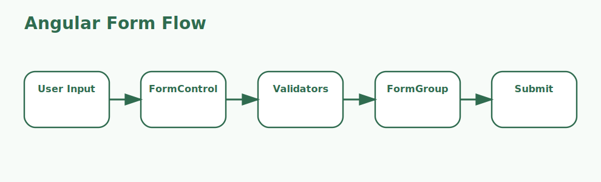

# Angular Forms Interview Questions



This page focuses only on Angular forms, including validation, form state, and dynamic form design.

## 1. Template-driven forms

### 1. What is the role of Template-driven forms in Angular forms?

**Answer:**

In Angular forms, the term Template-driven forms refers to the simpler Angular forms approach that relies
mainly on directives in the template. It is part of the foundation a candidate should be able to
explain clearly.

**Sample:**

```ts
// Concept: 1. Template-driven forms
form = new FormGroup({
  name: new FormControl('', Validators.required),
  email: new FormControl('', [Validators.required, Validators.email]),
});
```

---

### 2. Why is the concept of Template-driven forms important in Angular forms?

**Answer:**

This concept matters because it influences the simpler Angular forms approach that relies
mainly on directives in the template. Good interview answers connect it to clarity, maintainability,
performance, security, or delivery depending on the situation.

**Sample:**

```ts
// Concept: 1. Template-driven forms
form = new FormGroup({
  name: new FormControl('', Validators.required),
  email: new FormControl('', [Validators.required, Validators.email]),
});
```

---

### 3. When should a team focus on Template-driven forms?

**Answer:**

A team should focus on Template-driven forms when the requirement depends on the simpler Angular
forms approach that relies mainly on directives in the template. It becomes especially important
when design decisions, debugging, or architecture conversations depend on that area.

**Sample:**

```ts
// Concept: 1. Template-driven forms
form = new FormGroup({
  name: new FormControl('', Validators.required),
  email: new FormControl('', [Validators.required, Validators.email]),
});
```

---

### 4. How is Template-driven forms applied in practice?

**Answer:**

In practice, Template-driven forms is applied by making the simpler Angular forms approach that
relies mainly on directives in the template explicit in the code, workflow, or collaboration
pattern. The exact shape depends on the stack, but the responsibility should stay predictable.

**Sample:**

```ts
// Concept: 1. Template-driven forms
form = new FormGroup({
  name: new FormControl('', Validators.required),
  email: new FormControl('', [Validators.required, Validators.email]),
});
```

---

### 5. What strengths does Template-driven forms bring?

**Answer:**

The strengths of Template-driven forms are better structure, better communication, and better
control over the simpler Angular forms approach that relies mainly on directives in the template. It
also makes tradeoffs easier to explain to reviewers, interviewers, and teammates.

**Sample:**

```ts
// Concept: 1. Template-driven forms
form = new FormGroup({
  name: new FormControl('', Validators.required),
  email: new FormControl('', [Validators.required, Validators.email]),
});
```

---

### 6. What tradeoffs come with Template-driven forms?

**Answer:**

The main tradeoff is extra complexity if Template-driven forms is introduced without a real need or
a clear understanding of the simpler Angular forms approach that relies mainly on directives in the
template. That usually leads to weak reasoning, overengineering, or fragile implementations.

**Sample:**

```ts
// Concept: 1. Template-driven forms
form = new FormGroup({
  name: new FormControl('', Validators.required),
  email: new FormControl('', [Validators.required, Validators.email]),
});
```

---

### 7. How does Template-driven forms differ from Reactive forms?

**Answer:**

Template-driven forms is centered on the simpler Angular forms approach that relies mainly on
directives in the template, while Reactive forms is centered on the model-driven Angular forms
approach that keeps structure and validation in TypeScript. They often work together, but they solve
different parts of the topic.

**Sample:**

```ts
// Concept: 1. Template-driven forms
form = new FormGroup({
  name: new FormControl('', Validators.required),
  email: new FormControl('', [Validators.required, Validators.email]),
});
```

---

### 8. What is a good real-world example of Template-driven forms?

**Answer:**

A strong example is explaining how Template-driven forms affects a real feature, workflow, bug,
migration, or design choice involving the simpler Angular forms approach that relies mainly on
directives in the template. Interviewers usually care more about the reasoning than the definition
alone.

**Sample:**

```ts
// Concept: 1. Template-driven forms
form = new FormGroup({
  name: new FormControl('', Validators.required),
  email: new FormControl('', [Validators.required, Validators.email]),
});
```

---

### 9. What is a best practice for Template-driven forms?

**Answer:**

A good practice is to keep Template-driven forms aligned with the actual requirement around the
simpler Angular forms approach that relies mainly on directives in the template. Teams should
document intent, keep the implementation readable, and validate important paths early.

**Sample:**

```ts
// Concept: 1. Template-driven forms
form = new FormGroup({
  name: new FormControl('', Validators.required),
  email: new FormControl('', [Validators.required, Validators.email]),
});
```

---

### 10. What is a common mistake around Template-driven forms?

**Answer:**

A common mistake is naming Template-driven forms without understanding how it affects the simpler
Angular forms approach that relies mainly on directives in the template. In real work, that usually
appears as poor decisions, weak debugging, or incomplete explanations.

**Sample:**

```ts
// Concept: 1. Template-driven forms
form = new FormGroup({
  name: new FormControl('', Validators.required),
  email: new FormControl('', [Validators.required, Validators.email]),
});
```

---

### 11. How do you troubleshoot Template-driven forms-related issues?

**Answer:**

When troubleshooting Template-driven forms, first verify whether the simpler Angular forms approach
that relies mainly on directives in the template is behaving as expected. Then check surrounding
dependencies, inputs, configuration, logs, and edge cases before changing the design.

**Sample:**

```ts
// Concept: 1. Template-driven forms
form = new FormGroup({
  name: new FormControl('', Validators.required),
  email: new FormControl('', [Validators.required, Validators.email]),
});
```

---

### 12. How does Template-driven forms connect to the rest of Angular forms?

**Answer:**

Template-driven forms connects to the rest of Angular forms by giving structure to the simpler
Angular forms approach that relies mainly on directives in the template. It is one of the pieces
that turns isolated facts into a coherent end-to-end explanation.

**Sample:**

```ts
// Concept: 1. Template-driven forms
form = new FormGroup({
  name: new FormControl('', Validators.required),
  email: new FormControl('', [Validators.required, Validators.email]),
});
```

---

## 2. Reactive forms

### 13. What is the role of Reactive forms in Angular forms?

**Answer:**

In Angular forms, the term Reactive forms refers to the model-driven Angular forms approach that keeps
structure and validation in TypeScript. It is part of the foundation a candidate should be able to
explain clearly.

**Sample:**

```ts
// Concept: 2. Reactive forms
form = new FormGroup({
  name: new FormControl('', Validators.required),
  email: new FormControl('', [Validators.required, Validators.email]),
});
```

---

### 14. Why is the concept of Reactive forms important in Angular forms?

**Answer:**

This concept matters because it influences the model-driven Angular forms approach that keeps
structure and validation in TypeScript. Good interview answers connect it to clarity,
maintainability, performance, security, or delivery depending on the situation.

**Sample:**

```ts
// Concept: 2. Reactive forms
form = new FormGroup({
  name: new FormControl('', Validators.required),
  email: new FormControl('', [Validators.required, Validators.email]),
});
```

---

### 15. When should a team focus on Reactive forms?

**Answer:**

A team should focus on Reactive forms when the requirement depends on the model-driven Angular forms
approach that keeps structure and validation in TypeScript. It becomes especially important when
design decisions, debugging, or architecture conversations depend on that area.

**Sample:**

```ts
// Concept: 2. Reactive forms
form = new FormGroup({
  name: new FormControl('', Validators.required),
  email: new FormControl('', [Validators.required, Validators.email]),
});
```

---

### 16. How is Reactive forms applied in practice?

**Answer:**

In practice, Reactive forms is applied by making the model-driven Angular forms approach that keeps
structure and validation in TypeScript explicit in the code, workflow, or collaboration pattern. The
exact shape depends on the stack, but the responsibility should stay predictable.

**Sample:**

```ts
// Concept: 2. Reactive forms
form = new FormGroup({
  name: new FormControl('', Validators.required),
  email: new FormControl('', [Validators.required, Validators.email]),
});
```

---

### 17. What strengths does Reactive forms bring?

**Answer:**

The strengths of Reactive forms are better structure, better communication, and better control over
the model-driven Angular forms approach that keeps structure and validation in TypeScript. It also
makes tradeoffs easier to explain to reviewers, interviewers, and teammates.

**Sample:**

```ts
// Concept: 2. Reactive forms
form = new FormGroup({
  name: new FormControl('', Validators.required),
  email: new FormControl('', [Validators.required, Validators.email]),
});
```

---

### 18. What tradeoffs come with Reactive forms?

**Answer:**

The main tradeoff is extra complexity if Reactive forms is introduced without a real need or a clear
understanding of the model-driven Angular forms approach that keeps structure and validation in
TypeScript. That usually leads to weak reasoning, overengineering, or fragile implementations.

**Sample:**

```ts
// Concept: 2. Reactive forms
form = new FormGroup({
  name: new FormControl('', Validators.required),
  email: new FormControl('', [Validators.required, Validators.email]),
});
```

---

### 19. How does Reactive forms differ from FormControl?

**Answer:**

Reactive forms is centered on the model-driven Angular forms approach that keeps structure and
validation in TypeScript, while FormControl is centered on the object that tracks a single form
field value, validation state, and interaction state. They often work together, but they solve
different parts of the topic.

**Sample:**

```ts
// Concept: 2. Reactive forms
form = new FormGroup({
  name: new FormControl('', Validators.required),
  email: new FormControl('', [Validators.required, Validators.email]),
});
```

---

### 20. What is a good real-world example of Reactive forms?

**Answer:**

A strong example is explaining how Reactive forms affects a real feature, workflow, bug, migration,
or design choice involving the model-driven Angular forms approach that keeps structure and
validation in TypeScript. Interviewers usually care more about the reasoning than the definition
alone.

**Sample:**

```ts
// Concept: 2. Reactive forms
form = new FormGroup({
  name: new FormControl('', Validators.required),
  email: new FormControl('', [Validators.required, Validators.email]),
});
```

---

### 21. What is a best practice for Reactive forms?

**Answer:**

A good practice is to keep Reactive forms aligned with the actual requirement around the model-
driven Angular forms approach that keeps structure and validation in TypeScript. Teams should
document intent, keep the implementation readable, and validate important paths early.

**Sample:**

```ts
// Concept: 2. Reactive forms
form = new FormGroup({
  name: new FormControl('', Validators.required),
  email: new FormControl('', [Validators.required, Validators.email]),
});
```

---

### 22. What is a common mistake around Reactive forms?

**Answer:**

A common mistake is naming Reactive forms without understanding how it affects the model-driven
Angular forms approach that keeps structure and validation in TypeScript. In real work, that usually
appears as poor decisions, weak debugging, or incomplete explanations.

**Sample:**

```ts
// Concept: 2. Reactive forms
form = new FormGroup({
  name: new FormControl('', Validators.required),
  email: new FormControl('', [Validators.required, Validators.email]),
});
```

---

### 23. How do you troubleshoot Reactive forms-related issues?

**Answer:**

When troubleshooting Reactive forms, first verify whether the model-driven Angular forms approach
that keeps structure and validation in TypeScript is behaving as expected. Then check surrounding
dependencies, inputs, configuration, logs, and edge cases before changing the design.

**Sample:**

```ts
// Concept: 2. Reactive forms
form = new FormGroup({
  name: new FormControl('', Validators.required),
  email: new FormControl('', [Validators.required, Validators.email]),
});
```

---

### 24. How does Reactive forms connect to the rest of Angular forms?

**Answer:**

Reactive forms connects to the rest of Angular forms by giving structure to the model-driven Angular
forms approach that keeps structure and validation in TypeScript. It is one of the pieces that turns
isolated facts into a coherent end-to-end explanation.

**Sample:**

```ts
// Concept: 2. Reactive forms
form = new FormGroup({
  name: new FormControl('', Validators.required),
  email: new FormControl('', [Validators.required, Validators.email]),
});
```

---

## 3. FormControl

### 25. What is the role of FormControl in Angular forms?

**Answer:**

In Angular forms, the term FormControl refers to the object that tracks a single form field value, validation
state, and interaction state. It is part of the foundation a candidate should be able to explain
clearly.

**Sample:**

```ts
// Concept: 3. FormControl
form = new FormGroup({
  name: new FormControl('', Validators.required),
  email: new FormControl('', [Validators.required, Validators.email]),
});
```

---

### 26. Why is the concept of FormControl important in Angular forms?

**Answer:**

This concept matters because it influences the object that tracks a single form field value,
validation state, and interaction state. Good interview answers connect it to clarity,
maintainability, performance, security, or delivery depending on the situation.

**Sample:**

```ts
// Concept: 3. FormControl
form = new FormGroup({
  name: new FormControl('', Validators.required),
  email: new FormControl('', [Validators.required, Validators.email]),
});
```

---

### 27. When should a team focus on FormControl?

**Answer:**

A team should focus on FormControl when the requirement depends on the object that tracks a single
form field value, validation state, and interaction state. It becomes especially important when
design decisions, debugging, or architecture conversations depend on that area.

**Sample:**

```ts
// Concept: 3. FormControl
form = new FormGroup({
  name: new FormControl('', Validators.required),
  email: new FormControl('', [Validators.required, Validators.email]),
});
```

---

### 28. How is FormControl applied in practice?

**Answer:**

In practice, FormControl is applied by making the object that tracks a single form field value,
validation state, and interaction state explicit in the code, workflow, or collaboration pattern.
The exact shape depends on the stack, but the responsibility should stay predictable.

**Sample:**

```ts
// Concept: 3. FormControl
form = new FormGroup({
  name: new FormControl('', Validators.required),
  email: new FormControl('', [Validators.required, Validators.email]),
});
```

---

### 29. What strengths does FormControl bring?

**Answer:**

The strengths of FormControl are better structure, better communication, and better control over the
object that tracks a single form field value, validation state, and interaction state. It also makes
tradeoffs easier to explain to reviewers, interviewers, and teammates.

**Sample:**

```ts
// Concept: 3. FormControl
form = new FormGroup({
  name: new FormControl('', Validators.required),
  email: new FormControl('', [Validators.required, Validators.email]),
});
```

---

### 30. What tradeoffs come with FormControl?

**Answer:**

The main tradeoff is extra complexity if FormControl is introduced without a real need or a clear
understanding of the object that tracks a single form field value, validation state, and interaction
state. That usually leads to weak reasoning, overengineering, or fragile implementations.

**Sample:**

```ts
// Concept: 3. FormControl
form = new FormGroup({
  name: new FormControl('', Validators.required),
  email: new FormControl('', [Validators.required, Validators.email]),
});
```

---

### 31. How does FormControl differ from FormGroup?

**Answer:**

FormControl is centered on the object that tracks a single form field value, validation state, and
interaction state, while FormGroup is centered on the structure that combines related controls into
one logical form model. They often work together, but they solve different parts of the topic.

**Sample:**

```ts
// Concept: 3. FormControl
form = new FormGroup({
  name: new FormControl('', Validators.required),
  email: new FormControl('', [Validators.required, Validators.email]),
});
```

---

### 32. What is a good real-world example of FormControl?

**Answer:**

A strong example is explaining how FormControl affects a real feature, workflow, bug, migration, or
design choice involving the object that tracks a single form field value, validation state, and
interaction state. Interviewers usually care more about the reasoning than the definition alone.

**Sample:**

```ts
// Concept: 3. FormControl
form = new FormGroup({
  name: new FormControl('', Validators.required),
  email: new FormControl('', [Validators.required, Validators.email]),
});
```

---

### 33. What is a best practice for FormControl?

**Answer:**

A good practice is to keep FormControl aligned with the actual requirement around the object that
tracks a single form field value, validation state, and interaction state. Teams should document
intent, keep the implementation readable, and validate important paths early.

**Sample:**

```ts
// Concept: 3. FormControl
form = new FormGroup({
  name: new FormControl('', Validators.required),
  email: new FormControl('', [Validators.required, Validators.email]),
});
```

---

### 34. What is a common mistake around FormControl?

**Answer:**

A common mistake is naming FormControl without understanding how it affects the object that tracks a
single form field value, validation state, and interaction state. In real work, that usually appears
as poor decisions, weak debugging, or incomplete explanations.

**Sample:**

```ts
// Concept: 3. FormControl
form = new FormGroup({
  name: new FormControl('', Validators.required),
  email: new FormControl('', [Validators.required, Validators.email]),
});
```

---

### 35. How do you troubleshoot FormControl-related issues?

**Answer:**

When troubleshooting FormControl, first verify whether the object that tracks a single form field
value, validation state, and interaction state is behaving as expected. Then check surrounding
dependencies, inputs, configuration, logs, and edge cases before changing the design.

**Sample:**

```ts
// Concept: 3. FormControl
form = new FormGroup({
  name: new FormControl('', Validators.required),
  email: new FormControl('', [Validators.required, Validators.email]),
});
```

---

### 36. How does FormControl connect to the rest of Angular forms?

**Answer:**

FormControl connects to the rest of Angular forms by giving structure to the object that tracks a
single form field value, validation state, and interaction state. It is one of the pieces that turns
isolated facts into a coherent end-to-end explanation.

**Sample:**

```ts
// Concept: 3. FormControl
form = new FormGroup({
  name: new FormControl('', Validators.required),
  email: new FormControl('', [Validators.required, Validators.email]),
});
```

---

## 4. FormGroup

### 37. What is the role of FormGroup in Angular forms?

**Answer:**

In Angular forms, the term FormGroup refers to the structure that combines related controls into one logical
form model. It is part of the foundation a candidate should be able to explain clearly.

**Sample:**

```ts
// Concept: 4. FormGroup
form = new FormGroup({
  name: new FormControl('', Validators.required),
  email: new FormControl('', [Validators.required, Validators.email]),
});
```

---

### 38. Why is the concept of FormGroup important in Angular forms?

**Answer:**

This concept matters because it influences the structure that combines related controls into one
logical form model. Good interview answers connect it to clarity, maintainability, performance,
security, or delivery depending on the situation.

**Sample:**

```ts
// Concept: 4. FormGroup
form = new FormGroup({
  name: new FormControl('', Validators.required),
  email: new FormControl('', [Validators.required, Validators.email]),
});
```

---

### 39. When should a team focus on FormGroup?

**Answer:**

A team should focus on FormGroup when the requirement depends on the structure that combines related
controls into one logical form model. It becomes especially important when design decisions,
debugging, or architecture conversations depend on that area.

**Sample:**

```ts
// Concept: 4. FormGroup
form = new FormGroup({
  name: new FormControl('', Validators.required),
  email: new FormControl('', [Validators.required, Validators.email]),
});
```

---

### 40. How is FormGroup applied in practice?

**Answer:**

In practice, FormGroup is applied by making the structure that combines related controls into one
logical form model explicit in the code, workflow, or collaboration pattern. The exact shape depends
on the stack, but the responsibility should stay predictable.

**Sample:**

```ts
// Concept: 4. FormGroup
form = new FormGroup({
  name: new FormControl('', Validators.required),
  email: new FormControl('', [Validators.required, Validators.email]),
});
```

---

### 41. What strengths does FormGroup bring?

**Answer:**

The strengths of FormGroup are better structure, better communication, and better control over the
structure that combines related controls into one logical form model. It also makes tradeoffs easier
to explain to reviewers, interviewers, and teammates.

**Sample:**

```ts
// Concept: 4. FormGroup
form = new FormGroup({
  name: new FormControl('', Validators.required),
  email: new FormControl('', [Validators.required, Validators.email]),
});
```

---

### 42. What tradeoffs come with FormGroup?

**Answer:**

The main tradeoff is extra complexity if FormGroup is introduced without a real need or a clear
understanding of the structure that combines related controls into one logical form model. That
usually leads to weak reasoning, overengineering, or fragile implementations.

**Sample:**

```ts
// Concept: 4. FormGroup
form = new FormGroup({
  name: new FormControl('', Validators.required),
  email: new FormControl('', [Validators.required, Validators.email]),
});
```

---

### 43. How does FormGroup differ from FormArray?

**Answer:**

FormGroup is centered on the structure that combines related controls into one logical form model,
while FormArray is centered on the structure used when a form needs a dynamic list of controls or
groups. They often work together, but they solve different parts of the topic.

**Sample:**

```ts
// Concept: 4. FormGroup
form = new FormGroup({
  name: new FormControl('', Validators.required),
  email: new FormControl('', [Validators.required, Validators.email]),
});
```

---

### 44. What is a good real-world example of FormGroup?

**Answer:**

A strong example is explaining how FormGroup affects a real feature, workflow, bug, migration, or
design choice involving the structure that combines related controls into one logical form model.
Interviewers usually care more about the reasoning than the definition alone.

**Sample:**

```ts
// Concept: 4. FormGroup
form = new FormGroup({
  name: new FormControl('', Validators.required),
  email: new FormControl('', [Validators.required, Validators.email]),
});
```

---

### 45. What is a best practice for FormGroup?

**Answer:**

A good practice is to keep FormGroup aligned with the actual requirement around the structure that
combines related controls into one logical form model. Teams should document intent, keep the
implementation readable, and validate important paths early.

**Sample:**

```ts
// Concept: 4. FormGroup
form = new FormGroup({
  name: new FormControl('', Validators.required),
  email: new FormControl('', [Validators.required, Validators.email]),
});
```

---

### 46. What is a common mistake around FormGroup?

**Answer:**

A common mistake is naming FormGroup without understanding how it affects the structure that
combines related controls into one logical form model. In real work, that usually appears as poor
decisions, weak debugging, or incomplete explanations.

**Sample:**

```ts
// Concept: 4. FormGroup
form = new FormGroup({
  name: new FormControl('', Validators.required),
  email: new FormControl('', [Validators.required, Validators.email]),
});
```

---

### 47. How do you troubleshoot FormGroup-related issues?

**Answer:**

When troubleshooting FormGroup, first verify whether the structure that combines related controls
into one logical form model is behaving as expected. Then check surrounding dependencies, inputs,
configuration, logs, and edge cases before changing the design.

**Sample:**

```ts
// Concept: 4. FormGroup
form = new FormGroup({
  name: new FormControl('', Validators.required),
  email: new FormControl('', [Validators.required, Validators.email]),
});
```

---

### 48. How does FormGroup connect to the rest of Angular forms?

**Answer:**

FormGroup connects to the rest of Angular forms by giving structure to the structure that combines
related controls into one logical form model. It is one of the pieces that turns isolated facts into
a coherent end-to-end explanation.

**Sample:**

```ts
// Concept: 4. FormGroup
form = new FormGroup({
  name: new FormControl('', Validators.required),
  email: new FormControl('', [Validators.required, Validators.email]),
});
```

---

## 5. FormArray

### 49. What is the role of FormArray in Angular forms?

**Answer:**

In Angular forms, the term FormArray refers to the structure used when a form needs a dynamic list of
controls or groups. It is part of the foundation a candidate should be able to explain clearly.

**Sample:**

```ts
// Concept: 5. FormArray
form = new FormGroup({
  name: new FormControl('', Validators.required),
  email: new FormControl('', [Validators.required, Validators.email]),
});
```

---

### 50. Why is the concept of FormArray important in Angular forms?

**Answer:**

This concept matters because it influences the structure used when a form needs a dynamic list of
controls or groups. Good interview answers connect it to clarity, maintainability, performance,
security, or delivery depending on the situation.

**Sample:**

```ts
// Concept: 5. FormArray
form = new FormGroup({
  name: new FormControl('', Validators.required),
  email: new FormControl('', [Validators.required, Validators.email]),
});
```

---

### 51. When should a team focus on FormArray?

**Answer:**

A team should focus on FormArray when the requirement depends on the structure used when a form
needs a dynamic list of controls or groups. It becomes especially important when design decisions,
debugging, or architecture conversations depend on that area.

**Sample:**

```ts
// Concept: 5. FormArray
form = new FormGroup({
  name: new FormControl('', Validators.required),
  email: new FormControl('', [Validators.required, Validators.email]),
});
```

---

### 52. How is FormArray applied in practice?

**Answer:**

In practice, FormArray is applied by making the structure used when a form needs a dynamic list of
controls or groups explicit in the code, workflow, or collaboration pattern. The exact shape depends
on the stack, but the responsibility should stay predictable.

**Sample:**

```ts
// Concept: 5. FormArray
form = new FormGroup({
  name: new FormControl('', Validators.required),
  email: new FormControl('', [Validators.required, Validators.email]),
});
```

---

### 53. What strengths does FormArray bring?

**Answer:**

The strengths of FormArray are better structure, better communication, and better control over the
structure used when a form needs a dynamic list of controls or groups. It also makes tradeoffs
easier to explain to reviewers, interviewers, and teammates.

**Sample:**

```ts
// Concept: 5. FormArray
form = new FormGroup({
  name: new FormControl('', Validators.required),
  email: new FormControl('', [Validators.required, Validators.email]),
});
```

---

### 54. What tradeoffs come with FormArray?

**Answer:**

The main tradeoff is extra complexity if FormArray is introduced without a real need or a clear
understanding of the structure used when a form needs a dynamic list of controls or groups. That
usually leads to weak reasoning, overengineering, or fragile implementations.

**Sample:**

```ts
// Concept: 5. FormArray
form = new FormGroup({
  name: new FormControl('', Validators.required),
  email: new FormControl('', [Validators.required, Validators.email]),
});
```

---

### 55. How does FormArray differ from Validators?

**Answer:**

FormArray is centered on the structure used when a form needs a dynamic list of controls or groups,
while Validators is centered on the rules that determine whether field values satisfy required
constraints. They often work together, but they solve different parts of the topic.

**Sample:**

```ts
// Concept: 5. FormArray
form = new FormGroup({
  name: new FormControl('', Validators.required),
  email: new FormControl('', [Validators.required, Validators.email]),
});
```

---

### 56. What is a good real-world example of FormArray?

**Answer:**

A strong example is explaining how FormArray affects a real feature, workflow, bug, migration, or
design choice involving the structure used when a form needs a dynamic list of controls or groups.
Interviewers usually care more about the reasoning than the definition alone.

**Sample:**

```ts
// Concept: 5. FormArray
form = new FormGroup({
  name: new FormControl('', Validators.required),
  email: new FormControl('', [Validators.required, Validators.email]),
});
```

---

### 57. What is a best practice for FormArray?

**Answer:**

A good practice is to keep FormArray aligned with the actual requirement around the structure used
when a form needs a dynamic list of controls or groups. Teams should document intent, keep the
implementation readable, and validate important paths early.

**Sample:**

```ts
// Concept: 5. FormArray
form = new FormGroup({
  name: new FormControl('', Validators.required),
  email: new FormControl('', [Validators.required, Validators.email]),
});
```

---

### 58. What is a common mistake around FormArray?

**Answer:**

A common mistake is naming FormArray without understanding how it affects the structure used when a
form needs a dynamic list of controls or groups. In real work, that usually appears as poor
decisions, weak debugging, or incomplete explanations.

**Sample:**

```ts
// Concept: 5. FormArray
form = new FormGroup({
  name: new FormControl('', Validators.required),
  email: new FormControl('', [Validators.required, Validators.email]),
});
```

---

### 59. How do you troubleshoot FormArray-related issues?

**Answer:**

When troubleshooting FormArray, first verify whether the structure used when a form needs a dynamic
list of controls or groups is behaving as expected. Then check surrounding dependencies, inputs,
configuration, logs, and edge cases before changing the design.

**Sample:**

```ts
// Concept: 5. FormArray
form = new FormGroup({
  name: new FormControl('', Validators.required),
  email: new FormControl('', [Validators.required, Validators.email]),
});
```

---

### 60. How does FormArray connect to the rest of Angular forms?

**Answer:**

FormArray connects to the rest of Angular forms by giving structure to the structure used when a
form needs a dynamic list of controls or groups. It is one of the pieces that turns isolated facts
into a coherent end-to-end explanation.

**Sample:**

```ts
// Concept: 5. FormArray
form = new FormGroup({
  name: new FormControl('', Validators.required),
  email: new FormControl('', [Validators.required, Validators.email]),
});
```

---

## 6. Validators

### 61. What is the role of Validators in Angular forms?

**Answer:**

In Angular forms, the term Validators refers to the rules that determine whether field values satisfy
required constraints. It is part of the foundation a candidate should be able to explain clearly.

**Sample:**

```ts
// Concept: 6. Validators
form = new FormGroup({
  name: new FormControl('', Validators.required),
  email: new FormControl('', [Validators.required, Validators.email]),
});
```

---

### 62. Why is the concept of Validators important in Angular forms?

**Answer:**

This concept matters because it influences the rules that determine whether field values satisfy
required constraints. Good interview answers connect it to clarity, maintainability, performance,
security, or delivery depending on the situation.

**Sample:**

```ts
// Concept: 6. Validators
form = new FormGroup({
  name: new FormControl('', Validators.required),
  email: new FormControl('', [Validators.required, Validators.email]),
});
```

---

### 63. When should a team focus on Validators?

**Answer:**

A team should focus on Validators when the requirement depends on the rules that determine whether
field values satisfy required constraints. It becomes especially important when design decisions,
debugging, or architecture conversations depend on that area.

**Sample:**

```ts
// Concept: 6. Validators
form = new FormGroup({
  name: new FormControl('', Validators.required),
  email: new FormControl('', [Validators.required, Validators.email]),
});
```

---

### 64. How is Validators applied in practice?

**Answer:**

In practice, Validators is applied by making the rules that determine whether field values satisfy
required constraints explicit in the code, workflow, or collaboration pattern. The exact shape
depends on the stack, but the responsibility should stay predictable.

**Sample:**

```ts
// Concept: 6. Validators
form = new FormGroup({
  name: new FormControl('', Validators.required),
  email: new FormControl('', [Validators.required, Validators.email]),
});
```

---

### 65. What strengths does Validators bring?

**Answer:**

The strengths of Validators are better structure, better communication, and better control over the
rules that determine whether field values satisfy required constraints. It also makes tradeoffs
easier to explain to reviewers, interviewers, and teammates.

**Sample:**

```ts
// Concept: 6. Validators
form = new FormGroup({
  name: new FormControl('', Validators.required),
  email: new FormControl('', [Validators.required, Validators.email]),
});
```

---

### 66. What tradeoffs come with Validators?

**Answer:**

The main tradeoff is extra complexity if Validators is introduced without a real need or a clear
understanding of the rules that determine whether field values satisfy required constraints. That
usually leads to weak reasoning, overengineering, or fragile implementations.

**Sample:**

```ts
// Concept: 6. Validators
form = new FormGroup({
  name: new FormControl('', Validators.required),
  email: new FormControl('', [Validators.required, Validators.email]),
});
```

---

### 67. How does Validators differ from Custom validators?

**Answer:**

Validators is centered on the rules that determine whether field values satisfy required
constraints, while Custom validators is centered on project-specific validation logic that extends
Angular beyond built-in validators. They often work together, but they solve different parts of the
topic.

**Sample:**

```ts
// Concept: 6. Validators
form = new FormGroup({
  name: new FormControl('', Validators.required),
  email: new FormControl('', [Validators.required, Validators.email]),
});
```

---

### 68. What is a good real-world example of Validators?

**Answer:**

A strong example is explaining how Validators affects a real feature, workflow, bug, migration, or
design choice involving the rules that determine whether field values satisfy required constraints.
Interviewers usually care more about the reasoning than the definition alone.

**Sample:**

```ts
// Concept: 6. Validators
form = new FormGroup({
  name: new FormControl('', Validators.required),
  email: new FormControl('', [Validators.required, Validators.email]),
});
```

---

### 69. What is a best practice for Validators?

**Answer:**

A good practice is to keep Validators aligned with the actual requirement around the rules that
determine whether field values satisfy required constraints. Teams should document intent, keep the
implementation readable, and validate important paths early.

**Sample:**

```ts
// Concept: 6. Validators
form = new FormGroup({
  name: new FormControl('', Validators.required),
  email: new FormControl('', [Validators.required, Validators.email]),
});
```

---

### 70. What is a common mistake around Validators?

**Answer:**

A common mistake is naming Validators without understanding how it affects the rules that determine
whether field values satisfy required constraints. In real work, that usually appears as poor
decisions, weak debugging, or incomplete explanations.

**Sample:**

```ts
// Concept: 6. Validators
form = new FormGroup({
  name: new FormControl('', Validators.required),
  email: new FormControl('', [Validators.required, Validators.email]),
});
```

---

### 71. How do you troubleshoot Validators-related issues?

**Answer:**

When troubleshooting Validators, first verify whether the rules that determine whether field values
satisfy required constraints is behaving as expected. Then check surrounding dependencies, inputs,
configuration, logs, and edge cases before changing the design.

**Sample:**

```ts
// Concept: 6. Validators
form = new FormGroup({
  name: new FormControl('', Validators.required),
  email: new FormControl('', [Validators.required, Validators.email]),
});
```

---

### 72. How does Validators connect to the rest of Angular forms?

**Answer:**

Validators connects to the rest of Angular forms by giving structure to the rules that determine
whether field values satisfy required constraints. It is one of the pieces that turns isolated facts
into a coherent end-to-end explanation.

**Sample:**

```ts
// Concept: 6. Validators
form = new FormGroup({
  name: new FormControl('', Validators.required),
  email: new FormControl('', [Validators.required, Validators.email]),
});
```

---

## 7. Custom validators

### 73. What is the role of Custom validators in Angular forms?

**Answer:**

In Angular forms, the term Custom validators refers to project-specific validation logic that extends Angular
beyond built-in validators. It is part of the foundation a candidate should be able to explain
clearly.

**Sample:**

```ts
// Concept: 7. Custom validators
form = new FormGroup({
  name: new FormControl('', Validators.required),
  email: new FormControl('', [Validators.required, Validators.email]),
});
```

---

### 74. Why is the concept of Custom validators important in Angular forms?

**Answer:**

This concept matters because it influences project-specific validation logic that extends
Angular beyond built-in validators. Good interview answers connect it to clarity, maintainability,
performance, security, or delivery depending on the situation.

**Sample:**

```ts
// Concept: 7. Custom validators
form = new FormGroup({
  name: new FormControl('', Validators.required),
  email: new FormControl('', [Validators.required, Validators.email]),
});
```

---

### 75. When should a team focus on Custom validators?

**Answer:**

A team should focus on Custom validators when the requirement depends on project-specific validation
logic that extends Angular beyond built-in validators. It becomes especially important when design
decisions, debugging, or architecture conversations depend on that area.

**Sample:**

```ts
// Concept: 7. Custom validators
form = new FormGroup({
  name: new FormControl('', Validators.required),
  email: new FormControl('', [Validators.required, Validators.email]),
});
```

---

### 76. How is Custom validators applied in practice?

**Answer:**

In practice, Custom validators is applied by making project-specific validation logic that extends
Angular beyond built-in validators explicit in the code, workflow, or collaboration pattern. The
exact shape depends on the stack, but the responsibility should stay predictable.

**Sample:**

```ts
// Concept: 7. Custom validators
form = new FormGroup({
  name: new FormControl('', Validators.required),
  email: new FormControl('', [Validators.required, Validators.email]),
});
```

---

### 77. What strengths does Custom validators bring?

**Answer:**

The strengths of Custom validators are better structure, better communication, and better control
over project-specific validation logic that extends Angular beyond built-in validators. It also
makes tradeoffs easier to explain to reviewers, interviewers, and teammates.

**Sample:**

```ts
// Concept: 7. Custom validators
form = new FormGroup({
  name: new FormControl('', Validators.required),
  email: new FormControl('', [Validators.required, Validators.email]),
});
```

---

### 78. What tradeoffs come with Custom validators?

**Answer:**

The main tradeoff is extra complexity if Custom validators is introduced without a real need or a
clear understanding of project-specific validation logic that extends Angular beyond built-in
validators. That usually leads to weak reasoning, overengineering, or fragile implementations.

**Sample:**

```ts
// Concept: 7. Custom validators
form = new FormGroup({
  name: new FormControl('', Validators.required),
  email: new FormControl('', [Validators.required, Validators.email]),
});
```

---

### 79. How does Custom validators differ from Form state flags?

**Answer:**

Custom validators is centered on project-specific validation logic that extends Angular beyond
built-in validators, while Form state flags is centered on the touched, dirty, pristine, valid, and
invalid signals used to drive form behavior. They often work together, but they solve different
parts of the topic.

**Sample:**

```ts
// Concept: 7. Custom validators
form = new FormGroup({
  name: new FormControl('', Validators.required),
  email: new FormControl('', [Validators.required, Validators.email]),
});
```

---

### 80. What is a good real-world example of Custom validators?

**Answer:**

A strong example is explaining how Custom validators affects a real feature, workflow, bug,
migration, or design choice involving project-specific validation logic that extends Angular beyond
built-in validators. Interviewers usually care more about the reasoning than the definition alone.

**Sample:**

```ts
// Concept: 7. Custom validators
form = new FormGroup({
  name: new FormControl('', Validators.required),
  email: new FormControl('', [Validators.required, Validators.email]),
});
```

---

### 81. What is a best practice for Custom validators?

**Answer:**

A good practice is to keep Custom validators aligned with the actual requirement around project-
specific validation logic that extends Angular beyond built-in validators. Teams should document
intent, keep the implementation readable, and validate important paths early.

**Sample:**

```ts
// Concept: 7. Custom validators
form = new FormGroup({
  name: new FormControl('', Validators.required),
  email: new FormControl('', [Validators.required, Validators.email]),
});
```

---

### 82. What is a common mistake around Custom validators?

**Answer:**

A common mistake is naming Custom validators without understanding how it affects project-specific
validation logic that extends Angular beyond built-in validators. In real work, that usually appears
as poor decisions, weak debugging, or incomplete explanations.

**Sample:**

```ts
// Concept: 7. Custom validators
form = new FormGroup({
  name: new FormControl('', Validators.required),
  email: new FormControl('', [Validators.required, Validators.email]),
});
```

---

### 83. How do you troubleshoot Custom validators-related issues?

**Answer:**

When troubleshooting Custom validators, first verify whether project-specific validation logic that
extends Angular beyond built-in validators is behaving as expected. Then check surrounding
dependencies, inputs, configuration, logs, and edge cases before changing the design.

**Sample:**

```ts
// Concept: 7. Custom validators
form = new FormGroup({
  name: new FormControl('', Validators.required),
  email: new FormControl('', [Validators.required, Validators.email]),
});
```

---

### 84. How does Custom validators connect to the rest of Angular forms?

**Answer:**

Custom validators connects to the rest of Angular forms by giving structure to project-specific
validation logic that extends Angular beyond built-in validators. It is one of the pieces that turns
isolated facts into a coherent end-to-end explanation.

**Sample:**

```ts
// Concept: 7. Custom validators
form = new FormGroup({
  name: new FormControl('', Validators.required),
  email: new FormControl('', [Validators.required, Validators.email]),
});
```

---

## 8. Form state flags

### 85. What is the role of Form state flags in Angular forms?

**Answer:**

In Angular forms, the term Form state flags refers to the touched, dirty, pristine, valid, and invalid
signals used to drive form behavior. It is part of the foundation a candidate should be able to
explain clearly.

**Sample:**

```ts
// Concept: 8. Form state flags
form = new FormGroup({
  name: new FormControl('', Validators.required),
  email: new FormControl('', [Validators.required, Validators.email]),
});
```

---

### 86. Why is the concept of Form state flags important in Angular forms?

**Answer:**

This concept matters because it influences the touched, dirty, pristine, valid, and invalid
signals used to drive form behavior. Good interview answers connect it to clarity, maintainability,
performance, security, or delivery depending on the situation.

**Sample:**

```ts
// Concept: 8. Form state flags
form = new FormGroup({
  name: new FormControl('', Validators.required),
  email: new FormControl('', [Validators.required, Validators.email]),
});
```

---

### 87. When should a team focus on Form state flags?

**Answer:**

A team should focus on Form state flags when the requirement depends on the touched, dirty,
pristine, valid, and invalid signals used to drive form behavior. It becomes especially important
when design decisions, debugging, or architecture conversations depend on that area.

**Sample:**

```ts
// Concept: 8. Form state flags
form = new FormGroup({
  name: new FormControl('', Validators.required),
  email: new FormControl('', [Validators.required, Validators.email]),
});
```

---

### 88. How is Form state flags applied in practice?

**Answer:**

In practice, Form state flags is applied by making the touched, dirty, pristine, valid, and invalid
signals used to drive form behavior explicit in the code, workflow, or collaboration pattern. The
exact shape depends on the stack, but the responsibility should stay predictable.

**Sample:**

```ts
// Concept: 8. Form state flags
form = new FormGroup({
  name: new FormControl('', Validators.required),
  email: new FormControl('', [Validators.required, Validators.email]),
});
```

---

### 89. What strengths does Form state flags bring?

**Answer:**

The strengths of Form state flags are better structure, better communication, and better control
over the touched, dirty, pristine, valid, and invalid signals used to drive form behavior. It also
makes tradeoffs easier to explain to reviewers, interviewers, and teammates.

**Sample:**

```ts
// Concept: 8. Form state flags
form = new FormGroup({
  name: new FormControl('', Validators.required),
  email: new FormControl('', [Validators.required, Validators.email]),
});
```

---

### 90. What tradeoffs come with Form state flags?

**Answer:**

The main tradeoff is extra complexity if Form state flags is introduced without a real need or a
clear understanding of the touched, dirty, pristine, valid, and invalid signals used to drive form
behavior. That usually leads to weak reasoning, overengineering, or fragile implementations.

**Sample:**

```ts
// Concept: 8. Form state flags
form = new FormGroup({
  name: new FormControl('', Validators.required),
  email: new FormControl('', [Validators.required, Validators.email]),
});
```

---

### 91. How does Form state flags differ from Submission and reset flow?

**Answer:**

Form state flags is centered on the touched, dirty, pristine, valid, and invalid signals used to
drive form behavior, while Submission and reset flow is centered on the actions and checks that
happen when a form is submitted or cleared. They often work together, but they solve different parts
of the topic.

**Sample:**

```ts
// Concept: 8. Form state flags
form = new FormGroup({
  name: new FormControl('', Validators.required),
  email: new FormControl('', [Validators.required, Validators.email]),
});
```

---

### 92. What is a good real-world example of Form state flags?

**Answer:**

A strong example is explaining how Form state flags affects a real feature, workflow, bug,
migration, or design choice involving the touched, dirty, pristine, valid, and invalid signals used
to drive form behavior. Interviewers usually care more about the reasoning than the definition
alone.

**Sample:**

```ts
// Concept: 8. Form state flags
form = new FormGroup({
  name: new FormControl('', Validators.required),
  email: new FormControl('', [Validators.required, Validators.email]),
});
```

---

### 93. What is a best practice for Form state flags?

**Answer:**

A good practice is to keep Form state flags aligned with the actual requirement around the touched,
dirty, pristine, valid, and invalid signals used to drive form behavior. Teams should document
intent, keep the implementation readable, and validate important paths early.

**Sample:**

```ts
// Concept: 8. Form state flags
form = new FormGroup({
  name: new FormControl('', Validators.required),
  email: new FormControl('', [Validators.required, Validators.email]),
});
```

---

### 94. What is a common mistake around Form state flags?

**Answer:**

A common mistake is naming Form state flags without understanding how it affects the touched, dirty,
pristine, valid, and invalid signals used to drive form behavior. In real work, that usually appears
as poor decisions, weak debugging, or incomplete explanations.

**Sample:**

```ts
// Concept: 8. Form state flags
form = new FormGroup({
  name: new FormControl('', Validators.required),
  email: new FormControl('', [Validators.required, Validators.email]),
});
```

---

### 95. How do you troubleshoot Form state flags-related issues?

**Answer:**

When troubleshooting Form state flags, first verify whether the touched, dirty, pristine, valid, and
invalid signals used to drive form behavior is behaving as expected. Then check surrounding
dependencies, inputs, configuration, logs, and edge cases before changing the design.

**Sample:**

```ts
// Concept: 8. Form state flags
form = new FormGroup({
  name: new FormControl('', Validators.required),
  email: new FormControl('', [Validators.required, Validators.email]),
});
```

---

### 96. How does Form state flags connect to the rest of Angular forms?

**Answer:**

Form state flags connects to the rest of Angular forms by giving structure to the touched, dirty,
pristine, valid, and invalid signals used to drive form behavior. It is one of the pieces that turns
isolated facts into a coherent end-to-end explanation.

**Sample:**

```ts
// Concept: 8. Form state flags
form = new FormGroup({
  name: new FormControl('', Validators.required),
  email: new FormControl('', [Validators.required, Validators.email]),
});
```

---

## 9. Submission and reset flow

### 97. What is the role of Submission and reset flow in Angular forms?

**Answer:**

In Angular forms, the term Submission and reset flow refers to the actions and checks that happen when a form
is submitted or cleared. It is part of the foundation a candidate should be able to explain clearly.

**Sample:**

```ts
// Concept: 9. Submission and reset flow
form = new FormGroup({
  name: new FormControl('', Validators.required),
  email: new FormControl('', [Validators.required, Validators.email]),
});
```

---

### 98. Why is the concept of Submission and reset flow important in Angular forms?

**Answer:**

This concept matters because it influences the actions and checks that happen when a
form is submitted or cleared. Good interview answers connect it to clarity, maintainability,
performance, security, or delivery depending on the situation.

**Sample:**

```ts
// Concept: 9. Submission and reset flow
form = new FormGroup({
  name: new FormControl('', Validators.required),
  email: new FormControl('', [Validators.required, Validators.email]),
});
```

---

### 99. When should a team focus on Submission and reset flow?

**Answer:**

A team should focus on Submission and reset flow when the requirement depends on the actions and
checks that happen when a form is submitted or cleared. It becomes especially important when design
decisions, debugging, or architecture conversations depend on that area.

**Sample:**

```ts
// Concept: 9. Submission and reset flow
form = new FormGroup({
  name: new FormControl('', Validators.required),
  email: new FormControl('', [Validators.required, Validators.email]),
});
```

---

### 100. How is Submission and reset flow applied in practice?

**Answer:**

In practice, Submission and reset flow is applied by making the actions and checks that happen when
a form is submitted or cleared explicit in the code, workflow, or collaboration pattern. The exact
shape depends on the stack, but the responsibility should stay predictable.

**Sample:**

```ts
// Concept: 9. Submission and reset flow
form = new FormGroup({
  name: new FormControl('', Validators.required),
  email: new FormControl('', [Validators.required, Validators.email]),
});
```

---

### 101. What strengths does Submission and reset flow bring?

**Answer:**

The strengths of Submission and reset flow are better structure, better communication, and better
control over the actions and checks that happen when a form is submitted or cleared. It also makes
tradeoffs easier to explain to reviewers, interviewers, and teammates.

**Sample:**

```ts
// Concept: 9. Submission and reset flow
form = new FormGroup({
  name: new FormControl('', Validators.required),
  email: new FormControl('', [Validators.required, Validators.email]),
});
```

---

### 102. What tradeoffs come with Submission and reset flow?

**Answer:**

The main tradeoff is extra complexity if Submission and reset flow is introduced without a real need
or a clear understanding of the actions and checks that happen when a form is submitted or cleared.
That usually leads to weak reasoning, overengineering, or fragile implementations.

**Sample:**

```ts
// Concept: 9. Submission and reset flow
form = new FormGroup({
  name: new FormControl('', Validators.required),
  email: new FormControl('', [Validators.required, Validators.email]),
});
```

---

### 103. How does Submission and reset flow differ from Dynamic forms?

**Answer:**

Submission and reset flow is centered on the actions and checks that happen when a form is submitted
or cleared, while Dynamic forms is centered on forms whose controls, sections, or rules change at
runtime based on data or user choices. They often work together, but they solve different parts of
the topic.

**Sample:**

```ts
// Concept: 9. Submission and reset flow
form = new FormGroup({
  name: new FormControl('', Validators.required),
  email: new FormControl('', [Validators.required, Validators.email]),
});
```

---

### 104. What is a good real-world example of Submission and reset flow?

**Answer:**

A strong example is explaining how Submission and reset flow affects a real feature, workflow, bug,
migration, or design choice involving the actions and checks that happen when a form is submitted or
cleared. Interviewers usually care more about the reasoning than the definition alone.

**Sample:**

```ts
// Concept: 9. Submission and reset flow
form = new FormGroup({
  name: new FormControl('', Validators.required),
  email: new FormControl('', [Validators.required, Validators.email]),
});
```

---

### 105. What is a best practice for Submission and reset flow?

**Answer:**

A good practice is to keep Submission and reset flow aligned with the actual requirement around the
actions and checks that happen when a form is submitted or cleared. Teams should document intent,
keep the implementation readable, and validate important paths early.

**Sample:**

```ts
// Concept: 9. Submission and reset flow
form = new FormGroup({
  name: new FormControl('', Validators.required),
  email: new FormControl('', [Validators.required, Validators.email]),
});
```

---

### 106. What is a common mistake around Submission and reset flow?

**Answer:**

A common mistake is naming Submission and reset flow without understanding how it affects the
actions and checks that happen when a form is submitted or cleared. In real work, that usually
appears as poor decisions, weak debugging, or incomplete explanations.

**Sample:**

```ts
// Concept: 9. Submission and reset flow
form = new FormGroup({
  name: new FormControl('', Validators.required),
  email: new FormControl('', [Validators.required, Validators.email]),
});
```

---

### 107. How do you troubleshoot Submission and reset flow-related issues?

**Answer:**

When troubleshooting Submission and reset flow, first verify whether the actions and checks that
happen when a form is submitted or cleared is behaving as expected. Then check surrounding
dependencies, inputs, configuration, logs, and edge cases before changing the design.

**Sample:**

```ts
// Concept: 9. Submission and reset flow
form = new FormGroup({
  name: new FormControl('', Validators.required),
  email: new FormControl('', [Validators.required, Validators.email]),
});
```

---

### 108. How does Submission and reset flow connect to the rest of Angular forms?

**Answer:**

Submission and reset flow connects to the rest of Angular forms by giving structure to the actions
and checks that happen when a form is submitted or cleared. It is one of the pieces that turns
isolated facts into a coherent end-to-end explanation.

**Sample:**

```ts
// Concept: 9. Submission and reset flow
form = new FormGroup({
  name: new FormControl('', Validators.required),
  email: new FormControl('', [Validators.required, Validators.email]),
});
```

---

## 10. Dynamic forms

### 109. What is the role of Dynamic forms in Angular forms?

**Answer:**

In Angular forms, the term Dynamic forms refers to forms whose controls, sections, or rules change at runtime
based on data or user choices. It is part of the foundation a candidate should be able to explain
clearly.

**Sample:**

```ts
// Concept: 10. Dynamic forms
form = new FormGroup({
  name: new FormControl('', Validators.required),
  email: new FormControl('', [Validators.required, Validators.email]),
});
```

---

### 110. Why is the concept of Dynamic forms important in Angular forms?

**Answer:**

This concept matters because it influences forms whose controls, sections, or rules change at
runtime based on data or user choices. Good interview answers connect it to clarity,
maintainability, performance, security, or delivery depending on the situation.

**Sample:**

```ts
// Concept: 10. Dynamic forms
form = new FormGroup({
  name: new FormControl('', Validators.required),
  email: new FormControl('', [Validators.required, Validators.email]),
});
```

---

### 111. When should a team focus on Dynamic forms?

**Answer:**

A team should focus on Dynamic forms when the requirement depends on forms whose controls, sections,
or rules change at runtime based on data or user choices. It becomes especially important when
design decisions, debugging, or architecture conversations depend on that area.

**Sample:**

```ts
// Concept: 10. Dynamic forms
form = new FormGroup({
  name: new FormControl('', Validators.required),
  email: new FormControl('', [Validators.required, Validators.email]),
});
```

---

### 112. How is Dynamic forms applied in practice?

**Answer:**

In practice, Dynamic forms is applied by making forms whose controls, sections, or rules change at
runtime based on data or user choices explicit in the code, workflow, or collaboration pattern. The
exact shape depends on the stack, but the responsibility should stay predictable.

**Sample:**

```ts
// Concept: 10. Dynamic forms
form = new FormGroup({
  name: new FormControl('', Validators.required),
  email: new FormControl('', [Validators.required, Validators.email]),
});
```

---

### 113. What strengths does Dynamic forms bring?

**Answer:**

The strengths of Dynamic forms are better structure, better communication, and better control over
forms whose controls, sections, or rules change at runtime based on data or user choices. It also
makes tradeoffs easier to explain to reviewers, interviewers, and teammates.

**Sample:**

```ts
// Concept: 10. Dynamic forms
form = new FormGroup({
  name: new FormControl('', Validators.required),
  email: new FormControl('', [Validators.required, Validators.email]),
});
```

---

### 114. What tradeoffs come with Dynamic forms?

**Answer:**

The main tradeoff is extra complexity if Dynamic forms is introduced without a real need or a clear
understanding of forms whose controls, sections, or rules change at runtime based on data or user
choices. That usually leads to weak reasoning, overengineering, or fragile implementations.

**Sample:**

```ts
// Concept: 10. Dynamic forms
form = new FormGroup({
  name: new FormControl('', Validators.required),
  email: new FormControl('', [Validators.required, Validators.email]),
});
```

---

### 115. How does Dynamic forms differ from Template-driven forms?

**Answer:**

Dynamic forms is centered on forms whose controls, sections, or rules change at runtime based on
data or user choices, while Template-driven forms is centered on the simpler Angular forms approach
that relies mainly on directives in the template. They often work together, but they solve different
parts of the topic.

**Sample:**

```ts
// Concept: 10. Dynamic forms
form = new FormGroup({
  name: new FormControl('', Validators.required),
  email: new FormControl('', [Validators.required, Validators.email]),
});
```

---

### 116. What is a good real-world example of Dynamic forms?

**Answer:**

A strong example is explaining how Dynamic forms affects a real feature, workflow, bug, migration,
or design choice involving forms whose controls, sections, or rules change at runtime based on data
or user choices. Interviewers usually care more about the reasoning than the definition alone.

**Sample:**

```ts
// Concept: 10. Dynamic forms
form = new FormGroup({
  name: new FormControl('', Validators.required),
  email: new FormControl('', [Validators.required, Validators.email]),
});
```

---

### 117. What is a best practice for Dynamic forms?

**Answer:**

A good practice is to keep Dynamic forms aligned with the actual requirement around forms whose
controls, sections, or rules change at runtime based on data or user choices. Teams should document
intent, keep the implementation readable, and validate important paths early.

**Sample:**

```ts
// Concept: 10. Dynamic forms
form = new FormGroup({
  name: new FormControl('', Validators.required),
  email: new FormControl('', [Validators.required, Validators.email]),
});
```

---

### 118. What is a common mistake around Dynamic forms?

**Answer:**

A common mistake is naming Dynamic forms without understanding how it affects forms whose controls,
sections, or rules change at runtime based on data or user choices. In real work, that usually
appears as poor decisions, weak debugging, or incomplete explanations.

**Sample:**

```ts
// Concept: 10. Dynamic forms
form = new FormGroup({
  name: new FormControl('', Validators.required),
  email: new FormControl('', [Validators.required, Validators.email]),
});
```

---

### 119. How do you troubleshoot Dynamic forms-related issues?

**Answer:**

When troubleshooting Dynamic forms, first verify whether forms whose controls, sections, or rules
change at runtime based on data or user choices is behaving as expected. Then check surrounding
dependencies, inputs, configuration, logs, and edge cases before changing the design.

**Sample:**

```ts
// Concept: 10. Dynamic forms
form = new FormGroup({
  name: new FormControl('', Validators.required),
  email: new FormControl('', [Validators.required, Validators.email]),
});
```

---

### 120. How does Dynamic forms connect to the rest of Angular forms?

**Answer:**

Dynamic forms connects to the rest of Angular forms by giving structure to forms whose controls,
sections, or rules change at runtime based on data or user choices. It is one of the pieces that
turns isolated facts into a coherent end-to-end explanation.

**Sample:**

```ts
// Concept: 10. Dynamic forms
form = new FormGroup({
  name: new FormControl('', Validators.required),
  email: new FormControl('', [Validators.required, Validators.email]),
});
```
