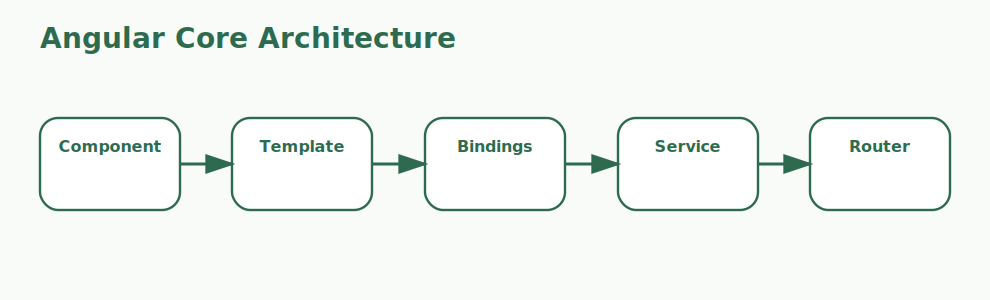

# Angular Fundamentals Interview Questions



This page stays at the Angular fundamentals level and focuses on the building blocks of everyday Angular applications.

## 1. Angular framework overview

### 1. What is the role of Angular framework overview in Angular fundamentals?

**Answer:**

In Angular fundamentals, the term Angular framework overview refers to the purpose of Angular as a
TypeScript-based framework for building structured frontend applications. It is part of the
foundation a candidate should be able to explain clearly.

**Sample:**

```ts
// Concept: 1. Angular framework overview
@Component({
  selector: 'app-demo',
  template: `<h1>{{ title }}</h1>`
})
export class DemoComponent {
  title = '1. Angular framework overview';
}
```

---

### 2. Why is the concept of Angular framework overview important in Angular fundamentals?

**Answer:**

This concept matters because it influences the purpose of Angular as a TypeScript-
based framework for building structured frontend applications. Good interview answers connect it to
clarity, maintainability, performance, security, or delivery depending on the situation.

**Sample:**

```ts
// Concept: 1. Angular framework overview
@Component({
  selector: 'app-demo',
  template: `<h1>{{ title }}</h1>`
})
export class DemoComponent {
  title = '1. Angular framework overview';
}
```

---

### 3. When should a team focus on Angular framework overview?

**Answer:**

A team should focus on Angular framework overview when the requirement depends on the purpose of
Angular as a TypeScript-based framework for building structured frontend applications. It becomes
especially important when design decisions, debugging, or architecture conversations depend on that
area.

**Sample:**

```ts
// Concept: 1. Angular framework overview
@Component({
  selector: 'app-demo',
  template: `<h1>{{ title }}</h1>`
})
export class DemoComponent {
  title = '1. Angular framework overview';
}
```

---

### 4. How is Angular framework overview applied in practice?

**Answer:**

In practice, Angular framework overview is applied by making the purpose of Angular as a TypeScript-
based framework for building structured frontend applications explicit in the code, workflow, or
collaboration pattern. The exact shape depends on the stack, but the responsibility should stay
predictable.

**Sample:**

```ts
// Concept: 1. Angular framework overview
@Component({
  selector: 'app-demo',
  template: `<h1>{{ title }}</h1>`
})
export class DemoComponent {
  title = '1. Angular framework overview';
}
```

---

### 5. What strengths does Angular framework overview bring?

**Answer:**

The strengths of Angular framework overview are better structure, better communication, and better
control over the purpose of Angular as a TypeScript-based framework for building structured frontend
applications. It also makes tradeoffs easier to explain to reviewers, interviewers, and teammates.

**Sample:**

```ts
// Concept: 1. Angular framework overview
@Component({
  selector: 'app-demo',
  template: `<h1>{{ title }}</h1>`
})
export class DemoComponent {
  title = '1. Angular framework overview';
}
```

---

### 6. What tradeoffs come with Angular framework overview?

**Answer:**

The main tradeoff is extra complexity if Angular framework overview is introduced without a real
need or a clear understanding of the purpose of Angular as a TypeScript-based framework for building
structured frontend applications. That usually leads to weak reasoning, overengineering, or fragile
implementations.

**Sample:**

```ts
// Concept: 1. Angular framework overview
@Component({
  selector: 'app-demo',
  template: `<h1>{{ title }}</h1>`
})
export class DemoComponent {
  title = '1. Angular framework overview';
}
```

---

### 7. How does Angular framework overview differ from Components?

**Answer:**

Angular framework overview is centered on the purpose of Angular as a TypeScript-based framework for
building structured frontend applications, while Components is centered on the reusable UI building
blocks that combine template, styling, and class logic. They often work together, but they solve
different parts of the topic.

**Sample:**

```ts
// Concept: 1. Angular framework overview
@Component({
  selector: 'app-demo',
  template: `<h1>{{ title }}</h1>`
})
export class DemoComponent {
  title = '1. Angular framework overview';
}
```

---

### 8. What is a good real-world example of Angular framework overview?

**Answer:**

A strong example is explaining how Angular framework overview affects a real feature, workflow, bug,
migration, or design choice involving the purpose of Angular as a TypeScript-based framework for
building structured frontend applications. Interviewers usually care more about the reasoning than
the definition alone.

**Sample:**

```ts
// Concept: 1. Angular framework overview
@Component({
  selector: 'app-demo',
  template: `<h1>{{ title }}</h1>`
})
export class DemoComponent {
  title = '1. Angular framework overview';
}
```

---

### 9. What is a best practice for Angular framework overview?

**Answer:**

A good practice is to keep Angular framework overview aligned with the actual requirement around the
purpose of Angular as a TypeScript-based framework for building structured frontend applications.
Teams should document intent, keep the implementation readable, and validate important paths early.

**Sample:**

```ts
// Concept: 1. Angular framework overview
@Component({
  selector: 'app-demo',
  template: `<h1>{{ title }}</h1>`
})
export class DemoComponent {
  title = '1. Angular framework overview';
}
```

---

### 10. What is a common mistake around Angular framework overview?

**Answer:**

A common mistake is naming Angular framework overview without understanding how it affects the
purpose of Angular as a TypeScript-based framework for building structured frontend applications. In
real work, that usually appears as poor decisions, weak debugging, or incomplete explanations.

**Sample:**

```ts
// Concept: 1. Angular framework overview
@Component({
  selector: 'app-demo',
  template: `<h1>{{ title }}</h1>`
})
export class DemoComponent {
  title = '1. Angular framework overview';
}
```

---

### 11. How do you troubleshoot Angular framework overview-related issues?

**Answer:**

When troubleshooting Angular framework overview, first verify whether the purpose of Angular as a
TypeScript-based framework for building structured frontend applications is behaving as expected.
Then check surrounding dependencies, inputs, configuration, logs, and edge cases before changing the
design.

**Sample:**

```ts
// Concept: 1. Angular framework overview
@Component({
  selector: 'app-demo',
  template: `<h1>{{ title }}</h1>`
})
export class DemoComponent {
  title = '1. Angular framework overview';
}
```

---

### 12. How does Angular framework overview connect to the rest of Angular fundamentals?

**Answer:**

Angular framework overview connects to the rest of Angular fundamentals by giving structure to the
purpose of Angular as a TypeScript-based framework for building structured frontend applications. It
is one of the pieces that turns isolated facts into a coherent end-to-end explanation.

**Sample:**

```ts
// Concept: 1. Angular framework overview
@Component({
  selector: 'app-demo',
  template: `<h1>{{ title }}</h1>`
})
export class DemoComponent {
  title = '1. Angular framework overview';
}
```

---

## 2. Components

### 13. What is the role of Components in Angular fundamentals?

**Answer:**

In Angular fundamentals, the term Components refers to the reusable UI building blocks that combine template,
styling, and class logic. It is part of the foundation a candidate should be able to explain
clearly.

**Sample:**

```ts
// Concept: 2. Components
@Component({
  selector: 'app-demo',
  template: `<h1>{{ title }}</h1>`
})
export class DemoComponent {
  title = '2. Components';
}
```

---

### 14. Why is the concept of Components important in Angular fundamentals?

**Answer:**

This concept matters because it influences the reusable UI building blocks that combine template,
styling, and class logic. Good interview answers connect it to clarity, maintainability,
performance, security, or delivery depending on the situation.

**Sample:**

```ts
// Concept: 2. Components
@Component({
  selector: 'app-demo',
  template: `<h1>{{ title }}</h1>`
})
export class DemoComponent {
  title = '2. Components';
}
```

---

### 15. When should a team focus on Components?

**Answer:**

A team should focus on Components when the requirement depends on the reusable UI building blocks
that combine template, styling, and class logic. It becomes especially important when design
decisions, debugging, or architecture conversations depend on that area.

**Sample:**

```ts
// Concept: 2. Components
@Component({
  selector: 'app-demo',
  template: `<h1>{{ title }}</h1>`
})
export class DemoComponent {
  title = '2. Components';
}
```

---

### 16. How is Components applied in practice?

**Answer:**

In practice, Components is applied by making the reusable UI building blocks that combine template,
styling, and class logic explicit in the code, workflow, or collaboration pattern. The exact shape
depends on the stack, but the responsibility should stay predictable.

**Sample:**

```ts
// Concept: 2. Components
@Component({
  selector: 'app-demo',
  template: `<h1>{{ title }}</h1>`
})
export class DemoComponent {
  title = '2. Components';
}
```

---

### 17. What strengths does Components bring?

**Answer:**

The strengths of Components are better structure, better communication, and better control over the
reusable UI building blocks that combine template, styling, and class logic. It also makes tradeoffs
easier to explain to reviewers, interviewers, and teammates.

**Sample:**

```ts
// Concept: 2. Components
@Component({
  selector: 'app-demo',
  template: `<h1>{{ title }}</h1>`
})
export class DemoComponent {
  title = '2. Components';
}
```

---

### 18. What tradeoffs come with Components?

**Answer:**

The main tradeoff is extra complexity if Components is introduced without a real need or a clear
understanding of the reusable UI building blocks that combine template, styling, and class logic.
That usually leads to weak reasoning, overengineering, or fragile implementations.

**Sample:**

```ts
// Concept: 2. Components
@Component({
  selector: 'app-demo',
  template: `<h1>{{ title }}</h1>`
})
export class DemoComponent {
  title = '2. Components';
}
```

---

### 19. How does Components differ from Templates?

**Answer:**

Components is centered on the reusable UI building blocks that combine template, styling, and class
logic, while Templates is centered on the HTML view layer where bindings and directives render
component state. They often work together, but they solve different parts of the topic.

**Sample:**

```ts
// Concept: 2. Components
@Component({
  selector: 'app-demo',
  template: `<h1>{{ title }}</h1>`
})
export class DemoComponent {
  title = '2. Components';
}
```

---

### 20. What is a good real-world example of Components?

**Answer:**

A strong example is explaining how Components affects a real feature, workflow, bug, migration, or
design choice involving the reusable UI building blocks that combine template, styling, and class
logic. Interviewers usually care more about the reasoning than the definition alone.

**Sample:**

```ts
// Concept: 2. Components
@Component({
  selector: 'app-demo',
  template: `<h1>{{ title }}</h1>`
})
export class DemoComponent {
  title = '2. Components';
}
```

---

### 21. What is a best practice for Components?

**Answer:**

A good practice is to keep Components aligned with the actual requirement around the reusable UI
building blocks that combine template, styling, and class logic. Teams should document intent, keep
the implementation readable, and validate important paths early.

**Sample:**

```ts
// Concept: 2. Components
@Component({
  selector: 'app-demo',
  template: `<h1>{{ title }}</h1>`
})
export class DemoComponent {
  title = '2. Components';
}
```

---

### 22. What is a common mistake around Components?

**Answer:**

A common mistake is naming Components without understanding how it affects the reusable UI building
blocks that combine template, styling, and class logic. In real work, that usually appears as poor
decisions, weak debugging, or incomplete explanations.

**Sample:**

```ts
// Concept: 2. Components
@Component({
  selector: 'app-demo',
  template: `<h1>{{ title }}</h1>`
})
export class DemoComponent {
  title = '2. Components';
}
```

---

### 23. How do you troubleshoot Components-related issues?

**Answer:**

When troubleshooting Components, first verify whether the reusable UI building blocks that combine
template, styling, and class logic is behaving as expected. Then check surrounding dependencies,
inputs, configuration, logs, and edge cases before changing the design.

**Sample:**

```ts
// Concept: 2. Components
@Component({
  selector: 'app-demo',
  template: `<h1>{{ title }}</h1>`
})
export class DemoComponent {
  title = '2. Components';
}
```

---

### 24. How does Components connect to the rest of Angular fundamentals?

**Answer:**

Components connects to the rest of Angular fundamentals by giving structure to the reusable UI
building blocks that combine template, styling, and class logic. It is one of the pieces that turns
isolated facts into a coherent end-to-end explanation.

**Sample:**

```ts
// Concept: 2. Components
@Component({
  selector: 'app-demo',
  template: `<h1>{{ title }}</h1>`
})
export class DemoComponent {
  title = '2. Components';
}
```

---

## 3. Templates

### 25. What is the role of Templates in Angular fundamentals?

**Answer:**

In Angular fundamentals, the term Templates refers to the HTML view layer where bindings and directives
render component state. It is part of the foundation a candidate should be able to explain clearly.

**Sample:**

```ts
// Concept: 3. Templates
@Component({
  selector: 'app-demo',
  template: `<h1>{{ title }}</h1>`
})
export class DemoComponent {
  title = '3. Templates';
}
```

---

### 26. Why is the concept of Templates important in Angular fundamentals?

**Answer:**

This concept matters because it influences the HTML view layer where bindings and directives render
component state. Good interview answers connect it to clarity, maintainability, performance,
security, or delivery depending on the situation.

**Sample:**

```ts
// Concept: 3. Templates
@Component({
  selector: 'app-demo',
  template: `<h1>{{ title }}</h1>`
})
export class DemoComponent {
  title = '3. Templates';
}
```

---

### 27. When should a team focus on Templates?

**Answer:**

A team should focus on Templates when the requirement depends on the HTML view layer where bindings
and directives render component state. It becomes especially important when design decisions,
debugging, or architecture conversations depend on that area.

**Sample:**

```ts
// Concept: 3. Templates
@Component({
  selector: 'app-demo',
  template: `<h1>{{ title }}</h1>`
})
export class DemoComponent {
  title = '3. Templates';
}
```

---

### 28. How is Templates applied in practice?

**Answer:**

In practice, Templates is applied by making the HTML view layer where bindings and directives render
component state explicit in the code, workflow, or collaboration pattern. The exact shape depends on
the stack, but the responsibility should stay predictable.

**Sample:**

```ts
// Concept: 3. Templates
@Component({
  selector: 'app-demo',
  template: `<h1>{{ title }}</h1>`
})
export class DemoComponent {
  title = '3. Templates';
}
```

---

### 29. What strengths does Templates bring?

**Answer:**

The strengths of Templates are better structure, better communication, and better control over the
HTML view layer where bindings and directives render component state. It also makes tradeoffs easier
to explain to reviewers, interviewers, and teammates.

**Sample:**

```ts
// Concept: 3. Templates
@Component({
  selector: 'app-demo',
  template: `<h1>{{ title }}</h1>`
})
export class DemoComponent {
  title = '3. Templates';
}
```

---

### 30. What tradeoffs come with Templates?

**Answer:**

The main tradeoff is extra complexity if Templates is introduced without a real need or a clear
understanding of the HTML view layer where bindings and directives render component state. That
usually leads to weak reasoning, overengineering, or fragile implementations.

**Sample:**

```ts
// Concept: 3. Templates
@Component({
  selector: 'app-demo',
  template: `<h1>{{ title }}</h1>`
})
export class DemoComponent {
  title = '3. Templates';
}
```

---

### 31. How does Templates differ from Directives?

**Answer:**

Templates is centered on the HTML view layer where bindings and directives render component state,
while Directives is centered on the Angular features that add behavior, structure, or presentation
logic to the DOM. They often work together, but they solve different parts of the topic.

**Sample:**

```ts
// Concept: 3. Templates
@Component({
  selector: 'app-demo',
  template: `<h1>{{ title }}</h1>`
})
export class DemoComponent {
  title = '3. Templates';
}
```

---

### 32. What is a good real-world example of Templates?

**Answer:**

A strong example is explaining how Templates affects a real feature, workflow, bug, migration, or
design choice involving the HTML view layer where bindings and directives render component state.
Interviewers usually care more about the reasoning than the definition alone.

**Sample:**

```ts
// Concept: 3. Templates
@Component({
  selector: 'app-demo',
  template: `<h1>{{ title }}</h1>`
})
export class DemoComponent {
  title = '3. Templates';
}
```

---

### 33. What is a best practice for Templates?

**Answer:**

A good practice is to keep Templates aligned with the actual requirement around the HTML view layer
where bindings and directives render component state. Teams should document intent, keep the
implementation readable, and validate important paths early.

**Sample:**

```ts
// Concept: 3. Templates
@Component({
  selector: 'app-demo',
  template: `<h1>{{ title }}</h1>`
})
export class DemoComponent {
  title = '3. Templates';
}
```

---

### 34. What is a common mistake around Templates?

**Answer:**

A common mistake is naming Templates without understanding how it affects the HTML view layer where
bindings and directives render component state. In real work, that usually appears as poor
decisions, weak debugging, or incomplete explanations.

**Sample:**

```ts
// Concept: 3. Templates
@Component({
  selector: 'app-demo',
  template: `<h1>{{ title }}</h1>`
})
export class DemoComponent {
  title = '3. Templates';
}
```

---

### 35. How do you troubleshoot Templates-related issues?

**Answer:**

When troubleshooting Templates, first verify whether the HTML view layer where bindings and
directives render component state is behaving as expected. Then check surrounding dependencies,
inputs, configuration, logs, and edge cases before changing the design.

**Sample:**

```ts
// Concept: 3. Templates
@Component({
  selector: 'app-demo',
  template: `<h1>{{ title }}</h1>`
})
export class DemoComponent {
  title = '3. Templates';
}
```

---

### 36. How does Templates connect to the rest of Angular fundamentals?

**Answer:**

Templates connects to the rest of Angular fundamentals by giving structure to the HTML view layer
where bindings and directives render component state. It is one of the pieces that turns isolated
facts into a coherent end-to-end explanation.

**Sample:**

```ts
// Concept: 3. Templates
@Component({
  selector: 'app-demo',
  template: `<h1>{{ title }}</h1>`
})
export class DemoComponent {
  title = '3. Templates';
}
```

---

## 4. Directives

### 37. What is the role of Directives in Angular fundamentals?

**Answer:**

In Angular fundamentals, the term Directives refers to the Angular features that add behavior, structure, or
presentation logic to the DOM. It is part of the foundation a candidate should be able to explain
clearly.

**Sample:**

```ts
// Concept: 4. Directives
@Component({
  selector: 'app-demo',
  template: `<h1>{{ title }}</h1>`
})
export class DemoComponent {
  title = '4. Directives';
}
```

---

### 38. Why is the concept of Directives important in Angular fundamentals?

**Answer:**

This concept matters because it influences the Angular features that add behavior, structure, or
presentation logic to the DOM. Good interview answers connect it to clarity, maintainability,
performance, security, or delivery depending on the situation.

**Sample:**

```ts
// Concept: 4. Directives
@Component({
  selector: 'app-demo',
  template: `<h1>{{ title }}</h1>`
})
export class DemoComponent {
  title = '4. Directives';
}
```

---

### 39. When should a team focus on Directives?

**Answer:**

A team should focus on Directives when the requirement depends on the Angular features that add
behavior, structure, or presentation logic to the DOM. It becomes especially important when design
decisions, debugging, or architecture conversations depend on that area.

**Sample:**

```ts
// Concept: 4. Directives
@Component({
  selector: 'app-demo',
  template: `<h1>{{ title }}</h1>`
})
export class DemoComponent {
  title = '4. Directives';
}
```

---

### 40. How is Directives applied in practice?

**Answer:**

In practice, Directives is applied by making the Angular features that add behavior, structure, or
presentation logic to the DOM explicit in the code, workflow, or collaboration pattern. The exact
shape depends on the stack, but the responsibility should stay predictable.

**Sample:**

```ts
// Concept: 4. Directives
@Component({
  selector: 'app-demo',
  template: `<h1>{{ title }}</h1>`
})
export class DemoComponent {
  title = '4. Directives';
}
```

---

### 41. What strengths does Directives bring?

**Answer:**

The strengths of Directives are better structure, better communication, and better control over the
Angular features that add behavior, structure, or presentation logic to the DOM. It also makes
tradeoffs easier to explain to reviewers, interviewers, and teammates.

**Sample:**

```ts
// Concept: 4. Directives
@Component({
  selector: 'app-demo',
  template: `<h1>{{ title }}</h1>`
})
export class DemoComponent {
  title = '4. Directives';
}
```

---

### 42. What tradeoffs come with Directives?

**Answer:**

The main tradeoff is extra complexity if Directives is introduced without a real need or a clear
understanding of the Angular features that add behavior, structure, or presentation logic to the
DOM. That usually leads to weak reasoning, overengineering, or fragile implementations.

**Sample:**

```ts
// Concept: 4. Directives
@Component({
  selector: 'app-demo',
  template: `<h1>{{ title }}</h1>`
})
export class DemoComponent {
  title = '4. Directives';
}
```

---

### 43. How does Directives differ from Data binding?

**Answer:**

Directives is centered on the Angular features that add behavior, structure, or presentation logic
to the DOM, while Data binding is centered on the mechanism that keeps component data and template
output connected. They often work together, but they solve different parts of the topic.

**Sample:**

```ts
// Concept: 4. Directives
@Component({
  selector: 'app-demo',
  template: `<h1>{{ title }}</h1>`
})
export class DemoComponent {
  title = '4. Directives';
}
```

---

### 44. What is a good real-world example of Directives?

**Answer:**

A strong example is explaining how Directives affects a real feature, workflow, bug, migration, or
design choice involving the Angular features that add behavior, structure, or presentation logic to
the DOM. Interviewers usually care more about the reasoning than the definition alone.

**Sample:**

```ts
// Concept: 4. Directives
@Component({
  selector: 'app-demo',
  template: `<h1>{{ title }}</h1>`
})
export class DemoComponent {
  title = '4. Directives';
}
```

---

### 45. What is a best practice for Directives?

**Answer:**

A good practice is to keep Directives aligned with the actual requirement around the Angular
features that add behavior, structure, or presentation logic to the DOM. Teams should document
intent, keep the implementation readable, and validate important paths early.

**Sample:**

```ts
// Concept: 4. Directives
@Component({
  selector: 'app-demo',
  template: `<h1>{{ title }}</h1>`
})
export class DemoComponent {
  title = '4. Directives';
}
```

---

### 46. What is a common mistake around Directives?

**Answer:**

A common mistake is naming Directives without understanding how it affects the Angular features that
add behavior, structure, or presentation logic to the DOM. In real work, that usually appears as
poor decisions, weak debugging, or incomplete explanations.

**Sample:**

```ts
// Concept: 4. Directives
@Component({
  selector: 'app-demo',
  template: `<h1>{{ title }}</h1>`
})
export class DemoComponent {
  title = '4. Directives';
}
```

---

### 47. How do you troubleshoot Directives-related issues?

**Answer:**

When troubleshooting Directives, first verify whether the Angular features that add behavior,
structure, or presentation logic to the DOM is behaving as expected. Then check surrounding
dependencies, inputs, configuration, logs, and edge cases before changing the design.

**Sample:**

```ts
// Concept: 4. Directives
@Component({
  selector: 'app-demo',
  template: `<h1>{{ title }}</h1>`
})
export class DemoComponent {
  title = '4. Directives';
}
```

---

### 48. How does Directives connect to the rest of Angular fundamentals?

**Answer:**

Directives connects to the rest of Angular fundamentals by giving structure to the Angular features
that add behavior, structure, or presentation logic to the DOM. It is one of the pieces that turns
isolated facts into a coherent end-to-end explanation.

**Sample:**

```ts
// Concept: 4. Directives
@Component({
  selector: 'app-demo',
  template: `<h1>{{ title }}</h1>`
})
export class DemoComponent {
  title = '4. Directives';
}
```

---

## 5. Data binding

### 49. What is the role of Data binding in Angular fundamentals?

**Answer:**

In Angular fundamentals, the term Data binding refers to the mechanism that keeps component data and template
output connected. It is part of the foundation a candidate should be able to explain clearly.

**Sample:**

```ts
// Concept: 5. Data binding
@Component({
  selector: 'app-demo',
  template: `<h1>{{ title }}</h1>`
})
export class DemoComponent {
  title = '5. Data binding';
}
```

---

### 50. Why is the concept of Data binding important in Angular fundamentals?

**Answer:**

This concept matters because it influences the mechanism that keeps component data and template
output connected. Good interview answers connect it to clarity, maintainability, performance,
security, or delivery depending on the situation.

**Sample:**

```ts
// Concept: 5. Data binding
@Component({
  selector: 'app-demo',
  template: `<h1>{{ title }}</h1>`
})
export class DemoComponent {
  title = '5. Data binding';
}
```

---

### 51. When should a team focus on Data binding?

**Answer:**

A team should focus on Data binding when the requirement depends on the mechanism that keeps
component data and template output connected. It becomes especially important when design decisions,
debugging, or architecture conversations depend on that area.

**Sample:**

```ts
// Concept: 5. Data binding
@Component({
  selector: 'app-demo',
  template: `<h1>{{ title }}</h1>`
})
export class DemoComponent {
  title = '5. Data binding';
}
```

---

### 52. How is Data binding applied in practice?

**Answer:**

In practice, Data binding is applied by making the mechanism that keeps component data and template
output connected explicit in the code, workflow, or collaboration pattern. The exact shape depends
on the stack, but the responsibility should stay predictable.

**Sample:**

```ts
// Concept: 5. Data binding
@Component({
  selector: 'app-demo',
  template: `<h1>{{ title }}</h1>`
})
export class DemoComponent {
  title = '5. Data binding';
}
```

---

### 53. What strengths does Data binding bring?

**Answer:**

The strengths of Data binding are better structure, better communication, and better control over
the mechanism that keeps component data and template output connected. It also makes tradeoffs
easier to explain to reviewers, interviewers, and teammates.

**Sample:**

```ts
// Concept: 5. Data binding
@Component({
  selector: 'app-demo',
  template: `<h1>{{ title }}</h1>`
})
export class DemoComponent {
  title = '5. Data binding';
}
```

---

### 54. What tradeoffs come with Data binding?

**Answer:**

The main tradeoff is extra complexity if Data binding is introduced without a real need or a clear
understanding of the mechanism that keeps component data and template output connected. That usually
leads to weak reasoning, overengineering, or fragile implementations.

**Sample:**

```ts
// Concept: 5. Data binding
@Component({
  selector: 'app-demo',
  template: `<h1>{{ title }}</h1>`
})
export class DemoComponent {
  title = '5. Data binding';
}
```

---

### 55. How does Data binding differ from Dependency injection?

**Answer:**

Data binding is centered on the mechanism that keeps component data and template output connected,
while Dependency injection is centered on the pattern Angular uses to provide services and shared
dependencies cleanly. They often work together, but they solve different parts of the topic.

**Sample:**

```ts
// Concept: 5. Data binding
@Component({
  selector: 'app-demo',
  template: `<h1>{{ title }}</h1>`
})
export class DemoComponent {
  title = '5. Data binding';
}
```

---

### 56. What is a good real-world example of Data binding?

**Answer:**

A strong example is explaining how Data binding affects a real feature, workflow, bug, migration, or
design choice involving the mechanism that keeps component data and template output connected.
Interviewers usually care more about the reasoning than the definition alone.

**Sample:**

```ts
// Concept: 5. Data binding
@Component({
  selector: 'app-demo',
  template: `<h1>{{ title }}</h1>`
})
export class DemoComponent {
  title = '5. Data binding';
}
```

---

### 57. What is a best practice for Data binding?

**Answer:**

A good practice is to keep Data binding aligned with the actual requirement around the mechanism
that keeps component data and template output connected. Teams should document intent, keep the
implementation readable, and validate important paths early.

**Sample:**

```ts
// Concept: 5. Data binding
@Component({
  selector: 'app-demo',
  template: `<h1>{{ title }}</h1>`
})
export class DemoComponent {
  title = '5. Data binding';
}
```

---

### 58. What is a common mistake around Data binding?

**Answer:**

A common mistake is naming Data binding without understanding how it affects the mechanism that
keeps component data and template output connected. In real work, that usually appears as poor
decisions, weak debugging, or incomplete explanations.

**Sample:**

```ts
// Concept: 5. Data binding
@Component({
  selector: 'app-demo',
  template: `<h1>{{ title }}</h1>`
})
export class DemoComponent {
  title = '5. Data binding';
}
```

---

### 59. How do you troubleshoot Data binding-related issues?

**Answer:**

When troubleshooting Data binding, first verify whether the mechanism that keeps component data and
template output connected is behaving as expected. Then check surrounding dependencies, inputs,
configuration, logs, and edge cases before changing the design.

**Sample:**

```ts
// Concept: 5. Data binding
@Component({
  selector: 'app-demo',
  template: `<h1>{{ title }}</h1>`
})
export class DemoComponent {
  title = '5. Data binding';
}
```

---

### 60. How does Data binding connect to the rest of Angular fundamentals?

**Answer:**

Data binding connects to the rest of Angular fundamentals by giving structure to the mechanism that
keeps component data and template output connected. It is one of the pieces that turns isolated
facts into a coherent end-to-end explanation.

**Sample:**

```ts
// Concept: 5. Data binding
@Component({
  selector: 'app-demo',
  template: `<h1>{{ title }}</h1>`
})
export class DemoComponent {
  title = '5. Data binding';
}
```

---

## 6. Dependency injection

### 61. What is the role of Dependency injection in Angular fundamentals?

**Answer:**

In Angular fundamentals, the term Dependency injection refers to the pattern Angular uses to provide services
and shared dependencies cleanly. It is part of the foundation a candidate should be able to explain
clearly.

**Sample:**

```ts
// Concept: 6. Dependency injection
@Component({
  selector: 'app-demo',
  template: `<h1>{{ title }}</h1>`
})
export class DemoComponent {
  title = '6. Dependency injection';
}
```

---

### 62. Why is the concept of Dependency injection important in Angular fundamentals?

**Answer:**

This concept matters because it influences the pattern Angular uses to provide services and
shared dependencies cleanly. Good interview answers connect it to clarity, maintainability,
performance, security, or delivery depending on the situation.

**Sample:**

```ts
// Concept: 6. Dependency injection
@Component({
  selector: 'app-demo',
  template: `<h1>{{ title }}</h1>`
})
export class DemoComponent {
  title = '6. Dependency injection';
}
```

---

### 63. When should a team focus on Dependency injection?

**Answer:**

A team should focus on Dependency injection when the requirement depends on the pattern Angular uses
to provide services and shared dependencies cleanly. It becomes especially important when design
decisions, debugging, or architecture conversations depend on that area.

**Sample:**

```ts
// Concept: 6. Dependency injection
@Component({
  selector: 'app-demo',
  template: `<h1>{{ title }}</h1>`
})
export class DemoComponent {
  title = '6. Dependency injection';
}
```

---

### 64. How is Dependency injection applied in practice?

**Answer:**

In practice, Dependency injection is applied by making the pattern Angular uses to provide services
and shared dependencies cleanly explicit in the code, workflow, or collaboration pattern. The exact
shape depends on the stack, but the responsibility should stay predictable.

**Sample:**

```ts
// Concept: 6. Dependency injection
@Component({
  selector: 'app-demo',
  template: `<h1>{{ title }}</h1>`
})
export class DemoComponent {
  title = '6. Dependency injection';
}
```

---

### 65. What strengths does Dependency injection bring?

**Answer:**

The strengths of Dependency injection are better structure, better communication, and better control
over the pattern Angular uses to provide services and shared dependencies cleanly. It also makes
tradeoffs easier to explain to reviewers, interviewers, and teammates.

**Sample:**

```ts
// Concept: 6. Dependency injection
@Component({
  selector: 'app-demo',
  template: `<h1>{{ title }}</h1>`
})
export class DemoComponent {
  title = '6. Dependency injection';
}
```

---

### 66. What tradeoffs come with Dependency injection?

**Answer:**

The main tradeoff is extra complexity if Dependency injection is introduced without a real need or a
clear understanding of the pattern Angular uses to provide services and shared dependencies cleanly.
That usually leads to weak reasoning, overengineering, or fragile implementations.

**Sample:**

```ts
// Concept: 6. Dependency injection
@Component({
  selector: 'app-demo',
  template: `<h1>{{ title }}</h1>`
})
export class DemoComponent {
  title = '6. Dependency injection';
}
```

---

### 67. How does Dependency injection differ from Services?

**Answer:**

Dependency injection is centered on the pattern Angular uses to provide services and shared
dependencies cleanly, while Services is centered on the reusable classes that hold business logic,
shared state, or integration logic. They often work together, but they solve different parts of the
topic.

**Sample:**

```ts
// Concept: 6. Dependency injection
@Component({
  selector: 'app-demo',
  template: `<h1>{{ title }}</h1>`
})
export class DemoComponent {
  title = '6. Dependency injection';
}
```

---

### 68. What is a good real-world example of Dependency injection?

**Answer:**

A strong example is explaining how Dependency injection affects a real feature, workflow, bug,
migration, or design choice involving the pattern Angular uses to provide services and shared
dependencies cleanly. Interviewers usually care more about the reasoning than the definition alone.

**Sample:**

```ts
// Concept: 6. Dependency injection
@Component({
  selector: 'app-demo',
  template: `<h1>{{ title }}</h1>`
})
export class DemoComponent {
  title = '6. Dependency injection';
}
```

---

### 69. What is a best practice for Dependency injection?

**Answer:**

A good practice is to keep Dependency injection aligned with the actual requirement around the
pattern Angular uses to provide services and shared dependencies cleanly. Teams should document
intent, keep the implementation readable, and validate important paths early.

**Sample:**

```ts
// Concept: 6. Dependency injection
@Component({
  selector: 'app-demo',
  template: `<h1>{{ title }}</h1>`
})
export class DemoComponent {
  title = '6. Dependency injection';
}
```

---

### 70. What is a common mistake around Dependency injection?

**Answer:**

A common mistake is naming Dependency injection without understanding how it affects the pattern
Angular uses to provide services and shared dependencies cleanly. In real work, that usually appears
as poor decisions, weak debugging, or incomplete explanations.

**Sample:**

```ts
// Concept: 6. Dependency injection
@Component({
  selector: 'app-demo',
  template: `<h1>{{ title }}</h1>`
})
export class DemoComponent {
  title = '6. Dependency injection';
}
```

---

### 71. How do you troubleshoot Dependency injection-related issues?

**Answer:**

When troubleshooting Dependency injection, first verify whether the pattern Angular uses to provide
services and shared dependencies cleanly is behaving as expected. Then check surrounding
dependencies, inputs, configuration, logs, and edge cases before changing the design.

**Sample:**

```ts
// Concept: 6. Dependency injection
@Component({
  selector: 'app-demo',
  template: `<h1>{{ title }}</h1>`
})
export class DemoComponent {
  title = '6. Dependency injection';
}
```

---

### 72. How does Dependency injection connect to the rest of Angular fundamentals?

**Answer:**

Dependency injection connects to the rest of Angular fundamentals by giving structure to the pattern
Angular uses to provide services and shared dependencies cleanly. It is one of the pieces that turns
isolated facts into a coherent end-to-end explanation.

**Sample:**

```ts
// Concept: 6. Dependency injection
@Component({
  selector: 'app-demo',
  template: `<h1>{{ title }}</h1>`
})
export class DemoComponent {
  title = '6. Dependency injection';
}
```

---

## 7. Services

### 73. What is the role of Services in Angular fundamentals?

**Answer:**

In Angular fundamentals, the term Services refers to the reusable classes that hold business logic, shared
state, or integration logic. It is part of the foundation a candidate should be able to explain
clearly.

**Sample:**

```ts
// Concept: 7. Services
@Component({
  selector: 'app-demo',
  template: `<h1>{{ title }}</h1>`
})
export class DemoComponent {
  title = '7. Services';
}
```

---

### 74. Why is the concept of Services important in Angular fundamentals?

**Answer:**

This concept matters because it influences the reusable classes that hold business logic, shared state,
or integration logic. Good interview answers connect it to clarity, maintainability, performance,
security, or delivery depending on the situation.

**Sample:**

```ts
// Concept: 7. Services
@Component({
  selector: 'app-demo',
  template: `<h1>{{ title }}</h1>`
})
export class DemoComponent {
  title = '7. Services';
}
```

---

### 75. When should a team focus on Services?

**Answer:**

A team should focus on Services when the requirement depends on the reusable classes that hold
business logic, shared state, or integration logic. It becomes especially important when design
decisions, debugging, or architecture conversations depend on that area.

**Sample:**

```ts
// Concept: 7. Services
@Component({
  selector: 'app-demo',
  template: `<h1>{{ title }}</h1>`
})
export class DemoComponent {
  title = '7. Services';
}
```

---

### 76. How is Services applied in practice?

**Answer:**

In practice, Services is applied by making the reusable classes that hold business logic, shared
state, or integration logic explicit in the code, workflow, or collaboration pattern. The exact
shape depends on the stack, but the responsibility should stay predictable.

**Sample:**

```ts
// Concept: 7. Services
@Component({
  selector: 'app-demo',
  template: `<h1>{{ title }}</h1>`
})
export class DemoComponent {
  title = '7. Services';
}
```

---

### 77. What strengths does Services bring?

**Answer:**

The strengths of Services are better structure, better communication, and better control over the
reusable classes that hold business logic, shared state, or integration logic. It also makes
tradeoffs easier to explain to reviewers, interviewers, and teammates.

**Sample:**

```ts
// Concept: 7. Services
@Component({
  selector: 'app-demo',
  template: `<h1>{{ title }}</h1>`
})
export class DemoComponent {
  title = '7. Services';
}
```

---

### 78. What tradeoffs come with Services?

**Answer:**

The main tradeoff is extra complexity if Services is introduced without a real need or a clear
understanding of the reusable classes that hold business logic, shared state, or integration logic.
That usually leads to weak reasoning, overengineering, or fragile implementations.

**Sample:**

```ts
// Concept: 7. Services
@Component({
  selector: 'app-demo',
  template: `<h1>{{ title }}</h1>`
})
export class DemoComponent {
  title = '7. Services';
}
```

---

### 79. How does Services differ from Routing?

**Answer:**

Services is centered on the reusable classes that hold business logic, shared state, or integration
logic, while Routing is centered on the system that maps URLs to screens and navigation flow inside
an Angular app. They often work together, but they solve different parts of the topic.

**Sample:**

```ts
// Concept: 7. Services
@Component({
  selector: 'app-demo',
  template: `<h1>{{ title }}</h1>`
})
export class DemoComponent {
  title = '7. Services';
}
```

---

### 80. What is a good real-world example of Services?

**Answer:**

A strong example is explaining how Services affects a real feature, workflow, bug, migration, or
design choice involving the reusable classes that hold business logic, shared state, or integration
logic. Interviewers usually care more about the reasoning than the definition alone.

**Sample:**

```ts
// Concept: 7. Services
@Component({
  selector: 'app-demo',
  template: `<h1>{{ title }}</h1>`
})
export class DemoComponent {
  title = '7. Services';
}
```

---

### 81. What is a best practice for Services?

**Answer:**

A good practice is to keep Services aligned with the actual requirement around the reusable classes
that hold business logic, shared state, or integration logic. Teams should document intent, keep the
implementation readable, and validate important paths early.

**Sample:**

```ts
// Concept: 7. Services
@Component({
  selector: 'app-demo',
  template: `<h1>{{ title }}</h1>`
})
export class DemoComponent {
  title = '7. Services';
}
```

---

### 82. What is a common mistake around Services?

**Answer:**

A common mistake is naming Services without understanding how it affects the reusable classes that
hold business logic, shared state, or integration logic. In real work, that usually appears as poor
decisions, weak debugging, or incomplete explanations.

**Sample:**

```ts
// Concept: 7. Services
@Component({
  selector: 'app-demo',
  template: `<h1>{{ title }}</h1>`
})
export class DemoComponent {
  title = '7. Services';
}
```

---

### 83. How do you troubleshoot Services-related issues?

**Answer:**

When troubleshooting Services, first verify whether the reusable classes that hold business logic,
shared state, or integration logic is behaving as expected. Then check surrounding dependencies,
inputs, configuration, logs, and edge cases before changing the design.

**Sample:**

```ts
// Concept: 7. Services
@Component({
  selector: 'app-demo',
  template: `<h1>{{ title }}</h1>`
})
export class DemoComponent {
  title = '7. Services';
}
```

---

### 84. How does Services connect to the rest of Angular fundamentals?

**Answer:**

Services connects to the rest of Angular fundamentals by giving structure to the reusable classes
that hold business logic, shared state, or integration logic. It is one of the pieces that turns
isolated facts into a coherent end-to-end explanation.

**Sample:**

```ts
// Concept: 7. Services
@Component({
  selector: 'app-demo',
  template: `<h1>{{ title }}</h1>`
})
export class DemoComponent {
  title = '7. Services';
}
```

---

## 8. Routing

### 85. What is the role of Routing in Angular fundamentals?

**Answer:**

In Angular fundamentals, the term Routing refers to the system that maps URLs to screens and navigation flow
inside an Angular app. It is part of the foundation a candidate should be able to explain clearly.

**Sample:**

```ts
// Concept: 8. Routing
@Component({
  selector: 'app-demo',
  template: `<h1>{{ title }}</h1>`
})
export class DemoComponent {
  title = '8. Routing';
}
```

---

### 86. Why is the concept of Routing important in Angular fundamentals?

**Answer:**

This concept matters because it influences the system that maps URLs to screens and navigation flow
inside an Angular app. Good interview answers connect it to clarity, maintainability, performance,
security, or delivery depending on the situation.

**Sample:**

```ts
// Concept: 8. Routing
@Component({
  selector: 'app-demo',
  template: `<h1>{{ title }}</h1>`
})
export class DemoComponent {
  title = '8. Routing';
}
```

---

### 87. When should a team focus on Routing?

**Answer:**

A team should focus on Routing when the requirement depends on the system that maps URLs to screens
and navigation flow inside an Angular app. It becomes especially important when design decisions,
debugging, or architecture conversations depend on that area.

**Sample:**

```ts
// Concept: 8. Routing
@Component({
  selector: 'app-demo',
  template: `<h1>{{ title }}</h1>`
})
export class DemoComponent {
  title = '8. Routing';
}
```

---

### 88. How is Routing applied in practice?

**Answer:**

In practice, Routing is applied by making the system that maps URLs to screens and navigation flow
inside an Angular app explicit in the code, workflow, or collaboration pattern. The exact shape
depends on the stack, but the responsibility should stay predictable.

**Sample:**

```ts
// Concept: 8. Routing
@Component({
  selector: 'app-demo',
  template: `<h1>{{ title }}</h1>`
})
export class DemoComponent {
  title = '8. Routing';
}
```

---

### 89. What strengths does Routing bring?

**Answer:**

The strengths of Routing are better structure, better communication, and better control over the
system that maps URLs to screens and navigation flow inside an Angular app. It also makes tradeoffs
easier to explain to reviewers, interviewers, and teammates.

**Sample:**

```ts
// Concept: 8. Routing
@Component({
  selector: 'app-demo',
  template: `<h1>{{ title }}</h1>`
})
export class DemoComponent {
  title = '8. Routing';
}
```

---

### 90. What tradeoffs come with Routing?

**Answer:**

The main tradeoff is extra complexity if Routing is introduced without a real need or a clear
understanding of the system that maps URLs to screens and navigation flow inside an Angular app.
That usually leads to weak reasoning, overengineering, or fragile implementations.

**Sample:**

```ts
// Concept: 8. Routing
@Component({
  selector: 'app-demo',
  template: `<h1>{{ title }}</h1>`
})
export class DemoComponent {
  title = '8. Routing';
}
```

---

### 91. How does Routing differ from Lifecycle hooks?

**Answer:**

Routing is centered on the system that maps URLs to screens and navigation flow inside an Angular
app, while Lifecycle hooks is centered on the predefined moments when Angular lets components run
setup, update, and cleanup logic. They often work together, but they solve different parts of the
topic.

**Sample:**

```ts
// Concept: 8. Routing
@Component({
  selector: 'app-demo',
  template: `<h1>{{ title }}</h1>`
})
export class DemoComponent {
  title = '8. Routing';
}
```

---

### 92. What is a good real-world example of Routing?

**Answer:**

A strong example is explaining how Routing affects a real feature, workflow, bug, migration, or
design choice involving the system that maps URLs to screens and navigation flow inside an Angular
app. Interviewers usually care more about the reasoning than the definition alone.

**Sample:**

```ts
// Concept: 8. Routing
@Component({
  selector: 'app-demo',
  template: `<h1>{{ title }}</h1>`
})
export class DemoComponent {
  title = '8. Routing';
}
```

---

### 93. What is a best practice for Routing?

**Answer:**

A good practice is to keep Routing aligned with the actual requirement around the system that maps
URLs to screens and navigation flow inside an Angular app. Teams should document intent, keep the
implementation readable, and validate important paths early.

**Sample:**

```ts
// Concept: 8. Routing
@Component({
  selector: 'app-demo',
  template: `<h1>{{ title }}</h1>`
})
export class DemoComponent {
  title = '8. Routing';
}
```

---

### 94. What is a common mistake around Routing?

**Answer:**

A common mistake is naming Routing without understanding how it affects the system that maps URLs to
screens and navigation flow inside an Angular app. In real work, that usually appears as poor
decisions, weak debugging, or incomplete explanations.

**Sample:**

```ts
// Concept: 8. Routing
@Component({
  selector: 'app-demo',
  template: `<h1>{{ title }}</h1>`
})
export class DemoComponent {
  title = '8. Routing';
}
```

---

### 95. How do you troubleshoot Routing-related issues?

**Answer:**

When troubleshooting Routing, first verify whether the system that maps URLs to screens and
navigation flow inside an Angular app is behaving as expected. Then check surrounding dependencies,
inputs, configuration, logs, and edge cases before changing the design.

**Sample:**

```ts
// Concept: 8. Routing
@Component({
  selector: 'app-demo',
  template: `<h1>{{ title }}</h1>`
})
export class DemoComponent {
  title = '8. Routing';
}
```

---

### 96. How does Routing connect to the rest of Angular fundamentals?

**Answer:**

Routing connects to the rest of Angular fundamentals by giving structure to the system that maps
URLs to screens and navigation flow inside an Angular app. It is one of the pieces that turns
isolated facts into a coherent end-to-end explanation.

**Sample:**

```ts
// Concept: 8. Routing
@Component({
  selector: 'app-demo',
  template: `<h1>{{ title }}</h1>`
})
export class DemoComponent {
  title = '8. Routing';
}
```

---

## 9. Lifecycle hooks

### 97. What is the role of Lifecycle hooks in Angular fundamentals?

**Answer:**

In Angular fundamentals, the term Lifecycle hooks refers to the predefined moments when Angular lets
components run setup, update, and cleanup logic. It is part of the foundation a candidate should be
able to explain clearly.

**Sample:**

```ts
// Concept: 9. Lifecycle hooks
@Component({
  selector: 'app-demo',
  template: `<h1>{{ title }}</h1>`
})
export class DemoComponent {
  title = '9. Lifecycle hooks';
}
```

---

### 98. Why is the concept of Lifecycle hooks important in Angular fundamentals?

**Answer:**

This concept matters because it influences the predefined moments when Angular lets components
run setup, update, and cleanup logic. Good interview answers connect it to clarity, maintainability,
performance, security, or delivery depending on the situation.

**Sample:**

```ts
// Concept: 9. Lifecycle hooks
@Component({
  selector: 'app-demo',
  template: `<h1>{{ title }}</h1>`
})
export class DemoComponent {
  title = '9. Lifecycle hooks';
}
```

---

### 99. When should a team focus on Lifecycle hooks?

**Answer:**

A team should focus on Lifecycle hooks when the requirement depends on the predefined moments when
Angular lets components run setup, update, and cleanup logic. It becomes especially important when
design decisions, debugging, or architecture conversations depend on that area.

**Sample:**

```ts
// Concept: 9. Lifecycle hooks
@Component({
  selector: 'app-demo',
  template: `<h1>{{ title }}</h1>`
})
export class DemoComponent {
  title = '9. Lifecycle hooks';
}
```

---

### 100. How is Lifecycle hooks applied in practice?

**Answer:**

In practice, Lifecycle hooks is applied by making the predefined moments when Angular lets
components run setup, update, and cleanup logic explicit in the code, workflow, or collaboration
pattern. The exact shape depends on the stack, but the responsibility should stay predictable.

**Sample:**

```ts
// Concept: 9. Lifecycle hooks
@Component({
  selector: 'app-demo',
  template: `<h1>{{ title }}</h1>`
})
export class DemoComponent {
  title = '9. Lifecycle hooks';
}
```

---

### 101. What strengths does Lifecycle hooks bring?

**Answer:**

The strengths of Lifecycle hooks are better structure, better communication, and better control over
the predefined moments when Angular lets components run setup, update, and cleanup logic. It also
makes tradeoffs easier to explain to reviewers, interviewers, and teammates.

**Sample:**

```ts
// Concept: 9. Lifecycle hooks
@Component({
  selector: 'app-demo',
  template: `<h1>{{ title }}</h1>`
})
export class DemoComponent {
  title = '9. Lifecycle hooks';
}
```

---

### 102. What tradeoffs come with Lifecycle hooks?

**Answer:**

The main tradeoff is extra complexity if Lifecycle hooks is introduced without a real need or a
clear understanding of the predefined moments when Angular lets components run setup, update, and
cleanup logic. That usually leads to weak reasoning, overengineering, or fragile implementations.

**Sample:**

```ts
// Concept: 9. Lifecycle hooks
@Component({
  selector: 'app-demo',
  template: `<h1>{{ title }}</h1>`
})
export class DemoComponent {
  title = '9. Lifecycle hooks';
}
```

---

### 103. How does Lifecycle hooks differ from Change detection?

**Answer:**

Lifecycle hooks is centered on the predefined moments when Angular lets components run setup,
update, and cleanup logic, while Change detection is centered on the process Angular uses to notice
state changes and update the rendered UI. They often work together, but they solve different parts
of the topic.

**Sample:**

```ts
// Concept: 9. Lifecycle hooks
@Component({
  selector: 'app-demo',
  template: `<h1>{{ title }}</h1>`
})
export class DemoComponent {
  title = '9. Lifecycle hooks';
}
```

---

### 104. What is a good real-world example of Lifecycle hooks?

**Answer:**

A strong example is explaining how Lifecycle hooks affects a real feature, workflow, bug, migration,
or design choice involving the predefined moments when Angular lets components run setup, update,
and cleanup logic. Interviewers usually care more about the reasoning than the definition alone.

**Sample:**

```ts
// Concept: 9. Lifecycle hooks
@Component({
  selector: 'app-demo',
  template: `<h1>{{ title }}</h1>`
})
export class DemoComponent {
  title = '9. Lifecycle hooks';
}
```

---

### 105. What is a best practice for Lifecycle hooks?

**Answer:**

A good practice is to keep Lifecycle hooks aligned with the actual requirement around the predefined
moments when Angular lets components run setup, update, and cleanup logic. Teams should document
intent, keep the implementation readable, and validate important paths early.

**Sample:**

```ts
// Concept: 9. Lifecycle hooks
@Component({
  selector: 'app-demo',
  template: `<h1>{{ title }}</h1>`
})
export class DemoComponent {
  title = '9. Lifecycle hooks';
}
```

---

### 106. What is a common mistake around Lifecycle hooks?

**Answer:**

A common mistake is naming Lifecycle hooks without understanding how it affects the predefined
moments when Angular lets components run setup, update, and cleanup logic. In real work, that
usually appears as poor decisions, weak debugging, or incomplete explanations.

**Sample:**

```ts
// Concept: 9. Lifecycle hooks
@Component({
  selector: 'app-demo',
  template: `<h1>{{ title }}</h1>`
})
export class DemoComponent {
  title = '9. Lifecycle hooks';
}
```

---

### 107. How do you troubleshoot Lifecycle hooks-related issues?

**Answer:**

When troubleshooting Lifecycle hooks, first verify whether the predefined moments when Angular lets
components run setup, update, and cleanup logic is behaving as expected. Then check surrounding
dependencies, inputs, configuration, logs, and edge cases before changing the design.

**Sample:**

```ts
// Concept: 9. Lifecycle hooks
@Component({
  selector: 'app-demo',
  template: `<h1>{{ title }}</h1>`
})
export class DemoComponent {
  title = '9. Lifecycle hooks';
}
```

---

### 108. How does Lifecycle hooks connect to the rest of Angular fundamentals?

**Answer:**

Lifecycle hooks connects to the rest of Angular fundamentals by giving structure to the predefined
moments when Angular lets components run setup, update, and cleanup logic. It is one of the pieces
that turns isolated facts into a coherent end-to-end explanation.

**Sample:**

```ts
// Concept: 9. Lifecycle hooks
@Component({
  selector: 'app-demo',
  template: `<h1>{{ title }}</h1>`
})
export class DemoComponent {
  title = '9. Lifecycle hooks';
}
```

---

## 10. Change detection

### 109. What is the role of Change detection in Angular fundamentals?

**Answer:**

In Angular fundamentals, the term Change detection refers to the process Angular uses to notice state changes
and update the rendered UI. It is part of the foundation a candidate should be able to explain
clearly.

**Sample:**

```ts
// Concept: 10. Change detection
@Component({
  selector: 'app-demo',
  template: `<h1>{{ title }}</h1>`
})
export class DemoComponent {
  title = '10. Change detection';
}
```

---

### 110. Why is the concept of Change detection important in Angular fundamentals?

**Answer:**

This concept matters because it influences the process Angular uses to notice state changes and
update the rendered UI. Good interview answers connect it to clarity, maintainability, performance,
security, or delivery depending on the situation.

**Sample:**

```ts
// Concept: 10. Change detection
@Component({
  selector: 'app-demo',
  template: `<h1>{{ title }}</h1>`
})
export class DemoComponent {
  title = '10. Change detection';
}
```

---

### 111. When should a team focus on Change detection?

**Answer:**

A team should focus on Change detection when the requirement depends on the process Angular uses to
notice state changes and update the rendered UI. It becomes especially important when design
decisions, debugging, or architecture conversations depend on that area.

**Sample:**

```ts
// Concept: 10. Change detection
@Component({
  selector: 'app-demo',
  template: `<h1>{{ title }}</h1>`
})
export class DemoComponent {
  title = '10. Change detection';
}
```

---

### 112. How is Change detection applied in practice?

**Answer:**

In practice, Change detection is applied by making the process Angular uses to notice state changes
and update the rendered UI explicit in the code, workflow, or collaboration pattern. The exact shape
depends on the stack, but the responsibility should stay predictable.

**Sample:**

```ts
// Concept: 10. Change detection
@Component({
  selector: 'app-demo',
  template: `<h1>{{ title }}</h1>`
})
export class DemoComponent {
  title = '10. Change detection';
}
```

---

### 113. What strengths does Change detection bring?

**Answer:**

The strengths of Change detection are better structure, better communication, and better control
over the process Angular uses to notice state changes and update the rendered UI. It also makes
tradeoffs easier to explain to reviewers, interviewers, and teammates.

**Sample:**

```ts
// Concept: 10. Change detection
@Component({
  selector: 'app-demo',
  template: `<h1>{{ title }}</h1>`
})
export class DemoComponent {
  title = '10. Change detection';
}
```

---

### 114. What tradeoffs come with Change detection?

**Answer:**

The main tradeoff is extra complexity if Change detection is introduced without a real need or a
clear understanding of the process Angular uses to notice state changes and update the rendered UI.
That usually leads to weak reasoning, overengineering, or fragile implementations.

**Sample:**

```ts
// Concept: 10. Change detection
@Component({
  selector: 'app-demo',
  template: `<h1>{{ title }}</h1>`
})
export class DemoComponent {
  title = '10. Change detection';
}
```

---

### 115. How does Change detection differ from Angular framework overview?

**Answer:**

Change detection is centered on the process Angular uses to notice state changes and update the
rendered UI, while Angular framework overview is centered on the purpose of Angular as a TypeScript-
based framework for building structured frontend applications. They often work together, but they
solve different parts of the topic.

**Sample:**

```ts
// Concept: 10. Change detection
@Component({
  selector: 'app-demo',
  template: `<h1>{{ title }}</h1>`
})
export class DemoComponent {
  title = '10. Change detection';
}
```

---

### 116. What is a good real-world example of Change detection?

**Answer:**

A strong example is explaining how Change detection affects a real feature, workflow, bug,
migration, or design choice involving the process Angular uses to notice state changes and update
the rendered UI. Interviewers usually care more about the reasoning than the definition alone.

**Sample:**

```ts
// Concept: 10. Change detection
@Component({
  selector: 'app-demo',
  template: `<h1>{{ title }}</h1>`
})
export class DemoComponent {
  title = '10. Change detection';
}
```

---

### 117. What is a best practice for Change detection?

**Answer:**

A good practice is to keep Change detection aligned with the actual requirement around the process
Angular uses to notice state changes and update the rendered UI. Teams should document intent, keep
the implementation readable, and validate important paths early.

**Sample:**

```ts
// Concept: 10. Change detection
@Component({
  selector: 'app-demo',
  template: `<h1>{{ title }}</h1>`
})
export class DemoComponent {
  title = '10. Change detection';
}
```

---

### 118. What is a common mistake around Change detection?

**Answer:**

A common mistake is naming Change detection without understanding how it affects the process Angular
uses to notice state changes and update the rendered UI. In real work, that usually appears as poor
decisions, weak debugging, or incomplete explanations.

**Sample:**

```ts
// Concept: 10. Change detection
@Component({
  selector: 'app-demo',
  template: `<h1>{{ title }}</h1>`
})
export class DemoComponent {
  title = '10. Change detection';
}
```

---

### 119. How do you troubleshoot Change detection-related issues?

**Answer:**

When troubleshooting Change detection, first verify whether the process Angular uses to notice state
changes and update the rendered UI is behaving as expected. Then check surrounding dependencies,
inputs, configuration, logs, and edge cases before changing the design.

**Sample:**

```ts
// Concept: 10. Change detection
@Component({
  selector: 'app-demo',
  template: `<h1>{{ title }}</h1>`
})
export class DemoComponent {
  title = '10. Change detection';
}
```

---

### 120. How does Change detection connect to the rest of Angular fundamentals?

**Answer:**

Change detection connects to the rest of Angular fundamentals by giving structure to the process
Angular uses to notice state changes and update the rendered UI. It is one of the pieces that turns
isolated facts into a coherent end-to-end explanation.

**Sample:**

```ts
// Concept: 10. Change detection
@Component({
  selector: 'app-demo',
  template: `<h1>{{ title }}</h1>`
})
export class DemoComponent {
  title = '10. Change detection';
}
```
