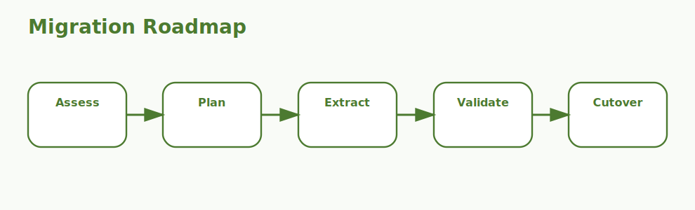

# Angular Migration Interview Questions



This guide covers Angular migration work, especially version upgrades, dependency alignment, rollout planning, risk control, and post-upgrade validation. It follows the corrected format of **100 interview questions for each subtopic**, and every answer includes an Angular or TypeScript code example with rotated real-world scenarios so the examples do not repeat verbatim.

## How To Use This Page

- Questions 1-100 cover Migration assessment.
- Questions 101-200 cover Version compatibility.
- Questions 201-300 cover Angular CLI update flow.
- Questions 301-400 cover TypeScript and RxJS alignment.
- Questions 401-500 cover Deprecated APIs.
- Questions 501-600 cover Standalone adoption.
- Questions 601-700 cover Third-party library readiness.
- Questions 701-800 cover Test coverage.
- Questions 801-900 cover Rollout strategy.
- Questions 901-1000 cover Post-upgrade validation.

## 1. Migration assessment

### Q1.1 What is current-state inventory in Angular migration work?

**Answer:**

Current-state inventory matters in Angular migration work because it affects when the team must understand modules, libraries, patterns, and custom build assumptions before changing anything. In a real situation like a banking portal moving from an older Angular version with strict release approvals, strong answers connect the concept to upgrade safety, dependency alignment, rollout control, and the realities of changing a working production frontend without breaking user workflows. A senior engineer also explains how the decision reduces future migration pain so migration work is driven by evidence instead of guesswork.

**Code Example:**

```ts
const migrationInventory = {
  angularVersion: '14.x',
  nodeVersion: '16.x',
  uiLibraries: ['material', 'ngx-charts']
};
```

### Q1.2 Why does risk discovery matter in real Angular upgrades?

**Answer:**

Risk discovery matters in Angular migration work because it affects when hidden upgrade blockers should be found before the first version bump. In a real situation like a SaaS admin app where Angular upgrades must coexist with active feature development, strong answers connect the concept to upgrade safety, dependency alignment, rollout control, and the realities of changing a working production frontend without breaking user workflows. A senior engineer also explains how the decision reduces future migration pain so teams can explain upgrade risk in concrete technical terms.

**Code Example:**

```ts
const auditAreas = ['framework version', 'third-party libraries', 'custom builders', 'test coverage'];
console.log(auditAreas);
```

### Q1.3 When should a team focus on dependency and architecture mapping?

**Answer:**

Dependency and architecture mapping matters in Angular migration work because it affects when large codebases need a realistic migration plan. In a real situation like a CMS front end depending on several UI libraries and shared internal packages, strong answers connect the concept to upgrade safety, dependency alignment, rollout control, and the realities of changing a working production frontend without breaking user workflows. A senior engineer also explains how the decision reduces future migration pain so dependency, tooling, and rollout decisions become easier to defend.

**Code Example:**

```ts
interface MigrationRisk {
  area: string;
  severity: 'low' | 'medium' | 'high';
}

const risks: MigrationRisk[] = [{ area: 'deprecated APIs', severity: 'high' }];
```

### Q1.4 How would you explain scope clarification in a production migration discussion?

**Answer:**

Scope clarification matters in Angular migration work because it affects when leadership asks what will actually change and what can stay stable. In a real situation like a healthcare application where migration risk is high because forms and workflows are business-critical, strong answers connect the concept to upgrade safety, dependency alignment, rollout control, and the realities of changing a working production frontend without breaking user workflows. A senior engineer also explains how the decision reduces future migration pain so the upgrade path stays incremental and safer for production systems.

**Code Example:**

```ts
const assessmentNote = {
  goal: 'understand the codebase before upgrading',
  benefit: 'avoid surprise blockers'
};
```

### Q1.5 What is a common interview trap around assessment-driven planning?

**Answer:**

Assessment-driven planning matters in Angular migration work because it affects when migration work should be sequenced based on evidence rather than optimism. In a real situation like a logistics dashboard with heavy RxJS usage and a long upgrade gap, strong answers connect the concept to upgrade safety, dependency alignment, rollout control, and the realities of changing a working production frontend without breaking user workflows. A senior engineer also explains how the decision reduces future migration pain so library and version mismatches are discovered earlier.

**Code Example:**

```ts
const migrationScopeKnown = true;
console.log(migrationScopeKnown ? 'Assessment reduces upgrade uncertainty.' : 'Blind upgrades are risky.');
```

### Q1.6 How do you apply current-state inventory safely in a real migration?

**Answer:**

Current-state inventory matters in Angular migration work because it affects when the team must understand modules, libraries, patterns, and custom build assumptions before changing anything. In a real situation like a customer-support console where rollout must be gradual to avoid agent disruption, strong answers connect the concept to upgrade safety, dependency alignment, rollout control, and the realities of changing a working production frontend without breaking user workflows. A senior engineer also explains how the decision reduces future migration pain so modernization choices are separated from must-have compatibility fixes.

**Code Example:**

```ts
const migrationInventory = {
  angularVersion: '14.x',
  nodeVersion: '16.x',
  uiLibraries: ['material', 'ngx-charts']
};
```

### Q1.7 What failure pattern usually exposes weak understanding of risk discovery?

**Answer:**

Risk discovery matters in Angular migration work because it affects when hidden upgrade blockers should be found before the first version bump. In a real situation like an enterprise portal where multiple teams own different Angular modules and libraries, strong answers connect the concept to upgrade safety, dependency alignment, rollout control, and the realities of changing a working production frontend without breaking user workflows. A senior engineer also explains how the decision reduces future migration pain so test strategy and rollout planning become part of the migration rather than a late add-on.

**Code Example:**

```ts
const auditAreas = ['framework version', 'third-party libraries', 'custom builders', 'test coverage'];
console.log(auditAreas);
```

### Q1.8 How would a senior engineer justify dependency and architecture mapping to a delivery team?

**Answer:**

Dependency and architecture mapping matters in Angular migration work because it affects when large codebases need a realistic migration plan. In a real situation like a manufacturing dashboard where Node, Angular CLI, and TypeScript versions are all tightly controlled, strong answers connect the concept to upgrade safety, dependency alignment, rollout control, and the realities of changing a working production frontend without breaking user workflows. A senior engineer also explains how the decision reduces future migration pain so post-upgrade validation focuses on real runtime behavior, not just successful builds.

**Code Example:**

```ts
interface MigrationRisk {
  area: string;
  severity: 'low' | 'medium' | 'high';
}

const risks: MigrationRisk[] = [{ area: 'deprecated APIs', severity: 'high' }];
```

### Q1.9 What trade-off does scope clarification introduce?

**Answer:**

Scope clarification matters in Angular migration work because it affects when leadership asks what will actually change and what can stay stable. In a real situation like a public-facing Angular app where post-upgrade regressions would quickly affect end users, strong answers connect the concept to upgrade safety, dependency alignment, rollout control, and the realities of changing a working production frontend without breaking user workflows. A senior engineer also explains how the decision reduces future migration pain so the answer sounds like practical migration experience instead of checklist memorization.

**Code Example:**

```ts
const assessmentNote = {
  goal: 'understand the codebase before upgrading',
  benefit: 'avoid surprise blockers'
};
```

### Q1.10 How do you answer a tricky follow-up about assessment-driven planning?

**Answer:**

Assessment-driven planning matters in Angular migration work because it affects when migration work should be sequenced based on evidence rather than optimism. In a real situation like a modernization effort using the migration as a chance to adopt standalone APIs and simplify architecture, strong answers connect the concept to upgrade safety, dependency alignment, rollout control, and the realities of changing a working production frontend without breaking user workflows. A senior engineer also explains how the decision reduces future migration pain so future Angular upgrades become easier because the codebase is left in better shape.

**Code Example:**

```ts
const migrationScopeKnown = true;
console.log(migrationScopeKnown ? 'Assessment reduces upgrade uncertainty.' : 'Blind upgrades are risky.');
```

### Q1.11 What is current-state inventory in Angular migration work?

**Answer:**

Current-state inventory matters in Angular migration work because it affects when the team must understand modules, libraries, patterns, and custom build assumptions before changing anything. In a real situation like a banking portal moving from an older Angular version with strict release approvals, strong answers connect the concept to upgrade safety, dependency alignment, rollout control, and the realities of changing a working production frontend without breaking user workflows. A senior engineer also explains how the decision reduces future migration pain so migration work is driven by evidence instead of guesswork.

**Code Example:**

```ts
const migrationInventory = {
  angularVersion: '14.x',
  nodeVersion: '16.x',
  uiLibraries: ['material', 'ngx-charts']
};
```

### Q1.12 Why does risk discovery matter in real Angular upgrades?

**Answer:**

Risk discovery matters in Angular migration work because it affects when hidden upgrade blockers should be found before the first version bump. In a real situation like a SaaS admin app where Angular upgrades must coexist with active feature development, strong answers connect the concept to upgrade safety, dependency alignment, rollout control, and the realities of changing a working production frontend without breaking user workflows. A senior engineer also explains how the decision reduces future migration pain so teams can explain upgrade risk in concrete technical terms.

**Code Example:**

```ts
const auditAreas = ['framework version', 'third-party libraries', 'custom builders', 'test coverage'];
console.log(auditAreas);
```

### Q1.13 When should a team focus on dependency and architecture mapping?

**Answer:**

Dependency and architecture mapping matters in Angular migration work because it affects when large codebases need a realistic migration plan. In a real situation like a CMS front end depending on several UI libraries and shared internal packages, strong answers connect the concept to upgrade safety, dependency alignment, rollout control, and the realities of changing a working production frontend without breaking user workflows. A senior engineer also explains how the decision reduces future migration pain so dependency, tooling, and rollout decisions become easier to defend.

**Code Example:**

```ts
interface MigrationRisk {
  area: string;
  severity: 'low' | 'medium' | 'high';
}

const risks: MigrationRisk[] = [{ area: 'deprecated APIs', severity: 'high' }];
```

### Q1.14 How would you explain scope clarification in a production migration discussion?

**Answer:**

Scope clarification matters in Angular migration work because it affects when leadership asks what will actually change and what can stay stable. In a real situation like a healthcare application where migration risk is high because forms and workflows are business-critical, strong answers connect the concept to upgrade safety, dependency alignment, rollout control, and the realities of changing a working production frontend without breaking user workflows. A senior engineer also explains how the decision reduces future migration pain so the upgrade path stays incremental and safer for production systems.

**Code Example:**

```ts
const assessmentNote = {
  goal: 'understand the codebase before upgrading',
  benefit: 'avoid surprise blockers'
};
```

### Q1.15 What is a common interview trap around assessment-driven planning?

**Answer:**

Assessment-driven planning matters in Angular migration work because it affects when migration work should be sequenced based on evidence rather than optimism. In a real situation like a logistics dashboard with heavy RxJS usage and a long upgrade gap, strong answers connect the concept to upgrade safety, dependency alignment, rollout control, and the realities of changing a working production frontend without breaking user workflows. A senior engineer also explains how the decision reduces future migration pain so library and version mismatches are discovered earlier.

**Code Example:**

```ts
const migrationScopeKnown = true;
console.log(migrationScopeKnown ? 'Assessment reduces upgrade uncertainty.' : 'Blind upgrades are risky.');
```

### Q1.16 How do you apply current-state inventory safely in a real migration?

**Answer:**

Current-state inventory matters in Angular migration work because it affects when the team must understand modules, libraries, patterns, and custom build assumptions before changing anything. In a real situation like a customer-support console where rollout must be gradual to avoid agent disruption, strong answers connect the concept to upgrade safety, dependency alignment, rollout control, and the realities of changing a working production frontend without breaking user workflows. A senior engineer also explains how the decision reduces future migration pain so modernization choices are separated from must-have compatibility fixes.

**Code Example:**

```ts
const migrationInventory = {
  angularVersion: '14.x',
  nodeVersion: '16.x',
  uiLibraries: ['material', 'ngx-charts']
};
```

### Q1.17 What failure pattern usually exposes weak understanding of risk discovery?

**Answer:**

Risk discovery matters in Angular migration work because it affects when hidden upgrade blockers should be found before the first version bump. In a real situation like an enterprise portal where multiple teams own different Angular modules and libraries, strong answers connect the concept to upgrade safety, dependency alignment, rollout control, and the realities of changing a working production frontend without breaking user workflows. A senior engineer also explains how the decision reduces future migration pain so test strategy and rollout planning become part of the migration rather than a late add-on.

**Code Example:**

```ts
const auditAreas = ['framework version', 'third-party libraries', 'custom builders', 'test coverage'];
console.log(auditAreas);
```

### Q1.18 How would a senior engineer justify dependency and architecture mapping to a delivery team?

**Answer:**

Dependency and architecture mapping matters in Angular migration work because it affects when large codebases need a realistic migration plan. In a real situation like a manufacturing dashboard where Node, Angular CLI, and TypeScript versions are all tightly controlled, strong answers connect the concept to upgrade safety, dependency alignment, rollout control, and the realities of changing a working production frontend without breaking user workflows. A senior engineer also explains how the decision reduces future migration pain so post-upgrade validation focuses on real runtime behavior, not just successful builds.

**Code Example:**

```ts
interface MigrationRisk {
  area: string;
  severity: 'low' | 'medium' | 'high';
}

const risks: MigrationRisk[] = [{ area: 'deprecated APIs', severity: 'high' }];
```

### Q1.19 What trade-off does scope clarification introduce?

**Answer:**

Scope clarification matters in Angular migration work because it affects when leadership asks what will actually change and what can stay stable. In a real situation like a public-facing Angular app where post-upgrade regressions would quickly affect end users, strong answers connect the concept to upgrade safety, dependency alignment, rollout control, and the realities of changing a working production frontend without breaking user workflows. A senior engineer also explains how the decision reduces future migration pain so the answer sounds like practical migration experience instead of checklist memorization.

**Code Example:**

```ts
const assessmentNote = {
  goal: 'understand the codebase before upgrading',
  benefit: 'avoid surprise blockers'
};
```

### Q1.20 How do you answer a tricky follow-up about assessment-driven planning?

**Answer:**

Assessment-driven planning matters in Angular migration work because it affects when migration work should be sequenced based on evidence rather than optimism. In a real situation like a modernization effort using the migration as a chance to adopt standalone APIs and simplify architecture, strong answers connect the concept to upgrade safety, dependency alignment, rollout control, and the realities of changing a working production frontend without breaking user workflows. A senior engineer also explains how the decision reduces future migration pain so future Angular upgrades become easier because the codebase is left in better shape.

**Code Example:**

```ts
const migrationScopeKnown = true;
console.log(migrationScopeKnown ? 'Assessment reduces upgrade uncertainty.' : 'Blind upgrades are risky.');
```

### Q1.21 What is current-state inventory in Angular migration work?

**Answer:**

Current-state inventory matters in Angular migration work because it affects when the team must understand modules, libraries, patterns, and custom build assumptions before changing anything. In a real situation like a banking portal moving from an older Angular version with strict release approvals, strong answers connect the concept to upgrade safety, dependency alignment, rollout control, and the realities of changing a working production frontend without breaking user workflows. A senior engineer also explains how the decision reduces future migration pain so migration work is driven by evidence instead of guesswork.

**Code Example:**

```ts
const migrationInventory = {
  angularVersion: '14.x',
  nodeVersion: '16.x',
  uiLibraries: ['material', 'ngx-charts']
};
```

### Q1.22 Why does risk discovery matter in real Angular upgrades?

**Answer:**

Risk discovery matters in Angular migration work because it affects when hidden upgrade blockers should be found before the first version bump. In a real situation like a SaaS admin app where Angular upgrades must coexist with active feature development, strong answers connect the concept to upgrade safety, dependency alignment, rollout control, and the realities of changing a working production frontend without breaking user workflows. A senior engineer also explains how the decision reduces future migration pain so teams can explain upgrade risk in concrete technical terms.

**Code Example:**

```ts
const auditAreas = ['framework version', 'third-party libraries', 'custom builders', 'test coverage'];
console.log(auditAreas);
```

### Q1.23 When should a team focus on dependency and architecture mapping?

**Answer:**

Dependency and architecture mapping matters in Angular migration work because it affects when large codebases need a realistic migration plan. In a real situation like a CMS front end depending on several UI libraries and shared internal packages, strong answers connect the concept to upgrade safety, dependency alignment, rollout control, and the realities of changing a working production frontend without breaking user workflows. A senior engineer also explains how the decision reduces future migration pain so dependency, tooling, and rollout decisions become easier to defend.

**Code Example:**

```ts
interface MigrationRisk {
  area: string;
  severity: 'low' | 'medium' | 'high';
}

const risks: MigrationRisk[] = [{ area: 'deprecated APIs', severity: 'high' }];
```

### Q1.24 How would you explain scope clarification in a production migration discussion?

**Answer:**

Scope clarification matters in Angular migration work because it affects when leadership asks what will actually change and what can stay stable. In a real situation like a healthcare application where migration risk is high because forms and workflows are business-critical, strong answers connect the concept to upgrade safety, dependency alignment, rollout control, and the realities of changing a working production frontend without breaking user workflows. A senior engineer also explains how the decision reduces future migration pain so the upgrade path stays incremental and safer for production systems.

**Code Example:**

```ts
const assessmentNote = {
  goal: 'understand the codebase before upgrading',
  benefit: 'avoid surprise blockers'
};
```

### Q1.25 What is a common interview trap around assessment-driven planning?

**Answer:**

Assessment-driven planning matters in Angular migration work because it affects when migration work should be sequenced based on evidence rather than optimism. In a real situation like a logistics dashboard with heavy RxJS usage and a long upgrade gap, strong answers connect the concept to upgrade safety, dependency alignment, rollout control, and the realities of changing a working production frontend without breaking user workflows. A senior engineer also explains how the decision reduces future migration pain so library and version mismatches are discovered earlier.

**Code Example:**

```ts
const migrationScopeKnown = true;
console.log(migrationScopeKnown ? 'Assessment reduces upgrade uncertainty.' : 'Blind upgrades are risky.');
```

### Q1.26 How do you apply current-state inventory safely in a real migration?

**Answer:**

Current-state inventory matters in Angular migration work because it affects when the team must understand modules, libraries, patterns, and custom build assumptions before changing anything. In a real situation like a customer-support console where rollout must be gradual to avoid agent disruption, strong answers connect the concept to upgrade safety, dependency alignment, rollout control, and the realities of changing a working production frontend without breaking user workflows. A senior engineer also explains how the decision reduces future migration pain so modernization choices are separated from must-have compatibility fixes.

**Code Example:**

```ts
const migrationInventory = {
  angularVersion: '14.x',
  nodeVersion: '16.x',
  uiLibraries: ['material', 'ngx-charts']
};
```

### Q1.27 What failure pattern usually exposes weak understanding of risk discovery?

**Answer:**

Risk discovery matters in Angular migration work because it affects when hidden upgrade blockers should be found before the first version bump. In a real situation like an enterprise portal where multiple teams own different Angular modules and libraries, strong answers connect the concept to upgrade safety, dependency alignment, rollout control, and the realities of changing a working production frontend without breaking user workflows. A senior engineer also explains how the decision reduces future migration pain so test strategy and rollout planning become part of the migration rather than a late add-on.

**Code Example:**

```ts
const auditAreas = ['framework version', 'third-party libraries', 'custom builders', 'test coverage'];
console.log(auditAreas);
```

### Q1.28 How would a senior engineer justify dependency and architecture mapping to a delivery team?

**Answer:**

Dependency and architecture mapping matters in Angular migration work because it affects when large codebases need a realistic migration plan. In a real situation like a manufacturing dashboard where Node, Angular CLI, and TypeScript versions are all tightly controlled, strong answers connect the concept to upgrade safety, dependency alignment, rollout control, and the realities of changing a working production frontend without breaking user workflows. A senior engineer also explains how the decision reduces future migration pain so post-upgrade validation focuses on real runtime behavior, not just successful builds.

**Code Example:**

```ts
interface MigrationRisk {
  area: string;
  severity: 'low' | 'medium' | 'high';
}

const risks: MigrationRisk[] = [{ area: 'deprecated APIs', severity: 'high' }];
```

### Q1.29 What trade-off does scope clarification introduce?

**Answer:**

Scope clarification matters in Angular migration work because it affects when leadership asks what will actually change and what can stay stable. In a real situation like a public-facing Angular app where post-upgrade regressions would quickly affect end users, strong answers connect the concept to upgrade safety, dependency alignment, rollout control, and the realities of changing a working production frontend without breaking user workflows. A senior engineer also explains how the decision reduces future migration pain so the answer sounds like practical migration experience instead of checklist memorization.

**Code Example:**

```ts
const assessmentNote = {
  goal: 'understand the codebase before upgrading',
  benefit: 'avoid surprise blockers'
};
```

### Q1.30 How do you answer a tricky follow-up about assessment-driven planning?

**Answer:**

Assessment-driven planning matters in Angular migration work because it affects when migration work should be sequenced based on evidence rather than optimism. In a real situation like a modernization effort using the migration as a chance to adopt standalone APIs and simplify architecture, strong answers connect the concept to upgrade safety, dependency alignment, rollout control, and the realities of changing a working production frontend without breaking user workflows. A senior engineer also explains how the decision reduces future migration pain so future Angular upgrades become easier because the codebase is left in better shape.

**Code Example:**

```ts
const migrationScopeKnown = true;
console.log(migrationScopeKnown ? 'Assessment reduces upgrade uncertainty.' : 'Blind upgrades are risky.');
```

### Q1.31 What is current-state inventory in Angular migration work?

**Answer:**

Current-state inventory matters in Angular migration work because it affects when the team must understand modules, libraries, patterns, and custom build assumptions before changing anything. In a real situation like a banking portal moving from an older Angular version with strict release approvals, strong answers connect the concept to upgrade safety, dependency alignment, rollout control, and the realities of changing a working production frontend without breaking user workflows. A senior engineer also explains how the decision reduces future migration pain so migration work is driven by evidence instead of guesswork.

**Code Example:**

```ts
const migrationInventory = {
  angularVersion: '14.x',
  nodeVersion: '16.x',
  uiLibraries: ['material', 'ngx-charts']
};
```

### Q1.32 Why does risk discovery matter in real Angular upgrades?

**Answer:**

Risk discovery matters in Angular migration work because it affects when hidden upgrade blockers should be found before the first version bump. In a real situation like a SaaS admin app where Angular upgrades must coexist with active feature development, strong answers connect the concept to upgrade safety, dependency alignment, rollout control, and the realities of changing a working production frontend without breaking user workflows. A senior engineer also explains how the decision reduces future migration pain so teams can explain upgrade risk in concrete technical terms.

**Code Example:**

```ts
const auditAreas = ['framework version', 'third-party libraries', 'custom builders', 'test coverage'];
console.log(auditAreas);
```

### Q1.33 When should a team focus on dependency and architecture mapping?

**Answer:**

Dependency and architecture mapping matters in Angular migration work because it affects when large codebases need a realistic migration plan. In a real situation like a CMS front end depending on several UI libraries and shared internal packages, strong answers connect the concept to upgrade safety, dependency alignment, rollout control, and the realities of changing a working production frontend without breaking user workflows. A senior engineer also explains how the decision reduces future migration pain so dependency, tooling, and rollout decisions become easier to defend.

**Code Example:**

```ts
interface MigrationRisk {
  area: string;
  severity: 'low' | 'medium' | 'high';
}

const risks: MigrationRisk[] = [{ area: 'deprecated APIs', severity: 'high' }];
```

### Q1.34 How would you explain scope clarification in a production migration discussion?

**Answer:**

Scope clarification matters in Angular migration work because it affects when leadership asks what will actually change and what can stay stable. In a real situation like a healthcare application where migration risk is high because forms and workflows are business-critical, strong answers connect the concept to upgrade safety, dependency alignment, rollout control, and the realities of changing a working production frontend without breaking user workflows. A senior engineer also explains how the decision reduces future migration pain so the upgrade path stays incremental and safer for production systems.

**Code Example:**

```ts
const assessmentNote = {
  goal: 'understand the codebase before upgrading',
  benefit: 'avoid surprise blockers'
};
```

### Q1.35 What is a common interview trap around assessment-driven planning?

**Answer:**

Assessment-driven planning matters in Angular migration work because it affects when migration work should be sequenced based on evidence rather than optimism. In a real situation like a logistics dashboard with heavy RxJS usage and a long upgrade gap, strong answers connect the concept to upgrade safety, dependency alignment, rollout control, and the realities of changing a working production frontend without breaking user workflows. A senior engineer also explains how the decision reduces future migration pain so library and version mismatches are discovered earlier.

**Code Example:**

```ts
const migrationScopeKnown = true;
console.log(migrationScopeKnown ? 'Assessment reduces upgrade uncertainty.' : 'Blind upgrades are risky.');
```

### Q1.36 How do you apply current-state inventory safely in a real migration?

**Answer:**

Current-state inventory matters in Angular migration work because it affects when the team must understand modules, libraries, patterns, and custom build assumptions before changing anything. In a real situation like a customer-support console where rollout must be gradual to avoid agent disruption, strong answers connect the concept to upgrade safety, dependency alignment, rollout control, and the realities of changing a working production frontend without breaking user workflows. A senior engineer also explains how the decision reduces future migration pain so modernization choices are separated from must-have compatibility fixes.

**Code Example:**

```ts
const migrationInventory = {
  angularVersion: '14.x',
  nodeVersion: '16.x',
  uiLibraries: ['material', 'ngx-charts']
};
```

### Q1.37 What failure pattern usually exposes weak understanding of risk discovery?

**Answer:**

Risk discovery matters in Angular migration work because it affects when hidden upgrade blockers should be found before the first version bump. In a real situation like an enterprise portal where multiple teams own different Angular modules and libraries, strong answers connect the concept to upgrade safety, dependency alignment, rollout control, and the realities of changing a working production frontend without breaking user workflows. A senior engineer also explains how the decision reduces future migration pain so test strategy and rollout planning become part of the migration rather than a late add-on.

**Code Example:**

```ts
const auditAreas = ['framework version', 'third-party libraries', 'custom builders', 'test coverage'];
console.log(auditAreas);
```

### Q1.38 How would a senior engineer justify dependency and architecture mapping to a delivery team?

**Answer:**

Dependency and architecture mapping matters in Angular migration work because it affects when large codebases need a realistic migration plan. In a real situation like a manufacturing dashboard where Node, Angular CLI, and TypeScript versions are all tightly controlled, strong answers connect the concept to upgrade safety, dependency alignment, rollout control, and the realities of changing a working production frontend without breaking user workflows. A senior engineer also explains how the decision reduces future migration pain so post-upgrade validation focuses on real runtime behavior, not just successful builds.

**Code Example:**

```ts
interface MigrationRisk {
  area: string;
  severity: 'low' | 'medium' | 'high';
}

const risks: MigrationRisk[] = [{ area: 'deprecated APIs', severity: 'high' }];
```

### Q1.39 What trade-off does scope clarification introduce?

**Answer:**

Scope clarification matters in Angular migration work because it affects when leadership asks what will actually change and what can stay stable. In a real situation like a public-facing Angular app where post-upgrade regressions would quickly affect end users, strong answers connect the concept to upgrade safety, dependency alignment, rollout control, and the realities of changing a working production frontend without breaking user workflows. A senior engineer also explains how the decision reduces future migration pain so the answer sounds like practical migration experience instead of checklist memorization.

**Code Example:**

```ts
const assessmentNote = {
  goal: 'understand the codebase before upgrading',
  benefit: 'avoid surprise blockers'
};
```

### Q1.40 How do you answer a tricky follow-up about assessment-driven planning?

**Answer:**

Assessment-driven planning matters in Angular migration work because it affects when migration work should be sequenced based on evidence rather than optimism. In a real situation like a modernization effort using the migration as a chance to adopt standalone APIs and simplify architecture, strong answers connect the concept to upgrade safety, dependency alignment, rollout control, and the realities of changing a working production frontend without breaking user workflows. A senior engineer also explains how the decision reduces future migration pain so future Angular upgrades become easier because the codebase is left in better shape.

**Code Example:**

```ts
const migrationScopeKnown = true;
console.log(migrationScopeKnown ? 'Assessment reduces upgrade uncertainty.' : 'Blind upgrades are risky.');
```

### Q1.41 What is current-state inventory in Angular migration work?

**Answer:**

Current-state inventory matters in Angular migration work because it affects when the team must understand modules, libraries, patterns, and custom build assumptions before changing anything. In a real situation like a banking portal moving from an older Angular version with strict release approvals, strong answers connect the concept to upgrade safety, dependency alignment, rollout control, and the realities of changing a working production frontend without breaking user workflows. A senior engineer also explains how the decision reduces future migration pain so migration work is driven by evidence instead of guesswork.

**Code Example:**

```ts
const migrationInventory = {
  angularVersion: '14.x',
  nodeVersion: '16.x',
  uiLibraries: ['material', 'ngx-charts']
};
```

### Q1.42 Why does risk discovery matter in real Angular upgrades?

**Answer:**

Risk discovery matters in Angular migration work because it affects when hidden upgrade blockers should be found before the first version bump. In a real situation like a SaaS admin app where Angular upgrades must coexist with active feature development, strong answers connect the concept to upgrade safety, dependency alignment, rollout control, and the realities of changing a working production frontend without breaking user workflows. A senior engineer also explains how the decision reduces future migration pain so teams can explain upgrade risk in concrete technical terms.

**Code Example:**

```ts
const auditAreas = ['framework version', 'third-party libraries', 'custom builders', 'test coverage'];
console.log(auditAreas);
```

### Q1.43 When should a team focus on dependency and architecture mapping?

**Answer:**

Dependency and architecture mapping matters in Angular migration work because it affects when large codebases need a realistic migration plan. In a real situation like a CMS front end depending on several UI libraries and shared internal packages, strong answers connect the concept to upgrade safety, dependency alignment, rollout control, and the realities of changing a working production frontend without breaking user workflows. A senior engineer also explains how the decision reduces future migration pain so dependency, tooling, and rollout decisions become easier to defend.

**Code Example:**

```ts
interface MigrationRisk {
  area: string;
  severity: 'low' | 'medium' | 'high';
}

const risks: MigrationRisk[] = [{ area: 'deprecated APIs', severity: 'high' }];
```

### Q1.44 How would you explain scope clarification in a production migration discussion?

**Answer:**

Scope clarification matters in Angular migration work because it affects when leadership asks what will actually change and what can stay stable. In a real situation like a healthcare application where migration risk is high because forms and workflows are business-critical, strong answers connect the concept to upgrade safety, dependency alignment, rollout control, and the realities of changing a working production frontend without breaking user workflows. A senior engineer also explains how the decision reduces future migration pain so the upgrade path stays incremental and safer for production systems.

**Code Example:**

```ts
const assessmentNote = {
  goal: 'understand the codebase before upgrading',
  benefit: 'avoid surprise blockers'
};
```

### Q1.45 What is a common interview trap around assessment-driven planning?

**Answer:**

Assessment-driven planning matters in Angular migration work because it affects when migration work should be sequenced based on evidence rather than optimism. In a real situation like a logistics dashboard with heavy RxJS usage and a long upgrade gap, strong answers connect the concept to upgrade safety, dependency alignment, rollout control, and the realities of changing a working production frontend without breaking user workflows. A senior engineer also explains how the decision reduces future migration pain so library and version mismatches are discovered earlier.

**Code Example:**

```ts
const migrationScopeKnown = true;
console.log(migrationScopeKnown ? 'Assessment reduces upgrade uncertainty.' : 'Blind upgrades are risky.');
```

### Q1.46 How do you apply current-state inventory safely in a real migration?

**Answer:**

Current-state inventory matters in Angular migration work because it affects when the team must understand modules, libraries, patterns, and custom build assumptions before changing anything. In a real situation like a customer-support console where rollout must be gradual to avoid agent disruption, strong answers connect the concept to upgrade safety, dependency alignment, rollout control, and the realities of changing a working production frontend without breaking user workflows. A senior engineer also explains how the decision reduces future migration pain so modernization choices are separated from must-have compatibility fixes.

**Code Example:**

```ts
const migrationInventory = {
  angularVersion: '14.x',
  nodeVersion: '16.x',
  uiLibraries: ['material', 'ngx-charts']
};
```

### Q1.47 What failure pattern usually exposes weak understanding of risk discovery?

**Answer:**

Risk discovery matters in Angular migration work because it affects when hidden upgrade blockers should be found before the first version bump. In a real situation like an enterprise portal where multiple teams own different Angular modules and libraries, strong answers connect the concept to upgrade safety, dependency alignment, rollout control, and the realities of changing a working production frontend without breaking user workflows. A senior engineer also explains how the decision reduces future migration pain so test strategy and rollout planning become part of the migration rather than a late add-on.

**Code Example:**

```ts
const auditAreas = ['framework version', 'third-party libraries', 'custom builders', 'test coverage'];
console.log(auditAreas);
```

### Q1.48 How would a senior engineer justify dependency and architecture mapping to a delivery team?

**Answer:**

Dependency and architecture mapping matters in Angular migration work because it affects when large codebases need a realistic migration plan. In a real situation like a manufacturing dashboard where Node, Angular CLI, and TypeScript versions are all tightly controlled, strong answers connect the concept to upgrade safety, dependency alignment, rollout control, and the realities of changing a working production frontend without breaking user workflows. A senior engineer also explains how the decision reduces future migration pain so post-upgrade validation focuses on real runtime behavior, not just successful builds.

**Code Example:**

```ts
interface MigrationRisk {
  area: string;
  severity: 'low' | 'medium' | 'high';
}

const risks: MigrationRisk[] = [{ area: 'deprecated APIs', severity: 'high' }];
```

### Q1.49 What trade-off does scope clarification introduce?

**Answer:**

Scope clarification matters in Angular migration work because it affects when leadership asks what will actually change and what can stay stable. In a real situation like a public-facing Angular app where post-upgrade regressions would quickly affect end users, strong answers connect the concept to upgrade safety, dependency alignment, rollout control, and the realities of changing a working production frontend without breaking user workflows. A senior engineer also explains how the decision reduces future migration pain so the answer sounds like practical migration experience instead of checklist memorization.

**Code Example:**

```ts
const assessmentNote = {
  goal: 'understand the codebase before upgrading',
  benefit: 'avoid surprise blockers'
};
```

### Q1.50 How do you answer a tricky follow-up about assessment-driven planning?

**Answer:**

Assessment-driven planning matters in Angular migration work because it affects when migration work should be sequenced based on evidence rather than optimism. In a real situation like a modernization effort using the migration as a chance to adopt standalone APIs and simplify architecture, strong answers connect the concept to upgrade safety, dependency alignment, rollout control, and the realities of changing a working production frontend without breaking user workflows. A senior engineer also explains how the decision reduces future migration pain so future Angular upgrades become easier because the codebase is left in better shape.

**Code Example:**

```ts
const migrationScopeKnown = true;
console.log(migrationScopeKnown ? 'Assessment reduces upgrade uncertainty.' : 'Blind upgrades are risky.');
```

### Q1.51 What is current-state inventory in Angular migration work?

**Answer:**

Current-state inventory matters in Angular migration work because it affects when the team must understand modules, libraries, patterns, and custom build assumptions before changing anything. In a real situation like a banking portal moving from an older Angular version with strict release approvals, strong answers connect the concept to upgrade safety, dependency alignment, rollout control, and the realities of changing a working production frontend without breaking user workflows. A senior engineer also explains how the decision reduces future migration pain so migration work is driven by evidence instead of guesswork.

**Code Example:**

```ts
const migrationInventory = {
  angularVersion: '14.x',
  nodeVersion: '16.x',
  uiLibraries: ['material', 'ngx-charts']
};
```

### Q1.52 Why does risk discovery matter in real Angular upgrades?

**Answer:**

Risk discovery matters in Angular migration work because it affects when hidden upgrade blockers should be found before the first version bump. In a real situation like a SaaS admin app where Angular upgrades must coexist with active feature development, strong answers connect the concept to upgrade safety, dependency alignment, rollout control, and the realities of changing a working production frontend without breaking user workflows. A senior engineer also explains how the decision reduces future migration pain so teams can explain upgrade risk in concrete technical terms.

**Code Example:**

```ts
const auditAreas = ['framework version', 'third-party libraries', 'custom builders', 'test coverage'];
console.log(auditAreas);
```

### Q1.53 When should a team focus on dependency and architecture mapping?

**Answer:**

Dependency and architecture mapping matters in Angular migration work because it affects when large codebases need a realistic migration plan. In a real situation like a CMS front end depending on several UI libraries and shared internal packages, strong answers connect the concept to upgrade safety, dependency alignment, rollout control, and the realities of changing a working production frontend without breaking user workflows. A senior engineer also explains how the decision reduces future migration pain so dependency, tooling, and rollout decisions become easier to defend.

**Code Example:**

```ts
interface MigrationRisk {
  area: string;
  severity: 'low' | 'medium' | 'high';
}

const risks: MigrationRisk[] = [{ area: 'deprecated APIs', severity: 'high' }];
```

### Q1.54 How would you explain scope clarification in a production migration discussion?

**Answer:**

Scope clarification matters in Angular migration work because it affects when leadership asks what will actually change and what can stay stable. In a real situation like a healthcare application where migration risk is high because forms and workflows are business-critical, strong answers connect the concept to upgrade safety, dependency alignment, rollout control, and the realities of changing a working production frontend without breaking user workflows. A senior engineer also explains how the decision reduces future migration pain so the upgrade path stays incremental and safer for production systems.

**Code Example:**

```ts
const assessmentNote = {
  goal: 'understand the codebase before upgrading',
  benefit: 'avoid surprise blockers'
};
```

### Q1.55 What is a common interview trap around assessment-driven planning?

**Answer:**

Assessment-driven planning matters in Angular migration work because it affects when migration work should be sequenced based on evidence rather than optimism. In a real situation like a logistics dashboard with heavy RxJS usage and a long upgrade gap, strong answers connect the concept to upgrade safety, dependency alignment, rollout control, and the realities of changing a working production frontend without breaking user workflows. A senior engineer also explains how the decision reduces future migration pain so library and version mismatches are discovered earlier.

**Code Example:**

```ts
const migrationScopeKnown = true;
console.log(migrationScopeKnown ? 'Assessment reduces upgrade uncertainty.' : 'Blind upgrades are risky.');
```

### Q1.56 How do you apply current-state inventory safely in a real migration?

**Answer:**

Current-state inventory matters in Angular migration work because it affects when the team must understand modules, libraries, patterns, and custom build assumptions before changing anything. In a real situation like a customer-support console where rollout must be gradual to avoid agent disruption, strong answers connect the concept to upgrade safety, dependency alignment, rollout control, and the realities of changing a working production frontend without breaking user workflows. A senior engineer also explains how the decision reduces future migration pain so modernization choices are separated from must-have compatibility fixes.

**Code Example:**

```ts
const migrationInventory = {
  angularVersion: '14.x',
  nodeVersion: '16.x',
  uiLibraries: ['material', 'ngx-charts']
};
```

### Q1.57 What failure pattern usually exposes weak understanding of risk discovery?

**Answer:**

Risk discovery matters in Angular migration work because it affects when hidden upgrade blockers should be found before the first version bump. In a real situation like an enterprise portal where multiple teams own different Angular modules and libraries, strong answers connect the concept to upgrade safety, dependency alignment, rollout control, and the realities of changing a working production frontend without breaking user workflows. A senior engineer also explains how the decision reduces future migration pain so test strategy and rollout planning become part of the migration rather than a late add-on.

**Code Example:**

```ts
const auditAreas = ['framework version', 'third-party libraries', 'custom builders', 'test coverage'];
console.log(auditAreas);
```

### Q1.58 How would a senior engineer justify dependency and architecture mapping to a delivery team?

**Answer:**

Dependency and architecture mapping matters in Angular migration work because it affects when large codebases need a realistic migration plan. In a real situation like a manufacturing dashboard where Node, Angular CLI, and TypeScript versions are all tightly controlled, strong answers connect the concept to upgrade safety, dependency alignment, rollout control, and the realities of changing a working production frontend without breaking user workflows. A senior engineer also explains how the decision reduces future migration pain so post-upgrade validation focuses on real runtime behavior, not just successful builds.

**Code Example:**

```ts
interface MigrationRisk {
  area: string;
  severity: 'low' | 'medium' | 'high';
}

const risks: MigrationRisk[] = [{ area: 'deprecated APIs', severity: 'high' }];
```

### Q1.59 What trade-off does scope clarification introduce?

**Answer:**

Scope clarification matters in Angular migration work because it affects when leadership asks what will actually change and what can stay stable. In a real situation like a public-facing Angular app where post-upgrade regressions would quickly affect end users, strong answers connect the concept to upgrade safety, dependency alignment, rollout control, and the realities of changing a working production frontend without breaking user workflows. A senior engineer also explains how the decision reduces future migration pain so the answer sounds like practical migration experience instead of checklist memorization.

**Code Example:**

```ts
const assessmentNote = {
  goal: 'understand the codebase before upgrading',
  benefit: 'avoid surprise blockers'
};
```

### Q1.60 How do you answer a tricky follow-up about assessment-driven planning?

**Answer:**

Assessment-driven planning matters in Angular migration work because it affects when migration work should be sequenced based on evidence rather than optimism. In a real situation like a modernization effort using the migration as a chance to adopt standalone APIs and simplify architecture, strong answers connect the concept to upgrade safety, dependency alignment, rollout control, and the realities of changing a working production frontend without breaking user workflows. A senior engineer also explains how the decision reduces future migration pain so future Angular upgrades become easier because the codebase is left in better shape.

**Code Example:**

```ts
const migrationScopeKnown = true;
console.log(migrationScopeKnown ? 'Assessment reduces upgrade uncertainty.' : 'Blind upgrades are risky.');
```

### Q1.61 What is current-state inventory in Angular migration work?

**Answer:**

Current-state inventory matters in Angular migration work because it affects when the team must understand modules, libraries, patterns, and custom build assumptions before changing anything. In a real situation like a banking portal moving from an older Angular version with strict release approvals, strong answers connect the concept to upgrade safety, dependency alignment, rollout control, and the realities of changing a working production frontend without breaking user workflows. A senior engineer also explains how the decision reduces future migration pain so migration work is driven by evidence instead of guesswork.

**Code Example:**

```ts
const migrationInventory = {
  angularVersion: '14.x',
  nodeVersion: '16.x',
  uiLibraries: ['material', 'ngx-charts']
};
```

### Q1.62 Why does risk discovery matter in real Angular upgrades?

**Answer:**

Risk discovery matters in Angular migration work because it affects when hidden upgrade blockers should be found before the first version bump. In a real situation like a SaaS admin app where Angular upgrades must coexist with active feature development, strong answers connect the concept to upgrade safety, dependency alignment, rollout control, and the realities of changing a working production frontend without breaking user workflows. A senior engineer also explains how the decision reduces future migration pain so teams can explain upgrade risk in concrete technical terms.

**Code Example:**

```ts
const auditAreas = ['framework version', 'third-party libraries', 'custom builders', 'test coverage'];
console.log(auditAreas);
```

### Q1.63 When should a team focus on dependency and architecture mapping?

**Answer:**

Dependency and architecture mapping matters in Angular migration work because it affects when large codebases need a realistic migration plan. In a real situation like a CMS front end depending on several UI libraries and shared internal packages, strong answers connect the concept to upgrade safety, dependency alignment, rollout control, and the realities of changing a working production frontend without breaking user workflows. A senior engineer also explains how the decision reduces future migration pain so dependency, tooling, and rollout decisions become easier to defend.

**Code Example:**

```ts
interface MigrationRisk {
  area: string;
  severity: 'low' | 'medium' | 'high';
}

const risks: MigrationRisk[] = [{ area: 'deprecated APIs', severity: 'high' }];
```

### Q1.64 How would you explain scope clarification in a production migration discussion?

**Answer:**

Scope clarification matters in Angular migration work because it affects when leadership asks what will actually change and what can stay stable. In a real situation like a healthcare application where migration risk is high because forms and workflows are business-critical, strong answers connect the concept to upgrade safety, dependency alignment, rollout control, and the realities of changing a working production frontend without breaking user workflows. A senior engineer also explains how the decision reduces future migration pain so the upgrade path stays incremental and safer for production systems.

**Code Example:**

```ts
const assessmentNote = {
  goal: 'understand the codebase before upgrading',
  benefit: 'avoid surprise blockers'
};
```

### Q1.65 What is a common interview trap around assessment-driven planning?

**Answer:**

Assessment-driven planning matters in Angular migration work because it affects when migration work should be sequenced based on evidence rather than optimism. In a real situation like a logistics dashboard with heavy RxJS usage and a long upgrade gap, strong answers connect the concept to upgrade safety, dependency alignment, rollout control, and the realities of changing a working production frontend without breaking user workflows. A senior engineer also explains how the decision reduces future migration pain so library and version mismatches are discovered earlier.

**Code Example:**

```ts
const migrationScopeKnown = true;
console.log(migrationScopeKnown ? 'Assessment reduces upgrade uncertainty.' : 'Blind upgrades are risky.');
```

### Q1.66 How do you apply current-state inventory safely in a real migration?

**Answer:**

Current-state inventory matters in Angular migration work because it affects when the team must understand modules, libraries, patterns, and custom build assumptions before changing anything. In a real situation like a customer-support console where rollout must be gradual to avoid agent disruption, strong answers connect the concept to upgrade safety, dependency alignment, rollout control, and the realities of changing a working production frontend without breaking user workflows. A senior engineer also explains how the decision reduces future migration pain so modernization choices are separated from must-have compatibility fixes.

**Code Example:**

```ts
const migrationInventory = {
  angularVersion: '14.x',
  nodeVersion: '16.x',
  uiLibraries: ['material', 'ngx-charts']
};
```

### Q1.67 What failure pattern usually exposes weak understanding of risk discovery?

**Answer:**

Risk discovery matters in Angular migration work because it affects when hidden upgrade blockers should be found before the first version bump. In a real situation like an enterprise portal where multiple teams own different Angular modules and libraries, strong answers connect the concept to upgrade safety, dependency alignment, rollout control, and the realities of changing a working production frontend without breaking user workflows. A senior engineer also explains how the decision reduces future migration pain so test strategy and rollout planning become part of the migration rather than a late add-on.

**Code Example:**

```ts
const auditAreas = ['framework version', 'third-party libraries', 'custom builders', 'test coverage'];
console.log(auditAreas);
```

### Q1.68 How would a senior engineer justify dependency and architecture mapping to a delivery team?

**Answer:**

Dependency and architecture mapping matters in Angular migration work because it affects when large codebases need a realistic migration plan. In a real situation like a manufacturing dashboard where Node, Angular CLI, and TypeScript versions are all tightly controlled, strong answers connect the concept to upgrade safety, dependency alignment, rollout control, and the realities of changing a working production frontend without breaking user workflows. A senior engineer also explains how the decision reduces future migration pain so post-upgrade validation focuses on real runtime behavior, not just successful builds.

**Code Example:**

```ts
interface MigrationRisk {
  area: string;
  severity: 'low' | 'medium' | 'high';
}

const risks: MigrationRisk[] = [{ area: 'deprecated APIs', severity: 'high' }];
```

### Q1.69 What trade-off does scope clarification introduce?

**Answer:**

Scope clarification matters in Angular migration work because it affects when leadership asks what will actually change and what can stay stable. In a real situation like a public-facing Angular app where post-upgrade regressions would quickly affect end users, strong answers connect the concept to upgrade safety, dependency alignment, rollout control, and the realities of changing a working production frontend without breaking user workflows. A senior engineer also explains how the decision reduces future migration pain so the answer sounds like practical migration experience instead of checklist memorization.

**Code Example:**

```ts
const assessmentNote = {
  goal: 'understand the codebase before upgrading',
  benefit: 'avoid surprise blockers'
};
```

### Q1.70 How do you answer a tricky follow-up about assessment-driven planning?

**Answer:**

Assessment-driven planning matters in Angular migration work because it affects when migration work should be sequenced based on evidence rather than optimism. In a real situation like a modernization effort using the migration as a chance to adopt standalone APIs and simplify architecture, strong answers connect the concept to upgrade safety, dependency alignment, rollout control, and the realities of changing a working production frontend without breaking user workflows. A senior engineer also explains how the decision reduces future migration pain so future Angular upgrades become easier because the codebase is left in better shape.

**Code Example:**

```ts
const migrationScopeKnown = true;
console.log(migrationScopeKnown ? 'Assessment reduces upgrade uncertainty.' : 'Blind upgrades are risky.');
```

### Q1.71 What is current-state inventory in Angular migration work?

**Answer:**

Current-state inventory matters in Angular migration work because it affects when the team must understand modules, libraries, patterns, and custom build assumptions before changing anything. In a real situation like a banking portal moving from an older Angular version with strict release approvals, strong answers connect the concept to upgrade safety, dependency alignment, rollout control, and the realities of changing a working production frontend without breaking user workflows. A senior engineer also explains how the decision reduces future migration pain so migration work is driven by evidence instead of guesswork.

**Code Example:**

```ts
const migrationInventory = {
  angularVersion: '14.x',
  nodeVersion: '16.x',
  uiLibraries: ['material', 'ngx-charts']
};
```

### Q1.72 Why does risk discovery matter in real Angular upgrades?

**Answer:**

Risk discovery matters in Angular migration work because it affects when hidden upgrade blockers should be found before the first version bump. In a real situation like a SaaS admin app where Angular upgrades must coexist with active feature development, strong answers connect the concept to upgrade safety, dependency alignment, rollout control, and the realities of changing a working production frontend without breaking user workflows. A senior engineer also explains how the decision reduces future migration pain so teams can explain upgrade risk in concrete technical terms.

**Code Example:**

```ts
const auditAreas = ['framework version', 'third-party libraries', 'custom builders', 'test coverage'];
console.log(auditAreas);
```

### Q1.73 When should a team focus on dependency and architecture mapping?

**Answer:**

Dependency and architecture mapping matters in Angular migration work because it affects when large codebases need a realistic migration plan. In a real situation like a CMS front end depending on several UI libraries and shared internal packages, strong answers connect the concept to upgrade safety, dependency alignment, rollout control, and the realities of changing a working production frontend without breaking user workflows. A senior engineer also explains how the decision reduces future migration pain so dependency, tooling, and rollout decisions become easier to defend.

**Code Example:**

```ts
interface MigrationRisk {
  area: string;
  severity: 'low' | 'medium' | 'high';
}

const risks: MigrationRisk[] = [{ area: 'deprecated APIs', severity: 'high' }];
```

### Q1.74 How would you explain scope clarification in a production migration discussion?

**Answer:**

Scope clarification matters in Angular migration work because it affects when leadership asks what will actually change and what can stay stable. In a real situation like a healthcare application where migration risk is high because forms and workflows are business-critical, strong answers connect the concept to upgrade safety, dependency alignment, rollout control, and the realities of changing a working production frontend without breaking user workflows. A senior engineer also explains how the decision reduces future migration pain so the upgrade path stays incremental and safer for production systems.

**Code Example:**

```ts
const assessmentNote = {
  goal: 'understand the codebase before upgrading',
  benefit: 'avoid surprise blockers'
};
```

### Q1.75 What is a common interview trap around assessment-driven planning?

**Answer:**

Assessment-driven planning matters in Angular migration work because it affects when migration work should be sequenced based on evidence rather than optimism. In a real situation like a logistics dashboard with heavy RxJS usage and a long upgrade gap, strong answers connect the concept to upgrade safety, dependency alignment, rollout control, and the realities of changing a working production frontend without breaking user workflows. A senior engineer also explains how the decision reduces future migration pain so library and version mismatches are discovered earlier.

**Code Example:**

```ts
const migrationScopeKnown = true;
console.log(migrationScopeKnown ? 'Assessment reduces upgrade uncertainty.' : 'Blind upgrades are risky.');
```

### Q1.76 How do you apply current-state inventory safely in a real migration?

**Answer:**

Current-state inventory matters in Angular migration work because it affects when the team must understand modules, libraries, patterns, and custom build assumptions before changing anything. In a real situation like a customer-support console where rollout must be gradual to avoid agent disruption, strong answers connect the concept to upgrade safety, dependency alignment, rollout control, and the realities of changing a working production frontend without breaking user workflows. A senior engineer also explains how the decision reduces future migration pain so modernization choices are separated from must-have compatibility fixes.

**Code Example:**

```ts
const migrationInventory = {
  angularVersion: '14.x',
  nodeVersion: '16.x',
  uiLibraries: ['material', 'ngx-charts']
};
```

### Q1.77 What failure pattern usually exposes weak understanding of risk discovery?

**Answer:**

Risk discovery matters in Angular migration work because it affects when hidden upgrade blockers should be found before the first version bump. In a real situation like an enterprise portal where multiple teams own different Angular modules and libraries, strong answers connect the concept to upgrade safety, dependency alignment, rollout control, and the realities of changing a working production frontend without breaking user workflows. A senior engineer also explains how the decision reduces future migration pain so test strategy and rollout planning become part of the migration rather than a late add-on.

**Code Example:**

```ts
const auditAreas = ['framework version', 'third-party libraries', 'custom builders', 'test coverage'];
console.log(auditAreas);
```

### Q1.78 How would a senior engineer justify dependency and architecture mapping to a delivery team?

**Answer:**

Dependency and architecture mapping matters in Angular migration work because it affects when large codebases need a realistic migration plan. In a real situation like a manufacturing dashboard where Node, Angular CLI, and TypeScript versions are all tightly controlled, strong answers connect the concept to upgrade safety, dependency alignment, rollout control, and the realities of changing a working production frontend without breaking user workflows. A senior engineer also explains how the decision reduces future migration pain so post-upgrade validation focuses on real runtime behavior, not just successful builds.

**Code Example:**

```ts
interface MigrationRisk {
  area: string;
  severity: 'low' | 'medium' | 'high';
}

const risks: MigrationRisk[] = [{ area: 'deprecated APIs', severity: 'high' }];
```

### Q1.79 What trade-off does scope clarification introduce?

**Answer:**

Scope clarification matters in Angular migration work because it affects when leadership asks what will actually change and what can stay stable. In a real situation like a public-facing Angular app where post-upgrade regressions would quickly affect end users, strong answers connect the concept to upgrade safety, dependency alignment, rollout control, and the realities of changing a working production frontend without breaking user workflows. A senior engineer also explains how the decision reduces future migration pain so the answer sounds like practical migration experience instead of checklist memorization.

**Code Example:**

```ts
const assessmentNote = {
  goal: 'understand the codebase before upgrading',
  benefit: 'avoid surprise blockers'
};
```

### Q1.80 How do you answer a tricky follow-up about assessment-driven planning?

**Answer:**

Assessment-driven planning matters in Angular migration work because it affects when migration work should be sequenced based on evidence rather than optimism. In a real situation like a modernization effort using the migration as a chance to adopt standalone APIs and simplify architecture, strong answers connect the concept to upgrade safety, dependency alignment, rollout control, and the realities of changing a working production frontend without breaking user workflows. A senior engineer also explains how the decision reduces future migration pain so future Angular upgrades become easier because the codebase is left in better shape.

**Code Example:**

```ts
const migrationScopeKnown = true;
console.log(migrationScopeKnown ? 'Assessment reduces upgrade uncertainty.' : 'Blind upgrades are risky.');
```

### Q1.81 What is current-state inventory in Angular migration work?

**Answer:**

Current-state inventory matters in Angular migration work because it affects when the team must understand modules, libraries, patterns, and custom build assumptions before changing anything. In a real situation like a banking portal moving from an older Angular version with strict release approvals, strong answers connect the concept to upgrade safety, dependency alignment, rollout control, and the realities of changing a working production frontend without breaking user workflows. A senior engineer also explains how the decision reduces future migration pain so migration work is driven by evidence instead of guesswork.

**Code Example:**

```ts
const migrationInventory = {
  angularVersion: '14.x',
  nodeVersion: '16.x',
  uiLibraries: ['material', 'ngx-charts']
};
```

### Q1.82 Why does risk discovery matter in real Angular upgrades?

**Answer:**

Risk discovery matters in Angular migration work because it affects when hidden upgrade blockers should be found before the first version bump. In a real situation like a SaaS admin app where Angular upgrades must coexist with active feature development, strong answers connect the concept to upgrade safety, dependency alignment, rollout control, and the realities of changing a working production frontend without breaking user workflows. A senior engineer also explains how the decision reduces future migration pain so teams can explain upgrade risk in concrete technical terms.

**Code Example:**

```ts
const auditAreas = ['framework version', 'third-party libraries', 'custom builders', 'test coverage'];
console.log(auditAreas);
```

### Q1.83 When should a team focus on dependency and architecture mapping?

**Answer:**

Dependency and architecture mapping matters in Angular migration work because it affects when large codebases need a realistic migration plan. In a real situation like a CMS front end depending on several UI libraries and shared internal packages, strong answers connect the concept to upgrade safety, dependency alignment, rollout control, and the realities of changing a working production frontend without breaking user workflows. A senior engineer also explains how the decision reduces future migration pain so dependency, tooling, and rollout decisions become easier to defend.

**Code Example:**

```ts
interface MigrationRisk {
  area: string;
  severity: 'low' | 'medium' | 'high';
}

const risks: MigrationRisk[] = [{ area: 'deprecated APIs', severity: 'high' }];
```

### Q1.84 How would you explain scope clarification in a production migration discussion?

**Answer:**

Scope clarification matters in Angular migration work because it affects when leadership asks what will actually change and what can stay stable. In a real situation like a healthcare application where migration risk is high because forms and workflows are business-critical, strong answers connect the concept to upgrade safety, dependency alignment, rollout control, and the realities of changing a working production frontend without breaking user workflows. A senior engineer also explains how the decision reduces future migration pain so the upgrade path stays incremental and safer for production systems.

**Code Example:**

```ts
const assessmentNote = {
  goal: 'understand the codebase before upgrading',
  benefit: 'avoid surprise blockers'
};
```

### Q1.85 What is a common interview trap around assessment-driven planning?

**Answer:**

Assessment-driven planning matters in Angular migration work because it affects when migration work should be sequenced based on evidence rather than optimism. In a real situation like a logistics dashboard with heavy RxJS usage and a long upgrade gap, strong answers connect the concept to upgrade safety, dependency alignment, rollout control, and the realities of changing a working production frontend without breaking user workflows. A senior engineer also explains how the decision reduces future migration pain so library and version mismatches are discovered earlier.

**Code Example:**

```ts
const migrationScopeKnown = true;
console.log(migrationScopeKnown ? 'Assessment reduces upgrade uncertainty.' : 'Blind upgrades are risky.');
```

### Q1.86 How do you apply current-state inventory safely in a real migration?

**Answer:**

Current-state inventory matters in Angular migration work because it affects when the team must understand modules, libraries, patterns, and custom build assumptions before changing anything. In a real situation like a customer-support console where rollout must be gradual to avoid agent disruption, strong answers connect the concept to upgrade safety, dependency alignment, rollout control, and the realities of changing a working production frontend without breaking user workflows. A senior engineer also explains how the decision reduces future migration pain so modernization choices are separated from must-have compatibility fixes.

**Code Example:**

```ts
const migrationInventory = {
  angularVersion: '14.x',
  nodeVersion: '16.x',
  uiLibraries: ['material', 'ngx-charts']
};
```

### Q1.87 What failure pattern usually exposes weak understanding of risk discovery?

**Answer:**

Risk discovery matters in Angular migration work because it affects when hidden upgrade blockers should be found before the first version bump. In a real situation like an enterprise portal where multiple teams own different Angular modules and libraries, strong answers connect the concept to upgrade safety, dependency alignment, rollout control, and the realities of changing a working production frontend without breaking user workflows. A senior engineer also explains how the decision reduces future migration pain so test strategy and rollout planning become part of the migration rather than a late add-on.

**Code Example:**

```ts
const auditAreas = ['framework version', 'third-party libraries', 'custom builders', 'test coverage'];
console.log(auditAreas);
```

### Q1.88 How would a senior engineer justify dependency and architecture mapping to a delivery team?

**Answer:**

Dependency and architecture mapping matters in Angular migration work because it affects when large codebases need a realistic migration plan. In a real situation like a manufacturing dashboard where Node, Angular CLI, and TypeScript versions are all tightly controlled, strong answers connect the concept to upgrade safety, dependency alignment, rollout control, and the realities of changing a working production frontend without breaking user workflows. A senior engineer also explains how the decision reduces future migration pain so post-upgrade validation focuses on real runtime behavior, not just successful builds.

**Code Example:**

```ts
interface MigrationRisk {
  area: string;
  severity: 'low' | 'medium' | 'high';
}

const risks: MigrationRisk[] = [{ area: 'deprecated APIs', severity: 'high' }];
```

### Q1.89 What trade-off does scope clarification introduce?

**Answer:**

Scope clarification matters in Angular migration work because it affects when leadership asks what will actually change and what can stay stable. In a real situation like a public-facing Angular app where post-upgrade regressions would quickly affect end users, strong answers connect the concept to upgrade safety, dependency alignment, rollout control, and the realities of changing a working production frontend without breaking user workflows. A senior engineer also explains how the decision reduces future migration pain so the answer sounds like practical migration experience instead of checklist memorization.

**Code Example:**

```ts
const assessmentNote = {
  goal: 'understand the codebase before upgrading',
  benefit: 'avoid surprise blockers'
};
```

### Q1.90 How do you answer a tricky follow-up about assessment-driven planning?

**Answer:**

Assessment-driven planning matters in Angular migration work because it affects when migration work should be sequenced based on evidence rather than optimism. In a real situation like a modernization effort using the migration as a chance to adopt standalone APIs and simplify architecture, strong answers connect the concept to upgrade safety, dependency alignment, rollout control, and the realities of changing a working production frontend without breaking user workflows. A senior engineer also explains how the decision reduces future migration pain so future Angular upgrades become easier because the codebase is left in better shape.

**Code Example:**

```ts
const migrationScopeKnown = true;
console.log(migrationScopeKnown ? 'Assessment reduces upgrade uncertainty.' : 'Blind upgrades are risky.');
```

### Q1.91 What is current-state inventory in Angular migration work?

**Answer:**

Current-state inventory matters in Angular migration work because it affects when the team must understand modules, libraries, patterns, and custom build assumptions before changing anything. In a real situation like a banking portal moving from an older Angular version with strict release approvals, strong answers connect the concept to upgrade safety, dependency alignment, rollout control, and the realities of changing a working production frontend without breaking user workflows. A senior engineer also explains how the decision reduces future migration pain so migration work is driven by evidence instead of guesswork.

**Code Example:**

```ts
const migrationInventory = {
  angularVersion: '14.x',
  nodeVersion: '16.x',
  uiLibraries: ['material', 'ngx-charts']
};
```

### Q1.92 Why does risk discovery matter in real Angular upgrades?

**Answer:**

Risk discovery matters in Angular migration work because it affects when hidden upgrade blockers should be found before the first version bump. In a real situation like a SaaS admin app where Angular upgrades must coexist with active feature development, strong answers connect the concept to upgrade safety, dependency alignment, rollout control, and the realities of changing a working production frontend without breaking user workflows. A senior engineer also explains how the decision reduces future migration pain so teams can explain upgrade risk in concrete technical terms.

**Code Example:**

```ts
const auditAreas = ['framework version', 'third-party libraries', 'custom builders', 'test coverage'];
console.log(auditAreas);
```

### Q1.93 When should a team focus on dependency and architecture mapping?

**Answer:**

Dependency and architecture mapping matters in Angular migration work because it affects when large codebases need a realistic migration plan. In a real situation like a CMS front end depending on several UI libraries and shared internal packages, strong answers connect the concept to upgrade safety, dependency alignment, rollout control, and the realities of changing a working production frontend without breaking user workflows. A senior engineer also explains how the decision reduces future migration pain so dependency, tooling, and rollout decisions become easier to defend.

**Code Example:**

```ts
interface MigrationRisk {
  area: string;
  severity: 'low' | 'medium' | 'high';
}

const risks: MigrationRisk[] = [{ area: 'deprecated APIs', severity: 'high' }];
```

### Q1.94 How would you explain scope clarification in a production migration discussion?

**Answer:**

Scope clarification matters in Angular migration work because it affects when leadership asks what will actually change and what can stay stable. In a real situation like a healthcare application where migration risk is high because forms and workflows are business-critical, strong answers connect the concept to upgrade safety, dependency alignment, rollout control, and the realities of changing a working production frontend without breaking user workflows. A senior engineer also explains how the decision reduces future migration pain so the upgrade path stays incremental and safer for production systems.

**Code Example:**

```ts
const assessmentNote = {
  goal: 'understand the codebase before upgrading',
  benefit: 'avoid surprise blockers'
};
```

### Q1.95 What is a common interview trap around assessment-driven planning?

**Answer:**

Assessment-driven planning matters in Angular migration work because it affects when migration work should be sequenced based on evidence rather than optimism. In a real situation like a logistics dashboard with heavy RxJS usage and a long upgrade gap, strong answers connect the concept to upgrade safety, dependency alignment, rollout control, and the realities of changing a working production frontend without breaking user workflows. A senior engineer also explains how the decision reduces future migration pain so library and version mismatches are discovered earlier.

**Code Example:**

```ts
const migrationScopeKnown = true;
console.log(migrationScopeKnown ? 'Assessment reduces upgrade uncertainty.' : 'Blind upgrades are risky.');
```

### Q1.96 How do you apply current-state inventory safely in a real migration?

**Answer:**

Current-state inventory matters in Angular migration work because it affects when the team must understand modules, libraries, patterns, and custom build assumptions before changing anything. In a real situation like a customer-support console where rollout must be gradual to avoid agent disruption, strong answers connect the concept to upgrade safety, dependency alignment, rollout control, and the realities of changing a working production frontend without breaking user workflows. A senior engineer also explains how the decision reduces future migration pain so modernization choices are separated from must-have compatibility fixes.

**Code Example:**

```ts
const migrationInventory = {
  angularVersion: '14.x',
  nodeVersion: '16.x',
  uiLibraries: ['material', 'ngx-charts']
};
```

### Q1.97 What failure pattern usually exposes weak understanding of risk discovery?

**Answer:**

Risk discovery matters in Angular migration work because it affects when hidden upgrade blockers should be found before the first version bump. In a real situation like an enterprise portal where multiple teams own different Angular modules and libraries, strong answers connect the concept to upgrade safety, dependency alignment, rollout control, and the realities of changing a working production frontend without breaking user workflows. A senior engineer also explains how the decision reduces future migration pain so test strategy and rollout planning become part of the migration rather than a late add-on.

**Code Example:**

```ts
const auditAreas = ['framework version', 'third-party libraries', 'custom builders', 'test coverage'];
console.log(auditAreas);
```

### Q1.98 How would a senior engineer justify dependency and architecture mapping to a delivery team?

**Answer:**

Dependency and architecture mapping matters in Angular migration work because it affects when large codebases need a realistic migration plan. In a real situation like a manufacturing dashboard where Node, Angular CLI, and TypeScript versions are all tightly controlled, strong answers connect the concept to upgrade safety, dependency alignment, rollout control, and the realities of changing a working production frontend without breaking user workflows. A senior engineer also explains how the decision reduces future migration pain so post-upgrade validation focuses on real runtime behavior, not just successful builds.

**Code Example:**

```ts
interface MigrationRisk {
  area: string;
  severity: 'low' | 'medium' | 'high';
}

const risks: MigrationRisk[] = [{ area: 'deprecated APIs', severity: 'high' }];
```

### Q1.99 What trade-off does scope clarification introduce?

**Answer:**

Scope clarification matters in Angular migration work because it affects when leadership asks what will actually change and what can stay stable. In a real situation like a public-facing Angular app where post-upgrade regressions would quickly affect end users, strong answers connect the concept to upgrade safety, dependency alignment, rollout control, and the realities of changing a working production frontend without breaking user workflows. A senior engineer also explains how the decision reduces future migration pain so the answer sounds like practical migration experience instead of checklist memorization.

**Code Example:**

```ts
const assessmentNote = {
  goal: 'understand the codebase before upgrading',
  benefit: 'avoid surprise blockers'
};
```

### Q1.100 How do you answer a tricky follow-up about assessment-driven planning?

**Answer:**

Assessment-driven planning matters in Angular migration work because it affects when migration work should be sequenced based on evidence rather than optimism. In a real situation like a modernization effort using the migration as a chance to adopt standalone APIs and simplify architecture, strong answers connect the concept to upgrade safety, dependency alignment, rollout control, and the realities of changing a working production frontend without breaking user workflows. A senior engineer also explains how the decision reduces future migration pain so future Angular upgrades become easier because the codebase is left in better shape.

**Code Example:**

```ts
const migrationScopeKnown = true;
console.log(migrationScopeKnown ? 'Assessment reduces upgrade uncertainty.' : 'Blind upgrades are risky.');
```

## 2. Version compatibility

### Q2.1 What is angular version compatibility in Angular migration work?

**Answer:**

Angular version compatibility matters in Angular migration work because it affects when framework, CLI, Node, TypeScript, and ecosystem versions must align. In a real situation like a banking portal moving from an older Angular version with strict release approvals, strong answers connect the concept to upgrade safety, dependency alignment, rollout control, and the realities of changing a working production frontend without breaking user workflows. A senior engineer also explains how the decision reduces future migration pain so migration work is driven by evidence instead of guesswork.

**Code Example:**

```ts
const compatibilityMatrix = {
  angular: '18.x',
  node: '20.x',
  typescript: '5.4.x'
};
```

### Q2.2 Why does supported upgrade paths matter in real Angular upgrades?

**Answer:**

Supported upgrade paths matters in Angular migration work because it affects when skipping versions is risky or unsupported. In a real situation like a SaaS admin app where Angular upgrades must coexist with active feature development, strong answers connect the concept to upgrade safety, dependency alignment, rollout control, and the realities of changing a working production frontend without breaking user workflows. A senior engineer also explains how the decision reduces future migration pain so teams can explain upgrade risk in concrete technical terms.

**Code Example:**

```ts
const versionsToCheck = ['Angular', 'CLI', 'Node.js', 'TypeScript', 'RxJS'];
console.log(versionsToCheck);
```

### Q2.3 When should a team focus on platform matrix awareness?

**Answer:**

Platform matrix awareness matters in Angular migration work because it affects when teams need to check more than just the Angular package version. In a real situation like a CMS front end depending on several UI libraries and shared internal packages, strong answers connect the concept to upgrade safety, dependency alignment, rollout control, and the realities of changing a working production frontend without breaking user workflows. A senior engineer also explains how the decision reduces future migration pain so dependency, tooling, and rollout decisions become easier to defend.

**Code Example:**

```ts
interface VersionDecision {
  current: string;
  target: string;
  supported: boolean;
}

const frameworkUpgrade: VersionDecision = { current: '15', target: '18', supported: true };
```

### Q2.4 How would you explain environment and tooling fit in a production migration discussion?

**Answer:**

Environment and tooling fit matters in Angular migration work because it affects when local dev, CI, and deployment agents must all support the target stack. In a real situation like a healthcare application where migration risk is high because forms and workflows are business-critical, strong answers connect the concept to upgrade safety, dependency alignment, rollout control, and the realities of changing a working production frontend without breaking user workflows. A senior engineer also explains how the decision reduces future migration pain so the upgrade path stays incremental and safer for production systems.

**Code Example:**

```ts
const compatibilityMatters = true;
console.log(compatibilityMatters ? 'Target version must match supported tooling ranges.' : 'Version mismatch creates avoidable failures.');
```

### Q2.5 What is a common interview trap around upgrade feasibility?

**Answer:**

Upgrade feasibility matters in Angular migration work because it affects when the target version choice affects effort and risk. In a real situation like a logistics dashboard with heavy RxJS usage and a long upgrade gap, strong answers connect the concept to upgrade safety, dependency alignment, rollout control, and the realities of changing a working production frontend without breaking user workflows. A senior engineer also explains how the decision reduces future migration pain so library and version mismatches are discovered earlier.

**Code Example:**

```ts
const ciEnvironment = {
  node: '20.11.1',
  packageManager: 'npm'
};
```

### Q2.6 How do you apply angular version compatibility safely in a real migration?

**Answer:**

Angular version compatibility matters in Angular migration work because it affects when framework, CLI, Node, TypeScript, and ecosystem versions must align. In a real situation like a customer-support console where rollout must be gradual to avoid agent disruption, strong answers connect the concept to upgrade safety, dependency alignment, rollout control, and the realities of changing a working production frontend without breaking user workflows. A senior engineer also explains how the decision reduces future migration pain so modernization choices are separated from must-have compatibility fixes.

**Code Example:**

```ts
const compatibilityMatrix = {
  angular: '18.x',
  node: '20.x',
  typescript: '5.4.x'
};
```

### Q2.7 What failure pattern usually exposes weak understanding of supported upgrade paths?

**Answer:**

Supported upgrade paths matters in Angular migration work because it affects when skipping versions is risky or unsupported. In a real situation like an enterprise portal where multiple teams own different Angular modules and libraries, strong answers connect the concept to upgrade safety, dependency alignment, rollout control, and the realities of changing a working production frontend without breaking user workflows. A senior engineer also explains how the decision reduces future migration pain so test strategy and rollout planning become part of the migration rather than a late add-on.

**Code Example:**

```ts
const versionsToCheck = ['Angular', 'CLI', 'Node.js', 'TypeScript', 'RxJS'];
console.log(versionsToCheck);
```

### Q2.8 How would a senior engineer justify platform matrix awareness to a delivery team?

**Answer:**

Platform matrix awareness matters in Angular migration work because it affects when teams need to check more than just the Angular package version. In a real situation like a manufacturing dashboard where Node, Angular CLI, and TypeScript versions are all tightly controlled, strong answers connect the concept to upgrade safety, dependency alignment, rollout control, and the realities of changing a working production frontend without breaking user workflows. A senior engineer also explains how the decision reduces future migration pain so post-upgrade validation focuses on real runtime behavior, not just successful builds.

**Code Example:**

```ts
interface VersionDecision {
  current: string;
  target: string;
  supported: boolean;
}

const frameworkUpgrade: VersionDecision = { current: '15', target: '18', supported: true };
```

### Q2.9 What trade-off does environment and tooling fit introduce?

**Answer:**

Environment and tooling fit matters in Angular migration work because it affects when local dev, CI, and deployment agents must all support the target stack. In a real situation like a public-facing Angular app where post-upgrade regressions would quickly affect end users, strong answers connect the concept to upgrade safety, dependency alignment, rollout control, and the realities of changing a working production frontend without breaking user workflows. A senior engineer also explains how the decision reduces future migration pain so the answer sounds like practical migration experience instead of checklist memorization.

**Code Example:**

```ts
const compatibilityMatters = true;
console.log(compatibilityMatters ? 'Target version must match supported tooling ranges.' : 'Version mismatch creates avoidable failures.');
```

### Q2.10 How do you answer a tricky follow-up about upgrade feasibility?

**Answer:**

Upgrade feasibility matters in Angular migration work because it affects when the target version choice affects effort and risk. In a real situation like a modernization effort using the migration as a chance to adopt standalone APIs and simplify architecture, strong answers connect the concept to upgrade safety, dependency alignment, rollout control, and the realities of changing a working production frontend without breaking user workflows. A senior engineer also explains how the decision reduces future migration pain so future Angular upgrades become easier because the codebase is left in better shape.

**Code Example:**

```ts
const ciEnvironment = {
  node: '20.11.1',
  packageManager: 'npm'
};
```

### Q2.11 What is angular version compatibility in Angular migration work?

**Answer:**

Angular version compatibility matters in Angular migration work because it affects when framework, CLI, Node, TypeScript, and ecosystem versions must align. In a real situation like a banking portal moving from an older Angular version with strict release approvals, strong answers connect the concept to upgrade safety, dependency alignment, rollout control, and the realities of changing a working production frontend without breaking user workflows. A senior engineer also explains how the decision reduces future migration pain so migration work is driven by evidence instead of guesswork.

**Code Example:**

```ts
const compatibilityMatrix = {
  angular: '18.x',
  node: '20.x',
  typescript: '5.4.x'
};
```

### Q2.12 Why does supported upgrade paths matter in real Angular upgrades?

**Answer:**

Supported upgrade paths matters in Angular migration work because it affects when skipping versions is risky or unsupported. In a real situation like a SaaS admin app where Angular upgrades must coexist with active feature development, strong answers connect the concept to upgrade safety, dependency alignment, rollout control, and the realities of changing a working production frontend without breaking user workflows. A senior engineer also explains how the decision reduces future migration pain so teams can explain upgrade risk in concrete technical terms.

**Code Example:**

```ts
const versionsToCheck = ['Angular', 'CLI', 'Node.js', 'TypeScript', 'RxJS'];
console.log(versionsToCheck);
```

### Q2.13 When should a team focus on platform matrix awareness?

**Answer:**

Platform matrix awareness matters in Angular migration work because it affects when teams need to check more than just the Angular package version. In a real situation like a CMS front end depending on several UI libraries and shared internal packages, strong answers connect the concept to upgrade safety, dependency alignment, rollout control, and the realities of changing a working production frontend without breaking user workflows. A senior engineer also explains how the decision reduces future migration pain so dependency, tooling, and rollout decisions become easier to defend.

**Code Example:**

```ts
interface VersionDecision {
  current: string;
  target: string;
  supported: boolean;
}

const frameworkUpgrade: VersionDecision = { current: '15', target: '18', supported: true };
```

### Q2.14 How would you explain environment and tooling fit in a production migration discussion?

**Answer:**

Environment and tooling fit matters in Angular migration work because it affects when local dev, CI, and deployment agents must all support the target stack. In a real situation like a healthcare application where migration risk is high because forms and workflows are business-critical, strong answers connect the concept to upgrade safety, dependency alignment, rollout control, and the realities of changing a working production frontend without breaking user workflows. A senior engineer also explains how the decision reduces future migration pain so the upgrade path stays incremental and safer for production systems.

**Code Example:**

```ts
const compatibilityMatters = true;
console.log(compatibilityMatters ? 'Target version must match supported tooling ranges.' : 'Version mismatch creates avoidable failures.');
```

### Q2.15 What is a common interview trap around upgrade feasibility?

**Answer:**

Upgrade feasibility matters in Angular migration work because it affects when the target version choice affects effort and risk. In a real situation like a logistics dashboard with heavy RxJS usage and a long upgrade gap, strong answers connect the concept to upgrade safety, dependency alignment, rollout control, and the realities of changing a working production frontend without breaking user workflows. A senior engineer also explains how the decision reduces future migration pain so library and version mismatches are discovered earlier.

**Code Example:**

```ts
const ciEnvironment = {
  node: '20.11.1',
  packageManager: 'npm'
};
```

### Q2.16 How do you apply angular version compatibility safely in a real migration?

**Answer:**

Angular version compatibility matters in Angular migration work because it affects when framework, CLI, Node, TypeScript, and ecosystem versions must align. In a real situation like a customer-support console where rollout must be gradual to avoid agent disruption, strong answers connect the concept to upgrade safety, dependency alignment, rollout control, and the realities of changing a working production frontend without breaking user workflows. A senior engineer also explains how the decision reduces future migration pain so modernization choices are separated from must-have compatibility fixes.

**Code Example:**

```ts
const compatibilityMatrix = {
  angular: '18.x',
  node: '20.x',
  typescript: '5.4.x'
};
```

### Q2.17 What failure pattern usually exposes weak understanding of supported upgrade paths?

**Answer:**

Supported upgrade paths matters in Angular migration work because it affects when skipping versions is risky or unsupported. In a real situation like an enterprise portal where multiple teams own different Angular modules and libraries, strong answers connect the concept to upgrade safety, dependency alignment, rollout control, and the realities of changing a working production frontend without breaking user workflows. A senior engineer also explains how the decision reduces future migration pain so test strategy and rollout planning become part of the migration rather than a late add-on.

**Code Example:**

```ts
const versionsToCheck = ['Angular', 'CLI', 'Node.js', 'TypeScript', 'RxJS'];
console.log(versionsToCheck);
```

### Q2.18 How would a senior engineer justify platform matrix awareness to a delivery team?

**Answer:**

Platform matrix awareness matters in Angular migration work because it affects when teams need to check more than just the Angular package version. In a real situation like a manufacturing dashboard where Node, Angular CLI, and TypeScript versions are all tightly controlled, strong answers connect the concept to upgrade safety, dependency alignment, rollout control, and the realities of changing a working production frontend without breaking user workflows. A senior engineer also explains how the decision reduces future migration pain so post-upgrade validation focuses on real runtime behavior, not just successful builds.

**Code Example:**

```ts
interface VersionDecision {
  current: string;
  target: string;
  supported: boolean;
}

const frameworkUpgrade: VersionDecision = { current: '15', target: '18', supported: true };
```

### Q2.19 What trade-off does environment and tooling fit introduce?

**Answer:**

Environment and tooling fit matters in Angular migration work because it affects when local dev, CI, and deployment agents must all support the target stack. In a real situation like a public-facing Angular app where post-upgrade regressions would quickly affect end users, strong answers connect the concept to upgrade safety, dependency alignment, rollout control, and the realities of changing a working production frontend without breaking user workflows. A senior engineer also explains how the decision reduces future migration pain so the answer sounds like practical migration experience instead of checklist memorization.

**Code Example:**

```ts
const compatibilityMatters = true;
console.log(compatibilityMatters ? 'Target version must match supported tooling ranges.' : 'Version mismatch creates avoidable failures.');
```

### Q2.20 How do you answer a tricky follow-up about upgrade feasibility?

**Answer:**

Upgrade feasibility matters in Angular migration work because it affects when the target version choice affects effort and risk. In a real situation like a modernization effort using the migration as a chance to adopt standalone APIs and simplify architecture, strong answers connect the concept to upgrade safety, dependency alignment, rollout control, and the realities of changing a working production frontend without breaking user workflows. A senior engineer also explains how the decision reduces future migration pain so future Angular upgrades become easier because the codebase is left in better shape.

**Code Example:**

```ts
const ciEnvironment = {
  node: '20.11.1',
  packageManager: 'npm'
};
```

### Q2.21 What is angular version compatibility in Angular migration work?

**Answer:**

Angular version compatibility matters in Angular migration work because it affects when framework, CLI, Node, TypeScript, and ecosystem versions must align. In a real situation like a banking portal moving from an older Angular version with strict release approvals, strong answers connect the concept to upgrade safety, dependency alignment, rollout control, and the realities of changing a working production frontend without breaking user workflows. A senior engineer also explains how the decision reduces future migration pain so migration work is driven by evidence instead of guesswork.

**Code Example:**

```ts
const compatibilityMatrix = {
  angular: '18.x',
  node: '20.x',
  typescript: '5.4.x'
};
```

### Q2.22 Why does supported upgrade paths matter in real Angular upgrades?

**Answer:**

Supported upgrade paths matters in Angular migration work because it affects when skipping versions is risky or unsupported. In a real situation like a SaaS admin app where Angular upgrades must coexist with active feature development, strong answers connect the concept to upgrade safety, dependency alignment, rollout control, and the realities of changing a working production frontend without breaking user workflows. A senior engineer also explains how the decision reduces future migration pain so teams can explain upgrade risk in concrete technical terms.

**Code Example:**

```ts
const versionsToCheck = ['Angular', 'CLI', 'Node.js', 'TypeScript', 'RxJS'];
console.log(versionsToCheck);
```

### Q2.23 When should a team focus on platform matrix awareness?

**Answer:**

Platform matrix awareness matters in Angular migration work because it affects when teams need to check more than just the Angular package version. In a real situation like a CMS front end depending on several UI libraries and shared internal packages, strong answers connect the concept to upgrade safety, dependency alignment, rollout control, and the realities of changing a working production frontend without breaking user workflows. A senior engineer also explains how the decision reduces future migration pain so dependency, tooling, and rollout decisions become easier to defend.

**Code Example:**

```ts
interface VersionDecision {
  current: string;
  target: string;
  supported: boolean;
}

const frameworkUpgrade: VersionDecision = { current: '15', target: '18', supported: true };
```

### Q2.24 How would you explain environment and tooling fit in a production migration discussion?

**Answer:**

Environment and tooling fit matters in Angular migration work because it affects when local dev, CI, and deployment agents must all support the target stack. In a real situation like a healthcare application where migration risk is high because forms and workflows are business-critical, strong answers connect the concept to upgrade safety, dependency alignment, rollout control, and the realities of changing a working production frontend without breaking user workflows. A senior engineer also explains how the decision reduces future migration pain so the upgrade path stays incremental and safer for production systems.

**Code Example:**

```ts
const compatibilityMatters = true;
console.log(compatibilityMatters ? 'Target version must match supported tooling ranges.' : 'Version mismatch creates avoidable failures.');
```

### Q2.25 What is a common interview trap around upgrade feasibility?

**Answer:**

Upgrade feasibility matters in Angular migration work because it affects when the target version choice affects effort and risk. In a real situation like a logistics dashboard with heavy RxJS usage and a long upgrade gap, strong answers connect the concept to upgrade safety, dependency alignment, rollout control, and the realities of changing a working production frontend without breaking user workflows. A senior engineer also explains how the decision reduces future migration pain so library and version mismatches are discovered earlier.

**Code Example:**

```ts
const ciEnvironment = {
  node: '20.11.1',
  packageManager: 'npm'
};
```

### Q2.26 How do you apply angular version compatibility safely in a real migration?

**Answer:**

Angular version compatibility matters in Angular migration work because it affects when framework, CLI, Node, TypeScript, and ecosystem versions must align. In a real situation like a customer-support console where rollout must be gradual to avoid agent disruption, strong answers connect the concept to upgrade safety, dependency alignment, rollout control, and the realities of changing a working production frontend without breaking user workflows. A senior engineer also explains how the decision reduces future migration pain so modernization choices are separated from must-have compatibility fixes.

**Code Example:**

```ts
const compatibilityMatrix = {
  angular: '18.x',
  node: '20.x',
  typescript: '5.4.x'
};
```

### Q2.27 What failure pattern usually exposes weak understanding of supported upgrade paths?

**Answer:**

Supported upgrade paths matters in Angular migration work because it affects when skipping versions is risky or unsupported. In a real situation like an enterprise portal where multiple teams own different Angular modules and libraries, strong answers connect the concept to upgrade safety, dependency alignment, rollout control, and the realities of changing a working production frontend without breaking user workflows. A senior engineer also explains how the decision reduces future migration pain so test strategy and rollout planning become part of the migration rather than a late add-on.

**Code Example:**

```ts
const versionsToCheck = ['Angular', 'CLI', 'Node.js', 'TypeScript', 'RxJS'];
console.log(versionsToCheck);
```

### Q2.28 How would a senior engineer justify platform matrix awareness to a delivery team?

**Answer:**

Platform matrix awareness matters in Angular migration work because it affects when teams need to check more than just the Angular package version. In a real situation like a manufacturing dashboard where Node, Angular CLI, and TypeScript versions are all tightly controlled, strong answers connect the concept to upgrade safety, dependency alignment, rollout control, and the realities of changing a working production frontend without breaking user workflows. A senior engineer also explains how the decision reduces future migration pain so post-upgrade validation focuses on real runtime behavior, not just successful builds.

**Code Example:**

```ts
interface VersionDecision {
  current: string;
  target: string;
  supported: boolean;
}

const frameworkUpgrade: VersionDecision = { current: '15', target: '18', supported: true };
```

### Q2.29 What trade-off does environment and tooling fit introduce?

**Answer:**

Environment and tooling fit matters in Angular migration work because it affects when local dev, CI, and deployment agents must all support the target stack. In a real situation like a public-facing Angular app where post-upgrade regressions would quickly affect end users, strong answers connect the concept to upgrade safety, dependency alignment, rollout control, and the realities of changing a working production frontend without breaking user workflows. A senior engineer also explains how the decision reduces future migration pain so the answer sounds like practical migration experience instead of checklist memorization.

**Code Example:**

```ts
const compatibilityMatters = true;
console.log(compatibilityMatters ? 'Target version must match supported tooling ranges.' : 'Version mismatch creates avoidable failures.');
```

### Q2.30 How do you answer a tricky follow-up about upgrade feasibility?

**Answer:**

Upgrade feasibility matters in Angular migration work because it affects when the target version choice affects effort and risk. In a real situation like a modernization effort using the migration as a chance to adopt standalone APIs and simplify architecture, strong answers connect the concept to upgrade safety, dependency alignment, rollout control, and the realities of changing a working production frontend without breaking user workflows. A senior engineer also explains how the decision reduces future migration pain so future Angular upgrades become easier because the codebase is left in better shape.

**Code Example:**

```ts
const ciEnvironment = {
  node: '20.11.1',
  packageManager: 'npm'
};
```

### Q2.31 What is angular version compatibility in Angular migration work?

**Answer:**

Angular version compatibility matters in Angular migration work because it affects when framework, CLI, Node, TypeScript, and ecosystem versions must align. In a real situation like a banking portal moving from an older Angular version with strict release approvals, strong answers connect the concept to upgrade safety, dependency alignment, rollout control, and the realities of changing a working production frontend without breaking user workflows. A senior engineer also explains how the decision reduces future migration pain so migration work is driven by evidence instead of guesswork.

**Code Example:**

```ts
const compatibilityMatrix = {
  angular: '18.x',
  node: '20.x',
  typescript: '5.4.x'
};
```

### Q2.32 Why does supported upgrade paths matter in real Angular upgrades?

**Answer:**

Supported upgrade paths matters in Angular migration work because it affects when skipping versions is risky or unsupported. In a real situation like a SaaS admin app where Angular upgrades must coexist with active feature development, strong answers connect the concept to upgrade safety, dependency alignment, rollout control, and the realities of changing a working production frontend without breaking user workflows. A senior engineer also explains how the decision reduces future migration pain so teams can explain upgrade risk in concrete technical terms.

**Code Example:**

```ts
const versionsToCheck = ['Angular', 'CLI', 'Node.js', 'TypeScript', 'RxJS'];
console.log(versionsToCheck);
```

### Q2.33 When should a team focus on platform matrix awareness?

**Answer:**

Platform matrix awareness matters in Angular migration work because it affects when teams need to check more than just the Angular package version. In a real situation like a CMS front end depending on several UI libraries and shared internal packages, strong answers connect the concept to upgrade safety, dependency alignment, rollout control, and the realities of changing a working production frontend without breaking user workflows. A senior engineer also explains how the decision reduces future migration pain so dependency, tooling, and rollout decisions become easier to defend.

**Code Example:**

```ts
interface VersionDecision {
  current: string;
  target: string;
  supported: boolean;
}

const frameworkUpgrade: VersionDecision = { current: '15', target: '18', supported: true };
```

### Q2.34 How would you explain environment and tooling fit in a production migration discussion?

**Answer:**

Environment and tooling fit matters in Angular migration work because it affects when local dev, CI, and deployment agents must all support the target stack. In a real situation like a healthcare application where migration risk is high because forms and workflows are business-critical, strong answers connect the concept to upgrade safety, dependency alignment, rollout control, and the realities of changing a working production frontend without breaking user workflows. A senior engineer also explains how the decision reduces future migration pain so the upgrade path stays incremental and safer for production systems.

**Code Example:**

```ts
const compatibilityMatters = true;
console.log(compatibilityMatters ? 'Target version must match supported tooling ranges.' : 'Version mismatch creates avoidable failures.');
```

### Q2.35 What is a common interview trap around upgrade feasibility?

**Answer:**

Upgrade feasibility matters in Angular migration work because it affects when the target version choice affects effort and risk. In a real situation like a logistics dashboard with heavy RxJS usage and a long upgrade gap, strong answers connect the concept to upgrade safety, dependency alignment, rollout control, and the realities of changing a working production frontend without breaking user workflows. A senior engineer also explains how the decision reduces future migration pain so library and version mismatches are discovered earlier.

**Code Example:**

```ts
const ciEnvironment = {
  node: '20.11.1',
  packageManager: 'npm'
};
```

### Q2.36 How do you apply angular version compatibility safely in a real migration?

**Answer:**

Angular version compatibility matters in Angular migration work because it affects when framework, CLI, Node, TypeScript, and ecosystem versions must align. In a real situation like a customer-support console where rollout must be gradual to avoid agent disruption, strong answers connect the concept to upgrade safety, dependency alignment, rollout control, and the realities of changing a working production frontend without breaking user workflows. A senior engineer also explains how the decision reduces future migration pain so modernization choices are separated from must-have compatibility fixes.

**Code Example:**

```ts
const compatibilityMatrix = {
  angular: '18.x',
  node: '20.x',
  typescript: '5.4.x'
};
```

### Q2.37 What failure pattern usually exposes weak understanding of supported upgrade paths?

**Answer:**

Supported upgrade paths matters in Angular migration work because it affects when skipping versions is risky or unsupported. In a real situation like an enterprise portal where multiple teams own different Angular modules and libraries, strong answers connect the concept to upgrade safety, dependency alignment, rollout control, and the realities of changing a working production frontend without breaking user workflows. A senior engineer also explains how the decision reduces future migration pain so test strategy and rollout planning become part of the migration rather than a late add-on.

**Code Example:**

```ts
const versionsToCheck = ['Angular', 'CLI', 'Node.js', 'TypeScript', 'RxJS'];
console.log(versionsToCheck);
```

### Q2.38 How would a senior engineer justify platform matrix awareness to a delivery team?

**Answer:**

Platform matrix awareness matters in Angular migration work because it affects when teams need to check more than just the Angular package version. In a real situation like a manufacturing dashboard where Node, Angular CLI, and TypeScript versions are all tightly controlled, strong answers connect the concept to upgrade safety, dependency alignment, rollout control, and the realities of changing a working production frontend without breaking user workflows. A senior engineer also explains how the decision reduces future migration pain so post-upgrade validation focuses on real runtime behavior, not just successful builds.

**Code Example:**

```ts
interface VersionDecision {
  current: string;
  target: string;
  supported: boolean;
}

const frameworkUpgrade: VersionDecision = { current: '15', target: '18', supported: true };
```

### Q2.39 What trade-off does environment and tooling fit introduce?

**Answer:**

Environment and tooling fit matters in Angular migration work because it affects when local dev, CI, and deployment agents must all support the target stack. In a real situation like a public-facing Angular app where post-upgrade regressions would quickly affect end users, strong answers connect the concept to upgrade safety, dependency alignment, rollout control, and the realities of changing a working production frontend without breaking user workflows. A senior engineer also explains how the decision reduces future migration pain so the answer sounds like practical migration experience instead of checklist memorization.

**Code Example:**

```ts
const compatibilityMatters = true;
console.log(compatibilityMatters ? 'Target version must match supported tooling ranges.' : 'Version mismatch creates avoidable failures.');
```

### Q2.40 How do you answer a tricky follow-up about upgrade feasibility?

**Answer:**

Upgrade feasibility matters in Angular migration work because it affects when the target version choice affects effort and risk. In a real situation like a modernization effort using the migration as a chance to adopt standalone APIs and simplify architecture, strong answers connect the concept to upgrade safety, dependency alignment, rollout control, and the realities of changing a working production frontend without breaking user workflows. A senior engineer also explains how the decision reduces future migration pain so future Angular upgrades become easier because the codebase is left in better shape.

**Code Example:**

```ts
const ciEnvironment = {
  node: '20.11.1',
  packageManager: 'npm'
};
```

### Q2.41 What is angular version compatibility in Angular migration work?

**Answer:**

Angular version compatibility matters in Angular migration work because it affects when framework, CLI, Node, TypeScript, and ecosystem versions must align. In a real situation like a banking portal moving from an older Angular version with strict release approvals, strong answers connect the concept to upgrade safety, dependency alignment, rollout control, and the realities of changing a working production frontend without breaking user workflows. A senior engineer also explains how the decision reduces future migration pain so migration work is driven by evidence instead of guesswork.

**Code Example:**

```ts
const compatibilityMatrix = {
  angular: '18.x',
  node: '20.x',
  typescript: '5.4.x'
};
```

### Q2.42 Why does supported upgrade paths matter in real Angular upgrades?

**Answer:**

Supported upgrade paths matters in Angular migration work because it affects when skipping versions is risky or unsupported. In a real situation like a SaaS admin app where Angular upgrades must coexist with active feature development, strong answers connect the concept to upgrade safety, dependency alignment, rollout control, and the realities of changing a working production frontend without breaking user workflows. A senior engineer also explains how the decision reduces future migration pain so teams can explain upgrade risk in concrete technical terms.

**Code Example:**

```ts
const versionsToCheck = ['Angular', 'CLI', 'Node.js', 'TypeScript', 'RxJS'];
console.log(versionsToCheck);
```

### Q2.43 When should a team focus on platform matrix awareness?

**Answer:**

Platform matrix awareness matters in Angular migration work because it affects when teams need to check more than just the Angular package version. In a real situation like a CMS front end depending on several UI libraries and shared internal packages, strong answers connect the concept to upgrade safety, dependency alignment, rollout control, and the realities of changing a working production frontend without breaking user workflows. A senior engineer also explains how the decision reduces future migration pain so dependency, tooling, and rollout decisions become easier to defend.

**Code Example:**

```ts
interface VersionDecision {
  current: string;
  target: string;
  supported: boolean;
}

const frameworkUpgrade: VersionDecision = { current: '15', target: '18', supported: true };
```

### Q2.44 How would you explain environment and tooling fit in a production migration discussion?

**Answer:**

Environment and tooling fit matters in Angular migration work because it affects when local dev, CI, and deployment agents must all support the target stack. In a real situation like a healthcare application where migration risk is high because forms and workflows are business-critical, strong answers connect the concept to upgrade safety, dependency alignment, rollout control, and the realities of changing a working production frontend without breaking user workflows. A senior engineer also explains how the decision reduces future migration pain so the upgrade path stays incremental and safer for production systems.

**Code Example:**

```ts
const compatibilityMatters = true;
console.log(compatibilityMatters ? 'Target version must match supported tooling ranges.' : 'Version mismatch creates avoidable failures.');
```

### Q2.45 What is a common interview trap around upgrade feasibility?

**Answer:**

Upgrade feasibility matters in Angular migration work because it affects when the target version choice affects effort and risk. In a real situation like a logistics dashboard with heavy RxJS usage and a long upgrade gap, strong answers connect the concept to upgrade safety, dependency alignment, rollout control, and the realities of changing a working production frontend without breaking user workflows. A senior engineer also explains how the decision reduces future migration pain so library and version mismatches are discovered earlier.

**Code Example:**

```ts
const ciEnvironment = {
  node: '20.11.1',
  packageManager: 'npm'
};
```

### Q2.46 How do you apply angular version compatibility safely in a real migration?

**Answer:**

Angular version compatibility matters in Angular migration work because it affects when framework, CLI, Node, TypeScript, and ecosystem versions must align. In a real situation like a customer-support console where rollout must be gradual to avoid agent disruption, strong answers connect the concept to upgrade safety, dependency alignment, rollout control, and the realities of changing a working production frontend without breaking user workflows. A senior engineer also explains how the decision reduces future migration pain so modernization choices are separated from must-have compatibility fixes.

**Code Example:**

```ts
const compatibilityMatrix = {
  angular: '18.x',
  node: '20.x',
  typescript: '5.4.x'
};
```

### Q2.47 What failure pattern usually exposes weak understanding of supported upgrade paths?

**Answer:**

Supported upgrade paths matters in Angular migration work because it affects when skipping versions is risky or unsupported. In a real situation like an enterprise portal where multiple teams own different Angular modules and libraries, strong answers connect the concept to upgrade safety, dependency alignment, rollout control, and the realities of changing a working production frontend without breaking user workflows. A senior engineer also explains how the decision reduces future migration pain so test strategy and rollout planning become part of the migration rather than a late add-on.

**Code Example:**

```ts
const versionsToCheck = ['Angular', 'CLI', 'Node.js', 'TypeScript', 'RxJS'];
console.log(versionsToCheck);
```

### Q2.48 How would a senior engineer justify platform matrix awareness to a delivery team?

**Answer:**

Platform matrix awareness matters in Angular migration work because it affects when teams need to check more than just the Angular package version. In a real situation like a manufacturing dashboard where Node, Angular CLI, and TypeScript versions are all tightly controlled, strong answers connect the concept to upgrade safety, dependency alignment, rollout control, and the realities of changing a working production frontend without breaking user workflows. A senior engineer also explains how the decision reduces future migration pain so post-upgrade validation focuses on real runtime behavior, not just successful builds.

**Code Example:**

```ts
interface VersionDecision {
  current: string;
  target: string;
  supported: boolean;
}

const frameworkUpgrade: VersionDecision = { current: '15', target: '18', supported: true };
```

### Q2.49 What trade-off does environment and tooling fit introduce?

**Answer:**

Environment and tooling fit matters in Angular migration work because it affects when local dev, CI, and deployment agents must all support the target stack. In a real situation like a public-facing Angular app where post-upgrade regressions would quickly affect end users, strong answers connect the concept to upgrade safety, dependency alignment, rollout control, and the realities of changing a working production frontend without breaking user workflows. A senior engineer also explains how the decision reduces future migration pain so the answer sounds like practical migration experience instead of checklist memorization.

**Code Example:**

```ts
const compatibilityMatters = true;
console.log(compatibilityMatters ? 'Target version must match supported tooling ranges.' : 'Version mismatch creates avoidable failures.');
```

### Q2.50 How do you answer a tricky follow-up about upgrade feasibility?

**Answer:**

Upgrade feasibility matters in Angular migration work because it affects when the target version choice affects effort and risk. In a real situation like a modernization effort using the migration as a chance to adopt standalone APIs and simplify architecture, strong answers connect the concept to upgrade safety, dependency alignment, rollout control, and the realities of changing a working production frontend without breaking user workflows. A senior engineer also explains how the decision reduces future migration pain so future Angular upgrades become easier because the codebase is left in better shape.

**Code Example:**

```ts
const ciEnvironment = {
  node: '20.11.1',
  packageManager: 'npm'
};
```

### Q2.51 What is angular version compatibility in Angular migration work?

**Answer:**

Angular version compatibility matters in Angular migration work because it affects when framework, CLI, Node, TypeScript, and ecosystem versions must align. In a real situation like a banking portal moving from an older Angular version with strict release approvals, strong answers connect the concept to upgrade safety, dependency alignment, rollout control, and the realities of changing a working production frontend without breaking user workflows. A senior engineer also explains how the decision reduces future migration pain so migration work is driven by evidence instead of guesswork.

**Code Example:**

```ts
const compatibilityMatrix = {
  angular: '18.x',
  node: '20.x',
  typescript: '5.4.x'
};
```

### Q2.52 Why does supported upgrade paths matter in real Angular upgrades?

**Answer:**

Supported upgrade paths matters in Angular migration work because it affects when skipping versions is risky or unsupported. In a real situation like a SaaS admin app where Angular upgrades must coexist with active feature development, strong answers connect the concept to upgrade safety, dependency alignment, rollout control, and the realities of changing a working production frontend without breaking user workflows. A senior engineer also explains how the decision reduces future migration pain so teams can explain upgrade risk in concrete technical terms.

**Code Example:**

```ts
const versionsToCheck = ['Angular', 'CLI', 'Node.js', 'TypeScript', 'RxJS'];
console.log(versionsToCheck);
```

### Q2.53 When should a team focus on platform matrix awareness?

**Answer:**

Platform matrix awareness matters in Angular migration work because it affects when teams need to check more than just the Angular package version. In a real situation like a CMS front end depending on several UI libraries and shared internal packages, strong answers connect the concept to upgrade safety, dependency alignment, rollout control, and the realities of changing a working production frontend without breaking user workflows. A senior engineer also explains how the decision reduces future migration pain so dependency, tooling, and rollout decisions become easier to defend.

**Code Example:**

```ts
interface VersionDecision {
  current: string;
  target: string;
  supported: boolean;
}

const frameworkUpgrade: VersionDecision = { current: '15', target: '18', supported: true };
```

### Q2.54 How would you explain environment and tooling fit in a production migration discussion?

**Answer:**

Environment and tooling fit matters in Angular migration work because it affects when local dev, CI, and deployment agents must all support the target stack. In a real situation like a healthcare application where migration risk is high because forms and workflows are business-critical, strong answers connect the concept to upgrade safety, dependency alignment, rollout control, and the realities of changing a working production frontend without breaking user workflows. A senior engineer also explains how the decision reduces future migration pain so the upgrade path stays incremental and safer for production systems.

**Code Example:**

```ts
const compatibilityMatters = true;
console.log(compatibilityMatters ? 'Target version must match supported tooling ranges.' : 'Version mismatch creates avoidable failures.');
```

### Q2.55 What is a common interview trap around upgrade feasibility?

**Answer:**

Upgrade feasibility matters in Angular migration work because it affects when the target version choice affects effort and risk. In a real situation like a logistics dashboard with heavy RxJS usage and a long upgrade gap, strong answers connect the concept to upgrade safety, dependency alignment, rollout control, and the realities of changing a working production frontend without breaking user workflows. A senior engineer also explains how the decision reduces future migration pain so library and version mismatches are discovered earlier.

**Code Example:**

```ts
const ciEnvironment = {
  node: '20.11.1',
  packageManager: 'npm'
};
```

### Q2.56 How do you apply angular version compatibility safely in a real migration?

**Answer:**

Angular version compatibility matters in Angular migration work because it affects when framework, CLI, Node, TypeScript, and ecosystem versions must align. In a real situation like a customer-support console where rollout must be gradual to avoid agent disruption, strong answers connect the concept to upgrade safety, dependency alignment, rollout control, and the realities of changing a working production frontend without breaking user workflows. A senior engineer also explains how the decision reduces future migration pain so modernization choices are separated from must-have compatibility fixes.

**Code Example:**

```ts
const compatibilityMatrix = {
  angular: '18.x',
  node: '20.x',
  typescript: '5.4.x'
};
```

### Q2.57 What failure pattern usually exposes weak understanding of supported upgrade paths?

**Answer:**

Supported upgrade paths matters in Angular migration work because it affects when skipping versions is risky or unsupported. In a real situation like an enterprise portal where multiple teams own different Angular modules and libraries, strong answers connect the concept to upgrade safety, dependency alignment, rollout control, and the realities of changing a working production frontend without breaking user workflows. A senior engineer also explains how the decision reduces future migration pain so test strategy and rollout planning become part of the migration rather than a late add-on.

**Code Example:**

```ts
const versionsToCheck = ['Angular', 'CLI', 'Node.js', 'TypeScript', 'RxJS'];
console.log(versionsToCheck);
```

### Q2.58 How would a senior engineer justify platform matrix awareness to a delivery team?

**Answer:**

Platform matrix awareness matters in Angular migration work because it affects when teams need to check more than just the Angular package version. In a real situation like a manufacturing dashboard where Node, Angular CLI, and TypeScript versions are all tightly controlled, strong answers connect the concept to upgrade safety, dependency alignment, rollout control, and the realities of changing a working production frontend without breaking user workflows. A senior engineer also explains how the decision reduces future migration pain so post-upgrade validation focuses on real runtime behavior, not just successful builds.

**Code Example:**

```ts
interface VersionDecision {
  current: string;
  target: string;
  supported: boolean;
}

const frameworkUpgrade: VersionDecision = { current: '15', target: '18', supported: true };
```

### Q2.59 What trade-off does environment and tooling fit introduce?

**Answer:**

Environment and tooling fit matters in Angular migration work because it affects when local dev, CI, and deployment agents must all support the target stack. In a real situation like a public-facing Angular app where post-upgrade regressions would quickly affect end users, strong answers connect the concept to upgrade safety, dependency alignment, rollout control, and the realities of changing a working production frontend without breaking user workflows. A senior engineer also explains how the decision reduces future migration pain so the answer sounds like practical migration experience instead of checklist memorization.

**Code Example:**

```ts
const compatibilityMatters = true;
console.log(compatibilityMatters ? 'Target version must match supported tooling ranges.' : 'Version mismatch creates avoidable failures.');
```

### Q2.60 How do you answer a tricky follow-up about upgrade feasibility?

**Answer:**

Upgrade feasibility matters in Angular migration work because it affects when the target version choice affects effort and risk. In a real situation like a modernization effort using the migration as a chance to adopt standalone APIs and simplify architecture, strong answers connect the concept to upgrade safety, dependency alignment, rollout control, and the realities of changing a working production frontend without breaking user workflows. A senior engineer also explains how the decision reduces future migration pain so future Angular upgrades become easier because the codebase is left in better shape.

**Code Example:**

```ts
const ciEnvironment = {
  node: '20.11.1',
  packageManager: 'npm'
};
```

### Q2.61 What is angular version compatibility in Angular migration work?

**Answer:**

Angular version compatibility matters in Angular migration work because it affects when framework, CLI, Node, TypeScript, and ecosystem versions must align. In a real situation like a banking portal moving from an older Angular version with strict release approvals, strong answers connect the concept to upgrade safety, dependency alignment, rollout control, and the realities of changing a working production frontend without breaking user workflows. A senior engineer also explains how the decision reduces future migration pain so migration work is driven by evidence instead of guesswork.

**Code Example:**

```ts
const compatibilityMatrix = {
  angular: '18.x',
  node: '20.x',
  typescript: '5.4.x'
};
```

### Q2.62 Why does supported upgrade paths matter in real Angular upgrades?

**Answer:**

Supported upgrade paths matters in Angular migration work because it affects when skipping versions is risky or unsupported. In a real situation like a SaaS admin app where Angular upgrades must coexist with active feature development, strong answers connect the concept to upgrade safety, dependency alignment, rollout control, and the realities of changing a working production frontend without breaking user workflows. A senior engineer also explains how the decision reduces future migration pain so teams can explain upgrade risk in concrete technical terms.

**Code Example:**

```ts
const versionsToCheck = ['Angular', 'CLI', 'Node.js', 'TypeScript', 'RxJS'];
console.log(versionsToCheck);
```

### Q2.63 When should a team focus on platform matrix awareness?

**Answer:**

Platform matrix awareness matters in Angular migration work because it affects when teams need to check more than just the Angular package version. In a real situation like a CMS front end depending on several UI libraries and shared internal packages, strong answers connect the concept to upgrade safety, dependency alignment, rollout control, and the realities of changing a working production frontend without breaking user workflows. A senior engineer also explains how the decision reduces future migration pain so dependency, tooling, and rollout decisions become easier to defend.

**Code Example:**

```ts
interface VersionDecision {
  current: string;
  target: string;
  supported: boolean;
}

const frameworkUpgrade: VersionDecision = { current: '15', target: '18', supported: true };
```

### Q2.64 How would you explain environment and tooling fit in a production migration discussion?

**Answer:**

Environment and tooling fit matters in Angular migration work because it affects when local dev, CI, and deployment agents must all support the target stack. In a real situation like a healthcare application where migration risk is high because forms and workflows are business-critical, strong answers connect the concept to upgrade safety, dependency alignment, rollout control, and the realities of changing a working production frontend without breaking user workflows. A senior engineer also explains how the decision reduces future migration pain so the upgrade path stays incremental and safer for production systems.

**Code Example:**

```ts
const compatibilityMatters = true;
console.log(compatibilityMatters ? 'Target version must match supported tooling ranges.' : 'Version mismatch creates avoidable failures.');
```

### Q2.65 What is a common interview trap around upgrade feasibility?

**Answer:**

Upgrade feasibility matters in Angular migration work because it affects when the target version choice affects effort and risk. In a real situation like a logistics dashboard with heavy RxJS usage and a long upgrade gap, strong answers connect the concept to upgrade safety, dependency alignment, rollout control, and the realities of changing a working production frontend without breaking user workflows. A senior engineer also explains how the decision reduces future migration pain so library and version mismatches are discovered earlier.

**Code Example:**

```ts
const ciEnvironment = {
  node: '20.11.1',
  packageManager: 'npm'
};
```

### Q2.66 How do you apply angular version compatibility safely in a real migration?

**Answer:**

Angular version compatibility matters in Angular migration work because it affects when framework, CLI, Node, TypeScript, and ecosystem versions must align. In a real situation like a customer-support console where rollout must be gradual to avoid agent disruption, strong answers connect the concept to upgrade safety, dependency alignment, rollout control, and the realities of changing a working production frontend without breaking user workflows. A senior engineer also explains how the decision reduces future migration pain so modernization choices are separated from must-have compatibility fixes.

**Code Example:**

```ts
const compatibilityMatrix = {
  angular: '18.x',
  node: '20.x',
  typescript: '5.4.x'
};
```

### Q2.67 What failure pattern usually exposes weak understanding of supported upgrade paths?

**Answer:**

Supported upgrade paths matters in Angular migration work because it affects when skipping versions is risky or unsupported. In a real situation like an enterprise portal where multiple teams own different Angular modules and libraries, strong answers connect the concept to upgrade safety, dependency alignment, rollout control, and the realities of changing a working production frontend without breaking user workflows. A senior engineer also explains how the decision reduces future migration pain so test strategy and rollout planning become part of the migration rather than a late add-on.

**Code Example:**

```ts
const versionsToCheck = ['Angular', 'CLI', 'Node.js', 'TypeScript', 'RxJS'];
console.log(versionsToCheck);
```

### Q2.68 How would a senior engineer justify platform matrix awareness to a delivery team?

**Answer:**

Platform matrix awareness matters in Angular migration work because it affects when teams need to check more than just the Angular package version. In a real situation like a manufacturing dashboard where Node, Angular CLI, and TypeScript versions are all tightly controlled, strong answers connect the concept to upgrade safety, dependency alignment, rollout control, and the realities of changing a working production frontend without breaking user workflows. A senior engineer also explains how the decision reduces future migration pain so post-upgrade validation focuses on real runtime behavior, not just successful builds.

**Code Example:**

```ts
interface VersionDecision {
  current: string;
  target: string;
  supported: boolean;
}

const frameworkUpgrade: VersionDecision = { current: '15', target: '18', supported: true };
```

### Q2.69 What trade-off does environment and tooling fit introduce?

**Answer:**

Environment and tooling fit matters in Angular migration work because it affects when local dev, CI, and deployment agents must all support the target stack. In a real situation like a public-facing Angular app where post-upgrade regressions would quickly affect end users, strong answers connect the concept to upgrade safety, dependency alignment, rollout control, and the realities of changing a working production frontend without breaking user workflows. A senior engineer also explains how the decision reduces future migration pain so the answer sounds like practical migration experience instead of checklist memorization.

**Code Example:**

```ts
const compatibilityMatters = true;
console.log(compatibilityMatters ? 'Target version must match supported tooling ranges.' : 'Version mismatch creates avoidable failures.');
```

### Q2.70 How do you answer a tricky follow-up about upgrade feasibility?

**Answer:**

Upgrade feasibility matters in Angular migration work because it affects when the target version choice affects effort and risk. In a real situation like a modernization effort using the migration as a chance to adopt standalone APIs and simplify architecture, strong answers connect the concept to upgrade safety, dependency alignment, rollout control, and the realities of changing a working production frontend without breaking user workflows. A senior engineer also explains how the decision reduces future migration pain so future Angular upgrades become easier because the codebase is left in better shape.

**Code Example:**

```ts
const ciEnvironment = {
  node: '20.11.1',
  packageManager: 'npm'
};
```

### Q2.71 What is angular version compatibility in Angular migration work?

**Answer:**

Angular version compatibility matters in Angular migration work because it affects when framework, CLI, Node, TypeScript, and ecosystem versions must align. In a real situation like a banking portal moving from an older Angular version with strict release approvals, strong answers connect the concept to upgrade safety, dependency alignment, rollout control, and the realities of changing a working production frontend without breaking user workflows. A senior engineer also explains how the decision reduces future migration pain so migration work is driven by evidence instead of guesswork.

**Code Example:**

```ts
const compatibilityMatrix = {
  angular: '18.x',
  node: '20.x',
  typescript: '5.4.x'
};
```

### Q2.72 Why does supported upgrade paths matter in real Angular upgrades?

**Answer:**

Supported upgrade paths matters in Angular migration work because it affects when skipping versions is risky or unsupported. In a real situation like a SaaS admin app where Angular upgrades must coexist with active feature development, strong answers connect the concept to upgrade safety, dependency alignment, rollout control, and the realities of changing a working production frontend without breaking user workflows. A senior engineer also explains how the decision reduces future migration pain so teams can explain upgrade risk in concrete technical terms.

**Code Example:**

```ts
const versionsToCheck = ['Angular', 'CLI', 'Node.js', 'TypeScript', 'RxJS'];
console.log(versionsToCheck);
```

### Q2.73 When should a team focus on platform matrix awareness?

**Answer:**

Platform matrix awareness matters in Angular migration work because it affects when teams need to check more than just the Angular package version. In a real situation like a CMS front end depending on several UI libraries and shared internal packages, strong answers connect the concept to upgrade safety, dependency alignment, rollout control, and the realities of changing a working production frontend without breaking user workflows. A senior engineer also explains how the decision reduces future migration pain so dependency, tooling, and rollout decisions become easier to defend.

**Code Example:**

```ts
interface VersionDecision {
  current: string;
  target: string;
  supported: boolean;
}

const frameworkUpgrade: VersionDecision = { current: '15', target: '18', supported: true };
```

### Q2.74 How would you explain environment and tooling fit in a production migration discussion?

**Answer:**

Environment and tooling fit matters in Angular migration work because it affects when local dev, CI, and deployment agents must all support the target stack. In a real situation like a healthcare application where migration risk is high because forms and workflows are business-critical, strong answers connect the concept to upgrade safety, dependency alignment, rollout control, and the realities of changing a working production frontend without breaking user workflows. A senior engineer also explains how the decision reduces future migration pain so the upgrade path stays incremental and safer for production systems.

**Code Example:**

```ts
const compatibilityMatters = true;
console.log(compatibilityMatters ? 'Target version must match supported tooling ranges.' : 'Version mismatch creates avoidable failures.');
```

### Q2.75 What is a common interview trap around upgrade feasibility?

**Answer:**

Upgrade feasibility matters in Angular migration work because it affects when the target version choice affects effort and risk. In a real situation like a logistics dashboard with heavy RxJS usage and a long upgrade gap, strong answers connect the concept to upgrade safety, dependency alignment, rollout control, and the realities of changing a working production frontend without breaking user workflows. A senior engineer also explains how the decision reduces future migration pain so library and version mismatches are discovered earlier.

**Code Example:**

```ts
const ciEnvironment = {
  node: '20.11.1',
  packageManager: 'npm'
};
```

### Q2.76 How do you apply angular version compatibility safely in a real migration?

**Answer:**

Angular version compatibility matters in Angular migration work because it affects when framework, CLI, Node, TypeScript, and ecosystem versions must align. In a real situation like a customer-support console where rollout must be gradual to avoid agent disruption, strong answers connect the concept to upgrade safety, dependency alignment, rollout control, and the realities of changing a working production frontend without breaking user workflows. A senior engineer also explains how the decision reduces future migration pain so modernization choices are separated from must-have compatibility fixes.

**Code Example:**

```ts
const compatibilityMatrix = {
  angular: '18.x',
  node: '20.x',
  typescript: '5.4.x'
};
```

### Q2.77 What failure pattern usually exposes weak understanding of supported upgrade paths?

**Answer:**

Supported upgrade paths matters in Angular migration work because it affects when skipping versions is risky or unsupported. In a real situation like an enterprise portal where multiple teams own different Angular modules and libraries, strong answers connect the concept to upgrade safety, dependency alignment, rollout control, and the realities of changing a working production frontend without breaking user workflows. A senior engineer also explains how the decision reduces future migration pain so test strategy and rollout planning become part of the migration rather than a late add-on.

**Code Example:**

```ts
const versionsToCheck = ['Angular', 'CLI', 'Node.js', 'TypeScript', 'RxJS'];
console.log(versionsToCheck);
```

### Q2.78 How would a senior engineer justify platform matrix awareness to a delivery team?

**Answer:**

Platform matrix awareness matters in Angular migration work because it affects when teams need to check more than just the Angular package version. In a real situation like a manufacturing dashboard where Node, Angular CLI, and TypeScript versions are all tightly controlled, strong answers connect the concept to upgrade safety, dependency alignment, rollout control, and the realities of changing a working production frontend without breaking user workflows. A senior engineer also explains how the decision reduces future migration pain so post-upgrade validation focuses on real runtime behavior, not just successful builds.

**Code Example:**

```ts
interface VersionDecision {
  current: string;
  target: string;
  supported: boolean;
}

const frameworkUpgrade: VersionDecision = { current: '15', target: '18', supported: true };
```

### Q2.79 What trade-off does environment and tooling fit introduce?

**Answer:**

Environment and tooling fit matters in Angular migration work because it affects when local dev, CI, and deployment agents must all support the target stack. In a real situation like a public-facing Angular app where post-upgrade regressions would quickly affect end users, strong answers connect the concept to upgrade safety, dependency alignment, rollout control, and the realities of changing a working production frontend without breaking user workflows. A senior engineer also explains how the decision reduces future migration pain so the answer sounds like practical migration experience instead of checklist memorization.

**Code Example:**

```ts
const compatibilityMatters = true;
console.log(compatibilityMatters ? 'Target version must match supported tooling ranges.' : 'Version mismatch creates avoidable failures.');
```

### Q2.80 How do you answer a tricky follow-up about upgrade feasibility?

**Answer:**

Upgrade feasibility matters in Angular migration work because it affects when the target version choice affects effort and risk. In a real situation like a modernization effort using the migration as a chance to adopt standalone APIs and simplify architecture, strong answers connect the concept to upgrade safety, dependency alignment, rollout control, and the realities of changing a working production frontend without breaking user workflows. A senior engineer also explains how the decision reduces future migration pain so future Angular upgrades become easier because the codebase is left in better shape.

**Code Example:**

```ts
const ciEnvironment = {
  node: '20.11.1',
  packageManager: 'npm'
};
```

### Q2.81 What is angular version compatibility in Angular migration work?

**Answer:**

Angular version compatibility matters in Angular migration work because it affects when framework, CLI, Node, TypeScript, and ecosystem versions must align. In a real situation like a banking portal moving from an older Angular version with strict release approvals, strong answers connect the concept to upgrade safety, dependency alignment, rollout control, and the realities of changing a working production frontend without breaking user workflows. A senior engineer also explains how the decision reduces future migration pain so migration work is driven by evidence instead of guesswork.

**Code Example:**

```ts
const compatibilityMatrix = {
  angular: '18.x',
  node: '20.x',
  typescript: '5.4.x'
};
```

### Q2.82 Why does supported upgrade paths matter in real Angular upgrades?

**Answer:**

Supported upgrade paths matters in Angular migration work because it affects when skipping versions is risky or unsupported. In a real situation like a SaaS admin app where Angular upgrades must coexist with active feature development, strong answers connect the concept to upgrade safety, dependency alignment, rollout control, and the realities of changing a working production frontend without breaking user workflows. A senior engineer also explains how the decision reduces future migration pain so teams can explain upgrade risk in concrete technical terms.

**Code Example:**

```ts
const versionsToCheck = ['Angular', 'CLI', 'Node.js', 'TypeScript', 'RxJS'];
console.log(versionsToCheck);
```

### Q2.83 When should a team focus on platform matrix awareness?

**Answer:**

Platform matrix awareness matters in Angular migration work because it affects when teams need to check more than just the Angular package version. In a real situation like a CMS front end depending on several UI libraries and shared internal packages, strong answers connect the concept to upgrade safety, dependency alignment, rollout control, and the realities of changing a working production frontend without breaking user workflows. A senior engineer also explains how the decision reduces future migration pain so dependency, tooling, and rollout decisions become easier to defend.

**Code Example:**

```ts
interface VersionDecision {
  current: string;
  target: string;
  supported: boolean;
}

const frameworkUpgrade: VersionDecision = { current: '15', target: '18', supported: true };
```

### Q2.84 How would you explain environment and tooling fit in a production migration discussion?

**Answer:**

Environment and tooling fit matters in Angular migration work because it affects when local dev, CI, and deployment agents must all support the target stack. In a real situation like a healthcare application where migration risk is high because forms and workflows are business-critical, strong answers connect the concept to upgrade safety, dependency alignment, rollout control, and the realities of changing a working production frontend without breaking user workflows. A senior engineer also explains how the decision reduces future migration pain so the upgrade path stays incremental and safer for production systems.

**Code Example:**

```ts
const compatibilityMatters = true;
console.log(compatibilityMatters ? 'Target version must match supported tooling ranges.' : 'Version mismatch creates avoidable failures.');
```

### Q2.85 What is a common interview trap around upgrade feasibility?

**Answer:**

Upgrade feasibility matters in Angular migration work because it affects when the target version choice affects effort and risk. In a real situation like a logistics dashboard with heavy RxJS usage and a long upgrade gap, strong answers connect the concept to upgrade safety, dependency alignment, rollout control, and the realities of changing a working production frontend without breaking user workflows. A senior engineer also explains how the decision reduces future migration pain so library and version mismatches are discovered earlier.

**Code Example:**

```ts
const ciEnvironment = {
  node: '20.11.1',
  packageManager: 'npm'
};
```

### Q2.86 How do you apply angular version compatibility safely in a real migration?

**Answer:**

Angular version compatibility matters in Angular migration work because it affects when framework, CLI, Node, TypeScript, and ecosystem versions must align. In a real situation like a customer-support console where rollout must be gradual to avoid agent disruption, strong answers connect the concept to upgrade safety, dependency alignment, rollout control, and the realities of changing a working production frontend without breaking user workflows. A senior engineer also explains how the decision reduces future migration pain so modernization choices are separated from must-have compatibility fixes.

**Code Example:**

```ts
const compatibilityMatrix = {
  angular: '18.x',
  node: '20.x',
  typescript: '5.4.x'
};
```

### Q2.87 What failure pattern usually exposes weak understanding of supported upgrade paths?

**Answer:**

Supported upgrade paths matters in Angular migration work because it affects when skipping versions is risky or unsupported. In a real situation like an enterprise portal where multiple teams own different Angular modules and libraries, strong answers connect the concept to upgrade safety, dependency alignment, rollout control, and the realities of changing a working production frontend without breaking user workflows. A senior engineer also explains how the decision reduces future migration pain so test strategy and rollout planning become part of the migration rather than a late add-on.

**Code Example:**

```ts
const versionsToCheck = ['Angular', 'CLI', 'Node.js', 'TypeScript', 'RxJS'];
console.log(versionsToCheck);
```

### Q2.88 How would a senior engineer justify platform matrix awareness to a delivery team?

**Answer:**

Platform matrix awareness matters in Angular migration work because it affects when teams need to check more than just the Angular package version. In a real situation like a manufacturing dashboard where Node, Angular CLI, and TypeScript versions are all tightly controlled, strong answers connect the concept to upgrade safety, dependency alignment, rollout control, and the realities of changing a working production frontend without breaking user workflows. A senior engineer also explains how the decision reduces future migration pain so post-upgrade validation focuses on real runtime behavior, not just successful builds.

**Code Example:**

```ts
interface VersionDecision {
  current: string;
  target: string;
  supported: boolean;
}

const frameworkUpgrade: VersionDecision = { current: '15', target: '18', supported: true };
```

### Q2.89 What trade-off does environment and tooling fit introduce?

**Answer:**

Environment and tooling fit matters in Angular migration work because it affects when local dev, CI, and deployment agents must all support the target stack. In a real situation like a public-facing Angular app where post-upgrade regressions would quickly affect end users, strong answers connect the concept to upgrade safety, dependency alignment, rollout control, and the realities of changing a working production frontend without breaking user workflows. A senior engineer also explains how the decision reduces future migration pain so the answer sounds like practical migration experience instead of checklist memorization.

**Code Example:**

```ts
const compatibilityMatters = true;
console.log(compatibilityMatters ? 'Target version must match supported tooling ranges.' : 'Version mismatch creates avoidable failures.');
```

### Q2.90 How do you answer a tricky follow-up about upgrade feasibility?

**Answer:**

Upgrade feasibility matters in Angular migration work because it affects when the target version choice affects effort and risk. In a real situation like a modernization effort using the migration as a chance to adopt standalone APIs and simplify architecture, strong answers connect the concept to upgrade safety, dependency alignment, rollout control, and the realities of changing a working production frontend without breaking user workflows. A senior engineer also explains how the decision reduces future migration pain so future Angular upgrades become easier because the codebase is left in better shape.

**Code Example:**

```ts
const ciEnvironment = {
  node: '20.11.1',
  packageManager: 'npm'
};
```

### Q2.91 What is angular version compatibility in Angular migration work?

**Answer:**

Angular version compatibility matters in Angular migration work because it affects when framework, CLI, Node, TypeScript, and ecosystem versions must align. In a real situation like a banking portal moving from an older Angular version with strict release approvals, strong answers connect the concept to upgrade safety, dependency alignment, rollout control, and the realities of changing a working production frontend without breaking user workflows. A senior engineer also explains how the decision reduces future migration pain so migration work is driven by evidence instead of guesswork.

**Code Example:**

```ts
const compatibilityMatrix = {
  angular: '18.x',
  node: '20.x',
  typescript: '5.4.x'
};
```

### Q2.92 Why does supported upgrade paths matter in real Angular upgrades?

**Answer:**

Supported upgrade paths matters in Angular migration work because it affects when skipping versions is risky or unsupported. In a real situation like a SaaS admin app where Angular upgrades must coexist with active feature development, strong answers connect the concept to upgrade safety, dependency alignment, rollout control, and the realities of changing a working production frontend without breaking user workflows. A senior engineer also explains how the decision reduces future migration pain so teams can explain upgrade risk in concrete technical terms.

**Code Example:**

```ts
const versionsToCheck = ['Angular', 'CLI', 'Node.js', 'TypeScript', 'RxJS'];
console.log(versionsToCheck);
```

### Q2.93 When should a team focus on platform matrix awareness?

**Answer:**

Platform matrix awareness matters in Angular migration work because it affects when teams need to check more than just the Angular package version. In a real situation like a CMS front end depending on several UI libraries and shared internal packages, strong answers connect the concept to upgrade safety, dependency alignment, rollout control, and the realities of changing a working production frontend without breaking user workflows. A senior engineer also explains how the decision reduces future migration pain so dependency, tooling, and rollout decisions become easier to defend.

**Code Example:**

```ts
interface VersionDecision {
  current: string;
  target: string;
  supported: boolean;
}

const frameworkUpgrade: VersionDecision = { current: '15', target: '18', supported: true };
```

### Q2.94 How would you explain environment and tooling fit in a production migration discussion?

**Answer:**

Environment and tooling fit matters in Angular migration work because it affects when local dev, CI, and deployment agents must all support the target stack. In a real situation like a healthcare application where migration risk is high because forms and workflows are business-critical, strong answers connect the concept to upgrade safety, dependency alignment, rollout control, and the realities of changing a working production frontend without breaking user workflows. A senior engineer also explains how the decision reduces future migration pain so the upgrade path stays incremental and safer for production systems.

**Code Example:**

```ts
const compatibilityMatters = true;
console.log(compatibilityMatters ? 'Target version must match supported tooling ranges.' : 'Version mismatch creates avoidable failures.');
```

### Q2.95 What is a common interview trap around upgrade feasibility?

**Answer:**

Upgrade feasibility matters in Angular migration work because it affects when the target version choice affects effort and risk. In a real situation like a logistics dashboard with heavy RxJS usage and a long upgrade gap, strong answers connect the concept to upgrade safety, dependency alignment, rollout control, and the realities of changing a working production frontend without breaking user workflows. A senior engineer also explains how the decision reduces future migration pain so library and version mismatches are discovered earlier.

**Code Example:**

```ts
const ciEnvironment = {
  node: '20.11.1',
  packageManager: 'npm'
};
```

### Q2.96 How do you apply angular version compatibility safely in a real migration?

**Answer:**

Angular version compatibility matters in Angular migration work because it affects when framework, CLI, Node, TypeScript, and ecosystem versions must align. In a real situation like a customer-support console where rollout must be gradual to avoid agent disruption, strong answers connect the concept to upgrade safety, dependency alignment, rollout control, and the realities of changing a working production frontend without breaking user workflows. A senior engineer also explains how the decision reduces future migration pain so modernization choices are separated from must-have compatibility fixes.

**Code Example:**

```ts
const compatibilityMatrix = {
  angular: '18.x',
  node: '20.x',
  typescript: '5.4.x'
};
```

### Q2.97 What failure pattern usually exposes weak understanding of supported upgrade paths?

**Answer:**

Supported upgrade paths matters in Angular migration work because it affects when skipping versions is risky or unsupported. In a real situation like an enterprise portal where multiple teams own different Angular modules and libraries, strong answers connect the concept to upgrade safety, dependency alignment, rollout control, and the realities of changing a working production frontend without breaking user workflows. A senior engineer also explains how the decision reduces future migration pain so test strategy and rollout planning become part of the migration rather than a late add-on.

**Code Example:**

```ts
const versionsToCheck = ['Angular', 'CLI', 'Node.js', 'TypeScript', 'RxJS'];
console.log(versionsToCheck);
```

### Q2.98 How would a senior engineer justify platform matrix awareness to a delivery team?

**Answer:**

Platform matrix awareness matters in Angular migration work because it affects when teams need to check more than just the Angular package version. In a real situation like a manufacturing dashboard where Node, Angular CLI, and TypeScript versions are all tightly controlled, strong answers connect the concept to upgrade safety, dependency alignment, rollout control, and the realities of changing a working production frontend without breaking user workflows. A senior engineer also explains how the decision reduces future migration pain so post-upgrade validation focuses on real runtime behavior, not just successful builds.

**Code Example:**

```ts
interface VersionDecision {
  current: string;
  target: string;
  supported: boolean;
}

const frameworkUpgrade: VersionDecision = { current: '15', target: '18', supported: true };
```

### Q2.99 What trade-off does environment and tooling fit introduce?

**Answer:**

Environment and tooling fit matters in Angular migration work because it affects when local dev, CI, and deployment agents must all support the target stack. In a real situation like a public-facing Angular app where post-upgrade regressions would quickly affect end users, strong answers connect the concept to upgrade safety, dependency alignment, rollout control, and the realities of changing a working production frontend without breaking user workflows. A senior engineer also explains how the decision reduces future migration pain so the answer sounds like practical migration experience instead of checklist memorization.

**Code Example:**

```ts
const compatibilityMatters = true;
console.log(compatibilityMatters ? 'Target version must match supported tooling ranges.' : 'Version mismatch creates avoidable failures.');
```

### Q2.100 How do you answer a tricky follow-up about upgrade feasibility?

**Answer:**

Upgrade feasibility matters in Angular migration work because it affects when the target version choice affects effort and risk. In a real situation like a modernization effort using the migration as a chance to adopt standalone APIs and simplify architecture, strong answers connect the concept to upgrade safety, dependency alignment, rollout control, and the realities of changing a working production frontend without breaking user workflows. A senior engineer also explains how the decision reduces future migration pain so future Angular upgrades become easier because the codebase is left in better shape.

**Code Example:**

```ts
const ciEnvironment = {
  node: '20.11.1',
  packageManager: 'npm'
};
```

## 3. Angular CLI update flow

### Q3.1 What is ng update workflow in Angular migration work?

**Answer:**

ng update workflow matters in Angular migration work because it affects when Angular upgrades are orchestrated using the official CLI tooling. In a real situation like a banking portal moving from an older Angular version with strict release approvals, strong answers connect the concept to upgrade safety, dependency alignment, rollout control, and the realities of changing a working production frontend without breaking user workflows. A senior engineer also explains how the decision reduces future migration pain so migration work is driven by evidence instead of guesswork.

**Code Example:**

```ts
const updateCommands = [
  'ng update @angular/core @angular/cli',
  'ng update @angular/material'
];
console.log(updateCommands);
```

### Q3.2 Why does migration schematics matter in real Angular upgrades?

**Answer:**

Migration schematics matters in Angular migration work because it affects when automated codemods can reduce manual effort. In a real situation like a SaaS admin app where Angular upgrades must coexist with active feature development, strong answers connect the concept to upgrade safety, dependency alignment, rollout control, and the realities of changing a working production frontend without breaking user workflows. A senior engineer also explains how the decision reduces future migration pain so teams can explain upgrade risk in concrete technical terms.

**Code Example:**

```ts
const cliWorkflow = {
  step1: 'check current versions',
  step2: 'run ng update',
  step3: 'review migrations'
};
```

### Q3.3 When should a team focus on cli-assisted upgrade steps?

**Answer:**

CLI-assisted upgrade steps matters in Angular migration work because it affects when teams should follow framework-guided update flows instead of ad hoc edits. In a real situation like a CMS front end depending on several UI libraries and shared internal packages, strong answers connect the concept to upgrade safety, dependency alignment, rollout control, and the realities of changing a working production frontend without breaking user workflows. A senior engineer also explains how the decision reduces future migration pain so dependency, tooling, and rollout decisions become easier to defend.

**Code Example:**

```ts
type MigrationStep = { name: string; automated: boolean };
const steps: MigrationStep[] = [{ name: 'schematic migration', automated: true }];
```

### Q3.4 How would you explain incremental framework updates in a production migration discussion?

**Answer:**

Incremental framework updates matters in Angular migration work because it affects when the CLI becomes part of a safe staged migration. In a real situation like a healthcare application where migration risk is high because forms and workflows are business-critical, strong answers connect the concept to upgrade safety, dependency alignment, rollout control, and the realities of changing a working production frontend without breaking user workflows. A senior engineer also explains how the decision reduces future migration pain so the upgrade path stays incremental and safer for production systems.

**Code Example:**

```ts
const preferOfficialFlow = true;
console.log(preferOfficialFlow ? 'Use Angular CLI update tooling before manual patching.' : 'Ad hoc upgrades increase risk.');
```

### Q3.5 What is a common interview trap around operational update discipline?

**Answer:**

Operational update discipline matters in Angular migration work because it affects when upgrade commands should be reproducible in local and CI environments. In a real situation like a logistics dashboard with heavy RxJS usage and a long upgrade gap, strong answers connect the concept to upgrade safety, dependency alignment, rollout control, and the realities of changing a working production frontend without breaking user workflows. A senior engineer also explains how the decision reduces future migration pain so library and version mismatches are discovered earlier.

**Code Example:**

```ts
const updateNote = {
  tool: 'Angular CLI',
  strength: 'applies supported upgrade migrations'
};
```

### Q3.6 How do you apply ng update workflow safely in a real migration?

**Answer:**

ng update workflow matters in Angular migration work because it affects when Angular upgrades are orchestrated using the official CLI tooling. In a real situation like a customer-support console where rollout must be gradual to avoid agent disruption, strong answers connect the concept to upgrade safety, dependency alignment, rollout control, and the realities of changing a working production frontend without breaking user workflows. A senior engineer also explains how the decision reduces future migration pain so modernization choices are separated from must-have compatibility fixes.

**Code Example:**

```ts
const updateCommands = [
  'ng update @angular/core @angular/cli',
  'ng update @angular/material'
];
console.log(updateCommands);
```

### Q3.7 What failure pattern usually exposes weak understanding of migration schematics?

**Answer:**

Migration schematics matters in Angular migration work because it affects when automated codemods can reduce manual effort. In a real situation like an enterprise portal where multiple teams own different Angular modules and libraries, strong answers connect the concept to upgrade safety, dependency alignment, rollout control, and the realities of changing a working production frontend without breaking user workflows. A senior engineer also explains how the decision reduces future migration pain so test strategy and rollout planning become part of the migration rather than a late add-on.

**Code Example:**

```ts
const cliWorkflow = {
  step1: 'check current versions',
  step2: 'run ng update',
  step3: 'review migrations'
};
```

### Q3.8 How would a senior engineer justify cli-assisted upgrade steps to a delivery team?

**Answer:**

CLI-assisted upgrade steps matters in Angular migration work because it affects when teams should follow framework-guided update flows instead of ad hoc edits. In a real situation like a manufacturing dashboard where Node, Angular CLI, and TypeScript versions are all tightly controlled, strong answers connect the concept to upgrade safety, dependency alignment, rollout control, and the realities of changing a working production frontend without breaking user workflows. A senior engineer also explains how the decision reduces future migration pain so post-upgrade validation focuses on real runtime behavior, not just successful builds.

**Code Example:**

```ts
type MigrationStep = { name: string; automated: boolean };
const steps: MigrationStep[] = [{ name: 'schematic migration', automated: true }];
```

### Q3.9 What trade-off does incremental framework updates introduce?

**Answer:**

Incremental framework updates matters in Angular migration work because it affects when the CLI becomes part of a safe staged migration. In a real situation like a public-facing Angular app where post-upgrade regressions would quickly affect end users, strong answers connect the concept to upgrade safety, dependency alignment, rollout control, and the realities of changing a working production frontend without breaking user workflows. A senior engineer also explains how the decision reduces future migration pain so the answer sounds like practical migration experience instead of checklist memorization.

**Code Example:**

```ts
const preferOfficialFlow = true;
console.log(preferOfficialFlow ? 'Use Angular CLI update tooling before manual patching.' : 'Ad hoc upgrades increase risk.');
```

### Q3.10 How do you answer a tricky follow-up about operational update discipline?

**Answer:**

Operational update discipline matters in Angular migration work because it affects when upgrade commands should be reproducible in local and CI environments. In a real situation like a modernization effort using the migration as a chance to adopt standalone APIs and simplify architecture, strong answers connect the concept to upgrade safety, dependency alignment, rollout control, and the realities of changing a working production frontend without breaking user workflows. A senior engineer also explains how the decision reduces future migration pain so future Angular upgrades become easier because the codebase is left in better shape.

**Code Example:**

```ts
const updateNote = {
  tool: 'Angular CLI',
  strength: 'applies supported upgrade migrations'
};
```

### Q3.11 What is ng update workflow in Angular migration work?

**Answer:**

ng update workflow matters in Angular migration work because it affects when Angular upgrades are orchestrated using the official CLI tooling. In a real situation like a banking portal moving from an older Angular version with strict release approvals, strong answers connect the concept to upgrade safety, dependency alignment, rollout control, and the realities of changing a working production frontend without breaking user workflows. A senior engineer also explains how the decision reduces future migration pain so migration work is driven by evidence instead of guesswork.

**Code Example:**

```ts
const updateCommands = [
  'ng update @angular/core @angular/cli',
  'ng update @angular/material'
];
console.log(updateCommands);
```

### Q3.12 Why does migration schematics matter in real Angular upgrades?

**Answer:**

Migration schematics matters in Angular migration work because it affects when automated codemods can reduce manual effort. In a real situation like a SaaS admin app where Angular upgrades must coexist with active feature development, strong answers connect the concept to upgrade safety, dependency alignment, rollout control, and the realities of changing a working production frontend without breaking user workflows. A senior engineer also explains how the decision reduces future migration pain so teams can explain upgrade risk in concrete technical terms.

**Code Example:**

```ts
const cliWorkflow = {
  step1: 'check current versions',
  step2: 'run ng update',
  step3: 'review migrations'
};
```

### Q3.13 When should a team focus on cli-assisted upgrade steps?

**Answer:**

CLI-assisted upgrade steps matters in Angular migration work because it affects when teams should follow framework-guided update flows instead of ad hoc edits. In a real situation like a CMS front end depending on several UI libraries and shared internal packages, strong answers connect the concept to upgrade safety, dependency alignment, rollout control, and the realities of changing a working production frontend without breaking user workflows. A senior engineer also explains how the decision reduces future migration pain so dependency, tooling, and rollout decisions become easier to defend.

**Code Example:**

```ts
type MigrationStep = { name: string; automated: boolean };
const steps: MigrationStep[] = [{ name: 'schematic migration', automated: true }];
```

### Q3.14 How would you explain incremental framework updates in a production migration discussion?

**Answer:**

Incremental framework updates matters in Angular migration work because it affects when the CLI becomes part of a safe staged migration. In a real situation like a healthcare application where migration risk is high because forms and workflows are business-critical, strong answers connect the concept to upgrade safety, dependency alignment, rollout control, and the realities of changing a working production frontend without breaking user workflows. A senior engineer also explains how the decision reduces future migration pain so the upgrade path stays incremental and safer for production systems.

**Code Example:**

```ts
const preferOfficialFlow = true;
console.log(preferOfficialFlow ? 'Use Angular CLI update tooling before manual patching.' : 'Ad hoc upgrades increase risk.');
```

### Q3.15 What is a common interview trap around operational update discipline?

**Answer:**

Operational update discipline matters in Angular migration work because it affects when upgrade commands should be reproducible in local and CI environments. In a real situation like a logistics dashboard with heavy RxJS usage and a long upgrade gap, strong answers connect the concept to upgrade safety, dependency alignment, rollout control, and the realities of changing a working production frontend without breaking user workflows. A senior engineer also explains how the decision reduces future migration pain so library and version mismatches are discovered earlier.

**Code Example:**

```ts
const updateNote = {
  tool: 'Angular CLI',
  strength: 'applies supported upgrade migrations'
};
```

### Q3.16 How do you apply ng update workflow safely in a real migration?

**Answer:**

ng update workflow matters in Angular migration work because it affects when Angular upgrades are orchestrated using the official CLI tooling. In a real situation like a customer-support console where rollout must be gradual to avoid agent disruption, strong answers connect the concept to upgrade safety, dependency alignment, rollout control, and the realities of changing a working production frontend without breaking user workflows. A senior engineer also explains how the decision reduces future migration pain so modernization choices are separated from must-have compatibility fixes.

**Code Example:**

```ts
const updateCommands = [
  'ng update @angular/core @angular/cli',
  'ng update @angular/material'
];
console.log(updateCommands);
```

### Q3.17 What failure pattern usually exposes weak understanding of migration schematics?

**Answer:**

Migration schematics matters in Angular migration work because it affects when automated codemods can reduce manual effort. In a real situation like an enterprise portal where multiple teams own different Angular modules and libraries, strong answers connect the concept to upgrade safety, dependency alignment, rollout control, and the realities of changing a working production frontend without breaking user workflows. A senior engineer also explains how the decision reduces future migration pain so test strategy and rollout planning become part of the migration rather than a late add-on.

**Code Example:**

```ts
const cliWorkflow = {
  step1: 'check current versions',
  step2: 'run ng update',
  step3: 'review migrations'
};
```

### Q3.18 How would a senior engineer justify cli-assisted upgrade steps to a delivery team?

**Answer:**

CLI-assisted upgrade steps matters in Angular migration work because it affects when teams should follow framework-guided update flows instead of ad hoc edits. In a real situation like a manufacturing dashboard where Node, Angular CLI, and TypeScript versions are all tightly controlled, strong answers connect the concept to upgrade safety, dependency alignment, rollout control, and the realities of changing a working production frontend without breaking user workflows. A senior engineer also explains how the decision reduces future migration pain so post-upgrade validation focuses on real runtime behavior, not just successful builds.

**Code Example:**

```ts
type MigrationStep = { name: string; automated: boolean };
const steps: MigrationStep[] = [{ name: 'schematic migration', automated: true }];
```

### Q3.19 What trade-off does incremental framework updates introduce?

**Answer:**

Incremental framework updates matters in Angular migration work because it affects when the CLI becomes part of a safe staged migration. In a real situation like a public-facing Angular app where post-upgrade regressions would quickly affect end users, strong answers connect the concept to upgrade safety, dependency alignment, rollout control, and the realities of changing a working production frontend without breaking user workflows. A senior engineer also explains how the decision reduces future migration pain so the answer sounds like practical migration experience instead of checklist memorization.

**Code Example:**

```ts
const preferOfficialFlow = true;
console.log(preferOfficialFlow ? 'Use Angular CLI update tooling before manual patching.' : 'Ad hoc upgrades increase risk.');
```

### Q3.20 How do you answer a tricky follow-up about operational update discipline?

**Answer:**

Operational update discipline matters in Angular migration work because it affects when upgrade commands should be reproducible in local and CI environments. In a real situation like a modernization effort using the migration as a chance to adopt standalone APIs and simplify architecture, strong answers connect the concept to upgrade safety, dependency alignment, rollout control, and the realities of changing a working production frontend without breaking user workflows. A senior engineer also explains how the decision reduces future migration pain so future Angular upgrades become easier because the codebase is left in better shape.

**Code Example:**

```ts
const updateNote = {
  tool: 'Angular CLI',
  strength: 'applies supported upgrade migrations'
};
```

### Q3.21 What is ng update workflow in Angular migration work?

**Answer:**

ng update workflow matters in Angular migration work because it affects when Angular upgrades are orchestrated using the official CLI tooling. In a real situation like a banking portal moving from an older Angular version with strict release approvals, strong answers connect the concept to upgrade safety, dependency alignment, rollout control, and the realities of changing a working production frontend without breaking user workflows. A senior engineer also explains how the decision reduces future migration pain so migration work is driven by evidence instead of guesswork.

**Code Example:**

```ts
const updateCommands = [
  'ng update @angular/core @angular/cli',
  'ng update @angular/material'
];
console.log(updateCommands);
```

### Q3.22 Why does migration schematics matter in real Angular upgrades?

**Answer:**

Migration schematics matters in Angular migration work because it affects when automated codemods can reduce manual effort. In a real situation like a SaaS admin app where Angular upgrades must coexist with active feature development, strong answers connect the concept to upgrade safety, dependency alignment, rollout control, and the realities of changing a working production frontend without breaking user workflows. A senior engineer also explains how the decision reduces future migration pain so teams can explain upgrade risk in concrete technical terms.

**Code Example:**

```ts
const cliWorkflow = {
  step1: 'check current versions',
  step2: 'run ng update',
  step3: 'review migrations'
};
```

### Q3.23 When should a team focus on cli-assisted upgrade steps?

**Answer:**

CLI-assisted upgrade steps matters in Angular migration work because it affects when teams should follow framework-guided update flows instead of ad hoc edits. In a real situation like a CMS front end depending on several UI libraries and shared internal packages, strong answers connect the concept to upgrade safety, dependency alignment, rollout control, and the realities of changing a working production frontend without breaking user workflows. A senior engineer also explains how the decision reduces future migration pain so dependency, tooling, and rollout decisions become easier to defend.

**Code Example:**

```ts
type MigrationStep = { name: string; automated: boolean };
const steps: MigrationStep[] = [{ name: 'schematic migration', automated: true }];
```

### Q3.24 How would you explain incremental framework updates in a production migration discussion?

**Answer:**

Incremental framework updates matters in Angular migration work because it affects when the CLI becomes part of a safe staged migration. In a real situation like a healthcare application where migration risk is high because forms and workflows are business-critical, strong answers connect the concept to upgrade safety, dependency alignment, rollout control, and the realities of changing a working production frontend without breaking user workflows. A senior engineer also explains how the decision reduces future migration pain so the upgrade path stays incremental and safer for production systems.

**Code Example:**

```ts
const preferOfficialFlow = true;
console.log(preferOfficialFlow ? 'Use Angular CLI update tooling before manual patching.' : 'Ad hoc upgrades increase risk.');
```

### Q3.25 What is a common interview trap around operational update discipline?

**Answer:**

Operational update discipline matters in Angular migration work because it affects when upgrade commands should be reproducible in local and CI environments. In a real situation like a logistics dashboard with heavy RxJS usage and a long upgrade gap, strong answers connect the concept to upgrade safety, dependency alignment, rollout control, and the realities of changing a working production frontend without breaking user workflows. A senior engineer also explains how the decision reduces future migration pain so library and version mismatches are discovered earlier.

**Code Example:**

```ts
const updateNote = {
  tool: 'Angular CLI',
  strength: 'applies supported upgrade migrations'
};
```

### Q3.26 How do you apply ng update workflow safely in a real migration?

**Answer:**

ng update workflow matters in Angular migration work because it affects when Angular upgrades are orchestrated using the official CLI tooling. In a real situation like a customer-support console where rollout must be gradual to avoid agent disruption, strong answers connect the concept to upgrade safety, dependency alignment, rollout control, and the realities of changing a working production frontend without breaking user workflows. A senior engineer also explains how the decision reduces future migration pain so modernization choices are separated from must-have compatibility fixes.

**Code Example:**

```ts
const updateCommands = [
  'ng update @angular/core @angular/cli',
  'ng update @angular/material'
];
console.log(updateCommands);
```

### Q3.27 What failure pattern usually exposes weak understanding of migration schematics?

**Answer:**

Migration schematics matters in Angular migration work because it affects when automated codemods can reduce manual effort. In a real situation like an enterprise portal where multiple teams own different Angular modules and libraries, strong answers connect the concept to upgrade safety, dependency alignment, rollout control, and the realities of changing a working production frontend without breaking user workflows. A senior engineer also explains how the decision reduces future migration pain so test strategy and rollout planning become part of the migration rather than a late add-on.

**Code Example:**

```ts
const cliWorkflow = {
  step1: 'check current versions',
  step2: 'run ng update',
  step3: 'review migrations'
};
```

### Q3.28 How would a senior engineer justify cli-assisted upgrade steps to a delivery team?

**Answer:**

CLI-assisted upgrade steps matters in Angular migration work because it affects when teams should follow framework-guided update flows instead of ad hoc edits. In a real situation like a manufacturing dashboard where Node, Angular CLI, and TypeScript versions are all tightly controlled, strong answers connect the concept to upgrade safety, dependency alignment, rollout control, and the realities of changing a working production frontend without breaking user workflows. A senior engineer also explains how the decision reduces future migration pain so post-upgrade validation focuses on real runtime behavior, not just successful builds.

**Code Example:**

```ts
type MigrationStep = { name: string; automated: boolean };
const steps: MigrationStep[] = [{ name: 'schematic migration', automated: true }];
```

### Q3.29 What trade-off does incremental framework updates introduce?

**Answer:**

Incremental framework updates matters in Angular migration work because it affects when the CLI becomes part of a safe staged migration. In a real situation like a public-facing Angular app where post-upgrade regressions would quickly affect end users, strong answers connect the concept to upgrade safety, dependency alignment, rollout control, and the realities of changing a working production frontend without breaking user workflows. A senior engineer also explains how the decision reduces future migration pain so the answer sounds like practical migration experience instead of checklist memorization.

**Code Example:**

```ts
const preferOfficialFlow = true;
console.log(preferOfficialFlow ? 'Use Angular CLI update tooling before manual patching.' : 'Ad hoc upgrades increase risk.');
```

### Q3.30 How do you answer a tricky follow-up about operational update discipline?

**Answer:**

Operational update discipline matters in Angular migration work because it affects when upgrade commands should be reproducible in local and CI environments. In a real situation like a modernization effort using the migration as a chance to adopt standalone APIs and simplify architecture, strong answers connect the concept to upgrade safety, dependency alignment, rollout control, and the realities of changing a working production frontend without breaking user workflows. A senior engineer also explains how the decision reduces future migration pain so future Angular upgrades become easier because the codebase is left in better shape.

**Code Example:**

```ts
const updateNote = {
  tool: 'Angular CLI',
  strength: 'applies supported upgrade migrations'
};
```

### Q3.31 What is ng update workflow in Angular migration work?

**Answer:**

ng update workflow matters in Angular migration work because it affects when Angular upgrades are orchestrated using the official CLI tooling. In a real situation like a banking portal moving from an older Angular version with strict release approvals, strong answers connect the concept to upgrade safety, dependency alignment, rollout control, and the realities of changing a working production frontend without breaking user workflows. A senior engineer also explains how the decision reduces future migration pain so migration work is driven by evidence instead of guesswork.

**Code Example:**

```ts
const updateCommands = [
  'ng update @angular/core @angular/cli',
  'ng update @angular/material'
];
console.log(updateCommands);
```

### Q3.32 Why does migration schematics matter in real Angular upgrades?

**Answer:**

Migration schematics matters in Angular migration work because it affects when automated codemods can reduce manual effort. In a real situation like a SaaS admin app where Angular upgrades must coexist with active feature development, strong answers connect the concept to upgrade safety, dependency alignment, rollout control, and the realities of changing a working production frontend without breaking user workflows. A senior engineer also explains how the decision reduces future migration pain so teams can explain upgrade risk in concrete technical terms.

**Code Example:**

```ts
const cliWorkflow = {
  step1: 'check current versions',
  step2: 'run ng update',
  step3: 'review migrations'
};
```

### Q3.33 When should a team focus on cli-assisted upgrade steps?

**Answer:**

CLI-assisted upgrade steps matters in Angular migration work because it affects when teams should follow framework-guided update flows instead of ad hoc edits. In a real situation like a CMS front end depending on several UI libraries and shared internal packages, strong answers connect the concept to upgrade safety, dependency alignment, rollout control, and the realities of changing a working production frontend without breaking user workflows. A senior engineer also explains how the decision reduces future migration pain so dependency, tooling, and rollout decisions become easier to defend.

**Code Example:**

```ts
type MigrationStep = { name: string; automated: boolean };
const steps: MigrationStep[] = [{ name: 'schematic migration', automated: true }];
```

### Q3.34 How would you explain incremental framework updates in a production migration discussion?

**Answer:**

Incremental framework updates matters in Angular migration work because it affects when the CLI becomes part of a safe staged migration. In a real situation like a healthcare application where migration risk is high because forms and workflows are business-critical, strong answers connect the concept to upgrade safety, dependency alignment, rollout control, and the realities of changing a working production frontend without breaking user workflows. A senior engineer also explains how the decision reduces future migration pain so the upgrade path stays incremental and safer for production systems.

**Code Example:**

```ts
const preferOfficialFlow = true;
console.log(preferOfficialFlow ? 'Use Angular CLI update tooling before manual patching.' : 'Ad hoc upgrades increase risk.');
```

### Q3.35 What is a common interview trap around operational update discipline?

**Answer:**

Operational update discipline matters in Angular migration work because it affects when upgrade commands should be reproducible in local and CI environments. In a real situation like a logistics dashboard with heavy RxJS usage and a long upgrade gap, strong answers connect the concept to upgrade safety, dependency alignment, rollout control, and the realities of changing a working production frontend without breaking user workflows. A senior engineer also explains how the decision reduces future migration pain so library and version mismatches are discovered earlier.

**Code Example:**

```ts
const updateNote = {
  tool: 'Angular CLI',
  strength: 'applies supported upgrade migrations'
};
```

### Q3.36 How do you apply ng update workflow safely in a real migration?

**Answer:**

ng update workflow matters in Angular migration work because it affects when Angular upgrades are orchestrated using the official CLI tooling. In a real situation like a customer-support console where rollout must be gradual to avoid agent disruption, strong answers connect the concept to upgrade safety, dependency alignment, rollout control, and the realities of changing a working production frontend without breaking user workflows. A senior engineer also explains how the decision reduces future migration pain so modernization choices are separated from must-have compatibility fixes.

**Code Example:**

```ts
const updateCommands = [
  'ng update @angular/core @angular/cli',
  'ng update @angular/material'
];
console.log(updateCommands);
```

### Q3.37 What failure pattern usually exposes weak understanding of migration schematics?

**Answer:**

Migration schematics matters in Angular migration work because it affects when automated codemods can reduce manual effort. In a real situation like an enterprise portal where multiple teams own different Angular modules and libraries, strong answers connect the concept to upgrade safety, dependency alignment, rollout control, and the realities of changing a working production frontend without breaking user workflows. A senior engineer also explains how the decision reduces future migration pain so test strategy and rollout planning become part of the migration rather than a late add-on.

**Code Example:**

```ts
const cliWorkflow = {
  step1: 'check current versions',
  step2: 'run ng update',
  step3: 'review migrations'
};
```

### Q3.38 How would a senior engineer justify cli-assisted upgrade steps to a delivery team?

**Answer:**

CLI-assisted upgrade steps matters in Angular migration work because it affects when teams should follow framework-guided update flows instead of ad hoc edits. In a real situation like a manufacturing dashboard where Node, Angular CLI, and TypeScript versions are all tightly controlled, strong answers connect the concept to upgrade safety, dependency alignment, rollout control, and the realities of changing a working production frontend without breaking user workflows. A senior engineer also explains how the decision reduces future migration pain so post-upgrade validation focuses on real runtime behavior, not just successful builds.

**Code Example:**

```ts
type MigrationStep = { name: string; automated: boolean };
const steps: MigrationStep[] = [{ name: 'schematic migration', automated: true }];
```

### Q3.39 What trade-off does incremental framework updates introduce?

**Answer:**

Incremental framework updates matters in Angular migration work because it affects when the CLI becomes part of a safe staged migration. In a real situation like a public-facing Angular app where post-upgrade regressions would quickly affect end users, strong answers connect the concept to upgrade safety, dependency alignment, rollout control, and the realities of changing a working production frontend without breaking user workflows. A senior engineer also explains how the decision reduces future migration pain so the answer sounds like practical migration experience instead of checklist memorization.

**Code Example:**

```ts
const preferOfficialFlow = true;
console.log(preferOfficialFlow ? 'Use Angular CLI update tooling before manual patching.' : 'Ad hoc upgrades increase risk.');
```

### Q3.40 How do you answer a tricky follow-up about operational update discipline?

**Answer:**

Operational update discipline matters in Angular migration work because it affects when upgrade commands should be reproducible in local and CI environments. In a real situation like a modernization effort using the migration as a chance to adopt standalone APIs and simplify architecture, strong answers connect the concept to upgrade safety, dependency alignment, rollout control, and the realities of changing a working production frontend without breaking user workflows. A senior engineer also explains how the decision reduces future migration pain so future Angular upgrades become easier because the codebase is left in better shape.

**Code Example:**

```ts
const updateNote = {
  tool: 'Angular CLI',
  strength: 'applies supported upgrade migrations'
};
```

### Q3.41 What is ng update workflow in Angular migration work?

**Answer:**

ng update workflow matters in Angular migration work because it affects when Angular upgrades are orchestrated using the official CLI tooling. In a real situation like a banking portal moving from an older Angular version with strict release approvals, strong answers connect the concept to upgrade safety, dependency alignment, rollout control, and the realities of changing a working production frontend without breaking user workflows. A senior engineer also explains how the decision reduces future migration pain so migration work is driven by evidence instead of guesswork.

**Code Example:**

```ts
const updateCommands = [
  'ng update @angular/core @angular/cli',
  'ng update @angular/material'
];
console.log(updateCommands);
```

### Q3.42 Why does migration schematics matter in real Angular upgrades?

**Answer:**

Migration schematics matters in Angular migration work because it affects when automated codemods can reduce manual effort. In a real situation like a SaaS admin app where Angular upgrades must coexist with active feature development, strong answers connect the concept to upgrade safety, dependency alignment, rollout control, and the realities of changing a working production frontend without breaking user workflows. A senior engineer also explains how the decision reduces future migration pain so teams can explain upgrade risk in concrete technical terms.

**Code Example:**

```ts
const cliWorkflow = {
  step1: 'check current versions',
  step2: 'run ng update',
  step3: 'review migrations'
};
```

### Q3.43 When should a team focus on cli-assisted upgrade steps?

**Answer:**

CLI-assisted upgrade steps matters in Angular migration work because it affects when teams should follow framework-guided update flows instead of ad hoc edits. In a real situation like a CMS front end depending on several UI libraries and shared internal packages, strong answers connect the concept to upgrade safety, dependency alignment, rollout control, and the realities of changing a working production frontend without breaking user workflows. A senior engineer also explains how the decision reduces future migration pain so dependency, tooling, and rollout decisions become easier to defend.

**Code Example:**

```ts
type MigrationStep = { name: string; automated: boolean };
const steps: MigrationStep[] = [{ name: 'schematic migration', automated: true }];
```

### Q3.44 How would you explain incremental framework updates in a production migration discussion?

**Answer:**

Incremental framework updates matters in Angular migration work because it affects when the CLI becomes part of a safe staged migration. In a real situation like a healthcare application where migration risk is high because forms and workflows are business-critical, strong answers connect the concept to upgrade safety, dependency alignment, rollout control, and the realities of changing a working production frontend without breaking user workflows. A senior engineer also explains how the decision reduces future migration pain so the upgrade path stays incremental and safer for production systems.

**Code Example:**

```ts
const preferOfficialFlow = true;
console.log(preferOfficialFlow ? 'Use Angular CLI update tooling before manual patching.' : 'Ad hoc upgrades increase risk.');
```

### Q3.45 What is a common interview trap around operational update discipline?

**Answer:**

Operational update discipline matters in Angular migration work because it affects when upgrade commands should be reproducible in local and CI environments. In a real situation like a logistics dashboard with heavy RxJS usage and a long upgrade gap, strong answers connect the concept to upgrade safety, dependency alignment, rollout control, and the realities of changing a working production frontend without breaking user workflows. A senior engineer also explains how the decision reduces future migration pain so library and version mismatches are discovered earlier.

**Code Example:**

```ts
const updateNote = {
  tool: 'Angular CLI',
  strength: 'applies supported upgrade migrations'
};
```

### Q3.46 How do you apply ng update workflow safely in a real migration?

**Answer:**

ng update workflow matters in Angular migration work because it affects when Angular upgrades are orchestrated using the official CLI tooling. In a real situation like a customer-support console where rollout must be gradual to avoid agent disruption, strong answers connect the concept to upgrade safety, dependency alignment, rollout control, and the realities of changing a working production frontend without breaking user workflows. A senior engineer also explains how the decision reduces future migration pain so modernization choices are separated from must-have compatibility fixes.

**Code Example:**

```ts
const updateCommands = [
  'ng update @angular/core @angular/cli',
  'ng update @angular/material'
];
console.log(updateCommands);
```

### Q3.47 What failure pattern usually exposes weak understanding of migration schematics?

**Answer:**

Migration schematics matters in Angular migration work because it affects when automated codemods can reduce manual effort. In a real situation like an enterprise portal where multiple teams own different Angular modules and libraries, strong answers connect the concept to upgrade safety, dependency alignment, rollout control, and the realities of changing a working production frontend without breaking user workflows. A senior engineer also explains how the decision reduces future migration pain so test strategy and rollout planning become part of the migration rather than a late add-on.

**Code Example:**

```ts
const cliWorkflow = {
  step1: 'check current versions',
  step2: 'run ng update',
  step3: 'review migrations'
};
```

### Q3.48 How would a senior engineer justify cli-assisted upgrade steps to a delivery team?

**Answer:**

CLI-assisted upgrade steps matters in Angular migration work because it affects when teams should follow framework-guided update flows instead of ad hoc edits. In a real situation like a manufacturing dashboard where Node, Angular CLI, and TypeScript versions are all tightly controlled, strong answers connect the concept to upgrade safety, dependency alignment, rollout control, and the realities of changing a working production frontend without breaking user workflows. A senior engineer also explains how the decision reduces future migration pain so post-upgrade validation focuses on real runtime behavior, not just successful builds.

**Code Example:**

```ts
type MigrationStep = { name: string; automated: boolean };
const steps: MigrationStep[] = [{ name: 'schematic migration', automated: true }];
```

### Q3.49 What trade-off does incremental framework updates introduce?

**Answer:**

Incremental framework updates matters in Angular migration work because it affects when the CLI becomes part of a safe staged migration. In a real situation like a public-facing Angular app where post-upgrade regressions would quickly affect end users, strong answers connect the concept to upgrade safety, dependency alignment, rollout control, and the realities of changing a working production frontend without breaking user workflows. A senior engineer also explains how the decision reduces future migration pain so the answer sounds like practical migration experience instead of checklist memorization.

**Code Example:**

```ts
const preferOfficialFlow = true;
console.log(preferOfficialFlow ? 'Use Angular CLI update tooling before manual patching.' : 'Ad hoc upgrades increase risk.');
```

### Q3.50 How do you answer a tricky follow-up about operational update discipline?

**Answer:**

Operational update discipline matters in Angular migration work because it affects when upgrade commands should be reproducible in local and CI environments. In a real situation like a modernization effort using the migration as a chance to adopt standalone APIs and simplify architecture, strong answers connect the concept to upgrade safety, dependency alignment, rollout control, and the realities of changing a working production frontend without breaking user workflows. A senior engineer also explains how the decision reduces future migration pain so future Angular upgrades become easier because the codebase is left in better shape.

**Code Example:**

```ts
const updateNote = {
  tool: 'Angular CLI',
  strength: 'applies supported upgrade migrations'
};
```

### Q3.51 What is ng update workflow in Angular migration work?

**Answer:**

ng update workflow matters in Angular migration work because it affects when Angular upgrades are orchestrated using the official CLI tooling. In a real situation like a banking portal moving from an older Angular version with strict release approvals, strong answers connect the concept to upgrade safety, dependency alignment, rollout control, and the realities of changing a working production frontend without breaking user workflows. A senior engineer also explains how the decision reduces future migration pain so migration work is driven by evidence instead of guesswork.

**Code Example:**

```ts
const updateCommands = [
  'ng update @angular/core @angular/cli',
  'ng update @angular/material'
];
console.log(updateCommands);
```

### Q3.52 Why does migration schematics matter in real Angular upgrades?

**Answer:**

Migration schematics matters in Angular migration work because it affects when automated codemods can reduce manual effort. In a real situation like a SaaS admin app where Angular upgrades must coexist with active feature development, strong answers connect the concept to upgrade safety, dependency alignment, rollout control, and the realities of changing a working production frontend without breaking user workflows. A senior engineer also explains how the decision reduces future migration pain so teams can explain upgrade risk in concrete technical terms.

**Code Example:**

```ts
const cliWorkflow = {
  step1: 'check current versions',
  step2: 'run ng update',
  step3: 'review migrations'
};
```

### Q3.53 When should a team focus on cli-assisted upgrade steps?

**Answer:**

CLI-assisted upgrade steps matters in Angular migration work because it affects when teams should follow framework-guided update flows instead of ad hoc edits. In a real situation like a CMS front end depending on several UI libraries and shared internal packages, strong answers connect the concept to upgrade safety, dependency alignment, rollout control, and the realities of changing a working production frontend without breaking user workflows. A senior engineer also explains how the decision reduces future migration pain so dependency, tooling, and rollout decisions become easier to defend.

**Code Example:**

```ts
type MigrationStep = { name: string; automated: boolean };
const steps: MigrationStep[] = [{ name: 'schematic migration', automated: true }];
```

### Q3.54 How would you explain incremental framework updates in a production migration discussion?

**Answer:**

Incremental framework updates matters in Angular migration work because it affects when the CLI becomes part of a safe staged migration. In a real situation like a healthcare application where migration risk is high because forms and workflows are business-critical, strong answers connect the concept to upgrade safety, dependency alignment, rollout control, and the realities of changing a working production frontend without breaking user workflows. A senior engineer also explains how the decision reduces future migration pain so the upgrade path stays incremental and safer for production systems.

**Code Example:**

```ts
const preferOfficialFlow = true;
console.log(preferOfficialFlow ? 'Use Angular CLI update tooling before manual patching.' : 'Ad hoc upgrades increase risk.');
```

### Q3.55 What is a common interview trap around operational update discipline?

**Answer:**

Operational update discipline matters in Angular migration work because it affects when upgrade commands should be reproducible in local and CI environments. In a real situation like a logistics dashboard with heavy RxJS usage and a long upgrade gap, strong answers connect the concept to upgrade safety, dependency alignment, rollout control, and the realities of changing a working production frontend without breaking user workflows. A senior engineer also explains how the decision reduces future migration pain so library and version mismatches are discovered earlier.

**Code Example:**

```ts
const updateNote = {
  tool: 'Angular CLI',
  strength: 'applies supported upgrade migrations'
};
```

### Q3.56 How do you apply ng update workflow safely in a real migration?

**Answer:**

ng update workflow matters in Angular migration work because it affects when Angular upgrades are orchestrated using the official CLI tooling. In a real situation like a customer-support console where rollout must be gradual to avoid agent disruption, strong answers connect the concept to upgrade safety, dependency alignment, rollout control, and the realities of changing a working production frontend without breaking user workflows. A senior engineer also explains how the decision reduces future migration pain so modernization choices are separated from must-have compatibility fixes.

**Code Example:**

```ts
const updateCommands = [
  'ng update @angular/core @angular/cli',
  'ng update @angular/material'
];
console.log(updateCommands);
```

### Q3.57 What failure pattern usually exposes weak understanding of migration schematics?

**Answer:**

Migration schematics matters in Angular migration work because it affects when automated codemods can reduce manual effort. In a real situation like an enterprise portal where multiple teams own different Angular modules and libraries, strong answers connect the concept to upgrade safety, dependency alignment, rollout control, and the realities of changing a working production frontend without breaking user workflows. A senior engineer also explains how the decision reduces future migration pain so test strategy and rollout planning become part of the migration rather than a late add-on.

**Code Example:**

```ts
const cliWorkflow = {
  step1: 'check current versions',
  step2: 'run ng update',
  step3: 'review migrations'
};
```

### Q3.58 How would a senior engineer justify cli-assisted upgrade steps to a delivery team?

**Answer:**

CLI-assisted upgrade steps matters in Angular migration work because it affects when teams should follow framework-guided update flows instead of ad hoc edits. In a real situation like a manufacturing dashboard where Node, Angular CLI, and TypeScript versions are all tightly controlled, strong answers connect the concept to upgrade safety, dependency alignment, rollout control, and the realities of changing a working production frontend without breaking user workflows. A senior engineer also explains how the decision reduces future migration pain so post-upgrade validation focuses on real runtime behavior, not just successful builds.

**Code Example:**

```ts
type MigrationStep = { name: string; automated: boolean };
const steps: MigrationStep[] = [{ name: 'schematic migration', automated: true }];
```

### Q3.59 What trade-off does incremental framework updates introduce?

**Answer:**

Incremental framework updates matters in Angular migration work because it affects when the CLI becomes part of a safe staged migration. In a real situation like a public-facing Angular app where post-upgrade regressions would quickly affect end users, strong answers connect the concept to upgrade safety, dependency alignment, rollout control, and the realities of changing a working production frontend without breaking user workflows. A senior engineer also explains how the decision reduces future migration pain so the answer sounds like practical migration experience instead of checklist memorization.

**Code Example:**

```ts
const preferOfficialFlow = true;
console.log(preferOfficialFlow ? 'Use Angular CLI update tooling before manual patching.' : 'Ad hoc upgrades increase risk.');
```

### Q3.60 How do you answer a tricky follow-up about operational update discipline?

**Answer:**

Operational update discipline matters in Angular migration work because it affects when upgrade commands should be reproducible in local and CI environments. In a real situation like a modernization effort using the migration as a chance to adopt standalone APIs and simplify architecture, strong answers connect the concept to upgrade safety, dependency alignment, rollout control, and the realities of changing a working production frontend without breaking user workflows. A senior engineer also explains how the decision reduces future migration pain so future Angular upgrades become easier because the codebase is left in better shape.

**Code Example:**

```ts
const updateNote = {
  tool: 'Angular CLI',
  strength: 'applies supported upgrade migrations'
};
```

### Q3.61 What is ng update workflow in Angular migration work?

**Answer:**

ng update workflow matters in Angular migration work because it affects when Angular upgrades are orchestrated using the official CLI tooling. In a real situation like a banking portal moving from an older Angular version with strict release approvals, strong answers connect the concept to upgrade safety, dependency alignment, rollout control, and the realities of changing a working production frontend without breaking user workflows. A senior engineer also explains how the decision reduces future migration pain so migration work is driven by evidence instead of guesswork.

**Code Example:**

```ts
const updateCommands = [
  'ng update @angular/core @angular/cli',
  'ng update @angular/material'
];
console.log(updateCommands);
```

### Q3.62 Why does migration schematics matter in real Angular upgrades?

**Answer:**

Migration schematics matters in Angular migration work because it affects when automated codemods can reduce manual effort. In a real situation like a SaaS admin app where Angular upgrades must coexist with active feature development, strong answers connect the concept to upgrade safety, dependency alignment, rollout control, and the realities of changing a working production frontend without breaking user workflows. A senior engineer also explains how the decision reduces future migration pain so teams can explain upgrade risk in concrete technical terms.

**Code Example:**

```ts
const cliWorkflow = {
  step1: 'check current versions',
  step2: 'run ng update',
  step3: 'review migrations'
};
```

### Q3.63 When should a team focus on cli-assisted upgrade steps?

**Answer:**

CLI-assisted upgrade steps matters in Angular migration work because it affects when teams should follow framework-guided update flows instead of ad hoc edits. In a real situation like a CMS front end depending on several UI libraries and shared internal packages, strong answers connect the concept to upgrade safety, dependency alignment, rollout control, and the realities of changing a working production frontend without breaking user workflows. A senior engineer also explains how the decision reduces future migration pain so dependency, tooling, and rollout decisions become easier to defend.

**Code Example:**

```ts
type MigrationStep = { name: string; automated: boolean };
const steps: MigrationStep[] = [{ name: 'schematic migration', automated: true }];
```

### Q3.64 How would you explain incremental framework updates in a production migration discussion?

**Answer:**

Incremental framework updates matters in Angular migration work because it affects when the CLI becomes part of a safe staged migration. In a real situation like a healthcare application where migration risk is high because forms and workflows are business-critical, strong answers connect the concept to upgrade safety, dependency alignment, rollout control, and the realities of changing a working production frontend without breaking user workflows. A senior engineer also explains how the decision reduces future migration pain so the upgrade path stays incremental and safer for production systems.

**Code Example:**

```ts
const preferOfficialFlow = true;
console.log(preferOfficialFlow ? 'Use Angular CLI update tooling before manual patching.' : 'Ad hoc upgrades increase risk.');
```

### Q3.65 What is a common interview trap around operational update discipline?

**Answer:**

Operational update discipline matters in Angular migration work because it affects when upgrade commands should be reproducible in local and CI environments. In a real situation like a logistics dashboard with heavy RxJS usage and a long upgrade gap, strong answers connect the concept to upgrade safety, dependency alignment, rollout control, and the realities of changing a working production frontend without breaking user workflows. A senior engineer also explains how the decision reduces future migration pain so library and version mismatches are discovered earlier.

**Code Example:**

```ts
const updateNote = {
  tool: 'Angular CLI',
  strength: 'applies supported upgrade migrations'
};
```

### Q3.66 How do you apply ng update workflow safely in a real migration?

**Answer:**

ng update workflow matters in Angular migration work because it affects when Angular upgrades are orchestrated using the official CLI tooling. In a real situation like a customer-support console where rollout must be gradual to avoid agent disruption, strong answers connect the concept to upgrade safety, dependency alignment, rollout control, and the realities of changing a working production frontend without breaking user workflows. A senior engineer also explains how the decision reduces future migration pain so modernization choices are separated from must-have compatibility fixes.

**Code Example:**

```ts
const updateCommands = [
  'ng update @angular/core @angular/cli',
  'ng update @angular/material'
];
console.log(updateCommands);
```

### Q3.67 What failure pattern usually exposes weak understanding of migration schematics?

**Answer:**

Migration schematics matters in Angular migration work because it affects when automated codemods can reduce manual effort. In a real situation like an enterprise portal where multiple teams own different Angular modules and libraries, strong answers connect the concept to upgrade safety, dependency alignment, rollout control, and the realities of changing a working production frontend without breaking user workflows. A senior engineer also explains how the decision reduces future migration pain so test strategy and rollout planning become part of the migration rather than a late add-on.

**Code Example:**

```ts
const cliWorkflow = {
  step1: 'check current versions',
  step2: 'run ng update',
  step3: 'review migrations'
};
```

### Q3.68 How would a senior engineer justify cli-assisted upgrade steps to a delivery team?

**Answer:**

CLI-assisted upgrade steps matters in Angular migration work because it affects when teams should follow framework-guided update flows instead of ad hoc edits. In a real situation like a manufacturing dashboard where Node, Angular CLI, and TypeScript versions are all tightly controlled, strong answers connect the concept to upgrade safety, dependency alignment, rollout control, and the realities of changing a working production frontend without breaking user workflows. A senior engineer also explains how the decision reduces future migration pain so post-upgrade validation focuses on real runtime behavior, not just successful builds.

**Code Example:**

```ts
type MigrationStep = { name: string; automated: boolean };
const steps: MigrationStep[] = [{ name: 'schematic migration', automated: true }];
```

### Q3.69 What trade-off does incremental framework updates introduce?

**Answer:**

Incremental framework updates matters in Angular migration work because it affects when the CLI becomes part of a safe staged migration. In a real situation like a public-facing Angular app where post-upgrade regressions would quickly affect end users, strong answers connect the concept to upgrade safety, dependency alignment, rollout control, and the realities of changing a working production frontend without breaking user workflows. A senior engineer also explains how the decision reduces future migration pain so the answer sounds like practical migration experience instead of checklist memorization.

**Code Example:**

```ts
const preferOfficialFlow = true;
console.log(preferOfficialFlow ? 'Use Angular CLI update tooling before manual patching.' : 'Ad hoc upgrades increase risk.');
```

### Q3.70 How do you answer a tricky follow-up about operational update discipline?

**Answer:**

Operational update discipline matters in Angular migration work because it affects when upgrade commands should be reproducible in local and CI environments. In a real situation like a modernization effort using the migration as a chance to adopt standalone APIs and simplify architecture, strong answers connect the concept to upgrade safety, dependency alignment, rollout control, and the realities of changing a working production frontend without breaking user workflows. A senior engineer also explains how the decision reduces future migration pain so future Angular upgrades become easier because the codebase is left in better shape.

**Code Example:**

```ts
const updateNote = {
  tool: 'Angular CLI',
  strength: 'applies supported upgrade migrations'
};
```

### Q3.71 What is ng update workflow in Angular migration work?

**Answer:**

ng update workflow matters in Angular migration work because it affects when Angular upgrades are orchestrated using the official CLI tooling. In a real situation like a banking portal moving from an older Angular version with strict release approvals, strong answers connect the concept to upgrade safety, dependency alignment, rollout control, and the realities of changing a working production frontend without breaking user workflows. A senior engineer also explains how the decision reduces future migration pain so migration work is driven by evidence instead of guesswork.

**Code Example:**

```ts
const updateCommands = [
  'ng update @angular/core @angular/cli',
  'ng update @angular/material'
];
console.log(updateCommands);
```

### Q3.72 Why does migration schematics matter in real Angular upgrades?

**Answer:**

Migration schematics matters in Angular migration work because it affects when automated codemods can reduce manual effort. In a real situation like a SaaS admin app where Angular upgrades must coexist with active feature development, strong answers connect the concept to upgrade safety, dependency alignment, rollout control, and the realities of changing a working production frontend without breaking user workflows. A senior engineer also explains how the decision reduces future migration pain so teams can explain upgrade risk in concrete technical terms.

**Code Example:**

```ts
const cliWorkflow = {
  step1: 'check current versions',
  step2: 'run ng update',
  step3: 'review migrations'
};
```

### Q3.73 When should a team focus on cli-assisted upgrade steps?

**Answer:**

CLI-assisted upgrade steps matters in Angular migration work because it affects when teams should follow framework-guided update flows instead of ad hoc edits. In a real situation like a CMS front end depending on several UI libraries and shared internal packages, strong answers connect the concept to upgrade safety, dependency alignment, rollout control, and the realities of changing a working production frontend without breaking user workflows. A senior engineer also explains how the decision reduces future migration pain so dependency, tooling, and rollout decisions become easier to defend.

**Code Example:**

```ts
type MigrationStep = { name: string; automated: boolean };
const steps: MigrationStep[] = [{ name: 'schematic migration', automated: true }];
```

### Q3.74 How would you explain incremental framework updates in a production migration discussion?

**Answer:**

Incremental framework updates matters in Angular migration work because it affects when the CLI becomes part of a safe staged migration. In a real situation like a healthcare application where migration risk is high because forms and workflows are business-critical, strong answers connect the concept to upgrade safety, dependency alignment, rollout control, and the realities of changing a working production frontend without breaking user workflows. A senior engineer also explains how the decision reduces future migration pain so the upgrade path stays incremental and safer for production systems.

**Code Example:**

```ts
const preferOfficialFlow = true;
console.log(preferOfficialFlow ? 'Use Angular CLI update tooling before manual patching.' : 'Ad hoc upgrades increase risk.');
```

### Q3.75 What is a common interview trap around operational update discipline?

**Answer:**

Operational update discipline matters in Angular migration work because it affects when upgrade commands should be reproducible in local and CI environments. In a real situation like a logistics dashboard with heavy RxJS usage and a long upgrade gap, strong answers connect the concept to upgrade safety, dependency alignment, rollout control, and the realities of changing a working production frontend without breaking user workflows. A senior engineer also explains how the decision reduces future migration pain so library and version mismatches are discovered earlier.

**Code Example:**

```ts
const updateNote = {
  tool: 'Angular CLI',
  strength: 'applies supported upgrade migrations'
};
```

### Q3.76 How do you apply ng update workflow safely in a real migration?

**Answer:**

ng update workflow matters in Angular migration work because it affects when Angular upgrades are orchestrated using the official CLI tooling. In a real situation like a customer-support console where rollout must be gradual to avoid agent disruption, strong answers connect the concept to upgrade safety, dependency alignment, rollout control, and the realities of changing a working production frontend without breaking user workflows. A senior engineer also explains how the decision reduces future migration pain so modernization choices are separated from must-have compatibility fixes.

**Code Example:**

```ts
const updateCommands = [
  'ng update @angular/core @angular/cli',
  'ng update @angular/material'
];
console.log(updateCommands);
```

### Q3.77 What failure pattern usually exposes weak understanding of migration schematics?

**Answer:**

Migration schematics matters in Angular migration work because it affects when automated codemods can reduce manual effort. In a real situation like an enterprise portal where multiple teams own different Angular modules and libraries, strong answers connect the concept to upgrade safety, dependency alignment, rollout control, and the realities of changing a working production frontend without breaking user workflows. A senior engineer also explains how the decision reduces future migration pain so test strategy and rollout planning become part of the migration rather than a late add-on.

**Code Example:**

```ts
const cliWorkflow = {
  step1: 'check current versions',
  step2: 'run ng update',
  step3: 'review migrations'
};
```

### Q3.78 How would a senior engineer justify cli-assisted upgrade steps to a delivery team?

**Answer:**

CLI-assisted upgrade steps matters in Angular migration work because it affects when teams should follow framework-guided update flows instead of ad hoc edits. In a real situation like a manufacturing dashboard where Node, Angular CLI, and TypeScript versions are all tightly controlled, strong answers connect the concept to upgrade safety, dependency alignment, rollout control, and the realities of changing a working production frontend without breaking user workflows. A senior engineer also explains how the decision reduces future migration pain so post-upgrade validation focuses on real runtime behavior, not just successful builds.

**Code Example:**

```ts
type MigrationStep = { name: string; automated: boolean };
const steps: MigrationStep[] = [{ name: 'schematic migration', automated: true }];
```

### Q3.79 What trade-off does incremental framework updates introduce?

**Answer:**

Incremental framework updates matters in Angular migration work because it affects when the CLI becomes part of a safe staged migration. In a real situation like a public-facing Angular app where post-upgrade regressions would quickly affect end users, strong answers connect the concept to upgrade safety, dependency alignment, rollout control, and the realities of changing a working production frontend without breaking user workflows. A senior engineer also explains how the decision reduces future migration pain so the answer sounds like practical migration experience instead of checklist memorization.

**Code Example:**

```ts
const preferOfficialFlow = true;
console.log(preferOfficialFlow ? 'Use Angular CLI update tooling before manual patching.' : 'Ad hoc upgrades increase risk.');
```

### Q3.80 How do you answer a tricky follow-up about operational update discipline?

**Answer:**

Operational update discipline matters in Angular migration work because it affects when upgrade commands should be reproducible in local and CI environments. In a real situation like a modernization effort using the migration as a chance to adopt standalone APIs and simplify architecture, strong answers connect the concept to upgrade safety, dependency alignment, rollout control, and the realities of changing a working production frontend without breaking user workflows. A senior engineer also explains how the decision reduces future migration pain so future Angular upgrades become easier because the codebase is left in better shape.

**Code Example:**

```ts
const updateNote = {
  tool: 'Angular CLI',
  strength: 'applies supported upgrade migrations'
};
```

### Q3.81 What is ng update workflow in Angular migration work?

**Answer:**

ng update workflow matters in Angular migration work because it affects when Angular upgrades are orchestrated using the official CLI tooling. In a real situation like a banking portal moving from an older Angular version with strict release approvals, strong answers connect the concept to upgrade safety, dependency alignment, rollout control, and the realities of changing a working production frontend without breaking user workflows. A senior engineer also explains how the decision reduces future migration pain so migration work is driven by evidence instead of guesswork.

**Code Example:**

```ts
const updateCommands = [
  'ng update @angular/core @angular/cli',
  'ng update @angular/material'
];
console.log(updateCommands);
```

### Q3.82 Why does migration schematics matter in real Angular upgrades?

**Answer:**

Migration schematics matters in Angular migration work because it affects when automated codemods can reduce manual effort. In a real situation like a SaaS admin app where Angular upgrades must coexist with active feature development, strong answers connect the concept to upgrade safety, dependency alignment, rollout control, and the realities of changing a working production frontend without breaking user workflows. A senior engineer also explains how the decision reduces future migration pain so teams can explain upgrade risk in concrete technical terms.

**Code Example:**

```ts
const cliWorkflow = {
  step1: 'check current versions',
  step2: 'run ng update',
  step3: 'review migrations'
};
```

### Q3.83 When should a team focus on cli-assisted upgrade steps?

**Answer:**

CLI-assisted upgrade steps matters in Angular migration work because it affects when teams should follow framework-guided update flows instead of ad hoc edits. In a real situation like a CMS front end depending on several UI libraries and shared internal packages, strong answers connect the concept to upgrade safety, dependency alignment, rollout control, and the realities of changing a working production frontend without breaking user workflows. A senior engineer also explains how the decision reduces future migration pain so dependency, tooling, and rollout decisions become easier to defend.

**Code Example:**

```ts
type MigrationStep = { name: string; automated: boolean };
const steps: MigrationStep[] = [{ name: 'schematic migration', automated: true }];
```

### Q3.84 How would you explain incremental framework updates in a production migration discussion?

**Answer:**

Incremental framework updates matters in Angular migration work because it affects when the CLI becomes part of a safe staged migration. In a real situation like a healthcare application where migration risk is high because forms and workflows are business-critical, strong answers connect the concept to upgrade safety, dependency alignment, rollout control, and the realities of changing a working production frontend without breaking user workflows. A senior engineer also explains how the decision reduces future migration pain so the upgrade path stays incremental and safer for production systems.

**Code Example:**

```ts
const preferOfficialFlow = true;
console.log(preferOfficialFlow ? 'Use Angular CLI update tooling before manual patching.' : 'Ad hoc upgrades increase risk.');
```

### Q3.85 What is a common interview trap around operational update discipline?

**Answer:**

Operational update discipline matters in Angular migration work because it affects when upgrade commands should be reproducible in local and CI environments. In a real situation like a logistics dashboard with heavy RxJS usage and a long upgrade gap, strong answers connect the concept to upgrade safety, dependency alignment, rollout control, and the realities of changing a working production frontend without breaking user workflows. A senior engineer also explains how the decision reduces future migration pain so library and version mismatches are discovered earlier.

**Code Example:**

```ts
const updateNote = {
  tool: 'Angular CLI',
  strength: 'applies supported upgrade migrations'
};
```

### Q3.86 How do you apply ng update workflow safely in a real migration?

**Answer:**

ng update workflow matters in Angular migration work because it affects when Angular upgrades are orchestrated using the official CLI tooling. In a real situation like a customer-support console where rollout must be gradual to avoid agent disruption, strong answers connect the concept to upgrade safety, dependency alignment, rollout control, and the realities of changing a working production frontend without breaking user workflows. A senior engineer also explains how the decision reduces future migration pain so modernization choices are separated from must-have compatibility fixes.

**Code Example:**

```ts
const updateCommands = [
  'ng update @angular/core @angular/cli',
  'ng update @angular/material'
];
console.log(updateCommands);
```

### Q3.87 What failure pattern usually exposes weak understanding of migration schematics?

**Answer:**

Migration schematics matters in Angular migration work because it affects when automated codemods can reduce manual effort. In a real situation like an enterprise portal where multiple teams own different Angular modules and libraries, strong answers connect the concept to upgrade safety, dependency alignment, rollout control, and the realities of changing a working production frontend without breaking user workflows. A senior engineer also explains how the decision reduces future migration pain so test strategy and rollout planning become part of the migration rather than a late add-on.

**Code Example:**

```ts
const cliWorkflow = {
  step1: 'check current versions',
  step2: 'run ng update',
  step3: 'review migrations'
};
```

### Q3.88 How would a senior engineer justify cli-assisted upgrade steps to a delivery team?

**Answer:**

CLI-assisted upgrade steps matters in Angular migration work because it affects when teams should follow framework-guided update flows instead of ad hoc edits. In a real situation like a manufacturing dashboard where Node, Angular CLI, and TypeScript versions are all tightly controlled, strong answers connect the concept to upgrade safety, dependency alignment, rollout control, and the realities of changing a working production frontend without breaking user workflows. A senior engineer also explains how the decision reduces future migration pain so post-upgrade validation focuses on real runtime behavior, not just successful builds.

**Code Example:**

```ts
type MigrationStep = { name: string; automated: boolean };
const steps: MigrationStep[] = [{ name: 'schematic migration', automated: true }];
```

### Q3.89 What trade-off does incremental framework updates introduce?

**Answer:**

Incremental framework updates matters in Angular migration work because it affects when the CLI becomes part of a safe staged migration. In a real situation like a public-facing Angular app where post-upgrade regressions would quickly affect end users, strong answers connect the concept to upgrade safety, dependency alignment, rollout control, and the realities of changing a working production frontend without breaking user workflows. A senior engineer also explains how the decision reduces future migration pain so the answer sounds like practical migration experience instead of checklist memorization.

**Code Example:**

```ts
const preferOfficialFlow = true;
console.log(preferOfficialFlow ? 'Use Angular CLI update tooling before manual patching.' : 'Ad hoc upgrades increase risk.');
```

### Q3.90 How do you answer a tricky follow-up about operational update discipline?

**Answer:**

Operational update discipline matters in Angular migration work because it affects when upgrade commands should be reproducible in local and CI environments. In a real situation like a modernization effort using the migration as a chance to adopt standalone APIs and simplify architecture, strong answers connect the concept to upgrade safety, dependency alignment, rollout control, and the realities of changing a working production frontend without breaking user workflows. A senior engineer also explains how the decision reduces future migration pain so future Angular upgrades become easier because the codebase is left in better shape.

**Code Example:**

```ts
const updateNote = {
  tool: 'Angular CLI',
  strength: 'applies supported upgrade migrations'
};
```

### Q3.91 What is ng update workflow in Angular migration work?

**Answer:**

ng update workflow matters in Angular migration work because it affects when Angular upgrades are orchestrated using the official CLI tooling. In a real situation like a banking portal moving from an older Angular version with strict release approvals, strong answers connect the concept to upgrade safety, dependency alignment, rollout control, and the realities of changing a working production frontend without breaking user workflows. A senior engineer also explains how the decision reduces future migration pain so migration work is driven by evidence instead of guesswork.

**Code Example:**

```ts
const updateCommands = [
  'ng update @angular/core @angular/cli',
  'ng update @angular/material'
];
console.log(updateCommands);
```

### Q3.92 Why does migration schematics matter in real Angular upgrades?

**Answer:**

Migration schematics matters in Angular migration work because it affects when automated codemods can reduce manual effort. In a real situation like a SaaS admin app where Angular upgrades must coexist with active feature development, strong answers connect the concept to upgrade safety, dependency alignment, rollout control, and the realities of changing a working production frontend without breaking user workflows. A senior engineer also explains how the decision reduces future migration pain so teams can explain upgrade risk in concrete technical terms.

**Code Example:**

```ts
const cliWorkflow = {
  step1: 'check current versions',
  step2: 'run ng update',
  step3: 'review migrations'
};
```

### Q3.93 When should a team focus on cli-assisted upgrade steps?

**Answer:**

CLI-assisted upgrade steps matters in Angular migration work because it affects when teams should follow framework-guided update flows instead of ad hoc edits. In a real situation like a CMS front end depending on several UI libraries and shared internal packages, strong answers connect the concept to upgrade safety, dependency alignment, rollout control, and the realities of changing a working production frontend without breaking user workflows. A senior engineer also explains how the decision reduces future migration pain so dependency, tooling, and rollout decisions become easier to defend.

**Code Example:**

```ts
type MigrationStep = { name: string; automated: boolean };
const steps: MigrationStep[] = [{ name: 'schematic migration', automated: true }];
```

### Q3.94 How would you explain incremental framework updates in a production migration discussion?

**Answer:**

Incremental framework updates matters in Angular migration work because it affects when the CLI becomes part of a safe staged migration. In a real situation like a healthcare application where migration risk is high because forms and workflows are business-critical, strong answers connect the concept to upgrade safety, dependency alignment, rollout control, and the realities of changing a working production frontend without breaking user workflows. A senior engineer also explains how the decision reduces future migration pain so the upgrade path stays incremental and safer for production systems.

**Code Example:**

```ts
const preferOfficialFlow = true;
console.log(preferOfficialFlow ? 'Use Angular CLI update tooling before manual patching.' : 'Ad hoc upgrades increase risk.');
```

### Q3.95 What is a common interview trap around operational update discipline?

**Answer:**

Operational update discipline matters in Angular migration work because it affects when upgrade commands should be reproducible in local and CI environments. In a real situation like a logistics dashboard with heavy RxJS usage and a long upgrade gap, strong answers connect the concept to upgrade safety, dependency alignment, rollout control, and the realities of changing a working production frontend without breaking user workflows. A senior engineer also explains how the decision reduces future migration pain so library and version mismatches are discovered earlier.

**Code Example:**

```ts
const updateNote = {
  tool: 'Angular CLI',
  strength: 'applies supported upgrade migrations'
};
```

### Q3.96 How do you apply ng update workflow safely in a real migration?

**Answer:**

ng update workflow matters in Angular migration work because it affects when Angular upgrades are orchestrated using the official CLI tooling. In a real situation like a customer-support console where rollout must be gradual to avoid agent disruption, strong answers connect the concept to upgrade safety, dependency alignment, rollout control, and the realities of changing a working production frontend without breaking user workflows. A senior engineer also explains how the decision reduces future migration pain so modernization choices are separated from must-have compatibility fixes.

**Code Example:**

```ts
const updateCommands = [
  'ng update @angular/core @angular/cli',
  'ng update @angular/material'
];
console.log(updateCommands);
```

### Q3.97 What failure pattern usually exposes weak understanding of migration schematics?

**Answer:**

Migration schematics matters in Angular migration work because it affects when automated codemods can reduce manual effort. In a real situation like an enterprise portal where multiple teams own different Angular modules and libraries, strong answers connect the concept to upgrade safety, dependency alignment, rollout control, and the realities of changing a working production frontend without breaking user workflows. A senior engineer also explains how the decision reduces future migration pain so test strategy and rollout planning become part of the migration rather than a late add-on.

**Code Example:**

```ts
const cliWorkflow = {
  step1: 'check current versions',
  step2: 'run ng update',
  step3: 'review migrations'
};
```

### Q3.98 How would a senior engineer justify cli-assisted upgrade steps to a delivery team?

**Answer:**

CLI-assisted upgrade steps matters in Angular migration work because it affects when teams should follow framework-guided update flows instead of ad hoc edits. In a real situation like a manufacturing dashboard where Node, Angular CLI, and TypeScript versions are all tightly controlled, strong answers connect the concept to upgrade safety, dependency alignment, rollout control, and the realities of changing a working production frontend without breaking user workflows. A senior engineer also explains how the decision reduces future migration pain so post-upgrade validation focuses on real runtime behavior, not just successful builds.

**Code Example:**

```ts
type MigrationStep = { name: string; automated: boolean };
const steps: MigrationStep[] = [{ name: 'schematic migration', automated: true }];
```

### Q3.99 What trade-off does incremental framework updates introduce?

**Answer:**

Incremental framework updates matters in Angular migration work because it affects when the CLI becomes part of a safe staged migration. In a real situation like a public-facing Angular app where post-upgrade regressions would quickly affect end users, strong answers connect the concept to upgrade safety, dependency alignment, rollout control, and the realities of changing a working production frontend without breaking user workflows. A senior engineer also explains how the decision reduces future migration pain so the answer sounds like practical migration experience instead of checklist memorization.

**Code Example:**

```ts
const preferOfficialFlow = true;
console.log(preferOfficialFlow ? 'Use Angular CLI update tooling before manual patching.' : 'Ad hoc upgrades increase risk.');
```

### Q3.100 How do you answer a tricky follow-up about operational update discipline?

**Answer:**

Operational update discipline matters in Angular migration work because it affects when upgrade commands should be reproducible in local and CI environments. In a real situation like a modernization effort using the migration as a chance to adopt standalone APIs and simplify architecture, strong answers connect the concept to upgrade safety, dependency alignment, rollout control, and the realities of changing a working production frontend without breaking user workflows. A senior engineer also explains how the decision reduces future migration pain so future Angular upgrades become easier because the codebase is left in better shape.

**Code Example:**

```ts
const updateNote = {
  tool: 'Angular CLI',
  strength: 'applies supported upgrade migrations'
};
```

## 4. TypeScript and RxJS alignment

### Q4.1 What is compiler compatibility in Angular migration work?

**Answer:**

Compiler compatibility matters in Angular migration work because it affects when the Angular target version requires a specific TypeScript range. In a real situation like a banking portal moving from an older Angular version with strict release approvals, strong answers connect the concept to upgrade safety, dependency alignment, rollout control, and the realities of changing a working production frontend without breaking user workflows. A senior engineer also explains how the decision reduces future migration pain so migration work is driven by evidence instead of guesswork.

**Code Example:**

```ts
const alignment = {
  angular: '18',
  typescript: '5.4',
  rxjs: '7.8'
};
```

### Q4.2 Why does rxjs alignment matter in real Angular upgrades?

**Answer:**

RxJS alignment matters in Angular migration work because it affects when observable APIs and imports must match supported Angular expectations. In a real situation like a SaaS admin app where Angular upgrades must coexist with active feature development, strong answers connect the concept to upgrade safety, dependency alignment, rollout control, and the realities of changing a working production frontend without breaking user workflows. A senior engineer also explains how the decision reduces future migration pain so teams can explain upgrade risk in concrete technical terms.

**Code Example:**

```ts
const reactiveImports = ['map', 'switchMap', 'catchError'];
console.log(reactiveImports);
```

### Q4.3 When should a team focus on language-feature readiness?

**Answer:**

Language-feature readiness matters in Angular migration work because it affects when syntax and typing changes influence migration effort. In a real situation like a CMS front end depending on several UI libraries and shared internal packages, strong answers connect the concept to upgrade safety, dependency alignment, rollout control, and the realities of changing a working production frontend without breaking user workflows. A senior engineer also explains how the decision reduces future migration pain so dependency, tooling, and rollout decisions become easier to defend.

**Code Example:**

```ts
interface CompilerRisk {
  area: string;
  issue: string;
}

const compilerRisks: CompilerRisk[] = [{ area: 'TypeScript', issue: 'unsupported version' }];
```

### Q4.4 How would you explain reactive code stability in a production migration discussion?

**Answer:**

Reactive code stability matters in Angular migration work because it affects when RxJS updates can break long-standing patterns subtly. In a real situation like a healthcare application where migration risk is high because forms and workflows are business-critical, strong answers connect the concept to upgrade safety, dependency alignment, rollout control, and the realities of changing a working production frontend without breaking user workflows. A senior engineer also explains how the decision reduces future migration pain so the upgrade path stays incremental and safer for production systems.

**Code Example:**

```ts
const syncedUpgrade = true;
console.log(syncedUpgrade ? 'Angular, TypeScript, and RxJS should be upgraded with compatibility in mind.' : 'Independent upgrades can break builds.');
```

### Q4.5 What is a common interview trap around ecosystem synchronization?

**Answer:**

Ecosystem synchronization matters in Angular migration work because it affects when framework, language, and reactive libraries must move together. In a real situation like a logistics dashboard with heavy RxJS usage and a long upgrade gap, strong answers connect the concept to upgrade safety, dependency alignment, rollout control, and the realities of changing a working production frontend without breaking user workflows. A senior engineer also explains how the decision reduces future migration pain so library and version mismatches are discovered earlier.

**Code Example:**

```ts
const rxjsNote = {
  concern: 'operator imports and behavior',
  reason: 'reactive flows are sensitive to library changes'
};
```

### Q4.6 How do you apply compiler compatibility safely in a real migration?

**Answer:**

Compiler compatibility matters in Angular migration work because it affects when the Angular target version requires a specific TypeScript range. In a real situation like a customer-support console where rollout must be gradual to avoid agent disruption, strong answers connect the concept to upgrade safety, dependency alignment, rollout control, and the realities of changing a working production frontend without breaking user workflows. A senior engineer also explains how the decision reduces future migration pain so modernization choices are separated from must-have compatibility fixes.

**Code Example:**

```ts
const alignment = {
  angular: '18',
  typescript: '5.4',
  rxjs: '7.8'
};
```

### Q4.7 What failure pattern usually exposes weak understanding of rxjs alignment?

**Answer:**

RxJS alignment matters in Angular migration work because it affects when observable APIs and imports must match supported Angular expectations. In a real situation like an enterprise portal where multiple teams own different Angular modules and libraries, strong answers connect the concept to upgrade safety, dependency alignment, rollout control, and the realities of changing a working production frontend without breaking user workflows. A senior engineer also explains how the decision reduces future migration pain so test strategy and rollout planning become part of the migration rather than a late add-on.

**Code Example:**

```ts
const reactiveImports = ['map', 'switchMap', 'catchError'];
console.log(reactiveImports);
```

### Q4.8 How would a senior engineer justify language-feature readiness to a delivery team?

**Answer:**

Language-feature readiness matters in Angular migration work because it affects when syntax and typing changes influence migration effort. In a real situation like a manufacturing dashboard where Node, Angular CLI, and TypeScript versions are all tightly controlled, strong answers connect the concept to upgrade safety, dependency alignment, rollout control, and the realities of changing a working production frontend without breaking user workflows. A senior engineer also explains how the decision reduces future migration pain so post-upgrade validation focuses on real runtime behavior, not just successful builds.

**Code Example:**

```ts
interface CompilerRisk {
  area: string;
  issue: string;
}

const compilerRisks: CompilerRisk[] = [{ area: 'TypeScript', issue: 'unsupported version' }];
```

### Q4.9 What trade-off does reactive code stability introduce?

**Answer:**

Reactive code stability matters in Angular migration work because it affects when RxJS updates can break long-standing patterns subtly. In a real situation like a public-facing Angular app where post-upgrade regressions would quickly affect end users, strong answers connect the concept to upgrade safety, dependency alignment, rollout control, and the realities of changing a working production frontend without breaking user workflows. A senior engineer also explains how the decision reduces future migration pain so the answer sounds like practical migration experience instead of checklist memorization.

**Code Example:**

```ts
const syncedUpgrade = true;
console.log(syncedUpgrade ? 'Angular, TypeScript, and RxJS should be upgraded with compatibility in mind.' : 'Independent upgrades can break builds.');
```

### Q4.10 How do you answer a tricky follow-up about ecosystem synchronization?

**Answer:**

Ecosystem synchronization matters in Angular migration work because it affects when framework, language, and reactive libraries must move together. In a real situation like a modernization effort using the migration as a chance to adopt standalone APIs and simplify architecture, strong answers connect the concept to upgrade safety, dependency alignment, rollout control, and the realities of changing a working production frontend without breaking user workflows. A senior engineer also explains how the decision reduces future migration pain so future Angular upgrades become easier because the codebase is left in better shape.

**Code Example:**

```ts
const rxjsNote = {
  concern: 'operator imports and behavior',
  reason: 'reactive flows are sensitive to library changes'
};
```

### Q4.11 What is compiler compatibility in Angular migration work?

**Answer:**

Compiler compatibility matters in Angular migration work because it affects when the Angular target version requires a specific TypeScript range. In a real situation like a banking portal moving from an older Angular version with strict release approvals, strong answers connect the concept to upgrade safety, dependency alignment, rollout control, and the realities of changing a working production frontend without breaking user workflows. A senior engineer also explains how the decision reduces future migration pain so migration work is driven by evidence instead of guesswork.

**Code Example:**

```ts
const alignment = {
  angular: '18',
  typescript: '5.4',
  rxjs: '7.8'
};
```

### Q4.12 Why does rxjs alignment matter in real Angular upgrades?

**Answer:**

RxJS alignment matters in Angular migration work because it affects when observable APIs and imports must match supported Angular expectations. In a real situation like a SaaS admin app where Angular upgrades must coexist with active feature development, strong answers connect the concept to upgrade safety, dependency alignment, rollout control, and the realities of changing a working production frontend without breaking user workflows. A senior engineer also explains how the decision reduces future migration pain so teams can explain upgrade risk in concrete technical terms.

**Code Example:**

```ts
const reactiveImports = ['map', 'switchMap', 'catchError'];
console.log(reactiveImports);
```

### Q4.13 When should a team focus on language-feature readiness?

**Answer:**

Language-feature readiness matters in Angular migration work because it affects when syntax and typing changes influence migration effort. In a real situation like a CMS front end depending on several UI libraries and shared internal packages, strong answers connect the concept to upgrade safety, dependency alignment, rollout control, and the realities of changing a working production frontend without breaking user workflows. A senior engineer also explains how the decision reduces future migration pain so dependency, tooling, and rollout decisions become easier to defend.

**Code Example:**

```ts
interface CompilerRisk {
  area: string;
  issue: string;
}

const compilerRisks: CompilerRisk[] = [{ area: 'TypeScript', issue: 'unsupported version' }];
```

### Q4.14 How would you explain reactive code stability in a production migration discussion?

**Answer:**

Reactive code stability matters in Angular migration work because it affects when RxJS updates can break long-standing patterns subtly. In a real situation like a healthcare application where migration risk is high because forms and workflows are business-critical, strong answers connect the concept to upgrade safety, dependency alignment, rollout control, and the realities of changing a working production frontend without breaking user workflows. A senior engineer also explains how the decision reduces future migration pain so the upgrade path stays incremental and safer for production systems.

**Code Example:**

```ts
const syncedUpgrade = true;
console.log(syncedUpgrade ? 'Angular, TypeScript, and RxJS should be upgraded with compatibility in mind.' : 'Independent upgrades can break builds.');
```

### Q4.15 What is a common interview trap around ecosystem synchronization?

**Answer:**

Ecosystem synchronization matters in Angular migration work because it affects when framework, language, and reactive libraries must move together. In a real situation like a logistics dashboard with heavy RxJS usage and a long upgrade gap, strong answers connect the concept to upgrade safety, dependency alignment, rollout control, and the realities of changing a working production frontend without breaking user workflows. A senior engineer also explains how the decision reduces future migration pain so library and version mismatches are discovered earlier.

**Code Example:**

```ts
const rxjsNote = {
  concern: 'operator imports and behavior',
  reason: 'reactive flows are sensitive to library changes'
};
```

### Q4.16 How do you apply compiler compatibility safely in a real migration?

**Answer:**

Compiler compatibility matters in Angular migration work because it affects when the Angular target version requires a specific TypeScript range. In a real situation like a customer-support console where rollout must be gradual to avoid agent disruption, strong answers connect the concept to upgrade safety, dependency alignment, rollout control, and the realities of changing a working production frontend without breaking user workflows. A senior engineer also explains how the decision reduces future migration pain so modernization choices are separated from must-have compatibility fixes.

**Code Example:**

```ts
const alignment = {
  angular: '18',
  typescript: '5.4',
  rxjs: '7.8'
};
```

### Q4.17 What failure pattern usually exposes weak understanding of rxjs alignment?

**Answer:**

RxJS alignment matters in Angular migration work because it affects when observable APIs and imports must match supported Angular expectations. In a real situation like an enterprise portal where multiple teams own different Angular modules and libraries, strong answers connect the concept to upgrade safety, dependency alignment, rollout control, and the realities of changing a working production frontend without breaking user workflows. A senior engineer also explains how the decision reduces future migration pain so test strategy and rollout planning become part of the migration rather than a late add-on.

**Code Example:**

```ts
const reactiveImports = ['map', 'switchMap', 'catchError'];
console.log(reactiveImports);
```

### Q4.18 How would a senior engineer justify language-feature readiness to a delivery team?

**Answer:**

Language-feature readiness matters in Angular migration work because it affects when syntax and typing changes influence migration effort. In a real situation like a manufacturing dashboard where Node, Angular CLI, and TypeScript versions are all tightly controlled, strong answers connect the concept to upgrade safety, dependency alignment, rollout control, and the realities of changing a working production frontend without breaking user workflows. A senior engineer also explains how the decision reduces future migration pain so post-upgrade validation focuses on real runtime behavior, not just successful builds.

**Code Example:**

```ts
interface CompilerRisk {
  area: string;
  issue: string;
}

const compilerRisks: CompilerRisk[] = [{ area: 'TypeScript', issue: 'unsupported version' }];
```

### Q4.19 What trade-off does reactive code stability introduce?

**Answer:**

Reactive code stability matters in Angular migration work because it affects when RxJS updates can break long-standing patterns subtly. In a real situation like a public-facing Angular app where post-upgrade regressions would quickly affect end users, strong answers connect the concept to upgrade safety, dependency alignment, rollout control, and the realities of changing a working production frontend without breaking user workflows. A senior engineer also explains how the decision reduces future migration pain so the answer sounds like practical migration experience instead of checklist memorization.

**Code Example:**

```ts
const syncedUpgrade = true;
console.log(syncedUpgrade ? 'Angular, TypeScript, and RxJS should be upgraded with compatibility in mind.' : 'Independent upgrades can break builds.');
```

### Q4.20 How do you answer a tricky follow-up about ecosystem synchronization?

**Answer:**

Ecosystem synchronization matters in Angular migration work because it affects when framework, language, and reactive libraries must move together. In a real situation like a modernization effort using the migration as a chance to adopt standalone APIs and simplify architecture, strong answers connect the concept to upgrade safety, dependency alignment, rollout control, and the realities of changing a working production frontend without breaking user workflows. A senior engineer also explains how the decision reduces future migration pain so future Angular upgrades become easier because the codebase is left in better shape.

**Code Example:**

```ts
const rxjsNote = {
  concern: 'operator imports and behavior',
  reason: 'reactive flows are sensitive to library changes'
};
```

### Q4.21 What is compiler compatibility in Angular migration work?

**Answer:**

Compiler compatibility matters in Angular migration work because it affects when the Angular target version requires a specific TypeScript range. In a real situation like a banking portal moving from an older Angular version with strict release approvals, strong answers connect the concept to upgrade safety, dependency alignment, rollout control, and the realities of changing a working production frontend without breaking user workflows. A senior engineer also explains how the decision reduces future migration pain so migration work is driven by evidence instead of guesswork.

**Code Example:**

```ts
const alignment = {
  angular: '18',
  typescript: '5.4',
  rxjs: '7.8'
};
```

### Q4.22 Why does rxjs alignment matter in real Angular upgrades?

**Answer:**

RxJS alignment matters in Angular migration work because it affects when observable APIs and imports must match supported Angular expectations. In a real situation like a SaaS admin app where Angular upgrades must coexist with active feature development, strong answers connect the concept to upgrade safety, dependency alignment, rollout control, and the realities of changing a working production frontend without breaking user workflows. A senior engineer also explains how the decision reduces future migration pain so teams can explain upgrade risk in concrete technical terms.

**Code Example:**

```ts
const reactiveImports = ['map', 'switchMap', 'catchError'];
console.log(reactiveImports);
```

### Q4.23 When should a team focus on language-feature readiness?

**Answer:**

Language-feature readiness matters in Angular migration work because it affects when syntax and typing changes influence migration effort. In a real situation like a CMS front end depending on several UI libraries and shared internal packages, strong answers connect the concept to upgrade safety, dependency alignment, rollout control, and the realities of changing a working production frontend without breaking user workflows. A senior engineer also explains how the decision reduces future migration pain so dependency, tooling, and rollout decisions become easier to defend.

**Code Example:**

```ts
interface CompilerRisk {
  area: string;
  issue: string;
}

const compilerRisks: CompilerRisk[] = [{ area: 'TypeScript', issue: 'unsupported version' }];
```

### Q4.24 How would you explain reactive code stability in a production migration discussion?

**Answer:**

Reactive code stability matters in Angular migration work because it affects when RxJS updates can break long-standing patterns subtly. In a real situation like a healthcare application where migration risk is high because forms and workflows are business-critical, strong answers connect the concept to upgrade safety, dependency alignment, rollout control, and the realities of changing a working production frontend without breaking user workflows. A senior engineer also explains how the decision reduces future migration pain so the upgrade path stays incremental and safer for production systems.

**Code Example:**

```ts
const syncedUpgrade = true;
console.log(syncedUpgrade ? 'Angular, TypeScript, and RxJS should be upgraded with compatibility in mind.' : 'Independent upgrades can break builds.');
```

### Q4.25 What is a common interview trap around ecosystem synchronization?

**Answer:**

Ecosystem synchronization matters in Angular migration work because it affects when framework, language, and reactive libraries must move together. In a real situation like a logistics dashboard with heavy RxJS usage and a long upgrade gap, strong answers connect the concept to upgrade safety, dependency alignment, rollout control, and the realities of changing a working production frontend without breaking user workflows. A senior engineer also explains how the decision reduces future migration pain so library and version mismatches are discovered earlier.

**Code Example:**

```ts
const rxjsNote = {
  concern: 'operator imports and behavior',
  reason: 'reactive flows are sensitive to library changes'
};
```

### Q4.26 How do you apply compiler compatibility safely in a real migration?

**Answer:**

Compiler compatibility matters in Angular migration work because it affects when the Angular target version requires a specific TypeScript range. In a real situation like a customer-support console where rollout must be gradual to avoid agent disruption, strong answers connect the concept to upgrade safety, dependency alignment, rollout control, and the realities of changing a working production frontend without breaking user workflows. A senior engineer also explains how the decision reduces future migration pain so modernization choices are separated from must-have compatibility fixes.

**Code Example:**

```ts
const alignment = {
  angular: '18',
  typescript: '5.4',
  rxjs: '7.8'
};
```

### Q4.27 What failure pattern usually exposes weak understanding of rxjs alignment?

**Answer:**

RxJS alignment matters in Angular migration work because it affects when observable APIs and imports must match supported Angular expectations. In a real situation like an enterprise portal where multiple teams own different Angular modules and libraries, strong answers connect the concept to upgrade safety, dependency alignment, rollout control, and the realities of changing a working production frontend without breaking user workflows. A senior engineer also explains how the decision reduces future migration pain so test strategy and rollout planning become part of the migration rather than a late add-on.

**Code Example:**

```ts
const reactiveImports = ['map', 'switchMap', 'catchError'];
console.log(reactiveImports);
```

### Q4.28 How would a senior engineer justify language-feature readiness to a delivery team?

**Answer:**

Language-feature readiness matters in Angular migration work because it affects when syntax and typing changes influence migration effort. In a real situation like a manufacturing dashboard where Node, Angular CLI, and TypeScript versions are all tightly controlled, strong answers connect the concept to upgrade safety, dependency alignment, rollout control, and the realities of changing a working production frontend without breaking user workflows. A senior engineer also explains how the decision reduces future migration pain so post-upgrade validation focuses on real runtime behavior, not just successful builds.

**Code Example:**

```ts
interface CompilerRisk {
  area: string;
  issue: string;
}

const compilerRisks: CompilerRisk[] = [{ area: 'TypeScript', issue: 'unsupported version' }];
```

### Q4.29 What trade-off does reactive code stability introduce?

**Answer:**

Reactive code stability matters in Angular migration work because it affects when RxJS updates can break long-standing patterns subtly. In a real situation like a public-facing Angular app where post-upgrade regressions would quickly affect end users, strong answers connect the concept to upgrade safety, dependency alignment, rollout control, and the realities of changing a working production frontend without breaking user workflows. A senior engineer also explains how the decision reduces future migration pain so the answer sounds like practical migration experience instead of checklist memorization.

**Code Example:**

```ts
const syncedUpgrade = true;
console.log(syncedUpgrade ? 'Angular, TypeScript, and RxJS should be upgraded with compatibility in mind.' : 'Independent upgrades can break builds.');
```

### Q4.30 How do you answer a tricky follow-up about ecosystem synchronization?

**Answer:**

Ecosystem synchronization matters in Angular migration work because it affects when framework, language, and reactive libraries must move together. In a real situation like a modernization effort using the migration as a chance to adopt standalone APIs and simplify architecture, strong answers connect the concept to upgrade safety, dependency alignment, rollout control, and the realities of changing a working production frontend without breaking user workflows. A senior engineer also explains how the decision reduces future migration pain so future Angular upgrades become easier because the codebase is left in better shape.

**Code Example:**

```ts
const rxjsNote = {
  concern: 'operator imports and behavior',
  reason: 'reactive flows are sensitive to library changes'
};
```

### Q4.31 What is compiler compatibility in Angular migration work?

**Answer:**

Compiler compatibility matters in Angular migration work because it affects when the Angular target version requires a specific TypeScript range. In a real situation like a banking portal moving from an older Angular version with strict release approvals, strong answers connect the concept to upgrade safety, dependency alignment, rollout control, and the realities of changing a working production frontend without breaking user workflows. A senior engineer also explains how the decision reduces future migration pain so migration work is driven by evidence instead of guesswork.

**Code Example:**

```ts
const alignment = {
  angular: '18',
  typescript: '5.4',
  rxjs: '7.8'
};
```

### Q4.32 Why does rxjs alignment matter in real Angular upgrades?

**Answer:**

RxJS alignment matters in Angular migration work because it affects when observable APIs and imports must match supported Angular expectations. In a real situation like a SaaS admin app where Angular upgrades must coexist with active feature development, strong answers connect the concept to upgrade safety, dependency alignment, rollout control, and the realities of changing a working production frontend without breaking user workflows. A senior engineer also explains how the decision reduces future migration pain so teams can explain upgrade risk in concrete technical terms.

**Code Example:**

```ts
const reactiveImports = ['map', 'switchMap', 'catchError'];
console.log(reactiveImports);
```

### Q4.33 When should a team focus on language-feature readiness?

**Answer:**

Language-feature readiness matters in Angular migration work because it affects when syntax and typing changes influence migration effort. In a real situation like a CMS front end depending on several UI libraries and shared internal packages, strong answers connect the concept to upgrade safety, dependency alignment, rollout control, and the realities of changing a working production frontend without breaking user workflows. A senior engineer also explains how the decision reduces future migration pain so dependency, tooling, and rollout decisions become easier to defend.

**Code Example:**

```ts
interface CompilerRisk {
  area: string;
  issue: string;
}

const compilerRisks: CompilerRisk[] = [{ area: 'TypeScript', issue: 'unsupported version' }];
```

### Q4.34 How would you explain reactive code stability in a production migration discussion?

**Answer:**

Reactive code stability matters in Angular migration work because it affects when RxJS updates can break long-standing patterns subtly. In a real situation like a healthcare application where migration risk is high because forms and workflows are business-critical, strong answers connect the concept to upgrade safety, dependency alignment, rollout control, and the realities of changing a working production frontend without breaking user workflows. A senior engineer also explains how the decision reduces future migration pain so the upgrade path stays incremental and safer for production systems.

**Code Example:**

```ts
const syncedUpgrade = true;
console.log(syncedUpgrade ? 'Angular, TypeScript, and RxJS should be upgraded with compatibility in mind.' : 'Independent upgrades can break builds.');
```

### Q4.35 What is a common interview trap around ecosystem synchronization?

**Answer:**

Ecosystem synchronization matters in Angular migration work because it affects when framework, language, and reactive libraries must move together. In a real situation like a logistics dashboard with heavy RxJS usage and a long upgrade gap, strong answers connect the concept to upgrade safety, dependency alignment, rollout control, and the realities of changing a working production frontend without breaking user workflows. A senior engineer also explains how the decision reduces future migration pain so library and version mismatches are discovered earlier.

**Code Example:**

```ts
const rxjsNote = {
  concern: 'operator imports and behavior',
  reason: 'reactive flows are sensitive to library changes'
};
```

### Q4.36 How do you apply compiler compatibility safely in a real migration?

**Answer:**

Compiler compatibility matters in Angular migration work because it affects when the Angular target version requires a specific TypeScript range. In a real situation like a customer-support console where rollout must be gradual to avoid agent disruption, strong answers connect the concept to upgrade safety, dependency alignment, rollout control, and the realities of changing a working production frontend without breaking user workflows. A senior engineer also explains how the decision reduces future migration pain so modernization choices are separated from must-have compatibility fixes.

**Code Example:**

```ts
const alignment = {
  angular: '18',
  typescript: '5.4',
  rxjs: '7.8'
};
```

### Q4.37 What failure pattern usually exposes weak understanding of rxjs alignment?

**Answer:**

RxJS alignment matters in Angular migration work because it affects when observable APIs and imports must match supported Angular expectations. In a real situation like an enterprise portal where multiple teams own different Angular modules and libraries, strong answers connect the concept to upgrade safety, dependency alignment, rollout control, and the realities of changing a working production frontend without breaking user workflows. A senior engineer also explains how the decision reduces future migration pain so test strategy and rollout planning become part of the migration rather than a late add-on.

**Code Example:**

```ts
const reactiveImports = ['map', 'switchMap', 'catchError'];
console.log(reactiveImports);
```

### Q4.38 How would a senior engineer justify language-feature readiness to a delivery team?

**Answer:**

Language-feature readiness matters in Angular migration work because it affects when syntax and typing changes influence migration effort. In a real situation like a manufacturing dashboard where Node, Angular CLI, and TypeScript versions are all tightly controlled, strong answers connect the concept to upgrade safety, dependency alignment, rollout control, and the realities of changing a working production frontend without breaking user workflows. A senior engineer also explains how the decision reduces future migration pain so post-upgrade validation focuses on real runtime behavior, not just successful builds.

**Code Example:**

```ts
interface CompilerRisk {
  area: string;
  issue: string;
}

const compilerRisks: CompilerRisk[] = [{ area: 'TypeScript', issue: 'unsupported version' }];
```

### Q4.39 What trade-off does reactive code stability introduce?

**Answer:**

Reactive code stability matters in Angular migration work because it affects when RxJS updates can break long-standing patterns subtly. In a real situation like a public-facing Angular app where post-upgrade regressions would quickly affect end users, strong answers connect the concept to upgrade safety, dependency alignment, rollout control, and the realities of changing a working production frontend without breaking user workflows. A senior engineer also explains how the decision reduces future migration pain so the answer sounds like practical migration experience instead of checklist memorization.

**Code Example:**

```ts
const syncedUpgrade = true;
console.log(syncedUpgrade ? 'Angular, TypeScript, and RxJS should be upgraded with compatibility in mind.' : 'Independent upgrades can break builds.');
```

### Q4.40 How do you answer a tricky follow-up about ecosystem synchronization?

**Answer:**

Ecosystem synchronization matters in Angular migration work because it affects when framework, language, and reactive libraries must move together. In a real situation like a modernization effort using the migration as a chance to adopt standalone APIs and simplify architecture, strong answers connect the concept to upgrade safety, dependency alignment, rollout control, and the realities of changing a working production frontend without breaking user workflows. A senior engineer also explains how the decision reduces future migration pain so future Angular upgrades become easier because the codebase is left in better shape.

**Code Example:**

```ts
const rxjsNote = {
  concern: 'operator imports and behavior',
  reason: 'reactive flows are sensitive to library changes'
};
```

### Q4.41 What is compiler compatibility in Angular migration work?

**Answer:**

Compiler compatibility matters in Angular migration work because it affects when the Angular target version requires a specific TypeScript range. In a real situation like a banking portal moving from an older Angular version with strict release approvals, strong answers connect the concept to upgrade safety, dependency alignment, rollout control, and the realities of changing a working production frontend without breaking user workflows. A senior engineer also explains how the decision reduces future migration pain so migration work is driven by evidence instead of guesswork.

**Code Example:**

```ts
const alignment = {
  angular: '18',
  typescript: '5.4',
  rxjs: '7.8'
};
```

### Q4.42 Why does rxjs alignment matter in real Angular upgrades?

**Answer:**

RxJS alignment matters in Angular migration work because it affects when observable APIs and imports must match supported Angular expectations. In a real situation like a SaaS admin app where Angular upgrades must coexist with active feature development, strong answers connect the concept to upgrade safety, dependency alignment, rollout control, and the realities of changing a working production frontend without breaking user workflows. A senior engineer also explains how the decision reduces future migration pain so teams can explain upgrade risk in concrete technical terms.

**Code Example:**

```ts
const reactiveImports = ['map', 'switchMap', 'catchError'];
console.log(reactiveImports);
```

### Q4.43 When should a team focus on language-feature readiness?

**Answer:**

Language-feature readiness matters in Angular migration work because it affects when syntax and typing changes influence migration effort. In a real situation like a CMS front end depending on several UI libraries and shared internal packages, strong answers connect the concept to upgrade safety, dependency alignment, rollout control, and the realities of changing a working production frontend without breaking user workflows. A senior engineer also explains how the decision reduces future migration pain so dependency, tooling, and rollout decisions become easier to defend.

**Code Example:**

```ts
interface CompilerRisk {
  area: string;
  issue: string;
}

const compilerRisks: CompilerRisk[] = [{ area: 'TypeScript', issue: 'unsupported version' }];
```

### Q4.44 How would you explain reactive code stability in a production migration discussion?

**Answer:**

Reactive code stability matters in Angular migration work because it affects when RxJS updates can break long-standing patterns subtly. In a real situation like a healthcare application where migration risk is high because forms and workflows are business-critical, strong answers connect the concept to upgrade safety, dependency alignment, rollout control, and the realities of changing a working production frontend without breaking user workflows. A senior engineer also explains how the decision reduces future migration pain so the upgrade path stays incremental and safer for production systems.

**Code Example:**

```ts
const syncedUpgrade = true;
console.log(syncedUpgrade ? 'Angular, TypeScript, and RxJS should be upgraded with compatibility in mind.' : 'Independent upgrades can break builds.');
```

### Q4.45 What is a common interview trap around ecosystem synchronization?

**Answer:**

Ecosystem synchronization matters in Angular migration work because it affects when framework, language, and reactive libraries must move together. In a real situation like a logistics dashboard with heavy RxJS usage and a long upgrade gap, strong answers connect the concept to upgrade safety, dependency alignment, rollout control, and the realities of changing a working production frontend without breaking user workflows. A senior engineer also explains how the decision reduces future migration pain so library and version mismatches are discovered earlier.

**Code Example:**

```ts
const rxjsNote = {
  concern: 'operator imports and behavior',
  reason: 'reactive flows are sensitive to library changes'
};
```

### Q4.46 How do you apply compiler compatibility safely in a real migration?

**Answer:**

Compiler compatibility matters in Angular migration work because it affects when the Angular target version requires a specific TypeScript range. In a real situation like a customer-support console where rollout must be gradual to avoid agent disruption, strong answers connect the concept to upgrade safety, dependency alignment, rollout control, and the realities of changing a working production frontend without breaking user workflows. A senior engineer also explains how the decision reduces future migration pain so modernization choices are separated from must-have compatibility fixes.

**Code Example:**

```ts
const alignment = {
  angular: '18',
  typescript: '5.4',
  rxjs: '7.8'
};
```

### Q4.47 What failure pattern usually exposes weak understanding of rxjs alignment?

**Answer:**

RxJS alignment matters in Angular migration work because it affects when observable APIs and imports must match supported Angular expectations. In a real situation like an enterprise portal where multiple teams own different Angular modules and libraries, strong answers connect the concept to upgrade safety, dependency alignment, rollout control, and the realities of changing a working production frontend without breaking user workflows. A senior engineer also explains how the decision reduces future migration pain so test strategy and rollout planning become part of the migration rather than a late add-on.

**Code Example:**

```ts
const reactiveImports = ['map', 'switchMap', 'catchError'];
console.log(reactiveImports);
```

### Q4.48 How would a senior engineer justify language-feature readiness to a delivery team?

**Answer:**

Language-feature readiness matters in Angular migration work because it affects when syntax and typing changes influence migration effort. In a real situation like a manufacturing dashboard where Node, Angular CLI, and TypeScript versions are all tightly controlled, strong answers connect the concept to upgrade safety, dependency alignment, rollout control, and the realities of changing a working production frontend without breaking user workflows. A senior engineer also explains how the decision reduces future migration pain so post-upgrade validation focuses on real runtime behavior, not just successful builds.

**Code Example:**

```ts
interface CompilerRisk {
  area: string;
  issue: string;
}

const compilerRisks: CompilerRisk[] = [{ area: 'TypeScript', issue: 'unsupported version' }];
```

### Q4.49 What trade-off does reactive code stability introduce?

**Answer:**

Reactive code stability matters in Angular migration work because it affects when RxJS updates can break long-standing patterns subtly. In a real situation like a public-facing Angular app where post-upgrade regressions would quickly affect end users, strong answers connect the concept to upgrade safety, dependency alignment, rollout control, and the realities of changing a working production frontend without breaking user workflows. A senior engineer also explains how the decision reduces future migration pain so the answer sounds like practical migration experience instead of checklist memorization.

**Code Example:**

```ts
const syncedUpgrade = true;
console.log(syncedUpgrade ? 'Angular, TypeScript, and RxJS should be upgraded with compatibility in mind.' : 'Independent upgrades can break builds.');
```

### Q4.50 How do you answer a tricky follow-up about ecosystem synchronization?

**Answer:**

Ecosystem synchronization matters in Angular migration work because it affects when framework, language, and reactive libraries must move together. In a real situation like a modernization effort using the migration as a chance to adopt standalone APIs and simplify architecture, strong answers connect the concept to upgrade safety, dependency alignment, rollout control, and the realities of changing a working production frontend without breaking user workflows. A senior engineer also explains how the decision reduces future migration pain so future Angular upgrades become easier because the codebase is left in better shape.

**Code Example:**

```ts
const rxjsNote = {
  concern: 'operator imports and behavior',
  reason: 'reactive flows are sensitive to library changes'
};
```

### Q4.51 What is compiler compatibility in Angular migration work?

**Answer:**

Compiler compatibility matters in Angular migration work because it affects when the Angular target version requires a specific TypeScript range. In a real situation like a banking portal moving from an older Angular version with strict release approvals, strong answers connect the concept to upgrade safety, dependency alignment, rollout control, and the realities of changing a working production frontend without breaking user workflows. A senior engineer also explains how the decision reduces future migration pain so migration work is driven by evidence instead of guesswork.

**Code Example:**

```ts
const alignment = {
  angular: '18',
  typescript: '5.4',
  rxjs: '7.8'
};
```

### Q4.52 Why does rxjs alignment matter in real Angular upgrades?

**Answer:**

RxJS alignment matters in Angular migration work because it affects when observable APIs and imports must match supported Angular expectations. In a real situation like a SaaS admin app where Angular upgrades must coexist with active feature development, strong answers connect the concept to upgrade safety, dependency alignment, rollout control, and the realities of changing a working production frontend without breaking user workflows. A senior engineer also explains how the decision reduces future migration pain so teams can explain upgrade risk in concrete technical terms.

**Code Example:**

```ts
const reactiveImports = ['map', 'switchMap', 'catchError'];
console.log(reactiveImports);
```

### Q4.53 When should a team focus on language-feature readiness?

**Answer:**

Language-feature readiness matters in Angular migration work because it affects when syntax and typing changes influence migration effort. In a real situation like a CMS front end depending on several UI libraries and shared internal packages, strong answers connect the concept to upgrade safety, dependency alignment, rollout control, and the realities of changing a working production frontend without breaking user workflows. A senior engineer also explains how the decision reduces future migration pain so dependency, tooling, and rollout decisions become easier to defend.

**Code Example:**

```ts
interface CompilerRisk {
  area: string;
  issue: string;
}

const compilerRisks: CompilerRisk[] = [{ area: 'TypeScript', issue: 'unsupported version' }];
```

### Q4.54 How would you explain reactive code stability in a production migration discussion?

**Answer:**

Reactive code stability matters in Angular migration work because it affects when RxJS updates can break long-standing patterns subtly. In a real situation like a healthcare application where migration risk is high because forms and workflows are business-critical, strong answers connect the concept to upgrade safety, dependency alignment, rollout control, and the realities of changing a working production frontend without breaking user workflows. A senior engineer also explains how the decision reduces future migration pain so the upgrade path stays incremental and safer for production systems.

**Code Example:**

```ts
const syncedUpgrade = true;
console.log(syncedUpgrade ? 'Angular, TypeScript, and RxJS should be upgraded with compatibility in mind.' : 'Independent upgrades can break builds.');
```

### Q4.55 What is a common interview trap around ecosystem synchronization?

**Answer:**

Ecosystem synchronization matters in Angular migration work because it affects when framework, language, and reactive libraries must move together. In a real situation like a logistics dashboard with heavy RxJS usage and a long upgrade gap, strong answers connect the concept to upgrade safety, dependency alignment, rollout control, and the realities of changing a working production frontend without breaking user workflows. A senior engineer also explains how the decision reduces future migration pain so library and version mismatches are discovered earlier.

**Code Example:**

```ts
const rxjsNote = {
  concern: 'operator imports and behavior',
  reason: 'reactive flows are sensitive to library changes'
};
```

### Q4.56 How do you apply compiler compatibility safely in a real migration?

**Answer:**

Compiler compatibility matters in Angular migration work because it affects when the Angular target version requires a specific TypeScript range. In a real situation like a customer-support console where rollout must be gradual to avoid agent disruption, strong answers connect the concept to upgrade safety, dependency alignment, rollout control, and the realities of changing a working production frontend without breaking user workflows. A senior engineer also explains how the decision reduces future migration pain so modernization choices are separated from must-have compatibility fixes.

**Code Example:**

```ts
const alignment = {
  angular: '18',
  typescript: '5.4',
  rxjs: '7.8'
};
```

### Q4.57 What failure pattern usually exposes weak understanding of rxjs alignment?

**Answer:**

RxJS alignment matters in Angular migration work because it affects when observable APIs and imports must match supported Angular expectations. In a real situation like an enterprise portal where multiple teams own different Angular modules and libraries, strong answers connect the concept to upgrade safety, dependency alignment, rollout control, and the realities of changing a working production frontend without breaking user workflows. A senior engineer also explains how the decision reduces future migration pain so test strategy and rollout planning become part of the migration rather than a late add-on.

**Code Example:**

```ts
const reactiveImports = ['map', 'switchMap', 'catchError'];
console.log(reactiveImports);
```

### Q4.58 How would a senior engineer justify language-feature readiness to a delivery team?

**Answer:**

Language-feature readiness matters in Angular migration work because it affects when syntax and typing changes influence migration effort. In a real situation like a manufacturing dashboard where Node, Angular CLI, and TypeScript versions are all tightly controlled, strong answers connect the concept to upgrade safety, dependency alignment, rollout control, and the realities of changing a working production frontend without breaking user workflows. A senior engineer also explains how the decision reduces future migration pain so post-upgrade validation focuses on real runtime behavior, not just successful builds.

**Code Example:**

```ts
interface CompilerRisk {
  area: string;
  issue: string;
}

const compilerRisks: CompilerRisk[] = [{ area: 'TypeScript', issue: 'unsupported version' }];
```

### Q4.59 What trade-off does reactive code stability introduce?

**Answer:**

Reactive code stability matters in Angular migration work because it affects when RxJS updates can break long-standing patterns subtly. In a real situation like a public-facing Angular app where post-upgrade regressions would quickly affect end users, strong answers connect the concept to upgrade safety, dependency alignment, rollout control, and the realities of changing a working production frontend without breaking user workflows. A senior engineer also explains how the decision reduces future migration pain so the answer sounds like practical migration experience instead of checklist memorization.

**Code Example:**

```ts
const syncedUpgrade = true;
console.log(syncedUpgrade ? 'Angular, TypeScript, and RxJS should be upgraded with compatibility in mind.' : 'Independent upgrades can break builds.');
```

### Q4.60 How do you answer a tricky follow-up about ecosystem synchronization?

**Answer:**

Ecosystem synchronization matters in Angular migration work because it affects when framework, language, and reactive libraries must move together. In a real situation like a modernization effort using the migration as a chance to adopt standalone APIs and simplify architecture, strong answers connect the concept to upgrade safety, dependency alignment, rollout control, and the realities of changing a working production frontend without breaking user workflows. A senior engineer also explains how the decision reduces future migration pain so future Angular upgrades become easier because the codebase is left in better shape.

**Code Example:**

```ts
const rxjsNote = {
  concern: 'operator imports and behavior',
  reason: 'reactive flows are sensitive to library changes'
};
```

### Q4.61 What is compiler compatibility in Angular migration work?

**Answer:**

Compiler compatibility matters in Angular migration work because it affects when the Angular target version requires a specific TypeScript range. In a real situation like a banking portal moving from an older Angular version with strict release approvals, strong answers connect the concept to upgrade safety, dependency alignment, rollout control, and the realities of changing a working production frontend without breaking user workflows. A senior engineer also explains how the decision reduces future migration pain so migration work is driven by evidence instead of guesswork.

**Code Example:**

```ts
const alignment = {
  angular: '18',
  typescript: '5.4',
  rxjs: '7.8'
};
```

### Q4.62 Why does rxjs alignment matter in real Angular upgrades?

**Answer:**

RxJS alignment matters in Angular migration work because it affects when observable APIs and imports must match supported Angular expectations. In a real situation like a SaaS admin app where Angular upgrades must coexist with active feature development, strong answers connect the concept to upgrade safety, dependency alignment, rollout control, and the realities of changing a working production frontend without breaking user workflows. A senior engineer also explains how the decision reduces future migration pain so teams can explain upgrade risk in concrete technical terms.

**Code Example:**

```ts
const reactiveImports = ['map', 'switchMap', 'catchError'];
console.log(reactiveImports);
```

### Q4.63 When should a team focus on language-feature readiness?

**Answer:**

Language-feature readiness matters in Angular migration work because it affects when syntax and typing changes influence migration effort. In a real situation like a CMS front end depending on several UI libraries and shared internal packages, strong answers connect the concept to upgrade safety, dependency alignment, rollout control, and the realities of changing a working production frontend without breaking user workflows. A senior engineer also explains how the decision reduces future migration pain so dependency, tooling, and rollout decisions become easier to defend.

**Code Example:**

```ts
interface CompilerRisk {
  area: string;
  issue: string;
}

const compilerRisks: CompilerRisk[] = [{ area: 'TypeScript', issue: 'unsupported version' }];
```

### Q4.64 How would you explain reactive code stability in a production migration discussion?

**Answer:**

Reactive code stability matters in Angular migration work because it affects when RxJS updates can break long-standing patterns subtly. In a real situation like a healthcare application where migration risk is high because forms and workflows are business-critical, strong answers connect the concept to upgrade safety, dependency alignment, rollout control, and the realities of changing a working production frontend without breaking user workflows. A senior engineer also explains how the decision reduces future migration pain so the upgrade path stays incremental and safer for production systems.

**Code Example:**

```ts
const syncedUpgrade = true;
console.log(syncedUpgrade ? 'Angular, TypeScript, and RxJS should be upgraded with compatibility in mind.' : 'Independent upgrades can break builds.');
```

### Q4.65 What is a common interview trap around ecosystem synchronization?

**Answer:**

Ecosystem synchronization matters in Angular migration work because it affects when framework, language, and reactive libraries must move together. In a real situation like a logistics dashboard with heavy RxJS usage and a long upgrade gap, strong answers connect the concept to upgrade safety, dependency alignment, rollout control, and the realities of changing a working production frontend without breaking user workflows. A senior engineer also explains how the decision reduces future migration pain so library and version mismatches are discovered earlier.

**Code Example:**

```ts
const rxjsNote = {
  concern: 'operator imports and behavior',
  reason: 'reactive flows are sensitive to library changes'
};
```

### Q4.66 How do you apply compiler compatibility safely in a real migration?

**Answer:**

Compiler compatibility matters in Angular migration work because it affects when the Angular target version requires a specific TypeScript range. In a real situation like a customer-support console where rollout must be gradual to avoid agent disruption, strong answers connect the concept to upgrade safety, dependency alignment, rollout control, and the realities of changing a working production frontend without breaking user workflows. A senior engineer also explains how the decision reduces future migration pain so modernization choices are separated from must-have compatibility fixes.

**Code Example:**

```ts
const alignment = {
  angular: '18',
  typescript: '5.4',
  rxjs: '7.8'
};
```

### Q4.67 What failure pattern usually exposes weak understanding of rxjs alignment?

**Answer:**

RxJS alignment matters in Angular migration work because it affects when observable APIs and imports must match supported Angular expectations. In a real situation like an enterprise portal where multiple teams own different Angular modules and libraries, strong answers connect the concept to upgrade safety, dependency alignment, rollout control, and the realities of changing a working production frontend without breaking user workflows. A senior engineer also explains how the decision reduces future migration pain so test strategy and rollout planning become part of the migration rather than a late add-on.

**Code Example:**

```ts
const reactiveImports = ['map', 'switchMap', 'catchError'];
console.log(reactiveImports);
```

### Q4.68 How would a senior engineer justify language-feature readiness to a delivery team?

**Answer:**

Language-feature readiness matters in Angular migration work because it affects when syntax and typing changes influence migration effort. In a real situation like a manufacturing dashboard where Node, Angular CLI, and TypeScript versions are all tightly controlled, strong answers connect the concept to upgrade safety, dependency alignment, rollout control, and the realities of changing a working production frontend without breaking user workflows. A senior engineer also explains how the decision reduces future migration pain so post-upgrade validation focuses on real runtime behavior, not just successful builds.

**Code Example:**

```ts
interface CompilerRisk {
  area: string;
  issue: string;
}

const compilerRisks: CompilerRisk[] = [{ area: 'TypeScript', issue: 'unsupported version' }];
```

### Q4.69 What trade-off does reactive code stability introduce?

**Answer:**

Reactive code stability matters in Angular migration work because it affects when RxJS updates can break long-standing patterns subtly. In a real situation like a public-facing Angular app where post-upgrade regressions would quickly affect end users, strong answers connect the concept to upgrade safety, dependency alignment, rollout control, and the realities of changing a working production frontend without breaking user workflows. A senior engineer also explains how the decision reduces future migration pain so the answer sounds like practical migration experience instead of checklist memorization.

**Code Example:**

```ts
const syncedUpgrade = true;
console.log(syncedUpgrade ? 'Angular, TypeScript, and RxJS should be upgraded with compatibility in mind.' : 'Independent upgrades can break builds.');
```

### Q4.70 How do you answer a tricky follow-up about ecosystem synchronization?

**Answer:**

Ecosystem synchronization matters in Angular migration work because it affects when framework, language, and reactive libraries must move together. In a real situation like a modernization effort using the migration as a chance to adopt standalone APIs and simplify architecture, strong answers connect the concept to upgrade safety, dependency alignment, rollout control, and the realities of changing a working production frontend without breaking user workflows. A senior engineer also explains how the decision reduces future migration pain so future Angular upgrades become easier because the codebase is left in better shape.

**Code Example:**

```ts
const rxjsNote = {
  concern: 'operator imports and behavior',
  reason: 'reactive flows are sensitive to library changes'
};
```

### Q4.71 What is compiler compatibility in Angular migration work?

**Answer:**

Compiler compatibility matters in Angular migration work because it affects when the Angular target version requires a specific TypeScript range. In a real situation like a banking portal moving from an older Angular version with strict release approvals, strong answers connect the concept to upgrade safety, dependency alignment, rollout control, and the realities of changing a working production frontend without breaking user workflows. A senior engineer also explains how the decision reduces future migration pain so migration work is driven by evidence instead of guesswork.

**Code Example:**

```ts
const alignment = {
  angular: '18',
  typescript: '5.4',
  rxjs: '7.8'
};
```

### Q4.72 Why does rxjs alignment matter in real Angular upgrades?

**Answer:**

RxJS alignment matters in Angular migration work because it affects when observable APIs and imports must match supported Angular expectations. In a real situation like a SaaS admin app where Angular upgrades must coexist with active feature development, strong answers connect the concept to upgrade safety, dependency alignment, rollout control, and the realities of changing a working production frontend without breaking user workflows. A senior engineer also explains how the decision reduces future migration pain so teams can explain upgrade risk in concrete technical terms.

**Code Example:**

```ts
const reactiveImports = ['map', 'switchMap', 'catchError'];
console.log(reactiveImports);
```

### Q4.73 When should a team focus on language-feature readiness?

**Answer:**

Language-feature readiness matters in Angular migration work because it affects when syntax and typing changes influence migration effort. In a real situation like a CMS front end depending on several UI libraries and shared internal packages, strong answers connect the concept to upgrade safety, dependency alignment, rollout control, and the realities of changing a working production frontend without breaking user workflows. A senior engineer also explains how the decision reduces future migration pain so dependency, tooling, and rollout decisions become easier to defend.

**Code Example:**

```ts
interface CompilerRisk {
  area: string;
  issue: string;
}

const compilerRisks: CompilerRisk[] = [{ area: 'TypeScript', issue: 'unsupported version' }];
```

### Q4.74 How would you explain reactive code stability in a production migration discussion?

**Answer:**

Reactive code stability matters in Angular migration work because it affects when RxJS updates can break long-standing patterns subtly. In a real situation like a healthcare application where migration risk is high because forms and workflows are business-critical, strong answers connect the concept to upgrade safety, dependency alignment, rollout control, and the realities of changing a working production frontend without breaking user workflows. A senior engineer also explains how the decision reduces future migration pain so the upgrade path stays incremental and safer for production systems.

**Code Example:**

```ts
const syncedUpgrade = true;
console.log(syncedUpgrade ? 'Angular, TypeScript, and RxJS should be upgraded with compatibility in mind.' : 'Independent upgrades can break builds.');
```

### Q4.75 What is a common interview trap around ecosystem synchronization?

**Answer:**

Ecosystem synchronization matters in Angular migration work because it affects when framework, language, and reactive libraries must move together. In a real situation like a logistics dashboard with heavy RxJS usage and a long upgrade gap, strong answers connect the concept to upgrade safety, dependency alignment, rollout control, and the realities of changing a working production frontend without breaking user workflows. A senior engineer also explains how the decision reduces future migration pain so library and version mismatches are discovered earlier.

**Code Example:**

```ts
const rxjsNote = {
  concern: 'operator imports and behavior',
  reason: 'reactive flows are sensitive to library changes'
};
```

### Q4.76 How do you apply compiler compatibility safely in a real migration?

**Answer:**

Compiler compatibility matters in Angular migration work because it affects when the Angular target version requires a specific TypeScript range. In a real situation like a customer-support console where rollout must be gradual to avoid agent disruption, strong answers connect the concept to upgrade safety, dependency alignment, rollout control, and the realities of changing a working production frontend without breaking user workflows. A senior engineer also explains how the decision reduces future migration pain so modernization choices are separated from must-have compatibility fixes.

**Code Example:**

```ts
const alignment = {
  angular: '18',
  typescript: '5.4',
  rxjs: '7.8'
};
```

### Q4.77 What failure pattern usually exposes weak understanding of rxjs alignment?

**Answer:**

RxJS alignment matters in Angular migration work because it affects when observable APIs and imports must match supported Angular expectations. In a real situation like an enterprise portal where multiple teams own different Angular modules and libraries, strong answers connect the concept to upgrade safety, dependency alignment, rollout control, and the realities of changing a working production frontend without breaking user workflows. A senior engineer also explains how the decision reduces future migration pain so test strategy and rollout planning become part of the migration rather than a late add-on.

**Code Example:**

```ts
const reactiveImports = ['map', 'switchMap', 'catchError'];
console.log(reactiveImports);
```

### Q4.78 How would a senior engineer justify language-feature readiness to a delivery team?

**Answer:**

Language-feature readiness matters in Angular migration work because it affects when syntax and typing changes influence migration effort. In a real situation like a manufacturing dashboard where Node, Angular CLI, and TypeScript versions are all tightly controlled, strong answers connect the concept to upgrade safety, dependency alignment, rollout control, and the realities of changing a working production frontend without breaking user workflows. A senior engineer also explains how the decision reduces future migration pain so post-upgrade validation focuses on real runtime behavior, not just successful builds.

**Code Example:**

```ts
interface CompilerRisk {
  area: string;
  issue: string;
}

const compilerRisks: CompilerRisk[] = [{ area: 'TypeScript', issue: 'unsupported version' }];
```

### Q4.79 What trade-off does reactive code stability introduce?

**Answer:**

Reactive code stability matters in Angular migration work because it affects when RxJS updates can break long-standing patterns subtly. In a real situation like a public-facing Angular app where post-upgrade regressions would quickly affect end users, strong answers connect the concept to upgrade safety, dependency alignment, rollout control, and the realities of changing a working production frontend without breaking user workflows. A senior engineer also explains how the decision reduces future migration pain so the answer sounds like practical migration experience instead of checklist memorization.

**Code Example:**

```ts
const syncedUpgrade = true;
console.log(syncedUpgrade ? 'Angular, TypeScript, and RxJS should be upgraded with compatibility in mind.' : 'Independent upgrades can break builds.');
```

### Q4.80 How do you answer a tricky follow-up about ecosystem synchronization?

**Answer:**

Ecosystem synchronization matters in Angular migration work because it affects when framework, language, and reactive libraries must move together. In a real situation like a modernization effort using the migration as a chance to adopt standalone APIs and simplify architecture, strong answers connect the concept to upgrade safety, dependency alignment, rollout control, and the realities of changing a working production frontend without breaking user workflows. A senior engineer also explains how the decision reduces future migration pain so future Angular upgrades become easier because the codebase is left in better shape.

**Code Example:**

```ts
const rxjsNote = {
  concern: 'operator imports and behavior',
  reason: 'reactive flows are sensitive to library changes'
};
```

### Q4.81 What is compiler compatibility in Angular migration work?

**Answer:**

Compiler compatibility matters in Angular migration work because it affects when the Angular target version requires a specific TypeScript range. In a real situation like a banking portal moving from an older Angular version with strict release approvals, strong answers connect the concept to upgrade safety, dependency alignment, rollout control, and the realities of changing a working production frontend without breaking user workflows. A senior engineer also explains how the decision reduces future migration pain so migration work is driven by evidence instead of guesswork.

**Code Example:**

```ts
const alignment = {
  angular: '18',
  typescript: '5.4',
  rxjs: '7.8'
};
```

### Q4.82 Why does rxjs alignment matter in real Angular upgrades?

**Answer:**

RxJS alignment matters in Angular migration work because it affects when observable APIs and imports must match supported Angular expectations. In a real situation like a SaaS admin app where Angular upgrades must coexist with active feature development, strong answers connect the concept to upgrade safety, dependency alignment, rollout control, and the realities of changing a working production frontend without breaking user workflows. A senior engineer also explains how the decision reduces future migration pain so teams can explain upgrade risk in concrete technical terms.

**Code Example:**

```ts
const reactiveImports = ['map', 'switchMap', 'catchError'];
console.log(reactiveImports);
```

### Q4.83 When should a team focus on language-feature readiness?

**Answer:**

Language-feature readiness matters in Angular migration work because it affects when syntax and typing changes influence migration effort. In a real situation like a CMS front end depending on several UI libraries and shared internal packages, strong answers connect the concept to upgrade safety, dependency alignment, rollout control, and the realities of changing a working production frontend without breaking user workflows. A senior engineer also explains how the decision reduces future migration pain so dependency, tooling, and rollout decisions become easier to defend.

**Code Example:**

```ts
interface CompilerRisk {
  area: string;
  issue: string;
}

const compilerRisks: CompilerRisk[] = [{ area: 'TypeScript', issue: 'unsupported version' }];
```

### Q4.84 How would you explain reactive code stability in a production migration discussion?

**Answer:**

Reactive code stability matters in Angular migration work because it affects when RxJS updates can break long-standing patterns subtly. In a real situation like a healthcare application where migration risk is high because forms and workflows are business-critical, strong answers connect the concept to upgrade safety, dependency alignment, rollout control, and the realities of changing a working production frontend without breaking user workflows. A senior engineer also explains how the decision reduces future migration pain so the upgrade path stays incremental and safer for production systems.

**Code Example:**

```ts
const syncedUpgrade = true;
console.log(syncedUpgrade ? 'Angular, TypeScript, and RxJS should be upgraded with compatibility in mind.' : 'Independent upgrades can break builds.');
```

### Q4.85 What is a common interview trap around ecosystem synchronization?

**Answer:**

Ecosystem synchronization matters in Angular migration work because it affects when framework, language, and reactive libraries must move together. In a real situation like a logistics dashboard with heavy RxJS usage and a long upgrade gap, strong answers connect the concept to upgrade safety, dependency alignment, rollout control, and the realities of changing a working production frontend without breaking user workflows. A senior engineer also explains how the decision reduces future migration pain so library and version mismatches are discovered earlier.

**Code Example:**

```ts
const rxjsNote = {
  concern: 'operator imports and behavior',
  reason: 'reactive flows are sensitive to library changes'
};
```

### Q4.86 How do you apply compiler compatibility safely in a real migration?

**Answer:**

Compiler compatibility matters in Angular migration work because it affects when the Angular target version requires a specific TypeScript range. In a real situation like a customer-support console where rollout must be gradual to avoid agent disruption, strong answers connect the concept to upgrade safety, dependency alignment, rollout control, and the realities of changing a working production frontend without breaking user workflows. A senior engineer also explains how the decision reduces future migration pain so modernization choices are separated from must-have compatibility fixes.

**Code Example:**

```ts
const alignment = {
  angular: '18',
  typescript: '5.4',
  rxjs: '7.8'
};
```

### Q4.87 What failure pattern usually exposes weak understanding of rxjs alignment?

**Answer:**

RxJS alignment matters in Angular migration work because it affects when observable APIs and imports must match supported Angular expectations. In a real situation like an enterprise portal where multiple teams own different Angular modules and libraries, strong answers connect the concept to upgrade safety, dependency alignment, rollout control, and the realities of changing a working production frontend without breaking user workflows. A senior engineer also explains how the decision reduces future migration pain so test strategy and rollout planning become part of the migration rather than a late add-on.

**Code Example:**

```ts
const reactiveImports = ['map', 'switchMap', 'catchError'];
console.log(reactiveImports);
```

### Q4.88 How would a senior engineer justify language-feature readiness to a delivery team?

**Answer:**

Language-feature readiness matters in Angular migration work because it affects when syntax and typing changes influence migration effort. In a real situation like a manufacturing dashboard where Node, Angular CLI, and TypeScript versions are all tightly controlled, strong answers connect the concept to upgrade safety, dependency alignment, rollout control, and the realities of changing a working production frontend without breaking user workflows. A senior engineer also explains how the decision reduces future migration pain so post-upgrade validation focuses on real runtime behavior, not just successful builds.

**Code Example:**

```ts
interface CompilerRisk {
  area: string;
  issue: string;
}

const compilerRisks: CompilerRisk[] = [{ area: 'TypeScript', issue: 'unsupported version' }];
```

### Q4.89 What trade-off does reactive code stability introduce?

**Answer:**

Reactive code stability matters in Angular migration work because it affects when RxJS updates can break long-standing patterns subtly. In a real situation like a public-facing Angular app where post-upgrade regressions would quickly affect end users, strong answers connect the concept to upgrade safety, dependency alignment, rollout control, and the realities of changing a working production frontend without breaking user workflows. A senior engineer also explains how the decision reduces future migration pain so the answer sounds like practical migration experience instead of checklist memorization.

**Code Example:**

```ts
const syncedUpgrade = true;
console.log(syncedUpgrade ? 'Angular, TypeScript, and RxJS should be upgraded with compatibility in mind.' : 'Independent upgrades can break builds.');
```

### Q4.90 How do you answer a tricky follow-up about ecosystem synchronization?

**Answer:**

Ecosystem synchronization matters in Angular migration work because it affects when framework, language, and reactive libraries must move together. In a real situation like a modernization effort using the migration as a chance to adopt standalone APIs and simplify architecture, strong answers connect the concept to upgrade safety, dependency alignment, rollout control, and the realities of changing a working production frontend without breaking user workflows. A senior engineer also explains how the decision reduces future migration pain so future Angular upgrades become easier because the codebase is left in better shape.

**Code Example:**

```ts
const rxjsNote = {
  concern: 'operator imports and behavior',
  reason: 'reactive flows are sensitive to library changes'
};
```

### Q4.91 What is compiler compatibility in Angular migration work?

**Answer:**

Compiler compatibility matters in Angular migration work because it affects when the Angular target version requires a specific TypeScript range. In a real situation like a banking portal moving from an older Angular version with strict release approvals, strong answers connect the concept to upgrade safety, dependency alignment, rollout control, and the realities of changing a working production frontend without breaking user workflows. A senior engineer also explains how the decision reduces future migration pain so migration work is driven by evidence instead of guesswork.

**Code Example:**

```ts
const alignment = {
  angular: '18',
  typescript: '5.4',
  rxjs: '7.8'
};
```

### Q4.92 Why does rxjs alignment matter in real Angular upgrades?

**Answer:**

RxJS alignment matters in Angular migration work because it affects when observable APIs and imports must match supported Angular expectations. In a real situation like a SaaS admin app where Angular upgrades must coexist with active feature development, strong answers connect the concept to upgrade safety, dependency alignment, rollout control, and the realities of changing a working production frontend without breaking user workflows. A senior engineer also explains how the decision reduces future migration pain so teams can explain upgrade risk in concrete technical terms.

**Code Example:**

```ts
const reactiveImports = ['map', 'switchMap', 'catchError'];
console.log(reactiveImports);
```

### Q4.93 When should a team focus on language-feature readiness?

**Answer:**

Language-feature readiness matters in Angular migration work because it affects when syntax and typing changes influence migration effort. In a real situation like a CMS front end depending on several UI libraries and shared internal packages, strong answers connect the concept to upgrade safety, dependency alignment, rollout control, and the realities of changing a working production frontend without breaking user workflows. A senior engineer also explains how the decision reduces future migration pain so dependency, tooling, and rollout decisions become easier to defend.

**Code Example:**

```ts
interface CompilerRisk {
  area: string;
  issue: string;
}

const compilerRisks: CompilerRisk[] = [{ area: 'TypeScript', issue: 'unsupported version' }];
```

### Q4.94 How would you explain reactive code stability in a production migration discussion?

**Answer:**

Reactive code stability matters in Angular migration work because it affects when RxJS updates can break long-standing patterns subtly. In a real situation like a healthcare application where migration risk is high because forms and workflows are business-critical, strong answers connect the concept to upgrade safety, dependency alignment, rollout control, and the realities of changing a working production frontend without breaking user workflows. A senior engineer also explains how the decision reduces future migration pain so the upgrade path stays incremental and safer for production systems.

**Code Example:**

```ts
const syncedUpgrade = true;
console.log(syncedUpgrade ? 'Angular, TypeScript, and RxJS should be upgraded with compatibility in mind.' : 'Independent upgrades can break builds.');
```

### Q4.95 What is a common interview trap around ecosystem synchronization?

**Answer:**

Ecosystem synchronization matters in Angular migration work because it affects when framework, language, and reactive libraries must move together. In a real situation like a logistics dashboard with heavy RxJS usage and a long upgrade gap, strong answers connect the concept to upgrade safety, dependency alignment, rollout control, and the realities of changing a working production frontend without breaking user workflows. A senior engineer also explains how the decision reduces future migration pain so library and version mismatches are discovered earlier.

**Code Example:**

```ts
const rxjsNote = {
  concern: 'operator imports and behavior',
  reason: 'reactive flows are sensitive to library changes'
};
```

### Q4.96 How do you apply compiler compatibility safely in a real migration?

**Answer:**

Compiler compatibility matters in Angular migration work because it affects when the Angular target version requires a specific TypeScript range. In a real situation like a customer-support console where rollout must be gradual to avoid agent disruption, strong answers connect the concept to upgrade safety, dependency alignment, rollout control, and the realities of changing a working production frontend without breaking user workflows. A senior engineer also explains how the decision reduces future migration pain so modernization choices are separated from must-have compatibility fixes.

**Code Example:**

```ts
const alignment = {
  angular: '18',
  typescript: '5.4',
  rxjs: '7.8'
};
```

### Q4.97 What failure pattern usually exposes weak understanding of rxjs alignment?

**Answer:**

RxJS alignment matters in Angular migration work because it affects when observable APIs and imports must match supported Angular expectations. In a real situation like an enterprise portal where multiple teams own different Angular modules and libraries, strong answers connect the concept to upgrade safety, dependency alignment, rollout control, and the realities of changing a working production frontend without breaking user workflows. A senior engineer also explains how the decision reduces future migration pain so test strategy and rollout planning become part of the migration rather than a late add-on.

**Code Example:**

```ts
const reactiveImports = ['map', 'switchMap', 'catchError'];
console.log(reactiveImports);
```

### Q4.98 How would a senior engineer justify language-feature readiness to a delivery team?

**Answer:**

Language-feature readiness matters in Angular migration work because it affects when syntax and typing changes influence migration effort. In a real situation like a manufacturing dashboard where Node, Angular CLI, and TypeScript versions are all tightly controlled, strong answers connect the concept to upgrade safety, dependency alignment, rollout control, and the realities of changing a working production frontend without breaking user workflows. A senior engineer also explains how the decision reduces future migration pain so post-upgrade validation focuses on real runtime behavior, not just successful builds.

**Code Example:**

```ts
interface CompilerRisk {
  area: string;
  issue: string;
}

const compilerRisks: CompilerRisk[] = [{ area: 'TypeScript', issue: 'unsupported version' }];
```

### Q4.99 What trade-off does reactive code stability introduce?

**Answer:**

Reactive code stability matters in Angular migration work because it affects when RxJS updates can break long-standing patterns subtly. In a real situation like a public-facing Angular app where post-upgrade regressions would quickly affect end users, strong answers connect the concept to upgrade safety, dependency alignment, rollout control, and the realities of changing a working production frontend without breaking user workflows. A senior engineer also explains how the decision reduces future migration pain so the answer sounds like practical migration experience instead of checklist memorization.

**Code Example:**

```ts
const syncedUpgrade = true;
console.log(syncedUpgrade ? 'Angular, TypeScript, and RxJS should be upgraded with compatibility in mind.' : 'Independent upgrades can break builds.');
```

### Q4.100 How do you answer a tricky follow-up about ecosystem synchronization?

**Answer:**

Ecosystem synchronization matters in Angular migration work because it affects when framework, language, and reactive libraries must move together. In a real situation like a modernization effort using the migration as a chance to adopt standalone APIs and simplify architecture, strong answers connect the concept to upgrade safety, dependency alignment, rollout control, and the realities of changing a working production frontend without breaking user workflows. A senior engineer also explains how the decision reduces future migration pain so future Angular upgrades become easier because the codebase is left in better shape.

**Code Example:**

```ts
const rxjsNote = {
  concern: 'operator imports and behavior',
  reason: 'reactive flows are sensitive to library changes'
};
```

## 5. Deprecated APIs

### Q5.1 What is deprecated angular apis in Angular migration work?

**Answer:**

Deprecated Angular APIs matters in Angular migration work because it affects when code compiles today but is at risk in the target version. In a real situation like a banking portal moving from an older Angular version with strict release approvals, strong answers connect the concept to upgrade safety, dependency alignment, rollout control, and the realities of changing a working production frontend without breaking user workflows. A senior engineer also explains how the decision reduces future migration pain so migration work is driven by evidence instead of guesswork.

**Code Example:**

```ts
const deprecatedItems = ['legacy router APIs', 'old Angular patterns', 'removed lifecycle assumptions'];
console.log(deprecatedItems);
```

### Q5.2 Why does removal planning matter in real Angular upgrades?

**Answer:**

Removal planning matters in Angular migration work because it affects when teams need to replace APIs before they become upgrade blockers. In a real situation like a SaaS admin app where Angular upgrades must coexist with active feature development, strong answers connect the concept to upgrade safety, dependency alignment, rollout control, and the realities of changing a working production frontend without breaking user workflows. A senior engineer also explains how the decision reduces future migration pain so teams can explain upgrade risk in concrete technical terms.

**Code Example:**

```ts
interface DeprecationTask {
  oldPattern: string;
  replacement: string;
}

const tasks: DeprecationTask[] = [{ oldPattern: 'legacy setup', replacement: 'supported API' }];
```

### Q5.3 When should a team focus on refactor prioritization?

**Answer:**

Refactor prioritization matters in Angular migration work because it affects when not all deprecated patterns deserve equal urgency. In a real situation like a CMS front end depending on several UI libraries and shared internal packages, strong answers connect the concept to upgrade safety, dependency alignment, rollout control, and the realities of changing a working production frontend without breaking user workflows. A senior engineer also explains how the decision reduces future migration pain so dependency, tooling, and rollout decisions become easier to defend.

**Code Example:**

```ts
const modernizationNote = {
  goal: 'replace deprecated APIs before they block upgrade',
  benefit: 'reduce future migration pain'
};
```

### Q5.4 How would you explain code modernization in a production migration discussion?

**Answer:**

Code modernization matters in Angular migration work because it affects when deprecated features reveal broader technical debt. In a real situation like a healthcare application where migration risk is high because forms and workflows are business-critical, strong answers connect the concept to upgrade safety, dependency alignment, rollout control, and the realities of changing a working production frontend without breaking user workflows. A senior engineer also explains how the decision reduces future migration pain so the upgrade path stays incremental and safer for production systems.

**Code Example:**

```ts
const refactorPriorityHigh = true;
console.log(refactorPriorityHigh ? 'Not every deprecation is equal; prioritize blockers.' : 'Treat deprecations strategically.');
```

### Q5.5 What is a common interview trap around future-proofing?

**Answer:**

Future-proofing matters in Angular migration work because it affects when upgrade work should reduce repeated pain in later versions. In a real situation like a logistics dashboard with heavy RxJS usage and a long upgrade gap, strong answers connect the concept to upgrade safety, dependency alignment, rollout control, and the realities of changing a working production frontend without breaking user workflows. A senior engineer also explains how the decision reduces future migration pain so library and version mismatches are discovered earlier.

**Code Example:**

```ts
const deprecatedAudit = {
  status: 'in progress',
  highRiskAreas: ['routing', 'forms', 'bootstrap']
};
```

### Q5.6 How do you apply deprecated angular apis safely in a real migration?

**Answer:**

Deprecated Angular APIs matters in Angular migration work because it affects when code compiles today but is at risk in the target version. In a real situation like a customer-support console where rollout must be gradual to avoid agent disruption, strong answers connect the concept to upgrade safety, dependency alignment, rollout control, and the realities of changing a working production frontend without breaking user workflows. A senior engineer also explains how the decision reduces future migration pain so modernization choices are separated from must-have compatibility fixes.

**Code Example:**

```ts
const deprecatedItems = ['legacy router APIs', 'old Angular patterns', 'removed lifecycle assumptions'];
console.log(deprecatedItems);
```

### Q5.7 What failure pattern usually exposes weak understanding of removal planning?

**Answer:**

Removal planning matters in Angular migration work because it affects when teams need to replace APIs before they become upgrade blockers. In a real situation like an enterprise portal where multiple teams own different Angular modules and libraries, strong answers connect the concept to upgrade safety, dependency alignment, rollout control, and the realities of changing a working production frontend without breaking user workflows. A senior engineer also explains how the decision reduces future migration pain so test strategy and rollout planning become part of the migration rather than a late add-on.

**Code Example:**

```ts
interface DeprecationTask {
  oldPattern: string;
  replacement: string;
}

const tasks: DeprecationTask[] = [{ oldPattern: 'legacy setup', replacement: 'supported API' }];
```

### Q5.8 How would a senior engineer justify refactor prioritization to a delivery team?

**Answer:**

Refactor prioritization matters in Angular migration work because it affects when not all deprecated patterns deserve equal urgency. In a real situation like a manufacturing dashboard where Node, Angular CLI, and TypeScript versions are all tightly controlled, strong answers connect the concept to upgrade safety, dependency alignment, rollout control, and the realities of changing a working production frontend without breaking user workflows. A senior engineer also explains how the decision reduces future migration pain so post-upgrade validation focuses on real runtime behavior, not just successful builds.

**Code Example:**

```ts
const modernizationNote = {
  goal: 'replace deprecated APIs before they block upgrade',
  benefit: 'reduce future migration pain'
};
```

### Q5.9 What trade-off does code modernization introduce?

**Answer:**

Code modernization matters in Angular migration work because it affects when deprecated features reveal broader technical debt. In a real situation like a public-facing Angular app where post-upgrade regressions would quickly affect end users, strong answers connect the concept to upgrade safety, dependency alignment, rollout control, and the realities of changing a working production frontend without breaking user workflows. A senior engineer also explains how the decision reduces future migration pain so the answer sounds like practical migration experience instead of checklist memorization.

**Code Example:**

```ts
const refactorPriorityHigh = true;
console.log(refactorPriorityHigh ? 'Not every deprecation is equal; prioritize blockers.' : 'Treat deprecations strategically.');
```

### Q5.10 How do you answer a tricky follow-up about future-proofing?

**Answer:**

Future-proofing matters in Angular migration work because it affects when upgrade work should reduce repeated pain in later versions. In a real situation like a modernization effort using the migration as a chance to adopt standalone APIs and simplify architecture, strong answers connect the concept to upgrade safety, dependency alignment, rollout control, and the realities of changing a working production frontend without breaking user workflows. A senior engineer also explains how the decision reduces future migration pain so future Angular upgrades become easier because the codebase is left in better shape.

**Code Example:**

```ts
const deprecatedAudit = {
  status: 'in progress',
  highRiskAreas: ['routing', 'forms', 'bootstrap']
};
```

### Q5.11 What is deprecated angular apis in Angular migration work?

**Answer:**

Deprecated Angular APIs matters in Angular migration work because it affects when code compiles today but is at risk in the target version. In a real situation like a banking portal moving from an older Angular version with strict release approvals, strong answers connect the concept to upgrade safety, dependency alignment, rollout control, and the realities of changing a working production frontend without breaking user workflows. A senior engineer also explains how the decision reduces future migration pain so migration work is driven by evidence instead of guesswork.

**Code Example:**

```ts
const deprecatedItems = ['legacy router APIs', 'old Angular patterns', 'removed lifecycle assumptions'];
console.log(deprecatedItems);
```

### Q5.12 Why does removal planning matter in real Angular upgrades?

**Answer:**

Removal planning matters in Angular migration work because it affects when teams need to replace APIs before they become upgrade blockers. In a real situation like a SaaS admin app where Angular upgrades must coexist with active feature development, strong answers connect the concept to upgrade safety, dependency alignment, rollout control, and the realities of changing a working production frontend without breaking user workflows. A senior engineer also explains how the decision reduces future migration pain so teams can explain upgrade risk in concrete technical terms.

**Code Example:**

```ts
interface DeprecationTask {
  oldPattern: string;
  replacement: string;
}

const tasks: DeprecationTask[] = [{ oldPattern: 'legacy setup', replacement: 'supported API' }];
```

### Q5.13 When should a team focus on refactor prioritization?

**Answer:**

Refactor prioritization matters in Angular migration work because it affects when not all deprecated patterns deserve equal urgency. In a real situation like a CMS front end depending on several UI libraries and shared internal packages, strong answers connect the concept to upgrade safety, dependency alignment, rollout control, and the realities of changing a working production frontend without breaking user workflows. A senior engineer also explains how the decision reduces future migration pain so dependency, tooling, and rollout decisions become easier to defend.

**Code Example:**

```ts
const modernizationNote = {
  goal: 'replace deprecated APIs before they block upgrade',
  benefit: 'reduce future migration pain'
};
```

### Q5.14 How would you explain code modernization in a production migration discussion?

**Answer:**

Code modernization matters in Angular migration work because it affects when deprecated features reveal broader technical debt. In a real situation like a healthcare application where migration risk is high because forms and workflows are business-critical, strong answers connect the concept to upgrade safety, dependency alignment, rollout control, and the realities of changing a working production frontend without breaking user workflows. A senior engineer also explains how the decision reduces future migration pain so the upgrade path stays incremental and safer for production systems.

**Code Example:**

```ts
const refactorPriorityHigh = true;
console.log(refactorPriorityHigh ? 'Not every deprecation is equal; prioritize blockers.' : 'Treat deprecations strategically.');
```

### Q5.15 What is a common interview trap around future-proofing?

**Answer:**

Future-proofing matters in Angular migration work because it affects when upgrade work should reduce repeated pain in later versions. In a real situation like a logistics dashboard with heavy RxJS usage and a long upgrade gap, strong answers connect the concept to upgrade safety, dependency alignment, rollout control, and the realities of changing a working production frontend without breaking user workflows. A senior engineer also explains how the decision reduces future migration pain so library and version mismatches are discovered earlier.

**Code Example:**

```ts
const deprecatedAudit = {
  status: 'in progress',
  highRiskAreas: ['routing', 'forms', 'bootstrap']
};
```

### Q5.16 How do you apply deprecated angular apis safely in a real migration?

**Answer:**

Deprecated Angular APIs matters in Angular migration work because it affects when code compiles today but is at risk in the target version. In a real situation like a customer-support console where rollout must be gradual to avoid agent disruption, strong answers connect the concept to upgrade safety, dependency alignment, rollout control, and the realities of changing a working production frontend without breaking user workflows. A senior engineer also explains how the decision reduces future migration pain so modernization choices are separated from must-have compatibility fixes.

**Code Example:**

```ts
const deprecatedItems = ['legacy router APIs', 'old Angular patterns', 'removed lifecycle assumptions'];
console.log(deprecatedItems);
```

### Q5.17 What failure pattern usually exposes weak understanding of removal planning?

**Answer:**

Removal planning matters in Angular migration work because it affects when teams need to replace APIs before they become upgrade blockers. In a real situation like an enterprise portal where multiple teams own different Angular modules and libraries, strong answers connect the concept to upgrade safety, dependency alignment, rollout control, and the realities of changing a working production frontend without breaking user workflows. A senior engineer also explains how the decision reduces future migration pain so test strategy and rollout planning become part of the migration rather than a late add-on.

**Code Example:**

```ts
interface DeprecationTask {
  oldPattern: string;
  replacement: string;
}

const tasks: DeprecationTask[] = [{ oldPattern: 'legacy setup', replacement: 'supported API' }];
```

### Q5.18 How would a senior engineer justify refactor prioritization to a delivery team?

**Answer:**

Refactor prioritization matters in Angular migration work because it affects when not all deprecated patterns deserve equal urgency. In a real situation like a manufacturing dashboard where Node, Angular CLI, and TypeScript versions are all tightly controlled, strong answers connect the concept to upgrade safety, dependency alignment, rollout control, and the realities of changing a working production frontend without breaking user workflows. A senior engineer also explains how the decision reduces future migration pain so post-upgrade validation focuses on real runtime behavior, not just successful builds.

**Code Example:**

```ts
const modernizationNote = {
  goal: 'replace deprecated APIs before they block upgrade',
  benefit: 'reduce future migration pain'
};
```

### Q5.19 What trade-off does code modernization introduce?

**Answer:**

Code modernization matters in Angular migration work because it affects when deprecated features reveal broader technical debt. In a real situation like a public-facing Angular app where post-upgrade regressions would quickly affect end users, strong answers connect the concept to upgrade safety, dependency alignment, rollout control, and the realities of changing a working production frontend without breaking user workflows. A senior engineer also explains how the decision reduces future migration pain so the answer sounds like practical migration experience instead of checklist memorization.

**Code Example:**

```ts
const refactorPriorityHigh = true;
console.log(refactorPriorityHigh ? 'Not every deprecation is equal; prioritize blockers.' : 'Treat deprecations strategically.');
```

### Q5.20 How do you answer a tricky follow-up about future-proofing?

**Answer:**

Future-proofing matters in Angular migration work because it affects when upgrade work should reduce repeated pain in later versions. In a real situation like a modernization effort using the migration as a chance to adopt standalone APIs and simplify architecture, strong answers connect the concept to upgrade safety, dependency alignment, rollout control, and the realities of changing a working production frontend without breaking user workflows. A senior engineer also explains how the decision reduces future migration pain so future Angular upgrades become easier because the codebase is left in better shape.

**Code Example:**

```ts
const deprecatedAudit = {
  status: 'in progress',
  highRiskAreas: ['routing', 'forms', 'bootstrap']
};
```

### Q5.21 What is deprecated angular apis in Angular migration work?

**Answer:**

Deprecated Angular APIs matters in Angular migration work because it affects when code compiles today but is at risk in the target version. In a real situation like a banking portal moving from an older Angular version with strict release approvals, strong answers connect the concept to upgrade safety, dependency alignment, rollout control, and the realities of changing a working production frontend without breaking user workflows. A senior engineer also explains how the decision reduces future migration pain so migration work is driven by evidence instead of guesswork.

**Code Example:**

```ts
const deprecatedItems = ['legacy router APIs', 'old Angular patterns', 'removed lifecycle assumptions'];
console.log(deprecatedItems);
```

### Q5.22 Why does removal planning matter in real Angular upgrades?

**Answer:**

Removal planning matters in Angular migration work because it affects when teams need to replace APIs before they become upgrade blockers. In a real situation like a SaaS admin app where Angular upgrades must coexist with active feature development, strong answers connect the concept to upgrade safety, dependency alignment, rollout control, and the realities of changing a working production frontend without breaking user workflows. A senior engineer also explains how the decision reduces future migration pain so teams can explain upgrade risk in concrete technical terms.

**Code Example:**

```ts
interface DeprecationTask {
  oldPattern: string;
  replacement: string;
}

const tasks: DeprecationTask[] = [{ oldPattern: 'legacy setup', replacement: 'supported API' }];
```

### Q5.23 When should a team focus on refactor prioritization?

**Answer:**

Refactor prioritization matters in Angular migration work because it affects when not all deprecated patterns deserve equal urgency. In a real situation like a CMS front end depending on several UI libraries and shared internal packages, strong answers connect the concept to upgrade safety, dependency alignment, rollout control, and the realities of changing a working production frontend without breaking user workflows. A senior engineer also explains how the decision reduces future migration pain so dependency, tooling, and rollout decisions become easier to defend.

**Code Example:**

```ts
const modernizationNote = {
  goal: 'replace deprecated APIs before they block upgrade',
  benefit: 'reduce future migration pain'
};
```

### Q5.24 How would you explain code modernization in a production migration discussion?

**Answer:**

Code modernization matters in Angular migration work because it affects when deprecated features reveal broader technical debt. In a real situation like a healthcare application where migration risk is high because forms and workflows are business-critical, strong answers connect the concept to upgrade safety, dependency alignment, rollout control, and the realities of changing a working production frontend without breaking user workflows. A senior engineer also explains how the decision reduces future migration pain so the upgrade path stays incremental and safer for production systems.

**Code Example:**

```ts
const refactorPriorityHigh = true;
console.log(refactorPriorityHigh ? 'Not every deprecation is equal; prioritize blockers.' : 'Treat deprecations strategically.');
```

### Q5.25 What is a common interview trap around future-proofing?

**Answer:**

Future-proofing matters in Angular migration work because it affects when upgrade work should reduce repeated pain in later versions. In a real situation like a logistics dashboard with heavy RxJS usage and a long upgrade gap, strong answers connect the concept to upgrade safety, dependency alignment, rollout control, and the realities of changing a working production frontend without breaking user workflows. A senior engineer also explains how the decision reduces future migration pain so library and version mismatches are discovered earlier.

**Code Example:**

```ts
const deprecatedAudit = {
  status: 'in progress',
  highRiskAreas: ['routing', 'forms', 'bootstrap']
};
```

### Q5.26 How do you apply deprecated angular apis safely in a real migration?

**Answer:**

Deprecated Angular APIs matters in Angular migration work because it affects when code compiles today but is at risk in the target version. In a real situation like a customer-support console where rollout must be gradual to avoid agent disruption, strong answers connect the concept to upgrade safety, dependency alignment, rollout control, and the realities of changing a working production frontend without breaking user workflows. A senior engineer also explains how the decision reduces future migration pain so modernization choices are separated from must-have compatibility fixes.

**Code Example:**

```ts
const deprecatedItems = ['legacy router APIs', 'old Angular patterns', 'removed lifecycle assumptions'];
console.log(deprecatedItems);
```

### Q5.27 What failure pattern usually exposes weak understanding of removal planning?

**Answer:**

Removal planning matters in Angular migration work because it affects when teams need to replace APIs before they become upgrade blockers. In a real situation like an enterprise portal where multiple teams own different Angular modules and libraries, strong answers connect the concept to upgrade safety, dependency alignment, rollout control, and the realities of changing a working production frontend without breaking user workflows. A senior engineer also explains how the decision reduces future migration pain so test strategy and rollout planning become part of the migration rather than a late add-on.

**Code Example:**

```ts
interface DeprecationTask {
  oldPattern: string;
  replacement: string;
}

const tasks: DeprecationTask[] = [{ oldPattern: 'legacy setup', replacement: 'supported API' }];
```

### Q5.28 How would a senior engineer justify refactor prioritization to a delivery team?

**Answer:**

Refactor prioritization matters in Angular migration work because it affects when not all deprecated patterns deserve equal urgency. In a real situation like a manufacturing dashboard where Node, Angular CLI, and TypeScript versions are all tightly controlled, strong answers connect the concept to upgrade safety, dependency alignment, rollout control, and the realities of changing a working production frontend without breaking user workflows. A senior engineer also explains how the decision reduces future migration pain so post-upgrade validation focuses on real runtime behavior, not just successful builds.

**Code Example:**

```ts
const modernizationNote = {
  goal: 'replace deprecated APIs before they block upgrade',
  benefit: 'reduce future migration pain'
};
```

### Q5.29 What trade-off does code modernization introduce?

**Answer:**

Code modernization matters in Angular migration work because it affects when deprecated features reveal broader technical debt. In a real situation like a public-facing Angular app where post-upgrade regressions would quickly affect end users, strong answers connect the concept to upgrade safety, dependency alignment, rollout control, and the realities of changing a working production frontend without breaking user workflows. A senior engineer also explains how the decision reduces future migration pain so the answer sounds like practical migration experience instead of checklist memorization.

**Code Example:**

```ts
const refactorPriorityHigh = true;
console.log(refactorPriorityHigh ? 'Not every deprecation is equal; prioritize blockers.' : 'Treat deprecations strategically.');
```

### Q5.30 How do you answer a tricky follow-up about future-proofing?

**Answer:**

Future-proofing matters in Angular migration work because it affects when upgrade work should reduce repeated pain in later versions. In a real situation like a modernization effort using the migration as a chance to adopt standalone APIs and simplify architecture, strong answers connect the concept to upgrade safety, dependency alignment, rollout control, and the realities of changing a working production frontend without breaking user workflows. A senior engineer also explains how the decision reduces future migration pain so future Angular upgrades become easier because the codebase is left in better shape.

**Code Example:**

```ts
const deprecatedAudit = {
  status: 'in progress',
  highRiskAreas: ['routing', 'forms', 'bootstrap']
};
```

### Q5.31 What is deprecated angular apis in Angular migration work?

**Answer:**

Deprecated Angular APIs matters in Angular migration work because it affects when code compiles today but is at risk in the target version. In a real situation like a banking portal moving from an older Angular version with strict release approvals, strong answers connect the concept to upgrade safety, dependency alignment, rollout control, and the realities of changing a working production frontend without breaking user workflows. A senior engineer also explains how the decision reduces future migration pain so migration work is driven by evidence instead of guesswork.

**Code Example:**

```ts
const deprecatedItems = ['legacy router APIs', 'old Angular patterns', 'removed lifecycle assumptions'];
console.log(deprecatedItems);
```

### Q5.32 Why does removal planning matter in real Angular upgrades?

**Answer:**

Removal planning matters in Angular migration work because it affects when teams need to replace APIs before they become upgrade blockers. In a real situation like a SaaS admin app where Angular upgrades must coexist with active feature development, strong answers connect the concept to upgrade safety, dependency alignment, rollout control, and the realities of changing a working production frontend without breaking user workflows. A senior engineer also explains how the decision reduces future migration pain so teams can explain upgrade risk in concrete technical terms.

**Code Example:**

```ts
interface DeprecationTask {
  oldPattern: string;
  replacement: string;
}

const tasks: DeprecationTask[] = [{ oldPattern: 'legacy setup', replacement: 'supported API' }];
```

### Q5.33 When should a team focus on refactor prioritization?

**Answer:**

Refactor prioritization matters in Angular migration work because it affects when not all deprecated patterns deserve equal urgency. In a real situation like a CMS front end depending on several UI libraries and shared internal packages, strong answers connect the concept to upgrade safety, dependency alignment, rollout control, and the realities of changing a working production frontend without breaking user workflows. A senior engineer also explains how the decision reduces future migration pain so dependency, tooling, and rollout decisions become easier to defend.

**Code Example:**

```ts
const modernizationNote = {
  goal: 'replace deprecated APIs before they block upgrade',
  benefit: 'reduce future migration pain'
};
```

### Q5.34 How would you explain code modernization in a production migration discussion?

**Answer:**

Code modernization matters in Angular migration work because it affects when deprecated features reveal broader technical debt. In a real situation like a healthcare application where migration risk is high because forms and workflows are business-critical, strong answers connect the concept to upgrade safety, dependency alignment, rollout control, and the realities of changing a working production frontend without breaking user workflows. A senior engineer also explains how the decision reduces future migration pain so the upgrade path stays incremental and safer for production systems.

**Code Example:**

```ts
const refactorPriorityHigh = true;
console.log(refactorPriorityHigh ? 'Not every deprecation is equal; prioritize blockers.' : 'Treat deprecations strategically.');
```

### Q5.35 What is a common interview trap around future-proofing?

**Answer:**

Future-proofing matters in Angular migration work because it affects when upgrade work should reduce repeated pain in later versions. In a real situation like a logistics dashboard with heavy RxJS usage and a long upgrade gap, strong answers connect the concept to upgrade safety, dependency alignment, rollout control, and the realities of changing a working production frontend without breaking user workflows. A senior engineer also explains how the decision reduces future migration pain so library and version mismatches are discovered earlier.

**Code Example:**

```ts
const deprecatedAudit = {
  status: 'in progress',
  highRiskAreas: ['routing', 'forms', 'bootstrap']
};
```

### Q5.36 How do you apply deprecated angular apis safely in a real migration?

**Answer:**

Deprecated Angular APIs matters in Angular migration work because it affects when code compiles today but is at risk in the target version. In a real situation like a customer-support console where rollout must be gradual to avoid agent disruption, strong answers connect the concept to upgrade safety, dependency alignment, rollout control, and the realities of changing a working production frontend without breaking user workflows. A senior engineer also explains how the decision reduces future migration pain so modernization choices are separated from must-have compatibility fixes.

**Code Example:**

```ts
const deprecatedItems = ['legacy router APIs', 'old Angular patterns', 'removed lifecycle assumptions'];
console.log(deprecatedItems);
```

### Q5.37 What failure pattern usually exposes weak understanding of removal planning?

**Answer:**

Removal planning matters in Angular migration work because it affects when teams need to replace APIs before they become upgrade blockers. In a real situation like an enterprise portal where multiple teams own different Angular modules and libraries, strong answers connect the concept to upgrade safety, dependency alignment, rollout control, and the realities of changing a working production frontend without breaking user workflows. A senior engineer also explains how the decision reduces future migration pain so test strategy and rollout planning become part of the migration rather than a late add-on.

**Code Example:**

```ts
interface DeprecationTask {
  oldPattern: string;
  replacement: string;
}

const tasks: DeprecationTask[] = [{ oldPattern: 'legacy setup', replacement: 'supported API' }];
```

### Q5.38 How would a senior engineer justify refactor prioritization to a delivery team?

**Answer:**

Refactor prioritization matters in Angular migration work because it affects when not all deprecated patterns deserve equal urgency. In a real situation like a manufacturing dashboard where Node, Angular CLI, and TypeScript versions are all tightly controlled, strong answers connect the concept to upgrade safety, dependency alignment, rollout control, and the realities of changing a working production frontend without breaking user workflows. A senior engineer also explains how the decision reduces future migration pain so post-upgrade validation focuses on real runtime behavior, not just successful builds.

**Code Example:**

```ts
const modernizationNote = {
  goal: 'replace deprecated APIs before they block upgrade',
  benefit: 'reduce future migration pain'
};
```

### Q5.39 What trade-off does code modernization introduce?

**Answer:**

Code modernization matters in Angular migration work because it affects when deprecated features reveal broader technical debt. In a real situation like a public-facing Angular app where post-upgrade regressions would quickly affect end users, strong answers connect the concept to upgrade safety, dependency alignment, rollout control, and the realities of changing a working production frontend without breaking user workflows. A senior engineer also explains how the decision reduces future migration pain so the answer sounds like practical migration experience instead of checklist memorization.

**Code Example:**

```ts
const refactorPriorityHigh = true;
console.log(refactorPriorityHigh ? 'Not every deprecation is equal; prioritize blockers.' : 'Treat deprecations strategically.');
```

### Q5.40 How do you answer a tricky follow-up about future-proofing?

**Answer:**

Future-proofing matters in Angular migration work because it affects when upgrade work should reduce repeated pain in later versions. In a real situation like a modernization effort using the migration as a chance to adopt standalone APIs and simplify architecture, strong answers connect the concept to upgrade safety, dependency alignment, rollout control, and the realities of changing a working production frontend without breaking user workflows. A senior engineer also explains how the decision reduces future migration pain so future Angular upgrades become easier because the codebase is left in better shape.

**Code Example:**

```ts
const deprecatedAudit = {
  status: 'in progress',
  highRiskAreas: ['routing', 'forms', 'bootstrap']
};
```

### Q5.41 What is deprecated angular apis in Angular migration work?

**Answer:**

Deprecated Angular APIs matters in Angular migration work because it affects when code compiles today but is at risk in the target version. In a real situation like a banking portal moving from an older Angular version with strict release approvals, strong answers connect the concept to upgrade safety, dependency alignment, rollout control, and the realities of changing a working production frontend without breaking user workflows. A senior engineer also explains how the decision reduces future migration pain so migration work is driven by evidence instead of guesswork.

**Code Example:**

```ts
const deprecatedItems = ['legacy router APIs', 'old Angular patterns', 'removed lifecycle assumptions'];
console.log(deprecatedItems);
```

### Q5.42 Why does removal planning matter in real Angular upgrades?

**Answer:**

Removal planning matters in Angular migration work because it affects when teams need to replace APIs before they become upgrade blockers. In a real situation like a SaaS admin app where Angular upgrades must coexist with active feature development, strong answers connect the concept to upgrade safety, dependency alignment, rollout control, and the realities of changing a working production frontend without breaking user workflows. A senior engineer also explains how the decision reduces future migration pain so teams can explain upgrade risk in concrete technical terms.

**Code Example:**

```ts
interface DeprecationTask {
  oldPattern: string;
  replacement: string;
}

const tasks: DeprecationTask[] = [{ oldPattern: 'legacy setup', replacement: 'supported API' }];
```

### Q5.43 When should a team focus on refactor prioritization?

**Answer:**

Refactor prioritization matters in Angular migration work because it affects when not all deprecated patterns deserve equal urgency. In a real situation like a CMS front end depending on several UI libraries and shared internal packages, strong answers connect the concept to upgrade safety, dependency alignment, rollout control, and the realities of changing a working production frontend without breaking user workflows. A senior engineer also explains how the decision reduces future migration pain so dependency, tooling, and rollout decisions become easier to defend.

**Code Example:**

```ts
const modernizationNote = {
  goal: 'replace deprecated APIs before they block upgrade',
  benefit: 'reduce future migration pain'
};
```

### Q5.44 How would you explain code modernization in a production migration discussion?

**Answer:**

Code modernization matters in Angular migration work because it affects when deprecated features reveal broader technical debt. In a real situation like a healthcare application where migration risk is high because forms and workflows are business-critical, strong answers connect the concept to upgrade safety, dependency alignment, rollout control, and the realities of changing a working production frontend without breaking user workflows. A senior engineer also explains how the decision reduces future migration pain so the upgrade path stays incremental and safer for production systems.

**Code Example:**

```ts
const refactorPriorityHigh = true;
console.log(refactorPriorityHigh ? 'Not every deprecation is equal; prioritize blockers.' : 'Treat deprecations strategically.');
```

### Q5.45 What is a common interview trap around future-proofing?

**Answer:**

Future-proofing matters in Angular migration work because it affects when upgrade work should reduce repeated pain in later versions. In a real situation like a logistics dashboard with heavy RxJS usage and a long upgrade gap, strong answers connect the concept to upgrade safety, dependency alignment, rollout control, and the realities of changing a working production frontend without breaking user workflows. A senior engineer also explains how the decision reduces future migration pain so library and version mismatches are discovered earlier.

**Code Example:**

```ts
const deprecatedAudit = {
  status: 'in progress',
  highRiskAreas: ['routing', 'forms', 'bootstrap']
};
```

### Q5.46 How do you apply deprecated angular apis safely in a real migration?

**Answer:**

Deprecated Angular APIs matters in Angular migration work because it affects when code compiles today but is at risk in the target version. In a real situation like a customer-support console where rollout must be gradual to avoid agent disruption, strong answers connect the concept to upgrade safety, dependency alignment, rollout control, and the realities of changing a working production frontend without breaking user workflows. A senior engineer also explains how the decision reduces future migration pain so modernization choices are separated from must-have compatibility fixes.

**Code Example:**

```ts
const deprecatedItems = ['legacy router APIs', 'old Angular patterns', 'removed lifecycle assumptions'];
console.log(deprecatedItems);
```

### Q5.47 What failure pattern usually exposes weak understanding of removal planning?

**Answer:**

Removal planning matters in Angular migration work because it affects when teams need to replace APIs before they become upgrade blockers. In a real situation like an enterprise portal where multiple teams own different Angular modules and libraries, strong answers connect the concept to upgrade safety, dependency alignment, rollout control, and the realities of changing a working production frontend without breaking user workflows. A senior engineer also explains how the decision reduces future migration pain so test strategy and rollout planning become part of the migration rather than a late add-on.

**Code Example:**

```ts
interface DeprecationTask {
  oldPattern: string;
  replacement: string;
}

const tasks: DeprecationTask[] = [{ oldPattern: 'legacy setup', replacement: 'supported API' }];
```

### Q5.48 How would a senior engineer justify refactor prioritization to a delivery team?

**Answer:**

Refactor prioritization matters in Angular migration work because it affects when not all deprecated patterns deserve equal urgency. In a real situation like a manufacturing dashboard where Node, Angular CLI, and TypeScript versions are all tightly controlled, strong answers connect the concept to upgrade safety, dependency alignment, rollout control, and the realities of changing a working production frontend without breaking user workflows. A senior engineer also explains how the decision reduces future migration pain so post-upgrade validation focuses on real runtime behavior, not just successful builds.

**Code Example:**

```ts
const modernizationNote = {
  goal: 'replace deprecated APIs before they block upgrade',
  benefit: 'reduce future migration pain'
};
```

### Q5.49 What trade-off does code modernization introduce?

**Answer:**

Code modernization matters in Angular migration work because it affects when deprecated features reveal broader technical debt. In a real situation like a public-facing Angular app where post-upgrade regressions would quickly affect end users, strong answers connect the concept to upgrade safety, dependency alignment, rollout control, and the realities of changing a working production frontend without breaking user workflows. A senior engineer also explains how the decision reduces future migration pain so the answer sounds like practical migration experience instead of checklist memorization.

**Code Example:**

```ts
const refactorPriorityHigh = true;
console.log(refactorPriorityHigh ? 'Not every deprecation is equal; prioritize blockers.' : 'Treat deprecations strategically.');
```

### Q5.50 How do you answer a tricky follow-up about future-proofing?

**Answer:**

Future-proofing matters in Angular migration work because it affects when upgrade work should reduce repeated pain in later versions. In a real situation like a modernization effort using the migration as a chance to adopt standalone APIs and simplify architecture, strong answers connect the concept to upgrade safety, dependency alignment, rollout control, and the realities of changing a working production frontend without breaking user workflows. A senior engineer also explains how the decision reduces future migration pain so future Angular upgrades become easier because the codebase is left in better shape.

**Code Example:**

```ts
const deprecatedAudit = {
  status: 'in progress',
  highRiskAreas: ['routing', 'forms', 'bootstrap']
};
```

### Q5.51 What is deprecated angular apis in Angular migration work?

**Answer:**

Deprecated Angular APIs matters in Angular migration work because it affects when code compiles today but is at risk in the target version. In a real situation like a banking portal moving from an older Angular version with strict release approvals, strong answers connect the concept to upgrade safety, dependency alignment, rollout control, and the realities of changing a working production frontend without breaking user workflows. A senior engineer also explains how the decision reduces future migration pain so migration work is driven by evidence instead of guesswork.

**Code Example:**

```ts
const deprecatedItems = ['legacy router APIs', 'old Angular patterns', 'removed lifecycle assumptions'];
console.log(deprecatedItems);
```

### Q5.52 Why does removal planning matter in real Angular upgrades?

**Answer:**

Removal planning matters in Angular migration work because it affects when teams need to replace APIs before they become upgrade blockers. In a real situation like a SaaS admin app where Angular upgrades must coexist with active feature development, strong answers connect the concept to upgrade safety, dependency alignment, rollout control, and the realities of changing a working production frontend without breaking user workflows. A senior engineer also explains how the decision reduces future migration pain so teams can explain upgrade risk in concrete technical terms.

**Code Example:**

```ts
interface DeprecationTask {
  oldPattern: string;
  replacement: string;
}

const tasks: DeprecationTask[] = [{ oldPattern: 'legacy setup', replacement: 'supported API' }];
```

### Q5.53 When should a team focus on refactor prioritization?

**Answer:**

Refactor prioritization matters in Angular migration work because it affects when not all deprecated patterns deserve equal urgency. In a real situation like a CMS front end depending on several UI libraries and shared internal packages, strong answers connect the concept to upgrade safety, dependency alignment, rollout control, and the realities of changing a working production frontend without breaking user workflows. A senior engineer also explains how the decision reduces future migration pain so dependency, tooling, and rollout decisions become easier to defend.

**Code Example:**

```ts
const modernizationNote = {
  goal: 'replace deprecated APIs before they block upgrade',
  benefit: 'reduce future migration pain'
};
```

### Q5.54 How would you explain code modernization in a production migration discussion?

**Answer:**

Code modernization matters in Angular migration work because it affects when deprecated features reveal broader technical debt. In a real situation like a healthcare application where migration risk is high because forms and workflows are business-critical, strong answers connect the concept to upgrade safety, dependency alignment, rollout control, and the realities of changing a working production frontend without breaking user workflows. A senior engineer also explains how the decision reduces future migration pain so the upgrade path stays incremental and safer for production systems.

**Code Example:**

```ts
const refactorPriorityHigh = true;
console.log(refactorPriorityHigh ? 'Not every deprecation is equal; prioritize blockers.' : 'Treat deprecations strategically.');
```

### Q5.55 What is a common interview trap around future-proofing?

**Answer:**

Future-proofing matters in Angular migration work because it affects when upgrade work should reduce repeated pain in later versions. In a real situation like a logistics dashboard with heavy RxJS usage and a long upgrade gap, strong answers connect the concept to upgrade safety, dependency alignment, rollout control, and the realities of changing a working production frontend without breaking user workflows. A senior engineer also explains how the decision reduces future migration pain so library and version mismatches are discovered earlier.

**Code Example:**

```ts
const deprecatedAudit = {
  status: 'in progress',
  highRiskAreas: ['routing', 'forms', 'bootstrap']
};
```

### Q5.56 How do you apply deprecated angular apis safely in a real migration?

**Answer:**

Deprecated Angular APIs matters in Angular migration work because it affects when code compiles today but is at risk in the target version. In a real situation like a customer-support console where rollout must be gradual to avoid agent disruption, strong answers connect the concept to upgrade safety, dependency alignment, rollout control, and the realities of changing a working production frontend without breaking user workflows. A senior engineer also explains how the decision reduces future migration pain so modernization choices are separated from must-have compatibility fixes.

**Code Example:**

```ts
const deprecatedItems = ['legacy router APIs', 'old Angular patterns', 'removed lifecycle assumptions'];
console.log(deprecatedItems);
```

### Q5.57 What failure pattern usually exposes weak understanding of removal planning?

**Answer:**

Removal planning matters in Angular migration work because it affects when teams need to replace APIs before they become upgrade blockers. In a real situation like an enterprise portal where multiple teams own different Angular modules and libraries, strong answers connect the concept to upgrade safety, dependency alignment, rollout control, and the realities of changing a working production frontend without breaking user workflows. A senior engineer also explains how the decision reduces future migration pain so test strategy and rollout planning become part of the migration rather than a late add-on.

**Code Example:**

```ts
interface DeprecationTask {
  oldPattern: string;
  replacement: string;
}

const tasks: DeprecationTask[] = [{ oldPattern: 'legacy setup', replacement: 'supported API' }];
```

### Q5.58 How would a senior engineer justify refactor prioritization to a delivery team?

**Answer:**

Refactor prioritization matters in Angular migration work because it affects when not all deprecated patterns deserve equal urgency. In a real situation like a manufacturing dashboard where Node, Angular CLI, and TypeScript versions are all tightly controlled, strong answers connect the concept to upgrade safety, dependency alignment, rollout control, and the realities of changing a working production frontend without breaking user workflows. A senior engineer also explains how the decision reduces future migration pain so post-upgrade validation focuses on real runtime behavior, not just successful builds.

**Code Example:**

```ts
const modernizationNote = {
  goal: 'replace deprecated APIs before they block upgrade',
  benefit: 'reduce future migration pain'
};
```

### Q5.59 What trade-off does code modernization introduce?

**Answer:**

Code modernization matters in Angular migration work because it affects when deprecated features reveal broader technical debt. In a real situation like a public-facing Angular app where post-upgrade regressions would quickly affect end users, strong answers connect the concept to upgrade safety, dependency alignment, rollout control, and the realities of changing a working production frontend without breaking user workflows. A senior engineer also explains how the decision reduces future migration pain so the answer sounds like practical migration experience instead of checklist memorization.

**Code Example:**

```ts
const refactorPriorityHigh = true;
console.log(refactorPriorityHigh ? 'Not every deprecation is equal; prioritize blockers.' : 'Treat deprecations strategically.');
```

### Q5.60 How do you answer a tricky follow-up about future-proofing?

**Answer:**

Future-proofing matters in Angular migration work because it affects when upgrade work should reduce repeated pain in later versions. In a real situation like a modernization effort using the migration as a chance to adopt standalone APIs and simplify architecture, strong answers connect the concept to upgrade safety, dependency alignment, rollout control, and the realities of changing a working production frontend without breaking user workflows. A senior engineer also explains how the decision reduces future migration pain so future Angular upgrades become easier because the codebase is left in better shape.

**Code Example:**

```ts
const deprecatedAudit = {
  status: 'in progress',
  highRiskAreas: ['routing', 'forms', 'bootstrap']
};
```

### Q5.61 What is deprecated angular apis in Angular migration work?

**Answer:**

Deprecated Angular APIs matters in Angular migration work because it affects when code compiles today but is at risk in the target version. In a real situation like a banking portal moving from an older Angular version with strict release approvals, strong answers connect the concept to upgrade safety, dependency alignment, rollout control, and the realities of changing a working production frontend without breaking user workflows. A senior engineer also explains how the decision reduces future migration pain so migration work is driven by evidence instead of guesswork.

**Code Example:**

```ts
const deprecatedItems = ['legacy router APIs', 'old Angular patterns', 'removed lifecycle assumptions'];
console.log(deprecatedItems);
```

### Q5.62 Why does removal planning matter in real Angular upgrades?

**Answer:**

Removal planning matters in Angular migration work because it affects when teams need to replace APIs before they become upgrade blockers. In a real situation like a SaaS admin app where Angular upgrades must coexist with active feature development, strong answers connect the concept to upgrade safety, dependency alignment, rollout control, and the realities of changing a working production frontend without breaking user workflows. A senior engineer also explains how the decision reduces future migration pain so teams can explain upgrade risk in concrete technical terms.

**Code Example:**

```ts
interface DeprecationTask {
  oldPattern: string;
  replacement: string;
}

const tasks: DeprecationTask[] = [{ oldPattern: 'legacy setup', replacement: 'supported API' }];
```

### Q5.63 When should a team focus on refactor prioritization?

**Answer:**

Refactor prioritization matters in Angular migration work because it affects when not all deprecated patterns deserve equal urgency. In a real situation like a CMS front end depending on several UI libraries and shared internal packages, strong answers connect the concept to upgrade safety, dependency alignment, rollout control, and the realities of changing a working production frontend without breaking user workflows. A senior engineer also explains how the decision reduces future migration pain so dependency, tooling, and rollout decisions become easier to defend.

**Code Example:**

```ts
const modernizationNote = {
  goal: 'replace deprecated APIs before they block upgrade',
  benefit: 'reduce future migration pain'
};
```

### Q5.64 How would you explain code modernization in a production migration discussion?

**Answer:**

Code modernization matters in Angular migration work because it affects when deprecated features reveal broader technical debt. In a real situation like a healthcare application where migration risk is high because forms and workflows are business-critical, strong answers connect the concept to upgrade safety, dependency alignment, rollout control, and the realities of changing a working production frontend without breaking user workflows. A senior engineer also explains how the decision reduces future migration pain so the upgrade path stays incremental and safer for production systems.

**Code Example:**

```ts
const refactorPriorityHigh = true;
console.log(refactorPriorityHigh ? 'Not every deprecation is equal; prioritize blockers.' : 'Treat deprecations strategically.');
```

### Q5.65 What is a common interview trap around future-proofing?

**Answer:**

Future-proofing matters in Angular migration work because it affects when upgrade work should reduce repeated pain in later versions. In a real situation like a logistics dashboard with heavy RxJS usage and a long upgrade gap, strong answers connect the concept to upgrade safety, dependency alignment, rollout control, and the realities of changing a working production frontend without breaking user workflows. A senior engineer also explains how the decision reduces future migration pain so library and version mismatches are discovered earlier.

**Code Example:**

```ts
const deprecatedAudit = {
  status: 'in progress',
  highRiskAreas: ['routing', 'forms', 'bootstrap']
};
```

### Q5.66 How do you apply deprecated angular apis safely in a real migration?

**Answer:**

Deprecated Angular APIs matters in Angular migration work because it affects when code compiles today but is at risk in the target version. In a real situation like a customer-support console where rollout must be gradual to avoid agent disruption, strong answers connect the concept to upgrade safety, dependency alignment, rollout control, and the realities of changing a working production frontend without breaking user workflows. A senior engineer also explains how the decision reduces future migration pain so modernization choices are separated from must-have compatibility fixes.

**Code Example:**

```ts
const deprecatedItems = ['legacy router APIs', 'old Angular patterns', 'removed lifecycle assumptions'];
console.log(deprecatedItems);
```

### Q5.67 What failure pattern usually exposes weak understanding of removal planning?

**Answer:**

Removal planning matters in Angular migration work because it affects when teams need to replace APIs before they become upgrade blockers. In a real situation like an enterprise portal where multiple teams own different Angular modules and libraries, strong answers connect the concept to upgrade safety, dependency alignment, rollout control, and the realities of changing a working production frontend without breaking user workflows. A senior engineer also explains how the decision reduces future migration pain so test strategy and rollout planning become part of the migration rather than a late add-on.

**Code Example:**

```ts
interface DeprecationTask {
  oldPattern: string;
  replacement: string;
}

const tasks: DeprecationTask[] = [{ oldPattern: 'legacy setup', replacement: 'supported API' }];
```

### Q5.68 How would a senior engineer justify refactor prioritization to a delivery team?

**Answer:**

Refactor prioritization matters in Angular migration work because it affects when not all deprecated patterns deserve equal urgency. In a real situation like a manufacturing dashboard where Node, Angular CLI, and TypeScript versions are all tightly controlled, strong answers connect the concept to upgrade safety, dependency alignment, rollout control, and the realities of changing a working production frontend without breaking user workflows. A senior engineer also explains how the decision reduces future migration pain so post-upgrade validation focuses on real runtime behavior, not just successful builds.

**Code Example:**

```ts
const modernizationNote = {
  goal: 'replace deprecated APIs before they block upgrade',
  benefit: 'reduce future migration pain'
};
```

### Q5.69 What trade-off does code modernization introduce?

**Answer:**

Code modernization matters in Angular migration work because it affects when deprecated features reveal broader technical debt. In a real situation like a public-facing Angular app where post-upgrade regressions would quickly affect end users, strong answers connect the concept to upgrade safety, dependency alignment, rollout control, and the realities of changing a working production frontend without breaking user workflows. A senior engineer also explains how the decision reduces future migration pain so the answer sounds like practical migration experience instead of checklist memorization.

**Code Example:**

```ts
const refactorPriorityHigh = true;
console.log(refactorPriorityHigh ? 'Not every deprecation is equal; prioritize blockers.' : 'Treat deprecations strategically.');
```

### Q5.70 How do you answer a tricky follow-up about future-proofing?

**Answer:**

Future-proofing matters in Angular migration work because it affects when upgrade work should reduce repeated pain in later versions. In a real situation like a modernization effort using the migration as a chance to adopt standalone APIs and simplify architecture, strong answers connect the concept to upgrade safety, dependency alignment, rollout control, and the realities of changing a working production frontend without breaking user workflows. A senior engineer also explains how the decision reduces future migration pain so future Angular upgrades become easier because the codebase is left in better shape.

**Code Example:**

```ts
const deprecatedAudit = {
  status: 'in progress',
  highRiskAreas: ['routing', 'forms', 'bootstrap']
};
```

### Q5.71 What is deprecated angular apis in Angular migration work?

**Answer:**

Deprecated Angular APIs matters in Angular migration work because it affects when code compiles today but is at risk in the target version. In a real situation like a banking portal moving from an older Angular version with strict release approvals, strong answers connect the concept to upgrade safety, dependency alignment, rollout control, and the realities of changing a working production frontend without breaking user workflows. A senior engineer also explains how the decision reduces future migration pain so migration work is driven by evidence instead of guesswork.

**Code Example:**

```ts
const deprecatedItems = ['legacy router APIs', 'old Angular patterns', 'removed lifecycle assumptions'];
console.log(deprecatedItems);
```

### Q5.72 Why does removal planning matter in real Angular upgrades?

**Answer:**

Removal planning matters in Angular migration work because it affects when teams need to replace APIs before they become upgrade blockers. In a real situation like a SaaS admin app where Angular upgrades must coexist with active feature development, strong answers connect the concept to upgrade safety, dependency alignment, rollout control, and the realities of changing a working production frontend without breaking user workflows. A senior engineer also explains how the decision reduces future migration pain so teams can explain upgrade risk in concrete technical terms.

**Code Example:**

```ts
interface DeprecationTask {
  oldPattern: string;
  replacement: string;
}

const tasks: DeprecationTask[] = [{ oldPattern: 'legacy setup', replacement: 'supported API' }];
```

### Q5.73 When should a team focus on refactor prioritization?

**Answer:**

Refactor prioritization matters in Angular migration work because it affects when not all deprecated patterns deserve equal urgency. In a real situation like a CMS front end depending on several UI libraries and shared internal packages, strong answers connect the concept to upgrade safety, dependency alignment, rollout control, and the realities of changing a working production frontend without breaking user workflows. A senior engineer also explains how the decision reduces future migration pain so dependency, tooling, and rollout decisions become easier to defend.

**Code Example:**

```ts
const modernizationNote = {
  goal: 'replace deprecated APIs before they block upgrade',
  benefit: 'reduce future migration pain'
};
```

### Q5.74 How would you explain code modernization in a production migration discussion?

**Answer:**

Code modernization matters in Angular migration work because it affects when deprecated features reveal broader technical debt. In a real situation like a healthcare application where migration risk is high because forms and workflows are business-critical, strong answers connect the concept to upgrade safety, dependency alignment, rollout control, and the realities of changing a working production frontend without breaking user workflows. A senior engineer also explains how the decision reduces future migration pain so the upgrade path stays incremental and safer for production systems.

**Code Example:**

```ts
const refactorPriorityHigh = true;
console.log(refactorPriorityHigh ? 'Not every deprecation is equal; prioritize blockers.' : 'Treat deprecations strategically.');
```

### Q5.75 What is a common interview trap around future-proofing?

**Answer:**

Future-proofing matters in Angular migration work because it affects when upgrade work should reduce repeated pain in later versions. In a real situation like a logistics dashboard with heavy RxJS usage and a long upgrade gap, strong answers connect the concept to upgrade safety, dependency alignment, rollout control, and the realities of changing a working production frontend without breaking user workflows. A senior engineer also explains how the decision reduces future migration pain so library and version mismatches are discovered earlier.

**Code Example:**

```ts
const deprecatedAudit = {
  status: 'in progress',
  highRiskAreas: ['routing', 'forms', 'bootstrap']
};
```

### Q5.76 How do you apply deprecated angular apis safely in a real migration?

**Answer:**

Deprecated Angular APIs matters in Angular migration work because it affects when code compiles today but is at risk in the target version. In a real situation like a customer-support console where rollout must be gradual to avoid agent disruption, strong answers connect the concept to upgrade safety, dependency alignment, rollout control, and the realities of changing a working production frontend without breaking user workflows. A senior engineer also explains how the decision reduces future migration pain so modernization choices are separated from must-have compatibility fixes.

**Code Example:**

```ts
const deprecatedItems = ['legacy router APIs', 'old Angular patterns', 'removed lifecycle assumptions'];
console.log(deprecatedItems);
```

### Q5.77 What failure pattern usually exposes weak understanding of removal planning?

**Answer:**

Removal planning matters in Angular migration work because it affects when teams need to replace APIs before they become upgrade blockers. In a real situation like an enterprise portal where multiple teams own different Angular modules and libraries, strong answers connect the concept to upgrade safety, dependency alignment, rollout control, and the realities of changing a working production frontend without breaking user workflows. A senior engineer also explains how the decision reduces future migration pain so test strategy and rollout planning become part of the migration rather than a late add-on.

**Code Example:**

```ts
interface DeprecationTask {
  oldPattern: string;
  replacement: string;
}

const tasks: DeprecationTask[] = [{ oldPattern: 'legacy setup', replacement: 'supported API' }];
```

### Q5.78 How would a senior engineer justify refactor prioritization to a delivery team?

**Answer:**

Refactor prioritization matters in Angular migration work because it affects when not all deprecated patterns deserve equal urgency. In a real situation like a manufacturing dashboard where Node, Angular CLI, and TypeScript versions are all tightly controlled, strong answers connect the concept to upgrade safety, dependency alignment, rollout control, and the realities of changing a working production frontend without breaking user workflows. A senior engineer also explains how the decision reduces future migration pain so post-upgrade validation focuses on real runtime behavior, not just successful builds.

**Code Example:**

```ts
const modernizationNote = {
  goal: 'replace deprecated APIs before they block upgrade',
  benefit: 'reduce future migration pain'
};
```

### Q5.79 What trade-off does code modernization introduce?

**Answer:**

Code modernization matters in Angular migration work because it affects when deprecated features reveal broader technical debt. In a real situation like a public-facing Angular app where post-upgrade regressions would quickly affect end users, strong answers connect the concept to upgrade safety, dependency alignment, rollout control, and the realities of changing a working production frontend without breaking user workflows. A senior engineer also explains how the decision reduces future migration pain so the answer sounds like practical migration experience instead of checklist memorization.

**Code Example:**

```ts
const refactorPriorityHigh = true;
console.log(refactorPriorityHigh ? 'Not every deprecation is equal; prioritize blockers.' : 'Treat deprecations strategically.');
```

### Q5.80 How do you answer a tricky follow-up about future-proofing?

**Answer:**

Future-proofing matters in Angular migration work because it affects when upgrade work should reduce repeated pain in later versions. In a real situation like a modernization effort using the migration as a chance to adopt standalone APIs and simplify architecture, strong answers connect the concept to upgrade safety, dependency alignment, rollout control, and the realities of changing a working production frontend without breaking user workflows. A senior engineer also explains how the decision reduces future migration pain so future Angular upgrades become easier because the codebase is left in better shape.

**Code Example:**

```ts
const deprecatedAudit = {
  status: 'in progress',
  highRiskAreas: ['routing', 'forms', 'bootstrap']
};
```

### Q5.81 What is deprecated angular apis in Angular migration work?

**Answer:**

Deprecated Angular APIs matters in Angular migration work because it affects when code compiles today but is at risk in the target version. In a real situation like a banking portal moving from an older Angular version with strict release approvals, strong answers connect the concept to upgrade safety, dependency alignment, rollout control, and the realities of changing a working production frontend without breaking user workflows. A senior engineer also explains how the decision reduces future migration pain so migration work is driven by evidence instead of guesswork.

**Code Example:**

```ts
const deprecatedItems = ['legacy router APIs', 'old Angular patterns', 'removed lifecycle assumptions'];
console.log(deprecatedItems);
```

### Q5.82 Why does removal planning matter in real Angular upgrades?

**Answer:**

Removal planning matters in Angular migration work because it affects when teams need to replace APIs before they become upgrade blockers. In a real situation like a SaaS admin app where Angular upgrades must coexist with active feature development, strong answers connect the concept to upgrade safety, dependency alignment, rollout control, and the realities of changing a working production frontend without breaking user workflows. A senior engineer also explains how the decision reduces future migration pain so teams can explain upgrade risk in concrete technical terms.

**Code Example:**

```ts
interface DeprecationTask {
  oldPattern: string;
  replacement: string;
}

const tasks: DeprecationTask[] = [{ oldPattern: 'legacy setup', replacement: 'supported API' }];
```

### Q5.83 When should a team focus on refactor prioritization?

**Answer:**

Refactor prioritization matters in Angular migration work because it affects when not all deprecated patterns deserve equal urgency. In a real situation like a CMS front end depending on several UI libraries and shared internal packages, strong answers connect the concept to upgrade safety, dependency alignment, rollout control, and the realities of changing a working production frontend without breaking user workflows. A senior engineer also explains how the decision reduces future migration pain so dependency, tooling, and rollout decisions become easier to defend.

**Code Example:**

```ts
const modernizationNote = {
  goal: 'replace deprecated APIs before they block upgrade',
  benefit: 'reduce future migration pain'
};
```

### Q5.84 How would you explain code modernization in a production migration discussion?

**Answer:**

Code modernization matters in Angular migration work because it affects when deprecated features reveal broader technical debt. In a real situation like a healthcare application where migration risk is high because forms and workflows are business-critical, strong answers connect the concept to upgrade safety, dependency alignment, rollout control, and the realities of changing a working production frontend without breaking user workflows. A senior engineer also explains how the decision reduces future migration pain so the upgrade path stays incremental and safer for production systems.

**Code Example:**

```ts
const refactorPriorityHigh = true;
console.log(refactorPriorityHigh ? 'Not every deprecation is equal; prioritize blockers.' : 'Treat deprecations strategically.');
```

### Q5.85 What is a common interview trap around future-proofing?

**Answer:**

Future-proofing matters in Angular migration work because it affects when upgrade work should reduce repeated pain in later versions. In a real situation like a logistics dashboard with heavy RxJS usage and a long upgrade gap, strong answers connect the concept to upgrade safety, dependency alignment, rollout control, and the realities of changing a working production frontend without breaking user workflows. A senior engineer also explains how the decision reduces future migration pain so library and version mismatches are discovered earlier.

**Code Example:**

```ts
const deprecatedAudit = {
  status: 'in progress',
  highRiskAreas: ['routing', 'forms', 'bootstrap']
};
```

### Q5.86 How do you apply deprecated angular apis safely in a real migration?

**Answer:**

Deprecated Angular APIs matters in Angular migration work because it affects when code compiles today but is at risk in the target version. In a real situation like a customer-support console where rollout must be gradual to avoid agent disruption, strong answers connect the concept to upgrade safety, dependency alignment, rollout control, and the realities of changing a working production frontend without breaking user workflows. A senior engineer also explains how the decision reduces future migration pain so modernization choices are separated from must-have compatibility fixes.

**Code Example:**

```ts
const deprecatedItems = ['legacy router APIs', 'old Angular patterns', 'removed lifecycle assumptions'];
console.log(deprecatedItems);
```

### Q5.87 What failure pattern usually exposes weak understanding of removal planning?

**Answer:**

Removal planning matters in Angular migration work because it affects when teams need to replace APIs before they become upgrade blockers. In a real situation like an enterprise portal where multiple teams own different Angular modules and libraries, strong answers connect the concept to upgrade safety, dependency alignment, rollout control, and the realities of changing a working production frontend without breaking user workflows. A senior engineer also explains how the decision reduces future migration pain so test strategy and rollout planning become part of the migration rather than a late add-on.

**Code Example:**

```ts
interface DeprecationTask {
  oldPattern: string;
  replacement: string;
}

const tasks: DeprecationTask[] = [{ oldPattern: 'legacy setup', replacement: 'supported API' }];
```

### Q5.88 How would a senior engineer justify refactor prioritization to a delivery team?

**Answer:**

Refactor prioritization matters in Angular migration work because it affects when not all deprecated patterns deserve equal urgency. In a real situation like a manufacturing dashboard where Node, Angular CLI, and TypeScript versions are all tightly controlled, strong answers connect the concept to upgrade safety, dependency alignment, rollout control, and the realities of changing a working production frontend without breaking user workflows. A senior engineer also explains how the decision reduces future migration pain so post-upgrade validation focuses on real runtime behavior, not just successful builds.

**Code Example:**

```ts
const modernizationNote = {
  goal: 'replace deprecated APIs before they block upgrade',
  benefit: 'reduce future migration pain'
};
```

### Q5.89 What trade-off does code modernization introduce?

**Answer:**

Code modernization matters in Angular migration work because it affects when deprecated features reveal broader technical debt. In a real situation like a public-facing Angular app where post-upgrade regressions would quickly affect end users, strong answers connect the concept to upgrade safety, dependency alignment, rollout control, and the realities of changing a working production frontend without breaking user workflows. A senior engineer also explains how the decision reduces future migration pain so the answer sounds like practical migration experience instead of checklist memorization.

**Code Example:**

```ts
const refactorPriorityHigh = true;
console.log(refactorPriorityHigh ? 'Not every deprecation is equal; prioritize blockers.' : 'Treat deprecations strategically.');
```

### Q5.90 How do you answer a tricky follow-up about future-proofing?

**Answer:**

Future-proofing matters in Angular migration work because it affects when upgrade work should reduce repeated pain in later versions. In a real situation like a modernization effort using the migration as a chance to adopt standalone APIs and simplify architecture, strong answers connect the concept to upgrade safety, dependency alignment, rollout control, and the realities of changing a working production frontend without breaking user workflows. A senior engineer also explains how the decision reduces future migration pain so future Angular upgrades become easier because the codebase is left in better shape.

**Code Example:**

```ts
const deprecatedAudit = {
  status: 'in progress',
  highRiskAreas: ['routing', 'forms', 'bootstrap']
};
```

### Q5.91 What is deprecated angular apis in Angular migration work?

**Answer:**

Deprecated Angular APIs matters in Angular migration work because it affects when code compiles today but is at risk in the target version. In a real situation like a banking portal moving from an older Angular version with strict release approvals, strong answers connect the concept to upgrade safety, dependency alignment, rollout control, and the realities of changing a working production frontend without breaking user workflows. A senior engineer also explains how the decision reduces future migration pain so migration work is driven by evidence instead of guesswork.

**Code Example:**

```ts
const deprecatedItems = ['legacy router APIs', 'old Angular patterns', 'removed lifecycle assumptions'];
console.log(deprecatedItems);
```

### Q5.92 Why does removal planning matter in real Angular upgrades?

**Answer:**

Removal planning matters in Angular migration work because it affects when teams need to replace APIs before they become upgrade blockers. In a real situation like a SaaS admin app where Angular upgrades must coexist with active feature development, strong answers connect the concept to upgrade safety, dependency alignment, rollout control, and the realities of changing a working production frontend without breaking user workflows. A senior engineer also explains how the decision reduces future migration pain so teams can explain upgrade risk in concrete technical terms.

**Code Example:**

```ts
interface DeprecationTask {
  oldPattern: string;
  replacement: string;
}

const tasks: DeprecationTask[] = [{ oldPattern: 'legacy setup', replacement: 'supported API' }];
```

### Q5.93 When should a team focus on refactor prioritization?

**Answer:**

Refactor prioritization matters in Angular migration work because it affects when not all deprecated patterns deserve equal urgency. In a real situation like a CMS front end depending on several UI libraries and shared internal packages, strong answers connect the concept to upgrade safety, dependency alignment, rollout control, and the realities of changing a working production frontend without breaking user workflows. A senior engineer also explains how the decision reduces future migration pain so dependency, tooling, and rollout decisions become easier to defend.

**Code Example:**

```ts
const modernizationNote = {
  goal: 'replace deprecated APIs before they block upgrade',
  benefit: 'reduce future migration pain'
};
```

### Q5.94 How would you explain code modernization in a production migration discussion?

**Answer:**

Code modernization matters in Angular migration work because it affects when deprecated features reveal broader technical debt. In a real situation like a healthcare application where migration risk is high because forms and workflows are business-critical, strong answers connect the concept to upgrade safety, dependency alignment, rollout control, and the realities of changing a working production frontend without breaking user workflows. A senior engineer also explains how the decision reduces future migration pain so the upgrade path stays incremental and safer for production systems.

**Code Example:**

```ts
const refactorPriorityHigh = true;
console.log(refactorPriorityHigh ? 'Not every deprecation is equal; prioritize blockers.' : 'Treat deprecations strategically.');
```

### Q5.95 What is a common interview trap around future-proofing?

**Answer:**

Future-proofing matters in Angular migration work because it affects when upgrade work should reduce repeated pain in later versions. In a real situation like a logistics dashboard with heavy RxJS usage and a long upgrade gap, strong answers connect the concept to upgrade safety, dependency alignment, rollout control, and the realities of changing a working production frontend without breaking user workflows. A senior engineer also explains how the decision reduces future migration pain so library and version mismatches are discovered earlier.

**Code Example:**

```ts
const deprecatedAudit = {
  status: 'in progress',
  highRiskAreas: ['routing', 'forms', 'bootstrap']
};
```

### Q5.96 How do you apply deprecated angular apis safely in a real migration?

**Answer:**

Deprecated Angular APIs matters in Angular migration work because it affects when code compiles today but is at risk in the target version. In a real situation like a customer-support console where rollout must be gradual to avoid agent disruption, strong answers connect the concept to upgrade safety, dependency alignment, rollout control, and the realities of changing a working production frontend without breaking user workflows. A senior engineer also explains how the decision reduces future migration pain so modernization choices are separated from must-have compatibility fixes.

**Code Example:**

```ts
const deprecatedItems = ['legacy router APIs', 'old Angular patterns', 'removed lifecycle assumptions'];
console.log(deprecatedItems);
```

### Q5.97 What failure pattern usually exposes weak understanding of removal planning?

**Answer:**

Removal planning matters in Angular migration work because it affects when teams need to replace APIs before they become upgrade blockers. In a real situation like an enterprise portal where multiple teams own different Angular modules and libraries, strong answers connect the concept to upgrade safety, dependency alignment, rollout control, and the realities of changing a working production frontend without breaking user workflows. A senior engineer also explains how the decision reduces future migration pain so test strategy and rollout planning become part of the migration rather than a late add-on.

**Code Example:**

```ts
interface DeprecationTask {
  oldPattern: string;
  replacement: string;
}

const tasks: DeprecationTask[] = [{ oldPattern: 'legacy setup', replacement: 'supported API' }];
```

### Q5.98 How would a senior engineer justify refactor prioritization to a delivery team?

**Answer:**

Refactor prioritization matters in Angular migration work because it affects when not all deprecated patterns deserve equal urgency. In a real situation like a manufacturing dashboard where Node, Angular CLI, and TypeScript versions are all tightly controlled, strong answers connect the concept to upgrade safety, dependency alignment, rollout control, and the realities of changing a working production frontend without breaking user workflows. A senior engineer also explains how the decision reduces future migration pain so post-upgrade validation focuses on real runtime behavior, not just successful builds.

**Code Example:**

```ts
const modernizationNote = {
  goal: 'replace deprecated APIs before they block upgrade',
  benefit: 'reduce future migration pain'
};
```

### Q5.99 What trade-off does code modernization introduce?

**Answer:**

Code modernization matters in Angular migration work because it affects when deprecated features reveal broader technical debt. In a real situation like a public-facing Angular app where post-upgrade regressions would quickly affect end users, strong answers connect the concept to upgrade safety, dependency alignment, rollout control, and the realities of changing a working production frontend without breaking user workflows. A senior engineer also explains how the decision reduces future migration pain so the answer sounds like practical migration experience instead of checklist memorization.

**Code Example:**

```ts
const refactorPriorityHigh = true;
console.log(refactorPriorityHigh ? 'Not every deprecation is equal; prioritize blockers.' : 'Treat deprecations strategically.');
```

### Q5.100 How do you answer a tricky follow-up about future-proofing?

**Answer:**

Future-proofing matters in Angular migration work because it affects when upgrade work should reduce repeated pain in later versions. In a real situation like a modernization effort using the migration as a chance to adopt standalone APIs and simplify architecture, strong answers connect the concept to upgrade safety, dependency alignment, rollout control, and the realities of changing a working production frontend without breaking user workflows. A senior engineer also explains how the decision reduces future migration pain so future Angular upgrades become easier because the codebase is left in better shape.

**Code Example:**

```ts
const deprecatedAudit = {
  status: 'in progress',
  highRiskAreas: ['routing', 'forms', 'bootstrap']
};
```

## 6. Standalone adoption

### Q6.1 What is standalone components and apis in Angular migration work?

**Answer:**

Standalone components and APIs matters in Angular migration work because it affects when teams consider moving away from NgModule-heavy structure. In a real situation like a banking portal moving from an older Angular version with strict release approvals, strong answers connect the concept to upgrade safety, dependency alignment, rollout control, and the realities of changing a working production frontend without breaking user workflows. A senior engineer also explains how the decision reduces future migration pain so migration work is driven by evidence instead of guesswork.

**Code Example:**

```ts
import { Component } from '@angular/core';

@Component({
  selector: 'app-dashboard',
  standalone: true,
  template: `<h1>Standalone dashboard</h1>`
})
export class DashboardComponent {}
```

### Q6.2 Why does migration to modern angular patterns matter in real Angular upgrades?

**Answer:**

Migration to modern Angular patterns matters in Angular migration work because it affects when the upgrade is also an opportunity to simplify architecture. In a real situation like a SaaS admin app where Angular upgrades must coexist with active feature development, strong answers connect the concept to upgrade safety, dependency alignment, rollout control, and the realities of changing a working production frontend without breaking user workflows. A senior engineer also explains how the decision reduces future migration pain so teams can explain upgrade risk in concrete technical terms.

**Code Example:**

```ts
const standaloneBenefits = ['less boilerplate', 'clearer feature boundaries'];
console.log(standaloneBenefits);
```

### Q6.3 When should a team focus on incremental standalone adoption?

**Answer:**

Incremental standalone adoption matters in Angular migration work because it affects when modernization should happen without a big-bang rewrite. In a real situation like a CMS front end depending on several UI libraries and shared internal packages, strong answers connect the concept to upgrade safety, dependency alignment, rollout control, and the realities of changing a working production frontend without breaking user workflows. A senior engineer also explains how the decision reduces future migration pain so dependency, tooling, and rollout decisions become easier to defend.

**Code Example:**

```ts
const adoptionPlan = {
  style: 'incremental',
  startWith: 'new features or isolated screens'
};
```

### Q6.4 How would you explain feature-boundary simplification in a production migration discussion?

**Answer:**

Feature-boundary simplification matters in Angular migration work because it affects when standalone patterns can reduce boilerplate and coupling. In a real situation like a healthcare application where migration risk is high because forms and workflows are business-critical, strong answers connect the concept to upgrade safety, dependency alignment, rollout control, and the realities of changing a working production frontend without breaking user workflows. A senior engineer also explains how the decision reduces future migration pain so the upgrade path stays incremental and safer for production systems.

**Code Example:**

```ts
const bigBangRewrite = false;
console.log(bigBangRewrite ? 'Avoid rewriting everything at once.' : 'Adopt standalone incrementally where it adds value.');
```

### Q6.5 What is a common interview trap around architecture evolution?

**Answer:**

Architecture evolution matters in Angular migration work because it affects when migration should improve the codebase rather than only make it compile. In a real situation like a logistics dashboard with heavy RxJS usage and a long upgrade gap, strong answers connect the concept to upgrade safety, dependency alignment, rollout control, and the realities of changing a working production frontend without breaking user workflows. A senior engineer also explains how the decision reduces future migration pain so library and version mismatches are discovered earlier.

**Code Example:**

```ts
import { bootstrapApplication } from '@angular/platform-browser';
import { DashboardComponent } from './dashboard.component';

bootstrapApplication(DashboardComponent);
```

### Q6.6 How do you apply standalone components and apis safely in a real migration?

**Answer:**

Standalone components and APIs matters in Angular migration work because it affects when teams consider moving away from NgModule-heavy structure. In a real situation like a customer-support console where rollout must be gradual to avoid agent disruption, strong answers connect the concept to upgrade safety, dependency alignment, rollout control, and the realities of changing a working production frontend without breaking user workflows. A senior engineer also explains how the decision reduces future migration pain so modernization choices are separated from must-have compatibility fixes.

**Code Example:**

```ts
import { Component } from '@angular/core';

@Component({
  selector: 'app-dashboard',
  standalone: true,
  template: `<h1>Standalone dashboard</h1>`
})
export class DashboardComponent {}
```

### Q6.7 What failure pattern usually exposes weak understanding of migration to modern angular patterns?

**Answer:**

Migration to modern Angular patterns matters in Angular migration work because it affects when the upgrade is also an opportunity to simplify architecture. In a real situation like an enterprise portal where multiple teams own different Angular modules and libraries, strong answers connect the concept to upgrade safety, dependency alignment, rollout control, and the realities of changing a working production frontend without breaking user workflows. A senior engineer also explains how the decision reduces future migration pain so test strategy and rollout planning become part of the migration rather than a late add-on.

**Code Example:**

```ts
const standaloneBenefits = ['less boilerplate', 'clearer feature boundaries'];
console.log(standaloneBenefits);
```

### Q6.8 How would a senior engineer justify incremental standalone adoption to a delivery team?

**Answer:**

Incremental standalone adoption matters in Angular migration work because it affects when modernization should happen without a big-bang rewrite. In a real situation like a manufacturing dashboard where Node, Angular CLI, and TypeScript versions are all tightly controlled, strong answers connect the concept to upgrade safety, dependency alignment, rollout control, and the realities of changing a working production frontend without breaking user workflows. A senior engineer also explains how the decision reduces future migration pain so post-upgrade validation focuses on real runtime behavior, not just successful builds.

**Code Example:**

```ts
const adoptionPlan = {
  style: 'incremental',
  startWith: 'new features or isolated screens'
};
```

### Q6.9 What trade-off does feature-boundary simplification introduce?

**Answer:**

Feature-boundary simplification matters in Angular migration work because it affects when standalone patterns can reduce boilerplate and coupling. In a real situation like a public-facing Angular app where post-upgrade regressions would quickly affect end users, strong answers connect the concept to upgrade safety, dependency alignment, rollout control, and the realities of changing a working production frontend without breaking user workflows. A senior engineer also explains how the decision reduces future migration pain so the answer sounds like practical migration experience instead of checklist memorization.

**Code Example:**

```ts
const bigBangRewrite = false;
console.log(bigBangRewrite ? 'Avoid rewriting everything at once.' : 'Adopt standalone incrementally where it adds value.');
```

### Q6.10 How do you answer a tricky follow-up about architecture evolution?

**Answer:**

Architecture evolution matters in Angular migration work because it affects when migration should improve the codebase rather than only make it compile. In a real situation like a modernization effort using the migration as a chance to adopt standalone APIs and simplify architecture, strong answers connect the concept to upgrade safety, dependency alignment, rollout control, and the realities of changing a working production frontend without breaking user workflows. A senior engineer also explains how the decision reduces future migration pain so future Angular upgrades become easier because the codebase is left in better shape.

**Code Example:**

```ts
import { bootstrapApplication } from '@angular/platform-browser';
import { DashboardComponent } from './dashboard.component';

bootstrapApplication(DashboardComponent);
```

### Q6.11 What is standalone components and apis in Angular migration work?

**Answer:**

Standalone components and APIs matters in Angular migration work because it affects when teams consider moving away from NgModule-heavy structure. In a real situation like a banking portal moving from an older Angular version with strict release approvals, strong answers connect the concept to upgrade safety, dependency alignment, rollout control, and the realities of changing a working production frontend without breaking user workflows. A senior engineer also explains how the decision reduces future migration pain so migration work is driven by evidence instead of guesswork.

**Code Example:**

```ts
import { Component } from '@angular/core';

@Component({
  selector: 'app-dashboard',
  standalone: true,
  template: `<h1>Standalone dashboard</h1>`
})
export class DashboardComponent {}
```

### Q6.12 Why does migration to modern angular patterns matter in real Angular upgrades?

**Answer:**

Migration to modern Angular patterns matters in Angular migration work because it affects when the upgrade is also an opportunity to simplify architecture. In a real situation like a SaaS admin app where Angular upgrades must coexist with active feature development, strong answers connect the concept to upgrade safety, dependency alignment, rollout control, and the realities of changing a working production frontend without breaking user workflows. A senior engineer also explains how the decision reduces future migration pain so teams can explain upgrade risk in concrete technical terms.

**Code Example:**

```ts
const standaloneBenefits = ['less boilerplate', 'clearer feature boundaries'];
console.log(standaloneBenefits);
```

### Q6.13 When should a team focus on incremental standalone adoption?

**Answer:**

Incremental standalone adoption matters in Angular migration work because it affects when modernization should happen without a big-bang rewrite. In a real situation like a CMS front end depending on several UI libraries and shared internal packages, strong answers connect the concept to upgrade safety, dependency alignment, rollout control, and the realities of changing a working production frontend without breaking user workflows. A senior engineer also explains how the decision reduces future migration pain so dependency, tooling, and rollout decisions become easier to defend.

**Code Example:**

```ts
const adoptionPlan = {
  style: 'incremental',
  startWith: 'new features or isolated screens'
};
```

### Q6.14 How would you explain feature-boundary simplification in a production migration discussion?

**Answer:**

Feature-boundary simplification matters in Angular migration work because it affects when standalone patterns can reduce boilerplate and coupling. In a real situation like a healthcare application where migration risk is high because forms and workflows are business-critical, strong answers connect the concept to upgrade safety, dependency alignment, rollout control, and the realities of changing a working production frontend without breaking user workflows. A senior engineer also explains how the decision reduces future migration pain so the upgrade path stays incremental and safer for production systems.

**Code Example:**

```ts
const bigBangRewrite = false;
console.log(bigBangRewrite ? 'Avoid rewriting everything at once.' : 'Adopt standalone incrementally where it adds value.');
```

### Q6.15 What is a common interview trap around architecture evolution?

**Answer:**

Architecture evolution matters in Angular migration work because it affects when migration should improve the codebase rather than only make it compile. In a real situation like a logistics dashboard with heavy RxJS usage and a long upgrade gap, strong answers connect the concept to upgrade safety, dependency alignment, rollout control, and the realities of changing a working production frontend without breaking user workflows. A senior engineer also explains how the decision reduces future migration pain so library and version mismatches are discovered earlier.

**Code Example:**

```ts
import { bootstrapApplication } from '@angular/platform-browser';
import { DashboardComponent } from './dashboard.component';

bootstrapApplication(DashboardComponent);
```

### Q6.16 How do you apply standalone components and apis safely in a real migration?

**Answer:**

Standalone components and APIs matters in Angular migration work because it affects when teams consider moving away from NgModule-heavy structure. In a real situation like a customer-support console where rollout must be gradual to avoid agent disruption, strong answers connect the concept to upgrade safety, dependency alignment, rollout control, and the realities of changing a working production frontend without breaking user workflows. A senior engineer also explains how the decision reduces future migration pain so modernization choices are separated from must-have compatibility fixes.

**Code Example:**

```ts
import { Component } from '@angular/core';

@Component({
  selector: 'app-dashboard',
  standalone: true,
  template: `<h1>Standalone dashboard</h1>`
})
export class DashboardComponent {}
```

### Q6.17 What failure pattern usually exposes weak understanding of migration to modern angular patterns?

**Answer:**

Migration to modern Angular patterns matters in Angular migration work because it affects when the upgrade is also an opportunity to simplify architecture. In a real situation like an enterprise portal where multiple teams own different Angular modules and libraries, strong answers connect the concept to upgrade safety, dependency alignment, rollout control, and the realities of changing a working production frontend without breaking user workflows. A senior engineer also explains how the decision reduces future migration pain so test strategy and rollout planning become part of the migration rather than a late add-on.

**Code Example:**

```ts
const standaloneBenefits = ['less boilerplate', 'clearer feature boundaries'];
console.log(standaloneBenefits);
```

### Q6.18 How would a senior engineer justify incremental standalone adoption to a delivery team?

**Answer:**

Incremental standalone adoption matters in Angular migration work because it affects when modernization should happen without a big-bang rewrite. In a real situation like a manufacturing dashboard where Node, Angular CLI, and TypeScript versions are all tightly controlled, strong answers connect the concept to upgrade safety, dependency alignment, rollout control, and the realities of changing a working production frontend without breaking user workflows. A senior engineer also explains how the decision reduces future migration pain so post-upgrade validation focuses on real runtime behavior, not just successful builds.

**Code Example:**

```ts
const adoptionPlan = {
  style: 'incremental',
  startWith: 'new features or isolated screens'
};
```

### Q6.19 What trade-off does feature-boundary simplification introduce?

**Answer:**

Feature-boundary simplification matters in Angular migration work because it affects when standalone patterns can reduce boilerplate and coupling. In a real situation like a public-facing Angular app where post-upgrade regressions would quickly affect end users, strong answers connect the concept to upgrade safety, dependency alignment, rollout control, and the realities of changing a working production frontend without breaking user workflows. A senior engineer also explains how the decision reduces future migration pain so the answer sounds like practical migration experience instead of checklist memorization.

**Code Example:**

```ts
const bigBangRewrite = false;
console.log(bigBangRewrite ? 'Avoid rewriting everything at once.' : 'Adopt standalone incrementally where it adds value.');
```

### Q6.20 How do you answer a tricky follow-up about architecture evolution?

**Answer:**

Architecture evolution matters in Angular migration work because it affects when migration should improve the codebase rather than only make it compile. In a real situation like a modernization effort using the migration as a chance to adopt standalone APIs and simplify architecture, strong answers connect the concept to upgrade safety, dependency alignment, rollout control, and the realities of changing a working production frontend without breaking user workflows. A senior engineer also explains how the decision reduces future migration pain so future Angular upgrades become easier because the codebase is left in better shape.

**Code Example:**

```ts
import { bootstrapApplication } from '@angular/platform-browser';
import { DashboardComponent } from './dashboard.component';

bootstrapApplication(DashboardComponent);
```

### Q6.21 What is standalone components and apis in Angular migration work?

**Answer:**

Standalone components and APIs matters in Angular migration work because it affects when teams consider moving away from NgModule-heavy structure. In a real situation like a banking portal moving from an older Angular version with strict release approvals, strong answers connect the concept to upgrade safety, dependency alignment, rollout control, and the realities of changing a working production frontend without breaking user workflows. A senior engineer also explains how the decision reduces future migration pain so migration work is driven by evidence instead of guesswork.

**Code Example:**

```ts
import { Component } from '@angular/core';

@Component({
  selector: 'app-dashboard',
  standalone: true,
  template: `<h1>Standalone dashboard</h1>`
})
export class DashboardComponent {}
```

### Q6.22 Why does migration to modern angular patterns matter in real Angular upgrades?

**Answer:**

Migration to modern Angular patterns matters in Angular migration work because it affects when the upgrade is also an opportunity to simplify architecture. In a real situation like a SaaS admin app where Angular upgrades must coexist with active feature development, strong answers connect the concept to upgrade safety, dependency alignment, rollout control, and the realities of changing a working production frontend without breaking user workflows. A senior engineer also explains how the decision reduces future migration pain so teams can explain upgrade risk in concrete technical terms.

**Code Example:**

```ts
const standaloneBenefits = ['less boilerplate', 'clearer feature boundaries'];
console.log(standaloneBenefits);
```

### Q6.23 When should a team focus on incremental standalone adoption?

**Answer:**

Incremental standalone adoption matters in Angular migration work because it affects when modernization should happen without a big-bang rewrite. In a real situation like a CMS front end depending on several UI libraries and shared internal packages, strong answers connect the concept to upgrade safety, dependency alignment, rollout control, and the realities of changing a working production frontend without breaking user workflows. A senior engineer also explains how the decision reduces future migration pain so dependency, tooling, and rollout decisions become easier to defend.

**Code Example:**

```ts
const adoptionPlan = {
  style: 'incremental',
  startWith: 'new features or isolated screens'
};
```

### Q6.24 How would you explain feature-boundary simplification in a production migration discussion?

**Answer:**

Feature-boundary simplification matters in Angular migration work because it affects when standalone patterns can reduce boilerplate and coupling. In a real situation like a healthcare application where migration risk is high because forms and workflows are business-critical, strong answers connect the concept to upgrade safety, dependency alignment, rollout control, and the realities of changing a working production frontend without breaking user workflows. A senior engineer also explains how the decision reduces future migration pain so the upgrade path stays incremental and safer for production systems.

**Code Example:**

```ts
const bigBangRewrite = false;
console.log(bigBangRewrite ? 'Avoid rewriting everything at once.' : 'Adopt standalone incrementally where it adds value.');
```

### Q6.25 What is a common interview trap around architecture evolution?

**Answer:**

Architecture evolution matters in Angular migration work because it affects when migration should improve the codebase rather than only make it compile. In a real situation like a logistics dashboard with heavy RxJS usage and a long upgrade gap, strong answers connect the concept to upgrade safety, dependency alignment, rollout control, and the realities of changing a working production frontend without breaking user workflows. A senior engineer also explains how the decision reduces future migration pain so library and version mismatches are discovered earlier.

**Code Example:**

```ts
import { bootstrapApplication } from '@angular/platform-browser';
import { DashboardComponent } from './dashboard.component';

bootstrapApplication(DashboardComponent);
```

### Q6.26 How do you apply standalone components and apis safely in a real migration?

**Answer:**

Standalone components and APIs matters in Angular migration work because it affects when teams consider moving away from NgModule-heavy structure. In a real situation like a customer-support console where rollout must be gradual to avoid agent disruption, strong answers connect the concept to upgrade safety, dependency alignment, rollout control, and the realities of changing a working production frontend without breaking user workflows. A senior engineer also explains how the decision reduces future migration pain so modernization choices are separated from must-have compatibility fixes.

**Code Example:**

```ts
import { Component } from '@angular/core';

@Component({
  selector: 'app-dashboard',
  standalone: true,
  template: `<h1>Standalone dashboard</h1>`
})
export class DashboardComponent {}
```

### Q6.27 What failure pattern usually exposes weak understanding of migration to modern angular patterns?

**Answer:**

Migration to modern Angular patterns matters in Angular migration work because it affects when the upgrade is also an opportunity to simplify architecture. In a real situation like an enterprise portal where multiple teams own different Angular modules and libraries, strong answers connect the concept to upgrade safety, dependency alignment, rollout control, and the realities of changing a working production frontend without breaking user workflows. A senior engineer also explains how the decision reduces future migration pain so test strategy and rollout planning become part of the migration rather than a late add-on.

**Code Example:**

```ts
const standaloneBenefits = ['less boilerplate', 'clearer feature boundaries'];
console.log(standaloneBenefits);
```

### Q6.28 How would a senior engineer justify incremental standalone adoption to a delivery team?

**Answer:**

Incremental standalone adoption matters in Angular migration work because it affects when modernization should happen without a big-bang rewrite. In a real situation like a manufacturing dashboard where Node, Angular CLI, and TypeScript versions are all tightly controlled, strong answers connect the concept to upgrade safety, dependency alignment, rollout control, and the realities of changing a working production frontend without breaking user workflows. A senior engineer also explains how the decision reduces future migration pain so post-upgrade validation focuses on real runtime behavior, not just successful builds.

**Code Example:**

```ts
const adoptionPlan = {
  style: 'incremental',
  startWith: 'new features or isolated screens'
};
```

### Q6.29 What trade-off does feature-boundary simplification introduce?

**Answer:**

Feature-boundary simplification matters in Angular migration work because it affects when standalone patterns can reduce boilerplate and coupling. In a real situation like a public-facing Angular app where post-upgrade regressions would quickly affect end users, strong answers connect the concept to upgrade safety, dependency alignment, rollout control, and the realities of changing a working production frontend without breaking user workflows. A senior engineer also explains how the decision reduces future migration pain so the answer sounds like practical migration experience instead of checklist memorization.

**Code Example:**

```ts
const bigBangRewrite = false;
console.log(bigBangRewrite ? 'Avoid rewriting everything at once.' : 'Adopt standalone incrementally where it adds value.');
```

### Q6.30 How do you answer a tricky follow-up about architecture evolution?

**Answer:**

Architecture evolution matters in Angular migration work because it affects when migration should improve the codebase rather than only make it compile. In a real situation like a modernization effort using the migration as a chance to adopt standalone APIs and simplify architecture, strong answers connect the concept to upgrade safety, dependency alignment, rollout control, and the realities of changing a working production frontend without breaking user workflows. A senior engineer also explains how the decision reduces future migration pain so future Angular upgrades become easier because the codebase is left in better shape.

**Code Example:**

```ts
import { bootstrapApplication } from '@angular/platform-browser';
import { DashboardComponent } from './dashboard.component';

bootstrapApplication(DashboardComponent);
```

### Q6.31 What is standalone components and apis in Angular migration work?

**Answer:**

Standalone components and APIs matters in Angular migration work because it affects when teams consider moving away from NgModule-heavy structure. In a real situation like a banking portal moving from an older Angular version with strict release approvals, strong answers connect the concept to upgrade safety, dependency alignment, rollout control, and the realities of changing a working production frontend without breaking user workflows. A senior engineer also explains how the decision reduces future migration pain so migration work is driven by evidence instead of guesswork.

**Code Example:**

```ts
import { Component } from '@angular/core';

@Component({
  selector: 'app-dashboard',
  standalone: true,
  template: `<h1>Standalone dashboard</h1>`
})
export class DashboardComponent {}
```

### Q6.32 Why does migration to modern angular patterns matter in real Angular upgrades?

**Answer:**

Migration to modern Angular patterns matters in Angular migration work because it affects when the upgrade is also an opportunity to simplify architecture. In a real situation like a SaaS admin app where Angular upgrades must coexist with active feature development, strong answers connect the concept to upgrade safety, dependency alignment, rollout control, and the realities of changing a working production frontend without breaking user workflows. A senior engineer also explains how the decision reduces future migration pain so teams can explain upgrade risk in concrete technical terms.

**Code Example:**

```ts
const standaloneBenefits = ['less boilerplate', 'clearer feature boundaries'];
console.log(standaloneBenefits);
```

### Q6.33 When should a team focus on incremental standalone adoption?

**Answer:**

Incremental standalone adoption matters in Angular migration work because it affects when modernization should happen without a big-bang rewrite. In a real situation like a CMS front end depending on several UI libraries and shared internal packages, strong answers connect the concept to upgrade safety, dependency alignment, rollout control, and the realities of changing a working production frontend without breaking user workflows. A senior engineer also explains how the decision reduces future migration pain so dependency, tooling, and rollout decisions become easier to defend.

**Code Example:**

```ts
const adoptionPlan = {
  style: 'incremental',
  startWith: 'new features or isolated screens'
};
```

### Q6.34 How would you explain feature-boundary simplification in a production migration discussion?

**Answer:**

Feature-boundary simplification matters in Angular migration work because it affects when standalone patterns can reduce boilerplate and coupling. In a real situation like a healthcare application where migration risk is high because forms and workflows are business-critical, strong answers connect the concept to upgrade safety, dependency alignment, rollout control, and the realities of changing a working production frontend without breaking user workflows. A senior engineer also explains how the decision reduces future migration pain so the upgrade path stays incremental and safer for production systems.

**Code Example:**

```ts
const bigBangRewrite = false;
console.log(bigBangRewrite ? 'Avoid rewriting everything at once.' : 'Adopt standalone incrementally where it adds value.');
```

### Q6.35 What is a common interview trap around architecture evolution?

**Answer:**

Architecture evolution matters in Angular migration work because it affects when migration should improve the codebase rather than only make it compile. In a real situation like a logistics dashboard with heavy RxJS usage and a long upgrade gap, strong answers connect the concept to upgrade safety, dependency alignment, rollout control, and the realities of changing a working production frontend without breaking user workflows. A senior engineer also explains how the decision reduces future migration pain so library and version mismatches are discovered earlier.

**Code Example:**

```ts
import { bootstrapApplication } from '@angular/platform-browser';
import { DashboardComponent } from './dashboard.component';

bootstrapApplication(DashboardComponent);
```

### Q6.36 How do you apply standalone components and apis safely in a real migration?

**Answer:**

Standalone components and APIs matters in Angular migration work because it affects when teams consider moving away from NgModule-heavy structure. In a real situation like a customer-support console where rollout must be gradual to avoid agent disruption, strong answers connect the concept to upgrade safety, dependency alignment, rollout control, and the realities of changing a working production frontend without breaking user workflows. A senior engineer also explains how the decision reduces future migration pain so modernization choices are separated from must-have compatibility fixes.

**Code Example:**

```ts
import { Component } from '@angular/core';

@Component({
  selector: 'app-dashboard',
  standalone: true,
  template: `<h1>Standalone dashboard</h1>`
})
export class DashboardComponent {}
```

### Q6.37 What failure pattern usually exposes weak understanding of migration to modern angular patterns?

**Answer:**

Migration to modern Angular patterns matters in Angular migration work because it affects when the upgrade is also an opportunity to simplify architecture. In a real situation like an enterprise portal where multiple teams own different Angular modules and libraries, strong answers connect the concept to upgrade safety, dependency alignment, rollout control, and the realities of changing a working production frontend without breaking user workflows. A senior engineer also explains how the decision reduces future migration pain so test strategy and rollout planning become part of the migration rather than a late add-on.

**Code Example:**

```ts
const standaloneBenefits = ['less boilerplate', 'clearer feature boundaries'];
console.log(standaloneBenefits);
```

### Q6.38 How would a senior engineer justify incremental standalone adoption to a delivery team?

**Answer:**

Incremental standalone adoption matters in Angular migration work because it affects when modernization should happen without a big-bang rewrite. In a real situation like a manufacturing dashboard where Node, Angular CLI, and TypeScript versions are all tightly controlled, strong answers connect the concept to upgrade safety, dependency alignment, rollout control, and the realities of changing a working production frontend without breaking user workflows. A senior engineer also explains how the decision reduces future migration pain so post-upgrade validation focuses on real runtime behavior, not just successful builds.

**Code Example:**

```ts
const adoptionPlan = {
  style: 'incremental',
  startWith: 'new features or isolated screens'
};
```

### Q6.39 What trade-off does feature-boundary simplification introduce?

**Answer:**

Feature-boundary simplification matters in Angular migration work because it affects when standalone patterns can reduce boilerplate and coupling. In a real situation like a public-facing Angular app where post-upgrade regressions would quickly affect end users, strong answers connect the concept to upgrade safety, dependency alignment, rollout control, and the realities of changing a working production frontend without breaking user workflows. A senior engineer also explains how the decision reduces future migration pain so the answer sounds like practical migration experience instead of checklist memorization.

**Code Example:**

```ts
const bigBangRewrite = false;
console.log(bigBangRewrite ? 'Avoid rewriting everything at once.' : 'Adopt standalone incrementally where it adds value.');
```

### Q6.40 How do you answer a tricky follow-up about architecture evolution?

**Answer:**

Architecture evolution matters in Angular migration work because it affects when migration should improve the codebase rather than only make it compile. In a real situation like a modernization effort using the migration as a chance to adopt standalone APIs and simplify architecture, strong answers connect the concept to upgrade safety, dependency alignment, rollout control, and the realities of changing a working production frontend without breaking user workflows. A senior engineer also explains how the decision reduces future migration pain so future Angular upgrades become easier because the codebase is left in better shape.

**Code Example:**

```ts
import { bootstrapApplication } from '@angular/platform-browser';
import { DashboardComponent } from './dashboard.component';

bootstrapApplication(DashboardComponent);
```

### Q6.41 What is standalone components and apis in Angular migration work?

**Answer:**

Standalone components and APIs matters in Angular migration work because it affects when teams consider moving away from NgModule-heavy structure. In a real situation like a banking portal moving from an older Angular version with strict release approvals, strong answers connect the concept to upgrade safety, dependency alignment, rollout control, and the realities of changing a working production frontend without breaking user workflows. A senior engineer also explains how the decision reduces future migration pain so migration work is driven by evidence instead of guesswork.

**Code Example:**

```ts
import { Component } from '@angular/core';

@Component({
  selector: 'app-dashboard',
  standalone: true,
  template: `<h1>Standalone dashboard</h1>`
})
export class DashboardComponent {}
```

### Q6.42 Why does migration to modern angular patterns matter in real Angular upgrades?

**Answer:**

Migration to modern Angular patterns matters in Angular migration work because it affects when the upgrade is also an opportunity to simplify architecture. In a real situation like a SaaS admin app where Angular upgrades must coexist with active feature development, strong answers connect the concept to upgrade safety, dependency alignment, rollout control, and the realities of changing a working production frontend without breaking user workflows. A senior engineer also explains how the decision reduces future migration pain so teams can explain upgrade risk in concrete technical terms.

**Code Example:**

```ts
const standaloneBenefits = ['less boilerplate', 'clearer feature boundaries'];
console.log(standaloneBenefits);
```

### Q6.43 When should a team focus on incremental standalone adoption?

**Answer:**

Incremental standalone adoption matters in Angular migration work because it affects when modernization should happen without a big-bang rewrite. In a real situation like a CMS front end depending on several UI libraries and shared internal packages, strong answers connect the concept to upgrade safety, dependency alignment, rollout control, and the realities of changing a working production frontend without breaking user workflows. A senior engineer also explains how the decision reduces future migration pain so dependency, tooling, and rollout decisions become easier to defend.

**Code Example:**

```ts
const adoptionPlan = {
  style: 'incremental',
  startWith: 'new features or isolated screens'
};
```

### Q6.44 How would you explain feature-boundary simplification in a production migration discussion?

**Answer:**

Feature-boundary simplification matters in Angular migration work because it affects when standalone patterns can reduce boilerplate and coupling. In a real situation like a healthcare application where migration risk is high because forms and workflows are business-critical, strong answers connect the concept to upgrade safety, dependency alignment, rollout control, and the realities of changing a working production frontend without breaking user workflows. A senior engineer also explains how the decision reduces future migration pain so the upgrade path stays incremental and safer for production systems.

**Code Example:**

```ts
const bigBangRewrite = false;
console.log(bigBangRewrite ? 'Avoid rewriting everything at once.' : 'Adopt standalone incrementally where it adds value.');
```

### Q6.45 What is a common interview trap around architecture evolution?

**Answer:**

Architecture evolution matters in Angular migration work because it affects when migration should improve the codebase rather than only make it compile. In a real situation like a logistics dashboard with heavy RxJS usage and a long upgrade gap, strong answers connect the concept to upgrade safety, dependency alignment, rollout control, and the realities of changing a working production frontend without breaking user workflows. A senior engineer also explains how the decision reduces future migration pain so library and version mismatches are discovered earlier.

**Code Example:**

```ts
import { bootstrapApplication } from '@angular/platform-browser';
import { DashboardComponent } from './dashboard.component';

bootstrapApplication(DashboardComponent);
```

### Q6.46 How do you apply standalone components and apis safely in a real migration?

**Answer:**

Standalone components and APIs matters in Angular migration work because it affects when teams consider moving away from NgModule-heavy structure. In a real situation like a customer-support console where rollout must be gradual to avoid agent disruption, strong answers connect the concept to upgrade safety, dependency alignment, rollout control, and the realities of changing a working production frontend without breaking user workflows. A senior engineer also explains how the decision reduces future migration pain so modernization choices are separated from must-have compatibility fixes.

**Code Example:**

```ts
import { Component } from '@angular/core';

@Component({
  selector: 'app-dashboard',
  standalone: true,
  template: `<h1>Standalone dashboard</h1>`
})
export class DashboardComponent {}
```

### Q6.47 What failure pattern usually exposes weak understanding of migration to modern angular patterns?

**Answer:**

Migration to modern Angular patterns matters in Angular migration work because it affects when the upgrade is also an opportunity to simplify architecture. In a real situation like an enterprise portal where multiple teams own different Angular modules and libraries, strong answers connect the concept to upgrade safety, dependency alignment, rollout control, and the realities of changing a working production frontend without breaking user workflows. A senior engineer also explains how the decision reduces future migration pain so test strategy and rollout planning become part of the migration rather than a late add-on.

**Code Example:**

```ts
const standaloneBenefits = ['less boilerplate', 'clearer feature boundaries'];
console.log(standaloneBenefits);
```

### Q6.48 How would a senior engineer justify incremental standalone adoption to a delivery team?

**Answer:**

Incremental standalone adoption matters in Angular migration work because it affects when modernization should happen without a big-bang rewrite. In a real situation like a manufacturing dashboard where Node, Angular CLI, and TypeScript versions are all tightly controlled, strong answers connect the concept to upgrade safety, dependency alignment, rollout control, and the realities of changing a working production frontend without breaking user workflows. A senior engineer also explains how the decision reduces future migration pain so post-upgrade validation focuses on real runtime behavior, not just successful builds.

**Code Example:**

```ts
const adoptionPlan = {
  style: 'incremental',
  startWith: 'new features or isolated screens'
};
```

### Q6.49 What trade-off does feature-boundary simplification introduce?

**Answer:**

Feature-boundary simplification matters in Angular migration work because it affects when standalone patterns can reduce boilerplate and coupling. In a real situation like a public-facing Angular app where post-upgrade regressions would quickly affect end users, strong answers connect the concept to upgrade safety, dependency alignment, rollout control, and the realities of changing a working production frontend without breaking user workflows. A senior engineer also explains how the decision reduces future migration pain so the answer sounds like practical migration experience instead of checklist memorization.

**Code Example:**

```ts
const bigBangRewrite = false;
console.log(bigBangRewrite ? 'Avoid rewriting everything at once.' : 'Adopt standalone incrementally where it adds value.');
```

### Q6.50 How do you answer a tricky follow-up about architecture evolution?

**Answer:**

Architecture evolution matters in Angular migration work because it affects when migration should improve the codebase rather than only make it compile. In a real situation like a modernization effort using the migration as a chance to adopt standalone APIs and simplify architecture, strong answers connect the concept to upgrade safety, dependency alignment, rollout control, and the realities of changing a working production frontend without breaking user workflows. A senior engineer also explains how the decision reduces future migration pain so future Angular upgrades become easier because the codebase is left in better shape.

**Code Example:**

```ts
import { bootstrapApplication } from '@angular/platform-browser';
import { DashboardComponent } from './dashboard.component';

bootstrapApplication(DashboardComponent);
```

### Q6.51 What is standalone components and apis in Angular migration work?

**Answer:**

Standalone components and APIs matters in Angular migration work because it affects when teams consider moving away from NgModule-heavy structure. In a real situation like a banking portal moving from an older Angular version with strict release approvals, strong answers connect the concept to upgrade safety, dependency alignment, rollout control, and the realities of changing a working production frontend without breaking user workflows. A senior engineer also explains how the decision reduces future migration pain so migration work is driven by evidence instead of guesswork.

**Code Example:**

```ts
import { Component } from '@angular/core';

@Component({
  selector: 'app-dashboard',
  standalone: true,
  template: `<h1>Standalone dashboard</h1>`
})
export class DashboardComponent {}
```

### Q6.52 Why does migration to modern angular patterns matter in real Angular upgrades?

**Answer:**

Migration to modern Angular patterns matters in Angular migration work because it affects when the upgrade is also an opportunity to simplify architecture. In a real situation like a SaaS admin app where Angular upgrades must coexist with active feature development, strong answers connect the concept to upgrade safety, dependency alignment, rollout control, and the realities of changing a working production frontend without breaking user workflows. A senior engineer also explains how the decision reduces future migration pain so teams can explain upgrade risk in concrete technical terms.

**Code Example:**

```ts
const standaloneBenefits = ['less boilerplate', 'clearer feature boundaries'];
console.log(standaloneBenefits);
```

### Q6.53 When should a team focus on incremental standalone adoption?

**Answer:**

Incremental standalone adoption matters in Angular migration work because it affects when modernization should happen without a big-bang rewrite. In a real situation like a CMS front end depending on several UI libraries and shared internal packages, strong answers connect the concept to upgrade safety, dependency alignment, rollout control, and the realities of changing a working production frontend without breaking user workflows. A senior engineer also explains how the decision reduces future migration pain so dependency, tooling, and rollout decisions become easier to defend.

**Code Example:**

```ts
const adoptionPlan = {
  style: 'incremental',
  startWith: 'new features or isolated screens'
};
```

### Q6.54 How would you explain feature-boundary simplification in a production migration discussion?

**Answer:**

Feature-boundary simplification matters in Angular migration work because it affects when standalone patterns can reduce boilerplate and coupling. In a real situation like a healthcare application where migration risk is high because forms and workflows are business-critical, strong answers connect the concept to upgrade safety, dependency alignment, rollout control, and the realities of changing a working production frontend without breaking user workflows. A senior engineer also explains how the decision reduces future migration pain so the upgrade path stays incremental and safer for production systems.

**Code Example:**

```ts
const bigBangRewrite = false;
console.log(bigBangRewrite ? 'Avoid rewriting everything at once.' : 'Adopt standalone incrementally where it adds value.');
```

### Q6.55 What is a common interview trap around architecture evolution?

**Answer:**

Architecture evolution matters in Angular migration work because it affects when migration should improve the codebase rather than only make it compile. In a real situation like a logistics dashboard with heavy RxJS usage and a long upgrade gap, strong answers connect the concept to upgrade safety, dependency alignment, rollout control, and the realities of changing a working production frontend without breaking user workflows. A senior engineer also explains how the decision reduces future migration pain so library and version mismatches are discovered earlier.

**Code Example:**

```ts
import { bootstrapApplication } from '@angular/platform-browser';
import { DashboardComponent } from './dashboard.component';

bootstrapApplication(DashboardComponent);
```

### Q6.56 How do you apply standalone components and apis safely in a real migration?

**Answer:**

Standalone components and APIs matters in Angular migration work because it affects when teams consider moving away from NgModule-heavy structure. In a real situation like a customer-support console where rollout must be gradual to avoid agent disruption, strong answers connect the concept to upgrade safety, dependency alignment, rollout control, and the realities of changing a working production frontend without breaking user workflows. A senior engineer also explains how the decision reduces future migration pain so modernization choices are separated from must-have compatibility fixes.

**Code Example:**

```ts
import { Component } from '@angular/core';

@Component({
  selector: 'app-dashboard',
  standalone: true,
  template: `<h1>Standalone dashboard</h1>`
})
export class DashboardComponent {}
```

### Q6.57 What failure pattern usually exposes weak understanding of migration to modern angular patterns?

**Answer:**

Migration to modern Angular patterns matters in Angular migration work because it affects when the upgrade is also an opportunity to simplify architecture. In a real situation like an enterprise portal where multiple teams own different Angular modules and libraries, strong answers connect the concept to upgrade safety, dependency alignment, rollout control, and the realities of changing a working production frontend without breaking user workflows. A senior engineer also explains how the decision reduces future migration pain so test strategy and rollout planning become part of the migration rather than a late add-on.

**Code Example:**

```ts
const standaloneBenefits = ['less boilerplate', 'clearer feature boundaries'];
console.log(standaloneBenefits);
```

### Q6.58 How would a senior engineer justify incremental standalone adoption to a delivery team?

**Answer:**

Incremental standalone adoption matters in Angular migration work because it affects when modernization should happen without a big-bang rewrite. In a real situation like a manufacturing dashboard where Node, Angular CLI, and TypeScript versions are all tightly controlled, strong answers connect the concept to upgrade safety, dependency alignment, rollout control, and the realities of changing a working production frontend without breaking user workflows. A senior engineer also explains how the decision reduces future migration pain so post-upgrade validation focuses on real runtime behavior, not just successful builds.

**Code Example:**

```ts
const adoptionPlan = {
  style: 'incremental',
  startWith: 'new features or isolated screens'
};
```

### Q6.59 What trade-off does feature-boundary simplification introduce?

**Answer:**

Feature-boundary simplification matters in Angular migration work because it affects when standalone patterns can reduce boilerplate and coupling. In a real situation like a public-facing Angular app where post-upgrade regressions would quickly affect end users, strong answers connect the concept to upgrade safety, dependency alignment, rollout control, and the realities of changing a working production frontend without breaking user workflows. A senior engineer also explains how the decision reduces future migration pain so the answer sounds like practical migration experience instead of checklist memorization.

**Code Example:**

```ts
const bigBangRewrite = false;
console.log(bigBangRewrite ? 'Avoid rewriting everything at once.' : 'Adopt standalone incrementally where it adds value.');
```

### Q6.60 How do you answer a tricky follow-up about architecture evolution?

**Answer:**

Architecture evolution matters in Angular migration work because it affects when migration should improve the codebase rather than only make it compile. In a real situation like a modernization effort using the migration as a chance to adopt standalone APIs and simplify architecture, strong answers connect the concept to upgrade safety, dependency alignment, rollout control, and the realities of changing a working production frontend without breaking user workflows. A senior engineer also explains how the decision reduces future migration pain so future Angular upgrades become easier because the codebase is left in better shape.

**Code Example:**

```ts
import { bootstrapApplication } from '@angular/platform-browser';
import { DashboardComponent } from './dashboard.component';

bootstrapApplication(DashboardComponent);
```

### Q6.61 What is standalone components and apis in Angular migration work?

**Answer:**

Standalone components and APIs matters in Angular migration work because it affects when teams consider moving away from NgModule-heavy structure. In a real situation like a banking portal moving from an older Angular version with strict release approvals, strong answers connect the concept to upgrade safety, dependency alignment, rollout control, and the realities of changing a working production frontend without breaking user workflows. A senior engineer also explains how the decision reduces future migration pain so migration work is driven by evidence instead of guesswork.

**Code Example:**

```ts
import { Component } from '@angular/core';

@Component({
  selector: 'app-dashboard',
  standalone: true,
  template: `<h1>Standalone dashboard</h1>`
})
export class DashboardComponent {}
```

### Q6.62 Why does migration to modern angular patterns matter in real Angular upgrades?

**Answer:**

Migration to modern Angular patterns matters in Angular migration work because it affects when the upgrade is also an opportunity to simplify architecture. In a real situation like a SaaS admin app where Angular upgrades must coexist with active feature development, strong answers connect the concept to upgrade safety, dependency alignment, rollout control, and the realities of changing a working production frontend without breaking user workflows. A senior engineer also explains how the decision reduces future migration pain so teams can explain upgrade risk in concrete technical terms.

**Code Example:**

```ts
const standaloneBenefits = ['less boilerplate', 'clearer feature boundaries'];
console.log(standaloneBenefits);
```

### Q6.63 When should a team focus on incremental standalone adoption?

**Answer:**

Incremental standalone adoption matters in Angular migration work because it affects when modernization should happen without a big-bang rewrite. In a real situation like a CMS front end depending on several UI libraries and shared internal packages, strong answers connect the concept to upgrade safety, dependency alignment, rollout control, and the realities of changing a working production frontend without breaking user workflows. A senior engineer also explains how the decision reduces future migration pain so dependency, tooling, and rollout decisions become easier to defend.

**Code Example:**

```ts
const adoptionPlan = {
  style: 'incremental',
  startWith: 'new features or isolated screens'
};
```

### Q6.64 How would you explain feature-boundary simplification in a production migration discussion?

**Answer:**

Feature-boundary simplification matters in Angular migration work because it affects when standalone patterns can reduce boilerplate and coupling. In a real situation like a healthcare application where migration risk is high because forms and workflows are business-critical, strong answers connect the concept to upgrade safety, dependency alignment, rollout control, and the realities of changing a working production frontend without breaking user workflows. A senior engineer also explains how the decision reduces future migration pain so the upgrade path stays incremental and safer for production systems.

**Code Example:**

```ts
const bigBangRewrite = false;
console.log(bigBangRewrite ? 'Avoid rewriting everything at once.' : 'Adopt standalone incrementally where it adds value.');
```

### Q6.65 What is a common interview trap around architecture evolution?

**Answer:**

Architecture evolution matters in Angular migration work because it affects when migration should improve the codebase rather than only make it compile. In a real situation like a logistics dashboard with heavy RxJS usage and a long upgrade gap, strong answers connect the concept to upgrade safety, dependency alignment, rollout control, and the realities of changing a working production frontend without breaking user workflows. A senior engineer also explains how the decision reduces future migration pain so library and version mismatches are discovered earlier.

**Code Example:**

```ts
import { bootstrapApplication } from '@angular/platform-browser';
import { DashboardComponent } from './dashboard.component';

bootstrapApplication(DashboardComponent);
```

### Q6.66 How do you apply standalone components and apis safely in a real migration?

**Answer:**

Standalone components and APIs matters in Angular migration work because it affects when teams consider moving away from NgModule-heavy structure. In a real situation like a customer-support console where rollout must be gradual to avoid agent disruption, strong answers connect the concept to upgrade safety, dependency alignment, rollout control, and the realities of changing a working production frontend without breaking user workflows. A senior engineer also explains how the decision reduces future migration pain so modernization choices are separated from must-have compatibility fixes.

**Code Example:**

```ts
import { Component } from '@angular/core';

@Component({
  selector: 'app-dashboard',
  standalone: true,
  template: `<h1>Standalone dashboard</h1>`
})
export class DashboardComponent {}
```

### Q6.67 What failure pattern usually exposes weak understanding of migration to modern angular patterns?

**Answer:**

Migration to modern Angular patterns matters in Angular migration work because it affects when the upgrade is also an opportunity to simplify architecture. In a real situation like an enterprise portal where multiple teams own different Angular modules and libraries, strong answers connect the concept to upgrade safety, dependency alignment, rollout control, and the realities of changing a working production frontend without breaking user workflows. A senior engineer also explains how the decision reduces future migration pain so test strategy and rollout planning become part of the migration rather than a late add-on.

**Code Example:**

```ts
const standaloneBenefits = ['less boilerplate', 'clearer feature boundaries'];
console.log(standaloneBenefits);
```

### Q6.68 How would a senior engineer justify incremental standalone adoption to a delivery team?

**Answer:**

Incremental standalone adoption matters in Angular migration work because it affects when modernization should happen without a big-bang rewrite. In a real situation like a manufacturing dashboard where Node, Angular CLI, and TypeScript versions are all tightly controlled, strong answers connect the concept to upgrade safety, dependency alignment, rollout control, and the realities of changing a working production frontend without breaking user workflows. A senior engineer also explains how the decision reduces future migration pain so post-upgrade validation focuses on real runtime behavior, not just successful builds.

**Code Example:**

```ts
const adoptionPlan = {
  style: 'incremental',
  startWith: 'new features or isolated screens'
};
```

### Q6.69 What trade-off does feature-boundary simplification introduce?

**Answer:**

Feature-boundary simplification matters in Angular migration work because it affects when standalone patterns can reduce boilerplate and coupling. In a real situation like a public-facing Angular app where post-upgrade regressions would quickly affect end users, strong answers connect the concept to upgrade safety, dependency alignment, rollout control, and the realities of changing a working production frontend without breaking user workflows. A senior engineer also explains how the decision reduces future migration pain so the answer sounds like practical migration experience instead of checklist memorization.

**Code Example:**

```ts
const bigBangRewrite = false;
console.log(bigBangRewrite ? 'Avoid rewriting everything at once.' : 'Adopt standalone incrementally where it adds value.');
```

### Q6.70 How do you answer a tricky follow-up about architecture evolution?

**Answer:**

Architecture evolution matters in Angular migration work because it affects when migration should improve the codebase rather than only make it compile. In a real situation like a modernization effort using the migration as a chance to adopt standalone APIs and simplify architecture, strong answers connect the concept to upgrade safety, dependency alignment, rollout control, and the realities of changing a working production frontend without breaking user workflows. A senior engineer also explains how the decision reduces future migration pain so future Angular upgrades become easier because the codebase is left in better shape.

**Code Example:**

```ts
import { bootstrapApplication } from '@angular/platform-browser';
import { DashboardComponent } from './dashboard.component';

bootstrapApplication(DashboardComponent);
```

### Q6.71 What is standalone components and apis in Angular migration work?

**Answer:**

Standalone components and APIs matters in Angular migration work because it affects when teams consider moving away from NgModule-heavy structure. In a real situation like a banking portal moving from an older Angular version with strict release approvals, strong answers connect the concept to upgrade safety, dependency alignment, rollout control, and the realities of changing a working production frontend without breaking user workflows. A senior engineer also explains how the decision reduces future migration pain so migration work is driven by evidence instead of guesswork.

**Code Example:**

```ts
import { Component } from '@angular/core';

@Component({
  selector: 'app-dashboard',
  standalone: true,
  template: `<h1>Standalone dashboard</h1>`
})
export class DashboardComponent {}
```

### Q6.72 Why does migration to modern angular patterns matter in real Angular upgrades?

**Answer:**

Migration to modern Angular patterns matters in Angular migration work because it affects when the upgrade is also an opportunity to simplify architecture. In a real situation like a SaaS admin app where Angular upgrades must coexist with active feature development, strong answers connect the concept to upgrade safety, dependency alignment, rollout control, and the realities of changing a working production frontend without breaking user workflows. A senior engineer also explains how the decision reduces future migration pain so teams can explain upgrade risk in concrete technical terms.

**Code Example:**

```ts
const standaloneBenefits = ['less boilerplate', 'clearer feature boundaries'];
console.log(standaloneBenefits);
```

### Q6.73 When should a team focus on incremental standalone adoption?

**Answer:**

Incremental standalone adoption matters in Angular migration work because it affects when modernization should happen without a big-bang rewrite. In a real situation like a CMS front end depending on several UI libraries and shared internal packages, strong answers connect the concept to upgrade safety, dependency alignment, rollout control, and the realities of changing a working production frontend without breaking user workflows. A senior engineer also explains how the decision reduces future migration pain so dependency, tooling, and rollout decisions become easier to defend.

**Code Example:**

```ts
const adoptionPlan = {
  style: 'incremental',
  startWith: 'new features or isolated screens'
};
```

### Q6.74 How would you explain feature-boundary simplification in a production migration discussion?

**Answer:**

Feature-boundary simplification matters in Angular migration work because it affects when standalone patterns can reduce boilerplate and coupling. In a real situation like a healthcare application where migration risk is high because forms and workflows are business-critical, strong answers connect the concept to upgrade safety, dependency alignment, rollout control, and the realities of changing a working production frontend without breaking user workflows. A senior engineer also explains how the decision reduces future migration pain so the upgrade path stays incremental and safer for production systems.

**Code Example:**

```ts
const bigBangRewrite = false;
console.log(bigBangRewrite ? 'Avoid rewriting everything at once.' : 'Adopt standalone incrementally where it adds value.');
```

### Q6.75 What is a common interview trap around architecture evolution?

**Answer:**

Architecture evolution matters in Angular migration work because it affects when migration should improve the codebase rather than only make it compile. In a real situation like a logistics dashboard with heavy RxJS usage and a long upgrade gap, strong answers connect the concept to upgrade safety, dependency alignment, rollout control, and the realities of changing a working production frontend without breaking user workflows. A senior engineer also explains how the decision reduces future migration pain so library and version mismatches are discovered earlier.

**Code Example:**

```ts
import { bootstrapApplication } from '@angular/platform-browser';
import { DashboardComponent } from './dashboard.component';

bootstrapApplication(DashboardComponent);
```

### Q6.76 How do you apply standalone components and apis safely in a real migration?

**Answer:**

Standalone components and APIs matters in Angular migration work because it affects when teams consider moving away from NgModule-heavy structure. In a real situation like a customer-support console where rollout must be gradual to avoid agent disruption, strong answers connect the concept to upgrade safety, dependency alignment, rollout control, and the realities of changing a working production frontend without breaking user workflows. A senior engineer also explains how the decision reduces future migration pain so modernization choices are separated from must-have compatibility fixes.

**Code Example:**

```ts
import { Component } from '@angular/core';

@Component({
  selector: 'app-dashboard',
  standalone: true,
  template: `<h1>Standalone dashboard</h1>`
})
export class DashboardComponent {}
```

### Q6.77 What failure pattern usually exposes weak understanding of migration to modern angular patterns?

**Answer:**

Migration to modern Angular patterns matters in Angular migration work because it affects when the upgrade is also an opportunity to simplify architecture. In a real situation like an enterprise portal where multiple teams own different Angular modules and libraries, strong answers connect the concept to upgrade safety, dependency alignment, rollout control, and the realities of changing a working production frontend without breaking user workflows. A senior engineer also explains how the decision reduces future migration pain so test strategy and rollout planning become part of the migration rather than a late add-on.

**Code Example:**

```ts
const standaloneBenefits = ['less boilerplate', 'clearer feature boundaries'];
console.log(standaloneBenefits);
```

### Q6.78 How would a senior engineer justify incremental standalone adoption to a delivery team?

**Answer:**

Incremental standalone adoption matters in Angular migration work because it affects when modernization should happen without a big-bang rewrite. In a real situation like a manufacturing dashboard where Node, Angular CLI, and TypeScript versions are all tightly controlled, strong answers connect the concept to upgrade safety, dependency alignment, rollout control, and the realities of changing a working production frontend without breaking user workflows. A senior engineer also explains how the decision reduces future migration pain so post-upgrade validation focuses on real runtime behavior, not just successful builds.

**Code Example:**

```ts
const adoptionPlan = {
  style: 'incremental',
  startWith: 'new features or isolated screens'
};
```

### Q6.79 What trade-off does feature-boundary simplification introduce?

**Answer:**

Feature-boundary simplification matters in Angular migration work because it affects when standalone patterns can reduce boilerplate and coupling. In a real situation like a public-facing Angular app where post-upgrade regressions would quickly affect end users, strong answers connect the concept to upgrade safety, dependency alignment, rollout control, and the realities of changing a working production frontend without breaking user workflows. A senior engineer also explains how the decision reduces future migration pain so the answer sounds like practical migration experience instead of checklist memorization.

**Code Example:**

```ts
const bigBangRewrite = false;
console.log(bigBangRewrite ? 'Avoid rewriting everything at once.' : 'Adopt standalone incrementally where it adds value.');
```

### Q6.80 How do you answer a tricky follow-up about architecture evolution?

**Answer:**

Architecture evolution matters in Angular migration work because it affects when migration should improve the codebase rather than only make it compile. In a real situation like a modernization effort using the migration as a chance to adopt standalone APIs and simplify architecture, strong answers connect the concept to upgrade safety, dependency alignment, rollout control, and the realities of changing a working production frontend without breaking user workflows. A senior engineer also explains how the decision reduces future migration pain so future Angular upgrades become easier because the codebase is left in better shape.

**Code Example:**

```ts
import { bootstrapApplication } from '@angular/platform-browser';
import { DashboardComponent } from './dashboard.component';

bootstrapApplication(DashboardComponent);
```

### Q6.81 What is standalone components and apis in Angular migration work?

**Answer:**

Standalone components and APIs matters in Angular migration work because it affects when teams consider moving away from NgModule-heavy structure. In a real situation like a banking portal moving from an older Angular version with strict release approvals, strong answers connect the concept to upgrade safety, dependency alignment, rollout control, and the realities of changing a working production frontend without breaking user workflows. A senior engineer also explains how the decision reduces future migration pain so migration work is driven by evidence instead of guesswork.

**Code Example:**

```ts
import { Component } from '@angular/core';

@Component({
  selector: 'app-dashboard',
  standalone: true,
  template: `<h1>Standalone dashboard</h1>`
})
export class DashboardComponent {}
```

### Q6.82 Why does migration to modern angular patterns matter in real Angular upgrades?

**Answer:**

Migration to modern Angular patterns matters in Angular migration work because it affects when the upgrade is also an opportunity to simplify architecture. In a real situation like a SaaS admin app where Angular upgrades must coexist with active feature development, strong answers connect the concept to upgrade safety, dependency alignment, rollout control, and the realities of changing a working production frontend without breaking user workflows. A senior engineer also explains how the decision reduces future migration pain so teams can explain upgrade risk in concrete technical terms.

**Code Example:**

```ts
const standaloneBenefits = ['less boilerplate', 'clearer feature boundaries'];
console.log(standaloneBenefits);
```

### Q6.83 When should a team focus on incremental standalone adoption?

**Answer:**

Incremental standalone adoption matters in Angular migration work because it affects when modernization should happen without a big-bang rewrite. In a real situation like a CMS front end depending on several UI libraries and shared internal packages, strong answers connect the concept to upgrade safety, dependency alignment, rollout control, and the realities of changing a working production frontend without breaking user workflows. A senior engineer also explains how the decision reduces future migration pain so dependency, tooling, and rollout decisions become easier to defend.

**Code Example:**

```ts
const adoptionPlan = {
  style: 'incremental',
  startWith: 'new features or isolated screens'
};
```

### Q6.84 How would you explain feature-boundary simplification in a production migration discussion?

**Answer:**

Feature-boundary simplification matters in Angular migration work because it affects when standalone patterns can reduce boilerplate and coupling. In a real situation like a healthcare application where migration risk is high because forms and workflows are business-critical, strong answers connect the concept to upgrade safety, dependency alignment, rollout control, and the realities of changing a working production frontend without breaking user workflows. A senior engineer also explains how the decision reduces future migration pain so the upgrade path stays incremental and safer for production systems.

**Code Example:**

```ts
const bigBangRewrite = false;
console.log(bigBangRewrite ? 'Avoid rewriting everything at once.' : 'Adopt standalone incrementally where it adds value.');
```

### Q6.85 What is a common interview trap around architecture evolution?

**Answer:**

Architecture evolution matters in Angular migration work because it affects when migration should improve the codebase rather than only make it compile. In a real situation like a logistics dashboard with heavy RxJS usage and a long upgrade gap, strong answers connect the concept to upgrade safety, dependency alignment, rollout control, and the realities of changing a working production frontend without breaking user workflows. A senior engineer also explains how the decision reduces future migration pain so library and version mismatches are discovered earlier.

**Code Example:**

```ts
import { bootstrapApplication } from '@angular/platform-browser';
import { DashboardComponent } from './dashboard.component';

bootstrapApplication(DashboardComponent);
```

### Q6.86 How do you apply standalone components and apis safely in a real migration?

**Answer:**

Standalone components and APIs matters in Angular migration work because it affects when teams consider moving away from NgModule-heavy structure. In a real situation like a customer-support console where rollout must be gradual to avoid agent disruption, strong answers connect the concept to upgrade safety, dependency alignment, rollout control, and the realities of changing a working production frontend without breaking user workflows. A senior engineer also explains how the decision reduces future migration pain so modernization choices are separated from must-have compatibility fixes.

**Code Example:**

```ts
import { Component } from '@angular/core';

@Component({
  selector: 'app-dashboard',
  standalone: true,
  template: `<h1>Standalone dashboard</h1>`
})
export class DashboardComponent {}
```

### Q6.87 What failure pattern usually exposes weak understanding of migration to modern angular patterns?

**Answer:**

Migration to modern Angular patterns matters in Angular migration work because it affects when the upgrade is also an opportunity to simplify architecture. In a real situation like an enterprise portal where multiple teams own different Angular modules and libraries, strong answers connect the concept to upgrade safety, dependency alignment, rollout control, and the realities of changing a working production frontend without breaking user workflows. A senior engineer also explains how the decision reduces future migration pain so test strategy and rollout planning become part of the migration rather than a late add-on.

**Code Example:**

```ts
const standaloneBenefits = ['less boilerplate', 'clearer feature boundaries'];
console.log(standaloneBenefits);
```

### Q6.88 How would a senior engineer justify incremental standalone adoption to a delivery team?

**Answer:**

Incremental standalone adoption matters in Angular migration work because it affects when modernization should happen without a big-bang rewrite. In a real situation like a manufacturing dashboard where Node, Angular CLI, and TypeScript versions are all tightly controlled, strong answers connect the concept to upgrade safety, dependency alignment, rollout control, and the realities of changing a working production frontend without breaking user workflows. A senior engineer also explains how the decision reduces future migration pain so post-upgrade validation focuses on real runtime behavior, not just successful builds.

**Code Example:**

```ts
const adoptionPlan = {
  style: 'incremental',
  startWith: 'new features or isolated screens'
};
```

### Q6.89 What trade-off does feature-boundary simplification introduce?

**Answer:**

Feature-boundary simplification matters in Angular migration work because it affects when standalone patterns can reduce boilerplate and coupling. In a real situation like a public-facing Angular app where post-upgrade regressions would quickly affect end users, strong answers connect the concept to upgrade safety, dependency alignment, rollout control, and the realities of changing a working production frontend without breaking user workflows. A senior engineer also explains how the decision reduces future migration pain so the answer sounds like practical migration experience instead of checklist memorization.

**Code Example:**

```ts
const bigBangRewrite = false;
console.log(bigBangRewrite ? 'Avoid rewriting everything at once.' : 'Adopt standalone incrementally where it adds value.');
```

### Q6.90 How do you answer a tricky follow-up about architecture evolution?

**Answer:**

Architecture evolution matters in Angular migration work because it affects when migration should improve the codebase rather than only make it compile. In a real situation like a modernization effort using the migration as a chance to adopt standalone APIs and simplify architecture, strong answers connect the concept to upgrade safety, dependency alignment, rollout control, and the realities of changing a working production frontend without breaking user workflows. A senior engineer also explains how the decision reduces future migration pain so future Angular upgrades become easier because the codebase is left in better shape.

**Code Example:**

```ts
import { bootstrapApplication } from '@angular/platform-browser';
import { DashboardComponent } from './dashboard.component';

bootstrapApplication(DashboardComponent);
```

### Q6.91 What is standalone components and apis in Angular migration work?

**Answer:**

Standalone components and APIs matters in Angular migration work because it affects when teams consider moving away from NgModule-heavy structure. In a real situation like a banking portal moving from an older Angular version with strict release approvals, strong answers connect the concept to upgrade safety, dependency alignment, rollout control, and the realities of changing a working production frontend without breaking user workflows. A senior engineer also explains how the decision reduces future migration pain so migration work is driven by evidence instead of guesswork.

**Code Example:**

```ts
import { Component } from '@angular/core';

@Component({
  selector: 'app-dashboard',
  standalone: true,
  template: `<h1>Standalone dashboard</h1>`
})
export class DashboardComponent {}
```

### Q6.92 Why does migration to modern angular patterns matter in real Angular upgrades?

**Answer:**

Migration to modern Angular patterns matters in Angular migration work because it affects when the upgrade is also an opportunity to simplify architecture. In a real situation like a SaaS admin app where Angular upgrades must coexist with active feature development, strong answers connect the concept to upgrade safety, dependency alignment, rollout control, and the realities of changing a working production frontend without breaking user workflows. A senior engineer also explains how the decision reduces future migration pain so teams can explain upgrade risk in concrete technical terms.

**Code Example:**

```ts
const standaloneBenefits = ['less boilerplate', 'clearer feature boundaries'];
console.log(standaloneBenefits);
```

### Q6.93 When should a team focus on incremental standalone adoption?

**Answer:**

Incremental standalone adoption matters in Angular migration work because it affects when modernization should happen without a big-bang rewrite. In a real situation like a CMS front end depending on several UI libraries and shared internal packages, strong answers connect the concept to upgrade safety, dependency alignment, rollout control, and the realities of changing a working production frontend without breaking user workflows. A senior engineer also explains how the decision reduces future migration pain so dependency, tooling, and rollout decisions become easier to defend.

**Code Example:**

```ts
const adoptionPlan = {
  style: 'incremental',
  startWith: 'new features or isolated screens'
};
```

### Q6.94 How would you explain feature-boundary simplification in a production migration discussion?

**Answer:**

Feature-boundary simplification matters in Angular migration work because it affects when standalone patterns can reduce boilerplate and coupling. In a real situation like a healthcare application where migration risk is high because forms and workflows are business-critical, strong answers connect the concept to upgrade safety, dependency alignment, rollout control, and the realities of changing a working production frontend without breaking user workflows. A senior engineer also explains how the decision reduces future migration pain so the upgrade path stays incremental and safer for production systems.

**Code Example:**

```ts
const bigBangRewrite = false;
console.log(bigBangRewrite ? 'Avoid rewriting everything at once.' : 'Adopt standalone incrementally where it adds value.');
```

### Q6.95 What is a common interview trap around architecture evolution?

**Answer:**

Architecture evolution matters in Angular migration work because it affects when migration should improve the codebase rather than only make it compile. In a real situation like a logistics dashboard with heavy RxJS usage and a long upgrade gap, strong answers connect the concept to upgrade safety, dependency alignment, rollout control, and the realities of changing a working production frontend without breaking user workflows. A senior engineer also explains how the decision reduces future migration pain so library and version mismatches are discovered earlier.

**Code Example:**

```ts
import { bootstrapApplication } from '@angular/platform-browser';
import { DashboardComponent } from './dashboard.component';

bootstrapApplication(DashboardComponent);
```

### Q6.96 How do you apply standalone components and apis safely in a real migration?

**Answer:**

Standalone components and APIs matters in Angular migration work because it affects when teams consider moving away from NgModule-heavy structure. In a real situation like a customer-support console where rollout must be gradual to avoid agent disruption, strong answers connect the concept to upgrade safety, dependency alignment, rollout control, and the realities of changing a working production frontend without breaking user workflows. A senior engineer also explains how the decision reduces future migration pain so modernization choices are separated from must-have compatibility fixes.

**Code Example:**

```ts
import { Component } from '@angular/core';

@Component({
  selector: 'app-dashboard',
  standalone: true,
  template: `<h1>Standalone dashboard</h1>`
})
export class DashboardComponent {}
```

### Q6.97 What failure pattern usually exposes weak understanding of migration to modern angular patterns?

**Answer:**

Migration to modern Angular patterns matters in Angular migration work because it affects when the upgrade is also an opportunity to simplify architecture. In a real situation like an enterprise portal where multiple teams own different Angular modules and libraries, strong answers connect the concept to upgrade safety, dependency alignment, rollout control, and the realities of changing a working production frontend without breaking user workflows. A senior engineer also explains how the decision reduces future migration pain so test strategy and rollout planning become part of the migration rather than a late add-on.

**Code Example:**

```ts
const standaloneBenefits = ['less boilerplate', 'clearer feature boundaries'];
console.log(standaloneBenefits);
```

### Q6.98 How would a senior engineer justify incremental standalone adoption to a delivery team?

**Answer:**

Incremental standalone adoption matters in Angular migration work because it affects when modernization should happen without a big-bang rewrite. In a real situation like a manufacturing dashboard where Node, Angular CLI, and TypeScript versions are all tightly controlled, strong answers connect the concept to upgrade safety, dependency alignment, rollout control, and the realities of changing a working production frontend without breaking user workflows. A senior engineer also explains how the decision reduces future migration pain so post-upgrade validation focuses on real runtime behavior, not just successful builds.

**Code Example:**

```ts
const adoptionPlan = {
  style: 'incremental',
  startWith: 'new features or isolated screens'
};
```

### Q6.99 What trade-off does feature-boundary simplification introduce?

**Answer:**

Feature-boundary simplification matters in Angular migration work because it affects when standalone patterns can reduce boilerplate and coupling. In a real situation like a public-facing Angular app where post-upgrade regressions would quickly affect end users, strong answers connect the concept to upgrade safety, dependency alignment, rollout control, and the realities of changing a working production frontend without breaking user workflows. A senior engineer also explains how the decision reduces future migration pain so the answer sounds like practical migration experience instead of checklist memorization.

**Code Example:**

```ts
const bigBangRewrite = false;
console.log(bigBangRewrite ? 'Avoid rewriting everything at once.' : 'Adopt standalone incrementally where it adds value.');
```

### Q6.100 How do you answer a tricky follow-up about architecture evolution?

**Answer:**

Architecture evolution matters in Angular migration work because it affects when migration should improve the codebase rather than only make it compile. In a real situation like a modernization effort using the migration as a chance to adopt standalone APIs and simplify architecture, strong answers connect the concept to upgrade safety, dependency alignment, rollout control, and the realities of changing a working production frontend without breaking user workflows. A senior engineer also explains how the decision reduces future migration pain so future Angular upgrades become easier because the codebase is left in better shape.

**Code Example:**

```ts
import { bootstrapApplication } from '@angular/platform-browser';
import { DashboardComponent } from './dashboard.component';

bootstrapApplication(DashboardComponent);
```

## 7. Third-party library readiness

### Q7.1 What is external dependency support in Angular migration work?

**Answer:**

External dependency support matters in Angular migration work because it affects when UI libraries, state tools, and utility packages must work with the target version. In a real situation like a banking portal moving from an older Angular version with strict release approvals, strong answers connect the concept to upgrade safety, dependency alignment, rollout control, and the realities of changing a working production frontend without breaking user workflows. A senior engineer also explains how the decision reduces future migration pain so migration work is driven by evidence instead of guesswork.

**Code Example:**

```ts
const libraryStatus = [
  { name: '@angular/material', ready: true },
  { name: 'legacy-grid-lib', ready: false }
];
console.log(libraryStatus);
```

### Q7.2 Why does library compatibility audits matter in real Angular upgrades?

**Answer:**

Library compatibility audits matters in Angular migration work because it affects when one outdated package can block the entire migration. In a real situation like a SaaS admin app where Angular upgrades must coexist with active feature development, strong answers connect the concept to upgrade safety, dependency alignment, rollout control, and the realities of changing a working production frontend without breaking user workflows. A senior engineer also explains how the decision reduces future migration pain so teams can explain upgrade risk in concrete technical terms.

**Code Example:**

```ts
interface LibraryAudit {
  name: string;
  targetVersion: string;
  compatible: boolean;
}

const audits: LibraryAudit[] = [{ name: 'ngx-charts', targetVersion: '18', compatible: true }];
```

### Q7.3 When should a team focus on replacement strategy?

**Answer:**

Replacement strategy matters in Angular migration work because it affects when unsupported libraries need alternatives or forks. In a real situation like a CMS front end depending on several UI libraries and shared internal packages, strong answers connect the concept to upgrade safety, dependency alignment, rollout control, and the realities of changing a working production frontend without breaking user workflows. A senior engineer also explains how the decision reduces future migration pain so dependency, tooling, and rollout decisions become easier to defend.

**Code Example:**

```ts
const replacementDecision = {
  package: 'legacy-grid-lib',
  action: 'replace or delay upgrade'
};
```

### Q7.4 How would you explain vendor-risk awareness in a production migration discussion?

**Answer:**

Vendor-risk awareness matters in Angular migration work because it affects when the migration depends on package maintainers outside the team. In a real situation like a healthcare application where migration risk is high because forms and workflows are business-critical, strong answers connect the concept to upgrade safety, dependency alignment, rollout control, and the realities of changing a working production frontend without breaking user workflows. A senior engineer also explains how the decision reduces future migration pain so the upgrade path stays incremental and safer for production systems.

**Code Example:**

```ts
const externalRiskHigh = true;
console.log(externalRiskHigh ? 'One unsupported package can block the migration.' : 'Audit dependencies early.');
```

### Q7.5 What is a common interview trap around dependency stability planning?

**Answer:**

Dependency stability planning matters in Angular migration work because it affects when framework upgrades should not break the surrounding ecosystem unexpectedly. In a real situation like a logistics dashboard with heavy RxJS usage and a long upgrade gap, strong answers connect the concept to upgrade safety, dependency alignment, rollout control, and the realities of changing a working production frontend without breaking user workflows. A senior engineer also explains how the decision reduces future migration pain so library and version mismatches are discovered earlier.

**Code Example:**

```ts
const packageChecklist = ['UI library', 'state management', 'auth SDK', 'testing utilities'];
console.log(packageChecklist);
```

### Q7.6 How do you apply external dependency support safely in a real migration?

**Answer:**

External dependency support matters in Angular migration work because it affects when UI libraries, state tools, and utility packages must work with the target version. In a real situation like a customer-support console where rollout must be gradual to avoid agent disruption, strong answers connect the concept to upgrade safety, dependency alignment, rollout control, and the realities of changing a working production frontend without breaking user workflows. A senior engineer also explains how the decision reduces future migration pain so modernization choices are separated from must-have compatibility fixes.

**Code Example:**

```ts
const libraryStatus = [
  { name: '@angular/material', ready: true },
  { name: 'legacy-grid-lib', ready: false }
];
console.log(libraryStatus);
```

### Q7.7 What failure pattern usually exposes weak understanding of library compatibility audits?

**Answer:**

Library compatibility audits matters in Angular migration work because it affects when one outdated package can block the entire migration. In a real situation like an enterprise portal where multiple teams own different Angular modules and libraries, strong answers connect the concept to upgrade safety, dependency alignment, rollout control, and the realities of changing a working production frontend without breaking user workflows. A senior engineer also explains how the decision reduces future migration pain so test strategy and rollout planning become part of the migration rather than a late add-on.

**Code Example:**

```ts
interface LibraryAudit {
  name: string;
  targetVersion: string;
  compatible: boolean;
}

const audits: LibraryAudit[] = [{ name: 'ngx-charts', targetVersion: '18', compatible: true }];
```

### Q7.8 How would a senior engineer justify replacement strategy to a delivery team?

**Answer:**

Replacement strategy matters in Angular migration work because it affects when unsupported libraries need alternatives or forks. In a real situation like a manufacturing dashboard where Node, Angular CLI, and TypeScript versions are all tightly controlled, strong answers connect the concept to upgrade safety, dependency alignment, rollout control, and the realities of changing a working production frontend without breaking user workflows. A senior engineer also explains how the decision reduces future migration pain so post-upgrade validation focuses on real runtime behavior, not just successful builds.

**Code Example:**

```ts
const replacementDecision = {
  package: 'legacy-grid-lib',
  action: 'replace or delay upgrade'
};
```

### Q7.9 What trade-off does vendor-risk awareness introduce?

**Answer:**

Vendor-risk awareness matters in Angular migration work because it affects when the migration depends on package maintainers outside the team. In a real situation like a public-facing Angular app where post-upgrade regressions would quickly affect end users, strong answers connect the concept to upgrade safety, dependency alignment, rollout control, and the realities of changing a working production frontend without breaking user workflows. A senior engineer also explains how the decision reduces future migration pain so the answer sounds like practical migration experience instead of checklist memorization.

**Code Example:**

```ts
const externalRiskHigh = true;
console.log(externalRiskHigh ? 'One unsupported package can block the migration.' : 'Audit dependencies early.');
```

### Q7.10 How do you answer a tricky follow-up about dependency stability planning?

**Answer:**

Dependency stability planning matters in Angular migration work because it affects when framework upgrades should not break the surrounding ecosystem unexpectedly. In a real situation like a modernization effort using the migration as a chance to adopt standalone APIs and simplify architecture, strong answers connect the concept to upgrade safety, dependency alignment, rollout control, and the realities of changing a working production frontend without breaking user workflows. A senior engineer also explains how the decision reduces future migration pain so future Angular upgrades become easier because the codebase is left in better shape.

**Code Example:**

```ts
const packageChecklist = ['UI library', 'state management', 'auth SDK', 'testing utilities'];
console.log(packageChecklist);
```

### Q7.11 What is external dependency support in Angular migration work?

**Answer:**

External dependency support matters in Angular migration work because it affects when UI libraries, state tools, and utility packages must work with the target version. In a real situation like a banking portal moving from an older Angular version with strict release approvals, strong answers connect the concept to upgrade safety, dependency alignment, rollout control, and the realities of changing a working production frontend without breaking user workflows. A senior engineer also explains how the decision reduces future migration pain so migration work is driven by evidence instead of guesswork.

**Code Example:**

```ts
const libraryStatus = [
  { name: '@angular/material', ready: true },
  { name: 'legacy-grid-lib', ready: false }
];
console.log(libraryStatus);
```

### Q7.12 Why does library compatibility audits matter in real Angular upgrades?

**Answer:**

Library compatibility audits matters in Angular migration work because it affects when one outdated package can block the entire migration. In a real situation like a SaaS admin app where Angular upgrades must coexist with active feature development, strong answers connect the concept to upgrade safety, dependency alignment, rollout control, and the realities of changing a working production frontend without breaking user workflows. A senior engineer also explains how the decision reduces future migration pain so teams can explain upgrade risk in concrete technical terms.

**Code Example:**

```ts
interface LibraryAudit {
  name: string;
  targetVersion: string;
  compatible: boolean;
}

const audits: LibraryAudit[] = [{ name: 'ngx-charts', targetVersion: '18', compatible: true }];
```

### Q7.13 When should a team focus on replacement strategy?

**Answer:**

Replacement strategy matters in Angular migration work because it affects when unsupported libraries need alternatives or forks. In a real situation like a CMS front end depending on several UI libraries and shared internal packages, strong answers connect the concept to upgrade safety, dependency alignment, rollout control, and the realities of changing a working production frontend without breaking user workflows. A senior engineer also explains how the decision reduces future migration pain so dependency, tooling, and rollout decisions become easier to defend.

**Code Example:**

```ts
const replacementDecision = {
  package: 'legacy-grid-lib',
  action: 'replace or delay upgrade'
};
```

### Q7.14 How would you explain vendor-risk awareness in a production migration discussion?

**Answer:**

Vendor-risk awareness matters in Angular migration work because it affects when the migration depends on package maintainers outside the team. In a real situation like a healthcare application where migration risk is high because forms and workflows are business-critical, strong answers connect the concept to upgrade safety, dependency alignment, rollout control, and the realities of changing a working production frontend without breaking user workflows. A senior engineer also explains how the decision reduces future migration pain so the upgrade path stays incremental and safer for production systems.

**Code Example:**

```ts
const externalRiskHigh = true;
console.log(externalRiskHigh ? 'One unsupported package can block the migration.' : 'Audit dependencies early.');
```

### Q7.15 What is a common interview trap around dependency stability planning?

**Answer:**

Dependency stability planning matters in Angular migration work because it affects when framework upgrades should not break the surrounding ecosystem unexpectedly. In a real situation like a logistics dashboard with heavy RxJS usage and a long upgrade gap, strong answers connect the concept to upgrade safety, dependency alignment, rollout control, and the realities of changing a working production frontend without breaking user workflows. A senior engineer also explains how the decision reduces future migration pain so library and version mismatches are discovered earlier.

**Code Example:**

```ts
const packageChecklist = ['UI library', 'state management', 'auth SDK', 'testing utilities'];
console.log(packageChecklist);
```

### Q7.16 How do you apply external dependency support safely in a real migration?

**Answer:**

External dependency support matters in Angular migration work because it affects when UI libraries, state tools, and utility packages must work with the target version. In a real situation like a customer-support console where rollout must be gradual to avoid agent disruption, strong answers connect the concept to upgrade safety, dependency alignment, rollout control, and the realities of changing a working production frontend without breaking user workflows. A senior engineer also explains how the decision reduces future migration pain so modernization choices are separated from must-have compatibility fixes.

**Code Example:**

```ts
const libraryStatus = [
  { name: '@angular/material', ready: true },
  { name: 'legacy-grid-lib', ready: false }
];
console.log(libraryStatus);
```

### Q7.17 What failure pattern usually exposes weak understanding of library compatibility audits?

**Answer:**

Library compatibility audits matters in Angular migration work because it affects when one outdated package can block the entire migration. In a real situation like an enterprise portal where multiple teams own different Angular modules and libraries, strong answers connect the concept to upgrade safety, dependency alignment, rollout control, and the realities of changing a working production frontend without breaking user workflows. A senior engineer also explains how the decision reduces future migration pain so test strategy and rollout planning become part of the migration rather than a late add-on.

**Code Example:**

```ts
interface LibraryAudit {
  name: string;
  targetVersion: string;
  compatible: boolean;
}

const audits: LibraryAudit[] = [{ name: 'ngx-charts', targetVersion: '18', compatible: true }];
```

### Q7.18 How would a senior engineer justify replacement strategy to a delivery team?

**Answer:**

Replacement strategy matters in Angular migration work because it affects when unsupported libraries need alternatives or forks. In a real situation like a manufacturing dashboard where Node, Angular CLI, and TypeScript versions are all tightly controlled, strong answers connect the concept to upgrade safety, dependency alignment, rollout control, and the realities of changing a working production frontend without breaking user workflows. A senior engineer also explains how the decision reduces future migration pain so post-upgrade validation focuses on real runtime behavior, not just successful builds.

**Code Example:**

```ts
const replacementDecision = {
  package: 'legacy-grid-lib',
  action: 'replace or delay upgrade'
};
```

### Q7.19 What trade-off does vendor-risk awareness introduce?

**Answer:**

Vendor-risk awareness matters in Angular migration work because it affects when the migration depends on package maintainers outside the team. In a real situation like a public-facing Angular app where post-upgrade regressions would quickly affect end users, strong answers connect the concept to upgrade safety, dependency alignment, rollout control, and the realities of changing a working production frontend without breaking user workflows. A senior engineer also explains how the decision reduces future migration pain so the answer sounds like practical migration experience instead of checklist memorization.

**Code Example:**

```ts
const externalRiskHigh = true;
console.log(externalRiskHigh ? 'One unsupported package can block the migration.' : 'Audit dependencies early.');
```

### Q7.20 How do you answer a tricky follow-up about dependency stability planning?

**Answer:**

Dependency stability planning matters in Angular migration work because it affects when framework upgrades should not break the surrounding ecosystem unexpectedly. In a real situation like a modernization effort using the migration as a chance to adopt standalone APIs and simplify architecture, strong answers connect the concept to upgrade safety, dependency alignment, rollout control, and the realities of changing a working production frontend without breaking user workflows. A senior engineer also explains how the decision reduces future migration pain so future Angular upgrades become easier because the codebase is left in better shape.

**Code Example:**

```ts
const packageChecklist = ['UI library', 'state management', 'auth SDK', 'testing utilities'];
console.log(packageChecklist);
```

### Q7.21 What is external dependency support in Angular migration work?

**Answer:**

External dependency support matters in Angular migration work because it affects when UI libraries, state tools, and utility packages must work with the target version. In a real situation like a banking portal moving from an older Angular version with strict release approvals, strong answers connect the concept to upgrade safety, dependency alignment, rollout control, and the realities of changing a working production frontend without breaking user workflows. A senior engineer also explains how the decision reduces future migration pain so migration work is driven by evidence instead of guesswork.

**Code Example:**

```ts
const libraryStatus = [
  { name: '@angular/material', ready: true },
  { name: 'legacy-grid-lib', ready: false }
];
console.log(libraryStatus);
```

### Q7.22 Why does library compatibility audits matter in real Angular upgrades?

**Answer:**

Library compatibility audits matters in Angular migration work because it affects when one outdated package can block the entire migration. In a real situation like a SaaS admin app where Angular upgrades must coexist with active feature development, strong answers connect the concept to upgrade safety, dependency alignment, rollout control, and the realities of changing a working production frontend without breaking user workflows. A senior engineer also explains how the decision reduces future migration pain so teams can explain upgrade risk in concrete technical terms.

**Code Example:**

```ts
interface LibraryAudit {
  name: string;
  targetVersion: string;
  compatible: boolean;
}

const audits: LibraryAudit[] = [{ name: 'ngx-charts', targetVersion: '18', compatible: true }];
```

### Q7.23 When should a team focus on replacement strategy?

**Answer:**

Replacement strategy matters in Angular migration work because it affects when unsupported libraries need alternatives or forks. In a real situation like a CMS front end depending on several UI libraries and shared internal packages, strong answers connect the concept to upgrade safety, dependency alignment, rollout control, and the realities of changing a working production frontend without breaking user workflows. A senior engineer also explains how the decision reduces future migration pain so dependency, tooling, and rollout decisions become easier to defend.

**Code Example:**

```ts
const replacementDecision = {
  package: 'legacy-grid-lib',
  action: 'replace or delay upgrade'
};
```

### Q7.24 How would you explain vendor-risk awareness in a production migration discussion?

**Answer:**

Vendor-risk awareness matters in Angular migration work because it affects when the migration depends on package maintainers outside the team. In a real situation like a healthcare application where migration risk is high because forms and workflows are business-critical, strong answers connect the concept to upgrade safety, dependency alignment, rollout control, and the realities of changing a working production frontend without breaking user workflows. A senior engineer also explains how the decision reduces future migration pain so the upgrade path stays incremental and safer for production systems.

**Code Example:**

```ts
const externalRiskHigh = true;
console.log(externalRiskHigh ? 'One unsupported package can block the migration.' : 'Audit dependencies early.');
```

### Q7.25 What is a common interview trap around dependency stability planning?

**Answer:**

Dependency stability planning matters in Angular migration work because it affects when framework upgrades should not break the surrounding ecosystem unexpectedly. In a real situation like a logistics dashboard with heavy RxJS usage and a long upgrade gap, strong answers connect the concept to upgrade safety, dependency alignment, rollout control, and the realities of changing a working production frontend without breaking user workflows. A senior engineer also explains how the decision reduces future migration pain so library and version mismatches are discovered earlier.

**Code Example:**

```ts
const packageChecklist = ['UI library', 'state management', 'auth SDK', 'testing utilities'];
console.log(packageChecklist);
```

### Q7.26 How do you apply external dependency support safely in a real migration?

**Answer:**

External dependency support matters in Angular migration work because it affects when UI libraries, state tools, and utility packages must work with the target version. In a real situation like a customer-support console where rollout must be gradual to avoid agent disruption, strong answers connect the concept to upgrade safety, dependency alignment, rollout control, and the realities of changing a working production frontend without breaking user workflows. A senior engineer also explains how the decision reduces future migration pain so modernization choices are separated from must-have compatibility fixes.

**Code Example:**

```ts
const libraryStatus = [
  { name: '@angular/material', ready: true },
  { name: 'legacy-grid-lib', ready: false }
];
console.log(libraryStatus);
```

### Q7.27 What failure pattern usually exposes weak understanding of library compatibility audits?

**Answer:**

Library compatibility audits matters in Angular migration work because it affects when one outdated package can block the entire migration. In a real situation like an enterprise portal where multiple teams own different Angular modules and libraries, strong answers connect the concept to upgrade safety, dependency alignment, rollout control, and the realities of changing a working production frontend without breaking user workflows. A senior engineer also explains how the decision reduces future migration pain so test strategy and rollout planning become part of the migration rather than a late add-on.

**Code Example:**

```ts
interface LibraryAudit {
  name: string;
  targetVersion: string;
  compatible: boolean;
}

const audits: LibraryAudit[] = [{ name: 'ngx-charts', targetVersion: '18', compatible: true }];
```

### Q7.28 How would a senior engineer justify replacement strategy to a delivery team?

**Answer:**

Replacement strategy matters in Angular migration work because it affects when unsupported libraries need alternatives or forks. In a real situation like a manufacturing dashboard where Node, Angular CLI, and TypeScript versions are all tightly controlled, strong answers connect the concept to upgrade safety, dependency alignment, rollout control, and the realities of changing a working production frontend without breaking user workflows. A senior engineer also explains how the decision reduces future migration pain so post-upgrade validation focuses on real runtime behavior, not just successful builds.

**Code Example:**

```ts
const replacementDecision = {
  package: 'legacy-grid-lib',
  action: 'replace or delay upgrade'
};
```

### Q7.29 What trade-off does vendor-risk awareness introduce?

**Answer:**

Vendor-risk awareness matters in Angular migration work because it affects when the migration depends on package maintainers outside the team. In a real situation like a public-facing Angular app where post-upgrade regressions would quickly affect end users, strong answers connect the concept to upgrade safety, dependency alignment, rollout control, and the realities of changing a working production frontend without breaking user workflows. A senior engineer also explains how the decision reduces future migration pain so the answer sounds like practical migration experience instead of checklist memorization.

**Code Example:**

```ts
const externalRiskHigh = true;
console.log(externalRiskHigh ? 'One unsupported package can block the migration.' : 'Audit dependencies early.');
```

### Q7.30 How do you answer a tricky follow-up about dependency stability planning?

**Answer:**

Dependency stability planning matters in Angular migration work because it affects when framework upgrades should not break the surrounding ecosystem unexpectedly. In a real situation like a modernization effort using the migration as a chance to adopt standalone APIs and simplify architecture, strong answers connect the concept to upgrade safety, dependency alignment, rollout control, and the realities of changing a working production frontend without breaking user workflows. A senior engineer also explains how the decision reduces future migration pain so future Angular upgrades become easier because the codebase is left in better shape.

**Code Example:**

```ts
const packageChecklist = ['UI library', 'state management', 'auth SDK', 'testing utilities'];
console.log(packageChecklist);
```

### Q7.31 What is external dependency support in Angular migration work?

**Answer:**

External dependency support matters in Angular migration work because it affects when UI libraries, state tools, and utility packages must work with the target version. In a real situation like a banking portal moving from an older Angular version with strict release approvals, strong answers connect the concept to upgrade safety, dependency alignment, rollout control, and the realities of changing a working production frontend without breaking user workflows. A senior engineer also explains how the decision reduces future migration pain so migration work is driven by evidence instead of guesswork.

**Code Example:**

```ts
const libraryStatus = [
  { name: '@angular/material', ready: true },
  { name: 'legacy-grid-lib', ready: false }
];
console.log(libraryStatus);
```

### Q7.32 Why does library compatibility audits matter in real Angular upgrades?

**Answer:**

Library compatibility audits matters in Angular migration work because it affects when one outdated package can block the entire migration. In a real situation like a SaaS admin app where Angular upgrades must coexist with active feature development, strong answers connect the concept to upgrade safety, dependency alignment, rollout control, and the realities of changing a working production frontend without breaking user workflows. A senior engineer also explains how the decision reduces future migration pain so teams can explain upgrade risk in concrete technical terms.

**Code Example:**

```ts
interface LibraryAudit {
  name: string;
  targetVersion: string;
  compatible: boolean;
}

const audits: LibraryAudit[] = [{ name: 'ngx-charts', targetVersion: '18', compatible: true }];
```

### Q7.33 When should a team focus on replacement strategy?

**Answer:**

Replacement strategy matters in Angular migration work because it affects when unsupported libraries need alternatives or forks. In a real situation like a CMS front end depending on several UI libraries and shared internal packages, strong answers connect the concept to upgrade safety, dependency alignment, rollout control, and the realities of changing a working production frontend without breaking user workflows. A senior engineer also explains how the decision reduces future migration pain so dependency, tooling, and rollout decisions become easier to defend.

**Code Example:**

```ts
const replacementDecision = {
  package: 'legacy-grid-lib',
  action: 'replace or delay upgrade'
};
```

### Q7.34 How would you explain vendor-risk awareness in a production migration discussion?

**Answer:**

Vendor-risk awareness matters in Angular migration work because it affects when the migration depends on package maintainers outside the team. In a real situation like a healthcare application where migration risk is high because forms and workflows are business-critical, strong answers connect the concept to upgrade safety, dependency alignment, rollout control, and the realities of changing a working production frontend without breaking user workflows. A senior engineer also explains how the decision reduces future migration pain so the upgrade path stays incremental and safer for production systems.

**Code Example:**

```ts
const externalRiskHigh = true;
console.log(externalRiskHigh ? 'One unsupported package can block the migration.' : 'Audit dependencies early.');
```

### Q7.35 What is a common interview trap around dependency stability planning?

**Answer:**

Dependency stability planning matters in Angular migration work because it affects when framework upgrades should not break the surrounding ecosystem unexpectedly. In a real situation like a logistics dashboard with heavy RxJS usage and a long upgrade gap, strong answers connect the concept to upgrade safety, dependency alignment, rollout control, and the realities of changing a working production frontend without breaking user workflows. A senior engineer also explains how the decision reduces future migration pain so library and version mismatches are discovered earlier.

**Code Example:**

```ts
const packageChecklist = ['UI library', 'state management', 'auth SDK', 'testing utilities'];
console.log(packageChecklist);
```

### Q7.36 How do you apply external dependency support safely in a real migration?

**Answer:**

External dependency support matters in Angular migration work because it affects when UI libraries, state tools, and utility packages must work with the target version. In a real situation like a customer-support console where rollout must be gradual to avoid agent disruption, strong answers connect the concept to upgrade safety, dependency alignment, rollout control, and the realities of changing a working production frontend without breaking user workflows. A senior engineer also explains how the decision reduces future migration pain so modernization choices are separated from must-have compatibility fixes.

**Code Example:**

```ts
const libraryStatus = [
  { name: '@angular/material', ready: true },
  { name: 'legacy-grid-lib', ready: false }
];
console.log(libraryStatus);
```

### Q7.37 What failure pattern usually exposes weak understanding of library compatibility audits?

**Answer:**

Library compatibility audits matters in Angular migration work because it affects when one outdated package can block the entire migration. In a real situation like an enterprise portal where multiple teams own different Angular modules and libraries, strong answers connect the concept to upgrade safety, dependency alignment, rollout control, and the realities of changing a working production frontend without breaking user workflows. A senior engineer also explains how the decision reduces future migration pain so test strategy and rollout planning become part of the migration rather than a late add-on.

**Code Example:**

```ts
interface LibraryAudit {
  name: string;
  targetVersion: string;
  compatible: boolean;
}

const audits: LibraryAudit[] = [{ name: 'ngx-charts', targetVersion: '18', compatible: true }];
```

### Q7.38 How would a senior engineer justify replacement strategy to a delivery team?

**Answer:**

Replacement strategy matters in Angular migration work because it affects when unsupported libraries need alternatives or forks. In a real situation like a manufacturing dashboard where Node, Angular CLI, and TypeScript versions are all tightly controlled, strong answers connect the concept to upgrade safety, dependency alignment, rollout control, and the realities of changing a working production frontend without breaking user workflows. A senior engineer also explains how the decision reduces future migration pain so post-upgrade validation focuses on real runtime behavior, not just successful builds.

**Code Example:**

```ts
const replacementDecision = {
  package: 'legacy-grid-lib',
  action: 'replace or delay upgrade'
};
```

### Q7.39 What trade-off does vendor-risk awareness introduce?

**Answer:**

Vendor-risk awareness matters in Angular migration work because it affects when the migration depends on package maintainers outside the team. In a real situation like a public-facing Angular app where post-upgrade regressions would quickly affect end users, strong answers connect the concept to upgrade safety, dependency alignment, rollout control, and the realities of changing a working production frontend without breaking user workflows. A senior engineer also explains how the decision reduces future migration pain so the answer sounds like practical migration experience instead of checklist memorization.

**Code Example:**

```ts
const externalRiskHigh = true;
console.log(externalRiskHigh ? 'One unsupported package can block the migration.' : 'Audit dependencies early.');
```

### Q7.40 How do you answer a tricky follow-up about dependency stability planning?

**Answer:**

Dependency stability planning matters in Angular migration work because it affects when framework upgrades should not break the surrounding ecosystem unexpectedly. In a real situation like a modernization effort using the migration as a chance to adopt standalone APIs and simplify architecture, strong answers connect the concept to upgrade safety, dependency alignment, rollout control, and the realities of changing a working production frontend without breaking user workflows. A senior engineer also explains how the decision reduces future migration pain so future Angular upgrades become easier because the codebase is left in better shape.

**Code Example:**

```ts
const packageChecklist = ['UI library', 'state management', 'auth SDK', 'testing utilities'];
console.log(packageChecklist);
```

### Q7.41 What is external dependency support in Angular migration work?

**Answer:**

External dependency support matters in Angular migration work because it affects when UI libraries, state tools, and utility packages must work with the target version. In a real situation like a banking portal moving from an older Angular version with strict release approvals, strong answers connect the concept to upgrade safety, dependency alignment, rollout control, and the realities of changing a working production frontend without breaking user workflows. A senior engineer also explains how the decision reduces future migration pain so migration work is driven by evidence instead of guesswork.

**Code Example:**

```ts
const libraryStatus = [
  { name: '@angular/material', ready: true },
  { name: 'legacy-grid-lib', ready: false }
];
console.log(libraryStatus);
```

### Q7.42 Why does library compatibility audits matter in real Angular upgrades?

**Answer:**

Library compatibility audits matters in Angular migration work because it affects when one outdated package can block the entire migration. In a real situation like a SaaS admin app where Angular upgrades must coexist with active feature development, strong answers connect the concept to upgrade safety, dependency alignment, rollout control, and the realities of changing a working production frontend without breaking user workflows. A senior engineer also explains how the decision reduces future migration pain so teams can explain upgrade risk in concrete technical terms.

**Code Example:**

```ts
interface LibraryAudit {
  name: string;
  targetVersion: string;
  compatible: boolean;
}

const audits: LibraryAudit[] = [{ name: 'ngx-charts', targetVersion: '18', compatible: true }];
```

### Q7.43 When should a team focus on replacement strategy?

**Answer:**

Replacement strategy matters in Angular migration work because it affects when unsupported libraries need alternatives or forks. In a real situation like a CMS front end depending on several UI libraries and shared internal packages, strong answers connect the concept to upgrade safety, dependency alignment, rollout control, and the realities of changing a working production frontend without breaking user workflows. A senior engineer also explains how the decision reduces future migration pain so dependency, tooling, and rollout decisions become easier to defend.

**Code Example:**

```ts
const replacementDecision = {
  package: 'legacy-grid-lib',
  action: 'replace or delay upgrade'
};
```

### Q7.44 How would you explain vendor-risk awareness in a production migration discussion?

**Answer:**

Vendor-risk awareness matters in Angular migration work because it affects when the migration depends on package maintainers outside the team. In a real situation like a healthcare application where migration risk is high because forms and workflows are business-critical, strong answers connect the concept to upgrade safety, dependency alignment, rollout control, and the realities of changing a working production frontend without breaking user workflows. A senior engineer also explains how the decision reduces future migration pain so the upgrade path stays incremental and safer for production systems.

**Code Example:**

```ts
const externalRiskHigh = true;
console.log(externalRiskHigh ? 'One unsupported package can block the migration.' : 'Audit dependencies early.');
```

### Q7.45 What is a common interview trap around dependency stability planning?

**Answer:**

Dependency stability planning matters in Angular migration work because it affects when framework upgrades should not break the surrounding ecosystem unexpectedly. In a real situation like a logistics dashboard with heavy RxJS usage and a long upgrade gap, strong answers connect the concept to upgrade safety, dependency alignment, rollout control, and the realities of changing a working production frontend without breaking user workflows. A senior engineer also explains how the decision reduces future migration pain so library and version mismatches are discovered earlier.

**Code Example:**

```ts
const packageChecklist = ['UI library', 'state management', 'auth SDK', 'testing utilities'];
console.log(packageChecklist);
```

### Q7.46 How do you apply external dependency support safely in a real migration?

**Answer:**

External dependency support matters in Angular migration work because it affects when UI libraries, state tools, and utility packages must work with the target version. In a real situation like a customer-support console where rollout must be gradual to avoid agent disruption, strong answers connect the concept to upgrade safety, dependency alignment, rollout control, and the realities of changing a working production frontend without breaking user workflows. A senior engineer also explains how the decision reduces future migration pain so modernization choices are separated from must-have compatibility fixes.

**Code Example:**

```ts
const libraryStatus = [
  { name: '@angular/material', ready: true },
  { name: 'legacy-grid-lib', ready: false }
];
console.log(libraryStatus);
```

### Q7.47 What failure pattern usually exposes weak understanding of library compatibility audits?

**Answer:**

Library compatibility audits matters in Angular migration work because it affects when one outdated package can block the entire migration. In a real situation like an enterprise portal where multiple teams own different Angular modules and libraries, strong answers connect the concept to upgrade safety, dependency alignment, rollout control, and the realities of changing a working production frontend without breaking user workflows. A senior engineer also explains how the decision reduces future migration pain so test strategy and rollout planning become part of the migration rather than a late add-on.

**Code Example:**

```ts
interface LibraryAudit {
  name: string;
  targetVersion: string;
  compatible: boolean;
}

const audits: LibraryAudit[] = [{ name: 'ngx-charts', targetVersion: '18', compatible: true }];
```

### Q7.48 How would a senior engineer justify replacement strategy to a delivery team?

**Answer:**

Replacement strategy matters in Angular migration work because it affects when unsupported libraries need alternatives or forks. In a real situation like a manufacturing dashboard where Node, Angular CLI, and TypeScript versions are all tightly controlled, strong answers connect the concept to upgrade safety, dependency alignment, rollout control, and the realities of changing a working production frontend without breaking user workflows. A senior engineer also explains how the decision reduces future migration pain so post-upgrade validation focuses on real runtime behavior, not just successful builds.

**Code Example:**

```ts
const replacementDecision = {
  package: 'legacy-grid-lib',
  action: 'replace or delay upgrade'
};
```

### Q7.49 What trade-off does vendor-risk awareness introduce?

**Answer:**

Vendor-risk awareness matters in Angular migration work because it affects when the migration depends on package maintainers outside the team. In a real situation like a public-facing Angular app where post-upgrade regressions would quickly affect end users, strong answers connect the concept to upgrade safety, dependency alignment, rollout control, and the realities of changing a working production frontend without breaking user workflows. A senior engineer also explains how the decision reduces future migration pain so the answer sounds like practical migration experience instead of checklist memorization.

**Code Example:**

```ts
const externalRiskHigh = true;
console.log(externalRiskHigh ? 'One unsupported package can block the migration.' : 'Audit dependencies early.');
```

### Q7.50 How do you answer a tricky follow-up about dependency stability planning?

**Answer:**

Dependency stability planning matters in Angular migration work because it affects when framework upgrades should not break the surrounding ecosystem unexpectedly. In a real situation like a modernization effort using the migration as a chance to adopt standalone APIs and simplify architecture, strong answers connect the concept to upgrade safety, dependency alignment, rollout control, and the realities of changing a working production frontend without breaking user workflows. A senior engineer also explains how the decision reduces future migration pain so future Angular upgrades become easier because the codebase is left in better shape.

**Code Example:**

```ts
const packageChecklist = ['UI library', 'state management', 'auth SDK', 'testing utilities'];
console.log(packageChecklist);
```

### Q7.51 What is external dependency support in Angular migration work?

**Answer:**

External dependency support matters in Angular migration work because it affects when UI libraries, state tools, and utility packages must work with the target version. In a real situation like a banking portal moving from an older Angular version with strict release approvals, strong answers connect the concept to upgrade safety, dependency alignment, rollout control, and the realities of changing a working production frontend without breaking user workflows. A senior engineer also explains how the decision reduces future migration pain so migration work is driven by evidence instead of guesswork.

**Code Example:**

```ts
const libraryStatus = [
  { name: '@angular/material', ready: true },
  { name: 'legacy-grid-lib', ready: false }
];
console.log(libraryStatus);
```

### Q7.52 Why does library compatibility audits matter in real Angular upgrades?

**Answer:**

Library compatibility audits matters in Angular migration work because it affects when one outdated package can block the entire migration. In a real situation like a SaaS admin app where Angular upgrades must coexist with active feature development, strong answers connect the concept to upgrade safety, dependency alignment, rollout control, and the realities of changing a working production frontend without breaking user workflows. A senior engineer also explains how the decision reduces future migration pain so teams can explain upgrade risk in concrete technical terms.

**Code Example:**

```ts
interface LibraryAudit {
  name: string;
  targetVersion: string;
  compatible: boolean;
}

const audits: LibraryAudit[] = [{ name: 'ngx-charts', targetVersion: '18', compatible: true }];
```

### Q7.53 When should a team focus on replacement strategy?

**Answer:**

Replacement strategy matters in Angular migration work because it affects when unsupported libraries need alternatives or forks. In a real situation like a CMS front end depending on several UI libraries and shared internal packages, strong answers connect the concept to upgrade safety, dependency alignment, rollout control, and the realities of changing a working production frontend without breaking user workflows. A senior engineer also explains how the decision reduces future migration pain so dependency, tooling, and rollout decisions become easier to defend.

**Code Example:**

```ts
const replacementDecision = {
  package: 'legacy-grid-lib',
  action: 'replace or delay upgrade'
};
```

### Q7.54 How would you explain vendor-risk awareness in a production migration discussion?

**Answer:**

Vendor-risk awareness matters in Angular migration work because it affects when the migration depends on package maintainers outside the team. In a real situation like a healthcare application where migration risk is high because forms and workflows are business-critical, strong answers connect the concept to upgrade safety, dependency alignment, rollout control, and the realities of changing a working production frontend without breaking user workflows. A senior engineer also explains how the decision reduces future migration pain so the upgrade path stays incremental and safer for production systems.

**Code Example:**

```ts
const externalRiskHigh = true;
console.log(externalRiskHigh ? 'One unsupported package can block the migration.' : 'Audit dependencies early.');
```

### Q7.55 What is a common interview trap around dependency stability planning?

**Answer:**

Dependency stability planning matters in Angular migration work because it affects when framework upgrades should not break the surrounding ecosystem unexpectedly. In a real situation like a logistics dashboard with heavy RxJS usage and a long upgrade gap, strong answers connect the concept to upgrade safety, dependency alignment, rollout control, and the realities of changing a working production frontend without breaking user workflows. A senior engineer also explains how the decision reduces future migration pain so library and version mismatches are discovered earlier.

**Code Example:**

```ts
const packageChecklist = ['UI library', 'state management', 'auth SDK', 'testing utilities'];
console.log(packageChecklist);
```

### Q7.56 How do you apply external dependency support safely in a real migration?

**Answer:**

External dependency support matters in Angular migration work because it affects when UI libraries, state tools, and utility packages must work with the target version. In a real situation like a customer-support console where rollout must be gradual to avoid agent disruption, strong answers connect the concept to upgrade safety, dependency alignment, rollout control, and the realities of changing a working production frontend without breaking user workflows. A senior engineer also explains how the decision reduces future migration pain so modernization choices are separated from must-have compatibility fixes.

**Code Example:**

```ts
const libraryStatus = [
  { name: '@angular/material', ready: true },
  { name: 'legacy-grid-lib', ready: false }
];
console.log(libraryStatus);
```

### Q7.57 What failure pattern usually exposes weak understanding of library compatibility audits?

**Answer:**

Library compatibility audits matters in Angular migration work because it affects when one outdated package can block the entire migration. In a real situation like an enterprise portal where multiple teams own different Angular modules and libraries, strong answers connect the concept to upgrade safety, dependency alignment, rollout control, and the realities of changing a working production frontend without breaking user workflows. A senior engineer also explains how the decision reduces future migration pain so test strategy and rollout planning become part of the migration rather than a late add-on.

**Code Example:**

```ts
interface LibraryAudit {
  name: string;
  targetVersion: string;
  compatible: boolean;
}

const audits: LibraryAudit[] = [{ name: 'ngx-charts', targetVersion: '18', compatible: true }];
```

### Q7.58 How would a senior engineer justify replacement strategy to a delivery team?

**Answer:**

Replacement strategy matters in Angular migration work because it affects when unsupported libraries need alternatives or forks. In a real situation like a manufacturing dashboard where Node, Angular CLI, and TypeScript versions are all tightly controlled, strong answers connect the concept to upgrade safety, dependency alignment, rollout control, and the realities of changing a working production frontend without breaking user workflows. A senior engineer also explains how the decision reduces future migration pain so post-upgrade validation focuses on real runtime behavior, not just successful builds.

**Code Example:**

```ts
const replacementDecision = {
  package: 'legacy-grid-lib',
  action: 'replace or delay upgrade'
};
```

### Q7.59 What trade-off does vendor-risk awareness introduce?

**Answer:**

Vendor-risk awareness matters in Angular migration work because it affects when the migration depends on package maintainers outside the team. In a real situation like a public-facing Angular app where post-upgrade regressions would quickly affect end users, strong answers connect the concept to upgrade safety, dependency alignment, rollout control, and the realities of changing a working production frontend without breaking user workflows. A senior engineer also explains how the decision reduces future migration pain so the answer sounds like practical migration experience instead of checklist memorization.

**Code Example:**

```ts
const externalRiskHigh = true;
console.log(externalRiskHigh ? 'One unsupported package can block the migration.' : 'Audit dependencies early.');
```

### Q7.60 How do you answer a tricky follow-up about dependency stability planning?

**Answer:**

Dependency stability planning matters in Angular migration work because it affects when framework upgrades should not break the surrounding ecosystem unexpectedly. In a real situation like a modernization effort using the migration as a chance to adopt standalone APIs and simplify architecture, strong answers connect the concept to upgrade safety, dependency alignment, rollout control, and the realities of changing a working production frontend without breaking user workflows. A senior engineer also explains how the decision reduces future migration pain so future Angular upgrades become easier because the codebase is left in better shape.

**Code Example:**

```ts
const packageChecklist = ['UI library', 'state management', 'auth SDK', 'testing utilities'];
console.log(packageChecklist);
```

### Q7.61 What is external dependency support in Angular migration work?

**Answer:**

External dependency support matters in Angular migration work because it affects when UI libraries, state tools, and utility packages must work with the target version. In a real situation like a banking portal moving from an older Angular version with strict release approvals, strong answers connect the concept to upgrade safety, dependency alignment, rollout control, and the realities of changing a working production frontend without breaking user workflows. A senior engineer also explains how the decision reduces future migration pain so migration work is driven by evidence instead of guesswork.

**Code Example:**

```ts
const libraryStatus = [
  { name: '@angular/material', ready: true },
  { name: 'legacy-grid-lib', ready: false }
];
console.log(libraryStatus);
```

### Q7.62 Why does library compatibility audits matter in real Angular upgrades?

**Answer:**

Library compatibility audits matters in Angular migration work because it affects when one outdated package can block the entire migration. In a real situation like a SaaS admin app where Angular upgrades must coexist with active feature development, strong answers connect the concept to upgrade safety, dependency alignment, rollout control, and the realities of changing a working production frontend without breaking user workflows. A senior engineer also explains how the decision reduces future migration pain so teams can explain upgrade risk in concrete technical terms.

**Code Example:**

```ts
interface LibraryAudit {
  name: string;
  targetVersion: string;
  compatible: boolean;
}

const audits: LibraryAudit[] = [{ name: 'ngx-charts', targetVersion: '18', compatible: true }];
```

### Q7.63 When should a team focus on replacement strategy?

**Answer:**

Replacement strategy matters in Angular migration work because it affects when unsupported libraries need alternatives or forks. In a real situation like a CMS front end depending on several UI libraries and shared internal packages, strong answers connect the concept to upgrade safety, dependency alignment, rollout control, and the realities of changing a working production frontend without breaking user workflows. A senior engineer also explains how the decision reduces future migration pain so dependency, tooling, and rollout decisions become easier to defend.

**Code Example:**

```ts
const replacementDecision = {
  package: 'legacy-grid-lib',
  action: 'replace or delay upgrade'
};
```

### Q7.64 How would you explain vendor-risk awareness in a production migration discussion?

**Answer:**

Vendor-risk awareness matters in Angular migration work because it affects when the migration depends on package maintainers outside the team. In a real situation like a healthcare application where migration risk is high because forms and workflows are business-critical, strong answers connect the concept to upgrade safety, dependency alignment, rollout control, and the realities of changing a working production frontend without breaking user workflows. A senior engineer also explains how the decision reduces future migration pain so the upgrade path stays incremental and safer for production systems.

**Code Example:**

```ts
const externalRiskHigh = true;
console.log(externalRiskHigh ? 'One unsupported package can block the migration.' : 'Audit dependencies early.');
```

### Q7.65 What is a common interview trap around dependency stability planning?

**Answer:**

Dependency stability planning matters in Angular migration work because it affects when framework upgrades should not break the surrounding ecosystem unexpectedly. In a real situation like a logistics dashboard with heavy RxJS usage and a long upgrade gap, strong answers connect the concept to upgrade safety, dependency alignment, rollout control, and the realities of changing a working production frontend without breaking user workflows. A senior engineer also explains how the decision reduces future migration pain so library and version mismatches are discovered earlier.

**Code Example:**

```ts
const packageChecklist = ['UI library', 'state management', 'auth SDK', 'testing utilities'];
console.log(packageChecklist);
```

### Q7.66 How do you apply external dependency support safely in a real migration?

**Answer:**

External dependency support matters in Angular migration work because it affects when UI libraries, state tools, and utility packages must work with the target version. In a real situation like a customer-support console where rollout must be gradual to avoid agent disruption, strong answers connect the concept to upgrade safety, dependency alignment, rollout control, and the realities of changing a working production frontend without breaking user workflows. A senior engineer also explains how the decision reduces future migration pain so modernization choices are separated from must-have compatibility fixes.

**Code Example:**

```ts
const libraryStatus = [
  { name: '@angular/material', ready: true },
  { name: 'legacy-grid-lib', ready: false }
];
console.log(libraryStatus);
```

### Q7.67 What failure pattern usually exposes weak understanding of library compatibility audits?

**Answer:**

Library compatibility audits matters in Angular migration work because it affects when one outdated package can block the entire migration. In a real situation like an enterprise portal where multiple teams own different Angular modules and libraries, strong answers connect the concept to upgrade safety, dependency alignment, rollout control, and the realities of changing a working production frontend without breaking user workflows. A senior engineer also explains how the decision reduces future migration pain so test strategy and rollout planning become part of the migration rather than a late add-on.

**Code Example:**

```ts
interface LibraryAudit {
  name: string;
  targetVersion: string;
  compatible: boolean;
}

const audits: LibraryAudit[] = [{ name: 'ngx-charts', targetVersion: '18', compatible: true }];
```

### Q7.68 How would a senior engineer justify replacement strategy to a delivery team?

**Answer:**

Replacement strategy matters in Angular migration work because it affects when unsupported libraries need alternatives or forks. In a real situation like a manufacturing dashboard where Node, Angular CLI, and TypeScript versions are all tightly controlled, strong answers connect the concept to upgrade safety, dependency alignment, rollout control, and the realities of changing a working production frontend without breaking user workflows. A senior engineer also explains how the decision reduces future migration pain so post-upgrade validation focuses on real runtime behavior, not just successful builds.

**Code Example:**

```ts
const replacementDecision = {
  package: 'legacy-grid-lib',
  action: 'replace or delay upgrade'
};
```

### Q7.69 What trade-off does vendor-risk awareness introduce?

**Answer:**

Vendor-risk awareness matters in Angular migration work because it affects when the migration depends on package maintainers outside the team. In a real situation like a public-facing Angular app where post-upgrade regressions would quickly affect end users, strong answers connect the concept to upgrade safety, dependency alignment, rollout control, and the realities of changing a working production frontend without breaking user workflows. A senior engineer also explains how the decision reduces future migration pain so the answer sounds like practical migration experience instead of checklist memorization.

**Code Example:**

```ts
const externalRiskHigh = true;
console.log(externalRiskHigh ? 'One unsupported package can block the migration.' : 'Audit dependencies early.');
```

### Q7.70 How do you answer a tricky follow-up about dependency stability planning?

**Answer:**

Dependency stability planning matters in Angular migration work because it affects when framework upgrades should not break the surrounding ecosystem unexpectedly. In a real situation like a modernization effort using the migration as a chance to adopt standalone APIs and simplify architecture, strong answers connect the concept to upgrade safety, dependency alignment, rollout control, and the realities of changing a working production frontend without breaking user workflows. A senior engineer also explains how the decision reduces future migration pain so future Angular upgrades become easier because the codebase is left in better shape.

**Code Example:**

```ts
const packageChecklist = ['UI library', 'state management', 'auth SDK', 'testing utilities'];
console.log(packageChecklist);
```

### Q7.71 What is external dependency support in Angular migration work?

**Answer:**

External dependency support matters in Angular migration work because it affects when UI libraries, state tools, and utility packages must work with the target version. In a real situation like a banking portal moving from an older Angular version with strict release approvals, strong answers connect the concept to upgrade safety, dependency alignment, rollout control, and the realities of changing a working production frontend without breaking user workflows. A senior engineer also explains how the decision reduces future migration pain so migration work is driven by evidence instead of guesswork.

**Code Example:**

```ts
const libraryStatus = [
  { name: '@angular/material', ready: true },
  { name: 'legacy-grid-lib', ready: false }
];
console.log(libraryStatus);
```

### Q7.72 Why does library compatibility audits matter in real Angular upgrades?

**Answer:**

Library compatibility audits matters in Angular migration work because it affects when one outdated package can block the entire migration. In a real situation like a SaaS admin app where Angular upgrades must coexist with active feature development, strong answers connect the concept to upgrade safety, dependency alignment, rollout control, and the realities of changing a working production frontend without breaking user workflows. A senior engineer also explains how the decision reduces future migration pain so teams can explain upgrade risk in concrete technical terms.

**Code Example:**

```ts
interface LibraryAudit {
  name: string;
  targetVersion: string;
  compatible: boolean;
}

const audits: LibraryAudit[] = [{ name: 'ngx-charts', targetVersion: '18', compatible: true }];
```

### Q7.73 When should a team focus on replacement strategy?

**Answer:**

Replacement strategy matters in Angular migration work because it affects when unsupported libraries need alternatives or forks. In a real situation like a CMS front end depending on several UI libraries and shared internal packages, strong answers connect the concept to upgrade safety, dependency alignment, rollout control, and the realities of changing a working production frontend without breaking user workflows. A senior engineer also explains how the decision reduces future migration pain so dependency, tooling, and rollout decisions become easier to defend.

**Code Example:**

```ts
const replacementDecision = {
  package: 'legacy-grid-lib',
  action: 'replace or delay upgrade'
};
```

### Q7.74 How would you explain vendor-risk awareness in a production migration discussion?

**Answer:**

Vendor-risk awareness matters in Angular migration work because it affects when the migration depends on package maintainers outside the team. In a real situation like a healthcare application where migration risk is high because forms and workflows are business-critical, strong answers connect the concept to upgrade safety, dependency alignment, rollout control, and the realities of changing a working production frontend without breaking user workflows. A senior engineer also explains how the decision reduces future migration pain so the upgrade path stays incremental and safer for production systems.

**Code Example:**

```ts
const externalRiskHigh = true;
console.log(externalRiskHigh ? 'One unsupported package can block the migration.' : 'Audit dependencies early.');
```

### Q7.75 What is a common interview trap around dependency stability planning?

**Answer:**

Dependency stability planning matters in Angular migration work because it affects when framework upgrades should not break the surrounding ecosystem unexpectedly. In a real situation like a logistics dashboard with heavy RxJS usage and a long upgrade gap, strong answers connect the concept to upgrade safety, dependency alignment, rollout control, and the realities of changing a working production frontend without breaking user workflows. A senior engineer also explains how the decision reduces future migration pain so library and version mismatches are discovered earlier.

**Code Example:**

```ts
const packageChecklist = ['UI library', 'state management', 'auth SDK', 'testing utilities'];
console.log(packageChecklist);
```

### Q7.76 How do you apply external dependency support safely in a real migration?

**Answer:**

External dependency support matters in Angular migration work because it affects when UI libraries, state tools, and utility packages must work with the target version. In a real situation like a customer-support console where rollout must be gradual to avoid agent disruption, strong answers connect the concept to upgrade safety, dependency alignment, rollout control, and the realities of changing a working production frontend without breaking user workflows. A senior engineer also explains how the decision reduces future migration pain so modernization choices are separated from must-have compatibility fixes.

**Code Example:**

```ts
const libraryStatus = [
  { name: '@angular/material', ready: true },
  { name: 'legacy-grid-lib', ready: false }
];
console.log(libraryStatus);
```

### Q7.77 What failure pattern usually exposes weak understanding of library compatibility audits?

**Answer:**

Library compatibility audits matters in Angular migration work because it affects when one outdated package can block the entire migration. In a real situation like an enterprise portal where multiple teams own different Angular modules and libraries, strong answers connect the concept to upgrade safety, dependency alignment, rollout control, and the realities of changing a working production frontend without breaking user workflows. A senior engineer also explains how the decision reduces future migration pain so test strategy and rollout planning become part of the migration rather than a late add-on.

**Code Example:**

```ts
interface LibraryAudit {
  name: string;
  targetVersion: string;
  compatible: boolean;
}

const audits: LibraryAudit[] = [{ name: 'ngx-charts', targetVersion: '18', compatible: true }];
```

### Q7.78 How would a senior engineer justify replacement strategy to a delivery team?

**Answer:**

Replacement strategy matters in Angular migration work because it affects when unsupported libraries need alternatives or forks. In a real situation like a manufacturing dashboard where Node, Angular CLI, and TypeScript versions are all tightly controlled, strong answers connect the concept to upgrade safety, dependency alignment, rollout control, and the realities of changing a working production frontend without breaking user workflows. A senior engineer also explains how the decision reduces future migration pain so post-upgrade validation focuses on real runtime behavior, not just successful builds.

**Code Example:**

```ts
const replacementDecision = {
  package: 'legacy-grid-lib',
  action: 'replace or delay upgrade'
};
```

### Q7.79 What trade-off does vendor-risk awareness introduce?

**Answer:**

Vendor-risk awareness matters in Angular migration work because it affects when the migration depends on package maintainers outside the team. In a real situation like a public-facing Angular app where post-upgrade regressions would quickly affect end users, strong answers connect the concept to upgrade safety, dependency alignment, rollout control, and the realities of changing a working production frontend without breaking user workflows. A senior engineer also explains how the decision reduces future migration pain so the answer sounds like practical migration experience instead of checklist memorization.

**Code Example:**

```ts
const externalRiskHigh = true;
console.log(externalRiskHigh ? 'One unsupported package can block the migration.' : 'Audit dependencies early.');
```

### Q7.80 How do you answer a tricky follow-up about dependency stability planning?

**Answer:**

Dependency stability planning matters in Angular migration work because it affects when framework upgrades should not break the surrounding ecosystem unexpectedly. In a real situation like a modernization effort using the migration as a chance to adopt standalone APIs and simplify architecture, strong answers connect the concept to upgrade safety, dependency alignment, rollout control, and the realities of changing a working production frontend without breaking user workflows. A senior engineer also explains how the decision reduces future migration pain so future Angular upgrades become easier because the codebase is left in better shape.

**Code Example:**

```ts
const packageChecklist = ['UI library', 'state management', 'auth SDK', 'testing utilities'];
console.log(packageChecklist);
```

### Q7.81 What is external dependency support in Angular migration work?

**Answer:**

External dependency support matters in Angular migration work because it affects when UI libraries, state tools, and utility packages must work with the target version. In a real situation like a banking portal moving from an older Angular version with strict release approvals, strong answers connect the concept to upgrade safety, dependency alignment, rollout control, and the realities of changing a working production frontend without breaking user workflows. A senior engineer also explains how the decision reduces future migration pain so migration work is driven by evidence instead of guesswork.

**Code Example:**

```ts
const libraryStatus = [
  { name: '@angular/material', ready: true },
  { name: 'legacy-grid-lib', ready: false }
];
console.log(libraryStatus);
```

### Q7.82 Why does library compatibility audits matter in real Angular upgrades?

**Answer:**

Library compatibility audits matters in Angular migration work because it affects when one outdated package can block the entire migration. In a real situation like a SaaS admin app where Angular upgrades must coexist with active feature development, strong answers connect the concept to upgrade safety, dependency alignment, rollout control, and the realities of changing a working production frontend without breaking user workflows. A senior engineer also explains how the decision reduces future migration pain so teams can explain upgrade risk in concrete technical terms.

**Code Example:**

```ts
interface LibraryAudit {
  name: string;
  targetVersion: string;
  compatible: boolean;
}

const audits: LibraryAudit[] = [{ name: 'ngx-charts', targetVersion: '18', compatible: true }];
```

### Q7.83 When should a team focus on replacement strategy?

**Answer:**

Replacement strategy matters in Angular migration work because it affects when unsupported libraries need alternatives or forks. In a real situation like a CMS front end depending on several UI libraries and shared internal packages, strong answers connect the concept to upgrade safety, dependency alignment, rollout control, and the realities of changing a working production frontend without breaking user workflows. A senior engineer also explains how the decision reduces future migration pain so dependency, tooling, and rollout decisions become easier to defend.

**Code Example:**

```ts
const replacementDecision = {
  package: 'legacy-grid-lib',
  action: 'replace or delay upgrade'
};
```

### Q7.84 How would you explain vendor-risk awareness in a production migration discussion?

**Answer:**

Vendor-risk awareness matters in Angular migration work because it affects when the migration depends on package maintainers outside the team. In a real situation like a healthcare application where migration risk is high because forms and workflows are business-critical, strong answers connect the concept to upgrade safety, dependency alignment, rollout control, and the realities of changing a working production frontend without breaking user workflows. A senior engineer also explains how the decision reduces future migration pain so the upgrade path stays incremental and safer for production systems.

**Code Example:**

```ts
const externalRiskHigh = true;
console.log(externalRiskHigh ? 'One unsupported package can block the migration.' : 'Audit dependencies early.');
```

### Q7.85 What is a common interview trap around dependency stability planning?

**Answer:**

Dependency stability planning matters in Angular migration work because it affects when framework upgrades should not break the surrounding ecosystem unexpectedly. In a real situation like a logistics dashboard with heavy RxJS usage and a long upgrade gap, strong answers connect the concept to upgrade safety, dependency alignment, rollout control, and the realities of changing a working production frontend without breaking user workflows. A senior engineer also explains how the decision reduces future migration pain so library and version mismatches are discovered earlier.

**Code Example:**

```ts
const packageChecklist = ['UI library', 'state management', 'auth SDK', 'testing utilities'];
console.log(packageChecklist);
```

### Q7.86 How do you apply external dependency support safely in a real migration?

**Answer:**

External dependency support matters in Angular migration work because it affects when UI libraries, state tools, and utility packages must work with the target version. In a real situation like a customer-support console where rollout must be gradual to avoid agent disruption, strong answers connect the concept to upgrade safety, dependency alignment, rollout control, and the realities of changing a working production frontend without breaking user workflows. A senior engineer also explains how the decision reduces future migration pain so modernization choices are separated from must-have compatibility fixes.

**Code Example:**

```ts
const libraryStatus = [
  { name: '@angular/material', ready: true },
  { name: 'legacy-grid-lib', ready: false }
];
console.log(libraryStatus);
```

### Q7.87 What failure pattern usually exposes weak understanding of library compatibility audits?

**Answer:**

Library compatibility audits matters in Angular migration work because it affects when one outdated package can block the entire migration. In a real situation like an enterprise portal where multiple teams own different Angular modules and libraries, strong answers connect the concept to upgrade safety, dependency alignment, rollout control, and the realities of changing a working production frontend without breaking user workflows. A senior engineer also explains how the decision reduces future migration pain so test strategy and rollout planning become part of the migration rather than a late add-on.

**Code Example:**

```ts
interface LibraryAudit {
  name: string;
  targetVersion: string;
  compatible: boolean;
}

const audits: LibraryAudit[] = [{ name: 'ngx-charts', targetVersion: '18', compatible: true }];
```

### Q7.88 How would a senior engineer justify replacement strategy to a delivery team?

**Answer:**

Replacement strategy matters in Angular migration work because it affects when unsupported libraries need alternatives or forks. In a real situation like a manufacturing dashboard where Node, Angular CLI, and TypeScript versions are all tightly controlled, strong answers connect the concept to upgrade safety, dependency alignment, rollout control, and the realities of changing a working production frontend without breaking user workflows. A senior engineer also explains how the decision reduces future migration pain so post-upgrade validation focuses on real runtime behavior, not just successful builds.

**Code Example:**

```ts
const replacementDecision = {
  package: 'legacy-grid-lib',
  action: 'replace or delay upgrade'
};
```

### Q7.89 What trade-off does vendor-risk awareness introduce?

**Answer:**

Vendor-risk awareness matters in Angular migration work because it affects when the migration depends on package maintainers outside the team. In a real situation like a public-facing Angular app where post-upgrade regressions would quickly affect end users, strong answers connect the concept to upgrade safety, dependency alignment, rollout control, and the realities of changing a working production frontend without breaking user workflows. A senior engineer also explains how the decision reduces future migration pain so the answer sounds like practical migration experience instead of checklist memorization.

**Code Example:**

```ts
const externalRiskHigh = true;
console.log(externalRiskHigh ? 'One unsupported package can block the migration.' : 'Audit dependencies early.');
```

### Q7.90 How do you answer a tricky follow-up about dependency stability planning?

**Answer:**

Dependency stability planning matters in Angular migration work because it affects when framework upgrades should not break the surrounding ecosystem unexpectedly. In a real situation like a modernization effort using the migration as a chance to adopt standalone APIs and simplify architecture, strong answers connect the concept to upgrade safety, dependency alignment, rollout control, and the realities of changing a working production frontend without breaking user workflows. A senior engineer also explains how the decision reduces future migration pain so future Angular upgrades become easier because the codebase is left in better shape.

**Code Example:**

```ts
const packageChecklist = ['UI library', 'state management', 'auth SDK', 'testing utilities'];
console.log(packageChecklist);
```

### Q7.91 What is external dependency support in Angular migration work?

**Answer:**

External dependency support matters in Angular migration work because it affects when UI libraries, state tools, and utility packages must work with the target version. In a real situation like a banking portal moving from an older Angular version with strict release approvals, strong answers connect the concept to upgrade safety, dependency alignment, rollout control, and the realities of changing a working production frontend without breaking user workflows. A senior engineer also explains how the decision reduces future migration pain so migration work is driven by evidence instead of guesswork.

**Code Example:**

```ts
const libraryStatus = [
  { name: '@angular/material', ready: true },
  { name: 'legacy-grid-lib', ready: false }
];
console.log(libraryStatus);
```

### Q7.92 Why does library compatibility audits matter in real Angular upgrades?

**Answer:**

Library compatibility audits matters in Angular migration work because it affects when one outdated package can block the entire migration. In a real situation like a SaaS admin app where Angular upgrades must coexist with active feature development, strong answers connect the concept to upgrade safety, dependency alignment, rollout control, and the realities of changing a working production frontend without breaking user workflows. A senior engineer also explains how the decision reduces future migration pain so teams can explain upgrade risk in concrete technical terms.

**Code Example:**

```ts
interface LibraryAudit {
  name: string;
  targetVersion: string;
  compatible: boolean;
}

const audits: LibraryAudit[] = [{ name: 'ngx-charts', targetVersion: '18', compatible: true }];
```

### Q7.93 When should a team focus on replacement strategy?

**Answer:**

Replacement strategy matters in Angular migration work because it affects when unsupported libraries need alternatives or forks. In a real situation like a CMS front end depending on several UI libraries and shared internal packages, strong answers connect the concept to upgrade safety, dependency alignment, rollout control, and the realities of changing a working production frontend without breaking user workflows. A senior engineer also explains how the decision reduces future migration pain so dependency, tooling, and rollout decisions become easier to defend.

**Code Example:**

```ts
const replacementDecision = {
  package: 'legacy-grid-lib',
  action: 'replace or delay upgrade'
};
```

### Q7.94 How would you explain vendor-risk awareness in a production migration discussion?

**Answer:**

Vendor-risk awareness matters in Angular migration work because it affects when the migration depends on package maintainers outside the team. In a real situation like a healthcare application where migration risk is high because forms and workflows are business-critical, strong answers connect the concept to upgrade safety, dependency alignment, rollout control, and the realities of changing a working production frontend without breaking user workflows. A senior engineer also explains how the decision reduces future migration pain so the upgrade path stays incremental and safer for production systems.

**Code Example:**

```ts
const externalRiskHigh = true;
console.log(externalRiskHigh ? 'One unsupported package can block the migration.' : 'Audit dependencies early.');
```

### Q7.95 What is a common interview trap around dependency stability planning?

**Answer:**

Dependency stability planning matters in Angular migration work because it affects when framework upgrades should not break the surrounding ecosystem unexpectedly. In a real situation like a logistics dashboard with heavy RxJS usage and a long upgrade gap, strong answers connect the concept to upgrade safety, dependency alignment, rollout control, and the realities of changing a working production frontend without breaking user workflows. A senior engineer also explains how the decision reduces future migration pain so library and version mismatches are discovered earlier.

**Code Example:**

```ts
const packageChecklist = ['UI library', 'state management', 'auth SDK', 'testing utilities'];
console.log(packageChecklist);
```

### Q7.96 How do you apply external dependency support safely in a real migration?

**Answer:**

External dependency support matters in Angular migration work because it affects when UI libraries, state tools, and utility packages must work with the target version. In a real situation like a customer-support console where rollout must be gradual to avoid agent disruption, strong answers connect the concept to upgrade safety, dependency alignment, rollout control, and the realities of changing a working production frontend without breaking user workflows. A senior engineer also explains how the decision reduces future migration pain so modernization choices are separated from must-have compatibility fixes.

**Code Example:**

```ts
const libraryStatus = [
  { name: '@angular/material', ready: true },
  { name: 'legacy-grid-lib', ready: false }
];
console.log(libraryStatus);
```

### Q7.97 What failure pattern usually exposes weak understanding of library compatibility audits?

**Answer:**

Library compatibility audits matters in Angular migration work because it affects when one outdated package can block the entire migration. In a real situation like an enterprise portal where multiple teams own different Angular modules and libraries, strong answers connect the concept to upgrade safety, dependency alignment, rollout control, and the realities of changing a working production frontend without breaking user workflows. A senior engineer also explains how the decision reduces future migration pain so test strategy and rollout planning become part of the migration rather than a late add-on.

**Code Example:**

```ts
interface LibraryAudit {
  name: string;
  targetVersion: string;
  compatible: boolean;
}

const audits: LibraryAudit[] = [{ name: 'ngx-charts', targetVersion: '18', compatible: true }];
```

### Q7.98 How would a senior engineer justify replacement strategy to a delivery team?

**Answer:**

Replacement strategy matters in Angular migration work because it affects when unsupported libraries need alternatives or forks. In a real situation like a manufacturing dashboard where Node, Angular CLI, and TypeScript versions are all tightly controlled, strong answers connect the concept to upgrade safety, dependency alignment, rollout control, and the realities of changing a working production frontend without breaking user workflows. A senior engineer also explains how the decision reduces future migration pain so post-upgrade validation focuses on real runtime behavior, not just successful builds.

**Code Example:**

```ts
const replacementDecision = {
  package: 'legacy-grid-lib',
  action: 'replace or delay upgrade'
};
```

### Q7.99 What trade-off does vendor-risk awareness introduce?

**Answer:**

Vendor-risk awareness matters in Angular migration work because it affects when the migration depends on package maintainers outside the team. In a real situation like a public-facing Angular app where post-upgrade regressions would quickly affect end users, strong answers connect the concept to upgrade safety, dependency alignment, rollout control, and the realities of changing a working production frontend without breaking user workflows. A senior engineer also explains how the decision reduces future migration pain so the answer sounds like practical migration experience instead of checklist memorization.

**Code Example:**

```ts
const externalRiskHigh = true;
console.log(externalRiskHigh ? 'One unsupported package can block the migration.' : 'Audit dependencies early.');
```

### Q7.100 How do you answer a tricky follow-up about dependency stability planning?

**Answer:**

Dependency stability planning matters in Angular migration work because it affects when framework upgrades should not break the surrounding ecosystem unexpectedly. In a real situation like a modernization effort using the migration as a chance to adopt standalone APIs and simplify architecture, strong answers connect the concept to upgrade safety, dependency alignment, rollout control, and the realities of changing a working production frontend without breaking user workflows. A senior engineer also explains how the decision reduces future migration pain so future Angular upgrades become easier because the codebase is left in better shape.

**Code Example:**

```ts
const packageChecklist = ['UI library', 'state management', 'auth SDK', 'testing utilities'];
console.log(packageChecklist);
```

## 8. Test coverage

### Q8.1 What is regression safety net in Angular migration work?

**Answer:**

Regression safety net matters in Angular migration work because it affects when upgrades should be verified by automated tests instead of hope. In a real situation like a banking portal moving from an older Angular version with strict release approvals, strong answers connect the concept to upgrade safety, dependency alignment, rollout control, and the realities of changing a working production frontend without breaking user workflows. A senior engineer also explains how the decision reduces future migration pain so migration work is driven by evidence instead of guesswork.

**Code Example:**

```ts
const testLayers = ['unit', 'component', 'integration', 'e2e'];
console.log(testLayers);
```

### Q8.2 Why does critical-path protection matter in real Angular upgrades?

**Answer:**

Critical-path protection matters in Angular migration work because it affects when the most important user journeys must stay stable during migration. In a real situation like a SaaS admin app where Angular upgrades must coexist with active feature development, strong answers connect the concept to upgrade safety, dependency alignment, rollout control, and the realities of changing a working production frontend without breaking user workflows. A senior engineer also explains how the decision reduces future migration pain so teams can explain upgrade risk in concrete technical terms.

**Code Example:**

```ts
const criticalJourneys = ['login', 'checkout', 'report export'];
console.log(criticalJourneys);
```

### Q8.3 When should a team focus on refactor confidence?

**Answer:**

Refactor confidence matters in Angular migration work because it affects when stronger coverage allows more aggressive modernization. In a real situation like a CMS front end depending on several UI libraries and shared internal packages, strong answers connect the concept to upgrade safety, dependency alignment, rollout control, and the realities of changing a working production frontend without breaking user workflows. A senior engineer also explains how the decision reduces future migration pain so dependency, tooling, and rollout decisions become easier to defend.

**Code Example:**

```ts
interface CoverageGap {
  area: string;
  risk: string;
}

const gaps: CoverageGap[] = [{ area: 'payment flow', risk: 'high' }];
```

### Q8.4 How would you explain coverage gaps as migration risk in a production migration discussion?

**Answer:**

Coverage gaps as migration risk matters in Angular migration work because it affects when untested areas make every change more dangerous. In a real situation like a healthcare application where migration risk is high because forms and workflows are business-critical, strong answers connect the concept to upgrade safety, dependency alignment, rollout control, and the realities of changing a working production frontend without breaking user workflows. A senior engineer also explains how the decision reduces future migration pain so the upgrade path stays incremental and safer for production systems.

**Code Example:**

```ts
const strongerCoverageHelps = true;
console.log(strongerCoverageHelps ? 'Tests reduce migration risk and refactor fear.' : 'Low coverage makes upgrades dangerous.');
```

### Q8.5 What is a common interview trap around upgrade validation strategy?

**Answer:**

Upgrade validation strategy matters in Angular migration work because it affects when testing is part of the migration plan rather than an afterthought. In a real situation like a logistics dashboard with heavy RxJS usage and a long upgrade gap, strong answers connect the concept to upgrade safety, dependency alignment, rollout control, and the realities of changing a working production frontend without breaking user workflows. A senior engineer also explains how the decision reduces future migration pain so library and version mismatches are discovered earlier.

**Code Example:**

```ts
const migrationTestNote = {
  purpose: 'catch regressions introduced by upgrade',
  focus: 'critical business flows'
};
```

### Q8.6 How do you apply regression safety net safely in a real migration?

**Answer:**

Regression safety net matters in Angular migration work because it affects when upgrades should be verified by automated tests instead of hope. In a real situation like a customer-support console where rollout must be gradual to avoid agent disruption, strong answers connect the concept to upgrade safety, dependency alignment, rollout control, and the realities of changing a working production frontend without breaking user workflows. A senior engineer also explains how the decision reduces future migration pain so modernization choices are separated from must-have compatibility fixes.

**Code Example:**

```ts
const testLayers = ['unit', 'component', 'integration', 'e2e'];
console.log(testLayers);
```

### Q8.7 What failure pattern usually exposes weak understanding of critical-path protection?

**Answer:**

Critical-path protection matters in Angular migration work because it affects when the most important user journeys must stay stable during migration. In a real situation like an enterprise portal where multiple teams own different Angular modules and libraries, strong answers connect the concept to upgrade safety, dependency alignment, rollout control, and the realities of changing a working production frontend without breaking user workflows. A senior engineer also explains how the decision reduces future migration pain so test strategy and rollout planning become part of the migration rather than a late add-on.

**Code Example:**

```ts
const criticalJourneys = ['login', 'checkout', 'report export'];
console.log(criticalJourneys);
```

### Q8.8 How would a senior engineer justify refactor confidence to a delivery team?

**Answer:**

Refactor confidence matters in Angular migration work because it affects when stronger coverage allows more aggressive modernization. In a real situation like a manufacturing dashboard where Node, Angular CLI, and TypeScript versions are all tightly controlled, strong answers connect the concept to upgrade safety, dependency alignment, rollout control, and the realities of changing a working production frontend without breaking user workflows. A senior engineer also explains how the decision reduces future migration pain so post-upgrade validation focuses on real runtime behavior, not just successful builds.

**Code Example:**

```ts
interface CoverageGap {
  area: string;
  risk: string;
}

const gaps: CoverageGap[] = [{ area: 'payment flow', risk: 'high' }];
```

### Q8.9 What trade-off does coverage gaps as migration risk introduce?

**Answer:**

Coverage gaps as migration risk matters in Angular migration work because it affects when untested areas make every change more dangerous. In a real situation like a public-facing Angular app where post-upgrade regressions would quickly affect end users, strong answers connect the concept to upgrade safety, dependency alignment, rollout control, and the realities of changing a working production frontend without breaking user workflows. A senior engineer also explains how the decision reduces future migration pain so the answer sounds like practical migration experience instead of checklist memorization.

**Code Example:**

```ts
const strongerCoverageHelps = true;
console.log(strongerCoverageHelps ? 'Tests reduce migration risk and refactor fear.' : 'Low coverage makes upgrades dangerous.');
```

### Q8.10 How do you answer a tricky follow-up about upgrade validation strategy?

**Answer:**

Upgrade validation strategy matters in Angular migration work because it affects when testing is part of the migration plan rather than an afterthought. In a real situation like a modernization effort using the migration as a chance to adopt standalone APIs and simplify architecture, strong answers connect the concept to upgrade safety, dependency alignment, rollout control, and the realities of changing a working production frontend without breaking user workflows. A senior engineer also explains how the decision reduces future migration pain so future Angular upgrades become easier because the codebase is left in better shape.

**Code Example:**

```ts
const migrationTestNote = {
  purpose: 'catch regressions introduced by upgrade',
  focus: 'critical business flows'
};
```

### Q8.11 What is regression safety net in Angular migration work?

**Answer:**

Regression safety net matters in Angular migration work because it affects when upgrades should be verified by automated tests instead of hope. In a real situation like a banking portal moving from an older Angular version with strict release approvals, strong answers connect the concept to upgrade safety, dependency alignment, rollout control, and the realities of changing a working production frontend without breaking user workflows. A senior engineer also explains how the decision reduces future migration pain so migration work is driven by evidence instead of guesswork.

**Code Example:**

```ts
const testLayers = ['unit', 'component', 'integration', 'e2e'];
console.log(testLayers);
```

### Q8.12 Why does critical-path protection matter in real Angular upgrades?

**Answer:**

Critical-path protection matters in Angular migration work because it affects when the most important user journeys must stay stable during migration. In a real situation like a SaaS admin app where Angular upgrades must coexist with active feature development, strong answers connect the concept to upgrade safety, dependency alignment, rollout control, and the realities of changing a working production frontend without breaking user workflows. A senior engineer also explains how the decision reduces future migration pain so teams can explain upgrade risk in concrete technical terms.

**Code Example:**

```ts
const criticalJourneys = ['login', 'checkout', 'report export'];
console.log(criticalJourneys);
```

### Q8.13 When should a team focus on refactor confidence?

**Answer:**

Refactor confidence matters in Angular migration work because it affects when stronger coverage allows more aggressive modernization. In a real situation like a CMS front end depending on several UI libraries and shared internal packages, strong answers connect the concept to upgrade safety, dependency alignment, rollout control, and the realities of changing a working production frontend without breaking user workflows. A senior engineer also explains how the decision reduces future migration pain so dependency, tooling, and rollout decisions become easier to defend.

**Code Example:**

```ts
interface CoverageGap {
  area: string;
  risk: string;
}

const gaps: CoverageGap[] = [{ area: 'payment flow', risk: 'high' }];
```

### Q8.14 How would you explain coverage gaps as migration risk in a production migration discussion?

**Answer:**

Coverage gaps as migration risk matters in Angular migration work because it affects when untested areas make every change more dangerous. In a real situation like a healthcare application where migration risk is high because forms and workflows are business-critical, strong answers connect the concept to upgrade safety, dependency alignment, rollout control, and the realities of changing a working production frontend without breaking user workflows. A senior engineer also explains how the decision reduces future migration pain so the upgrade path stays incremental and safer for production systems.

**Code Example:**

```ts
const strongerCoverageHelps = true;
console.log(strongerCoverageHelps ? 'Tests reduce migration risk and refactor fear.' : 'Low coverage makes upgrades dangerous.');
```

### Q8.15 What is a common interview trap around upgrade validation strategy?

**Answer:**

Upgrade validation strategy matters in Angular migration work because it affects when testing is part of the migration plan rather than an afterthought. In a real situation like a logistics dashboard with heavy RxJS usage and a long upgrade gap, strong answers connect the concept to upgrade safety, dependency alignment, rollout control, and the realities of changing a working production frontend without breaking user workflows. A senior engineer also explains how the decision reduces future migration pain so library and version mismatches are discovered earlier.

**Code Example:**

```ts
const migrationTestNote = {
  purpose: 'catch regressions introduced by upgrade',
  focus: 'critical business flows'
};
```

### Q8.16 How do you apply regression safety net safely in a real migration?

**Answer:**

Regression safety net matters in Angular migration work because it affects when upgrades should be verified by automated tests instead of hope. In a real situation like a customer-support console where rollout must be gradual to avoid agent disruption, strong answers connect the concept to upgrade safety, dependency alignment, rollout control, and the realities of changing a working production frontend without breaking user workflows. A senior engineer also explains how the decision reduces future migration pain so modernization choices are separated from must-have compatibility fixes.

**Code Example:**

```ts
const testLayers = ['unit', 'component', 'integration', 'e2e'];
console.log(testLayers);
```

### Q8.17 What failure pattern usually exposes weak understanding of critical-path protection?

**Answer:**

Critical-path protection matters in Angular migration work because it affects when the most important user journeys must stay stable during migration. In a real situation like an enterprise portal where multiple teams own different Angular modules and libraries, strong answers connect the concept to upgrade safety, dependency alignment, rollout control, and the realities of changing a working production frontend without breaking user workflows. A senior engineer also explains how the decision reduces future migration pain so test strategy and rollout planning become part of the migration rather than a late add-on.

**Code Example:**

```ts
const criticalJourneys = ['login', 'checkout', 'report export'];
console.log(criticalJourneys);
```

### Q8.18 How would a senior engineer justify refactor confidence to a delivery team?

**Answer:**

Refactor confidence matters in Angular migration work because it affects when stronger coverage allows more aggressive modernization. In a real situation like a manufacturing dashboard where Node, Angular CLI, and TypeScript versions are all tightly controlled, strong answers connect the concept to upgrade safety, dependency alignment, rollout control, and the realities of changing a working production frontend without breaking user workflows. A senior engineer also explains how the decision reduces future migration pain so post-upgrade validation focuses on real runtime behavior, not just successful builds.

**Code Example:**

```ts
interface CoverageGap {
  area: string;
  risk: string;
}

const gaps: CoverageGap[] = [{ area: 'payment flow', risk: 'high' }];
```

### Q8.19 What trade-off does coverage gaps as migration risk introduce?

**Answer:**

Coverage gaps as migration risk matters in Angular migration work because it affects when untested areas make every change more dangerous. In a real situation like a public-facing Angular app where post-upgrade regressions would quickly affect end users, strong answers connect the concept to upgrade safety, dependency alignment, rollout control, and the realities of changing a working production frontend without breaking user workflows. A senior engineer also explains how the decision reduces future migration pain so the answer sounds like practical migration experience instead of checklist memorization.

**Code Example:**

```ts
const strongerCoverageHelps = true;
console.log(strongerCoverageHelps ? 'Tests reduce migration risk and refactor fear.' : 'Low coverage makes upgrades dangerous.');
```

### Q8.20 How do you answer a tricky follow-up about upgrade validation strategy?

**Answer:**

Upgrade validation strategy matters in Angular migration work because it affects when testing is part of the migration plan rather than an afterthought. In a real situation like a modernization effort using the migration as a chance to adopt standalone APIs and simplify architecture, strong answers connect the concept to upgrade safety, dependency alignment, rollout control, and the realities of changing a working production frontend without breaking user workflows. A senior engineer also explains how the decision reduces future migration pain so future Angular upgrades become easier because the codebase is left in better shape.

**Code Example:**

```ts
const migrationTestNote = {
  purpose: 'catch regressions introduced by upgrade',
  focus: 'critical business flows'
};
```

### Q8.21 What is regression safety net in Angular migration work?

**Answer:**

Regression safety net matters in Angular migration work because it affects when upgrades should be verified by automated tests instead of hope. In a real situation like a banking portal moving from an older Angular version with strict release approvals, strong answers connect the concept to upgrade safety, dependency alignment, rollout control, and the realities of changing a working production frontend without breaking user workflows. A senior engineer also explains how the decision reduces future migration pain so migration work is driven by evidence instead of guesswork.

**Code Example:**

```ts
const testLayers = ['unit', 'component', 'integration', 'e2e'];
console.log(testLayers);
```

### Q8.22 Why does critical-path protection matter in real Angular upgrades?

**Answer:**

Critical-path protection matters in Angular migration work because it affects when the most important user journeys must stay stable during migration. In a real situation like a SaaS admin app where Angular upgrades must coexist with active feature development, strong answers connect the concept to upgrade safety, dependency alignment, rollout control, and the realities of changing a working production frontend without breaking user workflows. A senior engineer also explains how the decision reduces future migration pain so teams can explain upgrade risk in concrete technical terms.

**Code Example:**

```ts
const criticalJourneys = ['login', 'checkout', 'report export'];
console.log(criticalJourneys);
```

### Q8.23 When should a team focus on refactor confidence?

**Answer:**

Refactor confidence matters in Angular migration work because it affects when stronger coverage allows more aggressive modernization. In a real situation like a CMS front end depending on several UI libraries and shared internal packages, strong answers connect the concept to upgrade safety, dependency alignment, rollout control, and the realities of changing a working production frontend without breaking user workflows. A senior engineer also explains how the decision reduces future migration pain so dependency, tooling, and rollout decisions become easier to defend.

**Code Example:**

```ts
interface CoverageGap {
  area: string;
  risk: string;
}

const gaps: CoverageGap[] = [{ area: 'payment flow', risk: 'high' }];
```

### Q8.24 How would you explain coverage gaps as migration risk in a production migration discussion?

**Answer:**

Coverage gaps as migration risk matters in Angular migration work because it affects when untested areas make every change more dangerous. In a real situation like a healthcare application where migration risk is high because forms and workflows are business-critical, strong answers connect the concept to upgrade safety, dependency alignment, rollout control, and the realities of changing a working production frontend without breaking user workflows. A senior engineer also explains how the decision reduces future migration pain so the upgrade path stays incremental and safer for production systems.

**Code Example:**

```ts
const strongerCoverageHelps = true;
console.log(strongerCoverageHelps ? 'Tests reduce migration risk and refactor fear.' : 'Low coverage makes upgrades dangerous.');
```

### Q8.25 What is a common interview trap around upgrade validation strategy?

**Answer:**

Upgrade validation strategy matters in Angular migration work because it affects when testing is part of the migration plan rather than an afterthought. In a real situation like a logistics dashboard with heavy RxJS usage and a long upgrade gap, strong answers connect the concept to upgrade safety, dependency alignment, rollout control, and the realities of changing a working production frontend without breaking user workflows. A senior engineer also explains how the decision reduces future migration pain so library and version mismatches are discovered earlier.

**Code Example:**

```ts
const migrationTestNote = {
  purpose: 'catch regressions introduced by upgrade',
  focus: 'critical business flows'
};
```

### Q8.26 How do you apply regression safety net safely in a real migration?

**Answer:**

Regression safety net matters in Angular migration work because it affects when upgrades should be verified by automated tests instead of hope. In a real situation like a customer-support console where rollout must be gradual to avoid agent disruption, strong answers connect the concept to upgrade safety, dependency alignment, rollout control, and the realities of changing a working production frontend without breaking user workflows. A senior engineer also explains how the decision reduces future migration pain so modernization choices are separated from must-have compatibility fixes.

**Code Example:**

```ts
const testLayers = ['unit', 'component', 'integration', 'e2e'];
console.log(testLayers);
```

### Q8.27 What failure pattern usually exposes weak understanding of critical-path protection?

**Answer:**

Critical-path protection matters in Angular migration work because it affects when the most important user journeys must stay stable during migration. In a real situation like an enterprise portal where multiple teams own different Angular modules and libraries, strong answers connect the concept to upgrade safety, dependency alignment, rollout control, and the realities of changing a working production frontend without breaking user workflows. A senior engineer also explains how the decision reduces future migration pain so test strategy and rollout planning become part of the migration rather than a late add-on.

**Code Example:**

```ts
const criticalJourneys = ['login', 'checkout', 'report export'];
console.log(criticalJourneys);
```

### Q8.28 How would a senior engineer justify refactor confidence to a delivery team?

**Answer:**

Refactor confidence matters in Angular migration work because it affects when stronger coverage allows more aggressive modernization. In a real situation like a manufacturing dashboard where Node, Angular CLI, and TypeScript versions are all tightly controlled, strong answers connect the concept to upgrade safety, dependency alignment, rollout control, and the realities of changing a working production frontend without breaking user workflows. A senior engineer also explains how the decision reduces future migration pain so post-upgrade validation focuses on real runtime behavior, not just successful builds.

**Code Example:**

```ts
interface CoverageGap {
  area: string;
  risk: string;
}

const gaps: CoverageGap[] = [{ area: 'payment flow', risk: 'high' }];
```

### Q8.29 What trade-off does coverage gaps as migration risk introduce?

**Answer:**

Coverage gaps as migration risk matters in Angular migration work because it affects when untested areas make every change more dangerous. In a real situation like a public-facing Angular app where post-upgrade regressions would quickly affect end users, strong answers connect the concept to upgrade safety, dependency alignment, rollout control, and the realities of changing a working production frontend without breaking user workflows. A senior engineer also explains how the decision reduces future migration pain so the answer sounds like practical migration experience instead of checklist memorization.

**Code Example:**

```ts
const strongerCoverageHelps = true;
console.log(strongerCoverageHelps ? 'Tests reduce migration risk and refactor fear.' : 'Low coverage makes upgrades dangerous.');
```

### Q8.30 How do you answer a tricky follow-up about upgrade validation strategy?

**Answer:**

Upgrade validation strategy matters in Angular migration work because it affects when testing is part of the migration plan rather than an afterthought. In a real situation like a modernization effort using the migration as a chance to adopt standalone APIs and simplify architecture, strong answers connect the concept to upgrade safety, dependency alignment, rollout control, and the realities of changing a working production frontend without breaking user workflows. A senior engineer also explains how the decision reduces future migration pain so future Angular upgrades become easier because the codebase is left in better shape.

**Code Example:**

```ts
const migrationTestNote = {
  purpose: 'catch regressions introduced by upgrade',
  focus: 'critical business flows'
};
```

### Q8.31 What is regression safety net in Angular migration work?

**Answer:**

Regression safety net matters in Angular migration work because it affects when upgrades should be verified by automated tests instead of hope. In a real situation like a banking portal moving from an older Angular version with strict release approvals, strong answers connect the concept to upgrade safety, dependency alignment, rollout control, and the realities of changing a working production frontend without breaking user workflows. A senior engineer also explains how the decision reduces future migration pain so migration work is driven by evidence instead of guesswork.

**Code Example:**

```ts
const testLayers = ['unit', 'component', 'integration', 'e2e'];
console.log(testLayers);
```

### Q8.32 Why does critical-path protection matter in real Angular upgrades?

**Answer:**

Critical-path protection matters in Angular migration work because it affects when the most important user journeys must stay stable during migration. In a real situation like a SaaS admin app where Angular upgrades must coexist with active feature development, strong answers connect the concept to upgrade safety, dependency alignment, rollout control, and the realities of changing a working production frontend without breaking user workflows. A senior engineer also explains how the decision reduces future migration pain so teams can explain upgrade risk in concrete technical terms.

**Code Example:**

```ts
const criticalJourneys = ['login', 'checkout', 'report export'];
console.log(criticalJourneys);
```

### Q8.33 When should a team focus on refactor confidence?

**Answer:**

Refactor confidence matters in Angular migration work because it affects when stronger coverage allows more aggressive modernization. In a real situation like a CMS front end depending on several UI libraries and shared internal packages, strong answers connect the concept to upgrade safety, dependency alignment, rollout control, and the realities of changing a working production frontend without breaking user workflows. A senior engineer also explains how the decision reduces future migration pain so dependency, tooling, and rollout decisions become easier to defend.

**Code Example:**

```ts
interface CoverageGap {
  area: string;
  risk: string;
}

const gaps: CoverageGap[] = [{ area: 'payment flow', risk: 'high' }];
```

### Q8.34 How would you explain coverage gaps as migration risk in a production migration discussion?

**Answer:**

Coverage gaps as migration risk matters in Angular migration work because it affects when untested areas make every change more dangerous. In a real situation like a healthcare application where migration risk is high because forms and workflows are business-critical, strong answers connect the concept to upgrade safety, dependency alignment, rollout control, and the realities of changing a working production frontend without breaking user workflows. A senior engineer also explains how the decision reduces future migration pain so the upgrade path stays incremental and safer for production systems.

**Code Example:**

```ts
const strongerCoverageHelps = true;
console.log(strongerCoverageHelps ? 'Tests reduce migration risk and refactor fear.' : 'Low coverage makes upgrades dangerous.');
```

### Q8.35 What is a common interview trap around upgrade validation strategy?

**Answer:**

Upgrade validation strategy matters in Angular migration work because it affects when testing is part of the migration plan rather than an afterthought. In a real situation like a logistics dashboard with heavy RxJS usage and a long upgrade gap, strong answers connect the concept to upgrade safety, dependency alignment, rollout control, and the realities of changing a working production frontend without breaking user workflows. A senior engineer also explains how the decision reduces future migration pain so library and version mismatches are discovered earlier.

**Code Example:**

```ts
const migrationTestNote = {
  purpose: 'catch regressions introduced by upgrade',
  focus: 'critical business flows'
};
```

### Q8.36 How do you apply regression safety net safely in a real migration?

**Answer:**

Regression safety net matters in Angular migration work because it affects when upgrades should be verified by automated tests instead of hope. In a real situation like a customer-support console where rollout must be gradual to avoid agent disruption, strong answers connect the concept to upgrade safety, dependency alignment, rollout control, and the realities of changing a working production frontend without breaking user workflows. A senior engineer also explains how the decision reduces future migration pain so modernization choices are separated from must-have compatibility fixes.

**Code Example:**

```ts
const testLayers = ['unit', 'component', 'integration', 'e2e'];
console.log(testLayers);
```

### Q8.37 What failure pattern usually exposes weak understanding of critical-path protection?

**Answer:**

Critical-path protection matters in Angular migration work because it affects when the most important user journeys must stay stable during migration. In a real situation like an enterprise portal where multiple teams own different Angular modules and libraries, strong answers connect the concept to upgrade safety, dependency alignment, rollout control, and the realities of changing a working production frontend without breaking user workflows. A senior engineer also explains how the decision reduces future migration pain so test strategy and rollout planning become part of the migration rather than a late add-on.

**Code Example:**

```ts
const criticalJourneys = ['login', 'checkout', 'report export'];
console.log(criticalJourneys);
```

### Q8.38 How would a senior engineer justify refactor confidence to a delivery team?

**Answer:**

Refactor confidence matters in Angular migration work because it affects when stronger coverage allows more aggressive modernization. In a real situation like a manufacturing dashboard where Node, Angular CLI, and TypeScript versions are all tightly controlled, strong answers connect the concept to upgrade safety, dependency alignment, rollout control, and the realities of changing a working production frontend without breaking user workflows. A senior engineer also explains how the decision reduces future migration pain so post-upgrade validation focuses on real runtime behavior, not just successful builds.

**Code Example:**

```ts
interface CoverageGap {
  area: string;
  risk: string;
}

const gaps: CoverageGap[] = [{ area: 'payment flow', risk: 'high' }];
```

### Q8.39 What trade-off does coverage gaps as migration risk introduce?

**Answer:**

Coverage gaps as migration risk matters in Angular migration work because it affects when untested areas make every change more dangerous. In a real situation like a public-facing Angular app where post-upgrade regressions would quickly affect end users, strong answers connect the concept to upgrade safety, dependency alignment, rollout control, and the realities of changing a working production frontend without breaking user workflows. A senior engineer also explains how the decision reduces future migration pain so the answer sounds like practical migration experience instead of checklist memorization.

**Code Example:**

```ts
const strongerCoverageHelps = true;
console.log(strongerCoverageHelps ? 'Tests reduce migration risk and refactor fear.' : 'Low coverage makes upgrades dangerous.');
```

### Q8.40 How do you answer a tricky follow-up about upgrade validation strategy?

**Answer:**

Upgrade validation strategy matters in Angular migration work because it affects when testing is part of the migration plan rather than an afterthought. In a real situation like a modernization effort using the migration as a chance to adopt standalone APIs and simplify architecture, strong answers connect the concept to upgrade safety, dependency alignment, rollout control, and the realities of changing a working production frontend without breaking user workflows. A senior engineer also explains how the decision reduces future migration pain so future Angular upgrades become easier because the codebase is left in better shape.

**Code Example:**

```ts
const migrationTestNote = {
  purpose: 'catch regressions introduced by upgrade',
  focus: 'critical business flows'
};
```

### Q8.41 What is regression safety net in Angular migration work?

**Answer:**

Regression safety net matters in Angular migration work because it affects when upgrades should be verified by automated tests instead of hope. In a real situation like a banking portal moving from an older Angular version with strict release approvals, strong answers connect the concept to upgrade safety, dependency alignment, rollout control, and the realities of changing a working production frontend without breaking user workflows. A senior engineer also explains how the decision reduces future migration pain so migration work is driven by evidence instead of guesswork.

**Code Example:**

```ts
const testLayers = ['unit', 'component', 'integration', 'e2e'];
console.log(testLayers);
```

### Q8.42 Why does critical-path protection matter in real Angular upgrades?

**Answer:**

Critical-path protection matters in Angular migration work because it affects when the most important user journeys must stay stable during migration. In a real situation like a SaaS admin app where Angular upgrades must coexist with active feature development, strong answers connect the concept to upgrade safety, dependency alignment, rollout control, and the realities of changing a working production frontend without breaking user workflows. A senior engineer also explains how the decision reduces future migration pain so teams can explain upgrade risk in concrete technical terms.

**Code Example:**

```ts
const criticalJourneys = ['login', 'checkout', 'report export'];
console.log(criticalJourneys);
```

### Q8.43 When should a team focus on refactor confidence?

**Answer:**

Refactor confidence matters in Angular migration work because it affects when stronger coverage allows more aggressive modernization. In a real situation like a CMS front end depending on several UI libraries and shared internal packages, strong answers connect the concept to upgrade safety, dependency alignment, rollout control, and the realities of changing a working production frontend without breaking user workflows. A senior engineer also explains how the decision reduces future migration pain so dependency, tooling, and rollout decisions become easier to defend.

**Code Example:**

```ts
interface CoverageGap {
  area: string;
  risk: string;
}

const gaps: CoverageGap[] = [{ area: 'payment flow', risk: 'high' }];
```

### Q8.44 How would you explain coverage gaps as migration risk in a production migration discussion?

**Answer:**

Coverage gaps as migration risk matters in Angular migration work because it affects when untested areas make every change more dangerous. In a real situation like a healthcare application where migration risk is high because forms and workflows are business-critical, strong answers connect the concept to upgrade safety, dependency alignment, rollout control, and the realities of changing a working production frontend without breaking user workflows. A senior engineer also explains how the decision reduces future migration pain so the upgrade path stays incremental and safer for production systems.

**Code Example:**

```ts
const strongerCoverageHelps = true;
console.log(strongerCoverageHelps ? 'Tests reduce migration risk and refactor fear.' : 'Low coverage makes upgrades dangerous.');
```

### Q8.45 What is a common interview trap around upgrade validation strategy?

**Answer:**

Upgrade validation strategy matters in Angular migration work because it affects when testing is part of the migration plan rather than an afterthought. In a real situation like a logistics dashboard with heavy RxJS usage and a long upgrade gap, strong answers connect the concept to upgrade safety, dependency alignment, rollout control, and the realities of changing a working production frontend without breaking user workflows. A senior engineer also explains how the decision reduces future migration pain so library and version mismatches are discovered earlier.

**Code Example:**

```ts
const migrationTestNote = {
  purpose: 'catch regressions introduced by upgrade',
  focus: 'critical business flows'
};
```

### Q8.46 How do you apply regression safety net safely in a real migration?

**Answer:**

Regression safety net matters in Angular migration work because it affects when upgrades should be verified by automated tests instead of hope. In a real situation like a customer-support console where rollout must be gradual to avoid agent disruption, strong answers connect the concept to upgrade safety, dependency alignment, rollout control, and the realities of changing a working production frontend without breaking user workflows. A senior engineer also explains how the decision reduces future migration pain so modernization choices are separated from must-have compatibility fixes.

**Code Example:**

```ts
const testLayers = ['unit', 'component', 'integration', 'e2e'];
console.log(testLayers);
```

### Q8.47 What failure pattern usually exposes weak understanding of critical-path protection?

**Answer:**

Critical-path protection matters in Angular migration work because it affects when the most important user journeys must stay stable during migration. In a real situation like an enterprise portal where multiple teams own different Angular modules and libraries, strong answers connect the concept to upgrade safety, dependency alignment, rollout control, and the realities of changing a working production frontend without breaking user workflows. A senior engineer also explains how the decision reduces future migration pain so test strategy and rollout planning become part of the migration rather than a late add-on.

**Code Example:**

```ts
const criticalJourneys = ['login', 'checkout', 'report export'];
console.log(criticalJourneys);
```

### Q8.48 How would a senior engineer justify refactor confidence to a delivery team?

**Answer:**

Refactor confidence matters in Angular migration work because it affects when stronger coverage allows more aggressive modernization. In a real situation like a manufacturing dashboard where Node, Angular CLI, and TypeScript versions are all tightly controlled, strong answers connect the concept to upgrade safety, dependency alignment, rollout control, and the realities of changing a working production frontend without breaking user workflows. A senior engineer also explains how the decision reduces future migration pain so post-upgrade validation focuses on real runtime behavior, not just successful builds.

**Code Example:**

```ts
interface CoverageGap {
  area: string;
  risk: string;
}

const gaps: CoverageGap[] = [{ area: 'payment flow', risk: 'high' }];
```

### Q8.49 What trade-off does coverage gaps as migration risk introduce?

**Answer:**

Coverage gaps as migration risk matters in Angular migration work because it affects when untested areas make every change more dangerous. In a real situation like a public-facing Angular app where post-upgrade regressions would quickly affect end users, strong answers connect the concept to upgrade safety, dependency alignment, rollout control, and the realities of changing a working production frontend without breaking user workflows. A senior engineer also explains how the decision reduces future migration pain so the answer sounds like practical migration experience instead of checklist memorization.

**Code Example:**

```ts
const strongerCoverageHelps = true;
console.log(strongerCoverageHelps ? 'Tests reduce migration risk and refactor fear.' : 'Low coverage makes upgrades dangerous.');
```

### Q8.50 How do you answer a tricky follow-up about upgrade validation strategy?

**Answer:**

Upgrade validation strategy matters in Angular migration work because it affects when testing is part of the migration plan rather than an afterthought. In a real situation like a modernization effort using the migration as a chance to adopt standalone APIs and simplify architecture, strong answers connect the concept to upgrade safety, dependency alignment, rollout control, and the realities of changing a working production frontend without breaking user workflows. A senior engineer also explains how the decision reduces future migration pain so future Angular upgrades become easier because the codebase is left in better shape.

**Code Example:**

```ts
const migrationTestNote = {
  purpose: 'catch regressions introduced by upgrade',
  focus: 'critical business flows'
};
```

### Q8.51 What is regression safety net in Angular migration work?

**Answer:**

Regression safety net matters in Angular migration work because it affects when upgrades should be verified by automated tests instead of hope. In a real situation like a banking portal moving from an older Angular version with strict release approvals, strong answers connect the concept to upgrade safety, dependency alignment, rollout control, and the realities of changing a working production frontend without breaking user workflows. A senior engineer also explains how the decision reduces future migration pain so migration work is driven by evidence instead of guesswork.

**Code Example:**

```ts
const testLayers = ['unit', 'component', 'integration', 'e2e'];
console.log(testLayers);
```

### Q8.52 Why does critical-path protection matter in real Angular upgrades?

**Answer:**

Critical-path protection matters in Angular migration work because it affects when the most important user journeys must stay stable during migration. In a real situation like a SaaS admin app where Angular upgrades must coexist with active feature development, strong answers connect the concept to upgrade safety, dependency alignment, rollout control, and the realities of changing a working production frontend without breaking user workflows. A senior engineer also explains how the decision reduces future migration pain so teams can explain upgrade risk in concrete technical terms.

**Code Example:**

```ts
const criticalJourneys = ['login', 'checkout', 'report export'];
console.log(criticalJourneys);
```

### Q8.53 When should a team focus on refactor confidence?

**Answer:**

Refactor confidence matters in Angular migration work because it affects when stronger coverage allows more aggressive modernization. In a real situation like a CMS front end depending on several UI libraries and shared internal packages, strong answers connect the concept to upgrade safety, dependency alignment, rollout control, and the realities of changing a working production frontend without breaking user workflows. A senior engineer also explains how the decision reduces future migration pain so dependency, tooling, and rollout decisions become easier to defend.

**Code Example:**

```ts
interface CoverageGap {
  area: string;
  risk: string;
}

const gaps: CoverageGap[] = [{ area: 'payment flow', risk: 'high' }];
```

### Q8.54 How would you explain coverage gaps as migration risk in a production migration discussion?

**Answer:**

Coverage gaps as migration risk matters in Angular migration work because it affects when untested areas make every change more dangerous. In a real situation like a healthcare application where migration risk is high because forms and workflows are business-critical, strong answers connect the concept to upgrade safety, dependency alignment, rollout control, and the realities of changing a working production frontend without breaking user workflows. A senior engineer also explains how the decision reduces future migration pain so the upgrade path stays incremental and safer for production systems.

**Code Example:**

```ts
const strongerCoverageHelps = true;
console.log(strongerCoverageHelps ? 'Tests reduce migration risk and refactor fear.' : 'Low coverage makes upgrades dangerous.');
```

### Q8.55 What is a common interview trap around upgrade validation strategy?

**Answer:**

Upgrade validation strategy matters in Angular migration work because it affects when testing is part of the migration plan rather than an afterthought. In a real situation like a logistics dashboard with heavy RxJS usage and a long upgrade gap, strong answers connect the concept to upgrade safety, dependency alignment, rollout control, and the realities of changing a working production frontend without breaking user workflows. A senior engineer also explains how the decision reduces future migration pain so library and version mismatches are discovered earlier.

**Code Example:**

```ts
const migrationTestNote = {
  purpose: 'catch regressions introduced by upgrade',
  focus: 'critical business flows'
};
```

### Q8.56 How do you apply regression safety net safely in a real migration?

**Answer:**

Regression safety net matters in Angular migration work because it affects when upgrades should be verified by automated tests instead of hope. In a real situation like a customer-support console where rollout must be gradual to avoid agent disruption, strong answers connect the concept to upgrade safety, dependency alignment, rollout control, and the realities of changing a working production frontend without breaking user workflows. A senior engineer also explains how the decision reduces future migration pain so modernization choices are separated from must-have compatibility fixes.

**Code Example:**

```ts
const testLayers = ['unit', 'component', 'integration', 'e2e'];
console.log(testLayers);
```

### Q8.57 What failure pattern usually exposes weak understanding of critical-path protection?

**Answer:**

Critical-path protection matters in Angular migration work because it affects when the most important user journeys must stay stable during migration. In a real situation like an enterprise portal where multiple teams own different Angular modules and libraries, strong answers connect the concept to upgrade safety, dependency alignment, rollout control, and the realities of changing a working production frontend without breaking user workflows. A senior engineer also explains how the decision reduces future migration pain so test strategy and rollout planning become part of the migration rather than a late add-on.

**Code Example:**

```ts
const criticalJourneys = ['login', 'checkout', 'report export'];
console.log(criticalJourneys);
```

### Q8.58 How would a senior engineer justify refactor confidence to a delivery team?

**Answer:**

Refactor confidence matters in Angular migration work because it affects when stronger coverage allows more aggressive modernization. In a real situation like a manufacturing dashboard where Node, Angular CLI, and TypeScript versions are all tightly controlled, strong answers connect the concept to upgrade safety, dependency alignment, rollout control, and the realities of changing a working production frontend without breaking user workflows. A senior engineer also explains how the decision reduces future migration pain so post-upgrade validation focuses on real runtime behavior, not just successful builds.

**Code Example:**

```ts
interface CoverageGap {
  area: string;
  risk: string;
}

const gaps: CoverageGap[] = [{ area: 'payment flow', risk: 'high' }];
```

### Q8.59 What trade-off does coverage gaps as migration risk introduce?

**Answer:**

Coverage gaps as migration risk matters in Angular migration work because it affects when untested areas make every change more dangerous. In a real situation like a public-facing Angular app where post-upgrade regressions would quickly affect end users, strong answers connect the concept to upgrade safety, dependency alignment, rollout control, and the realities of changing a working production frontend without breaking user workflows. A senior engineer also explains how the decision reduces future migration pain so the answer sounds like practical migration experience instead of checklist memorization.

**Code Example:**

```ts
const strongerCoverageHelps = true;
console.log(strongerCoverageHelps ? 'Tests reduce migration risk and refactor fear.' : 'Low coverage makes upgrades dangerous.');
```

### Q8.60 How do you answer a tricky follow-up about upgrade validation strategy?

**Answer:**

Upgrade validation strategy matters in Angular migration work because it affects when testing is part of the migration plan rather than an afterthought. In a real situation like a modernization effort using the migration as a chance to adopt standalone APIs and simplify architecture, strong answers connect the concept to upgrade safety, dependency alignment, rollout control, and the realities of changing a working production frontend without breaking user workflows. A senior engineer also explains how the decision reduces future migration pain so future Angular upgrades become easier because the codebase is left in better shape.

**Code Example:**

```ts
const migrationTestNote = {
  purpose: 'catch regressions introduced by upgrade',
  focus: 'critical business flows'
};
```

### Q8.61 What is regression safety net in Angular migration work?

**Answer:**

Regression safety net matters in Angular migration work because it affects when upgrades should be verified by automated tests instead of hope. In a real situation like a banking portal moving from an older Angular version with strict release approvals, strong answers connect the concept to upgrade safety, dependency alignment, rollout control, and the realities of changing a working production frontend without breaking user workflows. A senior engineer also explains how the decision reduces future migration pain so migration work is driven by evidence instead of guesswork.

**Code Example:**

```ts
const testLayers = ['unit', 'component', 'integration', 'e2e'];
console.log(testLayers);
```

### Q8.62 Why does critical-path protection matter in real Angular upgrades?

**Answer:**

Critical-path protection matters in Angular migration work because it affects when the most important user journeys must stay stable during migration. In a real situation like a SaaS admin app where Angular upgrades must coexist with active feature development, strong answers connect the concept to upgrade safety, dependency alignment, rollout control, and the realities of changing a working production frontend without breaking user workflows. A senior engineer also explains how the decision reduces future migration pain so teams can explain upgrade risk in concrete technical terms.

**Code Example:**

```ts
const criticalJourneys = ['login', 'checkout', 'report export'];
console.log(criticalJourneys);
```

### Q8.63 When should a team focus on refactor confidence?

**Answer:**

Refactor confidence matters in Angular migration work because it affects when stronger coverage allows more aggressive modernization. In a real situation like a CMS front end depending on several UI libraries and shared internal packages, strong answers connect the concept to upgrade safety, dependency alignment, rollout control, and the realities of changing a working production frontend without breaking user workflows. A senior engineer also explains how the decision reduces future migration pain so dependency, tooling, and rollout decisions become easier to defend.

**Code Example:**

```ts
interface CoverageGap {
  area: string;
  risk: string;
}

const gaps: CoverageGap[] = [{ area: 'payment flow', risk: 'high' }];
```

### Q8.64 How would you explain coverage gaps as migration risk in a production migration discussion?

**Answer:**

Coverage gaps as migration risk matters in Angular migration work because it affects when untested areas make every change more dangerous. In a real situation like a healthcare application where migration risk is high because forms and workflows are business-critical, strong answers connect the concept to upgrade safety, dependency alignment, rollout control, and the realities of changing a working production frontend without breaking user workflows. A senior engineer also explains how the decision reduces future migration pain so the upgrade path stays incremental and safer for production systems.

**Code Example:**

```ts
const strongerCoverageHelps = true;
console.log(strongerCoverageHelps ? 'Tests reduce migration risk and refactor fear.' : 'Low coverage makes upgrades dangerous.');
```

### Q8.65 What is a common interview trap around upgrade validation strategy?

**Answer:**

Upgrade validation strategy matters in Angular migration work because it affects when testing is part of the migration plan rather than an afterthought. In a real situation like a logistics dashboard with heavy RxJS usage and a long upgrade gap, strong answers connect the concept to upgrade safety, dependency alignment, rollout control, and the realities of changing a working production frontend without breaking user workflows. A senior engineer also explains how the decision reduces future migration pain so library and version mismatches are discovered earlier.

**Code Example:**

```ts
const migrationTestNote = {
  purpose: 'catch regressions introduced by upgrade',
  focus: 'critical business flows'
};
```

### Q8.66 How do you apply regression safety net safely in a real migration?

**Answer:**

Regression safety net matters in Angular migration work because it affects when upgrades should be verified by automated tests instead of hope. In a real situation like a customer-support console where rollout must be gradual to avoid agent disruption, strong answers connect the concept to upgrade safety, dependency alignment, rollout control, and the realities of changing a working production frontend without breaking user workflows. A senior engineer also explains how the decision reduces future migration pain so modernization choices are separated from must-have compatibility fixes.

**Code Example:**

```ts
const testLayers = ['unit', 'component', 'integration', 'e2e'];
console.log(testLayers);
```

### Q8.67 What failure pattern usually exposes weak understanding of critical-path protection?

**Answer:**

Critical-path protection matters in Angular migration work because it affects when the most important user journeys must stay stable during migration. In a real situation like an enterprise portal where multiple teams own different Angular modules and libraries, strong answers connect the concept to upgrade safety, dependency alignment, rollout control, and the realities of changing a working production frontend without breaking user workflows. A senior engineer also explains how the decision reduces future migration pain so test strategy and rollout planning become part of the migration rather than a late add-on.

**Code Example:**

```ts
const criticalJourneys = ['login', 'checkout', 'report export'];
console.log(criticalJourneys);
```

### Q8.68 How would a senior engineer justify refactor confidence to a delivery team?

**Answer:**

Refactor confidence matters in Angular migration work because it affects when stronger coverage allows more aggressive modernization. In a real situation like a manufacturing dashboard where Node, Angular CLI, and TypeScript versions are all tightly controlled, strong answers connect the concept to upgrade safety, dependency alignment, rollout control, and the realities of changing a working production frontend without breaking user workflows. A senior engineer also explains how the decision reduces future migration pain so post-upgrade validation focuses on real runtime behavior, not just successful builds.

**Code Example:**

```ts
interface CoverageGap {
  area: string;
  risk: string;
}

const gaps: CoverageGap[] = [{ area: 'payment flow', risk: 'high' }];
```

### Q8.69 What trade-off does coverage gaps as migration risk introduce?

**Answer:**

Coverage gaps as migration risk matters in Angular migration work because it affects when untested areas make every change more dangerous. In a real situation like a public-facing Angular app where post-upgrade regressions would quickly affect end users, strong answers connect the concept to upgrade safety, dependency alignment, rollout control, and the realities of changing a working production frontend without breaking user workflows. A senior engineer also explains how the decision reduces future migration pain so the answer sounds like practical migration experience instead of checklist memorization.

**Code Example:**

```ts
const strongerCoverageHelps = true;
console.log(strongerCoverageHelps ? 'Tests reduce migration risk and refactor fear.' : 'Low coverage makes upgrades dangerous.');
```

### Q8.70 How do you answer a tricky follow-up about upgrade validation strategy?

**Answer:**

Upgrade validation strategy matters in Angular migration work because it affects when testing is part of the migration plan rather than an afterthought. In a real situation like a modernization effort using the migration as a chance to adopt standalone APIs and simplify architecture, strong answers connect the concept to upgrade safety, dependency alignment, rollout control, and the realities of changing a working production frontend without breaking user workflows. A senior engineer also explains how the decision reduces future migration pain so future Angular upgrades become easier because the codebase is left in better shape.

**Code Example:**

```ts
const migrationTestNote = {
  purpose: 'catch regressions introduced by upgrade',
  focus: 'critical business flows'
};
```

### Q8.71 What is regression safety net in Angular migration work?

**Answer:**

Regression safety net matters in Angular migration work because it affects when upgrades should be verified by automated tests instead of hope. In a real situation like a banking portal moving from an older Angular version with strict release approvals, strong answers connect the concept to upgrade safety, dependency alignment, rollout control, and the realities of changing a working production frontend without breaking user workflows. A senior engineer also explains how the decision reduces future migration pain so migration work is driven by evidence instead of guesswork.

**Code Example:**

```ts
const testLayers = ['unit', 'component', 'integration', 'e2e'];
console.log(testLayers);
```

### Q8.72 Why does critical-path protection matter in real Angular upgrades?

**Answer:**

Critical-path protection matters in Angular migration work because it affects when the most important user journeys must stay stable during migration. In a real situation like a SaaS admin app where Angular upgrades must coexist with active feature development, strong answers connect the concept to upgrade safety, dependency alignment, rollout control, and the realities of changing a working production frontend without breaking user workflows. A senior engineer also explains how the decision reduces future migration pain so teams can explain upgrade risk in concrete technical terms.

**Code Example:**

```ts
const criticalJourneys = ['login', 'checkout', 'report export'];
console.log(criticalJourneys);
```

### Q8.73 When should a team focus on refactor confidence?

**Answer:**

Refactor confidence matters in Angular migration work because it affects when stronger coverage allows more aggressive modernization. In a real situation like a CMS front end depending on several UI libraries and shared internal packages, strong answers connect the concept to upgrade safety, dependency alignment, rollout control, and the realities of changing a working production frontend without breaking user workflows. A senior engineer also explains how the decision reduces future migration pain so dependency, tooling, and rollout decisions become easier to defend.

**Code Example:**

```ts
interface CoverageGap {
  area: string;
  risk: string;
}

const gaps: CoverageGap[] = [{ area: 'payment flow', risk: 'high' }];
```

### Q8.74 How would you explain coverage gaps as migration risk in a production migration discussion?

**Answer:**

Coverage gaps as migration risk matters in Angular migration work because it affects when untested areas make every change more dangerous. In a real situation like a healthcare application where migration risk is high because forms and workflows are business-critical, strong answers connect the concept to upgrade safety, dependency alignment, rollout control, and the realities of changing a working production frontend without breaking user workflows. A senior engineer also explains how the decision reduces future migration pain so the upgrade path stays incremental and safer for production systems.

**Code Example:**

```ts
const strongerCoverageHelps = true;
console.log(strongerCoverageHelps ? 'Tests reduce migration risk and refactor fear.' : 'Low coverage makes upgrades dangerous.');
```

### Q8.75 What is a common interview trap around upgrade validation strategy?

**Answer:**

Upgrade validation strategy matters in Angular migration work because it affects when testing is part of the migration plan rather than an afterthought. In a real situation like a logistics dashboard with heavy RxJS usage and a long upgrade gap, strong answers connect the concept to upgrade safety, dependency alignment, rollout control, and the realities of changing a working production frontend without breaking user workflows. A senior engineer also explains how the decision reduces future migration pain so library and version mismatches are discovered earlier.

**Code Example:**

```ts
const migrationTestNote = {
  purpose: 'catch regressions introduced by upgrade',
  focus: 'critical business flows'
};
```

### Q8.76 How do you apply regression safety net safely in a real migration?

**Answer:**

Regression safety net matters in Angular migration work because it affects when upgrades should be verified by automated tests instead of hope. In a real situation like a customer-support console where rollout must be gradual to avoid agent disruption, strong answers connect the concept to upgrade safety, dependency alignment, rollout control, and the realities of changing a working production frontend without breaking user workflows. A senior engineer also explains how the decision reduces future migration pain so modernization choices are separated from must-have compatibility fixes.

**Code Example:**

```ts
const testLayers = ['unit', 'component', 'integration', 'e2e'];
console.log(testLayers);
```

### Q8.77 What failure pattern usually exposes weak understanding of critical-path protection?

**Answer:**

Critical-path protection matters in Angular migration work because it affects when the most important user journeys must stay stable during migration. In a real situation like an enterprise portal where multiple teams own different Angular modules and libraries, strong answers connect the concept to upgrade safety, dependency alignment, rollout control, and the realities of changing a working production frontend without breaking user workflows. A senior engineer also explains how the decision reduces future migration pain so test strategy and rollout planning become part of the migration rather than a late add-on.

**Code Example:**

```ts
const criticalJourneys = ['login', 'checkout', 'report export'];
console.log(criticalJourneys);
```

### Q8.78 How would a senior engineer justify refactor confidence to a delivery team?

**Answer:**

Refactor confidence matters in Angular migration work because it affects when stronger coverage allows more aggressive modernization. In a real situation like a manufacturing dashboard where Node, Angular CLI, and TypeScript versions are all tightly controlled, strong answers connect the concept to upgrade safety, dependency alignment, rollout control, and the realities of changing a working production frontend without breaking user workflows. A senior engineer also explains how the decision reduces future migration pain so post-upgrade validation focuses on real runtime behavior, not just successful builds.

**Code Example:**

```ts
interface CoverageGap {
  area: string;
  risk: string;
}

const gaps: CoverageGap[] = [{ area: 'payment flow', risk: 'high' }];
```

### Q8.79 What trade-off does coverage gaps as migration risk introduce?

**Answer:**

Coverage gaps as migration risk matters in Angular migration work because it affects when untested areas make every change more dangerous. In a real situation like a public-facing Angular app where post-upgrade regressions would quickly affect end users, strong answers connect the concept to upgrade safety, dependency alignment, rollout control, and the realities of changing a working production frontend without breaking user workflows. A senior engineer also explains how the decision reduces future migration pain so the answer sounds like practical migration experience instead of checklist memorization.

**Code Example:**

```ts
const strongerCoverageHelps = true;
console.log(strongerCoverageHelps ? 'Tests reduce migration risk and refactor fear.' : 'Low coverage makes upgrades dangerous.');
```

### Q8.80 How do you answer a tricky follow-up about upgrade validation strategy?

**Answer:**

Upgrade validation strategy matters in Angular migration work because it affects when testing is part of the migration plan rather than an afterthought. In a real situation like a modernization effort using the migration as a chance to adopt standalone APIs and simplify architecture, strong answers connect the concept to upgrade safety, dependency alignment, rollout control, and the realities of changing a working production frontend without breaking user workflows. A senior engineer also explains how the decision reduces future migration pain so future Angular upgrades become easier because the codebase is left in better shape.

**Code Example:**

```ts
const migrationTestNote = {
  purpose: 'catch regressions introduced by upgrade',
  focus: 'critical business flows'
};
```

### Q8.81 What is regression safety net in Angular migration work?

**Answer:**

Regression safety net matters in Angular migration work because it affects when upgrades should be verified by automated tests instead of hope. In a real situation like a banking portal moving from an older Angular version with strict release approvals, strong answers connect the concept to upgrade safety, dependency alignment, rollout control, and the realities of changing a working production frontend without breaking user workflows. A senior engineer also explains how the decision reduces future migration pain so migration work is driven by evidence instead of guesswork.

**Code Example:**

```ts
const testLayers = ['unit', 'component', 'integration', 'e2e'];
console.log(testLayers);
```

### Q8.82 Why does critical-path protection matter in real Angular upgrades?

**Answer:**

Critical-path protection matters in Angular migration work because it affects when the most important user journeys must stay stable during migration. In a real situation like a SaaS admin app where Angular upgrades must coexist with active feature development, strong answers connect the concept to upgrade safety, dependency alignment, rollout control, and the realities of changing a working production frontend without breaking user workflows. A senior engineer also explains how the decision reduces future migration pain so teams can explain upgrade risk in concrete technical terms.

**Code Example:**

```ts
const criticalJourneys = ['login', 'checkout', 'report export'];
console.log(criticalJourneys);
```

### Q8.83 When should a team focus on refactor confidence?

**Answer:**

Refactor confidence matters in Angular migration work because it affects when stronger coverage allows more aggressive modernization. In a real situation like a CMS front end depending on several UI libraries and shared internal packages, strong answers connect the concept to upgrade safety, dependency alignment, rollout control, and the realities of changing a working production frontend without breaking user workflows. A senior engineer also explains how the decision reduces future migration pain so dependency, tooling, and rollout decisions become easier to defend.

**Code Example:**

```ts
interface CoverageGap {
  area: string;
  risk: string;
}

const gaps: CoverageGap[] = [{ area: 'payment flow', risk: 'high' }];
```

### Q8.84 How would you explain coverage gaps as migration risk in a production migration discussion?

**Answer:**

Coverage gaps as migration risk matters in Angular migration work because it affects when untested areas make every change more dangerous. In a real situation like a healthcare application where migration risk is high because forms and workflows are business-critical, strong answers connect the concept to upgrade safety, dependency alignment, rollout control, and the realities of changing a working production frontend without breaking user workflows. A senior engineer also explains how the decision reduces future migration pain so the upgrade path stays incremental and safer for production systems.

**Code Example:**

```ts
const strongerCoverageHelps = true;
console.log(strongerCoverageHelps ? 'Tests reduce migration risk and refactor fear.' : 'Low coverage makes upgrades dangerous.');
```

### Q8.85 What is a common interview trap around upgrade validation strategy?

**Answer:**

Upgrade validation strategy matters in Angular migration work because it affects when testing is part of the migration plan rather than an afterthought. In a real situation like a logistics dashboard with heavy RxJS usage and a long upgrade gap, strong answers connect the concept to upgrade safety, dependency alignment, rollout control, and the realities of changing a working production frontend without breaking user workflows. A senior engineer also explains how the decision reduces future migration pain so library and version mismatches are discovered earlier.

**Code Example:**

```ts
const migrationTestNote = {
  purpose: 'catch regressions introduced by upgrade',
  focus: 'critical business flows'
};
```

### Q8.86 How do you apply regression safety net safely in a real migration?

**Answer:**

Regression safety net matters in Angular migration work because it affects when upgrades should be verified by automated tests instead of hope. In a real situation like a customer-support console where rollout must be gradual to avoid agent disruption, strong answers connect the concept to upgrade safety, dependency alignment, rollout control, and the realities of changing a working production frontend without breaking user workflows. A senior engineer also explains how the decision reduces future migration pain so modernization choices are separated from must-have compatibility fixes.

**Code Example:**

```ts
const testLayers = ['unit', 'component', 'integration', 'e2e'];
console.log(testLayers);
```

### Q8.87 What failure pattern usually exposes weak understanding of critical-path protection?

**Answer:**

Critical-path protection matters in Angular migration work because it affects when the most important user journeys must stay stable during migration. In a real situation like an enterprise portal where multiple teams own different Angular modules and libraries, strong answers connect the concept to upgrade safety, dependency alignment, rollout control, and the realities of changing a working production frontend without breaking user workflows. A senior engineer also explains how the decision reduces future migration pain so test strategy and rollout planning become part of the migration rather than a late add-on.

**Code Example:**

```ts
const criticalJourneys = ['login', 'checkout', 'report export'];
console.log(criticalJourneys);
```

### Q8.88 How would a senior engineer justify refactor confidence to a delivery team?

**Answer:**

Refactor confidence matters in Angular migration work because it affects when stronger coverage allows more aggressive modernization. In a real situation like a manufacturing dashboard where Node, Angular CLI, and TypeScript versions are all tightly controlled, strong answers connect the concept to upgrade safety, dependency alignment, rollout control, and the realities of changing a working production frontend without breaking user workflows. A senior engineer also explains how the decision reduces future migration pain so post-upgrade validation focuses on real runtime behavior, not just successful builds.

**Code Example:**

```ts
interface CoverageGap {
  area: string;
  risk: string;
}

const gaps: CoverageGap[] = [{ area: 'payment flow', risk: 'high' }];
```

### Q8.89 What trade-off does coverage gaps as migration risk introduce?

**Answer:**

Coverage gaps as migration risk matters in Angular migration work because it affects when untested areas make every change more dangerous. In a real situation like a public-facing Angular app where post-upgrade regressions would quickly affect end users, strong answers connect the concept to upgrade safety, dependency alignment, rollout control, and the realities of changing a working production frontend without breaking user workflows. A senior engineer also explains how the decision reduces future migration pain so the answer sounds like practical migration experience instead of checklist memorization.

**Code Example:**

```ts
const strongerCoverageHelps = true;
console.log(strongerCoverageHelps ? 'Tests reduce migration risk and refactor fear.' : 'Low coverage makes upgrades dangerous.');
```

### Q8.90 How do you answer a tricky follow-up about upgrade validation strategy?

**Answer:**

Upgrade validation strategy matters in Angular migration work because it affects when testing is part of the migration plan rather than an afterthought. In a real situation like a modernization effort using the migration as a chance to adopt standalone APIs and simplify architecture, strong answers connect the concept to upgrade safety, dependency alignment, rollout control, and the realities of changing a working production frontend without breaking user workflows. A senior engineer also explains how the decision reduces future migration pain so future Angular upgrades become easier because the codebase is left in better shape.

**Code Example:**

```ts
const migrationTestNote = {
  purpose: 'catch regressions introduced by upgrade',
  focus: 'critical business flows'
};
```

### Q8.91 What is regression safety net in Angular migration work?

**Answer:**

Regression safety net matters in Angular migration work because it affects when upgrades should be verified by automated tests instead of hope. In a real situation like a banking portal moving from an older Angular version with strict release approvals, strong answers connect the concept to upgrade safety, dependency alignment, rollout control, and the realities of changing a working production frontend without breaking user workflows. A senior engineer also explains how the decision reduces future migration pain so migration work is driven by evidence instead of guesswork.

**Code Example:**

```ts
const testLayers = ['unit', 'component', 'integration', 'e2e'];
console.log(testLayers);
```

### Q8.92 Why does critical-path protection matter in real Angular upgrades?

**Answer:**

Critical-path protection matters in Angular migration work because it affects when the most important user journeys must stay stable during migration. In a real situation like a SaaS admin app where Angular upgrades must coexist with active feature development, strong answers connect the concept to upgrade safety, dependency alignment, rollout control, and the realities of changing a working production frontend without breaking user workflows. A senior engineer also explains how the decision reduces future migration pain so teams can explain upgrade risk in concrete technical terms.

**Code Example:**

```ts
const criticalJourneys = ['login', 'checkout', 'report export'];
console.log(criticalJourneys);
```

### Q8.93 When should a team focus on refactor confidence?

**Answer:**

Refactor confidence matters in Angular migration work because it affects when stronger coverage allows more aggressive modernization. In a real situation like a CMS front end depending on several UI libraries and shared internal packages, strong answers connect the concept to upgrade safety, dependency alignment, rollout control, and the realities of changing a working production frontend without breaking user workflows. A senior engineer also explains how the decision reduces future migration pain so dependency, tooling, and rollout decisions become easier to defend.

**Code Example:**

```ts
interface CoverageGap {
  area: string;
  risk: string;
}

const gaps: CoverageGap[] = [{ area: 'payment flow', risk: 'high' }];
```

### Q8.94 How would you explain coverage gaps as migration risk in a production migration discussion?

**Answer:**

Coverage gaps as migration risk matters in Angular migration work because it affects when untested areas make every change more dangerous. In a real situation like a healthcare application where migration risk is high because forms and workflows are business-critical, strong answers connect the concept to upgrade safety, dependency alignment, rollout control, and the realities of changing a working production frontend without breaking user workflows. A senior engineer also explains how the decision reduces future migration pain so the upgrade path stays incremental and safer for production systems.

**Code Example:**

```ts
const strongerCoverageHelps = true;
console.log(strongerCoverageHelps ? 'Tests reduce migration risk and refactor fear.' : 'Low coverage makes upgrades dangerous.');
```

### Q8.95 What is a common interview trap around upgrade validation strategy?

**Answer:**

Upgrade validation strategy matters in Angular migration work because it affects when testing is part of the migration plan rather than an afterthought. In a real situation like a logistics dashboard with heavy RxJS usage and a long upgrade gap, strong answers connect the concept to upgrade safety, dependency alignment, rollout control, and the realities of changing a working production frontend without breaking user workflows. A senior engineer also explains how the decision reduces future migration pain so library and version mismatches are discovered earlier.

**Code Example:**

```ts
const migrationTestNote = {
  purpose: 'catch regressions introduced by upgrade',
  focus: 'critical business flows'
};
```

### Q8.96 How do you apply regression safety net safely in a real migration?

**Answer:**

Regression safety net matters in Angular migration work because it affects when upgrades should be verified by automated tests instead of hope. In a real situation like a customer-support console where rollout must be gradual to avoid agent disruption, strong answers connect the concept to upgrade safety, dependency alignment, rollout control, and the realities of changing a working production frontend without breaking user workflows. A senior engineer also explains how the decision reduces future migration pain so modernization choices are separated from must-have compatibility fixes.

**Code Example:**

```ts
const testLayers = ['unit', 'component', 'integration', 'e2e'];
console.log(testLayers);
```

### Q8.97 What failure pattern usually exposes weak understanding of critical-path protection?

**Answer:**

Critical-path protection matters in Angular migration work because it affects when the most important user journeys must stay stable during migration. In a real situation like an enterprise portal where multiple teams own different Angular modules and libraries, strong answers connect the concept to upgrade safety, dependency alignment, rollout control, and the realities of changing a working production frontend without breaking user workflows. A senior engineer also explains how the decision reduces future migration pain so test strategy and rollout planning become part of the migration rather than a late add-on.

**Code Example:**

```ts
const criticalJourneys = ['login', 'checkout', 'report export'];
console.log(criticalJourneys);
```

### Q8.98 How would a senior engineer justify refactor confidence to a delivery team?

**Answer:**

Refactor confidence matters in Angular migration work because it affects when stronger coverage allows more aggressive modernization. In a real situation like a manufacturing dashboard where Node, Angular CLI, and TypeScript versions are all tightly controlled, strong answers connect the concept to upgrade safety, dependency alignment, rollout control, and the realities of changing a working production frontend without breaking user workflows. A senior engineer also explains how the decision reduces future migration pain so post-upgrade validation focuses on real runtime behavior, not just successful builds.

**Code Example:**

```ts
interface CoverageGap {
  area: string;
  risk: string;
}

const gaps: CoverageGap[] = [{ area: 'payment flow', risk: 'high' }];
```

### Q8.99 What trade-off does coverage gaps as migration risk introduce?

**Answer:**

Coverage gaps as migration risk matters in Angular migration work because it affects when untested areas make every change more dangerous. In a real situation like a public-facing Angular app where post-upgrade regressions would quickly affect end users, strong answers connect the concept to upgrade safety, dependency alignment, rollout control, and the realities of changing a working production frontend without breaking user workflows. A senior engineer also explains how the decision reduces future migration pain so the answer sounds like practical migration experience instead of checklist memorization.

**Code Example:**

```ts
const strongerCoverageHelps = true;
console.log(strongerCoverageHelps ? 'Tests reduce migration risk and refactor fear.' : 'Low coverage makes upgrades dangerous.');
```

### Q8.100 How do you answer a tricky follow-up about upgrade validation strategy?

**Answer:**

Upgrade validation strategy matters in Angular migration work because it affects when testing is part of the migration plan rather than an afterthought. In a real situation like a modernization effort using the migration as a chance to adopt standalone APIs and simplify architecture, strong answers connect the concept to upgrade safety, dependency alignment, rollout control, and the realities of changing a working production frontend without breaking user workflows. A senior engineer also explains how the decision reduces future migration pain so future Angular upgrades become easier because the codebase is left in better shape.

**Code Example:**

```ts
const migrationTestNote = {
  purpose: 'catch regressions introduced by upgrade',
  focus: 'critical business flows'
};
```

## 9. Rollout strategy

### Q9.1 What is phased rollout in Angular migration work?

**Answer:**

Phased rollout matters in Angular migration work because it affects when upgraded code should reach users gradually rather than all at once. In a real situation like a banking portal moving from an older Angular version with strict release approvals, strong answers connect the concept to upgrade safety, dependency alignment, rollout control, and the realities of changing a working production frontend without breaking user workflows. A senior engineer also explains how the decision reduces future migration pain so migration work is driven by evidence instead of guesswork.

**Code Example:**

```ts
const rolloutPlan = ['pilot environment', 'limited user group', 'full release'];
console.log(rolloutPlan);
```

### Q9.2 Why does branching and release control matter in real Angular upgrades?

**Answer:**

Branching and release control matters in Angular migration work because it affects when migration work must coexist with feature delivery. In a real situation like a SaaS admin app where Angular upgrades must coexist with active feature development, strong answers connect the concept to upgrade safety, dependency alignment, rollout control, and the realities of changing a working production frontend without breaking user workflows. A senior engineer also explains how the decision reduces future migration pain so teams can explain upgrade risk in concrete technical terms.

**Code Example:**

```ts
const releaseStrategy = {
  canary: true,
  rollbackReady: true
};
```

### Q9.3 When should a team focus on pilot and canary approaches?

**Answer:**

Pilot and canary approaches matters in Angular migration work because it affects when teams want real production confidence before full release. In a real situation like a CMS front end depending on several UI libraries and shared internal packages, strong answers connect the concept to upgrade safety, dependency alignment, rollout control, and the realities of changing a working production frontend without breaking user workflows. A senior engineer also explains how the decision reduces future migration pain so dependency, tooling, and rollout decisions become easier to defend.

**Code Example:**

```ts
interface RolloutRisk {
  phase: string;
  fallback: string;
}

const rolloutRisks: RolloutRisk[] = [{ phase: 'canary', fallback: 'revert deployment' }];
```

### Q9.4 How would you explain operational risk reduction in a production migration discussion?

**Answer:**

Operational risk reduction matters in Angular migration work because it affects when the migration plan must include rollback and monitoring. In a real situation like a healthcare application where migration risk is high because forms and workflows are business-critical, strong answers connect the concept to upgrade safety, dependency alignment, rollout control, and the realities of changing a working production frontend without breaking user workflows. A senior engineer also explains how the decision reduces future migration pain so the upgrade path stays incremental and safer for production systems.

**Code Example:**

```ts
const releaseDisciplineMatters = true;
console.log(releaseDisciplineMatters ? 'Migration rollout should be phased and observable.' : 'Avoid all-at-once releases when risk is high.');
```

### Q9.5 What is a common interview trap around business-aware delivery?

**Answer:**

Business-aware delivery matters in Angular migration work because it affects when release timing matters as much as technical completion. In a real situation like a logistics dashboard with heavy RxJS usage and a long upgrade gap, strong answers connect the concept to upgrade safety, dependency alignment, rollout control, and the realities of changing a working production frontend without breaking user workflows. A senior engineer also explains how the decision reduces future migration pain so library and version mismatches are discovered earlier.

**Code Example:**

```ts
const branches = ['main', 'migration-hardening', 'release-candidate'];
console.log(branches);
```

### Q9.6 How do you apply phased rollout safely in a real migration?

**Answer:**

Phased rollout matters in Angular migration work because it affects when upgraded code should reach users gradually rather than all at once. In a real situation like a customer-support console where rollout must be gradual to avoid agent disruption, strong answers connect the concept to upgrade safety, dependency alignment, rollout control, and the realities of changing a working production frontend without breaking user workflows. A senior engineer also explains how the decision reduces future migration pain so modernization choices are separated from must-have compatibility fixes.

**Code Example:**

```ts
const rolloutPlan = ['pilot environment', 'limited user group', 'full release'];
console.log(rolloutPlan);
```

### Q9.7 What failure pattern usually exposes weak understanding of branching and release control?

**Answer:**

Branching and release control matters in Angular migration work because it affects when migration work must coexist with feature delivery. In a real situation like an enterprise portal where multiple teams own different Angular modules and libraries, strong answers connect the concept to upgrade safety, dependency alignment, rollout control, and the realities of changing a working production frontend without breaking user workflows. A senior engineer also explains how the decision reduces future migration pain so test strategy and rollout planning become part of the migration rather than a late add-on.

**Code Example:**

```ts
const releaseStrategy = {
  canary: true,
  rollbackReady: true
};
```

### Q9.8 How would a senior engineer justify pilot and canary approaches to a delivery team?

**Answer:**

Pilot and canary approaches matters in Angular migration work because it affects when teams want real production confidence before full release. In a real situation like a manufacturing dashboard where Node, Angular CLI, and TypeScript versions are all tightly controlled, strong answers connect the concept to upgrade safety, dependency alignment, rollout control, and the realities of changing a working production frontend without breaking user workflows. A senior engineer also explains how the decision reduces future migration pain so post-upgrade validation focuses on real runtime behavior, not just successful builds.

**Code Example:**

```ts
interface RolloutRisk {
  phase: string;
  fallback: string;
}

const rolloutRisks: RolloutRisk[] = [{ phase: 'canary', fallback: 'revert deployment' }];
```

### Q9.9 What trade-off does operational risk reduction introduce?

**Answer:**

Operational risk reduction matters in Angular migration work because it affects when the migration plan must include rollback and monitoring. In a real situation like a public-facing Angular app where post-upgrade regressions would quickly affect end users, strong answers connect the concept to upgrade safety, dependency alignment, rollout control, and the realities of changing a working production frontend without breaking user workflows. A senior engineer also explains how the decision reduces future migration pain so the answer sounds like practical migration experience instead of checklist memorization.

**Code Example:**

```ts
const releaseDisciplineMatters = true;
console.log(releaseDisciplineMatters ? 'Migration rollout should be phased and observable.' : 'Avoid all-at-once releases when risk is high.');
```

### Q9.10 How do you answer a tricky follow-up about business-aware delivery?

**Answer:**

Business-aware delivery matters in Angular migration work because it affects when release timing matters as much as technical completion. In a real situation like a modernization effort using the migration as a chance to adopt standalone APIs and simplify architecture, strong answers connect the concept to upgrade safety, dependency alignment, rollout control, and the realities of changing a working production frontend without breaking user workflows. A senior engineer also explains how the decision reduces future migration pain so future Angular upgrades become easier because the codebase is left in better shape.

**Code Example:**

```ts
const branches = ['main', 'migration-hardening', 'release-candidate'];
console.log(branches);
```

### Q9.11 What is phased rollout in Angular migration work?

**Answer:**

Phased rollout matters in Angular migration work because it affects when upgraded code should reach users gradually rather than all at once. In a real situation like a banking portal moving from an older Angular version with strict release approvals, strong answers connect the concept to upgrade safety, dependency alignment, rollout control, and the realities of changing a working production frontend without breaking user workflows. A senior engineer also explains how the decision reduces future migration pain so migration work is driven by evidence instead of guesswork.

**Code Example:**

```ts
const rolloutPlan = ['pilot environment', 'limited user group', 'full release'];
console.log(rolloutPlan);
```

### Q9.12 Why does branching and release control matter in real Angular upgrades?

**Answer:**

Branching and release control matters in Angular migration work because it affects when migration work must coexist with feature delivery. In a real situation like a SaaS admin app where Angular upgrades must coexist with active feature development, strong answers connect the concept to upgrade safety, dependency alignment, rollout control, and the realities of changing a working production frontend without breaking user workflows. A senior engineer also explains how the decision reduces future migration pain so teams can explain upgrade risk in concrete technical terms.

**Code Example:**

```ts
const releaseStrategy = {
  canary: true,
  rollbackReady: true
};
```

### Q9.13 When should a team focus on pilot and canary approaches?

**Answer:**

Pilot and canary approaches matters in Angular migration work because it affects when teams want real production confidence before full release. In a real situation like a CMS front end depending on several UI libraries and shared internal packages, strong answers connect the concept to upgrade safety, dependency alignment, rollout control, and the realities of changing a working production frontend without breaking user workflows. A senior engineer also explains how the decision reduces future migration pain so dependency, tooling, and rollout decisions become easier to defend.

**Code Example:**

```ts
interface RolloutRisk {
  phase: string;
  fallback: string;
}

const rolloutRisks: RolloutRisk[] = [{ phase: 'canary', fallback: 'revert deployment' }];
```

### Q9.14 How would you explain operational risk reduction in a production migration discussion?

**Answer:**

Operational risk reduction matters in Angular migration work because it affects when the migration plan must include rollback and monitoring. In a real situation like a healthcare application where migration risk is high because forms and workflows are business-critical, strong answers connect the concept to upgrade safety, dependency alignment, rollout control, and the realities of changing a working production frontend without breaking user workflows. A senior engineer also explains how the decision reduces future migration pain so the upgrade path stays incremental and safer for production systems.

**Code Example:**

```ts
const releaseDisciplineMatters = true;
console.log(releaseDisciplineMatters ? 'Migration rollout should be phased and observable.' : 'Avoid all-at-once releases when risk is high.');
```

### Q9.15 What is a common interview trap around business-aware delivery?

**Answer:**

Business-aware delivery matters in Angular migration work because it affects when release timing matters as much as technical completion. In a real situation like a logistics dashboard with heavy RxJS usage and a long upgrade gap, strong answers connect the concept to upgrade safety, dependency alignment, rollout control, and the realities of changing a working production frontend without breaking user workflows. A senior engineer also explains how the decision reduces future migration pain so library and version mismatches are discovered earlier.

**Code Example:**

```ts
const branches = ['main', 'migration-hardening', 'release-candidate'];
console.log(branches);
```

### Q9.16 How do you apply phased rollout safely in a real migration?

**Answer:**

Phased rollout matters in Angular migration work because it affects when upgraded code should reach users gradually rather than all at once. In a real situation like a customer-support console where rollout must be gradual to avoid agent disruption, strong answers connect the concept to upgrade safety, dependency alignment, rollout control, and the realities of changing a working production frontend without breaking user workflows. A senior engineer also explains how the decision reduces future migration pain so modernization choices are separated from must-have compatibility fixes.

**Code Example:**

```ts
const rolloutPlan = ['pilot environment', 'limited user group', 'full release'];
console.log(rolloutPlan);
```

### Q9.17 What failure pattern usually exposes weak understanding of branching and release control?

**Answer:**

Branching and release control matters in Angular migration work because it affects when migration work must coexist with feature delivery. In a real situation like an enterprise portal where multiple teams own different Angular modules and libraries, strong answers connect the concept to upgrade safety, dependency alignment, rollout control, and the realities of changing a working production frontend without breaking user workflows. A senior engineer also explains how the decision reduces future migration pain so test strategy and rollout planning become part of the migration rather than a late add-on.

**Code Example:**

```ts
const releaseStrategy = {
  canary: true,
  rollbackReady: true
};
```

### Q9.18 How would a senior engineer justify pilot and canary approaches to a delivery team?

**Answer:**

Pilot and canary approaches matters in Angular migration work because it affects when teams want real production confidence before full release. In a real situation like a manufacturing dashboard where Node, Angular CLI, and TypeScript versions are all tightly controlled, strong answers connect the concept to upgrade safety, dependency alignment, rollout control, and the realities of changing a working production frontend without breaking user workflows. A senior engineer also explains how the decision reduces future migration pain so post-upgrade validation focuses on real runtime behavior, not just successful builds.

**Code Example:**

```ts
interface RolloutRisk {
  phase: string;
  fallback: string;
}

const rolloutRisks: RolloutRisk[] = [{ phase: 'canary', fallback: 'revert deployment' }];
```

### Q9.19 What trade-off does operational risk reduction introduce?

**Answer:**

Operational risk reduction matters in Angular migration work because it affects when the migration plan must include rollback and monitoring. In a real situation like a public-facing Angular app where post-upgrade regressions would quickly affect end users, strong answers connect the concept to upgrade safety, dependency alignment, rollout control, and the realities of changing a working production frontend without breaking user workflows. A senior engineer also explains how the decision reduces future migration pain so the answer sounds like practical migration experience instead of checklist memorization.

**Code Example:**

```ts
const releaseDisciplineMatters = true;
console.log(releaseDisciplineMatters ? 'Migration rollout should be phased and observable.' : 'Avoid all-at-once releases when risk is high.');
```

### Q9.20 How do you answer a tricky follow-up about business-aware delivery?

**Answer:**

Business-aware delivery matters in Angular migration work because it affects when release timing matters as much as technical completion. In a real situation like a modernization effort using the migration as a chance to adopt standalone APIs and simplify architecture, strong answers connect the concept to upgrade safety, dependency alignment, rollout control, and the realities of changing a working production frontend without breaking user workflows. A senior engineer also explains how the decision reduces future migration pain so future Angular upgrades become easier because the codebase is left in better shape.

**Code Example:**

```ts
const branches = ['main', 'migration-hardening', 'release-candidate'];
console.log(branches);
```

### Q9.21 What is phased rollout in Angular migration work?

**Answer:**

Phased rollout matters in Angular migration work because it affects when upgraded code should reach users gradually rather than all at once. In a real situation like a banking portal moving from an older Angular version with strict release approvals, strong answers connect the concept to upgrade safety, dependency alignment, rollout control, and the realities of changing a working production frontend without breaking user workflows. A senior engineer also explains how the decision reduces future migration pain so migration work is driven by evidence instead of guesswork.

**Code Example:**

```ts
const rolloutPlan = ['pilot environment', 'limited user group', 'full release'];
console.log(rolloutPlan);
```

### Q9.22 Why does branching and release control matter in real Angular upgrades?

**Answer:**

Branching and release control matters in Angular migration work because it affects when migration work must coexist with feature delivery. In a real situation like a SaaS admin app where Angular upgrades must coexist with active feature development, strong answers connect the concept to upgrade safety, dependency alignment, rollout control, and the realities of changing a working production frontend without breaking user workflows. A senior engineer also explains how the decision reduces future migration pain so teams can explain upgrade risk in concrete technical terms.

**Code Example:**

```ts
const releaseStrategy = {
  canary: true,
  rollbackReady: true
};
```

### Q9.23 When should a team focus on pilot and canary approaches?

**Answer:**

Pilot and canary approaches matters in Angular migration work because it affects when teams want real production confidence before full release. In a real situation like a CMS front end depending on several UI libraries and shared internal packages, strong answers connect the concept to upgrade safety, dependency alignment, rollout control, and the realities of changing a working production frontend without breaking user workflows. A senior engineer also explains how the decision reduces future migration pain so dependency, tooling, and rollout decisions become easier to defend.

**Code Example:**

```ts
interface RolloutRisk {
  phase: string;
  fallback: string;
}

const rolloutRisks: RolloutRisk[] = [{ phase: 'canary', fallback: 'revert deployment' }];
```

### Q9.24 How would you explain operational risk reduction in a production migration discussion?

**Answer:**

Operational risk reduction matters in Angular migration work because it affects when the migration plan must include rollback and monitoring. In a real situation like a healthcare application where migration risk is high because forms and workflows are business-critical, strong answers connect the concept to upgrade safety, dependency alignment, rollout control, and the realities of changing a working production frontend without breaking user workflows. A senior engineer also explains how the decision reduces future migration pain so the upgrade path stays incremental and safer for production systems.

**Code Example:**

```ts
const releaseDisciplineMatters = true;
console.log(releaseDisciplineMatters ? 'Migration rollout should be phased and observable.' : 'Avoid all-at-once releases when risk is high.');
```

### Q9.25 What is a common interview trap around business-aware delivery?

**Answer:**

Business-aware delivery matters in Angular migration work because it affects when release timing matters as much as technical completion. In a real situation like a logistics dashboard with heavy RxJS usage and a long upgrade gap, strong answers connect the concept to upgrade safety, dependency alignment, rollout control, and the realities of changing a working production frontend without breaking user workflows. A senior engineer also explains how the decision reduces future migration pain so library and version mismatches are discovered earlier.

**Code Example:**

```ts
const branches = ['main', 'migration-hardening', 'release-candidate'];
console.log(branches);
```

### Q9.26 How do you apply phased rollout safely in a real migration?

**Answer:**

Phased rollout matters in Angular migration work because it affects when upgraded code should reach users gradually rather than all at once. In a real situation like a customer-support console where rollout must be gradual to avoid agent disruption, strong answers connect the concept to upgrade safety, dependency alignment, rollout control, and the realities of changing a working production frontend without breaking user workflows. A senior engineer also explains how the decision reduces future migration pain so modernization choices are separated from must-have compatibility fixes.

**Code Example:**

```ts
const rolloutPlan = ['pilot environment', 'limited user group', 'full release'];
console.log(rolloutPlan);
```

### Q9.27 What failure pattern usually exposes weak understanding of branching and release control?

**Answer:**

Branching and release control matters in Angular migration work because it affects when migration work must coexist with feature delivery. In a real situation like an enterprise portal where multiple teams own different Angular modules and libraries, strong answers connect the concept to upgrade safety, dependency alignment, rollout control, and the realities of changing a working production frontend without breaking user workflows. A senior engineer also explains how the decision reduces future migration pain so test strategy and rollout planning become part of the migration rather than a late add-on.

**Code Example:**

```ts
const releaseStrategy = {
  canary: true,
  rollbackReady: true
};
```

### Q9.28 How would a senior engineer justify pilot and canary approaches to a delivery team?

**Answer:**

Pilot and canary approaches matters in Angular migration work because it affects when teams want real production confidence before full release. In a real situation like a manufacturing dashboard where Node, Angular CLI, and TypeScript versions are all tightly controlled, strong answers connect the concept to upgrade safety, dependency alignment, rollout control, and the realities of changing a working production frontend without breaking user workflows. A senior engineer also explains how the decision reduces future migration pain so post-upgrade validation focuses on real runtime behavior, not just successful builds.

**Code Example:**

```ts
interface RolloutRisk {
  phase: string;
  fallback: string;
}

const rolloutRisks: RolloutRisk[] = [{ phase: 'canary', fallback: 'revert deployment' }];
```

### Q9.29 What trade-off does operational risk reduction introduce?

**Answer:**

Operational risk reduction matters in Angular migration work because it affects when the migration plan must include rollback and monitoring. In a real situation like a public-facing Angular app where post-upgrade regressions would quickly affect end users, strong answers connect the concept to upgrade safety, dependency alignment, rollout control, and the realities of changing a working production frontend without breaking user workflows. A senior engineer also explains how the decision reduces future migration pain so the answer sounds like practical migration experience instead of checklist memorization.

**Code Example:**

```ts
const releaseDisciplineMatters = true;
console.log(releaseDisciplineMatters ? 'Migration rollout should be phased and observable.' : 'Avoid all-at-once releases when risk is high.');
```

### Q9.30 How do you answer a tricky follow-up about business-aware delivery?

**Answer:**

Business-aware delivery matters in Angular migration work because it affects when release timing matters as much as technical completion. In a real situation like a modernization effort using the migration as a chance to adopt standalone APIs and simplify architecture, strong answers connect the concept to upgrade safety, dependency alignment, rollout control, and the realities of changing a working production frontend without breaking user workflows. A senior engineer also explains how the decision reduces future migration pain so future Angular upgrades become easier because the codebase is left in better shape.

**Code Example:**

```ts
const branches = ['main', 'migration-hardening', 'release-candidate'];
console.log(branches);
```

### Q9.31 What is phased rollout in Angular migration work?

**Answer:**

Phased rollout matters in Angular migration work because it affects when upgraded code should reach users gradually rather than all at once. In a real situation like a banking portal moving from an older Angular version with strict release approvals, strong answers connect the concept to upgrade safety, dependency alignment, rollout control, and the realities of changing a working production frontend without breaking user workflows. A senior engineer also explains how the decision reduces future migration pain so migration work is driven by evidence instead of guesswork.

**Code Example:**

```ts
const rolloutPlan = ['pilot environment', 'limited user group', 'full release'];
console.log(rolloutPlan);
```

### Q9.32 Why does branching and release control matter in real Angular upgrades?

**Answer:**

Branching and release control matters in Angular migration work because it affects when migration work must coexist with feature delivery. In a real situation like a SaaS admin app where Angular upgrades must coexist with active feature development, strong answers connect the concept to upgrade safety, dependency alignment, rollout control, and the realities of changing a working production frontend without breaking user workflows. A senior engineer also explains how the decision reduces future migration pain so teams can explain upgrade risk in concrete technical terms.

**Code Example:**

```ts
const releaseStrategy = {
  canary: true,
  rollbackReady: true
};
```

### Q9.33 When should a team focus on pilot and canary approaches?

**Answer:**

Pilot and canary approaches matters in Angular migration work because it affects when teams want real production confidence before full release. In a real situation like a CMS front end depending on several UI libraries and shared internal packages, strong answers connect the concept to upgrade safety, dependency alignment, rollout control, and the realities of changing a working production frontend without breaking user workflows. A senior engineer also explains how the decision reduces future migration pain so dependency, tooling, and rollout decisions become easier to defend.

**Code Example:**

```ts
interface RolloutRisk {
  phase: string;
  fallback: string;
}

const rolloutRisks: RolloutRisk[] = [{ phase: 'canary', fallback: 'revert deployment' }];
```

### Q9.34 How would you explain operational risk reduction in a production migration discussion?

**Answer:**

Operational risk reduction matters in Angular migration work because it affects when the migration plan must include rollback and monitoring. In a real situation like a healthcare application where migration risk is high because forms and workflows are business-critical, strong answers connect the concept to upgrade safety, dependency alignment, rollout control, and the realities of changing a working production frontend without breaking user workflows. A senior engineer also explains how the decision reduces future migration pain so the upgrade path stays incremental and safer for production systems.

**Code Example:**

```ts
const releaseDisciplineMatters = true;
console.log(releaseDisciplineMatters ? 'Migration rollout should be phased and observable.' : 'Avoid all-at-once releases when risk is high.');
```

### Q9.35 What is a common interview trap around business-aware delivery?

**Answer:**

Business-aware delivery matters in Angular migration work because it affects when release timing matters as much as technical completion. In a real situation like a logistics dashboard with heavy RxJS usage and a long upgrade gap, strong answers connect the concept to upgrade safety, dependency alignment, rollout control, and the realities of changing a working production frontend without breaking user workflows. A senior engineer also explains how the decision reduces future migration pain so library and version mismatches are discovered earlier.

**Code Example:**

```ts
const branches = ['main', 'migration-hardening', 'release-candidate'];
console.log(branches);
```

### Q9.36 How do you apply phased rollout safely in a real migration?

**Answer:**

Phased rollout matters in Angular migration work because it affects when upgraded code should reach users gradually rather than all at once. In a real situation like a customer-support console where rollout must be gradual to avoid agent disruption, strong answers connect the concept to upgrade safety, dependency alignment, rollout control, and the realities of changing a working production frontend without breaking user workflows. A senior engineer also explains how the decision reduces future migration pain so modernization choices are separated from must-have compatibility fixes.

**Code Example:**

```ts
const rolloutPlan = ['pilot environment', 'limited user group', 'full release'];
console.log(rolloutPlan);
```

### Q9.37 What failure pattern usually exposes weak understanding of branching and release control?

**Answer:**

Branching and release control matters in Angular migration work because it affects when migration work must coexist with feature delivery. In a real situation like an enterprise portal where multiple teams own different Angular modules and libraries, strong answers connect the concept to upgrade safety, dependency alignment, rollout control, and the realities of changing a working production frontend without breaking user workflows. A senior engineer also explains how the decision reduces future migration pain so test strategy and rollout planning become part of the migration rather than a late add-on.

**Code Example:**

```ts
const releaseStrategy = {
  canary: true,
  rollbackReady: true
};
```

### Q9.38 How would a senior engineer justify pilot and canary approaches to a delivery team?

**Answer:**

Pilot and canary approaches matters in Angular migration work because it affects when teams want real production confidence before full release. In a real situation like a manufacturing dashboard where Node, Angular CLI, and TypeScript versions are all tightly controlled, strong answers connect the concept to upgrade safety, dependency alignment, rollout control, and the realities of changing a working production frontend without breaking user workflows. A senior engineer also explains how the decision reduces future migration pain so post-upgrade validation focuses on real runtime behavior, not just successful builds.

**Code Example:**

```ts
interface RolloutRisk {
  phase: string;
  fallback: string;
}

const rolloutRisks: RolloutRisk[] = [{ phase: 'canary', fallback: 'revert deployment' }];
```

### Q9.39 What trade-off does operational risk reduction introduce?

**Answer:**

Operational risk reduction matters in Angular migration work because it affects when the migration plan must include rollback and monitoring. In a real situation like a public-facing Angular app where post-upgrade regressions would quickly affect end users, strong answers connect the concept to upgrade safety, dependency alignment, rollout control, and the realities of changing a working production frontend without breaking user workflows. A senior engineer also explains how the decision reduces future migration pain so the answer sounds like practical migration experience instead of checklist memorization.

**Code Example:**

```ts
const releaseDisciplineMatters = true;
console.log(releaseDisciplineMatters ? 'Migration rollout should be phased and observable.' : 'Avoid all-at-once releases when risk is high.');
```

### Q9.40 How do you answer a tricky follow-up about business-aware delivery?

**Answer:**

Business-aware delivery matters in Angular migration work because it affects when release timing matters as much as technical completion. In a real situation like a modernization effort using the migration as a chance to adopt standalone APIs and simplify architecture, strong answers connect the concept to upgrade safety, dependency alignment, rollout control, and the realities of changing a working production frontend without breaking user workflows. A senior engineer also explains how the decision reduces future migration pain so future Angular upgrades become easier because the codebase is left in better shape.

**Code Example:**

```ts
const branches = ['main', 'migration-hardening', 'release-candidate'];
console.log(branches);
```

### Q9.41 What is phased rollout in Angular migration work?

**Answer:**

Phased rollout matters in Angular migration work because it affects when upgraded code should reach users gradually rather than all at once. In a real situation like a banking portal moving from an older Angular version with strict release approvals, strong answers connect the concept to upgrade safety, dependency alignment, rollout control, and the realities of changing a working production frontend without breaking user workflows. A senior engineer also explains how the decision reduces future migration pain so migration work is driven by evidence instead of guesswork.

**Code Example:**

```ts
const rolloutPlan = ['pilot environment', 'limited user group', 'full release'];
console.log(rolloutPlan);
```

### Q9.42 Why does branching and release control matter in real Angular upgrades?

**Answer:**

Branching and release control matters in Angular migration work because it affects when migration work must coexist with feature delivery. In a real situation like a SaaS admin app where Angular upgrades must coexist with active feature development, strong answers connect the concept to upgrade safety, dependency alignment, rollout control, and the realities of changing a working production frontend without breaking user workflows. A senior engineer also explains how the decision reduces future migration pain so teams can explain upgrade risk in concrete technical terms.

**Code Example:**

```ts
const releaseStrategy = {
  canary: true,
  rollbackReady: true
};
```

### Q9.43 When should a team focus on pilot and canary approaches?

**Answer:**

Pilot and canary approaches matters in Angular migration work because it affects when teams want real production confidence before full release. In a real situation like a CMS front end depending on several UI libraries and shared internal packages, strong answers connect the concept to upgrade safety, dependency alignment, rollout control, and the realities of changing a working production frontend without breaking user workflows. A senior engineer also explains how the decision reduces future migration pain so dependency, tooling, and rollout decisions become easier to defend.

**Code Example:**

```ts
interface RolloutRisk {
  phase: string;
  fallback: string;
}

const rolloutRisks: RolloutRisk[] = [{ phase: 'canary', fallback: 'revert deployment' }];
```

### Q9.44 How would you explain operational risk reduction in a production migration discussion?

**Answer:**

Operational risk reduction matters in Angular migration work because it affects when the migration plan must include rollback and monitoring. In a real situation like a healthcare application where migration risk is high because forms and workflows are business-critical, strong answers connect the concept to upgrade safety, dependency alignment, rollout control, and the realities of changing a working production frontend without breaking user workflows. A senior engineer also explains how the decision reduces future migration pain so the upgrade path stays incremental and safer for production systems.

**Code Example:**

```ts
const releaseDisciplineMatters = true;
console.log(releaseDisciplineMatters ? 'Migration rollout should be phased and observable.' : 'Avoid all-at-once releases when risk is high.');
```

### Q9.45 What is a common interview trap around business-aware delivery?

**Answer:**

Business-aware delivery matters in Angular migration work because it affects when release timing matters as much as technical completion. In a real situation like a logistics dashboard with heavy RxJS usage and a long upgrade gap, strong answers connect the concept to upgrade safety, dependency alignment, rollout control, and the realities of changing a working production frontend without breaking user workflows. A senior engineer also explains how the decision reduces future migration pain so library and version mismatches are discovered earlier.

**Code Example:**

```ts
const branches = ['main', 'migration-hardening', 'release-candidate'];
console.log(branches);
```

### Q9.46 How do you apply phased rollout safely in a real migration?

**Answer:**

Phased rollout matters in Angular migration work because it affects when upgraded code should reach users gradually rather than all at once. In a real situation like a customer-support console where rollout must be gradual to avoid agent disruption, strong answers connect the concept to upgrade safety, dependency alignment, rollout control, and the realities of changing a working production frontend without breaking user workflows. A senior engineer also explains how the decision reduces future migration pain so modernization choices are separated from must-have compatibility fixes.

**Code Example:**

```ts
const rolloutPlan = ['pilot environment', 'limited user group', 'full release'];
console.log(rolloutPlan);
```

### Q9.47 What failure pattern usually exposes weak understanding of branching and release control?

**Answer:**

Branching and release control matters in Angular migration work because it affects when migration work must coexist with feature delivery. In a real situation like an enterprise portal where multiple teams own different Angular modules and libraries, strong answers connect the concept to upgrade safety, dependency alignment, rollout control, and the realities of changing a working production frontend without breaking user workflows. A senior engineer also explains how the decision reduces future migration pain so test strategy and rollout planning become part of the migration rather than a late add-on.

**Code Example:**

```ts
const releaseStrategy = {
  canary: true,
  rollbackReady: true
};
```

### Q9.48 How would a senior engineer justify pilot and canary approaches to a delivery team?

**Answer:**

Pilot and canary approaches matters in Angular migration work because it affects when teams want real production confidence before full release. In a real situation like a manufacturing dashboard where Node, Angular CLI, and TypeScript versions are all tightly controlled, strong answers connect the concept to upgrade safety, dependency alignment, rollout control, and the realities of changing a working production frontend without breaking user workflows. A senior engineer also explains how the decision reduces future migration pain so post-upgrade validation focuses on real runtime behavior, not just successful builds.

**Code Example:**

```ts
interface RolloutRisk {
  phase: string;
  fallback: string;
}

const rolloutRisks: RolloutRisk[] = [{ phase: 'canary', fallback: 'revert deployment' }];
```

### Q9.49 What trade-off does operational risk reduction introduce?

**Answer:**

Operational risk reduction matters in Angular migration work because it affects when the migration plan must include rollback and monitoring. In a real situation like a public-facing Angular app where post-upgrade regressions would quickly affect end users, strong answers connect the concept to upgrade safety, dependency alignment, rollout control, and the realities of changing a working production frontend without breaking user workflows. A senior engineer also explains how the decision reduces future migration pain so the answer sounds like practical migration experience instead of checklist memorization.

**Code Example:**

```ts
const releaseDisciplineMatters = true;
console.log(releaseDisciplineMatters ? 'Migration rollout should be phased and observable.' : 'Avoid all-at-once releases when risk is high.');
```

### Q9.50 How do you answer a tricky follow-up about business-aware delivery?

**Answer:**

Business-aware delivery matters in Angular migration work because it affects when release timing matters as much as technical completion. In a real situation like a modernization effort using the migration as a chance to adopt standalone APIs and simplify architecture, strong answers connect the concept to upgrade safety, dependency alignment, rollout control, and the realities of changing a working production frontend without breaking user workflows. A senior engineer also explains how the decision reduces future migration pain so future Angular upgrades become easier because the codebase is left in better shape.

**Code Example:**

```ts
const branches = ['main', 'migration-hardening', 'release-candidate'];
console.log(branches);
```

### Q9.51 What is phased rollout in Angular migration work?

**Answer:**

Phased rollout matters in Angular migration work because it affects when upgraded code should reach users gradually rather than all at once. In a real situation like a banking portal moving from an older Angular version with strict release approvals, strong answers connect the concept to upgrade safety, dependency alignment, rollout control, and the realities of changing a working production frontend without breaking user workflows. A senior engineer also explains how the decision reduces future migration pain so migration work is driven by evidence instead of guesswork.

**Code Example:**

```ts
const rolloutPlan = ['pilot environment', 'limited user group', 'full release'];
console.log(rolloutPlan);
```

### Q9.52 Why does branching and release control matter in real Angular upgrades?

**Answer:**

Branching and release control matters in Angular migration work because it affects when migration work must coexist with feature delivery. In a real situation like a SaaS admin app where Angular upgrades must coexist with active feature development, strong answers connect the concept to upgrade safety, dependency alignment, rollout control, and the realities of changing a working production frontend without breaking user workflows. A senior engineer also explains how the decision reduces future migration pain so teams can explain upgrade risk in concrete technical terms.

**Code Example:**

```ts
const releaseStrategy = {
  canary: true,
  rollbackReady: true
};
```

### Q9.53 When should a team focus on pilot and canary approaches?

**Answer:**

Pilot and canary approaches matters in Angular migration work because it affects when teams want real production confidence before full release. In a real situation like a CMS front end depending on several UI libraries and shared internal packages, strong answers connect the concept to upgrade safety, dependency alignment, rollout control, and the realities of changing a working production frontend without breaking user workflows. A senior engineer also explains how the decision reduces future migration pain so dependency, tooling, and rollout decisions become easier to defend.

**Code Example:**

```ts
interface RolloutRisk {
  phase: string;
  fallback: string;
}

const rolloutRisks: RolloutRisk[] = [{ phase: 'canary', fallback: 'revert deployment' }];
```

### Q9.54 How would you explain operational risk reduction in a production migration discussion?

**Answer:**

Operational risk reduction matters in Angular migration work because it affects when the migration plan must include rollback and monitoring. In a real situation like a healthcare application where migration risk is high because forms and workflows are business-critical, strong answers connect the concept to upgrade safety, dependency alignment, rollout control, and the realities of changing a working production frontend without breaking user workflows. A senior engineer also explains how the decision reduces future migration pain so the upgrade path stays incremental and safer for production systems.

**Code Example:**

```ts
const releaseDisciplineMatters = true;
console.log(releaseDisciplineMatters ? 'Migration rollout should be phased and observable.' : 'Avoid all-at-once releases when risk is high.');
```

### Q9.55 What is a common interview trap around business-aware delivery?

**Answer:**

Business-aware delivery matters in Angular migration work because it affects when release timing matters as much as technical completion. In a real situation like a logistics dashboard with heavy RxJS usage and a long upgrade gap, strong answers connect the concept to upgrade safety, dependency alignment, rollout control, and the realities of changing a working production frontend without breaking user workflows. A senior engineer also explains how the decision reduces future migration pain so library and version mismatches are discovered earlier.

**Code Example:**

```ts
const branches = ['main', 'migration-hardening', 'release-candidate'];
console.log(branches);
```

### Q9.56 How do you apply phased rollout safely in a real migration?

**Answer:**

Phased rollout matters in Angular migration work because it affects when upgraded code should reach users gradually rather than all at once. In a real situation like a customer-support console where rollout must be gradual to avoid agent disruption, strong answers connect the concept to upgrade safety, dependency alignment, rollout control, and the realities of changing a working production frontend without breaking user workflows. A senior engineer also explains how the decision reduces future migration pain so modernization choices are separated from must-have compatibility fixes.

**Code Example:**

```ts
const rolloutPlan = ['pilot environment', 'limited user group', 'full release'];
console.log(rolloutPlan);
```

### Q9.57 What failure pattern usually exposes weak understanding of branching and release control?

**Answer:**

Branching and release control matters in Angular migration work because it affects when migration work must coexist with feature delivery. In a real situation like an enterprise portal where multiple teams own different Angular modules and libraries, strong answers connect the concept to upgrade safety, dependency alignment, rollout control, and the realities of changing a working production frontend without breaking user workflows. A senior engineer also explains how the decision reduces future migration pain so test strategy and rollout planning become part of the migration rather than a late add-on.

**Code Example:**

```ts
const releaseStrategy = {
  canary: true,
  rollbackReady: true
};
```

### Q9.58 How would a senior engineer justify pilot and canary approaches to a delivery team?

**Answer:**

Pilot and canary approaches matters in Angular migration work because it affects when teams want real production confidence before full release. In a real situation like a manufacturing dashboard where Node, Angular CLI, and TypeScript versions are all tightly controlled, strong answers connect the concept to upgrade safety, dependency alignment, rollout control, and the realities of changing a working production frontend without breaking user workflows. A senior engineer also explains how the decision reduces future migration pain so post-upgrade validation focuses on real runtime behavior, not just successful builds.

**Code Example:**

```ts
interface RolloutRisk {
  phase: string;
  fallback: string;
}

const rolloutRisks: RolloutRisk[] = [{ phase: 'canary', fallback: 'revert deployment' }];
```

### Q9.59 What trade-off does operational risk reduction introduce?

**Answer:**

Operational risk reduction matters in Angular migration work because it affects when the migration plan must include rollback and monitoring. In a real situation like a public-facing Angular app where post-upgrade regressions would quickly affect end users, strong answers connect the concept to upgrade safety, dependency alignment, rollout control, and the realities of changing a working production frontend without breaking user workflows. A senior engineer also explains how the decision reduces future migration pain so the answer sounds like practical migration experience instead of checklist memorization.

**Code Example:**

```ts
const releaseDisciplineMatters = true;
console.log(releaseDisciplineMatters ? 'Migration rollout should be phased and observable.' : 'Avoid all-at-once releases when risk is high.');
```

### Q9.60 How do you answer a tricky follow-up about business-aware delivery?

**Answer:**

Business-aware delivery matters in Angular migration work because it affects when release timing matters as much as technical completion. In a real situation like a modernization effort using the migration as a chance to adopt standalone APIs and simplify architecture, strong answers connect the concept to upgrade safety, dependency alignment, rollout control, and the realities of changing a working production frontend without breaking user workflows. A senior engineer also explains how the decision reduces future migration pain so future Angular upgrades become easier because the codebase is left in better shape.

**Code Example:**

```ts
const branches = ['main', 'migration-hardening', 'release-candidate'];
console.log(branches);
```

### Q9.61 What is phased rollout in Angular migration work?

**Answer:**

Phased rollout matters in Angular migration work because it affects when upgraded code should reach users gradually rather than all at once. In a real situation like a banking portal moving from an older Angular version with strict release approvals, strong answers connect the concept to upgrade safety, dependency alignment, rollout control, and the realities of changing a working production frontend without breaking user workflows. A senior engineer also explains how the decision reduces future migration pain so migration work is driven by evidence instead of guesswork.

**Code Example:**

```ts
const rolloutPlan = ['pilot environment', 'limited user group', 'full release'];
console.log(rolloutPlan);
```

### Q9.62 Why does branching and release control matter in real Angular upgrades?

**Answer:**

Branching and release control matters in Angular migration work because it affects when migration work must coexist with feature delivery. In a real situation like a SaaS admin app where Angular upgrades must coexist with active feature development, strong answers connect the concept to upgrade safety, dependency alignment, rollout control, and the realities of changing a working production frontend without breaking user workflows. A senior engineer also explains how the decision reduces future migration pain so teams can explain upgrade risk in concrete technical terms.

**Code Example:**

```ts
const releaseStrategy = {
  canary: true,
  rollbackReady: true
};
```

### Q9.63 When should a team focus on pilot and canary approaches?

**Answer:**

Pilot and canary approaches matters in Angular migration work because it affects when teams want real production confidence before full release. In a real situation like a CMS front end depending on several UI libraries and shared internal packages, strong answers connect the concept to upgrade safety, dependency alignment, rollout control, and the realities of changing a working production frontend without breaking user workflows. A senior engineer also explains how the decision reduces future migration pain so dependency, tooling, and rollout decisions become easier to defend.

**Code Example:**

```ts
interface RolloutRisk {
  phase: string;
  fallback: string;
}

const rolloutRisks: RolloutRisk[] = [{ phase: 'canary', fallback: 'revert deployment' }];
```

### Q9.64 How would you explain operational risk reduction in a production migration discussion?

**Answer:**

Operational risk reduction matters in Angular migration work because it affects when the migration plan must include rollback and monitoring. In a real situation like a healthcare application where migration risk is high because forms and workflows are business-critical, strong answers connect the concept to upgrade safety, dependency alignment, rollout control, and the realities of changing a working production frontend without breaking user workflows. A senior engineer also explains how the decision reduces future migration pain so the upgrade path stays incremental and safer for production systems.

**Code Example:**

```ts
const releaseDisciplineMatters = true;
console.log(releaseDisciplineMatters ? 'Migration rollout should be phased and observable.' : 'Avoid all-at-once releases when risk is high.');
```

### Q9.65 What is a common interview trap around business-aware delivery?

**Answer:**

Business-aware delivery matters in Angular migration work because it affects when release timing matters as much as technical completion. In a real situation like a logistics dashboard with heavy RxJS usage and a long upgrade gap, strong answers connect the concept to upgrade safety, dependency alignment, rollout control, and the realities of changing a working production frontend without breaking user workflows. A senior engineer also explains how the decision reduces future migration pain so library and version mismatches are discovered earlier.

**Code Example:**

```ts
const branches = ['main', 'migration-hardening', 'release-candidate'];
console.log(branches);
```

### Q9.66 How do you apply phased rollout safely in a real migration?

**Answer:**

Phased rollout matters in Angular migration work because it affects when upgraded code should reach users gradually rather than all at once. In a real situation like a customer-support console where rollout must be gradual to avoid agent disruption, strong answers connect the concept to upgrade safety, dependency alignment, rollout control, and the realities of changing a working production frontend without breaking user workflows. A senior engineer also explains how the decision reduces future migration pain so modernization choices are separated from must-have compatibility fixes.

**Code Example:**

```ts
const rolloutPlan = ['pilot environment', 'limited user group', 'full release'];
console.log(rolloutPlan);
```

### Q9.67 What failure pattern usually exposes weak understanding of branching and release control?

**Answer:**

Branching and release control matters in Angular migration work because it affects when migration work must coexist with feature delivery. In a real situation like an enterprise portal where multiple teams own different Angular modules and libraries, strong answers connect the concept to upgrade safety, dependency alignment, rollout control, and the realities of changing a working production frontend without breaking user workflows. A senior engineer also explains how the decision reduces future migration pain so test strategy and rollout planning become part of the migration rather than a late add-on.

**Code Example:**

```ts
const releaseStrategy = {
  canary: true,
  rollbackReady: true
};
```

### Q9.68 How would a senior engineer justify pilot and canary approaches to a delivery team?

**Answer:**

Pilot and canary approaches matters in Angular migration work because it affects when teams want real production confidence before full release. In a real situation like a manufacturing dashboard where Node, Angular CLI, and TypeScript versions are all tightly controlled, strong answers connect the concept to upgrade safety, dependency alignment, rollout control, and the realities of changing a working production frontend without breaking user workflows. A senior engineer also explains how the decision reduces future migration pain so post-upgrade validation focuses on real runtime behavior, not just successful builds.

**Code Example:**

```ts
interface RolloutRisk {
  phase: string;
  fallback: string;
}

const rolloutRisks: RolloutRisk[] = [{ phase: 'canary', fallback: 'revert deployment' }];
```

### Q9.69 What trade-off does operational risk reduction introduce?

**Answer:**

Operational risk reduction matters in Angular migration work because it affects when the migration plan must include rollback and monitoring. In a real situation like a public-facing Angular app where post-upgrade regressions would quickly affect end users, strong answers connect the concept to upgrade safety, dependency alignment, rollout control, and the realities of changing a working production frontend without breaking user workflows. A senior engineer also explains how the decision reduces future migration pain so the answer sounds like practical migration experience instead of checklist memorization.

**Code Example:**

```ts
const releaseDisciplineMatters = true;
console.log(releaseDisciplineMatters ? 'Migration rollout should be phased and observable.' : 'Avoid all-at-once releases when risk is high.');
```

### Q9.70 How do you answer a tricky follow-up about business-aware delivery?

**Answer:**

Business-aware delivery matters in Angular migration work because it affects when release timing matters as much as technical completion. In a real situation like a modernization effort using the migration as a chance to adopt standalone APIs and simplify architecture, strong answers connect the concept to upgrade safety, dependency alignment, rollout control, and the realities of changing a working production frontend without breaking user workflows. A senior engineer also explains how the decision reduces future migration pain so future Angular upgrades become easier because the codebase is left in better shape.

**Code Example:**

```ts
const branches = ['main', 'migration-hardening', 'release-candidate'];
console.log(branches);
```

### Q9.71 What is phased rollout in Angular migration work?

**Answer:**

Phased rollout matters in Angular migration work because it affects when upgraded code should reach users gradually rather than all at once. In a real situation like a banking portal moving from an older Angular version with strict release approvals, strong answers connect the concept to upgrade safety, dependency alignment, rollout control, and the realities of changing a working production frontend without breaking user workflows. A senior engineer also explains how the decision reduces future migration pain so migration work is driven by evidence instead of guesswork.

**Code Example:**

```ts
const rolloutPlan = ['pilot environment', 'limited user group', 'full release'];
console.log(rolloutPlan);
```

### Q9.72 Why does branching and release control matter in real Angular upgrades?

**Answer:**

Branching and release control matters in Angular migration work because it affects when migration work must coexist with feature delivery. In a real situation like a SaaS admin app where Angular upgrades must coexist with active feature development, strong answers connect the concept to upgrade safety, dependency alignment, rollout control, and the realities of changing a working production frontend without breaking user workflows. A senior engineer also explains how the decision reduces future migration pain so teams can explain upgrade risk in concrete technical terms.

**Code Example:**

```ts
const releaseStrategy = {
  canary: true,
  rollbackReady: true
};
```

### Q9.73 When should a team focus on pilot and canary approaches?

**Answer:**

Pilot and canary approaches matters in Angular migration work because it affects when teams want real production confidence before full release. In a real situation like a CMS front end depending on several UI libraries and shared internal packages, strong answers connect the concept to upgrade safety, dependency alignment, rollout control, and the realities of changing a working production frontend without breaking user workflows. A senior engineer also explains how the decision reduces future migration pain so dependency, tooling, and rollout decisions become easier to defend.

**Code Example:**

```ts
interface RolloutRisk {
  phase: string;
  fallback: string;
}

const rolloutRisks: RolloutRisk[] = [{ phase: 'canary', fallback: 'revert deployment' }];
```

### Q9.74 How would you explain operational risk reduction in a production migration discussion?

**Answer:**

Operational risk reduction matters in Angular migration work because it affects when the migration plan must include rollback and monitoring. In a real situation like a healthcare application where migration risk is high because forms and workflows are business-critical, strong answers connect the concept to upgrade safety, dependency alignment, rollout control, and the realities of changing a working production frontend without breaking user workflows. A senior engineer also explains how the decision reduces future migration pain so the upgrade path stays incremental and safer for production systems.

**Code Example:**

```ts
const releaseDisciplineMatters = true;
console.log(releaseDisciplineMatters ? 'Migration rollout should be phased and observable.' : 'Avoid all-at-once releases when risk is high.');
```

### Q9.75 What is a common interview trap around business-aware delivery?

**Answer:**

Business-aware delivery matters in Angular migration work because it affects when release timing matters as much as technical completion. In a real situation like a logistics dashboard with heavy RxJS usage and a long upgrade gap, strong answers connect the concept to upgrade safety, dependency alignment, rollout control, and the realities of changing a working production frontend without breaking user workflows. A senior engineer also explains how the decision reduces future migration pain so library and version mismatches are discovered earlier.

**Code Example:**

```ts
const branches = ['main', 'migration-hardening', 'release-candidate'];
console.log(branches);
```

### Q9.76 How do you apply phased rollout safely in a real migration?

**Answer:**

Phased rollout matters in Angular migration work because it affects when upgraded code should reach users gradually rather than all at once. In a real situation like a customer-support console where rollout must be gradual to avoid agent disruption, strong answers connect the concept to upgrade safety, dependency alignment, rollout control, and the realities of changing a working production frontend without breaking user workflows. A senior engineer also explains how the decision reduces future migration pain so modernization choices are separated from must-have compatibility fixes.

**Code Example:**

```ts
const rolloutPlan = ['pilot environment', 'limited user group', 'full release'];
console.log(rolloutPlan);
```

### Q9.77 What failure pattern usually exposes weak understanding of branching and release control?

**Answer:**

Branching and release control matters in Angular migration work because it affects when migration work must coexist with feature delivery. In a real situation like an enterprise portal where multiple teams own different Angular modules and libraries, strong answers connect the concept to upgrade safety, dependency alignment, rollout control, and the realities of changing a working production frontend without breaking user workflows. A senior engineer also explains how the decision reduces future migration pain so test strategy and rollout planning become part of the migration rather than a late add-on.

**Code Example:**

```ts
const releaseStrategy = {
  canary: true,
  rollbackReady: true
};
```

### Q9.78 How would a senior engineer justify pilot and canary approaches to a delivery team?

**Answer:**

Pilot and canary approaches matters in Angular migration work because it affects when teams want real production confidence before full release. In a real situation like a manufacturing dashboard where Node, Angular CLI, and TypeScript versions are all tightly controlled, strong answers connect the concept to upgrade safety, dependency alignment, rollout control, and the realities of changing a working production frontend without breaking user workflows. A senior engineer also explains how the decision reduces future migration pain so post-upgrade validation focuses on real runtime behavior, not just successful builds.

**Code Example:**

```ts
interface RolloutRisk {
  phase: string;
  fallback: string;
}

const rolloutRisks: RolloutRisk[] = [{ phase: 'canary', fallback: 'revert deployment' }];
```

### Q9.79 What trade-off does operational risk reduction introduce?

**Answer:**

Operational risk reduction matters in Angular migration work because it affects when the migration plan must include rollback and monitoring. In a real situation like a public-facing Angular app where post-upgrade regressions would quickly affect end users, strong answers connect the concept to upgrade safety, dependency alignment, rollout control, and the realities of changing a working production frontend without breaking user workflows. A senior engineer also explains how the decision reduces future migration pain so the answer sounds like practical migration experience instead of checklist memorization.

**Code Example:**

```ts
const releaseDisciplineMatters = true;
console.log(releaseDisciplineMatters ? 'Migration rollout should be phased and observable.' : 'Avoid all-at-once releases when risk is high.');
```

### Q9.80 How do you answer a tricky follow-up about business-aware delivery?

**Answer:**

Business-aware delivery matters in Angular migration work because it affects when release timing matters as much as technical completion. In a real situation like a modernization effort using the migration as a chance to adopt standalone APIs and simplify architecture, strong answers connect the concept to upgrade safety, dependency alignment, rollout control, and the realities of changing a working production frontend without breaking user workflows. A senior engineer also explains how the decision reduces future migration pain so future Angular upgrades become easier because the codebase is left in better shape.

**Code Example:**

```ts
const branches = ['main', 'migration-hardening', 'release-candidate'];
console.log(branches);
```

### Q9.81 What is phased rollout in Angular migration work?

**Answer:**

Phased rollout matters in Angular migration work because it affects when upgraded code should reach users gradually rather than all at once. In a real situation like a banking portal moving from an older Angular version with strict release approvals, strong answers connect the concept to upgrade safety, dependency alignment, rollout control, and the realities of changing a working production frontend without breaking user workflows. A senior engineer also explains how the decision reduces future migration pain so migration work is driven by evidence instead of guesswork.

**Code Example:**

```ts
const rolloutPlan = ['pilot environment', 'limited user group', 'full release'];
console.log(rolloutPlan);
```

### Q9.82 Why does branching and release control matter in real Angular upgrades?

**Answer:**

Branching and release control matters in Angular migration work because it affects when migration work must coexist with feature delivery. In a real situation like a SaaS admin app where Angular upgrades must coexist with active feature development, strong answers connect the concept to upgrade safety, dependency alignment, rollout control, and the realities of changing a working production frontend without breaking user workflows. A senior engineer also explains how the decision reduces future migration pain so teams can explain upgrade risk in concrete technical terms.

**Code Example:**

```ts
const releaseStrategy = {
  canary: true,
  rollbackReady: true
};
```

### Q9.83 When should a team focus on pilot and canary approaches?

**Answer:**

Pilot and canary approaches matters in Angular migration work because it affects when teams want real production confidence before full release. In a real situation like a CMS front end depending on several UI libraries and shared internal packages, strong answers connect the concept to upgrade safety, dependency alignment, rollout control, and the realities of changing a working production frontend without breaking user workflows. A senior engineer also explains how the decision reduces future migration pain so dependency, tooling, and rollout decisions become easier to defend.

**Code Example:**

```ts
interface RolloutRisk {
  phase: string;
  fallback: string;
}

const rolloutRisks: RolloutRisk[] = [{ phase: 'canary', fallback: 'revert deployment' }];
```

### Q9.84 How would you explain operational risk reduction in a production migration discussion?

**Answer:**

Operational risk reduction matters in Angular migration work because it affects when the migration plan must include rollback and monitoring. In a real situation like a healthcare application where migration risk is high because forms and workflows are business-critical, strong answers connect the concept to upgrade safety, dependency alignment, rollout control, and the realities of changing a working production frontend without breaking user workflows. A senior engineer also explains how the decision reduces future migration pain so the upgrade path stays incremental and safer for production systems.

**Code Example:**

```ts
const releaseDisciplineMatters = true;
console.log(releaseDisciplineMatters ? 'Migration rollout should be phased and observable.' : 'Avoid all-at-once releases when risk is high.');
```

### Q9.85 What is a common interview trap around business-aware delivery?

**Answer:**

Business-aware delivery matters in Angular migration work because it affects when release timing matters as much as technical completion. In a real situation like a logistics dashboard with heavy RxJS usage and a long upgrade gap, strong answers connect the concept to upgrade safety, dependency alignment, rollout control, and the realities of changing a working production frontend without breaking user workflows. A senior engineer also explains how the decision reduces future migration pain so library and version mismatches are discovered earlier.

**Code Example:**

```ts
const branches = ['main', 'migration-hardening', 'release-candidate'];
console.log(branches);
```

### Q9.86 How do you apply phased rollout safely in a real migration?

**Answer:**

Phased rollout matters in Angular migration work because it affects when upgraded code should reach users gradually rather than all at once. In a real situation like a customer-support console where rollout must be gradual to avoid agent disruption, strong answers connect the concept to upgrade safety, dependency alignment, rollout control, and the realities of changing a working production frontend without breaking user workflows. A senior engineer also explains how the decision reduces future migration pain so modernization choices are separated from must-have compatibility fixes.

**Code Example:**

```ts
const rolloutPlan = ['pilot environment', 'limited user group', 'full release'];
console.log(rolloutPlan);
```

### Q9.87 What failure pattern usually exposes weak understanding of branching and release control?

**Answer:**

Branching and release control matters in Angular migration work because it affects when migration work must coexist with feature delivery. In a real situation like an enterprise portal where multiple teams own different Angular modules and libraries, strong answers connect the concept to upgrade safety, dependency alignment, rollout control, and the realities of changing a working production frontend without breaking user workflows. A senior engineer also explains how the decision reduces future migration pain so test strategy and rollout planning become part of the migration rather than a late add-on.

**Code Example:**

```ts
const releaseStrategy = {
  canary: true,
  rollbackReady: true
};
```

### Q9.88 How would a senior engineer justify pilot and canary approaches to a delivery team?

**Answer:**

Pilot and canary approaches matters in Angular migration work because it affects when teams want real production confidence before full release. In a real situation like a manufacturing dashboard where Node, Angular CLI, and TypeScript versions are all tightly controlled, strong answers connect the concept to upgrade safety, dependency alignment, rollout control, and the realities of changing a working production frontend without breaking user workflows. A senior engineer also explains how the decision reduces future migration pain so post-upgrade validation focuses on real runtime behavior, not just successful builds.

**Code Example:**

```ts
interface RolloutRisk {
  phase: string;
  fallback: string;
}

const rolloutRisks: RolloutRisk[] = [{ phase: 'canary', fallback: 'revert deployment' }];
```

### Q9.89 What trade-off does operational risk reduction introduce?

**Answer:**

Operational risk reduction matters in Angular migration work because it affects when the migration plan must include rollback and monitoring. In a real situation like a public-facing Angular app where post-upgrade regressions would quickly affect end users, strong answers connect the concept to upgrade safety, dependency alignment, rollout control, and the realities of changing a working production frontend without breaking user workflows. A senior engineer also explains how the decision reduces future migration pain so the answer sounds like practical migration experience instead of checklist memorization.

**Code Example:**

```ts
const releaseDisciplineMatters = true;
console.log(releaseDisciplineMatters ? 'Migration rollout should be phased and observable.' : 'Avoid all-at-once releases when risk is high.');
```

### Q9.90 How do you answer a tricky follow-up about business-aware delivery?

**Answer:**

Business-aware delivery matters in Angular migration work because it affects when release timing matters as much as technical completion. In a real situation like a modernization effort using the migration as a chance to adopt standalone APIs and simplify architecture, strong answers connect the concept to upgrade safety, dependency alignment, rollout control, and the realities of changing a working production frontend without breaking user workflows. A senior engineer also explains how the decision reduces future migration pain so future Angular upgrades become easier because the codebase is left in better shape.

**Code Example:**

```ts
const branches = ['main', 'migration-hardening', 'release-candidate'];
console.log(branches);
```

### Q9.91 What is phased rollout in Angular migration work?

**Answer:**

Phased rollout matters in Angular migration work because it affects when upgraded code should reach users gradually rather than all at once. In a real situation like a banking portal moving from an older Angular version with strict release approvals, strong answers connect the concept to upgrade safety, dependency alignment, rollout control, and the realities of changing a working production frontend without breaking user workflows. A senior engineer also explains how the decision reduces future migration pain so migration work is driven by evidence instead of guesswork.

**Code Example:**

```ts
const rolloutPlan = ['pilot environment', 'limited user group', 'full release'];
console.log(rolloutPlan);
```

### Q9.92 Why does branching and release control matter in real Angular upgrades?

**Answer:**

Branching and release control matters in Angular migration work because it affects when migration work must coexist with feature delivery. In a real situation like a SaaS admin app where Angular upgrades must coexist with active feature development, strong answers connect the concept to upgrade safety, dependency alignment, rollout control, and the realities of changing a working production frontend without breaking user workflows. A senior engineer also explains how the decision reduces future migration pain so teams can explain upgrade risk in concrete technical terms.

**Code Example:**

```ts
const releaseStrategy = {
  canary: true,
  rollbackReady: true
};
```

### Q9.93 When should a team focus on pilot and canary approaches?

**Answer:**

Pilot and canary approaches matters in Angular migration work because it affects when teams want real production confidence before full release. In a real situation like a CMS front end depending on several UI libraries and shared internal packages, strong answers connect the concept to upgrade safety, dependency alignment, rollout control, and the realities of changing a working production frontend without breaking user workflows. A senior engineer also explains how the decision reduces future migration pain so dependency, tooling, and rollout decisions become easier to defend.

**Code Example:**

```ts
interface RolloutRisk {
  phase: string;
  fallback: string;
}

const rolloutRisks: RolloutRisk[] = [{ phase: 'canary', fallback: 'revert deployment' }];
```

### Q9.94 How would you explain operational risk reduction in a production migration discussion?

**Answer:**

Operational risk reduction matters in Angular migration work because it affects when the migration plan must include rollback and monitoring. In a real situation like a healthcare application where migration risk is high because forms and workflows are business-critical, strong answers connect the concept to upgrade safety, dependency alignment, rollout control, and the realities of changing a working production frontend without breaking user workflows. A senior engineer also explains how the decision reduces future migration pain so the upgrade path stays incremental and safer for production systems.

**Code Example:**

```ts
const releaseDisciplineMatters = true;
console.log(releaseDisciplineMatters ? 'Migration rollout should be phased and observable.' : 'Avoid all-at-once releases when risk is high.');
```

### Q9.95 What is a common interview trap around business-aware delivery?

**Answer:**

Business-aware delivery matters in Angular migration work because it affects when release timing matters as much as technical completion. In a real situation like a logistics dashboard with heavy RxJS usage and a long upgrade gap, strong answers connect the concept to upgrade safety, dependency alignment, rollout control, and the realities of changing a working production frontend without breaking user workflows. A senior engineer also explains how the decision reduces future migration pain so library and version mismatches are discovered earlier.

**Code Example:**

```ts
const branches = ['main', 'migration-hardening', 'release-candidate'];
console.log(branches);
```

### Q9.96 How do you apply phased rollout safely in a real migration?

**Answer:**

Phased rollout matters in Angular migration work because it affects when upgraded code should reach users gradually rather than all at once. In a real situation like a customer-support console where rollout must be gradual to avoid agent disruption, strong answers connect the concept to upgrade safety, dependency alignment, rollout control, and the realities of changing a working production frontend without breaking user workflows. A senior engineer also explains how the decision reduces future migration pain so modernization choices are separated from must-have compatibility fixes.

**Code Example:**

```ts
const rolloutPlan = ['pilot environment', 'limited user group', 'full release'];
console.log(rolloutPlan);
```

### Q9.97 What failure pattern usually exposes weak understanding of branching and release control?

**Answer:**

Branching and release control matters in Angular migration work because it affects when migration work must coexist with feature delivery. In a real situation like an enterprise portal where multiple teams own different Angular modules and libraries, strong answers connect the concept to upgrade safety, dependency alignment, rollout control, and the realities of changing a working production frontend without breaking user workflows. A senior engineer also explains how the decision reduces future migration pain so test strategy and rollout planning become part of the migration rather than a late add-on.

**Code Example:**

```ts
const releaseStrategy = {
  canary: true,
  rollbackReady: true
};
```

### Q9.98 How would a senior engineer justify pilot and canary approaches to a delivery team?

**Answer:**

Pilot and canary approaches matters in Angular migration work because it affects when teams want real production confidence before full release. In a real situation like a manufacturing dashboard where Node, Angular CLI, and TypeScript versions are all tightly controlled, strong answers connect the concept to upgrade safety, dependency alignment, rollout control, and the realities of changing a working production frontend without breaking user workflows. A senior engineer also explains how the decision reduces future migration pain so post-upgrade validation focuses on real runtime behavior, not just successful builds.

**Code Example:**

```ts
interface RolloutRisk {
  phase: string;
  fallback: string;
}

const rolloutRisks: RolloutRisk[] = [{ phase: 'canary', fallback: 'revert deployment' }];
```

### Q9.99 What trade-off does operational risk reduction introduce?

**Answer:**

Operational risk reduction matters in Angular migration work because it affects when the migration plan must include rollback and monitoring. In a real situation like a public-facing Angular app where post-upgrade regressions would quickly affect end users, strong answers connect the concept to upgrade safety, dependency alignment, rollout control, and the realities of changing a working production frontend without breaking user workflows. A senior engineer also explains how the decision reduces future migration pain so the answer sounds like practical migration experience instead of checklist memorization.

**Code Example:**

```ts
const releaseDisciplineMatters = true;
console.log(releaseDisciplineMatters ? 'Migration rollout should be phased and observable.' : 'Avoid all-at-once releases when risk is high.');
```

### Q9.100 How do you answer a tricky follow-up about business-aware delivery?

**Answer:**

Business-aware delivery matters in Angular migration work because it affects when release timing matters as much as technical completion. In a real situation like a modernization effort using the migration as a chance to adopt standalone APIs and simplify architecture, strong answers connect the concept to upgrade safety, dependency alignment, rollout control, and the realities of changing a working production frontend without breaking user workflows. A senior engineer also explains how the decision reduces future migration pain so future Angular upgrades become easier because the codebase is left in better shape.

**Code Example:**

```ts
const branches = ['main', 'migration-hardening', 'release-candidate'];
console.log(branches);
```

## 10. Post-upgrade validation

### Q10.1 What is runtime verification in Angular migration work?

**Answer:**

Runtime verification matters in Angular migration work because it affects when compile success is not enough to declare the migration complete. In a real situation like a banking portal moving from an older Angular version with strict release approvals, strong answers connect the concept to upgrade safety, dependency alignment, rollout control, and the realities of changing a working production frontend without breaking user workflows. A senior engineer also explains how the decision reduces future migration pain so migration work is driven by evidence instead of guesswork.

**Code Example:**

```ts
const validationChecklist = ['smoke tests', 'performance checks', 'error monitoring', 'critical journey retest'];
console.log(validationChecklist);
```

### Q10.2 Why does performance and ux checks matter in real Angular upgrades?

**Answer:**

Performance and UX checks matters in Angular migration work because it affects when the new version should behave correctly and not just build. In a real situation like a SaaS admin app where Angular upgrades must coexist with active feature development, strong answers connect the concept to upgrade safety, dependency alignment, rollout control, and the realities of changing a working production frontend without breaking user workflows. A senior engineer also explains how the decision reduces future migration pain so teams can explain upgrade risk in concrete technical terms.

**Code Example:**

```ts
const releaseHealth = {
  buildPassed: true,
  runtimeHealthy: true
};
```

### Q10.3 When should a team focus on error monitoring after release?

**Answer:**

Error monitoring after release matters in Angular migration work because it affects when production signals confirm whether the migration is healthy. In a real situation like a CMS front end depending on several UI libraries and shared internal packages, strong answers connect the concept to upgrade safety, dependency alignment, rollout control, and the realities of changing a working production frontend without breaking user workflows. A senior engineer also explains how the decision reduces future migration pain so dependency, tooling, and rollout decisions become easier to defend.

**Code Example:**

```ts
interface PostUpgradeCheck {
  area: string;
  outcome: 'pass' | 'fail';
}

const checks: PostUpgradeCheck[] = [{ area: 'login flow', outcome: 'pass' }];
```

### Q10.4 How would you explain regression confirmation in a production migration discussion?

**Answer:**

Regression confirmation matters in Angular migration work because it affects when key workflows must be revalidated after the upgrade reaches users. In a real situation like a healthcare application where migration risk is high because forms and workflows are business-critical, strong answers connect the concept to upgrade safety, dependency alignment, rollout control, and the realities of changing a working production frontend without breaking user workflows. A senior engineer also explains how the decision reduces future migration pain so the upgrade path stays incremental and safer for production systems.

**Code Example:**

```ts
const runtimeProofMatters = true;
console.log(runtimeProofMatters ? 'Successful build is not the end of migration validation.' : 'Production behavior must be checked.');
```

### Q10.5 What is a common interview trap around stability review?

**Answer:**

Stability review matters in Angular migration work because it affects when the team should capture lessons and remaining cleanup after the migration. In a real situation like a logistics dashboard with heavy RxJS usage and a long upgrade gap, strong answers connect the concept to upgrade safety, dependency alignment, rollout control, and the realities of changing a working production frontend without breaking user workflows. A senior engineer also explains how the decision reduces future migration pain so library and version mismatches are discovered earlier.

**Code Example:**

```ts
const observabilitySignals = ['frontend errors', 'latency', 'user session issues', 'API contract failures'];
console.log(observabilitySignals);
```

### Q10.6 How do you apply runtime verification safely in a real migration?

**Answer:**

Runtime verification matters in Angular migration work because it affects when compile success is not enough to declare the migration complete. In a real situation like a customer-support console where rollout must be gradual to avoid agent disruption, strong answers connect the concept to upgrade safety, dependency alignment, rollout control, and the realities of changing a working production frontend without breaking user workflows. A senior engineer also explains how the decision reduces future migration pain so modernization choices are separated from must-have compatibility fixes.

**Code Example:**

```ts
const validationChecklist = ['smoke tests', 'performance checks', 'error monitoring', 'critical journey retest'];
console.log(validationChecklist);
```

### Q10.7 What failure pattern usually exposes weak understanding of performance and ux checks?

**Answer:**

Performance and UX checks matters in Angular migration work because it affects when the new version should behave correctly and not just build. In a real situation like an enterprise portal where multiple teams own different Angular modules and libraries, strong answers connect the concept to upgrade safety, dependency alignment, rollout control, and the realities of changing a working production frontend without breaking user workflows. A senior engineer also explains how the decision reduces future migration pain so test strategy and rollout planning become part of the migration rather than a late add-on.

**Code Example:**

```ts
const releaseHealth = {
  buildPassed: true,
  runtimeHealthy: true
};
```

### Q10.8 How would a senior engineer justify error monitoring after release to a delivery team?

**Answer:**

Error monitoring after release matters in Angular migration work because it affects when production signals confirm whether the migration is healthy. In a real situation like a manufacturing dashboard where Node, Angular CLI, and TypeScript versions are all tightly controlled, strong answers connect the concept to upgrade safety, dependency alignment, rollout control, and the realities of changing a working production frontend without breaking user workflows. A senior engineer also explains how the decision reduces future migration pain so post-upgrade validation focuses on real runtime behavior, not just successful builds.

**Code Example:**

```ts
interface PostUpgradeCheck {
  area: string;
  outcome: 'pass' | 'fail';
}

const checks: PostUpgradeCheck[] = [{ area: 'login flow', outcome: 'pass' }];
```

### Q10.9 What trade-off does regression confirmation introduce?

**Answer:**

Regression confirmation matters in Angular migration work because it affects when key workflows must be revalidated after the upgrade reaches users. In a real situation like a public-facing Angular app where post-upgrade regressions would quickly affect end users, strong answers connect the concept to upgrade safety, dependency alignment, rollout control, and the realities of changing a working production frontend without breaking user workflows. A senior engineer also explains how the decision reduces future migration pain so the answer sounds like practical migration experience instead of checklist memorization.

**Code Example:**

```ts
const runtimeProofMatters = true;
console.log(runtimeProofMatters ? 'Successful build is not the end of migration validation.' : 'Production behavior must be checked.');
```

### Q10.10 How do you answer a tricky follow-up about stability review?

**Answer:**

Stability review matters in Angular migration work because it affects when the team should capture lessons and remaining cleanup after the migration. In a real situation like a modernization effort using the migration as a chance to adopt standalone APIs and simplify architecture, strong answers connect the concept to upgrade safety, dependency alignment, rollout control, and the realities of changing a working production frontend without breaking user workflows. A senior engineer also explains how the decision reduces future migration pain so future Angular upgrades become easier because the codebase is left in better shape.

**Code Example:**

```ts
const observabilitySignals = ['frontend errors', 'latency', 'user session issues', 'API contract failures'];
console.log(observabilitySignals);
```

### Q10.11 What is runtime verification in Angular migration work?

**Answer:**

Runtime verification matters in Angular migration work because it affects when compile success is not enough to declare the migration complete. In a real situation like a banking portal moving from an older Angular version with strict release approvals, strong answers connect the concept to upgrade safety, dependency alignment, rollout control, and the realities of changing a working production frontend without breaking user workflows. A senior engineer also explains how the decision reduces future migration pain so migration work is driven by evidence instead of guesswork.

**Code Example:**

```ts
const validationChecklist = ['smoke tests', 'performance checks', 'error monitoring', 'critical journey retest'];
console.log(validationChecklist);
```

### Q10.12 Why does performance and ux checks matter in real Angular upgrades?

**Answer:**

Performance and UX checks matters in Angular migration work because it affects when the new version should behave correctly and not just build. In a real situation like a SaaS admin app where Angular upgrades must coexist with active feature development, strong answers connect the concept to upgrade safety, dependency alignment, rollout control, and the realities of changing a working production frontend without breaking user workflows. A senior engineer also explains how the decision reduces future migration pain so teams can explain upgrade risk in concrete technical terms.

**Code Example:**

```ts
const releaseHealth = {
  buildPassed: true,
  runtimeHealthy: true
};
```

### Q10.13 When should a team focus on error monitoring after release?

**Answer:**

Error monitoring after release matters in Angular migration work because it affects when production signals confirm whether the migration is healthy. In a real situation like a CMS front end depending on several UI libraries and shared internal packages, strong answers connect the concept to upgrade safety, dependency alignment, rollout control, and the realities of changing a working production frontend without breaking user workflows. A senior engineer also explains how the decision reduces future migration pain so dependency, tooling, and rollout decisions become easier to defend.

**Code Example:**

```ts
interface PostUpgradeCheck {
  area: string;
  outcome: 'pass' | 'fail';
}

const checks: PostUpgradeCheck[] = [{ area: 'login flow', outcome: 'pass' }];
```

### Q10.14 How would you explain regression confirmation in a production migration discussion?

**Answer:**

Regression confirmation matters in Angular migration work because it affects when key workflows must be revalidated after the upgrade reaches users. In a real situation like a healthcare application where migration risk is high because forms and workflows are business-critical, strong answers connect the concept to upgrade safety, dependency alignment, rollout control, and the realities of changing a working production frontend without breaking user workflows. A senior engineer also explains how the decision reduces future migration pain so the upgrade path stays incremental and safer for production systems.

**Code Example:**

```ts
const runtimeProofMatters = true;
console.log(runtimeProofMatters ? 'Successful build is not the end of migration validation.' : 'Production behavior must be checked.');
```

### Q10.15 What is a common interview trap around stability review?

**Answer:**

Stability review matters in Angular migration work because it affects when the team should capture lessons and remaining cleanup after the migration. In a real situation like a logistics dashboard with heavy RxJS usage and a long upgrade gap, strong answers connect the concept to upgrade safety, dependency alignment, rollout control, and the realities of changing a working production frontend without breaking user workflows. A senior engineer also explains how the decision reduces future migration pain so library and version mismatches are discovered earlier.

**Code Example:**

```ts
const observabilitySignals = ['frontend errors', 'latency', 'user session issues', 'API contract failures'];
console.log(observabilitySignals);
```

### Q10.16 How do you apply runtime verification safely in a real migration?

**Answer:**

Runtime verification matters in Angular migration work because it affects when compile success is not enough to declare the migration complete. In a real situation like a customer-support console where rollout must be gradual to avoid agent disruption, strong answers connect the concept to upgrade safety, dependency alignment, rollout control, and the realities of changing a working production frontend without breaking user workflows. A senior engineer also explains how the decision reduces future migration pain so modernization choices are separated from must-have compatibility fixes.

**Code Example:**

```ts
const validationChecklist = ['smoke tests', 'performance checks', 'error monitoring', 'critical journey retest'];
console.log(validationChecklist);
```

### Q10.17 What failure pattern usually exposes weak understanding of performance and ux checks?

**Answer:**

Performance and UX checks matters in Angular migration work because it affects when the new version should behave correctly and not just build. In a real situation like an enterprise portal where multiple teams own different Angular modules and libraries, strong answers connect the concept to upgrade safety, dependency alignment, rollout control, and the realities of changing a working production frontend without breaking user workflows. A senior engineer also explains how the decision reduces future migration pain so test strategy and rollout planning become part of the migration rather than a late add-on.

**Code Example:**

```ts
const releaseHealth = {
  buildPassed: true,
  runtimeHealthy: true
};
```

### Q10.18 How would a senior engineer justify error monitoring after release to a delivery team?

**Answer:**

Error monitoring after release matters in Angular migration work because it affects when production signals confirm whether the migration is healthy. In a real situation like a manufacturing dashboard where Node, Angular CLI, and TypeScript versions are all tightly controlled, strong answers connect the concept to upgrade safety, dependency alignment, rollout control, and the realities of changing a working production frontend without breaking user workflows. A senior engineer also explains how the decision reduces future migration pain so post-upgrade validation focuses on real runtime behavior, not just successful builds.

**Code Example:**

```ts
interface PostUpgradeCheck {
  area: string;
  outcome: 'pass' | 'fail';
}

const checks: PostUpgradeCheck[] = [{ area: 'login flow', outcome: 'pass' }];
```

### Q10.19 What trade-off does regression confirmation introduce?

**Answer:**

Regression confirmation matters in Angular migration work because it affects when key workflows must be revalidated after the upgrade reaches users. In a real situation like a public-facing Angular app where post-upgrade regressions would quickly affect end users, strong answers connect the concept to upgrade safety, dependency alignment, rollout control, and the realities of changing a working production frontend without breaking user workflows. A senior engineer also explains how the decision reduces future migration pain so the answer sounds like practical migration experience instead of checklist memorization.

**Code Example:**

```ts
const runtimeProofMatters = true;
console.log(runtimeProofMatters ? 'Successful build is not the end of migration validation.' : 'Production behavior must be checked.');
```

### Q10.20 How do you answer a tricky follow-up about stability review?

**Answer:**

Stability review matters in Angular migration work because it affects when the team should capture lessons and remaining cleanup after the migration. In a real situation like a modernization effort using the migration as a chance to adopt standalone APIs and simplify architecture, strong answers connect the concept to upgrade safety, dependency alignment, rollout control, and the realities of changing a working production frontend without breaking user workflows. A senior engineer also explains how the decision reduces future migration pain so future Angular upgrades become easier because the codebase is left in better shape.

**Code Example:**

```ts
const observabilitySignals = ['frontend errors', 'latency', 'user session issues', 'API contract failures'];
console.log(observabilitySignals);
```

### Q10.21 What is runtime verification in Angular migration work?

**Answer:**

Runtime verification matters in Angular migration work because it affects when compile success is not enough to declare the migration complete. In a real situation like a banking portal moving from an older Angular version with strict release approvals, strong answers connect the concept to upgrade safety, dependency alignment, rollout control, and the realities of changing a working production frontend without breaking user workflows. A senior engineer also explains how the decision reduces future migration pain so migration work is driven by evidence instead of guesswork.

**Code Example:**

```ts
const validationChecklist = ['smoke tests', 'performance checks', 'error monitoring', 'critical journey retest'];
console.log(validationChecklist);
```

### Q10.22 Why does performance and ux checks matter in real Angular upgrades?

**Answer:**

Performance and UX checks matters in Angular migration work because it affects when the new version should behave correctly and not just build. In a real situation like a SaaS admin app where Angular upgrades must coexist with active feature development, strong answers connect the concept to upgrade safety, dependency alignment, rollout control, and the realities of changing a working production frontend without breaking user workflows. A senior engineer also explains how the decision reduces future migration pain so teams can explain upgrade risk in concrete technical terms.

**Code Example:**

```ts
const releaseHealth = {
  buildPassed: true,
  runtimeHealthy: true
};
```

### Q10.23 When should a team focus on error monitoring after release?

**Answer:**

Error monitoring after release matters in Angular migration work because it affects when production signals confirm whether the migration is healthy. In a real situation like a CMS front end depending on several UI libraries and shared internal packages, strong answers connect the concept to upgrade safety, dependency alignment, rollout control, and the realities of changing a working production frontend without breaking user workflows. A senior engineer also explains how the decision reduces future migration pain so dependency, tooling, and rollout decisions become easier to defend.

**Code Example:**

```ts
interface PostUpgradeCheck {
  area: string;
  outcome: 'pass' | 'fail';
}

const checks: PostUpgradeCheck[] = [{ area: 'login flow', outcome: 'pass' }];
```

### Q10.24 How would you explain regression confirmation in a production migration discussion?

**Answer:**

Regression confirmation matters in Angular migration work because it affects when key workflows must be revalidated after the upgrade reaches users. In a real situation like a healthcare application where migration risk is high because forms and workflows are business-critical, strong answers connect the concept to upgrade safety, dependency alignment, rollout control, and the realities of changing a working production frontend without breaking user workflows. A senior engineer also explains how the decision reduces future migration pain so the upgrade path stays incremental and safer for production systems.

**Code Example:**

```ts
const runtimeProofMatters = true;
console.log(runtimeProofMatters ? 'Successful build is not the end of migration validation.' : 'Production behavior must be checked.');
```

### Q10.25 What is a common interview trap around stability review?

**Answer:**

Stability review matters in Angular migration work because it affects when the team should capture lessons and remaining cleanup after the migration. In a real situation like a logistics dashboard with heavy RxJS usage and a long upgrade gap, strong answers connect the concept to upgrade safety, dependency alignment, rollout control, and the realities of changing a working production frontend without breaking user workflows. A senior engineer also explains how the decision reduces future migration pain so library and version mismatches are discovered earlier.

**Code Example:**

```ts
const observabilitySignals = ['frontend errors', 'latency', 'user session issues', 'API contract failures'];
console.log(observabilitySignals);
```

### Q10.26 How do you apply runtime verification safely in a real migration?

**Answer:**

Runtime verification matters in Angular migration work because it affects when compile success is not enough to declare the migration complete. In a real situation like a customer-support console where rollout must be gradual to avoid agent disruption, strong answers connect the concept to upgrade safety, dependency alignment, rollout control, and the realities of changing a working production frontend without breaking user workflows. A senior engineer also explains how the decision reduces future migration pain so modernization choices are separated from must-have compatibility fixes.

**Code Example:**

```ts
const validationChecklist = ['smoke tests', 'performance checks', 'error monitoring', 'critical journey retest'];
console.log(validationChecklist);
```

### Q10.27 What failure pattern usually exposes weak understanding of performance and ux checks?

**Answer:**

Performance and UX checks matters in Angular migration work because it affects when the new version should behave correctly and not just build. In a real situation like an enterprise portal where multiple teams own different Angular modules and libraries, strong answers connect the concept to upgrade safety, dependency alignment, rollout control, and the realities of changing a working production frontend without breaking user workflows. A senior engineer also explains how the decision reduces future migration pain so test strategy and rollout planning become part of the migration rather than a late add-on.

**Code Example:**

```ts
const releaseHealth = {
  buildPassed: true,
  runtimeHealthy: true
};
```

### Q10.28 How would a senior engineer justify error monitoring after release to a delivery team?

**Answer:**

Error monitoring after release matters in Angular migration work because it affects when production signals confirm whether the migration is healthy. In a real situation like a manufacturing dashboard where Node, Angular CLI, and TypeScript versions are all tightly controlled, strong answers connect the concept to upgrade safety, dependency alignment, rollout control, and the realities of changing a working production frontend without breaking user workflows. A senior engineer also explains how the decision reduces future migration pain so post-upgrade validation focuses on real runtime behavior, not just successful builds.

**Code Example:**

```ts
interface PostUpgradeCheck {
  area: string;
  outcome: 'pass' | 'fail';
}

const checks: PostUpgradeCheck[] = [{ area: 'login flow', outcome: 'pass' }];
```

### Q10.29 What trade-off does regression confirmation introduce?

**Answer:**

Regression confirmation matters in Angular migration work because it affects when key workflows must be revalidated after the upgrade reaches users. In a real situation like a public-facing Angular app where post-upgrade regressions would quickly affect end users, strong answers connect the concept to upgrade safety, dependency alignment, rollout control, and the realities of changing a working production frontend without breaking user workflows. A senior engineer also explains how the decision reduces future migration pain so the answer sounds like practical migration experience instead of checklist memorization.

**Code Example:**

```ts
const runtimeProofMatters = true;
console.log(runtimeProofMatters ? 'Successful build is not the end of migration validation.' : 'Production behavior must be checked.');
```

### Q10.30 How do you answer a tricky follow-up about stability review?

**Answer:**

Stability review matters in Angular migration work because it affects when the team should capture lessons and remaining cleanup after the migration. In a real situation like a modernization effort using the migration as a chance to adopt standalone APIs and simplify architecture, strong answers connect the concept to upgrade safety, dependency alignment, rollout control, and the realities of changing a working production frontend without breaking user workflows. A senior engineer also explains how the decision reduces future migration pain so future Angular upgrades become easier because the codebase is left in better shape.

**Code Example:**

```ts
const observabilitySignals = ['frontend errors', 'latency', 'user session issues', 'API contract failures'];
console.log(observabilitySignals);
```

### Q10.31 What is runtime verification in Angular migration work?

**Answer:**

Runtime verification matters in Angular migration work because it affects when compile success is not enough to declare the migration complete. In a real situation like a banking portal moving from an older Angular version with strict release approvals, strong answers connect the concept to upgrade safety, dependency alignment, rollout control, and the realities of changing a working production frontend without breaking user workflows. A senior engineer also explains how the decision reduces future migration pain so migration work is driven by evidence instead of guesswork.

**Code Example:**

```ts
const validationChecklist = ['smoke tests', 'performance checks', 'error monitoring', 'critical journey retest'];
console.log(validationChecklist);
```

### Q10.32 Why does performance and ux checks matter in real Angular upgrades?

**Answer:**

Performance and UX checks matters in Angular migration work because it affects when the new version should behave correctly and not just build. In a real situation like a SaaS admin app where Angular upgrades must coexist with active feature development, strong answers connect the concept to upgrade safety, dependency alignment, rollout control, and the realities of changing a working production frontend without breaking user workflows. A senior engineer also explains how the decision reduces future migration pain so teams can explain upgrade risk in concrete technical terms.

**Code Example:**

```ts
const releaseHealth = {
  buildPassed: true,
  runtimeHealthy: true
};
```

### Q10.33 When should a team focus on error monitoring after release?

**Answer:**

Error monitoring after release matters in Angular migration work because it affects when production signals confirm whether the migration is healthy. In a real situation like a CMS front end depending on several UI libraries and shared internal packages, strong answers connect the concept to upgrade safety, dependency alignment, rollout control, and the realities of changing a working production frontend without breaking user workflows. A senior engineer also explains how the decision reduces future migration pain so dependency, tooling, and rollout decisions become easier to defend.

**Code Example:**

```ts
interface PostUpgradeCheck {
  area: string;
  outcome: 'pass' | 'fail';
}

const checks: PostUpgradeCheck[] = [{ area: 'login flow', outcome: 'pass' }];
```

### Q10.34 How would you explain regression confirmation in a production migration discussion?

**Answer:**

Regression confirmation matters in Angular migration work because it affects when key workflows must be revalidated after the upgrade reaches users. In a real situation like a healthcare application where migration risk is high because forms and workflows are business-critical, strong answers connect the concept to upgrade safety, dependency alignment, rollout control, and the realities of changing a working production frontend without breaking user workflows. A senior engineer also explains how the decision reduces future migration pain so the upgrade path stays incremental and safer for production systems.

**Code Example:**

```ts
const runtimeProofMatters = true;
console.log(runtimeProofMatters ? 'Successful build is not the end of migration validation.' : 'Production behavior must be checked.');
```

### Q10.35 What is a common interview trap around stability review?

**Answer:**

Stability review matters in Angular migration work because it affects when the team should capture lessons and remaining cleanup after the migration. In a real situation like a logistics dashboard with heavy RxJS usage and a long upgrade gap, strong answers connect the concept to upgrade safety, dependency alignment, rollout control, and the realities of changing a working production frontend without breaking user workflows. A senior engineer also explains how the decision reduces future migration pain so library and version mismatches are discovered earlier.

**Code Example:**

```ts
const observabilitySignals = ['frontend errors', 'latency', 'user session issues', 'API contract failures'];
console.log(observabilitySignals);
```

### Q10.36 How do you apply runtime verification safely in a real migration?

**Answer:**

Runtime verification matters in Angular migration work because it affects when compile success is not enough to declare the migration complete. In a real situation like a customer-support console where rollout must be gradual to avoid agent disruption, strong answers connect the concept to upgrade safety, dependency alignment, rollout control, and the realities of changing a working production frontend without breaking user workflows. A senior engineer also explains how the decision reduces future migration pain so modernization choices are separated from must-have compatibility fixes.

**Code Example:**

```ts
const validationChecklist = ['smoke tests', 'performance checks', 'error monitoring', 'critical journey retest'];
console.log(validationChecklist);
```

### Q10.37 What failure pattern usually exposes weak understanding of performance and ux checks?

**Answer:**

Performance and UX checks matters in Angular migration work because it affects when the new version should behave correctly and not just build. In a real situation like an enterprise portal where multiple teams own different Angular modules and libraries, strong answers connect the concept to upgrade safety, dependency alignment, rollout control, and the realities of changing a working production frontend without breaking user workflows. A senior engineer also explains how the decision reduces future migration pain so test strategy and rollout planning become part of the migration rather than a late add-on.

**Code Example:**

```ts
const releaseHealth = {
  buildPassed: true,
  runtimeHealthy: true
};
```

### Q10.38 How would a senior engineer justify error monitoring after release to a delivery team?

**Answer:**

Error monitoring after release matters in Angular migration work because it affects when production signals confirm whether the migration is healthy. In a real situation like a manufacturing dashboard where Node, Angular CLI, and TypeScript versions are all tightly controlled, strong answers connect the concept to upgrade safety, dependency alignment, rollout control, and the realities of changing a working production frontend without breaking user workflows. A senior engineer also explains how the decision reduces future migration pain so post-upgrade validation focuses on real runtime behavior, not just successful builds.

**Code Example:**

```ts
interface PostUpgradeCheck {
  area: string;
  outcome: 'pass' | 'fail';
}

const checks: PostUpgradeCheck[] = [{ area: 'login flow', outcome: 'pass' }];
```

### Q10.39 What trade-off does regression confirmation introduce?

**Answer:**

Regression confirmation matters in Angular migration work because it affects when key workflows must be revalidated after the upgrade reaches users. In a real situation like a public-facing Angular app where post-upgrade regressions would quickly affect end users, strong answers connect the concept to upgrade safety, dependency alignment, rollout control, and the realities of changing a working production frontend without breaking user workflows. A senior engineer also explains how the decision reduces future migration pain so the answer sounds like practical migration experience instead of checklist memorization.

**Code Example:**

```ts
const runtimeProofMatters = true;
console.log(runtimeProofMatters ? 'Successful build is not the end of migration validation.' : 'Production behavior must be checked.');
```

### Q10.40 How do you answer a tricky follow-up about stability review?

**Answer:**

Stability review matters in Angular migration work because it affects when the team should capture lessons and remaining cleanup after the migration. In a real situation like a modernization effort using the migration as a chance to adopt standalone APIs and simplify architecture, strong answers connect the concept to upgrade safety, dependency alignment, rollout control, and the realities of changing a working production frontend without breaking user workflows. A senior engineer also explains how the decision reduces future migration pain so future Angular upgrades become easier because the codebase is left in better shape.

**Code Example:**

```ts
const observabilitySignals = ['frontend errors', 'latency', 'user session issues', 'API contract failures'];
console.log(observabilitySignals);
```

### Q10.41 What is runtime verification in Angular migration work?

**Answer:**

Runtime verification matters in Angular migration work because it affects when compile success is not enough to declare the migration complete. In a real situation like a banking portal moving from an older Angular version with strict release approvals, strong answers connect the concept to upgrade safety, dependency alignment, rollout control, and the realities of changing a working production frontend without breaking user workflows. A senior engineer also explains how the decision reduces future migration pain so migration work is driven by evidence instead of guesswork.

**Code Example:**

```ts
const validationChecklist = ['smoke tests', 'performance checks', 'error monitoring', 'critical journey retest'];
console.log(validationChecklist);
```

### Q10.42 Why does performance and ux checks matter in real Angular upgrades?

**Answer:**

Performance and UX checks matters in Angular migration work because it affects when the new version should behave correctly and not just build. In a real situation like a SaaS admin app where Angular upgrades must coexist with active feature development, strong answers connect the concept to upgrade safety, dependency alignment, rollout control, and the realities of changing a working production frontend without breaking user workflows. A senior engineer also explains how the decision reduces future migration pain so teams can explain upgrade risk in concrete technical terms.

**Code Example:**

```ts
const releaseHealth = {
  buildPassed: true,
  runtimeHealthy: true
};
```

### Q10.43 When should a team focus on error monitoring after release?

**Answer:**

Error monitoring after release matters in Angular migration work because it affects when production signals confirm whether the migration is healthy. In a real situation like a CMS front end depending on several UI libraries and shared internal packages, strong answers connect the concept to upgrade safety, dependency alignment, rollout control, and the realities of changing a working production frontend without breaking user workflows. A senior engineer also explains how the decision reduces future migration pain so dependency, tooling, and rollout decisions become easier to defend.

**Code Example:**

```ts
interface PostUpgradeCheck {
  area: string;
  outcome: 'pass' | 'fail';
}

const checks: PostUpgradeCheck[] = [{ area: 'login flow', outcome: 'pass' }];
```

### Q10.44 How would you explain regression confirmation in a production migration discussion?

**Answer:**

Regression confirmation matters in Angular migration work because it affects when key workflows must be revalidated after the upgrade reaches users. In a real situation like a healthcare application where migration risk is high because forms and workflows are business-critical, strong answers connect the concept to upgrade safety, dependency alignment, rollout control, and the realities of changing a working production frontend without breaking user workflows. A senior engineer also explains how the decision reduces future migration pain so the upgrade path stays incremental and safer for production systems.

**Code Example:**

```ts
const runtimeProofMatters = true;
console.log(runtimeProofMatters ? 'Successful build is not the end of migration validation.' : 'Production behavior must be checked.');
```

### Q10.45 What is a common interview trap around stability review?

**Answer:**

Stability review matters in Angular migration work because it affects when the team should capture lessons and remaining cleanup after the migration. In a real situation like a logistics dashboard with heavy RxJS usage and a long upgrade gap, strong answers connect the concept to upgrade safety, dependency alignment, rollout control, and the realities of changing a working production frontend without breaking user workflows. A senior engineer also explains how the decision reduces future migration pain so library and version mismatches are discovered earlier.

**Code Example:**

```ts
const observabilitySignals = ['frontend errors', 'latency', 'user session issues', 'API contract failures'];
console.log(observabilitySignals);
```

### Q10.46 How do you apply runtime verification safely in a real migration?

**Answer:**

Runtime verification matters in Angular migration work because it affects when compile success is not enough to declare the migration complete. In a real situation like a customer-support console where rollout must be gradual to avoid agent disruption, strong answers connect the concept to upgrade safety, dependency alignment, rollout control, and the realities of changing a working production frontend without breaking user workflows. A senior engineer also explains how the decision reduces future migration pain so modernization choices are separated from must-have compatibility fixes.

**Code Example:**

```ts
const validationChecklist = ['smoke tests', 'performance checks', 'error monitoring', 'critical journey retest'];
console.log(validationChecklist);
```

### Q10.47 What failure pattern usually exposes weak understanding of performance and ux checks?

**Answer:**

Performance and UX checks matters in Angular migration work because it affects when the new version should behave correctly and not just build. In a real situation like an enterprise portal where multiple teams own different Angular modules and libraries, strong answers connect the concept to upgrade safety, dependency alignment, rollout control, and the realities of changing a working production frontend without breaking user workflows. A senior engineer also explains how the decision reduces future migration pain so test strategy and rollout planning become part of the migration rather than a late add-on.

**Code Example:**

```ts
const releaseHealth = {
  buildPassed: true,
  runtimeHealthy: true
};
```

### Q10.48 How would a senior engineer justify error monitoring after release to a delivery team?

**Answer:**

Error monitoring after release matters in Angular migration work because it affects when production signals confirm whether the migration is healthy. In a real situation like a manufacturing dashboard where Node, Angular CLI, and TypeScript versions are all tightly controlled, strong answers connect the concept to upgrade safety, dependency alignment, rollout control, and the realities of changing a working production frontend without breaking user workflows. A senior engineer also explains how the decision reduces future migration pain so post-upgrade validation focuses on real runtime behavior, not just successful builds.

**Code Example:**

```ts
interface PostUpgradeCheck {
  area: string;
  outcome: 'pass' | 'fail';
}

const checks: PostUpgradeCheck[] = [{ area: 'login flow', outcome: 'pass' }];
```

### Q10.49 What trade-off does regression confirmation introduce?

**Answer:**

Regression confirmation matters in Angular migration work because it affects when key workflows must be revalidated after the upgrade reaches users. In a real situation like a public-facing Angular app where post-upgrade regressions would quickly affect end users, strong answers connect the concept to upgrade safety, dependency alignment, rollout control, and the realities of changing a working production frontend without breaking user workflows. A senior engineer also explains how the decision reduces future migration pain so the answer sounds like practical migration experience instead of checklist memorization.

**Code Example:**

```ts
const runtimeProofMatters = true;
console.log(runtimeProofMatters ? 'Successful build is not the end of migration validation.' : 'Production behavior must be checked.');
```

### Q10.50 How do you answer a tricky follow-up about stability review?

**Answer:**

Stability review matters in Angular migration work because it affects when the team should capture lessons and remaining cleanup after the migration. In a real situation like a modernization effort using the migration as a chance to adopt standalone APIs and simplify architecture, strong answers connect the concept to upgrade safety, dependency alignment, rollout control, and the realities of changing a working production frontend without breaking user workflows. A senior engineer also explains how the decision reduces future migration pain so future Angular upgrades become easier because the codebase is left in better shape.

**Code Example:**

```ts
const observabilitySignals = ['frontend errors', 'latency', 'user session issues', 'API contract failures'];
console.log(observabilitySignals);
```

### Q10.51 What is runtime verification in Angular migration work?

**Answer:**

Runtime verification matters in Angular migration work because it affects when compile success is not enough to declare the migration complete. In a real situation like a banking portal moving from an older Angular version with strict release approvals, strong answers connect the concept to upgrade safety, dependency alignment, rollout control, and the realities of changing a working production frontend without breaking user workflows. A senior engineer also explains how the decision reduces future migration pain so migration work is driven by evidence instead of guesswork.

**Code Example:**

```ts
const validationChecklist = ['smoke tests', 'performance checks', 'error monitoring', 'critical journey retest'];
console.log(validationChecklist);
```

### Q10.52 Why does performance and ux checks matter in real Angular upgrades?

**Answer:**

Performance and UX checks matters in Angular migration work because it affects when the new version should behave correctly and not just build. In a real situation like a SaaS admin app where Angular upgrades must coexist with active feature development, strong answers connect the concept to upgrade safety, dependency alignment, rollout control, and the realities of changing a working production frontend without breaking user workflows. A senior engineer also explains how the decision reduces future migration pain so teams can explain upgrade risk in concrete technical terms.

**Code Example:**

```ts
const releaseHealth = {
  buildPassed: true,
  runtimeHealthy: true
};
```

### Q10.53 When should a team focus on error monitoring after release?

**Answer:**

Error monitoring after release matters in Angular migration work because it affects when production signals confirm whether the migration is healthy. In a real situation like a CMS front end depending on several UI libraries and shared internal packages, strong answers connect the concept to upgrade safety, dependency alignment, rollout control, and the realities of changing a working production frontend without breaking user workflows. A senior engineer also explains how the decision reduces future migration pain so dependency, tooling, and rollout decisions become easier to defend.

**Code Example:**

```ts
interface PostUpgradeCheck {
  area: string;
  outcome: 'pass' | 'fail';
}

const checks: PostUpgradeCheck[] = [{ area: 'login flow', outcome: 'pass' }];
```

### Q10.54 How would you explain regression confirmation in a production migration discussion?

**Answer:**

Regression confirmation matters in Angular migration work because it affects when key workflows must be revalidated after the upgrade reaches users. In a real situation like a healthcare application where migration risk is high because forms and workflows are business-critical, strong answers connect the concept to upgrade safety, dependency alignment, rollout control, and the realities of changing a working production frontend without breaking user workflows. A senior engineer also explains how the decision reduces future migration pain so the upgrade path stays incremental and safer for production systems.

**Code Example:**

```ts
const runtimeProofMatters = true;
console.log(runtimeProofMatters ? 'Successful build is not the end of migration validation.' : 'Production behavior must be checked.');
```

### Q10.55 What is a common interview trap around stability review?

**Answer:**

Stability review matters in Angular migration work because it affects when the team should capture lessons and remaining cleanup after the migration. In a real situation like a logistics dashboard with heavy RxJS usage and a long upgrade gap, strong answers connect the concept to upgrade safety, dependency alignment, rollout control, and the realities of changing a working production frontend without breaking user workflows. A senior engineer also explains how the decision reduces future migration pain so library and version mismatches are discovered earlier.

**Code Example:**

```ts
const observabilitySignals = ['frontend errors', 'latency', 'user session issues', 'API contract failures'];
console.log(observabilitySignals);
```

### Q10.56 How do you apply runtime verification safely in a real migration?

**Answer:**

Runtime verification matters in Angular migration work because it affects when compile success is not enough to declare the migration complete. In a real situation like a customer-support console where rollout must be gradual to avoid agent disruption, strong answers connect the concept to upgrade safety, dependency alignment, rollout control, and the realities of changing a working production frontend without breaking user workflows. A senior engineer also explains how the decision reduces future migration pain so modernization choices are separated from must-have compatibility fixes.

**Code Example:**

```ts
const validationChecklist = ['smoke tests', 'performance checks', 'error monitoring', 'critical journey retest'];
console.log(validationChecklist);
```

### Q10.57 What failure pattern usually exposes weak understanding of performance and ux checks?

**Answer:**

Performance and UX checks matters in Angular migration work because it affects when the new version should behave correctly and not just build. In a real situation like an enterprise portal where multiple teams own different Angular modules and libraries, strong answers connect the concept to upgrade safety, dependency alignment, rollout control, and the realities of changing a working production frontend without breaking user workflows. A senior engineer also explains how the decision reduces future migration pain so test strategy and rollout planning become part of the migration rather than a late add-on.

**Code Example:**

```ts
const releaseHealth = {
  buildPassed: true,
  runtimeHealthy: true
};
```

### Q10.58 How would a senior engineer justify error monitoring after release to a delivery team?

**Answer:**

Error monitoring after release matters in Angular migration work because it affects when production signals confirm whether the migration is healthy. In a real situation like a manufacturing dashboard where Node, Angular CLI, and TypeScript versions are all tightly controlled, strong answers connect the concept to upgrade safety, dependency alignment, rollout control, and the realities of changing a working production frontend without breaking user workflows. A senior engineer also explains how the decision reduces future migration pain so post-upgrade validation focuses on real runtime behavior, not just successful builds.

**Code Example:**

```ts
interface PostUpgradeCheck {
  area: string;
  outcome: 'pass' | 'fail';
}

const checks: PostUpgradeCheck[] = [{ area: 'login flow', outcome: 'pass' }];
```

### Q10.59 What trade-off does regression confirmation introduce?

**Answer:**

Regression confirmation matters in Angular migration work because it affects when key workflows must be revalidated after the upgrade reaches users. In a real situation like a public-facing Angular app where post-upgrade regressions would quickly affect end users, strong answers connect the concept to upgrade safety, dependency alignment, rollout control, and the realities of changing a working production frontend without breaking user workflows. A senior engineer also explains how the decision reduces future migration pain so the answer sounds like practical migration experience instead of checklist memorization.

**Code Example:**

```ts
const runtimeProofMatters = true;
console.log(runtimeProofMatters ? 'Successful build is not the end of migration validation.' : 'Production behavior must be checked.');
```

### Q10.60 How do you answer a tricky follow-up about stability review?

**Answer:**

Stability review matters in Angular migration work because it affects when the team should capture lessons and remaining cleanup after the migration. In a real situation like a modernization effort using the migration as a chance to adopt standalone APIs and simplify architecture, strong answers connect the concept to upgrade safety, dependency alignment, rollout control, and the realities of changing a working production frontend without breaking user workflows. A senior engineer also explains how the decision reduces future migration pain so future Angular upgrades become easier because the codebase is left in better shape.

**Code Example:**

```ts
const observabilitySignals = ['frontend errors', 'latency', 'user session issues', 'API contract failures'];
console.log(observabilitySignals);
```

### Q10.61 What is runtime verification in Angular migration work?

**Answer:**

Runtime verification matters in Angular migration work because it affects when compile success is not enough to declare the migration complete. In a real situation like a banking portal moving from an older Angular version with strict release approvals, strong answers connect the concept to upgrade safety, dependency alignment, rollout control, and the realities of changing a working production frontend without breaking user workflows. A senior engineer also explains how the decision reduces future migration pain so migration work is driven by evidence instead of guesswork.

**Code Example:**

```ts
const validationChecklist = ['smoke tests', 'performance checks', 'error monitoring', 'critical journey retest'];
console.log(validationChecklist);
```

### Q10.62 Why does performance and ux checks matter in real Angular upgrades?

**Answer:**

Performance and UX checks matters in Angular migration work because it affects when the new version should behave correctly and not just build. In a real situation like a SaaS admin app where Angular upgrades must coexist with active feature development, strong answers connect the concept to upgrade safety, dependency alignment, rollout control, and the realities of changing a working production frontend without breaking user workflows. A senior engineer also explains how the decision reduces future migration pain so teams can explain upgrade risk in concrete technical terms.

**Code Example:**

```ts
const releaseHealth = {
  buildPassed: true,
  runtimeHealthy: true
};
```

### Q10.63 When should a team focus on error monitoring after release?

**Answer:**

Error monitoring after release matters in Angular migration work because it affects when production signals confirm whether the migration is healthy. In a real situation like a CMS front end depending on several UI libraries and shared internal packages, strong answers connect the concept to upgrade safety, dependency alignment, rollout control, and the realities of changing a working production frontend without breaking user workflows. A senior engineer also explains how the decision reduces future migration pain so dependency, tooling, and rollout decisions become easier to defend.

**Code Example:**

```ts
interface PostUpgradeCheck {
  area: string;
  outcome: 'pass' | 'fail';
}

const checks: PostUpgradeCheck[] = [{ area: 'login flow', outcome: 'pass' }];
```

### Q10.64 How would you explain regression confirmation in a production migration discussion?

**Answer:**

Regression confirmation matters in Angular migration work because it affects when key workflows must be revalidated after the upgrade reaches users. In a real situation like a healthcare application where migration risk is high because forms and workflows are business-critical, strong answers connect the concept to upgrade safety, dependency alignment, rollout control, and the realities of changing a working production frontend without breaking user workflows. A senior engineer also explains how the decision reduces future migration pain so the upgrade path stays incremental and safer for production systems.

**Code Example:**

```ts
const runtimeProofMatters = true;
console.log(runtimeProofMatters ? 'Successful build is not the end of migration validation.' : 'Production behavior must be checked.');
```

### Q10.65 What is a common interview trap around stability review?

**Answer:**

Stability review matters in Angular migration work because it affects when the team should capture lessons and remaining cleanup after the migration. In a real situation like a logistics dashboard with heavy RxJS usage and a long upgrade gap, strong answers connect the concept to upgrade safety, dependency alignment, rollout control, and the realities of changing a working production frontend without breaking user workflows. A senior engineer also explains how the decision reduces future migration pain so library and version mismatches are discovered earlier.

**Code Example:**

```ts
const observabilitySignals = ['frontend errors', 'latency', 'user session issues', 'API contract failures'];
console.log(observabilitySignals);
```

### Q10.66 How do you apply runtime verification safely in a real migration?

**Answer:**

Runtime verification matters in Angular migration work because it affects when compile success is not enough to declare the migration complete. In a real situation like a customer-support console where rollout must be gradual to avoid agent disruption, strong answers connect the concept to upgrade safety, dependency alignment, rollout control, and the realities of changing a working production frontend without breaking user workflows. A senior engineer also explains how the decision reduces future migration pain so modernization choices are separated from must-have compatibility fixes.

**Code Example:**

```ts
const validationChecklist = ['smoke tests', 'performance checks', 'error monitoring', 'critical journey retest'];
console.log(validationChecklist);
```

### Q10.67 What failure pattern usually exposes weak understanding of performance and ux checks?

**Answer:**

Performance and UX checks matters in Angular migration work because it affects when the new version should behave correctly and not just build. In a real situation like an enterprise portal where multiple teams own different Angular modules and libraries, strong answers connect the concept to upgrade safety, dependency alignment, rollout control, and the realities of changing a working production frontend without breaking user workflows. A senior engineer also explains how the decision reduces future migration pain so test strategy and rollout planning become part of the migration rather than a late add-on.

**Code Example:**

```ts
const releaseHealth = {
  buildPassed: true,
  runtimeHealthy: true
};
```

### Q10.68 How would a senior engineer justify error monitoring after release to a delivery team?

**Answer:**

Error monitoring after release matters in Angular migration work because it affects when production signals confirm whether the migration is healthy. In a real situation like a manufacturing dashboard where Node, Angular CLI, and TypeScript versions are all tightly controlled, strong answers connect the concept to upgrade safety, dependency alignment, rollout control, and the realities of changing a working production frontend without breaking user workflows. A senior engineer also explains how the decision reduces future migration pain so post-upgrade validation focuses on real runtime behavior, not just successful builds.

**Code Example:**

```ts
interface PostUpgradeCheck {
  area: string;
  outcome: 'pass' | 'fail';
}

const checks: PostUpgradeCheck[] = [{ area: 'login flow', outcome: 'pass' }];
```

### Q10.69 What trade-off does regression confirmation introduce?

**Answer:**

Regression confirmation matters in Angular migration work because it affects when key workflows must be revalidated after the upgrade reaches users. In a real situation like a public-facing Angular app where post-upgrade regressions would quickly affect end users, strong answers connect the concept to upgrade safety, dependency alignment, rollout control, and the realities of changing a working production frontend without breaking user workflows. A senior engineer also explains how the decision reduces future migration pain so the answer sounds like practical migration experience instead of checklist memorization.

**Code Example:**

```ts
const runtimeProofMatters = true;
console.log(runtimeProofMatters ? 'Successful build is not the end of migration validation.' : 'Production behavior must be checked.');
```

### Q10.70 How do you answer a tricky follow-up about stability review?

**Answer:**

Stability review matters in Angular migration work because it affects when the team should capture lessons and remaining cleanup after the migration. In a real situation like a modernization effort using the migration as a chance to adopt standalone APIs and simplify architecture, strong answers connect the concept to upgrade safety, dependency alignment, rollout control, and the realities of changing a working production frontend without breaking user workflows. A senior engineer also explains how the decision reduces future migration pain so future Angular upgrades become easier because the codebase is left in better shape.

**Code Example:**

```ts
const observabilitySignals = ['frontend errors', 'latency', 'user session issues', 'API contract failures'];
console.log(observabilitySignals);
```

### Q10.71 What is runtime verification in Angular migration work?

**Answer:**

Runtime verification matters in Angular migration work because it affects when compile success is not enough to declare the migration complete. In a real situation like a banking portal moving from an older Angular version with strict release approvals, strong answers connect the concept to upgrade safety, dependency alignment, rollout control, and the realities of changing a working production frontend without breaking user workflows. A senior engineer also explains how the decision reduces future migration pain so migration work is driven by evidence instead of guesswork.

**Code Example:**

```ts
const validationChecklist = ['smoke tests', 'performance checks', 'error monitoring', 'critical journey retest'];
console.log(validationChecklist);
```

### Q10.72 Why does performance and ux checks matter in real Angular upgrades?

**Answer:**

Performance and UX checks matters in Angular migration work because it affects when the new version should behave correctly and not just build. In a real situation like a SaaS admin app where Angular upgrades must coexist with active feature development, strong answers connect the concept to upgrade safety, dependency alignment, rollout control, and the realities of changing a working production frontend without breaking user workflows. A senior engineer also explains how the decision reduces future migration pain so teams can explain upgrade risk in concrete technical terms.

**Code Example:**

```ts
const releaseHealth = {
  buildPassed: true,
  runtimeHealthy: true
};
```

### Q10.73 When should a team focus on error monitoring after release?

**Answer:**

Error monitoring after release matters in Angular migration work because it affects when production signals confirm whether the migration is healthy. In a real situation like a CMS front end depending on several UI libraries and shared internal packages, strong answers connect the concept to upgrade safety, dependency alignment, rollout control, and the realities of changing a working production frontend without breaking user workflows. A senior engineer also explains how the decision reduces future migration pain so dependency, tooling, and rollout decisions become easier to defend.

**Code Example:**

```ts
interface PostUpgradeCheck {
  area: string;
  outcome: 'pass' | 'fail';
}

const checks: PostUpgradeCheck[] = [{ area: 'login flow', outcome: 'pass' }];
```

### Q10.74 How would you explain regression confirmation in a production migration discussion?

**Answer:**

Regression confirmation matters in Angular migration work because it affects when key workflows must be revalidated after the upgrade reaches users. In a real situation like a healthcare application where migration risk is high because forms and workflows are business-critical, strong answers connect the concept to upgrade safety, dependency alignment, rollout control, and the realities of changing a working production frontend without breaking user workflows. A senior engineer also explains how the decision reduces future migration pain so the upgrade path stays incremental and safer for production systems.

**Code Example:**

```ts
const runtimeProofMatters = true;
console.log(runtimeProofMatters ? 'Successful build is not the end of migration validation.' : 'Production behavior must be checked.');
```

### Q10.75 What is a common interview trap around stability review?

**Answer:**

Stability review matters in Angular migration work because it affects when the team should capture lessons and remaining cleanup after the migration. In a real situation like a logistics dashboard with heavy RxJS usage and a long upgrade gap, strong answers connect the concept to upgrade safety, dependency alignment, rollout control, and the realities of changing a working production frontend without breaking user workflows. A senior engineer also explains how the decision reduces future migration pain so library and version mismatches are discovered earlier.

**Code Example:**

```ts
const observabilitySignals = ['frontend errors', 'latency', 'user session issues', 'API contract failures'];
console.log(observabilitySignals);
```

### Q10.76 How do you apply runtime verification safely in a real migration?

**Answer:**

Runtime verification matters in Angular migration work because it affects when compile success is not enough to declare the migration complete. In a real situation like a customer-support console where rollout must be gradual to avoid agent disruption, strong answers connect the concept to upgrade safety, dependency alignment, rollout control, and the realities of changing a working production frontend without breaking user workflows. A senior engineer also explains how the decision reduces future migration pain so modernization choices are separated from must-have compatibility fixes.

**Code Example:**

```ts
const validationChecklist = ['smoke tests', 'performance checks', 'error monitoring', 'critical journey retest'];
console.log(validationChecklist);
```

### Q10.77 What failure pattern usually exposes weak understanding of performance and ux checks?

**Answer:**

Performance and UX checks matters in Angular migration work because it affects when the new version should behave correctly and not just build. In a real situation like an enterprise portal where multiple teams own different Angular modules and libraries, strong answers connect the concept to upgrade safety, dependency alignment, rollout control, and the realities of changing a working production frontend without breaking user workflows. A senior engineer also explains how the decision reduces future migration pain so test strategy and rollout planning become part of the migration rather than a late add-on.

**Code Example:**

```ts
const releaseHealth = {
  buildPassed: true,
  runtimeHealthy: true
};
```

### Q10.78 How would a senior engineer justify error monitoring after release to a delivery team?

**Answer:**

Error monitoring after release matters in Angular migration work because it affects when production signals confirm whether the migration is healthy. In a real situation like a manufacturing dashboard where Node, Angular CLI, and TypeScript versions are all tightly controlled, strong answers connect the concept to upgrade safety, dependency alignment, rollout control, and the realities of changing a working production frontend without breaking user workflows. A senior engineer also explains how the decision reduces future migration pain so post-upgrade validation focuses on real runtime behavior, not just successful builds.

**Code Example:**

```ts
interface PostUpgradeCheck {
  area: string;
  outcome: 'pass' | 'fail';
}

const checks: PostUpgradeCheck[] = [{ area: 'login flow', outcome: 'pass' }];
```

### Q10.79 What trade-off does regression confirmation introduce?

**Answer:**

Regression confirmation matters in Angular migration work because it affects when key workflows must be revalidated after the upgrade reaches users. In a real situation like a public-facing Angular app where post-upgrade regressions would quickly affect end users, strong answers connect the concept to upgrade safety, dependency alignment, rollout control, and the realities of changing a working production frontend without breaking user workflows. A senior engineer also explains how the decision reduces future migration pain so the answer sounds like practical migration experience instead of checklist memorization.

**Code Example:**

```ts
const runtimeProofMatters = true;
console.log(runtimeProofMatters ? 'Successful build is not the end of migration validation.' : 'Production behavior must be checked.');
```

### Q10.80 How do you answer a tricky follow-up about stability review?

**Answer:**

Stability review matters in Angular migration work because it affects when the team should capture lessons and remaining cleanup after the migration. In a real situation like a modernization effort using the migration as a chance to adopt standalone APIs and simplify architecture, strong answers connect the concept to upgrade safety, dependency alignment, rollout control, and the realities of changing a working production frontend without breaking user workflows. A senior engineer also explains how the decision reduces future migration pain so future Angular upgrades become easier because the codebase is left in better shape.

**Code Example:**

```ts
const observabilitySignals = ['frontend errors', 'latency', 'user session issues', 'API contract failures'];
console.log(observabilitySignals);
```

### Q10.81 What is runtime verification in Angular migration work?

**Answer:**

Runtime verification matters in Angular migration work because it affects when compile success is not enough to declare the migration complete. In a real situation like a banking portal moving from an older Angular version with strict release approvals, strong answers connect the concept to upgrade safety, dependency alignment, rollout control, and the realities of changing a working production frontend without breaking user workflows. A senior engineer also explains how the decision reduces future migration pain so migration work is driven by evidence instead of guesswork.

**Code Example:**

```ts
const validationChecklist = ['smoke tests', 'performance checks', 'error monitoring', 'critical journey retest'];
console.log(validationChecklist);
```

### Q10.82 Why does performance and ux checks matter in real Angular upgrades?

**Answer:**

Performance and UX checks matters in Angular migration work because it affects when the new version should behave correctly and not just build. In a real situation like a SaaS admin app where Angular upgrades must coexist with active feature development, strong answers connect the concept to upgrade safety, dependency alignment, rollout control, and the realities of changing a working production frontend without breaking user workflows. A senior engineer also explains how the decision reduces future migration pain so teams can explain upgrade risk in concrete technical terms.

**Code Example:**

```ts
const releaseHealth = {
  buildPassed: true,
  runtimeHealthy: true
};
```

### Q10.83 When should a team focus on error monitoring after release?

**Answer:**

Error monitoring after release matters in Angular migration work because it affects when production signals confirm whether the migration is healthy. In a real situation like a CMS front end depending on several UI libraries and shared internal packages, strong answers connect the concept to upgrade safety, dependency alignment, rollout control, and the realities of changing a working production frontend without breaking user workflows. A senior engineer also explains how the decision reduces future migration pain so dependency, tooling, and rollout decisions become easier to defend.

**Code Example:**

```ts
interface PostUpgradeCheck {
  area: string;
  outcome: 'pass' | 'fail';
}

const checks: PostUpgradeCheck[] = [{ area: 'login flow', outcome: 'pass' }];
```

### Q10.84 How would you explain regression confirmation in a production migration discussion?

**Answer:**

Regression confirmation matters in Angular migration work because it affects when key workflows must be revalidated after the upgrade reaches users. In a real situation like a healthcare application where migration risk is high because forms and workflows are business-critical, strong answers connect the concept to upgrade safety, dependency alignment, rollout control, and the realities of changing a working production frontend without breaking user workflows. A senior engineer also explains how the decision reduces future migration pain so the upgrade path stays incremental and safer for production systems.

**Code Example:**

```ts
const runtimeProofMatters = true;
console.log(runtimeProofMatters ? 'Successful build is not the end of migration validation.' : 'Production behavior must be checked.');
```

### Q10.85 What is a common interview trap around stability review?

**Answer:**

Stability review matters in Angular migration work because it affects when the team should capture lessons and remaining cleanup after the migration. In a real situation like a logistics dashboard with heavy RxJS usage and a long upgrade gap, strong answers connect the concept to upgrade safety, dependency alignment, rollout control, and the realities of changing a working production frontend without breaking user workflows. A senior engineer also explains how the decision reduces future migration pain so library and version mismatches are discovered earlier.

**Code Example:**

```ts
const observabilitySignals = ['frontend errors', 'latency', 'user session issues', 'API contract failures'];
console.log(observabilitySignals);
```

### Q10.86 How do you apply runtime verification safely in a real migration?

**Answer:**

Runtime verification matters in Angular migration work because it affects when compile success is not enough to declare the migration complete. In a real situation like a customer-support console where rollout must be gradual to avoid agent disruption, strong answers connect the concept to upgrade safety, dependency alignment, rollout control, and the realities of changing a working production frontend without breaking user workflows. A senior engineer also explains how the decision reduces future migration pain so modernization choices are separated from must-have compatibility fixes.

**Code Example:**

```ts
const validationChecklist = ['smoke tests', 'performance checks', 'error monitoring', 'critical journey retest'];
console.log(validationChecklist);
```

### Q10.87 What failure pattern usually exposes weak understanding of performance and ux checks?

**Answer:**

Performance and UX checks matters in Angular migration work because it affects when the new version should behave correctly and not just build. In a real situation like an enterprise portal where multiple teams own different Angular modules and libraries, strong answers connect the concept to upgrade safety, dependency alignment, rollout control, and the realities of changing a working production frontend without breaking user workflows. A senior engineer also explains how the decision reduces future migration pain so test strategy and rollout planning become part of the migration rather than a late add-on.

**Code Example:**

```ts
const releaseHealth = {
  buildPassed: true,
  runtimeHealthy: true
};
```

### Q10.88 How would a senior engineer justify error monitoring after release to a delivery team?

**Answer:**

Error monitoring after release matters in Angular migration work because it affects when production signals confirm whether the migration is healthy. In a real situation like a manufacturing dashboard where Node, Angular CLI, and TypeScript versions are all tightly controlled, strong answers connect the concept to upgrade safety, dependency alignment, rollout control, and the realities of changing a working production frontend without breaking user workflows. A senior engineer also explains how the decision reduces future migration pain so post-upgrade validation focuses on real runtime behavior, not just successful builds.

**Code Example:**

```ts
interface PostUpgradeCheck {
  area: string;
  outcome: 'pass' | 'fail';
}

const checks: PostUpgradeCheck[] = [{ area: 'login flow', outcome: 'pass' }];
```

### Q10.89 What trade-off does regression confirmation introduce?

**Answer:**

Regression confirmation matters in Angular migration work because it affects when key workflows must be revalidated after the upgrade reaches users. In a real situation like a public-facing Angular app where post-upgrade regressions would quickly affect end users, strong answers connect the concept to upgrade safety, dependency alignment, rollout control, and the realities of changing a working production frontend without breaking user workflows. A senior engineer also explains how the decision reduces future migration pain so the answer sounds like practical migration experience instead of checklist memorization.

**Code Example:**

```ts
const runtimeProofMatters = true;
console.log(runtimeProofMatters ? 'Successful build is not the end of migration validation.' : 'Production behavior must be checked.');
```

### Q10.90 How do you answer a tricky follow-up about stability review?

**Answer:**

Stability review matters in Angular migration work because it affects when the team should capture lessons and remaining cleanup after the migration. In a real situation like a modernization effort using the migration as a chance to adopt standalone APIs and simplify architecture, strong answers connect the concept to upgrade safety, dependency alignment, rollout control, and the realities of changing a working production frontend without breaking user workflows. A senior engineer also explains how the decision reduces future migration pain so future Angular upgrades become easier because the codebase is left in better shape.

**Code Example:**

```ts
const observabilitySignals = ['frontend errors', 'latency', 'user session issues', 'API contract failures'];
console.log(observabilitySignals);
```

### Q10.91 What is runtime verification in Angular migration work?

**Answer:**

Runtime verification matters in Angular migration work because it affects when compile success is not enough to declare the migration complete. In a real situation like a banking portal moving from an older Angular version with strict release approvals, strong answers connect the concept to upgrade safety, dependency alignment, rollout control, and the realities of changing a working production frontend without breaking user workflows. A senior engineer also explains how the decision reduces future migration pain so migration work is driven by evidence instead of guesswork.

**Code Example:**

```ts
const validationChecklist = ['smoke tests', 'performance checks', 'error monitoring', 'critical journey retest'];
console.log(validationChecklist);
```

### Q10.92 Why does performance and ux checks matter in real Angular upgrades?

**Answer:**

Performance and UX checks matters in Angular migration work because it affects when the new version should behave correctly and not just build. In a real situation like a SaaS admin app where Angular upgrades must coexist with active feature development, strong answers connect the concept to upgrade safety, dependency alignment, rollout control, and the realities of changing a working production frontend without breaking user workflows. A senior engineer also explains how the decision reduces future migration pain so teams can explain upgrade risk in concrete technical terms.

**Code Example:**

```ts
const releaseHealth = {
  buildPassed: true,
  runtimeHealthy: true
};
```

### Q10.93 When should a team focus on error monitoring after release?

**Answer:**

Error monitoring after release matters in Angular migration work because it affects when production signals confirm whether the migration is healthy. In a real situation like a CMS front end depending on several UI libraries and shared internal packages, strong answers connect the concept to upgrade safety, dependency alignment, rollout control, and the realities of changing a working production frontend without breaking user workflows. A senior engineer also explains how the decision reduces future migration pain so dependency, tooling, and rollout decisions become easier to defend.

**Code Example:**

```ts
interface PostUpgradeCheck {
  area: string;
  outcome: 'pass' | 'fail';
}

const checks: PostUpgradeCheck[] = [{ area: 'login flow', outcome: 'pass' }];
```

### Q10.94 How would you explain regression confirmation in a production migration discussion?

**Answer:**

Regression confirmation matters in Angular migration work because it affects when key workflows must be revalidated after the upgrade reaches users. In a real situation like a healthcare application where migration risk is high because forms and workflows are business-critical, strong answers connect the concept to upgrade safety, dependency alignment, rollout control, and the realities of changing a working production frontend without breaking user workflows. A senior engineer also explains how the decision reduces future migration pain so the upgrade path stays incremental and safer for production systems.

**Code Example:**

```ts
const runtimeProofMatters = true;
console.log(runtimeProofMatters ? 'Successful build is not the end of migration validation.' : 'Production behavior must be checked.');
```

### Q10.95 What is a common interview trap around stability review?

**Answer:**

Stability review matters in Angular migration work because it affects when the team should capture lessons and remaining cleanup after the migration. In a real situation like a logistics dashboard with heavy RxJS usage and a long upgrade gap, strong answers connect the concept to upgrade safety, dependency alignment, rollout control, and the realities of changing a working production frontend without breaking user workflows. A senior engineer also explains how the decision reduces future migration pain so library and version mismatches are discovered earlier.

**Code Example:**

```ts
const observabilitySignals = ['frontend errors', 'latency', 'user session issues', 'API contract failures'];
console.log(observabilitySignals);
```

### Q10.96 How do you apply runtime verification safely in a real migration?

**Answer:**

Runtime verification matters in Angular migration work because it affects when compile success is not enough to declare the migration complete. In a real situation like a customer-support console where rollout must be gradual to avoid agent disruption, strong answers connect the concept to upgrade safety, dependency alignment, rollout control, and the realities of changing a working production frontend without breaking user workflows. A senior engineer also explains how the decision reduces future migration pain so modernization choices are separated from must-have compatibility fixes.

**Code Example:**

```ts
const validationChecklist = ['smoke tests', 'performance checks', 'error monitoring', 'critical journey retest'];
console.log(validationChecklist);
```

### Q10.97 What failure pattern usually exposes weak understanding of performance and ux checks?

**Answer:**

Performance and UX checks matters in Angular migration work because it affects when the new version should behave correctly and not just build. In a real situation like an enterprise portal where multiple teams own different Angular modules and libraries, strong answers connect the concept to upgrade safety, dependency alignment, rollout control, and the realities of changing a working production frontend without breaking user workflows. A senior engineer also explains how the decision reduces future migration pain so test strategy and rollout planning become part of the migration rather than a late add-on.

**Code Example:**

```ts
const releaseHealth = {
  buildPassed: true,
  runtimeHealthy: true
};
```

### Q10.98 How would a senior engineer justify error monitoring after release to a delivery team?

**Answer:**

Error monitoring after release matters in Angular migration work because it affects when production signals confirm whether the migration is healthy. In a real situation like a manufacturing dashboard where Node, Angular CLI, and TypeScript versions are all tightly controlled, strong answers connect the concept to upgrade safety, dependency alignment, rollout control, and the realities of changing a working production frontend without breaking user workflows. A senior engineer also explains how the decision reduces future migration pain so post-upgrade validation focuses on real runtime behavior, not just successful builds.

**Code Example:**

```ts
interface PostUpgradeCheck {
  area: string;
  outcome: 'pass' | 'fail';
}

const checks: PostUpgradeCheck[] = [{ area: 'login flow', outcome: 'pass' }];
```

### Q10.99 What trade-off does regression confirmation introduce?

**Answer:**

Regression confirmation matters in Angular migration work because it affects when key workflows must be revalidated after the upgrade reaches users. In a real situation like a public-facing Angular app where post-upgrade regressions would quickly affect end users, strong answers connect the concept to upgrade safety, dependency alignment, rollout control, and the realities of changing a working production frontend without breaking user workflows. A senior engineer also explains how the decision reduces future migration pain so the answer sounds like practical migration experience instead of checklist memorization.

**Code Example:**

```ts
const runtimeProofMatters = true;
console.log(runtimeProofMatters ? 'Successful build is not the end of migration validation.' : 'Production behavior must be checked.');
```

### Q10.100 How do you answer a tricky follow-up about stability review?

**Answer:**

Stability review matters in Angular migration work because it affects when the team should capture lessons and remaining cleanup after the migration. In a real situation like a modernization effort using the migration as a chance to adopt standalone APIs and simplify architecture, strong answers connect the concept to upgrade safety, dependency alignment, rollout control, and the realities of changing a working production frontend without breaking user workflows. A senior engineer also explains how the decision reduces future migration pain so future Angular upgrades become easier because the codebase is left in better shape.

**Code Example:**

```ts
const observabilitySignals = ['frontend errors', 'latency', 'user session issues', 'API contract failures'];
console.log(observabilitySignals);
```
