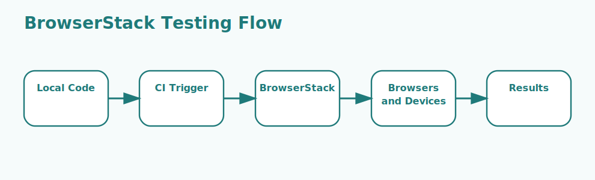

# BrowserStack Basics Interview Questions


This guide covers browserstack basics from interview basics to tricky production scenarios. It follows the corrected format of **100 interview questions for each subtopic**, and every answer includes a coding example plus a real-time example so the scenarios and snippets do not repeat verbatim.

## How To Use This Page

- Questions 1-100 cover BrowserStack Live.
- Questions 101-200 cover BrowserStack Automate.
- Questions 201-300 cover App Live.
- Questions 301-400 cover App Automate.
- Questions 401-500 cover BrowserStack Local.
- Questions 501-600 cover Device and browser coverage.
- Questions 601-700 cover Framework integrations.
- Questions 701-800 cover Parallel sessions.
- Questions 801-900 cover CI/CD usage.
- Questions 901-1000 cover Debugging and reporting.

## 1. BrowserStack Live

### Q1.1 What is browserstack live in this topic?

**Answer:**

BrowserStack Live matters because it affects how browserstack live affects planning, implementation, and operational outcomes. In a real project like a banking program with strict release controls and multiple stakeholder groups, a strong answer should connect the concept to execution flow, delivery trade-offs, risk reduction, and the way teams actually work under deadlines or production pressure. A more senior answer also explains the practical impact so the explanation reflects practical engineering and delivery experience rather than memorized definitions.

**Code Example:**

```javascript
const capabilities = {
  browserName: 'Chrome',
  'bstack:options': {
    os: 'Windows',
    osVersion: '11',
    sessionName: 'Cross browser smoke test'
  }
};
```

**Real-Time Example:** In a banking program with strict release controls and multiple stakeholder groups, the team used this concept so the explanation reflects practical engineering and delivery experience rather than memorized definitions.

### Q1.2 Why does browserstack live fundamentals matter in real projects?

**Answer:**

BrowserStack Live fundamentals matters because it affects how browserstack live should be understood before making delivery decisions. In a real project like a SaaS platform that needs fast delivery without sacrificing reliability, a strong answer should connect the concept to execution flow, delivery trade-offs, risk reduction, and the way teams actually work under deadlines or production pressure. A more senior answer also explains the practical impact so teams can connect the topic to real execution, risk, and operational impact.

**Code Example:**

```javascript
const driver = await remote({
  protocol: 'https',
  hostname: 'hub.browserstack.com',
  path: '/wd/hub',
  capabilities
});
```

**Real-Time Example:** During a SaaS platform that needs fast delivery without sacrificing reliability, this concept mattered because teams can connect the topic to real execution, risk, and operational impact.

### Q1.3 When should a team focus on browserstack live design?

**Answer:**

BrowserStack Live design matters because it affects how browserstack live influences architecture, process, or implementation choices. In a real project like a CMS product combining backend workflows, UI testing, and production support, a strong answer should connect the concept to execution flow, delivery trade-offs, risk reduction, and the way teams actually work under deadlines or production pressure. A more senior answer also explains the practical impact so architecture and process choices become easier to defend in reviews and interviews.

**Code Example:**

```javascript
const localArgs = ['--key', process.env.BROWSERSTACK_ACCESS_KEY];
console.log(localArgs);
```

**Real-Time Example:** A practical project scenario is a CMS product combining backend workflows, UI testing, and production support, where this concept helped because architecture and process choices become easier to defend in reviews and interviews.

### Q1.4 How would you explain browserstack live troubleshooting in a production discussion?

**Answer:**

BrowserStack Live troubleshooting matters because it affects how teams investigate problems related to browserstack live in real projects. In a real project like a healthcare system where correctness, auditability, and controlled rollout matter, a strong answer should connect the concept to execution flow, delivery trade-offs, risk reduction, and the way teams actually work under deadlines or production pressure. A more senior answer also explains the practical impact so the team avoids common mistakes before they become production incidents.

**Code Example:**

```javascript
const parallelConfig = {
  maxInstances: 5,
  specs: ['./tests/**/*.spec.js']
};
```

**Real-Time Example:** Teams like a healthcare system where correctness, auditability, and controlled rollout matter depend on this concept so the team avoids common mistakes before they become production incidents.

### Q1.5 What is a common interview trap around browserstack live trade-offs?

**Answer:**

BrowserStack Live trade-offs matters because it affects how browserstack live changes speed, control, reliability, or maintainability. In a real project like a logistics platform coordinating several teams and several moving technical parts, a strong answer should connect the concept to execution flow, delivery trade-offs, risk reduction, and the way teams actually work under deadlines or production pressure. A more senior answer also explains the practical impact so debugging, rollout, and maintenance become easier to reason about.

**Code Example:**

```javascript
const debugArtifacts = ['video', 'console logs', 'network logs', 'screenshots'];
console.log(debugArtifacts);
```

**Real-Time Example:** One real delivery case is a logistics platform coordinating several teams and several moving technical parts; this works best when debugging, rollout, and maintenance become easier to reason about.

### Q1.6 How do teams apply browserstack live safely in practice?

**Answer:**

BrowserStack Live matters because it affects how browserstack live affects planning, implementation, and operational outcomes. In a real project like a customer-support application where incidents and regressions must be resolved quickly, a strong answer should connect the concept to execution flow, delivery trade-offs, risk reduction, and the way teams actually work under deadlines or production pressure. A more senior answer also explains the practical impact so trade-offs are clearer across speed, control, and reliability.

**Code Example:**

```javascript
const capabilities = {
  browserName: 'Chrome',
  'bstack:options': {
    os: 'Windows',
    osVersion: '11',
    sessionName: 'Cross browser smoke test'
  }
};
```

**Real-Time Example:** In a customer-support application where incidents and regressions must be resolved quickly, the team used this concept so trade-offs are clearer across speed, control, and reliability.

### Q1.7 What real delivery issue usually exposes weak understanding of browserstack live fundamentals?

**Answer:**

BrowserStack Live fundamentals matters because it affects how browserstack live should be understood before making delivery decisions. In a real project like a manufacturing environment where stability and operational visibility matter more than novelty, a strong answer should connect the concept to execution flow, delivery trade-offs, risk reduction, and the way teams actually work under deadlines or production pressure. A more senior answer also explains the practical impact so the examples tie day-to-day engineering work to business outcomes more concretely.

**Code Example:**

```javascript
const driver = await remote({
  protocol: 'https',
  hostname: 'hub.browserstack.com',
  path: '/wd/hub',
  capabilities
});
```

**Real-Time Example:** During a manufacturing environment where stability and operational visibility matter more than novelty, this concept mattered because the examples tie day-to-day engineering work to business outcomes more concretely.

### Q1.8 How would an experienced engineer justify browserstack live design to a team?

**Answer:**

BrowserStack Live design matters because it affects how browserstack live influences architecture, process, or implementation choices. In a real project like an enterprise modernization effort with old systems, shared dependencies, and cautious rollout planning, a strong answer should connect the concept to execution flow, delivery trade-offs, risk reduction, and the way teams actually work under deadlines or production pressure. A more senior answer also explains the practical impact so stakeholders get a clearer picture of why the topic matters beyond theory.

**Code Example:**

```javascript
const localArgs = ['--key', process.env.BROWSERSTACK_ACCESS_KEY];
console.log(localArgs);
```

**Real-Time Example:** A practical project scenario is an enterprise modernization effort with old systems, shared dependencies, and cautious rollout planning, where this concept helped because stakeholders get a clearer picture of why the topic matters beyond theory.

### Q1.9 What trade-off does browserstack live troubleshooting introduce?

**Answer:**

BrowserStack Live troubleshooting matters because it affects how teams investigate problems related to browserstack live in real projects. In a real project like a project where weak testing and weak observability created avoidable production issues, a strong answer should connect the concept to execution flow, delivery trade-offs, risk reduction, and the way teams actually work under deadlines or production pressure. A more senior answer also explains the practical impact so the answer sounds grounded in real projects instead of checklist language.

**Code Example:**

```javascript
const parallelConfig = {
  maxInstances: 5,
  specs: ['./tests/**/*.spec.js']
};
```

**Real-Time Example:** Teams like a project where weak testing and weak observability created avoidable production issues depend on this concept so the answer sounds grounded in real projects instead of checklist language.

### Q1.10 How do you answer a tricky follow-up about browserstack live trade-offs?

**Answer:**

BrowserStack Live trade-offs matters because it affects how browserstack live changes speed, control, reliability, or maintainability. In a real project like a delivery team balancing speed, change safety, and long-term maintainability, a strong answer should connect the concept to execution flow, delivery trade-offs, risk reduction, and the way teams actually work under deadlines or production pressure. A more senior answer also explains the practical impact so future changes become easier to plan because the underlying mechanics are better understood.

**Code Example:**

```javascript
const debugArtifacts = ['video', 'console logs', 'network logs', 'screenshots'];
console.log(debugArtifacts);
```

**Real-Time Example:** One real delivery case is a delivery team balancing speed, change safety, and long-term maintainability; this works best when future changes become easier to plan because the underlying mechanics are better understood.

### Q1.11 What is browserstack live in this topic?

**Answer:**

BrowserStack Live matters because it affects how browserstack live affects planning, implementation, and operational outcomes. In a real project like a banking program with strict release controls and multiple stakeholder groups, a strong answer should connect the concept to execution flow, delivery trade-offs, risk reduction, and the way teams actually work under deadlines or production pressure. A more senior answer also explains the practical impact so the explanation reflects practical engineering and delivery experience rather than memorized definitions.

**Code Example:**

```javascript
const capabilities = {
  browserName: 'Chrome',
  'bstack:options': {
    os: 'Windows',
    osVersion: '11',
    sessionName: 'Cross browser smoke test'
  }
};
```

**Real-Time Example:** In a banking program with strict release controls and multiple stakeholder groups, the team used this concept so the explanation reflects practical engineering and delivery experience rather than memorized definitions.

### Q1.12 Why does browserstack live fundamentals matter in real projects?

**Answer:**

BrowserStack Live fundamentals matters because it affects how browserstack live should be understood before making delivery decisions. In a real project like a SaaS platform that needs fast delivery without sacrificing reliability, a strong answer should connect the concept to execution flow, delivery trade-offs, risk reduction, and the way teams actually work under deadlines or production pressure. A more senior answer also explains the practical impact so teams can connect the topic to real execution, risk, and operational impact.

**Code Example:**

```javascript
const driver = await remote({
  protocol: 'https',
  hostname: 'hub.browserstack.com',
  path: '/wd/hub',
  capabilities
});
```

**Real-Time Example:** During a SaaS platform that needs fast delivery without sacrificing reliability, this concept mattered because teams can connect the topic to real execution, risk, and operational impact.

### Q1.13 When should a team focus on browserstack live design?

**Answer:**

BrowserStack Live design matters because it affects how browserstack live influences architecture, process, or implementation choices. In a real project like a CMS product combining backend workflows, UI testing, and production support, a strong answer should connect the concept to execution flow, delivery trade-offs, risk reduction, and the way teams actually work under deadlines or production pressure. A more senior answer also explains the practical impact so architecture and process choices become easier to defend in reviews and interviews.

**Code Example:**

```javascript
const localArgs = ['--key', process.env.BROWSERSTACK_ACCESS_KEY];
console.log(localArgs);
```

**Real-Time Example:** A practical project scenario is a CMS product combining backend workflows, UI testing, and production support, where this concept helped because architecture and process choices become easier to defend in reviews and interviews.

### Q1.14 How would you explain browserstack live troubleshooting in a production discussion?

**Answer:**

BrowserStack Live troubleshooting matters because it affects how teams investigate problems related to browserstack live in real projects. In a real project like a healthcare system where correctness, auditability, and controlled rollout matter, a strong answer should connect the concept to execution flow, delivery trade-offs, risk reduction, and the way teams actually work under deadlines or production pressure. A more senior answer also explains the practical impact so the team avoids common mistakes before they become production incidents.

**Code Example:**

```javascript
const parallelConfig = {
  maxInstances: 5,
  specs: ['./tests/**/*.spec.js']
};
```

**Real-Time Example:** Teams like a healthcare system where correctness, auditability, and controlled rollout matter depend on this concept so the team avoids common mistakes before they become production incidents.

### Q1.15 What is a common interview trap around browserstack live trade-offs?

**Answer:**

BrowserStack Live trade-offs matters because it affects how browserstack live changes speed, control, reliability, or maintainability. In a real project like a logistics platform coordinating several teams and several moving technical parts, a strong answer should connect the concept to execution flow, delivery trade-offs, risk reduction, and the way teams actually work under deadlines or production pressure. A more senior answer also explains the practical impact so debugging, rollout, and maintenance become easier to reason about.

**Code Example:**

```javascript
const debugArtifacts = ['video', 'console logs', 'network logs', 'screenshots'];
console.log(debugArtifacts);
```

**Real-Time Example:** One real delivery case is a logistics platform coordinating several teams and several moving technical parts; this works best when debugging, rollout, and maintenance become easier to reason about.

### Q1.16 How do teams apply browserstack live safely in practice?

**Answer:**

BrowserStack Live matters because it affects how browserstack live affects planning, implementation, and operational outcomes. In a real project like a customer-support application where incidents and regressions must be resolved quickly, a strong answer should connect the concept to execution flow, delivery trade-offs, risk reduction, and the way teams actually work under deadlines or production pressure. A more senior answer also explains the practical impact so trade-offs are clearer across speed, control, and reliability.

**Code Example:**

```javascript
const capabilities = {
  browserName: 'Chrome',
  'bstack:options': {
    os: 'Windows',
    osVersion: '11',
    sessionName: 'Cross browser smoke test'
  }
};
```

**Real-Time Example:** In a customer-support application where incidents and regressions must be resolved quickly, the team used this concept so trade-offs are clearer across speed, control, and reliability.

### Q1.17 What real delivery issue usually exposes weak understanding of browserstack live fundamentals?

**Answer:**

BrowserStack Live fundamentals matters because it affects how browserstack live should be understood before making delivery decisions. In a real project like a manufacturing environment where stability and operational visibility matter more than novelty, a strong answer should connect the concept to execution flow, delivery trade-offs, risk reduction, and the way teams actually work under deadlines or production pressure. A more senior answer also explains the practical impact so the examples tie day-to-day engineering work to business outcomes more concretely.

**Code Example:**

```javascript
const driver = await remote({
  protocol: 'https',
  hostname: 'hub.browserstack.com',
  path: '/wd/hub',
  capabilities
});
```

**Real-Time Example:** During a manufacturing environment where stability and operational visibility matter more than novelty, this concept mattered because the examples tie day-to-day engineering work to business outcomes more concretely.

### Q1.18 How would an experienced engineer justify browserstack live design to a team?

**Answer:**

BrowserStack Live design matters because it affects how browserstack live influences architecture, process, or implementation choices. In a real project like an enterprise modernization effort with old systems, shared dependencies, and cautious rollout planning, a strong answer should connect the concept to execution flow, delivery trade-offs, risk reduction, and the way teams actually work under deadlines or production pressure. A more senior answer also explains the practical impact so stakeholders get a clearer picture of why the topic matters beyond theory.

**Code Example:**

```javascript
const localArgs = ['--key', process.env.BROWSERSTACK_ACCESS_KEY];
console.log(localArgs);
```

**Real-Time Example:** A practical project scenario is an enterprise modernization effort with old systems, shared dependencies, and cautious rollout planning, where this concept helped because stakeholders get a clearer picture of why the topic matters beyond theory.

### Q1.19 What trade-off does browserstack live troubleshooting introduce?

**Answer:**

BrowserStack Live troubleshooting matters because it affects how teams investigate problems related to browserstack live in real projects. In a real project like a project where weak testing and weak observability created avoidable production issues, a strong answer should connect the concept to execution flow, delivery trade-offs, risk reduction, and the way teams actually work under deadlines or production pressure. A more senior answer also explains the practical impact so the answer sounds grounded in real projects instead of checklist language.

**Code Example:**

```javascript
const parallelConfig = {
  maxInstances: 5,
  specs: ['./tests/**/*.spec.js']
};
```

**Real-Time Example:** Teams like a project where weak testing and weak observability created avoidable production issues depend on this concept so the answer sounds grounded in real projects instead of checklist language.

### Q1.20 How do you answer a tricky follow-up about browserstack live trade-offs?

**Answer:**

BrowserStack Live trade-offs matters because it affects how browserstack live changes speed, control, reliability, or maintainability. In a real project like a delivery team balancing speed, change safety, and long-term maintainability, a strong answer should connect the concept to execution flow, delivery trade-offs, risk reduction, and the way teams actually work under deadlines or production pressure. A more senior answer also explains the practical impact so future changes become easier to plan because the underlying mechanics are better understood.

**Code Example:**

```javascript
const debugArtifacts = ['video', 'console logs', 'network logs', 'screenshots'];
console.log(debugArtifacts);
```

**Real-Time Example:** One real delivery case is a delivery team balancing speed, change safety, and long-term maintainability; this works best when future changes become easier to plan because the underlying mechanics are better understood.

### Q1.21 What is browserstack live in this topic?

**Answer:**

BrowserStack Live matters because it affects how browserstack live affects planning, implementation, and operational outcomes. In a real project like a banking program with strict release controls and multiple stakeholder groups, a strong answer should connect the concept to execution flow, delivery trade-offs, risk reduction, and the way teams actually work under deadlines or production pressure. A more senior answer also explains the practical impact so the explanation reflects practical engineering and delivery experience rather than memorized definitions.

**Code Example:**

```javascript
const capabilities = {
  browserName: 'Chrome',
  'bstack:options': {
    os: 'Windows',
    osVersion: '11',
    sessionName: 'Cross browser smoke test'
  }
};
```

**Real-Time Example:** In a banking program with strict release controls and multiple stakeholder groups, the team used this concept so the explanation reflects practical engineering and delivery experience rather than memorized definitions.

### Q1.22 Why does browserstack live fundamentals matter in real projects?

**Answer:**

BrowserStack Live fundamentals matters because it affects how browserstack live should be understood before making delivery decisions. In a real project like a SaaS platform that needs fast delivery without sacrificing reliability, a strong answer should connect the concept to execution flow, delivery trade-offs, risk reduction, and the way teams actually work under deadlines or production pressure. A more senior answer also explains the practical impact so teams can connect the topic to real execution, risk, and operational impact.

**Code Example:**

```javascript
const driver = await remote({
  protocol: 'https',
  hostname: 'hub.browserstack.com',
  path: '/wd/hub',
  capabilities
});
```

**Real-Time Example:** During a SaaS platform that needs fast delivery without sacrificing reliability, this concept mattered because teams can connect the topic to real execution, risk, and operational impact.

### Q1.23 When should a team focus on browserstack live design?

**Answer:**

BrowserStack Live design matters because it affects how browserstack live influences architecture, process, or implementation choices. In a real project like a CMS product combining backend workflows, UI testing, and production support, a strong answer should connect the concept to execution flow, delivery trade-offs, risk reduction, and the way teams actually work under deadlines or production pressure. A more senior answer also explains the practical impact so architecture and process choices become easier to defend in reviews and interviews.

**Code Example:**

```javascript
const localArgs = ['--key', process.env.BROWSERSTACK_ACCESS_KEY];
console.log(localArgs);
```

**Real-Time Example:** A practical project scenario is a CMS product combining backend workflows, UI testing, and production support, where this concept helped because architecture and process choices become easier to defend in reviews and interviews.

### Q1.24 How would you explain browserstack live troubleshooting in a production discussion?

**Answer:**

BrowserStack Live troubleshooting matters because it affects how teams investigate problems related to browserstack live in real projects. In a real project like a healthcare system where correctness, auditability, and controlled rollout matter, a strong answer should connect the concept to execution flow, delivery trade-offs, risk reduction, and the way teams actually work under deadlines or production pressure. A more senior answer also explains the practical impact so the team avoids common mistakes before they become production incidents.

**Code Example:**

```javascript
const parallelConfig = {
  maxInstances: 5,
  specs: ['./tests/**/*.spec.js']
};
```

**Real-Time Example:** Teams like a healthcare system where correctness, auditability, and controlled rollout matter depend on this concept so the team avoids common mistakes before they become production incidents.

### Q1.25 What is a common interview trap around browserstack live trade-offs?

**Answer:**

BrowserStack Live trade-offs matters because it affects how browserstack live changes speed, control, reliability, or maintainability. In a real project like a logistics platform coordinating several teams and several moving technical parts, a strong answer should connect the concept to execution flow, delivery trade-offs, risk reduction, and the way teams actually work under deadlines or production pressure. A more senior answer also explains the practical impact so debugging, rollout, and maintenance become easier to reason about.

**Code Example:**

```javascript
const debugArtifacts = ['video', 'console logs', 'network logs', 'screenshots'];
console.log(debugArtifacts);
```

**Real-Time Example:** One real delivery case is a logistics platform coordinating several teams and several moving technical parts; this works best when debugging, rollout, and maintenance become easier to reason about.

### Q1.26 How do teams apply browserstack live safely in practice?

**Answer:**

BrowserStack Live matters because it affects how browserstack live affects planning, implementation, and operational outcomes. In a real project like a customer-support application where incidents and regressions must be resolved quickly, a strong answer should connect the concept to execution flow, delivery trade-offs, risk reduction, and the way teams actually work under deadlines or production pressure. A more senior answer also explains the practical impact so trade-offs are clearer across speed, control, and reliability.

**Code Example:**

```javascript
const capabilities = {
  browserName: 'Chrome',
  'bstack:options': {
    os: 'Windows',
    osVersion: '11',
    sessionName: 'Cross browser smoke test'
  }
};
```

**Real-Time Example:** In a customer-support application where incidents and regressions must be resolved quickly, the team used this concept so trade-offs are clearer across speed, control, and reliability.

### Q1.27 What real delivery issue usually exposes weak understanding of browserstack live fundamentals?

**Answer:**

BrowserStack Live fundamentals matters because it affects how browserstack live should be understood before making delivery decisions. In a real project like a manufacturing environment where stability and operational visibility matter more than novelty, a strong answer should connect the concept to execution flow, delivery trade-offs, risk reduction, and the way teams actually work under deadlines or production pressure. A more senior answer also explains the practical impact so the examples tie day-to-day engineering work to business outcomes more concretely.

**Code Example:**

```javascript
const driver = await remote({
  protocol: 'https',
  hostname: 'hub.browserstack.com',
  path: '/wd/hub',
  capabilities
});
```

**Real-Time Example:** During a manufacturing environment where stability and operational visibility matter more than novelty, this concept mattered because the examples tie day-to-day engineering work to business outcomes more concretely.

### Q1.28 How would an experienced engineer justify browserstack live design to a team?

**Answer:**

BrowserStack Live design matters because it affects how browserstack live influences architecture, process, or implementation choices. In a real project like an enterprise modernization effort with old systems, shared dependencies, and cautious rollout planning, a strong answer should connect the concept to execution flow, delivery trade-offs, risk reduction, and the way teams actually work under deadlines or production pressure. A more senior answer also explains the practical impact so stakeholders get a clearer picture of why the topic matters beyond theory.

**Code Example:**

```javascript
const localArgs = ['--key', process.env.BROWSERSTACK_ACCESS_KEY];
console.log(localArgs);
```

**Real-Time Example:** A practical project scenario is an enterprise modernization effort with old systems, shared dependencies, and cautious rollout planning, where this concept helped because stakeholders get a clearer picture of why the topic matters beyond theory.

### Q1.29 What trade-off does browserstack live troubleshooting introduce?

**Answer:**

BrowserStack Live troubleshooting matters because it affects how teams investigate problems related to browserstack live in real projects. In a real project like a project where weak testing and weak observability created avoidable production issues, a strong answer should connect the concept to execution flow, delivery trade-offs, risk reduction, and the way teams actually work under deadlines or production pressure. A more senior answer also explains the practical impact so the answer sounds grounded in real projects instead of checklist language.

**Code Example:**

```javascript
const parallelConfig = {
  maxInstances: 5,
  specs: ['./tests/**/*.spec.js']
};
```

**Real-Time Example:** Teams like a project where weak testing and weak observability created avoidable production issues depend on this concept so the answer sounds grounded in real projects instead of checklist language.

### Q1.30 How do you answer a tricky follow-up about browserstack live trade-offs?

**Answer:**

BrowserStack Live trade-offs matters because it affects how browserstack live changes speed, control, reliability, or maintainability. In a real project like a delivery team balancing speed, change safety, and long-term maintainability, a strong answer should connect the concept to execution flow, delivery trade-offs, risk reduction, and the way teams actually work under deadlines or production pressure. A more senior answer also explains the practical impact so future changes become easier to plan because the underlying mechanics are better understood.

**Code Example:**

```javascript
const debugArtifacts = ['video', 'console logs', 'network logs', 'screenshots'];
console.log(debugArtifacts);
```

**Real-Time Example:** One real delivery case is a delivery team balancing speed, change safety, and long-term maintainability; this works best when future changes become easier to plan because the underlying mechanics are better understood.

### Q1.31 What is browserstack live in this topic?

**Answer:**

BrowserStack Live matters because it affects how browserstack live affects planning, implementation, and operational outcomes. In a real project like a banking program with strict release controls and multiple stakeholder groups, a strong answer should connect the concept to execution flow, delivery trade-offs, risk reduction, and the way teams actually work under deadlines or production pressure. A more senior answer also explains the practical impact so the explanation reflects practical engineering and delivery experience rather than memorized definitions.

**Code Example:**

```javascript
const capabilities = {
  browserName: 'Chrome',
  'bstack:options': {
    os: 'Windows',
    osVersion: '11',
    sessionName: 'Cross browser smoke test'
  }
};
```

**Real-Time Example:** In a banking program with strict release controls and multiple stakeholder groups, the team used this concept so the explanation reflects practical engineering and delivery experience rather than memorized definitions.

### Q1.32 Why does browserstack live fundamentals matter in real projects?

**Answer:**

BrowserStack Live fundamentals matters because it affects how browserstack live should be understood before making delivery decisions. In a real project like a SaaS platform that needs fast delivery without sacrificing reliability, a strong answer should connect the concept to execution flow, delivery trade-offs, risk reduction, and the way teams actually work under deadlines or production pressure. A more senior answer also explains the practical impact so teams can connect the topic to real execution, risk, and operational impact.

**Code Example:**

```javascript
const driver = await remote({
  protocol: 'https',
  hostname: 'hub.browserstack.com',
  path: '/wd/hub',
  capabilities
});
```

**Real-Time Example:** During a SaaS platform that needs fast delivery without sacrificing reliability, this concept mattered because teams can connect the topic to real execution, risk, and operational impact.

### Q1.33 When should a team focus on browserstack live design?

**Answer:**

BrowserStack Live design matters because it affects how browserstack live influences architecture, process, or implementation choices. In a real project like a CMS product combining backend workflows, UI testing, and production support, a strong answer should connect the concept to execution flow, delivery trade-offs, risk reduction, and the way teams actually work under deadlines or production pressure. A more senior answer also explains the practical impact so architecture and process choices become easier to defend in reviews and interviews.

**Code Example:**

```javascript
const localArgs = ['--key', process.env.BROWSERSTACK_ACCESS_KEY];
console.log(localArgs);
```

**Real-Time Example:** A practical project scenario is a CMS product combining backend workflows, UI testing, and production support, where this concept helped because architecture and process choices become easier to defend in reviews and interviews.

### Q1.34 How would you explain browserstack live troubleshooting in a production discussion?

**Answer:**

BrowserStack Live troubleshooting matters because it affects how teams investigate problems related to browserstack live in real projects. In a real project like a healthcare system where correctness, auditability, and controlled rollout matter, a strong answer should connect the concept to execution flow, delivery trade-offs, risk reduction, and the way teams actually work under deadlines or production pressure. A more senior answer also explains the practical impact so the team avoids common mistakes before they become production incidents.

**Code Example:**

```javascript
const parallelConfig = {
  maxInstances: 5,
  specs: ['./tests/**/*.spec.js']
};
```

**Real-Time Example:** Teams like a healthcare system where correctness, auditability, and controlled rollout matter depend on this concept so the team avoids common mistakes before they become production incidents.

### Q1.35 What is a common interview trap around browserstack live trade-offs?

**Answer:**

BrowserStack Live trade-offs matters because it affects how browserstack live changes speed, control, reliability, or maintainability. In a real project like a logistics platform coordinating several teams and several moving technical parts, a strong answer should connect the concept to execution flow, delivery trade-offs, risk reduction, and the way teams actually work under deadlines or production pressure. A more senior answer also explains the practical impact so debugging, rollout, and maintenance become easier to reason about.

**Code Example:**

```javascript
const debugArtifacts = ['video', 'console logs', 'network logs', 'screenshots'];
console.log(debugArtifacts);
```

**Real-Time Example:** One real delivery case is a logistics platform coordinating several teams and several moving technical parts; this works best when debugging, rollout, and maintenance become easier to reason about.

### Q1.36 How do teams apply browserstack live safely in practice?

**Answer:**

BrowserStack Live matters because it affects how browserstack live affects planning, implementation, and operational outcomes. In a real project like a customer-support application where incidents and regressions must be resolved quickly, a strong answer should connect the concept to execution flow, delivery trade-offs, risk reduction, and the way teams actually work under deadlines or production pressure. A more senior answer also explains the practical impact so trade-offs are clearer across speed, control, and reliability.

**Code Example:**

```javascript
const capabilities = {
  browserName: 'Chrome',
  'bstack:options': {
    os: 'Windows',
    osVersion: '11',
    sessionName: 'Cross browser smoke test'
  }
};
```

**Real-Time Example:** In a customer-support application where incidents and regressions must be resolved quickly, the team used this concept so trade-offs are clearer across speed, control, and reliability.

### Q1.37 What real delivery issue usually exposes weak understanding of browserstack live fundamentals?

**Answer:**

BrowserStack Live fundamentals matters because it affects how browserstack live should be understood before making delivery decisions. In a real project like a manufacturing environment where stability and operational visibility matter more than novelty, a strong answer should connect the concept to execution flow, delivery trade-offs, risk reduction, and the way teams actually work under deadlines or production pressure. A more senior answer also explains the practical impact so the examples tie day-to-day engineering work to business outcomes more concretely.

**Code Example:**

```javascript
const driver = await remote({
  protocol: 'https',
  hostname: 'hub.browserstack.com',
  path: '/wd/hub',
  capabilities
});
```

**Real-Time Example:** During a manufacturing environment where stability and operational visibility matter more than novelty, this concept mattered because the examples tie day-to-day engineering work to business outcomes more concretely.

### Q1.38 How would an experienced engineer justify browserstack live design to a team?

**Answer:**

BrowserStack Live design matters because it affects how browserstack live influences architecture, process, or implementation choices. In a real project like an enterprise modernization effort with old systems, shared dependencies, and cautious rollout planning, a strong answer should connect the concept to execution flow, delivery trade-offs, risk reduction, and the way teams actually work under deadlines or production pressure. A more senior answer also explains the practical impact so stakeholders get a clearer picture of why the topic matters beyond theory.

**Code Example:**

```javascript
const localArgs = ['--key', process.env.BROWSERSTACK_ACCESS_KEY];
console.log(localArgs);
```

**Real-Time Example:** A practical project scenario is an enterprise modernization effort with old systems, shared dependencies, and cautious rollout planning, where this concept helped because stakeholders get a clearer picture of why the topic matters beyond theory.

### Q1.39 What trade-off does browserstack live troubleshooting introduce?

**Answer:**

BrowserStack Live troubleshooting matters because it affects how teams investigate problems related to browserstack live in real projects. In a real project like a project where weak testing and weak observability created avoidable production issues, a strong answer should connect the concept to execution flow, delivery trade-offs, risk reduction, and the way teams actually work under deadlines or production pressure. A more senior answer also explains the practical impact so the answer sounds grounded in real projects instead of checklist language.

**Code Example:**

```javascript
const parallelConfig = {
  maxInstances: 5,
  specs: ['./tests/**/*.spec.js']
};
```

**Real-Time Example:** Teams like a project where weak testing and weak observability created avoidable production issues depend on this concept so the answer sounds grounded in real projects instead of checklist language.

### Q1.40 How do you answer a tricky follow-up about browserstack live trade-offs?

**Answer:**

BrowserStack Live trade-offs matters because it affects how browserstack live changes speed, control, reliability, or maintainability. In a real project like a delivery team balancing speed, change safety, and long-term maintainability, a strong answer should connect the concept to execution flow, delivery trade-offs, risk reduction, and the way teams actually work under deadlines or production pressure. A more senior answer also explains the practical impact so future changes become easier to plan because the underlying mechanics are better understood.

**Code Example:**

```javascript
const debugArtifacts = ['video', 'console logs', 'network logs', 'screenshots'];
console.log(debugArtifacts);
```

**Real-Time Example:** One real delivery case is a delivery team balancing speed, change safety, and long-term maintainability; this works best when future changes become easier to plan because the underlying mechanics are better understood.

### Q1.41 What is browserstack live in this topic?

**Answer:**

BrowserStack Live matters because it affects how browserstack live affects planning, implementation, and operational outcomes. In a real project like a banking program with strict release controls and multiple stakeholder groups, a strong answer should connect the concept to execution flow, delivery trade-offs, risk reduction, and the way teams actually work under deadlines or production pressure. A more senior answer also explains the practical impact so the explanation reflects practical engineering and delivery experience rather than memorized definitions.

**Code Example:**

```javascript
const capabilities = {
  browserName: 'Chrome',
  'bstack:options': {
    os: 'Windows',
    osVersion: '11',
    sessionName: 'Cross browser smoke test'
  }
};
```

**Real-Time Example:** In a banking program with strict release controls and multiple stakeholder groups, the team used this concept so the explanation reflects practical engineering and delivery experience rather than memorized definitions.

### Q1.42 Why does browserstack live fundamentals matter in real projects?

**Answer:**

BrowserStack Live fundamentals matters because it affects how browserstack live should be understood before making delivery decisions. In a real project like a SaaS platform that needs fast delivery without sacrificing reliability, a strong answer should connect the concept to execution flow, delivery trade-offs, risk reduction, and the way teams actually work under deadlines or production pressure. A more senior answer also explains the practical impact so teams can connect the topic to real execution, risk, and operational impact.

**Code Example:**

```javascript
const driver = await remote({
  protocol: 'https',
  hostname: 'hub.browserstack.com',
  path: '/wd/hub',
  capabilities
});
```

**Real-Time Example:** During a SaaS platform that needs fast delivery without sacrificing reliability, this concept mattered because teams can connect the topic to real execution, risk, and operational impact.

### Q1.43 When should a team focus on browserstack live design?

**Answer:**

BrowserStack Live design matters because it affects how browserstack live influences architecture, process, or implementation choices. In a real project like a CMS product combining backend workflows, UI testing, and production support, a strong answer should connect the concept to execution flow, delivery trade-offs, risk reduction, and the way teams actually work under deadlines or production pressure. A more senior answer also explains the practical impact so architecture and process choices become easier to defend in reviews and interviews.

**Code Example:**

```javascript
const localArgs = ['--key', process.env.BROWSERSTACK_ACCESS_KEY];
console.log(localArgs);
```

**Real-Time Example:** A practical project scenario is a CMS product combining backend workflows, UI testing, and production support, where this concept helped because architecture and process choices become easier to defend in reviews and interviews.

### Q1.44 How would you explain browserstack live troubleshooting in a production discussion?

**Answer:**

BrowserStack Live troubleshooting matters because it affects how teams investigate problems related to browserstack live in real projects. In a real project like a healthcare system where correctness, auditability, and controlled rollout matter, a strong answer should connect the concept to execution flow, delivery trade-offs, risk reduction, and the way teams actually work under deadlines or production pressure. A more senior answer also explains the practical impact so the team avoids common mistakes before they become production incidents.

**Code Example:**

```javascript
const parallelConfig = {
  maxInstances: 5,
  specs: ['./tests/**/*.spec.js']
};
```

**Real-Time Example:** Teams like a healthcare system where correctness, auditability, and controlled rollout matter depend on this concept so the team avoids common mistakes before they become production incidents.

### Q1.45 What is a common interview trap around browserstack live trade-offs?

**Answer:**

BrowserStack Live trade-offs matters because it affects how browserstack live changes speed, control, reliability, or maintainability. In a real project like a logistics platform coordinating several teams and several moving technical parts, a strong answer should connect the concept to execution flow, delivery trade-offs, risk reduction, and the way teams actually work under deadlines or production pressure. A more senior answer also explains the practical impact so debugging, rollout, and maintenance become easier to reason about.

**Code Example:**

```javascript
const debugArtifacts = ['video', 'console logs', 'network logs', 'screenshots'];
console.log(debugArtifacts);
```

**Real-Time Example:** One real delivery case is a logistics platform coordinating several teams and several moving technical parts; this works best when debugging, rollout, and maintenance become easier to reason about.

### Q1.46 How do teams apply browserstack live safely in practice?

**Answer:**

BrowserStack Live matters because it affects how browserstack live affects planning, implementation, and operational outcomes. In a real project like a customer-support application where incidents and regressions must be resolved quickly, a strong answer should connect the concept to execution flow, delivery trade-offs, risk reduction, and the way teams actually work under deadlines or production pressure. A more senior answer also explains the practical impact so trade-offs are clearer across speed, control, and reliability.

**Code Example:**

```javascript
const capabilities = {
  browserName: 'Chrome',
  'bstack:options': {
    os: 'Windows',
    osVersion: '11',
    sessionName: 'Cross browser smoke test'
  }
};
```

**Real-Time Example:** In a customer-support application where incidents and regressions must be resolved quickly, the team used this concept so trade-offs are clearer across speed, control, and reliability.

### Q1.47 What real delivery issue usually exposes weak understanding of browserstack live fundamentals?

**Answer:**

BrowserStack Live fundamentals matters because it affects how browserstack live should be understood before making delivery decisions. In a real project like a manufacturing environment where stability and operational visibility matter more than novelty, a strong answer should connect the concept to execution flow, delivery trade-offs, risk reduction, and the way teams actually work under deadlines or production pressure. A more senior answer also explains the practical impact so the examples tie day-to-day engineering work to business outcomes more concretely.

**Code Example:**

```javascript
const driver = await remote({
  protocol: 'https',
  hostname: 'hub.browserstack.com',
  path: '/wd/hub',
  capabilities
});
```

**Real-Time Example:** During a manufacturing environment where stability and operational visibility matter more than novelty, this concept mattered because the examples tie day-to-day engineering work to business outcomes more concretely.

### Q1.48 How would an experienced engineer justify browserstack live design to a team?

**Answer:**

BrowserStack Live design matters because it affects how browserstack live influences architecture, process, or implementation choices. In a real project like an enterprise modernization effort with old systems, shared dependencies, and cautious rollout planning, a strong answer should connect the concept to execution flow, delivery trade-offs, risk reduction, and the way teams actually work under deadlines or production pressure. A more senior answer also explains the practical impact so stakeholders get a clearer picture of why the topic matters beyond theory.

**Code Example:**

```javascript
const localArgs = ['--key', process.env.BROWSERSTACK_ACCESS_KEY];
console.log(localArgs);
```

**Real-Time Example:** A practical project scenario is an enterprise modernization effort with old systems, shared dependencies, and cautious rollout planning, where this concept helped because stakeholders get a clearer picture of why the topic matters beyond theory.

### Q1.49 What trade-off does browserstack live troubleshooting introduce?

**Answer:**

BrowserStack Live troubleshooting matters because it affects how teams investigate problems related to browserstack live in real projects. In a real project like a project where weak testing and weak observability created avoidable production issues, a strong answer should connect the concept to execution flow, delivery trade-offs, risk reduction, and the way teams actually work under deadlines or production pressure. A more senior answer also explains the practical impact so the answer sounds grounded in real projects instead of checklist language.

**Code Example:**

```javascript
const parallelConfig = {
  maxInstances: 5,
  specs: ['./tests/**/*.spec.js']
};
```

**Real-Time Example:** Teams like a project where weak testing and weak observability created avoidable production issues depend on this concept so the answer sounds grounded in real projects instead of checklist language.

### Q1.50 How do you answer a tricky follow-up about browserstack live trade-offs?

**Answer:**

BrowserStack Live trade-offs matters because it affects how browserstack live changes speed, control, reliability, or maintainability. In a real project like a delivery team balancing speed, change safety, and long-term maintainability, a strong answer should connect the concept to execution flow, delivery trade-offs, risk reduction, and the way teams actually work under deadlines or production pressure. A more senior answer also explains the practical impact so future changes become easier to plan because the underlying mechanics are better understood.

**Code Example:**

```javascript
const debugArtifacts = ['video', 'console logs', 'network logs', 'screenshots'];
console.log(debugArtifacts);
```

**Real-Time Example:** One real delivery case is a delivery team balancing speed, change safety, and long-term maintainability; this works best when future changes become easier to plan because the underlying mechanics are better understood.

### Q1.51 What is browserstack live in this topic?

**Answer:**

BrowserStack Live matters because it affects how browserstack live affects planning, implementation, and operational outcomes. In a real project like a banking program with strict release controls and multiple stakeholder groups, a strong answer should connect the concept to execution flow, delivery trade-offs, risk reduction, and the way teams actually work under deadlines or production pressure. A more senior answer also explains the practical impact so the explanation reflects practical engineering and delivery experience rather than memorized definitions.

**Code Example:**

```javascript
const capabilities = {
  browserName: 'Chrome',
  'bstack:options': {
    os: 'Windows',
    osVersion: '11',
    sessionName: 'Cross browser smoke test'
  }
};
```

**Real-Time Example:** In a banking program with strict release controls and multiple stakeholder groups, the team used this concept so the explanation reflects practical engineering and delivery experience rather than memorized definitions.

### Q1.52 Why does browserstack live fundamentals matter in real projects?

**Answer:**

BrowserStack Live fundamentals matters because it affects how browserstack live should be understood before making delivery decisions. In a real project like a SaaS platform that needs fast delivery without sacrificing reliability, a strong answer should connect the concept to execution flow, delivery trade-offs, risk reduction, and the way teams actually work under deadlines or production pressure. A more senior answer also explains the practical impact so teams can connect the topic to real execution, risk, and operational impact.

**Code Example:**

```javascript
const driver = await remote({
  protocol: 'https',
  hostname: 'hub.browserstack.com',
  path: '/wd/hub',
  capabilities
});
```

**Real-Time Example:** During a SaaS platform that needs fast delivery without sacrificing reliability, this concept mattered because teams can connect the topic to real execution, risk, and operational impact.

### Q1.53 When should a team focus on browserstack live design?

**Answer:**

BrowserStack Live design matters because it affects how browserstack live influences architecture, process, or implementation choices. In a real project like a CMS product combining backend workflows, UI testing, and production support, a strong answer should connect the concept to execution flow, delivery trade-offs, risk reduction, and the way teams actually work under deadlines or production pressure. A more senior answer also explains the practical impact so architecture and process choices become easier to defend in reviews and interviews.

**Code Example:**

```javascript
const localArgs = ['--key', process.env.BROWSERSTACK_ACCESS_KEY];
console.log(localArgs);
```

**Real-Time Example:** A practical project scenario is a CMS product combining backend workflows, UI testing, and production support, where this concept helped because architecture and process choices become easier to defend in reviews and interviews.

### Q1.54 How would you explain browserstack live troubleshooting in a production discussion?

**Answer:**

BrowserStack Live troubleshooting matters because it affects how teams investigate problems related to browserstack live in real projects. In a real project like a healthcare system where correctness, auditability, and controlled rollout matter, a strong answer should connect the concept to execution flow, delivery trade-offs, risk reduction, and the way teams actually work under deadlines or production pressure. A more senior answer also explains the practical impact so the team avoids common mistakes before they become production incidents.

**Code Example:**

```javascript
const parallelConfig = {
  maxInstances: 5,
  specs: ['./tests/**/*.spec.js']
};
```

**Real-Time Example:** Teams like a healthcare system where correctness, auditability, and controlled rollout matter depend on this concept so the team avoids common mistakes before they become production incidents.

### Q1.55 What is a common interview trap around browserstack live trade-offs?

**Answer:**

BrowserStack Live trade-offs matters because it affects how browserstack live changes speed, control, reliability, or maintainability. In a real project like a logistics platform coordinating several teams and several moving technical parts, a strong answer should connect the concept to execution flow, delivery trade-offs, risk reduction, and the way teams actually work under deadlines or production pressure. A more senior answer also explains the practical impact so debugging, rollout, and maintenance become easier to reason about.

**Code Example:**

```javascript
const debugArtifacts = ['video', 'console logs', 'network logs', 'screenshots'];
console.log(debugArtifacts);
```

**Real-Time Example:** One real delivery case is a logistics platform coordinating several teams and several moving technical parts; this works best when debugging, rollout, and maintenance become easier to reason about.

### Q1.56 How do teams apply browserstack live safely in practice?

**Answer:**

BrowserStack Live matters because it affects how browserstack live affects planning, implementation, and operational outcomes. In a real project like a customer-support application where incidents and regressions must be resolved quickly, a strong answer should connect the concept to execution flow, delivery trade-offs, risk reduction, and the way teams actually work under deadlines or production pressure. A more senior answer also explains the practical impact so trade-offs are clearer across speed, control, and reliability.

**Code Example:**

```javascript
const capabilities = {
  browserName: 'Chrome',
  'bstack:options': {
    os: 'Windows',
    osVersion: '11',
    sessionName: 'Cross browser smoke test'
  }
};
```

**Real-Time Example:** In a customer-support application where incidents and regressions must be resolved quickly, the team used this concept so trade-offs are clearer across speed, control, and reliability.

### Q1.57 What real delivery issue usually exposes weak understanding of browserstack live fundamentals?

**Answer:**

BrowserStack Live fundamentals matters because it affects how browserstack live should be understood before making delivery decisions. In a real project like a manufacturing environment where stability and operational visibility matter more than novelty, a strong answer should connect the concept to execution flow, delivery trade-offs, risk reduction, and the way teams actually work under deadlines or production pressure. A more senior answer also explains the practical impact so the examples tie day-to-day engineering work to business outcomes more concretely.

**Code Example:**

```javascript
const driver = await remote({
  protocol: 'https',
  hostname: 'hub.browserstack.com',
  path: '/wd/hub',
  capabilities
});
```

**Real-Time Example:** During a manufacturing environment where stability and operational visibility matter more than novelty, this concept mattered because the examples tie day-to-day engineering work to business outcomes more concretely.

### Q1.58 How would an experienced engineer justify browserstack live design to a team?

**Answer:**

BrowserStack Live design matters because it affects how browserstack live influences architecture, process, or implementation choices. In a real project like an enterprise modernization effort with old systems, shared dependencies, and cautious rollout planning, a strong answer should connect the concept to execution flow, delivery trade-offs, risk reduction, and the way teams actually work under deadlines or production pressure. A more senior answer also explains the practical impact so stakeholders get a clearer picture of why the topic matters beyond theory.

**Code Example:**

```javascript
const localArgs = ['--key', process.env.BROWSERSTACK_ACCESS_KEY];
console.log(localArgs);
```

**Real-Time Example:** A practical project scenario is an enterprise modernization effort with old systems, shared dependencies, and cautious rollout planning, where this concept helped because stakeholders get a clearer picture of why the topic matters beyond theory.

### Q1.59 What trade-off does browserstack live troubleshooting introduce?

**Answer:**

BrowserStack Live troubleshooting matters because it affects how teams investigate problems related to browserstack live in real projects. In a real project like a project where weak testing and weak observability created avoidable production issues, a strong answer should connect the concept to execution flow, delivery trade-offs, risk reduction, and the way teams actually work under deadlines or production pressure. A more senior answer also explains the practical impact so the answer sounds grounded in real projects instead of checklist language.

**Code Example:**

```javascript
const parallelConfig = {
  maxInstances: 5,
  specs: ['./tests/**/*.spec.js']
};
```

**Real-Time Example:** Teams like a project where weak testing and weak observability created avoidable production issues depend on this concept so the answer sounds grounded in real projects instead of checklist language.

### Q1.60 How do you answer a tricky follow-up about browserstack live trade-offs?

**Answer:**

BrowserStack Live trade-offs matters because it affects how browserstack live changes speed, control, reliability, or maintainability. In a real project like a delivery team balancing speed, change safety, and long-term maintainability, a strong answer should connect the concept to execution flow, delivery trade-offs, risk reduction, and the way teams actually work under deadlines or production pressure. A more senior answer also explains the practical impact so future changes become easier to plan because the underlying mechanics are better understood.

**Code Example:**

```javascript
const debugArtifacts = ['video', 'console logs', 'network logs', 'screenshots'];
console.log(debugArtifacts);
```

**Real-Time Example:** One real delivery case is a delivery team balancing speed, change safety, and long-term maintainability; this works best when future changes become easier to plan because the underlying mechanics are better understood.

### Q1.61 What is browserstack live in this topic?

**Answer:**

BrowserStack Live matters because it affects how browserstack live affects planning, implementation, and operational outcomes. In a real project like a banking program with strict release controls and multiple stakeholder groups, a strong answer should connect the concept to execution flow, delivery trade-offs, risk reduction, and the way teams actually work under deadlines or production pressure. A more senior answer also explains the practical impact so the explanation reflects practical engineering and delivery experience rather than memorized definitions.

**Code Example:**

```javascript
const capabilities = {
  browserName: 'Chrome',
  'bstack:options': {
    os: 'Windows',
    osVersion: '11',
    sessionName: 'Cross browser smoke test'
  }
};
```

**Real-Time Example:** In a banking program with strict release controls and multiple stakeholder groups, the team used this concept so the explanation reflects practical engineering and delivery experience rather than memorized definitions.

### Q1.62 Why does browserstack live fundamentals matter in real projects?

**Answer:**

BrowserStack Live fundamentals matters because it affects how browserstack live should be understood before making delivery decisions. In a real project like a SaaS platform that needs fast delivery without sacrificing reliability, a strong answer should connect the concept to execution flow, delivery trade-offs, risk reduction, and the way teams actually work under deadlines or production pressure. A more senior answer also explains the practical impact so teams can connect the topic to real execution, risk, and operational impact.

**Code Example:**

```javascript
const driver = await remote({
  protocol: 'https',
  hostname: 'hub.browserstack.com',
  path: '/wd/hub',
  capabilities
});
```

**Real-Time Example:** During a SaaS platform that needs fast delivery without sacrificing reliability, this concept mattered because teams can connect the topic to real execution, risk, and operational impact.

### Q1.63 When should a team focus on browserstack live design?

**Answer:**

BrowserStack Live design matters because it affects how browserstack live influences architecture, process, or implementation choices. In a real project like a CMS product combining backend workflows, UI testing, and production support, a strong answer should connect the concept to execution flow, delivery trade-offs, risk reduction, and the way teams actually work under deadlines or production pressure. A more senior answer also explains the practical impact so architecture and process choices become easier to defend in reviews and interviews.

**Code Example:**

```javascript
const localArgs = ['--key', process.env.BROWSERSTACK_ACCESS_KEY];
console.log(localArgs);
```

**Real-Time Example:** A practical project scenario is a CMS product combining backend workflows, UI testing, and production support, where this concept helped because architecture and process choices become easier to defend in reviews and interviews.

### Q1.64 How would you explain browserstack live troubleshooting in a production discussion?

**Answer:**

BrowserStack Live troubleshooting matters because it affects how teams investigate problems related to browserstack live in real projects. In a real project like a healthcare system where correctness, auditability, and controlled rollout matter, a strong answer should connect the concept to execution flow, delivery trade-offs, risk reduction, and the way teams actually work under deadlines or production pressure. A more senior answer also explains the practical impact so the team avoids common mistakes before they become production incidents.

**Code Example:**

```javascript
const parallelConfig = {
  maxInstances: 5,
  specs: ['./tests/**/*.spec.js']
};
```

**Real-Time Example:** Teams like a healthcare system where correctness, auditability, and controlled rollout matter depend on this concept so the team avoids common mistakes before they become production incidents.

### Q1.65 What is a common interview trap around browserstack live trade-offs?

**Answer:**

BrowserStack Live trade-offs matters because it affects how browserstack live changes speed, control, reliability, or maintainability. In a real project like a logistics platform coordinating several teams and several moving technical parts, a strong answer should connect the concept to execution flow, delivery trade-offs, risk reduction, and the way teams actually work under deadlines or production pressure. A more senior answer also explains the practical impact so debugging, rollout, and maintenance become easier to reason about.

**Code Example:**

```javascript
const debugArtifacts = ['video', 'console logs', 'network logs', 'screenshots'];
console.log(debugArtifacts);
```

**Real-Time Example:** One real delivery case is a logistics platform coordinating several teams and several moving technical parts; this works best when debugging, rollout, and maintenance become easier to reason about.

### Q1.66 How do teams apply browserstack live safely in practice?

**Answer:**

BrowserStack Live matters because it affects how browserstack live affects planning, implementation, and operational outcomes. In a real project like a customer-support application where incidents and regressions must be resolved quickly, a strong answer should connect the concept to execution flow, delivery trade-offs, risk reduction, and the way teams actually work under deadlines or production pressure. A more senior answer also explains the practical impact so trade-offs are clearer across speed, control, and reliability.

**Code Example:**

```javascript
const capabilities = {
  browserName: 'Chrome',
  'bstack:options': {
    os: 'Windows',
    osVersion: '11',
    sessionName: 'Cross browser smoke test'
  }
};
```

**Real-Time Example:** In a customer-support application where incidents and regressions must be resolved quickly, the team used this concept so trade-offs are clearer across speed, control, and reliability.

### Q1.67 What real delivery issue usually exposes weak understanding of browserstack live fundamentals?

**Answer:**

BrowserStack Live fundamentals matters because it affects how browserstack live should be understood before making delivery decisions. In a real project like a manufacturing environment where stability and operational visibility matter more than novelty, a strong answer should connect the concept to execution flow, delivery trade-offs, risk reduction, and the way teams actually work under deadlines or production pressure. A more senior answer also explains the practical impact so the examples tie day-to-day engineering work to business outcomes more concretely.

**Code Example:**

```javascript
const driver = await remote({
  protocol: 'https',
  hostname: 'hub.browserstack.com',
  path: '/wd/hub',
  capabilities
});
```

**Real-Time Example:** During a manufacturing environment where stability and operational visibility matter more than novelty, this concept mattered because the examples tie day-to-day engineering work to business outcomes more concretely.

### Q1.68 How would an experienced engineer justify browserstack live design to a team?

**Answer:**

BrowserStack Live design matters because it affects how browserstack live influences architecture, process, or implementation choices. In a real project like an enterprise modernization effort with old systems, shared dependencies, and cautious rollout planning, a strong answer should connect the concept to execution flow, delivery trade-offs, risk reduction, and the way teams actually work under deadlines or production pressure. A more senior answer also explains the practical impact so stakeholders get a clearer picture of why the topic matters beyond theory.

**Code Example:**

```javascript
const localArgs = ['--key', process.env.BROWSERSTACK_ACCESS_KEY];
console.log(localArgs);
```

**Real-Time Example:** A practical project scenario is an enterprise modernization effort with old systems, shared dependencies, and cautious rollout planning, where this concept helped because stakeholders get a clearer picture of why the topic matters beyond theory.

### Q1.69 What trade-off does browserstack live troubleshooting introduce?

**Answer:**

BrowserStack Live troubleshooting matters because it affects how teams investigate problems related to browserstack live in real projects. In a real project like a project where weak testing and weak observability created avoidable production issues, a strong answer should connect the concept to execution flow, delivery trade-offs, risk reduction, and the way teams actually work under deadlines or production pressure. A more senior answer also explains the practical impact so the answer sounds grounded in real projects instead of checklist language.

**Code Example:**

```javascript
const parallelConfig = {
  maxInstances: 5,
  specs: ['./tests/**/*.spec.js']
};
```

**Real-Time Example:** Teams like a project where weak testing and weak observability created avoidable production issues depend on this concept so the answer sounds grounded in real projects instead of checklist language.

### Q1.70 How do you answer a tricky follow-up about browserstack live trade-offs?

**Answer:**

BrowserStack Live trade-offs matters because it affects how browserstack live changes speed, control, reliability, or maintainability. In a real project like a delivery team balancing speed, change safety, and long-term maintainability, a strong answer should connect the concept to execution flow, delivery trade-offs, risk reduction, and the way teams actually work under deadlines or production pressure. A more senior answer also explains the practical impact so future changes become easier to plan because the underlying mechanics are better understood.

**Code Example:**

```javascript
const debugArtifacts = ['video', 'console logs', 'network logs', 'screenshots'];
console.log(debugArtifacts);
```

**Real-Time Example:** One real delivery case is a delivery team balancing speed, change safety, and long-term maintainability; this works best when future changes become easier to plan because the underlying mechanics are better understood.

### Q1.71 What is browserstack live in this topic?

**Answer:**

BrowserStack Live matters because it affects how browserstack live affects planning, implementation, and operational outcomes. In a real project like a banking program with strict release controls and multiple stakeholder groups, a strong answer should connect the concept to execution flow, delivery trade-offs, risk reduction, and the way teams actually work under deadlines or production pressure. A more senior answer also explains the practical impact so the explanation reflects practical engineering and delivery experience rather than memorized definitions.

**Code Example:**

```javascript
const capabilities = {
  browserName: 'Chrome',
  'bstack:options': {
    os: 'Windows',
    osVersion: '11',
    sessionName: 'Cross browser smoke test'
  }
};
```

**Real-Time Example:** In a banking program with strict release controls and multiple stakeholder groups, the team used this concept so the explanation reflects practical engineering and delivery experience rather than memorized definitions.

### Q1.72 Why does browserstack live fundamentals matter in real projects?

**Answer:**

BrowserStack Live fundamentals matters because it affects how browserstack live should be understood before making delivery decisions. In a real project like a SaaS platform that needs fast delivery without sacrificing reliability, a strong answer should connect the concept to execution flow, delivery trade-offs, risk reduction, and the way teams actually work under deadlines or production pressure. A more senior answer also explains the practical impact so teams can connect the topic to real execution, risk, and operational impact.

**Code Example:**

```javascript
const driver = await remote({
  protocol: 'https',
  hostname: 'hub.browserstack.com',
  path: '/wd/hub',
  capabilities
});
```

**Real-Time Example:** During a SaaS platform that needs fast delivery without sacrificing reliability, this concept mattered because teams can connect the topic to real execution, risk, and operational impact.

### Q1.73 When should a team focus on browserstack live design?

**Answer:**

BrowserStack Live design matters because it affects how browserstack live influences architecture, process, or implementation choices. In a real project like a CMS product combining backend workflows, UI testing, and production support, a strong answer should connect the concept to execution flow, delivery trade-offs, risk reduction, and the way teams actually work under deadlines or production pressure. A more senior answer also explains the practical impact so architecture and process choices become easier to defend in reviews and interviews.

**Code Example:**

```javascript
const localArgs = ['--key', process.env.BROWSERSTACK_ACCESS_KEY];
console.log(localArgs);
```

**Real-Time Example:** A practical project scenario is a CMS product combining backend workflows, UI testing, and production support, where this concept helped because architecture and process choices become easier to defend in reviews and interviews.

### Q1.74 How would you explain browserstack live troubleshooting in a production discussion?

**Answer:**

BrowserStack Live troubleshooting matters because it affects how teams investigate problems related to browserstack live in real projects. In a real project like a healthcare system where correctness, auditability, and controlled rollout matter, a strong answer should connect the concept to execution flow, delivery trade-offs, risk reduction, and the way teams actually work under deadlines or production pressure. A more senior answer also explains the practical impact so the team avoids common mistakes before they become production incidents.

**Code Example:**

```javascript
const parallelConfig = {
  maxInstances: 5,
  specs: ['./tests/**/*.spec.js']
};
```

**Real-Time Example:** Teams like a healthcare system where correctness, auditability, and controlled rollout matter depend on this concept so the team avoids common mistakes before they become production incidents.

### Q1.75 What is a common interview trap around browserstack live trade-offs?

**Answer:**

BrowserStack Live trade-offs matters because it affects how browserstack live changes speed, control, reliability, or maintainability. In a real project like a logistics platform coordinating several teams and several moving technical parts, a strong answer should connect the concept to execution flow, delivery trade-offs, risk reduction, and the way teams actually work under deadlines or production pressure. A more senior answer also explains the practical impact so debugging, rollout, and maintenance become easier to reason about.

**Code Example:**

```javascript
const debugArtifacts = ['video', 'console logs', 'network logs', 'screenshots'];
console.log(debugArtifacts);
```

**Real-Time Example:** One real delivery case is a logistics platform coordinating several teams and several moving technical parts; this works best when debugging, rollout, and maintenance become easier to reason about.

### Q1.76 How do teams apply browserstack live safely in practice?

**Answer:**

BrowserStack Live matters because it affects how browserstack live affects planning, implementation, and operational outcomes. In a real project like a customer-support application where incidents and regressions must be resolved quickly, a strong answer should connect the concept to execution flow, delivery trade-offs, risk reduction, and the way teams actually work under deadlines or production pressure. A more senior answer also explains the practical impact so trade-offs are clearer across speed, control, and reliability.

**Code Example:**

```javascript
const capabilities = {
  browserName: 'Chrome',
  'bstack:options': {
    os: 'Windows',
    osVersion: '11',
    sessionName: 'Cross browser smoke test'
  }
};
```

**Real-Time Example:** In a customer-support application where incidents and regressions must be resolved quickly, the team used this concept so trade-offs are clearer across speed, control, and reliability.

### Q1.77 What real delivery issue usually exposes weak understanding of browserstack live fundamentals?

**Answer:**

BrowserStack Live fundamentals matters because it affects how browserstack live should be understood before making delivery decisions. In a real project like a manufacturing environment where stability and operational visibility matter more than novelty, a strong answer should connect the concept to execution flow, delivery trade-offs, risk reduction, and the way teams actually work under deadlines or production pressure. A more senior answer also explains the practical impact so the examples tie day-to-day engineering work to business outcomes more concretely.

**Code Example:**

```javascript
const driver = await remote({
  protocol: 'https',
  hostname: 'hub.browserstack.com',
  path: '/wd/hub',
  capabilities
});
```

**Real-Time Example:** During a manufacturing environment where stability and operational visibility matter more than novelty, this concept mattered because the examples tie day-to-day engineering work to business outcomes more concretely.

### Q1.78 How would an experienced engineer justify browserstack live design to a team?

**Answer:**

BrowserStack Live design matters because it affects how browserstack live influences architecture, process, or implementation choices. In a real project like an enterprise modernization effort with old systems, shared dependencies, and cautious rollout planning, a strong answer should connect the concept to execution flow, delivery trade-offs, risk reduction, and the way teams actually work under deadlines or production pressure. A more senior answer also explains the practical impact so stakeholders get a clearer picture of why the topic matters beyond theory.

**Code Example:**

```javascript
const localArgs = ['--key', process.env.BROWSERSTACK_ACCESS_KEY];
console.log(localArgs);
```

**Real-Time Example:** A practical project scenario is an enterprise modernization effort with old systems, shared dependencies, and cautious rollout planning, where this concept helped because stakeholders get a clearer picture of why the topic matters beyond theory.

### Q1.79 What trade-off does browserstack live troubleshooting introduce?

**Answer:**

BrowserStack Live troubleshooting matters because it affects how teams investigate problems related to browserstack live in real projects. In a real project like a project where weak testing and weak observability created avoidable production issues, a strong answer should connect the concept to execution flow, delivery trade-offs, risk reduction, and the way teams actually work under deadlines or production pressure. A more senior answer also explains the practical impact so the answer sounds grounded in real projects instead of checklist language.

**Code Example:**

```javascript
const parallelConfig = {
  maxInstances: 5,
  specs: ['./tests/**/*.spec.js']
};
```

**Real-Time Example:** Teams like a project where weak testing and weak observability created avoidable production issues depend on this concept so the answer sounds grounded in real projects instead of checklist language.

### Q1.80 How do you answer a tricky follow-up about browserstack live trade-offs?

**Answer:**

BrowserStack Live trade-offs matters because it affects how browserstack live changes speed, control, reliability, or maintainability. In a real project like a delivery team balancing speed, change safety, and long-term maintainability, a strong answer should connect the concept to execution flow, delivery trade-offs, risk reduction, and the way teams actually work under deadlines or production pressure. A more senior answer also explains the practical impact so future changes become easier to plan because the underlying mechanics are better understood.

**Code Example:**

```javascript
const debugArtifacts = ['video', 'console logs', 'network logs', 'screenshots'];
console.log(debugArtifacts);
```

**Real-Time Example:** One real delivery case is a delivery team balancing speed, change safety, and long-term maintainability; this works best when future changes become easier to plan because the underlying mechanics are better understood.

### Q1.81 What is browserstack live in this topic?

**Answer:**

BrowserStack Live matters because it affects how browserstack live affects planning, implementation, and operational outcomes. In a real project like a banking program with strict release controls and multiple stakeholder groups, a strong answer should connect the concept to execution flow, delivery trade-offs, risk reduction, and the way teams actually work under deadlines or production pressure. A more senior answer also explains the practical impact so the explanation reflects practical engineering and delivery experience rather than memorized definitions.

**Code Example:**

```javascript
const capabilities = {
  browserName: 'Chrome',
  'bstack:options': {
    os: 'Windows',
    osVersion: '11',
    sessionName: 'Cross browser smoke test'
  }
};
```

**Real-Time Example:** In a banking program with strict release controls and multiple stakeholder groups, the team used this concept so the explanation reflects practical engineering and delivery experience rather than memorized definitions.

### Q1.82 Why does browserstack live fundamentals matter in real projects?

**Answer:**

BrowserStack Live fundamentals matters because it affects how browserstack live should be understood before making delivery decisions. In a real project like a SaaS platform that needs fast delivery without sacrificing reliability, a strong answer should connect the concept to execution flow, delivery trade-offs, risk reduction, and the way teams actually work under deadlines or production pressure. A more senior answer also explains the practical impact so teams can connect the topic to real execution, risk, and operational impact.

**Code Example:**

```javascript
const driver = await remote({
  protocol: 'https',
  hostname: 'hub.browserstack.com',
  path: '/wd/hub',
  capabilities
});
```

**Real-Time Example:** During a SaaS platform that needs fast delivery without sacrificing reliability, this concept mattered because teams can connect the topic to real execution, risk, and operational impact.

### Q1.83 When should a team focus on browserstack live design?

**Answer:**

BrowserStack Live design matters because it affects how browserstack live influences architecture, process, or implementation choices. In a real project like a CMS product combining backend workflows, UI testing, and production support, a strong answer should connect the concept to execution flow, delivery trade-offs, risk reduction, and the way teams actually work under deadlines or production pressure. A more senior answer also explains the practical impact so architecture and process choices become easier to defend in reviews and interviews.

**Code Example:**

```javascript
const localArgs = ['--key', process.env.BROWSERSTACK_ACCESS_KEY];
console.log(localArgs);
```

**Real-Time Example:** A practical project scenario is a CMS product combining backend workflows, UI testing, and production support, where this concept helped because architecture and process choices become easier to defend in reviews and interviews.

### Q1.84 How would you explain browserstack live troubleshooting in a production discussion?

**Answer:**

BrowserStack Live troubleshooting matters because it affects how teams investigate problems related to browserstack live in real projects. In a real project like a healthcare system where correctness, auditability, and controlled rollout matter, a strong answer should connect the concept to execution flow, delivery trade-offs, risk reduction, and the way teams actually work under deadlines or production pressure. A more senior answer also explains the practical impact so the team avoids common mistakes before they become production incidents.

**Code Example:**

```javascript
const parallelConfig = {
  maxInstances: 5,
  specs: ['./tests/**/*.spec.js']
};
```

**Real-Time Example:** Teams like a healthcare system where correctness, auditability, and controlled rollout matter depend on this concept so the team avoids common mistakes before they become production incidents.

### Q1.85 What is a common interview trap around browserstack live trade-offs?

**Answer:**

BrowserStack Live trade-offs matters because it affects how browserstack live changes speed, control, reliability, or maintainability. In a real project like a logistics platform coordinating several teams and several moving technical parts, a strong answer should connect the concept to execution flow, delivery trade-offs, risk reduction, and the way teams actually work under deadlines or production pressure. A more senior answer also explains the practical impact so debugging, rollout, and maintenance become easier to reason about.

**Code Example:**

```javascript
const debugArtifacts = ['video', 'console logs', 'network logs', 'screenshots'];
console.log(debugArtifacts);
```

**Real-Time Example:** One real delivery case is a logistics platform coordinating several teams and several moving technical parts; this works best when debugging, rollout, and maintenance become easier to reason about.

### Q1.86 How do teams apply browserstack live safely in practice?

**Answer:**

BrowserStack Live matters because it affects how browserstack live affects planning, implementation, and operational outcomes. In a real project like a customer-support application where incidents and regressions must be resolved quickly, a strong answer should connect the concept to execution flow, delivery trade-offs, risk reduction, and the way teams actually work under deadlines or production pressure. A more senior answer also explains the practical impact so trade-offs are clearer across speed, control, and reliability.

**Code Example:**

```javascript
const capabilities = {
  browserName: 'Chrome',
  'bstack:options': {
    os: 'Windows',
    osVersion: '11',
    sessionName: 'Cross browser smoke test'
  }
};
```

**Real-Time Example:** In a customer-support application where incidents and regressions must be resolved quickly, the team used this concept so trade-offs are clearer across speed, control, and reliability.

### Q1.87 What real delivery issue usually exposes weak understanding of browserstack live fundamentals?

**Answer:**

BrowserStack Live fundamentals matters because it affects how browserstack live should be understood before making delivery decisions. In a real project like a manufacturing environment where stability and operational visibility matter more than novelty, a strong answer should connect the concept to execution flow, delivery trade-offs, risk reduction, and the way teams actually work under deadlines or production pressure. A more senior answer also explains the practical impact so the examples tie day-to-day engineering work to business outcomes more concretely.

**Code Example:**

```javascript
const driver = await remote({
  protocol: 'https',
  hostname: 'hub.browserstack.com',
  path: '/wd/hub',
  capabilities
});
```

**Real-Time Example:** During a manufacturing environment where stability and operational visibility matter more than novelty, this concept mattered because the examples tie day-to-day engineering work to business outcomes more concretely.

### Q1.88 How would an experienced engineer justify browserstack live design to a team?

**Answer:**

BrowserStack Live design matters because it affects how browserstack live influences architecture, process, or implementation choices. In a real project like an enterprise modernization effort with old systems, shared dependencies, and cautious rollout planning, a strong answer should connect the concept to execution flow, delivery trade-offs, risk reduction, and the way teams actually work under deadlines or production pressure. A more senior answer also explains the practical impact so stakeholders get a clearer picture of why the topic matters beyond theory.

**Code Example:**

```javascript
const localArgs = ['--key', process.env.BROWSERSTACK_ACCESS_KEY];
console.log(localArgs);
```

**Real-Time Example:** A practical project scenario is an enterprise modernization effort with old systems, shared dependencies, and cautious rollout planning, where this concept helped because stakeholders get a clearer picture of why the topic matters beyond theory.

### Q1.89 What trade-off does browserstack live troubleshooting introduce?

**Answer:**

BrowserStack Live troubleshooting matters because it affects how teams investigate problems related to browserstack live in real projects. In a real project like a project where weak testing and weak observability created avoidable production issues, a strong answer should connect the concept to execution flow, delivery trade-offs, risk reduction, and the way teams actually work under deadlines or production pressure. A more senior answer also explains the practical impact so the answer sounds grounded in real projects instead of checklist language.

**Code Example:**

```javascript
const parallelConfig = {
  maxInstances: 5,
  specs: ['./tests/**/*.spec.js']
};
```

**Real-Time Example:** Teams like a project where weak testing and weak observability created avoidable production issues depend on this concept so the answer sounds grounded in real projects instead of checklist language.

### Q1.90 How do you answer a tricky follow-up about browserstack live trade-offs?

**Answer:**

BrowserStack Live trade-offs matters because it affects how browserstack live changes speed, control, reliability, or maintainability. In a real project like a delivery team balancing speed, change safety, and long-term maintainability, a strong answer should connect the concept to execution flow, delivery trade-offs, risk reduction, and the way teams actually work under deadlines or production pressure. A more senior answer also explains the practical impact so future changes become easier to plan because the underlying mechanics are better understood.

**Code Example:**

```javascript
const debugArtifacts = ['video', 'console logs', 'network logs', 'screenshots'];
console.log(debugArtifacts);
```

**Real-Time Example:** One real delivery case is a delivery team balancing speed, change safety, and long-term maintainability; this works best when future changes become easier to plan because the underlying mechanics are better understood.

### Q1.91 What is browserstack live in this topic?

**Answer:**

BrowserStack Live matters because it affects how browserstack live affects planning, implementation, and operational outcomes. In a real project like a banking program with strict release controls and multiple stakeholder groups, a strong answer should connect the concept to execution flow, delivery trade-offs, risk reduction, and the way teams actually work under deadlines or production pressure. A more senior answer also explains the practical impact so the explanation reflects practical engineering and delivery experience rather than memorized definitions.

**Code Example:**

```javascript
const capabilities = {
  browserName: 'Chrome',
  'bstack:options': {
    os: 'Windows',
    osVersion: '11',
    sessionName: 'Cross browser smoke test'
  }
};
```

**Real-Time Example:** In a banking program with strict release controls and multiple stakeholder groups, the team used this concept so the explanation reflects practical engineering and delivery experience rather than memorized definitions.

### Q1.92 Why does browserstack live fundamentals matter in real projects?

**Answer:**

BrowserStack Live fundamentals matters because it affects how browserstack live should be understood before making delivery decisions. In a real project like a SaaS platform that needs fast delivery without sacrificing reliability, a strong answer should connect the concept to execution flow, delivery trade-offs, risk reduction, and the way teams actually work under deadlines or production pressure. A more senior answer also explains the practical impact so teams can connect the topic to real execution, risk, and operational impact.

**Code Example:**

```javascript
const driver = await remote({
  protocol: 'https',
  hostname: 'hub.browserstack.com',
  path: '/wd/hub',
  capabilities
});
```

**Real-Time Example:** During a SaaS platform that needs fast delivery without sacrificing reliability, this concept mattered because teams can connect the topic to real execution, risk, and operational impact.

### Q1.93 When should a team focus on browserstack live design?

**Answer:**

BrowserStack Live design matters because it affects how browserstack live influences architecture, process, or implementation choices. In a real project like a CMS product combining backend workflows, UI testing, and production support, a strong answer should connect the concept to execution flow, delivery trade-offs, risk reduction, and the way teams actually work under deadlines or production pressure. A more senior answer also explains the practical impact so architecture and process choices become easier to defend in reviews and interviews.

**Code Example:**

```javascript
const localArgs = ['--key', process.env.BROWSERSTACK_ACCESS_KEY];
console.log(localArgs);
```

**Real-Time Example:** A practical project scenario is a CMS product combining backend workflows, UI testing, and production support, where this concept helped because architecture and process choices become easier to defend in reviews and interviews.

### Q1.94 How would you explain browserstack live troubleshooting in a production discussion?

**Answer:**

BrowserStack Live troubleshooting matters because it affects how teams investigate problems related to browserstack live in real projects. In a real project like a healthcare system where correctness, auditability, and controlled rollout matter, a strong answer should connect the concept to execution flow, delivery trade-offs, risk reduction, and the way teams actually work under deadlines or production pressure. A more senior answer also explains the practical impact so the team avoids common mistakes before they become production incidents.

**Code Example:**

```javascript
const parallelConfig = {
  maxInstances: 5,
  specs: ['./tests/**/*.spec.js']
};
```

**Real-Time Example:** Teams like a healthcare system where correctness, auditability, and controlled rollout matter depend on this concept so the team avoids common mistakes before they become production incidents.

### Q1.95 What is a common interview trap around browserstack live trade-offs?

**Answer:**

BrowserStack Live trade-offs matters because it affects how browserstack live changes speed, control, reliability, or maintainability. In a real project like a logistics platform coordinating several teams and several moving technical parts, a strong answer should connect the concept to execution flow, delivery trade-offs, risk reduction, and the way teams actually work under deadlines or production pressure. A more senior answer also explains the practical impact so debugging, rollout, and maintenance become easier to reason about.

**Code Example:**

```javascript
const debugArtifacts = ['video', 'console logs', 'network logs', 'screenshots'];
console.log(debugArtifacts);
```

**Real-Time Example:** One real delivery case is a logistics platform coordinating several teams and several moving technical parts; this works best when debugging, rollout, and maintenance become easier to reason about.

### Q1.96 How do teams apply browserstack live safely in practice?

**Answer:**

BrowserStack Live matters because it affects how browserstack live affects planning, implementation, and operational outcomes. In a real project like a customer-support application where incidents and regressions must be resolved quickly, a strong answer should connect the concept to execution flow, delivery trade-offs, risk reduction, and the way teams actually work under deadlines or production pressure. A more senior answer also explains the practical impact so trade-offs are clearer across speed, control, and reliability.

**Code Example:**

```javascript
const capabilities = {
  browserName: 'Chrome',
  'bstack:options': {
    os: 'Windows',
    osVersion: '11',
    sessionName: 'Cross browser smoke test'
  }
};
```

**Real-Time Example:** In a customer-support application where incidents and regressions must be resolved quickly, the team used this concept so trade-offs are clearer across speed, control, and reliability.

### Q1.97 What real delivery issue usually exposes weak understanding of browserstack live fundamentals?

**Answer:**

BrowserStack Live fundamentals matters because it affects how browserstack live should be understood before making delivery decisions. In a real project like a manufacturing environment where stability and operational visibility matter more than novelty, a strong answer should connect the concept to execution flow, delivery trade-offs, risk reduction, and the way teams actually work under deadlines or production pressure. A more senior answer also explains the practical impact so the examples tie day-to-day engineering work to business outcomes more concretely.

**Code Example:**

```javascript
const driver = await remote({
  protocol: 'https',
  hostname: 'hub.browserstack.com',
  path: '/wd/hub',
  capabilities
});
```

**Real-Time Example:** During a manufacturing environment where stability and operational visibility matter more than novelty, this concept mattered because the examples tie day-to-day engineering work to business outcomes more concretely.

### Q1.98 How would an experienced engineer justify browserstack live design to a team?

**Answer:**

BrowserStack Live design matters because it affects how browserstack live influences architecture, process, or implementation choices. In a real project like an enterprise modernization effort with old systems, shared dependencies, and cautious rollout planning, a strong answer should connect the concept to execution flow, delivery trade-offs, risk reduction, and the way teams actually work under deadlines or production pressure. A more senior answer also explains the practical impact so stakeholders get a clearer picture of why the topic matters beyond theory.

**Code Example:**

```javascript
const localArgs = ['--key', process.env.BROWSERSTACK_ACCESS_KEY];
console.log(localArgs);
```

**Real-Time Example:** A practical project scenario is an enterprise modernization effort with old systems, shared dependencies, and cautious rollout planning, where this concept helped because stakeholders get a clearer picture of why the topic matters beyond theory.

### Q1.99 What trade-off does browserstack live troubleshooting introduce?

**Answer:**

BrowserStack Live troubleshooting matters because it affects how teams investigate problems related to browserstack live in real projects. In a real project like a project where weak testing and weak observability created avoidable production issues, a strong answer should connect the concept to execution flow, delivery trade-offs, risk reduction, and the way teams actually work under deadlines or production pressure. A more senior answer also explains the practical impact so the answer sounds grounded in real projects instead of checklist language.

**Code Example:**

```javascript
const parallelConfig = {
  maxInstances: 5,
  specs: ['./tests/**/*.spec.js']
};
```

**Real-Time Example:** Teams like a project where weak testing and weak observability created avoidable production issues depend on this concept so the answer sounds grounded in real projects instead of checklist language.

### Q1.100 How do you answer a tricky follow-up about browserstack live trade-offs?

**Answer:**

BrowserStack Live trade-offs matters because it affects how browserstack live changes speed, control, reliability, or maintainability. In a real project like a delivery team balancing speed, change safety, and long-term maintainability, a strong answer should connect the concept to execution flow, delivery trade-offs, risk reduction, and the way teams actually work under deadlines or production pressure. A more senior answer also explains the practical impact so future changes become easier to plan because the underlying mechanics are better understood.

**Code Example:**

```javascript
const debugArtifacts = ['video', 'console logs', 'network logs', 'screenshots'];
console.log(debugArtifacts);
```

**Real-Time Example:** One real delivery case is a delivery team balancing speed, change safety, and long-term maintainability; this works best when future changes become easier to plan because the underlying mechanics are better understood.

## 2. BrowserStack Automate

### Q2.1 What is browserstack automate in this topic?

**Answer:**

BrowserStack Automate matters because it affects how browserstack automate affects planning, implementation, and operational outcomes. In a real project like a banking program with strict release controls and multiple stakeholder groups, a strong answer should connect the concept to execution flow, delivery trade-offs, risk reduction, and the way teams actually work under deadlines or production pressure. A more senior answer also explains the practical impact so the explanation reflects practical engineering and delivery experience rather than memorized definitions.

**Code Example:**

```javascript
const capabilities = {
  browserName: 'Chrome',
  'bstack:options': {
    os: 'Windows',
    osVersion: '11',
    sessionName: 'Cross browser smoke test'
  }
};
```

**Real-Time Example:** In a banking program with strict release controls and multiple stakeholder groups, the team used this concept so the explanation reflects practical engineering and delivery experience rather than memorized definitions.

### Q2.2 Why does browserstack automate fundamentals matter in real projects?

**Answer:**

BrowserStack Automate fundamentals matters because it affects how browserstack automate should be understood before making delivery decisions. In a real project like a SaaS platform that needs fast delivery without sacrificing reliability, a strong answer should connect the concept to execution flow, delivery trade-offs, risk reduction, and the way teams actually work under deadlines or production pressure. A more senior answer also explains the practical impact so teams can connect the topic to real execution, risk, and operational impact.

**Code Example:**

```javascript
const driver = await remote({
  protocol: 'https',
  hostname: 'hub.browserstack.com',
  path: '/wd/hub',
  capabilities
});
```

**Real-Time Example:** During a SaaS platform that needs fast delivery without sacrificing reliability, this concept mattered because teams can connect the topic to real execution, risk, and operational impact.

### Q2.3 When should a team focus on browserstack automate design?

**Answer:**

BrowserStack Automate design matters because it affects how browserstack automate influences architecture, process, or implementation choices. In a real project like a CMS product combining backend workflows, UI testing, and production support, a strong answer should connect the concept to execution flow, delivery trade-offs, risk reduction, and the way teams actually work under deadlines or production pressure. A more senior answer also explains the practical impact so architecture and process choices become easier to defend in reviews and interviews.

**Code Example:**

```javascript
const localArgs = ['--key', process.env.BROWSERSTACK_ACCESS_KEY];
console.log(localArgs);
```

**Real-Time Example:** A practical project scenario is a CMS product combining backend workflows, UI testing, and production support, where this concept helped because architecture and process choices become easier to defend in reviews and interviews.

### Q2.4 How would you explain browserstack automate troubleshooting in a production discussion?

**Answer:**

BrowserStack Automate troubleshooting matters because it affects how teams investigate problems related to browserstack automate in real projects. In a real project like a healthcare system where correctness, auditability, and controlled rollout matter, a strong answer should connect the concept to execution flow, delivery trade-offs, risk reduction, and the way teams actually work under deadlines or production pressure. A more senior answer also explains the practical impact so the team avoids common mistakes before they become production incidents.

**Code Example:**

```javascript
const parallelConfig = {
  maxInstances: 5,
  specs: ['./tests/**/*.spec.js']
};
```

**Real-Time Example:** Teams like a healthcare system where correctness, auditability, and controlled rollout matter depend on this concept so the team avoids common mistakes before they become production incidents.

### Q2.5 What is a common interview trap around browserstack automate trade-offs?

**Answer:**

BrowserStack Automate trade-offs matters because it affects how browserstack automate changes speed, control, reliability, or maintainability. In a real project like a logistics platform coordinating several teams and several moving technical parts, a strong answer should connect the concept to execution flow, delivery trade-offs, risk reduction, and the way teams actually work under deadlines or production pressure. A more senior answer also explains the practical impact so debugging, rollout, and maintenance become easier to reason about.

**Code Example:**

```javascript
const debugArtifacts = ['video', 'console logs', 'network logs', 'screenshots'];
console.log(debugArtifacts);
```

**Real-Time Example:** One real delivery case is a logistics platform coordinating several teams and several moving technical parts; this works best when debugging, rollout, and maintenance become easier to reason about.

### Q2.6 How do teams apply browserstack automate safely in practice?

**Answer:**

BrowserStack Automate matters because it affects how browserstack automate affects planning, implementation, and operational outcomes. In a real project like a customer-support application where incidents and regressions must be resolved quickly, a strong answer should connect the concept to execution flow, delivery trade-offs, risk reduction, and the way teams actually work under deadlines or production pressure. A more senior answer also explains the practical impact so trade-offs are clearer across speed, control, and reliability.

**Code Example:**

```javascript
const capabilities = {
  browserName: 'Chrome',
  'bstack:options': {
    os: 'Windows',
    osVersion: '11',
    sessionName: 'Cross browser smoke test'
  }
};
```

**Real-Time Example:** In a customer-support application where incidents and regressions must be resolved quickly, the team used this concept so trade-offs are clearer across speed, control, and reliability.

### Q2.7 What real delivery issue usually exposes weak understanding of browserstack automate fundamentals?

**Answer:**

BrowserStack Automate fundamentals matters because it affects how browserstack automate should be understood before making delivery decisions. In a real project like a manufacturing environment where stability and operational visibility matter more than novelty, a strong answer should connect the concept to execution flow, delivery trade-offs, risk reduction, and the way teams actually work under deadlines or production pressure. A more senior answer also explains the practical impact so the examples tie day-to-day engineering work to business outcomes more concretely.

**Code Example:**

```javascript
const driver = await remote({
  protocol: 'https',
  hostname: 'hub.browserstack.com',
  path: '/wd/hub',
  capabilities
});
```

**Real-Time Example:** During a manufacturing environment where stability and operational visibility matter more than novelty, this concept mattered because the examples tie day-to-day engineering work to business outcomes more concretely.

### Q2.8 How would an experienced engineer justify browserstack automate design to a team?

**Answer:**

BrowserStack Automate design matters because it affects how browserstack automate influences architecture, process, or implementation choices. In a real project like an enterprise modernization effort with old systems, shared dependencies, and cautious rollout planning, a strong answer should connect the concept to execution flow, delivery trade-offs, risk reduction, and the way teams actually work under deadlines or production pressure. A more senior answer also explains the practical impact so stakeholders get a clearer picture of why the topic matters beyond theory.

**Code Example:**

```javascript
const localArgs = ['--key', process.env.BROWSERSTACK_ACCESS_KEY];
console.log(localArgs);
```

**Real-Time Example:** A practical project scenario is an enterprise modernization effort with old systems, shared dependencies, and cautious rollout planning, where this concept helped because stakeholders get a clearer picture of why the topic matters beyond theory.

### Q2.9 What trade-off does browserstack automate troubleshooting introduce?

**Answer:**

BrowserStack Automate troubleshooting matters because it affects how teams investigate problems related to browserstack automate in real projects. In a real project like a project where weak testing and weak observability created avoidable production issues, a strong answer should connect the concept to execution flow, delivery trade-offs, risk reduction, and the way teams actually work under deadlines or production pressure. A more senior answer also explains the practical impact so the answer sounds grounded in real projects instead of checklist language.

**Code Example:**

```javascript
const parallelConfig = {
  maxInstances: 5,
  specs: ['./tests/**/*.spec.js']
};
```

**Real-Time Example:** Teams like a project where weak testing and weak observability created avoidable production issues depend on this concept so the answer sounds grounded in real projects instead of checklist language.

### Q2.10 How do you answer a tricky follow-up about browserstack automate trade-offs?

**Answer:**

BrowserStack Automate trade-offs matters because it affects how browserstack automate changes speed, control, reliability, or maintainability. In a real project like a delivery team balancing speed, change safety, and long-term maintainability, a strong answer should connect the concept to execution flow, delivery trade-offs, risk reduction, and the way teams actually work under deadlines or production pressure. A more senior answer also explains the practical impact so future changes become easier to plan because the underlying mechanics are better understood.

**Code Example:**

```javascript
const debugArtifacts = ['video', 'console logs', 'network logs', 'screenshots'];
console.log(debugArtifacts);
```

**Real-Time Example:** One real delivery case is a delivery team balancing speed, change safety, and long-term maintainability; this works best when future changes become easier to plan because the underlying mechanics are better understood.

### Q2.11 What is browserstack automate in this topic?

**Answer:**

BrowserStack Automate matters because it affects how browserstack automate affects planning, implementation, and operational outcomes. In a real project like a banking program with strict release controls and multiple stakeholder groups, a strong answer should connect the concept to execution flow, delivery trade-offs, risk reduction, and the way teams actually work under deadlines or production pressure. A more senior answer also explains the practical impact so the explanation reflects practical engineering and delivery experience rather than memorized definitions.

**Code Example:**

```javascript
const capabilities = {
  browserName: 'Chrome',
  'bstack:options': {
    os: 'Windows',
    osVersion: '11',
    sessionName: 'Cross browser smoke test'
  }
};
```

**Real-Time Example:** In a banking program with strict release controls and multiple stakeholder groups, the team used this concept so the explanation reflects practical engineering and delivery experience rather than memorized definitions.

### Q2.12 Why does browserstack automate fundamentals matter in real projects?

**Answer:**

BrowserStack Automate fundamentals matters because it affects how browserstack automate should be understood before making delivery decisions. In a real project like a SaaS platform that needs fast delivery without sacrificing reliability, a strong answer should connect the concept to execution flow, delivery trade-offs, risk reduction, and the way teams actually work under deadlines or production pressure. A more senior answer also explains the practical impact so teams can connect the topic to real execution, risk, and operational impact.

**Code Example:**

```javascript
const driver = await remote({
  protocol: 'https',
  hostname: 'hub.browserstack.com',
  path: '/wd/hub',
  capabilities
});
```

**Real-Time Example:** During a SaaS platform that needs fast delivery without sacrificing reliability, this concept mattered because teams can connect the topic to real execution, risk, and operational impact.

### Q2.13 When should a team focus on browserstack automate design?

**Answer:**

BrowserStack Automate design matters because it affects how browserstack automate influences architecture, process, or implementation choices. In a real project like a CMS product combining backend workflows, UI testing, and production support, a strong answer should connect the concept to execution flow, delivery trade-offs, risk reduction, and the way teams actually work under deadlines or production pressure. A more senior answer also explains the practical impact so architecture and process choices become easier to defend in reviews and interviews.

**Code Example:**

```javascript
const localArgs = ['--key', process.env.BROWSERSTACK_ACCESS_KEY];
console.log(localArgs);
```

**Real-Time Example:** A practical project scenario is a CMS product combining backend workflows, UI testing, and production support, where this concept helped because architecture and process choices become easier to defend in reviews and interviews.

### Q2.14 How would you explain browserstack automate troubleshooting in a production discussion?

**Answer:**

BrowserStack Automate troubleshooting matters because it affects how teams investigate problems related to browserstack automate in real projects. In a real project like a healthcare system where correctness, auditability, and controlled rollout matter, a strong answer should connect the concept to execution flow, delivery trade-offs, risk reduction, and the way teams actually work under deadlines or production pressure. A more senior answer also explains the practical impact so the team avoids common mistakes before they become production incidents.

**Code Example:**

```javascript
const parallelConfig = {
  maxInstances: 5,
  specs: ['./tests/**/*.spec.js']
};
```

**Real-Time Example:** Teams like a healthcare system where correctness, auditability, and controlled rollout matter depend on this concept so the team avoids common mistakes before they become production incidents.

### Q2.15 What is a common interview trap around browserstack automate trade-offs?

**Answer:**

BrowserStack Automate trade-offs matters because it affects how browserstack automate changes speed, control, reliability, or maintainability. In a real project like a logistics platform coordinating several teams and several moving technical parts, a strong answer should connect the concept to execution flow, delivery trade-offs, risk reduction, and the way teams actually work under deadlines or production pressure. A more senior answer also explains the practical impact so debugging, rollout, and maintenance become easier to reason about.

**Code Example:**

```javascript
const debugArtifacts = ['video', 'console logs', 'network logs', 'screenshots'];
console.log(debugArtifacts);
```

**Real-Time Example:** One real delivery case is a logistics platform coordinating several teams and several moving technical parts; this works best when debugging, rollout, and maintenance become easier to reason about.

### Q2.16 How do teams apply browserstack automate safely in practice?

**Answer:**

BrowserStack Automate matters because it affects how browserstack automate affects planning, implementation, and operational outcomes. In a real project like a customer-support application where incidents and regressions must be resolved quickly, a strong answer should connect the concept to execution flow, delivery trade-offs, risk reduction, and the way teams actually work under deadlines or production pressure. A more senior answer also explains the practical impact so trade-offs are clearer across speed, control, and reliability.

**Code Example:**

```javascript
const capabilities = {
  browserName: 'Chrome',
  'bstack:options': {
    os: 'Windows',
    osVersion: '11',
    sessionName: 'Cross browser smoke test'
  }
};
```

**Real-Time Example:** In a customer-support application where incidents and regressions must be resolved quickly, the team used this concept so trade-offs are clearer across speed, control, and reliability.

### Q2.17 What real delivery issue usually exposes weak understanding of browserstack automate fundamentals?

**Answer:**

BrowserStack Automate fundamentals matters because it affects how browserstack automate should be understood before making delivery decisions. In a real project like a manufacturing environment where stability and operational visibility matter more than novelty, a strong answer should connect the concept to execution flow, delivery trade-offs, risk reduction, and the way teams actually work under deadlines or production pressure. A more senior answer also explains the practical impact so the examples tie day-to-day engineering work to business outcomes more concretely.

**Code Example:**

```javascript
const driver = await remote({
  protocol: 'https',
  hostname: 'hub.browserstack.com',
  path: '/wd/hub',
  capabilities
});
```

**Real-Time Example:** During a manufacturing environment where stability and operational visibility matter more than novelty, this concept mattered because the examples tie day-to-day engineering work to business outcomes more concretely.

### Q2.18 How would an experienced engineer justify browserstack automate design to a team?

**Answer:**

BrowserStack Automate design matters because it affects how browserstack automate influences architecture, process, or implementation choices. In a real project like an enterprise modernization effort with old systems, shared dependencies, and cautious rollout planning, a strong answer should connect the concept to execution flow, delivery trade-offs, risk reduction, and the way teams actually work under deadlines or production pressure. A more senior answer also explains the practical impact so stakeholders get a clearer picture of why the topic matters beyond theory.

**Code Example:**

```javascript
const localArgs = ['--key', process.env.BROWSERSTACK_ACCESS_KEY];
console.log(localArgs);
```

**Real-Time Example:** A practical project scenario is an enterprise modernization effort with old systems, shared dependencies, and cautious rollout planning, where this concept helped because stakeholders get a clearer picture of why the topic matters beyond theory.

### Q2.19 What trade-off does browserstack automate troubleshooting introduce?

**Answer:**

BrowserStack Automate troubleshooting matters because it affects how teams investigate problems related to browserstack automate in real projects. In a real project like a project where weak testing and weak observability created avoidable production issues, a strong answer should connect the concept to execution flow, delivery trade-offs, risk reduction, and the way teams actually work under deadlines or production pressure. A more senior answer also explains the practical impact so the answer sounds grounded in real projects instead of checklist language.

**Code Example:**

```javascript
const parallelConfig = {
  maxInstances: 5,
  specs: ['./tests/**/*.spec.js']
};
```

**Real-Time Example:** Teams like a project where weak testing and weak observability created avoidable production issues depend on this concept so the answer sounds grounded in real projects instead of checklist language.

### Q2.20 How do you answer a tricky follow-up about browserstack automate trade-offs?

**Answer:**

BrowserStack Automate trade-offs matters because it affects how browserstack automate changes speed, control, reliability, or maintainability. In a real project like a delivery team balancing speed, change safety, and long-term maintainability, a strong answer should connect the concept to execution flow, delivery trade-offs, risk reduction, and the way teams actually work under deadlines or production pressure. A more senior answer also explains the practical impact so future changes become easier to plan because the underlying mechanics are better understood.

**Code Example:**

```javascript
const debugArtifacts = ['video', 'console logs', 'network logs', 'screenshots'];
console.log(debugArtifacts);
```

**Real-Time Example:** One real delivery case is a delivery team balancing speed, change safety, and long-term maintainability; this works best when future changes become easier to plan because the underlying mechanics are better understood.

### Q2.21 What is browserstack automate in this topic?

**Answer:**

BrowserStack Automate matters because it affects how browserstack automate affects planning, implementation, and operational outcomes. In a real project like a banking program with strict release controls and multiple stakeholder groups, a strong answer should connect the concept to execution flow, delivery trade-offs, risk reduction, and the way teams actually work under deadlines or production pressure. A more senior answer also explains the practical impact so the explanation reflects practical engineering and delivery experience rather than memorized definitions.

**Code Example:**

```javascript
const capabilities = {
  browserName: 'Chrome',
  'bstack:options': {
    os: 'Windows',
    osVersion: '11',
    sessionName: 'Cross browser smoke test'
  }
};
```

**Real-Time Example:** In a banking program with strict release controls and multiple stakeholder groups, the team used this concept so the explanation reflects practical engineering and delivery experience rather than memorized definitions.

### Q2.22 Why does browserstack automate fundamentals matter in real projects?

**Answer:**

BrowserStack Automate fundamentals matters because it affects how browserstack automate should be understood before making delivery decisions. In a real project like a SaaS platform that needs fast delivery without sacrificing reliability, a strong answer should connect the concept to execution flow, delivery trade-offs, risk reduction, and the way teams actually work under deadlines or production pressure. A more senior answer also explains the practical impact so teams can connect the topic to real execution, risk, and operational impact.

**Code Example:**

```javascript
const driver = await remote({
  protocol: 'https',
  hostname: 'hub.browserstack.com',
  path: '/wd/hub',
  capabilities
});
```

**Real-Time Example:** During a SaaS platform that needs fast delivery without sacrificing reliability, this concept mattered because teams can connect the topic to real execution, risk, and operational impact.

### Q2.23 When should a team focus on browserstack automate design?

**Answer:**

BrowserStack Automate design matters because it affects how browserstack automate influences architecture, process, or implementation choices. In a real project like a CMS product combining backend workflows, UI testing, and production support, a strong answer should connect the concept to execution flow, delivery trade-offs, risk reduction, and the way teams actually work under deadlines or production pressure. A more senior answer also explains the practical impact so architecture and process choices become easier to defend in reviews and interviews.

**Code Example:**

```javascript
const localArgs = ['--key', process.env.BROWSERSTACK_ACCESS_KEY];
console.log(localArgs);
```

**Real-Time Example:** A practical project scenario is a CMS product combining backend workflows, UI testing, and production support, where this concept helped because architecture and process choices become easier to defend in reviews and interviews.

### Q2.24 How would you explain browserstack automate troubleshooting in a production discussion?

**Answer:**

BrowserStack Automate troubleshooting matters because it affects how teams investigate problems related to browserstack automate in real projects. In a real project like a healthcare system where correctness, auditability, and controlled rollout matter, a strong answer should connect the concept to execution flow, delivery trade-offs, risk reduction, and the way teams actually work under deadlines or production pressure. A more senior answer also explains the practical impact so the team avoids common mistakes before they become production incidents.

**Code Example:**

```javascript
const parallelConfig = {
  maxInstances: 5,
  specs: ['./tests/**/*.spec.js']
};
```

**Real-Time Example:** Teams like a healthcare system where correctness, auditability, and controlled rollout matter depend on this concept so the team avoids common mistakes before they become production incidents.

### Q2.25 What is a common interview trap around browserstack automate trade-offs?

**Answer:**

BrowserStack Automate trade-offs matters because it affects how browserstack automate changes speed, control, reliability, or maintainability. In a real project like a logistics platform coordinating several teams and several moving technical parts, a strong answer should connect the concept to execution flow, delivery trade-offs, risk reduction, and the way teams actually work under deadlines or production pressure. A more senior answer also explains the practical impact so debugging, rollout, and maintenance become easier to reason about.

**Code Example:**

```javascript
const debugArtifacts = ['video', 'console logs', 'network logs', 'screenshots'];
console.log(debugArtifacts);
```

**Real-Time Example:** One real delivery case is a logistics platform coordinating several teams and several moving technical parts; this works best when debugging, rollout, and maintenance become easier to reason about.

### Q2.26 How do teams apply browserstack automate safely in practice?

**Answer:**

BrowserStack Automate matters because it affects how browserstack automate affects planning, implementation, and operational outcomes. In a real project like a customer-support application where incidents and regressions must be resolved quickly, a strong answer should connect the concept to execution flow, delivery trade-offs, risk reduction, and the way teams actually work under deadlines or production pressure. A more senior answer also explains the practical impact so trade-offs are clearer across speed, control, and reliability.

**Code Example:**

```javascript
const capabilities = {
  browserName: 'Chrome',
  'bstack:options': {
    os: 'Windows',
    osVersion: '11',
    sessionName: 'Cross browser smoke test'
  }
};
```

**Real-Time Example:** In a customer-support application where incidents and regressions must be resolved quickly, the team used this concept so trade-offs are clearer across speed, control, and reliability.

### Q2.27 What real delivery issue usually exposes weak understanding of browserstack automate fundamentals?

**Answer:**

BrowserStack Automate fundamentals matters because it affects how browserstack automate should be understood before making delivery decisions. In a real project like a manufacturing environment where stability and operational visibility matter more than novelty, a strong answer should connect the concept to execution flow, delivery trade-offs, risk reduction, and the way teams actually work under deadlines or production pressure. A more senior answer also explains the practical impact so the examples tie day-to-day engineering work to business outcomes more concretely.

**Code Example:**

```javascript
const driver = await remote({
  protocol: 'https',
  hostname: 'hub.browserstack.com',
  path: '/wd/hub',
  capabilities
});
```

**Real-Time Example:** During a manufacturing environment where stability and operational visibility matter more than novelty, this concept mattered because the examples tie day-to-day engineering work to business outcomes more concretely.

### Q2.28 How would an experienced engineer justify browserstack automate design to a team?

**Answer:**

BrowserStack Automate design matters because it affects how browserstack automate influences architecture, process, or implementation choices. In a real project like an enterprise modernization effort with old systems, shared dependencies, and cautious rollout planning, a strong answer should connect the concept to execution flow, delivery trade-offs, risk reduction, and the way teams actually work under deadlines or production pressure. A more senior answer also explains the practical impact so stakeholders get a clearer picture of why the topic matters beyond theory.

**Code Example:**

```javascript
const localArgs = ['--key', process.env.BROWSERSTACK_ACCESS_KEY];
console.log(localArgs);
```

**Real-Time Example:** A practical project scenario is an enterprise modernization effort with old systems, shared dependencies, and cautious rollout planning, where this concept helped because stakeholders get a clearer picture of why the topic matters beyond theory.

### Q2.29 What trade-off does browserstack automate troubleshooting introduce?

**Answer:**

BrowserStack Automate troubleshooting matters because it affects how teams investigate problems related to browserstack automate in real projects. In a real project like a project where weak testing and weak observability created avoidable production issues, a strong answer should connect the concept to execution flow, delivery trade-offs, risk reduction, and the way teams actually work under deadlines or production pressure. A more senior answer also explains the practical impact so the answer sounds grounded in real projects instead of checklist language.

**Code Example:**

```javascript
const parallelConfig = {
  maxInstances: 5,
  specs: ['./tests/**/*.spec.js']
};
```

**Real-Time Example:** Teams like a project where weak testing and weak observability created avoidable production issues depend on this concept so the answer sounds grounded in real projects instead of checklist language.

### Q2.30 How do you answer a tricky follow-up about browserstack automate trade-offs?

**Answer:**

BrowserStack Automate trade-offs matters because it affects how browserstack automate changes speed, control, reliability, or maintainability. In a real project like a delivery team balancing speed, change safety, and long-term maintainability, a strong answer should connect the concept to execution flow, delivery trade-offs, risk reduction, and the way teams actually work under deadlines or production pressure. A more senior answer also explains the practical impact so future changes become easier to plan because the underlying mechanics are better understood.

**Code Example:**

```javascript
const debugArtifacts = ['video', 'console logs', 'network logs', 'screenshots'];
console.log(debugArtifacts);
```

**Real-Time Example:** One real delivery case is a delivery team balancing speed, change safety, and long-term maintainability; this works best when future changes become easier to plan because the underlying mechanics are better understood.

### Q2.31 What is browserstack automate in this topic?

**Answer:**

BrowserStack Automate matters because it affects how browserstack automate affects planning, implementation, and operational outcomes. In a real project like a banking program with strict release controls and multiple stakeholder groups, a strong answer should connect the concept to execution flow, delivery trade-offs, risk reduction, and the way teams actually work under deadlines or production pressure. A more senior answer also explains the practical impact so the explanation reflects practical engineering and delivery experience rather than memorized definitions.

**Code Example:**

```javascript
const capabilities = {
  browserName: 'Chrome',
  'bstack:options': {
    os: 'Windows',
    osVersion: '11',
    sessionName: 'Cross browser smoke test'
  }
};
```

**Real-Time Example:** In a banking program with strict release controls and multiple stakeholder groups, the team used this concept so the explanation reflects practical engineering and delivery experience rather than memorized definitions.

### Q2.32 Why does browserstack automate fundamentals matter in real projects?

**Answer:**

BrowserStack Automate fundamentals matters because it affects how browserstack automate should be understood before making delivery decisions. In a real project like a SaaS platform that needs fast delivery without sacrificing reliability, a strong answer should connect the concept to execution flow, delivery trade-offs, risk reduction, and the way teams actually work under deadlines or production pressure. A more senior answer also explains the practical impact so teams can connect the topic to real execution, risk, and operational impact.

**Code Example:**

```javascript
const driver = await remote({
  protocol: 'https',
  hostname: 'hub.browserstack.com',
  path: '/wd/hub',
  capabilities
});
```

**Real-Time Example:** During a SaaS platform that needs fast delivery without sacrificing reliability, this concept mattered because teams can connect the topic to real execution, risk, and operational impact.

### Q2.33 When should a team focus on browserstack automate design?

**Answer:**

BrowserStack Automate design matters because it affects how browserstack automate influences architecture, process, or implementation choices. In a real project like a CMS product combining backend workflows, UI testing, and production support, a strong answer should connect the concept to execution flow, delivery trade-offs, risk reduction, and the way teams actually work under deadlines or production pressure. A more senior answer also explains the practical impact so architecture and process choices become easier to defend in reviews and interviews.

**Code Example:**

```javascript
const localArgs = ['--key', process.env.BROWSERSTACK_ACCESS_KEY];
console.log(localArgs);
```

**Real-Time Example:** A practical project scenario is a CMS product combining backend workflows, UI testing, and production support, where this concept helped because architecture and process choices become easier to defend in reviews and interviews.

### Q2.34 How would you explain browserstack automate troubleshooting in a production discussion?

**Answer:**

BrowserStack Automate troubleshooting matters because it affects how teams investigate problems related to browserstack automate in real projects. In a real project like a healthcare system where correctness, auditability, and controlled rollout matter, a strong answer should connect the concept to execution flow, delivery trade-offs, risk reduction, and the way teams actually work under deadlines or production pressure. A more senior answer also explains the practical impact so the team avoids common mistakes before they become production incidents.

**Code Example:**

```javascript
const parallelConfig = {
  maxInstances: 5,
  specs: ['./tests/**/*.spec.js']
};
```

**Real-Time Example:** Teams like a healthcare system where correctness, auditability, and controlled rollout matter depend on this concept so the team avoids common mistakes before they become production incidents.

### Q2.35 What is a common interview trap around browserstack automate trade-offs?

**Answer:**

BrowserStack Automate trade-offs matters because it affects how browserstack automate changes speed, control, reliability, or maintainability. In a real project like a logistics platform coordinating several teams and several moving technical parts, a strong answer should connect the concept to execution flow, delivery trade-offs, risk reduction, and the way teams actually work under deadlines or production pressure. A more senior answer also explains the practical impact so debugging, rollout, and maintenance become easier to reason about.

**Code Example:**

```javascript
const debugArtifacts = ['video', 'console logs', 'network logs', 'screenshots'];
console.log(debugArtifacts);
```

**Real-Time Example:** One real delivery case is a logistics platform coordinating several teams and several moving technical parts; this works best when debugging, rollout, and maintenance become easier to reason about.

### Q2.36 How do teams apply browserstack automate safely in practice?

**Answer:**

BrowserStack Automate matters because it affects how browserstack automate affects planning, implementation, and operational outcomes. In a real project like a customer-support application where incidents and regressions must be resolved quickly, a strong answer should connect the concept to execution flow, delivery trade-offs, risk reduction, and the way teams actually work under deadlines or production pressure. A more senior answer also explains the practical impact so trade-offs are clearer across speed, control, and reliability.

**Code Example:**

```javascript
const capabilities = {
  browserName: 'Chrome',
  'bstack:options': {
    os: 'Windows',
    osVersion: '11',
    sessionName: 'Cross browser smoke test'
  }
};
```

**Real-Time Example:** In a customer-support application where incidents and regressions must be resolved quickly, the team used this concept so trade-offs are clearer across speed, control, and reliability.

### Q2.37 What real delivery issue usually exposes weak understanding of browserstack automate fundamentals?

**Answer:**

BrowserStack Automate fundamentals matters because it affects how browserstack automate should be understood before making delivery decisions. In a real project like a manufacturing environment where stability and operational visibility matter more than novelty, a strong answer should connect the concept to execution flow, delivery trade-offs, risk reduction, and the way teams actually work under deadlines or production pressure. A more senior answer also explains the practical impact so the examples tie day-to-day engineering work to business outcomes more concretely.

**Code Example:**

```javascript
const driver = await remote({
  protocol: 'https',
  hostname: 'hub.browserstack.com',
  path: '/wd/hub',
  capabilities
});
```

**Real-Time Example:** During a manufacturing environment where stability and operational visibility matter more than novelty, this concept mattered because the examples tie day-to-day engineering work to business outcomes more concretely.

### Q2.38 How would an experienced engineer justify browserstack automate design to a team?

**Answer:**

BrowserStack Automate design matters because it affects how browserstack automate influences architecture, process, or implementation choices. In a real project like an enterprise modernization effort with old systems, shared dependencies, and cautious rollout planning, a strong answer should connect the concept to execution flow, delivery trade-offs, risk reduction, and the way teams actually work under deadlines or production pressure. A more senior answer also explains the practical impact so stakeholders get a clearer picture of why the topic matters beyond theory.

**Code Example:**

```javascript
const localArgs = ['--key', process.env.BROWSERSTACK_ACCESS_KEY];
console.log(localArgs);
```

**Real-Time Example:** A practical project scenario is an enterprise modernization effort with old systems, shared dependencies, and cautious rollout planning, where this concept helped because stakeholders get a clearer picture of why the topic matters beyond theory.

### Q2.39 What trade-off does browserstack automate troubleshooting introduce?

**Answer:**

BrowserStack Automate troubleshooting matters because it affects how teams investigate problems related to browserstack automate in real projects. In a real project like a project where weak testing and weak observability created avoidable production issues, a strong answer should connect the concept to execution flow, delivery trade-offs, risk reduction, and the way teams actually work under deadlines or production pressure. A more senior answer also explains the practical impact so the answer sounds grounded in real projects instead of checklist language.

**Code Example:**

```javascript
const parallelConfig = {
  maxInstances: 5,
  specs: ['./tests/**/*.spec.js']
};
```

**Real-Time Example:** Teams like a project where weak testing and weak observability created avoidable production issues depend on this concept so the answer sounds grounded in real projects instead of checklist language.

### Q2.40 How do you answer a tricky follow-up about browserstack automate trade-offs?

**Answer:**

BrowserStack Automate trade-offs matters because it affects how browserstack automate changes speed, control, reliability, or maintainability. In a real project like a delivery team balancing speed, change safety, and long-term maintainability, a strong answer should connect the concept to execution flow, delivery trade-offs, risk reduction, and the way teams actually work under deadlines or production pressure. A more senior answer also explains the practical impact so future changes become easier to plan because the underlying mechanics are better understood.

**Code Example:**

```javascript
const debugArtifacts = ['video', 'console logs', 'network logs', 'screenshots'];
console.log(debugArtifacts);
```

**Real-Time Example:** One real delivery case is a delivery team balancing speed, change safety, and long-term maintainability; this works best when future changes become easier to plan because the underlying mechanics are better understood.

### Q2.41 What is browserstack automate in this topic?

**Answer:**

BrowserStack Automate matters because it affects how browserstack automate affects planning, implementation, and operational outcomes. In a real project like a banking program with strict release controls and multiple stakeholder groups, a strong answer should connect the concept to execution flow, delivery trade-offs, risk reduction, and the way teams actually work under deadlines or production pressure. A more senior answer also explains the practical impact so the explanation reflects practical engineering and delivery experience rather than memorized definitions.

**Code Example:**

```javascript
const capabilities = {
  browserName: 'Chrome',
  'bstack:options': {
    os: 'Windows',
    osVersion: '11',
    sessionName: 'Cross browser smoke test'
  }
};
```

**Real-Time Example:** In a banking program with strict release controls and multiple stakeholder groups, the team used this concept so the explanation reflects practical engineering and delivery experience rather than memorized definitions.

### Q2.42 Why does browserstack automate fundamentals matter in real projects?

**Answer:**

BrowserStack Automate fundamentals matters because it affects how browserstack automate should be understood before making delivery decisions. In a real project like a SaaS platform that needs fast delivery without sacrificing reliability, a strong answer should connect the concept to execution flow, delivery trade-offs, risk reduction, and the way teams actually work under deadlines or production pressure. A more senior answer also explains the practical impact so teams can connect the topic to real execution, risk, and operational impact.

**Code Example:**

```javascript
const driver = await remote({
  protocol: 'https',
  hostname: 'hub.browserstack.com',
  path: '/wd/hub',
  capabilities
});
```

**Real-Time Example:** During a SaaS platform that needs fast delivery without sacrificing reliability, this concept mattered because teams can connect the topic to real execution, risk, and operational impact.

### Q2.43 When should a team focus on browserstack automate design?

**Answer:**

BrowserStack Automate design matters because it affects how browserstack automate influences architecture, process, or implementation choices. In a real project like a CMS product combining backend workflows, UI testing, and production support, a strong answer should connect the concept to execution flow, delivery trade-offs, risk reduction, and the way teams actually work under deadlines or production pressure. A more senior answer also explains the practical impact so architecture and process choices become easier to defend in reviews and interviews.

**Code Example:**

```javascript
const localArgs = ['--key', process.env.BROWSERSTACK_ACCESS_KEY];
console.log(localArgs);
```

**Real-Time Example:** A practical project scenario is a CMS product combining backend workflows, UI testing, and production support, where this concept helped because architecture and process choices become easier to defend in reviews and interviews.

### Q2.44 How would you explain browserstack automate troubleshooting in a production discussion?

**Answer:**

BrowserStack Automate troubleshooting matters because it affects how teams investigate problems related to browserstack automate in real projects. In a real project like a healthcare system where correctness, auditability, and controlled rollout matter, a strong answer should connect the concept to execution flow, delivery trade-offs, risk reduction, and the way teams actually work under deadlines or production pressure. A more senior answer also explains the practical impact so the team avoids common mistakes before they become production incidents.

**Code Example:**

```javascript
const parallelConfig = {
  maxInstances: 5,
  specs: ['./tests/**/*.spec.js']
};
```

**Real-Time Example:** Teams like a healthcare system where correctness, auditability, and controlled rollout matter depend on this concept so the team avoids common mistakes before they become production incidents.

### Q2.45 What is a common interview trap around browserstack automate trade-offs?

**Answer:**

BrowserStack Automate trade-offs matters because it affects how browserstack automate changes speed, control, reliability, or maintainability. In a real project like a logistics platform coordinating several teams and several moving technical parts, a strong answer should connect the concept to execution flow, delivery trade-offs, risk reduction, and the way teams actually work under deadlines or production pressure. A more senior answer also explains the practical impact so debugging, rollout, and maintenance become easier to reason about.

**Code Example:**

```javascript
const debugArtifacts = ['video', 'console logs', 'network logs', 'screenshots'];
console.log(debugArtifacts);
```

**Real-Time Example:** One real delivery case is a logistics platform coordinating several teams and several moving technical parts; this works best when debugging, rollout, and maintenance become easier to reason about.

### Q2.46 How do teams apply browserstack automate safely in practice?

**Answer:**

BrowserStack Automate matters because it affects how browserstack automate affects planning, implementation, and operational outcomes. In a real project like a customer-support application where incidents and regressions must be resolved quickly, a strong answer should connect the concept to execution flow, delivery trade-offs, risk reduction, and the way teams actually work under deadlines or production pressure. A more senior answer also explains the practical impact so trade-offs are clearer across speed, control, and reliability.

**Code Example:**

```javascript
const capabilities = {
  browserName: 'Chrome',
  'bstack:options': {
    os: 'Windows',
    osVersion: '11',
    sessionName: 'Cross browser smoke test'
  }
};
```

**Real-Time Example:** In a customer-support application where incidents and regressions must be resolved quickly, the team used this concept so trade-offs are clearer across speed, control, and reliability.

### Q2.47 What real delivery issue usually exposes weak understanding of browserstack automate fundamentals?

**Answer:**

BrowserStack Automate fundamentals matters because it affects how browserstack automate should be understood before making delivery decisions. In a real project like a manufacturing environment where stability and operational visibility matter more than novelty, a strong answer should connect the concept to execution flow, delivery trade-offs, risk reduction, and the way teams actually work under deadlines or production pressure. A more senior answer also explains the practical impact so the examples tie day-to-day engineering work to business outcomes more concretely.

**Code Example:**

```javascript
const driver = await remote({
  protocol: 'https',
  hostname: 'hub.browserstack.com',
  path: '/wd/hub',
  capabilities
});
```

**Real-Time Example:** During a manufacturing environment where stability and operational visibility matter more than novelty, this concept mattered because the examples tie day-to-day engineering work to business outcomes more concretely.

### Q2.48 How would an experienced engineer justify browserstack automate design to a team?

**Answer:**

BrowserStack Automate design matters because it affects how browserstack automate influences architecture, process, or implementation choices. In a real project like an enterprise modernization effort with old systems, shared dependencies, and cautious rollout planning, a strong answer should connect the concept to execution flow, delivery trade-offs, risk reduction, and the way teams actually work under deadlines or production pressure. A more senior answer also explains the practical impact so stakeholders get a clearer picture of why the topic matters beyond theory.

**Code Example:**

```javascript
const localArgs = ['--key', process.env.BROWSERSTACK_ACCESS_KEY];
console.log(localArgs);
```

**Real-Time Example:** A practical project scenario is an enterprise modernization effort with old systems, shared dependencies, and cautious rollout planning, where this concept helped because stakeholders get a clearer picture of why the topic matters beyond theory.

### Q2.49 What trade-off does browserstack automate troubleshooting introduce?

**Answer:**

BrowserStack Automate troubleshooting matters because it affects how teams investigate problems related to browserstack automate in real projects. In a real project like a project where weak testing and weak observability created avoidable production issues, a strong answer should connect the concept to execution flow, delivery trade-offs, risk reduction, and the way teams actually work under deadlines or production pressure. A more senior answer also explains the practical impact so the answer sounds grounded in real projects instead of checklist language.

**Code Example:**

```javascript
const parallelConfig = {
  maxInstances: 5,
  specs: ['./tests/**/*.spec.js']
};
```

**Real-Time Example:** Teams like a project where weak testing and weak observability created avoidable production issues depend on this concept so the answer sounds grounded in real projects instead of checklist language.

### Q2.50 How do you answer a tricky follow-up about browserstack automate trade-offs?

**Answer:**

BrowserStack Automate trade-offs matters because it affects how browserstack automate changes speed, control, reliability, or maintainability. In a real project like a delivery team balancing speed, change safety, and long-term maintainability, a strong answer should connect the concept to execution flow, delivery trade-offs, risk reduction, and the way teams actually work under deadlines or production pressure. A more senior answer also explains the practical impact so future changes become easier to plan because the underlying mechanics are better understood.

**Code Example:**

```javascript
const debugArtifacts = ['video', 'console logs', 'network logs', 'screenshots'];
console.log(debugArtifacts);
```

**Real-Time Example:** One real delivery case is a delivery team balancing speed, change safety, and long-term maintainability; this works best when future changes become easier to plan because the underlying mechanics are better understood.

### Q2.51 What is browserstack automate in this topic?

**Answer:**

BrowserStack Automate matters because it affects how browserstack automate affects planning, implementation, and operational outcomes. In a real project like a banking program with strict release controls and multiple stakeholder groups, a strong answer should connect the concept to execution flow, delivery trade-offs, risk reduction, and the way teams actually work under deadlines or production pressure. A more senior answer also explains the practical impact so the explanation reflects practical engineering and delivery experience rather than memorized definitions.

**Code Example:**

```javascript
const capabilities = {
  browserName: 'Chrome',
  'bstack:options': {
    os: 'Windows',
    osVersion: '11',
    sessionName: 'Cross browser smoke test'
  }
};
```

**Real-Time Example:** In a banking program with strict release controls and multiple stakeholder groups, the team used this concept so the explanation reflects practical engineering and delivery experience rather than memorized definitions.

### Q2.52 Why does browserstack automate fundamentals matter in real projects?

**Answer:**

BrowserStack Automate fundamentals matters because it affects how browserstack automate should be understood before making delivery decisions. In a real project like a SaaS platform that needs fast delivery without sacrificing reliability, a strong answer should connect the concept to execution flow, delivery trade-offs, risk reduction, and the way teams actually work under deadlines or production pressure. A more senior answer also explains the practical impact so teams can connect the topic to real execution, risk, and operational impact.

**Code Example:**

```javascript
const driver = await remote({
  protocol: 'https',
  hostname: 'hub.browserstack.com',
  path: '/wd/hub',
  capabilities
});
```

**Real-Time Example:** During a SaaS platform that needs fast delivery without sacrificing reliability, this concept mattered because teams can connect the topic to real execution, risk, and operational impact.

### Q2.53 When should a team focus on browserstack automate design?

**Answer:**

BrowserStack Automate design matters because it affects how browserstack automate influences architecture, process, or implementation choices. In a real project like a CMS product combining backend workflows, UI testing, and production support, a strong answer should connect the concept to execution flow, delivery trade-offs, risk reduction, and the way teams actually work under deadlines or production pressure. A more senior answer also explains the practical impact so architecture and process choices become easier to defend in reviews and interviews.

**Code Example:**

```javascript
const localArgs = ['--key', process.env.BROWSERSTACK_ACCESS_KEY];
console.log(localArgs);
```

**Real-Time Example:** A practical project scenario is a CMS product combining backend workflows, UI testing, and production support, where this concept helped because architecture and process choices become easier to defend in reviews and interviews.

### Q2.54 How would you explain browserstack automate troubleshooting in a production discussion?

**Answer:**

BrowserStack Automate troubleshooting matters because it affects how teams investigate problems related to browserstack automate in real projects. In a real project like a healthcare system where correctness, auditability, and controlled rollout matter, a strong answer should connect the concept to execution flow, delivery trade-offs, risk reduction, and the way teams actually work under deadlines or production pressure. A more senior answer also explains the practical impact so the team avoids common mistakes before they become production incidents.

**Code Example:**

```javascript
const parallelConfig = {
  maxInstances: 5,
  specs: ['./tests/**/*.spec.js']
};
```

**Real-Time Example:** Teams like a healthcare system where correctness, auditability, and controlled rollout matter depend on this concept so the team avoids common mistakes before they become production incidents.

### Q2.55 What is a common interview trap around browserstack automate trade-offs?

**Answer:**

BrowserStack Automate trade-offs matters because it affects how browserstack automate changes speed, control, reliability, or maintainability. In a real project like a logistics platform coordinating several teams and several moving technical parts, a strong answer should connect the concept to execution flow, delivery trade-offs, risk reduction, and the way teams actually work under deadlines or production pressure. A more senior answer also explains the practical impact so debugging, rollout, and maintenance become easier to reason about.

**Code Example:**

```javascript
const debugArtifacts = ['video', 'console logs', 'network logs', 'screenshots'];
console.log(debugArtifacts);
```

**Real-Time Example:** One real delivery case is a logistics platform coordinating several teams and several moving technical parts; this works best when debugging, rollout, and maintenance become easier to reason about.

### Q2.56 How do teams apply browserstack automate safely in practice?

**Answer:**

BrowserStack Automate matters because it affects how browserstack automate affects planning, implementation, and operational outcomes. In a real project like a customer-support application where incidents and regressions must be resolved quickly, a strong answer should connect the concept to execution flow, delivery trade-offs, risk reduction, and the way teams actually work under deadlines or production pressure. A more senior answer also explains the practical impact so trade-offs are clearer across speed, control, and reliability.

**Code Example:**

```javascript
const capabilities = {
  browserName: 'Chrome',
  'bstack:options': {
    os: 'Windows',
    osVersion: '11',
    sessionName: 'Cross browser smoke test'
  }
};
```

**Real-Time Example:** In a customer-support application where incidents and regressions must be resolved quickly, the team used this concept so trade-offs are clearer across speed, control, and reliability.

### Q2.57 What real delivery issue usually exposes weak understanding of browserstack automate fundamentals?

**Answer:**

BrowserStack Automate fundamentals matters because it affects how browserstack automate should be understood before making delivery decisions. In a real project like a manufacturing environment where stability and operational visibility matter more than novelty, a strong answer should connect the concept to execution flow, delivery trade-offs, risk reduction, and the way teams actually work under deadlines or production pressure. A more senior answer also explains the practical impact so the examples tie day-to-day engineering work to business outcomes more concretely.

**Code Example:**

```javascript
const driver = await remote({
  protocol: 'https',
  hostname: 'hub.browserstack.com',
  path: '/wd/hub',
  capabilities
});
```

**Real-Time Example:** During a manufacturing environment where stability and operational visibility matter more than novelty, this concept mattered because the examples tie day-to-day engineering work to business outcomes more concretely.

### Q2.58 How would an experienced engineer justify browserstack automate design to a team?

**Answer:**

BrowserStack Automate design matters because it affects how browserstack automate influences architecture, process, or implementation choices. In a real project like an enterprise modernization effort with old systems, shared dependencies, and cautious rollout planning, a strong answer should connect the concept to execution flow, delivery trade-offs, risk reduction, and the way teams actually work under deadlines or production pressure. A more senior answer also explains the practical impact so stakeholders get a clearer picture of why the topic matters beyond theory.

**Code Example:**

```javascript
const localArgs = ['--key', process.env.BROWSERSTACK_ACCESS_KEY];
console.log(localArgs);
```

**Real-Time Example:** A practical project scenario is an enterprise modernization effort with old systems, shared dependencies, and cautious rollout planning, where this concept helped because stakeholders get a clearer picture of why the topic matters beyond theory.

### Q2.59 What trade-off does browserstack automate troubleshooting introduce?

**Answer:**

BrowserStack Automate troubleshooting matters because it affects how teams investigate problems related to browserstack automate in real projects. In a real project like a project where weak testing and weak observability created avoidable production issues, a strong answer should connect the concept to execution flow, delivery trade-offs, risk reduction, and the way teams actually work under deadlines or production pressure. A more senior answer also explains the practical impact so the answer sounds grounded in real projects instead of checklist language.

**Code Example:**

```javascript
const parallelConfig = {
  maxInstances: 5,
  specs: ['./tests/**/*.spec.js']
};
```

**Real-Time Example:** Teams like a project where weak testing and weak observability created avoidable production issues depend on this concept so the answer sounds grounded in real projects instead of checklist language.

### Q2.60 How do you answer a tricky follow-up about browserstack automate trade-offs?

**Answer:**

BrowserStack Automate trade-offs matters because it affects how browserstack automate changes speed, control, reliability, or maintainability. In a real project like a delivery team balancing speed, change safety, and long-term maintainability, a strong answer should connect the concept to execution flow, delivery trade-offs, risk reduction, and the way teams actually work under deadlines or production pressure. A more senior answer also explains the practical impact so future changes become easier to plan because the underlying mechanics are better understood.

**Code Example:**

```javascript
const debugArtifacts = ['video', 'console logs', 'network logs', 'screenshots'];
console.log(debugArtifacts);
```

**Real-Time Example:** One real delivery case is a delivery team balancing speed, change safety, and long-term maintainability; this works best when future changes become easier to plan because the underlying mechanics are better understood.

### Q2.61 What is browserstack automate in this topic?

**Answer:**

BrowserStack Automate matters because it affects how browserstack automate affects planning, implementation, and operational outcomes. In a real project like a banking program with strict release controls and multiple stakeholder groups, a strong answer should connect the concept to execution flow, delivery trade-offs, risk reduction, and the way teams actually work under deadlines or production pressure. A more senior answer also explains the practical impact so the explanation reflects practical engineering and delivery experience rather than memorized definitions.

**Code Example:**

```javascript
const capabilities = {
  browserName: 'Chrome',
  'bstack:options': {
    os: 'Windows',
    osVersion: '11',
    sessionName: 'Cross browser smoke test'
  }
};
```

**Real-Time Example:** In a banking program with strict release controls and multiple stakeholder groups, the team used this concept so the explanation reflects practical engineering and delivery experience rather than memorized definitions.

### Q2.62 Why does browserstack automate fundamentals matter in real projects?

**Answer:**

BrowserStack Automate fundamentals matters because it affects how browserstack automate should be understood before making delivery decisions. In a real project like a SaaS platform that needs fast delivery without sacrificing reliability, a strong answer should connect the concept to execution flow, delivery trade-offs, risk reduction, and the way teams actually work under deadlines or production pressure. A more senior answer also explains the practical impact so teams can connect the topic to real execution, risk, and operational impact.

**Code Example:**

```javascript
const driver = await remote({
  protocol: 'https',
  hostname: 'hub.browserstack.com',
  path: '/wd/hub',
  capabilities
});
```

**Real-Time Example:** During a SaaS platform that needs fast delivery without sacrificing reliability, this concept mattered because teams can connect the topic to real execution, risk, and operational impact.

### Q2.63 When should a team focus on browserstack automate design?

**Answer:**

BrowserStack Automate design matters because it affects how browserstack automate influences architecture, process, or implementation choices. In a real project like a CMS product combining backend workflows, UI testing, and production support, a strong answer should connect the concept to execution flow, delivery trade-offs, risk reduction, and the way teams actually work under deadlines or production pressure. A more senior answer also explains the practical impact so architecture and process choices become easier to defend in reviews and interviews.

**Code Example:**

```javascript
const localArgs = ['--key', process.env.BROWSERSTACK_ACCESS_KEY];
console.log(localArgs);
```

**Real-Time Example:** A practical project scenario is a CMS product combining backend workflows, UI testing, and production support, where this concept helped because architecture and process choices become easier to defend in reviews and interviews.

### Q2.64 How would you explain browserstack automate troubleshooting in a production discussion?

**Answer:**

BrowserStack Automate troubleshooting matters because it affects how teams investigate problems related to browserstack automate in real projects. In a real project like a healthcare system where correctness, auditability, and controlled rollout matter, a strong answer should connect the concept to execution flow, delivery trade-offs, risk reduction, and the way teams actually work under deadlines or production pressure. A more senior answer also explains the practical impact so the team avoids common mistakes before they become production incidents.

**Code Example:**

```javascript
const parallelConfig = {
  maxInstances: 5,
  specs: ['./tests/**/*.spec.js']
};
```

**Real-Time Example:** Teams like a healthcare system where correctness, auditability, and controlled rollout matter depend on this concept so the team avoids common mistakes before they become production incidents.

### Q2.65 What is a common interview trap around browserstack automate trade-offs?

**Answer:**

BrowserStack Automate trade-offs matters because it affects how browserstack automate changes speed, control, reliability, or maintainability. In a real project like a logistics platform coordinating several teams and several moving technical parts, a strong answer should connect the concept to execution flow, delivery trade-offs, risk reduction, and the way teams actually work under deadlines or production pressure. A more senior answer also explains the practical impact so debugging, rollout, and maintenance become easier to reason about.

**Code Example:**

```javascript
const debugArtifacts = ['video', 'console logs', 'network logs', 'screenshots'];
console.log(debugArtifacts);
```

**Real-Time Example:** One real delivery case is a logistics platform coordinating several teams and several moving technical parts; this works best when debugging, rollout, and maintenance become easier to reason about.

### Q2.66 How do teams apply browserstack automate safely in practice?

**Answer:**

BrowserStack Automate matters because it affects how browserstack automate affects planning, implementation, and operational outcomes. In a real project like a customer-support application where incidents and regressions must be resolved quickly, a strong answer should connect the concept to execution flow, delivery trade-offs, risk reduction, and the way teams actually work under deadlines or production pressure. A more senior answer also explains the practical impact so trade-offs are clearer across speed, control, and reliability.

**Code Example:**

```javascript
const capabilities = {
  browserName: 'Chrome',
  'bstack:options': {
    os: 'Windows',
    osVersion: '11',
    sessionName: 'Cross browser smoke test'
  }
};
```

**Real-Time Example:** In a customer-support application where incidents and regressions must be resolved quickly, the team used this concept so trade-offs are clearer across speed, control, and reliability.

### Q2.67 What real delivery issue usually exposes weak understanding of browserstack automate fundamentals?

**Answer:**

BrowserStack Automate fundamentals matters because it affects how browserstack automate should be understood before making delivery decisions. In a real project like a manufacturing environment where stability and operational visibility matter more than novelty, a strong answer should connect the concept to execution flow, delivery trade-offs, risk reduction, and the way teams actually work under deadlines or production pressure. A more senior answer also explains the practical impact so the examples tie day-to-day engineering work to business outcomes more concretely.

**Code Example:**

```javascript
const driver = await remote({
  protocol: 'https',
  hostname: 'hub.browserstack.com',
  path: '/wd/hub',
  capabilities
});
```

**Real-Time Example:** During a manufacturing environment where stability and operational visibility matter more than novelty, this concept mattered because the examples tie day-to-day engineering work to business outcomes more concretely.

### Q2.68 How would an experienced engineer justify browserstack automate design to a team?

**Answer:**

BrowserStack Automate design matters because it affects how browserstack automate influences architecture, process, or implementation choices. In a real project like an enterprise modernization effort with old systems, shared dependencies, and cautious rollout planning, a strong answer should connect the concept to execution flow, delivery trade-offs, risk reduction, and the way teams actually work under deadlines or production pressure. A more senior answer also explains the practical impact so stakeholders get a clearer picture of why the topic matters beyond theory.

**Code Example:**

```javascript
const localArgs = ['--key', process.env.BROWSERSTACK_ACCESS_KEY];
console.log(localArgs);
```

**Real-Time Example:** A practical project scenario is an enterprise modernization effort with old systems, shared dependencies, and cautious rollout planning, where this concept helped because stakeholders get a clearer picture of why the topic matters beyond theory.

### Q2.69 What trade-off does browserstack automate troubleshooting introduce?

**Answer:**

BrowserStack Automate troubleshooting matters because it affects how teams investigate problems related to browserstack automate in real projects. In a real project like a project where weak testing and weak observability created avoidable production issues, a strong answer should connect the concept to execution flow, delivery trade-offs, risk reduction, and the way teams actually work under deadlines or production pressure. A more senior answer also explains the practical impact so the answer sounds grounded in real projects instead of checklist language.

**Code Example:**

```javascript
const parallelConfig = {
  maxInstances: 5,
  specs: ['./tests/**/*.spec.js']
};
```

**Real-Time Example:** Teams like a project where weak testing and weak observability created avoidable production issues depend on this concept so the answer sounds grounded in real projects instead of checklist language.

### Q2.70 How do you answer a tricky follow-up about browserstack automate trade-offs?

**Answer:**

BrowserStack Automate trade-offs matters because it affects how browserstack automate changes speed, control, reliability, or maintainability. In a real project like a delivery team balancing speed, change safety, and long-term maintainability, a strong answer should connect the concept to execution flow, delivery trade-offs, risk reduction, and the way teams actually work under deadlines or production pressure. A more senior answer also explains the practical impact so future changes become easier to plan because the underlying mechanics are better understood.

**Code Example:**

```javascript
const debugArtifacts = ['video', 'console logs', 'network logs', 'screenshots'];
console.log(debugArtifacts);
```

**Real-Time Example:** One real delivery case is a delivery team balancing speed, change safety, and long-term maintainability; this works best when future changes become easier to plan because the underlying mechanics are better understood.

### Q2.71 What is browserstack automate in this topic?

**Answer:**

BrowserStack Automate matters because it affects how browserstack automate affects planning, implementation, and operational outcomes. In a real project like a banking program with strict release controls and multiple stakeholder groups, a strong answer should connect the concept to execution flow, delivery trade-offs, risk reduction, and the way teams actually work under deadlines or production pressure. A more senior answer also explains the practical impact so the explanation reflects practical engineering and delivery experience rather than memorized definitions.

**Code Example:**

```javascript
const capabilities = {
  browserName: 'Chrome',
  'bstack:options': {
    os: 'Windows',
    osVersion: '11',
    sessionName: 'Cross browser smoke test'
  }
};
```

**Real-Time Example:** In a banking program with strict release controls and multiple stakeholder groups, the team used this concept so the explanation reflects practical engineering and delivery experience rather than memorized definitions.

### Q2.72 Why does browserstack automate fundamentals matter in real projects?

**Answer:**

BrowserStack Automate fundamentals matters because it affects how browserstack automate should be understood before making delivery decisions. In a real project like a SaaS platform that needs fast delivery without sacrificing reliability, a strong answer should connect the concept to execution flow, delivery trade-offs, risk reduction, and the way teams actually work under deadlines or production pressure. A more senior answer also explains the practical impact so teams can connect the topic to real execution, risk, and operational impact.

**Code Example:**

```javascript
const driver = await remote({
  protocol: 'https',
  hostname: 'hub.browserstack.com',
  path: '/wd/hub',
  capabilities
});
```

**Real-Time Example:** During a SaaS platform that needs fast delivery without sacrificing reliability, this concept mattered because teams can connect the topic to real execution, risk, and operational impact.

### Q2.73 When should a team focus on browserstack automate design?

**Answer:**

BrowserStack Automate design matters because it affects how browserstack automate influences architecture, process, or implementation choices. In a real project like a CMS product combining backend workflows, UI testing, and production support, a strong answer should connect the concept to execution flow, delivery trade-offs, risk reduction, and the way teams actually work under deadlines or production pressure. A more senior answer also explains the practical impact so architecture and process choices become easier to defend in reviews and interviews.

**Code Example:**

```javascript
const localArgs = ['--key', process.env.BROWSERSTACK_ACCESS_KEY];
console.log(localArgs);
```

**Real-Time Example:** A practical project scenario is a CMS product combining backend workflows, UI testing, and production support, where this concept helped because architecture and process choices become easier to defend in reviews and interviews.

### Q2.74 How would you explain browserstack automate troubleshooting in a production discussion?

**Answer:**

BrowserStack Automate troubleshooting matters because it affects how teams investigate problems related to browserstack automate in real projects. In a real project like a healthcare system where correctness, auditability, and controlled rollout matter, a strong answer should connect the concept to execution flow, delivery trade-offs, risk reduction, and the way teams actually work under deadlines or production pressure. A more senior answer also explains the practical impact so the team avoids common mistakes before they become production incidents.

**Code Example:**

```javascript
const parallelConfig = {
  maxInstances: 5,
  specs: ['./tests/**/*.spec.js']
};
```

**Real-Time Example:** Teams like a healthcare system where correctness, auditability, and controlled rollout matter depend on this concept so the team avoids common mistakes before they become production incidents.

### Q2.75 What is a common interview trap around browserstack automate trade-offs?

**Answer:**

BrowserStack Automate trade-offs matters because it affects how browserstack automate changes speed, control, reliability, or maintainability. In a real project like a logistics platform coordinating several teams and several moving technical parts, a strong answer should connect the concept to execution flow, delivery trade-offs, risk reduction, and the way teams actually work under deadlines or production pressure. A more senior answer also explains the practical impact so debugging, rollout, and maintenance become easier to reason about.

**Code Example:**

```javascript
const debugArtifacts = ['video', 'console logs', 'network logs', 'screenshots'];
console.log(debugArtifacts);
```

**Real-Time Example:** One real delivery case is a logistics platform coordinating several teams and several moving technical parts; this works best when debugging, rollout, and maintenance become easier to reason about.

### Q2.76 How do teams apply browserstack automate safely in practice?

**Answer:**

BrowserStack Automate matters because it affects how browserstack automate affects planning, implementation, and operational outcomes. In a real project like a customer-support application where incidents and regressions must be resolved quickly, a strong answer should connect the concept to execution flow, delivery trade-offs, risk reduction, and the way teams actually work under deadlines or production pressure. A more senior answer also explains the practical impact so trade-offs are clearer across speed, control, and reliability.

**Code Example:**

```javascript
const capabilities = {
  browserName: 'Chrome',
  'bstack:options': {
    os: 'Windows',
    osVersion: '11',
    sessionName: 'Cross browser smoke test'
  }
};
```

**Real-Time Example:** In a customer-support application where incidents and regressions must be resolved quickly, the team used this concept so trade-offs are clearer across speed, control, and reliability.

### Q2.77 What real delivery issue usually exposes weak understanding of browserstack automate fundamentals?

**Answer:**

BrowserStack Automate fundamentals matters because it affects how browserstack automate should be understood before making delivery decisions. In a real project like a manufacturing environment where stability and operational visibility matter more than novelty, a strong answer should connect the concept to execution flow, delivery trade-offs, risk reduction, and the way teams actually work under deadlines or production pressure. A more senior answer also explains the practical impact so the examples tie day-to-day engineering work to business outcomes more concretely.

**Code Example:**

```javascript
const driver = await remote({
  protocol: 'https',
  hostname: 'hub.browserstack.com',
  path: '/wd/hub',
  capabilities
});
```

**Real-Time Example:** During a manufacturing environment where stability and operational visibility matter more than novelty, this concept mattered because the examples tie day-to-day engineering work to business outcomes more concretely.

### Q2.78 How would an experienced engineer justify browserstack automate design to a team?

**Answer:**

BrowserStack Automate design matters because it affects how browserstack automate influences architecture, process, or implementation choices. In a real project like an enterprise modernization effort with old systems, shared dependencies, and cautious rollout planning, a strong answer should connect the concept to execution flow, delivery trade-offs, risk reduction, and the way teams actually work under deadlines or production pressure. A more senior answer also explains the practical impact so stakeholders get a clearer picture of why the topic matters beyond theory.

**Code Example:**

```javascript
const localArgs = ['--key', process.env.BROWSERSTACK_ACCESS_KEY];
console.log(localArgs);
```

**Real-Time Example:** A practical project scenario is an enterprise modernization effort with old systems, shared dependencies, and cautious rollout planning, where this concept helped because stakeholders get a clearer picture of why the topic matters beyond theory.

### Q2.79 What trade-off does browserstack automate troubleshooting introduce?

**Answer:**

BrowserStack Automate troubleshooting matters because it affects how teams investigate problems related to browserstack automate in real projects. In a real project like a project where weak testing and weak observability created avoidable production issues, a strong answer should connect the concept to execution flow, delivery trade-offs, risk reduction, and the way teams actually work under deadlines or production pressure. A more senior answer also explains the practical impact so the answer sounds grounded in real projects instead of checklist language.

**Code Example:**

```javascript
const parallelConfig = {
  maxInstances: 5,
  specs: ['./tests/**/*.spec.js']
};
```

**Real-Time Example:** Teams like a project where weak testing and weak observability created avoidable production issues depend on this concept so the answer sounds grounded in real projects instead of checklist language.

### Q2.80 How do you answer a tricky follow-up about browserstack automate trade-offs?

**Answer:**

BrowserStack Automate trade-offs matters because it affects how browserstack automate changes speed, control, reliability, or maintainability. In a real project like a delivery team balancing speed, change safety, and long-term maintainability, a strong answer should connect the concept to execution flow, delivery trade-offs, risk reduction, and the way teams actually work under deadlines or production pressure. A more senior answer also explains the practical impact so future changes become easier to plan because the underlying mechanics are better understood.

**Code Example:**

```javascript
const debugArtifacts = ['video', 'console logs', 'network logs', 'screenshots'];
console.log(debugArtifacts);
```

**Real-Time Example:** One real delivery case is a delivery team balancing speed, change safety, and long-term maintainability; this works best when future changes become easier to plan because the underlying mechanics are better understood.

### Q2.81 What is browserstack automate in this topic?

**Answer:**

BrowserStack Automate matters because it affects how browserstack automate affects planning, implementation, and operational outcomes. In a real project like a banking program with strict release controls and multiple stakeholder groups, a strong answer should connect the concept to execution flow, delivery trade-offs, risk reduction, and the way teams actually work under deadlines or production pressure. A more senior answer also explains the practical impact so the explanation reflects practical engineering and delivery experience rather than memorized definitions.

**Code Example:**

```javascript
const capabilities = {
  browserName: 'Chrome',
  'bstack:options': {
    os: 'Windows',
    osVersion: '11',
    sessionName: 'Cross browser smoke test'
  }
};
```

**Real-Time Example:** In a banking program with strict release controls and multiple stakeholder groups, the team used this concept so the explanation reflects practical engineering and delivery experience rather than memorized definitions.

### Q2.82 Why does browserstack automate fundamentals matter in real projects?

**Answer:**

BrowserStack Automate fundamentals matters because it affects how browserstack automate should be understood before making delivery decisions. In a real project like a SaaS platform that needs fast delivery without sacrificing reliability, a strong answer should connect the concept to execution flow, delivery trade-offs, risk reduction, and the way teams actually work under deadlines or production pressure. A more senior answer also explains the practical impact so teams can connect the topic to real execution, risk, and operational impact.

**Code Example:**

```javascript
const driver = await remote({
  protocol: 'https',
  hostname: 'hub.browserstack.com',
  path: '/wd/hub',
  capabilities
});
```

**Real-Time Example:** During a SaaS platform that needs fast delivery without sacrificing reliability, this concept mattered because teams can connect the topic to real execution, risk, and operational impact.

### Q2.83 When should a team focus on browserstack automate design?

**Answer:**

BrowserStack Automate design matters because it affects how browserstack automate influences architecture, process, or implementation choices. In a real project like a CMS product combining backend workflows, UI testing, and production support, a strong answer should connect the concept to execution flow, delivery trade-offs, risk reduction, and the way teams actually work under deadlines or production pressure. A more senior answer also explains the practical impact so architecture and process choices become easier to defend in reviews and interviews.

**Code Example:**

```javascript
const localArgs = ['--key', process.env.BROWSERSTACK_ACCESS_KEY];
console.log(localArgs);
```

**Real-Time Example:** A practical project scenario is a CMS product combining backend workflows, UI testing, and production support, where this concept helped because architecture and process choices become easier to defend in reviews and interviews.

### Q2.84 How would you explain browserstack automate troubleshooting in a production discussion?

**Answer:**

BrowserStack Automate troubleshooting matters because it affects how teams investigate problems related to browserstack automate in real projects. In a real project like a healthcare system where correctness, auditability, and controlled rollout matter, a strong answer should connect the concept to execution flow, delivery trade-offs, risk reduction, and the way teams actually work under deadlines or production pressure. A more senior answer also explains the practical impact so the team avoids common mistakes before they become production incidents.

**Code Example:**

```javascript
const parallelConfig = {
  maxInstances: 5,
  specs: ['./tests/**/*.spec.js']
};
```

**Real-Time Example:** Teams like a healthcare system where correctness, auditability, and controlled rollout matter depend on this concept so the team avoids common mistakes before they become production incidents.

### Q2.85 What is a common interview trap around browserstack automate trade-offs?

**Answer:**

BrowserStack Automate trade-offs matters because it affects how browserstack automate changes speed, control, reliability, or maintainability. In a real project like a logistics platform coordinating several teams and several moving technical parts, a strong answer should connect the concept to execution flow, delivery trade-offs, risk reduction, and the way teams actually work under deadlines or production pressure. A more senior answer also explains the practical impact so debugging, rollout, and maintenance become easier to reason about.

**Code Example:**

```javascript
const debugArtifacts = ['video', 'console logs', 'network logs', 'screenshots'];
console.log(debugArtifacts);
```

**Real-Time Example:** One real delivery case is a logistics platform coordinating several teams and several moving technical parts; this works best when debugging, rollout, and maintenance become easier to reason about.

### Q2.86 How do teams apply browserstack automate safely in practice?

**Answer:**

BrowserStack Automate matters because it affects how browserstack automate affects planning, implementation, and operational outcomes. In a real project like a customer-support application where incidents and regressions must be resolved quickly, a strong answer should connect the concept to execution flow, delivery trade-offs, risk reduction, and the way teams actually work under deadlines or production pressure. A more senior answer also explains the practical impact so trade-offs are clearer across speed, control, and reliability.

**Code Example:**

```javascript
const capabilities = {
  browserName: 'Chrome',
  'bstack:options': {
    os: 'Windows',
    osVersion: '11',
    sessionName: 'Cross browser smoke test'
  }
};
```

**Real-Time Example:** In a customer-support application where incidents and regressions must be resolved quickly, the team used this concept so trade-offs are clearer across speed, control, and reliability.

### Q2.87 What real delivery issue usually exposes weak understanding of browserstack automate fundamentals?

**Answer:**

BrowserStack Automate fundamentals matters because it affects how browserstack automate should be understood before making delivery decisions. In a real project like a manufacturing environment where stability and operational visibility matter more than novelty, a strong answer should connect the concept to execution flow, delivery trade-offs, risk reduction, and the way teams actually work under deadlines or production pressure. A more senior answer also explains the practical impact so the examples tie day-to-day engineering work to business outcomes more concretely.

**Code Example:**

```javascript
const driver = await remote({
  protocol: 'https',
  hostname: 'hub.browserstack.com',
  path: '/wd/hub',
  capabilities
});
```

**Real-Time Example:** During a manufacturing environment where stability and operational visibility matter more than novelty, this concept mattered because the examples tie day-to-day engineering work to business outcomes more concretely.

### Q2.88 How would an experienced engineer justify browserstack automate design to a team?

**Answer:**

BrowserStack Automate design matters because it affects how browserstack automate influences architecture, process, or implementation choices. In a real project like an enterprise modernization effort with old systems, shared dependencies, and cautious rollout planning, a strong answer should connect the concept to execution flow, delivery trade-offs, risk reduction, and the way teams actually work under deadlines or production pressure. A more senior answer also explains the practical impact so stakeholders get a clearer picture of why the topic matters beyond theory.

**Code Example:**

```javascript
const localArgs = ['--key', process.env.BROWSERSTACK_ACCESS_KEY];
console.log(localArgs);
```

**Real-Time Example:** A practical project scenario is an enterprise modernization effort with old systems, shared dependencies, and cautious rollout planning, where this concept helped because stakeholders get a clearer picture of why the topic matters beyond theory.

### Q2.89 What trade-off does browserstack automate troubleshooting introduce?

**Answer:**

BrowserStack Automate troubleshooting matters because it affects how teams investigate problems related to browserstack automate in real projects. In a real project like a project where weak testing and weak observability created avoidable production issues, a strong answer should connect the concept to execution flow, delivery trade-offs, risk reduction, and the way teams actually work under deadlines or production pressure. A more senior answer also explains the practical impact so the answer sounds grounded in real projects instead of checklist language.

**Code Example:**

```javascript
const parallelConfig = {
  maxInstances: 5,
  specs: ['./tests/**/*.spec.js']
};
```

**Real-Time Example:** Teams like a project where weak testing and weak observability created avoidable production issues depend on this concept so the answer sounds grounded in real projects instead of checklist language.

### Q2.90 How do you answer a tricky follow-up about browserstack automate trade-offs?

**Answer:**

BrowserStack Automate trade-offs matters because it affects how browserstack automate changes speed, control, reliability, or maintainability. In a real project like a delivery team balancing speed, change safety, and long-term maintainability, a strong answer should connect the concept to execution flow, delivery trade-offs, risk reduction, and the way teams actually work under deadlines or production pressure. A more senior answer also explains the practical impact so future changes become easier to plan because the underlying mechanics are better understood.

**Code Example:**

```javascript
const debugArtifacts = ['video', 'console logs', 'network logs', 'screenshots'];
console.log(debugArtifacts);
```

**Real-Time Example:** One real delivery case is a delivery team balancing speed, change safety, and long-term maintainability; this works best when future changes become easier to plan because the underlying mechanics are better understood.

### Q2.91 What is browserstack automate in this topic?

**Answer:**

BrowserStack Automate matters because it affects how browserstack automate affects planning, implementation, and operational outcomes. In a real project like a banking program with strict release controls and multiple stakeholder groups, a strong answer should connect the concept to execution flow, delivery trade-offs, risk reduction, and the way teams actually work under deadlines or production pressure. A more senior answer also explains the practical impact so the explanation reflects practical engineering and delivery experience rather than memorized definitions.

**Code Example:**

```javascript
const capabilities = {
  browserName: 'Chrome',
  'bstack:options': {
    os: 'Windows',
    osVersion: '11',
    sessionName: 'Cross browser smoke test'
  }
};
```

**Real-Time Example:** In a banking program with strict release controls and multiple stakeholder groups, the team used this concept so the explanation reflects practical engineering and delivery experience rather than memorized definitions.

### Q2.92 Why does browserstack automate fundamentals matter in real projects?

**Answer:**

BrowserStack Automate fundamentals matters because it affects how browserstack automate should be understood before making delivery decisions. In a real project like a SaaS platform that needs fast delivery without sacrificing reliability, a strong answer should connect the concept to execution flow, delivery trade-offs, risk reduction, and the way teams actually work under deadlines or production pressure. A more senior answer also explains the practical impact so teams can connect the topic to real execution, risk, and operational impact.

**Code Example:**

```javascript
const driver = await remote({
  protocol: 'https',
  hostname: 'hub.browserstack.com',
  path: '/wd/hub',
  capabilities
});
```

**Real-Time Example:** During a SaaS platform that needs fast delivery without sacrificing reliability, this concept mattered because teams can connect the topic to real execution, risk, and operational impact.

### Q2.93 When should a team focus on browserstack automate design?

**Answer:**

BrowserStack Automate design matters because it affects how browserstack automate influences architecture, process, or implementation choices. In a real project like a CMS product combining backend workflows, UI testing, and production support, a strong answer should connect the concept to execution flow, delivery trade-offs, risk reduction, and the way teams actually work under deadlines or production pressure. A more senior answer also explains the practical impact so architecture and process choices become easier to defend in reviews and interviews.

**Code Example:**

```javascript
const localArgs = ['--key', process.env.BROWSERSTACK_ACCESS_KEY];
console.log(localArgs);
```

**Real-Time Example:** A practical project scenario is a CMS product combining backend workflows, UI testing, and production support, where this concept helped because architecture and process choices become easier to defend in reviews and interviews.

### Q2.94 How would you explain browserstack automate troubleshooting in a production discussion?

**Answer:**

BrowserStack Automate troubleshooting matters because it affects how teams investigate problems related to browserstack automate in real projects. In a real project like a healthcare system where correctness, auditability, and controlled rollout matter, a strong answer should connect the concept to execution flow, delivery trade-offs, risk reduction, and the way teams actually work under deadlines or production pressure. A more senior answer also explains the practical impact so the team avoids common mistakes before they become production incidents.

**Code Example:**

```javascript
const parallelConfig = {
  maxInstances: 5,
  specs: ['./tests/**/*.spec.js']
};
```

**Real-Time Example:** Teams like a healthcare system where correctness, auditability, and controlled rollout matter depend on this concept so the team avoids common mistakes before they become production incidents.

### Q2.95 What is a common interview trap around browserstack automate trade-offs?

**Answer:**

BrowserStack Automate trade-offs matters because it affects how browserstack automate changes speed, control, reliability, or maintainability. In a real project like a logistics platform coordinating several teams and several moving technical parts, a strong answer should connect the concept to execution flow, delivery trade-offs, risk reduction, and the way teams actually work under deadlines or production pressure. A more senior answer also explains the practical impact so debugging, rollout, and maintenance become easier to reason about.

**Code Example:**

```javascript
const debugArtifacts = ['video', 'console logs', 'network logs', 'screenshots'];
console.log(debugArtifacts);
```

**Real-Time Example:** One real delivery case is a logistics platform coordinating several teams and several moving technical parts; this works best when debugging, rollout, and maintenance become easier to reason about.

### Q2.96 How do teams apply browserstack automate safely in practice?

**Answer:**

BrowserStack Automate matters because it affects how browserstack automate affects planning, implementation, and operational outcomes. In a real project like a customer-support application where incidents and regressions must be resolved quickly, a strong answer should connect the concept to execution flow, delivery trade-offs, risk reduction, and the way teams actually work under deadlines or production pressure. A more senior answer also explains the practical impact so trade-offs are clearer across speed, control, and reliability.

**Code Example:**

```javascript
const capabilities = {
  browserName: 'Chrome',
  'bstack:options': {
    os: 'Windows',
    osVersion: '11',
    sessionName: 'Cross browser smoke test'
  }
};
```

**Real-Time Example:** In a customer-support application where incidents and regressions must be resolved quickly, the team used this concept so trade-offs are clearer across speed, control, and reliability.

### Q2.97 What real delivery issue usually exposes weak understanding of browserstack automate fundamentals?

**Answer:**

BrowserStack Automate fundamentals matters because it affects how browserstack automate should be understood before making delivery decisions. In a real project like a manufacturing environment where stability and operational visibility matter more than novelty, a strong answer should connect the concept to execution flow, delivery trade-offs, risk reduction, and the way teams actually work under deadlines or production pressure. A more senior answer also explains the practical impact so the examples tie day-to-day engineering work to business outcomes more concretely.

**Code Example:**

```javascript
const driver = await remote({
  protocol: 'https',
  hostname: 'hub.browserstack.com',
  path: '/wd/hub',
  capabilities
});
```

**Real-Time Example:** During a manufacturing environment where stability and operational visibility matter more than novelty, this concept mattered because the examples tie day-to-day engineering work to business outcomes more concretely.

### Q2.98 How would an experienced engineer justify browserstack automate design to a team?

**Answer:**

BrowserStack Automate design matters because it affects how browserstack automate influences architecture, process, or implementation choices. In a real project like an enterprise modernization effort with old systems, shared dependencies, and cautious rollout planning, a strong answer should connect the concept to execution flow, delivery trade-offs, risk reduction, and the way teams actually work under deadlines or production pressure. A more senior answer also explains the practical impact so stakeholders get a clearer picture of why the topic matters beyond theory.

**Code Example:**

```javascript
const localArgs = ['--key', process.env.BROWSERSTACK_ACCESS_KEY];
console.log(localArgs);
```

**Real-Time Example:** A practical project scenario is an enterprise modernization effort with old systems, shared dependencies, and cautious rollout planning, where this concept helped because stakeholders get a clearer picture of why the topic matters beyond theory.

### Q2.99 What trade-off does browserstack automate troubleshooting introduce?

**Answer:**

BrowserStack Automate troubleshooting matters because it affects how teams investigate problems related to browserstack automate in real projects. In a real project like a project where weak testing and weak observability created avoidable production issues, a strong answer should connect the concept to execution flow, delivery trade-offs, risk reduction, and the way teams actually work under deadlines or production pressure. A more senior answer also explains the practical impact so the answer sounds grounded in real projects instead of checklist language.

**Code Example:**

```javascript
const parallelConfig = {
  maxInstances: 5,
  specs: ['./tests/**/*.spec.js']
};
```

**Real-Time Example:** Teams like a project where weak testing and weak observability created avoidable production issues depend on this concept so the answer sounds grounded in real projects instead of checklist language.

### Q2.100 How do you answer a tricky follow-up about browserstack automate trade-offs?

**Answer:**

BrowserStack Automate trade-offs matters because it affects how browserstack automate changes speed, control, reliability, or maintainability. In a real project like a delivery team balancing speed, change safety, and long-term maintainability, a strong answer should connect the concept to execution flow, delivery trade-offs, risk reduction, and the way teams actually work under deadlines or production pressure. A more senior answer also explains the practical impact so future changes become easier to plan because the underlying mechanics are better understood.

**Code Example:**

```javascript
const debugArtifacts = ['video', 'console logs', 'network logs', 'screenshots'];
console.log(debugArtifacts);
```

**Real-Time Example:** One real delivery case is a delivery team balancing speed, change safety, and long-term maintainability; this works best when future changes become easier to plan because the underlying mechanics are better understood.

## 3. App Live

### Q3.1 What is app live in this topic?

**Answer:**

App Live matters because it affects how app live affects planning, implementation, and operational outcomes. In a real project like a banking program with strict release controls and multiple stakeholder groups, a strong answer should connect the concept to execution flow, delivery trade-offs, risk reduction, and the way teams actually work under deadlines or production pressure. A more senior answer also explains the practical impact so the explanation reflects practical engineering and delivery experience rather than memorized definitions.

**Code Example:**

```javascript
const capabilities = {
  browserName: 'Chrome',
  'bstack:options': {
    os: 'Windows',
    osVersion: '11',
    sessionName: 'Cross browser smoke test'
  }
};
```

**Real-Time Example:** In a banking program with strict release controls and multiple stakeholder groups, the team used this concept so the explanation reflects practical engineering and delivery experience rather than memorized definitions.

### Q3.2 Why does app live fundamentals matter in real projects?

**Answer:**

App Live fundamentals matters because it affects how app live should be understood before making delivery decisions. In a real project like a SaaS platform that needs fast delivery without sacrificing reliability, a strong answer should connect the concept to execution flow, delivery trade-offs, risk reduction, and the way teams actually work under deadlines or production pressure. A more senior answer also explains the practical impact so teams can connect the topic to real execution, risk, and operational impact.

**Code Example:**

```javascript
const driver = await remote({
  protocol: 'https',
  hostname: 'hub.browserstack.com',
  path: '/wd/hub',
  capabilities
});
```

**Real-Time Example:** During a SaaS platform that needs fast delivery without sacrificing reliability, this concept mattered because teams can connect the topic to real execution, risk, and operational impact.

### Q3.3 When should a team focus on app live design?

**Answer:**

App Live design matters because it affects how app live influences architecture, process, or implementation choices. In a real project like a CMS product combining backend workflows, UI testing, and production support, a strong answer should connect the concept to execution flow, delivery trade-offs, risk reduction, and the way teams actually work under deadlines or production pressure. A more senior answer also explains the practical impact so architecture and process choices become easier to defend in reviews and interviews.

**Code Example:**

```javascript
const localArgs = ['--key', process.env.BROWSERSTACK_ACCESS_KEY];
console.log(localArgs);
```

**Real-Time Example:** A practical project scenario is a CMS product combining backend workflows, UI testing, and production support, where this concept helped because architecture and process choices become easier to defend in reviews and interviews.

### Q3.4 How would you explain app live troubleshooting in a production discussion?

**Answer:**

App Live troubleshooting matters because it affects how teams investigate problems related to app live in real projects. In a real project like a healthcare system where correctness, auditability, and controlled rollout matter, a strong answer should connect the concept to execution flow, delivery trade-offs, risk reduction, and the way teams actually work under deadlines or production pressure. A more senior answer also explains the practical impact so the team avoids common mistakes before they become production incidents.

**Code Example:**

```javascript
const parallelConfig = {
  maxInstances: 5,
  specs: ['./tests/**/*.spec.js']
};
```

**Real-Time Example:** Teams like a healthcare system where correctness, auditability, and controlled rollout matter depend on this concept so the team avoids common mistakes before they become production incidents.

### Q3.5 What is a common interview trap around app live trade-offs?

**Answer:**

App Live trade-offs matters because it affects how app live changes speed, control, reliability, or maintainability. In a real project like a logistics platform coordinating several teams and several moving technical parts, a strong answer should connect the concept to execution flow, delivery trade-offs, risk reduction, and the way teams actually work under deadlines or production pressure. A more senior answer also explains the practical impact so debugging, rollout, and maintenance become easier to reason about.

**Code Example:**

```javascript
const debugArtifacts = ['video', 'console logs', 'network logs', 'screenshots'];
console.log(debugArtifacts);
```

**Real-Time Example:** One real delivery case is a logistics platform coordinating several teams and several moving technical parts; this works best when debugging, rollout, and maintenance become easier to reason about.

### Q3.6 How do teams apply app live safely in practice?

**Answer:**

App Live matters because it affects how app live affects planning, implementation, and operational outcomes. In a real project like a customer-support application where incidents and regressions must be resolved quickly, a strong answer should connect the concept to execution flow, delivery trade-offs, risk reduction, and the way teams actually work under deadlines or production pressure. A more senior answer also explains the practical impact so trade-offs are clearer across speed, control, and reliability.

**Code Example:**

```javascript
const capabilities = {
  browserName: 'Chrome',
  'bstack:options': {
    os: 'Windows',
    osVersion: '11',
    sessionName: 'Cross browser smoke test'
  }
};
```

**Real-Time Example:** In a customer-support application where incidents and regressions must be resolved quickly, the team used this concept so trade-offs are clearer across speed, control, and reliability.

### Q3.7 What real delivery issue usually exposes weak understanding of app live fundamentals?

**Answer:**

App Live fundamentals matters because it affects how app live should be understood before making delivery decisions. In a real project like a manufacturing environment where stability and operational visibility matter more than novelty, a strong answer should connect the concept to execution flow, delivery trade-offs, risk reduction, and the way teams actually work under deadlines or production pressure. A more senior answer also explains the practical impact so the examples tie day-to-day engineering work to business outcomes more concretely.

**Code Example:**

```javascript
const driver = await remote({
  protocol: 'https',
  hostname: 'hub.browserstack.com',
  path: '/wd/hub',
  capabilities
});
```

**Real-Time Example:** During a manufacturing environment where stability and operational visibility matter more than novelty, this concept mattered because the examples tie day-to-day engineering work to business outcomes more concretely.

### Q3.8 How would an experienced engineer justify app live design to a team?

**Answer:**

App Live design matters because it affects how app live influences architecture, process, or implementation choices. In a real project like an enterprise modernization effort with old systems, shared dependencies, and cautious rollout planning, a strong answer should connect the concept to execution flow, delivery trade-offs, risk reduction, and the way teams actually work under deadlines or production pressure. A more senior answer also explains the practical impact so stakeholders get a clearer picture of why the topic matters beyond theory.

**Code Example:**

```javascript
const localArgs = ['--key', process.env.BROWSERSTACK_ACCESS_KEY];
console.log(localArgs);
```

**Real-Time Example:** A practical project scenario is an enterprise modernization effort with old systems, shared dependencies, and cautious rollout planning, where this concept helped because stakeholders get a clearer picture of why the topic matters beyond theory.

### Q3.9 What trade-off does app live troubleshooting introduce?

**Answer:**

App Live troubleshooting matters because it affects how teams investigate problems related to app live in real projects. In a real project like a project where weak testing and weak observability created avoidable production issues, a strong answer should connect the concept to execution flow, delivery trade-offs, risk reduction, and the way teams actually work under deadlines or production pressure. A more senior answer also explains the practical impact so the answer sounds grounded in real projects instead of checklist language.

**Code Example:**

```javascript
const parallelConfig = {
  maxInstances: 5,
  specs: ['./tests/**/*.spec.js']
};
```

**Real-Time Example:** Teams like a project where weak testing and weak observability created avoidable production issues depend on this concept so the answer sounds grounded in real projects instead of checklist language.

### Q3.10 How do you answer a tricky follow-up about app live trade-offs?

**Answer:**

App Live trade-offs matters because it affects how app live changes speed, control, reliability, or maintainability. In a real project like a delivery team balancing speed, change safety, and long-term maintainability, a strong answer should connect the concept to execution flow, delivery trade-offs, risk reduction, and the way teams actually work under deadlines or production pressure. A more senior answer also explains the practical impact so future changes become easier to plan because the underlying mechanics are better understood.

**Code Example:**

```javascript
const debugArtifacts = ['video', 'console logs', 'network logs', 'screenshots'];
console.log(debugArtifacts);
```

**Real-Time Example:** One real delivery case is a delivery team balancing speed, change safety, and long-term maintainability; this works best when future changes become easier to plan because the underlying mechanics are better understood.

### Q3.11 What is app live in this topic?

**Answer:**

App Live matters because it affects how app live affects planning, implementation, and operational outcomes. In a real project like a banking program with strict release controls and multiple stakeholder groups, a strong answer should connect the concept to execution flow, delivery trade-offs, risk reduction, and the way teams actually work under deadlines or production pressure. A more senior answer also explains the practical impact so the explanation reflects practical engineering and delivery experience rather than memorized definitions.

**Code Example:**

```javascript
const capabilities = {
  browserName: 'Chrome',
  'bstack:options': {
    os: 'Windows',
    osVersion: '11',
    sessionName: 'Cross browser smoke test'
  }
};
```

**Real-Time Example:** In a banking program with strict release controls and multiple stakeholder groups, the team used this concept so the explanation reflects practical engineering and delivery experience rather than memorized definitions.

### Q3.12 Why does app live fundamentals matter in real projects?

**Answer:**

App Live fundamentals matters because it affects how app live should be understood before making delivery decisions. In a real project like a SaaS platform that needs fast delivery without sacrificing reliability, a strong answer should connect the concept to execution flow, delivery trade-offs, risk reduction, and the way teams actually work under deadlines or production pressure. A more senior answer also explains the practical impact so teams can connect the topic to real execution, risk, and operational impact.

**Code Example:**

```javascript
const driver = await remote({
  protocol: 'https',
  hostname: 'hub.browserstack.com',
  path: '/wd/hub',
  capabilities
});
```

**Real-Time Example:** During a SaaS platform that needs fast delivery without sacrificing reliability, this concept mattered because teams can connect the topic to real execution, risk, and operational impact.

### Q3.13 When should a team focus on app live design?

**Answer:**

App Live design matters because it affects how app live influences architecture, process, or implementation choices. In a real project like a CMS product combining backend workflows, UI testing, and production support, a strong answer should connect the concept to execution flow, delivery trade-offs, risk reduction, and the way teams actually work under deadlines or production pressure. A more senior answer also explains the practical impact so architecture and process choices become easier to defend in reviews and interviews.

**Code Example:**

```javascript
const localArgs = ['--key', process.env.BROWSERSTACK_ACCESS_KEY];
console.log(localArgs);
```

**Real-Time Example:** A practical project scenario is a CMS product combining backend workflows, UI testing, and production support, where this concept helped because architecture and process choices become easier to defend in reviews and interviews.

### Q3.14 How would you explain app live troubleshooting in a production discussion?

**Answer:**

App Live troubleshooting matters because it affects how teams investigate problems related to app live in real projects. In a real project like a healthcare system where correctness, auditability, and controlled rollout matter, a strong answer should connect the concept to execution flow, delivery trade-offs, risk reduction, and the way teams actually work under deadlines or production pressure. A more senior answer also explains the practical impact so the team avoids common mistakes before they become production incidents.

**Code Example:**

```javascript
const parallelConfig = {
  maxInstances: 5,
  specs: ['./tests/**/*.spec.js']
};
```

**Real-Time Example:** Teams like a healthcare system where correctness, auditability, and controlled rollout matter depend on this concept so the team avoids common mistakes before they become production incidents.

### Q3.15 What is a common interview trap around app live trade-offs?

**Answer:**

App Live trade-offs matters because it affects how app live changes speed, control, reliability, or maintainability. In a real project like a logistics platform coordinating several teams and several moving technical parts, a strong answer should connect the concept to execution flow, delivery trade-offs, risk reduction, and the way teams actually work under deadlines or production pressure. A more senior answer also explains the practical impact so debugging, rollout, and maintenance become easier to reason about.

**Code Example:**

```javascript
const debugArtifacts = ['video', 'console logs', 'network logs', 'screenshots'];
console.log(debugArtifacts);
```

**Real-Time Example:** One real delivery case is a logistics platform coordinating several teams and several moving technical parts; this works best when debugging, rollout, and maintenance become easier to reason about.

### Q3.16 How do teams apply app live safely in practice?

**Answer:**

App Live matters because it affects how app live affects planning, implementation, and operational outcomes. In a real project like a customer-support application where incidents and regressions must be resolved quickly, a strong answer should connect the concept to execution flow, delivery trade-offs, risk reduction, and the way teams actually work under deadlines or production pressure. A more senior answer also explains the practical impact so trade-offs are clearer across speed, control, and reliability.

**Code Example:**

```javascript
const capabilities = {
  browserName: 'Chrome',
  'bstack:options': {
    os: 'Windows',
    osVersion: '11',
    sessionName: 'Cross browser smoke test'
  }
};
```

**Real-Time Example:** In a customer-support application where incidents and regressions must be resolved quickly, the team used this concept so trade-offs are clearer across speed, control, and reliability.

### Q3.17 What real delivery issue usually exposes weak understanding of app live fundamentals?

**Answer:**

App Live fundamentals matters because it affects how app live should be understood before making delivery decisions. In a real project like a manufacturing environment where stability and operational visibility matter more than novelty, a strong answer should connect the concept to execution flow, delivery trade-offs, risk reduction, and the way teams actually work under deadlines or production pressure. A more senior answer also explains the practical impact so the examples tie day-to-day engineering work to business outcomes more concretely.

**Code Example:**

```javascript
const driver = await remote({
  protocol: 'https',
  hostname: 'hub.browserstack.com',
  path: '/wd/hub',
  capabilities
});
```

**Real-Time Example:** During a manufacturing environment where stability and operational visibility matter more than novelty, this concept mattered because the examples tie day-to-day engineering work to business outcomes more concretely.

### Q3.18 How would an experienced engineer justify app live design to a team?

**Answer:**

App Live design matters because it affects how app live influences architecture, process, or implementation choices. In a real project like an enterprise modernization effort with old systems, shared dependencies, and cautious rollout planning, a strong answer should connect the concept to execution flow, delivery trade-offs, risk reduction, and the way teams actually work under deadlines or production pressure. A more senior answer also explains the practical impact so stakeholders get a clearer picture of why the topic matters beyond theory.

**Code Example:**

```javascript
const localArgs = ['--key', process.env.BROWSERSTACK_ACCESS_KEY];
console.log(localArgs);
```

**Real-Time Example:** A practical project scenario is an enterprise modernization effort with old systems, shared dependencies, and cautious rollout planning, where this concept helped because stakeholders get a clearer picture of why the topic matters beyond theory.

### Q3.19 What trade-off does app live troubleshooting introduce?

**Answer:**

App Live troubleshooting matters because it affects how teams investigate problems related to app live in real projects. In a real project like a project where weak testing and weak observability created avoidable production issues, a strong answer should connect the concept to execution flow, delivery trade-offs, risk reduction, and the way teams actually work under deadlines or production pressure. A more senior answer also explains the practical impact so the answer sounds grounded in real projects instead of checklist language.

**Code Example:**

```javascript
const parallelConfig = {
  maxInstances: 5,
  specs: ['./tests/**/*.spec.js']
};
```

**Real-Time Example:** Teams like a project where weak testing and weak observability created avoidable production issues depend on this concept so the answer sounds grounded in real projects instead of checklist language.

### Q3.20 How do you answer a tricky follow-up about app live trade-offs?

**Answer:**

App Live trade-offs matters because it affects how app live changes speed, control, reliability, or maintainability. In a real project like a delivery team balancing speed, change safety, and long-term maintainability, a strong answer should connect the concept to execution flow, delivery trade-offs, risk reduction, and the way teams actually work under deadlines or production pressure. A more senior answer also explains the practical impact so future changes become easier to plan because the underlying mechanics are better understood.

**Code Example:**

```javascript
const debugArtifacts = ['video', 'console logs', 'network logs', 'screenshots'];
console.log(debugArtifacts);
```

**Real-Time Example:** One real delivery case is a delivery team balancing speed, change safety, and long-term maintainability; this works best when future changes become easier to plan because the underlying mechanics are better understood.

### Q3.21 What is app live in this topic?

**Answer:**

App Live matters because it affects how app live affects planning, implementation, and operational outcomes. In a real project like a banking program with strict release controls and multiple stakeholder groups, a strong answer should connect the concept to execution flow, delivery trade-offs, risk reduction, and the way teams actually work under deadlines or production pressure. A more senior answer also explains the practical impact so the explanation reflects practical engineering and delivery experience rather than memorized definitions.

**Code Example:**

```javascript
const capabilities = {
  browserName: 'Chrome',
  'bstack:options': {
    os: 'Windows',
    osVersion: '11',
    sessionName: 'Cross browser smoke test'
  }
};
```

**Real-Time Example:** In a banking program with strict release controls and multiple stakeholder groups, the team used this concept so the explanation reflects practical engineering and delivery experience rather than memorized definitions.

### Q3.22 Why does app live fundamentals matter in real projects?

**Answer:**

App Live fundamentals matters because it affects how app live should be understood before making delivery decisions. In a real project like a SaaS platform that needs fast delivery without sacrificing reliability, a strong answer should connect the concept to execution flow, delivery trade-offs, risk reduction, and the way teams actually work under deadlines or production pressure. A more senior answer also explains the practical impact so teams can connect the topic to real execution, risk, and operational impact.

**Code Example:**

```javascript
const driver = await remote({
  protocol: 'https',
  hostname: 'hub.browserstack.com',
  path: '/wd/hub',
  capabilities
});
```

**Real-Time Example:** During a SaaS platform that needs fast delivery without sacrificing reliability, this concept mattered because teams can connect the topic to real execution, risk, and operational impact.

### Q3.23 When should a team focus on app live design?

**Answer:**

App Live design matters because it affects how app live influences architecture, process, or implementation choices. In a real project like a CMS product combining backend workflows, UI testing, and production support, a strong answer should connect the concept to execution flow, delivery trade-offs, risk reduction, and the way teams actually work under deadlines or production pressure. A more senior answer also explains the practical impact so architecture and process choices become easier to defend in reviews and interviews.

**Code Example:**

```javascript
const localArgs = ['--key', process.env.BROWSERSTACK_ACCESS_KEY];
console.log(localArgs);
```

**Real-Time Example:** A practical project scenario is a CMS product combining backend workflows, UI testing, and production support, where this concept helped because architecture and process choices become easier to defend in reviews and interviews.

### Q3.24 How would you explain app live troubleshooting in a production discussion?

**Answer:**

App Live troubleshooting matters because it affects how teams investigate problems related to app live in real projects. In a real project like a healthcare system where correctness, auditability, and controlled rollout matter, a strong answer should connect the concept to execution flow, delivery trade-offs, risk reduction, and the way teams actually work under deadlines or production pressure. A more senior answer also explains the practical impact so the team avoids common mistakes before they become production incidents.

**Code Example:**

```javascript
const parallelConfig = {
  maxInstances: 5,
  specs: ['./tests/**/*.spec.js']
};
```

**Real-Time Example:** Teams like a healthcare system where correctness, auditability, and controlled rollout matter depend on this concept so the team avoids common mistakes before they become production incidents.

### Q3.25 What is a common interview trap around app live trade-offs?

**Answer:**

App Live trade-offs matters because it affects how app live changes speed, control, reliability, or maintainability. In a real project like a logistics platform coordinating several teams and several moving technical parts, a strong answer should connect the concept to execution flow, delivery trade-offs, risk reduction, and the way teams actually work under deadlines or production pressure. A more senior answer also explains the practical impact so debugging, rollout, and maintenance become easier to reason about.

**Code Example:**

```javascript
const debugArtifacts = ['video', 'console logs', 'network logs', 'screenshots'];
console.log(debugArtifacts);
```

**Real-Time Example:** One real delivery case is a logistics platform coordinating several teams and several moving technical parts; this works best when debugging, rollout, and maintenance become easier to reason about.

### Q3.26 How do teams apply app live safely in practice?

**Answer:**

App Live matters because it affects how app live affects planning, implementation, and operational outcomes. In a real project like a customer-support application where incidents and regressions must be resolved quickly, a strong answer should connect the concept to execution flow, delivery trade-offs, risk reduction, and the way teams actually work under deadlines or production pressure. A more senior answer also explains the practical impact so trade-offs are clearer across speed, control, and reliability.

**Code Example:**

```javascript
const capabilities = {
  browserName: 'Chrome',
  'bstack:options': {
    os: 'Windows',
    osVersion: '11',
    sessionName: 'Cross browser smoke test'
  }
};
```

**Real-Time Example:** In a customer-support application where incidents and regressions must be resolved quickly, the team used this concept so trade-offs are clearer across speed, control, and reliability.

### Q3.27 What real delivery issue usually exposes weak understanding of app live fundamentals?

**Answer:**

App Live fundamentals matters because it affects how app live should be understood before making delivery decisions. In a real project like a manufacturing environment where stability and operational visibility matter more than novelty, a strong answer should connect the concept to execution flow, delivery trade-offs, risk reduction, and the way teams actually work under deadlines or production pressure. A more senior answer also explains the practical impact so the examples tie day-to-day engineering work to business outcomes more concretely.

**Code Example:**

```javascript
const driver = await remote({
  protocol: 'https',
  hostname: 'hub.browserstack.com',
  path: '/wd/hub',
  capabilities
});
```

**Real-Time Example:** During a manufacturing environment where stability and operational visibility matter more than novelty, this concept mattered because the examples tie day-to-day engineering work to business outcomes more concretely.

### Q3.28 How would an experienced engineer justify app live design to a team?

**Answer:**

App Live design matters because it affects how app live influences architecture, process, or implementation choices. In a real project like an enterprise modernization effort with old systems, shared dependencies, and cautious rollout planning, a strong answer should connect the concept to execution flow, delivery trade-offs, risk reduction, and the way teams actually work under deadlines or production pressure. A more senior answer also explains the practical impact so stakeholders get a clearer picture of why the topic matters beyond theory.

**Code Example:**

```javascript
const localArgs = ['--key', process.env.BROWSERSTACK_ACCESS_KEY];
console.log(localArgs);
```

**Real-Time Example:** A practical project scenario is an enterprise modernization effort with old systems, shared dependencies, and cautious rollout planning, where this concept helped because stakeholders get a clearer picture of why the topic matters beyond theory.

### Q3.29 What trade-off does app live troubleshooting introduce?

**Answer:**

App Live troubleshooting matters because it affects how teams investigate problems related to app live in real projects. In a real project like a project where weak testing and weak observability created avoidable production issues, a strong answer should connect the concept to execution flow, delivery trade-offs, risk reduction, and the way teams actually work under deadlines or production pressure. A more senior answer also explains the practical impact so the answer sounds grounded in real projects instead of checklist language.

**Code Example:**

```javascript
const parallelConfig = {
  maxInstances: 5,
  specs: ['./tests/**/*.spec.js']
};
```

**Real-Time Example:** Teams like a project where weak testing and weak observability created avoidable production issues depend on this concept so the answer sounds grounded in real projects instead of checklist language.

### Q3.30 How do you answer a tricky follow-up about app live trade-offs?

**Answer:**

App Live trade-offs matters because it affects how app live changes speed, control, reliability, or maintainability. In a real project like a delivery team balancing speed, change safety, and long-term maintainability, a strong answer should connect the concept to execution flow, delivery trade-offs, risk reduction, and the way teams actually work under deadlines or production pressure. A more senior answer also explains the practical impact so future changes become easier to plan because the underlying mechanics are better understood.

**Code Example:**

```javascript
const debugArtifacts = ['video', 'console logs', 'network logs', 'screenshots'];
console.log(debugArtifacts);
```

**Real-Time Example:** One real delivery case is a delivery team balancing speed, change safety, and long-term maintainability; this works best when future changes become easier to plan because the underlying mechanics are better understood.

### Q3.31 What is app live in this topic?

**Answer:**

App Live matters because it affects how app live affects planning, implementation, and operational outcomes. In a real project like a banking program with strict release controls and multiple stakeholder groups, a strong answer should connect the concept to execution flow, delivery trade-offs, risk reduction, and the way teams actually work under deadlines or production pressure. A more senior answer also explains the practical impact so the explanation reflects practical engineering and delivery experience rather than memorized definitions.

**Code Example:**

```javascript
const capabilities = {
  browserName: 'Chrome',
  'bstack:options': {
    os: 'Windows',
    osVersion: '11',
    sessionName: 'Cross browser smoke test'
  }
};
```

**Real-Time Example:** In a banking program with strict release controls and multiple stakeholder groups, the team used this concept so the explanation reflects practical engineering and delivery experience rather than memorized definitions.

### Q3.32 Why does app live fundamentals matter in real projects?

**Answer:**

App Live fundamentals matters because it affects how app live should be understood before making delivery decisions. In a real project like a SaaS platform that needs fast delivery without sacrificing reliability, a strong answer should connect the concept to execution flow, delivery trade-offs, risk reduction, and the way teams actually work under deadlines or production pressure. A more senior answer also explains the practical impact so teams can connect the topic to real execution, risk, and operational impact.

**Code Example:**

```javascript
const driver = await remote({
  protocol: 'https',
  hostname: 'hub.browserstack.com',
  path: '/wd/hub',
  capabilities
});
```

**Real-Time Example:** During a SaaS platform that needs fast delivery without sacrificing reliability, this concept mattered because teams can connect the topic to real execution, risk, and operational impact.

### Q3.33 When should a team focus on app live design?

**Answer:**

App Live design matters because it affects how app live influences architecture, process, or implementation choices. In a real project like a CMS product combining backend workflows, UI testing, and production support, a strong answer should connect the concept to execution flow, delivery trade-offs, risk reduction, and the way teams actually work under deadlines or production pressure. A more senior answer also explains the practical impact so architecture and process choices become easier to defend in reviews and interviews.

**Code Example:**

```javascript
const localArgs = ['--key', process.env.BROWSERSTACK_ACCESS_KEY];
console.log(localArgs);
```

**Real-Time Example:** A practical project scenario is a CMS product combining backend workflows, UI testing, and production support, where this concept helped because architecture and process choices become easier to defend in reviews and interviews.

### Q3.34 How would you explain app live troubleshooting in a production discussion?

**Answer:**

App Live troubleshooting matters because it affects how teams investigate problems related to app live in real projects. In a real project like a healthcare system where correctness, auditability, and controlled rollout matter, a strong answer should connect the concept to execution flow, delivery trade-offs, risk reduction, and the way teams actually work under deadlines or production pressure. A more senior answer also explains the practical impact so the team avoids common mistakes before they become production incidents.

**Code Example:**

```javascript
const parallelConfig = {
  maxInstances: 5,
  specs: ['./tests/**/*.spec.js']
};
```

**Real-Time Example:** Teams like a healthcare system where correctness, auditability, and controlled rollout matter depend on this concept so the team avoids common mistakes before they become production incidents.

### Q3.35 What is a common interview trap around app live trade-offs?

**Answer:**

App Live trade-offs matters because it affects how app live changes speed, control, reliability, or maintainability. In a real project like a logistics platform coordinating several teams and several moving technical parts, a strong answer should connect the concept to execution flow, delivery trade-offs, risk reduction, and the way teams actually work under deadlines or production pressure. A more senior answer also explains the practical impact so debugging, rollout, and maintenance become easier to reason about.

**Code Example:**

```javascript
const debugArtifacts = ['video', 'console logs', 'network logs', 'screenshots'];
console.log(debugArtifacts);
```

**Real-Time Example:** One real delivery case is a logistics platform coordinating several teams and several moving technical parts; this works best when debugging, rollout, and maintenance become easier to reason about.

### Q3.36 How do teams apply app live safely in practice?

**Answer:**

App Live matters because it affects how app live affects planning, implementation, and operational outcomes. In a real project like a customer-support application where incidents and regressions must be resolved quickly, a strong answer should connect the concept to execution flow, delivery trade-offs, risk reduction, and the way teams actually work under deadlines or production pressure. A more senior answer also explains the practical impact so trade-offs are clearer across speed, control, and reliability.

**Code Example:**

```javascript
const capabilities = {
  browserName: 'Chrome',
  'bstack:options': {
    os: 'Windows',
    osVersion: '11',
    sessionName: 'Cross browser smoke test'
  }
};
```

**Real-Time Example:** In a customer-support application where incidents and regressions must be resolved quickly, the team used this concept so trade-offs are clearer across speed, control, and reliability.

### Q3.37 What real delivery issue usually exposes weak understanding of app live fundamentals?

**Answer:**

App Live fundamentals matters because it affects how app live should be understood before making delivery decisions. In a real project like a manufacturing environment where stability and operational visibility matter more than novelty, a strong answer should connect the concept to execution flow, delivery trade-offs, risk reduction, and the way teams actually work under deadlines or production pressure. A more senior answer also explains the practical impact so the examples tie day-to-day engineering work to business outcomes more concretely.

**Code Example:**

```javascript
const driver = await remote({
  protocol: 'https',
  hostname: 'hub.browserstack.com',
  path: '/wd/hub',
  capabilities
});
```

**Real-Time Example:** During a manufacturing environment where stability and operational visibility matter more than novelty, this concept mattered because the examples tie day-to-day engineering work to business outcomes more concretely.

### Q3.38 How would an experienced engineer justify app live design to a team?

**Answer:**

App Live design matters because it affects how app live influences architecture, process, or implementation choices. In a real project like an enterprise modernization effort with old systems, shared dependencies, and cautious rollout planning, a strong answer should connect the concept to execution flow, delivery trade-offs, risk reduction, and the way teams actually work under deadlines or production pressure. A more senior answer also explains the practical impact so stakeholders get a clearer picture of why the topic matters beyond theory.

**Code Example:**

```javascript
const localArgs = ['--key', process.env.BROWSERSTACK_ACCESS_KEY];
console.log(localArgs);
```

**Real-Time Example:** A practical project scenario is an enterprise modernization effort with old systems, shared dependencies, and cautious rollout planning, where this concept helped because stakeholders get a clearer picture of why the topic matters beyond theory.

### Q3.39 What trade-off does app live troubleshooting introduce?

**Answer:**

App Live troubleshooting matters because it affects how teams investigate problems related to app live in real projects. In a real project like a project where weak testing and weak observability created avoidable production issues, a strong answer should connect the concept to execution flow, delivery trade-offs, risk reduction, and the way teams actually work under deadlines or production pressure. A more senior answer also explains the practical impact so the answer sounds grounded in real projects instead of checklist language.

**Code Example:**

```javascript
const parallelConfig = {
  maxInstances: 5,
  specs: ['./tests/**/*.spec.js']
};
```

**Real-Time Example:** Teams like a project where weak testing and weak observability created avoidable production issues depend on this concept so the answer sounds grounded in real projects instead of checklist language.

### Q3.40 How do you answer a tricky follow-up about app live trade-offs?

**Answer:**

App Live trade-offs matters because it affects how app live changes speed, control, reliability, or maintainability. In a real project like a delivery team balancing speed, change safety, and long-term maintainability, a strong answer should connect the concept to execution flow, delivery trade-offs, risk reduction, and the way teams actually work under deadlines or production pressure. A more senior answer also explains the practical impact so future changes become easier to plan because the underlying mechanics are better understood.

**Code Example:**

```javascript
const debugArtifacts = ['video', 'console logs', 'network logs', 'screenshots'];
console.log(debugArtifacts);
```

**Real-Time Example:** One real delivery case is a delivery team balancing speed, change safety, and long-term maintainability; this works best when future changes become easier to plan because the underlying mechanics are better understood.

### Q3.41 What is app live in this topic?

**Answer:**

App Live matters because it affects how app live affects planning, implementation, and operational outcomes. In a real project like a banking program with strict release controls and multiple stakeholder groups, a strong answer should connect the concept to execution flow, delivery trade-offs, risk reduction, and the way teams actually work under deadlines or production pressure. A more senior answer also explains the practical impact so the explanation reflects practical engineering and delivery experience rather than memorized definitions.

**Code Example:**

```javascript
const capabilities = {
  browserName: 'Chrome',
  'bstack:options': {
    os: 'Windows',
    osVersion: '11',
    sessionName: 'Cross browser smoke test'
  }
};
```

**Real-Time Example:** In a banking program with strict release controls and multiple stakeholder groups, the team used this concept so the explanation reflects practical engineering and delivery experience rather than memorized definitions.

### Q3.42 Why does app live fundamentals matter in real projects?

**Answer:**

App Live fundamentals matters because it affects how app live should be understood before making delivery decisions. In a real project like a SaaS platform that needs fast delivery without sacrificing reliability, a strong answer should connect the concept to execution flow, delivery trade-offs, risk reduction, and the way teams actually work under deadlines or production pressure. A more senior answer also explains the practical impact so teams can connect the topic to real execution, risk, and operational impact.

**Code Example:**

```javascript
const driver = await remote({
  protocol: 'https',
  hostname: 'hub.browserstack.com',
  path: '/wd/hub',
  capabilities
});
```

**Real-Time Example:** During a SaaS platform that needs fast delivery without sacrificing reliability, this concept mattered because teams can connect the topic to real execution, risk, and operational impact.

### Q3.43 When should a team focus on app live design?

**Answer:**

App Live design matters because it affects how app live influences architecture, process, or implementation choices. In a real project like a CMS product combining backend workflows, UI testing, and production support, a strong answer should connect the concept to execution flow, delivery trade-offs, risk reduction, and the way teams actually work under deadlines or production pressure. A more senior answer also explains the practical impact so architecture and process choices become easier to defend in reviews and interviews.

**Code Example:**

```javascript
const localArgs = ['--key', process.env.BROWSERSTACK_ACCESS_KEY];
console.log(localArgs);
```

**Real-Time Example:** A practical project scenario is a CMS product combining backend workflows, UI testing, and production support, where this concept helped because architecture and process choices become easier to defend in reviews and interviews.

### Q3.44 How would you explain app live troubleshooting in a production discussion?

**Answer:**

App Live troubleshooting matters because it affects how teams investigate problems related to app live in real projects. In a real project like a healthcare system where correctness, auditability, and controlled rollout matter, a strong answer should connect the concept to execution flow, delivery trade-offs, risk reduction, and the way teams actually work under deadlines or production pressure. A more senior answer also explains the practical impact so the team avoids common mistakes before they become production incidents.

**Code Example:**

```javascript
const parallelConfig = {
  maxInstances: 5,
  specs: ['./tests/**/*.spec.js']
};
```

**Real-Time Example:** Teams like a healthcare system where correctness, auditability, and controlled rollout matter depend on this concept so the team avoids common mistakes before they become production incidents.

### Q3.45 What is a common interview trap around app live trade-offs?

**Answer:**

App Live trade-offs matters because it affects how app live changes speed, control, reliability, or maintainability. In a real project like a logistics platform coordinating several teams and several moving technical parts, a strong answer should connect the concept to execution flow, delivery trade-offs, risk reduction, and the way teams actually work under deadlines or production pressure. A more senior answer also explains the practical impact so debugging, rollout, and maintenance become easier to reason about.

**Code Example:**

```javascript
const debugArtifacts = ['video', 'console logs', 'network logs', 'screenshots'];
console.log(debugArtifacts);
```

**Real-Time Example:** One real delivery case is a logistics platform coordinating several teams and several moving technical parts; this works best when debugging, rollout, and maintenance become easier to reason about.

### Q3.46 How do teams apply app live safely in practice?

**Answer:**

App Live matters because it affects how app live affects planning, implementation, and operational outcomes. In a real project like a customer-support application where incidents and regressions must be resolved quickly, a strong answer should connect the concept to execution flow, delivery trade-offs, risk reduction, and the way teams actually work under deadlines or production pressure. A more senior answer also explains the practical impact so trade-offs are clearer across speed, control, and reliability.

**Code Example:**

```javascript
const capabilities = {
  browserName: 'Chrome',
  'bstack:options': {
    os: 'Windows',
    osVersion: '11',
    sessionName: 'Cross browser smoke test'
  }
};
```

**Real-Time Example:** In a customer-support application where incidents and regressions must be resolved quickly, the team used this concept so trade-offs are clearer across speed, control, and reliability.

### Q3.47 What real delivery issue usually exposes weak understanding of app live fundamentals?

**Answer:**

App Live fundamentals matters because it affects how app live should be understood before making delivery decisions. In a real project like a manufacturing environment where stability and operational visibility matter more than novelty, a strong answer should connect the concept to execution flow, delivery trade-offs, risk reduction, and the way teams actually work under deadlines or production pressure. A more senior answer also explains the practical impact so the examples tie day-to-day engineering work to business outcomes more concretely.

**Code Example:**

```javascript
const driver = await remote({
  protocol: 'https',
  hostname: 'hub.browserstack.com',
  path: '/wd/hub',
  capabilities
});
```

**Real-Time Example:** During a manufacturing environment where stability and operational visibility matter more than novelty, this concept mattered because the examples tie day-to-day engineering work to business outcomes more concretely.

### Q3.48 How would an experienced engineer justify app live design to a team?

**Answer:**

App Live design matters because it affects how app live influences architecture, process, or implementation choices. In a real project like an enterprise modernization effort with old systems, shared dependencies, and cautious rollout planning, a strong answer should connect the concept to execution flow, delivery trade-offs, risk reduction, and the way teams actually work under deadlines or production pressure. A more senior answer also explains the practical impact so stakeholders get a clearer picture of why the topic matters beyond theory.

**Code Example:**

```javascript
const localArgs = ['--key', process.env.BROWSERSTACK_ACCESS_KEY];
console.log(localArgs);
```

**Real-Time Example:** A practical project scenario is an enterprise modernization effort with old systems, shared dependencies, and cautious rollout planning, where this concept helped because stakeholders get a clearer picture of why the topic matters beyond theory.

### Q3.49 What trade-off does app live troubleshooting introduce?

**Answer:**

App Live troubleshooting matters because it affects how teams investigate problems related to app live in real projects. In a real project like a project where weak testing and weak observability created avoidable production issues, a strong answer should connect the concept to execution flow, delivery trade-offs, risk reduction, and the way teams actually work under deadlines or production pressure. A more senior answer also explains the practical impact so the answer sounds grounded in real projects instead of checklist language.

**Code Example:**

```javascript
const parallelConfig = {
  maxInstances: 5,
  specs: ['./tests/**/*.spec.js']
};
```

**Real-Time Example:** Teams like a project where weak testing and weak observability created avoidable production issues depend on this concept so the answer sounds grounded in real projects instead of checklist language.

### Q3.50 How do you answer a tricky follow-up about app live trade-offs?

**Answer:**

App Live trade-offs matters because it affects how app live changes speed, control, reliability, or maintainability. In a real project like a delivery team balancing speed, change safety, and long-term maintainability, a strong answer should connect the concept to execution flow, delivery trade-offs, risk reduction, and the way teams actually work under deadlines or production pressure. A more senior answer also explains the practical impact so future changes become easier to plan because the underlying mechanics are better understood.

**Code Example:**

```javascript
const debugArtifacts = ['video', 'console logs', 'network logs', 'screenshots'];
console.log(debugArtifacts);
```

**Real-Time Example:** One real delivery case is a delivery team balancing speed, change safety, and long-term maintainability; this works best when future changes become easier to plan because the underlying mechanics are better understood.

### Q3.51 What is app live in this topic?

**Answer:**

App Live matters because it affects how app live affects planning, implementation, and operational outcomes. In a real project like a banking program with strict release controls and multiple stakeholder groups, a strong answer should connect the concept to execution flow, delivery trade-offs, risk reduction, and the way teams actually work under deadlines or production pressure. A more senior answer also explains the practical impact so the explanation reflects practical engineering and delivery experience rather than memorized definitions.

**Code Example:**

```javascript
const capabilities = {
  browserName: 'Chrome',
  'bstack:options': {
    os: 'Windows',
    osVersion: '11',
    sessionName: 'Cross browser smoke test'
  }
};
```

**Real-Time Example:** In a banking program with strict release controls and multiple stakeholder groups, the team used this concept so the explanation reflects practical engineering and delivery experience rather than memorized definitions.

### Q3.52 Why does app live fundamentals matter in real projects?

**Answer:**

App Live fundamentals matters because it affects how app live should be understood before making delivery decisions. In a real project like a SaaS platform that needs fast delivery without sacrificing reliability, a strong answer should connect the concept to execution flow, delivery trade-offs, risk reduction, and the way teams actually work under deadlines or production pressure. A more senior answer also explains the practical impact so teams can connect the topic to real execution, risk, and operational impact.

**Code Example:**

```javascript
const driver = await remote({
  protocol: 'https',
  hostname: 'hub.browserstack.com',
  path: '/wd/hub',
  capabilities
});
```

**Real-Time Example:** During a SaaS platform that needs fast delivery without sacrificing reliability, this concept mattered because teams can connect the topic to real execution, risk, and operational impact.

### Q3.53 When should a team focus on app live design?

**Answer:**

App Live design matters because it affects how app live influences architecture, process, or implementation choices. In a real project like a CMS product combining backend workflows, UI testing, and production support, a strong answer should connect the concept to execution flow, delivery trade-offs, risk reduction, and the way teams actually work under deadlines or production pressure. A more senior answer also explains the practical impact so architecture and process choices become easier to defend in reviews and interviews.

**Code Example:**

```javascript
const localArgs = ['--key', process.env.BROWSERSTACK_ACCESS_KEY];
console.log(localArgs);
```

**Real-Time Example:** A practical project scenario is a CMS product combining backend workflows, UI testing, and production support, where this concept helped because architecture and process choices become easier to defend in reviews and interviews.

### Q3.54 How would you explain app live troubleshooting in a production discussion?

**Answer:**

App Live troubleshooting matters because it affects how teams investigate problems related to app live in real projects. In a real project like a healthcare system where correctness, auditability, and controlled rollout matter, a strong answer should connect the concept to execution flow, delivery trade-offs, risk reduction, and the way teams actually work under deadlines or production pressure. A more senior answer also explains the practical impact so the team avoids common mistakes before they become production incidents.

**Code Example:**

```javascript
const parallelConfig = {
  maxInstances: 5,
  specs: ['./tests/**/*.spec.js']
};
```

**Real-Time Example:** Teams like a healthcare system where correctness, auditability, and controlled rollout matter depend on this concept so the team avoids common mistakes before they become production incidents.

### Q3.55 What is a common interview trap around app live trade-offs?

**Answer:**

App Live trade-offs matters because it affects how app live changes speed, control, reliability, or maintainability. In a real project like a logistics platform coordinating several teams and several moving technical parts, a strong answer should connect the concept to execution flow, delivery trade-offs, risk reduction, and the way teams actually work under deadlines or production pressure. A more senior answer also explains the practical impact so debugging, rollout, and maintenance become easier to reason about.

**Code Example:**

```javascript
const debugArtifacts = ['video', 'console logs', 'network logs', 'screenshots'];
console.log(debugArtifacts);
```

**Real-Time Example:** One real delivery case is a logistics platform coordinating several teams and several moving technical parts; this works best when debugging, rollout, and maintenance become easier to reason about.

### Q3.56 How do teams apply app live safely in practice?

**Answer:**

App Live matters because it affects how app live affects planning, implementation, and operational outcomes. In a real project like a customer-support application where incidents and regressions must be resolved quickly, a strong answer should connect the concept to execution flow, delivery trade-offs, risk reduction, and the way teams actually work under deadlines or production pressure. A more senior answer also explains the practical impact so trade-offs are clearer across speed, control, and reliability.

**Code Example:**

```javascript
const capabilities = {
  browserName: 'Chrome',
  'bstack:options': {
    os: 'Windows',
    osVersion: '11',
    sessionName: 'Cross browser smoke test'
  }
};
```

**Real-Time Example:** In a customer-support application where incidents and regressions must be resolved quickly, the team used this concept so trade-offs are clearer across speed, control, and reliability.

### Q3.57 What real delivery issue usually exposes weak understanding of app live fundamentals?

**Answer:**

App Live fundamentals matters because it affects how app live should be understood before making delivery decisions. In a real project like a manufacturing environment where stability and operational visibility matter more than novelty, a strong answer should connect the concept to execution flow, delivery trade-offs, risk reduction, and the way teams actually work under deadlines or production pressure. A more senior answer also explains the practical impact so the examples tie day-to-day engineering work to business outcomes more concretely.

**Code Example:**

```javascript
const driver = await remote({
  protocol: 'https',
  hostname: 'hub.browserstack.com',
  path: '/wd/hub',
  capabilities
});
```

**Real-Time Example:** During a manufacturing environment where stability and operational visibility matter more than novelty, this concept mattered because the examples tie day-to-day engineering work to business outcomes more concretely.

### Q3.58 How would an experienced engineer justify app live design to a team?

**Answer:**

App Live design matters because it affects how app live influences architecture, process, or implementation choices. In a real project like an enterprise modernization effort with old systems, shared dependencies, and cautious rollout planning, a strong answer should connect the concept to execution flow, delivery trade-offs, risk reduction, and the way teams actually work under deadlines or production pressure. A more senior answer also explains the practical impact so stakeholders get a clearer picture of why the topic matters beyond theory.

**Code Example:**

```javascript
const localArgs = ['--key', process.env.BROWSERSTACK_ACCESS_KEY];
console.log(localArgs);
```

**Real-Time Example:** A practical project scenario is an enterprise modernization effort with old systems, shared dependencies, and cautious rollout planning, where this concept helped because stakeholders get a clearer picture of why the topic matters beyond theory.

### Q3.59 What trade-off does app live troubleshooting introduce?

**Answer:**

App Live troubleshooting matters because it affects how teams investigate problems related to app live in real projects. In a real project like a project where weak testing and weak observability created avoidable production issues, a strong answer should connect the concept to execution flow, delivery trade-offs, risk reduction, and the way teams actually work under deadlines or production pressure. A more senior answer also explains the practical impact so the answer sounds grounded in real projects instead of checklist language.

**Code Example:**

```javascript
const parallelConfig = {
  maxInstances: 5,
  specs: ['./tests/**/*.spec.js']
};
```

**Real-Time Example:** Teams like a project where weak testing and weak observability created avoidable production issues depend on this concept so the answer sounds grounded in real projects instead of checklist language.

### Q3.60 How do you answer a tricky follow-up about app live trade-offs?

**Answer:**

App Live trade-offs matters because it affects how app live changes speed, control, reliability, or maintainability. In a real project like a delivery team balancing speed, change safety, and long-term maintainability, a strong answer should connect the concept to execution flow, delivery trade-offs, risk reduction, and the way teams actually work under deadlines or production pressure. A more senior answer also explains the practical impact so future changes become easier to plan because the underlying mechanics are better understood.

**Code Example:**

```javascript
const debugArtifacts = ['video', 'console logs', 'network logs', 'screenshots'];
console.log(debugArtifacts);
```

**Real-Time Example:** One real delivery case is a delivery team balancing speed, change safety, and long-term maintainability; this works best when future changes become easier to plan because the underlying mechanics are better understood.

### Q3.61 What is app live in this topic?

**Answer:**

App Live matters because it affects how app live affects planning, implementation, and operational outcomes. In a real project like a banking program with strict release controls and multiple stakeholder groups, a strong answer should connect the concept to execution flow, delivery trade-offs, risk reduction, and the way teams actually work under deadlines or production pressure. A more senior answer also explains the practical impact so the explanation reflects practical engineering and delivery experience rather than memorized definitions.

**Code Example:**

```javascript
const capabilities = {
  browserName: 'Chrome',
  'bstack:options': {
    os: 'Windows',
    osVersion: '11',
    sessionName: 'Cross browser smoke test'
  }
};
```

**Real-Time Example:** In a banking program with strict release controls and multiple stakeholder groups, the team used this concept so the explanation reflects practical engineering and delivery experience rather than memorized definitions.

### Q3.62 Why does app live fundamentals matter in real projects?

**Answer:**

App Live fundamentals matters because it affects how app live should be understood before making delivery decisions. In a real project like a SaaS platform that needs fast delivery without sacrificing reliability, a strong answer should connect the concept to execution flow, delivery trade-offs, risk reduction, and the way teams actually work under deadlines or production pressure. A more senior answer also explains the practical impact so teams can connect the topic to real execution, risk, and operational impact.

**Code Example:**

```javascript
const driver = await remote({
  protocol: 'https',
  hostname: 'hub.browserstack.com',
  path: '/wd/hub',
  capabilities
});
```

**Real-Time Example:** During a SaaS platform that needs fast delivery without sacrificing reliability, this concept mattered because teams can connect the topic to real execution, risk, and operational impact.

### Q3.63 When should a team focus on app live design?

**Answer:**

App Live design matters because it affects how app live influences architecture, process, or implementation choices. In a real project like a CMS product combining backend workflows, UI testing, and production support, a strong answer should connect the concept to execution flow, delivery trade-offs, risk reduction, and the way teams actually work under deadlines or production pressure. A more senior answer also explains the practical impact so architecture and process choices become easier to defend in reviews and interviews.

**Code Example:**

```javascript
const localArgs = ['--key', process.env.BROWSERSTACK_ACCESS_KEY];
console.log(localArgs);
```

**Real-Time Example:** A practical project scenario is a CMS product combining backend workflows, UI testing, and production support, where this concept helped because architecture and process choices become easier to defend in reviews and interviews.

### Q3.64 How would you explain app live troubleshooting in a production discussion?

**Answer:**

App Live troubleshooting matters because it affects how teams investigate problems related to app live in real projects. In a real project like a healthcare system where correctness, auditability, and controlled rollout matter, a strong answer should connect the concept to execution flow, delivery trade-offs, risk reduction, and the way teams actually work under deadlines or production pressure. A more senior answer also explains the practical impact so the team avoids common mistakes before they become production incidents.

**Code Example:**

```javascript
const parallelConfig = {
  maxInstances: 5,
  specs: ['./tests/**/*.spec.js']
};
```

**Real-Time Example:** Teams like a healthcare system where correctness, auditability, and controlled rollout matter depend on this concept so the team avoids common mistakes before they become production incidents.

### Q3.65 What is a common interview trap around app live trade-offs?

**Answer:**

App Live trade-offs matters because it affects how app live changes speed, control, reliability, or maintainability. In a real project like a logistics platform coordinating several teams and several moving technical parts, a strong answer should connect the concept to execution flow, delivery trade-offs, risk reduction, and the way teams actually work under deadlines or production pressure. A more senior answer also explains the practical impact so debugging, rollout, and maintenance become easier to reason about.

**Code Example:**

```javascript
const debugArtifacts = ['video', 'console logs', 'network logs', 'screenshots'];
console.log(debugArtifacts);
```

**Real-Time Example:** One real delivery case is a logistics platform coordinating several teams and several moving technical parts; this works best when debugging, rollout, and maintenance become easier to reason about.

### Q3.66 How do teams apply app live safely in practice?

**Answer:**

App Live matters because it affects how app live affects planning, implementation, and operational outcomes. In a real project like a customer-support application where incidents and regressions must be resolved quickly, a strong answer should connect the concept to execution flow, delivery trade-offs, risk reduction, and the way teams actually work under deadlines or production pressure. A more senior answer also explains the practical impact so trade-offs are clearer across speed, control, and reliability.

**Code Example:**

```javascript
const capabilities = {
  browserName: 'Chrome',
  'bstack:options': {
    os: 'Windows',
    osVersion: '11',
    sessionName: 'Cross browser smoke test'
  }
};
```

**Real-Time Example:** In a customer-support application where incidents and regressions must be resolved quickly, the team used this concept so trade-offs are clearer across speed, control, and reliability.

### Q3.67 What real delivery issue usually exposes weak understanding of app live fundamentals?

**Answer:**

App Live fundamentals matters because it affects how app live should be understood before making delivery decisions. In a real project like a manufacturing environment where stability and operational visibility matter more than novelty, a strong answer should connect the concept to execution flow, delivery trade-offs, risk reduction, and the way teams actually work under deadlines or production pressure. A more senior answer also explains the practical impact so the examples tie day-to-day engineering work to business outcomes more concretely.

**Code Example:**

```javascript
const driver = await remote({
  protocol: 'https',
  hostname: 'hub.browserstack.com',
  path: '/wd/hub',
  capabilities
});
```

**Real-Time Example:** During a manufacturing environment where stability and operational visibility matter more than novelty, this concept mattered because the examples tie day-to-day engineering work to business outcomes more concretely.

### Q3.68 How would an experienced engineer justify app live design to a team?

**Answer:**

App Live design matters because it affects how app live influences architecture, process, or implementation choices. In a real project like an enterprise modernization effort with old systems, shared dependencies, and cautious rollout planning, a strong answer should connect the concept to execution flow, delivery trade-offs, risk reduction, and the way teams actually work under deadlines or production pressure. A more senior answer also explains the practical impact so stakeholders get a clearer picture of why the topic matters beyond theory.

**Code Example:**

```javascript
const localArgs = ['--key', process.env.BROWSERSTACK_ACCESS_KEY];
console.log(localArgs);
```

**Real-Time Example:** A practical project scenario is an enterprise modernization effort with old systems, shared dependencies, and cautious rollout planning, where this concept helped because stakeholders get a clearer picture of why the topic matters beyond theory.

### Q3.69 What trade-off does app live troubleshooting introduce?

**Answer:**

App Live troubleshooting matters because it affects how teams investigate problems related to app live in real projects. In a real project like a project where weak testing and weak observability created avoidable production issues, a strong answer should connect the concept to execution flow, delivery trade-offs, risk reduction, and the way teams actually work under deadlines or production pressure. A more senior answer also explains the practical impact so the answer sounds grounded in real projects instead of checklist language.

**Code Example:**

```javascript
const parallelConfig = {
  maxInstances: 5,
  specs: ['./tests/**/*.spec.js']
};
```

**Real-Time Example:** Teams like a project where weak testing and weak observability created avoidable production issues depend on this concept so the answer sounds grounded in real projects instead of checklist language.

### Q3.70 How do you answer a tricky follow-up about app live trade-offs?

**Answer:**

App Live trade-offs matters because it affects how app live changes speed, control, reliability, or maintainability. In a real project like a delivery team balancing speed, change safety, and long-term maintainability, a strong answer should connect the concept to execution flow, delivery trade-offs, risk reduction, and the way teams actually work under deadlines or production pressure. A more senior answer also explains the practical impact so future changes become easier to plan because the underlying mechanics are better understood.

**Code Example:**

```javascript
const debugArtifacts = ['video', 'console logs', 'network logs', 'screenshots'];
console.log(debugArtifacts);
```

**Real-Time Example:** One real delivery case is a delivery team balancing speed, change safety, and long-term maintainability; this works best when future changes become easier to plan because the underlying mechanics are better understood.

### Q3.71 What is app live in this topic?

**Answer:**

App Live matters because it affects how app live affects planning, implementation, and operational outcomes. In a real project like a banking program with strict release controls and multiple stakeholder groups, a strong answer should connect the concept to execution flow, delivery trade-offs, risk reduction, and the way teams actually work under deadlines or production pressure. A more senior answer also explains the practical impact so the explanation reflects practical engineering and delivery experience rather than memorized definitions.

**Code Example:**

```javascript
const capabilities = {
  browserName: 'Chrome',
  'bstack:options': {
    os: 'Windows',
    osVersion: '11',
    sessionName: 'Cross browser smoke test'
  }
};
```

**Real-Time Example:** In a banking program with strict release controls and multiple stakeholder groups, the team used this concept so the explanation reflects practical engineering and delivery experience rather than memorized definitions.

### Q3.72 Why does app live fundamentals matter in real projects?

**Answer:**

App Live fundamentals matters because it affects how app live should be understood before making delivery decisions. In a real project like a SaaS platform that needs fast delivery without sacrificing reliability, a strong answer should connect the concept to execution flow, delivery trade-offs, risk reduction, and the way teams actually work under deadlines or production pressure. A more senior answer also explains the practical impact so teams can connect the topic to real execution, risk, and operational impact.

**Code Example:**

```javascript
const driver = await remote({
  protocol: 'https',
  hostname: 'hub.browserstack.com',
  path: '/wd/hub',
  capabilities
});
```

**Real-Time Example:** During a SaaS platform that needs fast delivery without sacrificing reliability, this concept mattered because teams can connect the topic to real execution, risk, and operational impact.

### Q3.73 When should a team focus on app live design?

**Answer:**

App Live design matters because it affects how app live influences architecture, process, or implementation choices. In a real project like a CMS product combining backend workflows, UI testing, and production support, a strong answer should connect the concept to execution flow, delivery trade-offs, risk reduction, and the way teams actually work under deadlines or production pressure. A more senior answer also explains the practical impact so architecture and process choices become easier to defend in reviews and interviews.

**Code Example:**

```javascript
const localArgs = ['--key', process.env.BROWSERSTACK_ACCESS_KEY];
console.log(localArgs);
```

**Real-Time Example:** A practical project scenario is a CMS product combining backend workflows, UI testing, and production support, where this concept helped because architecture and process choices become easier to defend in reviews and interviews.

### Q3.74 How would you explain app live troubleshooting in a production discussion?

**Answer:**

App Live troubleshooting matters because it affects how teams investigate problems related to app live in real projects. In a real project like a healthcare system where correctness, auditability, and controlled rollout matter, a strong answer should connect the concept to execution flow, delivery trade-offs, risk reduction, and the way teams actually work under deadlines or production pressure. A more senior answer also explains the practical impact so the team avoids common mistakes before they become production incidents.

**Code Example:**

```javascript
const parallelConfig = {
  maxInstances: 5,
  specs: ['./tests/**/*.spec.js']
};
```

**Real-Time Example:** Teams like a healthcare system where correctness, auditability, and controlled rollout matter depend on this concept so the team avoids common mistakes before they become production incidents.

### Q3.75 What is a common interview trap around app live trade-offs?

**Answer:**

App Live trade-offs matters because it affects how app live changes speed, control, reliability, or maintainability. In a real project like a logistics platform coordinating several teams and several moving technical parts, a strong answer should connect the concept to execution flow, delivery trade-offs, risk reduction, and the way teams actually work under deadlines or production pressure. A more senior answer also explains the practical impact so debugging, rollout, and maintenance become easier to reason about.

**Code Example:**

```javascript
const debugArtifacts = ['video', 'console logs', 'network logs', 'screenshots'];
console.log(debugArtifacts);
```

**Real-Time Example:** One real delivery case is a logistics platform coordinating several teams and several moving technical parts; this works best when debugging, rollout, and maintenance become easier to reason about.

### Q3.76 How do teams apply app live safely in practice?

**Answer:**

App Live matters because it affects how app live affects planning, implementation, and operational outcomes. In a real project like a customer-support application where incidents and regressions must be resolved quickly, a strong answer should connect the concept to execution flow, delivery trade-offs, risk reduction, and the way teams actually work under deadlines or production pressure. A more senior answer also explains the practical impact so trade-offs are clearer across speed, control, and reliability.

**Code Example:**

```javascript
const capabilities = {
  browserName: 'Chrome',
  'bstack:options': {
    os: 'Windows',
    osVersion: '11',
    sessionName: 'Cross browser smoke test'
  }
};
```

**Real-Time Example:** In a customer-support application where incidents and regressions must be resolved quickly, the team used this concept so trade-offs are clearer across speed, control, and reliability.

### Q3.77 What real delivery issue usually exposes weak understanding of app live fundamentals?

**Answer:**

App Live fundamentals matters because it affects how app live should be understood before making delivery decisions. In a real project like a manufacturing environment where stability and operational visibility matter more than novelty, a strong answer should connect the concept to execution flow, delivery trade-offs, risk reduction, and the way teams actually work under deadlines or production pressure. A more senior answer also explains the practical impact so the examples tie day-to-day engineering work to business outcomes more concretely.

**Code Example:**

```javascript
const driver = await remote({
  protocol: 'https',
  hostname: 'hub.browserstack.com',
  path: '/wd/hub',
  capabilities
});
```

**Real-Time Example:** During a manufacturing environment where stability and operational visibility matter more than novelty, this concept mattered because the examples tie day-to-day engineering work to business outcomes more concretely.

### Q3.78 How would an experienced engineer justify app live design to a team?

**Answer:**

App Live design matters because it affects how app live influences architecture, process, or implementation choices. In a real project like an enterprise modernization effort with old systems, shared dependencies, and cautious rollout planning, a strong answer should connect the concept to execution flow, delivery trade-offs, risk reduction, and the way teams actually work under deadlines or production pressure. A more senior answer also explains the practical impact so stakeholders get a clearer picture of why the topic matters beyond theory.

**Code Example:**

```javascript
const localArgs = ['--key', process.env.BROWSERSTACK_ACCESS_KEY];
console.log(localArgs);
```

**Real-Time Example:** A practical project scenario is an enterprise modernization effort with old systems, shared dependencies, and cautious rollout planning, where this concept helped because stakeholders get a clearer picture of why the topic matters beyond theory.

### Q3.79 What trade-off does app live troubleshooting introduce?

**Answer:**

App Live troubleshooting matters because it affects how teams investigate problems related to app live in real projects. In a real project like a project where weak testing and weak observability created avoidable production issues, a strong answer should connect the concept to execution flow, delivery trade-offs, risk reduction, and the way teams actually work under deadlines or production pressure. A more senior answer also explains the practical impact so the answer sounds grounded in real projects instead of checklist language.

**Code Example:**

```javascript
const parallelConfig = {
  maxInstances: 5,
  specs: ['./tests/**/*.spec.js']
};
```

**Real-Time Example:** Teams like a project where weak testing and weak observability created avoidable production issues depend on this concept so the answer sounds grounded in real projects instead of checklist language.

### Q3.80 How do you answer a tricky follow-up about app live trade-offs?

**Answer:**

App Live trade-offs matters because it affects how app live changes speed, control, reliability, or maintainability. In a real project like a delivery team balancing speed, change safety, and long-term maintainability, a strong answer should connect the concept to execution flow, delivery trade-offs, risk reduction, and the way teams actually work under deadlines or production pressure. A more senior answer also explains the practical impact so future changes become easier to plan because the underlying mechanics are better understood.

**Code Example:**

```javascript
const debugArtifacts = ['video', 'console logs', 'network logs', 'screenshots'];
console.log(debugArtifacts);
```

**Real-Time Example:** One real delivery case is a delivery team balancing speed, change safety, and long-term maintainability; this works best when future changes become easier to plan because the underlying mechanics are better understood.

### Q3.81 What is app live in this topic?

**Answer:**

App Live matters because it affects how app live affects planning, implementation, and operational outcomes. In a real project like a banking program with strict release controls and multiple stakeholder groups, a strong answer should connect the concept to execution flow, delivery trade-offs, risk reduction, and the way teams actually work under deadlines or production pressure. A more senior answer also explains the practical impact so the explanation reflects practical engineering and delivery experience rather than memorized definitions.

**Code Example:**

```javascript
const capabilities = {
  browserName: 'Chrome',
  'bstack:options': {
    os: 'Windows',
    osVersion: '11',
    sessionName: 'Cross browser smoke test'
  }
};
```

**Real-Time Example:** In a banking program with strict release controls and multiple stakeholder groups, the team used this concept so the explanation reflects practical engineering and delivery experience rather than memorized definitions.

### Q3.82 Why does app live fundamentals matter in real projects?

**Answer:**

App Live fundamentals matters because it affects how app live should be understood before making delivery decisions. In a real project like a SaaS platform that needs fast delivery without sacrificing reliability, a strong answer should connect the concept to execution flow, delivery trade-offs, risk reduction, and the way teams actually work under deadlines or production pressure. A more senior answer also explains the practical impact so teams can connect the topic to real execution, risk, and operational impact.

**Code Example:**

```javascript
const driver = await remote({
  protocol: 'https',
  hostname: 'hub.browserstack.com',
  path: '/wd/hub',
  capabilities
});
```

**Real-Time Example:** During a SaaS platform that needs fast delivery without sacrificing reliability, this concept mattered because teams can connect the topic to real execution, risk, and operational impact.

### Q3.83 When should a team focus on app live design?

**Answer:**

App Live design matters because it affects how app live influences architecture, process, or implementation choices. In a real project like a CMS product combining backend workflows, UI testing, and production support, a strong answer should connect the concept to execution flow, delivery trade-offs, risk reduction, and the way teams actually work under deadlines or production pressure. A more senior answer also explains the practical impact so architecture and process choices become easier to defend in reviews and interviews.

**Code Example:**

```javascript
const localArgs = ['--key', process.env.BROWSERSTACK_ACCESS_KEY];
console.log(localArgs);
```

**Real-Time Example:** A practical project scenario is a CMS product combining backend workflows, UI testing, and production support, where this concept helped because architecture and process choices become easier to defend in reviews and interviews.

### Q3.84 How would you explain app live troubleshooting in a production discussion?

**Answer:**

App Live troubleshooting matters because it affects how teams investigate problems related to app live in real projects. In a real project like a healthcare system where correctness, auditability, and controlled rollout matter, a strong answer should connect the concept to execution flow, delivery trade-offs, risk reduction, and the way teams actually work under deadlines or production pressure. A more senior answer also explains the practical impact so the team avoids common mistakes before they become production incidents.

**Code Example:**

```javascript
const parallelConfig = {
  maxInstances: 5,
  specs: ['./tests/**/*.spec.js']
};
```

**Real-Time Example:** Teams like a healthcare system where correctness, auditability, and controlled rollout matter depend on this concept so the team avoids common mistakes before they become production incidents.

### Q3.85 What is a common interview trap around app live trade-offs?

**Answer:**

App Live trade-offs matters because it affects how app live changes speed, control, reliability, or maintainability. In a real project like a logistics platform coordinating several teams and several moving technical parts, a strong answer should connect the concept to execution flow, delivery trade-offs, risk reduction, and the way teams actually work under deadlines or production pressure. A more senior answer also explains the practical impact so debugging, rollout, and maintenance become easier to reason about.

**Code Example:**

```javascript
const debugArtifacts = ['video', 'console logs', 'network logs', 'screenshots'];
console.log(debugArtifacts);
```

**Real-Time Example:** One real delivery case is a logistics platform coordinating several teams and several moving technical parts; this works best when debugging, rollout, and maintenance become easier to reason about.

### Q3.86 How do teams apply app live safely in practice?

**Answer:**

App Live matters because it affects how app live affects planning, implementation, and operational outcomes. In a real project like a customer-support application where incidents and regressions must be resolved quickly, a strong answer should connect the concept to execution flow, delivery trade-offs, risk reduction, and the way teams actually work under deadlines or production pressure. A more senior answer also explains the practical impact so trade-offs are clearer across speed, control, and reliability.

**Code Example:**

```javascript
const capabilities = {
  browserName: 'Chrome',
  'bstack:options': {
    os: 'Windows',
    osVersion: '11',
    sessionName: 'Cross browser smoke test'
  }
};
```

**Real-Time Example:** In a customer-support application where incidents and regressions must be resolved quickly, the team used this concept so trade-offs are clearer across speed, control, and reliability.

### Q3.87 What real delivery issue usually exposes weak understanding of app live fundamentals?

**Answer:**

App Live fundamentals matters because it affects how app live should be understood before making delivery decisions. In a real project like a manufacturing environment where stability and operational visibility matter more than novelty, a strong answer should connect the concept to execution flow, delivery trade-offs, risk reduction, and the way teams actually work under deadlines or production pressure. A more senior answer also explains the practical impact so the examples tie day-to-day engineering work to business outcomes more concretely.

**Code Example:**

```javascript
const driver = await remote({
  protocol: 'https',
  hostname: 'hub.browserstack.com',
  path: '/wd/hub',
  capabilities
});
```

**Real-Time Example:** During a manufacturing environment where stability and operational visibility matter more than novelty, this concept mattered because the examples tie day-to-day engineering work to business outcomes more concretely.

### Q3.88 How would an experienced engineer justify app live design to a team?

**Answer:**

App Live design matters because it affects how app live influences architecture, process, or implementation choices. In a real project like an enterprise modernization effort with old systems, shared dependencies, and cautious rollout planning, a strong answer should connect the concept to execution flow, delivery trade-offs, risk reduction, and the way teams actually work under deadlines or production pressure. A more senior answer also explains the practical impact so stakeholders get a clearer picture of why the topic matters beyond theory.

**Code Example:**

```javascript
const localArgs = ['--key', process.env.BROWSERSTACK_ACCESS_KEY];
console.log(localArgs);
```

**Real-Time Example:** A practical project scenario is an enterprise modernization effort with old systems, shared dependencies, and cautious rollout planning, where this concept helped because stakeholders get a clearer picture of why the topic matters beyond theory.

### Q3.89 What trade-off does app live troubleshooting introduce?

**Answer:**

App Live troubleshooting matters because it affects how teams investigate problems related to app live in real projects. In a real project like a project where weak testing and weak observability created avoidable production issues, a strong answer should connect the concept to execution flow, delivery trade-offs, risk reduction, and the way teams actually work under deadlines or production pressure. A more senior answer also explains the practical impact so the answer sounds grounded in real projects instead of checklist language.

**Code Example:**

```javascript
const parallelConfig = {
  maxInstances: 5,
  specs: ['./tests/**/*.spec.js']
};
```

**Real-Time Example:** Teams like a project where weak testing and weak observability created avoidable production issues depend on this concept so the answer sounds grounded in real projects instead of checklist language.

### Q3.90 How do you answer a tricky follow-up about app live trade-offs?

**Answer:**

App Live trade-offs matters because it affects how app live changes speed, control, reliability, or maintainability. In a real project like a delivery team balancing speed, change safety, and long-term maintainability, a strong answer should connect the concept to execution flow, delivery trade-offs, risk reduction, and the way teams actually work under deadlines or production pressure. A more senior answer also explains the practical impact so future changes become easier to plan because the underlying mechanics are better understood.

**Code Example:**

```javascript
const debugArtifacts = ['video', 'console logs', 'network logs', 'screenshots'];
console.log(debugArtifacts);
```

**Real-Time Example:** One real delivery case is a delivery team balancing speed, change safety, and long-term maintainability; this works best when future changes become easier to plan because the underlying mechanics are better understood.

### Q3.91 What is app live in this topic?

**Answer:**

App Live matters because it affects how app live affects planning, implementation, and operational outcomes. In a real project like a banking program with strict release controls and multiple stakeholder groups, a strong answer should connect the concept to execution flow, delivery trade-offs, risk reduction, and the way teams actually work under deadlines or production pressure. A more senior answer also explains the practical impact so the explanation reflects practical engineering and delivery experience rather than memorized definitions.

**Code Example:**

```javascript
const capabilities = {
  browserName: 'Chrome',
  'bstack:options': {
    os: 'Windows',
    osVersion: '11',
    sessionName: 'Cross browser smoke test'
  }
};
```

**Real-Time Example:** In a banking program with strict release controls and multiple stakeholder groups, the team used this concept so the explanation reflects practical engineering and delivery experience rather than memorized definitions.

### Q3.92 Why does app live fundamentals matter in real projects?

**Answer:**

App Live fundamentals matters because it affects how app live should be understood before making delivery decisions. In a real project like a SaaS platform that needs fast delivery without sacrificing reliability, a strong answer should connect the concept to execution flow, delivery trade-offs, risk reduction, and the way teams actually work under deadlines or production pressure. A more senior answer also explains the practical impact so teams can connect the topic to real execution, risk, and operational impact.

**Code Example:**

```javascript
const driver = await remote({
  protocol: 'https',
  hostname: 'hub.browserstack.com',
  path: '/wd/hub',
  capabilities
});
```

**Real-Time Example:** During a SaaS platform that needs fast delivery without sacrificing reliability, this concept mattered because teams can connect the topic to real execution, risk, and operational impact.

### Q3.93 When should a team focus on app live design?

**Answer:**

App Live design matters because it affects how app live influences architecture, process, or implementation choices. In a real project like a CMS product combining backend workflows, UI testing, and production support, a strong answer should connect the concept to execution flow, delivery trade-offs, risk reduction, and the way teams actually work under deadlines or production pressure. A more senior answer also explains the practical impact so architecture and process choices become easier to defend in reviews and interviews.

**Code Example:**

```javascript
const localArgs = ['--key', process.env.BROWSERSTACK_ACCESS_KEY];
console.log(localArgs);
```

**Real-Time Example:** A practical project scenario is a CMS product combining backend workflows, UI testing, and production support, where this concept helped because architecture and process choices become easier to defend in reviews and interviews.

### Q3.94 How would you explain app live troubleshooting in a production discussion?

**Answer:**

App Live troubleshooting matters because it affects how teams investigate problems related to app live in real projects. In a real project like a healthcare system where correctness, auditability, and controlled rollout matter, a strong answer should connect the concept to execution flow, delivery trade-offs, risk reduction, and the way teams actually work under deadlines or production pressure. A more senior answer also explains the practical impact so the team avoids common mistakes before they become production incidents.

**Code Example:**

```javascript
const parallelConfig = {
  maxInstances: 5,
  specs: ['./tests/**/*.spec.js']
};
```

**Real-Time Example:** Teams like a healthcare system where correctness, auditability, and controlled rollout matter depend on this concept so the team avoids common mistakes before they become production incidents.

### Q3.95 What is a common interview trap around app live trade-offs?

**Answer:**

App Live trade-offs matters because it affects how app live changes speed, control, reliability, or maintainability. In a real project like a logistics platform coordinating several teams and several moving technical parts, a strong answer should connect the concept to execution flow, delivery trade-offs, risk reduction, and the way teams actually work under deadlines or production pressure. A more senior answer also explains the practical impact so debugging, rollout, and maintenance become easier to reason about.

**Code Example:**

```javascript
const debugArtifacts = ['video', 'console logs', 'network logs', 'screenshots'];
console.log(debugArtifacts);
```

**Real-Time Example:** One real delivery case is a logistics platform coordinating several teams and several moving technical parts; this works best when debugging, rollout, and maintenance become easier to reason about.

### Q3.96 How do teams apply app live safely in practice?

**Answer:**

App Live matters because it affects how app live affects planning, implementation, and operational outcomes. In a real project like a customer-support application where incidents and regressions must be resolved quickly, a strong answer should connect the concept to execution flow, delivery trade-offs, risk reduction, and the way teams actually work under deadlines or production pressure. A more senior answer also explains the practical impact so trade-offs are clearer across speed, control, and reliability.

**Code Example:**

```javascript
const capabilities = {
  browserName: 'Chrome',
  'bstack:options': {
    os: 'Windows',
    osVersion: '11',
    sessionName: 'Cross browser smoke test'
  }
};
```

**Real-Time Example:** In a customer-support application where incidents and regressions must be resolved quickly, the team used this concept so trade-offs are clearer across speed, control, and reliability.

### Q3.97 What real delivery issue usually exposes weak understanding of app live fundamentals?

**Answer:**

App Live fundamentals matters because it affects how app live should be understood before making delivery decisions. In a real project like a manufacturing environment where stability and operational visibility matter more than novelty, a strong answer should connect the concept to execution flow, delivery trade-offs, risk reduction, and the way teams actually work under deadlines or production pressure. A more senior answer also explains the practical impact so the examples tie day-to-day engineering work to business outcomes more concretely.

**Code Example:**

```javascript
const driver = await remote({
  protocol: 'https',
  hostname: 'hub.browserstack.com',
  path: '/wd/hub',
  capabilities
});
```

**Real-Time Example:** During a manufacturing environment where stability and operational visibility matter more than novelty, this concept mattered because the examples tie day-to-day engineering work to business outcomes more concretely.

### Q3.98 How would an experienced engineer justify app live design to a team?

**Answer:**

App Live design matters because it affects how app live influences architecture, process, or implementation choices. In a real project like an enterprise modernization effort with old systems, shared dependencies, and cautious rollout planning, a strong answer should connect the concept to execution flow, delivery trade-offs, risk reduction, and the way teams actually work under deadlines or production pressure. A more senior answer also explains the practical impact so stakeholders get a clearer picture of why the topic matters beyond theory.

**Code Example:**

```javascript
const localArgs = ['--key', process.env.BROWSERSTACK_ACCESS_KEY];
console.log(localArgs);
```

**Real-Time Example:** A practical project scenario is an enterprise modernization effort with old systems, shared dependencies, and cautious rollout planning, where this concept helped because stakeholders get a clearer picture of why the topic matters beyond theory.

### Q3.99 What trade-off does app live troubleshooting introduce?

**Answer:**

App Live troubleshooting matters because it affects how teams investigate problems related to app live in real projects. In a real project like a project where weak testing and weak observability created avoidable production issues, a strong answer should connect the concept to execution flow, delivery trade-offs, risk reduction, and the way teams actually work under deadlines or production pressure. A more senior answer also explains the practical impact so the answer sounds grounded in real projects instead of checklist language.

**Code Example:**

```javascript
const parallelConfig = {
  maxInstances: 5,
  specs: ['./tests/**/*.spec.js']
};
```

**Real-Time Example:** Teams like a project where weak testing and weak observability created avoidable production issues depend on this concept so the answer sounds grounded in real projects instead of checklist language.

### Q3.100 How do you answer a tricky follow-up about app live trade-offs?

**Answer:**

App Live trade-offs matters because it affects how app live changes speed, control, reliability, or maintainability. In a real project like a delivery team balancing speed, change safety, and long-term maintainability, a strong answer should connect the concept to execution flow, delivery trade-offs, risk reduction, and the way teams actually work under deadlines or production pressure. A more senior answer also explains the practical impact so future changes become easier to plan because the underlying mechanics are better understood.

**Code Example:**

```javascript
const debugArtifacts = ['video', 'console logs', 'network logs', 'screenshots'];
console.log(debugArtifacts);
```

**Real-Time Example:** One real delivery case is a delivery team balancing speed, change safety, and long-term maintainability; this works best when future changes become easier to plan because the underlying mechanics are better understood.

## 4. App Automate

### Q4.1 What is app automate in this topic?

**Answer:**

App Automate matters because it affects how app automate affects planning, implementation, and operational outcomes. In a real project like a banking program with strict release controls and multiple stakeholder groups, a strong answer should connect the concept to execution flow, delivery trade-offs, risk reduction, and the way teams actually work under deadlines or production pressure. A more senior answer also explains the practical impact so the explanation reflects practical engineering and delivery experience rather than memorized definitions.

**Code Example:**

```javascript
const capabilities = {
  browserName: 'Chrome',
  'bstack:options': {
    os: 'Windows',
    osVersion: '11',
    sessionName: 'Cross browser smoke test'
  }
};
```

**Real-Time Example:** In a banking program with strict release controls and multiple stakeholder groups, the team used this concept so the explanation reflects practical engineering and delivery experience rather than memorized definitions.

### Q4.2 Why does app automate fundamentals matter in real projects?

**Answer:**

App Automate fundamentals matters because it affects how app automate should be understood before making delivery decisions. In a real project like a SaaS platform that needs fast delivery without sacrificing reliability, a strong answer should connect the concept to execution flow, delivery trade-offs, risk reduction, and the way teams actually work under deadlines or production pressure. A more senior answer also explains the practical impact so teams can connect the topic to real execution, risk, and operational impact.

**Code Example:**

```javascript
const driver = await remote({
  protocol: 'https',
  hostname: 'hub.browserstack.com',
  path: '/wd/hub',
  capabilities
});
```

**Real-Time Example:** During a SaaS platform that needs fast delivery without sacrificing reliability, this concept mattered because teams can connect the topic to real execution, risk, and operational impact.

### Q4.3 When should a team focus on app automate design?

**Answer:**

App Automate design matters because it affects how app automate influences architecture, process, or implementation choices. In a real project like a CMS product combining backend workflows, UI testing, and production support, a strong answer should connect the concept to execution flow, delivery trade-offs, risk reduction, and the way teams actually work under deadlines or production pressure. A more senior answer also explains the practical impact so architecture and process choices become easier to defend in reviews and interviews.

**Code Example:**

```javascript
const localArgs = ['--key', process.env.BROWSERSTACK_ACCESS_KEY];
console.log(localArgs);
```

**Real-Time Example:** A practical project scenario is a CMS product combining backend workflows, UI testing, and production support, where this concept helped because architecture and process choices become easier to defend in reviews and interviews.

### Q4.4 How would you explain app automate troubleshooting in a production discussion?

**Answer:**

App Automate troubleshooting matters because it affects how teams investigate problems related to app automate in real projects. In a real project like a healthcare system where correctness, auditability, and controlled rollout matter, a strong answer should connect the concept to execution flow, delivery trade-offs, risk reduction, and the way teams actually work under deadlines or production pressure. A more senior answer also explains the practical impact so the team avoids common mistakes before they become production incidents.

**Code Example:**

```javascript
const parallelConfig = {
  maxInstances: 5,
  specs: ['./tests/**/*.spec.js']
};
```

**Real-Time Example:** Teams like a healthcare system where correctness, auditability, and controlled rollout matter depend on this concept so the team avoids common mistakes before they become production incidents.

### Q4.5 What is a common interview trap around app automate trade-offs?

**Answer:**

App Automate trade-offs matters because it affects how app automate changes speed, control, reliability, or maintainability. In a real project like a logistics platform coordinating several teams and several moving technical parts, a strong answer should connect the concept to execution flow, delivery trade-offs, risk reduction, and the way teams actually work under deadlines or production pressure. A more senior answer also explains the practical impact so debugging, rollout, and maintenance become easier to reason about.

**Code Example:**

```javascript
const debugArtifacts = ['video', 'console logs', 'network logs', 'screenshots'];
console.log(debugArtifacts);
```

**Real-Time Example:** One real delivery case is a logistics platform coordinating several teams and several moving technical parts; this works best when debugging, rollout, and maintenance become easier to reason about.

### Q4.6 How do teams apply app automate safely in practice?

**Answer:**

App Automate matters because it affects how app automate affects planning, implementation, and operational outcomes. In a real project like a customer-support application where incidents and regressions must be resolved quickly, a strong answer should connect the concept to execution flow, delivery trade-offs, risk reduction, and the way teams actually work under deadlines or production pressure. A more senior answer also explains the practical impact so trade-offs are clearer across speed, control, and reliability.

**Code Example:**

```javascript
const capabilities = {
  browserName: 'Chrome',
  'bstack:options': {
    os: 'Windows',
    osVersion: '11',
    sessionName: 'Cross browser smoke test'
  }
};
```

**Real-Time Example:** In a customer-support application where incidents and regressions must be resolved quickly, the team used this concept so trade-offs are clearer across speed, control, and reliability.

### Q4.7 What real delivery issue usually exposes weak understanding of app automate fundamentals?

**Answer:**

App Automate fundamentals matters because it affects how app automate should be understood before making delivery decisions. In a real project like a manufacturing environment where stability and operational visibility matter more than novelty, a strong answer should connect the concept to execution flow, delivery trade-offs, risk reduction, and the way teams actually work under deadlines or production pressure. A more senior answer also explains the practical impact so the examples tie day-to-day engineering work to business outcomes more concretely.

**Code Example:**

```javascript
const driver = await remote({
  protocol: 'https',
  hostname: 'hub.browserstack.com',
  path: '/wd/hub',
  capabilities
});
```

**Real-Time Example:** During a manufacturing environment where stability and operational visibility matter more than novelty, this concept mattered because the examples tie day-to-day engineering work to business outcomes more concretely.

### Q4.8 How would an experienced engineer justify app automate design to a team?

**Answer:**

App Automate design matters because it affects how app automate influences architecture, process, or implementation choices. In a real project like an enterprise modernization effort with old systems, shared dependencies, and cautious rollout planning, a strong answer should connect the concept to execution flow, delivery trade-offs, risk reduction, and the way teams actually work under deadlines or production pressure. A more senior answer also explains the practical impact so stakeholders get a clearer picture of why the topic matters beyond theory.

**Code Example:**

```javascript
const localArgs = ['--key', process.env.BROWSERSTACK_ACCESS_KEY];
console.log(localArgs);
```

**Real-Time Example:** A practical project scenario is an enterprise modernization effort with old systems, shared dependencies, and cautious rollout planning, where this concept helped because stakeholders get a clearer picture of why the topic matters beyond theory.

### Q4.9 What trade-off does app automate troubleshooting introduce?

**Answer:**

App Automate troubleshooting matters because it affects how teams investigate problems related to app automate in real projects. In a real project like a project where weak testing and weak observability created avoidable production issues, a strong answer should connect the concept to execution flow, delivery trade-offs, risk reduction, and the way teams actually work under deadlines or production pressure. A more senior answer also explains the practical impact so the answer sounds grounded in real projects instead of checklist language.

**Code Example:**

```javascript
const parallelConfig = {
  maxInstances: 5,
  specs: ['./tests/**/*.spec.js']
};
```

**Real-Time Example:** Teams like a project where weak testing and weak observability created avoidable production issues depend on this concept so the answer sounds grounded in real projects instead of checklist language.

### Q4.10 How do you answer a tricky follow-up about app automate trade-offs?

**Answer:**

App Automate trade-offs matters because it affects how app automate changes speed, control, reliability, or maintainability. In a real project like a delivery team balancing speed, change safety, and long-term maintainability, a strong answer should connect the concept to execution flow, delivery trade-offs, risk reduction, and the way teams actually work under deadlines or production pressure. A more senior answer also explains the practical impact so future changes become easier to plan because the underlying mechanics are better understood.

**Code Example:**

```javascript
const debugArtifacts = ['video', 'console logs', 'network logs', 'screenshots'];
console.log(debugArtifacts);
```

**Real-Time Example:** One real delivery case is a delivery team balancing speed, change safety, and long-term maintainability; this works best when future changes become easier to plan because the underlying mechanics are better understood.

### Q4.11 What is app automate in this topic?

**Answer:**

App Automate matters because it affects how app automate affects planning, implementation, and operational outcomes. In a real project like a banking program with strict release controls and multiple stakeholder groups, a strong answer should connect the concept to execution flow, delivery trade-offs, risk reduction, and the way teams actually work under deadlines or production pressure. A more senior answer also explains the practical impact so the explanation reflects practical engineering and delivery experience rather than memorized definitions.

**Code Example:**

```javascript
const capabilities = {
  browserName: 'Chrome',
  'bstack:options': {
    os: 'Windows',
    osVersion: '11',
    sessionName: 'Cross browser smoke test'
  }
};
```

**Real-Time Example:** In a banking program with strict release controls and multiple stakeholder groups, the team used this concept so the explanation reflects practical engineering and delivery experience rather than memorized definitions.

### Q4.12 Why does app automate fundamentals matter in real projects?

**Answer:**

App Automate fundamentals matters because it affects how app automate should be understood before making delivery decisions. In a real project like a SaaS platform that needs fast delivery without sacrificing reliability, a strong answer should connect the concept to execution flow, delivery trade-offs, risk reduction, and the way teams actually work under deadlines or production pressure. A more senior answer also explains the practical impact so teams can connect the topic to real execution, risk, and operational impact.

**Code Example:**

```javascript
const driver = await remote({
  protocol: 'https',
  hostname: 'hub.browserstack.com',
  path: '/wd/hub',
  capabilities
});
```

**Real-Time Example:** During a SaaS platform that needs fast delivery without sacrificing reliability, this concept mattered because teams can connect the topic to real execution, risk, and operational impact.

### Q4.13 When should a team focus on app automate design?

**Answer:**

App Automate design matters because it affects how app automate influences architecture, process, or implementation choices. In a real project like a CMS product combining backend workflows, UI testing, and production support, a strong answer should connect the concept to execution flow, delivery trade-offs, risk reduction, and the way teams actually work under deadlines or production pressure. A more senior answer also explains the practical impact so architecture and process choices become easier to defend in reviews and interviews.

**Code Example:**

```javascript
const localArgs = ['--key', process.env.BROWSERSTACK_ACCESS_KEY];
console.log(localArgs);
```

**Real-Time Example:** A practical project scenario is a CMS product combining backend workflows, UI testing, and production support, where this concept helped because architecture and process choices become easier to defend in reviews and interviews.

### Q4.14 How would you explain app automate troubleshooting in a production discussion?

**Answer:**

App Automate troubleshooting matters because it affects how teams investigate problems related to app automate in real projects. In a real project like a healthcare system where correctness, auditability, and controlled rollout matter, a strong answer should connect the concept to execution flow, delivery trade-offs, risk reduction, and the way teams actually work under deadlines or production pressure. A more senior answer also explains the practical impact so the team avoids common mistakes before they become production incidents.

**Code Example:**

```javascript
const parallelConfig = {
  maxInstances: 5,
  specs: ['./tests/**/*.spec.js']
};
```

**Real-Time Example:** Teams like a healthcare system where correctness, auditability, and controlled rollout matter depend on this concept so the team avoids common mistakes before they become production incidents.

### Q4.15 What is a common interview trap around app automate trade-offs?

**Answer:**

App Automate trade-offs matters because it affects how app automate changes speed, control, reliability, or maintainability. In a real project like a logistics platform coordinating several teams and several moving technical parts, a strong answer should connect the concept to execution flow, delivery trade-offs, risk reduction, and the way teams actually work under deadlines or production pressure. A more senior answer also explains the practical impact so debugging, rollout, and maintenance become easier to reason about.

**Code Example:**

```javascript
const debugArtifacts = ['video', 'console logs', 'network logs', 'screenshots'];
console.log(debugArtifacts);
```

**Real-Time Example:** One real delivery case is a logistics platform coordinating several teams and several moving technical parts; this works best when debugging, rollout, and maintenance become easier to reason about.

### Q4.16 How do teams apply app automate safely in practice?

**Answer:**

App Automate matters because it affects how app automate affects planning, implementation, and operational outcomes. In a real project like a customer-support application where incidents and regressions must be resolved quickly, a strong answer should connect the concept to execution flow, delivery trade-offs, risk reduction, and the way teams actually work under deadlines or production pressure. A more senior answer also explains the practical impact so trade-offs are clearer across speed, control, and reliability.

**Code Example:**

```javascript
const capabilities = {
  browserName: 'Chrome',
  'bstack:options': {
    os: 'Windows',
    osVersion: '11',
    sessionName: 'Cross browser smoke test'
  }
};
```

**Real-Time Example:** In a customer-support application where incidents and regressions must be resolved quickly, the team used this concept so trade-offs are clearer across speed, control, and reliability.

### Q4.17 What real delivery issue usually exposes weak understanding of app automate fundamentals?

**Answer:**

App Automate fundamentals matters because it affects how app automate should be understood before making delivery decisions. In a real project like a manufacturing environment where stability and operational visibility matter more than novelty, a strong answer should connect the concept to execution flow, delivery trade-offs, risk reduction, and the way teams actually work under deadlines or production pressure. A more senior answer also explains the practical impact so the examples tie day-to-day engineering work to business outcomes more concretely.

**Code Example:**

```javascript
const driver = await remote({
  protocol: 'https',
  hostname: 'hub.browserstack.com',
  path: '/wd/hub',
  capabilities
});
```

**Real-Time Example:** During a manufacturing environment where stability and operational visibility matter more than novelty, this concept mattered because the examples tie day-to-day engineering work to business outcomes more concretely.

### Q4.18 How would an experienced engineer justify app automate design to a team?

**Answer:**

App Automate design matters because it affects how app automate influences architecture, process, or implementation choices. In a real project like an enterprise modernization effort with old systems, shared dependencies, and cautious rollout planning, a strong answer should connect the concept to execution flow, delivery trade-offs, risk reduction, and the way teams actually work under deadlines or production pressure. A more senior answer also explains the practical impact so stakeholders get a clearer picture of why the topic matters beyond theory.

**Code Example:**

```javascript
const localArgs = ['--key', process.env.BROWSERSTACK_ACCESS_KEY];
console.log(localArgs);
```

**Real-Time Example:** A practical project scenario is an enterprise modernization effort with old systems, shared dependencies, and cautious rollout planning, where this concept helped because stakeholders get a clearer picture of why the topic matters beyond theory.

### Q4.19 What trade-off does app automate troubleshooting introduce?

**Answer:**

App Automate troubleshooting matters because it affects how teams investigate problems related to app automate in real projects. In a real project like a project where weak testing and weak observability created avoidable production issues, a strong answer should connect the concept to execution flow, delivery trade-offs, risk reduction, and the way teams actually work under deadlines or production pressure. A more senior answer also explains the practical impact so the answer sounds grounded in real projects instead of checklist language.

**Code Example:**

```javascript
const parallelConfig = {
  maxInstances: 5,
  specs: ['./tests/**/*.spec.js']
};
```

**Real-Time Example:** Teams like a project where weak testing and weak observability created avoidable production issues depend on this concept so the answer sounds grounded in real projects instead of checklist language.

### Q4.20 How do you answer a tricky follow-up about app automate trade-offs?

**Answer:**

App Automate trade-offs matters because it affects how app automate changes speed, control, reliability, or maintainability. In a real project like a delivery team balancing speed, change safety, and long-term maintainability, a strong answer should connect the concept to execution flow, delivery trade-offs, risk reduction, and the way teams actually work under deadlines or production pressure. A more senior answer also explains the practical impact so future changes become easier to plan because the underlying mechanics are better understood.

**Code Example:**

```javascript
const debugArtifacts = ['video', 'console logs', 'network logs', 'screenshots'];
console.log(debugArtifacts);
```

**Real-Time Example:** One real delivery case is a delivery team balancing speed, change safety, and long-term maintainability; this works best when future changes become easier to plan because the underlying mechanics are better understood.

### Q4.21 What is app automate in this topic?

**Answer:**

App Automate matters because it affects how app automate affects planning, implementation, and operational outcomes. In a real project like a banking program with strict release controls and multiple stakeholder groups, a strong answer should connect the concept to execution flow, delivery trade-offs, risk reduction, and the way teams actually work under deadlines or production pressure. A more senior answer also explains the practical impact so the explanation reflects practical engineering and delivery experience rather than memorized definitions.

**Code Example:**

```javascript
const capabilities = {
  browserName: 'Chrome',
  'bstack:options': {
    os: 'Windows',
    osVersion: '11',
    sessionName: 'Cross browser smoke test'
  }
};
```

**Real-Time Example:** In a banking program with strict release controls and multiple stakeholder groups, the team used this concept so the explanation reflects practical engineering and delivery experience rather than memorized definitions.

### Q4.22 Why does app automate fundamentals matter in real projects?

**Answer:**

App Automate fundamentals matters because it affects how app automate should be understood before making delivery decisions. In a real project like a SaaS platform that needs fast delivery without sacrificing reliability, a strong answer should connect the concept to execution flow, delivery trade-offs, risk reduction, and the way teams actually work under deadlines or production pressure. A more senior answer also explains the practical impact so teams can connect the topic to real execution, risk, and operational impact.

**Code Example:**

```javascript
const driver = await remote({
  protocol: 'https',
  hostname: 'hub.browserstack.com',
  path: '/wd/hub',
  capabilities
});
```

**Real-Time Example:** During a SaaS platform that needs fast delivery without sacrificing reliability, this concept mattered because teams can connect the topic to real execution, risk, and operational impact.

### Q4.23 When should a team focus on app automate design?

**Answer:**

App Automate design matters because it affects how app automate influences architecture, process, or implementation choices. In a real project like a CMS product combining backend workflows, UI testing, and production support, a strong answer should connect the concept to execution flow, delivery trade-offs, risk reduction, and the way teams actually work under deadlines or production pressure. A more senior answer also explains the practical impact so architecture and process choices become easier to defend in reviews and interviews.

**Code Example:**

```javascript
const localArgs = ['--key', process.env.BROWSERSTACK_ACCESS_KEY];
console.log(localArgs);
```

**Real-Time Example:** A practical project scenario is a CMS product combining backend workflows, UI testing, and production support, where this concept helped because architecture and process choices become easier to defend in reviews and interviews.

### Q4.24 How would you explain app automate troubleshooting in a production discussion?

**Answer:**

App Automate troubleshooting matters because it affects how teams investigate problems related to app automate in real projects. In a real project like a healthcare system where correctness, auditability, and controlled rollout matter, a strong answer should connect the concept to execution flow, delivery trade-offs, risk reduction, and the way teams actually work under deadlines or production pressure. A more senior answer also explains the practical impact so the team avoids common mistakes before they become production incidents.

**Code Example:**

```javascript
const parallelConfig = {
  maxInstances: 5,
  specs: ['./tests/**/*.spec.js']
};
```

**Real-Time Example:** Teams like a healthcare system where correctness, auditability, and controlled rollout matter depend on this concept so the team avoids common mistakes before they become production incidents.

### Q4.25 What is a common interview trap around app automate trade-offs?

**Answer:**

App Automate trade-offs matters because it affects how app automate changes speed, control, reliability, or maintainability. In a real project like a logistics platform coordinating several teams and several moving technical parts, a strong answer should connect the concept to execution flow, delivery trade-offs, risk reduction, and the way teams actually work under deadlines or production pressure. A more senior answer also explains the practical impact so debugging, rollout, and maintenance become easier to reason about.

**Code Example:**

```javascript
const debugArtifacts = ['video', 'console logs', 'network logs', 'screenshots'];
console.log(debugArtifacts);
```

**Real-Time Example:** One real delivery case is a logistics platform coordinating several teams and several moving technical parts; this works best when debugging, rollout, and maintenance become easier to reason about.

### Q4.26 How do teams apply app automate safely in practice?

**Answer:**

App Automate matters because it affects how app automate affects planning, implementation, and operational outcomes. In a real project like a customer-support application where incidents and regressions must be resolved quickly, a strong answer should connect the concept to execution flow, delivery trade-offs, risk reduction, and the way teams actually work under deadlines or production pressure. A more senior answer also explains the practical impact so trade-offs are clearer across speed, control, and reliability.

**Code Example:**

```javascript
const capabilities = {
  browserName: 'Chrome',
  'bstack:options': {
    os: 'Windows',
    osVersion: '11',
    sessionName: 'Cross browser smoke test'
  }
};
```

**Real-Time Example:** In a customer-support application where incidents and regressions must be resolved quickly, the team used this concept so trade-offs are clearer across speed, control, and reliability.

### Q4.27 What real delivery issue usually exposes weak understanding of app automate fundamentals?

**Answer:**

App Automate fundamentals matters because it affects how app automate should be understood before making delivery decisions. In a real project like a manufacturing environment where stability and operational visibility matter more than novelty, a strong answer should connect the concept to execution flow, delivery trade-offs, risk reduction, and the way teams actually work under deadlines or production pressure. A more senior answer also explains the practical impact so the examples tie day-to-day engineering work to business outcomes more concretely.

**Code Example:**

```javascript
const driver = await remote({
  protocol: 'https',
  hostname: 'hub.browserstack.com',
  path: '/wd/hub',
  capabilities
});
```

**Real-Time Example:** During a manufacturing environment where stability and operational visibility matter more than novelty, this concept mattered because the examples tie day-to-day engineering work to business outcomes more concretely.

### Q4.28 How would an experienced engineer justify app automate design to a team?

**Answer:**

App Automate design matters because it affects how app automate influences architecture, process, or implementation choices. In a real project like an enterprise modernization effort with old systems, shared dependencies, and cautious rollout planning, a strong answer should connect the concept to execution flow, delivery trade-offs, risk reduction, and the way teams actually work under deadlines or production pressure. A more senior answer also explains the practical impact so stakeholders get a clearer picture of why the topic matters beyond theory.

**Code Example:**

```javascript
const localArgs = ['--key', process.env.BROWSERSTACK_ACCESS_KEY];
console.log(localArgs);
```

**Real-Time Example:** A practical project scenario is an enterprise modernization effort with old systems, shared dependencies, and cautious rollout planning, where this concept helped because stakeholders get a clearer picture of why the topic matters beyond theory.

### Q4.29 What trade-off does app automate troubleshooting introduce?

**Answer:**

App Automate troubleshooting matters because it affects how teams investigate problems related to app automate in real projects. In a real project like a project where weak testing and weak observability created avoidable production issues, a strong answer should connect the concept to execution flow, delivery trade-offs, risk reduction, and the way teams actually work under deadlines or production pressure. A more senior answer also explains the practical impact so the answer sounds grounded in real projects instead of checklist language.

**Code Example:**

```javascript
const parallelConfig = {
  maxInstances: 5,
  specs: ['./tests/**/*.spec.js']
};
```

**Real-Time Example:** Teams like a project where weak testing and weak observability created avoidable production issues depend on this concept so the answer sounds grounded in real projects instead of checklist language.

### Q4.30 How do you answer a tricky follow-up about app automate trade-offs?

**Answer:**

App Automate trade-offs matters because it affects how app automate changes speed, control, reliability, or maintainability. In a real project like a delivery team balancing speed, change safety, and long-term maintainability, a strong answer should connect the concept to execution flow, delivery trade-offs, risk reduction, and the way teams actually work under deadlines or production pressure. A more senior answer also explains the practical impact so future changes become easier to plan because the underlying mechanics are better understood.

**Code Example:**

```javascript
const debugArtifacts = ['video', 'console logs', 'network logs', 'screenshots'];
console.log(debugArtifacts);
```

**Real-Time Example:** One real delivery case is a delivery team balancing speed, change safety, and long-term maintainability; this works best when future changes become easier to plan because the underlying mechanics are better understood.

### Q4.31 What is app automate in this topic?

**Answer:**

App Automate matters because it affects how app automate affects planning, implementation, and operational outcomes. In a real project like a banking program with strict release controls and multiple stakeholder groups, a strong answer should connect the concept to execution flow, delivery trade-offs, risk reduction, and the way teams actually work under deadlines or production pressure. A more senior answer also explains the practical impact so the explanation reflects practical engineering and delivery experience rather than memorized definitions.

**Code Example:**

```javascript
const capabilities = {
  browserName: 'Chrome',
  'bstack:options': {
    os: 'Windows',
    osVersion: '11',
    sessionName: 'Cross browser smoke test'
  }
};
```

**Real-Time Example:** In a banking program with strict release controls and multiple stakeholder groups, the team used this concept so the explanation reflects practical engineering and delivery experience rather than memorized definitions.

### Q4.32 Why does app automate fundamentals matter in real projects?

**Answer:**

App Automate fundamentals matters because it affects how app automate should be understood before making delivery decisions. In a real project like a SaaS platform that needs fast delivery without sacrificing reliability, a strong answer should connect the concept to execution flow, delivery trade-offs, risk reduction, and the way teams actually work under deadlines or production pressure. A more senior answer also explains the practical impact so teams can connect the topic to real execution, risk, and operational impact.

**Code Example:**

```javascript
const driver = await remote({
  protocol: 'https',
  hostname: 'hub.browserstack.com',
  path: '/wd/hub',
  capabilities
});
```

**Real-Time Example:** During a SaaS platform that needs fast delivery without sacrificing reliability, this concept mattered because teams can connect the topic to real execution, risk, and operational impact.

### Q4.33 When should a team focus on app automate design?

**Answer:**

App Automate design matters because it affects how app automate influences architecture, process, or implementation choices. In a real project like a CMS product combining backend workflows, UI testing, and production support, a strong answer should connect the concept to execution flow, delivery trade-offs, risk reduction, and the way teams actually work under deadlines or production pressure. A more senior answer also explains the practical impact so architecture and process choices become easier to defend in reviews and interviews.

**Code Example:**

```javascript
const localArgs = ['--key', process.env.BROWSERSTACK_ACCESS_KEY];
console.log(localArgs);
```

**Real-Time Example:** A practical project scenario is a CMS product combining backend workflows, UI testing, and production support, where this concept helped because architecture and process choices become easier to defend in reviews and interviews.

### Q4.34 How would you explain app automate troubleshooting in a production discussion?

**Answer:**

App Automate troubleshooting matters because it affects how teams investigate problems related to app automate in real projects. In a real project like a healthcare system where correctness, auditability, and controlled rollout matter, a strong answer should connect the concept to execution flow, delivery trade-offs, risk reduction, and the way teams actually work under deadlines or production pressure. A more senior answer also explains the practical impact so the team avoids common mistakes before they become production incidents.

**Code Example:**

```javascript
const parallelConfig = {
  maxInstances: 5,
  specs: ['./tests/**/*.spec.js']
};
```

**Real-Time Example:** Teams like a healthcare system where correctness, auditability, and controlled rollout matter depend on this concept so the team avoids common mistakes before they become production incidents.

### Q4.35 What is a common interview trap around app automate trade-offs?

**Answer:**

App Automate trade-offs matters because it affects how app automate changes speed, control, reliability, or maintainability. In a real project like a logistics platform coordinating several teams and several moving technical parts, a strong answer should connect the concept to execution flow, delivery trade-offs, risk reduction, and the way teams actually work under deadlines or production pressure. A more senior answer also explains the practical impact so debugging, rollout, and maintenance become easier to reason about.

**Code Example:**

```javascript
const debugArtifacts = ['video', 'console logs', 'network logs', 'screenshots'];
console.log(debugArtifacts);
```

**Real-Time Example:** One real delivery case is a logistics platform coordinating several teams and several moving technical parts; this works best when debugging, rollout, and maintenance become easier to reason about.

### Q4.36 How do teams apply app automate safely in practice?

**Answer:**

App Automate matters because it affects how app automate affects planning, implementation, and operational outcomes. In a real project like a customer-support application where incidents and regressions must be resolved quickly, a strong answer should connect the concept to execution flow, delivery trade-offs, risk reduction, and the way teams actually work under deadlines or production pressure. A more senior answer also explains the practical impact so trade-offs are clearer across speed, control, and reliability.

**Code Example:**

```javascript
const capabilities = {
  browserName: 'Chrome',
  'bstack:options': {
    os: 'Windows',
    osVersion: '11',
    sessionName: 'Cross browser smoke test'
  }
};
```

**Real-Time Example:** In a customer-support application where incidents and regressions must be resolved quickly, the team used this concept so trade-offs are clearer across speed, control, and reliability.

### Q4.37 What real delivery issue usually exposes weak understanding of app automate fundamentals?

**Answer:**

App Automate fundamentals matters because it affects how app automate should be understood before making delivery decisions. In a real project like a manufacturing environment where stability and operational visibility matter more than novelty, a strong answer should connect the concept to execution flow, delivery trade-offs, risk reduction, and the way teams actually work under deadlines or production pressure. A more senior answer also explains the practical impact so the examples tie day-to-day engineering work to business outcomes more concretely.

**Code Example:**

```javascript
const driver = await remote({
  protocol: 'https',
  hostname: 'hub.browserstack.com',
  path: '/wd/hub',
  capabilities
});
```

**Real-Time Example:** During a manufacturing environment where stability and operational visibility matter more than novelty, this concept mattered because the examples tie day-to-day engineering work to business outcomes more concretely.

### Q4.38 How would an experienced engineer justify app automate design to a team?

**Answer:**

App Automate design matters because it affects how app automate influences architecture, process, or implementation choices. In a real project like an enterprise modernization effort with old systems, shared dependencies, and cautious rollout planning, a strong answer should connect the concept to execution flow, delivery trade-offs, risk reduction, and the way teams actually work under deadlines or production pressure. A more senior answer also explains the practical impact so stakeholders get a clearer picture of why the topic matters beyond theory.

**Code Example:**

```javascript
const localArgs = ['--key', process.env.BROWSERSTACK_ACCESS_KEY];
console.log(localArgs);
```

**Real-Time Example:** A practical project scenario is an enterprise modernization effort with old systems, shared dependencies, and cautious rollout planning, where this concept helped because stakeholders get a clearer picture of why the topic matters beyond theory.

### Q4.39 What trade-off does app automate troubleshooting introduce?

**Answer:**

App Automate troubleshooting matters because it affects how teams investigate problems related to app automate in real projects. In a real project like a project where weak testing and weak observability created avoidable production issues, a strong answer should connect the concept to execution flow, delivery trade-offs, risk reduction, and the way teams actually work under deadlines or production pressure. A more senior answer also explains the practical impact so the answer sounds grounded in real projects instead of checklist language.

**Code Example:**

```javascript
const parallelConfig = {
  maxInstances: 5,
  specs: ['./tests/**/*.spec.js']
};
```

**Real-Time Example:** Teams like a project where weak testing and weak observability created avoidable production issues depend on this concept so the answer sounds grounded in real projects instead of checklist language.

### Q4.40 How do you answer a tricky follow-up about app automate trade-offs?

**Answer:**

App Automate trade-offs matters because it affects how app automate changes speed, control, reliability, or maintainability. In a real project like a delivery team balancing speed, change safety, and long-term maintainability, a strong answer should connect the concept to execution flow, delivery trade-offs, risk reduction, and the way teams actually work under deadlines or production pressure. A more senior answer also explains the practical impact so future changes become easier to plan because the underlying mechanics are better understood.

**Code Example:**

```javascript
const debugArtifacts = ['video', 'console logs', 'network logs', 'screenshots'];
console.log(debugArtifacts);
```

**Real-Time Example:** One real delivery case is a delivery team balancing speed, change safety, and long-term maintainability; this works best when future changes become easier to plan because the underlying mechanics are better understood.

### Q4.41 What is app automate in this topic?

**Answer:**

App Automate matters because it affects how app automate affects planning, implementation, and operational outcomes. In a real project like a banking program with strict release controls and multiple stakeholder groups, a strong answer should connect the concept to execution flow, delivery trade-offs, risk reduction, and the way teams actually work under deadlines or production pressure. A more senior answer also explains the practical impact so the explanation reflects practical engineering and delivery experience rather than memorized definitions.

**Code Example:**

```javascript
const capabilities = {
  browserName: 'Chrome',
  'bstack:options': {
    os: 'Windows',
    osVersion: '11',
    sessionName: 'Cross browser smoke test'
  }
};
```

**Real-Time Example:** In a banking program with strict release controls and multiple stakeholder groups, the team used this concept so the explanation reflects practical engineering and delivery experience rather than memorized definitions.

### Q4.42 Why does app automate fundamentals matter in real projects?

**Answer:**

App Automate fundamentals matters because it affects how app automate should be understood before making delivery decisions. In a real project like a SaaS platform that needs fast delivery without sacrificing reliability, a strong answer should connect the concept to execution flow, delivery trade-offs, risk reduction, and the way teams actually work under deadlines or production pressure. A more senior answer also explains the practical impact so teams can connect the topic to real execution, risk, and operational impact.

**Code Example:**

```javascript
const driver = await remote({
  protocol: 'https',
  hostname: 'hub.browserstack.com',
  path: '/wd/hub',
  capabilities
});
```

**Real-Time Example:** During a SaaS platform that needs fast delivery without sacrificing reliability, this concept mattered because teams can connect the topic to real execution, risk, and operational impact.

### Q4.43 When should a team focus on app automate design?

**Answer:**

App Automate design matters because it affects how app automate influences architecture, process, or implementation choices. In a real project like a CMS product combining backend workflows, UI testing, and production support, a strong answer should connect the concept to execution flow, delivery trade-offs, risk reduction, and the way teams actually work under deadlines or production pressure. A more senior answer also explains the practical impact so architecture and process choices become easier to defend in reviews and interviews.

**Code Example:**

```javascript
const localArgs = ['--key', process.env.BROWSERSTACK_ACCESS_KEY];
console.log(localArgs);
```

**Real-Time Example:** A practical project scenario is a CMS product combining backend workflows, UI testing, and production support, where this concept helped because architecture and process choices become easier to defend in reviews and interviews.

### Q4.44 How would you explain app automate troubleshooting in a production discussion?

**Answer:**

App Automate troubleshooting matters because it affects how teams investigate problems related to app automate in real projects. In a real project like a healthcare system where correctness, auditability, and controlled rollout matter, a strong answer should connect the concept to execution flow, delivery trade-offs, risk reduction, and the way teams actually work under deadlines or production pressure. A more senior answer also explains the practical impact so the team avoids common mistakes before they become production incidents.

**Code Example:**

```javascript
const parallelConfig = {
  maxInstances: 5,
  specs: ['./tests/**/*.spec.js']
};
```

**Real-Time Example:** Teams like a healthcare system where correctness, auditability, and controlled rollout matter depend on this concept so the team avoids common mistakes before they become production incidents.

### Q4.45 What is a common interview trap around app automate trade-offs?

**Answer:**

App Automate trade-offs matters because it affects how app automate changes speed, control, reliability, or maintainability. In a real project like a logistics platform coordinating several teams and several moving technical parts, a strong answer should connect the concept to execution flow, delivery trade-offs, risk reduction, and the way teams actually work under deadlines or production pressure. A more senior answer also explains the practical impact so debugging, rollout, and maintenance become easier to reason about.

**Code Example:**

```javascript
const debugArtifacts = ['video', 'console logs', 'network logs', 'screenshots'];
console.log(debugArtifacts);
```

**Real-Time Example:** One real delivery case is a logistics platform coordinating several teams and several moving technical parts; this works best when debugging, rollout, and maintenance become easier to reason about.

### Q4.46 How do teams apply app automate safely in practice?

**Answer:**

App Automate matters because it affects how app automate affects planning, implementation, and operational outcomes. In a real project like a customer-support application where incidents and regressions must be resolved quickly, a strong answer should connect the concept to execution flow, delivery trade-offs, risk reduction, and the way teams actually work under deadlines or production pressure. A more senior answer also explains the practical impact so trade-offs are clearer across speed, control, and reliability.

**Code Example:**

```javascript
const capabilities = {
  browserName: 'Chrome',
  'bstack:options': {
    os: 'Windows',
    osVersion: '11',
    sessionName: 'Cross browser smoke test'
  }
};
```

**Real-Time Example:** In a customer-support application where incidents and regressions must be resolved quickly, the team used this concept so trade-offs are clearer across speed, control, and reliability.

### Q4.47 What real delivery issue usually exposes weak understanding of app automate fundamentals?

**Answer:**

App Automate fundamentals matters because it affects how app automate should be understood before making delivery decisions. In a real project like a manufacturing environment where stability and operational visibility matter more than novelty, a strong answer should connect the concept to execution flow, delivery trade-offs, risk reduction, and the way teams actually work under deadlines or production pressure. A more senior answer also explains the practical impact so the examples tie day-to-day engineering work to business outcomes more concretely.

**Code Example:**

```javascript
const driver = await remote({
  protocol: 'https',
  hostname: 'hub.browserstack.com',
  path: '/wd/hub',
  capabilities
});
```

**Real-Time Example:** During a manufacturing environment where stability and operational visibility matter more than novelty, this concept mattered because the examples tie day-to-day engineering work to business outcomes more concretely.

### Q4.48 How would an experienced engineer justify app automate design to a team?

**Answer:**

App Automate design matters because it affects how app automate influences architecture, process, or implementation choices. In a real project like an enterprise modernization effort with old systems, shared dependencies, and cautious rollout planning, a strong answer should connect the concept to execution flow, delivery trade-offs, risk reduction, and the way teams actually work under deadlines or production pressure. A more senior answer also explains the practical impact so stakeholders get a clearer picture of why the topic matters beyond theory.

**Code Example:**

```javascript
const localArgs = ['--key', process.env.BROWSERSTACK_ACCESS_KEY];
console.log(localArgs);
```

**Real-Time Example:** A practical project scenario is an enterprise modernization effort with old systems, shared dependencies, and cautious rollout planning, where this concept helped because stakeholders get a clearer picture of why the topic matters beyond theory.

### Q4.49 What trade-off does app automate troubleshooting introduce?

**Answer:**

App Automate troubleshooting matters because it affects how teams investigate problems related to app automate in real projects. In a real project like a project where weak testing and weak observability created avoidable production issues, a strong answer should connect the concept to execution flow, delivery trade-offs, risk reduction, and the way teams actually work under deadlines or production pressure. A more senior answer also explains the practical impact so the answer sounds grounded in real projects instead of checklist language.

**Code Example:**

```javascript
const parallelConfig = {
  maxInstances: 5,
  specs: ['./tests/**/*.spec.js']
};
```

**Real-Time Example:** Teams like a project where weak testing and weak observability created avoidable production issues depend on this concept so the answer sounds grounded in real projects instead of checklist language.

### Q4.50 How do you answer a tricky follow-up about app automate trade-offs?

**Answer:**

App Automate trade-offs matters because it affects how app automate changes speed, control, reliability, or maintainability. In a real project like a delivery team balancing speed, change safety, and long-term maintainability, a strong answer should connect the concept to execution flow, delivery trade-offs, risk reduction, and the way teams actually work under deadlines or production pressure. A more senior answer also explains the practical impact so future changes become easier to plan because the underlying mechanics are better understood.

**Code Example:**

```javascript
const debugArtifacts = ['video', 'console logs', 'network logs', 'screenshots'];
console.log(debugArtifacts);
```

**Real-Time Example:** One real delivery case is a delivery team balancing speed, change safety, and long-term maintainability; this works best when future changes become easier to plan because the underlying mechanics are better understood.

### Q4.51 What is app automate in this topic?

**Answer:**

App Automate matters because it affects how app automate affects planning, implementation, and operational outcomes. In a real project like a banking program with strict release controls and multiple stakeholder groups, a strong answer should connect the concept to execution flow, delivery trade-offs, risk reduction, and the way teams actually work under deadlines or production pressure. A more senior answer also explains the practical impact so the explanation reflects practical engineering and delivery experience rather than memorized definitions.

**Code Example:**

```javascript
const capabilities = {
  browserName: 'Chrome',
  'bstack:options': {
    os: 'Windows',
    osVersion: '11',
    sessionName: 'Cross browser smoke test'
  }
};
```

**Real-Time Example:** In a banking program with strict release controls and multiple stakeholder groups, the team used this concept so the explanation reflects practical engineering and delivery experience rather than memorized definitions.

### Q4.52 Why does app automate fundamentals matter in real projects?

**Answer:**

App Automate fundamentals matters because it affects how app automate should be understood before making delivery decisions. In a real project like a SaaS platform that needs fast delivery without sacrificing reliability, a strong answer should connect the concept to execution flow, delivery trade-offs, risk reduction, and the way teams actually work under deadlines or production pressure. A more senior answer also explains the practical impact so teams can connect the topic to real execution, risk, and operational impact.

**Code Example:**

```javascript
const driver = await remote({
  protocol: 'https',
  hostname: 'hub.browserstack.com',
  path: '/wd/hub',
  capabilities
});
```

**Real-Time Example:** During a SaaS platform that needs fast delivery without sacrificing reliability, this concept mattered because teams can connect the topic to real execution, risk, and operational impact.

### Q4.53 When should a team focus on app automate design?

**Answer:**

App Automate design matters because it affects how app automate influences architecture, process, or implementation choices. In a real project like a CMS product combining backend workflows, UI testing, and production support, a strong answer should connect the concept to execution flow, delivery trade-offs, risk reduction, and the way teams actually work under deadlines or production pressure. A more senior answer also explains the practical impact so architecture and process choices become easier to defend in reviews and interviews.

**Code Example:**

```javascript
const localArgs = ['--key', process.env.BROWSERSTACK_ACCESS_KEY];
console.log(localArgs);
```

**Real-Time Example:** A practical project scenario is a CMS product combining backend workflows, UI testing, and production support, where this concept helped because architecture and process choices become easier to defend in reviews and interviews.

### Q4.54 How would you explain app automate troubleshooting in a production discussion?

**Answer:**

App Automate troubleshooting matters because it affects how teams investigate problems related to app automate in real projects. In a real project like a healthcare system where correctness, auditability, and controlled rollout matter, a strong answer should connect the concept to execution flow, delivery trade-offs, risk reduction, and the way teams actually work under deadlines or production pressure. A more senior answer also explains the practical impact so the team avoids common mistakes before they become production incidents.

**Code Example:**

```javascript
const parallelConfig = {
  maxInstances: 5,
  specs: ['./tests/**/*.spec.js']
};
```

**Real-Time Example:** Teams like a healthcare system where correctness, auditability, and controlled rollout matter depend on this concept so the team avoids common mistakes before they become production incidents.

### Q4.55 What is a common interview trap around app automate trade-offs?

**Answer:**

App Automate trade-offs matters because it affects how app automate changes speed, control, reliability, or maintainability. In a real project like a logistics platform coordinating several teams and several moving technical parts, a strong answer should connect the concept to execution flow, delivery trade-offs, risk reduction, and the way teams actually work under deadlines or production pressure. A more senior answer also explains the practical impact so debugging, rollout, and maintenance become easier to reason about.

**Code Example:**

```javascript
const debugArtifacts = ['video', 'console logs', 'network logs', 'screenshots'];
console.log(debugArtifacts);
```

**Real-Time Example:** One real delivery case is a logistics platform coordinating several teams and several moving technical parts; this works best when debugging, rollout, and maintenance become easier to reason about.

### Q4.56 How do teams apply app automate safely in practice?

**Answer:**

App Automate matters because it affects how app automate affects planning, implementation, and operational outcomes. In a real project like a customer-support application where incidents and regressions must be resolved quickly, a strong answer should connect the concept to execution flow, delivery trade-offs, risk reduction, and the way teams actually work under deadlines or production pressure. A more senior answer also explains the practical impact so trade-offs are clearer across speed, control, and reliability.

**Code Example:**

```javascript
const capabilities = {
  browserName: 'Chrome',
  'bstack:options': {
    os: 'Windows',
    osVersion: '11',
    sessionName: 'Cross browser smoke test'
  }
};
```

**Real-Time Example:** In a customer-support application where incidents and regressions must be resolved quickly, the team used this concept so trade-offs are clearer across speed, control, and reliability.

### Q4.57 What real delivery issue usually exposes weak understanding of app automate fundamentals?

**Answer:**

App Automate fundamentals matters because it affects how app automate should be understood before making delivery decisions. In a real project like a manufacturing environment where stability and operational visibility matter more than novelty, a strong answer should connect the concept to execution flow, delivery trade-offs, risk reduction, and the way teams actually work under deadlines or production pressure. A more senior answer also explains the practical impact so the examples tie day-to-day engineering work to business outcomes more concretely.

**Code Example:**

```javascript
const driver = await remote({
  protocol: 'https',
  hostname: 'hub.browserstack.com',
  path: '/wd/hub',
  capabilities
});
```

**Real-Time Example:** During a manufacturing environment where stability and operational visibility matter more than novelty, this concept mattered because the examples tie day-to-day engineering work to business outcomes more concretely.

### Q4.58 How would an experienced engineer justify app automate design to a team?

**Answer:**

App Automate design matters because it affects how app automate influences architecture, process, or implementation choices. In a real project like an enterprise modernization effort with old systems, shared dependencies, and cautious rollout planning, a strong answer should connect the concept to execution flow, delivery trade-offs, risk reduction, and the way teams actually work under deadlines or production pressure. A more senior answer also explains the practical impact so stakeholders get a clearer picture of why the topic matters beyond theory.

**Code Example:**

```javascript
const localArgs = ['--key', process.env.BROWSERSTACK_ACCESS_KEY];
console.log(localArgs);
```

**Real-Time Example:** A practical project scenario is an enterprise modernization effort with old systems, shared dependencies, and cautious rollout planning, where this concept helped because stakeholders get a clearer picture of why the topic matters beyond theory.

### Q4.59 What trade-off does app automate troubleshooting introduce?

**Answer:**

App Automate troubleshooting matters because it affects how teams investigate problems related to app automate in real projects. In a real project like a project where weak testing and weak observability created avoidable production issues, a strong answer should connect the concept to execution flow, delivery trade-offs, risk reduction, and the way teams actually work under deadlines or production pressure. A more senior answer also explains the practical impact so the answer sounds grounded in real projects instead of checklist language.

**Code Example:**

```javascript
const parallelConfig = {
  maxInstances: 5,
  specs: ['./tests/**/*.spec.js']
};
```

**Real-Time Example:** Teams like a project where weak testing and weak observability created avoidable production issues depend on this concept so the answer sounds grounded in real projects instead of checklist language.

### Q4.60 How do you answer a tricky follow-up about app automate trade-offs?

**Answer:**

App Automate trade-offs matters because it affects how app automate changes speed, control, reliability, or maintainability. In a real project like a delivery team balancing speed, change safety, and long-term maintainability, a strong answer should connect the concept to execution flow, delivery trade-offs, risk reduction, and the way teams actually work under deadlines or production pressure. A more senior answer also explains the practical impact so future changes become easier to plan because the underlying mechanics are better understood.

**Code Example:**

```javascript
const debugArtifacts = ['video', 'console logs', 'network logs', 'screenshots'];
console.log(debugArtifacts);
```

**Real-Time Example:** One real delivery case is a delivery team balancing speed, change safety, and long-term maintainability; this works best when future changes become easier to plan because the underlying mechanics are better understood.

### Q4.61 What is app automate in this topic?

**Answer:**

App Automate matters because it affects how app automate affects planning, implementation, and operational outcomes. In a real project like a banking program with strict release controls and multiple stakeholder groups, a strong answer should connect the concept to execution flow, delivery trade-offs, risk reduction, and the way teams actually work under deadlines or production pressure. A more senior answer also explains the practical impact so the explanation reflects practical engineering and delivery experience rather than memorized definitions.

**Code Example:**

```javascript
const capabilities = {
  browserName: 'Chrome',
  'bstack:options': {
    os: 'Windows',
    osVersion: '11',
    sessionName: 'Cross browser smoke test'
  }
};
```

**Real-Time Example:** In a banking program with strict release controls and multiple stakeholder groups, the team used this concept so the explanation reflects practical engineering and delivery experience rather than memorized definitions.

### Q4.62 Why does app automate fundamentals matter in real projects?

**Answer:**

App Automate fundamentals matters because it affects how app automate should be understood before making delivery decisions. In a real project like a SaaS platform that needs fast delivery without sacrificing reliability, a strong answer should connect the concept to execution flow, delivery trade-offs, risk reduction, and the way teams actually work under deadlines or production pressure. A more senior answer also explains the practical impact so teams can connect the topic to real execution, risk, and operational impact.

**Code Example:**

```javascript
const driver = await remote({
  protocol: 'https',
  hostname: 'hub.browserstack.com',
  path: '/wd/hub',
  capabilities
});
```

**Real-Time Example:** During a SaaS platform that needs fast delivery without sacrificing reliability, this concept mattered because teams can connect the topic to real execution, risk, and operational impact.

### Q4.63 When should a team focus on app automate design?

**Answer:**

App Automate design matters because it affects how app automate influences architecture, process, or implementation choices. In a real project like a CMS product combining backend workflows, UI testing, and production support, a strong answer should connect the concept to execution flow, delivery trade-offs, risk reduction, and the way teams actually work under deadlines or production pressure. A more senior answer also explains the practical impact so architecture and process choices become easier to defend in reviews and interviews.

**Code Example:**

```javascript
const localArgs = ['--key', process.env.BROWSERSTACK_ACCESS_KEY];
console.log(localArgs);
```

**Real-Time Example:** A practical project scenario is a CMS product combining backend workflows, UI testing, and production support, where this concept helped because architecture and process choices become easier to defend in reviews and interviews.

### Q4.64 How would you explain app automate troubleshooting in a production discussion?

**Answer:**

App Automate troubleshooting matters because it affects how teams investigate problems related to app automate in real projects. In a real project like a healthcare system where correctness, auditability, and controlled rollout matter, a strong answer should connect the concept to execution flow, delivery trade-offs, risk reduction, and the way teams actually work under deadlines or production pressure. A more senior answer also explains the practical impact so the team avoids common mistakes before they become production incidents.

**Code Example:**

```javascript
const parallelConfig = {
  maxInstances: 5,
  specs: ['./tests/**/*.spec.js']
};
```

**Real-Time Example:** Teams like a healthcare system where correctness, auditability, and controlled rollout matter depend on this concept so the team avoids common mistakes before they become production incidents.

### Q4.65 What is a common interview trap around app automate trade-offs?

**Answer:**

App Automate trade-offs matters because it affects how app automate changes speed, control, reliability, or maintainability. In a real project like a logistics platform coordinating several teams and several moving technical parts, a strong answer should connect the concept to execution flow, delivery trade-offs, risk reduction, and the way teams actually work under deadlines or production pressure. A more senior answer also explains the practical impact so debugging, rollout, and maintenance become easier to reason about.

**Code Example:**

```javascript
const debugArtifacts = ['video', 'console logs', 'network logs', 'screenshots'];
console.log(debugArtifacts);
```

**Real-Time Example:** One real delivery case is a logistics platform coordinating several teams and several moving technical parts; this works best when debugging, rollout, and maintenance become easier to reason about.

### Q4.66 How do teams apply app automate safely in practice?

**Answer:**

App Automate matters because it affects how app automate affects planning, implementation, and operational outcomes. In a real project like a customer-support application where incidents and regressions must be resolved quickly, a strong answer should connect the concept to execution flow, delivery trade-offs, risk reduction, and the way teams actually work under deadlines or production pressure. A more senior answer also explains the practical impact so trade-offs are clearer across speed, control, and reliability.

**Code Example:**

```javascript
const capabilities = {
  browserName: 'Chrome',
  'bstack:options': {
    os: 'Windows',
    osVersion: '11',
    sessionName: 'Cross browser smoke test'
  }
};
```

**Real-Time Example:** In a customer-support application where incidents and regressions must be resolved quickly, the team used this concept so trade-offs are clearer across speed, control, and reliability.

### Q4.67 What real delivery issue usually exposes weak understanding of app automate fundamentals?

**Answer:**

App Automate fundamentals matters because it affects how app automate should be understood before making delivery decisions. In a real project like a manufacturing environment where stability and operational visibility matter more than novelty, a strong answer should connect the concept to execution flow, delivery trade-offs, risk reduction, and the way teams actually work under deadlines or production pressure. A more senior answer also explains the practical impact so the examples tie day-to-day engineering work to business outcomes more concretely.

**Code Example:**

```javascript
const driver = await remote({
  protocol: 'https',
  hostname: 'hub.browserstack.com',
  path: '/wd/hub',
  capabilities
});
```

**Real-Time Example:** During a manufacturing environment where stability and operational visibility matter more than novelty, this concept mattered because the examples tie day-to-day engineering work to business outcomes more concretely.

### Q4.68 How would an experienced engineer justify app automate design to a team?

**Answer:**

App Automate design matters because it affects how app automate influences architecture, process, or implementation choices. In a real project like an enterprise modernization effort with old systems, shared dependencies, and cautious rollout planning, a strong answer should connect the concept to execution flow, delivery trade-offs, risk reduction, and the way teams actually work under deadlines or production pressure. A more senior answer also explains the practical impact so stakeholders get a clearer picture of why the topic matters beyond theory.

**Code Example:**

```javascript
const localArgs = ['--key', process.env.BROWSERSTACK_ACCESS_KEY];
console.log(localArgs);
```

**Real-Time Example:** A practical project scenario is an enterprise modernization effort with old systems, shared dependencies, and cautious rollout planning, where this concept helped because stakeholders get a clearer picture of why the topic matters beyond theory.

### Q4.69 What trade-off does app automate troubleshooting introduce?

**Answer:**

App Automate troubleshooting matters because it affects how teams investigate problems related to app automate in real projects. In a real project like a project where weak testing and weak observability created avoidable production issues, a strong answer should connect the concept to execution flow, delivery trade-offs, risk reduction, and the way teams actually work under deadlines or production pressure. A more senior answer also explains the practical impact so the answer sounds grounded in real projects instead of checklist language.

**Code Example:**

```javascript
const parallelConfig = {
  maxInstances: 5,
  specs: ['./tests/**/*.spec.js']
};
```

**Real-Time Example:** Teams like a project where weak testing and weak observability created avoidable production issues depend on this concept so the answer sounds grounded in real projects instead of checklist language.

### Q4.70 How do you answer a tricky follow-up about app automate trade-offs?

**Answer:**

App Automate trade-offs matters because it affects how app automate changes speed, control, reliability, or maintainability. In a real project like a delivery team balancing speed, change safety, and long-term maintainability, a strong answer should connect the concept to execution flow, delivery trade-offs, risk reduction, and the way teams actually work under deadlines or production pressure. A more senior answer also explains the practical impact so future changes become easier to plan because the underlying mechanics are better understood.

**Code Example:**

```javascript
const debugArtifacts = ['video', 'console logs', 'network logs', 'screenshots'];
console.log(debugArtifacts);
```

**Real-Time Example:** One real delivery case is a delivery team balancing speed, change safety, and long-term maintainability; this works best when future changes become easier to plan because the underlying mechanics are better understood.

### Q4.71 What is app automate in this topic?

**Answer:**

App Automate matters because it affects how app automate affects planning, implementation, and operational outcomes. In a real project like a banking program with strict release controls and multiple stakeholder groups, a strong answer should connect the concept to execution flow, delivery trade-offs, risk reduction, and the way teams actually work under deadlines or production pressure. A more senior answer also explains the practical impact so the explanation reflects practical engineering and delivery experience rather than memorized definitions.

**Code Example:**

```javascript
const capabilities = {
  browserName: 'Chrome',
  'bstack:options': {
    os: 'Windows',
    osVersion: '11',
    sessionName: 'Cross browser smoke test'
  }
};
```

**Real-Time Example:** In a banking program with strict release controls and multiple stakeholder groups, the team used this concept so the explanation reflects practical engineering and delivery experience rather than memorized definitions.

### Q4.72 Why does app automate fundamentals matter in real projects?

**Answer:**

App Automate fundamentals matters because it affects how app automate should be understood before making delivery decisions. In a real project like a SaaS platform that needs fast delivery without sacrificing reliability, a strong answer should connect the concept to execution flow, delivery trade-offs, risk reduction, and the way teams actually work under deadlines or production pressure. A more senior answer also explains the practical impact so teams can connect the topic to real execution, risk, and operational impact.

**Code Example:**

```javascript
const driver = await remote({
  protocol: 'https',
  hostname: 'hub.browserstack.com',
  path: '/wd/hub',
  capabilities
});
```

**Real-Time Example:** During a SaaS platform that needs fast delivery without sacrificing reliability, this concept mattered because teams can connect the topic to real execution, risk, and operational impact.

### Q4.73 When should a team focus on app automate design?

**Answer:**

App Automate design matters because it affects how app automate influences architecture, process, or implementation choices. In a real project like a CMS product combining backend workflows, UI testing, and production support, a strong answer should connect the concept to execution flow, delivery trade-offs, risk reduction, and the way teams actually work under deadlines or production pressure. A more senior answer also explains the practical impact so architecture and process choices become easier to defend in reviews and interviews.

**Code Example:**

```javascript
const localArgs = ['--key', process.env.BROWSERSTACK_ACCESS_KEY];
console.log(localArgs);
```

**Real-Time Example:** A practical project scenario is a CMS product combining backend workflows, UI testing, and production support, where this concept helped because architecture and process choices become easier to defend in reviews and interviews.

### Q4.74 How would you explain app automate troubleshooting in a production discussion?

**Answer:**

App Automate troubleshooting matters because it affects how teams investigate problems related to app automate in real projects. In a real project like a healthcare system where correctness, auditability, and controlled rollout matter, a strong answer should connect the concept to execution flow, delivery trade-offs, risk reduction, and the way teams actually work under deadlines or production pressure. A more senior answer also explains the practical impact so the team avoids common mistakes before they become production incidents.

**Code Example:**

```javascript
const parallelConfig = {
  maxInstances: 5,
  specs: ['./tests/**/*.spec.js']
};
```

**Real-Time Example:** Teams like a healthcare system where correctness, auditability, and controlled rollout matter depend on this concept so the team avoids common mistakes before they become production incidents.

### Q4.75 What is a common interview trap around app automate trade-offs?

**Answer:**

App Automate trade-offs matters because it affects how app automate changes speed, control, reliability, or maintainability. In a real project like a logistics platform coordinating several teams and several moving technical parts, a strong answer should connect the concept to execution flow, delivery trade-offs, risk reduction, and the way teams actually work under deadlines or production pressure. A more senior answer also explains the practical impact so debugging, rollout, and maintenance become easier to reason about.

**Code Example:**

```javascript
const debugArtifacts = ['video', 'console logs', 'network logs', 'screenshots'];
console.log(debugArtifacts);
```

**Real-Time Example:** One real delivery case is a logistics platform coordinating several teams and several moving technical parts; this works best when debugging, rollout, and maintenance become easier to reason about.

### Q4.76 How do teams apply app automate safely in practice?

**Answer:**

App Automate matters because it affects how app automate affects planning, implementation, and operational outcomes. In a real project like a customer-support application where incidents and regressions must be resolved quickly, a strong answer should connect the concept to execution flow, delivery trade-offs, risk reduction, and the way teams actually work under deadlines or production pressure. A more senior answer also explains the practical impact so trade-offs are clearer across speed, control, and reliability.

**Code Example:**

```javascript
const capabilities = {
  browserName: 'Chrome',
  'bstack:options': {
    os: 'Windows',
    osVersion: '11',
    sessionName: 'Cross browser smoke test'
  }
};
```

**Real-Time Example:** In a customer-support application where incidents and regressions must be resolved quickly, the team used this concept so trade-offs are clearer across speed, control, and reliability.

### Q4.77 What real delivery issue usually exposes weak understanding of app automate fundamentals?

**Answer:**

App Automate fundamentals matters because it affects how app automate should be understood before making delivery decisions. In a real project like a manufacturing environment where stability and operational visibility matter more than novelty, a strong answer should connect the concept to execution flow, delivery trade-offs, risk reduction, and the way teams actually work under deadlines or production pressure. A more senior answer also explains the practical impact so the examples tie day-to-day engineering work to business outcomes more concretely.

**Code Example:**

```javascript
const driver = await remote({
  protocol: 'https',
  hostname: 'hub.browserstack.com',
  path: '/wd/hub',
  capabilities
});
```

**Real-Time Example:** During a manufacturing environment where stability and operational visibility matter more than novelty, this concept mattered because the examples tie day-to-day engineering work to business outcomes more concretely.

### Q4.78 How would an experienced engineer justify app automate design to a team?

**Answer:**

App Automate design matters because it affects how app automate influences architecture, process, or implementation choices. In a real project like an enterprise modernization effort with old systems, shared dependencies, and cautious rollout planning, a strong answer should connect the concept to execution flow, delivery trade-offs, risk reduction, and the way teams actually work under deadlines or production pressure. A more senior answer also explains the practical impact so stakeholders get a clearer picture of why the topic matters beyond theory.

**Code Example:**

```javascript
const localArgs = ['--key', process.env.BROWSERSTACK_ACCESS_KEY];
console.log(localArgs);
```

**Real-Time Example:** A practical project scenario is an enterprise modernization effort with old systems, shared dependencies, and cautious rollout planning, where this concept helped because stakeholders get a clearer picture of why the topic matters beyond theory.

### Q4.79 What trade-off does app automate troubleshooting introduce?

**Answer:**

App Automate troubleshooting matters because it affects how teams investigate problems related to app automate in real projects. In a real project like a project where weak testing and weak observability created avoidable production issues, a strong answer should connect the concept to execution flow, delivery trade-offs, risk reduction, and the way teams actually work under deadlines or production pressure. A more senior answer also explains the practical impact so the answer sounds grounded in real projects instead of checklist language.

**Code Example:**

```javascript
const parallelConfig = {
  maxInstances: 5,
  specs: ['./tests/**/*.spec.js']
};
```

**Real-Time Example:** Teams like a project where weak testing and weak observability created avoidable production issues depend on this concept so the answer sounds grounded in real projects instead of checklist language.

### Q4.80 How do you answer a tricky follow-up about app automate trade-offs?

**Answer:**

App Automate trade-offs matters because it affects how app automate changes speed, control, reliability, or maintainability. In a real project like a delivery team balancing speed, change safety, and long-term maintainability, a strong answer should connect the concept to execution flow, delivery trade-offs, risk reduction, and the way teams actually work under deadlines or production pressure. A more senior answer also explains the practical impact so future changes become easier to plan because the underlying mechanics are better understood.

**Code Example:**

```javascript
const debugArtifacts = ['video', 'console logs', 'network logs', 'screenshots'];
console.log(debugArtifacts);
```

**Real-Time Example:** One real delivery case is a delivery team balancing speed, change safety, and long-term maintainability; this works best when future changes become easier to plan because the underlying mechanics are better understood.

### Q4.81 What is app automate in this topic?

**Answer:**

App Automate matters because it affects how app automate affects planning, implementation, and operational outcomes. In a real project like a banking program with strict release controls and multiple stakeholder groups, a strong answer should connect the concept to execution flow, delivery trade-offs, risk reduction, and the way teams actually work under deadlines or production pressure. A more senior answer also explains the practical impact so the explanation reflects practical engineering and delivery experience rather than memorized definitions.

**Code Example:**

```javascript
const capabilities = {
  browserName: 'Chrome',
  'bstack:options': {
    os: 'Windows',
    osVersion: '11',
    sessionName: 'Cross browser smoke test'
  }
};
```

**Real-Time Example:** In a banking program with strict release controls and multiple stakeholder groups, the team used this concept so the explanation reflects practical engineering and delivery experience rather than memorized definitions.

### Q4.82 Why does app automate fundamentals matter in real projects?

**Answer:**

App Automate fundamentals matters because it affects how app automate should be understood before making delivery decisions. In a real project like a SaaS platform that needs fast delivery without sacrificing reliability, a strong answer should connect the concept to execution flow, delivery trade-offs, risk reduction, and the way teams actually work under deadlines or production pressure. A more senior answer also explains the practical impact so teams can connect the topic to real execution, risk, and operational impact.

**Code Example:**

```javascript
const driver = await remote({
  protocol: 'https',
  hostname: 'hub.browserstack.com',
  path: '/wd/hub',
  capabilities
});
```

**Real-Time Example:** During a SaaS platform that needs fast delivery without sacrificing reliability, this concept mattered because teams can connect the topic to real execution, risk, and operational impact.

### Q4.83 When should a team focus on app automate design?

**Answer:**

App Automate design matters because it affects how app automate influences architecture, process, or implementation choices. In a real project like a CMS product combining backend workflows, UI testing, and production support, a strong answer should connect the concept to execution flow, delivery trade-offs, risk reduction, and the way teams actually work under deadlines or production pressure. A more senior answer also explains the practical impact so architecture and process choices become easier to defend in reviews and interviews.

**Code Example:**

```javascript
const localArgs = ['--key', process.env.BROWSERSTACK_ACCESS_KEY];
console.log(localArgs);
```

**Real-Time Example:** A practical project scenario is a CMS product combining backend workflows, UI testing, and production support, where this concept helped because architecture and process choices become easier to defend in reviews and interviews.

### Q4.84 How would you explain app automate troubleshooting in a production discussion?

**Answer:**

App Automate troubleshooting matters because it affects how teams investigate problems related to app automate in real projects. In a real project like a healthcare system where correctness, auditability, and controlled rollout matter, a strong answer should connect the concept to execution flow, delivery trade-offs, risk reduction, and the way teams actually work under deadlines or production pressure. A more senior answer also explains the practical impact so the team avoids common mistakes before they become production incidents.

**Code Example:**

```javascript
const parallelConfig = {
  maxInstances: 5,
  specs: ['./tests/**/*.spec.js']
};
```

**Real-Time Example:** Teams like a healthcare system where correctness, auditability, and controlled rollout matter depend on this concept so the team avoids common mistakes before they become production incidents.

### Q4.85 What is a common interview trap around app automate trade-offs?

**Answer:**

App Automate trade-offs matters because it affects how app automate changes speed, control, reliability, or maintainability. In a real project like a logistics platform coordinating several teams and several moving technical parts, a strong answer should connect the concept to execution flow, delivery trade-offs, risk reduction, and the way teams actually work under deadlines or production pressure. A more senior answer also explains the practical impact so debugging, rollout, and maintenance become easier to reason about.

**Code Example:**

```javascript
const debugArtifacts = ['video', 'console logs', 'network logs', 'screenshots'];
console.log(debugArtifacts);
```

**Real-Time Example:** One real delivery case is a logistics platform coordinating several teams and several moving technical parts; this works best when debugging, rollout, and maintenance become easier to reason about.

### Q4.86 How do teams apply app automate safely in practice?

**Answer:**

App Automate matters because it affects how app automate affects planning, implementation, and operational outcomes. In a real project like a customer-support application where incidents and regressions must be resolved quickly, a strong answer should connect the concept to execution flow, delivery trade-offs, risk reduction, and the way teams actually work under deadlines or production pressure. A more senior answer also explains the practical impact so trade-offs are clearer across speed, control, and reliability.

**Code Example:**

```javascript
const capabilities = {
  browserName: 'Chrome',
  'bstack:options': {
    os: 'Windows',
    osVersion: '11',
    sessionName: 'Cross browser smoke test'
  }
};
```

**Real-Time Example:** In a customer-support application where incidents and regressions must be resolved quickly, the team used this concept so trade-offs are clearer across speed, control, and reliability.

### Q4.87 What real delivery issue usually exposes weak understanding of app automate fundamentals?

**Answer:**

App Automate fundamentals matters because it affects how app automate should be understood before making delivery decisions. In a real project like a manufacturing environment where stability and operational visibility matter more than novelty, a strong answer should connect the concept to execution flow, delivery trade-offs, risk reduction, and the way teams actually work under deadlines or production pressure. A more senior answer also explains the practical impact so the examples tie day-to-day engineering work to business outcomes more concretely.

**Code Example:**

```javascript
const driver = await remote({
  protocol: 'https',
  hostname: 'hub.browserstack.com',
  path: '/wd/hub',
  capabilities
});
```

**Real-Time Example:** During a manufacturing environment where stability and operational visibility matter more than novelty, this concept mattered because the examples tie day-to-day engineering work to business outcomes more concretely.

### Q4.88 How would an experienced engineer justify app automate design to a team?

**Answer:**

App Automate design matters because it affects how app automate influences architecture, process, or implementation choices. In a real project like an enterprise modernization effort with old systems, shared dependencies, and cautious rollout planning, a strong answer should connect the concept to execution flow, delivery trade-offs, risk reduction, and the way teams actually work under deadlines or production pressure. A more senior answer also explains the practical impact so stakeholders get a clearer picture of why the topic matters beyond theory.

**Code Example:**

```javascript
const localArgs = ['--key', process.env.BROWSERSTACK_ACCESS_KEY];
console.log(localArgs);
```

**Real-Time Example:** A practical project scenario is an enterprise modernization effort with old systems, shared dependencies, and cautious rollout planning, where this concept helped because stakeholders get a clearer picture of why the topic matters beyond theory.

### Q4.89 What trade-off does app automate troubleshooting introduce?

**Answer:**

App Automate troubleshooting matters because it affects how teams investigate problems related to app automate in real projects. In a real project like a project where weak testing and weak observability created avoidable production issues, a strong answer should connect the concept to execution flow, delivery trade-offs, risk reduction, and the way teams actually work under deadlines or production pressure. A more senior answer also explains the practical impact so the answer sounds grounded in real projects instead of checklist language.

**Code Example:**

```javascript
const parallelConfig = {
  maxInstances: 5,
  specs: ['./tests/**/*.spec.js']
};
```

**Real-Time Example:** Teams like a project where weak testing and weak observability created avoidable production issues depend on this concept so the answer sounds grounded in real projects instead of checklist language.

### Q4.90 How do you answer a tricky follow-up about app automate trade-offs?

**Answer:**

App Automate trade-offs matters because it affects how app automate changes speed, control, reliability, or maintainability. In a real project like a delivery team balancing speed, change safety, and long-term maintainability, a strong answer should connect the concept to execution flow, delivery trade-offs, risk reduction, and the way teams actually work under deadlines or production pressure. A more senior answer also explains the practical impact so future changes become easier to plan because the underlying mechanics are better understood.

**Code Example:**

```javascript
const debugArtifacts = ['video', 'console logs', 'network logs', 'screenshots'];
console.log(debugArtifacts);
```

**Real-Time Example:** One real delivery case is a delivery team balancing speed, change safety, and long-term maintainability; this works best when future changes become easier to plan because the underlying mechanics are better understood.

### Q4.91 What is app automate in this topic?

**Answer:**

App Automate matters because it affects how app automate affects planning, implementation, and operational outcomes. In a real project like a banking program with strict release controls and multiple stakeholder groups, a strong answer should connect the concept to execution flow, delivery trade-offs, risk reduction, and the way teams actually work under deadlines or production pressure. A more senior answer also explains the practical impact so the explanation reflects practical engineering and delivery experience rather than memorized definitions.

**Code Example:**

```javascript
const capabilities = {
  browserName: 'Chrome',
  'bstack:options': {
    os: 'Windows',
    osVersion: '11',
    sessionName: 'Cross browser smoke test'
  }
};
```

**Real-Time Example:** In a banking program with strict release controls and multiple stakeholder groups, the team used this concept so the explanation reflects practical engineering and delivery experience rather than memorized definitions.

### Q4.92 Why does app automate fundamentals matter in real projects?

**Answer:**

App Automate fundamentals matters because it affects how app automate should be understood before making delivery decisions. In a real project like a SaaS platform that needs fast delivery without sacrificing reliability, a strong answer should connect the concept to execution flow, delivery trade-offs, risk reduction, and the way teams actually work under deadlines or production pressure. A more senior answer also explains the practical impact so teams can connect the topic to real execution, risk, and operational impact.

**Code Example:**

```javascript
const driver = await remote({
  protocol: 'https',
  hostname: 'hub.browserstack.com',
  path: '/wd/hub',
  capabilities
});
```

**Real-Time Example:** During a SaaS platform that needs fast delivery without sacrificing reliability, this concept mattered because teams can connect the topic to real execution, risk, and operational impact.

### Q4.93 When should a team focus on app automate design?

**Answer:**

App Automate design matters because it affects how app automate influences architecture, process, or implementation choices. In a real project like a CMS product combining backend workflows, UI testing, and production support, a strong answer should connect the concept to execution flow, delivery trade-offs, risk reduction, and the way teams actually work under deadlines or production pressure. A more senior answer also explains the practical impact so architecture and process choices become easier to defend in reviews and interviews.

**Code Example:**

```javascript
const localArgs = ['--key', process.env.BROWSERSTACK_ACCESS_KEY];
console.log(localArgs);
```

**Real-Time Example:** A practical project scenario is a CMS product combining backend workflows, UI testing, and production support, where this concept helped because architecture and process choices become easier to defend in reviews and interviews.

### Q4.94 How would you explain app automate troubleshooting in a production discussion?

**Answer:**

App Automate troubleshooting matters because it affects how teams investigate problems related to app automate in real projects. In a real project like a healthcare system where correctness, auditability, and controlled rollout matter, a strong answer should connect the concept to execution flow, delivery trade-offs, risk reduction, and the way teams actually work under deadlines or production pressure. A more senior answer also explains the practical impact so the team avoids common mistakes before they become production incidents.

**Code Example:**

```javascript
const parallelConfig = {
  maxInstances: 5,
  specs: ['./tests/**/*.spec.js']
};
```

**Real-Time Example:** Teams like a healthcare system where correctness, auditability, and controlled rollout matter depend on this concept so the team avoids common mistakes before they become production incidents.

### Q4.95 What is a common interview trap around app automate trade-offs?

**Answer:**

App Automate trade-offs matters because it affects how app automate changes speed, control, reliability, or maintainability. In a real project like a logistics platform coordinating several teams and several moving technical parts, a strong answer should connect the concept to execution flow, delivery trade-offs, risk reduction, and the way teams actually work under deadlines or production pressure. A more senior answer also explains the practical impact so debugging, rollout, and maintenance become easier to reason about.

**Code Example:**

```javascript
const debugArtifacts = ['video', 'console logs', 'network logs', 'screenshots'];
console.log(debugArtifacts);
```

**Real-Time Example:** One real delivery case is a logistics platform coordinating several teams and several moving technical parts; this works best when debugging, rollout, and maintenance become easier to reason about.

### Q4.96 How do teams apply app automate safely in practice?

**Answer:**

App Automate matters because it affects how app automate affects planning, implementation, and operational outcomes. In a real project like a customer-support application where incidents and regressions must be resolved quickly, a strong answer should connect the concept to execution flow, delivery trade-offs, risk reduction, and the way teams actually work under deadlines or production pressure. A more senior answer also explains the practical impact so trade-offs are clearer across speed, control, and reliability.

**Code Example:**

```javascript
const capabilities = {
  browserName: 'Chrome',
  'bstack:options': {
    os: 'Windows',
    osVersion: '11',
    sessionName: 'Cross browser smoke test'
  }
};
```

**Real-Time Example:** In a customer-support application where incidents and regressions must be resolved quickly, the team used this concept so trade-offs are clearer across speed, control, and reliability.

### Q4.97 What real delivery issue usually exposes weak understanding of app automate fundamentals?

**Answer:**

App Automate fundamentals matters because it affects how app automate should be understood before making delivery decisions. In a real project like a manufacturing environment where stability and operational visibility matter more than novelty, a strong answer should connect the concept to execution flow, delivery trade-offs, risk reduction, and the way teams actually work under deadlines or production pressure. A more senior answer also explains the practical impact so the examples tie day-to-day engineering work to business outcomes more concretely.

**Code Example:**

```javascript
const driver = await remote({
  protocol: 'https',
  hostname: 'hub.browserstack.com',
  path: '/wd/hub',
  capabilities
});
```

**Real-Time Example:** During a manufacturing environment where stability and operational visibility matter more than novelty, this concept mattered because the examples tie day-to-day engineering work to business outcomes more concretely.

### Q4.98 How would an experienced engineer justify app automate design to a team?

**Answer:**

App Automate design matters because it affects how app automate influences architecture, process, or implementation choices. In a real project like an enterprise modernization effort with old systems, shared dependencies, and cautious rollout planning, a strong answer should connect the concept to execution flow, delivery trade-offs, risk reduction, and the way teams actually work under deadlines or production pressure. A more senior answer also explains the practical impact so stakeholders get a clearer picture of why the topic matters beyond theory.

**Code Example:**

```javascript
const localArgs = ['--key', process.env.BROWSERSTACK_ACCESS_KEY];
console.log(localArgs);
```

**Real-Time Example:** A practical project scenario is an enterprise modernization effort with old systems, shared dependencies, and cautious rollout planning, where this concept helped because stakeholders get a clearer picture of why the topic matters beyond theory.

### Q4.99 What trade-off does app automate troubleshooting introduce?

**Answer:**

App Automate troubleshooting matters because it affects how teams investigate problems related to app automate in real projects. In a real project like a project where weak testing and weak observability created avoidable production issues, a strong answer should connect the concept to execution flow, delivery trade-offs, risk reduction, and the way teams actually work under deadlines or production pressure. A more senior answer also explains the practical impact so the answer sounds grounded in real projects instead of checklist language.

**Code Example:**

```javascript
const parallelConfig = {
  maxInstances: 5,
  specs: ['./tests/**/*.spec.js']
};
```

**Real-Time Example:** Teams like a project where weak testing and weak observability created avoidable production issues depend on this concept so the answer sounds grounded in real projects instead of checklist language.

### Q4.100 How do you answer a tricky follow-up about app automate trade-offs?

**Answer:**

App Automate trade-offs matters because it affects how app automate changes speed, control, reliability, or maintainability. In a real project like a delivery team balancing speed, change safety, and long-term maintainability, a strong answer should connect the concept to execution flow, delivery trade-offs, risk reduction, and the way teams actually work under deadlines or production pressure. A more senior answer also explains the practical impact so future changes become easier to plan because the underlying mechanics are better understood.

**Code Example:**

```javascript
const debugArtifacts = ['video', 'console logs', 'network logs', 'screenshots'];
console.log(debugArtifacts);
```

**Real-Time Example:** One real delivery case is a delivery team balancing speed, change safety, and long-term maintainability; this works best when future changes become easier to plan because the underlying mechanics are better understood.

## 5. BrowserStack Local

### Q5.1 What is browserstack local in this topic?

**Answer:**

BrowserStack Local matters because it affects how browserstack local affects planning, implementation, and operational outcomes. In a real project like a banking program with strict release controls and multiple stakeholder groups, a strong answer should connect the concept to execution flow, delivery trade-offs, risk reduction, and the way teams actually work under deadlines or production pressure. A more senior answer also explains the practical impact so the explanation reflects practical engineering and delivery experience rather than memorized definitions.

**Code Example:**

```javascript
const capabilities = {
  browserName: 'Chrome',
  'bstack:options': {
    os: 'Windows',
    osVersion: '11',
    sessionName: 'Cross browser smoke test'
  }
};
```

**Real-Time Example:** In a banking program with strict release controls and multiple stakeholder groups, the team used this concept so the explanation reflects practical engineering and delivery experience rather than memorized definitions.

### Q5.2 Why does browserstack local fundamentals matter in real projects?

**Answer:**

BrowserStack Local fundamentals matters because it affects how browserstack local should be understood before making delivery decisions. In a real project like a SaaS platform that needs fast delivery without sacrificing reliability, a strong answer should connect the concept to execution flow, delivery trade-offs, risk reduction, and the way teams actually work under deadlines or production pressure. A more senior answer also explains the practical impact so teams can connect the topic to real execution, risk, and operational impact.

**Code Example:**

```javascript
const driver = await remote({
  protocol: 'https',
  hostname: 'hub.browserstack.com',
  path: '/wd/hub',
  capabilities
});
```

**Real-Time Example:** During a SaaS platform that needs fast delivery without sacrificing reliability, this concept mattered because teams can connect the topic to real execution, risk, and operational impact.

### Q5.3 When should a team focus on browserstack local design?

**Answer:**

BrowserStack Local design matters because it affects how browserstack local influences architecture, process, or implementation choices. In a real project like a CMS product combining backend workflows, UI testing, and production support, a strong answer should connect the concept to execution flow, delivery trade-offs, risk reduction, and the way teams actually work under deadlines or production pressure. A more senior answer also explains the practical impact so architecture and process choices become easier to defend in reviews and interviews.

**Code Example:**

```javascript
const localArgs = ['--key', process.env.BROWSERSTACK_ACCESS_KEY];
console.log(localArgs);
```

**Real-Time Example:** A practical project scenario is a CMS product combining backend workflows, UI testing, and production support, where this concept helped because architecture and process choices become easier to defend in reviews and interviews.

### Q5.4 How would you explain browserstack local troubleshooting in a production discussion?

**Answer:**

BrowserStack Local troubleshooting matters because it affects how teams investigate problems related to browserstack local in real projects. In a real project like a healthcare system where correctness, auditability, and controlled rollout matter, a strong answer should connect the concept to execution flow, delivery trade-offs, risk reduction, and the way teams actually work under deadlines or production pressure. A more senior answer also explains the practical impact so the team avoids common mistakes before they become production incidents.

**Code Example:**

```javascript
const parallelConfig = {
  maxInstances: 5,
  specs: ['./tests/**/*.spec.js']
};
```

**Real-Time Example:** Teams like a healthcare system where correctness, auditability, and controlled rollout matter depend on this concept so the team avoids common mistakes before they become production incidents.

### Q5.5 What is a common interview trap around browserstack local trade-offs?

**Answer:**

BrowserStack Local trade-offs matters because it affects how browserstack local changes speed, control, reliability, or maintainability. In a real project like a logistics platform coordinating several teams and several moving technical parts, a strong answer should connect the concept to execution flow, delivery trade-offs, risk reduction, and the way teams actually work under deadlines or production pressure. A more senior answer also explains the practical impact so debugging, rollout, and maintenance become easier to reason about.

**Code Example:**

```javascript
const debugArtifacts = ['video', 'console logs', 'network logs', 'screenshots'];
console.log(debugArtifacts);
```

**Real-Time Example:** One real delivery case is a logistics platform coordinating several teams and several moving technical parts; this works best when debugging, rollout, and maintenance become easier to reason about.

### Q5.6 How do teams apply browserstack local safely in practice?

**Answer:**

BrowserStack Local matters because it affects how browserstack local affects planning, implementation, and operational outcomes. In a real project like a customer-support application where incidents and regressions must be resolved quickly, a strong answer should connect the concept to execution flow, delivery trade-offs, risk reduction, and the way teams actually work under deadlines or production pressure. A more senior answer also explains the practical impact so trade-offs are clearer across speed, control, and reliability.

**Code Example:**

```javascript
const capabilities = {
  browserName: 'Chrome',
  'bstack:options': {
    os: 'Windows',
    osVersion: '11',
    sessionName: 'Cross browser smoke test'
  }
};
```

**Real-Time Example:** In a customer-support application where incidents and regressions must be resolved quickly, the team used this concept so trade-offs are clearer across speed, control, and reliability.

### Q5.7 What real delivery issue usually exposes weak understanding of browserstack local fundamentals?

**Answer:**

BrowserStack Local fundamentals matters because it affects how browserstack local should be understood before making delivery decisions. In a real project like a manufacturing environment where stability and operational visibility matter more than novelty, a strong answer should connect the concept to execution flow, delivery trade-offs, risk reduction, and the way teams actually work under deadlines or production pressure. A more senior answer also explains the practical impact so the examples tie day-to-day engineering work to business outcomes more concretely.

**Code Example:**

```javascript
const driver = await remote({
  protocol: 'https',
  hostname: 'hub.browserstack.com',
  path: '/wd/hub',
  capabilities
});
```

**Real-Time Example:** During a manufacturing environment where stability and operational visibility matter more than novelty, this concept mattered because the examples tie day-to-day engineering work to business outcomes more concretely.

### Q5.8 How would an experienced engineer justify browserstack local design to a team?

**Answer:**

BrowserStack Local design matters because it affects how browserstack local influences architecture, process, or implementation choices. In a real project like an enterprise modernization effort with old systems, shared dependencies, and cautious rollout planning, a strong answer should connect the concept to execution flow, delivery trade-offs, risk reduction, and the way teams actually work under deadlines or production pressure. A more senior answer also explains the practical impact so stakeholders get a clearer picture of why the topic matters beyond theory.

**Code Example:**

```javascript
const localArgs = ['--key', process.env.BROWSERSTACK_ACCESS_KEY];
console.log(localArgs);
```

**Real-Time Example:** A practical project scenario is an enterprise modernization effort with old systems, shared dependencies, and cautious rollout planning, where this concept helped because stakeholders get a clearer picture of why the topic matters beyond theory.

### Q5.9 What trade-off does browserstack local troubleshooting introduce?

**Answer:**

BrowserStack Local troubleshooting matters because it affects how teams investigate problems related to browserstack local in real projects. In a real project like a project where weak testing and weak observability created avoidable production issues, a strong answer should connect the concept to execution flow, delivery trade-offs, risk reduction, and the way teams actually work under deadlines or production pressure. A more senior answer also explains the practical impact so the answer sounds grounded in real projects instead of checklist language.

**Code Example:**

```javascript
const parallelConfig = {
  maxInstances: 5,
  specs: ['./tests/**/*.spec.js']
};
```

**Real-Time Example:** Teams like a project where weak testing and weak observability created avoidable production issues depend on this concept so the answer sounds grounded in real projects instead of checklist language.

### Q5.10 How do you answer a tricky follow-up about browserstack local trade-offs?

**Answer:**

BrowserStack Local trade-offs matters because it affects how browserstack local changes speed, control, reliability, or maintainability. In a real project like a delivery team balancing speed, change safety, and long-term maintainability, a strong answer should connect the concept to execution flow, delivery trade-offs, risk reduction, and the way teams actually work under deadlines or production pressure. A more senior answer also explains the practical impact so future changes become easier to plan because the underlying mechanics are better understood.

**Code Example:**

```javascript
const debugArtifacts = ['video', 'console logs', 'network logs', 'screenshots'];
console.log(debugArtifacts);
```

**Real-Time Example:** One real delivery case is a delivery team balancing speed, change safety, and long-term maintainability; this works best when future changes become easier to plan because the underlying mechanics are better understood.

### Q5.11 What is browserstack local in this topic?

**Answer:**

BrowserStack Local matters because it affects how browserstack local affects planning, implementation, and operational outcomes. In a real project like a banking program with strict release controls and multiple stakeholder groups, a strong answer should connect the concept to execution flow, delivery trade-offs, risk reduction, and the way teams actually work under deadlines or production pressure. A more senior answer also explains the practical impact so the explanation reflects practical engineering and delivery experience rather than memorized definitions.

**Code Example:**

```javascript
const capabilities = {
  browserName: 'Chrome',
  'bstack:options': {
    os: 'Windows',
    osVersion: '11',
    sessionName: 'Cross browser smoke test'
  }
};
```

**Real-Time Example:** In a banking program with strict release controls and multiple stakeholder groups, the team used this concept so the explanation reflects practical engineering and delivery experience rather than memorized definitions.

### Q5.12 Why does browserstack local fundamentals matter in real projects?

**Answer:**

BrowserStack Local fundamentals matters because it affects how browserstack local should be understood before making delivery decisions. In a real project like a SaaS platform that needs fast delivery without sacrificing reliability, a strong answer should connect the concept to execution flow, delivery trade-offs, risk reduction, and the way teams actually work under deadlines or production pressure. A more senior answer also explains the practical impact so teams can connect the topic to real execution, risk, and operational impact.

**Code Example:**

```javascript
const driver = await remote({
  protocol: 'https',
  hostname: 'hub.browserstack.com',
  path: '/wd/hub',
  capabilities
});
```

**Real-Time Example:** During a SaaS platform that needs fast delivery without sacrificing reliability, this concept mattered because teams can connect the topic to real execution, risk, and operational impact.

### Q5.13 When should a team focus on browserstack local design?

**Answer:**

BrowserStack Local design matters because it affects how browserstack local influences architecture, process, or implementation choices. In a real project like a CMS product combining backend workflows, UI testing, and production support, a strong answer should connect the concept to execution flow, delivery trade-offs, risk reduction, and the way teams actually work under deadlines or production pressure. A more senior answer also explains the practical impact so architecture and process choices become easier to defend in reviews and interviews.

**Code Example:**

```javascript
const localArgs = ['--key', process.env.BROWSERSTACK_ACCESS_KEY];
console.log(localArgs);
```

**Real-Time Example:** A practical project scenario is a CMS product combining backend workflows, UI testing, and production support, where this concept helped because architecture and process choices become easier to defend in reviews and interviews.

### Q5.14 How would you explain browserstack local troubleshooting in a production discussion?

**Answer:**

BrowserStack Local troubleshooting matters because it affects how teams investigate problems related to browserstack local in real projects. In a real project like a healthcare system where correctness, auditability, and controlled rollout matter, a strong answer should connect the concept to execution flow, delivery trade-offs, risk reduction, and the way teams actually work under deadlines or production pressure. A more senior answer also explains the practical impact so the team avoids common mistakes before they become production incidents.

**Code Example:**

```javascript
const parallelConfig = {
  maxInstances: 5,
  specs: ['./tests/**/*.spec.js']
};
```

**Real-Time Example:** Teams like a healthcare system where correctness, auditability, and controlled rollout matter depend on this concept so the team avoids common mistakes before they become production incidents.

### Q5.15 What is a common interview trap around browserstack local trade-offs?

**Answer:**

BrowserStack Local trade-offs matters because it affects how browserstack local changes speed, control, reliability, or maintainability. In a real project like a logistics platform coordinating several teams and several moving technical parts, a strong answer should connect the concept to execution flow, delivery trade-offs, risk reduction, and the way teams actually work under deadlines or production pressure. A more senior answer also explains the practical impact so debugging, rollout, and maintenance become easier to reason about.

**Code Example:**

```javascript
const debugArtifacts = ['video', 'console logs', 'network logs', 'screenshots'];
console.log(debugArtifacts);
```

**Real-Time Example:** One real delivery case is a logistics platform coordinating several teams and several moving technical parts; this works best when debugging, rollout, and maintenance become easier to reason about.

### Q5.16 How do teams apply browserstack local safely in practice?

**Answer:**

BrowserStack Local matters because it affects how browserstack local affects planning, implementation, and operational outcomes. In a real project like a customer-support application where incidents and regressions must be resolved quickly, a strong answer should connect the concept to execution flow, delivery trade-offs, risk reduction, and the way teams actually work under deadlines or production pressure. A more senior answer also explains the practical impact so trade-offs are clearer across speed, control, and reliability.

**Code Example:**

```javascript
const capabilities = {
  browserName: 'Chrome',
  'bstack:options': {
    os: 'Windows',
    osVersion: '11',
    sessionName: 'Cross browser smoke test'
  }
};
```

**Real-Time Example:** In a customer-support application where incidents and regressions must be resolved quickly, the team used this concept so trade-offs are clearer across speed, control, and reliability.

### Q5.17 What real delivery issue usually exposes weak understanding of browserstack local fundamentals?

**Answer:**

BrowserStack Local fundamentals matters because it affects how browserstack local should be understood before making delivery decisions. In a real project like a manufacturing environment where stability and operational visibility matter more than novelty, a strong answer should connect the concept to execution flow, delivery trade-offs, risk reduction, and the way teams actually work under deadlines or production pressure. A more senior answer also explains the practical impact so the examples tie day-to-day engineering work to business outcomes more concretely.

**Code Example:**

```javascript
const driver = await remote({
  protocol: 'https',
  hostname: 'hub.browserstack.com',
  path: '/wd/hub',
  capabilities
});
```

**Real-Time Example:** During a manufacturing environment where stability and operational visibility matter more than novelty, this concept mattered because the examples tie day-to-day engineering work to business outcomes more concretely.

### Q5.18 How would an experienced engineer justify browserstack local design to a team?

**Answer:**

BrowserStack Local design matters because it affects how browserstack local influences architecture, process, or implementation choices. In a real project like an enterprise modernization effort with old systems, shared dependencies, and cautious rollout planning, a strong answer should connect the concept to execution flow, delivery trade-offs, risk reduction, and the way teams actually work under deadlines or production pressure. A more senior answer also explains the practical impact so stakeholders get a clearer picture of why the topic matters beyond theory.

**Code Example:**

```javascript
const localArgs = ['--key', process.env.BROWSERSTACK_ACCESS_KEY];
console.log(localArgs);
```

**Real-Time Example:** A practical project scenario is an enterprise modernization effort with old systems, shared dependencies, and cautious rollout planning, where this concept helped because stakeholders get a clearer picture of why the topic matters beyond theory.

### Q5.19 What trade-off does browserstack local troubleshooting introduce?

**Answer:**

BrowserStack Local troubleshooting matters because it affects how teams investigate problems related to browserstack local in real projects. In a real project like a project where weak testing and weak observability created avoidable production issues, a strong answer should connect the concept to execution flow, delivery trade-offs, risk reduction, and the way teams actually work under deadlines or production pressure. A more senior answer also explains the practical impact so the answer sounds grounded in real projects instead of checklist language.

**Code Example:**

```javascript
const parallelConfig = {
  maxInstances: 5,
  specs: ['./tests/**/*.spec.js']
};
```

**Real-Time Example:** Teams like a project where weak testing and weak observability created avoidable production issues depend on this concept so the answer sounds grounded in real projects instead of checklist language.

### Q5.20 How do you answer a tricky follow-up about browserstack local trade-offs?

**Answer:**

BrowserStack Local trade-offs matters because it affects how browserstack local changes speed, control, reliability, or maintainability. In a real project like a delivery team balancing speed, change safety, and long-term maintainability, a strong answer should connect the concept to execution flow, delivery trade-offs, risk reduction, and the way teams actually work under deadlines or production pressure. A more senior answer also explains the practical impact so future changes become easier to plan because the underlying mechanics are better understood.

**Code Example:**

```javascript
const debugArtifacts = ['video', 'console logs', 'network logs', 'screenshots'];
console.log(debugArtifacts);
```

**Real-Time Example:** One real delivery case is a delivery team balancing speed, change safety, and long-term maintainability; this works best when future changes become easier to plan because the underlying mechanics are better understood.

### Q5.21 What is browserstack local in this topic?

**Answer:**

BrowserStack Local matters because it affects how browserstack local affects planning, implementation, and operational outcomes. In a real project like a banking program with strict release controls and multiple stakeholder groups, a strong answer should connect the concept to execution flow, delivery trade-offs, risk reduction, and the way teams actually work under deadlines or production pressure. A more senior answer also explains the practical impact so the explanation reflects practical engineering and delivery experience rather than memorized definitions.

**Code Example:**

```javascript
const capabilities = {
  browserName: 'Chrome',
  'bstack:options': {
    os: 'Windows',
    osVersion: '11',
    sessionName: 'Cross browser smoke test'
  }
};
```

**Real-Time Example:** In a banking program with strict release controls and multiple stakeholder groups, the team used this concept so the explanation reflects practical engineering and delivery experience rather than memorized definitions.

### Q5.22 Why does browserstack local fundamentals matter in real projects?

**Answer:**

BrowserStack Local fundamentals matters because it affects how browserstack local should be understood before making delivery decisions. In a real project like a SaaS platform that needs fast delivery without sacrificing reliability, a strong answer should connect the concept to execution flow, delivery trade-offs, risk reduction, and the way teams actually work under deadlines or production pressure. A more senior answer also explains the practical impact so teams can connect the topic to real execution, risk, and operational impact.

**Code Example:**

```javascript
const driver = await remote({
  protocol: 'https',
  hostname: 'hub.browserstack.com',
  path: '/wd/hub',
  capabilities
});
```

**Real-Time Example:** During a SaaS platform that needs fast delivery without sacrificing reliability, this concept mattered because teams can connect the topic to real execution, risk, and operational impact.

### Q5.23 When should a team focus on browserstack local design?

**Answer:**

BrowserStack Local design matters because it affects how browserstack local influences architecture, process, or implementation choices. In a real project like a CMS product combining backend workflows, UI testing, and production support, a strong answer should connect the concept to execution flow, delivery trade-offs, risk reduction, and the way teams actually work under deadlines or production pressure. A more senior answer also explains the practical impact so architecture and process choices become easier to defend in reviews and interviews.

**Code Example:**

```javascript
const localArgs = ['--key', process.env.BROWSERSTACK_ACCESS_KEY];
console.log(localArgs);
```

**Real-Time Example:** A practical project scenario is a CMS product combining backend workflows, UI testing, and production support, where this concept helped because architecture and process choices become easier to defend in reviews and interviews.

### Q5.24 How would you explain browserstack local troubleshooting in a production discussion?

**Answer:**

BrowserStack Local troubleshooting matters because it affects how teams investigate problems related to browserstack local in real projects. In a real project like a healthcare system where correctness, auditability, and controlled rollout matter, a strong answer should connect the concept to execution flow, delivery trade-offs, risk reduction, and the way teams actually work under deadlines or production pressure. A more senior answer also explains the practical impact so the team avoids common mistakes before they become production incidents.

**Code Example:**

```javascript
const parallelConfig = {
  maxInstances: 5,
  specs: ['./tests/**/*.spec.js']
};
```

**Real-Time Example:** Teams like a healthcare system where correctness, auditability, and controlled rollout matter depend on this concept so the team avoids common mistakes before they become production incidents.

### Q5.25 What is a common interview trap around browserstack local trade-offs?

**Answer:**

BrowserStack Local trade-offs matters because it affects how browserstack local changes speed, control, reliability, or maintainability. In a real project like a logistics platform coordinating several teams and several moving technical parts, a strong answer should connect the concept to execution flow, delivery trade-offs, risk reduction, and the way teams actually work under deadlines or production pressure. A more senior answer also explains the practical impact so debugging, rollout, and maintenance become easier to reason about.

**Code Example:**

```javascript
const debugArtifacts = ['video', 'console logs', 'network logs', 'screenshots'];
console.log(debugArtifacts);
```

**Real-Time Example:** One real delivery case is a logistics platform coordinating several teams and several moving technical parts; this works best when debugging, rollout, and maintenance become easier to reason about.

### Q5.26 How do teams apply browserstack local safely in practice?

**Answer:**

BrowserStack Local matters because it affects how browserstack local affects planning, implementation, and operational outcomes. In a real project like a customer-support application where incidents and regressions must be resolved quickly, a strong answer should connect the concept to execution flow, delivery trade-offs, risk reduction, and the way teams actually work under deadlines or production pressure. A more senior answer also explains the practical impact so trade-offs are clearer across speed, control, and reliability.

**Code Example:**

```javascript
const capabilities = {
  browserName: 'Chrome',
  'bstack:options': {
    os: 'Windows',
    osVersion: '11',
    sessionName: 'Cross browser smoke test'
  }
};
```

**Real-Time Example:** In a customer-support application where incidents and regressions must be resolved quickly, the team used this concept so trade-offs are clearer across speed, control, and reliability.

### Q5.27 What real delivery issue usually exposes weak understanding of browserstack local fundamentals?

**Answer:**

BrowserStack Local fundamentals matters because it affects how browserstack local should be understood before making delivery decisions. In a real project like a manufacturing environment where stability and operational visibility matter more than novelty, a strong answer should connect the concept to execution flow, delivery trade-offs, risk reduction, and the way teams actually work under deadlines or production pressure. A more senior answer also explains the practical impact so the examples tie day-to-day engineering work to business outcomes more concretely.

**Code Example:**

```javascript
const driver = await remote({
  protocol: 'https',
  hostname: 'hub.browserstack.com',
  path: '/wd/hub',
  capabilities
});
```

**Real-Time Example:** During a manufacturing environment where stability and operational visibility matter more than novelty, this concept mattered because the examples tie day-to-day engineering work to business outcomes more concretely.

### Q5.28 How would an experienced engineer justify browserstack local design to a team?

**Answer:**

BrowserStack Local design matters because it affects how browserstack local influences architecture, process, or implementation choices. In a real project like an enterprise modernization effort with old systems, shared dependencies, and cautious rollout planning, a strong answer should connect the concept to execution flow, delivery trade-offs, risk reduction, and the way teams actually work under deadlines or production pressure. A more senior answer also explains the practical impact so stakeholders get a clearer picture of why the topic matters beyond theory.

**Code Example:**

```javascript
const localArgs = ['--key', process.env.BROWSERSTACK_ACCESS_KEY];
console.log(localArgs);
```

**Real-Time Example:** A practical project scenario is an enterprise modernization effort with old systems, shared dependencies, and cautious rollout planning, where this concept helped because stakeholders get a clearer picture of why the topic matters beyond theory.

### Q5.29 What trade-off does browserstack local troubleshooting introduce?

**Answer:**

BrowserStack Local troubleshooting matters because it affects how teams investigate problems related to browserstack local in real projects. In a real project like a project where weak testing and weak observability created avoidable production issues, a strong answer should connect the concept to execution flow, delivery trade-offs, risk reduction, and the way teams actually work under deadlines or production pressure. A more senior answer also explains the practical impact so the answer sounds grounded in real projects instead of checklist language.

**Code Example:**

```javascript
const parallelConfig = {
  maxInstances: 5,
  specs: ['./tests/**/*.spec.js']
};
```

**Real-Time Example:** Teams like a project where weak testing and weak observability created avoidable production issues depend on this concept so the answer sounds grounded in real projects instead of checklist language.

### Q5.30 How do you answer a tricky follow-up about browserstack local trade-offs?

**Answer:**

BrowserStack Local trade-offs matters because it affects how browserstack local changes speed, control, reliability, or maintainability. In a real project like a delivery team balancing speed, change safety, and long-term maintainability, a strong answer should connect the concept to execution flow, delivery trade-offs, risk reduction, and the way teams actually work under deadlines or production pressure. A more senior answer also explains the practical impact so future changes become easier to plan because the underlying mechanics are better understood.

**Code Example:**

```javascript
const debugArtifacts = ['video', 'console logs', 'network logs', 'screenshots'];
console.log(debugArtifacts);
```

**Real-Time Example:** One real delivery case is a delivery team balancing speed, change safety, and long-term maintainability; this works best when future changes become easier to plan because the underlying mechanics are better understood.

### Q5.31 What is browserstack local in this topic?

**Answer:**

BrowserStack Local matters because it affects how browserstack local affects planning, implementation, and operational outcomes. In a real project like a banking program with strict release controls and multiple stakeholder groups, a strong answer should connect the concept to execution flow, delivery trade-offs, risk reduction, and the way teams actually work under deadlines or production pressure. A more senior answer also explains the practical impact so the explanation reflects practical engineering and delivery experience rather than memorized definitions.

**Code Example:**

```javascript
const capabilities = {
  browserName: 'Chrome',
  'bstack:options': {
    os: 'Windows',
    osVersion: '11',
    sessionName: 'Cross browser smoke test'
  }
};
```

**Real-Time Example:** In a banking program with strict release controls and multiple stakeholder groups, the team used this concept so the explanation reflects practical engineering and delivery experience rather than memorized definitions.

### Q5.32 Why does browserstack local fundamentals matter in real projects?

**Answer:**

BrowserStack Local fundamentals matters because it affects how browserstack local should be understood before making delivery decisions. In a real project like a SaaS platform that needs fast delivery without sacrificing reliability, a strong answer should connect the concept to execution flow, delivery trade-offs, risk reduction, and the way teams actually work under deadlines or production pressure. A more senior answer also explains the practical impact so teams can connect the topic to real execution, risk, and operational impact.

**Code Example:**

```javascript
const driver = await remote({
  protocol: 'https',
  hostname: 'hub.browserstack.com',
  path: '/wd/hub',
  capabilities
});
```

**Real-Time Example:** During a SaaS platform that needs fast delivery without sacrificing reliability, this concept mattered because teams can connect the topic to real execution, risk, and operational impact.

### Q5.33 When should a team focus on browserstack local design?

**Answer:**

BrowserStack Local design matters because it affects how browserstack local influences architecture, process, or implementation choices. In a real project like a CMS product combining backend workflows, UI testing, and production support, a strong answer should connect the concept to execution flow, delivery trade-offs, risk reduction, and the way teams actually work under deadlines or production pressure. A more senior answer also explains the practical impact so architecture and process choices become easier to defend in reviews and interviews.

**Code Example:**

```javascript
const localArgs = ['--key', process.env.BROWSERSTACK_ACCESS_KEY];
console.log(localArgs);
```

**Real-Time Example:** A practical project scenario is a CMS product combining backend workflows, UI testing, and production support, where this concept helped because architecture and process choices become easier to defend in reviews and interviews.

### Q5.34 How would you explain browserstack local troubleshooting in a production discussion?

**Answer:**

BrowserStack Local troubleshooting matters because it affects how teams investigate problems related to browserstack local in real projects. In a real project like a healthcare system where correctness, auditability, and controlled rollout matter, a strong answer should connect the concept to execution flow, delivery trade-offs, risk reduction, and the way teams actually work under deadlines or production pressure. A more senior answer also explains the practical impact so the team avoids common mistakes before they become production incidents.

**Code Example:**

```javascript
const parallelConfig = {
  maxInstances: 5,
  specs: ['./tests/**/*.spec.js']
};
```

**Real-Time Example:** Teams like a healthcare system where correctness, auditability, and controlled rollout matter depend on this concept so the team avoids common mistakes before they become production incidents.

### Q5.35 What is a common interview trap around browserstack local trade-offs?

**Answer:**

BrowserStack Local trade-offs matters because it affects how browserstack local changes speed, control, reliability, or maintainability. In a real project like a logistics platform coordinating several teams and several moving technical parts, a strong answer should connect the concept to execution flow, delivery trade-offs, risk reduction, and the way teams actually work under deadlines or production pressure. A more senior answer also explains the practical impact so debugging, rollout, and maintenance become easier to reason about.

**Code Example:**

```javascript
const debugArtifacts = ['video', 'console logs', 'network logs', 'screenshots'];
console.log(debugArtifacts);
```

**Real-Time Example:** One real delivery case is a logistics platform coordinating several teams and several moving technical parts; this works best when debugging, rollout, and maintenance become easier to reason about.

### Q5.36 How do teams apply browserstack local safely in practice?

**Answer:**

BrowserStack Local matters because it affects how browserstack local affects planning, implementation, and operational outcomes. In a real project like a customer-support application where incidents and regressions must be resolved quickly, a strong answer should connect the concept to execution flow, delivery trade-offs, risk reduction, and the way teams actually work under deadlines or production pressure. A more senior answer also explains the practical impact so trade-offs are clearer across speed, control, and reliability.

**Code Example:**

```javascript
const capabilities = {
  browserName: 'Chrome',
  'bstack:options': {
    os: 'Windows',
    osVersion: '11',
    sessionName: 'Cross browser smoke test'
  }
};
```

**Real-Time Example:** In a customer-support application where incidents and regressions must be resolved quickly, the team used this concept so trade-offs are clearer across speed, control, and reliability.

### Q5.37 What real delivery issue usually exposes weak understanding of browserstack local fundamentals?

**Answer:**

BrowserStack Local fundamentals matters because it affects how browserstack local should be understood before making delivery decisions. In a real project like a manufacturing environment where stability and operational visibility matter more than novelty, a strong answer should connect the concept to execution flow, delivery trade-offs, risk reduction, and the way teams actually work under deadlines or production pressure. A more senior answer also explains the practical impact so the examples tie day-to-day engineering work to business outcomes more concretely.

**Code Example:**

```javascript
const driver = await remote({
  protocol: 'https',
  hostname: 'hub.browserstack.com',
  path: '/wd/hub',
  capabilities
});
```

**Real-Time Example:** During a manufacturing environment where stability and operational visibility matter more than novelty, this concept mattered because the examples tie day-to-day engineering work to business outcomes more concretely.

### Q5.38 How would an experienced engineer justify browserstack local design to a team?

**Answer:**

BrowserStack Local design matters because it affects how browserstack local influences architecture, process, or implementation choices. In a real project like an enterprise modernization effort with old systems, shared dependencies, and cautious rollout planning, a strong answer should connect the concept to execution flow, delivery trade-offs, risk reduction, and the way teams actually work under deadlines or production pressure. A more senior answer also explains the practical impact so stakeholders get a clearer picture of why the topic matters beyond theory.

**Code Example:**

```javascript
const localArgs = ['--key', process.env.BROWSERSTACK_ACCESS_KEY];
console.log(localArgs);
```

**Real-Time Example:** A practical project scenario is an enterprise modernization effort with old systems, shared dependencies, and cautious rollout planning, where this concept helped because stakeholders get a clearer picture of why the topic matters beyond theory.

### Q5.39 What trade-off does browserstack local troubleshooting introduce?

**Answer:**

BrowserStack Local troubleshooting matters because it affects how teams investigate problems related to browserstack local in real projects. In a real project like a project where weak testing and weak observability created avoidable production issues, a strong answer should connect the concept to execution flow, delivery trade-offs, risk reduction, and the way teams actually work under deadlines or production pressure. A more senior answer also explains the practical impact so the answer sounds grounded in real projects instead of checklist language.

**Code Example:**

```javascript
const parallelConfig = {
  maxInstances: 5,
  specs: ['./tests/**/*.spec.js']
};
```

**Real-Time Example:** Teams like a project where weak testing and weak observability created avoidable production issues depend on this concept so the answer sounds grounded in real projects instead of checklist language.

### Q5.40 How do you answer a tricky follow-up about browserstack local trade-offs?

**Answer:**

BrowserStack Local trade-offs matters because it affects how browserstack local changes speed, control, reliability, or maintainability. In a real project like a delivery team balancing speed, change safety, and long-term maintainability, a strong answer should connect the concept to execution flow, delivery trade-offs, risk reduction, and the way teams actually work under deadlines or production pressure. A more senior answer also explains the practical impact so future changes become easier to plan because the underlying mechanics are better understood.

**Code Example:**

```javascript
const debugArtifacts = ['video', 'console logs', 'network logs', 'screenshots'];
console.log(debugArtifacts);
```

**Real-Time Example:** One real delivery case is a delivery team balancing speed, change safety, and long-term maintainability; this works best when future changes become easier to plan because the underlying mechanics are better understood.

### Q5.41 What is browserstack local in this topic?

**Answer:**

BrowserStack Local matters because it affects how browserstack local affects planning, implementation, and operational outcomes. In a real project like a banking program with strict release controls and multiple stakeholder groups, a strong answer should connect the concept to execution flow, delivery trade-offs, risk reduction, and the way teams actually work under deadlines or production pressure. A more senior answer also explains the practical impact so the explanation reflects practical engineering and delivery experience rather than memorized definitions.

**Code Example:**

```javascript
const capabilities = {
  browserName: 'Chrome',
  'bstack:options': {
    os: 'Windows',
    osVersion: '11',
    sessionName: 'Cross browser smoke test'
  }
};
```

**Real-Time Example:** In a banking program with strict release controls and multiple stakeholder groups, the team used this concept so the explanation reflects practical engineering and delivery experience rather than memorized definitions.

### Q5.42 Why does browserstack local fundamentals matter in real projects?

**Answer:**

BrowserStack Local fundamentals matters because it affects how browserstack local should be understood before making delivery decisions. In a real project like a SaaS platform that needs fast delivery without sacrificing reliability, a strong answer should connect the concept to execution flow, delivery trade-offs, risk reduction, and the way teams actually work under deadlines or production pressure. A more senior answer also explains the practical impact so teams can connect the topic to real execution, risk, and operational impact.

**Code Example:**

```javascript
const driver = await remote({
  protocol: 'https',
  hostname: 'hub.browserstack.com',
  path: '/wd/hub',
  capabilities
});
```

**Real-Time Example:** During a SaaS platform that needs fast delivery without sacrificing reliability, this concept mattered because teams can connect the topic to real execution, risk, and operational impact.

### Q5.43 When should a team focus on browserstack local design?

**Answer:**

BrowserStack Local design matters because it affects how browserstack local influences architecture, process, or implementation choices. In a real project like a CMS product combining backend workflows, UI testing, and production support, a strong answer should connect the concept to execution flow, delivery trade-offs, risk reduction, and the way teams actually work under deadlines or production pressure. A more senior answer also explains the practical impact so architecture and process choices become easier to defend in reviews and interviews.

**Code Example:**

```javascript
const localArgs = ['--key', process.env.BROWSERSTACK_ACCESS_KEY];
console.log(localArgs);
```

**Real-Time Example:** A practical project scenario is a CMS product combining backend workflows, UI testing, and production support, where this concept helped because architecture and process choices become easier to defend in reviews and interviews.

### Q5.44 How would you explain browserstack local troubleshooting in a production discussion?

**Answer:**

BrowserStack Local troubleshooting matters because it affects how teams investigate problems related to browserstack local in real projects. In a real project like a healthcare system where correctness, auditability, and controlled rollout matter, a strong answer should connect the concept to execution flow, delivery trade-offs, risk reduction, and the way teams actually work under deadlines or production pressure. A more senior answer also explains the practical impact so the team avoids common mistakes before they become production incidents.

**Code Example:**

```javascript
const parallelConfig = {
  maxInstances: 5,
  specs: ['./tests/**/*.spec.js']
};
```

**Real-Time Example:** Teams like a healthcare system where correctness, auditability, and controlled rollout matter depend on this concept so the team avoids common mistakes before they become production incidents.

### Q5.45 What is a common interview trap around browserstack local trade-offs?

**Answer:**

BrowserStack Local trade-offs matters because it affects how browserstack local changes speed, control, reliability, or maintainability. In a real project like a logistics platform coordinating several teams and several moving technical parts, a strong answer should connect the concept to execution flow, delivery trade-offs, risk reduction, and the way teams actually work under deadlines or production pressure. A more senior answer also explains the practical impact so debugging, rollout, and maintenance become easier to reason about.

**Code Example:**

```javascript
const debugArtifacts = ['video', 'console logs', 'network logs', 'screenshots'];
console.log(debugArtifacts);
```

**Real-Time Example:** One real delivery case is a logistics platform coordinating several teams and several moving technical parts; this works best when debugging, rollout, and maintenance become easier to reason about.

### Q5.46 How do teams apply browserstack local safely in practice?

**Answer:**

BrowserStack Local matters because it affects how browserstack local affects planning, implementation, and operational outcomes. In a real project like a customer-support application where incidents and regressions must be resolved quickly, a strong answer should connect the concept to execution flow, delivery trade-offs, risk reduction, and the way teams actually work under deadlines or production pressure. A more senior answer also explains the practical impact so trade-offs are clearer across speed, control, and reliability.

**Code Example:**

```javascript
const capabilities = {
  browserName: 'Chrome',
  'bstack:options': {
    os: 'Windows',
    osVersion: '11',
    sessionName: 'Cross browser smoke test'
  }
};
```

**Real-Time Example:** In a customer-support application where incidents and regressions must be resolved quickly, the team used this concept so trade-offs are clearer across speed, control, and reliability.

### Q5.47 What real delivery issue usually exposes weak understanding of browserstack local fundamentals?

**Answer:**

BrowserStack Local fundamentals matters because it affects how browserstack local should be understood before making delivery decisions. In a real project like a manufacturing environment where stability and operational visibility matter more than novelty, a strong answer should connect the concept to execution flow, delivery trade-offs, risk reduction, and the way teams actually work under deadlines or production pressure. A more senior answer also explains the practical impact so the examples tie day-to-day engineering work to business outcomes more concretely.

**Code Example:**

```javascript
const driver = await remote({
  protocol: 'https',
  hostname: 'hub.browserstack.com',
  path: '/wd/hub',
  capabilities
});
```

**Real-Time Example:** During a manufacturing environment where stability and operational visibility matter more than novelty, this concept mattered because the examples tie day-to-day engineering work to business outcomes more concretely.

### Q5.48 How would an experienced engineer justify browserstack local design to a team?

**Answer:**

BrowserStack Local design matters because it affects how browserstack local influences architecture, process, or implementation choices. In a real project like an enterprise modernization effort with old systems, shared dependencies, and cautious rollout planning, a strong answer should connect the concept to execution flow, delivery trade-offs, risk reduction, and the way teams actually work under deadlines or production pressure. A more senior answer also explains the practical impact so stakeholders get a clearer picture of why the topic matters beyond theory.

**Code Example:**

```javascript
const localArgs = ['--key', process.env.BROWSERSTACK_ACCESS_KEY];
console.log(localArgs);
```

**Real-Time Example:** A practical project scenario is an enterprise modernization effort with old systems, shared dependencies, and cautious rollout planning, where this concept helped because stakeholders get a clearer picture of why the topic matters beyond theory.

### Q5.49 What trade-off does browserstack local troubleshooting introduce?

**Answer:**

BrowserStack Local troubleshooting matters because it affects how teams investigate problems related to browserstack local in real projects. In a real project like a project where weak testing and weak observability created avoidable production issues, a strong answer should connect the concept to execution flow, delivery trade-offs, risk reduction, and the way teams actually work under deadlines or production pressure. A more senior answer also explains the practical impact so the answer sounds grounded in real projects instead of checklist language.

**Code Example:**

```javascript
const parallelConfig = {
  maxInstances: 5,
  specs: ['./tests/**/*.spec.js']
};
```

**Real-Time Example:** Teams like a project where weak testing and weak observability created avoidable production issues depend on this concept so the answer sounds grounded in real projects instead of checklist language.

### Q5.50 How do you answer a tricky follow-up about browserstack local trade-offs?

**Answer:**

BrowserStack Local trade-offs matters because it affects how browserstack local changes speed, control, reliability, or maintainability. In a real project like a delivery team balancing speed, change safety, and long-term maintainability, a strong answer should connect the concept to execution flow, delivery trade-offs, risk reduction, and the way teams actually work under deadlines or production pressure. A more senior answer also explains the practical impact so future changes become easier to plan because the underlying mechanics are better understood.

**Code Example:**

```javascript
const debugArtifacts = ['video', 'console logs', 'network logs', 'screenshots'];
console.log(debugArtifacts);
```

**Real-Time Example:** One real delivery case is a delivery team balancing speed, change safety, and long-term maintainability; this works best when future changes become easier to plan because the underlying mechanics are better understood.

### Q5.51 What is browserstack local in this topic?

**Answer:**

BrowserStack Local matters because it affects how browserstack local affects planning, implementation, and operational outcomes. In a real project like a banking program with strict release controls and multiple stakeholder groups, a strong answer should connect the concept to execution flow, delivery trade-offs, risk reduction, and the way teams actually work under deadlines or production pressure. A more senior answer also explains the practical impact so the explanation reflects practical engineering and delivery experience rather than memorized definitions.

**Code Example:**

```javascript
const capabilities = {
  browserName: 'Chrome',
  'bstack:options': {
    os: 'Windows',
    osVersion: '11',
    sessionName: 'Cross browser smoke test'
  }
};
```

**Real-Time Example:** In a banking program with strict release controls and multiple stakeholder groups, the team used this concept so the explanation reflects practical engineering and delivery experience rather than memorized definitions.

### Q5.52 Why does browserstack local fundamentals matter in real projects?

**Answer:**

BrowserStack Local fundamentals matters because it affects how browserstack local should be understood before making delivery decisions. In a real project like a SaaS platform that needs fast delivery without sacrificing reliability, a strong answer should connect the concept to execution flow, delivery trade-offs, risk reduction, and the way teams actually work under deadlines or production pressure. A more senior answer also explains the practical impact so teams can connect the topic to real execution, risk, and operational impact.

**Code Example:**

```javascript
const driver = await remote({
  protocol: 'https',
  hostname: 'hub.browserstack.com',
  path: '/wd/hub',
  capabilities
});
```

**Real-Time Example:** During a SaaS platform that needs fast delivery without sacrificing reliability, this concept mattered because teams can connect the topic to real execution, risk, and operational impact.

### Q5.53 When should a team focus on browserstack local design?

**Answer:**

BrowserStack Local design matters because it affects how browserstack local influences architecture, process, or implementation choices. In a real project like a CMS product combining backend workflows, UI testing, and production support, a strong answer should connect the concept to execution flow, delivery trade-offs, risk reduction, and the way teams actually work under deadlines or production pressure. A more senior answer also explains the practical impact so architecture and process choices become easier to defend in reviews and interviews.

**Code Example:**

```javascript
const localArgs = ['--key', process.env.BROWSERSTACK_ACCESS_KEY];
console.log(localArgs);
```

**Real-Time Example:** A practical project scenario is a CMS product combining backend workflows, UI testing, and production support, where this concept helped because architecture and process choices become easier to defend in reviews and interviews.

### Q5.54 How would you explain browserstack local troubleshooting in a production discussion?

**Answer:**

BrowserStack Local troubleshooting matters because it affects how teams investigate problems related to browserstack local in real projects. In a real project like a healthcare system where correctness, auditability, and controlled rollout matter, a strong answer should connect the concept to execution flow, delivery trade-offs, risk reduction, and the way teams actually work under deadlines or production pressure. A more senior answer also explains the practical impact so the team avoids common mistakes before they become production incidents.

**Code Example:**

```javascript
const parallelConfig = {
  maxInstances: 5,
  specs: ['./tests/**/*.spec.js']
};
```

**Real-Time Example:** Teams like a healthcare system where correctness, auditability, and controlled rollout matter depend on this concept so the team avoids common mistakes before they become production incidents.

### Q5.55 What is a common interview trap around browserstack local trade-offs?

**Answer:**

BrowserStack Local trade-offs matters because it affects how browserstack local changes speed, control, reliability, or maintainability. In a real project like a logistics platform coordinating several teams and several moving technical parts, a strong answer should connect the concept to execution flow, delivery trade-offs, risk reduction, and the way teams actually work under deadlines or production pressure. A more senior answer also explains the practical impact so debugging, rollout, and maintenance become easier to reason about.

**Code Example:**

```javascript
const debugArtifacts = ['video', 'console logs', 'network logs', 'screenshots'];
console.log(debugArtifacts);
```

**Real-Time Example:** One real delivery case is a logistics platform coordinating several teams and several moving technical parts; this works best when debugging, rollout, and maintenance become easier to reason about.

### Q5.56 How do teams apply browserstack local safely in practice?

**Answer:**

BrowserStack Local matters because it affects how browserstack local affects planning, implementation, and operational outcomes. In a real project like a customer-support application where incidents and regressions must be resolved quickly, a strong answer should connect the concept to execution flow, delivery trade-offs, risk reduction, and the way teams actually work under deadlines or production pressure. A more senior answer also explains the practical impact so trade-offs are clearer across speed, control, and reliability.

**Code Example:**

```javascript
const capabilities = {
  browserName: 'Chrome',
  'bstack:options': {
    os: 'Windows',
    osVersion: '11',
    sessionName: 'Cross browser smoke test'
  }
};
```

**Real-Time Example:** In a customer-support application where incidents and regressions must be resolved quickly, the team used this concept so trade-offs are clearer across speed, control, and reliability.

### Q5.57 What real delivery issue usually exposes weak understanding of browserstack local fundamentals?

**Answer:**

BrowserStack Local fundamentals matters because it affects how browserstack local should be understood before making delivery decisions. In a real project like a manufacturing environment where stability and operational visibility matter more than novelty, a strong answer should connect the concept to execution flow, delivery trade-offs, risk reduction, and the way teams actually work under deadlines or production pressure. A more senior answer also explains the practical impact so the examples tie day-to-day engineering work to business outcomes more concretely.

**Code Example:**

```javascript
const driver = await remote({
  protocol: 'https',
  hostname: 'hub.browserstack.com',
  path: '/wd/hub',
  capabilities
});
```

**Real-Time Example:** During a manufacturing environment where stability and operational visibility matter more than novelty, this concept mattered because the examples tie day-to-day engineering work to business outcomes more concretely.

### Q5.58 How would an experienced engineer justify browserstack local design to a team?

**Answer:**

BrowserStack Local design matters because it affects how browserstack local influences architecture, process, or implementation choices. In a real project like an enterprise modernization effort with old systems, shared dependencies, and cautious rollout planning, a strong answer should connect the concept to execution flow, delivery trade-offs, risk reduction, and the way teams actually work under deadlines or production pressure. A more senior answer also explains the practical impact so stakeholders get a clearer picture of why the topic matters beyond theory.

**Code Example:**

```javascript
const localArgs = ['--key', process.env.BROWSERSTACK_ACCESS_KEY];
console.log(localArgs);
```

**Real-Time Example:** A practical project scenario is an enterprise modernization effort with old systems, shared dependencies, and cautious rollout planning, where this concept helped because stakeholders get a clearer picture of why the topic matters beyond theory.

### Q5.59 What trade-off does browserstack local troubleshooting introduce?

**Answer:**

BrowserStack Local troubleshooting matters because it affects how teams investigate problems related to browserstack local in real projects. In a real project like a project where weak testing and weak observability created avoidable production issues, a strong answer should connect the concept to execution flow, delivery trade-offs, risk reduction, and the way teams actually work under deadlines or production pressure. A more senior answer also explains the practical impact so the answer sounds grounded in real projects instead of checklist language.

**Code Example:**

```javascript
const parallelConfig = {
  maxInstances: 5,
  specs: ['./tests/**/*.spec.js']
};
```

**Real-Time Example:** Teams like a project where weak testing and weak observability created avoidable production issues depend on this concept so the answer sounds grounded in real projects instead of checklist language.

### Q5.60 How do you answer a tricky follow-up about browserstack local trade-offs?

**Answer:**

BrowserStack Local trade-offs matters because it affects how browserstack local changes speed, control, reliability, or maintainability. In a real project like a delivery team balancing speed, change safety, and long-term maintainability, a strong answer should connect the concept to execution flow, delivery trade-offs, risk reduction, and the way teams actually work under deadlines or production pressure. A more senior answer also explains the practical impact so future changes become easier to plan because the underlying mechanics are better understood.

**Code Example:**

```javascript
const debugArtifacts = ['video', 'console logs', 'network logs', 'screenshots'];
console.log(debugArtifacts);
```

**Real-Time Example:** One real delivery case is a delivery team balancing speed, change safety, and long-term maintainability; this works best when future changes become easier to plan because the underlying mechanics are better understood.

### Q5.61 What is browserstack local in this topic?

**Answer:**

BrowserStack Local matters because it affects how browserstack local affects planning, implementation, and operational outcomes. In a real project like a banking program with strict release controls and multiple stakeholder groups, a strong answer should connect the concept to execution flow, delivery trade-offs, risk reduction, and the way teams actually work under deadlines or production pressure. A more senior answer also explains the practical impact so the explanation reflects practical engineering and delivery experience rather than memorized definitions.

**Code Example:**

```javascript
const capabilities = {
  browserName: 'Chrome',
  'bstack:options': {
    os: 'Windows',
    osVersion: '11',
    sessionName: 'Cross browser smoke test'
  }
};
```

**Real-Time Example:** In a banking program with strict release controls and multiple stakeholder groups, the team used this concept so the explanation reflects practical engineering and delivery experience rather than memorized definitions.

### Q5.62 Why does browserstack local fundamentals matter in real projects?

**Answer:**

BrowserStack Local fundamentals matters because it affects how browserstack local should be understood before making delivery decisions. In a real project like a SaaS platform that needs fast delivery without sacrificing reliability, a strong answer should connect the concept to execution flow, delivery trade-offs, risk reduction, and the way teams actually work under deadlines or production pressure. A more senior answer also explains the practical impact so teams can connect the topic to real execution, risk, and operational impact.

**Code Example:**

```javascript
const driver = await remote({
  protocol: 'https',
  hostname: 'hub.browserstack.com',
  path: '/wd/hub',
  capabilities
});
```

**Real-Time Example:** During a SaaS platform that needs fast delivery without sacrificing reliability, this concept mattered because teams can connect the topic to real execution, risk, and operational impact.

### Q5.63 When should a team focus on browserstack local design?

**Answer:**

BrowserStack Local design matters because it affects how browserstack local influences architecture, process, or implementation choices. In a real project like a CMS product combining backend workflows, UI testing, and production support, a strong answer should connect the concept to execution flow, delivery trade-offs, risk reduction, and the way teams actually work under deadlines or production pressure. A more senior answer also explains the practical impact so architecture and process choices become easier to defend in reviews and interviews.

**Code Example:**

```javascript
const localArgs = ['--key', process.env.BROWSERSTACK_ACCESS_KEY];
console.log(localArgs);
```

**Real-Time Example:** A practical project scenario is a CMS product combining backend workflows, UI testing, and production support, where this concept helped because architecture and process choices become easier to defend in reviews and interviews.

### Q5.64 How would you explain browserstack local troubleshooting in a production discussion?

**Answer:**

BrowserStack Local troubleshooting matters because it affects how teams investigate problems related to browserstack local in real projects. In a real project like a healthcare system where correctness, auditability, and controlled rollout matter, a strong answer should connect the concept to execution flow, delivery trade-offs, risk reduction, and the way teams actually work under deadlines or production pressure. A more senior answer also explains the practical impact so the team avoids common mistakes before they become production incidents.

**Code Example:**

```javascript
const parallelConfig = {
  maxInstances: 5,
  specs: ['./tests/**/*.spec.js']
};
```

**Real-Time Example:** Teams like a healthcare system where correctness, auditability, and controlled rollout matter depend on this concept so the team avoids common mistakes before they become production incidents.

### Q5.65 What is a common interview trap around browserstack local trade-offs?

**Answer:**

BrowserStack Local trade-offs matters because it affects how browserstack local changes speed, control, reliability, or maintainability. In a real project like a logistics platform coordinating several teams and several moving technical parts, a strong answer should connect the concept to execution flow, delivery trade-offs, risk reduction, and the way teams actually work under deadlines or production pressure. A more senior answer also explains the practical impact so debugging, rollout, and maintenance become easier to reason about.

**Code Example:**

```javascript
const debugArtifacts = ['video', 'console logs', 'network logs', 'screenshots'];
console.log(debugArtifacts);
```

**Real-Time Example:** One real delivery case is a logistics platform coordinating several teams and several moving technical parts; this works best when debugging, rollout, and maintenance become easier to reason about.

### Q5.66 How do teams apply browserstack local safely in practice?

**Answer:**

BrowserStack Local matters because it affects how browserstack local affects planning, implementation, and operational outcomes. In a real project like a customer-support application where incidents and regressions must be resolved quickly, a strong answer should connect the concept to execution flow, delivery trade-offs, risk reduction, and the way teams actually work under deadlines or production pressure. A more senior answer also explains the practical impact so trade-offs are clearer across speed, control, and reliability.

**Code Example:**

```javascript
const capabilities = {
  browserName: 'Chrome',
  'bstack:options': {
    os: 'Windows',
    osVersion: '11',
    sessionName: 'Cross browser smoke test'
  }
};
```

**Real-Time Example:** In a customer-support application where incidents and regressions must be resolved quickly, the team used this concept so trade-offs are clearer across speed, control, and reliability.

### Q5.67 What real delivery issue usually exposes weak understanding of browserstack local fundamentals?

**Answer:**

BrowserStack Local fundamentals matters because it affects how browserstack local should be understood before making delivery decisions. In a real project like a manufacturing environment where stability and operational visibility matter more than novelty, a strong answer should connect the concept to execution flow, delivery trade-offs, risk reduction, and the way teams actually work under deadlines or production pressure. A more senior answer also explains the practical impact so the examples tie day-to-day engineering work to business outcomes more concretely.

**Code Example:**

```javascript
const driver = await remote({
  protocol: 'https',
  hostname: 'hub.browserstack.com',
  path: '/wd/hub',
  capabilities
});
```

**Real-Time Example:** During a manufacturing environment where stability and operational visibility matter more than novelty, this concept mattered because the examples tie day-to-day engineering work to business outcomes more concretely.

### Q5.68 How would an experienced engineer justify browserstack local design to a team?

**Answer:**

BrowserStack Local design matters because it affects how browserstack local influences architecture, process, or implementation choices. In a real project like an enterprise modernization effort with old systems, shared dependencies, and cautious rollout planning, a strong answer should connect the concept to execution flow, delivery trade-offs, risk reduction, and the way teams actually work under deadlines or production pressure. A more senior answer also explains the practical impact so stakeholders get a clearer picture of why the topic matters beyond theory.

**Code Example:**

```javascript
const localArgs = ['--key', process.env.BROWSERSTACK_ACCESS_KEY];
console.log(localArgs);
```

**Real-Time Example:** A practical project scenario is an enterprise modernization effort with old systems, shared dependencies, and cautious rollout planning, where this concept helped because stakeholders get a clearer picture of why the topic matters beyond theory.

### Q5.69 What trade-off does browserstack local troubleshooting introduce?

**Answer:**

BrowserStack Local troubleshooting matters because it affects how teams investigate problems related to browserstack local in real projects. In a real project like a project where weak testing and weak observability created avoidable production issues, a strong answer should connect the concept to execution flow, delivery trade-offs, risk reduction, and the way teams actually work under deadlines or production pressure. A more senior answer also explains the practical impact so the answer sounds grounded in real projects instead of checklist language.

**Code Example:**

```javascript
const parallelConfig = {
  maxInstances: 5,
  specs: ['./tests/**/*.spec.js']
};
```

**Real-Time Example:** Teams like a project where weak testing and weak observability created avoidable production issues depend on this concept so the answer sounds grounded in real projects instead of checklist language.

### Q5.70 How do you answer a tricky follow-up about browserstack local trade-offs?

**Answer:**

BrowserStack Local trade-offs matters because it affects how browserstack local changes speed, control, reliability, or maintainability. In a real project like a delivery team balancing speed, change safety, and long-term maintainability, a strong answer should connect the concept to execution flow, delivery trade-offs, risk reduction, and the way teams actually work under deadlines or production pressure. A more senior answer also explains the practical impact so future changes become easier to plan because the underlying mechanics are better understood.

**Code Example:**

```javascript
const debugArtifacts = ['video', 'console logs', 'network logs', 'screenshots'];
console.log(debugArtifacts);
```

**Real-Time Example:** One real delivery case is a delivery team balancing speed, change safety, and long-term maintainability; this works best when future changes become easier to plan because the underlying mechanics are better understood.

### Q5.71 What is browserstack local in this topic?

**Answer:**

BrowserStack Local matters because it affects how browserstack local affects planning, implementation, and operational outcomes. In a real project like a banking program with strict release controls and multiple stakeholder groups, a strong answer should connect the concept to execution flow, delivery trade-offs, risk reduction, and the way teams actually work under deadlines or production pressure. A more senior answer also explains the practical impact so the explanation reflects practical engineering and delivery experience rather than memorized definitions.

**Code Example:**

```javascript
const capabilities = {
  browserName: 'Chrome',
  'bstack:options': {
    os: 'Windows',
    osVersion: '11',
    sessionName: 'Cross browser smoke test'
  }
};
```

**Real-Time Example:** In a banking program with strict release controls and multiple stakeholder groups, the team used this concept so the explanation reflects practical engineering and delivery experience rather than memorized definitions.

### Q5.72 Why does browserstack local fundamentals matter in real projects?

**Answer:**

BrowserStack Local fundamentals matters because it affects how browserstack local should be understood before making delivery decisions. In a real project like a SaaS platform that needs fast delivery without sacrificing reliability, a strong answer should connect the concept to execution flow, delivery trade-offs, risk reduction, and the way teams actually work under deadlines or production pressure. A more senior answer also explains the practical impact so teams can connect the topic to real execution, risk, and operational impact.

**Code Example:**

```javascript
const driver = await remote({
  protocol: 'https',
  hostname: 'hub.browserstack.com',
  path: '/wd/hub',
  capabilities
});
```

**Real-Time Example:** During a SaaS platform that needs fast delivery without sacrificing reliability, this concept mattered because teams can connect the topic to real execution, risk, and operational impact.

### Q5.73 When should a team focus on browserstack local design?

**Answer:**

BrowserStack Local design matters because it affects how browserstack local influences architecture, process, or implementation choices. In a real project like a CMS product combining backend workflows, UI testing, and production support, a strong answer should connect the concept to execution flow, delivery trade-offs, risk reduction, and the way teams actually work under deadlines or production pressure. A more senior answer also explains the practical impact so architecture and process choices become easier to defend in reviews and interviews.

**Code Example:**

```javascript
const localArgs = ['--key', process.env.BROWSERSTACK_ACCESS_KEY];
console.log(localArgs);
```

**Real-Time Example:** A practical project scenario is a CMS product combining backend workflows, UI testing, and production support, where this concept helped because architecture and process choices become easier to defend in reviews and interviews.

### Q5.74 How would you explain browserstack local troubleshooting in a production discussion?

**Answer:**

BrowserStack Local troubleshooting matters because it affects how teams investigate problems related to browserstack local in real projects. In a real project like a healthcare system where correctness, auditability, and controlled rollout matter, a strong answer should connect the concept to execution flow, delivery trade-offs, risk reduction, and the way teams actually work under deadlines or production pressure. A more senior answer also explains the practical impact so the team avoids common mistakes before they become production incidents.

**Code Example:**

```javascript
const parallelConfig = {
  maxInstances: 5,
  specs: ['./tests/**/*.spec.js']
};
```

**Real-Time Example:** Teams like a healthcare system where correctness, auditability, and controlled rollout matter depend on this concept so the team avoids common mistakes before they become production incidents.

### Q5.75 What is a common interview trap around browserstack local trade-offs?

**Answer:**

BrowserStack Local trade-offs matters because it affects how browserstack local changes speed, control, reliability, or maintainability. In a real project like a logistics platform coordinating several teams and several moving technical parts, a strong answer should connect the concept to execution flow, delivery trade-offs, risk reduction, and the way teams actually work under deadlines or production pressure. A more senior answer also explains the practical impact so debugging, rollout, and maintenance become easier to reason about.

**Code Example:**

```javascript
const debugArtifacts = ['video', 'console logs', 'network logs', 'screenshots'];
console.log(debugArtifacts);
```

**Real-Time Example:** One real delivery case is a logistics platform coordinating several teams and several moving technical parts; this works best when debugging, rollout, and maintenance become easier to reason about.

### Q5.76 How do teams apply browserstack local safely in practice?

**Answer:**

BrowserStack Local matters because it affects how browserstack local affects planning, implementation, and operational outcomes. In a real project like a customer-support application where incidents and regressions must be resolved quickly, a strong answer should connect the concept to execution flow, delivery trade-offs, risk reduction, and the way teams actually work under deadlines or production pressure. A more senior answer also explains the practical impact so trade-offs are clearer across speed, control, and reliability.

**Code Example:**

```javascript
const capabilities = {
  browserName: 'Chrome',
  'bstack:options': {
    os: 'Windows',
    osVersion: '11',
    sessionName: 'Cross browser smoke test'
  }
};
```

**Real-Time Example:** In a customer-support application where incidents and regressions must be resolved quickly, the team used this concept so trade-offs are clearer across speed, control, and reliability.

### Q5.77 What real delivery issue usually exposes weak understanding of browserstack local fundamentals?

**Answer:**

BrowserStack Local fundamentals matters because it affects how browserstack local should be understood before making delivery decisions. In a real project like a manufacturing environment where stability and operational visibility matter more than novelty, a strong answer should connect the concept to execution flow, delivery trade-offs, risk reduction, and the way teams actually work under deadlines or production pressure. A more senior answer also explains the practical impact so the examples tie day-to-day engineering work to business outcomes more concretely.

**Code Example:**

```javascript
const driver = await remote({
  protocol: 'https',
  hostname: 'hub.browserstack.com',
  path: '/wd/hub',
  capabilities
});
```

**Real-Time Example:** During a manufacturing environment where stability and operational visibility matter more than novelty, this concept mattered because the examples tie day-to-day engineering work to business outcomes more concretely.

### Q5.78 How would an experienced engineer justify browserstack local design to a team?

**Answer:**

BrowserStack Local design matters because it affects how browserstack local influences architecture, process, or implementation choices. In a real project like an enterprise modernization effort with old systems, shared dependencies, and cautious rollout planning, a strong answer should connect the concept to execution flow, delivery trade-offs, risk reduction, and the way teams actually work under deadlines or production pressure. A more senior answer also explains the practical impact so stakeholders get a clearer picture of why the topic matters beyond theory.

**Code Example:**

```javascript
const localArgs = ['--key', process.env.BROWSERSTACK_ACCESS_KEY];
console.log(localArgs);
```

**Real-Time Example:** A practical project scenario is an enterprise modernization effort with old systems, shared dependencies, and cautious rollout planning, where this concept helped because stakeholders get a clearer picture of why the topic matters beyond theory.

### Q5.79 What trade-off does browserstack local troubleshooting introduce?

**Answer:**

BrowserStack Local troubleshooting matters because it affects how teams investigate problems related to browserstack local in real projects. In a real project like a project where weak testing and weak observability created avoidable production issues, a strong answer should connect the concept to execution flow, delivery trade-offs, risk reduction, and the way teams actually work under deadlines or production pressure. A more senior answer also explains the practical impact so the answer sounds grounded in real projects instead of checklist language.

**Code Example:**

```javascript
const parallelConfig = {
  maxInstances: 5,
  specs: ['./tests/**/*.spec.js']
};
```

**Real-Time Example:** Teams like a project where weak testing and weak observability created avoidable production issues depend on this concept so the answer sounds grounded in real projects instead of checklist language.

### Q5.80 How do you answer a tricky follow-up about browserstack local trade-offs?

**Answer:**

BrowserStack Local trade-offs matters because it affects how browserstack local changes speed, control, reliability, or maintainability. In a real project like a delivery team balancing speed, change safety, and long-term maintainability, a strong answer should connect the concept to execution flow, delivery trade-offs, risk reduction, and the way teams actually work under deadlines or production pressure. A more senior answer also explains the practical impact so future changes become easier to plan because the underlying mechanics are better understood.

**Code Example:**

```javascript
const debugArtifacts = ['video', 'console logs', 'network logs', 'screenshots'];
console.log(debugArtifacts);
```

**Real-Time Example:** One real delivery case is a delivery team balancing speed, change safety, and long-term maintainability; this works best when future changes become easier to plan because the underlying mechanics are better understood.

### Q5.81 What is browserstack local in this topic?

**Answer:**

BrowserStack Local matters because it affects how browserstack local affects planning, implementation, and operational outcomes. In a real project like a banking program with strict release controls and multiple stakeholder groups, a strong answer should connect the concept to execution flow, delivery trade-offs, risk reduction, and the way teams actually work under deadlines or production pressure. A more senior answer also explains the practical impact so the explanation reflects practical engineering and delivery experience rather than memorized definitions.

**Code Example:**

```javascript
const capabilities = {
  browserName: 'Chrome',
  'bstack:options': {
    os: 'Windows',
    osVersion: '11',
    sessionName: 'Cross browser smoke test'
  }
};
```

**Real-Time Example:** In a banking program with strict release controls and multiple stakeholder groups, the team used this concept so the explanation reflects practical engineering and delivery experience rather than memorized definitions.

### Q5.82 Why does browserstack local fundamentals matter in real projects?

**Answer:**

BrowserStack Local fundamentals matters because it affects how browserstack local should be understood before making delivery decisions. In a real project like a SaaS platform that needs fast delivery without sacrificing reliability, a strong answer should connect the concept to execution flow, delivery trade-offs, risk reduction, and the way teams actually work under deadlines or production pressure. A more senior answer also explains the practical impact so teams can connect the topic to real execution, risk, and operational impact.

**Code Example:**

```javascript
const driver = await remote({
  protocol: 'https',
  hostname: 'hub.browserstack.com',
  path: '/wd/hub',
  capabilities
});
```

**Real-Time Example:** During a SaaS platform that needs fast delivery without sacrificing reliability, this concept mattered because teams can connect the topic to real execution, risk, and operational impact.

### Q5.83 When should a team focus on browserstack local design?

**Answer:**

BrowserStack Local design matters because it affects how browserstack local influences architecture, process, or implementation choices. In a real project like a CMS product combining backend workflows, UI testing, and production support, a strong answer should connect the concept to execution flow, delivery trade-offs, risk reduction, and the way teams actually work under deadlines or production pressure. A more senior answer also explains the practical impact so architecture and process choices become easier to defend in reviews and interviews.

**Code Example:**

```javascript
const localArgs = ['--key', process.env.BROWSERSTACK_ACCESS_KEY];
console.log(localArgs);
```

**Real-Time Example:** A practical project scenario is a CMS product combining backend workflows, UI testing, and production support, where this concept helped because architecture and process choices become easier to defend in reviews and interviews.

### Q5.84 How would you explain browserstack local troubleshooting in a production discussion?

**Answer:**

BrowserStack Local troubleshooting matters because it affects how teams investigate problems related to browserstack local in real projects. In a real project like a healthcare system where correctness, auditability, and controlled rollout matter, a strong answer should connect the concept to execution flow, delivery trade-offs, risk reduction, and the way teams actually work under deadlines or production pressure. A more senior answer also explains the practical impact so the team avoids common mistakes before they become production incidents.

**Code Example:**

```javascript
const parallelConfig = {
  maxInstances: 5,
  specs: ['./tests/**/*.spec.js']
};
```

**Real-Time Example:** Teams like a healthcare system where correctness, auditability, and controlled rollout matter depend on this concept so the team avoids common mistakes before they become production incidents.

### Q5.85 What is a common interview trap around browserstack local trade-offs?

**Answer:**

BrowserStack Local trade-offs matters because it affects how browserstack local changes speed, control, reliability, or maintainability. In a real project like a logistics platform coordinating several teams and several moving technical parts, a strong answer should connect the concept to execution flow, delivery trade-offs, risk reduction, and the way teams actually work under deadlines or production pressure. A more senior answer also explains the practical impact so debugging, rollout, and maintenance become easier to reason about.

**Code Example:**

```javascript
const debugArtifacts = ['video', 'console logs', 'network logs', 'screenshots'];
console.log(debugArtifacts);
```

**Real-Time Example:** One real delivery case is a logistics platform coordinating several teams and several moving technical parts; this works best when debugging, rollout, and maintenance become easier to reason about.

### Q5.86 How do teams apply browserstack local safely in practice?

**Answer:**

BrowserStack Local matters because it affects how browserstack local affects planning, implementation, and operational outcomes. In a real project like a customer-support application where incidents and regressions must be resolved quickly, a strong answer should connect the concept to execution flow, delivery trade-offs, risk reduction, and the way teams actually work under deadlines or production pressure. A more senior answer also explains the practical impact so trade-offs are clearer across speed, control, and reliability.

**Code Example:**

```javascript
const capabilities = {
  browserName: 'Chrome',
  'bstack:options': {
    os: 'Windows',
    osVersion: '11',
    sessionName: 'Cross browser smoke test'
  }
};
```

**Real-Time Example:** In a customer-support application where incidents and regressions must be resolved quickly, the team used this concept so trade-offs are clearer across speed, control, and reliability.

### Q5.87 What real delivery issue usually exposes weak understanding of browserstack local fundamentals?

**Answer:**

BrowserStack Local fundamentals matters because it affects how browserstack local should be understood before making delivery decisions. In a real project like a manufacturing environment where stability and operational visibility matter more than novelty, a strong answer should connect the concept to execution flow, delivery trade-offs, risk reduction, and the way teams actually work under deadlines or production pressure. A more senior answer also explains the practical impact so the examples tie day-to-day engineering work to business outcomes more concretely.

**Code Example:**

```javascript
const driver = await remote({
  protocol: 'https',
  hostname: 'hub.browserstack.com',
  path: '/wd/hub',
  capabilities
});
```

**Real-Time Example:** During a manufacturing environment where stability and operational visibility matter more than novelty, this concept mattered because the examples tie day-to-day engineering work to business outcomes more concretely.

### Q5.88 How would an experienced engineer justify browserstack local design to a team?

**Answer:**

BrowserStack Local design matters because it affects how browserstack local influences architecture, process, or implementation choices. In a real project like an enterprise modernization effort with old systems, shared dependencies, and cautious rollout planning, a strong answer should connect the concept to execution flow, delivery trade-offs, risk reduction, and the way teams actually work under deadlines or production pressure. A more senior answer also explains the practical impact so stakeholders get a clearer picture of why the topic matters beyond theory.

**Code Example:**

```javascript
const localArgs = ['--key', process.env.BROWSERSTACK_ACCESS_KEY];
console.log(localArgs);
```

**Real-Time Example:** A practical project scenario is an enterprise modernization effort with old systems, shared dependencies, and cautious rollout planning, where this concept helped because stakeholders get a clearer picture of why the topic matters beyond theory.

### Q5.89 What trade-off does browserstack local troubleshooting introduce?

**Answer:**

BrowserStack Local troubleshooting matters because it affects how teams investigate problems related to browserstack local in real projects. In a real project like a project where weak testing and weak observability created avoidable production issues, a strong answer should connect the concept to execution flow, delivery trade-offs, risk reduction, and the way teams actually work under deadlines or production pressure. A more senior answer also explains the practical impact so the answer sounds grounded in real projects instead of checklist language.

**Code Example:**

```javascript
const parallelConfig = {
  maxInstances: 5,
  specs: ['./tests/**/*.spec.js']
};
```

**Real-Time Example:** Teams like a project where weak testing and weak observability created avoidable production issues depend on this concept so the answer sounds grounded in real projects instead of checklist language.

### Q5.90 How do you answer a tricky follow-up about browserstack local trade-offs?

**Answer:**

BrowserStack Local trade-offs matters because it affects how browserstack local changes speed, control, reliability, or maintainability. In a real project like a delivery team balancing speed, change safety, and long-term maintainability, a strong answer should connect the concept to execution flow, delivery trade-offs, risk reduction, and the way teams actually work under deadlines or production pressure. A more senior answer also explains the practical impact so future changes become easier to plan because the underlying mechanics are better understood.

**Code Example:**

```javascript
const debugArtifacts = ['video', 'console logs', 'network logs', 'screenshots'];
console.log(debugArtifacts);
```

**Real-Time Example:** One real delivery case is a delivery team balancing speed, change safety, and long-term maintainability; this works best when future changes become easier to plan because the underlying mechanics are better understood.

### Q5.91 What is browserstack local in this topic?

**Answer:**

BrowserStack Local matters because it affects how browserstack local affects planning, implementation, and operational outcomes. In a real project like a banking program with strict release controls and multiple stakeholder groups, a strong answer should connect the concept to execution flow, delivery trade-offs, risk reduction, and the way teams actually work under deadlines or production pressure. A more senior answer also explains the practical impact so the explanation reflects practical engineering and delivery experience rather than memorized definitions.

**Code Example:**

```javascript
const capabilities = {
  browserName: 'Chrome',
  'bstack:options': {
    os: 'Windows',
    osVersion: '11',
    sessionName: 'Cross browser smoke test'
  }
};
```

**Real-Time Example:** In a banking program with strict release controls and multiple stakeholder groups, the team used this concept so the explanation reflects practical engineering and delivery experience rather than memorized definitions.

### Q5.92 Why does browserstack local fundamentals matter in real projects?

**Answer:**

BrowserStack Local fundamentals matters because it affects how browserstack local should be understood before making delivery decisions. In a real project like a SaaS platform that needs fast delivery without sacrificing reliability, a strong answer should connect the concept to execution flow, delivery trade-offs, risk reduction, and the way teams actually work under deadlines or production pressure. A more senior answer also explains the practical impact so teams can connect the topic to real execution, risk, and operational impact.

**Code Example:**

```javascript
const driver = await remote({
  protocol: 'https',
  hostname: 'hub.browserstack.com',
  path: '/wd/hub',
  capabilities
});
```

**Real-Time Example:** During a SaaS platform that needs fast delivery without sacrificing reliability, this concept mattered because teams can connect the topic to real execution, risk, and operational impact.

### Q5.93 When should a team focus on browserstack local design?

**Answer:**

BrowserStack Local design matters because it affects how browserstack local influences architecture, process, or implementation choices. In a real project like a CMS product combining backend workflows, UI testing, and production support, a strong answer should connect the concept to execution flow, delivery trade-offs, risk reduction, and the way teams actually work under deadlines or production pressure. A more senior answer also explains the practical impact so architecture and process choices become easier to defend in reviews and interviews.

**Code Example:**

```javascript
const localArgs = ['--key', process.env.BROWSERSTACK_ACCESS_KEY];
console.log(localArgs);
```

**Real-Time Example:** A practical project scenario is a CMS product combining backend workflows, UI testing, and production support, where this concept helped because architecture and process choices become easier to defend in reviews and interviews.

### Q5.94 How would you explain browserstack local troubleshooting in a production discussion?

**Answer:**

BrowserStack Local troubleshooting matters because it affects how teams investigate problems related to browserstack local in real projects. In a real project like a healthcare system where correctness, auditability, and controlled rollout matter, a strong answer should connect the concept to execution flow, delivery trade-offs, risk reduction, and the way teams actually work under deadlines or production pressure. A more senior answer also explains the practical impact so the team avoids common mistakes before they become production incidents.

**Code Example:**

```javascript
const parallelConfig = {
  maxInstances: 5,
  specs: ['./tests/**/*.spec.js']
};
```

**Real-Time Example:** Teams like a healthcare system where correctness, auditability, and controlled rollout matter depend on this concept so the team avoids common mistakes before they become production incidents.

### Q5.95 What is a common interview trap around browserstack local trade-offs?

**Answer:**

BrowserStack Local trade-offs matters because it affects how browserstack local changes speed, control, reliability, or maintainability. In a real project like a logistics platform coordinating several teams and several moving technical parts, a strong answer should connect the concept to execution flow, delivery trade-offs, risk reduction, and the way teams actually work under deadlines or production pressure. A more senior answer also explains the practical impact so debugging, rollout, and maintenance become easier to reason about.

**Code Example:**

```javascript
const debugArtifacts = ['video', 'console logs', 'network logs', 'screenshots'];
console.log(debugArtifacts);
```

**Real-Time Example:** One real delivery case is a logistics platform coordinating several teams and several moving technical parts; this works best when debugging, rollout, and maintenance become easier to reason about.

### Q5.96 How do teams apply browserstack local safely in practice?

**Answer:**

BrowserStack Local matters because it affects how browserstack local affects planning, implementation, and operational outcomes. In a real project like a customer-support application where incidents and regressions must be resolved quickly, a strong answer should connect the concept to execution flow, delivery trade-offs, risk reduction, and the way teams actually work under deadlines or production pressure. A more senior answer also explains the practical impact so trade-offs are clearer across speed, control, and reliability.

**Code Example:**

```javascript
const capabilities = {
  browserName: 'Chrome',
  'bstack:options': {
    os: 'Windows',
    osVersion: '11',
    sessionName: 'Cross browser smoke test'
  }
};
```

**Real-Time Example:** In a customer-support application where incidents and regressions must be resolved quickly, the team used this concept so trade-offs are clearer across speed, control, and reliability.

### Q5.97 What real delivery issue usually exposes weak understanding of browserstack local fundamentals?

**Answer:**

BrowserStack Local fundamentals matters because it affects how browserstack local should be understood before making delivery decisions. In a real project like a manufacturing environment where stability and operational visibility matter more than novelty, a strong answer should connect the concept to execution flow, delivery trade-offs, risk reduction, and the way teams actually work under deadlines or production pressure. A more senior answer also explains the practical impact so the examples tie day-to-day engineering work to business outcomes more concretely.

**Code Example:**

```javascript
const driver = await remote({
  protocol: 'https',
  hostname: 'hub.browserstack.com',
  path: '/wd/hub',
  capabilities
});
```

**Real-Time Example:** During a manufacturing environment where stability and operational visibility matter more than novelty, this concept mattered because the examples tie day-to-day engineering work to business outcomes more concretely.

### Q5.98 How would an experienced engineer justify browserstack local design to a team?

**Answer:**

BrowserStack Local design matters because it affects how browserstack local influences architecture, process, or implementation choices. In a real project like an enterprise modernization effort with old systems, shared dependencies, and cautious rollout planning, a strong answer should connect the concept to execution flow, delivery trade-offs, risk reduction, and the way teams actually work under deadlines or production pressure. A more senior answer also explains the practical impact so stakeholders get a clearer picture of why the topic matters beyond theory.

**Code Example:**

```javascript
const localArgs = ['--key', process.env.BROWSERSTACK_ACCESS_KEY];
console.log(localArgs);
```

**Real-Time Example:** A practical project scenario is an enterprise modernization effort with old systems, shared dependencies, and cautious rollout planning, where this concept helped because stakeholders get a clearer picture of why the topic matters beyond theory.

### Q5.99 What trade-off does browserstack local troubleshooting introduce?

**Answer:**

BrowserStack Local troubleshooting matters because it affects how teams investigate problems related to browserstack local in real projects. In a real project like a project where weak testing and weak observability created avoidable production issues, a strong answer should connect the concept to execution flow, delivery trade-offs, risk reduction, and the way teams actually work under deadlines or production pressure. A more senior answer also explains the practical impact so the answer sounds grounded in real projects instead of checklist language.

**Code Example:**

```javascript
const parallelConfig = {
  maxInstances: 5,
  specs: ['./tests/**/*.spec.js']
};
```

**Real-Time Example:** Teams like a project where weak testing and weak observability created avoidable production issues depend on this concept so the answer sounds grounded in real projects instead of checklist language.

### Q5.100 How do you answer a tricky follow-up about browserstack local trade-offs?

**Answer:**

BrowserStack Local trade-offs matters because it affects how browserstack local changes speed, control, reliability, or maintainability. In a real project like a delivery team balancing speed, change safety, and long-term maintainability, a strong answer should connect the concept to execution flow, delivery trade-offs, risk reduction, and the way teams actually work under deadlines or production pressure. A more senior answer also explains the practical impact so future changes become easier to plan because the underlying mechanics are better understood.

**Code Example:**

```javascript
const debugArtifacts = ['video', 'console logs', 'network logs', 'screenshots'];
console.log(debugArtifacts);
```

**Real-Time Example:** One real delivery case is a delivery team balancing speed, change safety, and long-term maintainability; this works best when future changes become easier to plan because the underlying mechanics are better understood.

## 6. Device and browser coverage

### Q6.1 What is device and browser coverage in this topic?

**Answer:**

Device and browser coverage matters because it affects how device and browser coverage affects planning, implementation, and operational outcomes. In a real project like a banking program with strict release controls and multiple stakeholder groups, a strong answer should connect the concept to execution flow, delivery trade-offs, risk reduction, and the way teams actually work under deadlines or production pressure. A more senior answer also explains the practical impact so the explanation reflects practical engineering and delivery experience rather than memorized definitions.

**Code Example:**

```javascript
const capabilities = {
  browserName: 'Chrome',
  'bstack:options': {
    os: 'Windows',
    osVersion: '11',
    sessionName: 'Cross browser smoke test'
  }
};
```

**Real-Time Example:** In a banking program with strict release controls and multiple stakeholder groups, the team used this concept so the explanation reflects practical engineering and delivery experience rather than memorized definitions.

### Q6.2 Why does device and browser coverage fundamentals matter in real projects?

**Answer:**

Device and browser coverage fundamentals matters because it affects how device and browser coverage should be understood before making delivery decisions. In a real project like a SaaS platform that needs fast delivery without sacrificing reliability, a strong answer should connect the concept to execution flow, delivery trade-offs, risk reduction, and the way teams actually work under deadlines or production pressure. A more senior answer also explains the practical impact so teams can connect the topic to real execution, risk, and operational impact.

**Code Example:**

```javascript
const driver = await remote({
  protocol: 'https',
  hostname: 'hub.browserstack.com',
  path: '/wd/hub',
  capabilities
});
```

**Real-Time Example:** During a SaaS platform that needs fast delivery without sacrificing reliability, this concept mattered because teams can connect the topic to real execution, risk, and operational impact.

### Q6.3 When should a team focus on device and browser coverage design?

**Answer:**

Device and browser coverage design matters because it affects how device and browser coverage influences architecture, process, or implementation choices. In a real project like a CMS product combining backend workflows, UI testing, and production support, a strong answer should connect the concept to execution flow, delivery trade-offs, risk reduction, and the way teams actually work under deadlines or production pressure. A more senior answer also explains the practical impact so architecture and process choices become easier to defend in reviews and interviews.

**Code Example:**

```javascript
const localArgs = ['--key', process.env.BROWSERSTACK_ACCESS_KEY];
console.log(localArgs);
```

**Real-Time Example:** A practical project scenario is a CMS product combining backend workflows, UI testing, and production support, where this concept helped because architecture and process choices become easier to defend in reviews and interviews.

### Q6.4 How would you explain device and browser coverage troubleshooting in a production discussion?

**Answer:**

Device and browser coverage troubleshooting matters because it affects how teams investigate problems related to device and browser coverage in real projects. In a real project like a healthcare system where correctness, auditability, and controlled rollout matter, a strong answer should connect the concept to execution flow, delivery trade-offs, risk reduction, and the way teams actually work under deadlines or production pressure. A more senior answer also explains the practical impact so the team avoids common mistakes before they become production incidents.

**Code Example:**

```javascript
const parallelConfig = {
  maxInstances: 5,
  specs: ['./tests/**/*.spec.js']
};
```

**Real-Time Example:** Teams like a healthcare system where correctness, auditability, and controlled rollout matter depend on this concept so the team avoids common mistakes before they become production incidents.

### Q6.5 What is a common interview trap around device and browser coverage trade-offs?

**Answer:**

Device and browser coverage trade-offs matters because it affects how device and browser coverage changes speed, control, reliability, or maintainability. In a real project like a logistics platform coordinating several teams and several moving technical parts, a strong answer should connect the concept to execution flow, delivery trade-offs, risk reduction, and the way teams actually work under deadlines or production pressure. A more senior answer also explains the practical impact so debugging, rollout, and maintenance become easier to reason about.

**Code Example:**

```javascript
const debugArtifacts = ['video', 'console logs', 'network logs', 'screenshots'];
console.log(debugArtifacts);
```

**Real-Time Example:** One real delivery case is a logistics platform coordinating several teams and several moving technical parts; this works best when debugging, rollout, and maintenance become easier to reason about.

### Q6.6 How do teams apply device and browser coverage safely in practice?

**Answer:**

Device and browser coverage matters because it affects how device and browser coverage affects planning, implementation, and operational outcomes. In a real project like a customer-support application where incidents and regressions must be resolved quickly, a strong answer should connect the concept to execution flow, delivery trade-offs, risk reduction, and the way teams actually work under deadlines or production pressure. A more senior answer also explains the practical impact so trade-offs are clearer across speed, control, and reliability.

**Code Example:**

```javascript
const capabilities = {
  browserName: 'Chrome',
  'bstack:options': {
    os: 'Windows',
    osVersion: '11',
    sessionName: 'Cross browser smoke test'
  }
};
```

**Real-Time Example:** In a customer-support application where incidents and regressions must be resolved quickly, the team used this concept so trade-offs are clearer across speed, control, and reliability.

### Q6.7 What real delivery issue usually exposes weak understanding of device and browser coverage fundamentals?

**Answer:**

Device and browser coverage fundamentals matters because it affects how device and browser coverage should be understood before making delivery decisions. In a real project like a manufacturing environment where stability and operational visibility matter more than novelty, a strong answer should connect the concept to execution flow, delivery trade-offs, risk reduction, and the way teams actually work under deadlines or production pressure. A more senior answer also explains the practical impact so the examples tie day-to-day engineering work to business outcomes more concretely.

**Code Example:**

```javascript
const driver = await remote({
  protocol: 'https',
  hostname: 'hub.browserstack.com',
  path: '/wd/hub',
  capabilities
});
```

**Real-Time Example:** During a manufacturing environment where stability and operational visibility matter more than novelty, this concept mattered because the examples tie day-to-day engineering work to business outcomes more concretely.

### Q6.8 How would an experienced engineer justify device and browser coverage design to a team?

**Answer:**

Device and browser coverage design matters because it affects how device and browser coverage influences architecture, process, or implementation choices. In a real project like an enterprise modernization effort with old systems, shared dependencies, and cautious rollout planning, a strong answer should connect the concept to execution flow, delivery trade-offs, risk reduction, and the way teams actually work under deadlines or production pressure. A more senior answer also explains the practical impact so stakeholders get a clearer picture of why the topic matters beyond theory.

**Code Example:**

```javascript
const localArgs = ['--key', process.env.BROWSERSTACK_ACCESS_KEY];
console.log(localArgs);
```

**Real-Time Example:** A practical project scenario is an enterprise modernization effort with old systems, shared dependencies, and cautious rollout planning, where this concept helped because stakeholders get a clearer picture of why the topic matters beyond theory.

### Q6.9 What trade-off does device and browser coverage troubleshooting introduce?

**Answer:**

Device and browser coverage troubleshooting matters because it affects how teams investigate problems related to device and browser coverage in real projects. In a real project like a project where weak testing and weak observability created avoidable production issues, a strong answer should connect the concept to execution flow, delivery trade-offs, risk reduction, and the way teams actually work under deadlines or production pressure. A more senior answer also explains the practical impact so the answer sounds grounded in real projects instead of checklist language.

**Code Example:**

```javascript
const parallelConfig = {
  maxInstances: 5,
  specs: ['./tests/**/*.spec.js']
};
```

**Real-Time Example:** Teams like a project where weak testing and weak observability created avoidable production issues depend on this concept so the answer sounds grounded in real projects instead of checklist language.

### Q6.10 How do you answer a tricky follow-up about device and browser coverage trade-offs?

**Answer:**

Device and browser coverage trade-offs matters because it affects how device and browser coverage changes speed, control, reliability, or maintainability. In a real project like a delivery team balancing speed, change safety, and long-term maintainability, a strong answer should connect the concept to execution flow, delivery trade-offs, risk reduction, and the way teams actually work under deadlines or production pressure. A more senior answer also explains the practical impact so future changes become easier to plan because the underlying mechanics are better understood.

**Code Example:**

```javascript
const debugArtifacts = ['video', 'console logs', 'network logs', 'screenshots'];
console.log(debugArtifacts);
```

**Real-Time Example:** One real delivery case is a delivery team balancing speed, change safety, and long-term maintainability; this works best when future changes become easier to plan because the underlying mechanics are better understood.

### Q6.11 What is device and browser coverage in this topic?

**Answer:**

Device and browser coverage matters because it affects how device and browser coverage affects planning, implementation, and operational outcomes. In a real project like a banking program with strict release controls and multiple stakeholder groups, a strong answer should connect the concept to execution flow, delivery trade-offs, risk reduction, and the way teams actually work under deadlines or production pressure. A more senior answer also explains the practical impact so the explanation reflects practical engineering and delivery experience rather than memorized definitions.

**Code Example:**

```javascript
const capabilities = {
  browserName: 'Chrome',
  'bstack:options': {
    os: 'Windows',
    osVersion: '11',
    sessionName: 'Cross browser smoke test'
  }
};
```

**Real-Time Example:** In a banking program with strict release controls and multiple stakeholder groups, the team used this concept so the explanation reflects practical engineering and delivery experience rather than memorized definitions.

### Q6.12 Why does device and browser coverage fundamentals matter in real projects?

**Answer:**

Device and browser coverage fundamentals matters because it affects how device and browser coverage should be understood before making delivery decisions. In a real project like a SaaS platform that needs fast delivery without sacrificing reliability, a strong answer should connect the concept to execution flow, delivery trade-offs, risk reduction, and the way teams actually work under deadlines or production pressure. A more senior answer also explains the practical impact so teams can connect the topic to real execution, risk, and operational impact.

**Code Example:**

```javascript
const driver = await remote({
  protocol: 'https',
  hostname: 'hub.browserstack.com',
  path: '/wd/hub',
  capabilities
});
```

**Real-Time Example:** During a SaaS platform that needs fast delivery without sacrificing reliability, this concept mattered because teams can connect the topic to real execution, risk, and operational impact.

### Q6.13 When should a team focus on device and browser coverage design?

**Answer:**

Device and browser coverage design matters because it affects how device and browser coverage influences architecture, process, or implementation choices. In a real project like a CMS product combining backend workflows, UI testing, and production support, a strong answer should connect the concept to execution flow, delivery trade-offs, risk reduction, and the way teams actually work under deadlines or production pressure. A more senior answer also explains the practical impact so architecture and process choices become easier to defend in reviews and interviews.

**Code Example:**

```javascript
const localArgs = ['--key', process.env.BROWSERSTACK_ACCESS_KEY];
console.log(localArgs);
```

**Real-Time Example:** A practical project scenario is a CMS product combining backend workflows, UI testing, and production support, where this concept helped because architecture and process choices become easier to defend in reviews and interviews.

### Q6.14 How would you explain device and browser coverage troubleshooting in a production discussion?

**Answer:**

Device and browser coverage troubleshooting matters because it affects how teams investigate problems related to device and browser coverage in real projects. In a real project like a healthcare system where correctness, auditability, and controlled rollout matter, a strong answer should connect the concept to execution flow, delivery trade-offs, risk reduction, and the way teams actually work under deadlines or production pressure. A more senior answer also explains the practical impact so the team avoids common mistakes before they become production incidents.

**Code Example:**

```javascript
const parallelConfig = {
  maxInstances: 5,
  specs: ['./tests/**/*.spec.js']
};
```

**Real-Time Example:** Teams like a healthcare system where correctness, auditability, and controlled rollout matter depend on this concept so the team avoids common mistakes before they become production incidents.

### Q6.15 What is a common interview trap around device and browser coverage trade-offs?

**Answer:**

Device and browser coverage trade-offs matters because it affects how device and browser coverage changes speed, control, reliability, or maintainability. In a real project like a logistics platform coordinating several teams and several moving technical parts, a strong answer should connect the concept to execution flow, delivery trade-offs, risk reduction, and the way teams actually work under deadlines or production pressure. A more senior answer also explains the practical impact so debugging, rollout, and maintenance become easier to reason about.

**Code Example:**

```javascript
const debugArtifacts = ['video', 'console logs', 'network logs', 'screenshots'];
console.log(debugArtifacts);
```

**Real-Time Example:** One real delivery case is a logistics platform coordinating several teams and several moving technical parts; this works best when debugging, rollout, and maintenance become easier to reason about.

### Q6.16 How do teams apply device and browser coverage safely in practice?

**Answer:**

Device and browser coverage matters because it affects how device and browser coverage affects planning, implementation, and operational outcomes. In a real project like a customer-support application where incidents and regressions must be resolved quickly, a strong answer should connect the concept to execution flow, delivery trade-offs, risk reduction, and the way teams actually work under deadlines or production pressure. A more senior answer also explains the practical impact so trade-offs are clearer across speed, control, and reliability.

**Code Example:**

```javascript
const capabilities = {
  browserName: 'Chrome',
  'bstack:options': {
    os: 'Windows',
    osVersion: '11',
    sessionName: 'Cross browser smoke test'
  }
};
```

**Real-Time Example:** In a customer-support application where incidents and regressions must be resolved quickly, the team used this concept so trade-offs are clearer across speed, control, and reliability.

### Q6.17 What real delivery issue usually exposes weak understanding of device and browser coverage fundamentals?

**Answer:**

Device and browser coverage fundamentals matters because it affects how device and browser coverage should be understood before making delivery decisions. In a real project like a manufacturing environment where stability and operational visibility matter more than novelty, a strong answer should connect the concept to execution flow, delivery trade-offs, risk reduction, and the way teams actually work under deadlines or production pressure. A more senior answer also explains the practical impact so the examples tie day-to-day engineering work to business outcomes more concretely.

**Code Example:**

```javascript
const driver = await remote({
  protocol: 'https',
  hostname: 'hub.browserstack.com',
  path: '/wd/hub',
  capabilities
});
```

**Real-Time Example:** During a manufacturing environment where stability and operational visibility matter more than novelty, this concept mattered because the examples tie day-to-day engineering work to business outcomes more concretely.

### Q6.18 How would an experienced engineer justify device and browser coverage design to a team?

**Answer:**

Device and browser coverage design matters because it affects how device and browser coverage influences architecture, process, or implementation choices. In a real project like an enterprise modernization effort with old systems, shared dependencies, and cautious rollout planning, a strong answer should connect the concept to execution flow, delivery trade-offs, risk reduction, and the way teams actually work under deadlines or production pressure. A more senior answer also explains the practical impact so stakeholders get a clearer picture of why the topic matters beyond theory.

**Code Example:**

```javascript
const localArgs = ['--key', process.env.BROWSERSTACK_ACCESS_KEY];
console.log(localArgs);
```

**Real-Time Example:** A practical project scenario is an enterprise modernization effort with old systems, shared dependencies, and cautious rollout planning, where this concept helped because stakeholders get a clearer picture of why the topic matters beyond theory.

### Q6.19 What trade-off does device and browser coverage troubleshooting introduce?

**Answer:**

Device and browser coverage troubleshooting matters because it affects how teams investigate problems related to device and browser coverage in real projects. In a real project like a project where weak testing and weak observability created avoidable production issues, a strong answer should connect the concept to execution flow, delivery trade-offs, risk reduction, and the way teams actually work under deadlines or production pressure. A more senior answer also explains the practical impact so the answer sounds grounded in real projects instead of checklist language.

**Code Example:**

```javascript
const parallelConfig = {
  maxInstances: 5,
  specs: ['./tests/**/*.spec.js']
};
```

**Real-Time Example:** Teams like a project where weak testing and weak observability created avoidable production issues depend on this concept so the answer sounds grounded in real projects instead of checklist language.

### Q6.20 How do you answer a tricky follow-up about device and browser coverage trade-offs?

**Answer:**

Device and browser coverage trade-offs matters because it affects how device and browser coverage changes speed, control, reliability, or maintainability. In a real project like a delivery team balancing speed, change safety, and long-term maintainability, a strong answer should connect the concept to execution flow, delivery trade-offs, risk reduction, and the way teams actually work under deadlines or production pressure. A more senior answer also explains the practical impact so future changes become easier to plan because the underlying mechanics are better understood.

**Code Example:**

```javascript
const debugArtifacts = ['video', 'console logs', 'network logs', 'screenshots'];
console.log(debugArtifacts);
```

**Real-Time Example:** One real delivery case is a delivery team balancing speed, change safety, and long-term maintainability; this works best when future changes become easier to plan because the underlying mechanics are better understood.

### Q6.21 What is device and browser coverage in this topic?

**Answer:**

Device and browser coverage matters because it affects how device and browser coverage affects planning, implementation, and operational outcomes. In a real project like a banking program with strict release controls and multiple stakeholder groups, a strong answer should connect the concept to execution flow, delivery trade-offs, risk reduction, and the way teams actually work under deadlines or production pressure. A more senior answer also explains the practical impact so the explanation reflects practical engineering and delivery experience rather than memorized definitions.

**Code Example:**

```javascript
const capabilities = {
  browserName: 'Chrome',
  'bstack:options': {
    os: 'Windows',
    osVersion: '11',
    sessionName: 'Cross browser smoke test'
  }
};
```

**Real-Time Example:** In a banking program with strict release controls and multiple stakeholder groups, the team used this concept so the explanation reflects practical engineering and delivery experience rather than memorized definitions.

### Q6.22 Why does device and browser coverage fundamentals matter in real projects?

**Answer:**

Device and browser coverage fundamentals matters because it affects how device and browser coverage should be understood before making delivery decisions. In a real project like a SaaS platform that needs fast delivery without sacrificing reliability, a strong answer should connect the concept to execution flow, delivery trade-offs, risk reduction, and the way teams actually work under deadlines or production pressure. A more senior answer also explains the practical impact so teams can connect the topic to real execution, risk, and operational impact.

**Code Example:**

```javascript
const driver = await remote({
  protocol: 'https',
  hostname: 'hub.browserstack.com',
  path: '/wd/hub',
  capabilities
});
```

**Real-Time Example:** During a SaaS platform that needs fast delivery without sacrificing reliability, this concept mattered because teams can connect the topic to real execution, risk, and operational impact.

### Q6.23 When should a team focus on device and browser coverage design?

**Answer:**

Device and browser coverage design matters because it affects how device and browser coverage influences architecture, process, or implementation choices. In a real project like a CMS product combining backend workflows, UI testing, and production support, a strong answer should connect the concept to execution flow, delivery trade-offs, risk reduction, and the way teams actually work under deadlines or production pressure. A more senior answer also explains the practical impact so architecture and process choices become easier to defend in reviews and interviews.

**Code Example:**

```javascript
const localArgs = ['--key', process.env.BROWSERSTACK_ACCESS_KEY];
console.log(localArgs);
```

**Real-Time Example:** A practical project scenario is a CMS product combining backend workflows, UI testing, and production support, where this concept helped because architecture and process choices become easier to defend in reviews and interviews.

### Q6.24 How would you explain device and browser coverage troubleshooting in a production discussion?

**Answer:**

Device and browser coverage troubleshooting matters because it affects how teams investigate problems related to device and browser coverage in real projects. In a real project like a healthcare system where correctness, auditability, and controlled rollout matter, a strong answer should connect the concept to execution flow, delivery trade-offs, risk reduction, and the way teams actually work under deadlines or production pressure. A more senior answer also explains the practical impact so the team avoids common mistakes before they become production incidents.

**Code Example:**

```javascript
const parallelConfig = {
  maxInstances: 5,
  specs: ['./tests/**/*.spec.js']
};
```

**Real-Time Example:** Teams like a healthcare system where correctness, auditability, and controlled rollout matter depend on this concept so the team avoids common mistakes before they become production incidents.

### Q6.25 What is a common interview trap around device and browser coverage trade-offs?

**Answer:**

Device and browser coverage trade-offs matters because it affects how device and browser coverage changes speed, control, reliability, or maintainability. In a real project like a logistics platform coordinating several teams and several moving technical parts, a strong answer should connect the concept to execution flow, delivery trade-offs, risk reduction, and the way teams actually work under deadlines or production pressure. A more senior answer also explains the practical impact so debugging, rollout, and maintenance become easier to reason about.

**Code Example:**

```javascript
const debugArtifacts = ['video', 'console logs', 'network logs', 'screenshots'];
console.log(debugArtifacts);
```

**Real-Time Example:** One real delivery case is a logistics platform coordinating several teams and several moving technical parts; this works best when debugging, rollout, and maintenance become easier to reason about.

### Q6.26 How do teams apply device and browser coverage safely in practice?

**Answer:**

Device and browser coverage matters because it affects how device and browser coverage affects planning, implementation, and operational outcomes. In a real project like a customer-support application where incidents and regressions must be resolved quickly, a strong answer should connect the concept to execution flow, delivery trade-offs, risk reduction, and the way teams actually work under deadlines or production pressure. A more senior answer also explains the practical impact so trade-offs are clearer across speed, control, and reliability.

**Code Example:**

```javascript
const capabilities = {
  browserName: 'Chrome',
  'bstack:options': {
    os: 'Windows',
    osVersion: '11',
    sessionName: 'Cross browser smoke test'
  }
};
```

**Real-Time Example:** In a customer-support application where incidents and regressions must be resolved quickly, the team used this concept so trade-offs are clearer across speed, control, and reliability.

### Q6.27 What real delivery issue usually exposes weak understanding of device and browser coverage fundamentals?

**Answer:**

Device and browser coverage fundamentals matters because it affects how device and browser coverage should be understood before making delivery decisions. In a real project like a manufacturing environment where stability and operational visibility matter more than novelty, a strong answer should connect the concept to execution flow, delivery trade-offs, risk reduction, and the way teams actually work under deadlines or production pressure. A more senior answer also explains the practical impact so the examples tie day-to-day engineering work to business outcomes more concretely.

**Code Example:**

```javascript
const driver = await remote({
  protocol: 'https',
  hostname: 'hub.browserstack.com',
  path: '/wd/hub',
  capabilities
});
```

**Real-Time Example:** During a manufacturing environment where stability and operational visibility matter more than novelty, this concept mattered because the examples tie day-to-day engineering work to business outcomes more concretely.

### Q6.28 How would an experienced engineer justify device and browser coverage design to a team?

**Answer:**

Device and browser coverage design matters because it affects how device and browser coverage influences architecture, process, or implementation choices. In a real project like an enterprise modernization effort with old systems, shared dependencies, and cautious rollout planning, a strong answer should connect the concept to execution flow, delivery trade-offs, risk reduction, and the way teams actually work under deadlines or production pressure. A more senior answer also explains the practical impact so stakeholders get a clearer picture of why the topic matters beyond theory.

**Code Example:**

```javascript
const localArgs = ['--key', process.env.BROWSERSTACK_ACCESS_KEY];
console.log(localArgs);
```

**Real-Time Example:** A practical project scenario is an enterprise modernization effort with old systems, shared dependencies, and cautious rollout planning, where this concept helped because stakeholders get a clearer picture of why the topic matters beyond theory.

### Q6.29 What trade-off does device and browser coverage troubleshooting introduce?

**Answer:**

Device and browser coverage troubleshooting matters because it affects how teams investigate problems related to device and browser coverage in real projects. In a real project like a project where weak testing and weak observability created avoidable production issues, a strong answer should connect the concept to execution flow, delivery trade-offs, risk reduction, and the way teams actually work under deadlines or production pressure. A more senior answer also explains the practical impact so the answer sounds grounded in real projects instead of checklist language.

**Code Example:**

```javascript
const parallelConfig = {
  maxInstances: 5,
  specs: ['./tests/**/*.spec.js']
};
```

**Real-Time Example:** Teams like a project where weak testing and weak observability created avoidable production issues depend on this concept so the answer sounds grounded in real projects instead of checklist language.

### Q6.30 How do you answer a tricky follow-up about device and browser coverage trade-offs?

**Answer:**

Device and browser coverage trade-offs matters because it affects how device and browser coverage changes speed, control, reliability, or maintainability. In a real project like a delivery team balancing speed, change safety, and long-term maintainability, a strong answer should connect the concept to execution flow, delivery trade-offs, risk reduction, and the way teams actually work under deadlines or production pressure. A more senior answer also explains the practical impact so future changes become easier to plan because the underlying mechanics are better understood.

**Code Example:**

```javascript
const debugArtifacts = ['video', 'console logs', 'network logs', 'screenshots'];
console.log(debugArtifacts);
```

**Real-Time Example:** One real delivery case is a delivery team balancing speed, change safety, and long-term maintainability; this works best when future changes become easier to plan because the underlying mechanics are better understood.

### Q6.31 What is device and browser coverage in this topic?

**Answer:**

Device and browser coverage matters because it affects how device and browser coverage affects planning, implementation, and operational outcomes. In a real project like a banking program with strict release controls and multiple stakeholder groups, a strong answer should connect the concept to execution flow, delivery trade-offs, risk reduction, and the way teams actually work under deadlines or production pressure. A more senior answer also explains the practical impact so the explanation reflects practical engineering and delivery experience rather than memorized definitions.

**Code Example:**

```javascript
const capabilities = {
  browserName: 'Chrome',
  'bstack:options': {
    os: 'Windows',
    osVersion: '11',
    sessionName: 'Cross browser smoke test'
  }
};
```

**Real-Time Example:** In a banking program with strict release controls and multiple stakeholder groups, the team used this concept so the explanation reflects practical engineering and delivery experience rather than memorized definitions.

### Q6.32 Why does device and browser coverage fundamentals matter in real projects?

**Answer:**

Device and browser coverage fundamentals matters because it affects how device and browser coverage should be understood before making delivery decisions. In a real project like a SaaS platform that needs fast delivery without sacrificing reliability, a strong answer should connect the concept to execution flow, delivery trade-offs, risk reduction, and the way teams actually work under deadlines or production pressure. A more senior answer also explains the practical impact so teams can connect the topic to real execution, risk, and operational impact.

**Code Example:**

```javascript
const driver = await remote({
  protocol: 'https',
  hostname: 'hub.browserstack.com',
  path: '/wd/hub',
  capabilities
});
```

**Real-Time Example:** During a SaaS platform that needs fast delivery without sacrificing reliability, this concept mattered because teams can connect the topic to real execution, risk, and operational impact.

### Q6.33 When should a team focus on device and browser coverage design?

**Answer:**

Device and browser coverage design matters because it affects how device and browser coverage influences architecture, process, or implementation choices. In a real project like a CMS product combining backend workflows, UI testing, and production support, a strong answer should connect the concept to execution flow, delivery trade-offs, risk reduction, and the way teams actually work under deadlines or production pressure. A more senior answer also explains the practical impact so architecture and process choices become easier to defend in reviews and interviews.

**Code Example:**

```javascript
const localArgs = ['--key', process.env.BROWSERSTACK_ACCESS_KEY];
console.log(localArgs);
```

**Real-Time Example:** A practical project scenario is a CMS product combining backend workflows, UI testing, and production support, where this concept helped because architecture and process choices become easier to defend in reviews and interviews.

### Q6.34 How would you explain device and browser coverage troubleshooting in a production discussion?

**Answer:**

Device and browser coverage troubleshooting matters because it affects how teams investigate problems related to device and browser coverage in real projects. In a real project like a healthcare system where correctness, auditability, and controlled rollout matter, a strong answer should connect the concept to execution flow, delivery trade-offs, risk reduction, and the way teams actually work under deadlines or production pressure. A more senior answer also explains the practical impact so the team avoids common mistakes before they become production incidents.

**Code Example:**

```javascript
const parallelConfig = {
  maxInstances: 5,
  specs: ['./tests/**/*.spec.js']
};
```

**Real-Time Example:** Teams like a healthcare system where correctness, auditability, and controlled rollout matter depend on this concept so the team avoids common mistakes before they become production incidents.

### Q6.35 What is a common interview trap around device and browser coverage trade-offs?

**Answer:**

Device and browser coverage trade-offs matters because it affects how device and browser coverage changes speed, control, reliability, or maintainability. In a real project like a logistics platform coordinating several teams and several moving technical parts, a strong answer should connect the concept to execution flow, delivery trade-offs, risk reduction, and the way teams actually work under deadlines or production pressure. A more senior answer also explains the practical impact so debugging, rollout, and maintenance become easier to reason about.

**Code Example:**

```javascript
const debugArtifacts = ['video', 'console logs', 'network logs', 'screenshots'];
console.log(debugArtifacts);
```

**Real-Time Example:** One real delivery case is a logistics platform coordinating several teams and several moving technical parts; this works best when debugging, rollout, and maintenance become easier to reason about.

### Q6.36 How do teams apply device and browser coverage safely in practice?

**Answer:**

Device and browser coverage matters because it affects how device and browser coverage affects planning, implementation, and operational outcomes. In a real project like a customer-support application where incidents and regressions must be resolved quickly, a strong answer should connect the concept to execution flow, delivery trade-offs, risk reduction, and the way teams actually work under deadlines or production pressure. A more senior answer also explains the practical impact so trade-offs are clearer across speed, control, and reliability.

**Code Example:**

```javascript
const capabilities = {
  browserName: 'Chrome',
  'bstack:options': {
    os: 'Windows',
    osVersion: '11',
    sessionName: 'Cross browser smoke test'
  }
};
```

**Real-Time Example:** In a customer-support application where incidents and regressions must be resolved quickly, the team used this concept so trade-offs are clearer across speed, control, and reliability.

### Q6.37 What real delivery issue usually exposes weak understanding of device and browser coverage fundamentals?

**Answer:**

Device and browser coverage fundamentals matters because it affects how device and browser coverage should be understood before making delivery decisions. In a real project like a manufacturing environment where stability and operational visibility matter more than novelty, a strong answer should connect the concept to execution flow, delivery trade-offs, risk reduction, and the way teams actually work under deadlines or production pressure. A more senior answer also explains the practical impact so the examples tie day-to-day engineering work to business outcomes more concretely.

**Code Example:**

```javascript
const driver = await remote({
  protocol: 'https',
  hostname: 'hub.browserstack.com',
  path: '/wd/hub',
  capabilities
});
```

**Real-Time Example:** During a manufacturing environment where stability and operational visibility matter more than novelty, this concept mattered because the examples tie day-to-day engineering work to business outcomes more concretely.

### Q6.38 How would an experienced engineer justify device and browser coverage design to a team?

**Answer:**

Device and browser coverage design matters because it affects how device and browser coverage influences architecture, process, or implementation choices. In a real project like an enterprise modernization effort with old systems, shared dependencies, and cautious rollout planning, a strong answer should connect the concept to execution flow, delivery trade-offs, risk reduction, and the way teams actually work under deadlines or production pressure. A more senior answer also explains the practical impact so stakeholders get a clearer picture of why the topic matters beyond theory.

**Code Example:**

```javascript
const localArgs = ['--key', process.env.BROWSERSTACK_ACCESS_KEY];
console.log(localArgs);
```

**Real-Time Example:** A practical project scenario is an enterprise modernization effort with old systems, shared dependencies, and cautious rollout planning, where this concept helped because stakeholders get a clearer picture of why the topic matters beyond theory.

### Q6.39 What trade-off does device and browser coverage troubleshooting introduce?

**Answer:**

Device and browser coverage troubleshooting matters because it affects how teams investigate problems related to device and browser coverage in real projects. In a real project like a project where weak testing and weak observability created avoidable production issues, a strong answer should connect the concept to execution flow, delivery trade-offs, risk reduction, and the way teams actually work under deadlines or production pressure. A more senior answer also explains the practical impact so the answer sounds grounded in real projects instead of checklist language.

**Code Example:**

```javascript
const parallelConfig = {
  maxInstances: 5,
  specs: ['./tests/**/*.spec.js']
};
```

**Real-Time Example:** Teams like a project where weak testing and weak observability created avoidable production issues depend on this concept so the answer sounds grounded in real projects instead of checklist language.

### Q6.40 How do you answer a tricky follow-up about device and browser coverage trade-offs?

**Answer:**

Device and browser coverage trade-offs matters because it affects how device and browser coverage changes speed, control, reliability, or maintainability. In a real project like a delivery team balancing speed, change safety, and long-term maintainability, a strong answer should connect the concept to execution flow, delivery trade-offs, risk reduction, and the way teams actually work under deadlines or production pressure. A more senior answer also explains the practical impact so future changes become easier to plan because the underlying mechanics are better understood.

**Code Example:**

```javascript
const debugArtifacts = ['video', 'console logs', 'network logs', 'screenshots'];
console.log(debugArtifacts);
```

**Real-Time Example:** One real delivery case is a delivery team balancing speed, change safety, and long-term maintainability; this works best when future changes become easier to plan because the underlying mechanics are better understood.

### Q6.41 What is device and browser coverage in this topic?

**Answer:**

Device and browser coverage matters because it affects how device and browser coverage affects planning, implementation, and operational outcomes. In a real project like a banking program with strict release controls and multiple stakeholder groups, a strong answer should connect the concept to execution flow, delivery trade-offs, risk reduction, and the way teams actually work under deadlines or production pressure. A more senior answer also explains the practical impact so the explanation reflects practical engineering and delivery experience rather than memorized definitions.

**Code Example:**

```javascript
const capabilities = {
  browserName: 'Chrome',
  'bstack:options': {
    os: 'Windows',
    osVersion: '11',
    sessionName: 'Cross browser smoke test'
  }
};
```

**Real-Time Example:** In a banking program with strict release controls and multiple stakeholder groups, the team used this concept so the explanation reflects practical engineering and delivery experience rather than memorized definitions.

### Q6.42 Why does device and browser coverage fundamentals matter in real projects?

**Answer:**

Device and browser coverage fundamentals matters because it affects how device and browser coverage should be understood before making delivery decisions. In a real project like a SaaS platform that needs fast delivery without sacrificing reliability, a strong answer should connect the concept to execution flow, delivery trade-offs, risk reduction, and the way teams actually work under deadlines or production pressure. A more senior answer also explains the practical impact so teams can connect the topic to real execution, risk, and operational impact.

**Code Example:**

```javascript
const driver = await remote({
  protocol: 'https',
  hostname: 'hub.browserstack.com',
  path: '/wd/hub',
  capabilities
});
```

**Real-Time Example:** During a SaaS platform that needs fast delivery without sacrificing reliability, this concept mattered because teams can connect the topic to real execution, risk, and operational impact.

### Q6.43 When should a team focus on device and browser coverage design?

**Answer:**

Device and browser coverage design matters because it affects how device and browser coverage influences architecture, process, or implementation choices. In a real project like a CMS product combining backend workflows, UI testing, and production support, a strong answer should connect the concept to execution flow, delivery trade-offs, risk reduction, and the way teams actually work under deadlines or production pressure. A more senior answer also explains the practical impact so architecture and process choices become easier to defend in reviews and interviews.

**Code Example:**

```javascript
const localArgs = ['--key', process.env.BROWSERSTACK_ACCESS_KEY];
console.log(localArgs);
```

**Real-Time Example:** A practical project scenario is a CMS product combining backend workflows, UI testing, and production support, where this concept helped because architecture and process choices become easier to defend in reviews and interviews.

### Q6.44 How would you explain device and browser coverage troubleshooting in a production discussion?

**Answer:**

Device and browser coverage troubleshooting matters because it affects how teams investigate problems related to device and browser coverage in real projects. In a real project like a healthcare system where correctness, auditability, and controlled rollout matter, a strong answer should connect the concept to execution flow, delivery trade-offs, risk reduction, and the way teams actually work under deadlines or production pressure. A more senior answer also explains the practical impact so the team avoids common mistakes before they become production incidents.

**Code Example:**

```javascript
const parallelConfig = {
  maxInstances: 5,
  specs: ['./tests/**/*.spec.js']
};
```

**Real-Time Example:** Teams like a healthcare system where correctness, auditability, and controlled rollout matter depend on this concept so the team avoids common mistakes before they become production incidents.

### Q6.45 What is a common interview trap around device and browser coverage trade-offs?

**Answer:**

Device and browser coverage trade-offs matters because it affects how device and browser coverage changes speed, control, reliability, or maintainability. In a real project like a logistics platform coordinating several teams and several moving technical parts, a strong answer should connect the concept to execution flow, delivery trade-offs, risk reduction, and the way teams actually work under deadlines or production pressure. A more senior answer also explains the practical impact so debugging, rollout, and maintenance become easier to reason about.

**Code Example:**

```javascript
const debugArtifacts = ['video', 'console logs', 'network logs', 'screenshots'];
console.log(debugArtifacts);
```

**Real-Time Example:** One real delivery case is a logistics platform coordinating several teams and several moving technical parts; this works best when debugging, rollout, and maintenance become easier to reason about.

### Q6.46 How do teams apply device and browser coverage safely in practice?

**Answer:**

Device and browser coverage matters because it affects how device and browser coverage affects planning, implementation, and operational outcomes. In a real project like a customer-support application where incidents and regressions must be resolved quickly, a strong answer should connect the concept to execution flow, delivery trade-offs, risk reduction, and the way teams actually work under deadlines or production pressure. A more senior answer also explains the practical impact so trade-offs are clearer across speed, control, and reliability.

**Code Example:**

```javascript
const capabilities = {
  browserName: 'Chrome',
  'bstack:options': {
    os: 'Windows',
    osVersion: '11',
    sessionName: 'Cross browser smoke test'
  }
};
```

**Real-Time Example:** In a customer-support application where incidents and regressions must be resolved quickly, the team used this concept so trade-offs are clearer across speed, control, and reliability.

### Q6.47 What real delivery issue usually exposes weak understanding of device and browser coverage fundamentals?

**Answer:**

Device and browser coverage fundamentals matters because it affects how device and browser coverage should be understood before making delivery decisions. In a real project like a manufacturing environment where stability and operational visibility matter more than novelty, a strong answer should connect the concept to execution flow, delivery trade-offs, risk reduction, and the way teams actually work under deadlines or production pressure. A more senior answer also explains the practical impact so the examples tie day-to-day engineering work to business outcomes more concretely.

**Code Example:**

```javascript
const driver = await remote({
  protocol: 'https',
  hostname: 'hub.browserstack.com',
  path: '/wd/hub',
  capabilities
});
```

**Real-Time Example:** During a manufacturing environment where stability and operational visibility matter more than novelty, this concept mattered because the examples tie day-to-day engineering work to business outcomes more concretely.

### Q6.48 How would an experienced engineer justify device and browser coverage design to a team?

**Answer:**

Device and browser coverage design matters because it affects how device and browser coverage influences architecture, process, or implementation choices. In a real project like an enterprise modernization effort with old systems, shared dependencies, and cautious rollout planning, a strong answer should connect the concept to execution flow, delivery trade-offs, risk reduction, and the way teams actually work under deadlines or production pressure. A more senior answer also explains the practical impact so stakeholders get a clearer picture of why the topic matters beyond theory.

**Code Example:**

```javascript
const localArgs = ['--key', process.env.BROWSERSTACK_ACCESS_KEY];
console.log(localArgs);
```

**Real-Time Example:** A practical project scenario is an enterprise modernization effort with old systems, shared dependencies, and cautious rollout planning, where this concept helped because stakeholders get a clearer picture of why the topic matters beyond theory.

### Q6.49 What trade-off does device and browser coverage troubleshooting introduce?

**Answer:**

Device and browser coverage troubleshooting matters because it affects how teams investigate problems related to device and browser coverage in real projects. In a real project like a project where weak testing and weak observability created avoidable production issues, a strong answer should connect the concept to execution flow, delivery trade-offs, risk reduction, and the way teams actually work under deadlines or production pressure. A more senior answer also explains the practical impact so the answer sounds grounded in real projects instead of checklist language.

**Code Example:**

```javascript
const parallelConfig = {
  maxInstances: 5,
  specs: ['./tests/**/*.spec.js']
};
```

**Real-Time Example:** Teams like a project where weak testing and weak observability created avoidable production issues depend on this concept so the answer sounds grounded in real projects instead of checklist language.

### Q6.50 How do you answer a tricky follow-up about device and browser coverage trade-offs?

**Answer:**

Device and browser coverage trade-offs matters because it affects how device and browser coverage changes speed, control, reliability, or maintainability. In a real project like a delivery team balancing speed, change safety, and long-term maintainability, a strong answer should connect the concept to execution flow, delivery trade-offs, risk reduction, and the way teams actually work under deadlines or production pressure. A more senior answer also explains the practical impact so future changes become easier to plan because the underlying mechanics are better understood.

**Code Example:**

```javascript
const debugArtifacts = ['video', 'console logs', 'network logs', 'screenshots'];
console.log(debugArtifacts);
```

**Real-Time Example:** One real delivery case is a delivery team balancing speed, change safety, and long-term maintainability; this works best when future changes become easier to plan because the underlying mechanics are better understood.

### Q6.51 What is device and browser coverage in this topic?

**Answer:**

Device and browser coverage matters because it affects how device and browser coverage affects planning, implementation, and operational outcomes. In a real project like a banking program with strict release controls and multiple stakeholder groups, a strong answer should connect the concept to execution flow, delivery trade-offs, risk reduction, and the way teams actually work under deadlines or production pressure. A more senior answer also explains the practical impact so the explanation reflects practical engineering and delivery experience rather than memorized definitions.

**Code Example:**

```javascript
const capabilities = {
  browserName: 'Chrome',
  'bstack:options': {
    os: 'Windows',
    osVersion: '11',
    sessionName: 'Cross browser smoke test'
  }
};
```

**Real-Time Example:** In a banking program with strict release controls and multiple stakeholder groups, the team used this concept so the explanation reflects practical engineering and delivery experience rather than memorized definitions.

### Q6.52 Why does device and browser coverage fundamentals matter in real projects?

**Answer:**

Device and browser coverage fundamentals matters because it affects how device and browser coverage should be understood before making delivery decisions. In a real project like a SaaS platform that needs fast delivery without sacrificing reliability, a strong answer should connect the concept to execution flow, delivery trade-offs, risk reduction, and the way teams actually work under deadlines or production pressure. A more senior answer also explains the practical impact so teams can connect the topic to real execution, risk, and operational impact.

**Code Example:**

```javascript
const driver = await remote({
  protocol: 'https',
  hostname: 'hub.browserstack.com',
  path: '/wd/hub',
  capabilities
});
```

**Real-Time Example:** During a SaaS platform that needs fast delivery without sacrificing reliability, this concept mattered because teams can connect the topic to real execution, risk, and operational impact.

### Q6.53 When should a team focus on device and browser coverage design?

**Answer:**

Device and browser coverage design matters because it affects how device and browser coverage influences architecture, process, or implementation choices. In a real project like a CMS product combining backend workflows, UI testing, and production support, a strong answer should connect the concept to execution flow, delivery trade-offs, risk reduction, and the way teams actually work under deadlines or production pressure. A more senior answer also explains the practical impact so architecture and process choices become easier to defend in reviews and interviews.

**Code Example:**

```javascript
const localArgs = ['--key', process.env.BROWSERSTACK_ACCESS_KEY];
console.log(localArgs);
```

**Real-Time Example:** A practical project scenario is a CMS product combining backend workflows, UI testing, and production support, where this concept helped because architecture and process choices become easier to defend in reviews and interviews.

### Q6.54 How would you explain device and browser coverage troubleshooting in a production discussion?

**Answer:**

Device and browser coverage troubleshooting matters because it affects how teams investigate problems related to device and browser coverage in real projects. In a real project like a healthcare system where correctness, auditability, and controlled rollout matter, a strong answer should connect the concept to execution flow, delivery trade-offs, risk reduction, and the way teams actually work under deadlines or production pressure. A more senior answer also explains the practical impact so the team avoids common mistakes before they become production incidents.

**Code Example:**

```javascript
const parallelConfig = {
  maxInstances: 5,
  specs: ['./tests/**/*.spec.js']
};
```

**Real-Time Example:** Teams like a healthcare system where correctness, auditability, and controlled rollout matter depend on this concept so the team avoids common mistakes before they become production incidents.

### Q6.55 What is a common interview trap around device and browser coverage trade-offs?

**Answer:**

Device and browser coverage trade-offs matters because it affects how device and browser coverage changes speed, control, reliability, or maintainability. In a real project like a logistics platform coordinating several teams and several moving technical parts, a strong answer should connect the concept to execution flow, delivery trade-offs, risk reduction, and the way teams actually work under deadlines or production pressure. A more senior answer also explains the practical impact so debugging, rollout, and maintenance become easier to reason about.

**Code Example:**

```javascript
const debugArtifacts = ['video', 'console logs', 'network logs', 'screenshots'];
console.log(debugArtifacts);
```

**Real-Time Example:** One real delivery case is a logistics platform coordinating several teams and several moving technical parts; this works best when debugging, rollout, and maintenance become easier to reason about.

### Q6.56 How do teams apply device and browser coverage safely in practice?

**Answer:**

Device and browser coverage matters because it affects how device and browser coverage affects planning, implementation, and operational outcomes. In a real project like a customer-support application where incidents and regressions must be resolved quickly, a strong answer should connect the concept to execution flow, delivery trade-offs, risk reduction, and the way teams actually work under deadlines or production pressure. A more senior answer also explains the practical impact so trade-offs are clearer across speed, control, and reliability.

**Code Example:**

```javascript
const capabilities = {
  browserName: 'Chrome',
  'bstack:options': {
    os: 'Windows',
    osVersion: '11',
    sessionName: 'Cross browser smoke test'
  }
};
```

**Real-Time Example:** In a customer-support application where incidents and regressions must be resolved quickly, the team used this concept so trade-offs are clearer across speed, control, and reliability.

### Q6.57 What real delivery issue usually exposes weak understanding of device and browser coverage fundamentals?

**Answer:**

Device and browser coverage fundamentals matters because it affects how device and browser coverage should be understood before making delivery decisions. In a real project like a manufacturing environment where stability and operational visibility matter more than novelty, a strong answer should connect the concept to execution flow, delivery trade-offs, risk reduction, and the way teams actually work under deadlines or production pressure. A more senior answer also explains the practical impact so the examples tie day-to-day engineering work to business outcomes more concretely.

**Code Example:**

```javascript
const driver = await remote({
  protocol: 'https',
  hostname: 'hub.browserstack.com',
  path: '/wd/hub',
  capabilities
});
```

**Real-Time Example:** During a manufacturing environment where stability and operational visibility matter more than novelty, this concept mattered because the examples tie day-to-day engineering work to business outcomes more concretely.

### Q6.58 How would an experienced engineer justify device and browser coverage design to a team?

**Answer:**

Device and browser coverage design matters because it affects how device and browser coverage influences architecture, process, or implementation choices. In a real project like an enterprise modernization effort with old systems, shared dependencies, and cautious rollout planning, a strong answer should connect the concept to execution flow, delivery trade-offs, risk reduction, and the way teams actually work under deadlines or production pressure. A more senior answer also explains the practical impact so stakeholders get a clearer picture of why the topic matters beyond theory.

**Code Example:**

```javascript
const localArgs = ['--key', process.env.BROWSERSTACK_ACCESS_KEY];
console.log(localArgs);
```

**Real-Time Example:** A practical project scenario is an enterprise modernization effort with old systems, shared dependencies, and cautious rollout planning, where this concept helped because stakeholders get a clearer picture of why the topic matters beyond theory.

### Q6.59 What trade-off does device and browser coverage troubleshooting introduce?

**Answer:**

Device and browser coverage troubleshooting matters because it affects how teams investigate problems related to device and browser coverage in real projects. In a real project like a project where weak testing and weak observability created avoidable production issues, a strong answer should connect the concept to execution flow, delivery trade-offs, risk reduction, and the way teams actually work under deadlines or production pressure. A more senior answer also explains the practical impact so the answer sounds grounded in real projects instead of checklist language.

**Code Example:**

```javascript
const parallelConfig = {
  maxInstances: 5,
  specs: ['./tests/**/*.spec.js']
};
```

**Real-Time Example:** Teams like a project where weak testing and weak observability created avoidable production issues depend on this concept so the answer sounds grounded in real projects instead of checklist language.

### Q6.60 How do you answer a tricky follow-up about device and browser coverage trade-offs?

**Answer:**

Device and browser coverage trade-offs matters because it affects how device and browser coverage changes speed, control, reliability, or maintainability. In a real project like a delivery team balancing speed, change safety, and long-term maintainability, a strong answer should connect the concept to execution flow, delivery trade-offs, risk reduction, and the way teams actually work under deadlines or production pressure. A more senior answer also explains the practical impact so future changes become easier to plan because the underlying mechanics are better understood.

**Code Example:**

```javascript
const debugArtifacts = ['video', 'console logs', 'network logs', 'screenshots'];
console.log(debugArtifacts);
```

**Real-Time Example:** One real delivery case is a delivery team balancing speed, change safety, and long-term maintainability; this works best when future changes become easier to plan because the underlying mechanics are better understood.

### Q6.61 What is device and browser coverage in this topic?

**Answer:**

Device and browser coverage matters because it affects how device and browser coverage affects planning, implementation, and operational outcomes. In a real project like a banking program with strict release controls and multiple stakeholder groups, a strong answer should connect the concept to execution flow, delivery trade-offs, risk reduction, and the way teams actually work under deadlines or production pressure. A more senior answer also explains the practical impact so the explanation reflects practical engineering and delivery experience rather than memorized definitions.

**Code Example:**

```javascript
const capabilities = {
  browserName: 'Chrome',
  'bstack:options': {
    os: 'Windows',
    osVersion: '11',
    sessionName: 'Cross browser smoke test'
  }
};
```

**Real-Time Example:** In a banking program with strict release controls and multiple stakeholder groups, the team used this concept so the explanation reflects practical engineering and delivery experience rather than memorized definitions.

### Q6.62 Why does device and browser coverage fundamentals matter in real projects?

**Answer:**

Device and browser coverage fundamentals matters because it affects how device and browser coverage should be understood before making delivery decisions. In a real project like a SaaS platform that needs fast delivery without sacrificing reliability, a strong answer should connect the concept to execution flow, delivery trade-offs, risk reduction, and the way teams actually work under deadlines or production pressure. A more senior answer also explains the practical impact so teams can connect the topic to real execution, risk, and operational impact.

**Code Example:**

```javascript
const driver = await remote({
  protocol: 'https',
  hostname: 'hub.browserstack.com',
  path: '/wd/hub',
  capabilities
});
```

**Real-Time Example:** During a SaaS platform that needs fast delivery without sacrificing reliability, this concept mattered because teams can connect the topic to real execution, risk, and operational impact.

### Q6.63 When should a team focus on device and browser coverage design?

**Answer:**

Device and browser coverage design matters because it affects how device and browser coverage influences architecture, process, or implementation choices. In a real project like a CMS product combining backend workflows, UI testing, and production support, a strong answer should connect the concept to execution flow, delivery trade-offs, risk reduction, and the way teams actually work under deadlines or production pressure. A more senior answer also explains the practical impact so architecture and process choices become easier to defend in reviews and interviews.

**Code Example:**

```javascript
const localArgs = ['--key', process.env.BROWSERSTACK_ACCESS_KEY];
console.log(localArgs);
```

**Real-Time Example:** A practical project scenario is a CMS product combining backend workflows, UI testing, and production support, where this concept helped because architecture and process choices become easier to defend in reviews and interviews.

### Q6.64 How would you explain device and browser coverage troubleshooting in a production discussion?

**Answer:**

Device and browser coverage troubleshooting matters because it affects how teams investigate problems related to device and browser coverage in real projects. In a real project like a healthcare system where correctness, auditability, and controlled rollout matter, a strong answer should connect the concept to execution flow, delivery trade-offs, risk reduction, and the way teams actually work under deadlines or production pressure. A more senior answer also explains the practical impact so the team avoids common mistakes before they become production incidents.

**Code Example:**

```javascript
const parallelConfig = {
  maxInstances: 5,
  specs: ['./tests/**/*.spec.js']
};
```

**Real-Time Example:** Teams like a healthcare system where correctness, auditability, and controlled rollout matter depend on this concept so the team avoids common mistakes before they become production incidents.

### Q6.65 What is a common interview trap around device and browser coverage trade-offs?

**Answer:**

Device and browser coverage trade-offs matters because it affects how device and browser coverage changes speed, control, reliability, or maintainability. In a real project like a logistics platform coordinating several teams and several moving technical parts, a strong answer should connect the concept to execution flow, delivery trade-offs, risk reduction, and the way teams actually work under deadlines or production pressure. A more senior answer also explains the practical impact so debugging, rollout, and maintenance become easier to reason about.

**Code Example:**

```javascript
const debugArtifacts = ['video', 'console logs', 'network logs', 'screenshots'];
console.log(debugArtifacts);
```

**Real-Time Example:** One real delivery case is a logistics platform coordinating several teams and several moving technical parts; this works best when debugging, rollout, and maintenance become easier to reason about.

### Q6.66 How do teams apply device and browser coverage safely in practice?

**Answer:**

Device and browser coverage matters because it affects how device and browser coverage affects planning, implementation, and operational outcomes. In a real project like a customer-support application where incidents and regressions must be resolved quickly, a strong answer should connect the concept to execution flow, delivery trade-offs, risk reduction, and the way teams actually work under deadlines or production pressure. A more senior answer also explains the practical impact so trade-offs are clearer across speed, control, and reliability.

**Code Example:**

```javascript
const capabilities = {
  browserName: 'Chrome',
  'bstack:options': {
    os: 'Windows',
    osVersion: '11',
    sessionName: 'Cross browser smoke test'
  }
};
```

**Real-Time Example:** In a customer-support application where incidents and regressions must be resolved quickly, the team used this concept so trade-offs are clearer across speed, control, and reliability.

### Q6.67 What real delivery issue usually exposes weak understanding of device and browser coverage fundamentals?

**Answer:**

Device and browser coverage fundamentals matters because it affects how device and browser coverage should be understood before making delivery decisions. In a real project like a manufacturing environment where stability and operational visibility matter more than novelty, a strong answer should connect the concept to execution flow, delivery trade-offs, risk reduction, and the way teams actually work under deadlines or production pressure. A more senior answer also explains the practical impact so the examples tie day-to-day engineering work to business outcomes more concretely.

**Code Example:**

```javascript
const driver = await remote({
  protocol: 'https',
  hostname: 'hub.browserstack.com',
  path: '/wd/hub',
  capabilities
});
```

**Real-Time Example:** During a manufacturing environment where stability and operational visibility matter more than novelty, this concept mattered because the examples tie day-to-day engineering work to business outcomes more concretely.

### Q6.68 How would an experienced engineer justify device and browser coverage design to a team?

**Answer:**

Device and browser coverage design matters because it affects how device and browser coverage influences architecture, process, or implementation choices. In a real project like an enterprise modernization effort with old systems, shared dependencies, and cautious rollout planning, a strong answer should connect the concept to execution flow, delivery trade-offs, risk reduction, and the way teams actually work under deadlines or production pressure. A more senior answer also explains the practical impact so stakeholders get a clearer picture of why the topic matters beyond theory.

**Code Example:**

```javascript
const localArgs = ['--key', process.env.BROWSERSTACK_ACCESS_KEY];
console.log(localArgs);
```

**Real-Time Example:** A practical project scenario is an enterprise modernization effort with old systems, shared dependencies, and cautious rollout planning, where this concept helped because stakeholders get a clearer picture of why the topic matters beyond theory.

### Q6.69 What trade-off does device and browser coverage troubleshooting introduce?

**Answer:**

Device and browser coverage troubleshooting matters because it affects how teams investigate problems related to device and browser coverage in real projects. In a real project like a project where weak testing and weak observability created avoidable production issues, a strong answer should connect the concept to execution flow, delivery trade-offs, risk reduction, and the way teams actually work under deadlines or production pressure. A more senior answer also explains the practical impact so the answer sounds grounded in real projects instead of checklist language.

**Code Example:**

```javascript
const parallelConfig = {
  maxInstances: 5,
  specs: ['./tests/**/*.spec.js']
};
```

**Real-Time Example:** Teams like a project where weak testing and weak observability created avoidable production issues depend on this concept so the answer sounds grounded in real projects instead of checklist language.

### Q6.70 How do you answer a tricky follow-up about device and browser coverage trade-offs?

**Answer:**

Device and browser coverage trade-offs matters because it affects how device and browser coverage changes speed, control, reliability, or maintainability. In a real project like a delivery team balancing speed, change safety, and long-term maintainability, a strong answer should connect the concept to execution flow, delivery trade-offs, risk reduction, and the way teams actually work under deadlines or production pressure. A more senior answer also explains the practical impact so future changes become easier to plan because the underlying mechanics are better understood.

**Code Example:**

```javascript
const debugArtifacts = ['video', 'console logs', 'network logs', 'screenshots'];
console.log(debugArtifacts);
```

**Real-Time Example:** One real delivery case is a delivery team balancing speed, change safety, and long-term maintainability; this works best when future changes become easier to plan because the underlying mechanics are better understood.

### Q6.71 What is device and browser coverage in this topic?

**Answer:**

Device and browser coverage matters because it affects how device and browser coverage affects planning, implementation, and operational outcomes. In a real project like a banking program with strict release controls and multiple stakeholder groups, a strong answer should connect the concept to execution flow, delivery trade-offs, risk reduction, and the way teams actually work under deadlines or production pressure. A more senior answer also explains the practical impact so the explanation reflects practical engineering and delivery experience rather than memorized definitions.

**Code Example:**

```javascript
const capabilities = {
  browserName: 'Chrome',
  'bstack:options': {
    os: 'Windows',
    osVersion: '11',
    sessionName: 'Cross browser smoke test'
  }
};
```

**Real-Time Example:** In a banking program with strict release controls and multiple stakeholder groups, the team used this concept so the explanation reflects practical engineering and delivery experience rather than memorized definitions.

### Q6.72 Why does device and browser coverage fundamentals matter in real projects?

**Answer:**

Device and browser coverage fundamentals matters because it affects how device and browser coverage should be understood before making delivery decisions. In a real project like a SaaS platform that needs fast delivery without sacrificing reliability, a strong answer should connect the concept to execution flow, delivery trade-offs, risk reduction, and the way teams actually work under deadlines or production pressure. A more senior answer also explains the practical impact so teams can connect the topic to real execution, risk, and operational impact.

**Code Example:**

```javascript
const driver = await remote({
  protocol: 'https',
  hostname: 'hub.browserstack.com',
  path: '/wd/hub',
  capabilities
});
```

**Real-Time Example:** During a SaaS platform that needs fast delivery without sacrificing reliability, this concept mattered because teams can connect the topic to real execution, risk, and operational impact.

### Q6.73 When should a team focus on device and browser coverage design?

**Answer:**

Device and browser coverage design matters because it affects how device and browser coverage influences architecture, process, or implementation choices. In a real project like a CMS product combining backend workflows, UI testing, and production support, a strong answer should connect the concept to execution flow, delivery trade-offs, risk reduction, and the way teams actually work under deadlines or production pressure. A more senior answer also explains the practical impact so architecture and process choices become easier to defend in reviews and interviews.

**Code Example:**

```javascript
const localArgs = ['--key', process.env.BROWSERSTACK_ACCESS_KEY];
console.log(localArgs);
```

**Real-Time Example:** A practical project scenario is a CMS product combining backend workflows, UI testing, and production support, where this concept helped because architecture and process choices become easier to defend in reviews and interviews.

### Q6.74 How would you explain device and browser coverage troubleshooting in a production discussion?

**Answer:**

Device and browser coverage troubleshooting matters because it affects how teams investigate problems related to device and browser coverage in real projects. In a real project like a healthcare system where correctness, auditability, and controlled rollout matter, a strong answer should connect the concept to execution flow, delivery trade-offs, risk reduction, and the way teams actually work under deadlines or production pressure. A more senior answer also explains the practical impact so the team avoids common mistakes before they become production incidents.

**Code Example:**

```javascript
const parallelConfig = {
  maxInstances: 5,
  specs: ['./tests/**/*.spec.js']
};
```

**Real-Time Example:** Teams like a healthcare system where correctness, auditability, and controlled rollout matter depend on this concept so the team avoids common mistakes before they become production incidents.

### Q6.75 What is a common interview trap around device and browser coverage trade-offs?

**Answer:**

Device and browser coverage trade-offs matters because it affects how device and browser coverage changes speed, control, reliability, or maintainability. In a real project like a logistics platform coordinating several teams and several moving technical parts, a strong answer should connect the concept to execution flow, delivery trade-offs, risk reduction, and the way teams actually work under deadlines or production pressure. A more senior answer also explains the practical impact so debugging, rollout, and maintenance become easier to reason about.

**Code Example:**

```javascript
const debugArtifacts = ['video', 'console logs', 'network logs', 'screenshots'];
console.log(debugArtifacts);
```

**Real-Time Example:** One real delivery case is a logistics platform coordinating several teams and several moving technical parts; this works best when debugging, rollout, and maintenance become easier to reason about.

### Q6.76 How do teams apply device and browser coverage safely in practice?

**Answer:**

Device and browser coverage matters because it affects how device and browser coverage affects planning, implementation, and operational outcomes. In a real project like a customer-support application where incidents and regressions must be resolved quickly, a strong answer should connect the concept to execution flow, delivery trade-offs, risk reduction, and the way teams actually work under deadlines or production pressure. A more senior answer also explains the practical impact so trade-offs are clearer across speed, control, and reliability.

**Code Example:**

```javascript
const capabilities = {
  browserName: 'Chrome',
  'bstack:options': {
    os: 'Windows',
    osVersion: '11',
    sessionName: 'Cross browser smoke test'
  }
};
```

**Real-Time Example:** In a customer-support application where incidents and regressions must be resolved quickly, the team used this concept so trade-offs are clearer across speed, control, and reliability.

### Q6.77 What real delivery issue usually exposes weak understanding of device and browser coverage fundamentals?

**Answer:**

Device and browser coverage fundamentals matters because it affects how device and browser coverage should be understood before making delivery decisions. In a real project like a manufacturing environment where stability and operational visibility matter more than novelty, a strong answer should connect the concept to execution flow, delivery trade-offs, risk reduction, and the way teams actually work under deadlines or production pressure. A more senior answer also explains the practical impact so the examples tie day-to-day engineering work to business outcomes more concretely.

**Code Example:**

```javascript
const driver = await remote({
  protocol: 'https',
  hostname: 'hub.browserstack.com',
  path: '/wd/hub',
  capabilities
});
```

**Real-Time Example:** During a manufacturing environment where stability and operational visibility matter more than novelty, this concept mattered because the examples tie day-to-day engineering work to business outcomes more concretely.

### Q6.78 How would an experienced engineer justify device and browser coverage design to a team?

**Answer:**

Device and browser coverage design matters because it affects how device and browser coverage influences architecture, process, or implementation choices. In a real project like an enterprise modernization effort with old systems, shared dependencies, and cautious rollout planning, a strong answer should connect the concept to execution flow, delivery trade-offs, risk reduction, and the way teams actually work under deadlines or production pressure. A more senior answer also explains the practical impact so stakeholders get a clearer picture of why the topic matters beyond theory.

**Code Example:**

```javascript
const localArgs = ['--key', process.env.BROWSERSTACK_ACCESS_KEY];
console.log(localArgs);
```

**Real-Time Example:** A practical project scenario is an enterprise modernization effort with old systems, shared dependencies, and cautious rollout planning, where this concept helped because stakeholders get a clearer picture of why the topic matters beyond theory.

### Q6.79 What trade-off does device and browser coverage troubleshooting introduce?

**Answer:**

Device and browser coverage troubleshooting matters because it affects how teams investigate problems related to device and browser coverage in real projects. In a real project like a project where weak testing and weak observability created avoidable production issues, a strong answer should connect the concept to execution flow, delivery trade-offs, risk reduction, and the way teams actually work under deadlines or production pressure. A more senior answer also explains the practical impact so the answer sounds grounded in real projects instead of checklist language.

**Code Example:**

```javascript
const parallelConfig = {
  maxInstances: 5,
  specs: ['./tests/**/*.spec.js']
};
```

**Real-Time Example:** Teams like a project where weak testing and weak observability created avoidable production issues depend on this concept so the answer sounds grounded in real projects instead of checklist language.

### Q6.80 How do you answer a tricky follow-up about device and browser coverage trade-offs?

**Answer:**

Device and browser coverage trade-offs matters because it affects how device and browser coverage changes speed, control, reliability, or maintainability. In a real project like a delivery team balancing speed, change safety, and long-term maintainability, a strong answer should connect the concept to execution flow, delivery trade-offs, risk reduction, and the way teams actually work under deadlines or production pressure. A more senior answer also explains the practical impact so future changes become easier to plan because the underlying mechanics are better understood.

**Code Example:**

```javascript
const debugArtifacts = ['video', 'console logs', 'network logs', 'screenshots'];
console.log(debugArtifacts);
```

**Real-Time Example:** One real delivery case is a delivery team balancing speed, change safety, and long-term maintainability; this works best when future changes become easier to plan because the underlying mechanics are better understood.

### Q6.81 What is device and browser coverage in this topic?

**Answer:**

Device and browser coverage matters because it affects how device and browser coverage affects planning, implementation, and operational outcomes. In a real project like a banking program with strict release controls and multiple stakeholder groups, a strong answer should connect the concept to execution flow, delivery trade-offs, risk reduction, and the way teams actually work under deadlines or production pressure. A more senior answer also explains the practical impact so the explanation reflects practical engineering and delivery experience rather than memorized definitions.

**Code Example:**

```javascript
const capabilities = {
  browserName: 'Chrome',
  'bstack:options': {
    os: 'Windows',
    osVersion: '11',
    sessionName: 'Cross browser smoke test'
  }
};
```

**Real-Time Example:** In a banking program with strict release controls and multiple stakeholder groups, the team used this concept so the explanation reflects practical engineering and delivery experience rather than memorized definitions.

### Q6.82 Why does device and browser coverage fundamentals matter in real projects?

**Answer:**

Device and browser coverage fundamentals matters because it affects how device and browser coverage should be understood before making delivery decisions. In a real project like a SaaS platform that needs fast delivery without sacrificing reliability, a strong answer should connect the concept to execution flow, delivery trade-offs, risk reduction, and the way teams actually work under deadlines or production pressure. A more senior answer also explains the practical impact so teams can connect the topic to real execution, risk, and operational impact.

**Code Example:**

```javascript
const driver = await remote({
  protocol: 'https',
  hostname: 'hub.browserstack.com',
  path: '/wd/hub',
  capabilities
});
```

**Real-Time Example:** During a SaaS platform that needs fast delivery without sacrificing reliability, this concept mattered because teams can connect the topic to real execution, risk, and operational impact.

### Q6.83 When should a team focus on device and browser coverage design?

**Answer:**

Device and browser coverage design matters because it affects how device and browser coverage influences architecture, process, or implementation choices. In a real project like a CMS product combining backend workflows, UI testing, and production support, a strong answer should connect the concept to execution flow, delivery trade-offs, risk reduction, and the way teams actually work under deadlines or production pressure. A more senior answer also explains the practical impact so architecture and process choices become easier to defend in reviews and interviews.

**Code Example:**

```javascript
const localArgs = ['--key', process.env.BROWSERSTACK_ACCESS_KEY];
console.log(localArgs);
```

**Real-Time Example:** A practical project scenario is a CMS product combining backend workflows, UI testing, and production support, where this concept helped because architecture and process choices become easier to defend in reviews and interviews.

### Q6.84 How would you explain device and browser coverage troubleshooting in a production discussion?

**Answer:**

Device and browser coverage troubleshooting matters because it affects how teams investigate problems related to device and browser coverage in real projects. In a real project like a healthcare system where correctness, auditability, and controlled rollout matter, a strong answer should connect the concept to execution flow, delivery trade-offs, risk reduction, and the way teams actually work under deadlines or production pressure. A more senior answer also explains the practical impact so the team avoids common mistakes before they become production incidents.

**Code Example:**

```javascript
const parallelConfig = {
  maxInstances: 5,
  specs: ['./tests/**/*.spec.js']
};
```

**Real-Time Example:** Teams like a healthcare system where correctness, auditability, and controlled rollout matter depend on this concept so the team avoids common mistakes before they become production incidents.

### Q6.85 What is a common interview trap around device and browser coverage trade-offs?

**Answer:**

Device and browser coverage trade-offs matters because it affects how device and browser coverage changes speed, control, reliability, or maintainability. In a real project like a logistics platform coordinating several teams and several moving technical parts, a strong answer should connect the concept to execution flow, delivery trade-offs, risk reduction, and the way teams actually work under deadlines or production pressure. A more senior answer also explains the practical impact so debugging, rollout, and maintenance become easier to reason about.

**Code Example:**

```javascript
const debugArtifacts = ['video', 'console logs', 'network logs', 'screenshots'];
console.log(debugArtifacts);
```

**Real-Time Example:** One real delivery case is a logistics platform coordinating several teams and several moving technical parts; this works best when debugging, rollout, and maintenance become easier to reason about.

### Q6.86 How do teams apply device and browser coverage safely in practice?

**Answer:**

Device and browser coverage matters because it affects how device and browser coverage affects planning, implementation, and operational outcomes. In a real project like a customer-support application where incidents and regressions must be resolved quickly, a strong answer should connect the concept to execution flow, delivery trade-offs, risk reduction, and the way teams actually work under deadlines or production pressure. A more senior answer also explains the practical impact so trade-offs are clearer across speed, control, and reliability.

**Code Example:**

```javascript
const capabilities = {
  browserName: 'Chrome',
  'bstack:options': {
    os: 'Windows',
    osVersion: '11',
    sessionName: 'Cross browser smoke test'
  }
};
```

**Real-Time Example:** In a customer-support application where incidents and regressions must be resolved quickly, the team used this concept so trade-offs are clearer across speed, control, and reliability.

### Q6.87 What real delivery issue usually exposes weak understanding of device and browser coverage fundamentals?

**Answer:**

Device and browser coverage fundamentals matters because it affects how device and browser coverage should be understood before making delivery decisions. In a real project like a manufacturing environment where stability and operational visibility matter more than novelty, a strong answer should connect the concept to execution flow, delivery trade-offs, risk reduction, and the way teams actually work under deadlines or production pressure. A more senior answer also explains the practical impact so the examples tie day-to-day engineering work to business outcomes more concretely.

**Code Example:**

```javascript
const driver = await remote({
  protocol: 'https',
  hostname: 'hub.browserstack.com',
  path: '/wd/hub',
  capabilities
});
```

**Real-Time Example:** During a manufacturing environment where stability and operational visibility matter more than novelty, this concept mattered because the examples tie day-to-day engineering work to business outcomes more concretely.

### Q6.88 How would an experienced engineer justify device and browser coverage design to a team?

**Answer:**

Device and browser coverage design matters because it affects how device and browser coverage influences architecture, process, or implementation choices. In a real project like an enterprise modernization effort with old systems, shared dependencies, and cautious rollout planning, a strong answer should connect the concept to execution flow, delivery trade-offs, risk reduction, and the way teams actually work under deadlines or production pressure. A more senior answer also explains the practical impact so stakeholders get a clearer picture of why the topic matters beyond theory.

**Code Example:**

```javascript
const localArgs = ['--key', process.env.BROWSERSTACK_ACCESS_KEY];
console.log(localArgs);
```

**Real-Time Example:** A practical project scenario is an enterprise modernization effort with old systems, shared dependencies, and cautious rollout planning, where this concept helped because stakeholders get a clearer picture of why the topic matters beyond theory.

### Q6.89 What trade-off does device and browser coverage troubleshooting introduce?

**Answer:**

Device and browser coverage troubleshooting matters because it affects how teams investigate problems related to device and browser coverage in real projects. In a real project like a project where weak testing and weak observability created avoidable production issues, a strong answer should connect the concept to execution flow, delivery trade-offs, risk reduction, and the way teams actually work under deadlines or production pressure. A more senior answer also explains the practical impact so the answer sounds grounded in real projects instead of checklist language.

**Code Example:**

```javascript
const parallelConfig = {
  maxInstances: 5,
  specs: ['./tests/**/*.spec.js']
};
```

**Real-Time Example:** Teams like a project where weak testing and weak observability created avoidable production issues depend on this concept so the answer sounds grounded in real projects instead of checklist language.

### Q6.90 How do you answer a tricky follow-up about device and browser coverage trade-offs?

**Answer:**

Device and browser coverage trade-offs matters because it affects how device and browser coverage changes speed, control, reliability, or maintainability. In a real project like a delivery team balancing speed, change safety, and long-term maintainability, a strong answer should connect the concept to execution flow, delivery trade-offs, risk reduction, and the way teams actually work under deadlines or production pressure. A more senior answer also explains the practical impact so future changes become easier to plan because the underlying mechanics are better understood.

**Code Example:**

```javascript
const debugArtifacts = ['video', 'console logs', 'network logs', 'screenshots'];
console.log(debugArtifacts);
```

**Real-Time Example:** One real delivery case is a delivery team balancing speed, change safety, and long-term maintainability; this works best when future changes become easier to plan because the underlying mechanics are better understood.

### Q6.91 What is device and browser coverage in this topic?

**Answer:**

Device and browser coverage matters because it affects how device and browser coverage affects planning, implementation, and operational outcomes. In a real project like a banking program with strict release controls and multiple stakeholder groups, a strong answer should connect the concept to execution flow, delivery trade-offs, risk reduction, and the way teams actually work under deadlines or production pressure. A more senior answer also explains the practical impact so the explanation reflects practical engineering and delivery experience rather than memorized definitions.

**Code Example:**

```javascript
const capabilities = {
  browserName: 'Chrome',
  'bstack:options': {
    os: 'Windows',
    osVersion: '11',
    sessionName: 'Cross browser smoke test'
  }
};
```

**Real-Time Example:** In a banking program with strict release controls and multiple stakeholder groups, the team used this concept so the explanation reflects practical engineering and delivery experience rather than memorized definitions.

### Q6.92 Why does device and browser coverage fundamentals matter in real projects?

**Answer:**

Device and browser coverage fundamentals matters because it affects how device and browser coverage should be understood before making delivery decisions. In a real project like a SaaS platform that needs fast delivery without sacrificing reliability, a strong answer should connect the concept to execution flow, delivery trade-offs, risk reduction, and the way teams actually work under deadlines or production pressure. A more senior answer also explains the practical impact so teams can connect the topic to real execution, risk, and operational impact.

**Code Example:**

```javascript
const driver = await remote({
  protocol: 'https',
  hostname: 'hub.browserstack.com',
  path: '/wd/hub',
  capabilities
});
```

**Real-Time Example:** During a SaaS platform that needs fast delivery without sacrificing reliability, this concept mattered because teams can connect the topic to real execution, risk, and operational impact.

### Q6.93 When should a team focus on device and browser coverage design?

**Answer:**

Device and browser coverage design matters because it affects how device and browser coverage influences architecture, process, or implementation choices. In a real project like a CMS product combining backend workflows, UI testing, and production support, a strong answer should connect the concept to execution flow, delivery trade-offs, risk reduction, and the way teams actually work under deadlines or production pressure. A more senior answer also explains the practical impact so architecture and process choices become easier to defend in reviews and interviews.

**Code Example:**

```javascript
const localArgs = ['--key', process.env.BROWSERSTACK_ACCESS_KEY];
console.log(localArgs);
```

**Real-Time Example:** A practical project scenario is a CMS product combining backend workflows, UI testing, and production support, where this concept helped because architecture and process choices become easier to defend in reviews and interviews.

### Q6.94 How would you explain device and browser coverage troubleshooting in a production discussion?

**Answer:**

Device and browser coverage troubleshooting matters because it affects how teams investigate problems related to device and browser coverage in real projects. In a real project like a healthcare system where correctness, auditability, and controlled rollout matter, a strong answer should connect the concept to execution flow, delivery trade-offs, risk reduction, and the way teams actually work under deadlines or production pressure. A more senior answer also explains the practical impact so the team avoids common mistakes before they become production incidents.

**Code Example:**

```javascript
const parallelConfig = {
  maxInstances: 5,
  specs: ['./tests/**/*.spec.js']
};
```

**Real-Time Example:** Teams like a healthcare system where correctness, auditability, and controlled rollout matter depend on this concept so the team avoids common mistakes before they become production incidents.

### Q6.95 What is a common interview trap around device and browser coverage trade-offs?

**Answer:**

Device and browser coverage trade-offs matters because it affects how device and browser coverage changes speed, control, reliability, or maintainability. In a real project like a logistics platform coordinating several teams and several moving technical parts, a strong answer should connect the concept to execution flow, delivery trade-offs, risk reduction, and the way teams actually work under deadlines or production pressure. A more senior answer also explains the practical impact so debugging, rollout, and maintenance become easier to reason about.

**Code Example:**

```javascript
const debugArtifacts = ['video', 'console logs', 'network logs', 'screenshots'];
console.log(debugArtifacts);
```

**Real-Time Example:** One real delivery case is a logistics platform coordinating several teams and several moving technical parts; this works best when debugging, rollout, and maintenance become easier to reason about.

### Q6.96 How do teams apply device and browser coverage safely in practice?

**Answer:**

Device and browser coverage matters because it affects how device and browser coverage affects planning, implementation, and operational outcomes. In a real project like a customer-support application where incidents and regressions must be resolved quickly, a strong answer should connect the concept to execution flow, delivery trade-offs, risk reduction, and the way teams actually work under deadlines or production pressure. A more senior answer also explains the practical impact so trade-offs are clearer across speed, control, and reliability.

**Code Example:**

```javascript
const capabilities = {
  browserName: 'Chrome',
  'bstack:options': {
    os: 'Windows',
    osVersion: '11',
    sessionName: 'Cross browser smoke test'
  }
};
```

**Real-Time Example:** In a customer-support application where incidents and regressions must be resolved quickly, the team used this concept so trade-offs are clearer across speed, control, and reliability.

### Q6.97 What real delivery issue usually exposes weak understanding of device and browser coverage fundamentals?

**Answer:**

Device and browser coverage fundamentals matters because it affects how device and browser coverage should be understood before making delivery decisions. In a real project like a manufacturing environment where stability and operational visibility matter more than novelty, a strong answer should connect the concept to execution flow, delivery trade-offs, risk reduction, and the way teams actually work under deadlines or production pressure. A more senior answer also explains the practical impact so the examples tie day-to-day engineering work to business outcomes more concretely.

**Code Example:**

```javascript
const driver = await remote({
  protocol: 'https',
  hostname: 'hub.browserstack.com',
  path: '/wd/hub',
  capabilities
});
```

**Real-Time Example:** During a manufacturing environment where stability and operational visibility matter more than novelty, this concept mattered because the examples tie day-to-day engineering work to business outcomes more concretely.

### Q6.98 How would an experienced engineer justify device and browser coverage design to a team?

**Answer:**

Device and browser coverage design matters because it affects how device and browser coverage influences architecture, process, or implementation choices. In a real project like an enterprise modernization effort with old systems, shared dependencies, and cautious rollout planning, a strong answer should connect the concept to execution flow, delivery trade-offs, risk reduction, and the way teams actually work under deadlines or production pressure. A more senior answer also explains the practical impact so stakeholders get a clearer picture of why the topic matters beyond theory.

**Code Example:**

```javascript
const localArgs = ['--key', process.env.BROWSERSTACK_ACCESS_KEY];
console.log(localArgs);
```

**Real-Time Example:** A practical project scenario is an enterprise modernization effort with old systems, shared dependencies, and cautious rollout planning, where this concept helped because stakeholders get a clearer picture of why the topic matters beyond theory.

### Q6.99 What trade-off does device and browser coverage troubleshooting introduce?

**Answer:**

Device and browser coverage troubleshooting matters because it affects how teams investigate problems related to device and browser coverage in real projects. In a real project like a project where weak testing and weak observability created avoidable production issues, a strong answer should connect the concept to execution flow, delivery trade-offs, risk reduction, and the way teams actually work under deadlines or production pressure. A more senior answer also explains the practical impact so the answer sounds grounded in real projects instead of checklist language.

**Code Example:**

```javascript
const parallelConfig = {
  maxInstances: 5,
  specs: ['./tests/**/*.spec.js']
};
```

**Real-Time Example:** Teams like a project where weak testing and weak observability created avoidable production issues depend on this concept so the answer sounds grounded in real projects instead of checklist language.

### Q6.100 How do you answer a tricky follow-up about device and browser coverage trade-offs?

**Answer:**

Device and browser coverage trade-offs matters because it affects how device and browser coverage changes speed, control, reliability, or maintainability. In a real project like a delivery team balancing speed, change safety, and long-term maintainability, a strong answer should connect the concept to execution flow, delivery trade-offs, risk reduction, and the way teams actually work under deadlines or production pressure. A more senior answer also explains the practical impact so future changes become easier to plan because the underlying mechanics are better understood.

**Code Example:**

```javascript
const debugArtifacts = ['video', 'console logs', 'network logs', 'screenshots'];
console.log(debugArtifacts);
```

**Real-Time Example:** One real delivery case is a delivery team balancing speed, change safety, and long-term maintainability; this works best when future changes become easier to plan because the underlying mechanics are better understood.

## 7. Framework integrations

### Q7.1 What is framework integrations in this topic?

**Answer:**

Framework integrations matters because it affects how framework integrations affects planning, implementation, and operational outcomes. In a real project like a banking program with strict release controls and multiple stakeholder groups, a strong answer should connect the concept to execution flow, delivery trade-offs, risk reduction, and the way teams actually work under deadlines or production pressure. A more senior answer also explains the practical impact so the explanation reflects practical engineering and delivery experience rather than memorized definitions.

**Code Example:**

```javascript
const capabilities = {
  browserName: 'Chrome',
  'bstack:options': {
    os: 'Windows',
    osVersion: '11',
    sessionName: 'Cross browser smoke test'
  }
};
```

**Real-Time Example:** In a banking program with strict release controls and multiple stakeholder groups, the team used this concept so the explanation reflects practical engineering and delivery experience rather than memorized definitions.

### Q7.2 Why does framework integrations fundamentals matter in real projects?

**Answer:**

Framework integrations fundamentals matters because it affects how framework integrations should be understood before making delivery decisions. In a real project like a SaaS platform that needs fast delivery without sacrificing reliability, a strong answer should connect the concept to execution flow, delivery trade-offs, risk reduction, and the way teams actually work under deadlines or production pressure. A more senior answer also explains the practical impact so teams can connect the topic to real execution, risk, and operational impact.

**Code Example:**

```javascript
const driver = await remote({
  protocol: 'https',
  hostname: 'hub.browserstack.com',
  path: '/wd/hub',
  capabilities
});
```

**Real-Time Example:** During a SaaS platform that needs fast delivery without sacrificing reliability, this concept mattered because teams can connect the topic to real execution, risk, and operational impact.

### Q7.3 When should a team focus on framework integrations design?

**Answer:**

Framework integrations design matters because it affects how framework integrations influences architecture, process, or implementation choices. In a real project like a CMS product combining backend workflows, UI testing, and production support, a strong answer should connect the concept to execution flow, delivery trade-offs, risk reduction, and the way teams actually work under deadlines or production pressure. A more senior answer also explains the practical impact so architecture and process choices become easier to defend in reviews and interviews.

**Code Example:**

```javascript
const localArgs = ['--key', process.env.BROWSERSTACK_ACCESS_KEY];
console.log(localArgs);
```

**Real-Time Example:** A practical project scenario is a CMS product combining backend workflows, UI testing, and production support, where this concept helped because architecture and process choices become easier to defend in reviews and interviews.

### Q7.4 How would you explain framework integrations troubleshooting in a production discussion?

**Answer:**

Framework integrations troubleshooting matters because it affects how teams investigate problems related to framework integrations in real projects. In a real project like a healthcare system where correctness, auditability, and controlled rollout matter, a strong answer should connect the concept to execution flow, delivery trade-offs, risk reduction, and the way teams actually work under deadlines or production pressure. A more senior answer also explains the practical impact so the team avoids common mistakes before they become production incidents.

**Code Example:**

```javascript
const parallelConfig = {
  maxInstances: 5,
  specs: ['./tests/**/*.spec.js']
};
```

**Real-Time Example:** Teams like a healthcare system where correctness, auditability, and controlled rollout matter depend on this concept so the team avoids common mistakes before they become production incidents.

### Q7.5 What is a common interview trap around framework integrations trade-offs?

**Answer:**

Framework integrations trade-offs matters because it affects how framework integrations changes speed, control, reliability, or maintainability. In a real project like a logistics platform coordinating several teams and several moving technical parts, a strong answer should connect the concept to execution flow, delivery trade-offs, risk reduction, and the way teams actually work under deadlines or production pressure. A more senior answer also explains the practical impact so debugging, rollout, and maintenance become easier to reason about.

**Code Example:**

```javascript
const debugArtifacts = ['video', 'console logs', 'network logs', 'screenshots'];
console.log(debugArtifacts);
```

**Real-Time Example:** One real delivery case is a logistics platform coordinating several teams and several moving technical parts; this works best when debugging, rollout, and maintenance become easier to reason about.

### Q7.6 How do teams apply framework integrations safely in practice?

**Answer:**

Framework integrations matters because it affects how framework integrations affects planning, implementation, and operational outcomes. In a real project like a customer-support application where incidents and regressions must be resolved quickly, a strong answer should connect the concept to execution flow, delivery trade-offs, risk reduction, and the way teams actually work under deadlines or production pressure. A more senior answer also explains the practical impact so trade-offs are clearer across speed, control, and reliability.

**Code Example:**

```javascript
const capabilities = {
  browserName: 'Chrome',
  'bstack:options': {
    os: 'Windows',
    osVersion: '11',
    sessionName: 'Cross browser smoke test'
  }
};
```

**Real-Time Example:** In a customer-support application where incidents and regressions must be resolved quickly, the team used this concept so trade-offs are clearer across speed, control, and reliability.

### Q7.7 What real delivery issue usually exposes weak understanding of framework integrations fundamentals?

**Answer:**

Framework integrations fundamentals matters because it affects how framework integrations should be understood before making delivery decisions. In a real project like a manufacturing environment where stability and operational visibility matter more than novelty, a strong answer should connect the concept to execution flow, delivery trade-offs, risk reduction, and the way teams actually work under deadlines or production pressure. A more senior answer also explains the practical impact so the examples tie day-to-day engineering work to business outcomes more concretely.

**Code Example:**

```javascript
const driver = await remote({
  protocol: 'https',
  hostname: 'hub.browserstack.com',
  path: '/wd/hub',
  capabilities
});
```

**Real-Time Example:** During a manufacturing environment where stability and operational visibility matter more than novelty, this concept mattered because the examples tie day-to-day engineering work to business outcomes more concretely.

### Q7.8 How would an experienced engineer justify framework integrations design to a team?

**Answer:**

Framework integrations design matters because it affects how framework integrations influences architecture, process, or implementation choices. In a real project like an enterprise modernization effort with old systems, shared dependencies, and cautious rollout planning, a strong answer should connect the concept to execution flow, delivery trade-offs, risk reduction, and the way teams actually work under deadlines or production pressure. A more senior answer also explains the practical impact so stakeholders get a clearer picture of why the topic matters beyond theory.

**Code Example:**

```javascript
const localArgs = ['--key', process.env.BROWSERSTACK_ACCESS_KEY];
console.log(localArgs);
```

**Real-Time Example:** A practical project scenario is an enterprise modernization effort with old systems, shared dependencies, and cautious rollout planning, where this concept helped because stakeholders get a clearer picture of why the topic matters beyond theory.

### Q7.9 What trade-off does framework integrations troubleshooting introduce?

**Answer:**

Framework integrations troubleshooting matters because it affects how teams investigate problems related to framework integrations in real projects. In a real project like a project where weak testing and weak observability created avoidable production issues, a strong answer should connect the concept to execution flow, delivery trade-offs, risk reduction, and the way teams actually work under deadlines or production pressure. A more senior answer also explains the practical impact so the answer sounds grounded in real projects instead of checklist language.

**Code Example:**

```javascript
const parallelConfig = {
  maxInstances: 5,
  specs: ['./tests/**/*.spec.js']
};
```

**Real-Time Example:** Teams like a project where weak testing and weak observability created avoidable production issues depend on this concept so the answer sounds grounded in real projects instead of checklist language.

### Q7.10 How do you answer a tricky follow-up about framework integrations trade-offs?

**Answer:**

Framework integrations trade-offs matters because it affects how framework integrations changes speed, control, reliability, or maintainability. In a real project like a delivery team balancing speed, change safety, and long-term maintainability, a strong answer should connect the concept to execution flow, delivery trade-offs, risk reduction, and the way teams actually work under deadlines or production pressure. A more senior answer also explains the practical impact so future changes become easier to plan because the underlying mechanics are better understood.

**Code Example:**

```javascript
const debugArtifacts = ['video', 'console logs', 'network logs', 'screenshots'];
console.log(debugArtifacts);
```

**Real-Time Example:** One real delivery case is a delivery team balancing speed, change safety, and long-term maintainability; this works best when future changes become easier to plan because the underlying mechanics are better understood.

### Q7.11 What is framework integrations in this topic?

**Answer:**

Framework integrations matters because it affects how framework integrations affects planning, implementation, and operational outcomes. In a real project like a banking program with strict release controls and multiple stakeholder groups, a strong answer should connect the concept to execution flow, delivery trade-offs, risk reduction, and the way teams actually work under deadlines or production pressure. A more senior answer also explains the practical impact so the explanation reflects practical engineering and delivery experience rather than memorized definitions.

**Code Example:**

```javascript
const capabilities = {
  browserName: 'Chrome',
  'bstack:options': {
    os: 'Windows',
    osVersion: '11',
    sessionName: 'Cross browser smoke test'
  }
};
```

**Real-Time Example:** In a banking program with strict release controls and multiple stakeholder groups, the team used this concept so the explanation reflects practical engineering and delivery experience rather than memorized definitions.

### Q7.12 Why does framework integrations fundamentals matter in real projects?

**Answer:**

Framework integrations fundamentals matters because it affects how framework integrations should be understood before making delivery decisions. In a real project like a SaaS platform that needs fast delivery without sacrificing reliability, a strong answer should connect the concept to execution flow, delivery trade-offs, risk reduction, and the way teams actually work under deadlines or production pressure. A more senior answer also explains the practical impact so teams can connect the topic to real execution, risk, and operational impact.

**Code Example:**

```javascript
const driver = await remote({
  protocol: 'https',
  hostname: 'hub.browserstack.com',
  path: '/wd/hub',
  capabilities
});
```

**Real-Time Example:** During a SaaS platform that needs fast delivery without sacrificing reliability, this concept mattered because teams can connect the topic to real execution, risk, and operational impact.

### Q7.13 When should a team focus on framework integrations design?

**Answer:**

Framework integrations design matters because it affects how framework integrations influences architecture, process, or implementation choices. In a real project like a CMS product combining backend workflows, UI testing, and production support, a strong answer should connect the concept to execution flow, delivery trade-offs, risk reduction, and the way teams actually work under deadlines or production pressure. A more senior answer also explains the practical impact so architecture and process choices become easier to defend in reviews and interviews.

**Code Example:**

```javascript
const localArgs = ['--key', process.env.BROWSERSTACK_ACCESS_KEY];
console.log(localArgs);
```

**Real-Time Example:** A practical project scenario is a CMS product combining backend workflows, UI testing, and production support, where this concept helped because architecture and process choices become easier to defend in reviews and interviews.

### Q7.14 How would you explain framework integrations troubleshooting in a production discussion?

**Answer:**

Framework integrations troubleshooting matters because it affects how teams investigate problems related to framework integrations in real projects. In a real project like a healthcare system where correctness, auditability, and controlled rollout matter, a strong answer should connect the concept to execution flow, delivery trade-offs, risk reduction, and the way teams actually work under deadlines or production pressure. A more senior answer also explains the practical impact so the team avoids common mistakes before they become production incidents.

**Code Example:**

```javascript
const parallelConfig = {
  maxInstances: 5,
  specs: ['./tests/**/*.spec.js']
};
```

**Real-Time Example:** Teams like a healthcare system where correctness, auditability, and controlled rollout matter depend on this concept so the team avoids common mistakes before they become production incidents.

### Q7.15 What is a common interview trap around framework integrations trade-offs?

**Answer:**

Framework integrations trade-offs matters because it affects how framework integrations changes speed, control, reliability, or maintainability. In a real project like a logistics platform coordinating several teams and several moving technical parts, a strong answer should connect the concept to execution flow, delivery trade-offs, risk reduction, and the way teams actually work under deadlines or production pressure. A more senior answer also explains the practical impact so debugging, rollout, and maintenance become easier to reason about.

**Code Example:**

```javascript
const debugArtifacts = ['video', 'console logs', 'network logs', 'screenshots'];
console.log(debugArtifacts);
```

**Real-Time Example:** One real delivery case is a logistics platform coordinating several teams and several moving technical parts; this works best when debugging, rollout, and maintenance become easier to reason about.

### Q7.16 How do teams apply framework integrations safely in practice?

**Answer:**

Framework integrations matters because it affects how framework integrations affects planning, implementation, and operational outcomes. In a real project like a customer-support application where incidents and regressions must be resolved quickly, a strong answer should connect the concept to execution flow, delivery trade-offs, risk reduction, and the way teams actually work under deadlines or production pressure. A more senior answer also explains the practical impact so trade-offs are clearer across speed, control, and reliability.

**Code Example:**

```javascript
const capabilities = {
  browserName: 'Chrome',
  'bstack:options': {
    os: 'Windows',
    osVersion: '11',
    sessionName: 'Cross browser smoke test'
  }
};
```

**Real-Time Example:** In a customer-support application where incidents and regressions must be resolved quickly, the team used this concept so trade-offs are clearer across speed, control, and reliability.

### Q7.17 What real delivery issue usually exposes weak understanding of framework integrations fundamentals?

**Answer:**

Framework integrations fundamentals matters because it affects how framework integrations should be understood before making delivery decisions. In a real project like a manufacturing environment where stability and operational visibility matter more than novelty, a strong answer should connect the concept to execution flow, delivery trade-offs, risk reduction, and the way teams actually work under deadlines or production pressure. A more senior answer also explains the practical impact so the examples tie day-to-day engineering work to business outcomes more concretely.

**Code Example:**

```javascript
const driver = await remote({
  protocol: 'https',
  hostname: 'hub.browserstack.com',
  path: '/wd/hub',
  capabilities
});
```

**Real-Time Example:** During a manufacturing environment where stability and operational visibility matter more than novelty, this concept mattered because the examples tie day-to-day engineering work to business outcomes more concretely.

### Q7.18 How would an experienced engineer justify framework integrations design to a team?

**Answer:**

Framework integrations design matters because it affects how framework integrations influences architecture, process, or implementation choices. In a real project like an enterprise modernization effort with old systems, shared dependencies, and cautious rollout planning, a strong answer should connect the concept to execution flow, delivery trade-offs, risk reduction, and the way teams actually work under deadlines or production pressure. A more senior answer also explains the practical impact so stakeholders get a clearer picture of why the topic matters beyond theory.

**Code Example:**

```javascript
const localArgs = ['--key', process.env.BROWSERSTACK_ACCESS_KEY];
console.log(localArgs);
```

**Real-Time Example:** A practical project scenario is an enterprise modernization effort with old systems, shared dependencies, and cautious rollout planning, where this concept helped because stakeholders get a clearer picture of why the topic matters beyond theory.

### Q7.19 What trade-off does framework integrations troubleshooting introduce?

**Answer:**

Framework integrations troubleshooting matters because it affects how teams investigate problems related to framework integrations in real projects. In a real project like a project where weak testing and weak observability created avoidable production issues, a strong answer should connect the concept to execution flow, delivery trade-offs, risk reduction, and the way teams actually work under deadlines or production pressure. A more senior answer also explains the practical impact so the answer sounds grounded in real projects instead of checklist language.

**Code Example:**

```javascript
const parallelConfig = {
  maxInstances: 5,
  specs: ['./tests/**/*.spec.js']
};
```

**Real-Time Example:** Teams like a project where weak testing and weak observability created avoidable production issues depend on this concept so the answer sounds grounded in real projects instead of checklist language.

### Q7.20 How do you answer a tricky follow-up about framework integrations trade-offs?

**Answer:**

Framework integrations trade-offs matters because it affects how framework integrations changes speed, control, reliability, or maintainability. In a real project like a delivery team balancing speed, change safety, and long-term maintainability, a strong answer should connect the concept to execution flow, delivery trade-offs, risk reduction, and the way teams actually work under deadlines or production pressure. A more senior answer also explains the practical impact so future changes become easier to plan because the underlying mechanics are better understood.

**Code Example:**

```javascript
const debugArtifacts = ['video', 'console logs', 'network logs', 'screenshots'];
console.log(debugArtifacts);
```

**Real-Time Example:** One real delivery case is a delivery team balancing speed, change safety, and long-term maintainability; this works best when future changes become easier to plan because the underlying mechanics are better understood.

### Q7.21 What is framework integrations in this topic?

**Answer:**

Framework integrations matters because it affects how framework integrations affects planning, implementation, and operational outcomes. In a real project like a banking program with strict release controls and multiple stakeholder groups, a strong answer should connect the concept to execution flow, delivery trade-offs, risk reduction, and the way teams actually work under deadlines or production pressure. A more senior answer also explains the practical impact so the explanation reflects practical engineering and delivery experience rather than memorized definitions.

**Code Example:**

```javascript
const capabilities = {
  browserName: 'Chrome',
  'bstack:options': {
    os: 'Windows',
    osVersion: '11',
    sessionName: 'Cross browser smoke test'
  }
};
```

**Real-Time Example:** In a banking program with strict release controls and multiple stakeholder groups, the team used this concept so the explanation reflects practical engineering and delivery experience rather than memorized definitions.

### Q7.22 Why does framework integrations fundamentals matter in real projects?

**Answer:**

Framework integrations fundamentals matters because it affects how framework integrations should be understood before making delivery decisions. In a real project like a SaaS platform that needs fast delivery without sacrificing reliability, a strong answer should connect the concept to execution flow, delivery trade-offs, risk reduction, and the way teams actually work under deadlines or production pressure. A more senior answer also explains the practical impact so teams can connect the topic to real execution, risk, and operational impact.

**Code Example:**

```javascript
const driver = await remote({
  protocol: 'https',
  hostname: 'hub.browserstack.com',
  path: '/wd/hub',
  capabilities
});
```

**Real-Time Example:** During a SaaS platform that needs fast delivery without sacrificing reliability, this concept mattered because teams can connect the topic to real execution, risk, and operational impact.

### Q7.23 When should a team focus on framework integrations design?

**Answer:**

Framework integrations design matters because it affects how framework integrations influences architecture, process, or implementation choices. In a real project like a CMS product combining backend workflows, UI testing, and production support, a strong answer should connect the concept to execution flow, delivery trade-offs, risk reduction, and the way teams actually work under deadlines or production pressure. A more senior answer also explains the practical impact so architecture and process choices become easier to defend in reviews and interviews.

**Code Example:**

```javascript
const localArgs = ['--key', process.env.BROWSERSTACK_ACCESS_KEY];
console.log(localArgs);
```

**Real-Time Example:** A practical project scenario is a CMS product combining backend workflows, UI testing, and production support, where this concept helped because architecture and process choices become easier to defend in reviews and interviews.

### Q7.24 How would you explain framework integrations troubleshooting in a production discussion?

**Answer:**

Framework integrations troubleshooting matters because it affects how teams investigate problems related to framework integrations in real projects. In a real project like a healthcare system where correctness, auditability, and controlled rollout matter, a strong answer should connect the concept to execution flow, delivery trade-offs, risk reduction, and the way teams actually work under deadlines or production pressure. A more senior answer also explains the practical impact so the team avoids common mistakes before they become production incidents.

**Code Example:**

```javascript
const parallelConfig = {
  maxInstances: 5,
  specs: ['./tests/**/*.spec.js']
};
```

**Real-Time Example:** Teams like a healthcare system where correctness, auditability, and controlled rollout matter depend on this concept so the team avoids common mistakes before they become production incidents.

### Q7.25 What is a common interview trap around framework integrations trade-offs?

**Answer:**

Framework integrations trade-offs matters because it affects how framework integrations changes speed, control, reliability, or maintainability. In a real project like a logistics platform coordinating several teams and several moving technical parts, a strong answer should connect the concept to execution flow, delivery trade-offs, risk reduction, and the way teams actually work under deadlines or production pressure. A more senior answer also explains the practical impact so debugging, rollout, and maintenance become easier to reason about.

**Code Example:**

```javascript
const debugArtifacts = ['video', 'console logs', 'network logs', 'screenshots'];
console.log(debugArtifacts);
```

**Real-Time Example:** One real delivery case is a logistics platform coordinating several teams and several moving technical parts; this works best when debugging, rollout, and maintenance become easier to reason about.

### Q7.26 How do teams apply framework integrations safely in practice?

**Answer:**

Framework integrations matters because it affects how framework integrations affects planning, implementation, and operational outcomes. In a real project like a customer-support application where incidents and regressions must be resolved quickly, a strong answer should connect the concept to execution flow, delivery trade-offs, risk reduction, and the way teams actually work under deadlines or production pressure. A more senior answer also explains the practical impact so trade-offs are clearer across speed, control, and reliability.

**Code Example:**

```javascript
const capabilities = {
  browserName: 'Chrome',
  'bstack:options': {
    os: 'Windows',
    osVersion: '11',
    sessionName: 'Cross browser smoke test'
  }
};
```

**Real-Time Example:** In a customer-support application where incidents and regressions must be resolved quickly, the team used this concept so trade-offs are clearer across speed, control, and reliability.

### Q7.27 What real delivery issue usually exposes weak understanding of framework integrations fundamentals?

**Answer:**

Framework integrations fundamentals matters because it affects how framework integrations should be understood before making delivery decisions. In a real project like a manufacturing environment where stability and operational visibility matter more than novelty, a strong answer should connect the concept to execution flow, delivery trade-offs, risk reduction, and the way teams actually work under deadlines or production pressure. A more senior answer also explains the practical impact so the examples tie day-to-day engineering work to business outcomes more concretely.

**Code Example:**

```javascript
const driver = await remote({
  protocol: 'https',
  hostname: 'hub.browserstack.com',
  path: '/wd/hub',
  capabilities
});
```

**Real-Time Example:** During a manufacturing environment where stability and operational visibility matter more than novelty, this concept mattered because the examples tie day-to-day engineering work to business outcomes more concretely.

### Q7.28 How would an experienced engineer justify framework integrations design to a team?

**Answer:**

Framework integrations design matters because it affects how framework integrations influences architecture, process, or implementation choices. In a real project like an enterprise modernization effort with old systems, shared dependencies, and cautious rollout planning, a strong answer should connect the concept to execution flow, delivery trade-offs, risk reduction, and the way teams actually work under deadlines or production pressure. A more senior answer also explains the practical impact so stakeholders get a clearer picture of why the topic matters beyond theory.

**Code Example:**

```javascript
const localArgs = ['--key', process.env.BROWSERSTACK_ACCESS_KEY];
console.log(localArgs);
```

**Real-Time Example:** A practical project scenario is an enterprise modernization effort with old systems, shared dependencies, and cautious rollout planning, where this concept helped because stakeholders get a clearer picture of why the topic matters beyond theory.

### Q7.29 What trade-off does framework integrations troubleshooting introduce?

**Answer:**

Framework integrations troubleshooting matters because it affects how teams investigate problems related to framework integrations in real projects. In a real project like a project where weak testing and weak observability created avoidable production issues, a strong answer should connect the concept to execution flow, delivery trade-offs, risk reduction, and the way teams actually work under deadlines or production pressure. A more senior answer also explains the practical impact so the answer sounds grounded in real projects instead of checklist language.

**Code Example:**

```javascript
const parallelConfig = {
  maxInstances: 5,
  specs: ['./tests/**/*.spec.js']
};
```

**Real-Time Example:** Teams like a project where weak testing and weak observability created avoidable production issues depend on this concept so the answer sounds grounded in real projects instead of checklist language.

### Q7.30 How do you answer a tricky follow-up about framework integrations trade-offs?

**Answer:**

Framework integrations trade-offs matters because it affects how framework integrations changes speed, control, reliability, or maintainability. In a real project like a delivery team balancing speed, change safety, and long-term maintainability, a strong answer should connect the concept to execution flow, delivery trade-offs, risk reduction, and the way teams actually work under deadlines or production pressure. A more senior answer also explains the practical impact so future changes become easier to plan because the underlying mechanics are better understood.

**Code Example:**

```javascript
const debugArtifacts = ['video', 'console logs', 'network logs', 'screenshots'];
console.log(debugArtifacts);
```

**Real-Time Example:** One real delivery case is a delivery team balancing speed, change safety, and long-term maintainability; this works best when future changes become easier to plan because the underlying mechanics are better understood.

### Q7.31 What is framework integrations in this topic?

**Answer:**

Framework integrations matters because it affects how framework integrations affects planning, implementation, and operational outcomes. In a real project like a banking program with strict release controls and multiple stakeholder groups, a strong answer should connect the concept to execution flow, delivery trade-offs, risk reduction, and the way teams actually work under deadlines or production pressure. A more senior answer also explains the practical impact so the explanation reflects practical engineering and delivery experience rather than memorized definitions.

**Code Example:**

```javascript
const capabilities = {
  browserName: 'Chrome',
  'bstack:options': {
    os: 'Windows',
    osVersion: '11',
    sessionName: 'Cross browser smoke test'
  }
};
```

**Real-Time Example:** In a banking program with strict release controls and multiple stakeholder groups, the team used this concept so the explanation reflects practical engineering and delivery experience rather than memorized definitions.

### Q7.32 Why does framework integrations fundamentals matter in real projects?

**Answer:**

Framework integrations fundamentals matters because it affects how framework integrations should be understood before making delivery decisions. In a real project like a SaaS platform that needs fast delivery without sacrificing reliability, a strong answer should connect the concept to execution flow, delivery trade-offs, risk reduction, and the way teams actually work under deadlines or production pressure. A more senior answer also explains the practical impact so teams can connect the topic to real execution, risk, and operational impact.

**Code Example:**

```javascript
const driver = await remote({
  protocol: 'https',
  hostname: 'hub.browserstack.com',
  path: '/wd/hub',
  capabilities
});
```

**Real-Time Example:** During a SaaS platform that needs fast delivery without sacrificing reliability, this concept mattered because teams can connect the topic to real execution, risk, and operational impact.

### Q7.33 When should a team focus on framework integrations design?

**Answer:**

Framework integrations design matters because it affects how framework integrations influences architecture, process, or implementation choices. In a real project like a CMS product combining backend workflows, UI testing, and production support, a strong answer should connect the concept to execution flow, delivery trade-offs, risk reduction, and the way teams actually work under deadlines or production pressure. A more senior answer also explains the practical impact so architecture and process choices become easier to defend in reviews and interviews.

**Code Example:**

```javascript
const localArgs = ['--key', process.env.BROWSERSTACK_ACCESS_KEY];
console.log(localArgs);
```

**Real-Time Example:** A practical project scenario is a CMS product combining backend workflows, UI testing, and production support, where this concept helped because architecture and process choices become easier to defend in reviews and interviews.

### Q7.34 How would you explain framework integrations troubleshooting in a production discussion?

**Answer:**

Framework integrations troubleshooting matters because it affects how teams investigate problems related to framework integrations in real projects. In a real project like a healthcare system where correctness, auditability, and controlled rollout matter, a strong answer should connect the concept to execution flow, delivery trade-offs, risk reduction, and the way teams actually work under deadlines or production pressure. A more senior answer also explains the practical impact so the team avoids common mistakes before they become production incidents.

**Code Example:**

```javascript
const parallelConfig = {
  maxInstances: 5,
  specs: ['./tests/**/*.spec.js']
};
```

**Real-Time Example:** Teams like a healthcare system where correctness, auditability, and controlled rollout matter depend on this concept so the team avoids common mistakes before they become production incidents.

### Q7.35 What is a common interview trap around framework integrations trade-offs?

**Answer:**

Framework integrations trade-offs matters because it affects how framework integrations changes speed, control, reliability, or maintainability. In a real project like a logistics platform coordinating several teams and several moving technical parts, a strong answer should connect the concept to execution flow, delivery trade-offs, risk reduction, and the way teams actually work under deadlines or production pressure. A more senior answer also explains the practical impact so debugging, rollout, and maintenance become easier to reason about.

**Code Example:**

```javascript
const debugArtifacts = ['video', 'console logs', 'network logs', 'screenshots'];
console.log(debugArtifacts);
```

**Real-Time Example:** One real delivery case is a logistics platform coordinating several teams and several moving technical parts; this works best when debugging, rollout, and maintenance become easier to reason about.

### Q7.36 How do teams apply framework integrations safely in practice?

**Answer:**

Framework integrations matters because it affects how framework integrations affects planning, implementation, and operational outcomes. In a real project like a customer-support application where incidents and regressions must be resolved quickly, a strong answer should connect the concept to execution flow, delivery trade-offs, risk reduction, and the way teams actually work under deadlines or production pressure. A more senior answer also explains the practical impact so trade-offs are clearer across speed, control, and reliability.

**Code Example:**

```javascript
const capabilities = {
  browserName: 'Chrome',
  'bstack:options': {
    os: 'Windows',
    osVersion: '11',
    sessionName: 'Cross browser smoke test'
  }
};
```

**Real-Time Example:** In a customer-support application where incidents and regressions must be resolved quickly, the team used this concept so trade-offs are clearer across speed, control, and reliability.

### Q7.37 What real delivery issue usually exposes weak understanding of framework integrations fundamentals?

**Answer:**

Framework integrations fundamentals matters because it affects how framework integrations should be understood before making delivery decisions. In a real project like a manufacturing environment where stability and operational visibility matter more than novelty, a strong answer should connect the concept to execution flow, delivery trade-offs, risk reduction, and the way teams actually work under deadlines or production pressure. A more senior answer also explains the practical impact so the examples tie day-to-day engineering work to business outcomes more concretely.

**Code Example:**

```javascript
const driver = await remote({
  protocol: 'https',
  hostname: 'hub.browserstack.com',
  path: '/wd/hub',
  capabilities
});
```

**Real-Time Example:** During a manufacturing environment where stability and operational visibility matter more than novelty, this concept mattered because the examples tie day-to-day engineering work to business outcomes more concretely.

### Q7.38 How would an experienced engineer justify framework integrations design to a team?

**Answer:**

Framework integrations design matters because it affects how framework integrations influences architecture, process, or implementation choices. In a real project like an enterprise modernization effort with old systems, shared dependencies, and cautious rollout planning, a strong answer should connect the concept to execution flow, delivery trade-offs, risk reduction, and the way teams actually work under deadlines or production pressure. A more senior answer also explains the practical impact so stakeholders get a clearer picture of why the topic matters beyond theory.

**Code Example:**

```javascript
const localArgs = ['--key', process.env.BROWSERSTACK_ACCESS_KEY];
console.log(localArgs);
```

**Real-Time Example:** A practical project scenario is an enterprise modernization effort with old systems, shared dependencies, and cautious rollout planning, where this concept helped because stakeholders get a clearer picture of why the topic matters beyond theory.

### Q7.39 What trade-off does framework integrations troubleshooting introduce?

**Answer:**

Framework integrations troubleshooting matters because it affects how teams investigate problems related to framework integrations in real projects. In a real project like a project where weak testing and weak observability created avoidable production issues, a strong answer should connect the concept to execution flow, delivery trade-offs, risk reduction, and the way teams actually work under deadlines or production pressure. A more senior answer also explains the practical impact so the answer sounds grounded in real projects instead of checklist language.

**Code Example:**

```javascript
const parallelConfig = {
  maxInstances: 5,
  specs: ['./tests/**/*.spec.js']
};
```

**Real-Time Example:** Teams like a project where weak testing and weak observability created avoidable production issues depend on this concept so the answer sounds grounded in real projects instead of checklist language.

### Q7.40 How do you answer a tricky follow-up about framework integrations trade-offs?

**Answer:**

Framework integrations trade-offs matters because it affects how framework integrations changes speed, control, reliability, or maintainability. In a real project like a delivery team balancing speed, change safety, and long-term maintainability, a strong answer should connect the concept to execution flow, delivery trade-offs, risk reduction, and the way teams actually work under deadlines or production pressure. A more senior answer also explains the practical impact so future changes become easier to plan because the underlying mechanics are better understood.

**Code Example:**

```javascript
const debugArtifacts = ['video', 'console logs', 'network logs', 'screenshots'];
console.log(debugArtifacts);
```

**Real-Time Example:** One real delivery case is a delivery team balancing speed, change safety, and long-term maintainability; this works best when future changes become easier to plan because the underlying mechanics are better understood.

### Q7.41 What is framework integrations in this topic?

**Answer:**

Framework integrations matters because it affects how framework integrations affects planning, implementation, and operational outcomes. In a real project like a banking program with strict release controls and multiple stakeholder groups, a strong answer should connect the concept to execution flow, delivery trade-offs, risk reduction, and the way teams actually work under deadlines or production pressure. A more senior answer also explains the practical impact so the explanation reflects practical engineering and delivery experience rather than memorized definitions.

**Code Example:**

```javascript
const capabilities = {
  browserName: 'Chrome',
  'bstack:options': {
    os: 'Windows',
    osVersion: '11',
    sessionName: 'Cross browser smoke test'
  }
};
```

**Real-Time Example:** In a banking program with strict release controls and multiple stakeholder groups, the team used this concept so the explanation reflects practical engineering and delivery experience rather than memorized definitions.

### Q7.42 Why does framework integrations fundamentals matter in real projects?

**Answer:**

Framework integrations fundamentals matters because it affects how framework integrations should be understood before making delivery decisions. In a real project like a SaaS platform that needs fast delivery without sacrificing reliability, a strong answer should connect the concept to execution flow, delivery trade-offs, risk reduction, and the way teams actually work under deadlines or production pressure. A more senior answer also explains the practical impact so teams can connect the topic to real execution, risk, and operational impact.

**Code Example:**

```javascript
const driver = await remote({
  protocol: 'https',
  hostname: 'hub.browserstack.com',
  path: '/wd/hub',
  capabilities
});
```

**Real-Time Example:** During a SaaS platform that needs fast delivery without sacrificing reliability, this concept mattered because teams can connect the topic to real execution, risk, and operational impact.

### Q7.43 When should a team focus on framework integrations design?

**Answer:**

Framework integrations design matters because it affects how framework integrations influences architecture, process, or implementation choices. In a real project like a CMS product combining backend workflows, UI testing, and production support, a strong answer should connect the concept to execution flow, delivery trade-offs, risk reduction, and the way teams actually work under deadlines or production pressure. A more senior answer also explains the practical impact so architecture and process choices become easier to defend in reviews and interviews.

**Code Example:**

```javascript
const localArgs = ['--key', process.env.BROWSERSTACK_ACCESS_KEY];
console.log(localArgs);
```

**Real-Time Example:** A practical project scenario is a CMS product combining backend workflows, UI testing, and production support, where this concept helped because architecture and process choices become easier to defend in reviews and interviews.

### Q7.44 How would you explain framework integrations troubleshooting in a production discussion?

**Answer:**

Framework integrations troubleshooting matters because it affects how teams investigate problems related to framework integrations in real projects. In a real project like a healthcare system where correctness, auditability, and controlled rollout matter, a strong answer should connect the concept to execution flow, delivery trade-offs, risk reduction, and the way teams actually work under deadlines or production pressure. A more senior answer also explains the practical impact so the team avoids common mistakes before they become production incidents.

**Code Example:**

```javascript
const parallelConfig = {
  maxInstances: 5,
  specs: ['./tests/**/*.spec.js']
};
```

**Real-Time Example:** Teams like a healthcare system where correctness, auditability, and controlled rollout matter depend on this concept so the team avoids common mistakes before they become production incidents.

### Q7.45 What is a common interview trap around framework integrations trade-offs?

**Answer:**

Framework integrations trade-offs matters because it affects how framework integrations changes speed, control, reliability, or maintainability. In a real project like a logistics platform coordinating several teams and several moving technical parts, a strong answer should connect the concept to execution flow, delivery trade-offs, risk reduction, and the way teams actually work under deadlines or production pressure. A more senior answer also explains the practical impact so debugging, rollout, and maintenance become easier to reason about.

**Code Example:**

```javascript
const debugArtifacts = ['video', 'console logs', 'network logs', 'screenshots'];
console.log(debugArtifacts);
```

**Real-Time Example:** One real delivery case is a logistics platform coordinating several teams and several moving technical parts; this works best when debugging, rollout, and maintenance become easier to reason about.

### Q7.46 How do teams apply framework integrations safely in practice?

**Answer:**

Framework integrations matters because it affects how framework integrations affects planning, implementation, and operational outcomes. In a real project like a customer-support application where incidents and regressions must be resolved quickly, a strong answer should connect the concept to execution flow, delivery trade-offs, risk reduction, and the way teams actually work under deadlines or production pressure. A more senior answer also explains the practical impact so trade-offs are clearer across speed, control, and reliability.

**Code Example:**

```javascript
const capabilities = {
  browserName: 'Chrome',
  'bstack:options': {
    os: 'Windows',
    osVersion: '11',
    sessionName: 'Cross browser smoke test'
  }
};
```

**Real-Time Example:** In a customer-support application where incidents and regressions must be resolved quickly, the team used this concept so trade-offs are clearer across speed, control, and reliability.

### Q7.47 What real delivery issue usually exposes weak understanding of framework integrations fundamentals?

**Answer:**

Framework integrations fundamentals matters because it affects how framework integrations should be understood before making delivery decisions. In a real project like a manufacturing environment where stability and operational visibility matter more than novelty, a strong answer should connect the concept to execution flow, delivery trade-offs, risk reduction, and the way teams actually work under deadlines or production pressure. A more senior answer also explains the practical impact so the examples tie day-to-day engineering work to business outcomes more concretely.

**Code Example:**

```javascript
const driver = await remote({
  protocol: 'https',
  hostname: 'hub.browserstack.com',
  path: '/wd/hub',
  capabilities
});
```

**Real-Time Example:** During a manufacturing environment where stability and operational visibility matter more than novelty, this concept mattered because the examples tie day-to-day engineering work to business outcomes more concretely.

### Q7.48 How would an experienced engineer justify framework integrations design to a team?

**Answer:**

Framework integrations design matters because it affects how framework integrations influences architecture, process, or implementation choices. In a real project like an enterprise modernization effort with old systems, shared dependencies, and cautious rollout planning, a strong answer should connect the concept to execution flow, delivery trade-offs, risk reduction, and the way teams actually work under deadlines or production pressure. A more senior answer also explains the practical impact so stakeholders get a clearer picture of why the topic matters beyond theory.

**Code Example:**

```javascript
const localArgs = ['--key', process.env.BROWSERSTACK_ACCESS_KEY];
console.log(localArgs);
```

**Real-Time Example:** A practical project scenario is an enterprise modernization effort with old systems, shared dependencies, and cautious rollout planning, where this concept helped because stakeholders get a clearer picture of why the topic matters beyond theory.

### Q7.49 What trade-off does framework integrations troubleshooting introduce?

**Answer:**

Framework integrations troubleshooting matters because it affects how teams investigate problems related to framework integrations in real projects. In a real project like a project where weak testing and weak observability created avoidable production issues, a strong answer should connect the concept to execution flow, delivery trade-offs, risk reduction, and the way teams actually work under deadlines or production pressure. A more senior answer also explains the practical impact so the answer sounds grounded in real projects instead of checklist language.

**Code Example:**

```javascript
const parallelConfig = {
  maxInstances: 5,
  specs: ['./tests/**/*.spec.js']
};
```

**Real-Time Example:** Teams like a project where weak testing and weak observability created avoidable production issues depend on this concept so the answer sounds grounded in real projects instead of checklist language.

### Q7.50 How do you answer a tricky follow-up about framework integrations trade-offs?

**Answer:**

Framework integrations trade-offs matters because it affects how framework integrations changes speed, control, reliability, or maintainability. In a real project like a delivery team balancing speed, change safety, and long-term maintainability, a strong answer should connect the concept to execution flow, delivery trade-offs, risk reduction, and the way teams actually work under deadlines or production pressure. A more senior answer also explains the practical impact so future changes become easier to plan because the underlying mechanics are better understood.

**Code Example:**

```javascript
const debugArtifacts = ['video', 'console logs', 'network logs', 'screenshots'];
console.log(debugArtifacts);
```

**Real-Time Example:** One real delivery case is a delivery team balancing speed, change safety, and long-term maintainability; this works best when future changes become easier to plan because the underlying mechanics are better understood.

### Q7.51 What is framework integrations in this topic?

**Answer:**

Framework integrations matters because it affects how framework integrations affects planning, implementation, and operational outcomes. In a real project like a banking program with strict release controls and multiple stakeholder groups, a strong answer should connect the concept to execution flow, delivery trade-offs, risk reduction, and the way teams actually work under deadlines or production pressure. A more senior answer also explains the practical impact so the explanation reflects practical engineering and delivery experience rather than memorized definitions.

**Code Example:**

```javascript
const capabilities = {
  browserName: 'Chrome',
  'bstack:options': {
    os: 'Windows',
    osVersion: '11',
    sessionName: 'Cross browser smoke test'
  }
};
```

**Real-Time Example:** In a banking program with strict release controls and multiple stakeholder groups, the team used this concept so the explanation reflects practical engineering and delivery experience rather than memorized definitions.

### Q7.52 Why does framework integrations fundamentals matter in real projects?

**Answer:**

Framework integrations fundamentals matters because it affects how framework integrations should be understood before making delivery decisions. In a real project like a SaaS platform that needs fast delivery without sacrificing reliability, a strong answer should connect the concept to execution flow, delivery trade-offs, risk reduction, and the way teams actually work under deadlines or production pressure. A more senior answer also explains the practical impact so teams can connect the topic to real execution, risk, and operational impact.

**Code Example:**

```javascript
const driver = await remote({
  protocol: 'https',
  hostname: 'hub.browserstack.com',
  path: '/wd/hub',
  capabilities
});
```

**Real-Time Example:** During a SaaS platform that needs fast delivery without sacrificing reliability, this concept mattered because teams can connect the topic to real execution, risk, and operational impact.

### Q7.53 When should a team focus on framework integrations design?

**Answer:**

Framework integrations design matters because it affects how framework integrations influences architecture, process, or implementation choices. In a real project like a CMS product combining backend workflows, UI testing, and production support, a strong answer should connect the concept to execution flow, delivery trade-offs, risk reduction, and the way teams actually work under deadlines or production pressure. A more senior answer also explains the practical impact so architecture and process choices become easier to defend in reviews and interviews.

**Code Example:**

```javascript
const localArgs = ['--key', process.env.BROWSERSTACK_ACCESS_KEY];
console.log(localArgs);
```

**Real-Time Example:** A practical project scenario is a CMS product combining backend workflows, UI testing, and production support, where this concept helped because architecture and process choices become easier to defend in reviews and interviews.

### Q7.54 How would you explain framework integrations troubleshooting in a production discussion?

**Answer:**

Framework integrations troubleshooting matters because it affects how teams investigate problems related to framework integrations in real projects. In a real project like a healthcare system where correctness, auditability, and controlled rollout matter, a strong answer should connect the concept to execution flow, delivery trade-offs, risk reduction, and the way teams actually work under deadlines or production pressure. A more senior answer also explains the practical impact so the team avoids common mistakes before they become production incidents.

**Code Example:**

```javascript
const parallelConfig = {
  maxInstances: 5,
  specs: ['./tests/**/*.spec.js']
};
```

**Real-Time Example:** Teams like a healthcare system where correctness, auditability, and controlled rollout matter depend on this concept so the team avoids common mistakes before they become production incidents.

### Q7.55 What is a common interview trap around framework integrations trade-offs?

**Answer:**

Framework integrations trade-offs matters because it affects how framework integrations changes speed, control, reliability, or maintainability. In a real project like a logistics platform coordinating several teams and several moving technical parts, a strong answer should connect the concept to execution flow, delivery trade-offs, risk reduction, and the way teams actually work under deadlines or production pressure. A more senior answer also explains the practical impact so debugging, rollout, and maintenance become easier to reason about.

**Code Example:**

```javascript
const debugArtifacts = ['video', 'console logs', 'network logs', 'screenshots'];
console.log(debugArtifacts);
```

**Real-Time Example:** One real delivery case is a logistics platform coordinating several teams and several moving technical parts; this works best when debugging, rollout, and maintenance become easier to reason about.

### Q7.56 How do teams apply framework integrations safely in practice?

**Answer:**

Framework integrations matters because it affects how framework integrations affects planning, implementation, and operational outcomes. In a real project like a customer-support application where incidents and regressions must be resolved quickly, a strong answer should connect the concept to execution flow, delivery trade-offs, risk reduction, and the way teams actually work under deadlines or production pressure. A more senior answer also explains the practical impact so trade-offs are clearer across speed, control, and reliability.

**Code Example:**

```javascript
const capabilities = {
  browserName: 'Chrome',
  'bstack:options': {
    os: 'Windows',
    osVersion: '11',
    sessionName: 'Cross browser smoke test'
  }
};
```

**Real-Time Example:** In a customer-support application where incidents and regressions must be resolved quickly, the team used this concept so trade-offs are clearer across speed, control, and reliability.

### Q7.57 What real delivery issue usually exposes weak understanding of framework integrations fundamentals?

**Answer:**

Framework integrations fundamentals matters because it affects how framework integrations should be understood before making delivery decisions. In a real project like a manufacturing environment where stability and operational visibility matter more than novelty, a strong answer should connect the concept to execution flow, delivery trade-offs, risk reduction, and the way teams actually work under deadlines or production pressure. A more senior answer also explains the practical impact so the examples tie day-to-day engineering work to business outcomes more concretely.

**Code Example:**

```javascript
const driver = await remote({
  protocol: 'https',
  hostname: 'hub.browserstack.com',
  path: '/wd/hub',
  capabilities
});
```

**Real-Time Example:** During a manufacturing environment where stability and operational visibility matter more than novelty, this concept mattered because the examples tie day-to-day engineering work to business outcomes more concretely.

### Q7.58 How would an experienced engineer justify framework integrations design to a team?

**Answer:**

Framework integrations design matters because it affects how framework integrations influences architecture, process, or implementation choices. In a real project like an enterprise modernization effort with old systems, shared dependencies, and cautious rollout planning, a strong answer should connect the concept to execution flow, delivery trade-offs, risk reduction, and the way teams actually work under deadlines or production pressure. A more senior answer also explains the practical impact so stakeholders get a clearer picture of why the topic matters beyond theory.

**Code Example:**

```javascript
const localArgs = ['--key', process.env.BROWSERSTACK_ACCESS_KEY];
console.log(localArgs);
```

**Real-Time Example:** A practical project scenario is an enterprise modernization effort with old systems, shared dependencies, and cautious rollout planning, where this concept helped because stakeholders get a clearer picture of why the topic matters beyond theory.

### Q7.59 What trade-off does framework integrations troubleshooting introduce?

**Answer:**

Framework integrations troubleshooting matters because it affects how teams investigate problems related to framework integrations in real projects. In a real project like a project where weak testing and weak observability created avoidable production issues, a strong answer should connect the concept to execution flow, delivery trade-offs, risk reduction, and the way teams actually work under deadlines or production pressure. A more senior answer also explains the practical impact so the answer sounds grounded in real projects instead of checklist language.

**Code Example:**

```javascript
const parallelConfig = {
  maxInstances: 5,
  specs: ['./tests/**/*.spec.js']
};
```

**Real-Time Example:** Teams like a project where weak testing and weak observability created avoidable production issues depend on this concept so the answer sounds grounded in real projects instead of checklist language.

### Q7.60 How do you answer a tricky follow-up about framework integrations trade-offs?

**Answer:**

Framework integrations trade-offs matters because it affects how framework integrations changes speed, control, reliability, or maintainability. In a real project like a delivery team balancing speed, change safety, and long-term maintainability, a strong answer should connect the concept to execution flow, delivery trade-offs, risk reduction, and the way teams actually work under deadlines or production pressure. A more senior answer also explains the practical impact so future changes become easier to plan because the underlying mechanics are better understood.

**Code Example:**

```javascript
const debugArtifacts = ['video', 'console logs', 'network logs', 'screenshots'];
console.log(debugArtifacts);
```

**Real-Time Example:** One real delivery case is a delivery team balancing speed, change safety, and long-term maintainability; this works best when future changes become easier to plan because the underlying mechanics are better understood.

### Q7.61 What is framework integrations in this topic?

**Answer:**

Framework integrations matters because it affects how framework integrations affects planning, implementation, and operational outcomes. In a real project like a banking program with strict release controls and multiple stakeholder groups, a strong answer should connect the concept to execution flow, delivery trade-offs, risk reduction, and the way teams actually work under deadlines or production pressure. A more senior answer also explains the practical impact so the explanation reflects practical engineering and delivery experience rather than memorized definitions.

**Code Example:**

```javascript
const capabilities = {
  browserName: 'Chrome',
  'bstack:options': {
    os: 'Windows',
    osVersion: '11',
    sessionName: 'Cross browser smoke test'
  }
};
```

**Real-Time Example:** In a banking program with strict release controls and multiple stakeholder groups, the team used this concept so the explanation reflects practical engineering and delivery experience rather than memorized definitions.

### Q7.62 Why does framework integrations fundamentals matter in real projects?

**Answer:**

Framework integrations fundamentals matters because it affects how framework integrations should be understood before making delivery decisions. In a real project like a SaaS platform that needs fast delivery without sacrificing reliability, a strong answer should connect the concept to execution flow, delivery trade-offs, risk reduction, and the way teams actually work under deadlines or production pressure. A more senior answer also explains the practical impact so teams can connect the topic to real execution, risk, and operational impact.

**Code Example:**

```javascript
const driver = await remote({
  protocol: 'https',
  hostname: 'hub.browserstack.com',
  path: '/wd/hub',
  capabilities
});
```

**Real-Time Example:** During a SaaS platform that needs fast delivery without sacrificing reliability, this concept mattered because teams can connect the topic to real execution, risk, and operational impact.

### Q7.63 When should a team focus on framework integrations design?

**Answer:**

Framework integrations design matters because it affects how framework integrations influences architecture, process, or implementation choices. In a real project like a CMS product combining backend workflows, UI testing, and production support, a strong answer should connect the concept to execution flow, delivery trade-offs, risk reduction, and the way teams actually work under deadlines or production pressure. A more senior answer also explains the practical impact so architecture and process choices become easier to defend in reviews and interviews.

**Code Example:**

```javascript
const localArgs = ['--key', process.env.BROWSERSTACK_ACCESS_KEY];
console.log(localArgs);
```

**Real-Time Example:** A practical project scenario is a CMS product combining backend workflows, UI testing, and production support, where this concept helped because architecture and process choices become easier to defend in reviews and interviews.

### Q7.64 How would you explain framework integrations troubleshooting in a production discussion?

**Answer:**

Framework integrations troubleshooting matters because it affects how teams investigate problems related to framework integrations in real projects. In a real project like a healthcare system where correctness, auditability, and controlled rollout matter, a strong answer should connect the concept to execution flow, delivery trade-offs, risk reduction, and the way teams actually work under deadlines or production pressure. A more senior answer also explains the practical impact so the team avoids common mistakes before they become production incidents.

**Code Example:**

```javascript
const parallelConfig = {
  maxInstances: 5,
  specs: ['./tests/**/*.spec.js']
};
```

**Real-Time Example:** Teams like a healthcare system where correctness, auditability, and controlled rollout matter depend on this concept so the team avoids common mistakes before they become production incidents.

### Q7.65 What is a common interview trap around framework integrations trade-offs?

**Answer:**

Framework integrations trade-offs matters because it affects how framework integrations changes speed, control, reliability, or maintainability. In a real project like a logistics platform coordinating several teams and several moving technical parts, a strong answer should connect the concept to execution flow, delivery trade-offs, risk reduction, and the way teams actually work under deadlines or production pressure. A more senior answer also explains the practical impact so debugging, rollout, and maintenance become easier to reason about.

**Code Example:**

```javascript
const debugArtifacts = ['video', 'console logs', 'network logs', 'screenshots'];
console.log(debugArtifacts);
```

**Real-Time Example:** One real delivery case is a logistics platform coordinating several teams and several moving technical parts; this works best when debugging, rollout, and maintenance become easier to reason about.

### Q7.66 How do teams apply framework integrations safely in practice?

**Answer:**

Framework integrations matters because it affects how framework integrations affects planning, implementation, and operational outcomes. In a real project like a customer-support application where incidents and regressions must be resolved quickly, a strong answer should connect the concept to execution flow, delivery trade-offs, risk reduction, and the way teams actually work under deadlines or production pressure. A more senior answer also explains the practical impact so trade-offs are clearer across speed, control, and reliability.

**Code Example:**

```javascript
const capabilities = {
  browserName: 'Chrome',
  'bstack:options': {
    os: 'Windows',
    osVersion: '11',
    sessionName: 'Cross browser smoke test'
  }
};
```

**Real-Time Example:** In a customer-support application where incidents and regressions must be resolved quickly, the team used this concept so trade-offs are clearer across speed, control, and reliability.

### Q7.67 What real delivery issue usually exposes weak understanding of framework integrations fundamentals?

**Answer:**

Framework integrations fundamentals matters because it affects how framework integrations should be understood before making delivery decisions. In a real project like a manufacturing environment where stability and operational visibility matter more than novelty, a strong answer should connect the concept to execution flow, delivery trade-offs, risk reduction, and the way teams actually work under deadlines or production pressure. A more senior answer also explains the practical impact so the examples tie day-to-day engineering work to business outcomes more concretely.

**Code Example:**

```javascript
const driver = await remote({
  protocol: 'https',
  hostname: 'hub.browserstack.com',
  path: '/wd/hub',
  capabilities
});
```

**Real-Time Example:** During a manufacturing environment where stability and operational visibility matter more than novelty, this concept mattered because the examples tie day-to-day engineering work to business outcomes more concretely.

### Q7.68 How would an experienced engineer justify framework integrations design to a team?

**Answer:**

Framework integrations design matters because it affects how framework integrations influences architecture, process, or implementation choices. In a real project like an enterprise modernization effort with old systems, shared dependencies, and cautious rollout planning, a strong answer should connect the concept to execution flow, delivery trade-offs, risk reduction, and the way teams actually work under deadlines or production pressure. A more senior answer also explains the practical impact so stakeholders get a clearer picture of why the topic matters beyond theory.

**Code Example:**

```javascript
const localArgs = ['--key', process.env.BROWSERSTACK_ACCESS_KEY];
console.log(localArgs);
```

**Real-Time Example:** A practical project scenario is an enterprise modernization effort with old systems, shared dependencies, and cautious rollout planning, where this concept helped because stakeholders get a clearer picture of why the topic matters beyond theory.

### Q7.69 What trade-off does framework integrations troubleshooting introduce?

**Answer:**

Framework integrations troubleshooting matters because it affects how teams investigate problems related to framework integrations in real projects. In a real project like a project where weak testing and weak observability created avoidable production issues, a strong answer should connect the concept to execution flow, delivery trade-offs, risk reduction, and the way teams actually work under deadlines or production pressure. A more senior answer also explains the practical impact so the answer sounds grounded in real projects instead of checklist language.

**Code Example:**

```javascript
const parallelConfig = {
  maxInstances: 5,
  specs: ['./tests/**/*.spec.js']
};
```

**Real-Time Example:** Teams like a project where weak testing and weak observability created avoidable production issues depend on this concept so the answer sounds grounded in real projects instead of checklist language.

### Q7.70 How do you answer a tricky follow-up about framework integrations trade-offs?

**Answer:**

Framework integrations trade-offs matters because it affects how framework integrations changes speed, control, reliability, or maintainability. In a real project like a delivery team balancing speed, change safety, and long-term maintainability, a strong answer should connect the concept to execution flow, delivery trade-offs, risk reduction, and the way teams actually work under deadlines or production pressure. A more senior answer also explains the practical impact so future changes become easier to plan because the underlying mechanics are better understood.

**Code Example:**

```javascript
const debugArtifacts = ['video', 'console logs', 'network logs', 'screenshots'];
console.log(debugArtifacts);
```

**Real-Time Example:** One real delivery case is a delivery team balancing speed, change safety, and long-term maintainability; this works best when future changes become easier to plan because the underlying mechanics are better understood.

### Q7.71 What is framework integrations in this topic?

**Answer:**

Framework integrations matters because it affects how framework integrations affects planning, implementation, and operational outcomes. In a real project like a banking program with strict release controls and multiple stakeholder groups, a strong answer should connect the concept to execution flow, delivery trade-offs, risk reduction, and the way teams actually work under deadlines or production pressure. A more senior answer also explains the practical impact so the explanation reflects practical engineering and delivery experience rather than memorized definitions.

**Code Example:**

```javascript
const capabilities = {
  browserName: 'Chrome',
  'bstack:options': {
    os: 'Windows',
    osVersion: '11',
    sessionName: 'Cross browser smoke test'
  }
};
```

**Real-Time Example:** In a banking program with strict release controls and multiple stakeholder groups, the team used this concept so the explanation reflects practical engineering and delivery experience rather than memorized definitions.

### Q7.72 Why does framework integrations fundamentals matter in real projects?

**Answer:**

Framework integrations fundamentals matters because it affects how framework integrations should be understood before making delivery decisions. In a real project like a SaaS platform that needs fast delivery without sacrificing reliability, a strong answer should connect the concept to execution flow, delivery trade-offs, risk reduction, and the way teams actually work under deadlines or production pressure. A more senior answer also explains the practical impact so teams can connect the topic to real execution, risk, and operational impact.

**Code Example:**

```javascript
const driver = await remote({
  protocol: 'https',
  hostname: 'hub.browserstack.com',
  path: '/wd/hub',
  capabilities
});
```

**Real-Time Example:** During a SaaS platform that needs fast delivery without sacrificing reliability, this concept mattered because teams can connect the topic to real execution, risk, and operational impact.

### Q7.73 When should a team focus on framework integrations design?

**Answer:**

Framework integrations design matters because it affects how framework integrations influences architecture, process, or implementation choices. In a real project like a CMS product combining backend workflows, UI testing, and production support, a strong answer should connect the concept to execution flow, delivery trade-offs, risk reduction, and the way teams actually work under deadlines or production pressure. A more senior answer also explains the practical impact so architecture and process choices become easier to defend in reviews and interviews.

**Code Example:**

```javascript
const localArgs = ['--key', process.env.BROWSERSTACK_ACCESS_KEY];
console.log(localArgs);
```

**Real-Time Example:** A practical project scenario is a CMS product combining backend workflows, UI testing, and production support, where this concept helped because architecture and process choices become easier to defend in reviews and interviews.

### Q7.74 How would you explain framework integrations troubleshooting in a production discussion?

**Answer:**

Framework integrations troubleshooting matters because it affects how teams investigate problems related to framework integrations in real projects. In a real project like a healthcare system where correctness, auditability, and controlled rollout matter, a strong answer should connect the concept to execution flow, delivery trade-offs, risk reduction, and the way teams actually work under deadlines or production pressure. A more senior answer also explains the practical impact so the team avoids common mistakes before they become production incidents.

**Code Example:**

```javascript
const parallelConfig = {
  maxInstances: 5,
  specs: ['./tests/**/*.spec.js']
};
```

**Real-Time Example:** Teams like a healthcare system where correctness, auditability, and controlled rollout matter depend on this concept so the team avoids common mistakes before they become production incidents.

### Q7.75 What is a common interview trap around framework integrations trade-offs?

**Answer:**

Framework integrations trade-offs matters because it affects how framework integrations changes speed, control, reliability, or maintainability. In a real project like a logistics platform coordinating several teams and several moving technical parts, a strong answer should connect the concept to execution flow, delivery trade-offs, risk reduction, and the way teams actually work under deadlines or production pressure. A more senior answer also explains the practical impact so debugging, rollout, and maintenance become easier to reason about.

**Code Example:**

```javascript
const debugArtifacts = ['video', 'console logs', 'network logs', 'screenshots'];
console.log(debugArtifacts);
```

**Real-Time Example:** One real delivery case is a logistics platform coordinating several teams and several moving technical parts; this works best when debugging, rollout, and maintenance become easier to reason about.

### Q7.76 How do teams apply framework integrations safely in practice?

**Answer:**

Framework integrations matters because it affects how framework integrations affects planning, implementation, and operational outcomes. In a real project like a customer-support application where incidents and regressions must be resolved quickly, a strong answer should connect the concept to execution flow, delivery trade-offs, risk reduction, and the way teams actually work under deadlines or production pressure. A more senior answer also explains the practical impact so trade-offs are clearer across speed, control, and reliability.

**Code Example:**

```javascript
const capabilities = {
  browserName: 'Chrome',
  'bstack:options': {
    os: 'Windows',
    osVersion: '11',
    sessionName: 'Cross browser smoke test'
  }
};
```

**Real-Time Example:** In a customer-support application where incidents and regressions must be resolved quickly, the team used this concept so trade-offs are clearer across speed, control, and reliability.

### Q7.77 What real delivery issue usually exposes weak understanding of framework integrations fundamentals?

**Answer:**

Framework integrations fundamentals matters because it affects how framework integrations should be understood before making delivery decisions. In a real project like a manufacturing environment where stability and operational visibility matter more than novelty, a strong answer should connect the concept to execution flow, delivery trade-offs, risk reduction, and the way teams actually work under deadlines or production pressure. A more senior answer also explains the practical impact so the examples tie day-to-day engineering work to business outcomes more concretely.

**Code Example:**

```javascript
const driver = await remote({
  protocol: 'https',
  hostname: 'hub.browserstack.com',
  path: '/wd/hub',
  capabilities
});
```

**Real-Time Example:** During a manufacturing environment where stability and operational visibility matter more than novelty, this concept mattered because the examples tie day-to-day engineering work to business outcomes more concretely.

### Q7.78 How would an experienced engineer justify framework integrations design to a team?

**Answer:**

Framework integrations design matters because it affects how framework integrations influences architecture, process, or implementation choices. In a real project like an enterprise modernization effort with old systems, shared dependencies, and cautious rollout planning, a strong answer should connect the concept to execution flow, delivery trade-offs, risk reduction, and the way teams actually work under deadlines or production pressure. A more senior answer also explains the practical impact so stakeholders get a clearer picture of why the topic matters beyond theory.

**Code Example:**

```javascript
const localArgs = ['--key', process.env.BROWSERSTACK_ACCESS_KEY];
console.log(localArgs);
```

**Real-Time Example:** A practical project scenario is an enterprise modernization effort with old systems, shared dependencies, and cautious rollout planning, where this concept helped because stakeholders get a clearer picture of why the topic matters beyond theory.

### Q7.79 What trade-off does framework integrations troubleshooting introduce?

**Answer:**

Framework integrations troubleshooting matters because it affects how teams investigate problems related to framework integrations in real projects. In a real project like a project where weak testing and weak observability created avoidable production issues, a strong answer should connect the concept to execution flow, delivery trade-offs, risk reduction, and the way teams actually work under deadlines or production pressure. A more senior answer also explains the practical impact so the answer sounds grounded in real projects instead of checklist language.

**Code Example:**

```javascript
const parallelConfig = {
  maxInstances: 5,
  specs: ['./tests/**/*.spec.js']
};
```

**Real-Time Example:** Teams like a project where weak testing and weak observability created avoidable production issues depend on this concept so the answer sounds grounded in real projects instead of checklist language.

### Q7.80 How do you answer a tricky follow-up about framework integrations trade-offs?

**Answer:**

Framework integrations trade-offs matters because it affects how framework integrations changes speed, control, reliability, or maintainability. In a real project like a delivery team balancing speed, change safety, and long-term maintainability, a strong answer should connect the concept to execution flow, delivery trade-offs, risk reduction, and the way teams actually work under deadlines or production pressure. A more senior answer also explains the practical impact so future changes become easier to plan because the underlying mechanics are better understood.

**Code Example:**

```javascript
const debugArtifacts = ['video', 'console logs', 'network logs', 'screenshots'];
console.log(debugArtifacts);
```

**Real-Time Example:** One real delivery case is a delivery team balancing speed, change safety, and long-term maintainability; this works best when future changes become easier to plan because the underlying mechanics are better understood.

### Q7.81 What is framework integrations in this topic?

**Answer:**

Framework integrations matters because it affects how framework integrations affects planning, implementation, and operational outcomes. In a real project like a banking program with strict release controls and multiple stakeholder groups, a strong answer should connect the concept to execution flow, delivery trade-offs, risk reduction, and the way teams actually work under deadlines or production pressure. A more senior answer also explains the practical impact so the explanation reflects practical engineering and delivery experience rather than memorized definitions.

**Code Example:**

```javascript
const capabilities = {
  browserName: 'Chrome',
  'bstack:options': {
    os: 'Windows',
    osVersion: '11',
    sessionName: 'Cross browser smoke test'
  }
};
```

**Real-Time Example:** In a banking program with strict release controls and multiple stakeholder groups, the team used this concept so the explanation reflects practical engineering and delivery experience rather than memorized definitions.

### Q7.82 Why does framework integrations fundamentals matter in real projects?

**Answer:**

Framework integrations fundamentals matters because it affects how framework integrations should be understood before making delivery decisions. In a real project like a SaaS platform that needs fast delivery without sacrificing reliability, a strong answer should connect the concept to execution flow, delivery trade-offs, risk reduction, and the way teams actually work under deadlines or production pressure. A more senior answer also explains the practical impact so teams can connect the topic to real execution, risk, and operational impact.

**Code Example:**

```javascript
const driver = await remote({
  protocol: 'https',
  hostname: 'hub.browserstack.com',
  path: '/wd/hub',
  capabilities
});
```

**Real-Time Example:** During a SaaS platform that needs fast delivery without sacrificing reliability, this concept mattered because teams can connect the topic to real execution, risk, and operational impact.

### Q7.83 When should a team focus on framework integrations design?

**Answer:**

Framework integrations design matters because it affects how framework integrations influences architecture, process, or implementation choices. In a real project like a CMS product combining backend workflows, UI testing, and production support, a strong answer should connect the concept to execution flow, delivery trade-offs, risk reduction, and the way teams actually work under deadlines or production pressure. A more senior answer also explains the practical impact so architecture and process choices become easier to defend in reviews and interviews.

**Code Example:**

```javascript
const localArgs = ['--key', process.env.BROWSERSTACK_ACCESS_KEY];
console.log(localArgs);
```

**Real-Time Example:** A practical project scenario is a CMS product combining backend workflows, UI testing, and production support, where this concept helped because architecture and process choices become easier to defend in reviews and interviews.

### Q7.84 How would you explain framework integrations troubleshooting in a production discussion?

**Answer:**

Framework integrations troubleshooting matters because it affects how teams investigate problems related to framework integrations in real projects. In a real project like a healthcare system where correctness, auditability, and controlled rollout matter, a strong answer should connect the concept to execution flow, delivery trade-offs, risk reduction, and the way teams actually work under deadlines or production pressure. A more senior answer also explains the practical impact so the team avoids common mistakes before they become production incidents.

**Code Example:**

```javascript
const parallelConfig = {
  maxInstances: 5,
  specs: ['./tests/**/*.spec.js']
};
```

**Real-Time Example:** Teams like a healthcare system where correctness, auditability, and controlled rollout matter depend on this concept so the team avoids common mistakes before they become production incidents.

### Q7.85 What is a common interview trap around framework integrations trade-offs?

**Answer:**

Framework integrations trade-offs matters because it affects how framework integrations changes speed, control, reliability, or maintainability. In a real project like a logistics platform coordinating several teams and several moving technical parts, a strong answer should connect the concept to execution flow, delivery trade-offs, risk reduction, and the way teams actually work under deadlines or production pressure. A more senior answer also explains the practical impact so debugging, rollout, and maintenance become easier to reason about.

**Code Example:**

```javascript
const debugArtifacts = ['video', 'console logs', 'network logs', 'screenshots'];
console.log(debugArtifacts);
```

**Real-Time Example:** One real delivery case is a logistics platform coordinating several teams and several moving technical parts; this works best when debugging, rollout, and maintenance become easier to reason about.

### Q7.86 How do teams apply framework integrations safely in practice?

**Answer:**

Framework integrations matters because it affects how framework integrations affects planning, implementation, and operational outcomes. In a real project like a customer-support application where incidents and regressions must be resolved quickly, a strong answer should connect the concept to execution flow, delivery trade-offs, risk reduction, and the way teams actually work under deadlines or production pressure. A more senior answer also explains the practical impact so trade-offs are clearer across speed, control, and reliability.

**Code Example:**

```javascript
const capabilities = {
  browserName: 'Chrome',
  'bstack:options': {
    os: 'Windows',
    osVersion: '11',
    sessionName: 'Cross browser smoke test'
  }
};
```

**Real-Time Example:** In a customer-support application where incidents and regressions must be resolved quickly, the team used this concept so trade-offs are clearer across speed, control, and reliability.

### Q7.87 What real delivery issue usually exposes weak understanding of framework integrations fundamentals?

**Answer:**

Framework integrations fundamentals matters because it affects how framework integrations should be understood before making delivery decisions. In a real project like a manufacturing environment where stability and operational visibility matter more than novelty, a strong answer should connect the concept to execution flow, delivery trade-offs, risk reduction, and the way teams actually work under deadlines or production pressure. A more senior answer also explains the practical impact so the examples tie day-to-day engineering work to business outcomes more concretely.

**Code Example:**

```javascript
const driver = await remote({
  protocol: 'https',
  hostname: 'hub.browserstack.com',
  path: '/wd/hub',
  capabilities
});
```

**Real-Time Example:** During a manufacturing environment where stability and operational visibility matter more than novelty, this concept mattered because the examples tie day-to-day engineering work to business outcomes more concretely.

### Q7.88 How would an experienced engineer justify framework integrations design to a team?

**Answer:**

Framework integrations design matters because it affects how framework integrations influences architecture, process, or implementation choices. In a real project like an enterprise modernization effort with old systems, shared dependencies, and cautious rollout planning, a strong answer should connect the concept to execution flow, delivery trade-offs, risk reduction, and the way teams actually work under deadlines or production pressure. A more senior answer also explains the practical impact so stakeholders get a clearer picture of why the topic matters beyond theory.

**Code Example:**

```javascript
const localArgs = ['--key', process.env.BROWSERSTACK_ACCESS_KEY];
console.log(localArgs);
```

**Real-Time Example:** A practical project scenario is an enterprise modernization effort with old systems, shared dependencies, and cautious rollout planning, where this concept helped because stakeholders get a clearer picture of why the topic matters beyond theory.

### Q7.89 What trade-off does framework integrations troubleshooting introduce?

**Answer:**

Framework integrations troubleshooting matters because it affects how teams investigate problems related to framework integrations in real projects. In a real project like a project where weak testing and weak observability created avoidable production issues, a strong answer should connect the concept to execution flow, delivery trade-offs, risk reduction, and the way teams actually work under deadlines or production pressure. A more senior answer also explains the practical impact so the answer sounds grounded in real projects instead of checklist language.

**Code Example:**

```javascript
const parallelConfig = {
  maxInstances: 5,
  specs: ['./tests/**/*.spec.js']
};
```

**Real-Time Example:** Teams like a project where weak testing and weak observability created avoidable production issues depend on this concept so the answer sounds grounded in real projects instead of checklist language.

### Q7.90 How do you answer a tricky follow-up about framework integrations trade-offs?

**Answer:**

Framework integrations trade-offs matters because it affects how framework integrations changes speed, control, reliability, or maintainability. In a real project like a delivery team balancing speed, change safety, and long-term maintainability, a strong answer should connect the concept to execution flow, delivery trade-offs, risk reduction, and the way teams actually work under deadlines or production pressure. A more senior answer also explains the practical impact so future changes become easier to plan because the underlying mechanics are better understood.

**Code Example:**

```javascript
const debugArtifacts = ['video', 'console logs', 'network logs', 'screenshots'];
console.log(debugArtifacts);
```

**Real-Time Example:** One real delivery case is a delivery team balancing speed, change safety, and long-term maintainability; this works best when future changes become easier to plan because the underlying mechanics are better understood.

### Q7.91 What is framework integrations in this topic?

**Answer:**

Framework integrations matters because it affects how framework integrations affects planning, implementation, and operational outcomes. In a real project like a banking program with strict release controls and multiple stakeholder groups, a strong answer should connect the concept to execution flow, delivery trade-offs, risk reduction, and the way teams actually work under deadlines or production pressure. A more senior answer also explains the practical impact so the explanation reflects practical engineering and delivery experience rather than memorized definitions.

**Code Example:**

```javascript
const capabilities = {
  browserName: 'Chrome',
  'bstack:options': {
    os: 'Windows',
    osVersion: '11',
    sessionName: 'Cross browser smoke test'
  }
};
```

**Real-Time Example:** In a banking program with strict release controls and multiple stakeholder groups, the team used this concept so the explanation reflects practical engineering and delivery experience rather than memorized definitions.

### Q7.92 Why does framework integrations fundamentals matter in real projects?

**Answer:**

Framework integrations fundamentals matters because it affects how framework integrations should be understood before making delivery decisions. In a real project like a SaaS platform that needs fast delivery without sacrificing reliability, a strong answer should connect the concept to execution flow, delivery trade-offs, risk reduction, and the way teams actually work under deadlines or production pressure. A more senior answer also explains the practical impact so teams can connect the topic to real execution, risk, and operational impact.

**Code Example:**

```javascript
const driver = await remote({
  protocol: 'https',
  hostname: 'hub.browserstack.com',
  path: '/wd/hub',
  capabilities
});
```

**Real-Time Example:** During a SaaS platform that needs fast delivery without sacrificing reliability, this concept mattered because teams can connect the topic to real execution, risk, and operational impact.

### Q7.93 When should a team focus on framework integrations design?

**Answer:**

Framework integrations design matters because it affects how framework integrations influences architecture, process, or implementation choices. In a real project like a CMS product combining backend workflows, UI testing, and production support, a strong answer should connect the concept to execution flow, delivery trade-offs, risk reduction, and the way teams actually work under deadlines or production pressure. A more senior answer also explains the practical impact so architecture and process choices become easier to defend in reviews and interviews.

**Code Example:**

```javascript
const localArgs = ['--key', process.env.BROWSERSTACK_ACCESS_KEY];
console.log(localArgs);
```

**Real-Time Example:** A practical project scenario is a CMS product combining backend workflows, UI testing, and production support, where this concept helped because architecture and process choices become easier to defend in reviews and interviews.

### Q7.94 How would you explain framework integrations troubleshooting in a production discussion?

**Answer:**

Framework integrations troubleshooting matters because it affects how teams investigate problems related to framework integrations in real projects. In a real project like a healthcare system where correctness, auditability, and controlled rollout matter, a strong answer should connect the concept to execution flow, delivery trade-offs, risk reduction, and the way teams actually work under deadlines or production pressure. A more senior answer also explains the practical impact so the team avoids common mistakes before they become production incidents.

**Code Example:**

```javascript
const parallelConfig = {
  maxInstances: 5,
  specs: ['./tests/**/*.spec.js']
};
```

**Real-Time Example:** Teams like a healthcare system where correctness, auditability, and controlled rollout matter depend on this concept so the team avoids common mistakes before they become production incidents.

### Q7.95 What is a common interview trap around framework integrations trade-offs?

**Answer:**

Framework integrations trade-offs matters because it affects how framework integrations changes speed, control, reliability, or maintainability. In a real project like a logistics platform coordinating several teams and several moving technical parts, a strong answer should connect the concept to execution flow, delivery trade-offs, risk reduction, and the way teams actually work under deadlines or production pressure. A more senior answer also explains the practical impact so debugging, rollout, and maintenance become easier to reason about.

**Code Example:**

```javascript
const debugArtifacts = ['video', 'console logs', 'network logs', 'screenshots'];
console.log(debugArtifacts);
```

**Real-Time Example:** One real delivery case is a logistics platform coordinating several teams and several moving technical parts; this works best when debugging, rollout, and maintenance become easier to reason about.

### Q7.96 How do teams apply framework integrations safely in practice?

**Answer:**

Framework integrations matters because it affects how framework integrations affects planning, implementation, and operational outcomes. In a real project like a customer-support application where incidents and regressions must be resolved quickly, a strong answer should connect the concept to execution flow, delivery trade-offs, risk reduction, and the way teams actually work under deadlines or production pressure. A more senior answer also explains the practical impact so trade-offs are clearer across speed, control, and reliability.

**Code Example:**

```javascript
const capabilities = {
  browserName: 'Chrome',
  'bstack:options': {
    os: 'Windows',
    osVersion: '11',
    sessionName: 'Cross browser smoke test'
  }
};
```

**Real-Time Example:** In a customer-support application where incidents and regressions must be resolved quickly, the team used this concept so trade-offs are clearer across speed, control, and reliability.

### Q7.97 What real delivery issue usually exposes weak understanding of framework integrations fundamentals?

**Answer:**

Framework integrations fundamentals matters because it affects how framework integrations should be understood before making delivery decisions. In a real project like a manufacturing environment where stability and operational visibility matter more than novelty, a strong answer should connect the concept to execution flow, delivery trade-offs, risk reduction, and the way teams actually work under deadlines or production pressure. A more senior answer also explains the practical impact so the examples tie day-to-day engineering work to business outcomes more concretely.

**Code Example:**

```javascript
const driver = await remote({
  protocol: 'https',
  hostname: 'hub.browserstack.com',
  path: '/wd/hub',
  capabilities
});
```

**Real-Time Example:** During a manufacturing environment where stability and operational visibility matter more than novelty, this concept mattered because the examples tie day-to-day engineering work to business outcomes more concretely.

### Q7.98 How would an experienced engineer justify framework integrations design to a team?

**Answer:**

Framework integrations design matters because it affects how framework integrations influences architecture, process, or implementation choices. In a real project like an enterprise modernization effort with old systems, shared dependencies, and cautious rollout planning, a strong answer should connect the concept to execution flow, delivery trade-offs, risk reduction, and the way teams actually work under deadlines or production pressure. A more senior answer also explains the practical impact so stakeholders get a clearer picture of why the topic matters beyond theory.

**Code Example:**

```javascript
const localArgs = ['--key', process.env.BROWSERSTACK_ACCESS_KEY];
console.log(localArgs);
```

**Real-Time Example:** A practical project scenario is an enterprise modernization effort with old systems, shared dependencies, and cautious rollout planning, where this concept helped because stakeholders get a clearer picture of why the topic matters beyond theory.

### Q7.99 What trade-off does framework integrations troubleshooting introduce?

**Answer:**

Framework integrations troubleshooting matters because it affects how teams investigate problems related to framework integrations in real projects. In a real project like a project where weak testing and weak observability created avoidable production issues, a strong answer should connect the concept to execution flow, delivery trade-offs, risk reduction, and the way teams actually work under deadlines or production pressure. A more senior answer also explains the practical impact so the answer sounds grounded in real projects instead of checklist language.

**Code Example:**

```javascript
const parallelConfig = {
  maxInstances: 5,
  specs: ['./tests/**/*.spec.js']
};
```

**Real-Time Example:** Teams like a project where weak testing and weak observability created avoidable production issues depend on this concept so the answer sounds grounded in real projects instead of checklist language.

### Q7.100 How do you answer a tricky follow-up about framework integrations trade-offs?

**Answer:**

Framework integrations trade-offs matters because it affects how framework integrations changes speed, control, reliability, or maintainability. In a real project like a delivery team balancing speed, change safety, and long-term maintainability, a strong answer should connect the concept to execution flow, delivery trade-offs, risk reduction, and the way teams actually work under deadlines or production pressure. A more senior answer also explains the practical impact so future changes become easier to plan because the underlying mechanics are better understood.

**Code Example:**

```javascript
const debugArtifacts = ['video', 'console logs', 'network logs', 'screenshots'];
console.log(debugArtifacts);
```

**Real-Time Example:** One real delivery case is a delivery team balancing speed, change safety, and long-term maintainability; this works best when future changes become easier to plan because the underlying mechanics are better understood.

## 8. Parallel sessions

### Q8.1 What is parallel sessions in this topic?

**Answer:**

Parallel sessions matters because it affects how parallel sessions affects planning, implementation, and operational outcomes. In a real project like a banking program with strict release controls and multiple stakeholder groups, a strong answer should connect the concept to execution flow, delivery trade-offs, risk reduction, and the way teams actually work under deadlines or production pressure. A more senior answer also explains the practical impact so the explanation reflects practical engineering and delivery experience rather than memorized definitions.

**Code Example:**

```javascript
const capabilities = {
  browserName: 'Chrome',
  'bstack:options': {
    os: 'Windows',
    osVersion: '11',
    sessionName: 'Cross browser smoke test'
  }
};
```

**Real-Time Example:** In a banking program with strict release controls and multiple stakeholder groups, the team used this concept so the explanation reflects practical engineering and delivery experience rather than memorized definitions.

### Q8.2 Why does parallel sessions fundamentals matter in real projects?

**Answer:**

Parallel sessions fundamentals matters because it affects how parallel sessions should be understood before making delivery decisions. In a real project like a SaaS platform that needs fast delivery without sacrificing reliability, a strong answer should connect the concept to execution flow, delivery trade-offs, risk reduction, and the way teams actually work under deadlines or production pressure. A more senior answer also explains the practical impact so teams can connect the topic to real execution, risk, and operational impact.

**Code Example:**

```javascript
const driver = await remote({
  protocol: 'https',
  hostname: 'hub.browserstack.com',
  path: '/wd/hub',
  capabilities
});
```

**Real-Time Example:** During a SaaS platform that needs fast delivery without sacrificing reliability, this concept mattered because teams can connect the topic to real execution, risk, and operational impact.

### Q8.3 When should a team focus on parallel sessions design?

**Answer:**

Parallel sessions design matters because it affects how parallel sessions influences architecture, process, or implementation choices. In a real project like a CMS product combining backend workflows, UI testing, and production support, a strong answer should connect the concept to execution flow, delivery trade-offs, risk reduction, and the way teams actually work under deadlines or production pressure. A more senior answer also explains the practical impact so architecture and process choices become easier to defend in reviews and interviews.

**Code Example:**

```javascript
const localArgs = ['--key', process.env.BROWSERSTACK_ACCESS_KEY];
console.log(localArgs);
```

**Real-Time Example:** A practical project scenario is a CMS product combining backend workflows, UI testing, and production support, where this concept helped because architecture and process choices become easier to defend in reviews and interviews.

### Q8.4 How would you explain parallel sessions troubleshooting in a production discussion?

**Answer:**

Parallel sessions troubleshooting matters because it affects how teams investigate problems related to parallel sessions in real projects. In a real project like a healthcare system where correctness, auditability, and controlled rollout matter, a strong answer should connect the concept to execution flow, delivery trade-offs, risk reduction, and the way teams actually work under deadlines or production pressure. A more senior answer also explains the practical impact so the team avoids common mistakes before they become production incidents.

**Code Example:**

```javascript
const parallelConfig = {
  maxInstances: 5,
  specs: ['./tests/**/*.spec.js']
};
```

**Real-Time Example:** Teams like a healthcare system where correctness, auditability, and controlled rollout matter depend on this concept so the team avoids common mistakes before they become production incidents.

### Q8.5 What is a common interview trap around parallel sessions trade-offs?

**Answer:**

Parallel sessions trade-offs matters because it affects how parallel sessions changes speed, control, reliability, or maintainability. In a real project like a logistics platform coordinating several teams and several moving technical parts, a strong answer should connect the concept to execution flow, delivery trade-offs, risk reduction, and the way teams actually work under deadlines or production pressure. A more senior answer also explains the practical impact so debugging, rollout, and maintenance become easier to reason about.

**Code Example:**

```javascript
const debugArtifacts = ['video', 'console logs', 'network logs', 'screenshots'];
console.log(debugArtifacts);
```

**Real-Time Example:** One real delivery case is a logistics platform coordinating several teams and several moving technical parts; this works best when debugging, rollout, and maintenance become easier to reason about.

### Q8.6 How do teams apply parallel sessions safely in practice?

**Answer:**

Parallel sessions matters because it affects how parallel sessions affects planning, implementation, and operational outcomes. In a real project like a customer-support application where incidents and regressions must be resolved quickly, a strong answer should connect the concept to execution flow, delivery trade-offs, risk reduction, and the way teams actually work under deadlines or production pressure. A more senior answer also explains the practical impact so trade-offs are clearer across speed, control, and reliability.

**Code Example:**

```javascript
const capabilities = {
  browserName: 'Chrome',
  'bstack:options': {
    os: 'Windows',
    osVersion: '11',
    sessionName: 'Cross browser smoke test'
  }
};
```

**Real-Time Example:** In a customer-support application where incidents and regressions must be resolved quickly, the team used this concept so trade-offs are clearer across speed, control, and reliability.

### Q8.7 What real delivery issue usually exposes weak understanding of parallel sessions fundamentals?

**Answer:**

Parallel sessions fundamentals matters because it affects how parallel sessions should be understood before making delivery decisions. In a real project like a manufacturing environment where stability and operational visibility matter more than novelty, a strong answer should connect the concept to execution flow, delivery trade-offs, risk reduction, and the way teams actually work under deadlines or production pressure. A more senior answer also explains the practical impact so the examples tie day-to-day engineering work to business outcomes more concretely.

**Code Example:**

```javascript
const driver = await remote({
  protocol: 'https',
  hostname: 'hub.browserstack.com',
  path: '/wd/hub',
  capabilities
});
```

**Real-Time Example:** During a manufacturing environment where stability and operational visibility matter more than novelty, this concept mattered because the examples tie day-to-day engineering work to business outcomes more concretely.

### Q8.8 How would an experienced engineer justify parallel sessions design to a team?

**Answer:**

Parallel sessions design matters because it affects how parallel sessions influences architecture, process, or implementation choices. In a real project like an enterprise modernization effort with old systems, shared dependencies, and cautious rollout planning, a strong answer should connect the concept to execution flow, delivery trade-offs, risk reduction, and the way teams actually work under deadlines or production pressure. A more senior answer also explains the practical impact so stakeholders get a clearer picture of why the topic matters beyond theory.

**Code Example:**

```javascript
const localArgs = ['--key', process.env.BROWSERSTACK_ACCESS_KEY];
console.log(localArgs);
```

**Real-Time Example:** A practical project scenario is an enterprise modernization effort with old systems, shared dependencies, and cautious rollout planning, where this concept helped because stakeholders get a clearer picture of why the topic matters beyond theory.

### Q8.9 What trade-off does parallel sessions troubleshooting introduce?

**Answer:**

Parallel sessions troubleshooting matters because it affects how teams investigate problems related to parallel sessions in real projects. In a real project like a project where weak testing and weak observability created avoidable production issues, a strong answer should connect the concept to execution flow, delivery trade-offs, risk reduction, and the way teams actually work under deadlines or production pressure. A more senior answer also explains the practical impact so the answer sounds grounded in real projects instead of checklist language.

**Code Example:**

```javascript
const parallelConfig = {
  maxInstances: 5,
  specs: ['./tests/**/*.spec.js']
};
```

**Real-Time Example:** Teams like a project where weak testing and weak observability created avoidable production issues depend on this concept so the answer sounds grounded in real projects instead of checklist language.

### Q8.10 How do you answer a tricky follow-up about parallel sessions trade-offs?

**Answer:**

Parallel sessions trade-offs matters because it affects how parallel sessions changes speed, control, reliability, or maintainability. In a real project like a delivery team balancing speed, change safety, and long-term maintainability, a strong answer should connect the concept to execution flow, delivery trade-offs, risk reduction, and the way teams actually work under deadlines or production pressure. A more senior answer also explains the practical impact so future changes become easier to plan because the underlying mechanics are better understood.

**Code Example:**

```javascript
const debugArtifacts = ['video', 'console logs', 'network logs', 'screenshots'];
console.log(debugArtifacts);
```

**Real-Time Example:** One real delivery case is a delivery team balancing speed, change safety, and long-term maintainability; this works best when future changes become easier to plan because the underlying mechanics are better understood.

### Q8.11 What is parallel sessions in this topic?

**Answer:**

Parallel sessions matters because it affects how parallel sessions affects planning, implementation, and operational outcomes. In a real project like a banking program with strict release controls and multiple stakeholder groups, a strong answer should connect the concept to execution flow, delivery trade-offs, risk reduction, and the way teams actually work under deadlines or production pressure. A more senior answer also explains the practical impact so the explanation reflects practical engineering and delivery experience rather than memorized definitions.

**Code Example:**

```javascript
const capabilities = {
  browserName: 'Chrome',
  'bstack:options': {
    os: 'Windows',
    osVersion: '11',
    sessionName: 'Cross browser smoke test'
  }
};
```

**Real-Time Example:** In a banking program with strict release controls and multiple stakeholder groups, the team used this concept so the explanation reflects practical engineering and delivery experience rather than memorized definitions.

### Q8.12 Why does parallel sessions fundamentals matter in real projects?

**Answer:**

Parallel sessions fundamentals matters because it affects how parallel sessions should be understood before making delivery decisions. In a real project like a SaaS platform that needs fast delivery without sacrificing reliability, a strong answer should connect the concept to execution flow, delivery trade-offs, risk reduction, and the way teams actually work under deadlines or production pressure. A more senior answer also explains the practical impact so teams can connect the topic to real execution, risk, and operational impact.

**Code Example:**

```javascript
const driver = await remote({
  protocol: 'https',
  hostname: 'hub.browserstack.com',
  path: '/wd/hub',
  capabilities
});
```

**Real-Time Example:** During a SaaS platform that needs fast delivery without sacrificing reliability, this concept mattered because teams can connect the topic to real execution, risk, and operational impact.

### Q8.13 When should a team focus on parallel sessions design?

**Answer:**

Parallel sessions design matters because it affects how parallel sessions influences architecture, process, or implementation choices. In a real project like a CMS product combining backend workflows, UI testing, and production support, a strong answer should connect the concept to execution flow, delivery trade-offs, risk reduction, and the way teams actually work under deadlines or production pressure. A more senior answer also explains the practical impact so architecture and process choices become easier to defend in reviews and interviews.

**Code Example:**

```javascript
const localArgs = ['--key', process.env.BROWSERSTACK_ACCESS_KEY];
console.log(localArgs);
```

**Real-Time Example:** A practical project scenario is a CMS product combining backend workflows, UI testing, and production support, where this concept helped because architecture and process choices become easier to defend in reviews and interviews.

### Q8.14 How would you explain parallel sessions troubleshooting in a production discussion?

**Answer:**

Parallel sessions troubleshooting matters because it affects how teams investigate problems related to parallel sessions in real projects. In a real project like a healthcare system where correctness, auditability, and controlled rollout matter, a strong answer should connect the concept to execution flow, delivery trade-offs, risk reduction, and the way teams actually work under deadlines or production pressure. A more senior answer also explains the practical impact so the team avoids common mistakes before they become production incidents.

**Code Example:**

```javascript
const parallelConfig = {
  maxInstances: 5,
  specs: ['./tests/**/*.spec.js']
};
```

**Real-Time Example:** Teams like a healthcare system where correctness, auditability, and controlled rollout matter depend on this concept so the team avoids common mistakes before they become production incidents.

### Q8.15 What is a common interview trap around parallel sessions trade-offs?

**Answer:**

Parallel sessions trade-offs matters because it affects how parallel sessions changes speed, control, reliability, or maintainability. In a real project like a logistics platform coordinating several teams and several moving technical parts, a strong answer should connect the concept to execution flow, delivery trade-offs, risk reduction, and the way teams actually work under deadlines or production pressure. A more senior answer also explains the practical impact so debugging, rollout, and maintenance become easier to reason about.

**Code Example:**

```javascript
const debugArtifacts = ['video', 'console logs', 'network logs', 'screenshots'];
console.log(debugArtifacts);
```

**Real-Time Example:** One real delivery case is a logistics platform coordinating several teams and several moving technical parts; this works best when debugging, rollout, and maintenance become easier to reason about.

### Q8.16 How do teams apply parallel sessions safely in practice?

**Answer:**

Parallel sessions matters because it affects how parallel sessions affects planning, implementation, and operational outcomes. In a real project like a customer-support application where incidents and regressions must be resolved quickly, a strong answer should connect the concept to execution flow, delivery trade-offs, risk reduction, and the way teams actually work under deadlines or production pressure. A more senior answer also explains the practical impact so trade-offs are clearer across speed, control, and reliability.

**Code Example:**

```javascript
const capabilities = {
  browserName: 'Chrome',
  'bstack:options': {
    os: 'Windows',
    osVersion: '11',
    sessionName: 'Cross browser smoke test'
  }
};
```

**Real-Time Example:** In a customer-support application where incidents and regressions must be resolved quickly, the team used this concept so trade-offs are clearer across speed, control, and reliability.

### Q8.17 What real delivery issue usually exposes weak understanding of parallel sessions fundamentals?

**Answer:**

Parallel sessions fundamentals matters because it affects how parallel sessions should be understood before making delivery decisions. In a real project like a manufacturing environment where stability and operational visibility matter more than novelty, a strong answer should connect the concept to execution flow, delivery trade-offs, risk reduction, and the way teams actually work under deadlines or production pressure. A more senior answer also explains the practical impact so the examples tie day-to-day engineering work to business outcomes more concretely.

**Code Example:**

```javascript
const driver = await remote({
  protocol: 'https',
  hostname: 'hub.browserstack.com',
  path: '/wd/hub',
  capabilities
});
```

**Real-Time Example:** During a manufacturing environment where stability and operational visibility matter more than novelty, this concept mattered because the examples tie day-to-day engineering work to business outcomes more concretely.

### Q8.18 How would an experienced engineer justify parallel sessions design to a team?

**Answer:**

Parallel sessions design matters because it affects how parallel sessions influences architecture, process, or implementation choices. In a real project like an enterprise modernization effort with old systems, shared dependencies, and cautious rollout planning, a strong answer should connect the concept to execution flow, delivery trade-offs, risk reduction, and the way teams actually work under deadlines or production pressure. A more senior answer also explains the practical impact so stakeholders get a clearer picture of why the topic matters beyond theory.

**Code Example:**

```javascript
const localArgs = ['--key', process.env.BROWSERSTACK_ACCESS_KEY];
console.log(localArgs);
```

**Real-Time Example:** A practical project scenario is an enterprise modernization effort with old systems, shared dependencies, and cautious rollout planning, where this concept helped because stakeholders get a clearer picture of why the topic matters beyond theory.

### Q8.19 What trade-off does parallel sessions troubleshooting introduce?

**Answer:**

Parallel sessions troubleshooting matters because it affects how teams investigate problems related to parallel sessions in real projects. In a real project like a project where weak testing and weak observability created avoidable production issues, a strong answer should connect the concept to execution flow, delivery trade-offs, risk reduction, and the way teams actually work under deadlines or production pressure. A more senior answer also explains the practical impact so the answer sounds grounded in real projects instead of checklist language.

**Code Example:**

```javascript
const parallelConfig = {
  maxInstances: 5,
  specs: ['./tests/**/*.spec.js']
};
```

**Real-Time Example:** Teams like a project where weak testing and weak observability created avoidable production issues depend on this concept so the answer sounds grounded in real projects instead of checklist language.

### Q8.20 How do you answer a tricky follow-up about parallel sessions trade-offs?

**Answer:**

Parallel sessions trade-offs matters because it affects how parallel sessions changes speed, control, reliability, or maintainability. In a real project like a delivery team balancing speed, change safety, and long-term maintainability, a strong answer should connect the concept to execution flow, delivery trade-offs, risk reduction, and the way teams actually work under deadlines or production pressure. A more senior answer also explains the practical impact so future changes become easier to plan because the underlying mechanics are better understood.

**Code Example:**

```javascript
const debugArtifacts = ['video', 'console logs', 'network logs', 'screenshots'];
console.log(debugArtifacts);
```

**Real-Time Example:** One real delivery case is a delivery team balancing speed, change safety, and long-term maintainability; this works best when future changes become easier to plan because the underlying mechanics are better understood.

### Q8.21 What is parallel sessions in this topic?

**Answer:**

Parallel sessions matters because it affects how parallel sessions affects planning, implementation, and operational outcomes. In a real project like a banking program with strict release controls and multiple stakeholder groups, a strong answer should connect the concept to execution flow, delivery trade-offs, risk reduction, and the way teams actually work under deadlines or production pressure. A more senior answer also explains the practical impact so the explanation reflects practical engineering and delivery experience rather than memorized definitions.

**Code Example:**

```javascript
const capabilities = {
  browserName: 'Chrome',
  'bstack:options': {
    os: 'Windows',
    osVersion: '11',
    sessionName: 'Cross browser smoke test'
  }
};
```

**Real-Time Example:** In a banking program with strict release controls and multiple stakeholder groups, the team used this concept so the explanation reflects practical engineering and delivery experience rather than memorized definitions.

### Q8.22 Why does parallel sessions fundamentals matter in real projects?

**Answer:**

Parallel sessions fundamentals matters because it affects how parallel sessions should be understood before making delivery decisions. In a real project like a SaaS platform that needs fast delivery without sacrificing reliability, a strong answer should connect the concept to execution flow, delivery trade-offs, risk reduction, and the way teams actually work under deadlines or production pressure. A more senior answer also explains the practical impact so teams can connect the topic to real execution, risk, and operational impact.

**Code Example:**

```javascript
const driver = await remote({
  protocol: 'https',
  hostname: 'hub.browserstack.com',
  path: '/wd/hub',
  capabilities
});
```

**Real-Time Example:** During a SaaS platform that needs fast delivery without sacrificing reliability, this concept mattered because teams can connect the topic to real execution, risk, and operational impact.

### Q8.23 When should a team focus on parallel sessions design?

**Answer:**

Parallel sessions design matters because it affects how parallel sessions influences architecture, process, or implementation choices. In a real project like a CMS product combining backend workflows, UI testing, and production support, a strong answer should connect the concept to execution flow, delivery trade-offs, risk reduction, and the way teams actually work under deadlines or production pressure. A more senior answer also explains the practical impact so architecture and process choices become easier to defend in reviews and interviews.

**Code Example:**

```javascript
const localArgs = ['--key', process.env.BROWSERSTACK_ACCESS_KEY];
console.log(localArgs);
```

**Real-Time Example:** A practical project scenario is a CMS product combining backend workflows, UI testing, and production support, where this concept helped because architecture and process choices become easier to defend in reviews and interviews.

### Q8.24 How would you explain parallel sessions troubleshooting in a production discussion?

**Answer:**

Parallel sessions troubleshooting matters because it affects how teams investigate problems related to parallel sessions in real projects. In a real project like a healthcare system where correctness, auditability, and controlled rollout matter, a strong answer should connect the concept to execution flow, delivery trade-offs, risk reduction, and the way teams actually work under deadlines or production pressure. A more senior answer also explains the practical impact so the team avoids common mistakes before they become production incidents.

**Code Example:**

```javascript
const parallelConfig = {
  maxInstances: 5,
  specs: ['./tests/**/*.spec.js']
};
```

**Real-Time Example:** Teams like a healthcare system where correctness, auditability, and controlled rollout matter depend on this concept so the team avoids common mistakes before they become production incidents.

### Q8.25 What is a common interview trap around parallel sessions trade-offs?

**Answer:**

Parallel sessions trade-offs matters because it affects how parallel sessions changes speed, control, reliability, or maintainability. In a real project like a logistics platform coordinating several teams and several moving technical parts, a strong answer should connect the concept to execution flow, delivery trade-offs, risk reduction, and the way teams actually work under deadlines or production pressure. A more senior answer also explains the practical impact so debugging, rollout, and maintenance become easier to reason about.

**Code Example:**

```javascript
const debugArtifacts = ['video', 'console logs', 'network logs', 'screenshots'];
console.log(debugArtifacts);
```

**Real-Time Example:** One real delivery case is a logistics platform coordinating several teams and several moving technical parts; this works best when debugging, rollout, and maintenance become easier to reason about.

### Q8.26 How do teams apply parallel sessions safely in practice?

**Answer:**

Parallel sessions matters because it affects how parallel sessions affects planning, implementation, and operational outcomes. In a real project like a customer-support application where incidents and regressions must be resolved quickly, a strong answer should connect the concept to execution flow, delivery trade-offs, risk reduction, and the way teams actually work under deadlines or production pressure. A more senior answer also explains the practical impact so trade-offs are clearer across speed, control, and reliability.

**Code Example:**

```javascript
const capabilities = {
  browserName: 'Chrome',
  'bstack:options': {
    os: 'Windows',
    osVersion: '11',
    sessionName: 'Cross browser smoke test'
  }
};
```

**Real-Time Example:** In a customer-support application where incidents and regressions must be resolved quickly, the team used this concept so trade-offs are clearer across speed, control, and reliability.

### Q8.27 What real delivery issue usually exposes weak understanding of parallel sessions fundamentals?

**Answer:**

Parallel sessions fundamentals matters because it affects how parallel sessions should be understood before making delivery decisions. In a real project like a manufacturing environment where stability and operational visibility matter more than novelty, a strong answer should connect the concept to execution flow, delivery trade-offs, risk reduction, and the way teams actually work under deadlines or production pressure. A more senior answer also explains the practical impact so the examples tie day-to-day engineering work to business outcomes more concretely.

**Code Example:**

```javascript
const driver = await remote({
  protocol: 'https',
  hostname: 'hub.browserstack.com',
  path: '/wd/hub',
  capabilities
});
```

**Real-Time Example:** During a manufacturing environment where stability and operational visibility matter more than novelty, this concept mattered because the examples tie day-to-day engineering work to business outcomes more concretely.

### Q8.28 How would an experienced engineer justify parallel sessions design to a team?

**Answer:**

Parallel sessions design matters because it affects how parallel sessions influences architecture, process, or implementation choices. In a real project like an enterprise modernization effort with old systems, shared dependencies, and cautious rollout planning, a strong answer should connect the concept to execution flow, delivery trade-offs, risk reduction, and the way teams actually work under deadlines or production pressure. A more senior answer also explains the practical impact so stakeholders get a clearer picture of why the topic matters beyond theory.

**Code Example:**

```javascript
const localArgs = ['--key', process.env.BROWSERSTACK_ACCESS_KEY];
console.log(localArgs);
```

**Real-Time Example:** A practical project scenario is an enterprise modernization effort with old systems, shared dependencies, and cautious rollout planning, where this concept helped because stakeholders get a clearer picture of why the topic matters beyond theory.

### Q8.29 What trade-off does parallel sessions troubleshooting introduce?

**Answer:**

Parallel sessions troubleshooting matters because it affects how teams investigate problems related to parallel sessions in real projects. In a real project like a project where weak testing and weak observability created avoidable production issues, a strong answer should connect the concept to execution flow, delivery trade-offs, risk reduction, and the way teams actually work under deadlines or production pressure. A more senior answer also explains the practical impact so the answer sounds grounded in real projects instead of checklist language.

**Code Example:**

```javascript
const parallelConfig = {
  maxInstances: 5,
  specs: ['./tests/**/*.spec.js']
};
```

**Real-Time Example:** Teams like a project where weak testing and weak observability created avoidable production issues depend on this concept so the answer sounds grounded in real projects instead of checklist language.

### Q8.30 How do you answer a tricky follow-up about parallel sessions trade-offs?

**Answer:**

Parallel sessions trade-offs matters because it affects how parallel sessions changes speed, control, reliability, or maintainability. In a real project like a delivery team balancing speed, change safety, and long-term maintainability, a strong answer should connect the concept to execution flow, delivery trade-offs, risk reduction, and the way teams actually work under deadlines or production pressure. A more senior answer also explains the practical impact so future changes become easier to plan because the underlying mechanics are better understood.

**Code Example:**

```javascript
const debugArtifacts = ['video', 'console logs', 'network logs', 'screenshots'];
console.log(debugArtifacts);
```

**Real-Time Example:** One real delivery case is a delivery team balancing speed, change safety, and long-term maintainability; this works best when future changes become easier to plan because the underlying mechanics are better understood.

### Q8.31 What is parallel sessions in this topic?

**Answer:**

Parallel sessions matters because it affects how parallel sessions affects planning, implementation, and operational outcomes. In a real project like a banking program with strict release controls and multiple stakeholder groups, a strong answer should connect the concept to execution flow, delivery trade-offs, risk reduction, and the way teams actually work under deadlines or production pressure. A more senior answer also explains the practical impact so the explanation reflects practical engineering and delivery experience rather than memorized definitions.

**Code Example:**

```javascript
const capabilities = {
  browserName: 'Chrome',
  'bstack:options': {
    os: 'Windows',
    osVersion: '11',
    sessionName: 'Cross browser smoke test'
  }
};
```

**Real-Time Example:** In a banking program with strict release controls and multiple stakeholder groups, the team used this concept so the explanation reflects practical engineering and delivery experience rather than memorized definitions.

### Q8.32 Why does parallel sessions fundamentals matter in real projects?

**Answer:**

Parallel sessions fundamentals matters because it affects how parallel sessions should be understood before making delivery decisions. In a real project like a SaaS platform that needs fast delivery without sacrificing reliability, a strong answer should connect the concept to execution flow, delivery trade-offs, risk reduction, and the way teams actually work under deadlines or production pressure. A more senior answer also explains the practical impact so teams can connect the topic to real execution, risk, and operational impact.

**Code Example:**

```javascript
const driver = await remote({
  protocol: 'https',
  hostname: 'hub.browserstack.com',
  path: '/wd/hub',
  capabilities
});
```

**Real-Time Example:** During a SaaS platform that needs fast delivery without sacrificing reliability, this concept mattered because teams can connect the topic to real execution, risk, and operational impact.

### Q8.33 When should a team focus on parallel sessions design?

**Answer:**

Parallel sessions design matters because it affects how parallel sessions influences architecture, process, or implementation choices. In a real project like a CMS product combining backend workflows, UI testing, and production support, a strong answer should connect the concept to execution flow, delivery trade-offs, risk reduction, and the way teams actually work under deadlines or production pressure. A more senior answer also explains the practical impact so architecture and process choices become easier to defend in reviews and interviews.

**Code Example:**

```javascript
const localArgs = ['--key', process.env.BROWSERSTACK_ACCESS_KEY];
console.log(localArgs);
```

**Real-Time Example:** A practical project scenario is a CMS product combining backend workflows, UI testing, and production support, where this concept helped because architecture and process choices become easier to defend in reviews and interviews.

### Q8.34 How would you explain parallel sessions troubleshooting in a production discussion?

**Answer:**

Parallel sessions troubleshooting matters because it affects how teams investigate problems related to parallel sessions in real projects. In a real project like a healthcare system where correctness, auditability, and controlled rollout matter, a strong answer should connect the concept to execution flow, delivery trade-offs, risk reduction, and the way teams actually work under deadlines or production pressure. A more senior answer also explains the practical impact so the team avoids common mistakes before they become production incidents.

**Code Example:**

```javascript
const parallelConfig = {
  maxInstances: 5,
  specs: ['./tests/**/*.spec.js']
};
```

**Real-Time Example:** Teams like a healthcare system where correctness, auditability, and controlled rollout matter depend on this concept so the team avoids common mistakes before they become production incidents.

### Q8.35 What is a common interview trap around parallel sessions trade-offs?

**Answer:**

Parallel sessions trade-offs matters because it affects how parallel sessions changes speed, control, reliability, or maintainability. In a real project like a logistics platform coordinating several teams and several moving technical parts, a strong answer should connect the concept to execution flow, delivery trade-offs, risk reduction, and the way teams actually work under deadlines or production pressure. A more senior answer also explains the practical impact so debugging, rollout, and maintenance become easier to reason about.

**Code Example:**

```javascript
const debugArtifacts = ['video', 'console logs', 'network logs', 'screenshots'];
console.log(debugArtifacts);
```

**Real-Time Example:** One real delivery case is a logistics platform coordinating several teams and several moving technical parts; this works best when debugging, rollout, and maintenance become easier to reason about.

### Q8.36 How do teams apply parallel sessions safely in practice?

**Answer:**

Parallel sessions matters because it affects how parallel sessions affects planning, implementation, and operational outcomes. In a real project like a customer-support application where incidents and regressions must be resolved quickly, a strong answer should connect the concept to execution flow, delivery trade-offs, risk reduction, and the way teams actually work under deadlines or production pressure. A more senior answer also explains the practical impact so trade-offs are clearer across speed, control, and reliability.

**Code Example:**

```javascript
const capabilities = {
  browserName: 'Chrome',
  'bstack:options': {
    os: 'Windows',
    osVersion: '11',
    sessionName: 'Cross browser smoke test'
  }
};
```

**Real-Time Example:** In a customer-support application where incidents and regressions must be resolved quickly, the team used this concept so trade-offs are clearer across speed, control, and reliability.

### Q8.37 What real delivery issue usually exposes weak understanding of parallel sessions fundamentals?

**Answer:**

Parallel sessions fundamentals matters because it affects how parallel sessions should be understood before making delivery decisions. In a real project like a manufacturing environment where stability and operational visibility matter more than novelty, a strong answer should connect the concept to execution flow, delivery trade-offs, risk reduction, and the way teams actually work under deadlines or production pressure. A more senior answer also explains the practical impact so the examples tie day-to-day engineering work to business outcomes more concretely.

**Code Example:**

```javascript
const driver = await remote({
  protocol: 'https',
  hostname: 'hub.browserstack.com',
  path: '/wd/hub',
  capabilities
});
```

**Real-Time Example:** During a manufacturing environment where stability and operational visibility matter more than novelty, this concept mattered because the examples tie day-to-day engineering work to business outcomes more concretely.

### Q8.38 How would an experienced engineer justify parallel sessions design to a team?

**Answer:**

Parallel sessions design matters because it affects how parallel sessions influences architecture, process, or implementation choices. In a real project like an enterprise modernization effort with old systems, shared dependencies, and cautious rollout planning, a strong answer should connect the concept to execution flow, delivery trade-offs, risk reduction, and the way teams actually work under deadlines or production pressure. A more senior answer also explains the practical impact so stakeholders get a clearer picture of why the topic matters beyond theory.

**Code Example:**

```javascript
const localArgs = ['--key', process.env.BROWSERSTACK_ACCESS_KEY];
console.log(localArgs);
```

**Real-Time Example:** A practical project scenario is an enterprise modernization effort with old systems, shared dependencies, and cautious rollout planning, where this concept helped because stakeholders get a clearer picture of why the topic matters beyond theory.

### Q8.39 What trade-off does parallel sessions troubleshooting introduce?

**Answer:**

Parallel sessions troubleshooting matters because it affects how teams investigate problems related to parallel sessions in real projects. In a real project like a project where weak testing and weak observability created avoidable production issues, a strong answer should connect the concept to execution flow, delivery trade-offs, risk reduction, and the way teams actually work under deadlines or production pressure. A more senior answer also explains the practical impact so the answer sounds grounded in real projects instead of checklist language.

**Code Example:**

```javascript
const parallelConfig = {
  maxInstances: 5,
  specs: ['./tests/**/*.spec.js']
};
```

**Real-Time Example:** Teams like a project where weak testing and weak observability created avoidable production issues depend on this concept so the answer sounds grounded in real projects instead of checklist language.

### Q8.40 How do you answer a tricky follow-up about parallel sessions trade-offs?

**Answer:**

Parallel sessions trade-offs matters because it affects how parallel sessions changes speed, control, reliability, or maintainability. In a real project like a delivery team balancing speed, change safety, and long-term maintainability, a strong answer should connect the concept to execution flow, delivery trade-offs, risk reduction, and the way teams actually work under deadlines or production pressure. A more senior answer also explains the practical impact so future changes become easier to plan because the underlying mechanics are better understood.

**Code Example:**

```javascript
const debugArtifacts = ['video', 'console logs', 'network logs', 'screenshots'];
console.log(debugArtifacts);
```

**Real-Time Example:** One real delivery case is a delivery team balancing speed, change safety, and long-term maintainability; this works best when future changes become easier to plan because the underlying mechanics are better understood.

### Q8.41 What is parallel sessions in this topic?

**Answer:**

Parallel sessions matters because it affects how parallel sessions affects planning, implementation, and operational outcomes. In a real project like a banking program with strict release controls and multiple stakeholder groups, a strong answer should connect the concept to execution flow, delivery trade-offs, risk reduction, and the way teams actually work under deadlines or production pressure. A more senior answer also explains the practical impact so the explanation reflects practical engineering and delivery experience rather than memorized definitions.

**Code Example:**

```javascript
const capabilities = {
  browserName: 'Chrome',
  'bstack:options': {
    os: 'Windows',
    osVersion: '11',
    sessionName: 'Cross browser smoke test'
  }
};
```

**Real-Time Example:** In a banking program with strict release controls and multiple stakeholder groups, the team used this concept so the explanation reflects practical engineering and delivery experience rather than memorized definitions.

### Q8.42 Why does parallel sessions fundamentals matter in real projects?

**Answer:**

Parallel sessions fundamentals matters because it affects how parallel sessions should be understood before making delivery decisions. In a real project like a SaaS platform that needs fast delivery without sacrificing reliability, a strong answer should connect the concept to execution flow, delivery trade-offs, risk reduction, and the way teams actually work under deadlines or production pressure. A more senior answer also explains the practical impact so teams can connect the topic to real execution, risk, and operational impact.

**Code Example:**

```javascript
const driver = await remote({
  protocol: 'https',
  hostname: 'hub.browserstack.com',
  path: '/wd/hub',
  capabilities
});
```

**Real-Time Example:** During a SaaS platform that needs fast delivery without sacrificing reliability, this concept mattered because teams can connect the topic to real execution, risk, and operational impact.

### Q8.43 When should a team focus on parallel sessions design?

**Answer:**

Parallel sessions design matters because it affects how parallel sessions influences architecture, process, or implementation choices. In a real project like a CMS product combining backend workflows, UI testing, and production support, a strong answer should connect the concept to execution flow, delivery trade-offs, risk reduction, and the way teams actually work under deadlines or production pressure. A more senior answer also explains the practical impact so architecture and process choices become easier to defend in reviews and interviews.

**Code Example:**

```javascript
const localArgs = ['--key', process.env.BROWSERSTACK_ACCESS_KEY];
console.log(localArgs);
```

**Real-Time Example:** A practical project scenario is a CMS product combining backend workflows, UI testing, and production support, where this concept helped because architecture and process choices become easier to defend in reviews and interviews.

### Q8.44 How would you explain parallel sessions troubleshooting in a production discussion?

**Answer:**

Parallel sessions troubleshooting matters because it affects how teams investigate problems related to parallel sessions in real projects. In a real project like a healthcare system where correctness, auditability, and controlled rollout matter, a strong answer should connect the concept to execution flow, delivery trade-offs, risk reduction, and the way teams actually work under deadlines or production pressure. A more senior answer also explains the practical impact so the team avoids common mistakes before they become production incidents.

**Code Example:**

```javascript
const parallelConfig = {
  maxInstances: 5,
  specs: ['./tests/**/*.spec.js']
};
```

**Real-Time Example:** Teams like a healthcare system where correctness, auditability, and controlled rollout matter depend on this concept so the team avoids common mistakes before they become production incidents.

### Q8.45 What is a common interview trap around parallel sessions trade-offs?

**Answer:**

Parallel sessions trade-offs matters because it affects how parallel sessions changes speed, control, reliability, or maintainability. In a real project like a logistics platform coordinating several teams and several moving technical parts, a strong answer should connect the concept to execution flow, delivery trade-offs, risk reduction, and the way teams actually work under deadlines or production pressure. A more senior answer also explains the practical impact so debugging, rollout, and maintenance become easier to reason about.

**Code Example:**

```javascript
const debugArtifacts = ['video', 'console logs', 'network logs', 'screenshots'];
console.log(debugArtifacts);
```

**Real-Time Example:** One real delivery case is a logistics platform coordinating several teams and several moving technical parts; this works best when debugging, rollout, and maintenance become easier to reason about.

### Q8.46 How do teams apply parallel sessions safely in practice?

**Answer:**

Parallel sessions matters because it affects how parallel sessions affects planning, implementation, and operational outcomes. In a real project like a customer-support application where incidents and regressions must be resolved quickly, a strong answer should connect the concept to execution flow, delivery trade-offs, risk reduction, and the way teams actually work under deadlines or production pressure. A more senior answer also explains the practical impact so trade-offs are clearer across speed, control, and reliability.

**Code Example:**

```javascript
const capabilities = {
  browserName: 'Chrome',
  'bstack:options': {
    os: 'Windows',
    osVersion: '11',
    sessionName: 'Cross browser smoke test'
  }
};
```

**Real-Time Example:** In a customer-support application where incidents and regressions must be resolved quickly, the team used this concept so trade-offs are clearer across speed, control, and reliability.

### Q8.47 What real delivery issue usually exposes weak understanding of parallel sessions fundamentals?

**Answer:**

Parallel sessions fundamentals matters because it affects how parallel sessions should be understood before making delivery decisions. In a real project like a manufacturing environment where stability and operational visibility matter more than novelty, a strong answer should connect the concept to execution flow, delivery trade-offs, risk reduction, and the way teams actually work under deadlines or production pressure. A more senior answer also explains the practical impact so the examples tie day-to-day engineering work to business outcomes more concretely.

**Code Example:**

```javascript
const driver = await remote({
  protocol: 'https',
  hostname: 'hub.browserstack.com',
  path: '/wd/hub',
  capabilities
});
```

**Real-Time Example:** During a manufacturing environment where stability and operational visibility matter more than novelty, this concept mattered because the examples tie day-to-day engineering work to business outcomes more concretely.

### Q8.48 How would an experienced engineer justify parallel sessions design to a team?

**Answer:**

Parallel sessions design matters because it affects how parallel sessions influences architecture, process, or implementation choices. In a real project like an enterprise modernization effort with old systems, shared dependencies, and cautious rollout planning, a strong answer should connect the concept to execution flow, delivery trade-offs, risk reduction, and the way teams actually work under deadlines or production pressure. A more senior answer also explains the practical impact so stakeholders get a clearer picture of why the topic matters beyond theory.

**Code Example:**

```javascript
const localArgs = ['--key', process.env.BROWSERSTACK_ACCESS_KEY];
console.log(localArgs);
```

**Real-Time Example:** A practical project scenario is an enterprise modernization effort with old systems, shared dependencies, and cautious rollout planning, where this concept helped because stakeholders get a clearer picture of why the topic matters beyond theory.

### Q8.49 What trade-off does parallel sessions troubleshooting introduce?

**Answer:**

Parallel sessions troubleshooting matters because it affects how teams investigate problems related to parallel sessions in real projects. In a real project like a project where weak testing and weak observability created avoidable production issues, a strong answer should connect the concept to execution flow, delivery trade-offs, risk reduction, and the way teams actually work under deadlines or production pressure. A more senior answer also explains the practical impact so the answer sounds grounded in real projects instead of checklist language.

**Code Example:**

```javascript
const parallelConfig = {
  maxInstances: 5,
  specs: ['./tests/**/*.spec.js']
};
```

**Real-Time Example:** Teams like a project where weak testing and weak observability created avoidable production issues depend on this concept so the answer sounds grounded in real projects instead of checklist language.

### Q8.50 How do you answer a tricky follow-up about parallel sessions trade-offs?

**Answer:**

Parallel sessions trade-offs matters because it affects how parallel sessions changes speed, control, reliability, or maintainability. In a real project like a delivery team balancing speed, change safety, and long-term maintainability, a strong answer should connect the concept to execution flow, delivery trade-offs, risk reduction, and the way teams actually work under deadlines or production pressure. A more senior answer also explains the practical impact so future changes become easier to plan because the underlying mechanics are better understood.

**Code Example:**

```javascript
const debugArtifacts = ['video', 'console logs', 'network logs', 'screenshots'];
console.log(debugArtifacts);
```

**Real-Time Example:** One real delivery case is a delivery team balancing speed, change safety, and long-term maintainability; this works best when future changes become easier to plan because the underlying mechanics are better understood.

### Q8.51 What is parallel sessions in this topic?

**Answer:**

Parallel sessions matters because it affects how parallel sessions affects planning, implementation, and operational outcomes. In a real project like a banking program with strict release controls and multiple stakeholder groups, a strong answer should connect the concept to execution flow, delivery trade-offs, risk reduction, and the way teams actually work under deadlines or production pressure. A more senior answer also explains the practical impact so the explanation reflects practical engineering and delivery experience rather than memorized definitions.

**Code Example:**

```javascript
const capabilities = {
  browserName: 'Chrome',
  'bstack:options': {
    os: 'Windows',
    osVersion: '11',
    sessionName: 'Cross browser smoke test'
  }
};
```

**Real-Time Example:** In a banking program with strict release controls and multiple stakeholder groups, the team used this concept so the explanation reflects practical engineering and delivery experience rather than memorized definitions.

### Q8.52 Why does parallel sessions fundamentals matter in real projects?

**Answer:**

Parallel sessions fundamentals matters because it affects how parallel sessions should be understood before making delivery decisions. In a real project like a SaaS platform that needs fast delivery without sacrificing reliability, a strong answer should connect the concept to execution flow, delivery trade-offs, risk reduction, and the way teams actually work under deadlines or production pressure. A more senior answer also explains the practical impact so teams can connect the topic to real execution, risk, and operational impact.

**Code Example:**

```javascript
const driver = await remote({
  protocol: 'https',
  hostname: 'hub.browserstack.com',
  path: '/wd/hub',
  capabilities
});
```

**Real-Time Example:** During a SaaS platform that needs fast delivery without sacrificing reliability, this concept mattered because teams can connect the topic to real execution, risk, and operational impact.

### Q8.53 When should a team focus on parallel sessions design?

**Answer:**

Parallel sessions design matters because it affects how parallel sessions influences architecture, process, or implementation choices. In a real project like a CMS product combining backend workflows, UI testing, and production support, a strong answer should connect the concept to execution flow, delivery trade-offs, risk reduction, and the way teams actually work under deadlines or production pressure. A more senior answer also explains the practical impact so architecture and process choices become easier to defend in reviews and interviews.

**Code Example:**

```javascript
const localArgs = ['--key', process.env.BROWSERSTACK_ACCESS_KEY];
console.log(localArgs);
```

**Real-Time Example:** A practical project scenario is a CMS product combining backend workflows, UI testing, and production support, where this concept helped because architecture and process choices become easier to defend in reviews and interviews.

### Q8.54 How would you explain parallel sessions troubleshooting in a production discussion?

**Answer:**

Parallel sessions troubleshooting matters because it affects how teams investigate problems related to parallel sessions in real projects. In a real project like a healthcare system where correctness, auditability, and controlled rollout matter, a strong answer should connect the concept to execution flow, delivery trade-offs, risk reduction, and the way teams actually work under deadlines or production pressure. A more senior answer also explains the practical impact so the team avoids common mistakes before they become production incidents.

**Code Example:**

```javascript
const parallelConfig = {
  maxInstances: 5,
  specs: ['./tests/**/*.spec.js']
};
```

**Real-Time Example:** Teams like a healthcare system where correctness, auditability, and controlled rollout matter depend on this concept so the team avoids common mistakes before they become production incidents.

### Q8.55 What is a common interview trap around parallel sessions trade-offs?

**Answer:**

Parallel sessions trade-offs matters because it affects how parallel sessions changes speed, control, reliability, or maintainability. In a real project like a logistics platform coordinating several teams and several moving technical parts, a strong answer should connect the concept to execution flow, delivery trade-offs, risk reduction, and the way teams actually work under deadlines or production pressure. A more senior answer also explains the practical impact so debugging, rollout, and maintenance become easier to reason about.

**Code Example:**

```javascript
const debugArtifacts = ['video', 'console logs', 'network logs', 'screenshots'];
console.log(debugArtifacts);
```

**Real-Time Example:** One real delivery case is a logistics platform coordinating several teams and several moving technical parts; this works best when debugging, rollout, and maintenance become easier to reason about.

### Q8.56 How do teams apply parallel sessions safely in practice?

**Answer:**

Parallel sessions matters because it affects how parallel sessions affects planning, implementation, and operational outcomes. In a real project like a customer-support application where incidents and regressions must be resolved quickly, a strong answer should connect the concept to execution flow, delivery trade-offs, risk reduction, and the way teams actually work under deadlines or production pressure. A more senior answer also explains the practical impact so trade-offs are clearer across speed, control, and reliability.

**Code Example:**

```javascript
const capabilities = {
  browserName: 'Chrome',
  'bstack:options': {
    os: 'Windows',
    osVersion: '11',
    sessionName: 'Cross browser smoke test'
  }
};
```

**Real-Time Example:** In a customer-support application where incidents and regressions must be resolved quickly, the team used this concept so trade-offs are clearer across speed, control, and reliability.

### Q8.57 What real delivery issue usually exposes weak understanding of parallel sessions fundamentals?

**Answer:**

Parallel sessions fundamentals matters because it affects how parallel sessions should be understood before making delivery decisions. In a real project like a manufacturing environment where stability and operational visibility matter more than novelty, a strong answer should connect the concept to execution flow, delivery trade-offs, risk reduction, and the way teams actually work under deadlines or production pressure. A more senior answer also explains the practical impact so the examples tie day-to-day engineering work to business outcomes more concretely.

**Code Example:**

```javascript
const driver = await remote({
  protocol: 'https',
  hostname: 'hub.browserstack.com',
  path: '/wd/hub',
  capabilities
});
```

**Real-Time Example:** During a manufacturing environment where stability and operational visibility matter more than novelty, this concept mattered because the examples tie day-to-day engineering work to business outcomes more concretely.

### Q8.58 How would an experienced engineer justify parallel sessions design to a team?

**Answer:**

Parallel sessions design matters because it affects how parallel sessions influences architecture, process, or implementation choices. In a real project like an enterprise modernization effort with old systems, shared dependencies, and cautious rollout planning, a strong answer should connect the concept to execution flow, delivery trade-offs, risk reduction, and the way teams actually work under deadlines or production pressure. A more senior answer also explains the practical impact so stakeholders get a clearer picture of why the topic matters beyond theory.

**Code Example:**

```javascript
const localArgs = ['--key', process.env.BROWSERSTACK_ACCESS_KEY];
console.log(localArgs);
```

**Real-Time Example:** A practical project scenario is an enterprise modernization effort with old systems, shared dependencies, and cautious rollout planning, where this concept helped because stakeholders get a clearer picture of why the topic matters beyond theory.

### Q8.59 What trade-off does parallel sessions troubleshooting introduce?

**Answer:**

Parallel sessions troubleshooting matters because it affects how teams investigate problems related to parallel sessions in real projects. In a real project like a project where weak testing and weak observability created avoidable production issues, a strong answer should connect the concept to execution flow, delivery trade-offs, risk reduction, and the way teams actually work under deadlines or production pressure. A more senior answer also explains the practical impact so the answer sounds grounded in real projects instead of checklist language.

**Code Example:**

```javascript
const parallelConfig = {
  maxInstances: 5,
  specs: ['./tests/**/*.spec.js']
};
```

**Real-Time Example:** Teams like a project where weak testing and weak observability created avoidable production issues depend on this concept so the answer sounds grounded in real projects instead of checklist language.

### Q8.60 How do you answer a tricky follow-up about parallel sessions trade-offs?

**Answer:**

Parallel sessions trade-offs matters because it affects how parallel sessions changes speed, control, reliability, or maintainability. In a real project like a delivery team balancing speed, change safety, and long-term maintainability, a strong answer should connect the concept to execution flow, delivery trade-offs, risk reduction, and the way teams actually work under deadlines or production pressure. A more senior answer also explains the practical impact so future changes become easier to plan because the underlying mechanics are better understood.

**Code Example:**

```javascript
const debugArtifacts = ['video', 'console logs', 'network logs', 'screenshots'];
console.log(debugArtifacts);
```

**Real-Time Example:** One real delivery case is a delivery team balancing speed, change safety, and long-term maintainability; this works best when future changes become easier to plan because the underlying mechanics are better understood.

### Q8.61 What is parallel sessions in this topic?

**Answer:**

Parallel sessions matters because it affects how parallel sessions affects planning, implementation, and operational outcomes. In a real project like a banking program with strict release controls and multiple stakeholder groups, a strong answer should connect the concept to execution flow, delivery trade-offs, risk reduction, and the way teams actually work under deadlines or production pressure. A more senior answer also explains the practical impact so the explanation reflects practical engineering and delivery experience rather than memorized definitions.

**Code Example:**

```javascript
const capabilities = {
  browserName: 'Chrome',
  'bstack:options': {
    os: 'Windows',
    osVersion: '11',
    sessionName: 'Cross browser smoke test'
  }
};
```

**Real-Time Example:** In a banking program with strict release controls and multiple stakeholder groups, the team used this concept so the explanation reflects practical engineering and delivery experience rather than memorized definitions.

### Q8.62 Why does parallel sessions fundamentals matter in real projects?

**Answer:**

Parallel sessions fundamentals matters because it affects how parallel sessions should be understood before making delivery decisions. In a real project like a SaaS platform that needs fast delivery without sacrificing reliability, a strong answer should connect the concept to execution flow, delivery trade-offs, risk reduction, and the way teams actually work under deadlines or production pressure. A more senior answer also explains the practical impact so teams can connect the topic to real execution, risk, and operational impact.

**Code Example:**

```javascript
const driver = await remote({
  protocol: 'https',
  hostname: 'hub.browserstack.com',
  path: '/wd/hub',
  capabilities
});
```

**Real-Time Example:** During a SaaS platform that needs fast delivery without sacrificing reliability, this concept mattered because teams can connect the topic to real execution, risk, and operational impact.

### Q8.63 When should a team focus on parallel sessions design?

**Answer:**

Parallel sessions design matters because it affects how parallel sessions influences architecture, process, or implementation choices. In a real project like a CMS product combining backend workflows, UI testing, and production support, a strong answer should connect the concept to execution flow, delivery trade-offs, risk reduction, and the way teams actually work under deadlines or production pressure. A more senior answer also explains the practical impact so architecture and process choices become easier to defend in reviews and interviews.

**Code Example:**

```javascript
const localArgs = ['--key', process.env.BROWSERSTACK_ACCESS_KEY];
console.log(localArgs);
```

**Real-Time Example:** A practical project scenario is a CMS product combining backend workflows, UI testing, and production support, where this concept helped because architecture and process choices become easier to defend in reviews and interviews.

### Q8.64 How would you explain parallel sessions troubleshooting in a production discussion?

**Answer:**

Parallel sessions troubleshooting matters because it affects how teams investigate problems related to parallel sessions in real projects. In a real project like a healthcare system where correctness, auditability, and controlled rollout matter, a strong answer should connect the concept to execution flow, delivery trade-offs, risk reduction, and the way teams actually work under deadlines or production pressure. A more senior answer also explains the practical impact so the team avoids common mistakes before they become production incidents.

**Code Example:**

```javascript
const parallelConfig = {
  maxInstances: 5,
  specs: ['./tests/**/*.spec.js']
};
```

**Real-Time Example:** Teams like a healthcare system where correctness, auditability, and controlled rollout matter depend on this concept so the team avoids common mistakes before they become production incidents.

### Q8.65 What is a common interview trap around parallel sessions trade-offs?

**Answer:**

Parallel sessions trade-offs matters because it affects how parallel sessions changes speed, control, reliability, or maintainability. In a real project like a logistics platform coordinating several teams and several moving technical parts, a strong answer should connect the concept to execution flow, delivery trade-offs, risk reduction, and the way teams actually work under deadlines or production pressure. A more senior answer also explains the practical impact so debugging, rollout, and maintenance become easier to reason about.

**Code Example:**

```javascript
const debugArtifacts = ['video', 'console logs', 'network logs', 'screenshots'];
console.log(debugArtifacts);
```

**Real-Time Example:** One real delivery case is a logistics platform coordinating several teams and several moving technical parts; this works best when debugging, rollout, and maintenance become easier to reason about.

### Q8.66 How do teams apply parallel sessions safely in practice?

**Answer:**

Parallel sessions matters because it affects how parallel sessions affects planning, implementation, and operational outcomes. In a real project like a customer-support application where incidents and regressions must be resolved quickly, a strong answer should connect the concept to execution flow, delivery trade-offs, risk reduction, and the way teams actually work under deadlines or production pressure. A more senior answer also explains the practical impact so trade-offs are clearer across speed, control, and reliability.

**Code Example:**

```javascript
const capabilities = {
  browserName: 'Chrome',
  'bstack:options': {
    os: 'Windows',
    osVersion: '11',
    sessionName: 'Cross browser smoke test'
  }
};
```

**Real-Time Example:** In a customer-support application where incidents and regressions must be resolved quickly, the team used this concept so trade-offs are clearer across speed, control, and reliability.

### Q8.67 What real delivery issue usually exposes weak understanding of parallel sessions fundamentals?

**Answer:**

Parallel sessions fundamentals matters because it affects how parallel sessions should be understood before making delivery decisions. In a real project like a manufacturing environment where stability and operational visibility matter more than novelty, a strong answer should connect the concept to execution flow, delivery trade-offs, risk reduction, and the way teams actually work under deadlines or production pressure. A more senior answer also explains the practical impact so the examples tie day-to-day engineering work to business outcomes more concretely.

**Code Example:**

```javascript
const driver = await remote({
  protocol: 'https',
  hostname: 'hub.browserstack.com',
  path: '/wd/hub',
  capabilities
});
```

**Real-Time Example:** During a manufacturing environment where stability and operational visibility matter more than novelty, this concept mattered because the examples tie day-to-day engineering work to business outcomes more concretely.

### Q8.68 How would an experienced engineer justify parallel sessions design to a team?

**Answer:**

Parallel sessions design matters because it affects how parallel sessions influences architecture, process, or implementation choices. In a real project like an enterprise modernization effort with old systems, shared dependencies, and cautious rollout planning, a strong answer should connect the concept to execution flow, delivery trade-offs, risk reduction, and the way teams actually work under deadlines or production pressure. A more senior answer also explains the practical impact so stakeholders get a clearer picture of why the topic matters beyond theory.

**Code Example:**

```javascript
const localArgs = ['--key', process.env.BROWSERSTACK_ACCESS_KEY];
console.log(localArgs);
```

**Real-Time Example:** A practical project scenario is an enterprise modernization effort with old systems, shared dependencies, and cautious rollout planning, where this concept helped because stakeholders get a clearer picture of why the topic matters beyond theory.

### Q8.69 What trade-off does parallel sessions troubleshooting introduce?

**Answer:**

Parallel sessions troubleshooting matters because it affects how teams investigate problems related to parallel sessions in real projects. In a real project like a project where weak testing and weak observability created avoidable production issues, a strong answer should connect the concept to execution flow, delivery trade-offs, risk reduction, and the way teams actually work under deadlines or production pressure. A more senior answer also explains the practical impact so the answer sounds grounded in real projects instead of checklist language.

**Code Example:**

```javascript
const parallelConfig = {
  maxInstances: 5,
  specs: ['./tests/**/*.spec.js']
};
```

**Real-Time Example:** Teams like a project where weak testing and weak observability created avoidable production issues depend on this concept so the answer sounds grounded in real projects instead of checklist language.

### Q8.70 How do you answer a tricky follow-up about parallel sessions trade-offs?

**Answer:**

Parallel sessions trade-offs matters because it affects how parallel sessions changes speed, control, reliability, or maintainability. In a real project like a delivery team balancing speed, change safety, and long-term maintainability, a strong answer should connect the concept to execution flow, delivery trade-offs, risk reduction, and the way teams actually work under deadlines or production pressure. A more senior answer also explains the practical impact so future changes become easier to plan because the underlying mechanics are better understood.

**Code Example:**

```javascript
const debugArtifacts = ['video', 'console logs', 'network logs', 'screenshots'];
console.log(debugArtifacts);
```

**Real-Time Example:** One real delivery case is a delivery team balancing speed, change safety, and long-term maintainability; this works best when future changes become easier to plan because the underlying mechanics are better understood.

### Q8.71 What is parallel sessions in this topic?

**Answer:**

Parallel sessions matters because it affects how parallel sessions affects planning, implementation, and operational outcomes. In a real project like a banking program with strict release controls and multiple stakeholder groups, a strong answer should connect the concept to execution flow, delivery trade-offs, risk reduction, and the way teams actually work under deadlines or production pressure. A more senior answer also explains the practical impact so the explanation reflects practical engineering and delivery experience rather than memorized definitions.

**Code Example:**

```javascript
const capabilities = {
  browserName: 'Chrome',
  'bstack:options': {
    os: 'Windows',
    osVersion: '11',
    sessionName: 'Cross browser smoke test'
  }
};
```

**Real-Time Example:** In a banking program with strict release controls and multiple stakeholder groups, the team used this concept so the explanation reflects practical engineering and delivery experience rather than memorized definitions.

### Q8.72 Why does parallel sessions fundamentals matter in real projects?

**Answer:**

Parallel sessions fundamentals matters because it affects how parallel sessions should be understood before making delivery decisions. In a real project like a SaaS platform that needs fast delivery without sacrificing reliability, a strong answer should connect the concept to execution flow, delivery trade-offs, risk reduction, and the way teams actually work under deadlines or production pressure. A more senior answer also explains the practical impact so teams can connect the topic to real execution, risk, and operational impact.

**Code Example:**

```javascript
const driver = await remote({
  protocol: 'https',
  hostname: 'hub.browserstack.com',
  path: '/wd/hub',
  capabilities
});
```

**Real-Time Example:** During a SaaS platform that needs fast delivery without sacrificing reliability, this concept mattered because teams can connect the topic to real execution, risk, and operational impact.

### Q8.73 When should a team focus on parallel sessions design?

**Answer:**

Parallel sessions design matters because it affects how parallel sessions influences architecture, process, or implementation choices. In a real project like a CMS product combining backend workflows, UI testing, and production support, a strong answer should connect the concept to execution flow, delivery trade-offs, risk reduction, and the way teams actually work under deadlines or production pressure. A more senior answer also explains the practical impact so architecture and process choices become easier to defend in reviews and interviews.

**Code Example:**

```javascript
const localArgs = ['--key', process.env.BROWSERSTACK_ACCESS_KEY];
console.log(localArgs);
```

**Real-Time Example:** A practical project scenario is a CMS product combining backend workflows, UI testing, and production support, where this concept helped because architecture and process choices become easier to defend in reviews and interviews.

### Q8.74 How would you explain parallel sessions troubleshooting in a production discussion?

**Answer:**

Parallel sessions troubleshooting matters because it affects how teams investigate problems related to parallel sessions in real projects. In a real project like a healthcare system where correctness, auditability, and controlled rollout matter, a strong answer should connect the concept to execution flow, delivery trade-offs, risk reduction, and the way teams actually work under deadlines or production pressure. A more senior answer also explains the practical impact so the team avoids common mistakes before they become production incidents.

**Code Example:**

```javascript
const parallelConfig = {
  maxInstances: 5,
  specs: ['./tests/**/*.spec.js']
};
```

**Real-Time Example:** Teams like a healthcare system where correctness, auditability, and controlled rollout matter depend on this concept so the team avoids common mistakes before they become production incidents.

### Q8.75 What is a common interview trap around parallel sessions trade-offs?

**Answer:**

Parallel sessions trade-offs matters because it affects how parallel sessions changes speed, control, reliability, or maintainability. In a real project like a logistics platform coordinating several teams and several moving technical parts, a strong answer should connect the concept to execution flow, delivery trade-offs, risk reduction, and the way teams actually work under deadlines or production pressure. A more senior answer also explains the practical impact so debugging, rollout, and maintenance become easier to reason about.

**Code Example:**

```javascript
const debugArtifacts = ['video', 'console logs', 'network logs', 'screenshots'];
console.log(debugArtifacts);
```

**Real-Time Example:** One real delivery case is a logistics platform coordinating several teams and several moving technical parts; this works best when debugging, rollout, and maintenance become easier to reason about.

### Q8.76 How do teams apply parallel sessions safely in practice?

**Answer:**

Parallel sessions matters because it affects how parallel sessions affects planning, implementation, and operational outcomes. In a real project like a customer-support application where incidents and regressions must be resolved quickly, a strong answer should connect the concept to execution flow, delivery trade-offs, risk reduction, and the way teams actually work under deadlines or production pressure. A more senior answer also explains the practical impact so trade-offs are clearer across speed, control, and reliability.

**Code Example:**

```javascript
const capabilities = {
  browserName: 'Chrome',
  'bstack:options': {
    os: 'Windows',
    osVersion: '11',
    sessionName: 'Cross browser smoke test'
  }
};
```

**Real-Time Example:** In a customer-support application where incidents and regressions must be resolved quickly, the team used this concept so trade-offs are clearer across speed, control, and reliability.

### Q8.77 What real delivery issue usually exposes weak understanding of parallel sessions fundamentals?

**Answer:**

Parallel sessions fundamentals matters because it affects how parallel sessions should be understood before making delivery decisions. In a real project like a manufacturing environment where stability and operational visibility matter more than novelty, a strong answer should connect the concept to execution flow, delivery trade-offs, risk reduction, and the way teams actually work under deadlines or production pressure. A more senior answer also explains the practical impact so the examples tie day-to-day engineering work to business outcomes more concretely.

**Code Example:**

```javascript
const driver = await remote({
  protocol: 'https',
  hostname: 'hub.browserstack.com',
  path: '/wd/hub',
  capabilities
});
```

**Real-Time Example:** During a manufacturing environment where stability and operational visibility matter more than novelty, this concept mattered because the examples tie day-to-day engineering work to business outcomes more concretely.

### Q8.78 How would an experienced engineer justify parallel sessions design to a team?

**Answer:**

Parallel sessions design matters because it affects how parallel sessions influences architecture, process, or implementation choices. In a real project like an enterprise modernization effort with old systems, shared dependencies, and cautious rollout planning, a strong answer should connect the concept to execution flow, delivery trade-offs, risk reduction, and the way teams actually work under deadlines or production pressure. A more senior answer also explains the practical impact so stakeholders get a clearer picture of why the topic matters beyond theory.

**Code Example:**

```javascript
const localArgs = ['--key', process.env.BROWSERSTACK_ACCESS_KEY];
console.log(localArgs);
```

**Real-Time Example:** A practical project scenario is an enterprise modernization effort with old systems, shared dependencies, and cautious rollout planning, where this concept helped because stakeholders get a clearer picture of why the topic matters beyond theory.

### Q8.79 What trade-off does parallel sessions troubleshooting introduce?

**Answer:**

Parallel sessions troubleshooting matters because it affects how teams investigate problems related to parallel sessions in real projects. In a real project like a project where weak testing and weak observability created avoidable production issues, a strong answer should connect the concept to execution flow, delivery trade-offs, risk reduction, and the way teams actually work under deadlines or production pressure. A more senior answer also explains the practical impact so the answer sounds grounded in real projects instead of checklist language.

**Code Example:**

```javascript
const parallelConfig = {
  maxInstances: 5,
  specs: ['./tests/**/*.spec.js']
};
```

**Real-Time Example:** Teams like a project where weak testing and weak observability created avoidable production issues depend on this concept so the answer sounds grounded in real projects instead of checklist language.

### Q8.80 How do you answer a tricky follow-up about parallel sessions trade-offs?

**Answer:**

Parallel sessions trade-offs matters because it affects how parallel sessions changes speed, control, reliability, or maintainability. In a real project like a delivery team balancing speed, change safety, and long-term maintainability, a strong answer should connect the concept to execution flow, delivery trade-offs, risk reduction, and the way teams actually work under deadlines or production pressure. A more senior answer also explains the practical impact so future changes become easier to plan because the underlying mechanics are better understood.

**Code Example:**

```javascript
const debugArtifacts = ['video', 'console logs', 'network logs', 'screenshots'];
console.log(debugArtifacts);
```

**Real-Time Example:** One real delivery case is a delivery team balancing speed, change safety, and long-term maintainability; this works best when future changes become easier to plan because the underlying mechanics are better understood.

### Q8.81 What is parallel sessions in this topic?

**Answer:**

Parallel sessions matters because it affects how parallel sessions affects planning, implementation, and operational outcomes. In a real project like a banking program with strict release controls and multiple stakeholder groups, a strong answer should connect the concept to execution flow, delivery trade-offs, risk reduction, and the way teams actually work under deadlines or production pressure. A more senior answer also explains the practical impact so the explanation reflects practical engineering and delivery experience rather than memorized definitions.

**Code Example:**

```javascript
const capabilities = {
  browserName: 'Chrome',
  'bstack:options': {
    os: 'Windows',
    osVersion: '11',
    sessionName: 'Cross browser smoke test'
  }
};
```

**Real-Time Example:** In a banking program with strict release controls and multiple stakeholder groups, the team used this concept so the explanation reflects practical engineering and delivery experience rather than memorized definitions.

### Q8.82 Why does parallel sessions fundamentals matter in real projects?

**Answer:**

Parallel sessions fundamentals matters because it affects how parallel sessions should be understood before making delivery decisions. In a real project like a SaaS platform that needs fast delivery without sacrificing reliability, a strong answer should connect the concept to execution flow, delivery trade-offs, risk reduction, and the way teams actually work under deadlines or production pressure. A more senior answer also explains the practical impact so teams can connect the topic to real execution, risk, and operational impact.

**Code Example:**

```javascript
const driver = await remote({
  protocol: 'https',
  hostname: 'hub.browserstack.com',
  path: '/wd/hub',
  capabilities
});
```

**Real-Time Example:** During a SaaS platform that needs fast delivery without sacrificing reliability, this concept mattered because teams can connect the topic to real execution, risk, and operational impact.

### Q8.83 When should a team focus on parallel sessions design?

**Answer:**

Parallel sessions design matters because it affects how parallel sessions influences architecture, process, or implementation choices. In a real project like a CMS product combining backend workflows, UI testing, and production support, a strong answer should connect the concept to execution flow, delivery trade-offs, risk reduction, and the way teams actually work under deadlines or production pressure. A more senior answer also explains the practical impact so architecture and process choices become easier to defend in reviews and interviews.

**Code Example:**

```javascript
const localArgs = ['--key', process.env.BROWSERSTACK_ACCESS_KEY];
console.log(localArgs);
```

**Real-Time Example:** A practical project scenario is a CMS product combining backend workflows, UI testing, and production support, where this concept helped because architecture and process choices become easier to defend in reviews and interviews.

### Q8.84 How would you explain parallel sessions troubleshooting in a production discussion?

**Answer:**

Parallel sessions troubleshooting matters because it affects how teams investigate problems related to parallel sessions in real projects. In a real project like a healthcare system where correctness, auditability, and controlled rollout matter, a strong answer should connect the concept to execution flow, delivery trade-offs, risk reduction, and the way teams actually work under deadlines or production pressure. A more senior answer also explains the practical impact so the team avoids common mistakes before they become production incidents.

**Code Example:**

```javascript
const parallelConfig = {
  maxInstances: 5,
  specs: ['./tests/**/*.spec.js']
};
```

**Real-Time Example:** Teams like a healthcare system where correctness, auditability, and controlled rollout matter depend on this concept so the team avoids common mistakes before they become production incidents.

### Q8.85 What is a common interview trap around parallel sessions trade-offs?

**Answer:**

Parallel sessions trade-offs matters because it affects how parallel sessions changes speed, control, reliability, or maintainability. In a real project like a logistics platform coordinating several teams and several moving technical parts, a strong answer should connect the concept to execution flow, delivery trade-offs, risk reduction, and the way teams actually work under deadlines or production pressure. A more senior answer also explains the practical impact so debugging, rollout, and maintenance become easier to reason about.

**Code Example:**

```javascript
const debugArtifacts = ['video', 'console logs', 'network logs', 'screenshots'];
console.log(debugArtifacts);
```

**Real-Time Example:** One real delivery case is a logistics platform coordinating several teams and several moving technical parts; this works best when debugging, rollout, and maintenance become easier to reason about.

### Q8.86 How do teams apply parallel sessions safely in practice?

**Answer:**

Parallel sessions matters because it affects how parallel sessions affects planning, implementation, and operational outcomes. In a real project like a customer-support application where incidents and regressions must be resolved quickly, a strong answer should connect the concept to execution flow, delivery trade-offs, risk reduction, and the way teams actually work under deadlines or production pressure. A more senior answer also explains the practical impact so trade-offs are clearer across speed, control, and reliability.

**Code Example:**

```javascript
const capabilities = {
  browserName: 'Chrome',
  'bstack:options': {
    os: 'Windows',
    osVersion: '11',
    sessionName: 'Cross browser smoke test'
  }
};
```

**Real-Time Example:** In a customer-support application where incidents and regressions must be resolved quickly, the team used this concept so trade-offs are clearer across speed, control, and reliability.

### Q8.87 What real delivery issue usually exposes weak understanding of parallel sessions fundamentals?

**Answer:**

Parallel sessions fundamentals matters because it affects how parallel sessions should be understood before making delivery decisions. In a real project like a manufacturing environment where stability and operational visibility matter more than novelty, a strong answer should connect the concept to execution flow, delivery trade-offs, risk reduction, and the way teams actually work under deadlines or production pressure. A more senior answer also explains the practical impact so the examples tie day-to-day engineering work to business outcomes more concretely.

**Code Example:**

```javascript
const driver = await remote({
  protocol: 'https',
  hostname: 'hub.browserstack.com',
  path: '/wd/hub',
  capabilities
});
```

**Real-Time Example:** During a manufacturing environment where stability and operational visibility matter more than novelty, this concept mattered because the examples tie day-to-day engineering work to business outcomes more concretely.

### Q8.88 How would an experienced engineer justify parallel sessions design to a team?

**Answer:**

Parallel sessions design matters because it affects how parallel sessions influences architecture, process, or implementation choices. In a real project like an enterprise modernization effort with old systems, shared dependencies, and cautious rollout planning, a strong answer should connect the concept to execution flow, delivery trade-offs, risk reduction, and the way teams actually work under deadlines or production pressure. A more senior answer also explains the practical impact so stakeholders get a clearer picture of why the topic matters beyond theory.

**Code Example:**

```javascript
const localArgs = ['--key', process.env.BROWSERSTACK_ACCESS_KEY];
console.log(localArgs);
```

**Real-Time Example:** A practical project scenario is an enterprise modernization effort with old systems, shared dependencies, and cautious rollout planning, where this concept helped because stakeholders get a clearer picture of why the topic matters beyond theory.

### Q8.89 What trade-off does parallel sessions troubleshooting introduce?

**Answer:**

Parallel sessions troubleshooting matters because it affects how teams investigate problems related to parallel sessions in real projects. In a real project like a project where weak testing and weak observability created avoidable production issues, a strong answer should connect the concept to execution flow, delivery trade-offs, risk reduction, and the way teams actually work under deadlines or production pressure. A more senior answer also explains the practical impact so the answer sounds grounded in real projects instead of checklist language.

**Code Example:**

```javascript
const parallelConfig = {
  maxInstances: 5,
  specs: ['./tests/**/*.spec.js']
};
```

**Real-Time Example:** Teams like a project where weak testing and weak observability created avoidable production issues depend on this concept so the answer sounds grounded in real projects instead of checklist language.

### Q8.90 How do you answer a tricky follow-up about parallel sessions trade-offs?

**Answer:**

Parallel sessions trade-offs matters because it affects how parallel sessions changes speed, control, reliability, or maintainability. In a real project like a delivery team balancing speed, change safety, and long-term maintainability, a strong answer should connect the concept to execution flow, delivery trade-offs, risk reduction, and the way teams actually work under deadlines or production pressure. A more senior answer also explains the practical impact so future changes become easier to plan because the underlying mechanics are better understood.

**Code Example:**

```javascript
const debugArtifacts = ['video', 'console logs', 'network logs', 'screenshots'];
console.log(debugArtifacts);
```

**Real-Time Example:** One real delivery case is a delivery team balancing speed, change safety, and long-term maintainability; this works best when future changes become easier to plan because the underlying mechanics are better understood.

### Q8.91 What is parallel sessions in this topic?

**Answer:**

Parallel sessions matters because it affects how parallel sessions affects planning, implementation, and operational outcomes. In a real project like a banking program with strict release controls and multiple stakeholder groups, a strong answer should connect the concept to execution flow, delivery trade-offs, risk reduction, and the way teams actually work under deadlines or production pressure. A more senior answer also explains the practical impact so the explanation reflects practical engineering and delivery experience rather than memorized definitions.

**Code Example:**

```javascript
const capabilities = {
  browserName: 'Chrome',
  'bstack:options': {
    os: 'Windows',
    osVersion: '11',
    sessionName: 'Cross browser smoke test'
  }
};
```

**Real-Time Example:** In a banking program with strict release controls and multiple stakeholder groups, the team used this concept so the explanation reflects practical engineering and delivery experience rather than memorized definitions.

### Q8.92 Why does parallel sessions fundamentals matter in real projects?

**Answer:**

Parallel sessions fundamentals matters because it affects how parallel sessions should be understood before making delivery decisions. In a real project like a SaaS platform that needs fast delivery without sacrificing reliability, a strong answer should connect the concept to execution flow, delivery trade-offs, risk reduction, and the way teams actually work under deadlines or production pressure. A more senior answer also explains the practical impact so teams can connect the topic to real execution, risk, and operational impact.

**Code Example:**

```javascript
const driver = await remote({
  protocol: 'https',
  hostname: 'hub.browserstack.com',
  path: '/wd/hub',
  capabilities
});
```

**Real-Time Example:** During a SaaS platform that needs fast delivery without sacrificing reliability, this concept mattered because teams can connect the topic to real execution, risk, and operational impact.

### Q8.93 When should a team focus on parallel sessions design?

**Answer:**

Parallel sessions design matters because it affects how parallel sessions influences architecture, process, or implementation choices. In a real project like a CMS product combining backend workflows, UI testing, and production support, a strong answer should connect the concept to execution flow, delivery trade-offs, risk reduction, and the way teams actually work under deadlines or production pressure. A more senior answer also explains the practical impact so architecture and process choices become easier to defend in reviews and interviews.

**Code Example:**

```javascript
const localArgs = ['--key', process.env.BROWSERSTACK_ACCESS_KEY];
console.log(localArgs);
```

**Real-Time Example:** A practical project scenario is a CMS product combining backend workflows, UI testing, and production support, where this concept helped because architecture and process choices become easier to defend in reviews and interviews.

### Q8.94 How would you explain parallel sessions troubleshooting in a production discussion?

**Answer:**

Parallel sessions troubleshooting matters because it affects how teams investigate problems related to parallel sessions in real projects. In a real project like a healthcare system where correctness, auditability, and controlled rollout matter, a strong answer should connect the concept to execution flow, delivery trade-offs, risk reduction, and the way teams actually work under deadlines or production pressure. A more senior answer also explains the practical impact so the team avoids common mistakes before they become production incidents.

**Code Example:**

```javascript
const parallelConfig = {
  maxInstances: 5,
  specs: ['./tests/**/*.spec.js']
};
```

**Real-Time Example:** Teams like a healthcare system where correctness, auditability, and controlled rollout matter depend on this concept so the team avoids common mistakes before they become production incidents.

### Q8.95 What is a common interview trap around parallel sessions trade-offs?

**Answer:**

Parallel sessions trade-offs matters because it affects how parallel sessions changes speed, control, reliability, or maintainability. In a real project like a logistics platform coordinating several teams and several moving technical parts, a strong answer should connect the concept to execution flow, delivery trade-offs, risk reduction, and the way teams actually work under deadlines or production pressure. A more senior answer also explains the practical impact so debugging, rollout, and maintenance become easier to reason about.

**Code Example:**

```javascript
const debugArtifacts = ['video', 'console logs', 'network logs', 'screenshots'];
console.log(debugArtifacts);
```

**Real-Time Example:** One real delivery case is a logistics platform coordinating several teams and several moving technical parts; this works best when debugging, rollout, and maintenance become easier to reason about.

### Q8.96 How do teams apply parallel sessions safely in practice?

**Answer:**

Parallel sessions matters because it affects how parallel sessions affects planning, implementation, and operational outcomes. In a real project like a customer-support application where incidents and regressions must be resolved quickly, a strong answer should connect the concept to execution flow, delivery trade-offs, risk reduction, and the way teams actually work under deadlines or production pressure. A more senior answer also explains the practical impact so trade-offs are clearer across speed, control, and reliability.

**Code Example:**

```javascript
const capabilities = {
  browserName: 'Chrome',
  'bstack:options': {
    os: 'Windows',
    osVersion: '11',
    sessionName: 'Cross browser smoke test'
  }
};
```

**Real-Time Example:** In a customer-support application where incidents and regressions must be resolved quickly, the team used this concept so trade-offs are clearer across speed, control, and reliability.

### Q8.97 What real delivery issue usually exposes weak understanding of parallel sessions fundamentals?

**Answer:**

Parallel sessions fundamentals matters because it affects how parallel sessions should be understood before making delivery decisions. In a real project like a manufacturing environment where stability and operational visibility matter more than novelty, a strong answer should connect the concept to execution flow, delivery trade-offs, risk reduction, and the way teams actually work under deadlines or production pressure. A more senior answer also explains the practical impact so the examples tie day-to-day engineering work to business outcomes more concretely.

**Code Example:**

```javascript
const driver = await remote({
  protocol: 'https',
  hostname: 'hub.browserstack.com',
  path: '/wd/hub',
  capabilities
});
```

**Real-Time Example:** During a manufacturing environment where stability and operational visibility matter more than novelty, this concept mattered because the examples tie day-to-day engineering work to business outcomes more concretely.

### Q8.98 How would an experienced engineer justify parallel sessions design to a team?

**Answer:**

Parallel sessions design matters because it affects how parallel sessions influences architecture, process, or implementation choices. In a real project like an enterprise modernization effort with old systems, shared dependencies, and cautious rollout planning, a strong answer should connect the concept to execution flow, delivery trade-offs, risk reduction, and the way teams actually work under deadlines or production pressure. A more senior answer also explains the practical impact so stakeholders get a clearer picture of why the topic matters beyond theory.

**Code Example:**

```javascript
const localArgs = ['--key', process.env.BROWSERSTACK_ACCESS_KEY];
console.log(localArgs);
```

**Real-Time Example:** A practical project scenario is an enterprise modernization effort with old systems, shared dependencies, and cautious rollout planning, where this concept helped because stakeholders get a clearer picture of why the topic matters beyond theory.

### Q8.99 What trade-off does parallel sessions troubleshooting introduce?

**Answer:**

Parallel sessions troubleshooting matters because it affects how teams investigate problems related to parallel sessions in real projects. In a real project like a project where weak testing and weak observability created avoidable production issues, a strong answer should connect the concept to execution flow, delivery trade-offs, risk reduction, and the way teams actually work under deadlines or production pressure. A more senior answer also explains the practical impact so the answer sounds grounded in real projects instead of checklist language.

**Code Example:**

```javascript
const parallelConfig = {
  maxInstances: 5,
  specs: ['./tests/**/*.spec.js']
};
```

**Real-Time Example:** Teams like a project where weak testing and weak observability created avoidable production issues depend on this concept so the answer sounds grounded in real projects instead of checklist language.

### Q8.100 How do you answer a tricky follow-up about parallel sessions trade-offs?

**Answer:**

Parallel sessions trade-offs matters because it affects how parallel sessions changes speed, control, reliability, or maintainability. In a real project like a delivery team balancing speed, change safety, and long-term maintainability, a strong answer should connect the concept to execution flow, delivery trade-offs, risk reduction, and the way teams actually work under deadlines or production pressure. A more senior answer also explains the practical impact so future changes become easier to plan because the underlying mechanics are better understood.

**Code Example:**

```javascript
const debugArtifacts = ['video', 'console logs', 'network logs', 'screenshots'];
console.log(debugArtifacts);
```

**Real-Time Example:** One real delivery case is a delivery team balancing speed, change safety, and long-term maintainability; this works best when future changes become easier to plan because the underlying mechanics are better understood.

## 9. CI/CD usage

### Q9.1 What is ci/cd usage in this topic?

**Answer:**

CI/CD usage matters because it affects how ci/cd usage affects planning, implementation, and operational outcomes. In a real project like a banking program with strict release controls and multiple stakeholder groups, a strong answer should connect the concept to execution flow, delivery trade-offs, risk reduction, and the way teams actually work under deadlines or production pressure. A more senior answer also explains the practical impact so the explanation reflects practical engineering and delivery experience rather than memorized definitions.

**Code Example:**

```javascript
const capabilities = {
  browserName: 'Chrome',
  'bstack:options': {
    os: 'Windows',
    osVersion: '11',
    sessionName: 'Cross browser smoke test'
  }
};
```

**Real-Time Example:** In a banking program with strict release controls and multiple stakeholder groups, the team used this concept so the explanation reflects practical engineering and delivery experience rather than memorized definitions.

### Q9.2 Why does ci/cd usage fundamentals matter in real projects?

**Answer:**

CI/CD usage fundamentals matters because it affects how ci/cd usage should be understood before making delivery decisions. In a real project like a SaaS platform that needs fast delivery without sacrificing reliability, a strong answer should connect the concept to execution flow, delivery trade-offs, risk reduction, and the way teams actually work under deadlines or production pressure. A more senior answer also explains the practical impact so teams can connect the topic to real execution, risk, and operational impact.

**Code Example:**

```javascript
const driver = await remote({
  protocol: 'https',
  hostname: 'hub.browserstack.com',
  path: '/wd/hub',
  capabilities
});
```

**Real-Time Example:** During a SaaS platform that needs fast delivery without sacrificing reliability, this concept mattered because teams can connect the topic to real execution, risk, and operational impact.

### Q9.3 When should a team focus on ci/cd usage design?

**Answer:**

CI/CD usage design matters because it affects how ci/cd usage influences architecture, process, or implementation choices. In a real project like a CMS product combining backend workflows, UI testing, and production support, a strong answer should connect the concept to execution flow, delivery trade-offs, risk reduction, and the way teams actually work under deadlines or production pressure. A more senior answer also explains the practical impact so architecture and process choices become easier to defend in reviews and interviews.

**Code Example:**

```javascript
const localArgs = ['--key', process.env.BROWSERSTACK_ACCESS_KEY];
console.log(localArgs);
```

**Real-Time Example:** A practical project scenario is a CMS product combining backend workflows, UI testing, and production support, where this concept helped because architecture and process choices become easier to defend in reviews and interviews.

### Q9.4 How would you explain ci/cd usage troubleshooting in a production discussion?

**Answer:**

CI/CD usage troubleshooting matters because it affects how teams investigate problems related to ci/cd usage in real projects. In a real project like a healthcare system where correctness, auditability, and controlled rollout matter, a strong answer should connect the concept to execution flow, delivery trade-offs, risk reduction, and the way teams actually work under deadlines or production pressure. A more senior answer also explains the practical impact so the team avoids common mistakes before they become production incidents.

**Code Example:**

```javascript
const parallelConfig = {
  maxInstances: 5,
  specs: ['./tests/**/*.spec.js']
};
```

**Real-Time Example:** Teams like a healthcare system where correctness, auditability, and controlled rollout matter depend on this concept so the team avoids common mistakes before they become production incidents.

### Q9.5 What is a common interview trap around ci/cd usage trade-offs?

**Answer:**

CI/CD usage trade-offs matters because it affects how ci/cd usage changes speed, control, reliability, or maintainability. In a real project like a logistics platform coordinating several teams and several moving technical parts, a strong answer should connect the concept to execution flow, delivery trade-offs, risk reduction, and the way teams actually work under deadlines or production pressure. A more senior answer also explains the practical impact so debugging, rollout, and maintenance become easier to reason about.

**Code Example:**

```javascript
const debugArtifacts = ['video', 'console logs', 'network logs', 'screenshots'];
console.log(debugArtifacts);
```

**Real-Time Example:** One real delivery case is a logistics platform coordinating several teams and several moving technical parts; this works best when debugging, rollout, and maintenance become easier to reason about.

### Q9.6 How do teams apply ci/cd usage safely in practice?

**Answer:**

CI/CD usage matters because it affects how ci/cd usage affects planning, implementation, and operational outcomes. In a real project like a customer-support application where incidents and regressions must be resolved quickly, a strong answer should connect the concept to execution flow, delivery trade-offs, risk reduction, and the way teams actually work under deadlines or production pressure. A more senior answer also explains the practical impact so trade-offs are clearer across speed, control, and reliability.

**Code Example:**

```javascript
const capabilities = {
  browserName: 'Chrome',
  'bstack:options': {
    os: 'Windows',
    osVersion: '11',
    sessionName: 'Cross browser smoke test'
  }
};
```

**Real-Time Example:** In a customer-support application where incidents and regressions must be resolved quickly, the team used this concept so trade-offs are clearer across speed, control, and reliability.

### Q9.7 What real delivery issue usually exposes weak understanding of ci/cd usage fundamentals?

**Answer:**

CI/CD usage fundamentals matters because it affects how ci/cd usage should be understood before making delivery decisions. In a real project like a manufacturing environment where stability and operational visibility matter more than novelty, a strong answer should connect the concept to execution flow, delivery trade-offs, risk reduction, and the way teams actually work under deadlines or production pressure. A more senior answer also explains the practical impact so the examples tie day-to-day engineering work to business outcomes more concretely.

**Code Example:**

```javascript
const driver = await remote({
  protocol: 'https',
  hostname: 'hub.browserstack.com',
  path: '/wd/hub',
  capabilities
});
```

**Real-Time Example:** During a manufacturing environment where stability and operational visibility matter more than novelty, this concept mattered because the examples tie day-to-day engineering work to business outcomes more concretely.

### Q9.8 How would an experienced engineer justify ci/cd usage design to a team?

**Answer:**

CI/CD usage design matters because it affects how ci/cd usage influences architecture, process, or implementation choices. In a real project like an enterprise modernization effort with old systems, shared dependencies, and cautious rollout planning, a strong answer should connect the concept to execution flow, delivery trade-offs, risk reduction, and the way teams actually work under deadlines or production pressure. A more senior answer also explains the practical impact so stakeholders get a clearer picture of why the topic matters beyond theory.

**Code Example:**

```javascript
const localArgs = ['--key', process.env.BROWSERSTACK_ACCESS_KEY];
console.log(localArgs);
```

**Real-Time Example:** A practical project scenario is an enterprise modernization effort with old systems, shared dependencies, and cautious rollout planning, where this concept helped because stakeholders get a clearer picture of why the topic matters beyond theory.

### Q9.9 What trade-off does ci/cd usage troubleshooting introduce?

**Answer:**

CI/CD usage troubleshooting matters because it affects how teams investigate problems related to ci/cd usage in real projects. In a real project like a project where weak testing and weak observability created avoidable production issues, a strong answer should connect the concept to execution flow, delivery trade-offs, risk reduction, and the way teams actually work under deadlines or production pressure. A more senior answer also explains the practical impact so the answer sounds grounded in real projects instead of checklist language.

**Code Example:**

```javascript
const parallelConfig = {
  maxInstances: 5,
  specs: ['./tests/**/*.spec.js']
};
```

**Real-Time Example:** Teams like a project where weak testing and weak observability created avoidable production issues depend on this concept so the answer sounds grounded in real projects instead of checklist language.

### Q9.10 How do you answer a tricky follow-up about ci/cd usage trade-offs?

**Answer:**

CI/CD usage trade-offs matters because it affects how ci/cd usage changes speed, control, reliability, or maintainability. In a real project like a delivery team balancing speed, change safety, and long-term maintainability, a strong answer should connect the concept to execution flow, delivery trade-offs, risk reduction, and the way teams actually work under deadlines or production pressure. A more senior answer also explains the practical impact so future changes become easier to plan because the underlying mechanics are better understood.

**Code Example:**

```javascript
const debugArtifacts = ['video', 'console logs', 'network logs', 'screenshots'];
console.log(debugArtifacts);
```

**Real-Time Example:** One real delivery case is a delivery team balancing speed, change safety, and long-term maintainability; this works best when future changes become easier to plan because the underlying mechanics are better understood.

### Q9.11 What is ci/cd usage in this topic?

**Answer:**

CI/CD usage matters because it affects how ci/cd usage affects planning, implementation, and operational outcomes. In a real project like a banking program with strict release controls and multiple stakeholder groups, a strong answer should connect the concept to execution flow, delivery trade-offs, risk reduction, and the way teams actually work under deadlines or production pressure. A more senior answer also explains the practical impact so the explanation reflects practical engineering and delivery experience rather than memorized definitions.

**Code Example:**

```javascript
const capabilities = {
  browserName: 'Chrome',
  'bstack:options': {
    os: 'Windows',
    osVersion: '11',
    sessionName: 'Cross browser smoke test'
  }
};
```

**Real-Time Example:** In a banking program with strict release controls and multiple stakeholder groups, the team used this concept so the explanation reflects practical engineering and delivery experience rather than memorized definitions.

### Q9.12 Why does ci/cd usage fundamentals matter in real projects?

**Answer:**

CI/CD usage fundamentals matters because it affects how ci/cd usage should be understood before making delivery decisions. In a real project like a SaaS platform that needs fast delivery without sacrificing reliability, a strong answer should connect the concept to execution flow, delivery trade-offs, risk reduction, and the way teams actually work under deadlines or production pressure. A more senior answer also explains the practical impact so teams can connect the topic to real execution, risk, and operational impact.

**Code Example:**

```javascript
const driver = await remote({
  protocol: 'https',
  hostname: 'hub.browserstack.com',
  path: '/wd/hub',
  capabilities
});
```

**Real-Time Example:** During a SaaS platform that needs fast delivery without sacrificing reliability, this concept mattered because teams can connect the topic to real execution, risk, and operational impact.

### Q9.13 When should a team focus on ci/cd usage design?

**Answer:**

CI/CD usage design matters because it affects how ci/cd usage influences architecture, process, or implementation choices. In a real project like a CMS product combining backend workflows, UI testing, and production support, a strong answer should connect the concept to execution flow, delivery trade-offs, risk reduction, and the way teams actually work under deadlines or production pressure. A more senior answer also explains the practical impact so architecture and process choices become easier to defend in reviews and interviews.

**Code Example:**

```javascript
const localArgs = ['--key', process.env.BROWSERSTACK_ACCESS_KEY];
console.log(localArgs);
```

**Real-Time Example:** A practical project scenario is a CMS product combining backend workflows, UI testing, and production support, where this concept helped because architecture and process choices become easier to defend in reviews and interviews.

### Q9.14 How would you explain ci/cd usage troubleshooting in a production discussion?

**Answer:**

CI/CD usage troubleshooting matters because it affects how teams investigate problems related to ci/cd usage in real projects. In a real project like a healthcare system where correctness, auditability, and controlled rollout matter, a strong answer should connect the concept to execution flow, delivery trade-offs, risk reduction, and the way teams actually work under deadlines or production pressure. A more senior answer also explains the practical impact so the team avoids common mistakes before they become production incidents.

**Code Example:**

```javascript
const parallelConfig = {
  maxInstances: 5,
  specs: ['./tests/**/*.spec.js']
};
```

**Real-Time Example:** Teams like a healthcare system where correctness, auditability, and controlled rollout matter depend on this concept so the team avoids common mistakes before they become production incidents.

### Q9.15 What is a common interview trap around ci/cd usage trade-offs?

**Answer:**

CI/CD usage trade-offs matters because it affects how ci/cd usage changes speed, control, reliability, or maintainability. In a real project like a logistics platform coordinating several teams and several moving technical parts, a strong answer should connect the concept to execution flow, delivery trade-offs, risk reduction, and the way teams actually work under deadlines or production pressure. A more senior answer also explains the practical impact so debugging, rollout, and maintenance become easier to reason about.

**Code Example:**

```javascript
const debugArtifacts = ['video', 'console logs', 'network logs', 'screenshots'];
console.log(debugArtifacts);
```

**Real-Time Example:** One real delivery case is a logistics platform coordinating several teams and several moving technical parts; this works best when debugging, rollout, and maintenance become easier to reason about.

### Q9.16 How do teams apply ci/cd usage safely in practice?

**Answer:**

CI/CD usage matters because it affects how ci/cd usage affects planning, implementation, and operational outcomes. In a real project like a customer-support application where incidents and regressions must be resolved quickly, a strong answer should connect the concept to execution flow, delivery trade-offs, risk reduction, and the way teams actually work under deadlines or production pressure. A more senior answer also explains the practical impact so trade-offs are clearer across speed, control, and reliability.

**Code Example:**

```javascript
const capabilities = {
  browserName: 'Chrome',
  'bstack:options': {
    os: 'Windows',
    osVersion: '11',
    sessionName: 'Cross browser smoke test'
  }
};
```

**Real-Time Example:** In a customer-support application where incidents and regressions must be resolved quickly, the team used this concept so trade-offs are clearer across speed, control, and reliability.

### Q9.17 What real delivery issue usually exposes weak understanding of ci/cd usage fundamentals?

**Answer:**

CI/CD usage fundamentals matters because it affects how ci/cd usage should be understood before making delivery decisions. In a real project like a manufacturing environment where stability and operational visibility matter more than novelty, a strong answer should connect the concept to execution flow, delivery trade-offs, risk reduction, and the way teams actually work under deadlines or production pressure. A more senior answer also explains the practical impact so the examples tie day-to-day engineering work to business outcomes more concretely.

**Code Example:**

```javascript
const driver = await remote({
  protocol: 'https',
  hostname: 'hub.browserstack.com',
  path: '/wd/hub',
  capabilities
});
```

**Real-Time Example:** During a manufacturing environment where stability and operational visibility matter more than novelty, this concept mattered because the examples tie day-to-day engineering work to business outcomes more concretely.

### Q9.18 How would an experienced engineer justify ci/cd usage design to a team?

**Answer:**

CI/CD usage design matters because it affects how ci/cd usage influences architecture, process, or implementation choices. In a real project like an enterprise modernization effort with old systems, shared dependencies, and cautious rollout planning, a strong answer should connect the concept to execution flow, delivery trade-offs, risk reduction, and the way teams actually work under deadlines or production pressure. A more senior answer also explains the practical impact so stakeholders get a clearer picture of why the topic matters beyond theory.

**Code Example:**

```javascript
const localArgs = ['--key', process.env.BROWSERSTACK_ACCESS_KEY];
console.log(localArgs);
```

**Real-Time Example:** A practical project scenario is an enterprise modernization effort with old systems, shared dependencies, and cautious rollout planning, where this concept helped because stakeholders get a clearer picture of why the topic matters beyond theory.

### Q9.19 What trade-off does ci/cd usage troubleshooting introduce?

**Answer:**

CI/CD usage troubleshooting matters because it affects how teams investigate problems related to ci/cd usage in real projects. In a real project like a project where weak testing and weak observability created avoidable production issues, a strong answer should connect the concept to execution flow, delivery trade-offs, risk reduction, and the way teams actually work under deadlines or production pressure. A more senior answer also explains the practical impact so the answer sounds grounded in real projects instead of checklist language.

**Code Example:**

```javascript
const parallelConfig = {
  maxInstances: 5,
  specs: ['./tests/**/*.spec.js']
};
```

**Real-Time Example:** Teams like a project where weak testing and weak observability created avoidable production issues depend on this concept so the answer sounds grounded in real projects instead of checklist language.

### Q9.20 How do you answer a tricky follow-up about ci/cd usage trade-offs?

**Answer:**

CI/CD usage trade-offs matters because it affects how ci/cd usage changes speed, control, reliability, or maintainability. In a real project like a delivery team balancing speed, change safety, and long-term maintainability, a strong answer should connect the concept to execution flow, delivery trade-offs, risk reduction, and the way teams actually work under deadlines or production pressure. A more senior answer also explains the practical impact so future changes become easier to plan because the underlying mechanics are better understood.

**Code Example:**

```javascript
const debugArtifacts = ['video', 'console logs', 'network logs', 'screenshots'];
console.log(debugArtifacts);
```

**Real-Time Example:** One real delivery case is a delivery team balancing speed, change safety, and long-term maintainability; this works best when future changes become easier to plan because the underlying mechanics are better understood.

### Q9.21 What is ci/cd usage in this topic?

**Answer:**

CI/CD usage matters because it affects how ci/cd usage affects planning, implementation, and operational outcomes. In a real project like a banking program with strict release controls and multiple stakeholder groups, a strong answer should connect the concept to execution flow, delivery trade-offs, risk reduction, and the way teams actually work under deadlines or production pressure. A more senior answer also explains the practical impact so the explanation reflects practical engineering and delivery experience rather than memorized definitions.

**Code Example:**

```javascript
const capabilities = {
  browserName: 'Chrome',
  'bstack:options': {
    os: 'Windows',
    osVersion: '11',
    sessionName: 'Cross browser smoke test'
  }
};
```

**Real-Time Example:** In a banking program with strict release controls and multiple stakeholder groups, the team used this concept so the explanation reflects practical engineering and delivery experience rather than memorized definitions.

### Q9.22 Why does ci/cd usage fundamentals matter in real projects?

**Answer:**

CI/CD usage fundamentals matters because it affects how ci/cd usage should be understood before making delivery decisions. In a real project like a SaaS platform that needs fast delivery without sacrificing reliability, a strong answer should connect the concept to execution flow, delivery trade-offs, risk reduction, and the way teams actually work under deadlines or production pressure. A more senior answer also explains the practical impact so teams can connect the topic to real execution, risk, and operational impact.

**Code Example:**

```javascript
const driver = await remote({
  protocol: 'https',
  hostname: 'hub.browserstack.com',
  path: '/wd/hub',
  capabilities
});
```

**Real-Time Example:** During a SaaS platform that needs fast delivery without sacrificing reliability, this concept mattered because teams can connect the topic to real execution, risk, and operational impact.

### Q9.23 When should a team focus on ci/cd usage design?

**Answer:**

CI/CD usage design matters because it affects how ci/cd usage influences architecture, process, or implementation choices. In a real project like a CMS product combining backend workflows, UI testing, and production support, a strong answer should connect the concept to execution flow, delivery trade-offs, risk reduction, and the way teams actually work under deadlines or production pressure. A more senior answer also explains the practical impact so architecture and process choices become easier to defend in reviews and interviews.

**Code Example:**

```javascript
const localArgs = ['--key', process.env.BROWSERSTACK_ACCESS_KEY];
console.log(localArgs);
```

**Real-Time Example:** A practical project scenario is a CMS product combining backend workflows, UI testing, and production support, where this concept helped because architecture and process choices become easier to defend in reviews and interviews.

### Q9.24 How would you explain ci/cd usage troubleshooting in a production discussion?

**Answer:**

CI/CD usage troubleshooting matters because it affects how teams investigate problems related to ci/cd usage in real projects. In a real project like a healthcare system where correctness, auditability, and controlled rollout matter, a strong answer should connect the concept to execution flow, delivery trade-offs, risk reduction, and the way teams actually work under deadlines or production pressure. A more senior answer also explains the practical impact so the team avoids common mistakes before they become production incidents.

**Code Example:**

```javascript
const parallelConfig = {
  maxInstances: 5,
  specs: ['./tests/**/*.spec.js']
};
```

**Real-Time Example:** Teams like a healthcare system where correctness, auditability, and controlled rollout matter depend on this concept so the team avoids common mistakes before they become production incidents.

### Q9.25 What is a common interview trap around ci/cd usage trade-offs?

**Answer:**

CI/CD usage trade-offs matters because it affects how ci/cd usage changes speed, control, reliability, or maintainability. In a real project like a logistics platform coordinating several teams and several moving technical parts, a strong answer should connect the concept to execution flow, delivery trade-offs, risk reduction, and the way teams actually work under deadlines or production pressure. A more senior answer also explains the practical impact so debugging, rollout, and maintenance become easier to reason about.

**Code Example:**

```javascript
const debugArtifacts = ['video', 'console logs', 'network logs', 'screenshots'];
console.log(debugArtifacts);
```

**Real-Time Example:** One real delivery case is a logistics platform coordinating several teams and several moving technical parts; this works best when debugging, rollout, and maintenance become easier to reason about.

### Q9.26 How do teams apply ci/cd usage safely in practice?

**Answer:**

CI/CD usage matters because it affects how ci/cd usage affects planning, implementation, and operational outcomes. In a real project like a customer-support application where incidents and regressions must be resolved quickly, a strong answer should connect the concept to execution flow, delivery trade-offs, risk reduction, and the way teams actually work under deadlines or production pressure. A more senior answer also explains the practical impact so trade-offs are clearer across speed, control, and reliability.

**Code Example:**

```javascript
const capabilities = {
  browserName: 'Chrome',
  'bstack:options': {
    os: 'Windows',
    osVersion: '11',
    sessionName: 'Cross browser smoke test'
  }
};
```

**Real-Time Example:** In a customer-support application where incidents and regressions must be resolved quickly, the team used this concept so trade-offs are clearer across speed, control, and reliability.

### Q9.27 What real delivery issue usually exposes weak understanding of ci/cd usage fundamentals?

**Answer:**

CI/CD usage fundamentals matters because it affects how ci/cd usage should be understood before making delivery decisions. In a real project like a manufacturing environment where stability and operational visibility matter more than novelty, a strong answer should connect the concept to execution flow, delivery trade-offs, risk reduction, and the way teams actually work under deadlines or production pressure. A more senior answer also explains the practical impact so the examples tie day-to-day engineering work to business outcomes more concretely.

**Code Example:**

```javascript
const driver = await remote({
  protocol: 'https',
  hostname: 'hub.browserstack.com',
  path: '/wd/hub',
  capabilities
});
```

**Real-Time Example:** During a manufacturing environment where stability and operational visibility matter more than novelty, this concept mattered because the examples tie day-to-day engineering work to business outcomes more concretely.

### Q9.28 How would an experienced engineer justify ci/cd usage design to a team?

**Answer:**

CI/CD usage design matters because it affects how ci/cd usage influences architecture, process, or implementation choices. In a real project like an enterprise modernization effort with old systems, shared dependencies, and cautious rollout planning, a strong answer should connect the concept to execution flow, delivery trade-offs, risk reduction, and the way teams actually work under deadlines or production pressure. A more senior answer also explains the practical impact so stakeholders get a clearer picture of why the topic matters beyond theory.

**Code Example:**

```javascript
const localArgs = ['--key', process.env.BROWSERSTACK_ACCESS_KEY];
console.log(localArgs);
```

**Real-Time Example:** A practical project scenario is an enterprise modernization effort with old systems, shared dependencies, and cautious rollout planning, where this concept helped because stakeholders get a clearer picture of why the topic matters beyond theory.

### Q9.29 What trade-off does ci/cd usage troubleshooting introduce?

**Answer:**

CI/CD usage troubleshooting matters because it affects how teams investigate problems related to ci/cd usage in real projects. In a real project like a project where weak testing and weak observability created avoidable production issues, a strong answer should connect the concept to execution flow, delivery trade-offs, risk reduction, and the way teams actually work under deadlines or production pressure. A more senior answer also explains the practical impact so the answer sounds grounded in real projects instead of checklist language.

**Code Example:**

```javascript
const parallelConfig = {
  maxInstances: 5,
  specs: ['./tests/**/*.spec.js']
};
```

**Real-Time Example:** Teams like a project where weak testing and weak observability created avoidable production issues depend on this concept so the answer sounds grounded in real projects instead of checklist language.

### Q9.30 How do you answer a tricky follow-up about ci/cd usage trade-offs?

**Answer:**

CI/CD usage trade-offs matters because it affects how ci/cd usage changes speed, control, reliability, or maintainability. In a real project like a delivery team balancing speed, change safety, and long-term maintainability, a strong answer should connect the concept to execution flow, delivery trade-offs, risk reduction, and the way teams actually work under deadlines or production pressure. A more senior answer also explains the practical impact so future changes become easier to plan because the underlying mechanics are better understood.

**Code Example:**

```javascript
const debugArtifacts = ['video', 'console logs', 'network logs', 'screenshots'];
console.log(debugArtifacts);
```

**Real-Time Example:** One real delivery case is a delivery team balancing speed, change safety, and long-term maintainability; this works best when future changes become easier to plan because the underlying mechanics are better understood.

### Q9.31 What is ci/cd usage in this topic?

**Answer:**

CI/CD usage matters because it affects how ci/cd usage affects planning, implementation, and operational outcomes. In a real project like a banking program with strict release controls and multiple stakeholder groups, a strong answer should connect the concept to execution flow, delivery trade-offs, risk reduction, and the way teams actually work under deadlines or production pressure. A more senior answer also explains the practical impact so the explanation reflects practical engineering and delivery experience rather than memorized definitions.

**Code Example:**

```javascript
const capabilities = {
  browserName: 'Chrome',
  'bstack:options': {
    os: 'Windows',
    osVersion: '11',
    sessionName: 'Cross browser smoke test'
  }
};
```

**Real-Time Example:** In a banking program with strict release controls and multiple stakeholder groups, the team used this concept so the explanation reflects practical engineering and delivery experience rather than memorized definitions.

### Q9.32 Why does ci/cd usage fundamentals matter in real projects?

**Answer:**

CI/CD usage fundamentals matters because it affects how ci/cd usage should be understood before making delivery decisions. In a real project like a SaaS platform that needs fast delivery without sacrificing reliability, a strong answer should connect the concept to execution flow, delivery trade-offs, risk reduction, and the way teams actually work under deadlines or production pressure. A more senior answer also explains the practical impact so teams can connect the topic to real execution, risk, and operational impact.

**Code Example:**

```javascript
const driver = await remote({
  protocol: 'https',
  hostname: 'hub.browserstack.com',
  path: '/wd/hub',
  capabilities
});
```

**Real-Time Example:** During a SaaS platform that needs fast delivery without sacrificing reliability, this concept mattered because teams can connect the topic to real execution, risk, and operational impact.

### Q9.33 When should a team focus on ci/cd usage design?

**Answer:**

CI/CD usage design matters because it affects how ci/cd usage influences architecture, process, or implementation choices. In a real project like a CMS product combining backend workflows, UI testing, and production support, a strong answer should connect the concept to execution flow, delivery trade-offs, risk reduction, and the way teams actually work under deadlines or production pressure. A more senior answer also explains the practical impact so architecture and process choices become easier to defend in reviews and interviews.

**Code Example:**

```javascript
const localArgs = ['--key', process.env.BROWSERSTACK_ACCESS_KEY];
console.log(localArgs);
```

**Real-Time Example:** A practical project scenario is a CMS product combining backend workflows, UI testing, and production support, where this concept helped because architecture and process choices become easier to defend in reviews and interviews.

### Q9.34 How would you explain ci/cd usage troubleshooting in a production discussion?

**Answer:**

CI/CD usage troubleshooting matters because it affects how teams investigate problems related to ci/cd usage in real projects. In a real project like a healthcare system where correctness, auditability, and controlled rollout matter, a strong answer should connect the concept to execution flow, delivery trade-offs, risk reduction, and the way teams actually work under deadlines or production pressure. A more senior answer also explains the practical impact so the team avoids common mistakes before they become production incidents.

**Code Example:**

```javascript
const parallelConfig = {
  maxInstances: 5,
  specs: ['./tests/**/*.spec.js']
};
```

**Real-Time Example:** Teams like a healthcare system where correctness, auditability, and controlled rollout matter depend on this concept so the team avoids common mistakes before they become production incidents.

### Q9.35 What is a common interview trap around ci/cd usage trade-offs?

**Answer:**

CI/CD usage trade-offs matters because it affects how ci/cd usage changes speed, control, reliability, or maintainability. In a real project like a logistics platform coordinating several teams and several moving technical parts, a strong answer should connect the concept to execution flow, delivery trade-offs, risk reduction, and the way teams actually work under deadlines or production pressure. A more senior answer also explains the practical impact so debugging, rollout, and maintenance become easier to reason about.

**Code Example:**

```javascript
const debugArtifacts = ['video', 'console logs', 'network logs', 'screenshots'];
console.log(debugArtifacts);
```

**Real-Time Example:** One real delivery case is a logistics platform coordinating several teams and several moving technical parts; this works best when debugging, rollout, and maintenance become easier to reason about.

### Q9.36 How do teams apply ci/cd usage safely in practice?

**Answer:**

CI/CD usage matters because it affects how ci/cd usage affects planning, implementation, and operational outcomes. In a real project like a customer-support application where incidents and regressions must be resolved quickly, a strong answer should connect the concept to execution flow, delivery trade-offs, risk reduction, and the way teams actually work under deadlines or production pressure. A more senior answer also explains the practical impact so trade-offs are clearer across speed, control, and reliability.

**Code Example:**

```javascript
const capabilities = {
  browserName: 'Chrome',
  'bstack:options': {
    os: 'Windows',
    osVersion: '11',
    sessionName: 'Cross browser smoke test'
  }
};
```

**Real-Time Example:** In a customer-support application where incidents and regressions must be resolved quickly, the team used this concept so trade-offs are clearer across speed, control, and reliability.

### Q9.37 What real delivery issue usually exposes weak understanding of ci/cd usage fundamentals?

**Answer:**

CI/CD usage fundamentals matters because it affects how ci/cd usage should be understood before making delivery decisions. In a real project like a manufacturing environment where stability and operational visibility matter more than novelty, a strong answer should connect the concept to execution flow, delivery trade-offs, risk reduction, and the way teams actually work under deadlines or production pressure. A more senior answer also explains the practical impact so the examples tie day-to-day engineering work to business outcomes more concretely.

**Code Example:**

```javascript
const driver = await remote({
  protocol: 'https',
  hostname: 'hub.browserstack.com',
  path: '/wd/hub',
  capabilities
});
```

**Real-Time Example:** During a manufacturing environment where stability and operational visibility matter more than novelty, this concept mattered because the examples tie day-to-day engineering work to business outcomes more concretely.

### Q9.38 How would an experienced engineer justify ci/cd usage design to a team?

**Answer:**

CI/CD usage design matters because it affects how ci/cd usage influences architecture, process, or implementation choices. In a real project like an enterprise modernization effort with old systems, shared dependencies, and cautious rollout planning, a strong answer should connect the concept to execution flow, delivery trade-offs, risk reduction, and the way teams actually work under deadlines or production pressure. A more senior answer also explains the practical impact so stakeholders get a clearer picture of why the topic matters beyond theory.

**Code Example:**

```javascript
const localArgs = ['--key', process.env.BROWSERSTACK_ACCESS_KEY];
console.log(localArgs);
```

**Real-Time Example:** A practical project scenario is an enterprise modernization effort with old systems, shared dependencies, and cautious rollout planning, where this concept helped because stakeholders get a clearer picture of why the topic matters beyond theory.

### Q9.39 What trade-off does ci/cd usage troubleshooting introduce?

**Answer:**

CI/CD usage troubleshooting matters because it affects how teams investigate problems related to ci/cd usage in real projects. In a real project like a project where weak testing and weak observability created avoidable production issues, a strong answer should connect the concept to execution flow, delivery trade-offs, risk reduction, and the way teams actually work under deadlines or production pressure. A more senior answer also explains the practical impact so the answer sounds grounded in real projects instead of checklist language.

**Code Example:**

```javascript
const parallelConfig = {
  maxInstances: 5,
  specs: ['./tests/**/*.spec.js']
};
```

**Real-Time Example:** Teams like a project where weak testing and weak observability created avoidable production issues depend on this concept so the answer sounds grounded in real projects instead of checklist language.

### Q9.40 How do you answer a tricky follow-up about ci/cd usage trade-offs?

**Answer:**

CI/CD usage trade-offs matters because it affects how ci/cd usage changes speed, control, reliability, or maintainability. In a real project like a delivery team balancing speed, change safety, and long-term maintainability, a strong answer should connect the concept to execution flow, delivery trade-offs, risk reduction, and the way teams actually work under deadlines or production pressure. A more senior answer also explains the practical impact so future changes become easier to plan because the underlying mechanics are better understood.

**Code Example:**

```javascript
const debugArtifacts = ['video', 'console logs', 'network logs', 'screenshots'];
console.log(debugArtifacts);
```

**Real-Time Example:** One real delivery case is a delivery team balancing speed, change safety, and long-term maintainability; this works best when future changes become easier to plan because the underlying mechanics are better understood.

### Q9.41 What is ci/cd usage in this topic?

**Answer:**

CI/CD usage matters because it affects how ci/cd usage affects planning, implementation, and operational outcomes. In a real project like a banking program with strict release controls and multiple stakeholder groups, a strong answer should connect the concept to execution flow, delivery trade-offs, risk reduction, and the way teams actually work under deadlines or production pressure. A more senior answer also explains the practical impact so the explanation reflects practical engineering and delivery experience rather than memorized definitions.

**Code Example:**

```javascript
const capabilities = {
  browserName: 'Chrome',
  'bstack:options': {
    os: 'Windows',
    osVersion: '11',
    sessionName: 'Cross browser smoke test'
  }
};
```

**Real-Time Example:** In a banking program with strict release controls and multiple stakeholder groups, the team used this concept so the explanation reflects practical engineering and delivery experience rather than memorized definitions.

### Q9.42 Why does ci/cd usage fundamentals matter in real projects?

**Answer:**

CI/CD usage fundamentals matters because it affects how ci/cd usage should be understood before making delivery decisions. In a real project like a SaaS platform that needs fast delivery without sacrificing reliability, a strong answer should connect the concept to execution flow, delivery trade-offs, risk reduction, and the way teams actually work under deadlines or production pressure. A more senior answer also explains the practical impact so teams can connect the topic to real execution, risk, and operational impact.

**Code Example:**

```javascript
const driver = await remote({
  protocol: 'https',
  hostname: 'hub.browserstack.com',
  path: '/wd/hub',
  capabilities
});
```

**Real-Time Example:** During a SaaS platform that needs fast delivery without sacrificing reliability, this concept mattered because teams can connect the topic to real execution, risk, and operational impact.

### Q9.43 When should a team focus on ci/cd usage design?

**Answer:**

CI/CD usage design matters because it affects how ci/cd usage influences architecture, process, or implementation choices. In a real project like a CMS product combining backend workflows, UI testing, and production support, a strong answer should connect the concept to execution flow, delivery trade-offs, risk reduction, and the way teams actually work under deadlines or production pressure. A more senior answer also explains the practical impact so architecture and process choices become easier to defend in reviews and interviews.

**Code Example:**

```javascript
const localArgs = ['--key', process.env.BROWSERSTACK_ACCESS_KEY];
console.log(localArgs);
```

**Real-Time Example:** A practical project scenario is a CMS product combining backend workflows, UI testing, and production support, where this concept helped because architecture and process choices become easier to defend in reviews and interviews.

### Q9.44 How would you explain ci/cd usage troubleshooting in a production discussion?

**Answer:**

CI/CD usage troubleshooting matters because it affects how teams investigate problems related to ci/cd usage in real projects. In a real project like a healthcare system where correctness, auditability, and controlled rollout matter, a strong answer should connect the concept to execution flow, delivery trade-offs, risk reduction, and the way teams actually work under deadlines or production pressure. A more senior answer also explains the practical impact so the team avoids common mistakes before they become production incidents.

**Code Example:**

```javascript
const parallelConfig = {
  maxInstances: 5,
  specs: ['./tests/**/*.spec.js']
};
```

**Real-Time Example:** Teams like a healthcare system where correctness, auditability, and controlled rollout matter depend on this concept so the team avoids common mistakes before they become production incidents.

### Q9.45 What is a common interview trap around ci/cd usage trade-offs?

**Answer:**

CI/CD usage trade-offs matters because it affects how ci/cd usage changes speed, control, reliability, or maintainability. In a real project like a logistics platform coordinating several teams and several moving technical parts, a strong answer should connect the concept to execution flow, delivery trade-offs, risk reduction, and the way teams actually work under deadlines or production pressure. A more senior answer also explains the practical impact so debugging, rollout, and maintenance become easier to reason about.

**Code Example:**

```javascript
const debugArtifacts = ['video', 'console logs', 'network logs', 'screenshots'];
console.log(debugArtifacts);
```

**Real-Time Example:** One real delivery case is a logistics platform coordinating several teams and several moving technical parts; this works best when debugging, rollout, and maintenance become easier to reason about.

### Q9.46 How do teams apply ci/cd usage safely in practice?

**Answer:**

CI/CD usage matters because it affects how ci/cd usage affects planning, implementation, and operational outcomes. In a real project like a customer-support application where incidents and regressions must be resolved quickly, a strong answer should connect the concept to execution flow, delivery trade-offs, risk reduction, and the way teams actually work under deadlines or production pressure. A more senior answer also explains the practical impact so trade-offs are clearer across speed, control, and reliability.

**Code Example:**

```javascript
const capabilities = {
  browserName: 'Chrome',
  'bstack:options': {
    os: 'Windows',
    osVersion: '11',
    sessionName: 'Cross browser smoke test'
  }
};
```

**Real-Time Example:** In a customer-support application where incidents and regressions must be resolved quickly, the team used this concept so trade-offs are clearer across speed, control, and reliability.

### Q9.47 What real delivery issue usually exposes weak understanding of ci/cd usage fundamentals?

**Answer:**

CI/CD usage fundamentals matters because it affects how ci/cd usage should be understood before making delivery decisions. In a real project like a manufacturing environment where stability and operational visibility matter more than novelty, a strong answer should connect the concept to execution flow, delivery trade-offs, risk reduction, and the way teams actually work under deadlines or production pressure. A more senior answer also explains the practical impact so the examples tie day-to-day engineering work to business outcomes more concretely.

**Code Example:**

```javascript
const driver = await remote({
  protocol: 'https',
  hostname: 'hub.browserstack.com',
  path: '/wd/hub',
  capabilities
});
```

**Real-Time Example:** During a manufacturing environment where stability and operational visibility matter more than novelty, this concept mattered because the examples tie day-to-day engineering work to business outcomes more concretely.

### Q9.48 How would an experienced engineer justify ci/cd usage design to a team?

**Answer:**

CI/CD usage design matters because it affects how ci/cd usage influences architecture, process, or implementation choices. In a real project like an enterprise modernization effort with old systems, shared dependencies, and cautious rollout planning, a strong answer should connect the concept to execution flow, delivery trade-offs, risk reduction, and the way teams actually work under deadlines or production pressure. A more senior answer also explains the practical impact so stakeholders get a clearer picture of why the topic matters beyond theory.

**Code Example:**

```javascript
const localArgs = ['--key', process.env.BROWSERSTACK_ACCESS_KEY];
console.log(localArgs);
```

**Real-Time Example:** A practical project scenario is an enterprise modernization effort with old systems, shared dependencies, and cautious rollout planning, where this concept helped because stakeholders get a clearer picture of why the topic matters beyond theory.

### Q9.49 What trade-off does ci/cd usage troubleshooting introduce?

**Answer:**

CI/CD usage troubleshooting matters because it affects how teams investigate problems related to ci/cd usage in real projects. In a real project like a project where weak testing and weak observability created avoidable production issues, a strong answer should connect the concept to execution flow, delivery trade-offs, risk reduction, and the way teams actually work under deadlines or production pressure. A more senior answer also explains the practical impact so the answer sounds grounded in real projects instead of checklist language.

**Code Example:**

```javascript
const parallelConfig = {
  maxInstances: 5,
  specs: ['./tests/**/*.spec.js']
};
```

**Real-Time Example:** Teams like a project where weak testing and weak observability created avoidable production issues depend on this concept so the answer sounds grounded in real projects instead of checklist language.

### Q9.50 How do you answer a tricky follow-up about ci/cd usage trade-offs?

**Answer:**

CI/CD usage trade-offs matters because it affects how ci/cd usage changes speed, control, reliability, or maintainability. In a real project like a delivery team balancing speed, change safety, and long-term maintainability, a strong answer should connect the concept to execution flow, delivery trade-offs, risk reduction, and the way teams actually work under deadlines or production pressure. A more senior answer also explains the practical impact so future changes become easier to plan because the underlying mechanics are better understood.

**Code Example:**

```javascript
const debugArtifacts = ['video', 'console logs', 'network logs', 'screenshots'];
console.log(debugArtifacts);
```

**Real-Time Example:** One real delivery case is a delivery team balancing speed, change safety, and long-term maintainability; this works best when future changes become easier to plan because the underlying mechanics are better understood.

### Q9.51 What is ci/cd usage in this topic?

**Answer:**

CI/CD usage matters because it affects how ci/cd usage affects planning, implementation, and operational outcomes. In a real project like a banking program with strict release controls and multiple stakeholder groups, a strong answer should connect the concept to execution flow, delivery trade-offs, risk reduction, and the way teams actually work under deadlines or production pressure. A more senior answer also explains the practical impact so the explanation reflects practical engineering and delivery experience rather than memorized definitions.

**Code Example:**

```javascript
const capabilities = {
  browserName: 'Chrome',
  'bstack:options': {
    os: 'Windows',
    osVersion: '11',
    sessionName: 'Cross browser smoke test'
  }
};
```

**Real-Time Example:** In a banking program with strict release controls and multiple stakeholder groups, the team used this concept so the explanation reflects practical engineering and delivery experience rather than memorized definitions.

### Q9.52 Why does ci/cd usage fundamentals matter in real projects?

**Answer:**

CI/CD usage fundamentals matters because it affects how ci/cd usage should be understood before making delivery decisions. In a real project like a SaaS platform that needs fast delivery without sacrificing reliability, a strong answer should connect the concept to execution flow, delivery trade-offs, risk reduction, and the way teams actually work under deadlines or production pressure. A more senior answer also explains the practical impact so teams can connect the topic to real execution, risk, and operational impact.

**Code Example:**

```javascript
const driver = await remote({
  protocol: 'https',
  hostname: 'hub.browserstack.com',
  path: '/wd/hub',
  capabilities
});
```

**Real-Time Example:** During a SaaS platform that needs fast delivery without sacrificing reliability, this concept mattered because teams can connect the topic to real execution, risk, and operational impact.

### Q9.53 When should a team focus on ci/cd usage design?

**Answer:**

CI/CD usage design matters because it affects how ci/cd usage influences architecture, process, or implementation choices. In a real project like a CMS product combining backend workflows, UI testing, and production support, a strong answer should connect the concept to execution flow, delivery trade-offs, risk reduction, and the way teams actually work under deadlines or production pressure. A more senior answer also explains the practical impact so architecture and process choices become easier to defend in reviews and interviews.

**Code Example:**

```javascript
const localArgs = ['--key', process.env.BROWSERSTACK_ACCESS_KEY];
console.log(localArgs);
```

**Real-Time Example:** A practical project scenario is a CMS product combining backend workflows, UI testing, and production support, where this concept helped because architecture and process choices become easier to defend in reviews and interviews.

### Q9.54 How would you explain ci/cd usage troubleshooting in a production discussion?

**Answer:**

CI/CD usage troubleshooting matters because it affects how teams investigate problems related to ci/cd usage in real projects. In a real project like a healthcare system where correctness, auditability, and controlled rollout matter, a strong answer should connect the concept to execution flow, delivery trade-offs, risk reduction, and the way teams actually work under deadlines or production pressure. A more senior answer also explains the practical impact so the team avoids common mistakes before they become production incidents.

**Code Example:**

```javascript
const parallelConfig = {
  maxInstances: 5,
  specs: ['./tests/**/*.spec.js']
};
```

**Real-Time Example:** Teams like a healthcare system where correctness, auditability, and controlled rollout matter depend on this concept so the team avoids common mistakes before they become production incidents.

### Q9.55 What is a common interview trap around ci/cd usage trade-offs?

**Answer:**

CI/CD usage trade-offs matters because it affects how ci/cd usage changes speed, control, reliability, or maintainability. In a real project like a logistics platform coordinating several teams and several moving technical parts, a strong answer should connect the concept to execution flow, delivery trade-offs, risk reduction, and the way teams actually work under deadlines or production pressure. A more senior answer also explains the practical impact so debugging, rollout, and maintenance become easier to reason about.

**Code Example:**

```javascript
const debugArtifacts = ['video', 'console logs', 'network logs', 'screenshots'];
console.log(debugArtifacts);
```

**Real-Time Example:** One real delivery case is a logistics platform coordinating several teams and several moving technical parts; this works best when debugging, rollout, and maintenance become easier to reason about.

### Q9.56 How do teams apply ci/cd usage safely in practice?

**Answer:**

CI/CD usage matters because it affects how ci/cd usage affects planning, implementation, and operational outcomes. In a real project like a customer-support application where incidents and regressions must be resolved quickly, a strong answer should connect the concept to execution flow, delivery trade-offs, risk reduction, and the way teams actually work under deadlines or production pressure. A more senior answer also explains the practical impact so trade-offs are clearer across speed, control, and reliability.

**Code Example:**

```javascript
const capabilities = {
  browserName: 'Chrome',
  'bstack:options': {
    os: 'Windows',
    osVersion: '11',
    sessionName: 'Cross browser smoke test'
  }
};
```

**Real-Time Example:** In a customer-support application where incidents and regressions must be resolved quickly, the team used this concept so trade-offs are clearer across speed, control, and reliability.

### Q9.57 What real delivery issue usually exposes weak understanding of ci/cd usage fundamentals?

**Answer:**

CI/CD usage fundamentals matters because it affects how ci/cd usage should be understood before making delivery decisions. In a real project like a manufacturing environment where stability and operational visibility matter more than novelty, a strong answer should connect the concept to execution flow, delivery trade-offs, risk reduction, and the way teams actually work under deadlines or production pressure. A more senior answer also explains the practical impact so the examples tie day-to-day engineering work to business outcomes more concretely.

**Code Example:**

```javascript
const driver = await remote({
  protocol: 'https',
  hostname: 'hub.browserstack.com',
  path: '/wd/hub',
  capabilities
});
```

**Real-Time Example:** During a manufacturing environment where stability and operational visibility matter more than novelty, this concept mattered because the examples tie day-to-day engineering work to business outcomes more concretely.

### Q9.58 How would an experienced engineer justify ci/cd usage design to a team?

**Answer:**

CI/CD usage design matters because it affects how ci/cd usage influences architecture, process, or implementation choices. In a real project like an enterprise modernization effort with old systems, shared dependencies, and cautious rollout planning, a strong answer should connect the concept to execution flow, delivery trade-offs, risk reduction, and the way teams actually work under deadlines or production pressure. A more senior answer also explains the practical impact so stakeholders get a clearer picture of why the topic matters beyond theory.

**Code Example:**

```javascript
const localArgs = ['--key', process.env.BROWSERSTACK_ACCESS_KEY];
console.log(localArgs);
```

**Real-Time Example:** A practical project scenario is an enterprise modernization effort with old systems, shared dependencies, and cautious rollout planning, where this concept helped because stakeholders get a clearer picture of why the topic matters beyond theory.

### Q9.59 What trade-off does ci/cd usage troubleshooting introduce?

**Answer:**

CI/CD usage troubleshooting matters because it affects how teams investigate problems related to ci/cd usage in real projects. In a real project like a project where weak testing and weak observability created avoidable production issues, a strong answer should connect the concept to execution flow, delivery trade-offs, risk reduction, and the way teams actually work under deadlines or production pressure. A more senior answer also explains the practical impact so the answer sounds grounded in real projects instead of checklist language.

**Code Example:**

```javascript
const parallelConfig = {
  maxInstances: 5,
  specs: ['./tests/**/*.spec.js']
};
```

**Real-Time Example:** Teams like a project where weak testing and weak observability created avoidable production issues depend on this concept so the answer sounds grounded in real projects instead of checklist language.

### Q9.60 How do you answer a tricky follow-up about ci/cd usage trade-offs?

**Answer:**

CI/CD usage trade-offs matters because it affects how ci/cd usage changes speed, control, reliability, or maintainability. In a real project like a delivery team balancing speed, change safety, and long-term maintainability, a strong answer should connect the concept to execution flow, delivery trade-offs, risk reduction, and the way teams actually work under deadlines or production pressure. A more senior answer also explains the practical impact so future changes become easier to plan because the underlying mechanics are better understood.

**Code Example:**

```javascript
const debugArtifacts = ['video', 'console logs', 'network logs', 'screenshots'];
console.log(debugArtifacts);
```

**Real-Time Example:** One real delivery case is a delivery team balancing speed, change safety, and long-term maintainability; this works best when future changes become easier to plan because the underlying mechanics are better understood.

### Q9.61 What is ci/cd usage in this topic?

**Answer:**

CI/CD usage matters because it affects how ci/cd usage affects planning, implementation, and operational outcomes. In a real project like a banking program with strict release controls and multiple stakeholder groups, a strong answer should connect the concept to execution flow, delivery trade-offs, risk reduction, and the way teams actually work under deadlines or production pressure. A more senior answer also explains the practical impact so the explanation reflects practical engineering and delivery experience rather than memorized definitions.

**Code Example:**

```javascript
const capabilities = {
  browserName: 'Chrome',
  'bstack:options': {
    os: 'Windows',
    osVersion: '11',
    sessionName: 'Cross browser smoke test'
  }
};
```

**Real-Time Example:** In a banking program with strict release controls and multiple stakeholder groups, the team used this concept so the explanation reflects practical engineering and delivery experience rather than memorized definitions.

### Q9.62 Why does ci/cd usage fundamentals matter in real projects?

**Answer:**

CI/CD usage fundamentals matters because it affects how ci/cd usage should be understood before making delivery decisions. In a real project like a SaaS platform that needs fast delivery without sacrificing reliability, a strong answer should connect the concept to execution flow, delivery trade-offs, risk reduction, and the way teams actually work under deadlines or production pressure. A more senior answer also explains the practical impact so teams can connect the topic to real execution, risk, and operational impact.

**Code Example:**

```javascript
const driver = await remote({
  protocol: 'https',
  hostname: 'hub.browserstack.com',
  path: '/wd/hub',
  capabilities
});
```

**Real-Time Example:** During a SaaS platform that needs fast delivery without sacrificing reliability, this concept mattered because teams can connect the topic to real execution, risk, and operational impact.

### Q9.63 When should a team focus on ci/cd usage design?

**Answer:**

CI/CD usage design matters because it affects how ci/cd usage influences architecture, process, or implementation choices. In a real project like a CMS product combining backend workflows, UI testing, and production support, a strong answer should connect the concept to execution flow, delivery trade-offs, risk reduction, and the way teams actually work under deadlines or production pressure. A more senior answer also explains the practical impact so architecture and process choices become easier to defend in reviews and interviews.

**Code Example:**

```javascript
const localArgs = ['--key', process.env.BROWSERSTACK_ACCESS_KEY];
console.log(localArgs);
```

**Real-Time Example:** A practical project scenario is a CMS product combining backend workflows, UI testing, and production support, where this concept helped because architecture and process choices become easier to defend in reviews and interviews.

### Q9.64 How would you explain ci/cd usage troubleshooting in a production discussion?

**Answer:**

CI/CD usage troubleshooting matters because it affects how teams investigate problems related to ci/cd usage in real projects. In a real project like a healthcare system where correctness, auditability, and controlled rollout matter, a strong answer should connect the concept to execution flow, delivery trade-offs, risk reduction, and the way teams actually work under deadlines or production pressure. A more senior answer also explains the practical impact so the team avoids common mistakes before they become production incidents.

**Code Example:**

```javascript
const parallelConfig = {
  maxInstances: 5,
  specs: ['./tests/**/*.spec.js']
};
```

**Real-Time Example:** Teams like a healthcare system where correctness, auditability, and controlled rollout matter depend on this concept so the team avoids common mistakes before they become production incidents.

### Q9.65 What is a common interview trap around ci/cd usage trade-offs?

**Answer:**

CI/CD usage trade-offs matters because it affects how ci/cd usage changes speed, control, reliability, or maintainability. In a real project like a logistics platform coordinating several teams and several moving technical parts, a strong answer should connect the concept to execution flow, delivery trade-offs, risk reduction, and the way teams actually work under deadlines or production pressure. A more senior answer also explains the practical impact so debugging, rollout, and maintenance become easier to reason about.

**Code Example:**

```javascript
const debugArtifacts = ['video', 'console logs', 'network logs', 'screenshots'];
console.log(debugArtifacts);
```

**Real-Time Example:** One real delivery case is a logistics platform coordinating several teams and several moving technical parts; this works best when debugging, rollout, and maintenance become easier to reason about.

### Q9.66 How do teams apply ci/cd usage safely in practice?

**Answer:**

CI/CD usage matters because it affects how ci/cd usage affects planning, implementation, and operational outcomes. In a real project like a customer-support application where incidents and regressions must be resolved quickly, a strong answer should connect the concept to execution flow, delivery trade-offs, risk reduction, and the way teams actually work under deadlines or production pressure. A more senior answer also explains the practical impact so trade-offs are clearer across speed, control, and reliability.

**Code Example:**

```javascript
const capabilities = {
  browserName: 'Chrome',
  'bstack:options': {
    os: 'Windows',
    osVersion: '11',
    sessionName: 'Cross browser smoke test'
  }
};
```

**Real-Time Example:** In a customer-support application where incidents and regressions must be resolved quickly, the team used this concept so trade-offs are clearer across speed, control, and reliability.

### Q9.67 What real delivery issue usually exposes weak understanding of ci/cd usage fundamentals?

**Answer:**

CI/CD usage fundamentals matters because it affects how ci/cd usage should be understood before making delivery decisions. In a real project like a manufacturing environment where stability and operational visibility matter more than novelty, a strong answer should connect the concept to execution flow, delivery trade-offs, risk reduction, and the way teams actually work under deadlines or production pressure. A more senior answer also explains the practical impact so the examples tie day-to-day engineering work to business outcomes more concretely.

**Code Example:**

```javascript
const driver = await remote({
  protocol: 'https',
  hostname: 'hub.browserstack.com',
  path: '/wd/hub',
  capabilities
});
```

**Real-Time Example:** During a manufacturing environment where stability and operational visibility matter more than novelty, this concept mattered because the examples tie day-to-day engineering work to business outcomes more concretely.

### Q9.68 How would an experienced engineer justify ci/cd usage design to a team?

**Answer:**

CI/CD usage design matters because it affects how ci/cd usage influences architecture, process, or implementation choices. In a real project like an enterprise modernization effort with old systems, shared dependencies, and cautious rollout planning, a strong answer should connect the concept to execution flow, delivery trade-offs, risk reduction, and the way teams actually work under deadlines or production pressure. A more senior answer also explains the practical impact so stakeholders get a clearer picture of why the topic matters beyond theory.

**Code Example:**

```javascript
const localArgs = ['--key', process.env.BROWSERSTACK_ACCESS_KEY];
console.log(localArgs);
```

**Real-Time Example:** A practical project scenario is an enterprise modernization effort with old systems, shared dependencies, and cautious rollout planning, where this concept helped because stakeholders get a clearer picture of why the topic matters beyond theory.

### Q9.69 What trade-off does ci/cd usage troubleshooting introduce?

**Answer:**

CI/CD usage troubleshooting matters because it affects how teams investigate problems related to ci/cd usage in real projects. In a real project like a project where weak testing and weak observability created avoidable production issues, a strong answer should connect the concept to execution flow, delivery trade-offs, risk reduction, and the way teams actually work under deadlines or production pressure. A more senior answer also explains the practical impact so the answer sounds grounded in real projects instead of checklist language.

**Code Example:**

```javascript
const parallelConfig = {
  maxInstances: 5,
  specs: ['./tests/**/*.spec.js']
};
```

**Real-Time Example:** Teams like a project where weak testing and weak observability created avoidable production issues depend on this concept so the answer sounds grounded in real projects instead of checklist language.

### Q9.70 How do you answer a tricky follow-up about ci/cd usage trade-offs?

**Answer:**

CI/CD usage trade-offs matters because it affects how ci/cd usage changes speed, control, reliability, or maintainability. In a real project like a delivery team balancing speed, change safety, and long-term maintainability, a strong answer should connect the concept to execution flow, delivery trade-offs, risk reduction, and the way teams actually work under deadlines or production pressure. A more senior answer also explains the practical impact so future changes become easier to plan because the underlying mechanics are better understood.

**Code Example:**

```javascript
const debugArtifacts = ['video', 'console logs', 'network logs', 'screenshots'];
console.log(debugArtifacts);
```

**Real-Time Example:** One real delivery case is a delivery team balancing speed, change safety, and long-term maintainability; this works best when future changes become easier to plan because the underlying mechanics are better understood.

### Q9.71 What is ci/cd usage in this topic?

**Answer:**

CI/CD usage matters because it affects how ci/cd usage affects planning, implementation, and operational outcomes. In a real project like a banking program with strict release controls and multiple stakeholder groups, a strong answer should connect the concept to execution flow, delivery trade-offs, risk reduction, and the way teams actually work under deadlines or production pressure. A more senior answer also explains the practical impact so the explanation reflects practical engineering and delivery experience rather than memorized definitions.

**Code Example:**

```javascript
const capabilities = {
  browserName: 'Chrome',
  'bstack:options': {
    os: 'Windows',
    osVersion: '11',
    sessionName: 'Cross browser smoke test'
  }
};
```

**Real-Time Example:** In a banking program with strict release controls and multiple stakeholder groups, the team used this concept so the explanation reflects practical engineering and delivery experience rather than memorized definitions.

### Q9.72 Why does ci/cd usage fundamentals matter in real projects?

**Answer:**

CI/CD usage fundamentals matters because it affects how ci/cd usage should be understood before making delivery decisions. In a real project like a SaaS platform that needs fast delivery without sacrificing reliability, a strong answer should connect the concept to execution flow, delivery trade-offs, risk reduction, and the way teams actually work under deadlines or production pressure. A more senior answer also explains the practical impact so teams can connect the topic to real execution, risk, and operational impact.

**Code Example:**

```javascript
const driver = await remote({
  protocol: 'https',
  hostname: 'hub.browserstack.com',
  path: '/wd/hub',
  capabilities
});
```

**Real-Time Example:** During a SaaS platform that needs fast delivery without sacrificing reliability, this concept mattered because teams can connect the topic to real execution, risk, and operational impact.

### Q9.73 When should a team focus on ci/cd usage design?

**Answer:**

CI/CD usage design matters because it affects how ci/cd usage influences architecture, process, or implementation choices. In a real project like a CMS product combining backend workflows, UI testing, and production support, a strong answer should connect the concept to execution flow, delivery trade-offs, risk reduction, and the way teams actually work under deadlines or production pressure. A more senior answer also explains the practical impact so architecture and process choices become easier to defend in reviews and interviews.

**Code Example:**

```javascript
const localArgs = ['--key', process.env.BROWSERSTACK_ACCESS_KEY];
console.log(localArgs);
```

**Real-Time Example:** A practical project scenario is a CMS product combining backend workflows, UI testing, and production support, where this concept helped because architecture and process choices become easier to defend in reviews and interviews.

### Q9.74 How would you explain ci/cd usage troubleshooting in a production discussion?

**Answer:**

CI/CD usage troubleshooting matters because it affects how teams investigate problems related to ci/cd usage in real projects. In a real project like a healthcare system where correctness, auditability, and controlled rollout matter, a strong answer should connect the concept to execution flow, delivery trade-offs, risk reduction, and the way teams actually work under deadlines or production pressure. A more senior answer also explains the practical impact so the team avoids common mistakes before they become production incidents.

**Code Example:**

```javascript
const parallelConfig = {
  maxInstances: 5,
  specs: ['./tests/**/*.spec.js']
};
```

**Real-Time Example:** Teams like a healthcare system where correctness, auditability, and controlled rollout matter depend on this concept so the team avoids common mistakes before they become production incidents.

### Q9.75 What is a common interview trap around ci/cd usage trade-offs?

**Answer:**

CI/CD usage trade-offs matters because it affects how ci/cd usage changes speed, control, reliability, or maintainability. In a real project like a logistics platform coordinating several teams and several moving technical parts, a strong answer should connect the concept to execution flow, delivery trade-offs, risk reduction, and the way teams actually work under deadlines or production pressure. A more senior answer also explains the practical impact so debugging, rollout, and maintenance become easier to reason about.

**Code Example:**

```javascript
const debugArtifacts = ['video', 'console logs', 'network logs', 'screenshots'];
console.log(debugArtifacts);
```

**Real-Time Example:** One real delivery case is a logistics platform coordinating several teams and several moving technical parts; this works best when debugging, rollout, and maintenance become easier to reason about.

### Q9.76 How do teams apply ci/cd usage safely in practice?

**Answer:**

CI/CD usage matters because it affects how ci/cd usage affects planning, implementation, and operational outcomes. In a real project like a customer-support application where incidents and regressions must be resolved quickly, a strong answer should connect the concept to execution flow, delivery trade-offs, risk reduction, and the way teams actually work under deadlines or production pressure. A more senior answer also explains the practical impact so trade-offs are clearer across speed, control, and reliability.

**Code Example:**

```javascript
const capabilities = {
  browserName: 'Chrome',
  'bstack:options': {
    os: 'Windows',
    osVersion: '11',
    sessionName: 'Cross browser smoke test'
  }
};
```

**Real-Time Example:** In a customer-support application where incidents and regressions must be resolved quickly, the team used this concept so trade-offs are clearer across speed, control, and reliability.

### Q9.77 What real delivery issue usually exposes weak understanding of ci/cd usage fundamentals?

**Answer:**

CI/CD usage fundamentals matters because it affects how ci/cd usage should be understood before making delivery decisions. In a real project like a manufacturing environment where stability and operational visibility matter more than novelty, a strong answer should connect the concept to execution flow, delivery trade-offs, risk reduction, and the way teams actually work under deadlines or production pressure. A more senior answer also explains the practical impact so the examples tie day-to-day engineering work to business outcomes more concretely.

**Code Example:**

```javascript
const driver = await remote({
  protocol: 'https',
  hostname: 'hub.browserstack.com',
  path: '/wd/hub',
  capabilities
});
```

**Real-Time Example:** During a manufacturing environment where stability and operational visibility matter more than novelty, this concept mattered because the examples tie day-to-day engineering work to business outcomes more concretely.

### Q9.78 How would an experienced engineer justify ci/cd usage design to a team?

**Answer:**

CI/CD usage design matters because it affects how ci/cd usage influences architecture, process, or implementation choices. In a real project like an enterprise modernization effort with old systems, shared dependencies, and cautious rollout planning, a strong answer should connect the concept to execution flow, delivery trade-offs, risk reduction, and the way teams actually work under deadlines or production pressure. A more senior answer also explains the practical impact so stakeholders get a clearer picture of why the topic matters beyond theory.

**Code Example:**

```javascript
const localArgs = ['--key', process.env.BROWSERSTACK_ACCESS_KEY];
console.log(localArgs);
```

**Real-Time Example:** A practical project scenario is an enterprise modernization effort with old systems, shared dependencies, and cautious rollout planning, where this concept helped because stakeholders get a clearer picture of why the topic matters beyond theory.

### Q9.79 What trade-off does ci/cd usage troubleshooting introduce?

**Answer:**

CI/CD usage troubleshooting matters because it affects how teams investigate problems related to ci/cd usage in real projects. In a real project like a project where weak testing and weak observability created avoidable production issues, a strong answer should connect the concept to execution flow, delivery trade-offs, risk reduction, and the way teams actually work under deadlines or production pressure. A more senior answer also explains the practical impact so the answer sounds grounded in real projects instead of checklist language.

**Code Example:**

```javascript
const parallelConfig = {
  maxInstances: 5,
  specs: ['./tests/**/*.spec.js']
};
```

**Real-Time Example:** Teams like a project where weak testing and weak observability created avoidable production issues depend on this concept so the answer sounds grounded in real projects instead of checklist language.

### Q9.80 How do you answer a tricky follow-up about ci/cd usage trade-offs?

**Answer:**

CI/CD usage trade-offs matters because it affects how ci/cd usage changes speed, control, reliability, or maintainability. In a real project like a delivery team balancing speed, change safety, and long-term maintainability, a strong answer should connect the concept to execution flow, delivery trade-offs, risk reduction, and the way teams actually work under deadlines or production pressure. A more senior answer also explains the practical impact so future changes become easier to plan because the underlying mechanics are better understood.

**Code Example:**

```javascript
const debugArtifacts = ['video', 'console logs', 'network logs', 'screenshots'];
console.log(debugArtifacts);
```

**Real-Time Example:** One real delivery case is a delivery team balancing speed, change safety, and long-term maintainability; this works best when future changes become easier to plan because the underlying mechanics are better understood.

### Q9.81 What is ci/cd usage in this topic?

**Answer:**

CI/CD usage matters because it affects how ci/cd usage affects planning, implementation, and operational outcomes. In a real project like a banking program with strict release controls and multiple stakeholder groups, a strong answer should connect the concept to execution flow, delivery trade-offs, risk reduction, and the way teams actually work under deadlines or production pressure. A more senior answer also explains the practical impact so the explanation reflects practical engineering and delivery experience rather than memorized definitions.

**Code Example:**

```javascript
const capabilities = {
  browserName: 'Chrome',
  'bstack:options': {
    os: 'Windows',
    osVersion: '11',
    sessionName: 'Cross browser smoke test'
  }
};
```

**Real-Time Example:** In a banking program with strict release controls and multiple stakeholder groups, the team used this concept so the explanation reflects practical engineering and delivery experience rather than memorized definitions.

### Q9.82 Why does ci/cd usage fundamentals matter in real projects?

**Answer:**

CI/CD usage fundamentals matters because it affects how ci/cd usage should be understood before making delivery decisions. In a real project like a SaaS platform that needs fast delivery without sacrificing reliability, a strong answer should connect the concept to execution flow, delivery trade-offs, risk reduction, and the way teams actually work under deadlines or production pressure. A more senior answer also explains the practical impact so teams can connect the topic to real execution, risk, and operational impact.

**Code Example:**

```javascript
const driver = await remote({
  protocol: 'https',
  hostname: 'hub.browserstack.com',
  path: '/wd/hub',
  capabilities
});
```

**Real-Time Example:** During a SaaS platform that needs fast delivery without sacrificing reliability, this concept mattered because teams can connect the topic to real execution, risk, and operational impact.

### Q9.83 When should a team focus on ci/cd usage design?

**Answer:**

CI/CD usage design matters because it affects how ci/cd usage influences architecture, process, or implementation choices. In a real project like a CMS product combining backend workflows, UI testing, and production support, a strong answer should connect the concept to execution flow, delivery trade-offs, risk reduction, and the way teams actually work under deadlines or production pressure. A more senior answer also explains the practical impact so architecture and process choices become easier to defend in reviews and interviews.

**Code Example:**

```javascript
const localArgs = ['--key', process.env.BROWSERSTACK_ACCESS_KEY];
console.log(localArgs);
```

**Real-Time Example:** A practical project scenario is a CMS product combining backend workflows, UI testing, and production support, where this concept helped because architecture and process choices become easier to defend in reviews and interviews.

### Q9.84 How would you explain ci/cd usage troubleshooting in a production discussion?

**Answer:**

CI/CD usage troubleshooting matters because it affects how teams investigate problems related to ci/cd usage in real projects. In a real project like a healthcare system where correctness, auditability, and controlled rollout matter, a strong answer should connect the concept to execution flow, delivery trade-offs, risk reduction, and the way teams actually work under deadlines or production pressure. A more senior answer also explains the practical impact so the team avoids common mistakes before they become production incidents.

**Code Example:**

```javascript
const parallelConfig = {
  maxInstances: 5,
  specs: ['./tests/**/*.spec.js']
};
```

**Real-Time Example:** Teams like a healthcare system where correctness, auditability, and controlled rollout matter depend on this concept so the team avoids common mistakes before they become production incidents.

### Q9.85 What is a common interview trap around ci/cd usage trade-offs?

**Answer:**

CI/CD usage trade-offs matters because it affects how ci/cd usage changes speed, control, reliability, or maintainability. In a real project like a logistics platform coordinating several teams and several moving technical parts, a strong answer should connect the concept to execution flow, delivery trade-offs, risk reduction, and the way teams actually work under deadlines or production pressure. A more senior answer also explains the practical impact so debugging, rollout, and maintenance become easier to reason about.

**Code Example:**

```javascript
const debugArtifacts = ['video', 'console logs', 'network logs', 'screenshots'];
console.log(debugArtifacts);
```

**Real-Time Example:** One real delivery case is a logistics platform coordinating several teams and several moving technical parts; this works best when debugging, rollout, and maintenance become easier to reason about.

### Q9.86 How do teams apply ci/cd usage safely in practice?

**Answer:**

CI/CD usage matters because it affects how ci/cd usage affects planning, implementation, and operational outcomes. In a real project like a customer-support application where incidents and regressions must be resolved quickly, a strong answer should connect the concept to execution flow, delivery trade-offs, risk reduction, and the way teams actually work under deadlines or production pressure. A more senior answer also explains the practical impact so trade-offs are clearer across speed, control, and reliability.

**Code Example:**

```javascript
const capabilities = {
  browserName: 'Chrome',
  'bstack:options': {
    os: 'Windows',
    osVersion: '11',
    sessionName: 'Cross browser smoke test'
  }
};
```

**Real-Time Example:** In a customer-support application where incidents and regressions must be resolved quickly, the team used this concept so trade-offs are clearer across speed, control, and reliability.

### Q9.87 What real delivery issue usually exposes weak understanding of ci/cd usage fundamentals?

**Answer:**

CI/CD usage fundamentals matters because it affects how ci/cd usage should be understood before making delivery decisions. In a real project like a manufacturing environment where stability and operational visibility matter more than novelty, a strong answer should connect the concept to execution flow, delivery trade-offs, risk reduction, and the way teams actually work under deadlines or production pressure. A more senior answer also explains the practical impact so the examples tie day-to-day engineering work to business outcomes more concretely.

**Code Example:**

```javascript
const driver = await remote({
  protocol: 'https',
  hostname: 'hub.browserstack.com',
  path: '/wd/hub',
  capabilities
});
```

**Real-Time Example:** During a manufacturing environment where stability and operational visibility matter more than novelty, this concept mattered because the examples tie day-to-day engineering work to business outcomes more concretely.

### Q9.88 How would an experienced engineer justify ci/cd usage design to a team?

**Answer:**

CI/CD usage design matters because it affects how ci/cd usage influences architecture, process, or implementation choices. In a real project like an enterprise modernization effort with old systems, shared dependencies, and cautious rollout planning, a strong answer should connect the concept to execution flow, delivery trade-offs, risk reduction, and the way teams actually work under deadlines or production pressure. A more senior answer also explains the practical impact so stakeholders get a clearer picture of why the topic matters beyond theory.

**Code Example:**

```javascript
const localArgs = ['--key', process.env.BROWSERSTACK_ACCESS_KEY];
console.log(localArgs);
```

**Real-Time Example:** A practical project scenario is an enterprise modernization effort with old systems, shared dependencies, and cautious rollout planning, where this concept helped because stakeholders get a clearer picture of why the topic matters beyond theory.

### Q9.89 What trade-off does ci/cd usage troubleshooting introduce?

**Answer:**

CI/CD usage troubleshooting matters because it affects how teams investigate problems related to ci/cd usage in real projects. In a real project like a project where weak testing and weak observability created avoidable production issues, a strong answer should connect the concept to execution flow, delivery trade-offs, risk reduction, and the way teams actually work under deadlines or production pressure. A more senior answer also explains the practical impact so the answer sounds grounded in real projects instead of checklist language.

**Code Example:**

```javascript
const parallelConfig = {
  maxInstances: 5,
  specs: ['./tests/**/*.spec.js']
};
```

**Real-Time Example:** Teams like a project where weak testing and weak observability created avoidable production issues depend on this concept so the answer sounds grounded in real projects instead of checklist language.

### Q9.90 How do you answer a tricky follow-up about ci/cd usage trade-offs?

**Answer:**

CI/CD usage trade-offs matters because it affects how ci/cd usage changes speed, control, reliability, or maintainability. In a real project like a delivery team balancing speed, change safety, and long-term maintainability, a strong answer should connect the concept to execution flow, delivery trade-offs, risk reduction, and the way teams actually work under deadlines or production pressure. A more senior answer also explains the practical impact so future changes become easier to plan because the underlying mechanics are better understood.

**Code Example:**

```javascript
const debugArtifacts = ['video', 'console logs', 'network logs', 'screenshots'];
console.log(debugArtifacts);
```

**Real-Time Example:** One real delivery case is a delivery team balancing speed, change safety, and long-term maintainability; this works best when future changes become easier to plan because the underlying mechanics are better understood.

### Q9.91 What is ci/cd usage in this topic?

**Answer:**

CI/CD usage matters because it affects how ci/cd usage affects planning, implementation, and operational outcomes. In a real project like a banking program with strict release controls and multiple stakeholder groups, a strong answer should connect the concept to execution flow, delivery trade-offs, risk reduction, and the way teams actually work under deadlines or production pressure. A more senior answer also explains the practical impact so the explanation reflects practical engineering and delivery experience rather than memorized definitions.

**Code Example:**

```javascript
const capabilities = {
  browserName: 'Chrome',
  'bstack:options': {
    os: 'Windows',
    osVersion: '11',
    sessionName: 'Cross browser smoke test'
  }
};
```

**Real-Time Example:** In a banking program with strict release controls and multiple stakeholder groups, the team used this concept so the explanation reflects practical engineering and delivery experience rather than memorized definitions.

### Q9.92 Why does ci/cd usage fundamentals matter in real projects?

**Answer:**

CI/CD usage fundamentals matters because it affects how ci/cd usage should be understood before making delivery decisions. In a real project like a SaaS platform that needs fast delivery without sacrificing reliability, a strong answer should connect the concept to execution flow, delivery trade-offs, risk reduction, and the way teams actually work under deadlines or production pressure. A more senior answer also explains the practical impact so teams can connect the topic to real execution, risk, and operational impact.

**Code Example:**

```javascript
const driver = await remote({
  protocol: 'https',
  hostname: 'hub.browserstack.com',
  path: '/wd/hub',
  capabilities
});
```

**Real-Time Example:** During a SaaS platform that needs fast delivery without sacrificing reliability, this concept mattered because teams can connect the topic to real execution, risk, and operational impact.

### Q9.93 When should a team focus on ci/cd usage design?

**Answer:**

CI/CD usage design matters because it affects how ci/cd usage influences architecture, process, or implementation choices. In a real project like a CMS product combining backend workflows, UI testing, and production support, a strong answer should connect the concept to execution flow, delivery trade-offs, risk reduction, and the way teams actually work under deadlines or production pressure. A more senior answer also explains the practical impact so architecture and process choices become easier to defend in reviews and interviews.

**Code Example:**

```javascript
const localArgs = ['--key', process.env.BROWSERSTACK_ACCESS_KEY];
console.log(localArgs);
```

**Real-Time Example:** A practical project scenario is a CMS product combining backend workflows, UI testing, and production support, where this concept helped because architecture and process choices become easier to defend in reviews and interviews.

### Q9.94 How would you explain ci/cd usage troubleshooting in a production discussion?

**Answer:**

CI/CD usage troubleshooting matters because it affects how teams investigate problems related to ci/cd usage in real projects. In a real project like a healthcare system where correctness, auditability, and controlled rollout matter, a strong answer should connect the concept to execution flow, delivery trade-offs, risk reduction, and the way teams actually work under deadlines or production pressure. A more senior answer also explains the practical impact so the team avoids common mistakes before they become production incidents.

**Code Example:**

```javascript
const parallelConfig = {
  maxInstances: 5,
  specs: ['./tests/**/*.spec.js']
};
```

**Real-Time Example:** Teams like a healthcare system where correctness, auditability, and controlled rollout matter depend on this concept so the team avoids common mistakes before they become production incidents.

### Q9.95 What is a common interview trap around ci/cd usage trade-offs?

**Answer:**

CI/CD usage trade-offs matters because it affects how ci/cd usage changes speed, control, reliability, or maintainability. In a real project like a logistics platform coordinating several teams and several moving technical parts, a strong answer should connect the concept to execution flow, delivery trade-offs, risk reduction, and the way teams actually work under deadlines or production pressure. A more senior answer also explains the practical impact so debugging, rollout, and maintenance become easier to reason about.

**Code Example:**

```javascript
const debugArtifacts = ['video', 'console logs', 'network logs', 'screenshots'];
console.log(debugArtifacts);
```

**Real-Time Example:** One real delivery case is a logistics platform coordinating several teams and several moving technical parts; this works best when debugging, rollout, and maintenance become easier to reason about.

### Q9.96 How do teams apply ci/cd usage safely in practice?

**Answer:**

CI/CD usage matters because it affects how ci/cd usage affects planning, implementation, and operational outcomes. In a real project like a customer-support application where incidents and regressions must be resolved quickly, a strong answer should connect the concept to execution flow, delivery trade-offs, risk reduction, and the way teams actually work under deadlines or production pressure. A more senior answer also explains the practical impact so trade-offs are clearer across speed, control, and reliability.

**Code Example:**

```javascript
const capabilities = {
  browserName: 'Chrome',
  'bstack:options': {
    os: 'Windows',
    osVersion: '11',
    sessionName: 'Cross browser smoke test'
  }
};
```

**Real-Time Example:** In a customer-support application where incidents and regressions must be resolved quickly, the team used this concept so trade-offs are clearer across speed, control, and reliability.

### Q9.97 What real delivery issue usually exposes weak understanding of ci/cd usage fundamentals?

**Answer:**

CI/CD usage fundamentals matters because it affects how ci/cd usage should be understood before making delivery decisions. In a real project like a manufacturing environment where stability and operational visibility matter more than novelty, a strong answer should connect the concept to execution flow, delivery trade-offs, risk reduction, and the way teams actually work under deadlines or production pressure. A more senior answer also explains the practical impact so the examples tie day-to-day engineering work to business outcomes more concretely.

**Code Example:**

```javascript
const driver = await remote({
  protocol: 'https',
  hostname: 'hub.browserstack.com',
  path: '/wd/hub',
  capabilities
});
```

**Real-Time Example:** During a manufacturing environment where stability and operational visibility matter more than novelty, this concept mattered because the examples tie day-to-day engineering work to business outcomes more concretely.

### Q9.98 How would an experienced engineer justify ci/cd usage design to a team?

**Answer:**

CI/CD usage design matters because it affects how ci/cd usage influences architecture, process, or implementation choices. In a real project like an enterprise modernization effort with old systems, shared dependencies, and cautious rollout planning, a strong answer should connect the concept to execution flow, delivery trade-offs, risk reduction, and the way teams actually work under deadlines or production pressure. A more senior answer also explains the practical impact so stakeholders get a clearer picture of why the topic matters beyond theory.

**Code Example:**

```javascript
const localArgs = ['--key', process.env.BROWSERSTACK_ACCESS_KEY];
console.log(localArgs);
```

**Real-Time Example:** A practical project scenario is an enterprise modernization effort with old systems, shared dependencies, and cautious rollout planning, where this concept helped because stakeholders get a clearer picture of why the topic matters beyond theory.

### Q9.99 What trade-off does ci/cd usage troubleshooting introduce?

**Answer:**

CI/CD usage troubleshooting matters because it affects how teams investigate problems related to ci/cd usage in real projects. In a real project like a project where weak testing and weak observability created avoidable production issues, a strong answer should connect the concept to execution flow, delivery trade-offs, risk reduction, and the way teams actually work under deadlines or production pressure. A more senior answer also explains the practical impact so the answer sounds grounded in real projects instead of checklist language.

**Code Example:**

```javascript
const parallelConfig = {
  maxInstances: 5,
  specs: ['./tests/**/*.spec.js']
};
```

**Real-Time Example:** Teams like a project where weak testing and weak observability created avoidable production issues depend on this concept so the answer sounds grounded in real projects instead of checklist language.

### Q9.100 How do you answer a tricky follow-up about ci/cd usage trade-offs?

**Answer:**

CI/CD usage trade-offs matters because it affects how ci/cd usage changes speed, control, reliability, or maintainability. In a real project like a delivery team balancing speed, change safety, and long-term maintainability, a strong answer should connect the concept to execution flow, delivery trade-offs, risk reduction, and the way teams actually work under deadlines or production pressure. A more senior answer also explains the practical impact so future changes become easier to plan because the underlying mechanics are better understood.

**Code Example:**

```javascript
const debugArtifacts = ['video', 'console logs', 'network logs', 'screenshots'];
console.log(debugArtifacts);
```

**Real-Time Example:** One real delivery case is a delivery team balancing speed, change safety, and long-term maintainability; this works best when future changes become easier to plan because the underlying mechanics are better understood.

## 10. Debugging and reporting

### Q10.1 What is debugging and reporting in this topic?

**Answer:**

Debugging and reporting matters because it affects how debugging and reporting affects planning, implementation, and operational outcomes. In a real project like a banking program with strict release controls and multiple stakeholder groups, a strong answer should connect the concept to execution flow, delivery trade-offs, risk reduction, and the way teams actually work under deadlines or production pressure. A more senior answer also explains the practical impact so the explanation reflects practical engineering and delivery experience rather than memorized definitions.

**Code Example:**

```javascript
const capabilities = {
  browserName: 'Chrome',
  'bstack:options': {
    os: 'Windows',
    osVersion: '11',
    sessionName: 'Cross browser smoke test'
  }
};
```

**Real-Time Example:** In a banking program with strict release controls and multiple stakeholder groups, the team used this concept so the explanation reflects practical engineering and delivery experience rather than memorized definitions.

### Q10.2 Why does debugging and reporting fundamentals matter in real projects?

**Answer:**

Debugging and reporting fundamentals matters because it affects how debugging and reporting should be understood before making delivery decisions. In a real project like a SaaS platform that needs fast delivery without sacrificing reliability, a strong answer should connect the concept to execution flow, delivery trade-offs, risk reduction, and the way teams actually work under deadlines or production pressure. A more senior answer also explains the practical impact so teams can connect the topic to real execution, risk, and operational impact.

**Code Example:**

```javascript
const driver = await remote({
  protocol: 'https',
  hostname: 'hub.browserstack.com',
  path: '/wd/hub',
  capabilities
});
```

**Real-Time Example:** During a SaaS platform that needs fast delivery without sacrificing reliability, this concept mattered because teams can connect the topic to real execution, risk, and operational impact.

### Q10.3 When should a team focus on debugging and reporting design?

**Answer:**

Debugging and reporting design matters because it affects how debugging and reporting influences architecture, process, or implementation choices. In a real project like a CMS product combining backend workflows, UI testing, and production support, a strong answer should connect the concept to execution flow, delivery trade-offs, risk reduction, and the way teams actually work under deadlines or production pressure. A more senior answer also explains the practical impact so architecture and process choices become easier to defend in reviews and interviews.

**Code Example:**

```javascript
const localArgs = ['--key', process.env.BROWSERSTACK_ACCESS_KEY];
console.log(localArgs);
```

**Real-Time Example:** A practical project scenario is a CMS product combining backend workflows, UI testing, and production support, where this concept helped because architecture and process choices become easier to defend in reviews and interviews.

### Q10.4 How would you explain debugging and reporting troubleshooting in a production discussion?

**Answer:**

Debugging and reporting troubleshooting matters because it affects how teams investigate problems related to debugging and reporting in real projects. In a real project like a healthcare system where correctness, auditability, and controlled rollout matter, a strong answer should connect the concept to execution flow, delivery trade-offs, risk reduction, and the way teams actually work under deadlines or production pressure. A more senior answer also explains the practical impact so the team avoids common mistakes before they become production incidents.

**Code Example:**

```javascript
const parallelConfig = {
  maxInstances: 5,
  specs: ['./tests/**/*.spec.js']
};
```

**Real-Time Example:** Teams like a healthcare system where correctness, auditability, and controlled rollout matter depend on this concept so the team avoids common mistakes before they become production incidents.

### Q10.5 What is a common interview trap around debugging and reporting trade-offs?

**Answer:**

Debugging and reporting trade-offs matters because it affects how debugging and reporting changes speed, control, reliability, or maintainability. In a real project like a logistics platform coordinating several teams and several moving technical parts, a strong answer should connect the concept to execution flow, delivery trade-offs, risk reduction, and the way teams actually work under deadlines or production pressure. A more senior answer also explains the practical impact so debugging, rollout, and maintenance become easier to reason about.

**Code Example:**

```javascript
const debugArtifacts = ['video', 'console logs', 'network logs', 'screenshots'];
console.log(debugArtifacts);
```

**Real-Time Example:** One real delivery case is a logistics platform coordinating several teams and several moving technical parts; this works best when debugging, rollout, and maintenance become easier to reason about.

### Q10.6 How do teams apply debugging and reporting safely in practice?

**Answer:**

Debugging and reporting matters because it affects how debugging and reporting affects planning, implementation, and operational outcomes. In a real project like a customer-support application where incidents and regressions must be resolved quickly, a strong answer should connect the concept to execution flow, delivery trade-offs, risk reduction, and the way teams actually work under deadlines or production pressure. A more senior answer also explains the practical impact so trade-offs are clearer across speed, control, and reliability.

**Code Example:**

```javascript
const capabilities = {
  browserName: 'Chrome',
  'bstack:options': {
    os: 'Windows',
    osVersion: '11',
    sessionName: 'Cross browser smoke test'
  }
};
```

**Real-Time Example:** In a customer-support application where incidents and regressions must be resolved quickly, the team used this concept so trade-offs are clearer across speed, control, and reliability.

### Q10.7 What real delivery issue usually exposes weak understanding of debugging and reporting fundamentals?

**Answer:**

Debugging and reporting fundamentals matters because it affects how debugging and reporting should be understood before making delivery decisions. In a real project like a manufacturing environment where stability and operational visibility matter more than novelty, a strong answer should connect the concept to execution flow, delivery trade-offs, risk reduction, and the way teams actually work under deadlines or production pressure. A more senior answer also explains the practical impact so the examples tie day-to-day engineering work to business outcomes more concretely.

**Code Example:**

```javascript
const driver = await remote({
  protocol: 'https',
  hostname: 'hub.browserstack.com',
  path: '/wd/hub',
  capabilities
});
```

**Real-Time Example:** During a manufacturing environment where stability and operational visibility matter more than novelty, this concept mattered because the examples tie day-to-day engineering work to business outcomes more concretely.

### Q10.8 How would an experienced engineer justify debugging and reporting design to a team?

**Answer:**

Debugging and reporting design matters because it affects how debugging and reporting influences architecture, process, or implementation choices. In a real project like an enterprise modernization effort with old systems, shared dependencies, and cautious rollout planning, a strong answer should connect the concept to execution flow, delivery trade-offs, risk reduction, and the way teams actually work under deadlines or production pressure. A more senior answer also explains the practical impact so stakeholders get a clearer picture of why the topic matters beyond theory.

**Code Example:**

```javascript
const localArgs = ['--key', process.env.BROWSERSTACK_ACCESS_KEY];
console.log(localArgs);
```

**Real-Time Example:** A practical project scenario is an enterprise modernization effort with old systems, shared dependencies, and cautious rollout planning, where this concept helped because stakeholders get a clearer picture of why the topic matters beyond theory.

### Q10.9 What trade-off does debugging and reporting troubleshooting introduce?

**Answer:**

Debugging and reporting troubleshooting matters because it affects how teams investigate problems related to debugging and reporting in real projects. In a real project like a project where weak testing and weak observability created avoidable production issues, a strong answer should connect the concept to execution flow, delivery trade-offs, risk reduction, and the way teams actually work under deadlines or production pressure. A more senior answer also explains the practical impact so the answer sounds grounded in real projects instead of checklist language.

**Code Example:**

```javascript
const parallelConfig = {
  maxInstances: 5,
  specs: ['./tests/**/*.spec.js']
};
```

**Real-Time Example:** Teams like a project where weak testing and weak observability created avoidable production issues depend on this concept so the answer sounds grounded in real projects instead of checklist language.

### Q10.10 How do you answer a tricky follow-up about debugging and reporting trade-offs?

**Answer:**

Debugging and reporting trade-offs matters because it affects how debugging and reporting changes speed, control, reliability, or maintainability. In a real project like a delivery team balancing speed, change safety, and long-term maintainability, a strong answer should connect the concept to execution flow, delivery trade-offs, risk reduction, and the way teams actually work under deadlines or production pressure. A more senior answer also explains the practical impact so future changes become easier to plan because the underlying mechanics are better understood.

**Code Example:**

```javascript
const debugArtifacts = ['video', 'console logs', 'network logs', 'screenshots'];
console.log(debugArtifacts);
```

**Real-Time Example:** One real delivery case is a delivery team balancing speed, change safety, and long-term maintainability; this works best when future changes become easier to plan because the underlying mechanics are better understood.

### Q10.11 What is debugging and reporting in this topic?

**Answer:**

Debugging and reporting matters because it affects how debugging and reporting affects planning, implementation, and operational outcomes. In a real project like a banking program with strict release controls and multiple stakeholder groups, a strong answer should connect the concept to execution flow, delivery trade-offs, risk reduction, and the way teams actually work under deadlines or production pressure. A more senior answer also explains the practical impact so the explanation reflects practical engineering and delivery experience rather than memorized definitions.

**Code Example:**

```javascript
const capabilities = {
  browserName: 'Chrome',
  'bstack:options': {
    os: 'Windows',
    osVersion: '11',
    sessionName: 'Cross browser smoke test'
  }
};
```

**Real-Time Example:** In a banking program with strict release controls and multiple stakeholder groups, the team used this concept so the explanation reflects practical engineering and delivery experience rather than memorized definitions.

### Q10.12 Why does debugging and reporting fundamentals matter in real projects?

**Answer:**

Debugging and reporting fundamentals matters because it affects how debugging and reporting should be understood before making delivery decisions. In a real project like a SaaS platform that needs fast delivery without sacrificing reliability, a strong answer should connect the concept to execution flow, delivery trade-offs, risk reduction, and the way teams actually work under deadlines or production pressure. A more senior answer also explains the practical impact so teams can connect the topic to real execution, risk, and operational impact.

**Code Example:**

```javascript
const driver = await remote({
  protocol: 'https',
  hostname: 'hub.browserstack.com',
  path: '/wd/hub',
  capabilities
});
```

**Real-Time Example:** During a SaaS platform that needs fast delivery without sacrificing reliability, this concept mattered because teams can connect the topic to real execution, risk, and operational impact.

### Q10.13 When should a team focus on debugging and reporting design?

**Answer:**

Debugging and reporting design matters because it affects how debugging and reporting influences architecture, process, or implementation choices. In a real project like a CMS product combining backend workflows, UI testing, and production support, a strong answer should connect the concept to execution flow, delivery trade-offs, risk reduction, and the way teams actually work under deadlines or production pressure. A more senior answer also explains the practical impact so architecture and process choices become easier to defend in reviews and interviews.

**Code Example:**

```javascript
const localArgs = ['--key', process.env.BROWSERSTACK_ACCESS_KEY];
console.log(localArgs);
```

**Real-Time Example:** A practical project scenario is a CMS product combining backend workflows, UI testing, and production support, where this concept helped because architecture and process choices become easier to defend in reviews and interviews.

### Q10.14 How would you explain debugging and reporting troubleshooting in a production discussion?

**Answer:**

Debugging and reporting troubleshooting matters because it affects how teams investigate problems related to debugging and reporting in real projects. In a real project like a healthcare system where correctness, auditability, and controlled rollout matter, a strong answer should connect the concept to execution flow, delivery trade-offs, risk reduction, and the way teams actually work under deadlines or production pressure. A more senior answer also explains the practical impact so the team avoids common mistakes before they become production incidents.

**Code Example:**

```javascript
const parallelConfig = {
  maxInstances: 5,
  specs: ['./tests/**/*.spec.js']
};
```

**Real-Time Example:** Teams like a healthcare system where correctness, auditability, and controlled rollout matter depend on this concept so the team avoids common mistakes before they become production incidents.

### Q10.15 What is a common interview trap around debugging and reporting trade-offs?

**Answer:**

Debugging and reporting trade-offs matters because it affects how debugging and reporting changes speed, control, reliability, or maintainability. In a real project like a logistics platform coordinating several teams and several moving technical parts, a strong answer should connect the concept to execution flow, delivery trade-offs, risk reduction, and the way teams actually work under deadlines or production pressure. A more senior answer also explains the practical impact so debugging, rollout, and maintenance become easier to reason about.

**Code Example:**

```javascript
const debugArtifacts = ['video', 'console logs', 'network logs', 'screenshots'];
console.log(debugArtifacts);
```

**Real-Time Example:** One real delivery case is a logistics platform coordinating several teams and several moving technical parts; this works best when debugging, rollout, and maintenance become easier to reason about.

### Q10.16 How do teams apply debugging and reporting safely in practice?

**Answer:**

Debugging and reporting matters because it affects how debugging and reporting affects planning, implementation, and operational outcomes. In a real project like a customer-support application where incidents and regressions must be resolved quickly, a strong answer should connect the concept to execution flow, delivery trade-offs, risk reduction, and the way teams actually work under deadlines or production pressure. A more senior answer also explains the practical impact so trade-offs are clearer across speed, control, and reliability.

**Code Example:**

```javascript
const capabilities = {
  browserName: 'Chrome',
  'bstack:options': {
    os: 'Windows',
    osVersion: '11',
    sessionName: 'Cross browser smoke test'
  }
};
```

**Real-Time Example:** In a customer-support application where incidents and regressions must be resolved quickly, the team used this concept so trade-offs are clearer across speed, control, and reliability.

### Q10.17 What real delivery issue usually exposes weak understanding of debugging and reporting fundamentals?

**Answer:**

Debugging and reporting fundamentals matters because it affects how debugging and reporting should be understood before making delivery decisions. In a real project like a manufacturing environment where stability and operational visibility matter more than novelty, a strong answer should connect the concept to execution flow, delivery trade-offs, risk reduction, and the way teams actually work under deadlines or production pressure. A more senior answer also explains the practical impact so the examples tie day-to-day engineering work to business outcomes more concretely.

**Code Example:**

```javascript
const driver = await remote({
  protocol: 'https',
  hostname: 'hub.browserstack.com',
  path: '/wd/hub',
  capabilities
});
```

**Real-Time Example:** During a manufacturing environment where stability and operational visibility matter more than novelty, this concept mattered because the examples tie day-to-day engineering work to business outcomes more concretely.

### Q10.18 How would an experienced engineer justify debugging and reporting design to a team?

**Answer:**

Debugging and reporting design matters because it affects how debugging and reporting influences architecture, process, or implementation choices. In a real project like an enterprise modernization effort with old systems, shared dependencies, and cautious rollout planning, a strong answer should connect the concept to execution flow, delivery trade-offs, risk reduction, and the way teams actually work under deadlines or production pressure. A more senior answer also explains the practical impact so stakeholders get a clearer picture of why the topic matters beyond theory.

**Code Example:**

```javascript
const localArgs = ['--key', process.env.BROWSERSTACK_ACCESS_KEY];
console.log(localArgs);
```

**Real-Time Example:** A practical project scenario is an enterprise modernization effort with old systems, shared dependencies, and cautious rollout planning, where this concept helped because stakeholders get a clearer picture of why the topic matters beyond theory.

### Q10.19 What trade-off does debugging and reporting troubleshooting introduce?

**Answer:**

Debugging and reporting troubleshooting matters because it affects how teams investigate problems related to debugging and reporting in real projects. In a real project like a project where weak testing and weak observability created avoidable production issues, a strong answer should connect the concept to execution flow, delivery trade-offs, risk reduction, and the way teams actually work under deadlines or production pressure. A more senior answer also explains the practical impact so the answer sounds grounded in real projects instead of checklist language.

**Code Example:**

```javascript
const parallelConfig = {
  maxInstances: 5,
  specs: ['./tests/**/*.spec.js']
};
```

**Real-Time Example:** Teams like a project where weak testing and weak observability created avoidable production issues depend on this concept so the answer sounds grounded in real projects instead of checklist language.

### Q10.20 How do you answer a tricky follow-up about debugging and reporting trade-offs?

**Answer:**

Debugging and reporting trade-offs matters because it affects how debugging and reporting changes speed, control, reliability, or maintainability. In a real project like a delivery team balancing speed, change safety, and long-term maintainability, a strong answer should connect the concept to execution flow, delivery trade-offs, risk reduction, and the way teams actually work under deadlines or production pressure. A more senior answer also explains the practical impact so future changes become easier to plan because the underlying mechanics are better understood.

**Code Example:**

```javascript
const debugArtifacts = ['video', 'console logs', 'network logs', 'screenshots'];
console.log(debugArtifacts);
```

**Real-Time Example:** One real delivery case is a delivery team balancing speed, change safety, and long-term maintainability; this works best when future changes become easier to plan because the underlying mechanics are better understood.

### Q10.21 What is debugging and reporting in this topic?

**Answer:**

Debugging and reporting matters because it affects how debugging and reporting affects planning, implementation, and operational outcomes. In a real project like a banking program with strict release controls and multiple stakeholder groups, a strong answer should connect the concept to execution flow, delivery trade-offs, risk reduction, and the way teams actually work under deadlines or production pressure. A more senior answer also explains the practical impact so the explanation reflects practical engineering and delivery experience rather than memorized definitions.

**Code Example:**

```javascript
const capabilities = {
  browserName: 'Chrome',
  'bstack:options': {
    os: 'Windows',
    osVersion: '11',
    sessionName: 'Cross browser smoke test'
  }
};
```

**Real-Time Example:** In a banking program with strict release controls and multiple stakeholder groups, the team used this concept so the explanation reflects practical engineering and delivery experience rather than memorized definitions.

### Q10.22 Why does debugging and reporting fundamentals matter in real projects?

**Answer:**

Debugging and reporting fundamentals matters because it affects how debugging and reporting should be understood before making delivery decisions. In a real project like a SaaS platform that needs fast delivery without sacrificing reliability, a strong answer should connect the concept to execution flow, delivery trade-offs, risk reduction, and the way teams actually work under deadlines or production pressure. A more senior answer also explains the practical impact so teams can connect the topic to real execution, risk, and operational impact.

**Code Example:**

```javascript
const driver = await remote({
  protocol: 'https',
  hostname: 'hub.browserstack.com',
  path: '/wd/hub',
  capabilities
});
```

**Real-Time Example:** During a SaaS platform that needs fast delivery without sacrificing reliability, this concept mattered because teams can connect the topic to real execution, risk, and operational impact.

### Q10.23 When should a team focus on debugging and reporting design?

**Answer:**

Debugging and reporting design matters because it affects how debugging and reporting influences architecture, process, or implementation choices. In a real project like a CMS product combining backend workflows, UI testing, and production support, a strong answer should connect the concept to execution flow, delivery trade-offs, risk reduction, and the way teams actually work under deadlines or production pressure. A more senior answer also explains the practical impact so architecture and process choices become easier to defend in reviews and interviews.

**Code Example:**

```javascript
const localArgs = ['--key', process.env.BROWSERSTACK_ACCESS_KEY];
console.log(localArgs);
```

**Real-Time Example:** A practical project scenario is a CMS product combining backend workflows, UI testing, and production support, where this concept helped because architecture and process choices become easier to defend in reviews and interviews.

### Q10.24 How would you explain debugging and reporting troubleshooting in a production discussion?

**Answer:**

Debugging and reporting troubleshooting matters because it affects how teams investigate problems related to debugging and reporting in real projects. In a real project like a healthcare system where correctness, auditability, and controlled rollout matter, a strong answer should connect the concept to execution flow, delivery trade-offs, risk reduction, and the way teams actually work under deadlines or production pressure. A more senior answer also explains the practical impact so the team avoids common mistakes before they become production incidents.

**Code Example:**

```javascript
const parallelConfig = {
  maxInstances: 5,
  specs: ['./tests/**/*.spec.js']
};
```

**Real-Time Example:** Teams like a healthcare system where correctness, auditability, and controlled rollout matter depend on this concept so the team avoids common mistakes before they become production incidents.

### Q10.25 What is a common interview trap around debugging and reporting trade-offs?

**Answer:**

Debugging and reporting trade-offs matters because it affects how debugging and reporting changes speed, control, reliability, or maintainability. In a real project like a logistics platform coordinating several teams and several moving technical parts, a strong answer should connect the concept to execution flow, delivery trade-offs, risk reduction, and the way teams actually work under deadlines or production pressure. A more senior answer also explains the practical impact so debugging, rollout, and maintenance become easier to reason about.

**Code Example:**

```javascript
const debugArtifacts = ['video', 'console logs', 'network logs', 'screenshots'];
console.log(debugArtifacts);
```

**Real-Time Example:** One real delivery case is a logistics platform coordinating several teams and several moving technical parts; this works best when debugging, rollout, and maintenance become easier to reason about.

### Q10.26 How do teams apply debugging and reporting safely in practice?

**Answer:**

Debugging and reporting matters because it affects how debugging and reporting affects planning, implementation, and operational outcomes. In a real project like a customer-support application where incidents and regressions must be resolved quickly, a strong answer should connect the concept to execution flow, delivery trade-offs, risk reduction, and the way teams actually work under deadlines or production pressure. A more senior answer also explains the practical impact so trade-offs are clearer across speed, control, and reliability.

**Code Example:**

```javascript
const capabilities = {
  browserName: 'Chrome',
  'bstack:options': {
    os: 'Windows',
    osVersion: '11',
    sessionName: 'Cross browser smoke test'
  }
};
```

**Real-Time Example:** In a customer-support application where incidents and regressions must be resolved quickly, the team used this concept so trade-offs are clearer across speed, control, and reliability.

### Q10.27 What real delivery issue usually exposes weak understanding of debugging and reporting fundamentals?

**Answer:**

Debugging and reporting fundamentals matters because it affects how debugging and reporting should be understood before making delivery decisions. In a real project like a manufacturing environment where stability and operational visibility matter more than novelty, a strong answer should connect the concept to execution flow, delivery trade-offs, risk reduction, and the way teams actually work under deadlines or production pressure. A more senior answer also explains the practical impact so the examples tie day-to-day engineering work to business outcomes more concretely.

**Code Example:**

```javascript
const driver = await remote({
  protocol: 'https',
  hostname: 'hub.browserstack.com',
  path: '/wd/hub',
  capabilities
});
```

**Real-Time Example:** During a manufacturing environment where stability and operational visibility matter more than novelty, this concept mattered because the examples tie day-to-day engineering work to business outcomes more concretely.

### Q10.28 How would an experienced engineer justify debugging and reporting design to a team?

**Answer:**

Debugging and reporting design matters because it affects how debugging and reporting influences architecture, process, or implementation choices. In a real project like an enterprise modernization effort with old systems, shared dependencies, and cautious rollout planning, a strong answer should connect the concept to execution flow, delivery trade-offs, risk reduction, and the way teams actually work under deadlines or production pressure. A more senior answer also explains the practical impact so stakeholders get a clearer picture of why the topic matters beyond theory.

**Code Example:**

```javascript
const localArgs = ['--key', process.env.BROWSERSTACK_ACCESS_KEY];
console.log(localArgs);
```

**Real-Time Example:** A practical project scenario is an enterprise modernization effort with old systems, shared dependencies, and cautious rollout planning, where this concept helped because stakeholders get a clearer picture of why the topic matters beyond theory.

### Q10.29 What trade-off does debugging and reporting troubleshooting introduce?

**Answer:**

Debugging and reporting troubleshooting matters because it affects how teams investigate problems related to debugging and reporting in real projects. In a real project like a project where weak testing and weak observability created avoidable production issues, a strong answer should connect the concept to execution flow, delivery trade-offs, risk reduction, and the way teams actually work under deadlines or production pressure. A more senior answer also explains the practical impact so the answer sounds grounded in real projects instead of checklist language.

**Code Example:**

```javascript
const parallelConfig = {
  maxInstances: 5,
  specs: ['./tests/**/*.spec.js']
};
```

**Real-Time Example:** Teams like a project where weak testing and weak observability created avoidable production issues depend on this concept so the answer sounds grounded in real projects instead of checklist language.

### Q10.30 How do you answer a tricky follow-up about debugging and reporting trade-offs?

**Answer:**

Debugging and reporting trade-offs matters because it affects how debugging and reporting changes speed, control, reliability, or maintainability. In a real project like a delivery team balancing speed, change safety, and long-term maintainability, a strong answer should connect the concept to execution flow, delivery trade-offs, risk reduction, and the way teams actually work under deadlines or production pressure. A more senior answer also explains the practical impact so future changes become easier to plan because the underlying mechanics are better understood.

**Code Example:**

```javascript
const debugArtifacts = ['video', 'console logs', 'network logs', 'screenshots'];
console.log(debugArtifacts);
```

**Real-Time Example:** One real delivery case is a delivery team balancing speed, change safety, and long-term maintainability; this works best when future changes become easier to plan because the underlying mechanics are better understood.

### Q10.31 What is debugging and reporting in this topic?

**Answer:**

Debugging and reporting matters because it affects how debugging and reporting affects planning, implementation, and operational outcomes. In a real project like a banking program with strict release controls and multiple stakeholder groups, a strong answer should connect the concept to execution flow, delivery trade-offs, risk reduction, and the way teams actually work under deadlines or production pressure. A more senior answer also explains the practical impact so the explanation reflects practical engineering and delivery experience rather than memorized definitions.

**Code Example:**

```javascript
const capabilities = {
  browserName: 'Chrome',
  'bstack:options': {
    os: 'Windows',
    osVersion: '11',
    sessionName: 'Cross browser smoke test'
  }
};
```

**Real-Time Example:** In a banking program with strict release controls and multiple stakeholder groups, the team used this concept so the explanation reflects practical engineering and delivery experience rather than memorized definitions.

### Q10.32 Why does debugging and reporting fundamentals matter in real projects?

**Answer:**

Debugging and reporting fundamentals matters because it affects how debugging and reporting should be understood before making delivery decisions. In a real project like a SaaS platform that needs fast delivery without sacrificing reliability, a strong answer should connect the concept to execution flow, delivery trade-offs, risk reduction, and the way teams actually work under deadlines or production pressure. A more senior answer also explains the practical impact so teams can connect the topic to real execution, risk, and operational impact.

**Code Example:**

```javascript
const driver = await remote({
  protocol: 'https',
  hostname: 'hub.browserstack.com',
  path: '/wd/hub',
  capabilities
});
```

**Real-Time Example:** During a SaaS platform that needs fast delivery without sacrificing reliability, this concept mattered because teams can connect the topic to real execution, risk, and operational impact.

### Q10.33 When should a team focus on debugging and reporting design?

**Answer:**

Debugging and reporting design matters because it affects how debugging and reporting influences architecture, process, or implementation choices. In a real project like a CMS product combining backend workflows, UI testing, and production support, a strong answer should connect the concept to execution flow, delivery trade-offs, risk reduction, and the way teams actually work under deadlines or production pressure. A more senior answer also explains the practical impact so architecture and process choices become easier to defend in reviews and interviews.

**Code Example:**

```javascript
const localArgs = ['--key', process.env.BROWSERSTACK_ACCESS_KEY];
console.log(localArgs);
```

**Real-Time Example:** A practical project scenario is a CMS product combining backend workflows, UI testing, and production support, where this concept helped because architecture and process choices become easier to defend in reviews and interviews.

### Q10.34 How would you explain debugging and reporting troubleshooting in a production discussion?

**Answer:**

Debugging and reporting troubleshooting matters because it affects how teams investigate problems related to debugging and reporting in real projects. In a real project like a healthcare system where correctness, auditability, and controlled rollout matter, a strong answer should connect the concept to execution flow, delivery trade-offs, risk reduction, and the way teams actually work under deadlines or production pressure. A more senior answer also explains the practical impact so the team avoids common mistakes before they become production incidents.

**Code Example:**

```javascript
const parallelConfig = {
  maxInstances: 5,
  specs: ['./tests/**/*.spec.js']
};
```

**Real-Time Example:** Teams like a healthcare system where correctness, auditability, and controlled rollout matter depend on this concept so the team avoids common mistakes before they become production incidents.

### Q10.35 What is a common interview trap around debugging and reporting trade-offs?

**Answer:**

Debugging and reporting trade-offs matters because it affects how debugging and reporting changes speed, control, reliability, or maintainability. In a real project like a logistics platform coordinating several teams and several moving technical parts, a strong answer should connect the concept to execution flow, delivery trade-offs, risk reduction, and the way teams actually work under deadlines or production pressure. A more senior answer also explains the practical impact so debugging, rollout, and maintenance become easier to reason about.

**Code Example:**

```javascript
const debugArtifacts = ['video', 'console logs', 'network logs', 'screenshots'];
console.log(debugArtifacts);
```

**Real-Time Example:** One real delivery case is a logistics platform coordinating several teams and several moving technical parts; this works best when debugging, rollout, and maintenance become easier to reason about.

### Q10.36 How do teams apply debugging and reporting safely in practice?

**Answer:**

Debugging and reporting matters because it affects how debugging and reporting affects planning, implementation, and operational outcomes. In a real project like a customer-support application where incidents and regressions must be resolved quickly, a strong answer should connect the concept to execution flow, delivery trade-offs, risk reduction, and the way teams actually work under deadlines or production pressure. A more senior answer also explains the practical impact so trade-offs are clearer across speed, control, and reliability.

**Code Example:**

```javascript
const capabilities = {
  browserName: 'Chrome',
  'bstack:options': {
    os: 'Windows',
    osVersion: '11',
    sessionName: 'Cross browser smoke test'
  }
};
```

**Real-Time Example:** In a customer-support application where incidents and regressions must be resolved quickly, the team used this concept so trade-offs are clearer across speed, control, and reliability.

### Q10.37 What real delivery issue usually exposes weak understanding of debugging and reporting fundamentals?

**Answer:**

Debugging and reporting fundamentals matters because it affects how debugging and reporting should be understood before making delivery decisions. In a real project like a manufacturing environment where stability and operational visibility matter more than novelty, a strong answer should connect the concept to execution flow, delivery trade-offs, risk reduction, and the way teams actually work under deadlines or production pressure. A more senior answer also explains the practical impact so the examples tie day-to-day engineering work to business outcomes more concretely.

**Code Example:**

```javascript
const driver = await remote({
  protocol: 'https',
  hostname: 'hub.browserstack.com',
  path: '/wd/hub',
  capabilities
});
```

**Real-Time Example:** During a manufacturing environment where stability and operational visibility matter more than novelty, this concept mattered because the examples tie day-to-day engineering work to business outcomes more concretely.

### Q10.38 How would an experienced engineer justify debugging and reporting design to a team?

**Answer:**

Debugging and reporting design matters because it affects how debugging and reporting influences architecture, process, or implementation choices. In a real project like an enterprise modernization effort with old systems, shared dependencies, and cautious rollout planning, a strong answer should connect the concept to execution flow, delivery trade-offs, risk reduction, and the way teams actually work under deadlines or production pressure. A more senior answer also explains the practical impact so stakeholders get a clearer picture of why the topic matters beyond theory.

**Code Example:**

```javascript
const localArgs = ['--key', process.env.BROWSERSTACK_ACCESS_KEY];
console.log(localArgs);
```

**Real-Time Example:** A practical project scenario is an enterprise modernization effort with old systems, shared dependencies, and cautious rollout planning, where this concept helped because stakeholders get a clearer picture of why the topic matters beyond theory.

### Q10.39 What trade-off does debugging and reporting troubleshooting introduce?

**Answer:**

Debugging and reporting troubleshooting matters because it affects how teams investigate problems related to debugging and reporting in real projects. In a real project like a project where weak testing and weak observability created avoidable production issues, a strong answer should connect the concept to execution flow, delivery trade-offs, risk reduction, and the way teams actually work under deadlines or production pressure. A more senior answer also explains the practical impact so the answer sounds grounded in real projects instead of checklist language.

**Code Example:**

```javascript
const parallelConfig = {
  maxInstances: 5,
  specs: ['./tests/**/*.spec.js']
};
```

**Real-Time Example:** Teams like a project where weak testing and weak observability created avoidable production issues depend on this concept so the answer sounds grounded in real projects instead of checklist language.

### Q10.40 How do you answer a tricky follow-up about debugging and reporting trade-offs?

**Answer:**

Debugging and reporting trade-offs matters because it affects how debugging and reporting changes speed, control, reliability, or maintainability. In a real project like a delivery team balancing speed, change safety, and long-term maintainability, a strong answer should connect the concept to execution flow, delivery trade-offs, risk reduction, and the way teams actually work under deadlines or production pressure. A more senior answer also explains the practical impact so future changes become easier to plan because the underlying mechanics are better understood.

**Code Example:**

```javascript
const debugArtifacts = ['video', 'console logs', 'network logs', 'screenshots'];
console.log(debugArtifacts);
```

**Real-Time Example:** One real delivery case is a delivery team balancing speed, change safety, and long-term maintainability; this works best when future changes become easier to plan because the underlying mechanics are better understood.

### Q10.41 What is debugging and reporting in this topic?

**Answer:**

Debugging and reporting matters because it affects how debugging and reporting affects planning, implementation, and operational outcomes. In a real project like a banking program with strict release controls and multiple stakeholder groups, a strong answer should connect the concept to execution flow, delivery trade-offs, risk reduction, and the way teams actually work under deadlines or production pressure. A more senior answer also explains the practical impact so the explanation reflects practical engineering and delivery experience rather than memorized definitions.

**Code Example:**

```javascript
const capabilities = {
  browserName: 'Chrome',
  'bstack:options': {
    os: 'Windows',
    osVersion: '11',
    sessionName: 'Cross browser smoke test'
  }
};
```

**Real-Time Example:** In a banking program with strict release controls and multiple stakeholder groups, the team used this concept so the explanation reflects practical engineering and delivery experience rather than memorized definitions.

### Q10.42 Why does debugging and reporting fundamentals matter in real projects?

**Answer:**

Debugging and reporting fundamentals matters because it affects how debugging and reporting should be understood before making delivery decisions. In a real project like a SaaS platform that needs fast delivery without sacrificing reliability, a strong answer should connect the concept to execution flow, delivery trade-offs, risk reduction, and the way teams actually work under deadlines or production pressure. A more senior answer also explains the practical impact so teams can connect the topic to real execution, risk, and operational impact.

**Code Example:**

```javascript
const driver = await remote({
  protocol: 'https',
  hostname: 'hub.browserstack.com',
  path: '/wd/hub',
  capabilities
});
```

**Real-Time Example:** During a SaaS platform that needs fast delivery without sacrificing reliability, this concept mattered because teams can connect the topic to real execution, risk, and operational impact.

### Q10.43 When should a team focus on debugging and reporting design?

**Answer:**

Debugging and reporting design matters because it affects how debugging and reporting influences architecture, process, or implementation choices. In a real project like a CMS product combining backend workflows, UI testing, and production support, a strong answer should connect the concept to execution flow, delivery trade-offs, risk reduction, and the way teams actually work under deadlines or production pressure. A more senior answer also explains the practical impact so architecture and process choices become easier to defend in reviews and interviews.

**Code Example:**

```javascript
const localArgs = ['--key', process.env.BROWSERSTACK_ACCESS_KEY];
console.log(localArgs);
```

**Real-Time Example:** A practical project scenario is a CMS product combining backend workflows, UI testing, and production support, where this concept helped because architecture and process choices become easier to defend in reviews and interviews.

### Q10.44 How would you explain debugging and reporting troubleshooting in a production discussion?

**Answer:**

Debugging and reporting troubleshooting matters because it affects how teams investigate problems related to debugging and reporting in real projects. In a real project like a healthcare system where correctness, auditability, and controlled rollout matter, a strong answer should connect the concept to execution flow, delivery trade-offs, risk reduction, and the way teams actually work under deadlines or production pressure. A more senior answer also explains the practical impact so the team avoids common mistakes before they become production incidents.

**Code Example:**

```javascript
const parallelConfig = {
  maxInstances: 5,
  specs: ['./tests/**/*.spec.js']
};
```

**Real-Time Example:** Teams like a healthcare system where correctness, auditability, and controlled rollout matter depend on this concept so the team avoids common mistakes before they become production incidents.

### Q10.45 What is a common interview trap around debugging and reporting trade-offs?

**Answer:**

Debugging and reporting trade-offs matters because it affects how debugging and reporting changes speed, control, reliability, or maintainability. In a real project like a logistics platform coordinating several teams and several moving technical parts, a strong answer should connect the concept to execution flow, delivery trade-offs, risk reduction, and the way teams actually work under deadlines or production pressure. A more senior answer also explains the practical impact so debugging, rollout, and maintenance become easier to reason about.

**Code Example:**

```javascript
const debugArtifacts = ['video', 'console logs', 'network logs', 'screenshots'];
console.log(debugArtifacts);
```

**Real-Time Example:** One real delivery case is a logistics platform coordinating several teams and several moving technical parts; this works best when debugging, rollout, and maintenance become easier to reason about.

### Q10.46 How do teams apply debugging and reporting safely in practice?

**Answer:**

Debugging and reporting matters because it affects how debugging and reporting affects planning, implementation, and operational outcomes. In a real project like a customer-support application where incidents and regressions must be resolved quickly, a strong answer should connect the concept to execution flow, delivery trade-offs, risk reduction, and the way teams actually work under deadlines or production pressure. A more senior answer also explains the practical impact so trade-offs are clearer across speed, control, and reliability.

**Code Example:**

```javascript
const capabilities = {
  browserName: 'Chrome',
  'bstack:options': {
    os: 'Windows',
    osVersion: '11',
    sessionName: 'Cross browser smoke test'
  }
};
```

**Real-Time Example:** In a customer-support application where incidents and regressions must be resolved quickly, the team used this concept so trade-offs are clearer across speed, control, and reliability.

### Q10.47 What real delivery issue usually exposes weak understanding of debugging and reporting fundamentals?

**Answer:**

Debugging and reporting fundamentals matters because it affects how debugging and reporting should be understood before making delivery decisions. In a real project like a manufacturing environment where stability and operational visibility matter more than novelty, a strong answer should connect the concept to execution flow, delivery trade-offs, risk reduction, and the way teams actually work under deadlines or production pressure. A more senior answer also explains the practical impact so the examples tie day-to-day engineering work to business outcomes more concretely.

**Code Example:**

```javascript
const driver = await remote({
  protocol: 'https',
  hostname: 'hub.browserstack.com',
  path: '/wd/hub',
  capabilities
});
```

**Real-Time Example:** During a manufacturing environment where stability and operational visibility matter more than novelty, this concept mattered because the examples tie day-to-day engineering work to business outcomes more concretely.

### Q10.48 How would an experienced engineer justify debugging and reporting design to a team?

**Answer:**

Debugging and reporting design matters because it affects how debugging and reporting influences architecture, process, or implementation choices. In a real project like an enterprise modernization effort with old systems, shared dependencies, and cautious rollout planning, a strong answer should connect the concept to execution flow, delivery trade-offs, risk reduction, and the way teams actually work under deadlines or production pressure. A more senior answer also explains the practical impact so stakeholders get a clearer picture of why the topic matters beyond theory.

**Code Example:**

```javascript
const localArgs = ['--key', process.env.BROWSERSTACK_ACCESS_KEY];
console.log(localArgs);
```

**Real-Time Example:** A practical project scenario is an enterprise modernization effort with old systems, shared dependencies, and cautious rollout planning, where this concept helped because stakeholders get a clearer picture of why the topic matters beyond theory.

### Q10.49 What trade-off does debugging and reporting troubleshooting introduce?

**Answer:**

Debugging and reporting troubleshooting matters because it affects how teams investigate problems related to debugging and reporting in real projects. In a real project like a project where weak testing and weak observability created avoidable production issues, a strong answer should connect the concept to execution flow, delivery trade-offs, risk reduction, and the way teams actually work under deadlines or production pressure. A more senior answer also explains the practical impact so the answer sounds grounded in real projects instead of checklist language.

**Code Example:**

```javascript
const parallelConfig = {
  maxInstances: 5,
  specs: ['./tests/**/*.spec.js']
};
```

**Real-Time Example:** Teams like a project where weak testing and weak observability created avoidable production issues depend on this concept so the answer sounds grounded in real projects instead of checklist language.

### Q10.50 How do you answer a tricky follow-up about debugging and reporting trade-offs?

**Answer:**

Debugging and reporting trade-offs matters because it affects how debugging and reporting changes speed, control, reliability, or maintainability. In a real project like a delivery team balancing speed, change safety, and long-term maintainability, a strong answer should connect the concept to execution flow, delivery trade-offs, risk reduction, and the way teams actually work under deadlines or production pressure. A more senior answer also explains the practical impact so future changes become easier to plan because the underlying mechanics are better understood.

**Code Example:**

```javascript
const debugArtifacts = ['video', 'console logs', 'network logs', 'screenshots'];
console.log(debugArtifacts);
```

**Real-Time Example:** One real delivery case is a delivery team balancing speed, change safety, and long-term maintainability; this works best when future changes become easier to plan because the underlying mechanics are better understood.

### Q10.51 What is debugging and reporting in this topic?

**Answer:**

Debugging and reporting matters because it affects how debugging and reporting affects planning, implementation, and operational outcomes. In a real project like a banking program with strict release controls and multiple stakeholder groups, a strong answer should connect the concept to execution flow, delivery trade-offs, risk reduction, and the way teams actually work under deadlines or production pressure. A more senior answer also explains the practical impact so the explanation reflects practical engineering and delivery experience rather than memorized definitions.

**Code Example:**

```javascript
const capabilities = {
  browserName: 'Chrome',
  'bstack:options': {
    os: 'Windows',
    osVersion: '11',
    sessionName: 'Cross browser smoke test'
  }
};
```

**Real-Time Example:** In a banking program with strict release controls and multiple stakeholder groups, the team used this concept so the explanation reflects practical engineering and delivery experience rather than memorized definitions.

### Q10.52 Why does debugging and reporting fundamentals matter in real projects?

**Answer:**

Debugging and reporting fundamentals matters because it affects how debugging and reporting should be understood before making delivery decisions. In a real project like a SaaS platform that needs fast delivery without sacrificing reliability, a strong answer should connect the concept to execution flow, delivery trade-offs, risk reduction, and the way teams actually work under deadlines or production pressure. A more senior answer also explains the practical impact so teams can connect the topic to real execution, risk, and operational impact.

**Code Example:**

```javascript
const driver = await remote({
  protocol: 'https',
  hostname: 'hub.browserstack.com',
  path: '/wd/hub',
  capabilities
});
```

**Real-Time Example:** During a SaaS platform that needs fast delivery without sacrificing reliability, this concept mattered because teams can connect the topic to real execution, risk, and operational impact.

### Q10.53 When should a team focus on debugging and reporting design?

**Answer:**

Debugging and reporting design matters because it affects how debugging and reporting influences architecture, process, or implementation choices. In a real project like a CMS product combining backend workflows, UI testing, and production support, a strong answer should connect the concept to execution flow, delivery trade-offs, risk reduction, and the way teams actually work under deadlines or production pressure. A more senior answer also explains the practical impact so architecture and process choices become easier to defend in reviews and interviews.

**Code Example:**

```javascript
const localArgs = ['--key', process.env.BROWSERSTACK_ACCESS_KEY];
console.log(localArgs);
```

**Real-Time Example:** A practical project scenario is a CMS product combining backend workflows, UI testing, and production support, where this concept helped because architecture and process choices become easier to defend in reviews and interviews.

### Q10.54 How would you explain debugging and reporting troubleshooting in a production discussion?

**Answer:**

Debugging and reporting troubleshooting matters because it affects how teams investigate problems related to debugging and reporting in real projects. In a real project like a healthcare system where correctness, auditability, and controlled rollout matter, a strong answer should connect the concept to execution flow, delivery trade-offs, risk reduction, and the way teams actually work under deadlines or production pressure. A more senior answer also explains the practical impact so the team avoids common mistakes before they become production incidents.

**Code Example:**

```javascript
const parallelConfig = {
  maxInstances: 5,
  specs: ['./tests/**/*.spec.js']
};
```

**Real-Time Example:** Teams like a healthcare system where correctness, auditability, and controlled rollout matter depend on this concept so the team avoids common mistakes before they become production incidents.

### Q10.55 What is a common interview trap around debugging and reporting trade-offs?

**Answer:**

Debugging and reporting trade-offs matters because it affects how debugging and reporting changes speed, control, reliability, or maintainability. In a real project like a logistics platform coordinating several teams and several moving technical parts, a strong answer should connect the concept to execution flow, delivery trade-offs, risk reduction, and the way teams actually work under deadlines or production pressure. A more senior answer also explains the practical impact so debugging, rollout, and maintenance become easier to reason about.

**Code Example:**

```javascript
const debugArtifacts = ['video', 'console logs', 'network logs', 'screenshots'];
console.log(debugArtifacts);
```

**Real-Time Example:** One real delivery case is a logistics platform coordinating several teams and several moving technical parts; this works best when debugging, rollout, and maintenance become easier to reason about.

### Q10.56 How do teams apply debugging and reporting safely in practice?

**Answer:**

Debugging and reporting matters because it affects how debugging and reporting affects planning, implementation, and operational outcomes. In a real project like a customer-support application where incidents and regressions must be resolved quickly, a strong answer should connect the concept to execution flow, delivery trade-offs, risk reduction, and the way teams actually work under deadlines or production pressure. A more senior answer also explains the practical impact so trade-offs are clearer across speed, control, and reliability.

**Code Example:**

```javascript
const capabilities = {
  browserName: 'Chrome',
  'bstack:options': {
    os: 'Windows',
    osVersion: '11',
    sessionName: 'Cross browser smoke test'
  }
};
```

**Real-Time Example:** In a customer-support application where incidents and regressions must be resolved quickly, the team used this concept so trade-offs are clearer across speed, control, and reliability.

### Q10.57 What real delivery issue usually exposes weak understanding of debugging and reporting fundamentals?

**Answer:**

Debugging and reporting fundamentals matters because it affects how debugging and reporting should be understood before making delivery decisions. In a real project like a manufacturing environment where stability and operational visibility matter more than novelty, a strong answer should connect the concept to execution flow, delivery trade-offs, risk reduction, and the way teams actually work under deadlines or production pressure. A more senior answer also explains the practical impact so the examples tie day-to-day engineering work to business outcomes more concretely.

**Code Example:**

```javascript
const driver = await remote({
  protocol: 'https',
  hostname: 'hub.browserstack.com',
  path: '/wd/hub',
  capabilities
});
```

**Real-Time Example:** During a manufacturing environment where stability and operational visibility matter more than novelty, this concept mattered because the examples tie day-to-day engineering work to business outcomes more concretely.

### Q10.58 How would an experienced engineer justify debugging and reporting design to a team?

**Answer:**

Debugging and reporting design matters because it affects how debugging and reporting influences architecture, process, or implementation choices. In a real project like an enterprise modernization effort with old systems, shared dependencies, and cautious rollout planning, a strong answer should connect the concept to execution flow, delivery trade-offs, risk reduction, and the way teams actually work under deadlines or production pressure. A more senior answer also explains the practical impact so stakeholders get a clearer picture of why the topic matters beyond theory.

**Code Example:**

```javascript
const localArgs = ['--key', process.env.BROWSERSTACK_ACCESS_KEY];
console.log(localArgs);
```

**Real-Time Example:** A practical project scenario is an enterprise modernization effort with old systems, shared dependencies, and cautious rollout planning, where this concept helped because stakeholders get a clearer picture of why the topic matters beyond theory.

### Q10.59 What trade-off does debugging and reporting troubleshooting introduce?

**Answer:**

Debugging and reporting troubleshooting matters because it affects how teams investigate problems related to debugging and reporting in real projects. In a real project like a project where weak testing and weak observability created avoidable production issues, a strong answer should connect the concept to execution flow, delivery trade-offs, risk reduction, and the way teams actually work under deadlines or production pressure. A more senior answer also explains the practical impact so the answer sounds grounded in real projects instead of checklist language.

**Code Example:**

```javascript
const parallelConfig = {
  maxInstances: 5,
  specs: ['./tests/**/*.spec.js']
};
```

**Real-Time Example:** Teams like a project where weak testing and weak observability created avoidable production issues depend on this concept so the answer sounds grounded in real projects instead of checklist language.

### Q10.60 How do you answer a tricky follow-up about debugging and reporting trade-offs?

**Answer:**

Debugging and reporting trade-offs matters because it affects how debugging and reporting changes speed, control, reliability, or maintainability. In a real project like a delivery team balancing speed, change safety, and long-term maintainability, a strong answer should connect the concept to execution flow, delivery trade-offs, risk reduction, and the way teams actually work under deadlines or production pressure. A more senior answer also explains the practical impact so future changes become easier to plan because the underlying mechanics are better understood.

**Code Example:**

```javascript
const debugArtifacts = ['video', 'console logs', 'network logs', 'screenshots'];
console.log(debugArtifacts);
```

**Real-Time Example:** One real delivery case is a delivery team balancing speed, change safety, and long-term maintainability; this works best when future changes become easier to plan because the underlying mechanics are better understood.

### Q10.61 What is debugging and reporting in this topic?

**Answer:**

Debugging and reporting matters because it affects how debugging and reporting affects planning, implementation, and operational outcomes. In a real project like a banking program with strict release controls and multiple stakeholder groups, a strong answer should connect the concept to execution flow, delivery trade-offs, risk reduction, and the way teams actually work under deadlines or production pressure. A more senior answer also explains the practical impact so the explanation reflects practical engineering and delivery experience rather than memorized definitions.

**Code Example:**

```javascript
const capabilities = {
  browserName: 'Chrome',
  'bstack:options': {
    os: 'Windows',
    osVersion: '11',
    sessionName: 'Cross browser smoke test'
  }
};
```

**Real-Time Example:** In a banking program with strict release controls and multiple stakeholder groups, the team used this concept so the explanation reflects practical engineering and delivery experience rather than memorized definitions.

### Q10.62 Why does debugging and reporting fundamentals matter in real projects?

**Answer:**

Debugging and reporting fundamentals matters because it affects how debugging and reporting should be understood before making delivery decisions. In a real project like a SaaS platform that needs fast delivery without sacrificing reliability, a strong answer should connect the concept to execution flow, delivery trade-offs, risk reduction, and the way teams actually work under deadlines or production pressure. A more senior answer also explains the practical impact so teams can connect the topic to real execution, risk, and operational impact.

**Code Example:**

```javascript
const driver = await remote({
  protocol: 'https',
  hostname: 'hub.browserstack.com',
  path: '/wd/hub',
  capabilities
});
```

**Real-Time Example:** During a SaaS platform that needs fast delivery without sacrificing reliability, this concept mattered because teams can connect the topic to real execution, risk, and operational impact.

### Q10.63 When should a team focus on debugging and reporting design?

**Answer:**

Debugging and reporting design matters because it affects how debugging and reporting influences architecture, process, or implementation choices. In a real project like a CMS product combining backend workflows, UI testing, and production support, a strong answer should connect the concept to execution flow, delivery trade-offs, risk reduction, and the way teams actually work under deadlines or production pressure. A more senior answer also explains the practical impact so architecture and process choices become easier to defend in reviews and interviews.

**Code Example:**

```javascript
const localArgs = ['--key', process.env.BROWSERSTACK_ACCESS_KEY];
console.log(localArgs);
```

**Real-Time Example:** A practical project scenario is a CMS product combining backend workflows, UI testing, and production support, where this concept helped because architecture and process choices become easier to defend in reviews and interviews.

### Q10.64 How would you explain debugging and reporting troubleshooting in a production discussion?

**Answer:**

Debugging and reporting troubleshooting matters because it affects how teams investigate problems related to debugging and reporting in real projects. In a real project like a healthcare system where correctness, auditability, and controlled rollout matter, a strong answer should connect the concept to execution flow, delivery trade-offs, risk reduction, and the way teams actually work under deadlines or production pressure. A more senior answer also explains the practical impact so the team avoids common mistakes before they become production incidents.

**Code Example:**

```javascript
const parallelConfig = {
  maxInstances: 5,
  specs: ['./tests/**/*.spec.js']
};
```

**Real-Time Example:** Teams like a healthcare system where correctness, auditability, and controlled rollout matter depend on this concept so the team avoids common mistakes before they become production incidents.

### Q10.65 What is a common interview trap around debugging and reporting trade-offs?

**Answer:**

Debugging and reporting trade-offs matters because it affects how debugging and reporting changes speed, control, reliability, or maintainability. In a real project like a logistics platform coordinating several teams and several moving technical parts, a strong answer should connect the concept to execution flow, delivery trade-offs, risk reduction, and the way teams actually work under deadlines or production pressure. A more senior answer also explains the practical impact so debugging, rollout, and maintenance become easier to reason about.

**Code Example:**

```javascript
const debugArtifacts = ['video', 'console logs', 'network logs', 'screenshots'];
console.log(debugArtifacts);
```

**Real-Time Example:** One real delivery case is a logistics platform coordinating several teams and several moving technical parts; this works best when debugging, rollout, and maintenance become easier to reason about.

### Q10.66 How do teams apply debugging and reporting safely in practice?

**Answer:**

Debugging and reporting matters because it affects how debugging and reporting affects planning, implementation, and operational outcomes. In a real project like a customer-support application where incidents and regressions must be resolved quickly, a strong answer should connect the concept to execution flow, delivery trade-offs, risk reduction, and the way teams actually work under deadlines or production pressure. A more senior answer also explains the practical impact so trade-offs are clearer across speed, control, and reliability.

**Code Example:**

```javascript
const capabilities = {
  browserName: 'Chrome',
  'bstack:options': {
    os: 'Windows',
    osVersion: '11',
    sessionName: 'Cross browser smoke test'
  }
};
```

**Real-Time Example:** In a customer-support application where incidents and regressions must be resolved quickly, the team used this concept so trade-offs are clearer across speed, control, and reliability.

### Q10.67 What real delivery issue usually exposes weak understanding of debugging and reporting fundamentals?

**Answer:**

Debugging and reporting fundamentals matters because it affects how debugging and reporting should be understood before making delivery decisions. In a real project like a manufacturing environment where stability and operational visibility matter more than novelty, a strong answer should connect the concept to execution flow, delivery trade-offs, risk reduction, and the way teams actually work under deadlines or production pressure. A more senior answer also explains the practical impact so the examples tie day-to-day engineering work to business outcomes more concretely.

**Code Example:**

```javascript
const driver = await remote({
  protocol: 'https',
  hostname: 'hub.browserstack.com',
  path: '/wd/hub',
  capabilities
});
```

**Real-Time Example:** During a manufacturing environment where stability and operational visibility matter more than novelty, this concept mattered because the examples tie day-to-day engineering work to business outcomes more concretely.

### Q10.68 How would an experienced engineer justify debugging and reporting design to a team?

**Answer:**

Debugging and reporting design matters because it affects how debugging and reporting influences architecture, process, or implementation choices. In a real project like an enterprise modernization effort with old systems, shared dependencies, and cautious rollout planning, a strong answer should connect the concept to execution flow, delivery trade-offs, risk reduction, and the way teams actually work under deadlines or production pressure. A more senior answer also explains the practical impact so stakeholders get a clearer picture of why the topic matters beyond theory.

**Code Example:**

```javascript
const localArgs = ['--key', process.env.BROWSERSTACK_ACCESS_KEY];
console.log(localArgs);
```

**Real-Time Example:** A practical project scenario is an enterprise modernization effort with old systems, shared dependencies, and cautious rollout planning, where this concept helped because stakeholders get a clearer picture of why the topic matters beyond theory.

### Q10.69 What trade-off does debugging and reporting troubleshooting introduce?

**Answer:**

Debugging and reporting troubleshooting matters because it affects how teams investigate problems related to debugging and reporting in real projects. In a real project like a project where weak testing and weak observability created avoidable production issues, a strong answer should connect the concept to execution flow, delivery trade-offs, risk reduction, and the way teams actually work under deadlines or production pressure. A more senior answer also explains the practical impact so the answer sounds grounded in real projects instead of checklist language.

**Code Example:**

```javascript
const parallelConfig = {
  maxInstances: 5,
  specs: ['./tests/**/*.spec.js']
};
```

**Real-Time Example:** Teams like a project where weak testing and weak observability created avoidable production issues depend on this concept so the answer sounds grounded in real projects instead of checklist language.

### Q10.70 How do you answer a tricky follow-up about debugging and reporting trade-offs?

**Answer:**

Debugging and reporting trade-offs matters because it affects how debugging and reporting changes speed, control, reliability, or maintainability. In a real project like a delivery team balancing speed, change safety, and long-term maintainability, a strong answer should connect the concept to execution flow, delivery trade-offs, risk reduction, and the way teams actually work under deadlines or production pressure. A more senior answer also explains the practical impact so future changes become easier to plan because the underlying mechanics are better understood.

**Code Example:**

```javascript
const debugArtifacts = ['video', 'console logs', 'network logs', 'screenshots'];
console.log(debugArtifacts);
```

**Real-Time Example:** One real delivery case is a delivery team balancing speed, change safety, and long-term maintainability; this works best when future changes become easier to plan because the underlying mechanics are better understood.

### Q10.71 What is debugging and reporting in this topic?

**Answer:**

Debugging and reporting matters because it affects how debugging and reporting affects planning, implementation, and operational outcomes. In a real project like a banking program with strict release controls and multiple stakeholder groups, a strong answer should connect the concept to execution flow, delivery trade-offs, risk reduction, and the way teams actually work under deadlines or production pressure. A more senior answer also explains the practical impact so the explanation reflects practical engineering and delivery experience rather than memorized definitions.

**Code Example:**

```javascript
const capabilities = {
  browserName: 'Chrome',
  'bstack:options': {
    os: 'Windows',
    osVersion: '11',
    sessionName: 'Cross browser smoke test'
  }
};
```

**Real-Time Example:** In a banking program with strict release controls and multiple stakeholder groups, the team used this concept so the explanation reflects practical engineering and delivery experience rather than memorized definitions.

### Q10.72 Why does debugging and reporting fundamentals matter in real projects?

**Answer:**

Debugging and reporting fundamentals matters because it affects how debugging and reporting should be understood before making delivery decisions. In a real project like a SaaS platform that needs fast delivery without sacrificing reliability, a strong answer should connect the concept to execution flow, delivery trade-offs, risk reduction, and the way teams actually work under deadlines or production pressure. A more senior answer also explains the practical impact so teams can connect the topic to real execution, risk, and operational impact.

**Code Example:**

```javascript
const driver = await remote({
  protocol: 'https',
  hostname: 'hub.browserstack.com',
  path: '/wd/hub',
  capabilities
});
```

**Real-Time Example:** During a SaaS platform that needs fast delivery without sacrificing reliability, this concept mattered because teams can connect the topic to real execution, risk, and operational impact.

### Q10.73 When should a team focus on debugging and reporting design?

**Answer:**

Debugging and reporting design matters because it affects how debugging and reporting influences architecture, process, or implementation choices. In a real project like a CMS product combining backend workflows, UI testing, and production support, a strong answer should connect the concept to execution flow, delivery trade-offs, risk reduction, and the way teams actually work under deadlines or production pressure. A more senior answer also explains the practical impact so architecture and process choices become easier to defend in reviews and interviews.

**Code Example:**

```javascript
const localArgs = ['--key', process.env.BROWSERSTACK_ACCESS_KEY];
console.log(localArgs);
```

**Real-Time Example:** A practical project scenario is a CMS product combining backend workflows, UI testing, and production support, where this concept helped because architecture and process choices become easier to defend in reviews and interviews.

### Q10.74 How would you explain debugging and reporting troubleshooting in a production discussion?

**Answer:**

Debugging and reporting troubleshooting matters because it affects how teams investigate problems related to debugging and reporting in real projects. In a real project like a healthcare system where correctness, auditability, and controlled rollout matter, a strong answer should connect the concept to execution flow, delivery trade-offs, risk reduction, and the way teams actually work under deadlines or production pressure. A more senior answer also explains the practical impact so the team avoids common mistakes before they become production incidents.

**Code Example:**

```javascript
const parallelConfig = {
  maxInstances: 5,
  specs: ['./tests/**/*.spec.js']
};
```

**Real-Time Example:** Teams like a healthcare system where correctness, auditability, and controlled rollout matter depend on this concept so the team avoids common mistakes before they become production incidents.

### Q10.75 What is a common interview trap around debugging and reporting trade-offs?

**Answer:**

Debugging and reporting trade-offs matters because it affects how debugging and reporting changes speed, control, reliability, or maintainability. In a real project like a logistics platform coordinating several teams and several moving technical parts, a strong answer should connect the concept to execution flow, delivery trade-offs, risk reduction, and the way teams actually work under deadlines or production pressure. A more senior answer also explains the practical impact so debugging, rollout, and maintenance become easier to reason about.

**Code Example:**

```javascript
const debugArtifacts = ['video', 'console logs', 'network logs', 'screenshots'];
console.log(debugArtifacts);
```

**Real-Time Example:** One real delivery case is a logistics platform coordinating several teams and several moving technical parts; this works best when debugging, rollout, and maintenance become easier to reason about.

### Q10.76 How do teams apply debugging and reporting safely in practice?

**Answer:**

Debugging and reporting matters because it affects how debugging and reporting affects planning, implementation, and operational outcomes. In a real project like a customer-support application where incidents and regressions must be resolved quickly, a strong answer should connect the concept to execution flow, delivery trade-offs, risk reduction, and the way teams actually work under deadlines or production pressure. A more senior answer also explains the practical impact so trade-offs are clearer across speed, control, and reliability.

**Code Example:**

```javascript
const capabilities = {
  browserName: 'Chrome',
  'bstack:options': {
    os: 'Windows',
    osVersion: '11',
    sessionName: 'Cross browser smoke test'
  }
};
```

**Real-Time Example:** In a customer-support application where incidents and regressions must be resolved quickly, the team used this concept so trade-offs are clearer across speed, control, and reliability.

### Q10.77 What real delivery issue usually exposes weak understanding of debugging and reporting fundamentals?

**Answer:**

Debugging and reporting fundamentals matters because it affects how debugging and reporting should be understood before making delivery decisions. In a real project like a manufacturing environment where stability and operational visibility matter more than novelty, a strong answer should connect the concept to execution flow, delivery trade-offs, risk reduction, and the way teams actually work under deadlines or production pressure. A more senior answer also explains the practical impact so the examples tie day-to-day engineering work to business outcomes more concretely.

**Code Example:**

```javascript
const driver = await remote({
  protocol: 'https',
  hostname: 'hub.browserstack.com',
  path: '/wd/hub',
  capabilities
});
```

**Real-Time Example:** During a manufacturing environment where stability and operational visibility matter more than novelty, this concept mattered because the examples tie day-to-day engineering work to business outcomes more concretely.

### Q10.78 How would an experienced engineer justify debugging and reporting design to a team?

**Answer:**

Debugging and reporting design matters because it affects how debugging and reporting influences architecture, process, or implementation choices. In a real project like an enterprise modernization effort with old systems, shared dependencies, and cautious rollout planning, a strong answer should connect the concept to execution flow, delivery trade-offs, risk reduction, and the way teams actually work under deadlines or production pressure. A more senior answer also explains the practical impact so stakeholders get a clearer picture of why the topic matters beyond theory.

**Code Example:**

```javascript
const localArgs = ['--key', process.env.BROWSERSTACK_ACCESS_KEY];
console.log(localArgs);
```

**Real-Time Example:** A practical project scenario is an enterprise modernization effort with old systems, shared dependencies, and cautious rollout planning, where this concept helped because stakeholders get a clearer picture of why the topic matters beyond theory.

### Q10.79 What trade-off does debugging and reporting troubleshooting introduce?

**Answer:**

Debugging and reporting troubleshooting matters because it affects how teams investigate problems related to debugging and reporting in real projects. In a real project like a project where weak testing and weak observability created avoidable production issues, a strong answer should connect the concept to execution flow, delivery trade-offs, risk reduction, and the way teams actually work under deadlines or production pressure. A more senior answer also explains the practical impact so the answer sounds grounded in real projects instead of checklist language.

**Code Example:**

```javascript
const parallelConfig = {
  maxInstances: 5,
  specs: ['./tests/**/*.spec.js']
};
```

**Real-Time Example:** Teams like a project where weak testing and weak observability created avoidable production issues depend on this concept so the answer sounds grounded in real projects instead of checklist language.

### Q10.80 How do you answer a tricky follow-up about debugging and reporting trade-offs?

**Answer:**

Debugging and reporting trade-offs matters because it affects how debugging and reporting changes speed, control, reliability, or maintainability. In a real project like a delivery team balancing speed, change safety, and long-term maintainability, a strong answer should connect the concept to execution flow, delivery trade-offs, risk reduction, and the way teams actually work under deadlines or production pressure. A more senior answer also explains the practical impact so future changes become easier to plan because the underlying mechanics are better understood.

**Code Example:**

```javascript
const debugArtifacts = ['video', 'console logs', 'network logs', 'screenshots'];
console.log(debugArtifacts);
```

**Real-Time Example:** One real delivery case is a delivery team balancing speed, change safety, and long-term maintainability; this works best when future changes become easier to plan because the underlying mechanics are better understood.

### Q10.81 What is debugging and reporting in this topic?

**Answer:**

Debugging and reporting matters because it affects how debugging and reporting affects planning, implementation, and operational outcomes. In a real project like a banking program with strict release controls and multiple stakeholder groups, a strong answer should connect the concept to execution flow, delivery trade-offs, risk reduction, and the way teams actually work under deadlines or production pressure. A more senior answer also explains the practical impact so the explanation reflects practical engineering and delivery experience rather than memorized definitions.

**Code Example:**

```javascript
const capabilities = {
  browserName: 'Chrome',
  'bstack:options': {
    os: 'Windows',
    osVersion: '11',
    sessionName: 'Cross browser smoke test'
  }
};
```

**Real-Time Example:** In a banking program with strict release controls and multiple stakeholder groups, the team used this concept so the explanation reflects practical engineering and delivery experience rather than memorized definitions.

### Q10.82 Why does debugging and reporting fundamentals matter in real projects?

**Answer:**

Debugging and reporting fundamentals matters because it affects how debugging and reporting should be understood before making delivery decisions. In a real project like a SaaS platform that needs fast delivery without sacrificing reliability, a strong answer should connect the concept to execution flow, delivery trade-offs, risk reduction, and the way teams actually work under deadlines or production pressure. A more senior answer also explains the practical impact so teams can connect the topic to real execution, risk, and operational impact.

**Code Example:**

```javascript
const driver = await remote({
  protocol: 'https',
  hostname: 'hub.browserstack.com',
  path: '/wd/hub',
  capabilities
});
```

**Real-Time Example:** During a SaaS platform that needs fast delivery without sacrificing reliability, this concept mattered because teams can connect the topic to real execution, risk, and operational impact.

### Q10.83 When should a team focus on debugging and reporting design?

**Answer:**

Debugging and reporting design matters because it affects how debugging and reporting influences architecture, process, or implementation choices. In a real project like a CMS product combining backend workflows, UI testing, and production support, a strong answer should connect the concept to execution flow, delivery trade-offs, risk reduction, and the way teams actually work under deadlines or production pressure. A more senior answer also explains the practical impact so architecture and process choices become easier to defend in reviews and interviews.

**Code Example:**

```javascript
const localArgs = ['--key', process.env.BROWSERSTACK_ACCESS_KEY];
console.log(localArgs);
```

**Real-Time Example:** A practical project scenario is a CMS product combining backend workflows, UI testing, and production support, where this concept helped because architecture and process choices become easier to defend in reviews and interviews.

### Q10.84 How would you explain debugging and reporting troubleshooting in a production discussion?

**Answer:**

Debugging and reporting troubleshooting matters because it affects how teams investigate problems related to debugging and reporting in real projects. In a real project like a healthcare system where correctness, auditability, and controlled rollout matter, a strong answer should connect the concept to execution flow, delivery trade-offs, risk reduction, and the way teams actually work under deadlines or production pressure. A more senior answer also explains the practical impact so the team avoids common mistakes before they become production incidents.

**Code Example:**

```javascript
const parallelConfig = {
  maxInstances: 5,
  specs: ['./tests/**/*.spec.js']
};
```

**Real-Time Example:** Teams like a healthcare system where correctness, auditability, and controlled rollout matter depend on this concept so the team avoids common mistakes before they become production incidents.

### Q10.85 What is a common interview trap around debugging and reporting trade-offs?

**Answer:**

Debugging and reporting trade-offs matters because it affects how debugging and reporting changes speed, control, reliability, or maintainability. In a real project like a logistics platform coordinating several teams and several moving technical parts, a strong answer should connect the concept to execution flow, delivery trade-offs, risk reduction, and the way teams actually work under deadlines or production pressure. A more senior answer also explains the practical impact so debugging, rollout, and maintenance become easier to reason about.

**Code Example:**

```javascript
const debugArtifacts = ['video', 'console logs', 'network logs', 'screenshots'];
console.log(debugArtifacts);
```

**Real-Time Example:** One real delivery case is a logistics platform coordinating several teams and several moving technical parts; this works best when debugging, rollout, and maintenance become easier to reason about.

### Q10.86 How do teams apply debugging and reporting safely in practice?

**Answer:**

Debugging and reporting matters because it affects how debugging and reporting affects planning, implementation, and operational outcomes. In a real project like a customer-support application where incidents and regressions must be resolved quickly, a strong answer should connect the concept to execution flow, delivery trade-offs, risk reduction, and the way teams actually work under deadlines or production pressure. A more senior answer also explains the practical impact so trade-offs are clearer across speed, control, and reliability.

**Code Example:**

```javascript
const capabilities = {
  browserName: 'Chrome',
  'bstack:options': {
    os: 'Windows',
    osVersion: '11',
    sessionName: 'Cross browser smoke test'
  }
};
```

**Real-Time Example:** In a customer-support application where incidents and regressions must be resolved quickly, the team used this concept so trade-offs are clearer across speed, control, and reliability.

### Q10.87 What real delivery issue usually exposes weak understanding of debugging and reporting fundamentals?

**Answer:**

Debugging and reporting fundamentals matters because it affects how debugging and reporting should be understood before making delivery decisions. In a real project like a manufacturing environment where stability and operational visibility matter more than novelty, a strong answer should connect the concept to execution flow, delivery trade-offs, risk reduction, and the way teams actually work under deadlines or production pressure. A more senior answer also explains the practical impact so the examples tie day-to-day engineering work to business outcomes more concretely.

**Code Example:**

```javascript
const driver = await remote({
  protocol: 'https',
  hostname: 'hub.browserstack.com',
  path: '/wd/hub',
  capabilities
});
```

**Real-Time Example:** During a manufacturing environment where stability and operational visibility matter more than novelty, this concept mattered because the examples tie day-to-day engineering work to business outcomes more concretely.

### Q10.88 How would an experienced engineer justify debugging and reporting design to a team?

**Answer:**

Debugging and reporting design matters because it affects how debugging and reporting influences architecture, process, or implementation choices. In a real project like an enterprise modernization effort with old systems, shared dependencies, and cautious rollout planning, a strong answer should connect the concept to execution flow, delivery trade-offs, risk reduction, and the way teams actually work under deadlines or production pressure. A more senior answer also explains the practical impact so stakeholders get a clearer picture of why the topic matters beyond theory.

**Code Example:**

```javascript
const localArgs = ['--key', process.env.BROWSERSTACK_ACCESS_KEY];
console.log(localArgs);
```

**Real-Time Example:** A practical project scenario is an enterprise modernization effort with old systems, shared dependencies, and cautious rollout planning, where this concept helped because stakeholders get a clearer picture of why the topic matters beyond theory.

### Q10.89 What trade-off does debugging and reporting troubleshooting introduce?

**Answer:**

Debugging and reporting troubleshooting matters because it affects how teams investigate problems related to debugging and reporting in real projects. In a real project like a project where weak testing and weak observability created avoidable production issues, a strong answer should connect the concept to execution flow, delivery trade-offs, risk reduction, and the way teams actually work under deadlines or production pressure. A more senior answer also explains the practical impact so the answer sounds grounded in real projects instead of checklist language.

**Code Example:**

```javascript
const parallelConfig = {
  maxInstances: 5,
  specs: ['./tests/**/*.spec.js']
};
```

**Real-Time Example:** Teams like a project where weak testing and weak observability created avoidable production issues depend on this concept so the answer sounds grounded in real projects instead of checklist language.

### Q10.90 How do you answer a tricky follow-up about debugging and reporting trade-offs?

**Answer:**

Debugging and reporting trade-offs matters because it affects how debugging and reporting changes speed, control, reliability, or maintainability. In a real project like a delivery team balancing speed, change safety, and long-term maintainability, a strong answer should connect the concept to execution flow, delivery trade-offs, risk reduction, and the way teams actually work under deadlines or production pressure. A more senior answer also explains the practical impact so future changes become easier to plan because the underlying mechanics are better understood.

**Code Example:**

```javascript
const debugArtifacts = ['video', 'console logs', 'network logs', 'screenshots'];
console.log(debugArtifacts);
```

**Real-Time Example:** One real delivery case is a delivery team balancing speed, change safety, and long-term maintainability; this works best when future changes become easier to plan because the underlying mechanics are better understood.

### Q10.91 What is debugging and reporting in this topic?

**Answer:**

Debugging and reporting matters because it affects how debugging and reporting affects planning, implementation, and operational outcomes. In a real project like a banking program with strict release controls and multiple stakeholder groups, a strong answer should connect the concept to execution flow, delivery trade-offs, risk reduction, and the way teams actually work under deadlines or production pressure. A more senior answer also explains the practical impact so the explanation reflects practical engineering and delivery experience rather than memorized definitions.

**Code Example:**

```javascript
const capabilities = {
  browserName: 'Chrome',
  'bstack:options': {
    os: 'Windows',
    osVersion: '11',
    sessionName: 'Cross browser smoke test'
  }
};
```

**Real-Time Example:** In a banking program with strict release controls and multiple stakeholder groups, the team used this concept so the explanation reflects practical engineering and delivery experience rather than memorized definitions.

### Q10.92 Why does debugging and reporting fundamentals matter in real projects?

**Answer:**

Debugging and reporting fundamentals matters because it affects how debugging and reporting should be understood before making delivery decisions. In a real project like a SaaS platform that needs fast delivery without sacrificing reliability, a strong answer should connect the concept to execution flow, delivery trade-offs, risk reduction, and the way teams actually work under deadlines or production pressure. A more senior answer also explains the practical impact so teams can connect the topic to real execution, risk, and operational impact.

**Code Example:**

```javascript
const driver = await remote({
  protocol: 'https',
  hostname: 'hub.browserstack.com',
  path: '/wd/hub',
  capabilities
});
```

**Real-Time Example:** During a SaaS platform that needs fast delivery without sacrificing reliability, this concept mattered because teams can connect the topic to real execution, risk, and operational impact.

### Q10.93 When should a team focus on debugging and reporting design?

**Answer:**

Debugging and reporting design matters because it affects how debugging and reporting influences architecture, process, or implementation choices. In a real project like a CMS product combining backend workflows, UI testing, and production support, a strong answer should connect the concept to execution flow, delivery trade-offs, risk reduction, and the way teams actually work under deadlines or production pressure. A more senior answer also explains the practical impact so architecture and process choices become easier to defend in reviews and interviews.

**Code Example:**

```javascript
const localArgs = ['--key', process.env.BROWSERSTACK_ACCESS_KEY];
console.log(localArgs);
```

**Real-Time Example:** A practical project scenario is a CMS product combining backend workflows, UI testing, and production support, where this concept helped because architecture and process choices become easier to defend in reviews and interviews.

### Q10.94 How would you explain debugging and reporting troubleshooting in a production discussion?

**Answer:**

Debugging and reporting troubleshooting matters because it affects how teams investigate problems related to debugging and reporting in real projects. In a real project like a healthcare system where correctness, auditability, and controlled rollout matter, a strong answer should connect the concept to execution flow, delivery trade-offs, risk reduction, and the way teams actually work under deadlines or production pressure. A more senior answer also explains the practical impact so the team avoids common mistakes before they become production incidents.

**Code Example:**

```javascript
const parallelConfig = {
  maxInstances: 5,
  specs: ['./tests/**/*.spec.js']
};
```

**Real-Time Example:** Teams like a healthcare system where correctness, auditability, and controlled rollout matter depend on this concept so the team avoids common mistakes before they become production incidents.

### Q10.95 What is a common interview trap around debugging and reporting trade-offs?

**Answer:**

Debugging and reporting trade-offs matters because it affects how debugging and reporting changes speed, control, reliability, or maintainability. In a real project like a logistics platform coordinating several teams and several moving technical parts, a strong answer should connect the concept to execution flow, delivery trade-offs, risk reduction, and the way teams actually work under deadlines or production pressure. A more senior answer also explains the practical impact so debugging, rollout, and maintenance become easier to reason about.

**Code Example:**

```javascript
const debugArtifacts = ['video', 'console logs', 'network logs', 'screenshots'];
console.log(debugArtifacts);
```

**Real-Time Example:** One real delivery case is a logistics platform coordinating several teams and several moving technical parts; this works best when debugging, rollout, and maintenance become easier to reason about.

### Q10.96 How do teams apply debugging and reporting safely in practice?

**Answer:**

Debugging and reporting matters because it affects how debugging and reporting affects planning, implementation, and operational outcomes. In a real project like a customer-support application where incidents and regressions must be resolved quickly, a strong answer should connect the concept to execution flow, delivery trade-offs, risk reduction, and the way teams actually work under deadlines or production pressure. A more senior answer also explains the practical impact so trade-offs are clearer across speed, control, and reliability.

**Code Example:**

```javascript
const capabilities = {
  browserName: 'Chrome',
  'bstack:options': {
    os: 'Windows',
    osVersion: '11',
    sessionName: 'Cross browser smoke test'
  }
};
```

**Real-Time Example:** In a customer-support application where incidents and regressions must be resolved quickly, the team used this concept so trade-offs are clearer across speed, control, and reliability.

### Q10.97 What real delivery issue usually exposes weak understanding of debugging and reporting fundamentals?

**Answer:**

Debugging and reporting fundamentals matters because it affects how debugging and reporting should be understood before making delivery decisions. In a real project like a manufacturing environment where stability and operational visibility matter more than novelty, a strong answer should connect the concept to execution flow, delivery trade-offs, risk reduction, and the way teams actually work under deadlines or production pressure. A more senior answer also explains the practical impact so the examples tie day-to-day engineering work to business outcomes more concretely.

**Code Example:**

```javascript
const driver = await remote({
  protocol: 'https',
  hostname: 'hub.browserstack.com',
  path: '/wd/hub',
  capabilities
});
```

**Real-Time Example:** During a manufacturing environment where stability and operational visibility matter more than novelty, this concept mattered because the examples tie day-to-day engineering work to business outcomes more concretely.

### Q10.98 How would an experienced engineer justify debugging and reporting design to a team?

**Answer:**

Debugging and reporting design matters because it affects how debugging and reporting influences architecture, process, or implementation choices. In a real project like an enterprise modernization effort with old systems, shared dependencies, and cautious rollout planning, a strong answer should connect the concept to execution flow, delivery trade-offs, risk reduction, and the way teams actually work under deadlines or production pressure. A more senior answer also explains the practical impact so stakeholders get a clearer picture of why the topic matters beyond theory.

**Code Example:**

```javascript
const localArgs = ['--key', process.env.BROWSERSTACK_ACCESS_KEY];
console.log(localArgs);
```

**Real-Time Example:** A practical project scenario is an enterprise modernization effort with old systems, shared dependencies, and cautious rollout planning, where this concept helped because stakeholders get a clearer picture of why the topic matters beyond theory.

### Q10.99 What trade-off does debugging and reporting troubleshooting introduce?

**Answer:**

Debugging and reporting troubleshooting matters because it affects how teams investigate problems related to debugging and reporting in real projects. In a real project like a project where weak testing and weak observability created avoidable production issues, a strong answer should connect the concept to execution flow, delivery trade-offs, risk reduction, and the way teams actually work under deadlines or production pressure. A more senior answer also explains the practical impact so the answer sounds grounded in real projects instead of checklist language.

**Code Example:**

```javascript
const parallelConfig = {
  maxInstances: 5,
  specs: ['./tests/**/*.spec.js']
};
```

**Real-Time Example:** Teams like a project where weak testing and weak observability created avoidable production issues depend on this concept so the answer sounds grounded in real projects instead of checklist language.

### Q10.100 How do you answer a tricky follow-up about debugging and reporting trade-offs?

**Answer:**

Debugging and reporting trade-offs matters because it affects how debugging and reporting changes speed, control, reliability, or maintainability. In a real project like a delivery team balancing speed, change safety, and long-term maintainability, a strong answer should connect the concept to execution flow, delivery trade-offs, risk reduction, and the way teams actually work under deadlines or production pressure. A more senior answer also explains the practical impact so future changes become easier to plan because the underlying mechanics are better understood.

**Code Example:**

```javascript
const debugArtifacts = ['video', 'console logs', 'network logs', 'screenshots'];
console.log(debugArtifacts);
```

**Real-Time Example:** One real delivery case is a delivery team balancing speed, change safety, and long-term maintainability; this works best when future changes become easier to plan because the underlying mechanics are better understood.
