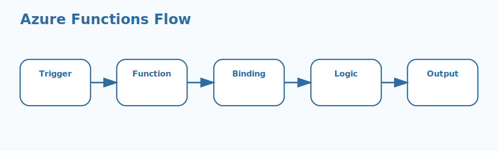

# Azure Functions Interview Questions


This guide covers azure functions from interview basics to tricky production scenarios. It follows the corrected format of **100 interview questions for each subtopic**, and every answer includes a coding example plus a real-time example so the scenarios and snippets do not repeat verbatim.

## How To Use This Page

- Questions 1-100 cover Function apps.
- Questions 101-200 cover Triggers.
- Questions 201-300 cover Bindings.
- Questions 301-400 cover Hosting plans.
- Questions 401-500 cover Scaling behavior.
- Questions 501-600 cover Cold starts.
- Questions 601-700 cover Durable Functions.
- Questions 701-800 cover Deployment pipelines.
- Questions 801-900 cover Security & identity.
- Questions 901-1000 cover Monitoring & retries.

## 1. Function apps

### Q1.1 What is function apps in Azure?

**Answer:**

Function apps matters in Azure because it affects how function apps affects architecture, delivery, and cloud operations. In a real cloud environment like a banking workload moving regulated services into Azure with strict security and availability controls, a strong answer should connect the concept to platform fit, security, observability, cost, and the operational behavior teams will live with after deployment. A more senior answer also explains the architecture impact so the explanation reflects practical Azure engineering rather than memorized cloud terms.

**Code Example:**

```csharp
[Function("HealthCheck")]
public HttpResponseData Run(
    [HttpTrigger(AuthorizationLevel.Function, "get")] HttpRequestData req)
{
    var response = req.CreateResponse(System.Net.HttpStatusCode.OK);
    response.WriteString("Healthy");
    return response;
}
```

**Real-Time Example:** In a banking workload moving regulated services into Azure with strict security and availability controls, the team relied on this concept so the explanation reflects practical Azure engineering rather than memorized cloud terms.

### Q1.2 Why does function apps fundamentals matter in real Azure solutions?

**Answer:**

Function apps fundamentals matters in Azure because it affects how function apps should be understood before making Azure design decisions. In a real cloud environment like a SaaS platform using Azure services to scale tenant workloads efficiently, a strong answer should connect the concept to platform fit, security, observability, cost, and the operational behavior teams will live with after deployment. A more senior answer also explains the architecture impact so teams can align service choices with workload and operational reality.

**Code Example:**

```csharp
[Function("QueueWorker")]
public void Run([QueueTrigger("orders")] string message)
{
    Console.WriteLine(message);
}
```

**Real-Time Example:** During a SaaS platform using Azure services to scale tenant workloads efficiently, this concept mattered because teams can align service choices with workload and operational reality.

### Q1.3 When should a team focus on function apps design?

**Answer:**

Function apps design matters in Azure because it affects how function apps influences implementation patterns and platform fit. In a real cloud environment like a CMS solution combining storage, background processing, and managed hosting in Azure, a strong answer should connect the concept to platform fit, security, observability, cost, and the operational behavior teams will live with after deployment. A more senior answer also explains the architecture impact so security, cost, and scaling decisions become easier to justify.

**Code Example:**

```csharp
[Function("NightlyJob")]
public void Run([TimerTrigger("0 0 2 * * *")] TimerInfo timer)
{
    Console.WriteLine("Nightly job started");
}
```

**Real-Time Example:** A practical Azure scenario is a CMS solution combining storage, background processing, and managed hosting in Azure, where this concept helped because security, cost, and scaling decisions become easier to justify.

### Q1.4 How would you explain function apps operations in an architecture discussion?

**Answer:**

Function apps operations matters in Azure because it affects how teams monitor, secure, and support function apps in production. In a real cloud environment like a healthcare application where monitoring, identity, and data access boundaries are tightly governed, a strong answer should connect the concept to platform fit, security, observability, cost, and the operational behavior teams will live with after deployment. A more senior answer also explains the architecture impact so production behavior is easier to predict before rollout.

**Code Example:**

```csharp
var host = new HostBuilder()
    .ConfigureFunctionsWorkerDefaults()
    .Build();

host.Run();
```

**Real-Time Example:** Teams like a healthcare application where monitoring, identity, and data access boundaries are tightly governed depend on this concept so production behavior is easier to predict before rollout.

### Q1.5 What is a common interview trap around function apps trade-offs?

**Answer:**

Function apps trade-offs matters in Azure because it affects how function apps changes cost, scalability, reliability, or maintainability decisions. In a real cloud environment like a logistics platform handling event-driven processing, APIs, and scheduled jobs across Azure services, a strong answer should connect the concept to platform fit, security, observability, cost, and the operational behavior teams will live with after deployment. A more senior answer also explains the architecture impact so the team avoids choosing services that do not match the actual problem.

**Code Example:**

```csharp
string[] concerns = ["triggers", "bindings", "scaling", "identity"];
foreach (var concern in concerns)
{
    Console.WriteLine(concern);
}
```

**Real-Time Example:** One real production case is a logistics platform handling event-driven processing, APIs, and scheduled jobs across Azure services; this works best when the team avoids choosing services that do not match the actual problem.

### Q1.6 How do teams apply function apps safely in practice?

**Answer:**

Function apps matters in Azure because it affects how function apps affects architecture, delivery, and cloud operations. In a real cloud environment like a customer-support product team trying to balance cloud cost, speed, and operational simplicity, a strong answer should connect the concept to platform fit, security, observability, cost, and the operational behavior teams will live with after deployment. A more senior answer also explains the architecture impact so architecture trade-offs become clearer across cost, control, and speed.

**Code Example:**

```csharp
[Function("HealthCheck")]
public HttpResponseData Run(
    [HttpTrigger(AuthorizationLevel.Function, "get")] HttpRequestData req)
{
    var response = req.CreateResponse(System.Net.HttpStatusCode.OK);
    response.WriteString("Healthy");
    return response;
}
```

**Real-Time Example:** In a customer-support product team trying to balance cloud cost, speed, and operational simplicity, the team relied on this concept so architecture trade-offs become clearer across cost, control, and speed.

### Q1.7 What production issue usually exposes weak understanding of function apps fundamentals?

**Answer:**

Function apps fundamentals matters in Azure because it affects how function apps should be understood before making Azure design decisions. In a real cloud environment like a manufacturing environment using Azure services for device data, dashboards, and back-office workflows, a strong answer should connect the concept to platform fit, security, observability, cost, and the operational behavior teams will live with after deployment. A more senior answer also explains the architecture impact so cloud governance and delivery concerns are discussed together instead of separately.

**Code Example:**

```csharp
[Function("QueueWorker")]
public void Run([QueueTrigger("orders")] string message)
{
    Console.WriteLine(message);
}
```

**Real-Time Example:** During a manufacturing environment using Azure services for device data, dashboards, and back-office workflows, this concept mattered because cloud governance and delivery concerns are discussed together instead of separately.

### Q1.8 How would an experienced architect justify function apps design to a team?

**Answer:**

Function apps design matters in Azure because it affects how function apps influences implementation patterns and platform fit. In a real cloud environment like an enterprise modernization program comparing older VM-centric patterns with managed Azure services, a strong answer should connect the concept to platform fit, security, observability, cost, and the operational behavior teams will live with after deployment. A more senior answer also explains the architecture impact so the answer sounds grounded in real Azure operations and architecture reviews.

**Code Example:**

```csharp
[Function("NightlyJob")]
public void Run([TimerTrigger("0 0 2 * * *")] TimerInfo timer)
{
    Console.WriteLine("Nightly job started");
}
```

**Real-Time Example:** A practical Azure scenario is an enterprise modernization program comparing older VM-centric patterns with managed Azure services, where this concept helped because the answer sounds grounded in real Azure operations and architecture reviews.

### Q1.9 What trade-off does function apps operations introduce?

**Answer:**

Function apps operations matters in Azure because it affects how teams monitor, secure, and support function apps in production. In a real cloud environment like a production incident where weak monitoring or scaling assumptions caused avoidable downtime, a strong answer should connect the concept to platform fit, security, observability, cost, and the operational behavior teams will live with after deployment. A more senior answer also explains the architecture impact so future growth and support needs are considered earlier in the design process.

**Code Example:**

```csharp
var host = new HostBuilder()
    .ConfigureFunctionsWorkerDefaults()
    .Build();

host.Run();
```

**Real-Time Example:** Teams like a production incident where weak monitoring or scaling assumptions caused avoidable downtime depend on this concept so future growth and support needs are considered earlier in the design process.

### Q1.10 How do you answer a tricky follow-up about function apps trade-offs?

**Answer:**

Function apps trade-offs matters in Azure because it affects how function apps changes cost, scalability, reliability, or maintainability decisions. In a real cloud environment like a multi-team cloud architecture review where the wrong Azure service choice would slow delivery later, a strong answer should connect the concept to platform fit, security, observability, cost, and the operational behavior teams will live with after deployment. A more senior answer also explains the architecture impact so the examples connect platform features to real delivery outcomes.

**Code Example:**

```csharp
string[] concerns = ["triggers", "bindings", "scaling", "identity"];
foreach (var concern in concerns)
{
    Console.WriteLine(concern);
}
```

**Real-Time Example:** One real production case is a multi-team cloud architecture review where the wrong Azure service choice would slow delivery later; this works best when the examples connect platform features to real delivery outcomes.

### Q1.11 What is function apps in Azure?

**Answer:**

Function apps matters in Azure because it affects how function apps affects architecture, delivery, and cloud operations. In a real cloud environment like a banking workload moving regulated services into Azure with strict security and availability controls, a strong answer should connect the concept to platform fit, security, observability, cost, and the operational behavior teams will live with after deployment. A more senior answer also explains the architecture impact so the explanation reflects practical Azure engineering rather than memorized cloud terms.

**Code Example:**

```csharp
[Function("HealthCheck")]
public HttpResponseData Run(
    [HttpTrigger(AuthorizationLevel.Function, "get")] HttpRequestData req)
{
    var response = req.CreateResponse(System.Net.HttpStatusCode.OK);
    response.WriteString("Healthy");
    return response;
}
```

**Real-Time Example:** In a banking workload moving regulated services into Azure with strict security and availability controls, the team relied on this concept so the explanation reflects practical Azure engineering rather than memorized cloud terms.

### Q1.12 Why does function apps fundamentals matter in real Azure solutions?

**Answer:**

Function apps fundamentals matters in Azure because it affects how function apps should be understood before making Azure design decisions. In a real cloud environment like a SaaS platform using Azure services to scale tenant workloads efficiently, a strong answer should connect the concept to platform fit, security, observability, cost, and the operational behavior teams will live with after deployment. A more senior answer also explains the architecture impact so teams can align service choices with workload and operational reality.

**Code Example:**

```csharp
[Function("QueueWorker")]
public void Run([QueueTrigger("orders")] string message)
{
    Console.WriteLine(message);
}
```

**Real-Time Example:** During a SaaS platform using Azure services to scale tenant workloads efficiently, this concept mattered because teams can align service choices with workload and operational reality.

### Q1.13 When should a team focus on function apps design?

**Answer:**

Function apps design matters in Azure because it affects how function apps influences implementation patterns and platform fit. In a real cloud environment like a CMS solution combining storage, background processing, and managed hosting in Azure, a strong answer should connect the concept to platform fit, security, observability, cost, and the operational behavior teams will live with after deployment. A more senior answer also explains the architecture impact so security, cost, and scaling decisions become easier to justify.

**Code Example:**

```csharp
[Function("NightlyJob")]
public void Run([TimerTrigger("0 0 2 * * *")] TimerInfo timer)
{
    Console.WriteLine("Nightly job started");
}
```

**Real-Time Example:** A practical Azure scenario is a CMS solution combining storage, background processing, and managed hosting in Azure, where this concept helped because security, cost, and scaling decisions become easier to justify.

### Q1.14 How would you explain function apps operations in an architecture discussion?

**Answer:**

Function apps operations matters in Azure because it affects how teams monitor, secure, and support function apps in production. In a real cloud environment like a healthcare application where monitoring, identity, and data access boundaries are tightly governed, a strong answer should connect the concept to platform fit, security, observability, cost, and the operational behavior teams will live with after deployment. A more senior answer also explains the architecture impact so production behavior is easier to predict before rollout.

**Code Example:**

```csharp
var host = new HostBuilder()
    .ConfigureFunctionsWorkerDefaults()
    .Build();

host.Run();
```

**Real-Time Example:** Teams like a healthcare application where monitoring, identity, and data access boundaries are tightly governed depend on this concept so production behavior is easier to predict before rollout.

### Q1.15 What is a common interview trap around function apps trade-offs?

**Answer:**

Function apps trade-offs matters in Azure because it affects how function apps changes cost, scalability, reliability, or maintainability decisions. In a real cloud environment like a logistics platform handling event-driven processing, APIs, and scheduled jobs across Azure services, a strong answer should connect the concept to platform fit, security, observability, cost, and the operational behavior teams will live with after deployment. A more senior answer also explains the architecture impact so the team avoids choosing services that do not match the actual problem.

**Code Example:**

```csharp
string[] concerns = ["triggers", "bindings", "scaling", "identity"];
foreach (var concern in concerns)
{
    Console.WriteLine(concern);
}
```

**Real-Time Example:** One real production case is a logistics platform handling event-driven processing, APIs, and scheduled jobs across Azure services; this works best when the team avoids choosing services that do not match the actual problem.

### Q1.16 How do teams apply function apps safely in practice?

**Answer:**

Function apps matters in Azure because it affects how function apps affects architecture, delivery, and cloud operations. In a real cloud environment like a customer-support product team trying to balance cloud cost, speed, and operational simplicity, a strong answer should connect the concept to platform fit, security, observability, cost, and the operational behavior teams will live with after deployment. A more senior answer also explains the architecture impact so architecture trade-offs become clearer across cost, control, and speed.

**Code Example:**

```csharp
[Function("HealthCheck")]
public HttpResponseData Run(
    [HttpTrigger(AuthorizationLevel.Function, "get")] HttpRequestData req)
{
    var response = req.CreateResponse(System.Net.HttpStatusCode.OK);
    response.WriteString("Healthy");
    return response;
}
```

**Real-Time Example:** In a customer-support product team trying to balance cloud cost, speed, and operational simplicity, the team relied on this concept so architecture trade-offs become clearer across cost, control, and speed.

### Q1.17 What production issue usually exposes weak understanding of function apps fundamentals?

**Answer:**

Function apps fundamentals matters in Azure because it affects how function apps should be understood before making Azure design decisions. In a real cloud environment like a manufacturing environment using Azure services for device data, dashboards, and back-office workflows, a strong answer should connect the concept to platform fit, security, observability, cost, and the operational behavior teams will live with after deployment. A more senior answer also explains the architecture impact so cloud governance and delivery concerns are discussed together instead of separately.

**Code Example:**

```csharp
[Function("QueueWorker")]
public void Run([QueueTrigger("orders")] string message)
{
    Console.WriteLine(message);
}
```

**Real-Time Example:** During a manufacturing environment using Azure services for device data, dashboards, and back-office workflows, this concept mattered because cloud governance and delivery concerns are discussed together instead of separately.

### Q1.18 How would an experienced architect justify function apps design to a team?

**Answer:**

Function apps design matters in Azure because it affects how function apps influences implementation patterns and platform fit. In a real cloud environment like an enterprise modernization program comparing older VM-centric patterns with managed Azure services, a strong answer should connect the concept to platform fit, security, observability, cost, and the operational behavior teams will live with after deployment. A more senior answer also explains the architecture impact so the answer sounds grounded in real Azure operations and architecture reviews.

**Code Example:**

```csharp
[Function("NightlyJob")]
public void Run([TimerTrigger("0 0 2 * * *")] TimerInfo timer)
{
    Console.WriteLine("Nightly job started");
}
```

**Real-Time Example:** A practical Azure scenario is an enterprise modernization program comparing older VM-centric patterns with managed Azure services, where this concept helped because the answer sounds grounded in real Azure operations and architecture reviews.

### Q1.19 What trade-off does function apps operations introduce?

**Answer:**

Function apps operations matters in Azure because it affects how teams monitor, secure, and support function apps in production. In a real cloud environment like a production incident where weak monitoring or scaling assumptions caused avoidable downtime, a strong answer should connect the concept to platform fit, security, observability, cost, and the operational behavior teams will live with after deployment. A more senior answer also explains the architecture impact so future growth and support needs are considered earlier in the design process.

**Code Example:**

```csharp
var host = new HostBuilder()
    .ConfigureFunctionsWorkerDefaults()
    .Build();

host.Run();
```

**Real-Time Example:** Teams like a production incident where weak monitoring or scaling assumptions caused avoidable downtime depend on this concept so future growth and support needs are considered earlier in the design process.

### Q1.20 How do you answer a tricky follow-up about function apps trade-offs?

**Answer:**

Function apps trade-offs matters in Azure because it affects how function apps changes cost, scalability, reliability, or maintainability decisions. In a real cloud environment like a multi-team cloud architecture review where the wrong Azure service choice would slow delivery later, a strong answer should connect the concept to platform fit, security, observability, cost, and the operational behavior teams will live with after deployment. A more senior answer also explains the architecture impact so the examples connect platform features to real delivery outcomes.

**Code Example:**

```csharp
string[] concerns = ["triggers", "bindings", "scaling", "identity"];
foreach (var concern in concerns)
{
    Console.WriteLine(concern);
}
```

**Real-Time Example:** One real production case is a multi-team cloud architecture review where the wrong Azure service choice would slow delivery later; this works best when the examples connect platform features to real delivery outcomes.

### Q1.21 What is function apps in Azure?

**Answer:**

Function apps matters in Azure because it affects how function apps affects architecture, delivery, and cloud operations. In a real cloud environment like a banking workload moving regulated services into Azure with strict security and availability controls, a strong answer should connect the concept to platform fit, security, observability, cost, and the operational behavior teams will live with after deployment. A more senior answer also explains the architecture impact so the explanation reflects practical Azure engineering rather than memorized cloud terms.

**Code Example:**

```csharp
[Function("HealthCheck")]
public HttpResponseData Run(
    [HttpTrigger(AuthorizationLevel.Function, "get")] HttpRequestData req)
{
    var response = req.CreateResponse(System.Net.HttpStatusCode.OK);
    response.WriteString("Healthy");
    return response;
}
```

**Real-Time Example:** In a banking workload moving regulated services into Azure with strict security and availability controls, the team relied on this concept so the explanation reflects practical Azure engineering rather than memorized cloud terms.

### Q1.22 Why does function apps fundamentals matter in real Azure solutions?

**Answer:**

Function apps fundamentals matters in Azure because it affects how function apps should be understood before making Azure design decisions. In a real cloud environment like a SaaS platform using Azure services to scale tenant workloads efficiently, a strong answer should connect the concept to platform fit, security, observability, cost, and the operational behavior teams will live with after deployment. A more senior answer also explains the architecture impact so teams can align service choices with workload and operational reality.

**Code Example:**

```csharp
[Function("QueueWorker")]
public void Run([QueueTrigger("orders")] string message)
{
    Console.WriteLine(message);
}
```

**Real-Time Example:** During a SaaS platform using Azure services to scale tenant workloads efficiently, this concept mattered because teams can align service choices with workload and operational reality.

### Q1.23 When should a team focus on function apps design?

**Answer:**

Function apps design matters in Azure because it affects how function apps influences implementation patterns and platform fit. In a real cloud environment like a CMS solution combining storage, background processing, and managed hosting in Azure, a strong answer should connect the concept to platform fit, security, observability, cost, and the operational behavior teams will live with after deployment. A more senior answer also explains the architecture impact so security, cost, and scaling decisions become easier to justify.

**Code Example:**

```csharp
[Function("NightlyJob")]
public void Run([TimerTrigger("0 0 2 * * *")] TimerInfo timer)
{
    Console.WriteLine("Nightly job started");
}
```

**Real-Time Example:** A practical Azure scenario is a CMS solution combining storage, background processing, and managed hosting in Azure, where this concept helped because security, cost, and scaling decisions become easier to justify.

### Q1.24 How would you explain function apps operations in an architecture discussion?

**Answer:**

Function apps operations matters in Azure because it affects how teams monitor, secure, and support function apps in production. In a real cloud environment like a healthcare application where monitoring, identity, and data access boundaries are tightly governed, a strong answer should connect the concept to platform fit, security, observability, cost, and the operational behavior teams will live with after deployment. A more senior answer also explains the architecture impact so production behavior is easier to predict before rollout.

**Code Example:**

```csharp
var host = new HostBuilder()
    .ConfigureFunctionsWorkerDefaults()
    .Build();

host.Run();
```

**Real-Time Example:** Teams like a healthcare application where monitoring, identity, and data access boundaries are tightly governed depend on this concept so production behavior is easier to predict before rollout.

### Q1.25 What is a common interview trap around function apps trade-offs?

**Answer:**

Function apps trade-offs matters in Azure because it affects how function apps changes cost, scalability, reliability, or maintainability decisions. In a real cloud environment like a logistics platform handling event-driven processing, APIs, and scheduled jobs across Azure services, a strong answer should connect the concept to platform fit, security, observability, cost, and the operational behavior teams will live with after deployment. A more senior answer also explains the architecture impact so the team avoids choosing services that do not match the actual problem.

**Code Example:**

```csharp
string[] concerns = ["triggers", "bindings", "scaling", "identity"];
foreach (var concern in concerns)
{
    Console.WriteLine(concern);
}
```

**Real-Time Example:** One real production case is a logistics platform handling event-driven processing, APIs, and scheduled jobs across Azure services; this works best when the team avoids choosing services that do not match the actual problem.

### Q1.26 How do teams apply function apps safely in practice?

**Answer:**

Function apps matters in Azure because it affects how function apps affects architecture, delivery, and cloud operations. In a real cloud environment like a customer-support product team trying to balance cloud cost, speed, and operational simplicity, a strong answer should connect the concept to platform fit, security, observability, cost, and the operational behavior teams will live with after deployment. A more senior answer also explains the architecture impact so architecture trade-offs become clearer across cost, control, and speed.

**Code Example:**

```csharp
[Function("HealthCheck")]
public HttpResponseData Run(
    [HttpTrigger(AuthorizationLevel.Function, "get")] HttpRequestData req)
{
    var response = req.CreateResponse(System.Net.HttpStatusCode.OK);
    response.WriteString("Healthy");
    return response;
}
```

**Real-Time Example:** In a customer-support product team trying to balance cloud cost, speed, and operational simplicity, the team relied on this concept so architecture trade-offs become clearer across cost, control, and speed.

### Q1.27 What production issue usually exposes weak understanding of function apps fundamentals?

**Answer:**

Function apps fundamentals matters in Azure because it affects how function apps should be understood before making Azure design decisions. In a real cloud environment like a manufacturing environment using Azure services for device data, dashboards, and back-office workflows, a strong answer should connect the concept to platform fit, security, observability, cost, and the operational behavior teams will live with after deployment. A more senior answer also explains the architecture impact so cloud governance and delivery concerns are discussed together instead of separately.

**Code Example:**

```csharp
[Function("QueueWorker")]
public void Run([QueueTrigger("orders")] string message)
{
    Console.WriteLine(message);
}
```

**Real-Time Example:** During a manufacturing environment using Azure services for device data, dashboards, and back-office workflows, this concept mattered because cloud governance and delivery concerns are discussed together instead of separately.

### Q1.28 How would an experienced architect justify function apps design to a team?

**Answer:**

Function apps design matters in Azure because it affects how function apps influences implementation patterns and platform fit. In a real cloud environment like an enterprise modernization program comparing older VM-centric patterns with managed Azure services, a strong answer should connect the concept to platform fit, security, observability, cost, and the operational behavior teams will live with after deployment. A more senior answer also explains the architecture impact so the answer sounds grounded in real Azure operations and architecture reviews.

**Code Example:**

```csharp
[Function("NightlyJob")]
public void Run([TimerTrigger("0 0 2 * * *")] TimerInfo timer)
{
    Console.WriteLine("Nightly job started");
}
```

**Real-Time Example:** A practical Azure scenario is an enterprise modernization program comparing older VM-centric patterns with managed Azure services, where this concept helped because the answer sounds grounded in real Azure operations and architecture reviews.

### Q1.29 What trade-off does function apps operations introduce?

**Answer:**

Function apps operations matters in Azure because it affects how teams monitor, secure, and support function apps in production. In a real cloud environment like a production incident where weak monitoring or scaling assumptions caused avoidable downtime, a strong answer should connect the concept to platform fit, security, observability, cost, and the operational behavior teams will live with after deployment. A more senior answer also explains the architecture impact so future growth and support needs are considered earlier in the design process.

**Code Example:**

```csharp
var host = new HostBuilder()
    .ConfigureFunctionsWorkerDefaults()
    .Build();

host.Run();
```

**Real-Time Example:** Teams like a production incident where weak monitoring or scaling assumptions caused avoidable downtime depend on this concept so future growth and support needs are considered earlier in the design process.

### Q1.30 How do you answer a tricky follow-up about function apps trade-offs?

**Answer:**

Function apps trade-offs matters in Azure because it affects how function apps changes cost, scalability, reliability, or maintainability decisions. In a real cloud environment like a multi-team cloud architecture review where the wrong Azure service choice would slow delivery later, a strong answer should connect the concept to platform fit, security, observability, cost, and the operational behavior teams will live with after deployment. A more senior answer also explains the architecture impact so the examples connect platform features to real delivery outcomes.

**Code Example:**

```csharp
string[] concerns = ["triggers", "bindings", "scaling", "identity"];
foreach (var concern in concerns)
{
    Console.WriteLine(concern);
}
```

**Real-Time Example:** One real production case is a multi-team cloud architecture review where the wrong Azure service choice would slow delivery later; this works best when the examples connect platform features to real delivery outcomes.

### Q1.31 What is function apps in Azure?

**Answer:**

Function apps matters in Azure because it affects how function apps affects architecture, delivery, and cloud operations. In a real cloud environment like a banking workload moving regulated services into Azure with strict security and availability controls, a strong answer should connect the concept to platform fit, security, observability, cost, and the operational behavior teams will live with after deployment. A more senior answer also explains the architecture impact so the explanation reflects practical Azure engineering rather than memorized cloud terms.

**Code Example:**

```csharp
[Function("HealthCheck")]
public HttpResponseData Run(
    [HttpTrigger(AuthorizationLevel.Function, "get")] HttpRequestData req)
{
    var response = req.CreateResponse(System.Net.HttpStatusCode.OK);
    response.WriteString("Healthy");
    return response;
}
```

**Real-Time Example:** In a banking workload moving regulated services into Azure with strict security and availability controls, the team relied on this concept so the explanation reflects practical Azure engineering rather than memorized cloud terms.

### Q1.32 Why does function apps fundamentals matter in real Azure solutions?

**Answer:**

Function apps fundamentals matters in Azure because it affects how function apps should be understood before making Azure design decisions. In a real cloud environment like a SaaS platform using Azure services to scale tenant workloads efficiently, a strong answer should connect the concept to platform fit, security, observability, cost, and the operational behavior teams will live with after deployment. A more senior answer also explains the architecture impact so teams can align service choices with workload and operational reality.

**Code Example:**

```csharp
[Function("QueueWorker")]
public void Run([QueueTrigger("orders")] string message)
{
    Console.WriteLine(message);
}
```

**Real-Time Example:** During a SaaS platform using Azure services to scale tenant workloads efficiently, this concept mattered because teams can align service choices with workload and operational reality.

### Q1.33 When should a team focus on function apps design?

**Answer:**

Function apps design matters in Azure because it affects how function apps influences implementation patterns and platform fit. In a real cloud environment like a CMS solution combining storage, background processing, and managed hosting in Azure, a strong answer should connect the concept to platform fit, security, observability, cost, and the operational behavior teams will live with after deployment. A more senior answer also explains the architecture impact so security, cost, and scaling decisions become easier to justify.

**Code Example:**

```csharp
[Function("NightlyJob")]
public void Run([TimerTrigger("0 0 2 * * *")] TimerInfo timer)
{
    Console.WriteLine("Nightly job started");
}
```

**Real-Time Example:** A practical Azure scenario is a CMS solution combining storage, background processing, and managed hosting in Azure, where this concept helped because security, cost, and scaling decisions become easier to justify.

### Q1.34 How would you explain function apps operations in an architecture discussion?

**Answer:**

Function apps operations matters in Azure because it affects how teams monitor, secure, and support function apps in production. In a real cloud environment like a healthcare application where monitoring, identity, and data access boundaries are tightly governed, a strong answer should connect the concept to platform fit, security, observability, cost, and the operational behavior teams will live with after deployment. A more senior answer also explains the architecture impact so production behavior is easier to predict before rollout.

**Code Example:**

```csharp
var host = new HostBuilder()
    .ConfigureFunctionsWorkerDefaults()
    .Build();

host.Run();
```

**Real-Time Example:** Teams like a healthcare application where monitoring, identity, and data access boundaries are tightly governed depend on this concept so production behavior is easier to predict before rollout.

### Q1.35 What is a common interview trap around function apps trade-offs?

**Answer:**

Function apps trade-offs matters in Azure because it affects how function apps changes cost, scalability, reliability, or maintainability decisions. In a real cloud environment like a logistics platform handling event-driven processing, APIs, and scheduled jobs across Azure services, a strong answer should connect the concept to platform fit, security, observability, cost, and the operational behavior teams will live with after deployment. A more senior answer also explains the architecture impact so the team avoids choosing services that do not match the actual problem.

**Code Example:**

```csharp
string[] concerns = ["triggers", "bindings", "scaling", "identity"];
foreach (var concern in concerns)
{
    Console.WriteLine(concern);
}
```

**Real-Time Example:** One real production case is a logistics platform handling event-driven processing, APIs, and scheduled jobs across Azure services; this works best when the team avoids choosing services that do not match the actual problem.

### Q1.36 How do teams apply function apps safely in practice?

**Answer:**

Function apps matters in Azure because it affects how function apps affects architecture, delivery, and cloud operations. In a real cloud environment like a customer-support product team trying to balance cloud cost, speed, and operational simplicity, a strong answer should connect the concept to platform fit, security, observability, cost, and the operational behavior teams will live with after deployment. A more senior answer also explains the architecture impact so architecture trade-offs become clearer across cost, control, and speed.

**Code Example:**

```csharp
[Function("HealthCheck")]
public HttpResponseData Run(
    [HttpTrigger(AuthorizationLevel.Function, "get")] HttpRequestData req)
{
    var response = req.CreateResponse(System.Net.HttpStatusCode.OK);
    response.WriteString("Healthy");
    return response;
}
```

**Real-Time Example:** In a customer-support product team trying to balance cloud cost, speed, and operational simplicity, the team relied on this concept so architecture trade-offs become clearer across cost, control, and speed.

### Q1.37 What production issue usually exposes weak understanding of function apps fundamentals?

**Answer:**

Function apps fundamentals matters in Azure because it affects how function apps should be understood before making Azure design decisions. In a real cloud environment like a manufacturing environment using Azure services for device data, dashboards, and back-office workflows, a strong answer should connect the concept to platform fit, security, observability, cost, and the operational behavior teams will live with after deployment. A more senior answer also explains the architecture impact so cloud governance and delivery concerns are discussed together instead of separately.

**Code Example:**

```csharp
[Function("QueueWorker")]
public void Run([QueueTrigger("orders")] string message)
{
    Console.WriteLine(message);
}
```

**Real-Time Example:** During a manufacturing environment using Azure services for device data, dashboards, and back-office workflows, this concept mattered because cloud governance and delivery concerns are discussed together instead of separately.

### Q1.38 How would an experienced architect justify function apps design to a team?

**Answer:**

Function apps design matters in Azure because it affects how function apps influences implementation patterns and platform fit. In a real cloud environment like an enterprise modernization program comparing older VM-centric patterns with managed Azure services, a strong answer should connect the concept to platform fit, security, observability, cost, and the operational behavior teams will live with after deployment. A more senior answer also explains the architecture impact so the answer sounds grounded in real Azure operations and architecture reviews.

**Code Example:**

```csharp
[Function("NightlyJob")]
public void Run([TimerTrigger("0 0 2 * * *")] TimerInfo timer)
{
    Console.WriteLine("Nightly job started");
}
```

**Real-Time Example:** A practical Azure scenario is an enterprise modernization program comparing older VM-centric patterns with managed Azure services, where this concept helped because the answer sounds grounded in real Azure operations and architecture reviews.

### Q1.39 What trade-off does function apps operations introduce?

**Answer:**

Function apps operations matters in Azure because it affects how teams monitor, secure, and support function apps in production. In a real cloud environment like a production incident where weak monitoring or scaling assumptions caused avoidable downtime, a strong answer should connect the concept to platform fit, security, observability, cost, and the operational behavior teams will live with after deployment. A more senior answer also explains the architecture impact so future growth and support needs are considered earlier in the design process.

**Code Example:**

```csharp
var host = new HostBuilder()
    .ConfigureFunctionsWorkerDefaults()
    .Build();

host.Run();
```

**Real-Time Example:** Teams like a production incident where weak monitoring or scaling assumptions caused avoidable downtime depend on this concept so future growth and support needs are considered earlier in the design process.

### Q1.40 How do you answer a tricky follow-up about function apps trade-offs?

**Answer:**

Function apps trade-offs matters in Azure because it affects how function apps changes cost, scalability, reliability, or maintainability decisions. In a real cloud environment like a multi-team cloud architecture review where the wrong Azure service choice would slow delivery later, a strong answer should connect the concept to platform fit, security, observability, cost, and the operational behavior teams will live with after deployment. A more senior answer also explains the architecture impact so the examples connect platform features to real delivery outcomes.

**Code Example:**

```csharp
string[] concerns = ["triggers", "bindings", "scaling", "identity"];
foreach (var concern in concerns)
{
    Console.WriteLine(concern);
}
```

**Real-Time Example:** One real production case is a multi-team cloud architecture review where the wrong Azure service choice would slow delivery later; this works best when the examples connect platform features to real delivery outcomes.

### Q1.41 What is function apps in Azure?

**Answer:**

Function apps matters in Azure because it affects how function apps affects architecture, delivery, and cloud operations. In a real cloud environment like a banking workload moving regulated services into Azure with strict security and availability controls, a strong answer should connect the concept to platform fit, security, observability, cost, and the operational behavior teams will live with after deployment. A more senior answer also explains the architecture impact so the explanation reflects practical Azure engineering rather than memorized cloud terms.

**Code Example:**

```csharp
[Function("HealthCheck")]
public HttpResponseData Run(
    [HttpTrigger(AuthorizationLevel.Function, "get")] HttpRequestData req)
{
    var response = req.CreateResponse(System.Net.HttpStatusCode.OK);
    response.WriteString("Healthy");
    return response;
}
```

**Real-Time Example:** In a banking workload moving regulated services into Azure with strict security and availability controls, the team relied on this concept so the explanation reflects practical Azure engineering rather than memorized cloud terms.

### Q1.42 Why does function apps fundamentals matter in real Azure solutions?

**Answer:**

Function apps fundamentals matters in Azure because it affects how function apps should be understood before making Azure design decisions. In a real cloud environment like a SaaS platform using Azure services to scale tenant workloads efficiently, a strong answer should connect the concept to platform fit, security, observability, cost, and the operational behavior teams will live with after deployment. A more senior answer also explains the architecture impact so teams can align service choices with workload and operational reality.

**Code Example:**

```csharp
[Function("QueueWorker")]
public void Run([QueueTrigger("orders")] string message)
{
    Console.WriteLine(message);
}
```

**Real-Time Example:** During a SaaS platform using Azure services to scale tenant workloads efficiently, this concept mattered because teams can align service choices with workload and operational reality.

### Q1.43 When should a team focus on function apps design?

**Answer:**

Function apps design matters in Azure because it affects how function apps influences implementation patterns and platform fit. In a real cloud environment like a CMS solution combining storage, background processing, and managed hosting in Azure, a strong answer should connect the concept to platform fit, security, observability, cost, and the operational behavior teams will live with after deployment. A more senior answer also explains the architecture impact so security, cost, and scaling decisions become easier to justify.

**Code Example:**

```csharp
[Function("NightlyJob")]
public void Run([TimerTrigger("0 0 2 * * *")] TimerInfo timer)
{
    Console.WriteLine("Nightly job started");
}
```

**Real-Time Example:** A practical Azure scenario is a CMS solution combining storage, background processing, and managed hosting in Azure, where this concept helped because security, cost, and scaling decisions become easier to justify.

### Q1.44 How would you explain function apps operations in an architecture discussion?

**Answer:**

Function apps operations matters in Azure because it affects how teams monitor, secure, and support function apps in production. In a real cloud environment like a healthcare application where monitoring, identity, and data access boundaries are tightly governed, a strong answer should connect the concept to platform fit, security, observability, cost, and the operational behavior teams will live with after deployment. A more senior answer also explains the architecture impact so production behavior is easier to predict before rollout.

**Code Example:**

```csharp
var host = new HostBuilder()
    .ConfigureFunctionsWorkerDefaults()
    .Build();

host.Run();
```

**Real-Time Example:** Teams like a healthcare application where monitoring, identity, and data access boundaries are tightly governed depend on this concept so production behavior is easier to predict before rollout.

### Q1.45 What is a common interview trap around function apps trade-offs?

**Answer:**

Function apps trade-offs matters in Azure because it affects how function apps changes cost, scalability, reliability, or maintainability decisions. In a real cloud environment like a logistics platform handling event-driven processing, APIs, and scheduled jobs across Azure services, a strong answer should connect the concept to platform fit, security, observability, cost, and the operational behavior teams will live with after deployment. A more senior answer also explains the architecture impact so the team avoids choosing services that do not match the actual problem.

**Code Example:**

```csharp
string[] concerns = ["triggers", "bindings", "scaling", "identity"];
foreach (var concern in concerns)
{
    Console.WriteLine(concern);
}
```

**Real-Time Example:** One real production case is a logistics platform handling event-driven processing, APIs, and scheduled jobs across Azure services; this works best when the team avoids choosing services that do not match the actual problem.

### Q1.46 How do teams apply function apps safely in practice?

**Answer:**

Function apps matters in Azure because it affects how function apps affects architecture, delivery, and cloud operations. In a real cloud environment like a customer-support product team trying to balance cloud cost, speed, and operational simplicity, a strong answer should connect the concept to platform fit, security, observability, cost, and the operational behavior teams will live with after deployment. A more senior answer also explains the architecture impact so architecture trade-offs become clearer across cost, control, and speed.

**Code Example:**

```csharp
[Function("HealthCheck")]
public HttpResponseData Run(
    [HttpTrigger(AuthorizationLevel.Function, "get")] HttpRequestData req)
{
    var response = req.CreateResponse(System.Net.HttpStatusCode.OK);
    response.WriteString("Healthy");
    return response;
}
```

**Real-Time Example:** In a customer-support product team trying to balance cloud cost, speed, and operational simplicity, the team relied on this concept so architecture trade-offs become clearer across cost, control, and speed.

### Q1.47 What production issue usually exposes weak understanding of function apps fundamentals?

**Answer:**

Function apps fundamentals matters in Azure because it affects how function apps should be understood before making Azure design decisions. In a real cloud environment like a manufacturing environment using Azure services for device data, dashboards, and back-office workflows, a strong answer should connect the concept to platform fit, security, observability, cost, and the operational behavior teams will live with after deployment. A more senior answer also explains the architecture impact so cloud governance and delivery concerns are discussed together instead of separately.

**Code Example:**

```csharp
[Function("QueueWorker")]
public void Run([QueueTrigger("orders")] string message)
{
    Console.WriteLine(message);
}
```

**Real-Time Example:** During a manufacturing environment using Azure services for device data, dashboards, and back-office workflows, this concept mattered because cloud governance and delivery concerns are discussed together instead of separately.

### Q1.48 How would an experienced architect justify function apps design to a team?

**Answer:**

Function apps design matters in Azure because it affects how function apps influences implementation patterns and platform fit. In a real cloud environment like an enterprise modernization program comparing older VM-centric patterns with managed Azure services, a strong answer should connect the concept to platform fit, security, observability, cost, and the operational behavior teams will live with after deployment. A more senior answer also explains the architecture impact so the answer sounds grounded in real Azure operations and architecture reviews.

**Code Example:**

```csharp
[Function("NightlyJob")]
public void Run([TimerTrigger("0 0 2 * * *")] TimerInfo timer)
{
    Console.WriteLine("Nightly job started");
}
```

**Real-Time Example:** A practical Azure scenario is an enterprise modernization program comparing older VM-centric patterns with managed Azure services, where this concept helped because the answer sounds grounded in real Azure operations and architecture reviews.

### Q1.49 What trade-off does function apps operations introduce?

**Answer:**

Function apps operations matters in Azure because it affects how teams monitor, secure, and support function apps in production. In a real cloud environment like a production incident where weak monitoring or scaling assumptions caused avoidable downtime, a strong answer should connect the concept to platform fit, security, observability, cost, and the operational behavior teams will live with after deployment. A more senior answer also explains the architecture impact so future growth and support needs are considered earlier in the design process.

**Code Example:**

```csharp
var host = new HostBuilder()
    .ConfigureFunctionsWorkerDefaults()
    .Build();

host.Run();
```

**Real-Time Example:** Teams like a production incident where weak monitoring or scaling assumptions caused avoidable downtime depend on this concept so future growth and support needs are considered earlier in the design process.

### Q1.50 How do you answer a tricky follow-up about function apps trade-offs?

**Answer:**

Function apps trade-offs matters in Azure because it affects how function apps changes cost, scalability, reliability, or maintainability decisions. In a real cloud environment like a multi-team cloud architecture review where the wrong Azure service choice would slow delivery later, a strong answer should connect the concept to platform fit, security, observability, cost, and the operational behavior teams will live with after deployment. A more senior answer also explains the architecture impact so the examples connect platform features to real delivery outcomes.

**Code Example:**

```csharp
string[] concerns = ["triggers", "bindings", "scaling", "identity"];
foreach (var concern in concerns)
{
    Console.WriteLine(concern);
}
```

**Real-Time Example:** One real production case is a multi-team cloud architecture review where the wrong Azure service choice would slow delivery later; this works best when the examples connect platform features to real delivery outcomes.

### Q1.51 What is function apps in Azure?

**Answer:**

Function apps matters in Azure because it affects how function apps affects architecture, delivery, and cloud operations. In a real cloud environment like a banking workload moving regulated services into Azure with strict security and availability controls, a strong answer should connect the concept to platform fit, security, observability, cost, and the operational behavior teams will live with after deployment. A more senior answer also explains the architecture impact so the explanation reflects practical Azure engineering rather than memorized cloud terms.

**Code Example:**

```csharp
[Function("HealthCheck")]
public HttpResponseData Run(
    [HttpTrigger(AuthorizationLevel.Function, "get")] HttpRequestData req)
{
    var response = req.CreateResponse(System.Net.HttpStatusCode.OK);
    response.WriteString("Healthy");
    return response;
}
```

**Real-Time Example:** In a banking workload moving regulated services into Azure with strict security and availability controls, the team relied on this concept so the explanation reflects practical Azure engineering rather than memorized cloud terms.

### Q1.52 Why does function apps fundamentals matter in real Azure solutions?

**Answer:**

Function apps fundamentals matters in Azure because it affects how function apps should be understood before making Azure design decisions. In a real cloud environment like a SaaS platform using Azure services to scale tenant workloads efficiently, a strong answer should connect the concept to platform fit, security, observability, cost, and the operational behavior teams will live with after deployment. A more senior answer also explains the architecture impact so teams can align service choices with workload and operational reality.

**Code Example:**

```csharp
[Function("QueueWorker")]
public void Run([QueueTrigger("orders")] string message)
{
    Console.WriteLine(message);
}
```

**Real-Time Example:** During a SaaS platform using Azure services to scale tenant workloads efficiently, this concept mattered because teams can align service choices with workload and operational reality.

### Q1.53 When should a team focus on function apps design?

**Answer:**

Function apps design matters in Azure because it affects how function apps influences implementation patterns and platform fit. In a real cloud environment like a CMS solution combining storage, background processing, and managed hosting in Azure, a strong answer should connect the concept to platform fit, security, observability, cost, and the operational behavior teams will live with after deployment. A more senior answer also explains the architecture impact so security, cost, and scaling decisions become easier to justify.

**Code Example:**

```csharp
[Function("NightlyJob")]
public void Run([TimerTrigger("0 0 2 * * *")] TimerInfo timer)
{
    Console.WriteLine("Nightly job started");
}
```

**Real-Time Example:** A practical Azure scenario is a CMS solution combining storage, background processing, and managed hosting in Azure, where this concept helped because security, cost, and scaling decisions become easier to justify.

### Q1.54 How would you explain function apps operations in an architecture discussion?

**Answer:**

Function apps operations matters in Azure because it affects how teams monitor, secure, and support function apps in production. In a real cloud environment like a healthcare application where monitoring, identity, and data access boundaries are tightly governed, a strong answer should connect the concept to platform fit, security, observability, cost, and the operational behavior teams will live with after deployment. A more senior answer also explains the architecture impact so production behavior is easier to predict before rollout.

**Code Example:**

```csharp
var host = new HostBuilder()
    .ConfigureFunctionsWorkerDefaults()
    .Build();

host.Run();
```

**Real-Time Example:** Teams like a healthcare application where monitoring, identity, and data access boundaries are tightly governed depend on this concept so production behavior is easier to predict before rollout.

### Q1.55 What is a common interview trap around function apps trade-offs?

**Answer:**

Function apps trade-offs matters in Azure because it affects how function apps changes cost, scalability, reliability, or maintainability decisions. In a real cloud environment like a logistics platform handling event-driven processing, APIs, and scheduled jobs across Azure services, a strong answer should connect the concept to platform fit, security, observability, cost, and the operational behavior teams will live with after deployment. A more senior answer also explains the architecture impact so the team avoids choosing services that do not match the actual problem.

**Code Example:**

```csharp
string[] concerns = ["triggers", "bindings", "scaling", "identity"];
foreach (var concern in concerns)
{
    Console.WriteLine(concern);
}
```

**Real-Time Example:** One real production case is a logistics platform handling event-driven processing, APIs, and scheduled jobs across Azure services; this works best when the team avoids choosing services that do not match the actual problem.

### Q1.56 How do teams apply function apps safely in practice?

**Answer:**

Function apps matters in Azure because it affects how function apps affects architecture, delivery, and cloud operations. In a real cloud environment like a customer-support product team trying to balance cloud cost, speed, and operational simplicity, a strong answer should connect the concept to platform fit, security, observability, cost, and the operational behavior teams will live with after deployment. A more senior answer also explains the architecture impact so architecture trade-offs become clearer across cost, control, and speed.

**Code Example:**

```csharp
[Function("HealthCheck")]
public HttpResponseData Run(
    [HttpTrigger(AuthorizationLevel.Function, "get")] HttpRequestData req)
{
    var response = req.CreateResponse(System.Net.HttpStatusCode.OK);
    response.WriteString("Healthy");
    return response;
}
```

**Real-Time Example:** In a customer-support product team trying to balance cloud cost, speed, and operational simplicity, the team relied on this concept so architecture trade-offs become clearer across cost, control, and speed.

### Q1.57 What production issue usually exposes weak understanding of function apps fundamentals?

**Answer:**

Function apps fundamentals matters in Azure because it affects how function apps should be understood before making Azure design decisions. In a real cloud environment like a manufacturing environment using Azure services for device data, dashboards, and back-office workflows, a strong answer should connect the concept to platform fit, security, observability, cost, and the operational behavior teams will live with after deployment. A more senior answer also explains the architecture impact so cloud governance and delivery concerns are discussed together instead of separately.

**Code Example:**

```csharp
[Function("QueueWorker")]
public void Run([QueueTrigger("orders")] string message)
{
    Console.WriteLine(message);
}
```

**Real-Time Example:** During a manufacturing environment using Azure services for device data, dashboards, and back-office workflows, this concept mattered because cloud governance and delivery concerns are discussed together instead of separately.

### Q1.58 How would an experienced architect justify function apps design to a team?

**Answer:**

Function apps design matters in Azure because it affects how function apps influences implementation patterns and platform fit. In a real cloud environment like an enterprise modernization program comparing older VM-centric patterns with managed Azure services, a strong answer should connect the concept to platform fit, security, observability, cost, and the operational behavior teams will live with after deployment. A more senior answer also explains the architecture impact so the answer sounds grounded in real Azure operations and architecture reviews.

**Code Example:**

```csharp
[Function("NightlyJob")]
public void Run([TimerTrigger("0 0 2 * * *")] TimerInfo timer)
{
    Console.WriteLine("Nightly job started");
}
```

**Real-Time Example:** A practical Azure scenario is an enterprise modernization program comparing older VM-centric patterns with managed Azure services, where this concept helped because the answer sounds grounded in real Azure operations and architecture reviews.

### Q1.59 What trade-off does function apps operations introduce?

**Answer:**

Function apps operations matters in Azure because it affects how teams monitor, secure, and support function apps in production. In a real cloud environment like a production incident where weak monitoring or scaling assumptions caused avoidable downtime, a strong answer should connect the concept to platform fit, security, observability, cost, and the operational behavior teams will live with after deployment. A more senior answer also explains the architecture impact so future growth and support needs are considered earlier in the design process.

**Code Example:**

```csharp
var host = new HostBuilder()
    .ConfigureFunctionsWorkerDefaults()
    .Build();

host.Run();
```

**Real-Time Example:** Teams like a production incident where weak monitoring or scaling assumptions caused avoidable downtime depend on this concept so future growth and support needs are considered earlier in the design process.

### Q1.60 How do you answer a tricky follow-up about function apps trade-offs?

**Answer:**

Function apps trade-offs matters in Azure because it affects how function apps changes cost, scalability, reliability, or maintainability decisions. In a real cloud environment like a multi-team cloud architecture review where the wrong Azure service choice would slow delivery later, a strong answer should connect the concept to platform fit, security, observability, cost, and the operational behavior teams will live with after deployment. A more senior answer also explains the architecture impact so the examples connect platform features to real delivery outcomes.

**Code Example:**

```csharp
string[] concerns = ["triggers", "bindings", "scaling", "identity"];
foreach (var concern in concerns)
{
    Console.WriteLine(concern);
}
```

**Real-Time Example:** One real production case is a multi-team cloud architecture review where the wrong Azure service choice would slow delivery later; this works best when the examples connect platform features to real delivery outcomes.

### Q1.61 What is function apps in Azure?

**Answer:**

Function apps matters in Azure because it affects how function apps affects architecture, delivery, and cloud operations. In a real cloud environment like a banking workload moving regulated services into Azure with strict security and availability controls, a strong answer should connect the concept to platform fit, security, observability, cost, and the operational behavior teams will live with after deployment. A more senior answer also explains the architecture impact so the explanation reflects practical Azure engineering rather than memorized cloud terms.

**Code Example:**

```csharp
[Function("HealthCheck")]
public HttpResponseData Run(
    [HttpTrigger(AuthorizationLevel.Function, "get")] HttpRequestData req)
{
    var response = req.CreateResponse(System.Net.HttpStatusCode.OK);
    response.WriteString("Healthy");
    return response;
}
```

**Real-Time Example:** In a banking workload moving regulated services into Azure with strict security and availability controls, the team relied on this concept so the explanation reflects practical Azure engineering rather than memorized cloud terms.

### Q1.62 Why does function apps fundamentals matter in real Azure solutions?

**Answer:**

Function apps fundamentals matters in Azure because it affects how function apps should be understood before making Azure design decisions. In a real cloud environment like a SaaS platform using Azure services to scale tenant workloads efficiently, a strong answer should connect the concept to platform fit, security, observability, cost, and the operational behavior teams will live with after deployment. A more senior answer also explains the architecture impact so teams can align service choices with workload and operational reality.

**Code Example:**

```csharp
[Function("QueueWorker")]
public void Run([QueueTrigger("orders")] string message)
{
    Console.WriteLine(message);
}
```

**Real-Time Example:** During a SaaS platform using Azure services to scale tenant workloads efficiently, this concept mattered because teams can align service choices with workload and operational reality.

### Q1.63 When should a team focus on function apps design?

**Answer:**

Function apps design matters in Azure because it affects how function apps influences implementation patterns and platform fit. In a real cloud environment like a CMS solution combining storage, background processing, and managed hosting in Azure, a strong answer should connect the concept to platform fit, security, observability, cost, and the operational behavior teams will live with after deployment. A more senior answer also explains the architecture impact so security, cost, and scaling decisions become easier to justify.

**Code Example:**

```csharp
[Function("NightlyJob")]
public void Run([TimerTrigger("0 0 2 * * *")] TimerInfo timer)
{
    Console.WriteLine("Nightly job started");
}
```

**Real-Time Example:** A practical Azure scenario is a CMS solution combining storage, background processing, and managed hosting in Azure, where this concept helped because security, cost, and scaling decisions become easier to justify.

### Q1.64 How would you explain function apps operations in an architecture discussion?

**Answer:**

Function apps operations matters in Azure because it affects how teams monitor, secure, and support function apps in production. In a real cloud environment like a healthcare application where monitoring, identity, and data access boundaries are tightly governed, a strong answer should connect the concept to platform fit, security, observability, cost, and the operational behavior teams will live with after deployment. A more senior answer also explains the architecture impact so production behavior is easier to predict before rollout.

**Code Example:**

```csharp
var host = new HostBuilder()
    .ConfigureFunctionsWorkerDefaults()
    .Build();

host.Run();
```

**Real-Time Example:** Teams like a healthcare application where monitoring, identity, and data access boundaries are tightly governed depend on this concept so production behavior is easier to predict before rollout.

### Q1.65 What is a common interview trap around function apps trade-offs?

**Answer:**

Function apps trade-offs matters in Azure because it affects how function apps changes cost, scalability, reliability, or maintainability decisions. In a real cloud environment like a logistics platform handling event-driven processing, APIs, and scheduled jobs across Azure services, a strong answer should connect the concept to platform fit, security, observability, cost, and the operational behavior teams will live with after deployment. A more senior answer also explains the architecture impact so the team avoids choosing services that do not match the actual problem.

**Code Example:**

```csharp
string[] concerns = ["triggers", "bindings", "scaling", "identity"];
foreach (var concern in concerns)
{
    Console.WriteLine(concern);
}
```

**Real-Time Example:** One real production case is a logistics platform handling event-driven processing, APIs, and scheduled jobs across Azure services; this works best when the team avoids choosing services that do not match the actual problem.

### Q1.66 How do teams apply function apps safely in practice?

**Answer:**

Function apps matters in Azure because it affects how function apps affects architecture, delivery, and cloud operations. In a real cloud environment like a customer-support product team trying to balance cloud cost, speed, and operational simplicity, a strong answer should connect the concept to platform fit, security, observability, cost, and the operational behavior teams will live with after deployment. A more senior answer also explains the architecture impact so architecture trade-offs become clearer across cost, control, and speed.

**Code Example:**

```csharp
[Function("HealthCheck")]
public HttpResponseData Run(
    [HttpTrigger(AuthorizationLevel.Function, "get")] HttpRequestData req)
{
    var response = req.CreateResponse(System.Net.HttpStatusCode.OK);
    response.WriteString("Healthy");
    return response;
}
```

**Real-Time Example:** In a customer-support product team trying to balance cloud cost, speed, and operational simplicity, the team relied on this concept so architecture trade-offs become clearer across cost, control, and speed.

### Q1.67 What production issue usually exposes weak understanding of function apps fundamentals?

**Answer:**

Function apps fundamentals matters in Azure because it affects how function apps should be understood before making Azure design decisions. In a real cloud environment like a manufacturing environment using Azure services for device data, dashboards, and back-office workflows, a strong answer should connect the concept to platform fit, security, observability, cost, and the operational behavior teams will live with after deployment. A more senior answer also explains the architecture impact so cloud governance and delivery concerns are discussed together instead of separately.

**Code Example:**

```csharp
[Function("QueueWorker")]
public void Run([QueueTrigger("orders")] string message)
{
    Console.WriteLine(message);
}
```

**Real-Time Example:** During a manufacturing environment using Azure services for device data, dashboards, and back-office workflows, this concept mattered because cloud governance and delivery concerns are discussed together instead of separately.

### Q1.68 How would an experienced architect justify function apps design to a team?

**Answer:**

Function apps design matters in Azure because it affects how function apps influences implementation patterns and platform fit. In a real cloud environment like an enterprise modernization program comparing older VM-centric patterns with managed Azure services, a strong answer should connect the concept to platform fit, security, observability, cost, and the operational behavior teams will live with after deployment. A more senior answer also explains the architecture impact so the answer sounds grounded in real Azure operations and architecture reviews.

**Code Example:**

```csharp
[Function("NightlyJob")]
public void Run([TimerTrigger("0 0 2 * * *")] TimerInfo timer)
{
    Console.WriteLine("Nightly job started");
}
```

**Real-Time Example:** A practical Azure scenario is an enterprise modernization program comparing older VM-centric patterns with managed Azure services, where this concept helped because the answer sounds grounded in real Azure operations and architecture reviews.

### Q1.69 What trade-off does function apps operations introduce?

**Answer:**

Function apps operations matters in Azure because it affects how teams monitor, secure, and support function apps in production. In a real cloud environment like a production incident where weak monitoring or scaling assumptions caused avoidable downtime, a strong answer should connect the concept to platform fit, security, observability, cost, and the operational behavior teams will live with after deployment. A more senior answer also explains the architecture impact so future growth and support needs are considered earlier in the design process.

**Code Example:**

```csharp
var host = new HostBuilder()
    .ConfigureFunctionsWorkerDefaults()
    .Build();

host.Run();
```

**Real-Time Example:** Teams like a production incident where weak monitoring or scaling assumptions caused avoidable downtime depend on this concept so future growth and support needs are considered earlier in the design process.

### Q1.70 How do you answer a tricky follow-up about function apps trade-offs?

**Answer:**

Function apps trade-offs matters in Azure because it affects how function apps changes cost, scalability, reliability, or maintainability decisions. In a real cloud environment like a multi-team cloud architecture review where the wrong Azure service choice would slow delivery later, a strong answer should connect the concept to platform fit, security, observability, cost, and the operational behavior teams will live with after deployment. A more senior answer also explains the architecture impact so the examples connect platform features to real delivery outcomes.

**Code Example:**

```csharp
string[] concerns = ["triggers", "bindings", "scaling", "identity"];
foreach (var concern in concerns)
{
    Console.WriteLine(concern);
}
```

**Real-Time Example:** One real production case is a multi-team cloud architecture review where the wrong Azure service choice would slow delivery later; this works best when the examples connect platform features to real delivery outcomes.

### Q1.71 What is function apps in Azure?

**Answer:**

Function apps matters in Azure because it affects how function apps affects architecture, delivery, and cloud operations. In a real cloud environment like a banking workload moving regulated services into Azure with strict security and availability controls, a strong answer should connect the concept to platform fit, security, observability, cost, and the operational behavior teams will live with after deployment. A more senior answer also explains the architecture impact so the explanation reflects practical Azure engineering rather than memorized cloud terms.

**Code Example:**

```csharp
[Function("HealthCheck")]
public HttpResponseData Run(
    [HttpTrigger(AuthorizationLevel.Function, "get")] HttpRequestData req)
{
    var response = req.CreateResponse(System.Net.HttpStatusCode.OK);
    response.WriteString("Healthy");
    return response;
}
```

**Real-Time Example:** In a banking workload moving regulated services into Azure with strict security and availability controls, the team relied on this concept so the explanation reflects practical Azure engineering rather than memorized cloud terms.

### Q1.72 Why does function apps fundamentals matter in real Azure solutions?

**Answer:**

Function apps fundamentals matters in Azure because it affects how function apps should be understood before making Azure design decisions. In a real cloud environment like a SaaS platform using Azure services to scale tenant workloads efficiently, a strong answer should connect the concept to platform fit, security, observability, cost, and the operational behavior teams will live with after deployment. A more senior answer also explains the architecture impact so teams can align service choices with workload and operational reality.

**Code Example:**

```csharp
[Function("QueueWorker")]
public void Run([QueueTrigger("orders")] string message)
{
    Console.WriteLine(message);
}
```

**Real-Time Example:** During a SaaS platform using Azure services to scale tenant workloads efficiently, this concept mattered because teams can align service choices with workload and operational reality.

### Q1.73 When should a team focus on function apps design?

**Answer:**

Function apps design matters in Azure because it affects how function apps influences implementation patterns and platform fit. In a real cloud environment like a CMS solution combining storage, background processing, and managed hosting in Azure, a strong answer should connect the concept to platform fit, security, observability, cost, and the operational behavior teams will live with after deployment. A more senior answer also explains the architecture impact so security, cost, and scaling decisions become easier to justify.

**Code Example:**

```csharp
[Function("NightlyJob")]
public void Run([TimerTrigger("0 0 2 * * *")] TimerInfo timer)
{
    Console.WriteLine("Nightly job started");
}
```

**Real-Time Example:** A practical Azure scenario is a CMS solution combining storage, background processing, and managed hosting in Azure, where this concept helped because security, cost, and scaling decisions become easier to justify.

### Q1.74 How would you explain function apps operations in an architecture discussion?

**Answer:**

Function apps operations matters in Azure because it affects how teams monitor, secure, and support function apps in production. In a real cloud environment like a healthcare application where monitoring, identity, and data access boundaries are tightly governed, a strong answer should connect the concept to platform fit, security, observability, cost, and the operational behavior teams will live with after deployment. A more senior answer also explains the architecture impact so production behavior is easier to predict before rollout.

**Code Example:**

```csharp
var host = new HostBuilder()
    .ConfigureFunctionsWorkerDefaults()
    .Build();

host.Run();
```

**Real-Time Example:** Teams like a healthcare application where monitoring, identity, and data access boundaries are tightly governed depend on this concept so production behavior is easier to predict before rollout.

### Q1.75 What is a common interview trap around function apps trade-offs?

**Answer:**

Function apps trade-offs matters in Azure because it affects how function apps changes cost, scalability, reliability, or maintainability decisions. In a real cloud environment like a logistics platform handling event-driven processing, APIs, and scheduled jobs across Azure services, a strong answer should connect the concept to platform fit, security, observability, cost, and the operational behavior teams will live with after deployment. A more senior answer also explains the architecture impact so the team avoids choosing services that do not match the actual problem.

**Code Example:**

```csharp
string[] concerns = ["triggers", "bindings", "scaling", "identity"];
foreach (var concern in concerns)
{
    Console.WriteLine(concern);
}
```

**Real-Time Example:** One real production case is a logistics platform handling event-driven processing, APIs, and scheduled jobs across Azure services; this works best when the team avoids choosing services that do not match the actual problem.

### Q1.76 How do teams apply function apps safely in practice?

**Answer:**

Function apps matters in Azure because it affects how function apps affects architecture, delivery, and cloud operations. In a real cloud environment like a customer-support product team trying to balance cloud cost, speed, and operational simplicity, a strong answer should connect the concept to platform fit, security, observability, cost, and the operational behavior teams will live with after deployment. A more senior answer also explains the architecture impact so architecture trade-offs become clearer across cost, control, and speed.

**Code Example:**

```csharp
[Function("HealthCheck")]
public HttpResponseData Run(
    [HttpTrigger(AuthorizationLevel.Function, "get")] HttpRequestData req)
{
    var response = req.CreateResponse(System.Net.HttpStatusCode.OK);
    response.WriteString("Healthy");
    return response;
}
```

**Real-Time Example:** In a customer-support product team trying to balance cloud cost, speed, and operational simplicity, the team relied on this concept so architecture trade-offs become clearer across cost, control, and speed.

### Q1.77 What production issue usually exposes weak understanding of function apps fundamentals?

**Answer:**

Function apps fundamentals matters in Azure because it affects how function apps should be understood before making Azure design decisions. In a real cloud environment like a manufacturing environment using Azure services for device data, dashboards, and back-office workflows, a strong answer should connect the concept to platform fit, security, observability, cost, and the operational behavior teams will live with after deployment. A more senior answer also explains the architecture impact so cloud governance and delivery concerns are discussed together instead of separately.

**Code Example:**

```csharp
[Function("QueueWorker")]
public void Run([QueueTrigger("orders")] string message)
{
    Console.WriteLine(message);
}
```

**Real-Time Example:** During a manufacturing environment using Azure services for device data, dashboards, and back-office workflows, this concept mattered because cloud governance and delivery concerns are discussed together instead of separately.

### Q1.78 How would an experienced architect justify function apps design to a team?

**Answer:**

Function apps design matters in Azure because it affects how function apps influences implementation patterns and platform fit. In a real cloud environment like an enterprise modernization program comparing older VM-centric patterns with managed Azure services, a strong answer should connect the concept to platform fit, security, observability, cost, and the operational behavior teams will live with after deployment. A more senior answer also explains the architecture impact so the answer sounds grounded in real Azure operations and architecture reviews.

**Code Example:**

```csharp
[Function("NightlyJob")]
public void Run([TimerTrigger("0 0 2 * * *")] TimerInfo timer)
{
    Console.WriteLine("Nightly job started");
}
```

**Real-Time Example:** A practical Azure scenario is an enterprise modernization program comparing older VM-centric patterns with managed Azure services, where this concept helped because the answer sounds grounded in real Azure operations and architecture reviews.

### Q1.79 What trade-off does function apps operations introduce?

**Answer:**

Function apps operations matters in Azure because it affects how teams monitor, secure, and support function apps in production. In a real cloud environment like a production incident where weak monitoring or scaling assumptions caused avoidable downtime, a strong answer should connect the concept to platform fit, security, observability, cost, and the operational behavior teams will live with after deployment. A more senior answer also explains the architecture impact so future growth and support needs are considered earlier in the design process.

**Code Example:**

```csharp
var host = new HostBuilder()
    .ConfigureFunctionsWorkerDefaults()
    .Build();

host.Run();
```

**Real-Time Example:** Teams like a production incident where weak monitoring or scaling assumptions caused avoidable downtime depend on this concept so future growth and support needs are considered earlier in the design process.

### Q1.80 How do you answer a tricky follow-up about function apps trade-offs?

**Answer:**

Function apps trade-offs matters in Azure because it affects how function apps changes cost, scalability, reliability, or maintainability decisions. In a real cloud environment like a multi-team cloud architecture review where the wrong Azure service choice would slow delivery later, a strong answer should connect the concept to platform fit, security, observability, cost, and the operational behavior teams will live with after deployment. A more senior answer also explains the architecture impact so the examples connect platform features to real delivery outcomes.

**Code Example:**

```csharp
string[] concerns = ["triggers", "bindings", "scaling", "identity"];
foreach (var concern in concerns)
{
    Console.WriteLine(concern);
}
```

**Real-Time Example:** One real production case is a multi-team cloud architecture review where the wrong Azure service choice would slow delivery later; this works best when the examples connect platform features to real delivery outcomes.

### Q1.81 What is function apps in Azure?

**Answer:**

Function apps matters in Azure because it affects how function apps affects architecture, delivery, and cloud operations. In a real cloud environment like a banking workload moving regulated services into Azure with strict security and availability controls, a strong answer should connect the concept to platform fit, security, observability, cost, and the operational behavior teams will live with after deployment. A more senior answer also explains the architecture impact so the explanation reflects practical Azure engineering rather than memorized cloud terms.

**Code Example:**

```csharp
[Function("HealthCheck")]
public HttpResponseData Run(
    [HttpTrigger(AuthorizationLevel.Function, "get")] HttpRequestData req)
{
    var response = req.CreateResponse(System.Net.HttpStatusCode.OK);
    response.WriteString("Healthy");
    return response;
}
```

**Real-Time Example:** In a banking workload moving regulated services into Azure with strict security and availability controls, the team relied on this concept so the explanation reflects practical Azure engineering rather than memorized cloud terms.

### Q1.82 Why does function apps fundamentals matter in real Azure solutions?

**Answer:**

Function apps fundamentals matters in Azure because it affects how function apps should be understood before making Azure design decisions. In a real cloud environment like a SaaS platform using Azure services to scale tenant workloads efficiently, a strong answer should connect the concept to platform fit, security, observability, cost, and the operational behavior teams will live with after deployment. A more senior answer also explains the architecture impact so teams can align service choices with workload and operational reality.

**Code Example:**

```csharp
[Function("QueueWorker")]
public void Run([QueueTrigger("orders")] string message)
{
    Console.WriteLine(message);
}
```

**Real-Time Example:** During a SaaS platform using Azure services to scale tenant workloads efficiently, this concept mattered because teams can align service choices with workload and operational reality.

### Q1.83 When should a team focus on function apps design?

**Answer:**

Function apps design matters in Azure because it affects how function apps influences implementation patterns and platform fit. In a real cloud environment like a CMS solution combining storage, background processing, and managed hosting in Azure, a strong answer should connect the concept to platform fit, security, observability, cost, and the operational behavior teams will live with after deployment. A more senior answer also explains the architecture impact so security, cost, and scaling decisions become easier to justify.

**Code Example:**

```csharp
[Function("NightlyJob")]
public void Run([TimerTrigger("0 0 2 * * *")] TimerInfo timer)
{
    Console.WriteLine("Nightly job started");
}
```

**Real-Time Example:** A practical Azure scenario is a CMS solution combining storage, background processing, and managed hosting in Azure, where this concept helped because security, cost, and scaling decisions become easier to justify.

### Q1.84 How would you explain function apps operations in an architecture discussion?

**Answer:**

Function apps operations matters in Azure because it affects how teams monitor, secure, and support function apps in production. In a real cloud environment like a healthcare application where monitoring, identity, and data access boundaries are tightly governed, a strong answer should connect the concept to platform fit, security, observability, cost, and the operational behavior teams will live with after deployment. A more senior answer also explains the architecture impact so production behavior is easier to predict before rollout.

**Code Example:**

```csharp
var host = new HostBuilder()
    .ConfigureFunctionsWorkerDefaults()
    .Build();

host.Run();
```

**Real-Time Example:** Teams like a healthcare application where monitoring, identity, and data access boundaries are tightly governed depend on this concept so production behavior is easier to predict before rollout.

### Q1.85 What is a common interview trap around function apps trade-offs?

**Answer:**

Function apps trade-offs matters in Azure because it affects how function apps changes cost, scalability, reliability, or maintainability decisions. In a real cloud environment like a logistics platform handling event-driven processing, APIs, and scheduled jobs across Azure services, a strong answer should connect the concept to platform fit, security, observability, cost, and the operational behavior teams will live with after deployment. A more senior answer also explains the architecture impact so the team avoids choosing services that do not match the actual problem.

**Code Example:**

```csharp
string[] concerns = ["triggers", "bindings", "scaling", "identity"];
foreach (var concern in concerns)
{
    Console.WriteLine(concern);
}
```

**Real-Time Example:** One real production case is a logistics platform handling event-driven processing, APIs, and scheduled jobs across Azure services; this works best when the team avoids choosing services that do not match the actual problem.

### Q1.86 How do teams apply function apps safely in practice?

**Answer:**

Function apps matters in Azure because it affects how function apps affects architecture, delivery, and cloud operations. In a real cloud environment like a customer-support product team trying to balance cloud cost, speed, and operational simplicity, a strong answer should connect the concept to platform fit, security, observability, cost, and the operational behavior teams will live with after deployment. A more senior answer also explains the architecture impact so architecture trade-offs become clearer across cost, control, and speed.

**Code Example:**

```csharp
[Function("HealthCheck")]
public HttpResponseData Run(
    [HttpTrigger(AuthorizationLevel.Function, "get")] HttpRequestData req)
{
    var response = req.CreateResponse(System.Net.HttpStatusCode.OK);
    response.WriteString("Healthy");
    return response;
}
```

**Real-Time Example:** In a customer-support product team trying to balance cloud cost, speed, and operational simplicity, the team relied on this concept so architecture trade-offs become clearer across cost, control, and speed.

### Q1.87 What production issue usually exposes weak understanding of function apps fundamentals?

**Answer:**

Function apps fundamentals matters in Azure because it affects how function apps should be understood before making Azure design decisions. In a real cloud environment like a manufacturing environment using Azure services for device data, dashboards, and back-office workflows, a strong answer should connect the concept to platform fit, security, observability, cost, and the operational behavior teams will live with after deployment. A more senior answer also explains the architecture impact so cloud governance and delivery concerns are discussed together instead of separately.

**Code Example:**

```csharp
[Function("QueueWorker")]
public void Run([QueueTrigger("orders")] string message)
{
    Console.WriteLine(message);
}
```

**Real-Time Example:** During a manufacturing environment using Azure services for device data, dashboards, and back-office workflows, this concept mattered because cloud governance and delivery concerns are discussed together instead of separately.

### Q1.88 How would an experienced architect justify function apps design to a team?

**Answer:**

Function apps design matters in Azure because it affects how function apps influences implementation patterns and platform fit. In a real cloud environment like an enterprise modernization program comparing older VM-centric patterns with managed Azure services, a strong answer should connect the concept to platform fit, security, observability, cost, and the operational behavior teams will live with after deployment. A more senior answer also explains the architecture impact so the answer sounds grounded in real Azure operations and architecture reviews.

**Code Example:**

```csharp
[Function("NightlyJob")]
public void Run([TimerTrigger("0 0 2 * * *")] TimerInfo timer)
{
    Console.WriteLine("Nightly job started");
}
```

**Real-Time Example:** A practical Azure scenario is an enterprise modernization program comparing older VM-centric patterns with managed Azure services, where this concept helped because the answer sounds grounded in real Azure operations and architecture reviews.

### Q1.89 What trade-off does function apps operations introduce?

**Answer:**

Function apps operations matters in Azure because it affects how teams monitor, secure, and support function apps in production. In a real cloud environment like a production incident where weak monitoring or scaling assumptions caused avoidable downtime, a strong answer should connect the concept to platform fit, security, observability, cost, and the operational behavior teams will live with after deployment. A more senior answer also explains the architecture impact so future growth and support needs are considered earlier in the design process.

**Code Example:**

```csharp
var host = new HostBuilder()
    .ConfigureFunctionsWorkerDefaults()
    .Build();

host.Run();
```

**Real-Time Example:** Teams like a production incident where weak monitoring or scaling assumptions caused avoidable downtime depend on this concept so future growth and support needs are considered earlier in the design process.

### Q1.90 How do you answer a tricky follow-up about function apps trade-offs?

**Answer:**

Function apps trade-offs matters in Azure because it affects how function apps changes cost, scalability, reliability, or maintainability decisions. In a real cloud environment like a multi-team cloud architecture review where the wrong Azure service choice would slow delivery later, a strong answer should connect the concept to platform fit, security, observability, cost, and the operational behavior teams will live with after deployment. A more senior answer also explains the architecture impact so the examples connect platform features to real delivery outcomes.

**Code Example:**

```csharp
string[] concerns = ["triggers", "bindings", "scaling", "identity"];
foreach (var concern in concerns)
{
    Console.WriteLine(concern);
}
```

**Real-Time Example:** One real production case is a multi-team cloud architecture review where the wrong Azure service choice would slow delivery later; this works best when the examples connect platform features to real delivery outcomes.

### Q1.91 What is function apps in Azure?

**Answer:**

Function apps matters in Azure because it affects how function apps affects architecture, delivery, and cloud operations. In a real cloud environment like a banking workload moving regulated services into Azure with strict security and availability controls, a strong answer should connect the concept to platform fit, security, observability, cost, and the operational behavior teams will live with after deployment. A more senior answer also explains the architecture impact so the explanation reflects practical Azure engineering rather than memorized cloud terms.

**Code Example:**

```csharp
[Function("HealthCheck")]
public HttpResponseData Run(
    [HttpTrigger(AuthorizationLevel.Function, "get")] HttpRequestData req)
{
    var response = req.CreateResponse(System.Net.HttpStatusCode.OK);
    response.WriteString("Healthy");
    return response;
}
```

**Real-Time Example:** In a banking workload moving regulated services into Azure with strict security and availability controls, the team relied on this concept so the explanation reflects practical Azure engineering rather than memorized cloud terms.

### Q1.92 Why does function apps fundamentals matter in real Azure solutions?

**Answer:**

Function apps fundamentals matters in Azure because it affects how function apps should be understood before making Azure design decisions. In a real cloud environment like a SaaS platform using Azure services to scale tenant workloads efficiently, a strong answer should connect the concept to platform fit, security, observability, cost, and the operational behavior teams will live with after deployment. A more senior answer also explains the architecture impact so teams can align service choices with workload and operational reality.

**Code Example:**

```csharp
[Function("QueueWorker")]
public void Run([QueueTrigger("orders")] string message)
{
    Console.WriteLine(message);
}
```

**Real-Time Example:** During a SaaS platform using Azure services to scale tenant workloads efficiently, this concept mattered because teams can align service choices with workload and operational reality.

### Q1.93 When should a team focus on function apps design?

**Answer:**

Function apps design matters in Azure because it affects how function apps influences implementation patterns and platform fit. In a real cloud environment like a CMS solution combining storage, background processing, and managed hosting in Azure, a strong answer should connect the concept to platform fit, security, observability, cost, and the operational behavior teams will live with after deployment. A more senior answer also explains the architecture impact so security, cost, and scaling decisions become easier to justify.

**Code Example:**

```csharp
[Function("NightlyJob")]
public void Run([TimerTrigger("0 0 2 * * *")] TimerInfo timer)
{
    Console.WriteLine("Nightly job started");
}
```

**Real-Time Example:** A practical Azure scenario is a CMS solution combining storage, background processing, and managed hosting in Azure, where this concept helped because security, cost, and scaling decisions become easier to justify.

### Q1.94 How would you explain function apps operations in an architecture discussion?

**Answer:**

Function apps operations matters in Azure because it affects how teams monitor, secure, and support function apps in production. In a real cloud environment like a healthcare application where monitoring, identity, and data access boundaries are tightly governed, a strong answer should connect the concept to platform fit, security, observability, cost, and the operational behavior teams will live with after deployment. A more senior answer also explains the architecture impact so production behavior is easier to predict before rollout.

**Code Example:**

```csharp
var host = new HostBuilder()
    .ConfigureFunctionsWorkerDefaults()
    .Build();

host.Run();
```

**Real-Time Example:** Teams like a healthcare application where monitoring, identity, and data access boundaries are tightly governed depend on this concept so production behavior is easier to predict before rollout.

### Q1.95 What is a common interview trap around function apps trade-offs?

**Answer:**

Function apps trade-offs matters in Azure because it affects how function apps changes cost, scalability, reliability, or maintainability decisions. In a real cloud environment like a logistics platform handling event-driven processing, APIs, and scheduled jobs across Azure services, a strong answer should connect the concept to platform fit, security, observability, cost, and the operational behavior teams will live with after deployment. A more senior answer also explains the architecture impact so the team avoids choosing services that do not match the actual problem.

**Code Example:**

```csharp
string[] concerns = ["triggers", "bindings", "scaling", "identity"];
foreach (var concern in concerns)
{
    Console.WriteLine(concern);
}
```

**Real-Time Example:** One real production case is a logistics platform handling event-driven processing, APIs, and scheduled jobs across Azure services; this works best when the team avoids choosing services that do not match the actual problem.

### Q1.96 How do teams apply function apps safely in practice?

**Answer:**

Function apps matters in Azure because it affects how function apps affects architecture, delivery, and cloud operations. In a real cloud environment like a customer-support product team trying to balance cloud cost, speed, and operational simplicity, a strong answer should connect the concept to platform fit, security, observability, cost, and the operational behavior teams will live with after deployment. A more senior answer also explains the architecture impact so architecture trade-offs become clearer across cost, control, and speed.

**Code Example:**

```csharp
[Function("HealthCheck")]
public HttpResponseData Run(
    [HttpTrigger(AuthorizationLevel.Function, "get")] HttpRequestData req)
{
    var response = req.CreateResponse(System.Net.HttpStatusCode.OK);
    response.WriteString("Healthy");
    return response;
}
```

**Real-Time Example:** In a customer-support product team trying to balance cloud cost, speed, and operational simplicity, the team relied on this concept so architecture trade-offs become clearer across cost, control, and speed.

### Q1.97 What production issue usually exposes weak understanding of function apps fundamentals?

**Answer:**

Function apps fundamentals matters in Azure because it affects how function apps should be understood before making Azure design decisions. In a real cloud environment like a manufacturing environment using Azure services for device data, dashboards, and back-office workflows, a strong answer should connect the concept to platform fit, security, observability, cost, and the operational behavior teams will live with after deployment. A more senior answer also explains the architecture impact so cloud governance and delivery concerns are discussed together instead of separately.

**Code Example:**

```csharp
[Function("QueueWorker")]
public void Run([QueueTrigger("orders")] string message)
{
    Console.WriteLine(message);
}
```

**Real-Time Example:** During a manufacturing environment using Azure services for device data, dashboards, and back-office workflows, this concept mattered because cloud governance and delivery concerns are discussed together instead of separately.

### Q1.98 How would an experienced architect justify function apps design to a team?

**Answer:**

Function apps design matters in Azure because it affects how function apps influences implementation patterns and platform fit. In a real cloud environment like an enterprise modernization program comparing older VM-centric patterns with managed Azure services, a strong answer should connect the concept to platform fit, security, observability, cost, and the operational behavior teams will live with after deployment. A more senior answer also explains the architecture impact so the answer sounds grounded in real Azure operations and architecture reviews.

**Code Example:**

```csharp
[Function("NightlyJob")]
public void Run([TimerTrigger("0 0 2 * * *")] TimerInfo timer)
{
    Console.WriteLine("Nightly job started");
}
```

**Real-Time Example:** A practical Azure scenario is an enterprise modernization program comparing older VM-centric patterns with managed Azure services, where this concept helped because the answer sounds grounded in real Azure operations and architecture reviews.

### Q1.99 What trade-off does function apps operations introduce?

**Answer:**

Function apps operations matters in Azure because it affects how teams monitor, secure, and support function apps in production. In a real cloud environment like a production incident where weak monitoring or scaling assumptions caused avoidable downtime, a strong answer should connect the concept to platform fit, security, observability, cost, and the operational behavior teams will live with after deployment. A more senior answer also explains the architecture impact so future growth and support needs are considered earlier in the design process.

**Code Example:**

```csharp
var host = new HostBuilder()
    .ConfigureFunctionsWorkerDefaults()
    .Build();

host.Run();
```

**Real-Time Example:** Teams like a production incident where weak monitoring or scaling assumptions caused avoidable downtime depend on this concept so future growth and support needs are considered earlier in the design process.

### Q1.100 How do you answer a tricky follow-up about function apps trade-offs?

**Answer:**

Function apps trade-offs matters in Azure because it affects how function apps changes cost, scalability, reliability, or maintainability decisions. In a real cloud environment like a multi-team cloud architecture review where the wrong Azure service choice would slow delivery later, a strong answer should connect the concept to platform fit, security, observability, cost, and the operational behavior teams will live with after deployment. A more senior answer also explains the architecture impact so the examples connect platform features to real delivery outcomes.

**Code Example:**

```csharp
string[] concerns = ["triggers", "bindings", "scaling", "identity"];
foreach (var concern in concerns)
{
    Console.WriteLine(concern);
}
```

**Real-Time Example:** One real production case is a multi-team cloud architecture review where the wrong Azure service choice would slow delivery later; this works best when the examples connect platform features to real delivery outcomes.

## 2. Triggers

### Q2.1 What is triggers in Azure?

**Answer:**

Triggers matters in Azure because it affects how triggers affects architecture, delivery, and cloud operations. In a real cloud environment like a banking workload moving regulated services into Azure with strict security and availability controls, a strong answer should connect the concept to platform fit, security, observability, cost, and the operational behavior teams will live with after deployment. A more senior answer also explains the architecture impact so the explanation reflects practical Azure engineering rather than memorized cloud terms.

**Code Example:**

```csharp
[Function("HealthCheck")]
public HttpResponseData Run(
    [HttpTrigger(AuthorizationLevel.Function, "get")] HttpRequestData req)
{
    var response = req.CreateResponse(System.Net.HttpStatusCode.OK);
    response.WriteString("Healthy");
    return response;
}
```

**Real-Time Example:** In a banking workload moving regulated services into Azure with strict security and availability controls, the team relied on this concept so the explanation reflects practical Azure engineering rather than memorized cloud terms.

### Q2.2 Why does triggers fundamentals matter in real Azure solutions?

**Answer:**

Triggers fundamentals matters in Azure because it affects how triggers should be understood before making Azure design decisions. In a real cloud environment like a SaaS platform using Azure services to scale tenant workloads efficiently, a strong answer should connect the concept to platform fit, security, observability, cost, and the operational behavior teams will live with after deployment. A more senior answer also explains the architecture impact so teams can align service choices with workload and operational reality.

**Code Example:**

```csharp
[Function("QueueWorker")]
public void Run([QueueTrigger("orders")] string message)
{
    Console.WriteLine(message);
}
```

**Real-Time Example:** During a SaaS platform using Azure services to scale tenant workloads efficiently, this concept mattered because teams can align service choices with workload and operational reality.

### Q2.3 When should a team focus on triggers design?

**Answer:**

Triggers design matters in Azure because it affects how triggers influences implementation patterns and platform fit. In a real cloud environment like a CMS solution combining storage, background processing, and managed hosting in Azure, a strong answer should connect the concept to platform fit, security, observability, cost, and the operational behavior teams will live with after deployment. A more senior answer also explains the architecture impact so security, cost, and scaling decisions become easier to justify.

**Code Example:**

```csharp
[Function("NightlyJob")]
public void Run([TimerTrigger("0 0 2 * * *")] TimerInfo timer)
{
    Console.WriteLine("Nightly job started");
}
```

**Real-Time Example:** A practical Azure scenario is a CMS solution combining storage, background processing, and managed hosting in Azure, where this concept helped because security, cost, and scaling decisions become easier to justify.

### Q2.4 How would you explain triggers operations in an architecture discussion?

**Answer:**

Triggers operations matters in Azure because it affects how teams monitor, secure, and support triggers in production. In a real cloud environment like a healthcare application where monitoring, identity, and data access boundaries are tightly governed, a strong answer should connect the concept to platform fit, security, observability, cost, and the operational behavior teams will live with after deployment. A more senior answer also explains the architecture impact so production behavior is easier to predict before rollout.

**Code Example:**

```csharp
var host = new HostBuilder()
    .ConfigureFunctionsWorkerDefaults()
    .Build();

host.Run();
```

**Real-Time Example:** Teams like a healthcare application where monitoring, identity, and data access boundaries are tightly governed depend on this concept so production behavior is easier to predict before rollout.

### Q2.5 What is a common interview trap around triggers trade-offs?

**Answer:**

Triggers trade-offs matters in Azure because it affects how triggers changes cost, scalability, reliability, or maintainability decisions. In a real cloud environment like a logistics platform handling event-driven processing, APIs, and scheduled jobs across Azure services, a strong answer should connect the concept to platform fit, security, observability, cost, and the operational behavior teams will live with after deployment. A more senior answer also explains the architecture impact so the team avoids choosing services that do not match the actual problem.

**Code Example:**

```csharp
string[] concerns = ["triggers", "bindings", "scaling", "identity"];
foreach (var concern in concerns)
{
    Console.WriteLine(concern);
}
```

**Real-Time Example:** One real production case is a logistics platform handling event-driven processing, APIs, and scheduled jobs across Azure services; this works best when the team avoids choosing services that do not match the actual problem.

### Q2.6 How do teams apply triggers safely in practice?

**Answer:**

Triggers matters in Azure because it affects how triggers affects architecture, delivery, and cloud operations. In a real cloud environment like a customer-support product team trying to balance cloud cost, speed, and operational simplicity, a strong answer should connect the concept to platform fit, security, observability, cost, and the operational behavior teams will live with after deployment. A more senior answer also explains the architecture impact so architecture trade-offs become clearer across cost, control, and speed.

**Code Example:**

```csharp
[Function("HealthCheck")]
public HttpResponseData Run(
    [HttpTrigger(AuthorizationLevel.Function, "get")] HttpRequestData req)
{
    var response = req.CreateResponse(System.Net.HttpStatusCode.OK);
    response.WriteString("Healthy");
    return response;
}
```

**Real-Time Example:** In a customer-support product team trying to balance cloud cost, speed, and operational simplicity, the team relied on this concept so architecture trade-offs become clearer across cost, control, and speed.

### Q2.7 What production issue usually exposes weak understanding of triggers fundamentals?

**Answer:**

Triggers fundamentals matters in Azure because it affects how triggers should be understood before making Azure design decisions. In a real cloud environment like a manufacturing environment using Azure services for device data, dashboards, and back-office workflows, a strong answer should connect the concept to platform fit, security, observability, cost, and the operational behavior teams will live with after deployment. A more senior answer also explains the architecture impact so cloud governance and delivery concerns are discussed together instead of separately.

**Code Example:**

```csharp
[Function("QueueWorker")]
public void Run([QueueTrigger("orders")] string message)
{
    Console.WriteLine(message);
}
```

**Real-Time Example:** During a manufacturing environment using Azure services for device data, dashboards, and back-office workflows, this concept mattered because cloud governance and delivery concerns are discussed together instead of separately.

### Q2.8 How would an experienced architect justify triggers design to a team?

**Answer:**

Triggers design matters in Azure because it affects how triggers influences implementation patterns and platform fit. In a real cloud environment like an enterprise modernization program comparing older VM-centric patterns with managed Azure services, a strong answer should connect the concept to platform fit, security, observability, cost, and the operational behavior teams will live with after deployment. A more senior answer also explains the architecture impact so the answer sounds grounded in real Azure operations and architecture reviews.

**Code Example:**

```csharp
[Function("NightlyJob")]
public void Run([TimerTrigger("0 0 2 * * *")] TimerInfo timer)
{
    Console.WriteLine("Nightly job started");
}
```

**Real-Time Example:** A practical Azure scenario is an enterprise modernization program comparing older VM-centric patterns with managed Azure services, where this concept helped because the answer sounds grounded in real Azure operations and architecture reviews.

### Q2.9 What trade-off does triggers operations introduce?

**Answer:**

Triggers operations matters in Azure because it affects how teams monitor, secure, and support triggers in production. In a real cloud environment like a production incident where weak monitoring or scaling assumptions caused avoidable downtime, a strong answer should connect the concept to platform fit, security, observability, cost, and the operational behavior teams will live with after deployment. A more senior answer also explains the architecture impact so future growth and support needs are considered earlier in the design process.

**Code Example:**

```csharp
var host = new HostBuilder()
    .ConfigureFunctionsWorkerDefaults()
    .Build();

host.Run();
```

**Real-Time Example:** Teams like a production incident where weak monitoring or scaling assumptions caused avoidable downtime depend on this concept so future growth and support needs are considered earlier in the design process.

### Q2.10 How do you answer a tricky follow-up about triggers trade-offs?

**Answer:**

Triggers trade-offs matters in Azure because it affects how triggers changes cost, scalability, reliability, or maintainability decisions. In a real cloud environment like a multi-team cloud architecture review where the wrong Azure service choice would slow delivery later, a strong answer should connect the concept to platform fit, security, observability, cost, and the operational behavior teams will live with after deployment. A more senior answer also explains the architecture impact so the examples connect platform features to real delivery outcomes.

**Code Example:**

```csharp
string[] concerns = ["triggers", "bindings", "scaling", "identity"];
foreach (var concern in concerns)
{
    Console.WriteLine(concern);
}
```

**Real-Time Example:** One real production case is a multi-team cloud architecture review where the wrong Azure service choice would slow delivery later; this works best when the examples connect platform features to real delivery outcomes.

### Q2.11 What is triggers in Azure?

**Answer:**

Triggers matters in Azure because it affects how triggers affects architecture, delivery, and cloud operations. In a real cloud environment like a banking workload moving regulated services into Azure with strict security and availability controls, a strong answer should connect the concept to platform fit, security, observability, cost, and the operational behavior teams will live with after deployment. A more senior answer also explains the architecture impact so the explanation reflects practical Azure engineering rather than memorized cloud terms.

**Code Example:**

```csharp
[Function("HealthCheck")]
public HttpResponseData Run(
    [HttpTrigger(AuthorizationLevel.Function, "get")] HttpRequestData req)
{
    var response = req.CreateResponse(System.Net.HttpStatusCode.OK);
    response.WriteString("Healthy");
    return response;
}
```

**Real-Time Example:** In a banking workload moving regulated services into Azure with strict security and availability controls, the team relied on this concept so the explanation reflects practical Azure engineering rather than memorized cloud terms.

### Q2.12 Why does triggers fundamentals matter in real Azure solutions?

**Answer:**

Triggers fundamentals matters in Azure because it affects how triggers should be understood before making Azure design decisions. In a real cloud environment like a SaaS platform using Azure services to scale tenant workloads efficiently, a strong answer should connect the concept to platform fit, security, observability, cost, and the operational behavior teams will live with after deployment. A more senior answer also explains the architecture impact so teams can align service choices with workload and operational reality.

**Code Example:**

```csharp
[Function("QueueWorker")]
public void Run([QueueTrigger("orders")] string message)
{
    Console.WriteLine(message);
}
```

**Real-Time Example:** During a SaaS platform using Azure services to scale tenant workloads efficiently, this concept mattered because teams can align service choices with workload and operational reality.

### Q2.13 When should a team focus on triggers design?

**Answer:**

Triggers design matters in Azure because it affects how triggers influences implementation patterns and platform fit. In a real cloud environment like a CMS solution combining storage, background processing, and managed hosting in Azure, a strong answer should connect the concept to platform fit, security, observability, cost, and the operational behavior teams will live with after deployment. A more senior answer also explains the architecture impact so security, cost, and scaling decisions become easier to justify.

**Code Example:**

```csharp
[Function("NightlyJob")]
public void Run([TimerTrigger("0 0 2 * * *")] TimerInfo timer)
{
    Console.WriteLine("Nightly job started");
}
```

**Real-Time Example:** A practical Azure scenario is a CMS solution combining storage, background processing, and managed hosting in Azure, where this concept helped because security, cost, and scaling decisions become easier to justify.

### Q2.14 How would you explain triggers operations in an architecture discussion?

**Answer:**

Triggers operations matters in Azure because it affects how teams monitor, secure, and support triggers in production. In a real cloud environment like a healthcare application where monitoring, identity, and data access boundaries are tightly governed, a strong answer should connect the concept to platform fit, security, observability, cost, and the operational behavior teams will live with after deployment. A more senior answer also explains the architecture impact so production behavior is easier to predict before rollout.

**Code Example:**

```csharp
var host = new HostBuilder()
    .ConfigureFunctionsWorkerDefaults()
    .Build();

host.Run();
```

**Real-Time Example:** Teams like a healthcare application where monitoring, identity, and data access boundaries are tightly governed depend on this concept so production behavior is easier to predict before rollout.

### Q2.15 What is a common interview trap around triggers trade-offs?

**Answer:**

Triggers trade-offs matters in Azure because it affects how triggers changes cost, scalability, reliability, or maintainability decisions. In a real cloud environment like a logistics platform handling event-driven processing, APIs, and scheduled jobs across Azure services, a strong answer should connect the concept to platform fit, security, observability, cost, and the operational behavior teams will live with after deployment. A more senior answer also explains the architecture impact so the team avoids choosing services that do not match the actual problem.

**Code Example:**

```csharp
string[] concerns = ["triggers", "bindings", "scaling", "identity"];
foreach (var concern in concerns)
{
    Console.WriteLine(concern);
}
```

**Real-Time Example:** One real production case is a logistics platform handling event-driven processing, APIs, and scheduled jobs across Azure services; this works best when the team avoids choosing services that do not match the actual problem.

### Q2.16 How do teams apply triggers safely in practice?

**Answer:**

Triggers matters in Azure because it affects how triggers affects architecture, delivery, and cloud operations. In a real cloud environment like a customer-support product team trying to balance cloud cost, speed, and operational simplicity, a strong answer should connect the concept to platform fit, security, observability, cost, and the operational behavior teams will live with after deployment. A more senior answer also explains the architecture impact so architecture trade-offs become clearer across cost, control, and speed.

**Code Example:**

```csharp
[Function("HealthCheck")]
public HttpResponseData Run(
    [HttpTrigger(AuthorizationLevel.Function, "get")] HttpRequestData req)
{
    var response = req.CreateResponse(System.Net.HttpStatusCode.OK);
    response.WriteString("Healthy");
    return response;
}
```

**Real-Time Example:** In a customer-support product team trying to balance cloud cost, speed, and operational simplicity, the team relied on this concept so architecture trade-offs become clearer across cost, control, and speed.

### Q2.17 What production issue usually exposes weak understanding of triggers fundamentals?

**Answer:**

Triggers fundamentals matters in Azure because it affects how triggers should be understood before making Azure design decisions. In a real cloud environment like a manufacturing environment using Azure services for device data, dashboards, and back-office workflows, a strong answer should connect the concept to platform fit, security, observability, cost, and the operational behavior teams will live with after deployment. A more senior answer also explains the architecture impact so cloud governance and delivery concerns are discussed together instead of separately.

**Code Example:**

```csharp
[Function("QueueWorker")]
public void Run([QueueTrigger("orders")] string message)
{
    Console.WriteLine(message);
}
```

**Real-Time Example:** During a manufacturing environment using Azure services for device data, dashboards, and back-office workflows, this concept mattered because cloud governance and delivery concerns are discussed together instead of separately.

### Q2.18 How would an experienced architect justify triggers design to a team?

**Answer:**

Triggers design matters in Azure because it affects how triggers influences implementation patterns and platform fit. In a real cloud environment like an enterprise modernization program comparing older VM-centric patterns with managed Azure services, a strong answer should connect the concept to platform fit, security, observability, cost, and the operational behavior teams will live with after deployment. A more senior answer also explains the architecture impact so the answer sounds grounded in real Azure operations and architecture reviews.

**Code Example:**

```csharp
[Function("NightlyJob")]
public void Run([TimerTrigger("0 0 2 * * *")] TimerInfo timer)
{
    Console.WriteLine("Nightly job started");
}
```

**Real-Time Example:** A practical Azure scenario is an enterprise modernization program comparing older VM-centric patterns with managed Azure services, where this concept helped because the answer sounds grounded in real Azure operations and architecture reviews.

### Q2.19 What trade-off does triggers operations introduce?

**Answer:**

Triggers operations matters in Azure because it affects how teams monitor, secure, and support triggers in production. In a real cloud environment like a production incident where weak monitoring or scaling assumptions caused avoidable downtime, a strong answer should connect the concept to platform fit, security, observability, cost, and the operational behavior teams will live with after deployment. A more senior answer also explains the architecture impact so future growth and support needs are considered earlier in the design process.

**Code Example:**

```csharp
var host = new HostBuilder()
    .ConfigureFunctionsWorkerDefaults()
    .Build();

host.Run();
```

**Real-Time Example:** Teams like a production incident where weak monitoring or scaling assumptions caused avoidable downtime depend on this concept so future growth and support needs are considered earlier in the design process.

### Q2.20 How do you answer a tricky follow-up about triggers trade-offs?

**Answer:**

Triggers trade-offs matters in Azure because it affects how triggers changes cost, scalability, reliability, or maintainability decisions. In a real cloud environment like a multi-team cloud architecture review where the wrong Azure service choice would slow delivery later, a strong answer should connect the concept to platform fit, security, observability, cost, and the operational behavior teams will live with after deployment. A more senior answer also explains the architecture impact so the examples connect platform features to real delivery outcomes.

**Code Example:**

```csharp
string[] concerns = ["triggers", "bindings", "scaling", "identity"];
foreach (var concern in concerns)
{
    Console.WriteLine(concern);
}
```

**Real-Time Example:** One real production case is a multi-team cloud architecture review where the wrong Azure service choice would slow delivery later; this works best when the examples connect platform features to real delivery outcomes.

### Q2.21 What is triggers in Azure?

**Answer:**

Triggers matters in Azure because it affects how triggers affects architecture, delivery, and cloud operations. In a real cloud environment like a banking workload moving regulated services into Azure with strict security and availability controls, a strong answer should connect the concept to platform fit, security, observability, cost, and the operational behavior teams will live with after deployment. A more senior answer also explains the architecture impact so the explanation reflects practical Azure engineering rather than memorized cloud terms.

**Code Example:**

```csharp
[Function("HealthCheck")]
public HttpResponseData Run(
    [HttpTrigger(AuthorizationLevel.Function, "get")] HttpRequestData req)
{
    var response = req.CreateResponse(System.Net.HttpStatusCode.OK);
    response.WriteString("Healthy");
    return response;
}
```

**Real-Time Example:** In a banking workload moving regulated services into Azure with strict security and availability controls, the team relied on this concept so the explanation reflects practical Azure engineering rather than memorized cloud terms.

### Q2.22 Why does triggers fundamentals matter in real Azure solutions?

**Answer:**

Triggers fundamentals matters in Azure because it affects how triggers should be understood before making Azure design decisions. In a real cloud environment like a SaaS platform using Azure services to scale tenant workloads efficiently, a strong answer should connect the concept to platform fit, security, observability, cost, and the operational behavior teams will live with after deployment. A more senior answer also explains the architecture impact so teams can align service choices with workload and operational reality.

**Code Example:**

```csharp
[Function("QueueWorker")]
public void Run([QueueTrigger("orders")] string message)
{
    Console.WriteLine(message);
}
```

**Real-Time Example:** During a SaaS platform using Azure services to scale tenant workloads efficiently, this concept mattered because teams can align service choices with workload and operational reality.

### Q2.23 When should a team focus on triggers design?

**Answer:**

Triggers design matters in Azure because it affects how triggers influences implementation patterns and platform fit. In a real cloud environment like a CMS solution combining storage, background processing, and managed hosting in Azure, a strong answer should connect the concept to platform fit, security, observability, cost, and the operational behavior teams will live with after deployment. A more senior answer also explains the architecture impact so security, cost, and scaling decisions become easier to justify.

**Code Example:**

```csharp
[Function("NightlyJob")]
public void Run([TimerTrigger("0 0 2 * * *")] TimerInfo timer)
{
    Console.WriteLine("Nightly job started");
}
```

**Real-Time Example:** A practical Azure scenario is a CMS solution combining storage, background processing, and managed hosting in Azure, where this concept helped because security, cost, and scaling decisions become easier to justify.

### Q2.24 How would you explain triggers operations in an architecture discussion?

**Answer:**

Triggers operations matters in Azure because it affects how teams monitor, secure, and support triggers in production. In a real cloud environment like a healthcare application where monitoring, identity, and data access boundaries are tightly governed, a strong answer should connect the concept to platform fit, security, observability, cost, and the operational behavior teams will live with after deployment. A more senior answer also explains the architecture impact so production behavior is easier to predict before rollout.

**Code Example:**

```csharp
var host = new HostBuilder()
    .ConfigureFunctionsWorkerDefaults()
    .Build();

host.Run();
```

**Real-Time Example:** Teams like a healthcare application where monitoring, identity, and data access boundaries are tightly governed depend on this concept so production behavior is easier to predict before rollout.

### Q2.25 What is a common interview trap around triggers trade-offs?

**Answer:**

Triggers trade-offs matters in Azure because it affects how triggers changes cost, scalability, reliability, or maintainability decisions. In a real cloud environment like a logistics platform handling event-driven processing, APIs, and scheduled jobs across Azure services, a strong answer should connect the concept to platform fit, security, observability, cost, and the operational behavior teams will live with after deployment. A more senior answer also explains the architecture impact so the team avoids choosing services that do not match the actual problem.

**Code Example:**

```csharp
string[] concerns = ["triggers", "bindings", "scaling", "identity"];
foreach (var concern in concerns)
{
    Console.WriteLine(concern);
}
```

**Real-Time Example:** One real production case is a logistics platform handling event-driven processing, APIs, and scheduled jobs across Azure services; this works best when the team avoids choosing services that do not match the actual problem.

### Q2.26 How do teams apply triggers safely in practice?

**Answer:**

Triggers matters in Azure because it affects how triggers affects architecture, delivery, and cloud operations. In a real cloud environment like a customer-support product team trying to balance cloud cost, speed, and operational simplicity, a strong answer should connect the concept to platform fit, security, observability, cost, and the operational behavior teams will live with after deployment. A more senior answer also explains the architecture impact so architecture trade-offs become clearer across cost, control, and speed.

**Code Example:**

```csharp
[Function("HealthCheck")]
public HttpResponseData Run(
    [HttpTrigger(AuthorizationLevel.Function, "get")] HttpRequestData req)
{
    var response = req.CreateResponse(System.Net.HttpStatusCode.OK);
    response.WriteString("Healthy");
    return response;
}
```

**Real-Time Example:** In a customer-support product team trying to balance cloud cost, speed, and operational simplicity, the team relied on this concept so architecture trade-offs become clearer across cost, control, and speed.

### Q2.27 What production issue usually exposes weak understanding of triggers fundamentals?

**Answer:**

Triggers fundamentals matters in Azure because it affects how triggers should be understood before making Azure design decisions. In a real cloud environment like a manufacturing environment using Azure services for device data, dashboards, and back-office workflows, a strong answer should connect the concept to platform fit, security, observability, cost, and the operational behavior teams will live with after deployment. A more senior answer also explains the architecture impact so cloud governance and delivery concerns are discussed together instead of separately.

**Code Example:**

```csharp
[Function("QueueWorker")]
public void Run([QueueTrigger("orders")] string message)
{
    Console.WriteLine(message);
}
```

**Real-Time Example:** During a manufacturing environment using Azure services for device data, dashboards, and back-office workflows, this concept mattered because cloud governance and delivery concerns are discussed together instead of separately.

### Q2.28 How would an experienced architect justify triggers design to a team?

**Answer:**

Triggers design matters in Azure because it affects how triggers influences implementation patterns and platform fit. In a real cloud environment like an enterprise modernization program comparing older VM-centric patterns with managed Azure services, a strong answer should connect the concept to platform fit, security, observability, cost, and the operational behavior teams will live with after deployment. A more senior answer also explains the architecture impact so the answer sounds grounded in real Azure operations and architecture reviews.

**Code Example:**

```csharp
[Function("NightlyJob")]
public void Run([TimerTrigger("0 0 2 * * *")] TimerInfo timer)
{
    Console.WriteLine("Nightly job started");
}
```

**Real-Time Example:** A practical Azure scenario is an enterprise modernization program comparing older VM-centric patterns with managed Azure services, where this concept helped because the answer sounds grounded in real Azure operations and architecture reviews.

### Q2.29 What trade-off does triggers operations introduce?

**Answer:**

Triggers operations matters in Azure because it affects how teams monitor, secure, and support triggers in production. In a real cloud environment like a production incident where weak monitoring or scaling assumptions caused avoidable downtime, a strong answer should connect the concept to platform fit, security, observability, cost, and the operational behavior teams will live with after deployment. A more senior answer also explains the architecture impact so future growth and support needs are considered earlier in the design process.

**Code Example:**

```csharp
var host = new HostBuilder()
    .ConfigureFunctionsWorkerDefaults()
    .Build();

host.Run();
```

**Real-Time Example:** Teams like a production incident where weak monitoring or scaling assumptions caused avoidable downtime depend on this concept so future growth and support needs are considered earlier in the design process.

### Q2.30 How do you answer a tricky follow-up about triggers trade-offs?

**Answer:**

Triggers trade-offs matters in Azure because it affects how triggers changes cost, scalability, reliability, or maintainability decisions. In a real cloud environment like a multi-team cloud architecture review where the wrong Azure service choice would slow delivery later, a strong answer should connect the concept to platform fit, security, observability, cost, and the operational behavior teams will live with after deployment. A more senior answer also explains the architecture impact so the examples connect platform features to real delivery outcomes.

**Code Example:**

```csharp
string[] concerns = ["triggers", "bindings", "scaling", "identity"];
foreach (var concern in concerns)
{
    Console.WriteLine(concern);
}
```

**Real-Time Example:** One real production case is a multi-team cloud architecture review where the wrong Azure service choice would slow delivery later; this works best when the examples connect platform features to real delivery outcomes.

### Q2.31 What is triggers in Azure?

**Answer:**

Triggers matters in Azure because it affects how triggers affects architecture, delivery, and cloud operations. In a real cloud environment like a banking workload moving regulated services into Azure with strict security and availability controls, a strong answer should connect the concept to platform fit, security, observability, cost, and the operational behavior teams will live with after deployment. A more senior answer also explains the architecture impact so the explanation reflects practical Azure engineering rather than memorized cloud terms.

**Code Example:**

```csharp
[Function("HealthCheck")]
public HttpResponseData Run(
    [HttpTrigger(AuthorizationLevel.Function, "get")] HttpRequestData req)
{
    var response = req.CreateResponse(System.Net.HttpStatusCode.OK);
    response.WriteString("Healthy");
    return response;
}
```

**Real-Time Example:** In a banking workload moving regulated services into Azure with strict security and availability controls, the team relied on this concept so the explanation reflects practical Azure engineering rather than memorized cloud terms.

### Q2.32 Why does triggers fundamentals matter in real Azure solutions?

**Answer:**

Triggers fundamentals matters in Azure because it affects how triggers should be understood before making Azure design decisions. In a real cloud environment like a SaaS platform using Azure services to scale tenant workloads efficiently, a strong answer should connect the concept to platform fit, security, observability, cost, and the operational behavior teams will live with after deployment. A more senior answer also explains the architecture impact so teams can align service choices with workload and operational reality.

**Code Example:**

```csharp
[Function("QueueWorker")]
public void Run([QueueTrigger("orders")] string message)
{
    Console.WriteLine(message);
}
```

**Real-Time Example:** During a SaaS platform using Azure services to scale tenant workloads efficiently, this concept mattered because teams can align service choices with workload and operational reality.

### Q2.33 When should a team focus on triggers design?

**Answer:**

Triggers design matters in Azure because it affects how triggers influences implementation patterns and platform fit. In a real cloud environment like a CMS solution combining storage, background processing, and managed hosting in Azure, a strong answer should connect the concept to platform fit, security, observability, cost, and the operational behavior teams will live with after deployment. A more senior answer also explains the architecture impact so security, cost, and scaling decisions become easier to justify.

**Code Example:**

```csharp
[Function("NightlyJob")]
public void Run([TimerTrigger("0 0 2 * * *")] TimerInfo timer)
{
    Console.WriteLine("Nightly job started");
}
```

**Real-Time Example:** A practical Azure scenario is a CMS solution combining storage, background processing, and managed hosting in Azure, where this concept helped because security, cost, and scaling decisions become easier to justify.

### Q2.34 How would you explain triggers operations in an architecture discussion?

**Answer:**

Triggers operations matters in Azure because it affects how teams monitor, secure, and support triggers in production. In a real cloud environment like a healthcare application where monitoring, identity, and data access boundaries are tightly governed, a strong answer should connect the concept to platform fit, security, observability, cost, and the operational behavior teams will live with after deployment. A more senior answer also explains the architecture impact so production behavior is easier to predict before rollout.

**Code Example:**

```csharp
var host = new HostBuilder()
    .ConfigureFunctionsWorkerDefaults()
    .Build();

host.Run();
```

**Real-Time Example:** Teams like a healthcare application where monitoring, identity, and data access boundaries are tightly governed depend on this concept so production behavior is easier to predict before rollout.

### Q2.35 What is a common interview trap around triggers trade-offs?

**Answer:**

Triggers trade-offs matters in Azure because it affects how triggers changes cost, scalability, reliability, or maintainability decisions. In a real cloud environment like a logistics platform handling event-driven processing, APIs, and scheduled jobs across Azure services, a strong answer should connect the concept to platform fit, security, observability, cost, and the operational behavior teams will live with after deployment. A more senior answer also explains the architecture impact so the team avoids choosing services that do not match the actual problem.

**Code Example:**

```csharp
string[] concerns = ["triggers", "bindings", "scaling", "identity"];
foreach (var concern in concerns)
{
    Console.WriteLine(concern);
}
```

**Real-Time Example:** One real production case is a logistics platform handling event-driven processing, APIs, and scheduled jobs across Azure services; this works best when the team avoids choosing services that do not match the actual problem.

### Q2.36 How do teams apply triggers safely in practice?

**Answer:**

Triggers matters in Azure because it affects how triggers affects architecture, delivery, and cloud operations. In a real cloud environment like a customer-support product team trying to balance cloud cost, speed, and operational simplicity, a strong answer should connect the concept to platform fit, security, observability, cost, and the operational behavior teams will live with after deployment. A more senior answer also explains the architecture impact so architecture trade-offs become clearer across cost, control, and speed.

**Code Example:**

```csharp
[Function("HealthCheck")]
public HttpResponseData Run(
    [HttpTrigger(AuthorizationLevel.Function, "get")] HttpRequestData req)
{
    var response = req.CreateResponse(System.Net.HttpStatusCode.OK);
    response.WriteString("Healthy");
    return response;
}
```

**Real-Time Example:** In a customer-support product team trying to balance cloud cost, speed, and operational simplicity, the team relied on this concept so architecture trade-offs become clearer across cost, control, and speed.

### Q2.37 What production issue usually exposes weak understanding of triggers fundamentals?

**Answer:**

Triggers fundamentals matters in Azure because it affects how triggers should be understood before making Azure design decisions. In a real cloud environment like a manufacturing environment using Azure services for device data, dashboards, and back-office workflows, a strong answer should connect the concept to platform fit, security, observability, cost, and the operational behavior teams will live with after deployment. A more senior answer also explains the architecture impact so cloud governance and delivery concerns are discussed together instead of separately.

**Code Example:**

```csharp
[Function("QueueWorker")]
public void Run([QueueTrigger("orders")] string message)
{
    Console.WriteLine(message);
}
```

**Real-Time Example:** During a manufacturing environment using Azure services for device data, dashboards, and back-office workflows, this concept mattered because cloud governance and delivery concerns are discussed together instead of separately.

### Q2.38 How would an experienced architect justify triggers design to a team?

**Answer:**

Triggers design matters in Azure because it affects how triggers influences implementation patterns and platform fit. In a real cloud environment like an enterprise modernization program comparing older VM-centric patterns with managed Azure services, a strong answer should connect the concept to platform fit, security, observability, cost, and the operational behavior teams will live with after deployment. A more senior answer also explains the architecture impact so the answer sounds grounded in real Azure operations and architecture reviews.

**Code Example:**

```csharp
[Function("NightlyJob")]
public void Run([TimerTrigger("0 0 2 * * *")] TimerInfo timer)
{
    Console.WriteLine("Nightly job started");
}
```

**Real-Time Example:** A practical Azure scenario is an enterprise modernization program comparing older VM-centric patterns with managed Azure services, where this concept helped because the answer sounds grounded in real Azure operations and architecture reviews.

### Q2.39 What trade-off does triggers operations introduce?

**Answer:**

Triggers operations matters in Azure because it affects how teams monitor, secure, and support triggers in production. In a real cloud environment like a production incident where weak monitoring or scaling assumptions caused avoidable downtime, a strong answer should connect the concept to platform fit, security, observability, cost, and the operational behavior teams will live with after deployment. A more senior answer also explains the architecture impact so future growth and support needs are considered earlier in the design process.

**Code Example:**

```csharp
var host = new HostBuilder()
    .ConfigureFunctionsWorkerDefaults()
    .Build();

host.Run();
```

**Real-Time Example:** Teams like a production incident where weak monitoring or scaling assumptions caused avoidable downtime depend on this concept so future growth and support needs are considered earlier in the design process.

### Q2.40 How do you answer a tricky follow-up about triggers trade-offs?

**Answer:**

Triggers trade-offs matters in Azure because it affects how triggers changes cost, scalability, reliability, or maintainability decisions. In a real cloud environment like a multi-team cloud architecture review where the wrong Azure service choice would slow delivery later, a strong answer should connect the concept to platform fit, security, observability, cost, and the operational behavior teams will live with after deployment. A more senior answer also explains the architecture impact so the examples connect platform features to real delivery outcomes.

**Code Example:**

```csharp
string[] concerns = ["triggers", "bindings", "scaling", "identity"];
foreach (var concern in concerns)
{
    Console.WriteLine(concern);
}
```

**Real-Time Example:** One real production case is a multi-team cloud architecture review where the wrong Azure service choice would slow delivery later; this works best when the examples connect platform features to real delivery outcomes.

### Q2.41 What is triggers in Azure?

**Answer:**

Triggers matters in Azure because it affects how triggers affects architecture, delivery, and cloud operations. In a real cloud environment like a banking workload moving regulated services into Azure with strict security and availability controls, a strong answer should connect the concept to platform fit, security, observability, cost, and the operational behavior teams will live with after deployment. A more senior answer also explains the architecture impact so the explanation reflects practical Azure engineering rather than memorized cloud terms.

**Code Example:**

```csharp
[Function("HealthCheck")]
public HttpResponseData Run(
    [HttpTrigger(AuthorizationLevel.Function, "get")] HttpRequestData req)
{
    var response = req.CreateResponse(System.Net.HttpStatusCode.OK);
    response.WriteString("Healthy");
    return response;
}
```

**Real-Time Example:** In a banking workload moving regulated services into Azure with strict security and availability controls, the team relied on this concept so the explanation reflects practical Azure engineering rather than memorized cloud terms.

### Q2.42 Why does triggers fundamentals matter in real Azure solutions?

**Answer:**

Triggers fundamentals matters in Azure because it affects how triggers should be understood before making Azure design decisions. In a real cloud environment like a SaaS platform using Azure services to scale tenant workloads efficiently, a strong answer should connect the concept to platform fit, security, observability, cost, and the operational behavior teams will live with after deployment. A more senior answer also explains the architecture impact so teams can align service choices with workload and operational reality.

**Code Example:**

```csharp
[Function("QueueWorker")]
public void Run([QueueTrigger("orders")] string message)
{
    Console.WriteLine(message);
}
```

**Real-Time Example:** During a SaaS platform using Azure services to scale tenant workloads efficiently, this concept mattered because teams can align service choices with workload and operational reality.

### Q2.43 When should a team focus on triggers design?

**Answer:**

Triggers design matters in Azure because it affects how triggers influences implementation patterns and platform fit. In a real cloud environment like a CMS solution combining storage, background processing, and managed hosting in Azure, a strong answer should connect the concept to platform fit, security, observability, cost, and the operational behavior teams will live with after deployment. A more senior answer also explains the architecture impact so security, cost, and scaling decisions become easier to justify.

**Code Example:**

```csharp
[Function("NightlyJob")]
public void Run([TimerTrigger("0 0 2 * * *")] TimerInfo timer)
{
    Console.WriteLine("Nightly job started");
}
```

**Real-Time Example:** A practical Azure scenario is a CMS solution combining storage, background processing, and managed hosting in Azure, where this concept helped because security, cost, and scaling decisions become easier to justify.

### Q2.44 How would you explain triggers operations in an architecture discussion?

**Answer:**

Triggers operations matters in Azure because it affects how teams monitor, secure, and support triggers in production. In a real cloud environment like a healthcare application where monitoring, identity, and data access boundaries are tightly governed, a strong answer should connect the concept to platform fit, security, observability, cost, and the operational behavior teams will live with after deployment. A more senior answer also explains the architecture impact so production behavior is easier to predict before rollout.

**Code Example:**

```csharp
var host = new HostBuilder()
    .ConfigureFunctionsWorkerDefaults()
    .Build();

host.Run();
```

**Real-Time Example:** Teams like a healthcare application where monitoring, identity, and data access boundaries are tightly governed depend on this concept so production behavior is easier to predict before rollout.

### Q2.45 What is a common interview trap around triggers trade-offs?

**Answer:**

Triggers trade-offs matters in Azure because it affects how triggers changes cost, scalability, reliability, or maintainability decisions. In a real cloud environment like a logistics platform handling event-driven processing, APIs, and scheduled jobs across Azure services, a strong answer should connect the concept to platform fit, security, observability, cost, and the operational behavior teams will live with after deployment. A more senior answer also explains the architecture impact so the team avoids choosing services that do not match the actual problem.

**Code Example:**

```csharp
string[] concerns = ["triggers", "bindings", "scaling", "identity"];
foreach (var concern in concerns)
{
    Console.WriteLine(concern);
}
```

**Real-Time Example:** One real production case is a logistics platform handling event-driven processing, APIs, and scheduled jobs across Azure services; this works best when the team avoids choosing services that do not match the actual problem.

### Q2.46 How do teams apply triggers safely in practice?

**Answer:**

Triggers matters in Azure because it affects how triggers affects architecture, delivery, and cloud operations. In a real cloud environment like a customer-support product team trying to balance cloud cost, speed, and operational simplicity, a strong answer should connect the concept to platform fit, security, observability, cost, and the operational behavior teams will live with after deployment. A more senior answer also explains the architecture impact so architecture trade-offs become clearer across cost, control, and speed.

**Code Example:**

```csharp
[Function("HealthCheck")]
public HttpResponseData Run(
    [HttpTrigger(AuthorizationLevel.Function, "get")] HttpRequestData req)
{
    var response = req.CreateResponse(System.Net.HttpStatusCode.OK);
    response.WriteString("Healthy");
    return response;
}
```

**Real-Time Example:** In a customer-support product team trying to balance cloud cost, speed, and operational simplicity, the team relied on this concept so architecture trade-offs become clearer across cost, control, and speed.

### Q2.47 What production issue usually exposes weak understanding of triggers fundamentals?

**Answer:**

Triggers fundamentals matters in Azure because it affects how triggers should be understood before making Azure design decisions. In a real cloud environment like a manufacturing environment using Azure services for device data, dashboards, and back-office workflows, a strong answer should connect the concept to platform fit, security, observability, cost, and the operational behavior teams will live with after deployment. A more senior answer also explains the architecture impact so cloud governance and delivery concerns are discussed together instead of separately.

**Code Example:**

```csharp
[Function("QueueWorker")]
public void Run([QueueTrigger("orders")] string message)
{
    Console.WriteLine(message);
}
```

**Real-Time Example:** During a manufacturing environment using Azure services for device data, dashboards, and back-office workflows, this concept mattered because cloud governance and delivery concerns are discussed together instead of separately.

### Q2.48 How would an experienced architect justify triggers design to a team?

**Answer:**

Triggers design matters in Azure because it affects how triggers influences implementation patterns and platform fit. In a real cloud environment like an enterprise modernization program comparing older VM-centric patterns with managed Azure services, a strong answer should connect the concept to platform fit, security, observability, cost, and the operational behavior teams will live with after deployment. A more senior answer also explains the architecture impact so the answer sounds grounded in real Azure operations and architecture reviews.

**Code Example:**

```csharp
[Function("NightlyJob")]
public void Run([TimerTrigger("0 0 2 * * *")] TimerInfo timer)
{
    Console.WriteLine("Nightly job started");
}
```

**Real-Time Example:** A practical Azure scenario is an enterprise modernization program comparing older VM-centric patterns with managed Azure services, where this concept helped because the answer sounds grounded in real Azure operations and architecture reviews.

### Q2.49 What trade-off does triggers operations introduce?

**Answer:**

Triggers operations matters in Azure because it affects how teams monitor, secure, and support triggers in production. In a real cloud environment like a production incident where weak monitoring or scaling assumptions caused avoidable downtime, a strong answer should connect the concept to platform fit, security, observability, cost, and the operational behavior teams will live with after deployment. A more senior answer also explains the architecture impact so future growth and support needs are considered earlier in the design process.

**Code Example:**

```csharp
var host = new HostBuilder()
    .ConfigureFunctionsWorkerDefaults()
    .Build();

host.Run();
```

**Real-Time Example:** Teams like a production incident where weak monitoring or scaling assumptions caused avoidable downtime depend on this concept so future growth and support needs are considered earlier in the design process.

### Q2.50 How do you answer a tricky follow-up about triggers trade-offs?

**Answer:**

Triggers trade-offs matters in Azure because it affects how triggers changes cost, scalability, reliability, or maintainability decisions. In a real cloud environment like a multi-team cloud architecture review where the wrong Azure service choice would slow delivery later, a strong answer should connect the concept to platform fit, security, observability, cost, and the operational behavior teams will live with after deployment. A more senior answer also explains the architecture impact so the examples connect platform features to real delivery outcomes.

**Code Example:**

```csharp
string[] concerns = ["triggers", "bindings", "scaling", "identity"];
foreach (var concern in concerns)
{
    Console.WriteLine(concern);
}
```

**Real-Time Example:** One real production case is a multi-team cloud architecture review where the wrong Azure service choice would slow delivery later; this works best when the examples connect platform features to real delivery outcomes.

### Q2.51 What is triggers in Azure?

**Answer:**

Triggers matters in Azure because it affects how triggers affects architecture, delivery, and cloud operations. In a real cloud environment like a banking workload moving regulated services into Azure with strict security and availability controls, a strong answer should connect the concept to platform fit, security, observability, cost, and the operational behavior teams will live with after deployment. A more senior answer also explains the architecture impact so the explanation reflects practical Azure engineering rather than memorized cloud terms.

**Code Example:**

```csharp
[Function("HealthCheck")]
public HttpResponseData Run(
    [HttpTrigger(AuthorizationLevel.Function, "get")] HttpRequestData req)
{
    var response = req.CreateResponse(System.Net.HttpStatusCode.OK);
    response.WriteString("Healthy");
    return response;
}
```

**Real-Time Example:** In a banking workload moving regulated services into Azure with strict security and availability controls, the team relied on this concept so the explanation reflects practical Azure engineering rather than memorized cloud terms.

### Q2.52 Why does triggers fundamentals matter in real Azure solutions?

**Answer:**

Triggers fundamentals matters in Azure because it affects how triggers should be understood before making Azure design decisions. In a real cloud environment like a SaaS platform using Azure services to scale tenant workloads efficiently, a strong answer should connect the concept to platform fit, security, observability, cost, and the operational behavior teams will live with after deployment. A more senior answer also explains the architecture impact so teams can align service choices with workload and operational reality.

**Code Example:**

```csharp
[Function("QueueWorker")]
public void Run([QueueTrigger("orders")] string message)
{
    Console.WriteLine(message);
}
```

**Real-Time Example:** During a SaaS platform using Azure services to scale tenant workloads efficiently, this concept mattered because teams can align service choices with workload and operational reality.

### Q2.53 When should a team focus on triggers design?

**Answer:**

Triggers design matters in Azure because it affects how triggers influences implementation patterns and platform fit. In a real cloud environment like a CMS solution combining storage, background processing, and managed hosting in Azure, a strong answer should connect the concept to platform fit, security, observability, cost, and the operational behavior teams will live with after deployment. A more senior answer also explains the architecture impact so security, cost, and scaling decisions become easier to justify.

**Code Example:**

```csharp
[Function("NightlyJob")]
public void Run([TimerTrigger("0 0 2 * * *")] TimerInfo timer)
{
    Console.WriteLine("Nightly job started");
}
```

**Real-Time Example:** A practical Azure scenario is a CMS solution combining storage, background processing, and managed hosting in Azure, where this concept helped because security, cost, and scaling decisions become easier to justify.

### Q2.54 How would you explain triggers operations in an architecture discussion?

**Answer:**

Triggers operations matters in Azure because it affects how teams monitor, secure, and support triggers in production. In a real cloud environment like a healthcare application where monitoring, identity, and data access boundaries are tightly governed, a strong answer should connect the concept to platform fit, security, observability, cost, and the operational behavior teams will live with after deployment. A more senior answer also explains the architecture impact so production behavior is easier to predict before rollout.

**Code Example:**

```csharp
var host = new HostBuilder()
    .ConfigureFunctionsWorkerDefaults()
    .Build();

host.Run();
```

**Real-Time Example:** Teams like a healthcare application where monitoring, identity, and data access boundaries are tightly governed depend on this concept so production behavior is easier to predict before rollout.

### Q2.55 What is a common interview trap around triggers trade-offs?

**Answer:**

Triggers trade-offs matters in Azure because it affects how triggers changes cost, scalability, reliability, or maintainability decisions. In a real cloud environment like a logistics platform handling event-driven processing, APIs, and scheduled jobs across Azure services, a strong answer should connect the concept to platform fit, security, observability, cost, and the operational behavior teams will live with after deployment. A more senior answer also explains the architecture impact so the team avoids choosing services that do not match the actual problem.

**Code Example:**

```csharp
string[] concerns = ["triggers", "bindings", "scaling", "identity"];
foreach (var concern in concerns)
{
    Console.WriteLine(concern);
}
```

**Real-Time Example:** One real production case is a logistics platform handling event-driven processing, APIs, and scheduled jobs across Azure services; this works best when the team avoids choosing services that do not match the actual problem.

### Q2.56 How do teams apply triggers safely in practice?

**Answer:**

Triggers matters in Azure because it affects how triggers affects architecture, delivery, and cloud operations. In a real cloud environment like a customer-support product team trying to balance cloud cost, speed, and operational simplicity, a strong answer should connect the concept to platform fit, security, observability, cost, and the operational behavior teams will live with after deployment. A more senior answer also explains the architecture impact so architecture trade-offs become clearer across cost, control, and speed.

**Code Example:**

```csharp
[Function("HealthCheck")]
public HttpResponseData Run(
    [HttpTrigger(AuthorizationLevel.Function, "get")] HttpRequestData req)
{
    var response = req.CreateResponse(System.Net.HttpStatusCode.OK);
    response.WriteString("Healthy");
    return response;
}
```

**Real-Time Example:** In a customer-support product team trying to balance cloud cost, speed, and operational simplicity, the team relied on this concept so architecture trade-offs become clearer across cost, control, and speed.

### Q2.57 What production issue usually exposes weak understanding of triggers fundamentals?

**Answer:**

Triggers fundamentals matters in Azure because it affects how triggers should be understood before making Azure design decisions. In a real cloud environment like a manufacturing environment using Azure services for device data, dashboards, and back-office workflows, a strong answer should connect the concept to platform fit, security, observability, cost, and the operational behavior teams will live with after deployment. A more senior answer also explains the architecture impact so cloud governance and delivery concerns are discussed together instead of separately.

**Code Example:**

```csharp
[Function("QueueWorker")]
public void Run([QueueTrigger("orders")] string message)
{
    Console.WriteLine(message);
}
```

**Real-Time Example:** During a manufacturing environment using Azure services for device data, dashboards, and back-office workflows, this concept mattered because cloud governance and delivery concerns are discussed together instead of separately.

### Q2.58 How would an experienced architect justify triggers design to a team?

**Answer:**

Triggers design matters in Azure because it affects how triggers influences implementation patterns and platform fit. In a real cloud environment like an enterprise modernization program comparing older VM-centric patterns with managed Azure services, a strong answer should connect the concept to platform fit, security, observability, cost, and the operational behavior teams will live with after deployment. A more senior answer also explains the architecture impact so the answer sounds grounded in real Azure operations and architecture reviews.

**Code Example:**

```csharp
[Function("NightlyJob")]
public void Run([TimerTrigger("0 0 2 * * *")] TimerInfo timer)
{
    Console.WriteLine("Nightly job started");
}
```

**Real-Time Example:** A practical Azure scenario is an enterprise modernization program comparing older VM-centric patterns with managed Azure services, where this concept helped because the answer sounds grounded in real Azure operations and architecture reviews.

### Q2.59 What trade-off does triggers operations introduce?

**Answer:**

Triggers operations matters in Azure because it affects how teams monitor, secure, and support triggers in production. In a real cloud environment like a production incident where weak monitoring or scaling assumptions caused avoidable downtime, a strong answer should connect the concept to platform fit, security, observability, cost, and the operational behavior teams will live with after deployment. A more senior answer also explains the architecture impact so future growth and support needs are considered earlier in the design process.

**Code Example:**

```csharp
var host = new HostBuilder()
    .ConfigureFunctionsWorkerDefaults()
    .Build();

host.Run();
```

**Real-Time Example:** Teams like a production incident where weak monitoring or scaling assumptions caused avoidable downtime depend on this concept so future growth and support needs are considered earlier in the design process.

### Q2.60 How do you answer a tricky follow-up about triggers trade-offs?

**Answer:**

Triggers trade-offs matters in Azure because it affects how triggers changes cost, scalability, reliability, or maintainability decisions. In a real cloud environment like a multi-team cloud architecture review where the wrong Azure service choice would slow delivery later, a strong answer should connect the concept to platform fit, security, observability, cost, and the operational behavior teams will live with after deployment. A more senior answer also explains the architecture impact so the examples connect platform features to real delivery outcomes.

**Code Example:**

```csharp
string[] concerns = ["triggers", "bindings", "scaling", "identity"];
foreach (var concern in concerns)
{
    Console.WriteLine(concern);
}
```

**Real-Time Example:** One real production case is a multi-team cloud architecture review where the wrong Azure service choice would slow delivery later; this works best when the examples connect platform features to real delivery outcomes.

### Q2.61 What is triggers in Azure?

**Answer:**

Triggers matters in Azure because it affects how triggers affects architecture, delivery, and cloud operations. In a real cloud environment like a banking workload moving regulated services into Azure with strict security and availability controls, a strong answer should connect the concept to platform fit, security, observability, cost, and the operational behavior teams will live with after deployment. A more senior answer also explains the architecture impact so the explanation reflects practical Azure engineering rather than memorized cloud terms.

**Code Example:**

```csharp
[Function("HealthCheck")]
public HttpResponseData Run(
    [HttpTrigger(AuthorizationLevel.Function, "get")] HttpRequestData req)
{
    var response = req.CreateResponse(System.Net.HttpStatusCode.OK);
    response.WriteString("Healthy");
    return response;
}
```

**Real-Time Example:** In a banking workload moving regulated services into Azure with strict security and availability controls, the team relied on this concept so the explanation reflects practical Azure engineering rather than memorized cloud terms.

### Q2.62 Why does triggers fundamentals matter in real Azure solutions?

**Answer:**

Triggers fundamentals matters in Azure because it affects how triggers should be understood before making Azure design decisions. In a real cloud environment like a SaaS platform using Azure services to scale tenant workloads efficiently, a strong answer should connect the concept to platform fit, security, observability, cost, and the operational behavior teams will live with after deployment. A more senior answer also explains the architecture impact so teams can align service choices with workload and operational reality.

**Code Example:**

```csharp
[Function("QueueWorker")]
public void Run([QueueTrigger("orders")] string message)
{
    Console.WriteLine(message);
}
```

**Real-Time Example:** During a SaaS platform using Azure services to scale tenant workloads efficiently, this concept mattered because teams can align service choices with workload and operational reality.

### Q2.63 When should a team focus on triggers design?

**Answer:**

Triggers design matters in Azure because it affects how triggers influences implementation patterns and platform fit. In a real cloud environment like a CMS solution combining storage, background processing, and managed hosting in Azure, a strong answer should connect the concept to platform fit, security, observability, cost, and the operational behavior teams will live with after deployment. A more senior answer also explains the architecture impact so security, cost, and scaling decisions become easier to justify.

**Code Example:**

```csharp
[Function("NightlyJob")]
public void Run([TimerTrigger("0 0 2 * * *")] TimerInfo timer)
{
    Console.WriteLine("Nightly job started");
}
```

**Real-Time Example:** A practical Azure scenario is a CMS solution combining storage, background processing, and managed hosting in Azure, where this concept helped because security, cost, and scaling decisions become easier to justify.

### Q2.64 How would you explain triggers operations in an architecture discussion?

**Answer:**

Triggers operations matters in Azure because it affects how teams monitor, secure, and support triggers in production. In a real cloud environment like a healthcare application where monitoring, identity, and data access boundaries are tightly governed, a strong answer should connect the concept to platform fit, security, observability, cost, and the operational behavior teams will live with after deployment. A more senior answer also explains the architecture impact so production behavior is easier to predict before rollout.

**Code Example:**

```csharp
var host = new HostBuilder()
    .ConfigureFunctionsWorkerDefaults()
    .Build();

host.Run();
```

**Real-Time Example:** Teams like a healthcare application where monitoring, identity, and data access boundaries are tightly governed depend on this concept so production behavior is easier to predict before rollout.

### Q2.65 What is a common interview trap around triggers trade-offs?

**Answer:**

Triggers trade-offs matters in Azure because it affects how triggers changes cost, scalability, reliability, or maintainability decisions. In a real cloud environment like a logistics platform handling event-driven processing, APIs, and scheduled jobs across Azure services, a strong answer should connect the concept to platform fit, security, observability, cost, and the operational behavior teams will live with after deployment. A more senior answer also explains the architecture impact so the team avoids choosing services that do not match the actual problem.

**Code Example:**

```csharp
string[] concerns = ["triggers", "bindings", "scaling", "identity"];
foreach (var concern in concerns)
{
    Console.WriteLine(concern);
}
```

**Real-Time Example:** One real production case is a logistics platform handling event-driven processing, APIs, and scheduled jobs across Azure services; this works best when the team avoids choosing services that do not match the actual problem.

### Q2.66 How do teams apply triggers safely in practice?

**Answer:**

Triggers matters in Azure because it affects how triggers affects architecture, delivery, and cloud operations. In a real cloud environment like a customer-support product team trying to balance cloud cost, speed, and operational simplicity, a strong answer should connect the concept to platform fit, security, observability, cost, and the operational behavior teams will live with after deployment. A more senior answer also explains the architecture impact so architecture trade-offs become clearer across cost, control, and speed.

**Code Example:**

```csharp
[Function("HealthCheck")]
public HttpResponseData Run(
    [HttpTrigger(AuthorizationLevel.Function, "get")] HttpRequestData req)
{
    var response = req.CreateResponse(System.Net.HttpStatusCode.OK);
    response.WriteString("Healthy");
    return response;
}
```

**Real-Time Example:** In a customer-support product team trying to balance cloud cost, speed, and operational simplicity, the team relied on this concept so architecture trade-offs become clearer across cost, control, and speed.

### Q2.67 What production issue usually exposes weak understanding of triggers fundamentals?

**Answer:**

Triggers fundamentals matters in Azure because it affects how triggers should be understood before making Azure design decisions. In a real cloud environment like a manufacturing environment using Azure services for device data, dashboards, and back-office workflows, a strong answer should connect the concept to platform fit, security, observability, cost, and the operational behavior teams will live with after deployment. A more senior answer also explains the architecture impact so cloud governance and delivery concerns are discussed together instead of separately.

**Code Example:**

```csharp
[Function("QueueWorker")]
public void Run([QueueTrigger("orders")] string message)
{
    Console.WriteLine(message);
}
```

**Real-Time Example:** During a manufacturing environment using Azure services for device data, dashboards, and back-office workflows, this concept mattered because cloud governance and delivery concerns are discussed together instead of separately.

### Q2.68 How would an experienced architect justify triggers design to a team?

**Answer:**

Triggers design matters in Azure because it affects how triggers influences implementation patterns and platform fit. In a real cloud environment like an enterprise modernization program comparing older VM-centric patterns with managed Azure services, a strong answer should connect the concept to platform fit, security, observability, cost, and the operational behavior teams will live with after deployment. A more senior answer also explains the architecture impact so the answer sounds grounded in real Azure operations and architecture reviews.

**Code Example:**

```csharp
[Function("NightlyJob")]
public void Run([TimerTrigger("0 0 2 * * *")] TimerInfo timer)
{
    Console.WriteLine("Nightly job started");
}
```

**Real-Time Example:** A practical Azure scenario is an enterprise modernization program comparing older VM-centric patterns with managed Azure services, where this concept helped because the answer sounds grounded in real Azure operations and architecture reviews.

### Q2.69 What trade-off does triggers operations introduce?

**Answer:**

Triggers operations matters in Azure because it affects how teams monitor, secure, and support triggers in production. In a real cloud environment like a production incident where weak monitoring or scaling assumptions caused avoidable downtime, a strong answer should connect the concept to platform fit, security, observability, cost, and the operational behavior teams will live with after deployment. A more senior answer also explains the architecture impact so future growth and support needs are considered earlier in the design process.

**Code Example:**

```csharp
var host = new HostBuilder()
    .ConfigureFunctionsWorkerDefaults()
    .Build();

host.Run();
```

**Real-Time Example:** Teams like a production incident where weak monitoring or scaling assumptions caused avoidable downtime depend on this concept so future growth and support needs are considered earlier in the design process.

### Q2.70 How do you answer a tricky follow-up about triggers trade-offs?

**Answer:**

Triggers trade-offs matters in Azure because it affects how triggers changes cost, scalability, reliability, or maintainability decisions. In a real cloud environment like a multi-team cloud architecture review where the wrong Azure service choice would slow delivery later, a strong answer should connect the concept to platform fit, security, observability, cost, and the operational behavior teams will live with after deployment. A more senior answer also explains the architecture impact so the examples connect platform features to real delivery outcomes.

**Code Example:**

```csharp
string[] concerns = ["triggers", "bindings", "scaling", "identity"];
foreach (var concern in concerns)
{
    Console.WriteLine(concern);
}
```

**Real-Time Example:** One real production case is a multi-team cloud architecture review where the wrong Azure service choice would slow delivery later; this works best when the examples connect platform features to real delivery outcomes.

### Q2.71 What is triggers in Azure?

**Answer:**

Triggers matters in Azure because it affects how triggers affects architecture, delivery, and cloud operations. In a real cloud environment like a banking workload moving regulated services into Azure with strict security and availability controls, a strong answer should connect the concept to platform fit, security, observability, cost, and the operational behavior teams will live with after deployment. A more senior answer also explains the architecture impact so the explanation reflects practical Azure engineering rather than memorized cloud terms.

**Code Example:**

```csharp
[Function("HealthCheck")]
public HttpResponseData Run(
    [HttpTrigger(AuthorizationLevel.Function, "get")] HttpRequestData req)
{
    var response = req.CreateResponse(System.Net.HttpStatusCode.OK);
    response.WriteString("Healthy");
    return response;
}
```

**Real-Time Example:** In a banking workload moving regulated services into Azure with strict security and availability controls, the team relied on this concept so the explanation reflects practical Azure engineering rather than memorized cloud terms.

### Q2.72 Why does triggers fundamentals matter in real Azure solutions?

**Answer:**

Triggers fundamentals matters in Azure because it affects how triggers should be understood before making Azure design decisions. In a real cloud environment like a SaaS platform using Azure services to scale tenant workloads efficiently, a strong answer should connect the concept to platform fit, security, observability, cost, and the operational behavior teams will live with after deployment. A more senior answer also explains the architecture impact so teams can align service choices with workload and operational reality.

**Code Example:**

```csharp
[Function("QueueWorker")]
public void Run([QueueTrigger("orders")] string message)
{
    Console.WriteLine(message);
}
```

**Real-Time Example:** During a SaaS platform using Azure services to scale tenant workloads efficiently, this concept mattered because teams can align service choices with workload and operational reality.

### Q2.73 When should a team focus on triggers design?

**Answer:**

Triggers design matters in Azure because it affects how triggers influences implementation patterns and platform fit. In a real cloud environment like a CMS solution combining storage, background processing, and managed hosting in Azure, a strong answer should connect the concept to platform fit, security, observability, cost, and the operational behavior teams will live with after deployment. A more senior answer also explains the architecture impact so security, cost, and scaling decisions become easier to justify.

**Code Example:**

```csharp
[Function("NightlyJob")]
public void Run([TimerTrigger("0 0 2 * * *")] TimerInfo timer)
{
    Console.WriteLine("Nightly job started");
}
```

**Real-Time Example:** A practical Azure scenario is a CMS solution combining storage, background processing, and managed hosting in Azure, where this concept helped because security, cost, and scaling decisions become easier to justify.

### Q2.74 How would you explain triggers operations in an architecture discussion?

**Answer:**

Triggers operations matters in Azure because it affects how teams monitor, secure, and support triggers in production. In a real cloud environment like a healthcare application where monitoring, identity, and data access boundaries are tightly governed, a strong answer should connect the concept to platform fit, security, observability, cost, and the operational behavior teams will live with after deployment. A more senior answer also explains the architecture impact so production behavior is easier to predict before rollout.

**Code Example:**

```csharp
var host = new HostBuilder()
    .ConfigureFunctionsWorkerDefaults()
    .Build();

host.Run();
```

**Real-Time Example:** Teams like a healthcare application where monitoring, identity, and data access boundaries are tightly governed depend on this concept so production behavior is easier to predict before rollout.

### Q2.75 What is a common interview trap around triggers trade-offs?

**Answer:**

Triggers trade-offs matters in Azure because it affects how triggers changes cost, scalability, reliability, or maintainability decisions. In a real cloud environment like a logistics platform handling event-driven processing, APIs, and scheduled jobs across Azure services, a strong answer should connect the concept to platform fit, security, observability, cost, and the operational behavior teams will live with after deployment. A more senior answer also explains the architecture impact so the team avoids choosing services that do not match the actual problem.

**Code Example:**

```csharp
string[] concerns = ["triggers", "bindings", "scaling", "identity"];
foreach (var concern in concerns)
{
    Console.WriteLine(concern);
}
```

**Real-Time Example:** One real production case is a logistics platform handling event-driven processing, APIs, and scheduled jobs across Azure services; this works best when the team avoids choosing services that do not match the actual problem.

### Q2.76 How do teams apply triggers safely in practice?

**Answer:**

Triggers matters in Azure because it affects how triggers affects architecture, delivery, and cloud operations. In a real cloud environment like a customer-support product team trying to balance cloud cost, speed, and operational simplicity, a strong answer should connect the concept to platform fit, security, observability, cost, and the operational behavior teams will live with after deployment. A more senior answer also explains the architecture impact so architecture trade-offs become clearer across cost, control, and speed.

**Code Example:**

```csharp
[Function("HealthCheck")]
public HttpResponseData Run(
    [HttpTrigger(AuthorizationLevel.Function, "get")] HttpRequestData req)
{
    var response = req.CreateResponse(System.Net.HttpStatusCode.OK);
    response.WriteString("Healthy");
    return response;
}
```

**Real-Time Example:** In a customer-support product team trying to balance cloud cost, speed, and operational simplicity, the team relied on this concept so architecture trade-offs become clearer across cost, control, and speed.

### Q2.77 What production issue usually exposes weak understanding of triggers fundamentals?

**Answer:**

Triggers fundamentals matters in Azure because it affects how triggers should be understood before making Azure design decisions. In a real cloud environment like a manufacturing environment using Azure services for device data, dashboards, and back-office workflows, a strong answer should connect the concept to platform fit, security, observability, cost, and the operational behavior teams will live with after deployment. A more senior answer also explains the architecture impact so cloud governance and delivery concerns are discussed together instead of separately.

**Code Example:**

```csharp
[Function("QueueWorker")]
public void Run([QueueTrigger("orders")] string message)
{
    Console.WriteLine(message);
}
```

**Real-Time Example:** During a manufacturing environment using Azure services for device data, dashboards, and back-office workflows, this concept mattered because cloud governance and delivery concerns are discussed together instead of separately.

### Q2.78 How would an experienced architect justify triggers design to a team?

**Answer:**

Triggers design matters in Azure because it affects how triggers influences implementation patterns and platform fit. In a real cloud environment like an enterprise modernization program comparing older VM-centric patterns with managed Azure services, a strong answer should connect the concept to platform fit, security, observability, cost, and the operational behavior teams will live with after deployment. A more senior answer also explains the architecture impact so the answer sounds grounded in real Azure operations and architecture reviews.

**Code Example:**

```csharp
[Function("NightlyJob")]
public void Run([TimerTrigger("0 0 2 * * *")] TimerInfo timer)
{
    Console.WriteLine("Nightly job started");
}
```

**Real-Time Example:** A practical Azure scenario is an enterprise modernization program comparing older VM-centric patterns with managed Azure services, where this concept helped because the answer sounds grounded in real Azure operations and architecture reviews.

### Q2.79 What trade-off does triggers operations introduce?

**Answer:**

Triggers operations matters in Azure because it affects how teams monitor, secure, and support triggers in production. In a real cloud environment like a production incident where weak monitoring or scaling assumptions caused avoidable downtime, a strong answer should connect the concept to platform fit, security, observability, cost, and the operational behavior teams will live with after deployment. A more senior answer also explains the architecture impact so future growth and support needs are considered earlier in the design process.

**Code Example:**

```csharp
var host = new HostBuilder()
    .ConfigureFunctionsWorkerDefaults()
    .Build();

host.Run();
```

**Real-Time Example:** Teams like a production incident where weak monitoring or scaling assumptions caused avoidable downtime depend on this concept so future growth and support needs are considered earlier in the design process.

### Q2.80 How do you answer a tricky follow-up about triggers trade-offs?

**Answer:**

Triggers trade-offs matters in Azure because it affects how triggers changes cost, scalability, reliability, or maintainability decisions. In a real cloud environment like a multi-team cloud architecture review where the wrong Azure service choice would slow delivery later, a strong answer should connect the concept to platform fit, security, observability, cost, and the operational behavior teams will live with after deployment. A more senior answer also explains the architecture impact so the examples connect platform features to real delivery outcomes.

**Code Example:**

```csharp
string[] concerns = ["triggers", "bindings", "scaling", "identity"];
foreach (var concern in concerns)
{
    Console.WriteLine(concern);
}
```

**Real-Time Example:** One real production case is a multi-team cloud architecture review where the wrong Azure service choice would slow delivery later; this works best when the examples connect platform features to real delivery outcomes.

### Q2.81 What is triggers in Azure?

**Answer:**

Triggers matters in Azure because it affects how triggers affects architecture, delivery, and cloud operations. In a real cloud environment like a banking workload moving regulated services into Azure with strict security and availability controls, a strong answer should connect the concept to platform fit, security, observability, cost, and the operational behavior teams will live with after deployment. A more senior answer also explains the architecture impact so the explanation reflects practical Azure engineering rather than memorized cloud terms.

**Code Example:**

```csharp
[Function("HealthCheck")]
public HttpResponseData Run(
    [HttpTrigger(AuthorizationLevel.Function, "get")] HttpRequestData req)
{
    var response = req.CreateResponse(System.Net.HttpStatusCode.OK);
    response.WriteString("Healthy");
    return response;
}
```

**Real-Time Example:** In a banking workload moving regulated services into Azure with strict security and availability controls, the team relied on this concept so the explanation reflects practical Azure engineering rather than memorized cloud terms.

### Q2.82 Why does triggers fundamentals matter in real Azure solutions?

**Answer:**

Triggers fundamentals matters in Azure because it affects how triggers should be understood before making Azure design decisions. In a real cloud environment like a SaaS platform using Azure services to scale tenant workloads efficiently, a strong answer should connect the concept to platform fit, security, observability, cost, and the operational behavior teams will live with after deployment. A more senior answer also explains the architecture impact so teams can align service choices with workload and operational reality.

**Code Example:**

```csharp
[Function("QueueWorker")]
public void Run([QueueTrigger("orders")] string message)
{
    Console.WriteLine(message);
}
```

**Real-Time Example:** During a SaaS platform using Azure services to scale tenant workloads efficiently, this concept mattered because teams can align service choices with workload and operational reality.

### Q2.83 When should a team focus on triggers design?

**Answer:**

Triggers design matters in Azure because it affects how triggers influences implementation patterns and platform fit. In a real cloud environment like a CMS solution combining storage, background processing, and managed hosting in Azure, a strong answer should connect the concept to platform fit, security, observability, cost, and the operational behavior teams will live with after deployment. A more senior answer also explains the architecture impact so security, cost, and scaling decisions become easier to justify.

**Code Example:**

```csharp
[Function("NightlyJob")]
public void Run([TimerTrigger("0 0 2 * * *")] TimerInfo timer)
{
    Console.WriteLine("Nightly job started");
}
```

**Real-Time Example:** A practical Azure scenario is a CMS solution combining storage, background processing, and managed hosting in Azure, where this concept helped because security, cost, and scaling decisions become easier to justify.

### Q2.84 How would you explain triggers operations in an architecture discussion?

**Answer:**

Triggers operations matters in Azure because it affects how teams monitor, secure, and support triggers in production. In a real cloud environment like a healthcare application where monitoring, identity, and data access boundaries are tightly governed, a strong answer should connect the concept to platform fit, security, observability, cost, and the operational behavior teams will live with after deployment. A more senior answer also explains the architecture impact so production behavior is easier to predict before rollout.

**Code Example:**

```csharp
var host = new HostBuilder()
    .ConfigureFunctionsWorkerDefaults()
    .Build();

host.Run();
```

**Real-Time Example:** Teams like a healthcare application where monitoring, identity, and data access boundaries are tightly governed depend on this concept so production behavior is easier to predict before rollout.

### Q2.85 What is a common interview trap around triggers trade-offs?

**Answer:**

Triggers trade-offs matters in Azure because it affects how triggers changes cost, scalability, reliability, or maintainability decisions. In a real cloud environment like a logistics platform handling event-driven processing, APIs, and scheduled jobs across Azure services, a strong answer should connect the concept to platform fit, security, observability, cost, and the operational behavior teams will live with after deployment. A more senior answer also explains the architecture impact so the team avoids choosing services that do not match the actual problem.

**Code Example:**

```csharp
string[] concerns = ["triggers", "bindings", "scaling", "identity"];
foreach (var concern in concerns)
{
    Console.WriteLine(concern);
}
```

**Real-Time Example:** One real production case is a logistics platform handling event-driven processing, APIs, and scheduled jobs across Azure services; this works best when the team avoids choosing services that do not match the actual problem.

### Q2.86 How do teams apply triggers safely in practice?

**Answer:**

Triggers matters in Azure because it affects how triggers affects architecture, delivery, and cloud operations. In a real cloud environment like a customer-support product team trying to balance cloud cost, speed, and operational simplicity, a strong answer should connect the concept to platform fit, security, observability, cost, and the operational behavior teams will live with after deployment. A more senior answer also explains the architecture impact so architecture trade-offs become clearer across cost, control, and speed.

**Code Example:**

```csharp
[Function("HealthCheck")]
public HttpResponseData Run(
    [HttpTrigger(AuthorizationLevel.Function, "get")] HttpRequestData req)
{
    var response = req.CreateResponse(System.Net.HttpStatusCode.OK);
    response.WriteString("Healthy");
    return response;
}
```

**Real-Time Example:** In a customer-support product team trying to balance cloud cost, speed, and operational simplicity, the team relied on this concept so architecture trade-offs become clearer across cost, control, and speed.

### Q2.87 What production issue usually exposes weak understanding of triggers fundamentals?

**Answer:**

Triggers fundamentals matters in Azure because it affects how triggers should be understood before making Azure design decisions. In a real cloud environment like a manufacturing environment using Azure services for device data, dashboards, and back-office workflows, a strong answer should connect the concept to platform fit, security, observability, cost, and the operational behavior teams will live with after deployment. A more senior answer also explains the architecture impact so cloud governance and delivery concerns are discussed together instead of separately.

**Code Example:**

```csharp
[Function("QueueWorker")]
public void Run([QueueTrigger("orders")] string message)
{
    Console.WriteLine(message);
}
```

**Real-Time Example:** During a manufacturing environment using Azure services for device data, dashboards, and back-office workflows, this concept mattered because cloud governance and delivery concerns are discussed together instead of separately.

### Q2.88 How would an experienced architect justify triggers design to a team?

**Answer:**

Triggers design matters in Azure because it affects how triggers influences implementation patterns and platform fit. In a real cloud environment like an enterprise modernization program comparing older VM-centric patterns with managed Azure services, a strong answer should connect the concept to platform fit, security, observability, cost, and the operational behavior teams will live with after deployment. A more senior answer also explains the architecture impact so the answer sounds grounded in real Azure operations and architecture reviews.

**Code Example:**

```csharp
[Function("NightlyJob")]
public void Run([TimerTrigger("0 0 2 * * *")] TimerInfo timer)
{
    Console.WriteLine("Nightly job started");
}
```

**Real-Time Example:** A practical Azure scenario is an enterprise modernization program comparing older VM-centric patterns with managed Azure services, where this concept helped because the answer sounds grounded in real Azure operations and architecture reviews.

### Q2.89 What trade-off does triggers operations introduce?

**Answer:**

Triggers operations matters in Azure because it affects how teams monitor, secure, and support triggers in production. In a real cloud environment like a production incident where weak monitoring or scaling assumptions caused avoidable downtime, a strong answer should connect the concept to platform fit, security, observability, cost, and the operational behavior teams will live with after deployment. A more senior answer also explains the architecture impact so future growth and support needs are considered earlier in the design process.

**Code Example:**

```csharp
var host = new HostBuilder()
    .ConfigureFunctionsWorkerDefaults()
    .Build();

host.Run();
```

**Real-Time Example:** Teams like a production incident where weak monitoring or scaling assumptions caused avoidable downtime depend on this concept so future growth and support needs are considered earlier in the design process.

### Q2.90 How do you answer a tricky follow-up about triggers trade-offs?

**Answer:**

Triggers trade-offs matters in Azure because it affects how triggers changes cost, scalability, reliability, or maintainability decisions. In a real cloud environment like a multi-team cloud architecture review where the wrong Azure service choice would slow delivery later, a strong answer should connect the concept to platform fit, security, observability, cost, and the operational behavior teams will live with after deployment. A more senior answer also explains the architecture impact so the examples connect platform features to real delivery outcomes.

**Code Example:**

```csharp
string[] concerns = ["triggers", "bindings", "scaling", "identity"];
foreach (var concern in concerns)
{
    Console.WriteLine(concern);
}
```

**Real-Time Example:** One real production case is a multi-team cloud architecture review where the wrong Azure service choice would slow delivery later; this works best when the examples connect platform features to real delivery outcomes.

### Q2.91 What is triggers in Azure?

**Answer:**

Triggers matters in Azure because it affects how triggers affects architecture, delivery, and cloud operations. In a real cloud environment like a banking workload moving regulated services into Azure with strict security and availability controls, a strong answer should connect the concept to platform fit, security, observability, cost, and the operational behavior teams will live with after deployment. A more senior answer also explains the architecture impact so the explanation reflects practical Azure engineering rather than memorized cloud terms.

**Code Example:**

```csharp
[Function("HealthCheck")]
public HttpResponseData Run(
    [HttpTrigger(AuthorizationLevel.Function, "get")] HttpRequestData req)
{
    var response = req.CreateResponse(System.Net.HttpStatusCode.OK);
    response.WriteString("Healthy");
    return response;
}
```

**Real-Time Example:** In a banking workload moving regulated services into Azure with strict security and availability controls, the team relied on this concept so the explanation reflects practical Azure engineering rather than memorized cloud terms.

### Q2.92 Why does triggers fundamentals matter in real Azure solutions?

**Answer:**

Triggers fundamentals matters in Azure because it affects how triggers should be understood before making Azure design decisions. In a real cloud environment like a SaaS platform using Azure services to scale tenant workloads efficiently, a strong answer should connect the concept to platform fit, security, observability, cost, and the operational behavior teams will live with after deployment. A more senior answer also explains the architecture impact so teams can align service choices with workload and operational reality.

**Code Example:**

```csharp
[Function("QueueWorker")]
public void Run([QueueTrigger("orders")] string message)
{
    Console.WriteLine(message);
}
```

**Real-Time Example:** During a SaaS platform using Azure services to scale tenant workloads efficiently, this concept mattered because teams can align service choices with workload and operational reality.

### Q2.93 When should a team focus on triggers design?

**Answer:**

Triggers design matters in Azure because it affects how triggers influences implementation patterns and platform fit. In a real cloud environment like a CMS solution combining storage, background processing, and managed hosting in Azure, a strong answer should connect the concept to platform fit, security, observability, cost, and the operational behavior teams will live with after deployment. A more senior answer also explains the architecture impact so security, cost, and scaling decisions become easier to justify.

**Code Example:**

```csharp
[Function("NightlyJob")]
public void Run([TimerTrigger("0 0 2 * * *")] TimerInfo timer)
{
    Console.WriteLine("Nightly job started");
}
```

**Real-Time Example:** A practical Azure scenario is a CMS solution combining storage, background processing, and managed hosting in Azure, where this concept helped because security, cost, and scaling decisions become easier to justify.

### Q2.94 How would you explain triggers operations in an architecture discussion?

**Answer:**

Triggers operations matters in Azure because it affects how teams monitor, secure, and support triggers in production. In a real cloud environment like a healthcare application where monitoring, identity, and data access boundaries are tightly governed, a strong answer should connect the concept to platform fit, security, observability, cost, and the operational behavior teams will live with after deployment. A more senior answer also explains the architecture impact so production behavior is easier to predict before rollout.

**Code Example:**

```csharp
var host = new HostBuilder()
    .ConfigureFunctionsWorkerDefaults()
    .Build();

host.Run();
```

**Real-Time Example:** Teams like a healthcare application where monitoring, identity, and data access boundaries are tightly governed depend on this concept so production behavior is easier to predict before rollout.

### Q2.95 What is a common interview trap around triggers trade-offs?

**Answer:**

Triggers trade-offs matters in Azure because it affects how triggers changes cost, scalability, reliability, or maintainability decisions. In a real cloud environment like a logistics platform handling event-driven processing, APIs, and scheduled jobs across Azure services, a strong answer should connect the concept to platform fit, security, observability, cost, and the operational behavior teams will live with after deployment. A more senior answer also explains the architecture impact so the team avoids choosing services that do not match the actual problem.

**Code Example:**

```csharp
string[] concerns = ["triggers", "bindings", "scaling", "identity"];
foreach (var concern in concerns)
{
    Console.WriteLine(concern);
}
```

**Real-Time Example:** One real production case is a logistics platform handling event-driven processing, APIs, and scheduled jobs across Azure services; this works best when the team avoids choosing services that do not match the actual problem.

### Q2.96 How do teams apply triggers safely in practice?

**Answer:**

Triggers matters in Azure because it affects how triggers affects architecture, delivery, and cloud operations. In a real cloud environment like a customer-support product team trying to balance cloud cost, speed, and operational simplicity, a strong answer should connect the concept to platform fit, security, observability, cost, and the operational behavior teams will live with after deployment. A more senior answer also explains the architecture impact so architecture trade-offs become clearer across cost, control, and speed.

**Code Example:**

```csharp
[Function("HealthCheck")]
public HttpResponseData Run(
    [HttpTrigger(AuthorizationLevel.Function, "get")] HttpRequestData req)
{
    var response = req.CreateResponse(System.Net.HttpStatusCode.OK);
    response.WriteString("Healthy");
    return response;
}
```

**Real-Time Example:** In a customer-support product team trying to balance cloud cost, speed, and operational simplicity, the team relied on this concept so architecture trade-offs become clearer across cost, control, and speed.

### Q2.97 What production issue usually exposes weak understanding of triggers fundamentals?

**Answer:**

Triggers fundamentals matters in Azure because it affects how triggers should be understood before making Azure design decisions. In a real cloud environment like a manufacturing environment using Azure services for device data, dashboards, and back-office workflows, a strong answer should connect the concept to platform fit, security, observability, cost, and the operational behavior teams will live with after deployment. A more senior answer also explains the architecture impact so cloud governance and delivery concerns are discussed together instead of separately.

**Code Example:**

```csharp
[Function("QueueWorker")]
public void Run([QueueTrigger("orders")] string message)
{
    Console.WriteLine(message);
}
```

**Real-Time Example:** During a manufacturing environment using Azure services for device data, dashboards, and back-office workflows, this concept mattered because cloud governance and delivery concerns are discussed together instead of separately.

### Q2.98 How would an experienced architect justify triggers design to a team?

**Answer:**

Triggers design matters in Azure because it affects how triggers influences implementation patterns and platform fit. In a real cloud environment like an enterprise modernization program comparing older VM-centric patterns with managed Azure services, a strong answer should connect the concept to platform fit, security, observability, cost, and the operational behavior teams will live with after deployment. A more senior answer also explains the architecture impact so the answer sounds grounded in real Azure operations and architecture reviews.

**Code Example:**

```csharp
[Function("NightlyJob")]
public void Run([TimerTrigger("0 0 2 * * *")] TimerInfo timer)
{
    Console.WriteLine("Nightly job started");
}
```

**Real-Time Example:** A practical Azure scenario is an enterprise modernization program comparing older VM-centric patterns with managed Azure services, where this concept helped because the answer sounds grounded in real Azure operations and architecture reviews.

### Q2.99 What trade-off does triggers operations introduce?

**Answer:**

Triggers operations matters in Azure because it affects how teams monitor, secure, and support triggers in production. In a real cloud environment like a production incident where weak monitoring or scaling assumptions caused avoidable downtime, a strong answer should connect the concept to platform fit, security, observability, cost, and the operational behavior teams will live with after deployment. A more senior answer also explains the architecture impact so future growth and support needs are considered earlier in the design process.

**Code Example:**

```csharp
var host = new HostBuilder()
    .ConfigureFunctionsWorkerDefaults()
    .Build();

host.Run();
```

**Real-Time Example:** Teams like a production incident where weak monitoring or scaling assumptions caused avoidable downtime depend on this concept so future growth and support needs are considered earlier in the design process.

### Q2.100 How do you answer a tricky follow-up about triggers trade-offs?

**Answer:**

Triggers trade-offs matters in Azure because it affects how triggers changes cost, scalability, reliability, or maintainability decisions. In a real cloud environment like a multi-team cloud architecture review where the wrong Azure service choice would slow delivery later, a strong answer should connect the concept to platform fit, security, observability, cost, and the operational behavior teams will live with after deployment. A more senior answer also explains the architecture impact so the examples connect platform features to real delivery outcomes.

**Code Example:**

```csharp
string[] concerns = ["triggers", "bindings", "scaling", "identity"];
foreach (var concern in concerns)
{
    Console.WriteLine(concern);
}
```

**Real-Time Example:** One real production case is a multi-team cloud architecture review where the wrong Azure service choice would slow delivery later; this works best when the examples connect platform features to real delivery outcomes.

## 3. Bindings

### Q3.1 What is bindings in Azure?

**Answer:**

Bindings matters in Azure because it affects how bindings affects architecture, delivery, and cloud operations. In a real cloud environment like a banking workload moving regulated services into Azure with strict security and availability controls, a strong answer should connect the concept to platform fit, security, observability, cost, and the operational behavior teams will live with after deployment. A more senior answer also explains the architecture impact so the explanation reflects practical Azure engineering rather than memorized cloud terms.

**Code Example:**

```csharp
[Function("HealthCheck")]
public HttpResponseData Run(
    [HttpTrigger(AuthorizationLevel.Function, "get")] HttpRequestData req)
{
    var response = req.CreateResponse(System.Net.HttpStatusCode.OK);
    response.WriteString("Healthy");
    return response;
}
```

**Real-Time Example:** In a banking workload moving regulated services into Azure with strict security and availability controls, the team relied on this concept so the explanation reflects practical Azure engineering rather than memorized cloud terms.

### Q3.2 Why does bindings fundamentals matter in real Azure solutions?

**Answer:**

Bindings fundamentals matters in Azure because it affects how bindings should be understood before making Azure design decisions. In a real cloud environment like a SaaS platform using Azure services to scale tenant workloads efficiently, a strong answer should connect the concept to platform fit, security, observability, cost, and the operational behavior teams will live with after deployment. A more senior answer also explains the architecture impact so teams can align service choices with workload and operational reality.

**Code Example:**

```csharp
[Function("QueueWorker")]
public void Run([QueueTrigger("orders")] string message)
{
    Console.WriteLine(message);
}
```

**Real-Time Example:** During a SaaS platform using Azure services to scale tenant workloads efficiently, this concept mattered because teams can align service choices with workload and operational reality.

### Q3.3 When should a team focus on bindings design?

**Answer:**

Bindings design matters in Azure because it affects how bindings influences implementation patterns and platform fit. In a real cloud environment like a CMS solution combining storage, background processing, and managed hosting in Azure, a strong answer should connect the concept to platform fit, security, observability, cost, and the operational behavior teams will live with after deployment. A more senior answer also explains the architecture impact so security, cost, and scaling decisions become easier to justify.

**Code Example:**

```csharp
[Function("NightlyJob")]
public void Run([TimerTrigger("0 0 2 * * *")] TimerInfo timer)
{
    Console.WriteLine("Nightly job started");
}
```

**Real-Time Example:** A practical Azure scenario is a CMS solution combining storage, background processing, and managed hosting in Azure, where this concept helped because security, cost, and scaling decisions become easier to justify.

### Q3.4 How would you explain bindings operations in an architecture discussion?

**Answer:**

Bindings operations matters in Azure because it affects how teams monitor, secure, and support bindings in production. In a real cloud environment like a healthcare application where monitoring, identity, and data access boundaries are tightly governed, a strong answer should connect the concept to platform fit, security, observability, cost, and the operational behavior teams will live with after deployment. A more senior answer also explains the architecture impact so production behavior is easier to predict before rollout.

**Code Example:**

```csharp
var host = new HostBuilder()
    .ConfigureFunctionsWorkerDefaults()
    .Build();

host.Run();
```

**Real-Time Example:** Teams like a healthcare application where monitoring, identity, and data access boundaries are tightly governed depend on this concept so production behavior is easier to predict before rollout.

### Q3.5 What is a common interview trap around bindings trade-offs?

**Answer:**

Bindings trade-offs matters in Azure because it affects how bindings changes cost, scalability, reliability, or maintainability decisions. In a real cloud environment like a logistics platform handling event-driven processing, APIs, and scheduled jobs across Azure services, a strong answer should connect the concept to platform fit, security, observability, cost, and the operational behavior teams will live with after deployment. A more senior answer also explains the architecture impact so the team avoids choosing services that do not match the actual problem.

**Code Example:**

```csharp
string[] concerns = ["triggers", "bindings", "scaling", "identity"];
foreach (var concern in concerns)
{
    Console.WriteLine(concern);
}
```

**Real-Time Example:** One real production case is a logistics platform handling event-driven processing, APIs, and scheduled jobs across Azure services; this works best when the team avoids choosing services that do not match the actual problem.

### Q3.6 How do teams apply bindings safely in practice?

**Answer:**

Bindings matters in Azure because it affects how bindings affects architecture, delivery, and cloud operations. In a real cloud environment like a customer-support product team trying to balance cloud cost, speed, and operational simplicity, a strong answer should connect the concept to platform fit, security, observability, cost, and the operational behavior teams will live with after deployment. A more senior answer also explains the architecture impact so architecture trade-offs become clearer across cost, control, and speed.

**Code Example:**

```csharp
[Function("HealthCheck")]
public HttpResponseData Run(
    [HttpTrigger(AuthorizationLevel.Function, "get")] HttpRequestData req)
{
    var response = req.CreateResponse(System.Net.HttpStatusCode.OK);
    response.WriteString("Healthy");
    return response;
}
```

**Real-Time Example:** In a customer-support product team trying to balance cloud cost, speed, and operational simplicity, the team relied on this concept so architecture trade-offs become clearer across cost, control, and speed.

### Q3.7 What production issue usually exposes weak understanding of bindings fundamentals?

**Answer:**

Bindings fundamentals matters in Azure because it affects how bindings should be understood before making Azure design decisions. In a real cloud environment like a manufacturing environment using Azure services for device data, dashboards, and back-office workflows, a strong answer should connect the concept to platform fit, security, observability, cost, and the operational behavior teams will live with after deployment. A more senior answer also explains the architecture impact so cloud governance and delivery concerns are discussed together instead of separately.

**Code Example:**

```csharp
[Function("QueueWorker")]
public void Run([QueueTrigger("orders")] string message)
{
    Console.WriteLine(message);
}
```

**Real-Time Example:** During a manufacturing environment using Azure services for device data, dashboards, and back-office workflows, this concept mattered because cloud governance and delivery concerns are discussed together instead of separately.

### Q3.8 How would an experienced architect justify bindings design to a team?

**Answer:**

Bindings design matters in Azure because it affects how bindings influences implementation patterns and platform fit. In a real cloud environment like an enterprise modernization program comparing older VM-centric patterns with managed Azure services, a strong answer should connect the concept to platform fit, security, observability, cost, and the operational behavior teams will live with after deployment. A more senior answer also explains the architecture impact so the answer sounds grounded in real Azure operations and architecture reviews.

**Code Example:**

```csharp
[Function("NightlyJob")]
public void Run([TimerTrigger("0 0 2 * * *")] TimerInfo timer)
{
    Console.WriteLine("Nightly job started");
}
```

**Real-Time Example:** A practical Azure scenario is an enterprise modernization program comparing older VM-centric patterns with managed Azure services, where this concept helped because the answer sounds grounded in real Azure operations and architecture reviews.

### Q3.9 What trade-off does bindings operations introduce?

**Answer:**

Bindings operations matters in Azure because it affects how teams monitor, secure, and support bindings in production. In a real cloud environment like a production incident where weak monitoring or scaling assumptions caused avoidable downtime, a strong answer should connect the concept to platform fit, security, observability, cost, and the operational behavior teams will live with after deployment. A more senior answer also explains the architecture impact so future growth and support needs are considered earlier in the design process.

**Code Example:**

```csharp
var host = new HostBuilder()
    .ConfigureFunctionsWorkerDefaults()
    .Build();

host.Run();
```

**Real-Time Example:** Teams like a production incident where weak monitoring or scaling assumptions caused avoidable downtime depend on this concept so future growth and support needs are considered earlier in the design process.

### Q3.10 How do you answer a tricky follow-up about bindings trade-offs?

**Answer:**

Bindings trade-offs matters in Azure because it affects how bindings changes cost, scalability, reliability, or maintainability decisions. In a real cloud environment like a multi-team cloud architecture review where the wrong Azure service choice would slow delivery later, a strong answer should connect the concept to platform fit, security, observability, cost, and the operational behavior teams will live with after deployment. A more senior answer also explains the architecture impact so the examples connect platform features to real delivery outcomes.

**Code Example:**

```csharp
string[] concerns = ["triggers", "bindings", "scaling", "identity"];
foreach (var concern in concerns)
{
    Console.WriteLine(concern);
}
```

**Real-Time Example:** One real production case is a multi-team cloud architecture review where the wrong Azure service choice would slow delivery later; this works best when the examples connect platform features to real delivery outcomes.

### Q3.11 What is bindings in Azure?

**Answer:**

Bindings matters in Azure because it affects how bindings affects architecture, delivery, and cloud operations. In a real cloud environment like a banking workload moving regulated services into Azure with strict security and availability controls, a strong answer should connect the concept to platform fit, security, observability, cost, and the operational behavior teams will live with after deployment. A more senior answer also explains the architecture impact so the explanation reflects practical Azure engineering rather than memorized cloud terms.

**Code Example:**

```csharp
[Function("HealthCheck")]
public HttpResponseData Run(
    [HttpTrigger(AuthorizationLevel.Function, "get")] HttpRequestData req)
{
    var response = req.CreateResponse(System.Net.HttpStatusCode.OK);
    response.WriteString("Healthy");
    return response;
}
```

**Real-Time Example:** In a banking workload moving regulated services into Azure with strict security and availability controls, the team relied on this concept so the explanation reflects practical Azure engineering rather than memorized cloud terms.

### Q3.12 Why does bindings fundamentals matter in real Azure solutions?

**Answer:**

Bindings fundamentals matters in Azure because it affects how bindings should be understood before making Azure design decisions. In a real cloud environment like a SaaS platform using Azure services to scale tenant workloads efficiently, a strong answer should connect the concept to platform fit, security, observability, cost, and the operational behavior teams will live with after deployment. A more senior answer also explains the architecture impact so teams can align service choices with workload and operational reality.

**Code Example:**

```csharp
[Function("QueueWorker")]
public void Run([QueueTrigger("orders")] string message)
{
    Console.WriteLine(message);
}
```

**Real-Time Example:** During a SaaS platform using Azure services to scale tenant workloads efficiently, this concept mattered because teams can align service choices with workload and operational reality.

### Q3.13 When should a team focus on bindings design?

**Answer:**

Bindings design matters in Azure because it affects how bindings influences implementation patterns and platform fit. In a real cloud environment like a CMS solution combining storage, background processing, and managed hosting in Azure, a strong answer should connect the concept to platform fit, security, observability, cost, and the operational behavior teams will live with after deployment. A more senior answer also explains the architecture impact so security, cost, and scaling decisions become easier to justify.

**Code Example:**

```csharp
[Function("NightlyJob")]
public void Run([TimerTrigger("0 0 2 * * *")] TimerInfo timer)
{
    Console.WriteLine("Nightly job started");
}
```

**Real-Time Example:** A practical Azure scenario is a CMS solution combining storage, background processing, and managed hosting in Azure, where this concept helped because security, cost, and scaling decisions become easier to justify.

### Q3.14 How would you explain bindings operations in an architecture discussion?

**Answer:**

Bindings operations matters in Azure because it affects how teams monitor, secure, and support bindings in production. In a real cloud environment like a healthcare application where monitoring, identity, and data access boundaries are tightly governed, a strong answer should connect the concept to platform fit, security, observability, cost, and the operational behavior teams will live with after deployment. A more senior answer also explains the architecture impact so production behavior is easier to predict before rollout.

**Code Example:**

```csharp
var host = new HostBuilder()
    .ConfigureFunctionsWorkerDefaults()
    .Build();

host.Run();
```

**Real-Time Example:** Teams like a healthcare application where monitoring, identity, and data access boundaries are tightly governed depend on this concept so production behavior is easier to predict before rollout.

### Q3.15 What is a common interview trap around bindings trade-offs?

**Answer:**

Bindings trade-offs matters in Azure because it affects how bindings changes cost, scalability, reliability, or maintainability decisions. In a real cloud environment like a logistics platform handling event-driven processing, APIs, and scheduled jobs across Azure services, a strong answer should connect the concept to platform fit, security, observability, cost, and the operational behavior teams will live with after deployment. A more senior answer also explains the architecture impact so the team avoids choosing services that do not match the actual problem.

**Code Example:**

```csharp
string[] concerns = ["triggers", "bindings", "scaling", "identity"];
foreach (var concern in concerns)
{
    Console.WriteLine(concern);
}
```

**Real-Time Example:** One real production case is a logistics platform handling event-driven processing, APIs, and scheduled jobs across Azure services; this works best when the team avoids choosing services that do not match the actual problem.

### Q3.16 How do teams apply bindings safely in practice?

**Answer:**

Bindings matters in Azure because it affects how bindings affects architecture, delivery, and cloud operations. In a real cloud environment like a customer-support product team trying to balance cloud cost, speed, and operational simplicity, a strong answer should connect the concept to platform fit, security, observability, cost, and the operational behavior teams will live with after deployment. A more senior answer also explains the architecture impact so architecture trade-offs become clearer across cost, control, and speed.

**Code Example:**

```csharp
[Function("HealthCheck")]
public HttpResponseData Run(
    [HttpTrigger(AuthorizationLevel.Function, "get")] HttpRequestData req)
{
    var response = req.CreateResponse(System.Net.HttpStatusCode.OK);
    response.WriteString("Healthy");
    return response;
}
```

**Real-Time Example:** In a customer-support product team trying to balance cloud cost, speed, and operational simplicity, the team relied on this concept so architecture trade-offs become clearer across cost, control, and speed.

### Q3.17 What production issue usually exposes weak understanding of bindings fundamentals?

**Answer:**

Bindings fundamentals matters in Azure because it affects how bindings should be understood before making Azure design decisions. In a real cloud environment like a manufacturing environment using Azure services for device data, dashboards, and back-office workflows, a strong answer should connect the concept to platform fit, security, observability, cost, and the operational behavior teams will live with after deployment. A more senior answer also explains the architecture impact so cloud governance and delivery concerns are discussed together instead of separately.

**Code Example:**

```csharp
[Function("QueueWorker")]
public void Run([QueueTrigger("orders")] string message)
{
    Console.WriteLine(message);
}
```

**Real-Time Example:** During a manufacturing environment using Azure services for device data, dashboards, and back-office workflows, this concept mattered because cloud governance and delivery concerns are discussed together instead of separately.

### Q3.18 How would an experienced architect justify bindings design to a team?

**Answer:**

Bindings design matters in Azure because it affects how bindings influences implementation patterns and platform fit. In a real cloud environment like an enterprise modernization program comparing older VM-centric patterns with managed Azure services, a strong answer should connect the concept to platform fit, security, observability, cost, and the operational behavior teams will live with after deployment. A more senior answer also explains the architecture impact so the answer sounds grounded in real Azure operations and architecture reviews.

**Code Example:**

```csharp
[Function("NightlyJob")]
public void Run([TimerTrigger("0 0 2 * * *")] TimerInfo timer)
{
    Console.WriteLine("Nightly job started");
}
```

**Real-Time Example:** A practical Azure scenario is an enterprise modernization program comparing older VM-centric patterns with managed Azure services, where this concept helped because the answer sounds grounded in real Azure operations and architecture reviews.

### Q3.19 What trade-off does bindings operations introduce?

**Answer:**

Bindings operations matters in Azure because it affects how teams monitor, secure, and support bindings in production. In a real cloud environment like a production incident where weak monitoring or scaling assumptions caused avoidable downtime, a strong answer should connect the concept to platform fit, security, observability, cost, and the operational behavior teams will live with after deployment. A more senior answer also explains the architecture impact so future growth and support needs are considered earlier in the design process.

**Code Example:**

```csharp
var host = new HostBuilder()
    .ConfigureFunctionsWorkerDefaults()
    .Build();

host.Run();
```

**Real-Time Example:** Teams like a production incident where weak monitoring or scaling assumptions caused avoidable downtime depend on this concept so future growth and support needs are considered earlier in the design process.

### Q3.20 How do you answer a tricky follow-up about bindings trade-offs?

**Answer:**

Bindings trade-offs matters in Azure because it affects how bindings changes cost, scalability, reliability, or maintainability decisions. In a real cloud environment like a multi-team cloud architecture review where the wrong Azure service choice would slow delivery later, a strong answer should connect the concept to platform fit, security, observability, cost, and the operational behavior teams will live with after deployment. A more senior answer also explains the architecture impact so the examples connect platform features to real delivery outcomes.

**Code Example:**

```csharp
string[] concerns = ["triggers", "bindings", "scaling", "identity"];
foreach (var concern in concerns)
{
    Console.WriteLine(concern);
}
```

**Real-Time Example:** One real production case is a multi-team cloud architecture review where the wrong Azure service choice would slow delivery later; this works best when the examples connect platform features to real delivery outcomes.

### Q3.21 What is bindings in Azure?

**Answer:**

Bindings matters in Azure because it affects how bindings affects architecture, delivery, and cloud operations. In a real cloud environment like a banking workload moving regulated services into Azure with strict security and availability controls, a strong answer should connect the concept to platform fit, security, observability, cost, and the operational behavior teams will live with after deployment. A more senior answer also explains the architecture impact so the explanation reflects practical Azure engineering rather than memorized cloud terms.

**Code Example:**

```csharp
[Function("HealthCheck")]
public HttpResponseData Run(
    [HttpTrigger(AuthorizationLevel.Function, "get")] HttpRequestData req)
{
    var response = req.CreateResponse(System.Net.HttpStatusCode.OK);
    response.WriteString("Healthy");
    return response;
}
```

**Real-Time Example:** In a banking workload moving regulated services into Azure with strict security and availability controls, the team relied on this concept so the explanation reflects practical Azure engineering rather than memorized cloud terms.

### Q3.22 Why does bindings fundamentals matter in real Azure solutions?

**Answer:**

Bindings fundamentals matters in Azure because it affects how bindings should be understood before making Azure design decisions. In a real cloud environment like a SaaS platform using Azure services to scale tenant workloads efficiently, a strong answer should connect the concept to platform fit, security, observability, cost, and the operational behavior teams will live with after deployment. A more senior answer also explains the architecture impact so teams can align service choices with workload and operational reality.

**Code Example:**

```csharp
[Function("QueueWorker")]
public void Run([QueueTrigger("orders")] string message)
{
    Console.WriteLine(message);
}
```

**Real-Time Example:** During a SaaS platform using Azure services to scale tenant workloads efficiently, this concept mattered because teams can align service choices with workload and operational reality.

### Q3.23 When should a team focus on bindings design?

**Answer:**

Bindings design matters in Azure because it affects how bindings influences implementation patterns and platform fit. In a real cloud environment like a CMS solution combining storage, background processing, and managed hosting in Azure, a strong answer should connect the concept to platform fit, security, observability, cost, and the operational behavior teams will live with after deployment. A more senior answer also explains the architecture impact so security, cost, and scaling decisions become easier to justify.

**Code Example:**

```csharp
[Function("NightlyJob")]
public void Run([TimerTrigger("0 0 2 * * *")] TimerInfo timer)
{
    Console.WriteLine("Nightly job started");
}
```

**Real-Time Example:** A practical Azure scenario is a CMS solution combining storage, background processing, and managed hosting in Azure, where this concept helped because security, cost, and scaling decisions become easier to justify.

### Q3.24 How would you explain bindings operations in an architecture discussion?

**Answer:**

Bindings operations matters in Azure because it affects how teams monitor, secure, and support bindings in production. In a real cloud environment like a healthcare application where monitoring, identity, and data access boundaries are tightly governed, a strong answer should connect the concept to platform fit, security, observability, cost, and the operational behavior teams will live with after deployment. A more senior answer also explains the architecture impact so production behavior is easier to predict before rollout.

**Code Example:**

```csharp
var host = new HostBuilder()
    .ConfigureFunctionsWorkerDefaults()
    .Build();

host.Run();
```

**Real-Time Example:** Teams like a healthcare application where monitoring, identity, and data access boundaries are tightly governed depend on this concept so production behavior is easier to predict before rollout.

### Q3.25 What is a common interview trap around bindings trade-offs?

**Answer:**

Bindings trade-offs matters in Azure because it affects how bindings changes cost, scalability, reliability, or maintainability decisions. In a real cloud environment like a logistics platform handling event-driven processing, APIs, and scheduled jobs across Azure services, a strong answer should connect the concept to platform fit, security, observability, cost, and the operational behavior teams will live with after deployment. A more senior answer also explains the architecture impact so the team avoids choosing services that do not match the actual problem.

**Code Example:**

```csharp
string[] concerns = ["triggers", "bindings", "scaling", "identity"];
foreach (var concern in concerns)
{
    Console.WriteLine(concern);
}
```

**Real-Time Example:** One real production case is a logistics platform handling event-driven processing, APIs, and scheduled jobs across Azure services; this works best when the team avoids choosing services that do not match the actual problem.

### Q3.26 How do teams apply bindings safely in practice?

**Answer:**

Bindings matters in Azure because it affects how bindings affects architecture, delivery, and cloud operations. In a real cloud environment like a customer-support product team trying to balance cloud cost, speed, and operational simplicity, a strong answer should connect the concept to platform fit, security, observability, cost, and the operational behavior teams will live with after deployment. A more senior answer also explains the architecture impact so architecture trade-offs become clearer across cost, control, and speed.

**Code Example:**

```csharp
[Function("HealthCheck")]
public HttpResponseData Run(
    [HttpTrigger(AuthorizationLevel.Function, "get")] HttpRequestData req)
{
    var response = req.CreateResponse(System.Net.HttpStatusCode.OK);
    response.WriteString("Healthy");
    return response;
}
```

**Real-Time Example:** In a customer-support product team trying to balance cloud cost, speed, and operational simplicity, the team relied on this concept so architecture trade-offs become clearer across cost, control, and speed.

### Q3.27 What production issue usually exposes weak understanding of bindings fundamentals?

**Answer:**

Bindings fundamentals matters in Azure because it affects how bindings should be understood before making Azure design decisions. In a real cloud environment like a manufacturing environment using Azure services for device data, dashboards, and back-office workflows, a strong answer should connect the concept to platform fit, security, observability, cost, and the operational behavior teams will live with after deployment. A more senior answer also explains the architecture impact so cloud governance and delivery concerns are discussed together instead of separately.

**Code Example:**

```csharp
[Function("QueueWorker")]
public void Run([QueueTrigger("orders")] string message)
{
    Console.WriteLine(message);
}
```

**Real-Time Example:** During a manufacturing environment using Azure services for device data, dashboards, and back-office workflows, this concept mattered because cloud governance and delivery concerns are discussed together instead of separately.

### Q3.28 How would an experienced architect justify bindings design to a team?

**Answer:**

Bindings design matters in Azure because it affects how bindings influences implementation patterns and platform fit. In a real cloud environment like an enterprise modernization program comparing older VM-centric patterns with managed Azure services, a strong answer should connect the concept to platform fit, security, observability, cost, and the operational behavior teams will live with after deployment. A more senior answer also explains the architecture impact so the answer sounds grounded in real Azure operations and architecture reviews.

**Code Example:**

```csharp
[Function("NightlyJob")]
public void Run([TimerTrigger("0 0 2 * * *")] TimerInfo timer)
{
    Console.WriteLine("Nightly job started");
}
```

**Real-Time Example:** A practical Azure scenario is an enterprise modernization program comparing older VM-centric patterns with managed Azure services, where this concept helped because the answer sounds grounded in real Azure operations and architecture reviews.

### Q3.29 What trade-off does bindings operations introduce?

**Answer:**

Bindings operations matters in Azure because it affects how teams monitor, secure, and support bindings in production. In a real cloud environment like a production incident where weak monitoring or scaling assumptions caused avoidable downtime, a strong answer should connect the concept to platform fit, security, observability, cost, and the operational behavior teams will live with after deployment. A more senior answer also explains the architecture impact so future growth and support needs are considered earlier in the design process.

**Code Example:**

```csharp
var host = new HostBuilder()
    .ConfigureFunctionsWorkerDefaults()
    .Build();

host.Run();
```

**Real-Time Example:** Teams like a production incident where weak monitoring or scaling assumptions caused avoidable downtime depend on this concept so future growth and support needs are considered earlier in the design process.

### Q3.30 How do you answer a tricky follow-up about bindings trade-offs?

**Answer:**

Bindings trade-offs matters in Azure because it affects how bindings changes cost, scalability, reliability, or maintainability decisions. In a real cloud environment like a multi-team cloud architecture review where the wrong Azure service choice would slow delivery later, a strong answer should connect the concept to platform fit, security, observability, cost, and the operational behavior teams will live with after deployment. A more senior answer also explains the architecture impact so the examples connect platform features to real delivery outcomes.

**Code Example:**

```csharp
string[] concerns = ["triggers", "bindings", "scaling", "identity"];
foreach (var concern in concerns)
{
    Console.WriteLine(concern);
}
```

**Real-Time Example:** One real production case is a multi-team cloud architecture review where the wrong Azure service choice would slow delivery later; this works best when the examples connect platform features to real delivery outcomes.

### Q3.31 What is bindings in Azure?

**Answer:**

Bindings matters in Azure because it affects how bindings affects architecture, delivery, and cloud operations. In a real cloud environment like a banking workload moving regulated services into Azure with strict security and availability controls, a strong answer should connect the concept to platform fit, security, observability, cost, and the operational behavior teams will live with after deployment. A more senior answer also explains the architecture impact so the explanation reflects practical Azure engineering rather than memorized cloud terms.

**Code Example:**

```csharp
[Function("HealthCheck")]
public HttpResponseData Run(
    [HttpTrigger(AuthorizationLevel.Function, "get")] HttpRequestData req)
{
    var response = req.CreateResponse(System.Net.HttpStatusCode.OK);
    response.WriteString("Healthy");
    return response;
}
```

**Real-Time Example:** In a banking workload moving regulated services into Azure with strict security and availability controls, the team relied on this concept so the explanation reflects practical Azure engineering rather than memorized cloud terms.

### Q3.32 Why does bindings fundamentals matter in real Azure solutions?

**Answer:**

Bindings fundamentals matters in Azure because it affects how bindings should be understood before making Azure design decisions. In a real cloud environment like a SaaS platform using Azure services to scale tenant workloads efficiently, a strong answer should connect the concept to platform fit, security, observability, cost, and the operational behavior teams will live with after deployment. A more senior answer also explains the architecture impact so teams can align service choices with workload and operational reality.

**Code Example:**

```csharp
[Function("QueueWorker")]
public void Run([QueueTrigger("orders")] string message)
{
    Console.WriteLine(message);
}
```

**Real-Time Example:** During a SaaS platform using Azure services to scale tenant workloads efficiently, this concept mattered because teams can align service choices with workload and operational reality.

### Q3.33 When should a team focus on bindings design?

**Answer:**

Bindings design matters in Azure because it affects how bindings influences implementation patterns and platform fit. In a real cloud environment like a CMS solution combining storage, background processing, and managed hosting in Azure, a strong answer should connect the concept to platform fit, security, observability, cost, and the operational behavior teams will live with after deployment. A more senior answer also explains the architecture impact so security, cost, and scaling decisions become easier to justify.

**Code Example:**

```csharp
[Function("NightlyJob")]
public void Run([TimerTrigger("0 0 2 * * *")] TimerInfo timer)
{
    Console.WriteLine("Nightly job started");
}
```

**Real-Time Example:** A practical Azure scenario is a CMS solution combining storage, background processing, and managed hosting in Azure, where this concept helped because security, cost, and scaling decisions become easier to justify.

### Q3.34 How would you explain bindings operations in an architecture discussion?

**Answer:**

Bindings operations matters in Azure because it affects how teams monitor, secure, and support bindings in production. In a real cloud environment like a healthcare application where monitoring, identity, and data access boundaries are tightly governed, a strong answer should connect the concept to platform fit, security, observability, cost, and the operational behavior teams will live with after deployment. A more senior answer also explains the architecture impact so production behavior is easier to predict before rollout.

**Code Example:**

```csharp
var host = new HostBuilder()
    .ConfigureFunctionsWorkerDefaults()
    .Build();

host.Run();
```

**Real-Time Example:** Teams like a healthcare application where monitoring, identity, and data access boundaries are tightly governed depend on this concept so production behavior is easier to predict before rollout.

### Q3.35 What is a common interview trap around bindings trade-offs?

**Answer:**

Bindings trade-offs matters in Azure because it affects how bindings changes cost, scalability, reliability, or maintainability decisions. In a real cloud environment like a logistics platform handling event-driven processing, APIs, and scheduled jobs across Azure services, a strong answer should connect the concept to platform fit, security, observability, cost, and the operational behavior teams will live with after deployment. A more senior answer also explains the architecture impact so the team avoids choosing services that do not match the actual problem.

**Code Example:**

```csharp
string[] concerns = ["triggers", "bindings", "scaling", "identity"];
foreach (var concern in concerns)
{
    Console.WriteLine(concern);
}
```

**Real-Time Example:** One real production case is a logistics platform handling event-driven processing, APIs, and scheduled jobs across Azure services; this works best when the team avoids choosing services that do not match the actual problem.

### Q3.36 How do teams apply bindings safely in practice?

**Answer:**

Bindings matters in Azure because it affects how bindings affects architecture, delivery, and cloud operations. In a real cloud environment like a customer-support product team trying to balance cloud cost, speed, and operational simplicity, a strong answer should connect the concept to platform fit, security, observability, cost, and the operational behavior teams will live with after deployment. A more senior answer also explains the architecture impact so architecture trade-offs become clearer across cost, control, and speed.

**Code Example:**

```csharp
[Function("HealthCheck")]
public HttpResponseData Run(
    [HttpTrigger(AuthorizationLevel.Function, "get")] HttpRequestData req)
{
    var response = req.CreateResponse(System.Net.HttpStatusCode.OK);
    response.WriteString("Healthy");
    return response;
}
```

**Real-Time Example:** In a customer-support product team trying to balance cloud cost, speed, and operational simplicity, the team relied on this concept so architecture trade-offs become clearer across cost, control, and speed.

### Q3.37 What production issue usually exposes weak understanding of bindings fundamentals?

**Answer:**

Bindings fundamentals matters in Azure because it affects how bindings should be understood before making Azure design decisions. In a real cloud environment like a manufacturing environment using Azure services for device data, dashboards, and back-office workflows, a strong answer should connect the concept to platform fit, security, observability, cost, and the operational behavior teams will live with after deployment. A more senior answer also explains the architecture impact so cloud governance and delivery concerns are discussed together instead of separately.

**Code Example:**

```csharp
[Function("QueueWorker")]
public void Run([QueueTrigger("orders")] string message)
{
    Console.WriteLine(message);
}
```

**Real-Time Example:** During a manufacturing environment using Azure services for device data, dashboards, and back-office workflows, this concept mattered because cloud governance and delivery concerns are discussed together instead of separately.

### Q3.38 How would an experienced architect justify bindings design to a team?

**Answer:**

Bindings design matters in Azure because it affects how bindings influences implementation patterns and platform fit. In a real cloud environment like an enterprise modernization program comparing older VM-centric patterns with managed Azure services, a strong answer should connect the concept to platform fit, security, observability, cost, and the operational behavior teams will live with after deployment. A more senior answer also explains the architecture impact so the answer sounds grounded in real Azure operations and architecture reviews.

**Code Example:**

```csharp
[Function("NightlyJob")]
public void Run([TimerTrigger("0 0 2 * * *")] TimerInfo timer)
{
    Console.WriteLine("Nightly job started");
}
```

**Real-Time Example:** A practical Azure scenario is an enterprise modernization program comparing older VM-centric patterns with managed Azure services, where this concept helped because the answer sounds grounded in real Azure operations and architecture reviews.

### Q3.39 What trade-off does bindings operations introduce?

**Answer:**

Bindings operations matters in Azure because it affects how teams monitor, secure, and support bindings in production. In a real cloud environment like a production incident where weak monitoring or scaling assumptions caused avoidable downtime, a strong answer should connect the concept to platform fit, security, observability, cost, and the operational behavior teams will live with after deployment. A more senior answer also explains the architecture impact so future growth and support needs are considered earlier in the design process.

**Code Example:**

```csharp
var host = new HostBuilder()
    .ConfigureFunctionsWorkerDefaults()
    .Build();

host.Run();
```

**Real-Time Example:** Teams like a production incident where weak monitoring or scaling assumptions caused avoidable downtime depend on this concept so future growth and support needs are considered earlier in the design process.

### Q3.40 How do you answer a tricky follow-up about bindings trade-offs?

**Answer:**

Bindings trade-offs matters in Azure because it affects how bindings changes cost, scalability, reliability, or maintainability decisions. In a real cloud environment like a multi-team cloud architecture review where the wrong Azure service choice would slow delivery later, a strong answer should connect the concept to platform fit, security, observability, cost, and the operational behavior teams will live with after deployment. A more senior answer also explains the architecture impact so the examples connect platform features to real delivery outcomes.

**Code Example:**

```csharp
string[] concerns = ["triggers", "bindings", "scaling", "identity"];
foreach (var concern in concerns)
{
    Console.WriteLine(concern);
}
```

**Real-Time Example:** One real production case is a multi-team cloud architecture review where the wrong Azure service choice would slow delivery later; this works best when the examples connect platform features to real delivery outcomes.

### Q3.41 What is bindings in Azure?

**Answer:**

Bindings matters in Azure because it affects how bindings affects architecture, delivery, and cloud operations. In a real cloud environment like a banking workload moving regulated services into Azure with strict security and availability controls, a strong answer should connect the concept to platform fit, security, observability, cost, and the operational behavior teams will live with after deployment. A more senior answer also explains the architecture impact so the explanation reflects practical Azure engineering rather than memorized cloud terms.

**Code Example:**

```csharp
[Function("HealthCheck")]
public HttpResponseData Run(
    [HttpTrigger(AuthorizationLevel.Function, "get")] HttpRequestData req)
{
    var response = req.CreateResponse(System.Net.HttpStatusCode.OK);
    response.WriteString("Healthy");
    return response;
}
```

**Real-Time Example:** In a banking workload moving regulated services into Azure with strict security and availability controls, the team relied on this concept so the explanation reflects practical Azure engineering rather than memorized cloud terms.

### Q3.42 Why does bindings fundamentals matter in real Azure solutions?

**Answer:**

Bindings fundamentals matters in Azure because it affects how bindings should be understood before making Azure design decisions. In a real cloud environment like a SaaS platform using Azure services to scale tenant workloads efficiently, a strong answer should connect the concept to platform fit, security, observability, cost, and the operational behavior teams will live with after deployment. A more senior answer also explains the architecture impact so teams can align service choices with workload and operational reality.

**Code Example:**

```csharp
[Function("QueueWorker")]
public void Run([QueueTrigger("orders")] string message)
{
    Console.WriteLine(message);
}
```

**Real-Time Example:** During a SaaS platform using Azure services to scale tenant workloads efficiently, this concept mattered because teams can align service choices with workload and operational reality.

### Q3.43 When should a team focus on bindings design?

**Answer:**

Bindings design matters in Azure because it affects how bindings influences implementation patterns and platform fit. In a real cloud environment like a CMS solution combining storage, background processing, and managed hosting in Azure, a strong answer should connect the concept to platform fit, security, observability, cost, and the operational behavior teams will live with after deployment. A more senior answer also explains the architecture impact so security, cost, and scaling decisions become easier to justify.

**Code Example:**

```csharp
[Function("NightlyJob")]
public void Run([TimerTrigger("0 0 2 * * *")] TimerInfo timer)
{
    Console.WriteLine("Nightly job started");
}
```

**Real-Time Example:** A practical Azure scenario is a CMS solution combining storage, background processing, and managed hosting in Azure, where this concept helped because security, cost, and scaling decisions become easier to justify.

### Q3.44 How would you explain bindings operations in an architecture discussion?

**Answer:**

Bindings operations matters in Azure because it affects how teams monitor, secure, and support bindings in production. In a real cloud environment like a healthcare application where monitoring, identity, and data access boundaries are tightly governed, a strong answer should connect the concept to platform fit, security, observability, cost, and the operational behavior teams will live with after deployment. A more senior answer also explains the architecture impact so production behavior is easier to predict before rollout.

**Code Example:**

```csharp
var host = new HostBuilder()
    .ConfigureFunctionsWorkerDefaults()
    .Build();

host.Run();
```

**Real-Time Example:** Teams like a healthcare application where monitoring, identity, and data access boundaries are tightly governed depend on this concept so production behavior is easier to predict before rollout.

### Q3.45 What is a common interview trap around bindings trade-offs?

**Answer:**

Bindings trade-offs matters in Azure because it affects how bindings changes cost, scalability, reliability, or maintainability decisions. In a real cloud environment like a logistics platform handling event-driven processing, APIs, and scheduled jobs across Azure services, a strong answer should connect the concept to platform fit, security, observability, cost, and the operational behavior teams will live with after deployment. A more senior answer also explains the architecture impact so the team avoids choosing services that do not match the actual problem.

**Code Example:**

```csharp
string[] concerns = ["triggers", "bindings", "scaling", "identity"];
foreach (var concern in concerns)
{
    Console.WriteLine(concern);
}
```

**Real-Time Example:** One real production case is a logistics platform handling event-driven processing, APIs, and scheduled jobs across Azure services; this works best when the team avoids choosing services that do not match the actual problem.

### Q3.46 How do teams apply bindings safely in practice?

**Answer:**

Bindings matters in Azure because it affects how bindings affects architecture, delivery, and cloud operations. In a real cloud environment like a customer-support product team trying to balance cloud cost, speed, and operational simplicity, a strong answer should connect the concept to platform fit, security, observability, cost, and the operational behavior teams will live with after deployment. A more senior answer also explains the architecture impact so architecture trade-offs become clearer across cost, control, and speed.

**Code Example:**

```csharp
[Function("HealthCheck")]
public HttpResponseData Run(
    [HttpTrigger(AuthorizationLevel.Function, "get")] HttpRequestData req)
{
    var response = req.CreateResponse(System.Net.HttpStatusCode.OK);
    response.WriteString("Healthy");
    return response;
}
```

**Real-Time Example:** In a customer-support product team trying to balance cloud cost, speed, and operational simplicity, the team relied on this concept so architecture trade-offs become clearer across cost, control, and speed.

### Q3.47 What production issue usually exposes weak understanding of bindings fundamentals?

**Answer:**

Bindings fundamentals matters in Azure because it affects how bindings should be understood before making Azure design decisions. In a real cloud environment like a manufacturing environment using Azure services for device data, dashboards, and back-office workflows, a strong answer should connect the concept to platform fit, security, observability, cost, and the operational behavior teams will live with after deployment. A more senior answer also explains the architecture impact so cloud governance and delivery concerns are discussed together instead of separately.

**Code Example:**

```csharp
[Function("QueueWorker")]
public void Run([QueueTrigger("orders")] string message)
{
    Console.WriteLine(message);
}
```

**Real-Time Example:** During a manufacturing environment using Azure services for device data, dashboards, and back-office workflows, this concept mattered because cloud governance and delivery concerns are discussed together instead of separately.

### Q3.48 How would an experienced architect justify bindings design to a team?

**Answer:**

Bindings design matters in Azure because it affects how bindings influences implementation patterns and platform fit. In a real cloud environment like an enterprise modernization program comparing older VM-centric patterns with managed Azure services, a strong answer should connect the concept to platform fit, security, observability, cost, and the operational behavior teams will live with after deployment. A more senior answer also explains the architecture impact so the answer sounds grounded in real Azure operations and architecture reviews.

**Code Example:**

```csharp
[Function("NightlyJob")]
public void Run([TimerTrigger("0 0 2 * * *")] TimerInfo timer)
{
    Console.WriteLine("Nightly job started");
}
```

**Real-Time Example:** A practical Azure scenario is an enterprise modernization program comparing older VM-centric patterns with managed Azure services, where this concept helped because the answer sounds grounded in real Azure operations and architecture reviews.

### Q3.49 What trade-off does bindings operations introduce?

**Answer:**

Bindings operations matters in Azure because it affects how teams monitor, secure, and support bindings in production. In a real cloud environment like a production incident where weak monitoring or scaling assumptions caused avoidable downtime, a strong answer should connect the concept to platform fit, security, observability, cost, and the operational behavior teams will live with after deployment. A more senior answer also explains the architecture impact so future growth and support needs are considered earlier in the design process.

**Code Example:**

```csharp
var host = new HostBuilder()
    .ConfigureFunctionsWorkerDefaults()
    .Build();

host.Run();
```

**Real-Time Example:** Teams like a production incident where weak monitoring or scaling assumptions caused avoidable downtime depend on this concept so future growth and support needs are considered earlier in the design process.

### Q3.50 How do you answer a tricky follow-up about bindings trade-offs?

**Answer:**

Bindings trade-offs matters in Azure because it affects how bindings changes cost, scalability, reliability, or maintainability decisions. In a real cloud environment like a multi-team cloud architecture review where the wrong Azure service choice would slow delivery later, a strong answer should connect the concept to platform fit, security, observability, cost, and the operational behavior teams will live with after deployment. A more senior answer also explains the architecture impact so the examples connect platform features to real delivery outcomes.

**Code Example:**

```csharp
string[] concerns = ["triggers", "bindings", "scaling", "identity"];
foreach (var concern in concerns)
{
    Console.WriteLine(concern);
}
```

**Real-Time Example:** One real production case is a multi-team cloud architecture review where the wrong Azure service choice would slow delivery later; this works best when the examples connect platform features to real delivery outcomes.

### Q3.51 What is bindings in Azure?

**Answer:**

Bindings matters in Azure because it affects how bindings affects architecture, delivery, and cloud operations. In a real cloud environment like a banking workload moving regulated services into Azure with strict security and availability controls, a strong answer should connect the concept to platform fit, security, observability, cost, and the operational behavior teams will live with after deployment. A more senior answer also explains the architecture impact so the explanation reflects practical Azure engineering rather than memorized cloud terms.

**Code Example:**

```csharp
[Function("HealthCheck")]
public HttpResponseData Run(
    [HttpTrigger(AuthorizationLevel.Function, "get")] HttpRequestData req)
{
    var response = req.CreateResponse(System.Net.HttpStatusCode.OK);
    response.WriteString("Healthy");
    return response;
}
```

**Real-Time Example:** In a banking workload moving regulated services into Azure with strict security and availability controls, the team relied on this concept so the explanation reflects practical Azure engineering rather than memorized cloud terms.

### Q3.52 Why does bindings fundamentals matter in real Azure solutions?

**Answer:**

Bindings fundamentals matters in Azure because it affects how bindings should be understood before making Azure design decisions. In a real cloud environment like a SaaS platform using Azure services to scale tenant workloads efficiently, a strong answer should connect the concept to platform fit, security, observability, cost, and the operational behavior teams will live with after deployment. A more senior answer also explains the architecture impact so teams can align service choices with workload and operational reality.

**Code Example:**

```csharp
[Function("QueueWorker")]
public void Run([QueueTrigger("orders")] string message)
{
    Console.WriteLine(message);
}
```

**Real-Time Example:** During a SaaS platform using Azure services to scale tenant workloads efficiently, this concept mattered because teams can align service choices with workload and operational reality.

### Q3.53 When should a team focus on bindings design?

**Answer:**

Bindings design matters in Azure because it affects how bindings influences implementation patterns and platform fit. In a real cloud environment like a CMS solution combining storage, background processing, and managed hosting in Azure, a strong answer should connect the concept to platform fit, security, observability, cost, and the operational behavior teams will live with after deployment. A more senior answer also explains the architecture impact so security, cost, and scaling decisions become easier to justify.

**Code Example:**

```csharp
[Function("NightlyJob")]
public void Run([TimerTrigger("0 0 2 * * *")] TimerInfo timer)
{
    Console.WriteLine("Nightly job started");
}
```

**Real-Time Example:** A practical Azure scenario is a CMS solution combining storage, background processing, and managed hosting in Azure, where this concept helped because security, cost, and scaling decisions become easier to justify.

### Q3.54 How would you explain bindings operations in an architecture discussion?

**Answer:**

Bindings operations matters in Azure because it affects how teams monitor, secure, and support bindings in production. In a real cloud environment like a healthcare application where monitoring, identity, and data access boundaries are tightly governed, a strong answer should connect the concept to platform fit, security, observability, cost, and the operational behavior teams will live with after deployment. A more senior answer also explains the architecture impact so production behavior is easier to predict before rollout.

**Code Example:**

```csharp
var host = new HostBuilder()
    .ConfigureFunctionsWorkerDefaults()
    .Build();

host.Run();
```

**Real-Time Example:** Teams like a healthcare application where monitoring, identity, and data access boundaries are tightly governed depend on this concept so production behavior is easier to predict before rollout.

### Q3.55 What is a common interview trap around bindings trade-offs?

**Answer:**

Bindings trade-offs matters in Azure because it affects how bindings changes cost, scalability, reliability, or maintainability decisions. In a real cloud environment like a logistics platform handling event-driven processing, APIs, and scheduled jobs across Azure services, a strong answer should connect the concept to platform fit, security, observability, cost, and the operational behavior teams will live with after deployment. A more senior answer also explains the architecture impact so the team avoids choosing services that do not match the actual problem.

**Code Example:**

```csharp
string[] concerns = ["triggers", "bindings", "scaling", "identity"];
foreach (var concern in concerns)
{
    Console.WriteLine(concern);
}
```

**Real-Time Example:** One real production case is a logistics platform handling event-driven processing, APIs, and scheduled jobs across Azure services; this works best when the team avoids choosing services that do not match the actual problem.

### Q3.56 How do teams apply bindings safely in practice?

**Answer:**

Bindings matters in Azure because it affects how bindings affects architecture, delivery, and cloud operations. In a real cloud environment like a customer-support product team trying to balance cloud cost, speed, and operational simplicity, a strong answer should connect the concept to platform fit, security, observability, cost, and the operational behavior teams will live with after deployment. A more senior answer also explains the architecture impact so architecture trade-offs become clearer across cost, control, and speed.

**Code Example:**

```csharp
[Function("HealthCheck")]
public HttpResponseData Run(
    [HttpTrigger(AuthorizationLevel.Function, "get")] HttpRequestData req)
{
    var response = req.CreateResponse(System.Net.HttpStatusCode.OK);
    response.WriteString("Healthy");
    return response;
}
```

**Real-Time Example:** In a customer-support product team trying to balance cloud cost, speed, and operational simplicity, the team relied on this concept so architecture trade-offs become clearer across cost, control, and speed.

### Q3.57 What production issue usually exposes weak understanding of bindings fundamentals?

**Answer:**

Bindings fundamentals matters in Azure because it affects how bindings should be understood before making Azure design decisions. In a real cloud environment like a manufacturing environment using Azure services for device data, dashboards, and back-office workflows, a strong answer should connect the concept to platform fit, security, observability, cost, and the operational behavior teams will live with after deployment. A more senior answer also explains the architecture impact so cloud governance and delivery concerns are discussed together instead of separately.

**Code Example:**

```csharp
[Function("QueueWorker")]
public void Run([QueueTrigger("orders")] string message)
{
    Console.WriteLine(message);
}
```

**Real-Time Example:** During a manufacturing environment using Azure services for device data, dashboards, and back-office workflows, this concept mattered because cloud governance and delivery concerns are discussed together instead of separately.

### Q3.58 How would an experienced architect justify bindings design to a team?

**Answer:**

Bindings design matters in Azure because it affects how bindings influences implementation patterns and platform fit. In a real cloud environment like an enterprise modernization program comparing older VM-centric patterns with managed Azure services, a strong answer should connect the concept to platform fit, security, observability, cost, and the operational behavior teams will live with after deployment. A more senior answer also explains the architecture impact so the answer sounds grounded in real Azure operations and architecture reviews.

**Code Example:**

```csharp
[Function("NightlyJob")]
public void Run([TimerTrigger("0 0 2 * * *")] TimerInfo timer)
{
    Console.WriteLine("Nightly job started");
}
```

**Real-Time Example:** A practical Azure scenario is an enterprise modernization program comparing older VM-centric patterns with managed Azure services, where this concept helped because the answer sounds grounded in real Azure operations and architecture reviews.

### Q3.59 What trade-off does bindings operations introduce?

**Answer:**

Bindings operations matters in Azure because it affects how teams monitor, secure, and support bindings in production. In a real cloud environment like a production incident where weak monitoring or scaling assumptions caused avoidable downtime, a strong answer should connect the concept to platform fit, security, observability, cost, and the operational behavior teams will live with after deployment. A more senior answer also explains the architecture impact so future growth and support needs are considered earlier in the design process.

**Code Example:**

```csharp
var host = new HostBuilder()
    .ConfigureFunctionsWorkerDefaults()
    .Build();

host.Run();
```

**Real-Time Example:** Teams like a production incident where weak monitoring or scaling assumptions caused avoidable downtime depend on this concept so future growth and support needs are considered earlier in the design process.

### Q3.60 How do you answer a tricky follow-up about bindings trade-offs?

**Answer:**

Bindings trade-offs matters in Azure because it affects how bindings changes cost, scalability, reliability, or maintainability decisions. In a real cloud environment like a multi-team cloud architecture review where the wrong Azure service choice would slow delivery later, a strong answer should connect the concept to platform fit, security, observability, cost, and the operational behavior teams will live with after deployment. A more senior answer also explains the architecture impact so the examples connect platform features to real delivery outcomes.

**Code Example:**

```csharp
string[] concerns = ["triggers", "bindings", "scaling", "identity"];
foreach (var concern in concerns)
{
    Console.WriteLine(concern);
}
```

**Real-Time Example:** One real production case is a multi-team cloud architecture review where the wrong Azure service choice would slow delivery later; this works best when the examples connect platform features to real delivery outcomes.

### Q3.61 What is bindings in Azure?

**Answer:**

Bindings matters in Azure because it affects how bindings affects architecture, delivery, and cloud operations. In a real cloud environment like a banking workload moving regulated services into Azure with strict security and availability controls, a strong answer should connect the concept to platform fit, security, observability, cost, and the operational behavior teams will live with after deployment. A more senior answer also explains the architecture impact so the explanation reflects practical Azure engineering rather than memorized cloud terms.

**Code Example:**

```csharp
[Function("HealthCheck")]
public HttpResponseData Run(
    [HttpTrigger(AuthorizationLevel.Function, "get")] HttpRequestData req)
{
    var response = req.CreateResponse(System.Net.HttpStatusCode.OK);
    response.WriteString("Healthy");
    return response;
}
```

**Real-Time Example:** In a banking workload moving regulated services into Azure with strict security and availability controls, the team relied on this concept so the explanation reflects practical Azure engineering rather than memorized cloud terms.

### Q3.62 Why does bindings fundamentals matter in real Azure solutions?

**Answer:**

Bindings fundamentals matters in Azure because it affects how bindings should be understood before making Azure design decisions. In a real cloud environment like a SaaS platform using Azure services to scale tenant workloads efficiently, a strong answer should connect the concept to platform fit, security, observability, cost, and the operational behavior teams will live with after deployment. A more senior answer also explains the architecture impact so teams can align service choices with workload and operational reality.

**Code Example:**

```csharp
[Function("QueueWorker")]
public void Run([QueueTrigger("orders")] string message)
{
    Console.WriteLine(message);
}
```

**Real-Time Example:** During a SaaS platform using Azure services to scale tenant workloads efficiently, this concept mattered because teams can align service choices with workload and operational reality.

### Q3.63 When should a team focus on bindings design?

**Answer:**

Bindings design matters in Azure because it affects how bindings influences implementation patterns and platform fit. In a real cloud environment like a CMS solution combining storage, background processing, and managed hosting in Azure, a strong answer should connect the concept to platform fit, security, observability, cost, and the operational behavior teams will live with after deployment. A more senior answer also explains the architecture impact so security, cost, and scaling decisions become easier to justify.

**Code Example:**

```csharp
[Function("NightlyJob")]
public void Run([TimerTrigger("0 0 2 * * *")] TimerInfo timer)
{
    Console.WriteLine("Nightly job started");
}
```

**Real-Time Example:** A practical Azure scenario is a CMS solution combining storage, background processing, and managed hosting in Azure, where this concept helped because security, cost, and scaling decisions become easier to justify.

### Q3.64 How would you explain bindings operations in an architecture discussion?

**Answer:**

Bindings operations matters in Azure because it affects how teams monitor, secure, and support bindings in production. In a real cloud environment like a healthcare application where monitoring, identity, and data access boundaries are tightly governed, a strong answer should connect the concept to platform fit, security, observability, cost, and the operational behavior teams will live with after deployment. A more senior answer also explains the architecture impact so production behavior is easier to predict before rollout.

**Code Example:**

```csharp
var host = new HostBuilder()
    .ConfigureFunctionsWorkerDefaults()
    .Build();

host.Run();
```

**Real-Time Example:** Teams like a healthcare application where monitoring, identity, and data access boundaries are tightly governed depend on this concept so production behavior is easier to predict before rollout.

### Q3.65 What is a common interview trap around bindings trade-offs?

**Answer:**

Bindings trade-offs matters in Azure because it affects how bindings changes cost, scalability, reliability, or maintainability decisions. In a real cloud environment like a logistics platform handling event-driven processing, APIs, and scheduled jobs across Azure services, a strong answer should connect the concept to platform fit, security, observability, cost, and the operational behavior teams will live with after deployment. A more senior answer also explains the architecture impact so the team avoids choosing services that do not match the actual problem.

**Code Example:**

```csharp
string[] concerns = ["triggers", "bindings", "scaling", "identity"];
foreach (var concern in concerns)
{
    Console.WriteLine(concern);
}
```

**Real-Time Example:** One real production case is a logistics platform handling event-driven processing, APIs, and scheduled jobs across Azure services; this works best when the team avoids choosing services that do not match the actual problem.

### Q3.66 How do teams apply bindings safely in practice?

**Answer:**

Bindings matters in Azure because it affects how bindings affects architecture, delivery, and cloud operations. In a real cloud environment like a customer-support product team trying to balance cloud cost, speed, and operational simplicity, a strong answer should connect the concept to platform fit, security, observability, cost, and the operational behavior teams will live with after deployment. A more senior answer also explains the architecture impact so architecture trade-offs become clearer across cost, control, and speed.

**Code Example:**

```csharp
[Function("HealthCheck")]
public HttpResponseData Run(
    [HttpTrigger(AuthorizationLevel.Function, "get")] HttpRequestData req)
{
    var response = req.CreateResponse(System.Net.HttpStatusCode.OK);
    response.WriteString("Healthy");
    return response;
}
```

**Real-Time Example:** In a customer-support product team trying to balance cloud cost, speed, and operational simplicity, the team relied on this concept so architecture trade-offs become clearer across cost, control, and speed.

### Q3.67 What production issue usually exposes weak understanding of bindings fundamentals?

**Answer:**

Bindings fundamentals matters in Azure because it affects how bindings should be understood before making Azure design decisions. In a real cloud environment like a manufacturing environment using Azure services for device data, dashboards, and back-office workflows, a strong answer should connect the concept to platform fit, security, observability, cost, and the operational behavior teams will live with after deployment. A more senior answer also explains the architecture impact so cloud governance and delivery concerns are discussed together instead of separately.

**Code Example:**

```csharp
[Function("QueueWorker")]
public void Run([QueueTrigger("orders")] string message)
{
    Console.WriteLine(message);
}
```

**Real-Time Example:** During a manufacturing environment using Azure services for device data, dashboards, and back-office workflows, this concept mattered because cloud governance and delivery concerns are discussed together instead of separately.

### Q3.68 How would an experienced architect justify bindings design to a team?

**Answer:**

Bindings design matters in Azure because it affects how bindings influences implementation patterns and platform fit. In a real cloud environment like an enterprise modernization program comparing older VM-centric patterns with managed Azure services, a strong answer should connect the concept to platform fit, security, observability, cost, and the operational behavior teams will live with after deployment. A more senior answer also explains the architecture impact so the answer sounds grounded in real Azure operations and architecture reviews.

**Code Example:**

```csharp
[Function("NightlyJob")]
public void Run([TimerTrigger("0 0 2 * * *")] TimerInfo timer)
{
    Console.WriteLine("Nightly job started");
}
```

**Real-Time Example:** A practical Azure scenario is an enterprise modernization program comparing older VM-centric patterns with managed Azure services, where this concept helped because the answer sounds grounded in real Azure operations and architecture reviews.

### Q3.69 What trade-off does bindings operations introduce?

**Answer:**

Bindings operations matters in Azure because it affects how teams monitor, secure, and support bindings in production. In a real cloud environment like a production incident where weak monitoring or scaling assumptions caused avoidable downtime, a strong answer should connect the concept to platform fit, security, observability, cost, and the operational behavior teams will live with after deployment. A more senior answer also explains the architecture impact so future growth and support needs are considered earlier in the design process.

**Code Example:**

```csharp
var host = new HostBuilder()
    .ConfigureFunctionsWorkerDefaults()
    .Build();

host.Run();
```

**Real-Time Example:** Teams like a production incident where weak monitoring or scaling assumptions caused avoidable downtime depend on this concept so future growth and support needs are considered earlier in the design process.

### Q3.70 How do you answer a tricky follow-up about bindings trade-offs?

**Answer:**

Bindings trade-offs matters in Azure because it affects how bindings changes cost, scalability, reliability, or maintainability decisions. In a real cloud environment like a multi-team cloud architecture review where the wrong Azure service choice would slow delivery later, a strong answer should connect the concept to platform fit, security, observability, cost, and the operational behavior teams will live with after deployment. A more senior answer also explains the architecture impact so the examples connect platform features to real delivery outcomes.

**Code Example:**

```csharp
string[] concerns = ["triggers", "bindings", "scaling", "identity"];
foreach (var concern in concerns)
{
    Console.WriteLine(concern);
}
```

**Real-Time Example:** One real production case is a multi-team cloud architecture review where the wrong Azure service choice would slow delivery later; this works best when the examples connect platform features to real delivery outcomes.

### Q3.71 What is bindings in Azure?

**Answer:**

Bindings matters in Azure because it affects how bindings affects architecture, delivery, and cloud operations. In a real cloud environment like a banking workload moving regulated services into Azure with strict security and availability controls, a strong answer should connect the concept to platform fit, security, observability, cost, and the operational behavior teams will live with after deployment. A more senior answer also explains the architecture impact so the explanation reflects practical Azure engineering rather than memorized cloud terms.

**Code Example:**

```csharp
[Function("HealthCheck")]
public HttpResponseData Run(
    [HttpTrigger(AuthorizationLevel.Function, "get")] HttpRequestData req)
{
    var response = req.CreateResponse(System.Net.HttpStatusCode.OK);
    response.WriteString("Healthy");
    return response;
}
```

**Real-Time Example:** In a banking workload moving regulated services into Azure with strict security and availability controls, the team relied on this concept so the explanation reflects practical Azure engineering rather than memorized cloud terms.

### Q3.72 Why does bindings fundamentals matter in real Azure solutions?

**Answer:**

Bindings fundamentals matters in Azure because it affects how bindings should be understood before making Azure design decisions. In a real cloud environment like a SaaS platform using Azure services to scale tenant workloads efficiently, a strong answer should connect the concept to platform fit, security, observability, cost, and the operational behavior teams will live with after deployment. A more senior answer also explains the architecture impact so teams can align service choices with workload and operational reality.

**Code Example:**

```csharp
[Function("QueueWorker")]
public void Run([QueueTrigger("orders")] string message)
{
    Console.WriteLine(message);
}
```

**Real-Time Example:** During a SaaS platform using Azure services to scale tenant workloads efficiently, this concept mattered because teams can align service choices with workload and operational reality.

### Q3.73 When should a team focus on bindings design?

**Answer:**

Bindings design matters in Azure because it affects how bindings influences implementation patterns and platform fit. In a real cloud environment like a CMS solution combining storage, background processing, and managed hosting in Azure, a strong answer should connect the concept to platform fit, security, observability, cost, and the operational behavior teams will live with after deployment. A more senior answer also explains the architecture impact so security, cost, and scaling decisions become easier to justify.

**Code Example:**

```csharp
[Function("NightlyJob")]
public void Run([TimerTrigger("0 0 2 * * *")] TimerInfo timer)
{
    Console.WriteLine("Nightly job started");
}
```

**Real-Time Example:** A practical Azure scenario is a CMS solution combining storage, background processing, and managed hosting in Azure, where this concept helped because security, cost, and scaling decisions become easier to justify.

### Q3.74 How would you explain bindings operations in an architecture discussion?

**Answer:**

Bindings operations matters in Azure because it affects how teams monitor, secure, and support bindings in production. In a real cloud environment like a healthcare application where monitoring, identity, and data access boundaries are tightly governed, a strong answer should connect the concept to platform fit, security, observability, cost, and the operational behavior teams will live with after deployment. A more senior answer also explains the architecture impact so production behavior is easier to predict before rollout.

**Code Example:**

```csharp
var host = new HostBuilder()
    .ConfigureFunctionsWorkerDefaults()
    .Build();

host.Run();
```

**Real-Time Example:** Teams like a healthcare application where monitoring, identity, and data access boundaries are tightly governed depend on this concept so production behavior is easier to predict before rollout.

### Q3.75 What is a common interview trap around bindings trade-offs?

**Answer:**

Bindings trade-offs matters in Azure because it affects how bindings changes cost, scalability, reliability, or maintainability decisions. In a real cloud environment like a logistics platform handling event-driven processing, APIs, and scheduled jobs across Azure services, a strong answer should connect the concept to platform fit, security, observability, cost, and the operational behavior teams will live with after deployment. A more senior answer also explains the architecture impact so the team avoids choosing services that do not match the actual problem.

**Code Example:**

```csharp
string[] concerns = ["triggers", "bindings", "scaling", "identity"];
foreach (var concern in concerns)
{
    Console.WriteLine(concern);
}
```

**Real-Time Example:** One real production case is a logistics platform handling event-driven processing, APIs, and scheduled jobs across Azure services; this works best when the team avoids choosing services that do not match the actual problem.

### Q3.76 How do teams apply bindings safely in practice?

**Answer:**

Bindings matters in Azure because it affects how bindings affects architecture, delivery, and cloud operations. In a real cloud environment like a customer-support product team trying to balance cloud cost, speed, and operational simplicity, a strong answer should connect the concept to platform fit, security, observability, cost, and the operational behavior teams will live with after deployment. A more senior answer also explains the architecture impact so architecture trade-offs become clearer across cost, control, and speed.

**Code Example:**

```csharp
[Function("HealthCheck")]
public HttpResponseData Run(
    [HttpTrigger(AuthorizationLevel.Function, "get")] HttpRequestData req)
{
    var response = req.CreateResponse(System.Net.HttpStatusCode.OK);
    response.WriteString("Healthy");
    return response;
}
```

**Real-Time Example:** In a customer-support product team trying to balance cloud cost, speed, and operational simplicity, the team relied on this concept so architecture trade-offs become clearer across cost, control, and speed.

### Q3.77 What production issue usually exposes weak understanding of bindings fundamentals?

**Answer:**

Bindings fundamentals matters in Azure because it affects how bindings should be understood before making Azure design decisions. In a real cloud environment like a manufacturing environment using Azure services for device data, dashboards, and back-office workflows, a strong answer should connect the concept to platform fit, security, observability, cost, and the operational behavior teams will live with after deployment. A more senior answer also explains the architecture impact so cloud governance and delivery concerns are discussed together instead of separately.

**Code Example:**

```csharp
[Function("QueueWorker")]
public void Run([QueueTrigger("orders")] string message)
{
    Console.WriteLine(message);
}
```

**Real-Time Example:** During a manufacturing environment using Azure services for device data, dashboards, and back-office workflows, this concept mattered because cloud governance and delivery concerns are discussed together instead of separately.

### Q3.78 How would an experienced architect justify bindings design to a team?

**Answer:**

Bindings design matters in Azure because it affects how bindings influences implementation patterns and platform fit. In a real cloud environment like an enterprise modernization program comparing older VM-centric patterns with managed Azure services, a strong answer should connect the concept to platform fit, security, observability, cost, and the operational behavior teams will live with after deployment. A more senior answer also explains the architecture impact so the answer sounds grounded in real Azure operations and architecture reviews.

**Code Example:**

```csharp
[Function("NightlyJob")]
public void Run([TimerTrigger("0 0 2 * * *")] TimerInfo timer)
{
    Console.WriteLine("Nightly job started");
}
```

**Real-Time Example:** A practical Azure scenario is an enterprise modernization program comparing older VM-centric patterns with managed Azure services, where this concept helped because the answer sounds grounded in real Azure operations and architecture reviews.

### Q3.79 What trade-off does bindings operations introduce?

**Answer:**

Bindings operations matters in Azure because it affects how teams monitor, secure, and support bindings in production. In a real cloud environment like a production incident where weak monitoring or scaling assumptions caused avoidable downtime, a strong answer should connect the concept to platform fit, security, observability, cost, and the operational behavior teams will live with after deployment. A more senior answer also explains the architecture impact so future growth and support needs are considered earlier in the design process.

**Code Example:**

```csharp
var host = new HostBuilder()
    .ConfigureFunctionsWorkerDefaults()
    .Build();

host.Run();
```

**Real-Time Example:** Teams like a production incident where weak monitoring or scaling assumptions caused avoidable downtime depend on this concept so future growth and support needs are considered earlier in the design process.

### Q3.80 How do you answer a tricky follow-up about bindings trade-offs?

**Answer:**

Bindings trade-offs matters in Azure because it affects how bindings changes cost, scalability, reliability, or maintainability decisions. In a real cloud environment like a multi-team cloud architecture review where the wrong Azure service choice would slow delivery later, a strong answer should connect the concept to platform fit, security, observability, cost, and the operational behavior teams will live with after deployment. A more senior answer also explains the architecture impact so the examples connect platform features to real delivery outcomes.

**Code Example:**

```csharp
string[] concerns = ["triggers", "bindings", "scaling", "identity"];
foreach (var concern in concerns)
{
    Console.WriteLine(concern);
}
```

**Real-Time Example:** One real production case is a multi-team cloud architecture review where the wrong Azure service choice would slow delivery later; this works best when the examples connect platform features to real delivery outcomes.

### Q3.81 What is bindings in Azure?

**Answer:**

Bindings matters in Azure because it affects how bindings affects architecture, delivery, and cloud operations. In a real cloud environment like a banking workload moving regulated services into Azure with strict security and availability controls, a strong answer should connect the concept to platform fit, security, observability, cost, and the operational behavior teams will live with after deployment. A more senior answer also explains the architecture impact so the explanation reflects practical Azure engineering rather than memorized cloud terms.

**Code Example:**

```csharp
[Function("HealthCheck")]
public HttpResponseData Run(
    [HttpTrigger(AuthorizationLevel.Function, "get")] HttpRequestData req)
{
    var response = req.CreateResponse(System.Net.HttpStatusCode.OK);
    response.WriteString("Healthy");
    return response;
}
```

**Real-Time Example:** In a banking workload moving regulated services into Azure with strict security and availability controls, the team relied on this concept so the explanation reflects practical Azure engineering rather than memorized cloud terms.

### Q3.82 Why does bindings fundamentals matter in real Azure solutions?

**Answer:**

Bindings fundamentals matters in Azure because it affects how bindings should be understood before making Azure design decisions. In a real cloud environment like a SaaS platform using Azure services to scale tenant workloads efficiently, a strong answer should connect the concept to platform fit, security, observability, cost, and the operational behavior teams will live with after deployment. A more senior answer also explains the architecture impact so teams can align service choices with workload and operational reality.

**Code Example:**

```csharp
[Function("QueueWorker")]
public void Run([QueueTrigger("orders")] string message)
{
    Console.WriteLine(message);
}
```

**Real-Time Example:** During a SaaS platform using Azure services to scale tenant workloads efficiently, this concept mattered because teams can align service choices with workload and operational reality.

### Q3.83 When should a team focus on bindings design?

**Answer:**

Bindings design matters in Azure because it affects how bindings influences implementation patterns and platform fit. In a real cloud environment like a CMS solution combining storage, background processing, and managed hosting in Azure, a strong answer should connect the concept to platform fit, security, observability, cost, and the operational behavior teams will live with after deployment. A more senior answer also explains the architecture impact so security, cost, and scaling decisions become easier to justify.

**Code Example:**

```csharp
[Function("NightlyJob")]
public void Run([TimerTrigger("0 0 2 * * *")] TimerInfo timer)
{
    Console.WriteLine("Nightly job started");
}
```

**Real-Time Example:** A practical Azure scenario is a CMS solution combining storage, background processing, and managed hosting in Azure, where this concept helped because security, cost, and scaling decisions become easier to justify.

### Q3.84 How would you explain bindings operations in an architecture discussion?

**Answer:**

Bindings operations matters in Azure because it affects how teams monitor, secure, and support bindings in production. In a real cloud environment like a healthcare application where monitoring, identity, and data access boundaries are tightly governed, a strong answer should connect the concept to platform fit, security, observability, cost, and the operational behavior teams will live with after deployment. A more senior answer also explains the architecture impact so production behavior is easier to predict before rollout.

**Code Example:**

```csharp
var host = new HostBuilder()
    .ConfigureFunctionsWorkerDefaults()
    .Build();

host.Run();
```

**Real-Time Example:** Teams like a healthcare application where monitoring, identity, and data access boundaries are tightly governed depend on this concept so production behavior is easier to predict before rollout.

### Q3.85 What is a common interview trap around bindings trade-offs?

**Answer:**

Bindings trade-offs matters in Azure because it affects how bindings changes cost, scalability, reliability, or maintainability decisions. In a real cloud environment like a logistics platform handling event-driven processing, APIs, and scheduled jobs across Azure services, a strong answer should connect the concept to platform fit, security, observability, cost, and the operational behavior teams will live with after deployment. A more senior answer also explains the architecture impact so the team avoids choosing services that do not match the actual problem.

**Code Example:**

```csharp
string[] concerns = ["triggers", "bindings", "scaling", "identity"];
foreach (var concern in concerns)
{
    Console.WriteLine(concern);
}
```

**Real-Time Example:** One real production case is a logistics platform handling event-driven processing, APIs, and scheduled jobs across Azure services; this works best when the team avoids choosing services that do not match the actual problem.

### Q3.86 How do teams apply bindings safely in practice?

**Answer:**

Bindings matters in Azure because it affects how bindings affects architecture, delivery, and cloud operations. In a real cloud environment like a customer-support product team trying to balance cloud cost, speed, and operational simplicity, a strong answer should connect the concept to platform fit, security, observability, cost, and the operational behavior teams will live with after deployment. A more senior answer also explains the architecture impact so architecture trade-offs become clearer across cost, control, and speed.

**Code Example:**

```csharp
[Function("HealthCheck")]
public HttpResponseData Run(
    [HttpTrigger(AuthorizationLevel.Function, "get")] HttpRequestData req)
{
    var response = req.CreateResponse(System.Net.HttpStatusCode.OK);
    response.WriteString("Healthy");
    return response;
}
```

**Real-Time Example:** In a customer-support product team trying to balance cloud cost, speed, and operational simplicity, the team relied on this concept so architecture trade-offs become clearer across cost, control, and speed.

### Q3.87 What production issue usually exposes weak understanding of bindings fundamentals?

**Answer:**

Bindings fundamentals matters in Azure because it affects how bindings should be understood before making Azure design decisions. In a real cloud environment like a manufacturing environment using Azure services for device data, dashboards, and back-office workflows, a strong answer should connect the concept to platform fit, security, observability, cost, and the operational behavior teams will live with after deployment. A more senior answer also explains the architecture impact so cloud governance and delivery concerns are discussed together instead of separately.

**Code Example:**

```csharp
[Function("QueueWorker")]
public void Run([QueueTrigger("orders")] string message)
{
    Console.WriteLine(message);
}
```

**Real-Time Example:** During a manufacturing environment using Azure services for device data, dashboards, and back-office workflows, this concept mattered because cloud governance and delivery concerns are discussed together instead of separately.

### Q3.88 How would an experienced architect justify bindings design to a team?

**Answer:**

Bindings design matters in Azure because it affects how bindings influences implementation patterns and platform fit. In a real cloud environment like an enterprise modernization program comparing older VM-centric patterns with managed Azure services, a strong answer should connect the concept to platform fit, security, observability, cost, and the operational behavior teams will live with after deployment. A more senior answer also explains the architecture impact so the answer sounds grounded in real Azure operations and architecture reviews.

**Code Example:**

```csharp
[Function("NightlyJob")]
public void Run([TimerTrigger("0 0 2 * * *")] TimerInfo timer)
{
    Console.WriteLine("Nightly job started");
}
```

**Real-Time Example:** A practical Azure scenario is an enterprise modernization program comparing older VM-centric patterns with managed Azure services, where this concept helped because the answer sounds grounded in real Azure operations and architecture reviews.

### Q3.89 What trade-off does bindings operations introduce?

**Answer:**

Bindings operations matters in Azure because it affects how teams monitor, secure, and support bindings in production. In a real cloud environment like a production incident where weak monitoring or scaling assumptions caused avoidable downtime, a strong answer should connect the concept to platform fit, security, observability, cost, and the operational behavior teams will live with after deployment. A more senior answer also explains the architecture impact so future growth and support needs are considered earlier in the design process.

**Code Example:**

```csharp
var host = new HostBuilder()
    .ConfigureFunctionsWorkerDefaults()
    .Build();

host.Run();
```

**Real-Time Example:** Teams like a production incident where weak monitoring or scaling assumptions caused avoidable downtime depend on this concept so future growth and support needs are considered earlier in the design process.

### Q3.90 How do you answer a tricky follow-up about bindings trade-offs?

**Answer:**

Bindings trade-offs matters in Azure because it affects how bindings changes cost, scalability, reliability, or maintainability decisions. In a real cloud environment like a multi-team cloud architecture review where the wrong Azure service choice would slow delivery later, a strong answer should connect the concept to platform fit, security, observability, cost, and the operational behavior teams will live with after deployment. A more senior answer also explains the architecture impact so the examples connect platform features to real delivery outcomes.

**Code Example:**

```csharp
string[] concerns = ["triggers", "bindings", "scaling", "identity"];
foreach (var concern in concerns)
{
    Console.WriteLine(concern);
}
```

**Real-Time Example:** One real production case is a multi-team cloud architecture review where the wrong Azure service choice would slow delivery later; this works best when the examples connect platform features to real delivery outcomes.

### Q3.91 What is bindings in Azure?

**Answer:**

Bindings matters in Azure because it affects how bindings affects architecture, delivery, and cloud operations. In a real cloud environment like a banking workload moving regulated services into Azure with strict security and availability controls, a strong answer should connect the concept to platform fit, security, observability, cost, and the operational behavior teams will live with after deployment. A more senior answer also explains the architecture impact so the explanation reflects practical Azure engineering rather than memorized cloud terms.

**Code Example:**

```csharp
[Function("HealthCheck")]
public HttpResponseData Run(
    [HttpTrigger(AuthorizationLevel.Function, "get")] HttpRequestData req)
{
    var response = req.CreateResponse(System.Net.HttpStatusCode.OK);
    response.WriteString("Healthy");
    return response;
}
```

**Real-Time Example:** In a banking workload moving regulated services into Azure with strict security and availability controls, the team relied on this concept so the explanation reflects practical Azure engineering rather than memorized cloud terms.

### Q3.92 Why does bindings fundamentals matter in real Azure solutions?

**Answer:**

Bindings fundamentals matters in Azure because it affects how bindings should be understood before making Azure design decisions. In a real cloud environment like a SaaS platform using Azure services to scale tenant workloads efficiently, a strong answer should connect the concept to platform fit, security, observability, cost, and the operational behavior teams will live with after deployment. A more senior answer also explains the architecture impact so teams can align service choices with workload and operational reality.

**Code Example:**

```csharp
[Function("QueueWorker")]
public void Run([QueueTrigger("orders")] string message)
{
    Console.WriteLine(message);
}
```

**Real-Time Example:** During a SaaS platform using Azure services to scale tenant workloads efficiently, this concept mattered because teams can align service choices with workload and operational reality.

### Q3.93 When should a team focus on bindings design?

**Answer:**

Bindings design matters in Azure because it affects how bindings influences implementation patterns and platform fit. In a real cloud environment like a CMS solution combining storage, background processing, and managed hosting in Azure, a strong answer should connect the concept to platform fit, security, observability, cost, and the operational behavior teams will live with after deployment. A more senior answer also explains the architecture impact so security, cost, and scaling decisions become easier to justify.

**Code Example:**

```csharp
[Function("NightlyJob")]
public void Run([TimerTrigger("0 0 2 * * *")] TimerInfo timer)
{
    Console.WriteLine("Nightly job started");
}
```

**Real-Time Example:** A practical Azure scenario is a CMS solution combining storage, background processing, and managed hosting in Azure, where this concept helped because security, cost, and scaling decisions become easier to justify.

### Q3.94 How would you explain bindings operations in an architecture discussion?

**Answer:**

Bindings operations matters in Azure because it affects how teams monitor, secure, and support bindings in production. In a real cloud environment like a healthcare application where monitoring, identity, and data access boundaries are tightly governed, a strong answer should connect the concept to platform fit, security, observability, cost, and the operational behavior teams will live with after deployment. A more senior answer also explains the architecture impact so production behavior is easier to predict before rollout.

**Code Example:**

```csharp
var host = new HostBuilder()
    .ConfigureFunctionsWorkerDefaults()
    .Build();

host.Run();
```

**Real-Time Example:** Teams like a healthcare application where monitoring, identity, and data access boundaries are tightly governed depend on this concept so production behavior is easier to predict before rollout.

### Q3.95 What is a common interview trap around bindings trade-offs?

**Answer:**

Bindings trade-offs matters in Azure because it affects how bindings changes cost, scalability, reliability, or maintainability decisions. In a real cloud environment like a logistics platform handling event-driven processing, APIs, and scheduled jobs across Azure services, a strong answer should connect the concept to platform fit, security, observability, cost, and the operational behavior teams will live with after deployment. A more senior answer also explains the architecture impact so the team avoids choosing services that do not match the actual problem.

**Code Example:**

```csharp
string[] concerns = ["triggers", "bindings", "scaling", "identity"];
foreach (var concern in concerns)
{
    Console.WriteLine(concern);
}
```

**Real-Time Example:** One real production case is a logistics platform handling event-driven processing, APIs, and scheduled jobs across Azure services; this works best when the team avoids choosing services that do not match the actual problem.

### Q3.96 How do teams apply bindings safely in practice?

**Answer:**

Bindings matters in Azure because it affects how bindings affects architecture, delivery, and cloud operations. In a real cloud environment like a customer-support product team trying to balance cloud cost, speed, and operational simplicity, a strong answer should connect the concept to platform fit, security, observability, cost, and the operational behavior teams will live with after deployment. A more senior answer also explains the architecture impact so architecture trade-offs become clearer across cost, control, and speed.

**Code Example:**

```csharp
[Function("HealthCheck")]
public HttpResponseData Run(
    [HttpTrigger(AuthorizationLevel.Function, "get")] HttpRequestData req)
{
    var response = req.CreateResponse(System.Net.HttpStatusCode.OK);
    response.WriteString("Healthy");
    return response;
}
```

**Real-Time Example:** In a customer-support product team trying to balance cloud cost, speed, and operational simplicity, the team relied on this concept so architecture trade-offs become clearer across cost, control, and speed.

### Q3.97 What production issue usually exposes weak understanding of bindings fundamentals?

**Answer:**

Bindings fundamentals matters in Azure because it affects how bindings should be understood before making Azure design decisions. In a real cloud environment like a manufacturing environment using Azure services for device data, dashboards, and back-office workflows, a strong answer should connect the concept to platform fit, security, observability, cost, and the operational behavior teams will live with after deployment. A more senior answer also explains the architecture impact so cloud governance and delivery concerns are discussed together instead of separately.

**Code Example:**

```csharp
[Function("QueueWorker")]
public void Run([QueueTrigger("orders")] string message)
{
    Console.WriteLine(message);
}
```

**Real-Time Example:** During a manufacturing environment using Azure services for device data, dashboards, and back-office workflows, this concept mattered because cloud governance and delivery concerns are discussed together instead of separately.

### Q3.98 How would an experienced architect justify bindings design to a team?

**Answer:**

Bindings design matters in Azure because it affects how bindings influences implementation patterns and platform fit. In a real cloud environment like an enterprise modernization program comparing older VM-centric patterns with managed Azure services, a strong answer should connect the concept to platform fit, security, observability, cost, and the operational behavior teams will live with after deployment. A more senior answer also explains the architecture impact so the answer sounds grounded in real Azure operations and architecture reviews.

**Code Example:**

```csharp
[Function("NightlyJob")]
public void Run([TimerTrigger("0 0 2 * * *")] TimerInfo timer)
{
    Console.WriteLine("Nightly job started");
}
```

**Real-Time Example:** A practical Azure scenario is an enterprise modernization program comparing older VM-centric patterns with managed Azure services, where this concept helped because the answer sounds grounded in real Azure operations and architecture reviews.

### Q3.99 What trade-off does bindings operations introduce?

**Answer:**

Bindings operations matters in Azure because it affects how teams monitor, secure, and support bindings in production. In a real cloud environment like a production incident where weak monitoring or scaling assumptions caused avoidable downtime, a strong answer should connect the concept to platform fit, security, observability, cost, and the operational behavior teams will live with after deployment. A more senior answer also explains the architecture impact so future growth and support needs are considered earlier in the design process.

**Code Example:**

```csharp
var host = new HostBuilder()
    .ConfigureFunctionsWorkerDefaults()
    .Build();

host.Run();
```

**Real-Time Example:** Teams like a production incident where weak monitoring or scaling assumptions caused avoidable downtime depend on this concept so future growth and support needs are considered earlier in the design process.

### Q3.100 How do you answer a tricky follow-up about bindings trade-offs?

**Answer:**

Bindings trade-offs matters in Azure because it affects how bindings changes cost, scalability, reliability, or maintainability decisions. In a real cloud environment like a multi-team cloud architecture review where the wrong Azure service choice would slow delivery later, a strong answer should connect the concept to platform fit, security, observability, cost, and the operational behavior teams will live with after deployment. A more senior answer also explains the architecture impact so the examples connect platform features to real delivery outcomes.

**Code Example:**

```csharp
string[] concerns = ["triggers", "bindings", "scaling", "identity"];
foreach (var concern in concerns)
{
    Console.WriteLine(concern);
}
```

**Real-Time Example:** One real production case is a multi-team cloud architecture review where the wrong Azure service choice would slow delivery later; this works best when the examples connect platform features to real delivery outcomes.

## 4. Hosting plans

### Q4.1 What is hosting plans in Azure?

**Answer:**

Hosting plans matters in Azure because it affects how hosting plans affects architecture, delivery, and cloud operations. In a real cloud environment like a banking workload moving regulated services into Azure with strict security and availability controls, a strong answer should connect the concept to platform fit, security, observability, cost, and the operational behavior teams will live with after deployment. A more senior answer also explains the architecture impact so the explanation reflects practical Azure engineering rather than memorized cloud terms.

**Code Example:**

```csharp
[Function("HealthCheck")]
public HttpResponseData Run(
    [HttpTrigger(AuthorizationLevel.Function, "get")] HttpRequestData req)
{
    var response = req.CreateResponse(System.Net.HttpStatusCode.OK);
    response.WriteString("Healthy");
    return response;
}
```

**Real-Time Example:** In a banking workload moving regulated services into Azure with strict security and availability controls, the team relied on this concept so the explanation reflects practical Azure engineering rather than memorized cloud terms.

### Q4.2 Why does hosting plans fundamentals matter in real Azure solutions?

**Answer:**

Hosting plans fundamentals matters in Azure because it affects how hosting plans should be understood before making Azure design decisions. In a real cloud environment like a SaaS platform using Azure services to scale tenant workloads efficiently, a strong answer should connect the concept to platform fit, security, observability, cost, and the operational behavior teams will live with after deployment. A more senior answer also explains the architecture impact so teams can align service choices with workload and operational reality.

**Code Example:**

```csharp
[Function("QueueWorker")]
public void Run([QueueTrigger("orders")] string message)
{
    Console.WriteLine(message);
}
```

**Real-Time Example:** During a SaaS platform using Azure services to scale tenant workloads efficiently, this concept mattered because teams can align service choices with workload and operational reality.

### Q4.3 When should a team focus on hosting plans design?

**Answer:**

Hosting plans design matters in Azure because it affects how hosting plans influences implementation patterns and platform fit. In a real cloud environment like a CMS solution combining storage, background processing, and managed hosting in Azure, a strong answer should connect the concept to platform fit, security, observability, cost, and the operational behavior teams will live with after deployment. A more senior answer also explains the architecture impact so security, cost, and scaling decisions become easier to justify.

**Code Example:**

```csharp
[Function("NightlyJob")]
public void Run([TimerTrigger("0 0 2 * * *")] TimerInfo timer)
{
    Console.WriteLine("Nightly job started");
}
```

**Real-Time Example:** A practical Azure scenario is a CMS solution combining storage, background processing, and managed hosting in Azure, where this concept helped because security, cost, and scaling decisions become easier to justify.

### Q4.4 How would you explain hosting plans operations in an architecture discussion?

**Answer:**

Hosting plans operations matters in Azure because it affects how teams monitor, secure, and support hosting plans in production. In a real cloud environment like a healthcare application where monitoring, identity, and data access boundaries are tightly governed, a strong answer should connect the concept to platform fit, security, observability, cost, and the operational behavior teams will live with after deployment. A more senior answer also explains the architecture impact so production behavior is easier to predict before rollout.

**Code Example:**

```csharp
var host = new HostBuilder()
    .ConfigureFunctionsWorkerDefaults()
    .Build();

host.Run();
```

**Real-Time Example:** Teams like a healthcare application where monitoring, identity, and data access boundaries are tightly governed depend on this concept so production behavior is easier to predict before rollout.

### Q4.5 What is a common interview trap around hosting plans trade-offs?

**Answer:**

Hosting plans trade-offs matters in Azure because it affects how hosting plans changes cost, scalability, reliability, or maintainability decisions. In a real cloud environment like a logistics platform handling event-driven processing, APIs, and scheduled jobs across Azure services, a strong answer should connect the concept to platform fit, security, observability, cost, and the operational behavior teams will live with after deployment. A more senior answer also explains the architecture impact so the team avoids choosing services that do not match the actual problem.

**Code Example:**

```csharp
string[] concerns = ["triggers", "bindings", "scaling", "identity"];
foreach (var concern in concerns)
{
    Console.WriteLine(concern);
}
```

**Real-Time Example:** One real production case is a logistics platform handling event-driven processing, APIs, and scheduled jobs across Azure services; this works best when the team avoids choosing services that do not match the actual problem.

### Q4.6 How do teams apply hosting plans safely in practice?

**Answer:**

Hosting plans matters in Azure because it affects how hosting plans affects architecture, delivery, and cloud operations. In a real cloud environment like a customer-support product team trying to balance cloud cost, speed, and operational simplicity, a strong answer should connect the concept to platform fit, security, observability, cost, and the operational behavior teams will live with after deployment. A more senior answer also explains the architecture impact so architecture trade-offs become clearer across cost, control, and speed.

**Code Example:**

```csharp
[Function("HealthCheck")]
public HttpResponseData Run(
    [HttpTrigger(AuthorizationLevel.Function, "get")] HttpRequestData req)
{
    var response = req.CreateResponse(System.Net.HttpStatusCode.OK);
    response.WriteString("Healthy");
    return response;
}
```

**Real-Time Example:** In a customer-support product team trying to balance cloud cost, speed, and operational simplicity, the team relied on this concept so architecture trade-offs become clearer across cost, control, and speed.

### Q4.7 What production issue usually exposes weak understanding of hosting plans fundamentals?

**Answer:**

Hosting plans fundamentals matters in Azure because it affects how hosting plans should be understood before making Azure design decisions. In a real cloud environment like a manufacturing environment using Azure services for device data, dashboards, and back-office workflows, a strong answer should connect the concept to platform fit, security, observability, cost, and the operational behavior teams will live with after deployment. A more senior answer also explains the architecture impact so cloud governance and delivery concerns are discussed together instead of separately.

**Code Example:**

```csharp
[Function("QueueWorker")]
public void Run([QueueTrigger("orders")] string message)
{
    Console.WriteLine(message);
}
```

**Real-Time Example:** During a manufacturing environment using Azure services for device data, dashboards, and back-office workflows, this concept mattered because cloud governance and delivery concerns are discussed together instead of separately.

### Q4.8 How would an experienced architect justify hosting plans design to a team?

**Answer:**

Hosting plans design matters in Azure because it affects how hosting plans influences implementation patterns and platform fit. In a real cloud environment like an enterprise modernization program comparing older VM-centric patterns with managed Azure services, a strong answer should connect the concept to platform fit, security, observability, cost, and the operational behavior teams will live with after deployment. A more senior answer also explains the architecture impact so the answer sounds grounded in real Azure operations and architecture reviews.

**Code Example:**

```csharp
[Function("NightlyJob")]
public void Run([TimerTrigger("0 0 2 * * *")] TimerInfo timer)
{
    Console.WriteLine("Nightly job started");
}
```

**Real-Time Example:** A practical Azure scenario is an enterprise modernization program comparing older VM-centric patterns with managed Azure services, where this concept helped because the answer sounds grounded in real Azure operations and architecture reviews.

### Q4.9 What trade-off does hosting plans operations introduce?

**Answer:**

Hosting plans operations matters in Azure because it affects how teams monitor, secure, and support hosting plans in production. In a real cloud environment like a production incident where weak monitoring or scaling assumptions caused avoidable downtime, a strong answer should connect the concept to platform fit, security, observability, cost, and the operational behavior teams will live with after deployment. A more senior answer also explains the architecture impact so future growth and support needs are considered earlier in the design process.

**Code Example:**

```csharp
var host = new HostBuilder()
    .ConfigureFunctionsWorkerDefaults()
    .Build();

host.Run();
```

**Real-Time Example:** Teams like a production incident where weak monitoring or scaling assumptions caused avoidable downtime depend on this concept so future growth and support needs are considered earlier in the design process.

### Q4.10 How do you answer a tricky follow-up about hosting plans trade-offs?

**Answer:**

Hosting plans trade-offs matters in Azure because it affects how hosting plans changes cost, scalability, reliability, or maintainability decisions. In a real cloud environment like a multi-team cloud architecture review where the wrong Azure service choice would slow delivery later, a strong answer should connect the concept to platform fit, security, observability, cost, and the operational behavior teams will live with after deployment. A more senior answer also explains the architecture impact so the examples connect platform features to real delivery outcomes.

**Code Example:**

```csharp
string[] concerns = ["triggers", "bindings", "scaling", "identity"];
foreach (var concern in concerns)
{
    Console.WriteLine(concern);
}
```

**Real-Time Example:** One real production case is a multi-team cloud architecture review where the wrong Azure service choice would slow delivery later; this works best when the examples connect platform features to real delivery outcomes.

### Q4.11 What is hosting plans in Azure?

**Answer:**

Hosting plans matters in Azure because it affects how hosting plans affects architecture, delivery, and cloud operations. In a real cloud environment like a banking workload moving regulated services into Azure with strict security and availability controls, a strong answer should connect the concept to platform fit, security, observability, cost, and the operational behavior teams will live with after deployment. A more senior answer also explains the architecture impact so the explanation reflects practical Azure engineering rather than memorized cloud terms.

**Code Example:**

```csharp
[Function("HealthCheck")]
public HttpResponseData Run(
    [HttpTrigger(AuthorizationLevel.Function, "get")] HttpRequestData req)
{
    var response = req.CreateResponse(System.Net.HttpStatusCode.OK);
    response.WriteString("Healthy");
    return response;
}
```

**Real-Time Example:** In a banking workload moving regulated services into Azure with strict security and availability controls, the team relied on this concept so the explanation reflects practical Azure engineering rather than memorized cloud terms.

### Q4.12 Why does hosting plans fundamentals matter in real Azure solutions?

**Answer:**

Hosting plans fundamentals matters in Azure because it affects how hosting plans should be understood before making Azure design decisions. In a real cloud environment like a SaaS platform using Azure services to scale tenant workloads efficiently, a strong answer should connect the concept to platform fit, security, observability, cost, and the operational behavior teams will live with after deployment. A more senior answer also explains the architecture impact so teams can align service choices with workload and operational reality.

**Code Example:**

```csharp
[Function("QueueWorker")]
public void Run([QueueTrigger("orders")] string message)
{
    Console.WriteLine(message);
}
```

**Real-Time Example:** During a SaaS platform using Azure services to scale tenant workloads efficiently, this concept mattered because teams can align service choices with workload and operational reality.

### Q4.13 When should a team focus on hosting plans design?

**Answer:**

Hosting plans design matters in Azure because it affects how hosting plans influences implementation patterns and platform fit. In a real cloud environment like a CMS solution combining storage, background processing, and managed hosting in Azure, a strong answer should connect the concept to platform fit, security, observability, cost, and the operational behavior teams will live with after deployment. A more senior answer also explains the architecture impact so security, cost, and scaling decisions become easier to justify.

**Code Example:**

```csharp
[Function("NightlyJob")]
public void Run([TimerTrigger("0 0 2 * * *")] TimerInfo timer)
{
    Console.WriteLine("Nightly job started");
}
```

**Real-Time Example:** A practical Azure scenario is a CMS solution combining storage, background processing, and managed hosting in Azure, where this concept helped because security, cost, and scaling decisions become easier to justify.

### Q4.14 How would you explain hosting plans operations in an architecture discussion?

**Answer:**

Hosting plans operations matters in Azure because it affects how teams monitor, secure, and support hosting plans in production. In a real cloud environment like a healthcare application where monitoring, identity, and data access boundaries are tightly governed, a strong answer should connect the concept to platform fit, security, observability, cost, and the operational behavior teams will live with after deployment. A more senior answer also explains the architecture impact so production behavior is easier to predict before rollout.

**Code Example:**

```csharp
var host = new HostBuilder()
    .ConfigureFunctionsWorkerDefaults()
    .Build();

host.Run();
```

**Real-Time Example:** Teams like a healthcare application where monitoring, identity, and data access boundaries are tightly governed depend on this concept so production behavior is easier to predict before rollout.

### Q4.15 What is a common interview trap around hosting plans trade-offs?

**Answer:**

Hosting plans trade-offs matters in Azure because it affects how hosting plans changes cost, scalability, reliability, or maintainability decisions. In a real cloud environment like a logistics platform handling event-driven processing, APIs, and scheduled jobs across Azure services, a strong answer should connect the concept to platform fit, security, observability, cost, and the operational behavior teams will live with after deployment. A more senior answer also explains the architecture impact so the team avoids choosing services that do not match the actual problem.

**Code Example:**

```csharp
string[] concerns = ["triggers", "bindings", "scaling", "identity"];
foreach (var concern in concerns)
{
    Console.WriteLine(concern);
}
```

**Real-Time Example:** One real production case is a logistics platform handling event-driven processing, APIs, and scheduled jobs across Azure services; this works best when the team avoids choosing services that do not match the actual problem.

### Q4.16 How do teams apply hosting plans safely in practice?

**Answer:**

Hosting plans matters in Azure because it affects how hosting plans affects architecture, delivery, and cloud operations. In a real cloud environment like a customer-support product team trying to balance cloud cost, speed, and operational simplicity, a strong answer should connect the concept to platform fit, security, observability, cost, and the operational behavior teams will live with after deployment. A more senior answer also explains the architecture impact so architecture trade-offs become clearer across cost, control, and speed.

**Code Example:**

```csharp
[Function("HealthCheck")]
public HttpResponseData Run(
    [HttpTrigger(AuthorizationLevel.Function, "get")] HttpRequestData req)
{
    var response = req.CreateResponse(System.Net.HttpStatusCode.OK);
    response.WriteString("Healthy");
    return response;
}
```

**Real-Time Example:** In a customer-support product team trying to balance cloud cost, speed, and operational simplicity, the team relied on this concept so architecture trade-offs become clearer across cost, control, and speed.

### Q4.17 What production issue usually exposes weak understanding of hosting plans fundamentals?

**Answer:**

Hosting plans fundamentals matters in Azure because it affects how hosting plans should be understood before making Azure design decisions. In a real cloud environment like a manufacturing environment using Azure services for device data, dashboards, and back-office workflows, a strong answer should connect the concept to platform fit, security, observability, cost, and the operational behavior teams will live with after deployment. A more senior answer also explains the architecture impact so cloud governance and delivery concerns are discussed together instead of separately.

**Code Example:**

```csharp
[Function("QueueWorker")]
public void Run([QueueTrigger("orders")] string message)
{
    Console.WriteLine(message);
}
```

**Real-Time Example:** During a manufacturing environment using Azure services for device data, dashboards, and back-office workflows, this concept mattered because cloud governance and delivery concerns are discussed together instead of separately.

### Q4.18 How would an experienced architect justify hosting plans design to a team?

**Answer:**

Hosting plans design matters in Azure because it affects how hosting plans influences implementation patterns and platform fit. In a real cloud environment like an enterprise modernization program comparing older VM-centric patterns with managed Azure services, a strong answer should connect the concept to platform fit, security, observability, cost, and the operational behavior teams will live with after deployment. A more senior answer also explains the architecture impact so the answer sounds grounded in real Azure operations and architecture reviews.

**Code Example:**

```csharp
[Function("NightlyJob")]
public void Run([TimerTrigger("0 0 2 * * *")] TimerInfo timer)
{
    Console.WriteLine("Nightly job started");
}
```

**Real-Time Example:** A practical Azure scenario is an enterprise modernization program comparing older VM-centric patterns with managed Azure services, where this concept helped because the answer sounds grounded in real Azure operations and architecture reviews.

### Q4.19 What trade-off does hosting plans operations introduce?

**Answer:**

Hosting plans operations matters in Azure because it affects how teams monitor, secure, and support hosting plans in production. In a real cloud environment like a production incident where weak monitoring or scaling assumptions caused avoidable downtime, a strong answer should connect the concept to platform fit, security, observability, cost, and the operational behavior teams will live with after deployment. A more senior answer also explains the architecture impact so future growth and support needs are considered earlier in the design process.

**Code Example:**

```csharp
var host = new HostBuilder()
    .ConfigureFunctionsWorkerDefaults()
    .Build();

host.Run();
```

**Real-Time Example:** Teams like a production incident where weak monitoring or scaling assumptions caused avoidable downtime depend on this concept so future growth and support needs are considered earlier in the design process.

### Q4.20 How do you answer a tricky follow-up about hosting plans trade-offs?

**Answer:**

Hosting plans trade-offs matters in Azure because it affects how hosting plans changes cost, scalability, reliability, or maintainability decisions. In a real cloud environment like a multi-team cloud architecture review where the wrong Azure service choice would slow delivery later, a strong answer should connect the concept to platform fit, security, observability, cost, and the operational behavior teams will live with after deployment. A more senior answer also explains the architecture impact so the examples connect platform features to real delivery outcomes.

**Code Example:**

```csharp
string[] concerns = ["triggers", "bindings", "scaling", "identity"];
foreach (var concern in concerns)
{
    Console.WriteLine(concern);
}
```

**Real-Time Example:** One real production case is a multi-team cloud architecture review where the wrong Azure service choice would slow delivery later; this works best when the examples connect platform features to real delivery outcomes.

### Q4.21 What is hosting plans in Azure?

**Answer:**

Hosting plans matters in Azure because it affects how hosting plans affects architecture, delivery, and cloud operations. In a real cloud environment like a banking workload moving regulated services into Azure with strict security and availability controls, a strong answer should connect the concept to platform fit, security, observability, cost, and the operational behavior teams will live with after deployment. A more senior answer also explains the architecture impact so the explanation reflects practical Azure engineering rather than memorized cloud terms.

**Code Example:**

```csharp
[Function("HealthCheck")]
public HttpResponseData Run(
    [HttpTrigger(AuthorizationLevel.Function, "get")] HttpRequestData req)
{
    var response = req.CreateResponse(System.Net.HttpStatusCode.OK);
    response.WriteString("Healthy");
    return response;
}
```

**Real-Time Example:** In a banking workload moving regulated services into Azure with strict security and availability controls, the team relied on this concept so the explanation reflects practical Azure engineering rather than memorized cloud terms.

### Q4.22 Why does hosting plans fundamentals matter in real Azure solutions?

**Answer:**

Hosting plans fundamentals matters in Azure because it affects how hosting plans should be understood before making Azure design decisions. In a real cloud environment like a SaaS platform using Azure services to scale tenant workloads efficiently, a strong answer should connect the concept to platform fit, security, observability, cost, and the operational behavior teams will live with after deployment. A more senior answer also explains the architecture impact so teams can align service choices with workload and operational reality.

**Code Example:**

```csharp
[Function("QueueWorker")]
public void Run([QueueTrigger("orders")] string message)
{
    Console.WriteLine(message);
}
```

**Real-Time Example:** During a SaaS platform using Azure services to scale tenant workloads efficiently, this concept mattered because teams can align service choices with workload and operational reality.

### Q4.23 When should a team focus on hosting plans design?

**Answer:**

Hosting plans design matters in Azure because it affects how hosting plans influences implementation patterns and platform fit. In a real cloud environment like a CMS solution combining storage, background processing, and managed hosting in Azure, a strong answer should connect the concept to platform fit, security, observability, cost, and the operational behavior teams will live with after deployment. A more senior answer also explains the architecture impact so security, cost, and scaling decisions become easier to justify.

**Code Example:**

```csharp
[Function("NightlyJob")]
public void Run([TimerTrigger("0 0 2 * * *")] TimerInfo timer)
{
    Console.WriteLine("Nightly job started");
}
```

**Real-Time Example:** A practical Azure scenario is a CMS solution combining storage, background processing, and managed hosting in Azure, where this concept helped because security, cost, and scaling decisions become easier to justify.

### Q4.24 How would you explain hosting plans operations in an architecture discussion?

**Answer:**

Hosting plans operations matters in Azure because it affects how teams monitor, secure, and support hosting plans in production. In a real cloud environment like a healthcare application where monitoring, identity, and data access boundaries are tightly governed, a strong answer should connect the concept to platform fit, security, observability, cost, and the operational behavior teams will live with after deployment. A more senior answer also explains the architecture impact so production behavior is easier to predict before rollout.

**Code Example:**

```csharp
var host = new HostBuilder()
    .ConfigureFunctionsWorkerDefaults()
    .Build();

host.Run();
```

**Real-Time Example:** Teams like a healthcare application where monitoring, identity, and data access boundaries are tightly governed depend on this concept so production behavior is easier to predict before rollout.

### Q4.25 What is a common interview trap around hosting plans trade-offs?

**Answer:**

Hosting plans trade-offs matters in Azure because it affects how hosting plans changes cost, scalability, reliability, or maintainability decisions. In a real cloud environment like a logistics platform handling event-driven processing, APIs, and scheduled jobs across Azure services, a strong answer should connect the concept to platform fit, security, observability, cost, and the operational behavior teams will live with after deployment. A more senior answer also explains the architecture impact so the team avoids choosing services that do not match the actual problem.

**Code Example:**

```csharp
string[] concerns = ["triggers", "bindings", "scaling", "identity"];
foreach (var concern in concerns)
{
    Console.WriteLine(concern);
}
```

**Real-Time Example:** One real production case is a logistics platform handling event-driven processing, APIs, and scheduled jobs across Azure services; this works best when the team avoids choosing services that do not match the actual problem.

### Q4.26 How do teams apply hosting plans safely in practice?

**Answer:**

Hosting plans matters in Azure because it affects how hosting plans affects architecture, delivery, and cloud operations. In a real cloud environment like a customer-support product team trying to balance cloud cost, speed, and operational simplicity, a strong answer should connect the concept to platform fit, security, observability, cost, and the operational behavior teams will live with after deployment. A more senior answer also explains the architecture impact so architecture trade-offs become clearer across cost, control, and speed.

**Code Example:**

```csharp
[Function("HealthCheck")]
public HttpResponseData Run(
    [HttpTrigger(AuthorizationLevel.Function, "get")] HttpRequestData req)
{
    var response = req.CreateResponse(System.Net.HttpStatusCode.OK);
    response.WriteString("Healthy");
    return response;
}
```

**Real-Time Example:** In a customer-support product team trying to balance cloud cost, speed, and operational simplicity, the team relied on this concept so architecture trade-offs become clearer across cost, control, and speed.

### Q4.27 What production issue usually exposes weak understanding of hosting plans fundamentals?

**Answer:**

Hosting plans fundamentals matters in Azure because it affects how hosting plans should be understood before making Azure design decisions. In a real cloud environment like a manufacturing environment using Azure services for device data, dashboards, and back-office workflows, a strong answer should connect the concept to platform fit, security, observability, cost, and the operational behavior teams will live with after deployment. A more senior answer also explains the architecture impact so cloud governance and delivery concerns are discussed together instead of separately.

**Code Example:**

```csharp
[Function("QueueWorker")]
public void Run([QueueTrigger("orders")] string message)
{
    Console.WriteLine(message);
}
```

**Real-Time Example:** During a manufacturing environment using Azure services for device data, dashboards, and back-office workflows, this concept mattered because cloud governance and delivery concerns are discussed together instead of separately.

### Q4.28 How would an experienced architect justify hosting plans design to a team?

**Answer:**

Hosting plans design matters in Azure because it affects how hosting plans influences implementation patterns and platform fit. In a real cloud environment like an enterprise modernization program comparing older VM-centric patterns with managed Azure services, a strong answer should connect the concept to platform fit, security, observability, cost, and the operational behavior teams will live with after deployment. A more senior answer also explains the architecture impact so the answer sounds grounded in real Azure operations and architecture reviews.

**Code Example:**

```csharp
[Function("NightlyJob")]
public void Run([TimerTrigger("0 0 2 * * *")] TimerInfo timer)
{
    Console.WriteLine("Nightly job started");
}
```

**Real-Time Example:** A practical Azure scenario is an enterprise modernization program comparing older VM-centric patterns with managed Azure services, where this concept helped because the answer sounds grounded in real Azure operations and architecture reviews.

### Q4.29 What trade-off does hosting plans operations introduce?

**Answer:**

Hosting plans operations matters in Azure because it affects how teams monitor, secure, and support hosting plans in production. In a real cloud environment like a production incident where weak monitoring or scaling assumptions caused avoidable downtime, a strong answer should connect the concept to platform fit, security, observability, cost, and the operational behavior teams will live with after deployment. A more senior answer also explains the architecture impact so future growth and support needs are considered earlier in the design process.

**Code Example:**

```csharp
var host = new HostBuilder()
    .ConfigureFunctionsWorkerDefaults()
    .Build();

host.Run();
```

**Real-Time Example:** Teams like a production incident where weak monitoring or scaling assumptions caused avoidable downtime depend on this concept so future growth and support needs are considered earlier in the design process.

### Q4.30 How do you answer a tricky follow-up about hosting plans trade-offs?

**Answer:**

Hosting plans trade-offs matters in Azure because it affects how hosting plans changes cost, scalability, reliability, or maintainability decisions. In a real cloud environment like a multi-team cloud architecture review where the wrong Azure service choice would slow delivery later, a strong answer should connect the concept to platform fit, security, observability, cost, and the operational behavior teams will live with after deployment. A more senior answer also explains the architecture impact so the examples connect platform features to real delivery outcomes.

**Code Example:**

```csharp
string[] concerns = ["triggers", "bindings", "scaling", "identity"];
foreach (var concern in concerns)
{
    Console.WriteLine(concern);
}
```

**Real-Time Example:** One real production case is a multi-team cloud architecture review where the wrong Azure service choice would slow delivery later; this works best when the examples connect platform features to real delivery outcomes.

### Q4.31 What is hosting plans in Azure?

**Answer:**

Hosting plans matters in Azure because it affects how hosting plans affects architecture, delivery, and cloud operations. In a real cloud environment like a banking workload moving regulated services into Azure with strict security and availability controls, a strong answer should connect the concept to platform fit, security, observability, cost, and the operational behavior teams will live with after deployment. A more senior answer also explains the architecture impact so the explanation reflects practical Azure engineering rather than memorized cloud terms.

**Code Example:**

```csharp
[Function("HealthCheck")]
public HttpResponseData Run(
    [HttpTrigger(AuthorizationLevel.Function, "get")] HttpRequestData req)
{
    var response = req.CreateResponse(System.Net.HttpStatusCode.OK);
    response.WriteString("Healthy");
    return response;
}
```

**Real-Time Example:** In a banking workload moving regulated services into Azure with strict security and availability controls, the team relied on this concept so the explanation reflects practical Azure engineering rather than memorized cloud terms.

### Q4.32 Why does hosting plans fundamentals matter in real Azure solutions?

**Answer:**

Hosting plans fundamentals matters in Azure because it affects how hosting plans should be understood before making Azure design decisions. In a real cloud environment like a SaaS platform using Azure services to scale tenant workloads efficiently, a strong answer should connect the concept to platform fit, security, observability, cost, and the operational behavior teams will live with after deployment. A more senior answer also explains the architecture impact so teams can align service choices with workload and operational reality.

**Code Example:**

```csharp
[Function("QueueWorker")]
public void Run([QueueTrigger("orders")] string message)
{
    Console.WriteLine(message);
}
```

**Real-Time Example:** During a SaaS platform using Azure services to scale tenant workloads efficiently, this concept mattered because teams can align service choices with workload and operational reality.

### Q4.33 When should a team focus on hosting plans design?

**Answer:**

Hosting plans design matters in Azure because it affects how hosting plans influences implementation patterns and platform fit. In a real cloud environment like a CMS solution combining storage, background processing, and managed hosting in Azure, a strong answer should connect the concept to platform fit, security, observability, cost, and the operational behavior teams will live with after deployment. A more senior answer also explains the architecture impact so security, cost, and scaling decisions become easier to justify.

**Code Example:**

```csharp
[Function("NightlyJob")]
public void Run([TimerTrigger("0 0 2 * * *")] TimerInfo timer)
{
    Console.WriteLine("Nightly job started");
}
```

**Real-Time Example:** A practical Azure scenario is a CMS solution combining storage, background processing, and managed hosting in Azure, where this concept helped because security, cost, and scaling decisions become easier to justify.

### Q4.34 How would you explain hosting plans operations in an architecture discussion?

**Answer:**

Hosting plans operations matters in Azure because it affects how teams monitor, secure, and support hosting plans in production. In a real cloud environment like a healthcare application where monitoring, identity, and data access boundaries are tightly governed, a strong answer should connect the concept to platform fit, security, observability, cost, and the operational behavior teams will live with after deployment. A more senior answer also explains the architecture impact so production behavior is easier to predict before rollout.

**Code Example:**

```csharp
var host = new HostBuilder()
    .ConfigureFunctionsWorkerDefaults()
    .Build();

host.Run();
```

**Real-Time Example:** Teams like a healthcare application where monitoring, identity, and data access boundaries are tightly governed depend on this concept so production behavior is easier to predict before rollout.

### Q4.35 What is a common interview trap around hosting plans trade-offs?

**Answer:**

Hosting plans trade-offs matters in Azure because it affects how hosting plans changes cost, scalability, reliability, or maintainability decisions. In a real cloud environment like a logistics platform handling event-driven processing, APIs, and scheduled jobs across Azure services, a strong answer should connect the concept to platform fit, security, observability, cost, and the operational behavior teams will live with after deployment. A more senior answer also explains the architecture impact so the team avoids choosing services that do not match the actual problem.

**Code Example:**

```csharp
string[] concerns = ["triggers", "bindings", "scaling", "identity"];
foreach (var concern in concerns)
{
    Console.WriteLine(concern);
}
```

**Real-Time Example:** One real production case is a logistics platform handling event-driven processing, APIs, and scheduled jobs across Azure services; this works best when the team avoids choosing services that do not match the actual problem.

### Q4.36 How do teams apply hosting plans safely in practice?

**Answer:**

Hosting plans matters in Azure because it affects how hosting plans affects architecture, delivery, and cloud operations. In a real cloud environment like a customer-support product team trying to balance cloud cost, speed, and operational simplicity, a strong answer should connect the concept to platform fit, security, observability, cost, and the operational behavior teams will live with after deployment. A more senior answer also explains the architecture impact so architecture trade-offs become clearer across cost, control, and speed.

**Code Example:**

```csharp
[Function("HealthCheck")]
public HttpResponseData Run(
    [HttpTrigger(AuthorizationLevel.Function, "get")] HttpRequestData req)
{
    var response = req.CreateResponse(System.Net.HttpStatusCode.OK);
    response.WriteString("Healthy");
    return response;
}
```

**Real-Time Example:** In a customer-support product team trying to balance cloud cost, speed, and operational simplicity, the team relied on this concept so architecture trade-offs become clearer across cost, control, and speed.

### Q4.37 What production issue usually exposes weak understanding of hosting plans fundamentals?

**Answer:**

Hosting plans fundamentals matters in Azure because it affects how hosting plans should be understood before making Azure design decisions. In a real cloud environment like a manufacturing environment using Azure services for device data, dashboards, and back-office workflows, a strong answer should connect the concept to platform fit, security, observability, cost, and the operational behavior teams will live with after deployment. A more senior answer also explains the architecture impact so cloud governance and delivery concerns are discussed together instead of separately.

**Code Example:**

```csharp
[Function("QueueWorker")]
public void Run([QueueTrigger("orders")] string message)
{
    Console.WriteLine(message);
}
```

**Real-Time Example:** During a manufacturing environment using Azure services for device data, dashboards, and back-office workflows, this concept mattered because cloud governance and delivery concerns are discussed together instead of separately.

### Q4.38 How would an experienced architect justify hosting plans design to a team?

**Answer:**

Hosting plans design matters in Azure because it affects how hosting plans influences implementation patterns and platform fit. In a real cloud environment like an enterprise modernization program comparing older VM-centric patterns with managed Azure services, a strong answer should connect the concept to platform fit, security, observability, cost, and the operational behavior teams will live with after deployment. A more senior answer also explains the architecture impact so the answer sounds grounded in real Azure operations and architecture reviews.

**Code Example:**

```csharp
[Function("NightlyJob")]
public void Run([TimerTrigger("0 0 2 * * *")] TimerInfo timer)
{
    Console.WriteLine("Nightly job started");
}
```

**Real-Time Example:** A practical Azure scenario is an enterprise modernization program comparing older VM-centric patterns with managed Azure services, where this concept helped because the answer sounds grounded in real Azure operations and architecture reviews.

### Q4.39 What trade-off does hosting plans operations introduce?

**Answer:**

Hosting plans operations matters in Azure because it affects how teams monitor, secure, and support hosting plans in production. In a real cloud environment like a production incident where weak monitoring or scaling assumptions caused avoidable downtime, a strong answer should connect the concept to platform fit, security, observability, cost, and the operational behavior teams will live with after deployment. A more senior answer also explains the architecture impact so future growth and support needs are considered earlier in the design process.

**Code Example:**

```csharp
var host = new HostBuilder()
    .ConfigureFunctionsWorkerDefaults()
    .Build();

host.Run();
```

**Real-Time Example:** Teams like a production incident where weak monitoring or scaling assumptions caused avoidable downtime depend on this concept so future growth and support needs are considered earlier in the design process.

### Q4.40 How do you answer a tricky follow-up about hosting plans trade-offs?

**Answer:**

Hosting plans trade-offs matters in Azure because it affects how hosting plans changes cost, scalability, reliability, or maintainability decisions. In a real cloud environment like a multi-team cloud architecture review where the wrong Azure service choice would slow delivery later, a strong answer should connect the concept to platform fit, security, observability, cost, and the operational behavior teams will live with after deployment. A more senior answer also explains the architecture impact so the examples connect platform features to real delivery outcomes.

**Code Example:**

```csharp
string[] concerns = ["triggers", "bindings", "scaling", "identity"];
foreach (var concern in concerns)
{
    Console.WriteLine(concern);
}
```

**Real-Time Example:** One real production case is a multi-team cloud architecture review where the wrong Azure service choice would slow delivery later; this works best when the examples connect platform features to real delivery outcomes.

### Q4.41 What is hosting plans in Azure?

**Answer:**

Hosting plans matters in Azure because it affects how hosting plans affects architecture, delivery, and cloud operations. In a real cloud environment like a banking workload moving regulated services into Azure with strict security and availability controls, a strong answer should connect the concept to platform fit, security, observability, cost, and the operational behavior teams will live with after deployment. A more senior answer also explains the architecture impact so the explanation reflects practical Azure engineering rather than memorized cloud terms.

**Code Example:**

```csharp
[Function("HealthCheck")]
public HttpResponseData Run(
    [HttpTrigger(AuthorizationLevel.Function, "get")] HttpRequestData req)
{
    var response = req.CreateResponse(System.Net.HttpStatusCode.OK);
    response.WriteString("Healthy");
    return response;
}
```

**Real-Time Example:** In a banking workload moving regulated services into Azure with strict security and availability controls, the team relied on this concept so the explanation reflects practical Azure engineering rather than memorized cloud terms.

### Q4.42 Why does hosting plans fundamentals matter in real Azure solutions?

**Answer:**

Hosting plans fundamentals matters in Azure because it affects how hosting plans should be understood before making Azure design decisions. In a real cloud environment like a SaaS platform using Azure services to scale tenant workloads efficiently, a strong answer should connect the concept to platform fit, security, observability, cost, and the operational behavior teams will live with after deployment. A more senior answer also explains the architecture impact so teams can align service choices with workload and operational reality.

**Code Example:**

```csharp
[Function("QueueWorker")]
public void Run([QueueTrigger("orders")] string message)
{
    Console.WriteLine(message);
}
```

**Real-Time Example:** During a SaaS platform using Azure services to scale tenant workloads efficiently, this concept mattered because teams can align service choices with workload and operational reality.

### Q4.43 When should a team focus on hosting plans design?

**Answer:**

Hosting plans design matters in Azure because it affects how hosting plans influences implementation patterns and platform fit. In a real cloud environment like a CMS solution combining storage, background processing, and managed hosting in Azure, a strong answer should connect the concept to platform fit, security, observability, cost, and the operational behavior teams will live with after deployment. A more senior answer also explains the architecture impact so security, cost, and scaling decisions become easier to justify.

**Code Example:**

```csharp
[Function("NightlyJob")]
public void Run([TimerTrigger("0 0 2 * * *")] TimerInfo timer)
{
    Console.WriteLine("Nightly job started");
}
```

**Real-Time Example:** A practical Azure scenario is a CMS solution combining storage, background processing, and managed hosting in Azure, where this concept helped because security, cost, and scaling decisions become easier to justify.

### Q4.44 How would you explain hosting plans operations in an architecture discussion?

**Answer:**

Hosting plans operations matters in Azure because it affects how teams monitor, secure, and support hosting plans in production. In a real cloud environment like a healthcare application where monitoring, identity, and data access boundaries are tightly governed, a strong answer should connect the concept to platform fit, security, observability, cost, and the operational behavior teams will live with after deployment. A more senior answer also explains the architecture impact so production behavior is easier to predict before rollout.

**Code Example:**

```csharp
var host = new HostBuilder()
    .ConfigureFunctionsWorkerDefaults()
    .Build();

host.Run();
```

**Real-Time Example:** Teams like a healthcare application where monitoring, identity, and data access boundaries are tightly governed depend on this concept so production behavior is easier to predict before rollout.

### Q4.45 What is a common interview trap around hosting plans trade-offs?

**Answer:**

Hosting plans trade-offs matters in Azure because it affects how hosting plans changes cost, scalability, reliability, or maintainability decisions. In a real cloud environment like a logistics platform handling event-driven processing, APIs, and scheduled jobs across Azure services, a strong answer should connect the concept to platform fit, security, observability, cost, and the operational behavior teams will live with after deployment. A more senior answer also explains the architecture impact so the team avoids choosing services that do not match the actual problem.

**Code Example:**

```csharp
string[] concerns = ["triggers", "bindings", "scaling", "identity"];
foreach (var concern in concerns)
{
    Console.WriteLine(concern);
}
```

**Real-Time Example:** One real production case is a logistics platform handling event-driven processing, APIs, and scheduled jobs across Azure services; this works best when the team avoids choosing services that do not match the actual problem.

### Q4.46 How do teams apply hosting plans safely in practice?

**Answer:**

Hosting plans matters in Azure because it affects how hosting plans affects architecture, delivery, and cloud operations. In a real cloud environment like a customer-support product team trying to balance cloud cost, speed, and operational simplicity, a strong answer should connect the concept to platform fit, security, observability, cost, and the operational behavior teams will live with after deployment. A more senior answer also explains the architecture impact so architecture trade-offs become clearer across cost, control, and speed.

**Code Example:**

```csharp
[Function("HealthCheck")]
public HttpResponseData Run(
    [HttpTrigger(AuthorizationLevel.Function, "get")] HttpRequestData req)
{
    var response = req.CreateResponse(System.Net.HttpStatusCode.OK);
    response.WriteString("Healthy");
    return response;
}
```

**Real-Time Example:** In a customer-support product team trying to balance cloud cost, speed, and operational simplicity, the team relied on this concept so architecture trade-offs become clearer across cost, control, and speed.

### Q4.47 What production issue usually exposes weak understanding of hosting plans fundamentals?

**Answer:**

Hosting plans fundamentals matters in Azure because it affects how hosting plans should be understood before making Azure design decisions. In a real cloud environment like a manufacturing environment using Azure services for device data, dashboards, and back-office workflows, a strong answer should connect the concept to platform fit, security, observability, cost, and the operational behavior teams will live with after deployment. A more senior answer also explains the architecture impact so cloud governance and delivery concerns are discussed together instead of separately.

**Code Example:**

```csharp
[Function("QueueWorker")]
public void Run([QueueTrigger("orders")] string message)
{
    Console.WriteLine(message);
}
```

**Real-Time Example:** During a manufacturing environment using Azure services for device data, dashboards, and back-office workflows, this concept mattered because cloud governance and delivery concerns are discussed together instead of separately.

### Q4.48 How would an experienced architect justify hosting plans design to a team?

**Answer:**

Hosting plans design matters in Azure because it affects how hosting plans influences implementation patterns and platform fit. In a real cloud environment like an enterprise modernization program comparing older VM-centric patterns with managed Azure services, a strong answer should connect the concept to platform fit, security, observability, cost, and the operational behavior teams will live with after deployment. A more senior answer also explains the architecture impact so the answer sounds grounded in real Azure operations and architecture reviews.

**Code Example:**

```csharp
[Function("NightlyJob")]
public void Run([TimerTrigger("0 0 2 * * *")] TimerInfo timer)
{
    Console.WriteLine("Nightly job started");
}
```

**Real-Time Example:** A practical Azure scenario is an enterprise modernization program comparing older VM-centric patterns with managed Azure services, where this concept helped because the answer sounds grounded in real Azure operations and architecture reviews.

### Q4.49 What trade-off does hosting plans operations introduce?

**Answer:**

Hosting plans operations matters in Azure because it affects how teams monitor, secure, and support hosting plans in production. In a real cloud environment like a production incident where weak monitoring or scaling assumptions caused avoidable downtime, a strong answer should connect the concept to platform fit, security, observability, cost, and the operational behavior teams will live with after deployment. A more senior answer also explains the architecture impact so future growth and support needs are considered earlier in the design process.

**Code Example:**

```csharp
var host = new HostBuilder()
    .ConfigureFunctionsWorkerDefaults()
    .Build();

host.Run();
```

**Real-Time Example:** Teams like a production incident where weak monitoring or scaling assumptions caused avoidable downtime depend on this concept so future growth and support needs are considered earlier in the design process.

### Q4.50 How do you answer a tricky follow-up about hosting plans trade-offs?

**Answer:**

Hosting plans trade-offs matters in Azure because it affects how hosting plans changes cost, scalability, reliability, or maintainability decisions. In a real cloud environment like a multi-team cloud architecture review where the wrong Azure service choice would slow delivery later, a strong answer should connect the concept to platform fit, security, observability, cost, and the operational behavior teams will live with after deployment. A more senior answer also explains the architecture impact so the examples connect platform features to real delivery outcomes.

**Code Example:**

```csharp
string[] concerns = ["triggers", "bindings", "scaling", "identity"];
foreach (var concern in concerns)
{
    Console.WriteLine(concern);
}
```

**Real-Time Example:** One real production case is a multi-team cloud architecture review where the wrong Azure service choice would slow delivery later; this works best when the examples connect platform features to real delivery outcomes.

### Q4.51 What is hosting plans in Azure?

**Answer:**

Hosting plans matters in Azure because it affects how hosting plans affects architecture, delivery, and cloud operations. In a real cloud environment like a banking workload moving regulated services into Azure with strict security and availability controls, a strong answer should connect the concept to platform fit, security, observability, cost, and the operational behavior teams will live with after deployment. A more senior answer also explains the architecture impact so the explanation reflects practical Azure engineering rather than memorized cloud terms.

**Code Example:**

```csharp
[Function("HealthCheck")]
public HttpResponseData Run(
    [HttpTrigger(AuthorizationLevel.Function, "get")] HttpRequestData req)
{
    var response = req.CreateResponse(System.Net.HttpStatusCode.OK);
    response.WriteString("Healthy");
    return response;
}
```

**Real-Time Example:** In a banking workload moving regulated services into Azure with strict security and availability controls, the team relied on this concept so the explanation reflects practical Azure engineering rather than memorized cloud terms.

### Q4.52 Why does hosting plans fundamentals matter in real Azure solutions?

**Answer:**

Hosting plans fundamentals matters in Azure because it affects how hosting plans should be understood before making Azure design decisions. In a real cloud environment like a SaaS platform using Azure services to scale tenant workloads efficiently, a strong answer should connect the concept to platform fit, security, observability, cost, and the operational behavior teams will live with after deployment. A more senior answer also explains the architecture impact so teams can align service choices with workload and operational reality.

**Code Example:**

```csharp
[Function("QueueWorker")]
public void Run([QueueTrigger("orders")] string message)
{
    Console.WriteLine(message);
}
```

**Real-Time Example:** During a SaaS platform using Azure services to scale tenant workloads efficiently, this concept mattered because teams can align service choices with workload and operational reality.

### Q4.53 When should a team focus on hosting plans design?

**Answer:**

Hosting plans design matters in Azure because it affects how hosting plans influences implementation patterns and platform fit. In a real cloud environment like a CMS solution combining storage, background processing, and managed hosting in Azure, a strong answer should connect the concept to platform fit, security, observability, cost, and the operational behavior teams will live with after deployment. A more senior answer also explains the architecture impact so security, cost, and scaling decisions become easier to justify.

**Code Example:**

```csharp
[Function("NightlyJob")]
public void Run([TimerTrigger("0 0 2 * * *")] TimerInfo timer)
{
    Console.WriteLine("Nightly job started");
}
```

**Real-Time Example:** A practical Azure scenario is a CMS solution combining storage, background processing, and managed hosting in Azure, where this concept helped because security, cost, and scaling decisions become easier to justify.

### Q4.54 How would you explain hosting plans operations in an architecture discussion?

**Answer:**

Hosting plans operations matters in Azure because it affects how teams monitor, secure, and support hosting plans in production. In a real cloud environment like a healthcare application where monitoring, identity, and data access boundaries are tightly governed, a strong answer should connect the concept to platform fit, security, observability, cost, and the operational behavior teams will live with after deployment. A more senior answer also explains the architecture impact so production behavior is easier to predict before rollout.

**Code Example:**

```csharp
var host = new HostBuilder()
    .ConfigureFunctionsWorkerDefaults()
    .Build();

host.Run();
```

**Real-Time Example:** Teams like a healthcare application where monitoring, identity, and data access boundaries are tightly governed depend on this concept so production behavior is easier to predict before rollout.

### Q4.55 What is a common interview trap around hosting plans trade-offs?

**Answer:**

Hosting plans trade-offs matters in Azure because it affects how hosting plans changes cost, scalability, reliability, or maintainability decisions. In a real cloud environment like a logistics platform handling event-driven processing, APIs, and scheduled jobs across Azure services, a strong answer should connect the concept to platform fit, security, observability, cost, and the operational behavior teams will live with after deployment. A more senior answer also explains the architecture impact so the team avoids choosing services that do not match the actual problem.

**Code Example:**

```csharp
string[] concerns = ["triggers", "bindings", "scaling", "identity"];
foreach (var concern in concerns)
{
    Console.WriteLine(concern);
}
```

**Real-Time Example:** One real production case is a logistics platform handling event-driven processing, APIs, and scheduled jobs across Azure services; this works best when the team avoids choosing services that do not match the actual problem.

### Q4.56 How do teams apply hosting plans safely in practice?

**Answer:**

Hosting plans matters in Azure because it affects how hosting plans affects architecture, delivery, and cloud operations. In a real cloud environment like a customer-support product team trying to balance cloud cost, speed, and operational simplicity, a strong answer should connect the concept to platform fit, security, observability, cost, and the operational behavior teams will live with after deployment. A more senior answer also explains the architecture impact so architecture trade-offs become clearer across cost, control, and speed.

**Code Example:**

```csharp
[Function("HealthCheck")]
public HttpResponseData Run(
    [HttpTrigger(AuthorizationLevel.Function, "get")] HttpRequestData req)
{
    var response = req.CreateResponse(System.Net.HttpStatusCode.OK);
    response.WriteString("Healthy");
    return response;
}
```

**Real-Time Example:** In a customer-support product team trying to balance cloud cost, speed, and operational simplicity, the team relied on this concept so architecture trade-offs become clearer across cost, control, and speed.

### Q4.57 What production issue usually exposes weak understanding of hosting plans fundamentals?

**Answer:**

Hosting plans fundamentals matters in Azure because it affects how hosting plans should be understood before making Azure design decisions. In a real cloud environment like a manufacturing environment using Azure services for device data, dashboards, and back-office workflows, a strong answer should connect the concept to platform fit, security, observability, cost, and the operational behavior teams will live with after deployment. A more senior answer also explains the architecture impact so cloud governance and delivery concerns are discussed together instead of separately.

**Code Example:**

```csharp
[Function("QueueWorker")]
public void Run([QueueTrigger("orders")] string message)
{
    Console.WriteLine(message);
}
```

**Real-Time Example:** During a manufacturing environment using Azure services for device data, dashboards, and back-office workflows, this concept mattered because cloud governance and delivery concerns are discussed together instead of separately.

### Q4.58 How would an experienced architect justify hosting plans design to a team?

**Answer:**

Hosting plans design matters in Azure because it affects how hosting plans influences implementation patterns and platform fit. In a real cloud environment like an enterprise modernization program comparing older VM-centric patterns with managed Azure services, a strong answer should connect the concept to platform fit, security, observability, cost, and the operational behavior teams will live with after deployment. A more senior answer also explains the architecture impact so the answer sounds grounded in real Azure operations and architecture reviews.

**Code Example:**

```csharp
[Function("NightlyJob")]
public void Run([TimerTrigger("0 0 2 * * *")] TimerInfo timer)
{
    Console.WriteLine("Nightly job started");
}
```

**Real-Time Example:** A practical Azure scenario is an enterprise modernization program comparing older VM-centric patterns with managed Azure services, where this concept helped because the answer sounds grounded in real Azure operations and architecture reviews.

### Q4.59 What trade-off does hosting plans operations introduce?

**Answer:**

Hosting plans operations matters in Azure because it affects how teams monitor, secure, and support hosting plans in production. In a real cloud environment like a production incident where weak monitoring or scaling assumptions caused avoidable downtime, a strong answer should connect the concept to platform fit, security, observability, cost, and the operational behavior teams will live with after deployment. A more senior answer also explains the architecture impact so future growth and support needs are considered earlier in the design process.

**Code Example:**

```csharp
var host = new HostBuilder()
    .ConfigureFunctionsWorkerDefaults()
    .Build();

host.Run();
```

**Real-Time Example:** Teams like a production incident where weak monitoring or scaling assumptions caused avoidable downtime depend on this concept so future growth and support needs are considered earlier in the design process.

### Q4.60 How do you answer a tricky follow-up about hosting plans trade-offs?

**Answer:**

Hosting plans trade-offs matters in Azure because it affects how hosting plans changes cost, scalability, reliability, or maintainability decisions. In a real cloud environment like a multi-team cloud architecture review where the wrong Azure service choice would slow delivery later, a strong answer should connect the concept to platform fit, security, observability, cost, and the operational behavior teams will live with after deployment. A more senior answer also explains the architecture impact so the examples connect platform features to real delivery outcomes.

**Code Example:**

```csharp
string[] concerns = ["triggers", "bindings", "scaling", "identity"];
foreach (var concern in concerns)
{
    Console.WriteLine(concern);
}
```

**Real-Time Example:** One real production case is a multi-team cloud architecture review where the wrong Azure service choice would slow delivery later; this works best when the examples connect platform features to real delivery outcomes.

### Q4.61 What is hosting plans in Azure?

**Answer:**

Hosting plans matters in Azure because it affects how hosting plans affects architecture, delivery, and cloud operations. In a real cloud environment like a banking workload moving regulated services into Azure with strict security and availability controls, a strong answer should connect the concept to platform fit, security, observability, cost, and the operational behavior teams will live with after deployment. A more senior answer also explains the architecture impact so the explanation reflects practical Azure engineering rather than memorized cloud terms.

**Code Example:**

```csharp
[Function("HealthCheck")]
public HttpResponseData Run(
    [HttpTrigger(AuthorizationLevel.Function, "get")] HttpRequestData req)
{
    var response = req.CreateResponse(System.Net.HttpStatusCode.OK);
    response.WriteString("Healthy");
    return response;
}
```

**Real-Time Example:** In a banking workload moving regulated services into Azure with strict security and availability controls, the team relied on this concept so the explanation reflects practical Azure engineering rather than memorized cloud terms.

### Q4.62 Why does hosting plans fundamentals matter in real Azure solutions?

**Answer:**

Hosting plans fundamentals matters in Azure because it affects how hosting plans should be understood before making Azure design decisions. In a real cloud environment like a SaaS platform using Azure services to scale tenant workloads efficiently, a strong answer should connect the concept to platform fit, security, observability, cost, and the operational behavior teams will live with after deployment. A more senior answer also explains the architecture impact so teams can align service choices with workload and operational reality.

**Code Example:**

```csharp
[Function("QueueWorker")]
public void Run([QueueTrigger("orders")] string message)
{
    Console.WriteLine(message);
}
```

**Real-Time Example:** During a SaaS platform using Azure services to scale tenant workloads efficiently, this concept mattered because teams can align service choices with workload and operational reality.

### Q4.63 When should a team focus on hosting plans design?

**Answer:**

Hosting plans design matters in Azure because it affects how hosting plans influences implementation patterns and platform fit. In a real cloud environment like a CMS solution combining storage, background processing, and managed hosting in Azure, a strong answer should connect the concept to platform fit, security, observability, cost, and the operational behavior teams will live with after deployment. A more senior answer also explains the architecture impact so security, cost, and scaling decisions become easier to justify.

**Code Example:**

```csharp
[Function("NightlyJob")]
public void Run([TimerTrigger("0 0 2 * * *")] TimerInfo timer)
{
    Console.WriteLine("Nightly job started");
}
```

**Real-Time Example:** A practical Azure scenario is a CMS solution combining storage, background processing, and managed hosting in Azure, where this concept helped because security, cost, and scaling decisions become easier to justify.

### Q4.64 How would you explain hosting plans operations in an architecture discussion?

**Answer:**

Hosting plans operations matters in Azure because it affects how teams monitor, secure, and support hosting plans in production. In a real cloud environment like a healthcare application where monitoring, identity, and data access boundaries are tightly governed, a strong answer should connect the concept to platform fit, security, observability, cost, and the operational behavior teams will live with after deployment. A more senior answer also explains the architecture impact so production behavior is easier to predict before rollout.

**Code Example:**

```csharp
var host = new HostBuilder()
    .ConfigureFunctionsWorkerDefaults()
    .Build();

host.Run();
```

**Real-Time Example:** Teams like a healthcare application where monitoring, identity, and data access boundaries are tightly governed depend on this concept so production behavior is easier to predict before rollout.

### Q4.65 What is a common interview trap around hosting plans trade-offs?

**Answer:**

Hosting plans trade-offs matters in Azure because it affects how hosting plans changes cost, scalability, reliability, or maintainability decisions. In a real cloud environment like a logistics platform handling event-driven processing, APIs, and scheduled jobs across Azure services, a strong answer should connect the concept to platform fit, security, observability, cost, and the operational behavior teams will live with after deployment. A more senior answer also explains the architecture impact so the team avoids choosing services that do not match the actual problem.

**Code Example:**

```csharp
string[] concerns = ["triggers", "bindings", "scaling", "identity"];
foreach (var concern in concerns)
{
    Console.WriteLine(concern);
}
```

**Real-Time Example:** One real production case is a logistics platform handling event-driven processing, APIs, and scheduled jobs across Azure services; this works best when the team avoids choosing services that do not match the actual problem.

### Q4.66 How do teams apply hosting plans safely in practice?

**Answer:**

Hosting plans matters in Azure because it affects how hosting plans affects architecture, delivery, and cloud operations. In a real cloud environment like a customer-support product team trying to balance cloud cost, speed, and operational simplicity, a strong answer should connect the concept to platform fit, security, observability, cost, and the operational behavior teams will live with after deployment. A more senior answer also explains the architecture impact so architecture trade-offs become clearer across cost, control, and speed.

**Code Example:**

```csharp
[Function("HealthCheck")]
public HttpResponseData Run(
    [HttpTrigger(AuthorizationLevel.Function, "get")] HttpRequestData req)
{
    var response = req.CreateResponse(System.Net.HttpStatusCode.OK);
    response.WriteString("Healthy");
    return response;
}
```

**Real-Time Example:** In a customer-support product team trying to balance cloud cost, speed, and operational simplicity, the team relied on this concept so architecture trade-offs become clearer across cost, control, and speed.

### Q4.67 What production issue usually exposes weak understanding of hosting plans fundamentals?

**Answer:**

Hosting plans fundamentals matters in Azure because it affects how hosting plans should be understood before making Azure design decisions. In a real cloud environment like a manufacturing environment using Azure services for device data, dashboards, and back-office workflows, a strong answer should connect the concept to platform fit, security, observability, cost, and the operational behavior teams will live with after deployment. A more senior answer also explains the architecture impact so cloud governance and delivery concerns are discussed together instead of separately.

**Code Example:**

```csharp
[Function("QueueWorker")]
public void Run([QueueTrigger("orders")] string message)
{
    Console.WriteLine(message);
}
```

**Real-Time Example:** During a manufacturing environment using Azure services for device data, dashboards, and back-office workflows, this concept mattered because cloud governance and delivery concerns are discussed together instead of separately.

### Q4.68 How would an experienced architect justify hosting plans design to a team?

**Answer:**

Hosting plans design matters in Azure because it affects how hosting plans influences implementation patterns and platform fit. In a real cloud environment like an enterprise modernization program comparing older VM-centric patterns with managed Azure services, a strong answer should connect the concept to platform fit, security, observability, cost, and the operational behavior teams will live with after deployment. A more senior answer also explains the architecture impact so the answer sounds grounded in real Azure operations and architecture reviews.

**Code Example:**

```csharp
[Function("NightlyJob")]
public void Run([TimerTrigger("0 0 2 * * *")] TimerInfo timer)
{
    Console.WriteLine("Nightly job started");
}
```

**Real-Time Example:** A practical Azure scenario is an enterprise modernization program comparing older VM-centric patterns with managed Azure services, where this concept helped because the answer sounds grounded in real Azure operations and architecture reviews.

### Q4.69 What trade-off does hosting plans operations introduce?

**Answer:**

Hosting plans operations matters in Azure because it affects how teams monitor, secure, and support hosting plans in production. In a real cloud environment like a production incident where weak monitoring or scaling assumptions caused avoidable downtime, a strong answer should connect the concept to platform fit, security, observability, cost, and the operational behavior teams will live with after deployment. A more senior answer also explains the architecture impact so future growth and support needs are considered earlier in the design process.

**Code Example:**

```csharp
var host = new HostBuilder()
    .ConfigureFunctionsWorkerDefaults()
    .Build();

host.Run();
```

**Real-Time Example:** Teams like a production incident where weak monitoring or scaling assumptions caused avoidable downtime depend on this concept so future growth and support needs are considered earlier in the design process.

### Q4.70 How do you answer a tricky follow-up about hosting plans trade-offs?

**Answer:**

Hosting plans trade-offs matters in Azure because it affects how hosting plans changes cost, scalability, reliability, or maintainability decisions. In a real cloud environment like a multi-team cloud architecture review where the wrong Azure service choice would slow delivery later, a strong answer should connect the concept to platform fit, security, observability, cost, and the operational behavior teams will live with after deployment. A more senior answer also explains the architecture impact so the examples connect platform features to real delivery outcomes.

**Code Example:**

```csharp
string[] concerns = ["triggers", "bindings", "scaling", "identity"];
foreach (var concern in concerns)
{
    Console.WriteLine(concern);
}
```

**Real-Time Example:** One real production case is a multi-team cloud architecture review where the wrong Azure service choice would slow delivery later; this works best when the examples connect platform features to real delivery outcomes.

### Q4.71 What is hosting plans in Azure?

**Answer:**

Hosting plans matters in Azure because it affects how hosting plans affects architecture, delivery, and cloud operations. In a real cloud environment like a banking workload moving regulated services into Azure with strict security and availability controls, a strong answer should connect the concept to platform fit, security, observability, cost, and the operational behavior teams will live with after deployment. A more senior answer also explains the architecture impact so the explanation reflects practical Azure engineering rather than memorized cloud terms.

**Code Example:**

```csharp
[Function("HealthCheck")]
public HttpResponseData Run(
    [HttpTrigger(AuthorizationLevel.Function, "get")] HttpRequestData req)
{
    var response = req.CreateResponse(System.Net.HttpStatusCode.OK);
    response.WriteString("Healthy");
    return response;
}
```

**Real-Time Example:** In a banking workload moving regulated services into Azure with strict security and availability controls, the team relied on this concept so the explanation reflects practical Azure engineering rather than memorized cloud terms.

### Q4.72 Why does hosting plans fundamentals matter in real Azure solutions?

**Answer:**

Hosting plans fundamentals matters in Azure because it affects how hosting plans should be understood before making Azure design decisions. In a real cloud environment like a SaaS platform using Azure services to scale tenant workloads efficiently, a strong answer should connect the concept to platform fit, security, observability, cost, and the operational behavior teams will live with after deployment. A more senior answer also explains the architecture impact so teams can align service choices with workload and operational reality.

**Code Example:**

```csharp
[Function("QueueWorker")]
public void Run([QueueTrigger("orders")] string message)
{
    Console.WriteLine(message);
}
```

**Real-Time Example:** During a SaaS platform using Azure services to scale tenant workloads efficiently, this concept mattered because teams can align service choices with workload and operational reality.

### Q4.73 When should a team focus on hosting plans design?

**Answer:**

Hosting plans design matters in Azure because it affects how hosting plans influences implementation patterns and platform fit. In a real cloud environment like a CMS solution combining storage, background processing, and managed hosting in Azure, a strong answer should connect the concept to platform fit, security, observability, cost, and the operational behavior teams will live with after deployment. A more senior answer also explains the architecture impact so security, cost, and scaling decisions become easier to justify.

**Code Example:**

```csharp
[Function("NightlyJob")]
public void Run([TimerTrigger("0 0 2 * * *")] TimerInfo timer)
{
    Console.WriteLine("Nightly job started");
}
```

**Real-Time Example:** A practical Azure scenario is a CMS solution combining storage, background processing, and managed hosting in Azure, where this concept helped because security, cost, and scaling decisions become easier to justify.

### Q4.74 How would you explain hosting plans operations in an architecture discussion?

**Answer:**

Hosting plans operations matters in Azure because it affects how teams monitor, secure, and support hosting plans in production. In a real cloud environment like a healthcare application where monitoring, identity, and data access boundaries are tightly governed, a strong answer should connect the concept to platform fit, security, observability, cost, and the operational behavior teams will live with after deployment. A more senior answer also explains the architecture impact so production behavior is easier to predict before rollout.

**Code Example:**

```csharp
var host = new HostBuilder()
    .ConfigureFunctionsWorkerDefaults()
    .Build();

host.Run();
```

**Real-Time Example:** Teams like a healthcare application where monitoring, identity, and data access boundaries are tightly governed depend on this concept so production behavior is easier to predict before rollout.

### Q4.75 What is a common interview trap around hosting plans trade-offs?

**Answer:**

Hosting plans trade-offs matters in Azure because it affects how hosting plans changes cost, scalability, reliability, or maintainability decisions. In a real cloud environment like a logistics platform handling event-driven processing, APIs, and scheduled jobs across Azure services, a strong answer should connect the concept to platform fit, security, observability, cost, and the operational behavior teams will live with after deployment. A more senior answer also explains the architecture impact so the team avoids choosing services that do not match the actual problem.

**Code Example:**

```csharp
string[] concerns = ["triggers", "bindings", "scaling", "identity"];
foreach (var concern in concerns)
{
    Console.WriteLine(concern);
}
```

**Real-Time Example:** One real production case is a logistics platform handling event-driven processing, APIs, and scheduled jobs across Azure services; this works best when the team avoids choosing services that do not match the actual problem.

### Q4.76 How do teams apply hosting plans safely in practice?

**Answer:**

Hosting plans matters in Azure because it affects how hosting plans affects architecture, delivery, and cloud operations. In a real cloud environment like a customer-support product team trying to balance cloud cost, speed, and operational simplicity, a strong answer should connect the concept to platform fit, security, observability, cost, and the operational behavior teams will live with after deployment. A more senior answer also explains the architecture impact so architecture trade-offs become clearer across cost, control, and speed.

**Code Example:**

```csharp
[Function("HealthCheck")]
public HttpResponseData Run(
    [HttpTrigger(AuthorizationLevel.Function, "get")] HttpRequestData req)
{
    var response = req.CreateResponse(System.Net.HttpStatusCode.OK);
    response.WriteString("Healthy");
    return response;
}
```

**Real-Time Example:** In a customer-support product team trying to balance cloud cost, speed, and operational simplicity, the team relied on this concept so architecture trade-offs become clearer across cost, control, and speed.

### Q4.77 What production issue usually exposes weak understanding of hosting plans fundamentals?

**Answer:**

Hosting plans fundamentals matters in Azure because it affects how hosting plans should be understood before making Azure design decisions. In a real cloud environment like a manufacturing environment using Azure services for device data, dashboards, and back-office workflows, a strong answer should connect the concept to platform fit, security, observability, cost, and the operational behavior teams will live with after deployment. A more senior answer also explains the architecture impact so cloud governance and delivery concerns are discussed together instead of separately.

**Code Example:**

```csharp
[Function("QueueWorker")]
public void Run([QueueTrigger("orders")] string message)
{
    Console.WriteLine(message);
}
```

**Real-Time Example:** During a manufacturing environment using Azure services for device data, dashboards, and back-office workflows, this concept mattered because cloud governance and delivery concerns are discussed together instead of separately.

### Q4.78 How would an experienced architect justify hosting plans design to a team?

**Answer:**

Hosting plans design matters in Azure because it affects how hosting plans influences implementation patterns and platform fit. In a real cloud environment like an enterprise modernization program comparing older VM-centric patterns with managed Azure services, a strong answer should connect the concept to platform fit, security, observability, cost, and the operational behavior teams will live with after deployment. A more senior answer also explains the architecture impact so the answer sounds grounded in real Azure operations and architecture reviews.

**Code Example:**

```csharp
[Function("NightlyJob")]
public void Run([TimerTrigger("0 0 2 * * *")] TimerInfo timer)
{
    Console.WriteLine("Nightly job started");
}
```

**Real-Time Example:** A practical Azure scenario is an enterprise modernization program comparing older VM-centric patterns with managed Azure services, where this concept helped because the answer sounds grounded in real Azure operations and architecture reviews.

### Q4.79 What trade-off does hosting plans operations introduce?

**Answer:**

Hosting plans operations matters in Azure because it affects how teams monitor, secure, and support hosting plans in production. In a real cloud environment like a production incident where weak monitoring or scaling assumptions caused avoidable downtime, a strong answer should connect the concept to platform fit, security, observability, cost, and the operational behavior teams will live with after deployment. A more senior answer also explains the architecture impact so future growth and support needs are considered earlier in the design process.

**Code Example:**

```csharp
var host = new HostBuilder()
    .ConfigureFunctionsWorkerDefaults()
    .Build();

host.Run();
```

**Real-Time Example:** Teams like a production incident where weak monitoring or scaling assumptions caused avoidable downtime depend on this concept so future growth and support needs are considered earlier in the design process.

### Q4.80 How do you answer a tricky follow-up about hosting plans trade-offs?

**Answer:**

Hosting plans trade-offs matters in Azure because it affects how hosting plans changes cost, scalability, reliability, or maintainability decisions. In a real cloud environment like a multi-team cloud architecture review where the wrong Azure service choice would slow delivery later, a strong answer should connect the concept to platform fit, security, observability, cost, and the operational behavior teams will live with after deployment. A more senior answer also explains the architecture impact so the examples connect platform features to real delivery outcomes.

**Code Example:**

```csharp
string[] concerns = ["triggers", "bindings", "scaling", "identity"];
foreach (var concern in concerns)
{
    Console.WriteLine(concern);
}
```

**Real-Time Example:** One real production case is a multi-team cloud architecture review where the wrong Azure service choice would slow delivery later; this works best when the examples connect platform features to real delivery outcomes.

### Q4.81 What is hosting plans in Azure?

**Answer:**

Hosting plans matters in Azure because it affects how hosting plans affects architecture, delivery, and cloud operations. In a real cloud environment like a banking workload moving regulated services into Azure with strict security and availability controls, a strong answer should connect the concept to platform fit, security, observability, cost, and the operational behavior teams will live with after deployment. A more senior answer also explains the architecture impact so the explanation reflects practical Azure engineering rather than memorized cloud terms.

**Code Example:**

```csharp
[Function("HealthCheck")]
public HttpResponseData Run(
    [HttpTrigger(AuthorizationLevel.Function, "get")] HttpRequestData req)
{
    var response = req.CreateResponse(System.Net.HttpStatusCode.OK);
    response.WriteString("Healthy");
    return response;
}
```

**Real-Time Example:** In a banking workload moving regulated services into Azure with strict security and availability controls, the team relied on this concept so the explanation reflects practical Azure engineering rather than memorized cloud terms.

### Q4.82 Why does hosting plans fundamentals matter in real Azure solutions?

**Answer:**

Hosting plans fundamentals matters in Azure because it affects how hosting plans should be understood before making Azure design decisions. In a real cloud environment like a SaaS platform using Azure services to scale tenant workloads efficiently, a strong answer should connect the concept to platform fit, security, observability, cost, and the operational behavior teams will live with after deployment. A more senior answer also explains the architecture impact so teams can align service choices with workload and operational reality.

**Code Example:**

```csharp
[Function("QueueWorker")]
public void Run([QueueTrigger("orders")] string message)
{
    Console.WriteLine(message);
}
```

**Real-Time Example:** During a SaaS platform using Azure services to scale tenant workloads efficiently, this concept mattered because teams can align service choices with workload and operational reality.

### Q4.83 When should a team focus on hosting plans design?

**Answer:**

Hosting plans design matters in Azure because it affects how hosting plans influences implementation patterns and platform fit. In a real cloud environment like a CMS solution combining storage, background processing, and managed hosting in Azure, a strong answer should connect the concept to platform fit, security, observability, cost, and the operational behavior teams will live with after deployment. A more senior answer also explains the architecture impact so security, cost, and scaling decisions become easier to justify.

**Code Example:**

```csharp
[Function("NightlyJob")]
public void Run([TimerTrigger("0 0 2 * * *")] TimerInfo timer)
{
    Console.WriteLine("Nightly job started");
}
```

**Real-Time Example:** A practical Azure scenario is a CMS solution combining storage, background processing, and managed hosting in Azure, where this concept helped because security, cost, and scaling decisions become easier to justify.

### Q4.84 How would you explain hosting plans operations in an architecture discussion?

**Answer:**

Hosting plans operations matters in Azure because it affects how teams monitor, secure, and support hosting plans in production. In a real cloud environment like a healthcare application where monitoring, identity, and data access boundaries are tightly governed, a strong answer should connect the concept to platform fit, security, observability, cost, and the operational behavior teams will live with after deployment. A more senior answer also explains the architecture impact so production behavior is easier to predict before rollout.

**Code Example:**

```csharp
var host = new HostBuilder()
    .ConfigureFunctionsWorkerDefaults()
    .Build();

host.Run();
```

**Real-Time Example:** Teams like a healthcare application where monitoring, identity, and data access boundaries are tightly governed depend on this concept so production behavior is easier to predict before rollout.

### Q4.85 What is a common interview trap around hosting plans trade-offs?

**Answer:**

Hosting plans trade-offs matters in Azure because it affects how hosting plans changes cost, scalability, reliability, or maintainability decisions. In a real cloud environment like a logistics platform handling event-driven processing, APIs, and scheduled jobs across Azure services, a strong answer should connect the concept to platform fit, security, observability, cost, and the operational behavior teams will live with after deployment. A more senior answer also explains the architecture impact so the team avoids choosing services that do not match the actual problem.

**Code Example:**

```csharp
string[] concerns = ["triggers", "bindings", "scaling", "identity"];
foreach (var concern in concerns)
{
    Console.WriteLine(concern);
}
```

**Real-Time Example:** One real production case is a logistics platform handling event-driven processing, APIs, and scheduled jobs across Azure services; this works best when the team avoids choosing services that do not match the actual problem.

### Q4.86 How do teams apply hosting plans safely in practice?

**Answer:**

Hosting plans matters in Azure because it affects how hosting plans affects architecture, delivery, and cloud operations. In a real cloud environment like a customer-support product team trying to balance cloud cost, speed, and operational simplicity, a strong answer should connect the concept to platform fit, security, observability, cost, and the operational behavior teams will live with after deployment. A more senior answer also explains the architecture impact so architecture trade-offs become clearer across cost, control, and speed.

**Code Example:**

```csharp
[Function("HealthCheck")]
public HttpResponseData Run(
    [HttpTrigger(AuthorizationLevel.Function, "get")] HttpRequestData req)
{
    var response = req.CreateResponse(System.Net.HttpStatusCode.OK);
    response.WriteString("Healthy");
    return response;
}
```

**Real-Time Example:** In a customer-support product team trying to balance cloud cost, speed, and operational simplicity, the team relied on this concept so architecture trade-offs become clearer across cost, control, and speed.

### Q4.87 What production issue usually exposes weak understanding of hosting plans fundamentals?

**Answer:**

Hosting plans fundamentals matters in Azure because it affects how hosting plans should be understood before making Azure design decisions. In a real cloud environment like a manufacturing environment using Azure services for device data, dashboards, and back-office workflows, a strong answer should connect the concept to platform fit, security, observability, cost, and the operational behavior teams will live with after deployment. A more senior answer also explains the architecture impact so cloud governance and delivery concerns are discussed together instead of separately.

**Code Example:**

```csharp
[Function("QueueWorker")]
public void Run([QueueTrigger("orders")] string message)
{
    Console.WriteLine(message);
}
```

**Real-Time Example:** During a manufacturing environment using Azure services for device data, dashboards, and back-office workflows, this concept mattered because cloud governance and delivery concerns are discussed together instead of separately.

### Q4.88 How would an experienced architect justify hosting plans design to a team?

**Answer:**

Hosting plans design matters in Azure because it affects how hosting plans influences implementation patterns and platform fit. In a real cloud environment like an enterprise modernization program comparing older VM-centric patterns with managed Azure services, a strong answer should connect the concept to platform fit, security, observability, cost, and the operational behavior teams will live with after deployment. A more senior answer also explains the architecture impact so the answer sounds grounded in real Azure operations and architecture reviews.

**Code Example:**

```csharp
[Function("NightlyJob")]
public void Run([TimerTrigger("0 0 2 * * *")] TimerInfo timer)
{
    Console.WriteLine("Nightly job started");
}
```

**Real-Time Example:** A practical Azure scenario is an enterprise modernization program comparing older VM-centric patterns with managed Azure services, where this concept helped because the answer sounds grounded in real Azure operations and architecture reviews.

### Q4.89 What trade-off does hosting plans operations introduce?

**Answer:**

Hosting plans operations matters in Azure because it affects how teams monitor, secure, and support hosting plans in production. In a real cloud environment like a production incident where weak monitoring or scaling assumptions caused avoidable downtime, a strong answer should connect the concept to platform fit, security, observability, cost, and the operational behavior teams will live with after deployment. A more senior answer also explains the architecture impact so future growth and support needs are considered earlier in the design process.

**Code Example:**

```csharp
var host = new HostBuilder()
    .ConfigureFunctionsWorkerDefaults()
    .Build();

host.Run();
```

**Real-Time Example:** Teams like a production incident where weak monitoring or scaling assumptions caused avoidable downtime depend on this concept so future growth and support needs are considered earlier in the design process.

### Q4.90 How do you answer a tricky follow-up about hosting plans trade-offs?

**Answer:**

Hosting plans trade-offs matters in Azure because it affects how hosting plans changes cost, scalability, reliability, or maintainability decisions. In a real cloud environment like a multi-team cloud architecture review where the wrong Azure service choice would slow delivery later, a strong answer should connect the concept to platform fit, security, observability, cost, and the operational behavior teams will live with after deployment. A more senior answer also explains the architecture impact so the examples connect platform features to real delivery outcomes.

**Code Example:**

```csharp
string[] concerns = ["triggers", "bindings", "scaling", "identity"];
foreach (var concern in concerns)
{
    Console.WriteLine(concern);
}
```

**Real-Time Example:** One real production case is a multi-team cloud architecture review where the wrong Azure service choice would slow delivery later; this works best when the examples connect platform features to real delivery outcomes.

### Q4.91 What is hosting plans in Azure?

**Answer:**

Hosting plans matters in Azure because it affects how hosting plans affects architecture, delivery, and cloud operations. In a real cloud environment like a banking workload moving regulated services into Azure with strict security and availability controls, a strong answer should connect the concept to platform fit, security, observability, cost, and the operational behavior teams will live with after deployment. A more senior answer also explains the architecture impact so the explanation reflects practical Azure engineering rather than memorized cloud terms.

**Code Example:**

```csharp
[Function("HealthCheck")]
public HttpResponseData Run(
    [HttpTrigger(AuthorizationLevel.Function, "get")] HttpRequestData req)
{
    var response = req.CreateResponse(System.Net.HttpStatusCode.OK);
    response.WriteString("Healthy");
    return response;
}
```

**Real-Time Example:** In a banking workload moving regulated services into Azure with strict security and availability controls, the team relied on this concept so the explanation reflects practical Azure engineering rather than memorized cloud terms.

### Q4.92 Why does hosting plans fundamentals matter in real Azure solutions?

**Answer:**

Hosting plans fundamentals matters in Azure because it affects how hosting plans should be understood before making Azure design decisions. In a real cloud environment like a SaaS platform using Azure services to scale tenant workloads efficiently, a strong answer should connect the concept to platform fit, security, observability, cost, and the operational behavior teams will live with after deployment. A more senior answer also explains the architecture impact so teams can align service choices with workload and operational reality.

**Code Example:**

```csharp
[Function("QueueWorker")]
public void Run([QueueTrigger("orders")] string message)
{
    Console.WriteLine(message);
}
```

**Real-Time Example:** During a SaaS platform using Azure services to scale tenant workloads efficiently, this concept mattered because teams can align service choices with workload and operational reality.

### Q4.93 When should a team focus on hosting plans design?

**Answer:**

Hosting plans design matters in Azure because it affects how hosting plans influences implementation patterns and platform fit. In a real cloud environment like a CMS solution combining storage, background processing, and managed hosting in Azure, a strong answer should connect the concept to platform fit, security, observability, cost, and the operational behavior teams will live with after deployment. A more senior answer also explains the architecture impact so security, cost, and scaling decisions become easier to justify.

**Code Example:**

```csharp
[Function("NightlyJob")]
public void Run([TimerTrigger("0 0 2 * * *")] TimerInfo timer)
{
    Console.WriteLine("Nightly job started");
}
```

**Real-Time Example:** A practical Azure scenario is a CMS solution combining storage, background processing, and managed hosting in Azure, where this concept helped because security, cost, and scaling decisions become easier to justify.

### Q4.94 How would you explain hosting plans operations in an architecture discussion?

**Answer:**

Hosting plans operations matters in Azure because it affects how teams monitor, secure, and support hosting plans in production. In a real cloud environment like a healthcare application where monitoring, identity, and data access boundaries are tightly governed, a strong answer should connect the concept to platform fit, security, observability, cost, and the operational behavior teams will live with after deployment. A more senior answer also explains the architecture impact so production behavior is easier to predict before rollout.

**Code Example:**

```csharp
var host = new HostBuilder()
    .ConfigureFunctionsWorkerDefaults()
    .Build();

host.Run();
```

**Real-Time Example:** Teams like a healthcare application where monitoring, identity, and data access boundaries are tightly governed depend on this concept so production behavior is easier to predict before rollout.

### Q4.95 What is a common interview trap around hosting plans trade-offs?

**Answer:**

Hosting plans trade-offs matters in Azure because it affects how hosting plans changes cost, scalability, reliability, or maintainability decisions. In a real cloud environment like a logistics platform handling event-driven processing, APIs, and scheduled jobs across Azure services, a strong answer should connect the concept to platform fit, security, observability, cost, and the operational behavior teams will live with after deployment. A more senior answer also explains the architecture impact so the team avoids choosing services that do not match the actual problem.

**Code Example:**

```csharp
string[] concerns = ["triggers", "bindings", "scaling", "identity"];
foreach (var concern in concerns)
{
    Console.WriteLine(concern);
}
```

**Real-Time Example:** One real production case is a logistics platform handling event-driven processing, APIs, and scheduled jobs across Azure services; this works best when the team avoids choosing services that do not match the actual problem.

### Q4.96 How do teams apply hosting plans safely in practice?

**Answer:**

Hosting plans matters in Azure because it affects how hosting plans affects architecture, delivery, and cloud operations. In a real cloud environment like a customer-support product team trying to balance cloud cost, speed, and operational simplicity, a strong answer should connect the concept to platform fit, security, observability, cost, and the operational behavior teams will live with after deployment. A more senior answer also explains the architecture impact so architecture trade-offs become clearer across cost, control, and speed.

**Code Example:**

```csharp
[Function("HealthCheck")]
public HttpResponseData Run(
    [HttpTrigger(AuthorizationLevel.Function, "get")] HttpRequestData req)
{
    var response = req.CreateResponse(System.Net.HttpStatusCode.OK);
    response.WriteString("Healthy");
    return response;
}
```

**Real-Time Example:** In a customer-support product team trying to balance cloud cost, speed, and operational simplicity, the team relied on this concept so architecture trade-offs become clearer across cost, control, and speed.

### Q4.97 What production issue usually exposes weak understanding of hosting plans fundamentals?

**Answer:**

Hosting plans fundamentals matters in Azure because it affects how hosting plans should be understood before making Azure design decisions. In a real cloud environment like a manufacturing environment using Azure services for device data, dashboards, and back-office workflows, a strong answer should connect the concept to platform fit, security, observability, cost, and the operational behavior teams will live with after deployment. A more senior answer also explains the architecture impact so cloud governance and delivery concerns are discussed together instead of separately.

**Code Example:**

```csharp
[Function("QueueWorker")]
public void Run([QueueTrigger("orders")] string message)
{
    Console.WriteLine(message);
}
```

**Real-Time Example:** During a manufacturing environment using Azure services for device data, dashboards, and back-office workflows, this concept mattered because cloud governance and delivery concerns are discussed together instead of separately.

### Q4.98 How would an experienced architect justify hosting plans design to a team?

**Answer:**

Hosting plans design matters in Azure because it affects how hosting plans influences implementation patterns and platform fit. In a real cloud environment like an enterprise modernization program comparing older VM-centric patterns with managed Azure services, a strong answer should connect the concept to platform fit, security, observability, cost, and the operational behavior teams will live with after deployment. A more senior answer also explains the architecture impact so the answer sounds grounded in real Azure operations and architecture reviews.

**Code Example:**

```csharp
[Function("NightlyJob")]
public void Run([TimerTrigger("0 0 2 * * *")] TimerInfo timer)
{
    Console.WriteLine("Nightly job started");
}
```

**Real-Time Example:** A practical Azure scenario is an enterprise modernization program comparing older VM-centric patterns with managed Azure services, where this concept helped because the answer sounds grounded in real Azure operations and architecture reviews.

### Q4.99 What trade-off does hosting plans operations introduce?

**Answer:**

Hosting plans operations matters in Azure because it affects how teams monitor, secure, and support hosting plans in production. In a real cloud environment like a production incident where weak monitoring or scaling assumptions caused avoidable downtime, a strong answer should connect the concept to platform fit, security, observability, cost, and the operational behavior teams will live with after deployment. A more senior answer also explains the architecture impact so future growth and support needs are considered earlier in the design process.

**Code Example:**

```csharp
var host = new HostBuilder()
    .ConfigureFunctionsWorkerDefaults()
    .Build();

host.Run();
```

**Real-Time Example:** Teams like a production incident where weak monitoring or scaling assumptions caused avoidable downtime depend on this concept so future growth and support needs are considered earlier in the design process.

### Q4.100 How do you answer a tricky follow-up about hosting plans trade-offs?

**Answer:**

Hosting plans trade-offs matters in Azure because it affects how hosting plans changes cost, scalability, reliability, or maintainability decisions. In a real cloud environment like a multi-team cloud architecture review where the wrong Azure service choice would slow delivery later, a strong answer should connect the concept to platform fit, security, observability, cost, and the operational behavior teams will live with after deployment. A more senior answer also explains the architecture impact so the examples connect platform features to real delivery outcomes.

**Code Example:**

```csharp
string[] concerns = ["triggers", "bindings", "scaling", "identity"];
foreach (var concern in concerns)
{
    Console.WriteLine(concern);
}
```

**Real-Time Example:** One real production case is a multi-team cloud architecture review where the wrong Azure service choice would slow delivery later; this works best when the examples connect platform features to real delivery outcomes.

## 5. Scaling behavior

### Q5.1 What is scaling behavior in Azure?

**Answer:**

Scaling behavior matters in Azure because it affects how scaling behavior affects architecture, delivery, and cloud operations. In a real cloud environment like a banking workload moving regulated services into Azure with strict security and availability controls, a strong answer should connect the concept to platform fit, security, observability, cost, and the operational behavior teams will live with after deployment. A more senior answer also explains the architecture impact so the explanation reflects practical Azure engineering rather than memorized cloud terms.

**Code Example:**

```csharp
[Function("HealthCheck")]
public HttpResponseData Run(
    [HttpTrigger(AuthorizationLevel.Function, "get")] HttpRequestData req)
{
    var response = req.CreateResponse(System.Net.HttpStatusCode.OK);
    response.WriteString("Healthy");
    return response;
}
```

**Real-Time Example:** In a banking workload moving regulated services into Azure with strict security and availability controls, the team relied on this concept so the explanation reflects practical Azure engineering rather than memorized cloud terms.

### Q5.2 Why does scaling behavior fundamentals matter in real Azure solutions?

**Answer:**

Scaling behavior fundamentals matters in Azure because it affects how scaling behavior should be understood before making Azure design decisions. In a real cloud environment like a SaaS platform using Azure services to scale tenant workloads efficiently, a strong answer should connect the concept to platform fit, security, observability, cost, and the operational behavior teams will live with after deployment. A more senior answer also explains the architecture impact so teams can align service choices with workload and operational reality.

**Code Example:**

```csharp
[Function("QueueWorker")]
public void Run([QueueTrigger("orders")] string message)
{
    Console.WriteLine(message);
}
```

**Real-Time Example:** During a SaaS platform using Azure services to scale tenant workloads efficiently, this concept mattered because teams can align service choices with workload and operational reality.

### Q5.3 When should a team focus on scaling behavior design?

**Answer:**

Scaling behavior design matters in Azure because it affects how scaling behavior influences implementation patterns and platform fit. In a real cloud environment like a CMS solution combining storage, background processing, and managed hosting in Azure, a strong answer should connect the concept to platform fit, security, observability, cost, and the operational behavior teams will live with after deployment. A more senior answer also explains the architecture impact so security, cost, and scaling decisions become easier to justify.

**Code Example:**

```csharp
[Function("NightlyJob")]
public void Run([TimerTrigger("0 0 2 * * *")] TimerInfo timer)
{
    Console.WriteLine("Nightly job started");
}
```

**Real-Time Example:** A practical Azure scenario is a CMS solution combining storage, background processing, and managed hosting in Azure, where this concept helped because security, cost, and scaling decisions become easier to justify.

### Q5.4 How would you explain scaling behavior operations in an architecture discussion?

**Answer:**

Scaling behavior operations matters in Azure because it affects how teams monitor, secure, and support scaling behavior in production. In a real cloud environment like a healthcare application where monitoring, identity, and data access boundaries are tightly governed, a strong answer should connect the concept to platform fit, security, observability, cost, and the operational behavior teams will live with after deployment. A more senior answer also explains the architecture impact so production behavior is easier to predict before rollout.

**Code Example:**

```csharp
var host = new HostBuilder()
    .ConfigureFunctionsWorkerDefaults()
    .Build();

host.Run();
```

**Real-Time Example:** Teams like a healthcare application where monitoring, identity, and data access boundaries are tightly governed depend on this concept so production behavior is easier to predict before rollout.

### Q5.5 What is a common interview trap around scaling behavior trade-offs?

**Answer:**

Scaling behavior trade-offs matters in Azure because it affects how scaling behavior changes cost, scalability, reliability, or maintainability decisions. In a real cloud environment like a logistics platform handling event-driven processing, APIs, and scheduled jobs across Azure services, a strong answer should connect the concept to platform fit, security, observability, cost, and the operational behavior teams will live with after deployment. A more senior answer also explains the architecture impact so the team avoids choosing services that do not match the actual problem.

**Code Example:**

```csharp
string[] concerns = ["triggers", "bindings", "scaling", "identity"];
foreach (var concern in concerns)
{
    Console.WriteLine(concern);
}
```

**Real-Time Example:** One real production case is a logistics platform handling event-driven processing, APIs, and scheduled jobs across Azure services; this works best when the team avoids choosing services that do not match the actual problem.

### Q5.6 How do teams apply scaling behavior safely in practice?

**Answer:**

Scaling behavior matters in Azure because it affects how scaling behavior affects architecture, delivery, and cloud operations. In a real cloud environment like a customer-support product team trying to balance cloud cost, speed, and operational simplicity, a strong answer should connect the concept to platform fit, security, observability, cost, and the operational behavior teams will live with after deployment. A more senior answer also explains the architecture impact so architecture trade-offs become clearer across cost, control, and speed.

**Code Example:**

```csharp
[Function("HealthCheck")]
public HttpResponseData Run(
    [HttpTrigger(AuthorizationLevel.Function, "get")] HttpRequestData req)
{
    var response = req.CreateResponse(System.Net.HttpStatusCode.OK);
    response.WriteString("Healthy");
    return response;
}
```

**Real-Time Example:** In a customer-support product team trying to balance cloud cost, speed, and operational simplicity, the team relied on this concept so architecture trade-offs become clearer across cost, control, and speed.

### Q5.7 What production issue usually exposes weak understanding of scaling behavior fundamentals?

**Answer:**

Scaling behavior fundamentals matters in Azure because it affects how scaling behavior should be understood before making Azure design decisions. In a real cloud environment like a manufacturing environment using Azure services for device data, dashboards, and back-office workflows, a strong answer should connect the concept to platform fit, security, observability, cost, and the operational behavior teams will live with after deployment. A more senior answer also explains the architecture impact so cloud governance and delivery concerns are discussed together instead of separately.

**Code Example:**

```csharp
[Function("QueueWorker")]
public void Run([QueueTrigger("orders")] string message)
{
    Console.WriteLine(message);
}
```

**Real-Time Example:** During a manufacturing environment using Azure services for device data, dashboards, and back-office workflows, this concept mattered because cloud governance and delivery concerns are discussed together instead of separately.

### Q5.8 How would an experienced architect justify scaling behavior design to a team?

**Answer:**

Scaling behavior design matters in Azure because it affects how scaling behavior influences implementation patterns and platform fit. In a real cloud environment like an enterprise modernization program comparing older VM-centric patterns with managed Azure services, a strong answer should connect the concept to platform fit, security, observability, cost, and the operational behavior teams will live with after deployment. A more senior answer also explains the architecture impact so the answer sounds grounded in real Azure operations and architecture reviews.

**Code Example:**

```csharp
[Function("NightlyJob")]
public void Run([TimerTrigger("0 0 2 * * *")] TimerInfo timer)
{
    Console.WriteLine("Nightly job started");
}
```

**Real-Time Example:** A practical Azure scenario is an enterprise modernization program comparing older VM-centric patterns with managed Azure services, where this concept helped because the answer sounds grounded in real Azure operations and architecture reviews.

### Q5.9 What trade-off does scaling behavior operations introduce?

**Answer:**

Scaling behavior operations matters in Azure because it affects how teams monitor, secure, and support scaling behavior in production. In a real cloud environment like a production incident where weak monitoring or scaling assumptions caused avoidable downtime, a strong answer should connect the concept to platform fit, security, observability, cost, and the operational behavior teams will live with after deployment. A more senior answer also explains the architecture impact so future growth and support needs are considered earlier in the design process.

**Code Example:**

```csharp
var host = new HostBuilder()
    .ConfigureFunctionsWorkerDefaults()
    .Build();

host.Run();
```

**Real-Time Example:** Teams like a production incident where weak monitoring or scaling assumptions caused avoidable downtime depend on this concept so future growth and support needs are considered earlier in the design process.

### Q5.10 How do you answer a tricky follow-up about scaling behavior trade-offs?

**Answer:**

Scaling behavior trade-offs matters in Azure because it affects how scaling behavior changes cost, scalability, reliability, or maintainability decisions. In a real cloud environment like a multi-team cloud architecture review where the wrong Azure service choice would slow delivery later, a strong answer should connect the concept to platform fit, security, observability, cost, and the operational behavior teams will live with after deployment. A more senior answer also explains the architecture impact so the examples connect platform features to real delivery outcomes.

**Code Example:**

```csharp
string[] concerns = ["triggers", "bindings", "scaling", "identity"];
foreach (var concern in concerns)
{
    Console.WriteLine(concern);
}
```

**Real-Time Example:** One real production case is a multi-team cloud architecture review where the wrong Azure service choice would slow delivery later; this works best when the examples connect platform features to real delivery outcomes.

### Q5.11 What is scaling behavior in Azure?

**Answer:**

Scaling behavior matters in Azure because it affects how scaling behavior affects architecture, delivery, and cloud operations. In a real cloud environment like a banking workload moving regulated services into Azure with strict security and availability controls, a strong answer should connect the concept to platform fit, security, observability, cost, and the operational behavior teams will live with after deployment. A more senior answer also explains the architecture impact so the explanation reflects practical Azure engineering rather than memorized cloud terms.

**Code Example:**

```csharp
[Function("HealthCheck")]
public HttpResponseData Run(
    [HttpTrigger(AuthorizationLevel.Function, "get")] HttpRequestData req)
{
    var response = req.CreateResponse(System.Net.HttpStatusCode.OK);
    response.WriteString("Healthy");
    return response;
}
```

**Real-Time Example:** In a banking workload moving regulated services into Azure with strict security and availability controls, the team relied on this concept so the explanation reflects practical Azure engineering rather than memorized cloud terms.

### Q5.12 Why does scaling behavior fundamentals matter in real Azure solutions?

**Answer:**

Scaling behavior fundamentals matters in Azure because it affects how scaling behavior should be understood before making Azure design decisions. In a real cloud environment like a SaaS platform using Azure services to scale tenant workloads efficiently, a strong answer should connect the concept to platform fit, security, observability, cost, and the operational behavior teams will live with after deployment. A more senior answer also explains the architecture impact so teams can align service choices with workload and operational reality.

**Code Example:**

```csharp
[Function("QueueWorker")]
public void Run([QueueTrigger("orders")] string message)
{
    Console.WriteLine(message);
}
```

**Real-Time Example:** During a SaaS platform using Azure services to scale tenant workloads efficiently, this concept mattered because teams can align service choices with workload and operational reality.

### Q5.13 When should a team focus on scaling behavior design?

**Answer:**

Scaling behavior design matters in Azure because it affects how scaling behavior influences implementation patterns and platform fit. In a real cloud environment like a CMS solution combining storage, background processing, and managed hosting in Azure, a strong answer should connect the concept to platform fit, security, observability, cost, and the operational behavior teams will live with after deployment. A more senior answer also explains the architecture impact so security, cost, and scaling decisions become easier to justify.

**Code Example:**

```csharp
[Function("NightlyJob")]
public void Run([TimerTrigger("0 0 2 * * *")] TimerInfo timer)
{
    Console.WriteLine("Nightly job started");
}
```

**Real-Time Example:** A practical Azure scenario is a CMS solution combining storage, background processing, and managed hosting in Azure, where this concept helped because security, cost, and scaling decisions become easier to justify.

### Q5.14 How would you explain scaling behavior operations in an architecture discussion?

**Answer:**

Scaling behavior operations matters in Azure because it affects how teams monitor, secure, and support scaling behavior in production. In a real cloud environment like a healthcare application where monitoring, identity, and data access boundaries are tightly governed, a strong answer should connect the concept to platform fit, security, observability, cost, and the operational behavior teams will live with after deployment. A more senior answer also explains the architecture impact so production behavior is easier to predict before rollout.

**Code Example:**

```csharp
var host = new HostBuilder()
    .ConfigureFunctionsWorkerDefaults()
    .Build();

host.Run();
```

**Real-Time Example:** Teams like a healthcare application where monitoring, identity, and data access boundaries are tightly governed depend on this concept so production behavior is easier to predict before rollout.

### Q5.15 What is a common interview trap around scaling behavior trade-offs?

**Answer:**

Scaling behavior trade-offs matters in Azure because it affects how scaling behavior changes cost, scalability, reliability, or maintainability decisions. In a real cloud environment like a logistics platform handling event-driven processing, APIs, and scheduled jobs across Azure services, a strong answer should connect the concept to platform fit, security, observability, cost, and the operational behavior teams will live with after deployment. A more senior answer also explains the architecture impact so the team avoids choosing services that do not match the actual problem.

**Code Example:**

```csharp
string[] concerns = ["triggers", "bindings", "scaling", "identity"];
foreach (var concern in concerns)
{
    Console.WriteLine(concern);
}
```

**Real-Time Example:** One real production case is a logistics platform handling event-driven processing, APIs, and scheduled jobs across Azure services; this works best when the team avoids choosing services that do not match the actual problem.

### Q5.16 How do teams apply scaling behavior safely in practice?

**Answer:**

Scaling behavior matters in Azure because it affects how scaling behavior affects architecture, delivery, and cloud operations. In a real cloud environment like a customer-support product team trying to balance cloud cost, speed, and operational simplicity, a strong answer should connect the concept to platform fit, security, observability, cost, and the operational behavior teams will live with after deployment. A more senior answer also explains the architecture impact so architecture trade-offs become clearer across cost, control, and speed.

**Code Example:**

```csharp
[Function("HealthCheck")]
public HttpResponseData Run(
    [HttpTrigger(AuthorizationLevel.Function, "get")] HttpRequestData req)
{
    var response = req.CreateResponse(System.Net.HttpStatusCode.OK);
    response.WriteString("Healthy");
    return response;
}
```

**Real-Time Example:** In a customer-support product team trying to balance cloud cost, speed, and operational simplicity, the team relied on this concept so architecture trade-offs become clearer across cost, control, and speed.

### Q5.17 What production issue usually exposes weak understanding of scaling behavior fundamentals?

**Answer:**

Scaling behavior fundamentals matters in Azure because it affects how scaling behavior should be understood before making Azure design decisions. In a real cloud environment like a manufacturing environment using Azure services for device data, dashboards, and back-office workflows, a strong answer should connect the concept to platform fit, security, observability, cost, and the operational behavior teams will live with after deployment. A more senior answer also explains the architecture impact so cloud governance and delivery concerns are discussed together instead of separately.

**Code Example:**

```csharp
[Function("QueueWorker")]
public void Run([QueueTrigger("orders")] string message)
{
    Console.WriteLine(message);
}
```

**Real-Time Example:** During a manufacturing environment using Azure services for device data, dashboards, and back-office workflows, this concept mattered because cloud governance and delivery concerns are discussed together instead of separately.

### Q5.18 How would an experienced architect justify scaling behavior design to a team?

**Answer:**

Scaling behavior design matters in Azure because it affects how scaling behavior influences implementation patterns and platform fit. In a real cloud environment like an enterprise modernization program comparing older VM-centric patterns with managed Azure services, a strong answer should connect the concept to platform fit, security, observability, cost, and the operational behavior teams will live with after deployment. A more senior answer also explains the architecture impact so the answer sounds grounded in real Azure operations and architecture reviews.

**Code Example:**

```csharp
[Function("NightlyJob")]
public void Run([TimerTrigger("0 0 2 * * *")] TimerInfo timer)
{
    Console.WriteLine("Nightly job started");
}
```

**Real-Time Example:** A practical Azure scenario is an enterprise modernization program comparing older VM-centric patterns with managed Azure services, where this concept helped because the answer sounds grounded in real Azure operations and architecture reviews.

### Q5.19 What trade-off does scaling behavior operations introduce?

**Answer:**

Scaling behavior operations matters in Azure because it affects how teams monitor, secure, and support scaling behavior in production. In a real cloud environment like a production incident where weak monitoring or scaling assumptions caused avoidable downtime, a strong answer should connect the concept to platform fit, security, observability, cost, and the operational behavior teams will live with after deployment. A more senior answer also explains the architecture impact so future growth and support needs are considered earlier in the design process.

**Code Example:**

```csharp
var host = new HostBuilder()
    .ConfigureFunctionsWorkerDefaults()
    .Build();

host.Run();
```

**Real-Time Example:** Teams like a production incident where weak monitoring or scaling assumptions caused avoidable downtime depend on this concept so future growth and support needs are considered earlier in the design process.

### Q5.20 How do you answer a tricky follow-up about scaling behavior trade-offs?

**Answer:**

Scaling behavior trade-offs matters in Azure because it affects how scaling behavior changes cost, scalability, reliability, or maintainability decisions. In a real cloud environment like a multi-team cloud architecture review where the wrong Azure service choice would slow delivery later, a strong answer should connect the concept to platform fit, security, observability, cost, and the operational behavior teams will live with after deployment. A more senior answer also explains the architecture impact so the examples connect platform features to real delivery outcomes.

**Code Example:**

```csharp
string[] concerns = ["triggers", "bindings", "scaling", "identity"];
foreach (var concern in concerns)
{
    Console.WriteLine(concern);
}
```

**Real-Time Example:** One real production case is a multi-team cloud architecture review where the wrong Azure service choice would slow delivery later; this works best when the examples connect platform features to real delivery outcomes.

### Q5.21 What is scaling behavior in Azure?

**Answer:**

Scaling behavior matters in Azure because it affects how scaling behavior affects architecture, delivery, and cloud operations. In a real cloud environment like a banking workload moving regulated services into Azure with strict security and availability controls, a strong answer should connect the concept to platform fit, security, observability, cost, and the operational behavior teams will live with after deployment. A more senior answer also explains the architecture impact so the explanation reflects practical Azure engineering rather than memorized cloud terms.

**Code Example:**

```csharp
[Function("HealthCheck")]
public HttpResponseData Run(
    [HttpTrigger(AuthorizationLevel.Function, "get")] HttpRequestData req)
{
    var response = req.CreateResponse(System.Net.HttpStatusCode.OK);
    response.WriteString("Healthy");
    return response;
}
```

**Real-Time Example:** In a banking workload moving regulated services into Azure with strict security and availability controls, the team relied on this concept so the explanation reflects practical Azure engineering rather than memorized cloud terms.

### Q5.22 Why does scaling behavior fundamentals matter in real Azure solutions?

**Answer:**

Scaling behavior fundamentals matters in Azure because it affects how scaling behavior should be understood before making Azure design decisions. In a real cloud environment like a SaaS platform using Azure services to scale tenant workloads efficiently, a strong answer should connect the concept to platform fit, security, observability, cost, and the operational behavior teams will live with after deployment. A more senior answer also explains the architecture impact so teams can align service choices with workload and operational reality.

**Code Example:**

```csharp
[Function("QueueWorker")]
public void Run([QueueTrigger("orders")] string message)
{
    Console.WriteLine(message);
}
```

**Real-Time Example:** During a SaaS platform using Azure services to scale tenant workloads efficiently, this concept mattered because teams can align service choices with workload and operational reality.

### Q5.23 When should a team focus on scaling behavior design?

**Answer:**

Scaling behavior design matters in Azure because it affects how scaling behavior influences implementation patterns and platform fit. In a real cloud environment like a CMS solution combining storage, background processing, and managed hosting in Azure, a strong answer should connect the concept to platform fit, security, observability, cost, and the operational behavior teams will live with after deployment. A more senior answer also explains the architecture impact so security, cost, and scaling decisions become easier to justify.

**Code Example:**

```csharp
[Function("NightlyJob")]
public void Run([TimerTrigger("0 0 2 * * *")] TimerInfo timer)
{
    Console.WriteLine("Nightly job started");
}
```

**Real-Time Example:** A practical Azure scenario is a CMS solution combining storage, background processing, and managed hosting in Azure, where this concept helped because security, cost, and scaling decisions become easier to justify.

### Q5.24 How would you explain scaling behavior operations in an architecture discussion?

**Answer:**

Scaling behavior operations matters in Azure because it affects how teams monitor, secure, and support scaling behavior in production. In a real cloud environment like a healthcare application where monitoring, identity, and data access boundaries are tightly governed, a strong answer should connect the concept to platform fit, security, observability, cost, and the operational behavior teams will live with after deployment. A more senior answer also explains the architecture impact so production behavior is easier to predict before rollout.

**Code Example:**

```csharp
var host = new HostBuilder()
    .ConfigureFunctionsWorkerDefaults()
    .Build();

host.Run();
```

**Real-Time Example:** Teams like a healthcare application where monitoring, identity, and data access boundaries are tightly governed depend on this concept so production behavior is easier to predict before rollout.

### Q5.25 What is a common interview trap around scaling behavior trade-offs?

**Answer:**

Scaling behavior trade-offs matters in Azure because it affects how scaling behavior changes cost, scalability, reliability, or maintainability decisions. In a real cloud environment like a logistics platform handling event-driven processing, APIs, and scheduled jobs across Azure services, a strong answer should connect the concept to platform fit, security, observability, cost, and the operational behavior teams will live with after deployment. A more senior answer also explains the architecture impact so the team avoids choosing services that do not match the actual problem.

**Code Example:**

```csharp
string[] concerns = ["triggers", "bindings", "scaling", "identity"];
foreach (var concern in concerns)
{
    Console.WriteLine(concern);
}
```

**Real-Time Example:** One real production case is a logistics platform handling event-driven processing, APIs, and scheduled jobs across Azure services; this works best when the team avoids choosing services that do not match the actual problem.

### Q5.26 How do teams apply scaling behavior safely in practice?

**Answer:**

Scaling behavior matters in Azure because it affects how scaling behavior affects architecture, delivery, and cloud operations. In a real cloud environment like a customer-support product team trying to balance cloud cost, speed, and operational simplicity, a strong answer should connect the concept to platform fit, security, observability, cost, and the operational behavior teams will live with after deployment. A more senior answer also explains the architecture impact so architecture trade-offs become clearer across cost, control, and speed.

**Code Example:**

```csharp
[Function("HealthCheck")]
public HttpResponseData Run(
    [HttpTrigger(AuthorizationLevel.Function, "get")] HttpRequestData req)
{
    var response = req.CreateResponse(System.Net.HttpStatusCode.OK);
    response.WriteString("Healthy");
    return response;
}
```

**Real-Time Example:** In a customer-support product team trying to balance cloud cost, speed, and operational simplicity, the team relied on this concept so architecture trade-offs become clearer across cost, control, and speed.

### Q5.27 What production issue usually exposes weak understanding of scaling behavior fundamentals?

**Answer:**

Scaling behavior fundamentals matters in Azure because it affects how scaling behavior should be understood before making Azure design decisions. In a real cloud environment like a manufacturing environment using Azure services for device data, dashboards, and back-office workflows, a strong answer should connect the concept to platform fit, security, observability, cost, and the operational behavior teams will live with after deployment. A more senior answer also explains the architecture impact so cloud governance and delivery concerns are discussed together instead of separately.

**Code Example:**

```csharp
[Function("QueueWorker")]
public void Run([QueueTrigger("orders")] string message)
{
    Console.WriteLine(message);
}
```

**Real-Time Example:** During a manufacturing environment using Azure services for device data, dashboards, and back-office workflows, this concept mattered because cloud governance and delivery concerns are discussed together instead of separately.

### Q5.28 How would an experienced architect justify scaling behavior design to a team?

**Answer:**

Scaling behavior design matters in Azure because it affects how scaling behavior influences implementation patterns and platform fit. In a real cloud environment like an enterprise modernization program comparing older VM-centric patterns with managed Azure services, a strong answer should connect the concept to platform fit, security, observability, cost, and the operational behavior teams will live with after deployment. A more senior answer also explains the architecture impact so the answer sounds grounded in real Azure operations and architecture reviews.

**Code Example:**

```csharp
[Function("NightlyJob")]
public void Run([TimerTrigger("0 0 2 * * *")] TimerInfo timer)
{
    Console.WriteLine("Nightly job started");
}
```

**Real-Time Example:** A practical Azure scenario is an enterprise modernization program comparing older VM-centric patterns with managed Azure services, where this concept helped because the answer sounds grounded in real Azure operations and architecture reviews.

### Q5.29 What trade-off does scaling behavior operations introduce?

**Answer:**

Scaling behavior operations matters in Azure because it affects how teams monitor, secure, and support scaling behavior in production. In a real cloud environment like a production incident where weak monitoring or scaling assumptions caused avoidable downtime, a strong answer should connect the concept to platform fit, security, observability, cost, and the operational behavior teams will live with after deployment. A more senior answer also explains the architecture impact so future growth and support needs are considered earlier in the design process.

**Code Example:**

```csharp
var host = new HostBuilder()
    .ConfigureFunctionsWorkerDefaults()
    .Build();

host.Run();
```

**Real-Time Example:** Teams like a production incident where weak monitoring or scaling assumptions caused avoidable downtime depend on this concept so future growth and support needs are considered earlier in the design process.

### Q5.30 How do you answer a tricky follow-up about scaling behavior trade-offs?

**Answer:**

Scaling behavior trade-offs matters in Azure because it affects how scaling behavior changes cost, scalability, reliability, or maintainability decisions. In a real cloud environment like a multi-team cloud architecture review where the wrong Azure service choice would slow delivery later, a strong answer should connect the concept to platform fit, security, observability, cost, and the operational behavior teams will live with after deployment. A more senior answer also explains the architecture impact so the examples connect platform features to real delivery outcomes.

**Code Example:**

```csharp
string[] concerns = ["triggers", "bindings", "scaling", "identity"];
foreach (var concern in concerns)
{
    Console.WriteLine(concern);
}
```

**Real-Time Example:** One real production case is a multi-team cloud architecture review where the wrong Azure service choice would slow delivery later; this works best when the examples connect platform features to real delivery outcomes.

### Q5.31 What is scaling behavior in Azure?

**Answer:**

Scaling behavior matters in Azure because it affects how scaling behavior affects architecture, delivery, and cloud operations. In a real cloud environment like a banking workload moving regulated services into Azure with strict security and availability controls, a strong answer should connect the concept to platform fit, security, observability, cost, and the operational behavior teams will live with after deployment. A more senior answer also explains the architecture impact so the explanation reflects practical Azure engineering rather than memorized cloud terms.

**Code Example:**

```csharp
[Function("HealthCheck")]
public HttpResponseData Run(
    [HttpTrigger(AuthorizationLevel.Function, "get")] HttpRequestData req)
{
    var response = req.CreateResponse(System.Net.HttpStatusCode.OK);
    response.WriteString("Healthy");
    return response;
}
```

**Real-Time Example:** In a banking workload moving regulated services into Azure with strict security and availability controls, the team relied on this concept so the explanation reflects practical Azure engineering rather than memorized cloud terms.

### Q5.32 Why does scaling behavior fundamentals matter in real Azure solutions?

**Answer:**

Scaling behavior fundamentals matters in Azure because it affects how scaling behavior should be understood before making Azure design decisions. In a real cloud environment like a SaaS platform using Azure services to scale tenant workloads efficiently, a strong answer should connect the concept to platform fit, security, observability, cost, and the operational behavior teams will live with after deployment. A more senior answer also explains the architecture impact so teams can align service choices with workload and operational reality.

**Code Example:**

```csharp
[Function("QueueWorker")]
public void Run([QueueTrigger("orders")] string message)
{
    Console.WriteLine(message);
}
```

**Real-Time Example:** During a SaaS platform using Azure services to scale tenant workloads efficiently, this concept mattered because teams can align service choices with workload and operational reality.

### Q5.33 When should a team focus on scaling behavior design?

**Answer:**

Scaling behavior design matters in Azure because it affects how scaling behavior influences implementation patterns and platform fit. In a real cloud environment like a CMS solution combining storage, background processing, and managed hosting in Azure, a strong answer should connect the concept to platform fit, security, observability, cost, and the operational behavior teams will live with after deployment. A more senior answer also explains the architecture impact so security, cost, and scaling decisions become easier to justify.

**Code Example:**

```csharp
[Function("NightlyJob")]
public void Run([TimerTrigger("0 0 2 * * *")] TimerInfo timer)
{
    Console.WriteLine("Nightly job started");
}
```

**Real-Time Example:** A practical Azure scenario is a CMS solution combining storage, background processing, and managed hosting in Azure, where this concept helped because security, cost, and scaling decisions become easier to justify.

### Q5.34 How would you explain scaling behavior operations in an architecture discussion?

**Answer:**

Scaling behavior operations matters in Azure because it affects how teams monitor, secure, and support scaling behavior in production. In a real cloud environment like a healthcare application where monitoring, identity, and data access boundaries are tightly governed, a strong answer should connect the concept to platform fit, security, observability, cost, and the operational behavior teams will live with after deployment. A more senior answer also explains the architecture impact so production behavior is easier to predict before rollout.

**Code Example:**

```csharp
var host = new HostBuilder()
    .ConfigureFunctionsWorkerDefaults()
    .Build();

host.Run();
```

**Real-Time Example:** Teams like a healthcare application where monitoring, identity, and data access boundaries are tightly governed depend on this concept so production behavior is easier to predict before rollout.

### Q5.35 What is a common interview trap around scaling behavior trade-offs?

**Answer:**

Scaling behavior trade-offs matters in Azure because it affects how scaling behavior changes cost, scalability, reliability, or maintainability decisions. In a real cloud environment like a logistics platform handling event-driven processing, APIs, and scheduled jobs across Azure services, a strong answer should connect the concept to platform fit, security, observability, cost, and the operational behavior teams will live with after deployment. A more senior answer also explains the architecture impact so the team avoids choosing services that do not match the actual problem.

**Code Example:**

```csharp
string[] concerns = ["triggers", "bindings", "scaling", "identity"];
foreach (var concern in concerns)
{
    Console.WriteLine(concern);
}
```

**Real-Time Example:** One real production case is a logistics platform handling event-driven processing, APIs, and scheduled jobs across Azure services; this works best when the team avoids choosing services that do not match the actual problem.

### Q5.36 How do teams apply scaling behavior safely in practice?

**Answer:**

Scaling behavior matters in Azure because it affects how scaling behavior affects architecture, delivery, and cloud operations. In a real cloud environment like a customer-support product team trying to balance cloud cost, speed, and operational simplicity, a strong answer should connect the concept to platform fit, security, observability, cost, and the operational behavior teams will live with after deployment. A more senior answer also explains the architecture impact so architecture trade-offs become clearer across cost, control, and speed.

**Code Example:**

```csharp
[Function("HealthCheck")]
public HttpResponseData Run(
    [HttpTrigger(AuthorizationLevel.Function, "get")] HttpRequestData req)
{
    var response = req.CreateResponse(System.Net.HttpStatusCode.OK);
    response.WriteString("Healthy");
    return response;
}
```

**Real-Time Example:** In a customer-support product team trying to balance cloud cost, speed, and operational simplicity, the team relied on this concept so architecture trade-offs become clearer across cost, control, and speed.

### Q5.37 What production issue usually exposes weak understanding of scaling behavior fundamentals?

**Answer:**

Scaling behavior fundamentals matters in Azure because it affects how scaling behavior should be understood before making Azure design decisions. In a real cloud environment like a manufacturing environment using Azure services for device data, dashboards, and back-office workflows, a strong answer should connect the concept to platform fit, security, observability, cost, and the operational behavior teams will live with after deployment. A more senior answer also explains the architecture impact so cloud governance and delivery concerns are discussed together instead of separately.

**Code Example:**

```csharp
[Function("QueueWorker")]
public void Run([QueueTrigger("orders")] string message)
{
    Console.WriteLine(message);
}
```

**Real-Time Example:** During a manufacturing environment using Azure services for device data, dashboards, and back-office workflows, this concept mattered because cloud governance and delivery concerns are discussed together instead of separately.

### Q5.38 How would an experienced architect justify scaling behavior design to a team?

**Answer:**

Scaling behavior design matters in Azure because it affects how scaling behavior influences implementation patterns and platform fit. In a real cloud environment like an enterprise modernization program comparing older VM-centric patterns with managed Azure services, a strong answer should connect the concept to platform fit, security, observability, cost, and the operational behavior teams will live with after deployment. A more senior answer also explains the architecture impact so the answer sounds grounded in real Azure operations and architecture reviews.

**Code Example:**

```csharp
[Function("NightlyJob")]
public void Run([TimerTrigger("0 0 2 * * *")] TimerInfo timer)
{
    Console.WriteLine("Nightly job started");
}
```

**Real-Time Example:** A practical Azure scenario is an enterprise modernization program comparing older VM-centric patterns with managed Azure services, where this concept helped because the answer sounds grounded in real Azure operations and architecture reviews.

### Q5.39 What trade-off does scaling behavior operations introduce?

**Answer:**

Scaling behavior operations matters in Azure because it affects how teams monitor, secure, and support scaling behavior in production. In a real cloud environment like a production incident where weak monitoring or scaling assumptions caused avoidable downtime, a strong answer should connect the concept to platform fit, security, observability, cost, and the operational behavior teams will live with after deployment. A more senior answer also explains the architecture impact so future growth and support needs are considered earlier in the design process.

**Code Example:**

```csharp
var host = new HostBuilder()
    .ConfigureFunctionsWorkerDefaults()
    .Build();

host.Run();
```

**Real-Time Example:** Teams like a production incident where weak monitoring or scaling assumptions caused avoidable downtime depend on this concept so future growth and support needs are considered earlier in the design process.

### Q5.40 How do you answer a tricky follow-up about scaling behavior trade-offs?

**Answer:**

Scaling behavior trade-offs matters in Azure because it affects how scaling behavior changes cost, scalability, reliability, or maintainability decisions. In a real cloud environment like a multi-team cloud architecture review where the wrong Azure service choice would slow delivery later, a strong answer should connect the concept to platform fit, security, observability, cost, and the operational behavior teams will live with after deployment. A more senior answer also explains the architecture impact so the examples connect platform features to real delivery outcomes.

**Code Example:**

```csharp
string[] concerns = ["triggers", "bindings", "scaling", "identity"];
foreach (var concern in concerns)
{
    Console.WriteLine(concern);
}
```

**Real-Time Example:** One real production case is a multi-team cloud architecture review where the wrong Azure service choice would slow delivery later; this works best when the examples connect platform features to real delivery outcomes.

### Q5.41 What is scaling behavior in Azure?

**Answer:**

Scaling behavior matters in Azure because it affects how scaling behavior affects architecture, delivery, and cloud operations. In a real cloud environment like a banking workload moving regulated services into Azure with strict security and availability controls, a strong answer should connect the concept to platform fit, security, observability, cost, and the operational behavior teams will live with after deployment. A more senior answer also explains the architecture impact so the explanation reflects practical Azure engineering rather than memorized cloud terms.

**Code Example:**

```csharp
[Function("HealthCheck")]
public HttpResponseData Run(
    [HttpTrigger(AuthorizationLevel.Function, "get")] HttpRequestData req)
{
    var response = req.CreateResponse(System.Net.HttpStatusCode.OK);
    response.WriteString("Healthy");
    return response;
}
```

**Real-Time Example:** In a banking workload moving regulated services into Azure with strict security and availability controls, the team relied on this concept so the explanation reflects practical Azure engineering rather than memorized cloud terms.

### Q5.42 Why does scaling behavior fundamentals matter in real Azure solutions?

**Answer:**

Scaling behavior fundamentals matters in Azure because it affects how scaling behavior should be understood before making Azure design decisions. In a real cloud environment like a SaaS platform using Azure services to scale tenant workloads efficiently, a strong answer should connect the concept to platform fit, security, observability, cost, and the operational behavior teams will live with after deployment. A more senior answer also explains the architecture impact so teams can align service choices with workload and operational reality.

**Code Example:**

```csharp
[Function("QueueWorker")]
public void Run([QueueTrigger("orders")] string message)
{
    Console.WriteLine(message);
}
```

**Real-Time Example:** During a SaaS platform using Azure services to scale tenant workloads efficiently, this concept mattered because teams can align service choices with workload and operational reality.

### Q5.43 When should a team focus on scaling behavior design?

**Answer:**

Scaling behavior design matters in Azure because it affects how scaling behavior influences implementation patterns and platform fit. In a real cloud environment like a CMS solution combining storage, background processing, and managed hosting in Azure, a strong answer should connect the concept to platform fit, security, observability, cost, and the operational behavior teams will live with after deployment. A more senior answer also explains the architecture impact so security, cost, and scaling decisions become easier to justify.

**Code Example:**

```csharp
[Function("NightlyJob")]
public void Run([TimerTrigger("0 0 2 * * *")] TimerInfo timer)
{
    Console.WriteLine("Nightly job started");
}
```

**Real-Time Example:** A practical Azure scenario is a CMS solution combining storage, background processing, and managed hosting in Azure, where this concept helped because security, cost, and scaling decisions become easier to justify.

### Q5.44 How would you explain scaling behavior operations in an architecture discussion?

**Answer:**

Scaling behavior operations matters in Azure because it affects how teams monitor, secure, and support scaling behavior in production. In a real cloud environment like a healthcare application where monitoring, identity, and data access boundaries are tightly governed, a strong answer should connect the concept to platform fit, security, observability, cost, and the operational behavior teams will live with after deployment. A more senior answer also explains the architecture impact so production behavior is easier to predict before rollout.

**Code Example:**

```csharp
var host = new HostBuilder()
    .ConfigureFunctionsWorkerDefaults()
    .Build();

host.Run();
```

**Real-Time Example:** Teams like a healthcare application where monitoring, identity, and data access boundaries are tightly governed depend on this concept so production behavior is easier to predict before rollout.

### Q5.45 What is a common interview trap around scaling behavior trade-offs?

**Answer:**

Scaling behavior trade-offs matters in Azure because it affects how scaling behavior changes cost, scalability, reliability, or maintainability decisions. In a real cloud environment like a logistics platform handling event-driven processing, APIs, and scheduled jobs across Azure services, a strong answer should connect the concept to platform fit, security, observability, cost, and the operational behavior teams will live with after deployment. A more senior answer also explains the architecture impact so the team avoids choosing services that do not match the actual problem.

**Code Example:**

```csharp
string[] concerns = ["triggers", "bindings", "scaling", "identity"];
foreach (var concern in concerns)
{
    Console.WriteLine(concern);
}
```

**Real-Time Example:** One real production case is a logistics platform handling event-driven processing, APIs, and scheduled jobs across Azure services; this works best when the team avoids choosing services that do not match the actual problem.

### Q5.46 How do teams apply scaling behavior safely in practice?

**Answer:**

Scaling behavior matters in Azure because it affects how scaling behavior affects architecture, delivery, and cloud operations. In a real cloud environment like a customer-support product team trying to balance cloud cost, speed, and operational simplicity, a strong answer should connect the concept to platform fit, security, observability, cost, and the operational behavior teams will live with after deployment. A more senior answer also explains the architecture impact so architecture trade-offs become clearer across cost, control, and speed.

**Code Example:**

```csharp
[Function("HealthCheck")]
public HttpResponseData Run(
    [HttpTrigger(AuthorizationLevel.Function, "get")] HttpRequestData req)
{
    var response = req.CreateResponse(System.Net.HttpStatusCode.OK);
    response.WriteString("Healthy");
    return response;
}
```

**Real-Time Example:** In a customer-support product team trying to balance cloud cost, speed, and operational simplicity, the team relied on this concept so architecture trade-offs become clearer across cost, control, and speed.

### Q5.47 What production issue usually exposes weak understanding of scaling behavior fundamentals?

**Answer:**

Scaling behavior fundamentals matters in Azure because it affects how scaling behavior should be understood before making Azure design decisions. In a real cloud environment like a manufacturing environment using Azure services for device data, dashboards, and back-office workflows, a strong answer should connect the concept to platform fit, security, observability, cost, and the operational behavior teams will live with after deployment. A more senior answer also explains the architecture impact so cloud governance and delivery concerns are discussed together instead of separately.

**Code Example:**

```csharp
[Function("QueueWorker")]
public void Run([QueueTrigger("orders")] string message)
{
    Console.WriteLine(message);
}
```

**Real-Time Example:** During a manufacturing environment using Azure services for device data, dashboards, and back-office workflows, this concept mattered because cloud governance and delivery concerns are discussed together instead of separately.

### Q5.48 How would an experienced architect justify scaling behavior design to a team?

**Answer:**

Scaling behavior design matters in Azure because it affects how scaling behavior influences implementation patterns and platform fit. In a real cloud environment like an enterprise modernization program comparing older VM-centric patterns with managed Azure services, a strong answer should connect the concept to platform fit, security, observability, cost, and the operational behavior teams will live with after deployment. A more senior answer also explains the architecture impact so the answer sounds grounded in real Azure operations and architecture reviews.

**Code Example:**

```csharp
[Function("NightlyJob")]
public void Run([TimerTrigger("0 0 2 * * *")] TimerInfo timer)
{
    Console.WriteLine("Nightly job started");
}
```

**Real-Time Example:** A practical Azure scenario is an enterprise modernization program comparing older VM-centric patterns with managed Azure services, where this concept helped because the answer sounds grounded in real Azure operations and architecture reviews.

### Q5.49 What trade-off does scaling behavior operations introduce?

**Answer:**

Scaling behavior operations matters in Azure because it affects how teams monitor, secure, and support scaling behavior in production. In a real cloud environment like a production incident where weak monitoring or scaling assumptions caused avoidable downtime, a strong answer should connect the concept to platform fit, security, observability, cost, and the operational behavior teams will live with after deployment. A more senior answer also explains the architecture impact so future growth and support needs are considered earlier in the design process.

**Code Example:**

```csharp
var host = new HostBuilder()
    .ConfigureFunctionsWorkerDefaults()
    .Build();

host.Run();
```

**Real-Time Example:** Teams like a production incident where weak monitoring or scaling assumptions caused avoidable downtime depend on this concept so future growth and support needs are considered earlier in the design process.

### Q5.50 How do you answer a tricky follow-up about scaling behavior trade-offs?

**Answer:**

Scaling behavior trade-offs matters in Azure because it affects how scaling behavior changes cost, scalability, reliability, or maintainability decisions. In a real cloud environment like a multi-team cloud architecture review where the wrong Azure service choice would slow delivery later, a strong answer should connect the concept to platform fit, security, observability, cost, and the operational behavior teams will live with after deployment. A more senior answer also explains the architecture impact so the examples connect platform features to real delivery outcomes.

**Code Example:**

```csharp
string[] concerns = ["triggers", "bindings", "scaling", "identity"];
foreach (var concern in concerns)
{
    Console.WriteLine(concern);
}
```

**Real-Time Example:** One real production case is a multi-team cloud architecture review where the wrong Azure service choice would slow delivery later; this works best when the examples connect platform features to real delivery outcomes.

### Q5.51 What is scaling behavior in Azure?

**Answer:**

Scaling behavior matters in Azure because it affects how scaling behavior affects architecture, delivery, and cloud operations. In a real cloud environment like a banking workload moving regulated services into Azure with strict security and availability controls, a strong answer should connect the concept to platform fit, security, observability, cost, and the operational behavior teams will live with after deployment. A more senior answer also explains the architecture impact so the explanation reflects practical Azure engineering rather than memorized cloud terms.

**Code Example:**

```csharp
[Function("HealthCheck")]
public HttpResponseData Run(
    [HttpTrigger(AuthorizationLevel.Function, "get")] HttpRequestData req)
{
    var response = req.CreateResponse(System.Net.HttpStatusCode.OK);
    response.WriteString("Healthy");
    return response;
}
```

**Real-Time Example:** In a banking workload moving regulated services into Azure with strict security and availability controls, the team relied on this concept so the explanation reflects practical Azure engineering rather than memorized cloud terms.

### Q5.52 Why does scaling behavior fundamentals matter in real Azure solutions?

**Answer:**

Scaling behavior fundamentals matters in Azure because it affects how scaling behavior should be understood before making Azure design decisions. In a real cloud environment like a SaaS platform using Azure services to scale tenant workloads efficiently, a strong answer should connect the concept to platform fit, security, observability, cost, and the operational behavior teams will live with after deployment. A more senior answer also explains the architecture impact so teams can align service choices with workload and operational reality.

**Code Example:**

```csharp
[Function("QueueWorker")]
public void Run([QueueTrigger("orders")] string message)
{
    Console.WriteLine(message);
}
```

**Real-Time Example:** During a SaaS platform using Azure services to scale tenant workloads efficiently, this concept mattered because teams can align service choices with workload and operational reality.

### Q5.53 When should a team focus on scaling behavior design?

**Answer:**

Scaling behavior design matters in Azure because it affects how scaling behavior influences implementation patterns and platform fit. In a real cloud environment like a CMS solution combining storage, background processing, and managed hosting in Azure, a strong answer should connect the concept to platform fit, security, observability, cost, and the operational behavior teams will live with after deployment. A more senior answer also explains the architecture impact so security, cost, and scaling decisions become easier to justify.

**Code Example:**

```csharp
[Function("NightlyJob")]
public void Run([TimerTrigger("0 0 2 * * *")] TimerInfo timer)
{
    Console.WriteLine("Nightly job started");
}
```

**Real-Time Example:** A practical Azure scenario is a CMS solution combining storage, background processing, and managed hosting in Azure, where this concept helped because security, cost, and scaling decisions become easier to justify.

### Q5.54 How would you explain scaling behavior operations in an architecture discussion?

**Answer:**

Scaling behavior operations matters in Azure because it affects how teams monitor, secure, and support scaling behavior in production. In a real cloud environment like a healthcare application where monitoring, identity, and data access boundaries are tightly governed, a strong answer should connect the concept to platform fit, security, observability, cost, and the operational behavior teams will live with after deployment. A more senior answer also explains the architecture impact so production behavior is easier to predict before rollout.

**Code Example:**

```csharp
var host = new HostBuilder()
    .ConfigureFunctionsWorkerDefaults()
    .Build();

host.Run();
```

**Real-Time Example:** Teams like a healthcare application where monitoring, identity, and data access boundaries are tightly governed depend on this concept so production behavior is easier to predict before rollout.

### Q5.55 What is a common interview trap around scaling behavior trade-offs?

**Answer:**

Scaling behavior trade-offs matters in Azure because it affects how scaling behavior changes cost, scalability, reliability, or maintainability decisions. In a real cloud environment like a logistics platform handling event-driven processing, APIs, and scheduled jobs across Azure services, a strong answer should connect the concept to platform fit, security, observability, cost, and the operational behavior teams will live with after deployment. A more senior answer also explains the architecture impact so the team avoids choosing services that do not match the actual problem.

**Code Example:**

```csharp
string[] concerns = ["triggers", "bindings", "scaling", "identity"];
foreach (var concern in concerns)
{
    Console.WriteLine(concern);
}
```

**Real-Time Example:** One real production case is a logistics platform handling event-driven processing, APIs, and scheduled jobs across Azure services; this works best when the team avoids choosing services that do not match the actual problem.

### Q5.56 How do teams apply scaling behavior safely in practice?

**Answer:**

Scaling behavior matters in Azure because it affects how scaling behavior affects architecture, delivery, and cloud operations. In a real cloud environment like a customer-support product team trying to balance cloud cost, speed, and operational simplicity, a strong answer should connect the concept to platform fit, security, observability, cost, and the operational behavior teams will live with after deployment. A more senior answer also explains the architecture impact so architecture trade-offs become clearer across cost, control, and speed.

**Code Example:**

```csharp
[Function("HealthCheck")]
public HttpResponseData Run(
    [HttpTrigger(AuthorizationLevel.Function, "get")] HttpRequestData req)
{
    var response = req.CreateResponse(System.Net.HttpStatusCode.OK);
    response.WriteString("Healthy");
    return response;
}
```

**Real-Time Example:** In a customer-support product team trying to balance cloud cost, speed, and operational simplicity, the team relied on this concept so architecture trade-offs become clearer across cost, control, and speed.

### Q5.57 What production issue usually exposes weak understanding of scaling behavior fundamentals?

**Answer:**

Scaling behavior fundamentals matters in Azure because it affects how scaling behavior should be understood before making Azure design decisions. In a real cloud environment like a manufacturing environment using Azure services for device data, dashboards, and back-office workflows, a strong answer should connect the concept to platform fit, security, observability, cost, and the operational behavior teams will live with after deployment. A more senior answer also explains the architecture impact so cloud governance and delivery concerns are discussed together instead of separately.

**Code Example:**

```csharp
[Function("QueueWorker")]
public void Run([QueueTrigger("orders")] string message)
{
    Console.WriteLine(message);
}
```

**Real-Time Example:** During a manufacturing environment using Azure services for device data, dashboards, and back-office workflows, this concept mattered because cloud governance and delivery concerns are discussed together instead of separately.

### Q5.58 How would an experienced architect justify scaling behavior design to a team?

**Answer:**

Scaling behavior design matters in Azure because it affects how scaling behavior influences implementation patterns and platform fit. In a real cloud environment like an enterprise modernization program comparing older VM-centric patterns with managed Azure services, a strong answer should connect the concept to platform fit, security, observability, cost, and the operational behavior teams will live with after deployment. A more senior answer also explains the architecture impact so the answer sounds grounded in real Azure operations and architecture reviews.

**Code Example:**

```csharp
[Function("NightlyJob")]
public void Run([TimerTrigger("0 0 2 * * *")] TimerInfo timer)
{
    Console.WriteLine("Nightly job started");
}
```

**Real-Time Example:** A practical Azure scenario is an enterprise modernization program comparing older VM-centric patterns with managed Azure services, where this concept helped because the answer sounds grounded in real Azure operations and architecture reviews.

### Q5.59 What trade-off does scaling behavior operations introduce?

**Answer:**

Scaling behavior operations matters in Azure because it affects how teams monitor, secure, and support scaling behavior in production. In a real cloud environment like a production incident where weak monitoring or scaling assumptions caused avoidable downtime, a strong answer should connect the concept to platform fit, security, observability, cost, and the operational behavior teams will live with after deployment. A more senior answer also explains the architecture impact so future growth and support needs are considered earlier in the design process.

**Code Example:**

```csharp
var host = new HostBuilder()
    .ConfigureFunctionsWorkerDefaults()
    .Build();

host.Run();
```

**Real-Time Example:** Teams like a production incident where weak monitoring or scaling assumptions caused avoidable downtime depend on this concept so future growth and support needs are considered earlier in the design process.

### Q5.60 How do you answer a tricky follow-up about scaling behavior trade-offs?

**Answer:**

Scaling behavior trade-offs matters in Azure because it affects how scaling behavior changes cost, scalability, reliability, or maintainability decisions. In a real cloud environment like a multi-team cloud architecture review where the wrong Azure service choice would slow delivery later, a strong answer should connect the concept to platform fit, security, observability, cost, and the operational behavior teams will live with after deployment. A more senior answer also explains the architecture impact so the examples connect platform features to real delivery outcomes.

**Code Example:**

```csharp
string[] concerns = ["triggers", "bindings", "scaling", "identity"];
foreach (var concern in concerns)
{
    Console.WriteLine(concern);
}
```

**Real-Time Example:** One real production case is a multi-team cloud architecture review where the wrong Azure service choice would slow delivery later; this works best when the examples connect platform features to real delivery outcomes.

### Q5.61 What is scaling behavior in Azure?

**Answer:**

Scaling behavior matters in Azure because it affects how scaling behavior affects architecture, delivery, and cloud operations. In a real cloud environment like a banking workload moving regulated services into Azure with strict security and availability controls, a strong answer should connect the concept to platform fit, security, observability, cost, and the operational behavior teams will live with after deployment. A more senior answer also explains the architecture impact so the explanation reflects practical Azure engineering rather than memorized cloud terms.

**Code Example:**

```csharp
[Function("HealthCheck")]
public HttpResponseData Run(
    [HttpTrigger(AuthorizationLevel.Function, "get")] HttpRequestData req)
{
    var response = req.CreateResponse(System.Net.HttpStatusCode.OK);
    response.WriteString("Healthy");
    return response;
}
```

**Real-Time Example:** In a banking workload moving regulated services into Azure with strict security and availability controls, the team relied on this concept so the explanation reflects practical Azure engineering rather than memorized cloud terms.

### Q5.62 Why does scaling behavior fundamentals matter in real Azure solutions?

**Answer:**

Scaling behavior fundamentals matters in Azure because it affects how scaling behavior should be understood before making Azure design decisions. In a real cloud environment like a SaaS platform using Azure services to scale tenant workloads efficiently, a strong answer should connect the concept to platform fit, security, observability, cost, and the operational behavior teams will live with after deployment. A more senior answer also explains the architecture impact so teams can align service choices with workload and operational reality.

**Code Example:**

```csharp
[Function("QueueWorker")]
public void Run([QueueTrigger("orders")] string message)
{
    Console.WriteLine(message);
}
```

**Real-Time Example:** During a SaaS platform using Azure services to scale tenant workloads efficiently, this concept mattered because teams can align service choices with workload and operational reality.

### Q5.63 When should a team focus on scaling behavior design?

**Answer:**

Scaling behavior design matters in Azure because it affects how scaling behavior influences implementation patterns and platform fit. In a real cloud environment like a CMS solution combining storage, background processing, and managed hosting in Azure, a strong answer should connect the concept to platform fit, security, observability, cost, and the operational behavior teams will live with after deployment. A more senior answer also explains the architecture impact so security, cost, and scaling decisions become easier to justify.

**Code Example:**

```csharp
[Function("NightlyJob")]
public void Run([TimerTrigger("0 0 2 * * *")] TimerInfo timer)
{
    Console.WriteLine("Nightly job started");
}
```

**Real-Time Example:** A practical Azure scenario is a CMS solution combining storage, background processing, and managed hosting in Azure, where this concept helped because security, cost, and scaling decisions become easier to justify.

### Q5.64 How would you explain scaling behavior operations in an architecture discussion?

**Answer:**

Scaling behavior operations matters in Azure because it affects how teams monitor, secure, and support scaling behavior in production. In a real cloud environment like a healthcare application where monitoring, identity, and data access boundaries are tightly governed, a strong answer should connect the concept to platform fit, security, observability, cost, and the operational behavior teams will live with after deployment. A more senior answer also explains the architecture impact so production behavior is easier to predict before rollout.

**Code Example:**

```csharp
var host = new HostBuilder()
    .ConfigureFunctionsWorkerDefaults()
    .Build();

host.Run();
```

**Real-Time Example:** Teams like a healthcare application where monitoring, identity, and data access boundaries are tightly governed depend on this concept so production behavior is easier to predict before rollout.

### Q5.65 What is a common interview trap around scaling behavior trade-offs?

**Answer:**

Scaling behavior trade-offs matters in Azure because it affects how scaling behavior changes cost, scalability, reliability, or maintainability decisions. In a real cloud environment like a logistics platform handling event-driven processing, APIs, and scheduled jobs across Azure services, a strong answer should connect the concept to platform fit, security, observability, cost, and the operational behavior teams will live with after deployment. A more senior answer also explains the architecture impact so the team avoids choosing services that do not match the actual problem.

**Code Example:**

```csharp
string[] concerns = ["triggers", "bindings", "scaling", "identity"];
foreach (var concern in concerns)
{
    Console.WriteLine(concern);
}
```

**Real-Time Example:** One real production case is a logistics platform handling event-driven processing, APIs, and scheduled jobs across Azure services; this works best when the team avoids choosing services that do not match the actual problem.

### Q5.66 How do teams apply scaling behavior safely in practice?

**Answer:**

Scaling behavior matters in Azure because it affects how scaling behavior affects architecture, delivery, and cloud operations. In a real cloud environment like a customer-support product team trying to balance cloud cost, speed, and operational simplicity, a strong answer should connect the concept to platform fit, security, observability, cost, and the operational behavior teams will live with after deployment. A more senior answer also explains the architecture impact so architecture trade-offs become clearer across cost, control, and speed.

**Code Example:**

```csharp
[Function("HealthCheck")]
public HttpResponseData Run(
    [HttpTrigger(AuthorizationLevel.Function, "get")] HttpRequestData req)
{
    var response = req.CreateResponse(System.Net.HttpStatusCode.OK);
    response.WriteString("Healthy");
    return response;
}
```

**Real-Time Example:** In a customer-support product team trying to balance cloud cost, speed, and operational simplicity, the team relied on this concept so architecture trade-offs become clearer across cost, control, and speed.

### Q5.67 What production issue usually exposes weak understanding of scaling behavior fundamentals?

**Answer:**

Scaling behavior fundamentals matters in Azure because it affects how scaling behavior should be understood before making Azure design decisions. In a real cloud environment like a manufacturing environment using Azure services for device data, dashboards, and back-office workflows, a strong answer should connect the concept to platform fit, security, observability, cost, and the operational behavior teams will live with after deployment. A more senior answer also explains the architecture impact so cloud governance and delivery concerns are discussed together instead of separately.

**Code Example:**

```csharp
[Function("QueueWorker")]
public void Run([QueueTrigger("orders")] string message)
{
    Console.WriteLine(message);
}
```

**Real-Time Example:** During a manufacturing environment using Azure services for device data, dashboards, and back-office workflows, this concept mattered because cloud governance and delivery concerns are discussed together instead of separately.

### Q5.68 How would an experienced architect justify scaling behavior design to a team?

**Answer:**

Scaling behavior design matters in Azure because it affects how scaling behavior influences implementation patterns and platform fit. In a real cloud environment like an enterprise modernization program comparing older VM-centric patterns with managed Azure services, a strong answer should connect the concept to platform fit, security, observability, cost, and the operational behavior teams will live with after deployment. A more senior answer also explains the architecture impact so the answer sounds grounded in real Azure operations and architecture reviews.

**Code Example:**

```csharp
[Function("NightlyJob")]
public void Run([TimerTrigger("0 0 2 * * *")] TimerInfo timer)
{
    Console.WriteLine("Nightly job started");
}
```

**Real-Time Example:** A practical Azure scenario is an enterprise modernization program comparing older VM-centric patterns with managed Azure services, where this concept helped because the answer sounds grounded in real Azure operations and architecture reviews.

### Q5.69 What trade-off does scaling behavior operations introduce?

**Answer:**

Scaling behavior operations matters in Azure because it affects how teams monitor, secure, and support scaling behavior in production. In a real cloud environment like a production incident where weak monitoring or scaling assumptions caused avoidable downtime, a strong answer should connect the concept to platform fit, security, observability, cost, and the operational behavior teams will live with after deployment. A more senior answer also explains the architecture impact so future growth and support needs are considered earlier in the design process.

**Code Example:**

```csharp
var host = new HostBuilder()
    .ConfigureFunctionsWorkerDefaults()
    .Build();

host.Run();
```

**Real-Time Example:** Teams like a production incident where weak monitoring or scaling assumptions caused avoidable downtime depend on this concept so future growth and support needs are considered earlier in the design process.

### Q5.70 How do you answer a tricky follow-up about scaling behavior trade-offs?

**Answer:**

Scaling behavior trade-offs matters in Azure because it affects how scaling behavior changes cost, scalability, reliability, or maintainability decisions. In a real cloud environment like a multi-team cloud architecture review where the wrong Azure service choice would slow delivery later, a strong answer should connect the concept to platform fit, security, observability, cost, and the operational behavior teams will live with after deployment. A more senior answer also explains the architecture impact so the examples connect platform features to real delivery outcomes.

**Code Example:**

```csharp
string[] concerns = ["triggers", "bindings", "scaling", "identity"];
foreach (var concern in concerns)
{
    Console.WriteLine(concern);
}
```

**Real-Time Example:** One real production case is a multi-team cloud architecture review where the wrong Azure service choice would slow delivery later; this works best when the examples connect platform features to real delivery outcomes.

### Q5.71 What is scaling behavior in Azure?

**Answer:**

Scaling behavior matters in Azure because it affects how scaling behavior affects architecture, delivery, and cloud operations. In a real cloud environment like a banking workload moving regulated services into Azure with strict security and availability controls, a strong answer should connect the concept to platform fit, security, observability, cost, and the operational behavior teams will live with after deployment. A more senior answer also explains the architecture impact so the explanation reflects practical Azure engineering rather than memorized cloud terms.

**Code Example:**

```csharp
[Function("HealthCheck")]
public HttpResponseData Run(
    [HttpTrigger(AuthorizationLevel.Function, "get")] HttpRequestData req)
{
    var response = req.CreateResponse(System.Net.HttpStatusCode.OK);
    response.WriteString("Healthy");
    return response;
}
```

**Real-Time Example:** In a banking workload moving regulated services into Azure with strict security and availability controls, the team relied on this concept so the explanation reflects practical Azure engineering rather than memorized cloud terms.

### Q5.72 Why does scaling behavior fundamentals matter in real Azure solutions?

**Answer:**

Scaling behavior fundamentals matters in Azure because it affects how scaling behavior should be understood before making Azure design decisions. In a real cloud environment like a SaaS platform using Azure services to scale tenant workloads efficiently, a strong answer should connect the concept to platform fit, security, observability, cost, and the operational behavior teams will live with after deployment. A more senior answer also explains the architecture impact so teams can align service choices with workload and operational reality.

**Code Example:**

```csharp
[Function("QueueWorker")]
public void Run([QueueTrigger("orders")] string message)
{
    Console.WriteLine(message);
}
```

**Real-Time Example:** During a SaaS platform using Azure services to scale tenant workloads efficiently, this concept mattered because teams can align service choices with workload and operational reality.

### Q5.73 When should a team focus on scaling behavior design?

**Answer:**

Scaling behavior design matters in Azure because it affects how scaling behavior influences implementation patterns and platform fit. In a real cloud environment like a CMS solution combining storage, background processing, and managed hosting in Azure, a strong answer should connect the concept to platform fit, security, observability, cost, and the operational behavior teams will live with after deployment. A more senior answer also explains the architecture impact so security, cost, and scaling decisions become easier to justify.

**Code Example:**

```csharp
[Function("NightlyJob")]
public void Run([TimerTrigger("0 0 2 * * *")] TimerInfo timer)
{
    Console.WriteLine("Nightly job started");
}
```

**Real-Time Example:** A practical Azure scenario is a CMS solution combining storage, background processing, and managed hosting in Azure, where this concept helped because security, cost, and scaling decisions become easier to justify.

### Q5.74 How would you explain scaling behavior operations in an architecture discussion?

**Answer:**

Scaling behavior operations matters in Azure because it affects how teams monitor, secure, and support scaling behavior in production. In a real cloud environment like a healthcare application where monitoring, identity, and data access boundaries are tightly governed, a strong answer should connect the concept to platform fit, security, observability, cost, and the operational behavior teams will live with after deployment. A more senior answer also explains the architecture impact so production behavior is easier to predict before rollout.

**Code Example:**

```csharp
var host = new HostBuilder()
    .ConfigureFunctionsWorkerDefaults()
    .Build();

host.Run();
```

**Real-Time Example:** Teams like a healthcare application where monitoring, identity, and data access boundaries are tightly governed depend on this concept so production behavior is easier to predict before rollout.

### Q5.75 What is a common interview trap around scaling behavior trade-offs?

**Answer:**

Scaling behavior trade-offs matters in Azure because it affects how scaling behavior changes cost, scalability, reliability, or maintainability decisions. In a real cloud environment like a logistics platform handling event-driven processing, APIs, and scheduled jobs across Azure services, a strong answer should connect the concept to platform fit, security, observability, cost, and the operational behavior teams will live with after deployment. A more senior answer also explains the architecture impact so the team avoids choosing services that do not match the actual problem.

**Code Example:**

```csharp
string[] concerns = ["triggers", "bindings", "scaling", "identity"];
foreach (var concern in concerns)
{
    Console.WriteLine(concern);
}
```

**Real-Time Example:** One real production case is a logistics platform handling event-driven processing, APIs, and scheduled jobs across Azure services; this works best when the team avoids choosing services that do not match the actual problem.

### Q5.76 How do teams apply scaling behavior safely in practice?

**Answer:**

Scaling behavior matters in Azure because it affects how scaling behavior affects architecture, delivery, and cloud operations. In a real cloud environment like a customer-support product team trying to balance cloud cost, speed, and operational simplicity, a strong answer should connect the concept to platform fit, security, observability, cost, and the operational behavior teams will live with after deployment. A more senior answer also explains the architecture impact so architecture trade-offs become clearer across cost, control, and speed.

**Code Example:**

```csharp
[Function("HealthCheck")]
public HttpResponseData Run(
    [HttpTrigger(AuthorizationLevel.Function, "get")] HttpRequestData req)
{
    var response = req.CreateResponse(System.Net.HttpStatusCode.OK);
    response.WriteString("Healthy");
    return response;
}
```

**Real-Time Example:** In a customer-support product team trying to balance cloud cost, speed, and operational simplicity, the team relied on this concept so architecture trade-offs become clearer across cost, control, and speed.

### Q5.77 What production issue usually exposes weak understanding of scaling behavior fundamentals?

**Answer:**

Scaling behavior fundamentals matters in Azure because it affects how scaling behavior should be understood before making Azure design decisions. In a real cloud environment like a manufacturing environment using Azure services for device data, dashboards, and back-office workflows, a strong answer should connect the concept to platform fit, security, observability, cost, and the operational behavior teams will live with after deployment. A more senior answer also explains the architecture impact so cloud governance and delivery concerns are discussed together instead of separately.

**Code Example:**

```csharp
[Function("QueueWorker")]
public void Run([QueueTrigger("orders")] string message)
{
    Console.WriteLine(message);
}
```

**Real-Time Example:** During a manufacturing environment using Azure services for device data, dashboards, and back-office workflows, this concept mattered because cloud governance and delivery concerns are discussed together instead of separately.

### Q5.78 How would an experienced architect justify scaling behavior design to a team?

**Answer:**

Scaling behavior design matters in Azure because it affects how scaling behavior influences implementation patterns and platform fit. In a real cloud environment like an enterprise modernization program comparing older VM-centric patterns with managed Azure services, a strong answer should connect the concept to platform fit, security, observability, cost, and the operational behavior teams will live with after deployment. A more senior answer also explains the architecture impact so the answer sounds grounded in real Azure operations and architecture reviews.

**Code Example:**

```csharp
[Function("NightlyJob")]
public void Run([TimerTrigger("0 0 2 * * *")] TimerInfo timer)
{
    Console.WriteLine("Nightly job started");
}
```

**Real-Time Example:** A practical Azure scenario is an enterprise modernization program comparing older VM-centric patterns with managed Azure services, where this concept helped because the answer sounds grounded in real Azure operations and architecture reviews.

### Q5.79 What trade-off does scaling behavior operations introduce?

**Answer:**

Scaling behavior operations matters in Azure because it affects how teams monitor, secure, and support scaling behavior in production. In a real cloud environment like a production incident where weak monitoring or scaling assumptions caused avoidable downtime, a strong answer should connect the concept to platform fit, security, observability, cost, and the operational behavior teams will live with after deployment. A more senior answer also explains the architecture impact so future growth and support needs are considered earlier in the design process.

**Code Example:**

```csharp
var host = new HostBuilder()
    .ConfigureFunctionsWorkerDefaults()
    .Build();

host.Run();
```

**Real-Time Example:** Teams like a production incident where weak monitoring or scaling assumptions caused avoidable downtime depend on this concept so future growth and support needs are considered earlier in the design process.

### Q5.80 How do you answer a tricky follow-up about scaling behavior trade-offs?

**Answer:**

Scaling behavior trade-offs matters in Azure because it affects how scaling behavior changes cost, scalability, reliability, or maintainability decisions. In a real cloud environment like a multi-team cloud architecture review where the wrong Azure service choice would slow delivery later, a strong answer should connect the concept to platform fit, security, observability, cost, and the operational behavior teams will live with after deployment. A more senior answer also explains the architecture impact so the examples connect platform features to real delivery outcomes.

**Code Example:**

```csharp
string[] concerns = ["triggers", "bindings", "scaling", "identity"];
foreach (var concern in concerns)
{
    Console.WriteLine(concern);
}
```

**Real-Time Example:** One real production case is a multi-team cloud architecture review where the wrong Azure service choice would slow delivery later; this works best when the examples connect platform features to real delivery outcomes.

### Q5.81 What is scaling behavior in Azure?

**Answer:**

Scaling behavior matters in Azure because it affects how scaling behavior affects architecture, delivery, and cloud operations. In a real cloud environment like a banking workload moving regulated services into Azure with strict security and availability controls, a strong answer should connect the concept to platform fit, security, observability, cost, and the operational behavior teams will live with after deployment. A more senior answer also explains the architecture impact so the explanation reflects practical Azure engineering rather than memorized cloud terms.

**Code Example:**

```csharp
[Function("HealthCheck")]
public HttpResponseData Run(
    [HttpTrigger(AuthorizationLevel.Function, "get")] HttpRequestData req)
{
    var response = req.CreateResponse(System.Net.HttpStatusCode.OK);
    response.WriteString("Healthy");
    return response;
}
```

**Real-Time Example:** In a banking workload moving regulated services into Azure with strict security and availability controls, the team relied on this concept so the explanation reflects practical Azure engineering rather than memorized cloud terms.

### Q5.82 Why does scaling behavior fundamentals matter in real Azure solutions?

**Answer:**

Scaling behavior fundamentals matters in Azure because it affects how scaling behavior should be understood before making Azure design decisions. In a real cloud environment like a SaaS platform using Azure services to scale tenant workloads efficiently, a strong answer should connect the concept to platform fit, security, observability, cost, and the operational behavior teams will live with after deployment. A more senior answer also explains the architecture impact so teams can align service choices with workload and operational reality.

**Code Example:**

```csharp
[Function("QueueWorker")]
public void Run([QueueTrigger("orders")] string message)
{
    Console.WriteLine(message);
}
```

**Real-Time Example:** During a SaaS platform using Azure services to scale tenant workloads efficiently, this concept mattered because teams can align service choices with workload and operational reality.

### Q5.83 When should a team focus on scaling behavior design?

**Answer:**

Scaling behavior design matters in Azure because it affects how scaling behavior influences implementation patterns and platform fit. In a real cloud environment like a CMS solution combining storage, background processing, and managed hosting in Azure, a strong answer should connect the concept to platform fit, security, observability, cost, and the operational behavior teams will live with after deployment. A more senior answer also explains the architecture impact so security, cost, and scaling decisions become easier to justify.

**Code Example:**

```csharp
[Function("NightlyJob")]
public void Run([TimerTrigger("0 0 2 * * *")] TimerInfo timer)
{
    Console.WriteLine("Nightly job started");
}
```

**Real-Time Example:** A practical Azure scenario is a CMS solution combining storage, background processing, and managed hosting in Azure, where this concept helped because security, cost, and scaling decisions become easier to justify.

### Q5.84 How would you explain scaling behavior operations in an architecture discussion?

**Answer:**

Scaling behavior operations matters in Azure because it affects how teams monitor, secure, and support scaling behavior in production. In a real cloud environment like a healthcare application where monitoring, identity, and data access boundaries are tightly governed, a strong answer should connect the concept to platform fit, security, observability, cost, and the operational behavior teams will live with after deployment. A more senior answer also explains the architecture impact so production behavior is easier to predict before rollout.

**Code Example:**

```csharp
var host = new HostBuilder()
    .ConfigureFunctionsWorkerDefaults()
    .Build();

host.Run();
```

**Real-Time Example:** Teams like a healthcare application where monitoring, identity, and data access boundaries are tightly governed depend on this concept so production behavior is easier to predict before rollout.

### Q5.85 What is a common interview trap around scaling behavior trade-offs?

**Answer:**

Scaling behavior trade-offs matters in Azure because it affects how scaling behavior changes cost, scalability, reliability, or maintainability decisions. In a real cloud environment like a logistics platform handling event-driven processing, APIs, and scheduled jobs across Azure services, a strong answer should connect the concept to platform fit, security, observability, cost, and the operational behavior teams will live with after deployment. A more senior answer also explains the architecture impact so the team avoids choosing services that do not match the actual problem.

**Code Example:**

```csharp
string[] concerns = ["triggers", "bindings", "scaling", "identity"];
foreach (var concern in concerns)
{
    Console.WriteLine(concern);
}
```

**Real-Time Example:** One real production case is a logistics platform handling event-driven processing, APIs, and scheduled jobs across Azure services; this works best when the team avoids choosing services that do not match the actual problem.

### Q5.86 How do teams apply scaling behavior safely in practice?

**Answer:**

Scaling behavior matters in Azure because it affects how scaling behavior affects architecture, delivery, and cloud operations. In a real cloud environment like a customer-support product team trying to balance cloud cost, speed, and operational simplicity, a strong answer should connect the concept to platform fit, security, observability, cost, and the operational behavior teams will live with after deployment. A more senior answer also explains the architecture impact so architecture trade-offs become clearer across cost, control, and speed.

**Code Example:**

```csharp
[Function("HealthCheck")]
public HttpResponseData Run(
    [HttpTrigger(AuthorizationLevel.Function, "get")] HttpRequestData req)
{
    var response = req.CreateResponse(System.Net.HttpStatusCode.OK);
    response.WriteString("Healthy");
    return response;
}
```

**Real-Time Example:** In a customer-support product team trying to balance cloud cost, speed, and operational simplicity, the team relied on this concept so architecture trade-offs become clearer across cost, control, and speed.

### Q5.87 What production issue usually exposes weak understanding of scaling behavior fundamentals?

**Answer:**

Scaling behavior fundamentals matters in Azure because it affects how scaling behavior should be understood before making Azure design decisions. In a real cloud environment like a manufacturing environment using Azure services for device data, dashboards, and back-office workflows, a strong answer should connect the concept to platform fit, security, observability, cost, and the operational behavior teams will live with after deployment. A more senior answer also explains the architecture impact so cloud governance and delivery concerns are discussed together instead of separately.

**Code Example:**

```csharp
[Function("QueueWorker")]
public void Run([QueueTrigger("orders")] string message)
{
    Console.WriteLine(message);
}
```

**Real-Time Example:** During a manufacturing environment using Azure services for device data, dashboards, and back-office workflows, this concept mattered because cloud governance and delivery concerns are discussed together instead of separately.

### Q5.88 How would an experienced architect justify scaling behavior design to a team?

**Answer:**

Scaling behavior design matters in Azure because it affects how scaling behavior influences implementation patterns and platform fit. In a real cloud environment like an enterprise modernization program comparing older VM-centric patterns with managed Azure services, a strong answer should connect the concept to platform fit, security, observability, cost, and the operational behavior teams will live with after deployment. A more senior answer also explains the architecture impact so the answer sounds grounded in real Azure operations and architecture reviews.

**Code Example:**

```csharp
[Function("NightlyJob")]
public void Run([TimerTrigger("0 0 2 * * *")] TimerInfo timer)
{
    Console.WriteLine("Nightly job started");
}
```

**Real-Time Example:** A practical Azure scenario is an enterprise modernization program comparing older VM-centric patterns with managed Azure services, where this concept helped because the answer sounds grounded in real Azure operations and architecture reviews.

### Q5.89 What trade-off does scaling behavior operations introduce?

**Answer:**

Scaling behavior operations matters in Azure because it affects how teams monitor, secure, and support scaling behavior in production. In a real cloud environment like a production incident where weak monitoring or scaling assumptions caused avoidable downtime, a strong answer should connect the concept to platform fit, security, observability, cost, and the operational behavior teams will live with after deployment. A more senior answer also explains the architecture impact so future growth and support needs are considered earlier in the design process.

**Code Example:**

```csharp
var host = new HostBuilder()
    .ConfigureFunctionsWorkerDefaults()
    .Build();

host.Run();
```

**Real-Time Example:** Teams like a production incident where weak monitoring or scaling assumptions caused avoidable downtime depend on this concept so future growth and support needs are considered earlier in the design process.

### Q5.90 How do you answer a tricky follow-up about scaling behavior trade-offs?

**Answer:**

Scaling behavior trade-offs matters in Azure because it affects how scaling behavior changes cost, scalability, reliability, or maintainability decisions. In a real cloud environment like a multi-team cloud architecture review where the wrong Azure service choice would slow delivery later, a strong answer should connect the concept to platform fit, security, observability, cost, and the operational behavior teams will live with after deployment. A more senior answer also explains the architecture impact so the examples connect platform features to real delivery outcomes.

**Code Example:**

```csharp
string[] concerns = ["triggers", "bindings", "scaling", "identity"];
foreach (var concern in concerns)
{
    Console.WriteLine(concern);
}
```

**Real-Time Example:** One real production case is a multi-team cloud architecture review where the wrong Azure service choice would slow delivery later; this works best when the examples connect platform features to real delivery outcomes.

### Q5.91 What is scaling behavior in Azure?

**Answer:**

Scaling behavior matters in Azure because it affects how scaling behavior affects architecture, delivery, and cloud operations. In a real cloud environment like a banking workload moving regulated services into Azure with strict security and availability controls, a strong answer should connect the concept to platform fit, security, observability, cost, and the operational behavior teams will live with after deployment. A more senior answer also explains the architecture impact so the explanation reflects practical Azure engineering rather than memorized cloud terms.

**Code Example:**

```csharp
[Function("HealthCheck")]
public HttpResponseData Run(
    [HttpTrigger(AuthorizationLevel.Function, "get")] HttpRequestData req)
{
    var response = req.CreateResponse(System.Net.HttpStatusCode.OK);
    response.WriteString("Healthy");
    return response;
}
```

**Real-Time Example:** In a banking workload moving regulated services into Azure with strict security and availability controls, the team relied on this concept so the explanation reflects practical Azure engineering rather than memorized cloud terms.

### Q5.92 Why does scaling behavior fundamentals matter in real Azure solutions?

**Answer:**

Scaling behavior fundamentals matters in Azure because it affects how scaling behavior should be understood before making Azure design decisions. In a real cloud environment like a SaaS platform using Azure services to scale tenant workloads efficiently, a strong answer should connect the concept to platform fit, security, observability, cost, and the operational behavior teams will live with after deployment. A more senior answer also explains the architecture impact so teams can align service choices with workload and operational reality.

**Code Example:**

```csharp
[Function("QueueWorker")]
public void Run([QueueTrigger("orders")] string message)
{
    Console.WriteLine(message);
}
```

**Real-Time Example:** During a SaaS platform using Azure services to scale tenant workloads efficiently, this concept mattered because teams can align service choices with workload and operational reality.

### Q5.93 When should a team focus on scaling behavior design?

**Answer:**

Scaling behavior design matters in Azure because it affects how scaling behavior influences implementation patterns and platform fit. In a real cloud environment like a CMS solution combining storage, background processing, and managed hosting in Azure, a strong answer should connect the concept to platform fit, security, observability, cost, and the operational behavior teams will live with after deployment. A more senior answer also explains the architecture impact so security, cost, and scaling decisions become easier to justify.

**Code Example:**

```csharp
[Function("NightlyJob")]
public void Run([TimerTrigger("0 0 2 * * *")] TimerInfo timer)
{
    Console.WriteLine("Nightly job started");
}
```

**Real-Time Example:** A practical Azure scenario is a CMS solution combining storage, background processing, and managed hosting in Azure, where this concept helped because security, cost, and scaling decisions become easier to justify.

### Q5.94 How would you explain scaling behavior operations in an architecture discussion?

**Answer:**

Scaling behavior operations matters in Azure because it affects how teams monitor, secure, and support scaling behavior in production. In a real cloud environment like a healthcare application where monitoring, identity, and data access boundaries are tightly governed, a strong answer should connect the concept to platform fit, security, observability, cost, and the operational behavior teams will live with after deployment. A more senior answer also explains the architecture impact so production behavior is easier to predict before rollout.

**Code Example:**

```csharp
var host = new HostBuilder()
    .ConfigureFunctionsWorkerDefaults()
    .Build();

host.Run();
```

**Real-Time Example:** Teams like a healthcare application where monitoring, identity, and data access boundaries are tightly governed depend on this concept so production behavior is easier to predict before rollout.

### Q5.95 What is a common interview trap around scaling behavior trade-offs?

**Answer:**

Scaling behavior trade-offs matters in Azure because it affects how scaling behavior changes cost, scalability, reliability, or maintainability decisions. In a real cloud environment like a logistics platform handling event-driven processing, APIs, and scheduled jobs across Azure services, a strong answer should connect the concept to platform fit, security, observability, cost, and the operational behavior teams will live with after deployment. A more senior answer also explains the architecture impact so the team avoids choosing services that do not match the actual problem.

**Code Example:**

```csharp
string[] concerns = ["triggers", "bindings", "scaling", "identity"];
foreach (var concern in concerns)
{
    Console.WriteLine(concern);
}
```

**Real-Time Example:** One real production case is a logistics platform handling event-driven processing, APIs, and scheduled jobs across Azure services; this works best when the team avoids choosing services that do not match the actual problem.

### Q5.96 How do teams apply scaling behavior safely in practice?

**Answer:**

Scaling behavior matters in Azure because it affects how scaling behavior affects architecture, delivery, and cloud operations. In a real cloud environment like a customer-support product team trying to balance cloud cost, speed, and operational simplicity, a strong answer should connect the concept to platform fit, security, observability, cost, and the operational behavior teams will live with after deployment. A more senior answer also explains the architecture impact so architecture trade-offs become clearer across cost, control, and speed.

**Code Example:**

```csharp
[Function("HealthCheck")]
public HttpResponseData Run(
    [HttpTrigger(AuthorizationLevel.Function, "get")] HttpRequestData req)
{
    var response = req.CreateResponse(System.Net.HttpStatusCode.OK);
    response.WriteString("Healthy");
    return response;
}
```

**Real-Time Example:** In a customer-support product team trying to balance cloud cost, speed, and operational simplicity, the team relied on this concept so architecture trade-offs become clearer across cost, control, and speed.

### Q5.97 What production issue usually exposes weak understanding of scaling behavior fundamentals?

**Answer:**

Scaling behavior fundamentals matters in Azure because it affects how scaling behavior should be understood before making Azure design decisions. In a real cloud environment like a manufacturing environment using Azure services for device data, dashboards, and back-office workflows, a strong answer should connect the concept to platform fit, security, observability, cost, and the operational behavior teams will live with after deployment. A more senior answer also explains the architecture impact so cloud governance and delivery concerns are discussed together instead of separately.

**Code Example:**

```csharp
[Function("QueueWorker")]
public void Run([QueueTrigger("orders")] string message)
{
    Console.WriteLine(message);
}
```

**Real-Time Example:** During a manufacturing environment using Azure services for device data, dashboards, and back-office workflows, this concept mattered because cloud governance and delivery concerns are discussed together instead of separately.

### Q5.98 How would an experienced architect justify scaling behavior design to a team?

**Answer:**

Scaling behavior design matters in Azure because it affects how scaling behavior influences implementation patterns and platform fit. In a real cloud environment like an enterprise modernization program comparing older VM-centric patterns with managed Azure services, a strong answer should connect the concept to platform fit, security, observability, cost, and the operational behavior teams will live with after deployment. A more senior answer also explains the architecture impact so the answer sounds grounded in real Azure operations and architecture reviews.

**Code Example:**

```csharp
[Function("NightlyJob")]
public void Run([TimerTrigger("0 0 2 * * *")] TimerInfo timer)
{
    Console.WriteLine("Nightly job started");
}
```

**Real-Time Example:** A practical Azure scenario is an enterprise modernization program comparing older VM-centric patterns with managed Azure services, where this concept helped because the answer sounds grounded in real Azure operations and architecture reviews.

### Q5.99 What trade-off does scaling behavior operations introduce?

**Answer:**

Scaling behavior operations matters in Azure because it affects how teams monitor, secure, and support scaling behavior in production. In a real cloud environment like a production incident where weak monitoring or scaling assumptions caused avoidable downtime, a strong answer should connect the concept to platform fit, security, observability, cost, and the operational behavior teams will live with after deployment. A more senior answer also explains the architecture impact so future growth and support needs are considered earlier in the design process.

**Code Example:**

```csharp
var host = new HostBuilder()
    .ConfigureFunctionsWorkerDefaults()
    .Build();

host.Run();
```

**Real-Time Example:** Teams like a production incident where weak monitoring or scaling assumptions caused avoidable downtime depend on this concept so future growth and support needs are considered earlier in the design process.

### Q5.100 How do you answer a tricky follow-up about scaling behavior trade-offs?

**Answer:**

Scaling behavior trade-offs matters in Azure because it affects how scaling behavior changes cost, scalability, reliability, or maintainability decisions. In a real cloud environment like a multi-team cloud architecture review where the wrong Azure service choice would slow delivery later, a strong answer should connect the concept to platform fit, security, observability, cost, and the operational behavior teams will live with after deployment. A more senior answer also explains the architecture impact so the examples connect platform features to real delivery outcomes.

**Code Example:**

```csharp
string[] concerns = ["triggers", "bindings", "scaling", "identity"];
foreach (var concern in concerns)
{
    Console.WriteLine(concern);
}
```

**Real-Time Example:** One real production case is a multi-team cloud architecture review where the wrong Azure service choice would slow delivery later; this works best when the examples connect platform features to real delivery outcomes.

## 6. Cold starts

### Q6.1 What is cold starts in Azure?

**Answer:**

Cold starts matters in Azure because it affects how cold starts affects architecture, delivery, and cloud operations. In a real cloud environment like a banking workload moving regulated services into Azure with strict security and availability controls, a strong answer should connect the concept to platform fit, security, observability, cost, and the operational behavior teams will live with after deployment. A more senior answer also explains the architecture impact so the explanation reflects practical Azure engineering rather than memorized cloud terms.

**Code Example:**

```csharp
[Function("HealthCheck")]
public HttpResponseData Run(
    [HttpTrigger(AuthorizationLevel.Function, "get")] HttpRequestData req)
{
    var response = req.CreateResponse(System.Net.HttpStatusCode.OK);
    response.WriteString("Healthy");
    return response;
}
```

**Real-Time Example:** In a banking workload moving regulated services into Azure with strict security and availability controls, the team relied on this concept so the explanation reflects practical Azure engineering rather than memorized cloud terms.

### Q6.2 Why does cold starts fundamentals matter in real Azure solutions?

**Answer:**

Cold starts fundamentals matters in Azure because it affects how cold starts should be understood before making Azure design decisions. In a real cloud environment like a SaaS platform using Azure services to scale tenant workloads efficiently, a strong answer should connect the concept to platform fit, security, observability, cost, and the operational behavior teams will live with after deployment. A more senior answer also explains the architecture impact so teams can align service choices with workload and operational reality.

**Code Example:**

```csharp
[Function("QueueWorker")]
public void Run([QueueTrigger("orders")] string message)
{
    Console.WriteLine(message);
}
```

**Real-Time Example:** During a SaaS platform using Azure services to scale tenant workloads efficiently, this concept mattered because teams can align service choices with workload and operational reality.

### Q6.3 When should a team focus on cold starts design?

**Answer:**

Cold starts design matters in Azure because it affects how cold starts influences implementation patterns and platform fit. In a real cloud environment like a CMS solution combining storage, background processing, and managed hosting in Azure, a strong answer should connect the concept to platform fit, security, observability, cost, and the operational behavior teams will live with after deployment. A more senior answer also explains the architecture impact so security, cost, and scaling decisions become easier to justify.

**Code Example:**

```csharp
[Function("NightlyJob")]
public void Run([TimerTrigger("0 0 2 * * *")] TimerInfo timer)
{
    Console.WriteLine("Nightly job started");
}
```

**Real-Time Example:** A practical Azure scenario is a CMS solution combining storage, background processing, and managed hosting in Azure, where this concept helped because security, cost, and scaling decisions become easier to justify.

### Q6.4 How would you explain cold starts operations in an architecture discussion?

**Answer:**

Cold starts operations matters in Azure because it affects how teams monitor, secure, and support cold starts in production. In a real cloud environment like a healthcare application where monitoring, identity, and data access boundaries are tightly governed, a strong answer should connect the concept to platform fit, security, observability, cost, and the operational behavior teams will live with after deployment. A more senior answer also explains the architecture impact so production behavior is easier to predict before rollout.

**Code Example:**

```csharp
var host = new HostBuilder()
    .ConfigureFunctionsWorkerDefaults()
    .Build();

host.Run();
```

**Real-Time Example:** Teams like a healthcare application where monitoring, identity, and data access boundaries are tightly governed depend on this concept so production behavior is easier to predict before rollout.

### Q6.5 What is a common interview trap around cold starts trade-offs?

**Answer:**

Cold starts trade-offs matters in Azure because it affects how cold starts changes cost, scalability, reliability, or maintainability decisions. In a real cloud environment like a logistics platform handling event-driven processing, APIs, and scheduled jobs across Azure services, a strong answer should connect the concept to platform fit, security, observability, cost, and the operational behavior teams will live with after deployment. A more senior answer also explains the architecture impact so the team avoids choosing services that do not match the actual problem.

**Code Example:**

```csharp
string[] concerns = ["triggers", "bindings", "scaling", "identity"];
foreach (var concern in concerns)
{
    Console.WriteLine(concern);
}
```

**Real-Time Example:** One real production case is a logistics platform handling event-driven processing, APIs, and scheduled jobs across Azure services; this works best when the team avoids choosing services that do not match the actual problem.

### Q6.6 How do teams apply cold starts safely in practice?

**Answer:**

Cold starts matters in Azure because it affects how cold starts affects architecture, delivery, and cloud operations. In a real cloud environment like a customer-support product team trying to balance cloud cost, speed, and operational simplicity, a strong answer should connect the concept to platform fit, security, observability, cost, and the operational behavior teams will live with after deployment. A more senior answer also explains the architecture impact so architecture trade-offs become clearer across cost, control, and speed.

**Code Example:**

```csharp
[Function("HealthCheck")]
public HttpResponseData Run(
    [HttpTrigger(AuthorizationLevel.Function, "get")] HttpRequestData req)
{
    var response = req.CreateResponse(System.Net.HttpStatusCode.OK);
    response.WriteString("Healthy");
    return response;
}
```

**Real-Time Example:** In a customer-support product team trying to balance cloud cost, speed, and operational simplicity, the team relied on this concept so architecture trade-offs become clearer across cost, control, and speed.

### Q6.7 What production issue usually exposes weak understanding of cold starts fundamentals?

**Answer:**

Cold starts fundamentals matters in Azure because it affects how cold starts should be understood before making Azure design decisions. In a real cloud environment like a manufacturing environment using Azure services for device data, dashboards, and back-office workflows, a strong answer should connect the concept to platform fit, security, observability, cost, and the operational behavior teams will live with after deployment. A more senior answer also explains the architecture impact so cloud governance and delivery concerns are discussed together instead of separately.

**Code Example:**

```csharp
[Function("QueueWorker")]
public void Run([QueueTrigger("orders")] string message)
{
    Console.WriteLine(message);
}
```

**Real-Time Example:** During a manufacturing environment using Azure services for device data, dashboards, and back-office workflows, this concept mattered because cloud governance and delivery concerns are discussed together instead of separately.

### Q6.8 How would an experienced architect justify cold starts design to a team?

**Answer:**

Cold starts design matters in Azure because it affects how cold starts influences implementation patterns and platform fit. In a real cloud environment like an enterprise modernization program comparing older VM-centric patterns with managed Azure services, a strong answer should connect the concept to platform fit, security, observability, cost, and the operational behavior teams will live with after deployment. A more senior answer also explains the architecture impact so the answer sounds grounded in real Azure operations and architecture reviews.

**Code Example:**

```csharp
[Function("NightlyJob")]
public void Run([TimerTrigger("0 0 2 * * *")] TimerInfo timer)
{
    Console.WriteLine("Nightly job started");
}
```

**Real-Time Example:** A practical Azure scenario is an enterprise modernization program comparing older VM-centric patterns with managed Azure services, where this concept helped because the answer sounds grounded in real Azure operations and architecture reviews.

### Q6.9 What trade-off does cold starts operations introduce?

**Answer:**

Cold starts operations matters in Azure because it affects how teams monitor, secure, and support cold starts in production. In a real cloud environment like a production incident where weak monitoring or scaling assumptions caused avoidable downtime, a strong answer should connect the concept to platform fit, security, observability, cost, and the operational behavior teams will live with after deployment. A more senior answer also explains the architecture impact so future growth and support needs are considered earlier in the design process.

**Code Example:**

```csharp
var host = new HostBuilder()
    .ConfigureFunctionsWorkerDefaults()
    .Build();

host.Run();
```

**Real-Time Example:** Teams like a production incident where weak monitoring or scaling assumptions caused avoidable downtime depend on this concept so future growth and support needs are considered earlier in the design process.

### Q6.10 How do you answer a tricky follow-up about cold starts trade-offs?

**Answer:**

Cold starts trade-offs matters in Azure because it affects how cold starts changes cost, scalability, reliability, or maintainability decisions. In a real cloud environment like a multi-team cloud architecture review where the wrong Azure service choice would slow delivery later, a strong answer should connect the concept to platform fit, security, observability, cost, and the operational behavior teams will live with after deployment. A more senior answer also explains the architecture impact so the examples connect platform features to real delivery outcomes.

**Code Example:**

```csharp
string[] concerns = ["triggers", "bindings", "scaling", "identity"];
foreach (var concern in concerns)
{
    Console.WriteLine(concern);
}
```

**Real-Time Example:** One real production case is a multi-team cloud architecture review where the wrong Azure service choice would slow delivery later; this works best when the examples connect platform features to real delivery outcomes.

### Q6.11 What is cold starts in Azure?

**Answer:**

Cold starts matters in Azure because it affects how cold starts affects architecture, delivery, and cloud operations. In a real cloud environment like a banking workload moving regulated services into Azure with strict security and availability controls, a strong answer should connect the concept to platform fit, security, observability, cost, and the operational behavior teams will live with after deployment. A more senior answer also explains the architecture impact so the explanation reflects practical Azure engineering rather than memorized cloud terms.

**Code Example:**

```csharp
[Function("HealthCheck")]
public HttpResponseData Run(
    [HttpTrigger(AuthorizationLevel.Function, "get")] HttpRequestData req)
{
    var response = req.CreateResponse(System.Net.HttpStatusCode.OK);
    response.WriteString("Healthy");
    return response;
}
```

**Real-Time Example:** In a banking workload moving regulated services into Azure with strict security and availability controls, the team relied on this concept so the explanation reflects practical Azure engineering rather than memorized cloud terms.

### Q6.12 Why does cold starts fundamentals matter in real Azure solutions?

**Answer:**

Cold starts fundamentals matters in Azure because it affects how cold starts should be understood before making Azure design decisions. In a real cloud environment like a SaaS platform using Azure services to scale tenant workloads efficiently, a strong answer should connect the concept to platform fit, security, observability, cost, and the operational behavior teams will live with after deployment. A more senior answer also explains the architecture impact so teams can align service choices with workload and operational reality.

**Code Example:**

```csharp
[Function("QueueWorker")]
public void Run([QueueTrigger("orders")] string message)
{
    Console.WriteLine(message);
}
```

**Real-Time Example:** During a SaaS platform using Azure services to scale tenant workloads efficiently, this concept mattered because teams can align service choices with workload and operational reality.

### Q6.13 When should a team focus on cold starts design?

**Answer:**

Cold starts design matters in Azure because it affects how cold starts influences implementation patterns and platform fit. In a real cloud environment like a CMS solution combining storage, background processing, and managed hosting in Azure, a strong answer should connect the concept to platform fit, security, observability, cost, and the operational behavior teams will live with after deployment. A more senior answer also explains the architecture impact so security, cost, and scaling decisions become easier to justify.

**Code Example:**

```csharp
[Function("NightlyJob")]
public void Run([TimerTrigger("0 0 2 * * *")] TimerInfo timer)
{
    Console.WriteLine("Nightly job started");
}
```

**Real-Time Example:** A practical Azure scenario is a CMS solution combining storage, background processing, and managed hosting in Azure, where this concept helped because security, cost, and scaling decisions become easier to justify.

### Q6.14 How would you explain cold starts operations in an architecture discussion?

**Answer:**

Cold starts operations matters in Azure because it affects how teams monitor, secure, and support cold starts in production. In a real cloud environment like a healthcare application where monitoring, identity, and data access boundaries are tightly governed, a strong answer should connect the concept to platform fit, security, observability, cost, and the operational behavior teams will live with after deployment. A more senior answer also explains the architecture impact so production behavior is easier to predict before rollout.

**Code Example:**

```csharp
var host = new HostBuilder()
    .ConfigureFunctionsWorkerDefaults()
    .Build();

host.Run();
```

**Real-Time Example:** Teams like a healthcare application where monitoring, identity, and data access boundaries are tightly governed depend on this concept so production behavior is easier to predict before rollout.

### Q6.15 What is a common interview trap around cold starts trade-offs?

**Answer:**

Cold starts trade-offs matters in Azure because it affects how cold starts changes cost, scalability, reliability, or maintainability decisions. In a real cloud environment like a logistics platform handling event-driven processing, APIs, and scheduled jobs across Azure services, a strong answer should connect the concept to platform fit, security, observability, cost, and the operational behavior teams will live with after deployment. A more senior answer also explains the architecture impact so the team avoids choosing services that do not match the actual problem.

**Code Example:**

```csharp
string[] concerns = ["triggers", "bindings", "scaling", "identity"];
foreach (var concern in concerns)
{
    Console.WriteLine(concern);
}
```

**Real-Time Example:** One real production case is a logistics platform handling event-driven processing, APIs, and scheduled jobs across Azure services; this works best when the team avoids choosing services that do not match the actual problem.

### Q6.16 How do teams apply cold starts safely in practice?

**Answer:**

Cold starts matters in Azure because it affects how cold starts affects architecture, delivery, and cloud operations. In a real cloud environment like a customer-support product team trying to balance cloud cost, speed, and operational simplicity, a strong answer should connect the concept to platform fit, security, observability, cost, and the operational behavior teams will live with after deployment. A more senior answer also explains the architecture impact so architecture trade-offs become clearer across cost, control, and speed.

**Code Example:**

```csharp
[Function("HealthCheck")]
public HttpResponseData Run(
    [HttpTrigger(AuthorizationLevel.Function, "get")] HttpRequestData req)
{
    var response = req.CreateResponse(System.Net.HttpStatusCode.OK);
    response.WriteString("Healthy");
    return response;
}
```

**Real-Time Example:** In a customer-support product team trying to balance cloud cost, speed, and operational simplicity, the team relied on this concept so architecture trade-offs become clearer across cost, control, and speed.

### Q6.17 What production issue usually exposes weak understanding of cold starts fundamentals?

**Answer:**

Cold starts fundamentals matters in Azure because it affects how cold starts should be understood before making Azure design decisions. In a real cloud environment like a manufacturing environment using Azure services for device data, dashboards, and back-office workflows, a strong answer should connect the concept to platform fit, security, observability, cost, and the operational behavior teams will live with after deployment. A more senior answer also explains the architecture impact so cloud governance and delivery concerns are discussed together instead of separately.

**Code Example:**

```csharp
[Function("QueueWorker")]
public void Run([QueueTrigger("orders")] string message)
{
    Console.WriteLine(message);
}
```

**Real-Time Example:** During a manufacturing environment using Azure services for device data, dashboards, and back-office workflows, this concept mattered because cloud governance and delivery concerns are discussed together instead of separately.

### Q6.18 How would an experienced architect justify cold starts design to a team?

**Answer:**

Cold starts design matters in Azure because it affects how cold starts influences implementation patterns and platform fit. In a real cloud environment like an enterprise modernization program comparing older VM-centric patterns with managed Azure services, a strong answer should connect the concept to platform fit, security, observability, cost, and the operational behavior teams will live with after deployment. A more senior answer also explains the architecture impact so the answer sounds grounded in real Azure operations and architecture reviews.

**Code Example:**

```csharp
[Function("NightlyJob")]
public void Run([TimerTrigger("0 0 2 * * *")] TimerInfo timer)
{
    Console.WriteLine("Nightly job started");
}
```

**Real-Time Example:** A practical Azure scenario is an enterprise modernization program comparing older VM-centric patterns with managed Azure services, where this concept helped because the answer sounds grounded in real Azure operations and architecture reviews.

### Q6.19 What trade-off does cold starts operations introduce?

**Answer:**

Cold starts operations matters in Azure because it affects how teams monitor, secure, and support cold starts in production. In a real cloud environment like a production incident where weak monitoring or scaling assumptions caused avoidable downtime, a strong answer should connect the concept to platform fit, security, observability, cost, and the operational behavior teams will live with after deployment. A more senior answer also explains the architecture impact so future growth and support needs are considered earlier in the design process.

**Code Example:**

```csharp
var host = new HostBuilder()
    .ConfigureFunctionsWorkerDefaults()
    .Build();

host.Run();
```

**Real-Time Example:** Teams like a production incident where weak monitoring or scaling assumptions caused avoidable downtime depend on this concept so future growth and support needs are considered earlier in the design process.

### Q6.20 How do you answer a tricky follow-up about cold starts trade-offs?

**Answer:**

Cold starts trade-offs matters in Azure because it affects how cold starts changes cost, scalability, reliability, or maintainability decisions. In a real cloud environment like a multi-team cloud architecture review where the wrong Azure service choice would slow delivery later, a strong answer should connect the concept to platform fit, security, observability, cost, and the operational behavior teams will live with after deployment. A more senior answer also explains the architecture impact so the examples connect platform features to real delivery outcomes.

**Code Example:**

```csharp
string[] concerns = ["triggers", "bindings", "scaling", "identity"];
foreach (var concern in concerns)
{
    Console.WriteLine(concern);
}
```

**Real-Time Example:** One real production case is a multi-team cloud architecture review where the wrong Azure service choice would slow delivery later; this works best when the examples connect platform features to real delivery outcomes.

### Q6.21 What is cold starts in Azure?

**Answer:**

Cold starts matters in Azure because it affects how cold starts affects architecture, delivery, and cloud operations. In a real cloud environment like a banking workload moving regulated services into Azure with strict security and availability controls, a strong answer should connect the concept to platform fit, security, observability, cost, and the operational behavior teams will live with after deployment. A more senior answer also explains the architecture impact so the explanation reflects practical Azure engineering rather than memorized cloud terms.

**Code Example:**

```csharp
[Function("HealthCheck")]
public HttpResponseData Run(
    [HttpTrigger(AuthorizationLevel.Function, "get")] HttpRequestData req)
{
    var response = req.CreateResponse(System.Net.HttpStatusCode.OK);
    response.WriteString("Healthy");
    return response;
}
```

**Real-Time Example:** In a banking workload moving regulated services into Azure with strict security and availability controls, the team relied on this concept so the explanation reflects practical Azure engineering rather than memorized cloud terms.

### Q6.22 Why does cold starts fundamentals matter in real Azure solutions?

**Answer:**

Cold starts fundamentals matters in Azure because it affects how cold starts should be understood before making Azure design decisions. In a real cloud environment like a SaaS platform using Azure services to scale tenant workloads efficiently, a strong answer should connect the concept to platform fit, security, observability, cost, and the operational behavior teams will live with after deployment. A more senior answer also explains the architecture impact so teams can align service choices with workload and operational reality.

**Code Example:**

```csharp
[Function("QueueWorker")]
public void Run([QueueTrigger("orders")] string message)
{
    Console.WriteLine(message);
}
```

**Real-Time Example:** During a SaaS platform using Azure services to scale tenant workloads efficiently, this concept mattered because teams can align service choices with workload and operational reality.

### Q6.23 When should a team focus on cold starts design?

**Answer:**

Cold starts design matters in Azure because it affects how cold starts influences implementation patterns and platform fit. In a real cloud environment like a CMS solution combining storage, background processing, and managed hosting in Azure, a strong answer should connect the concept to platform fit, security, observability, cost, and the operational behavior teams will live with after deployment. A more senior answer also explains the architecture impact so security, cost, and scaling decisions become easier to justify.

**Code Example:**

```csharp
[Function("NightlyJob")]
public void Run([TimerTrigger("0 0 2 * * *")] TimerInfo timer)
{
    Console.WriteLine("Nightly job started");
}
```

**Real-Time Example:** A practical Azure scenario is a CMS solution combining storage, background processing, and managed hosting in Azure, where this concept helped because security, cost, and scaling decisions become easier to justify.

### Q6.24 How would you explain cold starts operations in an architecture discussion?

**Answer:**

Cold starts operations matters in Azure because it affects how teams monitor, secure, and support cold starts in production. In a real cloud environment like a healthcare application where monitoring, identity, and data access boundaries are tightly governed, a strong answer should connect the concept to platform fit, security, observability, cost, and the operational behavior teams will live with after deployment. A more senior answer also explains the architecture impact so production behavior is easier to predict before rollout.

**Code Example:**

```csharp
var host = new HostBuilder()
    .ConfigureFunctionsWorkerDefaults()
    .Build();

host.Run();
```

**Real-Time Example:** Teams like a healthcare application where monitoring, identity, and data access boundaries are tightly governed depend on this concept so production behavior is easier to predict before rollout.

### Q6.25 What is a common interview trap around cold starts trade-offs?

**Answer:**

Cold starts trade-offs matters in Azure because it affects how cold starts changes cost, scalability, reliability, or maintainability decisions. In a real cloud environment like a logistics platform handling event-driven processing, APIs, and scheduled jobs across Azure services, a strong answer should connect the concept to platform fit, security, observability, cost, and the operational behavior teams will live with after deployment. A more senior answer also explains the architecture impact so the team avoids choosing services that do not match the actual problem.

**Code Example:**

```csharp
string[] concerns = ["triggers", "bindings", "scaling", "identity"];
foreach (var concern in concerns)
{
    Console.WriteLine(concern);
}
```

**Real-Time Example:** One real production case is a logistics platform handling event-driven processing, APIs, and scheduled jobs across Azure services; this works best when the team avoids choosing services that do not match the actual problem.

### Q6.26 How do teams apply cold starts safely in practice?

**Answer:**

Cold starts matters in Azure because it affects how cold starts affects architecture, delivery, and cloud operations. In a real cloud environment like a customer-support product team trying to balance cloud cost, speed, and operational simplicity, a strong answer should connect the concept to platform fit, security, observability, cost, and the operational behavior teams will live with after deployment. A more senior answer also explains the architecture impact so architecture trade-offs become clearer across cost, control, and speed.

**Code Example:**

```csharp
[Function("HealthCheck")]
public HttpResponseData Run(
    [HttpTrigger(AuthorizationLevel.Function, "get")] HttpRequestData req)
{
    var response = req.CreateResponse(System.Net.HttpStatusCode.OK);
    response.WriteString("Healthy");
    return response;
}
```

**Real-Time Example:** In a customer-support product team trying to balance cloud cost, speed, and operational simplicity, the team relied on this concept so architecture trade-offs become clearer across cost, control, and speed.

### Q6.27 What production issue usually exposes weak understanding of cold starts fundamentals?

**Answer:**

Cold starts fundamentals matters in Azure because it affects how cold starts should be understood before making Azure design decisions. In a real cloud environment like a manufacturing environment using Azure services for device data, dashboards, and back-office workflows, a strong answer should connect the concept to platform fit, security, observability, cost, and the operational behavior teams will live with after deployment. A more senior answer also explains the architecture impact so cloud governance and delivery concerns are discussed together instead of separately.

**Code Example:**

```csharp
[Function("QueueWorker")]
public void Run([QueueTrigger("orders")] string message)
{
    Console.WriteLine(message);
}
```

**Real-Time Example:** During a manufacturing environment using Azure services for device data, dashboards, and back-office workflows, this concept mattered because cloud governance and delivery concerns are discussed together instead of separately.

### Q6.28 How would an experienced architect justify cold starts design to a team?

**Answer:**

Cold starts design matters in Azure because it affects how cold starts influences implementation patterns and platform fit. In a real cloud environment like an enterprise modernization program comparing older VM-centric patterns with managed Azure services, a strong answer should connect the concept to platform fit, security, observability, cost, and the operational behavior teams will live with after deployment. A more senior answer also explains the architecture impact so the answer sounds grounded in real Azure operations and architecture reviews.

**Code Example:**

```csharp
[Function("NightlyJob")]
public void Run([TimerTrigger("0 0 2 * * *")] TimerInfo timer)
{
    Console.WriteLine("Nightly job started");
}
```

**Real-Time Example:** A practical Azure scenario is an enterprise modernization program comparing older VM-centric patterns with managed Azure services, where this concept helped because the answer sounds grounded in real Azure operations and architecture reviews.

### Q6.29 What trade-off does cold starts operations introduce?

**Answer:**

Cold starts operations matters in Azure because it affects how teams monitor, secure, and support cold starts in production. In a real cloud environment like a production incident where weak monitoring or scaling assumptions caused avoidable downtime, a strong answer should connect the concept to platform fit, security, observability, cost, and the operational behavior teams will live with after deployment. A more senior answer also explains the architecture impact so future growth and support needs are considered earlier in the design process.

**Code Example:**

```csharp
var host = new HostBuilder()
    .ConfigureFunctionsWorkerDefaults()
    .Build();

host.Run();
```

**Real-Time Example:** Teams like a production incident where weak monitoring or scaling assumptions caused avoidable downtime depend on this concept so future growth and support needs are considered earlier in the design process.

### Q6.30 How do you answer a tricky follow-up about cold starts trade-offs?

**Answer:**

Cold starts trade-offs matters in Azure because it affects how cold starts changes cost, scalability, reliability, or maintainability decisions. In a real cloud environment like a multi-team cloud architecture review where the wrong Azure service choice would slow delivery later, a strong answer should connect the concept to platform fit, security, observability, cost, and the operational behavior teams will live with after deployment. A more senior answer also explains the architecture impact so the examples connect platform features to real delivery outcomes.

**Code Example:**

```csharp
string[] concerns = ["triggers", "bindings", "scaling", "identity"];
foreach (var concern in concerns)
{
    Console.WriteLine(concern);
}
```

**Real-Time Example:** One real production case is a multi-team cloud architecture review where the wrong Azure service choice would slow delivery later; this works best when the examples connect platform features to real delivery outcomes.

### Q6.31 What is cold starts in Azure?

**Answer:**

Cold starts matters in Azure because it affects how cold starts affects architecture, delivery, and cloud operations. In a real cloud environment like a banking workload moving regulated services into Azure with strict security and availability controls, a strong answer should connect the concept to platform fit, security, observability, cost, and the operational behavior teams will live with after deployment. A more senior answer also explains the architecture impact so the explanation reflects practical Azure engineering rather than memorized cloud terms.

**Code Example:**

```csharp
[Function("HealthCheck")]
public HttpResponseData Run(
    [HttpTrigger(AuthorizationLevel.Function, "get")] HttpRequestData req)
{
    var response = req.CreateResponse(System.Net.HttpStatusCode.OK);
    response.WriteString("Healthy");
    return response;
}
```

**Real-Time Example:** In a banking workload moving regulated services into Azure with strict security and availability controls, the team relied on this concept so the explanation reflects practical Azure engineering rather than memorized cloud terms.

### Q6.32 Why does cold starts fundamentals matter in real Azure solutions?

**Answer:**

Cold starts fundamentals matters in Azure because it affects how cold starts should be understood before making Azure design decisions. In a real cloud environment like a SaaS platform using Azure services to scale tenant workloads efficiently, a strong answer should connect the concept to platform fit, security, observability, cost, and the operational behavior teams will live with after deployment. A more senior answer also explains the architecture impact so teams can align service choices with workload and operational reality.

**Code Example:**

```csharp
[Function("QueueWorker")]
public void Run([QueueTrigger("orders")] string message)
{
    Console.WriteLine(message);
}
```

**Real-Time Example:** During a SaaS platform using Azure services to scale tenant workloads efficiently, this concept mattered because teams can align service choices with workload and operational reality.

### Q6.33 When should a team focus on cold starts design?

**Answer:**

Cold starts design matters in Azure because it affects how cold starts influences implementation patterns and platform fit. In a real cloud environment like a CMS solution combining storage, background processing, and managed hosting in Azure, a strong answer should connect the concept to platform fit, security, observability, cost, and the operational behavior teams will live with after deployment. A more senior answer also explains the architecture impact so security, cost, and scaling decisions become easier to justify.

**Code Example:**

```csharp
[Function("NightlyJob")]
public void Run([TimerTrigger("0 0 2 * * *")] TimerInfo timer)
{
    Console.WriteLine("Nightly job started");
}
```

**Real-Time Example:** A practical Azure scenario is a CMS solution combining storage, background processing, and managed hosting in Azure, where this concept helped because security, cost, and scaling decisions become easier to justify.

### Q6.34 How would you explain cold starts operations in an architecture discussion?

**Answer:**

Cold starts operations matters in Azure because it affects how teams monitor, secure, and support cold starts in production. In a real cloud environment like a healthcare application where monitoring, identity, and data access boundaries are tightly governed, a strong answer should connect the concept to platform fit, security, observability, cost, and the operational behavior teams will live with after deployment. A more senior answer also explains the architecture impact so production behavior is easier to predict before rollout.

**Code Example:**

```csharp
var host = new HostBuilder()
    .ConfigureFunctionsWorkerDefaults()
    .Build();

host.Run();
```

**Real-Time Example:** Teams like a healthcare application where monitoring, identity, and data access boundaries are tightly governed depend on this concept so production behavior is easier to predict before rollout.

### Q6.35 What is a common interview trap around cold starts trade-offs?

**Answer:**

Cold starts trade-offs matters in Azure because it affects how cold starts changes cost, scalability, reliability, or maintainability decisions. In a real cloud environment like a logistics platform handling event-driven processing, APIs, and scheduled jobs across Azure services, a strong answer should connect the concept to platform fit, security, observability, cost, and the operational behavior teams will live with after deployment. A more senior answer also explains the architecture impact so the team avoids choosing services that do not match the actual problem.

**Code Example:**

```csharp
string[] concerns = ["triggers", "bindings", "scaling", "identity"];
foreach (var concern in concerns)
{
    Console.WriteLine(concern);
}
```

**Real-Time Example:** One real production case is a logistics platform handling event-driven processing, APIs, and scheduled jobs across Azure services; this works best when the team avoids choosing services that do not match the actual problem.

### Q6.36 How do teams apply cold starts safely in practice?

**Answer:**

Cold starts matters in Azure because it affects how cold starts affects architecture, delivery, and cloud operations. In a real cloud environment like a customer-support product team trying to balance cloud cost, speed, and operational simplicity, a strong answer should connect the concept to platform fit, security, observability, cost, and the operational behavior teams will live with after deployment. A more senior answer also explains the architecture impact so architecture trade-offs become clearer across cost, control, and speed.

**Code Example:**

```csharp
[Function("HealthCheck")]
public HttpResponseData Run(
    [HttpTrigger(AuthorizationLevel.Function, "get")] HttpRequestData req)
{
    var response = req.CreateResponse(System.Net.HttpStatusCode.OK);
    response.WriteString("Healthy");
    return response;
}
```

**Real-Time Example:** In a customer-support product team trying to balance cloud cost, speed, and operational simplicity, the team relied on this concept so architecture trade-offs become clearer across cost, control, and speed.

### Q6.37 What production issue usually exposes weak understanding of cold starts fundamentals?

**Answer:**

Cold starts fundamentals matters in Azure because it affects how cold starts should be understood before making Azure design decisions. In a real cloud environment like a manufacturing environment using Azure services for device data, dashboards, and back-office workflows, a strong answer should connect the concept to platform fit, security, observability, cost, and the operational behavior teams will live with after deployment. A more senior answer also explains the architecture impact so cloud governance and delivery concerns are discussed together instead of separately.

**Code Example:**

```csharp
[Function("QueueWorker")]
public void Run([QueueTrigger("orders")] string message)
{
    Console.WriteLine(message);
}
```

**Real-Time Example:** During a manufacturing environment using Azure services for device data, dashboards, and back-office workflows, this concept mattered because cloud governance and delivery concerns are discussed together instead of separately.

### Q6.38 How would an experienced architect justify cold starts design to a team?

**Answer:**

Cold starts design matters in Azure because it affects how cold starts influences implementation patterns and platform fit. In a real cloud environment like an enterprise modernization program comparing older VM-centric patterns with managed Azure services, a strong answer should connect the concept to platform fit, security, observability, cost, and the operational behavior teams will live with after deployment. A more senior answer also explains the architecture impact so the answer sounds grounded in real Azure operations and architecture reviews.

**Code Example:**

```csharp
[Function("NightlyJob")]
public void Run([TimerTrigger("0 0 2 * * *")] TimerInfo timer)
{
    Console.WriteLine("Nightly job started");
}
```

**Real-Time Example:** A practical Azure scenario is an enterprise modernization program comparing older VM-centric patterns with managed Azure services, where this concept helped because the answer sounds grounded in real Azure operations and architecture reviews.

### Q6.39 What trade-off does cold starts operations introduce?

**Answer:**

Cold starts operations matters in Azure because it affects how teams monitor, secure, and support cold starts in production. In a real cloud environment like a production incident where weak monitoring or scaling assumptions caused avoidable downtime, a strong answer should connect the concept to platform fit, security, observability, cost, and the operational behavior teams will live with after deployment. A more senior answer also explains the architecture impact so future growth and support needs are considered earlier in the design process.

**Code Example:**

```csharp
var host = new HostBuilder()
    .ConfigureFunctionsWorkerDefaults()
    .Build();

host.Run();
```

**Real-Time Example:** Teams like a production incident where weak monitoring or scaling assumptions caused avoidable downtime depend on this concept so future growth and support needs are considered earlier in the design process.

### Q6.40 How do you answer a tricky follow-up about cold starts trade-offs?

**Answer:**

Cold starts trade-offs matters in Azure because it affects how cold starts changes cost, scalability, reliability, or maintainability decisions. In a real cloud environment like a multi-team cloud architecture review where the wrong Azure service choice would slow delivery later, a strong answer should connect the concept to platform fit, security, observability, cost, and the operational behavior teams will live with after deployment. A more senior answer also explains the architecture impact so the examples connect platform features to real delivery outcomes.

**Code Example:**

```csharp
string[] concerns = ["triggers", "bindings", "scaling", "identity"];
foreach (var concern in concerns)
{
    Console.WriteLine(concern);
}
```

**Real-Time Example:** One real production case is a multi-team cloud architecture review where the wrong Azure service choice would slow delivery later; this works best when the examples connect platform features to real delivery outcomes.

### Q6.41 What is cold starts in Azure?

**Answer:**

Cold starts matters in Azure because it affects how cold starts affects architecture, delivery, and cloud operations. In a real cloud environment like a banking workload moving regulated services into Azure with strict security and availability controls, a strong answer should connect the concept to platform fit, security, observability, cost, and the operational behavior teams will live with after deployment. A more senior answer also explains the architecture impact so the explanation reflects practical Azure engineering rather than memorized cloud terms.

**Code Example:**

```csharp
[Function("HealthCheck")]
public HttpResponseData Run(
    [HttpTrigger(AuthorizationLevel.Function, "get")] HttpRequestData req)
{
    var response = req.CreateResponse(System.Net.HttpStatusCode.OK);
    response.WriteString("Healthy");
    return response;
}
```

**Real-Time Example:** In a banking workload moving regulated services into Azure with strict security and availability controls, the team relied on this concept so the explanation reflects practical Azure engineering rather than memorized cloud terms.

### Q6.42 Why does cold starts fundamentals matter in real Azure solutions?

**Answer:**

Cold starts fundamentals matters in Azure because it affects how cold starts should be understood before making Azure design decisions. In a real cloud environment like a SaaS platform using Azure services to scale tenant workloads efficiently, a strong answer should connect the concept to platform fit, security, observability, cost, and the operational behavior teams will live with after deployment. A more senior answer also explains the architecture impact so teams can align service choices with workload and operational reality.

**Code Example:**

```csharp
[Function("QueueWorker")]
public void Run([QueueTrigger("orders")] string message)
{
    Console.WriteLine(message);
}
```

**Real-Time Example:** During a SaaS platform using Azure services to scale tenant workloads efficiently, this concept mattered because teams can align service choices with workload and operational reality.

### Q6.43 When should a team focus on cold starts design?

**Answer:**

Cold starts design matters in Azure because it affects how cold starts influences implementation patterns and platform fit. In a real cloud environment like a CMS solution combining storage, background processing, and managed hosting in Azure, a strong answer should connect the concept to platform fit, security, observability, cost, and the operational behavior teams will live with after deployment. A more senior answer also explains the architecture impact so security, cost, and scaling decisions become easier to justify.

**Code Example:**

```csharp
[Function("NightlyJob")]
public void Run([TimerTrigger("0 0 2 * * *")] TimerInfo timer)
{
    Console.WriteLine("Nightly job started");
}
```

**Real-Time Example:** A practical Azure scenario is a CMS solution combining storage, background processing, and managed hosting in Azure, where this concept helped because security, cost, and scaling decisions become easier to justify.

### Q6.44 How would you explain cold starts operations in an architecture discussion?

**Answer:**

Cold starts operations matters in Azure because it affects how teams monitor, secure, and support cold starts in production. In a real cloud environment like a healthcare application where monitoring, identity, and data access boundaries are tightly governed, a strong answer should connect the concept to platform fit, security, observability, cost, and the operational behavior teams will live with after deployment. A more senior answer also explains the architecture impact so production behavior is easier to predict before rollout.

**Code Example:**

```csharp
var host = new HostBuilder()
    .ConfigureFunctionsWorkerDefaults()
    .Build();

host.Run();
```

**Real-Time Example:** Teams like a healthcare application where monitoring, identity, and data access boundaries are tightly governed depend on this concept so production behavior is easier to predict before rollout.

### Q6.45 What is a common interview trap around cold starts trade-offs?

**Answer:**

Cold starts trade-offs matters in Azure because it affects how cold starts changes cost, scalability, reliability, or maintainability decisions. In a real cloud environment like a logistics platform handling event-driven processing, APIs, and scheduled jobs across Azure services, a strong answer should connect the concept to platform fit, security, observability, cost, and the operational behavior teams will live with after deployment. A more senior answer also explains the architecture impact so the team avoids choosing services that do not match the actual problem.

**Code Example:**

```csharp
string[] concerns = ["triggers", "bindings", "scaling", "identity"];
foreach (var concern in concerns)
{
    Console.WriteLine(concern);
}
```

**Real-Time Example:** One real production case is a logistics platform handling event-driven processing, APIs, and scheduled jobs across Azure services; this works best when the team avoids choosing services that do not match the actual problem.

### Q6.46 How do teams apply cold starts safely in practice?

**Answer:**

Cold starts matters in Azure because it affects how cold starts affects architecture, delivery, and cloud operations. In a real cloud environment like a customer-support product team trying to balance cloud cost, speed, and operational simplicity, a strong answer should connect the concept to platform fit, security, observability, cost, and the operational behavior teams will live with after deployment. A more senior answer also explains the architecture impact so architecture trade-offs become clearer across cost, control, and speed.

**Code Example:**

```csharp
[Function("HealthCheck")]
public HttpResponseData Run(
    [HttpTrigger(AuthorizationLevel.Function, "get")] HttpRequestData req)
{
    var response = req.CreateResponse(System.Net.HttpStatusCode.OK);
    response.WriteString("Healthy");
    return response;
}
```

**Real-Time Example:** In a customer-support product team trying to balance cloud cost, speed, and operational simplicity, the team relied on this concept so architecture trade-offs become clearer across cost, control, and speed.

### Q6.47 What production issue usually exposes weak understanding of cold starts fundamentals?

**Answer:**

Cold starts fundamentals matters in Azure because it affects how cold starts should be understood before making Azure design decisions. In a real cloud environment like a manufacturing environment using Azure services for device data, dashboards, and back-office workflows, a strong answer should connect the concept to platform fit, security, observability, cost, and the operational behavior teams will live with after deployment. A more senior answer also explains the architecture impact so cloud governance and delivery concerns are discussed together instead of separately.

**Code Example:**

```csharp
[Function("QueueWorker")]
public void Run([QueueTrigger("orders")] string message)
{
    Console.WriteLine(message);
}
```

**Real-Time Example:** During a manufacturing environment using Azure services for device data, dashboards, and back-office workflows, this concept mattered because cloud governance and delivery concerns are discussed together instead of separately.

### Q6.48 How would an experienced architect justify cold starts design to a team?

**Answer:**

Cold starts design matters in Azure because it affects how cold starts influences implementation patterns and platform fit. In a real cloud environment like an enterprise modernization program comparing older VM-centric patterns with managed Azure services, a strong answer should connect the concept to platform fit, security, observability, cost, and the operational behavior teams will live with after deployment. A more senior answer also explains the architecture impact so the answer sounds grounded in real Azure operations and architecture reviews.

**Code Example:**

```csharp
[Function("NightlyJob")]
public void Run([TimerTrigger("0 0 2 * * *")] TimerInfo timer)
{
    Console.WriteLine("Nightly job started");
}
```

**Real-Time Example:** A practical Azure scenario is an enterprise modernization program comparing older VM-centric patterns with managed Azure services, where this concept helped because the answer sounds grounded in real Azure operations and architecture reviews.

### Q6.49 What trade-off does cold starts operations introduce?

**Answer:**

Cold starts operations matters in Azure because it affects how teams monitor, secure, and support cold starts in production. In a real cloud environment like a production incident where weak monitoring or scaling assumptions caused avoidable downtime, a strong answer should connect the concept to platform fit, security, observability, cost, and the operational behavior teams will live with after deployment. A more senior answer also explains the architecture impact so future growth and support needs are considered earlier in the design process.

**Code Example:**

```csharp
var host = new HostBuilder()
    .ConfigureFunctionsWorkerDefaults()
    .Build();

host.Run();
```

**Real-Time Example:** Teams like a production incident where weak monitoring or scaling assumptions caused avoidable downtime depend on this concept so future growth and support needs are considered earlier in the design process.

### Q6.50 How do you answer a tricky follow-up about cold starts trade-offs?

**Answer:**

Cold starts trade-offs matters in Azure because it affects how cold starts changes cost, scalability, reliability, or maintainability decisions. In a real cloud environment like a multi-team cloud architecture review where the wrong Azure service choice would slow delivery later, a strong answer should connect the concept to platform fit, security, observability, cost, and the operational behavior teams will live with after deployment. A more senior answer also explains the architecture impact so the examples connect platform features to real delivery outcomes.

**Code Example:**

```csharp
string[] concerns = ["triggers", "bindings", "scaling", "identity"];
foreach (var concern in concerns)
{
    Console.WriteLine(concern);
}
```

**Real-Time Example:** One real production case is a multi-team cloud architecture review where the wrong Azure service choice would slow delivery later; this works best when the examples connect platform features to real delivery outcomes.

### Q6.51 What is cold starts in Azure?

**Answer:**

Cold starts matters in Azure because it affects how cold starts affects architecture, delivery, and cloud operations. In a real cloud environment like a banking workload moving regulated services into Azure with strict security and availability controls, a strong answer should connect the concept to platform fit, security, observability, cost, and the operational behavior teams will live with after deployment. A more senior answer also explains the architecture impact so the explanation reflects practical Azure engineering rather than memorized cloud terms.

**Code Example:**

```csharp
[Function("HealthCheck")]
public HttpResponseData Run(
    [HttpTrigger(AuthorizationLevel.Function, "get")] HttpRequestData req)
{
    var response = req.CreateResponse(System.Net.HttpStatusCode.OK);
    response.WriteString("Healthy");
    return response;
}
```

**Real-Time Example:** In a banking workload moving regulated services into Azure with strict security and availability controls, the team relied on this concept so the explanation reflects practical Azure engineering rather than memorized cloud terms.

### Q6.52 Why does cold starts fundamentals matter in real Azure solutions?

**Answer:**

Cold starts fundamentals matters in Azure because it affects how cold starts should be understood before making Azure design decisions. In a real cloud environment like a SaaS platform using Azure services to scale tenant workloads efficiently, a strong answer should connect the concept to platform fit, security, observability, cost, and the operational behavior teams will live with after deployment. A more senior answer also explains the architecture impact so teams can align service choices with workload and operational reality.

**Code Example:**

```csharp
[Function("QueueWorker")]
public void Run([QueueTrigger("orders")] string message)
{
    Console.WriteLine(message);
}
```

**Real-Time Example:** During a SaaS platform using Azure services to scale tenant workloads efficiently, this concept mattered because teams can align service choices with workload and operational reality.

### Q6.53 When should a team focus on cold starts design?

**Answer:**

Cold starts design matters in Azure because it affects how cold starts influences implementation patterns and platform fit. In a real cloud environment like a CMS solution combining storage, background processing, and managed hosting in Azure, a strong answer should connect the concept to platform fit, security, observability, cost, and the operational behavior teams will live with after deployment. A more senior answer also explains the architecture impact so security, cost, and scaling decisions become easier to justify.

**Code Example:**

```csharp
[Function("NightlyJob")]
public void Run([TimerTrigger("0 0 2 * * *")] TimerInfo timer)
{
    Console.WriteLine("Nightly job started");
}
```

**Real-Time Example:** A practical Azure scenario is a CMS solution combining storage, background processing, and managed hosting in Azure, where this concept helped because security, cost, and scaling decisions become easier to justify.

### Q6.54 How would you explain cold starts operations in an architecture discussion?

**Answer:**

Cold starts operations matters in Azure because it affects how teams monitor, secure, and support cold starts in production. In a real cloud environment like a healthcare application where monitoring, identity, and data access boundaries are tightly governed, a strong answer should connect the concept to platform fit, security, observability, cost, and the operational behavior teams will live with after deployment. A more senior answer also explains the architecture impact so production behavior is easier to predict before rollout.

**Code Example:**

```csharp
var host = new HostBuilder()
    .ConfigureFunctionsWorkerDefaults()
    .Build();

host.Run();
```

**Real-Time Example:** Teams like a healthcare application where monitoring, identity, and data access boundaries are tightly governed depend on this concept so production behavior is easier to predict before rollout.

### Q6.55 What is a common interview trap around cold starts trade-offs?

**Answer:**

Cold starts trade-offs matters in Azure because it affects how cold starts changes cost, scalability, reliability, or maintainability decisions. In a real cloud environment like a logistics platform handling event-driven processing, APIs, and scheduled jobs across Azure services, a strong answer should connect the concept to platform fit, security, observability, cost, and the operational behavior teams will live with after deployment. A more senior answer also explains the architecture impact so the team avoids choosing services that do not match the actual problem.

**Code Example:**

```csharp
string[] concerns = ["triggers", "bindings", "scaling", "identity"];
foreach (var concern in concerns)
{
    Console.WriteLine(concern);
}
```

**Real-Time Example:** One real production case is a logistics platform handling event-driven processing, APIs, and scheduled jobs across Azure services; this works best when the team avoids choosing services that do not match the actual problem.

### Q6.56 How do teams apply cold starts safely in practice?

**Answer:**

Cold starts matters in Azure because it affects how cold starts affects architecture, delivery, and cloud operations. In a real cloud environment like a customer-support product team trying to balance cloud cost, speed, and operational simplicity, a strong answer should connect the concept to platform fit, security, observability, cost, and the operational behavior teams will live with after deployment. A more senior answer also explains the architecture impact so architecture trade-offs become clearer across cost, control, and speed.

**Code Example:**

```csharp
[Function("HealthCheck")]
public HttpResponseData Run(
    [HttpTrigger(AuthorizationLevel.Function, "get")] HttpRequestData req)
{
    var response = req.CreateResponse(System.Net.HttpStatusCode.OK);
    response.WriteString("Healthy");
    return response;
}
```

**Real-Time Example:** In a customer-support product team trying to balance cloud cost, speed, and operational simplicity, the team relied on this concept so architecture trade-offs become clearer across cost, control, and speed.

### Q6.57 What production issue usually exposes weak understanding of cold starts fundamentals?

**Answer:**

Cold starts fundamentals matters in Azure because it affects how cold starts should be understood before making Azure design decisions. In a real cloud environment like a manufacturing environment using Azure services for device data, dashboards, and back-office workflows, a strong answer should connect the concept to platform fit, security, observability, cost, and the operational behavior teams will live with after deployment. A more senior answer also explains the architecture impact so cloud governance and delivery concerns are discussed together instead of separately.

**Code Example:**

```csharp
[Function("QueueWorker")]
public void Run([QueueTrigger("orders")] string message)
{
    Console.WriteLine(message);
}
```

**Real-Time Example:** During a manufacturing environment using Azure services for device data, dashboards, and back-office workflows, this concept mattered because cloud governance and delivery concerns are discussed together instead of separately.

### Q6.58 How would an experienced architect justify cold starts design to a team?

**Answer:**

Cold starts design matters in Azure because it affects how cold starts influences implementation patterns and platform fit. In a real cloud environment like an enterprise modernization program comparing older VM-centric patterns with managed Azure services, a strong answer should connect the concept to platform fit, security, observability, cost, and the operational behavior teams will live with after deployment. A more senior answer also explains the architecture impact so the answer sounds grounded in real Azure operations and architecture reviews.

**Code Example:**

```csharp
[Function("NightlyJob")]
public void Run([TimerTrigger("0 0 2 * * *")] TimerInfo timer)
{
    Console.WriteLine("Nightly job started");
}
```

**Real-Time Example:** A practical Azure scenario is an enterprise modernization program comparing older VM-centric patterns with managed Azure services, where this concept helped because the answer sounds grounded in real Azure operations and architecture reviews.

### Q6.59 What trade-off does cold starts operations introduce?

**Answer:**

Cold starts operations matters in Azure because it affects how teams monitor, secure, and support cold starts in production. In a real cloud environment like a production incident where weak monitoring or scaling assumptions caused avoidable downtime, a strong answer should connect the concept to platform fit, security, observability, cost, and the operational behavior teams will live with after deployment. A more senior answer also explains the architecture impact so future growth and support needs are considered earlier in the design process.

**Code Example:**

```csharp
var host = new HostBuilder()
    .ConfigureFunctionsWorkerDefaults()
    .Build();

host.Run();
```

**Real-Time Example:** Teams like a production incident where weak monitoring or scaling assumptions caused avoidable downtime depend on this concept so future growth and support needs are considered earlier in the design process.

### Q6.60 How do you answer a tricky follow-up about cold starts trade-offs?

**Answer:**

Cold starts trade-offs matters in Azure because it affects how cold starts changes cost, scalability, reliability, or maintainability decisions. In a real cloud environment like a multi-team cloud architecture review where the wrong Azure service choice would slow delivery later, a strong answer should connect the concept to platform fit, security, observability, cost, and the operational behavior teams will live with after deployment. A more senior answer also explains the architecture impact so the examples connect platform features to real delivery outcomes.

**Code Example:**

```csharp
string[] concerns = ["triggers", "bindings", "scaling", "identity"];
foreach (var concern in concerns)
{
    Console.WriteLine(concern);
}
```

**Real-Time Example:** One real production case is a multi-team cloud architecture review where the wrong Azure service choice would slow delivery later; this works best when the examples connect platform features to real delivery outcomes.

### Q6.61 What is cold starts in Azure?

**Answer:**

Cold starts matters in Azure because it affects how cold starts affects architecture, delivery, and cloud operations. In a real cloud environment like a banking workload moving regulated services into Azure with strict security and availability controls, a strong answer should connect the concept to platform fit, security, observability, cost, and the operational behavior teams will live with after deployment. A more senior answer also explains the architecture impact so the explanation reflects practical Azure engineering rather than memorized cloud terms.

**Code Example:**

```csharp
[Function("HealthCheck")]
public HttpResponseData Run(
    [HttpTrigger(AuthorizationLevel.Function, "get")] HttpRequestData req)
{
    var response = req.CreateResponse(System.Net.HttpStatusCode.OK);
    response.WriteString("Healthy");
    return response;
}
```

**Real-Time Example:** In a banking workload moving regulated services into Azure with strict security and availability controls, the team relied on this concept so the explanation reflects practical Azure engineering rather than memorized cloud terms.

### Q6.62 Why does cold starts fundamentals matter in real Azure solutions?

**Answer:**

Cold starts fundamentals matters in Azure because it affects how cold starts should be understood before making Azure design decisions. In a real cloud environment like a SaaS platform using Azure services to scale tenant workloads efficiently, a strong answer should connect the concept to platform fit, security, observability, cost, and the operational behavior teams will live with after deployment. A more senior answer also explains the architecture impact so teams can align service choices with workload and operational reality.

**Code Example:**

```csharp
[Function("QueueWorker")]
public void Run([QueueTrigger("orders")] string message)
{
    Console.WriteLine(message);
}
```

**Real-Time Example:** During a SaaS platform using Azure services to scale tenant workloads efficiently, this concept mattered because teams can align service choices with workload and operational reality.

### Q6.63 When should a team focus on cold starts design?

**Answer:**

Cold starts design matters in Azure because it affects how cold starts influences implementation patterns and platform fit. In a real cloud environment like a CMS solution combining storage, background processing, and managed hosting in Azure, a strong answer should connect the concept to platform fit, security, observability, cost, and the operational behavior teams will live with after deployment. A more senior answer also explains the architecture impact so security, cost, and scaling decisions become easier to justify.

**Code Example:**

```csharp
[Function("NightlyJob")]
public void Run([TimerTrigger("0 0 2 * * *")] TimerInfo timer)
{
    Console.WriteLine("Nightly job started");
}
```

**Real-Time Example:** A practical Azure scenario is a CMS solution combining storage, background processing, and managed hosting in Azure, where this concept helped because security, cost, and scaling decisions become easier to justify.

### Q6.64 How would you explain cold starts operations in an architecture discussion?

**Answer:**

Cold starts operations matters in Azure because it affects how teams monitor, secure, and support cold starts in production. In a real cloud environment like a healthcare application where monitoring, identity, and data access boundaries are tightly governed, a strong answer should connect the concept to platform fit, security, observability, cost, and the operational behavior teams will live with after deployment. A more senior answer also explains the architecture impact so production behavior is easier to predict before rollout.

**Code Example:**

```csharp
var host = new HostBuilder()
    .ConfigureFunctionsWorkerDefaults()
    .Build();

host.Run();
```

**Real-Time Example:** Teams like a healthcare application where monitoring, identity, and data access boundaries are tightly governed depend on this concept so production behavior is easier to predict before rollout.

### Q6.65 What is a common interview trap around cold starts trade-offs?

**Answer:**

Cold starts trade-offs matters in Azure because it affects how cold starts changes cost, scalability, reliability, or maintainability decisions. In a real cloud environment like a logistics platform handling event-driven processing, APIs, and scheduled jobs across Azure services, a strong answer should connect the concept to platform fit, security, observability, cost, and the operational behavior teams will live with after deployment. A more senior answer also explains the architecture impact so the team avoids choosing services that do not match the actual problem.

**Code Example:**

```csharp
string[] concerns = ["triggers", "bindings", "scaling", "identity"];
foreach (var concern in concerns)
{
    Console.WriteLine(concern);
}
```

**Real-Time Example:** One real production case is a logistics platform handling event-driven processing, APIs, and scheduled jobs across Azure services; this works best when the team avoids choosing services that do not match the actual problem.

### Q6.66 How do teams apply cold starts safely in practice?

**Answer:**

Cold starts matters in Azure because it affects how cold starts affects architecture, delivery, and cloud operations. In a real cloud environment like a customer-support product team trying to balance cloud cost, speed, and operational simplicity, a strong answer should connect the concept to platform fit, security, observability, cost, and the operational behavior teams will live with after deployment. A more senior answer also explains the architecture impact so architecture trade-offs become clearer across cost, control, and speed.

**Code Example:**

```csharp
[Function("HealthCheck")]
public HttpResponseData Run(
    [HttpTrigger(AuthorizationLevel.Function, "get")] HttpRequestData req)
{
    var response = req.CreateResponse(System.Net.HttpStatusCode.OK);
    response.WriteString("Healthy");
    return response;
}
```

**Real-Time Example:** In a customer-support product team trying to balance cloud cost, speed, and operational simplicity, the team relied on this concept so architecture trade-offs become clearer across cost, control, and speed.

### Q6.67 What production issue usually exposes weak understanding of cold starts fundamentals?

**Answer:**

Cold starts fundamentals matters in Azure because it affects how cold starts should be understood before making Azure design decisions. In a real cloud environment like a manufacturing environment using Azure services for device data, dashboards, and back-office workflows, a strong answer should connect the concept to platform fit, security, observability, cost, and the operational behavior teams will live with after deployment. A more senior answer also explains the architecture impact so cloud governance and delivery concerns are discussed together instead of separately.

**Code Example:**

```csharp
[Function("QueueWorker")]
public void Run([QueueTrigger("orders")] string message)
{
    Console.WriteLine(message);
}
```

**Real-Time Example:** During a manufacturing environment using Azure services for device data, dashboards, and back-office workflows, this concept mattered because cloud governance and delivery concerns are discussed together instead of separately.

### Q6.68 How would an experienced architect justify cold starts design to a team?

**Answer:**

Cold starts design matters in Azure because it affects how cold starts influences implementation patterns and platform fit. In a real cloud environment like an enterprise modernization program comparing older VM-centric patterns with managed Azure services, a strong answer should connect the concept to platform fit, security, observability, cost, and the operational behavior teams will live with after deployment. A more senior answer also explains the architecture impact so the answer sounds grounded in real Azure operations and architecture reviews.

**Code Example:**

```csharp
[Function("NightlyJob")]
public void Run([TimerTrigger("0 0 2 * * *")] TimerInfo timer)
{
    Console.WriteLine("Nightly job started");
}
```

**Real-Time Example:** A practical Azure scenario is an enterprise modernization program comparing older VM-centric patterns with managed Azure services, where this concept helped because the answer sounds grounded in real Azure operations and architecture reviews.

### Q6.69 What trade-off does cold starts operations introduce?

**Answer:**

Cold starts operations matters in Azure because it affects how teams monitor, secure, and support cold starts in production. In a real cloud environment like a production incident where weak monitoring or scaling assumptions caused avoidable downtime, a strong answer should connect the concept to platform fit, security, observability, cost, and the operational behavior teams will live with after deployment. A more senior answer also explains the architecture impact so future growth and support needs are considered earlier in the design process.

**Code Example:**

```csharp
var host = new HostBuilder()
    .ConfigureFunctionsWorkerDefaults()
    .Build();

host.Run();
```

**Real-Time Example:** Teams like a production incident where weak monitoring or scaling assumptions caused avoidable downtime depend on this concept so future growth and support needs are considered earlier in the design process.

### Q6.70 How do you answer a tricky follow-up about cold starts trade-offs?

**Answer:**

Cold starts trade-offs matters in Azure because it affects how cold starts changes cost, scalability, reliability, or maintainability decisions. In a real cloud environment like a multi-team cloud architecture review where the wrong Azure service choice would slow delivery later, a strong answer should connect the concept to platform fit, security, observability, cost, and the operational behavior teams will live with after deployment. A more senior answer also explains the architecture impact so the examples connect platform features to real delivery outcomes.

**Code Example:**

```csharp
string[] concerns = ["triggers", "bindings", "scaling", "identity"];
foreach (var concern in concerns)
{
    Console.WriteLine(concern);
}
```

**Real-Time Example:** One real production case is a multi-team cloud architecture review where the wrong Azure service choice would slow delivery later; this works best when the examples connect platform features to real delivery outcomes.

### Q6.71 What is cold starts in Azure?

**Answer:**

Cold starts matters in Azure because it affects how cold starts affects architecture, delivery, and cloud operations. In a real cloud environment like a banking workload moving regulated services into Azure with strict security and availability controls, a strong answer should connect the concept to platform fit, security, observability, cost, and the operational behavior teams will live with after deployment. A more senior answer also explains the architecture impact so the explanation reflects practical Azure engineering rather than memorized cloud terms.

**Code Example:**

```csharp
[Function("HealthCheck")]
public HttpResponseData Run(
    [HttpTrigger(AuthorizationLevel.Function, "get")] HttpRequestData req)
{
    var response = req.CreateResponse(System.Net.HttpStatusCode.OK);
    response.WriteString("Healthy");
    return response;
}
```

**Real-Time Example:** In a banking workload moving regulated services into Azure with strict security and availability controls, the team relied on this concept so the explanation reflects practical Azure engineering rather than memorized cloud terms.

### Q6.72 Why does cold starts fundamentals matter in real Azure solutions?

**Answer:**

Cold starts fundamentals matters in Azure because it affects how cold starts should be understood before making Azure design decisions. In a real cloud environment like a SaaS platform using Azure services to scale tenant workloads efficiently, a strong answer should connect the concept to platform fit, security, observability, cost, and the operational behavior teams will live with after deployment. A more senior answer also explains the architecture impact so teams can align service choices with workload and operational reality.

**Code Example:**

```csharp
[Function("QueueWorker")]
public void Run([QueueTrigger("orders")] string message)
{
    Console.WriteLine(message);
}
```

**Real-Time Example:** During a SaaS platform using Azure services to scale tenant workloads efficiently, this concept mattered because teams can align service choices with workload and operational reality.

### Q6.73 When should a team focus on cold starts design?

**Answer:**

Cold starts design matters in Azure because it affects how cold starts influences implementation patterns and platform fit. In a real cloud environment like a CMS solution combining storage, background processing, and managed hosting in Azure, a strong answer should connect the concept to platform fit, security, observability, cost, and the operational behavior teams will live with after deployment. A more senior answer also explains the architecture impact so security, cost, and scaling decisions become easier to justify.

**Code Example:**

```csharp
[Function("NightlyJob")]
public void Run([TimerTrigger("0 0 2 * * *")] TimerInfo timer)
{
    Console.WriteLine("Nightly job started");
}
```

**Real-Time Example:** A practical Azure scenario is a CMS solution combining storage, background processing, and managed hosting in Azure, where this concept helped because security, cost, and scaling decisions become easier to justify.

### Q6.74 How would you explain cold starts operations in an architecture discussion?

**Answer:**

Cold starts operations matters in Azure because it affects how teams monitor, secure, and support cold starts in production. In a real cloud environment like a healthcare application where monitoring, identity, and data access boundaries are tightly governed, a strong answer should connect the concept to platform fit, security, observability, cost, and the operational behavior teams will live with after deployment. A more senior answer also explains the architecture impact so production behavior is easier to predict before rollout.

**Code Example:**

```csharp
var host = new HostBuilder()
    .ConfigureFunctionsWorkerDefaults()
    .Build();

host.Run();
```

**Real-Time Example:** Teams like a healthcare application where monitoring, identity, and data access boundaries are tightly governed depend on this concept so production behavior is easier to predict before rollout.

### Q6.75 What is a common interview trap around cold starts trade-offs?

**Answer:**

Cold starts trade-offs matters in Azure because it affects how cold starts changes cost, scalability, reliability, or maintainability decisions. In a real cloud environment like a logistics platform handling event-driven processing, APIs, and scheduled jobs across Azure services, a strong answer should connect the concept to platform fit, security, observability, cost, and the operational behavior teams will live with after deployment. A more senior answer also explains the architecture impact so the team avoids choosing services that do not match the actual problem.

**Code Example:**

```csharp
string[] concerns = ["triggers", "bindings", "scaling", "identity"];
foreach (var concern in concerns)
{
    Console.WriteLine(concern);
}
```

**Real-Time Example:** One real production case is a logistics platform handling event-driven processing, APIs, and scheduled jobs across Azure services; this works best when the team avoids choosing services that do not match the actual problem.

### Q6.76 How do teams apply cold starts safely in practice?

**Answer:**

Cold starts matters in Azure because it affects how cold starts affects architecture, delivery, and cloud operations. In a real cloud environment like a customer-support product team trying to balance cloud cost, speed, and operational simplicity, a strong answer should connect the concept to platform fit, security, observability, cost, and the operational behavior teams will live with after deployment. A more senior answer also explains the architecture impact so architecture trade-offs become clearer across cost, control, and speed.

**Code Example:**

```csharp
[Function("HealthCheck")]
public HttpResponseData Run(
    [HttpTrigger(AuthorizationLevel.Function, "get")] HttpRequestData req)
{
    var response = req.CreateResponse(System.Net.HttpStatusCode.OK);
    response.WriteString("Healthy");
    return response;
}
```

**Real-Time Example:** In a customer-support product team trying to balance cloud cost, speed, and operational simplicity, the team relied on this concept so architecture trade-offs become clearer across cost, control, and speed.

### Q6.77 What production issue usually exposes weak understanding of cold starts fundamentals?

**Answer:**

Cold starts fundamentals matters in Azure because it affects how cold starts should be understood before making Azure design decisions. In a real cloud environment like a manufacturing environment using Azure services for device data, dashboards, and back-office workflows, a strong answer should connect the concept to platform fit, security, observability, cost, and the operational behavior teams will live with after deployment. A more senior answer also explains the architecture impact so cloud governance and delivery concerns are discussed together instead of separately.

**Code Example:**

```csharp
[Function("QueueWorker")]
public void Run([QueueTrigger("orders")] string message)
{
    Console.WriteLine(message);
}
```

**Real-Time Example:** During a manufacturing environment using Azure services for device data, dashboards, and back-office workflows, this concept mattered because cloud governance and delivery concerns are discussed together instead of separately.

### Q6.78 How would an experienced architect justify cold starts design to a team?

**Answer:**

Cold starts design matters in Azure because it affects how cold starts influences implementation patterns and platform fit. In a real cloud environment like an enterprise modernization program comparing older VM-centric patterns with managed Azure services, a strong answer should connect the concept to platform fit, security, observability, cost, and the operational behavior teams will live with after deployment. A more senior answer also explains the architecture impact so the answer sounds grounded in real Azure operations and architecture reviews.

**Code Example:**

```csharp
[Function("NightlyJob")]
public void Run([TimerTrigger("0 0 2 * * *")] TimerInfo timer)
{
    Console.WriteLine("Nightly job started");
}
```

**Real-Time Example:** A practical Azure scenario is an enterprise modernization program comparing older VM-centric patterns with managed Azure services, where this concept helped because the answer sounds grounded in real Azure operations and architecture reviews.

### Q6.79 What trade-off does cold starts operations introduce?

**Answer:**

Cold starts operations matters in Azure because it affects how teams monitor, secure, and support cold starts in production. In a real cloud environment like a production incident where weak monitoring or scaling assumptions caused avoidable downtime, a strong answer should connect the concept to platform fit, security, observability, cost, and the operational behavior teams will live with after deployment. A more senior answer also explains the architecture impact so future growth and support needs are considered earlier in the design process.

**Code Example:**

```csharp
var host = new HostBuilder()
    .ConfigureFunctionsWorkerDefaults()
    .Build();

host.Run();
```

**Real-Time Example:** Teams like a production incident where weak monitoring or scaling assumptions caused avoidable downtime depend on this concept so future growth and support needs are considered earlier in the design process.

### Q6.80 How do you answer a tricky follow-up about cold starts trade-offs?

**Answer:**

Cold starts trade-offs matters in Azure because it affects how cold starts changes cost, scalability, reliability, or maintainability decisions. In a real cloud environment like a multi-team cloud architecture review where the wrong Azure service choice would slow delivery later, a strong answer should connect the concept to platform fit, security, observability, cost, and the operational behavior teams will live with after deployment. A more senior answer also explains the architecture impact so the examples connect platform features to real delivery outcomes.

**Code Example:**

```csharp
string[] concerns = ["triggers", "bindings", "scaling", "identity"];
foreach (var concern in concerns)
{
    Console.WriteLine(concern);
}
```

**Real-Time Example:** One real production case is a multi-team cloud architecture review where the wrong Azure service choice would slow delivery later; this works best when the examples connect platform features to real delivery outcomes.

### Q6.81 What is cold starts in Azure?

**Answer:**

Cold starts matters in Azure because it affects how cold starts affects architecture, delivery, and cloud operations. In a real cloud environment like a banking workload moving regulated services into Azure with strict security and availability controls, a strong answer should connect the concept to platform fit, security, observability, cost, and the operational behavior teams will live with after deployment. A more senior answer also explains the architecture impact so the explanation reflects practical Azure engineering rather than memorized cloud terms.

**Code Example:**

```csharp
[Function("HealthCheck")]
public HttpResponseData Run(
    [HttpTrigger(AuthorizationLevel.Function, "get")] HttpRequestData req)
{
    var response = req.CreateResponse(System.Net.HttpStatusCode.OK);
    response.WriteString("Healthy");
    return response;
}
```

**Real-Time Example:** In a banking workload moving regulated services into Azure with strict security and availability controls, the team relied on this concept so the explanation reflects practical Azure engineering rather than memorized cloud terms.

### Q6.82 Why does cold starts fundamentals matter in real Azure solutions?

**Answer:**

Cold starts fundamentals matters in Azure because it affects how cold starts should be understood before making Azure design decisions. In a real cloud environment like a SaaS platform using Azure services to scale tenant workloads efficiently, a strong answer should connect the concept to platform fit, security, observability, cost, and the operational behavior teams will live with after deployment. A more senior answer also explains the architecture impact so teams can align service choices with workload and operational reality.

**Code Example:**

```csharp
[Function("QueueWorker")]
public void Run([QueueTrigger("orders")] string message)
{
    Console.WriteLine(message);
}
```

**Real-Time Example:** During a SaaS platform using Azure services to scale tenant workloads efficiently, this concept mattered because teams can align service choices with workload and operational reality.

### Q6.83 When should a team focus on cold starts design?

**Answer:**

Cold starts design matters in Azure because it affects how cold starts influences implementation patterns and platform fit. In a real cloud environment like a CMS solution combining storage, background processing, and managed hosting in Azure, a strong answer should connect the concept to platform fit, security, observability, cost, and the operational behavior teams will live with after deployment. A more senior answer also explains the architecture impact so security, cost, and scaling decisions become easier to justify.

**Code Example:**

```csharp
[Function("NightlyJob")]
public void Run([TimerTrigger("0 0 2 * * *")] TimerInfo timer)
{
    Console.WriteLine("Nightly job started");
}
```

**Real-Time Example:** A practical Azure scenario is a CMS solution combining storage, background processing, and managed hosting in Azure, where this concept helped because security, cost, and scaling decisions become easier to justify.

### Q6.84 How would you explain cold starts operations in an architecture discussion?

**Answer:**

Cold starts operations matters in Azure because it affects how teams monitor, secure, and support cold starts in production. In a real cloud environment like a healthcare application where monitoring, identity, and data access boundaries are tightly governed, a strong answer should connect the concept to platform fit, security, observability, cost, and the operational behavior teams will live with after deployment. A more senior answer also explains the architecture impact so production behavior is easier to predict before rollout.

**Code Example:**

```csharp
var host = new HostBuilder()
    .ConfigureFunctionsWorkerDefaults()
    .Build();

host.Run();
```

**Real-Time Example:** Teams like a healthcare application where monitoring, identity, and data access boundaries are tightly governed depend on this concept so production behavior is easier to predict before rollout.

### Q6.85 What is a common interview trap around cold starts trade-offs?

**Answer:**

Cold starts trade-offs matters in Azure because it affects how cold starts changes cost, scalability, reliability, or maintainability decisions. In a real cloud environment like a logistics platform handling event-driven processing, APIs, and scheduled jobs across Azure services, a strong answer should connect the concept to platform fit, security, observability, cost, and the operational behavior teams will live with after deployment. A more senior answer also explains the architecture impact so the team avoids choosing services that do not match the actual problem.

**Code Example:**

```csharp
string[] concerns = ["triggers", "bindings", "scaling", "identity"];
foreach (var concern in concerns)
{
    Console.WriteLine(concern);
}
```

**Real-Time Example:** One real production case is a logistics platform handling event-driven processing, APIs, and scheduled jobs across Azure services; this works best when the team avoids choosing services that do not match the actual problem.

### Q6.86 How do teams apply cold starts safely in practice?

**Answer:**

Cold starts matters in Azure because it affects how cold starts affects architecture, delivery, and cloud operations. In a real cloud environment like a customer-support product team trying to balance cloud cost, speed, and operational simplicity, a strong answer should connect the concept to platform fit, security, observability, cost, and the operational behavior teams will live with after deployment. A more senior answer also explains the architecture impact so architecture trade-offs become clearer across cost, control, and speed.

**Code Example:**

```csharp
[Function("HealthCheck")]
public HttpResponseData Run(
    [HttpTrigger(AuthorizationLevel.Function, "get")] HttpRequestData req)
{
    var response = req.CreateResponse(System.Net.HttpStatusCode.OK);
    response.WriteString("Healthy");
    return response;
}
```

**Real-Time Example:** In a customer-support product team trying to balance cloud cost, speed, and operational simplicity, the team relied on this concept so architecture trade-offs become clearer across cost, control, and speed.

### Q6.87 What production issue usually exposes weak understanding of cold starts fundamentals?

**Answer:**

Cold starts fundamentals matters in Azure because it affects how cold starts should be understood before making Azure design decisions. In a real cloud environment like a manufacturing environment using Azure services for device data, dashboards, and back-office workflows, a strong answer should connect the concept to platform fit, security, observability, cost, and the operational behavior teams will live with after deployment. A more senior answer also explains the architecture impact so cloud governance and delivery concerns are discussed together instead of separately.

**Code Example:**

```csharp
[Function("QueueWorker")]
public void Run([QueueTrigger("orders")] string message)
{
    Console.WriteLine(message);
}
```

**Real-Time Example:** During a manufacturing environment using Azure services for device data, dashboards, and back-office workflows, this concept mattered because cloud governance and delivery concerns are discussed together instead of separately.

### Q6.88 How would an experienced architect justify cold starts design to a team?

**Answer:**

Cold starts design matters in Azure because it affects how cold starts influences implementation patterns and platform fit. In a real cloud environment like an enterprise modernization program comparing older VM-centric patterns with managed Azure services, a strong answer should connect the concept to platform fit, security, observability, cost, and the operational behavior teams will live with after deployment. A more senior answer also explains the architecture impact so the answer sounds grounded in real Azure operations and architecture reviews.

**Code Example:**

```csharp
[Function("NightlyJob")]
public void Run([TimerTrigger("0 0 2 * * *")] TimerInfo timer)
{
    Console.WriteLine("Nightly job started");
}
```

**Real-Time Example:** A practical Azure scenario is an enterprise modernization program comparing older VM-centric patterns with managed Azure services, where this concept helped because the answer sounds grounded in real Azure operations and architecture reviews.

### Q6.89 What trade-off does cold starts operations introduce?

**Answer:**

Cold starts operations matters in Azure because it affects how teams monitor, secure, and support cold starts in production. In a real cloud environment like a production incident where weak monitoring or scaling assumptions caused avoidable downtime, a strong answer should connect the concept to platform fit, security, observability, cost, and the operational behavior teams will live with after deployment. A more senior answer also explains the architecture impact so future growth and support needs are considered earlier in the design process.

**Code Example:**

```csharp
var host = new HostBuilder()
    .ConfigureFunctionsWorkerDefaults()
    .Build();

host.Run();
```

**Real-Time Example:** Teams like a production incident where weak monitoring or scaling assumptions caused avoidable downtime depend on this concept so future growth and support needs are considered earlier in the design process.

### Q6.90 How do you answer a tricky follow-up about cold starts trade-offs?

**Answer:**

Cold starts trade-offs matters in Azure because it affects how cold starts changes cost, scalability, reliability, or maintainability decisions. In a real cloud environment like a multi-team cloud architecture review where the wrong Azure service choice would slow delivery later, a strong answer should connect the concept to platform fit, security, observability, cost, and the operational behavior teams will live with after deployment. A more senior answer also explains the architecture impact so the examples connect platform features to real delivery outcomes.

**Code Example:**

```csharp
string[] concerns = ["triggers", "bindings", "scaling", "identity"];
foreach (var concern in concerns)
{
    Console.WriteLine(concern);
}
```

**Real-Time Example:** One real production case is a multi-team cloud architecture review where the wrong Azure service choice would slow delivery later; this works best when the examples connect platform features to real delivery outcomes.

### Q6.91 What is cold starts in Azure?

**Answer:**

Cold starts matters in Azure because it affects how cold starts affects architecture, delivery, and cloud operations. In a real cloud environment like a banking workload moving regulated services into Azure with strict security and availability controls, a strong answer should connect the concept to platform fit, security, observability, cost, and the operational behavior teams will live with after deployment. A more senior answer also explains the architecture impact so the explanation reflects practical Azure engineering rather than memorized cloud terms.

**Code Example:**

```csharp
[Function("HealthCheck")]
public HttpResponseData Run(
    [HttpTrigger(AuthorizationLevel.Function, "get")] HttpRequestData req)
{
    var response = req.CreateResponse(System.Net.HttpStatusCode.OK);
    response.WriteString("Healthy");
    return response;
}
```

**Real-Time Example:** In a banking workload moving regulated services into Azure with strict security and availability controls, the team relied on this concept so the explanation reflects practical Azure engineering rather than memorized cloud terms.

### Q6.92 Why does cold starts fundamentals matter in real Azure solutions?

**Answer:**

Cold starts fundamentals matters in Azure because it affects how cold starts should be understood before making Azure design decisions. In a real cloud environment like a SaaS platform using Azure services to scale tenant workloads efficiently, a strong answer should connect the concept to platform fit, security, observability, cost, and the operational behavior teams will live with after deployment. A more senior answer also explains the architecture impact so teams can align service choices with workload and operational reality.

**Code Example:**

```csharp
[Function("QueueWorker")]
public void Run([QueueTrigger("orders")] string message)
{
    Console.WriteLine(message);
}
```

**Real-Time Example:** During a SaaS platform using Azure services to scale tenant workloads efficiently, this concept mattered because teams can align service choices with workload and operational reality.

### Q6.93 When should a team focus on cold starts design?

**Answer:**

Cold starts design matters in Azure because it affects how cold starts influences implementation patterns and platform fit. In a real cloud environment like a CMS solution combining storage, background processing, and managed hosting in Azure, a strong answer should connect the concept to platform fit, security, observability, cost, and the operational behavior teams will live with after deployment. A more senior answer also explains the architecture impact so security, cost, and scaling decisions become easier to justify.

**Code Example:**

```csharp
[Function("NightlyJob")]
public void Run([TimerTrigger("0 0 2 * * *")] TimerInfo timer)
{
    Console.WriteLine("Nightly job started");
}
```

**Real-Time Example:** A practical Azure scenario is a CMS solution combining storage, background processing, and managed hosting in Azure, where this concept helped because security, cost, and scaling decisions become easier to justify.

### Q6.94 How would you explain cold starts operations in an architecture discussion?

**Answer:**

Cold starts operations matters in Azure because it affects how teams monitor, secure, and support cold starts in production. In a real cloud environment like a healthcare application where monitoring, identity, and data access boundaries are tightly governed, a strong answer should connect the concept to platform fit, security, observability, cost, and the operational behavior teams will live with after deployment. A more senior answer also explains the architecture impact so production behavior is easier to predict before rollout.

**Code Example:**

```csharp
var host = new HostBuilder()
    .ConfigureFunctionsWorkerDefaults()
    .Build();

host.Run();
```

**Real-Time Example:** Teams like a healthcare application where monitoring, identity, and data access boundaries are tightly governed depend on this concept so production behavior is easier to predict before rollout.

### Q6.95 What is a common interview trap around cold starts trade-offs?

**Answer:**

Cold starts trade-offs matters in Azure because it affects how cold starts changes cost, scalability, reliability, or maintainability decisions. In a real cloud environment like a logistics platform handling event-driven processing, APIs, and scheduled jobs across Azure services, a strong answer should connect the concept to platform fit, security, observability, cost, and the operational behavior teams will live with after deployment. A more senior answer also explains the architecture impact so the team avoids choosing services that do not match the actual problem.

**Code Example:**

```csharp
string[] concerns = ["triggers", "bindings", "scaling", "identity"];
foreach (var concern in concerns)
{
    Console.WriteLine(concern);
}
```

**Real-Time Example:** One real production case is a logistics platform handling event-driven processing, APIs, and scheduled jobs across Azure services; this works best when the team avoids choosing services that do not match the actual problem.

### Q6.96 How do teams apply cold starts safely in practice?

**Answer:**

Cold starts matters in Azure because it affects how cold starts affects architecture, delivery, and cloud operations. In a real cloud environment like a customer-support product team trying to balance cloud cost, speed, and operational simplicity, a strong answer should connect the concept to platform fit, security, observability, cost, and the operational behavior teams will live with after deployment. A more senior answer also explains the architecture impact so architecture trade-offs become clearer across cost, control, and speed.

**Code Example:**

```csharp
[Function("HealthCheck")]
public HttpResponseData Run(
    [HttpTrigger(AuthorizationLevel.Function, "get")] HttpRequestData req)
{
    var response = req.CreateResponse(System.Net.HttpStatusCode.OK);
    response.WriteString("Healthy");
    return response;
}
```

**Real-Time Example:** In a customer-support product team trying to balance cloud cost, speed, and operational simplicity, the team relied on this concept so architecture trade-offs become clearer across cost, control, and speed.

### Q6.97 What production issue usually exposes weak understanding of cold starts fundamentals?

**Answer:**

Cold starts fundamentals matters in Azure because it affects how cold starts should be understood before making Azure design decisions. In a real cloud environment like a manufacturing environment using Azure services for device data, dashboards, and back-office workflows, a strong answer should connect the concept to platform fit, security, observability, cost, and the operational behavior teams will live with after deployment. A more senior answer also explains the architecture impact so cloud governance and delivery concerns are discussed together instead of separately.

**Code Example:**

```csharp
[Function("QueueWorker")]
public void Run([QueueTrigger("orders")] string message)
{
    Console.WriteLine(message);
}
```

**Real-Time Example:** During a manufacturing environment using Azure services for device data, dashboards, and back-office workflows, this concept mattered because cloud governance and delivery concerns are discussed together instead of separately.

### Q6.98 How would an experienced architect justify cold starts design to a team?

**Answer:**

Cold starts design matters in Azure because it affects how cold starts influences implementation patterns and platform fit. In a real cloud environment like an enterprise modernization program comparing older VM-centric patterns with managed Azure services, a strong answer should connect the concept to platform fit, security, observability, cost, and the operational behavior teams will live with after deployment. A more senior answer also explains the architecture impact so the answer sounds grounded in real Azure operations and architecture reviews.

**Code Example:**

```csharp
[Function("NightlyJob")]
public void Run([TimerTrigger("0 0 2 * * *")] TimerInfo timer)
{
    Console.WriteLine("Nightly job started");
}
```

**Real-Time Example:** A practical Azure scenario is an enterprise modernization program comparing older VM-centric patterns with managed Azure services, where this concept helped because the answer sounds grounded in real Azure operations and architecture reviews.

### Q6.99 What trade-off does cold starts operations introduce?

**Answer:**

Cold starts operations matters in Azure because it affects how teams monitor, secure, and support cold starts in production. In a real cloud environment like a production incident where weak monitoring or scaling assumptions caused avoidable downtime, a strong answer should connect the concept to platform fit, security, observability, cost, and the operational behavior teams will live with after deployment. A more senior answer also explains the architecture impact so future growth and support needs are considered earlier in the design process.

**Code Example:**

```csharp
var host = new HostBuilder()
    .ConfigureFunctionsWorkerDefaults()
    .Build();

host.Run();
```

**Real-Time Example:** Teams like a production incident where weak monitoring or scaling assumptions caused avoidable downtime depend on this concept so future growth and support needs are considered earlier in the design process.

### Q6.100 How do you answer a tricky follow-up about cold starts trade-offs?

**Answer:**

Cold starts trade-offs matters in Azure because it affects how cold starts changes cost, scalability, reliability, or maintainability decisions. In a real cloud environment like a multi-team cloud architecture review where the wrong Azure service choice would slow delivery later, a strong answer should connect the concept to platform fit, security, observability, cost, and the operational behavior teams will live with after deployment. A more senior answer also explains the architecture impact so the examples connect platform features to real delivery outcomes.

**Code Example:**

```csharp
string[] concerns = ["triggers", "bindings", "scaling", "identity"];
foreach (var concern in concerns)
{
    Console.WriteLine(concern);
}
```

**Real-Time Example:** One real production case is a multi-team cloud architecture review where the wrong Azure service choice would slow delivery later; this works best when the examples connect platform features to real delivery outcomes.

## 7. Durable Functions

### Q7.1 What is durable functions in Azure?

**Answer:**

Durable Functions matters in Azure because it affects how durable functions affects architecture, delivery, and cloud operations. In a real cloud environment like a banking workload moving regulated services into Azure with strict security and availability controls, a strong answer should connect the concept to platform fit, security, observability, cost, and the operational behavior teams will live with after deployment. A more senior answer also explains the architecture impact so the explanation reflects practical Azure engineering rather than memorized cloud terms.

**Code Example:**

```csharp
[Function("HealthCheck")]
public HttpResponseData Run(
    [HttpTrigger(AuthorizationLevel.Function, "get")] HttpRequestData req)
{
    var response = req.CreateResponse(System.Net.HttpStatusCode.OK);
    response.WriteString("Healthy");
    return response;
}
```

**Real-Time Example:** In a banking workload moving regulated services into Azure with strict security and availability controls, the team relied on this concept so the explanation reflects practical Azure engineering rather than memorized cloud terms.

### Q7.2 Why does durable functions fundamentals matter in real Azure solutions?

**Answer:**

Durable Functions fundamentals matters in Azure because it affects how durable functions should be understood before making Azure design decisions. In a real cloud environment like a SaaS platform using Azure services to scale tenant workloads efficiently, a strong answer should connect the concept to platform fit, security, observability, cost, and the operational behavior teams will live with after deployment. A more senior answer also explains the architecture impact so teams can align service choices with workload and operational reality.

**Code Example:**

```csharp
[Function("QueueWorker")]
public void Run([QueueTrigger("orders")] string message)
{
    Console.WriteLine(message);
}
```

**Real-Time Example:** During a SaaS platform using Azure services to scale tenant workloads efficiently, this concept mattered because teams can align service choices with workload and operational reality.

### Q7.3 When should a team focus on durable functions design?

**Answer:**

Durable Functions design matters in Azure because it affects how durable functions influences implementation patterns and platform fit. In a real cloud environment like a CMS solution combining storage, background processing, and managed hosting in Azure, a strong answer should connect the concept to platform fit, security, observability, cost, and the operational behavior teams will live with after deployment. A more senior answer also explains the architecture impact so security, cost, and scaling decisions become easier to justify.

**Code Example:**

```csharp
[Function("NightlyJob")]
public void Run([TimerTrigger("0 0 2 * * *")] TimerInfo timer)
{
    Console.WriteLine("Nightly job started");
}
```

**Real-Time Example:** A practical Azure scenario is a CMS solution combining storage, background processing, and managed hosting in Azure, where this concept helped because security, cost, and scaling decisions become easier to justify.

### Q7.4 How would you explain durable functions operations in an architecture discussion?

**Answer:**

Durable Functions operations matters in Azure because it affects how teams monitor, secure, and support durable functions in production. In a real cloud environment like a healthcare application where monitoring, identity, and data access boundaries are tightly governed, a strong answer should connect the concept to platform fit, security, observability, cost, and the operational behavior teams will live with after deployment. A more senior answer also explains the architecture impact so production behavior is easier to predict before rollout.

**Code Example:**

```csharp
var host = new HostBuilder()
    .ConfigureFunctionsWorkerDefaults()
    .Build();

host.Run();
```

**Real-Time Example:** Teams like a healthcare application where monitoring, identity, and data access boundaries are tightly governed depend on this concept so production behavior is easier to predict before rollout.

### Q7.5 What is a common interview trap around durable functions trade-offs?

**Answer:**

Durable Functions trade-offs matters in Azure because it affects how durable functions changes cost, scalability, reliability, or maintainability decisions. In a real cloud environment like a logistics platform handling event-driven processing, APIs, and scheduled jobs across Azure services, a strong answer should connect the concept to platform fit, security, observability, cost, and the operational behavior teams will live with after deployment. A more senior answer also explains the architecture impact so the team avoids choosing services that do not match the actual problem.

**Code Example:**

```csharp
string[] concerns = ["triggers", "bindings", "scaling", "identity"];
foreach (var concern in concerns)
{
    Console.WriteLine(concern);
}
```

**Real-Time Example:** One real production case is a logistics platform handling event-driven processing, APIs, and scheduled jobs across Azure services; this works best when the team avoids choosing services that do not match the actual problem.

### Q7.6 How do teams apply durable functions safely in practice?

**Answer:**

Durable Functions matters in Azure because it affects how durable functions affects architecture, delivery, and cloud operations. In a real cloud environment like a customer-support product team trying to balance cloud cost, speed, and operational simplicity, a strong answer should connect the concept to platform fit, security, observability, cost, and the operational behavior teams will live with after deployment. A more senior answer also explains the architecture impact so architecture trade-offs become clearer across cost, control, and speed.

**Code Example:**

```csharp
[Function("HealthCheck")]
public HttpResponseData Run(
    [HttpTrigger(AuthorizationLevel.Function, "get")] HttpRequestData req)
{
    var response = req.CreateResponse(System.Net.HttpStatusCode.OK);
    response.WriteString("Healthy");
    return response;
}
```

**Real-Time Example:** In a customer-support product team trying to balance cloud cost, speed, and operational simplicity, the team relied on this concept so architecture trade-offs become clearer across cost, control, and speed.

### Q7.7 What production issue usually exposes weak understanding of durable functions fundamentals?

**Answer:**

Durable Functions fundamentals matters in Azure because it affects how durable functions should be understood before making Azure design decisions. In a real cloud environment like a manufacturing environment using Azure services for device data, dashboards, and back-office workflows, a strong answer should connect the concept to platform fit, security, observability, cost, and the operational behavior teams will live with after deployment. A more senior answer also explains the architecture impact so cloud governance and delivery concerns are discussed together instead of separately.

**Code Example:**

```csharp
[Function("QueueWorker")]
public void Run([QueueTrigger("orders")] string message)
{
    Console.WriteLine(message);
}
```

**Real-Time Example:** During a manufacturing environment using Azure services for device data, dashboards, and back-office workflows, this concept mattered because cloud governance and delivery concerns are discussed together instead of separately.

### Q7.8 How would an experienced architect justify durable functions design to a team?

**Answer:**

Durable Functions design matters in Azure because it affects how durable functions influences implementation patterns and platform fit. In a real cloud environment like an enterprise modernization program comparing older VM-centric patterns with managed Azure services, a strong answer should connect the concept to platform fit, security, observability, cost, and the operational behavior teams will live with after deployment. A more senior answer also explains the architecture impact so the answer sounds grounded in real Azure operations and architecture reviews.

**Code Example:**

```csharp
[Function("NightlyJob")]
public void Run([TimerTrigger("0 0 2 * * *")] TimerInfo timer)
{
    Console.WriteLine("Nightly job started");
}
```

**Real-Time Example:** A practical Azure scenario is an enterprise modernization program comparing older VM-centric patterns with managed Azure services, where this concept helped because the answer sounds grounded in real Azure operations and architecture reviews.

### Q7.9 What trade-off does durable functions operations introduce?

**Answer:**

Durable Functions operations matters in Azure because it affects how teams monitor, secure, and support durable functions in production. In a real cloud environment like a production incident where weak monitoring or scaling assumptions caused avoidable downtime, a strong answer should connect the concept to platform fit, security, observability, cost, and the operational behavior teams will live with after deployment. A more senior answer also explains the architecture impact so future growth and support needs are considered earlier in the design process.

**Code Example:**

```csharp
var host = new HostBuilder()
    .ConfigureFunctionsWorkerDefaults()
    .Build();

host.Run();
```

**Real-Time Example:** Teams like a production incident where weak monitoring or scaling assumptions caused avoidable downtime depend on this concept so future growth and support needs are considered earlier in the design process.

### Q7.10 How do you answer a tricky follow-up about durable functions trade-offs?

**Answer:**

Durable Functions trade-offs matters in Azure because it affects how durable functions changes cost, scalability, reliability, or maintainability decisions. In a real cloud environment like a multi-team cloud architecture review where the wrong Azure service choice would slow delivery later, a strong answer should connect the concept to platform fit, security, observability, cost, and the operational behavior teams will live with after deployment. A more senior answer also explains the architecture impact so the examples connect platform features to real delivery outcomes.

**Code Example:**

```csharp
string[] concerns = ["triggers", "bindings", "scaling", "identity"];
foreach (var concern in concerns)
{
    Console.WriteLine(concern);
}
```

**Real-Time Example:** One real production case is a multi-team cloud architecture review where the wrong Azure service choice would slow delivery later; this works best when the examples connect platform features to real delivery outcomes.

### Q7.11 What is durable functions in Azure?

**Answer:**

Durable Functions matters in Azure because it affects how durable functions affects architecture, delivery, and cloud operations. In a real cloud environment like a banking workload moving regulated services into Azure with strict security and availability controls, a strong answer should connect the concept to platform fit, security, observability, cost, and the operational behavior teams will live with after deployment. A more senior answer also explains the architecture impact so the explanation reflects practical Azure engineering rather than memorized cloud terms.

**Code Example:**

```csharp
[Function("HealthCheck")]
public HttpResponseData Run(
    [HttpTrigger(AuthorizationLevel.Function, "get")] HttpRequestData req)
{
    var response = req.CreateResponse(System.Net.HttpStatusCode.OK);
    response.WriteString("Healthy");
    return response;
}
```

**Real-Time Example:** In a banking workload moving regulated services into Azure with strict security and availability controls, the team relied on this concept so the explanation reflects practical Azure engineering rather than memorized cloud terms.

### Q7.12 Why does durable functions fundamentals matter in real Azure solutions?

**Answer:**

Durable Functions fundamentals matters in Azure because it affects how durable functions should be understood before making Azure design decisions. In a real cloud environment like a SaaS platform using Azure services to scale tenant workloads efficiently, a strong answer should connect the concept to platform fit, security, observability, cost, and the operational behavior teams will live with after deployment. A more senior answer also explains the architecture impact so teams can align service choices with workload and operational reality.

**Code Example:**

```csharp
[Function("QueueWorker")]
public void Run([QueueTrigger("orders")] string message)
{
    Console.WriteLine(message);
}
```

**Real-Time Example:** During a SaaS platform using Azure services to scale tenant workloads efficiently, this concept mattered because teams can align service choices with workload and operational reality.

### Q7.13 When should a team focus on durable functions design?

**Answer:**

Durable Functions design matters in Azure because it affects how durable functions influences implementation patterns and platform fit. In a real cloud environment like a CMS solution combining storage, background processing, and managed hosting in Azure, a strong answer should connect the concept to platform fit, security, observability, cost, and the operational behavior teams will live with after deployment. A more senior answer also explains the architecture impact so security, cost, and scaling decisions become easier to justify.

**Code Example:**

```csharp
[Function("NightlyJob")]
public void Run([TimerTrigger("0 0 2 * * *")] TimerInfo timer)
{
    Console.WriteLine("Nightly job started");
}
```

**Real-Time Example:** A practical Azure scenario is a CMS solution combining storage, background processing, and managed hosting in Azure, where this concept helped because security, cost, and scaling decisions become easier to justify.

### Q7.14 How would you explain durable functions operations in an architecture discussion?

**Answer:**

Durable Functions operations matters in Azure because it affects how teams monitor, secure, and support durable functions in production. In a real cloud environment like a healthcare application where monitoring, identity, and data access boundaries are tightly governed, a strong answer should connect the concept to platform fit, security, observability, cost, and the operational behavior teams will live with after deployment. A more senior answer also explains the architecture impact so production behavior is easier to predict before rollout.

**Code Example:**

```csharp
var host = new HostBuilder()
    .ConfigureFunctionsWorkerDefaults()
    .Build();

host.Run();
```

**Real-Time Example:** Teams like a healthcare application where monitoring, identity, and data access boundaries are tightly governed depend on this concept so production behavior is easier to predict before rollout.

### Q7.15 What is a common interview trap around durable functions trade-offs?

**Answer:**

Durable Functions trade-offs matters in Azure because it affects how durable functions changes cost, scalability, reliability, or maintainability decisions. In a real cloud environment like a logistics platform handling event-driven processing, APIs, and scheduled jobs across Azure services, a strong answer should connect the concept to platform fit, security, observability, cost, and the operational behavior teams will live with after deployment. A more senior answer also explains the architecture impact so the team avoids choosing services that do not match the actual problem.

**Code Example:**

```csharp
string[] concerns = ["triggers", "bindings", "scaling", "identity"];
foreach (var concern in concerns)
{
    Console.WriteLine(concern);
}
```

**Real-Time Example:** One real production case is a logistics platform handling event-driven processing, APIs, and scheduled jobs across Azure services; this works best when the team avoids choosing services that do not match the actual problem.

### Q7.16 How do teams apply durable functions safely in practice?

**Answer:**

Durable Functions matters in Azure because it affects how durable functions affects architecture, delivery, and cloud operations. In a real cloud environment like a customer-support product team trying to balance cloud cost, speed, and operational simplicity, a strong answer should connect the concept to platform fit, security, observability, cost, and the operational behavior teams will live with after deployment. A more senior answer also explains the architecture impact so architecture trade-offs become clearer across cost, control, and speed.

**Code Example:**

```csharp
[Function("HealthCheck")]
public HttpResponseData Run(
    [HttpTrigger(AuthorizationLevel.Function, "get")] HttpRequestData req)
{
    var response = req.CreateResponse(System.Net.HttpStatusCode.OK);
    response.WriteString("Healthy");
    return response;
}
```

**Real-Time Example:** In a customer-support product team trying to balance cloud cost, speed, and operational simplicity, the team relied on this concept so architecture trade-offs become clearer across cost, control, and speed.

### Q7.17 What production issue usually exposes weak understanding of durable functions fundamentals?

**Answer:**

Durable Functions fundamentals matters in Azure because it affects how durable functions should be understood before making Azure design decisions. In a real cloud environment like a manufacturing environment using Azure services for device data, dashboards, and back-office workflows, a strong answer should connect the concept to platform fit, security, observability, cost, and the operational behavior teams will live with after deployment. A more senior answer also explains the architecture impact so cloud governance and delivery concerns are discussed together instead of separately.

**Code Example:**

```csharp
[Function("QueueWorker")]
public void Run([QueueTrigger("orders")] string message)
{
    Console.WriteLine(message);
}
```

**Real-Time Example:** During a manufacturing environment using Azure services for device data, dashboards, and back-office workflows, this concept mattered because cloud governance and delivery concerns are discussed together instead of separately.

### Q7.18 How would an experienced architect justify durable functions design to a team?

**Answer:**

Durable Functions design matters in Azure because it affects how durable functions influences implementation patterns and platform fit. In a real cloud environment like an enterprise modernization program comparing older VM-centric patterns with managed Azure services, a strong answer should connect the concept to platform fit, security, observability, cost, and the operational behavior teams will live with after deployment. A more senior answer also explains the architecture impact so the answer sounds grounded in real Azure operations and architecture reviews.

**Code Example:**

```csharp
[Function("NightlyJob")]
public void Run([TimerTrigger("0 0 2 * * *")] TimerInfo timer)
{
    Console.WriteLine("Nightly job started");
}
```

**Real-Time Example:** A practical Azure scenario is an enterprise modernization program comparing older VM-centric patterns with managed Azure services, where this concept helped because the answer sounds grounded in real Azure operations and architecture reviews.

### Q7.19 What trade-off does durable functions operations introduce?

**Answer:**

Durable Functions operations matters in Azure because it affects how teams monitor, secure, and support durable functions in production. In a real cloud environment like a production incident where weak monitoring or scaling assumptions caused avoidable downtime, a strong answer should connect the concept to platform fit, security, observability, cost, and the operational behavior teams will live with after deployment. A more senior answer also explains the architecture impact so future growth and support needs are considered earlier in the design process.

**Code Example:**

```csharp
var host = new HostBuilder()
    .ConfigureFunctionsWorkerDefaults()
    .Build();

host.Run();
```

**Real-Time Example:** Teams like a production incident where weak monitoring or scaling assumptions caused avoidable downtime depend on this concept so future growth and support needs are considered earlier in the design process.

### Q7.20 How do you answer a tricky follow-up about durable functions trade-offs?

**Answer:**

Durable Functions trade-offs matters in Azure because it affects how durable functions changes cost, scalability, reliability, or maintainability decisions. In a real cloud environment like a multi-team cloud architecture review where the wrong Azure service choice would slow delivery later, a strong answer should connect the concept to platform fit, security, observability, cost, and the operational behavior teams will live with after deployment. A more senior answer also explains the architecture impact so the examples connect platform features to real delivery outcomes.

**Code Example:**

```csharp
string[] concerns = ["triggers", "bindings", "scaling", "identity"];
foreach (var concern in concerns)
{
    Console.WriteLine(concern);
}
```

**Real-Time Example:** One real production case is a multi-team cloud architecture review where the wrong Azure service choice would slow delivery later; this works best when the examples connect platform features to real delivery outcomes.

### Q7.21 What is durable functions in Azure?

**Answer:**

Durable Functions matters in Azure because it affects how durable functions affects architecture, delivery, and cloud operations. In a real cloud environment like a banking workload moving regulated services into Azure with strict security and availability controls, a strong answer should connect the concept to platform fit, security, observability, cost, and the operational behavior teams will live with after deployment. A more senior answer also explains the architecture impact so the explanation reflects practical Azure engineering rather than memorized cloud terms.

**Code Example:**

```csharp
[Function("HealthCheck")]
public HttpResponseData Run(
    [HttpTrigger(AuthorizationLevel.Function, "get")] HttpRequestData req)
{
    var response = req.CreateResponse(System.Net.HttpStatusCode.OK);
    response.WriteString("Healthy");
    return response;
}
```

**Real-Time Example:** In a banking workload moving regulated services into Azure with strict security and availability controls, the team relied on this concept so the explanation reflects practical Azure engineering rather than memorized cloud terms.

### Q7.22 Why does durable functions fundamentals matter in real Azure solutions?

**Answer:**

Durable Functions fundamentals matters in Azure because it affects how durable functions should be understood before making Azure design decisions. In a real cloud environment like a SaaS platform using Azure services to scale tenant workloads efficiently, a strong answer should connect the concept to platform fit, security, observability, cost, and the operational behavior teams will live with after deployment. A more senior answer also explains the architecture impact so teams can align service choices with workload and operational reality.

**Code Example:**

```csharp
[Function("QueueWorker")]
public void Run([QueueTrigger("orders")] string message)
{
    Console.WriteLine(message);
}
```

**Real-Time Example:** During a SaaS platform using Azure services to scale tenant workloads efficiently, this concept mattered because teams can align service choices with workload and operational reality.

### Q7.23 When should a team focus on durable functions design?

**Answer:**

Durable Functions design matters in Azure because it affects how durable functions influences implementation patterns and platform fit. In a real cloud environment like a CMS solution combining storage, background processing, and managed hosting in Azure, a strong answer should connect the concept to platform fit, security, observability, cost, and the operational behavior teams will live with after deployment. A more senior answer also explains the architecture impact so security, cost, and scaling decisions become easier to justify.

**Code Example:**

```csharp
[Function("NightlyJob")]
public void Run([TimerTrigger("0 0 2 * * *")] TimerInfo timer)
{
    Console.WriteLine("Nightly job started");
}
```

**Real-Time Example:** A practical Azure scenario is a CMS solution combining storage, background processing, and managed hosting in Azure, where this concept helped because security, cost, and scaling decisions become easier to justify.

### Q7.24 How would you explain durable functions operations in an architecture discussion?

**Answer:**

Durable Functions operations matters in Azure because it affects how teams monitor, secure, and support durable functions in production. In a real cloud environment like a healthcare application where monitoring, identity, and data access boundaries are tightly governed, a strong answer should connect the concept to platform fit, security, observability, cost, and the operational behavior teams will live with after deployment. A more senior answer also explains the architecture impact so production behavior is easier to predict before rollout.

**Code Example:**

```csharp
var host = new HostBuilder()
    .ConfigureFunctionsWorkerDefaults()
    .Build();

host.Run();
```

**Real-Time Example:** Teams like a healthcare application where monitoring, identity, and data access boundaries are tightly governed depend on this concept so production behavior is easier to predict before rollout.

### Q7.25 What is a common interview trap around durable functions trade-offs?

**Answer:**

Durable Functions trade-offs matters in Azure because it affects how durable functions changes cost, scalability, reliability, or maintainability decisions. In a real cloud environment like a logistics platform handling event-driven processing, APIs, and scheduled jobs across Azure services, a strong answer should connect the concept to platform fit, security, observability, cost, and the operational behavior teams will live with after deployment. A more senior answer also explains the architecture impact so the team avoids choosing services that do not match the actual problem.

**Code Example:**

```csharp
string[] concerns = ["triggers", "bindings", "scaling", "identity"];
foreach (var concern in concerns)
{
    Console.WriteLine(concern);
}
```

**Real-Time Example:** One real production case is a logistics platform handling event-driven processing, APIs, and scheduled jobs across Azure services; this works best when the team avoids choosing services that do not match the actual problem.

### Q7.26 How do teams apply durable functions safely in practice?

**Answer:**

Durable Functions matters in Azure because it affects how durable functions affects architecture, delivery, and cloud operations. In a real cloud environment like a customer-support product team trying to balance cloud cost, speed, and operational simplicity, a strong answer should connect the concept to platform fit, security, observability, cost, and the operational behavior teams will live with after deployment. A more senior answer also explains the architecture impact so architecture trade-offs become clearer across cost, control, and speed.

**Code Example:**

```csharp
[Function("HealthCheck")]
public HttpResponseData Run(
    [HttpTrigger(AuthorizationLevel.Function, "get")] HttpRequestData req)
{
    var response = req.CreateResponse(System.Net.HttpStatusCode.OK);
    response.WriteString("Healthy");
    return response;
}
```

**Real-Time Example:** In a customer-support product team trying to balance cloud cost, speed, and operational simplicity, the team relied on this concept so architecture trade-offs become clearer across cost, control, and speed.

### Q7.27 What production issue usually exposes weak understanding of durable functions fundamentals?

**Answer:**

Durable Functions fundamentals matters in Azure because it affects how durable functions should be understood before making Azure design decisions. In a real cloud environment like a manufacturing environment using Azure services for device data, dashboards, and back-office workflows, a strong answer should connect the concept to platform fit, security, observability, cost, and the operational behavior teams will live with after deployment. A more senior answer also explains the architecture impact so cloud governance and delivery concerns are discussed together instead of separately.

**Code Example:**

```csharp
[Function("QueueWorker")]
public void Run([QueueTrigger("orders")] string message)
{
    Console.WriteLine(message);
}
```

**Real-Time Example:** During a manufacturing environment using Azure services for device data, dashboards, and back-office workflows, this concept mattered because cloud governance and delivery concerns are discussed together instead of separately.

### Q7.28 How would an experienced architect justify durable functions design to a team?

**Answer:**

Durable Functions design matters in Azure because it affects how durable functions influences implementation patterns and platform fit. In a real cloud environment like an enterprise modernization program comparing older VM-centric patterns with managed Azure services, a strong answer should connect the concept to platform fit, security, observability, cost, and the operational behavior teams will live with after deployment. A more senior answer also explains the architecture impact so the answer sounds grounded in real Azure operations and architecture reviews.

**Code Example:**

```csharp
[Function("NightlyJob")]
public void Run([TimerTrigger("0 0 2 * * *")] TimerInfo timer)
{
    Console.WriteLine("Nightly job started");
}
```

**Real-Time Example:** A practical Azure scenario is an enterprise modernization program comparing older VM-centric patterns with managed Azure services, where this concept helped because the answer sounds grounded in real Azure operations and architecture reviews.

### Q7.29 What trade-off does durable functions operations introduce?

**Answer:**

Durable Functions operations matters in Azure because it affects how teams monitor, secure, and support durable functions in production. In a real cloud environment like a production incident where weak monitoring or scaling assumptions caused avoidable downtime, a strong answer should connect the concept to platform fit, security, observability, cost, and the operational behavior teams will live with after deployment. A more senior answer also explains the architecture impact so future growth and support needs are considered earlier in the design process.

**Code Example:**

```csharp
var host = new HostBuilder()
    .ConfigureFunctionsWorkerDefaults()
    .Build();

host.Run();
```

**Real-Time Example:** Teams like a production incident where weak monitoring or scaling assumptions caused avoidable downtime depend on this concept so future growth and support needs are considered earlier in the design process.

### Q7.30 How do you answer a tricky follow-up about durable functions trade-offs?

**Answer:**

Durable Functions trade-offs matters in Azure because it affects how durable functions changes cost, scalability, reliability, or maintainability decisions. In a real cloud environment like a multi-team cloud architecture review where the wrong Azure service choice would slow delivery later, a strong answer should connect the concept to platform fit, security, observability, cost, and the operational behavior teams will live with after deployment. A more senior answer also explains the architecture impact so the examples connect platform features to real delivery outcomes.

**Code Example:**

```csharp
string[] concerns = ["triggers", "bindings", "scaling", "identity"];
foreach (var concern in concerns)
{
    Console.WriteLine(concern);
}
```

**Real-Time Example:** One real production case is a multi-team cloud architecture review where the wrong Azure service choice would slow delivery later; this works best when the examples connect platform features to real delivery outcomes.

### Q7.31 What is durable functions in Azure?

**Answer:**

Durable Functions matters in Azure because it affects how durable functions affects architecture, delivery, and cloud operations. In a real cloud environment like a banking workload moving regulated services into Azure with strict security and availability controls, a strong answer should connect the concept to platform fit, security, observability, cost, and the operational behavior teams will live with after deployment. A more senior answer also explains the architecture impact so the explanation reflects practical Azure engineering rather than memorized cloud terms.

**Code Example:**

```csharp
[Function("HealthCheck")]
public HttpResponseData Run(
    [HttpTrigger(AuthorizationLevel.Function, "get")] HttpRequestData req)
{
    var response = req.CreateResponse(System.Net.HttpStatusCode.OK);
    response.WriteString("Healthy");
    return response;
}
```

**Real-Time Example:** In a banking workload moving regulated services into Azure with strict security and availability controls, the team relied on this concept so the explanation reflects practical Azure engineering rather than memorized cloud terms.

### Q7.32 Why does durable functions fundamentals matter in real Azure solutions?

**Answer:**

Durable Functions fundamentals matters in Azure because it affects how durable functions should be understood before making Azure design decisions. In a real cloud environment like a SaaS platform using Azure services to scale tenant workloads efficiently, a strong answer should connect the concept to platform fit, security, observability, cost, and the operational behavior teams will live with after deployment. A more senior answer also explains the architecture impact so teams can align service choices with workload and operational reality.

**Code Example:**

```csharp
[Function("QueueWorker")]
public void Run([QueueTrigger("orders")] string message)
{
    Console.WriteLine(message);
}
```

**Real-Time Example:** During a SaaS platform using Azure services to scale tenant workloads efficiently, this concept mattered because teams can align service choices with workload and operational reality.

### Q7.33 When should a team focus on durable functions design?

**Answer:**

Durable Functions design matters in Azure because it affects how durable functions influences implementation patterns and platform fit. In a real cloud environment like a CMS solution combining storage, background processing, and managed hosting in Azure, a strong answer should connect the concept to platform fit, security, observability, cost, and the operational behavior teams will live with after deployment. A more senior answer also explains the architecture impact so security, cost, and scaling decisions become easier to justify.

**Code Example:**

```csharp
[Function("NightlyJob")]
public void Run([TimerTrigger("0 0 2 * * *")] TimerInfo timer)
{
    Console.WriteLine("Nightly job started");
}
```

**Real-Time Example:** A practical Azure scenario is a CMS solution combining storage, background processing, and managed hosting in Azure, where this concept helped because security, cost, and scaling decisions become easier to justify.

### Q7.34 How would you explain durable functions operations in an architecture discussion?

**Answer:**

Durable Functions operations matters in Azure because it affects how teams monitor, secure, and support durable functions in production. In a real cloud environment like a healthcare application where monitoring, identity, and data access boundaries are tightly governed, a strong answer should connect the concept to platform fit, security, observability, cost, and the operational behavior teams will live with after deployment. A more senior answer also explains the architecture impact so production behavior is easier to predict before rollout.

**Code Example:**

```csharp
var host = new HostBuilder()
    .ConfigureFunctionsWorkerDefaults()
    .Build();

host.Run();
```

**Real-Time Example:** Teams like a healthcare application where monitoring, identity, and data access boundaries are tightly governed depend on this concept so production behavior is easier to predict before rollout.

### Q7.35 What is a common interview trap around durable functions trade-offs?

**Answer:**

Durable Functions trade-offs matters in Azure because it affects how durable functions changes cost, scalability, reliability, or maintainability decisions. In a real cloud environment like a logistics platform handling event-driven processing, APIs, and scheduled jobs across Azure services, a strong answer should connect the concept to platform fit, security, observability, cost, and the operational behavior teams will live with after deployment. A more senior answer also explains the architecture impact so the team avoids choosing services that do not match the actual problem.

**Code Example:**

```csharp
string[] concerns = ["triggers", "bindings", "scaling", "identity"];
foreach (var concern in concerns)
{
    Console.WriteLine(concern);
}
```

**Real-Time Example:** One real production case is a logistics platform handling event-driven processing, APIs, and scheduled jobs across Azure services; this works best when the team avoids choosing services that do not match the actual problem.

### Q7.36 How do teams apply durable functions safely in practice?

**Answer:**

Durable Functions matters in Azure because it affects how durable functions affects architecture, delivery, and cloud operations. In a real cloud environment like a customer-support product team trying to balance cloud cost, speed, and operational simplicity, a strong answer should connect the concept to platform fit, security, observability, cost, and the operational behavior teams will live with after deployment. A more senior answer also explains the architecture impact so architecture trade-offs become clearer across cost, control, and speed.

**Code Example:**

```csharp
[Function("HealthCheck")]
public HttpResponseData Run(
    [HttpTrigger(AuthorizationLevel.Function, "get")] HttpRequestData req)
{
    var response = req.CreateResponse(System.Net.HttpStatusCode.OK);
    response.WriteString("Healthy");
    return response;
}
```

**Real-Time Example:** In a customer-support product team trying to balance cloud cost, speed, and operational simplicity, the team relied on this concept so architecture trade-offs become clearer across cost, control, and speed.

### Q7.37 What production issue usually exposes weak understanding of durable functions fundamentals?

**Answer:**

Durable Functions fundamentals matters in Azure because it affects how durable functions should be understood before making Azure design decisions. In a real cloud environment like a manufacturing environment using Azure services for device data, dashboards, and back-office workflows, a strong answer should connect the concept to platform fit, security, observability, cost, and the operational behavior teams will live with after deployment. A more senior answer also explains the architecture impact so cloud governance and delivery concerns are discussed together instead of separately.

**Code Example:**

```csharp
[Function("QueueWorker")]
public void Run([QueueTrigger("orders")] string message)
{
    Console.WriteLine(message);
}
```

**Real-Time Example:** During a manufacturing environment using Azure services for device data, dashboards, and back-office workflows, this concept mattered because cloud governance and delivery concerns are discussed together instead of separately.

### Q7.38 How would an experienced architect justify durable functions design to a team?

**Answer:**

Durable Functions design matters in Azure because it affects how durable functions influences implementation patterns and platform fit. In a real cloud environment like an enterprise modernization program comparing older VM-centric patterns with managed Azure services, a strong answer should connect the concept to platform fit, security, observability, cost, and the operational behavior teams will live with after deployment. A more senior answer also explains the architecture impact so the answer sounds grounded in real Azure operations and architecture reviews.

**Code Example:**

```csharp
[Function("NightlyJob")]
public void Run([TimerTrigger("0 0 2 * * *")] TimerInfo timer)
{
    Console.WriteLine("Nightly job started");
}
```

**Real-Time Example:** A practical Azure scenario is an enterprise modernization program comparing older VM-centric patterns with managed Azure services, where this concept helped because the answer sounds grounded in real Azure operations and architecture reviews.

### Q7.39 What trade-off does durable functions operations introduce?

**Answer:**

Durable Functions operations matters in Azure because it affects how teams monitor, secure, and support durable functions in production. In a real cloud environment like a production incident where weak monitoring or scaling assumptions caused avoidable downtime, a strong answer should connect the concept to platform fit, security, observability, cost, and the operational behavior teams will live with after deployment. A more senior answer also explains the architecture impact so future growth and support needs are considered earlier in the design process.

**Code Example:**

```csharp
var host = new HostBuilder()
    .ConfigureFunctionsWorkerDefaults()
    .Build();

host.Run();
```

**Real-Time Example:** Teams like a production incident where weak monitoring or scaling assumptions caused avoidable downtime depend on this concept so future growth and support needs are considered earlier in the design process.

### Q7.40 How do you answer a tricky follow-up about durable functions trade-offs?

**Answer:**

Durable Functions trade-offs matters in Azure because it affects how durable functions changes cost, scalability, reliability, or maintainability decisions. In a real cloud environment like a multi-team cloud architecture review where the wrong Azure service choice would slow delivery later, a strong answer should connect the concept to platform fit, security, observability, cost, and the operational behavior teams will live with after deployment. A more senior answer also explains the architecture impact so the examples connect platform features to real delivery outcomes.

**Code Example:**

```csharp
string[] concerns = ["triggers", "bindings", "scaling", "identity"];
foreach (var concern in concerns)
{
    Console.WriteLine(concern);
}
```

**Real-Time Example:** One real production case is a multi-team cloud architecture review where the wrong Azure service choice would slow delivery later; this works best when the examples connect platform features to real delivery outcomes.

### Q7.41 What is durable functions in Azure?

**Answer:**

Durable Functions matters in Azure because it affects how durable functions affects architecture, delivery, and cloud operations. In a real cloud environment like a banking workload moving regulated services into Azure with strict security and availability controls, a strong answer should connect the concept to platform fit, security, observability, cost, and the operational behavior teams will live with after deployment. A more senior answer also explains the architecture impact so the explanation reflects practical Azure engineering rather than memorized cloud terms.

**Code Example:**

```csharp
[Function("HealthCheck")]
public HttpResponseData Run(
    [HttpTrigger(AuthorizationLevel.Function, "get")] HttpRequestData req)
{
    var response = req.CreateResponse(System.Net.HttpStatusCode.OK);
    response.WriteString("Healthy");
    return response;
}
```

**Real-Time Example:** In a banking workload moving regulated services into Azure with strict security and availability controls, the team relied on this concept so the explanation reflects practical Azure engineering rather than memorized cloud terms.

### Q7.42 Why does durable functions fundamentals matter in real Azure solutions?

**Answer:**

Durable Functions fundamentals matters in Azure because it affects how durable functions should be understood before making Azure design decisions. In a real cloud environment like a SaaS platform using Azure services to scale tenant workloads efficiently, a strong answer should connect the concept to platform fit, security, observability, cost, and the operational behavior teams will live with after deployment. A more senior answer also explains the architecture impact so teams can align service choices with workload and operational reality.

**Code Example:**

```csharp
[Function("QueueWorker")]
public void Run([QueueTrigger("orders")] string message)
{
    Console.WriteLine(message);
}
```

**Real-Time Example:** During a SaaS platform using Azure services to scale tenant workloads efficiently, this concept mattered because teams can align service choices with workload and operational reality.

### Q7.43 When should a team focus on durable functions design?

**Answer:**

Durable Functions design matters in Azure because it affects how durable functions influences implementation patterns and platform fit. In a real cloud environment like a CMS solution combining storage, background processing, and managed hosting in Azure, a strong answer should connect the concept to platform fit, security, observability, cost, and the operational behavior teams will live with after deployment. A more senior answer also explains the architecture impact so security, cost, and scaling decisions become easier to justify.

**Code Example:**

```csharp
[Function("NightlyJob")]
public void Run([TimerTrigger("0 0 2 * * *")] TimerInfo timer)
{
    Console.WriteLine("Nightly job started");
}
```

**Real-Time Example:** A practical Azure scenario is a CMS solution combining storage, background processing, and managed hosting in Azure, where this concept helped because security, cost, and scaling decisions become easier to justify.

### Q7.44 How would you explain durable functions operations in an architecture discussion?

**Answer:**

Durable Functions operations matters in Azure because it affects how teams monitor, secure, and support durable functions in production. In a real cloud environment like a healthcare application where monitoring, identity, and data access boundaries are tightly governed, a strong answer should connect the concept to platform fit, security, observability, cost, and the operational behavior teams will live with after deployment. A more senior answer also explains the architecture impact so production behavior is easier to predict before rollout.

**Code Example:**

```csharp
var host = new HostBuilder()
    .ConfigureFunctionsWorkerDefaults()
    .Build();

host.Run();
```

**Real-Time Example:** Teams like a healthcare application where monitoring, identity, and data access boundaries are tightly governed depend on this concept so production behavior is easier to predict before rollout.

### Q7.45 What is a common interview trap around durable functions trade-offs?

**Answer:**

Durable Functions trade-offs matters in Azure because it affects how durable functions changes cost, scalability, reliability, or maintainability decisions. In a real cloud environment like a logistics platform handling event-driven processing, APIs, and scheduled jobs across Azure services, a strong answer should connect the concept to platform fit, security, observability, cost, and the operational behavior teams will live with after deployment. A more senior answer also explains the architecture impact so the team avoids choosing services that do not match the actual problem.

**Code Example:**

```csharp
string[] concerns = ["triggers", "bindings", "scaling", "identity"];
foreach (var concern in concerns)
{
    Console.WriteLine(concern);
}
```

**Real-Time Example:** One real production case is a logistics platform handling event-driven processing, APIs, and scheduled jobs across Azure services; this works best when the team avoids choosing services that do not match the actual problem.

### Q7.46 How do teams apply durable functions safely in practice?

**Answer:**

Durable Functions matters in Azure because it affects how durable functions affects architecture, delivery, and cloud operations. In a real cloud environment like a customer-support product team trying to balance cloud cost, speed, and operational simplicity, a strong answer should connect the concept to platform fit, security, observability, cost, and the operational behavior teams will live with after deployment. A more senior answer also explains the architecture impact so architecture trade-offs become clearer across cost, control, and speed.

**Code Example:**

```csharp
[Function("HealthCheck")]
public HttpResponseData Run(
    [HttpTrigger(AuthorizationLevel.Function, "get")] HttpRequestData req)
{
    var response = req.CreateResponse(System.Net.HttpStatusCode.OK);
    response.WriteString("Healthy");
    return response;
}
```

**Real-Time Example:** In a customer-support product team trying to balance cloud cost, speed, and operational simplicity, the team relied on this concept so architecture trade-offs become clearer across cost, control, and speed.

### Q7.47 What production issue usually exposes weak understanding of durable functions fundamentals?

**Answer:**

Durable Functions fundamentals matters in Azure because it affects how durable functions should be understood before making Azure design decisions. In a real cloud environment like a manufacturing environment using Azure services for device data, dashboards, and back-office workflows, a strong answer should connect the concept to platform fit, security, observability, cost, and the operational behavior teams will live with after deployment. A more senior answer also explains the architecture impact so cloud governance and delivery concerns are discussed together instead of separately.

**Code Example:**

```csharp
[Function("QueueWorker")]
public void Run([QueueTrigger("orders")] string message)
{
    Console.WriteLine(message);
}
```

**Real-Time Example:** During a manufacturing environment using Azure services for device data, dashboards, and back-office workflows, this concept mattered because cloud governance and delivery concerns are discussed together instead of separately.

### Q7.48 How would an experienced architect justify durable functions design to a team?

**Answer:**

Durable Functions design matters in Azure because it affects how durable functions influences implementation patterns and platform fit. In a real cloud environment like an enterprise modernization program comparing older VM-centric patterns with managed Azure services, a strong answer should connect the concept to platform fit, security, observability, cost, and the operational behavior teams will live with after deployment. A more senior answer also explains the architecture impact so the answer sounds grounded in real Azure operations and architecture reviews.

**Code Example:**

```csharp
[Function("NightlyJob")]
public void Run([TimerTrigger("0 0 2 * * *")] TimerInfo timer)
{
    Console.WriteLine("Nightly job started");
}
```

**Real-Time Example:** A practical Azure scenario is an enterprise modernization program comparing older VM-centric patterns with managed Azure services, where this concept helped because the answer sounds grounded in real Azure operations and architecture reviews.

### Q7.49 What trade-off does durable functions operations introduce?

**Answer:**

Durable Functions operations matters in Azure because it affects how teams monitor, secure, and support durable functions in production. In a real cloud environment like a production incident where weak monitoring or scaling assumptions caused avoidable downtime, a strong answer should connect the concept to platform fit, security, observability, cost, and the operational behavior teams will live with after deployment. A more senior answer also explains the architecture impact so future growth and support needs are considered earlier in the design process.

**Code Example:**

```csharp
var host = new HostBuilder()
    .ConfigureFunctionsWorkerDefaults()
    .Build();

host.Run();
```

**Real-Time Example:** Teams like a production incident where weak monitoring or scaling assumptions caused avoidable downtime depend on this concept so future growth and support needs are considered earlier in the design process.

### Q7.50 How do you answer a tricky follow-up about durable functions trade-offs?

**Answer:**

Durable Functions trade-offs matters in Azure because it affects how durable functions changes cost, scalability, reliability, or maintainability decisions. In a real cloud environment like a multi-team cloud architecture review where the wrong Azure service choice would slow delivery later, a strong answer should connect the concept to platform fit, security, observability, cost, and the operational behavior teams will live with after deployment. A more senior answer also explains the architecture impact so the examples connect platform features to real delivery outcomes.

**Code Example:**

```csharp
string[] concerns = ["triggers", "bindings", "scaling", "identity"];
foreach (var concern in concerns)
{
    Console.WriteLine(concern);
}
```

**Real-Time Example:** One real production case is a multi-team cloud architecture review where the wrong Azure service choice would slow delivery later; this works best when the examples connect platform features to real delivery outcomes.

### Q7.51 What is durable functions in Azure?

**Answer:**

Durable Functions matters in Azure because it affects how durable functions affects architecture, delivery, and cloud operations. In a real cloud environment like a banking workload moving regulated services into Azure with strict security and availability controls, a strong answer should connect the concept to platform fit, security, observability, cost, and the operational behavior teams will live with after deployment. A more senior answer also explains the architecture impact so the explanation reflects practical Azure engineering rather than memorized cloud terms.

**Code Example:**

```csharp
[Function("HealthCheck")]
public HttpResponseData Run(
    [HttpTrigger(AuthorizationLevel.Function, "get")] HttpRequestData req)
{
    var response = req.CreateResponse(System.Net.HttpStatusCode.OK);
    response.WriteString("Healthy");
    return response;
}
```

**Real-Time Example:** In a banking workload moving regulated services into Azure with strict security and availability controls, the team relied on this concept so the explanation reflects practical Azure engineering rather than memorized cloud terms.

### Q7.52 Why does durable functions fundamentals matter in real Azure solutions?

**Answer:**

Durable Functions fundamentals matters in Azure because it affects how durable functions should be understood before making Azure design decisions. In a real cloud environment like a SaaS platform using Azure services to scale tenant workloads efficiently, a strong answer should connect the concept to platform fit, security, observability, cost, and the operational behavior teams will live with after deployment. A more senior answer also explains the architecture impact so teams can align service choices with workload and operational reality.

**Code Example:**

```csharp
[Function("QueueWorker")]
public void Run([QueueTrigger("orders")] string message)
{
    Console.WriteLine(message);
}
```

**Real-Time Example:** During a SaaS platform using Azure services to scale tenant workloads efficiently, this concept mattered because teams can align service choices with workload and operational reality.

### Q7.53 When should a team focus on durable functions design?

**Answer:**

Durable Functions design matters in Azure because it affects how durable functions influences implementation patterns and platform fit. In a real cloud environment like a CMS solution combining storage, background processing, and managed hosting in Azure, a strong answer should connect the concept to platform fit, security, observability, cost, and the operational behavior teams will live with after deployment. A more senior answer also explains the architecture impact so security, cost, and scaling decisions become easier to justify.

**Code Example:**

```csharp
[Function("NightlyJob")]
public void Run([TimerTrigger("0 0 2 * * *")] TimerInfo timer)
{
    Console.WriteLine("Nightly job started");
}
```

**Real-Time Example:** A practical Azure scenario is a CMS solution combining storage, background processing, and managed hosting in Azure, where this concept helped because security, cost, and scaling decisions become easier to justify.

### Q7.54 How would you explain durable functions operations in an architecture discussion?

**Answer:**

Durable Functions operations matters in Azure because it affects how teams monitor, secure, and support durable functions in production. In a real cloud environment like a healthcare application where monitoring, identity, and data access boundaries are tightly governed, a strong answer should connect the concept to platform fit, security, observability, cost, and the operational behavior teams will live with after deployment. A more senior answer also explains the architecture impact so production behavior is easier to predict before rollout.

**Code Example:**

```csharp
var host = new HostBuilder()
    .ConfigureFunctionsWorkerDefaults()
    .Build();

host.Run();
```

**Real-Time Example:** Teams like a healthcare application where monitoring, identity, and data access boundaries are tightly governed depend on this concept so production behavior is easier to predict before rollout.

### Q7.55 What is a common interview trap around durable functions trade-offs?

**Answer:**

Durable Functions trade-offs matters in Azure because it affects how durable functions changes cost, scalability, reliability, or maintainability decisions. In a real cloud environment like a logistics platform handling event-driven processing, APIs, and scheduled jobs across Azure services, a strong answer should connect the concept to platform fit, security, observability, cost, and the operational behavior teams will live with after deployment. A more senior answer also explains the architecture impact so the team avoids choosing services that do not match the actual problem.

**Code Example:**

```csharp
string[] concerns = ["triggers", "bindings", "scaling", "identity"];
foreach (var concern in concerns)
{
    Console.WriteLine(concern);
}
```

**Real-Time Example:** One real production case is a logistics platform handling event-driven processing, APIs, and scheduled jobs across Azure services; this works best when the team avoids choosing services that do not match the actual problem.

### Q7.56 How do teams apply durable functions safely in practice?

**Answer:**

Durable Functions matters in Azure because it affects how durable functions affects architecture, delivery, and cloud operations. In a real cloud environment like a customer-support product team trying to balance cloud cost, speed, and operational simplicity, a strong answer should connect the concept to platform fit, security, observability, cost, and the operational behavior teams will live with after deployment. A more senior answer also explains the architecture impact so architecture trade-offs become clearer across cost, control, and speed.

**Code Example:**

```csharp
[Function("HealthCheck")]
public HttpResponseData Run(
    [HttpTrigger(AuthorizationLevel.Function, "get")] HttpRequestData req)
{
    var response = req.CreateResponse(System.Net.HttpStatusCode.OK);
    response.WriteString("Healthy");
    return response;
}
```

**Real-Time Example:** In a customer-support product team trying to balance cloud cost, speed, and operational simplicity, the team relied on this concept so architecture trade-offs become clearer across cost, control, and speed.

### Q7.57 What production issue usually exposes weak understanding of durable functions fundamentals?

**Answer:**

Durable Functions fundamentals matters in Azure because it affects how durable functions should be understood before making Azure design decisions. In a real cloud environment like a manufacturing environment using Azure services for device data, dashboards, and back-office workflows, a strong answer should connect the concept to platform fit, security, observability, cost, and the operational behavior teams will live with after deployment. A more senior answer also explains the architecture impact so cloud governance and delivery concerns are discussed together instead of separately.

**Code Example:**

```csharp
[Function("QueueWorker")]
public void Run([QueueTrigger("orders")] string message)
{
    Console.WriteLine(message);
}
```

**Real-Time Example:** During a manufacturing environment using Azure services for device data, dashboards, and back-office workflows, this concept mattered because cloud governance and delivery concerns are discussed together instead of separately.

### Q7.58 How would an experienced architect justify durable functions design to a team?

**Answer:**

Durable Functions design matters in Azure because it affects how durable functions influences implementation patterns and platform fit. In a real cloud environment like an enterprise modernization program comparing older VM-centric patterns with managed Azure services, a strong answer should connect the concept to platform fit, security, observability, cost, and the operational behavior teams will live with after deployment. A more senior answer also explains the architecture impact so the answer sounds grounded in real Azure operations and architecture reviews.

**Code Example:**

```csharp
[Function("NightlyJob")]
public void Run([TimerTrigger("0 0 2 * * *")] TimerInfo timer)
{
    Console.WriteLine("Nightly job started");
}
```

**Real-Time Example:** A practical Azure scenario is an enterprise modernization program comparing older VM-centric patterns with managed Azure services, where this concept helped because the answer sounds grounded in real Azure operations and architecture reviews.

### Q7.59 What trade-off does durable functions operations introduce?

**Answer:**

Durable Functions operations matters in Azure because it affects how teams monitor, secure, and support durable functions in production. In a real cloud environment like a production incident where weak monitoring or scaling assumptions caused avoidable downtime, a strong answer should connect the concept to platform fit, security, observability, cost, and the operational behavior teams will live with after deployment. A more senior answer also explains the architecture impact so future growth and support needs are considered earlier in the design process.

**Code Example:**

```csharp
var host = new HostBuilder()
    .ConfigureFunctionsWorkerDefaults()
    .Build();

host.Run();
```

**Real-Time Example:** Teams like a production incident where weak monitoring or scaling assumptions caused avoidable downtime depend on this concept so future growth and support needs are considered earlier in the design process.

### Q7.60 How do you answer a tricky follow-up about durable functions trade-offs?

**Answer:**

Durable Functions trade-offs matters in Azure because it affects how durable functions changes cost, scalability, reliability, or maintainability decisions. In a real cloud environment like a multi-team cloud architecture review where the wrong Azure service choice would slow delivery later, a strong answer should connect the concept to platform fit, security, observability, cost, and the operational behavior teams will live with after deployment. A more senior answer also explains the architecture impact so the examples connect platform features to real delivery outcomes.

**Code Example:**

```csharp
string[] concerns = ["triggers", "bindings", "scaling", "identity"];
foreach (var concern in concerns)
{
    Console.WriteLine(concern);
}
```

**Real-Time Example:** One real production case is a multi-team cloud architecture review where the wrong Azure service choice would slow delivery later; this works best when the examples connect platform features to real delivery outcomes.

### Q7.61 What is durable functions in Azure?

**Answer:**

Durable Functions matters in Azure because it affects how durable functions affects architecture, delivery, and cloud operations. In a real cloud environment like a banking workload moving regulated services into Azure with strict security and availability controls, a strong answer should connect the concept to platform fit, security, observability, cost, and the operational behavior teams will live with after deployment. A more senior answer also explains the architecture impact so the explanation reflects practical Azure engineering rather than memorized cloud terms.

**Code Example:**

```csharp
[Function("HealthCheck")]
public HttpResponseData Run(
    [HttpTrigger(AuthorizationLevel.Function, "get")] HttpRequestData req)
{
    var response = req.CreateResponse(System.Net.HttpStatusCode.OK);
    response.WriteString("Healthy");
    return response;
}
```

**Real-Time Example:** In a banking workload moving regulated services into Azure with strict security and availability controls, the team relied on this concept so the explanation reflects practical Azure engineering rather than memorized cloud terms.

### Q7.62 Why does durable functions fundamentals matter in real Azure solutions?

**Answer:**

Durable Functions fundamentals matters in Azure because it affects how durable functions should be understood before making Azure design decisions. In a real cloud environment like a SaaS platform using Azure services to scale tenant workloads efficiently, a strong answer should connect the concept to platform fit, security, observability, cost, and the operational behavior teams will live with after deployment. A more senior answer also explains the architecture impact so teams can align service choices with workload and operational reality.

**Code Example:**

```csharp
[Function("QueueWorker")]
public void Run([QueueTrigger("orders")] string message)
{
    Console.WriteLine(message);
}
```

**Real-Time Example:** During a SaaS platform using Azure services to scale tenant workloads efficiently, this concept mattered because teams can align service choices with workload and operational reality.

### Q7.63 When should a team focus on durable functions design?

**Answer:**

Durable Functions design matters in Azure because it affects how durable functions influences implementation patterns and platform fit. In a real cloud environment like a CMS solution combining storage, background processing, and managed hosting in Azure, a strong answer should connect the concept to platform fit, security, observability, cost, and the operational behavior teams will live with after deployment. A more senior answer also explains the architecture impact so security, cost, and scaling decisions become easier to justify.

**Code Example:**

```csharp
[Function("NightlyJob")]
public void Run([TimerTrigger("0 0 2 * * *")] TimerInfo timer)
{
    Console.WriteLine("Nightly job started");
}
```

**Real-Time Example:** A practical Azure scenario is a CMS solution combining storage, background processing, and managed hosting in Azure, where this concept helped because security, cost, and scaling decisions become easier to justify.

### Q7.64 How would you explain durable functions operations in an architecture discussion?

**Answer:**

Durable Functions operations matters in Azure because it affects how teams monitor, secure, and support durable functions in production. In a real cloud environment like a healthcare application where monitoring, identity, and data access boundaries are tightly governed, a strong answer should connect the concept to platform fit, security, observability, cost, and the operational behavior teams will live with after deployment. A more senior answer also explains the architecture impact so production behavior is easier to predict before rollout.

**Code Example:**

```csharp
var host = new HostBuilder()
    .ConfigureFunctionsWorkerDefaults()
    .Build();

host.Run();
```

**Real-Time Example:** Teams like a healthcare application where monitoring, identity, and data access boundaries are tightly governed depend on this concept so production behavior is easier to predict before rollout.

### Q7.65 What is a common interview trap around durable functions trade-offs?

**Answer:**

Durable Functions trade-offs matters in Azure because it affects how durable functions changes cost, scalability, reliability, or maintainability decisions. In a real cloud environment like a logistics platform handling event-driven processing, APIs, and scheduled jobs across Azure services, a strong answer should connect the concept to platform fit, security, observability, cost, and the operational behavior teams will live with after deployment. A more senior answer also explains the architecture impact so the team avoids choosing services that do not match the actual problem.

**Code Example:**

```csharp
string[] concerns = ["triggers", "bindings", "scaling", "identity"];
foreach (var concern in concerns)
{
    Console.WriteLine(concern);
}
```

**Real-Time Example:** One real production case is a logistics platform handling event-driven processing, APIs, and scheduled jobs across Azure services; this works best when the team avoids choosing services that do not match the actual problem.

### Q7.66 How do teams apply durable functions safely in practice?

**Answer:**

Durable Functions matters in Azure because it affects how durable functions affects architecture, delivery, and cloud operations. In a real cloud environment like a customer-support product team trying to balance cloud cost, speed, and operational simplicity, a strong answer should connect the concept to platform fit, security, observability, cost, and the operational behavior teams will live with after deployment. A more senior answer also explains the architecture impact so architecture trade-offs become clearer across cost, control, and speed.

**Code Example:**

```csharp
[Function("HealthCheck")]
public HttpResponseData Run(
    [HttpTrigger(AuthorizationLevel.Function, "get")] HttpRequestData req)
{
    var response = req.CreateResponse(System.Net.HttpStatusCode.OK);
    response.WriteString("Healthy");
    return response;
}
```

**Real-Time Example:** In a customer-support product team trying to balance cloud cost, speed, and operational simplicity, the team relied on this concept so architecture trade-offs become clearer across cost, control, and speed.

### Q7.67 What production issue usually exposes weak understanding of durable functions fundamentals?

**Answer:**

Durable Functions fundamentals matters in Azure because it affects how durable functions should be understood before making Azure design decisions. In a real cloud environment like a manufacturing environment using Azure services for device data, dashboards, and back-office workflows, a strong answer should connect the concept to platform fit, security, observability, cost, and the operational behavior teams will live with after deployment. A more senior answer also explains the architecture impact so cloud governance and delivery concerns are discussed together instead of separately.

**Code Example:**

```csharp
[Function("QueueWorker")]
public void Run([QueueTrigger("orders")] string message)
{
    Console.WriteLine(message);
}
```

**Real-Time Example:** During a manufacturing environment using Azure services for device data, dashboards, and back-office workflows, this concept mattered because cloud governance and delivery concerns are discussed together instead of separately.

### Q7.68 How would an experienced architect justify durable functions design to a team?

**Answer:**

Durable Functions design matters in Azure because it affects how durable functions influences implementation patterns and platform fit. In a real cloud environment like an enterprise modernization program comparing older VM-centric patterns with managed Azure services, a strong answer should connect the concept to platform fit, security, observability, cost, and the operational behavior teams will live with after deployment. A more senior answer also explains the architecture impact so the answer sounds grounded in real Azure operations and architecture reviews.

**Code Example:**

```csharp
[Function("NightlyJob")]
public void Run([TimerTrigger("0 0 2 * * *")] TimerInfo timer)
{
    Console.WriteLine("Nightly job started");
}
```

**Real-Time Example:** A practical Azure scenario is an enterprise modernization program comparing older VM-centric patterns with managed Azure services, where this concept helped because the answer sounds grounded in real Azure operations and architecture reviews.

### Q7.69 What trade-off does durable functions operations introduce?

**Answer:**

Durable Functions operations matters in Azure because it affects how teams monitor, secure, and support durable functions in production. In a real cloud environment like a production incident where weak monitoring or scaling assumptions caused avoidable downtime, a strong answer should connect the concept to platform fit, security, observability, cost, and the operational behavior teams will live with after deployment. A more senior answer also explains the architecture impact so future growth and support needs are considered earlier in the design process.

**Code Example:**

```csharp
var host = new HostBuilder()
    .ConfigureFunctionsWorkerDefaults()
    .Build();

host.Run();
```

**Real-Time Example:** Teams like a production incident where weak monitoring or scaling assumptions caused avoidable downtime depend on this concept so future growth and support needs are considered earlier in the design process.

### Q7.70 How do you answer a tricky follow-up about durable functions trade-offs?

**Answer:**

Durable Functions trade-offs matters in Azure because it affects how durable functions changes cost, scalability, reliability, or maintainability decisions. In a real cloud environment like a multi-team cloud architecture review where the wrong Azure service choice would slow delivery later, a strong answer should connect the concept to platform fit, security, observability, cost, and the operational behavior teams will live with after deployment. A more senior answer also explains the architecture impact so the examples connect platform features to real delivery outcomes.

**Code Example:**

```csharp
string[] concerns = ["triggers", "bindings", "scaling", "identity"];
foreach (var concern in concerns)
{
    Console.WriteLine(concern);
}
```

**Real-Time Example:** One real production case is a multi-team cloud architecture review where the wrong Azure service choice would slow delivery later; this works best when the examples connect platform features to real delivery outcomes.

### Q7.71 What is durable functions in Azure?

**Answer:**

Durable Functions matters in Azure because it affects how durable functions affects architecture, delivery, and cloud operations. In a real cloud environment like a banking workload moving regulated services into Azure with strict security and availability controls, a strong answer should connect the concept to platform fit, security, observability, cost, and the operational behavior teams will live with after deployment. A more senior answer also explains the architecture impact so the explanation reflects practical Azure engineering rather than memorized cloud terms.

**Code Example:**

```csharp
[Function("HealthCheck")]
public HttpResponseData Run(
    [HttpTrigger(AuthorizationLevel.Function, "get")] HttpRequestData req)
{
    var response = req.CreateResponse(System.Net.HttpStatusCode.OK);
    response.WriteString("Healthy");
    return response;
}
```

**Real-Time Example:** In a banking workload moving regulated services into Azure with strict security and availability controls, the team relied on this concept so the explanation reflects practical Azure engineering rather than memorized cloud terms.

### Q7.72 Why does durable functions fundamentals matter in real Azure solutions?

**Answer:**

Durable Functions fundamentals matters in Azure because it affects how durable functions should be understood before making Azure design decisions. In a real cloud environment like a SaaS platform using Azure services to scale tenant workloads efficiently, a strong answer should connect the concept to platform fit, security, observability, cost, and the operational behavior teams will live with after deployment. A more senior answer also explains the architecture impact so teams can align service choices with workload and operational reality.

**Code Example:**

```csharp
[Function("QueueWorker")]
public void Run([QueueTrigger("orders")] string message)
{
    Console.WriteLine(message);
}
```

**Real-Time Example:** During a SaaS platform using Azure services to scale tenant workloads efficiently, this concept mattered because teams can align service choices with workload and operational reality.

### Q7.73 When should a team focus on durable functions design?

**Answer:**

Durable Functions design matters in Azure because it affects how durable functions influences implementation patterns and platform fit. In a real cloud environment like a CMS solution combining storage, background processing, and managed hosting in Azure, a strong answer should connect the concept to platform fit, security, observability, cost, and the operational behavior teams will live with after deployment. A more senior answer also explains the architecture impact so security, cost, and scaling decisions become easier to justify.

**Code Example:**

```csharp
[Function("NightlyJob")]
public void Run([TimerTrigger("0 0 2 * * *")] TimerInfo timer)
{
    Console.WriteLine("Nightly job started");
}
```

**Real-Time Example:** A practical Azure scenario is a CMS solution combining storage, background processing, and managed hosting in Azure, where this concept helped because security, cost, and scaling decisions become easier to justify.

### Q7.74 How would you explain durable functions operations in an architecture discussion?

**Answer:**

Durable Functions operations matters in Azure because it affects how teams monitor, secure, and support durable functions in production. In a real cloud environment like a healthcare application where monitoring, identity, and data access boundaries are tightly governed, a strong answer should connect the concept to platform fit, security, observability, cost, and the operational behavior teams will live with after deployment. A more senior answer also explains the architecture impact so production behavior is easier to predict before rollout.

**Code Example:**

```csharp
var host = new HostBuilder()
    .ConfigureFunctionsWorkerDefaults()
    .Build();

host.Run();
```

**Real-Time Example:** Teams like a healthcare application where monitoring, identity, and data access boundaries are tightly governed depend on this concept so production behavior is easier to predict before rollout.

### Q7.75 What is a common interview trap around durable functions trade-offs?

**Answer:**

Durable Functions trade-offs matters in Azure because it affects how durable functions changes cost, scalability, reliability, or maintainability decisions. In a real cloud environment like a logistics platform handling event-driven processing, APIs, and scheduled jobs across Azure services, a strong answer should connect the concept to platform fit, security, observability, cost, and the operational behavior teams will live with after deployment. A more senior answer also explains the architecture impact so the team avoids choosing services that do not match the actual problem.

**Code Example:**

```csharp
string[] concerns = ["triggers", "bindings", "scaling", "identity"];
foreach (var concern in concerns)
{
    Console.WriteLine(concern);
}
```

**Real-Time Example:** One real production case is a logistics platform handling event-driven processing, APIs, and scheduled jobs across Azure services; this works best when the team avoids choosing services that do not match the actual problem.

### Q7.76 How do teams apply durable functions safely in practice?

**Answer:**

Durable Functions matters in Azure because it affects how durable functions affects architecture, delivery, and cloud operations. In a real cloud environment like a customer-support product team trying to balance cloud cost, speed, and operational simplicity, a strong answer should connect the concept to platform fit, security, observability, cost, and the operational behavior teams will live with after deployment. A more senior answer also explains the architecture impact so architecture trade-offs become clearer across cost, control, and speed.

**Code Example:**

```csharp
[Function("HealthCheck")]
public HttpResponseData Run(
    [HttpTrigger(AuthorizationLevel.Function, "get")] HttpRequestData req)
{
    var response = req.CreateResponse(System.Net.HttpStatusCode.OK);
    response.WriteString("Healthy");
    return response;
}
```

**Real-Time Example:** In a customer-support product team trying to balance cloud cost, speed, and operational simplicity, the team relied on this concept so architecture trade-offs become clearer across cost, control, and speed.

### Q7.77 What production issue usually exposes weak understanding of durable functions fundamentals?

**Answer:**

Durable Functions fundamentals matters in Azure because it affects how durable functions should be understood before making Azure design decisions. In a real cloud environment like a manufacturing environment using Azure services for device data, dashboards, and back-office workflows, a strong answer should connect the concept to platform fit, security, observability, cost, and the operational behavior teams will live with after deployment. A more senior answer also explains the architecture impact so cloud governance and delivery concerns are discussed together instead of separately.

**Code Example:**

```csharp
[Function("QueueWorker")]
public void Run([QueueTrigger("orders")] string message)
{
    Console.WriteLine(message);
}
```

**Real-Time Example:** During a manufacturing environment using Azure services for device data, dashboards, and back-office workflows, this concept mattered because cloud governance and delivery concerns are discussed together instead of separately.

### Q7.78 How would an experienced architect justify durable functions design to a team?

**Answer:**

Durable Functions design matters in Azure because it affects how durable functions influences implementation patterns and platform fit. In a real cloud environment like an enterprise modernization program comparing older VM-centric patterns with managed Azure services, a strong answer should connect the concept to platform fit, security, observability, cost, and the operational behavior teams will live with after deployment. A more senior answer also explains the architecture impact so the answer sounds grounded in real Azure operations and architecture reviews.

**Code Example:**

```csharp
[Function("NightlyJob")]
public void Run([TimerTrigger("0 0 2 * * *")] TimerInfo timer)
{
    Console.WriteLine("Nightly job started");
}
```

**Real-Time Example:** A practical Azure scenario is an enterprise modernization program comparing older VM-centric patterns with managed Azure services, where this concept helped because the answer sounds grounded in real Azure operations and architecture reviews.

### Q7.79 What trade-off does durable functions operations introduce?

**Answer:**

Durable Functions operations matters in Azure because it affects how teams monitor, secure, and support durable functions in production. In a real cloud environment like a production incident where weak monitoring or scaling assumptions caused avoidable downtime, a strong answer should connect the concept to platform fit, security, observability, cost, and the operational behavior teams will live with after deployment. A more senior answer also explains the architecture impact so future growth and support needs are considered earlier in the design process.

**Code Example:**

```csharp
var host = new HostBuilder()
    .ConfigureFunctionsWorkerDefaults()
    .Build();

host.Run();
```

**Real-Time Example:** Teams like a production incident where weak monitoring or scaling assumptions caused avoidable downtime depend on this concept so future growth and support needs are considered earlier in the design process.

### Q7.80 How do you answer a tricky follow-up about durable functions trade-offs?

**Answer:**

Durable Functions trade-offs matters in Azure because it affects how durable functions changes cost, scalability, reliability, or maintainability decisions. In a real cloud environment like a multi-team cloud architecture review where the wrong Azure service choice would slow delivery later, a strong answer should connect the concept to platform fit, security, observability, cost, and the operational behavior teams will live with after deployment. A more senior answer also explains the architecture impact so the examples connect platform features to real delivery outcomes.

**Code Example:**

```csharp
string[] concerns = ["triggers", "bindings", "scaling", "identity"];
foreach (var concern in concerns)
{
    Console.WriteLine(concern);
}
```

**Real-Time Example:** One real production case is a multi-team cloud architecture review where the wrong Azure service choice would slow delivery later; this works best when the examples connect platform features to real delivery outcomes.

### Q7.81 What is durable functions in Azure?

**Answer:**

Durable Functions matters in Azure because it affects how durable functions affects architecture, delivery, and cloud operations. In a real cloud environment like a banking workload moving regulated services into Azure with strict security and availability controls, a strong answer should connect the concept to platform fit, security, observability, cost, and the operational behavior teams will live with after deployment. A more senior answer also explains the architecture impact so the explanation reflects practical Azure engineering rather than memorized cloud terms.

**Code Example:**

```csharp
[Function("HealthCheck")]
public HttpResponseData Run(
    [HttpTrigger(AuthorizationLevel.Function, "get")] HttpRequestData req)
{
    var response = req.CreateResponse(System.Net.HttpStatusCode.OK);
    response.WriteString("Healthy");
    return response;
}
```

**Real-Time Example:** In a banking workload moving regulated services into Azure with strict security and availability controls, the team relied on this concept so the explanation reflects practical Azure engineering rather than memorized cloud terms.

### Q7.82 Why does durable functions fundamentals matter in real Azure solutions?

**Answer:**

Durable Functions fundamentals matters in Azure because it affects how durable functions should be understood before making Azure design decisions. In a real cloud environment like a SaaS platform using Azure services to scale tenant workloads efficiently, a strong answer should connect the concept to platform fit, security, observability, cost, and the operational behavior teams will live with after deployment. A more senior answer also explains the architecture impact so teams can align service choices with workload and operational reality.

**Code Example:**

```csharp
[Function("QueueWorker")]
public void Run([QueueTrigger("orders")] string message)
{
    Console.WriteLine(message);
}
```

**Real-Time Example:** During a SaaS platform using Azure services to scale tenant workloads efficiently, this concept mattered because teams can align service choices with workload and operational reality.

### Q7.83 When should a team focus on durable functions design?

**Answer:**

Durable Functions design matters in Azure because it affects how durable functions influences implementation patterns and platform fit. In a real cloud environment like a CMS solution combining storage, background processing, and managed hosting in Azure, a strong answer should connect the concept to platform fit, security, observability, cost, and the operational behavior teams will live with after deployment. A more senior answer also explains the architecture impact so security, cost, and scaling decisions become easier to justify.

**Code Example:**

```csharp
[Function("NightlyJob")]
public void Run([TimerTrigger("0 0 2 * * *")] TimerInfo timer)
{
    Console.WriteLine("Nightly job started");
}
```

**Real-Time Example:** A practical Azure scenario is a CMS solution combining storage, background processing, and managed hosting in Azure, where this concept helped because security, cost, and scaling decisions become easier to justify.

### Q7.84 How would you explain durable functions operations in an architecture discussion?

**Answer:**

Durable Functions operations matters in Azure because it affects how teams monitor, secure, and support durable functions in production. In a real cloud environment like a healthcare application where monitoring, identity, and data access boundaries are tightly governed, a strong answer should connect the concept to platform fit, security, observability, cost, and the operational behavior teams will live with after deployment. A more senior answer also explains the architecture impact so production behavior is easier to predict before rollout.

**Code Example:**

```csharp
var host = new HostBuilder()
    .ConfigureFunctionsWorkerDefaults()
    .Build();

host.Run();
```

**Real-Time Example:** Teams like a healthcare application where monitoring, identity, and data access boundaries are tightly governed depend on this concept so production behavior is easier to predict before rollout.

### Q7.85 What is a common interview trap around durable functions trade-offs?

**Answer:**

Durable Functions trade-offs matters in Azure because it affects how durable functions changes cost, scalability, reliability, or maintainability decisions. In a real cloud environment like a logistics platform handling event-driven processing, APIs, and scheduled jobs across Azure services, a strong answer should connect the concept to platform fit, security, observability, cost, and the operational behavior teams will live with after deployment. A more senior answer also explains the architecture impact so the team avoids choosing services that do not match the actual problem.

**Code Example:**

```csharp
string[] concerns = ["triggers", "bindings", "scaling", "identity"];
foreach (var concern in concerns)
{
    Console.WriteLine(concern);
}
```

**Real-Time Example:** One real production case is a logistics platform handling event-driven processing, APIs, and scheduled jobs across Azure services; this works best when the team avoids choosing services that do not match the actual problem.

### Q7.86 How do teams apply durable functions safely in practice?

**Answer:**

Durable Functions matters in Azure because it affects how durable functions affects architecture, delivery, and cloud operations. In a real cloud environment like a customer-support product team trying to balance cloud cost, speed, and operational simplicity, a strong answer should connect the concept to platform fit, security, observability, cost, and the operational behavior teams will live with after deployment. A more senior answer also explains the architecture impact so architecture trade-offs become clearer across cost, control, and speed.

**Code Example:**

```csharp
[Function("HealthCheck")]
public HttpResponseData Run(
    [HttpTrigger(AuthorizationLevel.Function, "get")] HttpRequestData req)
{
    var response = req.CreateResponse(System.Net.HttpStatusCode.OK);
    response.WriteString("Healthy");
    return response;
}
```

**Real-Time Example:** In a customer-support product team trying to balance cloud cost, speed, and operational simplicity, the team relied on this concept so architecture trade-offs become clearer across cost, control, and speed.

### Q7.87 What production issue usually exposes weak understanding of durable functions fundamentals?

**Answer:**

Durable Functions fundamentals matters in Azure because it affects how durable functions should be understood before making Azure design decisions. In a real cloud environment like a manufacturing environment using Azure services for device data, dashboards, and back-office workflows, a strong answer should connect the concept to platform fit, security, observability, cost, and the operational behavior teams will live with after deployment. A more senior answer also explains the architecture impact so cloud governance and delivery concerns are discussed together instead of separately.

**Code Example:**

```csharp
[Function("QueueWorker")]
public void Run([QueueTrigger("orders")] string message)
{
    Console.WriteLine(message);
}
```

**Real-Time Example:** During a manufacturing environment using Azure services for device data, dashboards, and back-office workflows, this concept mattered because cloud governance and delivery concerns are discussed together instead of separately.

### Q7.88 How would an experienced architect justify durable functions design to a team?

**Answer:**

Durable Functions design matters in Azure because it affects how durable functions influences implementation patterns and platform fit. In a real cloud environment like an enterprise modernization program comparing older VM-centric patterns with managed Azure services, a strong answer should connect the concept to platform fit, security, observability, cost, and the operational behavior teams will live with after deployment. A more senior answer also explains the architecture impact so the answer sounds grounded in real Azure operations and architecture reviews.

**Code Example:**

```csharp
[Function("NightlyJob")]
public void Run([TimerTrigger("0 0 2 * * *")] TimerInfo timer)
{
    Console.WriteLine("Nightly job started");
}
```

**Real-Time Example:** A practical Azure scenario is an enterprise modernization program comparing older VM-centric patterns with managed Azure services, where this concept helped because the answer sounds grounded in real Azure operations and architecture reviews.

### Q7.89 What trade-off does durable functions operations introduce?

**Answer:**

Durable Functions operations matters in Azure because it affects how teams monitor, secure, and support durable functions in production. In a real cloud environment like a production incident where weak monitoring or scaling assumptions caused avoidable downtime, a strong answer should connect the concept to platform fit, security, observability, cost, and the operational behavior teams will live with after deployment. A more senior answer also explains the architecture impact so future growth and support needs are considered earlier in the design process.

**Code Example:**

```csharp
var host = new HostBuilder()
    .ConfigureFunctionsWorkerDefaults()
    .Build();

host.Run();
```

**Real-Time Example:** Teams like a production incident where weak monitoring or scaling assumptions caused avoidable downtime depend on this concept so future growth and support needs are considered earlier in the design process.

### Q7.90 How do you answer a tricky follow-up about durable functions trade-offs?

**Answer:**

Durable Functions trade-offs matters in Azure because it affects how durable functions changes cost, scalability, reliability, or maintainability decisions. In a real cloud environment like a multi-team cloud architecture review where the wrong Azure service choice would slow delivery later, a strong answer should connect the concept to platform fit, security, observability, cost, and the operational behavior teams will live with after deployment. A more senior answer also explains the architecture impact so the examples connect platform features to real delivery outcomes.

**Code Example:**

```csharp
string[] concerns = ["triggers", "bindings", "scaling", "identity"];
foreach (var concern in concerns)
{
    Console.WriteLine(concern);
}
```

**Real-Time Example:** One real production case is a multi-team cloud architecture review where the wrong Azure service choice would slow delivery later; this works best when the examples connect platform features to real delivery outcomes.

### Q7.91 What is durable functions in Azure?

**Answer:**

Durable Functions matters in Azure because it affects how durable functions affects architecture, delivery, and cloud operations. In a real cloud environment like a banking workload moving regulated services into Azure with strict security and availability controls, a strong answer should connect the concept to platform fit, security, observability, cost, and the operational behavior teams will live with after deployment. A more senior answer also explains the architecture impact so the explanation reflects practical Azure engineering rather than memorized cloud terms.

**Code Example:**

```csharp
[Function("HealthCheck")]
public HttpResponseData Run(
    [HttpTrigger(AuthorizationLevel.Function, "get")] HttpRequestData req)
{
    var response = req.CreateResponse(System.Net.HttpStatusCode.OK);
    response.WriteString("Healthy");
    return response;
}
```

**Real-Time Example:** In a banking workload moving regulated services into Azure with strict security and availability controls, the team relied on this concept so the explanation reflects practical Azure engineering rather than memorized cloud terms.

### Q7.92 Why does durable functions fundamentals matter in real Azure solutions?

**Answer:**

Durable Functions fundamentals matters in Azure because it affects how durable functions should be understood before making Azure design decisions. In a real cloud environment like a SaaS platform using Azure services to scale tenant workloads efficiently, a strong answer should connect the concept to platform fit, security, observability, cost, and the operational behavior teams will live with after deployment. A more senior answer also explains the architecture impact so teams can align service choices with workload and operational reality.

**Code Example:**

```csharp
[Function("QueueWorker")]
public void Run([QueueTrigger("orders")] string message)
{
    Console.WriteLine(message);
}
```

**Real-Time Example:** During a SaaS platform using Azure services to scale tenant workloads efficiently, this concept mattered because teams can align service choices with workload and operational reality.

### Q7.93 When should a team focus on durable functions design?

**Answer:**

Durable Functions design matters in Azure because it affects how durable functions influences implementation patterns and platform fit. In a real cloud environment like a CMS solution combining storage, background processing, and managed hosting in Azure, a strong answer should connect the concept to platform fit, security, observability, cost, and the operational behavior teams will live with after deployment. A more senior answer also explains the architecture impact so security, cost, and scaling decisions become easier to justify.

**Code Example:**

```csharp
[Function("NightlyJob")]
public void Run([TimerTrigger("0 0 2 * * *")] TimerInfo timer)
{
    Console.WriteLine("Nightly job started");
}
```

**Real-Time Example:** A practical Azure scenario is a CMS solution combining storage, background processing, and managed hosting in Azure, where this concept helped because security, cost, and scaling decisions become easier to justify.

### Q7.94 How would you explain durable functions operations in an architecture discussion?

**Answer:**

Durable Functions operations matters in Azure because it affects how teams monitor, secure, and support durable functions in production. In a real cloud environment like a healthcare application where monitoring, identity, and data access boundaries are tightly governed, a strong answer should connect the concept to platform fit, security, observability, cost, and the operational behavior teams will live with after deployment. A more senior answer also explains the architecture impact so production behavior is easier to predict before rollout.

**Code Example:**

```csharp
var host = new HostBuilder()
    .ConfigureFunctionsWorkerDefaults()
    .Build();

host.Run();
```

**Real-Time Example:** Teams like a healthcare application where monitoring, identity, and data access boundaries are tightly governed depend on this concept so production behavior is easier to predict before rollout.

### Q7.95 What is a common interview trap around durable functions trade-offs?

**Answer:**

Durable Functions trade-offs matters in Azure because it affects how durable functions changes cost, scalability, reliability, or maintainability decisions. In a real cloud environment like a logistics platform handling event-driven processing, APIs, and scheduled jobs across Azure services, a strong answer should connect the concept to platform fit, security, observability, cost, and the operational behavior teams will live with after deployment. A more senior answer also explains the architecture impact so the team avoids choosing services that do not match the actual problem.

**Code Example:**

```csharp
string[] concerns = ["triggers", "bindings", "scaling", "identity"];
foreach (var concern in concerns)
{
    Console.WriteLine(concern);
}
```

**Real-Time Example:** One real production case is a logistics platform handling event-driven processing, APIs, and scheduled jobs across Azure services; this works best when the team avoids choosing services that do not match the actual problem.

### Q7.96 How do teams apply durable functions safely in practice?

**Answer:**

Durable Functions matters in Azure because it affects how durable functions affects architecture, delivery, and cloud operations. In a real cloud environment like a customer-support product team trying to balance cloud cost, speed, and operational simplicity, a strong answer should connect the concept to platform fit, security, observability, cost, and the operational behavior teams will live with after deployment. A more senior answer also explains the architecture impact so architecture trade-offs become clearer across cost, control, and speed.

**Code Example:**

```csharp
[Function("HealthCheck")]
public HttpResponseData Run(
    [HttpTrigger(AuthorizationLevel.Function, "get")] HttpRequestData req)
{
    var response = req.CreateResponse(System.Net.HttpStatusCode.OK);
    response.WriteString("Healthy");
    return response;
}
```

**Real-Time Example:** In a customer-support product team trying to balance cloud cost, speed, and operational simplicity, the team relied on this concept so architecture trade-offs become clearer across cost, control, and speed.

### Q7.97 What production issue usually exposes weak understanding of durable functions fundamentals?

**Answer:**

Durable Functions fundamentals matters in Azure because it affects how durable functions should be understood before making Azure design decisions. In a real cloud environment like a manufacturing environment using Azure services for device data, dashboards, and back-office workflows, a strong answer should connect the concept to platform fit, security, observability, cost, and the operational behavior teams will live with after deployment. A more senior answer also explains the architecture impact so cloud governance and delivery concerns are discussed together instead of separately.

**Code Example:**

```csharp
[Function("QueueWorker")]
public void Run([QueueTrigger("orders")] string message)
{
    Console.WriteLine(message);
}
```

**Real-Time Example:** During a manufacturing environment using Azure services for device data, dashboards, and back-office workflows, this concept mattered because cloud governance and delivery concerns are discussed together instead of separately.

### Q7.98 How would an experienced architect justify durable functions design to a team?

**Answer:**

Durable Functions design matters in Azure because it affects how durable functions influences implementation patterns and platform fit. In a real cloud environment like an enterprise modernization program comparing older VM-centric patterns with managed Azure services, a strong answer should connect the concept to platform fit, security, observability, cost, and the operational behavior teams will live with after deployment. A more senior answer also explains the architecture impact so the answer sounds grounded in real Azure operations and architecture reviews.

**Code Example:**

```csharp
[Function("NightlyJob")]
public void Run([TimerTrigger("0 0 2 * * *")] TimerInfo timer)
{
    Console.WriteLine("Nightly job started");
}
```

**Real-Time Example:** A practical Azure scenario is an enterprise modernization program comparing older VM-centric patterns with managed Azure services, where this concept helped because the answer sounds grounded in real Azure operations and architecture reviews.

### Q7.99 What trade-off does durable functions operations introduce?

**Answer:**

Durable Functions operations matters in Azure because it affects how teams monitor, secure, and support durable functions in production. In a real cloud environment like a production incident where weak monitoring or scaling assumptions caused avoidable downtime, a strong answer should connect the concept to platform fit, security, observability, cost, and the operational behavior teams will live with after deployment. A more senior answer also explains the architecture impact so future growth and support needs are considered earlier in the design process.

**Code Example:**

```csharp
var host = new HostBuilder()
    .ConfigureFunctionsWorkerDefaults()
    .Build();

host.Run();
```

**Real-Time Example:** Teams like a production incident where weak monitoring or scaling assumptions caused avoidable downtime depend on this concept so future growth and support needs are considered earlier in the design process.

### Q7.100 How do you answer a tricky follow-up about durable functions trade-offs?

**Answer:**

Durable Functions trade-offs matters in Azure because it affects how durable functions changes cost, scalability, reliability, or maintainability decisions. In a real cloud environment like a multi-team cloud architecture review where the wrong Azure service choice would slow delivery later, a strong answer should connect the concept to platform fit, security, observability, cost, and the operational behavior teams will live with after deployment. A more senior answer also explains the architecture impact so the examples connect platform features to real delivery outcomes.

**Code Example:**

```csharp
string[] concerns = ["triggers", "bindings", "scaling", "identity"];
foreach (var concern in concerns)
{
    Console.WriteLine(concern);
}
```

**Real-Time Example:** One real production case is a multi-team cloud architecture review where the wrong Azure service choice would slow delivery later; this works best when the examples connect platform features to real delivery outcomes.

## 8. Deployment pipelines

### Q8.1 What is deployment pipelines in Azure?

**Answer:**

Deployment pipelines matters in Azure because it affects how deployment pipelines affects architecture, delivery, and cloud operations. In a real cloud environment like a banking workload moving regulated services into Azure with strict security and availability controls, a strong answer should connect the concept to platform fit, security, observability, cost, and the operational behavior teams will live with after deployment. A more senior answer also explains the architecture impact so the explanation reflects practical Azure engineering rather than memorized cloud terms.

**Code Example:**

```csharp
[Function("HealthCheck")]
public HttpResponseData Run(
    [HttpTrigger(AuthorizationLevel.Function, "get")] HttpRequestData req)
{
    var response = req.CreateResponse(System.Net.HttpStatusCode.OK);
    response.WriteString("Healthy");
    return response;
}
```

**Real-Time Example:** In a banking workload moving regulated services into Azure with strict security and availability controls, the team relied on this concept so the explanation reflects practical Azure engineering rather than memorized cloud terms.

### Q8.2 Why does deployment pipelines fundamentals matter in real Azure solutions?

**Answer:**

Deployment pipelines fundamentals matters in Azure because it affects how deployment pipelines should be understood before making Azure design decisions. In a real cloud environment like a SaaS platform using Azure services to scale tenant workloads efficiently, a strong answer should connect the concept to platform fit, security, observability, cost, and the operational behavior teams will live with after deployment. A more senior answer also explains the architecture impact so teams can align service choices with workload and operational reality.

**Code Example:**

```csharp
[Function("QueueWorker")]
public void Run([QueueTrigger("orders")] string message)
{
    Console.WriteLine(message);
}
```

**Real-Time Example:** During a SaaS platform using Azure services to scale tenant workloads efficiently, this concept mattered because teams can align service choices with workload and operational reality.

### Q8.3 When should a team focus on deployment pipelines design?

**Answer:**

Deployment pipelines design matters in Azure because it affects how deployment pipelines influences implementation patterns and platform fit. In a real cloud environment like a CMS solution combining storage, background processing, and managed hosting in Azure, a strong answer should connect the concept to platform fit, security, observability, cost, and the operational behavior teams will live with after deployment. A more senior answer also explains the architecture impact so security, cost, and scaling decisions become easier to justify.

**Code Example:**

```csharp
[Function("NightlyJob")]
public void Run([TimerTrigger("0 0 2 * * *")] TimerInfo timer)
{
    Console.WriteLine("Nightly job started");
}
```

**Real-Time Example:** A practical Azure scenario is a CMS solution combining storage, background processing, and managed hosting in Azure, where this concept helped because security, cost, and scaling decisions become easier to justify.

### Q8.4 How would you explain deployment pipelines operations in an architecture discussion?

**Answer:**

Deployment pipelines operations matters in Azure because it affects how teams monitor, secure, and support deployment pipelines in production. In a real cloud environment like a healthcare application where monitoring, identity, and data access boundaries are tightly governed, a strong answer should connect the concept to platform fit, security, observability, cost, and the operational behavior teams will live with after deployment. A more senior answer also explains the architecture impact so production behavior is easier to predict before rollout.

**Code Example:**

```csharp
var host = new HostBuilder()
    .ConfigureFunctionsWorkerDefaults()
    .Build();

host.Run();
```

**Real-Time Example:** Teams like a healthcare application where monitoring, identity, and data access boundaries are tightly governed depend on this concept so production behavior is easier to predict before rollout.

### Q8.5 What is a common interview trap around deployment pipelines trade-offs?

**Answer:**

Deployment pipelines trade-offs matters in Azure because it affects how deployment pipelines changes cost, scalability, reliability, or maintainability decisions. In a real cloud environment like a logistics platform handling event-driven processing, APIs, and scheduled jobs across Azure services, a strong answer should connect the concept to platform fit, security, observability, cost, and the operational behavior teams will live with after deployment. A more senior answer also explains the architecture impact so the team avoids choosing services that do not match the actual problem.

**Code Example:**

```csharp
string[] concerns = ["triggers", "bindings", "scaling", "identity"];
foreach (var concern in concerns)
{
    Console.WriteLine(concern);
}
```

**Real-Time Example:** One real production case is a logistics platform handling event-driven processing, APIs, and scheduled jobs across Azure services; this works best when the team avoids choosing services that do not match the actual problem.

### Q8.6 How do teams apply deployment pipelines safely in practice?

**Answer:**

Deployment pipelines matters in Azure because it affects how deployment pipelines affects architecture, delivery, and cloud operations. In a real cloud environment like a customer-support product team trying to balance cloud cost, speed, and operational simplicity, a strong answer should connect the concept to platform fit, security, observability, cost, and the operational behavior teams will live with after deployment. A more senior answer also explains the architecture impact so architecture trade-offs become clearer across cost, control, and speed.

**Code Example:**

```csharp
[Function("HealthCheck")]
public HttpResponseData Run(
    [HttpTrigger(AuthorizationLevel.Function, "get")] HttpRequestData req)
{
    var response = req.CreateResponse(System.Net.HttpStatusCode.OK);
    response.WriteString("Healthy");
    return response;
}
```

**Real-Time Example:** In a customer-support product team trying to balance cloud cost, speed, and operational simplicity, the team relied on this concept so architecture trade-offs become clearer across cost, control, and speed.

### Q8.7 What production issue usually exposes weak understanding of deployment pipelines fundamentals?

**Answer:**

Deployment pipelines fundamentals matters in Azure because it affects how deployment pipelines should be understood before making Azure design decisions. In a real cloud environment like a manufacturing environment using Azure services for device data, dashboards, and back-office workflows, a strong answer should connect the concept to platform fit, security, observability, cost, and the operational behavior teams will live with after deployment. A more senior answer also explains the architecture impact so cloud governance and delivery concerns are discussed together instead of separately.

**Code Example:**

```csharp
[Function("QueueWorker")]
public void Run([QueueTrigger("orders")] string message)
{
    Console.WriteLine(message);
}
```

**Real-Time Example:** During a manufacturing environment using Azure services for device data, dashboards, and back-office workflows, this concept mattered because cloud governance and delivery concerns are discussed together instead of separately.

### Q8.8 How would an experienced architect justify deployment pipelines design to a team?

**Answer:**

Deployment pipelines design matters in Azure because it affects how deployment pipelines influences implementation patterns and platform fit. In a real cloud environment like an enterprise modernization program comparing older VM-centric patterns with managed Azure services, a strong answer should connect the concept to platform fit, security, observability, cost, and the operational behavior teams will live with after deployment. A more senior answer also explains the architecture impact so the answer sounds grounded in real Azure operations and architecture reviews.

**Code Example:**

```csharp
[Function("NightlyJob")]
public void Run([TimerTrigger("0 0 2 * * *")] TimerInfo timer)
{
    Console.WriteLine("Nightly job started");
}
```

**Real-Time Example:** A practical Azure scenario is an enterprise modernization program comparing older VM-centric patterns with managed Azure services, where this concept helped because the answer sounds grounded in real Azure operations and architecture reviews.

### Q8.9 What trade-off does deployment pipelines operations introduce?

**Answer:**

Deployment pipelines operations matters in Azure because it affects how teams monitor, secure, and support deployment pipelines in production. In a real cloud environment like a production incident where weak monitoring or scaling assumptions caused avoidable downtime, a strong answer should connect the concept to platform fit, security, observability, cost, and the operational behavior teams will live with after deployment. A more senior answer also explains the architecture impact so future growth and support needs are considered earlier in the design process.

**Code Example:**

```csharp
var host = new HostBuilder()
    .ConfigureFunctionsWorkerDefaults()
    .Build();

host.Run();
```

**Real-Time Example:** Teams like a production incident where weak monitoring or scaling assumptions caused avoidable downtime depend on this concept so future growth and support needs are considered earlier in the design process.

### Q8.10 How do you answer a tricky follow-up about deployment pipelines trade-offs?

**Answer:**

Deployment pipelines trade-offs matters in Azure because it affects how deployment pipelines changes cost, scalability, reliability, or maintainability decisions. In a real cloud environment like a multi-team cloud architecture review where the wrong Azure service choice would slow delivery later, a strong answer should connect the concept to platform fit, security, observability, cost, and the operational behavior teams will live with after deployment. A more senior answer also explains the architecture impact so the examples connect platform features to real delivery outcomes.

**Code Example:**

```csharp
string[] concerns = ["triggers", "bindings", "scaling", "identity"];
foreach (var concern in concerns)
{
    Console.WriteLine(concern);
}
```

**Real-Time Example:** One real production case is a multi-team cloud architecture review where the wrong Azure service choice would slow delivery later; this works best when the examples connect platform features to real delivery outcomes.

### Q8.11 What is deployment pipelines in Azure?

**Answer:**

Deployment pipelines matters in Azure because it affects how deployment pipelines affects architecture, delivery, and cloud operations. In a real cloud environment like a banking workload moving regulated services into Azure with strict security and availability controls, a strong answer should connect the concept to platform fit, security, observability, cost, and the operational behavior teams will live with after deployment. A more senior answer also explains the architecture impact so the explanation reflects practical Azure engineering rather than memorized cloud terms.

**Code Example:**

```csharp
[Function("HealthCheck")]
public HttpResponseData Run(
    [HttpTrigger(AuthorizationLevel.Function, "get")] HttpRequestData req)
{
    var response = req.CreateResponse(System.Net.HttpStatusCode.OK);
    response.WriteString("Healthy");
    return response;
}
```

**Real-Time Example:** In a banking workload moving regulated services into Azure with strict security and availability controls, the team relied on this concept so the explanation reflects practical Azure engineering rather than memorized cloud terms.

### Q8.12 Why does deployment pipelines fundamentals matter in real Azure solutions?

**Answer:**

Deployment pipelines fundamentals matters in Azure because it affects how deployment pipelines should be understood before making Azure design decisions. In a real cloud environment like a SaaS platform using Azure services to scale tenant workloads efficiently, a strong answer should connect the concept to platform fit, security, observability, cost, and the operational behavior teams will live with after deployment. A more senior answer also explains the architecture impact so teams can align service choices with workload and operational reality.

**Code Example:**

```csharp
[Function("QueueWorker")]
public void Run([QueueTrigger("orders")] string message)
{
    Console.WriteLine(message);
}
```

**Real-Time Example:** During a SaaS platform using Azure services to scale tenant workloads efficiently, this concept mattered because teams can align service choices with workload and operational reality.

### Q8.13 When should a team focus on deployment pipelines design?

**Answer:**

Deployment pipelines design matters in Azure because it affects how deployment pipelines influences implementation patterns and platform fit. In a real cloud environment like a CMS solution combining storage, background processing, and managed hosting in Azure, a strong answer should connect the concept to platform fit, security, observability, cost, and the operational behavior teams will live with after deployment. A more senior answer also explains the architecture impact so security, cost, and scaling decisions become easier to justify.

**Code Example:**

```csharp
[Function("NightlyJob")]
public void Run([TimerTrigger("0 0 2 * * *")] TimerInfo timer)
{
    Console.WriteLine("Nightly job started");
}
```

**Real-Time Example:** A practical Azure scenario is a CMS solution combining storage, background processing, and managed hosting in Azure, where this concept helped because security, cost, and scaling decisions become easier to justify.

### Q8.14 How would you explain deployment pipelines operations in an architecture discussion?

**Answer:**

Deployment pipelines operations matters in Azure because it affects how teams monitor, secure, and support deployment pipelines in production. In a real cloud environment like a healthcare application where monitoring, identity, and data access boundaries are tightly governed, a strong answer should connect the concept to platform fit, security, observability, cost, and the operational behavior teams will live with after deployment. A more senior answer also explains the architecture impact so production behavior is easier to predict before rollout.

**Code Example:**

```csharp
var host = new HostBuilder()
    .ConfigureFunctionsWorkerDefaults()
    .Build();

host.Run();
```

**Real-Time Example:** Teams like a healthcare application where monitoring, identity, and data access boundaries are tightly governed depend on this concept so production behavior is easier to predict before rollout.

### Q8.15 What is a common interview trap around deployment pipelines trade-offs?

**Answer:**

Deployment pipelines trade-offs matters in Azure because it affects how deployment pipelines changes cost, scalability, reliability, or maintainability decisions. In a real cloud environment like a logistics platform handling event-driven processing, APIs, and scheduled jobs across Azure services, a strong answer should connect the concept to platform fit, security, observability, cost, and the operational behavior teams will live with after deployment. A more senior answer also explains the architecture impact so the team avoids choosing services that do not match the actual problem.

**Code Example:**

```csharp
string[] concerns = ["triggers", "bindings", "scaling", "identity"];
foreach (var concern in concerns)
{
    Console.WriteLine(concern);
}
```

**Real-Time Example:** One real production case is a logistics platform handling event-driven processing, APIs, and scheduled jobs across Azure services; this works best when the team avoids choosing services that do not match the actual problem.

### Q8.16 How do teams apply deployment pipelines safely in practice?

**Answer:**

Deployment pipelines matters in Azure because it affects how deployment pipelines affects architecture, delivery, and cloud operations. In a real cloud environment like a customer-support product team trying to balance cloud cost, speed, and operational simplicity, a strong answer should connect the concept to platform fit, security, observability, cost, and the operational behavior teams will live with after deployment. A more senior answer also explains the architecture impact so architecture trade-offs become clearer across cost, control, and speed.

**Code Example:**

```csharp
[Function("HealthCheck")]
public HttpResponseData Run(
    [HttpTrigger(AuthorizationLevel.Function, "get")] HttpRequestData req)
{
    var response = req.CreateResponse(System.Net.HttpStatusCode.OK);
    response.WriteString("Healthy");
    return response;
}
```

**Real-Time Example:** In a customer-support product team trying to balance cloud cost, speed, and operational simplicity, the team relied on this concept so architecture trade-offs become clearer across cost, control, and speed.

### Q8.17 What production issue usually exposes weak understanding of deployment pipelines fundamentals?

**Answer:**

Deployment pipelines fundamentals matters in Azure because it affects how deployment pipelines should be understood before making Azure design decisions. In a real cloud environment like a manufacturing environment using Azure services for device data, dashboards, and back-office workflows, a strong answer should connect the concept to platform fit, security, observability, cost, and the operational behavior teams will live with after deployment. A more senior answer also explains the architecture impact so cloud governance and delivery concerns are discussed together instead of separately.

**Code Example:**

```csharp
[Function("QueueWorker")]
public void Run([QueueTrigger("orders")] string message)
{
    Console.WriteLine(message);
}
```

**Real-Time Example:** During a manufacturing environment using Azure services for device data, dashboards, and back-office workflows, this concept mattered because cloud governance and delivery concerns are discussed together instead of separately.

### Q8.18 How would an experienced architect justify deployment pipelines design to a team?

**Answer:**

Deployment pipelines design matters in Azure because it affects how deployment pipelines influences implementation patterns and platform fit. In a real cloud environment like an enterprise modernization program comparing older VM-centric patterns with managed Azure services, a strong answer should connect the concept to platform fit, security, observability, cost, and the operational behavior teams will live with after deployment. A more senior answer also explains the architecture impact so the answer sounds grounded in real Azure operations and architecture reviews.

**Code Example:**

```csharp
[Function("NightlyJob")]
public void Run([TimerTrigger("0 0 2 * * *")] TimerInfo timer)
{
    Console.WriteLine("Nightly job started");
}
```

**Real-Time Example:** A practical Azure scenario is an enterprise modernization program comparing older VM-centric patterns with managed Azure services, where this concept helped because the answer sounds grounded in real Azure operations and architecture reviews.

### Q8.19 What trade-off does deployment pipelines operations introduce?

**Answer:**

Deployment pipelines operations matters in Azure because it affects how teams monitor, secure, and support deployment pipelines in production. In a real cloud environment like a production incident where weak monitoring or scaling assumptions caused avoidable downtime, a strong answer should connect the concept to platform fit, security, observability, cost, and the operational behavior teams will live with after deployment. A more senior answer also explains the architecture impact so future growth and support needs are considered earlier in the design process.

**Code Example:**

```csharp
var host = new HostBuilder()
    .ConfigureFunctionsWorkerDefaults()
    .Build();

host.Run();
```

**Real-Time Example:** Teams like a production incident where weak monitoring or scaling assumptions caused avoidable downtime depend on this concept so future growth and support needs are considered earlier in the design process.

### Q8.20 How do you answer a tricky follow-up about deployment pipelines trade-offs?

**Answer:**

Deployment pipelines trade-offs matters in Azure because it affects how deployment pipelines changes cost, scalability, reliability, or maintainability decisions. In a real cloud environment like a multi-team cloud architecture review where the wrong Azure service choice would slow delivery later, a strong answer should connect the concept to platform fit, security, observability, cost, and the operational behavior teams will live with after deployment. A more senior answer also explains the architecture impact so the examples connect platform features to real delivery outcomes.

**Code Example:**

```csharp
string[] concerns = ["triggers", "bindings", "scaling", "identity"];
foreach (var concern in concerns)
{
    Console.WriteLine(concern);
}
```

**Real-Time Example:** One real production case is a multi-team cloud architecture review where the wrong Azure service choice would slow delivery later; this works best when the examples connect platform features to real delivery outcomes.

### Q8.21 What is deployment pipelines in Azure?

**Answer:**

Deployment pipelines matters in Azure because it affects how deployment pipelines affects architecture, delivery, and cloud operations. In a real cloud environment like a banking workload moving regulated services into Azure with strict security and availability controls, a strong answer should connect the concept to platform fit, security, observability, cost, and the operational behavior teams will live with after deployment. A more senior answer also explains the architecture impact so the explanation reflects practical Azure engineering rather than memorized cloud terms.

**Code Example:**

```csharp
[Function("HealthCheck")]
public HttpResponseData Run(
    [HttpTrigger(AuthorizationLevel.Function, "get")] HttpRequestData req)
{
    var response = req.CreateResponse(System.Net.HttpStatusCode.OK);
    response.WriteString("Healthy");
    return response;
}
```

**Real-Time Example:** In a banking workload moving regulated services into Azure with strict security and availability controls, the team relied on this concept so the explanation reflects practical Azure engineering rather than memorized cloud terms.

### Q8.22 Why does deployment pipelines fundamentals matter in real Azure solutions?

**Answer:**

Deployment pipelines fundamentals matters in Azure because it affects how deployment pipelines should be understood before making Azure design decisions. In a real cloud environment like a SaaS platform using Azure services to scale tenant workloads efficiently, a strong answer should connect the concept to platform fit, security, observability, cost, and the operational behavior teams will live with after deployment. A more senior answer also explains the architecture impact so teams can align service choices with workload and operational reality.

**Code Example:**

```csharp
[Function("QueueWorker")]
public void Run([QueueTrigger("orders")] string message)
{
    Console.WriteLine(message);
}
```

**Real-Time Example:** During a SaaS platform using Azure services to scale tenant workloads efficiently, this concept mattered because teams can align service choices with workload and operational reality.

### Q8.23 When should a team focus on deployment pipelines design?

**Answer:**

Deployment pipelines design matters in Azure because it affects how deployment pipelines influences implementation patterns and platform fit. In a real cloud environment like a CMS solution combining storage, background processing, and managed hosting in Azure, a strong answer should connect the concept to platform fit, security, observability, cost, and the operational behavior teams will live with after deployment. A more senior answer also explains the architecture impact so security, cost, and scaling decisions become easier to justify.

**Code Example:**

```csharp
[Function("NightlyJob")]
public void Run([TimerTrigger("0 0 2 * * *")] TimerInfo timer)
{
    Console.WriteLine("Nightly job started");
}
```

**Real-Time Example:** A practical Azure scenario is a CMS solution combining storage, background processing, and managed hosting in Azure, where this concept helped because security, cost, and scaling decisions become easier to justify.

### Q8.24 How would you explain deployment pipelines operations in an architecture discussion?

**Answer:**

Deployment pipelines operations matters in Azure because it affects how teams monitor, secure, and support deployment pipelines in production. In a real cloud environment like a healthcare application where monitoring, identity, and data access boundaries are tightly governed, a strong answer should connect the concept to platform fit, security, observability, cost, and the operational behavior teams will live with after deployment. A more senior answer also explains the architecture impact so production behavior is easier to predict before rollout.

**Code Example:**

```csharp
var host = new HostBuilder()
    .ConfigureFunctionsWorkerDefaults()
    .Build();

host.Run();
```

**Real-Time Example:** Teams like a healthcare application where monitoring, identity, and data access boundaries are tightly governed depend on this concept so production behavior is easier to predict before rollout.

### Q8.25 What is a common interview trap around deployment pipelines trade-offs?

**Answer:**

Deployment pipelines trade-offs matters in Azure because it affects how deployment pipelines changes cost, scalability, reliability, or maintainability decisions. In a real cloud environment like a logistics platform handling event-driven processing, APIs, and scheduled jobs across Azure services, a strong answer should connect the concept to platform fit, security, observability, cost, and the operational behavior teams will live with after deployment. A more senior answer also explains the architecture impact so the team avoids choosing services that do not match the actual problem.

**Code Example:**

```csharp
string[] concerns = ["triggers", "bindings", "scaling", "identity"];
foreach (var concern in concerns)
{
    Console.WriteLine(concern);
}
```

**Real-Time Example:** One real production case is a logistics platform handling event-driven processing, APIs, and scheduled jobs across Azure services; this works best when the team avoids choosing services that do not match the actual problem.

### Q8.26 How do teams apply deployment pipelines safely in practice?

**Answer:**

Deployment pipelines matters in Azure because it affects how deployment pipelines affects architecture, delivery, and cloud operations. In a real cloud environment like a customer-support product team trying to balance cloud cost, speed, and operational simplicity, a strong answer should connect the concept to platform fit, security, observability, cost, and the operational behavior teams will live with after deployment. A more senior answer also explains the architecture impact so architecture trade-offs become clearer across cost, control, and speed.

**Code Example:**

```csharp
[Function("HealthCheck")]
public HttpResponseData Run(
    [HttpTrigger(AuthorizationLevel.Function, "get")] HttpRequestData req)
{
    var response = req.CreateResponse(System.Net.HttpStatusCode.OK);
    response.WriteString("Healthy");
    return response;
}
```

**Real-Time Example:** In a customer-support product team trying to balance cloud cost, speed, and operational simplicity, the team relied on this concept so architecture trade-offs become clearer across cost, control, and speed.

### Q8.27 What production issue usually exposes weak understanding of deployment pipelines fundamentals?

**Answer:**

Deployment pipelines fundamentals matters in Azure because it affects how deployment pipelines should be understood before making Azure design decisions. In a real cloud environment like a manufacturing environment using Azure services for device data, dashboards, and back-office workflows, a strong answer should connect the concept to platform fit, security, observability, cost, and the operational behavior teams will live with after deployment. A more senior answer also explains the architecture impact so cloud governance and delivery concerns are discussed together instead of separately.

**Code Example:**

```csharp
[Function("QueueWorker")]
public void Run([QueueTrigger("orders")] string message)
{
    Console.WriteLine(message);
}
```

**Real-Time Example:** During a manufacturing environment using Azure services for device data, dashboards, and back-office workflows, this concept mattered because cloud governance and delivery concerns are discussed together instead of separately.

### Q8.28 How would an experienced architect justify deployment pipelines design to a team?

**Answer:**

Deployment pipelines design matters in Azure because it affects how deployment pipelines influences implementation patterns and platform fit. In a real cloud environment like an enterprise modernization program comparing older VM-centric patterns with managed Azure services, a strong answer should connect the concept to platform fit, security, observability, cost, and the operational behavior teams will live with after deployment. A more senior answer also explains the architecture impact so the answer sounds grounded in real Azure operations and architecture reviews.

**Code Example:**

```csharp
[Function("NightlyJob")]
public void Run([TimerTrigger("0 0 2 * * *")] TimerInfo timer)
{
    Console.WriteLine("Nightly job started");
}
```

**Real-Time Example:** A practical Azure scenario is an enterprise modernization program comparing older VM-centric patterns with managed Azure services, where this concept helped because the answer sounds grounded in real Azure operations and architecture reviews.

### Q8.29 What trade-off does deployment pipelines operations introduce?

**Answer:**

Deployment pipelines operations matters in Azure because it affects how teams monitor, secure, and support deployment pipelines in production. In a real cloud environment like a production incident where weak monitoring or scaling assumptions caused avoidable downtime, a strong answer should connect the concept to platform fit, security, observability, cost, and the operational behavior teams will live with after deployment. A more senior answer also explains the architecture impact so future growth and support needs are considered earlier in the design process.

**Code Example:**

```csharp
var host = new HostBuilder()
    .ConfigureFunctionsWorkerDefaults()
    .Build();

host.Run();
```

**Real-Time Example:** Teams like a production incident where weak monitoring or scaling assumptions caused avoidable downtime depend on this concept so future growth and support needs are considered earlier in the design process.

### Q8.30 How do you answer a tricky follow-up about deployment pipelines trade-offs?

**Answer:**

Deployment pipelines trade-offs matters in Azure because it affects how deployment pipelines changes cost, scalability, reliability, or maintainability decisions. In a real cloud environment like a multi-team cloud architecture review where the wrong Azure service choice would slow delivery later, a strong answer should connect the concept to platform fit, security, observability, cost, and the operational behavior teams will live with after deployment. A more senior answer also explains the architecture impact so the examples connect platform features to real delivery outcomes.

**Code Example:**

```csharp
string[] concerns = ["triggers", "bindings", "scaling", "identity"];
foreach (var concern in concerns)
{
    Console.WriteLine(concern);
}
```

**Real-Time Example:** One real production case is a multi-team cloud architecture review where the wrong Azure service choice would slow delivery later; this works best when the examples connect platform features to real delivery outcomes.

### Q8.31 What is deployment pipelines in Azure?

**Answer:**

Deployment pipelines matters in Azure because it affects how deployment pipelines affects architecture, delivery, and cloud operations. In a real cloud environment like a banking workload moving regulated services into Azure with strict security and availability controls, a strong answer should connect the concept to platform fit, security, observability, cost, and the operational behavior teams will live with after deployment. A more senior answer also explains the architecture impact so the explanation reflects practical Azure engineering rather than memorized cloud terms.

**Code Example:**

```csharp
[Function("HealthCheck")]
public HttpResponseData Run(
    [HttpTrigger(AuthorizationLevel.Function, "get")] HttpRequestData req)
{
    var response = req.CreateResponse(System.Net.HttpStatusCode.OK);
    response.WriteString("Healthy");
    return response;
}
```

**Real-Time Example:** In a banking workload moving regulated services into Azure with strict security and availability controls, the team relied on this concept so the explanation reflects practical Azure engineering rather than memorized cloud terms.

### Q8.32 Why does deployment pipelines fundamentals matter in real Azure solutions?

**Answer:**

Deployment pipelines fundamentals matters in Azure because it affects how deployment pipelines should be understood before making Azure design decisions. In a real cloud environment like a SaaS platform using Azure services to scale tenant workloads efficiently, a strong answer should connect the concept to platform fit, security, observability, cost, and the operational behavior teams will live with after deployment. A more senior answer also explains the architecture impact so teams can align service choices with workload and operational reality.

**Code Example:**

```csharp
[Function("QueueWorker")]
public void Run([QueueTrigger("orders")] string message)
{
    Console.WriteLine(message);
}
```

**Real-Time Example:** During a SaaS platform using Azure services to scale tenant workloads efficiently, this concept mattered because teams can align service choices with workload and operational reality.

### Q8.33 When should a team focus on deployment pipelines design?

**Answer:**

Deployment pipelines design matters in Azure because it affects how deployment pipelines influences implementation patterns and platform fit. In a real cloud environment like a CMS solution combining storage, background processing, and managed hosting in Azure, a strong answer should connect the concept to platform fit, security, observability, cost, and the operational behavior teams will live with after deployment. A more senior answer also explains the architecture impact so security, cost, and scaling decisions become easier to justify.

**Code Example:**

```csharp
[Function("NightlyJob")]
public void Run([TimerTrigger("0 0 2 * * *")] TimerInfo timer)
{
    Console.WriteLine("Nightly job started");
}
```

**Real-Time Example:** A practical Azure scenario is a CMS solution combining storage, background processing, and managed hosting in Azure, where this concept helped because security, cost, and scaling decisions become easier to justify.

### Q8.34 How would you explain deployment pipelines operations in an architecture discussion?

**Answer:**

Deployment pipelines operations matters in Azure because it affects how teams monitor, secure, and support deployment pipelines in production. In a real cloud environment like a healthcare application where monitoring, identity, and data access boundaries are tightly governed, a strong answer should connect the concept to platform fit, security, observability, cost, and the operational behavior teams will live with after deployment. A more senior answer also explains the architecture impact so production behavior is easier to predict before rollout.

**Code Example:**

```csharp
var host = new HostBuilder()
    .ConfigureFunctionsWorkerDefaults()
    .Build();

host.Run();
```

**Real-Time Example:** Teams like a healthcare application where monitoring, identity, and data access boundaries are tightly governed depend on this concept so production behavior is easier to predict before rollout.

### Q8.35 What is a common interview trap around deployment pipelines trade-offs?

**Answer:**

Deployment pipelines trade-offs matters in Azure because it affects how deployment pipelines changes cost, scalability, reliability, or maintainability decisions. In a real cloud environment like a logistics platform handling event-driven processing, APIs, and scheduled jobs across Azure services, a strong answer should connect the concept to platform fit, security, observability, cost, and the operational behavior teams will live with after deployment. A more senior answer also explains the architecture impact so the team avoids choosing services that do not match the actual problem.

**Code Example:**

```csharp
string[] concerns = ["triggers", "bindings", "scaling", "identity"];
foreach (var concern in concerns)
{
    Console.WriteLine(concern);
}
```

**Real-Time Example:** One real production case is a logistics platform handling event-driven processing, APIs, and scheduled jobs across Azure services; this works best when the team avoids choosing services that do not match the actual problem.

### Q8.36 How do teams apply deployment pipelines safely in practice?

**Answer:**

Deployment pipelines matters in Azure because it affects how deployment pipelines affects architecture, delivery, and cloud operations. In a real cloud environment like a customer-support product team trying to balance cloud cost, speed, and operational simplicity, a strong answer should connect the concept to platform fit, security, observability, cost, and the operational behavior teams will live with after deployment. A more senior answer also explains the architecture impact so architecture trade-offs become clearer across cost, control, and speed.

**Code Example:**

```csharp
[Function("HealthCheck")]
public HttpResponseData Run(
    [HttpTrigger(AuthorizationLevel.Function, "get")] HttpRequestData req)
{
    var response = req.CreateResponse(System.Net.HttpStatusCode.OK);
    response.WriteString("Healthy");
    return response;
}
```

**Real-Time Example:** In a customer-support product team trying to balance cloud cost, speed, and operational simplicity, the team relied on this concept so architecture trade-offs become clearer across cost, control, and speed.

### Q8.37 What production issue usually exposes weak understanding of deployment pipelines fundamentals?

**Answer:**

Deployment pipelines fundamentals matters in Azure because it affects how deployment pipelines should be understood before making Azure design decisions. In a real cloud environment like a manufacturing environment using Azure services for device data, dashboards, and back-office workflows, a strong answer should connect the concept to platform fit, security, observability, cost, and the operational behavior teams will live with after deployment. A more senior answer also explains the architecture impact so cloud governance and delivery concerns are discussed together instead of separately.

**Code Example:**

```csharp
[Function("QueueWorker")]
public void Run([QueueTrigger("orders")] string message)
{
    Console.WriteLine(message);
}
```

**Real-Time Example:** During a manufacturing environment using Azure services for device data, dashboards, and back-office workflows, this concept mattered because cloud governance and delivery concerns are discussed together instead of separately.

### Q8.38 How would an experienced architect justify deployment pipelines design to a team?

**Answer:**

Deployment pipelines design matters in Azure because it affects how deployment pipelines influences implementation patterns and platform fit. In a real cloud environment like an enterprise modernization program comparing older VM-centric patterns with managed Azure services, a strong answer should connect the concept to platform fit, security, observability, cost, and the operational behavior teams will live with after deployment. A more senior answer also explains the architecture impact so the answer sounds grounded in real Azure operations and architecture reviews.

**Code Example:**

```csharp
[Function("NightlyJob")]
public void Run([TimerTrigger("0 0 2 * * *")] TimerInfo timer)
{
    Console.WriteLine("Nightly job started");
}
```

**Real-Time Example:** A practical Azure scenario is an enterprise modernization program comparing older VM-centric patterns with managed Azure services, where this concept helped because the answer sounds grounded in real Azure operations and architecture reviews.

### Q8.39 What trade-off does deployment pipelines operations introduce?

**Answer:**

Deployment pipelines operations matters in Azure because it affects how teams monitor, secure, and support deployment pipelines in production. In a real cloud environment like a production incident where weak monitoring or scaling assumptions caused avoidable downtime, a strong answer should connect the concept to platform fit, security, observability, cost, and the operational behavior teams will live with after deployment. A more senior answer also explains the architecture impact so future growth and support needs are considered earlier in the design process.

**Code Example:**

```csharp
var host = new HostBuilder()
    .ConfigureFunctionsWorkerDefaults()
    .Build();

host.Run();
```

**Real-Time Example:** Teams like a production incident where weak monitoring or scaling assumptions caused avoidable downtime depend on this concept so future growth and support needs are considered earlier in the design process.

### Q8.40 How do you answer a tricky follow-up about deployment pipelines trade-offs?

**Answer:**

Deployment pipelines trade-offs matters in Azure because it affects how deployment pipelines changes cost, scalability, reliability, or maintainability decisions. In a real cloud environment like a multi-team cloud architecture review where the wrong Azure service choice would slow delivery later, a strong answer should connect the concept to platform fit, security, observability, cost, and the operational behavior teams will live with after deployment. A more senior answer also explains the architecture impact so the examples connect platform features to real delivery outcomes.

**Code Example:**

```csharp
string[] concerns = ["triggers", "bindings", "scaling", "identity"];
foreach (var concern in concerns)
{
    Console.WriteLine(concern);
}
```

**Real-Time Example:** One real production case is a multi-team cloud architecture review where the wrong Azure service choice would slow delivery later; this works best when the examples connect platform features to real delivery outcomes.

### Q8.41 What is deployment pipelines in Azure?

**Answer:**

Deployment pipelines matters in Azure because it affects how deployment pipelines affects architecture, delivery, and cloud operations. In a real cloud environment like a banking workload moving regulated services into Azure with strict security and availability controls, a strong answer should connect the concept to platform fit, security, observability, cost, and the operational behavior teams will live with after deployment. A more senior answer also explains the architecture impact so the explanation reflects practical Azure engineering rather than memorized cloud terms.

**Code Example:**

```csharp
[Function("HealthCheck")]
public HttpResponseData Run(
    [HttpTrigger(AuthorizationLevel.Function, "get")] HttpRequestData req)
{
    var response = req.CreateResponse(System.Net.HttpStatusCode.OK);
    response.WriteString("Healthy");
    return response;
}
```

**Real-Time Example:** In a banking workload moving regulated services into Azure with strict security and availability controls, the team relied on this concept so the explanation reflects practical Azure engineering rather than memorized cloud terms.

### Q8.42 Why does deployment pipelines fundamentals matter in real Azure solutions?

**Answer:**

Deployment pipelines fundamentals matters in Azure because it affects how deployment pipelines should be understood before making Azure design decisions. In a real cloud environment like a SaaS platform using Azure services to scale tenant workloads efficiently, a strong answer should connect the concept to platform fit, security, observability, cost, and the operational behavior teams will live with after deployment. A more senior answer also explains the architecture impact so teams can align service choices with workload and operational reality.

**Code Example:**

```csharp
[Function("QueueWorker")]
public void Run([QueueTrigger("orders")] string message)
{
    Console.WriteLine(message);
}
```

**Real-Time Example:** During a SaaS platform using Azure services to scale tenant workloads efficiently, this concept mattered because teams can align service choices with workload and operational reality.

### Q8.43 When should a team focus on deployment pipelines design?

**Answer:**

Deployment pipelines design matters in Azure because it affects how deployment pipelines influences implementation patterns and platform fit. In a real cloud environment like a CMS solution combining storage, background processing, and managed hosting in Azure, a strong answer should connect the concept to platform fit, security, observability, cost, and the operational behavior teams will live with after deployment. A more senior answer also explains the architecture impact so security, cost, and scaling decisions become easier to justify.

**Code Example:**

```csharp
[Function("NightlyJob")]
public void Run([TimerTrigger("0 0 2 * * *")] TimerInfo timer)
{
    Console.WriteLine("Nightly job started");
}
```

**Real-Time Example:** A practical Azure scenario is a CMS solution combining storage, background processing, and managed hosting in Azure, where this concept helped because security, cost, and scaling decisions become easier to justify.

### Q8.44 How would you explain deployment pipelines operations in an architecture discussion?

**Answer:**

Deployment pipelines operations matters in Azure because it affects how teams monitor, secure, and support deployment pipelines in production. In a real cloud environment like a healthcare application where monitoring, identity, and data access boundaries are tightly governed, a strong answer should connect the concept to platform fit, security, observability, cost, and the operational behavior teams will live with after deployment. A more senior answer also explains the architecture impact so production behavior is easier to predict before rollout.

**Code Example:**

```csharp
var host = new HostBuilder()
    .ConfigureFunctionsWorkerDefaults()
    .Build();

host.Run();
```

**Real-Time Example:** Teams like a healthcare application where monitoring, identity, and data access boundaries are tightly governed depend on this concept so production behavior is easier to predict before rollout.

### Q8.45 What is a common interview trap around deployment pipelines trade-offs?

**Answer:**

Deployment pipelines trade-offs matters in Azure because it affects how deployment pipelines changes cost, scalability, reliability, or maintainability decisions. In a real cloud environment like a logistics platform handling event-driven processing, APIs, and scheduled jobs across Azure services, a strong answer should connect the concept to platform fit, security, observability, cost, and the operational behavior teams will live with after deployment. A more senior answer also explains the architecture impact so the team avoids choosing services that do not match the actual problem.

**Code Example:**

```csharp
string[] concerns = ["triggers", "bindings", "scaling", "identity"];
foreach (var concern in concerns)
{
    Console.WriteLine(concern);
}
```

**Real-Time Example:** One real production case is a logistics platform handling event-driven processing, APIs, and scheduled jobs across Azure services; this works best when the team avoids choosing services that do not match the actual problem.

### Q8.46 How do teams apply deployment pipelines safely in practice?

**Answer:**

Deployment pipelines matters in Azure because it affects how deployment pipelines affects architecture, delivery, and cloud operations. In a real cloud environment like a customer-support product team trying to balance cloud cost, speed, and operational simplicity, a strong answer should connect the concept to platform fit, security, observability, cost, and the operational behavior teams will live with after deployment. A more senior answer also explains the architecture impact so architecture trade-offs become clearer across cost, control, and speed.

**Code Example:**

```csharp
[Function("HealthCheck")]
public HttpResponseData Run(
    [HttpTrigger(AuthorizationLevel.Function, "get")] HttpRequestData req)
{
    var response = req.CreateResponse(System.Net.HttpStatusCode.OK);
    response.WriteString("Healthy");
    return response;
}
```

**Real-Time Example:** In a customer-support product team trying to balance cloud cost, speed, and operational simplicity, the team relied on this concept so architecture trade-offs become clearer across cost, control, and speed.

### Q8.47 What production issue usually exposes weak understanding of deployment pipelines fundamentals?

**Answer:**

Deployment pipelines fundamentals matters in Azure because it affects how deployment pipelines should be understood before making Azure design decisions. In a real cloud environment like a manufacturing environment using Azure services for device data, dashboards, and back-office workflows, a strong answer should connect the concept to platform fit, security, observability, cost, and the operational behavior teams will live with after deployment. A more senior answer also explains the architecture impact so cloud governance and delivery concerns are discussed together instead of separately.

**Code Example:**

```csharp
[Function("QueueWorker")]
public void Run([QueueTrigger("orders")] string message)
{
    Console.WriteLine(message);
}
```

**Real-Time Example:** During a manufacturing environment using Azure services for device data, dashboards, and back-office workflows, this concept mattered because cloud governance and delivery concerns are discussed together instead of separately.

### Q8.48 How would an experienced architect justify deployment pipelines design to a team?

**Answer:**

Deployment pipelines design matters in Azure because it affects how deployment pipelines influences implementation patterns and platform fit. In a real cloud environment like an enterprise modernization program comparing older VM-centric patterns with managed Azure services, a strong answer should connect the concept to platform fit, security, observability, cost, and the operational behavior teams will live with after deployment. A more senior answer also explains the architecture impact so the answer sounds grounded in real Azure operations and architecture reviews.

**Code Example:**

```csharp
[Function("NightlyJob")]
public void Run([TimerTrigger("0 0 2 * * *")] TimerInfo timer)
{
    Console.WriteLine("Nightly job started");
}
```

**Real-Time Example:** A practical Azure scenario is an enterprise modernization program comparing older VM-centric patterns with managed Azure services, where this concept helped because the answer sounds grounded in real Azure operations and architecture reviews.

### Q8.49 What trade-off does deployment pipelines operations introduce?

**Answer:**

Deployment pipelines operations matters in Azure because it affects how teams monitor, secure, and support deployment pipelines in production. In a real cloud environment like a production incident where weak monitoring or scaling assumptions caused avoidable downtime, a strong answer should connect the concept to platform fit, security, observability, cost, and the operational behavior teams will live with after deployment. A more senior answer also explains the architecture impact so future growth and support needs are considered earlier in the design process.

**Code Example:**

```csharp
var host = new HostBuilder()
    .ConfigureFunctionsWorkerDefaults()
    .Build();

host.Run();
```

**Real-Time Example:** Teams like a production incident where weak monitoring or scaling assumptions caused avoidable downtime depend on this concept so future growth and support needs are considered earlier in the design process.

### Q8.50 How do you answer a tricky follow-up about deployment pipelines trade-offs?

**Answer:**

Deployment pipelines trade-offs matters in Azure because it affects how deployment pipelines changes cost, scalability, reliability, or maintainability decisions. In a real cloud environment like a multi-team cloud architecture review where the wrong Azure service choice would slow delivery later, a strong answer should connect the concept to platform fit, security, observability, cost, and the operational behavior teams will live with after deployment. A more senior answer also explains the architecture impact so the examples connect platform features to real delivery outcomes.

**Code Example:**

```csharp
string[] concerns = ["triggers", "bindings", "scaling", "identity"];
foreach (var concern in concerns)
{
    Console.WriteLine(concern);
}
```

**Real-Time Example:** One real production case is a multi-team cloud architecture review where the wrong Azure service choice would slow delivery later; this works best when the examples connect platform features to real delivery outcomes.

### Q8.51 What is deployment pipelines in Azure?

**Answer:**

Deployment pipelines matters in Azure because it affects how deployment pipelines affects architecture, delivery, and cloud operations. In a real cloud environment like a banking workload moving regulated services into Azure with strict security and availability controls, a strong answer should connect the concept to platform fit, security, observability, cost, and the operational behavior teams will live with after deployment. A more senior answer also explains the architecture impact so the explanation reflects practical Azure engineering rather than memorized cloud terms.

**Code Example:**

```csharp
[Function("HealthCheck")]
public HttpResponseData Run(
    [HttpTrigger(AuthorizationLevel.Function, "get")] HttpRequestData req)
{
    var response = req.CreateResponse(System.Net.HttpStatusCode.OK);
    response.WriteString("Healthy");
    return response;
}
```

**Real-Time Example:** In a banking workload moving regulated services into Azure with strict security and availability controls, the team relied on this concept so the explanation reflects practical Azure engineering rather than memorized cloud terms.

### Q8.52 Why does deployment pipelines fundamentals matter in real Azure solutions?

**Answer:**

Deployment pipelines fundamentals matters in Azure because it affects how deployment pipelines should be understood before making Azure design decisions. In a real cloud environment like a SaaS platform using Azure services to scale tenant workloads efficiently, a strong answer should connect the concept to platform fit, security, observability, cost, and the operational behavior teams will live with after deployment. A more senior answer also explains the architecture impact so teams can align service choices with workload and operational reality.

**Code Example:**

```csharp
[Function("QueueWorker")]
public void Run([QueueTrigger("orders")] string message)
{
    Console.WriteLine(message);
}
```

**Real-Time Example:** During a SaaS platform using Azure services to scale tenant workloads efficiently, this concept mattered because teams can align service choices with workload and operational reality.

### Q8.53 When should a team focus on deployment pipelines design?

**Answer:**

Deployment pipelines design matters in Azure because it affects how deployment pipelines influences implementation patterns and platform fit. In a real cloud environment like a CMS solution combining storage, background processing, and managed hosting in Azure, a strong answer should connect the concept to platform fit, security, observability, cost, and the operational behavior teams will live with after deployment. A more senior answer also explains the architecture impact so security, cost, and scaling decisions become easier to justify.

**Code Example:**

```csharp
[Function("NightlyJob")]
public void Run([TimerTrigger("0 0 2 * * *")] TimerInfo timer)
{
    Console.WriteLine("Nightly job started");
}
```

**Real-Time Example:** A practical Azure scenario is a CMS solution combining storage, background processing, and managed hosting in Azure, where this concept helped because security, cost, and scaling decisions become easier to justify.

### Q8.54 How would you explain deployment pipelines operations in an architecture discussion?

**Answer:**

Deployment pipelines operations matters in Azure because it affects how teams monitor, secure, and support deployment pipelines in production. In a real cloud environment like a healthcare application where monitoring, identity, and data access boundaries are tightly governed, a strong answer should connect the concept to platform fit, security, observability, cost, and the operational behavior teams will live with after deployment. A more senior answer also explains the architecture impact so production behavior is easier to predict before rollout.

**Code Example:**

```csharp
var host = new HostBuilder()
    .ConfigureFunctionsWorkerDefaults()
    .Build();

host.Run();
```

**Real-Time Example:** Teams like a healthcare application where monitoring, identity, and data access boundaries are tightly governed depend on this concept so production behavior is easier to predict before rollout.

### Q8.55 What is a common interview trap around deployment pipelines trade-offs?

**Answer:**

Deployment pipelines trade-offs matters in Azure because it affects how deployment pipelines changes cost, scalability, reliability, or maintainability decisions. In a real cloud environment like a logistics platform handling event-driven processing, APIs, and scheduled jobs across Azure services, a strong answer should connect the concept to platform fit, security, observability, cost, and the operational behavior teams will live with after deployment. A more senior answer also explains the architecture impact so the team avoids choosing services that do not match the actual problem.

**Code Example:**

```csharp
string[] concerns = ["triggers", "bindings", "scaling", "identity"];
foreach (var concern in concerns)
{
    Console.WriteLine(concern);
}
```

**Real-Time Example:** One real production case is a logistics platform handling event-driven processing, APIs, and scheduled jobs across Azure services; this works best when the team avoids choosing services that do not match the actual problem.

### Q8.56 How do teams apply deployment pipelines safely in practice?

**Answer:**

Deployment pipelines matters in Azure because it affects how deployment pipelines affects architecture, delivery, and cloud operations. In a real cloud environment like a customer-support product team trying to balance cloud cost, speed, and operational simplicity, a strong answer should connect the concept to platform fit, security, observability, cost, and the operational behavior teams will live with after deployment. A more senior answer also explains the architecture impact so architecture trade-offs become clearer across cost, control, and speed.

**Code Example:**

```csharp
[Function("HealthCheck")]
public HttpResponseData Run(
    [HttpTrigger(AuthorizationLevel.Function, "get")] HttpRequestData req)
{
    var response = req.CreateResponse(System.Net.HttpStatusCode.OK);
    response.WriteString("Healthy");
    return response;
}
```

**Real-Time Example:** In a customer-support product team trying to balance cloud cost, speed, and operational simplicity, the team relied on this concept so architecture trade-offs become clearer across cost, control, and speed.

### Q8.57 What production issue usually exposes weak understanding of deployment pipelines fundamentals?

**Answer:**

Deployment pipelines fundamentals matters in Azure because it affects how deployment pipelines should be understood before making Azure design decisions. In a real cloud environment like a manufacturing environment using Azure services for device data, dashboards, and back-office workflows, a strong answer should connect the concept to platform fit, security, observability, cost, and the operational behavior teams will live with after deployment. A more senior answer also explains the architecture impact so cloud governance and delivery concerns are discussed together instead of separately.

**Code Example:**

```csharp
[Function("QueueWorker")]
public void Run([QueueTrigger("orders")] string message)
{
    Console.WriteLine(message);
}
```

**Real-Time Example:** During a manufacturing environment using Azure services for device data, dashboards, and back-office workflows, this concept mattered because cloud governance and delivery concerns are discussed together instead of separately.

### Q8.58 How would an experienced architect justify deployment pipelines design to a team?

**Answer:**

Deployment pipelines design matters in Azure because it affects how deployment pipelines influences implementation patterns and platform fit. In a real cloud environment like an enterprise modernization program comparing older VM-centric patterns with managed Azure services, a strong answer should connect the concept to platform fit, security, observability, cost, and the operational behavior teams will live with after deployment. A more senior answer also explains the architecture impact so the answer sounds grounded in real Azure operations and architecture reviews.

**Code Example:**

```csharp
[Function("NightlyJob")]
public void Run([TimerTrigger("0 0 2 * * *")] TimerInfo timer)
{
    Console.WriteLine("Nightly job started");
}
```

**Real-Time Example:** A practical Azure scenario is an enterprise modernization program comparing older VM-centric patterns with managed Azure services, where this concept helped because the answer sounds grounded in real Azure operations and architecture reviews.

### Q8.59 What trade-off does deployment pipelines operations introduce?

**Answer:**

Deployment pipelines operations matters in Azure because it affects how teams monitor, secure, and support deployment pipelines in production. In a real cloud environment like a production incident where weak monitoring or scaling assumptions caused avoidable downtime, a strong answer should connect the concept to platform fit, security, observability, cost, and the operational behavior teams will live with after deployment. A more senior answer also explains the architecture impact so future growth and support needs are considered earlier in the design process.

**Code Example:**

```csharp
var host = new HostBuilder()
    .ConfigureFunctionsWorkerDefaults()
    .Build();

host.Run();
```

**Real-Time Example:** Teams like a production incident where weak monitoring or scaling assumptions caused avoidable downtime depend on this concept so future growth and support needs are considered earlier in the design process.

### Q8.60 How do you answer a tricky follow-up about deployment pipelines trade-offs?

**Answer:**

Deployment pipelines trade-offs matters in Azure because it affects how deployment pipelines changes cost, scalability, reliability, or maintainability decisions. In a real cloud environment like a multi-team cloud architecture review where the wrong Azure service choice would slow delivery later, a strong answer should connect the concept to platform fit, security, observability, cost, and the operational behavior teams will live with after deployment. A more senior answer also explains the architecture impact so the examples connect platform features to real delivery outcomes.

**Code Example:**

```csharp
string[] concerns = ["triggers", "bindings", "scaling", "identity"];
foreach (var concern in concerns)
{
    Console.WriteLine(concern);
}
```

**Real-Time Example:** One real production case is a multi-team cloud architecture review where the wrong Azure service choice would slow delivery later; this works best when the examples connect platform features to real delivery outcomes.

### Q8.61 What is deployment pipelines in Azure?

**Answer:**

Deployment pipelines matters in Azure because it affects how deployment pipelines affects architecture, delivery, and cloud operations. In a real cloud environment like a banking workload moving regulated services into Azure with strict security and availability controls, a strong answer should connect the concept to platform fit, security, observability, cost, and the operational behavior teams will live with after deployment. A more senior answer also explains the architecture impact so the explanation reflects practical Azure engineering rather than memorized cloud terms.

**Code Example:**

```csharp
[Function("HealthCheck")]
public HttpResponseData Run(
    [HttpTrigger(AuthorizationLevel.Function, "get")] HttpRequestData req)
{
    var response = req.CreateResponse(System.Net.HttpStatusCode.OK);
    response.WriteString("Healthy");
    return response;
}
```

**Real-Time Example:** In a banking workload moving regulated services into Azure with strict security and availability controls, the team relied on this concept so the explanation reflects practical Azure engineering rather than memorized cloud terms.

### Q8.62 Why does deployment pipelines fundamentals matter in real Azure solutions?

**Answer:**

Deployment pipelines fundamentals matters in Azure because it affects how deployment pipelines should be understood before making Azure design decisions. In a real cloud environment like a SaaS platform using Azure services to scale tenant workloads efficiently, a strong answer should connect the concept to platform fit, security, observability, cost, and the operational behavior teams will live with after deployment. A more senior answer also explains the architecture impact so teams can align service choices with workload and operational reality.

**Code Example:**

```csharp
[Function("QueueWorker")]
public void Run([QueueTrigger("orders")] string message)
{
    Console.WriteLine(message);
}
```

**Real-Time Example:** During a SaaS platform using Azure services to scale tenant workloads efficiently, this concept mattered because teams can align service choices with workload and operational reality.

### Q8.63 When should a team focus on deployment pipelines design?

**Answer:**

Deployment pipelines design matters in Azure because it affects how deployment pipelines influences implementation patterns and platform fit. In a real cloud environment like a CMS solution combining storage, background processing, and managed hosting in Azure, a strong answer should connect the concept to platform fit, security, observability, cost, and the operational behavior teams will live with after deployment. A more senior answer also explains the architecture impact so security, cost, and scaling decisions become easier to justify.

**Code Example:**

```csharp
[Function("NightlyJob")]
public void Run([TimerTrigger("0 0 2 * * *")] TimerInfo timer)
{
    Console.WriteLine("Nightly job started");
}
```

**Real-Time Example:** A practical Azure scenario is a CMS solution combining storage, background processing, and managed hosting in Azure, where this concept helped because security, cost, and scaling decisions become easier to justify.

### Q8.64 How would you explain deployment pipelines operations in an architecture discussion?

**Answer:**

Deployment pipelines operations matters in Azure because it affects how teams monitor, secure, and support deployment pipelines in production. In a real cloud environment like a healthcare application where monitoring, identity, and data access boundaries are tightly governed, a strong answer should connect the concept to platform fit, security, observability, cost, and the operational behavior teams will live with after deployment. A more senior answer also explains the architecture impact so production behavior is easier to predict before rollout.

**Code Example:**

```csharp
var host = new HostBuilder()
    .ConfigureFunctionsWorkerDefaults()
    .Build();

host.Run();
```

**Real-Time Example:** Teams like a healthcare application where monitoring, identity, and data access boundaries are tightly governed depend on this concept so production behavior is easier to predict before rollout.

### Q8.65 What is a common interview trap around deployment pipelines trade-offs?

**Answer:**

Deployment pipelines trade-offs matters in Azure because it affects how deployment pipelines changes cost, scalability, reliability, or maintainability decisions. In a real cloud environment like a logistics platform handling event-driven processing, APIs, and scheduled jobs across Azure services, a strong answer should connect the concept to platform fit, security, observability, cost, and the operational behavior teams will live with after deployment. A more senior answer also explains the architecture impact so the team avoids choosing services that do not match the actual problem.

**Code Example:**

```csharp
string[] concerns = ["triggers", "bindings", "scaling", "identity"];
foreach (var concern in concerns)
{
    Console.WriteLine(concern);
}
```

**Real-Time Example:** One real production case is a logistics platform handling event-driven processing, APIs, and scheduled jobs across Azure services; this works best when the team avoids choosing services that do not match the actual problem.

### Q8.66 How do teams apply deployment pipelines safely in practice?

**Answer:**

Deployment pipelines matters in Azure because it affects how deployment pipelines affects architecture, delivery, and cloud operations. In a real cloud environment like a customer-support product team trying to balance cloud cost, speed, and operational simplicity, a strong answer should connect the concept to platform fit, security, observability, cost, and the operational behavior teams will live with after deployment. A more senior answer also explains the architecture impact so architecture trade-offs become clearer across cost, control, and speed.

**Code Example:**

```csharp
[Function("HealthCheck")]
public HttpResponseData Run(
    [HttpTrigger(AuthorizationLevel.Function, "get")] HttpRequestData req)
{
    var response = req.CreateResponse(System.Net.HttpStatusCode.OK);
    response.WriteString("Healthy");
    return response;
}
```

**Real-Time Example:** In a customer-support product team trying to balance cloud cost, speed, and operational simplicity, the team relied on this concept so architecture trade-offs become clearer across cost, control, and speed.

### Q8.67 What production issue usually exposes weak understanding of deployment pipelines fundamentals?

**Answer:**

Deployment pipelines fundamentals matters in Azure because it affects how deployment pipelines should be understood before making Azure design decisions. In a real cloud environment like a manufacturing environment using Azure services for device data, dashboards, and back-office workflows, a strong answer should connect the concept to platform fit, security, observability, cost, and the operational behavior teams will live with after deployment. A more senior answer also explains the architecture impact so cloud governance and delivery concerns are discussed together instead of separately.

**Code Example:**

```csharp
[Function("QueueWorker")]
public void Run([QueueTrigger("orders")] string message)
{
    Console.WriteLine(message);
}
```

**Real-Time Example:** During a manufacturing environment using Azure services for device data, dashboards, and back-office workflows, this concept mattered because cloud governance and delivery concerns are discussed together instead of separately.

### Q8.68 How would an experienced architect justify deployment pipelines design to a team?

**Answer:**

Deployment pipelines design matters in Azure because it affects how deployment pipelines influences implementation patterns and platform fit. In a real cloud environment like an enterprise modernization program comparing older VM-centric patterns with managed Azure services, a strong answer should connect the concept to platform fit, security, observability, cost, and the operational behavior teams will live with after deployment. A more senior answer also explains the architecture impact so the answer sounds grounded in real Azure operations and architecture reviews.

**Code Example:**

```csharp
[Function("NightlyJob")]
public void Run([TimerTrigger("0 0 2 * * *")] TimerInfo timer)
{
    Console.WriteLine("Nightly job started");
}
```

**Real-Time Example:** A practical Azure scenario is an enterprise modernization program comparing older VM-centric patterns with managed Azure services, where this concept helped because the answer sounds grounded in real Azure operations and architecture reviews.

### Q8.69 What trade-off does deployment pipelines operations introduce?

**Answer:**

Deployment pipelines operations matters in Azure because it affects how teams monitor, secure, and support deployment pipelines in production. In a real cloud environment like a production incident where weak monitoring or scaling assumptions caused avoidable downtime, a strong answer should connect the concept to platform fit, security, observability, cost, and the operational behavior teams will live with after deployment. A more senior answer also explains the architecture impact so future growth and support needs are considered earlier in the design process.

**Code Example:**

```csharp
var host = new HostBuilder()
    .ConfigureFunctionsWorkerDefaults()
    .Build();

host.Run();
```

**Real-Time Example:** Teams like a production incident where weak monitoring or scaling assumptions caused avoidable downtime depend on this concept so future growth and support needs are considered earlier in the design process.

### Q8.70 How do you answer a tricky follow-up about deployment pipelines trade-offs?

**Answer:**

Deployment pipelines trade-offs matters in Azure because it affects how deployment pipelines changes cost, scalability, reliability, or maintainability decisions. In a real cloud environment like a multi-team cloud architecture review where the wrong Azure service choice would slow delivery later, a strong answer should connect the concept to platform fit, security, observability, cost, and the operational behavior teams will live with after deployment. A more senior answer also explains the architecture impact so the examples connect platform features to real delivery outcomes.

**Code Example:**

```csharp
string[] concerns = ["triggers", "bindings", "scaling", "identity"];
foreach (var concern in concerns)
{
    Console.WriteLine(concern);
}
```

**Real-Time Example:** One real production case is a multi-team cloud architecture review where the wrong Azure service choice would slow delivery later; this works best when the examples connect platform features to real delivery outcomes.

### Q8.71 What is deployment pipelines in Azure?

**Answer:**

Deployment pipelines matters in Azure because it affects how deployment pipelines affects architecture, delivery, and cloud operations. In a real cloud environment like a banking workload moving regulated services into Azure with strict security and availability controls, a strong answer should connect the concept to platform fit, security, observability, cost, and the operational behavior teams will live with after deployment. A more senior answer also explains the architecture impact so the explanation reflects practical Azure engineering rather than memorized cloud terms.

**Code Example:**

```csharp
[Function("HealthCheck")]
public HttpResponseData Run(
    [HttpTrigger(AuthorizationLevel.Function, "get")] HttpRequestData req)
{
    var response = req.CreateResponse(System.Net.HttpStatusCode.OK);
    response.WriteString("Healthy");
    return response;
}
```

**Real-Time Example:** In a banking workload moving regulated services into Azure with strict security and availability controls, the team relied on this concept so the explanation reflects practical Azure engineering rather than memorized cloud terms.

### Q8.72 Why does deployment pipelines fundamentals matter in real Azure solutions?

**Answer:**

Deployment pipelines fundamentals matters in Azure because it affects how deployment pipelines should be understood before making Azure design decisions. In a real cloud environment like a SaaS platform using Azure services to scale tenant workloads efficiently, a strong answer should connect the concept to platform fit, security, observability, cost, and the operational behavior teams will live with after deployment. A more senior answer also explains the architecture impact so teams can align service choices with workload and operational reality.

**Code Example:**

```csharp
[Function("QueueWorker")]
public void Run([QueueTrigger("orders")] string message)
{
    Console.WriteLine(message);
}
```

**Real-Time Example:** During a SaaS platform using Azure services to scale tenant workloads efficiently, this concept mattered because teams can align service choices with workload and operational reality.

### Q8.73 When should a team focus on deployment pipelines design?

**Answer:**

Deployment pipelines design matters in Azure because it affects how deployment pipelines influences implementation patterns and platform fit. In a real cloud environment like a CMS solution combining storage, background processing, and managed hosting in Azure, a strong answer should connect the concept to platform fit, security, observability, cost, and the operational behavior teams will live with after deployment. A more senior answer also explains the architecture impact so security, cost, and scaling decisions become easier to justify.

**Code Example:**

```csharp
[Function("NightlyJob")]
public void Run([TimerTrigger("0 0 2 * * *")] TimerInfo timer)
{
    Console.WriteLine("Nightly job started");
}
```

**Real-Time Example:** A practical Azure scenario is a CMS solution combining storage, background processing, and managed hosting in Azure, where this concept helped because security, cost, and scaling decisions become easier to justify.

### Q8.74 How would you explain deployment pipelines operations in an architecture discussion?

**Answer:**

Deployment pipelines operations matters in Azure because it affects how teams monitor, secure, and support deployment pipelines in production. In a real cloud environment like a healthcare application where monitoring, identity, and data access boundaries are tightly governed, a strong answer should connect the concept to platform fit, security, observability, cost, and the operational behavior teams will live with after deployment. A more senior answer also explains the architecture impact so production behavior is easier to predict before rollout.

**Code Example:**

```csharp
var host = new HostBuilder()
    .ConfigureFunctionsWorkerDefaults()
    .Build();

host.Run();
```

**Real-Time Example:** Teams like a healthcare application where monitoring, identity, and data access boundaries are tightly governed depend on this concept so production behavior is easier to predict before rollout.

### Q8.75 What is a common interview trap around deployment pipelines trade-offs?

**Answer:**

Deployment pipelines trade-offs matters in Azure because it affects how deployment pipelines changes cost, scalability, reliability, or maintainability decisions. In a real cloud environment like a logistics platform handling event-driven processing, APIs, and scheduled jobs across Azure services, a strong answer should connect the concept to platform fit, security, observability, cost, and the operational behavior teams will live with after deployment. A more senior answer also explains the architecture impact so the team avoids choosing services that do not match the actual problem.

**Code Example:**

```csharp
string[] concerns = ["triggers", "bindings", "scaling", "identity"];
foreach (var concern in concerns)
{
    Console.WriteLine(concern);
}
```

**Real-Time Example:** One real production case is a logistics platform handling event-driven processing, APIs, and scheduled jobs across Azure services; this works best when the team avoids choosing services that do not match the actual problem.

### Q8.76 How do teams apply deployment pipelines safely in practice?

**Answer:**

Deployment pipelines matters in Azure because it affects how deployment pipelines affects architecture, delivery, and cloud operations. In a real cloud environment like a customer-support product team trying to balance cloud cost, speed, and operational simplicity, a strong answer should connect the concept to platform fit, security, observability, cost, and the operational behavior teams will live with after deployment. A more senior answer also explains the architecture impact so architecture trade-offs become clearer across cost, control, and speed.

**Code Example:**

```csharp
[Function("HealthCheck")]
public HttpResponseData Run(
    [HttpTrigger(AuthorizationLevel.Function, "get")] HttpRequestData req)
{
    var response = req.CreateResponse(System.Net.HttpStatusCode.OK);
    response.WriteString("Healthy");
    return response;
}
```

**Real-Time Example:** In a customer-support product team trying to balance cloud cost, speed, and operational simplicity, the team relied on this concept so architecture trade-offs become clearer across cost, control, and speed.

### Q8.77 What production issue usually exposes weak understanding of deployment pipelines fundamentals?

**Answer:**

Deployment pipelines fundamentals matters in Azure because it affects how deployment pipelines should be understood before making Azure design decisions. In a real cloud environment like a manufacturing environment using Azure services for device data, dashboards, and back-office workflows, a strong answer should connect the concept to platform fit, security, observability, cost, and the operational behavior teams will live with after deployment. A more senior answer also explains the architecture impact so cloud governance and delivery concerns are discussed together instead of separately.

**Code Example:**

```csharp
[Function("QueueWorker")]
public void Run([QueueTrigger("orders")] string message)
{
    Console.WriteLine(message);
}
```

**Real-Time Example:** During a manufacturing environment using Azure services for device data, dashboards, and back-office workflows, this concept mattered because cloud governance and delivery concerns are discussed together instead of separately.

### Q8.78 How would an experienced architect justify deployment pipelines design to a team?

**Answer:**

Deployment pipelines design matters in Azure because it affects how deployment pipelines influences implementation patterns and platform fit. In a real cloud environment like an enterprise modernization program comparing older VM-centric patterns with managed Azure services, a strong answer should connect the concept to platform fit, security, observability, cost, and the operational behavior teams will live with after deployment. A more senior answer also explains the architecture impact so the answer sounds grounded in real Azure operations and architecture reviews.

**Code Example:**

```csharp
[Function("NightlyJob")]
public void Run([TimerTrigger("0 0 2 * * *")] TimerInfo timer)
{
    Console.WriteLine("Nightly job started");
}
```

**Real-Time Example:** A practical Azure scenario is an enterprise modernization program comparing older VM-centric patterns with managed Azure services, where this concept helped because the answer sounds grounded in real Azure operations and architecture reviews.

### Q8.79 What trade-off does deployment pipelines operations introduce?

**Answer:**

Deployment pipelines operations matters in Azure because it affects how teams monitor, secure, and support deployment pipelines in production. In a real cloud environment like a production incident where weak monitoring or scaling assumptions caused avoidable downtime, a strong answer should connect the concept to platform fit, security, observability, cost, and the operational behavior teams will live with after deployment. A more senior answer also explains the architecture impact so future growth and support needs are considered earlier in the design process.

**Code Example:**

```csharp
var host = new HostBuilder()
    .ConfigureFunctionsWorkerDefaults()
    .Build();

host.Run();
```

**Real-Time Example:** Teams like a production incident where weak monitoring or scaling assumptions caused avoidable downtime depend on this concept so future growth and support needs are considered earlier in the design process.

### Q8.80 How do you answer a tricky follow-up about deployment pipelines trade-offs?

**Answer:**

Deployment pipelines trade-offs matters in Azure because it affects how deployment pipelines changes cost, scalability, reliability, or maintainability decisions. In a real cloud environment like a multi-team cloud architecture review where the wrong Azure service choice would slow delivery later, a strong answer should connect the concept to platform fit, security, observability, cost, and the operational behavior teams will live with after deployment. A more senior answer also explains the architecture impact so the examples connect platform features to real delivery outcomes.

**Code Example:**

```csharp
string[] concerns = ["triggers", "bindings", "scaling", "identity"];
foreach (var concern in concerns)
{
    Console.WriteLine(concern);
}
```

**Real-Time Example:** One real production case is a multi-team cloud architecture review where the wrong Azure service choice would slow delivery later; this works best when the examples connect platform features to real delivery outcomes.

### Q8.81 What is deployment pipelines in Azure?

**Answer:**

Deployment pipelines matters in Azure because it affects how deployment pipelines affects architecture, delivery, and cloud operations. In a real cloud environment like a banking workload moving regulated services into Azure with strict security and availability controls, a strong answer should connect the concept to platform fit, security, observability, cost, and the operational behavior teams will live with after deployment. A more senior answer also explains the architecture impact so the explanation reflects practical Azure engineering rather than memorized cloud terms.

**Code Example:**

```csharp
[Function("HealthCheck")]
public HttpResponseData Run(
    [HttpTrigger(AuthorizationLevel.Function, "get")] HttpRequestData req)
{
    var response = req.CreateResponse(System.Net.HttpStatusCode.OK);
    response.WriteString("Healthy");
    return response;
}
```

**Real-Time Example:** In a banking workload moving regulated services into Azure with strict security and availability controls, the team relied on this concept so the explanation reflects practical Azure engineering rather than memorized cloud terms.

### Q8.82 Why does deployment pipelines fundamentals matter in real Azure solutions?

**Answer:**

Deployment pipelines fundamentals matters in Azure because it affects how deployment pipelines should be understood before making Azure design decisions. In a real cloud environment like a SaaS platform using Azure services to scale tenant workloads efficiently, a strong answer should connect the concept to platform fit, security, observability, cost, and the operational behavior teams will live with after deployment. A more senior answer also explains the architecture impact so teams can align service choices with workload and operational reality.

**Code Example:**

```csharp
[Function("QueueWorker")]
public void Run([QueueTrigger("orders")] string message)
{
    Console.WriteLine(message);
}
```

**Real-Time Example:** During a SaaS platform using Azure services to scale tenant workloads efficiently, this concept mattered because teams can align service choices with workload and operational reality.

### Q8.83 When should a team focus on deployment pipelines design?

**Answer:**

Deployment pipelines design matters in Azure because it affects how deployment pipelines influences implementation patterns and platform fit. In a real cloud environment like a CMS solution combining storage, background processing, and managed hosting in Azure, a strong answer should connect the concept to platform fit, security, observability, cost, and the operational behavior teams will live with after deployment. A more senior answer also explains the architecture impact so security, cost, and scaling decisions become easier to justify.

**Code Example:**

```csharp
[Function("NightlyJob")]
public void Run([TimerTrigger("0 0 2 * * *")] TimerInfo timer)
{
    Console.WriteLine("Nightly job started");
}
```

**Real-Time Example:** A practical Azure scenario is a CMS solution combining storage, background processing, and managed hosting in Azure, where this concept helped because security, cost, and scaling decisions become easier to justify.

### Q8.84 How would you explain deployment pipelines operations in an architecture discussion?

**Answer:**

Deployment pipelines operations matters in Azure because it affects how teams monitor, secure, and support deployment pipelines in production. In a real cloud environment like a healthcare application where monitoring, identity, and data access boundaries are tightly governed, a strong answer should connect the concept to platform fit, security, observability, cost, and the operational behavior teams will live with after deployment. A more senior answer also explains the architecture impact so production behavior is easier to predict before rollout.

**Code Example:**

```csharp
var host = new HostBuilder()
    .ConfigureFunctionsWorkerDefaults()
    .Build();

host.Run();
```

**Real-Time Example:** Teams like a healthcare application where monitoring, identity, and data access boundaries are tightly governed depend on this concept so production behavior is easier to predict before rollout.

### Q8.85 What is a common interview trap around deployment pipelines trade-offs?

**Answer:**

Deployment pipelines trade-offs matters in Azure because it affects how deployment pipelines changes cost, scalability, reliability, or maintainability decisions. In a real cloud environment like a logistics platform handling event-driven processing, APIs, and scheduled jobs across Azure services, a strong answer should connect the concept to platform fit, security, observability, cost, and the operational behavior teams will live with after deployment. A more senior answer also explains the architecture impact so the team avoids choosing services that do not match the actual problem.

**Code Example:**

```csharp
string[] concerns = ["triggers", "bindings", "scaling", "identity"];
foreach (var concern in concerns)
{
    Console.WriteLine(concern);
}
```

**Real-Time Example:** One real production case is a logistics platform handling event-driven processing, APIs, and scheduled jobs across Azure services; this works best when the team avoids choosing services that do not match the actual problem.

### Q8.86 How do teams apply deployment pipelines safely in practice?

**Answer:**

Deployment pipelines matters in Azure because it affects how deployment pipelines affects architecture, delivery, and cloud operations. In a real cloud environment like a customer-support product team trying to balance cloud cost, speed, and operational simplicity, a strong answer should connect the concept to platform fit, security, observability, cost, and the operational behavior teams will live with after deployment. A more senior answer also explains the architecture impact so architecture trade-offs become clearer across cost, control, and speed.

**Code Example:**

```csharp
[Function("HealthCheck")]
public HttpResponseData Run(
    [HttpTrigger(AuthorizationLevel.Function, "get")] HttpRequestData req)
{
    var response = req.CreateResponse(System.Net.HttpStatusCode.OK);
    response.WriteString("Healthy");
    return response;
}
```

**Real-Time Example:** In a customer-support product team trying to balance cloud cost, speed, and operational simplicity, the team relied on this concept so architecture trade-offs become clearer across cost, control, and speed.

### Q8.87 What production issue usually exposes weak understanding of deployment pipelines fundamentals?

**Answer:**

Deployment pipelines fundamentals matters in Azure because it affects how deployment pipelines should be understood before making Azure design decisions. In a real cloud environment like a manufacturing environment using Azure services for device data, dashboards, and back-office workflows, a strong answer should connect the concept to platform fit, security, observability, cost, and the operational behavior teams will live with after deployment. A more senior answer also explains the architecture impact so cloud governance and delivery concerns are discussed together instead of separately.

**Code Example:**

```csharp
[Function("QueueWorker")]
public void Run([QueueTrigger("orders")] string message)
{
    Console.WriteLine(message);
}
```

**Real-Time Example:** During a manufacturing environment using Azure services for device data, dashboards, and back-office workflows, this concept mattered because cloud governance and delivery concerns are discussed together instead of separately.

### Q8.88 How would an experienced architect justify deployment pipelines design to a team?

**Answer:**

Deployment pipelines design matters in Azure because it affects how deployment pipelines influences implementation patterns and platform fit. In a real cloud environment like an enterprise modernization program comparing older VM-centric patterns with managed Azure services, a strong answer should connect the concept to platform fit, security, observability, cost, and the operational behavior teams will live with after deployment. A more senior answer also explains the architecture impact so the answer sounds grounded in real Azure operations and architecture reviews.

**Code Example:**

```csharp
[Function("NightlyJob")]
public void Run([TimerTrigger("0 0 2 * * *")] TimerInfo timer)
{
    Console.WriteLine("Nightly job started");
}
```

**Real-Time Example:** A practical Azure scenario is an enterprise modernization program comparing older VM-centric patterns with managed Azure services, where this concept helped because the answer sounds grounded in real Azure operations and architecture reviews.

### Q8.89 What trade-off does deployment pipelines operations introduce?

**Answer:**

Deployment pipelines operations matters in Azure because it affects how teams monitor, secure, and support deployment pipelines in production. In a real cloud environment like a production incident where weak monitoring or scaling assumptions caused avoidable downtime, a strong answer should connect the concept to platform fit, security, observability, cost, and the operational behavior teams will live with after deployment. A more senior answer also explains the architecture impact so future growth and support needs are considered earlier in the design process.

**Code Example:**

```csharp
var host = new HostBuilder()
    .ConfigureFunctionsWorkerDefaults()
    .Build();

host.Run();
```

**Real-Time Example:** Teams like a production incident where weak monitoring or scaling assumptions caused avoidable downtime depend on this concept so future growth and support needs are considered earlier in the design process.

### Q8.90 How do you answer a tricky follow-up about deployment pipelines trade-offs?

**Answer:**

Deployment pipelines trade-offs matters in Azure because it affects how deployment pipelines changes cost, scalability, reliability, or maintainability decisions. In a real cloud environment like a multi-team cloud architecture review where the wrong Azure service choice would slow delivery later, a strong answer should connect the concept to platform fit, security, observability, cost, and the operational behavior teams will live with after deployment. A more senior answer also explains the architecture impact so the examples connect platform features to real delivery outcomes.

**Code Example:**

```csharp
string[] concerns = ["triggers", "bindings", "scaling", "identity"];
foreach (var concern in concerns)
{
    Console.WriteLine(concern);
}
```

**Real-Time Example:** One real production case is a multi-team cloud architecture review where the wrong Azure service choice would slow delivery later; this works best when the examples connect platform features to real delivery outcomes.

### Q8.91 What is deployment pipelines in Azure?

**Answer:**

Deployment pipelines matters in Azure because it affects how deployment pipelines affects architecture, delivery, and cloud operations. In a real cloud environment like a banking workload moving regulated services into Azure with strict security and availability controls, a strong answer should connect the concept to platform fit, security, observability, cost, and the operational behavior teams will live with after deployment. A more senior answer also explains the architecture impact so the explanation reflects practical Azure engineering rather than memorized cloud terms.

**Code Example:**

```csharp
[Function("HealthCheck")]
public HttpResponseData Run(
    [HttpTrigger(AuthorizationLevel.Function, "get")] HttpRequestData req)
{
    var response = req.CreateResponse(System.Net.HttpStatusCode.OK);
    response.WriteString("Healthy");
    return response;
}
```

**Real-Time Example:** In a banking workload moving regulated services into Azure with strict security and availability controls, the team relied on this concept so the explanation reflects practical Azure engineering rather than memorized cloud terms.

### Q8.92 Why does deployment pipelines fundamentals matter in real Azure solutions?

**Answer:**

Deployment pipelines fundamentals matters in Azure because it affects how deployment pipelines should be understood before making Azure design decisions. In a real cloud environment like a SaaS platform using Azure services to scale tenant workloads efficiently, a strong answer should connect the concept to platform fit, security, observability, cost, and the operational behavior teams will live with after deployment. A more senior answer also explains the architecture impact so teams can align service choices with workload and operational reality.

**Code Example:**

```csharp
[Function("QueueWorker")]
public void Run([QueueTrigger("orders")] string message)
{
    Console.WriteLine(message);
}
```

**Real-Time Example:** During a SaaS platform using Azure services to scale tenant workloads efficiently, this concept mattered because teams can align service choices with workload and operational reality.

### Q8.93 When should a team focus on deployment pipelines design?

**Answer:**

Deployment pipelines design matters in Azure because it affects how deployment pipelines influences implementation patterns and platform fit. In a real cloud environment like a CMS solution combining storage, background processing, and managed hosting in Azure, a strong answer should connect the concept to platform fit, security, observability, cost, and the operational behavior teams will live with after deployment. A more senior answer also explains the architecture impact so security, cost, and scaling decisions become easier to justify.

**Code Example:**

```csharp
[Function("NightlyJob")]
public void Run([TimerTrigger("0 0 2 * * *")] TimerInfo timer)
{
    Console.WriteLine("Nightly job started");
}
```

**Real-Time Example:** A practical Azure scenario is a CMS solution combining storage, background processing, and managed hosting in Azure, where this concept helped because security, cost, and scaling decisions become easier to justify.

### Q8.94 How would you explain deployment pipelines operations in an architecture discussion?

**Answer:**

Deployment pipelines operations matters in Azure because it affects how teams monitor, secure, and support deployment pipelines in production. In a real cloud environment like a healthcare application where monitoring, identity, and data access boundaries are tightly governed, a strong answer should connect the concept to platform fit, security, observability, cost, and the operational behavior teams will live with after deployment. A more senior answer also explains the architecture impact so production behavior is easier to predict before rollout.

**Code Example:**

```csharp
var host = new HostBuilder()
    .ConfigureFunctionsWorkerDefaults()
    .Build();

host.Run();
```

**Real-Time Example:** Teams like a healthcare application where monitoring, identity, and data access boundaries are tightly governed depend on this concept so production behavior is easier to predict before rollout.

### Q8.95 What is a common interview trap around deployment pipelines trade-offs?

**Answer:**

Deployment pipelines trade-offs matters in Azure because it affects how deployment pipelines changes cost, scalability, reliability, or maintainability decisions. In a real cloud environment like a logistics platform handling event-driven processing, APIs, and scheduled jobs across Azure services, a strong answer should connect the concept to platform fit, security, observability, cost, and the operational behavior teams will live with after deployment. A more senior answer also explains the architecture impact so the team avoids choosing services that do not match the actual problem.

**Code Example:**

```csharp
string[] concerns = ["triggers", "bindings", "scaling", "identity"];
foreach (var concern in concerns)
{
    Console.WriteLine(concern);
}
```

**Real-Time Example:** One real production case is a logistics platform handling event-driven processing, APIs, and scheduled jobs across Azure services; this works best when the team avoids choosing services that do not match the actual problem.

### Q8.96 How do teams apply deployment pipelines safely in practice?

**Answer:**

Deployment pipelines matters in Azure because it affects how deployment pipelines affects architecture, delivery, and cloud operations. In a real cloud environment like a customer-support product team trying to balance cloud cost, speed, and operational simplicity, a strong answer should connect the concept to platform fit, security, observability, cost, and the operational behavior teams will live with after deployment. A more senior answer also explains the architecture impact so architecture trade-offs become clearer across cost, control, and speed.

**Code Example:**

```csharp
[Function("HealthCheck")]
public HttpResponseData Run(
    [HttpTrigger(AuthorizationLevel.Function, "get")] HttpRequestData req)
{
    var response = req.CreateResponse(System.Net.HttpStatusCode.OK);
    response.WriteString("Healthy");
    return response;
}
```

**Real-Time Example:** In a customer-support product team trying to balance cloud cost, speed, and operational simplicity, the team relied on this concept so architecture trade-offs become clearer across cost, control, and speed.

### Q8.97 What production issue usually exposes weak understanding of deployment pipelines fundamentals?

**Answer:**

Deployment pipelines fundamentals matters in Azure because it affects how deployment pipelines should be understood before making Azure design decisions. In a real cloud environment like a manufacturing environment using Azure services for device data, dashboards, and back-office workflows, a strong answer should connect the concept to platform fit, security, observability, cost, and the operational behavior teams will live with after deployment. A more senior answer also explains the architecture impact so cloud governance and delivery concerns are discussed together instead of separately.

**Code Example:**

```csharp
[Function("QueueWorker")]
public void Run([QueueTrigger("orders")] string message)
{
    Console.WriteLine(message);
}
```

**Real-Time Example:** During a manufacturing environment using Azure services for device data, dashboards, and back-office workflows, this concept mattered because cloud governance and delivery concerns are discussed together instead of separately.

### Q8.98 How would an experienced architect justify deployment pipelines design to a team?

**Answer:**

Deployment pipelines design matters in Azure because it affects how deployment pipelines influences implementation patterns and platform fit. In a real cloud environment like an enterprise modernization program comparing older VM-centric patterns with managed Azure services, a strong answer should connect the concept to platform fit, security, observability, cost, and the operational behavior teams will live with after deployment. A more senior answer also explains the architecture impact so the answer sounds grounded in real Azure operations and architecture reviews.

**Code Example:**

```csharp
[Function("NightlyJob")]
public void Run([TimerTrigger("0 0 2 * * *")] TimerInfo timer)
{
    Console.WriteLine("Nightly job started");
}
```

**Real-Time Example:** A practical Azure scenario is an enterprise modernization program comparing older VM-centric patterns with managed Azure services, where this concept helped because the answer sounds grounded in real Azure operations and architecture reviews.

### Q8.99 What trade-off does deployment pipelines operations introduce?

**Answer:**

Deployment pipelines operations matters in Azure because it affects how teams monitor, secure, and support deployment pipelines in production. In a real cloud environment like a production incident where weak monitoring or scaling assumptions caused avoidable downtime, a strong answer should connect the concept to platform fit, security, observability, cost, and the operational behavior teams will live with after deployment. A more senior answer also explains the architecture impact so future growth and support needs are considered earlier in the design process.

**Code Example:**

```csharp
var host = new HostBuilder()
    .ConfigureFunctionsWorkerDefaults()
    .Build();

host.Run();
```

**Real-Time Example:** Teams like a production incident where weak monitoring or scaling assumptions caused avoidable downtime depend on this concept so future growth and support needs are considered earlier in the design process.

### Q8.100 How do you answer a tricky follow-up about deployment pipelines trade-offs?

**Answer:**

Deployment pipelines trade-offs matters in Azure because it affects how deployment pipelines changes cost, scalability, reliability, or maintainability decisions. In a real cloud environment like a multi-team cloud architecture review where the wrong Azure service choice would slow delivery later, a strong answer should connect the concept to platform fit, security, observability, cost, and the operational behavior teams will live with after deployment. A more senior answer also explains the architecture impact so the examples connect platform features to real delivery outcomes.

**Code Example:**

```csharp
string[] concerns = ["triggers", "bindings", "scaling", "identity"];
foreach (var concern in concerns)
{
    Console.WriteLine(concern);
}
```

**Real-Time Example:** One real production case is a multi-team cloud architecture review where the wrong Azure service choice would slow delivery later; this works best when the examples connect platform features to real delivery outcomes.

## 9. Security & identity

### Q9.1 What is security & identity in Azure?

**Answer:**

Security & identity matters in Azure because it affects how security & identity affects architecture, delivery, and cloud operations. In a real cloud environment like a banking workload moving regulated services into Azure with strict security and availability controls, a strong answer should connect the concept to platform fit, security, observability, cost, and the operational behavior teams will live with after deployment. A more senior answer also explains the architecture impact so the explanation reflects practical Azure engineering rather than memorized cloud terms.

**Code Example:**

```csharp
[Function("HealthCheck")]
public HttpResponseData Run(
    [HttpTrigger(AuthorizationLevel.Function, "get")] HttpRequestData req)
{
    var response = req.CreateResponse(System.Net.HttpStatusCode.OK);
    response.WriteString("Healthy");
    return response;
}
```

**Real-Time Example:** In a banking workload moving regulated services into Azure with strict security and availability controls, the team relied on this concept so the explanation reflects practical Azure engineering rather than memorized cloud terms.

### Q9.2 Why does security & identity fundamentals matter in real Azure solutions?

**Answer:**

Security & identity fundamentals matters in Azure because it affects how security & identity should be understood before making Azure design decisions. In a real cloud environment like a SaaS platform using Azure services to scale tenant workloads efficiently, a strong answer should connect the concept to platform fit, security, observability, cost, and the operational behavior teams will live with after deployment. A more senior answer also explains the architecture impact so teams can align service choices with workload and operational reality.

**Code Example:**

```csharp
[Function("QueueWorker")]
public void Run([QueueTrigger("orders")] string message)
{
    Console.WriteLine(message);
}
```

**Real-Time Example:** During a SaaS platform using Azure services to scale tenant workloads efficiently, this concept mattered because teams can align service choices with workload and operational reality.

### Q9.3 When should a team focus on security & identity design?

**Answer:**

Security & identity design matters in Azure because it affects how security & identity influences implementation patterns and platform fit. In a real cloud environment like a CMS solution combining storage, background processing, and managed hosting in Azure, a strong answer should connect the concept to platform fit, security, observability, cost, and the operational behavior teams will live with after deployment. A more senior answer also explains the architecture impact so security, cost, and scaling decisions become easier to justify.

**Code Example:**

```csharp
[Function("NightlyJob")]
public void Run([TimerTrigger("0 0 2 * * *")] TimerInfo timer)
{
    Console.WriteLine("Nightly job started");
}
```

**Real-Time Example:** A practical Azure scenario is a CMS solution combining storage, background processing, and managed hosting in Azure, where this concept helped because security, cost, and scaling decisions become easier to justify.

### Q9.4 How would you explain security & identity operations in an architecture discussion?

**Answer:**

Security & identity operations matters in Azure because it affects how teams monitor, secure, and support security & identity in production. In a real cloud environment like a healthcare application where monitoring, identity, and data access boundaries are tightly governed, a strong answer should connect the concept to platform fit, security, observability, cost, and the operational behavior teams will live with after deployment. A more senior answer also explains the architecture impact so production behavior is easier to predict before rollout.

**Code Example:**

```csharp
var host = new HostBuilder()
    .ConfigureFunctionsWorkerDefaults()
    .Build();

host.Run();
```

**Real-Time Example:** Teams like a healthcare application where monitoring, identity, and data access boundaries are tightly governed depend on this concept so production behavior is easier to predict before rollout.

### Q9.5 What is a common interview trap around security & identity trade-offs?

**Answer:**

Security & identity trade-offs matters in Azure because it affects how security & identity changes cost, scalability, reliability, or maintainability decisions. In a real cloud environment like a logistics platform handling event-driven processing, APIs, and scheduled jobs across Azure services, a strong answer should connect the concept to platform fit, security, observability, cost, and the operational behavior teams will live with after deployment. A more senior answer also explains the architecture impact so the team avoids choosing services that do not match the actual problem.

**Code Example:**

```csharp
string[] concerns = ["triggers", "bindings", "scaling", "identity"];
foreach (var concern in concerns)
{
    Console.WriteLine(concern);
}
```

**Real-Time Example:** One real production case is a logistics platform handling event-driven processing, APIs, and scheduled jobs across Azure services; this works best when the team avoids choosing services that do not match the actual problem.

### Q9.6 How do teams apply security & identity safely in practice?

**Answer:**

Security & identity matters in Azure because it affects how security & identity affects architecture, delivery, and cloud operations. In a real cloud environment like a customer-support product team trying to balance cloud cost, speed, and operational simplicity, a strong answer should connect the concept to platform fit, security, observability, cost, and the operational behavior teams will live with after deployment. A more senior answer also explains the architecture impact so architecture trade-offs become clearer across cost, control, and speed.

**Code Example:**

```csharp
[Function("HealthCheck")]
public HttpResponseData Run(
    [HttpTrigger(AuthorizationLevel.Function, "get")] HttpRequestData req)
{
    var response = req.CreateResponse(System.Net.HttpStatusCode.OK);
    response.WriteString("Healthy");
    return response;
}
```

**Real-Time Example:** In a customer-support product team trying to balance cloud cost, speed, and operational simplicity, the team relied on this concept so architecture trade-offs become clearer across cost, control, and speed.

### Q9.7 What production issue usually exposes weak understanding of security & identity fundamentals?

**Answer:**

Security & identity fundamentals matters in Azure because it affects how security & identity should be understood before making Azure design decisions. In a real cloud environment like a manufacturing environment using Azure services for device data, dashboards, and back-office workflows, a strong answer should connect the concept to platform fit, security, observability, cost, and the operational behavior teams will live with after deployment. A more senior answer also explains the architecture impact so cloud governance and delivery concerns are discussed together instead of separately.

**Code Example:**

```csharp
[Function("QueueWorker")]
public void Run([QueueTrigger("orders")] string message)
{
    Console.WriteLine(message);
}
```

**Real-Time Example:** During a manufacturing environment using Azure services for device data, dashboards, and back-office workflows, this concept mattered because cloud governance and delivery concerns are discussed together instead of separately.

### Q9.8 How would an experienced architect justify security & identity design to a team?

**Answer:**

Security & identity design matters in Azure because it affects how security & identity influences implementation patterns and platform fit. In a real cloud environment like an enterprise modernization program comparing older VM-centric patterns with managed Azure services, a strong answer should connect the concept to platform fit, security, observability, cost, and the operational behavior teams will live with after deployment. A more senior answer also explains the architecture impact so the answer sounds grounded in real Azure operations and architecture reviews.

**Code Example:**

```csharp
[Function("NightlyJob")]
public void Run([TimerTrigger("0 0 2 * * *")] TimerInfo timer)
{
    Console.WriteLine("Nightly job started");
}
```

**Real-Time Example:** A practical Azure scenario is an enterprise modernization program comparing older VM-centric patterns with managed Azure services, where this concept helped because the answer sounds grounded in real Azure operations and architecture reviews.

### Q9.9 What trade-off does security & identity operations introduce?

**Answer:**

Security & identity operations matters in Azure because it affects how teams monitor, secure, and support security & identity in production. In a real cloud environment like a production incident where weak monitoring or scaling assumptions caused avoidable downtime, a strong answer should connect the concept to platform fit, security, observability, cost, and the operational behavior teams will live with after deployment. A more senior answer also explains the architecture impact so future growth and support needs are considered earlier in the design process.

**Code Example:**

```csharp
var host = new HostBuilder()
    .ConfigureFunctionsWorkerDefaults()
    .Build();

host.Run();
```

**Real-Time Example:** Teams like a production incident where weak monitoring or scaling assumptions caused avoidable downtime depend on this concept so future growth and support needs are considered earlier in the design process.

### Q9.10 How do you answer a tricky follow-up about security & identity trade-offs?

**Answer:**

Security & identity trade-offs matters in Azure because it affects how security & identity changes cost, scalability, reliability, or maintainability decisions. In a real cloud environment like a multi-team cloud architecture review where the wrong Azure service choice would slow delivery later, a strong answer should connect the concept to platform fit, security, observability, cost, and the operational behavior teams will live with after deployment. A more senior answer also explains the architecture impact so the examples connect platform features to real delivery outcomes.

**Code Example:**

```csharp
string[] concerns = ["triggers", "bindings", "scaling", "identity"];
foreach (var concern in concerns)
{
    Console.WriteLine(concern);
}
```

**Real-Time Example:** One real production case is a multi-team cloud architecture review where the wrong Azure service choice would slow delivery later; this works best when the examples connect platform features to real delivery outcomes.

### Q9.11 What is security & identity in Azure?

**Answer:**

Security & identity matters in Azure because it affects how security & identity affects architecture, delivery, and cloud operations. In a real cloud environment like a banking workload moving regulated services into Azure with strict security and availability controls, a strong answer should connect the concept to platform fit, security, observability, cost, and the operational behavior teams will live with after deployment. A more senior answer also explains the architecture impact so the explanation reflects practical Azure engineering rather than memorized cloud terms.

**Code Example:**

```csharp
[Function("HealthCheck")]
public HttpResponseData Run(
    [HttpTrigger(AuthorizationLevel.Function, "get")] HttpRequestData req)
{
    var response = req.CreateResponse(System.Net.HttpStatusCode.OK);
    response.WriteString("Healthy");
    return response;
}
```

**Real-Time Example:** In a banking workload moving regulated services into Azure with strict security and availability controls, the team relied on this concept so the explanation reflects practical Azure engineering rather than memorized cloud terms.

### Q9.12 Why does security & identity fundamentals matter in real Azure solutions?

**Answer:**

Security & identity fundamentals matters in Azure because it affects how security & identity should be understood before making Azure design decisions. In a real cloud environment like a SaaS platform using Azure services to scale tenant workloads efficiently, a strong answer should connect the concept to platform fit, security, observability, cost, and the operational behavior teams will live with after deployment. A more senior answer also explains the architecture impact so teams can align service choices with workload and operational reality.

**Code Example:**

```csharp
[Function("QueueWorker")]
public void Run([QueueTrigger("orders")] string message)
{
    Console.WriteLine(message);
}
```

**Real-Time Example:** During a SaaS platform using Azure services to scale tenant workloads efficiently, this concept mattered because teams can align service choices with workload and operational reality.

### Q9.13 When should a team focus on security & identity design?

**Answer:**

Security & identity design matters in Azure because it affects how security & identity influences implementation patterns and platform fit. In a real cloud environment like a CMS solution combining storage, background processing, and managed hosting in Azure, a strong answer should connect the concept to platform fit, security, observability, cost, and the operational behavior teams will live with after deployment. A more senior answer also explains the architecture impact so security, cost, and scaling decisions become easier to justify.

**Code Example:**

```csharp
[Function("NightlyJob")]
public void Run([TimerTrigger("0 0 2 * * *")] TimerInfo timer)
{
    Console.WriteLine("Nightly job started");
}
```

**Real-Time Example:** A practical Azure scenario is a CMS solution combining storage, background processing, and managed hosting in Azure, where this concept helped because security, cost, and scaling decisions become easier to justify.

### Q9.14 How would you explain security & identity operations in an architecture discussion?

**Answer:**

Security & identity operations matters in Azure because it affects how teams monitor, secure, and support security & identity in production. In a real cloud environment like a healthcare application where monitoring, identity, and data access boundaries are tightly governed, a strong answer should connect the concept to platform fit, security, observability, cost, and the operational behavior teams will live with after deployment. A more senior answer also explains the architecture impact so production behavior is easier to predict before rollout.

**Code Example:**

```csharp
var host = new HostBuilder()
    .ConfigureFunctionsWorkerDefaults()
    .Build();

host.Run();
```

**Real-Time Example:** Teams like a healthcare application where monitoring, identity, and data access boundaries are tightly governed depend on this concept so production behavior is easier to predict before rollout.

### Q9.15 What is a common interview trap around security & identity trade-offs?

**Answer:**

Security & identity trade-offs matters in Azure because it affects how security & identity changes cost, scalability, reliability, or maintainability decisions. In a real cloud environment like a logistics platform handling event-driven processing, APIs, and scheduled jobs across Azure services, a strong answer should connect the concept to platform fit, security, observability, cost, and the operational behavior teams will live with after deployment. A more senior answer also explains the architecture impact so the team avoids choosing services that do not match the actual problem.

**Code Example:**

```csharp
string[] concerns = ["triggers", "bindings", "scaling", "identity"];
foreach (var concern in concerns)
{
    Console.WriteLine(concern);
}
```

**Real-Time Example:** One real production case is a logistics platform handling event-driven processing, APIs, and scheduled jobs across Azure services; this works best when the team avoids choosing services that do not match the actual problem.

### Q9.16 How do teams apply security & identity safely in practice?

**Answer:**

Security & identity matters in Azure because it affects how security & identity affects architecture, delivery, and cloud operations. In a real cloud environment like a customer-support product team trying to balance cloud cost, speed, and operational simplicity, a strong answer should connect the concept to platform fit, security, observability, cost, and the operational behavior teams will live with after deployment. A more senior answer also explains the architecture impact so architecture trade-offs become clearer across cost, control, and speed.

**Code Example:**

```csharp
[Function("HealthCheck")]
public HttpResponseData Run(
    [HttpTrigger(AuthorizationLevel.Function, "get")] HttpRequestData req)
{
    var response = req.CreateResponse(System.Net.HttpStatusCode.OK);
    response.WriteString("Healthy");
    return response;
}
```

**Real-Time Example:** In a customer-support product team trying to balance cloud cost, speed, and operational simplicity, the team relied on this concept so architecture trade-offs become clearer across cost, control, and speed.

### Q9.17 What production issue usually exposes weak understanding of security & identity fundamentals?

**Answer:**

Security & identity fundamentals matters in Azure because it affects how security & identity should be understood before making Azure design decisions. In a real cloud environment like a manufacturing environment using Azure services for device data, dashboards, and back-office workflows, a strong answer should connect the concept to platform fit, security, observability, cost, and the operational behavior teams will live with after deployment. A more senior answer also explains the architecture impact so cloud governance and delivery concerns are discussed together instead of separately.

**Code Example:**

```csharp
[Function("QueueWorker")]
public void Run([QueueTrigger("orders")] string message)
{
    Console.WriteLine(message);
}
```

**Real-Time Example:** During a manufacturing environment using Azure services for device data, dashboards, and back-office workflows, this concept mattered because cloud governance and delivery concerns are discussed together instead of separately.

### Q9.18 How would an experienced architect justify security & identity design to a team?

**Answer:**

Security & identity design matters in Azure because it affects how security & identity influences implementation patterns and platform fit. In a real cloud environment like an enterprise modernization program comparing older VM-centric patterns with managed Azure services, a strong answer should connect the concept to platform fit, security, observability, cost, and the operational behavior teams will live with after deployment. A more senior answer also explains the architecture impact so the answer sounds grounded in real Azure operations and architecture reviews.

**Code Example:**

```csharp
[Function("NightlyJob")]
public void Run([TimerTrigger("0 0 2 * * *")] TimerInfo timer)
{
    Console.WriteLine("Nightly job started");
}
```

**Real-Time Example:** A practical Azure scenario is an enterprise modernization program comparing older VM-centric patterns with managed Azure services, where this concept helped because the answer sounds grounded in real Azure operations and architecture reviews.

### Q9.19 What trade-off does security & identity operations introduce?

**Answer:**

Security & identity operations matters in Azure because it affects how teams monitor, secure, and support security & identity in production. In a real cloud environment like a production incident where weak monitoring or scaling assumptions caused avoidable downtime, a strong answer should connect the concept to platform fit, security, observability, cost, and the operational behavior teams will live with after deployment. A more senior answer also explains the architecture impact so future growth and support needs are considered earlier in the design process.

**Code Example:**

```csharp
var host = new HostBuilder()
    .ConfigureFunctionsWorkerDefaults()
    .Build();

host.Run();
```

**Real-Time Example:** Teams like a production incident where weak monitoring or scaling assumptions caused avoidable downtime depend on this concept so future growth and support needs are considered earlier in the design process.

### Q9.20 How do you answer a tricky follow-up about security & identity trade-offs?

**Answer:**

Security & identity trade-offs matters in Azure because it affects how security & identity changes cost, scalability, reliability, or maintainability decisions. In a real cloud environment like a multi-team cloud architecture review where the wrong Azure service choice would slow delivery later, a strong answer should connect the concept to platform fit, security, observability, cost, and the operational behavior teams will live with after deployment. A more senior answer also explains the architecture impact so the examples connect platform features to real delivery outcomes.

**Code Example:**

```csharp
string[] concerns = ["triggers", "bindings", "scaling", "identity"];
foreach (var concern in concerns)
{
    Console.WriteLine(concern);
}
```

**Real-Time Example:** One real production case is a multi-team cloud architecture review where the wrong Azure service choice would slow delivery later; this works best when the examples connect platform features to real delivery outcomes.

### Q9.21 What is security & identity in Azure?

**Answer:**

Security & identity matters in Azure because it affects how security & identity affects architecture, delivery, and cloud operations. In a real cloud environment like a banking workload moving regulated services into Azure with strict security and availability controls, a strong answer should connect the concept to platform fit, security, observability, cost, and the operational behavior teams will live with after deployment. A more senior answer also explains the architecture impact so the explanation reflects practical Azure engineering rather than memorized cloud terms.

**Code Example:**

```csharp
[Function("HealthCheck")]
public HttpResponseData Run(
    [HttpTrigger(AuthorizationLevel.Function, "get")] HttpRequestData req)
{
    var response = req.CreateResponse(System.Net.HttpStatusCode.OK);
    response.WriteString("Healthy");
    return response;
}
```

**Real-Time Example:** In a banking workload moving regulated services into Azure with strict security and availability controls, the team relied on this concept so the explanation reflects practical Azure engineering rather than memorized cloud terms.

### Q9.22 Why does security & identity fundamentals matter in real Azure solutions?

**Answer:**

Security & identity fundamentals matters in Azure because it affects how security & identity should be understood before making Azure design decisions. In a real cloud environment like a SaaS platform using Azure services to scale tenant workloads efficiently, a strong answer should connect the concept to platform fit, security, observability, cost, and the operational behavior teams will live with after deployment. A more senior answer also explains the architecture impact so teams can align service choices with workload and operational reality.

**Code Example:**

```csharp
[Function("QueueWorker")]
public void Run([QueueTrigger("orders")] string message)
{
    Console.WriteLine(message);
}
```

**Real-Time Example:** During a SaaS platform using Azure services to scale tenant workloads efficiently, this concept mattered because teams can align service choices with workload and operational reality.

### Q9.23 When should a team focus on security & identity design?

**Answer:**

Security & identity design matters in Azure because it affects how security & identity influences implementation patterns and platform fit. In a real cloud environment like a CMS solution combining storage, background processing, and managed hosting in Azure, a strong answer should connect the concept to platform fit, security, observability, cost, and the operational behavior teams will live with after deployment. A more senior answer also explains the architecture impact so security, cost, and scaling decisions become easier to justify.

**Code Example:**

```csharp
[Function("NightlyJob")]
public void Run([TimerTrigger("0 0 2 * * *")] TimerInfo timer)
{
    Console.WriteLine("Nightly job started");
}
```

**Real-Time Example:** A practical Azure scenario is a CMS solution combining storage, background processing, and managed hosting in Azure, where this concept helped because security, cost, and scaling decisions become easier to justify.

### Q9.24 How would you explain security & identity operations in an architecture discussion?

**Answer:**

Security & identity operations matters in Azure because it affects how teams monitor, secure, and support security & identity in production. In a real cloud environment like a healthcare application where monitoring, identity, and data access boundaries are tightly governed, a strong answer should connect the concept to platform fit, security, observability, cost, and the operational behavior teams will live with after deployment. A more senior answer also explains the architecture impact so production behavior is easier to predict before rollout.

**Code Example:**

```csharp
var host = new HostBuilder()
    .ConfigureFunctionsWorkerDefaults()
    .Build();

host.Run();
```

**Real-Time Example:** Teams like a healthcare application where monitoring, identity, and data access boundaries are tightly governed depend on this concept so production behavior is easier to predict before rollout.

### Q9.25 What is a common interview trap around security & identity trade-offs?

**Answer:**

Security & identity trade-offs matters in Azure because it affects how security & identity changes cost, scalability, reliability, or maintainability decisions. In a real cloud environment like a logistics platform handling event-driven processing, APIs, and scheduled jobs across Azure services, a strong answer should connect the concept to platform fit, security, observability, cost, and the operational behavior teams will live with after deployment. A more senior answer also explains the architecture impact so the team avoids choosing services that do not match the actual problem.

**Code Example:**

```csharp
string[] concerns = ["triggers", "bindings", "scaling", "identity"];
foreach (var concern in concerns)
{
    Console.WriteLine(concern);
}
```

**Real-Time Example:** One real production case is a logistics platform handling event-driven processing, APIs, and scheduled jobs across Azure services; this works best when the team avoids choosing services that do not match the actual problem.

### Q9.26 How do teams apply security & identity safely in practice?

**Answer:**

Security & identity matters in Azure because it affects how security & identity affects architecture, delivery, and cloud operations. In a real cloud environment like a customer-support product team trying to balance cloud cost, speed, and operational simplicity, a strong answer should connect the concept to platform fit, security, observability, cost, and the operational behavior teams will live with after deployment. A more senior answer also explains the architecture impact so architecture trade-offs become clearer across cost, control, and speed.

**Code Example:**

```csharp
[Function("HealthCheck")]
public HttpResponseData Run(
    [HttpTrigger(AuthorizationLevel.Function, "get")] HttpRequestData req)
{
    var response = req.CreateResponse(System.Net.HttpStatusCode.OK);
    response.WriteString("Healthy");
    return response;
}
```

**Real-Time Example:** In a customer-support product team trying to balance cloud cost, speed, and operational simplicity, the team relied on this concept so architecture trade-offs become clearer across cost, control, and speed.

### Q9.27 What production issue usually exposes weak understanding of security & identity fundamentals?

**Answer:**

Security & identity fundamentals matters in Azure because it affects how security & identity should be understood before making Azure design decisions. In a real cloud environment like a manufacturing environment using Azure services for device data, dashboards, and back-office workflows, a strong answer should connect the concept to platform fit, security, observability, cost, and the operational behavior teams will live with after deployment. A more senior answer also explains the architecture impact so cloud governance and delivery concerns are discussed together instead of separately.

**Code Example:**

```csharp
[Function("QueueWorker")]
public void Run([QueueTrigger("orders")] string message)
{
    Console.WriteLine(message);
}
```

**Real-Time Example:** During a manufacturing environment using Azure services for device data, dashboards, and back-office workflows, this concept mattered because cloud governance and delivery concerns are discussed together instead of separately.

### Q9.28 How would an experienced architect justify security & identity design to a team?

**Answer:**

Security & identity design matters in Azure because it affects how security & identity influences implementation patterns and platform fit. In a real cloud environment like an enterprise modernization program comparing older VM-centric patterns with managed Azure services, a strong answer should connect the concept to platform fit, security, observability, cost, and the operational behavior teams will live with after deployment. A more senior answer also explains the architecture impact so the answer sounds grounded in real Azure operations and architecture reviews.

**Code Example:**

```csharp
[Function("NightlyJob")]
public void Run([TimerTrigger("0 0 2 * * *")] TimerInfo timer)
{
    Console.WriteLine("Nightly job started");
}
```

**Real-Time Example:** A practical Azure scenario is an enterprise modernization program comparing older VM-centric patterns with managed Azure services, where this concept helped because the answer sounds grounded in real Azure operations and architecture reviews.

### Q9.29 What trade-off does security & identity operations introduce?

**Answer:**

Security & identity operations matters in Azure because it affects how teams monitor, secure, and support security & identity in production. In a real cloud environment like a production incident where weak monitoring or scaling assumptions caused avoidable downtime, a strong answer should connect the concept to platform fit, security, observability, cost, and the operational behavior teams will live with after deployment. A more senior answer also explains the architecture impact so future growth and support needs are considered earlier in the design process.

**Code Example:**

```csharp
var host = new HostBuilder()
    .ConfigureFunctionsWorkerDefaults()
    .Build();

host.Run();
```

**Real-Time Example:** Teams like a production incident where weak monitoring or scaling assumptions caused avoidable downtime depend on this concept so future growth and support needs are considered earlier in the design process.

### Q9.30 How do you answer a tricky follow-up about security & identity trade-offs?

**Answer:**

Security & identity trade-offs matters in Azure because it affects how security & identity changes cost, scalability, reliability, or maintainability decisions. In a real cloud environment like a multi-team cloud architecture review where the wrong Azure service choice would slow delivery later, a strong answer should connect the concept to platform fit, security, observability, cost, and the operational behavior teams will live with after deployment. A more senior answer also explains the architecture impact so the examples connect platform features to real delivery outcomes.

**Code Example:**

```csharp
string[] concerns = ["triggers", "bindings", "scaling", "identity"];
foreach (var concern in concerns)
{
    Console.WriteLine(concern);
}
```

**Real-Time Example:** One real production case is a multi-team cloud architecture review where the wrong Azure service choice would slow delivery later; this works best when the examples connect platform features to real delivery outcomes.

### Q9.31 What is security & identity in Azure?

**Answer:**

Security & identity matters in Azure because it affects how security & identity affects architecture, delivery, and cloud operations. In a real cloud environment like a banking workload moving regulated services into Azure with strict security and availability controls, a strong answer should connect the concept to platform fit, security, observability, cost, and the operational behavior teams will live with after deployment. A more senior answer also explains the architecture impact so the explanation reflects practical Azure engineering rather than memorized cloud terms.

**Code Example:**

```csharp
[Function("HealthCheck")]
public HttpResponseData Run(
    [HttpTrigger(AuthorizationLevel.Function, "get")] HttpRequestData req)
{
    var response = req.CreateResponse(System.Net.HttpStatusCode.OK);
    response.WriteString("Healthy");
    return response;
}
```

**Real-Time Example:** In a banking workload moving regulated services into Azure with strict security and availability controls, the team relied on this concept so the explanation reflects practical Azure engineering rather than memorized cloud terms.

### Q9.32 Why does security & identity fundamentals matter in real Azure solutions?

**Answer:**

Security & identity fundamentals matters in Azure because it affects how security & identity should be understood before making Azure design decisions. In a real cloud environment like a SaaS platform using Azure services to scale tenant workloads efficiently, a strong answer should connect the concept to platform fit, security, observability, cost, and the operational behavior teams will live with after deployment. A more senior answer also explains the architecture impact so teams can align service choices with workload and operational reality.

**Code Example:**

```csharp
[Function("QueueWorker")]
public void Run([QueueTrigger("orders")] string message)
{
    Console.WriteLine(message);
}
```

**Real-Time Example:** During a SaaS platform using Azure services to scale tenant workloads efficiently, this concept mattered because teams can align service choices with workload and operational reality.

### Q9.33 When should a team focus on security & identity design?

**Answer:**

Security & identity design matters in Azure because it affects how security & identity influences implementation patterns and platform fit. In a real cloud environment like a CMS solution combining storage, background processing, and managed hosting in Azure, a strong answer should connect the concept to platform fit, security, observability, cost, and the operational behavior teams will live with after deployment. A more senior answer also explains the architecture impact so security, cost, and scaling decisions become easier to justify.

**Code Example:**

```csharp
[Function("NightlyJob")]
public void Run([TimerTrigger("0 0 2 * * *")] TimerInfo timer)
{
    Console.WriteLine("Nightly job started");
}
```

**Real-Time Example:** A practical Azure scenario is a CMS solution combining storage, background processing, and managed hosting in Azure, where this concept helped because security, cost, and scaling decisions become easier to justify.

### Q9.34 How would you explain security & identity operations in an architecture discussion?

**Answer:**

Security & identity operations matters in Azure because it affects how teams monitor, secure, and support security & identity in production. In a real cloud environment like a healthcare application where monitoring, identity, and data access boundaries are tightly governed, a strong answer should connect the concept to platform fit, security, observability, cost, and the operational behavior teams will live with after deployment. A more senior answer also explains the architecture impact so production behavior is easier to predict before rollout.

**Code Example:**

```csharp
var host = new HostBuilder()
    .ConfigureFunctionsWorkerDefaults()
    .Build();

host.Run();
```

**Real-Time Example:** Teams like a healthcare application where monitoring, identity, and data access boundaries are tightly governed depend on this concept so production behavior is easier to predict before rollout.

### Q9.35 What is a common interview trap around security & identity trade-offs?

**Answer:**

Security & identity trade-offs matters in Azure because it affects how security & identity changes cost, scalability, reliability, or maintainability decisions. In a real cloud environment like a logistics platform handling event-driven processing, APIs, and scheduled jobs across Azure services, a strong answer should connect the concept to platform fit, security, observability, cost, and the operational behavior teams will live with after deployment. A more senior answer also explains the architecture impact so the team avoids choosing services that do not match the actual problem.

**Code Example:**

```csharp
string[] concerns = ["triggers", "bindings", "scaling", "identity"];
foreach (var concern in concerns)
{
    Console.WriteLine(concern);
}
```

**Real-Time Example:** One real production case is a logistics platform handling event-driven processing, APIs, and scheduled jobs across Azure services; this works best when the team avoids choosing services that do not match the actual problem.

### Q9.36 How do teams apply security & identity safely in practice?

**Answer:**

Security & identity matters in Azure because it affects how security & identity affects architecture, delivery, and cloud operations. In a real cloud environment like a customer-support product team trying to balance cloud cost, speed, and operational simplicity, a strong answer should connect the concept to platform fit, security, observability, cost, and the operational behavior teams will live with after deployment. A more senior answer also explains the architecture impact so architecture trade-offs become clearer across cost, control, and speed.

**Code Example:**

```csharp
[Function("HealthCheck")]
public HttpResponseData Run(
    [HttpTrigger(AuthorizationLevel.Function, "get")] HttpRequestData req)
{
    var response = req.CreateResponse(System.Net.HttpStatusCode.OK);
    response.WriteString("Healthy");
    return response;
}
```

**Real-Time Example:** In a customer-support product team trying to balance cloud cost, speed, and operational simplicity, the team relied on this concept so architecture trade-offs become clearer across cost, control, and speed.

### Q9.37 What production issue usually exposes weak understanding of security & identity fundamentals?

**Answer:**

Security & identity fundamentals matters in Azure because it affects how security & identity should be understood before making Azure design decisions. In a real cloud environment like a manufacturing environment using Azure services for device data, dashboards, and back-office workflows, a strong answer should connect the concept to platform fit, security, observability, cost, and the operational behavior teams will live with after deployment. A more senior answer also explains the architecture impact so cloud governance and delivery concerns are discussed together instead of separately.

**Code Example:**

```csharp
[Function("QueueWorker")]
public void Run([QueueTrigger("orders")] string message)
{
    Console.WriteLine(message);
}
```

**Real-Time Example:** During a manufacturing environment using Azure services for device data, dashboards, and back-office workflows, this concept mattered because cloud governance and delivery concerns are discussed together instead of separately.

### Q9.38 How would an experienced architect justify security & identity design to a team?

**Answer:**

Security & identity design matters in Azure because it affects how security & identity influences implementation patterns and platform fit. In a real cloud environment like an enterprise modernization program comparing older VM-centric patterns with managed Azure services, a strong answer should connect the concept to platform fit, security, observability, cost, and the operational behavior teams will live with after deployment. A more senior answer also explains the architecture impact so the answer sounds grounded in real Azure operations and architecture reviews.

**Code Example:**

```csharp
[Function("NightlyJob")]
public void Run([TimerTrigger("0 0 2 * * *")] TimerInfo timer)
{
    Console.WriteLine("Nightly job started");
}
```

**Real-Time Example:** A practical Azure scenario is an enterprise modernization program comparing older VM-centric patterns with managed Azure services, where this concept helped because the answer sounds grounded in real Azure operations and architecture reviews.

### Q9.39 What trade-off does security & identity operations introduce?

**Answer:**

Security & identity operations matters in Azure because it affects how teams monitor, secure, and support security & identity in production. In a real cloud environment like a production incident where weak monitoring or scaling assumptions caused avoidable downtime, a strong answer should connect the concept to platform fit, security, observability, cost, and the operational behavior teams will live with after deployment. A more senior answer also explains the architecture impact so future growth and support needs are considered earlier in the design process.

**Code Example:**

```csharp
var host = new HostBuilder()
    .ConfigureFunctionsWorkerDefaults()
    .Build();

host.Run();
```

**Real-Time Example:** Teams like a production incident where weak monitoring or scaling assumptions caused avoidable downtime depend on this concept so future growth and support needs are considered earlier in the design process.

### Q9.40 How do you answer a tricky follow-up about security & identity trade-offs?

**Answer:**

Security & identity trade-offs matters in Azure because it affects how security & identity changes cost, scalability, reliability, or maintainability decisions. In a real cloud environment like a multi-team cloud architecture review where the wrong Azure service choice would slow delivery later, a strong answer should connect the concept to platform fit, security, observability, cost, and the operational behavior teams will live with after deployment. A more senior answer also explains the architecture impact so the examples connect platform features to real delivery outcomes.

**Code Example:**

```csharp
string[] concerns = ["triggers", "bindings", "scaling", "identity"];
foreach (var concern in concerns)
{
    Console.WriteLine(concern);
}
```

**Real-Time Example:** One real production case is a multi-team cloud architecture review where the wrong Azure service choice would slow delivery later; this works best when the examples connect platform features to real delivery outcomes.

### Q9.41 What is security & identity in Azure?

**Answer:**

Security & identity matters in Azure because it affects how security & identity affects architecture, delivery, and cloud operations. In a real cloud environment like a banking workload moving regulated services into Azure with strict security and availability controls, a strong answer should connect the concept to platform fit, security, observability, cost, and the operational behavior teams will live with after deployment. A more senior answer also explains the architecture impact so the explanation reflects practical Azure engineering rather than memorized cloud terms.

**Code Example:**

```csharp
[Function("HealthCheck")]
public HttpResponseData Run(
    [HttpTrigger(AuthorizationLevel.Function, "get")] HttpRequestData req)
{
    var response = req.CreateResponse(System.Net.HttpStatusCode.OK);
    response.WriteString("Healthy");
    return response;
}
```

**Real-Time Example:** In a banking workload moving regulated services into Azure with strict security and availability controls, the team relied on this concept so the explanation reflects practical Azure engineering rather than memorized cloud terms.

### Q9.42 Why does security & identity fundamentals matter in real Azure solutions?

**Answer:**

Security & identity fundamentals matters in Azure because it affects how security & identity should be understood before making Azure design decisions. In a real cloud environment like a SaaS platform using Azure services to scale tenant workloads efficiently, a strong answer should connect the concept to platform fit, security, observability, cost, and the operational behavior teams will live with after deployment. A more senior answer also explains the architecture impact so teams can align service choices with workload and operational reality.

**Code Example:**

```csharp
[Function("QueueWorker")]
public void Run([QueueTrigger("orders")] string message)
{
    Console.WriteLine(message);
}
```

**Real-Time Example:** During a SaaS platform using Azure services to scale tenant workloads efficiently, this concept mattered because teams can align service choices with workload and operational reality.

### Q9.43 When should a team focus on security & identity design?

**Answer:**

Security & identity design matters in Azure because it affects how security & identity influences implementation patterns and platform fit. In a real cloud environment like a CMS solution combining storage, background processing, and managed hosting in Azure, a strong answer should connect the concept to platform fit, security, observability, cost, and the operational behavior teams will live with after deployment. A more senior answer also explains the architecture impact so security, cost, and scaling decisions become easier to justify.

**Code Example:**

```csharp
[Function("NightlyJob")]
public void Run([TimerTrigger("0 0 2 * * *")] TimerInfo timer)
{
    Console.WriteLine("Nightly job started");
}
```

**Real-Time Example:** A practical Azure scenario is a CMS solution combining storage, background processing, and managed hosting in Azure, where this concept helped because security, cost, and scaling decisions become easier to justify.

### Q9.44 How would you explain security & identity operations in an architecture discussion?

**Answer:**

Security & identity operations matters in Azure because it affects how teams monitor, secure, and support security & identity in production. In a real cloud environment like a healthcare application where monitoring, identity, and data access boundaries are tightly governed, a strong answer should connect the concept to platform fit, security, observability, cost, and the operational behavior teams will live with after deployment. A more senior answer also explains the architecture impact so production behavior is easier to predict before rollout.

**Code Example:**

```csharp
var host = new HostBuilder()
    .ConfigureFunctionsWorkerDefaults()
    .Build();

host.Run();
```

**Real-Time Example:** Teams like a healthcare application where monitoring, identity, and data access boundaries are tightly governed depend on this concept so production behavior is easier to predict before rollout.

### Q9.45 What is a common interview trap around security & identity trade-offs?

**Answer:**

Security & identity trade-offs matters in Azure because it affects how security & identity changes cost, scalability, reliability, or maintainability decisions. In a real cloud environment like a logistics platform handling event-driven processing, APIs, and scheduled jobs across Azure services, a strong answer should connect the concept to platform fit, security, observability, cost, and the operational behavior teams will live with after deployment. A more senior answer also explains the architecture impact so the team avoids choosing services that do not match the actual problem.

**Code Example:**

```csharp
string[] concerns = ["triggers", "bindings", "scaling", "identity"];
foreach (var concern in concerns)
{
    Console.WriteLine(concern);
}
```

**Real-Time Example:** One real production case is a logistics platform handling event-driven processing, APIs, and scheduled jobs across Azure services; this works best when the team avoids choosing services that do not match the actual problem.

### Q9.46 How do teams apply security & identity safely in practice?

**Answer:**

Security & identity matters in Azure because it affects how security & identity affects architecture, delivery, and cloud operations. In a real cloud environment like a customer-support product team trying to balance cloud cost, speed, and operational simplicity, a strong answer should connect the concept to platform fit, security, observability, cost, and the operational behavior teams will live with after deployment. A more senior answer also explains the architecture impact so architecture trade-offs become clearer across cost, control, and speed.

**Code Example:**

```csharp
[Function("HealthCheck")]
public HttpResponseData Run(
    [HttpTrigger(AuthorizationLevel.Function, "get")] HttpRequestData req)
{
    var response = req.CreateResponse(System.Net.HttpStatusCode.OK);
    response.WriteString("Healthy");
    return response;
}
```

**Real-Time Example:** In a customer-support product team trying to balance cloud cost, speed, and operational simplicity, the team relied on this concept so architecture trade-offs become clearer across cost, control, and speed.

### Q9.47 What production issue usually exposes weak understanding of security & identity fundamentals?

**Answer:**

Security & identity fundamentals matters in Azure because it affects how security & identity should be understood before making Azure design decisions. In a real cloud environment like a manufacturing environment using Azure services for device data, dashboards, and back-office workflows, a strong answer should connect the concept to platform fit, security, observability, cost, and the operational behavior teams will live with after deployment. A more senior answer also explains the architecture impact so cloud governance and delivery concerns are discussed together instead of separately.

**Code Example:**

```csharp
[Function("QueueWorker")]
public void Run([QueueTrigger("orders")] string message)
{
    Console.WriteLine(message);
}
```

**Real-Time Example:** During a manufacturing environment using Azure services for device data, dashboards, and back-office workflows, this concept mattered because cloud governance and delivery concerns are discussed together instead of separately.

### Q9.48 How would an experienced architect justify security & identity design to a team?

**Answer:**

Security & identity design matters in Azure because it affects how security & identity influences implementation patterns and platform fit. In a real cloud environment like an enterprise modernization program comparing older VM-centric patterns with managed Azure services, a strong answer should connect the concept to platform fit, security, observability, cost, and the operational behavior teams will live with after deployment. A more senior answer also explains the architecture impact so the answer sounds grounded in real Azure operations and architecture reviews.

**Code Example:**

```csharp
[Function("NightlyJob")]
public void Run([TimerTrigger("0 0 2 * * *")] TimerInfo timer)
{
    Console.WriteLine("Nightly job started");
}
```

**Real-Time Example:** A practical Azure scenario is an enterprise modernization program comparing older VM-centric patterns with managed Azure services, where this concept helped because the answer sounds grounded in real Azure operations and architecture reviews.

### Q9.49 What trade-off does security & identity operations introduce?

**Answer:**

Security & identity operations matters in Azure because it affects how teams monitor, secure, and support security & identity in production. In a real cloud environment like a production incident where weak monitoring or scaling assumptions caused avoidable downtime, a strong answer should connect the concept to platform fit, security, observability, cost, and the operational behavior teams will live with after deployment. A more senior answer also explains the architecture impact so future growth and support needs are considered earlier in the design process.

**Code Example:**

```csharp
var host = new HostBuilder()
    .ConfigureFunctionsWorkerDefaults()
    .Build();

host.Run();
```

**Real-Time Example:** Teams like a production incident where weak monitoring or scaling assumptions caused avoidable downtime depend on this concept so future growth and support needs are considered earlier in the design process.

### Q9.50 How do you answer a tricky follow-up about security & identity trade-offs?

**Answer:**

Security & identity trade-offs matters in Azure because it affects how security & identity changes cost, scalability, reliability, or maintainability decisions. In a real cloud environment like a multi-team cloud architecture review where the wrong Azure service choice would slow delivery later, a strong answer should connect the concept to platform fit, security, observability, cost, and the operational behavior teams will live with after deployment. A more senior answer also explains the architecture impact so the examples connect platform features to real delivery outcomes.

**Code Example:**

```csharp
string[] concerns = ["triggers", "bindings", "scaling", "identity"];
foreach (var concern in concerns)
{
    Console.WriteLine(concern);
}
```

**Real-Time Example:** One real production case is a multi-team cloud architecture review where the wrong Azure service choice would slow delivery later; this works best when the examples connect platform features to real delivery outcomes.

### Q9.51 What is security & identity in Azure?

**Answer:**

Security & identity matters in Azure because it affects how security & identity affects architecture, delivery, and cloud operations. In a real cloud environment like a banking workload moving regulated services into Azure with strict security and availability controls, a strong answer should connect the concept to platform fit, security, observability, cost, and the operational behavior teams will live with after deployment. A more senior answer also explains the architecture impact so the explanation reflects practical Azure engineering rather than memorized cloud terms.

**Code Example:**

```csharp
[Function("HealthCheck")]
public HttpResponseData Run(
    [HttpTrigger(AuthorizationLevel.Function, "get")] HttpRequestData req)
{
    var response = req.CreateResponse(System.Net.HttpStatusCode.OK);
    response.WriteString("Healthy");
    return response;
}
```

**Real-Time Example:** In a banking workload moving regulated services into Azure with strict security and availability controls, the team relied on this concept so the explanation reflects practical Azure engineering rather than memorized cloud terms.

### Q9.52 Why does security & identity fundamentals matter in real Azure solutions?

**Answer:**

Security & identity fundamentals matters in Azure because it affects how security & identity should be understood before making Azure design decisions. In a real cloud environment like a SaaS platform using Azure services to scale tenant workloads efficiently, a strong answer should connect the concept to platform fit, security, observability, cost, and the operational behavior teams will live with after deployment. A more senior answer also explains the architecture impact so teams can align service choices with workload and operational reality.

**Code Example:**

```csharp
[Function("QueueWorker")]
public void Run([QueueTrigger("orders")] string message)
{
    Console.WriteLine(message);
}
```

**Real-Time Example:** During a SaaS platform using Azure services to scale tenant workloads efficiently, this concept mattered because teams can align service choices with workload and operational reality.

### Q9.53 When should a team focus on security & identity design?

**Answer:**

Security & identity design matters in Azure because it affects how security & identity influences implementation patterns and platform fit. In a real cloud environment like a CMS solution combining storage, background processing, and managed hosting in Azure, a strong answer should connect the concept to platform fit, security, observability, cost, and the operational behavior teams will live with after deployment. A more senior answer also explains the architecture impact so security, cost, and scaling decisions become easier to justify.

**Code Example:**

```csharp
[Function("NightlyJob")]
public void Run([TimerTrigger("0 0 2 * * *")] TimerInfo timer)
{
    Console.WriteLine("Nightly job started");
}
```

**Real-Time Example:** A practical Azure scenario is a CMS solution combining storage, background processing, and managed hosting in Azure, where this concept helped because security, cost, and scaling decisions become easier to justify.

### Q9.54 How would you explain security & identity operations in an architecture discussion?

**Answer:**

Security & identity operations matters in Azure because it affects how teams monitor, secure, and support security & identity in production. In a real cloud environment like a healthcare application where monitoring, identity, and data access boundaries are tightly governed, a strong answer should connect the concept to platform fit, security, observability, cost, and the operational behavior teams will live with after deployment. A more senior answer also explains the architecture impact so production behavior is easier to predict before rollout.

**Code Example:**

```csharp
var host = new HostBuilder()
    .ConfigureFunctionsWorkerDefaults()
    .Build();

host.Run();
```

**Real-Time Example:** Teams like a healthcare application where monitoring, identity, and data access boundaries are tightly governed depend on this concept so production behavior is easier to predict before rollout.

### Q9.55 What is a common interview trap around security & identity trade-offs?

**Answer:**

Security & identity trade-offs matters in Azure because it affects how security & identity changes cost, scalability, reliability, or maintainability decisions. In a real cloud environment like a logistics platform handling event-driven processing, APIs, and scheduled jobs across Azure services, a strong answer should connect the concept to platform fit, security, observability, cost, and the operational behavior teams will live with after deployment. A more senior answer also explains the architecture impact so the team avoids choosing services that do not match the actual problem.

**Code Example:**

```csharp
string[] concerns = ["triggers", "bindings", "scaling", "identity"];
foreach (var concern in concerns)
{
    Console.WriteLine(concern);
}
```

**Real-Time Example:** One real production case is a logistics platform handling event-driven processing, APIs, and scheduled jobs across Azure services; this works best when the team avoids choosing services that do not match the actual problem.

### Q9.56 How do teams apply security & identity safely in practice?

**Answer:**

Security & identity matters in Azure because it affects how security & identity affects architecture, delivery, and cloud operations. In a real cloud environment like a customer-support product team trying to balance cloud cost, speed, and operational simplicity, a strong answer should connect the concept to platform fit, security, observability, cost, and the operational behavior teams will live with after deployment. A more senior answer also explains the architecture impact so architecture trade-offs become clearer across cost, control, and speed.

**Code Example:**

```csharp
[Function("HealthCheck")]
public HttpResponseData Run(
    [HttpTrigger(AuthorizationLevel.Function, "get")] HttpRequestData req)
{
    var response = req.CreateResponse(System.Net.HttpStatusCode.OK);
    response.WriteString("Healthy");
    return response;
}
```

**Real-Time Example:** In a customer-support product team trying to balance cloud cost, speed, and operational simplicity, the team relied on this concept so architecture trade-offs become clearer across cost, control, and speed.

### Q9.57 What production issue usually exposes weak understanding of security & identity fundamentals?

**Answer:**

Security & identity fundamentals matters in Azure because it affects how security & identity should be understood before making Azure design decisions. In a real cloud environment like a manufacturing environment using Azure services for device data, dashboards, and back-office workflows, a strong answer should connect the concept to platform fit, security, observability, cost, and the operational behavior teams will live with after deployment. A more senior answer also explains the architecture impact so cloud governance and delivery concerns are discussed together instead of separately.

**Code Example:**

```csharp
[Function("QueueWorker")]
public void Run([QueueTrigger("orders")] string message)
{
    Console.WriteLine(message);
}
```

**Real-Time Example:** During a manufacturing environment using Azure services for device data, dashboards, and back-office workflows, this concept mattered because cloud governance and delivery concerns are discussed together instead of separately.

### Q9.58 How would an experienced architect justify security & identity design to a team?

**Answer:**

Security & identity design matters in Azure because it affects how security & identity influences implementation patterns and platform fit. In a real cloud environment like an enterprise modernization program comparing older VM-centric patterns with managed Azure services, a strong answer should connect the concept to platform fit, security, observability, cost, and the operational behavior teams will live with after deployment. A more senior answer also explains the architecture impact so the answer sounds grounded in real Azure operations and architecture reviews.

**Code Example:**

```csharp
[Function("NightlyJob")]
public void Run([TimerTrigger("0 0 2 * * *")] TimerInfo timer)
{
    Console.WriteLine("Nightly job started");
}
```

**Real-Time Example:** A practical Azure scenario is an enterprise modernization program comparing older VM-centric patterns with managed Azure services, where this concept helped because the answer sounds grounded in real Azure operations and architecture reviews.

### Q9.59 What trade-off does security & identity operations introduce?

**Answer:**

Security & identity operations matters in Azure because it affects how teams monitor, secure, and support security & identity in production. In a real cloud environment like a production incident where weak monitoring or scaling assumptions caused avoidable downtime, a strong answer should connect the concept to platform fit, security, observability, cost, and the operational behavior teams will live with after deployment. A more senior answer also explains the architecture impact so future growth and support needs are considered earlier in the design process.

**Code Example:**

```csharp
var host = new HostBuilder()
    .ConfigureFunctionsWorkerDefaults()
    .Build();

host.Run();
```

**Real-Time Example:** Teams like a production incident where weak monitoring or scaling assumptions caused avoidable downtime depend on this concept so future growth and support needs are considered earlier in the design process.

### Q9.60 How do you answer a tricky follow-up about security & identity trade-offs?

**Answer:**

Security & identity trade-offs matters in Azure because it affects how security & identity changes cost, scalability, reliability, or maintainability decisions. In a real cloud environment like a multi-team cloud architecture review where the wrong Azure service choice would slow delivery later, a strong answer should connect the concept to platform fit, security, observability, cost, and the operational behavior teams will live with after deployment. A more senior answer also explains the architecture impact so the examples connect platform features to real delivery outcomes.

**Code Example:**

```csharp
string[] concerns = ["triggers", "bindings", "scaling", "identity"];
foreach (var concern in concerns)
{
    Console.WriteLine(concern);
}
```

**Real-Time Example:** One real production case is a multi-team cloud architecture review where the wrong Azure service choice would slow delivery later; this works best when the examples connect platform features to real delivery outcomes.

### Q9.61 What is security & identity in Azure?

**Answer:**

Security & identity matters in Azure because it affects how security & identity affects architecture, delivery, and cloud operations. In a real cloud environment like a banking workload moving regulated services into Azure with strict security and availability controls, a strong answer should connect the concept to platform fit, security, observability, cost, and the operational behavior teams will live with after deployment. A more senior answer also explains the architecture impact so the explanation reflects practical Azure engineering rather than memorized cloud terms.

**Code Example:**

```csharp
[Function("HealthCheck")]
public HttpResponseData Run(
    [HttpTrigger(AuthorizationLevel.Function, "get")] HttpRequestData req)
{
    var response = req.CreateResponse(System.Net.HttpStatusCode.OK);
    response.WriteString("Healthy");
    return response;
}
```

**Real-Time Example:** In a banking workload moving regulated services into Azure with strict security and availability controls, the team relied on this concept so the explanation reflects practical Azure engineering rather than memorized cloud terms.

### Q9.62 Why does security & identity fundamentals matter in real Azure solutions?

**Answer:**

Security & identity fundamentals matters in Azure because it affects how security & identity should be understood before making Azure design decisions. In a real cloud environment like a SaaS platform using Azure services to scale tenant workloads efficiently, a strong answer should connect the concept to platform fit, security, observability, cost, and the operational behavior teams will live with after deployment. A more senior answer also explains the architecture impact so teams can align service choices with workload and operational reality.

**Code Example:**

```csharp
[Function("QueueWorker")]
public void Run([QueueTrigger("orders")] string message)
{
    Console.WriteLine(message);
}
```

**Real-Time Example:** During a SaaS platform using Azure services to scale tenant workloads efficiently, this concept mattered because teams can align service choices with workload and operational reality.

### Q9.63 When should a team focus on security & identity design?

**Answer:**

Security & identity design matters in Azure because it affects how security & identity influences implementation patterns and platform fit. In a real cloud environment like a CMS solution combining storage, background processing, and managed hosting in Azure, a strong answer should connect the concept to platform fit, security, observability, cost, and the operational behavior teams will live with after deployment. A more senior answer also explains the architecture impact so security, cost, and scaling decisions become easier to justify.

**Code Example:**

```csharp
[Function("NightlyJob")]
public void Run([TimerTrigger("0 0 2 * * *")] TimerInfo timer)
{
    Console.WriteLine("Nightly job started");
}
```

**Real-Time Example:** A practical Azure scenario is a CMS solution combining storage, background processing, and managed hosting in Azure, where this concept helped because security, cost, and scaling decisions become easier to justify.

### Q9.64 How would you explain security & identity operations in an architecture discussion?

**Answer:**

Security & identity operations matters in Azure because it affects how teams monitor, secure, and support security & identity in production. In a real cloud environment like a healthcare application where monitoring, identity, and data access boundaries are tightly governed, a strong answer should connect the concept to platform fit, security, observability, cost, and the operational behavior teams will live with after deployment. A more senior answer also explains the architecture impact so production behavior is easier to predict before rollout.

**Code Example:**

```csharp
var host = new HostBuilder()
    .ConfigureFunctionsWorkerDefaults()
    .Build();

host.Run();
```

**Real-Time Example:** Teams like a healthcare application where monitoring, identity, and data access boundaries are tightly governed depend on this concept so production behavior is easier to predict before rollout.

### Q9.65 What is a common interview trap around security & identity trade-offs?

**Answer:**

Security & identity trade-offs matters in Azure because it affects how security & identity changes cost, scalability, reliability, or maintainability decisions. In a real cloud environment like a logistics platform handling event-driven processing, APIs, and scheduled jobs across Azure services, a strong answer should connect the concept to platform fit, security, observability, cost, and the operational behavior teams will live with after deployment. A more senior answer also explains the architecture impact so the team avoids choosing services that do not match the actual problem.

**Code Example:**

```csharp
string[] concerns = ["triggers", "bindings", "scaling", "identity"];
foreach (var concern in concerns)
{
    Console.WriteLine(concern);
}
```

**Real-Time Example:** One real production case is a logistics platform handling event-driven processing, APIs, and scheduled jobs across Azure services; this works best when the team avoids choosing services that do not match the actual problem.

### Q9.66 How do teams apply security & identity safely in practice?

**Answer:**

Security & identity matters in Azure because it affects how security & identity affects architecture, delivery, and cloud operations. In a real cloud environment like a customer-support product team trying to balance cloud cost, speed, and operational simplicity, a strong answer should connect the concept to platform fit, security, observability, cost, and the operational behavior teams will live with after deployment. A more senior answer also explains the architecture impact so architecture trade-offs become clearer across cost, control, and speed.

**Code Example:**

```csharp
[Function("HealthCheck")]
public HttpResponseData Run(
    [HttpTrigger(AuthorizationLevel.Function, "get")] HttpRequestData req)
{
    var response = req.CreateResponse(System.Net.HttpStatusCode.OK);
    response.WriteString("Healthy");
    return response;
}
```

**Real-Time Example:** In a customer-support product team trying to balance cloud cost, speed, and operational simplicity, the team relied on this concept so architecture trade-offs become clearer across cost, control, and speed.

### Q9.67 What production issue usually exposes weak understanding of security & identity fundamentals?

**Answer:**

Security & identity fundamentals matters in Azure because it affects how security & identity should be understood before making Azure design decisions. In a real cloud environment like a manufacturing environment using Azure services for device data, dashboards, and back-office workflows, a strong answer should connect the concept to platform fit, security, observability, cost, and the operational behavior teams will live with after deployment. A more senior answer also explains the architecture impact so cloud governance and delivery concerns are discussed together instead of separately.

**Code Example:**

```csharp
[Function("QueueWorker")]
public void Run([QueueTrigger("orders")] string message)
{
    Console.WriteLine(message);
}
```

**Real-Time Example:** During a manufacturing environment using Azure services for device data, dashboards, and back-office workflows, this concept mattered because cloud governance and delivery concerns are discussed together instead of separately.

### Q9.68 How would an experienced architect justify security & identity design to a team?

**Answer:**

Security & identity design matters in Azure because it affects how security & identity influences implementation patterns and platform fit. In a real cloud environment like an enterprise modernization program comparing older VM-centric patterns with managed Azure services, a strong answer should connect the concept to platform fit, security, observability, cost, and the operational behavior teams will live with after deployment. A more senior answer also explains the architecture impact so the answer sounds grounded in real Azure operations and architecture reviews.

**Code Example:**

```csharp
[Function("NightlyJob")]
public void Run([TimerTrigger("0 0 2 * * *")] TimerInfo timer)
{
    Console.WriteLine("Nightly job started");
}
```

**Real-Time Example:** A practical Azure scenario is an enterprise modernization program comparing older VM-centric patterns with managed Azure services, where this concept helped because the answer sounds grounded in real Azure operations and architecture reviews.

### Q9.69 What trade-off does security & identity operations introduce?

**Answer:**

Security & identity operations matters in Azure because it affects how teams monitor, secure, and support security & identity in production. In a real cloud environment like a production incident where weak monitoring or scaling assumptions caused avoidable downtime, a strong answer should connect the concept to platform fit, security, observability, cost, and the operational behavior teams will live with after deployment. A more senior answer also explains the architecture impact so future growth and support needs are considered earlier in the design process.

**Code Example:**

```csharp
var host = new HostBuilder()
    .ConfigureFunctionsWorkerDefaults()
    .Build();

host.Run();
```

**Real-Time Example:** Teams like a production incident where weak monitoring or scaling assumptions caused avoidable downtime depend on this concept so future growth and support needs are considered earlier in the design process.

### Q9.70 How do you answer a tricky follow-up about security & identity trade-offs?

**Answer:**

Security & identity trade-offs matters in Azure because it affects how security & identity changes cost, scalability, reliability, or maintainability decisions. In a real cloud environment like a multi-team cloud architecture review where the wrong Azure service choice would slow delivery later, a strong answer should connect the concept to platform fit, security, observability, cost, and the operational behavior teams will live with after deployment. A more senior answer also explains the architecture impact so the examples connect platform features to real delivery outcomes.

**Code Example:**

```csharp
string[] concerns = ["triggers", "bindings", "scaling", "identity"];
foreach (var concern in concerns)
{
    Console.WriteLine(concern);
}
```

**Real-Time Example:** One real production case is a multi-team cloud architecture review where the wrong Azure service choice would slow delivery later; this works best when the examples connect platform features to real delivery outcomes.

### Q9.71 What is security & identity in Azure?

**Answer:**

Security & identity matters in Azure because it affects how security & identity affects architecture, delivery, and cloud operations. In a real cloud environment like a banking workload moving regulated services into Azure with strict security and availability controls, a strong answer should connect the concept to platform fit, security, observability, cost, and the operational behavior teams will live with after deployment. A more senior answer also explains the architecture impact so the explanation reflects practical Azure engineering rather than memorized cloud terms.

**Code Example:**

```csharp
[Function("HealthCheck")]
public HttpResponseData Run(
    [HttpTrigger(AuthorizationLevel.Function, "get")] HttpRequestData req)
{
    var response = req.CreateResponse(System.Net.HttpStatusCode.OK);
    response.WriteString("Healthy");
    return response;
}
```

**Real-Time Example:** In a banking workload moving regulated services into Azure with strict security and availability controls, the team relied on this concept so the explanation reflects practical Azure engineering rather than memorized cloud terms.

### Q9.72 Why does security & identity fundamentals matter in real Azure solutions?

**Answer:**

Security & identity fundamentals matters in Azure because it affects how security & identity should be understood before making Azure design decisions. In a real cloud environment like a SaaS platform using Azure services to scale tenant workloads efficiently, a strong answer should connect the concept to platform fit, security, observability, cost, and the operational behavior teams will live with after deployment. A more senior answer also explains the architecture impact so teams can align service choices with workload and operational reality.

**Code Example:**

```csharp
[Function("QueueWorker")]
public void Run([QueueTrigger("orders")] string message)
{
    Console.WriteLine(message);
}
```

**Real-Time Example:** During a SaaS platform using Azure services to scale tenant workloads efficiently, this concept mattered because teams can align service choices with workload and operational reality.

### Q9.73 When should a team focus on security & identity design?

**Answer:**

Security & identity design matters in Azure because it affects how security & identity influences implementation patterns and platform fit. In a real cloud environment like a CMS solution combining storage, background processing, and managed hosting in Azure, a strong answer should connect the concept to platform fit, security, observability, cost, and the operational behavior teams will live with after deployment. A more senior answer also explains the architecture impact so security, cost, and scaling decisions become easier to justify.

**Code Example:**

```csharp
[Function("NightlyJob")]
public void Run([TimerTrigger("0 0 2 * * *")] TimerInfo timer)
{
    Console.WriteLine("Nightly job started");
}
```

**Real-Time Example:** A practical Azure scenario is a CMS solution combining storage, background processing, and managed hosting in Azure, where this concept helped because security, cost, and scaling decisions become easier to justify.

### Q9.74 How would you explain security & identity operations in an architecture discussion?

**Answer:**

Security & identity operations matters in Azure because it affects how teams monitor, secure, and support security & identity in production. In a real cloud environment like a healthcare application where monitoring, identity, and data access boundaries are tightly governed, a strong answer should connect the concept to platform fit, security, observability, cost, and the operational behavior teams will live with after deployment. A more senior answer also explains the architecture impact so production behavior is easier to predict before rollout.

**Code Example:**

```csharp
var host = new HostBuilder()
    .ConfigureFunctionsWorkerDefaults()
    .Build();

host.Run();
```

**Real-Time Example:** Teams like a healthcare application where monitoring, identity, and data access boundaries are tightly governed depend on this concept so production behavior is easier to predict before rollout.

### Q9.75 What is a common interview trap around security & identity trade-offs?

**Answer:**

Security & identity trade-offs matters in Azure because it affects how security & identity changes cost, scalability, reliability, or maintainability decisions. In a real cloud environment like a logistics platform handling event-driven processing, APIs, and scheduled jobs across Azure services, a strong answer should connect the concept to platform fit, security, observability, cost, and the operational behavior teams will live with after deployment. A more senior answer also explains the architecture impact so the team avoids choosing services that do not match the actual problem.

**Code Example:**

```csharp
string[] concerns = ["triggers", "bindings", "scaling", "identity"];
foreach (var concern in concerns)
{
    Console.WriteLine(concern);
}
```

**Real-Time Example:** One real production case is a logistics platform handling event-driven processing, APIs, and scheduled jobs across Azure services; this works best when the team avoids choosing services that do not match the actual problem.

### Q9.76 How do teams apply security & identity safely in practice?

**Answer:**

Security & identity matters in Azure because it affects how security & identity affects architecture, delivery, and cloud operations. In a real cloud environment like a customer-support product team trying to balance cloud cost, speed, and operational simplicity, a strong answer should connect the concept to platform fit, security, observability, cost, and the operational behavior teams will live with after deployment. A more senior answer also explains the architecture impact so architecture trade-offs become clearer across cost, control, and speed.

**Code Example:**

```csharp
[Function("HealthCheck")]
public HttpResponseData Run(
    [HttpTrigger(AuthorizationLevel.Function, "get")] HttpRequestData req)
{
    var response = req.CreateResponse(System.Net.HttpStatusCode.OK);
    response.WriteString("Healthy");
    return response;
}
```

**Real-Time Example:** In a customer-support product team trying to balance cloud cost, speed, and operational simplicity, the team relied on this concept so architecture trade-offs become clearer across cost, control, and speed.

### Q9.77 What production issue usually exposes weak understanding of security & identity fundamentals?

**Answer:**

Security & identity fundamentals matters in Azure because it affects how security & identity should be understood before making Azure design decisions. In a real cloud environment like a manufacturing environment using Azure services for device data, dashboards, and back-office workflows, a strong answer should connect the concept to platform fit, security, observability, cost, and the operational behavior teams will live with after deployment. A more senior answer also explains the architecture impact so cloud governance and delivery concerns are discussed together instead of separately.

**Code Example:**

```csharp
[Function("QueueWorker")]
public void Run([QueueTrigger("orders")] string message)
{
    Console.WriteLine(message);
}
```

**Real-Time Example:** During a manufacturing environment using Azure services for device data, dashboards, and back-office workflows, this concept mattered because cloud governance and delivery concerns are discussed together instead of separately.

### Q9.78 How would an experienced architect justify security & identity design to a team?

**Answer:**

Security & identity design matters in Azure because it affects how security & identity influences implementation patterns and platform fit. In a real cloud environment like an enterprise modernization program comparing older VM-centric patterns with managed Azure services, a strong answer should connect the concept to platform fit, security, observability, cost, and the operational behavior teams will live with after deployment. A more senior answer also explains the architecture impact so the answer sounds grounded in real Azure operations and architecture reviews.

**Code Example:**

```csharp
[Function("NightlyJob")]
public void Run([TimerTrigger("0 0 2 * * *")] TimerInfo timer)
{
    Console.WriteLine("Nightly job started");
}
```

**Real-Time Example:** A practical Azure scenario is an enterprise modernization program comparing older VM-centric patterns with managed Azure services, where this concept helped because the answer sounds grounded in real Azure operations and architecture reviews.

### Q9.79 What trade-off does security & identity operations introduce?

**Answer:**

Security & identity operations matters in Azure because it affects how teams monitor, secure, and support security & identity in production. In a real cloud environment like a production incident where weak monitoring or scaling assumptions caused avoidable downtime, a strong answer should connect the concept to platform fit, security, observability, cost, and the operational behavior teams will live with after deployment. A more senior answer also explains the architecture impact so future growth and support needs are considered earlier in the design process.

**Code Example:**

```csharp
var host = new HostBuilder()
    .ConfigureFunctionsWorkerDefaults()
    .Build();

host.Run();
```

**Real-Time Example:** Teams like a production incident where weak monitoring or scaling assumptions caused avoidable downtime depend on this concept so future growth and support needs are considered earlier in the design process.

### Q9.80 How do you answer a tricky follow-up about security & identity trade-offs?

**Answer:**

Security & identity trade-offs matters in Azure because it affects how security & identity changes cost, scalability, reliability, or maintainability decisions. In a real cloud environment like a multi-team cloud architecture review where the wrong Azure service choice would slow delivery later, a strong answer should connect the concept to platform fit, security, observability, cost, and the operational behavior teams will live with after deployment. A more senior answer also explains the architecture impact so the examples connect platform features to real delivery outcomes.

**Code Example:**

```csharp
string[] concerns = ["triggers", "bindings", "scaling", "identity"];
foreach (var concern in concerns)
{
    Console.WriteLine(concern);
}
```

**Real-Time Example:** One real production case is a multi-team cloud architecture review where the wrong Azure service choice would slow delivery later; this works best when the examples connect platform features to real delivery outcomes.

### Q9.81 What is security & identity in Azure?

**Answer:**

Security & identity matters in Azure because it affects how security & identity affects architecture, delivery, and cloud operations. In a real cloud environment like a banking workload moving regulated services into Azure with strict security and availability controls, a strong answer should connect the concept to platform fit, security, observability, cost, and the operational behavior teams will live with after deployment. A more senior answer also explains the architecture impact so the explanation reflects practical Azure engineering rather than memorized cloud terms.

**Code Example:**

```csharp
[Function("HealthCheck")]
public HttpResponseData Run(
    [HttpTrigger(AuthorizationLevel.Function, "get")] HttpRequestData req)
{
    var response = req.CreateResponse(System.Net.HttpStatusCode.OK);
    response.WriteString("Healthy");
    return response;
}
```

**Real-Time Example:** In a banking workload moving regulated services into Azure with strict security and availability controls, the team relied on this concept so the explanation reflects practical Azure engineering rather than memorized cloud terms.

### Q9.82 Why does security & identity fundamentals matter in real Azure solutions?

**Answer:**

Security & identity fundamentals matters in Azure because it affects how security & identity should be understood before making Azure design decisions. In a real cloud environment like a SaaS platform using Azure services to scale tenant workloads efficiently, a strong answer should connect the concept to platform fit, security, observability, cost, and the operational behavior teams will live with after deployment. A more senior answer also explains the architecture impact so teams can align service choices with workload and operational reality.

**Code Example:**

```csharp
[Function("QueueWorker")]
public void Run([QueueTrigger("orders")] string message)
{
    Console.WriteLine(message);
}
```

**Real-Time Example:** During a SaaS platform using Azure services to scale tenant workloads efficiently, this concept mattered because teams can align service choices with workload and operational reality.

### Q9.83 When should a team focus on security & identity design?

**Answer:**

Security & identity design matters in Azure because it affects how security & identity influences implementation patterns and platform fit. In a real cloud environment like a CMS solution combining storage, background processing, and managed hosting in Azure, a strong answer should connect the concept to platform fit, security, observability, cost, and the operational behavior teams will live with after deployment. A more senior answer also explains the architecture impact so security, cost, and scaling decisions become easier to justify.

**Code Example:**

```csharp
[Function("NightlyJob")]
public void Run([TimerTrigger("0 0 2 * * *")] TimerInfo timer)
{
    Console.WriteLine("Nightly job started");
}
```

**Real-Time Example:** A practical Azure scenario is a CMS solution combining storage, background processing, and managed hosting in Azure, where this concept helped because security, cost, and scaling decisions become easier to justify.

### Q9.84 How would you explain security & identity operations in an architecture discussion?

**Answer:**

Security & identity operations matters in Azure because it affects how teams monitor, secure, and support security & identity in production. In a real cloud environment like a healthcare application where monitoring, identity, and data access boundaries are tightly governed, a strong answer should connect the concept to platform fit, security, observability, cost, and the operational behavior teams will live with after deployment. A more senior answer also explains the architecture impact so production behavior is easier to predict before rollout.

**Code Example:**

```csharp
var host = new HostBuilder()
    .ConfigureFunctionsWorkerDefaults()
    .Build();

host.Run();
```

**Real-Time Example:** Teams like a healthcare application where monitoring, identity, and data access boundaries are tightly governed depend on this concept so production behavior is easier to predict before rollout.

### Q9.85 What is a common interview trap around security & identity trade-offs?

**Answer:**

Security & identity trade-offs matters in Azure because it affects how security & identity changes cost, scalability, reliability, or maintainability decisions. In a real cloud environment like a logistics platform handling event-driven processing, APIs, and scheduled jobs across Azure services, a strong answer should connect the concept to platform fit, security, observability, cost, and the operational behavior teams will live with after deployment. A more senior answer also explains the architecture impact so the team avoids choosing services that do not match the actual problem.

**Code Example:**

```csharp
string[] concerns = ["triggers", "bindings", "scaling", "identity"];
foreach (var concern in concerns)
{
    Console.WriteLine(concern);
}
```

**Real-Time Example:** One real production case is a logistics platform handling event-driven processing, APIs, and scheduled jobs across Azure services; this works best when the team avoids choosing services that do not match the actual problem.

### Q9.86 How do teams apply security & identity safely in practice?

**Answer:**

Security & identity matters in Azure because it affects how security & identity affects architecture, delivery, and cloud operations. In a real cloud environment like a customer-support product team trying to balance cloud cost, speed, and operational simplicity, a strong answer should connect the concept to platform fit, security, observability, cost, and the operational behavior teams will live with after deployment. A more senior answer also explains the architecture impact so architecture trade-offs become clearer across cost, control, and speed.

**Code Example:**

```csharp
[Function("HealthCheck")]
public HttpResponseData Run(
    [HttpTrigger(AuthorizationLevel.Function, "get")] HttpRequestData req)
{
    var response = req.CreateResponse(System.Net.HttpStatusCode.OK);
    response.WriteString("Healthy");
    return response;
}
```

**Real-Time Example:** In a customer-support product team trying to balance cloud cost, speed, and operational simplicity, the team relied on this concept so architecture trade-offs become clearer across cost, control, and speed.

### Q9.87 What production issue usually exposes weak understanding of security & identity fundamentals?

**Answer:**

Security & identity fundamentals matters in Azure because it affects how security & identity should be understood before making Azure design decisions. In a real cloud environment like a manufacturing environment using Azure services for device data, dashboards, and back-office workflows, a strong answer should connect the concept to platform fit, security, observability, cost, and the operational behavior teams will live with after deployment. A more senior answer also explains the architecture impact so cloud governance and delivery concerns are discussed together instead of separately.

**Code Example:**

```csharp
[Function("QueueWorker")]
public void Run([QueueTrigger("orders")] string message)
{
    Console.WriteLine(message);
}
```

**Real-Time Example:** During a manufacturing environment using Azure services for device data, dashboards, and back-office workflows, this concept mattered because cloud governance and delivery concerns are discussed together instead of separately.

### Q9.88 How would an experienced architect justify security & identity design to a team?

**Answer:**

Security & identity design matters in Azure because it affects how security & identity influences implementation patterns and platform fit. In a real cloud environment like an enterprise modernization program comparing older VM-centric patterns with managed Azure services, a strong answer should connect the concept to platform fit, security, observability, cost, and the operational behavior teams will live with after deployment. A more senior answer also explains the architecture impact so the answer sounds grounded in real Azure operations and architecture reviews.

**Code Example:**

```csharp
[Function("NightlyJob")]
public void Run([TimerTrigger("0 0 2 * * *")] TimerInfo timer)
{
    Console.WriteLine("Nightly job started");
}
```

**Real-Time Example:** A practical Azure scenario is an enterprise modernization program comparing older VM-centric patterns with managed Azure services, where this concept helped because the answer sounds grounded in real Azure operations and architecture reviews.

### Q9.89 What trade-off does security & identity operations introduce?

**Answer:**

Security & identity operations matters in Azure because it affects how teams monitor, secure, and support security & identity in production. In a real cloud environment like a production incident where weak monitoring or scaling assumptions caused avoidable downtime, a strong answer should connect the concept to platform fit, security, observability, cost, and the operational behavior teams will live with after deployment. A more senior answer also explains the architecture impact so future growth and support needs are considered earlier in the design process.

**Code Example:**

```csharp
var host = new HostBuilder()
    .ConfigureFunctionsWorkerDefaults()
    .Build();

host.Run();
```

**Real-Time Example:** Teams like a production incident where weak monitoring or scaling assumptions caused avoidable downtime depend on this concept so future growth and support needs are considered earlier in the design process.

### Q9.90 How do you answer a tricky follow-up about security & identity trade-offs?

**Answer:**

Security & identity trade-offs matters in Azure because it affects how security & identity changes cost, scalability, reliability, or maintainability decisions. In a real cloud environment like a multi-team cloud architecture review where the wrong Azure service choice would slow delivery later, a strong answer should connect the concept to platform fit, security, observability, cost, and the operational behavior teams will live with after deployment. A more senior answer also explains the architecture impact so the examples connect platform features to real delivery outcomes.

**Code Example:**

```csharp
string[] concerns = ["triggers", "bindings", "scaling", "identity"];
foreach (var concern in concerns)
{
    Console.WriteLine(concern);
}
```

**Real-Time Example:** One real production case is a multi-team cloud architecture review where the wrong Azure service choice would slow delivery later; this works best when the examples connect platform features to real delivery outcomes.

### Q9.91 What is security & identity in Azure?

**Answer:**

Security & identity matters in Azure because it affects how security & identity affects architecture, delivery, and cloud operations. In a real cloud environment like a banking workload moving regulated services into Azure with strict security and availability controls, a strong answer should connect the concept to platform fit, security, observability, cost, and the operational behavior teams will live with after deployment. A more senior answer also explains the architecture impact so the explanation reflects practical Azure engineering rather than memorized cloud terms.

**Code Example:**

```csharp
[Function("HealthCheck")]
public HttpResponseData Run(
    [HttpTrigger(AuthorizationLevel.Function, "get")] HttpRequestData req)
{
    var response = req.CreateResponse(System.Net.HttpStatusCode.OK);
    response.WriteString("Healthy");
    return response;
}
```

**Real-Time Example:** In a banking workload moving regulated services into Azure with strict security and availability controls, the team relied on this concept so the explanation reflects practical Azure engineering rather than memorized cloud terms.

### Q9.92 Why does security & identity fundamentals matter in real Azure solutions?

**Answer:**

Security & identity fundamentals matters in Azure because it affects how security & identity should be understood before making Azure design decisions. In a real cloud environment like a SaaS platform using Azure services to scale tenant workloads efficiently, a strong answer should connect the concept to platform fit, security, observability, cost, and the operational behavior teams will live with after deployment. A more senior answer also explains the architecture impact so teams can align service choices with workload and operational reality.

**Code Example:**

```csharp
[Function("QueueWorker")]
public void Run([QueueTrigger("orders")] string message)
{
    Console.WriteLine(message);
}
```

**Real-Time Example:** During a SaaS platform using Azure services to scale tenant workloads efficiently, this concept mattered because teams can align service choices with workload and operational reality.

### Q9.93 When should a team focus on security & identity design?

**Answer:**

Security & identity design matters in Azure because it affects how security & identity influences implementation patterns and platform fit. In a real cloud environment like a CMS solution combining storage, background processing, and managed hosting in Azure, a strong answer should connect the concept to platform fit, security, observability, cost, and the operational behavior teams will live with after deployment. A more senior answer also explains the architecture impact so security, cost, and scaling decisions become easier to justify.

**Code Example:**

```csharp
[Function("NightlyJob")]
public void Run([TimerTrigger("0 0 2 * * *")] TimerInfo timer)
{
    Console.WriteLine("Nightly job started");
}
```

**Real-Time Example:** A practical Azure scenario is a CMS solution combining storage, background processing, and managed hosting in Azure, where this concept helped because security, cost, and scaling decisions become easier to justify.

### Q9.94 How would you explain security & identity operations in an architecture discussion?

**Answer:**

Security & identity operations matters in Azure because it affects how teams monitor, secure, and support security & identity in production. In a real cloud environment like a healthcare application where monitoring, identity, and data access boundaries are tightly governed, a strong answer should connect the concept to platform fit, security, observability, cost, and the operational behavior teams will live with after deployment. A more senior answer also explains the architecture impact so production behavior is easier to predict before rollout.

**Code Example:**

```csharp
var host = new HostBuilder()
    .ConfigureFunctionsWorkerDefaults()
    .Build();

host.Run();
```

**Real-Time Example:** Teams like a healthcare application where monitoring, identity, and data access boundaries are tightly governed depend on this concept so production behavior is easier to predict before rollout.

### Q9.95 What is a common interview trap around security & identity trade-offs?

**Answer:**

Security & identity trade-offs matters in Azure because it affects how security & identity changes cost, scalability, reliability, or maintainability decisions. In a real cloud environment like a logistics platform handling event-driven processing, APIs, and scheduled jobs across Azure services, a strong answer should connect the concept to platform fit, security, observability, cost, and the operational behavior teams will live with after deployment. A more senior answer also explains the architecture impact so the team avoids choosing services that do not match the actual problem.

**Code Example:**

```csharp
string[] concerns = ["triggers", "bindings", "scaling", "identity"];
foreach (var concern in concerns)
{
    Console.WriteLine(concern);
}
```

**Real-Time Example:** One real production case is a logistics platform handling event-driven processing, APIs, and scheduled jobs across Azure services; this works best when the team avoids choosing services that do not match the actual problem.

### Q9.96 How do teams apply security & identity safely in practice?

**Answer:**

Security & identity matters in Azure because it affects how security & identity affects architecture, delivery, and cloud operations. In a real cloud environment like a customer-support product team trying to balance cloud cost, speed, and operational simplicity, a strong answer should connect the concept to platform fit, security, observability, cost, and the operational behavior teams will live with after deployment. A more senior answer also explains the architecture impact so architecture trade-offs become clearer across cost, control, and speed.

**Code Example:**

```csharp
[Function("HealthCheck")]
public HttpResponseData Run(
    [HttpTrigger(AuthorizationLevel.Function, "get")] HttpRequestData req)
{
    var response = req.CreateResponse(System.Net.HttpStatusCode.OK);
    response.WriteString("Healthy");
    return response;
}
```

**Real-Time Example:** In a customer-support product team trying to balance cloud cost, speed, and operational simplicity, the team relied on this concept so architecture trade-offs become clearer across cost, control, and speed.

### Q9.97 What production issue usually exposes weak understanding of security & identity fundamentals?

**Answer:**

Security & identity fundamentals matters in Azure because it affects how security & identity should be understood before making Azure design decisions. In a real cloud environment like a manufacturing environment using Azure services for device data, dashboards, and back-office workflows, a strong answer should connect the concept to platform fit, security, observability, cost, and the operational behavior teams will live with after deployment. A more senior answer also explains the architecture impact so cloud governance and delivery concerns are discussed together instead of separately.

**Code Example:**

```csharp
[Function("QueueWorker")]
public void Run([QueueTrigger("orders")] string message)
{
    Console.WriteLine(message);
}
```

**Real-Time Example:** During a manufacturing environment using Azure services for device data, dashboards, and back-office workflows, this concept mattered because cloud governance and delivery concerns are discussed together instead of separately.

### Q9.98 How would an experienced architect justify security & identity design to a team?

**Answer:**

Security & identity design matters in Azure because it affects how security & identity influences implementation patterns and platform fit. In a real cloud environment like an enterprise modernization program comparing older VM-centric patterns with managed Azure services, a strong answer should connect the concept to platform fit, security, observability, cost, and the operational behavior teams will live with after deployment. A more senior answer also explains the architecture impact so the answer sounds grounded in real Azure operations and architecture reviews.

**Code Example:**

```csharp
[Function("NightlyJob")]
public void Run([TimerTrigger("0 0 2 * * *")] TimerInfo timer)
{
    Console.WriteLine("Nightly job started");
}
```

**Real-Time Example:** A practical Azure scenario is an enterprise modernization program comparing older VM-centric patterns with managed Azure services, where this concept helped because the answer sounds grounded in real Azure operations and architecture reviews.

### Q9.99 What trade-off does security & identity operations introduce?

**Answer:**

Security & identity operations matters in Azure because it affects how teams monitor, secure, and support security & identity in production. In a real cloud environment like a production incident where weak monitoring or scaling assumptions caused avoidable downtime, a strong answer should connect the concept to platform fit, security, observability, cost, and the operational behavior teams will live with after deployment. A more senior answer also explains the architecture impact so future growth and support needs are considered earlier in the design process.

**Code Example:**

```csharp
var host = new HostBuilder()
    .ConfigureFunctionsWorkerDefaults()
    .Build();

host.Run();
```

**Real-Time Example:** Teams like a production incident where weak monitoring or scaling assumptions caused avoidable downtime depend on this concept so future growth and support needs are considered earlier in the design process.

### Q9.100 How do you answer a tricky follow-up about security & identity trade-offs?

**Answer:**

Security & identity trade-offs matters in Azure because it affects how security & identity changes cost, scalability, reliability, or maintainability decisions. In a real cloud environment like a multi-team cloud architecture review where the wrong Azure service choice would slow delivery later, a strong answer should connect the concept to platform fit, security, observability, cost, and the operational behavior teams will live with after deployment. A more senior answer also explains the architecture impact so the examples connect platform features to real delivery outcomes.

**Code Example:**

```csharp
string[] concerns = ["triggers", "bindings", "scaling", "identity"];
foreach (var concern in concerns)
{
    Console.WriteLine(concern);
}
```

**Real-Time Example:** One real production case is a multi-team cloud architecture review where the wrong Azure service choice would slow delivery later; this works best when the examples connect platform features to real delivery outcomes.

## 10. Monitoring & retries

### Q10.1 What is monitoring & retries in Azure?

**Answer:**

Monitoring & retries matters in Azure because it affects how monitoring & retries affects architecture, delivery, and cloud operations. In a real cloud environment like a banking workload moving regulated services into Azure with strict security and availability controls, a strong answer should connect the concept to platform fit, security, observability, cost, and the operational behavior teams will live with after deployment. A more senior answer also explains the architecture impact so the explanation reflects practical Azure engineering rather than memorized cloud terms.

**Code Example:**

```csharp
[Function("HealthCheck")]
public HttpResponseData Run(
    [HttpTrigger(AuthorizationLevel.Function, "get")] HttpRequestData req)
{
    var response = req.CreateResponse(System.Net.HttpStatusCode.OK);
    response.WriteString("Healthy");
    return response;
}
```

**Real-Time Example:** In a banking workload moving regulated services into Azure with strict security and availability controls, the team relied on this concept so the explanation reflects practical Azure engineering rather than memorized cloud terms.

### Q10.2 Why does monitoring & retries fundamentals matter in real Azure solutions?

**Answer:**

Monitoring & retries fundamentals matters in Azure because it affects how monitoring & retries should be understood before making Azure design decisions. In a real cloud environment like a SaaS platform using Azure services to scale tenant workloads efficiently, a strong answer should connect the concept to platform fit, security, observability, cost, and the operational behavior teams will live with after deployment. A more senior answer also explains the architecture impact so teams can align service choices with workload and operational reality.

**Code Example:**

```csharp
[Function("QueueWorker")]
public void Run([QueueTrigger("orders")] string message)
{
    Console.WriteLine(message);
}
```

**Real-Time Example:** During a SaaS platform using Azure services to scale tenant workloads efficiently, this concept mattered because teams can align service choices with workload and operational reality.

### Q10.3 When should a team focus on monitoring & retries design?

**Answer:**

Monitoring & retries design matters in Azure because it affects how monitoring & retries influences implementation patterns and platform fit. In a real cloud environment like a CMS solution combining storage, background processing, and managed hosting in Azure, a strong answer should connect the concept to platform fit, security, observability, cost, and the operational behavior teams will live with after deployment. A more senior answer also explains the architecture impact so security, cost, and scaling decisions become easier to justify.

**Code Example:**

```csharp
[Function("NightlyJob")]
public void Run([TimerTrigger("0 0 2 * * *")] TimerInfo timer)
{
    Console.WriteLine("Nightly job started");
}
```

**Real-Time Example:** A practical Azure scenario is a CMS solution combining storage, background processing, and managed hosting in Azure, where this concept helped because security, cost, and scaling decisions become easier to justify.

### Q10.4 How would you explain monitoring & retries operations in an architecture discussion?

**Answer:**

Monitoring & retries operations matters in Azure because it affects how teams monitor, secure, and support monitoring & retries in production. In a real cloud environment like a healthcare application where monitoring, identity, and data access boundaries are tightly governed, a strong answer should connect the concept to platform fit, security, observability, cost, and the operational behavior teams will live with after deployment. A more senior answer also explains the architecture impact so production behavior is easier to predict before rollout.

**Code Example:**

```csharp
var host = new HostBuilder()
    .ConfigureFunctionsWorkerDefaults()
    .Build();

host.Run();
```

**Real-Time Example:** Teams like a healthcare application where monitoring, identity, and data access boundaries are tightly governed depend on this concept so production behavior is easier to predict before rollout.

### Q10.5 What is a common interview trap around monitoring & retries trade-offs?

**Answer:**

Monitoring & retries trade-offs matters in Azure because it affects how monitoring & retries changes cost, scalability, reliability, or maintainability decisions. In a real cloud environment like a logistics platform handling event-driven processing, APIs, and scheduled jobs across Azure services, a strong answer should connect the concept to platform fit, security, observability, cost, and the operational behavior teams will live with after deployment. A more senior answer also explains the architecture impact so the team avoids choosing services that do not match the actual problem.

**Code Example:**

```csharp
string[] concerns = ["triggers", "bindings", "scaling", "identity"];
foreach (var concern in concerns)
{
    Console.WriteLine(concern);
}
```

**Real-Time Example:** One real production case is a logistics platform handling event-driven processing, APIs, and scheduled jobs across Azure services; this works best when the team avoids choosing services that do not match the actual problem.

### Q10.6 How do teams apply monitoring & retries safely in practice?

**Answer:**

Monitoring & retries matters in Azure because it affects how monitoring & retries affects architecture, delivery, and cloud operations. In a real cloud environment like a customer-support product team trying to balance cloud cost, speed, and operational simplicity, a strong answer should connect the concept to platform fit, security, observability, cost, and the operational behavior teams will live with after deployment. A more senior answer also explains the architecture impact so architecture trade-offs become clearer across cost, control, and speed.

**Code Example:**

```csharp
[Function("HealthCheck")]
public HttpResponseData Run(
    [HttpTrigger(AuthorizationLevel.Function, "get")] HttpRequestData req)
{
    var response = req.CreateResponse(System.Net.HttpStatusCode.OK);
    response.WriteString("Healthy");
    return response;
}
```

**Real-Time Example:** In a customer-support product team trying to balance cloud cost, speed, and operational simplicity, the team relied on this concept so architecture trade-offs become clearer across cost, control, and speed.

### Q10.7 What production issue usually exposes weak understanding of monitoring & retries fundamentals?

**Answer:**

Monitoring & retries fundamentals matters in Azure because it affects how monitoring & retries should be understood before making Azure design decisions. In a real cloud environment like a manufacturing environment using Azure services for device data, dashboards, and back-office workflows, a strong answer should connect the concept to platform fit, security, observability, cost, and the operational behavior teams will live with after deployment. A more senior answer also explains the architecture impact so cloud governance and delivery concerns are discussed together instead of separately.

**Code Example:**

```csharp
[Function("QueueWorker")]
public void Run([QueueTrigger("orders")] string message)
{
    Console.WriteLine(message);
}
```

**Real-Time Example:** During a manufacturing environment using Azure services for device data, dashboards, and back-office workflows, this concept mattered because cloud governance and delivery concerns are discussed together instead of separately.

### Q10.8 How would an experienced architect justify monitoring & retries design to a team?

**Answer:**

Monitoring & retries design matters in Azure because it affects how monitoring & retries influences implementation patterns and platform fit. In a real cloud environment like an enterprise modernization program comparing older VM-centric patterns with managed Azure services, a strong answer should connect the concept to platform fit, security, observability, cost, and the operational behavior teams will live with after deployment. A more senior answer also explains the architecture impact so the answer sounds grounded in real Azure operations and architecture reviews.

**Code Example:**

```csharp
[Function("NightlyJob")]
public void Run([TimerTrigger("0 0 2 * * *")] TimerInfo timer)
{
    Console.WriteLine("Nightly job started");
}
```

**Real-Time Example:** A practical Azure scenario is an enterprise modernization program comparing older VM-centric patterns with managed Azure services, where this concept helped because the answer sounds grounded in real Azure operations and architecture reviews.

### Q10.9 What trade-off does monitoring & retries operations introduce?

**Answer:**

Monitoring & retries operations matters in Azure because it affects how teams monitor, secure, and support monitoring & retries in production. In a real cloud environment like a production incident where weak monitoring or scaling assumptions caused avoidable downtime, a strong answer should connect the concept to platform fit, security, observability, cost, and the operational behavior teams will live with after deployment. A more senior answer also explains the architecture impact so future growth and support needs are considered earlier in the design process.

**Code Example:**

```csharp
var host = new HostBuilder()
    .ConfigureFunctionsWorkerDefaults()
    .Build();

host.Run();
```

**Real-Time Example:** Teams like a production incident where weak monitoring or scaling assumptions caused avoidable downtime depend on this concept so future growth and support needs are considered earlier in the design process.

### Q10.10 How do you answer a tricky follow-up about monitoring & retries trade-offs?

**Answer:**

Monitoring & retries trade-offs matters in Azure because it affects how monitoring & retries changes cost, scalability, reliability, or maintainability decisions. In a real cloud environment like a multi-team cloud architecture review where the wrong Azure service choice would slow delivery later, a strong answer should connect the concept to platform fit, security, observability, cost, and the operational behavior teams will live with after deployment. A more senior answer also explains the architecture impact so the examples connect platform features to real delivery outcomes.

**Code Example:**

```csharp
string[] concerns = ["triggers", "bindings", "scaling", "identity"];
foreach (var concern in concerns)
{
    Console.WriteLine(concern);
}
```

**Real-Time Example:** One real production case is a multi-team cloud architecture review where the wrong Azure service choice would slow delivery later; this works best when the examples connect platform features to real delivery outcomes.

### Q10.11 What is monitoring & retries in Azure?

**Answer:**

Monitoring & retries matters in Azure because it affects how monitoring & retries affects architecture, delivery, and cloud operations. In a real cloud environment like a banking workload moving regulated services into Azure with strict security and availability controls, a strong answer should connect the concept to platform fit, security, observability, cost, and the operational behavior teams will live with after deployment. A more senior answer also explains the architecture impact so the explanation reflects practical Azure engineering rather than memorized cloud terms.

**Code Example:**

```csharp
[Function("HealthCheck")]
public HttpResponseData Run(
    [HttpTrigger(AuthorizationLevel.Function, "get")] HttpRequestData req)
{
    var response = req.CreateResponse(System.Net.HttpStatusCode.OK);
    response.WriteString("Healthy");
    return response;
}
```

**Real-Time Example:** In a banking workload moving regulated services into Azure with strict security and availability controls, the team relied on this concept so the explanation reflects practical Azure engineering rather than memorized cloud terms.

### Q10.12 Why does monitoring & retries fundamentals matter in real Azure solutions?

**Answer:**

Monitoring & retries fundamentals matters in Azure because it affects how monitoring & retries should be understood before making Azure design decisions. In a real cloud environment like a SaaS platform using Azure services to scale tenant workloads efficiently, a strong answer should connect the concept to platform fit, security, observability, cost, and the operational behavior teams will live with after deployment. A more senior answer also explains the architecture impact so teams can align service choices with workload and operational reality.

**Code Example:**

```csharp
[Function("QueueWorker")]
public void Run([QueueTrigger("orders")] string message)
{
    Console.WriteLine(message);
}
```

**Real-Time Example:** During a SaaS platform using Azure services to scale tenant workloads efficiently, this concept mattered because teams can align service choices with workload and operational reality.

### Q10.13 When should a team focus on monitoring & retries design?

**Answer:**

Monitoring & retries design matters in Azure because it affects how monitoring & retries influences implementation patterns and platform fit. In a real cloud environment like a CMS solution combining storage, background processing, and managed hosting in Azure, a strong answer should connect the concept to platform fit, security, observability, cost, and the operational behavior teams will live with after deployment. A more senior answer also explains the architecture impact so security, cost, and scaling decisions become easier to justify.

**Code Example:**

```csharp
[Function("NightlyJob")]
public void Run([TimerTrigger("0 0 2 * * *")] TimerInfo timer)
{
    Console.WriteLine("Nightly job started");
}
```

**Real-Time Example:** A practical Azure scenario is a CMS solution combining storage, background processing, and managed hosting in Azure, where this concept helped because security, cost, and scaling decisions become easier to justify.

### Q10.14 How would you explain monitoring & retries operations in an architecture discussion?

**Answer:**

Monitoring & retries operations matters in Azure because it affects how teams monitor, secure, and support monitoring & retries in production. In a real cloud environment like a healthcare application where monitoring, identity, and data access boundaries are tightly governed, a strong answer should connect the concept to platform fit, security, observability, cost, and the operational behavior teams will live with after deployment. A more senior answer also explains the architecture impact so production behavior is easier to predict before rollout.

**Code Example:**

```csharp
var host = new HostBuilder()
    .ConfigureFunctionsWorkerDefaults()
    .Build();

host.Run();
```

**Real-Time Example:** Teams like a healthcare application where monitoring, identity, and data access boundaries are tightly governed depend on this concept so production behavior is easier to predict before rollout.

### Q10.15 What is a common interview trap around monitoring & retries trade-offs?

**Answer:**

Monitoring & retries trade-offs matters in Azure because it affects how monitoring & retries changes cost, scalability, reliability, or maintainability decisions. In a real cloud environment like a logistics platform handling event-driven processing, APIs, and scheduled jobs across Azure services, a strong answer should connect the concept to platform fit, security, observability, cost, and the operational behavior teams will live with after deployment. A more senior answer also explains the architecture impact so the team avoids choosing services that do not match the actual problem.

**Code Example:**

```csharp
string[] concerns = ["triggers", "bindings", "scaling", "identity"];
foreach (var concern in concerns)
{
    Console.WriteLine(concern);
}
```

**Real-Time Example:** One real production case is a logistics platform handling event-driven processing, APIs, and scheduled jobs across Azure services; this works best when the team avoids choosing services that do not match the actual problem.

### Q10.16 How do teams apply monitoring & retries safely in practice?

**Answer:**

Monitoring & retries matters in Azure because it affects how monitoring & retries affects architecture, delivery, and cloud operations. In a real cloud environment like a customer-support product team trying to balance cloud cost, speed, and operational simplicity, a strong answer should connect the concept to platform fit, security, observability, cost, and the operational behavior teams will live with after deployment. A more senior answer also explains the architecture impact so architecture trade-offs become clearer across cost, control, and speed.

**Code Example:**

```csharp
[Function("HealthCheck")]
public HttpResponseData Run(
    [HttpTrigger(AuthorizationLevel.Function, "get")] HttpRequestData req)
{
    var response = req.CreateResponse(System.Net.HttpStatusCode.OK);
    response.WriteString("Healthy");
    return response;
}
```

**Real-Time Example:** In a customer-support product team trying to balance cloud cost, speed, and operational simplicity, the team relied on this concept so architecture trade-offs become clearer across cost, control, and speed.

### Q10.17 What production issue usually exposes weak understanding of monitoring & retries fundamentals?

**Answer:**

Monitoring & retries fundamentals matters in Azure because it affects how monitoring & retries should be understood before making Azure design decisions. In a real cloud environment like a manufacturing environment using Azure services for device data, dashboards, and back-office workflows, a strong answer should connect the concept to platform fit, security, observability, cost, and the operational behavior teams will live with after deployment. A more senior answer also explains the architecture impact so cloud governance and delivery concerns are discussed together instead of separately.

**Code Example:**

```csharp
[Function("QueueWorker")]
public void Run([QueueTrigger("orders")] string message)
{
    Console.WriteLine(message);
}
```

**Real-Time Example:** During a manufacturing environment using Azure services for device data, dashboards, and back-office workflows, this concept mattered because cloud governance and delivery concerns are discussed together instead of separately.

### Q10.18 How would an experienced architect justify monitoring & retries design to a team?

**Answer:**

Monitoring & retries design matters in Azure because it affects how monitoring & retries influences implementation patterns and platform fit. In a real cloud environment like an enterprise modernization program comparing older VM-centric patterns with managed Azure services, a strong answer should connect the concept to platform fit, security, observability, cost, and the operational behavior teams will live with after deployment. A more senior answer also explains the architecture impact so the answer sounds grounded in real Azure operations and architecture reviews.

**Code Example:**

```csharp
[Function("NightlyJob")]
public void Run([TimerTrigger("0 0 2 * * *")] TimerInfo timer)
{
    Console.WriteLine("Nightly job started");
}
```

**Real-Time Example:** A practical Azure scenario is an enterprise modernization program comparing older VM-centric patterns with managed Azure services, where this concept helped because the answer sounds grounded in real Azure operations and architecture reviews.

### Q10.19 What trade-off does monitoring & retries operations introduce?

**Answer:**

Monitoring & retries operations matters in Azure because it affects how teams monitor, secure, and support monitoring & retries in production. In a real cloud environment like a production incident where weak monitoring or scaling assumptions caused avoidable downtime, a strong answer should connect the concept to platform fit, security, observability, cost, and the operational behavior teams will live with after deployment. A more senior answer also explains the architecture impact so future growth and support needs are considered earlier in the design process.

**Code Example:**

```csharp
var host = new HostBuilder()
    .ConfigureFunctionsWorkerDefaults()
    .Build();

host.Run();
```

**Real-Time Example:** Teams like a production incident where weak monitoring or scaling assumptions caused avoidable downtime depend on this concept so future growth and support needs are considered earlier in the design process.

### Q10.20 How do you answer a tricky follow-up about monitoring & retries trade-offs?

**Answer:**

Monitoring & retries trade-offs matters in Azure because it affects how monitoring & retries changes cost, scalability, reliability, or maintainability decisions. In a real cloud environment like a multi-team cloud architecture review where the wrong Azure service choice would slow delivery later, a strong answer should connect the concept to platform fit, security, observability, cost, and the operational behavior teams will live with after deployment. A more senior answer also explains the architecture impact so the examples connect platform features to real delivery outcomes.

**Code Example:**

```csharp
string[] concerns = ["triggers", "bindings", "scaling", "identity"];
foreach (var concern in concerns)
{
    Console.WriteLine(concern);
}
```

**Real-Time Example:** One real production case is a multi-team cloud architecture review where the wrong Azure service choice would slow delivery later; this works best when the examples connect platform features to real delivery outcomes.

### Q10.21 What is monitoring & retries in Azure?

**Answer:**

Monitoring & retries matters in Azure because it affects how monitoring & retries affects architecture, delivery, and cloud operations. In a real cloud environment like a banking workload moving regulated services into Azure with strict security and availability controls, a strong answer should connect the concept to platform fit, security, observability, cost, and the operational behavior teams will live with after deployment. A more senior answer also explains the architecture impact so the explanation reflects practical Azure engineering rather than memorized cloud terms.

**Code Example:**

```csharp
[Function("HealthCheck")]
public HttpResponseData Run(
    [HttpTrigger(AuthorizationLevel.Function, "get")] HttpRequestData req)
{
    var response = req.CreateResponse(System.Net.HttpStatusCode.OK);
    response.WriteString("Healthy");
    return response;
}
```

**Real-Time Example:** In a banking workload moving regulated services into Azure with strict security and availability controls, the team relied on this concept so the explanation reflects practical Azure engineering rather than memorized cloud terms.

### Q10.22 Why does monitoring & retries fundamentals matter in real Azure solutions?

**Answer:**

Monitoring & retries fundamentals matters in Azure because it affects how monitoring & retries should be understood before making Azure design decisions. In a real cloud environment like a SaaS platform using Azure services to scale tenant workloads efficiently, a strong answer should connect the concept to platform fit, security, observability, cost, and the operational behavior teams will live with after deployment. A more senior answer also explains the architecture impact so teams can align service choices with workload and operational reality.

**Code Example:**

```csharp
[Function("QueueWorker")]
public void Run([QueueTrigger("orders")] string message)
{
    Console.WriteLine(message);
}
```

**Real-Time Example:** During a SaaS platform using Azure services to scale tenant workloads efficiently, this concept mattered because teams can align service choices with workload and operational reality.

### Q10.23 When should a team focus on monitoring & retries design?

**Answer:**

Monitoring & retries design matters in Azure because it affects how monitoring & retries influences implementation patterns and platform fit. In a real cloud environment like a CMS solution combining storage, background processing, and managed hosting in Azure, a strong answer should connect the concept to platform fit, security, observability, cost, and the operational behavior teams will live with after deployment. A more senior answer also explains the architecture impact so security, cost, and scaling decisions become easier to justify.

**Code Example:**

```csharp
[Function("NightlyJob")]
public void Run([TimerTrigger("0 0 2 * * *")] TimerInfo timer)
{
    Console.WriteLine("Nightly job started");
}
```

**Real-Time Example:** A practical Azure scenario is a CMS solution combining storage, background processing, and managed hosting in Azure, where this concept helped because security, cost, and scaling decisions become easier to justify.

### Q10.24 How would you explain monitoring & retries operations in an architecture discussion?

**Answer:**

Monitoring & retries operations matters in Azure because it affects how teams monitor, secure, and support monitoring & retries in production. In a real cloud environment like a healthcare application where monitoring, identity, and data access boundaries are tightly governed, a strong answer should connect the concept to platform fit, security, observability, cost, and the operational behavior teams will live with after deployment. A more senior answer also explains the architecture impact so production behavior is easier to predict before rollout.

**Code Example:**

```csharp
var host = new HostBuilder()
    .ConfigureFunctionsWorkerDefaults()
    .Build();

host.Run();
```

**Real-Time Example:** Teams like a healthcare application where monitoring, identity, and data access boundaries are tightly governed depend on this concept so production behavior is easier to predict before rollout.

### Q10.25 What is a common interview trap around monitoring & retries trade-offs?

**Answer:**

Monitoring & retries trade-offs matters in Azure because it affects how monitoring & retries changes cost, scalability, reliability, or maintainability decisions. In a real cloud environment like a logistics platform handling event-driven processing, APIs, and scheduled jobs across Azure services, a strong answer should connect the concept to platform fit, security, observability, cost, and the operational behavior teams will live with after deployment. A more senior answer also explains the architecture impact so the team avoids choosing services that do not match the actual problem.

**Code Example:**

```csharp
string[] concerns = ["triggers", "bindings", "scaling", "identity"];
foreach (var concern in concerns)
{
    Console.WriteLine(concern);
}
```

**Real-Time Example:** One real production case is a logistics platform handling event-driven processing, APIs, and scheduled jobs across Azure services; this works best when the team avoids choosing services that do not match the actual problem.

### Q10.26 How do teams apply monitoring & retries safely in practice?

**Answer:**

Monitoring & retries matters in Azure because it affects how monitoring & retries affects architecture, delivery, and cloud operations. In a real cloud environment like a customer-support product team trying to balance cloud cost, speed, and operational simplicity, a strong answer should connect the concept to platform fit, security, observability, cost, and the operational behavior teams will live with after deployment. A more senior answer also explains the architecture impact so architecture trade-offs become clearer across cost, control, and speed.

**Code Example:**

```csharp
[Function("HealthCheck")]
public HttpResponseData Run(
    [HttpTrigger(AuthorizationLevel.Function, "get")] HttpRequestData req)
{
    var response = req.CreateResponse(System.Net.HttpStatusCode.OK);
    response.WriteString("Healthy");
    return response;
}
```

**Real-Time Example:** In a customer-support product team trying to balance cloud cost, speed, and operational simplicity, the team relied on this concept so architecture trade-offs become clearer across cost, control, and speed.

### Q10.27 What production issue usually exposes weak understanding of monitoring & retries fundamentals?

**Answer:**

Monitoring & retries fundamentals matters in Azure because it affects how monitoring & retries should be understood before making Azure design decisions. In a real cloud environment like a manufacturing environment using Azure services for device data, dashboards, and back-office workflows, a strong answer should connect the concept to platform fit, security, observability, cost, and the operational behavior teams will live with after deployment. A more senior answer also explains the architecture impact so cloud governance and delivery concerns are discussed together instead of separately.

**Code Example:**

```csharp
[Function("QueueWorker")]
public void Run([QueueTrigger("orders")] string message)
{
    Console.WriteLine(message);
}
```

**Real-Time Example:** During a manufacturing environment using Azure services for device data, dashboards, and back-office workflows, this concept mattered because cloud governance and delivery concerns are discussed together instead of separately.

### Q10.28 How would an experienced architect justify monitoring & retries design to a team?

**Answer:**

Monitoring & retries design matters in Azure because it affects how monitoring & retries influences implementation patterns and platform fit. In a real cloud environment like an enterprise modernization program comparing older VM-centric patterns with managed Azure services, a strong answer should connect the concept to platform fit, security, observability, cost, and the operational behavior teams will live with after deployment. A more senior answer also explains the architecture impact so the answer sounds grounded in real Azure operations and architecture reviews.

**Code Example:**

```csharp
[Function("NightlyJob")]
public void Run([TimerTrigger("0 0 2 * * *")] TimerInfo timer)
{
    Console.WriteLine("Nightly job started");
}
```

**Real-Time Example:** A practical Azure scenario is an enterprise modernization program comparing older VM-centric patterns with managed Azure services, where this concept helped because the answer sounds grounded in real Azure operations and architecture reviews.

### Q10.29 What trade-off does monitoring & retries operations introduce?

**Answer:**

Monitoring & retries operations matters in Azure because it affects how teams monitor, secure, and support monitoring & retries in production. In a real cloud environment like a production incident where weak monitoring or scaling assumptions caused avoidable downtime, a strong answer should connect the concept to platform fit, security, observability, cost, and the operational behavior teams will live with after deployment. A more senior answer also explains the architecture impact so future growth and support needs are considered earlier in the design process.

**Code Example:**

```csharp
var host = new HostBuilder()
    .ConfigureFunctionsWorkerDefaults()
    .Build();

host.Run();
```

**Real-Time Example:** Teams like a production incident where weak monitoring or scaling assumptions caused avoidable downtime depend on this concept so future growth and support needs are considered earlier in the design process.

### Q10.30 How do you answer a tricky follow-up about monitoring & retries trade-offs?

**Answer:**

Monitoring & retries trade-offs matters in Azure because it affects how monitoring & retries changes cost, scalability, reliability, or maintainability decisions. In a real cloud environment like a multi-team cloud architecture review where the wrong Azure service choice would slow delivery later, a strong answer should connect the concept to platform fit, security, observability, cost, and the operational behavior teams will live with after deployment. A more senior answer also explains the architecture impact so the examples connect platform features to real delivery outcomes.

**Code Example:**

```csharp
string[] concerns = ["triggers", "bindings", "scaling", "identity"];
foreach (var concern in concerns)
{
    Console.WriteLine(concern);
}
```

**Real-Time Example:** One real production case is a multi-team cloud architecture review where the wrong Azure service choice would slow delivery later; this works best when the examples connect platform features to real delivery outcomes.

### Q10.31 What is monitoring & retries in Azure?

**Answer:**

Monitoring & retries matters in Azure because it affects how monitoring & retries affects architecture, delivery, and cloud operations. In a real cloud environment like a banking workload moving regulated services into Azure with strict security and availability controls, a strong answer should connect the concept to platform fit, security, observability, cost, and the operational behavior teams will live with after deployment. A more senior answer also explains the architecture impact so the explanation reflects practical Azure engineering rather than memorized cloud terms.

**Code Example:**

```csharp
[Function("HealthCheck")]
public HttpResponseData Run(
    [HttpTrigger(AuthorizationLevel.Function, "get")] HttpRequestData req)
{
    var response = req.CreateResponse(System.Net.HttpStatusCode.OK);
    response.WriteString("Healthy");
    return response;
}
```

**Real-Time Example:** In a banking workload moving regulated services into Azure with strict security and availability controls, the team relied on this concept so the explanation reflects practical Azure engineering rather than memorized cloud terms.

### Q10.32 Why does monitoring & retries fundamentals matter in real Azure solutions?

**Answer:**

Monitoring & retries fundamentals matters in Azure because it affects how monitoring & retries should be understood before making Azure design decisions. In a real cloud environment like a SaaS platform using Azure services to scale tenant workloads efficiently, a strong answer should connect the concept to platform fit, security, observability, cost, and the operational behavior teams will live with after deployment. A more senior answer also explains the architecture impact so teams can align service choices with workload and operational reality.

**Code Example:**

```csharp
[Function("QueueWorker")]
public void Run([QueueTrigger("orders")] string message)
{
    Console.WriteLine(message);
}
```

**Real-Time Example:** During a SaaS platform using Azure services to scale tenant workloads efficiently, this concept mattered because teams can align service choices with workload and operational reality.

### Q10.33 When should a team focus on monitoring & retries design?

**Answer:**

Monitoring & retries design matters in Azure because it affects how monitoring & retries influences implementation patterns and platform fit. In a real cloud environment like a CMS solution combining storage, background processing, and managed hosting in Azure, a strong answer should connect the concept to platform fit, security, observability, cost, and the operational behavior teams will live with after deployment. A more senior answer also explains the architecture impact so security, cost, and scaling decisions become easier to justify.

**Code Example:**

```csharp
[Function("NightlyJob")]
public void Run([TimerTrigger("0 0 2 * * *")] TimerInfo timer)
{
    Console.WriteLine("Nightly job started");
}
```

**Real-Time Example:** A practical Azure scenario is a CMS solution combining storage, background processing, and managed hosting in Azure, where this concept helped because security, cost, and scaling decisions become easier to justify.

### Q10.34 How would you explain monitoring & retries operations in an architecture discussion?

**Answer:**

Monitoring & retries operations matters in Azure because it affects how teams monitor, secure, and support monitoring & retries in production. In a real cloud environment like a healthcare application where monitoring, identity, and data access boundaries are tightly governed, a strong answer should connect the concept to platform fit, security, observability, cost, and the operational behavior teams will live with after deployment. A more senior answer also explains the architecture impact so production behavior is easier to predict before rollout.

**Code Example:**

```csharp
var host = new HostBuilder()
    .ConfigureFunctionsWorkerDefaults()
    .Build();

host.Run();
```

**Real-Time Example:** Teams like a healthcare application where monitoring, identity, and data access boundaries are tightly governed depend on this concept so production behavior is easier to predict before rollout.

### Q10.35 What is a common interview trap around monitoring & retries trade-offs?

**Answer:**

Monitoring & retries trade-offs matters in Azure because it affects how monitoring & retries changes cost, scalability, reliability, or maintainability decisions. In a real cloud environment like a logistics platform handling event-driven processing, APIs, and scheduled jobs across Azure services, a strong answer should connect the concept to platform fit, security, observability, cost, and the operational behavior teams will live with after deployment. A more senior answer also explains the architecture impact so the team avoids choosing services that do not match the actual problem.

**Code Example:**

```csharp
string[] concerns = ["triggers", "bindings", "scaling", "identity"];
foreach (var concern in concerns)
{
    Console.WriteLine(concern);
}
```

**Real-Time Example:** One real production case is a logistics platform handling event-driven processing, APIs, and scheduled jobs across Azure services; this works best when the team avoids choosing services that do not match the actual problem.

### Q10.36 How do teams apply monitoring & retries safely in practice?

**Answer:**

Monitoring & retries matters in Azure because it affects how monitoring & retries affects architecture, delivery, and cloud operations. In a real cloud environment like a customer-support product team trying to balance cloud cost, speed, and operational simplicity, a strong answer should connect the concept to platform fit, security, observability, cost, and the operational behavior teams will live with after deployment. A more senior answer also explains the architecture impact so architecture trade-offs become clearer across cost, control, and speed.

**Code Example:**

```csharp
[Function("HealthCheck")]
public HttpResponseData Run(
    [HttpTrigger(AuthorizationLevel.Function, "get")] HttpRequestData req)
{
    var response = req.CreateResponse(System.Net.HttpStatusCode.OK);
    response.WriteString("Healthy");
    return response;
}
```

**Real-Time Example:** In a customer-support product team trying to balance cloud cost, speed, and operational simplicity, the team relied on this concept so architecture trade-offs become clearer across cost, control, and speed.

### Q10.37 What production issue usually exposes weak understanding of monitoring & retries fundamentals?

**Answer:**

Monitoring & retries fundamentals matters in Azure because it affects how monitoring & retries should be understood before making Azure design decisions. In a real cloud environment like a manufacturing environment using Azure services for device data, dashboards, and back-office workflows, a strong answer should connect the concept to platform fit, security, observability, cost, and the operational behavior teams will live with after deployment. A more senior answer also explains the architecture impact so cloud governance and delivery concerns are discussed together instead of separately.

**Code Example:**

```csharp
[Function("QueueWorker")]
public void Run([QueueTrigger("orders")] string message)
{
    Console.WriteLine(message);
}
```

**Real-Time Example:** During a manufacturing environment using Azure services for device data, dashboards, and back-office workflows, this concept mattered because cloud governance and delivery concerns are discussed together instead of separately.

### Q10.38 How would an experienced architect justify monitoring & retries design to a team?

**Answer:**

Monitoring & retries design matters in Azure because it affects how monitoring & retries influences implementation patterns and platform fit. In a real cloud environment like an enterprise modernization program comparing older VM-centric patterns with managed Azure services, a strong answer should connect the concept to platform fit, security, observability, cost, and the operational behavior teams will live with after deployment. A more senior answer also explains the architecture impact so the answer sounds grounded in real Azure operations and architecture reviews.

**Code Example:**

```csharp
[Function("NightlyJob")]
public void Run([TimerTrigger("0 0 2 * * *")] TimerInfo timer)
{
    Console.WriteLine("Nightly job started");
}
```

**Real-Time Example:** A practical Azure scenario is an enterprise modernization program comparing older VM-centric patterns with managed Azure services, where this concept helped because the answer sounds grounded in real Azure operations and architecture reviews.

### Q10.39 What trade-off does monitoring & retries operations introduce?

**Answer:**

Monitoring & retries operations matters in Azure because it affects how teams monitor, secure, and support monitoring & retries in production. In a real cloud environment like a production incident where weak monitoring or scaling assumptions caused avoidable downtime, a strong answer should connect the concept to platform fit, security, observability, cost, and the operational behavior teams will live with after deployment. A more senior answer also explains the architecture impact so future growth and support needs are considered earlier in the design process.

**Code Example:**

```csharp
var host = new HostBuilder()
    .ConfigureFunctionsWorkerDefaults()
    .Build();

host.Run();
```

**Real-Time Example:** Teams like a production incident where weak monitoring or scaling assumptions caused avoidable downtime depend on this concept so future growth and support needs are considered earlier in the design process.

### Q10.40 How do you answer a tricky follow-up about monitoring & retries trade-offs?

**Answer:**

Monitoring & retries trade-offs matters in Azure because it affects how monitoring & retries changes cost, scalability, reliability, or maintainability decisions. In a real cloud environment like a multi-team cloud architecture review where the wrong Azure service choice would slow delivery later, a strong answer should connect the concept to platform fit, security, observability, cost, and the operational behavior teams will live with after deployment. A more senior answer also explains the architecture impact so the examples connect platform features to real delivery outcomes.

**Code Example:**

```csharp
string[] concerns = ["triggers", "bindings", "scaling", "identity"];
foreach (var concern in concerns)
{
    Console.WriteLine(concern);
}
```

**Real-Time Example:** One real production case is a multi-team cloud architecture review where the wrong Azure service choice would slow delivery later; this works best when the examples connect platform features to real delivery outcomes.

### Q10.41 What is monitoring & retries in Azure?

**Answer:**

Monitoring & retries matters in Azure because it affects how monitoring & retries affects architecture, delivery, and cloud operations. In a real cloud environment like a banking workload moving regulated services into Azure with strict security and availability controls, a strong answer should connect the concept to platform fit, security, observability, cost, and the operational behavior teams will live with after deployment. A more senior answer also explains the architecture impact so the explanation reflects practical Azure engineering rather than memorized cloud terms.

**Code Example:**

```csharp
[Function("HealthCheck")]
public HttpResponseData Run(
    [HttpTrigger(AuthorizationLevel.Function, "get")] HttpRequestData req)
{
    var response = req.CreateResponse(System.Net.HttpStatusCode.OK);
    response.WriteString("Healthy");
    return response;
}
```

**Real-Time Example:** In a banking workload moving regulated services into Azure with strict security and availability controls, the team relied on this concept so the explanation reflects practical Azure engineering rather than memorized cloud terms.

### Q10.42 Why does monitoring & retries fundamentals matter in real Azure solutions?

**Answer:**

Monitoring & retries fundamentals matters in Azure because it affects how monitoring & retries should be understood before making Azure design decisions. In a real cloud environment like a SaaS platform using Azure services to scale tenant workloads efficiently, a strong answer should connect the concept to platform fit, security, observability, cost, and the operational behavior teams will live with after deployment. A more senior answer also explains the architecture impact so teams can align service choices with workload and operational reality.

**Code Example:**

```csharp
[Function("QueueWorker")]
public void Run([QueueTrigger("orders")] string message)
{
    Console.WriteLine(message);
}
```

**Real-Time Example:** During a SaaS platform using Azure services to scale tenant workloads efficiently, this concept mattered because teams can align service choices with workload and operational reality.

### Q10.43 When should a team focus on monitoring & retries design?

**Answer:**

Monitoring & retries design matters in Azure because it affects how monitoring & retries influences implementation patterns and platform fit. In a real cloud environment like a CMS solution combining storage, background processing, and managed hosting in Azure, a strong answer should connect the concept to platform fit, security, observability, cost, and the operational behavior teams will live with after deployment. A more senior answer also explains the architecture impact so security, cost, and scaling decisions become easier to justify.

**Code Example:**

```csharp
[Function("NightlyJob")]
public void Run([TimerTrigger("0 0 2 * * *")] TimerInfo timer)
{
    Console.WriteLine("Nightly job started");
}
```

**Real-Time Example:** A practical Azure scenario is a CMS solution combining storage, background processing, and managed hosting in Azure, where this concept helped because security, cost, and scaling decisions become easier to justify.

### Q10.44 How would you explain monitoring & retries operations in an architecture discussion?

**Answer:**

Monitoring & retries operations matters in Azure because it affects how teams monitor, secure, and support monitoring & retries in production. In a real cloud environment like a healthcare application where monitoring, identity, and data access boundaries are tightly governed, a strong answer should connect the concept to platform fit, security, observability, cost, and the operational behavior teams will live with after deployment. A more senior answer also explains the architecture impact so production behavior is easier to predict before rollout.

**Code Example:**

```csharp
var host = new HostBuilder()
    .ConfigureFunctionsWorkerDefaults()
    .Build();

host.Run();
```

**Real-Time Example:** Teams like a healthcare application where monitoring, identity, and data access boundaries are tightly governed depend on this concept so production behavior is easier to predict before rollout.

### Q10.45 What is a common interview trap around monitoring & retries trade-offs?

**Answer:**

Monitoring & retries trade-offs matters in Azure because it affects how monitoring & retries changes cost, scalability, reliability, or maintainability decisions. In a real cloud environment like a logistics platform handling event-driven processing, APIs, and scheduled jobs across Azure services, a strong answer should connect the concept to platform fit, security, observability, cost, and the operational behavior teams will live with after deployment. A more senior answer also explains the architecture impact so the team avoids choosing services that do not match the actual problem.

**Code Example:**

```csharp
string[] concerns = ["triggers", "bindings", "scaling", "identity"];
foreach (var concern in concerns)
{
    Console.WriteLine(concern);
}
```

**Real-Time Example:** One real production case is a logistics platform handling event-driven processing, APIs, and scheduled jobs across Azure services; this works best when the team avoids choosing services that do not match the actual problem.

### Q10.46 How do teams apply monitoring & retries safely in practice?

**Answer:**

Monitoring & retries matters in Azure because it affects how monitoring & retries affects architecture, delivery, and cloud operations. In a real cloud environment like a customer-support product team trying to balance cloud cost, speed, and operational simplicity, a strong answer should connect the concept to platform fit, security, observability, cost, and the operational behavior teams will live with after deployment. A more senior answer also explains the architecture impact so architecture trade-offs become clearer across cost, control, and speed.

**Code Example:**

```csharp
[Function("HealthCheck")]
public HttpResponseData Run(
    [HttpTrigger(AuthorizationLevel.Function, "get")] HttpRequestData req)
{
    var response = req.CreateResponse(System.Net.HttpStatusCode.OK);
    response.WriteString("Healthy");
    return response;
}
```

**Real-Time Example:** In a customer-support product team trying to balance cloud cost, speed, and operational simplicity, the team relied on this concept so architecture trade-offs become clearer across cost, control, and speed.

### Q10.47 What production issue usually exposes weak understanding of monitoring & retries fundamentals?

**Answer:**

Monitoring & retries fundamentals matters in Azure because it affects how monitoring & retries should be understood before making Azure design decisions. In a real cloud environment like a manufacturing environment using Azure services for device data, dashboards, and back-office workflows, a strong answer should connect the concept to platform fit, security, observability, cost, and the operational behavior teams will live with after deployment. A more senior answer also explains the architecture impact so cloud governance and delivery concerns are discussed together instead of separately.

**Code Example:**

```csharp
[Function("QueueWorker")]
public void Run([QueueTrigger("orders")] string message)
{
    Console.WriteLine(message);
}
```

**Real-Time Example:** During a manufacturing environment using Azure services for device data, dashboards, and back-office workflows, this concept mattered because cloud governance and delivery concerns are discussed together instead of separately.

### Q10.48 How would an experienced architect justify monitoring & retries design to a team?

**Answer:**

Monitoring & retries design matters in Azure because it affects how monitoring & retries influences implementation patterns and platform fit. In a real cloud environment like an enterprise modernization program comparing older VM-centric patterns with managed Azure services, a strong answer should connect the concept to platform fit, security, observability, cost, and the operational behavior teams will live with after deployment. A more senior answer also explains the architecture impact so the answer sounds grounded in real Azure operations and architecture reviews.

**Code Example:**

```csharp
[Function("NightlyJob")]
public void Run([TimerTrigger("0 0 2 * * *")] TimerInfo timer)
{
    Console.WriteLine("Nightly job started");
}
```

**Real-Time Example:** A practical Azure scenario is an enterprise modernization program comparing older VM-centric patterns with managed Azure services, where this concept helped because the answer sounds grounded in real Azure operations and architecture reviews.

### Q10.49 What trade-off does monitoring & retries operations introduce?

**Answer:**

Monitoring & retries operations matters in Azure because it affects how teams monitor, secure, and support monitoring & retries in production. In a real cloud environment like a production incident where weak monitoring or scaling assumptions caused avoidable downtime, a strong answer should connect the concept to platform fit, security, observability, cost, and the operational behavior teams will live with after deployment. A more senior answer also explains the architecture impact so future growth and support needs are considered earlier in the design process.

**Code Example:**

```csharp
var host = new HostBuilder()
    .ConfigureFunctionsWorkerDefaults()
    .Build();

host.Run();
```

**Real-Time Example:** Teams like a production incident where weak monitoring or scaling assumptions caused avoidable downtime depend on this concept so future growth and support needs are considered earlier in the design process.

### Q10.50 How do you answer a tricky follow-up about monitoring & retries trade-offs?

**Answer:**

Monitoring & retries trade-offs matters in Azure because it affects how monitoring & retries changes cost, scalability, reliability, or maintainability decisions. In a real cloud environment like a multi-team cloud architecture review where the wrong Azure service choice would slow delivery later, a strong answer should connect the concept to platform fit, security, observability, cost, and the operational behavior teams will live with after deployment. A more senior answer also explains the architecture impact so the examples connect platform features to real delivery outcomes.

**Code Example:**

```csharp
string[] concerns = ["triggers", "bindings", "scaling", "identity"];
foreach (var concern in concerns)
{
    Console.WriteLine(concern);
}
```

**Real-Time Example:** One real production case is a multi-team cloud architecture review where the wrong Azure service choice would slow delivery later; this works best when the examples connect platform features to real delivery outcomes.

### Q10.51 What is monitoring & retries in Azure?

**Answer:**

Monitoring & retries matters in Azure because it affects how monitoring & retries affects architecture, delivery, and cloud operations. In a real cloud environment like a banking workload moving regulated services into Azure with strict security and availability controls, a strong answer should connect the concept to platform fit, security, observability, cost, and the operational behavior teams will live with after deployment. A more senior answer also explains the architecture impact so the explanation reflects practical Azure engineering rather than memorized cloud terms.

**Code Example:**

```csharp
[Function("HealthCheck")]
public HttpResponseData Run(
    [HttpTrigger(AuthorizationLevel.Function, "get")] HttpRequestData req)
{
    var response = req.CreateResponse(System.Net.HttpStatusCode.OK);
    response.WriteString("Healthy");
    return response;
}
```

**Real-Time Example:** In a banking workload moving regulated services into Azure with strict security and availability controls, the team relied on this concept so the explanation reflects practical Azure engineering rather than memorized cloud terms.

### Q10.52 Why does monitoring & retries fundamentals matter in real Azure solutions?

**Answer:**

Monitoring & retries fundamentals matters in Azure because it affects how monitoring & retries should be understood before making Azure design decisions. In a real cloud environment like a SaaS platform using Azure services to scale tenant workloads efficiently, a strong answer should connect the concept to platform fit, security, observability, cost, and the operational behavior teams will live with after deployment. A more senior answer also explains the architecture impact so teams can align service choices with workload and operational reality.

**Code Example:**

```csharp
[Function("QueueWorker")]
public void Run([QueueTrigger("orders")] string message)
{
    Console.WriteLine(message);
}
```

**Real-Time Example:** During a SaaS platform using Azure services to scale tenant workloads efficiently, this concept mattered because teams can align service choices with workload and operational reality.

### Q10.53 When should a team focus on monitoring & retries design?

**Answer:**

Monitoring & retries design matters in Azure because it affects how monitoring & retries influences implementation patterns and platform fit. In a real cloud environment like a CMS solution combining storage, background processing, and managed hosting in Azure, a strong answer should connect the concept to platform fit, security, observability, cost, and the operational behavior teams will live with after deployment. A more senior answer also explains the architecture impact so security, cost, and scaling decisions become easier to justify.

**Code Example:**

```csharp
[Function("NightlyJob")]
public void Run([TimerTrigger("0 0 2 * * *")] TimerInfo timer)
{
    Console.WriteLine("Nightly job started");
}
```

**Real-Time Example:** A practical Azure scenario is a CMS solution combining storage, background processing, and managed hosting in Azure, where this concept helped because security, cost, and scaling decisions become easier to justify.

### Q10.54 How would you explain monitoring & retries operations in an architecture discussion?

**Answer:**

Monitoring & retries operations matters in Azure because it affects how teams monitor, secure, and support monitoring & retries in production. In a real cloud environment like a healthcare application where monitoring, identity, and data access boundaries are tightly governed, a strong answer should connect the concept to platform fit, security, observability, cost, and the operational behavior teams will live with after deployment. A more senior answer also explains the architecture impact so production behavior is easier to predict before rollout.

**Code Example:**

```csharp
var host = new HostBuilder()
    .ConfigureFunctionsWorkerDefaults()
    .Build();

host.Run();
```

**Real-Time Example:** Teams like a healthcare application where monitoring, identity, and data access boundaries are tightly governed depend on this concept so production behavior is easier to predict before rollout.

### Q10.55 What is a common interview trap around monitoring & retries trade-offs?

**Answer:**

Monitoring & retries trade-offs matters in Azure because it affects how monitoring & retries changes cost, scalability, reliability, or maintainability decisions. In a real cloud environment like a logistics platform handling event-driven processing, APIs, and scheduled jobs across Azure services, a strong answer should connect the concept to platform fit, security, observability, cost, and the operational behavior teams will live with after deployment. A more senior answer also explains the architecture impact so the team avoids choosing services that do not match the actual problem.

**Code Example:**

```csharp
string[] concerns = ["triggers", "bindings", "scaling", "identity"];
foreach (var concern in concerns)
{
    Console.WriteLine(concern);
}
```

**Real-Time Example:** One real production case is a logistics platform handling event-driven processing, APIs, and scheduled jobs across Azure services; this works best when the team avoids choosing services that do not match the actual problem.

### Q10.56 How do teams apply monitoring & retries safely in practice?

**Answer:**

Monitoring & retries matters in Azure because it affects how monitoring & retries affects architecture, delivery, and cloud operations. In a real cloud environment like a customer-support product team trying to balance cloud cost, speed, and operational simplicity, a strong answer should connect the concept to platform fit, security, observability, cost, and the operational behavior teams will live with after deployment. A more senior answer also explains the architecture impact so architecture trade-offs become clearer across cost, control, and speed.

**Code Example:**

```csharp
[Function("HealthCheck")]
public HttpResponseData Run(
    [HttpTrigger(AuthorizationLevel.Function, "get")] HttpRequestData req)
{
    var response = req.CreateResponse(System.Net.HttpStatusCode.OK);
    response.WriteString("Healthy");
    return response;
}
```

**Real-Time Example:** In a customer-support product team trying to balance cloud cost, speed, and operational simplicity, the team relied on this concept so architecture trade-offs become clearer across cost, control, and speed.

### Q10.57 What production issue usually exposes weak understanding of monitoring & retries fundamentals?

**Answer:**

Monitoring & retries fundamentals matters in Azure because it affects how monitoring & retries should be understood before making Azure design decisions. In a real cloud environment like a manufacturing environment using Azure services for device data, dashboards, and back-office workflows, a strong answer should connect the concept to platform fit, security, observability, cost, and the operational behavior teams will live with after deployment. A more senior answer also explains the architecture impact so cloud governance and delivery concerns are discussed together instead of separately.

**Code Example:**

```csharp
[Function("QueueWorker")]
public void Run([QueueTrigger("orders")] string message)
{
    Console.WriteLine(message);
}
```

**Real-Time Example:** During a manufacturing environment using Azure services for device data, dashboards, and back-office workflows, this concept mattered because cloud governance and delivery concerns are discussed together instead of separately.

### Q10.58 How would an experienced architect justify monitoring & retries design to a team?

**Answer:**

Monitoring & retries design matters in Azure because it affects how monitoring & retries influences implementation patterns and platform fit. In a real cloud environment like an enterprise modernization program comparing older VM-centric patterns with managed Azure services, a strong answer should connect the concept to platform fit, security, observability, cost, and the operational behavior teams will live with after deployment. A more senior answer also explains the architecture impact so the answer sounds grounded in real Azure operations and architecture reviews.

**Code Example:**

```csharp
[Function("NightlyJob")]
public void Run([TimerTrigger("0 0 2 * * *")] TimerInfo timer)
{
    Console.WriteLine("Nightly job started");
}
```

**Real-Time Example:** A practical Azure scenario is an enterprise modernization program comparing older VM-centric patterns with managed Azure services, where this concept helped because the answer sounds grounded in real Azure operations and architecture reviews.

### Q10.59 What trade-off does monitoring & retries operations introduce?

**Answer:**

Monitoring & retries operations matters in Azure because it affects how teams monitor, secure, and support monitoring & retries in production. In a real cloud environment like a production incident where weak monitoring or scaling assumptions caused avoidable downtime, a strong answer should connect the concept to platform fit, security, observability, cost, and the operational behavior teams will live with after deployment. A more senior answer also explains the architecture impact so future growth and support needs are considered earlier in the design process.

**Code Example:**

```csharp
var host = new HostBuilder()
    .ConfigureFunctionsWorkerDefaults()
    .Build();

host.Run();
```

**Real-Time Example:** Teams like a production incident where weak monitoring or scaling assumptions caused avoidable downtime depend on this concept so future growth and support needs are considered earlier in the design process.

### Q10.60 How do you answer a tricky follow-up about monitoring & retries trade-offs?

**Answer:**

Monitoring & retries trade-offs matters in Azure because it affects how monitoring & retries changes cost, scalability, reliability, or maintainability decisions. In a real cloud environment like a multi-team cloud architecture review where the wrong Azure service choice would slow delivery later, a strong answer should connect the concept to platform fit, security, observability, cost, and the operational behavior teams will live with after deployment. A more senior answer also explains the architecture impact so the examples connect platform features to real delivery outcomes.

**Code Example:**

```csharp
string[] concerns = ["triggers", "bindings", "scaling", "identity"];
foreach (var concern in concerns)
{
    Console.WriteLine(concern);
}
```

**Real-Time Example:** One real production case is a multi-team cloud architecture review where the wrong Azure service choice would slow delivery later; this works best when the examples connect platform features to real delivery outcomes.

### Q10.61 What is monitoring & retries in Azure?

**Answer:**

Monitoring & retries matters in Azure because it affects how monitoring & retries affects architecture, delivery, and cloud operations. In a real cloud environment like a banking workload moving regulated services into Azure with strict security and availability controls, a strong answer should connect the concept to platform fit, security, observability, cost, and the operational behavior teams will live with after deployment. A more senior answer also explains the architecture impact so the explanation reflects practical Azure engineering rather than memorized cloud terms.

**Code Example:**

```csharp
[Function("HealthCheck")]
public HttpResponseData Run(
    [HttpTrigger(AuthorizationLevel.Function, "get")] HttpRequestData req)
{
    var response = req.CreateResponse(System.Net.HttpStatusCode.OK);
    response.WriteString("Healthy");
    return response;
}
```

**Real-Time Example:** In a banking workload moving regulated services into Azure with strict security and availability controls, the team relied on this concept so the explanation reflects practical Azure engineering rather than memorized cloud terms.

### Q10.62 Why does monitoring & retries fundamentals matter in real Azure solutions?

**Answer:**

Monitoring & retries fundamentals matters in Azure because it affects how monitoring & retries should be understood before making Azure design decisions. In a real cloud environment like a SaaS platform using Azure services to scale tenant workloads efficiently, a strong answer should connect the concept to platform fit, security, observability, cost, and the operational behavior teams will live with after deployment. A more senior answer also explains the architecture impact so teams can align service choices with workload and operational reality.

**Code Example:**

```csharp
[Function("QueueWorker")]
public void Run([QueueTrigger("orders")] string message)
{
    Console.WriteLine(message);
}
```

**Real-Time Example:** During a SaaS platform using Azure services to scale tenant workloads efficiently, this concept mattered because teams can align service choices with workload and operational reality.

### Q10.63 When should a team focus on monitoring & retries design?

**Answer:**

Monitoring & retries design matters in Azure because it affects how monitoring & retries influences implementation patterns and platform fit. In a real cloud environment like a CMS solution combining storage, background processing, and managed hosting in Azure, a strong answer should connect the concept to platform fit, security, observability, cost, and the operational behavior teams will live with after deployment. A more senior answer also explains the architecture impact so security, cost, and scaling decisions become easier to justify.

**Code Example:**

```csharp
[Function("NightlyJob")]
public void Run([TimerTrigger("0 0 2 * * *")] TimerInfo timer)
{
    Console.WriteLine("Nightly job started");
}
```

**Real-Time Example:** A practical Azure scenario is a CMS solution combining storage, background processing, and managed hosting in Azure, where this concept helped because security, cost, and scaling decisions become easier to justify.

### Q10.64 How would you explain monitoring & retries operations in an architecture discussion?

**Answer:**

Monitoring & retries operations matters in Azure because it affects how teams monitor, secure, and support monitoring & retries in production. In a real cloud environment like a healthcare application where monitoring, identity, and data access boundaries are tightly governed, a strong answer should connect the concept to platform fit, security, observability, cost, and the operational behavior teams will live with after deployment. A more senior answer also explains the architecture impact so production behavior is easier to predict before rollout.

**Code Example:**

```csharp
var host = new HostBuilder()
    .ConfigureFunctionsWorkerDefaults()
    .Build();

host.Run();
```

**Real-Time Example:** Teams like a healthcare application where monitoring, identity, and data access boundaries are tightly governed depend on this concept so production behavior is easier to predict before rollout.

### Q10.65 What is a common interview trap around monitoring & retries trade-offs?

**Answer:**

Monitoring & retries trade-offs matters in Azure because it affects how monitoring & retries changes cost, scalability, reliability, or maintainability decisions. In a real cloud environment like a logistics platform handling event-driven processing, APIs, and scheduled jobs across Azure services, a strong answer should connect the concept to platform fit, security, observability, cost, and the operational behavior teams will live with after deployment. A more senior answer also explains the architecture impact so the team avoids choosing services that do not match the actual problem.

**Code Example:**

```csharp
string[] concerns = ["triggers", "bindings", "scaling", "identity"];
foreach (var concern in concerns)
{
    Console.WriteLine(concern);
}
```

**Real-Time Example:** One real production case is a logistics platform handling event-driven processing, APIs, and scheduled jobs across Azure services; this works best when the team avoids choosing services that do not match the actual problem.

### Q10.66 How do teams apply monitoring & retries safely in practice?

**Answer:**

Monitoring & retries matters in Azure because it affects how monitoring & retries affects architecture, delivery, and cloud operations. In a real cloud environment like a customer-support product team trying to balance cloud cost, speed, and operational simplicity, a strong answer should connect the concept to platform fit, security, observability, cost, and the operational behavior teams will live with after deployment. A more senior answer also explains the architecture impact so architecture trade-offs become clearer across cost, control, and speed.

**Code Example:**

```csharp
[Function("HealthCheck")]
public HttpResponseData Run(
    [HttpTrigger(AuthorizationLevel.Function, "get")] HttpRequestData req)
{
    var response = req.CreateResponse(System.Net.HttpStatusCode.OK);
    response.WriteString("Healthy");
    return response;
}
```

**Real-Time Example:** In a customer-support product team trying to balance cloud cost, speed, and operational simplicity, the team relied on this concept so architecture trade-offs become clearer across cost, control, and speed.

### Q10.67 What production issue usually exposes weak understanding of monitoring & retries fundamentals?

**Answer:**

Monitoring & retries fundamentals matters in Azure because it affects how monitoring & retries should be understood before making Azure design decisions. In a real cloud environment like a manufacturing environment using Azure services for device data, dashboards, and back-office workflows, a strong answer should connect the concept to platform fit, security, observability, cost, and the operational behavior teams will live with after deployment. A more senior answer also explains the architecture impact so cloud governance and delivery concerns are discussed together instead of separately.

**Code Example:**

```csharp
[Function("QueueWorker")]
public void Run([QueueTrigger("orders")] string message)
{
    Console.WriteLine(message);
}
```

**Real-Time Example:** During a manufacturing environment using Azure services for device data, dashboards, and back-office workflows, this concept mattered because cloud governance and delivery concerns are discussed together instead of separately.

### Q10.68 How would an experienced architect justify monitoring & retries design to a team?

**Answer:**

Monitoring & retries design matters in Azure because it affects how monitoring & retries influences implementation patterns and platform fit. In a real cloud environment like an enterprise modernization program comparing older VM-centric patterns with managed Azure services, a strong answer should connect the concept to platform fit, security, observability, cost, and the operational behavior teams will live with after deployment. A more senior answer also explains the architecture impact so the answer sounds grounded in real Azure operations and architecture reviews.

**Code Example:**

```csharp
[Function("NightlyJob")]
public void Run([TimerTrigger("0 0 2 * * *")] TimerInfo timer)
{
    Console.WriteLine("Nightly job started");
}
```

**Real-Time Example:** A practical Azure scenario is an enterprise modernization program comparing older VM-centric patterns with managed Azure services, where this concept helped because the answer sounds grounded in real Azure operations and architecture reviews.

### Q10.69 What trade-off does monitoring & retries operations introduce?

**Answer:**

Monitoring & retries operations matters in Azure because it affects how teams monitor, secure, and support monitoring & retries in production. In a real cloud environment like a production incident where weak monitoring or scaling assumptions caused avoidable downtime, a strong answer should connect the concept to platform fit, security, observability, cost, and the operational behavior teams will live with after deployment. A more senior answer also explains the architecture impact so future growth and support needs are considered earlier in the design process.

**Code Example:**

```csharp
var host = new HostBuilder()
    .ConfigureFunctionsWorkerDefaults()
    .Build();

host.Run();
```

**Real-Time Example:** Teams like a production incident where weak monitoring or scaling assumptions caused avoidable downtime depend on this concept so future growth and support needs are considered earlier in the design process.

### Q10.70 How do you answer a tricky follow-up about monitoring & retries trade-offs?

**Answer:**

Monitoring & retries trade-offs matters in Azure because it affects how monitoring & retries changes cost, scalability, reliability, or maintainability decisions. In a real cloud environment like a multi-team cloud architecture review where the wrong Azure service choice would slow delivery later, a strong answer should connect the concept to platform fit, security, observability, cost, and the operational behavior teams will live with after deployment. A more senior answer also explains the architecture impact so the examples connect platform features to real delivery outcomes.

**Code Example:**

```csharp
string[] concerns = ["triggers", "bindings", "scaling", "identity"];
foreach (var concern in concerns)
{
    Console.WriteLine(concern);
}
```

**Real-Time Example:** One real production case is a multi-team cloud architecture review where the wrong Azure service choice would slow delivery later; this works best when the examples connect platform features to real delivery outcomes.

### Q10.71 What is monitoring & retries in Azure?

**Answer:**

Monitoring & retries matters in Azure because it affects how monitoring & retries affects architecture, delivery, and cloud operations. In a real cloud environment like a banking workload moving regulated services into Azure with strict security and availability controls, a strong answer should connect the concept to platform fit, security, observability, cost, and the operational behavior teams will live with after deployment. A more senior answer also explains the architecture impact so the explanation reflects practical Azure engineering rather than memorized cloud terms.

**Code Example:**

```csharp
[Function("HealthCheck")]
public HttpResponseData Run(
    [HttpTrigger(AuthorizationLevel.Function, "get")] HttpRequestData req)
{
    var response = req.CreateResponse(System.Net.HttpStatusCode.OK);
    response.WriteString("Healthy");
    return response;
}
```

**Real-Time Example:** In a banking workload moving regulated services into Azure with strict security and availability controls, the team relied on this concept so the explanation reflects practical Azure engineering rather than memorized cloud terms.

### Q10.72 Why does monitoring & retries fundamentals matter in real Azure solutions?

**Answer:**

Monitoring & retries fundamentals matters in Azure because it affects how monitoring & retries should be understood before making Azure design decisions. In a real cloud environment like a SaaS platform using Azure services to scale tenant workloads efficiently, a strong answer should connect the concept to platform fit, security, observability, cost, and the operational behavior teams will live with after deployment. A more senior answer also explains the architecture impact so teams can align service choices with workload and operational reality.

**Code Example:**

```csharp
[Function("QueueWorker")]
public void Run([QueueTrigger("orders")] string message)
{
    Console.WriteLine(message);
}
```

**Real-Time Example:** During a SaaS platform using Azure services to scale tenant workloads efficiently, this concept mattered because teams can align service choices with workload and operational reality.

### Q10.73 When should a team focus on monitoring & retries design?

**Answer:**

Monitoring & retries design matters in Azure because it affects how monitoring & retries influences implementation patterns and platform fit. In a real cloud environment like a CMS solution combining storage, background processing, and managed hosting in Azure, a strong answer should connect the concept to platform fit, security, observability, cost, and the operational behavior teams will live with after deployment. A more senior answer also explains the architecture impact so security, cost, and scaling decisions become easier to justify.

**Code Example:**

```csharp
[Function("NightlyJob")]
public void Run([TimerTrigger("0 0 2 * * *")] TimerInfo timer)
{
    Console.WriteLine("Nightly job started");
}
```

**Real-Time Example:** A practical Azure scenario is a CMS solution combining storage, background processing, and managed hosting in Azure, where this concept helped because security, cost, and scaling decisions become easier to justify.

### Q10.74 How would you explain monitoring & retries operations in an architecture discussion?

**Answer:**

Monitoring & retries operations matters in Azure because it affects how teams monitor, secure, and support monitoring & retries in production. In a real cloud environment like a healthcare application where monitoring, identity, and data access boundaries are tightly governed, a strong answer should connect the concept to platform fit, security, observability, cost, and the operational behavior teams will live with after deployment. A more senior answer also explains the architecture impact so production behavior is easier to predict before rollout.

**Code Example:**

```csharp
var host = new HostBuilder()
    .ConfigureFunctionsWorkerDefaults()
    .Build();

host.Run();
```

**Real-Time Example:** Teams like a healthcare application where monitoring, identity, and data access boundaries are tightly governed depend on this concept so production behavior is easier to predict before rollout.

### Q10.75 What is a common interview trap around monitoring & retries trade-offs?

**Answer:**

Monitoring & retries trade-offs matters in Azure because it affects how monitoring & retries changes cost, scalability, reliability, or maintainability decisions. In a real cloud environment like a logistics platform handling event-driven processing, APIs, and scheduled jobs across Azure services, a strong answer should connect the concept to platform fit, security, observability, cost, and the operational behavior teams will live with after deployment. A more senior answer also explains the architecture impact so the team avoids choosing services that do not match the actual problem.

**Code Example:**

```csharp
string[] concerns = ["triggers", "bindings", "scaling", "identity"];
foreach (var concern in concerns)
{
    Console.WriteLine(concern);
}
```

**Real-Time Example:** One real production case is a logistics platform handling event-driven processing, APIs, and scheduled jobs across Azure services; this works best when the team avoids choosing services that do not match the actual problem.

### Q10.76 How do teams apply monitoring & retries safely in practice?

**Answer:**

Monitoring & retries matters in Azure because it affects how monitoring & retries affects architecture, delivery, and cloud operations. In a real cloud environment like a customer-support product team trying to balance cloud cost, speed, and operational simplicity, a strong answer should connect the concept to platform fit, security, observability, cost, and the operational behavior teams will live with after deployment. A more senior answer also explains the architecture impact so architecture trade-offs become clearer across cost, control, and speed.

**Code Example:**

```csharp
[Function("HealthCheck")]
public HttpResponseData Run(
    [HttpTrigger(AuthorizationLevel.Function, "get")] HttpRequestData req)
{
    var response = req.CreateResponse(System.Net.HttpStatusCode.OK);
    response.WriteString("Healthy");
    return response;
}
```

**Real-Time Example:** In a customer-support product team trying to balance cloud cost, speed, and operational simplicity, the team relied on this concept so architecture trade-offs become clearer across cost, control, and speed.

### Q10.77 What production issue usually exposes weak understanding of monitoring & retries fundamentals?

**Answer:**

Monitoring & retries fundamentals matters in Azure because it affects how monitoring & retries should be understood before making Azure design decisions. In a real cloud environment like a manufacturing environment using Azure services for device data, dashboards, and back-office workflows, a strong answer should connect the concept to platform fit, security, observability, cost, and the operational behavior teams will live with after deployment. A more senior answer also explains the architecture impact so cloud governance and delivery concerns are discussed together instead of separately.

**Code Example:**

```csharp
[Function("QueueWorker")]
public void Run([QueueTrigger("orders")] string message)
{
    Console.WriteLine(message);
}
```

**Real-Time Example:** During a manufacturing environment using Azure services for device data, dashboards, and back-office workflows, this concept mattered because cloud governance and delivery concerns are discussed together instead of separately.

### Q10.78 How would an experienced architect justify monitoring & retries design to a team?

**Answer:**

Monitoring & retries design matters in Azure because it affects how monitoring & retries influences implementation patterns and platform fit. In a real cloud environment like an enterprise modernization program comparing older VM-centric patterns with managed Azure services, a strong answer should connect the concept to platform fit, security, observability, cost, and the operational behavior teams will live with after deployment. A more senior answer also explains the architecture impact so the answer sounds grounded in real Azure operations and architecture reviews.

**Code Example:**

```csharp
[Function("NightlyJob")]
public void Run([TimerTrigger("0 0 2 * * *")] TimerInfo timer)
{
    Console.WriteLine("Nightly job started");
}
```

**Real-Time Example:** A practical Azure scenario is an enterprise modernization program comparing older VM-centric patterns with managed Azure services, where this concept helped because the answer sounds grounded in real Azure operations and architecture reviews.

### Q10.79 What trade-off does monitoring & retries operations introduce?

**Answer:**

Monitoring & retries operations matters in Azure because it affects how teams monitor, secure, and support monitoring & retries in production. In a real cloud environment like a production incident where weak monitoring or scaling assumptions caused avoidable downtime, a strong answer should connect the concept to platform fit, security, observability, cost, and the operational behavior teams will live with after deployment. A more senior answer also explains the architecture impact so future growth and support needs are considered earlier in the design process.

**Code Example:**

```csharp
var host = new HostBuilder()
    .ConfigureFunctionsWorkerDefaults()
    .Build();

host.Run();
```

**Real-Time Example:** Teams like a production incident where weak monitoring or scaling assumptions caused avoidable downtime depend on this concept so future growth and support needs are considered earlier in the design process.

### Q10.80 How do you answer a tricky follow-up about monitoring & retries trade-offs?

**Answer:**

Monitoring & retries trade-offs matters in Azure because it affects how monitoring & retries changes cost, scalability, reliability, or maintainability decisions. In a real cloud environment like a multi-team cloud architecture review where the wrong Azure service choice would slow delivery later, a strong answer should connect the concept to platform fit, security, observability, cost, and the operational behavior teams will live with after deployment. A more senior answer also explains the architecture impact so the examples connect platform features to real delivery outcomes.

**Code Example:**

```csharp
string[] concerns = ["triggers", "bindings", "scaling", "identity"];
foreach (var concern in concerns)
{
    Console.WriteLine(concern);
}
```

**Real-Time Example:** One real production case is a multi-team cloud architecture review where the wrong Azure service choice would slow delivery later; this works best when the examples connect platform features to real delivery outcomes.

### Q10.81 What is monitoring & retries in Azure?

**Answer:**

Monitoring & retries matters in Azure because it affects how monitoring & retries affects architecture, delivery, and cloud operations. In a real cloud environment like a banking workload moving regulated services into Azure with strict security and availability controls, a strong answer should connect the concept to platform fit, security, observability, cost, and the operational behavior teams will live with after deployment. A more senior answer also explains the architecture impact so the explanation reflects practical Azure engineering rather than memorized cloud terms.

**Code Example:**

```csharp
[Function("HealthCheck")]
public HttpResponseData Run(
    [HttpTrigger(AuthorizationLevel.Function, "get")] HttpRequestData req)
{
    var response = req.CreateResponse(System.Net.HttpStatusCode.OK);
    response.WriteString("Healthy");
    return response;
}
```

**Real-Time Example:** In a banking workload moving regulated services into Azure with strict security and availability controls, the team relied on this concept so the explanation reflects practical Azure engineering rather than memorized cloud terms.

### Q10.82 Why does monitoring & retries fundamentals matter in real Azure solutions?

**Answer:**

Monitoring & retries fundamentals matters in Azure because it affects how monitoring & retries should be understood before making Azure design decisions. In a real cloud environment like a SaaS platform using Azure services to scale tenant workloads efficiently, a strong answer should connect the concept to platform fit, security, observability, cost, and the operational behavior teams will live with after deployment. A more senior answer also explains the architecture impact so teams can align service choices with workload and operational reality.

**Code Example:**

```csharp
[Function("QueueWorker")]
public void Run([QueueTrigger("orders")] string message)
{
    Console.WriteLine(message);
}
```

**Real-Time Example:** During a SaaS platform using Azure services to scale tenant workloads efficiently, this concept mattered because teams can align service choices with workload and operational reality.

### Q10.83 When should a team focus on monitoring & retries design?

**Answer:**

Monitoring & retries design matters in Azure because it affects how monitoring & retries influences implementation patterns and platform fit. In a real cloud environment like a CMS solution combining storage, background processing, and managed hosting in Azure, a strong answer should connect the concept to platform fit, security, observability, cost, and the operational behavior teams will live with after deployment. A more senior answer also explains the architecture impact so security, cost, and scaling decisions become easier to justify.

**Code Example:**

```csharp
[Function("NightlyJob")]
public void Run([TimerTrigger("0 0 2 * * *")] TimerInfo timer)
{
    Console.WriteLine("Nightly job started");
}
```

**Real-Time Example:** A practical Azure scenario is a CMS solution combining storage, background processing, and managed hosting in Azure, where this concept helped because security, cost, and scaling decisions become easier to justify.

### Q10.84 How would you explain monitoring & retries operations in an architecture discussion?

**Answer:**

Monitoring & retries operations matters in Azure because it affects how teams monitor, secure, and support monitoring & retries in production. In a real cloud environment like a healthcare application where monitoring, identity, and data access boundaries are tightly governed, a strong answer should connect the concept to platform fit, security, observability, cost, and the operational behavior teams will live with after deployment. A more senior answer also explains the architecture impact so production behavior is easier to predict before rollout.

**Code Example:**

```csharp
var host = new HostBuilder()
    .ConfigureFunctionsWorkerDefaults()
    .Build();

host.Run();
```

**Real-Time Example:** Teams like a healthcare application where monitoring, identity, and data access boundaries are tightly governed depend on this concept so production behavior is easier to predict before rollout.

### Q10.85 What is a common interview trap around monitoring & retries trade-offs?

**Answer:**

Monitoring & retries trade-offs matters in Azure because it affects how monitoring & retries changes cost, scalability, reliability, or maintainability decisions. In a real cloud environment like a logistics platform handling event-driven processing, APIs, and scheduled jobs across Azure services, a strong answer should connect the concept to platform fit, security, observability, cost, and the operational behavior teams will live with after deployment. A more senior answer also explains the architecture impact so the team avoids choosing services that do not match the actual problem.

**Code Example:**

```csharp
string[] concerns = ["triggers", "bindings", "scaling", "identity"];
foreach (var concern in concerns)
{
    Console.WriteLine(concern);
}
```

**Real-Time Example:** One real production case is a logistics platform handling event-driven processing, APIs, and scheduled jobs across Azure services; this works best when the team avoids choosing services that do not match the actual problem.

### Q10.86 How do teams apply monitoring & retries safely in practice?

**Answer:**

Monitoring & retries matters in Azure because it affects how monitoring & retries affects architecture, delivery, and cloud operations. In a real cloud environment like a customer-support product team trying to balance cloud cost, speed, and operational simplicity, a strong answer should connect the concept to platform fit, security, observability, cost, and the operational behavior teams will live with after deployment. A more senior answer also explains the architecture impact so architecture trade-offs become clearer across cost, control, and speed.

**Code Example:**

```csharp
[Function("HealthCheck")]
public HttpResponseData Run(
    [HttpTrigger(AuthorizationLevel.Function, "get")] HttpRequestData req)
{
    var response = req.CreateResponse(System.Net.HttpStatusCode.OK);
    response.WriteString("Healthy");
    return response;
}
```

**Real-Time Example:** In a customer-support product team trying to balance cloud cost, speed, and operational simplicity, the team relied on this concept so architecture trade-offs become clearer across cost, control, and speed.

### Q10.87 What production issue usually exposes weak understanding of monitoring & retries fundamentals?

**Answer:**

Monitoring & retries fundamentals matters in Azure because it affects how monitoring & retries should be understood before making Azure design decisions. In a real cloud environment like a manufacturing environment using Azure services for device data, dashboards, and back-office workflows, a strong answer should connect the concept to platform fit, security, observability, cost, and the operational behavior teams will live with after deployment. A more senior answer also explains the architecture impact so cloud governance and delivery concerns are discussed together instead of separately.

**Code Example:**

```csharp
[Function("QueueWorker")]
public void Run([QueueTrigger("orders")] string message)
{
    Console.WriteLine(message);
}
```

**Real-Time Example:** During a manufacturing environment using Azure services for device data, dashboards, and back-office workflows, this concept mattered because cloud governance and delivery concerns are discussed together instead of separately.

### Q10.88 How would an experienced architect justify monitoring & retries design to a team?

**Answer:**

Monitoring & retries design matters in Azure because it affects how monitoring & retries influences implementation patterns and platform fit. In a real cloud environment like an enterprise modernization program comparing older VM-centric patterns with managed Azure services, a strong answer should connect the concept to platform fit, security, observability, cost, and the operational behavior teams will live with after deployment. A more senior answer also explains the architecture impact so the answer sounds grounded in real Azure operations and architecture reviews.

**Code Example:**

```csharp
[Function("NightlyJob")]
public void Run([TimerTrigger("0 0 2 * * *")] TimerInfo timer)
{
    Console.WriteLine("Nightly job started");
}
```

**Real-Time Example:** A practical Azure scenario is an enterprise modernization program comparing older VM-centric patterns with managed Azure services, where this concept helped because the answer sounds grounded in real Azure operations and architecture reviews.

### Q10.89 What trade-off does monitoring & retries operations introduce?

**Answer:**

Monitoring & retries operations matters in Azure because it affects how teams monitor, secure, and support monitoring & retries in production. In a real cloud environment like a production incident where weak monitoring or scaling assumptions caused avoidable downtime, a strong answer should connect the concept to platform fit, security, observability, cost, and the operational behavior teams will live with after deployment. A more senior answer also explains the architecture impact so future growth and support needs are considered earlier in the design process.

**Code Example:**

```csharp
var host = new HostBuilder()
    .ConfigureFunctionsWorkerDefaults()
    .Build();

host.Run();
```

**Real-Time Example:** Teams like a production incident where weak monitoring or scaling assumptions caused avoidable downtime depend on this concept so future growth and support needs are considered earlier in the design process.

### Q10.90 How do you answer a tricky follow-up about monitoring & retries trade-offs?

**Answer:**

Monitoring & retries trade-offs matters in Azure because it affects how monitoring & retries changes cost, scalability, reliability, or maintainability decisions. In a real cloud environment like a multi-team cloud architecture review where the wrong Azure service choice would slow delivery later, a strong answer should connect the concept to platform fit, security, observability, cost, and the operational behavior teams will live with after deployment. A more senior answer also explains the architecture impact so the examples connect platform features to real delivery outcomes.

**Code Example:**

```csharp
string[] concerns = ["triggers", "bindings", "scaling", "identity"];
foreach (var concern in concerns)
{
    Console.WriteLine(concern);
}
```

**Real-Time Example:** One real production case is a multi-team cloud architecture review where the wrong Azure service choice would slow delivery later; this works best when the examples connect platform features to real delivery outcomes.

### Q10.91 What is monitoring & retries in Azure?

**Answer:**

Monitoring & retries matters in Azure because it affects how monitoring & retries affects architecture, delivery, and cloud operations. In a real cloud environment like a banking workload moving regulated services into Azure with strict security and availability controls, a strong answer should connect the concept to platform fit, security, observability, cost, and the operational behavior teams will live with after deployment. A more senior answer also explains the architecture impact so the explanation reflects practical Azure engineering rather than memorized cloud terms.

**Code Example:**

```csharp
[Function("HealthCheck")]
public HttpResponseData Run(
    [HttpTrigger(AuthorizationLevel.Function, "get")] HttpRequestData req)
{
    var response = req.CreateResponse(System.Net.HttpStatusCode.OK);
    response.WriteString("Healthy");
    return response;
}
```

**Real-Time Example:** In a banking workload moving regulated services into Azure with strict security and availability controls, the team relied on this concept so the explanation reflects practical Azure engineering rather than memorized cloud terms.

### Q10.92 Why does monitoring & retries fundamentals matter in real Azure solutions?

**Answer:**

Monitoring & retries fundamentals matters in Azure because it affects how monitoring & retries should be understood before making Azure design decisions. In a real cloud environment like a SaaS platform using Azure services to scale tenant workloads efficiently, a strong answer should connect the concept to platform fit, security, observability, cost, and the operational behavior teams will live with after deployment. A more senior answer also explains the architecture impact so teams can align service choices with workload and operational reality.

**Code Example:**

```csharp
[Function("QueueWorker")]
public void Run([QueueTrigger("orders")] string message)
{
    Console.WriteLine(message);
}
```

**Real-Time Example:** During a SaaS platform using Azure services to scale tenant workloads efficiently, this concept mattered because teams can align service choices with workload and operational reality.

### Q10.93 When should a team focus on monitoring & retries design?

**Answer:**

Monitoring & retries design matters in Azure because it affects how monitoring & retries influences implementation patterns and platform fit. In a real cloud environment like a CMS solution combining storage, background processing, and managed hosting in Azure, a strong answer should connect the concept to platform fit, security, observability, cost, and the operational behavior teams will live with after deployment. A more senior answer also explains the architecture impact so security, cost, and scaling decisions become easier to justify.

**Code Example:**

```csharp
[Function("NightlyJob")]
public void Run([TimerTrigger("0 0 2 * * *")] TimerInfo timer)
{
    Console.WriteLine("Nightly job started");
}
```

**Real-Time Example:** A practical Azure scenario is a CMS solution combining storage, background processing, and managed hosting in Azure, where this concept helped because security, cost, and scaling decisions become easier to justify.

### Q10.94 How would you explain monitoring & retries operations in an architecture discussion?

**Answer:**

Monitoring & retries operations matters in Azure because it affects how teams monitor, secure, and support monitoring & retries in production. In a real cloud environment like a healthcare application where monitoring, identity, and data access boundaries are tightly governed, a strong answer should connect the concept to platform fit, security, observability, cost, and the operational behavior teams will live with after deployment. A more senior answer also explains the architecture impact so production behavior is easier to predict before rollout.

**Code Example:**

```csharp
var host = new HostBuilder()
    .ConfigureFunctionsWorkerDefaults()
    .Build();

host.Run();
```

**Real-Time Example:** Teams like a healthcare application where monitoring, identity, and data access boundaries are tightly governed depend on this concept so production behavior is easier to predict before rollout.

### Q10.95 What is a common interview trap around monitoring & retries trade-offs?

**Answer:**

Monitoring & retries trade-offs matters in Azure because it affects how monitoring & retries changes cost, scalability, reliability, or maintainability decisions. In a real cloud environment like a logistics platform handling event-driven processing, APIs, and scheduled jobs across Azure services, a strong answer should connect the concept to platform fit, security, observability, cost, and the operational behavior teams will live with after deployment. A more senior answer also explains the architecture impact so the team avoids choosing services that do not match the actual problem.

**Code Example:**

```csharp
string[] concerns = ["triggers", "bindings", "scaling", "identity"];
foreach (var concern in concerns)
{
    Console.WriteLine(concern);
}
```

**Real-Time Example:** One real production case is a logistics platform handling event-driven processing, APIs, and scheduled jobs across Azure services; this works best when the team avoids choosing services that do not match the actual problem.

### Q10.96 How do teams apply monitoring & retries safely in practice?

**Answer:**

Monitoring & retries matters in Azure because it affects how monitoring & retries affects architecture, delivery, and cloud operations. In a real cloud environment like a customer-support product team trying to balance cloud cost, speed, and operational simplicity, a strong answer should connect the concept to platform fit, security, observability, cost, and the operational behavior teams will live with after deployment. A more senior answer also explains the architecture impact so architecture trade-offs become clearer across cost, control, and speed.

**Code Example:**

```csharp
[Function("HealthCheck")]
public HttpResponseData Run(
    [HttpTrigger(AuthorizationLevel.Function, "get")] HttpRequestData req)
{
    var response = req.CreateResponse(System.Net.HttpStatusCode.OK);
    response.WriteString("Healthy");
    return response;
}
```

**Real-Time Example:** In a customer-support product team trying to balance cloud cost, speed, and operational simplicity, the team relied on this concept so architecture trade-offs become clearer across cost, control, and speed.

### Q10.97 What production issue usually exposes weak understanding of monitoring & retries fundamentals?

**Answer:**

Monitoring & retries fundamentals matters in Azure because it affects how monitoring & retries should be understood before making Azure design decisions. In a real cloud environment like a manufacturing environment using Azure services for device data, dashboards, and back-office workflows, a strong answer should connect the concept to platform fit, security, observability, cost, and the operational behavior teams will live with after deployment. A more senior answer also explains the architecture impact so cloud governance and delivery concerns are discussed together instead of separately.

**Code Example:**

```csharp
[Function("QueueWorker")]
public void Run([QueueTrigger("orders")] string message)
{
    Console.WriteLine(message);
}
```

**Real-Time Example:** During a manufacturing environment using Azure services for device data, dashboards, and back-office workflows, this concept mattered because cloud governance and delivery concerns are discussed together instead of separately.

### Q10.98 How would an experienced architect justify monitoring & retries design to a team?

**Answer:**

Monitoring & retries design matters in Azure because it affects how monitoring & retries influences implementation patterns and platform fit. In a real cloud environment like an enterprise modernization program comparing older VM-centric patterns with managed Azure services, a strong answer should connect the concept to platform fit, security, observability, cost, and the operational behavior teams will live with after deployment. A more senior answer also explains the architecture impact so the answer sounds grounded in real Azure operations and architecture reviews.

**Code Example:**

```csharp
[Function("NightlyJob")]
public void Run([TimerTrigger("0 0 2 * * *")] TimerInfo timer)
{
    Console.WriteLine("Nightly job started");
}
```

**Real-Time Example:** A practical Azure scenario is an enterprise modernization program comparing older VM-centric patterns with managed Azure services, where this concept helped because the answer sounds grounded in real Azure operations and architecture reviews.

### Q10.99 What trade-off does monitoring & retries operations introduce?

**Answer:**

Monitoring & retries operations matters in Azure because it affects how teams monitor, secure, and support monitoring & retries in production. In a real cloud environment like a production incident where weak monitoring or scaling assumptions caused avoidable downtime, a strong answer should connect the concept to platform fit, security, observability, cost, and the operational behavior teams will live with after deployment. A more senior answer also explains the architecture impact so future growth and support needs are considered earlier in the design process.

**Code Example:**

```csharp
var host = new HostBuilder()
    .ConfigureFunctionsWorkerDefaults()
    .Build();

host.Run();
```

**Real-Time Example:** Teams like a production incident where weak monitoring or scaling assumptions caused avoidable downtime depend on this concept so future growth and support needs are considered earlier in the design process.

### Q10.100 How do you answer a tricky follow-up about monitoring & retries trade-offs?

**Answer:**

Monitoring & retries trade-offs matters in Azure because it affects how monitoring & retries changes cost, scalability, reliability, or maintainability decisions. In a real cloud environment like a multi-team cloud architecture review where the wrong Azure service choice would slow delivery later, a strong answer should connect the concept to platform fit, security, observability, cost, and the operational behavior teams will live with after deployment. A more senior answer also explains the architecture impact so the examples connect platform features to real delivery outcomes.

**Code Example:**

```csharp
string[] concerns = ["triggers", "bindings", "scaling", "identity"];
foreach (var concern in concerns)
{
    Console.WriteLine(concern);
}
```

**Real-Time Example:** One real production case is a multi-team cloud architecture review where the wrong Azure service choice would slow delivery later; this works best when the examples connect platform features to real delivery outcomes.
