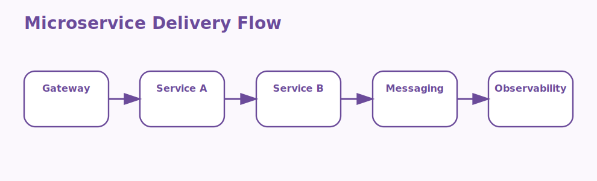

# Azure Service Fabric and Microservices Interview Questions



This page focuses on microservice architecture concepts and on Service Fabric as a platform for distributed services.

## 1. Microservice boundaries

### 1. What is the role of Microservice boundaries in Azure Service Fabric and microservices?

**Answer:**

In Azure Service Fabric and microservices, the term Microservice boundaries refers to the domain-driven
separation of a system into smaller independently owned services. It is part of the foundation a
candidate should be able to explain clearly.

**Sample:**

```csharp
// Concept: 1. Microservice boundaries
internal sealed class OrderService : StatelessService
{
    public OrderService(StatelessServiceContext context) : base(context) { }
}
```

---

### 2. Why is the concept of Microservice boundaries important in Azure Service Fabric and microservices?

**Answer:**

This concept matters because it influences the domain-driven separation of a system into
smaller independently owned services. Good interview answers connect it to clarity, maintainability,
performance, security, or delivery depending on the situation.

**Sample:**

```csharp
// Concept: 1. Microservice boundaries
internal sealed class OrderService : StatelessService
{
    public OrderService(StatelessServiceContext context) : base(context) { }
}
```

---

### 3. When should a team focus on Microservice boundaries?

**Answer:**

A team should focus on Microservice boundaries when the requirement depends on the domain-driven
separation of a system into smaller independently owned services. It becomes especially important
when design decisions, scaling choices, or debugging depend on that area.

**Sample:**

```csharp
// Concept: 1. Microservice boundaries
internal sealed class OrderService : StatelessService
{
    public OrderService(StatelessServiceContext context) : base(context) { }
}
```

---

### 4. How is Microservice boundaries applied in practice?

**Answer:**

In practice, Microservice boundaries is applied by making the domain-driven separation of a system
into smaller independently owned services explicit in the implementation or workflow. The exact
shape depends on the service design, but the responsibility should stay predictable.

**Sample:**

```csharp
// Concept: 1. Microservice boundaries
internal sealed class OrderService : StatelessService
{
    public OrderService(StatelessServiceContext context) : base(context) { }
}
```

---

### 5. What strengths does Microservice boundaries bring?

**Answer:**

The strengths of Microservice boundaries are better structure, better communication, and better
control over the domain-driven separation of a system into smaller independently owned services. It
also makes tradeoffs easier to explain to both interviewers and project stakeholders.

**Sample:**

```csharp
// Concept: 1. Microservice boundaries
internal sealed class OrderService : StatelessService
{
    public OrderService(StatelessServiceContext context) : base(context) { }
}
```

---

### 6. What tradeoffs come with Microservice boundaries?

**Answer:**

The main tradeoff is extra complexity if Microservice boundaries is introduced without a real need
or a clear understanding of the domain-driven separation of a system into smaller independently
owned services. That usually leads to higher cost, weaker design, or harder troubleshooting.

**Sample:**

```csharp
// Concept: 1. Microservice boundaries
internal sealed class OrderService : StatelessService
{
    public OrderService(StatelessServiceContext context) : base(context) { }
}
```

---

### 7. How does Microservice boundaries differ from Service Fabric clusters?

**Answer:**

Microservice boundaries is centered on the domain-driven separation of a system into smaller
independently owned services, while Service Fabric clusters is centered on the distributed
infrastructure that runs and manages Service Fabric workloads. They often work together, but they
solve different parts of the topic.

**Sample:**

```csharp
// Concept: 1. Microservice boundaries
internal sealed class OrderService : StatelessService
{
    public OrderService(StatelessServiceContext context) : base(context) { }
}
```

---

### 8. What is a good real-world example of Microservice boundaries?

**Answer:**

A strong example is explaining how Microservice boundaries affects a real feature, cost decision,
failure mode, or architecture choice involving the domain-driven separation of a system into smaller
independently owned services. Interviewers usually value the reasoning behind the example.

**Sample:**

```csharp
// Concept: 1. Microservice boundaries
internal sealed class OrderService : StatelessService
{
    public OrderService(StatelessServiceContext context) : base(context) { }
}
```

---

### 9. What is a best practice for Microservice boundaries?

**Answer:**

A good practice is to keep Microservice boundaries aligned with the actual requirement around the
domain-driven separation of a system into smaller independently owned services. Teams should
document intent, keep the setup readable, and validate the most important paths early.

**Sample:**

```csharp
// Concept: 1. Microservice boundaries
internal sealed class OrderService : StatelessService
{
    public OrderService(StatelessServiceContext context) : base(context) { }
}
```

---

### 10. What is a common mistake around Microservice boundaries?

**Answer:**

A common mistake is naming Microservice boundaries without understanding how it affects the domain-
driven separation of a system into smaller independently owned services. In real work, that usually
appears as weak sizing, poor troubleshooting, or the wrong operational choice.

**Sample:**

```csharp
// Concept: 1. Microservice boundaries
internal sealed class OrderService : StatelessService
{
    public OrderService(StatelessServiceContext context) : base(context) { }
}
```

---

### 11. How do you troubleshoot Microservice boundaries-related issues?

**Answer:**

When troubleshooting Microservice boundaries, first verify whether the domain-driven separation of a
system into smaller independently owned services is behaving as expected. Then check dependencies,
configuration, metrics, logs, and edge cases before changing the design.

**Sample:**

```csharp
// Concept: 1. Microservice boundaries
internal sealed class OrderService : StatelessService
{
    public OrderService(StatelessServiceContext context) : base(context) { }
}
```

---

### 12. How does Microservice boundaries connect to the rest of Azure Service Fabric and microservices?

**Answer:**

Microservice boundaries connects to the rest of Azure Service Fabric and microservices by giving
structure to the domain-driven separation of a system into smaller independently owned services. It
is one of the pieces that turns isolated facts into a usable end-to-end mental model.

**Sample:**

```csharp
// Concept: 1. Microservice boundaries
internal sealed class OrderService : StatelessService
{
    public OrderService(StatelessServiceContext context) : base(context) { }
}
```

---

## 2. Service Fabric clusters

### 13. What is the role of Service Fabric clusters in Azure Service Fabric and microservices?

**Answer:**

In Azure Service Fabric and microservices, the term Service Fabric clusters refers to the distributed
infrastructure that runs and manages Service Fabric workloads. It is part of the foundation a
candidate should be able to explain clearly.

**Sample:**

```csharp
// Concept: 2. Service Fabric clusters
internal sealed class OrderService : StatelessService
{
    public OrderService(StatelessServiceContext context) : base(context) { }
}
```

---

### 14. Why is the concept of Service Fabric clusters important in Azure Service Fabric and microservices?

**Answer:**

This concept matters because it influences the distributed infrastructure that runs and
manages Service Fabric workloads. Good interview answers connect it to clarity, maintainability,
performance, security, or delivery depending on the situation.

**Sample:**

```csharp
// Concept: 2. Service Fabric clusters
internal sealed class OrderService : StatelessService
{
    public OrderService(StatelessServiceContext context) : base(context) { }
}
```

---

### 15. When should a team focus on Service Fabric clusters?

**Answer:**

A team should focus on Service Fabric clusters when the requirement depends on the distributed
infrastructure that runs and manages Service Fabric workloads. It becomes especially important when
design decisions, scaling choices, or debugging depend on that area.

**Sample:**

```csharp
// Concept: 2. Service Fabric clusters
internal sealed class OrderService : StatelessService
{
    public OrderService(StatelessServiceContext context) : base(context) { }
}
```

---

### 16. How is Service Fabric clusters applied in practice?

**Answer:**

In practice, Service Fabric clusters is applied by making the distributed infrastructure that runs
and manages Service Fabric workloads explicit in the implementation or workflow. The exact shape
depends on the service design, but the responsibility should stay predictable.

**Sample:**

```csharp
// Concept: 2. Service Fabric clusters
internal sealed class OrderService : StatelessService
{
    public OrderService(StatelessServiceContext context) : base(context) { }
}
```

---

### 17. What strengths does Service Fabric clusters bring?

**Answer:**

The strengths of Service Fabric clusters are better structure, better communication, and better
control over the distributed infrastructure that runs and manages Service Fabric workloads. It also
makes tradeoffs easier to explain to both interviewers and project stakeholders.

**Sample:**

```csharp
// Concept: 2. Service Fabric clusters
internal sealed class OrderService : StatelessService
{
    public OrderService(StatelessServiceContext context) : base(context) { }
}
```

---

### 18. What tradeoffs come with Service Fabric clusters?

**Answer:**

The main tradeoff is extra complexity if Service Fabric clusters is introduced without a real need
or a clear understanding of the distributed infrastructure that runs and manages Service Fabric
workloads. That usually leads to higher cost, weaker design, or harder troubleshooting.

**Sample:**

```csharp
// Concept: 2. Service Fabric clusters
internal sealed class OrderService : StatelessService
{
    public OrderService(StatelessServiceContext context) : base(context) { }
}
```

---

### 19. How does Service Fabric clusters differ from Reliable Services?

**Answer:**

Service Fabric clusters is centered on the distributed infrastructure that runs and manages Service
Fabric workloads, while Reliable Services is centered on the Service Fabric programming model used
to build service-oriented applications. They often work together, but they solve different parts of
the topic.

**Sample:**

```csharp
// Concept: 2. Service Fabric clusters
internal sealed class OrderService : StatelessService
{
    public OrderService(StatelessServiceContext context) : base(context) { }
}
```

---

### 20. What is a good real-world example of Service Fabric clusters?

**Answer:**

A strong example is explaining how Service Fabric clusters affects a real feature, cost decision,
failure mode, or architecture choice involving the distributed infrastructure that runs and manages
Service Fabric workloads. Interviewers usually value the reasoning behind the example.

**Sample:**

```csharp
// Concept: 2. Service Fabric clusters
internal sealed class OrderService : StatelessService
{
    public OrderService(StatelessServiceContext context) : base(context) { }
}
```

---

### 21. What is a best practice for Service Fabric clusters?

**Answer:**

A good practice is to keep Service Fabric clusters aligned with the actual requirement around the
distributed infrastructure that runs and manages Service Fabric workloads. Teams should document
intent, keep the setup readable, and validate the most important paths early.

**Sample:**

```csharp
// Concept: 2. Service Fabric clusters
internal sealed class OrderService : StatelessService
{
    public OrderService(StatelessServiceContext context) : base(context) { }
}
```

---

### 22. What is a common mistake around Service Fabric clusters?

**Answer:**

A common mistake is naming Service Fabric clusters without understanding how it affects the
distributed infrastructure that runs and manages Service Fabric workloads. In real work, that
usually appears as weak sizing, poor troubleshooting, or the wrong operational choice.

**Sample:**

```csharp
// Concept: 2. Service Fabric clusters
internal sealed class OrderService : StatelessService
{
    public OrderService(StatelessServiceContext context) : base(context) { }
}
```

---

### 23. How do you troubleshoot Service Fabric clusters-related issues?

**Answer:**

When troubleshooting Service Fabric clusters, first verify whether the distributed infrastructure
that runs and manages Service Fabric workloads is behaving as expected. Then check dependencies,
configuration, metrics, logs, and edge cases before changing the design.

**Sample:**

```csharp
// Concept: 2. Service Fabric clusters
internal sealed class OrderService : StatelessService
{
    public OrderService(StatelessServiceContext context) : base(context) { }
}
```

---

### 24. How does Service Fabric clusters connect to the rest of Azure Service Fabric and microservices?

**Answer:**

Service Fabric clusters connects to the rest of Azure Service Fabric and microservices by giving
structure to the distributed infrastructure that runs and manages Service Fabric workloads. It is
one of the pieces that turns isolated facts into a usable end-to-end mental model.

**Sample:**

```csharp
// Concept: 2. Service Fabric clusters
internal sealed class OrderService : StatelessService
{
    public OrderService(StatelessServiceContext context) : base(context) { }
}
```

---

## 3. Reliable Services

### 25. What is the role of Reliable Services in Azure Service Fabric and microservices?

**Answer:**

In Azure Service Fabric and microservices, the term Reliable Services refers to the Service Fabric
programming model used to build service-oriented applications. It is part of the foundation a
candidate should be able to explain clearly.

**Sample:**

```csharp
// Concept: 3. Reliable Services
internal sealed class OrderService : StatelessService
{
    public OrderService(StatelessServiceContext context) : base(context) { }
}
```

---

### 26. Why is the concept of Reliable Services important in Azure Service Fabric and microservices?

**Answer:**

This concept matters because it influences the Service Fabric programming model used to build
service-oriented applications. Good interview answers connect it to clarity, maintainability,
performance, security, or delivery depending on the situation.

**Sample:**

```csharp
// Concept: 3. Reliable Services
internal sealed class OrderService : StatelessService
{
    public OrderService(StatelessServiceContext context) : base(context) { }
}
```

---

### 27. When should a team focus on Reliable Services?

**Answer:**

A team should focus on Reliable Services when the requirement depends on the Service Fabric
programming model used to build service-oriented applications. It becomes especially important when
design decisions, scaling choices, or debugging depend on that area.

**Sample:**

```csharp
// Concept: 3. Reliable Services
internal sealed class OrderService : StatelessService
{
    public OrderService(StatelessServiceContext context) : base(context) { }
}
```

---

### 28. How is Reliable Services applied in practice?

**Answer:**

In practice, Reliable Services is applied by making the Service Fabric programming model used to
build service-oriented applications explicit in the implementation or workflow. The exact shape
depends on the service design, but the responsibility should stay predictable.

**Sample:**

```csharp
// Concept: 3. Reliable Services
internal sealed class OrderService : StatelessService
{
    public OrderService(StatelessServiceContext context) : base(context) { }
}
```

---

### 29. What strengths does Reliable Services bring?

**Answer:**

The strengths of Reliable Services are better structure, better communication, and better control
over the Service Fabric programming model used to build service-oriented applications. It also makes
tradeoffs easier to explain to both interviewers and project stakeholders.

**Sample:**

```csharp
// Concept: 3. Reliable Services
internal sealed class OrderService : StatelessService
{
    public OrderService(StatelessServiceContext context) : base(context) { }
}
```

---

### 30. What tradeoffs come with Reliable Services?

**Answer:**

The main tradeoff is extra complexity if Reliable Services is introduced without a real need or a
clear understanding of the Service Fabric programming model used to build service-oriented
applications. That usually leads to higher cost, weaker design, or harder troubleshooting.

**Sample:**

```csharp
// Concept: 3. Reliable Services
internal sealed class OrderService : StatelessService
{
    public OrderService(StatelessServiceContext context) : base(context) { }
}
```

---

### 31. How does Reliable Services differ from Reliable Actors?

**Answer:**

Reliable Services is centered on the Service Fabric programming model used to build service-oriented
applications, while Reliable Actors is centered on the virtual actor model used when stateful
isolated objects are a good fit for the design. They often work together, but they solve different
parts of the topic.

**Sample:**

```csharp
// Concept: 3. Reliable Services
internal sealed class OrderService : StatelessService
{
    public OrderService(StatelessServiceContext context) : base(context) { }
}
```

---

### 32. What is a good real-world example of Reliable Services?

**Answer:**

A strong example is explaining how Reliable Services affects a real feature, cost decision, failure
mode, or architecture choice involving the Service Fabric programming model used to build service-
oriented applications. Interviewers usually value the reasoning behind the example.

**Sample:**

```csharp
// Concept: 3. Reliable Services
internal sealed class OrderService : StatelessService
{
    public OrderService(StatelessServiceContext context) : base(context) { }
}
```

---

### 33. What is a best practice for Reliable Services?

**Answer:**

A good practice is to keep Reliable Services aligned with the actual requirement around the Service
Fabric programming model used to build service-oriented applications. Teams should document intent,
keep the setup readable, and validate the most important paths early.

**Sample:**

```csharp
// Concept: 3. Reliable Services
internal sealed class OrderService : StatelessService
{
    public OrderService(StatelessServiceContext context) : base(context) { }
}
```

---

### 34. What is a common mistake around Reliable Services?

**Answer:**

A common mistake is naming Reliable Services without understanding how it affects the Service Fabric
programming model used to build service-oriented applications. In real work, that usually appears as
weak sizing, poor troubleshooting, or the wrong operational choice.

**Sample:**

```csharp
// Concept: 3. Reliable Services
internal sealed class OrderService : StatelessService
{
    public OrderService(StatelessServiceContext context) : base(context) { }
}
```

---

### 35. How do you troubleshoot Reliable Services-related issues?

**Answer:**

When troubleshooting Reliable Services, first verify whether the Service Fabric programming model
used to build service-oriented applications is behaving as expected. Then check dependencies,
configuration, metrics, logs, and edge cases before changing the design.

**Sample:**

```csharp
// Concept: 3. Reliable Services
internal sealed class OrderService : StatelessService
{
    public OrderService(StatelessServiceContext context) : base(context) { }
}
```

---

### 36. How does Reliable Services connect to the rest of Azure Service Fabric and microservices?

**Answer:**

Reliable Services connects to the rest of Azure Service Fabric and microservices by giving structure
to the Service Fabric programming model used to build service-oriented applications. It is one of
the pieces that turns isolated facts into a usable end-to-end mental model.

**Sample:**

```csharp
// Concept: 3. Reliable Services
internal sealed class OrderService : StatelessService
{
    public OrderService(StatelessServiceContext context) : base(context) { }
}
```

---

## 4. Reliable Actors

### 37. What is the role of Reliable Actors in Azure Service Fabric and microservices?

**Answer:**

In Azure Service Fabric and microservices, the term Reliable Actors refers to the virtual actor model used
when stateful isolated objects are a good fit for the design. It is part of the foundation a
candidate should be able to explain clearly.

**Sample:**

```csharp
// Concept: 4. Reliable Actors
internal sealed class OrderService : StatelessService
{
    public OrderService(StatelessServiceContext context) : base(context) { }
}
```

---

### 38. Why is the concept of Reliable Actors important in Azure Service Fabric and microservices?

**Answer:**

This concept matters because it influences the virtual actor model used when stateful isolated
objects are a good fit for the design. Good interview answers connect it to clarity,
maintainability, performance, security, or delivery depending on the situation.

**Sample:**

```csharp
// Concept: 4. Reliable Actors
internal sealed class OrderService : StatelessService
{
    public OrderService(StatelessServiceContext context) : base(context) { }
}
```

---

### 39. When should a team focus on Reliable Actors?

**Answer:**

A team should focus on Reliable Actors when the requirement depends on the virtual actor model used
when stateful isolated objects are a good fit for the design. It becomes especially important when
design decisions, scaling choices, or debugging depend on that area.

**Sample:**

```csharp
// Concept: 4. Reliable Actors
internal sealed class OrderService : StatelessService
{
    public OrderService(StatelessServiceContext context) : base(context) { }
}
```

---

### 40. How is Reliable Actors applied in practice?

**Answer:**

In practice, Reliable Actors is applied by making the virtual actor model used when stateful
isolated objects are a good fit for the design explicit in the implementation or workflow. The exact
shape depends on the service design, but the responsibility should stay predictable.

**Sample:**

```csharp
// Concept: 4. Reliable Actors
internal sealed class OrderService : StatelessService
{
    public OrderService(StatelessServiceContext context) : base(context) { }
}
```

---

### 41. What strengths does Reliable Actors bring?

**Answer:**

The strengths of Reliable Actors are better structure, better communication, and better control over
the virtual actor model used when stateful isolated objects are a good fit for the design. It also
makes tradeoffs easier to explain to both interviewers and project stakeholders.

**Sample:**

```csharp
// Concept: 4. Reliable Actors
internal sealed class OrderService : StatelessService
{
    public OrderService(StatelessServiceContext context) : base(context) { }
}
```

---

### 42. What tradeoffs come with Reliable Actors?

**Answer:**

The main tradeoff is extra complexity if Reliable Actors is introduced without a real need or a
clear understanding of the virtual actor model used when stateful isolated objects are a good fit
for the design. That usually leads to higher cost, weaker design, or harder troubleshooting.

**Sample:**

```csharp
// Concept: 4. Reliable Actors
internal sealed class OrderService : StatelessService
{
    public OrderService(StatelessServiceContext context) : base(context) { }
}
```

---

### 43. How does Reliable Actors differ from Stateful and stateless services?

**Answer:**

Reliable Actors is centered on the virtual actor model used when stateful isolated objects are a
good fit for the design, while Stateful and stateless services is centered on the architectural
distinction between services that keep local state and services that do not. They often work
together, but they solve different parts of the topic.

**Sample:**

```csharp
// Concept: 4. Reliable Actors
internal sealed class OrderService : StatelessService
{
    public OrderService(StatelessServiceContext context) : base(context) { }
}
```

---

### 44. What is a good real-world example of Reliable Actors?

**Answer:**

A strong example is explaining how Reliable Actors affects a real feature, cost decision, failure
mode, or architecture choice involving the virtual actor model used when stateful isolated objects
are a good fit for the design. Interviewers usually value the reasoning behind the example.

**Sample:**

```csharp
// Concept: 4. Reliable Actors
internal sealed class OrderService : StatelessService
{
    public OrderService(StatelessServiceContext context) : base(context) { }
}
```

---

### 45. What is a best practice for Reliable Actors?

**Answer:**

A good practice is to keep Reliable Actors aligned with the actual requirement around the virtual
actor model used when stateful isolated objects are a good fit for the design. Teams should document
intent, keep the setup readable, and validate the most important paths early.

**Sample:**

```csharp
// Concept: 4. Reliable Actors
internal sealed class OrderService : StatelessService
{
    public OrderService(StatelessServiceContext context) : base(context) { }
}
```

---

### 46. What is a common mistake around Reliable Actors?

**Answer:**

A common mistake is naming Reliable Actors without understanding how it affects the virtual actor
model used when stateful isolated objects are a good fit for the design. In real work, that usually
appears as weak sizing, poor troubleshooting, or the wrong operational choice.

**Sample:**

```csharp
// Concept: 4. Reliable Actors
internal sealed class OrderService : StatelessService
{
    public OrderService(StatelessServiceContext context) : base(context) { }
}
```

---

### 47. How do you troubleshoot Reliable Actors-related issues?

**Answer:**

When troubleshooting Reliable Actors, first verify whether the virtual actor model used when
stateful isolated objects are a good fit for the design is behaving as expected. Then check
dependencies, configuration, metrics, logs, and edge cases before changing the design.

**Sample:**

```csharp
// Concept: 4. Reliable Actors
internal sealed class OrderService : StatelessService
{
    public OrderService(StatelessServiceContext context) : base(context) { }
}
```

---

### 48. How does Reliable Actors connect to the rest of Azure Service Fabric and microservices?

**Answer:**

Reliable Actors connects to the rest of Azure Service Fabric and microservices by giving structure
to the virtual actor model used when stateful isolated objects are a good fit for the design. It is
one of the pieces that turns isolated facts into a usable end-to-end mental model.

**Sample:**

```csharp
// Concept: 4. Reliable Actors
internal sealed class OrderService : StatelessService
{
    public OrderService(StatelessServiceContext context) : base(context) { }
}
```

---

## 5. Stateful and stateless services

### 49. What is the role of Stateful and stateless services in Azure Service Fabric and microservices?

**Answer:**

In Azure Service Fabric and microservices, the term Stateful and stateless services refers to the
architectural distinction between services that keep local state and services that do not. It is
part of the foundation a candidate should be able to explain clearly.

**Sample:**

```csharp
// Concept: 5. Stateful and stateless services
internal sealed class OrderService : StatelessService
{
    public OrderService(StatelessServiceContext context) : base(context) { }
}
```

---

### 50. Why is the concept of Stateful and stateless services important in Azure Service Fabric and microservices?

**Answer:**

This concept matters because it influences the architectural distinction between
services that keep local state and services that do not. Good interview answers connect it to
clarity, maintainability, performance, security, or delivery depending on the situation.

**Sample:**

```csharp
// Concept: 5. Stateful and stateless services
internal sealed class OrderService : StatelessService
{
    public OrderService(StatelessServiceContext context) : base(context) { }
}
```

---

### 51. When should a team focus on Stateful and stateless services?

**Answer:**

A team should focus on Stateful and stateless services when the requirement depends on the
architectural distinction between services that keep local state and services that do not. It
becomes especially important when design decisions, scaling choices, or debugging depend on that
area.

**Sample:**

```csharp
// Concept: 5. Stateful and stateless services
internal sealed class OrderService : StatelessService
{
    public OrderService(StatelessServiceContext context) : base(context) { }
}
```

---

### 52. How is Stateful and stateless services applied in practice?

**Answer:**

In practice, Stateful and stateless services is applied by making the architectural distinction
between services that keep local state and services that do not explicit in the implementation or
workflow. The exact shape depends on the service design, but the responsibility should stay
predictable.

**Sample:**

```csharp
// Concept: 5. Stateful and stateless services
internal sealed class OrderService : StatelessService
{
    public OrderService(StatelessServiceContext context) : base(context) { }
}
```

---

### 53. What strengths does Stateful and stateless services bring?

**Answer:**

The strengths of Stateful and stateless services are better structure, better communication, and
better control over the architectural distinction between services that keep local state and
services that do not. It also makes tradeoffs easier to explain to both interviewers and project
stakeholders.

**Sample:**

```csharp
// Concept: 5. Stateful and stateless services
internal sealed class OrderService : StatelessService
{
    public OrderService(StatelessServiceContext context) : base(context) { }
}
```

---

### 54. What tradeoffs come with Stateful and stateless services?

**Answer:**

The main tradeoff is extra complexity if Stateful and stateless services is introduced without a
real need or a clear understanding of the architectural distinction between services that keep local
state and services that do not. That usually leads to higher cost, weaker design, or harder
troubleshooting.

**Sample:**

```csharp
// Concept: 5. Stateful and stateless services
internal sealed class OrderService : StatelessService
{
    public OrderService(StatelessServiceContext context) : base(context) { }
}
```

---

### 55. How does Stateful and stateless services differ from Service discovery?

**Answer:**

Stateful and stateless services is centered on the architectural distinction between services that
keep local state and services that do not, while Service discovery is centered on the mechanism used
for services to find and communicate with each other safely. They often work together, but they
solve different parts of the topic.

**Sample:**

```csharp
// Concept: 5. Stateful and stateless services
internal sealed class OrderService : StatelessService
{
    public OrderService(StatelessServiceContext context) : base(context) { }
}
```

---

### 56. What is a good real-world example of Stateful and stateless services?

**Answer:**

A strong example is explaining how Stateful and stateless services affects a real feature, cost
decision, failure mode, or architecture choice involving the architectural distinction between
services that keep local state and services that do not. Interviewers usually value the reasoning
behind the example.

**Sample:**

```csharp
// Concept: 5. Stateful and stateless services
internal sealed class OrderService : StatelessService
{
    public OrderService(StatelessServiceContext context) : base(context) { }
}
```

---

### 57. What is a best practice for Stateful and stateless services?

**Answer:**

A good practice is to keep Stateful and stateless services aligned with the actual requirement
around the architectural distinction between services that keep local state and services that do
not. Teams should document intent, keep the setup readable, and validate the most important paths
early.

**Sample:**

```csharp
// Concept: 5. Stateful and stateless services
internal sealed class OrderService : StatelessService
{
    public OrderService(StatelessServiceContext context) : base(context) { }
}
```

---

### 58. What is a common mistake around Stateful and stateless services?

**Answer:**

A common mistake is naming Stateful and stateless services without understanding how it affects the
architectural distinction between services that keep local state and services that do not. In real
work, that usually appears as weak sizing, poor troubleshooting, or the wrong operational choice.

**Sample:**

```csharp
// Concept: 5. Stateful and stateless services
internal sealed class OrderService : StatelessService
{
    public OrderService(StatelessServiceContext context) : base(context) { }
}
```

---

### 59. How do you troubleshoot Stateful and stateless services-related issues?

**Answer:**

When troubleshooting Stateful and stateless services, first verify whether the architectural
distinction between services that keep local state and services that do not is behaving as expected.
Then check dependencies, configuration, metrics, logs, and edge cases before changing the design.

**Sample:**

```csharp
// Concept: 5. Stateful and stateless services
internal sealed class OrderService : StatelessService
{
    public OrderService(StatelessServiceContext context) : base(context) { }
}
```

---

### 60. How does Stateful and stateless services connect to the rest of Azure Service Fabric and microservices?

**Answer:**

Stateful and stateless services connects to the rest of Azure Service Fabric and microservices by
giving structure to the architectural distinction between services that keep local state and
services that do not. It is one of the pieces that turns isolated facts into a usable end-to-end
mental model.

**Sample:**

```csharp
// Concept: 5. Stateful and stateless services
internal sealed class OrderService : StatelessService
{
    public OrderService(StatelessServiceContext context) : base(context) { }
}
```

---

## 6. Service discovery

### 61. What is the role of Service discovery in Azure Service Fabric and microservices?

**Answer:**

In Azure Service Fabric and microservices, the term Service discovery refers to the mechanism used for
services to find and communicate with each other safely. It is part of the foundation a candidate
should be able to explain clearly.

**Sample:**

```csharp
// Concept: 6. Service discovery
internal sealed class OrderService : StatelessService
{
    public OrderService(StatelessServiceContext context) : base(context) { }
}
```

---

### 62. Why is the concept of Service discovery important in Azure Service Fabric and microservices?

**Answer:**

This concept matters because it influences the mechanism used for services to find and
communicate with each other safely. Good interview answers connect it to clarity, maintainability,
performance, security, or delivery depending on the situation.

**Sample:**

```csharp
// Concept: 6. Service discovery
internal sealed class OrderService : StatelessService
{
    public OrderService(StatelessServiceContext context) : base(context) { }
}
```

---

### 63. When should a team focus on Service discovery?

**Answer:**

A team should focus on Service discovery when the requirement depends on the mechanism used for
services to find and communicate with each other safely. It becomes especially important when design
decisions, scaling choices, or debugging depend on that area.

**Sample:**

```csharp
// Concept: 6. Service discovery
internal sealed class OrderService : StatelessService
{
    public OrderService(StatelessServiceContext context) : base(context) { }
}
```

---

### 64. How is Service discovery applied in practice?

**Answer:**

In practice, Service discovery is applied by making the mechanism used for services to find and
communicate with each other safely explicit in the implementation or workflow. The exact shape
depends on the service design, but the responsibility should stay predictable.

**Sample:**

```csharp
// Concept: 6. Service discovery
internal sealed class OrderService : StatelessService
{
    public OrderService(StatelessServiceContext context) : base(context) { }
}
```

---

### 65. What strengths does Service discovery bring?

**Answer:**

The strengths of Service discovery are better structure, better communication, and better control
over the mechanism used for services to find and communicate with each other safely. It also makes
tradeoffs easier to explain to both interviewers and project stakeholders.

**Sample:**

```csharp
// Concept: 6. Service discovery
internal sealed class OrderService : StatelessService
{
    public OrderService(StatelessServiceContext context) : base(context) { }
}
```

---

### 66. What tradeoffs come with Service discovery?

**Answer:**

The main tradeoff is extra complexity if Service discovery is introduced without a real need or a
clear understanding of the mechanism used for services to find and communicate with each other
safely. That usually leads to higher cost, weaker design, or harder troubleshooting.

**Sample:**

```csharp
// Concept: 6. Service discovery
internal sealed class OrderService : StatelessService
{
    public OrderService(StatelessServiceContext context) : base(context) { }
}
```

---

### 67. How does Service discovery differ from Scaling and placement?

**Answer:**

Service discovery is centered on the mechanism used for services to find and communicate with each
other safely, while Scaling and placement is centered on the way Service Fabric distributes and
scales service instances across the cluster. They often work together, but they solve different
parts of the topic.

**Sample:**

```csharp
// Concept: 6. Service discovery
internal sealed class OrderService : StatelessService
{
    public OrderService(StatelessServiceContext context) : base(context) { }
}
```

---

### 68. What is a good real-world example of Service discovery?

**Answer:**

A strong example is explaining how Service discovery affects a real feature, cost decision, failure
mode, or architecture choice involving the mechanism used for services to find and communicate with
each other safely. Interviewers usually value the reasoning behind the example.

**Sample:**

```csharp
// Concept: 6. Service discovery
internal sealed class OrderService : StatelessService
{
    public OrderService(StatelessServiceContext context) : base(context) { }
}
```

---

### 69. What is a best practice for Service discovery?

**Answer:**

A good practice is to keep Service discovery aligned with the actual requirement around the
mechanism used for services to find and communicate with each other safely. Teams should document
intent, keep the setup readable, and validate the most important paths early.

**Sample:**

```csharp
// Concept: 6. Service discovery
internal sealed class OrderService : StatelessService
{
    public OrderService(StatelessServiceContext context) : base(context) { }
}
```

---

### 70. What is a common mistake around Service discovery?

**Answer:**

A common mistake is naming Service discovery without understanding how it affects the mechanism used
for services to find and communicate with each other safely. In real work, that usually appears as
weak sizing, poor troubleshooting, or the wrong operational choice.

**Sample:**

```csharp
// Concept: 6. Service discovery
internal sealed class OrderService : StatelessService
{
    public OrderService(StatelessServiceContext context) : base(context) { }
}
```

---

### 71. How do you troubleshoot Service discovery-related issues?

**Answer:**

When troubleshooting Service discovery, first verify whether the mechanism used for services to find
and communicate with each other safely is behaving as expected. Then check dependencies,
configuration, metrics, logs, and edge cases before changing the design.

**Sample:**

```csharp
// Concept: 6. Service discovery
internal sealed class OrderService : StatelessService
{
    public OrderService(StatelessServiceContext context) : base(context) { }
}
```

---

### 72. How does Service discovery connect to the rest of Azure Service Fabric and microservices?

**Answer:**

Service discovery connects to the rest of Azure Service Fabric and microservices by giving structure
to the mechanism used for services to find and communicate with each other safely. It is one of the
pieces that turns isolated facts into a usable end-to-end mental model.

**Sample:**

```csharp
// Concept: 6. Service discovery
internal sealed class OrderService : StatelessService
{
    public OrderService(StatelessServiceContext context) : base(context) { }
}
```

---

## 7. Scaling and placement

### 73. What is the role of Scaling and placement in Azure Service Fabric and microservices?

**Answer:**

In Azure Service Fabric and microservices, the term Scaling and placement refers to the way Service Fabric
distributes and scales service instances across the cluster. It is part of the foundation a
candidate should be able to explain clearly.

**Sample:**

```csharp
// Concept: 7. Scaling and placement
internal sealed class OrderService : StatelessService
{
    public OrderService(StatelessServiceContext context) : base(context) { }
}
```

---

### 74. Why is the concept of Scaling and placement important in Azure Service Fabric and microservices?

**Answer:**

This concept matters because it influences the way Service Fabric distributes and scales
service instances across the cluster. Good interview answers connect it to clarity, maintainability,
performance, security, or delivery depending on the situation.

**Sample:**

```csharp
// Concept: 7. Scaling and placement
internal sealed class OrderService : StatelessService
{
    public OrderService(StatelessServiceContext context) : base(context) { }
}
```

---

### 75. When should a team focus on Scaling and placement?

**Answer:**

A team should focus on Scaling and placement when the requirement depends on the way Service Fabric
distributes and scales service instances across the cluster. It becomes especially important when
design decisions, scaling choices, or debugging depend on that area.

**Sample:**

```csharp
// Concept: 7. Scaling and placement
internal sealed class OrderService : StatelessService
{
    public OrderService(StatelessServiceContext context) : base(context) { }
}
```

---

### 76. How is Scaling and placement applied in practice?

**Answer:**

In practice, Scaling and placement is applied by making the way Service Fabric distributes and
scales service instances across the cluster explicit in the implementation or workflow. The exact
shape depends on the service design, but the responsibility should stay predictable.

**Sample:**

```csharp
// Concept: 7. Scaling and placement
internal sealed class OrderService : StatelessService
{
    public OrderService(StatelessServiceContext context) : base(context) { }
}
```

---

### 77. What strengths does Scaling and placement bring?

**Answer:**

The strengths of Scaling and placement are better structure, better communication, and better
control over the way Service Fabric distributes and scales service instances across the cluster. It
also makes tradeoffs easier to explain to both interviewers and project stakeholders.

**Sample:**

```csharp
// Concept: 7. Scaling and placement
internal sealed class OrderService : StatelessService
{
    public OrderService(StatelessServiceContext context) : base(context) { }
}
```

---

### 78. What tradeoffs come with Scaling and placement?

**Answer:**

The main tradeoff is extra complexity if Scaling and placement is introduced without a real need or
a clear understanding of the way Service Fabric distributes and scales service instances across the
cluster. That usually leads to higher cost, weaker design, or harder troubleshooting.

**Sample:**

```csharp
// Concept: 7. Scaling and placement
internal sealed class OrderService : StatelessService
{
    public OrderService(StatelessServiceContext context) : base(context) { }
}
```

---

### 79. How does Scaling and placement differ from Rolling upgrades?

**Answer:**

Scaling and placement is centered on the way Service Fabric distributes and scales service instances
across the cluster, while Rolling upgrades is centered on the controlled deployment model used to
update services without taking the whole platform down. They often work together, but they solve
different parts of the topic.

**Sample:**

```csharp
// Concept: 7. Scaling and placement
internal sealed class OrderService : StatelessService
{
    public OrderService(StatelessServiceContext context) : base(context) { }
}
```

---

### 80. What is a good real-world example of Scaling and placement?

**Answer:**

A strong example is explaining how Scaling and placement affects a real feature, cost decision,
failure mode, or architecture choice involving the way Service Fabric distributes and scales service
instances across the cluster. Interviewers usually value the reasoning behind the example.

**Sample:**

```csharp
// Concept: 7. Scaling and placement
internal sealed class OrderService : StatelessService
{
    public OrderService(StatelessServiceContext context) : base(context) { }
}
```

---

### 81. What is a best practice for Scaling and placement?

**Answer:**

A good practice is to keep Scaling and placement aligned with the actual requirement around the way
Service Fabric distributes and scales service instances across the cluster. Teams should document
intent, keep the setup readable, and validate the most important paths early.

**Sample:**

```csharp
// Concept: 7. Scaling and placement
internal sealed class OrderService : StatelessService
{
    public OrderService(StatelessServiceContext context) : base(context) { }
}
```

---

### 82. What is a common mistake around Scaling and placement?

**Answer:**

A common mistake is naming Scaling and placement without understanding how it affects the way
Service Fabric distributes and scales service instances across the cluster. In real work, that
usually appears as weak sizing, poor troubleshooting, or the wrong operational choice.

**Sample:**

```csharp
// Concept: 7. Scaling and placement
internal sealed class OrderService : StatelessService
{
    public OrderService(StatelessServiceContext context) : base(context) { }
}
```

---

### 83. How do you troubleshoot Scaling and placement-related issues?

**Answer:**

When troubleshooting Scaling and placement, first verify whether the way Service Fabric distributes
and scales service instances across the cluster is behaving as expected. Then check dependencies,
configuration, metrics, logs, and edge cases before changing the design.

**Sample:**

```csharp
// Concept: 7. Scaling and placement
internal sealed class OrderService : StatelessService
{
    public OrderService(StatelessServiceContext context) : base(context) { }
}
```

---

### 84. How does Scaling and placement connect to the rest of Azure Service Fabric and microservices?

**Answer:**

Scaling and placement connects to the rest of Azure Service Fabric and microservices by giving
structure to the way Service Fabric distributes and scales service instances across the cluster. It
is one of the pieces that turns isolated facts into a usable end-to-end mental model.

**Sample:**

```csharp
// Concept: 7. Scaling and placement
internal sealed class OrderService : StatelessService
{
    public OrderService(StatelessServiceContext context) : base(context) { }
}
```

---

## 8. Rolling upgrades

### 85. What is the role of Rolling upgrades in Azure Service Fabric and microservices?

**Answer:**

In Azure Service Fabric and microservices, the term Rolling upgrades refers to the controlled deployment
model used to update services without taking the whole platform down. It is part of the foundation a
candidate should be able to explain clearly.

**Sample:**

```csharp
// Concept: 8. Rolling upgrades
internal sealed class OrderService : StatelessService
{
    public OrderService(StatelessServiceContext context) : base(context) { }
}
```

---

### 86. Why is the concept of Rolling upgrades important in Azure Service Fabric and microservices?

**Answer:**

This concept matters because it influences the controlled deployment model used to update
services without taking the whole platform down. Good interview answers connect it to clarity,
maintainability, performance, security, or delivery depending on the situation.

**Sample:**

```csharp
// Concept: 8. Rolling upgrades
internal sealed class OrderService : StatelessService
{
    public OrderService(StatelessServiceContext context) : base(context) { }
}
```

---

### 87. When should a team focus on Rolling upgrades?

**Answer:**

A team should focus on Rolling upgrades when the requirement depends on the controlled deployment
model used to update services without taking the whole platform down. It becomes especially
important when design decisions, scaling choices, or debugging depend on that area.

**Sample:**

```csharp
// Concept: 8. Rolling upgrades
internal sealed class OrderService : StatelessService
{
    public OrderService(StatelessServiceContext context) : base(context) { }
}
```

---

### 88. How is Rolling upgrades applied in practice?

**Answer:**

In practice, Rolling upgrades is applied by making the controlled deployment model used to update
services without taking the whole platform down explicit in the implementation or workflow. The
exact shape depends on the service design, but the responsibility should stay predictable.

**Sample:**

```csharp
// Concept: 8. Rolling upgrades
internal sealed class OrderService : StatelessService
{
    public OrderService(StatelessServiceContext context) : base(context) { }
}
```

---

### 89. What strengths does Rolling upgrades bring?

**Answer:**

The strengths of Rolling upgrades are better structure, better communication, and better control
over the controlled deployment model used to update services without taking the whole platform down.
It also makes tradeoffs easier to explain to both interviewers and project stakeholders.

**Sample:**

```csharp
// Concept: 8. Rolling upgrades
internal sealed class OrderService : StatelessService
{
    public OrderService(StatelessServiceContext context) : base(context) { }
}
```

---

### 90. What tradeoffs come with Rolling upgrades?

**Answer:**

The main tradeoff is extra complexity if Rolling upgrades is introduced without a real need or a
clear understanding of the controlled deployment model used to update services without taking the
whole platform down. That usually leads to higher cost, weaker design, or harder troubleshooting.

**Sample:**

```csharp
// Concept: 8. Rolling upgrades
internal sealed class OrderService : StatelessService
{
    public OrderService(StatelessServiceContext context) : base(context) { }
}
```

---

### 91. How does Rolling upgrades differ from Observability?

**Answer:**

Rolling upgrades is centered on the controlled deployment model used to update services without
taking the whole platform down, while Observability is centered on the logging, health, metrics, and
diagnostics model needed to run microservices well. They often work together, but they solve
different parts of the topic.

**Sample:**

```csharp
// Concept: 8. Rolling upgrades
internal sealed class OrderService : StatelessService
{
    public OrderService(StatelessServiceContext context) : base(context) { }
}
```

---

### 92. What is a good real-world example of Rolling upgrades?

**Answer:**

A strong example is explaining how Rolling upgrades affects a real feature, cost decision, failure
mode, or architecture choice involving the controlled deployment model used to update services
without taking the whole platform down. Interviewers usually value the reasoning behind the example.

**Sample:**

```csharp
// Concept: 8. Rolling upgrades
internal sealed class OrderService : StatelessService
{
    public OrderService(StatelessServiceContext context) : base(context) { }
}
```

---

### 93. What is a best practice for Rolling upgrades?

**Answer:**

A good practice is to keep Rolling upgrades aligned with the actual requirement around the
controlled deployment model used to update services without taking the whole platform down. Teams
should document intent, keep the setup readable, and validate the most important paths early.

**Sample:**

```csharp
// Concept: 8. Rolling upgrades
internal sealed class OrderService : StatelessService
{
    public OrderService(StatelessServiceContext context) : base(context) { }
}
```

---

### 94. What is a common mistake around Rolling upgrades?

**Answer:**

A common mistake is naming Rolling upgrades without understanding how it affects the controlled
deployment model used to update services without taking the whole platform down. In real work, that
usually appears as weak sizing, poor troubleshooting, or the wrong operational choice.

**Sample:**

```csharp
// Concept: 8. Rolling upgrades
internal sealed class OrderService : StatelessService
{
    public OrderService(StatelessServiceContext context) : base(context) { }
}
```

---

### 95. How do you troubleshoot Rolling upgrades-related issues?

**Answer:**

When troubleshooting Rolling upgrades, first verify whether the controlled deployment model used to
update services without taking the whole platform down is behaving as expected. Then check
dependencies, configuration, metrics, logs, and edge cases before changing the design.

**Sample:**

```csharp
// Concept: 8. Rolling upgrades
internal sealed class OrderService : StatelessService
{
    public OrderService(StatelessServiceContext context) : base(context) { }
}
```

---

### 96. How does Rolling upgrades connect to the rest of Azure Service Fabric and microservices?

**Answer:**

Rolling upgrades connects to the rest of Azure Service Fabric and microservices by giving structure
to the controlled deployment model used to update services without taking the whole platform down.
It is one of the pieces that turns isolated facts into a usable end-to-end mental model.

**Sample:**

```csharp
// Concept: 8. Rolling upgrades
internal sealed class OrderService : StatelessService
{
    public OrderService(StatelessServiceContext context) : base(context) { }
}
```

---

## 9. Observability

### 97. What is the role of Observability in Azure Service Fabric and microservices?

**Answer:**

In Azure Service Fabric and microservices, the term Observability refers to the logging, health, metrics, and
diagnostics model needed to run microservices well. It is part of the foundation a candidate should
be able to explain clearly.

**Sample:**

```csharp
// Concept: 9. Observability
internal sealed class OrderService : StatelessService
{
    public OrderService(StatelessServiceContext context) : base(context) { }
}
```

---

### 98. Why is the concept of Observability important in Azure Service Fabric and microservices?

**Answer:**

This concept matters because it influences the logging, health, metrics, and diagnostics model
needed to run microservices well. Good interview answers connect it to clarity, maintainability,
performance, security, or delivery depending on the situation.

**Sample:**

```csharp
// Concept: 9. Observability
internal sealed class OrderService : StatelessService
{
    public OrderService(StatelessServiceContext context) : base(context) { }
}
```

---

### 99. When should a team focus on Observability?

**Answer:**

A team should focus on Observability when the requirement depends on the logging, health, metrics,
and diagnostics model needed to run microservices well. It becomes especially important when design
decisions, scaling choices, or debugging depend on that area.

**Sample:**

```csharp
// Concept: 9. Observability
internal sealed class OrderService : StatelessService
{
    public OrderService(StatelessServiceContext context) : base(context) { }
}
```

---

### 100. How is Observability applied in practice?

**Answer:**

In practice, Observability is applied by making the logging, health, metrics, and diagnostics model
needed to run microservices well explicit in the implementation or workflow. The exact shape depends
on the service design, but the responsibility should stay predictable.

**Sample:**

```csharp
// Concept: 9. Observability
internal sealed class OrderService : StatelessService
{
    public OrderService(StatelessServiceContext context) : base(context) { }
}
```

---

### 101. What strengths does Observability bring?

**Answer:**

The strengths of Observability are better structure, better communication, and better control over
the logging, health, metrics, and diagnostics model needed to run microservices well. It also makes
tradeoffs easier to explain to both interviewers and project stakeholders.

**Sample:**

```csharp
// Concept: 9. Observability
internal sealed class OrderService : StatelessService
{
    public OrderService(StatelessServiceContext context) : base(context) { }
}
```

---

### 102. What tradeoffs come with Observability?

**Answer:**

The main tradeoff is extra complexity if Observability is introduced without a real need or a clear
understanding of the logging, health, metrics, and diagnostics model needed to run microservices
well. That usually leads to higher cost, weaker design, or harder troubleshooting.

**Sample:**

```csharp
// Concept: 9. Observability
internal sealed class OrderService : StatelessService
{
    public OrderService(StatelessServiceContext context) : base(context) { }
}
```

---

### 103. How does Observability differ from Automation and DevOps?

**Answer:**

Observability is centered on the logging, health, metrics, and diagnostics model needed to run
microservices well, while Automation and DevOps is centered on the deployment, testing, and
operational practices that keep distributed systems manageable. They often work together, but they
solve different parts of the topic.

**Sample:**

```csharp
// Concept: 9. Observability
internal sealed class OrderService : StatelessService
{
    public OrderService(StatelessServiceContext context) : base(context) { }
}
```

---

### 104. What is a good real-world example of Observability?

**Answer:**

A strong example is explaining how Observability affects a real feature, cost decision, failure
mode, or architecture choice involving the logging, health, metrics, and diagnostics model needed to
run microservices well. Interviewers usually value the reasoning behind the example.

**Sample:**

```csharp
// Concept: 9. Observability
internal sealed class OrderService : StatelessService
{
    public OrderService(StatelessServiceContext context) : base(context) { }
}
```

---

### 105. What is a best practice for Observability?

**Answer:**

A good practice is to keep Observability aligned with the actual requirement around the logging,
health, metrics, and diagnostics model needed to run microservices well. Teams should document
intent, keep the setup readable, and validate the most important paths early.

**Sample:**

```csharp
// Concept: 9. Observability
internal sealed class OrderService : StatelessService
{
    public OrderService(StatelessServiceContext context) : base(context) { }
}
```

---

### 106. What is a common mistake around Observability?

**Answer:**

A common mistake is naming Observability without understanding how it affects the logging, health,
metrics, and diagnostics model needed to run microservices well. In real work, that usually appears
as weak sizing, poor troubleshooting, or the wrong operational choice.

**Sample:**

```csharp
// Concept: 9. Observability
internal sealed class OrderService : StatelessService
{
    public OrderService(StatelessServiceContext context) : base(context) { }
}
```

---

### 107. How do you troubleshoot Observability-related issues?

**Answer:**

When troubleshooting Observability, first verify whether the logging, health, metrics, and
diagnostics model needed to run microservices well is behaving as expected. Then check dependencies,
configuration, metrics, logs, and edge cases before changing the design.

**Sample:**

```csharp
// Concept: 9. Observability
internal sealed class OrderService : StatelessService
{
    public OrderService(StatelessServiceContext context) : base(context) { }
}
```

---

### 108. How does Observability connect to the rest of Azure Service Fabric and microservices?

**Answer:**

Observability connects to the rest of Azure Service Fabric and microservices by giving structure to
the logging, health, metrics, and diagnostics model needed to run microservices well. It is one of
the pieces that turns isolated facts into a usable end-to-end mental model.

**Sample:**

```csharp
// Concept: 9. Observability
internal sealed class OrderService : StatelessService
{
    public OrderService(StatelessServiceContext context) : base(context) { }
}
```

---

## 10. Automation and DevOps

### 109. What is the role of Automation and DevOps in Azure Service Fabric and microservices?

**Answer:**

In Azure Service Fabric and microservices, the term Automation and DevOps refers to the deployment, testing,
and operational practices that keep distributed systems manageable. It is part of the foundation a
candidate should be able to explain clearly.

**Sample:**

```csharp
// Concept: 10. Automation and DevOps
internal sealed class OrderService : StatelessService
{
    public OrderService(StatelessServiceContext context) : base(context) { }
}
```

---

### 110. Why is the concept of Automation and DevOps important in Azure Service Fabric and microservices?

**Answer:**

This concept matters because it influences the deployment, testing, and operational
practices that keep distributed systems manageable. Good interview answers connect it to clarity,
maintainability, performance, security, or delivery depending on the situation.

**Sample:**

```csharp
// Concept: 10. Automation and DevOps
internal sealed class OrderService : StatelessService
{
    public OrderService(StatelessServiceContext context) : base(context) { }
}
```

---

### 111. When should a team focus on Automation and DevOps?

**Answer:**

A team should focus on Automation and DevOps when the requirement depends on the deployment,
testing, and operational practices that keep distributed systems manageable. It becomes especially
important when design decisions, scaling choices, or debugging depend on that area.

**Sample:**

```csharp
// Concept: 10. Automation and DevOps
internal sealed class OrderService : StatelessService
{
    public OrderService(StatelessServiceContext context) : base(context) { }
}
```

---

### 112. How is Automation and DevOps applied in practice?

**Answer:**

In practice, Automation and DevOps is applied by making the deployment, testing, and operational
practices that keep distributed systems manageable explicit in the implementation or workflow. The
exact shape depends on the service design, but the responsibility should stay predictable.

**Sample:**

```csharp
// Concept: 10. Automation and DevOps
internal sealed class OrderService : StatelessService
{
    public OrderService(StatelessServiceContext context) : base(context) { }
}
```

---

### 113. What strengths does Automation and DevOps bring?

**Answer:**

The strengths of Automation and DevOps are better structure, better communication, and better
control over the deployment, testing, and operational practices that keep distributed systems
manageable. It also makes tradeoffs easier to explain to both interviewers and project stakeholders.

**Sample:**

```csharp
// Concept: 10. Automation and DevOps
internal sealed class OrderService : StatelessService
{
    public OrderService(StatelessServiceContext context) : base(context) { }
}
```

---

### 114. What tradeoffs come with Automation and DevOps?

**Answer:**

The main tradeoff is extra complexity if Automation and DevOps is introduced without a real need or
a clear understanding of the deployment, testing, and operational practices that keep distributed
systems manageable. That usually leads to higher cost, weaker design, or harder troubleshooting.

**Sample:**

```csharp
// Concept: 10. Automation and DevOps
internal sealed class OrderService : StatelessService
{
    public OrderService(StatelessServiceContext context) : base(context) { }
}
```

---

### 115. How does Automation and DevOps differ from Microservice boundaries?

**Answer:**

Automation and DevOps is centered on the deployment, testing, and operational practices that keep
distributed systems manageable, while Microservice boundaries is centered on the domain-driven
separation of a system into smaller independently owned services. They often work together, but they
solve different parts of the topic.

**Sample:**

```csharp
// Concept: 10. Automation and DevOps
internal sealed class OrderService : StatelessService
{
    public OrderService(StatelessServiceContext context) : base(context) { }
}
```

---

### 116. What is a good real-world example of Automation and DevOps?

**Answer:**

A strong example is explaining how Automation and DevOps affects a real feature, cost decision,
failure mode, or architecture choice involving the deployment, testing, and operational practices
that keep distributed systems manageable. Interviewers usually value the reasoning behind the
example.

**Sample:**

```csharp
// Concept: 10. Automation and DevOps
internal sealed class OrderService : StatelessService
{
    public OrderService(StatelessServiceContext context) : base(context) { }
}
```

---

### 117. What is a best practice for Automation and DevOps?

**Answer:**

A good practice is to keep Automation and DevOps aligned with the actual requirement around the
deployment, testing, and operational practices that keep distributed systems manageable. Teams
should document intent, keep the setup readable, and validate the most important paths early.

**Sample:**

```csharp
// Concept: 10. Automation and DevOps
internal sealed class OrderService : StatelessService
{
    public OrderService(StatelessServiceContext context) : base(context) { }
}
```

---

### 118. What is a common mistake around Automation and DevOps?

**Answer:**

A common mistake is naming Automation and DevOps without understanding how it affects the
deployment, testing, and operational practices that keep distributed systems manageable. In real
work, that usually appears as weak sizing, poor troubleshooting, or the wrong operational choice.

**Sample:**

```csharp
// Concept: 10. Automation and DevOps
internal sealed class OrderService : StatelessService
{
    public OrderService(StatelessServiceContext context) : base(context) { }
}
```

---

### 119. How do you troubleshoot Automation and DevOps-related issues?

**Answer:**

When troubleshooting Automation and DevOps, first verify whether the deployment, testing, and
operational practices that keep distributed systems manageable is behaving as expected. Then check
dependencies, configuration, metrics, logs, and edge cases before changing the design.

**Sample:**

```csharp
// Concept: 10. Automation and DevOps
internal sealed class OrderService : StatelessService
{
    public OrderService(StatelessServiceContext context) : base(context) { }
}
```

---

### 120. How does Automation and DevOps connect to the rest of Azure Service Fabric and microservices?

**Answer:**

Automation and DevOps connects to the rest of Azure Service Fabric and microservices by giving
structure to the deployment, testing, and operational practices that keep distributed systems
manageable. It is one of the pieces that turns isolated facts into a usable end-to-end mental model.

**Sample:**

```csharp
// Concept: 10. Automation and DevOps
internal sealed class OrderService : StatelessService
{
    public OrderService(StatelessServiceContext context) : base(context) { }
}
```
