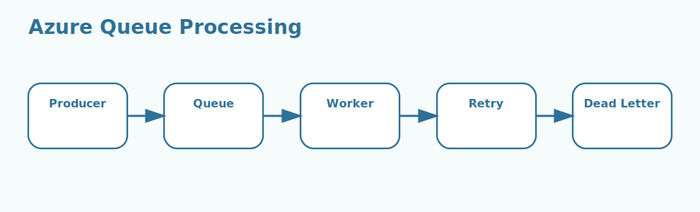

# Azure Queues Interview Questions



This page stays focused on queue-based asynchronous processing patterns in Azure Queue Storage.

## 1. Queue and message model

### 1. What is the role of Queue and message model in Azure Queue Storage?

**Answer:**

In Azure Queue Storage, the term Queue and message model refers to the producer-consumer pattern used to
decouple work across components. It is part of the foundation a candidate should be able to explain
clearly.

**Sample:**

```csharp
// Concept: 1. Queue and message model
var queue = new QueueClient(connectionString, "orders");
await queue.CreateIfNotExistsAsync();
await queue.SendMessageAsync("process-order-1001");
```

---

### 2. Why is the concept of Queue and message model important in Azure Queue Storage?

**Answer:**

This concept matters because it influences the producer-consumer pattern used to decouple
work across components. Good interview answers connect it to clarity, maintainability, performance,
security, or delivery depending on the situation.

**Sample:**

```csharp
// Concept: 1. Queue and message model
var queue = new QueueClient(connectionString, "orders");
await queue.CreateIfNotExistsAsync();
await queue.SendMessageAsync("process-order-1001");
```

---

### 3. When should a team focus on Queue and message model?

**Answer:**

A team should focus on Queue and message model when the requirement depends on the producer-consumer
pattern used to decouple work across components. It becomes especially important when design
decisions, scaling choices, or debugging depend on that area.

**Sample:**

```csharp
// Concept: 1. Queue and message model
var queue = new QueueClient(connectionString, "orders");
await queue.CreateIfNotExistsAsync();
await queue.SendMessageAsync("process-order-1001");
```

---

### 4. How is Queue and message model applied in practice?

**Answer:**

In practice, Queue and message model is applied by making the producer-consumer pattern used to
decouple work across components explicit in the implementation or workflow. The exact shape depends
on the service design, but the responsibility should stay predictable.

**Sample:**

```csharp
// Concept: 1. Queue and message model
var queue = new QueueClient(connectionString, "orders");
await queue.CreateIfNotExistsAsync();
await queue.SendMessageAsync("process-order-1001");
```

---

### 5. What strengths does Queue and message model bring?

**Answer:**

The strengths of Queue and message model are better structure, better communication, and better
control over the producer-consumer pattern used to decouple work across components. It also makes
tradeoffs easier to explain to both interviewers and project stakeholders.

**Sample:**

```csharp
// Concept: 1. Queue and message model
var queue = new QueueClient(connectionString, "orders");
await queue.CreateIfNotExistsAsync();
await queue.SendMessageAsync("process-order-1001");
```

---

### 6. What tradeoffs come with Queue and message model?

**Answer:**

The main tradeoff is extra complexity if Queue and message model is introduced without a real need
or a clear understanding of the producer-consumer pattern used to decouple work across components.
That usually leads to higher cost, weaker design, or harder troubleshooting.

**Sample:**

```csharp
// Concept: 1. Queue and message model
var queue = new QueueClient(connectionString, "orders");
await queue.CreateIfNotExistsAsync();
await queue.SendMessageAsync("process-order-1001");
```

---

### 7. How does Queue and message model differ from Visibility timeout?

**Answer:**

Queue and message model is centered on the producer-consumer pattern used to decouple work across
components, while Visibility timeout is centered on the period when a dequeued message stays hidden
before it can be processed again. They often work together, but they solve different parts of the
topic.

**Sample:**

```csharp
// Concept: 1. Queue and message model
var queue = new QueueClient(connectionString, "orders");
await queue.CreateIfNotExistsAsync();
await queue.SendMessageAsync("process-order-1001");
```

---

### 8. What is a good real-world example of Queue and message model?

**Answer:**

A strong example is explaining how Queue and message model affects a real feature, cost decision,
failure mode, or architecture choice involving the producer-consumer pattern used to decouple work
across components. Interviewers usually value the reasoning behind the example.

**Sample:**

```csharp
// Concept: 1. Queue and message model
var queue = new QueueClient(connectionString, "orders");
await queue.CreateIfNotExistsAsync();
await queue.SendMessageAsync("process-order-1001");
```

---

### 9. What is a best practice for Queue and message model?

**Answer:**

A good practice is to keep Queue and message model aligned with the actual requirement around the
producer-consumer pattern used to decouple work across components. Teams should document intent,
keep the setup readable, and validate the most important paths early.

**Sample:**

```csharp
// Concept: 1. Queue and message model
var queue = new QueueClient(connectionString, "orders");
await queue.CreateIfNotExistsAsync();
await queue.SendMessageAsync("process-order-1001");
```

---

### 10. What is a common mistake around Queue and message model?

**Answer:**

A common mistake is naming Queue and message model without understanding how it affects the
producer-consumer pattern used to decouple work across components. In real work, that usually
appears as weak sizing, poor troubleshooting, or the wrong operational choice.

**Sample:**

```csharp
// Concept: 1. Queue and message model
var queue = new QueueClient(connectionString, "orders");
await queue.CreateIfNotExistsAsync();
await queue.SendMessageAsync("process-order-1001");
```

---

### 11. How do you troubleshoot Queue and message model-related issues?

**Answer:**

When troubleshooting Queue and message model, first verify whether the producer-consumer pattern
used to decouple work across components is behaving as expected. Then check dependencies,
configuration, metrics, logs, and edge cases before changing the design.

**Sample:**

```csharp
// Concept: 1. Queue and message model
var queue = new QueueClient(connectionString, "orders");
await queue.CreateIfNotExistsAsync();
await queue.SendMessageAsync("process-order-1001");
```

---

### 12. How does Queue and message model connect to the rest of Azure Queue Storage?

**Answer:**

Queue and message model connects to the rest of Azure Queue Storage by giving structure to the
producer-consumer pattern used to decouple work across components. It is one of the pieces that
turns isolated facts into a usable end-to-end mental model.

**Sample:**

```csharp
// Concept: 1. Queue and message model
var queue = new QueueClient(connectionString, "orders");
await queue.CreateIfNotExistsAsync();
await queue.SendMessageAsync("process-order-1001");
```

---

## 2. Visibility timeout

### 13. What is the role of Visibility timeout in Azure Queue Storage?

**Answer:**

In Azure Queue Storage, the term Visibility timeout refers to the period when a dequeued message stays hidden
before it can be processed again. It is part of the foundation a candidate should be able to explain
clearly.

**Sample:**

```csharp
// Concept: 2. Visibility timeout
var queue = new QueueClient(connectionString, "orders");
await queue.CreateIfNotExistsAsync();
await queue.SendMessageAsync("process-order-1001");
```

---

### 14. Why is the concept of Visibility timeout important in Azure Queue Storage?

**Answer:**

This concept matters because it influences the period when a dequeued message stays hidden
before it can be processed again. Good interview answers connect it to clarity, maintainability,
performance, security, or delivery depending on the situation.

**Sample:**

```csharp
// Concept: 2. Visibility timeout
var queue = new QueueClient(connectionString, "orders");
await queue.CreateIfNotExistsAsync();
await queue.SendMessageAsync("process-order-1001");
```

---

### 15. When should a team focus on Visibility timeout?

**Answer:**

A team should focus on Visibility timeout when the requirement depends on the period when a dequeued
message stays hidden before it can be processed again. It becomes especially important when design
decisions, scaling choices, or debugging depend on that area.

**Sample:**

```csharp
// Concept: 2. Visibility timeout
var queue = new QueueClient(connectionString, "orders");
await queue.CreateIfNotExistsAsync();
await queue.SendMessageAsync("process-order-1001");
```

---

### 16. How is Visibility timeout applied in practice?

**Answer:**

In practice, Visibility timeout is applied by making the period when a dequeued message stays hidden
before it can be processed again explicit in the implementation or workflow. The exact shape depends
on the service design, but the responsibility should stay predictable.

**Sample:**

```csharp
// Concept: 2. Visibility timeout
var queue = new QueueClient(connectionString, "orders");
await queue.CreateIfNotExistsAsync();
await queue.SendMessageAsync("process-order-1001");
```

---

### 17. What strengths does Visibility timeout bring?

**Answer:**

The strengths of Visibility timeout are better structure, better communication, and better control
over the period when a dequeued message stays hidden before it can be processed again. It also makes
tradeoffs easier to explain to both interviewers and project stakeholders.

**Sample:**

```csharp
// Concept: 2. Visibility timeout
var queue = new QueueClient(connectionString, "orders");
await queue.CreateIfNotExistsAsync();
await queue.SendMessageAsync("process-order-1001");
```

---

### 18. What tradeoffs come with Visibility timeout?

**Answer:**

The main tradeoff is extra complexity if Visibility timeout is introduced without a real need or a
clear understanding of the period when a dequeued message stays hidden before it can be processed
again. That usually leads to higher cost, weaker design, or harder troubleshooting.

**Sample:**

```csharp
// Concept: 2. Visibility timeout
var queue = new QueueClient(connectionString, "orders");
await queue.CreateIfNotExistsAsync();
await queue.SendMessageAsync("process-order-1001");
```

---

### 19. How does Visibility timeout differ from Dequeue count?

**Answer:**

Visibility timeout is centered on the period when a dequeued message stays hidden before it can be
processed again, while Dequeue count is centered on the delivery counter used to detect repeated
processing failures. They often work together, but they solve different parts of the topic.

**Sample:**

```csharp
// Concept: 2. Visibility timeout
var queue = new QueueClient(connectionString, "orders");
await queue.CreateIfNotExistsAsync();
await queue.SendMessageAsync("process-order-1001");
```

---

### 20. What is a good real-world example of Visibility timeout?

**Answer:**

A strong example is explaining how Visibility timeout affects a real feature, cost decision, failure
mode, or architecture choice involving the period when a dequeued message stays hidden before it can
be processed again. Interviewers usually value the reasoning behind the example.

**Sample:**

```csharp
// Concept: 2. Visibility timeout
var queue = new QueueClient(connectionString, "orders");
await queue.CreateIfNotExistsAsync();
await queue.SendMessageAsync("process-order-1001");
```

---

### 21. What is a best practice for Visibility timeout?

**Answer:**

A good practice is to keep Visibility timeout aligned with the actual requirement around the period
when a dequeued message stays hidden before it can be processed again. Teams should document intent,
keep the setup readable, and validate the most important paths early.

**Sample:**

```csharp
// Concept: 2. Visibility timeout
var queue = new QueueClient(connectionString, "orders");
await queue.CreateIfNotExistsAsync();
await queue.SendMessageAsync("process-order-1001");
```

---

### 22. What is a common mistake around Visibility timeout?

**Answer:**

A common mistake is naming Visibility timeout without understanding how it affects the period when a
dequeued message stays hidden before it can be processed again. In real work, that usually appears
as weak sizing, poor troubleshooting, or the wrong operational choice.

**Sample:**

```csharp
// Concept: 2. Visibility timeout
var queue = new QueueClient(connectionString, "orders");
await queue.CreateIfNotExistsAsync();
await queue.SendMessageAsync("process-order-1001");
```

---

### 23. How do you troubleshoot Visibility timeout-related issues?

**Answer:**

When troubleshooting Visibility timeout, first verify whether the period when a dequeued message
stays hidden before it can be processed again is behaving as expected. Then check dependencies,
configuration, metrics, logs, and edge cases before changing the design.

**Sample:**

```csharp
// Concept: 2. Visibility timeout
var queue = new QueueClient(connectionString, "orders");
await queue.CreateIfNotExistsAsync();
await queue.SendMessageAsync("process-order-1001");
```

---

### 24. How does Visibility timeout connect to the rest of Azure Queue Storage?

**Answer:**

Visibility timeout connects to the rest of Azure Queue Storage by giving structure to the period
when a dequeued message stays hidden before it can be processed again. It is one of the pieces that
turns isolated facts into a usable end-to-end mental model.

**Sample:**

```csharp
// Concept: 2. Visibility timeout
var queue = new QueueClient(connectionString, "orders");
await queue.CreateIfNotExistsAsync();
await queue.SendMessageAsync("process-order-1001");
```

---

## 3. Dequeue count

### 25. What is the role of Dequeue count in Azure Queue Storage?

**Answer:**

In Azure Queue Storage, the term Dequeue count refers to the delivery counter used to detect repeated
processing failures. It is part of the foundation a candidate should be able to explain clearly.

**Sample:**

```csharp
// Concept: 3. Dequeue count
var queue = new QueueClient(connectionString, "orders");
await queue.CreateIfNotExistsAsync();
await queue.SendMessageAsync("process-order-1001");
```

---

### 26. Why is the concept of Dequeue count important in Azure Queue Storage?

**Answer:**

This concept matters because it influences the delivery counter used to detect repeated processing
failures. Good interview answers connect it to clarity, maintainability, performance, security, or
delivery depending on the situation.

**Sample:**

```csharp
// Concept: 3. Dequeue count
var queue = new QueueClient(connectionString, "orders");
await queue.CreateIfNotExistsAsync();
await queue.SendMessageAsync("process-order-1001");
```

---

### 27. When should a team focus on Dequeue count?

**Answer:**

A team should focus on Dequeue count when the requirement depends on the delivery counter used to
detect repeated processing failures. It becomes especially important when design decisions, scaling
choices, or debugging depend on that area.

**Sample:**

```csharp
// Concept: 3. Dequeue count
var queue = new QueueClient(connectionString, "orders");
await queue.CreateIfNotExistsAsync();
await queue.SendMessageAsync("process-order-1001");
```

---

### 28. How is Dequeue count applied in practice?

**Answer:**

In practice, Dequeue count is applied by making the delivery counter used to detect repeated
processing failures explicit in the implementation or workflow. The exact shape depends on the
service design, but the responsibility should stay predictable.

**Sample:**

```csharp
// Concept: 3. Dequeue count
var queue = new QueueClient(connectionString, "orders");
await queue.CreateIfNotExistsAsync();
await queue.SendMessageAsync("process-order-1001");
```

---

### 29. What strengths does Dequeue count bring?

**Answer:**

The strengths of Dequeue count are better structure, better communication, and better control over
the delivery counter used to detect repeated processing failures. It also makes tradeoffs easier to
explain to both interviewers and project stakeholders.

**Sample:**

```csharp
// Concept: 3. Dequeue count
var queue = new QueueClient(connectionString, "orders");
await queue.CreateIfNotExistsAsync();
await queue.SendMessageAsync("process-order-1001");
```

---

### 30. What tradeoffs come with Dequeue count?

**Answer:**

The main tradeoff is extra complexity if Dequeue count is introduced without a real need or a clear
understanding of the delivery counter used to detect repeated processing failures. That usually
leads to higher cost, weaker design, or harder troubleshooting.

**Sample:**

```csharp
// Concept: 3. Dequeue count
var queue = new QueueClient(connectionString, "orders");
await queue.CreateIfNotExistsAsync();
await queue.SendMessageAsync("process-order-1001");
```

---

### 31. How does Dequeue count differ from Poison messages?

**Answer:**

Dequeue count is centered on the delivery counter used to detect repeated processing failures, while
Poison messages is centered on the messages that fail repeatedly and need special handling or
isolation. They often work together, but they solve different parts of the topic.

**Sample:**

```csharp
// Concept: 3. Dequeue count
var queue = new QueueClient(connectionString, "orders");
await queue.CreateIfNotExistsAsync();
await queue.SendMessageAsync("process-order-1001");
```

---

### 32. What is a good real-world example of Dequeue count?

**Answer:**

A strong example is explaining how Dequeue count affects a real feature, cost decision, failure
mode, or architecture choice involving the delivery counter used to detect repeated processing
failures. Interviewers usually value the reasoning behind the example.

**Sample:**

```csharp
// Concept: 3. Dequeue count
var queue = new QueueClient(connectionString, "orders");
await queue.CreateIfNotExistsAsync();
await queue.SendMessageAsync("process-order-1001");
```

---

### 33. What is a best practice for Dequeue count?

**Answer:**

A good practice is to keep Dequeue count aligned with the actual requirement around the delivery
counter used to detect repeated processing failures. Teams should document intent, keep the setup
readable, and validate the most important paths early.

**Sample:**

```csharp
// Concept: 3. Dequeue count
var queue = new QueueClient(connectionString, "orders");
await queue.CreateIfNotExistsAsync();
await queue.SendMessageAsync("process-order-1001");
```

---

### 34. What is a common mistake around Dequeue count?

**Answer:**

A common mistake is naming Dequeue count without understanding how it affects the delivery counter
used to detect repeated processing failures. In real work, that usually appears as weak sizing, poor
troubleshooting, or the wrong operational choice.

**Sample:**

```csharp
// Concept: 3. Dequeue count
var queue = new QueueClient(connectionString, "orders");
await queue.CreateIfNotExistsAsync();
await queue.SendMessageAsync("process-order-1001");
```

---

### 35. How do you troubleshoot Dequeue count-related issues?

**Answer:**

When troubleshooting Dequeue count, first verify whether the delivery counter used to detect
repeated processing failures is behaving as expected. Then check dependencies, configuration,
metrics, logs, and edge cases before changing the design.

**Sample:**

```csharp
// Concept: 3. Dequeue count
var queue = new QueueClient(connectionString, "orders");
await queue.CreateIfNotExistsAsync();
await queue.SendMessageAsync("process-order-1001");
```

---

### 36. How does Dequeue count connect to the rest of Azure Queue Storage?

**Answer:**

Dequeue count connects to the rest of Azure Queue Storage by giving structure to the delivery
counter used to detect repeated processing failures. It is one of the pieces that turns isolated
facts into a usable end-to-end mental model.

**Sample:**

```csharp
// Concept: 3. Dequeue count
var queue = new QueueClient(connectionString, "orders");
await queue.CreateIfNotExistsAsync();
await queue.SendMessageAsync("process-order-1001");
```

---

## 4. Poison messages

### 37. What is the role of Poison messages in Azure Queue Storage?

**Answer:**

In Azure Queue Storage, the term Poison messages refers to the messages that fail repeatedly and need special
handling or isolation. It is part of the foundation a candidate should be able to explain clearly.

**Sample:**

```csharp
// Concept: 4. Poison messages
var queue = new QueueClient(connectionString, "orders");
await queue.CreateIfNotExistsAsync();
await queue.SendMessageAsync("process-order-1001");
```

---

### 38. Why is the concept of Poison messages important in Azure Queue Storage?

**Answer:**

This concept matters because it influences the messages that fail repeatedly and need special
handling or isolation. Good interview answers connect it to clarity, maintainability, performance,
security, or delivery depending on the situation.

**Sample:**

```csharp
// Concept: 4. Poison messages
var queue = new QueueClient(connectionString, "orders");
await queue.CreateIfNotExistsAsync();
await queue.SendMessageAsync("process-order-1001");
```

---

### 39. When should a team focus on Poison messages?

**Answer:**

A team should focus on Poison messages when the requirement depends on the messages that fail
repeatedly and need special handling or isolation. It becomes especially important when design
decisions, scaling choices, or debugging depend on that area.

**Sample:**

```csharp
// Concept: 4. Poison messages
var queue = new QueueClient(connectionString, "orders");
await queue.CreateIfNotExistsAsync();
await queue.SendMessageAsync("process-order-1001");
```

---

### 40. How is Poison messages applied in practice?

**Answer:**

In practice, Poison messages is applied by making the messages that fail repeatedly and need special
handling or isolation explicit in the implementation or workflow. The exact shape depends on the
service design, but the responsibility should stay predictable.

**Sample:**

```csharp
// Concept: 4. Poison messages
var queue = new QueueClient(connectionString, "orders");
await queue.CreateIfNotExistsAsync();
await queue.SendMessageAsync("process-order-1001");
```

---

### 41. What strengths does Poison messages bring?

**Answer:**

The strengths of Poison messages are better structure, better communication, and better control over
the messages that fail repeatedly and need special handling or isolation. It also makes tradeoffs
easier to explain to both interviewers and project stakeholders.

**Sample:**

```csharp
// Concept: 4. Poison messages
var queue = new QueueClient(connectionString, "orders");
await queue.CreateIfNotExistsAsync();
await queue.SendMessageAsync("process-order-1001");
```

---

### 42. What tradeoffs come with Poison messages?

**Answer:**

The main tradeoff is extra complexity if Poison messages is introduced without a real need or a
clear understanding of the messages that fail repeatedly and need special handling or isolation.
That usually leads to higher cost, weaker design, or harder troubleshooting.

**Sample:**

```csharp
// Concept: 4. Poison messages
var queue = new QueueClient(connectionString, "orders");
await queue.CreateIfNotExistsAsync();
await queue.SendMessageAsync("process-order-1001");
```

---

### 43. How does Poison messages differ from Peek and dequeue?

**Answer:**

Poison messages is centered on the messages that fail repeatedly and need special handling or
isolation, while Peek and dequeue is centered on the difference between inspecting a message and
actually claiming it for work. They often work together, but they solve different parts of the
topic.

**Sample:**

```csharp
// Concept: 4. Poison messages
var queue = new QueueClient(connectionString, "orders");
await queue.CreateIfNotExistsAsync();
await queue.SendMessageAsync("process-order-1001");
```

---

### 44. What is a good real-world example of Poison messages?

**Answer:**

A strong example is explaining how Poison messages affects a real feature, cost decision, failure
mode, or architecture choice involving the messages that fail repeatedly and need special handling
or isolation. Interviewers usually value the reasoning behind the example.

**Sample:**

```csharp
// Concept: 4. Poison messages
var queue = new QueueClient(connectionString, "orders");
await queue.CreateIfNotExistsAsync();
await queue.SendMessageAsync("process-order-1001");
```

---

### 45. What is a best practice for Poison messages?

**Answer:**

A good practice is to keep Poison messages aligned with the actual requirement around the messages
that fail repeatedly and need special handling or isolation. Teams should document intent, keep the
setup readable, and validate the most important paths early.

**Sample:**

```csharp
// Concept: 4. Poison messages
var queue = new QueueClient(connectionString, "orders");
await queue.CreateIfNotExistsAsync();
await queue.SendMessageAsync("process-order-1001");
```

---

### 46. What is a common mistake around Poison messages?

**Answer:**

A common mistake is naming Poison messages without understanding how it affects the messages that
fail repeatedly and need special handling or isolation. In real work, that usually appears as weak
sizing, poor troubleshooting, or the wrong operational choice.

**Sample:**

```csharp
// Concept: 4. Poison messages
var queue = new QueueClient(connectionString, "orders");
await queue.CreateIfNotExistsAsync();
await queue.SendMessageAsync("process-order-1001");
```

---

### 47. How do you troubleshoot Poison messages-related issues?

**Answer:**

When troubleshooting Poison messages, first verify whether the messages that fail repeatedly and
need special handling or isolation is behaving as expected. Then check dependencies, configuration,
metrics, logs, and edge cases before changing the design.

**Sample:**

```csharp
// Concept: 4. Poison messages
var queue = new QueueClient(connectionString, "orders");
await queue.CreateIfNotExistsAsync();
await queue.SendMessageAsync("process-order-1001");
```

---

### 48. How does Poison messages connect to the rest of Azure Queue Storage?

**Answer:**

Poison messages connects to the rest of Azure Queue Storage by giving structure to the messages that
fail repeatedly and need special handling or isolation. It is one of the pieces that turns isolated
facts into a usable end-to-end mental model.

**Sample:**

```csharp
// Concept: 4. Poison messages
var queue = new QueueClient(connectionString, "orders");
await queue.CreateIfNotExistsAsync();
await queue.SendMessageAsync("process-order-1001");
```

---

## 5. Peek and dequeue

### 49. What is the role of Peek and dequeue in Azure Queue Storage?

**Answer:**

In Azure Queue Storage, the term Peek and dequeue refers to the difference between inspecting a message and
actually claiming it for work. It is part of the foundation a candidate should be able to explain
clearly.

**Sample:**

```csharp
// Concept: 5. Peek and dequeue
var queue = new QueueClient(connectionString, "orders");
await queue.CreateIfNotExistsAsync();
await queue.SendMessageAsync("process-order-1001");
```

---

### 50. Why is the concept of Peek and dequeue important in Azure Queue Storage?

**Answer:**

This concept matters because it influences the difference between inspecting a message and
actually claiming it for work. Good interview answers connect it to clarity, maintainability,
performance, security, or delivery depending on the situation.

**Sample:**

```csharp
// Concept: 5. Peek and dequeue
var queue = new QueueClient(connectionString, "orders");
await queue.CreateIfNotExistsAsync();
await queue.SendMessageAsync("process-order-1001");
```

---

### 51. When should a team focus on Peek and dequeue?

**Answer:**

A team should focus on Peek and dequeue when the requirement depends on the difference between
inspecting a message and actually claiming it for work. It becomes especially important when design
decisions, scaling choices, or debugging depend on that area.

**Sample:**

```csharp
// Concept: 5. Peek and dequeue
var queue = new QueueClient(connectionString, "orders");
await queue.CreateIfNotExistsAsync();
await queue.SendMessageAsync("process-order-1001");
```

---

### 52. How is Peek and dequeue applied in practice?

**Answer:**

In practice, Peek and dequeue is applied by making the difference between inspecting a message and
actually claiming it for work explicit in the implementation or workflow. The exact shape depends on
the service design, but the responsibility should stay predictable.

**Sample:**

```csharp
// Concept: 5. Peek and dequeue
var queue = new QueueClient(connectionString, "orders");
await queue.CreateIfNotExistsAsync();
await queue.SendMessageAsync("process-order-1001");
```

---

### 53. What strengths does Peek and dequeue bring?

**Answer:**

The strengths of Peek and dequeue are better structure, better communication, and better control
over the difference between inspecting a message and actually claiming it for work. It also makes
tradeoffs easier to explain to both interviewers and project stakeholders.

**Sample:**

```csharp
// Concept: 5. Peek and dequeue
var queue = new QueueClient(connectionString, "orders");
await queue.CreateIfNotExistsAsync();
await queue.SendMessageAsync("process-order-1001");
```

---

### 54. What tradeoffs come with Peek and dequeue?

**Answer:**

The main tradeoff is extra complexity if Peek and dequeue is introduced without a real need or a
clear understanding of the difference between inspecting a message and actually claiming it for
work. That usually leads to higher cost, weaker design, or harder troubleshooting.

**Sample:**

```csharp
// Concept: 5. Peek and dequeue
var queue = new QueueClient(connectionString, "orders");
await queue.CreateIfNotExistsAsync();
await queue.SendMessageAsync("process-order-1001");
```

---

### 55. How does Peek and dequeue differ from Retry patterns?

**Answer:**

Peek and dequeue is centered on the difference between inspecting a message and actually claiming it
for work, while Retry patterns is centered on the approach used to recover from transient failures
without losing messages. They often work together, but they solve different parts of the topic.

**Sample:**

```csharp
// Concept: 5. Peek and dequeue
var queue = new QueueClient(connectionString, "orders");
await queue.CreateIfNotExistsAsync();
await queue.SendMessageAsync("process-order-1001");
```

---

### 56. What is a good real-world example of Peek and dequeue?

**Answer:**

A strong example is explaining how Peek and dequeue affects a real feature, cost decision, failure
mode, or architecture choice involving the difference between inspecting a message and actually
claiming it for work. Interviewers usually value the reasoning behind the example.

**Sample:**

```csharp
// Concept: 5. Peek and dequeue
var queue = new QueueClient(connectionString, "orders");
await queue.CreateIfNotExistsAsync();
await queue.SendMessageAsync("process-order-1001");
```

---

### 57. What is a best practice for Peek and dequeue?

**Answer:**

A good practice is to keep Peek and dequeue aligned with the actual requirement around the
difference between inspecting a message and actually claiming it for work. Teams should document
intent, keep the setup readable, and validate the most important paths early.

**Sample:**

```csharp
// Concept: 5. Peek and dequeue
var queue = new QueueClient(connectionString, "orders");
await queue.CreateIfNotExistsAsync();
await queue.SendMessageAsync("process-order-1001");
```

---

### 58. What is a common mistake around Peek and dequeue?

**Answer:**

A common mistake is naming Peek and dequeue without understanding how it affects the difference
between inspecting a message and actually claiming it for work. In real work, that usually appears
as weak sizing, poor troubleshooting, or the wrong operational choice.

**Sample:**

```csharp
// Concept: 5. Peek and dequeue
var queue = new QueueClient(connectionString, "orders");
await queue.CreateIfNotExistsAsync();
await queue.SendMessageAsync("process-order-1001");
```

---

### 59. How do you troubleshoot Peek and dequeue-related issues?

**Answer:**

When troubleshooting Peek and dequeue, first verify whether the difference between inspecting a
message and actually claiming it for work is behaving as expected. Then check dependencies,
configuration, metrics, logs, and edge cases before changing the design.

**Sample:**

```csharp
// Concept: 5. Peek and dequeue
var queue = new QueueClient(connectionString, "orders");
await queue.CreateIfNotExistsAsync();
await queue.SendMessageAsync("process-order-1001");
```

---

### 60. How does Peek and dequeue connect to the rest of Azure Queue Storage?

**Answer:**

Peek and dequeue connects to the rest of Azure Queue Storage by giving structure to the difference
between inspecting a message and actually claiming it for work. It is one of the pieces that turns
isolated facts into a usable end-to-end mental model.

**Sample:**

```csharp
// Concept: 5. Peek and dequeue
var queue = new QueueClient(connectionString, "orders");
await queue.CreateIfNotExistsAsync();
await queue.SendMessageAsync("process-order-1001");
```

---

## 6. Retry patterns

### 61. What is the role of Retry patterns in Azure Queue Storage?

**Answer:**

In Azure Queue Storage, the term Retry patterns refers to the approach used to recover from transient
failures without losing messages. It is part of the foundation a candidate should be able to explain
clearly.

**Sample:**

```csharp
// Concept: 6. Retry patterns
var queue = new QueueClient(connectionString, "orders");
await queue.CreateIfNotExistsAsync();
await queue.SendMessageAsync("process-order-1001");
```

---

### 62. Why is the concept of Retry patterns important in Azure Queue Storage?

**Answer:**

This concept matters because it influences the approach used to recover from transient failures
without losing messages. Good interview answers connect it to clarity, maintainability, performance,
security, or delivery depending on the situation.

**Sample:**

```csharp
// Concept: 6. Retry patterns
var queue = new QueueClient(connectionString, "orders");
await queue.CreateIfNotExistsAsync();
await queue.SendMessageAsync("process-order-1001");
```

---

### 63. When should a team focus on Retry patterns?

**Answer:**

A team should focus on Retry patterns when the requirement depends on the approach used to recover
from transient failures without losing messages. It becomes especially important when design
decisions, scaling choices, or debugging depend on that area.

**Sample:**

```csharp
// Concept: 6. Retry patterns
var queue = new QueueClient(connectionString, "orders");
await queue.CreateIfNotExistsAsync();
await queue.SendMessageAsync("process-order-1001");
```

---

### 64. How is Retry patterns applied in practice?

**Answer:**

In practice, Retry patterns is applied by making the approach used to recover from transient
failures without losing messages explicit in the implementation or workflow. The exact shape depends
on the service design, but the responsibility should stay predictable.

**Sample:**

```csharp
// Concept: 6. Retry patterns
var queue = new QueueClient(connectionString, "orders");
await queue.CreateIfNotExistsAsync();
await queue.SendMessageAsync("process-order-1001");
```

---

### 65. What strengths does Retry patterns bring?

**Answer:**

The strengths of Retry patterns are better structure, better communication, and better control over
the approach used to recover from transient failures without losing messages. It also makes
tradeoffs easier to explain to both interviewers and project stakeholders.

**Sample:**

```csharp
// Concept: 6. Retry patterns
var queue = new QueueClient(connectionString, "orders");
await queue.CreateIfNotExistsAsync();
await queue.SendMessageAsync("process-order-1001");
```

---

### 66. What tradeoffs come with Retry patterns?

**Answer:**

The main tradeoff is extra complexity if Retry patterns is introduced without a real need or a clear
understanding of the approach used to recover from transient failures without losing messages. That
usually leads to higher cost, weaker design, or harder troubleshooting.

**Sample:**

```csharp
// Concept: 6. Retry patterns
var queue = new QueueClient(connectionString, "orders");
await queue.CreateIfNotExistsAsync();
await queue.SendMessageAsync("process-order-1001");
```

---

### 67. How does Retry patterns differ from Producer consumer design?

**Answer:**

Retry patterns is centered on the approach used to recover from transient failures without losing
messages, while Producer consumer design is centered on the separation of message creation from
background work execution. They often work together, but they solve different parts of the topic.

**Sample:**

```csharp
// Concept: 6. Retry patterns
var queue = new QueueClient(connectionString, "orders");
await queue.CreateIfNotExistsAsync();
await queue.SendMessageAsync("process-order-1001");
```

---

### 68. What is a good real-world example of Retry patterns?

**Answer:**

A strong example is explaining how Retry patterns affects a real feature, cost decision, failure
mode, or architecture choice involving the approach used to recover from transient failures without
losing messages. Interviewers usually value the reasoning behind the example.

**Sample:**

```csharp
// Concept: 6. Retry patterns
var queue = new QueueClient(connectionString, "orders");
await queue.CreateIfNotExistsAsync();
await queue.SendMessageAsync("process-order-1001");
```

---

### 69. What is a best practice for Retry patterns?

**Answer:**

A good practice is to keep Retry patterns aligned with the actual requirement around the approach
used to recover from transient failures without losing messages. Teams should document intent, keep
the setup readable, and validate the most important paths early.

**Sample:**

```csharp
// Concept: 6. Retry patterns
var queue = new QueueClient(connectionString, "orders");
await queue.CreateIfNotExistsAsync();
await queue.SendMessageAsync("process-order-1001");
```

---

### 70. What is a common mistake around Retry patterns?

**Answer:**

A common mistake is naming Retry patterns without understanding how it affects the approach used to
recover from transient failures without losing messages. In real work, that usually appears as weak
sizing, poor troubleshooting, or the wrong operational choice.

**Sample:**

```csharp
// Concept: 6. Retry patterns
var queue = new QueueClient(connectionString, "orders");
await queue.CreateIfNotExistsAsync();
await queue.SendMessageAsync("process-order-1001");
```

---

### 71. How do you troubleshoot Retry patterns-related issues?

**Answer:**

When troubleshooting Retry patterns, first verify whether the approach used to recover from
transient failures without losing messages is behaving as expected. Then check dependencies,
configuration, metrics, logs, and edge cases before changing the design.

**Sample:**

```csharp
// Concept: 6. Retry patterns
var queue = new QueueClient(connectionString, "orders");
await queue.CreateIfNotExistsAsync();
await queue.SendMessageAsync("process-order-1001");
```

---

### 72. How does Retry patterns connect to the rest of Azure Queue Storage?

**Answer:**

Retry patterns connects to the rest of Azure Queue Storage by giving structure to the approach used
to recover from transient failures without losing messages. It is one of the pieces that turns
isolated facts into a usable end-to-end mental model.

**Sample:**

```csharp
// Concept: 6. Retry patterns
var queue = new QueueClient(connectionString, "orders");
await queue.CreateIfNotExistsAsync();
await queue.SendMessageAsync("process-order-1001");
```

---

## 7. Producer consumer design

### 73. What is the role of Producer consumer design in Azure Queue Storage?

**Answer:**

In Azure Queue Storage, the term Producer consumer design refers to the separation of message creation from
background work execution. It is part of the foundation a candidate should be able to explain
clearly.

**Sample:**

```csharp
// Concept: 7. Producer consumer design
var queue = new QueueClient(connectionString, "orders");
await queue.CreateIfNotExistsAsync();
await queue.SendMessageAsync("process-order-1001");
```

---

### 74. Why is the concept of Producer consumer design important in Azure Queue Storage?

**Answer:**

This concept matters because it influences the separation of message creation from
background work execution. Good interview answers connect it to clarity, maintainability,
performance, security, or delivery depending on the situation.

**Sample:**

```csharp
// Concept: 7. Producer consumer design
var queue = new QueueClient(connectionString, "orders");
await queue.CreateIfNotExistsAsync();
await queue.SendMessageAsync("process-order-1001");
```

---

### 75. When should a team focus on Producer consumer design?

**Answer:**

A team should focus on Producer consumer design when the requirement depends on the separation of
message creation from background work execution. It becomes especially important when design
decisions, scaling choices, or debugging depend on that area.

**Sample:**

```csharp
// Concept: 7. Producer consumer design
var queue = new QueueClient(connectionString, "orders");
await queue.CreateIfNotExistsAsync();
await queue.SendMessageAsync("process-order-1001");
```

---

### 76. How is Producer consumer design applied in practice?

**Answer:**

In practice, Producer consumer design is applied by making the separation of message creation from
background work execution explicit in the implementation or workflow. The exact shape depends on the
service design, but the responsibility should stay predictable.

**Sample:**

```csharp
// Concept: 7. Producer consumer design
var queue = new QueueClient(connectionString, "orders");
await queue.CreateIfNotExistsAsync();
await queue.SendMessageAsync("process-order-1001");
```

---

### 77. What strengths does Producer consumer design bring?

**Answer:**

The strengths of Producer consumer design are better structure, better communication, and better
control over the separation of message creation from background work execution. It also makes
tradeoffs easier to explain to both interviewers and project stakeholders.

**Sample:**

```csharp
// Concept: 7. Producer consumer design
var queue = new QueueClient(connectionString, "orders");
await queue.CreateIfNotExistsAsync();
await queue.SendMessageAsync("process-order-1001");
```

---

### 78. What tradeoffs come with Producer consumer design?

**Answer:**

The main tradeoff is extra complexity if Producer consumer design is introduced without a real need
or a clear understanding of the separation of message creation from background work execution. That
usually leads to higher cost, weaker design, or harder troubleshooting.

**Sample:**

```csharp
// Concept: 7. Producer consumer design
var queue = new QueueClient(connectionString, "orders");
await queue.CreateIfNotExistsAsync();
await queue.SendMessageAsync("process-order-1001");
```

---

### 79. How does Producer consumer design differ from Scaling workers?

**Answer:**

Producer consumer design is centered on the separation of message creation from background work
execution, while Scaling workers is centered on the strategy for increasing or decreasing message
consumers as queue pressure changes. They often work together, but they solve different parts of the
topic.

**Sample:**

```csharp
// Concept: 7. Producer consumer design
var queue = new QueueClient(connectionString, "orders");
await queue.CreateIfNotExistsAsync();
await queue.SendMessageAsync("process-order-1001");
```

---

### 80. What is a good real-world example of Producer consumer design?

**Answer:**

A strong example is explaining how Producer consumer design affects a real feature, cost decision,
failure mode, or architecture choice involving the separation of message creation from background
work execution. Interviewers usually value the reasoning behind the example.

**Sample:**

```csharp
// Concept: 7. Producer consumer design
var queue = new QueueClient(connectionString, "orders");
await queue.CreateIfNotExistsAsync();
await queue.SendMessageAsync("process-order-1001");
```

---

### 81. What is a best practice for Producer consumer design?

**Answer:**

A good practice is to keep Producer consumer design aligned with the actual requirement around the
separation of message creation from background work execution. Teams should document intent, keep
the setup readable, and validate the most important paths early.

**Sample:**

```csharp
// Concept: 7. Producer consumer design
var queue = new QueueClient(connectionString, "orders");
await queue.CreateIfNotExistsAsync();
await queue.SendMessageAsync("process-order-1001");
```

---

### 82. What is a common mistake around Producer consumer design?

**Answer:**

A common mistake is naming Producer consumer design without understanding how it affects the
separation of message creation from background work execution. In real work, that usually appears as
weak sizing, poor troubleshooting, or the wrong operational choice.

**Sample:**

```csharp
// Concept: 7. Producer consumer design
var queue = new QueueClient(connectionString, "orders");
await queue.CreateIfNotExistsAsync();
await queue.SendMessageAsync("process-order-1001");
```

---

### 83. How do you troubleshoot Producer consumer design-related issues?

**Answer:**

When troubleshooting Producer consumer design, first verify whether the separation of message
creation from background work execution is behaving as expected. Then check dependencies,
configuration, metrics, logs, and edge cases before changing the design.

**Sample:**

```csharp
// Concept: 7. Producer consumer design
var queue = new QueueClient(connectionString, "orders");
await queue.CreateIfNotExistsAsync();
await queue.SendMessageAsync("process-order-1001");
```

---

### 84. How does Producer consumer design connect to the rest of Azure Queue Storage?

**Answer:**

Producer consumer design connects to the rest of Azure Queue Storage by giving structure to the
separation of message creation from background work execution. It is one of the pieces that turns
isolated facts into a usable end-to-end mental model.

**Sample:**

```csharp
// Concept: 7. Producer consumer design
var queue = new QueueClient(connectionString, "orders");
await queue.CreateIfNotExistsAsync();
await queue.SendMessageAsync("process-order-1001");
```

---

## 8. Scaling workers

### 85. What is the role of Scaling workers in Azure Queue Storage?

**Answer:**

In Azure Queue Storage, the term Scaling workers refers to the strategy for increasing or decreasing message
consumers as queue pressure changes. It is part of the foundation a candidate should be able to
explain clearly.

**Sample:**

```csharp
// Concept: 8. Scaling workers
var queue = new QueueClient(connectionString, "orders");
await queue.CreateIfNotExistsAsync();
await queue.SendMessageAsync("process-order-1001");
```

---

### 86. Why is the concept of Scaling workers important in Azure Queue Storage?

**Answer:**

This concept matters because it influences the strategy for increasing or decreasing message
consumers as queue pressure changes. Good interview answers connect it to clarity, maintainability,
performance, security, or delivery depending on the situation.

**Sample:**

```csharp
// Concept: 8. Scaling workers
var queue = new QueueClient(connectionString, "orders");
await queue.CreateIfNotExistsAsync();
await queue.SendMessageAsync("process-order-1001");
```

---

### 87. When should a team focus on Scaling workers?

**Answer:**

A team should focus on Scaling workers when the requirement depends on the strategy for increasing
or decreasing message consumers as queue pressure changes. It becomes especially important when
design decisions, scaling choices, or debugging depend on that area.

**Sample:**

```csharp
// Concept: 8. Scaling workers
var queue = new QueueClient(connectionString, "orders");
await queue.CreateIfNotExistsAsync();
await queue.SendMessageAsync("process-order-1001");
```

---

### 88. How is Scaling workers applied in practice?

**Answer:**

In practice, Scaling workers is applied by making the strategy for increasing or decreasing message
consumers as queue pressure changes explicit in the implementation or workflow. The exact shape
depends on the service design, but the responsibility should stay predictable.

**Sample:**

```csharp
// Concept: 8. Scaling workers
var queue = new QueueClient(connectionString, "orders");
await queue.CreateIfNotExistsAsync();
await queue.SendMessageAsync("process-order-1001");
```

---

### 89. What strengths does Scaling workers bring?

**Answer:**

The strengths of Scaling workers are better structure, better communication, and better control over
the strategy for increasing or decreasing message consumers as queue pressure changes. It also makes
tradeoffs easier to explain to both interviewers and project stakeholders.

**Sample:**

```csharp
// Concept: 8. Scaling workers
var queue = new QueueClient(connectionString, "orders");
await queue.CreateIfNotExistsAsync();
await queue.SendMessageAsync("process-order-1001");
```

---

### 90. What tradeoffs come with Scaling workers?

**Answer:**

The main tradeoff is extra complexity if Scaling workers is introduced without a real need or a
clear understanding of the strategy for increasing or decreasing message consumers as queue pressure
changes. That usually leads to higher cost, weaker design, or harder troubleshooting.

**Sample:**

```csharp
// Concept: 8. Scaling workers
var queue = new QueueClient(connectionString, "orders");
await queue.CreateIfNotExistsAsync();
await queue.SendMessageAsync("process-order-1001");
```

---

### 91. How does Scaling workers differ from Security and access?

**Answer:**

Scaling workers is centered on the strategy for increasing or decreasing message consumers as queue
pressure changes, while Security and access is centered on the methods used to control who can read
from or write to queue resources. They often work together, but they solve different parts of the
topic.

**Sample:**

```csharp
// Concept: 8. Scaling workers
var queue = new QueueClient(connectionString, "orders");
await queue.CreateIfNotExistsAsync();
await queue.SendMessageAsync("process-order-1001");
```

---

### 92. What is a good real-world example of Scaling workers?

**Answer:**

A strong example is explaining how Scaling workers affects a real feature, cost decision, failure
mode, or architecture choice involving the strategy for increasing or decreasing message consumers
as queue pressure changes. Interviewers usually value the reasoning behind the example.

**Sample:**

```csharp
// Concept: 8. Scaling workers
var queue = new QueueClient(connectionString, "orders");
await queue.CreateIfNotExistsAsync();
await queue.SendMessageAsync("process-order-1001");
```

---

### 93. What is a best practice for Scaling workers?

**Answer:**

A good practice is to keep Scaling workers aligned with the actual requirement around the strategy
for increasing or decreasing message consumers as queue pressure changes. Teams should document
intent, keep the setup readable, and validate the most important paths early.

**Sample:**

```csharp
// Concept: 8. Scaling workers
var queue = new QueueClient(connectionString, "orders");
await queue.CreateIfNotExistsAsync();
await queue.SendMessageAsync("process-order-1001");
```

---

### 94. What is a common mistake around Scaling workers?

**Answer:**

A common mistake is naming Scaling workers without understanding how it affects the strategy for
increasing or decreasing message consumers as queue pressure changes. In real work, that usually
appears as weak sizing, poor troubleshooting, or the wrong operational choice.

**Sample:**

```csharp
// Concept: 8. Scaling workers
var queue = new QueueClient(connectionString, "orders");
await queue.CreateIfNotExistsAsync();
await queue.SendMessageAsync("process-order-1001");
```

---

### 95. How do you troubleshoot Scaling workers-related issues?

**Answer:**

When troubleshooting Scaling workers, first verify whether the strategy for increasing or decreasing
message consumers as queue pressure changes is behaving as expected. Then check dependencies,
configuration, metrics, logs, and edge cases before changing the design.

**Sample:**

```csharp
// Concept: 8. Scaling workers
var queue = new QueueClient(connectionString, "orders");
await queue.CreateIfNotExistsAsync();
await queue.SendMessageAsync("process-order-1001");
```

---

### 96. How does Scaling workers connect to the rest of Azure Queue Storage?

**Answer:**

Scaling workers connects to the rest of Azure Queue Storage by giving structure to the strategy for
increasing or decreasing message consumers as queue pressure changes. It is one of the pieces that
turns isolated facts into a usable end-to-end mental model.

**Sample:**

```csharp
// Concept: 8. Scaling workers
var queue = new QueueClient(connectionString, "orders");
await queue.CreateIfNotExistsAsync();
await queue.SendMessageAsync("process-order-1001");
```

---

## 9. Security and access

### 97. What is the role of Security and access in Azure Queue Storage?

**Answer:**

In Azure Queue Storage, the term Security and access refers to the methods used to control who can read from
or write to queue resources. It is part of the foundation a candidate should be able to explain
clearly.

**Sample:**

```csharp
// Concept: 9. Security and access
var queue = new QueueClient(connectionString, "orders");
await queue.CreateIfNotExistsAsync();
await queue.SendMessageAsync("process-order-1001");
```

---

### 98. Why is the concept of Security and access important in Azure Queue Storage?

**Answer:**

This concept matters because it influences the methods used to control who can read from or
write to queue resources. Good interview answers connect it to clarity, maintainability,
performance, security, or delivery depending on the situation.

**Sample:**

```csharp
// Concept: 9. Security and access
var queue = new QueueClient(connectionString, "orders");
await queue.CreateIfNotExistsAsync();
await queue.SendMessageAsync("process-order-1001");
```

---

### 99. When should a team focus on Security and access?

**Answer:**

A team should focus on Security and access when the requirement depends on the methods used to
control who can read from or write to queue resources. It becomes especially important when design
decisions, scaling choices, or debugging depend on that area.

**Sample:**

```csharp
// Concept: 9. Security and access
var queue = new QueueClient(connectionString, "orders");
await queue.CreateIfNotExistsAsync();
await queue.SendMessageAsync("process-order-1001");
```

---

### 100. How is Security and access applied in practice?

**Answer:**

In practice, Security and access is applied by making the methods used to control who can read from
or write to queue resources explicit in the implementation or workflow. The exact shape depends on
the service design, but the responsibility should stay predictable.

**Sample:**

```csharp
// Concept: 9. Security and access
var queue = new QueueClient(connectionString, "orders");
await queue.CreateIfNotExistsAsync();
await queue.SendMessageAsync("process-order-1001");
```

---

### 101. What strengths does Security and access bring?

**Answer:**

The strengths of Security and access are better structure, better communication, and better control
over the methods used to control who can read from or write to queue resources. It also makes
tradeoffs easier to explain to both interviewers and project stakeholders.

**Sample:**

```csharp
// Concept: 9. Security and access
var queue = new QueueClient(connectionString, "orders");
await queue.CreateIfNotExistsAsync();
await queue.SendMessageAsync("process-order-1001");
```

---

### 102. What tradeoffs come with Security and access?

**Answer:**

The main tradeoff is extra complexity if Security and access is introduced without a real need or a
clear understanding of the methods used to control who can read from or write to queue resources.
That usually leads to higher cost, weaker design, or harder troubleshooting.

**Sample:**

```csharp
// Concept: 9. Security and access
var queue = new QueueClient(connectionString, "orders");
await queue.CreateIfNotExistsAsync();
await queue.SendMessageAsync("process-order-1001");
```

---

### 103. How does Security and access differ from Real world use cases?

**Answer:**

Security and access is centered on the methods used to control who can read from or write to queue
resources, while Real world use cases is centered on the scenarios where queue-based decoupling
improves reliability and responsiveness. They often work together, but they solve different parts of
the topic.

**Sample:**

```csharp
// Concept: 9. Security and access
var queue = new QueueClient(connectionString, "orders");
await queue.CreateIfNotExistsAsync();
await queue.SendMessageAsync("process-order-1001");
```

---

### 104. What is a good real-world example of Security and access?

**Answer:**

A strong example is explaining how Security and access affects a real feature, cost decision,
failure mode, or architecture choice involving the methods used to control who can read from or
write to queue resources. Interviewers usually value the reasoning behind the example.

**Sample:**

```csharp
// Concept: 9. Security and access
var queue = new QueueClient(connectionString, "orders");
await queue.CreateIfNotExistsAsync();
await queue.SendMessageAsync("process-order-1001");
```

---

### 105. What is a best practice for Security and access?

**Answer:**

A good practice is to keep Security and access aligned with the actual requirement around the
methods used to control who can read from or write to queue resources. Teams should document intent,
keep the setup readable, and validate the most important paths early.

**Sample:**

```csharp
// Concept: 9. Security and access
var queue = new QueueClient(connectionString, "orders");
await queue.CreateIfNotExistsAsync();
await queue.SendMessageAsync("process-order-1001");
```

---

### 106. What is a common mistake around Security and access?

**Answer:**

A common mistake is naming Security and access without understanding how it affects the methods used
to control who can read from or write to queue resources. In real work, that usually appears as weak
sizing, poor troubleshooting, or the wrong operational choice.

**Sample:**

```csharp
// Concept: 9. Security and access
var queue = new QueueClient(connectionString, "orders");
await queue.CreateIfNotExistsAsync();
await queue.SendMessageAsync("process-order-1001");
```

---

### 107. How do you troubleshoot Security and access-related issues?

**Answer:**

When troubleshooting Security and access, first verify whether the methods used to control who can
read from or write to queue resources is behaving as expected. Then check dependencies,
configuration, metrics, logs, and edge cases before changing the design.

**Sample:**

```csharp
// Concept: 9. Security and access
var queue = new QueueClient(connectionString, "orders");
await queue.CreateIfNotExistsAsync();
await queue.SendMessageAsync("process-order-1001");
```

---

### 108. How does Security and access connect to the rest of Azure Queue Storage?

**Answer:**

Security and access connects to the rest of Azure Queue Storage by giving structure to the methods
used to control who can read from or write to queue resources. It is one of the pieces that turns
isolated facts into a usable end-to-end mental model.

**Sample:**

```csharp
// Concept: 9. Security and access
var queue = new QueueClient(connectionString, "orders");
await queue.CreateIfNotExistsAsync();
await queue.SendMessageAsync("process-order-1001");
```

---

## 10. Real world use cases

### 109. What is the role of Real world use cases in Azure Queue Storage?

**Answer:**

In Azure Queue Storage, the term Real world use cases refers to the scenarios where queue-based decoupling
improves reliability and responsiveness. It is part of the foundation a candidate should be able to
explain clearly.

**Sample:**

```csharp
// Concept: 10. Real world use cases
var queue = new QueueClient(connectionString, "orders");
await queue.CreateIfNotExistsAsync();
await queue.SendMessageAsync("process-order-1001");
```

---

### 110. Why is the concept of Real world use cases important in Azure Queue Storage?

**Answer:**

This concept matters because it influences the scenarios where queue-based decoupling
improves reliability and responsiveness. Good interview answers connect it to clarity,
maintainability, performance, security, or delivery depending on the situation.

**Sample:**

```csharp
// Concept: 10. Real world use cases
var queue = new QueueClient(connectionString, "orders");
await queue.CreateIfNotExistsAsync();
await queue.SendMessageAsync("process-order-1001");
```

---

### 111. When should a team focus on Real world use cases?

**Answer:**

A team should focus on Real world use cases when the requirement depends on the scenarios where
queue-based decoupling improves reliability and responsiveness. It becomes especially important when
design decisions, scaling choices, or debugging depend on that area.

**Sample:**

```csharp
// Concept: 10. Real world use cases
var queue = new QueueClient(connectionString, "orders");
await queue.CreateIfNotExistsAsync();
await queue.SendMessageAsync("process-order-1001");
```

---

### 112. How is Real world use cases applied in practice?

**Answer:**

In practice, Real world use cases is applied by making the scenarios where queue-based decoupling
improves reliability and responsiveness explicit in the implementation or workflow. The exact shape
depends on the service design, but the responsibility should stay predictable.

**Sample:**

```csharp
// Concept: 10. Real world use cases
var queue = new QueueClient(connectionString, "orders");
await queue.CreateIfNotExistsAsync();
await queue.SendMessageAsync("process-order-1001");
```

---

### 113. What strengths does Real world use cases bring?

**Answer:**

The strengths of Real world use cases are better structure, better communication, and better control
over the scenarios where queue-based decoupling improves reliability and responsiveness. It also
makes tradeoffs easier to explain to both interviewers and project stakeholders.

**Sample:**

```csharp
// Concept: 10. Real world use cases
var queue = new QueueClient(connectionString, "orders");
await queue.CreateIfNotExistsAsync();
await queue.SendMessageAsync("process-order-1001");
```

---

### 114. What tradeoffs come with Real world use cases?

**Answer:**

The main tradeoff is extra complexity if Real world use cases is introduced without a real need or a
clear understanding of the scenarios where queue-based decoupling improves reliability and
responsiveness. That usually leads to higher cost, weaker design, or harder troubleshooting.

**Sample:**

```csharp
// Concept: 10. Real world use cases
var queue = new QueueClient(connectionString, "orders");
await queue.CreateIfNotExistsAsync();
await queue.SendMessageAsync("process-order-1001");
```

---

### 115. How does Real world use cases differ from Queue and message model?

**Answer:**

Real world use cases is centered on the scenarios where queue-based decoupling improves reliability
and responsiveness, while Queue and message model is centered on the producer-consumer pattern used
to decouple work across components. They often work together, but they solve different parts of the
topic.

**Sample:**

```csharp
// Concept: 10. Real world use cases
var queue = new QueueClient(connectionString, "orders");
await queue.CreateIfNotExistsAsync();
await queue.SendMessageAsync("process-order-1001");
```

---

### 116. What is a good real-world example of Real world use cases?

**Answer:**

A strong example is explaining how Real world use cases affects a real feature, cost decision,
failure mode, or architecture choice involving the scenarios where queue-based decoupling improves
reliability and responsiveness. Interviewers usually value the reasoning behind the example.

**Sample:**

```csharp
// Concept: 10. Real world use cases
var queue = new QueueClient(connectionString, "orders");
await queue.CreateIfNotExistsAsync();
await queue.SendMessageAsync("process-order-1001");
```

---

### 117. What is a best practice for Real world use cases?

**Answer:**

A good practice is to keep Real world use cases aligned with the actual requirement around the
scenarios where queue-based decoupling improves reliability and responsiveness. Teams should
document intent, keep the setup readable, and validate the most important paths early.

**Sample:**

```csharp
// Concept: 10. Real world use cases
var queue = new QueueClient(connectionString, "orders");
await queue.CreateIfNotExistsAsync();
await queue.SendMessageAsync("process-order-1001");
```

---

### 118. What is a common mistake around Real world use cases?

**Answer:**

A common mistake is naming Real world use cases without understanding how it affects the scenarios
where queue-based decoupling improves reliability and responsiveness. In real work, that usually
appears as weak sizing, poor troubleshooting, or the wrong operational choice.

**Sample:**

```csharp
// Concept: 10. Real world use cases
var queue = new QueueClient(connectionString, "orders");
await queue.CreateIfNotExistsAsync();
await queue.SendMessageAsync("process-order-1001");
```

---

### 119. How do you troubleshoot Real world use cases-related issues?

**Answer:**

When troubleshooting Real world use cases, first verify whether the scenarios where queue-based
decoupling improves reliability and responsiveness is behaving as expected. Then check dependencies,
configuration, metrics, logs, and edge cases before changing the design.

**Sample:**

```csharp
// Concept: 10. Real world use cases
var queue = new QueueClient(connectionString, "orders");
await queue.CreateIfNotExistsAsync();
await queue.SendMessageAsync("process-order-1001");
```

---

### 120. How does Real world use cases connect to the rest of Azure Queue Storage?

**Answer:**

Real world use cases connects to the rest of Azure Queue Storage by giving structure to the
scenarios where queue-based decoupling improves reliability and responsiveness. It is one of the
pieces that turns isolated facts into a usable end-to-end mental model.

**Sample:**

```csharp
// Concept: 10. Real world use cases
var queue = new QueueClient(connectionString, "orders");
await queue.CreateIfNotExistsAsync();
await queue.SendMessageAsync("process-order-1001");
```
