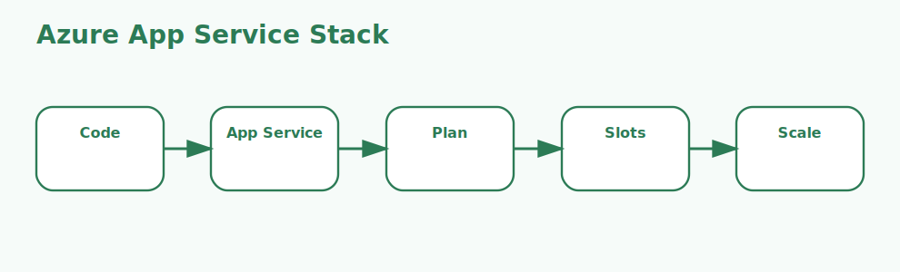

# Azure App Services and Cloud Services Interview Questions



This page focuses on managed Azure web hosting options and on how App Service differs from older Cloud Services hosting.

## 1. App Service

### 1. What is the role of App Service in Azure App Service and Cloud Services?

**Answer:**

In Azure App Service and Cloud Services, the term App Service refers to the managed hosting platform used for
web apps, APIs, and backend services. It is part of the foundation a candidate should be able to
explain clearly.

**Sample:**

```yaml
# Concept: 1. App Service
- name: Deploy App Service
  uses: azure/webapps-deploy@v2
  with:
    app-name: sample-app
    package: publish/
```

---

### 2. Why is the concept of App Service important in Azure App Service and Cloud Services?

**Answer:**

This concept matters because it influences the managed hosting platform used for web apps, APIs, and
backend services. Good interview answers connect it to clarity, maintainability, performance,
security, or delivery depending on the situation.

**Sample:**

```yaml
# Concept: 1. App Service
- name: Deploy App Service
  uses: azure/webapps-deploy@v2
  with:
    app-name: sample-app
    package: publish/
```

---

### 3. When should a team focus on App Service?

**Answer:**

A team should focus on App Service when the requirement depends on the managed hosting platform used
for web apps, APIs, and backend services. It becomes especially important when design decisions,
scaling choices, or debugging depend on that area.

**Sample:**

```yaml
# Concept: 1. App Service
- name: Deploy App Service
  uses: azure/webapps-deploy@v2
  with:
    app-name: sample-app
    package: publish/
```

---

### 4. How is App Service applied in practice?

**Answer:**

In practice, App Service is applied by making the managed hosting platform used for web apps, APIs,
and backend services explicit in the implementation or workflow. The exact shape depends on the
service design, but the responsibility should stay predictable.

**Sample:**

```yaml
# Concept: 1. App Service
- name: Deploy App Service
  uses: azure/webapps-deploy@v2
  with:
    app-name: sample-app
    package: publish/
```

---

### 5. What strengths does App Service bring?

**Answer:**

The strengths of App Service are better structure, better communication, and better control over the
managed hosting platform used for web apps, APIs, and backend services. It also makes tradeoffs
easier to explain to both interviewers and project stakeholders.

**Sample:**

```yaml
# Concept: 1. App Service
- name: Deploy App Service
  uses: azure/webapps-deploy@v2
  with:
    app-name: sample-app
    package: publish/
```

---

### 6. What tradeoffs come with App Service?

**Answer:**

The main tradeoff is extra complexity if App Service is introduced without a real need or a clear
understanding of the managed hosting platform used for web apps, APIs, and backend services. That
usually leads to higher cost, weaker design, or harder troubleshooting.

**Sample:**

```yaml
# Concept: 1. App Service
- name: Deploy App Service
  uses: azure/webapps-deploy@v2
  with:
    app-name: sample-app
    package: publish/
```

---

### 7. How does App Service differ from App Service Plan?

**Answer:**

App Service is centered on the managed hosting platform used for web apps, APIs, and backend
services, while App Service Plan is centered on the compute and pricing container that defines
scale, features, and cost for hosted apps. They often work together, but they solve different parts
of the topic.

**Sample:**

```yaml
# Concept: 1. App Service
- name: Deploy App Service
  uses: azure/webapps-deploy@v2
  with:
    app-name: sample-app
    package: publish/
```

---

### 8. What is a good real-world example of App Service?

**Answer:**

A strong example is explaining how App Service affects a real feature, cost decision, failure mode,
or architecture choice involving the managed hosting platform used for web apps, APIs, and backend
services. Interviewers usually value the reasoning behind the example.

**Sample:**

```yaml
# Concept: 1. App Service
- name: Deploy App Service
  uses: azure/webapps-deploy@v2
  with:
    app-name: sample-app
    package: publish/
```

---

### 9. What is a best practice for App Service?

**Answer:**

A good practice is to keep App Service aligned with the actual requirement around the managed
hosting platform used for web apps, APIs, and backend services. Teams should document intent, keep
the setup readable, and validate the most important paths early.

**Sample:**

```yaml
# Concept: 1. App Service
- name: Deploy App Service
  uses: azure/webapps-deploy@v2
  with:
    app-name: sample-app
    package: publish/
```

---

### 10. What is a common mistake around App Service?

**Answer:**

A common mistake is naming App Service without understanding how it affects the managed hosting
platform used for web apps, APIs, and backend services. In real work, that usually appears as weak
sizing, poor troubleshooting, or the wrong operational choice.

**Sample:**

```yaml
# Concept: 1. App Service
- name: Deploy App Service
  uses: azure/webapps-deploy@v2
  with:
    app-name: sample-app
    package: publish/
```

---

### 11. How do you troubleshoot App Service-related issues?

**Answer:**

When troubleshooting App Service, first verify whether the managed hosting platform used for web
apps, APIs, and backend services is behaving as expected. Then check dependencies, configuration,
metrics, logs, and edge cases before changing the design.

**Sample:**

```yaml
# Concept: 1. App Service
- name: Deploy App Service
  uses: azure/webapps-deploy@v2
  with:
    app-name: sample-app
    package: publish/
```

---

### 12. How does App Service connect to the rest of Azure App Service and Cloud Services?

**Answer:**

App Service connects to the rest of Azure App Service and Cloud Services by giving structure to the
managed hosting platform used for web apps, APIs, and backend services. It is one of the pieces that
turns isolated facts into a usable end-to-end mental model.

**Sample:**

```yaml
# Concept: 1. App Service
- name: Deploy App Service
  uses: azure/webapps-deploy@v2
  with:
    app-name: sample-app
    package: publish/
```

---

## 2. App Service Plan

### 13. What is the role of App Service Plan in Azure App Service and Cloud Services?

**Answer:**

In Azure App Service and Cloud Services, the term App Service Plan refers to the compute and pricing
container that defines scale, features, and cost for hosted apps. It is part of the foundation a
candidate should be able to explain clearly.

**Sample:**

```yaml
# Concept: 2. App Service Plan
- name: Deploy App Service
  uses: azure/webapps-deploy@v2
  with:
    app-name: sample-app
    package: publish/
```

---

### 14. Why is the concept of App Service Plan important in Azure App Service and Cloud Services?

**Answer:**

This concept matters because it influences the compute and pricing container that defines scale,
features, and cost for hosted apps. Good interview answers connect it to clarity, maintainability,
performance, security, or delivery depending on the situation.

**Sample:**

```yaml
# Concept: 2. App Service Plan
- name: Deploy App Service
  uses: azure/webapps-deploy@v2
  with:
    app-name: sample-app
    package: publish/
```

---

### 15. When should a team focus on App Service Plan?

**Answer:**

A team should focus on App Service Plan when the requirement depends on the compute and pricing
container that defines scale, features, and cost for hosted apps. It becomes especially important
when design decisions, scaling choices, or debugging depend on that area.

**Sample:**

```yaml
# Concept: 2. App Service Plan
- name: Deploy App Service
  uses: azure/webapps-deploy@v2
  with:
    app-name: sample-app
    package: publish/
```

---

### 16. How is App Service Plan applied in practice?

**Answer:**

In practice, App Service Plan is applied by making the compute and pricing container that defines
scale, features, and cost for hosted apps explicit in the implementation or workflow. The exact
shape depends on the service design, but the responsibility should stay predictable.

**Sample:**

```yaml
# Concept: 2. App Service Plan
- name: Deploy App Service
  uses: azure/webapps-deploy@v2
  with:
    app-name: sample-app
    package: publish/
```

---

### 17. What strengths does App Service Plan bring?

**Answer:**

The strengths of App Service Plan are better structure, better communication, and better control
over the compute and pricing container that defines scale, features, and cost for hosted apps. It
also makes tradeoffs easier to explain to both interviewers and project stakeholders.

**Sample:**

```yaml
# Concept: 2. App Service Plan
- name: Deploy App Service
  uses: azure/webapps-deploy@v2
  with:
    app-name: sample-app
    package: publish/
```

---

### 18. What tradeoffs come with App Service Plan?

**Answer:**

The main tradeoff is extra complexity if App Service Plan is introduced without a real need or a
clear understanding of the compute and pricing container that defines scale, features, and cost for
hosted apps. That usually leads to higher cost, weaker design, or harder troubleshooting.

**Sample:**

```yaml
# Concept: 2. App Service Plan
- name: Deploy App Service
  uses: azure/webapps-deploy@v2
  with:
    app-name: sample-app
    package: publish/
```

---

### 19. How does App Service Plan differ from Deployment slots?

**Answer:**

App Service Plan is centered on the compute and pricing container that defines scale, features, and
cost for hosted apps, while Deployment slots is centered on the staging environments that support
safer release validation and swap-based deployment. They often work together, but they solve
different parts of the topic.

**Sample:**

```yaml
# Concept: 2. App Service Plan
- name: Deploy App Service
  uses: azure/webapps-deploy@v2
  with:
    app-name: sample-app
    package: publish/
```

---

### 20. What is a good real-world example of App Service Plan?

**Answer:**

A strong example is explaining how App Service Plan affects a real feature, cost decision, failure
mode, or architecture choice involving the compute and pricing container that defines scale,
features, and cost for hosted apps. Interviewers usually value the reasoning behind the example.

**Sample:**

```yaml
# Concept: 2. App Service Plan
- name: Deploy App Service
  uses: azure/webapps-deploy@v2
  with:
    app-name: sample-app
    package: publish/
```

---

### 21. What is a best practice for App Service Plan?

**Answer:**

A good practice is to keep App Service Plan aligned with the actual requirement around the compute
and pricing container that defines scale, features, and cost for hosted apps. Teams should document
intent, keep the setup readable, and validate the most important paths early.

**Sample:**

```yaml
# Concept: 2. App Service Plan
- name: Deploy App Service
  uses: azure/webapps-deploy@v2
  with:
    app-name: sample-app
    package: publish/
```

---

### 22. What is a common mistake around App Service Plan?

**Answer:**

A common mistake is naming App Service Plan without understanding how it affects the compute and
pricing container that defines scale, features, and cost for hosted apps. In real work, that usually
appears as weak sizing, poor troubleshooting, or the wrong operational choice.

**Sample:**

```yaml
# Concept: 2. App Service Plan
- name: Deploy App Service
  uses: azure/webapps-deploy@v2
  with:
    app-name: sample-app
    package: publish/
```

---

### 23. How do you troubleshoot App Service Plan-related issues?

**Answer:**

When troubleshooting App Service Plan, first verify whether the compute and pricing container that
defines scale, features, and cost for hosted apps is behaving as expected. Then check dependencies,
configuration, metrics, logs, and edge cases before changing the design.

**Sample:**

```yaml
# Concept: 2. App Service Plan
- name: Deploy App Service
  uses: azure/webapps-deploy@v2
  with:
    app-name: sample-app
    package: publish/
```

---

### 24. How does App Service Plan connect to the rest of Azure App Service and Cloud Services?

**Answer:**

App Service Plan connects to the rest of Azure App Service and Cloud Services by giving structure to
the compute and pricing container that defines scale, features, and cost for hosted apps. It is one
of the pieces that turns isolated facts into a usable end-to-end mental model.

**Sample:**

```yaml
# Concept: 2. App Service Plan
- name: Deploy App Service
  uses: azure/webapps-deploy@v2
  with:
    app-name: sample-app
    package: publish/
```

---

## 3. Deployment slots

### 25. What is the role of Deployment slots in Azure App Service and Cloud Services?

**Answer:**

In Azure App Service and Cloud Services, the term Deployment slots refers to the staging environments that
support safer release validation and swap-based deployment. It is part of the foundation a candidate
should be able to explain clearly.

**Sample:**

```yaml
# Concept: 3. Deployment slots
- name: Deploy App Service
  uses: azure/webapps-deploy@v2
  with:
    app-name: sample-app
    package: publish/
```

---

### 26. Why is the concept of Deployment slots important in Azure App Service and Cloud Services?

**Answer:**

This concept matters because it influences the staging environments that support safer release
validation and swap-based deployment. Good interview answers connect it to clarity, maintainability,
performance, security, or delivery depending on the situation.

**Sample:**

```yaml
# Concept: 3. Deployment slots
- name: Deploy App Service
  uses: azure/webapps-deploy@v2
  with:
    app-name: sample-app
    package: publish/
```

---

### 27. When should a team focus on Deployment slots?

**Answer:**

A team should focus on Deployment slots when the requirement depends on the staging environments
that support safer release validation and swap-based deployment. It becomes especially important
when design decisions, scaling choices, or debugging depend on that area.

**Sample:**

```yaml
# Concept: 3. Deployment slots
- name: Deploy App Service
  uses: azure/webapps-deploy@v2
  with:
    app-name: sample-app
    package: publish/
```

---

### 28. How is Deployment slots applied in practice?

**Answer:**

In practice, Deployment slots is applied by making the staging environments that support safer
release validation and swap-based deployment explicit in the implementation or workflow. The exact
shape depends on the service design, but the responsibility should stay predictable.

**Sample:**

```yaml
# Concept: 3. Deployment slots
- name: Deploy App Service
  uses: azure/webapps-deploy@v2
  with:
    app-name: sample-app
    package: publish/
```

---

### 29. What strengths does Deployment slots bring?

**Answer:**

The strengths of Deployment slots are better structure, better communication, and better control
over the staging environments that support safer release validation and swap-based deployment. It
also makes tradeoffs easier to explain to both interviewers and project stakeholders.

**Sample:**

```yaml
# Concept: 3. Deployment slots
- name: Deploy App Service
  uses: azure/webapps-deploy@v2
  with:
    app-name: sample-app
    package: publish/
```

---

### 30. What tradeoffs come with Deployment slots?

**Answer:**

The main tradeoff is extra complexity if Deployment slots is introduced without a real need or a
clear understanding of the staging environments that support safer release validation and swap-based
deployment. That usually leads to higher cost, weaker design, or harder troubleshooting.

**Sample:**

```yaml
# Concept: 3. Deployment slots
- name: Deploy App Service
  uses: azure/webapps-deploy@v2
  with:
    app-name: sample-app
    package: publish/
```

---

### 31. How does Deployment slots differ from Autoscaling?

**Answer:**

Deployment slots is centered on the staging environments that support safer release validation and
swap-based deployment, while Autoscaling is centered on the automated scaling behavior used to react
to traffic or scheduled demand changes. They often work together, but they solve different parts of
the topic.

**Sample:**

```yaml
# Concept: 3. Deployment slots
- name: Deploy App Service
  uses: azure/webapps-deploy@v2
  with:
    app-name: sample-app
    package: publish/
```

---

### 32. What is a good real-world example of Deployment slots?

**Answer:**

A strong example is explaining how Deployment slots affects a real feature, cost decision, failure
mode, or architecture choice involving the staging environments that support safer release
validation and swap-based deployment. Interviewers usually value the reasoning behind the example.

**Sample:**

```yaml
# Concept: 3. Deployment slots
- name: Deploy App Service
  uses: azure/webapps-deploy@v2
  with:
    app-name: sample-app
    package: publish/
```

---

### 33. What is a best practice for Deployment slots?

**Answer:**

A good practice is to keep Deployment slots aligned with the actual requirement around the staging
environments that support safer release validation and swap-based deployment. Teams should document
intent, keep the setup readable, and validate the most important paths early.

**Sample:**

```yaml
# Concept: 3. Deployment slots
- name: Deploy App Service
  uses: azure/webapps-deploy@v2
  with:
    app-name: sample-app
    package: publish/
```

---

### 34. What is a common mistake around Deployment slots?

**Answer:**

A common mistake is naming Deployment slots without understanding how it affects the staging
environments that support safer release validation and swap-based deployment. In real work, that
usually appears as weak sizing, poor troubleshooting, or the wrong operational choice.

**Sample:**

```yaml
# Concept: 3. Deployment slots
- name: Deploy App Service
  uses: azure/webapps-deploy@v2
  with:
    app-name: sample-app
    package: publish/
```

---

### 35. How do you troubleshoot Deployment slots-related issues?

**Answer:**

When troubleshooting Deployment slots, first verify whether the staging environments that support
safer release validation and swap-based deployment is behaving as expected. Then check dependencies,
configuration, metrics, logs, and edge cases before changing the design.

**Sample:**

```yaml
# Concept: 3. Deployment slots
- name: Deploy App Service
  uses: azure/webapps-deploy@v2
  with:
    app-name: sample-app
    package: publish/
```

---

### 36. How does Deployment slots connect to the rest of Azure App Service and Cloud Services?

**Answer:**

Deployment slots connects to the rest of Azure App Service and Cloud Services by giving structure to
the staging environments that support safer release validation and swap-based deployment. It is one
of the pieces that turns isolated facts into a usable end-to-end mental model.

**Sample:**

```yaml
# Concept: 3. Deployment slots
- name: Deploy App Service
  uses: azure/webapps-deploy@v2
  with:
    app-name: sample-app
    package: publish/
```

---

## 4. Autoscaling

### 37. What is the role of Autoscaling in Azure App Service and Cloud Services?

**Answer:**

In Azure App Service and Cloud Services, the term Autoscaling refers to the automated scaling behavior used
to react to traffic or scheduled demand changes. It is part of the foundation a candidate should be
able to explain clearly.

**Sample:**

```yaml
# Concept: 4. Autoscaling
- name: Deploy App Service
  uses: azure/webapps-deploy@v2
  with:
    app-name: sample-app
    package: publish/
```

---

### 38. Why is the concept of Autoscaling important in Azure App Service and Cloud Services?

**Answer:**

This concept matters because it influences the automated scaling behavior used to react to traffic or
scheduled demand changes. Good interview answers connect it to clarity, maintainability,
performance, security, or delivery depending on the situation.

**Sample:**

```yaml
# Concept: 4. Autoscaling
- name: Deploy App Service
  uses: azure/webapps-deploy@v2
  with:
    app-name: sample-app
    package: publish/
```

---

### 39. When should a team focus on Autoscaling?

**Answer:**

A team should focus on Autoscaling when the requirement depends on the automated scaling behavior
used to react to traffic or scheduled demand changes. It becomes especially important when design
decisions, scaling choices, or debugging depend on that area.

**Sample:**

```yaml
# Concept: 4. Autoscaling
- name: Deploy App Service
  uses: azure/webapps-deploy@v2
  with:
    app-name: sample-app
    package: publish/
```

---

### 40. How is Autoscaling applied in practice?

**Answer:**

In practice, Autoscaling is applied by making the automated scaling behavior used to react to
traffic or scheduled demand changes explicit in the implementation or workflow. The exact shape
depends on the service design, but the responsibility should stay predictable.

**Sample:**

```yaml
# Concept: 4. Autoscaling
- name: Deploy App Service
  uses: azure/webapps-deploy@v2
  with:
    app-name: sample-app
    package: publish/
```

---

### 41. What strengths does Autoscaling bring?

**Answer:**

The strengths of Autoscaling are better structure, better communication, and better control over the
automated scaling behavior used to react to traffic or scheduled demand changes. It also makes
tradeoffs easier to explain to both interviewers and project stakeholders.

**Sample:**

```yaml
# Concept: 4. Autoscaling
- name: Deploy App Service
  uses: azure/webapps-deploy@v2
  with:
    app-name: sample-app
    package: publish/
```

---

### 42. What tradeoffs come with Autoscaling?

**Answer:**

The main tradeoff is extra complexity if Autoscaling is introduced without a real need or a clear
understanding of the automated scaling behavior used to react to traffic or scheduled demand
changes. That usually leads to higher cost, weaker design, or harder troubleshooting.

**Sample:**

```yaml
# Concept: 4. Autoscaling
- name: Deploy App Service
  uses: azure/webapps-deploy@v2
  with:
    app-name: sample-app
    package: publish/
```

---

### 43. How does Autoscaling differ from Authentication and identity?

**Answer:**

Autoscaling is centered on the automated scaling behavior used to react to traffic or scheduled
demand changes, while Authentication and identity is centered on the built-in and integrated
security capabilities used by hosted applications. They often work together, but they solve
different parts of the topic.

**Sample:**

```yaml
# Concept: 4. Autoscaling
- name: Deploy App Service
  uses: azure/webapps-deploy@v2
  with:
    app-name: sample-app
    package: publish/
```

---

### 44. What is a good real-world example of Autoscaling?

**Answer:**

A strong example is explaining how Autoscaling affects a real feature, cost decision, failure mode,
or architecture choice involving the automated scaling behavior used to react to traffic or
scheduled demand changes. Interviewers usually value the reasoning behind the example.

**Sample:**

```yaml
# Concept: 4. Autoscaling
- name: Deploy App Service
  uses: azure/webapps-deploy@v2
  with:
    app-name: sample-app
    package: publish/
```

---

### 45. What is a best practice for Autoscaling?

**Answer:**

A good practice is to keep Autoscaling aligned with the actual requirement around the automated
scaling behavior used to react to traffic or scheduled demand changes. Teams should document intent,
keep the setup readable, and validate the most important paths early.

**Sample:**

```yaml
# Concept: 4. Autoscaling
- name: Deploy App Service
  uses: azure/webapps-deploy@v2
  with:
    app-name: sample-app
    package: publish/
```

---

### 46. What is a common mistake around Autoscaling?

**Answer:**

A common mistake is naming Autoscaling without understanding how it affects the automated scaling
behavior used to react to traffic or scheduled demand changes. In real work, that usually appears as
weak sizing, poor troubleshooting, or the wrong operational choice.

**Sample:**

```yaml
# Concept: 4. Autoscaling
- name: Deploy App Service
  uses: azure/webapps-deploy@v2
  with:
    app-name: sample-app
    package: publish/
```

---

### 47. How do you troubleshoot Autoscaling-related issues?

**Answer:**

When troubleshooting Autoscaling, first verify whether the automated scaling behavior used to react
to traffic or scheduled demand changes is behaving as expected. Then check dependencies,
configuration, metrics, logs, and edge cases before changing the design.

**Sample:**

```yaml
# Concept: 4. Autoscaling
- name: Deploy App Service
  uses: azure/webapps-deploy@v2
  with:
    app-name: sample-app
    package: publish/
```

---

### 48. How does Autoscaling connect to the rest of Azure App Service and Cloud Services?

**Answer:**

Autoscaling connects to the rest of Azure App Service and Cloud Services by giving structure to the
automated scaling behavior used to react to traffic or scheduled demand changes. It is one of the
pieces that turns isolated facts into a usable end-to-end mental model.

**Sample:**

```yaml
# Concept: 4. Autoscaling
- name: Deploy App Service
  uses: azure/webapps-deploy@v2
  with:
    app-name: sample-app
    package: publish/
```

---

## 5. Authentication and identity

### 49. What is the role of Authentication and identity in Azure App Service and Cloud Services?

**Answer:**

In Azure App Service and Cloud Services, the term Authentication and identity refers to the built-in and
integrated security capabilities used by hosted applications. It is part of the foundation a
candidate should be able to explain clearly.

**Sample:**

```yaml
# Concept: 5. Authentication and identity
- name: Deploy App Service
  uses: azure/webapps-deploy@v2
  with:
    app-name: sample-app
    package: publish/
```

---

### 50. Why is the concept of Authentication and identity important in Azure App Service and Cloud Services?

**Answer:**

This concept matters because it influences the built-in and integrated security
capabilities used by hosted applications. Good interview answers connect it to clarity,
maintainability, performance, security, or delivery depending on the situation.

**Sample:**

```yaml
# Concept: 5. Authentication and identity
- name: Deploy App Service
  uses: azure/webapps-deploy@v2
  with:
    app-name: sample-app
    package: publish/
```

---

### 51. When should a team focus on Authentication and identity?

**Answer:**

A team should focus on Authentication and identity when the requirement depends on the built-in and
integrated security capabilities used by hosted applications. It becomes especially important when
design decisions, scaling choices, or debugging depend on that area.

**Sample:**

```yaml
# Concept: 5. Authentication and identity
- name: Deploy App Service
  uses: azure/webapps-deploy@v2
  with:
    app-name: sample-app
    package: publish/
```

---

### 52. How is Authentication and identity applied in practice?

**Answer:**

In practice, Authentication and identity is applied by making the built-in and integrated security
capabilities used by hosted applications explicit in the implementation or workflow. The exact shape
depends on the service design, but the responsibility should stay predictable.

**Sample:**

```yaml
# Concept: 5. Authentication and identity
- name: Deploy App Service
  uses: azure/webapps-deploy@v2
  with:
    app-name: sample-app
    package: publish/
```

---

### 53. What strengths does Authentication and identity bring?

**Answer:**

The strengths of Authentication and identity are better structure, better communication, and better
control over the built-in and integrated security capabilities used by hosted applications. It also
makes tradeoffs easier to explain to both interviewers and project stakeholders.

**Sample:**

```yaml
# Concept: 5. Authentication and identity
- name: Deploy App Service
  uses: azure/webapps-deploy@v2
  with:
    app-name: sample-app
    package: publish/
```

---

### 54. What tradeoffs come with Authentication and identity?

**Answer:**

The main tradeoff is extra complexity if Authentication and identity is introduced without a real
need or a clear understanding of the built-in and integrated security capabilities used by hosted
applications. That usually leads to higher cost, weaker design, or harder troubleshooting.

**Sample:**

```yaml
# Concept: 5. Authentication and identity
- name: Deploy App Service
  uses: azure/webapps-deploy@v2
  with:
    app-name: sample-app
    package: publish/
```

---

### 55. How does Authentication and identity differ from Custom domains and SSL?

**Answer:**

Authentication and identity is centered on the built-in and integrated security capabilities used by
hosted applications, while Custom domains and SSL is centered on the production-facing networking
and certificate features used for application exposure. They often work together, but they solve
different parts of the topic.

**Sample:**

```yaml
# Concept: 5. Authentication and identity
- name: Deploy App Service
  uses: azure/webapps-deploy@v2
  with:
    app-name: sample-app
    package: publish/
```

---

### 56. What is a good real-world example of Authentication and identity?

**Answer:**

A strong example is explaining how Authentication and identity affects a real feature, cost
decision, failure mode, or architecture choice involving the built-in and integrated security
capabilities used by hosted applications. Interviewers usually value the reasoning behind the
example.

**Sample:**

```yaml
# Concept: 5. Authentication and identity
- name: Deploy App Service
  uses: azure/webapps-deploy@v2
  with:
    app-name: sample-app
    package: publish/
```

---

### 57. What is a best practice for Authentication and identity?

**Answer:**

A good practice is to keep Authentication and identity aligned with the actual requirement around
the built-in and integrated security capabilities used by hosted applications. Teams should document
intent, keep the setup readable, and validate the most important paths early.

**Sample:**

```yaml
# Concept: 5. Authentication and identity
- name: Deploy App Service
  uses: azure/webapps-deploy@v2
  with:
    app-name: sample-app
    package: publish/
```

---

### 58. What is a common mistake around Authentication and identity?

**Answer:**

A common mistake is naming Authentication and identity without understanding how it affects the
built-in and integrated security capabilities used by hosted applications. In real work, that
usually appears as weak sizing, poor troubleshooting, or the wrong operational choice.

**Sample:**

```yaml
# Concept: 5. Authentication and identity
- name: Deploy App Service
  uses: azure/webapps-deploy@v2
  with:
    app-name: sample-app
    package: publish/
```

---

### 59. How do you troubleshoot Authentication and identity-related issues?

**Answer:**

When troubleshooting Authentication and identity, first verify whether the built-in and integrated
security capabilities used by hosted applications is behaving as expected. Then check dependencies,
configuration, metrics, logs, and edge cases before changing the design.

**Sample:**

```yaml
# Concept: 5. Authentication and identity
- name: Deploy App Service
  uses: azure/webapps-deploy@v2
  with:
    app-name: sample-app
    package: publish/
```

---

### 60. How does Authentication and identity connect to the rest of Azure App Service and Cloud Services?

**Answer:**

Authentication and identity connects to the rest of Azure App Service and Cloud Services by giving
structure to the built-in and integrated security capabilities used by hosted applications. It is
one of the pieces that turns isolated facts into a usable end-to-end mental model.

**Sample:**

```yaml
# Concept: 5. Authentication and identity
- name: Deploy App Service
  uses: azure/webapps-deploy@v2
  with:
    app-name: sample-app
    package: publish/
```

---

## 6. Custom domains and SSL

### 61. What is the role of Custom domains and SSL in Azure App Service and Cloud Services?

**Answer:**

In Azure App Service and Cloud Services, the term Custom domains and SSL refers to the production-facing
networking and certificate features used for application exposure. It is part of the foundation a
candidate should be able to explain clearly.

**Sample:**

```yaml
# Concept: 6. Custom domains and SSL
- name: Deploy App Service
  uses: azure/webapps-deploy@v2
  with:
    app-name: sample-app
    package: publish/
```

---

### 62. Why is the concept of Custom domains and SSL important in Azure App Service and Cloud Services?

**Answer:**

This concept matters because it influences the production-facing networking and
certificate features used for application exposure. Good interview answers connect it to clarity,
maintainability, performance, security, or delivery depending on the situation.

**Sample:**

```yaml
# Concept: 6. Custom domains and SSL
- name: Deploy App Service
  uses: azure/webapps-deploy@v2
  with:
    app-name: sample-app
    package: publish/
```

---

### 63. When should a team focus on Custom domains and SSL?

**Answer:**

A team should focus on Custom domains and SSL when the requirement depends on the production-facing
networking and certificate features used for application exposure. It becomes especially important
when design decisions, scaling choices, or debugging depend on that area.

**Sample:**

```yaml
# Concept: 6. Custom domains and SSL
- name: Deploy App Service
  uses: azure/webapps-deploy@v2
  with:
    app-name: sample-app
    package: publish/
```

---

### 64. How is Custom domains and SSL applied in practice?

**Answer:**

In practice, Custom domains and SSL is applied by making the production-facing networking and
certificate features used for application exposure explicit in the implementation or workflow. The
exact shape depends on the service design, but the responsibility should stay predictable.

**Sample:**

```yaml
# Concept: 6. Custom domains and SSL
- name: Deploy App Service
  uses: azure/webapps-deploy@v2
  with:
    app-name: sample-app
    package: publish/
```

---

### 65. What strengths does Custom domains and SSL bring?

**Answer:**

The strengths of Custom domains and SSL are better structure, better communication, and better
control over the production-facing networking and certificate features used for application
exposure. It also makes tradeoffs easier to explain to both interviewers and project stakeholders.

**Sample:**

```yaml
# Concept: 6. Custom domains and SSL
- name: Deploy App Service
  uses: azure/webapps-deploy@v2
  with:
    app-name: sample-app
    package: publish/
```

---

### 66. What tradeoffs come with Custom domains and SSL?

**Answer:**

The main tradeoff is extra complexity if Custom domains and SSL is introduced without a real need or
a clear understanding of the production-facing networking and certificate features used for
application exposure. That usually leads to higher cost, weaker design, or harder troubleshooting.

**Sample:**

```yaml
# Concept: 6. Custom domains and SSL
- name: Deploy App Service
  uses: azure/webapps-deploy@v2
  with:
    app-name: sample-app
    package: publish/
```

---

### 67. How does Custom domains and SSL differ from Cloud Services legacy model?

**Answer:**

Custom domains and SSL is centered on the production-facing networking and certificate features used
for application exposure, while Cloud Services legacy model is centered on the older Azure hosting
approach based on web roles and worker roles. They often work together, but they solve different
parts of the topic.

**Sample:**

```yaml
# Concept: 6. Custom domains and SSL
- name: Deploy App Service
  uses: azure/webapps-deploy@v2
  with:
    app-name: sample-app
    package: publish/
```

---

### 68. What is a good real-world example of Custom domains and SSL?

**Answer:**

A strong example is explaining how Custom domains and SSL affects a real feature, cost decision,
failure mode, or architecture choice involving the production-facing networking and certificate
features used for application exposure. Interviewers usually value the reasoning behind the example.

**Sample:**

```yaml
# Concept: 6. Custom domains and SSL
- name: Deploy App Service
  uses: azure/webapps-deploy@v2
  with:
    app-name: sample-app
    package: publish/
```

---

### 69. What is a best practice for Custom domains and SSL?

**Answer:**

A good practice is to keep Custom domains and SSL aligned with the actual requirement around the
production-facing networking and certificate features used for application exposure. Teams should
document intent, keep the setup readable, and validate the most important paths early.

**Sample:**

```yaml
# Concept: 6. Custom domains and SSL
- name: Deploy App Service
  uses: azure/webapps-deploy@v2
  with:
    app-name: sample-app
    package: publish/
```

---

### 70. What is a common mistake around Custom domains and SSL?

**Answer:**

A common mistake is naming Custom domains and SSL without understanding how it affects the
production-facing networking and certificate features used for application exposure. In real work,
that usually appears as weak sizing, poor troubleshooting, or the wrong operational choice.

**Sample:**

```yaml
# Concept: 6. Custom domains and SSL
- name: Deploy App Service
  uses: azure/webapps-deploy@v2
  with:
    app-name: sample-app
    package: publish/
```

---

### 71. How do you troubleshoot Custom domains and SSL-related issues?

**Answer:**

When troubleshooting Custom domains and SSL, first verify whether the production-facing networking
and certificate features used for application exposure is behaving as expected. Then check
dependencies, configuration, metrics, logs, and edge cases before changing the design.

**Sample:**

```yaml
# Concept: 6. Custom domains and SSL
- name: Deploy App Service
  uses: azure/webapps-deploy@v2
  with:
    app-name: sample-app
    package: publish/
```

---

### 72. How does Custom domains and SSL connect to the rest of Azure App Service and Cloud Services?

**Answer:**

Custom domains and SSL connects to the rest of Azure App Service and Cloud Services by giving
structure to the production-facing networking and certificate features used for application
exposure. It is one of the pieces that turns isolated facts into a usable end-to-end mental model.

**Sample:**

```yaml
# Concept: 6. Custom domains and SSL
- name: Deploy App Service
  uses: azure/webapps-deploy@v2
  with:
    app-name: sample-app
    package: publish/
```

---

## 7. Cloud Services legacy model

### 73. What is the role of Cloud Services legacy model in Azure App Service and Cloud Services?

**Answer:**

In Azure App Service and Cloud Services, the term Cloud Services legacy model refers to the older Azure
hosting approach based on web roles and worker roles. It is part of the foundation a candidate
should be able to explain clearly.

**Sample:**

```yaml
# Concept: 7. Cloud Services legacy model
- name: Deploy App Service
  uses: azure/webapps-deploy@v2
  with:
    app-name: sample-app
    package: publish/
```

---

### 74. Why is the concept of Cloud Services legacy model important in Azure App Service and Cloud Services?

**Answer:**

This concept matters because it influences the older Azure hosting approach based on
web roles and worker roles. Good interview answers connect it to clarity, maintainability,
performance, security, or delivery depending on the situation.

**Sample:**

```yaml
# Concept: 7. Cloud Services legacy model
- name: Deploy App Service
  uses: azure/webapps-deploy@v2
  with:
    app-name: sample-app
    package: publish/
```

---

### 75. When should a team focus on Cloud Services legacy model?

**Answer:**

A team should focus on Cloud Services legacy model when the requirement depends on the older Azure
hosting approach based on web roles and worker roles. It becomes especially important when design
decisions, scaling choices, or debugging depend on that area.

**Sample:**

```yaml
# Concept: 7. Cloud Services legacy model
- name: Deploy App Service
  uses: azure/webapps-deploy@v2
  with:
    app-name: sample-app
    package: publish/
```

---

### 76. How is Cloud Services legacy model applied in practice?

**Answer:**

In practice, Cloud Services legacy model is applied by making the older Azure hosting approach based
on web roles and worker roles explicit in the implementation or workflow. The exact shape depends on
the service design, but the responsibility should stay predictable.

**Sample:**

```yaml
# Concept: 7. Cloud Services legacy model
- name: Deploy App Service
  uses: azure/webapps-deploy@v2
  with:
    app-name: sample-app
    package: publish/
```

---

### 77. What strengths does Cloud Services legacy model bring?

**Answer:**

The strengths of Cloud Services legacy model are better structure, better communication, and better
control over the older Azure hosting approach based on web roles and worker roles. It also makes
tradeoffs easier to explain to both interviewers and project stakeholders.

**Sample:**

```yaml
# Concept: 7. Cloud Services legacy model
- name: Deploy App Service
  uses: azure/webapps-deploy@v2
  with:
    app-name: sample-app
    package: publish/
```

---

### 78. What tradeoffs come with Cloud Services legacy model?

**Answer:**

The main tradeoff is extra complexity if Cloud Services legacy model is introduced without a real
need or a clear understanding of the older Azure hosting approach based on web roles and worker
roles. That usually leads to higher cost, weaker design, or harder troubleshooting.

**Sample:**

```yaml
# Concept: 7. Cloud Services legacy model
- name: Deploy App Service
  uses: azure/webapps-deploy@v2
  with:
    app-name: sample-app
    package: publish/
```

---

### 79. How does Cloud Services legacy model differ from Web roles and worker roles?

**Answer:**

Cloud Services legacy model is centered on the older Azure hosting approach based on web roles and
worker roles, while Web roles and worker roles is centered on the execution roles used in the older
Cloud Services deployment model. They often work together, but they solve different parts of the
topic.

**Sample:**

```yaml
# Concept: 7. Cloud Services legacy model
- name: Deploy App Service
  uses: azure/webapps-deploy@v2
  with:
    app-name: sample-app
    package: publish/
```

---

### 80. What is a good real-world example of Cloud Services legacy model?

**Answer:**

A strong example is explaining how Cloud Services legacy model affects a real feature, cost
decision, failure mode, or architecture choice involving the older Azure hosting approach based on
web roles and worker roles. Interviewers usually value the reasoning behind the example.

**Sample:**

```yaml
# Concept: 7. Cloud Services legacy model
- name: Deploy App Service
  uses: azure/webapps-deploy@v2
  with:
    app-name: sample-app
    package: publish/
```

---

### 81. What is a best practice for Cloud Services legacy model?

**Answer:**

A good practice is to keep Cloud Services legacy model aligned with the actual requirement around
the older Azure hosting approach based on web roles and worker roles. Teams should document intent,
keep the setup readable, and validate the most important paths early.

**Sample:**

```yaml
# Concept: 7. Cloud Services legacy model
- name: Deploy App Service
  uses: azure/webapps-deploy@v2
  with:
    app-name: sample-app
    package: publish/
```

---

### 82. What is a common mistake around Cloud Services legacy model?

**Answer:**

A common mistake is naming Cloud Services legacy model without understanding how it affects the
older Azure hosting approach based on web roles and worker roles. In real work, that usually appears
as weak sizing, poor troubleshooting, or the wrong operational choice.

**Sample:**

```yaml
# Concept: 7. Cloud Services legacy model
- name: Deploy App Service
  uses: azure/webapps-deploy@v2
  with:
    app-name: sample-app
    package: publish/
```

---

### 83. How do you troubleshoot Cloud Services legacy model-related issues?

**Answer:**

When troubleshooting Cloud Services legacy model, first verify whether the older Azure hosting
approach based on web roles and worker roles is behaving as expected. Then check dependencies,
configuration, metrics, logs, and edge cases before changing the design.

**Sample:**

```yaml
# Concept: 7. Cloud Services legacy model
- name: Deploy App Service
  uses: azure/webapps-deploy@v2
  with:
    app-name: sample-app
    package: publish/
```

---

### 84. How does Cloud Services legacy model connect to the rest of Azure App Service and Cloud Services?

**Answer:**

Cloud Services legacy model connects to the rest of Azure App Service and Cloud Services by giving
structure to the older Azure hosting approach based on web roles and worker roles. It is one of the
pieces that turns isolated facts into a usable end-to-end mental model.

**Sample:**

```yaml
# Concept: 7. Cloud Services legacy model
- name: Deploy App Service
  uses: azure/webapps-deploy@v2
  with:
    app-name: sample-app
    package: publish/
```

---

## 8. Web roles and worker roles

### 85. What is the role of Web roles and worker roles in Azure App Service and Cloud Services?

**Answer:**

In Azure App Service and Cloud Services, the term Web roles and worker roles refers to the execution roles
used in the older Cloud Services deployment model. It is part of the foundation a candidate should
be able to explain clearly.

**Sample:**

```yaml
# Concept: 8. Web roles and worker roles
- name: Deploy App Service
  uses: azure/webapps-deploy@v2
  with:
    app-name: sample-app
    package: publish/
```

---

### 86. Why is the concept of Web roles and worker roles important in Azure App Service and Cloud Services?

**Answer:**

This concept matters because it influences the execution roles used in the older Cloud
Services deployment model. Good interview answers connect it to clarity, maintainability,
performance, security, or delivery depending on the situation.

**Sample:**

```yaml
# Concept: 8. Web roles and worker roles
- name: Deploy App Service
  uses: azure/webapps-deploy@v2
  with:
    app-name: sample-app
    package: publish/
```

---

### 87. When should a team focus on Web roles and worker roles?

**Answer:**

A team should focus on Web roles and worker roles when the requirement depends on the execution
roles used in the older Cloud Services deployment model. It becomes especially important when design
decisions, scaling choices, or debugging depend on that area.

**Sample:**

```yaml
# Concept: 8. Web roles and worker roles
- name: Deploy App Service
  uses: azure/webapps-deploy@v2
  with:
    app-name: sample-app
    package: publish/
```

---

### 88. How is Web roles and worker roles applied in practice?

**Answer:**

In practice, Web roles and worker roles is applied by making the execution roles used in the older
Cloud Services deployment model explicit in the implementation or workflow. The exact shape depends
on the service design, but the responsibility should stay predictable.

**Sample:**

```yaml
# Concept: 8. Web roles and worker roles
- name: Deploy App Service
  uses: azure/webapps-deploy@v2
  with:
    app-name: sample-app
    package: publish/
```

---

### 89. What strengths does Web roles and worker roles bring?

**Answer:**

The strengths of Web roles and worker roles are better structure, better communication, and better
control over the execution roles used in the older Cloud Services deployment model. It also makes
tradeoffs easier to explain to both interviewers and project stakeholders.

**Sample:**

```yaml
# Concept: 8. Web roles and worker roles
- name: Deploy App Service
  uses: azure/webapps-deploy@v2
  with:
    app-name: sample-app
    package: publish/
```

---

### 90. What tradeoffs come with Web roles and worker roles?

**Answer:**

The main tradeoff is extra complexity if Web roles and worker roles is introduced without a real
need or a clear understanding of the execution roles used in the older Cloud Services deployment
model. That usually leads to higher cost, weaker design, or harder troubleshooting.

**Sample:**

```yaml
# Concept: 8. Web roles and worker roles
- name: Deploy App Service
  uses: azure/webapps-deploy@v2
  with:
    app-name: sample-app
    package: publish/
```

---

### 91. How does Web roles and worker roles differ from Deployment pipelines?

**Answer:**

Web roles and worker roles is centered on the execution roles used in the older Cloud Services
deployment model, while Deployment pipelines is centered on the automation used to package, release,
and validate App Service applications. They often work together, but they solve different parts of
the topic.

**Sample:**

```yaml
# Concept: 8. Web roles and worker roles
- name: Deploy App Service
  uses: azure/webapps-deploy@v2
  with:
    app-name: sample-app
    package: publish/
```

---

### 92. What is a good real-world example of Web roles and worker roles?

**Answer:**

A strong example is explaining how Web roles and worker roles affects a real feature, cost decision,
failure mode, or architecture choice involving the execution roles used in the older Cloud Services
deployment model. Interviewers usually value the reasoning behind the example.

**Sample:**

```yaml
# Concept: 8. Web roles and worker roles
- name: Deploy App Service
  uses: azure/webapps-deploy@v2
  with:
    app-name: sample-app
    package: publish/
```

---

### 93. What is a best practice for Web roles and worker roles?

**Answer:**

A good practice is to keep Web roles and worker roles aligned with the actual requirement around the
execution roles used in the older Cloud Services deployment model. Teams should document intent,
keep the setup readable, and validate the most important paths early.

**Sample:**

```yaml
# Concept: 8. Web roles and worker roles
- name: Deploy App Service
  uses: azure/webapps-deploy@v2
  with:
    app-name: sample-app
    package: publish/
```

---

### 94. What is a common mistake around Web roles and worker roles?

**Answer:**

A common mistake is naming Web roles and worker roles without understanding how it affects the
execution roles used in the older Cloud Services deployment model. In real work, that usually
appears as weak sizing, poor troubleshooting, or the wrong operational choice.

**Sample:**

```yaml
# Concept: 8. Web roles and worker roles
- name: Deploy App Service
  uses: azure/webapps-deploy@v2
  with:
    app-name: sample-app
    package: publish/
```

---

### 95. How do you troubleshoot Web roles and worker roles-related issues?

**Answer:**

When troubleshooting Web roles and worker roles, first verify whether the execution roles used in
the older Cloud Services deployment model is behaving as expected. Then check dependencies,
configuration, metrics, logs, and edge cases before changing the design.

**Sample:**

```yaml
# Concept: 8. Web roles and worker roles
- name: Deploy App Service
  uses: azure/webapps-deploy@v2
  with:
    app-name: sample-app
    package: publish/
```

---

### 96. How does Web roles and worker roles connect to the rest of Azure App Service and Cloud Services?

**Answer:**

Web roles and worker roles connects to the rest of Azure App Service and Cloud Services by giving
structure to the execution roles used in the older Cloud Services deployment model. It is one of the
pieces that turns isolated facts into a usable end-to-end mental model.

**Sample:**

```yaml
# Concept: 8. Web roles and worker roles
- name: Deploy App Service
  uses: azure/webapps-deploy@v2
  with:
    app-name: sample-app
    package: publish/
```

---

## 9. Deployment pipelines

### 97. What is the role of Deployment pipelines in Azure App Service and Cloud Services?

**Answer:**

In Azure App Service and Cloud Services, the term Deployment pipelines refers to the automation used to
package, release, and validate App Service applications. It is part of the foundation a candidate
should be able to explain clearly.

**Sample:**

```yaml
# Concept: 9. Deployment pipelines
- name: Deploy App Service
  uses: azure/webapps-deploy@v2
  with:
    app-name: sample-app
    package: publish/
```

---

### 98. Why is the concept of Deployment pipelines important in Azure App Service and Cloud Services?

**Answer:**

This concept matters because it influences the automation used to package, release, and
validate App Service applications. Good interview answers connect it to clarity, maintainability,
performance, security, or delivery depending on the situation.

**Sample:**

```yaml
# Concept: 9. Deployment pipelines
- name: Deploy App Service
  uses: azure/webapps-deploy@v2
  with:
    app-name: sample-app
    package: publish/
```

---

### 99. When should a team focus on Deployment pipelines?

**Answer:**

A team should focus on Deployment pipelines when the requirement depends on the automation used to
package, release, and validate App Service applications. It becomes especially important when design
decisions, scaling choices, or debugging depend on that area.

**Sample:**

```yaml
# Concept: 9. Deployment pipelines
- name: Deploy App Service
  uses: azure/webapps-deploy@v2
  with:
    app-name: sample-app
    package: publish/
```

---

### 100. How is Deployment pipelines applied in practice?

**Answer:**

In practice, Deployment pipelines is applied by making the automation used to package, release, and
validate App Service applications explicit in the implementation or workflow. The exact shape
depends on the service design, but the responsibility should stay predictable.

**Sample:**

```yaml
# Concept: 9. Deployment pipelines
- name: Deploy App Service
  uses: azure/webapps-deploy@v2
  with:
    app-name: sample-app
    package: publish/
```

---

### 101. What strengths does Deployment pipelines bring?

**Answer:**

The strengths of Deployment pipelines are better structure, better communication, and better control
over the automation used to package, release, and validate App Service applications. It also makes
tradeoffs easier to explain to both interviewers and project stakeholders.

**Sample:**

```yaml
# Concept: 9. Deployment pipelines
- name: Deploy App Service
  uses: azure/webapps-deploy@v2
  with:
    app-name: sample-app
    package: publish/
```

---

### 102. What tradeoffs come with Deployment pipelines?

**Answer:**

The main tradeoff is extra complexity if Deployment pipelines is introduced without a real need or a
clear understanding of the automation used to package, release, and validate App Service
applications. That usually leads to higher cost, weaker design, or harder troubleshooting.

**Sample:**

```yaml
# Concept: 9. Deployment pipelines
- name: Deploy App Service
  uses: azure/webapps-deploy@v2
  with:
    app-name: sample-app
    package: publish/
```

---

### 103. How does Deployment pipelines differ from Migration paths?

**Answer:**

Deployment pipelines is centered on the automation used to package, release, and validate App
Service applications, while Migration paths is centered on the modernization approach used to move
from older hosting models to newer managed services. They often work together, but they solve
different parts of the topic.

**Sample:**

```yaml
# Concept: 9. Deployment pipelines
- name: Deploy App Service
  uses: azure/webapps-deploy@v2
  with:
    app-name: sample-app
    package: publish/
```

---

### 104. What is a good real-world example of Deployment pipelines?

**Answer:**

A strong example is explaining how Deployment pipelines affects a real feature, cost decision,
failure mode, or architecture choice involving the automation used to package, release, and validate
App Service applications. Interviewers usually value the reasoning behind the example.

**Sample:**

```yaml
# Concept: 9. Deployment pipelines
- name: Deploy App Service
  uses: azure/webapps-deploy@v2
  with:
    app-name: sample-app
    package: publish/
```

---

### 105. What is a best practice for Deployment pipelines?

**Answer:**

A good practice is to keep Deployment pipelines aligned with the actual requirement around the
automation used to package, release, and validate App Service applications. Teams should document
intent, keep the setup readable, and validate the most important paths early.

**Sample:**

```yaml
# Concept: 9. Deployment pipelines
- name: Deploy App Service
  uses: azure/webapps-deploy@v2
  with:
    app-name: sample-app
    package: publish/
```

---

### 106. What is a common mistake around Deployment pipelines?

**Answer:**

A common mistake is naming Deployment pipelines without understanding how it affects the automation
used to package, release, and validate App Service applications. In real work, that usually appears
as weak sizing, poor troubleshooting, or the wrong operational choice.

**Sample:**

```yaml
# Concept: 9. Deployment pipelines
- name: Deploy App Service
  uses: azure/webapps-deploy@v2
  with:
    app-name: sample-app
    package: publish/
```

---

### 107. How do you troubleshoot Deployment pipelines-related issues?

**Answer:**

When troubleshooting Deployment pipelines, first verify whether the automation used to package,
release, and validate App Service applications is behaving as expected. Then check dependencies,
configuration, metrics, logs, and edge cases before changing the design.

**Sample:**

```yaml
# Concept: 9. Deployment pipelines
- name: Deploy App Service
  uses: azure/webapps-deploy@v2
  with:
    app-name: sample-app
    package: publish/
```

---

### 108. How does Deployment pipelines connect to the rest of Azure App Service and Cloud Services?

**Answer:**

Deployment pipelines connects to the rest of Azure App Service and Cloud Services by giving
structure to the automation used to package, release, and validate App Service applications. It is
one of the pieces that turns isolated facts into a usable end-to-end mental model.

**Sample:**

```yaml
# Concept: 9. Deployment pipelines
- name: Deploy App Service
  uses: azure/webapps-deploy@v2
  with:
    app-name: sample-app
    package: publish/
```

---

## 10. Migration paths

### 109. What is the role of Migration paths in Azure App Service and Cloud Services?

**Answer:**

In Azure App Service and Cloud Services, the term Migration paths refers to the modernization approach used
to move from older hosting models to newer managed services. It is part of the foundation a
candidate should be able to explain clearly.

**Sample:**

```yaml
# Concept: 10. Migration paths
- name: Deploy App Service
  uses: azure/webapps-deploy@v2
  with:
    app-name: sample-app
    package: publish/
```

---

### 110. Why is the concept of Migration paths important in Azure App Service and Cloud Services?

**Answer:**

This concept matters because it influences the modernization approach used to move from older
hosting models to newer managed services. Good interview answers connect it to clarity,
maintainability, performance, security, or delivery depending on the situation.

**Sample:**

```yaml
# Concept: 10. Migration paths
- name: Deploy App Service
  uses: azure/webapps-deploy@v2
  with:
    app-name: sample-app
    package: publish/
```

---

### 111. When should a team focus on Migration paths?

**Answer:**

A team should focus on Migration paths when the requirement depends on the modernization approach
used to move from older hosting models to newer managed services. It becomes especially important
when design decisions, scaling choices, or debugging depend on that area.

**Sample:**

```yaml
# Concept: 10. Migration paths
- name: Deploy App Service
  uses: azure/webapps-deploy@v2
  with:
    app-name: sample-app
    package: publish/
```

---

### 112. How is Migration paths applied in practice?

**Answer:**

In practice, Migration paths is applied by making the modernization approach used to move from older
hosting models to newer managed services explicit in the implementation or workflow. The exact shape
depends on the service design, but the responsibility should stay predictable.

**Sample:**

```yaml
# Concept: 10. Migration paths
- name: Deploy App Service
  uses: azure/webapps-deploy@v2
  with:
    app-name: sample-app
    package: publish/
```

---

### 113. What strengths does Migration paths bring?

**Answer:**

The strengths of Migration paths are better structure, better communication, and better control over
the modernization approach used to move from older hosting models to newer managed services. It also
makes tradeoffs easier to explain to both interviewers and project stakeholders.

**Sample:**

```yaml
# Concept: 10. Migration paths
- name: Deploy App Service
  uses: azure/webapps-deploy@v2
  with:
    app-name: sample-app
    package: publish/
```

---

### 114. What tradeoffs come with Migration paths?

**Answer:**

The main tradeoff is extra complexity if Migration paths is introduced without a real need or a
clear understanding of the modernization approach used to move from older hosting models to newer
managed services. That usually leads to higher cost, weaker design, or harder troubleshooting.

**Sample:**

```yaml
# Concept: 10. Migration paths
- name: Deploy App Service
  uses: azure/webapps-deploy@v2
  with:
    app-name: sample-app
    package: publish/
```

---

### 115. How does Migration paths differ from App Service?

**Answer:**

Migration paths is centered on the modernization approach used to move from older hosting models to
newer managed services, while App Service is centered on the managed hosting platform used for web
apps, APIs, and backend services. They often work together, but they solve different parts of the
topic.

**Sample:**

```yaml
# Concept: 10. Migration paths
- name: Deploy App Service
  uses: azure/webapps-deploy@v2
  with:
    app-name: sample-app
    package: publish/
```

---

### 116. What is a good real-world example of Migration paths?

**Answer:**

A strong example is explaining how Migration paths affects a real feature, cost decision, failure
mode, or architecture choice involving the modernization approach used to move from older hosting
models to newer managed services. Interviewers usually value the reasoning behind the example.

**Sample:**

```yaml
# Concept: 10. Migration paths
- name: Deploy App Service
  uses: azure/webapps-deploy@v2
  with:
    app-name: sample-app
    package: publish/
```

---

### 117. What is a best practice for Migration paths?

**Answer:**

A good practice is to keep Migration paths aligned with the actual requirement around the
modernization approach used to move from older hosting models to newer managed services. Teams
should document intent, keep the setup readable, and validate the most important paths early.

**Sample:**

```yaml
# Concept: 10. Migration paths
- name: Deploy App Service
  uses: azure/webapps-deploy@v2
  with:
    app-name: sample-app
    package: publish/
```

---

### 118. What is a common mistake around Migration paths?

**Answer:**

A common mistake is naming Migration paths without understanding how it affects the modernization
approach used to move from older hosting models to newer managed services. In real work, that
usually appears as weak sizing, poor troubleshooting, or the wrong operational choice.

**Sample:**

```yaml
# Concept: 10. Migration paths
- name: Deploy App Service
  uses: azure/webapps-deploy@v2
  with:
    app-name: sample-app
    package: publish/
```

---

### 119. How do you troubleshoot Migration paths-related issues?

**Answer:**

When troubleshooting Migration paths, first verify whether the modernization approach used to move
from older hosting models to newer managed services is behaving as expected. Then check
dependencies, configuration, metrics, logs, and edge cases before changing the design.

**Sample:**

```yaml
# Concept: 10. Migration paths
- name: Deploy App Service
  uses: azure/webapps-deploy@v2
  with:
    app-name: sample-app
    package: publish/
```

---

### 120. How does Migration paths connect to the rest of Azure App Service and Cloud Services?

**Answer:**

Migration paths connects to the rest of Azure App Service and Cloud Services by giving structure to
the modernization approach used to move from older hosting models to newer managed services. It is
one of the pieces that turns isolated facts into a usable end-to-end mental model.

**Sample:**

```yaml
# Concept: 10. Migration paths
- name: Deploy App Service
  uses: azure/webapps-deploy@v2
  with:
    app-name: sample-app
    package: publish/
```
