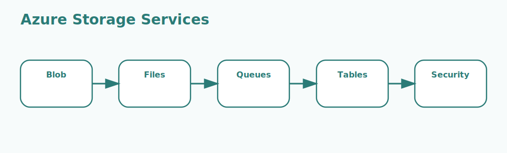

# Azure Storage Interview Questions



This page focuses on the Azure Storage family and on choosing the right storage service for the right workload.

## 1. Storage accounts

### 1. What is the role of Storage accounts in Azure Storage?

**Answer:**

In Azure Storage, the term Storage accounts refers to the top-level Azure resources that define region,
redundancy, security, and available storage services. It is part of the foundation a candidate
should be able to explain clearly.

**Sample:**

```csharp
// Concept: 1. Storage accounts
var service = new BlobServiceClient(connectionString);
var container = service.GetBlobContainerClient("samples");
await container.CreateIfNotExistsAsync();
```

---

### 2. Why is the concept of Storage accounts important in Azure Storage?

**Answer:**

This concept matters because it influences the top-level Azure resources that define region,
redundancy, security, and available storage services. Good interview answers connect it to clarity,
maintainability, performance, security, or delivery depending on the situation.

**Sample:**

```csharp
// Concept: 1. Storage accounts
var service = new BlobServiceClient(connectionString);
var container = service.GetBlobContainerClient("samples");
await container.CreateIfNotExistsAsync();
```

---

### 3. When should a team focus on Storage accounts?

**Answer:**

A team should focus on Storage accounts when the requirement depends on the top-level Azure
resources that define region, redundancy, security, and available storage services. It becomes
especially important when design decisions, scaling choices, or debugging depend on that area.

**Sample:**

```csharp
// Concept: 1. Storage accounts
var service = new BlobServiceClient(connectionString);
var container = service.GetBlobContainerClient("samples");
await container.CreateIfNotExistsAsync();
```

---

### 4. How is Storage accounts applied in practice?

**Answer:**

In practice, Storage accounts is applied by making the top-level Azure resources that define region,
redundancy, security, and available storage services explicit in the implementation or workflow. The
exact shape depends on the service design, but the responsibility should stay predictable.

**Sample:**

```csharp
// Concept: 1. Storage accounts
var service = new BlobServiceClient(connectionString);
var container = service.GetBlobContainerClient("samples");
await container.CreateIfNotExistsAsync();
```

---

### 5. What strengths does Storage accounts bring?

**Answer:**

The strengths of Storage accounts are better structure, better communication, and better control
over the top-level Azure resources that define region, redundancy, security, and available storage
services. It also makes tradeoffs easier to explain to both interviewers and project stakeholders.

**Sample:**

```csharp
// Concept: 1. Storage accounts
var service = new BlobServiceClient(connectionString);
var container = service.GetBlobContainerClient("samples");
await container.CreateIfNotExistsAsync();
```

---

### 6. What tradeoffs come with Storage accounts?

**Answer:**

The main tradeoff is extra complexity if Storage accounts is introduced without a real need or a
clear understanding of the top-level Azure resources that define region, redundancy, security, and
available storage services. That usually leads to higher cost, weaker design, or harder
troubleshooting.

**Sample:**

```csharp
// Concept: 1. Storage accounts
var service = new BlobServiceClient(connectionString);
var container = service.GetBlobContainerClient("samples");
await container.CreateIfNotExistsAsync();
```

---

### 7. How does Storage accounts differ from Blob Storage?

**Answer:**

Storage accounts is centered on the top-level Azure resources that define region, redundancy,
security, and available storage services, while Blob Storage is centered on the object storage
service used for unstructured data such as files, media, logs, and backups. They often work
together, but they solve different parts of the topic.

**Sample:**

```csharp
// Concept: 1. Storage accounts
var service = new BlobServiceClient(connectionString);
var container = service.GetBlobContainerClient("samples");
await container.CreateIfNotExistsAsync();
```

---

### 8. What is a good real-world example of Storage accounts?

**Answer:**

A strong example is explaining how Storage accounts affects a real feature, cost decision, failure
mode, or architecture choice involving the top-level Azure resources that define region, redundancy,
security, and available storage services. Interviewers usually value the reasoning behind the
example.

**Sample:**

```csharp
// Concept: 1. Storage accounts
var service = new BlobServiceClient(connectionString);
var container = service.GetBlobContainerClient("samples");
await container.CreateIfNotExistsAsync();
```

---

### 9. What is a best practice for Storage accounts?

**Answer:**

A good practice is to keep Storage accounts aligned with the actual requirement around the top-level
Azure resources that define region, redundancy, security, and available storage services. Teams
should document intent, keep the setup readable, and validate the most important paths early.

**Sample:**

```csharp
// Concept: 1. Storage accounts
var service = new BlobServiceClient(connectionString);
var container = service.GetBlobContainerClient("samples");
await container.CreateIfNotExistsAsync();
```

---

### 10. What is a common mistake around Storage accounts?

**Answer:**

A common mistake is naming Storage accounts without understanding how it affects the top-level Azure
resources that define region, redundancy, security, and available storage services. In real work,
that usually appears as weak sizing, poor troubleshooting, or the wrong operational choice.

**Sample:**

```csharp
// Concept: 1. Storage accounts
var service = new BlobServiceClient(connectionString);
var container = service.GetBlobContainerClient("samples");
await container.CreateIfNotExistsAsync();
```

---

### 11. How do you troubleshoot Storage accounts-related issues?

**Answer:**

When troubleshooting Storage accounts, first verify whether the top-level Azure resources that
define region, redundancy, security, and available storage services is behaving as expected. Then
check dependencies, configuration, metrics, logs, and edge cases before changing the design.

**Sample:**

```csharp
// Concept: 1. Storage accounts
var service = new BlobServiceClient(connectionString);
var container = service.GetBlobContainerClient("samples");
await container.CreateIfNotExistsAsync();
```

---

### 12. How does Storage accounts connect to the rest of Azure Storage?

**Answer:**

Storage accounts connects to the rest of Azure Storage by giving structure to the top-level Azure
resources that define region, redundancy, security, and available storage services. It is one of the
pieces that turns isolated facts into a usable end-to-end mental model.

**Sample:**

```csharp
// Concept: 1. Storage accounts
var service = new BlobServiceClient(connectionString);
var container = service.GetBlobContainerClient("samples");
await container.CreateIfNotExistsAsync();
```

---

## 2. Blob Storage

### 13. What is the role of Blob Storage in Azure Storage?

**Answer:**

In Azure Storage, the term Blob Storage refers to the object storage service used for unstructured data such
as files, media, logs, and backups. It is part of the foundation a candidate should be able to
explain clearly.

**Sample:**

```csharp
// Concept: 2. Blob Storage
var service = new BlobServiceClient(connectionString);
var container = service.GetBlobContainerClient("samples");
await container.CreateIfNotExistsAsync();
```

---

### 14. Why is the concept of Blob Storage important in Azure Storage?

**Answer:**

This concept matters because it influences the object storage service used for unstructured data
such as files, media, logs, and backups. Good interview answers connect it to clarity,
maintainability, performance, security, or delivery depending on the situation.

**Sample:**

```csharp
// Concept: 2. Blob Storage
var service = new BlobServiceClient(connectionString);
var container = service.GetBlobContainerClient("samples");
await container.CreateIfNotExistsAsync();
```

---

### 15. When should a team focus on Blob Storage?

**Answer:**

A team should focus on Blob Storage when the requirement depends on the object storage service used
for unstructured data such as files, media, logs, and backups. It becomes especially important when
design decisions, scaling choices, or debugging depend on that area.

**Sample:**

```csharp
// Concept: 2. Blob Storage
var service = new BlobServiceClient(connectionString);
var container = service.GetBlobContainerClient("samples");
await container.CreateIfNotExistsAsync();
```

---

### 16. How is Blob Storage applied in practice?

**Answer:**

In practice, Blob Storage is applied by making the object storage service used for unstructured data
such as files, media, logs, and backups explicit in the implementation or workflow. The exact shape
depends on the service design, but the responsibility should stay predictable.

**Sample:**

```csharp
// Concept: 2. Blob Storage
var service = new BlobServiceClient(connectionString);
var container = service.GetBlobContainerClient("samples");
await container.CreateIfNotExistsAsync();
```

---

### 17. What strengths does Blob Storage bring?

**Answer:**

The strengths of Blob Storage are better structure, better communication, and better control over
the object storage service used for unstructured data such as files, media, logs, and backups. It
also makes tradeoffs easier to explain to both interviewers and project stakeholders.

**Sample:**

```csharp
// Concept: 2. Blob Storage
var service = new BlobServiceClient(connectionString);
var container = service.GetBlobContainerClient("samples");
await container.CreateIfNotExistsAsync();
```

---

### 18. What tradeoffs come with Blob Storage?

**Answer:**

The main tradeoff is extra complexity if Blob Storage is introduced without a real need or a clear
understanding of the object storage service used for unstructured data such as files, media, logs,
and backups. That usually leads to higher cost, weaker design, or harder troubleshooting.

**Sample:**

```csharp
// Concept: 2. Blob Storage
var service = new BlobServiceClient(connectionString);
var container = service.GetBlobContainerClient("samples");
await container.CreateIfNotExistsAsync();
```

---

### 19. How does Blob Storage differ from Azure Files?

**Answer:**

Blob Storage is centered on the object storage service used for unstructured data such as files,
media, logs, and backups, while Azure Files is centered on the managed file share service used when
workloads need shared file system behavior. They often work together, but they solve different parts
of the topic.

**Sample:**

```csharp
// Concept: 2. Blob Storage
var service = new BlobServiceClient(connectionString);
var container = service.GetBlobContainerClient("samples");
await container.CreateIfNotExistsAsync();
```

---

### 20. What is a good real-world example of Blob Storage?

**Answer:**

A strong example is explaining how Blob Storage affects a real feature, cost decision, failure mode,
or architecture choice involving the object storage service used for unstructured data such as
files, media, logs, and backups. Interviewers usually value the reasoning behind the example.

**Sample:**

```csharp
// Concept: 2. Blob Storage
var service = new BlobServiceClient(connectionString);
var container = service.GetBlobContainerClient("samples");
await container.CreateIfNotExistsAsync();
```

---

### 21. What is a best practice for Blob Storage?

**Answer:**

A good practice is to keep Blob Storage aligned with the actual requirement around the object
storage service used for unstructured data such as files, media, logs, and backups. Teams should
document intent, keep the setup readable, and validate the most important paths early.

**Sample:**

```csharp
// Concept: 2. Blob Storage
var service = new BlobServiceClient(connectionString);
var container = service.GetBlobContainerClient("samples");
await container.CreateIfNotExistsAsync();
```

---

### 22. What is a common mistake around Blob Storage?

**Answer:**

A common mistake is naming Blob Storage without understanding how it affects the object storage
service used for unstructured data such as files, media, logs, and backups. In real work, that
usually appears as weak sizing, poor troubleshooting, or the wrong operational choice.

**Sample:**

```csharp
// Concept: 2. Blob Storage
var service = new BlobServiceClient(connectionString);
var container = service.GetBlobContainerClient("samples");
await container.CreateIfNotExistsAsync();
```

---

### 23. How do you troubleshoot Blob Storage-related issues?

**Answer:**

When troubleshooting Blob Storage, first verify whether the object storage service used for
unstructured data such as files, media, logs, and backups is behaving as expected. Then check
dependencies, configuration, metrics, logs, and edge cases before changing the design.

**Sample:**

```csharp
// Concept: 2. Blob Storage
var service = new BlobServiceClient(connectionString);
var container = service.GetBlobContainerClient("samples");
await container.CreateIfNotExistsAsync();
```

---

### 24. How does Blob Storage connect to the rest of Azure Storage?

**Answer:**

Blob Storage connects to the rest of Azure Storage by giving structure to the object storage service
used for unstructured data such as files, media, logs, and backups. It is one of the pieces that
turns isolated facts into a usable end-to-end mental model.

**Sample:**

```csharp
// Concept: 2. Blob Storage
var service = new BlobServiceClient(connectionString);
var container = service.GetBlobContainerClient("samples");
await container.CreateIfNotExistsAsync();
```

---

## 3. Azure Files

### 25. What is the role of Azure Files in Azure Storage?

**Answer:**

In Azure Storage, the term Azure Files refers to the managed file share service used when workloads need
shared file system behavior. It is part of the foundation a candidate should be able to explain
clearly.

**Sample:**

```csharp
// Concept: 3. Azure Files
var service = new BlobServiceClient(connectionString);
var container = service.GetBlobContainerClient("samples");
await container.CreateIfNotExistsAsync();
```

---

### 26. Why is the concept of Azure Files important in Azure Storage?

**Answer:**

This concept matters because it influences the managed file share service used when workloads need
shared file system behavior. Good interview answers connect it to clarity, maintainability,
performance, security, or delivery depending on the situation.

**Sample:**

```csharp
// Concept: 3. Azure Files
var service = new BlobServiceClient(connectionString);
var container = service.GetBlobContainerClient("samples");
await container.CreateIfNotExistsAsync();
```

---

### 27. When should a team focus on Azure Files?

**Answer:**

A team should focus on Azure Files when the requirement depends on the managed file share service
used when workloads need shared file system behavior. It becomes especially important when design
decisions, scaling choices, or debugging depend on that area.

**Sample:**

```csharp
// Concept: 3. Azure Files
var service = new BlobServiceClient(connectionString);
var container = service.GetBlobContainerClient("samples");
await container.CreateIfNotExistsAsync();
```

---

### 28. How is Azure Files applied in practice?

**Answer:**

In practice, Azure Files is applied by making the managed file share service used when workloads
need shared file system behavior explicit in the implementation or workflow. The exact shape depends
on the service design, but the responsibility should stay predictable.

**Sample:**

```csharp
// Concept: 3. Azure Files
var service = new BlobServiceClient(connectionString);
var container = service.GetBlobContainerClient("samples");
await container.CreateIfNotExistsAsync();
```

---

### 29. What strengths does Azure Files bring?

**Answer:**

The strengths of Azure Files are better structure, better communication, and better control over the
managed file share service used when workloads need shared file system behavior. It also makes
tradeoffs easier to explain to both interviewers and project stakeholders.

**Sample:**

```csharp
// Concept: 3. Azure Files
var service = new BlobServiceClient(connectionString);
var container = service.GetBlobContainerClient("samples");
await container.CreateIfNotExistsAsync();
```

---

### 30. What tradeoffs come with Azure Files?

**Answer:**

The main tradeoff is extra complexity if Azure Files is introduced without a real need or a clear
understanding of the managed file share service used when workloads need shared file system
behavior. That usually leads to higher cost, weaker design, or harder troubleshooting.

**Sample:**

```csharp
// Concept: 3. Azure Files
var service = new BlobServiceClient(connectionString);
var container = service.GetBlobContainerClient("samples");
await container.CreateIfNotExistsAsync();
```

---

### 31. How does Azure Files differ from Queue Storage?

**Answer:**

Azure Files is centered on the managed file share service used when workloads need shared file
system behavior, while Queue Storage is centered on the message-based storage service used for
decoupled asynchronous processing. They often work together, but they solve different parts of the
topic.

**Sample:**

```csharp
// Concept: 3. Azure Files
var service = new BlobServiceClient(connectionString);
var container = service.GetBlobContainerClient("samples");
await container.CreateIfNotExistsAsync();
```

---

### 32. What is a good real-world example of Azure Files?

**Answer:**

A strong example is explaining how Azure Files affects a real feature, cost decision, failure mode,
or architecture choice involving the managed file share service used when workloads need shared file
system behavior. Interviewers usually value the reasoning behind the example.

**Sample:**

```csharp
// Concept: 3. Azure Files
var service = new BlobServiceClient(connectionString);
var container = service.GetBlobContainerClient("samples");
await container.CreateIfNotExistsAsync();
```

---

### 33. What is a best practice for Azure Files?

**Answer:**

A good practice is to keep Azure Files aligned with the actual requirement around the managed file
share service used when workloads need shared file system behavior. Teams should document intent,
keep the setup readable, and validate the most important paths early.

**Sample:**

```csharp
// Concept: 3. Azure Files
var service = new BlobServiceClient(connectionString);
var container = service.GetBlobContainerClient("samples");
await container.CreateIfNotExistsAsync();
```

---

### 34. What is a common mistake around Azure Files?

**Answer:**

A common mistake is naming Azure Files without understanding how it affects the managed file share
service used when workloads need shared file system behavior. In real work, that usually appears as
weak sizing, poor troubleshooting, or the wrong operational choice.

**Sample:**

```csharp
// Concept: 3. Azure Files
var service = new BlobServiceClient(connectionString);
var container = service.GetBlobContainerClient("samples");
await container.CreateIfNotExistsAsync();
```

---

### 35. How do you troubleshoot Azure Files-related issues?

**Answer:**

When troubleshooting Azure Files, first verify whether the managed file share service used when
workloads need shared file system behavior is behaving as expected. Then check dependencies,
configuration, metrics, logs, and edge cases before changing the design.

**Sample:**

```csharp
// Concept: 3. Azure Files
var service = new BlobServiceClient(connectionString);
var container = service.GetBlobContainerClient("samples");
await container.CreateIfNotExistsAsync();
```

---

### 36. How does Azure Files connect to the rest of Azure Storage?

**Answer:**

Azure Files connects to the rest of Azure Storage by giving structure to the managed file share
service used when workloads need shared file system behavior. It is one of the pieces that turns
isolated facts into a usable end-to-end mental model.

**Sample:**

```csharp
// Concept: 3. Azure Files
var service = new BlobServiceClient(connectionString);
var container = service.GetBlobContainerClient("samples");
await container.CreateIfNotExistsAsync();
```

---

## 4. Queue Storage

### 37. What is the role of Queue Storage in Azure Storage?

**Answer:**

In Azure Storage, the term Queue Storage refers to the message-based storage service used for decoupled
asynchronous processing. It is part of the foundation a candidate should be able to explain clearly.

**Sample:**

```csharp
// Concept: 4. Queue Storage
var service = new BlobServiceClient(connectionString);
var container = service.GetBlobContainerClient("samples");
await container.CreateIfNotExistsAsync();
```

---

### 38. Why is the concept of Queue Storage important in Azure Storage?

**Answer:**

This concept matters because it influences the message-based storage service used for decoupled
asynchronous processing. Good interview answers connect it to clarity, maintainability, performance,
security, or delivery depending on the situation.

**Sample:**

```csharp
// Concept: 4. Queue Storage
var service = new BlobServiceClient(connectionString);
var container = service.GetBlobContainerClient("samples");
await container.CreateIfNotExistsAsync();
```

---

### 39. When should a team focus on Queue Storage?

**Answer:**

A team should focus on Queue Storage when the requirement depends on the message-based storage
service used for decoupled asynchronous processing. It becomes especially important when design
decisions, scaling choices, or debugging depend on that area.

**Sample:**

```csharp
// Concept: 4. Queue Storage
var service = new BlobServiceClient(connectionString);
var container = service.GetBlobContainerClient("samples");
await container.CreateIfNotExistsAsync();
```

---

### 40. How is Queue Storage applied in practice?

**Answer:**

In practice, Queue Storage is applied by making the message-based storage service used for decoupled
asynchronous processing explicit in the implementation or workflow. The exact shape depends on the
service design, but the responsibility should stay predictable.

**Sample:**

```csharp
// Concept: 4. Queue Storage
var service = new BlobServiceClient(connectionString);
var container = service.GetBlobContainerClient("samples");
await container.CreateIfNotExistsAsync();
```

---

### 41. What strengths does Queue Storage bring?

**Answer:**

The strengths of Queue Storage are better structure, better communication, and better control over
the message-based storage service used for decoupled asynchronous processing. It also makes
tradeoffs easier to explain to both interviewers and project stakeholders.

**Sample:**

```csharp
// Concept: 4. Queue Storage
var service = new BlobServiceClient(connectionString);
var container = service.GetBlobContainerClient("samples");
await container.CreateIfNotExistsAsync();
```

---

### 42. What tradeoffs come with Queue Storage?

**Answer:**

The main tradeoff is extra complexity if Queue Storage is introduced without a real need or a clear
understanding of the message-based storage service used for decoupled asynchronous processing. That
usually leads to higher cost, weaker design, or harder troubleshooting.

**Sample:**

```csharp
// Concept: 4. Queue Storage
var service = new BlobServiceClient(connectionString);
var container = service.GetBlobContainerClient("samples");
await container.CreateIfNotExistsAsync();
```

---

### 43. How does Queue Storage differ from Table Storage?

**Answer:**

Queue Storage is centered on the message-based storage service used for decoupled asynchronous
processing, while Table Storage is centered on the schemaless key-value style storage service used
for large simple structured datasets. They often work together, but they solve different parts of
the topic.

**Sample:**

```csharp
// Concept: 4. Queue Storage
var service = new BlobServiceClient(connectionString);
var container = service.GetBlobContainerClient("samples");
await container.CreateIfNotExistsAsync();
```

---

### 44. What is a good real-world example of Queue Storage?

**Answer:**

A strong example is explaining how Queue Storage affects a real feature, cost decision, failure
mode, or architecture choice involving the message-based storage service used for decoupled
asynchronous processing. Interviewers usually value the reasoning behind the example.

**Sample:**

```csharp
// Concept: 4. Queue Storage
var service = new BlobServiceClient(connectionString);
var container = service.GetBlobContainerClient("samples");
await container.CreateIfNotExistsAsync();
```

---

### 45. What is a best practice for Queue Storage?

**Answer:**

A good practice is to keep Queue Storage aligned with the actual requirement around the message-
based storage service used for decoupled asynchronous processing. Teams should document intent, keep
the setup readable, and validate the most important paths early.

**Sample:**

```csharp
// Concept: 4. Queue Storage
var service = new BlobServiceClient(connectionString);
var container = service.GetBlobContainerClient("samples");
await container.CreateIfNotExistsAsync();
```

---

### 46. What is a common mistake around Queue Storage?

**Answer:**

A common mistake is naming Queue Storage without understanding how it affects the message-based
storage service used for decoupled asynchronous processing. In real work, that usually appears as
weak sizing, poor troubleshooting, or the wrong operational choice.

**Sample:**

```csharp
// Concept: 4. Queue Storage
var service = new BlobServiceClient(connectionString);
var container = service.GetBlobContainerClient("samples");
await container.CreateIfNotExistsAsync();
```

---

### 47. How do you troubleshoot Queue Storage-related issues?

**Answer:**

When troubleshooting Queue Storage, first verify whether the message-based storage service used for
decoupled asynchronous processing is behaving as expected. Then check dependencies, configuration,
metrics, logs, and edge cases before changing the design.

**Sample:**

```csharp
// Concept: 4. Queue Storage
var service = new BlobServiceClient(connectionString);
var container = service.GetBlobContainerClient("samples");
await container.CreateIfNotExistsAsync();
```

---

### 48. How does Queue Storage connect to the rest of Azure Storage?

**Answer:**

Queue Storage connects to the rest of Azure Storage by giving structure to the message-based storage
service used for decoupled asynchronous processing. It is one of the pieces that turns isolated
facts into a usable end-to-end mental model.

**Sample:**

```csharp
// Concept: 4. Queue Storage
var service = new BlobServiceClient(connectionString);
var container = service.GetBlobContainerClient("samples");
await container.CreateIfNotExistsAsync();
```

---

## 5. Table Storage

### 49. What is the role of Table Storage in Azure Storage?

**Answer:**

In Azure Storage, the term Table Storage refers to the schemaless key-value style storage service used for
large simple structured datasets. It is part of the foundation a candidate should be able to explain
clearly.

**Sample:**

```csharp
// Concept: 5. Table Storage
var service = new BlobServiceClient(connectionString);
var container = service.GetBlobContainerClient("samples");
await container.CreateIfNotExistsAsync();
```

---

### 50. Why is the concept of Table Storage important in Azure Storage?

**Answer:**

This concept matters because it influences the schemaless key-value style storage service used for
large simple structured datasets. Good interview answers connect it to clarity, maintainability,
performance, security, or delivery depending on the situation.

**Sample:**

```csharp
// Concept: 5. Table Storage
var service = new BlobServiceClient(connectionString);
var container = service.GetBlobContainerClient("samples");
await container.CreateIfNotExistsAsync();
```

---

### 51. When should a team focus on Table Storage?

**Answer:**

A team should focus on Table Storage when the requirement depends on the schemaless key-value style
storage service used for large simple structured datasets. It becomes especially important when
design decisions, scaling choices, or debugging depend on that area.

**Sample:**

```csharp
// Concept: 5. Table Storage
var service = new BlobServiceClient(connectionString);
var container = service.GetBlobContainerClient("samples");
await container.CreateIfNotExistsAsync();
```

---

### 52. How is Table Storage applied in practice?

**Answer:**

In practice, Table Storage is applied by making the schemaless key-value style storage service used
for large simple structured datasets explicit in the implementation or workflow. The exact shape
depends on the service design, but the responsibility should stay predictable.

**Sample:**

```csharp
// Concept: 5. Table Storage
var service = new BlobServiceClient(connectionString);
var container = service.GetBlobContainerClient("samples");
await container.CreateIfNotExistsAsync();
```

---

### 53. What strengths does Table Storage bring?

**Answer:**

The strengths of Table Storage are better structure, better communication, and better control over
the schemaless key-value style storage service used for large simple structured datasets. It also
makes tradeoffs easier to explain to both interviewers and project stakeholders.

**Sample:**

```csharp
// Concept: 5. Table Storage
var service = new BlobServiceClient(connectionString);
var container = service.GetBlobContainerClient("samples");
await container.CreateIfNotExistsAsync();
```

---

### 54. What tradeoffs come with Table Storage?

**Answer:**

The main tradeoff is extra complexity if Table Storage is introduced without a real need or a clear
understanding of the schemaless key-value style storage service used for large simple structured
datasets. That usually leads to higher cost, weaker design, or harder troubleshooting.

**Sample:**

```csharp
// Concept: 5. Table Storage
var service = new BlobServiceClient(connectionString);
var container = service.GetBlobContainerClient("samples");
await container.CreateIfNotExistsAsync();
```

---

### 55. How does Table Storage differ from Redundancy options?

**Answer:**

Table Storage is centered on the schemaless key-value style storage service used for large simple
structured datasets, while Redundancy options is centered on the replication choices that affect
durability, availability, and regional resilience. They often work together, but they solve
different parts of the topic.

**Sample:**

```csharp
// Concept: 5. Table Storage
var service = new BlobServiceClient(connectionString);
var container = service.GetBlobContainerClient("samples");
await container.CreateIfNotExistsAsync();
```

---

### 56. What is a good real-world example of Table Storage?

**Answer:**

A strong example is explaining how Table Storage affects a real feature, cost decision, failure
mode, or architecture choice involving the schemaless key-value style storage service used for large
simple structured datasets. Interviewers usually value the reasoning behind the example.

**Sample:**

```csharp
// Concept: 5. Table Storage
var service = new BlobServiceClient(connectionString);
var container = service.GetBlobContainerClient("samples");
await container.CreateIfNotExistsAsync();
```

---

### 57. What is a best practice for Table Storage?

**Answer:**

A good practice is to keep Table Storage aligned with the actual requirement around the schemaless
key-value style storage service used for large simple structured datasets. Teams should document
intent, keep the setup readable, and validate the most important paths early.

**Sample:**

```csharp
// Concept: 5. Table Storage
var service = new BlobServiceClient(connectionString);
var container = service.GetBlobContainerClient("samples");
await container.CreateIfNotExistsAsync();
```

---

### 58. What is a common mistake around Table Storage?

**Answer:**

A common mistake is naming Table Storage without understanding how it affects the schemaless key-
value style storage service used for large simple structured datasets. In real work, that usually
appears as weak sizing, poor troubleshooting, or the wrong operational choice.

**Sample:**

```csharp
// Concept: 5. Table Storage
var service = new BlobServiceClient(connectionString);
var container = service.GetBlobContainerClient("samples");
await container.CreateIfNotExistsAsync();
```

---

### 59. How do you troubleshoot Table Storage-related issues?

**Answer:**

When troubleshooting Table Storage, first verify whether the schemaless key-value style storage
service used for large simple structured datasets is behaving as expected. Then check dependencies,
configuration, metrics, logs, and edge cases before changing the design.

**Sample:**

```csharp
// Concept: 5. Table Storage
var service = new BlobServiceClient(connectionString);
var container = service.GetBlobContainerClient("samples");
await container.CreateIfNotExistsAsync();
```

---

### 60. How does Table Storage connect to the rest of Azure Storage?

**Answer:**

Table Storage connects to the rest of Azure Storage by giving structure to the schemaless key-value
style storage service used for large simple structured datasets. It is one of the pieces that turns
isolated facts into a usable end-to-end mental model.

**Sample:**

```csharp
// Concept: 5. Table Storage
var service = new BlobServiceClient(connectionString);
var container = service.GetBlobContainerClient("samples");
await container.CreateIfNotExistsAsync();
```

---

## 6. Redundancy options

### 61. What is the role of Redundancy options in Azure Storage?

**Answer:**

In Azure Storage, the term Redundancy options refers to the replication choices that affect durability,
availability, and regional resilience. It is part of the foundation a candidate should be able to
explain clearly.

**Sample:**

```csharp
// Concept: 6. Redundancy options
var service = new BlobServiceClient(connectionString);
var container = service.GetBlobContainerClient("samples");
await container.CreateIfNotExistsAsync();
```

---

### 62. Why is the concept of Redundancy options important in Azure Storage?

**Answer:**

This concept matters because it influences the replication choices that affect durability,
availability, and regional resilience. Good interview answers connect it to clarity,
maintainability, performance, security, or delivery depending on the situation.

**Sample:**

```csharp
// Concept: 6. Redundancy options
var service = new BlobServiceClient(connectionString);
var container = service.GetBlobContainerClient("samples");
await container.CreateIfNotExistsAsync();
```

---

### 63. When should a team focus on Redundancy options?

**Answer:**

A team should focus on Redundancy options when the requirement depends on the replication choices
that affect durability, availability, and regional resilience. It becomes especially important when
design decisions, scaling choices, or debugging depend on that area.

**Sample:**

```csharp
// Concept: 6. Redundancy options
var service = new BlobServiceClient(connectionString);
var container = service.GetBlobContainerClient("samples");
await container.CreateIfNotExistsAsync();
```

---

### 64. How is Redundancy options applied in practice?

**Answer:**

In practice, Redundancy options is applied by making the replication choices that affect durability,
availability, and regional resilience explicit in the implementation or workflow. The exact shape
depends on the service design, but the responsibility should stay predictable.

**Sample:**

```csharp
// Concept: 6. Redundancy options
var service = new BlobServiceClient(connectionString);
var container = service.GetBlobContainerClient("samples");
await container.CreateIfNotExistsAsync();
```

---

### 65. What strengths does Redundancy options bring?

**Answer:**

The strengths of Redundancy options are better structure, better communication, and better control
over the replication choices that affect durability, availability, and regional resilience. It also
makes tradeoffs easier to explain to both interviewers and project stakeholders.

**Sample:**

```csharp
// Concept: 6. Redundancy options
var service = new BlobServiceClient(connectionString);
var container = service.GetBlobContainerClient("samples");
await container.CreateIfNotExistsAsync();
```

---

### 66. What tradeoffs come with Redundancy options?

**Answer:**

The main tradeoff is extra complexity if Redundancy options is introduced without a real need or a
clear understanding of the replication choices that affect durability, availability, and regional
resilience. That usually leads to higher cost, weaker design, or harder troubleshooting.

**Sample:**

```csharp
// Concept: 6. Redundancy options
var service = new BlobServiceClient(connectionString);
var container = service.GetBlobContainerClient("samples");
await container.CreateIfNotExistsAsync();
```

---

### 67. How does Redundancy options differ from Access tiers?

**Answer:**

Redundancy options is centered on the replication choices that affect durability, availability, and
regional resilience, while Access tiers is centered on the hot, cool, and archive pricing models
used mainly for blob data. They often work together, but they solve different parts of the topic.

**Sample:**

```csharp
// Concept: 6. Redundancy options
var service = new BlobServiceClient(connectionString);
var container = service.GetBlobContainerClient("samples");
await container.CreateIfNotExistsAsync();
```

---

### 68. What is a good real-world example of Redundancy options?

**Answer:**

A strong example is explaining how Redundancy options affects a real feature, cost decision, failure
mode, or architecture choice involving the replication choices that affect durability, availability,
and regional resilience. Interviewers usually value the reasoning behind the example.

**Sample:**

```csharp
// Concept: 6. Redundancy options
var service = new BlobServiceClient(connectionString);
var container = service.GetBlobContainerClient("samples");
await container.CreateIfNotExistsAsync();
```

---

### 69. What is a best practice for Redundancy options?

**Answer:**

A good practice is to keep Redundancy options aligned with the actual requirement around the
replication choices that affect durability, availability, and regional resilience. Teams should
document intent, keep the setup readable, and validate the most important paths early.

**Sample:**

```csharp
// Concept: 6. Redundancy options
var service = new BlobServiceClient(connectionString);
var container = service.GetBlobContainerClient("samples");
await container.CreateIfNotExistsAsync();
```

---

### 70. What is a common mistake around Redundancy options?

**Answer:**

A common mistake is naming Redundancy options without understanding how it affects the replication
choices that affect durability, availability, and regional resilience. In real work, that usually
appears as weak sizing, poor troubleshooting, or the wrong operational choice.

**Sample:**

```csharp
// Concept: 6. Redundancy options
var service = new BlobServiceClient(connectionString);
var container = service.GetBlobContainerClient("samples");
await container.CreateIfNotExistsAsync();
```

---

### 71. How do you troubleshoot Redundancy options-related issues?

**Answer:**

When troubleshooting Redundancy options, first verify whether the replication choices that affect
durability, availability, and regional resilience is behaving as expected. Then check dependencies,
configuration, metrics, logs, and edge cases before changing the design.

**Sample:**

```csharp
// Concept: 6. Redundancy options
var service = new BlobServiceClient(connectionString);
var container = service.GetBlobContainerClient("samples");
await container.CreateIfNotExistsAsync();
```

---

### 72. How does Redundancy options connect to the rest of Azure Storage?

**Answer:**

Redundancy options connects to the rest of Azure Storage by giving structure to the replication
choices that affect durability, availability, and regional resilience. It is one of the pieces that
turns isolated facts into a usable end-to-end mental model.

**Sample:**

```csharp
// Concept: 6. Redundancy options
var service = new BlobServiceClient(connectionString);
var container = service.GetBlobContainerClient("samples");
await container.CreateIfNotExistsAsync();
```

---

## 7. Access tiers

### 73. What is the role of Access tiers in Azure Storage?

**Answer:**

In Azure Storage, the term Access tiers refers to the hot, cool, and archive pricing models used mainly for
blob data. It is part of the foundation a candidate should be able to explain clearly.

**Sample:**

```csharp
// Concept: 7. Access tiers
var service = new BlobServiceClient(connectionString);
var container = service.GetBlobContainerClient("samples");
await container.CreateIfNotExistsAsync();
```

---

### 74. Why is the concept of Access tiers important in Azure Storage?

**Answer:**

This concept matters because it influences the hot, cool, and archive pricing models used mainly for
blob data. Good interview answers connect it to clarity, maintainability, performance, security, or
delivery depending on the situation.

**Sample:**

```csharp
// Concept: 7. Access tiers
var service = new BlobServiceClient(connectionString);
var container = service.GetBlobContainerClient("samples");
await container.CreateIfNotExistsAsync();
```

---

### 75. When should a team focus on Access tiers?

**Answer:**

A team should focus on Access tiers when the requirement depends on the hot, cool, and archive
pricing models used mainly for blob data. It becomes especially important when design decisions,
scaling choices, or debugging depend on that area.

**Sample:**

```csharp
// Concept: 7. Access tiers
var service = new BlobServiceClient(connectionString);
var container = service.GetBlobContainerClient("samples");
await container.CreateIfNotExistsAsync();
```

---

### 76. How is Access tiers applied in practice?

**Answer:**

In practice, Access tiers is applied by making the hot, cool, and archive pricing models used mainly
for blob data explicit in the implementation or workflow. The exact shape depends on the service
design, but the responsibility should stay predictable.

**Sample:**

```csharp
// Concept: 7. Access tiers
var service = new BlobServiceClient(connectionString);
var container = service.GetBlobContainerClient("samples");
await container.CreateIfNotExistsAsync();
```

---

### 77. What strengths does Access tiers bring?

**Answer:**

The strengths of Access tiers are better structure, better communication, and better control over
the hot, cool, and archive pricing models used mainly for blob data. It also makes tradeoffs easier
to explain to both interviewers and project stakeholders.

**Sample:**

```csharp
// Concept: 7. Access tiers
var service = new BlobServiceClient(connectionString);
var container = service.GetBlobContainerClient("samples");
await container.CreateIfNotExistsAsync();
```

---

### 78. What tradeoffs come with Access tiers?

**Answer:**

The main tradeoff is extra complexity if Access tiers is introduced without a real need or a clear
understanding of the hot, cool, and archive pricing models used mainly for blob data. That usually
leads to higher cost, weaker design, or harder troubleshooting.

**Sample:**

```csharp
// Concept: 7. Access tiers
var service = new BlobServiceClient(connectionString);
var container = service.GetBlobContainerClient("samples");
await container.CreateIfNotExistsAsync();
```

---

### 79. How does Access tiers differ from SAS and security?

**Answer:**

Access tiers is centered on the hot, cool, and archive pricing models used mainly for blob data,
while SAS and security is centered on the secure access model used to grant limited storage
permissions without exposing full keys. They often work together, but they solve different parts of
the topic.

**Sample:**

```csharp
// Concept: 7. Access tiers
var service = new BlobServiceClient(connectionString);
var container = service.GetBlobContainerClient("samples");
await container.CreateIfNotExistsAsync();
```

---

### 80. What is a good real-world example of Access tiers?

**Answer:**

A strong example is explaining how Access tiers affects a real feature, cost decision, failure mode,
or architecture choice involving the hot, cool, and archive pricing models used mainly for blob
data. Interviewers usually value the reasoning behind the example.

**Sample:**

```csharp
// Concept: 7. Access tiers
var service = new BlobServiceClient(connectionString);
var container = service.GetBlobContainerClient("samples");
await container.CreateIfNotExistsAsync();
```

---

### 81. What is a best practice for Access tiers?

**Answer:**

A good practice is to keep Access tiers aligned with the actual requirement around the hot, cool,
and archive pricing models used mainly for blob data. Teams should document intent, keep the setup
readable, and validate the most important paths early.

**Sample:**

```csharp
// Concept: 7. Access tiers
var service = new BlobServiceClient(connectionString);
var container = service.GetBlobContainerClient("samples");
await container.CreateIfNotExistsAsync();
```

---

### 82. What is a common mistake around Access tiers?

**Answer:**

A common mistake is naming Access tiers without understanding how it affects the hot, cool, and
archive pricing models used mainly for blob data. In real work, that usually appears as weak sizing,
poor troubleshooting, or the wrong operational choice.

**Sample:**

```csharp
// Concept: 7. Access tiers
var service = new BlobServiceClient(connectionString);
var container = service.GetBlobContainerClient("samples");
await container.CreateIfNotExistsAsync();
```

---

### 83. How do you troubleshoot Access tiers-related issues?

**Answer:**

When troubleshooting Access tiers, first verify whether the hot, cool, and archive pricing models
used mainly for blob data is behaving as expected. Then check dependencies, configuration, metrics,
logs, and edge cases before changing the design.

**Sample:**

```csharp
// Concept: 7. Access tiers
var service = new BlobServiceClient(connectionString);
var container = service.GetBlobContainerClient("samples");
await container.CreateIfNotExistsAsync();
```

---

### 84. How does Access tiers connect to the rest of Azure Storage?

**Answer:**

Access tiers connects to the rest of Azure Storage by giving structure to the hot, cool, and archive
pricing models used mainly for blob data. It is one of the pieces that turns isolated facts into a
usable end-to-end mental model.

**Sample:**

```csharp
// Concept: 7. Access tiers
var service = new BlobServiceClient(connectionString);
var container = service.GetBlobContainerClient("samples");
await container.CreateIfNotExistsAsync();
```

---

## 8. SAS and security

### 85. What is the role of SAS and security in Azure Storage?

**Answer:**

In Azure Storage, the term SAS and security refers to the secure access model used to grant limited storage
permissions without exposing full keys. It is part of the foundation a candidate should be able to
explain clearly.

**Sample:**

```csharp
// Concept: 8. SAS and security
var service = new BlobServiceClient(connectionString);
var container = service.GetBlobContainerClient("samples");
await container.CreateIfNotExistsAsync();
```

---

### 86. Why is the concept of SAS and security important in Azure Storage?

**Answer:**

This concept matters because it influences the secure access model used to grant limited storage
permissions without exposing full keys. Good interview answers connect it to clarity,
maintainability, performance, security, or delivery depending on the situation.

**Sample:**

```csharp
// Concept: 8. SAS and security
var service = new BlobServiceClient(connectionString);
var container = service.GetBlobContainerClient("samples");
await container.CreateIfNotExistsAsync();
```

---

### 87. When should a team focus on SAS and security?

**Answer:**

A team should focus on SAS and security when the requirement depends on the secure access model used
to grant limited storage permissions without exposing full keys. It becomes especially important
when design decisions, scaling choices, or debugging depend on that area.

**Sample:**

```csharp
// Concept: 8. SAS and security
var service = new BlobServiceClient(connectionString);
var container = service.GetBlobContainerClient("samples");
await container.CreateIfNotExistsAsync();
```

---

### 88. How is SAS and security applied in practice?

**Answer:**

In practice, SAS and security is applied by making the secure access model used to grant limited
storage permissions without exposing full keys explicit in the implementation or workflow. The exact
shape depends on the service design, but the responsibility should stay predictable.

**Sample:**

```csharp
// Concept: 8. SAS and security
var service = new BlobServiceClient(connectionString);
var container = service.GetBlobContainerClient("samples");
await container.CreateIfNotExistsAsync();
```

---

### 89. What strengths does SAS and security bring?

**Answer:**

The strengths of SAS and security are better structure, better communication, and better control
over the secure access model used to grant limited storage permissions without exposing full keys.
It also makes tradeoffs easier to explain to both interviewers and project stakeholders.

**Sample:**

```csharp
// Concept: 8. SAS and security
var service = new BlobServiceClient(connectionString);
var container = service.GetBlobContainerClient("samples");
await container.CreateIfNotExistsAsync();
```

---

### 90. What tradeoffs come with SAS and security?

**Answer:**

The main tradeoff is extra complexity if SAS and security is introduced without a real need or a
clear understanding of the secure access model used to grant limited storage permissions without
exposing full keys. That usually leads to higher cost, weaker design, or harder troubleshooting.

**Sample:**

```csharp
// Concept: 8. SAS and security
var service = new BlobServiceClient(connectionString);
var container = service.GetBlobContainerClient("samples");
await container.CreateIfNotExistsAsync();
```

---

### 91. How does SAS and security differ from Performance tiers?

**Answer:**

SAS and security is centered on the secure access model used to grant limited storage permissions
without exposing full keys, while Performance tiers is centered on the standard and premium choices
that affect latency and throughput behavior. They often work together, but they solve different
parts of the topic.

**Sample:**

```csharp
// Concept: 8. SAS and security
var service = new BlobServiceClient(connectionString);
var container = service.GetBlobContainerClient("samples");
await container.CreateIfNotExistsAsync();
```

---

### 92. What is a good real-world example of SAS and security?

**Answer:**

A strong example is explaining how SAS and security affects a real feature, cost decision, failure
mode, or architecture choice involving the secure access model used to grant limited storage
permissions without exposing full keys. Interviewers usually value the reasoning behind the example.

**Sample:**

```csharp
// Concept: 8. SAS and security
var service = new BlobServiceClient(connectionString);
var container = service.GetBlobContainerClient("samples");
await container.CreateIfNotExistsAsync();
```

---

### 93. What is a best practice for SAS and security?

**Answer:**

A good practice is to keep SAS and security aligned with the actual requirement around the secure
access model used to grant limited storage permissions without exposing full keys. Teams should
document intent, keep the setup readable, and validate the most important paths early.

**Sample:**

```csharp
// Concept: 8. SAS and security
var service = new BlobServiceClient(connectionString);
var container = service.GetBlobContainerClient("samples");
await container.CreateIfNotExistsAsync();
```

---

### 94. What is a common mistake around SAS and security?

**Answer:**

A common mistake is naming SAS and security without understanding how it affects the secure access
model used to grant limited storage permissions without exposing full keys. In real work, that
usually appears as weak sizing, poor troubleshooting, or the wrong operational choice.

**Sample:**

```csharp
// Concept: 8. SAS and security
var service = new BlobServiceClient(connectionString);
var container = service.GetBlobContainerClient("samples");
await container.CreateIfNotExistsAsync();
```

---

### 95. How do you troubleshoot SAS and security-related issues?

**Answer:**

When troubleshooting SAS and security, first verify whether the secure access model used to grant
limited storage permissions without exposing full keys is behaving as expected. Then check
dependencies, configuration, metrics, logs, and edge cases before changing the design.

**Sample:**

```csharp
// Concept: 8. SAS and security
var service = new BlobServiceClient(connectionString);
var container = service.GetBlobContainerClient("samples");
await container.CreateIfNotExistsAsync();
```

---

### 96. How does SAS and security connect to the rest of Azure Storage?

**Answer:**

SAS and security connects to the rest of Azure Storage by giving structure to the secure access
model used to grant limited storage permissions without exposing full keys. It is one of the pieces
that turns isolated facts into a usable end-to-end mental model.

**Sample:**

```csharp
// Concept: 8. SAS and security
var service = new BlobServiceClient(connectionString);
var container = service.GetBlobContainerClient("samples");
await container.CreateIfNotExistsAsync();
```

---

## 9. Performance tiers

### 97. What is the role of Performance tiers in Azure Storage?

**Answer:**

In Azure Storage, the term Performance tiers refers to the standard and premium choices that affect latency
and throughput behavior. It is part of the foundation a candidate should be able to explain clearly.

**Sample:**

```csharp
// Concept: 9. Performance tiers
var service = new BlobServiceClient(connectionString);
var container = service.GetBlobContainerClient("samples");
await container.CreateIfNotExistsAsync();
```

---

### 98. Why is the concept of Performance tiers important in Azure Storage?

**Answer:**

This concept matters because it influences the standard and premium choices that affect latency
and throughput behavior. Good interview answers connect it to clarity, maintainability, performance,
security, or delivery depending on the situation.

**Sample:**

```csharp
// Concept: 9. Performance tiers
var service = new BlobServiceClient(connectionString);
var container = service.GetBlobContainerClient("samples");
await container.CreateIfNotExistsAsync();
```

---

### 99. When should a team focus on Performance tiers?

**Answer:**

A team should focus on Performance tiers when the requirement depends on the standard and premium
choices that affect latency and throughput behavior. It becomes especially important when design
decisions, scaling choices, or debugging depend on that area.

**Sample:**

```csharp
// Concept: 9. Performance tiers
var service = new BlobServiceClient(connectionString);
var container = service.GetBlobContainerClient("samples");
await container.CreateIfNotExistsAsync();
```

---

### 100. How is Performance tiers applied in practice?

**Answer:**

In practice, Performance tiers is applied by making the standard and premium choices that affect
latency and throughput behavior explicit in the implementation or workflow. The exact shape depends
on the service design, but the responsibility should stay predictable.

**Sample:**

```csharp
// Concept: 9. Performance tiers
var service = new BlobServiceClient(connectionString);
var container = service.GetBlobContainerClient("samples");
await container.CreateIfNotExistsAsync();
```

---

### 101. What strengths does Performance tiers bring?

**Answer:**

The strengths of Performance tiers are better structure, better communication, and better control
over the standard and premium choices that affect latency and throughput behavior. It also makes
tradeoffs easier to explain to both interviewers and project stakeholders.

**Sample:**

```csharp
// Concept: 9. Performance tiers
var service = new BlobServiceClient(connectionString);
var container = service.GetBlobContainerClient("samples");
await container.CreateIfNotExistsAsync();
```

---

### 102. What tradeoffs come with Performance tiers?

**Answer:**

The main tradeoff is extra complexity if Performance tiers is introduced without a real need or a
clear understanding of the standard and premium choices that affect latency and throughput behavior.
That usually leads to higher cost, weaker design, or harder troubleshooting.

**Sample:**

```csharp
// Concept: 9. Performance tiers
var service = new BlobServiceClient(connectionString);
var container = service.GetBlobContainerClient("samples");
await container.CreateIfNotExistsAsync();
```

---

### 103. How does Performance tiers differ from Lifecycle management?

**Answer:**

Performance tiers is centered on the standard and premium choices that affect latency and throughput
behavior, while Lifecycle management is centered on the rules and operational controls used to move
or expire data over time. They often work together, but they solve different parts of the topic.

**Sample:**

```csharp
// Concept: 9. Performance tiers
var service = new BlobServiceClient(connectionString);
var container = service.GetBlobContainerClient("samples");
await container.CreateIfNotExistsAsync();
```

---

### 104. What is a good real-world example of Performance tiers?

**Answer:**

A strong example is explaining how Performance tiers affects a real feature, cost decision, failure
mode, or architecture choice involving the standard and premium choices that affect latency and
throughput behavior. Interviewers usually value the reasoning behind the example.

**Sample:**

```csharp
// Concept: 9. Performance tiers
var service = new BlobServiceClient(connectionString);
var container = service.GetBlobContainerClient("samples");
await container.CreateIfNotExistsAsync();
```

---

### 105. What is a best practice for Performance tiers?

**Answer:**

A good practice is to keep Performance tiers aligned with the actual requirement around the standard
and premium choices that affect latency and throughput behavior. Teams should document intent, keep
the setup readable, and validate the most important paths early.

**Sample:**

```csharp
// Concept: 9. Performance tiers
var service = new BlobServiceClient(connectionString);
var container = service.GetBlobContainerClient("samples");
await container.CreateIfNotExistsAsync();
```

---

### 106. What is a common mistake around Performance tiers?

**Answer:**

A common mistake is naming Performance tiers without understanding how it affects the standard and
premium choices that affect latency and throughput behavior. In real work, that usually appears as
weak sizing, poor troubleshooting, or the wrong operational choice.

**Sample:**

```csharp
// Concept: 9. Performance tiers
var service = new BlobServiceClient(connectionString);
var container = service.GetBlobContainerClient("samples");
await container.CreateIfNotExistsAsync();
```

---

### 107. How do you troubleshoot Performance tiers-related issues?

**Answer:**

When troubleshooting Performance tiers, first verify whether the standard and premium choices that
affect latency and throughput behavior is behaving as expected. Then check dependencies,
configuration, metrics, logs, and edge cases before changing the design.

**Sample:**

```csharp
// Concept: 9. Performance tiers
var service = new BlobServiceClient(connectionString);
var container = service.GetBlobContainerClient("samples");
await container.CreateIfNotExistsAsync();
```

---

### 108. How does Performance tiers connect to the rest of Azure Storage?

**Answer:**

Performance tiers connects to the rest of Azure Storage by giving structure to the standard and
premium choices that affect latency and throughput behavior. It is one of the pieces that turns
isolated facts into a usable end-to-end mental model.

**Sample:**

```csharp
// Concept: 9. Performance tiers
var service = new BlobServiceClient(connectionString);
var container = service.GetBlobContainerClient("samples");
await container.CreateIfNotExistsAsync();
```

---

## 10. Lifecycle management

### 109. What is the role of Lifecycle management in Azure Storage?

**Answer:**

In Azure Storage, the term Lifecycle management refers to the rules and operational controls used to move or
expire data over time. It is part of the foundation a candidate should be able to explain clearly.

**Sample:**

```csharp
// Concept: 10. Lifecycle management
var service = new BlobServiceClient(connectionString);
var container = service.GetBlobContainerClient("samples");
await container.CreateIfNotExistsAsync();
```

---

### 110. Why is the concept of Lifecycle management important in Azure Storage?

**Answer:**

This concept matters because it influences the rules and operational controls used to move
or expire data over time. Good interview answers connect it to clarity, maintainability,
performance, security, or delivery depending on the situation.

**Sample:**

```csharp
// Concept: 10. Lifecycle management
var service = new BlobServiceClient(connectionString);
var container = service.GetBlobContainerClient("samples");
await container.CreateIfNotExistsAsync();
```

---

### 111. When should a team focus on Lifecycle management?

**Answer:**

A team should focus on Lifecycle management when the requirement depends on the rules and
operational controls used to move or expire data over time. It becomes especially important when
design decisions, scaling choices, or debugging depend on that area.

**Sample:**

```csharp
// Concept: 10. Lifecycle management
var service = new BlobServiceClient(connectionString);
var container = service.GetBlobContainerClient("samples");
await container.CreateIfNotExistsAsync();
```

---

### 112. How is Lifecycle management applied in practice?

**Answer:**

In practice, Lifecycle management is applied by making the rules and operational controls used to
move or expire data over time explicit in the implementation or workflow. The exact shape depends on
the service design, but the responsibility should stay predictable.

**Sample:**

```csharp
// Concept: 10. Lifecycle management
var service = new BlobServiceClient(connectionString);
var container = service.GetBlobContainerClient("samples");
await container.CreateIfNotExistsAsync();
```

---

### 113. What strengths does Lifecycle management bring?

**Answer:**

The strengths of Lifecycle management are better structure, better communication, and better control
over the rules and operational controls used to move or expire data over time. It also makes
tradeoffs easier to explain to both interviewers and project stakeholders.

**Sample:**

```csharp
// Concept: 10. Lifecycle management
var service = new BlobServiceClient(connectionString);
var container = service.GetBlobContainerClient("samples");
await container.CreateIfNotExistsAsync();
```

---

### 114. What tradeoffs come with Lifecycle management?

**Answer:**

The main tradeoff is extra complexity if Lifecycle management is introduced without a real need or a
clear understanding of the rules and operational controls used to move or expire data over time.
That usually leads to higher cost, weaker design, or harder troubleshooting.

**Sample:**

```csharp
// Concept: 10. Lifecycle management
var service = new BlobServiceClient(connectionString);
var container = service.GetBlobContainerClient("samples");
await container.CreateIfNotExistsAsync();
```

---

### 115. How does Lifecycle management differ from Storage accounts?

**Answer:**

Lifecycle management is centered on the rules and operational controls used to move or expire data
over time, while Storage accounts is centered on the top-level Azure resources that define region,
redundancy, security, and available storage services. They often work together, but they solve
different parts of the topic.

**Sample:**

```csharp
// Concept: 10. Lifecycle management
var service = new BlobServiceClient(connectionString);
var container = service.GetBlobContainerClient("samples");
await container.CreateIfNotExistsAsync();
```

---

### 116. What is a good real-world example of Lifecycle management?

**Answer:**

A strong example is explaining how Lifecycle management affects a real feature, cost decision,
failure mode, or architecture choice involving the rules and operational controls used to move or
expire data over time. Interviewers usually value the reasoning behind the example.

**Sample:**

```csharp
// Concept: 10. Lifecycle management
var service = new BlobServiceClient(connectionString);
var container = service.GetBlobContainerClient("samples");
await container.CreateIfNotExistsAsync();
```

---

### 117. What is a best practice for Lifecycle management?

**Answer:**

A good practice is to keep Lifecycle management aligned with the actual requirement around the rules
and operational controls used to move or expire data over time. Teams should document intent, keep
the setup readable, and validate the most important paths early.

**Sample:**

```csharp
// Concept: 10. Lifecycle management
var service = new BlobServiceClient(connectionString);
var container = service.GetBlobContainerClient("samples");
await container.CreateIfNotExistsAsync();
```

---

### 118. What is a common mistake around Lifecycle management?

**Answer:**

A common mistake is naming Lifecycle management without understanding how it affects the rules and
operational controls used to move or expire data over time. In real work, that usually appears as
weak sizing, poor troubleshooting, or the wrong operational choice.

**Sample:**

```csharp
// Concept: 10. Lifecycle management
var service = new BlobServiceClient(connectionString);
var container = service.GetBlobContainerClient("samples");
await container.CreateIfNotExistsAsync();
```

---

### 119. How do you troubleshoot Lifecycle management-related issues?

**Answer:**

When troubleshooting Lifecycle management, first verify whether the rules and operational controls
used to move or expire data over time is behaving as expected. Then check dependencies,
configuration, metrics, logs, and edge cases before changing the design.

**Sample:**

```csharp
// Concept: 10. Lifecycle management
var service = new BlobServiceClient(connectionString);
var container = service.GetBlobContainerClient("samples");
await container.CreateIfNotExistsAsync();
```

---

### 120. How does Lifecycle management connect to the rest of Azure Storage?

**Answer:**

Lifecycle management connects to the rest of Azure Storage by giving structure to the rules and
operational controls used to move or expire data over time. It is one of the pieces that turns
isolated facts into a usable end-to-end mental model.

**Sample:**

```csharp
// Concept: 10. Lifecycle management
var service = new BlobServiceClient(connectionString);
var container = service.GetBlobContainerClient("samples");
await container.CreateIfNotExistsAsync();
```
