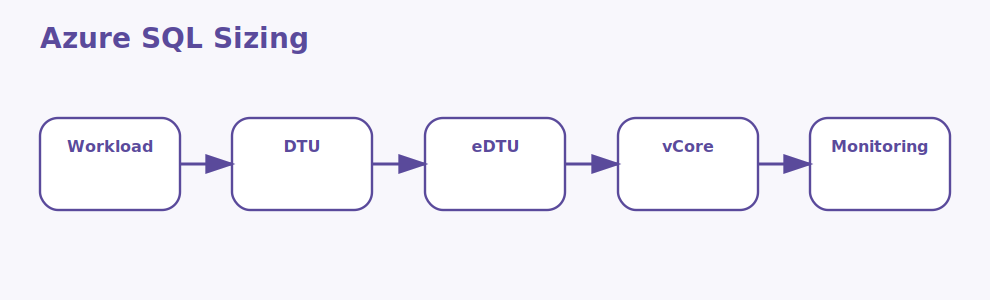

# DTU and eDTU Interview Questions



This page stays focused on Azure SQL performance sizing concepts rather than general database theory.

## 1. DTU model

### 1. What is the role of DTU model in Azure SQL sizing models?

**Answer:**

In Azure SQL sizing models, the term DTU model refers to the bundled sizing model that combines CPU, memory,
and I O into one performance unit. It is part of the foundation a candidate should be able to
explain clearly.

**Sample:**

```bash
# Concept: 1. DTU model
az sql db show   --name appdb   --resource-group rg-app   --server sql-demo
```

---

### 2. Why is the concept of DTU model important in Azure SQL sizing models?

**Answer:**

This concept matters because it influences the bundled sizing model that combines CPU, memory, and I O
into one performance unit. Good interview answers connect it to clarity, maintainability,
performance, security, or delivery depending on the situation.

**Sample:**

```bash
# Concept: 1. DTU model
az sql db show   --name appdb   --resource-group rg-app   --server sql-demo
```

---

### 3. When should a team focus on DTU model?

**Answer:**

A team should focus on DTU model when the requirement depends on the bundled sizing model that
combines CPU, memory, and I O into one performance unit. It becomes especially important when design
decisions, scaling choices, or debugging depend on that area.

**Sample:**

```bash
# Concept: 1. DTU model
az sql db show   --name appdb   --resource-group rg-app   --server sql-demo
```

---

### 4. How is DTU model applied in practice?

**Answer:**

In practice, DTU model is applied by making the bundled sizing model that combines CPU, memory, and
I O into one performance unit explicit in the implementation or workflow. The exact shape depends on
the service design, but the responsibility should stay predictable.

**Sample:**

```bash
# Concept: 1. DTU model
az sql db show   --name appdb   --resource-group rg-app   --server sql-demo
```

---

### 5. What strengths does DTU model bring?

**Answer:**

The strengths of DTU model are better structure, better communication, and better control over the
bundled sizing model that combines CPU, memory, and I O into one performance unit. It also makes
tradeoffs easier to explain to both interviewers and project stakeholders.

**Sample:**

```bash
# Concept: 1. DTU model
az sql db show   --name appdb   --resource-group rg-app   --server sql-demo
```

---

### 6. What tradeoffs come with DTU model?

**Answer:**

The main tradeoff is extra complexity if DTU model is introduced without a real need or a clear
understanding of the bundled sizing model that combines CPU, memory, and I O into one performance
unit. That usually leads to higher cost, weaker design, or harder troubleshooting.

**Sample:**

```bash
# Concept: 1. DTU model
az sql db show   --name appdb   --resource-group rg-app   --server sql-demo
```

---

### 7. How does DTU model differ from eDTU pools?

**Answer:**

DTU model is centered on the bundled sizing model that combines CPU, memory, and I O into one
performance unit, while eDTU pools is centered on the elastic performance model where multiple
databases share a pool of capacity. They often work together, but they solve different parts of the
topic.

**Sample:**

```bash
# Concept: 1. DTU model
az sql db show   --name appdb   --resource-group rg-app   --server sql-demo
```

---

### 8. What is a good real-world example of DTU model?

**Answer:**

A strong example is explaining how DTU model affects a real feature, cost decision, failure mode, or
architecture choice involving the bundled sizing model that combines CPU, memory, and I O into one
performance unit. Interviewers usually value the reasoning behind the example.

**Sample:**

```bash
# Concept: 1. DTU model
az sql db show   --name appdb   --resource-group rg-app   --server sql-demo
```

---

### 9. What is a best practice for DTU model?

**Answer:**

A good practice is to keep DTU model aligned with the actual requirement around the bundled sizing
model that combines CPU, memory, and I O into one performance unit. Teams should document intent,
keep the setup readable, and validate the most important paths early.

**Sample:**

```bash
# Concept: 1. DTU model
az sql db show   --name appdb   --resource-group rg-app   --server sql-demo
```

---

### 10. What is a common mistake around DTU model?

**Answer:**

A common mistake is naming DTU model without understanding how it affects the bundled sizing model
that combines CPU, memory, and I O into one performance unit. In real work, that usually appears as
weak sizing, poor troubleshooting, or the wrong operational choice.

**Sample:**

```bash
# Concept: 1. DTU model
az sql db show   --name appdb   --resource-group rg-app   --server sql-demo
```

---

### 11. How do you troubleshoot DTU model-related issues?

**Answer:**

When troubleshooting DTU model, first verify whether the bundled sizing model that combines CPU,
memory, and I O into one performance unit is behaving as expected. Then check dependencies,
configuration, metrics, logs, and edge cases before changing the design.

**Sample:**

```bash
# Concept: 1. DTU model
az sql db show   --name appdb   --resource-group rg-app   --server sql-demo
```

---

### 12. How does DTU model connect to the rest of Azure SQL sizing models?

**Answer:**

DTU model connects to the rest of Azure SQL sizing models by giving structure to the bundled sizing
model that combines CPU, memory, and I O into one performance unit. It is one of the pieces that
turns isolated facts into a usable end-to-end mental model.

**Sample:**

```bash
# Concept: 1. DTU model
az sql db show   --name appdb   --resource-group rg-app   --server sql-demo
```

---

## 2. eDTU pools

### 13. What is the role of eDTU pools in Azure SQL sizing models?

**Answer:**

In Azure SQL sizing models, the term eDTU pools refers to the elastic performance model where multiple
databases share a pool of capacity. It is part of the foundation a candidate should be able to
explain clearly.

**Sample:**

```bash
# Concept: 2. eDTU pools
az sql db show   --name appdb   --resource-group rg-app   --server sql-demo
```

---

### 14. Why is the concept of eDTU pools important in Azure SQL sizing models?

**Answer:**

This concept matters because it influences the elastic performance model where multiple databases
share a pool of capacity. Good interview answers connect it to clarity, maintainability,
performance, security, or delivery depending on the situation.

**Sample:**

```bash
# Concept: 2. eDTU pools
az sql db show   --name appdb   --resource-group rg-app   --server sql-demo
```

---

### 15. When should a team focus on eDTU pools?

**Answer:**

A team should focus on eDTU pools when the requirement depends on the elastic performance model
where multiple databases share a pool of capacity. It becomes especially important when design
decisions, scaling choices, or debugging depend on that area.

**Sample:**

```bash
# Concept: 2. eDTU pools
az sql db show   --name appdb   --resource-group rg-app   --server sql-demo
```

---

### 16. How is eDTU pools applied in practice?

**Answer:**

In practice, eDTU pools is applied by making the elastic performance model where multiple databases
share a pool of capacity explicit in the implementation or workflow. The exact shape depends on the
service design, but the responsibility should stay predictable.

**Sample:**

```bash
# Concept: 2. eDTU pools
az sql db show   --name appdb   --resource-group rg-app   --server sql-demo
```

---

### 17. What strengths does eDTU pools bring?

**Answer:**

The strengths of eDTU pools are better structure, better communication, and better control over the
elastic performance model where multiple databases share a pool of capacity. It also makes tradeoffs
easier to explain to both interviewers and project stakeholders.

**Sample:**

```bash
# Concept: 2. eDTU pools
az sql db show   --name appdb   --resource-group rg-app   --server sql-demo
```

---

### 18. What tradeoffs come with eDTU pools?

**Answer:**

The main tradeoff is extra complexity if eDTU pools is introduced without a real need or a clear
understanding of the elastic performance model where multiple databases share a pool of capacity.
That usually leads to higher cost, weaker design, or harder troubleshooting.

**Sample:**

```bash
# Concept: 2. eDTU pools
az sql db show   --name appdb   --resource-group rg-app   --server sql-demo
```

---

### 19. How does eDTU pools differ from vCore model?

**Answer:**

eDTU pools is centered on the elastic performance model where multiple databases share a pool of
capacity, while vCore model is centered on the more explicit sizing model that exposes compute and
memory choices more directly. They often work together, but they solve different parts of the topic.

**Sample:**

```bash
# Concept: 2. eDTU pools
az sql db show   --name appdb   --resource-group rg-app   --server sql-demo
```

---

### 20. What is a good real-world example of eDTU pools?

**Answer:**

A strong example is explaining how eDTU pools affects a real feature, cost decision, failure mode,
or architecture choice involving the elastic performance model where multiple databases share a pool
of capacity. Interviewers usually value the reasoning behind the example.

**Sample:**

```bash
# Concept: 2. eDTU pools
az sql db show   --name appdb   --resource-group rg-app   --server sql-demo
```

---

### 21. What is a best practice for eDTU pools?

**Answer:**

A good practice is to keep eDTU pools aligned with the actual requirement around the elastic
performance model where multiple databases share a pool of capacity. Teams should document intent,
keep the setup readable, and validate the most important paths early.

**Sample:**

```bash
# Concept: 2. eDTU pools
az sql db show   --name appdb   --resource-group rg-app   --server sql-demo
```

---

### 22. What is a common mistake around eDTU pools?

**Answer:**

A common mistake is naming eDTU pools without understanding how it affects the elastic performance
model where multiple databases share a pool of capacity. In real work, that usually appears as weak
sizing, poor troubleshooting, or the wrong operational choice.

**Sample:**

```bash
# Concept: 2. eDTU pools
az sql db show   --name appdb   --resource-group rg-app   --server sql-demo
```

---

### 23. How do you troubleshoot eDTU pools-related issues?

**Answer:**

When troubleshooting eDTU pools, first verify whether the elastic performance model where multiple
databases share a pool of capacity is behaving as expected. Then check dependencies, configuration,
metrics, logs, and edge cases before changing the design.

**Sample:**

```bash
# Concept: 2. eDTU pools
az sql db show   --name appdb   --resource-group rg-app   --server sql-demo
```

---

### 24. How does eDTU pools connect to the rest of Azure SQL sizing models?

**Answer:**

eDTU pools connects to the rest of Azure SQL sizing models by giving structure to the elastic
performance model where multiple databases share a pool of capacity. It is one of the pieces that
turns isolated facts into a usable end-to-end mental model.

**Sample:**

```bash
# Concept: 2. eDTU pools
az sql db show   --name appdb   --resource-group rg-app   --server sql-demo
```

---

## 3. vCore model

### 25. What is the role of vCore model in Azure SQL sizing models?

**Answer:**

In Azure SQL sizing models, the term vCore model refers to the more explicit sizing model that exposes
compute and memory choices more directly. It is part of the foundation a candidate should be able to
explain clearly.

**Sample:**

```bash
# Concept: 3. vCore model
az sql db show   --name appdb   --resource-group rg-app   --server sql-demo
```

---

### 26. Why is the concept of vCore model important in Azure SQL sizing models?

**Answer:**

This concept matters because it influences the more explicit sizing model that exposes compute and
memory choices more directly. Good interview answers connect it to clarity, maintainability,
performance, security, or delivery depending on the situation.

**Sample:**

```bash
# Concept: 3. vCore model
az sql db show   --name appdb   --resource-group rg-app   --server sql-demo
```

---

### 27. When should a team focus on vCore model?

**Answer:**

A team should focus on vCore model when the requirement depends on the more explicit sizing model
that exposes compute and memory choices more directly. It becomes especially important when design
decisions, scaling choices, or debugging depend on that area.

**Sample:**

```bash
# Concept: 3. vCore model
az sql db show   --name appdb   --resource-group rg-app   --server sql-demo
```

---

### 28. How is vCore model applied in practice?

**Answer:**

In practice, vCore model is applied by making the more explicit sizing model that exposes compute
and memory choices more directly explicit in the implementation or workflow. The exact shape depends
on the service design, but the responsibility should stay predictable.

**Sample:**

```bash
# Concept: 3. vCore model
az sql db show   --name appdb   --resource-group rg-app   --server sql-demo
```

---

### 29. What strengths does vCore model bring?

**Answer:**

The strengths of vCore model are better structure, better communication, and better control over the
more explicit sizing model that exposes compute and memory choices more directly. It also makes
tradeoffs easier to explain to both interviewers and project stakeholders.

**Sample:**

```bash
# Concept: 3. vCore model
az sql db show   --name appdb   --resource-group rg-app   --server sql-demo
```

---

### 30. What tradeoffs come with vCore model?

**Answer:**

The main tradeoff is extra complexity if vCore model is introduced without a real need or a clear
understanding of the more explicit sizing model that exposes compute and memory choices more
directly. That usually leads to higher cost, weaker design, or harder troubleshooting.

**Sample:**

```bash
# Concept: 3. vCore model
az sql db show   --name appdb   --resource-group rg-app   --server sql-demo
```

---

### 31. How does vCore model differ from Workload sizing?

**Answer:**

vCore model is centered on the more explicit sizing model that exposes compute and memory choices
more directly, while Workload sizing is centered on the evaluation of how much compute, storage, and
throughput a database really needs. They often work together, but they solve different parts of the
topic.

**Sample:**

```bash
# Concept: 3. vCore model
az sql db show   --name appdb   --resource-group rg-app   --server sql-demo
```

---

### 32. What is a good real-world example of vCore model?

**Answer:**

A strong example is explaining how vCore model affects a real feature, cost decision, failure mode,
or architecture choice involving the more explicit sizing model that exposes compute and memory
choices more directly. Interviewers usually value the reasoning behind the example.

**Sample:**

```bash
# Concept: 3. vCore model
az sql db show   --name appdb   --resource-group rg-app   --server sql-demo
```

---

### 33. What is a best practice for vCore model?

**Answer:**

A good practice is to keep vCore model aligned with the actual requirement around the more explicit
sizing model that exposes compute and memory choices more directly. Teams should document intent,
keep the setup readable, and validate the most important paths early.

**Sample:**

```bash
# Concept: 3. vCore model
az sql db show   --name appdb   --resource-group rg-app   --server sql-demo
```

---

### 34. What is a common mistake around vCore model?

**Answer:**

A common mistake is naming vCore model without understanding how it affects the more explicit sizing
model that exposes compute and memory choices more directly. In real work, that usually appears as
weak sizing, poor troubleshooting, or the wrong operational choice.

**Sample:**

```bash
# Concept: 3. vCore model
az sql db show   --name appdb   --resource-group rg-app   --server sql-demo
```

---

### 35. How do you troubleshoot vCore model-related issues?

**Answer:**

When troubleshooting vCore model, first verify whether the more explicit sizing model that exposes
compute and memory choices more directly is behaving as expected. Then check dependencies,
configuration, metrics, logs, and edge cases before changing the design.

**Sample:**

```bash
# Concept: 3. vCore model
az sql db show   --name appdb   --resource-group rg-app   --server sql-demo
```

---

### 36. How does vCore model connect to the rest of Azure SQL sizing models?

**Answer:**

vCore model connects to the rest of Azure SQL sizing models by giving structure to the more explicit
sizing model that exposes compute and memory choices more directly. It is one of the pieces that
turns isolated facts into a usable end-to-end mental model.

**Sample:**

```bash
# Concept: 3. vCore model
az sql db show   --name appdb   --resource-group rg-app   --server sql-demo
```

---

## 4. Workload sizing

### 37. What is the role of Workload sizing in Azure SQL sizing models?

**Answer:**

In Azure SQL sizing models, the term Workload sizing refers to the evaluation of how much compute, storage,
and throughput a database really needs. It is part of the foundation a candidate should be able to
explain clearly.

**Sample:**

```bash
# Concept: 4. Workload sizing
az sql db show   --name appdb   --resource-group rg-app   --server sql-demo
```

---

### 38. Why is the concept of Workload sizing important in Azure SQL sizing models?

**Answer:**

This concept matters because it influences the evaluation of how much compute, storage, and
throughput a database really needs. Good interview answers connect it to clarity, maintainability,
performance, security, or delivery depending on the situation.

**Sample:**

```bash
# Concept: 4. Workload sizing
az sql db show   --name appdb   --resource-group rg-app   --server sql-demo
```

---

### 39. When should a team focus on Workload sizing?

**Answer:**

A team should focus on Workload sizing when the requirement depends on the evaluation of how much
compute, storage, and throughput a database really needs. It becomes especially important when
design decisions, scaling choices, or debugging depend on that area.

**Sample:**

```bash
# Concept: 4. Workload sizing
az sql db show   --name appdb   --resource-group rg-app   --server sql-demo
```

---

### 40. How is Workload sizing applied in practice?

**Answer:**

In practice, Workload sizing is applied by making the evaluation of how much compute, storage, and
throughput a database really needs explicit in the implementation or workflow. The exact shape
depends on the service design, but the responsibility should stay predictable.

**Sample:**

```bash
# Concept: 4. Workload sizing
az sql db show   --name appdb   --resource-group rg-app   --server sql-demo
```

---

### 41. What strengths does Workload sizing bring?

**Answer:**

The strengths of Workload sizing are better structure, better communication, and better control over
the evaluation of how much compute, storage, and throughput a database really needs. It also makes
tradeoffs easier to explain to both interviewers and project stakeholders.

**Sample:**

```bash
# Concept: 4. Workload sizing
az sql db show   --name appdb   --resource-group rg-app   --server sql-demo
```

---

### 42. What tradeoffs come with Workload sizing?

**Answer:**

The main tradeoff is extra complexity if Workload sizing is introduced without a real need or a
clear understanding of the evaluation of how much compute, storage, and throughput a database really
needs. That usually leads to higher cost, weaker design, or harder troubleshooting.

**Sample:**

```bash
# Concept: 4. Workload sizing
az sql db show   --name appdb   --resource-group rg-app   --server sql-demo
```

---

### 43. How does Workload sizing differ from Azure SQL metrics?

**Answer:**

Workload sizing is centered on the evaluation of how much compute, storage, and throughput a
database really needs, while Azure SQL metrics is centered on the measurements used to understand
utilization, bottlenecks, and health. They often work together, but they solve different parts of
the topic.

**Sample:**

```bash
# Concept: 4. Workload sizing
az sql db show   --name appdb   --resource-group rg-app   --server sql-demo
```

---

### 44. What is a good real-world example of Workload sizing?

**Answer:**

A strong example is explaining how Workload sizing affects a real feature, cost decision, failure
mode, or architecture choice involving the evaluation of how much compute, storage, and throughput a
database really needs. Interviewers usually value the reasoning behind the example.

**Sample:**

```bash
# Concept: 4. Workload sizing
az sql db show   --name appdb   --resource-group rg-app   --server sql-demo
```

---

### 45. What is a best practice for Workload sizing?

**Answer:**

A good practice is to keep Workload sizing aligned with the actual requirement around the evaluation
of how much compute, storage, and throughput a database really needs. Teams should document intent,
keep the setup readable, and validate the most important paths early.

**Sample:**

```bash
# Concept: 4. Workload sizing
az sql db show   --name appdb   --resource-group rg-app   --server sql-demo
```

---

### 46. What is a common mistake around Workload sizing?

**Answer:**

A common mistake is naming Workload sizing without understanding how it affects the evaluation of
how much compute, storage, and throughput a database really needs. In real work, that usually
appears as weak sizing, poor troubleshooting, or the wrong operational choice.

**Sample:**

```bash
# Concept: 4. Workload sizing
az sql db show   --name appdb   --resource-group rg-app   --server sql-demo
```

---

### 47. How do you troubleshoot Workload sizing-related issues?

**Answer:**

When troubleshooting Workload sizing, first verify whether the evaluation of how much compute,
storage, and throughput a database really needs is behaving as expected. Then check dependencies,
configuration, metrics, logs, and edge cases before changing the design.

**Sample:**

```bash
# Concept: 4. Workload sizing
az sql db show   --name appdb   --resource-group rg-app   --server sql-demo
```

---

### 48. How does Workload sizing connect to the rest of Azure SQL sizing models?

**Answer:**

Workload sizing connects to the rest of Azure SQL sizing models by giving structure to the
evaluation of how much compute, storage, and throughput a database really needs. It is one of the
pieces that turns isolated facts into a usable end-to-end mental model.

**Sample:**

```bash
# Concept: 4. Workload sizing
az sql db show   --name appdb   --resource-group rg-app   --server sql-demo
```

---

## 5. Azure SQL metrics

### 49. What is the role of Azure SQL metrics in Azure SQL sizing models?

**Answer:**

In Azure SQL sizing models, the term Azure SQL metrics refers to the measurements used to understand
utilization, bottlenecks, and health. It is part of the foundation a candidate should be able to
explain clearly.

**Sample:**

```bash
# Concept: 5. Azure SQL metrics
az sql db show   --name appdb   --resource-group rg-app   --server sql-demo
```

---

### 50. Why is the concept of Azure SQL metrics important in Azure SQL sizing models?

**Answer:**

This concept matters because it influences the measurements used to understand utilization,
bottlenecks, and health. Good interview answers connect it to clarity, maintainability, performance,
security, or delivery depending on the situation.

**Sample:**

```bash
# Concept: 5. Azure SQL metrics
az sql db show   --name appdb   --resource-group rg-app   --server sql-demo
```

---

### 51. When should a team focus on Azure SQL metrics?

**Answer:**

A team should focus on Azure SQL metrics when the requirement depends on the measurements used to
understand utilization, bottlenecks, and health. It becomes especially important when design
decisions, scaling choices, or debugging depend on that area.

**Sample:**

```bash
# Concept: 5. Azure SQL metrics
az sql db show   --name appdb   --resource-group rg-app   --server sql-demo
```

---

### 52. How is Azure SQL metrics applied in practice?

**Answer:**

In practice, Azure SQL metrics is applied by making the measurements used to understand utilization,
bottlenecks, and health explicit in the implementation or workflow. The exact shape depends on the
service design, but the responsibility should stay predictable.

**Sample:**

```bash
# Concept: 5. Azure SQL metrics
az sql db show   --name appdb   --resource-group rg-app   --server sql-demo
```

---

### 53. What strengths does Azure SQL metrics bring?

**Answer:**

The strengths of Azure SQL metrics are better structure, better communication, and better control
over the measurements used to understand utilization, bottlenecks, and health. It also makes
tradeoffs easier to explain to both interviewers and project stakeholders.

**Sample:**

```bash
# Concept: 5. Azure SQL metrics
az sql db show   --name appdb   --resource-group rg-app   --server sql-demo
```

---

### 54. What tradeoffs come with Azure SQL metrics?

**Answer:**

The main tradeoff is extra complexity if Azure SQL metrics is introduced without a real need or a
clear understanding of the measurements used to understand utilization, bottlenecks, and health.
That usually leads to higher cost, weaker design, or harder troubleshooting.

**Sample:**

```bash
# Concept: 5. Azure SQL metrics
az sql db show   --name appdb   --resource-group rg-app   --server sql-demo
```

---

### 55. How does Azure SQL metrics differ from Query tuning?

**Answer:**

Azure SQL metrics is centered on the measurements used to understand utilization, bottlenecks, and
health, while Query tuning is centered on the optimization of queries so they consume fewer
resources and scale more predictably. They often work together, but they solve different parts of
the topic.

**Sample:**

```bash
# Concept: 5. Azure SQL metrics
az sql db show   --name appdb   --resource-group rg-app   --server sql-demo
```

---

### 56. What is a good real-world example of Azure SQL metrics?

**Answer:**

A strong example is explaining how Azure SQL metrics affects a real feature, cost decision, failure
mode, or architecture choice involving the measurements used to understand utilization, bottlenecks,
and health. Interviewers usually value the reasoning behind the example.

**Sample:**

```bash
# Concept: 5. Azure SQL metrics
az sql db show   --name appdb   --resource-group rg-app   --server sql-demo
```

---

### 57. What is a best practice for Azure SQL metrics?

**Answer:**

A good practice is to keep Azure SQL metrics aligned with the actual requirement around the
measurements used to understand utilization, bottlenecks, and health. Teams should document intent,
keep the setup readable, and validate the most important paths early.

**Sample:**

```bash
# Concept: 5. Azure SQL metrics
az sql db show   --name appdb   --resource-group rg-app   --server sql-demo
```

---

### 58. What is a common mistake around Azure SQL metrics?

**Answer:**

A common mistake is naming Azure SQL metrics without understanding how it affects the measurements
used to understand utilization, bottlenecks, and health. In real work, that usually appears as weak
sizing, poor troubleshooting, or the wrong operational choice.

**Sample:**

```bash
# Concept: 5. Azure SQL metrics
az sql db show   --name appdb   --resource-group rg-app   --server sql-demo
```

---

### 59. How do you troubleshoot Azure SQL metrics-related issues?

**Answer:**

When troubleshooting Azure SQL metrics, first verify whether the measurements used to understand
utilization, bottlenecks, and health is behaving as expected. Then check dependencies,
configuration, metrics, logs, and edge cases before changing the design.

**Sample:**

```bash
# Concept: 5. Azure SQL metrics
az sql db show   --name appdb   --resource-group rg-app   --server sql-demo
```

---

### 60. How does Azure SQL metrics connect to the rest of Azure SQL sizing models?

**Answer:**

Azure SQL metrics connects to the rest of Azure SQL sizing models by giving structure to the
measurements used to understand utilization, bottlenecks, and health. It is one of the pieces that
turns isolated facts into a usable end-to-end mental model.

**Sample:**

```bash
# Concept: 5. Azure SQL metrics
az sql db show   --name appdb   --resource-group rg-app   --server sql-demo
```

---

## 6. Query tuning

### 61. What is the role of Query tuning in Azure SQL sizing models?

**Answer:**

In Azure SQL sizing models, the term Query tuning refers to the optimization of queries so they consume fewer
resources and scale more predictably. It is part of the foundation a candidate should be able to
explain clearly.

**Sample:**

```bash
# Concept: 6. Query tuning
az sql db show   --name appdb   --resource-group rg-app   --server sql-demo
```

---

### 62. Why is the concept of Query tuning important in Azure SQL sizing models?

**Answer:**

This concept matters because it influences the optimization of queries so they consume fewer
resources and scale more predictably. Good interview answers connect it to clarity, maintainability,
performance, security, or delivery depending on the situation.

**Sample:**

```bash
# Concept: 6. Query tuning
az sql db show   --name appdb   --resource-group rg-app   --server sql-demo
```

---

### 63. When should a team focus on Query tuning?

**Answer:**

A team should focus on Query tuning when the requirement depends on the optimization of queries so
they consume fewer resources and scale more predictably. It becomes especially important when design
decisions, scaling choices, or debugging depend on that area.

**Sample:**

```bash
# Concept: 6. Query tuning
az sql db show   --name appdb   --resource-group rg-app   --server sql-demo
```

---

### 64. How is Query tuning applied in practice?

**Answer:**

In practice, Query tuning is applied by making the optimization of queries so they consume fewer
resources and scale more predictably explicit in the implementation or workflow. The exact shape
depends on the service design, but the responsibility should stay predictable.

**Sample:**

```bash
# Concept: 6. Query tuning
az sql db show   --name appdb   --resource-group rg-app   --server sql-demo
```

---

### 65. What strengths does Query tuning bring?

**Answer:**

The strengths of Query tuning are better structure, better communication, and better control over
the optimization of queries so they consume fewer resources and scale more predictably. It also
makes tradeoffs easier to explain to both interviewers and project stakeholders.

**Sample:**

```bash
# Concept: 6. Query tuning
az sql db show   --name appdb   --resource-group rg-app   --server sql-demo
```

---

### 66. What tradeoffs come with Query tuning?

**Answer:**

The main tradeoff is extra complexity if Query tuning is introduced without a real need or a clear
understanding of the optimization of queries so they consume fewer resources and scale more
predictably. That usually leads to higher cost, weaker design, or harder troubleshooting.

**Sample:**

```bash
# Concept: 6. Query tuning
az sql db show   --name appdb   --resource-group rg-app   --server sql-demo
```

---

### 67. How does Query tuning differ from Indexing strategy?

**Answer:**

Query tuning is centered on the optimization of queries so they consume fewer resources and scale
more predictably, while Indexing strategy is centered on the choice of indexes that improves read
performance without adding unnecessary write cost. They often work together, but they solve
different parts of the topic.

**Sample:**

```bash
# Concept: 6. Query tuning
az sql db show   --name appdb   --resource-group rg-app   --server sql-demo
```

---

### 68. What is a good real-world example of Query tuning?

**Answer:**

A strong example is explaining how Query tuning affects a real feature, cost decision, failure mode,
or architecture choice involving the optimization of queries so they consume fewer resources and
scale more predictably. Interviewers usually value the reasoning behind the example.

**Sample:**

```bash
# Concept: 6. Query tuning
az sql db show   --name appdb   --resource-group rg-app   --server sql-demo
```

---

### 69. What is a best practice for Query tuning?

**Answer:**

A good practice is to keep Query tuning aligned with the actual requirement around the optimization
of queries so they consume fewer resources and scale more predictably. Teams should document intent,
keep the setup readable, and validate the most important paths early.

**Sample:**

```bash
# Concept: 6. Query tuning
az sql db show   --name appdb   --resource-group rg-app   --server sql-demo
```

---

### 70. What is a common mistake around Query tuning?

**Answer:**

A common mistake is naming Query tuning without understanding how it affects the optimization of
queries so they consume fewer resources and scale more predictably. In real work, that usually
appears as weak sizing, poor troubleshooting, or the wrong operational choice.

**Sample:**

```bash
# Concept: 6. Query tuning
az sql db show   --name appdb   --resource-group rg-app   --server sql-demo
```

---

### 71. How do you troubleshoot Query tuning-related issues?

**Answer:**

When troubleshooting Query tuning, first verify whether the optimization of queries so they consume
fewer resources and scale more predictably is behaving as expected. Then check dependencies,
configuration, metrics, logs, and edge cases before changing the design.

**Sample:**

```bash
# Concept: 6. Query tuning
az sql db show   --name appdb   --resource-group rg-app   --server sql-demo
```

---

### 72. How does Query tuning connect to the rest of Azure SQL sizing models?

**Answer:**

Query tuning connects to the rest of Azure SQL sizing models by giving structure to the optimization
of queries so they consume fewer resources and scale more predictably. It is one of the pieces that
turns isolated facts into a usable end-to-end mental model.

**Sample:**

```bash
# Concept: 6. Query tuning
az sql db show   --name appdb   --resource-group rg-app   --server sql-demo
```

---

## 7. Indexing strategy

### 73. What is the role of Indexing strategy in Azure SQL sizing models?

**Answer:**

In Azure SQL sizing models, the term Indexing strategy refers to the choice of indexes that improves read
performance without adding unnecessary write cost. It is part of the foundation a candidate should
be able to explain clearly.

**Sample:**

```bash
# Concept: 7. Indexing strategy
az sql db show   --name appdb   --resource-group rg-app   --server sql-demo
```

---

### 74. Why is the concept of Indexing strategy important in Azure SQL sizing models?

**Answer:**

This concept matters because it influences the choice of indexes that improves read performance
without adding unnecessary write cost. Good interview answers connect it to clarity,
maintainability, performance, security, or delivery depending on the situation.

**Sample:**

```bash
# Concept: 7. Indexing strategy
az sql db show   --name appdb   --resource-group rg-app   --server sql-demo
```

---

### 75. When should a team focus on Indexing strategy?

**Answer:**

A team should focus on Indexing strategy when the requirement depends on the choice of indexes that
improves read performance without adding unnecessary write cost. It becomes especially important
when design decisions, scaling choices, or debugging depend on that area.

**Sample:**

```bash
# Concept: 7. Indexing strategy
az sql db show   --name appdb   --resource-group rg-app   --server sql-demo
```

---

### 76. How is Indexing strategy applied in practice?

**Answer:**

In practice, Indexing strategy is applied by making the choice of indexes that improves read
performance without adding unnecessary write cost explicit in the implementation or workflow. The
exact shape depends on the service design, but the responsibility should stay predictable.

**Sample:**

```bash
# Concept: 7. Indexing strategy
az sql db show   --name appdb   --resource-group rg-app   --server sql-demo
```

---

### 77. What strengths does Indexing strategy bring?

**Answer:**

The strengths of Indexing strategy are better structure, better communication, and better control
over the choice of indexes that improves read performance without adding unnecessary write cost. It
also makes tradeoffs easier to explain to both interviewers and project stakeholders.

**Sample:**

```bash
# Concept: 7. Indexing strategy
az sql db show   --name appdb   --resource-group rg-app   --server sql-demo
```

---

### 78. What tradeoffs come with Indexing strategy?

**Answer:**

The main tradeoff is extra complexity if Indexing strategy is introduced without a real need or a
clear understanding of the choice of indexes that improves read performance without adding
unnecessary write cost. That usually leads to higher cost, weaker design, or harder troubleshooting.

**Sample:**

```bash
# Concept: 7. Indexing strategy
az sql db show   --name appdb   --resource-group rg-app   --server sql-demo
```

---

### 79. How does Indexing strategy differ from Elastic pool fit?

**Answer:**

Indexing strategy is centered on the choice of indexes that improves read performance without adding
unnecessary write cost, while Elastic pool fit is centered on the decision of whether pooled
capacity is better than isolated database sizing. They often work together, but they solve different
parts of the topic.

**Sample:**

```bash
# Concept: 7. Indexing strategy
az sql db show   --name appdb   --resource-group rg-app   --server sql-demo
```

---

### 80. What is a good real-world example of Indexing strategy?

**Answer:**

A strong example is explaining how Indexing strategy affects a real feature, cost decision, failure
mode, or architecture choice involving the choice of indexes that improves read performance without
adding unnecessary write cost. Interviewers usually value the reasoning behind the example.

**Sample:**

```bash
# Concept: 7. Indexing strategy
az sql db show   --name appdb   --resource-group rg-app   --server sql-demo
```

---

### 81. What is a best practice for Indexing strategy?

**Answer:**

A good practice is to keep Indexing strategy aligned with the actual requirement around the choice
of indexes that improves read performance without adding unnecessary write cost. Teams should
document intent, keep the setup readable, and validate the most important paths early.

**Sample:**

```bash
# Concept: 7. Indexing strategy
az sql db show   --name appdb   --resource-group rg-app   --server sql-demo
```

---

### 82. What is a common mistake around Indexing strategy?

**Answer:**

A common mistake is naming Indexing strategy without understanding how it affects the choice of
indexes that improves read performance without adding unnecessary write cost. In real work, that
usually appears as weak sizing, poor troubleshooting, or the wrong operational choice.

**Sample:**

```bash
# Concept: 7. Indexing strategy
az sql db show   --name appdb   --resource-group rg-app   --server sql-demo
```

---

### 83. How do you troubleshoot Indexing strategy-related issues?

**Answer:**

When troubleshooting Indexing strategy, first verify whether the choice of indexes that improves
read performance without adding unnecessary write cost is behaving as expected. Then check
dependencies, configuration, metrics, logs, and edge cases before changing the design.

**Sample:**

```bash
# Concept: 7. Indexing strategy
az sql db show   --name appdb   --resource-group rg-app   --server sql-demo
```

---

### 84. How does Indexing strategy connect to the rest of Azure SQL sizing models?

**Answer:**

Indexing strategy connects to the rest of Azure SQL sizing models by giving structure to the choice
of indexes that improves read performance without adding unnecessary write cost. It is one of the
pieces that turns isolated facts into a usable end-to-end mental model.

**Sample:**

```bash
# Concept: 7. Indexing strategy
az sql db show   --name appdb   --resource-group rg-app   --server sql-demo
```

---

## 8. Elastic pool fit

### 85. What is the role of Elastic pool fit in Azure SQL sizing models?

**Answer:**

In Azure SQL sizing models, the term Elastic pool fit refers to the decision of whether pooled capacity is
better than isolated database sizing. It is part of the foundation a candidate should be able to
explain clearly.

**Sample:**

```bash
# Concept: 8. Elastic pool fit
az sql db show   --name appdb   --resource-group rg-app   --server sql-demo
```

---

### 86. Why is the concept of Elastic pool fit important in Azure SQL sizing models?

**Answer:**

This concept matters because it influences the decision of whether pooled capacity is better
than isolated database sizing. Good interview answers connect it to clarity, maintainability,
performance, security, or delivery depending on the situation.

**Sample:**

```bash
# Concept: 8. Elastic pool fit
az sql db show   --name appdb   --resource-group rg-app   --server sql-demo
```

---

### 87. When should a team focus on Elastic pool fit?

**Answer:**

A team should focus on Elastic pool fit when the requirement depends on the decision of whether
pooled capacity is better than isolated database sizing. It becomes especially important when design
decisions, scaling choices, or debugging depend on that area.

**Sample:**

```bash
# Concept: 8. Elastic pool fit
az sql db show   --name appdb   --resource-group rg-app   --server sql-demo
```

---

### 88. How is Elastic pool fit applied in practice?

**Answer:**

In practice, Elastic pool fit is applied by making the decision of whether pooled capacity is better
than isolated database sizing explicit in the implementation or workflow. The exact shape depends on
the service design, but the responsibility should stay predictable.

**Sample:**

```bash
# Concept: 8. Elastic pool fit
az sql db show   --name appdb   --resource-group rg-app   --server sql-demo
```

---

### 89. What strengths does Elastic pool fit bring?

**Answer:**

The strengths of Elastic pool fit are better structure, better communication, and better control
over the decision of whether pooled capacity is better than isolated database sizing. It also makes
tradeoffs easier to explain to both interviewers and project stakeholders.

**Sample:**

```bash
# Concept: 8. Elastic pool fit
az sql db show   --name appdb   --resource-group rg-app   --server sql-demo
```

---

### 90. What tradeoffs come with Elastic pool fit?

**Answer:**

The main tradeoff is extra complexity if Elastic pool fit is introduced without a real need or a
clear understanding of the decision of whether pooled capacity is better than isolated database
sizing. That usually leads to higher cost, weaker design, or harder troubleshooting.

**Sample:**

```bash
# Concept: 8. Elastic pool fit
az sql db show   --name appdb   --resource-group rg-app   --server sql-demo
```

---

### 91. How does Elastic pool fit differ from Scaling decisions?

**Answer:**

Elastic pool fit is centered on the decision of whether pooled capacity is better than isolated
database sizing, while Scaling decisions is centered on the reasoning used to move up, down, or
sideways between performance tiers. They often work together, but they solve different parts of the
topic.

**Sample:**

```bash
# Concept: 8. Elastic pool fit
az sql db show   --name appdb   --resource-group rg-app   --server sql-demo
```

---

### 92. What is a good real-world example of Elastic pool fit?

**Answer:**

A strong example is explaining how Elastic pool fit affects a real feature, cost decision, failure
mode, or architecture choice involving the decision of whether pooled capacity is better than
isolated database sizing. Interviewers usually value the reasoning behind the example.

**Sample:**

```bash
# Concept: 8. Elastic pool fit
az sql db show   --name appdb   --resource-group rg-app   --server sql-demo
```

---

### 93. What is a best practice for Elastic pool fit?

**Answer:**

A good practice is to keep Elastic pool fit aligned with the actual requirement around the decision
of whether pooled capacity is better than isolated database sizing. Teams should document intent,
keep the setup readable, and validate the most important paths early.

**Sample:**

```bash
# Concept: 8. Elastic pool fit
az sql db show   --name appdb   --resource-group rg-app   --server sql-demo
```

---

### 94. What is a common mistake around Elastic pool fit?

**Answer:**

A common mistake is naming Elastic pool fit without understanding how it affects the decision of
whether pooled capacity is better than isolated database sizing. In real work, that usually appears
as weak sizing, poor troubleshooting, or the wrong operational choice.

**Sample:**

```bash
# Concept: 8. Elastic pool fit
az sql db show   --name appdb   --resource-group rg-app   --server sql-demo
```

---

### 95. How do you troubleshoot Elastic pool fit-related issues?

**Answer:**

When troubleshooting Elastic pool fit, first verify whether the decision of whether pooled capacity
is better than isolated database sizing is behaving as expected. Then check dependencies,
configuration, metrics, logs, and edge cases before changing the design.

**Sample:**

```bash
# Concept: 8. Elastic pool fit
az sql db show   --name appdb   --resource-group rg-app   --server sql-demo
```

---

### 96. How does Elastic pool fit connect to the rest of Azure SQL sizing models?

**Answer:**

Elastic pool fit connects to the rest of Azure SQL sizing models by giving structure to the decision
of whether pooled capacity is better than isolated database sizing. It is one of the pieces that
turns isolated facts into a usable end-to-end mental model.

**Sample:**

```bash
# Concept: 8. Elastic pool fit
az sql db show   --name appdb   --resource-group rg-app   --server sql-demo
```

---

## 9. Scaling decisions

### 97. What is the role of Scaling decisions in Azure SQL sizing models?

**Answer:**

In Azure SQL sizing models, the term Scaling decisions refers to the reasoning used to move up, down, or
sideways between performance tiers. It is part of the foundation a candidate should be able to
explain clearly.

**Sample:**

```bash
# Concept: 9. Scaling decisions
az sql db show   --name appdb   --resource-group rg-app   --server sql-demo
```

---

### 98. Why is the concept of Scaling decisions important in Azure SQL sizing models?

**Answer:**

This concept matters because it influences the reasoning used to move up, down, or sideways
between performance tiers. Good interview answers connect it to clarity, maintainability,
performance, security, or delivery depending on the situation.

**Sample:**

```bash
# Concept: 9. Scaling decisions
az sql db show   --name appdb   --resource-group rg-app   --server sql-demo
```

---

### 99. When should a team focus on Scaling decisions?

**Answer:**

A team should focus on Scaling decisions when the requirement depends on the reasoning used to move
up, down, or sideways between performance tiers. It becomes especially important when design
decisions, scaling choices, or debugging depend on that area.

**Sample:**

```bash
# Concept: 9. Scaling decisions
az sql db show   --name appdb   --resource-group rg-app   --server sql-demo
```

---

### 100. How is Scaling decisions applied in practice?

**Answer:**

In practice, Scaling decisions is applied by making the reasoning used to move up, down, or sideways
between performance tiers explicit in the implementation or workflow. The exact shape depends on the
service design, but the responsibility should stay predictable.

**Sample:**

```bash
# Concept: 9. Scaling decisions
az sql db show   --name appdb   --resource-group rg-app   --server sql-demo
```

---

### 101. What strengths does Scaling decisions bring?

**Answer:**

The strengths of Scaling decisions are better structure, better communication, and better control
over the reasoning used to move up, down, or sideways between performance tiers. It also makes
tradeoffs easier to explain to both interviewers and project stakeholders.

**Sample:**

```bash
# Concept: 9. Scaling decisions
az sql db show   --name appdb   --resource-group rg-app   --server sql-demo
```

---

### 102. What tradeoffs come with Scaling decisions?

**Answer:**

The main tradeoff is extra complexity if Scaling decisions is introduced without a real need or a
clear understanding of the reasoning used to move up, down, or sideways between performance tiers.
That usually leads to higher cost, weaker design, or harder troubleshooting.

**Sample:**

```bash
# Concept: 9. Scaling decisions
az sql db show   --name appdb   --resource-group rg-app   --server sql-demo
```

---

### 103. How does Scaling decisions differ from Cost and performance tradeoffs?

**Answer:**

Scaling decisions is centered on the reasoning used to move up, down, or sideways between
performance tiers, while Cost and performance tradeoffs is centered on the balance between budget
efficiency and predictable database behavior. They often work together, but they solve different
parts of the topic.

**Sample:**

```bash
# Concept: 9. Scaling decisions
az sql db show   --name appdb   --resource-group rg-app   --server sql-demo
```

---

### 104. What is a good real-world example of Scaling decisions?

**Answer:**

A strong example is explaining how Scaling decisions affects a real feature, cost decision, failure
mode, or architecture choice involving the reasoning used to move up, down, or sideways between
performance tiers. Interviewers usually value the reasoning behind the example.

**Sample:**

```bash
# Concept: 9. Scaling decisions
az sql db show   --name appdb   --resource-group rg-app   --server sql-demo
```

---

### 105. What is a best practice for Scaling decisions?

**Answer:**

A good practice is to keep Scaling decisions aligned with the actual requirement around the
reasoning used to move up, down, or sideways between performance tiers. Teams should document
intent, keep the setup readable, and validate the most important paths early.

**Sample:**

```bash
# Concept: 9. Scaling decisions
az sql db show   --name appdb   --resource-group rg-app   --server sql-demo
```

---

### 106. What is a common mistake around Scaling decisions?

**Answer:**

A common mistake is naming Scaling decisions without understanding how it affects the reasoning used
to move up, down, or sideways between performance tiers. In real work, that usually appears as weak
sizing, poor troubleshooting, or the wrong operational choice.

**Sample:**

```bash
# Concept: 9. Scaling decisions
az sql db show   --name appdb   --resource-group rg-app   --server sql-demo
```

---

### 107. How do you troubleshoot Scaling decisions-related issues?

**Answer:**

When troubleshooting Scaling decisions, first verify whether the reasoning used to move up, down, or
sideways between performance tiers is behaving as expected. Then check dependencies, configuration,
metrics, logs, and edge cases before changing the design.

**Sample:**

```bash
# Concept: 9. Scaling decisions
az sql db show   --name appdb   --resource-group rg-app   --server sql-demo
```

---

### 108. How does Scaling decisions connect to the rest of Azure SQL sizing models?

**Answer:**

Scaling decisions connects to the rest of Azure SQL sizing models by giving structure to the
reasoning used to move up, down, or sideways between performance tiers. It is one of the pieces that
turns isolated facts into a usable end-to-end mental model.

**Sample:**

```bash
# Concept: 9. Scaling decisions
az sql db show   --name appdb   --resource-group rg-app   --server sql-demo
```

---

## 10. Cost and performance tradeoffs

### 109. What is the role of Cost and performance tradeoffs in Azure SQL sizing models?

**Answer:**

In Azure SQL sizing models, the term Cost and performance tradeoffs refers to the balance between budget
efficiency and predictable database behavior. It is part of the foundation a candidate should be
able to explain clearly.

**Sample:**

```bash
# Concept: 10. Cost and performance tradeoffs
az sql db show   --name appdb   --resource-group rg-app   --server sql-demo
```

---

### 110. Why is the concept of Cost and performance tradeoffs important in Azure SQL sizing models?

**Answer:**

This concept matters because it influences the balance between budget efficiency
and predictable database behavior. Good interview answers connect it to clarity, maintainability,
performance, security, or delivery depending on the situation.

**Sample:**

```bash
# Concept: 10. Cost and performance tradeoffs
az sql db show   --name appdb   --resource-group rg-app   --server sql-demo
```

---

### 111. When should a team focus on Cost and performance tradeoffs?

**Answer:**

A team should focus on Cost and performance tradeoffs when the requirement depends on the balance
between budget efficiency and predictable database behavior. It becomes especially important when
design decisions, scaling choices, or debugging depend on that area.

**Sample:**

```bash
# Concept: 10. Cost and performance tradeoffs
az sql db show   --name appdb   --resource-group rg-app   --server sql-demo
```

---

### 112. How is Cost and performance tradeoffs applied in practice?

**Answer:**

In practice, Cost and performance tradeoffs is applied by making the balance between budget
efficiency and predictable database behavior explicit in the implementation or workflow. The exact
shape depends on the service design, but the responsibility should stay predictable.

**Sample:**

```bash
# Concept: 10. Cost and performance tradeoffs
az sql db show   --name appdb   --resource-group rg-app   --server sql-demo
```

---

### 113. What strengths does Cost and performance tradeoffs bring?

**Answer:**

The strengths of Cost and performance tradeoffs are better structure, better communication, and
better control over the balance between budget efficiency and predictable database behavior. It also
makes tradeoffs easier to explain to both interviewers and project stakeholders.

**Sample:**

```bash
# Concept: 10. Cost and performance tradeoffs
az sql db show   --name appdb   --resource-group rg-app   --server sql-demo
```

---

### 114. What tradeoffs come with Cost and performance tradeoffs?

**Answer:**

The main tradeoff is extra complexity if Cost and performance tradeoffs is introduced without a real
need or a clear understanding of the balance between budget efficiency and predictable database
behavior. That usually leads to higher cost, weaker design, or harder troubleshooting.

**Sample:**

```bash
# Concept: 10. Cost and performance tradeoffs
az sql db show   --name appdb   --resource-group rg-app   --server sql-demo
```

---

### 115. How does Cost and performance tradeoffs differ from DTU model?

**Answer:**

Cost and performance tradeoffs is centered on the balance between budget efficiency and predictable
database behavior, while DTU model is centered on the bundled sizing model that combines CPU,
memory, and I O into one performance unit. They often work together, but they solve different parts
of the topic.

**Sample:**

```bash
# Concept: 10. Cost and performance tradeoffs
az sql db show   --name appdb   --resource-group rg-app   --server sql-demo
```

---

### 116. What is a good real-world example of Cost and performance tradeoffs?

**Answer:**

A strong example is explaining how Cost and performance tradeoffs affects a real feature, cost
decision, failure mode, or architecture choice involving the balance between budget efficiency and
predictable database behavior. Interviewers usually value the reasoning behind the example.

**Sample:**

```bash
# Concept: 10. Cost and performance tradeoffs
az sql db show   --name appdb   --resource-group rg-app   --server sql-demo
```

---

### 117. What is a best practice for Cost and performance tradeoffs?

**Answer:**

A good practice is to keep Cost and performance tradeoffs aligned with the actual requirement around
the balance between budget efficiency and predictable database behavior. Teams should document
intent, keep the setup readable, and validate the most important paths early.

**Sample:**

```bash
# Concept: 10. Cost and performance tradeoffs
az sql db show   --name appdb   --resource-group rg-app   --server sql-demo
```

---

### 118. What is a common mistake around Cost and performance tradeoffs?

**Answer:**

A common mistake is naming Cost and performance tradeoffs without understanding how it affects the
balance between budget efficiency and predictable database behavior. In real work, that usually
appears as weak sizing, poor troubleshooting, or the wrong operational choice.

**Sample:**

```bash
# Concept: 10. Cost and performance tradeoffs
az sql db show   --name appdb   --resource-group rg-app   --server sql-demo
```

---

### 119. How do you troubleshoot Cost and performance tradeoffs-related issues?

**Answer:**

When troubleshooting Cost and performance tradeoffs, first verify whether the balance between budget
efficiency and predictable database behavior is behaving as expected. Then check dependencies,
configuration, metrics, logs, and edge cases before changing the design.

**Sample:**

```bash
# Concept: 10. Cost and performance tradeoffs
az sql db show   --name appdb   --resource-group rg-app   --server sql-demo
```

---

### 120. How does Cost and performance tradeoffs connect to the rest of Azure SQL sizing models?

**Answer:**

Cost and performance tradeoffs connects to the rest of Azure SQL sizing models by giving structure
to the balance between budget efficiency and predictable database behavior. It is one of the pieces
that turns isolated facts into a usable end-to-end mental model.

**Sample:**

```bash
# Concept: 10. Cost and performance tradeoffs
az sql db show   --name appdb   --resource-group rg-app   --server sql-demo
```
