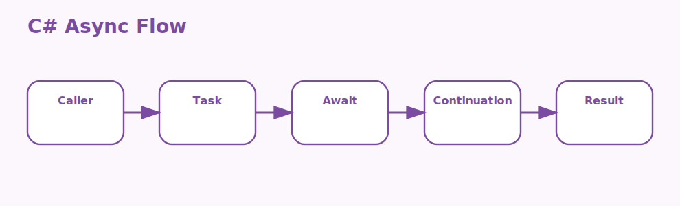

# Advanced Topics in C# Interview Questions



This page focuses on advanced C# concepts that typically appear after the fundamentals are already comfortable.

## 1. Delegates and events

### 1. What is the role of Delegates and events in advanced C#?

**Answer:**

In advanced C#, the term Delegates and events refers to the callable abstraction and notification model used
for decoupled behavior. It is part of the foundation a candidate should be able to explain clearly.

**Sample:**

```csharp
// Concept: 1. Delegates and events
var numbers = new[] { 1, 2, 3, 4 };
var even = numbers.Where(n => n % 2 == 0);
await Task.Delay(10);
Console.WriteLine(string.Join(",", even));
```

---

### 2. Why is the concept of Delegates and events important in advanced C#?

**Answer:**

This concept matters because it influences the callable abstraction and notification model
used for decoupled behavior. Good interview answers connect it to clarity, maintainability,
performance, security, or delivery depending on the situation.

**Sample:**

```csharp
// Concept: 1. Delegates and events
var numbers = new[] { 1, 2, 3, 4 };
var even = numbers.Where(n => n % 2 == 0);
await Task.Delay(10);
Console.WriteLine(string.Join(",", even));
```

---

### 3. When should a team focus on Delegates and events?

**Answer:**

A team should focus on Delegates and events when the requirement depends on the callable abstraction
and notification model used for decoupled behavior. It becomes especially important when design
decisions, scalability, or debugging depend on that area.

**Sample:**

```csharp
// Concept: 1. Delegates and events
var numbers = new[] { 1, 2, 3, 4 };
var even = numbers.Where(n => n % 2 == 0);
await Task.Delay(10);
Console.WriteLine(string.Join(",", even));
```

---

### 4. How is Delegates and events applied in practice?

**Answer:**

In practice, Delegates and events is applied by making the callable abstraction and notification
model used for decoupled behavior explicit in the code, runtime setup, or delivery workflow. The
exact shape depends on the application, but the responsibility should stay predictable.

**Sample:**

```csharp
// Concept: 1. Delegates and events
var numbers = new[] { 1, 2, 3, 4 };
var even = numbers.Where(n => n % 2 == 0);
await Task.Delay(10);
Console.WriteLine(string.Join(",", even));
```

---

### 5. What strengths does Delegates and events bring?

**Answer:**

The strengths of Delegates and events are better structure, better communication, and better control
over the callable abstraction and notification model used for decoupled behavior. It also makes
tradeoffs easier to explain to reviewers, interviewers, and teammates.

**Sample:**

```csharp
// Concept: 1. Delegates and events
var numbers = new[] { 1, 2, 3, 4 };
var even = numbers.Where(n => n % 2 == 0);
await Task.Delay(10);
Console.WriteLine(string.Join(",", even));
```

---

### 6. What tradeoffs come with Delegates and events?

**Answer:**

The main tradeoff is extra complexity if Delegates and events is introduced without a real need or a
clear understanding of the callable abstraction and notification model used for decoupled behavior.
That usually leads to overengineering, hidden bugs, or confusing architecture.

**Sample:**

```csharp
// Concept: 1. Delegates and events
var numbers = new[] { 1, 2, 3, 4 };
var even = numbers.Where(n => n % 2 == 0);
await Task.Delay(10);
Console.WriteLine(string.Join(",", even));
```

---

### 7. How does Delegates and events differ from Lambda expressions?

**Answer:**

Delegates and events is centered on the callable abstraction and notification model used for
decoupled behavior, while Lambda expressions is centered on the concise function syntax used heavily
in modern C#. They often work together, but they solve different parts of the topic.

**Sample:**

```csharp
// Concept: 1. Delegates and events
var numbers = new[] { 1, 2, 3, 4 };
var even = numbers.Where(n => n % 2 == 0);
await Task.Delay(10);
Console.WriteLine(string.Join(",", even));
```

---

### 8. What is a good real-world example of Delegates and events?

**Answer:**

A strong example is explaining how Delegates and events affects a real feature, production issue,
migration, or architecture decision involving the callable abstraction and notification model used
for decoupled behavior. Interviewers usually care more about the reasoning than the definition
alone.

**Sample:**

```csharp
// Concept: 1. Delegates and events
var numbers = new[] { 1, 2, 3, 4 };
var even = numbers.Where(n => n % 2 == 0);
await Task.Delay(10);
Console.WriteLine(string.Join(",", even));
```

---

### 9. What is a best practice for Delegates and events?

**Answer:**

A good practice is to keep Delegates and events aligned with the actual requirement around the
callable abstraction and notification model used for decoupled behavior. Teams should document
intent, keep implementation readable, and validate important paths early.

**Sample:**

```csharp
// Concept: 1. Delegates and events
var numbers = new[] { 1, 2, 3, 4 };
var even = numbers.Where(n => n % 2 == 0);
await Task.Delay(10);
Console.WriteLine(string.Join(",", even));
```

---

### 10. What is a common mistake around Delegates and events?

**Answer:**

A common mistake is naming Delegates and events without understanding how it affects the callable
abstraction and notification model used for decoupled behavior. In real work, that usually appears
as weak design choices, poor debugging, or incomplete explanations.

**Sample:**

```csharp
// Concept: 1. Delegates and events
var numbers = new[] { 1, 2, 3, 4 };
var even = numbers.Where(n => n % 2 == 0);
await Task.Delay(10);
Console.WriteLine(string.Join(",", even));
```

---

### 11. How do you troubleshoot Delegates and events-related issues?

**Answer:**

When troubleshooting Delegates and events, first verify whether the callable abstraction and
notification model used for decoupled behavior is behaving as expected. Then check surrounding
dependencies, configuration, logs, runtime behavior, and edge cases before changing the design.

**Sample:**

```csharp
// Concept: 1. Delegates and events
var numbers = new[] { 1, 2, 3, 4 };
var even = numbers.Where(n => n % 2 == 0);
await Task.Delay(10);
Console.WriteLine(string.Join(",", even));
```

---

### 12. How does Delegates and events connect to the rest of advanced C#?

**Answer:**

Delegates and events connects to the rest of advanced C# by giving structure to the callable
abstraction and notification model used for decoupled behavior. It is one of the pieces that turns
isolated facts into a coherent end-to-end explanation.

**Sample:**

```csharp
// Concept: 1. Delegates and events
var numbers = new[] { 1, 2, 3, 4 };
var even = numbers.Where(n => n % 2 == 0);
await Task.Delay(10);
Console.WriteLine(string.Join(",", even));
```

---

## 2. Lambda expressions

### 13. What is the role of Lambda expressions in advanced C#?

**Answer:**

In advanced C#, the term Lambda expressions refers to the concise function syntax used heavily in modern C#.
It is part of the foundation a candidate should be able to explain clearly.

**Sample:**

```csharp
// Concept: 2. Lambda expressions
var numbers = new[] { 1, 2, 3, 4 };
var even = numbers.Where(n => n % 2 == 0);
await Task.Delay(10);
Console.WriteLine(string.Join(",", even));
```

---

### 14. Why is the concept of Lambda expressions important in advanced C#?

**Answer:**

This concept matters because it influences the concise function syntax used heavily in modern
C#. Good interview answers connect it to clarity, maintainability, performance, security, or
delivery depending on the situation.

**Sample:**

```csharp
// Concept: 2. Lambda expressions
var numbers = new[] { 1, 2, 3, 4 };
var even = numbers.Where(n => n % 2 == 0);
await Task.Delay(10);
Console.WriteLine(string.Join(",", even));
```

---

### 15. When should a team focus on Lambda expressions?

**Answer:**

A team should focus on Lambda expressions when the requirement depends on the concise function
syntax used heavily in modern C#. It becomes especially important when design decisions,
scalability, or debugging depend on that area.

**Sample:**

```csharp
// Concept: 2. Lambda expressions
var numbers = new[] { 1, 2, 3, 4 };
var even = numbers.Where(n => n % 2 == 0);
await Task.Delay(10);
Console.WriteLine(string.Join(",", even));
```

---

### 16. How is Lambda expressions applied in practice?

**Answer:**

In practice, Lambda expressions is applied by making the concise function syntax used heavily in
modern C# explicit in the code, runtime setup, or delivery workflow. The exact shape depends on the
application, but the responsibility should stay predictable.

**Sample:**

```csharp
// Concept: 2. Lambda expressions
var numbers = new[] { 1, 2, 3, 4 };
var even = numbers.Where(n => n % 2 == 0);
await Task.Delay(10);
Console.WriteLine(string.Join(",", even));
```

---

### 17. What strengths does Lambda expressions bring?

**Answer:**

The strengths of Lambda expressions are better structure, better communication, and better control
over the concise function syntax used heavily in modern C#. It also makes tradeoffs easier to
explain to reviewers, interviewers, and teammates.

**Sample:**

```csharp
// Concept: 2. Lambda expressions
var numbers = new[] { 1, 2, 3, 4 };
var even = numbers.Where(n => n % 2 == 0);
await Task.Delay(10);
Console.WriteLine(string.Join(",", even));
```

---

### 18. What tradeoffs come with Lambda expressions?

**Answer:**

The main tradeoff is extra complexity if Lambda expressions is introduced without a real need or a
clear understanding of the concise function syntax used heavily in modern C#. That usually leads to
overengineering, hidden bugs, or confusing architecture.

**Sample:**

```csharp
// Concept: 2. Lambda expressions
var numbers = new[] { 1, 2, 3, 4 };
var even = numbers.Where(n => n % 2 == 0);
await Task.Delay(10);
Console.WriteLine(string.Join(",", even));
```

---

### 19. How does Lambda expressions differ from Generics?

**Answer:**

Lambda expressions is centered on the concise function syntax used heavily in modern C#, while
Generics is centered on the type-safe abstraction model used to write reusable logic without losing
compile-time safety. They often work together, but they solve different parts of the topic.

**Sample:**

```csharp
// Concept: 2. Lambda expressions
var numbers = new[] { 1, 2, 3, 4 };
var even = numbers.Where(n => n % 2 == 0);
await Task.Delay(10);
Console.WriteLine(string.Join(",", even));
```

---

### 20. What is a good real-world example of Lambda expressions?

**Answer:**

A strong example is explaining how Lambda expressions affects a real feature, production issue,
migration, or architecture decision involving the concise function syntax used heavily in modern C#.
Interviewers usually care more about the reasoning than the definition alone.

**Sample:**

```csharp
// Concept: 2. Lambda expressions
var numbers = new[] { 1, 2, 3, 4 };
var even = numbers.Where(n => n % 2 == 0);
await Task.Delay(10);
Console.WriteLine(string.Join(",", even));
```

---

### 21. What is a best practice for Lambda expressions?

**Answer:**

A good practice is to keep Lambda expressions aligned with the actual requirement around the concise
function syntax used heavily in modern C#. Teams should document intent, keep implementation
readable, and validate important paths early.

**Sample:**

```csharp
// Concept: 2. Lambda expressions
var numbers = new[] { 1, 2, 3, 4 };
var even = numbers.Where(n => n % 2 == 0);
await Task.Delay(10);
Console.WriteLine(string.Join(",", even));
```

---

### 22. What is a common mistake around Lambda expressions?

**Answer:**

A common mistake is naming Lambda expressions without understanding how it affects the concise
function syntax used heavily in modern C#. In real work, that usually appears as weak design
choices, poor debugging, or incomplete explanations.

**Sample:**

```csharp
// Concept: 2. Lambda expressions
var numbers = new[] { 1, 2, 3, 4 };
var even = numbers.Where(n => n % 2 == 0);
await Task.Delay(10);
Console.WriteLine(string.Join(",", even));
```

---

### 23. How do you troubleshoot Lambda expressions-related issues?

**Answer:**

When troubleshooting Lambda expressions, first verify whether the concise function syntax used
heavily in modern C# is behaving as expected. Then check surrounding dependencies, configuration,
logs, runtime behavior, and edge cases before changing the design.

**Sample:**

```csharp
// Concept: 2. Lambda expressions
var numbers = new[] { 1, 2, 3, 4 };
var even = numbers.Where(n => n % 2 == 0);
await Task.Delay(10);
Console.WriteLine(string.Join(",", even));
```

---

### 24. How does Lambda expressions connect to the rest of advanced C#?

**Answer:**

Lambda expressions connects to the rest of advanced C# by giving structure to the concise function
syntax used heavily in modern C#. It is one of the pieces that turns isolated facts into a coherent
end-to-end explanation.

**Sample:**

```csharp
// Concept: 2. Lambda expressions
var numbers = new[] { 1, 2, 3, 4 };
var even = numbers.Where(n => n % 2 == 0);
await Task.Delay(10);
Console.WriteLine(string.Join(",", even));
```

---

## 3. Generics

### 25. What is the role of Generics in advanced C#?

**Answer:**

In advanced C#, the term Generics refers to the type-safe abstraction model used to write reusable logic
without losing compile-time safety. It is part of the foundation a candidate should be able to
explain clearly.

**Sample:**

```csharp
// Concept: 3. Generics
var numbers = new[] { 1, 2, 3, 4 };
var even = numbers.Where(n => n % 2 == 0);
await Task.Delay(10);
Console.WriteLine(string.Join(",", even));
```

---

### 26. Why is the concept of Generics important in advanced C#?

**Answer:**

This concept matters because it influences the type-safe abstraction model used to write reusable logic
without losing compile-time safety. Good interview answers connect it to clarity, maintainability,
performance, security, or delivery depending on the situation.

**Sample:**

```csharp
// Concept: 3. Generics
var numbers = new[] { 1, 2, 3, 4 };
var even = numbers.Where(n => n % 2 == 0);
await Task.Delay(10);
Console.WriteLine(string.Join(",", even));
```

---

### 27. When should a team focus on Generics?

**Answer:**

A team should focus on Generics when the requirement depends on the type-safe abstraction model used
to write reusable logic without losing compile-time safety. It becomes especially important when
design decisions, scalability, or debugging depend on that area.

**Sample:**

```csharp
// Concept: 3. Generics
var numbers = new[] { 1, 2, 3, 4 };
var even = numbers.Where(n => n % 2 == 0);
await Task.Delay(10);
Console.WriteLine(string.Join(",", even));
```

---

### 28. How is Generics applied in practice?

**Answer:**

In practice, Generics is applied by making the type-safe abstraction model used to write reusable
logic without losing compile-time safety explicit in the code, runtime setup, or delivery workflow.
The exact shape depends on the application, but the responsibility should stay predictable.

**Sample:**

```csharp
// Concept: 3. Generics
var numbers = new[] { 1, 2, 3, 4 };
var even = numbers.Where(n => n % 2 == 0);
await Task.Delay(10);
Console.WriteLine(string.Join(",", even));
```

---

### 29. What strengths does Generics bring?

**Answer:**

The strengths of Generics are better structure, better communication, and better control over the
type-safe abstraction model used to write reusable logic without losing compile-time safety. It also
makes tradeoffs easier to explain to reviewers, interviewers, and teammates.

**Sample:**

```csharp
// Concept: 3. Generics
var numbers = new[] { 1, 2, 3, 4 };
var even = numbers.Where(n => n % 2 == 0);
await Task.Delay(10);
Console.WriteLine(string.Join(",", even));
```

---

### 30. What tradeoffs come with Generics?

**Answer:**

The main tradeoff is extra complexity if Generics is introduced without a real need or a clear
understanding of the type-safe abstraction model used to write reusable logic without losing
compile-time safety. That usually leads to overengineering, hidden bugs, or confusing architecture.

**Sample:**

```csharp
// Concept: 3. Generics
var numbers = new[] { 1, 2, 3, 4 };
var even = numbers.Where(n => n % 2 == 0);
await Task.Delay(10);
Console.WriteLine(string.Join(",", even));
```

---

### 31. How does Generics differ from LINQ?

**Answer:**

Generics is centered on the type-safe abstraction model used to write reusable logic without losing
compile-time safety, while LINQ is centered on the integrated query model used to work with data
collections in a declarative style. They often work together, but they solve different parts of the
topic.

**Sample:**

```csharp
// Concept: 3. Generics
var numbers = new[] { 1, 2, 3, 4 };
var even = numbers.Where(n => n % 2 == 0);
await Task.Delay(10);
Console.WriteLine(string.Join(",", even));
```

---

### 32. What is a good real-world example of Generics?

**Answer:**

A strong example is explaining how Generics affects a real feature, production issue, migration, or
architecture decision involving the type-safe abstraction model used to write reusable logic without
losing compile-time safety. Interviewers usually care more about the reasoning than the definition
alone.

**Sample:**

```csharp
// Concept: 3. Generics
var numbers = new[] { 1, 2, 3, 4 };
var even = numbers.Where(n => n % 2 == 0);
await Task.Delay(10);
Console.WriteLine(string.Join(",", even));
```

---

### 33. What is a best practice for Generics?

**Answer:**

A good practice is to keep Generics aligned with the actual requirement around the type-safe
abstraction model used to write reusable logic without losing compile-time safety. Teams should
document intent, keep implementation readable, and validate important paths early.

**Sample:**

```csharp
// Concept: 3. Generics
var numbers = new[] { 1, 2, 3, 4 };
var even = numbers.Where(n => n % 2 == 0);
await Task.Delay(10);
Console.WriteLine(string.Join(",", even));
```

---

### 34. What is a common mistake around Generics?

**Answer:**

A common mistake is naming Generics without understanding how it affects the type-safe abstraction
model used to write reusable logic without losing compile-time safety. In real work, that usually
appears as weak design choices, poor debugging, or incomplete explanations.

**Sample:**

```csharp
// Concept: 3. Generics
var numbers = new[] { 1, 2, 3, 4 };
var even = numbers.Where(n => n % 2 == 0);
await Task.Delay(10);
Console.WriteLine(string.Join(",", even));
```

---

### 35. How do you troubleshoot Generics-related issues?

**Answer:**

When troubleshooting Generics, first verify whether the type-safe abstraction model used to write
reusable logic without losing compile-time safety is behaving as expected. Then check surrounding
dependencies, configuration, logs, runtime behavior, and edge cases before changing the design.

**Sample:**

```csharp
// Concept: 3. Generics
var numbers = new[] { 1, 2, 3, 4 };
var even = numbers.Where(n => n % 2 == 0);
await Task.Delay(10);
Console.WriteLine(string.Join(",", even));
```

---

### 36. How does Generics connect to the rest of advanced C#?

**Answer:**

Generics connects to the rest of advanced C# by giving structure to the type-safe abstraction model
used to write reusable logic without losing compile-time safety. It is one of the pieces that turns
isolated facts into a coherent end-to-end explanation.

**Sample:**

```csharp
// Concept: 3. Generics
var numbers = new[] { 1, 2, 3, 4 };
var even = numbers.Where(n => n % 2 == 0);
await Task.Delay(10);
Console.WriteLine(string.Join(",", even));
```

---

## 4. LINQ

### 37. What is the role of LINQ in advanced C#?

**Answer:**

In advanced C#, the term LINQ refers to the integrated query model used to work with data collections in a
declarative style. It is part of the foundation a candidate should be able to explain clearly.

**Sample:**

```csharp
// Concept: 4. LINQ
var numbers = new[] { 1, 2, 3, 4 };
var even = numbers.Where(n => n % 2 == 0);
await Task.Delay(10);
Console.WriteLine(string.Join(",", even));
```

---

### 38. Why is the concept of LINQ important in advanced C#?

**Answer:**

This concept matters because it influences the integrated query model used to work with data collections in
a declarative style. Good interview answers connect it to clarity, maintainability, performance,
security, or delivery depending on the situation.

**Sample:**

```csharp
// Concept: 4. LINQ
var numbers = new[] { 1, 2, 3, 4 };
var even = numbers.Where(n => n % 2 == 0);
await Task.Delay(10);
Console.WriteLine(string.Join(",", even));
```

---

### 39. When should a team focus on LINQ?

**Answer:**

A team should focus on LINQ when the requirement depends on the integrated query model used to work
with data collections in a declarative style. It becomes especially important when design decisions,
scalability, or debugging depend on that area.

**Sample:**

```csharp
// Concept: 4. LINQ
var numbers = new[] { 1, 2, 3, 4 };
var even = numbers.Where(n => n % 2 == 0);
await Task.Delay(10);
Console.WriteLine(string.Join(",", even));
```

---

### 40. How is LINQ applied in practice?

**Answer:**

In practice, LINQ is applied by making the integrated query model used to work with data collections
in a declarative style explicit in the code, runtime setup, or delivery workflow. The exact shape
depends on the application, but the responsibility should stay predictable.

**Sample:**

```csharp
// Concept: 4. LINQ
var numbers = new[] { 1, 2, 3, 4 };
var even = numbers.Where(n => n % 2 == 0);
await Task.Delay(10);
Console.WriteLine(string.Join(",", even));
```

---

### 41. What strengths does LINQ bring?

**Answer:**

The strengths of LINQ are better structure, better communication, and better control over the
integrated query model used to work with data collections in a declarative style. It also makes
tradeoffs easier to explain to reviewers, interviewers, and teammates.

**Sample:**

```csharp
// Concept: 4. LINQ
var numbers = new[] { 1, 2, 3, 4 };
var even = numbers.Where(n => n % 2 == 0);
await Task.Delay(10);
Console.WriteLine(string.Join(",", even));
```

---

### 42. What tradeoffs come with LINQ?

**Answer:**

The main tradeoff is extra complexity if LINQ is introduced without a real need or a clear
understanding of the integrated query model used to work with data collections in a declarative
style. That usually leads to overengineering, hidden bugs, or confusing architecture.

**Sample:**

```csharp
// Concept: 4. LINQ
var numbers = new[] { 1, 2, 3, 4 };
var even = numbers.Where(n => n % 2 == 0);
await Task.Delay(10);
Console.WriteLine(string.Join(",", even));
```

---

### 43. How does LINQ differ from Async and await?

**Answer:**

LINQ is centered on the integrated query model used to work with data collections in a declarative
style, while Async and await is centered on the asynchronous programming syntax used to keep
applications responsive and scalable. They often work together, but they solve different parts of
the topic.

**Sample:**

```csharp
// Concept: 4. LINQ
var numbers = new[] { 1, 2, 3, 4 };
var even = numbers.Where(n => n % 2 == 0);
await Task.Delay(10);
Console.WriteLine(string.Join(",", even));
```

---

### 44. What is a good real-world example of LINQ?

**Answer:**

A strong example is explaining how LINQ affects a real feature, production issue, migration, or
architecture decision involving the integrated query model used to work with data collections in a
declarative style. Interviewers usually care more about the reasoning than the definition alone.

**Sample:**

```csharp
// Concept: 4. LINQ
var numbers = new[] { 1, 2, 3, 4 };
var even = numbers.Where(n => n % 2 == 0);
await Task.Delay(10);
Console.WriteLine(string.Join(",", even));
```

---

### 45. What is a best practice for LINQ?

**Answer:**

A good practice is to keep LINQ aligned with the actual requirement around the integrated query
model used to work with data collections in a declarative style. Teams should document intent, keep
implementation readable, and validate important paths early.

**Sample:**

```csharp
// Concept: 4. LINQ
var numbers = new[] { 1, 2, 3, 4 };
var even = numbers.Where(n => n % 2 == 0);
await Task.Delay(10);
Console.WriteLine(string.Join(",", even));
```

---

### 46. What is a common mistake around LINQ?

**Answer:**

A common mistake is naming LINQ without understanding how it affects the integrated query model used
to work with data collections in a declarative style. In real work, that usually appears as weak
design choices, poor debugging, or incomplete explanations.

**Sample:**

```csharp
// Concept: 4. LINQ
var numbers = new[] { 1, 2, 3, 4 };
var even = numbers.Where(n => n % 2 == 0);
await Task.Delay(10);
Console.WriteLine(string.Join(",", even));
```

---

### 47. How do you troubleshoot LINQ-related issues?

**Answer:**

When troubleshooting LINQ, first verify whether the integrated query model used to work with data
collections in a declarative style is behaving as expected. Then check surrounding dependencies,
configuration, logs, runtime behavior, and edge cases before changing the design.

**Sample:**

```csharp
// Concept: 4. LINQ
var numbers = new[] { 1, 2, 3, 4 };
var even = numbers.Where(n => n % 2 == 0);
await Task.Delay(10);
Console.WriteLine(string.Join(",", even));
```

---

### 48. How does LINQ connect to the rest of advanced C#?

**Answer:**

LINQ connects to the rest of advanced C# by giving structure to the integrated query model used to
work with data collections in a declarative style. It is one of the pieces that turns isolated facts
into a coherent end-to-end explanation.

**Sample:**

```csharp
// Concept: 4. LINQ
var numbers = new[] { 1, 2, 3, 4 };
var even = numbers.Where(n => n % 2 == 0);
await Task.Delay(10);
Console.WriteLine(string.Join(",", even));
```

---

## 5. Async and await

### 49. What is the role of Async and await in advanced C#?

**Answer:**

In advanced C#, the term Async and await refers to the asynchronous programming syntax used to keep
applications responsive and scalable. It is part of the foundation a candidate should be able to
explain clearly.

**Sample:**

```csharp
// Concept: 5. Async and await
var numbers = new[] { 1, 2, 3, 4 };
var even = numbers.Where(n => n % 2 == 0);
await Task.Delay(10);
Console.WriteLine(string.Join(",", even));
```

---

### 50. Why is the concept of Async and await important in advanced C#?

**Answer:**

This concept matters because it influences the asynchronous programming syntax used to keep
applications responsive and scalable. Good interview answers connect it to clarity, maintainability,
performance, security, or delivery depending on the situation.

**Sample:**

```csharp
// Concept: 5. Async and await
var numbers = new[] { 1, 2, 3, 4 };
var even = numbers.Where(n => n % 2 == 0);
await Task.Delay(10);
Console.WriteLine(string.Join(",", even));
```

---

### 51. When should a team focus on Async and await?

**Answer:**

A team should focus on Async and await when the requirement depends on the asynchronous programming
syntax used to keep applications responsive and scalable. It becomes especially important when
design decisions, scalability, or debugging depend on that area.

**Sample:**

```csharp
// Concept: 5. Async and await
var numbers = new[] { 1, 2, 3, 4 };
var even = numbers.Where(n => n % 2 == 0);
await Task.Delay(10);
Console.WriteLine(string.Join(",", even));
```

---

### 52. How is Async and await applied in practice?

**Answer:**

In practice, Async and await is applied by making the asynchronous programming syntax used to keep
applications responsive and scalable explicit in the code, runtime setup, or delivery workflow. The
exact shape depends on the application, but the responsibility should stay predictable.

**Sample:**

```csharp
// Concept: 5. Async and await
var numbers = new[] { 1, 2, 3, 4 };
var even = numbers.Where(n => n % 2 == 0);
await Task.Delay(10);
Console.WriteLine(string.Join(",", even));
```

---

### 53. What strengths does Async and await bring?

**Answer:**

The strengths of Async and await are better structure, better communication, and better control over
the asynchronous programming syntax used to keep applications responsive and scalable. It also makes
tradeoffs easier to explain to reviewers, interviewers, and teammates.

**Sample:**

```csharp
// Concept: 5. Async and await
var numbers = new[] { 1, 2, 3, 4 };
var even = numbers.Where(n => n % 2 == 0);
await Task.Delay(10);
Console.WriteLine(string.Join(",", even));
```

---

### 54. What tradeoffs come with Async and await?

**Answer:**

The main tradeoff is extra complexity if Async and await is introduced without a real need or a
clear understanding of the asynchronous programming syntax used to keep applications responsive and
scalable. That usually leads to overengineering, hidden bugs, or confusing architecture.

**Sample:**

```csharp
// Concept: 5. Async and await
var numbers = new[] { 1, 2, 3, 4 };
var even = numbers.Where(n => n % 2 == 0);
await Task.Delay(10);
Console.WriteLine(string.Join(",", even));
```

---

### 55. How does Async and await differ from Tasks and threading?

**Answer:**

Async and await is centered on the asynchronous programming syntax used to keep applications
responsive and scalable, while Tasks and threading is centered on the concurrency model used to
manage asynchronous and parallel work in .NET. They often work together, but they solve different
parts of the topic.

**Sample:**

```csharp
// Concept: 5. Async and await
var numbers = new[] { 1, 2, 3, 4 };
var even = numbers.Where(n => n % 2 == 0);
await Task.Delay(10);
Console.WriteLine(string.Join(",", even));
```

---

### 56. What is a good real-world example of Async and await?

**Answer:**

A strong example is explaining how Async and await affects a real feature, production issue,
migration, or architecture decision involving the asynchronous programming syntax used to keep
applications responsive and scalable. Interviewers usually care more about the reasoning than the
definition alone.

**Sample:**

```csharp
// Concept: 5. Async and await
var numbers = new[] { 1, 2, 3, 4 };
var even = numbers.Where(n => n % 2 == 0);
await Task.Delay(10);
Console.WriteLine(string.Join(",", even));
```

---

### 57. What is a best practice for Async and await?

**Answer:**

A good practice is to keep Async and await aligned with the actual requirement around the
asynchronous programming syntax used to keep applications responsive and scalable. Teams should
document intent, keep implementation readable, and validate important paths early.

**Sample:**

```csharp
// Concept: 5. Async and await
var numbers = new[] { 1, 2, 3, 4 };
var even = numbers.Where(n => n % 2 == 0);
await Task.Delay(10);
Console.WriteLine(string.Join(",", even));
```

---

### 58. What is a common mistake around Async and await?

**Answer:**

A common mistake is naming Async and await without understanding how it affects the asynchronous
programming syntax used to keep applications responsive and scalable. In real work, that usually
appears as weak design choices, poor debugging, or incomplete explanations.

**Sample:**

```csharp
// Concept: 5. Async and await
var numbers = new[] { 1, 2, 3, 4 };
var even = numbers.Where(n => n % 2 == 0);
await Task.Delay(10);
Console.WriteLine(string.Join(",", even));
```

---

### 59. How do you troubleshoot Async and await-related issues?

**Answer:**

When troubleshooting Async and await, first verify whether the asynchronous programming syntax used
to keep applications responsive and scalable is behaving as expected. Then check surrounding
dependencies, configuration, logs, runtime behavior, and edge cases before changing the design.

**Sample:**

```csharp
// Concept: 5. Async and await
var numbers = new[] { 1, 2, 3, 4 };
var even = numbers.Where(n => n % 2 == 0);
await Task.Delay(10);
Console.WriteLine(string.Join(",", even));
```

---

### 60. How does Async and await connect to the rest of advanced C#?

**Answer:**

Async and await connects to the rest of advanced C# by giving structure to the asynchronous
programming syntax used to keep applications responsive and scalable. It is one of the pieces that
turns isolated facts into a coherent end-to-end explanation.

**Sample:**

```csharp
// Concept: 5. Async and await
var numbers = new[] { 1, 2, 3, 4 };
var even = numbers.Where(n => n % 2 == 0);
await Task.Delay(10);
Console.WriteLine(string.Join(",", even));
```

---

## 6. Tasks and threading

### 61. What is the role of Tasks and threading in advanced C#?

**Answer:**

In advanced C#, the term Tasks and threading refers to the concurrency model used to manage asynchronous and
parallel work in .NET. It is part of the foundation a candidate should be able to explain clearly.

**Sample:**

```csharp
// Concept: 6. Tasks and threading
var numbers = new[] { 1, 2, 3, 4 };
var even = numbers.Where(n => n % 2 == 0);
await Task.Delay(10);
Console.WriteLine(string.Join(",", even));
```

---

### 62. Why is the concept of Tasks and threading important in advanced C#?

**Answer:**

This concept matters because it influences the concurrency model used to manage asynchronous
and parallel work in .NET. Good interview answers connect it to clarity, maintainability,
performance, security, or delivery depending on the situation.

**Sample:**

```csharp
// Concept: 6. Tasks and threading
var numbers = new[] { 1, 2, 3, 4 };
var even = numbers.Where(n => n % 2 == 0);
await Task.Delay(10);
Console.WriteLine(string.Join(",", even));
```

---

### 63. When should a team focus on Tasks and threading?

**Answer:**

A team should focus on Tasks and threading when the requirement depends on the concurrency model
used to manage asynchronous and parallel work in .NET. It becomes especially important when design
decisions, scalability, or debugging depend on that area.

**Sample:**

```csharp
// Concept: 6. Tasks and threading
var numbers = new[] { 1, 2, 3, 4 };
var even = numbers.Where(n => n % 2 == 0);
await Task.Delay(10);
Console.WriteLine(string.Join(",", even));
```

---

### 64. How is Tasks and threading applied in practice?

**Answer:**

In practice, Tasks and threading is applied by making the concurrency model used to manage
asynchronous and parallel work in .NET explicit in the code, runtime setup, or delivery workflow.
The exact shape depends on the application, but the responsibility should stay predictable.

**Sample:**

```csharp
// Concept: 6. Tasks and threading
var numbers = new[] { 1, 2, 3, 4 };
var even = numbers.Where(n => n % 2 == 0);
await Task.Delay(10);
Console.WriteLine(string.Join(",", even));
```

---

### 65. What strengths does Tasks and threading bring?

**Answer:**

The strengths of Tasks and threading are better structure, better communication, and better control
over the concurrency model used to manage asynchronous and parallel work in .NET. It also makes
tradeoffs easier to explain to reviewers, interviewers, and teammates.

**Sample:**

```csharp
// Concept: 6. Tasks and threading
var numbers = new[] { 1, 2, 3, 4 };
var even = numbers.Where(n => n % 2 == 0);
await Task.Delay(10);
Console.WriteLine(string.Join(",", even));
```

---

### 66. What tradeoffs come with Tasks and threading?

**Answer:**

The main tradeoff is extra complexity if Tasks and threading is introduced without a real need or a
clear understanding of the concurrency model used to manage asynchronous and parallel work in .NET.
That usually leads to overengineering, hidden bugs, or confusing architecture.

**Sample:**

```csharp
// Concept: 6. Tasks and threading
var numbers = new[] { 1, 2, 3, 4 };
var even = numbers.Where(n => n % 2 == 0);
await Task.Delay(10);
Console.WriteLine(string.Join(",", even));
```

---

### 67. How does Tasks and threading differ from Reflection?

**Answer:**

Tasks and threading is centered on the concurrency model used to manage asynchronous and parallel
work in .NET, while Reflection is centered on the runtime inspection model used to examine metadata
and types dynamically. They often work together, but they solve different parts of the topic.

**Sample:**

```csharp
// Concept: 6. Tasks and threading
var numbers = new[] { 1, 2, 3, 4 };
var even = numbers.Where(n => n % 2 == 0);
await Task.Delay(10);
Console.WriteLine(string.Join(",", even));
```

---

### 68. What is a good real-world example of Tasks and threading?

**Answer:**

A strong example is explaining how Tasks and threading affects a real feature, production issue,
migration, or architecture decision involving the concurrency model used to manage asynchronous and
parallel work in .NET. Interviewers usually care more about the reasoning than the definition alone.

**Sample:**

```csharp
// Concept: 6. Tasks and threading
var numbers = new[] { 1, 2, 3, 4 };
var even = numbers.Where(n => n % 2 == 0);
await Task.Delay(10);
Console.WriteLine(string.Join(",", even));
```

---

### 69. What is a best practice for Tasks and threading?

**Answer:**

A good practice is to keep Tasks and threading aligned with the actual requirement around the
concurrency model used to manage asynchronous and parallel work in .NET. Teams should document
intent, keep implementation readable, and validate important paths early.

**Sample:**

```csharp
// Concept: 6. Tasks and threading
var numbers = new[] { 1, 2, 3, 4 };
var even = numbers.Where(n => n % 2 == 0);
await Task.Delay(10);
Console.WriteLine(string.Join(",", even));
```

---

### 70. What is a common mistake around Tasks and threading?

**Answer:**

A common mistake is naming Tasks and threading without understanding how it affects the concurrency
model used to manage asynchronous and parallel work in .NET. In real work, that usually appears as
weak design choices, poor debugging, or incomplete explanations.

**Sample:**

```csharp
// Concept: 6. Tasks and threading
var numbers = new[] { 1, 2, 3, 4 };
var even = numbers.Where(n => n % 2 == 0);
await Task.Delay(10);
Console.WriteLine(string.Join(",", even));
```

---

### 71. How do you troubleshoot Tasks and threading-related issues?

**Answer:**

When troubleshooting Tasks and threading, first verify whether the concurrency model used to manage
asynchronous and parallel work in .NET is behaving as expected. Then check surrounding dependencies,
configuration, logs, runtime behavior, and edge cases before changing the design.

**Sample:**

```csharp
// Concept: 6. Tasks and threading
var numbers = new[] { 1, 2, 3, 4 };
var even = numbers.Where(n => n % 2 == 0);
await Task.Delay(10);
Console.WriteLine(string.Join(",", even));
```

---

### 72. How does Tasks and threading connect to the rest of advanced C#?

**Answer:**

Tasks and threading connects to the rest of advanced C# by giving structure to the concurrency model
used to manage asynchronous and parallel work in .NET. It is one of the pieces that turns isolated
facts into a coherent end-to-end explanation.

**Sample:**

```csharp
// Concept: 6. Tasks and threading
var numbers = new[] { 1, 2, 3, 4 };
var even = numbers.Where(n => n % 2 == 0);
await Task.Delay(10);
Console.WriteLine(string.Join(",", even));
```

---

## 7. Reflection

### 73. What is the role of Reflection in advanced C#?

**Answer:**

In advanced C#, the term Reflection refers to the runtime inspection model used to examine metadata and types
dynamically. It is part of the foundation a candidate should be able to explain clearly.

**Sample:**

```csharp
// Concept: 7. Reflection
var numbers = new[] { 1, 2, 3, 4 };
var even = numbers.Where(n => n % 2 == 0);
await Task.Delay(10);
Console.WriteLine(string.Join(",", even));
```

---

### 74. Why is the concept of Reflection important in advanced C#?

**Answer:**

This concept matters because it influences the runtime inspection model used to examine metadata and
types dynamically. Good interview answers connect it to clarity, maintainability, performance,
security, or delivery depending on the situation.

**Sample:**

```csharp
// Concept: 7. Reflection
var numbers = new[] { 1, 2, 3, 4 };
var even = numbers.Where(n => n % 2 == 0);
await Task.Delay(10);
Console.WriteLine(string.Join(",", even));
```

---

### 75. When should a team focus on Reflection?

**Answer:**

A team should focus on Reflection when the requirement depends on the runtime inspection model used
to examine metadata and types dynamically. It becomes especially important when design decisions,
scalability, or debugging depend on that area.

**Sample:**

```csharp
// Concept: 7. Reflection
var numbers = new[] { 1, 2, 3, 4 };
var even = numbers.Where(n => n % 2 == 0);
await Task.Delay(10);
Console.WriteLine(string.Join(",", even));
```

---

### 76. How is Reflection applied in practice?

**Answer:**

In practice, Reflection is applied by making the runtime inspection model used to examine metadata
and types dynamically explicit in the code, runtime setup, or delivery workflow. The exact shape
depends on the application, but the responsibility should stay predictable.

**Sample:**

```csharp
// Concept: 7. Reflection
var numbers = new[] { 1, 2, 3, 4 };
var even = numbers.Where(n => n % 2 == 0);
await Task.Delay(10);
Console.WriteLine(string.Join(",", even));
```

---

### 77. What strengths does Reflection bring?

**Answer:**

The strengths of Reflection are better structure, better communication, and better control over the
runtime inspection model used to examine metadata and types dynamically. It also makes tradeoffs
easier to explain to reviewers, interviewers, and teammates.

**Sample:**

```csharp
// Concept: 7. Reflection
var numbers = new[] { 1, 2, 3, 4 };
var even = numbers.Where(n => n % 2 == 0);
await Task.Delay(10);
Console.WriteLine(string.Join(",", even));
```

---

### 78. What tradeoffs come with Reflection?

**Answer:**

The main tradeoff is extra complexity if Reflection is introduced without a real need or a clear
understanding of the runtime inspection model used to examine metadata and types dynamically. That
usually leads to overengineering, hidden bugs, or confusing architecture.

**Sample:**

```csharp
// Concept: 7. Reflection
var numbers = new[] { 1, 2, 3, 4 };
var even = numbers.Where(n => n % 2 == 0);
await Task.Delay(10);
Console.WriteLine(string.Join(",", even));
```

---

### 79. How does Reflection differ from Attributes?

**Answer:**

Reflection is centered on the runtime inspection model used to examine metadata and types
dynamically, while Attributes is centered on the metadata annotations used to attach declarative
behavior or meaning to code. They often work together, but they solve different parts of the topic.

**Sample:**

```csharp
// Concept: 7. Reflection
var numbers = new[] { 1, 2, 3, 4 };
var even = numbers.Where(n => n % 2 == 0);
await Task.Delay(10);
Console.WriteLine(string.Join(",", even));
```

---

### 80. What is a good real-world example of Reflection?

**Answer:**

A strong example is explaining how Reflection affects a real feature, production issue, migration,
or architecture decision involving the runtime inspection model used to examine metadata and types
dynamically. Interviewers usually care more about the reasoning than the definition alone.

**Sample:**

```csharp
// Concept: 7. Reflection
var numbers = new[] { 1, 2, 3, 4 };
var even = numbers.Where(n => n % 2 == 0);
await Task.Delay(10);
Console.WriteLine(string.Join(",", even));
```

---

### 81. What is a best practice for Reflection?

**Answer:**

A good practice is to keep Reflection aligned with the actual requirement around the runtime
inspection model used to examine metadata and types dynamically. Teams should document intent, keep
implementation readable, and validate important paths early.

**Sample:**

```csharp
// Concept: 7. Reflection
var numbers = new[] { 1, 2, 3, 4 };
var even = numbers.Where(n => n % 2 == 0);
await Task.Delay(10);
Console.WriteLine(string.Join(",", even));
```

---

### 82. What is a common mistake around Reflection?

**Answer:**

A common mistake is naming Reflection without understanding how it affects the runtime inspection
model used to examine metadata and types dynamically. In real work, that usually appears as weak
design choices, poor debugging, or incomplete explanations.

**Sample:**

```csharp
// Concept: 7. Reflection
var numbers = new[] { 1, 2, 3, 4 };
var even = numbers.Where(n => n % 2 == 0);
await Task.Delay(10);
Console.WriteLine(string.Join(",", even));
```

---

### 83. How do you troubleshoot Reflection-related issues?

**Answer:**

When troubleshooting Reflection, first verify whether the runtime inspection model used to examine
metadata and types dynamically is behaving as expected. Then check surrounding dependencies,
configuration, logs, runtime behavior, and edge cases before changing the design.

**Sample:**

```csharp
// Concept: 7. Reflection
var numbers = new[] { 1, 2, 3, 4 };
var even = numbers.Where(n => n % 2 == 0);
await Task.Delay(10);
Console.WriteLine(string.Join(",", even));
```

---

### 84. How does Reflection connect to the rest of advanced C#?

**Answer:**

Reflection connects to the rest of advanced C# by giving structure to the runtime inspection model
used to examine metadata and types dynamically. It is one of the pieces that turns isolated facts
into a coherent end-to-end explanation.

**Sample:**

```csharp
// Concept: 7. Reflection
var numbers = new[] { 1, 2, 3, 4 };
var even = numbers.Where(n => n % 2 == 0);
await Task.Delay(10);
Console.WriteLine(string.Join(",", even));
```

---

## 8. Attributes

### 85. What is the role of Attributes in advanced C#?

**Answer:**

In advanced C#, the term Attributes refers to the metadata annotations used to attach declarative behavior or
meaning to code. It is part of the foundation a candidate should be able to explain clearly.

**Sample:**

```csharp
// Concept: 8. Attributes
var numbers = new[] { 1, 2, 3, 4 };
var even = numbers.Where(n => n % 2 == 0);
await Task.Delay(10);
Console.WriteLine(string.Join(",", even));
```

---

### 86. Why is the concept of Attributes important in advanced C#?

**Answer:**

This concept matters because it influences the metadata annotations used to attach declarative
behavior or meaning to code. Good interview answers connect it to clarity, maintainability,
performance, security, or delivery depending on the situation.

**Sample:**

```csharp
// Concept: 8. Attributes
var numbers = new[] { 1, 2, 3, 4 };
var even = numbers.Where(n => n % 2 == 0);
await Task.Delay(10);
Console.WriteLine(string.Join(",", even));
```

---

### 87. When should a team focus on Attributes?

**Answer:**

A team should focus on Attributes when the requirement depends on the metadata annotations used to
attach declarative behavior or meaning to code. It becomes especially important when design
decisions, scalability, or debugging depend on that area.

**Sample:**

```csharp
// Concept: 8. Attributes
var numbers = new[] { 1, 2, 3, 4 };
var even = numbers.Where(n => n % 2 == 0);
await Task.Delay(10);
Console.WriteLine(string.Join(",", even));
```

---

### 88. How is Attributes applied in practice?

**Answer:**

In practice, Attributes is applied by making the metadata annotations used to attach declarative
behavior or meaning to code explicit in the code, runtime setup, or delivery workflow. The exact
shape depends on the application, but the responsibility should stay predictable.

**Sample:**

```csharp
// Concept: 8. Attributes
var numbers = new[] { 1, 2, 3, 4 };
var even = numbers.Where(n => n % 2 == 0);
await Task.Delay(10);
Console.WriteLine(string.Join(",", even));
```

---

### 89. What strengths does Attributes bring?

**Answer:**

The strengths of Attributes are better structure, better communication, and better control over the
metadata annotations used to attach declarative behavior or meaning to code. It also makes tradeoffs
easier to explain to reviewers, interviewers, and teammates.

**Sample:**

```csharp
// Concept: 8. Attributes
var numbers = new[] { 1, 2, 3, 4 };
var even = numbers.Where(n => n % 2 == 0);
await Task.Delay(10);
Console.WriteLine(string.Join(",", even));
```

---

### 90. What tradeoffs come with Attributes?

**Answer:**

The main tradeoff is extra complexity if Attributes is introduced without a real need or a clear
understanding of the metadata annotations used to attach declarative behavior or meaning to code.
That usually leads to overengineering, hidden bugs, or confusing architecture.

**Sample:**

```csharp
// Concept: 8. Attributes
var numbers = new[] { 1, 2, 3, 4 };
var even = numbers.Where(n => n % 2 == 0);
await Task.Delay(10);
Console.WriteLine(string.Join(",", even));
```

---

### 91. How does Attributes differ from Memory and performance tuning?

**Answer:**

Attributes is centered on the metadata annotations used to attach declarative behavior or meaning to
code, while Memory and performance tuning is centered on the discipline of understanding
allocations, boxing, and runtime cost. They often work together, but they solve different parts of
the topic.

**Sample:**

```csharp
// Concept: 8. Attributes
var numbers = new[] { 1, 2, 3, 4 };
var even = numbers.Where(n => n % 2 == 0);
await Task.Delay(10);
Console.WriteLine(string.Join(",", even));
```

---

### 92. What is a good real-world example of Attributes?

**Answer:**

A strong example is explaining how Attributes affects a real feature, production issue, migration,
or architecture decision involving the metadata annotations used to attach declarative behavior or
meaning to code. Interviewers usually care more about the reasoning than the definition alone.

**Sample:**

```csharp
// Concept: 8. Attributes
var numbers = new[] { 1, 2, 3, 4 };
var even = numbers.Where(n => n % 2 == 0);
await Task.Delay(10);
Console.WriteLine(string.Join(",", even));
```

---

### 93. What is a best practice for Attributes?

**Answer:**

A good practice is to keep Attributes aligned with the actual requirement around the metadata
annotations used to attach declarative behavior or meaning to code. Teams should document intent,
keep implementation readable, and validate important paths early.

**Sample:**

```csharp
// Concept: 8. Attributes
var numbers = new[] { 1, 2, 3, 4 };
var even = numbers.Where(n => n % 2 == 0);
await Task.Delay(10);
Console.WriteLine(string.Join(",", even));
```

---

### 94. What is a common mistake around Attributes?

**Answer:**

A common mistake is naming Attributes without understanding how it affects the metadata annotations
used to attach declarative behavior or meaning to code. In real work, that usually appears as weak
design choices, poor debugging, or incomplete explanations.

**Sample:**

```csharp
// Concept: 8. Attributes
var numbers = new[] { 1, 2, 3, 4 };
var even = numbers.Where(n => n % 2 == 0);
await Task.Delay(10);
Console.WriteLine(string.Join(",", even));
```

---

### 95. How do you troubleshoot Attributes-related issues?

**Answer:**

When troubleshooting Attributes, first verify whether the metadata annotations used to attach
declarative behavior or meaning to code is behaving as expected. Then check surrounding
dependencies, configuration, logs, runtime behavior, and edge cases before changing the design.

**Sample:**

```csharp
// Concept: 8. Attributes
var numbers = new[] { 1, 2, 3, 4 };
var even = numbers.Where(n => n % 2 == 0);
await Task.Delay(10);
Console.WriteLine(string.Join(",", even));
```

---

### 96. How does Attributes connect to the rest of advanced C#?

**Answer:**

Attributes connects to the rest of advanced C# by giving structure to the metadata annotations used
to attach declarative behavior or meaning to code. It is one of the pieces that turns isolated facts
into a coherent end-to-end explanation.

**Sample:**

```csharp
// Concept: 8. Attributes
var numbers = new[] { 1, 2, 3, 4 };
var even = numbers.Where(n => n % 2 == 0);
await Task.Delay(10);
Console.WriteLine(string.Join(",", even));
```

---

## 9. Memory and performance tuning

### 97. What is the role of Memory and performance tuning in advanced C#?

**Answer:**

In advanced C#, the term Memory and performance tuning refers to the discipline of understanding allocations,
boxing, and runtime cost. It is part of the foundation a candidate should be able to explain
clearly.

**Sample:**

```csharp
// Concept: 9. Memory and performance tuning
var numbers = new[] { 1, 2, 3, 4 };
var even = numbers.Where(n => n % 2 == 0);
await Task.Delay(10);
Console.WriteLine(string.Join(",", even));
```

---

### 98. Why is the concept of Memory and performance tuning important in advanced C#?

**Answer:**

This concept matters because it influences the discipline of understanding
allocations, boxing, and runtime cost. Good interview answers connect it to clarity,
maintainability, performance, security, or delivery depending on the situation.

**Sample:**

```csharp
// Concept: 9. Memory and performance tuning
var numbers = new[] { 1, 2, 3, 4 };
var even = numbers.Where(n => n % 2 == 0);
await Task.Delay(10);
Console.WriteLine(string.Join(",", even));
```

---

### 99. When should a team focus on Memory and performance tuning?

**Answer:**

A team should focus on Memory and performance tuning when the requirement depends on the discipline
of understanding allocations, boxing, and runtime cost. It becomes especially important when design
decisions, scalability, or debugging depend on that area.

**Sample:**

```csharp
// Concept: 9. Memory and performance tuning
var numbers = new[] { 1, 2, 3, 4 };
var even = numbers.Where(n => n % 2 == 0);
await Task.Delay(10);
Console.WriteLine(string.Join(",", even));
```

---

### 100. How is Memory and performance tuning applied in practice?

**Answer:**

In practice, Memory and performance tuning is applied by making the discipline of understanding
allocations, boxing, and runtime cost explicit in the code, runtime setup, or delivery workflow. The
exact shape depends on the application, but the responsibility should stay predictable.

**Sample:**

```csharp
// Concept: 9. Memory and performance tuning
var numbers = new[] { 1, 2, 3, 4 };
var even = numbers.Where(n => n % 2 == 0);
await Task.Delay(10);
Console.WriteLine(string.Join(",", even));
```

---

### 101. What strengths does Memory and performance tuning bring?

**Answer:**

The strengths of Memory and performance tuning are better structure, better communication, and
better control over the discipline of understanding allocations, boxing, and runtime cost. It also
makes tradeoffs easier to explain to reviewers, interviewers, and teammates.

**Sample:**

```csharp
// Concept: 9. Memory and performance tuning
var numbers = new[] { 1, 2, 3, 4 };
var even = numbers.Where(n => n % 2 == 0);
await Task.Delay(10);
Console.WriteLine(string.Join(",", even));
```

---

### 102. What tradeoffs come with Memory and performance tuning?

**Answer:**

The main tradeoff is extra complexity if Memory and performance tuning is introduced without a real
need or a clear understanding of the discipline of understanding allocations, boxing, and runtime
cost. That usually leads to overengineering, hidden bugs, or confusing architecture.

**Sample:**

```csharp
// Concept: 9. Memory and performance tuning
var numbers = new[] { 1, 2, 3, 4 };
var even = numbers.Where(n => n % 2 == 0);
await Task.Delay(10);
Console.WriteLine(string.Join(",", even));
```

---

### 103. How does Memory and performance tuning differ from Advanced collections and APIs?

**Answer:**

Memory and performance tuning is centered on the discipline of understanding allocations, boxing,
and runtime cost, while Advanced collections and APIs is centered on the richer framework types and
patterns used beyond basic lists and arrays. They often work together, but they solve different
parts of the topic.

**Sample:**

```csharp
// Concept: 9. Memory and performance tuning
var numbers = new[] { 1, 2, 3, 4 };
var even = numbers.Where(n => n % 2 == 0);
await Task.Delay(10);
Console.WriteLine(string.Join(",", even));
```

---

### 104. What is a good real-world example of Memory and performance tuning?

**Answer:**

A strong example is explaining how Memory and performance tuning affects a real feature, production
issue, migration, or architecture decision involving the discipline of understanding allocations,
boxing, and runtime cost. Interviewers usually care more about the reasoning than the definition
alone.

**Sample:**

```csharp
// Concept: 9. Memory and performance tuning
var numbers = new[] { 1, 2, 3, 4 };
var even = numbers.Where(n => n % 2 == 0);
await Task.Delay(10);
Console.WriteLine(string.Join(",", even));
```

---

### 105. What is a best practice for Memory and performance tuning?

**Answer:**

A good practice is to keep Memory and performance tuning aligned with the actual requirement around
the discipline of understanding allocations, boxing, and runtime cost. Teams should document intent,
keep implementation readable, and validate important paths early.

**Sample:**

```csharp
// Concept: 9. Memory and performance tuning
var numbers = new[] { 1, 2, 3, 4 };
var even = numbers.Where(n => n % 2 == 0);
await Task.Delay(10);
Console.WriteLine(string.Join(",", even));
```

---

### 106. What is a common mistake around Memory and performance tuning?

**Answer:**

A common mistake is naming Memory and performance tuning without understanding how it affects the
discipline of understanding allocations, boxing, and runtime cost. In real work, that usually
appears as weak design choices, poor debugging, or incomplete explanations.

**Sample:**

```csharp
// Concept: 9. Memory and performance tuning
var numbers = new[] { 1, 2, 3, 4 };
var even = numbers.Where(n => n % 2 == 0);
await Task.Delay(10);
Console.WriteLine(string.Join(",", even));
```

---

### 107. How do you troubleshoot Memory and performance tuning-related issues?

**Answer:**

When troubleshooting Memory and performance tuning, first verify whether the discipline of
understanding allocations, boxing, and runtime cost is behaving as expected. Then check surrounding
dependencies, configuration, logs, runtime behavior, and edge cases before changing the design.

**Sample:**

```csharp
// Concept: 9. Memory and performance tuning
var numbers = new[] { 1, 2, 3, 4 };
var even = numbers.Where(n => n % 2 == 0);
await Task.Delay(10);
Console.WriteLine(string.Join(",", even));
```

---

### 108. How does Memory and performance tuning connect to the rest of advanced C#?

**Answer:**

Memory and performance tuning connects to the rest of advanced C# by giving structure to the
discipline of understanding allocations, boxing, and runtime cost. It is one of the pieces that
turns isolated facts into a coherent end-to-end explanation.

**Sample:**

```csharp
// Concept: 9. Memory and performance tuning
var numbers = new[] { 1, 2, 3, 4 };
var even = numbers.Where(n => n % 2 == 0);
await Task.Delay(10);
Console.WriteLine(string.Join(",", even));
```

---

## 10. Advanced collections and APIs

### 109. What is the role of Advanced collections and APIs in advanced C#?

**Answer:**

In advanced C#, the term Advanced collections and APIs refers to the richer framework types and patterns used
beyond basic lists and arrays. It is part of the foundation a candidate should be able to explain
clearly.

**Sample:**

```csharp
// Concept: 10. Advanced collections and APIs
var numbers = new[] { 1, 2, 3, 4 };
var even = numbers.Where(n => n % 2 == 0);
await Task.Delay(10);
Console.WriteLine(string.Join(",", even));
```

---

### 110. Why is the concept of Advanced collections and APIs important in advanced C#?

**Answer:**

This concept matters because it influences the richer framework types and patterns
used beyond basic lists and arrays. Good interview answers connect it to clarity, maintainability,
performance, security, or delivery depending on the situation.

**Sample:**

```csharp
// Concept: 10. Advanced collections and APIs
var numbers = new[] { 1, 2, 3, 4 };
var even = numbers.Where(n => n % 2 == 0);
await Task.Delay(10);
Console.WriteLine(string.Join(",", even));
```

---

### 111. When should a team focus on Advanced collections and APIs?

**Answer:**

A team should focus on Advanced collections and APIs when the requirement depends on the richer
framework types and patterns used beyond basic lists and arrays. It becomes especially important
when design decisions, scalability, or debugging depend on that area.

**Sample:**

```csharp
// Concept: 10. Advanced collections and APIs
var numbers = new[] { 1, 2, 3, 4 };
var even = numbers.Where(n => n % 2 == 0);
await Task.Delay(10);
Console.WriteLine(string.Join(",", even));
```

---

### 112. How is Advanced collections and APIs applied in practice?

**Answer:**

In practice, Advanced collections and APIs is applied by making the richer framework types and
patterns used beyond basic lists and arrays explicit in the code, runtime setup, or delivery
workflow. The exact shape depends on the application, but the responsibility should stay
predictable.

**Sample:**

```csharp
// Concept: 10. Advanced collections and APIs
var numbers = new[] { 1, 2, 3, 4 };
var even = numbers.Where(n => n % 2 == 0);
await Task.Delay(10);
Console.WriteLine(string.Join(",", even));
```

---

### 113. What strengths does Advanced collections and APIs bring?

**Answer:**

The strengths of Advanced collections and APIs are better structure, better communication, and
better control over the richer framework types and patterns used beyond basic lists and arrays. It
also makes tradeoffs easier to explain to reviewers, interviewers, and teammates.

**Sample:**

```csharp
// Concept: 10. Advanced collections and APIs
var numbers = new[] { 1, 2, 3, 4 };
var even = numbers.Where(n => n % 2 == 0);
await Task.Delay(10);
Console.WriteLine(string.Join(",", even));
```

---

### 114. What tradeoffs come with Advanced collections and APIs?

**Answer:**

The main tradeoff is extra complexity if Advanced collections and APIs is introduced without a real
need or a clear understanding of the richer framework types and patterns used beyond basic lists and
arrays. That usually leads to overengineering, hidden bugs, or confusing architecture.

**Sample:**

```csharp
// Concept: 10. Advanced collections and APIs
var numbers = new[] { 1, 2, 3, 4 };
var even = numbers.Where(n => n % 2 == 0);
await Task.Delay(10);
Console.WriteLine(string.Join(",", even));
```

---

### 115. How does Advanced collections and APIs differ from Delegates and events?

**Answer:**

Advanced collections and APIs is centered on the richer framework types and patterns used beyond
basic lists and arrays, while Delegates and events is centered on the callable abstraction and
notification model used for decoupled behavior. They often work together, but they solve different
parts of the topic.

**Sample:**

```csharp
// Concept: 10. Advanced collections and APIs
var numbers = new[] { 1, 2, 3, 4 };
var even = numbers.Where(n => n % 2 == 0);
await Task.Delay(10);
Console.WriteLine(string.Join(",", even));
```

---

### 116. What is a good real-world example of Advanced collections and APIs?

**Answer:**

A strong example is explaining how Advanced collections and APIs affects a real feature, production
issue, migration, or architecture decision involving the richer framework types and patterns used
beyond basic lists and arrays. Interviewers usually care more about the reasoning than the
definition alone.

**Sample:**

```csharp
// Concept: 10. Advanced collections and APIs
var numbers = new[] { 1, 2, 3, 4 };
var even = numbers.Where(n => n % 2 == 0);
await Task.Delay(10);
Console.WriteLine(string.Join(",", even));
```

---

### 117. What is a best practice for Advanced collections and APIs?

**Answer:**

A good practice is to keep Advanced collections and APIs aligned with the actual requirement around
the richer framework types and patterns used beyond basic lists and arrays. Teams should document
intent, keep implementation readable, and validate important paths early.

**Sample:**

```csharp
// Concept: 10. Advanced collections and APIs
var numbers = new[] { 1, 2, 3, 4 };
var even = numbers.Where(n => n % 2 == 0);
await Task.Delay(10);
Console.WriteLine(string.Join(",", even));
```

---

### 118. What is a common mistake around Advanced collections and APIs?

**Answer:**

A common mistake is naming Advanced collections and APIs without understanding how it affects the
richer framework types and patterns used beyond basic lists and arrays. In real work, that usually
appears as weak design choices, poor debugging, or incomplete explanations.

**Sample:**

```csharp
// Concept: 10. Advanced collections and APIs
var numbers = new[] { 1, 2, 3, 4 };
var even = numbers.Where(n => n % 2 == 0);
await Task.Delay(10);
Console.WriteLine(string.Join(",", even));
```

---

### 119. How do you troubleshoot Advanced collections and APIs-related issues?

**Answer:**

When troubleshooting Advanced collections and APIs, first verify whether the richer framework types
and patterns used beyond basic lists and arrays is behaving as expected. Then check surrounding
dependencies, configuration, logs, runtime behavior, and edge cases before changing the design.

**Sample:**

```csharp
// Concept: 10. Advanced collections and APIs
var numbers = new[] { 1, 2, 3, 4 };
var even = numbers.Where(n => n % 2 == 0);
await Task.Delay(10);
Console.WriteLine(string.Join(",", even));
```

---

### 120. How does Advanced collections and APIs connect to the rest of advanced C#?

**Answer:**

Advanced collections and APIs connects to the rest of advanced C# by giving structure to the richer
framework types and patterns used beyond basic lists and arrays. It is one of the pieces that turns
isolated facts into a coherent end-to-end explanation.

**Sample:**

```csharp
// Concept: 10. Advanced collections and APIs
var numbers = new[] { 1, 2, 3, 4 };
var even = numbers.Where(n => n % 2 == 0);
await Task.Delay(10);
Console.WriteLine(string.Join(",", even));
```
