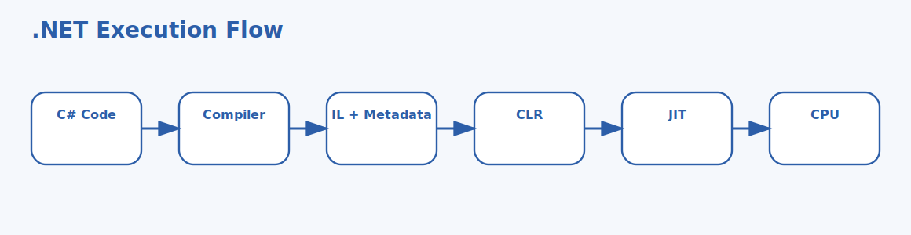

# C# Basics Interview Questions



This page stays at the C# basics level and focuses on language fundamentals, execution basics, and everyday coding concepts. It follows the corrected format of **100 interview questions for each subtopic**, and every answer includes a C# code example with rotated real-world scenarios so the examples do not repeat verbatim.

## How To Use This Page

- Questions 1-100 cover CLR and assemblies.
- Questions 101-200 cover Value and reference types.
- Questions 201-300 cover Variables and conversions.
- Questions 301-400 cover Operators and expressions.

## 1. CLR and assemblies

> This section contains **100 interview questions** focused on **CLR and assemblies**. Every answer includes a C# code example, and the scenarios rotate so they do not repeat verbatim.

### Q1.1 What is CLR execution role in C# basics?

**Answer:** CLR execution role means the Common Language Runtime loads managed code, applies runtime services, and executes compiled C# applications, teams should focus on it when explaining what actually runs C# beyond source files, they compare it with raw machine-code execution and script-only models, and they should avoid the trap of saying C# runs directly from source with no runtime services. Example: during a deployment incident, so startup behavior is easier to explain. Another example: during a local development session, so tooling behaves more consistently.

**Code Example:**

```csharp

using System;

using System.Collections.Generic;


public static class Demo1_1
{
    public static void Run()
    {

        Console.WriteLine($"Runtime: {Environment.Version}");
        Console.WriteLine(System.Runtime.InteropServices.RuntimeInformation.FrameworkDescription);
        Console.WriteLine("CLR services are active.");

    }
}

```

### Q1.2 How does assemblies as compiled units in C# basics?

**Answer:** assemblies as compiled units mean compiled code is packaged into assemblies containing IL and metadata for the runtime and tooling, teams should focus on it when explaining how code is grouped and deployed, they compare it with folders and namespaces only, and they should avoid the trap of treating an assembly as just a project nickname. Example: after moving code to the server, so the team avoids a bad architecture choice. Another example: during a login traffic spike, so request handling stays predictable.

**Code Example:**

```csharp

using System;

using System.Collections.Generic;


public static class Demo1_2
{
    public static void Run()
    {

        var assembly = typeof(string).Assembly;
        Console.WriteLine(assembly.GetName().Name);
        Console.WriteLine(assembly.GetName().Version);

    }
}

```

### Q1.3 Why does IL and JIT basics in C# basics?

**Answer:** IL and JIT basics mean C# code compiles to intermediate language first and is then JIT-compiled by the runtime for execution, teams should focus on it when explaining the execution pipeline at a beginner level, they compare it with interpretation-only models and AOT-only assumptions, and they should avoid the trap of assuming all code is compiled exactly the same way up front. Example: during a login traffic spike, so interview answers sound more grounded. Another example: while hardening production settings, so debugging gets faster.

**Code Example:**

```csharp

using System;

using System.Collections.Generic;


public static class Demo1_3
{
    public static void Run()
    {

        Func<int, int> square = x => x * x;
        Console.WriteLine(square(5));
        Console.WriteLine("The runtime JIT-compiles executable paths.");

    }
}

```

### Q1.4 When should you use metadata and type information in C# basics?

**Answer:** metadata and type information mean assemblies carry rich type metadata that the runtime and tools can inspect, teams should focus on it when explaining why reflection and tooling work so well, they compare it with comments-only documentation and source parsing alone, and they should avoid the trap of ignoring metadata when discussing runtime behavior. Example: while reviewing architecture choices, so the async bug becomes obvious. Another example: while onboarding a new backend engineer, so operations become safer.

**Code Example:**

```csharp

using System;

using System.Collections.Generic;


public static class Demo1_4
{
    public static void Run()
    {

        var type = typeof(DateTime);
        Console.WriteLine(type.FullName);
        Console.WriteLine(type.Assembly.GetName().Name);

    }
}

```

### Q1.5 What problem does managed execution model in C# basics?

**Answer:** managed execution model means the runtime provides services like memory management, type safety, and structured exception handling, teams should focus on it when explaining why C# behaves as managed code, they compare it with manual-memory-only mental models, and they should avoid the trap of assuming the runtime removes every correctness concern automatically. Example: during a batch import run, so debugging gets faster. Another example: after moving code to the server, so the async bug becomes obvious.

**Code Example:**

```csharp

using System;

using System.Collections.Generic;


public static class Demo1_5
{
    public static void Run()
    {

        var numbers = new[] { 1, 2, 3 };
        Console.WriteLine(numbers.Length);
        Console.WriteLine("Managed code still needs careful design.");

    }
}

```

### Q1.6 What is runtime-and-assembly interview framing in C# basics?

**Answer:** runtime-and-assembly interview framing means strong basics answers connect source, compilation, assemblies, IL, and runtime execution clearly, teams should focus on it when describing what a good fundamentals answer sounds like, they compare it with vague buzzwords and loader internals only, and they should avoid the trap of giving only definitions with no practical runtime story. Example: while onboarding a new backend engineer, so tooling behaves more consistently. Another example: during a service rollout, so memory usage stays controlled.

**Code Example:**

```csharp

using System;

using System.Collections.Generic;


public static class Demo1_6
{
    public static void Run()
    {

        string summary = "Source -> IL -> Assembly -> CLR execution";
        Console.WriteLine(summary);
        Console.WriteLine("That is the beginner-friendly execution model.");

    }
}

```

### Q1.7 How does CLR execution role in C# basics?

**Answer:** CLR execution role means the Common Language Runtime loads managed code, applies runtime services, and executes compiled C# applications, teams should focus on it when explaining what actually runs C# beyond source files, they compare it with raw machine-code execution and script-only models, and they should avoid the trap of saying C# runs directly from source with no runtime services. Example: during a local development session, so the runtime model becomes clearer. Another example: during a batch import run, so interview answers sound more grounded.

**Code Example:**

```csharp

using System;

using System.Collections.Generic;


public static class Demo1_7
{
    public static void Run()
    {

        Console.WriteLine($"Runtime: {Environment.Version}");
        Console.WriteLine(System.Runtime.InteropServices.RuntimeInformation.FrameworkDescription);
        Console.WriteLine("CLR services are active.");

    }
}

```

### Q1.8 Why does assemblies as compiled units in C# basics?

**Answer:** assemblies as compiled units mean compiled code is packaged into assemblies containing IL and metadata for the runtime and tooling, teams should focus on it when explaining how code is grouped and deployed, they compare it with folders and namespaces only, and they should avoid the trap of treating an assembly as just a project nickname. Example: while debugging a slow API, so performance expectations are more realistic. Another example: during a deployment incident, so startup behavior is easier to explain.

**Code Example:**

```csharp

using System;

using System.Collections.Generic;


public static class Demo1_8
{
    public static void Run()
    {

        var assembly = typeof(string).Assembly;
        Console.WriteLine(assembly.GetName().Name);
        Console.WriteLine(assembly.GetName().Version);

    }
}

```

### Q1.9 When should you use IL and JIT basics in C# basics?

**Answer:** IL and JIT basics mean C# code compiles to intermediate language first and is then JIT-compiled by the runtime for execution, teams should focus on it when explaining the execution pipeline at a beginner level, they compare it with interpretation-only models and AOT-only assumptions, and they should avoid the trap of assuming all code is compiled exactly the same way up front. Example: during a service rollout, so memory usage stays controlled. Another example: while debugging a slow API, so the team avoids a bad architecture choice.

**Code Example:**

```csharp

using System;

using System.Collections.Generic;


public static class Demo1_9
{
    public static void Run()
    {

        Func<int, int> square = x => x * x;
        Console.WriteLine(square(5));
        Console.WriteLine("The runtime JIT-compiles executable paths.");

    }
}

```

### Q1.10 What problem does metadata and type information in C# basics?

**Answer:** metadata and type information mean assemblies carry rich type metadata that the runtime and tools can inspect, teams should focus on it when explaining why reflection and tooling work so well, they compare it with comments-only documentation and source parsing alone, and they should avoid the trap of ignoring metadata when discussing runtime behavior. Example: while hardening production settings, so operations become safer. Another example: while reviewing architecture choices, so the runtime model becomes clearer.

**Code Example:**

```csharp

using System;

using System.Collections.Generic;


public static class Demo1_10
{
    public static void Run()
    {

        var type = typeof(DateTime);
        Console.WriteLine(type.FullName);
        Console.WriteLine(type.Assembly.GetName().Name);

    }
}

```

### Q1.11 What is managed execution model in C# basics?

**Answer:** managed execution model means the runtime provides services like memory management, type safety, and structured exception handling, teams should focus on it when explaining why C# behaves as managed code, they compare it with manual-memory-only mental models, and they should avoid the trap of assuming the runtime removes every correctness concern automatically. Example: after a dependency upgrade, so request handling stays predictable. Another example: while debugging a slow API, so startup behavior is easier to explain.

**Code Example:**

```csharp

using System;

using System.Collections.Generic;


public static class Demo1_11
{
    public static void Run()
    {

        var numbers = new[] { 1, 2, 3 };
        Console.WriteLine(numbers.Length);
        Console.WriteLine("Managed code still needs careful design.");

    }
}

```

### Q1.12 How does runtime-and-assembly interview framing in C# basics?

**Answer:** runtime-and-assembly interview framing means strong basics answers connect source, compilation, assemblies, IL, and runtime execution clearly, teams should focus on it when describing what a good fundamentals answer sounds like, they compare it with vague buzzwords and loader internals only, and they should avoid the trap of giving only definitions with no practical runtime story. Example: during a deployment incident, so startup behavior is easier to explain. Another example: during a local development session, so tooling behaves more consistently.

**Code Example:**

```csharp

using System;

using System.Collections.Generic;


public static class Demo1_12
{
    public static void Run()
    {

        string summary = "Source -> IL -> Assembly -> CLR execution";
        Console.WriteLine(summary);
        Console.WriteLine("That is the beginner-friendly execution model.");

    }
}

```

### Q1.13 Why does CLR execution role in C# basics?

**Answer:** CLR execution role means the Common Language Runtime loads managed code, applies runtime services, and executes compiled C# applications, teams should focus on it when explaining what actually runs C# beyond source files, they compare it with raw machine-code execution and script-only models, and they should avoid the trap of saying C# runs directly from source with no runtime services. Example: after moving code to the server, so the team avoids a bad architecture choice. Another example: during a login traffic spike, so request handling stays predictable.

**Code Example:**

```csharp

using System;

using System.Collections.Generic;


public static class Demo1_13
{
    public static void Run()
    {

        Console.WriteLine($"Runtime: {Environment.Version}");
        Console.WriteLine(System.Runtime.InteropServices.RuntimeInformation.FrameworkDescription);
        Console.WriteLine("CLR services are active.");

    }
}

```

### Q1.14 When should you use assemblies as compiled units in C# basics?

**Answer:** assemblies as compiled units mean compiled code is packaged into assemblies containing IL and metadata for the runtime and tooling, teams should focus on it when explaining how code is grouped and deployed, they compare it with folders and namespaces only, and they should avoid the trap of treating an assembly as just a project nickname. Example: during a login traffic spike, so interview answers sound more grounded. Another example: while hardening production settings, so debugging gets faster.

**Code Example:**

```csharp

using System;

using System.Collections.Generic;


public static class Demo1_14
{
    public static void Run()
    {

        var assembly = typeof(string).Assembly;
        Console.WriteLine(assembly.GetName().Name);
        Console.WriteLine(assembly.GetName().Version);

    }
}

```

### Q1.15 What problem does IL and JIT basics in C# basics?

**Answer:** IL and JIT basics mean C# code compiles to intermediate language first and is then JIT-compiled by the runtime for execution, teams should focus on it when explaining the execution pipeline at a beginner level, they compare it with interpretation-only models and AOT-only assumptions, and they should avoid the trap of assuming all code is compiled exactly the same way up front. Example: while reviewing architecture choices, so the async bug becomes obvious. Another example: while onboarding a new backend engineer, so operations become safer.

**Code Example:**

```csharp

using System;

using System.Collections.Generic;


public static class Demo1_15
{
    public static void Run()
    {

        Func<int, int> square = x => x * x;
        Console.WriteLine(square(5));
        Console.WriteLine("The runtime JIT-compiles executable paths.");

    }
}

```

### Q1.16 What is metadata and type information in C# basics?

**Answer:** metadata and type information mean assemblies carry rich type metadata that the runtime and tools can inspect, teams should focus on it when explaining why reflection and tooling work so well, they compare it with comments-only documentation and source parsing alone, and they should avoid the trap of ignoring metadata when discussing runtime behavior. Example: during a batch import run, so debugging gets faster. Another example: after moving code to the server, so the async bug becomes obvious.

**Code Example:**

```csharp

using System;

using System.Collections.Generic;


public static class Demo1_16
{
    public static void Run()
    {

        var type = typeof(DateTime);
        Console.WriteLine(type.FullName);
        Console.WriteLine(type.Assembly.GetName().Name);

    }
}

```

### Q1.17 How does managed execution model in C# basics?

**Answer:** managed execution model means the runtime provides services like memory management, type safety, and structured exception handling, teams should focus on it when explaining why C# behaves as managed code, they compare it with manual-memory-only mental models, and they should avoid the trap of assuming the runtime removes every correctness concern automatically. Example: while onboarding a new backend engineer, so tooling behaves more consistently. Another example: during a service rollout, so memory usage stays controlled.

**Code Example:**

```csharp

using System;

using System.Collections.Generic;


public static class Demo1_17
{
    public static void Run()
    {

        var numbers = new[] { 1, 2, 3 };
        Console.WriteLine(numbers.Length);
        Console.WriteLine("Managed code still needs careful design.");

    }
}

```

### Q1.18 Why does runtime-and-assembly interview framing in C# basics?

**Answer:** runtime-and-assembly interview framing means strong basics answers connect source, compilation, assemblies, IL, and runtime execution clearly, teams should focus on it when describing what a good fundamentals answer sounds like, they compare it with vague buzzwords and loader internals only, and they should avoid the trap of giving only definitions with no practical runtime story. Example: during a local development session, so the runtime model becomes clearer. Another example: during a batch import run, so interview answers sound more grounded.

**Code Example:**

```csharp

using System;

using System.Collections.Generic;


public static class Demo1_18
{
    public static void Run()
    {

        string summary = "Source -> IL -> Assembly -> CLR execution";
        Console.WriteLine(summary);
        Console.WriteLine("That is the beginner-friendly execution model.");

    }
}

```

### Q1.19 When should you use CLR execution role in C# basics?

**Answer:** CLR execution role means the Common Language Runtime loads managed code, applies runtime services, and executes compiled C# applications, teams should focus on it when explaining what actually runs C# beyond source files, they compare it with raw machine-code execution and script-only models, and they should avoid the trap of saying C# runs directly from source with no runtime services. Example: while debugging a slow API, so performance expectations are more realistic. Another example: during a deployment incident, so startup behavior is easier to explain.

**Code Example:**

```csharp

using System;

using System.Collections.Generic;


public static class Demo1_19
{
    public static void Run()
    {

        Console.WriteLine($"Runtime: {Environment.Version}");
        Console.WriteLine(System.Runtime.InteropServices.RuntimeInformation.FrameworkDescription);
        Console.WriteLine("CLR services are active.");

    }
}

```

### Q1.20 What problem does assemblies as compiled units in C# basics?

**Answer:** assemblies as compiled units mean compiled code is packaged into assemblies containing IL and metadata for the runtime and tooling, teams should focus on it when explaining how code is grouped and deployed, they compare it with folders and namespaces only, and they should avoid the trap of treating an assembly as just a project nickname. Example: during a service rollout, so memory usage stays controlled. Another example: while debugging a slow API, so the team avoids a bad architecture choice.

**Code Example:**

```csharp

using System;

using System.Collections.Generic;


public static class Demo1_20
{
    public static void Run()
    {

        var assembly = typeof(string).Assembly;
        Console.WriteLine(assembly.GetName().Name);
        Console.WriteLine(assembly.GetName().Version);

    }
}

```

### Q1.21 What is IL and JIT basics in C# basics?

**Answer:** IL and JIT basics mean C# code compiles to intermediate language first and is then JIT-compiled by the runtime for execution, teams should focus on it when explaining the execution pipeline at a beginner level, they compare it with interpretation-only models and AOT-only assumptions, and they should avoid the trap of assuming all code is compiled exactly the same way up front. Example: while hardening production settings, so operations become safer. Another example: while reviewing architecture choices, so the runtime model becomes clearer.

**Code Example:**

```csharp

using System;

using System.Collections.Generic;


public static class Demo1_21
{
    public static void Run()
    {

        Func<int, int> square = x => x * x;
        Console.WriteLine(square(5));
        Console.WriteLine("The runtime JIT-compiles executable paths.");

    }
}

```

### Q1.22 How does metadata and type information in C# basics?

**Answer:** metadata and type information mean assemblies carry rich type metadata that the runtime and tools can inspect, teams should focus on it when explaining why reflection and tooling work so well, they compare it with comments-only documentation and source parsing alone, and they should avoid the trap of ignoring metadata when discussing runtime behavior. Example: after a dependency upgrade, so request handling stays predictable. Another example: while debugging a slow API, so startup behavior is easier to explain.

**Code Example:**

```csharp

using System;

using System.Collections.Generic;


public static class Demo1_22
{
    public static void Run()
    {

        var type = typeof(DateTime);
        Console.WriteLine(type.FullName);
        Console.WriteLine(type.Assembly.GetName().Name);

    }
}

```

### Q1.23 Why does managed execution model in C# basics?

**Answer:** managed execution model means the runtime provides services like memory management, type safety, and structured exception handling, teams should focus on it when explaining why C# behaves as managed code, they compare it with manual-memory-only mental models, and they should avoid the trap of assuming the runtime removes every correctness concern automatically. Example: during a deployment incident, so startup behavior is easier to explain. Another example: during a local development session, so tooling behaves more consistently.

**Code Example:**

```csharp

using System;

using System.Collections.Generic;


public static class Demo1_23
{
    public static void Run()
    {

        var numbers = new[] { 1, 2, 3 };
        Console.WriteLine(numbers.Length);
        Console.WriteLine("Managed code still needs careful design.");

    }
}

```

### Q1.24 When should you use runtime-and-assembly interview framing in C# basics?

**Answer:** runtime-and-assembly interview framing means strong basics answers connect source, compilation, assemblies, IL, and runtime execution clearly, teams should focus on it when describing what a good fundamentals answer sounds like, they compare it with vague buzzwords and loader internals only, and they should avoid the trap of giving only definitions with no practical runtime story. Example: after moving code to the server, so the team avoids a bad architecture choice. Another example: during a login traffic spike, so request handling stays predictable.

**Code Example:**

```csharp

using System;

using System.Collections.Generic;


public static class Demo1_24
{
    public static void Run()
    {

        string summary = "Source -> IL -> Assembly -> CLR execution";
        Console.WriteLine(summary);
        Console.WriteLine("That is the beginner-friendly execution model.");

    }
}

```

### Q1.25 What problem does CLR execution role in C# basics?

**Answer:** CLR execution role means the Common Language Runtime loads managed code, applies runtime services, and executes compiled C# applications, teams should focus on it when explaining what actually runs C# beyond source files, they compare it with raw machine-code execution and script-only models, and they should avoid the trap of saying C# runs directly from source with no runtime services. Example: during a login traffic spike, so interview answers sound more grounded. Another example: while hardening production settings, so debugging gets faster.

**Code Example:**

```csharp

using System;

using System.Collections.Generic;


public static class Demo1_25
{
    public static void Run()
    {

        Console.WriteLine($"Runtime: {Environment.Version}");
        Console.WriteLine(System.Runtime.InteropServices.RuntimeInformation.FrameworkDescription);
        Console.WriteLine("CLR services are active.");

    }
}

```

### Q1.26 What is assemblies as compiled units in C# basics?

**Answer:** assemblies as compiled units mean compiled code is packaged into assemblies containing IL and metadata for the runtime and tooling, teams should focus on it when explaining how code is grouped and deployed, they compare it with folders and namespaces only, and they should avoid the trap of treating an assembly as just a project nickname. Example: while reviewing architecture choices, so the async bug becomes obvious. Another example: while onboarding a new backend engineer, so operations become safer.

**Code Example:**

```csharp

using System;

using System.Collections.Generic;


public static class Demo1_26
{
    public static void Run()
    {

        var assembly = typeof(string).Assembly;
        Console.WriteLine(assembly.GetName().Name);
        Console.WriteLine(assembly.GetName().Version);

    }
}

```

### Q1.27 How does IL and JIT basics in C# basics?

**Answer:** IL and JIT basics mean C# code compiles to intermediate language first and is then JIT-compiled by the runtime for execution, teams should focus on it when explaining the execution pipeline at a beginner level, they compare it with interpretation-only models and AOT-only assumptions, and they should avoid the trap of assuming all code is compiled exactly the same way up front. Example: during a batch import run, so debugging gets faster. Another example: after moving code to the server, so the async bug becomes obvious.

**Code Example:**

```csharp

using System;

using System.Collections.Generic;


public static class Demo1_27
{
    public static void Run()
    {

        Func<int, int> square = x => x * x;
        Console.WriteLine(square(5));
        Console.WriteLine("The runtime JIT-compiles executable paths.");

    }
}

```

### Q1.28 Why does metadata and type information in C# basics?

**Answer:** metadata and type information mean assemblies carry rich type metadata that the runtime and tools can inspect, teams should focus on it when explaining why reflection and tooling work so well, they compare it with comments-only documentation and source parsing alone, and they should avoid the trap of ignoring metadata when discussing runtime behavior. Example: while onboarding a new backend engineer, so tooling behaves more consistently. Another example: during a service rollout, so memory usage stays controlled.

**Code Example:**

```csharp

using System;

using System.Collections.Generic;


public static class Demo1_28
{
    public static void Run()
    {

        var type = typeof(DateTime);
        Console.WriteLine(type.FullName);
        Console.WriteLine(type.Assembly.GetName().Name);

    }
}

```

### Q1.29 When should you use managed execution model in C# basics?

**Answer:** managed execution model means the runtime provides services like memory management, type safety, and structured exception handling, teams should focus on it when explaining why C# behaves as managed code, they compare it with manual-memory-only mental models, and they should avoid the trap of assuming the runtime removes every correctness concern automatically. Example: during a local development session, so the runtime model becomes clearer. Another example: during a batch import run, so interview answers sound more grounded.

**Code Example:**

```csharp

using System;

using System.Collections.Generic;


public static class Demo1_29
{
    public static void Run()
    {

        var numbers = new[] { 1, 2, 3 };
        Console.WriteLine(numbers.Length);
        Console.WriteLine("Managed code still needs careful design.");

    }
}

```

### Q1.30 What problem does runtime-and-assembly interview framing in C# basics?

**Answer:** runtime-and-assembly interview framing means strong basics answers connect source, compilation, assemblies, IL, and runtime execution clearly, teams should focus on it when describing what a good fundamentals answer sounds like, they compare it with vague buzzwords and loader internals only, and they should avoid the trap of giving only definitions with no practical runtime story. Example: while debugging a slow API, so performance expectations are more realistic. Another example: during a deployment incident, so startup behavior is easier to explain.

**Code Example:**

```csharp

using System;

using System.Collections.Generic;


public static class Demo1_30
{
    public static void Run()
    {

        string summary = "Source -> IL -> Assembly -> CLR execution";
        Console.WriteLine(summary);
        Console.WriteLine("That is the beginner-friendly execution model.");

    }
}

```

### Q1.31 What is CLR execution role in C# basics?

**Answer:** CLR execution role means the Common Language Runtime loads managed code, applies runtime services, and executes compiled C# applications, teams should focus on it when explaining what actually runs C# beyond source files, they compare it with raw machine-code execution and script-only models, and they should avoid the trap of saying C# runs directly from source with no runtime services. Example: during a service rollout, so memory usage stays controlled. Another example: while debugging a slow API, so the team avoids a bad architecture choice.

**Code Example:**

```csharp

using System;

using System.Collections.Generic;


public static class Demo1_31
{
    public static void Run()
    {

        Console.WriteLine($"Runtime: {Environment.Version}");
        Console.WriteLine(System.Runtime.InteropServices.RuntimeInformation.FrameworkDescription);
        Console.WriteLine("CLR services are active.");

    }
}

```

### Q1.32 How does assemblies as compiled units in C# basics?

**Answer:** assemblies as compiled units mean compiled code is packaged into assemblies containing IL and metadata for the runtime and tooling, teams should focus on it when explaining how code is grouped and deployed, they compare it with folders and namespaces only, and they should avoid the trap of treating an assembly as just a project nickname. Example: while hardening production settings, so operations become safer. Another example: while reviewing architecture choices, so the runtime model becomes clearer.

**Code Example:**

```csharp

using System;

using System.Collections.Generic;


public static class Demo1_32
{
    public static void Run()
    {

        var assembly = typeof(string).Assembly;
        Console.WriteLine(assembly.GetName().Name);
        Console.WriteLine(assembly.GetName().Version);

    }
}

```

### Q1.33 Why does IL and JIT basics in C# basics?

**Answer:** IL and JIT basics mean C# code compiles to intermediate language first and is then JIT-compiled by the runtime for execution, teams should focus on it when explaining the execution pipeline at a beginner level, they compare it with interpretation-only models and AOT-only assumptions, and they should avoid the trap of assuming all code is compiled exactly the same way up front. Example: after a dependency upgrade, so request handling stays predictable. Another example: while debugging a slow API, so startup behavior is easier to explain.

**Code Example:**

```csharp

using System;

using System.Collections.Generic;


public static class Demo1_33
{
    public static void Run()
    {

        Func<int, int> square = x => x * x;
        Console.WriteLine(square(5));
        Console.WriteLine("The runtime JIT-compiles executable paths.");

    }
}

```

### Q1.34 When should you use metadata and type information in C# basics?

**Answer:** metadata and type information mean assemblies carry rich type metadata that the runtime and tools can inspect, teams should focus on it when explaining why reflection and tooling work so well, they compare it with comments-only documentation and source parsing alone, and they should avoid the trap of ignoring metadata when discussing runtime behavior. Example: during a deployment incident, so startup behavior is easier to explain. Another example: during a local development session, so tooling behaves more consistently.

**Code Example:**

```csharp

using System;

using System.Collections.Generic;


public static class Demo1_34
{
    public static void Run()
    {

        var type = typeof(DateTime);
        Console.WriteLine(type.FullName);
        Console.WriteLine(type.Assembly.GetName().Name);

    }
}

```

### Q1.35 What problem does managed execution model in C# basics?

**Answer:** managed execution model means the runtime provides services like memory management, type safety, and structured exception handling, teams should focus on it when explaining why C# behaves as managed code, they compare it with manual-memory-only mental models, and they should avoid the trap of assuming the runtime removes every correctness concern automatically. Example: after moving code to the server, so the team avoids a bad architecture choice. Another example: during a login traffic spike, so request handling stays predictable.

**Code Example:**

```csharp

using System;

using System.Collections.Generic;


public static class Demo1_35
{
    public static void Run()
    {

        var numbers = new[] { 1, 2, 3 };
        Console.WriteLine(numbers.Length);
        Console.WriteLine("Managed code still needs careful design.");

    }
}

```

### Q1.36 What is runtime-and-assembly interview framing in C# basics?

**Answer:** runtime-and-assembly interview framing means strong basics answers connect source, compilation, assemblies, IL, and runtime execution clearly, teams should focus on it when describing what a good fundamentals answer sounds like, they compare it with vague buzzwords and loader internals only, and they should avoid the trap of giving only definitions with no practical runtime story. Example: during a login traffic spike, so interview answers sound more grounded. Another example: while hardening production settings, so debugging gets faster.

**Code Example:**

```csharp

using System;

using System.Collections.Generic;


public static class Demo1_36
{
    public static void Run()
    {

        string summary = "Source -> IL -> Assembly -> CLR execution";
        Console.WriteLine(summary);
        Console.WriteLine("That is the beginner-friendly execution model.");

    }
}

```

### Q1.37 How does CLR execution role in C# basics?

**Answer:** CLR execution role means the Common Language Runtime loads managed code, applies runtime services, and executes compiled C# applications, teams should focus on it when explaining what actually runs C# beyond source files, they compare it with raw machine-code execution and script-only models, and they should avoid the trap of saying C# runs directly from source with no runtime services. Example: while reviewing architecture choices, so the async bug becomes obvious. Another example: while onboarding a new backend engineer, so operations become safer.

**Code Example:**

```csharp

using System;

using System.Collections.Generic;


public static class Demo1_37
{
    public static void Run()
    {

        Console.WriteLine($"Runtime: {Environment.Version}");
        Console.WriteLine(System.Runtime.InteropServices.RuntimeInformation.FrameworkDescription);
        Console.WriteLine("CLR services are active.");

    }
}

```

### Q1.38 Why does assemblies as compiled units in C# basics?

**Answer:** assemblies as compiled units mean compiled code is packaged into assemblies containing IL and metadata for the runtime and tooling, teams should focus on it when explaining how code is grouped and deployed, they compare it with folders and namespaces only, and they should avoid the trap of treating an assembly as just a project nickname. Example: during a batch import run, so debugging gets faster. Another example: after moving code to the server, so the async bug becomes obvious.

**Code Example:**

```csharp

using System;

using System.Collections.Generic;


public static class Demo1_38
{
    public static void Run()
    {

        var assembly = typeof(string).Assembly;
        Console.WriteLine(assembly.GetName().Name);
        Console.WriteLine(assembly.GetName().Version);

    }
}

```

### Q1.39 When should you use IL and JIT basics in C# basics?

**Answer:** IL and JIT basics mean C# code compiles to intermediate language first and is then JIT-compiled by the runtime for execution, teams should focus on it when explaining the execution pipeline at a beginner level, they compare it with interpretation-only models and AOT-only assumptions, and they should avoid the trap of assuming all code is compiled exactly the same way up front. Example: while onboarding a new backend engineer, so tooling behaves more consistently. Another example: during a service rollout, so memory usage stays controlled.

**Code Example:**

```csharp

using System;

using System.Collections.Generic;


public static class Demo1_39
{
    public static void Run()
    {

        Func<int, int> square = x => x * x;
        Console.WriteLine(square(5));
        Console.WriteLine("The runtime JIT-compiles executable paths.");

    }
}

```

### Q1.40 What problem does metadata and type information in C# basics?

**Answer:** metadata and type information mean assemblies carry rich type metadata that the runtime and tools can inspect, teams should focus on it when explaining why reflection and tooling work so well, they compare it with comments-only documentation and source parsing alone, and they should avoid the trap of ignoring metadata when discussing runtime behavior. Example: during a local development session, so the runtime model becomes clearer. Another example: during a batch import run, so interview answers sound more grounded.

**Code Example:**

```csharp

using System;

using System.Collections.Generic;


public static class Demo1_40
{
    public static void Run()
    {

        var type = typeof(DateTime);
        Console.WriteLine(type.FullName);
        Console.WriteLine(type.Assembly.GetName().Name);

    }
}

```

### Q1.41 What is managed execution model in C# basics?

**Answer:** managed execution model means the runtime provides services like memory management, type safety, and structured exception handling, teams should focus on it when explaining why C# behaves as managed code, they compare it with manual-memory-only mental models, and they should avoid the trap of assuming the runtime removes every correctness concern automatically. Example: while debugging a slow API, so performance expectations are more realistic. Another example: during a deployment incident, so startup behavior is easier to explain.

**Code Example:**

```csharp

using System;

using System.Collections.Generic;


public static class Demo1_41
{
    public static void Run()
    {

        var numbers = new[] { 1, 2, 3 };
        Console.WriteLine(numbers.Length);
        Console.WriteLine("Managed code still needs careful design.");

    }
}

```

### Q1.42 How does runtime-and-assembly interview framing in C# basics?

**Answer:** runtime-and-assembly interview framing means strong basics answers connect source, compilation, assemblies, IL, and runtime execution clearly, teams should focus on it when describing what a good fundamentals answer sounds like, they compare it with vague buzzwords and loader internals only, and they should avoid the trap of giving only definitions with no practical runtime story. Example: during a service rollout, so memory usage stays controlled. Another example: while debugging a slow API, so the team avoids a bad architecture choice.

**Code Example:**

```csharp

using System;

using System.Collections.Generic;


public static class Demo1_42
{
    public static void Run()
    {

        string summary = "Source -> IL -> Assembly -> CLR execution";
        Console.WriteLine(summary);
        Console.WriteLine("That is the beginner-friendly execution model.");

    }
}

```

### Q1.43 Why does CLR execution role in C# basics?

**Answer:** CLR execution role means the Common Language Runtime loads managed code, applies runtime services, and executes compiled C# applications, teams should focus on it when explaining what actually runs C# beyond source files, they compare it with raw machine-code execution and script-only models, and they should avoid the trap of saying C# runs directly from source with no runtime services. Example: while hardening production settings, so operations become safer. Another example: while reviewing architecture choices, so the runtime model becomes clearer.

**Code Example:**

```csharp

using System;

using System.Collections.Generic;


public static class Demo1_43
{
    public static void Run()
    {

        Console.WriteLine($"Runtime: {Environment.Version}");
        Console.WriteLine(System.Runtime.InteropServices.RuntimeInformation.FrameworkDescription);
        Console.WriteLine("CLR services are active.");

    }
}

```

### Q1.44 When should you use assemblies as compiled units in C# basics?

**Answer:** assemblies as compiled units mean compiled code is packaged into assemblies containing IL and metadata for the runtime and tooling, teams should focus on it when explaining how code is grouped and deployed, they compare it with folders and namespaces only, and they should avoid the trap of treating an assembly as just a project nickname. Example: after a dependency upgrade, so request handling stays predictable. Another example: while debugging a slow API, so startup behavior is easier to explain.

**Code Example:**

```csharp

using System;

using System.Collections.Generic;


public static class Demo1_44
{
    public static void Run()
    {

        var assembly = typeof(string).Assembly;
        Console.WriteLine(assembly.GetName().Name);
        Console.WriteLine(assembly.GetName().Version);

    }
}

```

### Q1.45 What problem does IL and JIT basics in C# basics?

**Answer:** IL and JIT basics mean C# code compiles to intermediate language first and is then JIT-compiled by the runtime for execution, teams should focus on it when explaining the execution pipeline at a beginner level, they compare it with interpretation-only models and AOT-only assumptions, and they should avoid the trap of assuming all code is compiled exactly the same way up front. Example: during a deployment incident, so startup behavior is easier to explain. Another example: during a local development session, so tooling behaves more consistently.

**Code Example:**

```csharp

using System;

using System.Collections.Generic;


public static class Demo1_45
{
    public static void Run()
    {

        Func<int, int> square = x => x * x;
        Console.WriteLine(square(5));
        Console.WriteLine("The runtime JIT-compiles executable paths.");

    }
}

```

### Q1.46 What is metadata and type information in C# basics?

**Answer:** metadata and type information mean assemblies carry rich type metadata that the runtime and tools can inspect, teams should focus on it when explaining why reflection and tooling work so well, they compare it with comments-only documentation and source parsing alone, and they should avoid the trap of ignoring metadata when discussing runtime behavior. Example: after moving code to the server, so the team avoids a bad architecture choice. Another example: during a login traffic spike, so request handling stays predictable.

**Code Example:**

```csharp

using System;

using System.Collections.Generic;


public static class Demo1_46
{
    public static void Run()
    {

        var type = typeof(DateTime);
        Console.WriteLine(type.FullName);
        Console.WriteLine(type.Assembly.GetName().Name);

    }
}

```

### Q1.47 How does managed execution model in C# basics?

**Answer:** managed execution model means the runtime provides services like memory management, type safety, and structured exception handling, teams should focus on it when explaining why C# behaves as managed code, they compare it with manual-memory-only mental models, and they should avoid the trap of assuming the runtime removes every correctness concern automatically. Example: during a login traffic spike, so interview answers sound more grounded. Another example: while hardening production settings, so debugging gets faster.

**Code Example:**

```csharp

using System;

using System.Collections.Generic;


public static class Demo1_47
{
    public static void Run()
    {

        var numbers = new[] { 1, 2, 3 };
        Console.WriteLine(numbers.Length);
        Console.WriteLine("Managed code still needs careful design.");

    }
}

```

### Q1.48 Why does runtime-and-assembly interview framing in C# basics?

**Answer:** runtime-and-assembly interview framing means strong basics answers connect source, compilation, assemblies, IL, and runtime execution clearly, teams should focus on it when describing what a good fundamentals answer sounds like, they compare it with vague buzzwords and loader internals only, and they should avoid the trap of giving only definitions with no practical runtime story. Example: while reviewing architecture choices, so the async bug becomes obvious. Another example: while onboarding a new backend engineer, so operations become safer.

**Code Example:**

```csharp

using System;

using System.Collections.Generic;


public static class Demo1_48
{
    public static void Run()
    {

        string summary = "Source -> IL -> Assembly -> CLR execution";
        Console.WriteLine(summary);
        Console.WriteLine("That is the beginner-friendly execution model.");

    }
}

```

### Q1.49 When should you use CLR execution role in C# basics?

**Answer:** CLR execution role means the Common Language Runtime loads managed code, applies runtime services, and executes compiled C# applications, teams should focus on it when explaining what actually runs C# beyond source files, they compare it with raw machine-code execution and script-only models, and they should avoid the trap of saying C# runs directly from source with no runtime services. Example: during a batch import run, so debugging gets faster. Another example: after moving code to the server, so the async bug becomes obvious.

**Code Example:**

```csharp

using System;

using System.Collections.Generic;


public static class Demo1_49
{
    public static void Run()
    {

        Console.WriteLine($"Runtime: {Environment.Version}");
        Console.WriteLine(System.Runtime.InteropServices.RuntimeInformation.FrameworkDescription);
        Console.WriteLine("CLR services are active.");

    }
}

```

### Q1.50 What problem does assemblies as compiled units in C# basics?

**Answer:** assemblies as compiled units mean compiled code is packaged into assemblies containing IL and metadata for the runtime and tooling, teams should focus on it when explaining how code is grouped and deployed, they compare it with folders and namespaces only, and they should avoid the trap of treating an assembly as just a project nickname. Example: while onboarding a new backend engineer, so tooling behaves more consistently. Another example: during a service rollout, so memory usage stays controlled.

**Code Example:**

```csharp

using System;

using System.Collections.Generic;


public static class Demo1_50
{
    public static void Run()
    {

        var assembly = typeof(string).Assembly;
        Console.WriteLine(assembly.GetName().Name);
        Console.WriteLine(assembly.GetName().Version);

    }
}

```

### Q1.51 What is IL and JIT basics in C# basics?

**Answer:** IL and JIT basics mean C# code compiles to intermediate language first and is then JIT-compiled by the runtime for execution, teams should focus on it when explaining the execution pipeline at a beginner level, they compare it with interpretation-only models and AOT-only assumptions, and they should avoid the trap of assuming all code is compiled exactly the same way up front. Example: during a local development session, so the runtime model becomes clearer. Another example: during a batch import run, so interview answers sound more grounded.

**Code Example:**

```csharp

using System;

using System.Collections.Generic;


public static class Demo1_51
{
    public static void Run()
    {

        Func<int, int> square = x => x * x;
        Console.WriteLine(square(5));
        Console.WriteLine("The runtime JIT-compiles executable paths.");

    }
}

```

### Q1.52 How does metadata and type information in C# basics?

**Answer:** metadata and type information mean assemblies carry rich type metadata that the runtime and tools can inspect, teams should focus on it when explaining why reflection and tooling work so well, they compare it with comments-only documentation and source parsing alone, and they should avoid the trap of ignoring metadata when discussing runtime behavior. Example: while debugging a slow API, so performance expectations are more realistic. Another example: during a deployment incident, so startup behavior is easier to explain.

**Code Example:**

```csharp

using System;

using System.Collections.Generic;


public static class Demo1_52
{
    public static void Run()
    {

        var type = typeof(DateTime);
        Console.WriteLine(type.FullName);
        Console.WriteLine(type.Assembly.GetName().Name);

    }
}

```

### Q1.53 Why does managed execution model in C# basics?

**Answer:** managed execution model means the runtime provides services like memory management, type safety, and structured exception handling, teams should focus on it when explaining why C# behaves as managed code, they compare it with manual-memory-only mental models, and they should avoid the trap of assuming the runtime removes every correctness concern automatically. Example: during a service rollout, so memory usage stays controlled. Another example: while debugging a slow API, so the team avoids a bad architecture choice.

**Code Example:**

```csharp

using System;

using System.Collections.Generic;


public static class Demo1_53
{
    public static void Run()
    {

        var numbers = new[] { 1, 2, 3 };
        Console.WriteLine(numbers.Length);
        Console.WriteLine("Managed code still needs careful design.");

    }
}

```

### Q1.54 When should you use runtime-and-assembly interview framing in C# basics?

**Answer:** runtime-and-assembly interview framing means strong basics answers connect source, compilation, assemblies, IL, and runtime execution clearly, teams should focus on it when describing what a good fundamentals answer sounds like, they compare it with vague buzzwords and loader internals only, and they should avoid the trap of giving only definitions with no practical runtime story. Example: while hardening production settings, so operations become safer. Another example: while reviewing architecture choices, so the runtime model becomes clearer.

**Code Example:**

```csharp

using System;

using System.Collections.Generic;


public static class Demo1_54
{
    public static void Run()
    {

        string summary = "Source -> IL -> Assembly -> CLR execution";
        Console.WriteLine(summary);
        Console.WriteLine("That is the beginner-friendly execution model.");

    }
}

```

### Q1.55 What problem does CLR execution role in C# basics?

**Answer:** CLR execution role means the Common Language Runtime loads managed code, applies runtime services, and executes compiled C# applications, teams should focus on it when explaining what actually runs C# beyond source files, they compare it with raw machine-code execution and script-only models, and they should avoid the trap of saying C# runs directly from source with no runtime services. Example: after a dependency upgrade, so request handling stays predictable. Another example: while debugging a slow API, so startup behavior is easier to explain.

**Code Example:**

```csharp

using System;

using System.Collections.Generic;


public static class Demo1_55
{
    public static void Run()
    {

        Console.WriteLine($"Runtime: {Environment.Version}");
        Console.WriteLine(System.Runtime.InteropServices.RuntimeInformation.FrameworkDescription);
        Console.WriteLine("CLR services are active.");

    }
}

```

### Q1.56 What is assemblies as compiled units in C# basics?

**Answer:** assemblies as compiled units mean compiled code is packaged into assemblies containing IL and metadata for the runtime and tooling, teams should focus on it when explaining how code is grouped and deployed, they compare it with folders and namespaces only, and they should avoid the trap of treating an assembly as just a project nickname. Example: during a deployment incident, so startup behavior is easier to explain. Another example: during a local development session, so tooling behaves more consistently.

**Code Example:**

```csharp

using System;

using System.Collections.Generic;


public static class Demo1_56
{
    public static void Run()
    {

        var assembly = typeof(string).Assembly;
        Console.WriteLine(assembly.GetName().Name);
        Console.WriteLine(assembly.GetName().Version);

    }
}

```

### Q1.57 How does IL and JIT basics in C# basics?

**Answer:** IL and JIT basics mean C# code compiles to intermediate language first and is then JIT-compiled by the runtime for execution, teams should focus on it when explaining the execution pipeline at a beginner level, they compare it with interpretation-only models and AOT-only assumptions, and they should avoid the trap of assuming all code is compiled exactly the same way up front. Example: after moving code to the server, so the team avoids a bad architecture choice. Another example: during a login traffic spike, so request handling stays predictable.

**Code Example:**

```csharp

using System;

using System.Collections.Generic;


public static class Demo1_57
{
    public static void Run()
    {

        Func<int, int> square = x => x * x;
        Console.WriteLine(square(5));
        Console.WriteLine("The runtime JIT-compiles executable paths.");

    }
}

```

### Q1.58 Why does metadata and type information in C# basics?

**Answer:** metadata and type information mean assemblies carry rich type metadata that the runtime and tools can inspect, teams should focus on it when explaining why reflection and tooling work so well, they compare it with comments-only documentation and source parsing alone, and they should avoid the trap of ignoring metadata when discussing runtime behavior. Example: during a login traffic spike, so interview answers sound more grounded. Another example: while hardening production settings, so debugging gets faster.

**Code Example:**

```csharp

using System;

using System.Collections.Generic;


public static class Demo1_58
{
    public static void Run()
    {

        var type = typeof(DateTime);
        Console.WriteLine(type.FullName);
        Console.WriteLine(type.Assembly.GetName().Name);

    }
}

```

### Q1.59 When should you use managed execution model in C# basics?

**Answer:** managed execution model means the runtime provides services like memory management, type safety, and structured exception handling, teams should focus on it when explaining why C# behaves as managed code, they compare it with manual-memory-only mental models, and they should avoid the trap of assuming the runtime removes every correctness concern automatically. Example: while reviewing architecture choices, so the async bug becomes obvious. Another example: while onboarding a new backend engineer, so operations become safer.

**Code Example:**

```csharp

using System;

using System.Collections.Generic;


public static class Demo1_59
{
    public static void Run()
    {

        var numbers = new[] { 1, 2, 3 };
        Console.WriteLine(numbers.Length);
        Console.WriteLine("Managed code still needs careful design.");

    }
}

```

### Q1.60 What problem does runtime-and-assembly interview framing in C# basics?

**Answer:** runtime-and-assembly interview framing means strong basics answers connect source, compilation, assemblies, IL, and runtime execution clearly, teams should focus on it when describing what a good fundamentals answer sounds like, they compare it with vague buzzwords and loader internals only, and they should avoid the trap of giving only definitions with no practical runtime story. Example: during a batch import run, so debugging gets faster. Another example: after moving code to the server, so the async bug becomes obvious.

**Code Example:**

```csharp

using System;

using System.Collections.Generic;


public static class Demo1_60
{
    public static void Run()
    {

        string summary = "Source -> IL -> Assembly -> CLR execution";
        Console.WriteLine(summary);
        Console.WriteLine("That is the beginner-friendly execution model.");

    }
}

```

### Q1.61 What is CLR execution role in C# basics?

**Answer:** CLR execution role means the Common Language Runtime loads managed code, applies runtime services, and executes compiled C# applications, teams should focus on it when explaining what actually runs C# beyond source files, they compare it with raw machine-code execution and script-only models, and they should avoid the trap of saying C# runs directly from source with no runtime services. Example: while onboarding a new backend engineer, so tooling behaves more consistently. Another example: during a service rollout, so memory usage stays controlled.

**Code Example:**

```csharp

using System;

using System.Collections.Generic;


public static class Demo1_61
{
    public static void Run()
    {

        Console.WriteLine($"Runtime: {Environment.Version}");
        Console.WriteLine(System.Runtime.InteropServices.RuntimeInformation.FrameworkDescription);
        Console.WriteLine("CLR services are active.");

    }
}

```

### Q1.62 How does assemblies as compiled units in C# basics?

**Answer:** assemblies as compiled units mean compiled code is packaged into assemblies containing IL and metadata for the runtime and tooling, teams should focus on it when explaining how code is grouped and deployed, they compare it with folders and namespaces only, and they should avoid the trap of treating an assembly as just a project nickname. Example: during a local development session, so the runtime model becomes clearer. Another example: during a batch import run, so interview answers sound more grounded.

**Code Example:**

```csharp

using System;

using System.Collections.Generic;


public static class Demo1_62
{
    public static void Run()
    {

        var assembly = typeof(string).Assembly;
        Console.WriteLine(assembly.GetName().Name);
        Console.WriteLine(assembly.GetName().Version);

    }
}

```

### Q1.63 Why does IL and JIT basics in C# basics?

**Answer:** IL and JIT basics mean C# code compiles to intermediate language first and is then JIT-compiled by the runtime for execution, teams should focus on it when explaining the execution pipeline at a beginner level, they compare it with interpretation-only models and AOT-only assumptions, and they should avoid the trap of assuming all code is compiled exactly the same way up front. Example: while debugging a slow API, so performance expectations are more realistic. Another example: during a deployment incident, so startup behavior is easier to explain.

**Code Example:**

```csharp

using System;

using System.Collections.Generic;


public static class Demo1_63
{
    public static void Run()
    {

        Func<int, int> square = x => x * x;
        Console.WriteLine(square(5));
        Console.WriteLine("The runtime JIT-compiles executable paths.");

    }
}

```

### Q1.64 When should you use metadata and type information in C# basics?

**Answer:** metadata and type information mean assemblies carry rich type metadata that the runtime and tools can inspect, teams should focus on it when explaining why reflection and tooling work so well, they compare it with comments-only documentation and source parsing alone, and they should avoid the trap of ignoring metadata when discussing runtime behavior. Example: during a service rollout, so memory usage stays controlled. Another example: while debugging a slow API, so the team avoids a bad architecture choice.

**Code Example:**

```csharp

using System;

using System.Collections.Generic;


public static class Demo1_64
{
    public static void Run()
    {

        var type = typeof(DateTime);
        Console.WriteLine(type.FullName);
        Console.WriteLine(type.Assembly.GetName().Name);

    }
}

```

### Q1.65 What problem does managed execution model in C# basics?

**Answer:** managed execution model means the runtime provides services like memory management, type safety, and structured exception handling, teams should focus on it when explaining why C# behaves as managed code, they compare it with manual-memory-only mental models, and they should avoid the trap of assuming the runtime removes every correctness concern automatically. Example: while hardening production settings, so operations become safer. Another example: while reviewing architecture choices, so the runtime model becomes clearer.

**Code Example:**

```csharp

using System;

using System.Collections.Generic;


public static class Demo1_65
{
    public static void Run()
    {

        var numbers = new[] { 1, 2, 3 };
        Console.WriteLine(numbers.Length);
        Console.WriteLine("Managed code still needs careful design.");

    }
}

```

### Q1.66 What is runtime-and-assembly interview framing in C# basics?

**Answer:** runtime-and-assembly interview framing means strong basics answers connect source, compilation, assemblies, IL, and runtime execution clearly, teams should focus on it when describing what a good fundamentals answer sounds like, they compare it with vague buzzwords and loader internals only, and they should avoid the trap of giving only definitions with no practical runtime story. Example: after a dependency upgrade, so request handling stays predictable. Another example: while debugging a slow API, so startup behavior is easier to explain.

**Code Example:**

```csharp

using System;

using System.Collections.Generic;


public static class Demo1_66
{
    public static void Run()
    {

        string summary = "Source -> IL -> Assembly -> CLR execution";
        Console.WriteLine(summary);
        Console.WriteLine("That is the beginner-friendly execution model.");

    }
}

```

### Q1.67 How does CLR execution role in C# basics?

**Answer:** CLR execution role means the Common Language Runtime loads managed code, applies runtime services, and executes compiled C# applications, teams should focus on it when explaining what actually runs C# beyond source files, they compare it with raw machine-code execution and script-only models, and they should avoid the trap of saying C# runs directly from source with no runtime services. Example: during a deployment incident, so startup behavior is easier to explain. Another example: during a local development session, so tooling behaves more consistently.

**Code Example:**

```csharp

using System;

using System.Collections.Generic;


public static class Demo1_67
{
    public static void Run()
    {

        Console.WriteLine($"Runtime: {Environment.Version}");
        Console.WriteLine(System.Runtime.InteropServices.RuntimeInformation.FrameworkDescription);
        Console.WriteLine("CLR services are active.");

    }
}

```

### Q1.68 Why does assemblies as compiled units in C# basics?

**Answer:** assemblies as compiled units mean compiled code is packaged into assemblies containing IL and metadata for the runtime and tooling, teams should focus on it when explaining how code is grouped and deployed, they compare it with folders and namespaces only, and they should avoid the trap of treating an assembly as just a project nickname. Example: after moving code to the server, so the team avoids a bad architecture choice. Another example: during a login traffic spike, so request handling stays predictable.

**Code Example:**

```csharp

using System;

using System.Collections.Generic;


public static class Demo1_68
{
    public static void Run()
    {

        var assembly = typeof(string).Assembly;
        Console.WriteLine(assembly.GetName().Name);
        Console.WriteLine(assembly.GetName().Version);

    }
}

```

### Q1.69 When should you use IL and JIT basics in C# basics?

**Answer:** IL and JIT basics mean C# code compiles to intermediate language first and is then JIT-compiled by the runtime for execution, teams should focus on it when explaining the execution pipeline at a beginner level, they compare it with interpretation-only models and AOT-only assumptions, and they should avoid the trap of assuming all code is compiled exactly the same way up front. Example: during a login traffic spike, so interview answers sound more grounded. Another example: while hardening production settings, so debugging gets faster.

**Code Example:**

```csharp

using System;

using System.Collections.Generic;


public static class Demo1_69
{
    public static void Run()
    {

        Func<int, int> square = x => x * x;
        Console.WriteLine(square(5));
        Console.WriteLine("The runtime JIT-compiles executable paths.");

    }
}

```

### Q1.70 What problem does metadata and type information in C# basics?

**Answer:** metadata and type information mean assemblies carry rich type metadata that the runtime and tools can inspect, teams should focus on it when explaining why reflection and tooling work so well, they compare it with comments-only documentation and source parsing alone, and they should avoid the trap of ignoring metadata when discussing runtime behavior. Example: while reviewing architecture choices, so the async bug becomes obvious. Another example: while onboarding a new backend engineer, so operations become safer.

**Code Example:**

```csharp

using System;

using System.Collections.Generic;


public static class Demo1_70
{
    public static void Run()
    {

        var type = typeof(DateTime);
        Console.WriteLine(type.FullName);
        Console.WriteLine(type.Assembly.GetName().Name);

    }
}

```

### Q1.71 What is managed execution model in C# basics?

**Answer:** managed execution model means the runtime provides services like memory management, type safety, and structured exception handling, teams should focus on it when explaining why C# behaves as managed code, they compare it with manual-memory-only mental models, and they should avoid the trap of assuming the runtime removes every correctness concern automatically. Example: during a batch import run, so debugging gets faster. Another example: after moving code to the server, so the async bug becomes obvious.

**Code Example:**

```csharp

using System;

using System.Collections.Generic;


public static class Demo1_71
{
    public static void Run()
    {

        var numbers = new[] { 1, 2, 3 };
        Console.WriteLine(numbers.Length);
        Console.WriteLine("Managed code still needs careful design.");

    }
}

```

### Q1.72 How does runtime-and-assembly interview framing in C# basics?

**Answer:** runtime-and-assembly interview framing means strong basics answers connect source, compilation, assemblies, IL, and runtime execution clearly, teams should focus on it when describing what a good fundamentals answer sounds like, they compare it with vague buzzwords and loader internals only, and they should avoid the trap of giving only definitions with no practical runtime story. Example: while onboarding a new backend engineer, so tooling behaves more consistently. Another example: during a service rollout, so memory usage stays controlled.

**Code Example:**

```csharp

using System;

using System.Collections.Generic;


public static class Demo1_72
{
    public static void Run()
    {

        string summary = "Source -> IL -> Assembly -> CLR execution";
        Console.WriteLine(summary);
        Console.WriteLine("That is the beginner-friendly execution model.");

    }
}

```

### Q1.73 Why does CLR execution role in C# basics?

**Answer:** CLR execution role means the Common Language Runtime loads managed code, applies runtime services, and executes compiled C# applications, teams should focus on it when explaining what actually runs C# beyond source files, they compare it with raw machine-code execution and script-only models, and they should avoid the trap of saying C# runs directly from source with no runtime services. Example: during a local development session, so the runtime model becomes clearer. Another example: during a batch import run, so interview answers sound more grounded.

**Code Example:**

```csharp

using System;

using System.Collections.Generic;


public static class Demo1_73
{
    public static void Run()
    {

        Console.WriteLine($"Runtime: {Environment.Version}");
        Console.WriteLine(System.Runtime.InteropServices.RuntimeInformation.FrameworkDescription);
        Console.WriteLine("CLR services are active.");

    }
}

```

### Q1.74 When should you use assemblies as compiled units in C# basics?

**Answer:** assemblies as compiled units mean compiled code is packaged into assemblies containing IL and metadata for the runtime and tooling, teams should focus on it when explaining how code is grouped and deployed, they compare it with folders and namespaces only, and they should avoid the trap of treating an assembly as just a project nickname. Example: while debugging a slow API, so performance expectations are more realistic. Another example: during a deployment incident, so startup behavior is easier to explain.

**Code Example:**

```csharp

using System;

using System.Collections.Generic;


public static class Demo1_74
{
    public static void Run()
    {

        var assembly = typeof(string).Assembly;
        Console.WriteLine(assembly.GetName().Name);
        Console.WriteLine(assembly.GetName().Version);

    }
}

```

### Q1.75 What problem does IL and JIT basics in C# basics?

**Answer:** IL and JIT basics mean C# code compiles to intermediate language first and is then JIT-compiled by the runtime for execution, teams should focus on it when explaining the execution pipeline at a beginner level, they compare it with interpretation-only models and AOT-only assumptions, and they should avoid the trap of assuming all code is compiled exactly the same way up front. Example: during a service rollout, so memory usage stays controlled. Another example: while debugging a slow API, so the team avoids a bad architecture choice.

**Code Example:**

```csharp

using System;

using System.Collections.Generic;


public static class Demo1_75
{
    public static void Run()
    {

        Func<int, int> square = x => x * x;
        Console.WriteLine(square(5));
        Console.WriteLine("The runtime JIT-compiles executable paths.");

    }
}

```

### Q1.76 What is metadata and type information in C# basics?

**Answer:** metadata and type information mean assemblies carry rich type metadata that the runtime and tools can inspect, teams should focus on it when explaining why reflection and tooling work so well, they compare it with comments-only documentation and source parsing alone, and they should avoid the trap of ignoring metadata when discussing runtime behavior. Example: while hardening production settings, so operations become safer. Another example: while reviewing architecture choices, so the runtime model becomes clearer.

**Code Example:**

```csharp

using System;

using System.Collections.Generic;


public static class Demo1_76
{
    public static void Run()
    {

        var type = typeof(DateTime);
        Console.WriteLine(type.FullName);
        Console.WriteLine(type.Assembly.GetName().Name);

    }
}

```

### Q1.77 How does managed execution model in C# basics?

**Answer:** managed execution model means the runtime provides services like memory management, type safety, and structured exception handling, teams should focus on it when explaining why C# behaves as managed code, they compare it with manual-memory-only mental models, and they should avoid the trap of assuming the runtime removes every correctness concern automatically. Example: after a dependency upgrade, so request handling stays predictable. Another example: while debugging a slow API, so startup behavior is easier to explain.

**Code Example:**

```csharp

using System;

using System.Collections.Generic;


public static class Demo1_77
{
    public static void Run()
    {

        var numbers = new[] { 1, 2, 3 };
        Console.WriteLine(numbers.Length);
        Console.WriteLine("Managed code still needs careful design.");

    }
}

```

### Q1.78 Why does runtime-and-assembly interview framing in C# basics?

**Answer:** runtime-and-assembly interview framing means strong basics answers connect source, compilation, assemblies, IL, and runtime execution clearly, teams should focus on it when describing what a good fundamentals answer sounds like, they compare it with vague buzzwords and loader internals only, and they should avoid the trap of giving only definitions with no practical runtime story. Example: during a deployment incident, so startup behavior is easier to explain. Another example: during a local development session, so tooling behaves more consistently.

**Code Example:**

```csharp

using System;

using System.Collections.Generic;


public static class Demo1_78
{
    public static void Run()
    {

        string summary = "Source -> IL -> Assembly -> CLR execution";
        Console.WriteLine(summary);
        Console.WriteLine("That is the beginner-friendly execution model.");

    }
}

```

### Q1.79 When should you use CLR execution role in C# basics?

**Answer:** CLR execution role means the Common Language Runtime loads managed code, applies runtime services, and executes compiled C# applications, teams should focus on it when explaining what actually runs C# beyond source files, they compare it with raw machine-code execution and script-only models, and they should avoid the trap of saying C# runs directly from source with no runtime services. Example: after moving code to the server, so the team avoids a bad architecture choice. Another example: during a login traffic spike, so request handling stays predictable.

**Code Example:**

```csharp

using System;

using System.Collections.Generic;


public static class Demo1_79
{
    public static void Run()
    {

        Console.WriteLine($"Runtime: {Environment.Version}");
        Console.WriteLine(System.Runtime.InteropServices.RuntimeInformation.FrameworkDescription);
        Console.WriteLine("CLR services are active.");

    }
}

```

### Q1.80 What problem does assemblies as compiled units in C# basics?

**Answer:** assemblies as compiled units mean compiled code is packaged into assemblies containing IL and metadata for the runtime and tooling, teams should focus on it when explaining how code is grouped and deployed, they compare it with folders and namespaces only, and they should avoid the trap of treating an assembly as just a project nickname. Example: during a login traffic spike, so interview answers sound more grounded. Another example: while hardening production settings, so debugging gets faster.

**Code Example:**

```csharp

using System;

using System.Collections.Generic;


public static class Demo1_80
{
    public static void Run()
    {

        var assembly = typeof(string).Assembly;
        Console.WriteLine(assembly.GetName().Name);
        Console.WriteLine(assembly.GetName().Version);

    }
}

```

### Q1.81 What is IL and JIT basics in C# basics?

**Answer:** IL and JIT basics mean C# code compiles to intermediate language first and is then JIT-compiled by the runtime for execution, teams should focus on it when explaining the execution pipeline at a beginner level, they compare it with interpretation-only models and AOT-only assumptions, and they should avoid the trap of assuming all code is compiled exactly the same way up front. Example: while reviewing architecture choices, so the async bug becomes obvious. Another example: while onboarding a new backend engineer, so operations become safer.

**Code Example:**

```csharp

using System;

using System.Collections.Generic;


public static class Demo1_81
{
    public static void Run()
    {

        Func<int, int> square = x => x * x;
        Console.WriteLine(square(5));
        Console.WriteLine("The runtime JIT-compiles executable paths.");

    }
}

```

### Q1.82 How does metadata and type information in C# basics?

**Answer:** metadata and type information mean assemblies carry rich type metadata that the runtime and tools can inspect, teams should focus on it when explaining why reflection and tooling work so well, they compare it with comments-only documentation and source parsing alone, and they should avoid the trap of ignoring metadata when discussing runtime behavior. Example: during a batch import run, so debugging gets faster. Another example: after moving code to the server, so the async bug becomes obvious.

**Code Example:**

```csharp

using System;

using System.Collections.Generic;


public static class Demo1_82
{
    public static void Run()
    {

        var type = typeof(DateTime);
        Console.WriteLine(type.FullName);
        Console.WriteLine(type.Assembly.GetName().Name);

    }
}

```

### Q1.83 Why does managed execution model in C# basics?

**Answer:** managed execution model means the runtime provides services like memory management, type safety, and structured exception handling, teams should focus on it when explaining why C# behaves as managed code, they compare it with manual-memory-only mental models, and they should avoid the trap of assuming the runtime removes every correctness concern automatically. Example: while onboarding a new backend engineer, so tooling behaves more consistently. Another example: during a service rollout, so memory usage stays controlled.

**Code Example:**

```csharp

using System;

using System.Collections.Generic;


public static class Demo1_83
{
    public static void Run()
    {

        var numbers = new[] { 1, 2, 3 };
        Console.WriteLine(numbers.Length);
        Console.WriteLine("Managed code still needs careful design.");

    }
}

```

### Q1.84 When should you use runtime-and-assembly interview framing in C# basics?

**Answer:** runtime-and-assembly interview framing means strong basics answers connect source, compilation, assemblies, IL, and runtime execution clearly, teams should focus on it when describing what a good fundamentals answer sounds like, they compare it with vague buzzwords and loader internals only, and they should avoid the trap of giving only definitions with no practical runtime story. Example: during a local development session, so the runtime model becomes clearer. Another example: during a batch import run, so interview answers sound more grounded.

**Code Example:**

```csharp

using System;

using System.Collections.Generic;


public static class Demo1_84
{
    public static void Run()
    {

        string summary = "Source -> IL -> Assembly -> CLR execution";
        Console.WriteLine(summary);
        Console.WriteLine("That is the beginner-friendly execution model.");

    }
}

```

### Q1.85 What problem does CLR execution role in C# basics?

**Answer:** CLR execution role means the Common Language Runtime loads managed code, applies runtime services, and executes compiled C# applications, teams should focus on it when explaining what actually runs C# beyond source files, they compare it with raw machine-code execution and script-only models, and they should avoid the trap of saying C# runs directly from source with no runtime services. Example: while debugging a slow API, so performance expectations are more realistic. Another example: during a deployment incident, so startup behavior is easier to explain.

**Code Example:**

```csharp

using System;

using System.Collections.Generic;


public static class Demo1_85
{
    public static void Run()
    {

        Console.WriteLine($"Runtime: {Environment.Version}");
        Console.WriteLine(System.Runtime.InteropServices.RuntimeInformation.FrameworkDescription);
        Console.WriteLine("CLR services are active.");

    }
}

```

### Q1.86 What is assemblies as compiled units in C# basics?

**Answer:** assemblies as compiled units mean compiled code is packaged into assemblies containing IL and metadata for the runtime and tooling, teams should focus on it when explaining how code is grouped and deployed, they compare it with folders and namespaces only, and they should avoid the trap of treating an assembly as just a project nickname. Example: during a service rollout, so memory usage stays controlled. Another example: while debugging a slow API, so the team avoids a bad architecture choice.

**Code Example:**

```csharp

using System;

using System.Collections.Generic;


public static class Demo1_86
{
    public static void Run()
    {

        var assembly = typeof(string).Assembly;
        Console.WriteLine(assembly.GetName().Name);
        Console.WriteLine(assembly.GetName().Version);

    }
}

```

### Q1.87 How does IL and JIT basics in C# basics?

**Answer:** IL and JIT basics mean C# code compiles to intermediate language first and is then JIT-compiled by the runtime for execution, teams should focus on it when explaining the execution pipeline at a beginner level, they compare it with interpretation-only models and AOT-only assumptions, and they should avoid the trap of assuming all code is compiled exactly the same way up front. Example: while hardening production settings, so operations become safer. Another example: while reviewing architecture choices, so the runtime model becomes clearer.

**Code Example:**

```csharp

using System;

using System.Collections.Generic;


public static class Demo1_87
{
    public static void Run()
    {

        Func<int, int> square = x => x * x;
        Console.WriteLine(square(5));
        Console.WriteLine("The runtime JIT-compiles executable paths.");

    }
}

```

### Q1.88 Why does metadata and type information in C# basics?

**Answer:** metadata and type information mean assemblies carry rich type metadata that the runtime and tools can inspect, teams should focus on it when explaining why reflection and tooling work so well, they compare it with comments-only documentation and source parsing alone, and they should avoid the trap of ignoring metadata when discussing runtime behavior. Example: after a dependency upgrade, so request handling stays predictable. Another example: while debugging a slow API, so startup behavior is easier to explain.

**Code Example:**

```csharp

using System;

using System.Collections.Generic;


public static class Demo1_88
{
    public static void Run()
    {

        var type = typeof(DateTime);
        Console.WriteLine(type.FullName);
        Console.WriteLine(type.Assembly.GetName().Name);

    }
}

```

### Q1.89 When should you use managed execution model in C# basics?

**Answer:** managed execution model means the runtime provides services like memory management, type safety, and structured exception handling, teams should focus on it when explaining why C# behaves as managed code, they compare it with manual-memory-only mental models, and they should avoid the trap of assuming the runtime removes every correctness concern automatically. Example: during a deployment incident, so startup behavior is easier to explain. Another example: during a local development session, so tooling behaves more consistently.

**Code Example:**

```csharp

using System;

using System.Collections.Generic;


public static class Demo1_89
{
    public static void Run()
    {

        var numbers = new[] { 1, 2, 3 };
        Console.WriteLine(numbers.Length);
        Console.WriteLine("Managed code still needs careful design.");

    }
}

```

### Q1.90 What problem does runtime-and-assembly interview framing in C# basics?

**Answer:** runtime-and-assembly interview framing means strong basics answers connect source, compilation, assemblies, IL, and runtime execution clearly, teams should focus on it when describing what a good fundamentals answer sounds like, they compare it with vague buzzwords and loader internals only, and they should avoid the trap of giving only definitions with no practical runtime story. Example: after moving code to the server, so the team avoids a bad architecture choice. Another example: during a login traffic spike, so request handling stays predictable.

**Code Example:**

```csharp

using System;

using System.Collections.Generic;


public static class Demo1_90
{
    public static void Run()
    {

        string summary = "Source -> IL -> Assembly -> CLR execution";
        Console.WriteLine(summary);
        Console.WriteLine("That is the beginner-friendly execution model.");

    }
}

```

### Q1.91 What is CLR execution role in C# basics?

**Answer:** CLR execution role means the Common Language Runtime loads managed code, applies runtime services, and executes compiled C# applications, teams should focus on it when explaining what actually runs C# beyond source files, they compare it with raw machine-code execution and script-only models, and they should avoid the trap of saying C# runs directly from source with no runtime services. Example: during a login traffic spike, so interview answers sound more grounded. Another example: while hardening production settings, so debugging gets faster.

**Code Example:**

```csharp

using System;

using System.Collections.Generic;


public static class Demo1_91
{
    public static void Run()
    {

        Console.WriteLine($"Runtime: {Environment.Version}");
        Console.WriteLine(System.Runtime.InteropServices.RuntimeInformation.FrameworkDescription);
        Console.WriteLine("CLR services are active.");

    }
}

```

### Q1.92 How does assemblies as compiled units in C# basics?

**Answer:** assemblies as compiled units mean compiled code is packaged into assemblies containing IL and metadata for the runtime and tooling, teams should focus on it when explaining how code is grouped and deployed, they compare it with folders and namespaces only, and they should avoid the trap of treating an assembly as just a project nickname. Example: while reviewing architecture choices, so the async bug becomes obvious. Another example: while onboarding a new backend engineer, so operations become safer.

**Code Example:**

```csharp

using System;

using System.Collections.Generic;


public static class Demo1_92
{
    public static void Run()
    {

        var assembly = typeof(string).Assembly;
        Console.WriteLine(assembly.GetName().Name);
        Console.WriteLine(assembly.GetName().Version);

    }
}

```

### Q1.93 Why does IL and JIT basics in C# basics?

**Answer:** IL and JIT basics mean C# code compiles to intermediate language first and is then JIT-compiled by the runtime for execution, teams should focus on it when explaining the execution pipeline at a beginner level, they compare it with interpretation-only models and AOT-only assumptions, and they should avoid the trap of assuming all code is compiled exactly the same way up front. Example: during a batch import run, so debugging gets faster. Another example: after moving code to the server, so the async bug becomes obvious.

**Code Example:**

```csharp

using System;

using System.Collections.Generic;


public static class Demo1_93
{
    public static void Run()
    {

        Func<int, int> square = x => x * x;
        Console.WriteLine(square(5));
        Console.WriteLine("The runtime JIT-compiles executable paths.");

    }
}

```

### Q1.94 When should you use metadata and type information in C# basics?

**Answer:** metadata and type information mean assemblies carry rich type metadata that the runtime and tools can inspect, teams should focus on it when explaining why reflection and tooling work so well, they compare it with comments-only documentation and source parsing alone, and they should avoid the trap of ignoring metadata when discussing runtime behavior. Example: while onboarding a new backend engineer, so tooling behaves more consistently. Another example: during a service rollout, so memory usage stays controlled.

**Code Example:**

```csharp

using System;

using System.Collections.Generic;


public static class Demo1_94
{
    public static void Run()
    {

        var type = typeof(DateTime);
        Console.WriteLine(type.FullName);
        Console.WriteLine(type.Assembly.GetName().Name);

    }
}

```

### Q1.95 What problem does managed execution model in C# basics?

**Answer:** managed execution model means the runtime provides services like memory management, type safety, and structured exception handling, teams should focus on it when explaining why C# behaves as managed code, they compare it with manual-memory-only mental models, and they should avoid the trap of assuming the runtime removes every correctness concern automatically. Example: during a local development session, so the runtime model becomes clearer. Another example: during a batch import run, so interview answers sound more grounded.

**Code Example:**

```csharp

using System;

using System.Collections.Generic;


public static class Demo1_95
{
    public static void Run()
    {

        var numbers = new[] { 1, 2, 3 };
        Console.WriteLine(numbers.Length);
        Console.WriteLine("Managed code still needs careful design.");

    }
}

```

### Q1.96 What is runtime-and-assembly interview framing in C# basics?

**Answer:** runtime-and-assembly interview framing means strong basics answers connect source, compilation, assemblies, IL, and runtime execution clearly, teams should focus on it when describing what a good fundamentals answer sounds like, they compare it with vague buzzwords and loader internals only, and they should avoid the trap of giving only definitions with no practical runtime story. Example: while debugging a slow API, so performance expectations are more realistic. Another example: during a deployment incident, so startup behavior is easier to explain.

**Code Example:**

```csharp

using System;

using System.Collections.Generic;


public static class Demo1_96
{
    public static void Run()
    {

        string summary = "Source -> IL -> Assembly -> CLR execution";
        Console.WriteLine(summary);
        Console.WriteLine("That is the beginner-friendly execution model.");

    }
}

```

### Q1.97 How does CLR execution role in C# basics?

**Answer:** CLR execution role means the Common Language Runtime loads managed code, applies runtime services, and executes compiled C# applications, teams should focus on it when explaining what actually runs C# beyond source files, they compare it with raw machine-code execution and script-only models, and they should avoid the trap of saying C# runs directly from source with no runtime services. Example: during a service rollout, so memory usage stays controlled. Another example: while debugging a slow API, so the team avoids a bad architecture choice.

**Code Example:**

```csharp

using System;

using System.Collections.Generic;


public static class Demo1_97
{
    public static void Run()
    {

        Console.WriteLine($"Runtime: {Environment.Version}");
        Console.WriteLine(System.Runtime.InteropServices.RuntimeInformation.FrameworkDescription);
        Console.WriteLine("CLR services are active.");

    }
}

```

### Q1.98 Why does assemblies as compiled units in C# basics?

**Answer:** assemblies as compiled units mean compiled code is packaged into assemblies containing IL and metadata for the runtime and tooling, teams should focus on it when explaining how code is grouped and deployed, they compare it with folders and namespaces only, and they should avoid the trap of treating an assembly as just a project nickname. Example: while hardening production settings, so operations become safer. Another example: while reviewing architecture choices, so the runtime model becomes clearer.

**Code Example:**

```csharp

using System;

using System.Collections.Generic;


public static class Demo1_98
{
    public static void Run()
    {

        var assembly = typeof(string).Assembly;
        Console.WriteLine(assembly.GetName().Name);
        Console.WriteLine(assembly.GetName().Version);

    }
}

```

### Q1.99 When should you use IL and JIT basics in C# basics?

**Answer:** IL and JIT basics mean C# code compiles to intermediate language first and is then JIT-compiled by the runtime for execution, teams should focus on it when explaining the execution pipeline at a beginner level, they compare it with interpretation-only models and AOT-only assumptions, and they should avoid the trap of assuming all code is compiled exactly the same way up front. Example: after a dependency upgrade, so request handling stays predictable. Another example: while debugging a slow API, so startup behavior is easier to explain.

**Code Example:**

```csharp

using System;

using System.Collections.Generic;


public static class Demo1_99
{
    public static void Run()
    {

        Func<int, int> square = x => x * x;
        Console.WriteLine(square(5));
        Console.WriteLine("The runtime JIT-compiles executable paths.");

    }
}

```

### Q1.100 What problem does metadata and type information in C# basics?

**Answer:** metadata and type information mean assemblies carry rich type metadata that the runtime and tools can inspect, teams should focus on it when explaining why reflection and tooling work so well, they compare it with comments-only documentation and source parsing alone, and they should avoid the trap of ignoring metadata when discussing runtime behavior. Example: during a deployment incident, so startup behavior is easier to explain. Another example: during a local development session, so tooling behaves more consistently.

**Code Example:**

```csharp

using System;

using System.Collections.Generic;


public static class Demo1_100
{
    public static void Run()
    {

        var type = typeof(DateTime);
        Console.WriteLine(type.FullName);
        Console.WriteLine(type.Assembly.GetName().Name);

    }
}

```

## 2. Value and reference types

> This section contains **100 interview questions** focused on **Value and reference types**. Every answer includes a C# code example, and the scenarios rotate so they do not repeat verbatim.

### Q2.1 What is value type basics in C# basics?

**Answer:** value type basics mean built-in numeric-like types and structs usually behave with copy semantics by default, teams should focus on it when explaining the first big type-system distinction, they compare it with reference semantics and object identity only, and they should avoid the trap of saying value types always live only on the stack. Example: during a login traffic spike, so debugging gets faster. Another example: during a deployment incident, so interview answers sound more grounded.

**Code Example:**

```csharp

using System;

using System.Collections.Generic;


public static class Demo2_1
{
    public static void Run()
    {

        int original = 10;
        int copy = original;
        Console.WriteLine($"{original}, {copy}");

    }
}

```

### Q2.2 How does reference type basics in C# basics?

**Answer:** reference type basics mean classes arrays and many framework objects are accessed through references to shared objects, teams should focus on it when explaining object identity and shared mutation behavior, they compare it with value-copy semantics, and they should avoid the trap of assuming assigning a reference creates a deep copy. Example: while reviewing architecture choices, so tooling behaves more consistently. Another example: while debugging a slow API, so performance expectations are more realistic.

**Code Example:**

```csharp

using System;

using System.Collections.Generic;


public static class Demo2_2
{
    public static void Run()
    {

        var listA = new List<int> { 1, 2 };
        var listB = listA;
        Console.WriteLine(ReferenceEquals(listA, listB));

    }
}

```

### Q2.3 Why does copy behavior differences in C# basics?

**Answer:** copy behavior differences mean assigning a value type copies data, while assigning a reference type copies the reference to the same object, teams should focus on it when explaining a classic interview distinction, they compare it with deep cloning and serialization, and they should avoid the trap of expecting all assignments to behave the same. Example: during a batch import run, so the runtime model becomes clearer. Another example: while reviewing architecture choices, so the team avoids a bad architecture choice.

**Code Example:**

```csharp

using System;

using System.Collections.Generic;


public static class Demo2_3
{
    public static void Run()
    {

        int a = 5; int b = a; b++;
        var items = new List<int> { 1 }; var sameItems = items; sameItems.Add(2);
        Console.WriteLine($"a={a}, items={items.Count}");

    }
}

```

### Q2.4 When should you use struct versus class basics in C# basics?

**Answer:** struct versus class basics mean structs are value types and classes are reference types with different trade-offs around copying and identity, teams should focus on it when explaining when each fits at a high level, they compare it with interfaces only and inheritance trees, and they should avoid the trap of turning every tiny model into a struct with no reason. Example: while onboarding a new backend engineer, so performance expectations are more realistic. Another example: after a dependency upgrade, so the runtime model becomes clearer.

**Code Example:**

```csharp

using System;

using System.Collections.Generic;


public static class Demo2_4
{
    public static void Run()
    {

        var point = new PointStruct(2, 3);
        var customer = new CustomerClass("Asha");
        Console.WriteLine($"{point.X}, {customer.Name}");

    }
}

```

### Q2.5 What problem does nullable reference and value concepts in C# basics?

**Answer:** nullable reference and value concepts mean absence can be modeled through nullable value wrappers and nullable reference intent, teams should focus on it when explaining basic nullability semantics, they compare it with default values only, and they should avoid the trap of ignoring null until runtime exceptions happen. Example: during a local development session, so memory usage stays controlled. Another example: while reviewing architecture choices, so startup behavior is easier to explain.

**Code Example:**

```csharp

using System;

using System.Collections.Generic;


public static class Demo2_5
{
    public static void Run()
    {

        int? maybeNumber = null;
        string? maybeName = null;
        Console.WriteLine(maybeNumber.HasValue || maybeName is not null);

    }
}

```

### Q2.6 What is value-versus-reference interview framing in C# basics?

**Answer:** value-versus-reference interview framing means strong answers focus on copying, identity, and mutation semantics rather than simplistic storage slogans, teams should focus on it when describing what a solid answer sounds like, they compare it with stack-versus-heap myths only, and they should avoid the trap of reducing the whole topic to one inaccurate rule. Example: while debugging a slow API, so operations become safer. Another example: during a login traffic spike, so tooling behaves more consistently.

**Code Example:**

```csharp

using System;

using System.Collections.Generic;


public static class Demo2_6
{
    public static void Run()
    {

        int x = 1; int y = x; y = 9;
        var personA = new CustomerClass("Mina"); var personB = personA; personB.Name = "Sara";
        Console.WriteLine($"x={x}, personA={personA.Name}");

    }
}

```

### Q2.7 How does value type basics in C# basics?

**Answer:** value type basics mean built-in numeric-like types and structs usually behave with copy semantics by default, teams should focus on it when explaining the first big type-system distinction, they compare it with reference semantics and object identity only, and they should avoid the trap of saying value types always live only on the stack. Example: during a service rollout, so request handling stays predictable. Another example: while hardening production settings, so the async bug becomes obvious.

**Code Example:**

```csharp

using System;

using System.Collections.Generic;


public static class Demo2_7
{
    public static void Run()
    {

        int original = 10;
        int copy = original;
        Console.WriteLine($"{original}, {copy}");

    }
}

```

### Q2.8 Why does reference type basics in C# basics?

**Answer:** reference type basics mean classes arrays and many framework objects are accessed through references to shared objects, teams should focus on it when explaining object identity and shared mutation behavior, they compare it with value-copy semantics, and they should avoid the trap of assuming assigning a reference creates a deep copy. Example: while hardening production settings, so startup behavior is easier to explain. Another example: while onboarding a new backend engineer, so debugging gets faster.

**Code Example:**

```csharp

using System;

using System.Collections.Generic;


public static class Demo2_8
{
    public static void Run()
    {

        var listA = new List<int> { 1, 2 };
        var listB = listA;
        Console.WriteLine(ReferenceEquals(listA, listB));

    }
}

```

### Q2.9 When should you use copy behavior differences in C# basics?

**Answer:** copy behavior differences mean assigning a value type copies data, while assigning a reference type copies the reference to the same object, teams should focus on it when explaining a classic interview distinction, they compare it with deep cloning and serialization, and they should avoid the trap of expecting all assignments to behave the same. Example: after a dependency upgrade, so the team avoids a bad architecture choice. Another example: after moving code to the server, so operations become safer.

**Code Example:**

```csharp

using System;

using System.Collections.Generic;


public static class Demo2_9
{
    public static void Run()
    {

        int a = 5; int b = a; b++;
        var items = new List<int> { 1 }; var sameItems = items; sameItems.Add(2);
        Console.WriteLine($"a={a}, items={items.Count}");

    }
}

```

### Q2.10 What problem does struct versus class basics in C# basics?

**Answer:** struct versus class basics mean structs are value types and classes are reference types with different trade-offs around copying and identity, teams should focus on it when explaining when each fits at a high level, they compare it with interfaces only and inheritance trees, and they should avoid the trap of turning every tiny model into a struct with no reason. Example: during a deployment incident, so interview answers sound more grounded. Another example: during a service rollout, so the async bug becomes obvious.

**Code Example:**

```csharp

using System;

using System.Collections.Generic;


public static class Demo2_10
{
    public static void Run()
    {

        var point = new PointStruct(2, 3);
        var customer = new CustomerClass("Asha");
        Console.WriteLine($"{point.X}, {customer.Name}");

    }
}

```

### Q2.11 What is nullable reference and value concepts in C# basics?

**Answer:** nullable reference and value concepts mean absence can be modeled through nullable value wrappers and nullable reference intent, teams should focus on it when explaining basic nullability semantics, they compare it with default values only, and they should avoid the trap of ignoring null until runtime exceptions happen. Example: after moving code to the server, so the async bug becomes obvious. Another example: during a batch import run, so memory usage stays controlled.

**Code Example:**

```csharp

using System;

using System.Collections.Generic;


public static class Demo2_11
{
    public static void Run()
    {

        int? maybeNumber = null;
        string? maybeName = null;
        Console.WriteLine(maybeNumber.HasValue || maybeName is not null);

    }
}

```

### Q2.12 How does value-versus-reference interview framing in C# basics?

**Answer:** value-versus-reference interview framing means strong answers focus on copying, identity, and mutation semantics rather than simplistic storage slogans, teams should focus on it when describing what a solid answer sounds like, they compare it with stack-versus-heap myths only, and they should avoid the trap of reducing the whole topic to one inaccurate rule. Example: during a login traffic spike, so debugging gets faster. Another example: during a deployment incident, so interview answers sound more grounded.

**Code Example:**

```csharp

using System;

using System.Collections.Generic;


public static class Demo2_12
{
    public static void Run()
    {

        int x = 1; int y = x; y = 9;
        var personA = new CustomerClass("Mina"); var personB = personA; personB.Name = "Sara";
        Console.WriteLine($"x={x}, personA={personA.Name}");

    }
}

```

### Q2.13 Why does value type basics in C# basics?

**Answer:** value type basics mean built-in numeric-like types and structs usually behave with copy semantics by default, teams should focus on it when explaining the first big type-system distinction, they compare it with reference semantics and object identity only, and they should avoid the trap of saying value types always live only on the stack. Example: while reviewing architecture choices, so tooling behaves more consistently. Another example: while debugging a slow API, so performance expectations are more realistic.

**Code Example:**

```csharp

using System;

using System.Collections.Generic;


public static class Demo2_13
{
    public static void Run()
    {

        int original = 10;
        int copy = original;
        Console.WriteLine($"{original}, {copy}");

    }
}

```

### Q2.14 When should you use reference type basics in C# basics?

**Answer:** reference type basics mean classes arrays and many framework objects are accessed through references to shared objects, teams should focus on it when explaining object identity and shared mutation behavior, they compare it with value-copy semantics, and they should avoid the trap of assuming assigning a reference creates a deep copy. Example: during a batch import run, so the runtime model becomes clearer. Another example: while reviewing architecture choices, so the team avoids a bad architecture choice.

**Code Example:**

```csharp

using System;

using System.Collections.Generic;


public static class Demo2_14
{
    public static void Run()
    {

        var listA = new List<int> { 1, 2 };
        var listB = listA;
        Console.WriteLine(ReferenceEquals(listA, listB));

    }
}

```

### Q2.15 What problem does copy behavior differences in C# basics?

**Answer:** copy behavior differences mean assigning a value type copies data, while assigning a reference type copies the reference to the same object, teams should focus on it when explaining a classic interview distinction, they compare it with deep cloning and serialization, and they should avoid the trap of expecting all assignments to behave the same. Example: while onboarding a new backend engineer, so performance expectations are more realistic. Another example: after a dependency upgrade, so the runtime model becomes clearer.

**Code Example:**

```csharp

using System;

using System.Collections.Generic;


public static class Demo2_15
{
    public static void Run()
    {

        int a = 5; int b = a; b++;
        var items = new List<int> { 1 }; var sameItems = items; sameItems.Add(2);
        Console.WriteLine($"a={a}, items={items.Count}");

    }
}

```

### Q2.16 What is struct versus class basics in C# basics?

**Answer:** struct versus class basics mean structs are value types and classes are reference types with different trade-offs around copying and identity, teams should focus on it when explaining when each fits at a high level, they compare it with interfaces only and inheritance trees, and they should avoid the trap of turning every tiny model into a struct with no reason. Example: during a local development session, so memory usage stays controlled. Another example: while reviewing architecture choices, so startup behavior is easier to explain.

**Code Example:**

```csharp

using System;

using System.Collections.Generic;


public static class Demo2_16
{
    public static void Run()
    {

        var point = new PointStruct(2, 3);
        var customer = new CustomerClass("Asha");
        Console.WriteLine($"{point.X}, {customer.Name}");

    }
}

```

### Q2.17 How does nullable reference and value concepts in C# basics?

**Answer:** nullable reference and value concepts mean absence can be modeled through nullable value wrappers and nullable reference intent, teams should focus on it when explaining basic nullability semantics, they compare it with default values only, and they should avoid the trap of ignoring null until runtime exceptions happen. Example: while debugging a slow API, so operations become safer. Another example: during a login traffic spike, so tooling behaves more consistently.

**Code Example:**

```csharp

using System;

using System.Collections.Generic;


public static class Demo2_17
{
    public static void Run()
    {

        int? maybeNumber = null;
        string? maybeName = null;
        Console.WriteLine(maybeNumber.HasValue || maybeName is not null);

    }
}

```

### Q2.18 Why does value-versus-reference interview framing in C# basics?

**Answer:** value-versus-reference interview framing means strong answers focus on copying, identity, and mutation semantics rather than simplistic storage slogans, teams should focus on it when describing what a solid answer sounds like, they compare it with stack-versus-heap myths only, and they should avoid the trap of reducing the whole topic to one inaccurate rule. Example: during a service rollout, so request handling stays predictable. Another example: while hardening production settings, so the async bug becomes obvious.

**Code Example:**

```csharp

using System;

using System.Collections.Generic;


public static class Demo2_18
{
    public static void Run()
    {

        int x = 1; int y = x; y = 9;
        var personA = new CustomerClass("Mina"); var personB = personA; personB.Name = "Sara";
        Console.WriteLine($"x={x}, personA={personA.Name}");

    }
}

```

### Q2.19 When should you use value type basics in C# basics?

**Answer:** value type basics mean built-in numeric-like types and structs usually behave with copy semantics by default, teams should focus on it when explaining the first big type-system distinction, they compare it with reference semantics and object identity only, and they should avoid the trap of saying value types always live only on the stack. Example: while hardening production settings, so startup behavior is easier to explain. Another example: while onboarding a new backend engineer, so debugging gets faster.

**Code Example:**

```csharp

using System;

using System.Collections.Generic;


public static class Demo2_19
{
    public static void Run()
    {

        int original = 10;
        int copy = original;
        Console.WriteLine($"{original}, {copy}");

    }
}

```

### Q2.20 What problem does reference type basics in C# basics?

**Answer:** reference type basics mean classes arrays and many framework objects are accessed through references to shared objects, teams should focus on it when explaining object identity and shared mutation behavior, they compare it with value-copy semantics, and they should avoid the trap of assuming assigning a reference creates a deep copy. Example: after a dependency upgrade, so the team avoids a bad architecture choice. Another example: after moving code to the server, so operations become safer.

**Code Example:**

```csharp

using System;

using System.Collections.Generic;


public static class Demo2_20
{
    public static void Run()
    {

        var listA = new List<int> { 1, 2 };
        var listB = listA;
        Console.WriteLine(ReferenceEquals(listA, listB));

    }
}

```

### Q2.21 What is copy behavior differences in C# basics?

**Answer:** copy behavior differences mean assigning a value type copies data, while assigning a reference type copies the reference to the same object, teams should focus on it when explaining a classic interview distinction, they compare it with deep cloning and serialization, and they should avoid the trap of expecting all assignments to behave the same. Example: during a deployment incident, so interview answers sound more grounded. Another example: during a service rollout, so the async bug becomes obvious.

**Code Example:**

```csharp

using System;

using System.Collections.Generic;


public static class Demo2_21
{
    public static void Run()
    {

        int a = 5; int b = a; b++;
        var items = new List<int> { 1 }; var sameItems = items; sameItems.Add(2);
        Console.WriteLine($"a={a}, items={items.Count}");

    }
}

```

### Q2.22 How does struct versus class basics in C# basics?

**Answer:** struct versus class basics mean structs are value types and classes are reference types with different trade-offs around copying and identity, teams should focus on it when explaining when each fits at a high level, they compare it with interfaces only and inheritance trees, and they should avoid the trap of turning every tiny model into a struct with no reason. Example: after moving code to the server, so the async bug becomes obvious. Another example: during a batch import run, so memory usage stays controlled.

**Code Example:**

```csharp

using System;

using System.Collections.Generic;


public static class Demo2_22
{
    public static void Run()
    {

        var point = new PointStruct(2, 3);
        var customer = new CustomerClass("Asha");
        Console.WriteLine($"{point.X}, {customer.Name}");

    }
}

```

### Q2.23 Why does nullable reference and value concepts in C# basics?

**Answer:** nullable reference and value concepts mean absence can be modeled through nullable value wrappers and nullable reference intent, teams should focus on it when explaining basic nullability semantics, they compare it with default values only, and they should avoid the trap of ignoring null until runtime exceptions happen. Example: during a login traffic spike, so debugging gets faster. Another example: during a deployment incident, so interview answers sound more grounded.

**Code Example:**

```csharp

using System;

using System.Collections.Generic;


public static class Demo2_23
{
    public static void Run()
    {

        int? maybeNumber = null;
        string? maybeName = null;
        Console.WriteLine(maybeNumber.HasValue || maybeName is not null);

    }
}

```

### Q2.24 When should you use value-versus-reference interview framing in C# basics?

**Answer:** value-versus-reference interview framing means strong answers focus on copying, identity, and mutation semantics rather than simplistic storage slogans, teams should focus on it when describing what a solid answer sounds like, they compare it with stack-versus-heap myths only, and they should avoid the trap of reducing the whole topic to one inaccurate rule. Example: while reviewing architecture choices, so tooling behaves more consistently. Another example: while debugging a slow API, so performance expectations are more realistic.

**Code Example:**

```csharp

using System;

using System.Collections.Generic;


public static class Demo2_24
{
    public static void Run()
    {

        int x = 1; int y = x; y = 9;
        var personA = new CustomerClass("Mina"); var personB = personA; personB.Name = "Sara";
        Console.WriteLine($"x={x}, personA={personA.Name}");

    }
}

```

### Q2.25 What problem does value type basics in C# basics?

**Answer:** value type basics mean built-in numeric-like types and structs usually behave with copy semantics by default, teams should focus on it when explaining the first big type-system distinction, they compare it with reference semantics and object identity only, and they should avoid the trap of saying value types always live only on the stack. Example: during a batch import run, so the runtime model becomes clearer. Another example: while reviewing architecture choices, so the team avoids a bad architecture choice.

**Code Example:**

```csharp

using System;

using System.Collections.Generic;


public static class Demo2_25
{
    public static void Run()
    {

        int original = 10;
        int copy = original;
        Console.WriteLine($"{original}, {copy}");

    }
}

```

### Q2.26 What is reference type basics in C# basics?

**Answer:** reference type basics mean classes arrays and many framework objects are accessed through references to shared objects, teams should focus on it when explaining object identity and shared mutation behavior, they compare it with value-copy semantics, and they should avoid the trap of assuming assigning a reference creates a deep copy. Example: while onboarding a new backend engineer, so performance expectations are more realistic. Another example: after a dependency upgrade, so the runtime model becomes clearer.

**Code Example:**

```csharp

using System;

using System.Collections.Generic;


public static class Demo2_26
{
    public static void Run()
    {

        var listA = new List<int> { 1, 2 };
        var listB = listA;
        Console.WriteLine(ReferenceEquals(listA, listB));

    }
}

```

### Q2.27 How does copy behavior differences in C# basics?

**Answer:** copy behavior differences mean assigning a value type copies data, while assigning a reference type copies the reference to the same object, teams should focus on it when explaining a classic interview distinction, they compare it with deep cloning and serialization, and they should avoid the trap of expecting all assignments to behave the same. Example: during a local development session, so memory usage stays controlled. Another example: while reviewing architecture choices, so startup behavior is easier to explain.

**Code Example:**

```csharp

using System;

using System.Collections.Generic;


public static class Demo2_27
{
    public static void Run()
    {

        int a = 5; int b = a; b++;
        var items = new List<int> { 1 }; var sameItems = items; sameItems.Add(2);
        Console.WriteLine($"a={a}, items={items.Count}");

    }
}

```

### Q2.28 Why does struct versus class basics in C# basics?

**Answer:** struct versus class basics mean structs are value types and classes are reference types with different trade-offs around copying and identity, teams should focus on it when explaining when each fits at a high level, they compare it with interfaces only and inheritance trees, and they should avoid the trap of turning every tiny model into a struct with no reason. Example: while debugging a slow API, so operations become safer. Another example: during a login traffic spike, so tooling behaves more consistently.

**Code Example:**

```csharp

using System;

using System.Collections.Generic;


public static class Demo2_28
{
    public static void Run()
    {

        var point = new PointStruct(2, 3);
        var customer = new CustomerClass("Asha");
        Console.WriteLine($"{point.X}, {customer.Name}");

    }
}

```

### Q2.29 When should you use nullable reference and value concepts in C# basics?

**Answer:** nullable reference and value concepts mean absence can be modeled through nullable value wrappers and nullable reference intent, teams should focus on it when explaining basic nullability semantics, they compare it with default values only, and they should avoid the trap of ignoring null until runtime exceptions happen. Example: during a service rollout, so request handling stays predictable. Another example: while hardening production settings, so the async bug becomes obvious.

**Code Example:**

```csharp

using System;

using System.Collections.Generic;


public static class Demo2_29
{
    public static void Run()
    {

        int? maybeNumber = null;
        string? maybeName = null;
        Console.WriteLine(maybeNumber.HasValue || maybeName is not null);

    }
}

```

### Q2.30 What problem does value-versus-reference interview framing in C# basics?

**Answer:** value-versus-reference interview framing means strong answers focus on copying, identity, and mutation semantics rather than simplistic storage slogans, teams should focus on it when describing what a solid answer sounds like, they compare it with stack-versus-heap myths only, and they should avoid the trap of reducing the whole topic to one inaccurate rule. Example: while hardening production settings, so startup behavior is easier to explain. Another example: while onboarding a new backend engineer, so debugging gets faster.

**Code Example:**

```csharp

using System;

using System.Collections.Generic;


public static class Demo2_30
{
    public static void Run()
    {

        int x = 1; int y = x; y = 9;
        var personA = new CustomerClass("Mina"); var personB = personA; personB.Name = "Sara";
        Console.WriteLine($"x={x}, personA={personA.Name}");

    }
}

```

### Q2.31 What is value type basics in C# basics?

**Answer:** value type basics mean built-in numeric-like types and structs usually behave with copy semantics by default, teams should focus on it when explaining the first big type-system distinction, they compare it with reference semantics and object identity only, and they should avoid the trap of saying value types always live only on the stack. Example: after a dependency upgrade, so the team avoids a bad architecture choice. Another example: after moving code to the server, so operations become safer.

**Code Example:**

```csharp

using System;

using System.Collections.Generic;


public static class Demo2_31
{
    public static void Run()
    {

        int original = 10;
        int copy = original;
        Console.WriteLine($"{original}, {copy}");

    }
}

```

### Q2.32 How does reference type basics in C# basics?

**Answer:** reference type basics mean classes arrays and many framework objects are accessed through references to shared objects, teams should focus on it when explaining object identity and shared mutation behavior, they compare it with value-copy semantics, and they should avoid the trap of assuming assigning a reference creates a deep copy. Example: during a deployment incident, so interview answers sound more grounded. Another example: during a service rollout, so the async bug becomes obvious.

**Code Example:**

```csharp

using System;

using System.Collections.Generic;


public static class Demo2_32
{
    public static void Run()
    {

        var listA = new List<int> { 1, 2 };
        var listB = listA;
        Console.WriteLine(ReferenceEquals(listA, listB));

    }
}

```

### Q2.33 Why does copy behavior differences in C# basics?

**Answer:** copy behavior differences mean assigning a value type copies data, while assigning a reference type copies the reference to the same object, teams should focus on it when explaining a classic interview distinction, they compare it with deep cloning and serialization, and they should avoid the trap of expecting all assignments to behave the same. Example: after moving code to the server, so the async bug becomes obvious. Another example: during a batch import run, so memory usage stays controlled.

**Code Example:**

```csharp

using System;

using System.Collections.Generic;


public static class Demo2_33
{
    public static void Run()
    {

        int a = 5; int b = a; b++;
        var items = new List<int> { 1 }; var sameItems = items; sameItems.Add(2);
        Console.WriteLine($"a={a}, items={items.Count}");

    }
}

```

### Q2.34 When should you use struct versus class basics in C# basics?

**Answer:** struct versus class basics mean structs are value types and classes are reference types with different trade-offs around copying and identity, teams should focus on it when explaining when each fits at a high level, they compare it with interfaces only and inheritance trees, and they should avoid the trap of turning every tiny model into a struct with no reason. Example: during a login traffic spike, so debugging gets faster. Another example: during a deployment incident, so interview answers sound more grounded.

**Code Example:**

```csharp

using System;

using System.Collections.Generic;


public static class Demo2_34
{
    public static void Run()
    {

        var point = new PointStruct(2, 3);
        var customer = new CustomerClass("Asha");
        Console.WriteLine($"{point.X}, {customer.Name}");

    }
}

```

### Q2.35 What problem does nullable reference and value concepts in C# basics?

**Answer:** nullable reference and value concepts mean absence can be modeled through nullable value wrappers and nullable reference intent, teams should focus on it when explaining basic nullability semantics, they compare it with default values only, and they should avoid the trap of ignoring null until runtime exceptions happen. Example: while reviewing architecture choices, so tooling behaves more consistently. Another example: while debugging a slow API, so performance expectations are more realistic.

**Code Example:**

```csharp

using System;

using System.Collections.Generic;


public static class Demo2_35
{
    public static void Run()
    {

        int? maybeNumber = null;
        string? maybeName = null;
        Console.WriteLine(maybeNumber.HasValue || maybeName is not null);

    }
}

```

### Q2.36 What is value-versus-reference interview framing in C# basics?

**Answer:** value-versus-reference interview framing means strong answers focus on copying, identity, and mutation semantics rather than simplistic storage slogans, teams should focus on it when describing what a solid answer sounds like, they compare it with stack-versus-heap myths only, and they should avoid the trap of reducing the whole topic to one inaccurate rule. Example: during a batch import run, so the runtime model becomes clearer. Another example: while reviewing architecture choices, so the team avoids a bad architecture choice.

**Code Example:**

```csharp

using System;

using System.Collections.Generic;


public static class Demo2_36
{
    public static void Run()
    {

        int x = 1; int y = x; y = 9;
        var personA = new CustomerClass("Mina"); var personB = personA; personB.Name = "Sara";
        Console.WriteLine($"x={x}, personA={personA.Name}");

    }
}

```

### Q2.37 How does value type basics in C# basics?

**Answer:** value type basics mean built-in numeric-like types and structs usually behave with copy semantics by default, teams should focus on it when explaining the first big type-system distinction, they compare it with reference semantics and object identity only, and they should avoid the trap of saying value types always live only on the stack. Example: while onboarding a new backend engineer, so performance expectations are more realistic. Another example: after a dependency upgrade, so the runtime model becomes clearer.

**Code Example:**

```csharp

using System;

using System.Collections.Generic;


public static class Demo2_37
{
    public static void Run()
    {

        int original = 10;
        int copy = original;
        Console.WriteLine($"{original}, {copy}");

    }
}

```

### Q2.38 Why does reference type basics in C# basics?

**Answer:** reference type basics mean classes arrays and many framework objects are accessed through references to shared objects, teams should focus on it when explaining object identity and shared mutation behavior, they compare it with value-copy semantics, and they should avoid the trap of assuming assigning a reference creates a deep copy. Example: during a local development session, so memory usage stays controlled. Another example: while reviewing architecture choices, so startup behavior is easier to explain.

**Code Example:**

```csharp

using System;

using System.Collections.Generic;


public static class Demo2_38
{
    public static void Run()
    {

        var listA = new List<int> { 1, 2 };
        var listB = listA;
        Console.WriteLine(ReferenceEquals(listA, listB));

    }
}

```

### Q2.39 When should you use copy behavior differences in C# basics?

**Answer:** copy behavior differences mean assigning a value type copies data, while assigning a reference type copies the reference to the same object, teams should focus on it when explaining a classic interview distinction, they compare it with deep cloning and serialization, and they should avoid the trap of expecting all assignments to behave the same. Example: while debugging a slow API, so operations become safer. Another example: during a login traffic spike, so tooling behaves more consistently.

**Code Example:**

```csharp

using System;

using System.Collections.Generic;


public static class Demo2_39
{
    public static void Run()
    {

        int a = 5; int b = a; b++;
        var items = new List<int> { 1 }; var sameItems = items; sameItems.Add(2);
        Console.WriteLine($"a={a}, items={items.Count}");

    }
}

```

### Q2.40 What problem does struct versus class basics in C# basics?

**Answer:** struct versus class basics mean structs are value types and classes are reference types with different trade-offs around copying and identity, teams should focus on it when explaining when each fits at a high level, they compare it with interfaces only and inheritance trees, and they should avoid the trap of turning every tiny model into a struct with no reason. Example: during a service rollout, so request handling stays predictable. Another example: while hardening production settings, so the async bug becomes obvious.

**Code Example:**

```csharp

using System;

using System.Collections.Generic;


public static class Demo2_40
{
    public static void Run()
    {

        var point = new PointStruct(2, 3);
        var customer = new CustomerClass("Asha");
        Console.WriteLine($"{point.X}, {customer.Name}");

    }
}

```

### Q2.41 What is nullable reference and value concepts in C# basics?

**Answer:** nullable reference and value concepts mean absence can be modeled through nullable value wrappers and nullable reference intent, teams should focus on it when explaining basic nullability semantics, they compare it with default values only, and they should avoid the trap of ignoring null until runtime exceptions happen. Example: while hardening production settings, so startup behavior is easier to explain. Another example: while onboarding a new backend engineer, so debugging gets faster.

**Code Example:**

```csharp

using System;

using System.Collections.Generic;


public static class Demo2_41
{
    public static void Run()
    {

        int? maybeNumber = null;
        string? maybeName = null;
        Console.WriteLine(maybeNumber.HasValue || maybeName is not null);

    }
}

```

### Q2.42 How does value-versus-reference interview framing in C# basics?

**Answer:** value-versus-reference interview framing means strong answers focus on copying, identity, and mutation semantics rather than simplistic storage slogans, teams should focus on it when describing what a solid answer sounds like, they compare it with stack-versus-heap myths only, and they should avoid the trap of reducing the whole topic to one inaccurate rule. Example: after a dependency upgrade, so the team avoids a bad architecture choice. Another example: after moving code to the server, so operations become safer.

**Code Example:**

```csharp

using System;

using System.Collections.Generic;


public static class Demo2_42
{
    public static void Run()
    {

        int x = 1; int y = x; y = 9;
        var personA = new CustomerClass("Mina"); var personB = personA; personB.Name = "Sara";
        Console.WriteLine($"x={x}, personA={personA.Name}");

    }
}

```

### Q2.43 Why does value type basics in C# basics?

**Answer:** value type basics mean built-in numeric-like types and structs usually behave with copy semantics by default, teams should focus on it when explaining the first big type-system distinction, they compare it with reference semantics and object identity only, and they should avoid the trap of saying value types always live only on the stack. Example: during a deployment incident, so interview answers sound more grounded. Another example: during a service rollout, so the async bug becomes obvious.

**Code Example:**

```csharp

using System;

using System.Collections.Generic;


public static class Demo2_43
{
    public static void Run()
    {

        int original = 10;
        int copy = original;
        Console.WriteLine($"{original}, {copy}");

    }
}

```

### Q2.44 When should you use reference type basics in C# basics?

**Answer:** reference type basics mean classes arrays and many framework objects are accessed through references to shared objects, teams should focus on it when explaining object identity and shared mutation behavior, they compare it with value-copy semantics, and they should avoid the trap of assuming assigning a reference creates a deep copy. Example: after moving code to the server, so the async bug becomes obvious. Another example: during a batch import run, so memory usage stays controlled.

**Code Example:**

```csharp

using System;

using System.Collections.Generic;


public static class Demo2_44
{
    public static void Run()
    {

        var listA = new List<int> { 1, 2 };
        var listB = listA;
        Console.WriteLine(ReferenceEquals(listA, listB));

    }
}

```

### Q2.45 What problem does copy behavior differences in C# basics?

**Answer:** copy behavior differences mean assigning a value type copies data, while assigning a reference type copies the reference to the same object, teams should focus on it when explaining a classic interview distinction, they compare it with deep cloning and serialization, and they should avoid the trap of expecting all assignments to behave the same. Example: during a login traffic spike, so debugging gets faster. Another example: during a deployment incident, so interview answers sound more grounded.

**Code Example:**

```csharp

using System;

using System.Collections.Generic;


public static class Demo2_45
{
    public static void Run()
    {

        int a = 5; int b = a; b++;
        var items = new List<int> { 1 }; var sameItems = items; sameItems.Add(2);
        Console.WriteLine($"a={a}, items={items.Count}");

    }
}

```

### Q2.46 What is struct versus class basics in C# basics?

**Answer:** struct versus class basics mean structs are value types and classes are reference types with different trade-offs around copying and identity, teams should focus on it when explaining when each fits at a high level, they compare it with interfaces only and inheritance trees, and they should avoid the trap of turning every tiny model into a struct with no reason. Example: while reviewing architecture choices, so tooling behaves more consistently. Another example: while debugging a slow API, so performance expectations are more realistic.

**Code Example:**

```csharp

using System;

using System.Collections.Generic;


public static class Demo2_46
{
    public static void Run()
    {

        var point = new PointStruct(2, 3);
        var customer = new CustomerClass("Asha");
        Console.WriteLine($"{point.X}, {customer.Name}");

    }
}

```

### Q2.47 How does nullable reference and value concepts in C# basics?

**Answer:** nullable reference and value concepts mean absence can be modeled through nullable value wrappers and nullable reference intent, teams should focus on it when explaining basic nullability semantics, they compare it with default values only, and they should avoid the trap of ignoring null until runtime exceptions happen. Example: during a batch import run, so the runtime model becomes clearer. Another example: while reviewing architecture choices, so the team avoids a bad architecture choice.

**Code Example:**

```csharp

using System;

using System.Collections.Generic;


public static class Demo2_47
{
    public static void Run()
    {

        int? maybeNumber = null;
        string? maybeName = null;
        Console.WriteLine(maybeNumber.HasValue || maybeName is not null);

    }
}

```

### Q2.48 Why does value-versus-reference interview framing in C# basics?

**Answer:** value-versus-reference interview framing means strong answers focus on copying, identity, and mutation semantics rather than simplistic storage slogans, teams should focus on it when describing what a solid answer sounds like, they compare it with stack-versus-heap myths only, and they should avoid the trap of reducing the whole topic to one inaccurate rule. Example: while onboarding a new backend engineer, so performance expectations are more realistic. Another example: after a dependency upgrade, so the runtime model becomes clearer.

**Code Example:**

```csharp

using System;

using System.Collections.Generic;


public static class Demo2_48
{
    public static void Run()
    {

        int x = 1; int y = x; y = 9;
        var personA = new CustomerClass("Mina"); var personB = personA; personB.Name = "Sara";
        Console.WriteLine($"x={x}, personA={personA.Name}");

    }
}

```

### Q2.49 When should you use value type basics in C# basics?

**Answer:** value type basics mean built-in numeric-like types and structs usually behave with copy semantics by default, teams should focus on it when explaining the first big type-system distinction, they compare it with reference semantics and object identity only, and they should avoid the trap of saying value types always live only on the stack. Example: during a local development session, so memory usage stays controlled. Another example: while reviewing architecture choices, so startup behavior is easier to explain.

**Code Example:**

```csharp

using System;

using System.Collections.Generic;


public static class Demo2_49
{
    public static void Run()
    {

        int original = 10;
        int copy = original;
        Console.WriteLine($"{original}, {copy}");

    }
}

```

### Q2.50 What problem does reference type basics in C# basics?

**Answer:** reference type basics mean classes arrays and many framework objects are accessed through references to shared objects, teams should focus on it when explaining object identity and shared mutation behavior, they compare it with value-copy semantics, and they should avoid the trap of assuming assigning a reference creates a deep copy. Example: while debugging a slow API, so operations become safer. Another example: during a login traffic spike, so tooling behaves more consistently.

**Code Example:**

```csharp

using System;

using System.Collections.Generic;


public static class Demo2_50
{
    public static void Run()
    {

        var listA = new List<int> { 1, 2 };
        var listB = listA;
        Console.WriteLine(ReferenceEquals(listA, listB));

    }
}

```

### Q2.51 What is copy behavior differences in C# basics?

**Answer:** copy behavior differences mean assigning a value type copies data, while assigning a reference type copies the reference to the same object, teams should focus on it when explaining a classic interview distinction, they compare it with deep cloning and serialization, and they should avoid the trap of expecting all assignments to behave the same. Example: during a service rollout, so request handling stays predictable. Another example: while hardening production settings, so the async bug becomes obvious.

**Code Example:**

```csharp

using System;

using System.Collections.Generic;


public static class Demo2_51
{
    public static void Run()
    {

        int a = 5; int b = a; b++;
        var items = new List<int> { 1 }; var sameItems = items; sameItems.Add(2);
        Console.WriteLine($"a={a}, items={items.Count}");

    }
}

```

### Q2.52 How does struct versus class basics in C# basics?

**Answer:** struct versus class basics mean structs are value types and classes are reference types with different trade-offs around copying and identity, teams should focus on it when explaining when each fits at a high level, they compare it with interfaces only and inheritance trees, and they should avoid the trap of turning every tiny model into a struct with no reason. Example: while hardening production settings, so startup behavior is easier to explain. Another example: while onboarding a new backend engineer, so debugging gets faster.

**Code Example:**

```csharp

using System;

using System.Collections.Generic;


public static class Demo2_52
{
    public static void Run()
    {

        var point = new PointStruct(2, 3);
        var customer = new CustomerClass("Asha");
        Console.WriteLine($"{point.X}, {customer.Name}");

    }
}

```

### Q2.53 Why does nullable reference and value concepts in C# basics?

**Answer:** nullable reference and value concepts mean absence can be modeled through nullable value wrappers and nullable reference intent, teams should focus on it when explaining basic nullability semantics, they compare it with default values only, and they should avoid the trap of ignoring null until runtime exceptions happen. Example: after a dependency upgrade, so the team avoids a bad architecture choice. Another example: after moving code to the server, so operations become safer.

**Code Example:**

```csharp

using System;

using System.Collections.Generic;


public static class Demo2_53
{
    public static void Run()
    {

        int? maybeNumber = null;
        string? maybeName = null;
        Console.WriteLine(maybeNumber.HasValue || maybeName is not null);

    }
}

```

### Q2.54 When should you use value-versus-reference interview framing in C# basics?

**Answer:** value-versus-reference interview framing means strong answers focus on copying, identity, and mutation semantics rather than simplistic storage slogans, teams should focus on it when describing what a solid answer sounds like, they compare it with stack-versus-heap myths only, and they should avoid the trap of reducing the whole topic to one inaccurate rule. Example: during a deployment incident, so interview answers sound more grounded. Another example: during a service rollout, so the async bug becomes obvious.

**Code Example:**

```csharp

using System;

using System.Collections.Generic;


public static class Demo2_54
{
    public static void Run()
    {

        int x = 1; int y = x; y = 9;
        var personA = new CustomerClass("Mina"); var personB = personA; personB.Name = "Sara";
        Console.WriteLine($"x={x}, personA={personA.Name}");

    }
}

```

### Q2.55 What problem does value type basics in C# basics?

**Answer:** value type basics mean built-in numeric-like types and structs usually behave with copy semantics by default, teams should focus on it when explaining the first big type-system distinction, they compare it with reference semantics and object identity only, and they should avoid the trap of saying value types always live only on the stack. Example: after moving code to the server, so the async bug becomes obvious. Another example: during a batch import run, so memory usage stays controlled.

**Code Example:**

```csharp

using System;

using System.Collections.Generic;


public static class Demo2_55
{
    public static void Run()
    {

        int original = 10;
        int copy = original;
        Console.WriteLine($"{original}, {copy}");

    }
}

```

### Q2.56 What is reference type basics in C# basics?

**Answer:** reference type basics mean classes arrays and many framework objects are accessed through references to shared objects, teams should focus on it when explaining object identity and shared mutation behavior, they compare it with value-copy semantics, and they should avoid the trap of assuming assigning a reference creates a deep copy. Example: during a login traffic spike, so debugging gets faster. Another example: during a deployment incident, so interview answers sound more grounded.

**Code Example:**

```csharp

using System;

using System.Collections.Generic;


public static class Demo2_56
{
    public static void Run()
    {

        var listA = new List<int> { 1, 2 };
        var listB = listA;
        Console.WriteLine(ReferenceEquals(listA, listB));

    }
}

```

### Q2.57 How does copy behavior differences in C# basics?

**Answer:** copy behavior differences mean assigning a value type copies data, while assigning a reference type copies the reference to the same object, teams should focus on it when explaining a classic interview distinction, they compare it with deep cloning and serialization, and they should avoid the trap of expecting all assignments to behave the same. Example: while reviewing architecture choices, so tooling behaves more consistently. Another example: while debugging a slow API, so performance expectations are more realistic.

**Code Example:**

```csharp

using System;

using System.Collections.Generic;


public static class Demo2_57
{
    public static void Run()
    {

        int a = 5; int b = a; b++;
        var items = new List<int> { 1 }; var sameItems = items; sameItems.Add(2);
        Console.WriteLine($"a={a}, items={items.Count}");

    }
}

```

### Q2.58 Why does struct versus class basics in C# basics?

**Answer:** struct versus class basics mean structs are value types and classes are reference types with different trade-offs around copying and identity, teams should focus on it when explaining when each fits at a high level, they compare it with interfaces only and inheritance trees, and they should avoid the trap of turning every tiny model into a struct with no reason. Example: during a batch import run, so the runtime model becomes clearer. Another example: while reviewing architecture choices, so the team avoids a bad architecture choice.

**Code Example:**

```csharp

using System;

using System.Collections.Generic;


public static class Demo2_58
{
    public static void Run()
    {

        var point = new PointStruct(2, 3);
        var customer = new CustomerClass("Asha");
        Console.WriteLine($"{point.X}, {customer.Name}");

    }
}

```

### Q2.59 When should you use nullable reference and value concepts in C# basics?

**Answer:** nullable reference and value concepts mean absence can be modeled through nullable value wrappers and nullable reference intent, teams should focus on it when explaining basic nullability semantics, they compare it with default values only, and they should avoid the trap of ignoring null until runtime exceptions happen. Example: while onboarding a new backend engineer, so performance expectations are more realistic. Another example: after a dependency upgrade, so the runtime model becomes clearer.

**Code Example:**

```csharp

using System;

using System.Collections.Generic;


public static class Demo2_59
{
    public static void Run()
    {

        int? maybeNumber = null;
        string? maybeName = null;
        Console.WriteLine(maybeNumber.HasValue || maybeName is not null);

    }
}

```

### Q2.60 What problem does value-versus-reference interview framing in C# basics?

**Answer:** value-versus-reference interview framing means strong answers focus on copying, identity, and mutation semantics rather than simplistic storage slogans, teams should focus on it when describing what a solid answer sounds like, they compare it with stack-versus-heap myths only, and they should avoid the trap of reducing the whole topic to one inaccurate rule. Example: during a local development session, so memory usage stays controlled. Another example: while reviewing architecture choices, so startup behavior is easier to explain.

**Code Example:**

```csharp

using System;

using System.Collections.Generic;


public static class Demo2_60
{
    public static void Run()
    {

        int x = 1; int y = x; y = 9;
        var personA = new CustomerClass("Mina"); var personB = personA; personB.Name = "Sara";
        Console.WriteLine($"x={x}, personA={personA.Name}");

    }
}

```

### Q2.61 What is value type basics in C# basics?

**Answer:** value type basics mean built-in numeric-like types and structs usually behave with copy semantics by default, teams should focus on it when explaining the first big type-system distinction, they compare it with reference semantics and object identity only, and they should avoid the trap of saying value types always live only on the stack. Example: while debugging a slow API, so operations become safer. Another example: during a login traffic spike, so tooling behaves more consistently.

**Code Example:**

```csharp

using System;

using System.Collections.Generic;


public static class Demo2_61
{
    public static void Run()
    {

        int original = 10;
        int copy = original;
        Console.WriteLine($"{original}, {copy}");

    }
}

```

### Q2.62 How does reference type basics in C# basics?

**Answer:** reference type basics mean classes arrays and many framework objects are accessed through references to shared objects, teams should focus on it when explaining object identity and shared mutation behavior, they compare it with value-copy semantics, and they should avoid the trap of assuming assigning a reference creates a deep copy. Example: during a service rollout, so request handling stays predictable. Another example: while hardening production settings, so the async bug becomes obvious.

**Code Example:**

```csharp

using System;

using System.Collections.Generic;


public static class Demo2_62
{
    public static void Run()
    {

        var listA = new List<int> { 1, 2 };
        var listB = listA;
        Console.WriteLine(ReferenceEquals(listA, listB));

    }
}

```

### Q2.63 Why does copy behavior differences in C# basics?

**Answer:** copy behavior differences mean assigning a value type copies data, while assigning a reference type copies the reference to the same object, teams should focus on it when explaining a classic interview distinction, they compare it with deep cloning and serialization, and they should avoid the trap of expecting all assignments to behave the same. Example: while hardening production settings, so startup behavior is easier to explain. Another example: while onboarding a new backend engineer, so debugging gets faster.

**Code Example:**

```csharp

using System;

using System.Collections.Generic;


public static class Demo2_63
{
    public static void Run()
    {

        int a = 5; int b = a; b++;
        var items = new List<int> { 1 }; var sameItems = items; sameItems.Add(2);
        Console.WriteLine($"a={a}, items={items.Count}");

    }
}

```

### Q2.64 When should you use struct versus class basics in C# basics?

**Answer:** struct versus class basics mean structs are value types and classes are reference types with different trade-offs around copying and identity, teams should focus on it when explaining when each fits at a high level, they compare it with interfaces only and inheritance trees, and they should avoid the trap of turning every tiny model into a struct with no reason. Example: after a dependency upgrade, so the team avoids a bad architecture choice. Another example: after moving code to the server, so operations become safer.

**Code Example:**

```csharp

using System;

using System.Collections.Generic;


public static class Demo2_64
{
    public static void Run()
    {

        var point = new PointStruct(2, 3);
        var customer = new CustomerClass("Asha");
        Console.WriteLine($"{point.X}, {customer.Name}");

    }
}

```

### Q2.65 What problem does nullable reference and value concepts in C# basics?

**Answer:** nullable reference and value concepts mean absence can be modeled through nullable value wrappers and nullable reference intent, teams should focus on it when explaining basic nullability semantics, they compare it with default values only, and they should avoid the trap of ignoring null until runtime exceptions happen. Example: during a deployment incident, so interview answers sound more grounded. Another example: during a service rollout, so the async bug becomes obvious.

**Code Example:**

```csharp

using System;

using System.Collections.Generic;


public static class Demo2_65
{
    public static void Run()
    {

        int? maybeNumber = null;
        string? maybeName = null;
        Console.WriteLine(maybeNumber.HasValue || maybeName is not null);

    }
}

```

### Q2.66 What is value-versus-reference interview framing in C# basics?

**Answer:** value-versus-reference interview framing means strong answers focus on copying, identity, and mutation semantics rather than simplistic storage slogans, teams should focus on it when describing what a solid answer sounds like, they compare it with stack-versus-heap myths only, and they should avoid the trap of reducing the whole topic to one inaccurate rule. Example: after moving code to the server, so the async bug becomes obvious. Another example: during a batch import run, so memory usage stays controlled.

**Code Example:**

```csharp

using System;

using System.Collections.Generic;


public static class Demo2_66
{
    public static void Run()
    {

        int x = 1; int y = x; y = 9;
        var personA = new CustomerClass("Mina"); var personB = personA; personB.Name = "Sara";
        Console.WriteLine($"x={x}, personA={personA.Name}");

    }
}

```

### Q2.67 How does value type basics in C# basics?

**Answer:** value type basics mean built-in numeric-like types and structs usually behave with copy semantics by default, teams should focus on it when explaining the first big type-system distinction, they compare it with reference semantics and object identity only, and they should avoid the trap of saying value types always live only on the stack. Example: during a login traffic spike, so debugging gets faster. Another example: during a deployment incident, so interview answers sound more grounded.

**Code Example:**

```csharp

using System;

using System.Collections.Generic;


public static class Demo2_67
{
    public static void Run()
    {

        int original = 10;
        int copy = original;
        Console.WriteLine($"{original}, {copy}");

    }
}

```

### Q2.68 Why does reference type basics in C# basics?

**Answer:** reference type basics mean classes arrays and many framework objects are accessed through references to shared objects, teams should focus on it when explaining object identity and shared mutation behavior, they compare it with value-copy semantics, and they should avoid the trap of assuming assigning a reference creates a deep copy. Example: while reviewing architecture choices, so tooling behaves more consistently. Another example: while debugging a slow API, so performance expectations are more realistic.

**Code Example:**

```csharp

using System;

using System.Collections.Generic;


public static class Demo2_68
{
    public static void Run()
    {

        var listA = new List<int> { 1, 2 };
        var listB = listA;
        Console.WriteLine(ReferenceEquals(listA, listB));

    }
}

```

### Q2.69 When should you use copy behavior differences in C# basics?

**Answer:** copy behavior differences mean assigning a value type copies data, while assigning a reference type copies the reference to the same object, teams should focus on it when explaining a classic interview distinction, they compare it with deep cloning and serialization, and they should avoid the trap of expecting all assignments to behave the same. Example: during a batch import run, so the runtime model becomes clearer. Another example: while reviewing architecture choices, so the team avoids a bad architecture choice.

**Code Example:**

```csharp

using System;

using System.Collections.Generic;


public static class Demo2_69
{
    public static void Run()
    {

        int a = 5; int b = a; b++;
        var items = new List<int> { 1 }; var sameItems = items; sameItems.Add(2);
        Console.WriteLine($"a={a}, items={items.Count}");

    }
}

```

### Q2.70 What problem does struct versus class basics in C# basics?

**Answer:** struct versus class basics mean structs are value types and classes are reference types with different trade-offs around copying and identity, teams should focus on it when explaining when each fits at a high level, they compare it with interfaces only and inheritance trees, and they should avoid the trap of turning every tiny model into a struct with no reason. Example: while onboarding a new backend engineer, so performance expectations are more realistic. Another example: after a dependency upgrade, so the runtime model becomes clearer.

**Code Example:**

```csharp

using System;

using System.Collections.Generic;


public static class Demo2_70
{
    public static void Run()
    {

        var point = new PointStruct(2, 3);
        var customer = new CustomerClass("Asha");
        Console.WriteLine($"{point.X}, {customer.Name}");

    }
}

```

### Q2.71 What is nullable reference and value concepts in C# basics?

**Answer:** nullable reference and value concepts mean absence can be modeled through nullable value wrappers and nullable reference intent, teams should focus on it when explaining basic nullability semantics, they compare it with default values only, and they should avoid the trap of ignoring null until runtime exceptions happen. Example: during a local development session, so memory usage stays controlled. Another example: while reviewing architecture choices, so startup behavior is easier to explain.

**Code Example:**

```csharp

using System;

using System.Collections.Generic;


public static class Demo2_71
{
    public static void Run()
    {

        int? maybeNumber = null;
        string? maybeName = null;
        Console.WriteLine(maybeNumber.HasValue || maybeName is not null);

    }
}

```

### Q2.72 How does value-versus-reference interview framing in C# basics?

**Answer:** value-versus-reference interview framing means strong answers focus on copying, identity, and mutation semantics rather than simplistic storage slogans, teams should focus on it when describing what a solid answer sounds like, they compare it with stack-versus-heap myths only, and they should avoid the trap of reducing the whole topic to one inaccurate rule. Example: while debugging a slow API, so operations become safer. Another example: during a login traffic spike, so tooling behaves more consistently.

**Code Example:**

```csharp

using System;

using System.Collections.Generic;


public static class Demo2_72
{
    public static void Run()
    {

        int x = 1; int y = x; y = 9;
        var personA = new CustomerClass("Mina"); var personB = personA; personB.Name = "Sara";
        Console.WriteLine($"x={x}, personA={personA.Name}");

    }
}

```

### Q2.73 Why does value type basics in C# basics?

**Answer:** value type basics mean built-in numeric-like types and structs usually behave with copy semantics by default, teams should focus on it when explaining the first big type-system distinction, they compare it with reference semantics and object identity only, and they should avoid the trap of saying value types always live only on the stack. Example: during a service rollout, so request handling stays predictable. Another example: while hardening production settings, so the async bug becomes obvious.

**Code Example:**

```csharp

using System;

using System.Collections.Generic;


public static class Demo2_73
{
    public static void Run()
    {

        int original = 10;
        int copy = original;
        Console.WriteLine($"{original}, {copy}");

    }
}

```

### Q2.74 When should you use reference type basics in C# basics?

**Answer:** reference type basics mean classes arrays and many framework objects are accessed through references to shared objects, teams should focus on it when explaining object identity and shared mutation behavior, they compare it with value-copy semantics, and they should avoid the trap of assuming assigning a reference creates a deep copy. Example: while hardening production settings, so startup behavior is easier to explain. Another example: while onboarding a new backend engineer, so debugging gets faster.

**Code Example:**

```csharp

using System;

using System.Collections.Generic;


public static class Demo2_74
{
    public static void Run()
    {

        var listA = new List<int> { 1, 2 };
        var listB = listA;
        Console.WriteLine(ReferenceEquals(listA, listB));

    }
}

```

### Q2.75 What problem does copy behavior differences in C# basics?

**Answer:** copy behavior differences mean assigning a value type copies data, while assigning a reference type copies the reference to the same object, teams should focus on it when explaining a classic interview distinction, they compare it with deep cloning and serialization, and they should avoid the trap of expecting all assignments to behave the same. Example: after a dependency upgrade, so the team avoids a bad architecture choice. Another example: after moving code to the server, so operations become safer.

**Code Example:**

```csharp

using System;

using System.Collections.Generic;


public static class Demo2_75
{
    public static void Run()
    {

        int a = 5; int b = a; b++;
        var items = new List<int> { 1 }; var sameItems = items; sameItems.Add(2);
        Console.WriteLine($"a={a}, items={items.Count}");

    }
}

```

### Q2.76 What is struct versus class basics in C# basics?

**Answer:** struct versus class basics mean structs are value types and classes are reference types with different trade-offs around copying and identity, teams should focus on it when explaining when each fits at a high level, they compare it with interfaces only and inheritance trees, and they should avoid the trap of turning every tiny model into a struct with no reason. Example: during a deployment incident, so interview answers sound more grounded. Another example: during a service rollout, so the async bug becomes obvious.

**Code Example:**

```csharp

using System;

using System.Collections.Generic;


public static class Demo2_76
{
    public static void Run()
    {

        var point = new PointStruct(2, 3);
        var customer = new CustomerClass("Asha");
        Console.WriteLine($"{point.X}, {customer.Name}");

    }
}

```

### Q2.77 How does nullable reference and value concepts in C# basics?

**Answer:** nullable reference and value concepts mean absence can be modeled through nullable value wrappers and nullable reference intent, teams should focus on it when explaining basic nullability semantics, they compare it with default values only, and they should avoid the trap of ignoring null until runtime exceptions happen. Example: after moving code to the server, so the async bug becomes obvious. Another example: during a batch import run, so memory usage stays controlled.

**Code Example:**

```csharp

using System;

using System.Collections.Generic;


public static class Demo2_77
{
    public static void Run()
    {

        int? maybeNumber = null;
        string? maybeName = null;
        Console.WriteLine(maybeNumber.HasValue || maybeName is not null);

    }
}

```

### Q2.78 Why does value-versus-reference interview framing in C# basics?

**Answer:** value-versus-reference interview framing means strong answers focus on copying, identity, and mutation semantics rather than simplistic storage slogans, teams should focus on it when describing what a solid answer sounds like, they compare it with stack-versus-heap myths only, and they should avoid the trap of reducing the whole topic to one inaccurate rule. Example: during a login traffic spike, so debugging gets faster. Another example: during a deployment incident, so interview answers sound more grounded.

**Code Example:**

```csharp

using System;

using System.Collections.Generic;


public static class Demo2_78
{
    public static void Run()
    {

        int x = 1; int y = x; y = 9;
        var personA = new CustomerClass("Mina"); var personB = personA; personB.Name = "Sara";
        Console.WriteLine($"x={x}, personA={personA.Name}");

    }
}

```

### Q2.79 When should you use value type basics in C# basics?

**Answer:** value type basics mean built-in numeric-like types and structs usually behave with copy semantics by default, teams should focus on it when explaining the first big type-system distinction, they compare it with reference semantics and object identity only, and they should avoid the trap of saying value types always live only on the stack. Example: while reviewing architecture choices, so tooling behaves more consistently. Another example: while debugging a slow API, so performance expectations are more realistic.

**Code Example:**

```csharp

using System;

using System.Collections.Generic;


public static class Demo2_79
{
    public static void Run()
    {

        int original = 10;
        int copy = original;
        Console.WriteLine($"{original}, {copy}");

    }
}

```

### Q2.80 What problem does reference type basics in C# basics?

**Answer:** reference type basics mean classes arrays and many framework objects are accessed through references to shared objects, teams should focus on it when explaining object identity and shared mutation behavior, they compare it with value-copy semantics, and they should avoid the trap of assuming assigning a reference creates a deep copy. Example: during a batch import run, so the runtime model becomes clearer. Another example: while reviewing architecture choices, so the team avoids a bad architecture choice.

**Code Example:**

```csharp

using System;

using System.Collections.Generic;


public static class Demo2_80
{
    public static void Run()
    {

        var listA = new List<int> { 1, 2 };
        var listB = listA;
        Console.WriteLine(ReferenceEquals(listA, listB));

    }
}

```

### Q2.81 What is copy behavior differences in C# basics?

**Answer:** copy behavior differences mean assigning a value type copies data, while assigning a reference type copies the reference to the same object, teams should focus on it when explaining a classic interview distinction, they compare it with deep cloning and serialization, and they should avoid the trap of expecting all assignments to behave the same. Example: while onboarding a new backend engineer, so performance expectations are more realistic. Another example: after a dependency upgrade, so the runtime model becomes clearer.

**Code Example:**

```csharp

using System;

using System.Collections.Generic;


public static class Demo2_81
{
    public static void Run()
    {

        int a = 5; int b = a; b++;
        var items = new List<int> { 1 }; var sameItems = items; sameItems.Add(2);
        Console.WriteLine($"a={a}, items={items.Count}");

    }
}

```

### Q2.82 How does struct versus class basics in C# basics?

**Answer:** struct versus class basics mean structs are value types and classes are reference types with different trade-offs around copying and identity, teams should focus on it when explaining when each fits at a high level, they compare it with interfaces only and inheritance trees, and they should avoid the trap of turning every tiny model into a struct with no reason. Example: during a local development session, so memory usage stays controlled. Another example: while reviewing architecture choices, so startup behavior is easier to explain.

**Code Example:**

```csharp

using System;

using System.Collections.Generic;


public static class Demo2_82
{
    public static void Run()
    {

        var point = new PointStruct(2, 3);
        var customer = new CustomerClass("Asha");
        Console.WriteLine($"{point.X}, {customer.Name}");

    }
}

```

### Q2.83 Why does nullable reference and value concepts in C# basics?

**Answer:** nullable reference and value concepts mean absence can be modeled through nullable value wrappers and nullable reference intent, teams should focus on it when explaining basic nullability semantics, they compare it with default values only, and they should avoid the trap of ignoring null until runtime exceptions happen. Example: while debugging a slow API, so operations become safer. Another example: during a login traffic spike, so tooling behaves more consistently.

**Code Example:**

```csharp

using System;

using System.Collections.Generic;


public static class Demo2_83
{
    public static void Run()
    {

        int? maybeNumber = null;
        string? maybeName = null;
        Console.WriteLine(maybeNumber.HasValue || maybeName is not null);

    }
}

```

### Q2.84 When should you use value-versus-reference interview framing in C# basics?

**Answer:** value-versus-reference interview framing means strong answers focus on copying, identity, and mutation semantics rather than simplistic storage slogans, teams should focus on it when describing what a solid answer sounds like, they compare it with stack-versus-heap myths only, and they should avoid the trap of reducing the whole topic to one inaccurate rule. Example: during a service rollout, so request handling stays predictable. Another example: while hardening production settings, so the async bug becomes obvious.

**Code Example:**

```csharp

using System;

using System.Collections.Generic;


public static class Demo2_84
{
    public static void Run()
    {

        int x = 1; int y = x; y = 9;
        var personA = new CustomerClass("Mina"); var personB = personA; personB.Name = "Sara";
        Console.WriteLine($"x={x}, personA={personA.Name}");

    }
}

```

### Q2.85 What problem does value type basics in C# basics?

**Answer:** value type basics mean built-in numeric-like types and structs usually behave with copy semantics by default, teams should focus on it when explaining the first big type-system distinction, they compare it with reference semantics and object identity only, and they should avoid the trap of saying value types always live only on the stack. Example: while hardening production settings, so startup behavior is easier to explain. Another example: while onboarding a new backend engineer, so debugging gets faster.

**Code Example:**

```csharp

using System;

using System.Collections.Generic;


public static class Demo2_85
{
    public static void Run()
    {

        int original = 10;
        int copy = original;
        Console.WriteLine($"{original}, {copy}");

    }
}

```

### Q2.86 What is reference type basics in C# basics?

**Answer:** reference type basics mean classes arrays and many framework objects are accessed through references to shared objects, teams should focus on it when explaining object identity and shared mutation behavior, they compare it with value-copy semantics, and they should avoid the trap of assuming assigning a reference creates a deep copy. Example: after a dependency upgrade, so the team avoids a bad architecture choice. Another example: after moving code to the server, so operations become safer.

**Code Example:**

```csharp

using System;

using System.Collections.Generic;


public static class Demo2_86
{
    public static void Run()
    {

        var listA = new List<int> { 1, 2 };
        var listB = listA;
        Console.WriteLine(ReferenceEquals(listA, listB));

    }
}

```

### Q2.87 How does copy behavior differences in C# basics?

**Answer:** copy behavior differences mean assigning a value type copies data, while assigning a reference type copies the reference to the same object, teams should focus on it when explaining a classic interview distinction, they compare it with deep cloning and serialization, and they should avoid the trap of expecting all assignments to behave the same. Example: during a deployment incident, so interview answers sound more grounded. Another example: during a service rollout, so the async bug becomes obvious.

**Code Example:**

```csharp

using System;

using System.Collections.Generic;


public static class Demo2_87
{
    public static void Run()
    {

        int a = 5; int b = a; b++;
        var items = new List<int> { 1 }; var sameItems = items; sameItems.Add(2);
        Console.WriteLine($"a={a}, items={items.Count}");

    }
}

```

### Q2.88 Why does struct versus class basics in C# basics?

**Answer:** struct versus class basics mean structs are value types and classes are reference types with different trade-offs around copying and identity, teams should focus on it when explaining when each fits at a high level, they compare it with interfaces only and inheritance trees, and they should avoid the trap of turning every tiny model into a struct with no reason. Example: after moving code to the server, so the async bug becomes obvious. Another example: during a batch import run, so memory usage stays controlled.

**Code Example:**

```csharp

using System;

using System.Collections.Generic;


public static class Demo2_88
{
    public static void Run()
    {

        var point = new PointStruct(2, 3);
        var customer = new CustomerClass("Asha");
        Console.WriteLine($"{point.X}, {customer.Name}");

    }
}

```

### Q2.89 When should you use nullable reference and value concepts in C# basics?

**Answer:** nullable reference and value concepts mean absence can be modeled through nullable value wrappers and nullable reference intent, teams should focus on it when explaining basic nullability semantics, they compare it with default values only, and they should avoid the trap of ignoring null until runtime exceptions happen. Example: during a login traffic spike, so debugging gets faster. Another example: during a deployment incident, so interview answers sound more grounded.

**Code Example:**

```csharp

using System;

using System.Collections.Generic;


public static class Demo2_89
{
    public static void Run()
    {

        int? maybeNumber = null;
        string? maybeName = null;
        Console.WriteLine(maybeNumber.HasValue || maybeName is not null);

    }
}

```

### Q2.90 What problem does value-versus-reference interview framing in C# basics?

**Answer:** value-versus-reference interview framing means strong answers focus on copying, identity, and mutation semantics rather than simplistic storage slogans, teams should focus on it when describing what a solid answer sounds like, they compare it with stack-versus-heap myths only, and they should avoid the trap of reducing the whole topic to one inaccurate rule. Example: while reviewing architecture choices, so tooling behaves more consistently. Another example: while debugging a slow API, so performance expectations are more realistic.

**Code Example:**

```csharp

using System;

using System.Collections.Generic;


public static class Demo2_90
{
    public static void Run()
    {

        int x = 1; int y = x; y = 9;
        var personA = new CustomerClass("Mina"); var personB = personA; personB.Name = "Sara";
        Console.WriteLine($"x={x}, personA={personA.Name}");

    }
}

```

### Q2.91 What is value type basics in C# basics?

**Answer:** value type basics mean built-in numeric-like types and structs usually behave with copy semantics by default, teams should focus on it when explaining the first big type-system distinction, they compare it with reference semantics and object identity only, and they should avoid the trap of saying value types always live only on the stack. Example: during a batch import run, so the runtime model becomes clearer. Another example: while reviewing architecture choices, so the team avoids a bad architecture choice.

**Code Example:**

```csharp

using System;

using System.Collections.Generic;


public static class Demo2_91
{
    public static void Run()
    {

        int original = 10;
        int copy = original;
        Console.WriteLine($"{original}, {copy}");

    }
}

```

### Q2.92 How does reference type basics in C# basics?

**Answer:** reference type basics mean classes arrays and many framework objects are accessed through references to shared objects, teams should focus on it when explaining object identity and shared mutation behavior, they compare it with value-copy semantics, and they should avoid the trap of assuming assigning a reference creates a deep copy. Example: while onboarding a new backend engineer, so performance expectations are more realistic. Another example: after a dependency upgrade, so the runtime model becomes clearer.

**Code Example:**

```csharp

using System;

using System.Collections.Generic;


public static class Demo2_92
{
    public static void Run()
    {

        var listA = new List<int> { 1, 2 };
        var listB = listA;
        Console.WriteLine(ReferenceEquals(listA, listB));

    }
}

```

### Q2.93 Why does copy behavior differences in C# basics?

**Answer:** copy behavior differences mean assigning a value type copies data, while assigning a reference type copies the reference to the same object, teams should focus on it when explaining a classic interview distinction, they compare it with deep cloning and serialization, and they should avoid the trap of expecting all assignments to behave the same. Example: during a local development session, so memory usage stays controlled. Another example: while reviewing architecture choices, so startup behavior is easier to explain.

**Code Example:**

```csharp

using System;

using System.Collections.Generic;


public static class Demo2_93
{
    public static void Run()
    {

        int a = 5; int b = a; b++;
        var items = new List<int> { 1 }; var sameItems = items; sameItems.Add(2);
        Console.WriteLine($"a={a}, items={items.Count}");

    }
}

```

### Q2.94 When should you use struct versus class basics in C# basics?

**Answer:** struct versus class basics mean structs are value types and classes are reference types with different trade-offs around copying and identity, teams should focus on it when explaining when each fits at a high level, they compare it with interfaces only and inheritance trees, and they should avoid the trap of turning every tiny model into a struct with no reason. Example: while debugging a slow API, so operations become safer. Another example: during a login traffic spike, so tooling behaves more consistently.

**Code Example:**

```csharp

using System;

using System.Collections.Generic;


public static class Demo2_94
{
    public static void Run()
    {

        var point = new PointStruct(2, 3);
        var customer = new CustomerClass("Asha");
        Console.WriteLine($"{point.X}, {customer.Name}");

    }
}

```

### Q2.95 What problem does nullable reference and value concepts in C# basics?

**Answer:** nullable reference and value concepts mean absence can be modeled through nullable value wrappers and nullable reference intent, teams should focus on it when explaining basic nullability semantics, they compare it with default values only, and they should avoid the trap of ignoring null until runtime exceptions happen. Example: during a service rollout, so request handling stays predictable. Another example: while hardening production settings, so the async bug becomes obvious.

**Code Example:**

```csharp

using System;

using System.Collections.Generic;


public static class Demo2_95
{
    public static void Run()
    {

        int? maybeNumber = null;
        string? maybeName = null;
        Console.WriteLine(maybeNumber.HasValue || maybeName is not null);

    }
}

```

### Q2.96 What is value-versus-reference interview framing in C# basics?

**Answer:** value-versus-reference interview framing means strong answers focus on copying, identity, and mutation semantics rather than simplistic storage slogans, teams should focus on it when describing what a solid answer sounds like, they compare it with stack-versus-heap myths only, and they should avoid the trap of reducing the whole topic to one inaccurate rule. Example: while hardening production settings, so startup behavior is easier to explain. Another example: while onboarding a new backend engineer, so debugging gets faster.

**Code Example:**

```csharp

using System;

using System.Collections.Generic;


public static class Demo2_96
{
    public static void Run()
    {

        int x = 1; int y = x; y = 9;
        var personA = new CustomerClass("Mina"); var personB = personA; personB.Name = "Sara";
        Console.WriteLine($"x={x}, personA={personA.Name}");

    }
}

```

### Q2.97 How does value type basics in C# basics?

**Answer:** value type basics mean built-in numeric-like types and structs usually behave with copy semantics by default, teams should focus on it when explaining the first big type-system distinction, they compare it with reference semantics and object identity only, and they should avoid the trap of saying value types always live only on the stack. Example: after a dependency upgrade, so the team avoids a bad architecture choice. Another example: after moving code to the server, so operations become safer.

**Code Example:**

```csharp

using System;

using System.Collections.Generic;


public static class Demo2_97
{
    public static void Run()
    {

        int original = 10;
        int copy = original;
        Console.WriteLine($"{original}, {copy}");

    }
}

```

### Q2.98 Why does reference type basics in C# basics?

**Answer:** reference type basics mean classes arrays and many framework objects are accessed through references to shared objects, teams should focus on it when explaining object identity and shared mutation behavior, they compare it with value-copy semantics, and they should avoid the trap of assuming assigning a reference creates a deep copy. Example: during a deployment incident, so interview answers sound more grounded. Another example: during a service rollout, so the async bug becomes obvious.

**Code Example:**

```csharp

using System;

using System.Collections.Generic;


public static class Demo2_98
{
    public static void Run()
    {

        var listA = new List<int> { 1, 2 };
        var listB = listA;
        Console.WriteLine(ReferenceEquals(listA, listB));

    }
}

```

### Q2.99 When should you use copy behavior differences in C# basics?

**Answer:** copy behavior differences mean assigning a value type copies data, while assigning a reference type copies the reference to the same object, teams should focus on it when explaining a classic interview distinction, they compare it with deep cloning and serialization, and they should avoid the trap of expecting all assignments to behave the same. Example: after moving code to the server, so the async bug becomes obvious. Another example: during a batch import run, so memory usage stays controlled.

**Code Example:**

```csharp

using System;

using System.Collections.Generic;


public static class Demo2_99
{
    public static void Run()
    {

        int a = 5; int b = a; b++;
        var items = new List<int> { 1 }; var sameItems = items; sameItems.Add(2);
        Console.WriteLine($"a={a}, items={items.Count}");

    }
}

```

### Q2.100 What problem does struct versus class basics in C# basics?

**Answer:** struct versus class basics mean structs are value types and classes are reference types with different trade-offs around copying and identity, teams should focus on it when explaining when each fits at a high level, they compare it with interfaces only and inheritance trees, and they should avoid the trap of turning every tiny model into a struct with no reason. Example: during a login traffic spike, so debugging gets faster. Another example: during a deployment incident, so interview answers sound more grounded.

**Code Example:**

```csharp

using System;

using System.Collections.Generic;


public static class Demo2_100
{
    public static void Run()
    {

        var point = new PointStruct(2, 3);
        var customer = new CustomerClass("Asha");
        Console.WriteLine($"{point.X}, {customer.Name}");

    }
}

```

## 3. Variables and conversions

> This section contains **100 interview questions** focused on **Variables and conversions**. Every answer includes a C# code example, and the scenarios rotate so they do not repeat verbatim.

### Q3.1 What is variable declaration basics in C# basics?

**Answer:** variable declaration basics mean C# variables have concrete compile-time types and must be declared within clear scope rules, teams should focus on it when explaining the first syntax and safety habits, they compare it with typeless scripting habits, and they should avoid the trap of treating var as if it removed typing. Example: during a batch import run, so memory usage stays controlled. Another example: while onboarding a new backend engineer, so request handling stays predictable.

**Code Example:**

```csharp

using System;

using System.Collections.Generic;


public static class Demo3_1
{
    public static void Run()
    {

        int count = 3;
        string title = "Orders";
        Console.WriteLine($"{title}: {count}");

    }
}

```

### Q3.2 How does implicit versus explicit typing in C# basics?

**Answer:** implicit versus explicit typing mean var infers a real compile-time type while explicit declarations make the type visible in source, teams should focus on it when explaining inference versus clarity, they compare it with dynamic typing, and they should avoid the trap of assuming var delays type resolution until runtime. Example: while onboarding a new backend engineer, so operations become safer. Another example: after moving code to the server, so debugging gets faster.

**Code Example:**

```csharp

using System;

using System.Collections.Generic;


public static class Demo3_2
{
    public static void Run()
    {

        var total = 12.5m;
        decimal explicitTotal = 12.5m;
        Console.WriteLine(total == explicitTotal);

    }
}

```

### Q3.3 Why does casting and conversion basics in C# basics?

**Answer:** casting and conversion basics mean some conversions are implicit when safe and explicit when data may be lost or altered, teams should focus on it when explaining everyday conversion rules, they compare it with parsing-only assumptions, and they should avoid the trap of forcing casts without checking narrowing risk. Example: during a local development session, so request handling stays predictable. Another example: during a service rollout, so operations become safer.

**Code Example:**

```csharp

using System;

using System.Collections.Generic;


public static class Demo3_3
{
    public static void Run()
    {

        int quantity = 5;
        double widened = quantity; int narrowed = (int)widened;
        Console.WriteLine($"{widened} -> {narrowed}");

    }
}

```

### Q3.4 When should you use overflow and narrowing concerns in C# basics?

**Answer:** overflow and narrowing concerns mean numeric conversions can truncate or overflow depending on type range and checked context, teams should focus on it when explaining why type choice affects correctness, they compare it with string formatting and validation only, and they should avoid the trap of assuming every numeric conversion is harmless. Example: while debugging a slow API, so startup behavior is easier to explain. Another example: during a batch import run, so the async bug becomes obvious.

**Code Example:**

```csharp

using System;

using System.Collections.Generic;


public static class Demo3_4
{
    public static void Run()
    {

        long bigValue = long.MaxValue;
        int narrowed = unchecked((int)bigValue);
        Console.WriteLine(narrowed);

    }
}

```

### Q3.5 What problem does default values and initialization rules in C# basics?

**Answer:** default values and initialization rules mean locals must be assigned before use while fields get default values based on their type, teams should focus on it when explaining a subtle compile-time rule, they compare it with dynamic language initialization models, and they should avoid the trap of assuming locals behave like fields. Example: during a service rollout, so the team avoids a bad architecture choice. Another example: during a deployment incident, so memory usage stays controlled.

**Code Example:**

```csharp

using System;

using System.Collections.Generic;


public static class Demo3_5
{
    public static void Run()
    {

        int localValue = 0;
        var demo = new InitializationDemo();
        Console.WriteLine($"local={localValue}, field={demo.Counter}");

    }
}

```

### Q3.6 What is conversion interview framing in C# basics?

**Answer:** conversion interview framing means strong answers tie variable declarations to inference, conversion safety, and readability, teams should focus on it when describing what a solid answer sounds like, they compare it with trivia-only syntax discussion, and they should avoid the trap of forgetting that conversion choices affect data integrity. Example: while hardening production settings, so interview answers sound more grounded. Another example: while debugging a slow API, so the runtime model becomes clearer.

**Code Example:**

```csharp

using System;

using System.Collections.Generic;


public static class Demo3_6
{
    public static void Run()
    {

        var subtotal = 19.99m;
        int rounded = (int)subtotal;
        Console.WriteLine($"subtotal={subtotal}, rounded={rounded}");

    }
}

```

### Q3.7 How does variable declaration basics in C# basics?

**Answer:** variable declaration basics mean C# variables have concrete compile-time types and must be declared within clear scope rules, teams should focus on it when explaining the first syntax and safety habits, they compare it with typeless scripting habits, and they should avoid the trap of treating var as if it removed typing. Example: after a dependency upgrade, so the async bug becomes obvious. Another example: while reviewing architecture choices, so performance expectations are more realistic.

**Code Example:**

```csharp

using System;

using System.Collections.Generic;


public static class Demo3_7
{
    public static void Run()
    {

        int count = 3;
        string title = "Orders";
        Console.WriteLine($"{title}: {count}");

    }
}

```

### Q3.8 Why does implicit versus explicit typing in C# basics?

**Answer:** implicit versus explicit typing mean var infers a real compile-time type while explicit declarations make the type visible in source, teams should focus on it when explaining inference versus clarity, they compare it with dynamic typing, and they should avoid the trap of assuming var delays type resolution until runtime. Example: during a deployment incident, so debugging gets faster. Another example: after a dependency upgrade, so the team avoids a bad architecture choice.

**Code Example:**

```csharp

using System;

using System.Collections.Generic;


public static class Demo3_8
{
    public static void Run()
    {

        var total = 12.5m;
        decimal explicitTotal = 12.5m;
        Console.WriteLine(total == explicitTotal);

    }
}

```

### Q3.9 When should you use casting and conversion basics in C# basics?

**Answer:** casting and conversion basics mean some conversions are implicit when safe and explicit when data may be lost or altered, teams should focus on it when explaining everyday conversion rules, they compare it with parsing-only assumptions, and they should avoid the trap of forcing casts without checking narrowing risk. Example: after moving code to the server, so tooling behaves more consistently. Another example: during a local development session, so the runtime model becomes clearer.

**Code Example:**

```csharp

using System;

using System.Collections.Generic;


public static class Demo3_9
{
    public static void Run()
    {

        int quantity = 5;
        double widened = quantity; int narrowed = (int)widened;
        Console.WriteLine($"{widened} -> {narrowed}");

    }
}

```

### Q3.10 What problem does overflow and narrowing concerns in C# basics?

**Answer:** overflow and narrowing concerns mean numeric conversions can truncate or overflow depending on type range and checked context, teams should focus on it when explaining why type choice affects correctness, they compare it with string formatting and validation only, and they should avoid the trap of assuming every numeric conversion is harmless. Example: during a login traffic spike, so the runtime model becomes clearer. Another example: after a dependency upgrade, so startup behavior is easier to explain.

**Code Example:**

```csharp

using System;

using System.Collections.Generic;


public static class Demo3_10
{
    public static void Run()
    {

        long bigValue = long.MaxValue;
        int narrowed = unchecked((int)bigValue);
        Console.WriteLine(narrowed);

    }
}

```

### Q3.11 What is default values and initialization rules in C# basics?

**Answer:** default values and initialization rules mean locals must be assigned before use while fields get default values based on their type, teams should focus on it when explaining a subtle compile-time rule, they compare it with dynamic language initialization models, and they should avoid the trap of assuming locals behave like fields. Example: while reviewing architecture choices, so performance expectations are more realistic. Another example: while hardening production settings, so tooling behaves more consistently.

**Code Example:**

```csharp

using System;

using System.Collections.Generic;


public static class Demo3_11
{
    public static void Run()
    {

        int localValue = 0;
        var demo = new InitializationDemo();
        Console.WriteLine($"local={localValue}, field={demo.Counter}");

    }
}

```

### Q3.12 How does conversion interview framing in C# basics?

**Answer:** conversion interview framing means strong answers tie variable declarations to inference, conversion safety, and readability, teams should focus on it when describing what a solid answer sounds like, they compare it with trivia-only syntax discussion, and they should avoid the trap of forgetting that conversion choices affect data integrity. Example: during a batch import run, so memory usage stays controlled. Another example: while onboarding a new backend engineer, so request handling stays predictable.

**Code Example:**

```csharp

using System;

using System.Collections.Generic;


public static class Demo3_12
{
    public static void Run()
    {

        var subtotal = 19.99m;
        int rounded = (int)subtotal;
        Console.WriteLine($"subtotal={subtotal}, rounded={rounded}");

    }
}

```

### Q3.13 Why does variable declaration basics in C# basics?

**Answer:** variable declaration basics mean C# variables have concrete compile-time types and must be declared within clear scope rules, teams should focus on it when explaining the first syntax and safety habits, they compare it with typeless scripting habits, and they should avoid the trap of treating var as if it removed typing. Example: while onboarding a new backend engineer, so operations become safer. Another example: after moving code to the server, so debugging gets faster.

**Code Example:**

```csharp

using System;

using System.Collections.Generic;


public static class Demo3_13
{
    public static void Run()
    {

        int count = 3;
        string title = "Orders";
        Console.WriteLine($"{title}: {count}");

    }
}

```

### Q3.14 When should you use implicit versus explicit typing in C# basics?

**Answer:** implicit versus explicit typing mean var infers a real compile-time type while explicit declarations make the type visible in source, teams should focus on it when explaining inference versus clarity, they compare it with dynamic typing, and they should avoid the trap of assuming var delays type resolution until runtime. Example: during a local development session, so request handling stays predictable. Another example: during a service rollout, so operations become safer.

**Code Example:**

```csharp

using System;

using System.Collections.Generic;


public static class Demo3_14
{
    public static void Run()
    {

        var total = 12.5m;
        decimal explicitTotal = 12.5m;
        Console.WriteLine(total == explicitTotal);

    }
}

```

### Q3.15 What problem does casting and conversion basics in C# basics?

**Answer:** casting and conversion basics mean some conversions are implicit when safe and explicit when data may be lost or altered, teams should focus on it when explaining everyday conversion rules, they compare it with parsing-only assumptions, and they should avoid the trap of forcing casts without checking narrowing risk. Example: while debugging a slow API, so startup behavior is easier to explain. Another example: during a batch import run, so the async bug becomes obvious.

**Code Example:**

```csharp

using System;

using System.Collections.Generic;


public static class Demo3_15
{
    public static void Run()
    {

        int quantity = 5;
        double widened = quantity; int narrowed = (int)widened;
        Console.WriteLine($"{widened} -> {narrowed}");

    }
}

```

### Q3.16 What is overflow and narrowing concerns in C# basics?

**Answer:** overflow and narrowing concerns mean numeric conversions can truncate or overflow depending on type range and checked context, teams should focus on it when explaining why type choice affects correctness, they compare it with string formatting and validation only, and they should avoid the trap of assuming every numeric conversion is harmless. Example: during a service rollout, so the team avoids a bad architecture choice. Another example: during a deployment incident, so memory usage stays controlled.

**Code Example:**

```csharp

using System;

using System.Collections.Generic;


public static class Demo3_16
{
    public static void Run()
    {

        long bigValue = long.MaxValue;
        int narrowed = unchecked((int)bigValue);
        Console.WriteLine(narrowed);

    }
}

```

### Q3.17 How does default values and initialization rules in C# basics?

**Answer:** default values and initialization rules mean locals must be assigned before use while fields get default values based on their type, teams should focus on it when explaining a subtle compile-time rule, they compare it with dynamic language initialization models, and they should avoid the trap of assuming locals behave like fields. Example: while hardening production settings, so interview answers sound more grounded. Another example: while debugging a slow API, so the runtime model becomes clearer.

**Code Example:**

```csharp

using System;

using System.Collections.Generic;


public static class Demo3_17
{
    public static void Run()
    {

        int localValue = 0;
        var demo = new InitializationDemo();
        Console.WriteLine($"local={localValue}, field={demo.Counter}");

    }
}

```

### Q3.18 Why does conversion interview framing in C# basics?

**Answer:** conversion interview framing means strong answers tie variable declarations to inference, conversion safety, and readability, teams should focus on it when describing what a solid answer sounds like, they compare it with trivia-only syntax discussion, and they should avoid the trap of forgetting that conversion choices affect data integrity. Example: after a dependency upgrade, so the async bug becomes obvious. Another example: while reviewing architecture choices, so performance expectations are more realistic.

**Code Example:**

```csharp

using System;

using System.Collections.Generic;


public static class Demo3_18
{
    public static void Run()
    {

        var subtotal = 19.99m;
        int rounded = (int)subtotal;
        Console.WriteLine($"subtotal={subtotal}, rounded={rounded}");

    }
}

```

### Q3.19 When should you use variable declaration basics in C# basics?

**Answer:** variable declaration basics mean C# variables have concrete compile-time types and must be declared within clear scope rules, teams should focus on it when explaining the first syntax and safety habits, they compare it with typeless scripting habits, and they should avoid the trap of treating var as if it removed typing. Example: during a deployment incident, so debugging gets faster. Another example: after a dependency upgrade, so the team avoids a bad architecture choice.

**Code Example:**

```csharp

using System;

using System.Collections.Generic;


public static class Demo3_19
{
    public static void Run()
    {

        int count = 3;
        string title = "Orders";
        Console.WriteLine($"{title}: {count}");

    }
}

```

### Q3.20 What problem does implicit versus explicit typing in C# basics?

**Answer:** implicit versus explicit typing mean var infers a real compile-time type while explicit declarations make the type visible in source, teams should focus on it when explaining inference versus clarity, they compare it with dynamic typing, and they should avoid the trap of assuming var delays type resolution until runtime. Example: after moving code to the server, so tooling behaves more consistently. Another example: during a local development session, so the runtime model becomes clearer.

**Code Example:**

```csharp

using System;

using System.Collections.Generic;


public static class Demo3_20
{
    public static void Run()
    {

        var total = 12.5m;
        decimal explicitTotal = 12.5m;
        Console.WriteLine(total == explicitTotal);

    }
}

```

### Q3.21 What is casting and conversion basics in C# basics?

**Answer:** casting and conversion basics mean some conversions are implicit when safe and explicit when data may be lost or altered, teams should focus on it when explaining everyday conversion rules, they compare it with parsing-only assumptions, and they should avoid the trap of forcing casts without checking narrowing risk. Example: during a login traffic spike, so the runtime model becomes clearer. Another example: after a dependency upgrade, so startup behavior is easier to explain.

**Code Example:**

```csharp

using System;

using System.Collections.Generic;


public static class Demo3_21
{
    public static void Run()
    {

        int quantity = 5;
        double widened = quantity; int narrowed = (int)widened;
        Console.WriteLine($"{widened} -> {narrowed}");

    }
}

```

### Q3.22 How does overflow and narrowing concerns in C# basics?

**Answer:** overflow and narrowing concerns mean numeric conversions can truncate or overflow depending on type range and checked context, teams should focus on it when explaining why type choice affects correctness, they compare it with string formatting and validation only, and they should avoid the trap of assuming every numeric conversion is harmless. Example: while reviewing architecture choices, so performance expectations are more realistic. Another example: while hardening production settings, so tooling behaves more consistently.

**Code Example:**

```csharp

using System;

using System.Collections.Generic;


public static class Demo3_22
{
    public static void Run()
    {

        long bigValue = long.MaxValue;
        int narrowed = unchecked((int)bigValue);
        Console.WriteLine(narrowed);

    }
}

```

### Q3.23 Why does default values and initialization rules in C# basics?

**Answer:** default values and initialization rules mean locals must be assigned before use while fields get default values based on their type, teams should focus on it when explaining a subtle compile-time rule, they compare it with dynamic language initialization models, and they should avoid the trap of assuming locals behave like fields. Example: during a batch import run, so memory usage stays controlled. Another example: while onboarding a new backend engineer, so request handling stays predictable.

**Code Example:**

```csharp

using System;

using System.Collections.Generic;


public static class Demo3_23
{
    public static void Run()
    {

        int localValue = 0;
        var demo = new InitializationDemo();
        Console.WriteLine($"local={localValue}, field={demo.Counter}");

    }
}

```

### Q3.24 When should you use conversion interview framing in C# basics?

**Answer:** conversion interview framing means strong answers tie variable declarations to inference, conversion safety, and readability, teams should focus on it when describing what a solid answer sounds like, they compare it with trivia-only syntax discussion, and they should avoid the trap of forgetting that conversion choices affect data integrity. Example: while onboarding a new backend engineer, so operations become safer. Another example: after moving code to the server, so debugging gets faster.

**Code Example:**

```csharp

using System;

using System.Collections.Generic;


public static class Demo3_24
{
    public static void Run()
    {

        var subtotal = 19.99m;
        int rounded = (int)subtotal;
        Console.WriteLine($"subtotal={subtotal}, rounded={rounded}");

    }
}

```

### Q3.25 What problem does variable declaration basics in C# basics?

**Answer:** variable declaration basics mean C# variables have concrete compile-time types and must be declared within clear scope rules, teams should focus on it when explaining the first syntax and safety habits, they compare it with typeless scripting habits, and they should avoid the trap of treating var as if it removed typing. Example: during a local development session, so request handling stays predictable. Another example: during a service rollout, so operations become safer.

**Code Example:**

```csharp

using System;

using System.Collections.Generic;


public static class Demo3_25
{
    public static void Run()
    {

        int count = 3;
        string title = "Orders";
        Console.WriteLine($"{title}: {count}");

    }
}

```

### Q3.26 What is implicit versus explicit typing in C# basics?

**Answer:** implicit versus explicit typing mean var infers a real compile-time type while explicit declarations make the type visible in source, teams should focus on it when explaining inference versus clarity, they compare it with dynamic typing, and they should avoid the trap of assuming var delays type resolution until runtime. Example: while debugging a slow API, so startup behavior is easier to explain. Another example: during a batch import run, so the async bug becomes obvious.

**Code Example:**

```csharp

using System;

using System.Collections.Generic;


public static class Demo3_26
{
    public static void Run()
    {

        var total = 12.5m;
        decimal explicitTotal = 12.5m;
        Console.WriteLine(total == explicitTotal);

    }
}

```

### Q3.27 How does casting and conversion basics in C# basics?

**Answer:** casting and conversion basics mean some conversions are implicit when safe and explicit when data may be lost or altered, teams should focus on it when explaining everyday conversion rules, they compare it with parsing-only assumptions, and they should avoid the trap of forcing casts without checking narrowing risk. Example: during a service rollout, so the team avoids a bad architecture choice. Another example: during a deployment incident, so memory usage stays controlled.

**Code Example:**

```csharp

using System;

using System.Collections.Generic;


public static class Demo3_27
{
    public static void Run()
    {

        int quantity = 5;
        double widened = quantity; int narrowed = (int)widened;
        Console.WriteLine($"{widened} -> {narrowed}");

    }
}

```

### Q3.28 Why does overflow and narrowing concerns in C# basics?

**Answer:** overflow and narrowing concerns mean numeric conversions can truncate or overflow depending on type range and checked context, teams should focus on it when explaining why type choice affects correctness, they compare it with string formatting and validation only, and they should avoid the trap of assuming every numeric conversion is harmless. Example: while hardening production settings, so interview answers sound more grounded. Another example: while debugging a slow API, so the runtime model becomes clearer.

**Code Example:**

```csharp

using System;

using System.Collections.Generic;


public static class Demo3_28
{
    public static void Run()
    {

        long bigValue = long.MaxValue;
        int narrowed = unchecked((int)bigValue);
        Console.WriteLine(narrowed);

    }
}

```

### Q3.29 When should you use default values and initialization rules in C# basics?

**Answer:** default values and initialization rules mean locals must be assigned before use while fields get default values based on their type, teams should focus on it when explaining a subtle compile-time rule, they compare it with dynamic language initialization models, and they should avoid the trap of assuming locals behave like fields. Example: after a dependency upgrade, so the async bug becomes obvious. Another example: while reviewing architecture choices, so performance expectations are more realistic.

**Code Example:**

```csharp

using System;

using System.Collections.Generic;


public static class Demo3_29
{
    public static void Run()
    {

        int localValue = 0;
        var demo = new InitializationDemo();
        Console.WriteLine($"local={localValue}, field={demo.Counter}");

    }
}

```

### Q3.30 What problem does conversion interview framing in C# basics?

**Answer:** conversion interview framing means strong answers tie variable declarations to inference, conversion safety, and readability, teams should focus on it when describing what a solid answer sounds like, they compare it with trivia-only syntax discussion, and they should avoid the trap of forgetting that conversion choices affect data integrity. Example: during a deployment incident, so debugging gets faster. Another example: after a dependency upgrade, so the team avoids a bad architecture choice.

**Code Example:**

```csharp

using System;

using System.Collections.Generic;


public static class Demo3_30
{
    public static void Run()
    {

        var subtotal = 19.99m;
        int rounded = (int)subtotal;
        Console.WriteLine($"subtotal={subtotal}, rounded={rounded}");

    }
}

```

### Q3.31 What is variable declaration basics in C# basics?

**Answer:** variable declaration basics mean C# variables have concrete compile-time types and must be declared within clear scope rules, teams should focus on it when explaining the first syntax and safety habits, they compare it with typeless scripting habits, and they should avoid the trap of treating var as if it removed typing. Example: after moving code to the server, so tooling behaves more consistently. Another example: during a local development session, so the runtime model becomes clearer.

**Code Example:**

```csharp

using System;

using System.Collections.Generic;


public static class Demo3_31
{
    public static void Run()
    {

        int count = 3;
        string title = "Orders";
        Console.WriteLine($"{title}: {count}");

    }
}

```

### Q3.32 How does implicit versus explicit typing in C# basics?

**Answer:** implicit versus explicit typing mean var infers a real compile-time type while explicit declarations make the type visible in source, teams should focus on it when explaining inference versus clarity, they compare it with dynamic typing, and they should avoid the trap of assuming var delays type resolution until runtime. Example: during a login traffic spike, so the runtime model becomes clearer. Another example: after a dependency upgrade, so startup behavior is easier to explain.

**Code Example:**

```csharp

using System;

using System.Collections.Generic;


public static class Demo3_32
{
    public static void Run()
    {

        var total = 12.5m;
        decimal explicitTotal = 12.5m;
        Console.WriteLine(total == explicitTotal);

    }
}

```

### Q3.33 Why does casting and conversion basics in C# basics?

**Answer:** casting and conversion basics mean some conversions are implicit when safe and explicit when data may be lost or altered, teams should focus on it when explaining everyday conversion rules, they compare it with parsing-only assumptions, and they should avoid the trap of forcing casts without checking narrowing risk. Example: while reviewing architecture choices, so performance expectations are more realistic. Another example: while hardening production settings, so tooling behaves more consistently.

**Code Example:**

```csharp

using System;

using System.Collections.Generic;


public static class Demo3_33
{
    public static void Run()
    {

        int quantity = 5;
        double widened = quantity; int narrowed = (int)widened;
        Console.WriteLine($"{widened} -> {narrowed}");

    }
}

```

### Q3.34 When should you use overflow and narrowing concerns in C# basics?

**Answer:** overflow and narrowing concerns mean numeric conversions can truncate or overflow depending on type range and checked context, teams should focus on it when explaining why type choice affects correctness, they compare it with string formatting and validation only, and they should avoid the trap of assuming every numeric conversion is harmless. Example: during a batch import run, so memory usage stays controlled. Another example: while onboarding a new backend engineer, so request handling stays predictable.

**Code Example:**

```csharp

using System;

using System.Collections.Generic;


public static class Demo3_34
{
    public static void Run()
    {

        long bigValue = long.MaxValue;
        int narrowed = unchecked((int)bigValue);
        Console.WriteLine(narrowed);

    }
}

```

### Q3.35 What problem does default values and initialization rules in C# basics?

**Answer:** default values and initialization rules mean locals must be assigned before use while fields get default values based on their type, teams should focus on it when explaining a subtle compile-time rule, they compare it with dynamic language initialization models, and they should avoid the trap of assuming locals behave like fields. Example: while onboarding a new backend engineer, so operations become safer. Another example: after moving code to the server, so debugging gets faster.

**Code Example:**

```csharp

using System;

using System.Collections.Generic;


public static class Demo3_35
{
    public static void Run()
    {

        int localValue = 0;
        var demo = new InitializationDemo();
        Console.WriteLine($"local={localValue}, field={demo.Counter}");

    }
}

```

### Q3.36 What is conversion interview framing in C# basics?

**Answer:** conversion interview framing means strong answers tie variable declarations to inference, conversion safety, and readability, teams should focus on it when describing what a solid answer sounds like, they compare it with trivia-only syntax discussion, and they should avoid the trap of forgetting that conversion choices affect data integrity. Example: during a local development session, so request handling stays predictable. Another example: during a service rollout, so operations become safer.

**Code Example:**

```csharp

using System;

using System.Collections.Generic;


public static class Demo3_36
{
    public static void Run()
    {

        var subtotal = 19.99m;
        int rounded = (int)subtotal;
        Console.WriteLine($"subtotal={subtotal}, rounded={rounded}");

    }
}

```

### Q3.37 How does variable declaration basics in C# basics?

**Answer:** variable declaration basics mean C# variables have concrete compile-time types and must be declared within clear scope rules, teams should focus on it when explaining the first syntax and safety habits, they compare it with typeless scripting habits, and they should avoid the trap of treating var as if it removed typing. Example: while debugging a slow API, so startup behavior is easier to explain. Another example: during a batch import run, so the async bug becomes obvious.

**Code Example:**

```csharp

using System;

using System.Collections.Generic;


public static class Demo3_37
{
    public static void Run()
    {

        int count = 3;
        string title = "Orders";
        Console.WriteLine($"{title}: {count}");

    }
}

```

### Q3.38 Why does implicit versus explicit typing in C# basics?

**Answer:** implicit versus explicit typing mean var infers a real compile-time type while explicit declarations make the type visible in source, teams should focus on it when explaining inference versus clarity, they compare it with dynamic typing, and they should avoid the trap of assuming var delays type resolution until runtime. Example: during a service rollout, so the team avoids a bad architecture choice. Another example: during a deployment incident, so memory usage stays controlled.

**Code Example:**

```csharp

using System;

using System.Collections.Generic;


public static class Demo3_38
{
    public static void Run()
    {

        var total = 12.5m;
        decimal explicitTotal = 12.5m;
        Console.WriteLine(total == explicitTotal);

    }
}

```

### Q3.39 When should you use casting and conversion basics in C# basics?

**Answer:** casting and conversion basics mean some conversions are implicit when safe and explicit when data may be lost or altered, teams should focus on it when explaining everyday conversion rules, they compare it with parsing-only assumptions, and they should avoid the trap of forcing casts without checking narrowing risk. Example: while hardening production settings, so interview answers sound more grounded. Another example: while debugging a slow API, so the runtime model becomes clearer.

**Code Example:**

```csharp

using System;

using System.Collections.Generic;


public static class Demo3_39
{
    public static void Run()
    {

        int quantity = 5;
        double widened = quantity; int narrowed = (int)widened;
        Console.WriteLine($"{widened} -> {narrowed}");

    }
}

```

### Q3.40 What problem does overflow and narrowing concerns in C# basics?

**Answer:** overflow and narrowing concerns mean numeric conversions can truncate or overflow depending on type range and checked context, teams should focus on it when explaining why type choice affects correctness, they compare it with string formatting and validation only, and they should avoid the trap of assuming every numeric conversion is harmless. Example: after a dependency upgrade, so the async bug becomes obvious. Another example: while reviewing architecture choices, so performance expectations are more realistic.

**Code Example:**

```csharp

using System;

using System.Collections.Generic;


public static class Demo3_40
{
    public static void Run()
    {

        long bigValue = long.MaxValue;
        int narrowed = unchecked((int)bigValue);
        Console.WriteLine(narrowed);

    }
}

```

### Q3.41 What is default values and initialization rules in C# basics?

**Answer:** default values and initialization rules mean locals must be assigned before use while fields get default values based on their type, teams should focus on it when explaining a subtle compile-time rule, they compare it with dynamic language initialization models, and they should avoid the trap of assuming locals behave like fields. Example: during a deployment incident, so debugging gets faster. Another example: after a dependency upgrade, so the team avoids a bad architecture choice.

**Code Example:**

```csharp

using System;

using System.Collections.Generic;


public static class Demo3_41
{
    public static void Run()
    {

        int localValue = 0;
        var demo = new InitializationDemo();
        Console.WriteLine($"local={localValue}, field={demo.Counter}");

    }
}

```

### Q3.42 How does conversion interview framing in C# basics?

**Answer:** conversion interview framing means strong answers tie variable declarations to inference, conversion safety, and readability, teams should focus on it when describing what a solid answer sounds like, they compare it with trivia-only syntax discussion, and they should avoid the trap of forgetting that conversion choices affect data integrity. Example: after moving code to the server, so tooling behaves more consistently. Another example: during a local development session, so the runtime model becomes clearer.

**Code Example:**

```csharp

using System;

using System.Collections.Generic;


public static class Demo3_42
{
    public static void Run()
    {

        var subtotal = 19.99m;
        int rounded = (int)subtotal;
        Console.WriteLine($"subtotal={subtotal}, rounded={rounded}");

    }
}

```

### Q3.43 Why does variable declaration basics in C# basics?

**Answer:** variable declaration basics mean C# variables have concrete compile-time types and must be declared within clear scope rules, teams should focus on it when explaining the first syntax and safety habits, they compare it with typeless scripting habits, and they should avoid the trap of treating var as if it removed typing. Example: during a login traffic spike, so the runtime model becomes clearer. Another example: after a dependency upgrade, so startup behavior is easier to explain.

**Code Example:**

```csharp

using System;

using System.Collections.Generic;


public static class Demo3_43
{
    public static void Run()
    {

        int count = 3;
        string title = "Orders";
        Console.WriteLine($"{title}: {count}");

    }
}

```

### Q3.44 When should you use implicit versus explicit typing in C# basics?

**Answer:** implicit versus explicit typing mean var infers a real compile-time type while explicit declarations make the type visible in source, teams should focus on it when explaining inference versus clarity, they compare it with dynamic typing, and they should avoid the trap of assuming var delays type resolution until runtime. Example: while reviewing architecture choices, so performance expectations are more realistic. Another example: while hardening production settings, so tooling behaves more consistently.

**Code Example:**

```csharp

using System;

using System.Collections.Generic;


public static class Demo3_44
{
    public static void Run()
    {

        var total = 12.5m;
        decimal explicitTotal = 12.5m;
        Console.WriteLine(total == explicitTotal);

    }
}

```

### Q3.45 What problem does casting and conversion basics in C# basics?

**Answer:** casting and conversion basics mean some conversions are implicit when safe and explicit when data may be lost or altered, teams should focus on it when explaining everyday conversion rules, they compare it with parsing-only assumptions, and they should avoid the trap of forcing casts without checking narrowing risk. Example: during a batch import run, so memory usage stays controlled. Another example: while onboarding a new backend engineer, so request handling stays predictable.

**Code Example:**

```csharp

using System;

using System.Collections.Generic;


public static class Demo3_45
{
    public static void Run()
    {

        int quantity = 5;
        double widened = quantity; int narrowed = (int)widened;
        Console.WriteLine($"{widened} -> {narrowed}");

    }
}

```

### Q3.46 What is overflow and narrowing concerns in C# basics?

**Answer:** overflow and narrowing concerns mean numeric conversions can truncate or overflow depending on type range and checked context, teams should focus on it when explaining why type choice affects correctness, they compare it with string formatting and validation only, and they should avoid the trap of assuming every numeric conversion is harmless. Example: while onboarding a new backend engineer, so operations become safer. Another example: after moving code to the server, so debugging gets faster.

**Code Example:**

```csharp

using System;

using System.Collections.Generic;


public static class Demo3_46
{
    public static void Run()
    {

        long bigValue = long.MaxValue;
        int narrowed = unchecked((int)bigValue);
        Console.WriteLine(narrowed);

    }
}

```

### Q3.47 How does default values and initialization rules in C# basics?

**Answer:** default values and initialization rules mean locals must be assigned before use while fields get default values based on their type, teams should focus on it when explaining a subtle compile-time rule, they compare it with dynamic language initialization models, and they should avoid the trap of assuming locals behave like fields. Example: during a local development session, so request handling stays predictable. Another example: during a service rollout, so operations become safer.

**Code Example:**

```csharp

using System;

using System.Collections.Generic;


public static class Demo3_47
{
    public static void Run()
    {

        int localValue = 0;
        var demo = new InitializationDemo();
        Console.WriteLine($"local={localValue}, field={demo.Counter}");

    }
}

```

### Q3.48 Why does conversion interview framing in C# basics?

**Answer:** conversion interview framing means strong answers tie variable declarations to inference, conversion safety, and readability, teams should focus on it when describing what a solid answer sounds like, they compare it with trivia-only syntax discussion, and they should avoid the trap of forgetting that conversion choices affect data integrity. Example: while debugging a slow API, so startup behavior is easier to explain. Another example: during a batch import run, so the async bug becomes obvious.

**Code Example:**

```csharp

using System;

using System.Collections.Generic;


public static class Demo3_48
{
    public static void Run()
    {

        var subtotal = 19.99m;
        int rounded = (int)subtotal;
        Console.WriteLine($"subtotal={subtotal}, rounded={rounded}");

    }
}

```

### Q3.49 When should you use variable declaration basics in C# basics?

**Answer:** variable declaration basics mean C# variables have concrete compile-time types and must be declared within clear scope rules, teams should focus on it when explaining the first syntax and safety habits, they compare it with typeless scripting habits, and they should avoid the trap of treating var as if it removed typing. Example: during a service rollout, so the team avoids a bad architecture choice. Another example: during a deployment incident, so memory usage stays controlled.

**Code Example:**

```csharp

using System;

using System.Collections.Generic;


public static class Demo3_49
{
    public static void Run()
    {

        int count = 3;
        string title = "Orders";
        Console.WriteLine($"{title}: {count}");

    }
}

```

### Q3.50 What problem does implicit versus explicit typing in C# basics?

**Answer:** implicit versus explicit typing mean var infers a real compile-time type while explicit declarations make the type visible in source, teams should focus on it when explaining inference versus clarity, they compare it with dynamic typing, and they should avoid the trap of assuming var delays type resolution until runtime. Example: while hardening production settings, so interview answers sound more grounded. Another example: while debugging a slow API, so the runtime model becomes clearer.

**Code Example:**

```csharp

using System;

using System.Collections.Generic;


public static class Demo3_50
{
    public static void Run()
    {

        var total = 12.5m;
        decimal explicitTotal = 12.5m;
        Console.WriteLine(total == explicitTotal);

    }
}

```

### Q3.51 What is casting and conversion basics in C# basics?

**Answer:** casting and conversion basics mean some conversions are implicit when safe and explicit when data may be lost or altered, teams should focus on it when explaining everyday conversion rules, they compare it with parsing-only assumptions, and they should avoid the trap of forcing casts without checking narrowing risk. Example: after a dependency upgrade, so the async bug becomes obvious. Another example: while reviewing architecture choices, so performance expectations are more realistic.

**Code Example:**

```csharp

using System;

using System.Collections.Generic;


public static class Demo3_51
{
    public static void Run()
    {

        int quantity = 5;
        double widened = quantity; int narrowed = (int)widened;
        Console.WriteLine($"{widened} -> {narrowed}");

    }
}

```

### Q3.52 How does overflow and narrowing concerns in C# basics?

**Answer:** overflow and narrowing concerns mean numeric conversions can truncate or overflow depending on type range and checked context, teams should focus on it when explaining why type choice affects correctness, they compare it with string formatting and validation only, and they should avoid the trap of assuming every numeric conversion is harmless. Example: during a deployment incident, so debugging gets faster. Another example: after a dependency upgrade, so the team avoids a bad architecture choice.

**Code Example:**

```csharp

using System;

using System.Collections.Generic;


public static class Demo3_52
{
    public static void Run()
    {

        long bigValue = long.MaxValue;
        int narrowed = unchecked((int)bigValue);
        Console.WriteLine(narrowed);

    }
}

```

### Q3.53 Why does default values and initialization rules in C# basics?

**Answer:** default values and initialization rules mean locals must be assigned before use while fields get default values based on their type, teams should focus on it when explaining a subtle compile-time rule, they compare it with dynamic language initialization models, and they should avoid the trap of assuming locals behave like fields. Example: after moving code to the server, so tooling behaves more consistently. Another example: during a local development session, so the runtime model becomes clearer.

**Code Example:**

```csharp

using System;

using System.Collections.Generic;


public static class Demo3_53
{
    public static void Run()
    {

        int localValue = 0;
        var demo = new InitializationDemo();
        Console.WriteLine($"local={localValue}, field={demo.Counter}");

    }
}

```

### Q3.54 When should you use conversion interview framing in C# basics?

**Answer:** conversion interview framing means strong answers tie variable declarations to inference, conversion safety, and readability, teams should focus on it when describing what a solid answer sounds like, they compare it with trivia-only syntax discussion, and they should avoid the trap of forgetting that conversion choices affect data integrity. Example: during a login traffic spike, so the runtime model becomes clearer. Another example: after a dependency upgrade, so startup behavior is easier to explain.

**Code Example:**

```csharp

using System;

using System.Collections.Generic;


public static class Demo3_54
{
    public static void Run()
    {

        var subtotal = 19.99m;
        int rounded = (int)subtotal;
        Console.WriteLine($"subtotal={subtotal}, rounded={rounded}");

    }
}

```

### Q3.55 What problem does variable declaration basics in C# basics?

**Answer:** variable declaration basics mean C# variables have concrete compile-time types and must be declared within clear scope rules, teams should focus on it when explaining the first syntax and safety habits, they compare it with typeless scripting habits, and they should avoid the trap of treating var as if it removed typing. Example: while reviewing architecture choices, so performance expectations are more realistic. Another example: while hardening production settings, so tooling behaves more consistently.

**Code Example:**

```csharp

using System;

using System.Collections.Generic;


public static class Demo3_55
{
    public static void Run()
    {

        int count = 3;
        string title = "Orders";
        Console.WriteLine($"{title}: {count}");

    }
}

```

### Q3.56 What is implicit versus explicit typing in C# basics?

**Answer:** implicit versus explicit typing mean var infers a real compile-time type while explicit declarations make the type visible in source, teams should focus on it when explaining inference versus clarity, they compare it with dynamic typing, and they should avoid the trap of assuming var delays type resolution until runtime. Example: during a batch import run, so memory usage stays controlled. Another example: while onboarding a new backend engineer, so request handling stays predictable.

**Code Example:**

```csharp

using System;

using System.Collections.Generic;


public static class Demo3_56
{
    public static void Run()
    {

        var total = 12.5m;
        decimal explicitTotal = 12.5m;
        Console.WriteLine(total == explicitTotal);

    }
}

```

### Q3.57 How does casting and conversion basics in C# basics?

**Answer:** casting and conversion basics mean some conversions are implicit when safe and explicit when data may be lost or altered, teams should focus on it when explaining everyday conversion rules, they compare it with parsing-only assumptions, and they should avoid the trap of forcing casts without checking narrowing risk. Example: while onboarding a new backend engineer, so operations become safer. Another example: after moving code to the server, so debugging gets faster.

**Code Example:**

```csharp

using System;

using System.Collections.Generic;


public static class Demo3_57
{
    public static void Run()
    {

        int quantity = 5;
        double widened = quantity; int narrowed = (int)widened;
        Console.WriteLine($"{widened} -> {narrowed}");

    }
}

```

### Q3.58 Why does overflow and narrowing concerns in C# basics?

**Answer:** overflow and narrowing concerns mean numeric conversions can truncate or overflow depending on type range and checked context, teams should focus on it when explaining why type choice affects correctness, they compare it with string formatting and validation only, and they should avoid the trap of assuming every numeric conversion is harmless. Example: during a local development session, so request handling stays predictable. Another example: during a service rollout, so operations become safer.

**Code Example:**

```csharp

using System;

using System.Collections.Generic;


public static class Demo3_58
{
    public static void Run()
    {

        long bigValue = long.MaxValue;
        int narrowed = unchecked((int)bigValue);
        Console.WriteLine(narrowed);

    }
}

```

### Q3.59 When should you use default values and initialization rules in C# basics?

**Answer:** default values and initialization rules mean locals must be assigned before use while fields get default values based on their type, teams should focus on it when explaining a subtle compile-time rule, they compare it with dynamic language initialization models, and they should avoid the trap of assuming locals behave like fields. Example: while debugging a slow API, so startup behavior is easier to explain. Another example: during a batch import run, so the async bug becomes obvious.

**Code Example:**

```csharp

using System;

using System.Collections.Generic;


public static class Demo3_59
{
    public static void Run()
    {

        int localValue = 0;
        var demo = new InitializationDemo();
        Console.WriteLine($"local={localValue}, field={demo.Counter}");

    }
}

```

### Q3.60 What problem does conversion interview framing in C# basics?

**Answer:** conversion interview framing means strong answers tie variable declarations to inference, conversion safety, and readability, teams should focus on it when describing what a solid answer sounds like, they compare it with trivia-only syntax discussion, and they should avoid the trap of forgetting that conversion choices affect data integrity. Example: during a service rollout, so the team avoids a bad architecture choice. Another example: during a deployment incident, so memory usage stays controlled.

**Code Example:**

```csharp

using System;

using System.Collections.Generic;


public static class Demo3_60
{
    public static void Run()
    {

        var subtotal = 19.99m;
        int rounded = (int)subtotal;
        Console.WriteLine($"subtotal={subtotal}, rounded={rounded}");

    }
}

```

### Q3.61 What is variable declaration basics in C# basics?

**Answer:** variable declaration basics mean C# variables have concrete compile-time types and must be declared within clear scope rules, teams should focus on it when explaining the first syntax and safety habits, they compare it with typeless scripting habits, and they should avoid the trap of treating var as if it removed typing. Example: while hardening production settings, so interview answers sound more grounded. Another example: while debugging a slow API, so the runtime model becomes clearer.

**Code Example:**

```csharp

using System;

using System.Collections.Generic;


public static class Demo3_61
{
    public static void Run()
    {

        int count = 3;
        string title = "Orders";
        Console.WriteLine($"{title}: {count}");

    }
}

```

### Q3.62 How does implicit versus explicit typing in C# basics?

**Answer:** implicit versus explicit typing mean var infers a real compile-time type while explicit declarations make the type visible in source, teams should focus on it when explaining inference versus clarity, they compare it with dynamic typing, and they should avoid the trap of assuming var delays type resolution until runtime. Example: after a dependency upgrade, so the async bug becomes obvious. Another example: while reviewing architecture choices, so performance expectations are more realistic.

**Code Example:**

```csharp

using System;

using System.Collections.Generic;


public static class Demo3_62
{
    public static void Run()
    {

        var total = 12.5m;
        decimal explicitTotal = 12.5m;
        Console.WriteLine(total == explicitTotal);

    }
}

```

### Q3.63 Why does casting and conversion basics in C# basics?

**Answer:** casting and conversion basics mean some conversions are implicit when safe and explicit when data may be lost or altered, teams should focus on it when explaining everyday conversion rules, they compare it with parsing-only assumptions, and they should avoid the trap of forcing casts without checking narrowing risk. Example: during a deployment incident, so debugging gets faster. Another example: after a dependency upgrade, so the team avoids a bad architecture choice.

**Code Example:**

```csharp

using System;

using System.Collections.Generic;


public static class Demo3_63
{
    public static void Run()
    {

        int quantity = 5;
        double widened = quantity; int narrowed = (int)widened;
        Console.WriteLine($"{widened} -> {narrowed}");

    }
}

```

### Q3.64 When should you use overflow and narrowing concerns in C# basics?

**Answer:** overflow and narrowing concerns mean numeric conversions can truncate or overflow depending on type range and checked context, teams should focus on it when explaining why type choice affects correctness, they compare it with string formatting and validation only, and they should avoid the trap of assuming every numeric conversion is harmless. Example: after moving code to the server, so tooling behaves more consistently. Another example: during a local development session, so the runtime model becomes clearer.

**Code Example:**

```csharp

using System;

using System.Collections.Generic;


public static class Demo3_64
{
    public static void Run()
    {

        long bigValue = long.MaxValue;
        int narrowed = unchecked((int)bigValue);
        Console.WriteLine(narrowed);

    }
}

```

### Q3.65 What problem does default values and initialization rules in C# basics?

**Answer:** default values and initialization rules mean locals must be assigned before use while fields get default values based on their type, teams should focus on it when explaining a subtle compile-time rule, they compare it with dynamic language initialization models, and they should avoid the trap of assuming locals behave like fields. Example: during a login traffic spike, so the runtime model becomes clearer. Another example: after a dependency upgrade, so startup behavior is easier to explain.

**Code Example:**

```csharp

using System;

using System.Collections.Generic;


public static class Demo3_65
{
    public static void Run()
    {

        int localValue = 0;
        var demo = new InitializationDemo();
        Console.WriteLine($"local={localValue}, field={demo.Counter}");

    }
}

```

### Q3.66 What is conversion interview framing in C# basics?

**Answer:** conversion interview framing means strong answers tie variable declarations to inference, conversion safety, and readability, teams should focus on it when describing what a solid answer sounds like, they compare it with trivia-only syntax discussion, and they should avoid the trap of forgetting that conversion choices affect data integrity. Example: while reviewing architecture choices, so performance expectations are more realistic. Another example: while hardening production settings, so tooling behaves more consistently.

**Code Example:**

```csharp

using System;

using System.Collections.Generic;


public static class Demo3_66
{
    public static void Run()
    {

        var subtotal = 19.99m;
        int rounded = (int)subtotal;
        Console.WriteLine($"subtotal={subtotal}, rounded={rounded}");

    }
}

```

### Q3.67 How does variable declaration basics in C# basics?

**Answer:** variable declaration basics mean C# variables have concrete compile-time types and must be declared within clear scope rules, teams should focus on it when explaining the first syntax and safety habits, they compare it with typeless scripting habits, and they should avoid the trap of treating var as if it removed typing. Example: during a batch import run, so memory usage stays controlled. Another example: while onboarding a new backend engineer, so request handling stays predictable.

**Code Example:**

```csharp

using System;

using System.Collections.Generic;


public static class Demo3_67
{
    public static void Run()
    {

        int count = 3;
        string title = "Orders";
        Console.WriteLine($"{title}: {count}");

    }
}

```

### Q3.68 Why does implicit versus explicit typing in C# basics?

**Answer:** implicit versus explicit typing mean var infers a real compile-time type while explicit declarations make the type visible in source, teams should focus on it when explaining inference versus clarity, they compare it with dynamic typing, and they should avoid the trap of assuming var delays type resolution until runtime. Example: while onboarding a new backend engineer, so operations become safer. Another example: after moving code to the server, so debugging gets faster.

**Code Example:**

```csharp

using System;

using System.Collections.Generic;


public static class Demo3_68
{
    public static void Run()
    {

        var total = 12.5m;
        decimal explicitTotal = 12.5m;
        Console.WriteLine(total == explicitTotal);

    }
}

```

### Q3.69 When should you use casting and conversion basics in C# basics?

**Answer:** casting and conversion basics mean some conversions are implicit when safe and explicit when data may be lost or altered, teams should focus on it when explaining everyday conversion rules, they compare it with parsing-only assumptions, and they should avoid the trap of forcing casts without checking narrowing risk. Example: during a local development session, so request handling stays predictable. Another example: during a service rollout, so operations become safer.

**Code Example:**

```csharp

using System;

using System.Collections.Generic;


public static class Demo3_69
{
    public static void Run()
    {

        int quantity = 5;
        double widened = quantity; int narrowed = (int)widened;
        Console.WriteLine($"{widened} -> {narrowed}");

    }
}

```

### Q3.70 What problem does overflow and narrowing concerns in C# basics?

**Answer:** overflow and narrowing concerns mean numeric conversions can truncate or overflow depending on type range and checked context, teams should focus on it when explaining why type choice affects correctness, they compare it with string formatting and validation only, and they should avoid the trap of assuming every numeric conversion is harmless. Example: while debugging a slow API, so startup behavior is easier to explain. Another example: during a batch import run, so the async bug becomes obvious.

**Code Example:**

```csharp

using System;

using System.Collections.Generic;


public static class Demo3_70
{
    public static void Run()
    {

        long bigValue = long.MaxValue;
        int narrowed = unchecked((int)bigValue);
        Console.WriteLine(narrowed);

    }
}

```

### Q3.71 What is default values and initialization rules in C# basics?

**Answer:** default values and initialization rules mean locals must be assigned before use while fields get default values based on their type, teams should focus on it when explaining a subtle compile-time rule, they compare it with dynamic language initialization models, and they should avoid the trap of assuming locals behave like fields. Example: during a service rollout, so the team avoids a bad architecture choice. Another example: during a deployment incident, so memory usage stays controlled.

**Code Example:**

```csharp

using System;

using System.Collections.Generic;


public static class Demo3_71
{
    public static void Run()
    {

        int localValue = 0;
        var demo = new InitializationDemo();
        Console.WriteLine($"local={localValue}, field={demo.Counter}");

    }
}

```

### Q3.72 How does conversion interview framing in C# basics?

**Answer:** conversion interview framing means strong answers tie variable declarations to inference, conversion safety, and readability, teams should focus on it when describing what a solid answer sounds like, they compare it with trivia-only syntax discussion, and they should avoid the trap of forgetting that conversion choices affect data integrity. Example: while hardening production settings, so interview answers sound more grounded. Another example: while debugging a slow API, so the runtime model becomes clearer.

**Code Example:**

```csharp

using System;

using System.Collections.Generic;


public static class Demo3_72
{
    public static void Run()
    {

        var subtotal = 19.99m;
        int rounded = (int)subtotal;
        Console.WriteLine($"subtotal={subtotal}, rounded={rounded}");

    }
}

```

### Q3.73 Why does variable declaration basics in C# basics?

**Answer:** variable declaration basics mean C# variables have concrete compile-time types and must be declared within clear scope rules, teams should focus on it when explaining the first syntax and safety habits, they compare it with typeless scripting habits, and they should avoid the trap of treating var as if it removed typing. Example: after a dependency upgrade, so the async bug becomes obvious. Another example: while reviewing architecture choices, so performance expectations are more realistic.

**Code Example:**

```csharp

using System;

using System.Collections.Generic;


public static class Demo3_73
{
    public static void Run()
    {

        int count = 3;
        string title = "Orders";
        Console.WriteLine($"{title}: {count}");

    }
}

```

### Q3.74 When should you use implicit versus explicit typing in C# basics?

**Answer:** implicit versus explicit typing mean var infers a real compile-time type while explicit declarations make the type visible in source, teams should focus on it when explaining inference versus clarity, they compare it with dynamic typing, and they should avoid the trap of assuming var delays type resolution until runtime. Example: during a deployment incident, so debugging gets faster. Another example: after a dependency upgrade, so the team avoids a bad architecture choice.

**Code Example:**

```csharp

using System;

using System.Collections.Generic;


public static class Demo3_74
{
    public static void Run()
    {

        var total = 12.5m;
        decimal explicitTotal = 12.5m;
        Console.WriteLine(total == explicitTotal);

    }
}

```

### Q3.75 What problem does casting and conversion basics in C# basics?

**Answer:** casting and conversion basics mean some conversions are implicit when safe and explicit when data may be lost or altered, teams should focus on it when explaining everyday conversion rules, they compare it with parsing-only assumptions, and they should avoid the trap of forcing casts without checking narrowing risk. Example: after moving code to the server, so tooling behaves more consistently. Another example: during a local development session, so the runtime model becomes clearer.

**Code Example:**

```csharp

using System;

using System.Collections.Generic;


public static class Demo3_75
{
    public static void Run()
    {

        int quantity = 5;
        double widened = quantity; int narrowed = (int)widened;
        Console.WriteLine($"{widened} -> {narrowed}");

    }
}

```

### Q3.76 What is overflow and narrowing concerns in C# basics?

**Answer:** overflow and narrowing concerns mean numeric conversions can truncate or overflow depending on type range and checked context, teams should focus on it when explaining why type choice affects correctness, they compare it with string formatting and validation only, and they should avoid the trap of assuming every numeric conversion is harmless. Example: during a login traffic spike, so the runtime model becomes clearer. Another example: after a dependency upgrade, so startup behavior is easier to explain.

**Code Example:**

```csharp

using System;

using System.Collections.Generic;


public static class Demo3_76
{
    public static void Run()
    {

        long bigValue = long.MaxValue;
        int narrowed = unchecked((int)bigValue);
        Console.WriteLine(narrowed);

    }
}

```

### Q3.77 How does default values and initialization rules in C# basics?

**Answer:** default values and initialization rules mean locals must be assigned before use while fields get default values based on their type, teams should focus on it when explaining a subtle compile-time rule, they compare it with dynamic language initialization models, and they should avoid the trap of assuming locals behave like fields. Example: while reviewing architecture choices, so performance expectations are more realistic. Another example: while hardening production settings, so tooling behaves more consistently.

**Code Example:**

```csharp

using System;

using System.Collections.Generic;


public static class Demo3_77
{
    public static void Run()
    {

        int localValue = 0;
        var demo = new InitializationDemo();
        Console.WriteLine($"local={localValue}, field={demo.Counter}");

    }
}

```

### Q3.78 Why does conversion interview framing in C# basics?

**Answer:** conversion interview framing means strong answers tie variable declarations to inference, conversion safety, and readability, teams should focus on it when describing what a solid answer sounds like, they compare it with trivia-only syntax discussion, and they should avoid the trap of forgetting that conversion choices affect data integrity. Example: during a batch import run, so memory usage stays controlled. Another example: while onboarding a new backend engineer, so request handling stays predictable.

**Code Example:**

```csharp

using System;

using System.Collections.Generic;


public static class Demo3_78
{
    public static void Run()
    {

        var subtotal = 19.99m;
        int rounded = (int)subtotal;
        Console.WriteLine($"subtotal={subtotal}, rounded={rounded}");

    }
}

```

### Q3.79 When should you use variable declaration basics in C# basics?

**Answer:** variable declaration basics mean C# variables have concrete compile-time types and must be declared within clear scope rules, teams should focus on it when explaining the first syntax and safety habits, they compare it with typeless scripting habits, and they should avoid the trap of treating var as if it removed typing. Example: while onboarding a new backend engineer, so operations become safer. Another example: after moving code to the server, so debugging gets faster.

**Code Example:**

```csharp

using System;

using System.Collections.Generic;


public static class Demo3_79
{
    public static void Run()
    {

        int count = 3;
        string title = "Orders";
        Console.WriteLine($"{title}: {count}");

    }
}

```

### Q3.80 What problem does implicit versus explicit typing in C# basics?

**Answer:** implicit versus explicit typing mean var infers a real compile-time type while explicit declarations make the type visible in source, teams should focus on it when explaining inference versus clarity, they compare it with dynamic typing, and they should avoid the trap of assuming var delays type resolution until runtime. Example: during a local development session, so request handling stays predictable. Another example: during a service rollout, so operations become safer.

**Code Example:**

```csharp

using System;

using System.Collections.Generic;


public static class Demo3_80
{
    public static void Run()
    {

        var total = 12.5m;
        decimal explicitTotal = 12.5m;
        Console.WriteLine(total == explicitTotal);

    }
}

```

### Q3.81 What is casting and conversion basics in C# basics?

**Answer:** casting and conversion basics mean some conversions are implicit when safe and explicit when data may be lost or altered, teams should focus on it when explaining everyday conversion rules, they compare it with parsing-only assumptions, and they should avoid the trap of forcing casts without checking narrowing risk. Example: while debugging a slow API, so startup behavior is easier to explain. Another example: during a batch import run, so the async bug becomes obvious.

**Code Example:**

```csharp

using System;

using System.Collections.Generic;


public static class Demo3_81
{
    public static void Run()
    {

        int quantity = 5;
        double widened = quantity; int narrowed = (int)widened;
        Console.WriteLine($"{widened} -> {narrowed}");

    }
}

```

### Q3.82 How does overflow and narrowing concerns in C# basics?

**Answer:** overflow and narrowing concerns mean numeric conversions can truncate or overflow depending on type range and checked context, teams should focus on it when explaining why type choice affects correctness, they compare it with string formatting and validation only, and they should avoid the trap of assuming every numeric conversion is harmless. Example: during a service rollout, so the team avoids a bad architecture choice. Another example: during a deployment incident, so memory usage stays controlled.

**Code Example:**

```csharp

using System;

using System.Collections.Generic;


public static class Demo3_82
{
    public static void Run()
    {

        long bigValue = long.MaxValue;
        int narrowed = unchecked((int)bigValue);
        Console.WriteLine(narrowed);

    }
}

```

### Q3.83 Why does default values and initialization rules in C# basics?

**Answer:** default values and initialization rules mean locals must be assigned before use while fields get default values based on their type, teams should focus on it when explaining a subtle compile-time rule, they compare it with dynamic language initialization models, and they should avoid the trap of assuming locals behave like fields. Example: while hardening production settings, so interview answers sound more grounded. Another example: while debugging a slow API, so the runtime model becomes clearer.

**Code Example:**

```csharp

using System;

using System.Collections.Generic;


public static class Demo3_83
{
    public static void Run()
    {

        int localValue = 0;
        var demo = new InitializationDemo();
        Console.WriteLine($"local={localValue}, field={demo.Counter}");

    }
}

```

### Q3.84 When should you use conversion interview framing in C# basics?

**Answer:** conversion interview framing means strong answers tie variable declarations to inference, conversion safety, and readability, teams should focus on it when describing what a solid answer sounds like, they compare it with trivia-only syntax discussion, and they should avoid the trap of forgetting that conversion choices affect data integrity. Example: after a dependency upgrade, so the async bug becomes obvious. Another example: while reviewing architecture choices, so performance expectations are more realistic.

**Code Example:**

```csharp

using System;

using System.Collections.Generic;


public static class Demo3_84
{
    public static void Run()
    {

        var subtotal = 19.99m;
        int rounded = (int)subtotal;
        Console.WriteLine($"subtotal={subtotal}, rounded={rounded}");

    }
}

```

### Q3.85 What problem does variable declaration basics in C# basics?

**Answer:** variable declaration basics mean C# variables have concrete compile-time types and must be declared within clear scope rules, teams should focus on it when explaining the first syntax and safety habits, they compare it with typeless scripting habits, and they should avoid the trap of treating var as if it removed typing. Example: during a deployment incident, so debugging gets faster. Another example: after a dependency upgrade, so the team avoids a bad architecture choice.

**Code Example:**

```csharp

using System;

using System.Collections.Generic;


public static class Demo3_85
{
    public static void Run()
    {

        int count = 3;
        string title = "Orders";
        Console.WriteLine($"{title}: {count}");

    }
}

```

### Q3.86 What is implicit versus explicit typing in C# basics?

**Answer:** implicit versus explicit typing mean var infers a real compile-time type while explicit declarations make the type visible in source, teams should focus on it when explaining inference versus clarity, they compare it with dynamic typing, and they should avoid the trap of assuming var delays type resolution until runtime. Example: after moving code to the server, so tooling behaves more consistently. Another example: during a local development session, so the runtime model becomes clearer.

**Code Example:**

```csharp

using System;

using System.Collections.Generic;


public static class Demo3_86
{
    public static void Run()
    {

        var total = 12.5m;
        decimal explicitTotal = 12.5m;
        Console.WriteLine(total == explicitTotal);

    }
}

```

### Q3.87 How does casting and conversion basics in C# basics?

**Answer:** casting and conversion basics mean some conversions are implicit when safe and explicit when data may be lost or altered, teams should focus on it when explaining everyday conversion rules, they compare it with parsing-only assumptions, and they should avoid the trap of forcing casts without checking narrowing risk. Example: during a login traffic spike, so the runtime model becomes clearer. Another example: after a dependency upgrade, so startup behavior is easier to explain.

**Code Example:**

```csharp

using System;

using System.Collections.Generic;


public static class Demo3_87
{
    public static void Run()
    {

        int quantity = 5;
        double widened = quantity; int narrowed = (int)widened;
        Console.WriteLine($"{widened} -> {narrowed}");

    }
}

```

### Q3.88 Why does overflow and narrowing concerns in C# basics?

**Answer:** overflow and narrowing concerns mean numeric conversions can truncate or overflow depending on type range and checked context, teams should focus on it when explaining why type choice affects correctness, they compare it with string formatting and validation only, and they should avoid the trap of assuming every numeric conversion is harmless. Example: while reviewing architecture choices, so performance expectations are more realistic. Another example: while hardening production settings, so tooling behaves more consistently.

**Code Example:**

```csharp

using System;

using System.Collections.Generic;


public static class Demo3_88
{
    public static void Run()
    {

        long bigValue = long.MaxValue;
        int narrowed = unchecked((int)bigValue);
        Console.WriteLine(narrowed);

    }
}

```

### Q3.89 When should you use default values and initialization rules in C# basics?

**Answer:** default values and initialization rules mean locals must be assigned before use while fields get default values based on their type, teams should focus on it when explaining a subtle compile-time rule, they compare it with dynamic language initialization models, and they should avoid the trap of assuming locals behave like fields. Example: during a batch import run, so memory usage stays controlled. Another example: while onboarding a new backend engineer, so request handling stays predictable.

**Code Example:**

```csharp

using System;

using System.Collections.Generic;


public static class Demo3_89
{
    public static void Run()
    {

        int localValue = 0;
        var demo = new InitializationDemo();
        Console.WriteLine($"local={localValue}, field={demo.Counter}");

    }
}

```

### Q3.90 What problem does conversion interview framing in C# basics?

**Answer:** conversion interview framing means strong answers tie variable declarations to inference, conversion safety, and readability, teams should focus on it when describing what a solid answer sounds like, they compare it with trivia-only syntax discussion, and they should avoid the trap of forgetting that conversion choices affect data integrity. Example: while onboarding a new backend engineer, so operations become safer. Another example: after moving code to the server, so debugging gets faster.

**Code Example:**

```csharp

using System;

using System.Collections.Generic;


public static class Demo3_90
{
    public static void Run()
    {

        var subtotal = 19.99m;
        int rounded = (int)subtotal;
        Console.WriteLine($"subtotal={subtotal}, rounded={rounded}");

    }
}

```

### Q3.91 What is variable declaration basics in C# basics?

**Answer:** variable declaration basics mean C# variables have concrete compile-time types and must be declared within clear scope rules, teams should focus on it when explaining the first syntax and safety habits, they compare it with typeless scripting habits, and they should avoid the trap of treating var as if it removed typing. Example: during a local development session, so request handling stays predictable. Another example: during a service rollout, so operations become safer.

**Code Example:**

```csharp

using System;

using System.Collections.Generic;


public static class Demo3_91
{
    public static void Run()
    {

        int count = 3;
        string title = "Orders";
        Console.WriteLine($"{title}: {count}");

    }
}

```

### Q3.92 How does implicit versus explicit typing in C# basics?

**Answer:** implicit versus explicit typing mean var infers a real compile-time type while explicit declarations make the type visible in source, teams should focus on it when explaining inference versus clarity, they compare it with dynamic typing, and they should avoid the trap of assuming var delays type resolution until runtime. Example: while debugging a slow API, so startup behavior is easier to explain. Another example: during a batch import run, so the async bug becomes obvious.

**Code Example:**

```csharp

using System;

using System.Collections.Generic;


public static class Demo3_92
{
    public static void Run()
    {

        var total = 12.5m;
        decimal explicitTotal = 12.5m;
        Console.WriteLine(total == explicitTotal);

    }
}

```

### Q3.93 Why does casting and conversion basics in C# basics?

**Answer:** casting and conversion basics mean some conversions are implicit when safe and explicit when data may be lost or altered, teams should focus on it when explaining everyday conversion rules, they compare it with parsing-only assumptions, and they should avoid the trap of forcing casts without checking narrowing risk. Example: during a service rollout, so the team avoids a bad architecture choice. Another example: during a deployment incident, so memory usage stays controlled.

**Code Example:**

```csharp

using System;

using System.Collections.Generic;


public static class Demo3_93
{
    public static void Run()
    {

        int quantity = 5;
        double widened = quantity; int narrowed = (int)widened;
        Console.WriteLine($"{widened} -> {narrowed}");

    }
}

```

### Q3.94 When should you use overflow and narrowing concerns in C# basics?

**Answer:** overflow and narrowing concerns mean numeric conversions can truncate or overflow depending on type range and checked context, teams should focus on it when explaining why type choice affects correctness, they compare it with string formatting and validation only, and they should avoid the trap of assuming every numeric conversion is harmless. Example: while hardening production settings, so interview answers sound more grounded. Another example: while debugging a slow API, so the runtime model becomes clearer.

**Code Example:**

```csharp

using System;

using System.Collections.Generic;


public static class Demo3_94
{
    public static void Run()
    {

        long bigValue = long.MaxValue;
        int narrowed = unchecked((int)bigValue);
        Console.WriteLine(narrowed);

    }
}

```

### Q3.95 What problem does default values and initialization rules in C# basics?

**Answer:** default values and initialization rules mean locals must be assigned before use while fields get default values based on their type, teams should focus on it when explaining a subtle compile-time rule, they compare it with dynamic language initialization models, and they should avoid the trap of assuming locals behave like fields. Example: after a dependency upgrade, so the async bug becomes obvious. Another example: while reviewing architecture choices, so performance expectations are more realistic.

**Code Example:**

```csharp

using System;

using System.Collections.Generic;


public static class Demo3_95
{
    public static void Run()
    {

        int localValue = 0;
        var demo = new InitializationDemo();
        Console.WriteLine($"local={localValue}, field={demo.Counter}");

    }
}

```

### Q3.96 What is conversion interview framing in C# basics?

**Answer:** conversion interview framing means strong answers tie variable declarations to inference, conversion safety, and readability, teams should focus on it when describing what a solid answer sounds like, they compare it with trivia-only syntax discussion, and they should avoid the trap of forgetting that conversion choices affect data integrity. Example: during a deployment incident, so debugging gets faster. Another example: after a dependency upgrade, so the team avoids a bad architecture choice.

**Code Example:**

```csharp

using System;

using System.Collections.Generic;


public static class Demo3_96
{
    public static void Run()
    {

        var subtotal = 19.99m;
        int rounded = (int)subtotal;
        Console.WriteLine($"subtotal={subtotal}, rounded={rounded}");

    }
}

```

### Q3.97 How does variable declaration basics in C# basics?

**Answer:** variable declaration basics mean C# variables have concrete compile-time types and must be declared within clear scope rules, teams should focus on it when explaining the first syntax and safety habits, they compare it with typeless scripting habits, and they should avoid the trap of treating var as if it removed typing. Example: after moving code to the server, so tooling behaves more consistently. Another example: during a local development session, so the runtime model becomes clearer.

**Code Example:**

```csharp

using System;

using System.Collections.Generic;


public static class Demo3_97
{
    public static void Run()
    {

        int count = 3;
        string title = "Orders";
        Console.WriteLine($"{title}: {count}");

    }
}

```

### Q3.98 Why does implicit versus explicit typing in C# basics?

**Answer:** implicit versus explicit typing mean var infers a real compile-time type while explicit declarations make the type visible in source, teams should focus on it when explaining inference versus clarity, they compare it with dynamic typing, and they should avoid the trap of assuming var delays type resolution until runtime. Example: during a login traffic spike, so the runtime model becomes clearer. Another example: after a dependency upgrade, so startup behavior is easier to explain.

**Code Example:**

```csharp

using System;

using System.Collections.Generic;


public static class Demo3_98
{
    public static void Run()
    {

        var total = 12.5m;
        decimal explicitTotal = 12.5m;
        Console.WriteLine(total == explicitTotal);

    }
}

```

### Q3.99 When should you use casting and conversion basics in C# basics?

**Answer:** casting and conversion basics mean some conversions are implicit when safe and explicit when data may be lost or altered, teams should focus on it when explaining everyday conversion rules, they compare it with parsing-only assumptions, and they should avoid the trap of forcing casts without checking narrowing risk. Example: while reviewing architecture choices, so performance expectations are more realistic. Another example: while hardening production settings, so tooling behaves more consistently.

**Code Example:**

```csharp

using System;

using System.Collections.Generic;


public static class Demo3_99
{
    public static void Run()
    {

        int quantity = 5;
        double widened = quantity; int narrowed = (int)widened;
        Console.WriteLine($"{widened} -> {narrowed}");

    }
}

```

### Q3.100 What problem does overflow and narrowing concerns in C# basics?

**Answer:** overflow and narrowing concerns mean numeric conversions can truncate or overflow depending on type range and checked context, teams should focus on it when explaining why type choice affects correctness, they compare it with string formatting and validation only, and they should avoid the trap of assuming every numeric conversion is harmless. Example: during a batch import run, so memory usage stays controlled. Another example: while onboarding a new backend engineer, so request handling stays predictable.

**Code Example:**

```csharp

using System;

using System.Collections.Generic;


public static class Demo3_100
{
    public static void Run()
    {

        long bigValue = long.MaxValue;
        int narrowed = unchecked((int)bigValue);
        Console.WriteLine(narrowed);

    }
}

```

## 4. Operators and expressions

> This section contains **100 interview questions** focused on **Operators and expressions**. Every answer includes a C# code example, and the scenarios rotate so they do not repeat verbatim.

### Q4.1 What is operator categories in C# basics?

**Answer:** operator categories mean arithmetic comparison logical and assignment operators each shape expressions differently, teams should focus on it when explaining the core expression-building groups, they compare it with keywords only, and they should avoid the trap of memorizing symbols without understanding their effect. Example: during a local development session, so the team avoids a bad architecture choice. Another example: after a dependency upgrade, so performance expectations are more realistic.

**Code Example:**

```csharp

using System;

using System.Collections.Generic;


public static class Demo4_1
{
    public static void Run()
    {

        int x = 4 + 3;
        bool isLarge = x > 5;
        Console.WriteLine($"{x}, {isLarge}");

    }
}

```

### Q4.2 How does expression evaluation in C# basics?

**Answer:** expression evaluation means operator precedence and grouping determine how a complex expression is actually computed, teams should focus on it when explaining why expressions sometimes surprise developers, they compare it with left-to-right-only assumptions, and they should avoid the trap of relying on precedence in hard-to-read expressions. Example: while debugging a slow API, so interview answers sound more grounded. Another example: during a local development session, so the team avoids a bad architecture choice.

**Code Example:**

```csharp

using System;

using System.Collections.Generic;


public static class Demo4_2
{
    public static void Run()
    {

        int a = 2 + 3 * 4;
        int b = (2 + 3) * 4;
        Console.WriteLine($"a={a}, b={b}");

    }
}

```

### Q4.3 Why does comparison and logical operators in C# basics?

**Answer:** comparison and logical operators mean boolean conditions can be combined to drive validation and branching clearly, teams should focus on it when explaining common decision logic, they compare it with arithmetic-only reasoning, and they should avoid the trap of mixing equality and boolean composition carelessly. Example: during a service rollout, so the async bug becomes obvious. Another example: during a login traffic spike, so the runtime model becomes clearer.

**Code Example:**

```csharp

using System;

using System.Collections.Generic;


public static class Demo4_3
{
    public static void Run()
    {

        int score = 82;
        bool passed = score >= 50 && score <= 100;
        Console.WriteLine(passed);

    }
}

```

### Q4.4 When should you use null-coalescing and conditional operators in C# basics?

**Answer:** null-coalescing and conditional operators mean compact operators can express fallback values and small conditional choices clearly, teams should focus on it when explaining expressive but common basics, they compare it with verbose if-only branching, and they should avoid the trap of compressing too much business logic into unreadable one-liners. Example: while hardening production settings, so debugging gets faster. Another example: during a local development session, so startup behavior is easier to explain.

**Code Example:**

```csharp

using System;

using System.Collections.Generic;


public static class Demo4_4
{
    public static void Run()
    {

        string? name = null;
        string displayName = name ?? "Guest"; string label = displayName == "Guest" ? "Anonymous" : displayName;
        Console.WriteLine(label);

    }
}

```

### Q4.5 What problem does increment assignment and side effects in C# basics?

**Answer:** increment assignment and side effects mean some operators both compute and mutate values, which requires careful reading, teams should focus on it when explaining practical mutation semantics, they compare it with immutable-only mental models, and they should avoid the trap of packing too many side effects into one expression. Example: after a dependency upgrade, so tooling behaves more consistently. Another example: while onboarding a new backend engineer, so operations become safer.

**Code Example:**

```csharp

using System;

using System.Collections.Generic;


public static class Demo4_5
{
    public static void Run()
    {

        int counter = 0;
        counter += 2; counter++;
        Console.WriteLine(counter);

    }
}

```

### Q4.6 What is operator interview framing in C# basics?

**Answer:** operator interview framing means strong answers connect operator choice to readability, correctness, and runtime behavior rather than reciting symbols, teams should focus on it when describing what good basics answers sound like, they compare it with syntax trivia only, and they should avoid the trap of ignoring precedence and side effects in practical code. Example: during a deployment incident, so the runtime model becomes clearer. Another example: after moving code to the server, so request handling stays predictable.

**Code Example:**

```csharp

using System;

using System.Collections.Generic;


public static class Demo4_6
{
    public static void Run()
    {

        int total = 10 + 5 * 2;
        bool ok = total > 15 && total < 30;
        Console.WriteLine($"{total}, {ok}");

    }
}

```

### Q4.7 How does operator categories in C# basics?

**Answer:** operator categories mean arithmetic comparison logical and assignment operators each shape expressions differently, teams should focus on it when explaining the core expression-building groups, they compare it with keywords only, and they should avoid the trap of memorizing symbols without understanding their effect. Example: after moving code to the server, so performance expectations are more realistic. Another example: during a service rollout, so debugging gets faster.

**Code Example:**

```csharp

using System;

using System.Collections.Generic;


public static class Demo4_7
{
    public static void Run()
    {

        int x = 4 + 3;
        bool isLarge = x > 5;
        Console.WriteLine($"{x}, {isLarge}");

    }
}

```

### Q4.8 Why does expression evaluation in C# basics?

**Answer:** expression evaluation means operator precedence and grouping determine how a complex expression is actually computed, teams should focus on it when explaining why expressions sometimes surprise developers, they compare it with left-to-right-only assumptions, and they should avoid the trap of relying on precedence in hard-to-read expressions. Example: during a login traffic spike, so memory usage stays controlled. Another example: during a batch import run, so operations become safer.

**Code Example:**

```csharp

using System;

using System.Collections.Generic;


public static class Demo4_8
{
    public static void Run()
    {

        int a = 2 + 3 * 4;
        int b = (2 + 3) * 4;
        Console.WriteLine($"a={a}, b={b}");

    }
}

```

### Q4.9 When should you use comparison and logical operators in C# basics?

**Answer:** comparison and logical operators mean boolean conditions can be combined to drive validation and branching clearly, teams should focus on it when explaining common decision logic, they compare it with arithmetic-only reasoning, and they should avoid the trap of mixing equality and boolean composition carelessly. Example: while reviewing architecture choices, so operations become safer. Another example: during a deployment incident, so the async bug becomes obvious.

**Code Example:**

```csharp

using System;

using System.Collections.Generic;


public static class Demo4_9
{
    public static void Run()
    {

        int score = 82;
        bool passed = score >= 50 && score <= 100;
        Console.WriteLine(passed);

    }
}

```

### Q4.10 What problem does null-coalescing and conditional operators in C# basics?

**Answer:** null-coalescing and conditional operators mean compact operators can express fallback values and small conditional choices clearly, teams should focus on it when explaining expressive but common basics, they compare it with verbose if-only branching, and they should avoid the trap of compressing too much business logic into unreadable one-liners. Example: during a batch import run, so request handling stays predictable. Another example: while debugging a slow API, so memory usage stays controlled.

**Code Example:**

```csharp

using System;

using System.Collections.Generic;


public static class Demo4_10
{
    public static void Run()
    {

        string? name = null;
        string displayName = name ?? "Guest"; string label = displayName == "Guest" ? "Anonymous" : displayName;
        Console.WriteLine(label);

    }
}

```

### Q4.11 What is increment assignment and side effects in C# basics?

**Answer:** increment assignment and side effects mean some operators both compute and mutate values, which requires careful reading, teams should focus on it when explaining practical mutation semantics, they compare it with immutable-only mental models, and they should avoid the trap of packing too many side effects into one expression. Example: while onboarding a new backend engineer, so startup behavior is easier to explain. Another example: while reviewing architecture choices, so interview answers sound more grounded.

**Code Example:**

```csharp

using System;

using System.Collections.Generic;


public static class Demo4_11
{
    public static void Run()
    {

        int counter = 0;
        counter += 2; counter++;
        Console.WriteLine(counter);

    }
}

```

### Q4.12 How does operator interview framing in C# basics?

**Answer:** operator interview framing means strong answers connect operator choice to readability, correctness, and runtime behavior rather than reciting symbols, teams should focus on it when describing what good basics answers sound like, they compare it with syntax trivia only, and they should avoid the trap of ignoring precedence and side effects in practical code. Example: during a local development session, so the team avoids a bad architecture choice. Another example: after a dependency upgrade, so performance expectations are more realistic.

**Code Example:**

```csharp

using System;

using System.Collections.Generic;


public static class Demo4_12
{
    public static void Run()
    {

        int total = 10 + 5 * 2;
        bool ok = total > 15 && total < 30;
        Console.WriteLine($"{total}, {ok}");

    }
}

```

### Q4.13 Why does operator categories in C# basics?

**Answer:** operator categories mean arithmetic comparison logical and assignment operators each shape expressions differently, teams should focus on it when explaining the core expression-building groups, they compare it with keywords only, and they should avoid the trap of memorizing symbols without understanding their effect. Example: while debugging a slow API, so interview answers sound more grounded. Another example: during a local development session, so the team avoids a bad architecture choice.

**Code Example:**

```csharp

using System;

using System.Collections.Generic;


public static class Demo4_13
{
    public static void Run()
    {

        int x = 4 + 3;
        bool isLarge = x > 5;
        Console.WriteLine($"{x}, {isLarge}");

    }
}

```

### Q4.14 When should you use expression evaluation in C# basics?

**Answer:** expression evaluation means operator precedence and grouping determine how a complex expression is actually computed, teams should focus on it when explaining why expressions sometimes surprise developers, they compare it with left-to-right-only assumptions, and they should avoid the trap of relying on precedence in hard-to-read expressions. Example: during a service rollout, so the async bug becomes obvious. Another example: during a login traffic spike, so the runtime model becomes clearer.

**Code Example:**

```csharp

using System;

using System.Collections.Generic;


public static class Demo4_14
{
    public static void Run()
    {

        int a = 2 + 3 * 4;
        int b = (2 + 3) * 4;
        Console.WriteLine($"a={a}, b={b}");

    }
}

```

### Q4.15 What problem does comparison and logical operators in C# basics?

**Answer:** comparison and logical operators mean boolean conditions can be combined to drive validation and branching clearly, teams should focus on it when explaining common decision logic, they compare it with arithmetic-only reasoning, and they should avoid the trap of mixing equality and boolean composition carelessly. Example: while hardening production settings, so debugging gets faster. Another example: during a local development session, so startup behavior is easier to explain.

**Code Example:**

```csharp

using System;

using System.Collections.Generic;


public static class Demo4_15
{
    public static void Run()
    {

        int score = 82;
        bool passed = score >= 50 && score <= 100;
        Console.WriteLine(passed);

    }
}

```

### Q4.16 What is null-coalescing and conditional operators in C# basics?

**Answer:** null-coalescing and conditional operators mean compact operators can express fallback values and small conditional choices clearly, teams should focus on it when explaining expressive but common basics, they compare it with verbose if-only branching, and they should avoid the trap of compressing too much business logic into unreadable one-liners. Example: after a dependency upgrade, so tooling behaves more consistently. Another example: while onboarding a new backend engineer, so operations become safer.

**Code Example:**

```csharp

using System;

using System.Collections.Generic;


public static class Demo4_16
{
    public static void Run()
    {

        string? name = null;
        string displayName = name ?? "Guest"; string label = displayName == "Guest" ? "Anonymous" : displayName;
        Console.WriteLine(label);

    }
}

```

### Q4.17 How does increment assignment and side effects in C# basics?

**Answer:** increment assignment and side effects mean some operators both compute and mutate values, which requires careful reading, teams should focus on it when explaining practical mutation semantics, they compare it with immutable-only mental models, and they should avoid the trap of packing too many side effects into one expression. Example: during a deployment incident, so the runtime model becomes clearer. Another example: after moving code to the server, so request handling stays predictable.

**Code Example:**

```csharp

using System;

using System.Collections.Generic;


public static class Demo4_17
{
    public static void Run()
    {

        int counter = 0;
        counter += 2; counter++;
        Console.WriteLine(counter);

    }
}

```

### Q4.18 Why does operator interview framing in C# basics?

**Answer:** operator interview framing means strong answers connect operator choice to readability, correctness, and runtime behavior rather than reciting symbols, teams should focus on it when describing what good basics answers sound like, they compare it with syntax trivia only, and they should avoid the trap of ignoring precedence and side effects in practical code. Example: after moving code to the server, so performance expectations are more realistic. Another example: during a service rollout, so debugging gets faster.

**Code Example:**

```csharp

using System;

using System.Collections.Generic;


public static class Demo4_18
{
    public static void Run()
    {

        int total = 10 + 5 * 2;
        bool ok = total > 15 && total < 30;
        Console.WriteLine($"{total}, {ok}");

    }
}

```

### Q4.19 When should you use operator categories in C# basics?

**Answer:** operator categories mean arithmetic comparison logical and assignment operators each shape expressions differently, teams should focus on it when explaining the core expression-building groups, they compare it with keywords only, and they should avoid the trap of memorizing symbols without understanding their effect. Example: during a login traffic spike, so memory usage stays controlled. Another example: during a batch import run, so operations become safer.

**Code Example:**

```csharp

using System;

using System.Collections.Generic;


public static class Demo4_19
{
    public static void Run()
    {

        int x = 4 + 3;
        bool isLarge = x > 5;
        Console.WriteLine($"{x}, {isLarge}");

    }
}

```

### Q4.20 What problem does expression evaluation in C# basics?

**Answer:** expression evaluation means operator precedence and grouping determine how a complex expression is actually computed, teams should focus on it when explaining why expressions sometimes surprise developers, they compare it with left-to-right-only assumptions, and they should avoid the trap of relying on precedence in hard-to-read expressions. Example: while reviewing architecture choices, so operations become safer. Another example: during a deployment incident, so the async bug becomes obvious.

**Code Example:**

```csharp

using System;

using System.Collections.Generic;


public static class Demo4_20
{
    public static void Run()
    {

        int a = 2 + 3 * 4;
        int b = (2 + 3) * 4;
        Console.WriteLine($"a={a}, b={b}");

    }
}

```

### Q4.21 What is comparison and logical operators in C# basics?

**Answer:** comparison and logical operators mean boolean conditions can be combined to drive validation and branching clearly, teams should focus on it when explaining common decision logic, they compare it with arithmetic-only reasoning, and they should avoid the trap of mixing equality and boolean composition carelessly. Example: during a batch import run, so request handling stays predictable. Another example: while debugging a slow API, so memory usage stays controlled.

**Code Example:**

```csharp

using System;

using System.Collections.Generic;


public static class Demo4_21
{
    public static void Run()
    {

        int score = 82;
        bool passed = score >= 50 && score <= 100;
        Console.WriteLine(passed);

    }
}

```

### Q4.22 How does null-coalescing and conditional operators in C# basics?

**Answer:** null-coalescing and conditional operators mean compact operators can express fallback values and small conditional choices clearly, teams should focus on it when explaining expressive but common basics, they compare it with verbose if-only branching, and they should avoid the trap of compressing too much business logic into unreadable one-liners. Example: while onboarding a new backend engineer, so startup behavior is easier to explain. Another example: while reviewing architecture choices, so interview answers sound more grounded.

**Code Example:**

```csharp

using System;

using System.Collections.Generic;


public static class Demo4_22
{
    public static void Run()
    {

        string? name = null;
        string displayName = name ?? "Guest"; string label = displayName == "Guest" ? "Anonymous" : displayName;
        Console.WriteLine(label);

    }
}

```

### Q4.23 Why does increment assignment and side effects in C# basics?

**Answer:** increment assignment and side effects mean some operators both compute and mutate values, which requires careful reading, teams should focus on it when explaining practical mutation semantics, they compare it with immutable-only mental models, and they should avoid the trap of packing too many side effects into one expression. Example: during a local development session, so the team avoids a bad architecture choice. Another example: after a dependency upgrade, so performance expectations are more realistic.

**Code Example:**

```csharp

using System;

using System.Collections.Generic;


public static class Demo4_23
{
    public static void Run()
    {

        int counter = 0;
        counter += 2; counter++;
        Console.WriteLine(counter);

    }
}

```

### Q4.24 When should you use operator interview framing in C# basics?

**Answer:** operator interview framing means strong answers connect operator choice to readability, correctness, and runtime behavior rather than reciting symbols, teams should focus on it when describing what good basics answers sound like, they compare it with syntax trivia only, and they should avoid the trap of ignoring precedence and side effects in practical code. Example: while debugging a slow API, so interview answers sound more grounded. Another example: during a local development session, so the team avoids a bad architecture choice.

**Code Example:**

```csharp

using System;

using System.Collections.Generic;


public static class Demo4_24
{
    public static void Run()
    {

        int total = 10 + 5 * 2;
        bool ok = total > 15 && total < 30;
        Console.WriteLine($"{total}, {ok}");

    }
}

```

### Q4.25 What problem does operator categories in C# basics?

**Answer:** operator categories mean arithmetic comparison logical and assignment operators each shape expressions differently, teams should focus on it when explaining the core expression-building groups, they compare it with keywords only, and they should avoid the trap of memorizing symbols without understanding their effect. Example: during a service rollout, so the async bug becomes obvious. Another example: during a login traffic spike, so the runtime model becomes clearer.

**Code Example:**

```csharp

using System;

using System.Collections.Generic;


public static class Demo4_25
{
    public static void Run()
    {

        int x = 4 + 3;
        bool isLarge = x > 5;
        Console.WriteLine($"{x}, {isLarge}");

    }
}

```

### Q4.26 What is expression evaluation in C# basics?

**Answer:** expression evaluation means operator precedence and grouping determine how a complex expression is actually computed, teams should focus on it when explaining why expressions sometimes surprise developers, they compare it with left-to-right-only assumptions, and they should avoid the trap of relying on precedence in hard-to-read expressions. Example: while hardening production settings, so debugging gets faster. Another example: during a local development session, so startup behavior is easier to explain.

**Code Example:**

```csharp

using System;

using System.Collections.Generic;


public static class Demo4_26
{
    public static void Run()
    {

        int a = 2 + 3 * 4;
        int b = (2 + 3) * 4;
        Console.WriteLine($"a={a}, b={b}");

    }
}

```

### Q4.27 How does comparison and logical operators in C# basics?

**Answer:** comparison and logical operators mean boolean conditions can be combined to drive validation and branching clearly, teams should focus on it when explaining common decision logic, they compare it with arithmetic-only reasoning, and they should avoid the trap of mixing equality and boolean composition carelessly. Example: after a dependency upgrade, so tooling behaves more consistently. Another example: while onboarding a new backend engineer, so operations become safer.

**Code Example:**

```csharp

using System;

using System.Collections.Generic;


public static class Demo4_27
{
    public static void Run()
    {

        int score = 82;
        bool passed = score >= 50 && score <= 100;
        Console.WriteLine(passed);

    }
}

```

### Q4.28 Why does null-coalescing and conditional operators in C# basics?

**Answer:** null-coalescing and conditional operators mean compact operators can express fallback values and small conditional choices clearly, teams should focus on it when explaining expressive but common basics, they compare it with verbose if-only branching, and they should avoid the trap of compressing too much business logic into unreadable one-liners. Example: during a deployment incident, so the runtime model becomes clearer. Another example: after moving code to the server, so request handling stays predictable.

**Code Example:**

```csharp

using System;

using System.Collections.Generic;


public static class Demo4_28
{
    public static void Run()
    {

        string? name = null;
        string displayName = name ?? "Guest"; string label = displayName == "Guest" ? "Anonymous" : displayName;
        Console.WriteLine(label);

    }
}

```

### Q4.29 When should you use increment assignment and side effects in C# basics?

**Answer:** increment assignment and side effects mean some operators both compute and mutate values, which requires careful reading, teams should focus on it when explaining practical mutation semantics, they compare it with immutable-only mental models, and they should avoid the trap of packing too many side effects into one expression. Example: after moving code to the server, so performance expectations are more realistic. Another example: during a service rollout, so debugging gets faster.

**Code Example:**

```csharp

using System;

using System.Collections.Generic;


public static class Demo4_29
{
    public static void Run()
    {

        int counter = 0;
        counter += 2; counter++;
        Console.WriteLine(counter);

    }
}

```

### Q4.30 What problem does operator interview framing in C# basics?

**Answer:** operator interview framing means strong answers connect operator choice to readability, correctness, and runtime behavior rather than reciting symbols, teams should focus on it when describing what good basics answers sound like, they compare it with syntax trivia only, and they should avoid the trap of ignoring precedence and side effects in practical code. Example: during a login traffic spike, so memory usage stays controlled. Another example: during a batch import run, so operations become safer.

**Code Example:**

```csharp

using System;

using System.Collections.Generic;


public static class Demo4_30
{
    public static void Run()
    {

        int total = 10 + 5 * 2;
        bool ok = total > 15 && total < 30;
        Console.WriteLine($"{total}, {ok}");

    }
}

```

### Q4.31 What is operator categories in C# basics?

**Answer:** operator categories mean arithmetic comparison logical and assignment operators each shape expressions differently, teams should focus on it when explaining the core expression-building groups, they compare it with keywords only, and they should avoid the trap of memorizing symbols without understanding their effect. Example: while reviewing architecture choices, so operations become safer. Another example: during a deployment incident, so the async bug becomes obvious.

**Code Example:**

```csharp

using System;

using System.Collections.Generic;


public static class Demo4_31
{
    public static void Run()
    {

        int x = 4 + 3;
        bool isLarge = x > 5;
        Console.WriteLine($"{x}, {isLarge}");

    }
}

```

### Q4.32 How does expression evaluation in C# basics?

**Answer:** expression evaluation means operator precedence and grouping determine how a complex expression is actually computed, teams should focus on it when explaining why expressions sometimes surprise developers, they compare it with left-to-right-only assumptions, and they should avoid the trap of relying on precedence in hard-to-read expressions. Example: during a batch import run, so request handling stays predictable. Another example: while debugging a slow API, so memory usage stays controlled.

**Code Example:**

```csharp

using System;

using System.Collections.Generic;


public static class Demo4_32
{
    public static void Run()
    {

        int a = 2 + 3 * 4;
        int b = (2 + 3) * 4;
        Console.WriteLine($"a={a}, b={b}");

    }
}

```

### Q4.33 Why does comparison and logical operators in C# basics?

**Answer:** comparison and logical operators mean boolean conditions can be combined to drive validation and branching clearly, teams should focus on it when explaining common decision logic, they compare it with arithmetic-only reasoning, and they should avoid the trap of mixing equality and boolean composition carelessly. Example: while onboarding a new backend engineer, so startup behavior is easier to explain. Another example: while reviewing architecture choices, so interview answers sound more grounded.

**Code Example:**

```csharp

using System;

using System.Collections.Generic;


public static class Demo4_33
{
    public static void Run()
    {

        int score = 82;
        bool passed = score >= 50 && score <= 100;
        Console.WriteLine(passed);

    }
}

```

### Q4.34 When should you use null-coalescing and conditional operators in C# basics?

**Answer:** null-coalescing and conditional operators mean compact operators can express fallback values and small conditional choices clearly, teams should focus on it when explaining expressive but common basics, they compare it with verbose if-only branching, and they should avoid the trap of compressing too much business logic into unreadable one-liners. Example: during a local development session, so the team avoids a bad architecture choice. Another example: after a dependency upgrade, so performance expectations are more realistic.

**Code Example:**

```csharp

using System;

using System.Collections.Generic;


public static class Demo4_34
{
    public static void Run()
    {

        string? name = null;
        string displayName = name ?? "Guest"; string label = displayName == "Guest" ? "Anonymous" : displayName;
        Console.WriteLine(label);

    }
}

```

### Q4.35 What problem does increment assignment and side effects in C# basics?

**Answer:** increment assignment and side effects mean some operators both compute and mutate values, which requires careful reading, teams should focus on it when explaining practical mutation semantics, they compare it with immutable-only mental models, and they should avoid the trap of packing too many side effects into one expression. Example: while debugging a slow API, so interview answers sound more grounded. Another example: during a local development session, so the team avoids a bad architecture choice.

**Code Example:**

```csharp

using System;

using System.Collections.Generic;


public static class Demo4_35
{
    public static void Run()
    {

        int counter = 0;
        counter += 2; counter++;
        Console.WriteLine(counter);

    }
}

```

### Q4.36 What is operator interview framing in C# basics?

**Answer:** operator interview framing means strong answers connect operator choice to readability, correctness, and runtime behavior rather than reciting symbols, teams should focus on it when describing what good basics answers sound like, they compare it with syntax trivia only, and they should avoid the trap of ignoring precedence and side effects in practical code. Example: during a service rollout, so the async bug becomes obvious. Another example: during a login traffic spike, so the runtime model becomes clearer.

**Code Example:**

```csharp

using System;

using System.Collections.Generic;


public static class Demo4_36
{
    public static void Run()
    {

        int total = 10 + 5 * 2;
        bool ok = total > 15 && total < 30;
        Console.WriteLine($"{total}, {ok}");

    }
}

```

### Q4.37 How does operator categories in C# basics?

**Answer:** operator categories mean arithmetic comparison logical and assignment operators each shape expressions differently, teams should focus on it when explaining the core expression-building groups, they compare it with keywords only, and they should avoid the trap of memorizing symbols without understanding their effect. Example: while hardening production settings, so debugging gets faster. Another example: during a local development session, so startup behavior is easier to explain.

**Code Example:**

```csharp

using System;

using System.Collections.Generic;


public static class Demo4_37
{
    public static void Run()
    {

        int x = 4 + 3;
        bool isLarge = x > 5;
        Console.WriteLine($"{x}, {isLarge}");

    }
}

```

### Q4.38 Why does expression evaluation in C# basics?

**Answer:** expression evaluation means operator precedence and grouping determine how a complex expression is actually computed, teams should focus on it when explaining why expressions sometimes surprise developers, they compare it with left-to-right-only assumptions, and they should avoid the trap of relying on precedence in hard-to-read expressions. Example: after a dependency upgrade, so tooling behaves more consistently. Another example: while onboarding a new backend engineer, so operations become safer.

**Code Example:**

```csharp

using System;

using System.Collections.Generic;


public static class Demo4_38
{
    public static void Run()
    {

        int a = 2 + 3 * 4;
        int b = (2 + 3) * 4;
        Console.WriteLine($"a={a}, b={b}");

    }
}

```

### Q4.39 When should you use comparison and logical operators in C# basics?

**Answer:** comparison and logical operators mean boolean conditions can be combined to drive validation and branching clearly, teams should focus on it when explaining common decision logic, they compare it with arithmetic-only reasoning, and they should avoid the trap of mixing equality and boolean composition carelessly. Example: during a deployment incident, so the runtime model becomes clearer. Another example: after moving code to the server, so request handling stays predictable.

**Code Example:**

```csharp

using System;

using System.Collections.Generic;


public static class Demo4_39
{
    public static void Run()
    {

        int score = 82;
        bool passed = score >= 50 && score <= 100;
        Console.WriteLine(passed);

    }
}

```

### Q4.40 What problem does null-coalescing and conditional operators in C# basics?

**Answer:** null-coalescing and conditional operators mean compact operators can express fallback values and small conditional choices clearly, teams should focus on it when explaining expressive but common basics, they compare it with verbose if-only branching, and they should avoid the trap of compressing too much business logic into unreadable one-liners. Example: after moving code to the server, so performance expectations are more realistic. Another example: during a service rollout, so debugging gets faster.

**Code Example:**

```csharp

using System;

using System.Collections.Generic;


public static class Demo4_40
{
    public static void Run()
    {

        string? name = null;
        string displayName = name ?? "Guest"; string label = displayName == "Guest" ? "Anonymous" : displayName;
        Console.WriteLine(label);

    }
}

```

### Q4.41 What is increment assignment and side effects in C# basics?

**Answer:** increment assignment and side effects mean some operators both compute and mutate values, which requires careful reading, teams should focus on it when explaining practical mutation semantics, they compare it with immutable-only mental models, and they should avoid the trap of packing too many side effects into one expression. Example: during a login traffic spike, so memory usage stays controlled. Another example: during a batch import run, so operations become safer.

**Code Example:**

```csharp

using System;

using System.Collections.Generic;


public static class Demo4_41
{
    public static void Run()
    {

        int counter = 0;
        counter += 2; counter++;
        Console.WriteLine(counter);

    }
}

```

### Q4.42 How does operator interview framing in C# basics?

**Answer:** operator interview framing means strong answers connect operator choice to readability, correctness, and runtime behavior rather than reciting symbols, teams should focus on it when describing what good basics answers sound like, they compare it with syntax trivia only, and they should avoid the trap of ignoring precedence and side effects in practical code. Example: while reviewing architecture choices, so operations become safer. Another example: during a deployment incident, so the async bug becomes obvious.

**Code Example:**

```csharp

using System;

using System.Collections.Generic;


public static class Demo4_42
{
    public static void Run()
    {

        int total = 10 + 5 * 2;
        bool ok = total > 15 && total < 30;
        Console.WriteLine($"{total}, {ok}");

    }
}

```

### Q4.43 Why does operator categories in C# basics?

**Answer:** operator categories mean arithmetic comparison logical and assignment operators each shape expressions differently, teams should focus on it when explaining the core expression-building groups, they compare it with keywords only, and they should avoid the trap of memorizing symbols without understanding their effect. Example: during a batch import run, so request handling stays predictable. Another example: while debugging a slow API, so memory usage stays controlled.

**Code Example:**

```csharp

using System;

using System.Collections.Generic;


public static class Demo4_43
{
    public static void Run()
    {

        int x = 4 + 3;
        bool isLarge = x > 5;
        Console.WriteLine($"{x}, {isLarge}");

    }
}

```

### Q4.44 When should you use expression evaluation in C# basics?

**Answer:** expression evaluation means operator precedence and grouping determine how a complex expression is actually computed, teams should focus on it when explaining why expressions sometimes surprise developers, they compare it with left-to-right-only assumptions, and they should avoid the trap of relying on precedence in hard-to-read expressions. Example: while onboarding a new backend engineer, so startup behavior is easier to explain. Another example: while reviewing architecture choices, so interview answers sound more grounded.

**Code Example:**

```csharp

using System;

using System.Collections.Generic;


public static class Demo4_44
{
    public static void Run()
    {

        int a = 2 + 3 * 4;
        int b = (2 + 3) * 4;
        Console.WriteLine($"a={a}, b={b}");

    }
}

```

### Q4.45 What problem does comparison and logical operators in C# basics?

**Answer:** comparison and logical operators mean boolean conditions can be combined to drive validation and branching clearly, teams should focus on it when explaining common decision logic, they compare it with arithmetic-only reasoning, and they should avoid the trap of mixing equality and boolean composition carelessly. Example: during a local development session, so the team avoids a bad architecture choice. Another example: after a dependency upgrade, so performance expectations are more realistic.

**Code Example:**

```csharp

using System;

using System.Collections.Generic;


public static class Demo4_45
{
    public static void Run()
    {

        int score = 82;
        bool passed = score >= 50 && score <= 100;
        Console.WriteLine(passed);

    }
}

```

### Q4.46 What is null-coalescing and conditional operators in C# basics?

**Answer:** null-coalescing and conditional operators mean compact operators can express fallback values and small conditional choices clearly, teams should focus on it when explaining expressive but common basics, they compare it with verbose if-only branching, and they should avoid the trap of compressing too much business logic into unreadable one-liners. Example: while debugging a slow API, so interview answers sound more grounded. Another example: during a local development session, so the team avoids a bad architecture choice.

**Code Example:**

```csharp

using System;

using System.Collections.Generic;


public static class Demo4_46
{
    public static void Run()
    {

        string? name = null;
        string displayName = name ?? "Guest"; string label = displayName == "Guest" ? "Anonymous" : displayName;
        Console.WriteLine(label);

    }
}

```

### Q4.47 How does increment assignment and side effects in C# basics?

**Answer:** increment assignment and side effects mean some operators both compute and mutate values, which requires careful reading, teams should focus on it when explaining practical mutation semantics, they compare it with immutable-only mental models, and they should avoid the trap of packing too many side effects into one expression. Example: during a service rollout, so the async bug becomes obvious. Another example: during a login traffic spike, so the runtime model becomes clearer.

**Code Example:**

```csharp

using System;

using System.Collections.Generic;


public static class Demo4_47
{
    public static void Run()
    {

        int counter = 0;
        counter += 2; counter++;
        Console.WriteLine(counter);

    }
}

```

### Q4.48 Why does operator interview framing in C# basics?

**Answer:** operator interview framing means strong answers connect operator choice to readability, correctness, and runtime behavior rather than reciting symbols, teams should focus on it when describing what good basics answers sound like, they compare it with syntax trivia only, and they should avoid the trap of ignoring precedence and side effects in practical code. Example: while hardening production settings, so debugging gets faster. Another example: during a local development session, so startup behavior is easier to explain.

**Code Example:**

```csharp

using System;

using System.Collections.Generic;


public static class Demo4_48
{
    public static void Run()
    {

        int total = 10 + 5 * 2;
        bool ok = total > 15 && total < 30;
        Console.WriteLine($"{total}, {ok}");

    }
}

```

### Q4.49 When should you use operator categories in C# basics?

**Answer:** operator categories mean arithmetic comparison logical and assignment operators each shape expressions differently, teams should focus on it when explaining the core expression-building groups, they compare it with keywords only, and they should avoid the trap of memorizing symbols without understanding their effect. Example: after a dependency upgrade, so tooling behaves more consistently. Another example: while onboarding a new backend engineer, so operations become safer.

**Code Example:**

```csharp

using System;

using System.Collections.Generic;


public static class Demo4_49
{
    public static void Run()
    {

        int x = 4 + 3;
        bool isLarge = x > 5;
        Console.WriteLine($"{x}, {isLarge}");

    }
}

```

### Q4.50 What problem does expression evaluation in C# basics?

**Answer:** expression evaluation means operator precedence and grouping determine how a complex expression is actually computed, teams should focus on it when explaining why expressions sometimes surprise developers, they compare it with left-to-right-only assumptions, and they should avoid the trap of relying on precedence in hard-to-read expressions. Example: during a deployment incident, so the runtime model becomes clearer. Another example: after moving code to the server, so request handling stays predictable.

**Code Example:**

```csharp

using System;

using System.Collections.Generic;


public static class Demo4_50
{
    public static void Run()
    {

        int a = 2 + 3 * 4;
        int b = (2 + 3) * 4;
        Console.WriteLine($"a={a}, b={b}");

    }
}

```

### Q4.51 What is comparison and logical operators in C# basics?

**Answer:** comparison and logical operators mean boolean conditions can be combined to drive validation and branching clearly, teams should focus on it when explaining common decision logic, they compare it with arithmetic-only reasoning, and they should avoid the trap of mixing equality and boolean composition carelessly. Example: after moving code to the server, so performance expectations are more realistic. Another example: during a service rollout, so debugging gets faster.

**Code Example:**

```csharp

using System;

using System.Collections.Generic;


public static class Demo4_51
{
    public static void Run()
    {

        int score = 82;
        bool passed = score >= 50 && score <= 100;
        Console.WriteLine(passed);

    }
}

```

### Q4.52 How does null-coalescing and conditional operators in C# basics?

**Answer:** null-coalescing and conditional operators mean compact operators can express fallback values and small conditional choices clearly, teams should focus on it when explaining expressive but common basics, they compare it with verbose if-only branching, and they should avoid the trap of compressing too much business logic into unreadable one-liners. Example: during a login traffic spike, so memory usage stays controlled. Another example: during a batch import run, so operations become safer.

**Code Example:**

```csharp

using System;

using System.Collections.Generic;


public static class Demo4_52
{
    public static void Run()
    {

        string? name = null;
        string displayName = name ?? "Guest"; string label = displayName == "Guest" ? "Anonymous" : displayName;
        Console.WriteLine(label);

    }
}

```

### Q4.53 Why does increment assignment and side effects in C# basics?

**Answer:** increment assignment and side effects mean some operators both compute and mutate values, which requires careful reading, teams should focus on it when explaining practical mutation semantics, they compare it with immutable-only mental models, and they should avoid the trap of packing too many side effects into one expression. Example: while reviewing architecture choices, so operations become safer. Another example: during a deployment incident, so the async bug becomes obvious.

**Code Example:**

```csharp

using System;

using System.Collections.Generic;


public static class Demo4_53
{
    public static void Run()
    {

        int counter = 0;
        counter += 2; counter++;
        Console.WriteLine(counter);

    }
}

```

### Q4.54 When should you use operator interview framing in C# basics?

**Answer:** operator interview framing means strong answers connect operator choice to readability, correctness, and runtime behavior rather than reciting symbols, teams should focus on it when describing what good basics answers sound like, they compare it with syntax trivia only, and they should avoid the trap of ignoring precedence and side effects in practical code. Example: during a batch import run, so request handling stays predictable. Another example: while debugging a slow API, so memory usage stays controlled.

**Code Example:**

```csharp

using System;

using System.Collections.Generic;


public static class Demo4_54
{
    public static void Run()
    {

        int total = 10 + 5 * 2;
        bool ok = total > 15 && total < 30;
        Console.WriteLine($"{total}, {ok}");

    }
}

```

### Q4.55 What problem does operator categories in C# basics?

**Answer:** operator categories mean arithmetic comparison logical and assignment operators each shape expressions differently, teams should focus on it when explaining the core expression-building groups, they compare it with keywords only, and they should avoid the trap of memorizing symbols without understanding their effect. Example: while onboarding a new backend engineer, so startup behavior is easier to explain. Another example: while reviewing architecture choices, so interview answers sound more grounded.

**Code Example:**

```csharp

using System;

using System.Collections.Generic;


public static class Demo4_55
{
    public static void Run()
    {

        int x = 4 + 3;
        bool isLarge = x > 5;
        Console.WriteLine($"{x}, {isLarge}");

    }
}

```

### Q4.56 What is expression evaluation in C# basics?

**Answer:** expression evaluation means operator precedence and grouping determine how a complex expression is actually computed, teams should focus on it when explaining why expressions sometimes surprise developers, they compare it with left-to-right-only assumptions, and they should avoid the trap of relying on precedence in hard-to-read expressions. Example: during a local development session, so the team avoids a bad architecture choice. Another example: after a dependency upgrade, so performance expectations are more realistic.

**Code Example:**

```csharp

using System;

using System.Collections.Generic;


public static class Demo4_56
{
    public static void Run()
    {

        int a = 2 + 3 * 4;
        int b = (2 + 3) * 4;
        Console.WriteLine($"a={a}, b={b}");

    }
}

```

### Q4.57 How does comparison and logical operators in C# basics?

**Answer:** comparison and logical operators mean boolean conditions can be combined to drive validation and branching clearly, teams should focus on it when explaining common decision logic, they compare it with arithmetic-only reasoning, and they should avoid the trap of mixing equality and boolean composition carelessly. Example: while debugging a slow API, so interview answers sound more grounded. Another example: during a local development session, so the team avoids a bad architecture choice.

**Code Example:**

```csharp

using System;

using System.Collections.Generic;


public static class Demo4_57
{
    public static void Run()
    {

        int score = 82;
        bool passed = score >= 50 && score <= 100;
        Console.WriteLine(passed);

    }
}

```

### Q4.58 Why does null-coalescing and conditional operators in C# basics?

**Answer:** null-coalescing and conditional operators mean compact operators can express fallback values and small conditional choices clearly, teams should focus on it when explaining expressive but common basics, they compare it with verbose if-only branching, and they should avoid the trap of compressing too much business logic into unreadable one-liners. Example: during a service rollout, so the async bug becomes obvious. Another example: during a login traffic spike, so the runtime model becomes clearer.

**Code Example:**

```csharp

using System;

using System.Collections.Generic;


public static class Demo4_58
{
    public static void Run()
    {

        string? name = null;
        string displayName = name ?? "Guest"; string label = displayName == "Guest" ? "Anonymous" : displayName;
        Console.WriteLine(label);

    }
}

```

### Q4.59 When should you use increment assignment and side effects in C# basics?

**Answer:** increment assignment and side effects mean some operators both compute and mutate values, which requires careful reading, teams should focus on it when explaining practical mutation semantics, they compare it with immutable-only mental models, and they should avoid the trap of packing too many side effects into one expression. Example: while hardening production settings, so debugging gets faster. Another example: during a local development session, so startup behavior is easier to explain.

**Code Example:**

```csharp

using System;

using System.Collections.Generic;


public static class Demo4_59
{
    public static void Run()
    {

        int counter = 0;
        counter += 2; counter++;
        Console.WriteLine(counter);

    }
}

```

### Q4.60 What problem does operator interview framing in C# basics?

**Answer:** operator interview framing means strong answers connect operator choice to readability, correctness, and runtime behavior rather than reciting symbols, teams should focus on it when describing what good basics answers sound like, they compare it with syntax trivia only, and they should avoid the trap of ignoring precedence and side effects in practical code. Example: after a dependency upgrade, so tooling behaves more consistently. Another example: while onboarding a new backend engineer, so operations become safer.

**Code Example:**

```csharp

using System;

using System.Collections.Generic;


public static class Demo4_60
{
    public static void Run()
    {

        int total = 10 + 5 * 2;
        bool ok = total > 15 && total < 30;
        Console.WriteLine($"{total}, {ok}");

    }
}

```

### Q4.61 What is operator categories in C# basics?

**Answer:** operator categories mean arithmetic comparison logical and assignment operators each shape expressions differently, teams should focus on it when explaining the core expression-building groups, they compare it with keywords only, and they should avoid the trap of memorizing symbols without understanding their effect. Example: during a deployment incident, so the runtime model becomes clearer. Another example: after moving code to the server, so request handling stays predictable.

**Code Example:**

```csharp

using System;

using System.Collections.Generic;


public static class Demo4_61
{
    public static void Run()
    {

        int x = 4 + 3;
        bool isLarge = x > 5;
        Console.WriteLine($"{x}, {isLarge}");

    }
}

```

### Q4.62 How does expression evaluation in C# basics?

**Answer:** expression evaluation means operator precedence and grouping determine how a complex expression is actually computed, teams should focus on it when explaining why expressions sometimes surprise developers, they compare it with left-to-right-only assumptions, and they should avoid the trap of relying on precedence in hard-to-read expressions. Example: after moving code to the server, so performance expectations are more realistic. Another example: during a service rollout, so debugging gets faster.

**Code Example:**

```csharp

using System;

using System.Collections.Generic;


public static class Demo4_62
{
    public static void Run()
    {

        int a = 2 + 3 * 4;
        int b = (2 + 3) * 4;
        Console.WriteLine($"a={a}, b={b}");

    }
}

```

### Q4.63 Why does comparison and logical operators in C# basics?

**Answer:** comparison and logical operators mean boolean conditions can be combined to drive validation and branching clearly, teams should focus on it when explaining common decision logic, they compare it with arithmetic-only reasoning, and they should avoid the trap of mixing equality and boolean composition carelessly. Example: during a login traffic spike, so memory usage stays controlled. Another example: during a batch import run, so operations become safer.

**Code Example:**

```csharp

using System;

using System.Collections.Generic;


public static class Demo4_63
{
    public static void Run()
    {

        int score = 82;
        bool passed = score >= 50 && score <= 100;
        Console.WriteLine(passed);

    }
}

```

### Q4.64 When should you use null-coalescing and conditional operators in C# basics?

**Answer:** null-coalescing and conditional operators mean compact operators can express fallback values and small conditional choices clearly, teams should focus on it when explaining expressive but common basics, they compare it with verbose if-only branching, and they should avoid the trap of compressing too much business logic into unreadable one-liners. Example: while reviewing architecture choices, so operations become safer. Another example: during a deployment incident, so the async bug becomes obvious.

**Code Example:**

```csharp

using System;

using System.Collections.Generic;


public static class Demo4_64
{
    public static void Run()
    {

        string? name = null;
        string displayName = name ?? "Guest"; string label = displayName == "Guest" ? "Anonymous" : displayName;
        Console.WriteLine(label);

    }
}

```

### Q4.65 What problem does increment assignment and side effects in C# basics?

**Answer:** increment assignment and side effects mean some operators both compute and mutate values, which requires careful reading, teams should focus on it when explaining practical mutation semantics, they compare it with immutable-only mental models, and they should avoid the trap of packing too many side effects into one expression. Example: during a batch import run, so request handling stays predictable. Another example: while debugging a slow API, so memory usage stays controlled.

**Code Example:**

```csharp

using System;

using System.Collections.Generic;


public static class Demo4_65
{
    public static void Run()
    {

        int counter = 0;
        counter += 2; counter++;
        Console.WriteLine(counter);

    }
}

```

### Q4.66 What is operator interview framing in C# basics?

**Answer:** operator interview framing means strong answers connect operator choice to readability, correctness, and runtime behavior rather than reciting symbols, teams should focus on it when describing what good basics answers sound like, they compare it with syntax trivia only, and they should avoid the trap of ignoring precedence and side effects in practical code. Example: while onboarding a new backend engineer, so startup behavior is easier to explain. Another example: while reviewing architecture choices, so interview answers sound more grounded.

**Code Example:**

```csharp

using System;

using System.Collections.Generic;


public static class Demo4_66
{
    public static void Run()
    {

        int total = 10 + 5 * 2;
        bool ok = total > 15 && total < 30;
        Console.WriteLine($"{total}, {ok}");

    }
}

```

### Q4.67 How does operator categories in C# basics?

**Answer:** operator categories mean arithmetic comparison logical and assignment operators each shape expressions differently, teams should focus on it when explaining the core expression-building groups, they compare it with keywords only, and they should avoid the trap of memorizing symbols without understanding their effect. Example: during a local development session, so the team avoids a bad architecture choice. Another example: after a dependency upgrade, so performance expectations are more realistic.

**Code Example:**

```csharp

using System;

using System.Collections.Generic;


public static class Demo4_67
{
    public static void Run()
    {

        int x = 4 + 3;
        bool isLarge = x > 5;
        Console.WriteLine($"{x}, {isLarge}");

    }
}

```

### Q4.68 Why does expression evaluation in C# basics?

**Answer:** expression evaluation means operator precedence and grouping determine how a complex expression is actually computed, teams should focus on it when explaining why expressions sometimes surprise developers, they compare it with left-to-right-only assumptions, and they should avoid the trap of relying on precedence in hard-to-read expressions. Example: while debugging a slow API, so interview answers sound more grounded. Another example: during a local development session, so the team avoids a bad architecture choice.

**Code Example:**

```csharp

using System;

using System.Collections.Generic;


public static class Demo4_68
{
    public static void Run()
    {

        int a = 2 + 3 * 4;
        int b = (2 + 3) * 4;
        Console.WriteLine($"a={a}, b={b}");

    }
}

```

### Q4.69 When should you use comparison and logical operators in C# basics?

**Answer:** comparison and logical operators mean boolean conditions can be combined to drive validation and branching clearly, teams should focus on it when explaining common decision logic, they compare it with arithmetic-only reasoning, and they should avoid the trap of mixing equality and boolean composition carelessly. Example: during a service rollout, so the async bug becomes obvious. Another example: during a login traffic spike, so the runtime model becomes clearer.

**Code Example:**

```csharp

using System;

using System.Collections.Generic;


public static class Demo4_69
{
    public static void Run()
    {

        int score = 82;
        bool passed = score >= 50 && score <= 100;
        Console.WriteLine(passed);

    }
}

```

### Q4.70 What problem does null-coalescing and conditional operators in C# basics?

**Answer:** null-coalescing and conditional operators mean compact operators can express fallback values and small conditional choices clearly, teams should focus on it when explaining expressive but common basics, they compare it with verbose if-only branching, and they should avoid the trap of compressing too much business logic into unreadable one-liners. Example: while hardening production settings, so debugging gets faster. Another example: during a local development session, so startup behavior is easier to explain.

**Code Example:**

```csharp

using System;

using System.Collections.Generic;


public static class Demo4_70
{
    public static void Run()
    {

        string? name = null;
        string displayName = name ?? "Guest"; string label = displayName == "Guest" ? "Anonymous" : displayName;
        Console.WriteLine(label);

    }
}

```

### Q4.71 What is increment assignment and side effects in C# basics?

**Answer:** increment assignment and side effects mean some operators both compute and mutate values, which requires careful reading, teams should focus on it when explaining practical mutation semantics, they compare it with immutable-only mental models, and they should avoid the trap of packing too many side effects into one expression. Example: after a dependency upgrade, so tooling behaves more consistently. Another example: while onboarding a new backend engineer, so operations become safer.

**Code Example:**

```csharp

using System;

using System.Collections.Generic;


public static class Demo4_71
{
    public static void Run()
    {

        int counter = 0;
        counter += 2; counter++;
        Console.WriteLine(counter);

    }
}

```

### Q4.72 How does operator interview framing in C# basics?

**Answer:** operator interview framing means strong answers connect operator choice to readability, correctness, and runtime behavior rather than reciting symbols, teams should focus on it when describing what good basics answers sound like, they compare it with syntax trivia only, and they should avoid the trap of ignoring precedence and side effects in practical code. Example: during a deployment incident, so the runtime model becomes clearer. Another example: after moving code to the server, so request handling stays predictable.

**Code Example:**

```csharp

using System;

using System.Collections.Generic;


public static class Demo4_72
{
    public static void Run()
    {

        int total = 10 + 5 * 2;
        bool ok = total > 15 && total < 30;
        Console.WriteLine($"{total}, {ok}");

    }
}

```

### Q4.73 Why does operator categories in C# basics?

**Answer:** operator categories mean arithmetic comparison logical and assignment operators each shape expressions differently, teams should focus on it when explaining the core expression-building groups, they compare it with keywords only, and they should avoid the trap of memorizing symbols without understanding their effect. Example: after moving code to the server, so performance expectations are more realistic. Another example: during a service rollout, so debugging gets faster.

**Code Example:**

```csharp

using System;

using System.Collections.Generic;


public static class Demo4_73
{
    public static void Run()
    {

        int x = 4 + 3;
        bool isLarge = x > 5;
        Console.WriteLine($"{x}, {isLarge}");

    }
}

```

### Q4.74 When should you use expression evaluation in C# basics?

**Answer:** expression evaluation means operator precedence and grouping determine how a complex expression is actually computed, teams should focus on it when explaining why expressions sometimes surprise developers, they compare it with left-to-right-only assumptions, and they should avoid the trap of relying on precedence in hard-to-read expressions. Example: during a login traffic spike, so memory usage stays controlled. Another example: during a batch import run, so operations become safer.

**Code Example:**

```csharp

using System;

using System.Collections.Generic;


public static class Demo4_74
{
    public static void Run()
    {

        int a = 2 + 3 * 4;
        int b = (2 + 3) * 4;
        Console.WriteLine($"a={a}, b={b}");

    }
}

```

### Q4.75 What problem does comparison and logical operators in C# basics?

**Answer:** comparison and logical operators mean boolean conditions can be combined to drive validation and branching clearly, teams should focus on it when explaining common decision logic, they compare it with arithmetic-only reasoning, and they should avoid the trap of mixing equality and boolean composition carelessly. Example: while reviewing architecture choices, so operations become safer. Another example: during a deployment incident, so the async bug becomes obvious.

**Code Example:**

```csharp

using System;

using System.Collections.Generic;


public static class Demo4_75
{
    public static void Run()
    {

        int score = 82;
        bool passed = score >= 50 && score <= 100;
        Console.WriteLine(passed);

    }
}

```

### Q4.76 What is null-coalescing and conditional operators in C# basics?

**Answer:** null-coalescing and conditional operators mean compact operators can express fallback values and small conditional choices clearly, teams should focus on it when explaining expressive but common basics, they compare it with verbose if-only branching, and they should avoid the trap of compressing too much business logic into unreadable one-liners. Example: during a batch import run, so request handling stays predictable. Another example: while debugging a slow API, so memory usage stays controlled.

**Code Example:**

```csharp

using System;

using System.Collections.Generic;


public static class Demo4_76
{
    public static void Run()
    {

        string? name = null;
        string displayName = name ?? "Guest"; string label = displayName == "Guest" ? "Anonymous" : displayName;
        Console.WriteLine(label);

    }
}

```

### Q4.77 How does increment assignment and side effects in C# basics?

**Answer:** increment assignment and side effects mean some operators both compute and mutate values, which requires careful reading, teams should focus on it when explaining practical mutation semantics, they compare it with immutable-only mental models, and they should avoid the trap of packing too many side effects into one expression. Example: while onboarding a new backend engineer, so startup behavior is easier to explain. Another example: while reviewing architecture choices, so interview answers sound more grounded.

**Code Example:**

```csharp

using System;

using System.Collections.Generic;


public static class Demo4_77
{
    public static void Run()
    {

        int counter = 0;
        counter += 2; counter++;
        Console.WriteLine(counter);

    }
}

```

### Q4.78 Why does operator interview framing in C# basics?

**Answer:** operator interview framing means strong answers connect operator choice to readability, correctness, and runtime behavior rather than reciting symbols, teams should focus on it when describing what good basics answers sound like, they compare it with syntax trivia only, and they should avoid the trap of ignoring precedence and side effects in practical code. Example: during a local development session, so the team avoids a bad architecture choice. Another example: after a dependency upgrade, so performance expectations are more realistic.

**Code Example:**

```csharp

using System;

using System.Collections.Generic;


public static class Demo4_78
{
    public static void Run()
    {

        int total = 10 + 5 * 2;
        bool ok = total > 15 && total < 30;
        Console.WriteLine($"{total}, {ok}");

    }
}

```

### Q4.79 When should you use operator categories in C# basics?

**Answer:** operator categories mean arithmetic comparison logical and assignment operators each shape expressions differently, teams should focus on it when explaining the core expression-building groups, they compare it with keywords only, and they should avoid the trap of memorizing symbols without understanding their effect. Example: while debugging a slow API, so interview answers sound more grounded. Another example: during a local development session, so the team avoids a bad architecture choice.

**Code Example:**

```csharp

using System;

using System.Collections.Generic;


public static class Demo4_79
{
    public static void Run()
    {

        int x = 4 + 3;
        bool isLarge = x > 5;
        Console.WriteLine($"{x}, {isLarge}");

    }
}

```

### Q4.80 What problem does expression evaluation in C# basics?

**Answer:** expression evaluation means operator precedence and grouping determine how a complex expression is actually computed, teams should focus on it when explaining why expressions sometimes surprise developers, they compare it with left-to-right-only assumptions, and they should avoid the trap of relying on precedence in hard-to-read expressions. Example: during a service rollout, so the async bug becomes obvious. Another example: during a login traffic spike, so the runtime model becomes clearer.

**Code Example:**

```csharp

using System;

using System.Collections.Generic;


public static class Demo4_80
{
    public static void Run()
    {

        int a = 2 + 3 * 4;
        int b = (2 + 3) * 4;
        Console.WriteLine($"a={a}, b={b}");

    }
}

```

### Q4.81 What is comparison and logical operators in C# basics?

**Answer:** comparison and logical operators mean boolean conditions can be combined to drive validation and branching clearly, teams should focus on it when explaining common decision logic, they compare it with arithmetic-only reasoning, and they should avoid the trap of mixing equality and boolean composition carelessly. Example: while hardening production settings, so debugging gets faster. Another example: during a local development session, so startup behavior is easier to explain.

**Code Example:**

```csharp

using System;

using System.Collections.Generic;


public static class Demo4_81
{
    public static void Run()
    {

        int score = 82;
        bool passed = score >= 50 && score <= 100;
        Console.WriteLine(passed);

    }
}

```

### Q4.82 How does null-coalescing and conditional operators in C# basics?

**Answer:** null-coalescing and conditional operators mean compact operators can express fallback values and small conditional choices clearly, teams should focus on it when explaining expressive but common basics, they compare it with verbose if-only branching, and they should avoid the trap of compressing too much business logic into unreadable one-liners. Example: after a dependency upgrade, so tooling behaves more consistently. Another example: while onboarding a new backend engineer, so operations become safer.

**Code Example:**

```csharp

using System;

using System.Collections.Generic;


public static class Demo4_82
{
    public static void Run()
    {

        string? name = null;
        string displayName = name ?? "Guest"; string label = displayName == "Guest" ? "Anonymous" : displayName;
        Console.WriteLine(label);

    }
}

```

### Q4.83 Why does increment assignment and side effects in C# basics?

**Answer:** increment assignment and side effects mean some operators both compute and mutate values, which requires careful reading, teams should focus on it when explaining practical mutation semantics, they compare it with immutable-only mental models, and they should avoid the trap of packing too many side effects into one expression. Example: during a deployment incident, so the runtime model becomes clearer. Another example: after moving code to the server, so request handling stays predictable.

**Code Example:**

```csharp

using System;

using System.Collections.Generic;


public static class Demo4_83
{
    public static void Run()
    {

        int counter = 0;
        counter += 2; counter++;
        Console.WriteLine(counter);

    }
}

```

### Q4.84 When should you use operator interview framing in C# basics?

**Answer:** operator interview framing means strong answers connect operator choice to readability, correctness, and runtime behavior rather than reciting symbols, teams should focus on it when describing what good basics answers sound like, they compare it with syntax trivia only, and they should avoid the trap of ignoring precedence and side effects in practical code. Example: after moving code to the server, so performance expectations are more realistic. Another example: during a service rollout, so debugging gets faster.

**Code Example:**

```csharp

using System;

using System.Collections.Generic;


public static class Demo4_84
{
    public static void Run()
    {

        int total = 10 + 5 * 2;
        bool ok = total > 15 && total < 30;
        Console.WriteLine($"{total}, {ok}");

    }
}

```

### Q4.85 What problem does operator categories in C# basics?

**Answer:** operator categories mean arithmetic comparison logical and assignment operators each shape expressions differently, teams should focus on it when explaining the core expression-building groups, they compare it with keywords only, and they should avoid the trap of memorizing symbols without understanding their effect. Example: during a login traffic spike, so memory usage stays controlled. Another example: during a batch import run, so operations become safer.

**Code Example:**

```csharp

using System;

using System.Collections.Generic;


public static class Demo4_85
{
    public static void Run()
    {

        int x = 4 + 3;
        bool isLarge = x > 5;
        Console.WriteLine($"{x}, {isLarge}");

    }
}

```

### Q4.86 What is expression evaluation in C# basics?

**Answer:** expression evaluation means operator precedence and grouping determine how a complex expression is actually computed, teams should focus on it when explaining why expressions sometimes surprise developers, they compare it with left-to-right-only assumptions, and they should avoid the trap of relying on precedence in hard-to-read expressions. Example: while reviewing architecture choices, so operations become safer. Another example: during a deployment incident, so the async bug becomes obvious.

**Code Example:**

```csharp

using System;

using System.Collections.Generic;


public static class Demo4_86
{
    public static void Run()
    {

        int a = 2 + 3 * 4;
        int b = (2 + 3) * 4;
        Console.WriteLine($"a={a}, b={b}");

    }
}

```

### Q4.87 How does comparison and logical operators in C# basics?

**Answer:** comparison and logical operators mean boolean conditions can be combined to drive validation and branching clearly, teams should focus on it when explaining common decision logic, they compare it with arithmetic-only reasoning, and they should avoid the trap of mixing equality and boolean composition carelessly. Example: during a batch import run, so request handling stays predictable. Another example: while debugging a slow API, so memory usage stays controlled.

**Code Example:**

```csharp

using System;

using System.Collections.Generic;


public static class Demo4_87
{
    public static void Run()
    {

        int score = 82;
        bool passed = score >= 50 && score <= 100;
        Console.WriteLine(passed);

    }
}

```

### Q4.88 Why does null-coalescing and conditional operators in C# basics?

**Answer:** null-coalescing and conditional operators mean compact operators can express fallback values and small conditional choices clearly, teams should focus on it when explaining expressive but common basics, they compare it with verbose if-only branching, and they should avoid the trap of compressing too much business logic into unreadable one-liners. Example: while onboarding a new backend engineer, so startup behavior is easier to explain. Another example: while reviewing architecture choices, so interview answers sound more grounded.

**Code Example:**

```csharp

using System;

using System.Collections.Generic;


public static class Demo4_88
{
    public static void Run()
    {

        string? name = null;
        string displayName = name ?? "Guest"; string label = displayName == "Guest" ? "Anonymous" : displayName;
        Console.WriteLine(label);

    }
}

```

### Q4.89 When should you use increment assignment and side effects in C# basics?

**Answer:** increment assignment and side effects mean some operators both compute and mutate values, which requires careful reading, teams should focus on it when explaining practical mutation semantics, they compare it with immutable-only mental models, and they should avoid the trap of packing too many side effects into one expression. Example: during a local development session, so the team avoids a bad architecture choice. Another example: after a dependency upgrade, so performance expectations are more realistic.

**Code Example:**

```csharp

using System;

using System.Collections.Generic;


public static class Demo4_89
{
    public static void Run()
    {

        int counter = 0;
        counter += 2; counter++;
        Console.WriteLine(counter);

    }
}

```

### Q4.90 What problem does operator interview framing in C# basics?

**Answer:** operator interview framing means strong answers connect operator choice to readability, correctness, and runtime behavior rather than reciting symbols, teams should focus on it when describing what good basics answers sound like, they compare it with syntax trivia only, and they should avoid the trap of ignoring precedence and side effects in practical code. Example: while debugging a slow API, so interview answers sound more grounded. Another example: during a local development session, so the team avoids a bad architecture choice.

**Code Example:**

```csharp

using System;

using System.Collections.Generic;


public static class Demo4_90
{
    public static void Run()
    {

        int total = 10 + 5 * 2;
        bool ok = total > 15 && total < 30;
        Console.WriteLine($"{total}, {ok}");

    }
}

```

### Q4.91 What is operator categories in C# basics?

**Answer:** operator categories mean arithmetic comparison logical and assignment operators each shape expressions differently, teams should focus on it when explaining the core expression-building groups, they compare it with keywords only, and they should avoid the trap of memorizing symbols without understanding their effect. Example: during a service rollout, so the async bug becomes obvious. Another example: during a login traffic spike, so the runtime model becomes clearer.

**Code Example:**

```csharp

using System;

using System.Collections.Generic;


public static class Demo4_91
{
    public static void Run()
    {

        int x = 4 + 3;
        bool isLarge = x > 5;
        Console.WriteLine($"{x}, {isLarge}");

    }
}

```

### Q4.92 How does expression evaluation in C# basics?

**Answer:** expression evaluation means operator precedence and grouping determine how a complex expression is actually computed, teams should focus on it when explaining why expressions sometimes surprise developers, they compare it with left-to-right-only assumptions, and they should avoid the trap of relying on precedence in hard-to-read expressions. Example: while hardening production settings, so debugging gets faster. Another example: during a local development session, so startup behavior is easier to explain.

**Code Example:**

```csharp

using System;

using System.Collections.Generic;


public static class Demo4_92
{
    public static void Run()
    {

        int a = 2 + 3 * 4;
        int b = (2 + 3) * 4;
        Console.WriteLine($"a={a}, b={b}");

    }
}

```

### Q4.93 Why does comparison and logical operators in C# basics?

**Answer:** comparison and logical operators mean boolean conditions can be combined to drive validation and branching clearly, teams should focus on it when explaining common decision logic, they compare it with arithmetic-only reasoning, and they should avoid the trap of mixing equality and boolean composition carelessly. Example: after a dependency upgrade, so tooling behaves more consistently. Another example: while onboarding a new backend engineer, so operations become safer.

**Code Example:**

```csharp

using System;

using System.Collections.Generic;


public static class Demo4_93
{
    public static void Run()
    {

        int score = 82;
        bool passed = score >= 50 && score <= 100;
        Console.WriteLine(passed);

    }
}

```

### Q4.94 When should you use null-coalescing and conditional operators in C# basics?

**Answer:** null-coalescing and conditional operators mean compact operators can express fallback values and small conditional choices clearly, teams should focus on it when explaining expressive but common basics, they compare it with verbose if-only branching, and they should avoid the trap of compressing too much business logic into unreadable one-liners. Example: during a deployment incident, so the runtime model becomes clearer. Another example: after moving code to the server, so request handling stays predictable.

**Code Example:**

```csharp

using System;

using System.Collections.Generic;


public static class Demo4_94
{
    public static void Run()
    {

        string? name = null;
        string displayName = name ?? "Guest"; string label = displayName == "Guest" ? "Anonymous" : displayName;
        Console.WriteLine(label);

    }
}

```

### Q4.95 What problem does increment assignment and side effects in C# basics?

**Answer:** increment assignment and side effects mean some operators both compute and mutate values, which requires careful reading, teams should focus on it when explaining practical mutation semantics, they compare it with immutable-only mental models, and they should avoid the trap of packing too many side effects into one expression. Example: after moving code to the server, so performance expectations are more realistic. Another example: during a service rollout, so debugging gets faster.

**Code Example:**

```csharp

using System;

using System.Collections.Generic;


public static class Demo4_95
{
    public static void Run()
    {

        int counter = 0;
        counter += 2; counter++;
        Console.WriteLine(counter);

    }
}

```

### Q4.96 What is operator interview framing in C# basics?

**Answer:** operator interview framing means strong answers connect operator choice to readability, correctness, and runtime behavior rather than reciting symbols, teams should focus on it when describing what good basics answers sound like, they compare it with syntax trivia only, and they should avoid the trap of ignoring precedence and side effects in practical code. Example: during a login traffic spike, so memory usage stays controlled. Another example: during a batch import run, so operations become safer.

**Code Example:**

```csharp

using System;

using System.Collections.Generic;


public static class Demo4_96
{
    public static void Run()
    {

        int total = 10 + 5 * 2;
        bool ok = total > 15 && total < 30;
        Console.WriteLine($"{total}, {ok}");

    }
}

```

### Q4.97 How does operator categories in C# basics?

**Answer:** operator categories mean arithmetic comparison logical and assignment operators each shape expressions differently, teams should focus on it when explaining the core expression-building groups, they compare it with keywords only, and they should avoid the trap of memorizing symbols without understanding their effect. Example: while reviewing architecture choices, so operations become safer. Another example: during a deployment incident, so the async bug becomes obvious.

**Code Example:**

```csharp

using System;

using System.Collections.Generic;


public static class Demo4_97
{
    public static void Run()
    {

        int x = 4 + 3;
        bool isLarge = x > 5;
        Console.WriteLine($"{x}, {isLarge}");

    }
}

```

### Q4.98 Why does expression evaluation in C# basics?

**Answer:** expression evaluation means operator precedence and grouping determine how a complex expression is actually computed, teams should focus on it when explaining why expressions sometimes surprise developers, they compare it with left-to-right-only assumptions, and they should avoid the trap of relying on precedence in hard-to-read expressions. Example: during a batch import run, so request handling stays predictable. Another example: while debugging a slow API, so memory usage stays controlled.

**Code Example:**

```csharp

using System;

using System.Collections.Generic;


public static class Demo4_98
{
    public static void Run()
    {

        int a = 2 + 3 * 4;
        int b = (2 + 3) * 4;
        Console.WriteLine($"a={a}, b={b}");

    }
}

```

### Q4.99 When should you use comparison and logical operators in C# basics?

**Answer:** comparison and logical operators mean boolean conditions can be combined to drive validation and branching clearly, teams should focus on it when explaining common decision logic, they compare it with arithmetic-only reasoning, and they should avoid the trap of mixing equality and boolean composition carelessly. Example: while onboarding a new backend engineer, so startup behavior is easier to explain. Another example: while reviewing architecture choices, so interview answers sound more grounded.

**Code Example:**

```csharp

using System;

using System.Collections.Generic;


public static class Demo4_99
{
    public static void Run()
    {

        int score = 82;
        bool passed = score >= 50 && score <= 100;
        Console.WriteLine(passed);

    }
}

```

### Q4.100 What problem does null-coalescing and conditional operators in C# basics?

**Answer:** null-coalescing and conditional operators mean compact operators can express fallback values and small conditional choices clearly, teams should focus on it when explaining expressive but common basics, they compare it with verbose if-only branching, and they should avoid the trap of compressing too much business logic into unreadable one-liners. Example: during a local development session, so the team avoids a bad architecture choice. Another example: after a dependency upgrade, so performance expectations are more realistic.

**Code Example:**

```csharp

using System;

using System.Collections.Generic;


public static class Demo4_100
{
    public static void Run()
    {

        string? name = null;
        string displayName = name ?? "Guest"; string label = displayName == "Guest" ? "Anonymous" : displayName;
        Console.WriteLine(label);

    }
}

```

public readonly struct PointStruct
{
    public int X { get; }
    public int Y { get; }
    public PointStruct(int x, int y) => (X, Y) = (x, y);
}

public class CustomerClass
{
    public string Name { get; set; }
    public CustomerClass(string name) => Name = name;
}

public class InitializationDemo
{
    public int Counter;
}

## 5. Control flow

> This section contains **100 interview questions** focused on **Control flow**. Every answer includes a C# code example, and the scenarios rotate so they do not repeat verbatim.

### Q5.1 What is if and else branching in C# basics?

**Answer:** if and else branching mean code can choose one path or another based on boolean conditions at runtime, teams should focus on it when explaining the most basic control-flow mechanism, they compare it with switch expressions and conditional operators only, and they should avoid the trap of stacking unreadable nested branches with no clear intent. Example: during a service rollout, so tooling behaves more consistently. Another example: during a batch import run, so debugging gets faster.

**Code Example:**

```csharp
using System;
using System.Collections.Generic;


public static class Demo5_1
{
    public static void Run()
    {
        bool isValid = true;
        string message = isValid ? "Accepted" : "Rejected";
        Console.WriteLine(message);
    }
}
```

### Q5.2 How does switch and pattern basics in C# basics?

**Answer:** switch and pattern basics mean switch statements and expressions can route execution based on values or simple patterns in a structured way, teams should focus on it when explaining a common branching tool beyond if else, they compare it with long chained if statements only, and they should avoid the trap of forcing every decision tree into one oversized switch with weak naming. Example: while hardening production settings, so the runtime model becomes clearer. Another example: during a deployment incident, so operations become safer.

**Code Example:**

```csharp
using System;
using System.Collections.Generic;


public static class Demo5_2
{
    public static void Run()
    {
        var status = 2;
        var label = status switch { 1 => "New", 2 => "Active", _ => "Other" };
        Console.WriteLine(label);
    }
}
```

### Q5.3 Why does loops and iteration basics in C# basics?

**Answer:** loops and iteration basics mean for while do and foreach each fit different repetition patterns depending on data and stop conditions, teams should focus on it when explaining how to choose the right loop, they compare it with recursion-only thinking and manual repetition, and they should avoid the trap of using the wrong loop style and hiding intent. Example: after a dependency upgrade, so performance expectations are more realistic. Another example: while debugging a slow API, so the async bug becomes obvious.

**Code Example:**

```csharp
using System;
using System.Collections.Generic;


public static class Demo5_3
{
    public static void Run()
    {
        var values = new[] { 1, 2, 3 };
        foreach (var value in values) Console.Write(value + " ");
        Console.WriteLine();
    }
}
```

### Q5.4 When should you use break continue and flow control in C# basics?

**Answer:** break continue and flow control mean loops can skip work or exit early when conditions require it, teams should focus on it when explaining practical loop behavior, they compare it with pure sequential iteration, and they should avoid the trap of scattering break and continue until loops become hard to read. Example: during a deployment incident, so memory usage stays controlled. Another example: while reviewing architecture choices, so the team avoids a bad architecture choice.

**Code Example:**

```csharp
using System;
using System.Collections.Generic;


public static class Demo5_4
{
    public static void Run()
    {
        for (int i = 0; i < 5; i++) { if (i == 2) continue; if (i == 4) break; Console.Write(i + " "); }
        Console.WriteLine();
        Console.WriteLine("Loop control applied.");
    }
}
```

### Q5.5 What problem does return and early exit style in C# basics?

**Answer:** return and early exit style mean methods often become clearer when they exit quickly on invalid or terminal conditions, teams should focus on it when explaining readable control flow in real code, they compare it with one giant nested block with one final return only, and they should avoid the trap of overusing early returns in a way that fragments simple methods. Example: after moving code to the server, so operations become safer. Another example: after a dependency upgrade, so interview answers sound more grounded.

**Code Example:**

```csharp
using System;
using System.Collections.Generic;


public static class Demo5_5
{
    public static void Run()
    {
        string input = "ok";
        if (string.IsNullOrWhiteSpace(input)) { Console.WriteLine("Missing"); return; }
        Console.WriteLine("Continuing with valid input.");
    }
}
```

### Q5.6 What is control-flow interview framing in C# basics?

**Answer:** control-flow interview framing means strong answers explain branch selection loops and readability trade-offs rather than naming keywords only, teams should focus on it when describing what a good answer sounds like, they compare it with keyword lists and syntax trivia only, and they should avoid the trap of forgetting maintainability is part of control-flow quality. Example: during a login traffic spike, so request handling stays predictable. Another example: during a local development session, so performance expectations are more realistic.

**Code Example:**

```csharp
using System;
using System.Collections.Generic;


public static class Demo5_6
{
    public static void Run()
    {
        bool shouldRetry = false;
        Console.WriteLine(shouldRetry ? "Retry" : "Stop");
        Console.WriteLine("Control flow should match intent.");
    }
}
```

### Q5.7 How does if and else branching in C# basics?

**Answer:** if and else branching mean code can choose one path or another based on boolean conditions at runtime, teams should focus on it when explaining the most basic control-flow mechanism, they compare it with switch expressions and conditional operators only, and they should avoid the trap of stacking unreadable nested branches with no clear intent. Example: while reviewing architecture choices, so startup behavior is easier to explain. Another example: during a login traffic spike, so the team avoids a bad architecture choice.

**Code Example:**

```csharp
using System;
using System.Collections.Generic;


public static class Demo5_7
{
    public static void Run()
    {
        bool isValid = true;
        string message = isValid ? "Accepted" : "Rejected";
        Console.WriteLine(message);
    }
}
```

### Q5.8 Why does switch and pattern basics in C# basics?

**Answer:** switch and pattern basics mean switch statements and expressions can route execution based on values or simple patterns in a structured way, teams should focus on it when explaining a common branching tool beyond if else, they compare it with long chained if statements only, and they should avoid the trap of forcing every decision tree into one oversized switch with weak naming. Example: during a batch import run, so the team avoids a bad architecture choice. Another example: while hardening production settings, so the runtime model becomes clearer.

**Code Example:**

```csharp
using System;
using System.Collections.Generic;


public static class Demo5_8
{
    public static void Run()
    {
        var status = 2;
        var label = status switch { 1 => "New", 2 => "Active", _ => "Other" };
        Console.WriteLine(label);
    }
}
```

### Q5.9 When should you use loops and iteration basics in C# basics?

**Answer:** loops and iteration basics mean for while do and foreach each fit different repetition patterns depending on data and stop conditions, teams should focus on it when explaining how to choose the right loop, they compare it with recursion-only thinking and manual repetition, and they should avoid the trap of using the wrong loop style and hiding intent. Example: while onboarding a new backend engineer, so interview answers sound more grounded. Another example: during a login traffic spike, so startup behavior is easier to explain.

**Code Example:**

```csharp
using System;
using System.Collections.Generic;


public static class Demo5_9
{
    public static void Run()
    {
        var values = new[] { 1, 2, 3 };
        foreach (var value in values) Console.Write(value + " ");
        Console.WriteLine();
    }
}
```

### Q5.10 What problem does break continue and flow control in C# basics?

**Answer:** break continue and flow control mean loops can skip work or exit early when conditions require it, teams should focus on it when explaining practical loop behavior, they compare it with pure sequential iteration, and they should avoid the trap of scattering break and continue until loops become hard to read. Example: during a local development session, so the async bug becomes obvious. Another example: after moving code to the server, so tooling behaves more consistently.

**Code Example:**

```csharp
using System;
using System.Collections.Generic;


public static class Demo5_10
{
    public static void Run()
    {
        for (int i = 0; i < 5; i++) { if (i == 2) continue; if (i == 4) break; Console.Write(i + " "); }
        Console.WriteLine();
        Console.WriteLine("Loop control applied.");
    }
}
```

### Q5.11 What is return and early exit style in C# basics?

**Answer:** return and early exit style mean methods often become clearer when they exit quickly on invalid or terminal conditions, teams should focus on it when explaining readable control flow in real code, they compare it with one giant nested block with one final return only, and they should avoid the trap of overusing early returns in a way that fragments simple methods. Example: while debugging a slow API, so debugging gets faster. Another example: during a service rollout, so request handling stays predictable.

**Code Example:**

```csharp
using System;
using System.Collections.Generic;


public static class Demo5_11
{
    public static void Run()
    {
        string input = "ok";
        if (string.IsNullOrWhiteSpace(input)) { Console.WriteLine("Missing"); return; }
        Console.WriteLine("Continuing with valid input.");
    }
}
```

### Q5.12 How does control-flow interview framing in C# basics?

**Answer:** control-flow interview framing means strong answers explain branch selection loops and readability trade-offs rather than naming keywords only, teams should focus on it when describing what a good answer sounds like, they compare it with keyword lists and syntax trivia only, and they should avoid the trap of forgetting maintainability is part of control-flow quality. Example: during a service rollout, so tooling behaves more consistently. Another example: during a batch import run, so debugging gets faster.

**Code Example:**

```csharp
using System;
using System.Collections.Generic;


public static class Demo5_12
{
    public static void Run()
    {
        bool shouldRetry = false;
        Console.WriteLine(shouldRetry ? "Retry" : "Stop");
        Console.WriteLine("Control flow should match intent.");
    }
}
```

### Q5.13 Why does if and else branching in C# basics?

**Answer:** if and else branching mean code can choose one path or another based on boolean conditions at runtime, teams should focus on it when explaining the most basic control-flow mechanism, they compare it with switch expressions and conditional operators only, and they should avoid the trap of stacking unreadable nested branches with no clear intent. Example: while hardening production settings, so the runtime model becomes clearer. Another example: during a deployment incident, so operations become safer.

**Code Example:**

```csharp
using System;
using System.Collections.Generic;


public static class Demo5_13
{
    public static void Run()
    {
        bool isValid = true;
        string message = isValid ? "Accepted" : "Rejected";
        Console.WriteLine(message);
    }
}
```

### Q5.14 When should you use switch and pattern basics in C# basics?

**Answer:** switch and pattern basics mean switch statements and expressions can route execution based on values or simple patterns in a structured way, teams should focus on it when explaining a common branching tool beyond if else, they compare it with long chained if statements only, and they should avoid the trap of forcing every decision tree into one oversized switch with weak naming. Example: after a dependency upgrade, so performance expectations are more realistic. Another example: while debugging a slow API, so the async bug becomes obvious.

**Code Example:**

```csharp
using System;
using System.Collections.Generic;


public static class Demo5_14
{
    public static void Run()
    {
        var status = 2;
        var label = status switch { 1 => "New", 2 => "Active", _ => "Other" };
        Console.WriteLine(label);
    }
}
```

### Q5.15 What problem does loops and iteration basics in C# basics?

**Answer:** loops and iteration basics mean for while do and foreach each fit different repetition patterns depending on data and stop conditions, teams should focus on it when explaining how to choose the right loop, they compare it with recursion-only thinking and manual repetition, and they should avoid the trap of using the wrong loop style and hiding intent. Example: during a deployment incident, so memory usage stays controlled. Another example: while reviewing architecture choices, so the team avoids a bad architecture choice.

**Code Example:**

```csharp
using System;
using System.Collections.Generic;


public static class Demo5_15
{
    public static void Run()
    {
        var values = new[] { 1, 2, 3 };
        foreach (var value in values) Console.Write(value + " ");
        Console.WriteLine();
    }
}
```

### Q5.16 What is break continue and flow control in C# basics?

**Answer:** break continue and flow control mean loops can skip work or exit early when conditions require it, teams should focus on it when explaining practical loop behavior, they compare it with pure sequential iteration, and they should avoid the trap of scattering break and continue until loops become hard to read. Example: after moving code to the server, so operations become safer. Another example: after a dependency upgrade, so interview answers sound more grounded.

**Code Example:**

```csharp
using System;
using System.Collections.Generic;


public static class Demo5_16
{
    public static void Run()
    {
        for (int i = 0; i < 5; i++) { if (i == 2) continue; if (i == 4) break; Console.Write(i + " "); }
        Console.WriteLine();
        Console.WriteLine("Loop control applied.");
    }
}
```

### Q5.17 How does return and early exit style in C# basics?

**Answer:** return and early exit style mean methods often become clearer when they exit quickly on invalid or terminal conditions, teams should focus on it when explaining readable control flow in real code, they compare it with one giant nested block with one final return only, and they should avoid the trap of overusing early returns in a way that fragments simple methods. Example: during a login traffic spike, so request handling stays predictable. Another example: during a local development session, so performance expectations are more realistic.

**Code Example:**

```csharp
using System;
using System.Collections.Generic;


public static class Demo5_17
{
    public static void Run()
    {
        string input = "ok";
        if (string.IsNullOrWhiteSpace(input)) { Console.WriteLine("Missing"); return; }
        Console.WriteLine("Continuing with valid input.");
    }
}
```

### Q5.18 Why does control-flow interview framing in C# basics?

**Answer:** control-flow interview framing means strong answers explain branch selection loops and readability trade-offs rather than naming keywords only, teams should focus on it when describing what a good answer sounds like, they compare it with keyword lists and syntax trivia only, and they should avoid the trap of forgetting maintainability is part of control-flow quality. Example: while reviewing architecture choices, so startup behavior is easier to explain. Another example: during a login traffic spike, so the team avoids a bad architecture choice.

**Code Example:**

```csharp
using System;
using System.Collections.Generic;


public static class Demo5_18
{
    public static void Run()
    {
        bool shouldRetry = false;
        Console.WriteLine(shouldRetry ? "Retry" : "Stop");
        Console.WriteLine("Control flow should match intent.");
    }
}
```

### Q5.19 When should you use if and else branching in C# basics?

**Answer:** if and else branching mean code can choose one path or another based on boolean conditions at runtime, teams should focus on it when explaining the most basic control-flow mechanism, they compare it with switch expressions and conditional operators only, and they should avoid the trap of stacking unreadable nested branches with no clear intent. Example: during a batch import run, so the team avoids a bad architecture choice. Another example: while hardening production settings, so the runtime model becomes clearer.

**Code Example:**

```csharp
using System;
using System.Collections.Generic;


public static class Demo5_19
{
    public static void Run()
    {
        bool isValid = true;
        string message = isValid ? "Accepted" : "Rejected";
        Console.WriteLine(message);
    }
}
```

### Q5.20 What problem does switch and pattern basics in C# basics?

**Answer:** switch and pattern basics mean switch statements and expressions can route execution based on values or simple patterns in a structured way, teams should focus on it when explaining a common branching tool beyond if else, they compare it with long chained if statements only, and they should avoid the trap of forcing every decision tree into one oversized switch with weak naming. Example: while onboarding a new backend engineer, so interview answers sound more grounded. Another example: during a login traffic spike, so startup behavior is easier to explain.

**Code Example:**

```csharp
using System;
using System.Collections.Generic;


public static class Demo5_20
{
    public static void Run()
    {
        var status = 2;
        var label = status switch { 1 => "New", 2 => "Active", _ => "Other" };
        Console.WriteLine(label);
    }
}
```

### Q5.21 What is loops and iteration basics in C# basics?

**Answer:** loops and iteration basics mean for while do and foreach each fit different repetition patterns depending on data and stop conditions, teams should focus on it when explaining how to choose the right loop, they compare it with recursion-only thinking and manual repetition, and they should avoid the trap of using the wrong loop style and hiding intent. Example: during a local development session, so the async bug becomes obvious. Another example: after moving code to the server, so tooling behaves more consistently.

**Code Example:**

```csharp
using System;
using System.Collections.Generic;


public static class Demo5_21
{
    public static void Run()
    {
        var values = new[] { 1, 2, 3 };
        foreach (var value in values) Console.Write(value + " ");
        Console.WriteLine();
    }
}
```

### Q5.22 How does break continue and flow control in C# basics?

**Answer:** break continue and flow control mean loops can skip work or exit early when conditions require it, teams should focus on it when explaining practical loop behavior, they compare it with pure sequential iteration, and they should avoid the trap of scattering break and continue until loops become hard to read. Example: while debugging a slow API, so debugging gets faster. Another example: during a service rollout, so request handling stays predictable.

**Code Example:**

```csharp
using System;
using System.Collections.Generic;


public static class Demo5_22
{
    public static void Run()
    {
        for (int i = 0; i < 5; i++) { if (i == 2) continue; if (i == 4) break; Console.Write(i + " "); }
        Console.WriteLine();
        Console.WriteLine("Loop control applied.");
    }
}
```

### Q5.23 Why does return and early exit style in C# basics?

**Answer:** return and early exit style mean methods often become clearer when they exit quickly on invalid or terminal conditions, teams should focus on it when explaining readable control flow in real code, they compare it with one giant nested block with one final return only, and they should avoid the trap of overusing early returns in a way that fragments simple methods. Example: during a service rollout, so tooling behaves more consistently. Another example: during a batch import run, so debugging gets faster.

**Code Example:**

```csharp
using System;
using System.Collections.Generic;


public static class Demo5_23
{
    public static void Run()
    {
        string input = "ok";
        if (string.IsNullOrWhiteSpace(input)) { Console.WriteLine("Missing"); return; }
        Console.WriteLine("Continuing with valid input.");
    }
}
```

### Q5.24 When should you use control-flow interview framing in C# basics?

**Answer:** control-flow interview framing means strong answers explain branch selection loops and readability trade-offs rather than naming keywords only, teams should focus on it when describing what a good answer sounds like, they compare it with keyword lists and syntax trivia only, and they should avoid the trap of forgetting maintainability is part of control-flow quality. Example: while hardening production settings, so the runtime model becomes clearer. Another example: during a deployment incident, so operations become safer.

**Code Example:**

```csharp
using System;
using System.Collections.Generic;


public static class Demo5_24
{
    public static void Run()
    {
        bool shouldRetry = false;
        Console.WriteLine(shouldRetry ? "Retry" : "Stop");
        Console.WriteLine("Control flow should match intent.");
    }
}
```

### Q5.25 What problem does if and else branching in C# basics?

**Answer:** if and else branching mean code can choose one path or another based on boolean conditions at runtime, teams should focus on it when explaining the most basic control-flow mechanism, they compare it with switch expressions and conditional operators only, and they should avoid the trap of stacking unreadable nested branches with no clear intent. Example: after a dependency upgrade, so performance expectations are more realistic. Another example: while debugging a slow API, so the async bug becomes obvious.

**Code Example:**

```csharp
using System;
using System.Collections.Generic;


public static class Demo5_25
{
    public static void Run()
    {
        bool isValid = true;
        string message = isValid ? "Accepted" : "Rejected";
        Console.WriteLine(message);
    }
}
```

### Q5.26 What is switch and pattern basics in C# basics?

**Answer:** switch and pattern basics mean switch statements and expressions can route execution based on values or simple patterns in a structured way, teams should focus on it when explaining a common branching tool beyond if else, they compare it with long chained if statements only, and they should avoid the trap of forcing every decision tree into one oversized switch with weak naming. Example: during a deployment incident, so memory usage stays controlled. Another example: while reviewing architecture choices, so the team avoids a bad architecture choice.

**Code Example:**

```csharp
using System;
using System.Collections.Generic;


public static class Demo5_26
{
    public static void Run()
    {
        var status = 2;
        var label = status switch { 1 => "New", 2 => "Active", _ => "Other" };
        Console.WriteLine(label);
    }
}
```

### Q5.27 How does loops and iteration basics in C# basics?

**Answer:** loops and iteration basics mean for while do and foreach each fit different repetition patterns depending on data and stop conditions, teams should focus on it when explaining how to choose the right loop, they compare it with recursion-only thinking and manual repetition, and they should avoid the trap of using the wrong loop style and hiding intent. Example: after moving code to the server, so operations become safer. Another example: after a dependency upgrade, so interview answers sound more grounded.

**Code Example:**

```csharp
using System;
using System.Collections.Generic;


public static class Demo5_27
{
    public static void Run()
    {
        var values = new[] { 1, 2, 3 };
        foreach (var value in values) Console.Write(value + " ");
        Console.WriteLine();
    }
}
```

### Q5.28 Why does break continue and flow control in C# basics?

**Answer:** break continue and flow control mean loops can skip work or exit early when conditions require it, teams should focus on it when explaining practical loop behavior, they compare it with pure sequential iteration, and they should avoid the trap of scattering break and continue until loops become hard to read. Example: during a login traffic spike, so request handling stays predictable. Another example: during a local development session, so performance expectations are more realistic.

**Code Example:**

```csharp
using System;
using System.Collections.Generic;


public static class Demo5_28
{
    public static void Run()
    {
        for (int i = 0; i < 5; i++) { if (i == 2) continue; if (i == 4) break; Console.Write(i + " "); }
        Console.WriteLine();
        Console.WriteLine("Loop control applied.");
    }
}
```

### Q5.29 When should you use return and early exit style in C# basics?

**Answer:** return and early exit style mean methods often become clearer when they exit quickly on invalid or terminal conditions, teams should focus on it when explaining readable control flow in real code, they compare it with one giant nested block with one final return only, and they should avoid the trap of overusing early returns in a way that fragments simple methods. Example: while reviewing architecture choices, so startup behavior is easier to explain. Another example: during a login traffic spike, so the team avoids a bad architecture choice.

**Code Example:**

```csharp
using System;
using System.Collections.Generic;


public static class Demo5_29
{
    public static void Run()
    {
        string input = "ok";
        if (string.IsNullOrWhiteSpace(input)) { Console.WriteLine("Missing"); return; }
        Console.WriteLine("Continuing with valid input.");
    }
}
```

### Q5.30 What problem does control-flow interview framing in C# basics?

**Answer:** control-flow interview framing means strong answers explain branch selection loops and readability trade-offs rather than naming keywords only, teams should focus on it when describing what a good answer sounds like, they compare it with keyword lists and syntax trivia only, and they should avoid the trap of forgetting maintainability is part of control-flow quality. Example: during a batch import run, so the team avoids a bad architecture choice. Another example: while hardening production settings, so the runtime model becomes clearer.

**Code Example:**

```csharp
using System;
using System.Collections.Generic;


public static class Demo5_30
{
    public static void Run()
    {
        bool shouldRetry = false;
        Console.WriteLine(shouldRetry ? "Retry" : "Stop");
        Console.WriteLine("Control flow should match intent.");
    }
}
```

### Q5.31 What is if and else branching in C# basics?

**Answer:** if and else branching mean code can choose one path or another based on boolean conditions at runtime, teams should focus on it when explaining the most basic control-flow mechanism, they compare it with switch expressions and conditional operators only, and they should avoid the trap of stacking unreadable nested branches with no clear intent. Example: while onboarding a new backend engineer, so interview answers sound more grounded. Another example: during a login traffic spike, so startup behavior is easier to explain.

**Code Example:**

```csharp
using System;
using System.Collections.Generic;


public static class Demo5_31
{
    public static void Run()
    {
        bool isValid = true;
        string message = isValid ? "Accepted" : "Rejected";
        Console.WriteLine(message);
    }
}
```

### Q5.32 How does switch and pattern basics in C# basics?

**Answer:** switch and pattern basics mean switch statements and expressions can route execution based on values or simple patterns in a structured way, teams should focus on it when explaining a common branching tool beyond if else, they compare it with long chained if statements only, and they should avoid the trap of forcing every decision tree into one oversized switch with weak naming. Example: during a local development session, so the async bug becomes obvious. Another example: after moving code to the server, so tooling behaves more consistently.

**Code Example:**

```csharp
using System;
using System.Collections.Generic;


public static class Demo5_32
{
    public static void Run()
    {
        var status = 2;
        var label = status switch { 1 => "New", 2 => "Active", _ => "Other" };
        Console.WriteLine(label);
    }
}
```

### Q5.33 Why does loops and iteration basics in C# basics?

**Answer:** loops and iteration basics mean for while do and foreach each fit different repetition patterns depending on data and stop conditions, teams should focus on it when explaining how to choose the right loop, they compare it with recursion-only thinking and manual repetition, and they should avoid the trap of using the wrong loop style and hiding intent. Example: while debugging a slow API, so debugging gets faster. Another example: during a service rollout, so request handling stays predictable.

**Code Example:**

```csharp
using System;
using System.Collections.Generic;


public static class Demo5_33
{
    public static void Run()
    {
        var values = new[] { 1, 2, 3 };
        foreach (var value in values) Console.Write(value + " ");
        Console.WriteLine();
    }
}
```

### Q5.34 When should you use break continue and flow control in C# basics?

**Answer:** break continue and flow control mean loops can skip work or exit early when conditions require it, teams should focus on it when explaining practical loop behavior, they compare it with pure sequential iteration, and they should avoid the trap of scattering break and continue until loops become hard to read. Example: during a service rollout, so tooling behaves more consistently. Another example: during a batch import run, so debugging gets faster.

**Code Example:**

```csharp
using System;
using System.Collections.Generic;


public static class Demo5_34
{
    public static void Run()
    {
        for (int i = 0; i < 5; i++) { if (i == 2) continue; if (i == 4) break; Console.Write(i + " "); }
        Console.WriteLine();
        Console.WriteLine("Loop control applied.");
    }
}
```

### Q5.35 What problem does return and early exit style in C# basics?

**Answer:** return and early exit style mean methods often become clearer when they exit quickly on invalid or terminal conditions, teams should focus on it when explaining readable control flow in real code, they compare it with one giant nested block with one final return only, and they should avoid the trap of overusing early returns in a way that fragments simple methods. Example: while hardening production settings, so the runtime model becomes clearer. Another example: during a deployment incident, so operations become safer.

**Code Example:**

```csharp
using System;
using System.Collections.Generic;


public static class Demo5_35
{
    public static void Run()
    {
        string input = "ok";
        if (string.IsNullOrWhiteSpace(input)) { Console.WriteLine("Missing"); return; }
        Console.WriteLine("Continuing with valid input.");
    }
}
```

### Q5.36 What is control-flow interview framing in C# basics?

**Answer:** control-flow interview framing means strong answers explain branch selection loops and readability trade-offs rather than naming keywords only, teams should focus on it when describing what a good answer sounds like, they compare it with keyword lists and syntax trivia only, and they should avoid the trap of forgetting maintainability is part of control-flow quality. Example: after a dependency upgrade, so performance expectations are more realistic. Another example: while debugging a slow API, so the async bug becomes obvious.

**Code Example:**

```csharp
using System;
using System.Collections.Generic;


public static class Demo5_36
{
    public static void Run()
    {
        bool shouldRetry = false;
        Console.WriteLine(shouldRetry ? "Retry" : "Stop");
        Console.WriteLine("Control flow should match intent.");
    }
}
```

### Q5.37 How does if and else branching in C# basics?

**Answer:** if and else branching mean code can choose one path or another based on boolean conditions at runtime, teams should focus on it when explaining the most basic control-flow mechanism, they compare it with switch expressions and conditional operators only, and they should avoid the trap of stacking unreadable nested branches with no clear intent. Example: during a deployment incident, so memory usage stays controlled. Another example: while reviewing architecture choices, so the team avoids a bad architecture choice.

**Code Example:**

```csharp
using System;
using System.Collections.Generic;


public static class Demo5_37
{
    public static void Run()
    {
        bool isValid = true;
        string message = isValid ? "Accepted" : "Rejected";
        Console.WriteLine(message);
    }
}
```

### Q5.38 Why does switch and pattern basics in C# basics?

**Answer:** switch and pattern basics mean switch statements and expressions can route execution based on values or simple patterns in a structured way, teams should focus on it when explaining a common branching tool beyond if else, they compare it with long chained if statements only, and they should avoid the trap of forcing every decision tree into one oversized switch with weak naming. Example: after moving code to the server, so operations become safer. Another example: after a dependency upgrade, so interview answers sound more grounded.

**Code Example:**

```csharp
using System;
using System.Collections.Generic;


public static class Demo5_38
{
    public static void Run()
    {
        var status = 2;
        var label = status switch { 1 => "New", 2 => "Active", _ => "Other" };
        Console.WriteLine(label);
    }
}
```

### Q5.39 When should you use loops and iteration basics in C# basics?

**Answer:** loops and iteration basics mean for while do and foreach each fit different repetition patterns depending on data and stop conditions, teams should focus on it when explaining how to choose the right loop, they compare it with recursion-only thinking and manual repetition, and they should avoid the trap of using the wrong loop style and hiding intent. Example: during a login traffic spike, so request handling stays predictable. Another example: during a local development session, so performance expectations are more realistic.

**Code Example:**

```csharp
using System;
using System.Collections.Generic;


public static class Demo5_39
{
    public static void Run()
    {
        var values = new[] { 1, 2, 3 };
        foreach (var value in values) Console.Write(value + " ");
        Console.WriteLine();
    }
}
```

### Q5.40 What problem does break continue and flow control in C# basics?

**Answer:** break continue and flow control mean loops can skip work or exit early when conditions require it, teams should focus on it when explaining practical loop behavior, they compare it with pure sequential iteration, and they should avoid the trap of scattering break and continue until loops become hard to read. Example: while reviewing architecture choices, so startup behavior is easier to explain. Another example: during a login traffic spike, so the team avoids a bad architecture choice.

**Code Example:**

```csharp
using System;
using System.Collections.Generic;


public static class Demo5_40
{
    public static void Run()
    {
        for (int i = 0; i < 5; i++) { if (i == 2) continue; if (i == 4) break; Console.Write(i + " "); }
        Console.WriteLine();
        Console.WriteLine("Loop control applied.");
    }
}
```

### Q5.41 What is return and early exit style in C# basics?

**Answer:** return and early exit style mean methods often become clearer when they exit quickly on invalid or terminal conditions, teams should focus on it when explaining readable control flow in real code, they compare it with one giant nested block with one final return only, and they should avoid the trap of overusing early returns in a way that fragments simple methods. Example: during a batch import run, so the team avoids a bad architecture choice. Another example: while hardening production settings, so the runtime model becomes clearer.

**Code Example:**

```csharp
using System;
using System.Collections.Generic;


public static class Demo5_41
{
    public static void Run()
    {
        string input = "ok";
        if (string.IsNullOrWhiteSpace(input)) { Console.WriteLine("Missing"); return; }
        Console.WriteLine("Continuing with valid input.");
    }
}
```

### Q5.42 How does control-flow interview framing in C# basics?

**Answer:** control-flow interview framing means strong answers explain branch selection loops and readability trade-offs rather than naming keywords only, teams should focus on it when describing what a good answer sounds like, they compare it with keyword lists and syntax trivia only, and they should avoid the trap of forgetting maintainability is part of control-flow quality. Example: while onboarding a new backend engineer, so interview answers sound more grounded. Another example: during a login traffic spike, so startup behavior is easier to explain.

**Code Example:**

```csharp
using System;
using System.Collections.Generic;


public static class Demo5_42
{
    public static void Run()
    {
        bool shouldRetry = false;
        Console.WriteLine(shouldRetry ? "Retry" : "Stop");
        Console.WriteLine("Control flow should match intent.");
    }
}
```

### Q5.43 Why does if and else branching in C# basics?

**Answer:** if and else branching mean code can choose one path or another based on boolean conditions at runtime, teams should focus on it when explaining the most basic control-flow mechanism, they compare it with switch expressions and conditional operators only, and they should avoid the trap of stacking unreadable nested branches with no clear intent. Example: during a local development session, so the async bug becomes obvious. Another example: after moving code to the server, so tooling behaves more consistently.

**Code Example:**

```csharp
using System;
using System.Collections.Generic;


public static class Demo5_43
{
    public static void Run()
    {
        bool isValid = true;
        string message = isValid ? "Accepted" : "Rejected";
        Console.WriteLine(message);
    }
}
```

### Q5.44 When should you use switch and pattern basics in C# basics?

**Answer:** switch and pattern basics mean switch statements and expressions can route execution based on values or simple patterns in a structured way, teams should focus on it when explaining a common branching tool beyond if else, they compare it with long chained if statements only, and they should avoid the trap of forcing every decision tree into one oversized switch with weak naming. Example: while debugging a slow API, so debugging gets faster. Another example: during a service rollout, so request handling stays predictable.

**Code Example:**

```csharp
using System;
using System.Collections.Generic;


public static class Demo5_44
{
    public static void Run()
    {
        var status = 2;
        var label = status switch { 1 => "New", 2 => "Active", _ => "Other" };
        Console.WriteLine(label);
    }
}
```

### Q5.45 What problem does loops and iteration basics in C# basics?

**Answer:** loops and iteration basics mean for while do and foreach each fit different repetition patterns depending on data and stop conditions, teams should focus on it when explaining how to choose the right loop, they compare it with recursion-only thinking and manual repetition, and they should avoid the trap of using the wrong loop style and hiding intent. Example: during a service rollout, so tooling behaves more consistently. Another example: during a batch import run, so debugging gets faster.

**Code Example:**

```csharp
using System;
using System.Collections.Generic;


public static class Demo5_45
{
    public static void Run()
    {
        var values = new[] { 1, 2, 3 };
        foreach (var value in values) Console.Write(value + " ");
        Console.WriteLine();
    }
}
```

### Q5.46 What is break continue and flow control in C# basics?

**Answer:** break continue and flow control mean loops can skip work or exit early when conditions require it, teams should focus on it when explaining practical loop behavior, they compare it with pure sequential iteration, and they should avoid the trap of scattering break and continue until loops become hard to read. Example: while hardening production settings, so the runtime model becomes clearer. Another example: during a deployment incident, so operations become safer.

**Code Example:**

```csharp
using System;
using System.Collections.Generic;


public static class Demo5_46
{
    public static void Run()
    {
        for (int i = 0; i < 5; i++) { if (i == 2) continue; if (i == 4) break; Console.Write(i + " "); }
        Console.WriteLine();
        Console.WriteLine("Loop control applied.");
    }
}
```

### Q5.47 How does return and early exit style in C# basics?

**Answer:** return and early exit style mean methods often become clearer when they exit quickly on invalid or terminal conditions, teams should focus on it when explaining readable control flow in real code, they compare it with one giant nested block with one final return only, and they should avoid the trap of overusing early returns in a way that fragments simple methods. Example: after a dependency upgrade, so performance expectations are more realistic. Another example: while debugging a slow API, so the async bug becomes obvious.

**Code Example:**

```csharp
using System;
using System.Collections.Generic;


public static class Demo5_47
{
    public static void Run()
    {
        string input = "ok";
        if (string.IsNullOrWhiteSpace(input)) { Console.WriteLine("Missing"); return; }
        Console.WriteLine("Continuing with valid input.");
    }
}
```

### Q5.48 Why does control-flow interview framing in C# basics?

**Answer:** control-flow interview framing means strong answers explain branch selection loops and readability trade-offs rather than naming keywords only, teams should focus on it when describing what a good answer sounds like, they compare it with keyword lists and syntax trivia only, and they should avoid the trap of forgetting maintainability is part of control-flow quality. Example: during a deployment incident, so memory usage stays controlled. Another example: while reviewing architecture choices, so the team avoids a bad architecture choice.

**Code Example:**

```csharp
using System;
using System.Collections.Generic;


public static class Demo5_48
{
    public static void Run()
    {
        bool shouldRetry = false;
        Console.WriteLine(shouldRetry ? "Retry" : "Stop");
        Console.WriteLine("Control flow should match intent.");
    }
}
```

### Q5.49 When should you use if and else branching in C# basics?

**Answer:** if and else branching mean code can choose one path or another based on boolean conditions at runtime, teams should focus on it when explaining the most basic control-flow mechanism, they compare it with switch expressions and conditional operators only, and they should avoid the trap of stacking unreadable nested branches with no clear intent. Example: after moving code to the server, so operations become safer. Another example: after a dependency upgrade, so interview answers sound more grounded.

**Code Example:**

```csharp
using System;
using System.Collections.Generic;


public static class Demo5_49
{
    public static void Run()
    {
        bool isValid = true;
        string message = isValid ? "Accepted" : "Rejected";
        Console.WriteLine(message);
    }
}
```

### Q5.50 What problem does switch and pattern basics in C# basics?

**Answer:** switch and pattern basics mean switch statements and expressions can route execution based on values or simple patterns in a structured way, teams should focus on it when explaining a common branching tool beyond if else, they compare it with long chained if statements only, and they should avoid the trap of forcing every decision tree into one oversized switch with weak naming. Example: during a login traffic spike, so request handling stays predictable. Another example: during a local development session, so performance expectations are more realistic.

**Code Example:**

```csharp
using System;
using System.Collections.Generic;


public static class Demo5_50
{
    public static void Run()
    {
        var status = 2;
        var label = status switch { 1 => "New", 2 => "Active", _ => "Other" };
        Console.WriteLine(label);
    }
}
```

### Q5.51 What is loops and iteration basics in C# basics?

**Answer:** loops and iteration basics mean for while do and foreach each fit different repetition patterns depending on data and stop conditions, teams should focus on it when explaining how to choose the right loop, they compare it with recursion-only thinking and manual repetition, and they should avoid the trap of using the wrong loop style and hiding intent. Example: while reviewing architecture choices, so startup behavior is easier to explain. Another example: during a login traffic spike, so the team avoids a bad architecture choice.

**Code Example:**

```csharp
using System;
using System.Collections.Generic;


public static class Demo5_51
{
    public static void Run()
    {
        var values = new[] { 1, 2, 3 };
        foreach (var value in values) Console.Write(value + " ");
        Console.WriteLine();
    }
}
```

### Q5.52 How does break continue and flow control in C# basics?

**Answer:** break continue and flow control mean loops can skip work or exit early when conditions require it, teams should focus on it when explaining practical loop behavior, they compare it with pure sequential iteration, and they should avoid the trap of scattering break and continue until loops become hard to read. Example: during a batch import run, so the team avoids a bad architecture choice. Another example: while hardening production settings, so the runtime model becomes clearer.

**Code Example:**

```csharp
using System;
using System.Collections.Generic;


public static class Demo5_52
{
    public static void Run()
    {
        for (int i = 0; i < 5; i++) { if (i == 2) continue; if (i == 4) break; Console.Write(i + " "); }
        Console.WriteLine();
        Console.WriteLine("Loop control applied.");
    }
}
```

### Q5.53 Why does return and early exit style in C# basics?

**Answer:** return and early exit style mean methods often become clearer when they exit quickly on invalid or terminal conditions, teams should focus on it when explaining readable control flow in real code, they compare it with one giant nested block with one final return only, and they should avoid the trap of overusing early returns in a way that fragments simple methods. Example: while onboarding a new backend engineer, so interview answers sound more grounded. Another example: during a login traffic spike, so startup behavior is easier to explain.

**Code Example:**

```csharp
using System;
using System.Collections.Generic;


public static class Demo5_53
{
    public static void Run()
    {
        string input = "ok";
        if (string.IsNullOrWhiteSpace(input)) { Console.WriteLine("Missing"); return; }
        Console.WriteLine("Continuing with valid input.");
    }
}
```

### Q5.54 When should you use control-flow interview framing in C# basics?

**Answer:** control-flow interview framing means strong answers explain branch selection loops and readability trade-offs rather than naming keywords only, teams should focus on it when describing what a good answer sounds like, they compare it with keyword lists and syntax trivia only, and they should avoid the trap of forgetting maintainability is part of control-flow quality. Example: during a local development session, so the async bug becomes obvious. Another example: after moving code to the server, so tooling behaves more consistently.

**Code Example:**

```csharp
using System;
using System.Collections.Generic;


public static class Demo5_54
{
    public static void Run()
    {
        bool shouldRetry = false;
        Console.WriteLine(shouldRetry ? "Retry" : "Stop");
        Console.WriteLine("Control flow should match intent.");
    }
}
```

### Q5.55 What problem does if and else branching in C# basics?

**Answer:** if and else branching mean code can choose one path or another based on boolean conditions at runtime, teams should focus on it when explaining the most basic control-flow mechanism, they compare it with switch expressions and conditional operators only, and they should avoid the trap of stacking unreadable nested branches with no clear intent. Example: while debugging a slow API, so debugging gets faster. Another example: during a service rollout, so request handling stays predictable.

**Code Example:**

```csharp
using System;
using System.Collections.Generic;


public static class Demo5_55
{
    public static void Run()
    {
        bool isValid = true;
        string message = isValid ? "Accepted" : "Rejected";
        Console.WriteLine(message);
    }
}
```

### Q5.56 What is switch and pattern basics in C# basics?

**Answer:** switch and pattern basics mean switch statements and expressions can route execution based on values or simple patterns in a structured way, teams should focus on it when explaining a common branching tool beyond if else, they compare it with long chained if statements only, and they should avoid the trap of forcing every decision tree into one oversized switch with weak naming. Example: during a service rollout, so tooling behaves more consistently. Another example: during a batch import run, so debugging gets faster.

**Code Example:**

```csharp
using System;
using System.Collections.Generic;


public static class Demo5_56
{
    public static void Run()
    {
        var status = 2;
        var label = status switch { 1 => "New", 2 => "Active", _ => "Other" };
        Console.WriteLine(label);
    }
}
```

### Q5.57 How does loops and iteration basics in C# basics?

**Answer:** loops and iteration basics mean for while do and foreach each fit different repetition patterns depending on data and stop conditions, teams should focus on it when explaining how to choose the right loop, they compare it with recursion-only thinking and manual repetition, and they should avoid the trap of using the wrong loop style and hiding intent. Example: while hardening production settings, so the runtime model becomes clearer. Another example: during a deployment incident, so operations become safer.

**Code Example:**

```csharp
using System;
using System.Collections.Generic;


public static class Demo5_57
{
    public static void Run()
    {
        var values = new[] { 1, 2, 3 };
        foreach (var value in values) Console.Write(value + " ");
        Console.WriteLine();
    }
}
```

### Q5.58 Why does break continue and flow control in C# basics?

**Answer:** break continue and flow control mean loops can skip work or exit early when conditions require it, teams should focus on it when explaining practical loop behavior, they compare it with pure sequential iteration, and they should avoid the trap of scattering break and continue until loops become hard to read. Example: after a dependency upgrade, so performance expectations are more realistic. Another example: while debugging a slow API, so the async bug becomes obvious.

**Code Example:**

```csharp
using System;
using System.Collections.Generic;


public static class Demo5_58
{
    public static void Run()
    {
        for (int i = 0; i < 5; i++) { if (i == 2) continue; if (i == 4) break; Console.Write(i + " "); }
        Console.WriteLine();
        Console.WriteLine("Loop control applied.");
    }
}
```

### Q5.59 When should you use return and early exit style in C# basics?

**Answer:** return and early exit style mean methods often become clearer when they exit quickly on invalid or terminal conditions, teams should focus on it when explaining readable control flow in real code, they compare it with one giant nested block with one final return only, and they should avoid the trap of overusing early returns in a way that fragments simple methods. Example: during a deployment incident, so memory usage stays controlled. Another example: while reviewing architecture choices, so the team avoids a bad architecture choice.

**Code Example:**

```csharp
using System;
using System.Collections.Generic;


public static class Demo5_59
{
    public static void Run()
    {
        string input = "ok";
        if (string.IsNullOrWhiteSpace(input)) { Console.WriteLine("Missing"); return; }
        Console.WriteLine("Continuing with valid input.");
    }
}
```

### Q5.60 What problem does control-flow interview framing in C# basics?

**Answer:** control-flow interview framing means strong answers explain branch selection loops and readability trade-offs rather than naming keywords only, teams should focus on it when describing what a good answer sounds like, they compare it with keyword lists and syntax trivia only, and they should avoid the trap of forgetting maintainability is part of control-flow quality. Example: after moving code to the server, so operations become safer. Another example: after a dependency upgrade, so interview answers sound more grounded.

**Code Example:**

```csharp
using System;
using System.Collections.Generic;


public static class Demo5_60
{
    public static void Run()
    {
        bool shouldRetry = false;
        Console.WriteLine(shouldRetry ? "Retry" : "Stop");
        Console.WriteLine("Control flow should match intent.");
    }
}
```

### Q5.61 What is if and else branching in C# basics?

**Answer:** if and else branching mean code can choose one path or another based on boolean conditions at runtime, teams should focus on it when explaining the most basic control-flow mechanism, they compare it with switch expressions and conditional operators only, and they should avoid the trap of stacking unreadable nested branches with no clear intent. Example: during a login traffic spike, so request handling stays predictable. Another example: during a local development session, so performance expectations are more realistic.

**Code Example:**

```csharp
using System;
using System.Collections.Generic;


public static class Demo5_61
{
    public static void Run()
    {
        bool isValid = true;
        string message = isValid ? "Accepted" : "Rejected";
        Console.WriteLine(message);
    }
}
```

### Q5.62 How does switch and pattern basics in C# basics?

**Answer:** switch and pattern basics mean switch statements and expressions can route execution based on values or simple patterns in a structured way, teams should focus on it when explaining a common branching tool beyond if else, they compare it with long chained if statements only, and they should avoid the trap of forcing every decision tree into one oversized switch with weak naming. Example: while reviewing architecture choices, so startup behavior is easier to explain. Another example: during a login traffic spike, so the team avoids a bad architecture choice.

**Code Example:**

```csharp
using System;
using System.Collections.Generic;


public static class Demo5_62
{
    public static void Run()
    {
        var status = 2;
        var label = status switch { 1 => "New", 2 => "Active", _ => "Other" };
        Console.WriteLine(label);
    }
}
```

### Q5.63 Why does loops and iteration basics in C# basics?

**Answer:** loops and iteration basics mean for while do and foreach each fit different repetition patterns depending on data and stop conditions, teams should focus on it when explaining how to choose the right loop, they compare it with recursion-only thinking and manual repetition, and they should avoid the trap of using the wrong loop style and hiding intent. Example: during a batch import run, so the team avoids a bad architecture choice. Another example: while hardening production settings, so the runtime model becomes clearer.

**Code Example:**

```csharp
using System;
using System.Collections.Generic;


public static class Demo5_63
{
    public static void Run()
    {
        var values = new[] { 1, 2, 3 };
        foreach (var value in values) Console.Write(value + " ");
        Console.WriteLine();
    }
}
```

### Q5.64 When should you use break continue and flow control in C# basics?

**Answer:** break continue and flow control mean loops can skip work or exit early when conditions require it, teams should focus on it when explaining practical loop behavior, they compare it with pure sequential iteration, and they should avoid the trap of scattering break and continue until loops become hard to read. Example: while onboarding a new backend engineer, so interview answers sound more grounded. Another example: during a login traffic spike, so startup behavior is easier to explain.

**Code Example:**

```csharp
using System;
using System.Collections.Generic;


public static class Demo5_64
{
    public static void Run()
    {
        for (int i = 0; i < 5; i++) { if (i == 2) continue; if (i == 4) break; Console.Write(i + " "); }
        Console.WriteLine();
        Console.WriteLine("Loop control applied.");
    }
}
```

### Q5.65 What problem does return and early exit style in C# basics?

**Answer:** return and early exit style mean methods often become clearer when they exit quickly on invalid or terminal conditions, teams should focus on it when explaining readable control flow in real code, they compare it with one giant nested block with one final return only, and they should avoid the trap of overusing early returns in a way that fragments simple methods. Example: during a local development session, so the async bug becomes obvious. Another example: after moving code to the server, so tooling behaves more consistently.

**Code Example:**

```csharp
using System;
using System.Collections.Generic;


public static class Demo5_65
{
    public static void Run()
    {
        string input = "ok";
        if (string.IsNullOrWhiteSpace(input)) { Console.WriteLine("Missing"); return; }
        Console.WriteLine("Continuing with valid input.");
    }
}
```

### Q5.66 What is control-flow interview framing in C# basics?

**Answer:** control-flow interview framing means strong answers explain branch selection loops and readability trade-offs rather than naming keywords only, teams should focus on it when describing what a good answer sounds like, they compare it with keyword lists and syntax trivia only, and they should avoid the trap of forgetting maintainability is part of control-flow quality. Example: while debugging a slow API, so debugging gets faster. Another example: during a service rollout, so request handling stays predictable.

**Code Example:**

```csharp
using System;
using System.Collections.Generic;


public static class Demo5_66
{
    public static void Run()
    {
        bool shouldRetry = false;
        Console.WriteLine(shouldRetry ? "Retry" : "Stop");
        Console.WriteLine("Control flow should match intent.");
    }
}
```

### Q5.67 How does if and else branching in C# basics?

**Answer:** if and else branching mean code can choose one path or another based on boolean conditions at runtime, teams should focus on it when explaining the most basic control-flow mechanism, they compare it with switch expressions and conditional operators only, and they should avoid the trap of stacking unreadable nested branches with no clear intent. Example: during a service rollout, so tooling behaves more consistently. Another example: during a batch import run, so debugging gets faster.

**Code Example:**

```csharp
using System;
using System.Collections.Generic;


public static class Demo5_67
{
    public static void Run()
    {
        bool isValid = true;
        string message = isValid ? "Accepted" : "Rejected";
        Console.WriteLine(message);
    }
}
```

### Q5.68 Why does switch and pattern basics in C# basics?

**Answer:** switch and pattern basics mean switch statements and expressions can route execution based on values or simple patterns in a structured way, teams should focus on it when explaining a common branching tool beyond if else, they compare it with long chained if statements only, and they should avoid the trap of forcing every decision tree into one oversized switch with weak naming. Example: while hardening production settings, so the runtime model becomes clearer. Another example: during a deployment incident, so operations become safer.

**Code Example:**

```csharp
using System;
using System.Collections.Generic;


public static class Demo5_68
{
    public static void Run()
    {
        var status = 2;
        var label = status switch { 1 => "New", 2 => "Active", _ => "Other" };
        Console.WriteLine(label);
    }
}
```

### Q5.69 When should you use loops and iteration basics in C# basics?

**Answer:** loops and iteration basics mean for while do and foreach each fit different repetition patterns depending on data and stop conditions, teams should focus on it when explaining how to choose the right loop, they compare it with recursion-only thinking and manual repetition, and they should avoid the trap of using the wrong loop style and hiding intent. Example: after a dependency upgrade, so performance expectations are more realistic. Another example: while debugging a slow API, so the async bug becomes obvious.

**Code Example:**

```csharp
using System;
using System.Collections.Generic;


public static class Demo5_69
{
    public static void Run()
    {
        var values = new[] { 1, 2, 3 };
        foreach (var value in values) Console.Write(value + " ");
        Console.WriteLine();
    }
}
```

### Q5.70 What problem does break continue and flow control in C# basics?

**Answer:** break continue and flow control mean loops can skip work or exit early when conditions require it, teams should focus on it when explaining practical loop behavior, they compare it with pure sequential iteration, and they should avoid the trap of scattering break and continue until loops become hard to read. Example: during a deployment incident, so memory usage stays controlled. Another example: while reviewing architecture choices, so the team avoids a bad architecture choice.

**Code Example:**

```csharp
using System;
using System.Collections.Generic;


public static class Demo5_70
{
    public static void Run()
    {
        for (int i = 0; i < 5; i++) { if (i == 2) continue; if (i == 4) break; Console.Write(i + " "); }
        Console.WriteLine();
        Console.WriteLine("Loop control applied.");
    }
}
```

### Q5.71 What is return and early exit style in C# basics?

**Answer:** return and early exit style mean methods often become clearer when they exit quickly on invalid or terminal conditions, teams should focus on it when explaining readable control flow in real code, they compare it with one giant nested block with one final return only, and they should avoid the trap of overusing early returns in a way that fragments simple methods. Example: after moving code to the server, so operations become safer. Another example: after a dependency upgrade, so interview answers sound more grounded.

**Code Example:**

```csharp
using System;
using System.Collections.Generic;


public static class Demo5_71
{
    public static void Run()
    {
        string input = "ok";
        if (string.IsNullOrWhiteSpace(input)) { Console.WriteLine("Missing"); return; }
        Console.WriteLine("Continuing with valid input.");
    }
}
```

### Q5.72 How does control-flow interview framing in C# basics?

**Answer:** control-flow interview framing means strong answers explain branch selection loops and readability trade-offs rather than naming keywords only, teams should focus on it when describing what a good answer sounds like, they compare it with keyword lists and syntax trivia only, and they should avoid the trap of forgetting maintainability is part of control-flow quality. Example: during a login traffic spike, so request handling stays predictable. Another example: during a local development session, so performance expectations are more realistic.

**Code Example:**

```csharp
using System;
using System.Collections.Generic;


public static class Demo5_72
{
    public static void Run()
    {
        bool shouldRetry = false;
        Console.WriteLine(shouldRetry ? "Retry" : "Stop");
        Console.WriteLine("Control flow should match intent.");
    }
}
```

### Q5.73 Why does if and else branching in C# basics?

**Answer:** if and else branching mean code can choose one path or another based on boolean conditions at runtime, teams should focus on it when explaining the most basic control-flow mechanism, they compare it with switch expressions and conditional operators only, and they should avoid the trap of stacking unreadable nested branches with no clear intent. Example: while reviewing architecture choices, so startup behavior is easier to explain. Another example: during a login traffic spike, so the team avoids a bad architecture choice.

**Code Example:**

```csharp
using System;
using System.Collections.Generic;


public static class Demo5_73
{
    public static void Run()
    {
        bool isValid = true;
        string message = isValid ? "Accepted" : "Rejected";
        Console.WriteLine(message);
    }
}
```

### Q5.74 When should you use switch and pattern basics in C# basics?

**Answer:** switch and pattern basics mean switch statements and expressions can route execution based on values or simple patterns in a structured way, teams should focus on it when explaining a common branching tool beyond if else, they compare it with long chained if statements only, and they should avoid the trap of forcing every decision tree into one oversized switch with weak naming. Example: during a batch import run, so the team avoids a bad architecture choice. Another example: while hardening production settings, so the runtime model becomes clearer.

**Code Example:**

```csharp
using System;
using System.Collections.Generic;


public static class Demo5_74
{
    public static void Run()
    {
        var status = 2;
        var label = status switch { 1 => "New", 2 => "Active", _ => "Other" };
        Console.WriteLine(label);
    }
}
```

### Q5.75 What problem does loops and iteration basics in C# basics?

**Answer:** loops and iteration basics mean for while do and foreach each fit different repetition patterns depending on data and stop conditions, teams should focus on it when explaining how to choose the right loop, they compare it with recursion-only thinking and manual repetition, and they should avoid the trap of using the wrong loop style and hiding intent. Example: while onboarding a new backend engineer, so interview answers sound more grounded. Another example: during a login traffic spike, so startup behavior is easier to explain.

**Code Example:**

```csharp
using System;
using System.Collections.Generic;


public static class Demo5_75
{
    public static void Run()
    {
        var values = new[] { 1, 2, 3 };
        foreach (var value in values) Console.Write(value + " ");
        Console.WriteLine();
    }
}
```

### Q5.76 What is break continue and flow control in C# basics?

**Answer:** break continue and flow control mean loops can skip work or exit early when conditions require it, teams should focus on it when explaining practical loop behavior, they compare it with pure sequential iteration, and they should avoid the trap of scattering break and continue until loops become hard to read. Example: during a local development session, so the async bug becomes obvious. Another example: after moving code to the server, so tooling behaves more consistently.

**Code Example:**

```csharp
using System;
using System.Collections.Generic;


public static class Demo5_76
{
    public static void Run()
    {
        for (int i = 0; i < 5; i++) { if (i == 2) continue; if (i == 4) break; Console.Write(i + " "); }
        Console.WriteLine();
        Console.WriteLine("Loop control applied.");
    }
}
```

### Q5.77 How does return and early exit style in C# basics?

**Answer:** return and early exit style mean methods often become clearer when they exit quickly on invalid or terminal conditions, teams should focus on it when explaining readable control flow in real code, they compare it with one giant nested block with one final return only, and they should avoid the trap of overusing early returns in a way that fragments simple methods. Example: while debugging a slow API, so debugging gets faster. Another example: during a service rollout, so request handling stays predictable.

**Code Example:**

```csharp
using System;
using System.Collections.Generic;


public static class Demo5_77
{
    public static void Run()
    {
        string input = "ok";
        if (string.IsNullOrWhiteSpace(input)) { Console.WriteLine("Missing"); return; }
        Console.WriteLine("Continuing with valid input.");
    }
}
```

### Q5.78 Why does control-flow interview framing in C# basics?

**Answer:** control-flow interview framing means strong answers explain branch selection loops and readability trade-offs rather than naming keywords only, teams should focus on it when describing what a good answer sounds like, they compare it with keyword lists and syntax trivia only, and they should avoid the trap of forgetting maintainability is part of control-flow quality. Example: during a service rollout, so tooling behaves more consistently. Another example: during a batch import run, so debugging gets faster.

**Code Example:**

```csharp
using System;
using System.Collections.Generic;


public static class Demo5_78
{
    public static void Run()
    {
        bool shouldRetry = false;
        Console.WriteLine(shouldRetry ? "Retry" : "Stop");
        Console.WriteLine("Control flow should match intent.");
    }
}
```

### Q5.79 When should you use if and else branching in C# basics?

**Answer:** if and else branching mean code can choose one path or another based on boolean conditions at runtime, teams should focus on it when explaining the most basic control-flow mechanism, they compare it with switch expressions and conditional operators only, and they should avoid the trap of stacking unreadable nested branches with no clear intent. Example: while hardening production settings, so the runtime model becomes clearer. Another example: during a deployment incident, so operations become safer.

**Code Example:**

```csharp
using System;
using System.Collections.Generic;


public static class Demo5_79
{
    public static void Run()
    {
        bool isValid = true;
        string message = isValid ? "Accepted" : "Rejected";
        Console.WriteLine(message);
    }
}
```

### Q5.80 What problem does switch and pattern basics in C# basics?

**Answer:** switch and pattern basics mean switch statements and expressions can route execution based on values or simple patterns in a structured way, teams should focus on it when explaining a common branching tool beyond if else, they compare it with long chained if statements only, and they should avoid the trap of forcing every decision tree into one oversized switch with weak naming. Example: after a dependency upgrade, so performance expectations are more realistic. Another example: while debugging a slow API, so the async bug becomes obvious.

**Code Example:**

```csharp
using System;
using System.Collections.Generic;


public static class Demo5_80
{
    public static void Run()
    {
        var status = 2;
        var label = status switch { 1 => "New", 2 => "Active", _ => "Other" };
        Console.WriteLine(label);
    }
}
```

### Q5.81 What is loops and iteration basics in C# basics?

**Answer:** loops and iteration basics mean for while do and foreach each fit different repetition patterns depending on data and stop conditions, teams should focus on it when explaining how to choose the right loop, they compare it with recursion-only thinking and manual repetition, and they should avoid the trap of using the wrong loop style and hiding intent. Example: during a deployment incident, so memory usage stays controlled. Another example: while reviewing architecture choices, so the team avoids a bad architecture choice.

**Code Example:**

```csharp
using System;
using System.Collections.Generic;


public static class Demo5_81
{
    public static void Run()
    {
        var values = new[] { 1, 2, 3 };
        foreach (var value in values) Console.Write(value + " ");
        Console.WriteLine();
    }
}
```

### Q5.82 How does break continue and flow control in C# basics?

**Answer:** break continue and flow control mean loops can skip work or exit early when conditions require it, teams should focus on it when explaining practical loop behavior, they compare it with pure sequential iteration, and they should avoid the trap of scattering break and continue until loops become hard to read. Example: after moving code to the server, so operations become safer. Another example: after a dependency upgrade, so interview answers sound more grounded.

**Code Example:**

```csharp
using System;
using System.Collections.Generic;


public static class Demo5_82
{
    public static void Run()
    {
        for (int i = 0; i < 5; i++) { if (i == 2) continue; if (i == 4) break; Console.Write(i + " "); }
        Console.WriteLine();
        Console.WriteLine("Loop control applied.");
    }
}
```

### Q5.83 Why does return and early exit style in C# basics?

**Answer:** return and early exit style mean methods often become clearer when they exit quickly on invalid or terminal conditions, teams should focus on it when explaining readable control flow in real code, they compare it with one giant nested block with one final return only, and they should avoid the trap of overusing early returns in a way that fragments simple methods. Example: during a login traffic spike, so request handling stays predictable. Another example: during a local development session, so performance expectations are more realistic.

**Code Example:**

```csharp
using System;
using System.Collections.Generic;


public static class Demo5_83
{
    public static void Run()
    {
        string input = "ok";
        if (string.IsNullOrWhiteSpace(input)) { Console.WriteLine("Missing"); return; }
        Console.WriteLine("Continuing with valid input.");
    }
}
```

### Q5.84 When should you use control-flow interview framing in C# basics?

**Answer:** control-flow interview framing means strong answers explain branch selection loops and readability trade-offs rather than naming keywords only, teams should focus on it when describing what a good answer sounds like, they compare it with keyword lists and syntax trivia only, and they should avoid the trap of forgetting maintainability is part of control-flow quality. Example: while reviewing architecture choices, so startup behavior is easier to explain. Another example: during a login traffic spike, so the team avoids a bad architecture choice.

**Code Example:**

```csharp
using System;
using System.Collections.Generic;


public static class Demo5_84
{
    public static void Run()
    {
        bool shouldRetry = false;
        Console.WriteLine(shouldRetry ? "Retry" : "Stop");
        Console.WriteLine("Control flow should match intent.");
    }
}
```

### Q5.85 What problem does if and else branching in C# basics?

**Answer:** if and else branching mean code can choose one path or another based on boolean conditions at runtime, teams should focus on it when explaining the most basic control-flow mechanism, they compare it with switch expressions and conditional operators only, and they should avoid the trap of stacking unreadable nested branches with no clear intent. Example: during a batch import run, so the team avoids a bad architecture choice. Another example: while hardening production settings, so the runtime model becomes clearer.

**Code Example:**

```csharp
using System;
using System.Collections.Generic;


public static class Demo5_85
{
    public static void Run()
    {
        bool isValid = true;
        string message = isValid ? "Accepted" : "Rejected";
        Console.WriteLine(message);
    }
}
```

### Q5.86 What is switch and pattern basics in C# basics?

**Answer:** switch and pattern basics mean switch statements and expressions can route execution based on values or simple patterns in a structured way, teams should focus on it when explaining a common branching tool beyond if else, they compare it with long chained if statements only, and they should avoid the trap of forcing every decision tree into one oversized switch with weak naming. Example: while onboarding a new backend engineer, so interview answers sound more grounded. Another example: during a login traffic spike, so startup behavior is easier to explain.

**Code Example:**

```csharp
using System;
using System.Collections.Generic;


public static class Demo5_86
{
    public static void Run()
    {
        var status = 2;
        var label = status switch { 1 => "New", 2 => "Active", _ => "Other" };
        Console.WriteLine(label);
    }
}
```

### Q5.87 How does loops and iteration basics in C# basics?

**Answer:** loops and iteration basics mean for while do and foreach each fit different repetition patterns depending on data and stop conditions, teams should focus on it when explaining how to choose the right loop, they compare it with recursion-only thinking and manual repetition, and they should avoid the trap of using the wrong loop style and hiding intent. Example: during a local development session, so the async bug becomes obvious. Another example: after moving code to the server, so tooling behaves more consistently.

**Code Example:**

```csharp
using System;
using System.Collections.Generic;


public static class Demo5_87
{
    public static void Run()
    {
        var values = new[] { 1, 2, 3 };
        foreach (var value in values) Console.Write(value + " ");
        Console.WriteLine();
    }
}
```

### Q5.88 Why does break continue and flow control in C# basics?

**Answer:** break continue and flow control mean loops can skip work or exit early when conditions require it, teams should focus on it when explaining practical loop behavior, they compare it with pure sequential iteration, and they should avoid the trap of scattering break and continue until loops become hard to read. Example: while debugging a slow API, so debugging gets faster. Another example: during a service rollout, so request handling stays predictable.

**Code Example:**

```csharp
using System;
using System.Collections.Generic;


public static class Demo5_88
{
    public static void Run()
    {
        for (int i = 0; i < 5; i++) { if (i == 2) continue; if (i == 4) break; Console.Write(i + " "); }
        Console.WriteLine();
        Console.WriteLine("Loop control applied.");
    }
}
```

### Q5.89 When should you use return and early exit style in C# basics?

**Answer:** return and early exit style mean methods often become clearer when they exit quickly on invalid or terminal conditions, teams should focus on it when explaining readable control flow in real code, they compare it with one giant nested block with one final return only, and they should avoid the trap of overusing early returns in a way that fragments simple methods. Example: during a service rollout, so tooling behaves more consistently. Another example: during a batch import run, so debugging gets faster.

**Code Example:**

```csharp
using System;
using System.Collections.Generic;


public static class Demo5_89
{
    public static void Run()
    {
        string input = "ok";
        if (string.IsNullOrWhiteSpace(input)) { Console.WriteLine("Missing"); return; }
        Console.WriteLine("Continuing with valid input.");
    }
}
```

### Q5.90 What problem does control-flow interview framing in C# basics?

**Answer:** control-flow interview framing means strong answers explain branch selection loops and readability trade-offs rather than naming keywords only, teams should focus on it when describing what a good answer sounds like, they compare it with keyword lists and syntax trivia only, and they should avoid the trap of forgetting maintainability is part of control-flow quality. Example: while hardening production settings, so the runtime model becomes clearer. Another example: during a deployment incident, so operations become safer.

**Code Example:**

```csharp
using System;
using System.Collections.Generic;


public static class Demo5_90
{
    public static void Run()
    {
        bool shouldRetry = false;
        Console.WriteLine(shouldRetry ? "Retry" : "Stop");
        Console.WriteLine("Control flow should match intent.");
    }
}
```

### Q5.91 What is if and else branching in C# basics?

**Answer:** if and else branching mean code can choose one path or another based on boolean conditions at runtime, teams should focus on it when explaining the most basic control-flow mechanism, they compare it with switch expressions and conditional operators only, and they should avoid the trap of stacking unreadable nested branches with no clear intent. Example: after a dependency upgrade, so performance expectations are more realistic. Another example: while debugging a slow API, so the async bug becomes obvious.

**Code Example:**

```csharp
using System;
using System.Collections.Generic;


public static class Demo5_91
{
    public static void Run()
    {
        bool isValid = true;
        string message = isValid ? "Accepted" : "Rejected";
        Console.WriteLine(message);
    }
}
```

### Q5.92 How does switch and pattern basics in C# basics?

**Answer:** switch and pattern basics mean switch statements and expressions can route execution based on values or simple patterns in a structured way, teams should focus on it when explaining a common branching tool beyond if else, they compare it with long chained if statements only, and they should avoid the trap of forcing every decision tree into one oversized switch with weak naming. Example: during a deployment incident, so memory usage stays controlled. Another example: while reviewing architecture choices, so the team avoids a bad architecture choice.

**Code Example:**

```csharp
using System;
using System.Collections.Generic;


public static class Demo5_92
{
    public static void Run()
    {
        var status = 2;
        var label = status switch { 1 => "New", 2 => "Active", _ => "Other" };
        Console.WriteLine(label);
    }
}
```

### Q5.93 Why does loops and iteration basics in C# basics?

**Answer:** loops and iteration basics mean for while do and foreach each fit different repetition patterns depending on data and stop conditions, teams should focus on it when explaining how to choose the right loop, they compare it with recursion-only thinking and manual repetition, and they should avoid the trap of using the wrong loop style and hiding intent. Example: after moving code to the server, so operations become safer. Another example: after a dependency upgrade, so interview answers sound more grounded.

**Code Example:**

```csharp
using System;
using System.Collections.Generic;


public static class Demo5_93
{
    public static void Run()
    {
        var values = new[] { 1, 2, 3 };
        foreach (var value in values) Console.Write(value + " ");
        Console.WriteLine();
    }
}
```

### Q5.94 When should you use break continue and flow control in C# basics?

**Answer:** break continue and flow control mean loops can skip work or exit early when conditions require it, teams should focus on it when explaining practical loop behavior, they compare it with pure sequential iteration, and they should avoid the trap of scattering break and continue until loops become hard to read. Example: during a login traffic spike, so request handling stays predictable. Another example: during a local development session, so performance expectations are more realistic.

**Code Example:**

```csharp
using System;
using System.Collections.Generic;


public static class Demo5_94
{
    public static void Run()
    {
        for (int i = 0; i < 5; i++) { if (i == 2) continue; if (i == 4) break; Console.Write(i + " "); }
        Console.WriteLine();
        Console.WriteLine("Loop control applied.");
    }
}
```

### Q5.95 What problem does return and early exit style in C# basics?

**Answer:** return and early exit style mean methods often become clearer when they exit quickly on invalid or terminal conditions, teams should focus on it when explaining readable control flow in real code, they compare it with one giant nested block with one final return only, and they should avoid the trap of overusing early returns in a way that fragments simple methods. Example: while reviewing architecture choices, so startup behavior is easier to explain. Another example: during a login traffic spike, so the team avoids a bad architecture choice.

**Code Example:**

```csharp
using System;
using System.Collections.Generic;


public static class Demo5_95
{
    public static void Run()
    {
        string input = "ok";
        if (string.IsNullOrWhiteSpace(input)) { Console.WriteLine("Missing"); return; }
        Console.WriteLine("Continuing with valid input.");
    }
}
```

### Q5.96 What is control-flow interview framing in C# basics?

**Answer:** control-flow interview framing means strong answers explain branch selection loops and readability trade-offs rather than naming keywords only, teams should focus on it when describing what a good answer sounds like, they compare it with keyword lists and syntax trivia only, and they should avoid the trap of forgetting maintainability is part of control-flow quality. Example: during a batch import run, so the team avoids a bad architecture choice. Another example: while hardening production settings, so the runtime model becomes clearer.

**Code Example:**

```csharp
using System;
using System.Collections.Generic;


public static class Demo5_96
{
    public static void Run()
    {
        bool shouldRetry = false;
        Console.WriteLine(shouldRetry ? "Retry" : "Stop");
        Console.WriteLine("Control flow should match intent.");
    }
}
```

### Q5.97 How does if and else branching in C# basics?

**Answer:** if and else branching mean code can choose one path or another based on boolean conditions at runtime, teams should focus on it when explaining the most basic control-flow mechanism, they compare it with switch expressions and conditional operators only, and they should avoid the trap of stacking unreadable nested branches with no clear intent. Example: while onboarding a new backend engineer, so interview answers sound more grounded. Another example: during a login traffic spike, so startup behavior is easier to explain.

**Code Example:**

```csharp
using System;
using System.Collections.Generic;


public static class Demo5_97
{
    public static void Run()
    {
        bool isValid = true;
        string message = isValid ? "Accepted" : "Rejected";
        Console.WriteLine(message);
    }
}
```

### Q5.98 Why does switch and pattern basics in C# basics?

**Answer:** switch and pattern basics mean switch statements and expressions can route execution based on values or simple patterns in a structured way, teams should focus on it when explaining a common branching tool beyond if else, they compare it with long chained if statements only, and they should avoid the trap of forcing every decision tree into one oversized switch with weak naming. Example: during a local development session, so the async bug becomes obvious. Another example: after moving code to the server, so tooling behaves more consistently.

**Code Example:**

```csharp
using System;
using System.Collections.Generic;


public static class Demo5_98
{
    public static void Run()
    {
        var status = 2;
        var label = status switch { 1 => "New", 2 => "Active", _ => "Other" };
        Console.WriteLine(label);
    }
}
```

### Q5.99 When should you use loops and iteration basics in C# basics?

**Answer:** loops and iteration basics mean for while do and foreach each fit different repetition patterns depending on data and stop conditions, teams should focus on it when explaining how to choose the right loop, they compare it with recursion-only thinking and manual repetition, and they should avoid the trap of using the wrong loop style and hiding intent. Example: while debugging a slow API, so debugging gets faster. Another example: during a service rollout, so request handling stays predictable.

**Code Example:**

```csharp
using System;
using System.Collections.Generic;


public static class Demo5_99
{
    public static void Run()
    {
        var values = new[] { 1, 2, 3 };
        foreach (var value in values) Console.Write(value + " ");
        Console.WriteLine();
    }
}
```

### Q5.100 What problem does break continue and flow control in C# basics?

**Answer:** break continue and flow control mean loops can skip work or exit early when conditions require it, teams should focus on it when explaining practical loop behavior, they compare it with pure sequential iteration, and they should avoid the trap of scattering break and continue until loops become hard to read. Example: during a service rollout, so tooling behaves more consistently. Another example: during a batch import run, so debugging gets faster.

**Code Example:**

```csharp
using System;
using System.Collections.Generic;


public static class Demo5_100
{
    public static void Run()
    {
        for (int i = 0; i < 5; i++) { if (i == 2) continue; if (i == 4) break; Console.Write(i + " "); }
        Console.WriteLine();
        Console.WriteLine("Loop control applied.");
    }
}
```

## 6. Methods and parameters

> This section contains **100 interview questions** focused on **Methods and parameters**. Every answer includes a C# code example, and the scenarios rotate so they do not repeat verbatim.

### Q6.1 What is method basics in C# basics?

**Answer:** method basics mean methods package reusable behavior behind named inputs and outputs so code stays organized and testable, teams should focus on it when explaining one of the most basic building blocks in C#, they compare it with top-level script-only logic and giant procedural blocks, and they should avoid the trap of putting too many unrelated responsibilities into one long method. Example: after a dependency upgrade, so operations become safer. Another example: while hardening production settings, so the team avoids a bad architecture choice.

**Code Example:**

```csharp
using System;
using System.Collections.Generic;


public static class Demo6_1
{
    public static void Run()
    {
        static int Add(int left, int right) => left + right;
        var total = Add(2, 3);
        Console.WriteLine(total);
    }
}
```

### Q6.2 How does parameters and arguments in C# basics?

**Answer:** parameters and arguments mean methods declare expected inputs and callers pass matching values by position or by name, teams should focus on it when explaining how methods receive data, they compare it with hidden shared state and global variables, and they should avoid the trap of using too many ambiguous parameters with no naming clarity. Example: during a deployment incident, so request handling stays predictable. Another example: while onboarding a new backend engineer, so the runtime model becomes clearer.

**Code Example:**

```csharp
using System;
using System.Collections.Generic;


public static class Demo6_2
{
    public static void Run()
    {
        static string FormatName(string first, string last) => $"{first} {last}";
        var fullName = FormatName(first: "Asha", last: "Roy");
        Console.WriteLine(fullName);
    }
}
```

### Q6.3 Why does return values and void usage in C# basics?

**Answer:** return values and void usage mean methods either compute and return a result or intentionally perform an action with no returned value, teams should focus on it when explaining how method contracts communicate behavior, they compare it with side effects only and always-return-something habits, and they should avoid the trap of returning unclear magic values instead of a meaningful contract. Example: after moving code to the server, so startup behavior is easier to explain. Another example: while hardening production settings, so debugging gets faster.

**Code Example:**

```csharp
using System;
using System.Collections.Generic;


public static class Demo6_3
{
    public static void Run()
    {
        static void Log(string text) => Console.WriteLine(text);
        Log("Saved");
        Console.WriteLine("Void methods model actions.");
    }
}
```

### Q6.4 When should you use ref out and in basics in C# basics?

**Answer:** ref out and in basics mean C# supports specific parameter passing modes for mutation output or readonly efficiency in targeted scenarios, teams should focus on it when explaining a classic interview topic without overcomplicating it, they compare it with ordinary value passing only, and they should avoid the trap of using ref or out casually when a clearer return pattern would be better. Example: during a login traffic spike, so the team avoids a bad architecture choice. Another example: during a service rollout, so tooling behaves more consistently.

**Code Example:**

```csharp
using System;
using System.Collections.Generic;


public static class Demo6_4
{
    public static void Run()
    {
        if (int.TryParse("42", out var parsed))
            Console.WriteLine(parsed);
        Console.WriteLine("TryParse uses out.");
    }
}
```

### Q6.5 What problem does default optional and named parameters in C# basics?

**Answer:** default optional and named parameters mean methods can stay flexible without needing many overloads for simple cases, teams should focus on it when explaining practical API ergonomics, they compare it with overload-only design and positional-only calls, and they should avoid the trap of adding too many optional values until the method contract becomes muddy. Example: while reviewing architecture choices, so interview answers sound more grounded. Another example: during a batch import run, so request handling stays predictable.

**Code Example:**

```csharp
using System;
using System.Collections.Generic;


public static class Demo6_5
{
    public static void Run()
    {
        static string BuildLabel(string name, string suffix = "Std") => $"{name}-{suffix}";
        Console.WriteLine(BuildLabel("INV"));
        Console.WriteLine(BuildLabel(name: "INV", suffix: "VIP"));
    }
}
```

### Q6.6 What is good method design basics in C# basics?

**Answer:** good method design basics mean small clear methods with focused names and responsibilities are easier to maintain, teams should focus on it when answering design-quality questions with practical habits, they compare it with god methods and hyper-fragmentation, and they should avoid the trap of splitting methods so aggressively that the flow becomes harder to follow. Example: during a batch import run, so the async bug becomes obvious. Another example: during a deployment incident, so debugging gets faster.

**Code Example:**

```csharp
using System;
using System.Collections.Generic;


public static class Demo6_6
{
    public static void Run()
    {
        static bool IsPositive(int number) => number > 0;
        Console.WriteLine(IsPositive(9));
        Console.WriteLine("Small methods should stay purposeful.");
    }
}
```

### Q6.7 How does method basics in C# basics?

**Answer:** method basics mean methods package reusable behavior behind named inputs and outputs so code stays organized and testable, teams should focus on it when explaining one of the most basic building blocks in C#, they compare it with top-level script-only logic and giant procedural blocks, and they should avoid the trap of putting too many unrelated responsibilities into one long method. Example: while onboarding a new backend engineer, so debugging gets faster. Another example: while debugging a slow API, so operations become safer.

**Code Example:**

```csharp
using System;
using System.Collections.Generic;


public static class Demo6_7
{
    public static void Run()
    {
        static int Add(int left, int right) => left + right;
        var total = Add(2, 3);
        Console.WriteLine(total);
    }
}
```

### Q6.8 Why does parameters and arguments in C# basics?

**Answer:** parameters and arguments mean methods declare expected inputs and callers pass matching values by position or by name, teams should focus on it when explaining how methods receive data, they compare it with hidden shared state and global variables, and they should avoid the trap of using too many ambiguous parameters with no naming clarity. Example: during a local development session, so tooling behaves more consistently. Another example: while reviewing architecture choices, so the async bug becomes obvious.

**Code Example:**

```csharp
using System;
using System.Collections.Generic;


public static class Demo6_8
{
    public static void Run()
    {
        static string FormatName(string first, string last) => $"{first} {last}";
        var fullName = FormatName(first: "Asha", last: "Roy");
        Console.WriteLine(fullName);
    }
}
```

### Q6.9 When should you use return values and void usage in C# basics?

**Answer:** return values and void usage mean methods either compute and return a result or intentionally perform an action with no returned value, teams should focus on it when explaining how method contracts communicate behavior, they compare it with side effects only and always-return-something habits, and they should avoid the trap of returning unclear magic values instead of a meaningful contract. Example: while debugging a slow API, so the runtime model becomes clearer. Another example: after a dependency upgrade, so memory usage stays controlled.

**Code Example:**

```csharp
using System;
using System.Collections.Generic;


public static class Demo6_9
{
    public static void Run()
    {
        static void Log(string text) => Console.WriteLine(text);
        Log("Saved");
        Console.WriteLine("Void methods model actions.");
    }
}
```

### Q6.10 What problem does ref out and in basics in C# basics?

**Answer:** ref out and in basics mean C# supports specific parameter passing modes for mutation output or readonly efficiency in targeted scenarios, teams should focus on it when explaining a classic interview topic without overcomplicating it, they compare it with ordinary value passing only, and they should avoid the trap of using ref or out casually when a clearer return pattern would be better. Example: during a service rollout, so performance expectations are more realistic. Another example: during a local development session, so interview answers sound more grounded.

**Code Example:**

```csharp
using System;
using System.Collections.Generic;


public static class Demo6_10
{
    public static void Run()
    {
        if (int.TryParse("42", out var parsed))
            Console.WriteLine(parsed);
        Console.WriteLine("TryParse uses out.");
    }
}
```

### Q6.11 What is default optional and named parameters in C# basics?

**Answer:** default optional and named parameters mean methods can stay flexible without needing many overloads for simple cases, teams should focus on it when explaining practical API ergonomics, they compare it with overload-only design and positional-only calls, and they should avoid the trap of adding too many optional values until the method contract becomes muddy. Example: while hardening production settings, so memory usage stays controlled. Another example: during a login traffic spike, so performance expectations are more realistic.

**Code Example:**

```csharp
using System;
using System.Collections.Generic;


public static class Demo6_11
{
    public static void Run()
    {
        static string BuildLabel(string name, string suffix = "Std") => $"{name}-{suffix}";
        Console.WriteLine(BuildLabel("INV"));
        Console.WriteLine(BuildLabel(name: "INV", suffix: "VIP"));
    }
}
```

### Q6.12 How does good method design basics in C# basics?

**Answer:** good method design basics mean small clear methods with focused names and responsibilities are easier to maintain, teams should focus on it when answering design-quality questions with practical habits, they compare it with god methods and hyper-fragmentation, and they should avoid the trap of splitting methods so aggressively that the flow becomes harder to follow. Example: after a dependency upgrade, so operations become safer. Another example: while hardening production settings, so the team avoids a bad architecture choice.

**Code Example:**

```csharp
using System;
using System.Collections.Generic;


public static class Demo6_12
{
    public static void Run()
    {
        static bool IsPositive(int number) => number > 0;
        Console.WriteLine(IsPositive(9));
        Console.WriteLine("Small methods should stay purposeful.");
    }
}
```

### Q6.13 Why does method basics in C# basics?

**Answer:** method basics mean methods package reusable behavior behind named inputs and outputs so code stays organized and testable, teams should focus on it when explaining one of the most basic building blocks in C#, they compare it with top-level script-only logic and giant procedural blocks, and they should avoid the trap of putting too many unrelated responsibilities into one long method. Example: during a deployment incident, so request handling stays predictable. Another example: while onboarding a new backend engineer, so the runtime model becomes clearer.

**Code Example:**

```csharp
using System;
using System.Collections.Generic;


public static class Demo6_13
{
    public static void Run()
    {
        static int Add(int left, int right) => left + right;
        var total = Add(2, 3);
        Console.WriteLine(total);
    }
}
```

### Q6.14 When should you use parameters and arguments in C# basics?

**Answer:** parameters and arguments mean methods declare expected inputs and callers pass matching values by position or by name, teams should focus on it when explaining how methods receive data, they compare it with hidden shared state and global variables, and they should avoid the trap of using too many ambiguous parameters with no naming clarity. Example: after moving code to the server, so startup behavior is easier to explain. Another example: while hardening production settings, so debugging gets faster.

**Code Example:**

```csharp
using System;
using System.Collections.Generic;


public static class Demo6_14
{
    public static void Run()
    {
        static string FormatName(string first, string last) => $"{first} {last}";
        var fullName = FormatName(first: "Asha", last: "Roy");
        Console.WriteLine(fullName);
    }
}
```

### Q6.15 What problem does return values and void usage in C# basics?

**Answer:** return values and void usage mean methods either compute and return a result or intentionally perform an action with no returned value, teams should focus on it when explaining how method contracts communicate behavior, they compare it with side effects only and always-return-something habits, and they should avoid the trap of returning unclear magic values instead of a meaningful contract. Example: during a login traffic spike, so the team avoids a bad architecture choice. Another example: during a service rollout, so tooling behaves more consistently.

**Code Example:**

```csharp
using System;
using System.Collections.Generic;


public static class Demo6_15
{
    public static void Run()
    {
        static void Log(string text) => Console.WriteLine(text);
        Log("Saved");
        Console.WriteLine("Void methods model actions.");
    }
}
```

### Q6.16 What is ref out and in basics in C# basics?

**Answer:** ref out and in basics mean C# supports specific parameter passing modes for mutation output or readonly efficiency in targeted scenarios, teams should focus on it when explaining a classic interview topic without overcomplicating it, they compare it with ordinary value passing only, and they should avoid the trap of using ref or out casually when a clearer return pattern would be better. Example: while reviewing architecture choices, so interview answers sound more grounded. Another example: during a batch import run, so request handling stays predictable.

**Code Example:**

```csharp
using System;
using System.Collections.Generic;


public static class Demo6_16
{
    public static void Run()
    {
        if (int.TryParse("42", out var parsed))
            Console.WriteLine(parsed);
        Console.WriteLine("TryParse uses out.");
    }
}
```

### Q6.17 How does default optional and named parameters in C# basics?

**Answer:** default optional and named parameters mean methods can stay flexible without needing many overloads for simple cases, teams should focus on it when explaining practical API ergonomics, they compare it with overload-only design and positional-only calls, and they should avoid the trap of adding too many optional values until the method contract becomes muddy. Example: during a batch import run, so the async bug becomes obvious. Another example: during a deployment incident, so debugging gets faster.

**Code Example:**

```csharp
using System;
using System.Collections.Generic;


public static class Demo6_17
{
    public static void Run()
    {
        static string BuildLabel(string name, string suffix = "Std") => $"{name}-{suffix}";
        Console.WriteLine(BuildLabel("INV"));
        Console.WriteLine(BuildLabel(name: "INV", suffix: "VIP"));
    }
}
```

### Q6.18 Why does good method design basics in C# basics?

**Answer:** good method design basics mean small clear methods with focused names and responsibilities are easier to maintain, teams should focus on it when answering design-quality questions with practical habits, they compare it with god methods and hyper-fragmentation, and they should avoid the trap of splitting methods so aggressively that the flow becomes harder to follow. Example: while onboarding a new backend engineer, so debugging gets faster. Another example: while debugging a slow API, so operations become safer.

**Code Example:**

```csharp
using System;
using System.Collections.Generic;


public static class Demo6_18
{
    public static void Run()
    {
        static bool IsPositive(int number) => number > 0;
        Console.WriteLine(IsPositive(9));
        Console.WriteLine("Small methods should stay purposeful.");
    }
}
```

### Q6.19 When should you use method basics in C# basics?

**Answer:** method basics mean methods package reusable behavior behind named inputs and outputs so code stays organized and testable, teams should focus on it when explaining one of the most basic building blocks in C#, they compare it with top-level script-only logic and giant procedural blocks, and they should avoid the trap of putting too many unrelated responsibilities into one long method. Example: during a local development session, so tooling behaves more consistently. Another example: while reviewing architecture choices, so the async bug becomes obvious.

**Code Example:**

```csharp
using System;
using System.Collections.Generic;


public static class Demo6_19
{
    public static void Run()
    {
        static int Add(int left, int right) => left + right;
        var total = Add(2, 3);
        Console.WriteLine(total);
    }
}
```

### Q6.20 What problem does parameters and arguments in C# basics?

**Answer:** parameters and arguments mean methods declare expected inputs and callers pass matching values by position or by name, teams should focus on it when explaining how methods receive data, they compare it with hidden shared state and global variables, and they should avoid the trap of using too many ambiguous parameters with no naming clarity. Example: while debugging a slow API, so the runtime model becomes clearer. Another example: after a dependency upgrade, so memory usage stays controlled.

**Code Example:**

```csharp
using System;
using System.Collections.Generic;


public static class Demo6_20
{
    public static void Run()
    {
        static string FormatName(string first, string last) => $"{first} {last}";
        var fullName = FormatName(first: "Asha", last: "Roy");
        Console.WriteLine(fullName);
    }
}
```

### Q6.21 What is return values and void usage in C# basics?

**Answer:** return values and void usage mean methods either compute and return a result or intentionally perform an action with no returned value, teams should focus on it when explaining how method contracts communicate behavior, they compare it with side effects only and always-return-something habits, and they should avoid the trap of returning unclear magic values instead of a meaningful contract. Example: during a service rollout, so performance expectations are more realistic. Another example: during a local development session, so interview answers sound more grounded.

**Code Example:**

```csharp
using System;
using System.Collections.Generic;


public static class Demo6_21
{
    public static void Run()
    {
        static void Log(string text) => Console.WriteLine(text);
        Log("Saved");
        Console.WriteLine("Void methods model actions.");
    }
}
```

### Q6.22 How does ref out and in basics in C# basics?

**Answer:** ref out and in basics mean C# supports specific parameter passing modes for mutation output or readonly efficiency in targeted scenarios, teams should focus on it when explaining a classic interview topic without overcomplicating it, they compare it with ordinary value passing only, and they should avoid the trap of using ref or out casually when a clearer return pattern would be better. Example: while hardening production settings, so memory usage stays controlled. Another example: during a login traffic spike, so performance expectations are more realistic.

**Code Example:**

```csharp
using System;
using System.Collections.Generic;


public static class Demo6_22
{
    public static void Run()
    {
        if (int.TryParse("42", out var parsed))
            Console.WriteLine(parsed);
        Console.WriteLine("TryParse uses out.");
    }
}
```

### Q6.23 Why does default optional and named parameters in C# basics?

**Answer:** default optional and named parameters mean methods can stay flexible without needing many overloads for simple cases, teams should focus on it when explaining practical API ergonomics, they compare it with overload-only design and positional-only calls, and they should avoid the trap of adding too many optional values until the method contract becomes muddy. Example: after a dependency upgrade, so operations become safer. Another example: while hardening production settings, so the team avoids a bad architecture choice.

**Code Example:**

```csharp
using System;
using System.Collections.Generic;


public static class Demo6_23
{
    public static void Run()
    {
        static string BuildLabel(string name, string suffix = "Std") => $"{name}-{suffix}";
        Console.WriteLine(BuildLabel("INV"));
        Console.WriteLine(BuildLabel(name: "INV", suffix: "VIP"));
    }
}
```

### Q6.24 When should you use good method design basics in C# basics?

**Answer:** good method design basics mean small clear methods with focused names and responsibilities are easier to maintain, teams should focus on it when answering design-quality questions with practical habits, they compare it with god methods and hyper-fragmentation, and they should avoid the trap of splitting methods so aggressively that the flow becomes harder to follow. Example: during a deployment incident, so request handling stays predictable. Another example: while onboarding a new backend engineer, so the runtime model becomes clearer.

**Code Example:**

```csharp
using System;
using System.Collections.Generic;


public static class Demo6_24
{
    public static void Run()
    {
        static bool IsPositive(int number) => number > 0;
        Console.WriteLine(IsPositive(9));
        Console.WriteLine("Small methods should stay purposeful.");
    }
}
```

### Q6.25 What problem does method basics in C# basics?

**Answer:** method basics mean methods package reusable behavior behind named inputs and outputs so code stays organized and testable, teams should focus on it when explaining one of the most basic building blocks in C#, they compare it with top-level script-only logic and giant procedural blocks, and they should avoid the trap of putting too many unrelated responsibilities into one long method. Example: after moving code to the server, so startup behavior is easier to explain. Another example: while hardening production settings, so debugging gets faster.

**Code Example:**

```csharp
using System;
using System.Collections.Generic;


public static class Demo6_25
{
    public static void Run()
    {
        static int Add(int left, int right) => left + right;
        var total = Add(2, 3);
        Console.WriteLine(total);
    }
}
```

### Q6.26 What is parameters and arguments in C# basics?

**Answer:** parameters and arguments mean methods declare expected inputs and callers pass matching values by position or by name, teams should focus on it when explaining how methods receive data, they compare it with hidden shared state and global variables, and they should avoid the trap of using too many ambiguous parameters with no naming clarity. Example: during a login traffic spike, so the team avoids a bad architecture choice. Another example: during a service rollout, so tooling behaves more consistently.

**Code Example:**

```csharp
using System;
using System.Collections.Generic;


public static class Demo6_26
{
    public static void Run()
    {
        static string FormatName(string first, string last) => $"{first} {last}";
        var fullName = FormatName(first: "Asha", last: "Roy");
        Console.WriteLine(fullName);
    }
}
```

### Q6.27 How does return values and void usage in C# basics?

**Answer:** return values and void usage mean methods either compute and return a result or intentionally perform an action with no returned value, teams should focus on it when explaining how method contracts communicate behavior, they compare it with side effects only and always-return-something habits, and they should avoid the trap of returning unclear magic values instead of a meaningful contract. Example: while reviewing architecture choices, so interview answers sound more grounded. Another example: during a batch import run, so request handling stays predictable.

**Code Example:**

```csharp
using System;
using System.Collections.Generic;


public static class Demo6_27
{
    public static void Run()
    {
        static void Log(string text) => Console.WriteLine(text);
        Log("Saved");
        Console.WriteLine("Void methods model actions.");
    }
}
```

### Q6.28 Why does ref out and in basics in C# basics?

**Answer:** ref out and in basics mean C# supports specific parameter passing modes for mutation output or readonly efficiency in targeted scenarios, teams should focus on it when explaining a classic interview topic without overcomplicating it, they compare it with ordinary value passing only, and they should avoid the trap of using ref or out casually when a clearer return pattern would be better. Example: during a batch import run, so the async bug becomes obvious. Another example: during a deployment incident, so debugging gets faster.

**Code Example:**

```csharp
using System;
using System.Collections.Generic;


public static class Demo6_28
{
    public static void Run()
    {
        if (int.TryParse("42", out var parsed))
            Console.WriteLine(parsed);
        Console.WriteLine("TryParse uses out.");
    }
}
```

### Q6.29 When should you use default optional and named parameters in C# basics?

**Answer:** default optional and named parameters mean methods can stay flexible without needing many overloads for simple cases, teams should focus on it when explaining practical API ergonomics, they compare it with overload-only design and positional-only calls, and they should avoid the trap of adding too many optional values until the method contract becomes muddy. Example: while onboarding a new backend engineer, so debugging gets faster. Another example: while debugging a slow API, so operations become safer.

**Code Example:**

```csharp
using System;
using System.Collections.Generic;


public static class Demo6_29
{
    public static void Run()
    {
        static string BuildLabel(string name, string suffix = "Std") => $"{name}-{suffix}";
        Console.WriteLine(BuildLabel("INV"));
        Console.WriteLine(BuildLabel(name: "INV", suffix: "VIP"));
    }
}
```

### Q6.30 What problem does good method design basics in C# basics?

**Answer:** good method design basics mean small clear methods with focused names and responsibilities are easier to maintain, teams should focus on it when answering design-quality questions with practical habits, they compare it with god methods and hyper-fragmentation, and they should avoid the trap of splitting methods so aggressively that the flow becomes harder to follow. Example: during a local development session, so tooling behaves more consistently. Another example: while reviewing architecture choices, so the async bug becomes obvious.

**Code Example:**

```csharp
using System;
using System.Collections.Generic;


public static class Demo6_30
{
    public static void Run()
    {
        static bool IsPositive(int number) => number > 0;
        Console.WriteLine(IsPositive(9));
        Console.WriteLine("Small methods should stay purposeful.");
    }
}
```

### Q6.31 What is method basics in C# basics?

**Answer:** method basics mean methods package reusable behavior behind named inputs and outputs so code stays organized and testable, teams should focus on it when explaining one of the most basic building blocks in C#, they compare it with top-level script-only logic and giant procedural blocks, and they should avoid the trap of putting too many unrelated responsibilities into one long method. Example: while debugging a slow API, so the runtime model becomes clearer. Another example: after a dependency upgrade, so memory usage stays controlled.

**Code Example:**

```csharp
using System;
using System.Collections.Generic;


public static class Demo6_31
{
    public static void Run()
    {
        static int Add(int left, int right) => left + right;
        var total = Add(2, 3);
        Console.WriteLine(total);
    }
}
```

### Q6.32 How does parameters and arguments in C# basics?

**Answer:** parameters and arguments mean methods declare expected inputs and callers pass matching values by position or by name, teams should focus on it when explaining how methods receive data, they compare it with hidden shared state and global variables, and they should avoid the trap of using too many ambiguous parameters with no naming clarity. Example: during a service rollout, so performance expectations are more realistic. Another example: during a local development session, so interview answers sound more grounded.

**Code Example:**

```csharp
using System;
using System.Collections.Generic;


public static class Demo6_32
{
    public static void Run()
    {
        static string FormatName(string first, string last) => $"{first} {last}";
        var fullName = FormatName(first: "Asha", last: "Roy");
        Console.WriteLine(fullName);
    }
}
```

### Q6.33 Why does return values and void usage in C# basics?

**Answer:** return values and void usage mean methods either compute and return a result or intentionally perform an action with no returned value, teams should focus on it when explaining how method contracts communicate behavior, they compare it with side effects only and always-return-something habits, and they should avoid the trap of returning unclear magic values instead of a meaningful contract. Example: while hardening production settings, so memory usage stays controlled. Another example: during a login traffic spike, so performance expectations are more realistic.

**Code Example:**

```csharp
using System;
using System.Collections.Generic;


public static class Demo6_33
{
    public static void Run()
    {
        static void Log(string text) => Console.WriteLine(text);
        Log("Saved");
        Console.WriteLine("Void methods model actions.");
    }
}
```

### Q6.34 When should you use ref out and in basics in C# basics?

**Answer:** ref out and in basics mean C# supports specific parameter passing modes for mutation output or readonly efficiency in targeted scenarios, teams should focus on it when explaining a classic interview topic without overcomplicating it, they compare it with ordinary value passing only, and they should avoid the trap of using ref or out casually when a clearer return pattern would be better. Example: after a dependency upgrade, so operations become safer. Another example: while hardening production settings, so the team avoids a bad architecture choice.

**Code Example:**

```csharp
using System;
using System.Collections.Generic;


public static class Demo6_34
{
    public static void Run()
    {
        if (int.TryParse("42", out var parsed))
            Console.WriteLine(parsed);
        Console.WriteLine("TryParse uses out.");
    }
}
```

### Q6.35 What problem does default optional and named parameters in C# basics?

**Answer:** default optional and named parameters mean methods can stay flexible without needing many overloads for simple cases, teams should focus on it when explaining practical API ergonomics, they compare it with overload-only design and positional-only calls, and they should avoid the trap of adding too many optional values until the method contract becomes muddy. Example: during a deployment incident, so request handling stays predictable. Another example: while onboarding a new backend engineer, so the runtime model becomes clearer.

**Code Example:**

```csharp
using System;
using System.Collections.Generic;


public static class Demo6_35
{
    public static void Run()
    {
        static string BuildLabel(string name, string suffix = "Std") => $"{name}-{suffix}";
        Console.WriteLine(BuildLabel("INV"));
        Console.WriteLine(BuildLabel(name: "INV", suffix: "VIP"));
    }
}
```

### Q6.36 What is good method design basics in C# basics?

**Answer:** good method design basics mean small clear methods with focused names and responsibilities are easier to maintain, teams should focus on it when answering design-quality questions with practical habits, they compare it with god methods and hyper-fragmentation, and they should avoid the trap of splitting methods so aggressively that the flow becomes harder to follow. Example: after moving code to the server, so startup behavior is easier to explain. Another example: while hardening production settings, so debugging gets faster.

**Code Example:**

```csharp
using System;
using System.Collections.Generic;


public static class Demo6_36
{
    public static void Run()
    {
        static bool IsPositive(int number) => number > 0;
        Console.WriteLine(IsPositive(9));
        Console.WriteLine("Small methods should stay purposeful.");
    }
}
```

### Q6.37 How does method basics in C# basics?

**Answer:** method basics mean methods package reusable behavior behind named inputs and outputs so code stays organized and testable, teams should focus on it when explaining one of the most basic building blocks in C#, they compare it with top-level script-only logic and giant procedural blocks, and they should avoid the trap of putting too many unrelated responsibilities into one long method. Example: during a login traffic spike, so the team avoids a bad architecture choice. Another example: during a service rollout, so tooling behaves more consistently.

**Code Example:**

```csharp
using System;
using System.Collections.Generic;


public static class Demo6_37
{
    public static void Run()
    {
        static int Add(int left, int right) => left + right;
        var total = Add(2, 3);
        Console.WriteLine(total);
    }
}
```

### Q6.38 Why does parameters and arguments in C# basics?

**Answer:** parameters and arguments mean methods declare expected inputs and callers pass matching values by position or by name, teams should focus on it when explaining how methods receive data, they compare it with hidden shared state and global variables, and they should avoid the trap of using too many ambiguous parameters with no naming clarity. Example: while reviewing architecture choices, so interview answers sound more grounded. Another example: during a batch import run, so request handling stays predictable.

**Code Example:**

```csharp
using System;
using System.Collections.Generic;


public static class Demo6_38
{
    public static void Run()
    {
        static string FormatName(string first, string last) => $"{first} {last}";
        var fullName = FormatName(first: "Asha", last: "Roy");
        Console.WriteLine(fullName);
    }
}
```

### Q6.39 When should you use return values and void usage in C# basics?

**Answer:** return values and void usage mean methods either compute and return a result or intentionally perform an action with no returned value, teams should focus on it when explaining how method contracts communicate behavior, they compare it with side effects only and always-return-something habits, and they should avoid the trap of returning unclear magic values instead of a meaningful contract. Example: during a batch import run, so the async bug becomes obvious. Another example: during a deployment incident, so debugging gets faster.

**Code Example:**

```csharp
using System;
using System.Collections.Generic;


public static class Demo6_39
{
    public static void Run()
    {
        static void Log(string text) => Console.WriteLine(text);
        Log("Saved");
        Console.WriteLine("Void methods model actions.");
    }
}
```

### Q6.40 What problem does ref out and in basics in C# basics?

**Answer:** ref out and in basics mean C# supports specific parameter passing modes for mutation output or readonly efficiency in targeted scenarios, teams should focus on it when explaining a classic interview topic without overcomplicating it, they compare it with ordinary value passing only, and they should avoid the trap of using ref or out casually when a clearer return pattern would be better. Example: while onboarding a new backend engineer, so debugging gets faster. Another example: while debugging a slow API, so operations become safer.

**Code Example:**

```csharp
using System;
using System.Collections.Generic;


public static class Demo6_40
{
    public static void Run()
    {
        if (int.TryParse("42", out var parsed))
            Console.WriteLine(parsed);
        Console.WriteLine("TryParse uses out.");
    }
}
```

### Q6.41 What is default optional and named parameters in C# basics?

**Answer:** default optional and named parameters mean methods can stay flexible without needing many overloads for simple cases, teams should focus on it when explaining practical API ergonomics, they compare it with overload-only design and positional-only calls, and they should avoid the trap of adding too many optional values until the method contract becomes muddy. Example: during a local development session, so tooling behaves more consistently. Another example: while reviewing architecture choices, so the async bug becomes obvious.

**Code Example:**

```csharp
using System;
using System.Collections.Generic;


public static class Demo6_41
{
    public static void Run()
    {
        static string BuildLabel(string name, string suffix = "Std") => $"{name}-{suffix}";
        Console.WriteLine(BuildLabel("INV"));
        Console.WriteLine(BuildLabel(name: "INV", suffix: "VIP"));
    }
}
```

### Q6.42 How does good method design basics in C# basics?

**Answer:** good method design basics mean small clear methods with focused names and responsibilities are easier to maintain, teams should focus on it when answering design-quality questions with practical habits, they compare it with god methods and hyper-fragmentation, and they should avoid the trap of splitting methods so aggressively that the flow becomes harder to follow. Example: while debugging a slow API, so the runtime model becomes clearer. Another example: after a dependency upgrade, so memory usage stays controlled.

**Code Example:**

```csharp
using System;
using System.Collections.Generic;


public static class Demo6_42
{
    public static void Run()
    {
        static bool IsPositive(int number) => number > 0;
        Console.WriteLine(IsPositive(9));
        Console.WriteLine("Small methods should stay purposeful.");
    }
}
```

### Q6.43 Why does method basics in C# basics?

**Answer:** method basics mean methods package reusable behavior behind named inputs and outputs so code stays organized and testable, teams should focus on it when explaining one of the most basic building blocks in C#, they compare it with top-level script-only logic and giant procedural blocks, and they should avoid the trap of putting too many unrelated responsibilities into one long method. Example: during a service rollout, so performance expectations are more realistic. Another example: during a local development session, so interview answers sound more grounded.

**Code Example:**

```csharp
using System;
using System.Collections.Generic;


public static class Demo6_43
{
    public static void Run()
    {
        static int Add(int left, int right) => left + right;
        var total = Add(2, 3);
        Console.WriteLine(total);
    }
}
```

### Q6.44 When should you use parameters and arguments in C# basics?

**Answer:** parameters and arguments mean methods declare expected inputs and callers pass matching values by position or by name, teams should focus on it when explaining how methods receive data, they compare it with hidden shared state and global variables, and they should avoid the trap of using too many ambiguous parameters with no naming clarity. Example: while hardening production settings, so memory usage stays controlled. Another example: during a login traffic spike, so performance expectations are more realistic.

**Code Example:**

```csharp
using System;
using System.Collections.Generic;


public static class Demo6_44
{
    public static void Run()
    {
        static string FormatName(string first, string last) => $"{first} {last}";
        var fullName = FormatName(first: "Asha", last: "Roy");
        Console.WriteLine(fullName);
    }
}
```

### Q6.45 What problem does return values and void usage in C# basics?

**Answer:** return values and void usage mean methods either compute and return a result or intentionally perform an action with no returned value, teams should focus on it when explaining how method contracts communicate behavior, they compare it with side effects only and always-return-something habits, and they should avoid the trap of returning unclear magic values instead of a meaningful contract. Example: after a dependency upgrade, so operations become safer. Another example: while hardening production settings, so the team avoids a bad architecture choice.

**Code Example:**

```csharp
using System;
using System.Collections.Generic;


public static class Demo6_45
{
    public static void Run()
    {
        static void Log(string text) => Console.WriteLine(text);
        Log("Saved");
        Console.WriteLine("Void methods model actions.");
    }
}
```

### Q6.46 What is ref out and in basics in C# basics?

**Answer:** ref out and in basics mean C# supports specific parameter passing modes for mutation output or readonly efficiency in targeted scenarios, teams should focus on it when explaining a classic interview topic without overcomplicating it, they compare it with ordinary value passing only, and they should avoid the trap of using ref or out casually when a clearer return pattern would be better. Example: during a deployment incident, so request handling stays predictable. Another example: while onboarding a new backend engineer, so the runtime model becomes clearer.

**Code Example:**

```csharp
using System;
using System.Collections.Generic;


public static class Demo6_46
{
    public static void Run()
    {
        if (int.TryParse("42", out var parsed))
            Console.WriteLine(parsed);
        Console.WriteLine("TryParse uses out.");
    }
}
```

### Q6.47 How does default optional and named parameters in C# basics?

**Answer:** default optional and named parameters mean methods can stay flexible without needing many overloads for simple cases, teams should focus on it when explaining practical API ergonomics, they compare it with overload-only design and positional-only calls, and they should avoid the trap of adding too many optional values until the method contract becomes muddy. Example: after moving code to the server, so startup behavior is easier to explain. Another example: while hardening production settings, so debugging gets faster.

**Code Example:**

```csharp
using System;
using System.Collections.Generic;


public static class Demo6_47
{
    public static void Run()
    {
        static string BuildLabel(string name, string suffix = "Std") => $"{name}-{suffix}";
        Console.WriteLine(BuildLabel("INV"));
        Console.WriteLine(BuildLabel(name: "INV", suffix: "VIP"));
    }
}
```

### Q6.48 Why does good method design basics in C# basics?

**Answer:** good method design basics mean small clear methods with focused names and responsibilities are easier to maintain, teams should focus on it when answering design-quality questions with practical habits, they compare it with god methods and hyper-fragmentation, and they should avoid the trap of splitting methods so aggressively that the flow becomes harder to follow. Example: during a login traffic spike, so the team avoids a bad architecture choice. Another example: during a service rollout, so tooling behaves more consistently.

**Code Example:**

```csharp
using System;
using System.Collections.Generic;


public static class Demo6_48
{
    public static void Run()
    {
        static bool IsPositive(int number) => number > 0;
        Console.WriteLine(IsPositive(9));
        Console.WriteLine("Small methods should stay purposeful.");
    }
}
```

### Q6.49 When should you use method basics in C# basics?

**Answer:** method basics mean methods package reusable behavior behind named inputs and outputs so code stays organized and testable, teams should focus on it when explaining one of the most basic building blocks in C#, they compare it with top-level script-only logic and giant procedural blocks, and they should avoid the trap of putting too many unrelated responsibilities into one long method. Example: while reviewing architecture choices, so interview answers sound more grounded. Another example: during a batch import run, so request handling stays predictable.

**Code Example:**

```csharp
using System;
using System.Collections.Generic;


public static class Demo6_49
{
    public static void Run()
    {
        static int Add(int left, int right) => left + right;
        var total = Add(2, 3);
        Console.WriteLine(total);
    }
}
```

### Q6.50 What problem does parameters and arguments in C# basics?

**Answer:** parameters and arguments mean methods declare expected inputs and callers pass matching values by position or by name, teams should focus on it when explaining how methods receive data, they compare it with hidden shared state and global variables, and they should avoid the trap of using too many ambiguous parameters with no naming clarity. Example: during a batch import run, so the async bug becomes obvious. Another example: during a deployment incident, so debugging gets faster.

**Code Example:**

```csharp
using System;
using System.Collections.Generic;


public static class Demo6_50
{
    public static void Run()
    {
        static string FormatName(string first, string last) => $"{first} {last}";
        var fullName = FormatName(first: "Asha", last: "Roy");
        Console.WriteLine(fullName);
    }
}
```

### Q6.51 What is return values and void usage in C# basics?

**Answer:** return values and void usage mean methods either compute and return a result or intentionally perform an action with no returned value, teams should focus on it when explaining how method contracts communicate behavior, they compare it with side effects only and always-return-something habits, and they should avoid the trap of returning unclear magic values instead of a meaningful contract. Example: while onboarding a new backend engineer, so debugging gets faster. Another example: while debugging a slow API, so operations become safer.

**Code Example:**

```csharp
using System;
using System.Collections.Generic;


public static class Demo6_51
{
    public static void Run()
    {
        static void Log(string text) => Console.WriteLine(text);
        Log("Saved");
        Console.WriteLine("Void methods model actions.");
    }
}
```

### Q6.52 How does ref out and in basics in C# basics?

**Answer:** ref out and in basics mean C# supports specific parameter passing modes for mutation output or readonly efficiency in targeted scenarios, teams should focus on it when explaining a classic interview topic without overcomplicating it, they compare it with ordinary value passing only, and they should avoid the trap of using ref or out casually when a clearer return pattern would be better. Example: during a local development session, so tooling behaves more consistently. Another example: while reviewing architecture choices, so the async bug becomes obvious.

**Code Example:**

```csharp
using System;
using System.Collections.Generic;


public static class Demo6_52
{
    public static void Run()
    {
        if (int.TryParse("42", out var parsed))
            Console.WriteLine(parsed);
        Console.WriteLine("TryParse uses out.");
    }
}
```

### Q6.53 Why does default optional and named parameters in C# basics?

**Answer:** default optional and named parameters mean methods can stay flexible without needing many overloads for simple cases, teams should focus on it when explaining practical API ergonomics, they compare it with overload-only design and positional-only calls, and they should avoid the trap of adding too many optional values until the method contract becomes muddy. Example: while debugging a slow API, so the runtime model becomes clearer. Another example: after a dependency upgrade, so memory usage stays controlled.

**Code Example:**

```csharp
using System;
using System.Collections.Generic;


public static class Demo6_53
{
    public static void Run()
    {
        static string BuildLabel(string name, string suffix = "Std") => $"{name}-{suffix}";
        Console.WriteLine(BuildLabel("INV"));
        Console.WriteLine(BuildLabel(name: "INV", suffix: "VIP"));
    }
}
```

### Q6.54 When should you use good method design basics in C# basics?

**Answer:** good method design basics mean small clear methods with focused names and responsibilities are easier to maintain, teams should focus on it when answering design-quality questions with practical habits, they compare it with god methods and hyper-fragmentation, and they should avoid the trap of splitting methods so aggressively that the flow becomes harder to follow. Example: during a service rollout, so performance expectations are more realistic. Another example: during a local development session, so interview answers sound more grounded.

**Code Example:**

```csharp
using System;
using System.Collections.Generic;


public static class Demo6_54
{
    public static void Run()
    {
        static bool IsPositive(int number) => number > 0;
        Console.WriteLine(IsPositive(9));
        Console.WriteLine("Small methods should stay purposeful.");
    }
}
```

### Q6.55 What problem does method basics in C# basics?

**Answer:** method basics mean methods package reusable behavior behind named inputs and outputs so code stays organized and testable, teams should focus on it when explaining one of the most basic building blocks in C#, they compare it with top-level script-only logic and giant procedural blocks, and they should avoid the trap of putting too many unrelated responsibilities into one long method. Example: while hardening production settings, so memory usage stays controlled. Another example: during a login traffic spike, so performance expectations are more realistic.

**Code Example:**

```csharp
using System;
using System.Collections.Generic;


public static class Demo6_55
{
    public static void Run()
    {
        static int Add(int left, int right) => left + right;
        var total = Add(2, 3);
        Console.WriteLine(total);
    }
}
```

### Q6.56 What is parameters and arguments in C# basics?

**Answer:** parameters and arguments mean methods declare expected inputs and callers pass matching values by position or by name, teams should focus on it when explaining how methods receive data, they compare it with hidden shared state and global variables, and they should avoid the trap of using too many ambiguous parameters with no naming clarity. Example: after a dependency upgrade, so operations become safer. Another example: while hardening production settings, so the team avoids a bad architecture choice.

**Code Example:**

```csharp
using System;
using System.Collections.Generic;


public static class Demo6_56
{
    public static void Run()
    {
        static string FormatName(string first, string last) => $"{first} {last}";
        var fullName = FormatName(first: "Asha", last: "Roy");
        Console.WriteLine(fullName);
    }
}
```

### Q6.57 How does return values and void usage in C# basics?

**Answer:** return values and void usage mean methods either compute and return a result or intentionally perform an action with no returned value, teams should focus on it when explaining how method contracts communicate behavior, they compare it with side effects only and always-return-something habits, and they should avoid the trap of returning unclear magic values instead of a meaningful contract. Example: during a deployment incident, so request handling stays predictable. Another example: while onboarding a new backend engineer, so the runtime model becomes clearer.

**Code Example:**

```csharp
using System;
using System.Collections.Generic;


public static class Demo6_57
{
    public static void Run()
    {
        static void Log(string text) => Console.WriteLine(text);
        Log("Saved");
        Console.WriteLine("Void methods model actions.");
    }
}
```

### Q6.58 Why does ref out and in basics in C# basics?

**Answer:** ref out and in basics mean C# supports specific parameter passing modes for mutation output or readonly efficiency in targeted scenarios, teams should focus on it when explaining a classic interview topic without overcomplicating it, they compare it with ordinary value passing only, and they should avoid the trap of using ref or out casually when a clearer return pattern would be better. Example: after moving code to the server, so startup behavior is easier to explain. Another example: while hardening production settings, so debugging gets faster.

**Code Example:**

```csharp
using System;
using System.Collections.Generic;


public static class Demo6_58
{
    public static void Run()
    {
        if (int.TryParse("42", out var parsed))
            Console.WriteLine(parsed);
        Console.WriteLine("TryParse uses out.");
    }
}
```

### Q6.59 When should you use default optional and named parameters in C# basics?

**Answer:** default optional and named parameters mean methods can stay flexible without needing many overloads for simple cases, teams should focus on it when explaining practical API ergonomics, they compare it with overload-only design and positional-only calls, and they should avoid the trap of adding too many optional values until the method contract becomes muddy. Example: during a login traffic spike, so the team avoids a bad architecture choice. Another example: during a service rollout, so tooling behaves more consistently.

**Code Example:**

```csharp
using System;
using System.Collections.Generic;


public static class Demo6_59
{
    public static void Run()
    {
        static string BuildLabel(string name, string suffix = "Std") => $"{name}-{suffix}";
        Console.WriteLine(BuildLabel("INV"));
        Console.WriteLine(BuildLabel(name: "INV", suffix: "VIP"));
    }
}
```

### Q6.60 What problem does good method design basics in C# basics?

**Answer:** good method design basics mean small clear methods with focused names and responsibilities are easier to maintain, teams should focus on it when answering design-quality questions with practical habits, they compare it with god methods and hyper-fragmentation, and they should avoid the trap of splitting methods so aggressively that the flow becomes harder to follow. Example: while reviewing architecture choices, so interview answers sound more grounded. Another example: during a batch import run, so request handling stays predictable.

**Code Example:**

```csharp
using System;
using System.Collections.Generic;


public static class Demo6_60
{
    public static void Run()
    {
        static bool IsPositive(int number) => number > 0;
        Console.WriteLine(IsPositive(9));
        Console.WriteLine("Small methods should stay purposeful.");
    }
}
```

### Q6.61 What is method basics in C# basics?

**Answer:** method basics mean methods package reusable behavior behind named inputs and outputs so code stays organized and testable, teams should focus on it when explaining one of the most basic building blocks in C#, they compare it with top-level script-only logic and giant procedural blocks, and they should avoid the trap of putting too many unrelated responsibilities into one long method. Example: during a batch import run, so the async bug becomes obvious. Another example: during a deployment incident, so debugging gets faster.

**Code Example:**

```csharp
using System;
using System.Collections.Generic;


public static class Demo6_61
{
    public static void Run()
    {
        static int Add(int left, int right) => left + right;
        var total = Add(2, 3);
        Console.WriteLine(total);
    }
}
```

### Q6.62 How does parameters and arguments in C# basics?

**Answer:** parameters and arguments mean methods declare expected inputs and callers pass matching values by position or by name, teams should focus on it when explaining how methods receive data, they compare it with hidden shared state and global variables, and they should avoid the trap of using too many ambiguous parameters with no naming clarity. Example: while onboarding a new backend engineer, so debugging gets faster. Another example: while debugging a slow API, so operations become safer.

**Code Example:**

```csharp
using System;
using System.Collections.Generic;


public static class Demo6_62
{
    public static void Run()
    {
        static string FormatName(string first, string last) => $"{first} {last}";
        var fullName = FormatName(first: "Asha", last: "Roy");
        Console.WriteLine(fullName);
    }
}
```

### Q6.63 Why does return values and void usage in C# basics?

**Answer:** return values and void usage mean methods either compute and return a result or intentionally perform an action with no returned value, teams should focus on it when explaining how method contracts communicate behavior, they compare it with side effects only and always-return-something habits, and they should avoid the trap of returning unclear magic values instead of a meaningful contract. Example: during a local development session, so tooling behaves more consistently. Another example: while reviewing architecture choices, so the async bug becomes obvious.

**Code Example:**

```csharp
using System;
using System.Collections.Generic;


public static class Demo6_63
{
    public static void Run()
    {
        static void Log(string text) => Console.WriteLine(text);
        Log("Saved");
        Console.WriteLine("Void methods model actions.");
    }
}
```

### Q6.64 When should you use ref out and in basics in C# basics?

**Answer:** ref out and in basics mean C# supports specific parameter passing modes for mutation output or readonly efficiency in targeted scenarios, teams should focus on it when explaining a classic interview topic without overcomplicating it, they compare it with ordinary value passing only, and they should avoid the trap of using ref or out casually when a clearer return pattern would be better. Example: while debugging a slow API, so the runtime model becomes clearer. Another example: after a dependency upgrade, so memory usage stays controlled.

**Code Example:**

```csharp
using System;
using System.Collections.Generic;


public static class Demo6_64
{
    public static void Run()
    {
        if (int.TryParse("42", out var parsed))
            Console.WriteLine(parsed);
        Console.WriteLine("TryParse uses out.");
    }
}
```

### Q6.65 What problem does default optional and named parameters in C# basics?

**Answer:** default optional and named parameters mean methods can stay flexible without needing many overloads for simple cases, teams should focus on it when explaining practical API ergonomics, they compare it with overload-only design and positional-only calls, and they should avoid the trap of adding too many optional values until the method contract becomes muddy. Example: during a service rollout, so performance expectations are more realistic. Another example: during a local development session, so interview answers sound more grounded.

**Code Example:**

```csharp
using System;
using System.Collections.Generic;


public static class Demo6_65
{
    public static void Run()
    {
        static string BuildLabel(string name, string suffix = "Std") => $"{name}-{suffix}";
        Console.WriteLine(BuildLabel("INV"));
        Console.WriteLine(BuildLabel(name: "INV", suffix: "VIP"));
    }
}
```

### Q6.66 What is good method design basics in C# basics?

**Answer:** good method design basics mean small clear methods with focused names and responsibilities are easier to maintain, teams should focus on it when answering design-quality questions with practical habits, they compare it with god methods and hyper-fragmentation, and they should avoid the trap of splitting methods so aggressively that the flow becomes harder to follow. Example: while hardening production settings, so memory usage stays controlled. Another example: during a login traffic spike, so performance expectations are more realistic.

**Code Example:**

```csharp
using System;
using System.Collections.Generic;


public static class Demo6_66
{
    public static void Run()
    {
        static bool IsPositive(int number) => number > 0;
        Console.WriteLine(IsPositive(9));
        Console.WriteLine("Small methods should stay purposeful.");
    }
}
```

### Q6.67 How does method basics in C# basics?

**Answer:** method basics mean methods package reusable behavior behind named inputs and outputs so code stays organized and testable, teams should focus on it when explaining one of the most basic building blocks in C#, they compare it with top-level script-only logic and giant procedural blocks, and they should avoid the trap of putting too many unrelated responsibilities into one long method. Example: after a dependency upgrade, so operations become safer. Another example: while hardening production settings, so the team avoids a bad architecture choice.

**Code Example:**

```csharp
using System;
using System.Collections.Generic;


public static class Demo6_67
{
    public static void Run()
    {
        static int Add(int left, int right) => left + right;
        var total = Add(2, 3);
        Console.WriteLine(total);
    }
}
```

### Q6.68 Why does parameters and arguments in C# basics?

**Answer:** parameters and arguments mean methods declare expected inputs and callers pass matching values by position or by name, teams should focus on it when explaining how methods receive data, they compare it with hidden shared state and global variables, and they should avoid the trap of using too many ambiguous parameters with no naming clarity. Example: during a deployment incident, so request handling stays predictable. Another example: while onboarding a new backend engineer, so the runtime model becomes clearer.

**Code Example:**

```csharp
using System;
using System.Collections.Generic;


public static class Demo6_68
{
    public static void Run()
    {
        static string FormatName(string first, string last) => $"{first} {last}";
        var fullName = FormatName(first: "Asha", last: "Roy");
        Console.WriteLine(fullName);
    }
}
```

### Q6.69 When should you use return values and void usage in C# basics?

**Answer:** return values and void usage mean methods either compute and return a result or intentionally perform an action with no returned value, teams should focus on it when explaining how method contracts communicate behavior, they compare it with side effects only and always-return-something habits, and they should avoid the trap of returning unclear magic values instead of a meaningful contract. Example: after moving code to the server, so startup behavior is easier to explain. Another example: while hardening production settings, so debugging gets faster.

**Code Example:**

```csharp
using System;
using System.Collections.Generic;


public static class Demo6_69
{
    public static void Run()
    {
        static void Log(string text) => Console.WriteLine(text);
        Log("Saved");
        Console.WriteLine("Void methods model actions.");
    }
}
```

### Q6.70 What problem does ref out and in basics in C# basics?

**Answer:** ref out and in basics mean C# supports specific parameter passing modes for mutation output or readonly efficiency in targeted scenarios, teams should focus on it when explaining a classic interview topic without overcomplicating it, they compare it with ordinary value passing only, and they should avoid the trap of using ref or out casually when a clearer return pattern would be better. Example: during a login traffic spike, so the team avoids a bad architecture choice. Another example: during a service rollout, so tooling behaves more consistently.

**Code Example:**

```csharp
using System;
using System.Collections.Generic;


public static class Demo6_70
{
    public static void Run()
    {
        if (int.TryParse("42", out var parsed))
            Console.WriteLine(parsed);
        Console.WriteLine("TryParse uses out.");
    }
}
```

### Q6.71 What is default optional and named parameters in C# basics?

**Answer:** default optional and named parameters mean methods can stay flexible without needing many overloads for simple cases, teams should focus on it when explaining practical API ergonomics, they compare it with overload-only design and positional-only calls, and they should avoid the trap of adding too many optional values until the method contract becomes muddy. Example: while reviewing architecture choices, so interview answers sound more grounded. Another example: during a batch import run, so request handling stays predictable.

**Code Example:**

```csharp
using System;
using System.Collections.Generic;


public static class Demo6_71
{
    public static void Run()
    {
        static string BuildLabel(string name, string suffix = "Std") => $"{name}-{suffix}";
        Console.WriteLine(BuildLabel("INV"));
        Console.WriteLine(BuildLabel(name: "INV", suffix: "VIP"));
    }
}
```

### Q6.72 How does good method design basics in C# basics?

**Answer:** good method design basics mean small clear methods with focused names and responsibilities are easier to maintain, teams should focus on it when answering design-quality questions with practical habits, they compare it with god methods and hyper-fragmentation, and they should avoid the trap of splitting methods so aggressively that the flow becomes harder to follow. Example: during a batch import run, so the async bug becomes obvious. Another example: during a deployment incident, so debugging gets faster.

**Code Example:**

```csharp
using System;
using System.Collections.Generic;


public static class Demo6_72
{
    public static void Run()
    {
        static bool IsPositive(int number) => number > 0;
        Console.WriteLine(IsPositive(9));
        Console.WriteLine("Small methods should stay purposeful.");
    }
}
```

### Q6.73 Why does method basics in C# basics?

**Answer:** method basics mean methods package reusable behavior behind named inputs and outputs so code stays organized and testable, teams should focus on it when explaining one of the most basic building blocks in C#, they compare it with top-level script-only logic and giant procedural blocks, and they should avoid the trap of putting too many unrelated responsibilities into one long method. Example: while onboarding a new backend engineer, so debugging gets faster. Another example: while debugging a slow API, so operations become safer.

**Code Example:**

```csharp
using System;
using System.Collections.Generic;


public static class Demo6_73
{
    public static void Run()
    {
        static int Add(int left, int right) => left + right;
        var total = Add(2, 3);
        Console.WriteLine(total);
    }
}
```

### Q6.74 When should you use parameters and arguments in C# basics?

**Answer:** parameters and arguments mean methods declare expected inputs and callers pass matching values by position or by name, teams should focus on it when explaining how methods receive data, they compare it with hidden shared state and global variables, and they should avoid the trap of using too many ambiguous parameters with no naming clarity. Example: during a local development session, so tooling behaves more consistently. Another example: while reviewing architecture choices, so the async bug becomes obvious.

**Code Example:**

```csharp
using System;
using System.Collections.Generic;


public static class Demo6_74
{
    public static void Run()
    {
        static string FormatName(string first, string last) => $"{first} {last}";
        var fullName = FormatName(first: "Asha", last: "Roy");
        Console.WriteLine(fullName);
    }
}
```

### Q6.75 What problem does return values and void usage in C# basics?

**Answer:** return values and void usage mean methods either compute and return a result or intentionally perform an action with no returned value, teams should focus on it when explaining how method contracts communicate behavior, they compare it with side effects only and always-return-something habits, and they should avoid the trap of returning unclear magic values instead of a meaningful contract. Example: while debugging a slow API, so the runtime model becomes clearer. Another example: after a dependency upgrade, so memory usage stays controlled.

**Code Example:**

```csharp
using System;
using System.Collections.Generic;


public static class Demo6_75
{
    public static void Run()
    {
        static void Log(string text) => Console.WriteLine(text);
        Log("Saved");
        Console.WriteLine("Void methods model actions.");
    }
}
```

### Q6.76 What is ref out and in basics in C# basics?

**Answer:** ref out and in basics mean C# supports specific parameter passing modes for mutation output or readonly efficiency in targeted scenarios, teams should focus on it when explaining a classic interview topic without overcomplicating it, they compare it with ordinary value passing only, and they should avoid the trap of using ref or out casually when a clearer return pattern would be better. Example: during a service rollout, so performance expectations are more realistic. Another example: during a local development session, so interview answers sound more grounded.

**Code Example:**

```csharp
using System;
using System.Collections.Generic;


public static class Demo6_76
{
    public static void Run()
    {
        if (int.TryParse("42", out var parsed))
            Console.WriteLine(parsed);
        Console.WriteLine("TryParse uses out.");
    }
}
```

### Q6.77 How does default optional and named parameters in C# basics?

**Answer:** default optional and named parameters mean methods can stay flexible without needing many overloads for simple cases, teams should focus on it when explaining practical API ergonomics, they compare it with overload-only design and positional-only calls, and they should avoid the trap of adding too many optional values until the method contract becomes muddy. Example: while hardening production settings, so memory usage stays controlled. Another example: during a login traffic spike, so performance expectations are more realistic.

**Code Example:**

```csharp
using System;
using System.Collections.Generic;


public static class Demo6_77
{
    public static void Run()
    {
        static string BuildLabel(string name, string suffix = "Std") => $"{name}-{suffix}";
        Console.WriteLine(BuildLabel("INV"));
        Console.WriteLine(BuildLabel(name: "INV", suffix: "VIP"));
    }
}
```

### Q6.78 Why does good method design basics in C# basics?

**Answer:** good method design basics mean small clear methods with focused names and responsibilities are easier to maintain, teams should focus on it when answering design-quality questions with practical habits, they compare it with god methods and hyper-fragmentation, and they should avoid the trap of splitting methods so aggressively that the flow becomes harder to follow. Example: after a dependency upgrade, so operations become safer. Another example: while hardening production settings, so the team avoids a bad architecture choice.

**Code Example:**

```csharp
using System;
using System.Collections.Generic;


public static class Demo6_78
{
    public static void Run()
    {
        static bool IsPositive(int number) => number > 0;
        Console.WriteLine(IsPositive(9));
        Console.WriteLine("Small methods should stay purposeful.");
    }
}
```

### Q6.79 When should you use method basics in C# basics?

**Answer:** method basics mean methods package reusable behavior behind named inputs and outputs so code stays organized and testable, teams should focus on it when explaining one of the most basic building blocks in C#, they compare it with top-level script-only logic and giant procedural blocks, and they should avoid the trap of putting too many unrelated responsibilities into one long method. Example: during a deployment incident, so request handling stays predictable. Another example: while onboarding a new backend engineer, so the runtime model becomes clearer.

**Code Example:**

```csharp
using System;
using System.Collections.Generic;


public static class Demo6_79
{
    public static void Run()
    {
        static int Add(int left, int right) => left + right;
        var total = Add(2, 3);
        Console.WriteLine(total);
    }
}
```

### Q6.80 What problem does parameters and arguments in C# basics?

**Answer:** parameters and arguments mean methods declare expected inputs and callers pass matching values by position or by name, teams should focus on it when explaining how methods receive data, they compare it with hidden shared state and global variables, and they should avoid the trap of using too many ambiguous parameters with no naming clarity. Example: after moving code to the server, so startup behavior is easier to explain. Another example: while hardening production settings, so debugging gets faster.

**Code Example:**

```csharp
using System;
using System.Collections.Generic;


public static class Demo6_80
{
    public static void Run()
    {
        static string FormatName(string first, string last) => $"{first} {last}";
        var fullName = FormatName(first: "Asha", last: "Roy");
        Console.WriteLine(fullName);
    }
}
```

### Q6.81 What is return values and void usage in C# basics?

**Answer:** return values and void usage mean methods either compute and return a result or intentionally perform an action with no returned value, teams should focus on it when explaining how method contracts communicate behavior, they compare it with side effects only and always-return-something habits, and they should avoid the trap of returning unclear magic values instead of a meaningful contract. Example: during a login traffic spike, so the team avoids a bad architecture choice. Another example: during a service rollout, so tooling behaves more consistently.

**Code Example:**

```csharp
using System;
using System.Collections.Generic;


public static class Demo6_81
{
    public static void Run()
    {
        static void Log(string text) => Console.WriteLine(text);
        Log("Saved");
        Console.WriteLine("Void methods model actions.");
    }
}
```

### Q6.82 How does ref out and in basics in C# basics?

**Answer:** ref out and in basics mean C# supports specific parameter passing modes for mutation output or readonly efficiency in targeted scenarios, teams should focus on it when explaining a classic interview topic without overcomplicating it, they compare it with ordinary value passing only, and they should avoid the trap of using ref or out casually when a clearer return pattern would be better. Example: while reviewing architecture choices, so interview answers sound more grounded. Another example: during a batch import run, so request handling stays predictable.

**Code Example:**

```csharp
using System;
using System.Collections.Generic;


public static class Demo6_82
{
    public static void Run()
    {
        if (int.TryParse("42", out var parsed))
            Console.WriteLine(parsed);
        Console.WriteLine("TryParse uses out.");
    }
}
```

### Q6.83 Why does default optional and named parameters in C# basics?

**Answer:** default optional and named parameters mean methods can stay flexible without needing many overloads for simple cases, teams should focus on it when explaining practical API ergonomics, they compare it with overload-only design and positional-only calls, and they should avoid the trap of adding too many optional values until the method contract becomes muddy. Example: during a batch import run, so the async bug becomes obvious. Another example: during a deployment incident, so debugging gets faster.

**Code Example:**

```csharp
using System;
using System.Collections.Generic;


public static class Demo6_83
{
    public static void Run()
    {
        static string BuildLabel(string name, string suffix = "Std") => $"{name}-{suffix}";
        Console.WriteLine(BuildLabel("INV"));
        Console.WriteLine(BuildLabel(name: "INV", suffix: "VIP"));
    }
}
```

### Q6.84 When should you use good method design basics in C# basics?

**Answer:** good method design basics mean small clear methods with focused names and responsibilities are easier to maintain, teams should focus on it when answering design-quality questions with practical habits, they compare it with god methods and hyper-fragmentation, and they should avoid the trap of splitting methods so aggressively that the flow becomes harder to follow. Example: while onboarding a new backend engineer, so debugging gets faster. Another example: while debugging a slow API, so operations become safer.

**Code Example:**

```csharp
using System;
using System.Collections.Generic;


public static class Demo6_84
{
    public static void Run()
    {
        static bool IsPositive(int number) => number > 0;
        Console.WriteLine(IsPositive(9));
        Console.WriteLine("Small methods should stay purposeful.");
    }
}
```

### Q6.85 What problem does method basics in C# basics?

**Answer:** method basics mean methods package reusable behavior behind named inputs and outputs so code stays organized and testable, teams should focus on it when explaining one of the most basic building blocks in C#, they compare it with top-level script-only logic and giant procedural blocks, and they should avoid the trap of putting too many unrelated responsibilities into one long method. Example: during a local development session, so tooling behaves more consistently. Another example: while reviewing architecture choices, so the async bug becomes obvious.

**Code Example:**

```csharp
using System;
using System.Collections.Generic;


public static class Demo6_85
{
    public static void Run()
    {
        static int Add(int left, int right) => left + right;
        var total = Add(2, 3);
        Console.WriteLine(total);
    }
}
```

### Q6.86 What is parameters and arguments in C# basics?

**Answer:** parameters and arguments mean methods declare expected inputs and callers pass matching values by position or by name, teams should focus on it when explaining how methods receive data, they compare it with hidden shared state and global variables, and they should avoid the trap of using too many ambiguous parameters with no naming clarity. Example: while debugging a slow API, so the runtime model becomes clearer. Another example: after a dependency upgrade, so memory usage stays controlled.

**Code Example:**

```csharp
using System;
using System.Collections.Generic;


public static class Demo6_86
{
    public static void Run()
    {
        static string FormatName(string first, string last) => $"{first} {last}";
        var fullName = FormatName(first: "Asha", last: "Roy");
        Console.WriteLine(fullName);
    }
}
```

### Q6.87 How does return values and void usage in C# basics?

**Answer:** return values and void usage mean methods either compute and return a result or intentionally perform an action with no returned value, teams should focus on it when explaining how method contracts communicate behavior, they compare it with side effects only and always-return-something habits, and they should avoid the trap of returning unclear magic values instead of a meaningful contract. Example: during a service rollout, so performance expectations are more realistic. Another example: during a local development session, so interview answers sound more grounded.

**Code Example:**

```csharp
using System;
using System.Collections.Generic;


public static class Demo6_87
{
    public static void Run()
    {
        static void Log(string text) => Console.WriteLine(text);
        Log("Saved");
        Console.WriteLine("Void methods model actions.");
    }
}
```

### Q6.88 Why does ref out and in basics in C# basics?

**Answer:** ref out and in basics mean C# supports specific parameter passing modes for mutation output or readonly efficiency in targeted scenarios, teams should focus on it when explaining a classic interview topic without overcomplicating it, they compare it with ordinary value passing only, and they should avoid the trap of using ref or out casually when a clearer return pattern would be better. Example: while hardening production settings, so memory usage stays controlled. Another example: during a login traffic spike, so performance expectations are more realistic.

**Code Example:**

```csharp
using System;
using System.Collections.Generic;


public static class Demo6_88
{
    public static void Run()
    {
        if (int.TryParse("42", out var parsed))
            Console.WriteLine(parsed);
        Console.WriteLine("TryParse uses out.");
    }
}
```

### Q6.89 When should you use default optional and named parameters in C# basics?

**Answer:** default optional and named parameters mean methods can stay flexible without needing many overloads for simple cases, teams should focus on it when explaining practical API ergonomics, they compare it with overload-only design and positional-only calls, and they should avoid the trap of adding too many optional values until the method contract becomes muddy. Example: after a dependency upgrade, so operations become safer. Another example: while hardening production settings, so the team avoids a bad architecture choice.

**Code Example:**

```csharp
using System;
using System.Collections.Generic;


public static class Demo6_89
{
    public static void Run()
    {
        static string BuildLabel(string name, string suffix = "Std") => $"{name}-{suffix}";
        Console.WriteLine(BuildLabel("INV"));
        Console.WriteLine(BuildLabel(name: "INV", suffix: "VIP"));
    }
}
```

### Q6.90 What problem does good method design basics in C# basics?

**Answer:** good method design basics mean small clear methods with focused names and responsibilities are easier to maintain, teams should focus on it when answering design-quality questions with practical habits, they compare it with god methods and hyper-fragmentation, and they should avoid the trap of splitting methods so aggressively that the flow becomes harder to follow. Example: during a deployment incident, so request handling stays predictable. Another example: while onboarding a new backend engineer, so the runtime model becomes clearer.

**Code Example:**

```csharp
using System;
using System.Collections.Generic;


public static class Demo6_90
{
    public static void Run()
    {
        static bool IsPositive(int number) => number > 0;
        Console.WriteLine(IsPositive(9));
        Console.WriteLine("Small methods should stay purposeful.");
    }
}
```

### Q6.91 What is method basics in C# basics?

**Answer:** method basics mean methods package reusable behavior behind named inputs and outputs so code stays organized and testable, teams should focus on it when explaining one of the most basic building blocks in C#, they compare it with top-level script-only logic and giant procedural blocks, and they should avoid the trap of putting too many unrelated responsibilities into one long method. Example: after moving code to the server, so startup behavior is easier to explain. Another example: while hardening production settings, so debugging gets faster.

**Code Example:**

```csharp
using System;
using System.Collections.Generic;


public static class Demo6_91
{
    public static void Run()
    {
        static int Add(int left, int right) => left + right;
        var total = Add(2, 3);
        Console.WriteLine(total);
    }
}
```

### Q6.92 How does parameters and arguments in C# basics?

**Answer:** parameters and arguments mean methods declare expected inputs and callers pass matching values by position or by name, teams should focus on it when explaining how methods receive data, they compare it with hidden shared state and global variables, and they should avoid the trap of using too many ambiguous parameters with no naming clarity. Example: during a login traffic spike, so the team avoids a bad architecture choice. Another example: during a service rollout, so tooling behaves more consistently.

**Code Example:**

```csharp
using System;
using System.Collections.Generic;


public static class Demo6_92
{
    public static void Run()
    {
        static string FormatName(string first, string last) => $"{first} {last}";
        var fullName = FormatName(first: "Asha", last: "Roy");
        Console.WriteLine(fullName);
    }
}
```

### Q6.93 Why does return values and void usage in C# basics?

**Answer:** return values and void usage mean methods either compute and return a result or intentionally perform an action with no returned value, teams should focus on it when explaining how method contracts communicate behavior, they compare it with side effects only and always-return-something habits, and they should avoid the trap of returning unclear magic values instead of a meaningful contract. Example: while reviewing architecture choices, so interview answers sound more grounded. Another example: during a batch import run, so request handling stays predictable.

**Code Example:**

```csharp
using System;
using System.Collections.Generic;


public static class Demo6_93
{
    public static void Run()
    {
        static void Log(string text) => Console.WriteLine(text);
        Log("Saved");
        Console.WriteLine("Void methods model actions.");
    }
}
```

### Q6.94 When should you use ref out and in basics in C# basics?

**Answer:** ref out and in basics mean C# supports specific parameter passing modes for mutation output or readonly efficiency in targeted scenarios, teams should focus on it when explaining a classic interview topic without overcomplicating it, they compare it with ordinary value passing only, and they should avoid the trap of using ref or out casually when a clearer return pattern would be better. Example: during a batch import run, so the async bug becomes obvious. Another example: during a deployment incident, so debugging gets faster.

**Code Example:**

```csharp
using System;
using System.Collections.Generic;


public static class Demo6_94
{
    public static void Run()
    {
        if (int.TryParse("42", out var parsed))
            Console.WriteLine(parsed);
        Console.WriteLine("TryParse uses out.");
    }
}
```

### Q6.95 What problem does default optional and named parameters in C# basics?

**Answer:** default optional and named parameters mean methods can stay flexible without needing many overloads for simple cases, teams should focus on it when explaining practical API ergonomics, they compare it with overload-only design and positional-only calls, and they should avoid the trap of adding too many optional values until the method contract becomes muddy. Example: while onboarding a new backend engineer, so debugging gets faster. Another example: while debugging a slow API, so operations become safer.

**Code Example:**

```csharp
using System;
using System.Collections.Generic;


public static class Demo6_95
{
    public static void Run()
    {
        static string BuildLabel(string name, string suffix = "Std") => $"{name}-{suffix}";
        Console.WriteLine(BuildLabel("INV"));
        Console.WriteLine(BuildLabel(name: "INV", suffix: "VIP"));
    }
}
```

### Q6.96 What is good method design basics in C# basics?

**Answer:** good method design basics mean small clear methods with focused names and responsibilities are easier to maintain, teams should focus on it when answering design-quality questions with practical habits, they compare it with god methods and hyper-fragmentation, and they should avoid the trap of splitting methods so aggressively that the flow becomes harder to follow. Example: during a local development session, so tooling behaves more consistently. Another example: while reviewing architecture choices, so the async bug becomes obvious.

**Code Example:**

```csharp
using System;
using System.Collections.Generic;


public static class Demo6_96
{
    public static void Run()
    {
        static bool IsPositive(int number) => number > 0;
        Console.WriteLine(IsPositive(9));
        Console.WriteLine("Small methods should stay purposeful.");
    }
}
```

### Q6.97 How does method basics in C# basics?

**Answer:** method basics mean methods package reusable behavior behind named inputs and outputs so code stays organized and testable, teams should focus on it when explaining one of the most basic building blocks in C#, they compare it with top-level script-only logic and giant procedural blocks, and they should avoid the trap of putting too many unrelated responsibilities into one long method. Example: while debugging a slow API, so the runtime model becomes clearer. Another example: after a dependency upgrade, so memory usage stays controlled.

**Code Example:**

```csharp
using System;
using System.Collections.Generic;


public static class Demo6_97
{
    public static void Run()
    {
        static int Add(int left, int right) => left + right;
        var total = Add(2, 3);
        Console.WriteLine(total);
    }
}
```

### Q6.98 Why does parameters and arguments in C# basics?

**Answer:** parameters and arguments mean methods declare expected inputs and callers pass matching values by position or by name, teams should focus on it when explaining how methods receive data, they compare it with hidden shared state and global variables, and they should avoid the trap of using too many ambiguous parameters with no naming clarity. Example: during a service rollout, so performance expectations are more realistic. Another example: during a local development session, so interview answers sound more grounded.

**Code Example:**

```csharp
using System;
using System.Collections.Generic;


public static class Demo6_98
{
    public static void Run()
    {
        static string FormatName(string first, string last) => $"{first} {last}";
        var fullName = FormatName(first: "Asha", last: "Roy");
        Console.WriteLine(fullName);
    }
}
```

### Q6.99 When should you use return values and void usage in C# basics?

**Answer:** return values and void usage mean methods either compute and return a result or intentionally perform an action with no returned value, teams should focus on it when explaining how method contracts communicate behavior, they compare it with side effects only and always-return-something habits, and they should avoid the trap of returning unclear magic values instead of a meaningful contract. Example: while hardening production settings, so memory usage stays controlled. Another example: during a login traffic spike, so performance expectations are more realistic.

**Code Example:**

```csharp
using System;
using System.Collections.Generic;


public static class Demo6_99
{
    public static void Run()
    {
        static void Log(string text) => Console.WriteLine(text);
        Log("Saved");
        Console.WriteLine("Void methods model actions.");
    }
}
```

### Q6.100 What problem does ref out and in basics in C# basics?

**Answer:** ref out and in basics mean C# supports specific parameter passing modes for mutation output or readonly efficiency in targeted scenarios, teams should focus on it when explaining a classic interview topic without overcomplicating it, they compare it with ordinary value passing only, and they should avoid the trap of using ref or out casually when a clearer return pattern would be better. Example: after a dependency upgrade, so operations become safer. Another example: while hardening production settings, so the team avoids a bad architecture choice.

**Code Example:**

```csharp
using System;
using System.Collections.Generic;


public static class Demo6_100
{
    public static void Run()
    {
        if (int.TryParse("42", out var parsed))
            Console.WriteLine(parsed);
        Console.WriteLine("TryParse uses out.");
    }
}
```

## 7. Exception handling

> This section contains **100 interview questions** focused on **Exception handling**. Every answer includes a C# code example, and the scenarios rotate so they do not repeat verbatim.

### Q7.1 What is try catch basics in C# basics?

**Answer:** try catch basics mean C# handles exceptional failures by wrapping risky code and responding in catch blocks when exceptions occur, teams should focus on it when explaining the first exception-handling construct beginners meet, they compare it with return-code-only error handling and ignored failures, and they should avoid the trap of catching everything without understanding the recovery strategy. Example: after moving code to the server, so interview answers sound more grounded. Another example: while reviewing architecture choices, so operations become safer.

**Code Example:**

```csharp
using System;
using System.Collections.Generic;


public static class Demo7_1
{
    public static void Run()
    {
        try { int.Parse("NaN"); }
        catch (FormatException ex) { Console.WriteLine(ex.Message); }
        Console.WriteLine("Handled parse failure.");
    }
}
```

### Q7.2 How does finally and cleanup in C# basics?

**Answer:** finally and cleanup mean finally blocks run after try catch flow to release or clean up resources regardless of success or failure, teams should focus on it when explaining guaranteed cleanup semantics, they compare it with manual cleanup only on the happy path, and they should avoid the trap of forgetting cleanup when exceptions interrupt normal flow. Example: during a login traffic spike, so the async bug becomes obvious. Another example: after a dependency upgrade, so performance expectations are more realistic.

**Code Example:**

```csharp
using System;
using System.Collections.Generic;


public static class Demo7_2
{
    public static void Run()
    {
        try { Console.WriteLine("Work"); }
        finally { Console.WriteLine("Cleanup"); }
        Console.WriteLine("Finally always runs.");
    }
}
```

### Q7.3 Why does throw and rethrow semantics in C# basics?

**Answer:** throw and rethrow semantics mean code can raise exceptions intentionally or propagate them while preserving context carefully, teams should focus on it when explaining an important interview distinction, they compare it with swallow-and-log-only behavior, and they should avoid the trap of using throw ex and destroying useful stack context. Example: while reviewing architecture choices, so debugging gets faster. Another example: during a local development session, so memory usage stays controlled.

**Code Example:**

```csharp
using System;
using System.Collections.Generic;


public static class Demo7_3
{
    public static void Run()
    {
        try { throw new InvalidOperationException("Bad state"); }
        catch (InvalidOperationException) { Console.WriteLine("Observed and rethrown in real code."); }
        Console.WriteLine("Exception semantics matter.");
    }
}
```

### Q7.4 When should you use common exception types in C# basics?

**Answer:** common exception types mean C# uses different exception classes to represent distinct failure categories, teams should focus on it when explaining why exception choice matters, they compare it with one broad Exception for everything, and they should avoid the trap of throwing overly generic exceptions for everyday mistakes. Example: during a batch import run, so tooling behaves more consistently. Another example: during a login traffic spike, so interview answers sound more grounded.

**Code Example:**

```csharp
using System;
using System.Collections.Generic;


public static class Demo7_4
{
    public static void Run()
    {
        var ex = new ArgumentNullException("name");
        Console.WriteLine(ex.ParamName);
        Console.WriteLine(ex.GetType().Name);
    }
}
```

### Q7.5 What problem does exceptions versus control flow in C# basics?

**Answer:** exceptions versus control flow mean exceptions are for exceptional failures, not ordinary branching or expected business decisions, teams should focus on it when answering a common design question, they compare it with magic return codes and exceptions-for-everything, and they should avoid the trap of using exceptions in hot-path normal logic. Example: while onboarding a new backend engineer, so the runtime model becomes clearer. Another example: while hardening production settings, so performance expectations are more realistic.

**Code Example:**

```csharp
using System;
using System.Collections.Generic;


public static class Demo7_5
{
    public static void Run()
    {
        bool found = false;
        Console.WriteLine(found ? "Found" : "Not found without throwing");
        Console.WriteLine("Expected misses should usually branch, not throw.");
    }
}
```

### Q7.6 What is exception-handling interview framing in C# basics?

**Answer:** exception-handling interview framing means strong answers explain try catch finally intent exception choice and stack preservation rather than only syntax, teams should focus on it when describing what a good answer sounds like, they compare it with keyword memorization only, and they should avoid the trap of forgetting the difference between recovery and concealment. Example: during a local development session, so performance expectations are more realistic. Another example: while onboarding a new backend engineer, so the team avoids a bad architecture choice.

**Code Example:**

```csharp
using System;
using System.Collections.Generic;


public static class Demo7_6
{
    public static void Run()
    {
        try { Console.WriteLine("Demo"); }
        catch (Exception ex) { Console.WriteLine(ex.GetType().Name); }
        Console.WriteLine("Use exception handling intentionally.");
    }
}
```

### Q7.7 How does try catch basics in C# basics?

**Answer:** try catch basics mean C# handles exceptional failures by wrapping risky code and responding in catch blocks when exceptions occur, teams should focus on it when explaining the first exception-handling construct beginners meet, they compare it with return-code-only error handling and ignored failures, and they should avoid the trap of catching everything without understanding the recovery strategy. Example: while debugging a slow API, so memory usage stays controlled. Another example: after moving code to the server, so the runtime model becomes clearer.

**Code Example:**

```csharp
using System;
using System.Collections.Generic;


public static class Demo7_7
{
    public static void Run()
    {
        try { int.Parse("NaN"); }
        catch (FormatException ex) { Console.WriteLine(ex.Message); }
        Console.WriteLine("Handled parse failure.");
    }
}
```

### Q7.8 Why does finally and cleanup in C# basics?

**Answer:** finally and cleanup mean finally blocks run after try catch flow to release or clean up resources regardless of success or failure, teams should focus on it when explaining guaranteed cleanup semantics, they compare it with manual cleanup only on the happy path, and they should avoid the trap of forgetting cleanup when exceptions interrupt normal flow. Example: during a service rollout, so operations become safer. Another example: while onboarding a new backend engineer, so startup behavior is easier to explain.

**Code Example:**

```csharp
using System;
using System.Collections.Generic;


public static class Demo7_8
{
    public static void Run()
    {
        try { Console.WriteLine("Work"); }
        finally { Console.WriteLine("Cleanup"); }
        Console.WriteLine("Finally always runs.");
    }
}
```

### Q7.9 When should you use throw and rethrow semantics in C# basics?

**Answer:** throw and rethrow semantics mean code can raise exceptions intentionally or propagate them while preserving context carefully, teams should focus on it when explaining an important interview distinction, they compare it with swallow-and-log-only behavior, and they should avoid the trap of using throw ex and destroying useful stack context. Example: while hardening production settings, so request handling stays predictable. Another example: during a batch import run, so tooling behaves more consistently.

**Code Example:**

```csharp
using System;
using System.Collections.Generic;


public static class Demo7_9
{
    public static void Run()
    {
        try { throw new InvalidOperationException("Bad state"); }
        catch (InvalidOperationException) { Console.WriteLine("Observed and rethrown in real code."); }
        Console.WriteLine("Exception semantics matter.");
    }
}
```

### Q7.10 What problem does common exception types in C# basics?

**Answer:** common exception types mean C# uses different exception classes to represent distinct failure categories, teams should focus on it when explaining why exception choice matters, they compare it with one broad Exception for everything, and they should avoid the trap of throwing overly generic exceptions for everyday mistakes. Example: after a dependency upgrade, so startup behavior is easier to explain. Another example: during a deployment incident, so request handling stays predictable.

**Code Example:**

```csharp
using System;
using System.Collections.Generic;


public static class Demo7_10
{
    public static void Run()
    {
        var ex = new ArgumentNullException("name");
        Console.WriteLine(ex.ParamName);
        Console.WriteLine(ex.GetType().Name);
    }
}
```

### Q7.11 What is exceptions versus control flow in C# basics?

**Answer:** exceptions versus control flow mean exceptions are for exceptional failures, not ordinary branching or expected business decisions, teams should focus on it when answering a common design question, they compare it with magic return codes and exceptions-for-everything, and they should avoid the trap of using exceptions in hot-path normal logic. Example: during a deployment incident, so the team avoids a bad architecture choice. Another example: while debugging a slow API, so debugging gets faster.

**Code Example:**

```csharp
using System;
using System.Collections.Generic;


public static class Demo7_11
{
    public static void Run()
    {
        bool found = false;
        Console.WriteLine(found ? "Found" : "Not found without throwing");
        Console.WriteLine("Expected misses should usually branch, not throw.");
    }
}
```

### Q7.12 How does exception-handling interview framing in C# basics?

**Answer:** exception-handling interview framing means strong answers explain try catch finally intent exception choice and stack preservation rather than only syntax, teams should focus on it when describing what a good answer sounds like, they compare it with keyword memorization only, and they should avoid the trap of forgetting the difference between recovery and concealment. Example: after moving code to the server, so interview answers sound more grounded. Another example: while reviewing architecture choices, so operations become safer.

**Code Example:**

```csharp
using System;
using System.Collections.Generic;


public static class Demo7_12
{
    public static void Run()
    {
        try { Console.WriteLine("Demo"); }
        catch (Exception ex) { Console.WriteLine(ex.GetType().Name); }
        Console.WriteLine("Use exception handling intentionally.");
    }
}
```

### Q7.13 Why does try catch basics in C# basics?

**Answer:** try catch basics mean C# handles exceptional failures by wrapping risky code and responding in catch blocks when exceptions occur, teams should focus on it when explaining the first exception-handling construct beginners meet, they compare it with return-code-only error handling and ignored failures, and they should avoid the trap of catching everything without understanding the recovery strategy. Example: during a login traffic spike, so the async bug becomes obvious. Another example: after a dependency upgrade, so performance expectations are more realistic.

**Code Example:**

```csharp
using System;
using System.Collections.Generic;


public static class Demo7_13
{
    public static void Run()
    {
        try { int.Parse("NaN"); }
        catch (FormatException ex) { Console.WriteLine(ex.Message); }
        Console.WriteLine("Handled parse failure.");
    }
}
```

### Q7.14 When should you use finally and cleanup in C# basics?

**Answer:** finally and cleanup mean finally blocks run after try catch flow to release or clean up resources regardless of success or failure, teams should focus on it when explaining guaranteed cleanup semantics, they compare it with manual cleanup only on the happy path, and they should avoid the trap of forgetting cleanup when exceptions interrupt normal flow. Example: while reviewing architecture choices, so debugging gets faster. Another example: during a local development session, so memory usage stays controlled.

**Code Example:**

```csharp
using System;
using System.Collections.Generic;


public static class Demo7_14
{
    public static void Run()
    {
        try { Console.WriteLine("Work"); }
        finally { Console.WriteLine("Cleanup"); }
        Console.WriteLine("Finally always runs.");
    }
}
```

### Q7.15 What problem does throw and rethrow semantics in C# basics?

**Answer:** throw and rethrow semantics mean code can raise exceptions intentionally or propagate them while preserving context carefully, teams should focus on it when explaining an important interview distinction, they compare it with swallow-and-log-only behavior, and they should avoid the trap of using throw ex and destroying useful stack context. Example: during a batch import run, so tooling behaves more consistently. Another example: during a login traffic spike, so interview answers sound more grounded.

**Code Example:**

```csharp
using System;
using System.Collections.Generic;


public static class Demo7_15
{
    public static void Run()
    {
        try { throw new InvalidOperationException("Bad state"); }
        catch (InvalidOperationException) { Console.WriteLine("Observed and rethrown in real code."); }
        Console.WriteLine("Exception semantics matter.");
    }
}
```

### Q7.16 What is common exception types in C# basics?

**Answer:** common exception types mean C# uses different exception classes to represent distinct failure categories, teams should focus on it when explaining why exception choice matters, they compare it with one broad Exception for everything, and they should avoid the trap of throwing overly generic exceptions for everyday mistakes. Example: while onboarding a new backend engineer, so the runtime model becomes clearer. Another example: while hardening production settings, so performance expectations are more realistic.

**Code Example:**

```csharp
using System;
using System.Collections.Generic;


public static class Demo7_16
{
    public static void Run()
    {
        var ex = new ArgumentNullException("name");
        Console.WriteLine(ex.ParamName);
        Console.WriteLine(ex.GetType().Name);
    }
}
```

### Q7.17 How does exceptions versus control flow in C# basics?

**Answer:** exceptions versus control flow mean exceptions are for exceptional failures, not ordinary branching or expected business decisions, teams should focus on it when answering a common design question, they compare it with magic return codes and exceptions-for-everything, and they should avoid the trap of using exceptions in hot-path normal logic. Example: during a local development session, so performance expectations are more realistic. Another example: while onboarding a new backend engineer, so the team avoids a bad architecture choice.

**Code Example:**

```csharp
using System;
using System.Collections.Generic;


public static class Demo7_17
{
    public static void Run()
    {
        bool found = false;
        Console.WriteLine(found ? "Found" : "Not found without throwing");
        Console.WriteLine("Expected misses should usually branch, not throw.");
    }
}
```

### Q7.18 Why does exception-handling interview framing in C# basics?

**Answer:** exception-handling interview framing means strong answers explain try catch finally intent exception choice and stack preservation rather than only syntax, teams should focus on it when describing what a good answer sounds like, they compare it with keyword memorization only, and they should avoid the trap of forgetting the difference between recovery and concealment. Example: while debugging a slow API, so memory usage stays controlled. Another example: after moving code to the server, so the runtime model becomes clearer.

**Code Example:**

```csharp
using System;
using System.Collections.Generic;


public static class Demo7_18
{
    public static void Run()
    {
        try { Console.WriteLine("Demo"); }
        catch (Exception ex) { Console.WriteLine(ex.GetType().Name); }
        Console.WriteLine("Use exception handling intentionally.");
    }
}
```

### Q7.19 When should you use try catch basics in C# basics?

**Answer:** try catch basics mean C# handles exceptional failures by wrapping risky code and responding in catch blocks when exceptions occur, teams should focus on it when explaining the first exception-handling construct beginners meet, they compare it with return-code-only error handling and ignored failures, and they should avoid the trap of catching everything without understanding the recovery strategy. Example: during a service rollout, so operations become safer. Another example: while onboarding a new backend engineer, so startup behavior is easier to explain.

**Code Example:**

```csharp
using System;
using System.Collections.Generic;


public static class Demo7_19
{
    public static void Run()
    {
        try { int.Parse("NaN"); }
        catch (FormatException ex) { Console.WriteLine(ex.Message); }
        Console.WriteLine("Handled parse failure.");
    }
}
```

### Q7.20 What problem does finally and cleanup in C# basics?

**Answer:** finally and cleanup mean finally blocks run after try catch flow to release or clean up resources regardless of success or failure, teams should focus on it when explaining guaranteed cleanup semantics, they compare it with manual cleanup only on the happy path, and they should avoid the trap of forgetting cleanup when exceptions interrupt normal flow. Example: while hardening production settings, so request handling stays predictable. Another example: during a batch import run, so tooling behaves more consistently.

**Code Example:**

```csharp
using System;
using System.Collections.Generic;


public static class Demo7_20
{
    public static void Run()
    {
        try { Console.WriteLine("Work"); }
        finally { Console.WriteLine("Cleanup"); }
        Console.WriteLine("Finally always runs.");
    }
}
```

### Q7.21 What is throw and rethrow semantics in C# basics?

**Answer:** throw and rethrow semantics mean code can raise exceptions intentionally or propagate them while preserving context carefully, teams should focus on it when explaining an important interview distinction, they compare it with swallow-and-log-only behavior, and they should avoid the trap of using throw ex and destroying useful stack context. Example: after a dependency upgrade, so startup behavior is easier to explain. Another example: during a deployment incident, so request handling stays predictable.

**Code Example:**

```csharp
using System;
using System.Collections.Generic;


public static class Demo7_21
{
    public static void Run()
    {
        try { throw new InvalidOperationException("Bad state"); }
        catch (InvalidOperationException) { Console.WriteLine("Observed and rethrown in real code."); }
        Console.WriteLine("Exception semantics matter.");
    }
}
```

### Q7.22 How does common exception types in C# basics?

**Answer:** common exception types mean C# uses different exception classes to represent distinct failure categories, teams should focus on it when explaining why exception choice matters, they compare it with one broad Exception for everything, and they should avoid the trap of throwing overly generic exceptions for everyday mistakes. Example: during a deployment incident, so the team avoids a bad architecture choice. Another example: while debugging a slow API, so debugging gets faster.

**Code Example:**

```csharp
using System;
using System.Collections.Generic;


public static class Demo7_22
{
    public static void Run()
    {
        var ex = new ArgumentNullException("name");
        Console.WriteLine(ex.ParamName);
        Console.WriteLine(ex.GetType().Name);
    }
}
```

### Q7.23 Why does exceptions versus control flow in C# basics?

**Answer:** exceptions versus control flow mean exceptions are for exceptional failures, not ordinary branching or expected business decisions, teams should focus on it when answering a common design question, they compare it with magic return codes and exceptions-for-everything, and they should avoid the trap of using exceptions in hot-path normal logic. Example: after moving code to the server, so interview answers sound more grounded. Another example: while reviewing architecture choices, so operations become safer.

**Code Example:**

```csharp
using System;
using System.Collections.Generic;


public static class Demo7_23
{
    public static void Run()
    {
        bool found = false;
        Console.WriteLine(found ? "Found" : "Not found without throwing");
        Console.WriteLine("Expected misses should usually branch, not throw.");
    }
}
```

### Q7.24 When should you use exception-handling interview framing in C# basics?

**Answer:** exception-handling interview framing means strong answers explain try catch finally intent exception choice and stack preservation rather than only syntax, teams should focus on it when describing what a good answer sounds like, they compare it with keyword memorization only, and they should avoid the trap of forgetting the difference between recovery and concealment. Example: during a login traffic spike, so the async bug becomes obvious. Another example: after a dependency upgrade, so performance expectations are more realistic.

**Code Example:**

```csharp
using System;
using System.Collections.Generic;


public static class Demo7_24
{
    public static void Run()
    {
        try { Console.WriteLine("Demo"); }
        catch (Exception ex) { Console.WriteLine(ex.GetType().Name); }
        Console.WriteLine("Use exception handling intentionally.");
    }
}
```

### Q7.25 What problem does try catch basics in C# basics?

**Answer:** try catch basics mean C# handles exceptional failures by wrapping risky code and responding in catch blocks when exceptions occur, teams should focus on it when explaining the first exception-handling construct beginners meet, they compare it with return-code-only error handling and ignored failures, and they should avoid the trap of catching everything without understanding the recovery strategy. Example: while reviewing architecture choices, so debugging gets faster. Another example: during a local development session, so memory usage stays controlled.

**Code Example:**

```csharp
using System;
using System.Collections.Generic;


public static class Demo7_25
{
    public static void Run()
    {
        try { int.Parse("NaN"); }
        catch (FormatException ex) { Console.WriteLine(ex.Message); }
        Console.WriteLine("Handled parse failure.");
    }
}
```

### Q7.26 What is finally and cleanup in C# basics?

**Answer:** finally and cleanup mean finally blocks run after try catch flow to release or clean up resources regardless of success or failure, teams should focus on it when explaining guaranteed cleanup semantics, they compare it with manual cleanup only on the happy path, and they should avoid the trap of forgetting cleanup when exceptions interrupt normal flow. Example: during a batch import run, so tooling behaves more consistently. Another example: during a login traffic spike, so interview answers sound more grounded.

**Code Example:**

```csharp
using System;
using System.Collections.Generic;


public static class Demo7_26
{
    public static void Run()
    {
        try { Console.WriteLine("Work"); }
        finally { Console.WriteLine("Cleanup"); }
        Console.WriteLine("Finally always runs.");
    }
}
```

### Q7.27 How does throw and rethrow semantics in C# basics?

**Answer:** throw and rethrow semantics mean code can raise exceptions intentionally or propagate them while preserving context carefully, teams should focus on it when explaining an important interview distinction, they compare it with swallow-and-log-only behavior, and they should avoid the trap of using throw ex and destroying useful stack context. Example: while onboarding a new backend engineer, so the runtime model becomes clearer. Another example: while hardening production settings, so performance expectations are more realistic.

**Code Example:**

```csharp
using System;
using System.Collections.Generic;


public static class Demo7_27
{
    public static void Run()
    {
        try { throw new InvalidOperationException("Bad state"); }
        catch (InvalidOperationException) { Console.WriteLine("Observed and rethrown in real code."); }
        Console.WriteLine("Exception semantics matter.");
    }
}
```

### Q7.28 Why does common exception types in C# basics?

**Answer:** common exception types mean C# uses different exception classes to represent distinct failure categories, teams should focus on it when explaining why exception choice matters, they compare it with one broad Exception for everything, and they should avoid the trap of throwing overly generic exceptions for everyday mistakes. Example: during a local development session, so performance expectations are more realistic. Another example: while onboarding a new backend engineer, so the team avoids a bad architecture choice.

**Code Example:**

```csharp
using System;
using System.Collections.Generic;


public static class Demo7_28
{
    public static void Run()
    {
        var ex = new ArgumentNullException("name");
        Console.WriteLine(ex.ParamName);
        Console.WriteLine(ex.GetType().Name);
    }
}
```

### Q7.29 When should you use exceptions versus control flow in C# basics?

**Answer:** exceptions versus control flow mean exceptions are for exceptional failures, not ordinary branching or expected business decisions, teams should focus on it when answering a common design question, they compare it with magic return codes and exceptions-for-everything, and they should avoid the trap of using exceptions in hot-path normal logic. Example: while debugging a slow API, so memory usage stays controlled. Another example: after moving code to the server, so the runtime model becomes clearer.

**Code Example:**

```csharp
using System;
using System.Collections.Generic;


public static class Demo7_29
{
    public static void Run()
    {
        bool found = false;
        Console.WriteLine(found ? "Found" : "Not found without throwing");
        Console.WriteLine("Expected misses should usually branch, not throw.");
    }
}
```

### Q7.30 What problem does exception-handling interview framing in C# basics?

**Answer:** exception-handling interview framing means strong answers explain try catch finally intent exception choice and stack preservation rather than only syntax, teams should focus on it when describing what a good answer sounds like, they compare it with keyword memorization only, and they should avoid the trap of forgetting the difference between recovery and concealment. Example: during a service rollout, so operations become safer. Another example: while onboarding a new backend engineer, so startup behavior is easier to explain.

**Code Example:**

```csharp
using System;
using System.Collections.Generic;


public static class Demo7_30
{
    public static void Run()
    {
        try { Console.WriteLine("Demo"); }
        catch (Exception ex) { Console.WriteLine(ex.GetType().Name); }
        Console.WriteLine("Use exception handling intentionally.");
    }
}
```

### Q7.31 What is try catch basics in C# basics?

**Answer:** try catch basics mean C# handles exceptional failures by wrapping risky code and responding in catch blocks when exceptions occur, teams should focus on it when explaining the first exception-handling construct beginners meet, they compare it with return-code-only error handling and ignored failures, and they should avoid the trap of catching everything without understanding the recovery strategy. Example: while hardening production settings, so request handling stays predictable. Another example: during a batch import run, so tooling behaves more consistently.

**Code Example:**

```csharp
using System;
using System.Collections.Generic;


public static class Demo7_31
{
    public static void Run()
    {
        try { int.Parse("NaN"); }
        catch (FormatException ex) { Console.WriteLine(ex.Message); }
        Console.WriteLine("Handled parse failure.");
    }
}
```

### Q7.32 How does finally and cleanup in C# basics?

**Answer:** finally and cleanup mean finally blocks run after try catch flow to release or clean up resources regardless of success or failure, teams should focus on it when explaining guaranteed cleanup semantics, they compare it with manual cleanup only on the happy path, and they should avoid the trap of forgetting cleanup when exceptions interrupt normal flow. Example: after a dependency upgrade, so startup behavior is easier to explain. Another example: during a deployment incident, so request handling stays predictable.

**Code Example:**

```csharp
using System;
using System.Collections.Generic;


public static class Demo7_32
{
    public static void Run()
    {
        try { Console.WriteLine("Work"); }
        finally { Console.WriteLine("Cleanup"); }
        Console.WriteLine("Finally always runs.");
    }
}
```

### Q7.33 Why does throw and rethrow semantics in C# basics?

**Answer:** throw and rethrow semantics mean code can raise exceptions intentionally or propagate them while preserving context carefully, teams should focus on it when explaining an important interview distinction, they compare it with swallow-and-log-only behavior, and they should avoid the trap of using throw ex and destroying useful stack context. Example: during a deployment incident, so the team avoids a bad architecture choice. Another example: while debugging a slow API, so debugging gets faster.

**Code Example:**

```csharp
using System;
using System.Collections.Generic;


public static class Demo7_33
{
    public static void Run()
    {
        try { throw new InvalidOperationException("Bad state"); }
        catch (InvalidOperationException) { Console.WriteLine("Observed and rethrown in real code."); }
        Console.WriteLine("Exception semantics matter.");
    }
}
```

### Q7.34 When should you use common exception types in C# basics?

**Answer:** common exception types mean C# uses different exception classes to represent distinct failure categories, teams should focus on it when explaining why exception choice matters, they compare it with one broad Exception for everything, and they should avoid the trap of throwing overly generic exceptions for everyday mistakes. Example: after moving code to the server, so interview answers sound more grounded. Another example: while reviewing architecture choices, so operations become safer.

**Code Example:**

```csharp
using System;
using System.Collections.Generic;


public static class Demo7_34
{
    public static void Run()
    {
        var ex = new ArgumentNullException("name");
        Console.WriteLine(ex.ParamName);
        Console.WriteLine(ex.GetType().Name);
    }
}
```

### Q7.35 What problem does exceptions versus control flow in C# basics?

**Answer:** exceptions versus control flow mean exceptions are for exceptional failures, not ordinary branching or expected business decisions, teams should focus on it when answering a common design question, they compare it with magic return codes and exceptions-for-everything, and they should avoid the trap of using exceptions in hot-path normal logic. Example: during a login traffic spike, so the async bug becomes obvious. Another example: after a dependency upgrade, so performance expectations are more realistic.

**Code Example:**

```csharp
using System;
using System.Collections.Generic;


public static class Demo7_35
{
    public static void Run()
    {
        bool found = false;
        Console.WriteLine(found ? "Found" : "Not found without throwing");
        Console.WriteLine("Expected misses should usually branch, not throw.");
    }
}
```

### Q7.36 What is exception-handling interview framing in C# basics?

**Answer:** exception-handling interview framing means strong answers explain try catch finally intent exception choice and stack preservation rather than only syntax, teams should focus on it when describing what a good answer sounds like, they compare it with keyword memorization only, and they should avoid the trap of forgetting the difference between recovery and concealment. Example: while reviewing architecture choices, so debugging gets faster. Another example: during a local development session, so memory usage stays controlled.

**Code Example:**

```csharp
using System;
using System.Collections.Generic;


public static class Demo7_36
{
    public static void Run()
    {
        try { Console.WriteLine("Demo"); }
        catch (Exception ex) { Console.WriteLine(ex.GetType().Name); }
        Console.WriteLine("Use exception handling intentionally.");
    }
}
```

### Q7.37 How does try catch basics in C# basics?

**Answer:** try catch basics mean C# handles exceptional failures by wrapping risky code and responding in catch blocks when exceptions occur, teams should focus on it when explaining the first exception-handling construct beginners meet, they compare it with return-code-only error handling and ignored failures, and they should avoid the trap of catching everything without understanding the recovery strategy. Example: during a batch import run, so tooling behaves more consistently. Another example: during a login traffic spike, so interview answers sound more grounded.

**Code Example:**

```csharp
using System;
using System.Collections.Generic;


public static class Demo7_37
{
    public static void Run()
    {
        try { int.Parse("NaN"); }
        catch (FormatException ex) { Console.WriteLine(ex.Message); }
        Console.WriteLine("Handled parse failure.");
    }
}
```

### Q7.38 Why does finally and cleanup in C# basics?

**Answer:** finally and cleanup mean finally blocks run after try catch flow to release or clean up resources regardless of success or failure, teams should focus on it when explaining guaranteed cleanup semantics, they compare it with manual cleanup only on the happy path, and they should avoid the trap of forgetting cleanup when exceptions interrupt normal flow. Example: while onboarding a new backend engineer, so the runtime model becomes clearer. Another example: while hardening production settings, so performance expectations are more realistic.

**Code Example:**

```csharp
using System;
using System.Collections.Generic;


public static class Demo7_38
{
    public static void Run()
    {
        try { Console.WriteLine("Work"); }
        finally { Console.WriteLine("Cleanup"); }
        Console.WriteLine("Finally always runs.");
    }
}
```

### Q7.39 When should you use throw and rethrow semantics in C# basics?

**Answer:** throw and rethrow semantics mean code can raise exceptions intentionally or propagate them while preserving context carefully, teams should focus on it when explaining an important interview distinction, they compare it with swallow-and-log-only behavior, and they should avoid the trap of using throw ex and destroying useful stack context. Example: during a local development session, so performance expectations are more realistic. Another example: while onboarding a new backend engineer, so the team avoids a bad architecture choice.

**Code Example:**

```csharp
using System;
using System.Collections.Generic;


public static class Demo7_39
{
    public static void Run()
    {
        try { throw new InvalidOperationException("Bad state"); }
        catch (InvalidOperationException) { Console.WriteLine("Observed and rethrown in real code."); }
        Console.WriteLine("Exception semantics matter.");
    }
}
```

### Q7.40 What problem does common exception types in C# basics?

**Answer:** common exception types mean C# uses different exception classes to represent distinct failure categories, teams should focus on it when explaining why exception choice matters, they compare it with one broad Exception for everything, and they should avoid the trap of throwing overly generic exceptions for everyday mistakes. Example: while debugging a slow API, so memory usage stays controlled. Another example: after moving code to the server, so the runtime model becomes clearer.

**Code Example:**

```csharp
using System;
using System.Collections.Generic;


public static class Demo7_40
{
    public static void Run()
    {
        var ex = new ArgumentNullException("name");
        Console.WriteLine(ex.ParamName);
        Console.WriteLine(ex.GetType().Name);
    }
}
```

### Q7.41 What is exceptions versus control flow in C# basics?

**Answer:** exceptions versus control flow mean exceptions are for exceptional failures, not ordinary branching or expected business decisions, teams should focus on it when answering a common design question, they compare it with magic return codes and exceptions-for-everything, and they should avoid the trap of using exceptions in hot-path normal logic. Example: during a service rollout, so operations become safer. Another example: while onboarding a new backend engineer, so startup behavior is easier to explain.

**Code Example:**

```csharp
using System;
using System.Collections.Generic;


public static class Demo7_41
{
    public static void Run()
    {
        bool found = false;
        Console.WriteLine(found ? "Found" : "Not found without throwing");
        Console.WriteLine("Expected misses should usually branch, not throw.");
    }
}
```

### Q7.42 How does exception-handling interview framing in C# basics?

**Answer:** exception-handling interview framing means strong answers explain try catch finally intent exception choice and stack preservation rather than only syntax, teams should focus on it when describing what a good answer sounds like, they compare it with keyword memorization only, and they should avoid the trap of forgetting the difference between recovery and concealment. Example: while hardening production settings, so request handling stays predictable. Another example: during a batch import run, so tooling behaves more consistently.

**Code Example:**

```csharp
using System;
using System.Collections.Generic;


public static class Demo7_42
{
    public static void Run()
    {
        try { Console.WriteLine("Demo"); }
        catch (Exception ex) { Console.WriteLine(ex.GetType().Name); }
        Console.WriteLine("Use exception handling intentionally.");
    }
}
```

### Q7.43 Why does try catch basics in C# basics?

**Answer:** try catch basics mean C# handles exceptional failures by wrapping risky code and responding in catch blocks when exceptions occur, teams should focus on it when explaining the first exception-handling construct beginners meet, they compare it with return-code-only error handling and ignored failures, and they should avoid the trap of catching everything without understanding the recovery strategy. Example: after a dependency upgrade, so startup behavior is easier to explain. Another example: during a deployment incident, so request handling stays predictable.

**Code Example:**

```csharp
using System;
using System.Collections.Generic;


public static class Demo7_43
{
    public static void Run()
    {
        try { int.Parse("NaN"); }
        catch (FormatException ex) { Console.WriteLine(ex.Message); }
        Console.WriteLine("Handled parse failure.");
    }
}
```

### Q7.44 When should you use finally and cleanup in C# basics?

**Answer:** finally and cleanup mean finally blocks run after try catch flow to release or clean up resources regardless of success or failure, teams should focus on it when explaining guaranteed cleanup semantics, they compare it with manual cleanup only on the happy path, and they should avoid the trap of forgetting cleanup when exceptions interrupt normal flow. Example: during a deployment incident, so the team avoids a bad architecture choice. Another example: while debugging a slow API, so debugging gets faster.

**Code Example:**

```csharp
using System;
using System.Collections.Generic;


public static class Demo7_44
{
    public static void Run()
    {
        try { Console.WriteLine("Work"); }
        finally { Console.WriteLine("Cleanup"); }
        Console.WriteLine("Finally always runs.");
    }
}
```

### Q7.45 What problem does throw and rethrow semantics in C# basics?

**Answer:** throw and rethrow semantics mean code can raise exceptions intentionally or propagate them while preserving context carefully, teams should focus on it when explaining an important interview distinction, they compare it with swallow-and-log-only behavior, and they should avoid the trap of using throw ex and destroying useful stack context. Example: after moving code to the server, so interview answers sound more grounded. Another example: while reviewing architecture choices, so operations become safer.

**Code Example:**

```csharp
using System;
using System.Collections.Generic;


public static class Demo7_45
{
    public static void Run()
    {
        try { throw new InvalidOperationException("Bad state"); }
        catch (InvalidOperationException) { Console.WriteLine("Observed and rethrown in real code."); }
        Console.WriteLine("Exception semantics matter.");
    }
}
```

### Q7.46 What is common exception types in C# basics?

**Answer:** common exception types mean C# uses different exception classes to represent distinct failure categories, teams should focus on it when explaining why exception choice matters, they compare it with one broad Exception for everything, and they should avoid the trap of throwing overly generic exceptions for everyday mistakes. Example: during a login traffic spike, so the async bug becomes obvious. Another example: after a dependency upgrade, so performance expectations are more realistic.

**Code Example:**

```csharp
using System;
using System.Collections.Generic;


public static class Demo7_46
{
    public static void Run()
    {
        var ex = new ArgumentNullException("name");
        Console.WriteLine(ex.ParamName);
        Console.WriteLine(ex.GetType().Name);
    }
}
```

### Q7.47 How does exceptions versus control flow in C# basics?

**Answer:** exceptions versus control flow mean exceptions are for exceptional failures, not ordinary branching or expected business decisions, teams should focus on it when answering a common design question, they compare it with magic return codes and exceptions-for-everything, and they should avoid the trap of using exceptions in hot-path normal logic. Example: while reviewing architecture choices, so debugging gets faster. Another example: during a local development session, so memory usage stays controlled.

**Code Example:**

```csharp
using System;
using System.Collections.Generic;


public static class Demo7_47
{
    public static void Run()
    {
        bool found = false;
        Console.WriteLine(found ? "Found" : "Not found without throwing");
        Console.WriteLine("Expected misses should usually branch, not throw.");
    }
}
```

### Q7.48 Why does exception-handling interview framing in C# basics?

**Answer:** exception-handling interview framing means strong answers explain try catch finally intent exception choice and stack preservation rather than only syntax, teams should focus on it when describing what a good answer sounds like, they compare it with keyword memorization only, and they should avoid the trap of forgetting the difference between recovery and concealment. Example: during a batch import run, so tooling behaves more consistently. Another example: during a login traffic spike, so interview answers sound more grounded.

**Code Example:**

```csharp
using System;
using System.Collections.Generic;


public static class Demo7_48
{
    public static void Run()
    {
        try { Console.WriteLine("Demo"); }
        catch (Exception ex) { Console.WriteLine(ex.GetType().Name); }
        Console.WriteLine("Use exception handling intentionally.");
    }
}
```

### Q7.49 When should you use try catch basics in C# basics?

**Answer:** try catch basics mean C# handles exceptional failures by wrapping risky code and responding in catch blocks when exceptions occur, teams should focus on it when explaining the first exception-handling construct beginners meet, they compare it with return-code-only error handling and ignored failures, and they should avoid the trap of catching everything without understanding the recovery strategy. Example: while onboarding a new backend engineer, so the runtime model becomes clearer. Another example: while hardening production settings, so performance expectations are more realistic.

**Code Example:**

```csharp
using System;
using System.Collections.Generic;


public static class Demo7_49
{
    public static void Run()
    {
        try { int.Parse("NaN"); }
        catch (FormatException ex) { Console.WriteLine(ex.Message); }
        Console.WriteLine("Handled parse failure.");
    }
}
```

### Q7.50 What problem does finally and cleanup in C# basics?

**Answer:** finally and cleanup mean finally blocks run after try catch flow to release or clean up resources regardless of success or failure, teams should focus on it when explaining guaranteed cleanup semantics, they compare it with manual cleanup only on the happy path, and they should avoid the trap of forgetting cleanup when exceptions interrupt normal flow. Example: during a local development session, so performance expectations are more realistic. Another example: while onboarding a new backend engineer, so the team avoids a bad architecture choice.

**Code Example:**

```csharp
using System;
using System.Collections.Generic;


public static class Demo7_50
{
    public static void Run()
    {
        try { Console.WriteLine("Work"); }
        finally { Console.WriteLine("Cleanup"); }
        Console.WriteLine("Finally always runs.");
    }
}
```

### Q7.51 What is throw and rethrow semantics in C# basics?

**Answer:** throw and rethrow semantics mean code can raise exceptions intentionally or propagate them while preserving context carefully, teams should focus on it when explaining an important interview distinction, they compare it with swallow-and-log-only behavior, and they should avoid the trap of using throw ex and destroying useful stack context. Example: while debugging a slow API, so memory usage stays controlled. Another example: after moving code to the server, so the runtime model becomes clearer.

**Code Example:**

```csharp
using System;
using System.Collections.Generic;


public static class Demo7_51
{
    public static void Run()
    {
        try { throw new InvalidOperationException("Bad state"); }
        catch (InvalidOperationException) { Console.WriteLine("Observed and rethrown in real code."); }
        Console.WriteLine("Exception semantics matter.");
    }
}
```

### Q7.52 How does common exception types in C# basics?

**Answer:** common exception types mean C# uses different exception classes to represent distinct failure categories, teams should focus on it when explaining why exception choice matters, they compare it with one broad Exception for everything, and they should avoid the trap of throwing overly generic exceptions for everyday mistakes. Example: during a service rollout, so operations become safer. Another example: while onboarding a new backend engineer, so startup behavior is easier to explain.

**Code Example:**

```csharp
using System;
using System.Collections.Generic;


public static class Demo7_52
{
    public static void Run()
    {
        var ex = new ArgumentNullException("name");
        Console.WriteLine(ex.ParamName);
        Console.WriteLine(ex.GetType().Name);
    }
}
```

### Q7.53 Why does exceptions versus control flow in C# basics?

**Answer:** exceptions versus control flow mean exceptions are for exceptional failures, not ordinary branching or expected business decisions, teams should focus on it when answering a common design question, they compare it with magic return codes and exceptions-for-everything, and they should avoid the trap of using exceptions in hot-path normal logic. Example: while hardening production settings, so request handling stays predictable. Another example: during a batch import run, so tooling behaves more consistently.

**Code Example:**

```csharp
using System;
using System.Collections.Generic;


public static class Demo7_53
{
    public static void Run()
    {
        bool found = false;
        Console.WriteLine(found ? "Found" : "Not found without throwing");
        Console.WriteLine("Expected misses should usually branch, not throw.");
    }
}
```

### Q7.54 When should you use exception-handling interview framing in C# basics?

**Answer:** exception-handling interview framing means strong answers explain try catch finally intent exception choice and stack preservation rather than only syntax, teams should focus on it when describing what a good answer sounds like, they compare it with keyword memorization only, and they should avoid the trap of forgetting the difference between recovery and concealment. Example: after a dependency upgrade, so startup behavior is easier to explain. Another example: during a deployment incident, so request handling stays predictable.

**Code Example:**

```csharp
using System;
using System.Collections.Generic;


public static class Demo7_54
{
    public static void Run()
    {
        try { Console.WriteLine("Demo"); }
        catch (Exception ex) { Console.WriteLine(ex.GetType().Name); }
        Console.WriteLine("Use exception handling intentionally.");
    }
}
```

### Q7.55 What problem does try catch basics in C# basics?

**Answer:** try catch basics mean C# handles exceptional failures by wrapping risky code and responding in catch blocks when exceptions occur, teams should focus on it when explaining the first exception-handling construct beginners meet, they compare it with return-code-only error handling and ignored failures, and they should avoid the trap of catching everything without understanding the recovery strategy. Example: during a deployment incident, so the team avoids a bad architecture choice. Another example: while debugging a slow API, so debugging gets faster.

**Code Example:**

```csharp
using System;
using System.Collections.Generic;


public static class Demo7_55
{
    public static void Run()
    {
        try { int.Parse("NaN"); }
        catch (FormatException ex) { Console.WriteLine(ex.Message); }
        Console.WriteLine("Handled parse failure.");
    }
}
```

### Q7.56 What is finally and cleanup in C# basics?

**Answer:** finally and cleanup mean finally blocks run after try catch flow to release or clean up resources regardless of success or failure, teams should focus on it when explaining guaranteed cleanup semantics, they compare it with manual cleanup only on the happy path, and they should avoid the trap of forgetting cleanup when exceptions interrupt normal flow. Example: after moving code to the server, so interview answers sound more grounded. Another example: while reviewing architecture choices, so operations become safer.

**Code Example:**

```csharp
using System;
using System.Collections.Generic;


public static class Demo7_56
{
    public static void Run()
    {
        try { Console.WriteLine("Work"); }
        finally { Console.WriteLine("Cleanup"); }
        Console.WriteLine("Finally always runs.");
    }
}
```

### Q7.57 How does throw and rethrow semantics in C# basics?

**Answer:** throw and rethrow semantics mean code can raise exceptions intentionally or propagate them while preserving context carefully, teams should focus on it when explaining an important interview distinction, they compare it with swallow-and-log-only behavior, and they should avoid the trap of using throw ex and destroying useful stack context. Example: during a login traffic spike, so the async bug becomes obvious. Another example: after a dependency upgrade, so performance expectations are more realistic.

**Code Example:**

```csharp
using System;
using System.Collections.Generic;


public static class Demo7_57
{
    public static void Run()
    {
        try { throw new InvalidOperationException("Bad state"); }
        catch (InvalidOperationException) { Console.WriteLine("Observed and rethrown in real code."); }
        Console.WriteLine("Exception semantics matter.");
    }
}
```

### Q7.58 Why does common exception types in C# basics?

**Answer:** common exception types mean C# uses different exception classes to represent distinct failure categories, teams should focus on it when explaining why exception choice matters, they compare it with one broad Exception for everything, and they should avoid the trap of throwing overly generic exceptions for everyday mistakes. Example: while reviewing architecture choices, so debugging gets faster. Another example: during a local development session, so memory usage stays controlled.

**Code Example:**

```csharp
using System;
using System.Collections.Generic;


public static class Demo7_58
{
    public static void Run()
    {
        var ex = new ArgumentNullException("name");
        Console.WriteLine(ex.ParamName);
        Console.WriteLine(ex.GetType().Name);
    }
}
```

### Q7.59 When should you use exceptions versus control flow in C# basics?

**Answer:** exceptions versus control flow mean exceptions are for exceptional failures, not ordinary branching or expected business decisions, teams should focus on it when answering a common design question, they compare it with magic return codes and exceptions-for-everything, and they should avoid the trap of using exceptions in hot-path normal logic. Example: during a batch import run, so tooling behaves more consistently. Another example: during a login traffic spike, so interview answers sound more grounded.

**Code Example:**

```csharp
using System;
using System.Collections.Generic;


public static class Demo7_59
{
    public static void Run()
    {
        bool found = false;
        Console.WriteLine(found ? "Found" : "Not found without throwing");
        Console.WriteLine("Expected misses should usually branch, not throw.");
    }
}
```

### Q7.60 What problem does exception-handling interview framing in C# basics?

**Answer:** exception-handling interview framing means strong answers explain try catch finally intent exception choice and stack preservation rather than only syntax, teams should focus on it when describing what a good answer sounds like, they compare it with keyword memorization only, and they should avoid the trap of forgetting the difference between recovery and concealment. Example: while onboarding a new backend engineer, so the runtime model becomes clearer. Another example: while hardening production settings, so performance expectations are more realistic.

**Code Example:**

```csharp
using System;
using System.Collections.Generic;


public static class Demo7_60
{
    public static void Run()
    {
        try { Console.WriteLine("Demo"); }
        catch (Exception ex) { Console.WriteLine(ex.GetType().Name); }
        Console.WriteLine("Use exception handling intentionally.");
    }
}
```

### Q7.61 What is try catch basics in C# basics?

**Answer:** try catch basics mean C# handles exceptional failures by wrapping risky code and responding in catch blocks when exceptions occur, teams should focus on it when explaining the first exception-handling construct beginners meet, they compare it with return-code-only error handling and ignored failures, and they should avoid the trap of catching everything without understanding the recovery strategy. Example: during a local development session, so performance expectations are more realistic. Another example: while onboarding a new backend engineer, so the team avoids a bad architecture choice.

**Code Example:**

```csharp
using System;
using System.Collections.Generic;


public static class Demo7_61
{
    public static void Run()
    {
        try { int.Parse("NaN"); }
        catch (FormatException ex) { Console.WriteLine(ex.Message); }
        Console.WriteLine("Handled parse failure.");
    }
}
```

### Q7.62 How does finally and cleanup in C# basics?

**Answer:** finally and cleanup mean finally blocks run after try catch flow to release or clean up resources regardless of success or failure, teams should focus on it when explaining guaranteed cleanup semantics, they compare it with manual cleanup only on the happy path, and they should avoid the trap of forgetting cleanup when exceptions interrupt normal flow. Example: while debugging a slow API, so memory usage stays controlled. Another example: after moving code to the server, so the runtime model becomes clearer.

**Code Example:**

```csharp
using System;
using System.Collections.Generic;


public static class Demo7_62
{
    public static void Run()
    {
        try { Console.WriteLine("Work"); }
        finally { Console.WriteLine("Cleanup"); }
        Console.WriteLine("Finally always runs.");
    }
}
```

### Q7.63 Why does throw and rethrow semantics in C# basics?

**Answer:** throw and rethrow semantics mean code can raise exceptions intentionally or propagate them while preserving context carefully, teams should focus on it when explaining an important interview distinction, they compare it with swallow-and-log-only behavior, and they should avoid the trap of using throw ex and destroying useful stack context. Example: during a service rollout, so operations become safer. Another example: while onboarding a new backend engineer, so startup behavior is easier to explain.

**Code Example:**

```csharp
using System;
using System.Collections.Generic;


public static class Demo7_63
{
    public static void Run()
    {
        try { throw new InvalidOperationException("Bad state"); }
        catch (InvalidOperationException) { Console.WriteLine("Observed and rethrown in real code."); }
        Console.WriteLine("Exception semantics matter.");
    }
}
```

### Q7.64 When should you use common exception types in C# basics?

**Answer:** common exception types mean C# uses different exception classes to represent distinct failure categories, teams should focus on it when explaining why exception choice matters, they compare it with one broad Exception for everything, and they should avoid the trap of throwing overly generic exceptions for everyday mistakes. Example: while hardening production settings, so request handling stays predictable. Another example: during a batch import run, so tooling behaves more consistently.

**Code Example:**

```csharp
using System;
using System.Collections.Generic;


public static class Demo7_64
{
    public static void Run()
    {
        var ex = new ArgumentNullException("name");
        Console.WriteLine(ex.ParamName);
        Console.WriteLine(ex.GetType().Name);
    }
}
```

### Q7.65 What problem does exceptions versus control flow in C# basics?

**Answer:** exceptions versus control flow mean exceptions are for exceptional failures, not ordinary branching or expected business decisions, teams should focus on it when answering a common design question, they compare it with magic return codes and exceptions-for-everything, and they should avoid the trap of using exceptions in hot-path normal logic. Example: after a dependency upgrade, so startup behavior is easier to explain. Another example: during a deployment incident, so request handling stays predictable.

**Code Example:**

```csharp
using System;
using System.Collections.Generic;


public static class Demo7_65
{
    public static void Run()
    {
        bool found = false;
        Console.WriteLine(found ? "Found" : "Not found without throwing");
        Console.WriteLine("Expected misses should usually branch, not throw.");
    }
}
```

### Q7.66 What is exception-handling interview framing in C# basics?

**Answer:** exception-handling interview framing means strong answers explain try catch finally intent exception choice and stack preservation rather than only syntax, teams should focus on it when describing what a good answer sounds like, they compare it with keyword memorization only, and they should avoid the trap of forgetting the difference between recovery and concealment. Example: during a deployment incident, so the team avoids a bad architecture choice. Another example: while debugging a slow API, so debugging gets faster.

**Code Example:**

```csharp
using System;
using System.Collections.Generic;


public static class Demo7_66
{
    public static void Run()
    {
        try { Console.WriteLine("Demo"); }
        catch (Exception ex) { Console.WriteLine(ex.GetType().Name); }
        Console.WriteLine("Use exception handling intentionally.");
    }
}
```

### Q7.67 How does try catch basics in C# basics?

**Answer:** try catch basics mean C# handles exceptional failures by wrapping risky code and responding in catch blocks when exceptions occur, teams should focus on it when explaining the first exception-handling construct beginners meet, they compare it with return-code-only error handling and ignored failures, and they should avoid the trap of catching everything without understanding the recovery strategy. Example: after moving code to the server, so interview answers sound more grounded. Another example: while reviewing architecture choices, so operations become safer.

**Code Example:**

```csharp
using System;
using System.Collections.Generic;


public static class Demo7_67
{
    public static void Run()
    {
        try { int.Parse("NaN"); }
        catch (FormatException ex) { Console.WriteLine(ex.Message); }
        Console.WriteLine("Handled parse failure.");
    }
}
```

### Q7.68 Why does finally and cleanup in C# basics?

**Answer:** finally and cleanup mean finally blocks run after try catch flow to release or clean up resources regardless of success or failure, teams should focus on it when explaining guaranteed cleanup semantics, they compare it with manual cleanup only on the happy path, and they should avoid the trap of forgetting cleanup when exceptions interrupt normal flow. Example: during a login traffic spike, so the async bug becomes obvious. Another example: after a dependency upgrade, so performance expectations are more realistic.

**Code Example:**

```csharp
using System;
using System.Collections.Generic;


public static class Demo7_68
{
    public static void Run()
    {
        try { Console.WriteLine("Work"); }
        finally { Console.WriteLine("Cleanup"); }
        Console.WriteLine("Finally always runs.");
    }
}
```

### Q7.69 When should you use throw and rethrow semantics in C# basics?

**Answer:** throw and rethrow semantics mean code can raise exceptions intentionally or propagate them while preserving context carefully, teams should focus on it when explaining an important interview distinction, they compare it with swallow-and-log-only behavior, and they should avoid the trap of using throw ex and destroying useful stack context. Example: while reviewing architecture choices, so debugging gets faster. Another example: during a local development session, so memory usage stays controlled.

**Code Example:**

```csharp
using System;
using System.Collections.Generic;


public static class Demo7_69
{
    public static void Run()
    {
        try { throw new InvalidOperationException("Bad state"); }
        catch (InvalidOperationException) { Console.WriteLine("Observed and rethrown in real code."); }
        Console.WriteLine("Exception semantics matter.");
    }
}
```

### Q7.70 What problem does common exception types in C# basics?

**Answer:** common exception types mean C# uses different exception classes to represent distinct failure categories, teams should focus on it when explaining why exception choice matters, they compare it with one broad Exception for everything, and they should avoid the trap of throwing overly generic exceptions for everyday mistakes. Example: during a batch import run, so tooling behaves more consistently. Another example: during a login traffic spike, so interview answers sound more grounded.

**Code Example:**

```csharp
using System;
using System.Collections.Generic;


public static class Demo7_70
{
    public static void Run()
    {
        var ex = new ArgumentNullException("name");
        Console.WriteLine(ex.ParamName);
        Console.WriteLine(ex.GetType().Name);
    }
}
```

### Q7.71 What is exceptions versus control flow in C# basics?

**Answer:** exceptions versus control flow mean exceptions are for exceptional failures, not ordinary branching or expected business decisions, teams should focus on it when answering a common design question, they compare it with magic return codes and exceptions-for-everything, and they should avoid the trap of using exceptions in hot-path normal logic. Example: while onboarding a new backend engineer, so the runtime model becomes clearer. Another example: while hardening production settings, so performance expectations are more realistic.

**Code Example:**

```csharp
using System;
using System.Collections.Generic;


public static class Demo7_71
{
    public static void Run()
    {
        bool found = false;
        Console.WriteLine(found ? "Found" : "Not found without throwing");
        Console.WriteLine("Expected misses should usually branch, not throw.");
    }
}
```

### Q7.72 How does exception-handling interview framing in C# basics?

**Answer:** exception-handling interview framing means strong answers explain try catch finally intent exception choice and stack preservation rather than only syntax, teams should focus on it when describing what a good answer sounds like, they compare it with keyword memorization only, and they should avoid the trap of forgetting the difference between recovery and concealment. Example: during a local development session, so performance expectations are more realistic. Another example: while onboarding a new backend engineer, so the team avoids a bad architecture choice.

**Code Example:**

```csharp
using System;
using System.Collections.Generic;


public static class Demo7_72
{
    public static void Run()
    {
        try { Console.WriteLine("Demo"); }
        catch (Exception ex) { Console.WriteLine(ex.GetType().Name); }
        Console.WriteLine("Use exception handling intentionally.");
    }
}
```

### Q7.73 Why does try catch basics in C# basics?

**Answer:** try catch basics mean C# handles exceptional failures by wrapping risky code and responding in catch blocks when exceptions occur, teams should focus on it when explaining the first exception-handling construct beginners meet, they compare it with return-code-only error handling and ignored failures, and they should avoid the trap of catching everything without understanding the recovery strategy. Example: while debugging a slow API, so memory usage stays controlled. Another example: after moving code to the server, so the runtime model becomes clearer.

**Code Example:**

```csharp
using System;
using System.Collections.Generic;


public static class Demo7_73
{
    public static void Run()
    {
        try { int.Parse("NaN"); }
        catch (FormatException ex) { Console.WriteLine(ex.Message); }
        Console.WriteLine("Handled parse failure.");
    }
}
```

### Q7.74 When should you use finally and cleanup in C# basics?

**Answer:** finally and cleanup mean finally blocks run after try catch flow to release or clean up resources regardless of success or failure, teams should focus on it when explaining guaranteed cleanup semantics, they compare it with manual cleanup only on the happy path, and they should avoid the trap of forgetting cleanup when exceptions interrupt normal flow. Example: during a service rollout, so operations become safer. Another example: while onboarding a new backend engineer, so startup behavior is easier to explain.

**Code Example:**

```csharp
using System;
using System.Collections.Generic;


public static class Demo7_74
{
    public static void Run()
    {
        try { Console.WriteLine("Work"); }
        finally { Console.WriteLine("Cleanup"); }
        Console.WriteLine("Finally always runs.");
    }
}
```

### Q7.75 What problem does throw and rethrow semantics in C# basics?

**Answer:** throw and rethrow semantics mean code can raise exceptions intentionally or propagate them while preserving context carefully, teams should focus on it when explaining an important interview distinction, they compare it with swallow-and-log-only behavior, and they should avoid the trap of using throw ex and destroying useful stack context. Example: while hardening production settings, so request handling stays predictable. Another example: during a batch import run, so tooling behaves more consistently.

**Code Example:**

```csharp
using System;
using System.Collections.Generic;


public static class Demo7_75
{
    public static void Run()
    {
        try { throw new InvalidOperationException("Bad state"); }
        catch (InvalidOperationException) { Console.WriteLine("Observed and rethrown in real code."); }
        Console.WriteLine("Exception semantics matter.");
    }
}
```

### Q7.76 What is common exception types in C# basics?

**Answer:** common exception types mean C# uses different exception classes to represent distinct failure categories, teams should focus on it when explaining why exception choice matters, they compare it with one broad Exception for everything, and they should avoid the trap of throwing overly generic exceptions for everyday mistakes. Example: after a dependency upgrade, so startup behavior is easier to explain. Another example: during a deployment incident, so request handling stays predictable.

**Code Example:**

```csharp
using System;
using System.Collections.Generic;


public static class Demo7_76
{
    public static void Run()
    {
        var ex = new ArgumentNullException("name");
        Console.WriteLine(ex.ParamName);
        Console.WriteLine(ex.GetType().Name);
    }
}
```

### Q7.77 How does exceptions versus control flow in C# basics?

**Answer:** exceptions versus control flow mean exceptions are for exceptional failures, not ordinary branching or expected business decisions, teams should focus on it when answering a common design question, they compare it with magic return codes and exceptions-for-everything, and they should avoid the trap of using exceptions in hot-path normal logic. Example: during a deployment incident, so the team avoids a bad architecture choice. Another example: while debugging a slow API, so debugging gets faster.

**Code Example:**

```csharp
using System;
using System.Collections.Generic;


public static class Demo7_77
{
    public static void Run()
    {
        bool found = false;
        Console.WriteLine(found ? "Found" : "Not found without throwing");
        Console.WriteLine("Expected misses should usually branch, not throw.");
    }
}
```

### Q7.78 Why does exception-handling interview framing in C# basics?

**Answer:** exception-handling interview framing means strong answers explain try catch finally intent exception choice and stack preservation rather than only syntax, teams should focus on it when describing what a good answer sounds like, they compare it with keyword memorization only, and they should avoid the trap of forgetting the difference between recovery and concealment. Example: after moving code to the server, so interview answers sound more grounded. Another example: while reviewing architecture choices, so operations become safer.

**Code Example:**

```csharp
using System;
using System.Collections.Generic;


public static class Demo7_78
{
    public static void Run()
    {
        try { Console.WriteLine("Demo"); }
        catch (Exception ex) { Console.WriteLine(ex.GetType().Name); }
        Console.WriteLine("Use exception handling intentionally.");
    }
}
```

### Q7.79 When should you use try catch basics in C# basics?

**Answer:** try catch basics mean C# handles exceptional failures by wrapping risky code and responding in catch blocks when exceptions occur, teams should focus on it when explaining the first exception-handling construct beginners meet, they compare it with return-code-only error handling and ignored failures, and they should avoid the trap of catching everything without understanding the recovery strategy. Example: during a login traffic spike, so the async bug becomes obvious. Another example: after a dependency upgrade, so performance expectations are more realistic.

**Code Example:**

```csharp
using System;
using System.Collections.Generic;


public static class Demo7_79
{
    public static void Run()
    {
        try { int.Parse("NaN"); }
        catch (FormatException ex) { Console.WriteLine(ex.Message); }
        Console.WriteLine("Handled parse failure.");
    }
}
```

### Q7.80 What problem does finally and cleanup in C# basics?

**Answer:** finally and cleanup mean finally blocks run after try catch flow to release or clean up resources regardless of success or failure, teams should focus on it when explaining guaranteed cleanup semantics, they compare it with manual cleanup only on the happy path, and they should avoid the trap of forgetting cleanup when exceptions interrupt normal flow. Example: while reviewing architecture choices, so debugging gets faster. Another example: during a local development session, so memory usage stays controlled.

**Code Example:**

```csharp
using System;
using System.Collections.Generic;


public static class Demo7_80
{
    public static void Run()
    {
        try { Console.WriteLine("Work"); }
        finally { Console.WriteLine("Cleanup"); }
        Console.WriteLine("Finally always runs.");
    }
}
```

### Q7.81 What is throw and rethrow semantics in C# basics?

**Answer:** throw and rethrow semantics mean code can raise exceptions intentionally or propagate them while preserving context carefully, teams should focus on it when explaining an important interview distinction, they compare it with swallow-and-log-only behavior, and they should avoid the trap of using throw ex and destroying useful stack context. Example: during a batch import run, so tooling behaves more consistently. Another example: during a login traffic spike, so interview answers sound more grounded.

**Code Example:**

```csharp
using System;
using System.Collections.Generic;


public static class Demo7_81
{
    public static void Run()
    {
        try { throw new InvalidOperationException("Bad state"); }
        catch (InvalidOperationException) { Console.WriteLine("Observed and rethrown in real code."); }
        Console.WriteLine("Exception semantics matter.");
    }
}
```

### Q7.82 How does common exception types in C# basics?

**Answer:** common exception types mean C# uses different exception classes to represent distinct failure categories, teams should focus on it when explaining why exception choice matters, they compare it with one broad Exception for everything, and they should avoid the trap of throwing overly generic exceptions for everyday mistakes. Example: while onboarding a new backend engineer, so the runtime model becomes clearer. Another example: while hardening production settings, so performance expectations are more realistic.

**Code Example:**

```csharp
using System;
using System.Collections.Generic;


public static class Demo7_82
{
    public static void Run()
    {
        var ex = new ArgumentNullException("name");
        Console.WriteLine(ex.ParamName);
        Console.WriteLine(ex.GetType().Name);
    }
}
```

### Q7.83 Why does exceptions versus control flow in C# basics?

**Answer:** exceptions versus control flow mean exceptions are for exceptional failures, not ordinary branching or expected business decisions, teams should focus on it when answering a common design question, they compare it with magic return codes and exceptions-for-everything, and they should avoid the trap of using exceptions in hot-path normal logic. Example: during a local development session, so performance expectations are more realistic. Another example: while onboarding a new backend engineer, so the team avoids a bad architecture choice.

**Code Example:**

```csharp
using System;
using System.Collections.Generic;


public static class Demo7_83
{
    public static void Run()
    {
        bool found = false;
        Console.WriteLine(found ? "Found" : "Not found without throwing");
        Console.WriteLine("Expected misses should usually branch, not throw.");
    }
}
```

### Q7.84 When should you use exception-handling interview framing in C# basics?

**Answer:** exception-handling interview framing means strong answers explain try catch finally intent exception choice and stack preservation rather than only syntax, teams should focus on it when describing what a good answer sounds like, they compare it with keyword memorization only, and they should avoid the trap of forgetting the difference between recovery and concealment. Example: while debugging a slow API, so memory usage stays controlled. Another example: after moving code to the server, so the runtime model becomes clearer.

**Code Example:**

```csharp
using System;
using System.Collections.Generic;


public static class Demo7_84
{
    public static void Run()
    {
        try { Console.WriteLine("Demo"); }
        catch (Exception ex) { Console.WriteLine(ex.GetType().Name); }
        Console.WriteLine("Use exception handling intentionally.");
    }
}
```

### Q7.85 What problem does try catch basics in C# basics?

**Answer:** try catch basics mean C# handles exceptional failures by wrapping risky code and responding in catch blocks when exceptions occur, teams should focus on it when explaining the first exception-handling construct beginners meet, they compare it with return-code-only error handling and ignored failures, and they should avoid the trap of catching everything without understanding the recovery strategy. Example: during a service rollout, so operations become safer. Another example: while onboarding a new backend engineer, so startup behavior is easier to explain.

**Code Example:**

```csharp
using System;
using System.Collections.Generic;


public static class Demo7_85
{
    public static void Run()
    {
        try { int.Parse("NaN"); }
        catch (FormatException ex) { Console.WriteLine(ex.Message); }
        Console.WriteLine("Handled parse failure.");
    }
}
```

### Q7.86 What is finally and cleanup in C# basics?

**Answer:** finally and cleanup mean finally blocks run after try catch flow to release or clean up resources regardless of success or failure, teams should focus on it when explaining guaranteed cleanup semantics, they compare it with manual cleanup only on the happy path, and they should avoid the trap of forgetting cleanup when exceptions interrupt normal flow. Example: while hardening production settings, so request handling stays predictable. Another example: during a batch import run, so tooling behaves more consistently.

**Code Example:**

```csharp
using System;
using System.Collections.Generic;


public static class Demo7_86
{
    public static void Run()
    {
        try { Console.WriteLine("Work"); }
        finally { Console.WriteLine("Cleanup"); }
        Console.WriteLine("Finally always runs.");
    }
}
```

### Q7.87 How does throw and rethrow semantics in C# basics?

**Answer:** throw and rethrow semantics mean code can raise exceptions intentionally or propagate them while preserving context carefully, teams should focus on it when explaining an important interview distinction, they compare it with swallow-and-log-only behavior, and they should avoid the trap of using throw ex and destroying useful stack context. Example: after a dependency upgrade, so startup behavior is easier to explain. Another example: during a deployment incident, so request handling stays predictable.

**Code Example:**

```csharp
using System;
using System.Collections.Generic;


public static class Demo7_87
{
    public static void Run()
    {
        try { throw new InvalidOperationException("Bad state"); }
        catch (InvalidOperationException) { Console.WriteLine("Observed and rethrown in real code."); }
        Console.WriteLine("Exception semantics matter.");
    }
}
```

### Q7.88 Why does common exception types in C# basics?

**Answer:** common exception types mean C# uses different exception classes to represent distinct failure categories, teams should focus on it when explaining why exception choice matters, they compare it with one broad Exception for everything, and they should avoid the trap of throwing overly generic exceptions for everyday mistakes. Example: during a deployment incident, so the team avoids a bad architecture choice. Another example: while debugging a slow API, so debugging gets faster.

**Code Example:**

```csharp
using System;
using System.Collections.Generic;


public static class Demo7_88
{
    public static void Run()
    {
        var ex = new ArgumentNullException("name");
        Console.WriteLine(ex.ParamName);
        Console.WriteLine(ex.GetType().Name);
    }
}
```

### Q7.89 When should you use exceptions versus control flow in C# basics?

**Answer:** exceptions versus control flow mean exceptions are for exceptional failures, not ordinary branching or expected business decisions, teams should focus on it when answering a common design question, they compare it with magic return codes and exceptions-for-everything, and they should avoid the trap of using exceptions in hot-path normal logic. Example: after moving code to the server, so interview answers sound more grounded. Another example: while reviewing architecture choices, so operations become safer.

**Code Example:**

```csharp
using System;
using System.Collections.Generic;


public static class Demo7_89
{
    public static void Run()
    {
        bool found = false;
        Console.WriteLine(found ? "Found" : "Not found without throwing");
        Console.WriteLine("Expected misses should usually branch, not throw.");
    }
}
```

### Q7.90 What problem does exception-handling interview framing in C# basics?

**Answer:** exception-handling interview framing means strong answers explain try catch finally intent exception choice and stack preservation rather than only syntax, teams should focus on it when describing what a good answer sounds like, they compare it with keyword memorization only, and they should avoid the trap of forgetting the difference between recovery and concealment. Example: during a login traffic spike, so the async bug becomes obvious. Another example: after a dependency upgrade, so performance expectations are more realistic.

**Code Example:**

```csharp
using System;
using System.Collections.Generic;


public static class Demo7_90
{
    public static void Run()
    {
        try { Console.WriteLine("Demo"); }
        catch (Exception ex) { Console.WriteLine(ex.GetType().Name); }
        Console.WriteLine("Use exception handling intentionally.");
    }
}
```

### Q7.91 What is try catch basics in C# basics?

**Answer:** try catch basics mean C# handles exceptional failures by wrapping risky code and responding in catch blocks when exceptions occur, teams should focus on it when explaining the first exception-handling construct beginners meet, they compare it with return-code-only error handling and ignored failures, and they should avoid the trap of catching everything without understanding the recovery strategy. Example: while reviewing architecture choices, so debugging gets faster. Another example: during a local development session, so memory usage stays controlled.

**Code Example:**

```csharp
using System;
using System.Collections.Generic;


public static class Demo7_91
{
    public static void Run()
    {
        try { int.Parse("NaN"); }
        catch (FormatException ex) { Console.WriteLine(ex.Message); }
        Console.WriteLine("Handled parse failure.");
    }
}
```

### Q7.92 How does finally and cleanup in C# basics?

**Answer:** finally and cleanup mean finally blocks run after try catch flow to release or clean up resources regardless of success or failure, teams should focus on it when explaining guaranteed cleanup semantics, they compare it with manual cleanup only on the happy path, and they should avoid the trap of forgetting cleanup when exceptions interrupt normal flow. Example: during a batch import run, so tooling behaves more consistently. Another example: during a login traffic spike, so interview answers sound more grounded.

**Code Example:**

```csharp
using System;
using System.Collections.Generic;


public static class Demo7_92
{
    public static void Run()
    {
        try { Console.WriteLine("Work"); }
        finally { Console.WriteLine("Cleanup"); }
        Console.WriteLine("Finally always runs.");
    }
}
```

### Q7.93 Why does throw and rethrow semantics in C# basics?

**Answer:** throw and rethrow semantics mean code can raise exceptions intentionally or propagate them while preserving context carefully, teams should focus on it when explaining an important interview distinction, they compare it with swallow-and-log-only behavior, and they should avoid the trap of using throw ex and destroying useful stack context. Example: while onboarding a new backend engineer, so the runtime model becomes clearer. Another example: while hardening production settings, so performance expectations are more realistic.

**Code Example:**

```csharp
using System;
using System.Collections.Generic;


public static class Demo7_93
{
    public static void Run()
    {
        try { throw new InvalidOperationException("Bad state"); }
        catch (InvalidOperationException) { Console.WriteLine("Observed and rethrown in real code."); }
        Console.WriteLine("Exception semantics matter.");
    }
}
```

### Q7.94 When should you use common exception types in C# basics?

**Answer:** common exception types mean C# uses different exception classes to represent distinct failure categories, teams should focus on it when explaining why exception choice matters, they compare it with one broad Exception for everything, and they should avoid the trap of throwing overly generic exceptions for everyday mistakes. Example: during a local development session, so performance expectations are more realistic. Another example: while onboarding a new backend engineer, so the team avoids a bad architecture choice.

**Code Example:**

```csharp
using System;
using System.Collections.Generic;


public static class Demo7_94
{
    public static void Run()
    {
        var ex = new ArgumentNullException("name");
        Console.WriteLine(ex.ParamName);
        Console.WriteLine(ex.GetType().Name);
    }
}
```

### Q7.95 What problem does exceptions versus control flow in C# basics?

**Answer:** exceptions versus control flow mean exceptions are for exceptional failures, not ordinary branching or expected business decisions, teams should focus on it when answering a common design question, they compare it with magic return codes and exceptions-for-everything, and they should avoid the trap of using exceptions in hot-path normal logic. Example: while debugging a slow API, so memory usage stays controlled. Another example: after moving code to the server, so the runtime model becomes clearer.

**Code Example:**

```csharp
using System;
using System.Collections.Generic;


public static class Demo7_95
{
    public static void Run()
    {
        bool found = false;
        Console.WriteLine(found ? "Found" : "Not found without throwing");
        Console.WriteLine("Expected misses should usually branch, not throw.");
    }
}
```

### Q7.96 What is exception-handling interview framing in C# basics?

**Answer:** exception-handling interview framing means strong answers explain try catch finally intent exception choice and stack preservation rather than only syntax, teams should focus on it when describing what a good answer sounds like, they compare it with keyword memorization only, and they should avoid the trap of forgetting the difference between recovery and concealment. Example: during a service rollout, so operations become safer. Another example: while onboarding a new backend engineer, so startup behavior is easier to explain.

**Code Example:**

```csharp
using System;
using System.Collections.Generic;


public static class Demo7_96
{
    public static void Run()
    {
        try { Console.WriteLine("Demo"); }
        catch (Exception ex) { Console.WriteLine(ex.GetType().Name); }
        Console.WriteLine("Use exception handling intentionally.");
    }
}
```

### Q7.97 How does try catch basics in C# basics?

**Answer:** try catch basics mean C# handles exceptional failures by wrapping risky code and responding in catch blocks when exceptions occur, teams should focus on it when explaining the first exception-handling construct beginners meet, they compare it with return-code-only error handling and ignored failures, and they should avoid the trap of catching everything without understanding the recovery strategy. Example: while hardening production settings, so request handling stays predictable. Another example: during a batch import run, so tooling behaves more consistently.

**Code Example:**

```csharp
using System;
using System.Collections.Generic;


public static class Demo7_97
{
    public static void Run()
    {
        try { int.Parse("NaN"); }
        catch (FormatException ex) { Console.WriteLine(ex.Message); }
        Console.WriteLine("Handled parse failure.");
    }
}
```

### Q7.98 Why does finally and cleanup in C# basics?

**Answer:** finally and cleanup mean finally blocks run after try catch flow to release or clean up resources regardless of success or failure, teams should focus on it when explaining guaranteed cleanup semantics, they compare it with manual cleanup only on the happy path, and they should avoid the trap of forgetting cleanup when exceptions interrupt normal flow. Example: after a dependency upgrade, so startup behavior is easier to explain. Another example: during a deployment incident, so request handling stays predictable.

**Code Example:**

```csharp
using System;
using System.Collections.Generic;


public static class Demo7_98
{
    public static void Run()
    {
        try { Console.WriteLine("Work"); }
        finally { Console.WriteLine("Cleanup"); }
        Console.WriteLine("Finally always runs.");
    }
}
```

### Q7.99 When should you use throw and rethrow semantics in C# basics?

**Answer:** throw and rethrow semantics mean code can raise exceptions intentionally or propagate them while preserving context carefully, teams should focus on it when explaining an important interview distinction, they compare it with swallow-and-log-only behavior, and they should avoid the trap of using throw ex and destroying useful stack context. Example: during a deployment incident, so the team avoids a bad architecture choice. Another example: while debugging a slow API, so debugging gets faster.

**Code Example:**

```csharp
using System;
using System.Collections.Generic;


public static class Demo7_99
{
    public static void Run()
    {
        try { throw new InvalidOperationException("Bad state"); }
        catch (InvalidOperationException) { Console.WriteLine("Observed and rethrown in real code."); }
        Console.WriteLine("Exception semantics matter.");
    }
}
```

### Q7.100 What problem does common exception types in C# basics?

**Answer:** common exception types mean C# uses different exception classes to represent distinct failure categories, teams should focus on it when explaining why exception choice matters, they compare it with one broad Exception for everything, and they should avoid the trap of throwing overly generic exceptions for everyday mistakes. Example: after moving code to the server, so interview answers sound more grounded. Another example: while reviewing architecture choices, so operations become safer.

**Code Example:**

```csharp
using System;
using System.Collections.Generic;


public static class Demo7_100
{
    public static void Run()
    {
        var ex = new ArgumentNullException("name");
        Console.WriteLine(ex.ParamName);
        Console.WriteLine(ex.GetType().Name);
    }
}
```

## 8. Strings and collections

> This section contains **100 interview questions** focused on **Strings and collections**. Every answer includes a C# code example, and the scenarios rotate so they do not repeat verbatim.

### Q8.1 What is string basics in C# basics?

**Answer:** string basics mean strings are immutable sequences of characters with rich APIs for text handling in everyday C# code, teams should focus on it when explaining one of the most common data types, they compare it with mutable char arrays and raw byte buffers, and they should avoid the trap of assuming string changes mutate the same instance in place. Example: while reviewing architecture choices, so the runtime model becomes clearer. Another example: during a service rollout, so request handling stays predictable.

**Code Example:**

```csharp
using System;
using System.Collections.Generic;


public static class Demo8_1
{
    public static void Run()
    {
        string title = "Orders";
        string upper = title.ToUpperInvariant();
        Console.WriteLine($"{title} -> {upper}");
    }
}
```

### Q8.2 How does string immutability implications in C# basics?

**Answer:** string immutability implications mean every apparent change to a string creates a new value rather than modifying the old one, teams should focus on it when explaining both safety and performance implications, they compare it with mutable builders and arrays, and they should avoid the trap of concatenating heavily in loops without considering allocations. Example: during a batch import run, so performance expectations are more realistic. Another example: after moving code to the server, so startup behavior is easier to explain.

**Code Example:**

```csharp
using System;
using System.Collections.Generic;


public static class Demo8_2
{
    public static void Run()
    {
        string a = "A";
        string b = a + "B";
        Console.WriteLine($"{a} | {b}");
    }
}
```

### Q8.3 Why does basic collection types in C# basics?

**Answer:** basic collection types mean arrays lists dictionaries and other collections store groups of values with different access and mutation trade-offs, teams should focus on it when explaining the first collection choices beginners should know, they compare it with one universal container for all problems, and they should avoid the trap of using a list for keyed lookups that really need a dictionary. Example: while onboarding a new backend engineer, so memory usage stays controlled. Another example: during a deployment incident, so tooling behaves more consistently.

**Code Example:**

```csharp
using System;
using System.Collections.Generic;


public static class Demo8_3
{
    public static void Run()
    {
        var list = new List<string> { "a", "b" };
        var map = new Dictionary<string, int> { ["x"] = 1 };
        Console.WriteLine($"{list.Count}, {map["x"]}");
    }
}
```

### Q8.4 When should you use foreach and collection iteration in C# basics?

**Answer:** foreach and collection iteration mean collections are usually processed with safe readable iteration rather than manual index logic when sequential access is enough, teams should focus on it when explaining idiomatic traversal in C# basics, they compare it with raw for loops only, and they should avoid the trap of mutating collections unsafely during iteration. Example: during a local development session, so operations become safer. Another example: while debugging a slow API, so request handling stays predictable.

**Code Example:**

```csharp
using System;
using System.Collections.Generic;


public static class Demo8_4
{
    public static void Run()
    {
        var values = new List<int> { 3, 4, 5 };
        foreach (var value in values) Console.Write(value + " ");
        Console.WriteLine();
    }
}
```

### Q8.5 What problem does collection choice trade-offs in C# basics?

**Answer:** collection choice trade-offs mean each collection type favors different patterns such as indexing ordering key lookup or fixed-size storage, teams should focus on it when answering a practical design question, they compare it with list-everywhere habits, and they should avoid the trap of choosing containers by habit instead of access pattern. Example: while debugging a slow API, so request handling stays predictable. Another example: while reviewing architecture choices, so debugging gets faster.

**Code Example:**

```csharp
using System;
using System.Collections.Generic;


public static class Demo8_5
{
    public static void Run()
    {
        var array = new[] { 10, 20 };
        var queue = new Queue<int>(); queue.Enqueue(30);
        Console.WriteLine($"{array[0]}, {queue.Dequeue()}");
    }
}
```

### Q8.6 What is strings-and-collections interview framing in C# basics?

**Answer:** strings-and-collections interview framing means strong answers explain immutability common collections and why the chosen type matches the workload, teams should focus on it when describing what a solid answer sounds like, they compare it with API-name memorization only, and they should avoid the trap of forgetting to connect collection choice to access patterns. Example: during a service rollout, so startup behavior is easier to explain. Another example: after a dependency upgrade, so operations become safer.

**Code Example:**

```csharp
using System;
using System.Collections.Generic;


public static class Demo8_6
{
    public static void Run()
    {
        var builder = new System.Text.StringBuilder();
        builder.Append("Hi"); builder.Append("!");
        Console.WriteLine(builder.ToString());
    }
}
```

### Q8.7 How does string basics in C# basics?

**Answer:** string basics mean strings are immutable sequences of characters with rich APIs for text handling in everyday C# code, teams should focus on it when explaining one of the most common data types, they compare it with mutable char arrays and raw byte buffers, and they should avoid the trap of assuming string changes mutate the same instance in place. Example: while hardening production settings, so the team avoids a bad architecture choice. Another example: during a local development session, so the async bug becomes obvious.

**Code Example:**

```csharp
using System;
using System.Collections.Generic;


public static class Demo8_7
{
    public static void Run()
    {
        string title = "Orders";
        string upper = title.ToUpperInvariant();
        Console.WriteLine($"{title} -> {upper}");
    }
}
```

### Q8.8 Why does string immutability implications in C# basics?

**Answer:** string immutability implications mean every apparent change to a string creates a new value rather than modifying the old one, teams should focus on it when explaining both safety and performance implications, they compare it with mutable builders and arrays, and they should avoid the trap of concatenating heavily in loops without considering allocations. Example: after a dependency upgrade, so interview answers sound more grounded. Another example: during a login traffic spike, so memory usage stays controlled.

**Code Example:**

```csharp
using System;
using System.Collections.Generic;


public static class Demo8_8
{
    public static void Run()
    {
        string a = "A";
        string b = a + "B";
        Console.WriteLine($"{a} | {b}");
    }
}
```

### Q8.9 When should you use basic collection types in C# basics?

**Answer:** basic collection types mean arrays lists dictionaries and other collections store groups of values with different access and mutation trade-offs, teams should focus on it when explaining the first collection choices beginners should know, they compare it with one universal container for all problems, and they should avoid the trap of using a list for keyed lookups that really need a dictionary. Example: during a deployment incident, so the async bug becomes obvious. Another example: while hardening production settings, so interview answers sound more grounded.

**Code Example:**

```csharp
using System;
using System.Collections.Generic;


public static class Demo8_9
{
    public static void Run()
    {
        var list = new List<string> { "a", "b" };
        var map = new Dictionary<string, int> { ["x"] = 1 };
        Console.WriteLine($"{list.Count}, {map["x"]}");
    }
}
```

### Q8.10 What problem does foreach and collection iteration in C# basics?

**Answer:** foreach and collection iteration mean collections are usually processed with safe readable iteration rather than manual index logic when sequential access is enough, teams should focus on it when explaining idiomatic traversal in C# basics, they compare it with raw for loops only, and they should avoid the trap of mutating collections unsafely during iteration. Example: after moving code to the server, so debugging gets faster. Another example: while onboarding a new backend engineer, so performance expectations are more realistic.

**Code Example:**

```csharp
using System;
using System.Collections.Generic;


public static class Demo8_10
{
    public static void Run()
    {
        var values = new List<int> { 3, 4, 5 };
        foreach (var value in values) Console.Write(value + " ");
        Console.WriteLine();
    }
}
```

### Q8.11 What is collection choice trade-offs in C# basics?

**Answer:** collection choice trade-offs mean each collection type favors different patterns such as indexing ordering key lookup or fixed-size storage, teams should focus on it when answering a practical design question, they compare it with list-everywhere habits, and they should avoid the trap of choosing containers by habit instead of access pattern. Example: during a login traffic spike, so tooling behaves more consistently. Another example: after moving code to the server, so the team avoids a bad architecture choice.

**Code Example:**

```csharp
using System;
using System.Collections.Generic;


public static class Demo8_11
{
    public static void Run()
    {
        var array = new[] { 10, 20 };
        var queue = new Queue<int>(); queue.Enqueue(30);
        Console.WriteLine($"{array[0]}, {queue.Dequeue()}");
    }
}
```

### Q8.12 How does strings-and-collections interview framing in C# basics?

**Answer:** strings-and-collections interview framing means strong answers explain immutability common collections and why the chosen type matches the workload, teams should focus on it when describing what a solid answer sounds like, they compare it with API-name memorization only, and they should avoid the trap of forgetting to connect collection choice to access patterns. Example: while reviewing architecture choices, so the runtime model becomes clearer. Another example: during a service rollout, so request handling stays predictable.

**Code Example:**

```csharp
using System;
using System.Collections.Generic;


public static class Demo8_12
{
    public static void Run()
    {
        var builder = new System.Text.StringBuilder();
        builder.Append("Hi"); builder.Append("!");
        Console.WriteLine(builder.ToString());
    }
}
```

### Q8.13 Why does string basics in C# basics?

**Answer:** string basics mean strings are immutable sequences of characters with rich APIs for text handling in everyday C# code, teams should focus on it when explaining one of the most common data types, they compare it with mutable char arrays and raw byte buffers, and they should avoid the trap of assuming string changes mutate the same instance in place. Example: during a batch import run, so performance expectations are more realistic. Another example: after moving code to the server, so startup behavior is easier to explain.

**Code Example:**

```csharp
using System;
using System.Collections.Generic;


public static class Demo8_13
{
    public static void Run()
    {
        string title = "Orders";
        string upper = title.ToUpperInvariant();
        Console.WriteLine($"{title} -> {upper}");
    }
}
```

### Q8.14 When should you use string immutability implications in C# basics?

**Answer:** string immutability implications mean every apparent change to a string creates a new value rather than modifying the old one, teams should focus on it when explaining both safety and performance implications, they compare it with mutable builders and arrays, and they should avoid the trap of concatenating heavily in loops without considering allocations. Example: while onboarding a new backend engineer, so memory usage stays controlled. Another example: during a deployment incident, so tooling behaves more consistently.

**Code Example:**

```csharp
using System;
using System.Collections.Generic;


public static class Demo8_14
{
    public static void Run()
    {
        string a = "A";
        string b = a + "B";
        Console.WriteLine($"{a} | {b}");
    }
}
```

### Q8.15 What problem does basic collection types in C# basics?

**Answer:** basic collection types mean arrays lists dictionaries and other collections store groups of values with different access and mutation trade-offs, teams should focus on it when explaining the first collection choices beginners should know, they compare it with one universal container for all problems, and they should avoid the trap of using a list for keyed lookups that really need a dictionary. Example: during a local development session, so operations become safer. Another example: while debugging a slow API, so request handling stays predictable.

**Code Example:**

```csharp
using System;
using System.Collections.Generic;


public static class Demo8_15
{
    public static void Run()
    {
        var list = new List<string> { "a", "b" };
        var map = new Dictionary<string, int> { ["x"] = 1 };
        Console.WriteLine($"{list.Count}, {map["x"]}");
    }
}
```

### Q8.16 What is foreach and collection iteration in C# basics?

**Answer:** foreach and collection iteration mean collections are usually processed with safe readable iteration rather than manual index logic when sequential access is enough, teams should focus on it when explaining idiomatic traversal in C# basics, they compare it with raw for loops only, and they should avoid the trap of mutating collections unsafely during iteration. Example: while debugging a slow API, so request handling stays predictable. Another example: while reviewing architecture choices, so debugging gets faster.

**Code Example:**

```csharp
using System;
using System.Collections.Generic;


public static class Demo8_16
{
    public static void Run()
    {
        var values = new List<int> { 3, 4, 5 };
        foreach (var value in values) Console.Write(value + " ");
        Console.WriteLine();
    }
}
```

### Q8.17 How does collection choice trade-offs in C# basics?

**Answer:** collection choice trade-offs mean each collection type favors different patterns such as indexing ordering key lookup or fixed-size storage, teams should focus on it when answering a practical design question, they compare it with list-everywhere habits, and they should avoid the trap of choosing containers by habit instead of access pattern. Example: during a service rollout, so startup behavior is easier to explain. Another example: after a dependency upgrade, so operations become safer.

**Code Example:**

```csharp
using System;
using System.Collections.Generic;


public static class Demo8_17
{
    public static void Run()
    {
        var array = new[] { 10, 20 };
        var queue = new Queue<int>(); queue.Enqueue(30);
        Console.WriteLine($"{array[0]}, {queue.Dequeue()}");
    }
}
```

### Q8.18 Why does strings-and-collections interview framing in C# basics?

**Answer:** strings-and-collections interview framing means strong answers explain immutability common collections and why the chosen type matches the workload, teams should focus on it when describing what a solid answer sounds like, they compare it with API-name memorization only, and they should avoid the trap of forgetting to connect collection choice to access patterns. Example: while hardening production settings, so the team avoids a bad architecture choice. Another example: during a local development session, so the async bug becomes obvious.

**Code Example:**

```csharp
using System;
using System.Collections.Generic;


public static class Demo8_18
{
    public static void Run()
    {
        var builder = new System.Text.StringBuilder();
        builder.Append("Hi"); builder.Append("!");
        Console.WriteLine(builder.ToString());
    }
}
```

### Q8.19 When should you use string basics in C# basics?

**Answer:** string basics mean strings are immutable sequences of characters with rich APIs for text handling in everyday C# code, teams should focus on it when explaining one of the most common data types, they compare it with mutable char arrays and raw byte buffers, and they should avoid the trap of assuming string changes mutate the same instance in place. Example: after a dependency upgrade, so interview answers sound more grounded. Another example: during a login traffic spike, so memory usage stays controlled.

**Code Example:**

```csharp
using System;
using System.Collections.Generic;


public static class Demo8_19
{
    public static void Run()
    {
        string title = "Orders";
        string upper = title.ToUpperInvariant();
        Console.WriteLine($"{title} -> {upper}");
    }
}
```

### Q8.20 What problem does string immutability implications in C# basics?

**Answer:** string immutability implications mean every apparent change to a string creates a new value rather than modifying the old one, teams should focus on it when explaining both safety and performance implications, they compare it with mutable builders and arrays, and they should avoid the trap of concatenating heavily in loops without considering allocations. Example: during a deployment incident, so the async bug becomes obvious. Another example: while hardening production settings, so interview answers sound more grounded.

**Code Example:**

```csharp
using System;
using System.Collections.Generic;


public static class Demo8_20
{
    public static void Run()
    {
        string a = "A";
        string b = a + "B";
        Console.WriteLine($"{a} | {b}");
    }
}
```

### Q8.21 What is basic collection types in C# basics?

**Answer:** basic collection types mean arrays lists dictionaries and other collections store groups of values with different access and mutation trade-offs, teams should focus on it when explaining the first collection choices beginners should know, they compare it with one universal container for all problems, and they should avoid the trap of using a list for keyed lookups that really need a dictionary. Example: after moving code to the server, so debugging gets faster. Another example: while onboarding a new backend engineer, so performance expectations are more realistic.

**Code Example:**

```csharp
using System;
using System.Collections.Generic;


public static class Demo8_21
{
    public static void Run()
    {
        var list = new List<string> { "a", "b" };
        var map = new Dictionary<string, int> { ["x"] = 1 };
        Console.WriteLine($"{list.Count}, {map["x"]}");
    }
}
```

### Q8.22 How does foreach and collection iteration in C# basics?

**Answer:** foreach and collection iteration mean collections are usually processed with safe readable iteration rather than manual index logic when sequential access is enough, teams should focus on it when explaining idiomatic traversal in C# basics, they compare it with raw for loops only, and they should avoid the trap of mutating collections unsafely during iteration. Example: during a login traffic spike, so tooling behaves more consistently. Another example: after moving code to the server, so the team avoids a bad architecture choice.

**Code Example:**

```csharp
using System;
using System.Collections.Generic;


public static class Demo8_22
{
    public static void Run()
    {
        var values = new List<int> { 3, 4, 5 };
        foreach (var value in values) Console.Write(value + " ");
        Console.WriteLine();
    }
}
```

### Q8.23 Why does collection choice trade-offs in C# basics?

**Answer:** collection choice trade-offs mean each collection type favors different patterns such as indexing ordering key lookup or fixed-size storage, teams should focus on it when answering a practical design question, they compare it with list-everywhere habits, and they should avoid the trap of choosing containers by habit instead of access pattern. Example: while reviewing architecture choices, so the runtime model becomes clearer. Another example: during a service rollout, so request handling stays predictable.

**Code Example:**

```csharp
using System;
using System.Collections.Generic;


public static class Demo8_23
{
    public static void Run()
    {
        var array = new[] { 10, 20 };
        var queue = new Queue<int>(); queue.Enqueue(30);
        Console.WriteLine($"{array[0]}, {queue.Dequeue()}");
    }
}
```

### Q8.24 When should you use strings-and-collections interview framing in C# basics?

**Answer:** strings-and-collections interview framing means strong answers explain immutability common collections and why the chosen type matches the workload, teams should focus on it when describing what a solid answer sounds like, they compare it with API-name memorization only, and they should avoid the trap of forgetting to connect collection choice to access patterns. Example: during a batch import run, so performance expectations are more realistic. Another example: after moving code to the server, so startup behavior is easier to explain.

**Code Example:**

```csharp
using System;
using System.Collections.Generic;


public static class Demo8_24
{
    public static void Run()
    {
        var builder = new System.Text.StringBuilder();
        builder.Append("Hi"); builder.Append("!");
        Console.WriteLine(builder.ToString());
    }
}
```

### Q8.25 What problem does string basics in C# basics?

**Answer:** string basics mean strings are immutable sequences of characters with rich APIs for text handling in everyday C# code, teams should focus on it when explaining one of the most common data types, they compare it with mutable char arrays and raw byte buffers, and they should avoid the trap of assuming string changes mutate the same instance in place. Example: while onboarding a new backend engineer, so memory usage stays controlled. Another example: during a deployment incident, so tooling behaves more consistently.

**Code Example:**

```csharp
using System;
using System.Collections.Generic;


public static class Demo8_25
{
    public static void Run()
    {
        string title = "Orders";
        string upper = title.ToUpperInvariant();
        Console.WriteLine($"{title} -> {upper}");
    }
}
```

### Q8.26 What is string immutability implications in C# basics?

**Answer:** string immutability implications mean every apparent change to a string creates a new value rather than modifying the old one, teams should focus on it when explaining both safety and performance implications, they compare it with mutable builders and arrays, and they should avoid the trap of concatenating heavily in loops without considering allocations. Example: during a local development session, so operations become safer. Another example: while debugging a slow API, so request handling stays predictable.

**Code Example:**

```csharp
using System;
using System.Collections.Generic;


public static class Demo8_26
{
    public static void Run()
    {
        string a = "A";
        string b = a + "B";
        Console.WriteLine($"{a} | {b}");
    }
}
```

### Q8.27 How does basic collection types in C# basics?

**Answer:** basic collection types mean arrays lists dictionaries and other collections store groups of values with different access and mutation trade-offs, teams should focus on it when explaining the first collection choices beginners should know, they compare it with one universal container for all problems, and they should avoid the trap of using a list for keyed lookups that really need a dictionary. Example: while debugging a slow API, so request handling stays predictable. Another example: while reviewing architecture choices, so debugging gets faster.

**Code Example:**

```csharp
using System;
using System.Collections.Generic;


public static class Demo8_27
{
    public static void Run()
    {
        var list = new List<string> { "a", "b" };
        var map = new Dictionary<string, int> { ["x"] = 1 };
        Console.WriteLine($"{list.Count}, {map["x"]}");
    }
}
```

### Q8.28 Why does foreach and collection iteration in C# basics?

**Answer:** foreach and collection iteration mean collections are usually processed with safe readable iteration rather than manual index logic when sequential access is enough, teams should focus on it when explaining idiomatic traversal in C# basics, they compare it with raw for loops only, and they should avoid the trap of mutating collections unsafely during iteration. Example: during a service rollout, so startup behavior is easier to explain. Another example: after a dependency upgrade, so operations become safer.

**Code Example:**

```csharp
using System;
using System.Collections.Generic;


public static class Demo8_28
{
    public static void Run()
    {
        var values = new List<int> { 3, 4, 5 };
        foreach (var value in values) Console.Write(value + " ");
        Console.WriteLine();
    }
}
```

### Q8.29 When should you use collection choice trade-offs in C# basics?

**Answer:** collection choice trade-offs mean each collection type favors different patterns such as indexing ordering key lookup or fixed-size storage, teams should focus on it when answering a practical design question, they compare it with list-everywhere habits, and they should avoid the trap of choosing containers by habit instead of access pattern. Example: while hardening production settings, so the team avoids a bad architecture choice. Another example: during a local development session, so the async bug becomes obvious.

**Code Example:**

```csharp
using System;
using System.Collections.Generic;


public static class Demo8_29
{
    public static void Run()
    {
        var array = new[] { 10, 20 };
        var queue = new Queue<int>(); queue.Enqueue(30);
        Console.WriteLine($"{array[0]}, {queue.Dequeue()}");
    }
}
```

### Q8.30 What problem does strings-and-collections interview framing in C# basics?

**Answer:** strings-and-collections interview framing means strong answers explain immutability common collections and why the chosen type matches the workload, teams should focus on it when describing what a solid answer sounds like, they compare it with API-name memorization only, and they should avoid the trap of forgetting to connect collection choice to access patterns. Example: after a dependency upgrade, so interview answers sound more grounded. Another example: during a login traffic spike, so memory usage stays controlled.

**Code Example:**

```csharp
using System;
using System.Collections.Generic;


public static class Demo8_30
{
    public static void Run()
    {
        var builder = new System.Text.StringBuilder();
        builder.Append("Hi"); builder.Append("!");
        Console.WriteLine(builder.ToString());
    }
}
```

### Q8.31 What is string basics in C# basics?

**Answer:** string basics mean strings are immutable sequences of characters with rich APIs for text handling in everyday C# code, teams should focus on it when explaining one of the most common data types, they compare it with mutable char arrays and raw byte buffers, and they should avoid the trap of assuming string changes mutate the same instance in place. Example: during a deployment incident, so the async bug becomes obvious. Another example: while hardening production settings, so interview answers sound more grounded.

**Code Example:**

```csharp
using System;
using System.Collections.Generic;


public static class Demo8_31
{
    public static void Run()
    {
        string title = "Orders";
        string upper = title.ToUpperInvariant();
        Console.WriteLine($"{title} -> {upper}");
    }
}
```

### Q8.32 How does string immutability implications in C# basics?

**Answer:** string immutability implications mean every apparent change to a string creates a new value rather than modifying the old one, teams should focus on it when explaining both safety and performance implications, they compare it with mutable builders and arrays, and they should avoid the trap of concatenating heavily in loops without considering allocations. Example: after moving code to the server, so debugging gets faster. Another example: while onboarding a new backend engineer, so performance expectations are more realistic.

**Code Example:**

```csharp
using System;
using System.Collections.Generic;


public static class Demo8_32
{
    public static void Run()
    {
        string a = "A";
        string b = a + "B";
        Console.WriteLine($"{a} | {b}");
    }
}
```

### Q8.33 Why does basic collection types in C# basics?

**Answer:** basic collection types mean arrays lists dictionaries and other collections store groups of values with different access and mutation trade-offs, teams should focus on it when explaining the first collection choices beginners should know, they compare it with one universal container for all problems, and they should avoid the trap of using a list for keyed lookups that really need a dictionary. Example: during a login traffic spike, so tooling behaves more consistently. Another example: after moving code to the server, so the team avoids a bad architecture choice.

**Code Example:**

```csharp
using System;
using System.Collections.Generic;


public static class Demo8_33
{
    public static void Run()
    {
        var list = new List<string> { "a", "b" };
        var map = new Dictionary<string, int> { ["x"] = 1 };
        Console.WriteLine($"{list.Count}, {map["x"]}");
    }
}
```

### Q8.34 When should you use foreach and collection iteration in C# basics?

**Answer:** foreach and collection iteration mean collections are usually processed with safe readable iteration rather than manual index logic when sequential access is enough, teams should focus on it when explaining idiomatic traversal in C# basics, they compare it with raw for loops only, and they should avoid the trap of mutating collections unsafely during iteration. Example: while reviewing architecture choices, so the runtime model becomes clearer. Another example: during a service rollout, so request handling stays predictable.

**Code Example:**

```csharp
using System;
using System.Collections.Generic;


public static class Demo8_34
{
    public static void Run()
    {
        var values = new List<int> { 3, 4, 5 };
        foreach (var value in values) Console.Write(value + " ");
        Console.WriteLine();
    }
}
```

### Q8.35 What problem does collection choice trade-offs in C# basics?

**Answer:** collection choice trade-offs mean each collection type favors different patterns such as indexing ordering key lookup or fixed-size storage, teams should focus on it when answering a practical design question, they compare it with list-everywhere habits, and they should avoid the trap of choosing containers by habit instead of access pattern. Example: during a batch import run, so performance expectations are more realistic. Another example: after moving code to the server, so startup behavior is easier to explain.

**Code Example:**

```csharp
using System;
using System.Collections.Generic;


public static class Demo8_35
{
    public static void Run()
    {
        var array = new[] { 10, 20 };
        var queue = new Queue<int>(); queue.Enqueue(30);
        Console.WriteLine($"{array[0]}, {queue.Dequeue()}");
    }
}
```

### Q8.36 What is strings-and-collections interview framing in C# basics?

**Answer:** strings-and-collections interview framing means strong answers explain immutability common collections and why the chosen type matches the workload, teams should focus on it when describing what a solid answer sounds like, they compare it with API-name memorization only, and they should avoid the trap of forgetting to connect collection choice to access patterns. Example: while onboarding a new backend engineer, so memory usage stays controlled. Another example: during a deployment incident, so tooling behaves more consistently.

**Code Example:**

```csharp
using System;
using System.Collections.Generic;


public static class Demo8_36
{
    public static void Run()
    {
        var builder = new System.Text.StringBuilder();
        builder.Append("Hi"); builder.Append("!");
        Console.WriteLine(builder.ToString());
    }
}
```

### Q8.37 How does string basics in C# basics?

**Answer:** string basics mean strings are immutable sequences of characters with rich APIs for text handling in everyday C# code, teams should focus on it when explaining one of the most common data types, they compare it with mutable char arrays and raw byte buffers, and they should avoid the trap of assuming string changes mutate the same instance in place. Example: during a local development session, so operations become safer. Another example: while debugging a slow API, so request handling stays predictable.

**Code Example:**

```csharp
using System;
using System.Collections.Generic;


public static class Demo8_37
{
    public static void Run()
    {
        string title = "Orders";
        string upper = title.ToUpperInvariant();
        Console.WriteLine($"{title} -> {upper}");
    }
}
```

### Q8.38 Why does string immutability implications in C# basics?

**Answer:** string immutability implications mean every apparent change to a string creates a new value rather than modifying the old one, teams should focus on it when explaining both safety and performance implications, they compare it with mutable builders and arrays, and they should avoid the trap of concatenating heavily in loops without considering allocations. Example: while debugging a slow API, so request handling stays predictable. Another example: while reviewing architecture choices, so debugging gets faster.

**Code Example:**

```csharp
using System;
using System.Collections.Generic;


public static class Demo8_38
{
    public static void Run()
    {
        string a = "A";
        string b = a + "B";
        Console.WriteLine($"{a} | {b}");
    }
}
```

### Q8.39 When should you use basic collection types in C# basics?

**Answer:** basic collection types mean arrays lists dictionaries and other collections store groups of values with different access and mutation trade-offs, teams should focus on it when explaining the first collection choices beginners should know, they compare it with one universal container for all problems, and they should avoid the trap of using a list for keyed lookups that really need a dictionary. Example: during a service rollout, so startup behavior is easier to explain. Another example: after a dependency upgrade, so operations become safer.

**Code Example:**

```csharp
using System;
using System.Collections.Generic;


public static class Demo8_39
{
    public static void Run()
    {
        var list = new List<string> { "a", "b" };
        var map = new Dictionary<string, int> { ["x"] = 1 };
        Console.WriteLine($"{list.Count}, {map["x"]}");
    }
}
```

### Q8.40 What problem does foreach and collection iteration in C# basics?

**Answer:** foreach and collection iteration mean collections are usually processed with safe readable iteration rather than manual index logic when sequential access is enough, teams should focus on it when explaining idiomatic traversal in C# basics, they compare it with raw for loops only, and they should avoid the trap of mutating collections unsafely during iteration. Example: while hardening production settings, so the team avoids a bad architecture choice. Another example: during a local development session, so the async bug becomes obvious.

**Code Example:**

```csharp
using System;
using System.Collections.Generic;


public static class Demo8_40
{
    public static void Run()
    {
        var values = new List<int> { 3, 4, 5 };
        foreach (var value in values) Console.Write(value + " ");
        Console.WriteLine();
    }
}
```

### Q8.41 What is collection choice trade-offs in C# basics?

**Answer:** collection choice trade-offs mean each collection type favors different patterns such as indexing ordering key lookup or fixed-size storage, teams should focus on it when answering a practical design question, they compare it with list-everywhere habits, and they should avoid the trap of choosing containers by habit instead of access pattern. Example: after a dependency upgrade, so interview answers sound more grounded. Another example: during a login traffic spike, so memory usage stays controlled.

**Code Example:**

```csharp
using System;
using System.Collections.Generic;


public static class Demo8_41
{
    public static void Run()
    {
        var array = new[] { 10, 20 };
        var queue = new Queue<int>(); queue.Enqueue(30);
        Console.WriteLine($"{array[0]}, {queue.Dequeue()}");
    }
}
```

### Q8.42 How does strings-and-collections interview framing in C# basics?

**Answer:** strings-and-collections interview framing means strong answers explain immutability common collections and why the chosen type matches the workload, teams should focus on it when describing what a solid answer sounds like, they compare it with API-name memorization only, and they should avoid the trap of forgetting to connect collection choice to access patterns. Example: during a deployment incident, so the async bug becomes obvious. Another example: while hardening production settings, so interview answers sound more grounded.

**Code Example:**

```csharp
using System;
using System.Collections.Generic;


public static class Demo8_42
{
    public static void Run()
    {
        var builder = new System.Text.StringBuilder();
        builder.Append("Hi"); builder.Append("!");
        Console.WriteLine(builder.ToString());
    }
}
```

### Q8.43 Why does string basics in C# basics?

**Answer:** string basics mean strings are immutable sequences of characters with rich APIs for text handling in everyday C# code, teams should focus on it when explaining one of the most common data types, they compare it with mutable char arrays and raw byte buffers, and they should avoid the trap of assuming string changes mutate the same instance in place. Example: after moving code to the server, so debugging gets faster. Another example: while onboarding a new backend engineer, so performance expectations are more realistic.

**Code Example:**

```csharp
using System;
using System.Collections.Generic;


public static class Demo8_43
{
    public static void Run()
    {
        string title = "Orders";
        string upper = title.ToUpperInvariant();
        Console.WriteLine($"{title} -> {upper}");
    }
}
```

### Q8.44 When should you use string immutability implications in C# basics?

**Answer:** string immutability implications mean every apparent change to a string creates a new value rather than modifying the old one, teams should focus on it when explaining both safety and performance implications, they compare it with mutable builders and arrays, and they should avoid the trap of concatenating heavily in loops without considering allocations. Example: during a login traffic spike, so tooling behaves more consistently. Another example: after moving code to the server, so the team avoids a bad architecture choice.

**Code Example:**

```csharp
using System;
using System.Collections.Generic;


public static class Demo8_44
{
    public static void Run()
    {
        string a = "A";
        string b = a + "B";
        Console.WriteLine($"{a} | {b}");
    }
}
```

### Q8.45 What problem does basic collection types in C# basics?

**Answer:** basic collection types mean arrays lists dictionaries and other collections store groups of values with different access and mutation trade-offs, teams should focus on it when explaining the first collection choices beginners should know, they compare it with one universal container for all problems, and they should avoid the trap of using a list for keyed lookups that really need a dictionary. Example: while reviewing architecture choices, so the runtime model becomes clearer. Another example: during a service rollout, so request handling stays predictable.

**Code Example:**

```csharp
using System;
using System.Collections.Generic;


public static class Demo8_45
{
    public static void Run()
    {
        var list = new List<string> { "a", "b" };
        var map = new Dictionary<string, int> { ["x"] = 1 };
        Console.WriteLine($"{list.Count}, {map["x"]}");
    }
}
```

### Q8.46 What is foreach and collection iteration in C# basics?

**Answer:** foreach and collection iteration mean collections are usually processed with safe readable iteration rather than manual index logic when sequential access is enough, teams should focus on it when explaining idiomatic traversal in C# basics, they compare it with raw for loops only, and they should avoid the trap of mutating collections unsafely during iteration. Example: during a batch import run, so performance expectations are more realistic. Another example: after moving code to the server, so startup behavior is easier to explain.

**Code Example:**

```csharp
using System;
using System.Collections.Generic;


public static class Demo8_46
{
    public static void Run()
    {
        var values = new List<int> { 3, 4, 5 };
        foreach (var value in values) Console.Write(value + " ");
        Console.WriteLine();
    }
}
```

### Q8.47 How does collection choice trade-offs in C# basics?

**Answer:** collection choice trade-offs mean each collection type favors different patterns such as indexing ordering key lookup or fixed-size storage, teams should focus on it when answering a practical design question, they compare it with list-everywhere habits, and they should avoid the trap of choosing containers by habit instead of access pattern. Example: while onboarding a new backend engineer, so memory usage stays controlled. Another example: during a deployment incident, so tooling behaves more consistently.

**Code Example:**

```csharp
using System;
using System.Collections.Generic;


public static class Demo8_47
{
    public static void Run()
    {
        var array = new[] { 10, 20 };
        var queue = new Queue<int>(); queue.Enqueue(30);
        Console.WriteLine($"{array[0]}, {queue.Dequeue()}");
    }
}
```

### Q8.48 Why does strings-and-collections interview framing in C# basics?

**Answer:** strings-and-collections interview framing means strong answers explain immutability common collections and why the chosen type matches the workload, teams should focus on it when describing what a solid answer sounds like, they compare it with API-name memorization only, and they should avoid the trap of forgetting to connect collection choice to access patterns. Example: during a local development session, so operations become safer. Another example: while debugging a slow API, so request handling stays predictable.

**Code Example:**

```csharp
using System;
using System.Collections.Generic;


public static class Demo8_48
{
    public static void Run()
    {
        var builder = new System.Text.StringBuilder();
        builder.Append("Hi"); builder.Append("!");
        Console.WriteLine(builder.ToString());
    }
}
```

### Q8.49 When should you use string basics in C# basics?

**Answer:** string basics mean strings are immutable sequences of characters with rich APIs for text handling in everyday C# code, teams should focus on it when explaining one of the most common data types, they compare it with mutable char arrays and raw byte buffers, and they should avoid the trap of assuming string changes mutate the same instance in place. Example: while debugging a slow API, so request handling stays predictable. Another example: while reviewing architecture choices, so debugging gets faster.

**Code Example:**

```csharp
using System;
using System.Collections.Generic;


public static class Demo8_49
{
    public static void Run()
    {
        string title = "Orders";
        string upper = title.ToUpperInvariant();
        Console.WriteLine($"{title} -> {upper}");
    }
}
```

### Q8.50 What problem does string immutability implications in C# basics?

**Answer:** string immutability implications mean every apparent change to a string creates a new value rather than modifying the old one, teams should focus on it when explaining both safety and performance implications, they compare it with mutable builders and arrays, and they should avoid the trap of concatenating heavily in loops without considering allocations. Example: during a service rollout, so startup behavior is easier to explain. Another example: after a dependency upgrade, so operations become safer.

**Code Example:**

```csharp
using System;
using System.Collections.Generic;


public static class Demo8_50
{
    public static void Run()
    {
        string a = "A";
        string b = a + "B";
        Console.WriteLine($"{a} | {b}");
    }
}
```

### Q8.51 What is basic collection types in C# basics?

**Answer:** basic collection types mean arrays lists dictionaries and other collections store groups of values with different access and mutation trade-offs, teams should focus on it when explaining the first collection choices beginners should know, they compare it with one universal container for all problems, and they should avoid the trap of using a list for keyed lookups that really need a dictionary. Example: while hardening production settings, so the team avoids a bad architecture choice. Another example: during a local development session, so the async bug becomes obvious.

**Code Example:**

```csharp
using System;
using System.Collections.Generic;


public static class Demo8_51
{
    public static void Run()
    {
        var list = new List<string> { "a", "b" };
        var map = new Dictionary<string, int> { ["x"] = 1 };
        Console.WriteLine($"{list.Count}, {map["x"]}");
    }
}
```

### Q8.52 How does foreach and collection iteration in C# basics?

**Answer:** foreach and collection iteration mean collections are usually processed with safe readable iteration rather than manual index logic when sequential access is enough, teams should focus on it when explaining idiomatic traversal in C# basics, they compare it with raw for loops only, and they should avoid the trap of mutating collections unsafely during iteration. Example: after a dependency upgrade, so interview answers sound more grounded. Another example: during a login traffic spike, so memory usage stays controlled.

**Code Example:**

```csharp
using System;
using System.Collections.Generic;


public static class Demo8_52
{
    public static void Run()
    {
        var values = new List<int> { 3, 4, 5 };
        foreach (var value in values) Console.Write(value + " ");
        Console.WriteLine();
    }
}
```

### Q8.53 Why does collection choice trade-offs in C# basics?

**Answer:** collection choice trade-offs mean each collection type favors different patterns such as indexing ordering key lookup or fixed-size storage, teams should focus on it when answering a practical design question, they compare it with list-everywhere habits, and they should avoid the trap of choosing containers by habit instead of access pattern. Example: during a deployment incident, so the async bug becomes obvious. Another example: while hardening production settings, so interview answers sound more grounded.

**Code Example:**

```csharp
using System;
using System.Collections.Generic;


public static class Demo8_53
{
    public static void Run()
    {
        var array = new[] { 10, 20 };
        var queue = new Queue<int>(); queue.Enqueue(30);
        Console.WriteLine($"{array[0]}, {queue.Dequeue()}");
    }
}
```

### Q8.54 When should you use strings-and-collections interview framing in C# basics?

**Answer:** strings-and-collections interview framing means strong answers explain immutability common collections and why the chosen type matches the workload, teams should focus on it when describing what a solid answer sounds like, they compare it with API-name memorization only, and they should avoid the trap of forgetting to connect collection choice to access patterns. Example: after moving code to the server, so debugging gets faster. Another example: while onboarding a new backend engineer, so performance expectations are more realistic.

**Code Example:**

```csharp
using System;
using System.Collections.Generic;


public static class Demo8_54
{
    public static void Run()
    {
        var builder = new System.Text.StringBuilder();
        builder.Append("Hi"); builder.Append("!");
        Console.WriteLine(builder.ToString());
    }
}
```

### Q8.55 What problem does string basics in C# basics?

**Answer:** string basics mean strings are immutable sequences of characters with rich APIs for text handling in everyday C# code, teams should focus on it when explaining one of the most common data types, they compare it with mutable char arrays and raw byte buffers, and they should avoid the trap of assuming string changes mutate the same instance in place. Example: during a login traffic spike, so tooling behaves more consistently. Another example: after moving code to the server, so the team avoids a bad architecture choice.

**Code Example:**

```csharp
using System;
using System.Collections.Generic;


public static class Demo8_55
{
    public static void Run()
    {
        string title = "Orders";
        string upper = title.ToUpperInvariant();
        Console.WriteLine($"{title} -> {upper}");
    }
}
```

### Q8.56 What is string immutability implications in C# basics?

**Answer:** string immutability implications mean every apparent change to a string creates a new value rather than modifying the old one, teams should focus on it when explaining both safety and performance implications, they compare it with mutable builders and arrays, and they should avoid the trap of concatenating heavily in loops without considering allocations. Example: while reviewing architecture choices, so the runtime model becomes clearer. Another example: during a service rollout, so request handling stays predictable.

**Code Example:**

```csharp
using System;
using System.Collections.Generic;


public static class Demo8_56
{
    public static void Run()
    {
        string a = "A";
        string b = a + "B";
        Console.WriteLine($"{a} | {b}");
    }
}
```

### Q8.57 How does basic collection types in C# basics?

**Answer:** basic collection types mean arrays lists dictionaries and other collections store groups of values with different access and mutation trade-offs, teams should focus on it when explaining the first collection choices beginners should know, they compare it with one universal container for all problems, and they should avoid the trap of using a list for keyed lookups that really need a dictionary. Example: during a batch import run, so performance expectations are more realistic. Another example: after moving code to the server, so startup behavior is easier to explain.

**Code Example:**

```csharp
using System;
using System.Collections.Generic;


public static class Demo8_57
{
    public static void Run()
    {
        var list = new List<string> { "a", "b" };
        var map = new Dictionary<string, int> { ["x"] = 1 };
        Console.WriteLine($"{list.Count}, {map["x"]}");
    }
}
```

### Q8.58 Why does foreach and collection iteration in C# basics?

**Answer:** foreach and collection iteration mean collections are usually processed with safe readable iteration rather than manual index logic when sequential access is enough, teams should focus on it when explaining idiomatic traversal in C# basics, they compare it with raw for loops only, and they should avoid the trap of mutating collections unsafely during iteration. Example: while onboarding a new backend engineer, so memory usage stays controlled. Another example: during a deployment incident, so tooling behaves more consistently.

**Code Example:**

```csharp
using System;
using System.Collections.Generic;


public static class Demo8_58
{
    public static void Run()
    {
        var values = new List<int> { 3, 4, 5 };
        foreach (var value in values) Console.Write(value + " ");
        Console.WriteLine();
    }
}
```

### Q8.59 When should you use collection choice trade-offs in C# basics?

**Answer:** collection choice trade-offs mean each collection type favors different patterns such as indexing ordering key lookup or fixed-size storage, teams should focus on it when answering a practical design question, they compare it with list-everywhere habits, and they should avoid the trap of choosing containers by habit instead of access pattern. Example: during a local development session, so operations become safer. Another example: while debugging a slow API, so request handling stays predictable.

**Code Example:**

```csharp
using System;
using System.Collections.Generic;


public static class Demo8_59
{
    public static void Run()
    {
        var array = new[] { 10, 20 };
        var queue = new Queue<int>(); queue.Enqueue(30);
        Console.WriteLine($"{array[0]}, {queue.Dequeue()}");
    }
}
```

### Q8.60 What problem does strings-and-collections interview framing in C# basics?

**Answer:** strings-and-collections interview framing means strong answers explain immutability common collections and why the chosen type matches the workload, teams should focus on it when describing what a solid answer sounds like, they compare it with API-name memorization only, and they should avoid the trap of forgetting to connect collection choice to access patterns. Example: while debugging a slow API, so request handling stays predictable. Another example: while reviewing architecture choices, so debugging gets faster.

**Code Example:**

```csharp
using System;
using System.Collections.Generic;


public static class Demo8_60
{
    public static void Run()
    {
        var builder = new System.Text.StringBuilder();
        builder.Append("Hi"); builder.Append("!");
        Console.WriteLine(builder.ToString());
    }
}
```

### Q8.61 What is string basics in C# basics?

**Answer:** string basics mean strings are immutable sequences of characters with rich APIs for text handling in everyday C# code, teams should focus on it when explaining one of the most common data types, they compare it with mutable char arrays and raw byte buffers, and they should avoid the trap of assuming string changes mutate the same instance in place. Example: during a service rollout, so startup behavior is easier to explain. Another example: after a dependency upgrade, so operations become safer.

**Code Example:**

```csharp
using System;
using System.Collections.Generic;


public static class Demo8_61
{
    public static void Run()
    {
        string title = "Orders";
        string upper = title.ToUpperInvariant();
        Console.WriteLine($"{title} -> {upper}");
    }
}
```

### Q8.62 How does string immutability implications in C# basics?

**Answer:** string immutability implications mean every apparent change to a string creates a new value rather than modifying the old one, teams should focus on it when explaining both safety and performance implications, they compare it with mutable builders and arrays, and they should avoid the trap of concatenating heavily in loops without considering allocations. Example: while hardening production settings, so the team avoids a bad architecture choice. Another example: during a local development session, so the async bug becomes obvious.

**Code Example:**

```csharp
using System;
using System.Collections.Generic;


public static class Demo8_62
{
    public static void Run()
    {
        string a = "A";
        string b = a + "B";
        Console.WriteLine($"{a} | {b}");
    }
}
```

### Q8.63 Why does basic collection types in C# basics?

**Answer:** basic collection types mean arrays lists dictionaries and other collections store groups of values with different access and mutation trade-offs, teams should focus on it when explaining the first collection choices beginners should know, they compare it with one universal container for all problems, and they should avoid the trap of using a list for keyed lookups that really need a dictionary. Example: after a dependency upgrade, so interview answers sound more grounded. Another example: during a login traffic spike, so memory usage stays controlled.

**Code Example:**

```csharp
using System;
using System.Collections.Generic;


public static class Demo8_63
{
    public static void Run()
    {
        var list = new List<string> { "a", "b" };
        var map = new Dictionary<string, int> { ["x"] = 1 };
        Console.WriteLine($"{list.Count}, {map["x"]}");
    }
}
```

### Q8.64 When should you use foreach and collection iteration in C# basics?

**Answer:** foreach and collection iteration mean collections are usually processed with safe readable iteration rather than manual index logic when sequential access is enough, teams should focus on it when explaining idiomatic traversal in C# basics, they compare it with raw for loops only, and they should avoid the trap of mutating collections unsafely during iteration. Example: during a deployment incident, so the async bug becomes obvious. Another example: while hardening production settings, so interview answers sound more grounded.

**Code Example:**

```csharp
using System;
using System.Collections.Generic;


public static class Demo8_64
{
    public static void Run()
    {
        var values = new List<int> { 3, 4, 5 };
        foreach (var value in values) Console.Write(value + " ");
        Console.WriteLine();
    }
}
```

### Q8.65 What problem does collection choice trade-offs in C# basics?

**Answer:** collection choice trade-offs mean each collection type favors different patterns such as indexing ordering key lookup or fixed-size storage, teams should focus on it when answering a practical design question, they compare it with list-everywhere habits, and they should avoid the trap of choosing containers by habit instead of access pattern. Example: after moving code to the server, so debugging gets faster. Another example: while onboarding a new backend engineer, so performance expectations are more realistic.

**Code Example:**

```csharp
using System;
using System.Collections.Generic;


public static class Demo8_65
{
    public static void Run()
    {
        var array = new[] { 10, 20 };
        var queue = new Queue<int>(); queue.Enqueue(30);
        Console.WriteLine($"{array[0]}, {queue.Dequeue()}");
    }
}
```

### Q8.66 What is strings-and-collections interview framing in C# basics?

**Answer:** strings-and-collections interview framing means strong answers explain immutability common collections and why the chosen type matches the workload, teams should focus on it when describing what a solid answer sounds like, they compare it with API-name memorization only, and they should avoid the trap of forgetting to connect collection choice to access patterns. Example: during a login traffic spike, so tooling behaves more consistently. Another example: after moving code to the server, so the team avoids a bad architecture choice.

**Code Example:**

```csharp
using System;
using System.Collections.Generic;


public static class Demo8_66
{
    public static void Run()
    {
        var builder = new System.Text.StringBuilder();
        builder.Append("Hi"); builder.Append("!");
        Console.WriteLine(builder.ToString());
    }
}
```

### Q8.67 How does string basics in C# basics?

**Answer:** string basics mean strings are immutable sequences of characters with rich APIs for text handling in everyday C# code, teams should focus on it when explaining one of the most common data types, they compare it with mutable char arrays and raw byte buffers, and they should avoid the trap of assuming string changes mutate the same instance in place. Example: while reviewing architecture choices, so the runtime model becomes clearer. Another example: during a service rollout, so request handling stays predictable.

**Code Example:**

```csharp
using System;
using System.Collections.Generic;


public static class Demo8_67
{
    public static void Run()
    {
        string title = "Orders";
        string upper = title.ToUpperInvariant();
        Console.WriteLine($"{title} -> {upper}");
    }
}
```

### Q8.68 Why does string immutability implications in C# basics?

**Answer:** string immutability implications mean every apparent change to a string creates a new value rather than modifying the old one, teams should focus on it when explaining both safety and performance implications, they compare it with mutable builders and arrays, and they should avoid the trap of concatenating heavily in loops without considering allocations. Example: during a batch import run, so performance expectations are more realistic. Another example: after moving code to the server, so startup behavior is easier to explain.

**Code Example:**

```csharp
using System;
using System.Collections.Generic;


public static class Demo8_68
{
    public static void Run()
    {
        string a = "A";
        string b = a + "B";
        Console.WriteLine($"{a} | {b}");
    }
}
```

### Q8.69 When should you use basic collection types in C# basics?

**Answer:** basic collection types mean arrays lists dictionaries and other collections store groups of values with different access and mutation trade-offs, teams should focus on it when explaining the first collection choices beginners should know, they compare it with one universal container for all problems, and they should avoid the trap of using a list for keyed lookups that really need a dictionary. Example: while onboarding a new backend engineer, so memory usage stays controlled. Another example: during a deployment incident, so tooling behaves more consistently.

**Code Example:**

```csharp
using System;
using System.Collections.Generic;


public static class Demo8_69
{
    public static void Run()
    {
        var list = new List<string> { "a", "b" };
        var map = new Dictionary<string, int> { ["x"] = 1 };
        Console.WriteLine($"{list.Count}, {map["x"]}");
    }
}
```

### Q8.70 What problem does foreach and collection iteration in C# basics?

**Answer:** foreach and collection iteration mean collections are usually processed with safe readable iteration rather than manual index logic when sequential access is enough, teams should focus on it when explaining idiomatic traversal in C# basics, they compare it with raw for loops only, and they should avoid the trap of mutating collections unsafely during iteration. Example: during a local development session, so operations become safer. Another example: while debugging a slow API, so request handling stays predictable.

**Code Example:**

```csharp
using System;
using System.Collections.Generic;


public static class Demo8_70
{
    public static void Run()
    {
        var values = new List<int> { 3, 4, 5 };
        foreach (var value in values) Console.Write(value + " ");
        Console.WriteLine();
    }
}
```

### Q8.71 What is collection choice trade-offs in C# basics?

**Answer:** collection choice trade-offs mean each collection type favors different patterns such as indexing ordering key lookup or fixed-size storage, teams should focus on it when answering a practical design question, they compare it with list-everywhere habits, and they should avoid the trap of choosing containers by habit instead of access pattern. Example: while debugging a slow API, so request handling stays predictable. Another example: while reviewing architecture choices, so debugging gets faster.

**Code Example:**

```csharp
using System;
using System.Collections.Generic;


public static class Demo8_71
{
    public static void Run()
    {
        var array = new[] { 10, 20 };
        var queue = new Queue<int>(); queue.Enqueue(30);
        Console.WriteLine($"{array[0]}, {queue.Dequeue()}");
    }
}
```

### Q8.72 How does strings-and-collections interview framing in C# basics?

**Answer:** strings-and-collections interview framing means strong answers explain immutability common collections and why the chosen type matches the workload, teams should focus on it when describing what a solid answer sounds like, they compare it with API-name memorization only, and they should avoid the trap of forgetting to connect collection choice to access patterns. Example: during a service rollout, so startup behavior is easier to explain. Another example: after a dependency upgrade, so operations become safer.

**Code Example:**

```csharp
using System;
using System.Collections.Generic;


public static class Demo8_72
{
    public static void Run()
    {
        var builder = new System.Text.StringBuilder();
        builder.Append("Hi"); builder.Append("!");
        Console.WriteLine(builder.ToString());
    }
}
```

### Q8.73 Why does string basics in C# basics?

**Answer:** string basics mean strings are immutable sequences of characters with rich APIs for text handling in everyday C# code, teams should focus on it when explaining one of the most common data types, they compare it with mutable char arrays and raw byte buffers, and they should avoid the trap of assuming string changes mutate the same instance in place. Example: while hardening production settings, so the team avoids a bad architecture choice. Another example: during a local development session, so the async bug becomes obvious.

**Code Example:**

```csharp
using System;
using System.Collections.Generic;


public static class Demo8_73
{
    public static void Run()
    {
        string title = "Orders";
        string upper = title.ToUpperInvariant();
        Console.WriteLine($"{title} -> {upper}");
    }
}
```

### Q8.74 When should you use string immutability implications in C# basics?

**Answer:** string immutability implications mean every apparent change to a string creates a new value rather than modifying the old one, teams should focus on it when explaining both safety and performance implications, they compare it with mutable builders and arrays, and they should avoid the trap of concatenating heavily in loops without considering allocations. Example: after a dependency upgrade, so interview answers sound more grounded. Another example: during a login traffic spike, so memory usage stays controlled.

**Code Example:**

```csharp
using System;
using System.Collections.Generic;


public static class Demo8_74
{
    public static void Run()
    {
        string a = "A";
        string b = a + "B";
        Console.WriteLine($"{a} | {b}");
    }
}
```

### Q8.75 What problem does basic collection types in C# basics?

**Answer:** basic collection types mean arrays lists dictionaries and other collections store groups of values with different access and mutation trade-offs, teams should focus on it when explaining the first collection choices beginners should know, they compare it with one universal container for all problems, and they should avoid the trap of using a list for keyed lookups that really need a dictionary. Example: during a deployment incident, so the async bug becomes obvious. Another example: while hardening production settings, so interview answers sound more grounded.

**Code Example:**

```csharp
using System;
using System.Collections.Generic;


public static class Demo8_75
{
    public static void Run()
    {
        var list = new List<string> { "a", "b" };
        var map = new Dictionary<string, int> { ["x"] = 1 };
        Console.WriteLine($"{list.Count}, {map["x"]}");
    }
}
```

### Q8.76 What is foreach and collection iteration in C# basics?

**Answer:** foreach and collection iteration mean collections are usually processed with safe readable iteration rather than manual index logic when sequential access is enough, teams should focus on it when explaining idiomatic traversal in C# basics, they compare it with raw for loops only, and they should avoid the trap of mutating collections unsafely during iteration. Example: after moving code to the server, so debugging gets faster. Another example: while onboarding a new backend engineer, so performance expectations are more realistic.

**Code Example:**

```csharp
using System;
using System.Collections.Generic;


public static class Demo8_76
{
    public static void Run()
    {
        var values = new List<int> { 3, 4, 5 };
        foreach (var value in values) Console.Write(value + " ");
        Console.WriteLine();
    }
}
```

### Q8.77 How does collection choice trade-offs in C# basics?

**Answer:** collection choice trade-offs mean each collection type favors different patterns such as indexing ordering key lookup or fixed-size storage, teams should focus on it when answering a practical design question, they compare it with list-everywhere habits, and they should avoid the trap of choosing containers by habit instead of access pattern. Example: during a login traffic spike, so tooling behaves more consistently. Another example: after moving code to the server, so the team avoids a bad architecture choice.

**Code Example:**

```csharp
using System;
using System.Collections.Generic;


public static class Demo8_77
{
    public static void Run()
    {
        var array = new[] { 10, 20 };
        var queue = new Queue<int>(); queue.Enqueue(30);
        Console.WriteLine($"{array[0]}, {queue.Dequeue()}");
    }
}
```

### Q8.78 Why does strings-and-collections interview framing in C# basics?

**Answer:** strings-and-collections interview framing means strong answers explain immutability common collections and why the chosen type matches the workload, teams should focus on it when describing what a solid answer sounds like, they compare it with API-name memorization only, and they should avoid the trap of forgetting to connect collection choice to access patterns. Example: while reviewing architecture choices, so the runtime model becomes clearer. Another example: during a service rollout, so request handling stays predictable.

**Code Example:**

```csharp
using System;
using System.Collections.Generic;


public static class Demo8_78
{
    public static void Run()
    {
        var builder = new System.Text.StringBuilder();
        builder.Append("Hi"); builder.Append("!");
        Console.WriteLine(builder.ToString());
    }
}
```

### Q8.79 When should you use string basics in C# basics?

**Answer:** string basics mean strings are immutable sequences of characters with rich APIs for text handling in everyday C# code, teams should focus on it when explaining one of the most common data types, they compare it with mutable char arrays and raw byte buffers, and they should avoid the trap of assuming string changes mutate the same instance in place. Example: during a batch import run, so performance expectations are more realistic. Another example: after moving code to the server, so startup behavior is easier to explain.

**Code Example:**

```csharp
using System;
using System.Collections.Generic;


public static class Demo8_79
{
    public static void Run()
    {
        string title = "Orders";
        string upper = title.ToUpperInvariant();
        Console.WriteLine($"{title} -> {upper}");
    }
}
```

### Q8.80 What problem does string immutability implications in C# basics?

**Answer:** string immutability implications mean every apparent change to a string creates a new value rather than modifying the old one, teams should focus on it when explaining both safety and performance implications, they compare it with mutable builders and arrays, and they should avoid the trap of concatenating heavily in loops without considering allocations. Example: while onboarding a new backend engineer, so memory usage stays controlled. Another example: during a deployment incident, so tooling behaves more consistently.

**Code Example:**

```csharp
using System;
using System.Collections.Generic;


public static class Demo8_80
{
    public static void Run()
    {
        string a = "A";
        string b = a + "B";
        Console.WriteLine($"{a} | {b}");
    }
}
```

### Q8.81 What is basic collection types in C# basics?

**Answer:** basic collection types mean arrays lists dictionaries and other collections store groups of values with different access and mutation trade-offs, teams should focus on it when explaining the first collection choices beginners should know, they compare it with one universal container for all problems, and they should avoid the trap of using a list for keyed lookups that really need a dictionary. Example: during a local development session, so operations become safer. Another example: while debugging a slow API, so request handling stays predictable.

**Code Example:**

```csharp
using System;
using System.Collections.Generic;


public static class Demo8_81
{
    public static void Run()
    {
        var list = new List<string> { "a", "b" };
        var map = new Dictionary<string, int> { ["x"] = 1 };
        Console.WriteLine($"{list.Count}, {map["x"]}");
    }
}
```

### Q8.82 How does foreach and collection iteration in C# basics?

**Answer:** foreach and collection iteration mean collections are usually processed with safe readable iteration rather than manual index logic when sequential access is enough, teams should focus on it when explaining idiomatic traversal in C# basics, they compare it with raw for loops only, and they should avoid the trap of mutating collections unsafely during iteration. Example: while debugging a slow API, so request handling stays predictable. Another example: while reviewing architecture choices, so debugging gets faster.

**Code Example:**

```csharp
using System;
using System.Collections.Generic;


public static class Demo8_82
{
    public static void Run()
    {
        var values = new List<int> { 3, 4, 5 };
        foreach (var value in values) Console.Write(value + " ");
        Console.WriteLine();
    }
}
```

### Q8.83 Why does collection choice trade-offs in C# basics?

**Answer:** collection choice trade-offs mean each collection type favors different patterns such as indexing ordering key lookup or fixed-size storage, teams should focus on it when answering a practical design question, they compare it with list-everywhere habits, and they should avoid the trap of choosing containers by habit instead of access pattern. Example: during a service rollout, so startup behavior is easier to explain. Another example: after a dependency upgrade, so operations become safer.

**Code Example:**

```csharp
using System;
using System.Collections.Generic;


public static class Demo8_83
{
    public static void Run()
    {
        var array = new[] { 10, 20 };
        var queue = new Queue<int>(); queue.Enqueue(30);
        Console.WriteLine($"{array[0]}, {queue.Dequeue()}");
    }
}
```

### Q8.84 When should you use strings-and-collections interview framing in C# basics?

**Answer:** strings-and-collections interview framing means strong answers explain immutability common collections and why the chosen type matches the workload, teams should focus on it when describing what a solid answer sounds like, they compare it with API-name memorization only, and they should avoid the trap of forgetting to connect collection choice to access patterns. Example: while hardening production settings, so the team avoids a bad architecture choice. Another example: during a local development session, so the async bug becomes obvious.

**Code Example:**

```csharp
using System;
using System.Collections.Generic;


public static class Demo8_84
{
    public static void Run()
    {
        var builder = new System.Text.StringBuilder();
        builder.Append("Hi"); builder.Append("!");
        Console.WriteLine(builder.ToString());
    }
}
```

### Q8.85 What problem does string basics in C# basics?

**Answer:** string basics mean strings are immutable sequences of characters with rich APIs for text handling in everyday C# code, teams should focus on it when explaining one of the most common data types, they compare it with mutable char arrays and raw byte buffers, and they should avoid the trap of assuming string changes mutate the same instance in place. Example: after a dependency upgrade, so interview answers sound more grounded. Another example: during a login traffic spike, so memory usage stays controlled.

**Code Example:**

```csharp
using System;
using System.Collections.Generic;


public static class Demo8_85
{
    public static void Run()
    {
        string title = "Orders";
        string upper = title.ToUpperInvariant();
        Console.WriteLine($"{title} -> {upper}");
    }
}
```

### Q8.86 What is string immutability implications in C# basics?

**Answer:** string immutability implications mean every apparent change to a string creates a new value rather than modifying the old one, teams should focus on it when explaining both safety and performance implications, they compare it with mutable builders and arrays, and they should avoid the trap of concatenating heavily in loops without considering allocations. Example: during a deployment incident, so the async bug becomes obvious. Another example: while hardening production settings, so interview answers sound more grounded.

**Code Example:**

```csharp
using System;
using System.Collections.Generic;


public static class Demo8_86
{
    public static void Run()
    {
        string a = "A";
        string b = a + "B";
        Console.WriteLine($"{a} | {b}");
    }
}
```

### Q8.87 How does basic collection types in C# basics?

**Answer:** basic collection types mean arrays lists dictionaries and other collections store groups of values with different access and mutation trade-offs, teams should focus on it when explaining the first collection choices beginners should know, they compare it with one universal container for all problems, and they should avoid the trap of using a list for keyed lookups that really need a dictionary. Example: after moving code to the server, so debugging gets faster. Another example: while onboarding a new backend engineer, so performance expectations are more realistic.

**Code Example:**

```csharp
using System;
using System.Collections.Generic;


public static class Demo8_87
{
    public static void Run()
    {
        var list = new List<string> { "a", "b" };
        var map = new Dictionary<string, int> { ["x"] = 1 };
        Console.WriteLine($"{list.Count}, {map["x"]}");
    }
}
```

### Q8.88 Why does foreach and collection iteration in C# basics?

**Answer:** foreach and collection iteration mean collections are usually processed with safe readable iteration rather than manual index logic when sequential access is enough, teams should focus on it when explaining idiomatic traversal in C# basics, they compare it with raw for loops only, and they should avoid the trap of mutating collections unsafely during iteration. Example: during a login traffic spike, so tooling behaves more consistently. Another example: after moving code to the server, so the team avoids a bad architecture choice.

**Code Example:**

```csharp
using System;
using System.Collections.Generic;


public static class Demo8_88
{
    public static void Run()
    {
        var values = new List<int> { 3, 4, 5 };
        foreach (var value in values) Console.Write(value + " ");
        Console.WriteLine();
    }
}
```

### Q8.89 When should you use collection choice trade-offs in C# basics?

**Answer:** collection choice trade-offs mean each collection type favors different patterns such as indexing ordering key lookup or fixed-size storage, teams should focus on it when answering a practical design question, they compare it with list-everywhere habits, and they should avoid the trap of choosing containers by habit instead of access pattern. Example: while reviewing architecture choices, so the runtime model becomes clearer. Another example: during a service rollout, so request handling stays predictable.

**Code Example:**

```csharp
using System;
using System.Collections.Generic;


public static class Demo8_89
{
    public static void Run()
    {
        var array = new[] { 10, 20 };
        var queue = new Queue<int>(); queue.Enqueue(30);
        Console.WriteLine($"{array[0]}, {queue.Dequeue()}");
    }
}
```

### Q8.90 What problem does strings-and-collections interview framing in C# basics?

**Answer:** strings-and-collections interview framing means strong answers explain immutability common collections and why the chosen type matches the workload, teams should focus on it when describing what a solid answer sounds like, they compare it with API-name memorization only, and they should avoid the trap of forgetting to connect collection choice to access patterns. Example: during a batch import run, so performance expectations are more realistic. Another example: after moving code to the server, so startup behavior is easier to explain.

**Code Example:**

```csharp
using System;
using System.Collections.Generic;


public static class Demo8_90
{
    public static void Run()
    {
        var builder = new System.Text.StringBuilder();
        builder.Append("Hi"); builder.Append("!");
        Console.WriteLine(builder.ToString());
    }
}
```

### Q8.91 What is string basics in C# basics?

**Answer:** string basics mean strings are immutable sequences of characters with rich APIs for text handling in everyday C# code, teams should focus on it when explaining one of the most common data types, they compare it with mutable char arrays and raw byte buffers, and they should avoid the trap of assuming string changes mutate the same instance in place. Example: while onboarding a new backend engineer, so memory usage stays controlled. Another example: during a deployment incident, so tooling behaves more consistently.

**Code Example:**

```csharp
using System;
using System.Collections.Generic;


public static class Demo8_91
{
    public static void Run()
    {
        string title = "Orders";
        string upper = title.ToUpperInvariant();
        Console.WriteLine($"{title} -> {upper}");
    }
}
```

### Q8.92 How does string immutability implications in C# basics?

**Answer:** string immutability implications mean every apparent change to a string creates a new value rather than modifying the old one, teams should focus on it when explaining both safety and performance implications, they compare it with mutable builders and arrays, and they should avoid the trap of concatenating heavily in loops without considering allocations. Example: during a local development session, so operations become safer. Another example: while debugging a slow API, so request handling stays predictable.

**Code Example:**

```csharp
using System;
using System.Collections.Generic;


public static class Demo8_92
{
    public static void Run()
    {
        string a = "A";
        string b = a + "B";
        Console.WriteLine($"{a} | {b}");
    }
}
```

### Q8.93 Why does basic collection types in C# basics?

**Answer:** basic collection types mean arrays lists dictionaries and other collections store groups of values with different access and mutation trade-offs, teams should focus on it when explaining the first collection choices beginners should know, they compare it with one universal container for all problems, and they should avoid the trap of using a list for keyed lookups that really need a dictionary. Example: while debugging a slow API, so request handling stays predictable. Another example: while reviewing architecture choices, so debugging gets faster.

**Code Example:**

```csharp
using System;
using System.Collections.Generic;


public static class Demo8_93
{
    public static void Run()
    {
        var list = new List<string> { "a", "b" };
        var map = new Dictionary<string, int> { ["x"] = 1 };
        Console.WriteLine($"{list.Count}, {map["x"]}");
    }
}
```

### Q8.94 When should you use foreach and collection iteration in C# basics?

**Answer:** foreach and collection iteration mean collections are usually processed with safe readable iteration rather than manual index logic when sequential access is enough, teams should focus on it when explaining idiomatic traversal in C# basics, they compare it with raw for loops only, and they should avoid the trap of mutating collections unsafely during iteration. Example: during a service rollout, so startup behavior is easier to explain. Another example: after a dependency upgrade, so operations become safer.

**Code Example:**

```csharp
using System;
using System.Collections.Generic;


public static class Demo8_94
{
    public static void Run()
    {
        var values = new List<int> { 3, 4, 5 };
        foreach (var value in values) Console.Write(value + " ");
        Console.WriteLine();
    }
}
```

### Q8.95 What problem does collection choice trade-offs in C# basics?

**Answer:** collection choice trade-offs mean each collection type favors different patterns such as indexing ordering key lookup or fixed-size storage, teams should focus on it when answering a practical design question, they compare it with list-everywhere habits, and they should avoid the trap of choosing containers by habit instead of access pattern. Example: while hardening production settings, so the team avoids a bad architecture choice. Another example: during a local development session, so the async bug becomes obvious.

**Code Example:**

```csharp
using System;
using System.Collections.Generic;


public static class Demo8_95
{
    public static void Run()
    {
        var array = new[] { 10, 20 };
        var queue = new Queue<int>(); queue.Enqueue(30);
        Console.WriteLine($"{array[0]}, {queue.Dequeue()}");
    }
}
```

### Q8.96 What is strings-and-collections interview framing in C# basics?

**Answer:** strings-and-collections interview framing means strong answers explain immutability common collections and why the chosen type matches the workload, teams should focus on it when describing what a solid answer sounds like, they compare it with API-name memorization only, and they should avoid the trap of forgetting to connect collection choice to access patterns. Example: after a dependency upgrade, so interview answers sound more grounded. Another example: during a login traffic spike, so memory usage stays controlled.

**Code Example:**

```csharp
using System;
using System.Collections.Generic;


public static class Demo8_96
{
    public static void Run()
    {
        var builder = new System.Text.StringBuilder();
        builder.Append("Hi"); builder.Append("!");
        Console.WriteLine(builder.ToString());
    }
}
```

### Q8.97 How does string basics in C# basics?

**Answer:** string basics mean strings are immutable sequences of characters with rich APIs for text handling in everyday C# code, teams should focus on it when explaining one of the most common data types, they compare it with mutable char arrays and raw byte buffers, and they should avoid the trap of assuming string changes mutate the same instance in place. Example: during a deployment incident, so the async bug becomes obvious. Another example: while hardening production settings, so interview answers sound more grounded.

**Code Example:**

```csharp
using System;
using System.Collections.Generic;


public static class Demo8_97
{
    public static void Run()
    {
        string title = "Orders";
        string upper = title.ToUpperInvariant();
        Console.WriteLine($"{title} -> {upper}");
    }
}
```

### Q8.98 Why does string immutability implications in C# basics?

**Answer:** string immutability implications mean every apparent change to a string creates a new value rather than modifying the old one, teams should focus on it when explaining both safety and performance implications, they compare it with mutable builders and arrays, and they should avoid the trap of concatenating heavily in loops without considering allocations. Example: after moving code to the server, so debugging gets faster. Another example: while onboarding a new backend engineer, so performance expectations are more realistic.

**Code Example:**

```csharp
using System;
using System.Collections.Generic;


public static class Demo8_98
{
    public static void Run()
    {
        string a = "A";
        string b = a + "B";
        Console.WriteLine($"{a} | {b}");
    }
}
```

### Q8.99 When should you use basic collection types in C# basics?

**Answer:** basic collection types mean arrays lists dictionaries and other collections store groups of values with different access and mutation trade-offs, teams should focus on it when explaining the first collection choices beginners should know, they compare it with one universal container for all problems, and they should avoid the trap of using a list for keyed lookups that really need a dictionary. Example: during a login traffic spike, so tooling behaves more consistently. Another example: after moving code to the server, so the team avoids a bad architecture choice.

**Code Example:**

```csharp
using System;
using System.Collections.Generic;


public static class Demo8_99
{
    public static void Run()
    {
        var list = new List<string> { "a", "b" };
        var map = new Dictionary<string, int> { ["x"] = 1 };
        Console.WriteLine($"{list.Count}, {map["x"]}");
    }
}
```

### Q8.100 What problem does foreach and collection iteration in C# basics?

**Answer:** foreach and collection iteration mean collections are usually processed with safe readable iteration rather than manual index logic when sequential access is enough, teams should focus on it when explaining idiomatic traversal in C# basics, they compare it with raw for loops only, and they should avoid the trap of mutating collections unsafely during iteration. Example: while reviewing architecture choices, so the runtime model becomes clearer. Another example: during a service rollout, so request handling stays predictable.

**Code Example:**

```csharp
using System;
using System.Collections.Generic;


public static class Demo8_100
{
    public static void Run()
    {
        var values = new List<int> { 3, 4, 5 };
        foreach (var value in values) Console.Write(value + " ");
        Console.WriteLine();
    }
}
```

## 9. Basic classes and objects

> This section contains **100 interview questions** focused on **Basic classes and objects**. Every answer includes a C# code example, and the scenarios rotate so they do not repeat verbatim.

### Q9.1 What is class basics in C# basics?

**Answer:** class basics mean classes define blueprints for objects with data and behavior grouped under one type, teams should focus on it when explaining the first object-oriented building block, they compare it with structs only and procedural code only, and they should avoid the trap of turning every concept into one giant catch-all class. Example: while onboarding a new backend engineer, so request handling stays predictable. Another example: during a login traffic spike, so the async bug becomes obvious.

**Code Example:**

```csharp
using System;
using System.Collections.Generic;


public static class Demo9_1
{
    public static void Run()
    {
        var customer = new Customer("Asha");
        customer.Rename("Mina");
        Console.WriteLine(customer.Name);
    }
}
```

### Q9.2 How does object creation and state in C# basics?

**Answer:** object creation and state mean objects are runtime instances with their own state even when they come from the same class definition, teams should focus on it when explaining how instances differ from type definitions, they compare it with static-only code and global variables, and they should avoid the trap of confusing one class with one global live object. Example: during a local development session, so startup behavior is easier to explain. Another example: while hardening production settings, so memory usage stays controlled.

**Code Example:**

```csharp
using System;
using System.Collections.Generic;


public static class Demo9_2
{
    public static void Run()
    {
        var first = new Counter();
        var second = new Counter(); second.Value = 5;
        Console.WriteLine($"{first.Value}, {second.Value}");
    }
}
```

### Q9.3 Why does fields properties and methods in C# basics?

**Answer:** fields properties and methods mean classes hold state and behavior in one structured unit, teams should focus on it when explaining the basic shape of everyday classes, they compare it with free-floating functions and public mutable state everywhere, and they should avoid the trap of exposing every field directly without intent or validation. Example: while debugging a slow API, so the team avoids a bad architecture choice. Another example: while onboarding a new backend engineer, so interview answers sound more grounded.

**Code Example:**

```csharp
using System;
using System.Collections.Generic;


public static class Demo9_3
{
    public static void Run()
    {
        var account = new Account();
        account.Deposit(50m);
        Console.WriteLine(account.Balance);
    }
}
```

### Q9.4 When should you use constructors and initialization in C# basics?

**Answer:** constructors and initialization mean objects should usually start in a valid state through clear creation rules, teams should focus on it when explaining safe object setup, they compare it with partially initialized objects and ad hoc mutation, and they should avoid the trap of allowing required data to stay unset too long. Example: during a service rollout, so interview answers sound more grounded. Another example: after moving code to the server, so performance expectations are more realistic.

**Code Example:**

```csharp
using System;
using System.Collections.Generic;


public static class Demo9_4
{
    public static void Run()
    {
        var order = new Order("ORD-100");
        Console.WriteLine(order.Number);
        Console.WriteLine("Constructed safely.");
    }
}
```

### Q9.5 What problem does instance versus static members in C# basics?

**Answer:** instance versus static members mean some behavior belongs to an object while other behavior belongs to the type itself, teams should focus on it when explaining a common design distinction, they compare it with global variables and instance-only thinking, and they should avoid the trap of storing request-specific state in static members. Example: while hardening production settings, so the async bug becomes obvious. Another example: during a service rollout, so the team avoids a bad architecture choice.

**Code Example:**

```csharp
using System;
using System.Collections.Generic;


public static class Demo9_5
{
    public static void Run()
    {
        Console.WriteLine(Math.Abs(-4));
        var person = new Customer("Lena");
        Console.WriteLine(person.Name);
    }
}
```

### Q9.6 What is basic object-oriented interview framing in C# basics?

**Answer:** basic object-oriented interview framing means strong basics answers explain classes objects state and behavior without overcomplicating the model, teams should focus on it when describing what a solid answer sounds like, they compare it with advanced design-pattern jargon only, and they should avoid the trap of using inheritance talk before nailing down object basics. Example: after a dependency upgrade, so debugging gets faster. Another example: during a batch import run, so the runtime model becomes clearer.

**Code Example:**

```csharp
using System;
using System.Collections.Generic;


public static class Demo9_6
{
    public static void Run()
    {
        var product = new Product("SKU-1");
        Console.WriteLine(product.Code);
        Console.WriteLine("Classes define structure; objects carry state.");
    }
}
```

### Q9.7 How does class basics in C# basics?

**Answer:** class basics mean classes define blueprints for objects with data and behavior grouped under one type, teams should focus on it when explaining the first object-oriented building block, they compare it with structs only and procedural code only, and they should avoid the trap of turning every concept into one giant catch-all class. Example: during a deployment incident, so tooling behaves more consistently. Another example: during a service rollout, so startup behavior is easier to explain.

**Code Example:**

```csharp
using System;
using System.Collections.Generic;


public static class Demo9_7
{
    public static void Run()
    {
        var customer = new Customer("Asha");
        customer.Rename("Mina");
        Console.WriteLine(customer.Name);
    }
}
```

### Q9.8 Why does object creation and state in C# basics?

**Answer:** object creation and state mean objects are runtime instances with their own state even when they come from the same class definition, teams should focus on it when explaining how instances differ from type definitions, they compare it with static-only code and global variables, and they should avoid the trap of confusing one class with one global live object. Example: after moving code to the server, so the runtime model becomes clearer. Another example: while debugging a slow API, so tooling behaves more consistently.

**Code Example:**

```csharp
using System;
using System.Collections.Generic;


public static class Demo9_8
{
    public static void Run()
    {
        var first = new Counter();
        var second = new Counter(); second.Value = 5;
        Console.WriteLine($"{first.Value}, {second.Value}");
    }
}
```

### Q9.9 When should you use fields properties and methods in C# basics?

**Answer:** fields properties and methods mean classes hold state and behavior in one structured unit, teams should focus on it when explaining the basic shape of everyday classes, they compare it with free-floating functions and public mutable state everywhere, and they should avoid the trap of exposing every field directly without intent or validation. Example: during a login traffic spike, so performance expectations are more realistic. Another example: while reviewing architecture choices, so request handling stays predictable.

**Code Example:**

```csharp
using System;
using System.Collections.Generic;


public static class Demo9_9
{
    public static void Run()
    {
        var account = new Account();
        account.Deposit(50m);
        Console.WriteLine(account.Balance);
    }
}
```

### Q9.10 What problem does constructors and initialization in C# basics?

**Answer:** constructors and initialization mean objects should usually start in a valid state through clear creation rules, teams should focus on it when explaining safe object setup, they compare it with partially initialized objects and ad hoc mutation, and they should avoid the trap of allowing required data to stay unset too long. Example: while reviewing architecture choices, so memory usage stays controlled. Another example: after a dependency upgrade, so debugging gets faster.

**Code Example:**

```csharp
using System;
using System.Collections.Generic;


public static class Demo9_10
{
    public static void Run()
    {
        var order = new Order("ORD-100");
        Console.WriteLine(order.Number);
        Console.WriteLine("Constructed safely.");
    }
}
```

### Q9.11 What is instance versus static members in C# basics?

**Answer:** instance versus static members mean some behavior belongs to an object while other behavior belongs to the type itself, teams should focus on it when explaining a common design distinction, they compare it with global variables and instance-only thinking, and they should avoid the trap of storing request-specific state in static members. Example: during a batch import run, so operations become safer. Another example: during a local development session, so interview answers sound more grounded.

**Code Example:**

```csharp
using System;
using System.Collections.Generic;


public static class Demo9_11
{
    public static void Run()
    {
        Console.WriteLine(Math.Abs(-4));
        var person = new Customer("Lena");
        Console.WriteLine(person.Name);
    }
}
```

### Q9.12 How does basic object-oriented interview framing in C# basics?

**Answer:** basic object-oriented interview framing means strong basics answers explain classes objects state and behavior without overcomplicating the model, teams should focus on it when describing what a solid answer sounds like, they compare it with advanced design-pattern jargon only, and they should avoid the trap of using inheritance talk before nailing down object basics. Example: while onboarding a new backend engineer, so request handling stays predictable. Another example: during a login traffic spike, so the async bug becomes obvious.

**Code Example:**

```csharp
using System;
using System.Collections.Generic;


public static class Demo9_12
{
    public static void Run()
    {
        var product = new Product("SKU-1");
        Console.WriteLine(product.Code);
        Console.WriteLine("Classes define structure; objects carry state.");
    }
}
```

### Q9.13 Why does class basics in C# basics?

**Answer:** class basics mean classes define blueprints for objects with data and behavior grouped under one type, teams should focus on it when explaining the first object-oriented building block, they compare it with structs only and procedural code only, and they should avoid the trap of turning every concept into one giant catch-all class. Example: during a local development session, so startup behavior is easier to explain. Another example: while hardening production settings, so memory usage stays controlled.

**Code Example:**

```csharp
using System;
using System.Collections.Generic;


public static class Demo9_13
{
    public static void Run()
    {
        var customer = new Customer("Asha");
        customer.Rename("Mina");
        Console.WriteLine(customer.Name);
    }
}
```

### Q9.14 When should you use object creation and state in C# basics?

**Answer:** object creation and state mean objects are runtime instances with their own state even when they come from the same class definition, teams should focus on it when explaining how instances differ from type definitions, they compare it with static-only code and global variables, and they should avoid the trap of confusing one class with one global live object. Example: while debugging a slow API, so the team avoids a bad architecture choice. Another example: while onboarding a new backend engineer, so interview answers sound more grounded.

**Code Example:**

```csharp
using System;
using System.Collections.Generic;


public static class Demo9_14
{
    public static void Run()
    {
        var first = new Counter();
        var second = new Counter(); second.Value = 5;
        Console.WriteLine($"{first.Value}, {second.Value}");
    }
}
```

### Q9.15 What problem does fields properties and methods in C# basics?

**Answer:** fields properties and methods mean classes hold state and behavior in one structured unit, teams should focus on it when explaining the basic shape of everyday classes, they compare it with free-floating functions and public mutable state everywhere, and they should avoid the trap of exposing every field directly without intent or validation. Example: during a service rollout, so interview answers sound more grounded. Another example: after moving code to the server, so performance expectations are more realistic.

**Code Example:**

```csharp
using System;
using System.Collections.Generic;


public static class Demo9_15
{
    public static void Run()
    {
        var account = new Account();
        account.Deposit(50m);
        Console.WriteLine(account.Balance);
    }
}
```

### Q9.16 What is constructors and initialization in C# basics?

**Answer:** constructors and initialization mean objects should usually start in a valid state through clear creation rules, teams should focus on it when explaining safe object setup, they compare it with partially initialized objects and ad hoc mutation, and they should avoid the trap of allowing required data to stay unset too long. Example: while hardening production settings, so the async bug becomes obvious. Another example: during a service rollout, so the team avoids a bad architecture choice.

**Code Example:**

```csharp
using System;
using System.Collections.Generic;


public static class Demo9_16
{
    public static void Run()
    {
        var order = new Order("ORD-100");
        Console.WriteLine(order.Number);
        Console.WriteLine("Constructed safely.");
    }
}
```

### Q9.17 How does instance versus static members in C# basics?

**Answer:** instance versus static members mean some behavior belongs to an object while other behavior belongs to the type itself, teams should focus on it when explaining a common design distinction, they compare it with global variables and instance-only thinking, and they should avoid the trap of storing request-specific state in static members. Example: after a dependency upgrade, so debugging gets faster. Another example: during a batch import run, so the runtime model becomes clearer.

**Code Example:**

```csharp
using System;
using System.Collections.Generic;


public static class Demo9_17
{
    public static void Run()
    {
        Console.WriteLine(Math.Abs(-4));
        var person = new Customer("Lena");
        Console.WriteLine(person.Name);
    }
}
```

### Q9.18 Why does basic object-oriented interview framing in C# basics?

**Answer:** basic object-oriented interview framing means strong basics answers explain classes objects state and behavior without overcomplicating the model, teams should focus on it when describing what a solid answer sounds like, they compare it with advanced design-pattern jargon only, and they should avoid the trap of using inheritance talk before nailing down object basics. Example: during a deployment incident, so tooling behaves more consistently. Another example: during a service rollout, so startup behavior is easier to explain.

**Code Example:**

```csharp
using System;
using System.Collections.Generic;


public static class Demo9_18
{
    public static void Run()
    {
        var product = new Product("SKU-1");
        Console.WriteLine(product.Code);
        Console.WriteLine("Classes define structure; objects carry state.");
    }
}
```

### Q9.19 When should you use class basics in C# basics?

**Answer:** class basics mean classes define blueprints for objects with data and behavior grouped under one type, teams should focus on it when explaining the first object-oriented building block, they compare it with structs only and procedural code only, and they should avoid the trap of turning every concept into one giant catch-all class. Example: after moving code to the server, so the runtime model becomes clearer. Another example: while debugging a slow API, so tooling behaves more consistently.

**Code Example:**

```csharp
using System;
using System.Collections.Generic;


public static class Demo9_19
{
    public static void Run()
    {
        var customer = new Customer("Asha");
        customer.Rename("Mina");
        Console.WriteLine(customer.Name);
    }
}
```

### Q9.20 What problem does object creation and state in C# basics?

**Answer:** object creation and state mean objects are runtime instances with their own state even when they come from the same class definition, teams should focus on it when explaining how instances differ from type definitions, they compare it with static-only code and global variables, and they should avoid the trap of confusing one class with one global live object. Example: during a login traffic spike, so performance expectations are more realistic. Another example: while reviewing architecture choices, so request handling stays predictable.

**Code Example:**

```csharp
using System;
using System.Collections.Generic;


public static class Demo9_20
{
    public static void Run()
    {
        var first = new Counter();
        var second = new Counter(); second.Value = 5;
        Console.WriteLine($"{first.Value}, {second.Value}");
    }
}
```

### Q9.21 What is fields properties and methods in C# basics?

**Answer:** fields properties and methods mean classes hold state and behavior in one structured unit, teams should focus on it when explaining the basic shape of everyday classes, they compare it with free-floating functions and public mutable state everywhere, and they should avoid the trap of exposing every field directly without intent or validation. Example: while reviewing architecture choices, so memory usage stays controlled. Another example: after a dependency upgrade, so debugging gets faster.

**Code Example:**

```csharp
using System;
using System.Collections.Generic;


public static class Demo9_21
{
    public static void Run()
    {
        var account = new Account();
        account.Deposit(50m);
        Console.WriteLine(account.Balance);
    }
}
```

### Q9.22 How does constructors and initialization in C# basics?

**Answer:** constructors and initialization mean objects should usually start in a valid state through clear creation rules, teams should focus on it when explaining safe object setup, they compare it with partially initialized objects and ad hoc mutation, and they should avoid the trap of allowing required data to stay unset too long. Example: during a batch import run, so operations become safer. Another example: during a local development session, so interview answers sound more grounded.

**Code Example:**

```csharp
using System;
using System.Collections.Generic;


public static class Demo9_22
{
    public static void Run()
    {
        var order = new Order("ORD-100");
        Console.WriteLine(order.Number);
        Console.WriteLine("Constructed safely.");
    }
}
```

### Q9.23 Why does instance versus static members in C# basics?

**Answer:** instance versus static members mean some behavior belongs to an object while other behavior belongs to the type itself, teams should focus on it when explaining a common design distinction, they compare it with global variables and instance-only thinking, and they should avoid the trap of storing request-specific state in static members. Example: while onboarding a new backend engineer, so request handling stays predictable. Another example: during a login traffic spike, so the async bug becomes obvious.

**Code Example:**

```csharp
using System;
using System.Collections.Generic;


public static class Demo9_23
{
    public static void Run()
    {
        Console.WriteLine(Math.Abs(-4));
        var person = new Customer("Lena");
        Console.WriteLine(person.Name);
    }
}
```

### Q9.24 When should you use basic object-oriented interview framing in C# basics?

**Answer:** basic object-oriented interview framing means strong basics answers explain classes objects state and behavior without overcomplicating the model, teams should focus on it when describing what a solid answer sounds like, they compare it with advanced design-pattern jargon only, and they should avoid the trap of using inheritance talk before nailing down object basics. Example: during a local development session, so startup behavior is easier to explain. Another example: while hardening production settings, so memory usage stays controlled.

**Code Example:**

```csharp
using System;
using System.Collections.Generic;


public static class Demo9_24
{
    public static void Run()
    {
        var product = new Product("SKU-1");
        Console.WriteLine(product.Code);
        Console.WriteLine("Classes define structure; objects carry state.");
    }
}
```

### Q9.25 What problem does class basics in C# basics?

**Answer:** class basics mean classes define blueprints for objects with data and behavior grouped under one type, teams should focus on it when explaining the first object-oriented building block, they compare it with structs only and procedural code only, and they should avoid the trap of turning every concept into one giant catch-all class. Example: while debugging a slow API, so the team avoids a bad architecture choice. Another example: while onboarding a new backend engineer, so interview answers sound more grounded.

**Code Example:**

```csharp
using System;
using System.Collections.Generic;


public static class Demo9_25
{
    public static void Run()
    {
        var customer = new Customer("Asha");
        customer.Rename("Mina");
        Console.WriteLine(customer.Name);
    }
}
```

### Q9.26 What is object creation and state in C# basics?

**Answer:** object creation and state mean objects are runtime instances with their own state even when they come from the same class definition, teams should focus on it when explaining how instances differ from type definitions, they compare it with static-only code and global variables, and they should avoid the trap of confusing one class with one global live object. Example: during a service rollout, so interview answers sound more grounded. Another example: after moving code to the server, so performance expectations are more realistic.

**Code Example:**

```csharp
using System;
using System.Collections.Generic;


public static class Demo9_26
{
    public static void Run()
    {
        var first = new Counter();
        var second = new Counter(); second.Value = 5;
        Console.WriteLine($"{first.Value}, {second.Value}");
    }
}
```

### Q9.27 How does fields properties and methods in C# basics?

**Answer:** fields properties and methods mean classes hold state and behavior in one structured unit, teams should focus on it when explaining the basic shape of everyday classes, they compare it with free-floating functions and public mutable state everywhere, and they should avoid the trap of exposing every field directly without intent or validation. Example: while hardening production settings, so the async bug becomes obvious. Another example: during a service rollout, so the team avoids a bad architecture choice.

**Code Example:**

```csharp
using System;
using System.Collections.Generic;


public static class Demo9_27
{
    public static void Run()
    {
        var account = new Account();
        account.Deposit(50m);
        Console.WriteLine(account.Balance);
    }
}
```

### Q9.28 Why does constructors and initialization in C# basics?

**Answer:** constructors and initialization mean objects should usually start in a valid state through clear creation rules, teams should focus on it when explaining safe object setup, they compare it with partially initialized objects and ad hoc mutation, and they should avoid the trap of allowing required data to stay unset too long. Example: after a dependency upgrade, so debugging gets faster. Another example: during a batch import run, so the runtime model becomes clearer.

**Code Example:**

```csharp
using System;
using System.Collections.Generic;


public static class Demo9_28
{
    public static void Run()
    {
        var order = new Order("ORD-100");
        Console.WriteLine(order.Number);
        Console.WriteLine("Constructed safely.");
    }
}
```

### Q9.29 When should you use instance versus static members in C# basics?

**Answer:** instance versus static members mean some behavior belongs to an object while other behavior belongs to the type itself, teams should focus on it when explaining a common design distinction, they compare it with global variables and instance-only thinking, and they should avoid the trap of storing request-specific state in static members. Example: during a deployment incident, so tooling behaves more consistently. Another example: during a service rollout, so startup behavior is easier to explain.

**Code Example:**

```csharp
using System;
using System.Collections.Generic;


public static class Demo9_29
{
    public static void Run()
    {
        Console.WriteLine(Math.Abs(-4));
        var person = new Customer("Lena");
        Console.WriteLine(person.Name);
    }
}
```

### Q9.30 What problem does basic object-oriented interview framing in C# basics?

**Answer:** basic object-oriented interview framing means strong basics answers explain classes objects state and behavior without overcomplicating the model, teams should focus on it when describing what a solid answer sounds like, they compare it with advanced design-pattern jargon only, and they should avoid the trap of using inheritance talk before nailing down object basics. Example: after moving code to the server, so the runtime model becomes clearer. Another example: while debugging a slow API, so tooling behaves more consistently.

**Code Example:**

```csharp
using System;
using System.Collections.Generic;


public static class Demo9_30
{
    public static void Run()
    {
        var product = new Product("SKU-1");
        Console.WriteLine(product.Code);
        Console.WriteLine("Classes define structure; objects carry state.");
    }
}
```

### Q9.31 What is class basics in C# basics?

**Answer:** class basics mean classes define blueprints for objects with data and behavior grouped under one type, teams should focus on it when explaining the first object-oriented building block, they compare it with structs only and procedural code only, and they should avoid the trap of turning every concept into one giant catch-all class. Example: during a login traffic spike, so performance expectations are more realistic. Another example: while reviewing architecture choices, so request handling stays predictable.

**Code Example:**

```csharp
using System;
using System.Collections.Generic;


public static class Demo9_31
{
    public static void Run()
    {
        var customer = new Customer("Asha");
        customer.Rename("Mina");
        Console.WriteLine(customer.Name);
    }
}
```

### Q9.32 How does object creation and state in C# basics?

**Answer:** object creation and state mean objects are runtime instances with their own state even when they come from the same class definition, teams should focus on it when explaining how instances differ from type definitions, they compare it with static-only code and global variables, and they should avoid the trap of confusing one class with one global live object. Example: while reviewing architecture choices, so memory usage stays controlled. Another example: after a dependency upgrade, so debugging gets faster.

**Code Example:**

```csharp
using System;
using System.Collections.Generic;


public static class Demo9_32
{
    public static void Run()
    {
        var first = new Counter();
        var second = new Counter(); second.Value = 5;
        Console.WriteLine($"{first.Value}, {second.Value}");
    }
}
```

### Q9.33 Why does fields properties and methods in C# basics?

**Answer:** fields properties and methods mean classes hold state and behavior in one structured unit, teams should focus on it when explaining the basic shape of everyday classes, they compare it with free-floating functions and public mutable state everywhere, and they should avoid the trap of exposing every field directly without intent or validation. Example: during a batch import run, so operations become safer. Another example: during a local development session, so interview answers sound more grounded.

**Code Example:**

```csharp
using System;
using System.Collections.Generic;


public static class Demo9_33
{
    public static void Run()
    {
        var account = new Account();
        account.Deposit(50m);
        Console.WriteLine(account.Balance);
    }
}
```

### Q9.34 When should you use constructors and initialization in C# basics?

**Answer:** constructors and initialization mean objects should usually start in a valid state through clear creation rules, teams should focus on it when explaining safe object setup, they compare it with partially initialized objects and ad hoc mutation, and they should avoid the trap of allowing required data to stay unset too long. Example: while onboarding a new backend engineer, so request handling stays predictable. Another example: during a login traffic spike, so the async bug becomes obvious.

**Code Example:**

```csharp
using System;
using System.Collections.Generic;


public static class Demo9_34
{
    public static void Run()
    {
        var order = new Order("ORD-100");
        Console.WriteLine(order.Number);
        Console.WriteLine("Constructed safely.");
    }
}
```

### Q9.35 What problem does instance versus static members in C# basics?

**Answer:** instance versus static members mean some behavior belongs to an object while other behavior belongs to the type itself, teams should focus on it when explaining a common design distinction, they compare it with global variables and instance-only thinking, and they should avoid the trap of storing request-specific state in static members. Example: during a local development session, so startup behavior is easier to explain. Another example: while hardening production settings, so memory usage stays controlled.

**Code Example:**

```csharp
using System;
using System.Collections.Generic;


public static class Demo9_35
{
    public static void Run()
    {
        Console.WriteLine(Math.Abs(-4));
        var person = new Customer("Lena");
        Console.WriteLine(person.Name);
    }
}
```

### Q9.36 What is basic object-oriented interview framing in C# basics?

**Answer:** basic object-oriented interview framing means strong basics answers explain classes objects state and behavior without overcomplicating the model, teams should focus on it when describing what a solid answer sounds like, they compare it with advanced design-pattern jargon only, and they should avoid the trap of using inheritance talk before nailing down object basics. Example: while debugging a slow API, so the team avoids a bad architecture choice. Another example: while onboarding a new backend engineer, so interview answers sound more grounded.

**Code Example:**

```csharp
using System;
using System.Collections.Generic;


public static class Demo9_36
{
    public static void Run()
    {
        var product = new Product("SKU-1");
        Console.WriteLine(product.Code);
        Console.WriteLine("Classes define structure; objects carry state.");
    }
}
```

### Q9.37 How does class basics in C# basics?

**Answer:** class basics mean classes define blueprints for objects with data and behavior grouped under one type, teams should focus on it when explaining the first object-oriented building block, they compare it with structs only and procedural code only, and they should avoid the trap of turning every concept into one giant catch-all class. Example: during a service rollout, so interview answers sound more grounded. Another example: after moving code to the server, so performance expectations are more realistic.

**Code Example:**

```csharp
using System;
using System.Collections.Generic;


public static class Demo9_37
{
    public static void Run()
    {
        var customer = new Customer("Asha");
        customer.Rename("Mina");
        Console.WriteLine(customer.Name);
    }
}
```

### Q9.38 Why does object creation and state in C# basics?

**Answer:** object creation and state mean objects are runtime instances with their own state even when they come from the same class definition, teams should focus on it when explaining how instances differ from type definitions, they compare it with static-only code and global variables, and they should avoid the trap of confusing one class with one global live object. Example: while hardening production settings, so the async bug becomes obvious. Another example: during a service rollout, so the team avoids a bad architecture choice.

**Code Example:**

```csharp
using System;
using System.Collections.Generic;


public static class Demo9_38
{
    public static void Run()
    {
        var first = new Counter();
        var second = new Counter(); second.Value = 5;
        Console.WriteLine($"{first.Value}, {second.Value}");
    }
}
```

### Q9.39 When should you use fields properties and methods in C# basics?

**Answer:** fields properties and methods mean classes hold state and behavior in one structured unit, teams should focus on it when explaining the basic shape of everyday classes, they compare it with free-floating functions and public mutable state everywhere, and they should avoid the trap of exposing every field directly without intent or validation. Example: after a dependency upgrade, so debugging gets faster. Another example: during a batch import run, so the runtime model becomes clearer.

**Code Example:**

```csharp
using System;
using System.Collections.Generic;


public static class Demo9_39
{
    public static void Run()
    {
        var account = new Account();
        account.Deposit(50m);
        Console.WriteLine(account.Balance);
    }
}
```

### Q9.40 What problem does constructors and initialization in C# basics?

**Answer:** constructors and initialization mean objects should usually start in a valid state through clear creation rules, teams should focus on it when explaining safe object setup, they compare it with partially initialized objects and ad hoc mutation, and they should avoid the trap of allowing required data to stay unset too long. Example: during a deployment incident, so tooling behaves more consistently. Another example: during a service rollout, so startup behavior is easier to explain.

**Code Example:**

```csharp
using System;
using System.Collections.Generic;


public static class Demo9_40
{
    public static void Run()
    {
        var order = new Order("ORD-100");
        Console.WriteLine(order.Number);
        Console.WriteLine("Constructed safely.");
    }
}
```

### Q9.41 What is instance versus static members in C# basics?

**Answer:** instance versus static members mean some behavior belongs to an object while other behavior belongs to the type itself, teams should focus on it when explaining a common design distinction, they compare it with global variables and instance-only thinking, and they should avoid the trap of storing request-specific state in static members. Example: after moving code to the server, so the runtime model becomes clearer. Another example: while debugging a slow API, so tooling behaves more consistently.

**Code Example:**

```csharp
using System;
using System.Collections.Generic;


public static class Demo9_41
{
    public static void Run()
    {
        Console.WriteLine(Math.Abs(-4));
        var person = new Customer("Lena");
        Console.WriteLine(person.Name);
    }
}
```

### Q9.42 How does basic object-oriented interview framing in C# basics?

**Answer:** basic object-oriented interview framing means strong basics answers explain classes objects state and behavior without overcomplicating the model, teams should focus on it when describing what a solid answer sounds like, they compare it with advanced design-pattern jargon only, and they should avoid the trap of using inheritance talk before nailing down object basics. Example: during a login traffic spike, so performance expectations are more realistic. Another example: while reviewing architecture choices, so request handling stays predictable.

**Code Example:**

```csharp
using System;
using System.Collections.Generic;


public static class Demo9_42
{
    public static void Run()
    {
        var product = new Product("SKU-1");
        Console.WriteLine(product.Code);
        Console.WriteLine("Classes define structure; objects carry state.");
    }
}
```

### Q9.43 Why does class basics in C# basics?

**Answer:** class basics mean classes define blueprints for objects with data and behavior grouped under one type, teams should focus on it when explaining the first object-oriented building block, they compare it with structs only and procedural code only, and they should avoid the trap of turning every concept into one giant catch-all class. Example: while reviewing architecture choices, so memory usage stays controlled. Another example: after a dependency upgrade, so debugging gets faster.

**Code Example:**

```csharp
using System;
using System.Collections.Generic;


public static class Demo9_43
{
    public static void Run()
    {
        var customer = new Customer("Asha");
        customer.Rename("Mina");
        Console.WriteLine(customer.Name);
    }
}
```

### Q9.44 When should you use object creation and state in C# basics?

**Answer:** object creation and state mean objects are runtime instances with their own state even when they come from the same class definition, teams should focus on it when explaining how instances differ from type definitions, they compare it with static-only code and global variables, and they should avoid the trap of confusing one class with one global live object. Example: during a batch import run, so operations become safer. Another example: during a local development session, so interview answers sound more grounded.

**Code Example:**

```csharp
using System;
using System.Collections.Generic;


public static class Demo9_44
{
    public static void Run()
    {
        var first = new Counter();
        var second = new Counter(); second.Value = 5;
        Console.WriteLine($"{first.Value}, {second.Value}");
    }
}
```

### Q9.45 What problem does fields properties and methods in C# basics?

**Answer:** fields properties and methods mean classes hold state and behavior in one structured unit, teams should focus on it when explaining the basic shape of everyday classes, they compare it with free-floating functions and public mutable state everywhere, and they should avoid the trap of exposing every field directly without intent or validation. Example: while onboarding a new backend engineer, so request handling stays predictable. Another example: during a login traffic spike, so the async bug becomes obvious.

**Code Example:**

```csharp
using System;
using System.Collections.Generic;


public static class Demo9_45
{
    public static void Run()
    {
        var account = new Account();
        account.Deposit(50m);
        Console.WriteLine(account.Balance);
    }
}
```

### Q9.46 What is constructors and initialization in C# basics?

**Answer:** constructors and initialization mean objects should usually start in a valid state through clear creation rules, teams should focus on it when explaining safe object setup, they compare it with partially initialized objects and ad hoc mutation, and they should avoid the trap of allowing required data to stay unset too long. Example: during a local development session, so startup behavior is easier to explain. Another example: while hardening production settings, so memory usage stays controlled.

**Code Example:**

```csharp
using System;
using System.Collections.Generic;


public static class Demo9_46
{
    public static void Run()
    {
        var order = new Order("ORD-100");
        Console.WriteLine(order.Number);
        Console.WriteLine("Constructed safely.");
    }
}
```

### Q9.47 How does instance versus static members in C# basics?

**Answer:** instance versus static members mean some behavior belongs to an object while other behavior belongs to the type itself, teams should focus on it when explaining a common design distinction, they compare it with global variables and instance-only thinking, and they should avoid the trap of storing request-specific state in static members. Example: while debugging a slow API, so the team avoids a bad architecture choice. Another example: while onboarding a new backend engineer, so interview answers sound more grounded.

**Code Example:**

```csharp
using System;
using System.Collections.Generic;


public static class Demo9_47
{
    public static void Run()
    {
        Console.WriteLine(Math.Abs(-4));
        var person = new Customer("Lena");
        Console.WriteLine(person.Name);
    }
}
```

### Q9.48 Why does basic object-oriented interview framing in C# basics?

**Answer:** basic object-oriented interview framing means strong basics answers explain classes objects state and behavior without overcomplicating the model, teams should focus on it when describing what a solid answer sounds like, they compare it with advanced design-pattern jargon only, and they should avoid the trap of using inheritance talk before nailing down object basics. Example: during a service rollout, so interview answers sound more grounded. Another example: after moving code to the server, so performance expectations are more realistic.

**Code Example:**

```csharp
using System;
using System.Collections.Generic;


public static class Demo9_48
{
    public static void Run()
    {
        var product = new Product("SKU-1");
        Console.WriteLine(product.Code);
        Console.WriteLine("Classes define structure; objects carry state.");
    }
}
```

### Q9.49 When should you use class basics in C# basics?

**Answer:** class basics mean classes define blueprints for objects with data and behavior grouped under one type, teams should focus on it when explaining the first object-oriented building block, they compare it with structs only and procedural code only, and they should avoid the trap of turning every concept into one giant catch-all class. Example: while hardening production settings, so the async bug becomes obvious. Another example: during a service rollout, so the team avoids a bad architecture choice.

**Code Example:**

```csharp
using System;
using System.Collections.Generic;


public static class Demo9_49
{
    public static void Run()
    {
        var customer = new Customer("Asha");
        customer.Rename("Mina");
        Console.WriteLine(customer.Name);
    }
}
```

### Q9.50 What problem does object creation and state in C# basics?

**Answer:** object creation and state mean objects are runtime instances with their own state even when they come from the same class definition, teams should focus on it when explaining how instances differ from type definitions, they compare it with static-only code and global variables, and they should avoid the trap of confusing one class with one global live object. Example: after a dependency upgrade, so debugging gets faster. Another example: during a batch import run, so the runtime model becomes clearer.

**Code Example:**

```csharp
using System;
using System.Collections.Generic;


public static class Demo9_50
{
    public static void Run()
    {
        var first = new Counter();
        var second = new Counter(); second.Value = 5;
        Console.WriteLine($"{first.Value}, {second.Value}");
    }
}
```

### Q9.51 What is fields properties and methods in C# basics?

**Answer:** fields properties and methods mean classes hold state and behavior in one structured unit, teams should focus on it when explaining the basic shape of everyday classes, they compare it with free-floating functions and public mutable state everywhere, and they should avoid the trap of exposing every field directly without intent or validation. Example: during a deployment incident, so tooling behaves more consistently. Another example: during a service rollout, so startup behavior is easier to explain.

**Code Example:**

```csharp
using System;
using System.Collections.Generic;


public static class Demo9_51
{
    public static void Run()
    {
        var account = new Account();
        account.Deposit(50m);
        Console.WriteLine(account.Balance);
    }
}
```

### Q9.52 How does constructors and initialization in C# basics?

**Answer:** constructors and initialization mean objects should usually start in a valid state through clear creation rules, teams should focus on it when explaining safe object setup, they compare it with partially initialized objects and ad hoc mutation, and they should avoid the trap of allowing required data to stay unset too long. Example: after moving code to the server, so the runtime model becomes clearer. Another example: while debugging a slow API, so tooling behaves more consistently.

**Code Example:**

```csharp
using System;
using System.Collections.Generic;


public static class Demo9_52
{
    public static void Run()
    {
        var order = new Order("ORD-100");
        Console.WriteLine(order.Number);
        Console.WriteLine("Constructed safely.");
    }
}
```

### Q9.53 Why does instance versus static members in C# basics?

**Answer:** instance versus static members mean some behavior belongs to an object while other behavior belongs to the type itself, teams should focus on it when explaining a common design distinction, they compare it with global variables and instance-only thinking, and they should avoid the trap of storing request-specific state in static members. Example: during a login traffic spike, so performance expectations are more realistic. Another example: while reviewing architecture choices, so request handling stays predictable.

**Code Example:**

```csharp
using System;
using System.Collections.Generic;


public static class Demo9_53
{
    public static void Run()
    {
        Console.WriteLine(Math.Abs(-4));
        var person = new Customer("Lena");
        Console.WriteLine(person.Name);
    }
}
```

### Q9.54 When should you use basic object-oriented interview framing in C# basics?

**Answer:** basic object-oriented interview framing means strong basics answers explain classes objects state and behavior without overcomplicating the model, teams should focus on it when describing what a solid answer sounds like, they compare it with advanced design-pattern jargon only, and they should avoid the trap of using inheritance talk before nailing down object basics. Example: while reviewing architecture choices, so memory usage stays controlled. Another example: after a dependency upgrade, so debugging gets faster.

**Code Example:**

```csharp
using System;
using System.Collections.Generic;


public static class Demo9_54
{
    public static void Run()
    {
        var product = new Product("SKU-1");
        Console.WriteLine(product.Code);
        Console.WriteLine("Classes define structure; objects carry state.");
    }
}
```

### Q9.55 What problem does class basics in C# basics?

**Answer:** class basics mean classes define blueprints for objects with data and behavior grouped under one type, teams should focus on it when explaining the first object-oriented building block, they compare it with structs only and procedural code only, and they should avoid the trap of turning every concept into one giant catch-all class. Example: during a batch import run, so operations become safer. Another example: during a local development session, so interview answers sound more grounded.

**Code Example:**

```csharp
using System;
using System.Collections.Generic;


public static class Demo9_55
{
    public static void Run()
    {
        var customer = new Customer("Asha");
        customer.Rename("Mina");
        Console.WriteLine(customer.Name);
    }
}
```

### Q9.56 What is object creation and state in C# basics?

**Answer:** object creation and state mean objects are runtime instances with their own state even when they come from the same class definition, teams should focus on it when explaining how instances differ from type definitions, they compare it with static-only code and global variables, and they should avoid the trap of confusing one class with one global live object. Example: while onboarding a new backend engineer, so request handling stays predictable. Another example: during a login traffic spike, so the async bug becomes obvious.

**Code Example:**

```csharp
using System;
using System.Collections.Generic;


public static class Demo9_56
{
    public static void Run()
    {
        var first = new Counter();
        var second = new Counter(); second.Value = 5;
        Console.WriteLine($"{first.Value}, {second.Value}");
    }
}
```

### Q9.57 How does fields properties and methods in C# basics?

**Answer:** fields properties and methods mean classes hold state and behavior in one structured unit, teams should focus on it when explaining the basic shape of everyday classes, they compare it with free-floating functions and public mutable state everywhere, and they should avoid the trap of exposing every field directly without intent or validation. Example: during a local development session, so startup behavior is easier to explain. Another example: while hardening production settings, so memory usage stays controlled.

**Code Example:**

```csharp
using System;
using System.Collections.Generic;


public static class Demo9_57
{
    public static void Run()
    {
        var account = new Account();
        account.Deposit(50m);
        Console.WriteLine(account.Balance);
    }
}
```

### Q9.58 Why does constructors and initialization in C# basics?

**Answer:** constructors and initialization mean objects should usually start in a valid state through clear creation rules, teams should focus on it when explaining safe object setup, they compare it with partially initialized objects and ad hoc mutation, and they should avoid the trap of allowing required data to stay unset too long. Example: while debugging a slow API, so the team avoids a bad architecture choice. Another example: while onboarding a new backend engineer, so interview answers sound more grounded.

**Code Example:**

```csharp
using System;
using System.Collections.Generic;


public static class Demo9_58
{
    public static void Run()
    {
        var order = new Order("ORD-100");
        Console.WriteLine(order.Number);
        Console.WriteLine("Constructed safely.");
    }
}
```

### Q9.59 When should you use instance versus static members in C# basics?

**Answer:** instance versus static members mean some behavior belongs to an object while other behavior belongs to the type itself, teams should focus on it when explaining a common design distinction, they compare it with global variables and instance-only thinking, and they should avoid the trap of storing request-specific state in static members. Example: during a service rollout, so interview answers sound more grounded. Another example: after moving code to the server, so performance expectations are more realistic.

**Code Example:**

```csharp
using System;
using System.Collections.Generic;


public static class Demo9_59
{
    public static void Run()
    {
        Console.WriteLine(Math.Abs(-4));
        var person = new Customer("Lena");
        Console.WriteLine(person.Name);
    }
}
```

### Q9.60 What problem does basic object-oriented interview framing in C# basics?

**Answer:** basic object-oriented interview framing means strong basics answers explain classes objects state and behavior without overcomplicating the model, teams should focus on it when describing what a solid answer sounds like, they compare it with advanced design-pattern jargon only, and they should avoid the trap of using inheritance talk before nailing down object basics. Example: while hardening production settings, so the async bug becomes obvious. Another example: during a service rollout, so the team avoids a bad architecture choice.

**Code Example:**

```csharp
using System;
using System.Collections.Generic;


public static class Demo9_60
{
    public static void Run()
    {
        var product = new Product("SKU-1");
        Console.WriteLine(product.Code);
        Console.WriteLine("Classes define structure; objects carry state.");
    }
}
```

### Q9.61 What is class basics in C# basics?

**Answer:** class basics mean classes define blueprints for objects with data and behavior grouped under one type, teams should focus on it when explaining the first object-oriented building block, they compare it with structs only and procedural code only, and they should avoid the trap of turning every concept into one giant catch-all class. Example: after a dependency upgrade, so debugging gets faster. Another example: during a batch import run, so the runtime model becomes clearer.

**Code Example:**

```csharp
using System;
using System.Collections.Generic;


public static class Demo9_61
{
    public static void Run()
    {
        var customer = new Customer("Asha");
        customer.Rename("Mina");
        Console.WriteLine(customer.Name);
    }
}
```

### Q9.62 How does object creation and state in C# basics?

**Answer:** object creation and state mean objects are runtime instances with their own state even when they come from the same class definition, teams should focus on it when explaining how instances differ from type definitions, they compare it with static-only code and global variables, and they should avoid the trap of confusing one class with one global live object. Example: during a deployment incident, so tooling behaves more consistently. Another example: during a service rollout, so startup behavior is easier to explain.

**Code Example:**

```csharp
using System;
using System.Collections.Generic;


public static class Demo9_62
{
    public static void Run()
    {
        var first = new Counter();
        var second = new Counter(); second.Value = 5;
        Console.WriteLine($"{first.Value}, {second.Value}");
    }
}
```

### Q9.63 Why does fields properties and methods in C# basics?

**Answer:** fields properties and methods mean classes hold state and behavior in one structured unit, teams should focus on it when explaining the basic shape of everyday classes, they compare it with free-floating functions and public mutable state everywhere, and they should avoid the trap of exposing every field directly without intent or validation. Example: after moving code to the server, so the runtime model becomes clearer. Another example: while debugging a slow API, so tooling behaves more consistently.

**Code Example:**

```csharp
using System;
using System.Collections.Generic;


public static class Demo9_63
{
    public static void Run()
    {
        var account = new Account();
        account.Deposit(50m);
        Console.WriteLine(account.Balance);
    }
}
```

### Q9.64 When should you use constructors and initialization in C# basics?

**Answer:** constructors and initialization mean objects should usually start in a valid state through clear creation rules, teams should focus on it when explaining safe object setup, they compare it with partially initialized objects and ad hoc mutation, and they should avoid the trap of allowing required data to stay unset too long. Example: during a login traffic spike, so performance expectations are more realistic. Another example: while reviewing architecture choices, so request handling stays predictable.

**Code Example:**

```csharp
using System;
using System.Collections.Generic;


public static class Demo9_64
{
    public static void Run()
    {
        var order = new Order("ORD-100");
        Console.WriteLine(order.Number);
        Console.WriteLine("Constructed safely.");
    }
}
```

### Q9.65 What problem does instance versus static members in C# basics?

**Answer:** instance versus static members mean some behavior belongs to an object while other behavior belongs to the type itself, teams should focus on it when explaining a common design distinction, they compare it with global variables and instance-only thinking, and they should avoid the trap of storing request-specific state in static members. Example: while reviewing architecture choices, so memory usage stays controlled. Another example: after a dependency upgrade, so debugging gets faster.

**Code Example:**

```csharp
using System;
using System.Collections.Generic;


public static class Demo9_65
{
    public static void Run()
    {
        Console.WriteLine(Math.Abs(-4));
        var person = new Customer("Lena");
        Console.WriteLine(person.Name);
    }
}
```

### Q9.66 What is basic object-oriented interview framing in C# basics?

**Answer:** basic object-oriented interview framing means strong basics answers explain classes objects state and behavior without overcomplicating the model, teams should focus on it when describing what a solid answer sounds like, they compare it with advanced design-pattern jargon only, and they should avoid the trap of using inheritance talk before nailing down object basics. Example: during a batch import run, so operations become safer. Another example: during a local development session, so interview answers sound more grounded.

**Code Example:**

```csharp
using System;
using System.Collections.Generic;


public static class Demo9_66
{
    public static void Run()
    {
        var product = new Product("SKU-1");
        Console.WriteLine(product.Code);
        Console.WriteLine("Classes define structure; objects carry state.");
    }
}
```

### Q9.67 How does class basics in C# basics?

**Answer:** class basics mean classes define blueprints for objects with data and behavior grouped under one type, teams should focus on it when explaining the first object-oriented building block, they compare it with structs only and procedural code only, and they should avoid the trap of turning every concept into one giant catch-all class. Example: while onboarding a new backend engineer, so request handling stays predictable. Another example: during a login traffic spike, so the async bug becomes obvious.

**Code Example:**

```csharp
using System;
using System.Collections.Generic;


public static class Demo9_67
{
    public static void Run()
    {
        var customer = new Customer("Asha");
        customer.Rename("Mina");
        Console.WriteLine(customer.Name);
    }
}
```

### Q9.68 Why does object creation and state in C# basics?

**Answer:** object creation and state mean objects are runtime instances with their own state even when they come from the same class definition, teams should focus on it when explaining how instances differ from type definitions, they compare it with static-only code and global variables, and they should avoid the trap of confusing one class with one global live object. Example: during a local development session, so startup behavior is easier to explain. Another example: while hardening production settings, so memory usage stays controlled.

**Code Example:**

```csharp
using System;
using System.Collections.Generic;


public static class Demo9_68
{
    public static void Run()
    {
        var first = new Counter();
        var second = new Counter(); second.Value = 5;
        Console.WriteLine($"{first.Value}, {second.Value}");
    }
}
```

### Q9.69 When should you use fields properties and methods in C# basics?

**Answer:** fields properties and methods mean classes hold state and behavior in one structured unit, teams should focus on it when explaining the basic shape of everyday classes, they compare it with free-floating functions and public mutable state everywhere, and they should avoid the trap of exposing every field directly without intent or validation. Example: while debugging a slow API, so the team avoids a bad architecture choice. Another example: while onboarding a new backend engineer, so interview answers sound more grounded.

**Code Example:**

```csharp
using System;
using System.Collections.Generic;


public static class Demo9_69
{
    public static void Run()
    {
        var account = new Account();
        account.Deposit(50m);
        Console.WriteLine(account.Balance);
    }
}
```

### Q9.70 What problem does constructors and initialization in C# basics?

**Answer:** constructors and initialization mean objects should usually start in a valid state through clear creation rules, teams should focus on it when explaining safe object setup, they compare it with partially initialized objects and ad hoc mutation, and they should avoid the trap of allowing required data to stay unset too long. Example: during a service rollout, so interview answers sound more grounded. Another example: after moving code to the server, so performance expectations are more realistic.

**Code Example:**

```csharp
using System;
using System.Collections.Generic;


public static class Demo9_70
{
    public static void Run()
    {
        var order = new Order("ORD-100");
        Console.WriteLine(order.Number);
        Console.WriteLine("Constructed safely.");
    }
}
```

### Q9.71 What is instance versus static members in C# basics?

**Answer:** instance versus static members mean some behavior belongs to an object while other behavior belongs to the type itself, teams should focus on it when explaining a common design distinction, they compare it with global variables and instance-only thinking, and they should avoid the trap of storing request-specific state in static members. Example: while hardening production settings, so the async bug becomes obvious. Another example: during a service rollout, so the team avoids a bad architecture choice.

**Code Example:**

```csharp
using System;
using System.Collections.Generic;


public static class Demo9_71
{
    public static void Run()
    {
        Console.WriteLine(Math.Abs(-4));
        var person = new Customer("Lena");
        Console.WriteLine(person.Name);
    }
}
```

### Q9.72 How does basic object-oriented interview framing in C# basics?

**Answer:** basic object-oriented interview framing means strong basics answers explain classes objects state and behavior without overcomplicating the model, teams should focus on it when describing what a solid answer sounds like, they compare it with advanced design-pattern jargon only, and they should avoid the trap of using inheritance talk before nailing down object basics. Example: after a dependency upgrade, so debugging gets faster. Another example: during a batch import run, so the runtime model becomes clearer.

**Code Example:**

```csharp
using System;
using System.Collections.Generic;


public static class Demo9_72
{
    public static void Run()
    {
        var product = new Product("SKU-1");
        Console.WriteLine(product.Code);
        Console.WriteLine("Classes define structure; objects carry state.");
    }
}
```

### Q9.73 Why does class basics in C# basics?

**Answer:** class basics mean classes define blueprints for objects with data and behavior grouped under one type, teams should focus on it when explaining the first object-oriented building block, they compare it with structs only and procedural code only, and they should avoid the trap of turning every concept into one giant catch-all class. Example: during a deployment incident, so tooling behaves more consistently. Another example: during a service rollout, so startup behavior is easier to explain.

**Code Example:**

```csharp
using System;
using System.Collections.Generic;


public static class Demo9_73
{
    public static void Run()
    {
        var customer = new Customer("Asha");
        customer.Rename("Mina");
        Console.WriteLine(customer.Name);
    }
}
```

### Q9.74 When should you use object creation and state in C# basics?

**Answer:** object creation and state mean objects are runtime instances with their own state even when they come from the same class definition, teams should focus on it when explaining how instances differ from type definitions, they compare it with static-only code and global variables, and they should avoid the trap of confusing one class with one global live object. Example: after moving code to the server, so the runtime model becomes clearer. Another example: while debugging a slow API, so tooling behaves more consistently.

**Code Example:**

```csharp
using System;
using System.Collections.Generic;


public static class Demo9_74
{
    public static void Run()
    {
        var first = new Counter();
        var second = new Counter(); second.Value = 5;
        Console.WriteLine($"{first.Value}, {second.Value}");
    }
}
```

### Q9.75 What problem does fields properties and methods in C# basics?

**Answer:** fields properties and methods mean classes hold state and behavior in one structured unit, teams should focus on it when explaining the basic shape of everyday classes, they compare it with free-floating functions and public mutable state everywhere, and they should avoid the trap of exposing every field directly without intent or validation. Example: during a login traffic spike, so performance expectations are more realistic. Another example: while reviewing architecture choices, so request handling stays predictable.

**Code Example:**

```csharp
using System;
using System.Collections.Generic;


public static class Demo9_75
{
    public static void Run()
    {
        var account = new Account();
        account.Deposit(50m);
        Console.WriteLine(account.Balance);
    }
}
```

### Q9.76 What is constructors and initialization in C# basics?

**Answer:** constructors and initialization mean objects should usually start in a valid state through clear creation rules, teams should focus on it when explaining safe object setup, they compare it with partially initialized objects and ad hoc mutation, and they should avoid the trap of allowing required data to stay unset too long. Example: while reviewing architecture choices, so memory usage stays controlled. Another example: after a dependency upgrade, so debugging gets faster.

**Code Example:**

```csharp
using System;
using System.Collections.Generic;


public static class Demo9_76
{
    public static void Run()
    {
        var order = new Order("ORD-100");
        Console.WriteLine(order.Number);
        Console.WriteLine("Constructed safely.");
    }
}
```

### Q9.77 How does instance versus static members in C# basics?

**Answer:** instance versus static members mean some behavior belongs to an object while other behavior belongs to the type itself, teams should focus on it when explaining a common design distinction, they compare it with global variables and instance-only thinking, and they should avoid the trap of storing request-specific state in static members. Example: during a batch import run, so operations become safer. Another example: during a local development session, so interview answers sound more grounded.

**Code Example:**

```csharp
using System;
using System.Collections.Generic;


public static class Demo9_77
{
    public static void Run()
    {
        Console.WriteLine(Math.Abs(-4));
        var person = new Customer("Lena");
        Console.WriteLine(person.Name);
    }
}
```

### Q9.78 Why does basic object-oriented interview framing in C# basics?

**Answer:** basic object-oriented interview framing means strong basics answers explain classes objects state and behavior without overcomplicating the model, teams should focus on it when describing what a solid answer sounds like, they compare it with advanced design-pattern jargon only, and they should avoid the trap of using inheritance talk before nailing down object basics. Example: while onboarding a new backend engineer, so request handling stays predictable. Another example: during a login traffic spike, so the async bug becomes obvious.

**Code Example:**

```csharp
using System;
using System.Collections.Generic;


public static class Demo9_78
{
    public static void Run()
    {
        var product = new Product("SKU-1");
        Console.WriteLine(product.Code);
        Console.WriteLine("Classes define structure; objects carry state.");
    }
}
```

### Q9.79 When should you use class basics in C# basics?

**Answer:** class basics mean classes define blueprints for objects with data and behavior grouped under one type, teams should focus on it when explaining the first object-oriented building block, they compare it with structs only and procedural code only, and they should avoid the trap of turning every concept into one giant catch-all class. Example: during a local development session, so startup behavior is easier to explain. Another example: while hardening production settings, so memory usage stays controlled.

**Code Example:**

```csharp
using System;
using System.Collections.Generic;


public static class Demo9_79
{
    public static void Run()
    {
        var customer = new Customer("Asha");
        customer.Rename("Mina");
        Console.WriteLine(customer.Name);
    }
}
```

### Q9.80 What problem does object creation and state in C# basics?

**Answer:** object creation and state mean objects are runtime instances with their own state even when they come from the same class definition, teams should focus on it when explaining how instances differ from type definitions, they compare it with static-only code and global variables, and they should avoid the trap of confusing one class with one global live object. Example: while debugging a slow API, so the team avoids a bad architecture choice. Another example: while onboarding a new backend engineer, so interview answers sound more grounded.

**Code Example:**

```csharp
using System;
using System.Collections.Generic;


public static class Demo9_80
{
    public static void Run()
    {
        var first = new Counter();
        var second = new Counter(); second.Value = 5;
        Console.WriteLine($"{first.Value}, {second.Value}");
    }
}
```

### Q9.81 What is fields properties and methods in C# basics?

**Answer:** fields properties and methods mean classes hold state and behavior in one structured unit, teams should focus on it when explaining the basic shape of everyday classes, they compare it with free-floating functions and public mutable state everywhere, and they should avoid the trap of exposing every field directly without intent or validation. Example: during a service rollout, so interview answers sound more grounded. Another example: after moving code to the server, so performance expectations are more realistic.

**Code Example:**

```csharp
using System;
using System.Collections.Generic;


public static class Demo9_81
{
    public static void Run()
    {
        var account = new Account();
        account.Deposit(50m);
        Console.WriteLine(account.Balance);
    }
}
```

### Q9.82 How does constructors and initialization in C# basics?

**Answer:** constructors and initialization mean objects should usually start in a valid state through clear creation rules, teams should focus on it when explaining safe object setup, they compare it with partially initialized objects and ad hoc mutation, and they should avoid the trap of allowing required data to stay unset too long. Example: while hardening production settings, so the async bug becomes obvious. Another example: during a service rollout, so the team avoids a bad architecture choice.

**Code Example:**

```csharp
using System;
using System.Collections.Generic;


public static class Demo9_82
{
    public static void Run()
    {
        var order = new Order("ORD-100");
        Console.WriteLine(order.Number);
        Console.WriteLine("Constructed safely.");
    }
}
```

### Q9.83 Why does instance versus static members in C# basics?

**Answer:** instance versus static members mean some behavior belongs to an object while other behavior belongs to the type itself, teams should focus on it when explaining a common design distinction, they compare it with global variables and instance-only thinking, and they should avoid the trap of storing request-specific state in static members. Example: after a dependency upgrade, so debugging gets faster. Another example: during a batch import run, so the runtime model becomes clearer.

**Code Example:**

```csharp
using System;
using System.Collections.Generic;


public static class Demo9_83
{
    public static void Run()
    {
        Console.WriteLine(Math.Abs(-4));
        var person = new Customer("Lena");
        Console.WriteLine(person.Name);
    }
}
```

### Q9.84 When should you use basic object-oriented interview framing in C# basics?

**Answer:** basic object-oriented interview framing means strong basics answers explain classes objects state and behavior without overcomplicating the model, teams should focus on it when describing what a solid answer sounds like, they compare it with advanced design-pattern jargon only, and they should avoid the trap of using inheritance talk before nailing down object basics. Example: during a deployment incident, so tooling behaves more consistently. Another example: during a service rollout, so startup behavior is easier to explain.

**Code Example:**

```csharp
using System;
using System.Collections.Generic;


public static class Demo9_84
{
    public static void Run()
    {
        var product = new Product("SKU-1");
        Console.WriteLine(product.Code);
        Console.WriteLine("Classes define structure; objects carry state.");
    }
}
```

### Q9.85 What problem does class basics in C# basics?

**Answer:** class basics mean classes define blueprints for objects with data and behavior grouped under one type, teams should focus on it when explaining the first object-oriented building block, they compare it with structs only and procedural code only, and they should avoid the trap of turning every concept into one giant catch-all class. Example: after moving code to the server, so the runtime model becomes clearer. Another example: while debugging a slow API, so tooling behaves more consistently.

**Code Example:**

```csharp
using System;
using System.Collections.Generic;


public static class Demo9_85
{
    public static void Run()
    {
        var customer = new Customer("Asha");
        customer.Rename("Mina");
        Console.WriteLine(customer.Name);
    }
}
```

### Q9.86 What is object creation and state in C# basics?

**Answer:** object creation and state mean objects are runtime instances with their own state even when they come from the same class definition, teams should focus on it when explaining how instances differ from type definitions, they compare it with static-only code and global variables, and they should avoid the trap of confusing one class with one global live object. Example: during a login traffic spike, so performance expectations are more realistic. Another example: while reviewing architecture choices, so request handling stays predictable.

**Code Example:**

```csharp
using System;
using System.Collections.Generic;


public static class Demo9_86
{
    public static void Run()
    {
        var first = new Counter();
        var second = new Counter(); second.Value = 5;
        Console.WriteLine($"{first.Value}, {second.Value}");
    }
}
```

### Q9.87 How does fields properties and methods in C# basics?

**Answer:** fields properties and methods mean classes hold state and behavior in one structured unit, teams should focus on it when explaining the basic shape of everyday classes, they compare it with free-floating functions and public mutable state everywhere, and they should avoid the trap of exposing every field directly without intent or validation. Example: while reviewing architecture choices, so memory usage stays controlled. Another example: after a dependency upgrade, so debugging gets faster.

**Code Example:**

```csharp
using System;
using System.Collections.Generic;


public static class Demo9_87
{
    public static void Run()
    {
        var account = new Account();
        account.Deposit(50m);
        Console.WriteLine(account.Balance);
    }
}
```

### Q9.88 Why does constructors and initialization in C# basics?

**Answer:** constructors and initialization mean objects should usually start in a valid state through clear creation rules, teams should focus on it when explaining safe object setup, they compare it with partially initialized objects and ad hoc mutation, and they should avoid the trap of allowing required data to stay unset too long. Example: during a batch import run, so operations become safer. Another example: during a local development session, so interview answers sound more grounded.

**Code Example:**

```csharp
using System;
using System.Collections.Generic;


public static class Demo9_88
{
    public static void Run()
    {
        var order = new Order("ORD-100");
        Console.WriteLine(order.Number);
        Console.WriteLine("Constructed safely.");
    }
}
```

### Q9.89 When should you use instance versus static members in C# basics?

**Answer:** instance versus static members mean some behavior belongs to an object while other behavior belongs to the type itself, teams should focus on it when explaining a common design distinction, they compare it with global variables and instance-only thinking, and they should avoid the trap of storing request-specific state in static members. Example: while onboarding a new backend engineer, so request handling stays predictable. Another example: during a login traffic spike, so the async bug becomes obvious.

**Code Example:**

```csharp
using System;
using System.Collections.Generic;


public static class Demo9_89
{
    public static void Run()
    {
        Console.WriteLine(Math.Abs(-4));
        var person = new Customer("Lena");
        Console.WriteLine(person.Name);
    }
}
```

### Q9.90 What problem does basic object-oriented interview framing in C# basics?

**Answer:** basic object-oriented interview framing means strong basics answers explain classes objects state and behavior without overcomplicating the model, teams should focus on it when describing what a solid answer sounds like, they compare it with advanced design-pattern jargon only, and they should avoid the trap of using inheritance talk before nailing down object basics. Example: during a local development session, so startup behavior is easier to explain. Another example: while hardening production settings, so memory usage stays controlled.

**Code Example:**

```csharp
using System;
using System.Collections.Generic;


public static class Demo9_90
{
    public static void Run()
    {
        var product = new Product("SKU-1");
        Console.WriteLine(product.Code);
        Console.WriteLine("Classes define structure; objects carry state.");
    }
}
```

### Q9.91 What is class basics in C# basics?

**Answer:** class basics mean classes define blueprints for objects with data and behavior grouped under one type, teams should focus on it when explaining the first object-oriented building block, they compare it with structs only and procedural code only, and they should avoid the trap of turning every concept into one giant catch-all class. Example: while debugging a slow API, so the team avoids a bad architecture choice. Another example: while onboarding a new backend engineer, so interview answers sound more grounded.

**Code Example:**

```csharp
using System;
using System.Collections.Generic;


public static class Demo9_91
{
    public static void Run()
    {
        var customer = new Customer("Asha");
        customer.Rename("Mina");
        Console.WriteLine(customer.Name);
    }
}
```

### Q9.92 How does object creation and state in C# basics?

**Answer:** object creation and state mean objects are runtime instances with their own state even when they come from the same class definition, teams should focus on it when explaining how instances differ from type definitions, they compare it with static-only code and global variables, and they should avoid the trap of confusing one class with one global live object. Example: during a service rollout, so interview answers sound more grounded. Another example: after moving code to the server, so performance expectations are more realistic.

**Code Example:**

```csharp
using System;
using System.Collections.Generic;


public static class Demo9_92
{
    public static void Run()
    {
        var first = new Counter();
        var second = new Counter(); second.Value = 5;
        Console.WriteLine($"{first.Value}, {second.Value}");
    }
}
```

### Q9.93 Why does fields properties and methods in C# basics?

**Answer:** fields properties and methods mean classes hold state and behavior in one structured unit, teams should focus on it when explaining the basic shape of everyday classes, they compare it with free-floating functions and public mutable state everywhere, and they should avoid the trap of exposing every field directly without intent or validation. Example: while hardening production settings, so the async bug becomes obvious. Another example: during a service rollout, so the team avoids a bad architecture choice.

**Code Example:**

```csharp
using System;
using System.Collections.Generic;


public static class Demo9_93
{
    public static void Run()
    {
        var account = new Account();
        account.Deposit(50m);
        Console.WriteLine(account.Balance);
    }
}
```

### Q9.94 When should you use constructors and initialization in C# basics?

**Answer:** constructors and initialization mean objects should usually start in a valid state through clear creation rules, teams should focus on it when explaining safe object setup, they compare it with partially initialized objects and ad hoc mutation, and they should avoid the trap of allowing required data to stay unset too long. Example: after a dependency upgrade, so debugging gets faster. Another example: during a batch import run, so the runtime model becomes clearer.

**Code Example:**

```csharp
using System;
using System.Collections.Generic;


public static class Demo9_94
{
    public static void Run()
    {
        var order = new Order("ORD-100");
        Console.WriteLine(order.Number);
        Console.WriteLine("Constructed safely.");
    }
}
```

### Q9.95 What problem does instance versus static members in C# basics?

**Answer:** instance versus static members mean some behavior belongs to an object while other behavior belongs to the type itself, teams should focus on it when explaining a common design distinction, they compare it with global variables and instance-only thinking, and they should avoid the trap of storing request-specific state in static members. Example: during a deployment incident, so tooling behaves more consistently. Another example: during a service rollout, so startup behavior is easier to explain.

**Code Example:**

```csharp
using System;
using System.Collections.Generic;


public static class Demo9_95
{
    public static void Run()
    {
        Console.WriteLine(Math.Abs(-4));
        var person = new Customer("Lena");
        Console.WriteLine(person.Name);
    }
}
```

### Q9.96 What is basic object-oriented interview framing in C# basics?

**Answer:** basic object-oriented interview framing means strong basics answers explain classes objects state and behavior without overcomplicating the model, teams should focus on it when describing what a solid answer sounds like, they compare it with advanced design-pattern jargon only, and they should avoid the trap of using inheritance talk before nailing down object basics. Example: after moving code to the server, so the runtime model becomes clearer. Another example: while debugging a slow API, so tooling behaves more consistently.

**Code Example:**

```csharp
using System;
using System.Collections.Generic;


public static class Demo9_96
{
    public static void Run()
    {
        var product = new Product("SKU-1");
        Console.WriteLine(product.Code);
        Console.WriteLine("Classes define structure; objects carry state.");
    }
}
```

### Q9.97 How does class basics in C# basics?

**Answer:** class basics mean classes define blueprints for objects with data and behavior grouped under one type, teams should focus on it when explaining the first object-oriented building block, they compare it with structs only and procedural code only, and they should avoid the trap of turning every concept into one giant catch-all class. Example: during a login traffic spike, so performance expectations are more realistic. Another example: while reviewing architecture choices, so request handling stays predictable.

**Code Example:**

```csharp
using System;
using System.Collections.Generic;


public static class Demo9_97
{
    public static void Run()
    {
        var customer = new Customer("Asha");
        customer.Rename("Mina");
        Console.WriteLine(customer.Name);
    }
}
```

### Q9.98 Why does object creation and state in C# basics?

**Answer:** object creation and state mean objects are runtime instances with their own state even when they come from the same class definition, teams should focus on it when explaining how instances differ from type definitions, they compare it with static-only code and global variables, and they should avoid the trap of confusing one class with one global live object. Example: while reviewing architecture choices, so memory usage stays controlled. Another example: after a dependency upgrade, so debugging gets faster.

**Code Example:**

```csharp
using System;
using System.Collections.Generic;


public static class Demo9_98
{
    public static void Run()
    {
        var first = new Counter();
        var second = new Counter(); second.Value = 5;
        Console.WriteLine($"{first.Value}, {second.Value}");
    }
}
```

### Q9.99 When should you use fields properties and methods in C# basics?

**Answer:** fields properties and methods mean classes hold state and behavior in one structured unit, teams should focus on it when explaining the basic shape of everyday classes, they compare it with free-floating functions and public mutable state everywhere, and they should avoid the trap of exposing every field directly without intent or validation. Example: during a batch import run, so operations become safer. Another example: during a local development session, so interview answers sound more grounded.

**Code Example:**

```csharp
using System;
using System.Collections.Generic;


public static class Demo9_99
{
    public static void Run()
    {
        var account = new Account();
        account.Deposit(50m);
        Console.WriteLine(account.Balance);
    }
}
```

### Q9.100 What problem does constructors and initialization in C# basics?

**Answer:** constructors and initialization mean objects should usually start in a valid state through clear creation rules, teams should focus on it when explaining safe object setup, they compare it with partially initialized objects and ad hoc mutation, and they should avoid the trap of allowing required data to stay unset too long. Example: while onboarding a new backend engineer, so request handling stays predictable. Another example: during a login traffic spike, so the async bug becomes obvious.

**Code Example:**

```csharp
using System;
using System.Collections.Generic;


public static class Demo9_100
{
    public static void Run()
    {
        var order = new Order("ORD-100");
        Console.WriteLine(order.Number);
        Console.WriteLine("Constructed safely.");
    }
}
```

## 10. Memory and garbage collection

> This section contains **100 interview questions** focused on **Memory and garbage collection**. Every answer includes a C# code example, and the scenarios rotate so they do not repeat verbatim.

### Q10.1 What is managed memory basics in C# basics?

**Answer:** managed memory basics mean the CLR manages memory allocation and reclamation for most object lifetimes in normal C# applications, teams should focus on it when explaining why C# feels different from manual-memory languages, they compare it with malloc-free mental models and unmanaged-only code, and they should avoid the trap of assuming managed memory means memory usage never needs attention. Example: while debugging a slow API, so the async bug becomes obvious. Another example: during a batch import run, so startup behavior is easier to explain.

**Code Example:**

```csharp
using System;
using System.Collections.Generic;


public static class Demo10_1
{
    public static void Run()
    {
        var values = new List<int> { 1, 2, 3 };
        Console.WriteLine(values.Count);
        Console.WriteLine("Managed objects are tracked by the runtime.");
    }
}
```

### Q10.2 How does garbage collection basics in C# basics?

**Answer:** garbage collection basics mean the runtime reclaims memory for unreachable objects so developers usually do not free objects manually, teams should focus on it when explaining the first GC mental model beginners need, they compare it with deterministic destruction in all cases, and they should avoid the trap of thinking the GC runs instantly when a method ends. Example: during a service rollout, so debugging gets faster. Another example: while reviewing architecture choices, so tooling behaves more consistently.

**Code Example:**

```csharp
using System;
using System.Collections.Generic;


public static class Demo10_2
{
    public static void Run()
    {
        var temp = new object();
        temp = null;
        Console.WriteLine("GC will reclaim unreachable objects later.");
    }
}
```

### Q10.3 Why does stack versus heap intuition in C# basics?

**Answer:** stack versus heap intuition means beginners should focus on lifetime and copying semantics rather than simplistic myths, teams should focus on it when explaining memory ideas safely at the basics level, they compare it with absolute storage slogans, and they should avoid the trap of teaching all value types as always stack-only and all references as always heap-only. Example: while hardening production settings, so tooling behaves more consistently. Another example: after a dependency upgrade, so request handling stays predictable.

**Code Example:**

```csharp
using System;
using System.Collections.Generic;


public static class Demo10_3
{
    public static void Run()
    {
        int local = 5;
        var customer = new Customer("Nia");
        Console.WriteLine($"{local}, {customer.Name}");
    }
}
```

### Q10.4 When should you use allocation pressure in C# basics?

**Answer:** allocation pressure means creating many temporary objects can increase GC work and affect throughput, teams should focus on it when explaining why memory still matters in managed code, they compare it with unmanaged leaks only and CPU-only profiling, and they should avoid the trap of ignoring object churn because GC exists. Example: after a dependency upgrade, so the runtime model becomes clearer. Another example: during a local development session, so debugging gets faster.

**Code Example:**

```csharp
using System;
using System.Collections.Generic;


public static class Demo10_4
{
    public static void Run()
    {
        for (int i = 0; i < 3; i++) { var text = i.ToString(); Console.Write(text + " "); }
        Console.WriteLine();
        Console.WriteLine("Repeated allocations add pressure.");
    }
}
```

### Q10.5 What problem does IDisposable and cleanup basics in C# basics?

**Answer:** IDisposable and cleanup basics mean some resources need explicit cleanup even though memory is managed, teams should focus on it when explaining the difference between object memory and external resource cleanup, they compare it with GC-only cleanup and finalizer myths, and they should avoid the trap of assuming garbage collection promptly closes files sockets or DB connections. Example: during a deployment incident, so performance expectations are more realistic. Another example: during a login traffic spike, so operations become safer.

**Code Example:**

```csharp
using System;
using System.Collections.Generic;


public static class Demo10_5
{
    public static void Run()
    {
        using var stream = new System.IO.MemoryStream();
        Console.WriteLine(stream.CanRead);
        Console.WriteLine("using ensures prompt cleanup.");
    }
}
```

### Q10.6 What is memory-and-GC interview framing in C# basics?

**Answer:** memory-and-GC interview framing means strong answers explain managed memory GC resource cleanup and allocation pressure together at an appropriate depth, teams should focus on it when describing what a good answer sounds like, they compare it with low-level GC internals only, and they should avoid the trap of forgetting the difference between memory cleanup and resource cleanup. Example: after moving code to the server, so memory usage stays controlled. Another example: while hardening production settings, so the async bug becomes obvious.

**Code Example:**

```csharp
using System;
using System.Collections.Generic;


public static class Demo10_6
{
    public static void Run()
    {
        var demo = new object();
        Console.WriteLine(demo.GetType().Name);
        Console.WriteLine("GC handles objects; disposal handles external resources.");
    }
}
```

### Q10.7 How does managed memory basics in C# basics?

**Answer:** managed memory basics mean the CLR manages memory allocation and reclamation for most object lifetimes in normal C# applications, teams should focus on it when explaining why C# feels different from manual-memory languages, they compare it with malloc-free mental models and unmanaged-only code, and they should avoid the trap of assuming managed memory means memory usage never needs attention. Example: during a login traffic spike, so operations become safer. Another example: while onboarding a new backend engineer, so memory usage stays controlled.

**Code Example:**

```csharp
using System;
using System.Collections.Generic;


public static class Demo10_7
{
    public static void Run()
    {
        var values = new List<int> { 1, 2, 3 };
        Console.WriteLine(values.Count);
        Console.WriteLine("Managed objects are tracked by the runtime.");
    }
}
```

### Q10.8 Why does garbage collection basics in C# basics?

**Answer:** garbage collection basics mean the runtime reclaims memory for unreachable objects so developers usually do not free objects manually, teams should focus on it when explaining the first GC mental model beginners need, they compare it with deterministic destruction in all cases, and they should avoid the trap of thinking the GC runs instantly when a method ends. Example: while reviewing architecture choices, so request handling stays predictable. Another example: after moving code to the server, so interview answers sound more grounded.

**Code Example:**

```csharp
using System;
using System.Collections.Generic;


public static class Demo10_8
{
    public static void Run()
    {
        var temp = new object();
        temp = null;
        Console.WriteLine("GC will reclaim unreachable objects later.");
    }
}
```

### Q10.9 When should you use stack versus heap intuition in C# basics?

**Answer:** stack versus heap intuition means beginners should focus on lifetime and copying semantics rather than simplistic myths, teams should focus on it when explaining memory ideas safely at the basics level, they compare it with absolute storage slogans, and they should avoid the trap of teaching all value types as always stack-only and all references as always heap-only. Example: during a batch import run, so startup behavior is easier to explain. Another example: during a service rollout, so performance expectations are more realistic.

**Code Example:**

```csharp
using System;
using System.Collections.Generic;


public static class Demo10_9
{
    public static void Run()
    {
        int local = 5;
        var customer = new Customer("Nia");
        Console.WriteLine($"{local}, {customer.Name}");
    }
}
```

### Q10.10 What problem does allocation pressure in C# basics?

**Answer:** allocation pressure means creating many temporary objects can increase GC work and affect throughput, teams should focus on it when explaining why memory still matters in managed code, they compare it with unmanaged leaks only and CPU-only profiling, and they should avoid the trap of ignoring object churn because GC exists. Example: while onboarding a new backend engineer, so the team avoids a bad architecture choice. Another example: during a batch import run, so tooling behaves more consistently.

**Code Example:**

```csharp
using System;
using System.Collections.Generic;


public static class Demo10_10
{
    public static void Run()
    {
        for (int i = 0; i < 3; i++) { var text = i.ToString(); Console.Write(text + " "); }
        Console.WriteLine();
        Console.WriteLine("Repeated allocations add pressure.");
    }
}
```

### Q10.11 What is IDisposable and cleanup basics in C# basics?

**Answer:** IDisposable and cleanup basics mean some resources need explicit cleanup even though memory is managed, teams should focus on it when explaining the difference between object memory and external resource cleanup, they compare it with GC-only cleanup and finalizer myths, and they should avoid the trap of assuming garbage collection promptly closes files sockets or DB connections. Example: during a local development session, so interview answers sound more grounded. Another example: during a deployment incident, so the runtime model becomes clearer.

**Code Example:**

```csharp
using System;
using System.Collections.Generic;


public static class Demo10_11
{
    public static void Run()
    {
        using var stream = new System.IO.MemoryStream();
        Console.WriteLine(stream.CanRead);
        Console.WriteLine("using ensures prompt cleanup.");
    }
}
```

### Q10.12 How does memory-and-GC interview framing in C# basics?

**Answer:** memory-and-GC interview framing means strong answers explain managed memory GC resource cleanup and allocation pressure together at an appropriate depth, teams should focus on it when describing what a good answer sounds like, they compare it with low-level GC internals only, and they should avoid the trap of forgetting the difference between memory cleanup and resource cleanup. Example: while debugging a slow API, so the async bug becomes obvious. Another example: during a batch import run, so startup behavior is easier to explain.

**Code Example:**

```csharp
using System;
using System.Collections.Generic;


public static class Demo10_12
{
    public static void Run()
    {
        var demo = new object();
        Console.WriteLine(demo.GetType().Name);
        Console.WriteLine("GC handles objects; disposal handles external resources.");
    }
}
```

### Q10.13 Why does managed memory basics in C# basics?

**Answer:** managed memory basics mean the CLR manages memory allocation and reclamation for most object lifetimes in normal C# applications, teams should focus on it when explaining why C# feels different from manual-memory languages, they compare it with malloc-free mental models and unmanaged-only code, and they should avoid the trap of assuming managed memory means memory usage never needs attention. Example: during a service rollout, so debugging gets faster. Another example: while reviewing architecture choices, so tooling behaves more consistently.

**Code Example:**

```csharp
using System;
using System.Collections.Generic;


public static class Demo10_13
{
    public static void Run()
    {
        var values = new List<int> { 1, 2, 3 };
        Console.WriteLine(values.Count);
        Console.WriteLine("Managed objects are tracked by the runtime.");
    }
}
```

### Q10.14 When should you use garbage collection basics in C# basics?

**Answer:** garbage collection basics mean the runtime reclaims memory for unreachable objects so developers usually do not free objects manually, teams should focus on it when explaining the first GC mental model beginners need, they compare it with deterministic destruction in all cases, and they should avoid the trap of thinking the GC runs instantly when a method ends. Example: while hardening production settings, so tooling behaves more consistently. Another example: after a dependency upgrade, so request handling stays predictable.

**Code Example:**

```csharp
using System;
using System.Collections.Generic;


public static class Demo10_14
{
    public static void Run()
    {
        var temp = new object();
        temp = null;
        Console.WriteLine("GC will reclaim unreachable objects later.");
    }
}
```

### Q10.15 What problem does stack versus heap intuition in C# basics?

**Answer:** stack versus heap intuition means beginners should focus on lifetime and copying semantics rather than simplistic myths, teams should focus on it when explaining memory ideas safely at the basics level, they compare it with absolute storage slogans, and they should avoid the trap of teaching all value types as always stack-only and all references as always heap-only. Example: after a dependency upgrade, so the runtime model becomes clearer. Another example: during a local development session, so debugging gets faster.

**Code Example:**

```csharp
using System;
using System.Collections.Generic;


public static class Demo10_15
{
    public static void Run()
    {
        int local = 5;
        var customer = new Customer("Nia");
        Console.WriteLine($"{local}, {customer.Name}");
    }
}
```

### Q10.16 What is allocation pressure in C# basics?

**Answer:** allocation pressure means creating many temporary objects can increase GC work and affect throughput, teams should focus on it when explaining why memory still matters in managed code, they compare it with unmanaged leaks only and CPU-only profiling, and they should avoid the trap of ignoring object churn because GC exists. Example: during a deployment incident, so performance expectations are more realistic. Another example: during a login traffic spike, so operations become safer.

**Code Example:**

```csharp
using System;
using System.Collections.Generic;


public static class Demo10_16
{
    public static void Run()
    {
        for (int i = 0; i < 3; i++) { var text = i.ToString(); Console.Write(text + " "); }
        Console.WriteLine();
        Console.WriteLine("Repeated allocations add pressure.");
    }
}
```

### Q10.17 How does IDisposable and cleanup basics in C# basics?

**Answer:** IDisposable and cleanup basics mean some resources need explicit cleanup even though memory is managed, teams should focus on it when explaining the difference between object memory and external resource cleanup, they compare it with GC-only cleanup and finalizer myths, and they should avoid the trap of assuming garbage collection promptly closes files sockets or DB connections. Example: after moving code to the server, so memory usage stays controlled. Another example: while hardening production settings, so the async bug becomes obvious.

**Code Example:**

```csharp
using System;
using System.Collections.Generic;


public static class Demo10_17
{
    public static void Run()
    {
        using var stream = new System.IO.MemoryStream();
        Console.WriteLine(stream.CanRead);
        Console.WriteLine("using ensures prompt cleanup.");
    }
}
```

### Q10.18 Why does memory-and-GC interview framing in C# basics?

**Answer:** memory-and-GC interview framing means strong answers explain managed memory GC resource cleanup and allocation pressure together at an appropriate depth, teams should focus on it when describing what a good answer sounds like, they compare it with low-level GC internals only, and they should avoid the trap of forgetting the difference between memory cleanup and resource cleanup. Example: during a login traffic spike, so operations become safer. Another example: while onboarding a new backend engineer, so memory usage stays controlled.

**Code Example:**

```csharp
using System;
using System.Collections.Generic;


public static class Demo10_18
{
    public static void Run()
    {
        var demo = new object();
        Console.WriteLine(demo.GetType().Name);
        Console.WriteLine("GC handles objects; disposal handles external resources.");
    }
}
```

### Q10.19 When should you use managed memory basics in C# basics?

**Answer:** managed memory basics mean the CLR manages memory allocation and reclamation for most object lifetimes in normal C# applications, teams should focus on it when explaining why C# feels different from manual-memory languages, they compare it with malloc-free mental models and unmanaged-only code, and they should avoid the trap of assuming managed memory means memory usage never needs attention. Example: while reviewing architecture choices, so request handling stays predictable. Another example: after moving code to the server, so interview answers sound more grounded.

**Code Example:**

```csharp
using System;
using System.Collections.Generic;


public static class Demo10_19
{
    public static void Run()
    {
        var values = new List<int> { 1, 2, 3 };
        Console.WriteLine(values.Count);
        Console.WriteLine("Managed objects are tracked by the runtime.");
    }
}
```

### Q10.20 What problem does garbage collection basics in C# basics?

**Answer:** garbage collection basics mean the runtime reclaims memory for unreachable objects so developers usually do not free objects manually, teams should focus on it when explaining the first GC mental model beginners need, they compare it with deterministic destruction in all cases, and they should avoid the trap of thinking the GC runs instantly when a method ends. Example: during a batch import run, so startup behavior is easier to explain. Another example: during a service rollout, so performance expectations are more realistic.

**Code Example:**

```csharp
using System;
using System.Collections.Generic;


public static class Demo10_20
{
    public static void Run()
    {
        var temp = new object();
        temp = null;
        Console.WriteLine("GC will reclaim unreachable objects later.");
    }
}
```

### Q10.21 What is stack versus heap intuition in C# basics?

**Answer:** stack versus heap intuition means beginners should focus on lifetime and copying semantics rather than simplistic myths, teams should focus on it when explaining memory ideas safely at the basics level, they compare it with absolute storage slogans, and they should avoid the trap of teaching all value types as always stack-only and all references as always heap-only. Example: while onboarding a new backend engineer, so the team avoids a bad architecture choice. Another example: during a batch import run, so tooling behaves more consistently.

**Code Example:**

```csharp
using System;
using System.Collections.Generic;


public static class Demo10_21
{
    public static void Run()
    {
        int local = 5;
        var customer = new Customer("Nia");
        Console.WriteLine($"{local}, {customer.Name}");
    }
}
```

### Q10.22 How does allocation pressure in C# basics?

**Answer:** allocation pressure means creating many temporary objects can increase GC work and affect throughput, teams should focus on it when explaining why memory still matters in managed code, they compare it with unmanaged leaks only and CPU-only profiling, and they should avoid the trap of ignoring object churn because GC exists. Example: during a local development session, so interview answers sound more grounded. Another example: during a deployment incident, so the runtime model becomes clearer.

**Code Example:**

```csharp
using System;
using System.Collections.Generic;


public static class Demo10_22
{
    public static void Run()
    {
        for (int i = 0; i < 3; i++) { var text = i.ToString(); Console.Write(text + " "); }
        Console.WriteLine();
        Console.WriteLine("Repeated allocations add pressure.");
    }
}
```

### Q10.23 Why does IDisposable and cleanup basics in C# basics?

**Answer:** IDisposable and cleanup basics mean some resources need explicit cleanup even though memory is managed, teams should focus on it when explaining the difference between object memory and external resource cleanup, they compare it with GC-only cleanup and finalizer myths, and they should avoid the trap of assuming garbage collection promptly closes files sockets or DB connections. Example: while debugging a slow API, so the async bug becomes obvious. Another example: during a batch import run, so startup behavior is easier to explain.

**Code Example:**

```csharp
using System;
using System.Collections.Generic;


public static class Demo10_23
{
    public static void Run()
    {
        using var stream = new System.IO.MemoryStream();
        Console.WriteLine(stream.CanRead);
        Console.WriteLine("using ensures prompt cleanup.");
    }
}
```

### Q10.24 When should you use memory-and-GC interview framing in C# basics?

**Answer:** memory-and-GC interview framing means strong answers explain managed memory GC resource cleanup and allocation pressure together at an appropriate depth, teams should focus on it when describing what a good answer sounds like, they compare it with low-level GC internals only, and they should avoid the trap of forgetting the difference between memory cleanup and resource cleanup. Example: during a service rollout, so debugging gets faster. Another example: while reviewing architecture choices, so tooling behaves more consistently.

**Code Example:**

```csharp
using System;
using System.Collections.Generic;


public static class Demo10_24
{
    public static void Run()
    {
        var demo = new object();
        Console.WriteLine(demo.GetType().Name);
        Console.WriteLine("GC handles objects; disposal handles external resources.");
    }
}
```

### Q10.25 What problem does managed memory basics in C# basics?

**Answer:** managed memory basics mean the CLR manages memory allocation and reclamation for most object lifetimes in normal C# applications, teams should focus on it when explaining why C# feels different from manual-memory languages, they compare it with malloc-free mental models and unmanaged-only code, and they should avoid the trap of assuming managed memory means memory usage never needs attention. Example: while hardening production settings, so tooling behaves more consistently. Another example: after a dependency upgrade, so request handling stays predictable.

**Code Example:**

```csharp
using System;
using System.Collections.Generic;


public static class Demo10_25
{
    public static void Run()
    {
        var values = new List<int> { 1, 2, 3 };
        Console.WriteLine(values.Count);
        Console.WriteLine("Managed objects are tracked by the runtime.");
    }
}
```

### Q10.26 What is garbage collection basics in C# basics?

**Answer:** garbage collection basics mean the runtime reclaims memory for unreachable objects so developers usually do not free objects manually, teams should focus on it when explaining the first GC mental model beginners need, they compare it with deterministic destruction in all cases, and they should avoid the trap of thinking the GC runs instantly when a method ends. Example: after a dependency upgrade, so the runtime model becomes clearer. Another example: during a local development session, so debugging gets faster.

**Code Example:**

```csharp
using System;
using System.Collections.Generic;


public static class Demo10_26
{
    public static void Run()
    {
        var temp = new object();
        temp = null;
        Console.WriteLine("GC will reclaim unreachable objects later.");
    }
}
```

### Q10.27 How does stack versus heap intuition in C# basics?

**Answer:** stack versus heap intuition means beginners should focus on lifetime and copying semantics rather than simplistic myths, teams should focus on it when explaining memory ideas safely at the basics level, they compare it with absolute storage slogans, and they should avoid the trap of teaching all value types as always stack-only and all references as always heap-only. Example: during a deployment incident, so performance expectations are more realistic. Another example: during a login traffic spike, so operations become safer.

**Code Example:**

```csharp
using System;
using System.Collections.Generic;


public static class Demo10_27
{
    public static void Run()
    {
        int local = 5;
        var customer = new Customer("Nia");
        Console.WriteLine($"{local}, {customer.Name}");
    }
}
```

### Q10.28 Why does allocation pressure in C# basics?

**Answer:** allocation pressure means creating many temporary objects can increase GC work and affect throughput, teams should focus on it when explaining why memory still matters in managed code, they compare it with unmanaged leaks only and CPU-only profiling, and they should avoid the trap of ignoring object churn because GC exists. Example: after moving code to the server, so memory usage stays controlled. Another example: while hardening production settings, so the async bug becomes obvious.

**Code Example:**

```csharp
using System;
using System.Collections.Generic;


public static class Demo10_28
{
    public static void Run()
    {
        for (int i = 0; i < 3; i++) { var text = i.ToString(); Console.Write(text + " "); }
        Console.WriteLine();
        Console.WriteLine("Repeated allocations add pressure.");
    }
}
```

### Q10.29 When should you use IDisposable and cleanup basics in C# basics?

**Answer:** IDisposable and cleanup basics mean some resources need explicit cleanup even though memory is managed, teams should focus on it when explaining the difference between object memory and external resource cleanup, they compare it with GC-only cleanup and finalizer myths, and they should avoid the trap of assuming garbage collection promptly closes files sockets or DB connections. Example: during a login traffic spike, so operations become safer. Another example: while onboarding a new backend engineer, so memory usage stays controlled.

**Code Example:**

```csharp
using System;
using System.Collections.Generic;


public static class Demo10_29
{
    public static void Run()
    {
        using var stream = new System.IO.MemoryStream();
        Console.WriteLine(stream.CanRead);
        Console.WriteLine("using ensures prompt cleanup.");
    }
}
```

### Q10.30 What problem does memory-and-GC interview framing in C# basics?

**Answer:** memory-and-GC interview framing means strong answers explain managed memory GC resource cleanup and allocation pressure together at an appropriate depth, teams should focus on it when describing what a good answer sounds like, they compare it with low-level GC internals only, and they should avoid the trap of forgetting the difference between memory cleanup and resource cleanup. Example: while reviewing architecture choices, so request handling stays predictable. Another example: after moving code to the server, so interview answers sound more grounded.

**Code Example:**

```csharp
using System;
using System.Collections.Generic;


public static class Demo10_30
{
    public static void Run()
    {
        var demo = new object();
        Console.WriteLine(demo.GetType().Name);
        Console.WriteLine("GC handles objects; disposal handles external resources.");
    }
}
```

### Q10.31 What is managed memory basics in C# basics?

**Answer:** managed memory basics mean the CLR manages memory allocation and reclamation for most object lifetimes in normal C# applications, teams should focus on it when explaining why C# feels different from manual-memory languages, they compare it with malloc-free mental models and unmanaged-only code, and they should avoid the trap of assuming managed memory means memory usage never needs attention. Example: during a batch import run, so startup behavior is easier to explain. Another example: during a service rollout, so performance expectations are more realistic.

**Code Example:**

```csharp
using System;
using System.Collections.Generic;


public static class Demo10_31
{
    public static void Run()
    {
        var values = new List<int> { 1, 2, 3 };
        Console.WriteLine(values.Count);
        Console.WriteLine("Managed objects are tracked by the runtime.");
    }
}
```

### Q10.32 How does garbage collection basics in C# basics?

**Answer:** garbage collection basics mean the runtime reclaims memory for unreachable objects so developers usually do not free objects manually, teams should focus on it when explaining the first GC mental model beginners need, they compare it with deterministic destruction in all cases, and they should avoid the trap of thinking the GC runs instantly when a method ends. Example: while onboarding a new backend engineer, so the team avoids a bad architecture choice. Another example: during a batch import run, so tooling behaves more consistently.

**Code Example:**

```csharp
using System;
using System.Collections.Generic;


public static class Demo10_32
{
    public static void Run()
    {
        var temp = new object();
        temp = null;
        Console.WriteLine("GC will reclaim unreachable objects later.");
    }
}
```

### Q10.33 Why does stack versus heap intuition in C# basics?

**Answer:** stack versus heap intuition means beginners should focus on lifetime and copying semantics rather than simplistic myths, teams should focus on it when explaining memory ideas safely at the basics level, they compare it with absolute storage slogans, and they should avoid the trap of teaching all value types as always stack-only and all references as always heap-only. Example: during a local development session, so interview answers sound more grounded. Another example: during a deployment incident, so the runtime model becomes clearer.

**Code Example:**

```csharp
using System;
using System.Collections.Generic;


public static class Demo10_33
{
    public static void Run()
    {
        int local = 5;
        var customer = new Customer("Nia");
        Console.WriteLine($"{local}, {customer.Name}");
    }
}
```

### Q10.34 When should you use allocation pressure in C# basics?

**Answer:** allocation pressure means creating many temporary objects can increase GC work and affect throughput, teams should focus on it when explaining why memory still matters in managed code, they compare it with unmanaged leaks only and CPU-only profiling, and they should avoid the trap of ignoring object churn because GC exists. Example: while debugging a slow API, so the async bug becomes obvious. Another example: during a batch import run, so startup behavior is easier to explain.

**Code Example:**

```csharp
using System;
using System.Collections.Generic;


public static class Demo10_34
{
    public static void Run()
    {
        for (int i = 0; i < 3; i++) { var text = i.ToString(); Console.Write(text + " "); }
        Console.WriteLine();
        Console.WriteLine("Repeated allocations add pressure.");
    }
}
```

### Q10.35 What problem does IDisposable and cleanup basics in C# basics?

**Answer:** IDisposable and cleanup basics mean some resources need explicit cleanup even though memory is managed, teams should focus on it when explaining the difference between object memory and external resource cleanup, they compare it with GC-only cleanup and finalizer myths, and they should avoid the trap of assuming garbage collection promptly closes files sockets or DB connections. Example: during a service rollout, so debugging gets faster. Another example: while reviewing architecture choices, so tooling behaves more consistently.

**Code Example:**

```csharp
using System;
using System.Collections.Generic;


public static class Demo10_35
{
    public static void Run()
    {
        using var stream = new System.IO.MemoryStream();
        Console.WriteLine(stream.CanRead);
        Console.WriteLine("using ensures prompt cleanup.");
    }
}
```

### Q10.36 What is memory-and-GC interview framing in C# basics?

**Answer:** memory-and-GC interview framing means strong answers explain managed memory GC resource cleanup and allocation pressure together at an appropriate depth, teams should focus on it when describing what a good answer sounds like, they compare it with low-level GC internals only, and they should avoid the trap of forgetting the difference between memory cleanup and resource cleanup. Example: while hardening production settings, so tooling behaves more consistently. Another example: after a dependency upgrade, so request handling stays predictable.

**Code Example:**

```csharp
using System;
using System.Collections.Generic;


public static class Demo10_36
{
    public static void Run()
    {
        var demo = new object();
        Console.WriteLine(demo.GetType().Name);
        Console.WriteLine("GC handles objects; disposal handles external resources.");
    }
}
```

### Q10.37 How does managed memory basics in C# basics?

**Answer:** managed memory basics mean the CLR manages memory allocation and reclamation for most object lifetimes in normal C# applications, teams should focus on it when explaining why C# feels different from manual-memory languages, they compare it with malloc-free mental models and unmanaged-only code, and they should avoid the trap of assuming managed memory means memory usage never needs attention. Example: after a dependency upgrade, so the runtime model becomes clearer. Another example: during a local development session, so debugging gets faster.

**Code Example:**

```csharp
using System;
using System.Collections.Generic;


public static class Demo10_37
{
    public static void Run()
    {
        var values = new List<int> { 1, 2, 3 };
        Console.WriteLine(values.Count);
        Console.WriteLine("Managed objects are tracked by the runtime.");
    }
}
```

### Q10.38 Why does garbage collection basics in C# basics?

**Answer:** garbage collection basics mean the runtime reclaims memory for unreachable objects so developers usually do not free objects manually, teams should focus on it when explaining the first GC mental model beginners need, they compare it with deterministic destruction in all cases, and they should avoid the trap of thinking the GC runs instantly when a method ends. Example: during a deployment incident, so performance expectations are more realistic. Another example: during a login traffic spike, so operations become safer.

**Code Example:**

```csharp
using System;
using System.Collections.Generic;


public static class Demo10_38
{
    public static void Run()
    {
        var temp = new object();
        temp = null;
        Console.WriteLine("GC will reclaim unreachable objects later.");
    }
}
```

### Q10.39 When should you use stack versus heap intuition in C# basics?

**Answer:** stack versus heap intuition means beginners should focus on lifetime and copying semantics rather than simplistic myths, teams should focus on it when explaining memory ideas safely at the basics level, they compare it with absolute storage slogans, and they should avoid the trap of teaching all value types as always stack-only and all references as always heap-only. Example: after moving code to the server, so memory usage stays controlled. Another example: while hardening production settings, so the async bug becomes obvious.

**Code Example:**

```csharp
using System;
using System.Collections.Generic;


public static class Demo10_39
{
    public static void Run()
    {
        int local = 5;
        var customer = new Customer("Nia");
        Console.WriteLine($"{local}, {customer.Name}");
    }
}
```

### Q10.40 What problem does allocation pressure in C# basics?

**Answer:** allocation pressure means creating many temporary objects can increase GC work and affect throughput, teams should focus on it when explaining why memory still matters in managed code, they compare it with unmanaged leaks only and CPU-only profiling, and they should avoid the trap of ignoring object churn because GC exists. Example: during a login traffic spike, so operations become safer. Another example: while onboarding a new backend engineer, so memory usage stays controlled.

**Code Example:**

```csharp
using System;
using System.Collections.Generic;


public static class Demo10_40
{
    public static void Run()
    {
        for (int i = 0; i < 3; i++) { var text = i.ToString(); Console.Write(text + " "); }
        Console.WriteLine();
        Console.WriteLine("Repeated allocations add pressure.");
    }
}
```

### Q10.41 What is IDisposable and cleanup basics in C# basics?

**Answer:** IDisposable and cleanup basics mean some resources need explicit cleanup even though memory is managed, teams should focus on it when explaining the difference between object memory and external resource cleanup, they compare it with GC-only cleanup and finalizer myths, and they should avoid the trap of assuming garbage collection promptly closes files sockets or DB connections. Example: while reviewing architecture choices, so request handling stays predictable. Another example: after moving code to the server, so interview answers sound more grounded.

**Code Example:**

```csharp
using System;
using System.Collections.Generic;


public static class Demo10_41
{
    public static void Run()
    {
        using var stream = new System.IO.MemoryStream();
        Console.WriteLine(stream.CanRead);
        Console.WriteLine("using ensures prompt cleanup.");
    }
}
```

### Q10.42 How does memory-and-GC interview framing in C# basics?

**Answer:** memory-and-GC interview framing means strong answers explain managed memory GC resource cleanup and allocation pressure together at an appropriate depth, teams should focus on it when describing what a good answer sounds like, they compare it with low-level GC internals only, and they should avoid the trap of forgetting the difference between memory cleanup and resource cleanup. Example: during a batch import run, so startup behavior is easier to explain. Another example: during a service rollout, so performance expectations are more realistic.

**Code Example:**

```csharp
using System;
using System.Collections.Generic;


public static class Demo10_42
{
    public static void Run()
    {
        var demo = new object();
        Console.WriteLine(demo.GetType().Name);
        Console.WriteLine("GC handles objects; disposal handles external resources.");
    }
}
```

### Q10.43 Why does managed memory basics in C# basics?

**Answer:** managed memory basics mean the CLR manages memory allocation and reclamation for most object lifetimes in normal C# applications, teams should focus on it when explaining why C# feels different from manual-memory languages, they compare it with malloc-free mental models and unmanaged-only code, and they should avoid the trap of assuming managed memory means memory usage never needs attention. Example: while onboarding a new backend engineer, so the team avoids a bad architecture choice. Another example: during a batch import run, so tooling behaves more consistently.

**Code Example:**

```csharp
using System;
using System.Collections.Generic;


public static class Demo10_43
{
    public static void Run()
    {
        var values = new List<int> { 1, 2, 3 };
        Console.WriteLine(values.Count);
        Console.WriteLine("Managed objects are tracked by the runtime.");
    }
}
```

### Q10.44 When should you use garbage collection basics in C# basics?

**Answer:** garbage collection basics mean the runtime reclaims memory for unreachable objects so developers usually do not free objects manually, teams should focus on it when explaining the first GC mental model beginners need, they compare it with deterministic destruction in all cases, and they should avoid the trap of thinking the GC runs instantly when a method ends. Example: during a local development session, so interview answers sound more grounded. Another example: during a deployment incident, so the runtime model becomes clearer.

**Code Example:**

```csharp
using System;
using System.Collections.Generic;


public static class Demo10_44
{
    public static void Run()
    {
        var temp = new object();
        temp = null;
        Console.WriteLine("GC will reclaim unreachable objects later.");
    }
}
```

### Q10.45 What problem does stack versus heap intuition in C# basics?

**Answer:** stack versus heap intuition means beginners should focus on lifetime and copying semantics rather than simplistic myths, teams should focus on it when explaining memory ideas safely at the basics level, they compare it with absolute storage slogans, and they should avoid the trap of teaching all value types as always stack-only and all references as always heap-only. Example: while debugging a slow API, so the async bug becomes obvious. Another example: during a batch import run, so startup behavior is easier to explain.

**Code Example:**

```csharp
using System;
using System.Collections.Generic;


public static class Demo10_45
{
    public static void Run()
    {
        int local = 5;
        var customer = new Customer("Nia");
        Console.WriteLine($"{local}, {customer.Name}");
    }
}
```

### Q10.46 What is allocation pressure in C# basics?

**Answer:** allocation pressure means creating many temporary objects can increase GC work and affect throughput, teams should focus on it when explaining why memory still matters in managed code, they compare it with unmanaged leaks only and CPU-only profiling, and they should avoid the trap of ignoring object churn because GC exists. Example: during a service rollout, so debugging gets faster. Another example: while reviewing architecture choices, so tooling behaves more consistently.

**Code Example:**

```csharp
using System;
using System.Collections.Generic;


public static class Demo10_46
{
    public static void Run()
    {
        for (int i = 0; i < 3; i++) { var text = i.ToString(); Console.Write(text + " "); }
        Console.WriteLine();
        Console.WriteLine("Repeated allocations add pressure.");
    }
}
```

### Q10.47 How does IDisposable and cleanup basics in C# basics?

**Answer:** IDisposable and cleanup basics mean some resources need explicit cleanup even though memory is managed, teams should focus on it when explaining the difference between object memory and external resource cleanup, they compare it with GC-only cleanup and finalizer myths, and they should avoid the trap of assuming garbage collection promptly closes files sockets or DB connections. Example: while hardening production settings, so tooling behaves more consistently. Another example: after a dependency upgrade, so request handling stays predictable.

**Code Example:**

```csharp
using System;
using System.Collections.Generic;


public static class Demo10_47
{
    public static void Run()
    {
        using var stream = new System.IO.MemoryStream();
        Console.WriteLine(stream.CanRead);
        Console.WriteLine("using ensures prompt cleanup.");
    }
}
```

### Q10.48 Why does memory-and-GC interview framing in C# basics?

**Answer:** memory-and-GC interview framing means strong answers explain managed memory GC resource cleanup and allocation pressure together at an appropriate depth, teams should focus on it when describing what a good answer sounds like, they compare it with low-level GC internals only, and they should avoid the trap of forgetting the difference between memory cleanup and resource cleanup. Example: after a dependency upgrade, so the runtime model becomes clearer. Another example: during a local development session, so debugging gets faster.

**Code Example:**

```csharp
using System;
using System.Collections.Generic;


public static class Demo10_48
{
    public static void Run()
    {
        var demo = new object();
        Console.WriteLine(demo.GetType().Name);
        Console.WriteLine("GC handles objects; disposal handles external resources.");
    }
}
```

### Q10.49 When should you use managed memory basics in C# basics?

**Answer:** managed memory basics mean the CLR manages memory allocation and reclamation for most object lifetimes in normal C# applications, teams should focus on it when explaining why C# feels different from manual-memory languages, they compare it with malloc-free mental models and unmanaged-only code, and they should avoid the trap of assuming managed memory means memory usage never needs attention. Example: during a deployment incident, so performance expectations are more realistic. Another example: during a login traffic spike, so operations become safer.

**Code Example:**

```csharp
using System;
using System.Collections.Generic;


public static class Demo10_49
{
    public static void Run()
    {
        var values = new List<int> { 1, 2, 3 };
        Console.WriteLine(values.Count);
        Console.WriteLine("Managed objects are tracked by the runtime.");
    }
}
```

### Q10.50 What problem does garbage collection basics in C# basics?

**Answer:** garbage collection basics mean the runtime reclaims memory for unreachable objects so developers usually do not free objects manually, teams should focus on it when explaining the first GC mental model beginners need, they compare it with deterministic destruction in all cases, and they should avoid the trap of thinking the GC runs instantly when a method ends. Example: after moving code to the server, so memory usage stays controlled. Another example: while hardening production settings, so the async bug becomes obvious.

**Code Example:**

```csharp
using System;
using System.Collections.Generic;


public static class Demo10_50
{
    public static void Run()
    {
        var temp = new object();
        temp = null;
        Console.WriteLine("GC will reclaim unreachable objects later.");
    }
}
```

### Q10.51 What is stack versus heap intuition in C# basics?

**Answer:** stack versus heap intuition means beginners should focus on lifetime and copying semantics rather than simplistic myths, teams should focus on it when explaining memory ideas safely at the basics level, they compare it with absolute storage slogans, and they should avoid the trap of teaching all value types as always stack-only and all references as always heap-only. Example: during a login traffic spike, so operations become safer. Another example: while onboarding a new backend engineer, so memory usage stays controlled.

**Code Example:**

```csharp
using System;
using System.Collections.Generic;


public static class Demo10_51
{
    public static void Run()
    {
        int local = 5;
        var customer = new Customer("Nia");
        Console.WriteLine($"{local}, {customer.Name}");
    }
}
```

### Q10.52 How does allocation pressure in C# basics?

**Answer:** allocation pressure means creating many temporary objects can increase GC work and affect throughput, teams should focus on it when explaining why memory still matters in managed code, they compare it with unmanaged leaks only and CPU-only profiling, and they should avoid the trap of ignoring object churn because GC exists. Example: while reviewing architecture choices, so request handling stays predictable. Another example: after moving code to the server, so interview answers sound more grounded.

**Code Example:**

```csharp
using System;
using System.Collections.Generic;


public static class Demo10_52
{
    public static void Run()
    {
        for (int i = 0; i < 3; i++) { var text = i.ToString(); Console.Write(text + " "); }
        Console.WriteLine();
        Console.WriteLine("Repeated allocations add pressure.");
    }
}
```

### Q10.53 Why does IDisposable and cleanup basics in C# basics?

**Answer:** IDisposable and cleanup basics mean some resources need explicit cleanup even though memory is managed, teams should focus on it when explaining the difference between object memory and external resource cleanup, they compare it with GC-only cleanup and finalizer myths, and they should avoid the trap of assuming garbage collection promptly closes files sockets or DB connections. Example: during a batch import run, so startup behavior is easier to explain. Another example: during a service rollout, so performance expectations are more realistic.

**Code Example:**

```csharp
using System;
using System.Collections.Generic;


public static class Demo10_53
{
    public static void Run()
    {
        using var stream = new System.IO.MemoryStream();
        Console.WriteLine(stream.CanRead);
        Console.WriteLine("using ensures prompt cleanup.");
    }
}
```

### Q10.54 When should you use memory-and-GC interview framing in C# basics?

**Answer:** memory-and-GC interview framing means strong answers explain managed memory GC resource cleanup and allocation pressure together at an appropriate depth, teams should focus on it when describing what a good answer sounds like, they compare it with low-level GC internals only, and they should avoid the trap of forgetting the difference between memory cleanup and resource cleanup. Example: while onboarding a new backend engineer, so the team avoids a bad architecture choice. Another example: during a batch import run, so tooling behaves more consistently.

**Code Example:**

```csharp
using System;
using System.Collections.Generic;


public static class Demo10_54
{
    public static void Run()
    {
        var demo = new object();
        Console.WriteLine(demo.GetType().Name);
        Console.WriteLine("GC handles objects; disposal handles external resources.");
    }
}
```

### Q10.55 What problem does managed memory basics in C# basics?

**Answer:** managed memory basics mean the CLR manages memory allocation and reclamation for most object lifetimes in normal C# applications, teams should focus on it when explaining why C# feels different from manual-memory languages, they compare it with malloc-free mental models and unmanaged-only code, and they should avoid the trap of assuming managed memory means memory usage never needs attention. Example: during a local development session, so interview answers sound more grounded. Another example: during a deployment incident, so the runtime model becomes clearer.

**Code Example:**

```csharp
using System;
using System.Collections.Generic;


public static class Demo10_55
{
    public static void Run()
    {
        var values = new List<int> { 1, 2, 3 };
        Console.WriteLine(values.Count);
        Console.WriteLine("Managed objects are tracked by the runtime.");
    }
}
```

### Q10.56 What is garbage collection basics in C# basics?

**Answer:** garbage collection basics mean the runtime reclaims memory for unreachable objects so developers usually do not free objects manually, teams should focus on it when explaining the first GC mental model beginners need, they compare it with deterministic destruction in all cases, and they should avoid the trap of thinking the GC runs instantly when a method ends. Example: while debugging a slow API, so the async bug becomes obvious. Another example: during a batch import run, so startup behavior is easier to explain.

**Code Example:**

```csharp
using System;
using System.Collections.Generic;


public static class Demo10_56
{
    public static void Run()
    {
        var temp = new object();
        temp = null;
        Console.WriteLine("GC will reclaim unreachable objects later.");
    }
}
```

### Q10.57 How does stack versus heap intuition in C# basics?

**Answer:** stack versus heap intuition means beginners should focus on lifetime and copying semantics rather than simplistic myths, teams should focus on it when explaining memory ideas safely at the basics level, they compare it with absolute storage slogans, and they should avoid the trap of teaching all value types as always stack-only and all references as always heap-only. Example: during a service rollout, so debugging gets faster. Another example: while reviewing architecture choices, so tooling behaves more consistently.

**Code Example:**

```csharp
using System;
using System.Collections.Generic;


public static class Demo10_57
{
    public static void Run()
    {
        int local = 5;
        var customer = new Customer("Nia");
        Console.WriteLine($"{local}, {customer.Name}");
    }
}
```

### Q10.58 Why does allocation pressure in C# basics?

**Answer:** allocation pressure means creating many temporary objects can increase GC work and affect throughput, teams should focus on it when explaining why memory still matters in managed code, they compare it with unmanaged leaks only and CPU-only profiling, and they should avoid the trap of ignoring object churn because GC exists. Example: while hardening production settings, so tooling behaves more consistently. Another example: after a dependency upgrade, so request handling stays predictable.

**Code Example:**

```csharp
using System;
using System.Collections.Generic;


public static class Demo10_58
{
    public static void Run()
    {
        for (int i = 0; i < 3; i++) { var text = i.ToString(); Console.Write(text + " "); }
        Console.WriteLine();
        Console.WriteLine("Repeated allocations add pressure.");
    }
}
```

### Q10.59 When should you use IDisposable and cleanup basics in C# basics?

**Answer:** IDisposable and cleanup basics mean some resources need explicit cleanup even though memory is managed, teams should focus on it when explaining the difference between object memory and external resource cleanup, they compare it with GC-only cleanup and finalizer myths, and they should avoid the trap of assuming garbage collection promptly closes files sockets or DB connections. Example: after a dependency upgrade, so the runtime model becomes clearer. Another example: during a local development session, so debugging gets faster.

**Code Example:**

```csharp
using System;
using System.Collections.Generic;


public static class Demo10_59
{
    public static void Run()
    {
        using var stream = new System.IO.MemoryStream();
        Console.WriteLine(stream.CanRead);
        Console.WriteLine("using ensures prompt cleanup.");
    }
}
```

### Q10.60 What problem does memory-and-GC interview framing in C# basics?

**Answer:** memory-and-GC interview framing means strong answers explain managed memory GC resource cleanup and allocation pressure together at an appropriate depth, teams should focus on it when describing what a good answer sounds like, they compare it with low-level GC internals only, and they should avoid the trap of forgetting the difference between memory cleanup and resource cleanup. Example: during a deployment incident, so performance expectations are more realistic. Another example: during a login traffic spike, so operations become safer.

**Code Example:**

```csharp
using System;
using System.Collections.Generic;


public static class Demo10_60
{
    public static void Run()
    {
        var demo = new object();
        Console.WriteLine(demo.GetType().Name);
        Console.WriteLine("GC handles objects; disposal handles external resources.");
    }
}
```

### Q10.61 What is managed memory basics in C# basics?

**Answer:** managed memory basics mean the CLR manages memory allocation and reclamation for most object lifetimes in normal C# applications, teams should focus on it when explaining why C# feels different from manual-memory languages, they compare it with malloc-free mental models and unmanaged-only code, and they should avoid the trap of assuming managed memory means memory usage never needs attention. Example: after moving code to the server, so memory usage stays controlled. Another example: while hardening production settings, so the async bug becomes obvious.

**Code Example:**

```csharp
using System;
using System.Collections.Generic;


public static class Demo10_61
{
    public static void Run()
    {
        var values = new List<int> { 1, 2, 3 };
        Console.WriteLine(values.Count);
        Console.WriteLine("Managed objects are tracked by the runtime.");
    }
}
```

### Q10.62 How does garbage collection basics in C# basics?

**Answer:** garbage collection basics mean the runtime reclaims memory for unreachable objects so developers usually do not free objects manually, teams should focus on it when explaining the first GC mental model beginners need, they compare it with deterministic destruction in all cases, and they should avoid the trap of thinking the GC runs instantly when a method ends. Example: during a login traffic spike, so operations become safer. Another example: while onboarding a new backend engineer, so memory usage stays controlled.

**Code Example:**

```csharp
using System;
using System.Collections.Generic;


public static class Demo10_62
{
    public static void Run()
    {
        var temp = new object();
        temp = null;
        Console.WriteLine("GC will reclaim unreachable objects later.");
    }
}
```

### Q10.63 Why does stack versus heap intuition in C# basics?

**Answer:** stack versus heap intuition means beginners should focus on lifetime and copying semantics rather than simplistic myths, teams should focus on it when explaining memory ideas safely at the basics level, they compare it with absolute storage slogans, and they should avoid the trap of teaching all value types as always stack-only and all references as always heap-only. Example: while reviewing architecture choices, so request handling stays predictable. Another example: after moving code to the server, so interview answers sound more grounded.

**Code Example:**

```csharp
using System;
using System.Collections.Generic;


public static class Demo10_63
{
    public static void Run()
    {
        int local = 5;
        var customer = new Customer("Nia");
        Console.WriteLine($"{local}, {customer.Name}");
    }
}
```

### Q10.64 When should you use allocation pressure in C# basics?

**Answer:** allocation pressure means creating many temporary objects can increase GC work and affect throughput, teams should focus on it when explaining why memory still matters in managed code, they compare it with unmanaged leaks only and CPU-only profiling, and they should avoid the trap of ignoring object churn because GC exists. Example: during a batch import run, so startup behavior is easier to explain. Another example: during a service rollout, so performance expectations are more realistic.

**Code Example:**

```csharp
using System;
using System.Collections.Generic;


public static class Demo10_64
{
    public static void Run()
    {
        for (int i = 0; i < 3; i++) { var text = i.ToString(); Console.Write(text + " "); }
        Console.WriteLine();
        Console.WriteLine("Repeated allocations add pressure.");
    }
}
```

### Q10.65 What problem does IDisposable and cleanup basics in C# basics?

**Answer:** IDisposable and cleanup basics mean some resources need explicit cleanup even though memory is managed, teams should focus on it when explaining the difference between object memory and external resource cleanup, they compare it with GC-only cleanup and finalizer myths, and they should avoid the trap of assuming garbage collection promptly closes files sockets or DB connections. Example: while onboarding a new backend engineer, so the team avoids a bad architecture choice. Another example: during a batch import run, so tooling behaves more consistently.

**Code Example:**

```csharp
using System;
using System.Collections.Generic;


public static class Demo10_65
{
    public static void Run()
    {
        using var stream = new System.IO.MemoryStream();
        Console.WriteLine(stream.CanRead);
        Console.WriteLine("using ensures prompt cleanup.");
    }
}
```

### Q10.66 What is memory-and-GC interview framing in C# basics?

**Answer:** memory-and-GC interview framing means strong answers explain managed memory GC resource cleanup and allocation pressure together at an appropriate depth, teams should focus on it when describing what a good answer sounds like, they compare it with low-level GC internals only, and they should avoid the trap of forgetting the difference between memory cleanup and resource cleanup. Example: during a local development session, so interview answers sound more grounded. Another example: during a deployment incident, so the runtime model becomes clearer.

**Code Example:**

```csharp
using System;
using System.Collections.Generic;


public static class Demo10_66
{
    public static void Run()
    {
        var demo = new object();
        Console.WriteLine(demo.GetType().Name);
        Console.WriteLine("GC handles objects; disposal handles external resources.");
    }
}
```

### Q10.67 How does managed memory basics in C# basics?

**Answer:** managed memory basics mean the CLR manages memory allocation and reclamation for most object lifetimes in normal C# applications, teams should focus on it when explaining why C# feels different from manual-memory languages, they compare it with malloc-free mental models and unmanaged-only code, and they should avoid the trap of assuming managed memory means memory usage never needs attention. Example: while debugging a slow API, so the async bug becomes obvious. Another example: during a batch import run, so startup behavior is easier to explain.

**Code Example:**

```csharp
using System;
using System.Collections.Generic;


public static class Demo10_67
{
    public static void Run()
    {
        var values = new List<int> { 1, 2, 3 };
        Console.WriteLine(values.Count);
        Console.WriteLine("Managed objects are tracked by the runtime.");
    }
}
```

### Q10.68 Why does garbage collection basics in C# basics?

**Answer:** garbage collection basics mean the runtime reclaims memory for unreachable objects so developers usually do not free objects manually, teams should focus on it when explaining the first GC mental model beginners need, they compare it with deterministic destruction in all cases, and they should avoid the trap of thinking the GC runs instantly when a method ends. Example: during a service rollout, so debugging gets faster. Another example: while reviewing architecture choices, so tooling behaves more consistently.

**Code Example:**

```csharp
using System;
using System.Collections.Generic;


public static class Demo10_68
{
    public static void Run()
    {
        var temp = new object();
        temp = null;
        Console.WriteLine("GC will reclaim unreachable objects later.");
    }
}
```

### Q10.69 When should you use stack versus heap intuition in C# basics?

**Answer:** stack versus heap intuition means beginners should focus on lifetime and copying semantics rather than simplistic myths, teams should focus on it when explaining memory ideas safely at the basics level, they compare it with absolute storage slogans, and they should avoid the trap of teaching all value types as always stack-only and all references as always heap-only. Example: while hardening production settings, so tooling behaves more consistently. Another example: after a dependency upgrade, so request handling stays predictable.

**Code Example:**

```csharp
using System;
using System.Collections.Generic;


public static class Demo10_69
{
    public static void Run()
    {
        int local = 5;
        var customer = new Customer("Nia");
        Console.WriteLine($"{local}, {customer.Name}");
    }
}
```

### Q10.70 What problem does allocation pressure in C# basics?

**Answer:** allocation pressure means creating many temporary objects can increase GC work and affect throughput, teams should focus on it when explaining why memory still matters in managed code, they compare it with unmanaged leaks only and CPU-only profiling, and they should avoid the trap of ignoring object churn because GC exists. Example: after a dependency upgrade, so the runtime model becomes clearer. Another example: during a local development session, so debugging gets faster.

**Code Example:**

```csharp
using System;
using System.Collections.Generic;


public static class Demo10_70
{
    public static void Run()
    {
        for (int i = 0; i < 3; i++) { var text = i.ToString(); Console.Write(text + " "); }
        Console.WriteLine();
        Console.WriteLine("Repeated allocations add pressure.");
    }
}
```

### Q10.71 What is IDisposable and cleanup basics in C# basics?

**Answer:** IDisposable and cleanup basics mean some resources need explicit cleanup even though memory is managed, teams should focus on it when explaining the difference between object memory and external resource cleanup, they compare it with GC-only cleanup and finalizer myths, and they should avoid the trap of assuming garbage collection promptly closes files sockets or DB connections. Example: during a deployment incident, so performance expectations are more realistic. Another example: during a login traffic spike, so operations become safer.

**Code Example:**

```csharp
using System;
using System.Collections.Generic;


public static class Demo10_71
{
    public static void Run()
    {
        using var stream = new System.IO.MemoryStream();
        Console.WriteLine(stream.CanRead);
        Console.WriteLine("using ensures prompt cleanup.");
    }
}
```

### Q10.72 How does memory-and-GC interview framing in C# basics?

**Answer:** memory-and-GC interview framing means strong answers explain managed memory GC resource cleanup and allocation pressure together at an appropriate depth, teams should focus on it when describing what a good answer sounds like, they compare it with low-level GC internals only, and they should avoid the trap of forgetting the difference between memory cleanup and resource cleanup. Example: after moving code to the server, so memory usage stays controlled. Another example: while hardening production settings, so the async bug becomes obvious.

**Code Example:**

```csharp
using System;
using System.Collections.Generic;


public static class Demo10_72
{
    public static void Run()
    {
        var demo = new object();
        Console.WriteLine(demo.GetType().Name);
        Console.WriteLine("GC handles objects; disposal handles external resources.");
    }
}
```

### Q10.73 Why does managed memory basics in C# basics?

**Answer:** managed memory basics mean the CLR manages memory allocation and reclamation for most object lifetimes in normal C# applications, teams should focus on it when explaining why C# feels different from manual-memory languages, they compare it with malloc-free mental models and unmanaged-only code, and they should avoid the trap of assuming managed memory means memory usage never needs attention. Example: during a login traffic spike, so operations become safer. Another example: while onboarding a new backend engineer, so memory usage stays controlled.

**Code Example:**

```csharp
using System;
using System.Collections.Generic;


public static class Demo10_73
{
    public static void Run()
    {
        var values = new List<int> { 1, 2, 3 };
        Console.WriteLine(values.Count);
        Console.WriteLine("Managed objects are tracked by the runtime.");
    }
}
```

### Q10.74 When should you use garbage collection basics in C# basics?

**Answer:** garbage collection basics mean the runtime reclaims memory for unreachable objects so developers usually do not free objects manually, teams should focus on it when explaining the first GC mental model beginners need, they compare it with deterministic destruction in all cases, and they should avoid the trap of thinking the GC runs instantly when a method ends. Example: while reviewing architecture choices, so request handling stays predictable. Another example: after moving code to the server, so interview answers sound more grounded.

**Code Example:**

```csharp
using System;
using System.Collections.Generic;


public static class Demo10_74
{
    public static void Run()
    {
        var temp = new object();
        temp = null;
        Console.WriteLine("GC will reclaim unreachable objects later.");
    }
}
```

### Q10.75 What problem does stack versus heap intuition in C# basics?

**Answer:** stack versus heap intuition means beginners should focus on lifetime and copying semantics rather than simplistic myths, teams should focus on it when explaining memory ideas safely at the basics level, they compare it with absolute storage slogans, and they should avoid the trap of teaching all value types as always stack-only and all references as always heap-only. Example: during a batch import run, so startup behavior is easier to explain. Another example: during a service rollout, so performance expectations are more realistic.

**Code Example:**

```csharp
using System;
using System.Collections.Generic;


public static class Demo10_75
{
    public static void Run()
    {
        int local = 5;
        var customer = new Customer("Nia");
        Console.WriteLine($"{local}, {customer.Name}");
    }
}
```

### Q10.76 What is allocation pressure in C# basics?

**Answer:** allocation pressure means creating many temporary objects can increase GC work and affect throughput, teams should focus on it when explaining why memory still matters in managed code, they compare it with unmanaged leaks only and CPU-only profiling, and they should avoid the trap of ignoring object churn because GC exists. Example: while onboarding a new backend engineer, so the team avoids a bad architecture choice. Another example: during a batch import run, so tooling behaves more consistently.

**Code Example:**

```csharp
using System;
using System.Collections.Generic;


public static class Demo10_76
{
    public static void Run()
    {
        for (int i = 0; i < 3; i++) { var text = i.ToString(); Console.Write(text + " "); }
        Console.WriteLine();
        Console.WriteLine("Repeated allocations add pressure.");
    }
}
```

### Q10.77 How does IDisposable and cleanup basics in C# basics?

**Answer:** IDisposable and cleanup basics mean some resources need explicit cleanup even though memory is managed, teams should focus on it when explaining the difference between object memory and external resource cleanup, they compare it with GC-only cleanup and finalizer myths, and they should avoid the trap of assuming garbage collection promptly closes files sockets or DB connections. Example: during a local development session, so interview answers sound more grounded. Another example: during a deployment incident, so the runtime model becomes clearer.

**Code Example:**

```csharp
using System;
using System.Collections.Generic;


public static class Demo10_77
{
    public static void Run()
    {
        using var stream = new System.IO.MemoryStream();
        Console.WriteLine(stream.CanRead);
        Console.WriteLine("using ensures prompt cleanup.");
    }
}
```

### Q10.78 Why does memory-and-GC interview framing in C# basics?

**Answer:** memory-and-GC interview framing means strong answers explain managed memory GC resource cleanup and allocation pressure together at an appropriate depth, teams should focus on it when describing what a good answer sounds like, they compare it with low-level GC internals only, and they should avoid the trap of forgetting the difference between memory cleanup and resource cleanup. Example: while debugging a slow API, so the async bug becomes obvious. Another example: during a batch import run, so startup behavior is easier to explain.

**Code Example:**

```csharp
using System;
using System.Collections.Generic;


public static class Demo10_78
{
    public static void Run()
    {
        var demo = new object();
        Console.WriteLine(demo.GetType().Name);
        Console.WriteLine("GC handles objects; disposal handles external resources.");
    }
}
```

### Q10.79 When should you use managed memory basics in C# basics?

**Answer:** managed memory basics mean the CLR manages memory allocation and reclamation for most object lifetimes in normal C# applications, teams should focus on it when explaining why C# feels different from manual-memory languages, they compare it with malloc-free mental models and unmanaged-only code, and they should avoid the trap of assuming managed memory means memory usage never needs attention. Example: during a service rollout, so debugging gets faster. Another example: while reviewing architecture choices, so tooling behaves more consistently.

**Code Example:**

```csharp
using System;
using System.Collections.Generic;


public static class Demo10_79
{
    public static void Run()
    {
        var values = new List<int> { 1, 2, 3 };
        Console.WriteLine(values.Count);
        Console.WriteLine("Managed objects are tracked by the runtime.");
    }
}
```

### Q10.80 What problem does garbage collection basics in C# basics?

**Answer:** garbage collection basics mean the runtime reclaims memory for unreachable objects so developers usually do not free objects manually, teams should focus on it when explaining the first GC mental model beginners need, they compare it with deterministic destruction in all cases, and they should avoid the trap of thinking the GC runs instantly when a method ends. Example: while hardening production settings, so tooling behaves more consistently. Another example: after a dependency upgrade, so request handling stays predictable.

**Code Example:**

```csharp
using System;
using System.Collections.Generic;


public static class Demo10_80
{
    public static void Run()
    {
        var temp = new object();
        temp = null;
        Console.WriteLine("GC will reclaim unreachable objects later.");
    }
}
```

### Q10.81 What is stack versus heap intuition in C# basics?

**Answer:** stack versus heap intuition means beginners should focus on lifetime and copying semantics rather than simplistic myths, teams should focus on it when explaining memory ideas safely at the basics level, they compare it with absolute storage slogans, and they should avoid the trap of teaching all value types as always stack-only and all references as always heap-only. Example: after a dependency upgrade, so the runtime model becomes clearer. Another example: during a local development session, so debugging gets faster.

**Code Example:**

```csharp
using System;
using System.Collections.Generic;


public static class Demo10_81
{
    public static void Run()
    {
        int local = 5;
        var customer = new Customer("Nia");
        Console.WriteLine($"{local}, {customer.Name}");
    }
}
```

### Q10.82 How does allocation pressure in C# basics?

**Answer:** allocation pressure means creating many temporary objects can increase GC work and affect throughput, teams should focus on it when explaining why memory still matters in managed code, they compare it with unmanaged leaks only and CPU-only profiling, and they should avoid the trap of ignoring object churn because GC exists. Example: during a deployment incident, so performance expectations are more realistic. Another example: during a login traffic spike, so operations become safer.

**Code Example:**

```csharp
using System;
using System.Collections.Generic;


public static class Demo10_82
{
    public static void Run()
    {
        for (int i = 0; i < 3; i++) { var text = i.ToString(); Console.Write(text + " "); }
        Console.WriteLine();
        Console.WriteLine("Repeated allocations add pressure.");
    }
}
```

### Q10.83 Why does IDisposable and cleanup basics in C# basics?

**Answer:** IDisposable and cleanup basics mean some resources need explicit cleanup even though memory is managed, teams should focus on it when explaining the difference between object memory and external resource cleanup, they compare it with GC-only cleanup and finalizer myths, and they should avoid the trap of assuming garbage collection promptly closes files sockets or DB connections. Example: after moving code to the server, so memory usage stays controlled. Another example: while hardening production settings, so the async bug becomes obvious.

**Code Example:**

```csharp
using System;
using System.Collections.Generic;


public static class Demo10_83
{
    public static void Run()
    {
        using var stream = new System.IO.MemoryStream();
        Console.WriteLine(stream.CanRead);
        Console.WriteLine("using ensures prompt cleanup.");
    }
}
```

### Q10.84 When should you use memory-and-GC interview framing in C# basics?

**Answer:** memory-and-GC interview framing means strong answers explain managed memory GC resource cleanup and allocation pressure together at an appropriate depth, teams should focus on it when describing what a good answer sounds like, they compare it with low-level GC internals only, and they should avoid the trap of forgetting the difference between memory cleanup and resource cleanup. Example: during a login traffic spike, so operations become safer. Another example: while onboarding a new backend engineer, so memory usage stays controlled.

**Code Example:**

```csharp
using System;
using System.Collections.Generic;


public static class Demo10_84
{
    public static void Run()
    {
        var demo = new object();
        Console.WriteLine(demo.GetType().Name);
        Console.WriteLine("GC handles objects; disposal handles external resources.");
    }
}
```

### Q10.85 What problem does managed memory basics in C# basics?

**Answer:** managed memory basics mean the CLR manages memory allocation and reclamation for most object lifetimes in normal C# applications, teams should focus on it when explaining why C# feels different from manual-memory languages, they compare it with malloc-free mental models and unmanaged-only code, and they should avoid the trap of assuming managed memory means memory usage never needs attention. Example: while reviewing architecture choices, so request handling stays predictable. Another example: after moving code to the server, so interview answers sound more grounded.

**Code Example:**

```csharp
using System;
using System.Collections.Generic;


public static class Demo10_85
{
    public static void Run()
    {
        var values = new List<int> { 1, 2, 3 };
        Console.WriteLine(values.Count);
        Console.WriteLine("Managed objects are tracked by the runtime.");
    }
}
```

### Q10.86 What is garbage collection basics in C# basics?

**Answer:** garbage collection basics mean the runtime reclaims memory for unreachable objects so developers usually do not free objects manually, teams should focus on it when explaining the first GC mental model beginners need, they compare it with deterministic destruction in all cases, and they should avoid the trap of thinking the GC runs instantly when a method ends. Example: during a batch import run, so startup behavior is easier to explain. Another example: during a service rollout, so performance expectations are more realistic.

**Code Example:**

```csharp
using System;
using System.Collections.Generic;


public static class Demo10_86
{
    public static void Run()
    {
        var temp = new object();
        temp = null;
        Console.WriteLine("GC will reclaim unreachable objects later.");
    }
}
```

### Q10.87 How does stack versus heap intuition in C# basics?

**Answer:** stack versus heap intuition means beginners should focus on lifetime and copying semantics rather than simplistic myths, teams should focus on it when explaining memory ideas safely at the basics level, they compare it with absolute storage slogans, and they should avoid the trap of teaching all value types as always stack-only and all references as always heap-only. Example: while onboarding a new backend engineer, so the team avoids a bad architecture choice. Another example: during a batch import run, so tooling behaves more consistently.

**Code Example:**

```csharp
using System;
using System.Collections.Generic;


public static class Demo10_87
{
    public static void Run()
    {
        int local = 5;
        var customer = new Customer("Nia");
        Console.WriteLine($"{local}, {customer.Name}");
    }
}
```

### Q10.88 Why does allocation pressure in C# basics?

**Answer:** allocation pressure means creating many temporary objects can increase GC work and affect throughput, teams should focus on it when explaining why memory still matters in managed code, they compare it with unmanaged leaks only and CPU-only profiling, and they should avoid the trap of ignoring object churn because GC exists. Example: during a local development session, so interview answers sound more grounded. Another example: during a deployment incident, so the runtime model becomes clearer.

**Code Example:**

```csharp
using System;
using System.Collections.Generic;


public static class Demo10_88
{
    public static void Run()
    {
        for (int i = 0; i < 3; i++) { var text = i.ToString(); Console.Write(text + " "); }
        Console.WriteLine();
        Console.WriteLine("Repeated allocations add pressure.");
    }
}
```

### Q10.89 When should you use IDisposable and cleanup basics in C# basics?

**Answer:** IDisposable and cleanup basics mean some resources need explicit cleanup even though memory is managed, teams should focus on it when explaining the difference between object memory and external resource cleanup, they compare it with GC-only cleanup and finalizer myths, and they should avoid the trap of assuming garbage collection promptly closes files sockets or DB connections. Example: while debugging a slow API, so the async bug becomes obvious. Another example: during a batch import run, so startup behavior is easier to explain.

**Code Example:**

```csharp
using System;
using System.Collections.Generic;


public static class Demo10_89
{
    public static void Run()
    {
        using var stream = new System.IO.MemoryStream();
        Console.WriteLine(stream.CanRead);
        Console.WriteLine("using ensures prompt cleanup.");
    }
}
```

### Q10.90 What problem does memory-and-GC interview framing in C# basics?

**Answer:** memory-and-GC interview framing means strong answers explain managed memory GC resource cleanup and allocation pressure together at an appropriate depth, teams should focus on it when describing what a good answer sounds like, they compare it with low-level GC internals only, and they should avoid the trap of forgetting the difference between memory cleanup and resource cleanup. Example: during a service rollout, so debugging gets faster. Another example: while reviewing architecture choices, so tooling behaves more consistently.

**Code Example:**

```csharp
using System;
using System.Collections.Generic;


public static class Demo10_90
{
    public static void Run()
    {
        var demo = new object();
        Console.WriteLine(demo.GetType().Name);
        Console.WriteLine("GC handles objects; disposal handles external resources.");
    }
}
```

### Q10.91 What is managed memory basics in C# basics?

**Answer:** managed memory basics mean the CLR manages memory allocation and reclamation for most object lifetimes in normal C# applications, teams should focus on it when explaining why C# feels different from manual-memory languages, they compare it with malloc-free mental models and unmanaged-only code, and they should avoid the trap of assuming managed memory means memory usage never needs attention. Example: while hardening production settings, so tooling behaves more consistently. Another example: after a dependency upgrade, so request handling stays predictable.

**Code Example:**

```csharp
using System;
using System.Collections.Generic;


public static class Demo10_91
{
    public static void Run()
    {
        var values = new List<int> { 1, 2, 3 };
        Console.WriteLine(values.Count);
        Console.WriteLine("Managed objects are tracked by the runtime.");
    }
}
```

### Q10.92 How does garbage collection basics in C# basics?

**Answer:** garbage collection basics mean the runtime reclaims memory for unreachable objects so developers usually do not free objects manually, teams should focus on it when explaining the first GC mental model beginners need, they compare it with deterministic destruction in all cases, and they should avoid the trap of thinking the GC runs instantly when a method ends. Example: after a dependency upgrade, so the runtime model becomes clearer. Another example: during a local development session, so debugging gets faster.

**Code Example:**

```csharp
using System;
using System.Collections.Generic;


public static class Demo10_92
{
    public static void Run()
    {
        var temp = new object();
        temp = null;
        Console.WriteLine("GC will reclaim unreachable objects later.");
    }
}
```

### Q10.93 Why does stack versus heap intuition in C# basics?

**Answer:** stack versus heap intuition means beginners should focus on lifetime and copying semantics rather than simplistic myths, teams should focus on it when explaining memory ideas safely at the basics level, they compare it with absolute storage slogans, and they should avoid the trap of teaching all value types as always stack-only and all references as always heap-only. Example: during a deployment incident, so performance expectations are more realistic. Another example: during a login traffic spike, so operations become safer.

**Code Example:**

```csharp
using System;
using System.Collections.Generic;


public static class Demo10_93
{
    public static void Run()
    {
        int local = 5;
        var customer = new Customer("Nia");
        Console.WriteLine($"{local}, {customer.Name}");
    }
}
```

### Q10.94 When should you use allocation pressure in C# basics?

**Answer:** allocation pressure means creating many temporary objects can increase GC work and affect throughput, teams should focus on it when explaining why memory still matters in managed code, they compare it with unmanaged leaks only and CPU-only profiling, and they should avoid the trap of ignoring object churn because GC exists. Example: after moving code to the server, so memory usage stays controlled. Another example: while hardening production settings, so the async bug becomes obvious.

**Code Example:**

```csharp
using System;
using System.Collections.Generic;


public static class Demo10_94
{
    public static void Run()
    {
        for (int i = 0; i < 3; i++) { var text = i.ToString(); Console.Write(text + " "); }
        Console.WriteLine();
        Console.WriteLine("Repeated allocations add pressure.");
    }
}
```

### Q10.95 What problem does IDisposable and cleanup basics in C# basics?

**Answer:** IDisposable and cleanup basics mean some resources need explicit cleanup even though memory is managed, teams should focus on it when explaining the difference between object memory and external resource cleanup, they compare it with GC-only cleanup and finalizer myths, and they should avoid the trap of assuming garbage collection promptly closes files sockets or DB connections. Example: during a login traffic spike, so operations become safer. Another example: while onboarding a new backend engineer, so memory usage stays controlled.

**Code Example:**

```csharp
using System;
using System.Collections.Generic;


public static class Demo10_95
{
    public static void Run()
    {
        using var stream = new System.IO.MemoryStream();
        Console.WriteLine(stream.CanRead);
        Console.WriteLine("using ensures prompt cleanup.");
    }
}
```

### Q10.96 What is memory-and-GC interview framing in C# basics?

**Answer:** memory-and-GC interview framing means strong answers explain managed memory GC resource cleanup and allocation pressure together at an appropriate depth, teams should focus on it when describing what a good answer sounds like, they compare it with low-level GC internals only, and they should avoid the trap of forgetting the difference between memory cleanup and resource cleanup. Example: while reviewing architecture choices, so request handling stays predictable. Another example: after moving code to the server, so interview answers sound more grounded.

**Code Example:**

```csharp
using System;
using System.Collections.Generic;


public static class Demo10_96
{
    public static void Run()
    {
        var demo = new object();
        Console.WriteLine(demo.GetType().Name);
        Console.WriteLine("GC handles objects; disposal handles external resources.");
    }
}
```

### Q10.97 How does managed memory basics in C# basics?

**Answer:** managed memory basics mean the CLR manages memory allocation and reclamation for most object lifetimes in normal C# applications, teams should focus on it when explaining why C# feels different from manual-memory languages, they compare it with malloc-free mental models and unmanaged-only code, and they should avoid the trap of assuming managed memory means memory usage never needs attention. Example: during a batch import run, so startup behavior is easier to explain. Another example: during a service rollout, so performance expectations are more realistic.

**Code Example:**

```csharp
using System;
using System.Collections.Generic;


public static class Demo10_97
{
    public static void Run()
    {
        var values = new List<int> { 1, 2, 3 };
        Console.WriteLine(values.Count);
        Console.WriteLine("Managed objects are tracked by the runtime.");
    }
}
```

### Q10.98 Why does garbage collection basics in C# basics?

**Answer:** garbage collection basics mean the runtime reclaims memory for unreachable objects so developers usually do not free objects manually, teams should focus on it when explaining the first GC mental model beginners need, they compare it with deterministic destruction in all cases, and they should avoid the trap of thinking the GC runs instantly when a method ends. Example: while onboarding a new backend engineer, so the team avoids a bad architecture choice. Another example: during a batch import run, so tooling behaves more consistently.

**Code Example:**

```csharp
using System;
using System.Collections.Generic;


public static class Demo10_98
{
    public static void Run()
    {
        var temp = new object();
        temp = null;
        Console.WriteLine("GC will reclaim unreachable objects later.");
    }
}
```

### Q10.99 When should you use stack versus heap intuition in C# basics?

**Answer:** stack versus heap intuition means beginners should focus on lifetime and copying semantics rather than simplistic myths, teams should focus on it when explaining memory ideas safely at the basics level, they compare it with absolute storage slogans, and they should avoid the trap of teaching all value types as always stack-only and all references as always heap-only. Example: during a local development session, so interview answers sound more grounded. Another example: during a deployment incident, so the runtime model becomes clearer.

**Code Example:**

```csharp
using System;
using System.Collections.Generic;


public static class Demo10_99
{
    public static void Run()
    {
        int local = 5;
        var customer = new Customer("Nia");
        Console.WriteLine($"{local}, {customer.Name}");
    }
}
```

### Q10.100 What problem does allocation pressure in C# basics?

**Answer:** allocation pressure means creating many temporary objects can increase GC work and affect throughput, teams should focus on it when explaining why memory still matters in managed code, they compare it with unmanaged leaks only and CPU-only profiling, and they should avoid the trap of ignoring object churn because GC exists. Example: while debugging a slow API, so the async bug becomes obvious. Another example: during a batch import run, so startup behavior is easier to explain.

**Code Example:**

```csharp
using System;
using System.Collections.Generic;


public static class Demo10_100
{
    public static void Run()
    {
        for (int i = 0; i < 3; i++) { var text = i.ToString(); Console.Write(text + " "); }
        Console.WriteLine();
        Console.WriteLine("Repeated allocations add pressure.");
    }
}
```

## 11. Tricky interview questions

> This section contains **100 interview questions** focused on **Tricky interview questions**. Every answer includes a C# code example, and the scenarios rotate so they do not repeat verbatim.

### Q11.1 What is boxing and unboxing in C# basics?

**Answer:** boxing and unboxing mean value types can be wrapped as objects and later extracted again, which adds allocations and type-related risk, teams should focus on it when explaining a classic tricky C# basics topic, they compare it with simple assignment semantics and generic collections, and they should avoid the trap of ignoring the allocation and cast cost of boxing-heavy code. Example: while hardening production settings, so performance expectations are more realistic. Another example: after moving code to the server, so memory usage stays controlled.

**Code Example:**

```csharp
using System;
using System.Collections.Generic;


public static class Demo11_1
{
    public static void Run()
    {
        object boxed = 42;
        int value = (int)boxed;
        Console.WriteLine(value);
    }
}
```

### Q11.2 How does string immutability gotchas in C# basics?

**Answer:** string immutability gotchas mean repeated string changes create new values and can surprise developers in loops or mutation-heavy code, teams should focus on it when explaining a tricky but common basics pitfall, they compare it with mutable buffers and in-place text changes, and they should avoid the trap of assuming plus-equals mutates one string object directly. Example: after a dependency upgrade, so memory usage stays controlled. Another example: during a service rollout, so interview answers sound more grounded.

**Code Example:**

```csharp
using System;
using System.Collections.Generic;


public static class Demo11_2
{
    public static void Run()
    {
        string text = "A";
        text += "B";
        Console.WriteLine(text);
    }
}
```

### Q11.3 Why does reference equality versus value equality in C# basics?

**Answer:** reference equality versus value equality mean some comparisons check identity while others compare actual content or values, teams should focus on it when explaining a subtle bug source in everyday code, they compare it with one universal equality rule, and they should avoid the trap of assuming every equality check means the same thing in every type. Example: during a deployment incident, so operations become safer. Another example: during a batch import run, so performance expectations are more realistic.

**Code Example:**

```csharp
using System;
using System.Collections.Generic;


public static class Demo11_3
{
    public static void Run()
    {
        var left = new Customer("Ivy");
        var right = left;
        Console.WriteLine(ReferenceEquals(left, right));
    }
}
```

### Q11.4 When should you use foreach modification pitfalls in C# basics?

**Answer:** foreach modification pitfalls mean mutating some collections during enumeration can throw or create broken behavior, teams should focus on it when explaining a practical tricky interview case, they compare it with fully safe mutation assumptions, and they should avoid the trap of editing a collection inside foreach without understanding enumerator rules. Example: after moving code to the server, so request handling stays predictable. Another example: during a deployment incident, so the team avoids a bad architecture choice.

**Code Example:**

```csharp
using System;
using System.Collections.Generic;


public static class Demo11_4
{
    public static void Run()
    {
        var numbers = new List<int> { 1, 2, 3 };
        Console.WriteLine("Do not remove items inside foreach on this list.");
        Console.WriteLine(numbers.Count);
    }
}
```

### Q11.5 What problem does exception swallowing in C# basics?

**Answer:** exception swallowing mean catching exceptions and hiding them without action or context can make systems appear stable while failures stay invisible, teams should focus on it when explaining a common tricky anti-pattern, they compare it with proper logging and structured recovery, and they should avoid the trap of using empty catch blocks to silence problems quickly. Example: during a login traffic spike, so startup behavior is easier to explain. Another example: while debugging a slow API, so the runtime model becomes clearer.

**Code Example:**

```csharp
using System;
using System.Collections.Generic;


public static class Demo11_5
{
    public static void Run()
    {
        try { int.Parse("bad"); }
        catch (FormatException ex) { Console.WriteLine(ex.Message); }
        Console.WriteLine("Handle exceptions intentionally.");
    }
}
```

### Q11.6 What is tricky-basics interview framing in C# basics?

**Answer:** tricky-basics interview framing means strong answers combine core concepts with common beginner traps and explain why the bug happens, teams should focus on it when describing what interviewers often want from tricky basics questions, they compare it with trivia-only answers, and they should avoid the trap of listing pitfalls with no runtime reasoning or practical example. Example: while reviewing architecture choices, so the team avoids a bad architecture choice. Another example: during a deployment incident, so startup behavior is easier to explain.

**Code Example:**

```csharp
using System;
using System.Collections.Generic;


public static class Demo11_6
{
    public static void Run()
    {
        object data = 5;
        Console.WriteLine(data.GetType().Name);
        Console.WriteLine("Tricky basics questions test reasoning, not memorization.");
    }
}
```

### Q11.7 How does boxing and unboxing in C# basics?

**Answer:** boxing and unboxing mean value types can be wrapped as objects and later extracted again, which adds allocations and type-related risk, teams should focus on it when explaining a classic tricky C# basics topic, they compare it with simple assignment semantics and generic collections, and they should avoid the trap of ignoring the allocation and cast cost of boxing-heavy code. Example: during a batch import run, so interview answers sound more grounded. Another example: after a dependency upgrade, so tooling behaves more consistently.

**Code Example:**

```csharp
using System;
using System.Collections.Generic;


public static class Demo11_7
{
    public static void Run()
    {
        object boxed = 42;
        int value = (int)boxed;
        Console.WriteLine(value);
    }
}
```

### Q11.8 Why does string immutability gotchas in C# basics?

**Answer:** string immutability gotchas mean repeated string changes create new values and can surprise developers in loops or mutation-heavy code, teams should focus on it when explaining a tricky but common basics pitfall, they compare it with mutable buffers and in-place text changes, and they should avoid the trap of assuming plus-equals mutates one string object directly. Example: while onboarding a new backend engineer, so the async bug becomes obvious. Another example: during a local development session, so request handling stays predictable.

**Code Example:**

```csharp
using System;
using System.Collections.Generic;


public static class Demo11_8
{
    public static void Run()
    {
        string text = "A";
        text += "B";
        Console.WriteLine(text);
    }
}
```

### Q11.9 When should you use reference equality versus value equality in C# basics?

**Answer:** reference equality versus value equality mean some comparisons check identity while others compare actual content or values, teams should focus on it when explaining a subtle bug source in everyday code, they compare it with one universal equality rule, and they should avoid the trap of assuming every equality check means the same thing in every type. Example: during a local development session, so debugging gets faster. Another example: during a login traffic spike, so memory usage stays controlled.

**Code Example:**

```csharp
using System;
using System.Collections.Generic;


public static class Demo11_9
{
    public static void Run()
    {
        var left = new Customer("Ivy");
        var right = left;
        Console.WriteLine(ReferenceEquals(left, right));
    }
}
```

### Q11.10 What problem does foreach modification pitfalls in C# basics?

**Answer:** foreach modification pitfalls mean mutating some collections during enumeration can throw or create broken behavior, teams should focus on it when explaining a practical tricky interview case, they compare it with fully safe mutation assumptions, and they should avoid the trap of editing a collection inside foreach without understanding enumerator rules. Example: while debugging a slow API, so tooling behaves more consistently. Another example: while hardening production settings, so operations become safer.

**Code Example:**

```csharp
using System;
using System.Collections.Generic;


public static class Demo11_10
{
    public static void Run()
    {
        var numbers = new List<int> { 1, 2, 3 };
        Console.WriteLine("Do not remove items inside foreach on this list.");
        Console.WriteLine(numbers.Count);
    }
}
```

### Q11.11 What is exception swallowing in C# basics?

**Answer:** exception swallowing mean catching exceptions and hiding them without action or context can make systems appear stable while failures stay invisible, teams should focus on it when explaining a common tricky anti-pattern, they compare it with proper logging and structured recovery, and they should avoid the trap of using empty catch blocks to silence problems quickly. Example: during a service rollout, so the runtime model becomes clearer. Another example: while onboarding a new backend engineer, so the async bug becomes obvious.

**Code Example:**

```csharp
using System;
using System.Collections.Generic;


public static class Demo11_11
{
    public static void Run()
    {
        try { int.Parse("bad"); }
        catch (FormatException ex) { Console.WriteLine(ex.Message); }
        Console.WriteLine("Handle exceptions intentionally.");
    }
}
```

### Q11.12 How does tricky-basics interview framing in C# basics?

**Answer:** tricky-basics interview framing means strong answers combine core concepts with common beginner traps and explain why the bug happens, teams should focus on it when describing what interviewers often want from tricky basics questions, they compare it with trivia-only answers, and they should avoid the trap of listing pitfalls with no runtime reasoning or practical example. Example: while hardening production settings, so performance expectations are more realistic. Another example: after moving code to the server, so memory usage stays controlled.

**Code Example:**

```csharp
using System;
using System.Collections.Generic;


public static class Demo11_12
{
    public static void Run()
    {
        object data = 5;
        Console.WriteLine(data.GetType().Name);
        Console.WriteLine("Tricky basics questions test reasoning, not memorization.");
    }
}
```

### Q11.13 Why does boxing and unboxing in C# basics?

**Answer:** boxing and unboxing mean value types can be wrapped as objects and later extracted again, which adds allocations and type-related risk, teams should focus on it when explaining a classic tricky C# basics topic, they compare it with simple assignment semantics and generic collections, and they should avoid the trap of ignoring the allocation and cast cost of boxing-heavy code. Example: after a dependency upgrade, so memory usage stays controlled. Another example: during a service rollout, so interview answers sound more grounded.

**Code Example:**

```csharp
using System;
using System.Collections.Generic;


public static class Demo11_13
{
    public static void Run()
    {
        object boxed = 42;
        int value = (int)boxed;
        Console.WriteLine(value);
    }
}
```

### Q11.14 When should you use string immutability gotchas in C# basics?

**Answer:** string immutability gotchas mean repeated string changes create new values and can surprise developers in loops or mutation-heavy code, teams should focus on it when explaining a tricky but common basics pitfall, they compare it with mutable buffers and in-place text changes, and they should avoid the trap of assuming plus-equals mutates one string object directly. Example: during a deployment incident, so operations become safer. Another example: during a batch import run, so performance expectations are more realistic.

**Code Example:**

```csharp
using System;
using System.Collections.Generic;


public static class Demo11_14
{
    public static void Run()
    {
        string text = "A";
        text += "B";
        Console.WriteLine(text);
    }
}
```

### Q11.15 What problem does reference equality versus value equality in C# basics?

**Answer:** reference equality versus value equality mean some comparisons check identity while others compare actual content or values, teams should focus on it when explaining a subtle bug source in everyday code, they compare it with one universal equality rule, and they should avoid the trap of assuming every equality check means the same thing in every type. Example: after moving code to the server, so request handling stays predictable. Another example: during a deployment incident, so the team avoids a bad architecture choice.

**Code Example:**

```csharp
using System;
using System.Collections.Generic;


public static class Demo11_15
{
    public static void Run()
    {
        var left = new Customer("Ivy");
        var right = left;
        Console.WriteLine(ReferenceEquals(left, right));
    }
}
```

### Q11.16 What is foreach modification pitfalls in C# basics?

**Answer:** foreach modification pitfalls mean mutating some collections during enumeration can throw or create broken behavior, teams should focus on it when explaining a practical tricky interview case, they compare it with fully safe mutation assumptions, and they should avoid the trap of editing a collection inside foreach without understanding enumerator rules. Example: during a login traffic spike, so startup behavior is easier to explain. Another example: while debugging a slow API, so the runtime model becomes clearer.

**Code Example:**

```csharp
using System;
using System.Collections.Generic;


public static class Demo11_16
{
    public static void Run()
    {
        var numbers = new List<int> { 1, 2, 3 };
        Console.WriteLine("Do not remove items inside foreach on this list.");
        Console.WriteLine(numbers.Count);
    }
}
```

### Q11.17 How does exception swallowing in C# basics?

**Answer:** exception swallowing mean catching exceptions and hiding them without action or context can make systems appear stable while failures stay invisible, teams should focus on it when explaining a common tricky anti-pattern, they compare it with proper logging and structured recovery, and they should avoid the trap of using empty catch blocks to silence problems quickly. Example: while reviewing architecture choices, so the team avoids a bad architecture choice. Another example: during a deployment incident, so startup behavior is easier to explain.

**Code Example:**

```csharp
using System;
using System.Collections.Generic;


public static class Demo11_17
{
    public static void Run()
    {
        try { int.Parse("bad"); }
        catch (FormatException ex) { Console.WriteLine(ex.Message); }
        Console.WriteLine("Handle exceptions intentionally.");
    }
}
```

### Q11.18 Why does tricky-basics interview framing in C# basics?

**Answer:** tricky-basics interview framing means strong answers combine core concepts with common beginner traps and explain why the bug happens, teams should focus on it when describing what interviewers often want from tricky basics questions, they compare it with trivia-only answers, and they should avoid the trap of listing pitfalls with no runtime reasoning or practical example. Example: during a batch import run, so interview answers sound more grounded. Another example: after a dependency upgrade, so tooling behaves more consistently.

**Code Example:**

```csharp
using System;
using System.Collections.Generic;


public static class Demo11_18
{
    public static void Run()
    {
        object data = 5;
        Console.WriteLine(data.GetType().Name);
        Console.WriteLine("Tricky basics questions test reasoning, not memorization.");
    }
}
```

### Q11.19 When should you use boxing and unboxing in C# basics?

**Answer:** boxing and unboxing mean value types can be wrapped as objects and later extracted again, which adds allocations and type-related risk, teams should focus on it when explaining a classic tricky C# basics topic, they compare it with simple assignment semantics and generic collections, and they should avoid the trap of ignoring the allocation and cast cost of boxing-heavy code. Example: while onboarding a new backend engineer, so the async bug becomes obvious. Another example: during a local development session, so request handling stays predictable.

**Code Example:**

```csharp
using System;
using System.Collections.Generic;


public static class Demo11_19
{
    public static void Run()
    {
        object boxed = 42;
        int value = (int)boxed;
        Console.WriteLine(value);
    }
}
```

### Q11.20 What problem does string immutability gotchas in C# basics?

**Answer:** string immutability gotchas mean repeated string changes create new values and can surprise developers in loops or mutation-heavy code, teams should focus on it when explaining a tricky but common basics pitfall, they compare it with mutable buffers and in-place text changes, and they should avoid the trap of assuming plus-equals mutates one string object directly. Example: during a local development session, so debugging gets faster. Another example: during a login traffic spike, so memory usage stays controlled.

**Code Example:**

```csharp
using System;
using System.Collections.Generic;


public static class Demo11_20
{
    public static void Run()
    {
        string text = "A";
        text += "B";
        Console.WriteLine(text);
    }
}
```

### Q11.21 What is reference equality versus value equality in C# basics?

**Answer:** reference equality versus value equality mean some comparisons check identity while others compare actual content or values, teams should focus on it when explaining a subtle bug source in everyday code, they compare it with one universal equality rule, and they should avoid the trap of assuming every equality check means the same thing in every type. Example: while debugging a slow API, so tooling behaves more consistently. Another example: while hardening production settings, so operations become safer.

**Code Example:**

```csharp
using System;
using System.Collections.Generic;


public static class Demo11_21
{
    public static void Run()
    {
        var left = new Customer("Ivy");
        var right = left;
        Console.WriteLine(ReferenceEquals(left, right));
    }
}
```

### Q11.22 How does foreach modification pitfalls in C# basics?

**Answer:** foreach modification pitfalls mean mutating some collections during enumeration can throw or create broken behavior, teams should focus on it when explaining a practical tricky interview case, they compare it with fully safe mutation assumptions, and they should avoid the trap of editing a collection inside foreach without understanding enumerator rules. Example: during a service rollout, so the runtime model becomes clearer. Another example: while onboarding a new backend engineer, so the async bug becomes obvious.

**Code Example:**

```csharp
using System;
using System.Collections.Generic;


public static class Demo11_22
{
    public static void Run()
    {
        var numbers = new List<int> { 1, 2, 3 };
        Console.WriteLine("Do not remove items inside foreach on this list.");
        Console.WriteLine(numbers.Count);
    }
}
```

### Q11.23 Why does exception swallowing in C# basics?

**Answer:** exception swallowing mean catching exceptions and hiding them without action or context can make systems appear stable while failures stay invisible, teams should focus on it when explaining a common tricky anti-pattern, they compare it with proper logging and structured recovery, and they should avoid the trap of using empty catch blocks to silence problems quickly. Example: while hardening production settings, so performance expectations are more realistic. Another example: after moving code to the server, so memory usage stays controlled.

**Code Example:**

```csharp
using System;
using System.Collections.Generic;


public static class Demo11_23
{
    public static void Run()
    {
        try { int.Parse("bad"); }
        catch (FormatException ex) { Console.WriteLine(ex.Message); }
        Console.WriteLine("Handle exceptions intentionally.");
    }
}
```

### Q11.24 When should you use tricky-basics interview framing in C# basics?

**Answer:** tricky-basics interview framing means strong answers combine core concepts with common beginner traps and explain why the bug happens, teams should focus on it when describing what interviewers often want from tricky basics questions, they compare it with trivia-only answers, and they should avoid the trap of listing pitfalls with no runtime reasoning or practical example. Example: after a dependency upgrade, so memory usage stays controlled. Another example: during a service rollout, so interview answers sound more grounded.

**Code Example:**

```csharp
using System;
using System.Collections.Generic;


public static class Demo11_24
{
    public static void Run()
    {
        object data = 5;
        Console.WriteLine(data.GetType().Name);
        Console.WriteLine("Tricky basics questions test reasoning, not memorization.");
    }
}
```

### Q11.25 What problem does boxing and unboxing in C# basics?

**Answer:** boxing and unboxing mean value types can be wrapped as objects and later extracted again, which adds allocations and type-related risk, teams should focus on it when explaining a classic tricky C# basics topic, they compare it with simple assignment semantics and generic collections, and they should avoid the trap of ignoring the allocation and cast cost of boxing-heavy code. Example: during a deployment incident, so operations become safer. Another example: during a batch import run, so performance expectations are more realistic.

**Code Example:**

```csharp
using System;
using System.Collections.Generic;


public static class Demo11_25
{
    public static void Run()
    {
        object boxed = 42;
        int value = (int)boxed;
        Console.WriteLine(value);
    }
}
```

### Q11.26 What is string immutability gotchas in C# basics?

**Answer:** string immutability gotchas mean repeated string changes create new values and can surprise developers in loops or mutation-heavy code, teams should focus on it when explaining a tricky but common basics pitfall, they compare it with mutable buffers and in-place text changes, and they should avoid the trap of assuming plus-equals mutates one string object directly. Example: after moving code to the server, so request handling stays predictable. Another example: during a deployment incident, so the team avoids a bad architecture choice.

**Code Example:**

```csharp
using System;
using System.Collections.Generic;


public static class Demo11_26
{
    public static void Run()
    {
        string text = "A";
        text += "B";
        Console.WriteLine(text);
    }
}
```

### Q11.27 How does reference equality versus value equality in C# basics?

**Answer:** reference equality versus value equality mean some comparisons check identity while others compare actual content or values, teams should focus on it when explaining a subtle bug source in everyday code, they compare it with one universal equality rule, and they should avoid the trap of assuming every equality check means the same thing in every type. Example: during a login traffic spike, so startup behavior is easier to explain. Another example: while debugging a slow API, so the runtime model becomes clearer.

**Code Example:**

```csharp
using System;
using System.Collections.Generic;


public static class Demo11_27
{
    public static void Run()
    {
        var left = new Customer("Ivy");
        var right = left;
        Console.WriteLine(ReferenceEquals(left, right));
    }
}
```

### Q11.28 Why does foreach modification pitfalls in C# basics?

**Answer:** foreach modification pitfalls mean mutating some collections during enumeration can throw or create broken behavior, teams should focus on it when explaining a practical tricky interview case, they compare it with fully safe mutation assumptions, and they should avoid the trap of editing a collection inside foreach without understanding enumerator rules. Example: while reviewing architecture choices, so the team avoids a bad architecture choice. Another example: during a deployment incident, so startup behavior is easier to explain.

**Code Example:**

```csharp
using System;
using System.Collections.Generic;


public static class Demo11_28
{
    public static void Run()
    {
        var numbers = new List<int> { 1, 2, 3 };
        Console.WriteLine("Do not remove items inside foreach on this list.");
        Console.WriteLine(numbers.Count);
    }
}
```

### Q11.29 When should you use exception swallowing in C# basics?

**Answer:** exception swallowing mean catching exceptions and hiding them without action or context can make systems appear stable while failures stay invisible, teams should focus on it when explaining a common tricky anti-pattern, they compare it with proper logging and structured recovery, and they should avoid the trap of using empty catch blocks to silence problems quickly. Example: during a batch import run, so interview answers sound more grounded. Another example: after a dependency upgrade, so tooling behaves more consistently.

**Code Example:**

```csharp
using System;
using System.Collections.Generic;


public static class Demo11_29
{
    public static void Run()
    {
        try { int.Parse("bad"); }
        catch (FormatException ex) { Console.WriteLine(ex.Message); }
        Console.WriteLine("Handle exceptions intentionally.");
    }
}
```

### Q11.30 What problem does tricky-basics interview framing in C# basics?

**Answer:** tricky-basics interview framing means strong answers combine core concepts with common beginner traps and explain why the bug happens, teams should focus on it when describing what interviewers often want from tricky basics questions, they compare it with trivia-only answers, and they should avoid the trap of listing pitfalls with no runtime reasoning or practical example. Example: while onboarding a new backend engineer, so the async bug becomes obvious. Another example: during a local development session, so request handling stays predictable.

**Code Example:**

```csharp
using System;
using System.Collections.Generic;


public static class Demo11_30
{
    public static void Run()
    {
        object data = 5;
        Console.WriteLine(data.GetType().Name);
        Console.WriteLine("Tricky basics questions test reasoning, not memorization.");
    }
}
```

### Q11.31 What is boxing and unboxing in C# basics?

**Answer:** boxing and unboxing mean value types can be wrapped as objects and later extracted again, which adds allocations and type-related risk, teams should focus on it when explaining a classic tricky C# basics topic, they compare it with simple assignment semantics and generic collections, and they should avoid the trap of ignoring the allocation and cast cost of boxing-heavy code. Example: during a local development session, so debugging gets faster. Another example: during a login traffic spike, so memory usage stays controlled.

**Code Example:**

```csharp
using System;
using System.Collections.Generic;


public static class Demo11_31
{
    public static void Run()
    {
        object boxed = 42;
        int value = (int)boxed;
        Console.WriteLine(value);
    }
}
```

### Q11.32 How does string immutability gotchas in C# basics?

**Answer:** string immutability gotchas mean repeated string changes create new values and can surprise developers in loops or mutation-heavy code, teams should focus on it when explaining a tricky but common basics pitfall, they compare it with mutable buffers and in-place text changes, and they should avoid the trap of assuming plus-equals mutates one string object directly. Example: while debugging a slow API, so tooling behaves more consistently. Another example: while hardening production settings, so operations become safer.

**Code Example:**

```csharp
using System;
using System.Collections.Generic;


public static class Demo11_32
{
    public static void Run()
    {
        string text = "A";
        text += "B";
        Console.WriteLine(text);
    }
}
```

### Q11.33 Why does reference equality versus value equality in C# basics?

**Answer:** reference equality versus value equality mean some comparisons check identity while others compare actual content or values, teams should focus on it when explaining a subtle bug source in everyday code, they compare it with one universal equality rule, and they should avoid the trap of assuming every equality check means the same thing in every type. Example: during a service rollout, so the runtime model becomes clearer. Another example: while onboarding a new backend engineer, so the async bug becomes obvious.

**Code Example:**

```csharp
using System;
using System.Collections.Generic;


public static class Demo11_33
{
    public static void Run()
    {
        var left = new Customer("Ivy");
        var right = left;
        Console.WriteLine(ReferenceEquals(left, right));
    }
}
```

### Q11.34 When should you use foreach modification pitfalls in C# basics?

**Answer:** foreach modification pitfalls mean mutating some collections during enumeration can throw or create broken behavior, teams should focus on it when explaining a practical tricky interview case, they compare it with fully safe mutation assumptions, and they should avoid the trap of editing a collection inside foreach without understanding enumerator rules. Example: while hardening production settings, so performance expectations are more realistic. Another example: after moving code to the server, so memory usage stays controlled.

**Code Example:**

```csharp
using System;
using System.Collections.Generic;


public static class Demo11_34
{
    public static void Run()
    {
        var numbers = new List<int> { 1, 2, 3 };
        Console.WriteLine("Do not remove items inside foreach on this list.");
        Console.WriteLine(numbers.Count);
    }
}
```

### Q11.35 What problem does exception swallowing in C# basics?

**Answer:** exception swallowing mean catching exceptions and hiding them without action or context can make systems appear stable while failures stay invisible, teams should focus on it when explaining a common tricky anti-pattern, they compare it with proper logging and structured recovery, and they should avoid the trap of using empty catch blocks to silence problems quickly. Example: after a dependency upgrade, so memory usage stays controlled. Another example: during a service rollout, so interview answers sound more grounded.

**Code Example:**

```csharp
using System;
using System.Collections.Generic;


public static class Demo11_35
{
    public static void Run()
    {
        try { int.Parse("bad"); }
        catch (FormatException ex) { Console.WriteLine(ex.Message); }
        Console.WriteLine("Handle exceptions intentionally.");
    }
}
```

### Q11.36 What is tricky-basics interview framing in C# basics?

**Answer:** tricky-basics interview framing means strong answers combine core concepts with common beginner traps and explain why the bug happens, teams should focus on it when describing what interviewers often want from tricky basics questions, they compare it with trivia-only answers, and they should avoid the trap of listing pitfalls with no runtime reasoning or practical example. Example: during a deployment incident, so operations become safer. Another example: during a batch import run, so performance expectations are more realistic.

**Code Example:**

```csharp
using System;
using System.Collections.Generic;


public static class Demo11_36
{
    public static void Run()
    {
        object data = 5;
        Console.WriteLine(data.GetType().Name);
        Console.WriteLine("Tricky basics questions test reasoning, not memorization.");
    }
}
```

### Q11.37 How does boxing and unboxing in C# basics?

**Answer:** boxing and unboxing mean value types can be wrapped as objects and later extracted again, which adds allocations and type-related risk, teams should focus on it when explaining a classic tricky C# basics topic, they compare it with simple assignment semantics and generic collections, and they should avoid the trap of ignoring the allocation and cast cost of boxing-heavy code. Example: after moving code to the server, so request handling stays predictable. Another example: during a deployment incident, so the team avoids a bad architecture choice.

**Code Example:**

```csharp
using System;
using System.Collections.Generic;


public static class Demo11_37
{
    public static void Run()
    {
        object boxed = 42;
        int value = (int)boxed;
        Console.WriteLine(value);
    }
}
```

### Q11.38 Why does string immutability gotchas in C# basics?

**Answer:** string immutability gotchas mean repeated string changes create new values and can surprise developers in loops or mutation-heavy code, teams should focus on it when explaining a tricky but common basics pitfall, they compare it with mutable buffers and in-place text changes, and they should avoid the trap of assuming plus-equals mutates one string object directly. Example: during a login traffic spike, so startup behavior is easier to explain. Another example: while debugging a slow API, so the runtime model becomes clearer.

**Code Example:**

```csharp
using System;
using System.Collections.Generic;


public static class Demo11_38
{
    public static void Run()
    {
        string text = "A";
        text += "B";
        Console.WriteLine(text);
    }
}
```

### Q11.39 When should you use reference equality versus value equality in C# basics?

**Answer:** reference equality versus value equality mean some comparisons check identity while others compare actual content or values, teams should focus on it when explaining a subtle bug source in everyday code, they compare it with one universal equality rule, and they should avoid the trap of assuming every equality check means the same thing in every type. Example: while reviewing architecture choices, so the team avoids a bad architecture choice. Another example: during a deployment incident, so startup behavior is easier to explain.

**Code Example:**

```csharp
using System;
using System.Collections.Generic;


public static class Demo11_39
{
    public static void Run()
    {
        var left = new Customer("Ivy");
        var right = left;
        Console.WriteLine(ReferenceEquals(left, right));
    }
}
```

### Q11.40 What problem does foreach modification pitfalls in C# basics?

**Answer:** foreach modification pitfalls mean mutating some collections during enumeration can throw or create broken behavior, teams should focus on it when explaining a practical tricky interview case, they compare it with fully safe mutation assumptions, and they should avoid the trap of editing a collection inside foreach without understanding enumerator rules. Example: during a batch import run, so interview answers sound more grounded. Another example: after a dependency upgrade, so tooling behaves more consistently.

**Code Example:**

```csharp
using System;
using System.Collections.Generic;


public static class Demo11_40
{
    public static void Run()
    {
        var numbers = new List<int> { 1, 2, 3 };
        Console.WriteLine("Do not remove items inside foreach on this list.");
        Console.WriteLine(numbers.Count);
    }
}
```

### Q11.41 What is exception swallowing in C# basics?

**Answer:** exception swallowing mean catching exceptions and hiding them without action or context can make systems appear stable while failures stay invisible, teams should focus on it when explaining a common tricky anti-pattern, they compare it with proper logging and structured recovery, and they should avoid the trap of using empty catch blocks to silence problems quickly. Example: while onboarding a new backend engineer, so the async bug becomes obvious. Another example: during a local development session, so request handling stays predictable.

**Code Example:**

```csharp
using System;
using System.Collections.Generic;


public static class Demo11_41
{
    public static void Run()
    {
        try { int.Parse("bad"); }
        catch (FormatException ex) { Console.WriteLine(ex.Message); }
        Console.WriteLine("Handle exceptions intentionally.");
    }
}
```

### Q11.42 How does tricky-basics interview framing in C# basics?

**Answer:** tricky-basics interview framing means strong answers combine core concepts with common beginner traps and explain why the bug happens, teams should focus on it when describing what interviewers often want from tricky basics questions, they compare it with trivia-only answers, and they should avoid the trap of listing pitfalls with no runtime reasoning or practical example. Example: during a local development session, so debugging gets faster. Another example: during a login traffic spike, so memory usage stays controlled.

**Code Example:**

```csharp
using System;
using System.Collections.Generic;


public static class Demo11_42
{
    public static void Run()
    {
        object data = 5;
        Console.WriteLine(data.GetType().Name);
        Console.WriteLine("Tricky basics questions test reasoning, not memorization.");
    }
}
```

### Q11.43 Why does boxing and unboxing in C# basics?

**Answer:** boxing and unboxing mean value types can be wrapped as objects and later extracted again, which adds allocations and type-related risk, teams should focus on it when explaining a classic tricky C# basics topic, they compare it with simple assignment semantics and generic collections, and they should avoid the trap of ignoring the allocation and cast cost of boxing-heavy code. Example: while debugging a slow API, so tooling behaves more consistently. Another example: while hardening production settings, so operations become safer.

**Code Example:**

```csharp
using System;
using System.Collections.Generic;


public static class Demo11_43
{
    public static void Run()
    {
        object boxed = 42;
        int value = (int)boxed;
        Console.WriteLine(value);
    }
}
```

### Q11.44 When should you use string immutability gotchas in C# basics?

**Answer:** string immutability gotchas mean repeated string changes create new values and can surprise developers in loops or mutation-heavy code, teams should focus on it when explaining a tricky but common basics pitfall, they compare it with mutable buffers and in-place text changes, and they should avoid the trap of assuming plus-equals mutates one string object directly. Example: during a service rollout, so the runtime model becomes clearer. Another example: while onboarding a new backend engineer, so the async bug becomes obvious.

**Code Example:**

```csharp
using System;
using System.Collections.Generic;


public static class Demo11_44
{
    public static void Run()
    {
        string text = "A";
        text += "B";
        Console.WriteLine(text);
    }
}
```

### Q11.45 What problem does reference equality versus value equality in C# basics?

**Answer:** reference equality versus value equality mean some comparisons check identity while others compare actual content or values, teams should focus on it when explaining a subtle bug source in everyday code, they compare it with one universal equality rule, and they should avoid the trap of assuming every equality check means the same thing in every type. Example: while hardening production settings, so performance expectations are more realistic. Another example: after moving code to the server, so memory usage stays controlled.

**Code Example:**

```csharp
using System;
using System.Collections.Generic;


public static class Demo11_45
{
    public static void Run()
    {
        var left = new Customer("Ivy");
        var right = left;
        Console.WriteLine(ReferenceEquals(left, right));
    }
}
```

### Q11.46 What is foreach modification pitfalls in C# basics?

**Answer:** foreach modification pitfalls mean mutating some collections during enumeration can throw or create broken behavior, teams should focus on it when explaining a practical tricky interview case, they compare it with fully safe mutation assumptions, and they should avoid the trap of editing a collection inside foreach without understanding enumerator rules. Example: after a dependency upgrade, so memory usage stays controlled. Another example: during a service rollout, so interview answers sound more grounded.

**Code Example:**

```csharp
using System;
using System.Collections.Generic;


public static class Demo11_46
{
    public static void Run()
    {
        var numbers = new List<int> { 1, 2, 3 };
        Console.WriteLine("Do not remove items inside foreach on this list.");
        Console.WriteLine(numbers.Count);
    }
}
```

### Q11.47 How does exception swallowing in C# basics?

**Answer:** exception swallowing mean catching exceptions and hiding them without action or context can make systems appear stable while failures stay invisible, teams should focus on it when explaining a common tricky anti-pattern, they compare it with proper logging and structured recovery, and they should avoid the trap of using empty catch blocks to silence problems quickly. Example: during a deployment incident, so operations become safer. Another example: during a batch import run, so performance expectations are more realistic.

**Code Example:**

```csharp
using System;
using System.Collections.Generic;


public static class Demo11_47
{
    public static void Run()
    {
        try { int.Parse("bad"); }
        catch (FormatException ex) { Console.WriteLine(ex.Message); }
        Console.WriteLine("Handle exceptions intentionally.");
    }
}
```

### Q11.48 Why does tricky-basics interview framing in C# basics?

**Answer:** tricky-basics interview framing means strong answers combine core concepts with common beginner traps and explain why the bug happens, teams should focus on it when describing what interviewers often want from tricky basics questions, they compare it with trivia-only answers, and they should avoid the trap of listing pitfalls with no runtime reasoning or practical example. Example: after moving code to the server, so request handling stays predictable. Another example: during a deployment incident, so the team avoids a bad architecture choice.

**Code Example:**

```csharp
using System;
using System.Collections.Generic;


public static class Demo11_48
{
    public static void Run()
    {
        object data = 5;
        Console.WriteLine(data.GetType().Name);
        Console.WriteLine("Tricky basics questions test reasoning, not memorization.");
    }
}
```

### Q11.49 When should you use boxing and unboxing in C# basics?

**Answer:** boxing and unboxing mean value types can be wrapped as objects and later extracted again, which adds allocations and type-related risk, teams should focus on it when explaining a classic tricky C# basics topic, they compare it with simple assignment semantics and generic collections, and they should avoid the trap of ignoring the allocation and cast cost of boxing-heavy code. Example: during a login traffic spike, so startup behavior is easier to explain. Another example: while debugging a slow API, so the runtime model becomes clearer.

**Code Example:**

```csharp
using System;
using System.Collections.Generic;


public static class Demo11_49
{
    public static void Run()
    {
        object boxed = 42;
        int value = (int)boxed;
        Console.WriteLine(value);
    }
}
```

### Q11.50 What problem does string immutability gotchas in C# basics?

**Answer:** string immutability gotchas mean repeated string changes create new values and can surprise developers in loops or mutation-heavy code, teams should focus on it when explaining a tricky but common basics pitfall, they compare it with mutable buffers and in-place text changes, and they should avoid the trap of assuming plus-equals mutates one string object directly. Example: while reviewing architecture choices, so the team avoids a bad architecture choice. Another example: during a deployment incident, so startup behavior is easier to explain.

**Code Example:**

```csharp
using System;
using System.Collections.Generic;


public static class Demo11_50
{
    public static void Run()
    {
        string text = "A";
        text += "B";
        Console.WriteLine(text);
    }
}
```

### Q11.51 What is reference equality versus value equality in C# basics?

**Answer:** reference equality versus value equality mean some comparisons check identity while others compare actual content or values, teams should focus on it when explaining a subtle bug source in everyday code, they compare it with one universal equality rule, and they should avoid the trap of assuming every equality check means the same thing in every type. Example: during a batch import run, so interview answers sound more grounded. Another example: after a dependency upgrade, so tooling behaves more consistently.

**Code Example:**

```csharp
using System;
using System.Collections.Generic;


public static class Demo11_51
{
    public static void Run()
    {
        var left = new Customer("Ivy");
        var right = left;
        Console.WriteLine(ReferenceEquals(left, right));
    }
}
```

### Q11.52 How does foreach modification pitfalls in C# basics?

**Answer:** foreach modification pitfalls mean mutating some collections during enumeration can throw or create broken behavior, teams should focus on it when explaining a practical tricky interview case, they compare it with fully safe mutation assumptions, and they should avoid the trap of editing a collection inside foreach without understanding enumerator rules. Example: while onboarding a new backend engineer, so the async bug becomes obvious. Another example: during a local development session, so request handling stays predictable.

**Code Example:**

```csharp
using System;
using System.Collections.Generic;


public static class Demo11_52
{
    public static void Run()
    {
        var numbers = new List<int> { 1, 2, 3 };
        Console.WriteLine("Do not remove items inside foreach on this list.");
        Console.WriteLine(numbers.Count);
    }
}
```

### Q11.53 Why does exception swallowing in C# basics?

**Answer:** exception swallowing mean catching exceptions and hiding them without action or context can make systems appear stable while failures stay invisible, teams should focus on it when explaining a common tricky anti-pattern, they compare it with proper logging and structured recovery, and they should avoid the trap of using empty catch blocks to silence problems quickly. Example: during a local development session, so debugging gets faster. Another example: during a login traffic spike, so memory usage stays controlled.

**Code Example:**

```csharp
using System;
using System.Collections.Generic;


public static class Demo11_53
{
    public static void Run()
    {
        try { int.Parse("bad"); }
        catch (FormatException ex) { Console.WriteLine(ex.Message); }
        Console.WriteLine("Handle exceptions intentionally.");
    }
}
```

### Q11.54 When should you use tricky-basics interview framing in C# basics?

**Answer:** tricky-basics interview framing means strong answers combine core concepts with common beginner traps and explain why the bug happens, teams should focus on it when describing what interviewers often want from tricky basics questions, they compare it with trivia-only answers, and they should avoid the trap of listing pitfalls with no runtime reasoning or practical example. Example: while debugging a slow API, so tooling behaves more consistently. Another example: while hardening production settings, so operations become safer.

**Code Example:**

```csharp
using System;
using System.Collections.Generic;


public static class Demo11_54
{
    public static void Run()
    {
        object data = 5;
        Console.WriteLine(data.GetType().Name);
        Console.WriteLine("Tricky basics questions test reasoning, not memorization.");
    }
}
```

### Q11.55 What problem does boxing and unboxing in C# basics?

**Answer:** boxing and unboxing mean value types can be wrapped as objects and later extracted again, which adds allocations and type-related risk, teams should focus on it when explaining a classic tricky C# basics topic, they compare it with simple assignment semantics and generic collections, and they should avoid the trap of ignoring the allocation and cast cost of boxing-heavy code. Example: during a service rollout, so the runtime model becomes clearer. Another example: while onboarding a new backend engineer, so the async bug becomes obvious.

**Code Example:**

```csharp
using System;
using System.Collections.Generic;


public static class Demo11_55
{
    public static void Run()
    {
        object boxed = 42;
        int value = (int)boxed;
        Console.WriteLine(value);
    }
}
```

### Q11.56 What is string immutability gotchas in C# basics?

**Answer:** string immutability gotchas mean repeated string changes create new values and can surprise developers in loops or mutation-heavy code, teams should focus on it when explaining a tricky but common basics pitfall, they compare it with mutable buffers and in-place text changes, and they should avoid the trap of assuming plus-equals mutates one string object directly. Example: while hardening production settings, so performance expectations are more realistic. Another example: after moving code to the server, so memory usage stays controlled.

**Code Example:**

```csharp
using System;
using System.Collections.Generic;


public static class Demo11_56
{
    public static void Run()
    {
        string text = "A";
        text += "B";
        Console.WriteLine(text);
    }
}
```

### Q11.57 How does reference equality versus value equality in C# basics?

**Answer:** reference equality versus value equality mean some comparisons check identity while others compare actual content or values, teams should focus on it when explaining a subtle bug source in everyday code, they compare it with one universal equality rule, and they should avoid the trap of assuming every equality check means the same thing in every type. Example: after a dependency upgrade, so memory usage stays controlled. Another example: during a service rollout, so interview answers sound more grounded.

**Code Example:**

```csharp
using System;
using System.Collections.Generic;


public static class Demo11_57
{
    public static void Run()
    {
        var left = new Customer("Ivy");
        var right = left;
        Console.WriteLine(ReferenceEquals(left, right));
    }
}
```

### Q11.58 Why does foreach modification pitfalls in C# basics?

**Answer:** foreach modification pitfalls mean mutating some collections during enumeration can throw or create broken behavior, teams should focus on it when explaining a practical tricky interview case, they compare it with fully safe mutation assumptions, and they should avoid the trap of editing a collection inside foreach without understanding enumerator rules. Example: during a deployment incident, so operations become safer. Another example: during a batch import run, so performance expectations are more realistic.

**Code Example:**

```csharp
using System;
using System.Collections.Generic;


public static class Demo11_58
{
    public static void Run()
    {
        var numbers = new List<int> { 1, 2, 3 };
        Console.WriteLine("Do not remove items inside foreach on this list.");
        Console.WriteLine(numbers.Count);
    }
}
```

### Q11.59 When should you use exception swallowing in C# basics?

**Answer:** exception swallowing mean catching exceptions and hiding them without action or context can make systems appear stable while failures stay invisible, teams should focus on it when explaining a common tricky anti-pattern, they compare it with proper logging and structured recovery, and they should avoid the trap of using empty catch blocks to silence problems quickly. Example: after moving code to the server, so request handling stays predictable. Another example: during a deployment incident, so the team avoids a bad architecture choice.

**Code Example:**

```csharp
using System;
using System.Collections.Generic;


public static class Demo11_59
{
    public static void Run()
    {
        try { int.Parse("bad"); }
        catch (FormatException ex) { Console.WriteLine(ex.Message); }
        Console.WriteLine("Handle exceptions intentionally.");
    }
}
```

### Q11.60 What problem does tricky-basics interview framing in C# basics?

**Answer:** tricky-basics interview framing means strong answers combine core concepts with common beginner traps and explain why the bug happens, teams should focus on it when describing what interviewers often want from tricky basics questions, they compare it with trivia-only answers, and they should avoid the trap of listing pitfalls with no runtime reasoning or practical example. Example: during a login traffic spike, so startup behavior is easier to explain. Another example: while debugging a slow API, so the runtime model becomes clearer.

**Code Example:**

```csharp
using System;
using System.Collections.Generic;


public static class Demo11_60
{
    public static void Run()
    {
        object data = 5;
        Console.WriteLine(data.GetType().Name);
        Console.WriteLine("Tricky basics questions test reasoning, not memorization.");
    }
}
```

### Q11.61 What is boxing and unboxing in C# basics?

**Answer:** boxing and unboxing mean value types can be wrapped as objects and later extracted again, which adds allocations and type-related risk, teams should focus on it when explaining a classic tricky C# basics topic, they compare it with simple assignment semantics and generic collections, and they should avoid the trap of ignoring the allocation and cast cost of boxing-heavy code. Example: while reviewing architecture choices, so the team avoids a bad architecture choice. Another example: during a deployment incident, so startup behavior is easier to explain.

**Code Example:**

```csharp
using System;
using System.Collections.Generic;


public static class Demo11_61
{
    public static void Run()
    {
        object boxed = 42;
        int value = (int)boxed;
        Console.WriteLine(value);
    }
}
```

### Q11.62 How does string immutability gotchas in C# basics?

**Answer:** string immutability gotchas mean repeated string changes create new values and can surprise developers in loops or mutation-heavy code, teams should focus on it when explaining a tricky but common basics pitfall, they compare it with mutable buffers and in-place text changes, and they should avoid the trap of assuming plus-equals mutates one string object directly. Example: during a batch import run, so interview answers sound more grounded. Another example: after a dependency upgrade, so tooling behaves more consistently.

**Code Example:**

```csharp
using System;
using System.Collections.Generic;


public static class Demo11_62
{
    public static void Run()
    {
        string text = "A";
        text += "B";
        Console.WriteLine(text);
    }
}
```

### Q11.63 Why does reference equality versus value equality in C# basics?

**Answer:** reference equality versus value equality mean some comparisons check identity while others compare actual content or values, teams should focus on it when explaining a subtle bug source in everyday code, they compare it with one universal equality rule, and they should avoid the trap of assuming every equality check means the same thing in every type. Example: while onboarding a new backend engineer, so the async bug becomes obvious. Another example: during a local development session, so request handling stays predictable.

**Code Example:**

```csharp
using System;
using System.Collections.Generic;


public static class Demo11_63
{
    public static void Run()
    {
        var left = new Customer("Ivy");
        var right = left;
        Console.WriteLine(ReferenceEquals(left, right));
    }
}
```

### Q11.64 When should you use foreach modification pitfalls in C# basics?

**Answer:** foreach modification pitfalls mean mutating some collections during enumeration can throw or create broken behavior, teams should focus on it when explaining a practical tricky interview case, they compare it with fully safe mutation assumptions, and they should avoid the trap of editing a collection inside foreach without understanding enumerator rules. Example: during a local development session, so debugging gets faster. Another example: during a login traffic spike, so memory usage stays controlled.

**Code Example:**

```csharp
using System;
using System.Collections.Generic;


public static class Demo11_64
{
    public static void Run()
    {
        var numbers = new List<int> { 1, 2, 3 };
        Console.WriteLine("Do not remove items inside foreach on this list.");
        Console.WriteLine(numbers.Count);
    }
}
```

### Q11.65 What problem does exception swallowing in C# basics?

**Answer:** exception swallowing mean catching exceptions and hiding them without action or context can make systems appear stable while failures stay invisible, teams should focus on it when explaining a common tricky anti-pattern, they compare it with proper logging and structured recovery, and they should avoid the trap of using empty catch blocks to silence problems quickly. Example: while debugging a slow API, so tooling behaves more consistently. Another example: while hardening production settings, so operations become safer.

**Code Example:**

```csharp
using System;
using System.Collections.Generic;


public static class Demo11_65
{
    public static void Run()
    {
        try { int.Parse("bad"); }
        catch (FormatException ex) { Console.WriteLine(ex.Message); }
        Console.WriteLine("Handle exceptions intentionally.");
    }
}
```

### Q11.66 What is tricky-basics interview framing in C# basics?

**Answer:** tricky-basics interview framing means strong answers combine core concepts with common beginner traps and explain why the bug happens, teams should focus on it when describing what interviewers often want from tricky basics questions, they compare it with trivia-only answers, and they should avoid the trap of listing pitfalls with no runtime reasoning or practical example. Example: during a service rollout, so the runtime model becomes clearer. Another example: while onboarding a new backend engineer, so the async bug becomes obvious.

**Code Example:**

```csharp
using System;
using System.Collections.Generic;


public static class Demo11_66
{
    public static void Run()
    {
        object data = 5;
        Console.WriteLine(data.GetType().Name);
        Console.WriteLine("Tricky basics questions test reasoning, not memorization.");
    }
}
```

### Q11.67 How does boxing and unboxing in C# basics?

**Answer:** boxing and unboxing mean value types can be wrapped as objects and later extracted again, which adds allocations and type-related risk, teams should focus on it when explaining a classic tricky C# basics topic, they compare it with simple assignment semantics and generic collections, and they should avoid the trap of ignoring the allocation and cast cost of boxing-heavy code. Example: while hardening production settings, so performance expectations are more realistic. Another example: after moving code to the server, so memory usage stays controlled.

**Code Example:**

```csharp
using System;
using System.Collections.Generic;


public static class Demo11_67
{
    public static void Run()
    {
        object boxed = 42;
        int value = (int)boxed;
        Console.WriteLine(value);
    }
}
```

### Q11.68 Why does string immutability gotchas in C# basics?

**Answer:** string immutability gotchas mean repeated string changes create new values and can surprise developers in loops or mutation-heavy code, teams should focus on it when explaining a tricky but common basics pitfall, they compare it with mutable buffers and in-place text changes, and they should avoid the trap of assuming plus-equals mutates one string object directly. Example: after a dependency upgrade, so memory usage stays controlled. Another example: during a service rollout, so interview answers sound more grounded.

**Code Example:**

```csharp
using System;
using System.Collections.Generic;


public static class Demo11_68
{
    public static void Run()
    {
        string text = "A";
        text += "B";
        Console.WriteLine(text);
    }
}
```

### Q11.69 When should you use reference equality versus value equality in C# basics?

**Answer:** reference equality versus value equality mean some comparisons check identity while others compare actual content or values, teams should focus on it when explaining a subtle bug source in everyday code, they compare it with one universal equality rule, and they should avoid the trap of assuming every equality check means the same thing in every type. Example: during a deployment incident, so operations become safer. Another example: during a batch import run, so performance expectations are more realistic.

**Code Example:**

```csharp
using System;
using System.Collections.Generic;


public static class Demo11_69
{
    public static void Run()
    {
        var left = new Customer("Ivy");
        var right = left;
        Console.WriteLine(ReferenceEquals(left, right));
    }
}
```

### Q11.70 What problem does foreach modification pitfalls in C# basics?

**Answer:** foreach modification pitfalls mean mutating some collections during enumeration can throw or create broken behavior, teams should focus on it when explaining a practical tricky interview case, they compare it with fully safe mutation assumptions, and they should avoid the trap of editing a collection inside foreach without understanding enumerator rules. Example: after moving code to the server, so request handling stays predictable. Another example: during a deployment incident, so the team avoids a bad architecture choice.

**Code Example:**

```csharp
using System;
using System.Collections.Generic;


public static class Demo11_70
{
    public static void Run()
    {
        var numbers = new List<int> { 1, 2, 3 };
        Console.WriteLine("Do not remove items inside foreach on this list.");
        Console.WriteLine(numbers.Count);
    }
}
```

### Q11.71 What is exception swallowing in C# basics?

**Answer:** exception swallowing mean catching exceptions and hiding them without action or context can make systems appear stable while failures stay invisible, teams should focus on it when explaining a common tricky anti-pattern, they compare it with proper logging and structured recovery, and they should avoid the trap of using empty catch blocks to silence problems quickly. Example: during a login traffic spike, so startup behavior is easier to explain. Another example: while debugging a slow API, so the runtime model becomes clearer.

**Code Example:**

```csharp
using System;
using System.Collections.Generic;


public static class Demo11_71
{
    public static void Run()
    {
        try { int.Parse("bad"); }
        catch (FormatException ex) { Console.WriteLine(ex.Message); }
        Console.WriteLine("Handle exceptions intentionally.");
    }
}
```

### Q11.72 How does tricky-basics interview framing in C# basics?

**Answer:** tricky-basics interview framing means strong answers combine core concepts with common beginner traps and explain why the bug happens, teams should focus on it when describing what interviewers often want from tricky basics questions, they compare it with trivia-only answers, and they should avoid the trap of listing pitfalls with no runtime reasoning or practical example. Example: while reviewing architecture choices, so the team avoids a bad architecture choice. Another example: during a deployment incident, so startup behavior is easier to explain.

**Code Example:**

```csharp
using System;
using System.Collections.Generic;


public static class Demo11_72
{
    public static void Run()
    {
        object data = 5;
        Console.WriteLine(data.GetType().Name);
        Console.WriteLine("Tricky basics questions test reasoning, not memorization.");
    }
}
```

### Q11.73 Why does boxing and unboxing in C# basics?

**Answer:** boxing and unboxing mean value types can be wrapped as objects and later extracted again, which adds allocations and type-related risk, teams should focus on it when explaining a classic tricky C# basics topic, they compare it with simple assignment semantics and generic collections, and they should avoid the trap of ignoring the allocation and cast cost of boxing-heavy code. Example: during a batch import run, so interview answers sound more grounded. Another example: after a dependency upgrade, so tooling behaves more consistently.

**Code Example:**

```csharp
using System;
using System.Collections.Generic;


public static class Demo11_73
{
    public static void Run()
    {
        object boxed = 42;
        int value = (int)boxed;
        Console.WriteLine(value);
    }
}
```

### Q11.74 When should you use string immutability gotchas in C# basics?

**Answer:** string immutability gotchas mean repeated string changes create new values and can surprise developers in loops or mutation-heavy code, teams should focus on it when explaining a tricky but common basics pitfall, they compare it with mutable buffers and in-place text changes, and they should avoid the trap of assuming plus-equals mutates one string object directly. Example: while onboarding a new backend engineer, so the async bug becomes obvious. Another example: during a local development session, so request handling stays predictable.

**Code Example:**

```csharp
using System;
using System.Collections.Generic;


public static class Demo11_74
{
    public static void Run()
    {
        string text = "A";
        text += "B";
        Console.WriteLine(text);
    }
}
```

### Q11.75 What problem does reference equality versus value equality in C# basics?

**Answer:** reference equality versus value equality mean some comparisons check identity while others compare actual content or values, teams should focus on it when explaining a subtle bug source in everyday code, they compare it with one universal equality rule, and they should avoid the trap of assuming every equality check means the same thing in every type. Example: during a local development session, so debugging gets faster. Another example: during a login traffic spike, so memory usage stays controlled.

**Code Example:**

```csharp
using System;
using System.Collections.Generic;


public static class Demo11_75
{
    public static void Run()
    {
        var left = new Customer("Ivy");
        var right = left;
        Console.WriteLine(ReferenceEquals(left, right));
    }
}
```

### Q11.76 What is foreach modification pitfalls in C# basics?

**Answer:** foreach modification pitfalls mean mutating some collections during enumeration can throw or create broken behavior, teams should focus on it when explaining a practical tricky interview case, they compare it with fully safe mutation assumptions, and they should avoid the trap of editing a collection inside foreach without understanding enumerator rules. Example: while debugging a slow API, so tooling behaves more consistently. Another example: while hardening production settings, so operations become safer.

**Code Example:**

```csharp
using System;
using System.Collections.Generic;


public static class Demo11_76
{
    public static void Run()
    {
        var numbers = new List<int> { 1, 2, 3 };
        Console.WriteLine("Do not remove items inside foreach on this list.");
        Console.WriteLine(numbers.Count);
    }
}
```

### Q11.77 How does exception swallowing in C# basics?

**Answer:** exception swallowing mean catching exceptions and hiding them without action or context can make systems appear stable while failures stay invisible, teams should focus on it when explaining a common tricky anti-pattern, they compare it with proper logging and structured recovery, and they should avoid the trap of using empty catch blocks to silence problems quickly. Example: during a service rollout, so the runtime model becomes clearer. Another example: while onboarding a new backend engineer, so the async bug becomes obvious.

**Code Example:**

```csharp
using System;
using System.Collections.Generic;


public static class Demo11_77
{
    public static void Run()
    {
        try { int.Parse("bad"); }
        catch (FormatException ex) { Console.WriteLine(ex.Message); }
        Console.WriteLine("Handle exceptions intentionally.");
    }
}
```

### Q11.78 Why does tricky-basics interview framing in C# basics?

**Answer:** tricky-basics interview framing means strong answers combine core concepts with common beginner traps and explain why the bug happens, teams should focus on it when describing what interviewers often want from tricky basics questions, they compare it with trivia-only answers, and they should avoid the trap of listing pitfalls with no runtime reasoning or practical example. Example: while hardening production settings, so performance expectations are more realistic. Another example: after moving code to the server, so memory usage stays controlled.

**Code Example:**

```csharp
using System;
using System.Collections.Generic;


public static class Demo11_78
{
    public static void Run()
    {
        object data = 5;
        Console.WriteLine(data.GetType().Name);
        Console.WriteLine("Tricky basics questions test reasoning, not memorization.");
    }
}
```

### Q11.79 When should you use boxing and unboxing in C# basics?

**Answer:** boxing and unboxing mean value types can be wrapped as objects and later extracted again, which adds allocations and type-related risk, teams should focus on it when explaining a classic tricky C# basics topic, they compare it with simple assignment semantics and generic collections, and they should avoid the trap of ignoring the allocation and cast cost of boxing-heavy code. Example: after a dependency upgrade, so memory usage stays controlled. Another example: during a service rollout, so interview answers sound more grounded.

**Code Example:**

```csharp
using System;
using System.Collections.Generic;


public static class Demo11_79
{
    public static void Run()
    {
        object boxed = 42;
        int value = (int)boxed;
        Console.WriteLine(value);
    }
}
```

### Q11.80 What problem does string immutability gotchas in C# basics?

**Answer:** string immutability gotchas mean repeated string changes create new values and can surprise developers in loops or mutation-heavy code, teams should focus on it when explaining a tricky but common basics pitfall, they compare it with mutable buffers and in-place text changes, and they should avoid the trap of assuming plus-equals mutates one string object directly. Example: during a deployment incident, so operations become safer. Another example: during a batch import run, so performance expectations are more realistic.

**Code Example:**

```csharp
using System;
using System.Collections.Generic;


public static class Demo11_80
{
    public static void Run()
    {
        string text = "A";
        text += "B";
        Console.WriteLine(text);
    }
}
```

### Q11.81 What is reference equality versus value equality in C# basics?

**Answer:** reference equality versus value equality mean some comparisons check identity while others compare actual content or values, teams should focus on it when explaining a subtle bug source in everyday code, they compare it with one universal equality rule, and they should avoid the trap of assuming every equality check means the same thing in every type. Example: after moving code to the server, so request handling stays predictable. Another example: during a deployment incident, so the team avoids a bad architecture choice.

**Code Example:**

```csharp
using System;
using System.Collections.Generic;


public static class Demo11_81
{
    public static void Run()
    {
        var left = new Customer("Ivy");
        var right = left;
        Console.WriteLine(ReferenceEquals(left, right));
    }
}
```

### Q11.82 How does foreach modification pitfalls in C# basics?

**Answer:** foreach modification pitfalls mean mutating some collections during enumeration can throw or create broken behavior, teams should focus on it when explaining a practical tricky interview case, they compare it with fully safe mutation assumptions, and they should avoid the trap of editing a collection inside foreach without understanding enumerator rules. Example: during a login traffic spike, so startup behavior is easier to explain. Another example: while debugging a slow API, so the runtime model becomes clearer.

**Code Example:**

```csharp
using System;
using System.Collections.Generic;


public static class Demo11_82
{
    public static void Run()
    {
        var numbers = new List<int> { 1, 2, 3 };
        Console.WriteLine("Do not remove items inside foreach on this list.");
        Console.WriteLine(numbers.Count);
    }
}
```

### Q11.83 Why does exception swallowing in C# basics?

**Answer:** exception swallowing mean catching exceptions and hiding them without action or context can make systems appear stable while failures stay invisible, teams should focus on it when explaining a common tricky anti-pattern, they compare it with proper logging and structured recovery, and they should avoid the trap of using empty catch blocks to silence problems quickly. Example: while reviewing architecture choices, so the team avoids a bad architecture choice. Another example: during a deployment incident, so startup behavior is easier to explain.

**Code Example:**

```csharp
using System;
using System.Collections.Generic;


public static class Demo11_83
{
    public static void Run()
    {
        try { int.Parse("bad"); }
        catch (FormatException ex) { Console.WriteLine(ex.Message); }
        Console.WriteLine("Handle exceptions intentionally.");
    }
}
```

### Q11.84 When should you use tricky-basics interview framing in C# basics?

**Answer:** tricky-basics interview framing means strong answers combine core concepts with common beginner traps and explain why the bug happens, teams should focus on it when describing what interviewers often want from tricky basics questions, they compare it with trivia-only answers, and they should avoid the trap of listing pitfalls with no runtime reasoning or practical example. Example: during a batch import run, so interview answers sound more grounded. Another example: after a dependency upgrade, so tooling behaves more consistently.

**Code Example:**

```csharp
using System;
using System.Collections.Generic;


public static class Demo11_84
{
    public static void Run()
    {
        object data = 5;
        Console.WriteLine(data.GetType().Name);
        Console.WriteLine("Tricky basics questions test reasoning, not memorization.");
    }
}
```

### Q11.85 What problem does boxing and unboxing in C# basics?

**Answer:** boxing and unboxing mean value types can be wrapped as objects and later extracted again, which adds allocations and type-related risk, teams should focus on it when explaining a classic tricky C# basics topic, they compare it with simple assignment semantics and generic collections, and they should avoid the trap of ignoring the allocation and cast cost of boxing-heavy code. Example: while onboarding a new backend engineer, so the async bug becomes obvious. Another example: during a local development session, so request handling stays predictable.

**Code Example:**

```csharp
using System;
using System.Collections.Generic;


public static class Demo11_85
{
    public static void Run()
    {
        object boxed = 42;
        int value = (int)boxed;
        Console.WriteLine(value);
    }
}
```

### Q11.86 What is string immutability gotchas in C# basics?

**Answer:** string immutability gotchas mean repeated string changes create new values and can surprise developers in loops or mutation-heavy code, teams should focus on it when explaining a tricky but common basics pitfall, they compare it with mutable buffers and in-place text changes, and they should avoid the trap of assuming plus-equals mutates one string object directly. Example: during a local development session, so debugging gets faster. Another example: during a login traffic spike, so memory usage stays controlled.

**Code Example:**

```csharp
using System;
using System.Collections.Generic;


public static class Demo11_86
{
    public static void Run()
    {
        string text = "A";
        text += "B";
        Console.WriteLine(text);
    }
}
```

### Q11.87 How does reference equality versus value equality in C# basics?

**Answer:** reference equality versus value equality mean some comparisons check identity while others compare actual content or values, teams should focus on it when explaining a subtle bug source in everyday code, they compare it with one universal equality rule, and they should avoid the trap of assuming every equality check means the same thing in every type. Example: while debugging a slow API, so tooling behaves more consistently. Another example: while hardening production settings, so operations become safer.

**Code Example:**

```csharp
using System;
using System.Collections.Generic;


public static class Demo11_87
{
    public static void Run()
    {
        var left = new Customer("Ivy");
        var right = left;
        Console.WriteLine(ReferenceEquals(left, right));
    }
}
```

### Q11.88 Why does foreach modification pitfalls in C# basics?

**Answer:** foreach modification pitfalls mean mutating some collections during enumeration can throw or create broken behavior, teams should focus on it when explaining a practical tricky interview case, they compare it with fully safe mutation assumptions, and they should avoid the trap of editing a collection inside foreach without understanding enumerator rules. Example: during a service rollout, so the runtime model becomes clearer. Another example: while onboarding a new backend engineer, so the async bug becomes obvious.

**Code Example:**

```csharp
using System;
using System.Collections.Generic;


public static class Demo11_88
{
    public static void Run()
    {
        var numbers = new List<int> { 1, 2, 3 };
        Console.WriteLine("Do not remove items inside foreach on this list.");
        Console.WriteLine(numbers.Count);
    }
}
```

### Q11.89 When should you use exception swallowing in C# basics?

**Answer:** exception swallowing mean catching exceptions and hiding them without action or context can make systems appear stable while failures stay invisible, teams should focus on it when explaining a common tricky anti-pattern, they compare it with proper logging and structured recovery, and they should avoid the trap of using empty catch blocks to silence problems quickly. Example: while hardening production settings, so performance expectations are more realistic. Another example: after moving code to the server, so memory usage stays controlled.

**Code Example:**

```csharp
using System;
using System.Collections.Generic;


public static class Demo11_89
{
    public static void Run()
    {
        try { int.Parse("bad"); }
        catch (FormatException ex) { Console.WriteLine(ex.Message); }
        Console.WriteLine("Handle exceptions intentionally.");
    }
}
```

### Q11.90 What problem does tricky-basics interview framing in C# basics?

**Answer:** tricky-basics interview framing means strong answers combine core concepts with common beginner traps and explain why the bug happens, teams should focus on it when describing what interviewers often want from tricky basics questions, they compare it with trivia-only answers, and they should avoid the trap of listing pitfalls with no runtime reasoning or practical example. Example: after a dependency upgrade, so memory usage stays controlled. Another example: during a service rollout, so interview answers sound more grounded.

**Code Example:**

```csharp
using System;
using System.Collections.Generic;


public static class Demo11_90
{
    public static void Run()
    {
        object data = 5;
        Console.WriteLine(data.GetType().Name);
        Console.WriteLine("Tricky basics questions test reasoning, not memorization.");
    }
}
```

### Q11.91 What is boxing and unboxing in C# basics?

**Answer:** boxing and unboxing mean value types can be wrapped as objects and later extracted again, which adds allocations and type-related risk, teams should focus on it when explaining a classic tricky C# basics topic, they compare it with simple assignment semantics and generic collections, and they should avoid the trap of ignoring the allocation and cast cost of boxing-heavy code. Example: during a deployment incident, so operations become safer. Another example: during a batch import run, so performance expectations are more realistic.

**Code Example:**

```csharp
using System;
using System.Collections.Generic;


public static class Demo11_91
{
    public static void Run()
    {
        object boxed = 42;
        int value = (int)boxed;
        Console.WriteLine(value);
    }
}
```

### Q11.92 How does string immutability gotchas in C# basics?

**Answer:** string immutability gotchas mean repeated string changes create new values and can surprise developers in loops or mutation-heavy code, teams should focus on it when explaining a tricky but common basics pitfall, they compare it with mutable buffers and in-place text changes, and they should avoid the trap of assuming plus-equals mutates one string object directly. Example: after moving code to the server, so request handling stays predictable. Another example: during a deployment incident, so the team avoids a bad architecture choice.

**Code Example:**

```csharp
using System;
using System.Collections.Generic;


public static class Demo11_92
{
    public static void Run()
    {
        string text = "A";
        text += "B";
        Console.WriteLine(text);
    }
}
```

### Q11.93 Why does reference equality versus value equality in C# basics?

**Answer:** reference equality versus value equality mean some comparisons check identity while others compare actual content or values, teams should focus on it when explaining a subtle bug source in everyday code, they compare it with one universal equality rule, and they should avoid the trap of assuming every equality check means the same thing in every type. Example: during a login traffic spike, so startup behavior is easier to explain. Another example: while debugging a slow API, so the runtime model becomes clearer.

**Code Example:**

```csharp
using System;
using System.Collections.Generic;


public static class Demo11_93
{
    public static void Run()
    {
        var left = new Customer("Ivy");
        var right = left;
        Console.WriteLine(ReferenceEquals(left, right));
    }
}
```

### Q11.94 When should you use foreach modification pitfalls in C# basics?

**Answer:** foreach modification pitfalls mean mutating some collections during enumeration can throw or create broken behavior, teams should focus on it when explaining a practical tricky interview case, they compare it with fully safe mutation assumptions, and they should avoid the trap of editing a collection inside foreach without understanding enumerator rules. Example: while reviewing architecture choices, so the team avoids a bad architecture choice. Another example: during a deployment incident, so startup behavior is easier to explain.

**Code Example:**

```csharp
using System;
using System.Collections.Generic;


public static class Demo11_94
{
    public static void Run()
    {
        var numbers = new List<int> { 1, 2, 3 };
        Console.WriteLine("Do not remove items inside foreach on this list.");
        Console.WriteLine(numbers.Count);
    }
}
```

### Q11.95 What problem does exception swallowing in C# basics?

**Answer:** exception swallowing mean catching exceptions and hiding them without action or context can make systems appear stable while failures stay invisible, teams should focus on it when explaining a common tricky anti-pattern, they compare it with proper logging and structured recovery, and they should avoid the trap of using empty catch blocks to silence problems quickly. Example: during a batch import run, so interview answers sound more grounded. Another example: after a dependency upgrade, so tooling behaves more consistently.

**Code Example:**

```csharp
using System;
using System.Collections.Generic;


public static class Demo11_95
{
    public static void Run()
    {
        try { int.Parse("bad"); }
        catch (FormatException ex) { Console.WriteLine(ex.Message); }
        Console.WriteLine("Handle exceptions intentionally.");
    }
}
```

### Q11.96 What is tricky-basics interview framing in C# basics?

**Answer:** tricky-basics interview framing means strong answers combine core concepts with common beginner traps and explain why the bug happens, teams should focus on it when describing what interviewers often want from tricky basics questions, they compare it with trivia-only answers, and they should avoid the trap of listing pitfalls with no runtime reasoning or practical example. Example: while onboarding a new backend engineer, so the async bug becomes obvious. Another example: during a local development session, so request handling stays predictable.

**Code Example:**

```csharp
using System;
using System.Collections.Generic;


public static class Demo11_96
{
    public static void Run()
    {
        object data = 5;
        Console.WriteLine(data.GetType().Name);
        Console.WriteLine("Tricky basics questions test reasoning, not memorization.");
    }
}
```

### Q11.97 How does boxing and unboxing in C# basics?

**Answer:** boxing and unboxing mean value types can be wrapped as objects and later extracted again, which adds allocations and type-related risk, teams should focus on it when explaining a classic tricky C# basics topic, they compare it with simple assignment semantics and generic collections, and they should avoid the trap of ignoring the allocation and cast cost of boxing-heavy code. Example: during a local development session, so debugging gets faster. Another example: during a login traffic spike, so memory usage stays controlled.

**Code Example:**

```csharp
using System;
using System.Collections.Generic;


public static class Demo11_97
{
    public static void Run()
    {
        object boxed = 42;
        int value = (int)boxed;
        Console.WriteLine(value);
    }
}
```

### Q11.98 Why does string immutability gotchas in C# basics?

**Answer:** string immutability gotchas mean repeated string changes create new values and can surprise developers in loops or mutation-heavy code, teams should focus on it when explaining a tricky but common basics pitfall, they compare it with mutable buffers and in-place text changes, and they should avoid the trap of assuming plus-equals mutates one string object directly. Example: while debugging a slow API, so tooling behaves more consistently. Another example: while hardening production settings, so operations become safer.

**Code Example:**

```csharp
using System;
using System.Collections.Generic;


public static class Demo11_98
{
    public static void Run()
    {
        string text = "A";
        text += "B";
        Console.WriteLine(text);
    }
}
```

### Q11.99 When should you use reference equality versus value equality in C# basics?

**Answer:** reference equality versus value equality mean some comparisons check identity while others compare actual content or values, teams should focus on it when explaining a subtle bug source in everyday code, they compare it with one universal equality rule, and they should avoid the trap of assuming every equality check means the same thing in every type. Example: during a service rollout, so the runtime model becomes clearer. Another example: while onboarding a new backend engineer, so the async bug becomes obvious.

**Code Example:**

```csharp
using System;
using System.Collections.Generic;


public static class Demo11_99
{
    public static void Run()
    {
        var left = new Customer("Ivy");
        var right = left;
        Console.WriteLine(ReferenceEquals(left, right));
    }
}
```

### Q11.100 What problem does foreach modification pitfalls in C# basics?

**Answer:** foreach modification pitfalls mean mutating some collections during enumeration can throw or create broken behavior, teams should focus on it when explaining a practical tricky interview case, they compare it with fully safe mutation assumptions, and they should avoid the trap of editing a collection inside foreach without understanding enumerator rules. Example: while hardening production settings, so performance expectations are more realistic. Another example: after moving code to the server, so memory usage stays controlled.

**Code Example:**

```csharp
using System;
using System.Collections.Generic;


public static class Demo11_100
{
    public static void Run()
    {
        var numbers = new List<int> { 1, 2, 3 };
        Console.WriteLine("Do not remove items inside foreach on this list.");
        Console.WriteLine(numbers.Count);
    }
}
```

public readonly struct PointStruct
{
    public int X { get; }
    public int Y { get; }
    public PointStruct(int x, int y) => (X, Y) = (x, y);
}

public class Customer
{
    public string Name { get; private set; }
    public Customer(string name) => Name = name;
    public void Rename(string name) => Name = name;
}

public class Counter
{
    public int Value { get; set; }
}

public class Account
{
    public decimal Balance { get; private set; }
    public void Deposit(decimal amount) => Balance += amount;
}

public class Order
{
    public string Number { get; }
    public Order(string number) => Number = number;
}

public class Product
{
    public string Code { get; }
    public Product(string code) => Code = code;
}
