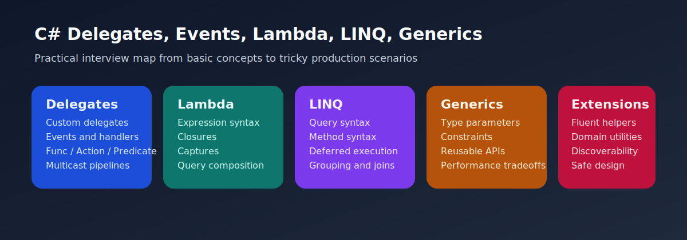

# C# Delegates, Events, Lambda, LINQ, Generics, and Extension Methods Interview Questions



This guide covers practical callback design, query composition, generic APIs, and extension-method usage in real C# systems. It follows the corrected format of **100 interview questions for each subtopic**, and every answer includes a C# code example with rotated real-world scenarios so the examples do not repeat verbatim.

## How To Use This Page

- Questions 1-100 cover Delegates, events, Func, and Action.
- Questions 101-200 cover Lambda expressions.
- Questions 201-300 cover LINQ with query and method syntax.
- Questions 301-400 cover Generics.
- Questions 401-500 cover Extension methods.

## 1. Delegates, events, Func, and Action

> This section contains **100 interview questions** focused on **Delegates, events, Func, and Action**. Every answer includes a C# code example, and the scenarios rotate so they do not repeat verbatim.

### Q1.1 What is custom delegates for callback contracts in advanced C# design?

**Answer:** Custom delegates for callback contracts means named delegates define explicit callback signatures for reusable behavior. Teams should focus on it when explaining delegates, events, func, and action in real systems, they compare it with hardcoded branching instead of passed behavior, and they should avoid the trap of creating custom delegates when Func or Action already communicates intent better. Example: while reviewing a reusable SDK API, so duplicate logic becomes easier to remove. Another example: during a payroll rules update, so hidden allocations become easier to notice.

**Code Example:**

```csharp
using System;
using System.Collections.Generic;
using System.Linq;

public static class Demo1_1
{
    public static void Run()
    {
        delegate decimal Discount(decimal amount);
        static decimal ApplyPromo(decimal amount) => amount * 0.90m;
        Discount calc = ApplyPromo;
        Console.WriteLine(calc(100m));
    }
}
```

### Q1.2 How does Func and Action shortcuts in advanced C# design?

**Answer:** Func and action shortcuts means Func and Action reduce boilerplate for common delegate shapes. Teams should focus on it when explaining delegates, events, func, and action in real systems, they compare it with always defining named delegates, and they should avoid the trap of using them when parameter meaning becomes unclear. Example: during a senior backend code review, so the callback boundary becomes easier to explain. Another example: while validating type-safe shared utilities, so maintenance cost stays lower.

**Code Example:**

```csharp
using System;
using System.Collections.Generic;
using System.Linq;

public static class Demo1_2
{
    public static void Run()
    {
        Func<int,int,int> add = (a, b) => a + b;
        Action<string> log = message => Console.WriteLine($"{message}-2");
        log(add(2, 3).ToString());
    }
}
```

### Q1.3 Why does multicast delegates in advanced C# design?

**Answer:** Multicast delegates means delegates can reference multiple methods and invoke them in sequence. Teams should focus on it when explaining delegates, events, func, and action in real systems, they compare it with single-callback assumptions, and they should avoid the trap of forgetting that invocation lists can trigger multiple side effects. Example: while designing a plugin-style extension point, so duplicate logic becomes easier to remove. Another example: during a batch import optimization, so hidden allocations become easier to notice.

**Code Example:**

```csharp
using System;
using System.Collections.Generic;
using System.Linq;

public static class Demo1_3
{
    public static void Run()
    {
        Action handlers = () => Console.WriteLine("first");
        handlers += () => Console.WriteLine("second");
        handlers();
    }
}
```

### Q1.4 When should you use event publisher subscriber design in advanced C# design?

**Answer:** Event publisher subscriber design means events let publishers notify subscribers without tightly coupling to their implementations. Teams should focus on it when explaining delegates, events, func, and action in real systems, they compare it with direct service calls everywhere, and they should avoid the trap of forgetting to unsubscribe long-lived handlers when required. Example: during a message-processing refactor, so the callback boundary becomes easier to explain. Another example: while stabilizing an event-driven workflow, so maintenance cost stays lower.

**Code Example:**

```csharp
using System;
using System.Collections.Generic;
using System.Linq;

public static class Demo1_4
{
    public static void Run()
    {
        var publisher = new OrderPublisher();
        publisher.OrderPlaced += (_, id) => Console.WriteLine(id);
        publisher.Place("ORD-4");
        class OrderPublisher
        {
            public event EventHandler<string>? OrderPlaced;
            public void Place(string id) => OrderPlaced?.Invoke(this, id);
        }
    }
}
```

### Q1.5 What problem does delegate variance basics in advanced C# design?

**Answer:** Delegate variance basics means delegate variance supports compatible assignment in some input and output scenarios. Teams should focus on it when explaining delegates, events, func, and action in real systems, they compare it with strict signature identity assumptions only, and they should avoid the trap of explaining variance with no practical callback example. Example: while debugging a notification pipeline, so duplicate logic becomes easier to remove. Another example: during a search-filter performance issue, so hidden allocations become easier to notice.

**Code Example:**

```csharp
using System;
using System.Collections.Generic;
using System.Linq;

public static class Demo1_5
{
    public static void Run()
    {
        Func<object> create = () => "payload";
        Console.WriteLine(create());
    }
}
```

### Q1.6 How would you explain delegate interview framing in advanced C# design?

**Answer:** Delegate interview framing means strong answers connect delegates and events to extension points and decoupled workflows. Teams should focus on it when explaining delegates, events, func, and action in real systems, they compare it with syntax memorization only, and they should avoid the trap of skipping production use cases. Example: during a reporting feature rewrite, so the callback boundary becomes easier to explain. Another example: while cleaning up a LINQ-heavy module, so maintenance cost stays lower.

**Code Example:**

```csharp
using System;
using System.Collections.Generic;
using System.Linq;

public static class Demo1_6
{
    public static void Run()
    {
        Action<string> notify = message => Console.WriteLine(message);
        notify("done");
    }
}
```

### Q1.7 Why is custom delegates for callback contracts in advanced C# design?

**Answer:** Custom delegates for callback contracts means named delegates define explicit callback signatures for reusable behavior. Teams should focus on it when explaining delegates, events, func, and action in real systems, they compare it with hardcoded branching instead of passed behavior, and they should avoid the trap of creating custom delegates when Func or Action already communicates intent better. Example: while modernizing a legacy service layer, so duplicate logic becomes easier to remove. Another example: during a discount-engine rollout, so hidden allocations become easier to notice.

**Code Example:**

```csharp
using System;
using System.Collections.Generic;
using System.Linq;

public static class Demo1_7
{
    public static void Run()
    {
        delegate decimal Discount(decimal amount);
        static decimal ApplyPromo(decimal amount) => amount * 0.90m;
        Discount calc = ApplyPromo;
        Console.WriteLine(calc(100m));
    }
}
```

### Q1.8 How can Func and Action shortcuts in advanced C# design?

**Answer:** Func and action shortcuts means Func and Action reduce boilerplate for common delegate shapes. Teams should focus on it when explaining delegates, events, func, and action in real systems, they compare it with always defining named delegates, and they should avoid the trap of using them when parameter meaning becomes unclear. Example: during a payroll rules update, so the callback boundary becomes easier to explain. Another example: while reviewing a reusable SDK API, so maintenance cost stays lower.

**Code Example:**

```csharp
using System;
using System.Collections.Generic;
using System.Linq;

public static class Demo1_8
{
    public static void Run()
    {
        Func<int,int,int> add = (a, b) => a + b;
        Action<string> log = message => Console.WriteLine($"{message}-8");
        log(add(2, 3).ToString());
    }
}
```

### Q1.9 What is multicast delegates in advanced C# design?

**Answer:** Multicast delegates means delegates can reference multiple methods and invoke them in sequence. Teams should focus on it when explaining delegates, events, func, and action in real systems, they compare it with single-callback assumptions, and they should avoid the trap of forgetting that invocation lists can trigger multiple side effects. Example: while validating type-safe shared utilities, so duplicate logic becomes easier to remove. Another example: during a senior backend code review, so hidden allocations become easier to notice.

**Code Example:**

```csharp
using System;
using System.Collections.Generic;
using System.Linq;

public static class Demo1_9
{
    public static void Run()
    {
        Action handlers = () => Console.WriteLine("first");
        handlers += () => Console.WriteLine("second");
        handlers();
    }
}
```

### Q1.10 How does event publisher subscriber design in advanced C# design?

**Answer:** Event publisher subscriber design means events let publishers notify subscribers without tightly coupling to their implementations. Teams should focus on it when explaining delegates, events, func, and action in real systems, they compare it with direct service calls everywhere, and they should avoid the trap of forgetting to unsubscribe long-lived handlers when required. Example: during a batch import optimization, so the callback boundary becomes easier to explain. Another example: while designing a plugin-style extension point, so maintenance cost stays lower.

**Code Example:**

```csharp
using System;
using System.Collections.Generic;
using System.Linq;

public static class Demo1_10
{
    public static void Run()
    {
        var publisher = new OrderPublisher();
        publisher.OrderPlaced += (_, id) => Console.WriteLine(id);
        publisher.Place("ORD-10");
        class OrderPublisher
        {
            public event EventHandler<string>? OrderPlaced;
            public void Place(string id) => OrderPlaced?.Invoke(this, id);
        }
    }
}
```

### Q1.11 Why does delegate variance basics in advanced C# design?

**Answer:** Delegate variance basics means delegate variance supports compatible assignment in some input and output scenarios. Teams should focus on it when explaining delegates, events, func, and action in real systems, they compare it with strict signature identity assumptions only, and they should avoid the trap of explaining variance with no practical callback example. Example: while stabilizing an event-driven workflow, so duplicate logic becomes easier to remove. Another example: during a message-processing refactor, so hidden allocations become easier to notice.

**Code Example:**

```csharp
using System;
using System.Collections.Generic;
using System.Linq;

public static class Demo1_11
{
    public static void Run()
    {
        Func<object> create = () => "payload";
        Console.WriteLine(create());
    }
}
```

### Q1.12 When should you use delegate interview framing in advanced C# design?

**Answer:** Delegate interview framing means strong answers connect delegates and events to extension points and decoupled workflows. Teams should focus on it when explaining delegates, events, func, and action in real systems, they compare it with syntax memorization only, and they should avoid the trap of skipping production use cases. Example: during a search-filter performance issue, so the callback boundary becomes easier to explain. Another example: while debugging a notification pipeline, so maintenance cost stays lower.

**Code Example:**

```csharp
using System;
using System.Collections.Generic;
using System.Linq;

public static class Demo1_12
{
    public static void Run()
    {
        Action<string> notify = message => Console.WriteLine(message);
        notify("done");
    }
}
```

### Q1.13 What problem does custom delegates for callback contracts in advanced C# design?

**Answer:** Custom delegates for callback contracts means named delegates define explicit callback signatures for reusable behavior. Teams should focus on it when explaining delegates, events, func, and action in real systems, they compare it with hardcoded branching instead of passed behavior, and they should avoid the trap of creating custom delegates when Func or Action already communicates intent better. Example: while cleaning up a LINQ-heavy module, so duplicate logic becomes easier to remove. Another example: during a reporting feature rewrite, so hidden allocations become easier to notice.

**Code Example:**

```csharp
using System;
using System.Collections.Generic;
using System.Linq;

public static class Demo1_13
{
    public static void Run()
    {
        delegate decimal Discount(decimal amount);
        static decimal ApplyPromo(decimal amount) => amount * 0.90m;
        Discount calc = ApplyPromo;
        Console.WriteLine(calc(100m));
    }
}
```

### Q1.14 How would you explain Func and Action shortcuts in advanced C# design?

**Answer:** Func and action shortcuts means Func and Action reduce boilerplate for common delegate shapes. Teams should focus on it when explaining delegates, events, func, and action in real systems, they compare it with always defining named delegates, and they should avoid the trap of using them when parameter meaning becomes unclear. Example: during a discount-engine rollout, so the callback boundary becomes easier to explain. Another example: while modernizing a legacy service layer, so maintenance cost stays lower.

**Code Example:**

```csharp
using System;
using System.Collections.Generic;
using System.Linq;

public static class Demo1_14
{
    public static void Run()
    {
        Func<int,int,int> add = (a, b) => a + b;
        Action<string> log = message => Console.WriteLine($"{message}-14");
        log(add(2, 3).ToString());
    }
}
```

### Q1.15 Why is multicast delegates in advanced C# design?

**Answer:** Multicast delegates means delegates can reference multiple methods and invoke them in sequence. Teams should focus on it when explaining delegates, events, func, and action in real systems, they compare it with single-callback assumptions, and they should avoid the trap of forgetting that invocation lists can trigger multiple side effects. Example: while reviewing a reusable SDK API, so duplicate logic becomes easier to remove. Another example: during a payroll rules update, so hidden allocations become easier to notice.

**Code Example:**

```csharp
using System;
using System.Collections.Generic;
using System.Linq;

public static class Demo1_15
{
    public static void Run()
    {
        Action handlers = () => Console.WriteLine("first");
        handlers += () => Console.WriteLine("second");
        handlers();
    }
}
```

### Q1.16 How can event publisher subscriber design in advanced C# design?

**Answer:** Event publisher subscriber design means events let publishers notify subscribers without tightly coupling to their implementations. Teams should focus on it when explaining delegates, events, func, and action in real systems, they compare it with direct service calls everywhere, and they should avoid the trap of forgetting to unsubscribe long-lived handlers when required. Example: during a senior backend code review, so the callback boundary becomes easier to explain. Another example: while validating type-safe shared utilities, so maintenance cost stays lower.

**Code Example:**

```csharp
using System;
using System.Collections.Generic;
using System.Linq;

public static class Demo1_16
{
    public static void Run()
    {
        var publisher = new OrderPublisher();
        publisher.OrderPlaced += (_, id) => Console.WriteLine(id);
        publisher.Place("ORD-16");
        class OrderPublisher
        {
            public event EventHandler<string>? OrderPlaced;
            public void Place(string id) => OrderPlaced?.Invoke(this, id);
        }
    }
}
```

### Q1.17 What is delegate variance basics in advanced C# design?

**Answer:** Delegate variance basics means delegate variance supports compatible assignment in some input and output scenarios. Teams should focus on it when explaining delegates, events, func, and action in real systems, they compare it with strict signature identity assumptions only, and they should avoid the trap of explaining variance with no practical callback example. Example: while designing a plugin-style extension point, so duplicate logic becomes easier to remove. Another example: during a batch import optimization, so hidden allocations become easier to notice.

**Code Example:**

```csharp
using System;
using System.Collections.Generic;
using System.Linq;

public static class Demo1_17
{
    public static void Run()
    {
        Func<object> create = () => "payload";
        Console.WriteLine(create());
    }
}
```

### Q1.18 How does delegate interview framing in advanced C# design?

**Answer:** Delegate interview framing means strong answers connect delegates and events to extension points and decoupled workflows. Teams should focus on it when explaining delegates, events, func, and action in real systems, they compare it with syntax memorization only, and they should avoid the trap of skipping production use cases. Example: during a message-processing refactor, so the callback boundary becomes easier to explain. Another example: while stabilizing an event-driven workflow, so maintenance cost stays lower.

**Code Example:**

```csharp
using System;
using System.Collections.Generic;
using System.Linq;

public static class Demo1_18
{
    public static void Run()
    {
        Action<string> notify = message => Console.WriteLine(message);
        notify("done");
    }
}
```

### Q1.19 Why does custom delegates for callback contracts in advanced C# design?

**Answer:** Custom delegates for callback contracts means named delegates define explicit callback signatures for reusable behavior. Teams should focus on it when explaining delegates, events, func, and action in real systems, they compare it with hardcoded branching instead of passed behavior, and they should avoid the trap of creating custom delegates when Func or Action already communicates intent better. Example: while debugging a notification pipeline, so duplicate logic becomes easier to remove. Another example: during a search-filter performance issue, so hidden allocations become easier to notice.

**Code Example:**

```csharp
using System;
using System.Collections.Generic;
using System.Linq;

public static class Demo1_19
{
    public static void Run()
    {
        delegate decimal Discount(decimal amount);
        static decimal ApplyPromo(decimal amount) => amount * 0.90m;
        Discount calc = ApplyPromo;
        Console.WriteLine(calc(100m));
    }
}
```

### Q1.20 When should you use Func and Action shortcuts in advanced C# design?

**Answer:** Func and action shortcuts means Func and Action reduce boilerplate for common delegate shapes. Teams should focus on it when explaining delegates, events, func, and action in real systems, they compare it with always defining named delegates, and they should avoid the trap of using them when parameter meaning becomes unclear. Example: during a reporting feature rewrite, so the callback boundary becomes easier to explain. Another example: while cleaning up a LINQ-heavy module, so maintenance cost stays lower.

**Code Example:**

```csharp
using System;
using System.Collections.Generic;
using System.Linq;

public static class Demo1_20
{
    public static void Run()
    {
        Func<int,int,int> add = (a, b) => a + b;
        Action<string> log = message => Console.WriteLine($"{message}-20");
        log(add(2, 3).ToString());
    }
}
```

### Q1.21 What problem does multicast delegates in advanced C# design?

**Answer:** Multicast delegates means delegates can reference multiple methods and invoke them in sequence. Teams should focus on it when explaining delegates, events, func, and action in real systems, they compare it with single-callback assumptions, and they should avoid the trap of forgetting that invocation lists can trigger multiple side effects. Example: while modernizing a legacy service layer, so duplicate logic becomes easier to remove. Another example: during a discount-engine rollout, so hidden allocations become easier to notice.

**Code Example:**

```csharp
using System;
using System.Collections.Generic;
using System.Linq;

public static class Demo1_21
{
    public static void Run()
    {
        Action handlers = () => Console.WriteLine("first");
        handlers += () => Console.WriteLine("second");
        handlers();
    }
}
```

### Q1.22 How would you explain event publisher subscriber design in advanced C# design?

**Answer:** Event publisher subscriber design means events let publishers notify subscribers without tightly coupling to their implementations. Teams should focus on it when explaining delegates, events, func, and action in real systems, they compare it with direct service calls everywhere, and they should avoid the trap of forgetting to unsubscribe long-lived handlers when required. Example: during a payroll rules update, so the callback boundary becomes easier to explain. Another example: while reviewing a reusable SDK API, so maintenance cost stays lower.

**Code Example:**

```csharp
using System;
using System.Collections.Generic;
using System.Linq;

public static class Demo1_22
{
    public static void Run()
    {
        var publisher = new OrderPublisher();
        publisher.OrderPlaced += (_, id) => Console.WriteLine(id);
        publisher.Place("ORD-22");
        class OrderPublisher
        {
            public event EventHandler<string>? OrderPlaced;
            public void Place(string id) => OrderPlaced?.Invoke(this, id);
        }
    }
}
```

### Q1.23 Why is delegate variance basics in advanced C# design?

**Answer:** Delegate variance basics means delegate variance supports compatible assignment in some input and output scenarios. Teams should focus on it when explaining delegates, events, func, and action in real systems, they compare it with strict signature identity assumptions only, and they should avoid the trap of explaining variance with no practical callback example. Example: while validating type-safe shared utilities, so duplicate logic becomes easier to remove. Another example: during a senior backend code review, so hidden allocations become easier to notice.

**Code Example:**

```csharp
using System;
using System.Collections.Generic;
using System.Linq;

public static class Demo1_23
{
    public static void Run()
    {
        Func<object> create = () => "payload";
        Console.WriteLine(create());
    }
}
```

### Q1.24 How can delegate interview framing in advanced C# design?

**Answer:** Delegate interview framing means strong answers connect delegates and events to extension points and decoupled workflows. Teams should focus on it when explaining delegates, events, func, and action in real systems, they compare it with syntax memorization only, and they should avoid the trap of skipping production use cases. Example: during a batch import optimization, so the callback boundary becomes easier to explain. Another example: while designing a plugin-style extension point, so maintenance cost stays lower.

**Code Example:**

```csharp
using System;
using System.Collections.Generic;
using System.Linq;

public static class Demo1_24
{
    public static void Run()
    {
        Action<string> notify = message => Console.WriteLine(message);
        notify("done");
    }
}
```

### Q1.25 What is custom delegates for callback contracts in advanced C# design?

**Answer:** Custom delegates for callback contracts means named delegates define explicit callback signatures for reusable behavior. Teams should focus on it when explaining delegates, events, func, and action in real systems, they compare it with hardcoded branching instead of passed behavior, and they should avoid the trap of creating custom delegates when Func or Action already communicates intent better. Example: while stabilizing an event-driven workflow, so duplicate logic becomes easier to remove. Another example: during a message-processing refactor, so hidden allocations become easier to notice.

**Code Example:**

```csharp
using System;
using System.Collections.Generic;
using System.Linq;

public static class Demo1_25
{
    public static void Run()
    {
        delegate decimal Discount(decimal amount);
        static decimal ApplyPromo(decimal amount) => amount * 0.90m;
        Discount calc = ApplyPromo;
        Console.WriteLine(calc(100m));
    }
}
```

### Q1.26 How does Func and Action shortcuts in advanced C# design?

**Answer:** Func and action shortcuts means Func and Action reduce boilerplate for common delegate shapes. Teams should focus on it when explaining delegates, events, func, and action in real systems, they compare it with always defining named delegates, and they should avoid the trap of using them when parameter meaning becomes unclear. Example: during a search-filter performance issue, so the callback boundary becomes easier to explain. Another example: while debugging a notification pipeline, so maintenance cost stays lower.

**Code Example:**

```csharp
using System;
using System.Collections.Generic;
using System.Linq;

public static class Demo1_26
{
    public static void Run()
    {
        Func<int,int,int> add = (a, b) => a + b;
        Action<string> log = message => Console.WriteLine($"{message}-26");
        log(add(2, 3).ToString());
    }
}
```

### Q1.27 Why does multicast delegates in advanced C# design?

**Answer:** Multicast delegates means delegates can reference multiple methods and invoke them in sequence. Teams should focus on it when explaining delegates, events, func, and action in real systems, they compare it with single-callback assumptions, and they should avoid the trap of forgetting that invocation lists can trigger multiple side effects. Example: while cleaning up a LINQ-heavy module, so duplicate logic becomes easier to remove. Another example: during a reporting feature rewrite, so hidden allocations become easier to notice.

**Code Example:**

```csharp
using System;
using System.Collections.Generic;
using System.Linq;

public static class Demo1_27
{
    public static void Run()
    {
        Action handlers = () => Console.WriteLine("first");
        handlers += () => Console.WriteLine("second");
        handlers();
    }
}
```

### Q1.28 When should you use event publisher subscriber design in advanced C# design?

**Answer:** Event publisher subscriber design means events let publishers notify subscribers without tightly coupling to their implementations. Teams should focus on it when explaining delegates, events, func, and action in real systems, they compare it with direct service calls everywhere, and they should avoid the trap of forgetting to unsubscribe long-lived handlers when required. Example: during a discount-engine rollout, so the callback boundary becomes easier to explain. Another example: while modernizing a legacy service layer, so maintenance cost stays lower.

**Code Example:**

```csharp
using System;
using System.Collections.Generic;
using System.Linq;

public static class Demo1_28
{
    public static void Run()
    {
        var publisher = new OrderPublisher();
        publisher.OrderPlaced += (_, id) => Console.WriteLine(id);
        publisher.Place("ORD-28");
        class OrderPublisher
        {
            public event EventHandler<string>? OrderPlaced;
            public void Place(string id) => OrderPlaced?.Invoke(this, id);
        }
    }
}
```

### Q1.29 What problem does delegate variance basics in advanced C# design?

**Answer:** Delegate variance basics means delegate variance supports compatible assignment in some input and output scenarios. Teams should focus on it when explaining delegates, events, func, and action in real systems, they compare it with strict signature identity assumptions only, and they should avoid the trap of explaining variance with no practical callback example. Example: while reviewing a reusable SDK API, so duplicate logic becomes easier to remove. Another example: during a payroll rules update, so hidden allocations become easier to notice.

**Code Example:**

```csharp
using System;
using System.Collections.Generic;
using System.Linq;

public static class Demo1_29
{
    public static void Run()
    {
        Func<object> create = () => "payload";
        Console.WriteLine(create());
    }
}
```

### Q1.30 How would you explain delegate interview framing in advanced C# design?

**Answer:** Delegate interview framing means strong answers connect delegates and events to extension points and decoupled workflows. Teams should focus on it when explaining delegates, events, func, and action in real systems, they compare it with syntax memorization only, and they should avoid the trap of skipping production use cases. Example: during a senior backend code review, so the callback boundary becomes easier to explain. Another example: while validating type-safe shared utilities, so maintenance cost stays lower.

**Code Example:**

```csharp
using System;
using System.Collections.Generic;
using System.Linq;

public static class Demo1_30
{
    public static void Run()
    {
        Action<string> notify = message => Console.WriteLine(message);
        notify("done");
    }
}
```

### Q1.31 Why is custom delegates for callback contracts in advanced C# design?

**Answer:** Custom delegates for callback contracts means named delegates define explicit callback signatures for reusable behavior. Teams should focus on it when explaining delegates, events, func, and action in real systems, they compare it with hardcoded branching instead of passed behavior, and they should avoid the trap of creating custom delegates when Func or Action already communicates intent better. Example: while designing a plugin-style extension point, so duplicate logic becomes easier to remove. Another example: during a batch import optimization, so hidden allocations become easier to notice.

**Code Example:**

```csharp
using System;
using System.Collections.Generic;
using System.Linq;

public static class Demo1_31
{
    public static void Run()
    {
        delegate decimal Discount(decimal amount);
        static decimal ApplyPromo(decimal amount) => amount * 0.90m;
        Discount calc = ApplyPromo;
        Console.WriteLine(calc(100m));
    }
}
```

### Q1.32 How can Func and Action shortcuts in advanced C# design?

**Answer:** Func and action shortcuts means Func and Action reduce boilerplate for common delegate shapes. Teams should focus on it when explaining delegates, events, func, and action in real systems, they compare it with always defining named delegates, and they should avoid the trap of using them when parameter meaning becomes unclear. Example: during a message-processing refactor, so the callback boundary becomes easier to explain. Another example: while stabilizing an event-driven workflow, so maintenance cost stays lower.

**Code Example:**

```csharp
using System;
using System.Collections.Generic;
using System.Linq;

public static class Demo1_32
{
    public static void Run()
    {
        Func<int,int,int> add = (a, b) => a + b;
        Action<string> log = message => Console.WriteLine($"{message}-32");
        log(add(2, 3).ToString());
    }
}
```

### Q1.33 What is multicast delegates in advanced C# design?

**Answer:** Multicast delegates means delegates can reference multiple methods and invoke them in sequence. Teams should focus on it when explaining delegates, events, func, and action in real systems, they compare it with single-callback assumptions, and they should avoid the trap of forgetting that invocation lists can trigger multiple side effects. Example: while debugging a notification pipeline, so duplicate logic becomes easier to remove. Another example: during a search-filter performance issue, so hidden allocations become easier to notice.

**Code Example:**

```csharp
using System;
using System.Collections.Generic;
using System.Linq;

public static class Demo1_33
{
    public static void Run()
    {
        Action handlers = () => Console.WriteLine("first");
        handlers += () => Console.WriteLine("second");
        handlers();
    }
}
```

### Q1.34 How does event publisher subscriber design in advanced C# design?

**Answer:** Event publisher subscriber design means events let publishers notify subscribers without tightly coupling to their implementations. Teams should focus on it when explaining delegates, events, func, and action in real systems, they compare it with direct service calls everywhere, and they should avoid the trap of forgetting to unsubscribe long-lived handlers when required. Example: during a reporting feature rewrite, so the callback boundary becomes easier to explain. Another example: while cleaning up a LINQ-heavy module, so maintenance cost stays lower.

**Code Example:**

```csharp
using System;
using System.Collections.Generic;
using System.Linq;

public static class Demo1_34
{
    public static void Run()
    {
        var publisher = new OrderPublisher();
        publisher.OrderPlaced += (_, id) => Console.WriteLine(id);
        publisher.Place("ORD-34");
        class OrderPublisher
        {
            public event EventHandler<string>? OrderPlaced;
            public void Place(string id) => OrderPlaced?.Invoke(this, id);
        }
    }
}
```

### Q1.35 Why does delegate variance basics in advanced C# design?

**Answer:** Delegate variance basics means delegate variance supports compatible assignment in some input and output scenarios. Teams should focus on it when explaining delegates, events, func, and action in real systems, they compare it with strict signature identity assumptions only, and they should avoid the trap of explaining variance with no practical callback example. Example: while modernizing a legacy service layer, so duplicate logic becomes easier to remove. Another example: during a discount-engine rollout, so hidden allocations become easier to notice.

**Code Example:**

```csharp
using System;
using System.Collections.Generic;
using System.Linq;

public static class Demo1_35
{
    public static void Run()
    {
        Func<object> create = () => "payload";
        Console.WriteLine(create());
    }
}
```

### Q1.36 When should you use delegate interview framing in advanced C# design?

**Answer:** Delegate interview framing means strong answers connect delegates and events to extension points and decoupled workflows. Teams should focus on it when explaining delegates, events, func, and action in real systems, they compare it with syntax memorization only, and they should avoid the trap of skipping production use cases. Example: during a payroll rules update, so the callback boundary becomes easier to explain. Another example: while reviewing a reusable SDK API, so maintenance cost stays lower.

**Code Example:**

```csharp
using System;
using System.Collections.Generic;
using System.Linq;

public static class Demo1_36
{
    public static void Run()
    {
        Action<string> notify = message => Console.WriteLine(message);
        notify("done");
    }
}
```

### Q1.37 What problem does custom delegates for callback contracts in advanced C# design?

**Answer:** Custom delegates for callback contracts means named delegates define explicit callback signatures for reusable behavior. Teams should focus on it when explaining delegates, events, func, and action in real systems, they compare it with hardcoded branching instead of passed behavior, and they should avoid the trap of creating custom delegates when Func or Action already communicates intent better. Example: while validating type-safe shared utilities, so duplicate logic becomes easier to remove. Another example: during a senior backend code review, so hidden allocations become easier to notice.

**Code Example:**

```csharp
using System;
using System.Collections.Generic;
using System.Linq;

public static class Demo1_37
{
    public static void Run()
    {
        delegate decimal Discount(decimal amount);
        static decimal ApplyPromo(decimal amount) => amount * 0.90m;
        Discount calc = ApplyPromo;
        Console.WriteLine(calc(100m));
    }
}
```

### Q1.38 How would you explain Func and Action shortcuts in advanced C# design?

**Answer:** Func and action shortcuts means Func and Action reduce boilerplate for common delegate shapes. Teams should focus on it when explaining delegates, events, func, and action in real systems, they compare it with always defining named delegates, and they should avoid the trap of using them when parameter meaning becomes unclear. Example: during a batch import optimization, so the callback boundary becomes easier to explain. Another example: while designing a plugin-style extension point, so maintenance cost stays lower.

**Code Example:**

```csharp
using System;
using System.Collections.Generic;
using System.Linq;

public static class Demo1_38
{
    public static void Run()
    {
        Func<int,int,int> add = (a, b) => a + b;
        Action<string> log = message => Console.WriteLine($"{message}-38");
        log(add(2, 3).ToString());
    }
}
```

### Q1.39 Why is multicast delegates in advanced C# design?

**Answer:** Multicast delegates means delegates can reference multiple methods and invoke them in sequence. Teams should focus on it when explaining delegates, events, func, and action in real systems, they compare it with single-callback assumptions, and they should avoid the trap of forgetting that invocation lists can trigger multiple side effects. Example: while stabilizing an event-driven workflow, so duplicate logic becomes easier to remove. Another example: during a message-processing refactor, so hidden allocations become easier to notice.

**Code Example:**

```csharp
using System;
using System.Collections.Generic;
using System.Linq;

public static class Demo1_39
{
    public static void Run()
    {
        Action handlers = () => Console.WriteLine("first");
        handlers += () => Console.WriteLine("second");
        handlers();
    }
}
```

### Q1.40 How can event publisher subscriber design in advanced C# design?

**Answer:** Event publisher subscriber design means events let publishers notify subscribers without tightly coupling to their implementations. Teams should focus on it when explaining delegates, events, func, and action in real systems, they compare it with direct service calls everywhere, and they should avoid the trap of forgetting to unsubscribe long-lived handlers when required. Example: during a search-filter performance issue, so the callback boundary becomes easier to explain. Another example: while debugging a notification pipeline, so maintenance cost stays lower.

**Code Example:**

```csharp
using System;
using System.Collections.Generic;
using System.Linq;

public static class Demo1_40
{
    public static void Run()
    {
        var publisher = new OrderPublisher();
        publisher.OrderPlaced += (_, id) => Console.WriteLine(id);
        publisher.Place("ORD-40");
        class OrderPublisher
        {
            public event EventHandler<string>? OrderPlaced;
            public void Place(string id) => OrderPlaced?.Invoke(this, id);
        }
    }
}
```

### Q1.41 What is delegate variance basics in advanced C# design?

**Answer:** Delegate variance basics means delegate variance supports compatible assignment in some input and output scenarios. Teams should focus on it when explaining delegates, events, func, and action in real systems, they compare it with strict signature identity assumptions only, and they should avoid the trap of explaining variance with no practical callback example. Example: while cleaning up a LINQ-heavy module, so duplicate logic becomes easier to remove. Another example: during a reporting feature rewrite, so hidden allocations become easier to notice.

**Code Example:**

```csharp
using System;
using System.Collections.Generic;
using System.Linq;

public static class Demo1_41
{
    public static void Run()
    {
        Func<object> create = () => "payload";
        Console.WriteLine(create());
    }
}
```

### Q1.42 How does delegate interview framing in advanced C# design?

**Answer:** Delegate interview framing means strong answers connect delegates and events to extension points and decoupled workflows. Teams should focus on it when explaining delegates, events, func, and action in real systems, they compare it with syntax memorization only, and they should avoid the trap of skipping production use cases. Example: during a discount-engine rollout, so the callback boundary becomes easier to explain. Another example: while modernizing a legacy service layer, so maintenance cost stays lower.

**Code Example:**

```csharp
using System;
using System.Collections.Generic;
using System.Linq;

public static class Demo1_42
{
    public static void Run()
    {
        Action<string> notify = message => Console.WriteLine(message);
        notify("done");
    }
}
```

### Q1.43 Why does custom delegates for callback contracts in advanced C# design?

**Answer:** Custom delegates for callback contracts means named delegates define explicit callback signatures for reusable behavior. Teams should focus on it when explaining delegates, events, func, and action in real systems, they compare it with hardcoded branching instead of passed behavior, and they should avoid the trap of creating custom delegates when Func or Action already communicates intent better. Example: while reviewing a reusable SDK API, so duplicate logic becomes easier to remove. Another example: during a payroll rules update, so hidden allocations become easier to notice.

**Code Example:**

```csharp
using System;
using System.Collections.Generic;
using System.Linq;

public static class Demo1_43
{
    public static void Run()
    {
        delegate decimal Discount(decimal amount);
        static decimal ApplyPromo(decimal amount) => amount * 0.90m;
        Discount calc = ApplyPromo;
        Console.WriteLine(calc(100m));
    }
}
```

### Q1.44 When should you use Func and Action shortcuts in advanced C# design?

**Answer:** Func and action shortcuts means Func and Action reduce boilerplate for common delegate shapes. Teams should focus on it when explaining delegates, events, func, and action in real systems, they compare it with always defining named delegates, and they should avoid the trap of using them when parameter meaning becomes unclear. Example: during a senior backend code review, so the callback boundary becomes easier to explain. Another example: while validating type-safe shared utilities, so maintenance cost stays lower.

**Code Example:**

```csharp
using System;
using System.Collections.Generic;
using System.Linq;

public static class Demo1_44
{
    public static void Run()
    {
        Func<int,int,int> add = (a, b) => a + b;
        Action<string> log = message => Console.WriteLine($"{message}-44");
        log(add(2, 3).ToString());
    }
}
```

### Q1.45 What problem does multicast delegates in advanced C# design?

**Answer:** Multicast delegates means delegates can reference multiple methods and invoke them in sequence. Teams should focus on it when explaining delegates, events, func, and action in real systems, they compare it with single-callback assumptions, and they should avoid the trap of forgetting that invocation lists can trigger multiple side effects. Example: while designing a plugin-style extension point, so duplicate logic becomes easier to remove. Another example: during a batch import optimization, so hidden allocations become easier to notice.

**Code Example:**

```csharp
using System;
using System.Collections.Generic;
using System.Linq;

public static class Demo1_45
{
    public static void Run()
    {
        Action handlers = () => Console.WriteLine("first");
        handlers += () => Console.WriteLine("second");
        handlers();
    }
}
```

### Q1.46 How would you explain event publisher subscriber design in advanced C# design?

**Answer:** Event publisher subscriber design means events let publishers notify subscribers without tightly coupling to their implementations. Teams should focus on it when explaining delegates, events, func, and action in real systems, they compare it with direct service calls everywhere, and they should avoid the trap of forgetting to unsubscribe long-lived handlers when required. Example: during a message-processing refactor, so the callback boundary becomes easier to explain. Another example: while stabilizing an event-driven workflow, so maintenance cost stays lower.

**Code Example:**

```csharp
using System;
using System.Collections.Generic;
using System.Linq;

public static class Demo1_46
{
    public static void Run()
    {
        var publisher = new OrderPublisher();
        publisher.OrderPlaced += (_, id) => Console.WriteLine(id);
        publisher.Place("ORD-46");
        class OrderPublisher
        {
            public event EventHandler<string>? OrderPlaced;
            public void Place(string id) => OrderPlaced?.Invoke(this, id);
        }
    }
}
```

### Q1.47 Why is delegate variance basics in advanced C# design?

**Answer:** Delegate variance basics means delegate variance supports compatible assignment in some input and output scenarios. Teams should focus on it when explaining delegates, events, func, and action in real systems, they compare it with strict signature identity assumptions only, and they should avoid the trap of explaining variance with no practical callback example. Example: while debugging a notification pipeline, so duplicate logic becomes easier to remove. Another example: during a search-filter performance issue, so hidden allocations become easier to notice.

**Code Example:**

```csharp
using System;
using System.Collections.Generic;
using System.Linq;

public static class Demo1_47
{
    public static void Run()
    {
        Func<object> create = () => "payload";
        Console.WriteLine(create());
    }
}
```

### Q1.48 How can delegate interview framing in advanced C# design?

**Answer:** Delegate interview framing means strong answers connect delegates and events to extension points and decoupled workflows. Teams should focus on it when explaining delegates, events, func, and action in real systems, they compare it with syntax memorization only, and they should avoid the trap of skipping production use cases. Example: during a reporting feature rewrite, so the callback boundary becomes easier to explain. Another example: while cleaning up a LINQ-heavy module, so maintenance cost stays lower.

**Code Example:**

```csharp
using System;
using System.Collections.Generic;
using System.Linq;

public static class Demo1_48
{
    public static void Run()
    {
        Action<string> notify = message => Console.WriteLine(message);
        notify("done");
    }
}
```

### Q1.49 What is custom delegates for callback contracts in advanced C# design?

**Answer:** Custom delegates for callback contracts means named delegates define explicit callback signatures for reusable behavior. Teams should focus on it when explaining delegates, events, func, and action in real systems, they compare it with hardcoded branching instead of passed behavior, and they should avoid the trap of creating custom delegates when Func or Action already communicates intent better. Example: while modernizing a legacy service layer, so duplicate logic becomes easier to remove. Another example: during a discount-engine rollout, so hidden allocations become easier to notice.

**Code Example:**

```csharp
using System;
using System.Collections.Generic;
using System.Linq;

public static class Demo1_49
{
    public static void Run()
    {
        delegate decimal Discount(decimal amount);
        static decimal ApplyPromo(decimal amount) => amount * 0.90m;
        Discount calc = ApplyPromo;
        Console.WriteLine(calc(100m));
    }
}
```

### Q1.50 How does Func and Action shortcuts in advanced C# design?

**Answer:** Func and action shortcuts means Func and Action reduce boilerplate for common delegate shapes. Teams should focus on it when explaining delegates, events, func, and action in real systems, they compare it with always defining named delegates, and they should avoid the trap of using them when parameter meaning becomes unclear. Example: during a payroll rules update, so the callback boundary becomes easier to explain. Another example: while reviewing a reusable SDK API, so maintenance cost stays lower.

**Code Example:**

```csharp
using System;
using System.Collections.Generic;
using System.Linq;

public static class Demo1_50
{
    public static void Run()
    {
        Func<int,int,int> add = (a, b) => a + b;
        Action<string> log = message => Console.WriteLine($"{message}-50");
        log(add(2, 3).ToString());
    }
}
```

### Q1.51 Why does multicast delegates in advanced C# design?

**Answer:** Multicast delegates means delegates can reference multiple methods and invoke them in sequence. Teams should focus on it when explaining delegates, events, func, and action in real systems, they compare it with single-callback assumptions, and they should avoid the trap of forgetting that invocation lists can trigger multiple side effects. Example: while validating type-safe shared utilities, so duplicate logic becomes easier to remove. Another example: during a senior backend code review, so hidden allocations become easier to notice.

**Code Example:**

```csharp
using System;
using System.Collections.Generic;
using System.Linq;

public static class Demo1_51
{
    public static void Run()
    {
        Action handlers = () => Console.WriteLine("first");
        handlers += () => Console.WriteLine("second");
        handlers();
    }
}
```

### Q1.52 When should you use event publisher subscriber design in advanced C# design?

**Answer:** Event publisher subscriber design means events let publishers notify subscribers without tightly coupling to their implementations. Teams should focus on it when explaining delegates, events, func, and action in real systems, they compare it with direct service calls everywhere, and they should avoid the trap of forgetting to unsubscribe long-lived handlers when required. Example: during a batch import optimization, so the callback boundary becomes easier to explain. Another example: while designing a plugin-style extension point, so maintenance cost stays lower.

**Code Example:**

```csharp
using System;
using System.Collections.Generic;
using System.Linq;

public static class Demo1_52
{
    public static void Run()
    {
        var publisher = new OrderPublisher();
        publisher.OrderPlaced += (_, id) => Console.WriteLine(id);
        publisher.Place("ORD-52");
        class OrderPublisher
        {
            public event EventHandler<string>? OrderPlaced;
            public void Place(string id) => OrderPlaced?.Invoke(this, id);
        }
    }
}
```

### Q1.53 What problem does delegate variance basics in advanced C# design?

**Answer:** Delegate variance basics means delegate variance supports compatible assignment in some input and output scenarios. Teams should focus on it when explaining delegates, events, func, and action in real systems, they compare it with strict signature identity assumptions only, and they should avoid the trap of explaining variance with no practical callback example. Example: while stabilizing an event-driven workflow, so duplicate logic becomes easier to remove. Another example: during a message-processing refactor, so hidden allocations become easier to notice.

**Code Example:**

```csharp
using System;
using System.Collections.Generic;
using System.Linq;

public static class Demo1_53
{
    public static void Run()
    {
        Func<object> create = () => "payload";
        Console.WriteLine(create());
    }
}
```

### Q1.54 How would you explain delegate interview framing in advanced C# design?

**Answer:** Delegate interview framing means strong answers connect delegates and events to extension points and decoupled workflows. Teams should focus on it when explaining delegates, events, func, and action in real systems, they compare it with syntax memorization only, and they should avoid the trap of skipping production use cases. Example: during a search-filter performance issue, so the callback boundary becomes easier to explain. Another example: while debugging a notification pipeline, so maintenance cost stays lower.

**Code Example:**

```csharp
using System;
using System.Collections.Generic;
using System.Linq;

public static class Demo1_54
{
    public static void Run()
    {
        Action<string> notify = message => Console.WriteLine(message);
        notify("done");
    }
}
```

### Q1.55 Why is custom delegates for callback contracts in advanced C# design?

**Answer:** Custom delegates for callback contracts means named delegates define explicit callback signatures for reusable behavior. Teams should focus on it when explaining delegates, events, func, and action in real systems, they compare it with hardcoded branching instead of passed behavior, and they should avoid the trap of creating custom delegates when Func or Action already communicates intent better. Example: while cleaning up a LINQ-heavy module, so duplicate logic becomes easier to remove. Another example: during a reporting feature rewrite, so hidden allocations become easier to notice.

**Code Example:**

```csharp
using System;
using System.Collections.Generic;
using System.Linq;

public static class Demo1_55
{
    public static void Run()
    {
        delegate decimal Discount(decimal amount);
        static decimal ApplyPromo(decimal amount) => amount * 0.90m;
        Discount calc = ApplyPromo;
        Console.WriteLine(calc(100m));
    }
}
```

### Q1.56 How can Func and Action shortcuts in advanced C# design?

**Answer:** Func and action shortcuts means Func and Action reduce boilerplate for common delegate shapes. Teams should focus on it when explaining delegates, events, func, and action in real systems, they compare it with always defining named delegates, and they should avoid the trap of using them when parameter meaning becomes unclear. Example: during a discount-engine rollout, so the callback boundary becomes easier to explain. Another example: while modernizing a legacy service layer, so maintenance cost stays lower.

**Code Example:**

```csharp
using System;
using System.Collections.Generic;
using System.Linq;

public static class Demo1_56
{
    public static void Run()
    {
        Func<int,int,int> add = (a, b) => a + b;
        Action<string> log = message => Console.WriteLine($"{message}-56");
        log(add(2, 3).ToString());
    }
}
```

### Q1.57 What is multicast delegates in advanced C# design?

**Answer:** Multicast delegates means delegates can reference multiple methods and invoke them in sequence. Teams should focus on it when explaining delegates, events, func, and action in real systems, they compare it with single-callback assumptions, and they should avoid the trap of forgetting that invocation lists can trigger multiple side effects. Example: while reviewing a reusable SDK API, so duplicate logic becomes easier to remove. Another example: during a payroll rules update, so hidden allocations become easier to notice.

**Code Example:**

```csharp
using System;
using System.Collections.Generic;
using System.Linq;

public static class Demo1_57
{
    public static void Run()
    {
        Action handlers = () => Console.WriteLine("first");
        handlers += () => Console.WriteLine("second");
        handlers();
    }
}
```

### Q1.58 How does event publisher subscriber design in advanced C# design?

**Answer:** Event publisher subscriber design means events let publishers notify subscribers without tightly coupling to their implementations. Teams should focus on it when explaining delegates, events, func, and action in real systems, they compare it with direct service calls everywhere, and they should avoid the trap of forgetting to unsubscribe long-lived handlers when required. Example: during a senior backend code review, so the callback boundary becomes easier to explain. Another example: while validating type-safe shared utilities, so maintenance cost stays lower.

**Code Example:**

```csharp
using System;
using System.Collections.Generic;
using System.Linq;

public static class Demo1_58
{
    public static void Run()
    {
        var publisher = new OrderPublisher();
        publisher.OrderPlaced += (_, id) => Console.WriteLine(id);
        publisher.Place("ORD-58");
        class OrderPublisher
        {
            public event EventHandler<string>? OrderPlaced;
            public void Place(string id) => OrderPlaced?.Invoke(this, id);
        }
    }
}
```

### Q1.59 Why does delegate variance basics in advanced C# design?

**Answer:** Delegate variance basics means delegate variance supports compatible assignment in some input and output scenarios. Teams should focus on it when explaining delegates, events, func, and action in real systems, they compare it with strict signature identity assumptions only, and they should avoid the trap of explaining variance with no practical callback example. Example: while designing a plugin-style extension point, so duplicate logic becomes easier to remove. Another example: during a batch import optimization, so hidden allocations become easier to notice.

**Code Example:**

```csharp
using System;
using System.Collections.Generic;
using System.Linq;

public static class Demo1_59
{
    public static void Run()
    {
        Func<object> create = () => "payload";
        Console.WriteLine(create());
    }
}
```

### Q1.60 When should you use delegate interview framing in advanced C# design?

**Answer:** Delegate interview framing means strong answers connect delegates and events to extension points and decoupled workflows. Teams should focus on it when explaining delegates, events, func, and action in real systems, they compare it with syntax memorization only, and they should avoid the trap of skipping production use cases. Example: during a message-processing refactor, so the callback boundary becomes easier to explain. Another example: while stabilizing an event-driven workflow, so maintenance cost stays lower.

**Code Example:**

```csharp
using System;
using System.Collections.Generic;
using System.Linq;

public static class Demo1_60
{
    public static void Run()
    {
        Action<string> notify = message => Console.WriteLine(message);
        notify("done");
    }
}
```

### Q1.61 What problem does custom delegates for callback contracts in advanced C# design?

**Answer:** Custom delegates for callback contracts means named delegates define explicit callback signatures for reusable behavior. Teams should focus on it when explaining delegates, events, func, and action in real systems, they compare it with hardcoded branching instead of passed behavior, and they should avoid the trap of creating custom delegates when Func or Action already communicates intent better. Example: while debugging a notification pipeline, so duplicate logic becomes easier to remove. Another example: during a search-filter performance issue, so hidden allocations become easier to notice.

**Code Example:**

```csharp
using System;
using System.Collections.Generic;
using System.Linq;

public static class Demo1_61
{
    public static void Run()
    {
        delegate decimal Discount(decimal amount);
        static decimal ApplyPromo(decimal amount) => amount * 0.90m;
        Discount calc = ApplyPromo;
        Console.WriteLine(calc(100m));
    }
}
```

### Q1.62 How would you explain Func and Action shortcuts in advanced C# design?

**Answer:** Func and action shortcuts means Func and Action reduce boilerplate for common delegate shapes. Teams should focus on it when explaining delegates, events, func, and action in real systems, they compare it with always defining named delegates, and they should avoid the trap of using them when parameter meaning becomes unclear. Example: during a reporting feature rewrite, so the callback boundary becomes easier to explain. Another example: while cleaning up a LINQ-heavy module, so maintenance cost stays lower.

**Code Example:**

```csharp
using System;
using System.Collections.Generic;
using System.Linq;

public static class Demo1_62
{
    public static void Run()
    {
        Func<int,int,int> add = (a, b) => a + b;
        Action<string> log = message => Console.WriteLine($"{message}-62");
        log(add(2, 3).ToString());
    }
}
```

### Q1.63 Why is multicast delegates in advanced C# design?

**Answer:** Multicast delegates means delegates can reference multiple methods and invoke them in sequence. Teams should focus on it when explaining delegates, events, func, and action in real systems, they compare it with single-callback assumptions, and they should avoid the trap of forgetting that invocation lists can trigger multiple side effects. Example: while modernizing a legacy service layer, so duplicate logic becomes easier to remove. Another example: during a discount-engine rollout, so hidden allocations become easier to notice.

**Code Example:**

```csharp
using System;
using System.Collections.Generic;
using System.Linq;

public static class Demo1_63
{
    public static void Run()
    {
        Action handlers = () => Console.WriteLine("first");
        handlers += () => Console.WriteLine("second");
        handlers();
    }
}
```

### Q1.64 How can event publisher subscriber design in advanced C# design?

**Answer:** Event publisher subscriber design means events let publishers notify subscribers without tightly coupling to their implementations. Teams should focus on it when explaining delegates, events, func, and action in real systems, they compare it with direct service calls everywhere, and they should avoid the trap of forgetting to unsubscribe long-lived handlers when required. Example: during a payroll rules update, so the callback boundary becomes easier to explain. Another example: while reviewing a reusable SDK API, so maintenance cost stays lower.

**Code Example:**

```csharp
using System;
using System.Collections.Generic;
using System.Linq;

public static class Demo1_64
{
    public static void Run()
    {
        var publisher = new OrderPublisher();
        publisher.OrderPlaced += (_, id) => Console.WriteLine(id);
        publisher.Place("ORD-64");
        class OrderPublisher
        {
            public event EventHandler<string>? OrderPlaced;
            public void Place(string id) => OrderPlaced?.Invoke(this, id);
        }
    }
}
```

### Q1.65 What is delegate variance basics in advanced C# design?

**Answer:** Delegate variance basics means delegate variance supports compatible assignment in some input and output scenarios. Teams should focus on it when explaining delegates, events, func, and action in real systems, they compare it with strict signature identity assumptions only, and they should avoid the trap of explaining variance with no practical callback example. Example: while validating type-safe shared utilities, so duplicate logic becomes easier to remove. Another example: during a senior backend code review, so hidden allocations become easier to notice.

**Code Example:**

```csharp
using System;
using System.Collections.Generic;
using System.Linq;

public static class Demo1_65
{
    public static void Run()
    {
        Func<object> create = () => "payload";
        Console.WriteLine(create());
    }
}
```

### Q1.66 How does delegate interview framing in advanced C# design?

**Answer:** Delegate interview framing means strong answers connect delegates and events to extension points and decoupled workflows. Teams should focus on it when explaining delegates, events, func, and action in real systems, they compare it with syntax memorization only, and they should avoid the trap of skipping production use cases. Example: during a batch import optimization, so the callback boundary becomes easier to explain. Another example: while designing a plugin-style extension point, so maintenance cost stays lower.

**Code Example:**

```csharp
using System;
using System.Collections.Generic;
using System.Linq;

public static class Demo1_66
{
    public static void Run()
    {
        Action<string> notify = message => Console.WriteLine(message);
        notify("done");
    }
}
```

### Q1.67 Why does custom delegates for callback contracts in advanced C# design?

**Answer:** Custom delegates for callback contracts means named delegates define explicit callback signatures for reusable behavior. Teams should focus on it when explaining delegates, events, func, and action in real systems, they compare it with hardcoded branching instead of passed behavior, and they should avoid the trap of creating custom delegates when Func or Action already communicates intent better. Example: while stabilizing an event-driven workflow, so duplicate logic becomes easier to remove. Another example: during a message-processing refactor, so hidden allocations become easier to notice.

**Code Example:**

```csharp
using System;
using System.Collections.Generic;
using System.Linq;

public static class Demo1_67
{
    public static void Run()
    {
        delegate decimal Discount(decimal amount);
        static decimal ApplyPromo(decimal amount) => amount * 0.90m;
        Discount calc = ApplyPromo;
        Console.WriteLine(calc(100m));
    }
}
```

### Q1.68 When should you use Func and Action shortcuts in advanced C# design?

**Answer:** Func and action shortcuts means Func and Action reduce boilerplate for common delegate shapes. Teams should focus on it when explaining delegates, events, func, and action in real systems, they compare it with always defining named delegates, and they should avoid the trap of using them when parameter meaning becomes unclear. Example: during a search-filter performance issue, so the callback boundary becomes easier to explain. Another example: while debugging a notification pipeline, so maintenance cost stays lower.

**Code Example:**

```csharp
using System;
using System.Collections.Generic;
using System.Linq;

public static class Demo1_68
{
    public static void Run()
    {
        Func<int,int,int> add = (a, b) => a + b;
        Action<string> log = message => Console.WriteLine($"{message}-68");
        log(add(2, 3).ToString());
    }
}
```

### Q1.69 What problem does multicast delegates in advanced C# design?

**Answer:** Multicast delegates means delegates can reference multiple methods and invoke them in sequence. Teams should focus on it when explaining delegates, events, func, and action in real systems, they compare it with single-callback assumptions, and they should avoid the trap of forgetting that invocation lists can trigger multiple side effects. Example: while cleaning up a LINQ-heavy module, so duplicate logic becomes easier to remove. Another example: during a reporting feature rewrite, so hidden allocations become easier to notice.

**Code Example:**

```csharp
using System;
using System.Collections.Generic;
using System.Linq;

public static class Demo1_69
{
    public static void Run()
    {
        Action handlers = () => Console.WriteLine("first");
        handlers += () => Console.WriteLine("second");
        handlers();
    }
}
```

### Q1.70 How would you explain event publisher subscriber design in advanced C# design?

**Answer:** Event publisher subscriber design means events let publishers notify subscribers without tightly coupling to their implementations. Teams should focus on it when explaining delegates, events, func, and action in real systems, they compare it with direct service calls everywhere, and they should avoid the trap of forgetting to unsubscribe long-lived handlers when required. Example: during a discount-engine rollout, so the callback boundary becomes easier to explain. Another example: while modernizing a legacy service layer, so maintenance cost stays lower.

**Code Example:**

```csharp
using System;
using System.Collections.Generic;
using System.Linq;

public static class Demo1_70
{
    public static void Run()
    {
        var publisher = new OrderPublisher();
        publisher.OrderPlaced += (_, id) => Console.WriteLine(id);
        publisher.Place("ORD-70");
        class OrderPublisher
        {
            public event EventHandler<string>? OrderPlaced;
            public void Place(string id) => OrderPlaced?.Invoke(this, id);
        }
    }
}
```

### Q1.71 Why is delegate variance basics in advanced C# design?

**Answer:** Delegate variance basics means delegate variance supports compatible assignment in some input and output scenarios. Teams should focus on it when explaining delegates, events, func, and action in real systems, they compare it with strict signature identity assumptions only, and they should avoid the trap of explaining variance with no practical callback example. Example: while reviewing a reusable SDK API, so duplicate logic becomes easier to remove. Another example: during a payroll rules update, so hidden allocations become easier to notice.

**Code Example:**

```csharp
using System;
using System.Collections.Generic;
using System.Linq;

public static class Demo1_71
{
    public static void Run()
    {
        Func<object> create = () => "payload";
        Console.WriteLine(create());
    }
}
```

### Q1.72 How can delegate interview framing in advanced C# design?

**Answer:** Delegate interview framing means strong answers connect delegates and events to extension points and decoupled workflows. Teams should focus on it when explaining delegates, events, func, and action in real systems, they compare it with syntax memorization only, and they should avoid the trap of skipping production use cases. Example: during a senior backend code review, so the callback boundary becomes easier to explain. Another example: while validating type-safe shared utilities, so maintenance cost stays lower.

**Code Example:**

```csharp
using System;
using System.Collections.Generic;
using System.Linq;

public static class Demo1_72
{
    public static void Run()
    {
        Action<string> notify = message => Console.WriteLine(message);
        notify("done");
    }
}
```

### Q1.73 What is custom delegates for callback contracts in advanced C# design?

**Answer:** Custom delegates for callback contracts means named delegates define explicit callback signatures for reusable behavior. Teams should focus on it when explaining delegates, events, func, and action in real systems, they compare it with hardcoded branching instead of passed behavior, and they should avoid the trap of creating custom delegates when Func or Action already communicates intent better. Example: while designing a plugin-style extension point, so duplicate logic becomes easier to remove. Another example: during a batch import optimization, so hidden allocations become easier to notice.

**Code Example:**

```csharp
using System;
using System.Collections.Generic;
using System.Linq;

public static class Demo1_73
{
    public static void Run()
    {
        delegate decimal Discount(decimal amount);
        static decimal ApplyPromo(decimal amount) => amount * 0.90m;
        Discount calc = ApplyPromo;
        Console.WriteLine(calc(100m));
    }
}
```

### Q1.74 How does Func and Action shortcuts in advanced C# design?

**Answer:** Func and action shortcuts means Func and Action reduce boilerplate for common delegate shapes. Teams should focus on it when explaining delegates, events, func, and action in real systems, they compare it with always defining named delegates, and they should avoid the trap of using them when parameter meaning becomes unclear. Example: during a message-processing refactor, so the callback boundary becomes easier to explain. Another example: while stabilizing an event-driven workflow, so maintenance cost stays lower.

**Code Example:**

```csharp
using System;
using System.Collections.Generic;
using System.Linq;

public static class Demo1_74
{
    public static void Run()
    {
        Func<int,int,int> add = (a, b) => a + b;
        Action<string> log = message => Console.WriteLine($"{message}-74");
        log(add(2, 3).ToString());
    }
}
```

### Q1.75 Why does multicast delegates in advanced C# design?

**Answer:** Multicast delegates means delegates can reference multiple methods and invoke them in sequence. Teams should focus on it when explaining delegates, events, func, and action in real systems, they compare it with single-callback assumptions, and they should avoid the trap of forgetting that invocation lists can trigger multiple side effects. Example: while debugging a notification pipeline, so duplicate logic becomes easier to remove. Another example: during a search-filter performance issue, so hidden allocations become easier to notice.

**Code Example:**

```csharp
using System;
using System.Collections.Generic;
using System.Linq;

public static class Demo1_75
{
    public static void Run()
    {
        Action handlers = () => Console.WriteLine("first");
        handlers += () => Console.WriteLine("second");
        handlers();
    }
}
```

### Q1.76 When should you use event publisher subscriber design in advanced C# design?

**Answer:** Event publisher subscriber design means events let publishers notify subscribers without tightly coupling to their implementations. Teams should focus on it when explaining delegates, events, func, and action in real systems, they compare it with direct service calls everywhere, and they should avoid the trap of forgetting to unsubscribe long-lived handlers when required. Example: during a reporting feature rewrite, so the callback boundary becomes easier to explain. Another example: while cleaning up a LINQ-heavy module, so maintenance cost stays lower.

**Code Example:**

```csharp
using System;
using System.Collections.Generic;
using System.Linq;

public static class Demo1_76
{
    public static void Run()
    {
        var publisher = new OrderPublisher();
        publisher.OrderPlaced += (_, id) => Console.WriteLine(id);
        publisher.Place("ORD-76");
        class OrderPublisher
        {
            public event EventHandler<string>? OrderPlaced;
            public void Place(string id) => OrderPlaced?.Invoke(this, id);
        }
    }
}
```

### Q1.77 What problem does delegate variance basics in advanced C# design?

**Answer:** Delegate variance basics means delegate variance supports compatible assignment in some input and output scenarios. Teams should focus on it when explaining delegates, events, func, and action in real systems, they compare it with strict signature identity assumptions only, and they should avoid the trap of explaining variance with no practical callback example. Example: while modernizing a legacy service layer, so duplicate logic becomes easier to remove. Another example: during a discount-engine rollout, so hidden allocations become easier to notice.

**Code Example:**

```csharp
using System;
using System.Collections.Generic;
using System.Linq;

public static class Demo1_77
{
    public static void Run()
    {
        Func<object> create = () => "payload";
        Console.WriteLine(create());
    }
}
```

### Q1.78 How would you explain delegate interview framing in advanced C# design?

**Answer:** Delegate interview framing means strong answers connect delegates and events to extension points and decoupled workflows. Teams should focus on it when explaining delegates, events, func, and action in real systems, they compare it with syntax memorization only, and they should avoid the trap of skipping production use cases. Example: during a payroll rules update, so the callback boundary becomes easier to explain. Another example: while reviewing a reusable SDK API, so maintenance cost stays lower.

**Code Example:**

```csharp
using System;
using System.Collections.Generic;
using System.Linq;

public static class Demo1_78
{
    public static void Run()
    {
        Action<string> notify = message => Console.WriteLine(message);
        notify("done");
    }
}
```

### Q1.79 Why is custom delegates for callback contracts in advanced C# design?

**Answer:** Custom delegates for callback contracts means named delegates define explicit callback signatures for reusable behavior. Teams should focus on it when explaining delegates, events, func, and action in real systems, they compare it with hardcoded branching instead of passed behavior, and they should avoid the trap of creating custom delegates when Func or Action already communicates intent better. Example: while validating type-safe shared utilities, so duplicate logic becomes easier to remove. Another example: during a senior backend code review, so hidden allocations become easier to notice.

**Code Example:**

```csharp
using System;
using System.Collections.Generic;
using System.Linq;

public static class Demo1_79
{
    public static void Run()
    {
        delegate decimal Discount(decimal amount);
        static decimal ApplyPromo(decimal amount) => amount * 0.90m;
        Discount calc = ApplyPromo;
        Console.WriteLine(calc(100m));
    }
}
```

### Q1.80 How can Func and Action shortcuts in advanced C# design?

**Answer:** Func and action shortcuts means Func and Action reduce boilerplate for common delegate shapes. Teams should focus on it when explaining delegates, events, func, and action in real systems, they compare it with always defining named delegates, and they should avoid the trap of using them when parameter meaning becomes unclear. Example: during a batch import optimization, so the callback boundary becomes easier to explain. Another example: while designing a plugin-style extension point, so maintenance cost stays lower.

**Code Example:**

```csharp
using System;
using System.Collections.Generic;
using System.Linq;

public static class Demo1_80
{
    public static void Run()
    {
        Func<int,int,int> add = (a, b) => a + b;
        Action<string> log = message => Console.WriteLine($"{message}-80");
        log(add(2, 3).ToString());
    }
}
```

### Q1.81 What is multicast delegates in advanced C# design?

**Answer:** Multicast delegates means delegates can reference multiple methods and invoke them in sequence. Teams should focus on it when explaining delegates, events, func, and action in real systems, they compare it with single-callback assumptions, and they should avoid the trap of forgetting that invocation lists can trigger multiple side effects. Example: while stabilizing an event-driven workflow, so duplicate logic becomes easier to remove. Another example: during a message-processing refactor, so hidden allocations become easier to notice.

**Code Example:**

```csharp
using System;
using System.Collections.Generic;
using System.Linq;

public static class Demo1_81
{
    public static void Run()
    {
        Action handlers = () => Console.WriteLine("first");
        handlers += () => Console.WriteLine("second");
        handlers();
    }
}
```

### Q1.82 How does event publisher subscriber design in advanced C# design?

**Answer:** Event publisher subscriber design means events let publishers notify subscribers without tightly coupling to their implementations. Teams should focus on it when explaining delegates, events, func, and action in real systems, they compare it with direct service calls everywhere, and they should avoid the trap of forgetting to unsubscribe long-lived handlers when required. Example: during a search-filter performance issue, so the callback boundary becomes easier to explain. Another example: while debugging a notification pipeline, so maintenance cost stays lower.

**Code Example:**

```csharp
using System;
using System.Collections.Generic;
using System.Linq;

public static class Demo1_82
{
    public static void Run()
    {
        var publisher = new OrderPublisher();
        publisher.OrderPlaced += (_, id) => Console.WriteLine(id);
        publisher.Place("ORD-82");
        class OrderPublisher
        {
            public event EventHandler<string>? OrderPlaced;
            public void Place(string id) => OrderPlaced?.Invoke(this, id);
        }
    }
}
```

### Q1.83 Why does delegate variance basics in advanced C# design?

**Answer:** Delegate variance basics means delegate variance supports compatible assignment in some input and output scenarios. Teams should focus on it when explaining delegates, events, func, and action in real systems, they compare it with strict signature identity assumptions only, and they should avoid the trap of explaining variance with no practical callback example. Example: while cleaning up a LINQ-heavy module, so duplicate logic becomes easier to remove. Another example: during a reporting feature rewrite, so hidden allocations become easier to notice.

**Code Example:**

```csharp
using System;
using System.Collections.Generic;
using System.Linq;

public static class Demo1_83
{
    public static void Run()
    {
        Func<object> create = () => "payload";
        Console.WriteLine(create());
    }
}
```

### Q1.84 When should you use delegate interview framing in advanced C# design?

**Answer:** Delegate interview framing means strong answers connect delegates and events to extension points and decoupled workflows. Teams should focus on it when explaining delegates, events, func, and action in real systems, they compare it with syntax memorization only, and they should avoid the trap of skipping production use cases. Example: during a discount-engine rollout, so the callback boundary becomes easier to explain. Another example: while modernizing a legacy service layer, so maintenance cost stays lower.

**Code Example:**

```csharp
using System;
using System.Collections.Generic;
using System.Linq;

public static class Demo1_84
{
    public static void Run()
    {
        Action<string> notify = message => Console.WriteLine(message);
        notify("done");
    }
}
```

### Q1.85 What problem does custom delegates for callback contracts in advanced C# design?

**Answer:** Custom delegates for callback contracts means named delegates define explicit callback signatures for reusable behavior. Teams should focus on it when explaining delegates, events, func, and action in real systems, they compare it with hardcoded branching instead of passed behavior, and they should avoid the trap of creating custom delegates when Func or Action already communicates intent better. Example: while reviewing a reusable SDK API, so duplicate logic becomes easier to remove. Another example: during a payroll rules update, so hidden allocations become easier to notice.

**Code Example:**

```csharp
using System;
using System.Collections.Generic;
using System.Linq;

public static class Demo1_85
{
    public static void Run()
    {
        delegate decimal Discount(decimal amount);
        static decimal ApplyPromo(decimal amount) => amount * 0.90m;
        Discount calc = ApplyPromo;
        Console.WriteLine(calc(100m));
    }
}
```

### Q1.86 How would you explain Func and Action shortcuts in advanced C# design?

**Answer:** Func and action shortcuts means Func and Action reduce boilerplate for common delegate shapes. Teams should focus on it when explaining delegates, events, func, and action in real systems, they compare it with always defining named delegates, and they should avoid the trap of using them when parameter meaning becomes unclear. Example: during a senior backend code review, so the callback boundary becomes easier to explain. Another example: while validating type-safe shared utilities, so maintenance cost stays lower.

**Code Example:**

```csharp
using System;
using System.Collections.Generic;
using System.Linq;

public static class Demo1_86
{
    public static void Run()
    {
        Func<int,int,int> add = (a, b) => a + b;
        Action<string> log = message => Console.WriteLine($"{message}-86");
        log(add(2, 3).ToString());
    }
}
```

### Q1.87 Why is multicast delegates in advanced C# design?

**Answer:** Multicast delegates means delegates can reference multiple methods and invoke them in sequence. Teams should focus on it when explaining delegates, events, func, and action in real systems, they compare it with single-callback assumptions, and they should avoid the trap of forgetting that invocation lists can trigger multiple side effects. Example: while designing a plugin-style extension point, so duplicate logic becomes easier to remove. Another example: during a batch import optimization, so hidden allocations become easier to notice.

**Code Example:**

```csharp
using System;
using System.Collections.Generic;
using System.Linq;

public static class Demo1_87
{
    public static void Run()
    {
        Action handlers = () => Console.WriteLine("first");
        handlers += () => Console.WriteLine("second");
        handlers();
    }
}
```

### Q1.88 How can event publisher subscriber design in advanced C# design?

**Answer:** Event publisher subscriber design means events let publishers notify subscribers without tightly coupling to their implementations. Teams should focus on it when explaining delegates, events, func, and action in real systems, they compare it with direct service calls everywhere, and they should avoid the trap of forgetting to unsubscribe long-lived handlers when required. Example: during a message-processing refactor, so the callback boundary becomes easier to explain. Another example: while stabilizing an event-driven workflow, so maintenance cost stays lower.

**Code Example:**

```csharp
using System;
using System.Collections.Generic;
using System.Linq;

public static class Demo1_88
{
    public static void Run()
    {
        var publisher = new OrderPublisher();
        publisher.OrderPlaced += (_, id) => Console.WriteLine(id);
        publisher.Place("ORD-88");
        class OrderPublisher
        {
            public event EventHandler<string>? OrderPlaced;
            public void Place(string id) => OrderPlaced?.Invoke(this, id);
        }
    }
}
```

### Q1.89 What is delegate variance basics in advanced C# design?

**Answer:** Delegate variance basics means delegate variance supports compatible assignment in some input and output scenarios. Teams should focus on it when explaining delegates, events, func, and action in real systems, they compare it with strict signature identity assumptions only, and they should avoid the trap of explaining variance with no practical callback example. Example: while debugging a notification pipeline, so duplicate logic becomes easier to remove. Another example: during a search-filter performance issue, so hidden allocations become easier to notice.

**Code Example:**

```csharp
using System;
using System.Collections.Generic;
using System.Linq;

public static class Demo1_89
{
    public static void Run()
    {
        Func<object> create = () => "payload";
        Console.WriteLine(create());
    }
}
```

### Q1.90 How does delegate interview framing in advanced C# design?

**Answer:** Delegate interview framing means strong answers connect delegates and events to extension points and decoupled workflows. Teams should focus on it when explaining delegates, events, func, and action in real systems, they compare it with syntax memorization only, and they should avoid the trap of skipping production use cases. Example: during a reporting feature rewrite, so the callback boundary becomes easier to explain. Another example: while cleaning up a LINQ-heavy module, so maintenance cost stays lower.

**Code Example:**

```csharp
using System;
using System.Collections.Generic;
using System.Linq;

public static class Demo1_90
{
    public static void Run()
    {
        Action<string> notify = message => Console.WriteLine(message);
        notify("done");
    }
}
```

### Q1.91 Why does custom delegates for callback contracts in advanced C# design?

**Answer:** Custom delegates for callback contracts means named delegates define explicit callback signatures for reusable behavior. Teams should focus on it when explaining delegates, events, func, and action in real systems, they compare it with hardcoded branching instead of passed behavior, and they should avoid the trap of creating custom delegates when Func or Action already communicates intent better. Example: while modernizing a legacy service layer, so duplicate logic becomes easier to remove. Another example: during a discount-engine rollout, so hidden allocations become easier to notice.

**Code Example:**

```csharp
using System;
using System.Collections.Generic;
using System.Linq;

public static class Demo1_91
{
    public static void Run()
    {
        delegate decimal Discount(decimal amount);
        static decimal ApplyPromo(decimal amount) => amount * 0.90m;
        Discount calc = ApplyPromo;
        Console.WriteLine(calc(100m));
    }
}
```

### Q1.92 When should you use Func and Action shortcuts in advanced C# design?

**Answer:** Func and action shortcuts means Func and Action reduce boilerplate for common delegate shapes. Teams should focus on it when explaining delegates, events, func, and action in real systems, they compare it with always defining named delegates, and they should avoid the trap of using them when parameter meaning becomes unclear. Example: during a payroll rules update, so the callback boundary becomes easier to explain. Another example: while reviewing a reusable SDK API, so maintenance cost stays lower.

**Code Example:**

```csharp
using System;
using System.Collections.Generic;
using System.Linq;

public static class Demo1_92
{
    public static void Run()
    {
        Func<int,int,int> add = (a, b) => a + b;
        Action<string> log = message => Console.WriteLine($"{message}-92");
        log(add(2, 3).ToString());
    }
}
```

### Q1.93 What problem does multicast delegates in advanced C# design?

**Answer:** Multicast delegates means delegates can reference multiple methods and invoke them in sequence. Teams should focus on it when explaining delegates, events, func, and action in real systems, they compare it with single-callback assumptions, and they should avoid the trap of forgetting that invocation lists can trigger multiple side effects. Example: while validating type-safe shared utilities, so duplicate logic becomes easier to remove. Another example: during a senior backend code review, so hidden allocations become easier to notice.

**Code Example:**

```csharp
using System;
using System.Collections.Generic;
using System.Linq;

public static class Demo1_93
{
    public static void Run()
    {
        Action handlers = () => Console.WriteLine("first");
        handlers += () => Console.WriteLine("second");
        handlers();
    }
}
```

### Q1.94 How would you explain event publisher subscriber design in advanced C# design?

**Answer:** Event publisher subscriber design means events let publishers notify subscribers without tightly coupling to their implementations. Teams should focus on it when explaining delegates, events, func, and action in real systems, they compare it with direct service calls everywhere, and they should avoid the trap of forgetting to unsubscribe long-lived handlers when required. Example: during a batch import optimization, so the callback boundary becomes easier to explain. Another example: while designing a plugin-style extension point, so maintenance cost stays lower.

**Code Example:**

```csharp
using System;
using System.Collections.Generic;
using System.Linq;

public static class Demo1_94
{
    public static void Run()
    {
        var publisher = new OrderPublisher();
        publisher.OrderPlaced += (_, id) => Console.WriteLine(id);
        publisher.Place("ORD-94");
        class OrderPublisher
        {
            public event EventHandler<string>? OrderPlaced;
            public void Place(string id) => OrderPlaced?.Invoke(this, id);
        }
    }
}
```

### Q1.95 Why is delegate variance basics in advanced C# design?

**Answer:** Delegate variance basics means delegate variance supports compatible assignment in some input and output scenarios. Teams should focus on it when explaining delegates, events, func, and action in real systems, they compare it with strict signature identity assumptions only, and they should avoid the trap of explaining variance with no practical callback example. Example: while stabilizing an event-driven workflow, so duplicate logic becomes easier to remove. Another example: during a message-processing refactor, so hidden allocations become easier to notice.

**Code Example:**

```csharp
using System;
using System.Collections.Generic;
using System.Linq;

public static class Demo1_95
{
    public static void Run()
    {
        Func<object> create = () => "payload";
        Console.WriteLine(create());
    }
}
```

### Q1.96 How can delegate interview framing in advanced C# design?

**Answer:** Delegate interview framing means strong answers connect delegates and events to extension points and decoupled workflows. Teams should focus on it when explaining delegates, events, func, and action in real systems, they compare it with syntax memorization only, and they should avoid the trap of skipping production use cases. Example: during a search-filter performance issue, so the callback boundary becomes easier to explain. Another example: while debugging a notification pipeline, so maintenance cost stays lower.

**Code Example:**

```csharp
using System;
using System.Collections.Generic;
using System.Linq;

public static class Demo1_96
{
    public static void Run()
    {
        Action<string> notify = message => Console.WriteLine(message);
        notify("done");
    }
}
```

### Q1.97 What is custom delegates for callback contracts in advanced C# design?

**Answer:** Custom delegates for callback contracts means named delegates define explicit callback signatures for reusable behavior. Teams should focus on it when explaining delegates, events, func, and action in real systems, they compare it with hardcoded branching instead of passed behavior, and they should avoid the trap of creating custom delegates when Func or Action already communicates intent better. Example: while cleaning up a LINQ-heavy module, so duplicate logic becomes easier to remove. Another example: during a reporting feature rewrite, so hidden allocations become easier to notice.

**Code Example:**

```csharp
using System;
using System.Collections.Generic;
using System.Linq;

public static class Demo1_97
{
    public static void Run()
    {
        delegate decimal Discount(decimal amount);
        static decimal ApplyPromo(decimal amount) => amount * 0.90m;
        Discount calc = ApplyPromo;
        Console.WriteLine(calc(100m));
    }
}
```

### Q1.98 How does Func and Action shortcuts in advanced C# design?

**Answer:** Func and action shortcuts means Func and Action reduce boilerplate for common delegate shapes. Teams should focus on it when explaining delegates, events, func, and action in real systems, they compare it with always defining named delegates, and they should avoid the trap of using them when parameter meaning becomes unclear. Example: during a discount-engine rollout, so the callback boundary becomes easier to explain. Another example: while modernizing a legacy service layer, so maintenance cost stays lower.

**Code Example:**

```csharp
using System;
using System.Collections.Generic;
using System.Linq;

public static class Demo1_98
{
    public static void Run()
    {
        Func<int,int,int> add = (a, b) => a + b;
        Action<string> log = message => Console.WriteLine($"{message}-98");
        log(add(2, 3).ToString());
    }
}
```

### Q1.99 Why does multicast delegates in advanced C# design?

**Answer:** Multicast delegates means delegates can reference multiple methods and invoke them in sequence. Teams should focus on it when explaining delegates, events, func, and action in real systems, they compare it with single-callback assumptions, and they should avoid the trap of forgetting that invocation lists can trigger multiple side effects. Example: while reviewing a reusable SDK API, so duplicate logic becomes easier to remove. Another example: during a payroll rules update, so hidden allocations become easier to notice.

**Code Example:**

```csharp
using System;
using System.Collections.Generic;
using System.Linq;

public static class Demo1_99
{
    public static void Run()
    {
        Action handlers = () => Console.WriteLine("first");
        handlers += () => Console.WriteLine("second");
        handlers();
    }
}
```

### Q1.100 When should you use event publisher subscriber design in advanced C# design?

**Answer:** Event publisher subscriber design means events let publishers notify subscribers without tightly coupling to their implementations. Teams should focus on it when explaining delegates, events, func, and action in real systems, they compare it with direct service calls everywhere, and they should avoid the trap of forgetting to unsubscribe long-lived handlers when required. Example: during a senior backend code review, so the callback boundary becomes easier to explain. Another example: while validating type-safe shared utilities, so maintenance cost stays lower.

**Code Example:**

```csharp
using System;
using System.Collections.Generic;
using System.Linq;

public static class Demo1_100
{
    public static void Run()
    {
        var publisher = new OrderPublisher();
        publisher.OrderPlaced += (_, id) => Console.WriteLine(id);
        publisher.Place("ORD-100");
        class OrderPublisher
        {
            public event EventHandler<string>? OrderPlaced;
            public void Place(string id) => OrderPlaced?.Invoke(this, id);
        }
    }
}
```

## 2. Lambda expressions

> This section contains **100 interview questions** focused on **Lambda expressions**. Every answer includes a C# code example, and the scenarios rotate so they do not repeat verbatim.

### Q2.1 What problem does lambda syntax and readability in advanced C# design?

**Answer:** Lambda syntax and readability means lambdas provide concise inline function expressions for callbacks and transformations. Teams should focus on it when explaining lambda expressions in real systems, they compare it with verbose anonymous method style everywhere, and they should avoid the trap of compressing too much logic into one unreadable lambda. Example: while designing a plugin-style extension point, so duplicate logic becomes easier to remove. Another example: during a batch import optimization, so hidden allocations become easier to notice.

**Code Example:**

```csharp
using System;
using System.Collections.Generic;
using System.Linq;

public static class Demo2_1
{
    public static void Run()
    {
        Func<int,int> square = x => x * x;
        Console.WriteLine(square(5));
    }
}
```

### Q2.2 How would you explain captured variables and closures in advanced C# design?

**Answer:** Captured variables and closures means lambdas can capture surrounding variables which affects lifetime and behavior. Teams should focus on it when explaining lambda expressions in real systems, they compare it with assuming lambdas only use local copies, and they should avoid the trap of forgetting closure side effects in loops or delayed execution. Example: during a message-processing refactor, so the callback boundary becomes easier to explain. Another example: while stabilizing an event-driven workflow, so maintenance cost stays lower.

**Code Example:**

```csharp
using System;
using System.Collections.Generic;
using System.Linq;

public static class Demo2_2
{
    public static void Run()
    {
        var values = new List<int> { 1, 2, 3 };
        var funcs = new List<Func<int>>();
        foreach (var value in values)
        {
            int capture = value;
            funcs.Add(() => capture);
        }
        Console.WriteLine(funcs[0]());
    }
}
```

### Q2.3 Why is expression versus statement lambdas in advanced C# design?

**Answer:** Expression versus statement lambdas means some lambdas are single expressions while others need full statement bodies. Teams should focus on it when explaining lambda expressions in real systems, they compare it with forcing one style everywhere, and they should avoid the trap of using statement lambdas for trivial expressions. Example: while debugging a notification pipeline, so duplicate logic becomes easier to remove. Another example: during a search-filter performance issue, so hidden allocations become easier to notice.

**Code Example:**

```csharp
using System;
using System.Collections.Generic;
using System.Linq;

public static class Demo2_3
{
    public static void Run()
    {
        Func<int,int> normalize = value =>
        {
            int adjusted = value + 1;
            return adjusted * 2;
        };
        Console.WriteLine(normalize(3));
    }
}
```

### Q2.4 How can lambda use in higher-order APIs in advanced C# design?

**Answer:** Lambda use in higher-order apis means lambdas pair naturally with filtering projection sorting and callback registration APIs. Teams should focus on it when explaining lambda expressions in real systems, they compare it with manual loop-only designs, and they should avoid the trap of ignoring APIs built around function parameters. Example: during a reporting feature rewrite, so the callback boundary becomes easier to explain. Another example: while cleaning up a LINQ-heavy module, so maintenance cost stays lower.

**Code Example:**

```csharp
using System;
using System.Collections.Generic;
using System.Linq;

public static class Demo2_4
{
    public static void Run()
    {
        var items = new[] { 1, 2, 3, 4 };
        var evens = items.Where(x => x % 2 == 0);
        Console.WriteLine(evens.Count());
    }
}
```

### Q2.5 What is lambda allocation and hot-path awareness in advanced C# design?

**Answer:** Lambda allocation and hot-path awareness means lambda convenience can still carry allocation or capture costs in performance-sensitive paths. Teams should focus on it when explaining lambda expressions in real systems, they compare it with assuming all lambda usage is free, and they should avoid the trap of ignoring hot loops and closures. Example: while modernizing a legacy service layer, so duplicate logic becomes easier to remove. Another example: during a discount-engine rollout, so hidden allocations become easier to notice.

**Code Example:**

```csharp
using System;
using System.Collections.Generic;
using System.Linq;

public static class Demo2_5
{
    public static void Run()
    {
        var total = 0;
        Action<int> add = x => total += x;
        add(4);
        Console.WriteLine(total);
    }
}
```

### Q2.6 How does lambda interview framing in advanced C# design?

**Answer:** Lambda interview framing means good answers balance readability power and capture behavior. Teams should focus on it when explaining lambda expressions in real systems, they compare it with saying lambdas are just short methods, and they should avoid the trap of skipping runtime implications. Example: during a payroll rules update, so the callback boundary becomes easier to explain. Another example: while reviewing a reusable SDK API, so maintenance cost stays lower.

**Code Example:**

```csharp
using System;
using System.Collections.Generic;
using System.Linq;

public static class Demo2_6
{
    public static void Run()
    {
        Predicate<string> valid = text => !string.IsNullOrWhiteSpace(text);
        Console.WriteLine(valid("ok"));
    }
}
```

### Q2.7 Why does lambda syntax and readability in advanced C# design?

**Answer:** Lambda syntax and readability means lambdas provide concise inline function expressions for callbacks and transformations. Teams should focus on it when explaining lambda expressions in real systems, they compare it with verbose anonymous method style everywhere, and they should avoid the trap of compressing too much logic into one unreadable lambda. Example: while validating type-safe shared utilities, so duplicate logic becomes easier to remove. Another example: during a senior backend code review, so hidden allocations become easier to notice.

**Code Example:**

```csharp
using System;
using System.Collections.Generic;
using System.Linq;

public static class Demo2_7
{
    public static void Run()
    {
        Func<int,int> square = x => x * x;
        Console.WriteLine(square(5));
    }
}
```

### Q2.8 When should you use captured variables and closures in advanced C# design?

**Answer:** Captured variables and closures means lambdas can capture surrounding variables which affects lifetime and behavior. Teams should focus on it when explaining lambda expressions in real systems, they compare it with assuming lambdas only use local copies, and they should avoid the trap of forgetting closure side effects in loops or delayed execution. Example: during a batch import optimization, so the callback boundary becomes easier to explain. Another example: while designing a plugin-style extension point, so maintenance cost stays lower.

**Code Example:**

```csharp
using System;
using System.Collections.Generic;
using System.Linq;

public static class Demo2_8
{
    public static void Run()
    {
        var values = new List<int> { 1, 2, 3 };
        var funcs = new List<Func<int>>();
        foreach (var value in values)
        {
            int capture = value;
            funcs.Add(() => capture);
        }
        Console.WriteLine(funcs[0]());
    }
}
```

### Q2.9 What problem does expression versus statement lambdas in advanced C# design?

**Answer:** Expression versus statement lambdas means some lambdas are single expressions while others need full statement bodies. Teams should focus on it when explaining lambda expressions in real systems, they compare it with forcing one style everywhere, and they should avoid the trap of using statement lambdas for trivial expressions. Example: while stabilizing an event-driven workflow, so duplicate logic becomes easier to remove. Another example: during a message-processing refactor, so hidden allocations become easier to notice.

**Code Example:**

```csharp
using System;
using System.Collections.Generic;
using System.Linq;

public static class Demo2_9
{
    public static void Run()
    {
        Func<int,int> normalize = value =>
        {
            int adjusted = value + 1;
            return adjusted * 2;
        };
        Console.WriteLine(normalize(3));
    }
}
```

### Q2.10 How would you explain lambda use in higher-order APIs in advanced C# design?

**Answer:** Lambda use in higher-order apis means lambdas pair naturally with filtering projection sorting and callback registration APIs. Teams should focus on it when explaining lambda expressions in real systems, they compare it with manual loop-only designs, and they should avoid the trap of ignoring APIs built around function parameters. Example: during a search-filter performance issue, so the callback boundary becomes easier to explain. Another example: while debugging a notification pipeline, so maintenance cost stays lower.

**Code Example:**

```csharp
using System;
using System.Collections.Generic;
using System.Linq;

public static class Demo2_10
{
    public static void Run()
    {
        var items = new[] { 1, 2, 3, 4 };
        var evens = items.Where(x => x % 2 == 0);
        Console.WriteLine(evens.Count());
    }
}
```

### Q2.11 Why is lambda allocation and hot-path awareness in advanced C# design?

**Answer:** Lambda allocation and hot-path awareness means lambda convenience can still carry allocation or capture costs in performance-sensitive paths. Teams should focus on it when explaining lambda expressions in real systems, they compare it with assuming all lambda usage is free, and they should avoid the trap of ignoring hot loops and closures. Example: while cleaning up a LINQ-heavy module, so duplicate logic becomes easier to remove. Another example: during a reporting feature rewrite, so hidden allocations become easier to notice.

**Code Example:**

```csharp
using System;
using System.Collections.Generic;
using System.Linq;

public static class Demo2_11
{
    public static void Run()
    {
        var total = 0;
        Action<int> add = x => total += x;
        add(4);
        Console.WriteLine(total);
    }
}
```

### Q2.12 How can lambda interview framing in advanced C# design?

**Answer:** Lambda interview framing means good answers balance readability power and capture behavior. Teams should focus on it when explaining lambda expressions in real systems, they compare it with saying lambdas are just short methods, and they should avoid the trap of skipping runtime implications. Example: during a discount-engine rollout, so the callback boundary becomes easier to explain. Another example: while modernizing a legacy service layer, so maintenance cost stays lower.

**Code Example:**

```csharp
using System;
using System.Collections.Generic;
using System.Linq;

public static class Demo2_12
{
    public static void Run()
    {
        Predicate<string> valid = text => !string.IsNullOrWhiteSpace(text);
        Console.WriteLine(valid("ok"));
    }
}
```

### Q2.13 What is lambda syntax and readability in advanced C# design?

**Answer:** Lambda syntax and readability means lambdas provide concise inline function expressions for callbacks and transformations. Teams should focus on it when explaining lambda expressions in real systems, they compare it with verbose anonymous method style everywhere, and they should avoid the trap of compressing too much logic into one unreadable lambda. Example: while reviewing a reusable SDK API, so duplicate logic becomes easier to remove. Another example: during a payroll rules update, so hidden allocations become easier to notice.

**Code Example:**

```csharp
using System;
using System.Collections.Generic;
using System.Linq;

public static class Demo2_13
{
    public static void Run()
    {
        Func<int,int> square = x => x * x;
        Console.WriteLine(square(5));
    }
}
```

### Q2.14 How does captured variables and closures in advanced C# design?

**Answer:** Captured variables and closures means lambdas can capture surrounding variables which affects lifetime and behavior. Teams should focus on it when explaining lambda expressions in real systems, they compare it with assuming lambdas only use local copies, and they should avoid the trap of forgetting closure side effects in loops or delayed execution. Example: during a senior backend code review, so the callback boundary becomes easier to explain. Another example: while validating type-safe shared utilities, so maintenance cost stays lower.

**Code Example:**

```csharp
using System;
using System.Collections.Generic;
using System.Linq;

public static class Demo2_14
{
    public static void Run()
    {
        var values = new List<int> { 1, 2, 3 };
        var funcs = new List<Func<int>>();
        foreach (var value in values)
        {
            int capture = value;
            funcs.Add(() => capture);
        }
        Console.WriteLine(funcs[0]());
    }
}
```

### Q2.15 Why does expression versus statement lambdas in advanced C# design?

**Answer:** Expression versus statement lambdas means some lambdas are single expressions while others need full statement bodies. Teams should focus on it when explaining lambda expressions in real systems, they compare it with forcing one style everywhere, and they should avoid the trap of using statement lambdas for trivial expressions. Example: while designing a plugin-style extension point, so duplicate logic becomes easier to remove. Another example: during a batch import optimization, so hidden allocations become easier to notice.

**Code Example:**

```csharp
using System;
using System.Collections.Generic;
using System.Linq;

public static class Demo2_15
{
    public static void Run()
    {
        Func<int,int> normalize = value =>
        {
            int adjusted = value + 1;
            return adjusted * 2;
        };
        Console.WriteLine(normalize(3));
    }
}
```

### Q2.16 When should you use lambda use in higher-order APIs in advanced C# design?

**Answer:** Lambda use in higher-order apis means lambdas pair naturally with filtering projection sorting and callback registration APIs. Teams should focus on it when explaining lambda expressions in real systems, they compare it with manual loop-only designs, and they should avoid the trap of ignoring APIs built around function parameters. Example: during a message-processing refactor, so the callback boundary becomes easier to explain. Another example: while stabilizing an event-driven workflow, so maintenance cost stays lower.

**Code Example:**

```csharp
using System;
using System.Collections.Generic;
using System.Linq;

public static class Demo2_16
{
    public static void Run()
    {
        var items = new[] { 1, 2, 3, 4 };
        var evens = items.Where(x => x % 2 == 0);
        Console.WriteLine(evens.Count());
    }
}
```

### Q2.17 What problem does lambda allocation and hot-path awareness in advanced C# design?

**Answer:** Lambda allocation and hot-path awareness means lambda convenience can still carry allocation or capture costs in performance-sensitive paths. Teams should focus on it when explaining lambda expressions in real systems, they compare it with assuming all lambda usage is free, and they should avoid the trap of ignoring hot loops and closures. Example: while debugging a notification pipeline, so duplicate logic becomes easier to remove. Another example: during a search-filter performance issue, so hidden allocations become easier to notice.

**Code Example:**

```csharp
using System;
using System.Collections.Generic;
using System.Linq;

public static class Demo2_17
{
    public static void Run()
    {
        var total = 0;
        Action<int> add = x => total += x;
        add(4);
        Console.WriteLine(total);
    }
}
```

### Q2.18 How would you explain lambda interview framing in advanced C# design?

**Answer:** Lambda interview framing means good answers balance readability power and capture behavior. Teams should focus on it when explaining lambda expressions in real systems, they compare it with saying lambdas are just short methods, and they should avoid the trap of skipping runtime implications. Example: during a reporting feature rewrite, so the callback boundary becomes easier to explain. Another example: while cleaning up a LINQ-heavy module, so maintenance cost stays lower.

**Code Example:**

```csharp
using System;
using System.Collections.Generic;
using System.Linq;

public static class Demo2_18
{
    public static void Run()
    {
        Predicate<string> valid = text => !string.IsNullOrWhiteSpace(text);
        Console.WriteLine(valid("ok"));
    }
}
```

### Q2.19 Why is lambda syntax and readability in advanced C# design?

**Answer:** Lambda syntax and readability means lambdas provide concise inline function expressions for callbacks and transformations. Teams should focus on it when explaining lambda expressions in real systems, they compare it with verbose anonymous method style everywhere, and they should avoid the trap of compressing too much logic into one unreadable lambda. Example: while modernizing a legacy service layer, so duplicate logic becomes easier to remove. Another example: during a discount-engine rollout, so hidden allocations become easier to notice.

**Code Example:**

```csharp
using System;
using System.Collections.Generic;
using System.Linq;

public static class Demo2_19
{
    public static void Run()
    {
        Func<int,int> square = x => x * x;
        Console.WriteLine(square(5));
    }
}
```

### Q2.20 How can captured variables and closures in advanced C# design?

**Answer:** Captured variables and closures means lambdas can capture surrounding variables which affects lifetime and behavior. Teams should focus on it when explaining lambda expressions in real systems, they compare it with assuming lambdas only use local copies, and they should avoid the trap of forgetting closure side effects in loops or delayed execution. Example: during a payroll rules update, so the callback boundary becomes easier to explain. Another example: while reviewing a reusable SDK API, so maintenance cost stays lower.

**Code Example:**

```csharp
using System;
using System.Collections.Generic;
using System.Linq;

public static class Demo2_20
{
    public static void Run()
    {
        var values = new List<int> { 1, 2, 3 };
        var funcs = new List<Func<int>>();
        foreach (var value in values)
        {
            int capture = value;
            funcs.Add(() => capture);
        }
        Console.WriteLine(funcs[0]());
    }
}
```

### Q2.21 What is expression versus statement lambdas in advanced C# design?

**Answer:** Expression versus statement lambdas means some lambdas are single expressions while others need full statement bodies. Teams should focus on it when explaining lambda expressions in real systems, they compare it with forcing one style everywhere, and they should avoid the trap of using statement lambdas for trivial expressions. Example: while validating type-safe shared utilities, so duplicate logic becomes easier to remove. Another example: during a senior backend code review, so hidden allocations become easier to notice.

**Code Example:**

```csharp
using System;
using System.Collections.Generic;
using System.Linq;

public static class Demo2_21
{
    public static void Run()
    {
        Func<int,int> normalize = value =>
        {
            int adjusted = value + 1;
            return adjusted * 2;
        };
        Console.WriteLine(normalize(3));
    }
}
```

### Q2.22 How does lambda use in higher-order APIs in advanced C# design?

**Answer:** Lambda use in higher-order apis means lambdas pair naturally with filtering projection sorting and callback registration APIs. Teams should focus on it when explaining lambda expressions in real systems, they compare it with manual loop-only designs, and they should avoid the trap of ignoring APIs built around function parameters. Example: during a batch import optimization, so the callback boundary becomes easier to explain. Another example: while designing a plugin-style extension point, so maintenance cost stays lower.

**Code Example:**

```csharp
using System;
using System.Collections.Generic;
using System.Linq;

public static class Demo2_22
{
    public static void Run()
    {
        var items = new[] { 1, 2, 3, 4 };
        var evens = items.Where(x => x % 2 == 0);
        Console.WriteLine(evens.Count());
    }
}
```

### Q2.23 Why does lambda allocation and hot-path awareness in advanced C# design?

**Answer:** Lambda allocation and hot-path awareness means lambda convenience can still carry allocation or capture costs in performance-sensitive paths. Teams should focus on it when explaining lambda expressions in real systems, they compare it with assuming all lambda usage is free, and they should avoid the trap of ignoring hot loops and closures. Example: while stabilizing an event-driven workflow, so duplicate logic becomes easier to remove. Another example: during a message-processing refactor, so hidden allocations become easier to notice.

**Code Example:**

```csharp
using System;
using System.Collections.Generic;
using System.Linq;

public static class Demo2_23
{
    public static void Run()
    {
        var total = 0;
        Action<int> add = x => total += x;
        add(4);
        Console.WriteLine(total);
    }
}
```

### Q2.24 When should you use lambda interview framing in advanced C# design?

**Answer:** Lambda interview framing means good answers balance readability power and capture behavior. Teams should focus on it when explaining lambda expressions in real systems, they compare it with saying lambdas are just short methods, and they should avoid the trap of skipping runtime implications. Example: during a search-filter performance issue, so the callback boundary becomes easier to explain. Another example: while debugging a notification pipeline, so maintenance cost stays lower.

**Code Example:**

```csharp
using System;
using System.Collections.Generic;
using System.Linq;

public static class Demo2_24
{
    public static void Run()
    {
        Predicate<string> valid = text => !string.IsNullOrWhiteSpace(text);
        Console.WriteLine(valid("ok"));
    }
}
```

### Q2.25 What problem does lambda syntax and readability in advanced C# design?

**Answer:** Lambda syntax and readability means lambdas provide concise inline function expressions for callbacks and transformations. Teams should focus on it when explaining lambda expressions in real systems, they compare it with verbose anonymous method style everywhere, and they should avoid the trap of compressing too much logic into one unreadable lambda. Example: while cleaning up a LINQ-heavy module, so duplicate logic becomes easier to remove. Another example: during a reporting feature rewrite, so hidden allocations become easier to notice.

**Code Example:**

```csharp
using System;
using System.Collections.Generic;
using System.Linq;

public static class Demo2_25
{
    public static void Run()
    {
        Func<int,int> square = x => x * x;
        Console.WriteLine(square(5));
    }
}
```

### Q2.26 How would you explain captured variables and closures in advanced C# design?

**Answer:** Captured variables and closures means lambdas can capture surrounding variables which affects lifetime and behavior. Teams should focus on it when explaining lambda expressions in real systems, they compare it with assuming lambdas only use local copies, and they should avoid the trap of forgetting closure side effects in loops or delayed execution. Example: during a discount-engine rollout, so the callback boundary becomes easier to explain. Another example: while modernizing a legacy service layer, so maintenance cost stays lower.

**Code Example:**

```csharp
using System;
using System.Collections.Generic;
using System.Linq;

public static class Demo2_26
{
    public static void Run()
    {
        var values = new List<int> { 1, 2, 3 };
        var funcs = new List<Func<int>>();
        foreach (var value in values)
        {
            int capture = value;
            funcs.Add(() => capture);
        }
        Console.WriteLine(funcs[0]());
    }
}
```

### Q2.27 Why is expression versus statement lambdas in advanced C# design?

**Answer:** Expression versus statement lambdas means some lambdas are single expressions while others need full statement bodies. Teams should focus on it when explaining lambda expressions in real systems, they compare it with forcing one style everywhere, and they should avoid the trap of using statement lambdas for trivial expressions. Example: while reviewing a reusable SDK API, so duplicate logic becomes easier to remove. Another example: during a payroll rules update, so hidden allocations become easier to notice.

**Code Example:**

```csharp
using System;
using System.Collections.Generic;
using System.Linq;

public static class Demo2_27
{
    public static void Run()
    {
        Func<int,int> normalize = value =>
        {
            int adjusted = value + 1;
            return adjusted * 2;
        };
        Console.WriteLine(normalize(3));
    }
}
```

### Q2.28 How can lambda use in higher-order APIs in advanced C# design?

**Answer:** Lambda use in higher-order apis means lambdas pair naturally with filtering projection sorting and callback registration APIs. Teams should focus on it when explaining lambda expressions in real systems, they compare it with manual loop-only designs, and they should avoid the trap of ignoring APIs built around function parameters. Example: during a senior backend code review, so the callback boundary becomes easier to explain. Another example: while validating type-safe shared utilities, so maintenance cost stays lower.

**Code Example:**

```csharp
using System;
using System.Collections.Generic;
using System.Linq;

public static class Demo2_28
{
    public static void Run()
    {
        var items = new[] { 1, 2, 3, 4 };
        var evens = items.Where(x => x % 2 == 0);
        Console.WriteLine(evens.Count());
    }
}
```

### Q2.29 What is lambda allocation and hot-path awareness in advanced C# design?

**Answer:** Lambda allocation and hot-path awareness means lambda convenience can still carry allocation or capture costs in performance-sensitive paths. Teams should focus on it when explaining lambda expressions in real systems, they compare it with assuming all lambda usage is free, and they should avoid the trap of ignoring hot loops and closures. Example: while designing a plugin-style extension point, so duplicate logic becomes easier to remove. Another example: during a batch import optimization, so hidden allocations become easier to notice.

**Code Example:**

```csharp
using System;
using System.Collections.Generic;
using System.Linq;

public static class Demo2_29
{
    public static void Run()
    {
        var total = 0;
        Action<int> add = x => total += x;
        add(4);
        Console.WriteLine(total);
    }
}
```

### Q2.30 How does lambda interview framing in advanced C# design?

**Answer:** Lambda interview framing means good answers balance readability power and capture behavior. Teams should focus on it when explaining lambda expressions in real systems, they compare it with saying lambdas are just short methods, and they should avoid the trap of skipping runtime implications. Example: during a message-processing refactor, so the callback boundary becomes easier to explain. Another example: while stabilizing an event-driven workflow, so maintenance cost stays lower.

**Code Example:**

```csharp
using System;
using System.Collections.Generic;
using System.Linq;

public static class Demo2_30
{
    public static void Run()
    {
        Predicate<string> valid = text => !string.IsNullOrWhiteSpace(text);
        Console.WriteLine(valid("ok"));
    }
}
```

### Q2.31 Why does lambda syntax and readability in advanced C# design?

**Answer:** Lambda syntax and readability means lambdas provide concise inline function expressions for callbacks and transformations. Teams should focus on it when explaining lambda expressions in real systems, they compare it with verbose anonymous method style everywhere, and they should avoid the trap of compressing too much logic into one unreadable lambda. Example: while debugging a notification pipeline, so duplicate logic becomes easier to remove. Another example: during a search-filter performance issue, so hidden allocations become easier to notice.

**Code Example:**

```csharp
using System;
using System.Collections.Generic;
using System.Linq;

public static class Demo2_31
{
    public static void Run()
    {
        Func<int,int> square = x => x * x;
        Console.WriteLine(square(5));
    }
}
```

### Q2.32 When should you use captured variables and closures in advanced C# design?

**Answer:** Captured variables and closures means lambdas can capture surrounding variables which affects lifetime and behavior. Teams should focus on it when explaining lambda expressions in real systems, they compare it with assuming lambdas only use local copies, and they should avoid the trap of forgetting closure side effects in loops or delayed execution. Example: during a reporting feature rewrite, so the callback boundary becomes easier to explain. Another example: while cleaning up a LINQ-heavy module, so maintenance cost stays lower.

**Code Example:**

```csharp
using System;
using System.Collections.Generic;
using System.Linq;

public static class Demo2_32
{
    public static void Run()
    {
        var values = new List<int> { 1, 2, 3 };
        var funcs = new List<Func<int>>();
        foreach (var value in values)
        {
            int capture = value;
            funcs.Add(() => capture);
        }
        Console.WriteLine(funcs[0]());
    }
}
```

### Q2.33 What problem does expression versus statement lambdas in advanced C# design?

**Answer:** Expression versus statement lambdas means some lambdas are single expressions while others need full statement bodies. Teams should focus on it when explaining lambda expressions in real systems, they compare it with forcing one style everywhere, and they should avoid the trap of using statement lambdas for trivial expressions. Example: while modernizing a legacy service layer, so duplicate logic becomes easier to remove. Another example: during a discount-engine rollout, so hidden allocations become easier to notice.

**Code Example:**

```csharp
using System;
using System.Collections.Generic;
using System.Linq;

public static class Demo2_33
{
    public static void Run()
    {
        Func<int,int> normalize = value =>
        {
            int adjusted = value + 1;
            return adjusted * 2;
        };
        Console.WriteLine(normalize(3));
    }
}
```

### Q2.34 How would you explain lambda use in higher-order APIs in advanced C# design?

**Answer:** Lambda use in higher-order apis means lambdas pair naturally with filtering projection sorting and callback registration APIs. Teams should focus on it when explaining lambda expressions in real systems, they compare it with manual loop-only designs, and they should avoid the trap of ignoring APIs built around function parameters. Example: during a payroll rules update, so the callback boundary becomes easier to explain. Another example: while reviewing a reusable SDK API, so maintenance cost stays lower.

**Code Example:**

```csharp
using System;
using System.Collections.Generic;
using System.Linq;

public static class Demo2_34
{
    public static void Run()
    {
        var items = new[] { 1, 2, 3, 4 };
        var evens = items.Where(x => x % 2 == 0);
        Console.WriteLine(evens.Count());
    }
}
```

### Q2.35 Why is lambda allocation and hot-path awareness in advanced C# design?

**Answer:** Lambda allocation and hot-path awareness means lambda convenience can still carry allocation or capture costs in performance-sensitive paths. Teams should focus on it when explaining lambda expressions in real systems, they compare it with assuming all lambda usage is free, and they should avoid the trap of ignoring hot loops and closures. Example: while validating type-safe shared utilities, so duplicate logic becomes easier to remove. Another example: during a senior backend code review, so hidden allocations become easier to notice.

**Code Example:**

```csharp
using System;
using System.Collections.Generic;
using System.Linq;

public static class Demo2_35
{
    public static void Run()
    {
        var total = 0;
        Action<int> add = x => total += x;
        add(4);
        Console.WriteLine(total);
    }
}
```

### Q2.36 How can lambda interview framing in advanced C# design?

**Answer:** Lambda interview framing means good answers balance readability power and capture behavior. Teams should focus on it when explaining lambda expressions in real systems, they compare it with saying lambdas are just short methods, and they should avoid the trap of skipping runtime implications. Example: during a batch import optimization, so the callback boundary becomes easier to explain. Another example: while designing a plugin-style extension point, so maintenance cost stays lower.

**Code Example:**

```csharp
using System;
using System.Collections.Generic;
using System.Linq;

public static class Demo2_36
{
    public static void Run()
    {
        Predicate<string> valid = text => !string.IsNullOrWhiteSpace(text);
        Console.WriteLine(valid("ok"));
    }
}
```

### Q2.37 What is lambda syntax and readability in advanced C# design?

**Answer:** Lambda syntax and readability means lambdas provide concise inline function expressions for callbacks and transformations. Teams should focus on it when explaining lambda expressions in real systems, they compare it with verbose anonymous method style everywhere, and they should avoid the trap of compressing too much logic into one unreadable lambda. Example: while stabilizing an event-driven workflow, so duplicate logic becomes easier to remove. Another example: during a message-processing refactor, so hidden allocations become easier to notice.

**Code Example:**

```csharp
using System;
using System.Collections.Generic;
using System.Linq;

public static class Demo2_37
{
    public static void Run()
    {
        Func<int,int> square = x => x * x;
        Console.WriteLine(square(5));
    }
}
```

### Q2.38 How does captured variables and closures in advanced C# design?

**Answer:** Captured variables and closures means lambdas can capture surrounding variables which affects lifetime and behavior. Teams should focus on it when explaining lambda expressions in real systems, they compare it with assuming lambdas only use local copies, and they should avoid the trap of forgetting closure side effects in loops or delayed execution. Example: during a search-filter performance issue, so the callback boundary becomes easier to explain. Another example: while debugging a notification pipeline, so maintenance cost stays lower.

**Code Example:**

```csharp
using System;
using System.Collections.Generic;
using System.Linq;

public static class Demo2_38
{
    public static void Run()
    {
        var values = new List<int> { 1, 2, 3 };
        var funcs = new List<Func<int>>();
        foreach (var value in values)
        {
            int capture = value;
            funcs.Add(() => capture);
        }
        Console.WriteLine(funcs[0]());
    }
}
```

### Q2.39 Why does expression versus statement lambdas in advanced C# design?

**Answer:** Expression versus statement lambdas means some lambdas are single expressions while others need full statement bodies. Teams should focus on it when explaining lambda expressions in real systems, they compare it with forcing one style everywhere, and they should avoid the trap of using statement lambdas for trivial expressions. Example: while cleaning up a LINQ-heavy module, so duplicate logic becomes easier to remove. Another example: during a reporting feature rewrite, so hidden allocations become easier to notice.

**Code Example:**

```csharp
using System;
using System.Collections.Generic;
using System.Linq;

public static class Demo2_39
{
    public static void Run()
    {
        Func<int,int> normalize = value =>
        {
            int adjusted = value + 1;
            return adjusted * 2;
        };
        Console.WriteLine(normalize(3));
    }
}
```

### Q2.40 When should you use lambda use in higher-order APIs in advanced C# design?

**Answer:** Lambda use in higher-order apis means lambdas pair naturally with filtering projection sorting and callback registration APIs. Teams should focus on it when explaining lambda expressions in real systems, they compare it with manual loop-only designs, and they should avoid the trap of ignoring APIs built around function parameters. Example: during a discount-engine rollout, so the callback boundary becomes easier to explain. Another example: while modernizing a legacy service layer, so maintenance cost stays lower.

**Code Example:**

```csharp
using System;
using System.Collections.Generic;
using System.Linq;

public static class Demo2_40
{
    public static void Run()
    {
        var items = new[] { 1, 2, 3, 4 };
        var evens = items.Where(x => x % 2 == 0);
        Console.WriteLine(evens.Count());
    }
}
```

### Q2.41 What problem does lambda allocation and hot-path awareness in advanced C# design?

**Answer:** Lambda allocation and hot-path awareness means lambda convenience can still carry allocation or capture costs in performance-sensitive paths. Teams should focus on it when explaining lambda expressions in real systems, they compare it with assuming all lambda usage is free, and they should avoid the trap of ignoring hot loops and closures. Example: while reviewing a reusable SDK API, so duplicate logic becomes easier to remove. Another example: during a payroll rules update, so hidden allocations become easier to notice.

**Code Example:**

```csharp
using System;
using System.Collections.Generic;
using System.Linq;

public static class Demo2_41
{
    public static void Run()
    {
        var total = 0;
        Action<int> add = x => total += x;
        add(4);
        Console.WriteLine(total);
    }
}
```

### Q2.42 How would you explain lambda interview framing in advanced C# design?

**Answer:** Lambda interview framing means good answers balance readability power and capture behavior. Teams should focus on it when explaining lambda expressions in real systems, they compare it with saying lambdas are just short methods, and they should avoid the trap of skipping runtime implications. Example: during a senior backend code review, so the callback boundary becomes easier to explain. Another example: while validating type-safe shared utilities, so maintenance cost stays lower.

**Code Example:**

```csharp
using System;
using System.Collections.Generic;
using System.Linq;

public static class Demo2_42
{
    public static void Run()
    {
        Predicate<string> valid = text => !string.IsNullOrWhiteSpace(text);
        Console.WriteLine(valid("ok"));
    }
}
```

### Q2.43 Why is lambda syntax and readability in advanced C# design?

**Answer:** Lambda syntax and readability means lambdas provide concise inline function expressions for callbacks and transformations. Teams should focus on it when explaining lambda expressions in real systems, they compare it with verbose anonymous method style everywhere, and they should avoid the trap of compressing too much logic into one unreadable lambda. Example: while designing a plugin-style extension point, so duplicate logic becomes easier to remove. Another example: during a batch import optimization, so hidden allocations become easier to notice.

**Code Example:**

```csharp
using System;
using System.Collections.Generic;
using System.Linq;

public static class Demo2_43
{
    public static void Run()
    {
        Func<int,int> square = x => x * x;
        Console.WriteLine(square(5));
    }
}
```

### Q2.44 How can captured variables and closures in advanced C# design?

**Answer:** Captured variables and closures means lambdas can capture surrounding variables which affects lifetime and behavior. Teams should focus on it when explaining lambda expressions in real systems, they compare it with assuming lambdas only use local copies, and they should avoid the trap of forgetting closure side effects in loops or delayed execution. Example: during a message-processing refactor, so the callback boundary becomes easier to explain. Another example: while stabilizing an event-driven workflow, so maintenance cost stays lower.

**Code Example:**

```csharp
using System;
using System.Collections.Generic;
using System.Linq;

public static class Demo2_44
{
    public static void Run()
    {
        var values = new List<int> { 1, 2, 3 };
        var funcs = new List<Func<int>>();
        foreach (var value in values)
        {
            int capture = value;
            funcs.Add(() => capture);
        }
        Console.WriteLine(funcs[0]());
    }
}
```

### Q2.45 What is expression versus statement lambdas in advanced C# design?

**Answer:** Expression versus statement lambdas means some lambdas are single expressions while others need full statement bodies. Teams should focus on it when explaining lambda expressions in real systems, they compare it with forcing one style everywhere, and they should avoid the trap of using statement lambdas for trivial expressions. Example: while debugging a notification pipeline, so duplicate logic becomes easier to remove. Another example: during a search-filter performance issue, so hidden allocations become easier to notice.

**Code Example:**

```csharp
using System;
using System.Collections.Generic;
using System.Linq;

public static class Demo2_45
{
    public static void Run()
    {
        Func<int,int> normalize = value =>
        {
            int adjusted = value + 1;
            return adjusted * 2;
        };
        Console.WriteLine(normalize(3));
    }
}
```

### Q2.46 How does lambda use in higher-order APIs in advanced C# design?

**Answer:** Lambda use in higher-order apis means lambdas pair naturally with filtering projection sorting and callback registration APIs. Teams should focus on it when explaining lambda expressions in real systems, they compare it with manual loop-only designs, and they should avoid the trap of ignoring APIs built around function parameters. Example: during a reporting feature rewrite, so the callback boundary becomes easier to explain. Another example: while cleaning up a LINQ-heavy module, so maintenance cost stays lower.

**Code Example:**

```csharp
using System;
using System.Collections.Generic;
using System.Linq;

public static class Demo2_46
{
    public static void Run()
    {
        var items = new[] { 1, 2, 3, 4 };
        var evens = items.Where(x => x % 2 == 0);
        Console.WriteLine(evens.Count());
    }
}
```

### Q2.47 Why does lambda allocation and hot-path awareness in advanced C# design?

**Answer:** Lambda allocation and hot-path awareness means lambda convenience can still carry allocation or capture costs in performance-sensitive paths. Teams should focus on it when explaining lambda expressions in real systems, they compare it with assuming all lambda usage is free, and they should avoid the trap of ignoring hot loops and closures. Example: while modernizing a legacy service layer, so duplicate logic becomes easier to remove. Another example: during a discount-engine rollout, so hidden allocations become easier to notice.

**Code Example:**

```csharp
using System;
using System.Collections.Generic;
using System.Linq;

public static class Demo2_47
{
    public static void Run()
    {
        var total = 0;
        Action<int> add = x => total += x;
        add(4);
        Console.WriteLine(total);
    }
}
```

### Q2.48 When should you use lambda interview framing in advanced C# design?

**Answer:** Lambda interview framing means good answers balance readability power and capture behavior. Teams should focus on it when explaining lambda expressions in real systems, they compare it with saying lambdas are just short methods, and they should avoid the trap of skipping runtime implications. Example: during a payroll rules update, so the callback boundary becomes easier to explain. Another example: while reviewing a reusable SDK API, so maintenance cost stays lower.

**Code Example:**

```csharp
using System;
using System.Collections.Generic;
using System.Linq;

public static class Demo2_48
{
    public static void Run()
    {
        Predicate<string> valid = text => !string.IsNullOrWhiteSpace(text);
        Console.WriteLine(valid("ok"));
    }
}
```

### Q2.49 What problem does lambda syntax and readability in advanced C# design?

**Answer:** Lambda syntax and readability means lambdas provide concise inline function expressions for callbacks and transformations. Teams should focus on it when explaining lambda expressions in real systems, they compare it with verbose anonymous method style everywhere, and they should avoid the trap of compressing too much logic into one unreadable lambda. Example: while validating type-safe shared utilities, so duplicate logic becomes easier to remove. Another example: during a senior backend code review, so hidden allocations become easier to notice.

**Code Example:**

```csharp
using System;
using System.Collections.Generic;
using System.Linq;

public static class Demo2_49
{
    public static void Run()
    {
        Func<int,int> square = x => x * x;
        Console.WriteLine(square(5));
    }
}
```

### Q2.50 How would you explain captured variables and closures in advanced C# design?

**Answer:** Captured variables and closures means lambdas can capture surrounding variables which affects lifetime and behavior. Teams should focus on it when explaining lambda expressions in real systems, they compare it with assuming lambdas only use local copies, and they should avoid the trap of forgetting closure side effects in loops or delayed execution. Example: during a batch import optimization, so the callback boundary becomes easier to explain. Another example: while designing a plugin-style extension point, so maintenance cost stays lower.

**Code Example:**

```csharp
using System;
using System.Collections.Generic;
using System.Linq;

public static class Demo2_50
{
    public static void Run()
    {
        var values = new List<int> { 1, 2, 3 };
        var funcs = new List<Func<int>>();
        foreach (var value in values)
        {
            int capture = value;
            funcs.Add(() => capture);
        }
        Console.WriteLine(funcs[0]());
    }
}
```

### Q2.51 Why is expression versus statement lambdas in advanced C# design?

**Answer:** Expression versus statement lambdas means some lambdas are single expressions while others need full statement bodies. Teams should focus on it when explaining lambda expressions in real systems, they compare it with forcing one style everywhere, and they should avoid the trap of using statement lambdas for trivial expressions. Example: while stabilizing an event-driven workflow, so duplicate logic becomes easier to remove. Another example: during a message-processing refactor, so hidden allocations become easier to notice.

**Code Example:**

```csharp
using System;
using System.Collections.Generic;
using System.Linq;

public static class Demo2_51
{
    public static void Run()
    {
        Func<int,int> normalize = value =>
        {
            int adjusted = value + 1;
            return adjusted * 2;
        };
        Console.WriteLine(normalize(3));
    }
}
```

### Q2.52 How can lambda use in higher-order APIs in advanced C# design?

**Answer:** Lambda use in higher-order apis means lambdas pair naturally with filtering projection sorting and callback registration APIs. Teams should focus on it when explaining lambda expressions in real systems, they compare it with manual loop-only designs, and they should avoid the trap of ignoring APIs built around function parameters. Example: during a search-filter performance issue, so the callback boundary becomes easier to explain. Another example: while debugging a notification pipeline, so maintenance cost stays lower.

**Code Example:**

```csharp
using System;
using System.Collections.Generic;
using System.Linq;

public static class Demo2_52
{
    public static void Run()
    {
        var items = new[] { 1, 2, 3, 4 };
        var evens = items.Where(x => x % 2 == 0);
        Console.WriteLine(evens.Count());
    }
}
```

### Q2.53 What is lambda allocation and hot-path awareness in advanced C# design?

**Answer:** Lambda allocation and hot-path awareness means lambda convenience can still carry allocation or capture costs in performance-sensitive paths. Teams should focus on it when explaining lambda expressions in real systems, they compare it with assuming all lambda usage is free, and they should avoid the trap of ignoring hot loops and closures. Example: while cleaning up a LINQ-heavy module, so duplicate logic becomes easier to remove. Another example: during a reporting feature rewrite, so hidden allocations become easier to notice.

**Code Example:**

```csharp
using System;
using System.Collections.Generic;
using System.Linq;

public static class Demo2_53
{
    public static void Run()
    {
        var total = 0;
        Action<int> add = x => total += x;
        add(4);
        Console.WriteLine(total);
    }
}
```

### Q2.54 How does lambda interview framing in advanced C# design?

**Answer:** Lambda interview framing means good answers balance readability power and capture behavior. Teams should focus on it when explaining lambda expressions in real systems, they compare it with saying lambdas are just short methods, and they should avoid the trap of skipping runtime implications. Example: during a discount-engine rollout, so the callback boundary becomes easier to explain. Another example: while modernizing a legacy service layer, so maintenance cost stays lower.

**Code Example:**

```csharp
using System;
using System.Collections.Generic;
using System.Linq;

public static class Demo2_54
{
    public static void Run()
    {
        Predicate<string> valid = text => !string.IsNullOrWhiteSpace(text);
        Console.WriteLine(valid("ok"));
    }
}
```

### Q2.55 Why does lambda syntax and readability in advanced C# design?

**Answer:** Lambda syntax and readability means lambdas provide concise inline function expressions for callbacks and transformations. Teams should focus on it when explaining lambda expressions in real systems, they compare it with verbose anonymous method style everywhere, and they should avoid the trap of compressing too much logic into one unreadable lambda. Example: while reviewing a reusable SDK API, so duplicate logic becomes easier to remove. Another example: during a payroll rules update, so hidden allocations become easier to notice.

**Code Example:**

```csharp
using System;
using System.Collections.Generic;
using System.Linq;

public static class Demo2_55
{
    public static void Run()
    {
        Func<int,int> square = x => x * x;
        Console.WriteLine(square(5));
    }
}
```

### Q2.56 When should you use captured variables and closures in advanced C# design?

**Answer:** Captured variables and closures means lambdas can capture surrounding variables which affects lifetime and behavior. Teams should focus on it when explaining lambda expressions in real systems, they compare it with assuming lambdas only use local copies, and they should avoid the trap of forgetting closure side effects in loops or delayed execution. Example: during a senior backend code review, so the callback boundary becomes easier to explain. Another example: while validating type-safe shared utilities, so maintenance cost stays lower.

**Code Example:**

```csharp
using System;
using System.Collections.Generic;
using System.Linq;

public static class Demo2_56
{
    public static void Run()
    {
        var values = new List<int> { 1, 2, 3 };
        var funcs = new List<Func<int>>();
        foreach (var value in values)
        {
            int capture = value;
            funcs.Add(() => capture);
        }
        Console.WriteLine(funcs[0]());
    }
}
```

### Q2.57 What problem does expression versus statement lambdas in advanced C# design?

**Answer:** Expression versus statement lambdas means some lambdas are single expressions while others need full statement bodies. Teams should focus on it when explaining lambda expressions in real systems, they compare it with forcing one style everywhere, and they should avoid the trap of using statement lambdas for trivial expressions. Example: while designing a plugin-style extension point, so duplicate logic becomes easier to remove. Another example: during a batch import optimization, so hidden allocations become easier to notice.

**Code Example:**

```csharp
using System;
using System.Collections.Generic;
using System.Linq;

public static class Demo2_57
{
    public static void Run()
    {
        Func<int,int> normalize = value =>
        {
            int adjusted = value + 1;
            return adjusted * 2;
        };
        Console.WriteLine(normalize(3));
    }
}
```

### Q2.58 How would you explain lambda use in higher-order APIs in advanced C# design?

**Answer:** Lambda use in higher-order apis means lambdas pair naturally with filtering projection sorting and callback registration APIs. Teams should focus on it when explaining lambda expressions in real systems, they compare it with manual loop-only designs, and they should avoid the trap of ignoring APIs built around function parameters. Example: during a message-processing refactor, so the callback boundary becomes easier to explain. Another example: while stabilizing an event-driven workflow, so maintenance cost stays lower.

**Code Example:**

```csharp
using System;
using System.Collections.Generic;
using System.Linq;

public static class Demo2_58
{
    public static void Run()
    {
        var items = new[] { 1, 2, 3, 4 };
        var evens = items.Where(x => x % 2 == 0);
        Console.WriteLine(evens.Count());
    }
}
```

### Q2.59 Why is lambda allocation and hot-path awareness in advanced C# design?

**Answer:** Lambda allocation and hot-path awareness means lambda convenience can still carry allocation or capture costs in performance-sensitive paths. Teams should focus on it when explaining lambda expressions in real systems, they compare it with assuming all lambda usage is free, and they should avoid the trap of ignoring hot loops and closures. Example: while debugging a notification pipeline, so duplicate logic becomes easier to remove. Another example: during a search-filter performance issue, so hidden allocations become easier to notice.

**Code Example:**

```csharp
using System;
using System.Collections.Generic;
using System.Linq;

public static class Demo2_59
{
    public static void Run()
    {
        var total = 0;
        Action<int> add = x => total += x;
        add(4);
        Console.WriteLine(total);
    }
}
```

### Q2.60 How can lambda interview framing in advanced C# design?

**Answer:** Lambda interview framing means good answers balance readability power and capture behavior. Teams should focus on it when explaining lambda expressions in real systems, they compare it with saying lambdas are just short methods, and they should avoid the trap of skipping runtime implications. Example: during a reporting feature rewrite, so the callback boundary becomes easier to explain. Another example: while cleaning up a LINQ-heavy module, so maintenance cost stays lower.

**Code Example:**

```csharp
using System;
using System.Collections.Generic;
using System.Linq;

public static class Demo2_60
{
    public static void Run()
    {
        Predicate<string> valid = text => !string.IsNullOrWhiteSpace(text);
        Console.WriteLine(valid("ok"));
    }
}
```

### Q2.61 What is lambda syntax and readability in advanced C# design?

**Answer:** Lambda syntax and readability means lambdas provide concise inline function expressions for callbacks and transformations. Teams should focus on it when explaining lambda expressions in real systems, they compare it with verbose anonymous method style everywhere, and they should avoid the trap of compressing too much logic into one unreadable lambda. Example: while modernizing a legacy service layer, so duplicate logic becomes easier to remove. Another example: during a discount-engine rollout, so hidden allocations become easier to notice.

**Code Example:**

```csharp
using System;
using System.Collections.Generic;
using System.Linq;

public static class Demo2_61
{
    public static void Run()
    {
        Func<int,int> square = x => x * x;
        Console.WriteLine(square(5));
    }
}
```

### Q2.62 How does captured variables and closures in advanced C# design?

**Answer:** Captured variables and closures means lambdas can capture surrounding variables which affects lifetime and behavior. Teams should focus on it when explaining lambda expressions in real systems, they compare it with assuming lambdas only use local copies, and they should avoid the trap of forgetting closure side effects in loops or delayed execution. Example: during a payroll rules update, so the callback boundary becomes easier to explain. Another example: while reviewing a reusable SDK API, so maintenance cost stays lower.

**Code Example:**

```csharp
using System;
using System.Collections.Generic;
using System.Linq;

public static class Demo2_62
{
    public static void Run()
    {
        var values = new List<int> { 1, 2, 3 };
        var funcs = new List<Func<int>>();
        foreach (var value in values)
        {
            int capture = value;
            funcs.Add(() => capture);
        }
        Console.WriteLine(funcs[0]());
    }
}
```

### Q2.63 Why does expression versus statement lambdas in advanced C# design?

**Answer:** Expression versus statement lambdas means some lambdas are single expressions while others need full statement bodies. Teams should focus on it when explaining lambda expressions in real systems, they compare it with forcing one style everywhere, and they should avoid the trap of using statement lambdas for trivial expressions. Example: while validating type-safe shared utilities, so duplicate logic becomes easier to remove. Another example: during a senior backend code review, so hidden allocations become easier to notice.

**Code Example:**

```csharp
using System;
using System.Collections.Generic;
using System.Linq;

public static class Demo2_63
{
    public static void Run()
    {
        Func<int,int> normalize = value =>
        {
            int adjusted = value + 1;
            return adjusted * 2;
        };
        Console.WriteLine(normalize(3));
    }
}
```

### Q2.64 When should you use lambda use in higher-order APIs in advanced C# design?

**Answer:** Lambda use in higher-order apis means lambdas pair naturally with filtering projection sorting and callback registration APIs. Teams should focus on it when explaining lambda expressions in real systems, they compare it with manual loop-only designs, and they should avoid the trap of ignoring APIs built around function parameters. Example: during a batch import optimization, so the callback boundary becomes easier to explain. Another example: while designing a plugin-style extension point, so maintenance cost stays lower.

**Code Example:**

```csharp
using System;
using System.Collections.Generic;
using System.Linq;

public static class Demo2_64
{
    public static void Run()
    {
        var items = new[] { 1, 2, 3, 4 };
        var evens = items.Where(x => x % 2 == 0);
        Console.WriteLine(evens.Count());
    }
}
```

### Q2.65 What problem does lambda allocation and hot-path awareness in advanced C# design?

**Answer:** Lambda allocation and hot-path awareness means lambda convenience can still carry allocation or capture costs in performance-sensitive paths. Teams should focus on it when explaining lambda expressions in real systems, they compare it with assuming all lambda usage is free, and they should avoid the trap of ignoring hot loops and closures. Example: while stabilizing an event-driven workflow, so duplicate logic becomes easier to remove. Another example: during a message-processing refactor, so hidden allocations become easier to notice.

**Code Example:**

```csharp
using System;
using System.Collections.Generic;
using System.Linq;

public static class Demo2_65
{
    public static void Run()
    {
        var total = 0;
        Action<int> add = x => total += x;
        add(4);
        Console.WriteLine(total);
    }
}
```

### Q2.66 How would you explain lambda interview framing in advanced C# design?

**Answer:** Lambda interview framing means good answers balance readability power and capture behavior. Teams should focus on it when explaining lambda expressions in real systems, they compare it with saying lambdas are just short methods, and they should avoid the trap of skipping runtime implications. Example: during a search-filter performance issue, so the callback boundary becomes easier to explain. Another example: while debugging a notification pipeline, so maintenance cost stays lower.

**Code Example:**

```csharp
using System;
using System.Collections.Generic;
using System.Linq;

public static class Demo2_66
{
    public static void Run()
    {
        Predicate<string> valid = text => !string.IsNullOrWhiteSpace(text);
        Console.WriteLine(valid("ok"));
    }
}
```

### Q2.67 Why is lambda syntax and readability in advanced C# design?

**Answer:** Lambda syntax and readability means lambdas provide concise inline function expressions for callbacks and transformations. Teams should focus on it when explaining lambda expressions in real systems, they compare it with verbose anonymous method style everywhere, and they should avoid the trap of compressing too much logic into one unreadable lambda. Example: while cleaning up a LINQ-heavy module, so duplicate logic becomes easier to remove. Another example: during a reporting feature rewrite, so hidden allocations become easier to notice.

**Code Example:**

```csharp
using System;
using System.Collections.Generic;
using System.Linq;

public static class Demo2_67
{
    public static void Run()
    {
        Func<int,int> square = x => x * x;
        Console.WriteLine(square(5));
    }
}
```

### Q2.68 How can captured variables and closures in advanced C# design?

**Answer:** Captured variables and closures means lambdas can capture surrounding variables which affects lifetime and behavior. Teams should focus on it when explaining lambda expressions in real systems, they compare it with assuming lambdas only use local copies, and they should avoid the trap of forgetting closure side effects in loops or delayed execution. Example: during a discount-engine rollout, so the callback boundary becomes easier to explain. Another example: while modernizing a legacy service layer, so maintenance cost stays lower.

**Code Example:**

```csharp
using System;
using System.Collections.Generic;
using System.Linq;

public static class Demo2_68
{
    public static void Run()
    {
        var values = new List<int> { 1, 2, 3 };
        var funcs = new List<Func<int>>();
        foreach (var value in values)
        {
            int capture = value;
            funcs.Add(() => capture);
        }
        Console.WriteLine(funcs[0]());
    }
}
```

### Q2.69 What is expression versus statement lambdas in advanced C# design?

**Answer:** Expression versus statement lambdas means some lambdas are single expressions while others need full statement bodies. Teams should focus on it when explaining lambda expressions in real systems, they compare it with forcing one style everywhere, and they should avoid the trap of using statement lambdas for trivial expressions. Example: while reviewing a reusable SDK API, so duplicate logic becomes easier to remove. Another example: during a payroll rules update, so hidden allocations become easier to notice.

**Code Example:**

```csharp
using System;
using System.Collections.Generic;
using System.Linq;

public static class Demo2_69
{
    public static void Run()
    {
        Func<int,int> normalize = value =>
        {
            int adjusted = value + 1;
            return adjusted * 2;
        };
        Console.WriteLine(normalize(3));
    }
}
```

### Q2.70 How does lambda use in higher-order APIs in advanced C# design?

**Answer:** Lambda use in higher-order apis means lambdas pair naturally with filtering projection sorting and callback registration APIs. Teams should focus on it when explaining lambda expressions in real systems, they compare it with manual loop-only designs, and they should avoid the trap of ignoring APIs built around function parameters. Example: during a senior backend code review, so the callback boundary becomes easier to explain. Another example: while validating type-safe shared utilities, so maintenance cost stays lower.

**Code Example:**

```csharp
using System;
using System.Collections.Generic;
using System.Linq;

public static class Demo2_70
{
    public static void Run()
    {
        var items = new[] { 1, 2, 3, 4 };
        var evens = items.Where(x => x % 2 == 0);
        Console.WriteLine(evens.Count());
    }
}
```

### Q2.71 Why does lambda allocation and hot-path awareness in advanced C# design?

**Answer:** Lambda allocation and hot-path awareness means lambda convenience can still carry allocation or capture costs in performance-sensitive paths. Teams should focus on it when explaining lambda expressions in real systems, they compare it with assuming all lambda usage is free, and they should avoid the trap of ignoring hot loops and closures. Example: while designing a plugin-style extension point, so duplicate logic becomes easier to remove. Another example: during a batch import optimization, so hidden allocations become easier to notice.

**Code Example:**

```csharp
using System;
using System.Collections.Generic;
using System.Linq;

public static class Demo2_71
{
    public static void Run()
    {
        var total = 0;
        Action<int> add = x => total += x;
        add(4);
        Console.WriteLine(total);
    }
}
```

### Q2.72 When should you use lambda interview framing in advanced C# design?

**Answer:** Lambda interview framing means good answers balance readability power and capture behavior. Teams should focus on it when explaining lambda expressions in real systems, they compare it with saying lambdas are just short methods, and they should avoid the trap of skipping runtime implications. Example: during a message-processing refactor, so the callback boundary becomes easier to explain. Another example: while stabilizing an event-driven workflow, so maintenance cost stays lower.

**Code Example:**

```csharp
using System;
using System.Collections.Generic;
using System.Linq;

public static class Demo2_72
{
    public static void Run()
    {
        Predicate<string> valid = text => !string.IsNullOrWhiteSpace(text);
        Console.WriteLine(valid("ok"));
    }
}
```

### Q2.73 What problem does lambda syntax and readability in advanced C# design?

**Answer:** Lambda syntax and readability means lambdas provide concise inline function expressions for callbacks and transformations. Teams should focus on it when explaining lambda expressions in real systems, they compare it with verbose anonymous method style everywhere, and they should avoid the trap of compressing too much logic into one unreadable lambda. Example: while debugging a notification pipeline, so duplicate logic becomes easier to remove. Another example: during a search-filter performance issue, so hidden allocations become easier to notice.

**Code Example:**

```csharp
using System;
using System.Collections.Generic;
using System.Linq;

public static class Demo2_73
{
    public static void Run()
    {
        Func<int,int> square = x => x * x;
        Console.WriteLine(square(5));
    }
}
```

### Q2.74 How would you explain captured variables and closures in advanced C# design?

**Answer:** Captured variables and closures means lambdas can capture surrounding variables which affects lifetime and behavior. Teams should focus on it when explaining lambda expressions in real systems, they compare it with assuming lambdas only use local copies, and they should avoid the trap of forgetting closure side effects in loops or delayed execution. Example: during a reporting feature rewrite, so the callback boundary becomes easier to explain. Another example: while cleaning up a LINQ-heavy module, so maintenance cost stays lower.

**Code Example:**

```csharp
using System;
using System.Collections.Generic;
using System.Linq;

public static class Demo2_74
{
    public static void Run()
    {
        var values = new List<int> { 1, 2, 3 };
        var funcs = new List<Func<int>>();
        foreach (var value in values)
        {
            int capture = value;
            funcs.Add(() => capture);
        }
        Console.WriteLine(funcs[0]());
    }
}
```

### Q2.75 Why is expression versus statement lambdas in advanced C# design?

**Answer:** Expression versus statement lambdas means some lambdas are single expressions while others need full statement bodies. Teams should focus on it when explaining lambda expressions in real systems, they compare it with forcing one style everywhere, and they should avoid the trap of using statement lambdas for trivial expressions. Example: while modernizing a legacy service layer, so duplicate logic becomes easier to remove. Another example: during a discount-engine rollout, so hidden allocations become easier to notice.

**Code Example:**

```csharp
using System;
using System.Collections.Generic;
using System.Linq;

public static class Demo2_75
{
    public static void Run()
    {
        Func<int,int> normalize = value =>
        {
            int adjusted = value + 1;
            return adjusted * 2;
        };
        Console.WriteLine(normalize(3));
    }
}
```

### Q2.76 How can lambda use in higher-order APIs in advanced C# design?

**Answer:** Lambda use in higher-order apis means lambdas pair naturally with filtering projection sorting and callback registration APIs. Teams should focus on it when explaining lambda expressions in real systems, they compare it with manual loop-only designs, and they should avoid the trap of ignoring APIs built around function parameters. Example: during a payroll rules update, so the callback boundary becomes easier to explain. Another example: while reviewing a reusable SDK API, so maintenance cost stays lower.

**Code Example:**

```csharp
using System;
using System.Collections.Generic;
using System.Linq;

public static class Demo2_76
{
    public static void Run()
    {
        var items = new[] { 1, 2, 3, 4 };
        var evens = items.Where(x => x % 2 == 0);
        Console.WriteLine(evens.Count());
    }
}
```

### Q2.77 What is lambda allocation and hot-path awareness in advanced C# design?

**Answer:** Lambda allocation and hot-path awareness means lambda convenience can still carry allocation or capture costs in performance-sensitive paths. Teams should focus on it when explaining lambda expressions in real systems, they compare it with assuming all lambda usage is free, and they should avoid the trap of ignoring hot loops and closures. Example: while validating type-safe shared utilities, so duplicate logic becomes easier to remove. Another example: during a senior backend code review, so hidden allocations become easier to notice.

**Code Example:**

```csharp
using System;
using System.Collections.Generic;
using System.Linq;

public static class Demo2_77
{
    public static void Run()
    {
        var total = 0;
        Action<int> add = x => total += x;
        add(4);
        Console.WriteLine(total);
    }
}
```

### Q2.78 How does lambda interview framing in advanced C# design?

**Answer:** Lambda interview framing means good answers balance readability power and capture behavior. Teams should focus on it when explaining lambda expressions in real systems, they compare it with saying lambdas are just short methods, and they should avoid the trap of skipping runtime implications. Example: during a batch import optimization, so the callback boundary becomes easier to explain. Another example: while designing a plugin-style extension point, so maintenance cost stays lower.

**Code Example:**

```csharp
using System;
using System.Collections.Generic;
using System.Linq;

public static class Demo2_78
{
    public static void Run()
    {
        Predicate<string> valid = text => !string.IsNullOrWhiteSpace(text);
        Console.WriteLine(valid("ok"));
    }
}
```

### Q2.79 Why does lambda syntax and readability in advanced C# design?

**Answer:** Lambda syntax and readability means lambdas provide concise inline function expressions for callbacks and transformations. Teams should focus on it when explaining lambda expressions in real systems, they compare it with verbose anonymous method style everywhere, and they should avoid the trap of compressing too much logic into one unreadable lambda. Example: while stabilizing an event-driven workflow, so duplicate logic becomes easier to remove. Another example: during a message-processing refactor, so hidden allocations become easier to notice.

**Code Example:**

```csharp
using System;
using System.Collections.Generic;
using System.Linq;

public static class Demo2_79
{
    public static void Run()
    {
        Func<int,int> square = x => x * x;
        Console.WriteLine(square(5));
    }
}
```

### Q2.80 When should you use captured variables and closures in advanced C# design?

**Answer:** Captured variables and closures means lambdas can capture surrounding variables which affects lifetime and behavior. Teams should focus on it when explaining lambda expressions in real systems, they compare it with assuming lambdas only use local copies, and they should avoid the trap of forgetting closure side effects in loops or delayed execution. Example: during a search-filter performance issue, so the callback boundary becomes easier to explain. Another example: while debugging a notification pipeline, so maintenance cost stays lower.

**Code Example:**

```csharp
using System;
using System.Collections.Generic;
using System.Linq;

public static class Demo2_80
{
    public static void Run()
    {
        var values = new List<int> { 1, 2, 3 };
        var funcs = new List<Func<int>>();
        foreach (var value in values)
        {
            int capture = value;
            funcs.Add(() => capture);
        }
        Console.WriteLine(funcs[0]());
    }
}
```

### Q2.81 What problem does expression versus statement lambdas in advanced C# design?

**Answer:** Expression versus statement lambdas means some lambdas are single expressions while others need full statement bodies. Teams should focus on it when explaining lambda expressions in real systems, they compare it with forcing one style everywhere, and they should avoid the trap of using statement lambdas for trivial expressions. Example: while cleaning up a LINQ-heavy module, so duplicate logic becomes easier to remove. Another example: during a reporting feature rewrite, so hidden allocations become easier to notice.

**Code Example:**

```csharp
using System;
using System.Collections.Generic;
using System.Linq;

public static class Demo2_81
{
    public static void Run()
    {
        Func<int,int> normalize = value =>
        {
            int adjusted = value + 1;
            return adjusted * 2;
        };
        Console.WriteLine(normalize(3));
    }
}
```

### Q2.82 How would you explain lambda use in higher-order APIs in advanced C# design?

**Answer:** Lambda use in higher-order apis means lambdas pair naturally with filtering projection sorting and callback registration APIs. Teams should focus on it when explaining lambda expressions in real systems, they compare it with manual loop-only designs, and they should avoid the trap of ignoring APIs built around function parameters. Example: during a discount-engine rollout, so the callback boundary becomes easier to explain. Another example: while modernizing a legacy service layer, so maintenance cost stays lower.

**Code Example:**

```csharp
using System;
using System.Collections.Generic;
using System.Linq;

public static class Demo2_82
{
    public static void Run()
    {
        var items = new[] { 1, 2, 3, 4 };
        var evens = items.Where(x => x % 2 == 0);
        Console.WriteLine(evens.Count());
    }
}
```

### Q2.83 Why is lambda allocation and hot-path awareness in advanced C# design?

**Answer:** Lambda allocation and hot-path awareness means lambda convenience can still carry allocation or capture costs in performance-sensitive paths. Teams should focus on it when explaining lambda expressions in real systems, they compare it with assuming all lambda usage is free, and they should avoid the trap of ignoring hot loops and closures. Example: while reviewing a reusable SDK API, so duplicate logic becomes easier to remove. Another example: during a payroll rules update, so hidden allocations become easier to notice.

**Code Example:**

```csharp
using System;
using System.Collections.Generic;
using System.Linq;

public static class Demo2_83
{
    public static void Run()
    {
        var total = 0;
        Action<int> add = x => total += x;
        add(4);
        Console.WriteLine(total);
    }
}
```

### Q2.84 How can lambda interview framing in advanced C# design?

**Answer:** Lambda interview framing means good answers balance readability power and capture behavior. Teams should focus on it when explaining lambda expressions in real systems, they compare it with saying lambdas are just short methods, and they should avoid the trap of skipping runtime implications. Example: during a senior backend code review, so the callback boundary becomes easier to explain. Another example: while validating type-safe shared utilities, so maintenance cost stays lower.

**Code Example:**

```csharp
using System;
using System.Collections.Generic;
using System.Linq;

public static class Demo2_84
{
    public static void Run()
    {
        Predicate<string> valid = text => !string.IsNullOrWhiteSpace(text);
        Console.WriteLine(valid("ok"));
    }
}
```

### Q2.85 What is lambda syntax and readability in advanced C# design?

**Answer:** Lambda syntax and readability means lambdas provide concise inline function expressions for callbacks and transformations. Teams should focus on it when explaining lambda expressions in real systems, they compare it with verbose anonymous method style everywhere, and they should avoid the trap of compressing too much logic into one unreadable lambda. Example: while designing a plugin-style extension point, so duplicate logic becomes easier to remove. Another example: during a batch import optimization, so hidden allocations become easier to notice.

**Code Example:**

```csharp
using System;
using System.Collections.Generic;
using System.Linq;

public static class Demo2_85
{
    public static void Run()
    {
        Func<int,int> square = x => x * x;
        Console.WriteLine(square(5));
    }
}
```

### Q2.86 How does captured variables and closures in advanced C# design?

**Answer:** Captured variables and closures means lambdas can capture surrounding variables which affects lifetime and behavior. Teams should focus on it when explaining lambda expressions in real systems, they compare it with assuming lambdas only use local copies, and they should avoid the trap of forgetting closure side effects in loops or delayed execution. Example: during a message-processing refactor, so the callback boundary becomes easier to explain. Another example: while stabilizing an event-driven workflow, so maintenance cost stays lower.

**Code Example:**

```csharp
using System;
using System.Collections.Generic;
using System.Linq;

public static class Demo2_86
{
    public static void Run()
    {
        var values = new List<int> { 1, 2, 3 };
        var funcs = new List<Func<int>>();
        foreach (var value in values)
        {
            int capture = value;
            funcs.Add(() => capture);
        }
        Console.WriteLine(funcs[0]());
    }
}
```

### Q2.87 Why does expression versus statement lambdas in advanced C# design?

**Answer:** Expression versus statement lambdas means some lambdas are single expressions while others need full statement bodies. Teams should focus on it when explaining lambda expressions in real systems, they compare it with forcing one style everywhere, and they should avoid the trap of using statement lambdas for trivial expressions. Example: while debugging a notification pipeline, so duplicate logic becomes easier to remove. Another example: during a search-filter performance issue, so hidden allocations become easier to notice.

**Code Example:**

```csharp
using System;
using System.Collections.Generic;
using System.Linq;

public static class Demo2_87
{
    public static void Run()
    {
        Func<int,int> normalize = value =>
        {
            int adjusted = value + 1;
            return adjusted * 2;
        };
        Console.WriteLine(normalize(3));
    }
}
```

### Q2.88 When should you use lambda use in higher-order APIs in advanced C# design?

**Answer:** Lambda use in higher-order apis means lambdas pair naturally with filtering projection sorting and callback registration APIs. Teams should focus on it when explaining lambda expressions in real systems, they compare it with manual loop-only designs, and they should avoid the trap of ignoring APIs built around function parameters. Example: during a reporting feature rewrite, so the callback boundary becomes easier to explain. Another example: while cleaning up a LINQ-heavy module, so maintenance cost stays lower.

**Code Example:**

```csharp
using System;
using System.Collections.Generic;
using System.Linq;

public static class Demo2_88
{
    public static void Run()
    {
        var items = new[] { 1, 2, 3, 4 };
        var evens = items.Where(x => x % 2 == 0);
        Console.WriteLine(evens.Count());
    }
}
```

### Q2.89 What problem does lambda allocation and hot-path awareness in advanced C# design?

**Answer:** Lambda allocation and hot-path awareness means lambda convenience can still carry allocation or capture costs in performance-sensitive paths. Teams should focus on it when explaining lambda expressions in real systems, they compare it with assuming all lambda usage is free, and they should avoid the trap of ignoring hot loops and closures. Example: while modernizing a legacy service layer, so duplicate logic becomes easier to remove. Another example: during a discount-engine rollout, so hidden allocations become easier to notice.

**Code Example:**

```csharp
using System;
using System.Collections.Generic;
using System.Linq;

public static class Demo2_89
{
    public static void Run()
    {
        var total = 0;
        Action<int> add = x => total += x;
        add(4);
        Console.WriteLine(total);
    }
}
```

### Q2.90 How would you explain lambda interview framing in advanced C# design?

**Answer:** Lambda interview framing means good answers balance readability power and capture behavior. Teams should focus on it when explaining lambda expressions in real systems, they compare it with saying lambdas are just short methods, and they should avoid the trap of skipping runtime implications. Example: during a payroll rules update, so the callback boundary becomes easier to explain. Another example: while reviewing a reusable SDK API, so maintenance cost stays lower.

**Code Example:**

```csharp
using System;
using System.Collections.Generic;
using System.Linq;

public static class Demo2_90
{
    public static void Run()
    {
        Predicate<string> valid = text => !string.IsNullOrWhiteSpace(text);
        Console.WriteLine(valid("ok"));
    }
}
```

### Q2.91 Why is lambda syntax and readability in advanced C# design?

**Answer:** Lambda syntax and readability means lambdas provide concise inline function expressions for callbacks and transformations. Teams should focus on it when explaining lambda expressions in real systems, they compare it with verbose anonymous method style everywhere, and they should avoid the trap of compressing too much logic into one unreadable lambda. Example: while validating type-safe shared utilities, so duplicate logic becomes easier to remove. Another example: during a senior backend code review, so hidden allocations become easier to notice.

**Code Example:**

```csharp
using System;
using System.Collections.Generic;
using System.Linq;

public static class Demo2_91
{
    public static void Run()
    {
        Func<int,int> square = x => x * x;
        Console.WriteLine(square(5));
    }
}
```

### Q2.92 How can captured variables and closures in advanced C# design?

**Answer:** Captured variables and closures means lambdas can capture surrounding variables which affects lifetime and behavior. Teams should focus on it when explaining lambda expressions in real systems, they compare it with assuming lambdas only use local copies, and they should avoid the trap of forgetting closure side effects in loops or delayed execution. Example: during a batch import optimization, so the callback boundary becomes easier to explain. Another example: while designing a plugin-style extension point, so maintenance cost stays lower.

**Code Example:**

```csharp
using System;
using System.Collections.Generic;
using System.Linq;

public static class Demo2_92
{
    public static void Run()
    {
        var values = new List<int> { 1, 2, 3 };
        var funcs = new List<Func<int>>();
        foreach (var value in values)
        {
            int capture = value;
            funcs.Add(() => capture);
        }
        Console.WriteLine(funcs[0]());
    }
}
```

### Q2.93 What is expression versus statement lambdas in advanced C# design?

**Answer:** Expression versus statement lambdas means some lambdas are single expressions while others need full statement bodies. Teams should focus on it when explaining lambda expressions in real systems, they compare it with forcing one style everywhere, and they should avoid the trap of using statement lambdas for trivial expressions. Example: while stabilizing an event-driven workflow, so duplicate logic becomes easier to remove. Another example: during a message-processing refactor, so hidden allocations become easier to notice.

**Code Example:**

```csharp
using System;
using System.Collections.Generic;
using System.Linq;

public static class Demo2_93
{
    public static void Run()
    {
        Func<int,int> normalize = value =>
        {
            int adjusted = value + 1;
            return adjusted * 2;
        };
        Console.WriteLine(normalize(3));
    }
}
```

### Q2.94 How does lambda use in higher-order APIs in advanced C# design?

**Answer:** Lambda use in higher-order apis means lambdas pair naturally with filtering projection sorting and callback registration APIs. Teams should focus on it when explaining lambda expressions in real systems, they compare it with manual loop-only designs, and they should avoid the trap of ignoring APIs built around function parameters. Example: during a search-filter performance issue, so the callback boundary becomes easier to explain. Another example: while debugging a notification pipeline, so maintenance cost stays lower.

**Code Example:**

```csharp
using System;
using System.Collections.Generic;
using System.Linq;

public static class Demo2_94
{
    public static void Run()
    {
        var items = new[] { 1, 2, 3, 4 };
        var evens = items.Where(x => x % 2 == 0);
        Console.WriteLine(evens.Count());
    }
}
```

### Q2.95 Why does lambda allocation and hot-path awareness in advanced C# design?

**Answer:** Lambda allocation and hot-path awareness means lambda convenience can still carry allocation or capture costs in performance-sensitive paths. Teams should focus on it when explaining lambda expressions in real systems, they compare it with assuming all lambda usage is free, and they should avoid the trap of ignoring hot loops and closures. Example: while cleaning up a LINQ-heavy module, so duplicate logic becomes easier to remove. Another example: during a reporting feature rewrite, so hidden allocations become easier to notice.

**Code Example:**

```csharp
using System;
using System.Collections.Generic;
using System.Linq;

public static class Demo2_95
{
    public static void Run()
    {
        var total = 0;
        Action<int> add = x => total += x;
        add(4);
        Console.WriteLine(total);
    }
}
```

### Q2.96 When should you use lambda interview framing in advanced C# design?

**Answer:** Lambda interview framing means good answers balance readability power and capture behavior. Teams should focus on it when explaining lambda expressions in real systems, they compare it with saying lambdas are just short methods, and they should avoid the trap of skipping runtime implications. Example: during a discount-engine rollout, so the callback boundary becomes easier to explain. Another example: while modernizing a legacy service layer, so maintenance cost stays lower.

**Code Example:**

```csharp
using System;
using System.Collections.Generic;
using System.Linq;

public static class Demo2_96
{
    public static void Run()
    {
        Predicate<string> valid = text => !string.IsNullOrWhiteSpace(text);
        Console.WriteLine(valid("ok"));
    }
}
```

### Q2.97 What problem does lambda syntax and readability in advanced C# design?

**Answer:** Lambda syntax and readability means lambdas provide concise inline function expressions for callbacks and transformations. Teams should focus on it when explaining lambda expressions in real systems, they compare it with verbose anonymous method style everywhere, and they should avoid the trap of compressing too much logic into one unreadable lambda. Example: while reviewing a reusable SDK API, so duplicate logic becomes easier to remove. Another example: during a payroll rules update, so hidden allocations become easier to notice.

**Code Example:**

```csharp
using System;
using System.Collections.Generic;
using System.Linq;

public static class Demo2_97
{
    public static void Run()
    {
        Func<int,int> square = x => x * x;
        Console.WriteLine(square(5));
    }
}
```

### Q2.98 How would you explain captured variables and closures in advanced C# design?

**Answer:** Captured variables and closures means lambdas can capture surrounding variables which affects lifetime and behavior. Teams should focus on it when explaining lambda expressions in real systems, they compare it with assuming lambdas only use local copies, and they should avoid the trap of forgetting closure side effects in loops or delayed execution. Example: during a senior backend code review, so the callback boundary becomes easier to explain. Another example: while validating type-safe shared utilities, so maintenance cost stays lower.

**Code Example:**

```csharp
using System;
using System.Collections.Generic;
using System.Linq;

public static class Demo2_98
{
    public static void Run()
    {
        var values = new List<int> { 1, 2, 3 };
        var funcs = new List<Func<int>>();
        foreach (var value in values)
        {
            int capture = value;
            funcs.Add(() => capture);
        }
        Console.WriteLine(funcs[0]());
    }
}
```

### Q2.99 Why is expression versus statement lambdas in advanced C# design?

**Answer:** Expression versus statement lambdas means some lambdas are single expressions while others need full statement bodies. Teams should focus on it when explaining lambda expressions in real systems, they compare it with forcing one style everywhere, and they should avoid the trap of using statement lambdas for trivial expressions. Example: while designing a plugin-style extension point, so duplicate logic becomes easier to remove. Another example: during a batch import optimization, so hidden allocations become easier to notice.

**Code Example:**

```csharp
using System;
using System.Collections.Generic;
using System.Linq;

public static class Demo2_99
{
    public static void Run()
    {
        Func<int,int> normalize = value =>
        {
            int adjusted = value + 1;
            return adjusted * 2;
        };
        Console.WriteLine(normalize(3));
    }
}
```

### Q2.100 How can lambda use in higher-order APIs in advanced C# design?

**Answer:** Lambda use in higher-order apis means lambdas pair naturally with filtering projection sorting and callback registration APIs. Teams should focus on it when explaining lambda expressions in real systems, they compare it with manual loop-only designs, and they should avoid the trap of ignoring APIs built around function parameters. Example: during a message-processing refactor, so the callback boundary becomes easier to explain. Another example: while stabilizing an event-driven workflow, so maintenance cost stays lower.

**Code Example:**

```csharp
using System;
using System.Collections.Generic;
using System.Linq;

public static class Demo2_100
{
    public static void Run()
    {
        var items = new[] { 1, 2, 3, 4 };
        var evens = items.Where(x => x % 2 == 0);
        Console.WriteLine(evens.Count());
    }
}
```

## 3. LINQ with query and method syntax

> This section contains **100 interview questions** focused on **LINQ with query and method syntax**. Every answer includes a C# code example, and the scenarios rotate so they do not repeat verbatim.

### Q3.1 What is LINQ query composition in advanced C# design?

**Answer:** Linq query composition means LINQ lets developers compose filtering projection grouping and aggregation over sequences. Teams should focus on it when explaining linq with query and method syntax in real systems, they compare it with manual loops for every transformation, and they should avoid the trap of building unreadable chained queries without intent. Example: while debugging a notification pipeline, so duplicate logic becomes easier to remove. Another example: during a search-filter performance issue, so hidden allocations become easier to notice.

**Code Example:**

```csharp
using System;
using System.Collections.Generic;
using System.Linq;

public static class Demo3_1
{
    public static void Run()
    {
        var orders = new[] { 10, 20, 30, 40 };
        var filtered = orders.Where(x => x >= 20).Select(x => x / 10);
        Console.WriteLine(string.Join(",", filtered));
    }
}
```

### Q3.2 How does deferred execution in advanced C# design?

**Answer:** Deferred execution means many LINQ queries execute only when enumerated which changes timing and side effects. Teams should focus on it when explaining linq with query and method syntax in real systems, they compare it with eager execution assumptions, and they should avoid the trap of debugging results before understanding enumeration timing. Example: during a reporting feature rewrite, so the callback boundary becomes easier to explain. Another example: while cleaning up a LINQ-heavy module, so maintenance cost stays lower.

**Code Example:**

```csharp
using System;
using System.Collections.Generic;
using System.Linq;

public static class Demo3_2
{
    public static void Run()
    {
        var source = new List<int> { 1, 2, 3 };
        var query = source.Where(x => x > 1);
        source.Add(4);
        Console.WriteLine(query.Count());
    }
}
```

### Q3.3 Why does query syntax versus method syntax in advanced C# design?

**Answer:** Query syntax versus method syntax means C# supports both styles and the better choice depends on readability and team conventions. Teams should focus on it when explaining linq with query and method syntax in real systems, they compare it with treating one style as always superior, and they should avoid the trap of mixing styles without clarity. Example: while modernizing a legacy service layer, so duplicate logic becomes easier to remove. Another example: during a discount-engine rollout, so hidden allocations become easier to notice.

**Code Example:**

```csharp
using System;
using System.Collections.Generic;
using System.Linq;

public static class Demo3_3
{
    public static void Run()
    {
        var items = new[] { "a", "bb", "ccc" };
        var query = from item in items where item.Length > 1 select item.ToUpper();
        Console.WriteLine(string.Join(",", query));
    }
}
```

### Q3.4 When should you use materialization boundaries in advanced C# design?

**Answer:** Materialization boundaries means methods like ToList and ToArray force evaluation and snapshot results. Teams should focus on it when explaining linq with query and method syntax in real systems, they compare it with deferring forever, and they should avoid the trap of materializing too early or too often. Example: during a payroll rules update, so the callback boundary becomes easier to explain. Another example: while reviewing a reusable SDK API, so maintenance cost stays lower.

**Code Example:**

```csharp
using System;
using System.Collections.Generic;
using System.Linq;

public static class Demo3_4
{
    public static void Run()
    {
        var values = Enumerable.Range(1, 5);
        var snapshot = values.Where(x => x % 2 == 1).ToList();
        Console.WriteLine(snapshot.Count);
    }
}
```

### Q3.5 What problem does LINQ performance pitfalls in advanced C# design?

**Answer:** Linq performance pitfalls means multiple enumeration and accidental repeated work are common LINQ mistakes in real systems. Teams should focus on it when explaining linq with query and method syntax in real systems, they compare it with assuming concise queries are automatically optimal, and they should avoid the trap of ignoring data source and enumeration cost. Example: while validating type-safe shared utilities, so duplicate logic becomes easier to remove. Another example: during a senior backend code review, so hidden allocations become easier to notice.

**Code Example:**

```csharp
using System;
using System.Collections.Generic;
using System.Linq;

public static class Demo3_5
{
    public static void Run()
    {
        var data = new[] { 1, 2, 3, 4, 5 };
        Console.WriteLine(data.Where(x => x > 2).Sum());
    }
}
```

### Q3.6 How would you explain LINQ interview framing in advanced C# design?

**Answer:** Linq interview framing means strong answers connect LINQ elegance to execution behavior and performance trade-offs. Teams should focus on it when explaining linq with query and method syntax in real systems, they compare it with query syntax trivia only, and they should avoid the trap of skipping deferred execution discussion. Example: during a batch import optimization, so the callback boundary becomes easier to explain. Another example: while designing a plugin-style extension point, so maintenance cost stays lower.

**Code Example:**

```csharp
using System;
using System.Collections.Generic;
using System.Linq;

public static class Demo3_6
{
    public static void Run()
    {
        var users = new[] { "ann", "bob" };
        var result = users.Select(x => x.ToUpperInvariant());
        Console.WriteLine(result.First());
    }
}
```

### Q3.7 Why is LINQ query composition in advanced C# design?

**Answer:** Linq query composition means LINQ lets developers compose filtering projection grouping and aggregation over sequences. Teams should focus on it when explaining linq with query and method syntax in real systems, they compare it with manual loops for every transformation, and they should avoid the trap of building unreadable chained queries without intent. Example: while stabilizing an event-driven workflow, so duplicate logic becomes easier to remove. Another example: during a message-processing refactor, so hidden allocations become easier to notice.

**Code Example:**

```csharp
using System;
using System.Collections.Generic;
using System.Linq;

public static class Demo3_7
{
    public static void Run()
    {
        var orders = new[] { 10, 20, 30, 40 };
        var filtered = orders.Where(x => x >= 20).Select(x => x / 10);
        Console.WriteLine(string.Join(",", filtered));
    }
}
```

### Q3.8 How can deferred execution in advanced C# design?

**Answer:** Deferred execution means many LINQ queries execute only when enumerated which changes timing and side effects. Teams should focus on it when explaining linq with query and method syntax in real systems, they compare it with eager execution assumptions, and they should avoid the trap of debugging results before understanding enumeration timing. Example: during a search-filter performance issue, so the callback boundary becomes easier to explain. Another example: while debugging a notification pipeline, so maintenance cost stays lower.

**Code Example:**

```csharp
using System;
using System.Collections.Generic;
using System.Linq;

public static class Demo3_8
{
    public static void Run()
    {
        var source = new List<int> { 1, 2, 3 };
        var query = source.Where(x => x > 1);
        source.Add(4);
        Console.WriteLine(query.Count());
    }
}
```

### Q3.9 What is query syntax versus method syntax in advanced C# design?

**Answer:** Query syntax versus method syntax means C# supports both styles and the better choice depends on readability and team conventions. Teams should focus on it when explaining linq with query and method syntax in real systems, they compare it with treating one style as always superior, and they should avoid the trap of mixing styles without clarity. Example: while cleaning up a LINQ-heavy module, so duplicate logic becomes easier to remove. Another example: during a reporting feature rewrite, so hidden allocations become easier to notice.

**Code Example:**

```csharp
using System;
using System.Collections.Generic;
using System.Linq;

public static class Demo3_9
{
    public static void Run()
    {
        var items = new[] { "a", "bb", "ccc" };
        var query = from item in items where item.Length > 1 select item.ToUpper();
        Console.WriteLine(string.Join(",", query));
    }
}
```

### Q3.10 How does materialization boundaries in advanced C# design?

**Answer:** Materialization boundaries means methods like ToList and ToArray force evaluation and snapshot results. Teams should focus on it when explaining linq with query and method syntax in real systems, they compare it with deferring forever, and they should avoid the trap of materializing too early or too often. Example: during a discount-engine rollout, so the callback boundary becomes easier to explain. Another example: while modernizing a legacy service layer, so maintenance cost stays lower.

**Code Example:**

```csharp
using System;
using System.Collections.Generic;
using System.Linq;

public static class Demo3_10
{
    public static void Run()
    {
        var values = Enumerable.Range(1, 5);
        var snapshot = values.Where(x => x % 2 == 1).ToList();
        Console.WriteLine(snapshot.Count);
    }
}
```

### Q3.11 Why does LINQ performance pitfalls in advanced C# design?

**Answer:** Linq performance pitfalls means multiple enumeration and accidental repeated work are common LINQ mistakes in real systems. Teams should focus on it when explaining linq with query and method syntax in real systems, they compare it with assuming concise queries are automatically optimal, and they should avoid the trap of ignoring data source and enumeration cost. Example: while reviewing a reusable SDK API, so duplicate logic becomes easier to remove. Another example: during a payroll rules update, so hidden allocations become easier to notice.

**Code Example:**

```csharp
using System;
using System.Collections.Generic;
using System.Linq;

public static class Demo3_11
{
    public static void Run()
    {
        var data = new[] { 1, 2, 3, 4, 5 };
        Console.WriteLine(data.Where(x => x > 2).Sum());
    }
}
```

### Q3.12 When should you use LINQ interview framing in advanced C# design?

**Answer:** Linq interview framing means strong answers connect LINQ elegance to execution behavior and performance trade-offs. Teams should focus on it when explaining linq with query and method syntax in real systems, they compare it with query syntax trivia only, and they should avoid the trap of skipping deferred execution discussion. Example: during a senior backend code review, so the callback boundary becomes easier to explain. Another example: while validating type-safe shared utilities, so maintenance cost stays lower.

**Code Example:**

```csharp
using System;
using System.Collections.Generic;
using System.Linq;

public static class Demo3_12
{
    public static void Run()
    {
        var users = new[] { "ann", "bob" };
        var result = users.Select(x => x.ToUpperInvariant());
        Console.WriteLine(result.First());
    }
}
```

### Q3.13 What problem does LINQ query composition in advanced C# design?

**Answer:** Linq query composition means LINQ lets developers compose filtering projection grouping and aggregation over sequences. Teams should focus on it when explaining linq with query and method syntax in real systems, they compare it with manual loops for every transformation, and they should avoid the trap of building unreadable chained queries without intent. Example: while designing a plugin-style extension point, so duplicate logic becomes easier to remove. Another example: during a batch import optimization, so hidden allocations become easier to notice.

**Code Example:**

```csharp
using System;
using System.Collections.Generic;
using System.Linq;

public static class Demo3_13
{
    public static void Run()
    {
        var orders = new[] { 10, 20, 30, 40 };
        var filtered = orders.Where(x => x >= 20).Select(x => x / 10);
        Console.WriteLine(string.Join(",", filtered));
    }
}
```

### Q3.14 How would you explain deferred execution in advanced C# design?

**Answer:** Deferred execution means many LINQ queries execute only when enumerated which changes timing and side effects. Teams should focus on it when explaining linq with query and method syntax in real systems, they compare it with eager execution assumptions, and they should avoid the trap of debugging results before understanding enumeration timing. Example: during a message-processing refactor, so the callback boundary becomes easier to explain. Another example: while stabilizing an event-driven workflow, so maintenance cost stays lower.

**Code Example:**

```csharp
using System;
using System.Collections.Generic;
using System.Linq;

public static class Demo3_14
{
    public static void Run()
    {
        var source = new List<int> { 1, 2, 3 };
        var query = source.Where(x => x > 1);
        source.Add(4);
        Console.WriteLine(query.Count());
    }
}
```

### Q3.15 Why is query syntax versus method syntax in advanced C# design?

**Answer:** Query syntax versus method syntax means C# supports both styles and the better choice depends on readability and team conventions. Teams should focus on it when explaining linq with query and method syntax in real systems, they compare it with treating one style as always superior, and they should avoid the trap of mixing styles without clarity. Example: while debugging a notification pipeline, so duplicate logic becomes easier to remove. Another example: during a search-filter performance issue, so hidden allocations become easier to notice.

**Code Example:**

```csharp
using System;
using System.Collections.Generic;
using System.Linq;

public static class Demo3_15
{
    public static void Run()
    {
        var items = new[] { "a", "bb", "ccc" };
        var query = from item in items where item.Length > 1 select item.ToUpper();
        Console.WriteLine(string.Join(",", query));
    }
}
```

### Q3.16 How can materialization boundaries in advanced C# design?

**Answer:** Materialization boundaries means methods like ToList and ToArray force evaluation and snapshot results. Teams should focus on it when explaining linq with query and method syntax in real systems, they compare it with deferring forever, and they should avoid the trap of materializing too early or too often. Example: during a reporting feature rewrite, so the callback boundary becomes easier to explain. Another example: while cleaning up a LINQ-heavy module, so maintenance cost stays lower.

**Code Example:**

```csharp
using System;
using System.Collections.Generic;
using System.Linq;

public static class Demo3_16
{
    public static void Run()
    {
        var values = Enumerable.Range(1, 5);
        var snapshot = values.Where(x => x % 2 == 1).ToList();
        Console.WriteLine(snapshot.Count);
    }
}
```

### Q3.17 What is LINQ performance pitfalls in advanced C# design?

**Answer:** Linq performance pitfalls means multiple enumeration and accidental repeated work are common LINQ mistakes in real systems. Teams should focus on it when explaining linq with query and method syntax in real systems, they compare it with assuming concise queries are automatically optimal, and they should avoid the trap of ignoring data source and enumeration cost. Example: while modernizing a legacy service layer, so duplicate logic becomes easier to remove. Another example: during a discount-engine rollout, so hidden allocations become easier to notice.

**Code Example:**

```csharp
using System;
using System.Collections.Generic;
using System.Linq;

public static class Demo3_17
{
    public static void Run()
    {
        var data = new[] { 1, 2, 3, 4, 5 };
        Console.WriteLine(data.Where(x => x > 2).Sum());
    }
}
```

### Q3.18 How does LINQ interview framing in advanced C# design?

**Answer:** Linq interview framing means strong answers connect LINQ elegance to execution behavior and performance trade-offs. Teams should focus on it when explaining linq with query and method syntax in real systems, they compare it with query syntax trivia only, and they should avoid the trap of skipping deferred execution discussion. Example: during a payroll rules update, so the callback boundary becomes easier to explain. Another example: while reviewing a reusable SDK API, so maintenance cost stays lower.

**Code Example:**

```csharp
using System;
using System.Collections.Generic;
using System.Linq;

public static class Demo3_18
{
    public static void Run()
    {
        var users = new[] { "ann", "bob" };
        var result = users.Select(x => x.ToUpperInvariant());
        Console.WriteLine(result.First());
    }
}
```

### Q3.19 Why does LINQ query composition in advanced C# design?

**Answer:** Linq query composition means LINQ lets developers compose filtering projection grouping and aggregation over sequences. Teams should focus on it when explaining linq with query and method syntax in real systems, they compare it with manual loops for every transformation, and they should avoid the trap of building unreadable chained queries without intent. Example: while validating type-safe shared utilities, so duplicate logic becomes easier to remove. Another example: during a senior backend code review, so hidden allocations become easier to notice.

**Code Example:**

```csharp
using System;
using System.Collections.Generic;
using System.Linq;

public static class Demo3_19
{
    public static void Run()
    {
        var orders = new[] { 10, 20, 30, 40 };
        var filtered = orders.Where(x => x >= 20).Select(x => x / 10);
        Console.WriteLine(string.Join(",", filtered));
    }
}
```

### Q3.20 When should you use deferred execution in advanced C# design?

**Answer:** Deferred execution means many LINQ queries execute only when enumerated which changes timing and side effects. Teams should focus on it when explaining linq with query and method syntax in real systems, they compare it with eager execution assumptions, and they should avoid the trap of debugging results before understanding enumeration timing. Example: during a batch import optimization, so the callback boundary becomes easier to explain. Another example: while designing a plugin-style extension point, so maintenance cost stays lower.

**Code Example:**

```csharp
using System;
using System.Collections.Generic;
using System.Linq;

public static class Demo3_20
{
    public static void Run()
    {
        var source = new List<int> { 1, 2, 3 };
        var query = source.Where(x => x > 1);
        source.Add(4);
        Console.WriteLine(query.Count());
    }
}
```

### Q3.21 What problem does query syntax versus method syntax in advanced C# design?

**Answer:** Query syntax versus method syntax means C# supports both styles and the better choice depends on readability and team conventions. Teams should focus on it when explaining linq with query and method syntax in real systems, they compare it with treating one style as always superior, and they should avoid the trap of mixing styles without clarity. Example: while stabilizing an event-driven workflow, so duplicate logic becomes easier to remove. Another example: during a message-processing refactor, so hidden allocations become easier to notice.

**Code Example:**

```csharp
using System;
using System.Collections.Generic;
using System.Linq;

public static class Demo3_21
{
    public static void Run()
    {
        var items = new[] { "a", "bb", "ccc" };
        var query = from item in items where item.Length > 1 select item.ToUpper();
        Console.WriteLine(string.Join(",", query));
    }
}
```

### Q3.22 How would you explain materialization boundaries in advanced C# design?

**Answer:** Materialization boundaries means methods like ToList and ToArray force evaluation and snapshot results. Teams should focus on it when explaining linq with query and method syntax in real systems, they compare it with deferring forever, and they should avoid the trap of materializing too early or too often. Example: during a search-filter performance issue, so the callback boundary becomes easier to explain. Another example: while debugging a notification pipeline, so maintenance cost stays lower.

**Code Example:**

```csharp
using System;
using System.Collections.Generic;
using System.Linq;

public static class Demo3_22
{
    public static void Run()
    {
        var values = Enumerable.Range(1, 5);
        var snapshot = values.Where(x => x % 2 == 1).ToList();
        Console.WriteLine(snapshot.Count);
    }
}
```

### Q3.23 Why is LINQ performance pitfalls in advanced C# design?

**Answer:** Linq performance pitfalls means multiple enumeration and accidental repeated work are common LINQ mistakes in real systems. Teams should focus on it when explaining linq with query and method syntax in real systems, they compare it with assuming concise queries are automatically optimal, and they should avoid the trap of ignoring data source and enumeration cost. Example: while cleaning up a LINQ-heavy module, so duplicate logic becomes easier to remove. Another example: during a reporting feature rewrite, so hidden allocations become easier to notice.

**Code Example:**

```csharp
using System;
using System.Collections.Generic;
using System.Linq;

public static class Demo3_23
{
    public static void Run()
    {
        var data = new[] { 1, 2, 3, 4, 5 };
        Console.WriteLine(data.Where(x => x > 2).Sum());
    }
}
```

### Q3.24 How can LINQ interview framing in advanced C# design?

**Answer:** Linq interview framing means strong answers connect LINQ elegance to execution behavior and performance trade-offs. Teams should focus on it when explaining linq with query and method syntax in real systems, they compare it with query syntax trivia only, and they should avoid the trap of skipping deferred execution discussion. Example: during a discount-engine rollout, so the callback boundary becomes easier to explain. Another example: while modernizing a legacy service layer, so maintenance cost stays lower.

**Code Example:**

```csharp
using System;
using System.Collections.Generic;
using System.Linq;

public static class Demo3_24
{
    public static void Run()
    {
        var users = new[] { "ann", "bob" };
        var result = users.Select(x => x.ToUpperInvariant());
        Console.WriteLine(result.First());
    }
}
```

### Q3.25 What is LINQ query composition in advanced C# design?

**Answer:** Linq query composition means LINQ lets developers compose filtering projection grouping and aggregation over sequences. Teams should focus on it when explaining linq with query and method syntax in real systems, they compare it with manual loops for every transformation, and they should avoid the trap of building unreadable chained queries without intent. Example: while reviewing a reusable SDK API, so duplicate logic becomes easier to remove. Another example: during a payroll rules update, so hidden allocations become easier to notice.

**Code Example:**

```csharp
using System;
using System.Collections.Generic;
using System.Linq;

public static class Demo3_25
{
    public static void Run()
    {
        var orders = new[] { 10, 20, 30, 40 };
        var filtered = orders.Where(x => x >= 20).Select(x => x / 10);
        Console.WriteLine(string.Join(",", filtered));
    }
}
```

### Q3.26 How does deferred execution in advanced C# design?

**Answer:** Deferred execution means many LINQ queries execute only when enumerated which changes timing and side effects. Teams should focus on it when explaining linq with query and method syntax in real systems, they compare it with eager execution assumptions, and they should avoid the trap of debugging results before understanding enumeration timing. Example: during a senior backend code review, so the callback boundary becomes easier to explain. Another example: while validating type-safe shared utilities, so maintenance cost stays lower.

**Code Example:**

```csharp
using System;
using System.Collections.Generic;
using System.Linq;

public static class Demo3_26
{
    public static void Run()
    {
        var source = new List<int> { 1, 2, 3 };
        var query = source.Where(x => x > 1);
        source.Add(4);
        Console.WriteLine(query.Count());
    }
}
```

### Q3.27 Why does query syntax versus method syntax in advanced C# design?

**Answer:** Query syntax versus method syntax means C# supports both styles and the better choice depends on readability and team conventions. Teams should focus on it when explaining linq with query and method syntax in real systems, they compare it with treating one style as always superior, and they should avoid the trap of mixing styles without clarity. Example: while designing a plugin-style extension point, so duplicate logic becomes easier to remove. Another example: during a batch import optimization, so hidden allocations become easier to notice.

**Code Example:**

```csharp
using System;
using System.Collections.Generic;
using System.Linq;

public static class Demo3_27
{
    public static void Run()
    {
        var items = new[] { "a", "bb", "ccc" };
        var query = from item in items where item.Length > 1 select item.ToUpper();
        Console.WriteLine(string.Join(",", query));
    }
}
```

### Q3.28 When should you use materialization boundaries in advanced C# design?

**Answer:** Materialization boundaries means methods like ToList and ToArray force evaluation and snapshot results. Teams should focus on it when explaining linq with query and method syntax in real systems, they compare it with deferring forever, and they should avoid the trap of materializing too early or too often. Example: during a message-processing refactor, so the callback boundary becomes easier to explain. Another example: while stabilizing an event-driven workflow, so maintenance cost stays lower.

**Code Example:**

```csharp
using System;
using System.Collections.Generic;
using System.Linq;

public static class Demo3_28
{
    public static void Run()
    {
        var values = Enumerable.Range(1, 5);
        var snapshot = values.Where(x => x % 2 == 1).ToList();
        Console.WriteLine(snapshot.Count);
    }
}
```

### Q3.29 What problem does LINQ performance pitfalls in advanced C# design?

**Answer:** Linq performance pitfalls means multiple enumeration and accidental repeated work are common LINQ mistakes in real systems. Teams should focus on it when explaining linq with query and method syntax in real systems, they compare it with assuming concise queries are automatically optimal, and they should avoid the trap of ignoring data source and enumeration cost. Example: while debugging a notification pipeline, so duplicate logic becomes easier to remove. Another example: during a search-filter performance issue, so hidden allocations become easier to notice.

**Code Example:**

```csharp
using System;
using System.Collections.Generic;
using System.Linq;

public static class Demo3_29
{
    public static void Run()
    {
        var data = new[] { 1, 2, 3, 4, 5 };
        Console.WriteLine(data.Where(x => x > 2).Sum());
    }
}
```

### Q3.30 How would you explain LINQ interview framing in advanced C# design?

**Answer:** Linq interview framing means strong answers connect LINQ elegance to execution behavior and performance trade-offs. Teams should focus on it when explaining linq with query and method syntax in real systems, they compare it with query syntax trivia only, and they should avoid the trap of skipping deferred execution discussion. Example: during a reporting feature rewrite, so the callback boundary becomes easier to explain. Another example: while cleaning up a LINQ-heavy module, so maintenance cost stays lower.

**Code Example:**

```csharp
using System;
using System.Collections.Generic;
using System.Linq;

public static class Demo3_30
{
    public static void Run()
    {
        var users = new[] { "ann", "bob" };
        var result = users.Select(x => x.ToUpperInvariant());
        Console.WriteLine(result.First());
    }
}
```

### Q3.31 Why is LINQ query composition in advanced C# design?

**Answer:** Linq query composition means LINQ lets developers compose filtering projection grouping and aggregation over sequences. Teams should focus on it when explaining linq with query and method syntax in real systems, they compare it with manual loops for every transformation, and they should avoid the trap of building unreadable chained queries without intent. Example: while modernizing a legacy service layer, so duplicate logic becomes easier to remove. Another example: during a discount-engine rollout, so hidden allocations become easier to notice.

**Code Example:**

```csharp
using System;
using System.Collections.Generic;
using System.Linq;

public static class Demo3_31
{
    public static void Run()
    {
        var orders = new[] { 10, 20, 30, 40 };
        var filtered = orders.Where(x => x >= 20).Select(x => x / 10);
        Console.WriteLine(string.Join(",", filtered));
    }
}
```

### Q3.32 How can deferred execution in advanced C# design?

**Answer:** Deferred execution means many LINQ queries execute only when enumerated which changes timing and side effects. Teams should focus on it when explaining linq with query and method syntax in real systems, they compare it with eager execution assumptions, and they should avoid the trap of debugging results before understanding enumeration timing. Example: during a payroll rules update, so the callback boundary becomes easier to explain. Another example: while reviewing a reusable SDK API, so maintenance cost stays lower.

**Code Example:**

```csharp
using System;
using System.Collections.Generic;
using System.Linq;

public static class Demo3_32
{
    public static void Run()
    {
        var source = new List<int> { 1, 2, 3 };
        var query = source.Where(x => x > 1);
        source.Add(4);
        Console.WriteLine(query.Count());
    }
}
```

### Q3.33 What is query syntax versus method syntax in advanced C# design?

**Answer:** Query syntax versus method syntax means C# supports both styles and the better choice depends on readability and team conventions. Teams should focus on it when explaining linq with query and method syntax in real systems, they compare it with treating one style as always superior, and they should avoid the trap of mixing styles without clarity. Example: while validating type-safe shared utilities, so duplicate logic becomes easier to remove. Another example: during a senior backend code review, so hidden allocations become easier to notice.

**Code Example:**

```csharp
using System;
using System.Collections.Generic;
using System.Linq;

public static class Demo3_33
{
    public static void Run()
    {
        var items = new[] { "a", "bb", "ccc" };
        var query = from item in items where item.Length > 1 select item.ToUpper();
        Console.WriteLine(string.Join(",", query));
    }
}
```

### Q3.34 How does materialization boundaries in advanced C# design?

**Answer:** Materialization boundaries means methods like ToList and ToArray force evaluation and snapshot results. Teams should focus on it when explaining linq with query and method syntax in real systems, they compare it with deferring forever, and they should avoid the trap of materializing too early or too often. Example: during a batch import optimization, so the callback boundary becomes easier to explain. Another example: while designing a plugin-style extension point, so maintenance cost stays lower.

**Code Example:**

```csharp
using System;
using System.Collections.Generic;
using System.Linq;

public static class Demo3_34
{
    public static void Run()
    {
        var values = Enumerable.Range(1, 5);
        var snapshot = values.Where(x => x % 2 == 1).ToList();
        Console.WriteLine(snapshot.Count);
    }
}
```

### Q3.35 Why does LINQ performance pitfalls in advanced C# design?

**Answer:** Linq performance pitfalls means multiple enumeration and accidental repeated work are common LINQ mistakes in real systems. Teams should focus on it when explaining linq with query and method syntax in real systems, they compare it with assuming concise queries are automatically optimal, and they should avoid the trap of ignoring data source and enumeration cost. Example: while stabilizing an event-driven workflow, so duplicate logic becomes easier to remove. Another example: during a message-processing refactor, so hidden allocations become easier to notice.

**Code Example:**

```csharp
using System;
using System.Collections.Generic;
using System.Linq;

public static class Demo3_35
{
    public static void Run()
    {
        var data = new[] { 1, 2, 3, 4, 5 };
        Console.WriteLine(data.Where(x => x > 2).Sum());
    }
}
```

### Q3.36 When should you use LINQ interview framing in advanced C# design?

**Answer:** Linq interview framing means strong answers connect LINQ elegance to execution behavior and performance trade-offs. Teams should focus on it when explaining linq with query and method syntax in real systems, they compare it with query syntax trivia only, and they should avoid the trap of skipping deferred execution discussion. Example: during a search-filter performance issue, so the callback boundary becomes easier to explain. Another example: while debugging a notification pipeline, so maintenance cost stays lower.

**Code Example:**

```csharp
using System;
using System.Collections.Generic;
using System.Linq;

public static class Demo3_36
{
    public static void Run()
    {
        var users = new[] { "ann", "bob" };
        var result = users.Select(x => x.ToUpperInvariant());
        Console.WriteLine(result.First());
    }
}
```

### Q3.37 What problem does LINQ query composition in advanced C# design?

**Answer:** Linq query composition means LINQ lets developers compose filtering projection grouping and aggregation over sequences. Teams should focus on it when explaining linq with query and method syntax in real systems, they compare it with manual loops for every transformation, and they should avoid the trap of building unreadable chained queries without intent. Example: while cleaning up a LINQ-heavy module, so duplicate logic becomes easier to remove. Another example: during a reporting feature rewrite, so hidden allocations become easier to notice.

**Code Example:**

```csharp
using System;
using System.Collections.Generic;
using System.Linq;

public static class Demo3_37
{
    public static void Run()
    {
        var orders = new[] { 10, 20, 30, 40 };
        var filtered = orders.Where(x => x >= 20).Select(x => x / 10);
        Console.WriteLine(string.Join(",", filtered));
    }
}
```

### Q3.38 How would you explain deferred execution in advanced C# design?

**Answer:** Deferred execution means many LINQ queries execute only when enumerated which changes timing and side effects. Teams should focus on it when explaining linq with query and method syntax in real systems, they compare it with eager execution assumptions, and they should avoid the trap of debugging results before understanding enumeration timing. Example: during a discount-engine rollout, so the callback boundary becomes easier to explain. Another example: while modernizing a legacy service layer, so maintenance cost stays lower.

**Code Example:**

```csharp
using System;
using System.Collections.Generic;
using System.Linq;

public static class Demo3_38
{
    public static void Run()
    {
        var source = new List<int> { 1, 2, 3 };
        var query = source.Where(x => x > 1);
        source.Add(4);
        Console.WriteLine(query.Count());
    }
}
```

### Q3.39 Why is query syntax versus method syntax in advanced C# design?

**Answer:** Query syntax versus method syntax means C# supports both styles and the better choice depends on readability and team conventions. Teams should focus on it when explaining linq with query and method syntax in real systems, they compare it with treating one style as always superior, and they should avoid the trap of mixing styles without clarity. Example: while reviewing a reusable SDK API, so duplicate logic becomes easier to remove. Another example: during a payroll rules update, so hidden allocations become easier to notice.

**Code Example:**

```csharp
using System;
using System.Collections.Generic;
using System.Linq;

public static class Demo3_39
{
    public static void Run()
    {
        var items = new[] { "a", "bb", "ccc" };
        var query = from item in items where item.Length > 1 select item.ToUpper();
        Console.WriteLine(string.Join(",", query));
    }
}
```

### Q3.40 How can materialization boundaries in advanced C# design?

**Answer:** Materialization boundaries means methods like ToList and ToArray force evaluation and snapshot results. Teams should focus on it when explaining linq with query and method syntax in real systems, they compare it with deferring forever, and they should avoid the trap of materializing too early or too often. Example: during a senior backend code review, so the callback boundary becomes easier to explain. Another example: while validating type-safe shared utilities, so maintenance cost stays lower.

**Code Example:**

```csharp
using System;
using System.Collections.Generic;
using System.Linq;

public static class Demo3_40
{
    public static void Run()
    {
        var values = Enumerable.Range(1, 5);
        var snapshot = values.Where(x => x % 2 == 1).ToList();
        Console.WriteLine(snapshot.Count);
    }
}
```

### Q3.41 What is LINQ performance pitfalls in advanced C# design?

**Answer:** Linq performance pitfalls means multiple enumeration and accidental repeated work are common LINQ mistakes in real systems. Teams should focus on it when explaining linq with query and method syntax in real systems, they compare it with assuming concise queries are automatically optimal, and they should avoid the trap of ignoring data source and enumeration cost. Example: while designing a plugin-style extension point, so duplicate logic becomes easier to remove. Another example: during a batch import optimization, so hidden allocations become easier to notice.

**Code Example:**

```csharp
using System;
using System.Collections.Generic;
using System.Linq;

public static class Demo3_41
{
    public static void Run()
    {
        var data = new[] { 1, 2, 3, 4, 5 };
        Console.WriteLine(data.Where(x => x > 2).Sum());
    }
}
```

### Q3.42 How does LINQ interview framing in advanced C# design?

**Answer:** Linq interview framing means strong answers connect LINQ elegance to execution behavior and performance trade-offs. Teams should focus on it when explaining linq with query and method syntax in real systems, they compare it with query syntax trivia only, and they should avoid the trap of skipping deferred execution discussion. Example: during a message-processing refactor, so the callback boundary becomes easier to explain. Another example: while stabilizing an event-driven workflow, so maintenance cost stays lower.

**Code Example:**

```csharp
using System;
using System.Collections.Generic;
using System.Linq;

public static class Demo3_42
{
    public static void Run()
    {
        var users = new[] { "ann", "bob" };
        var result = users.Select(x => x.ToUpperInvariant());
        Console.WriteLine(result.First());
    }
}
```

### Q3.43 Why does LINQ query composition in advanced C# design?

**Answer:** Linq query composition means LINQ lets developers compose filtering projection grouping and aggregation over sequences. Teams should focus on it when explaining linq with query and method syntax in real systems, they compare it with manual loops for every transformation, and they should avoid the trap of building unreadable chained queries without intent. Example: while debugging a notification pipeline, so duplicate logic becomes easier to remove. Another example: during a search-filter performance issue, so hidden allocations become easier to notice.

**Code Example:**

```csharp
using System;
using System.Collections.Generic;
using System.Linq;

public static class Demo3_43
{
    public static void Run()
    {
        var orders = new[] { 10, 20, 30, 40 };
        var filtered = orders.Where(x => x >= 20).Select(x => x / 10);
        Console.WriteLine(string.Join(",", filtered));
    }
}
```

### Q3.44 When should you use deferred execution in advanced C# design?

**Answer:** Deferred execution means many LINQ queries execute only when enumerated which changes timing and side effects. Teams should focus on it when explaining linq with query and method syntax in real systems, they compare it with eager execution assumptions, and they should avoid the trap of debugging results before understanding enumeration timing. Example: during a reporting feature rewrite, so the callback boundary becomes easier to explain. Another example: while cleaning up a LINQ-heavy module, so maintenance cost stays lower.

**Code Example:**

```csharp
using System;
using System.Collections.Generic;
using System.Linq;

public static class Demo3_44
{
    public static void Run()
    {
        var source = new List<int> { 1, 2, 3 };
        var query = source.Where(x => x > 1);
        source.Add(4);
        Console.WriteLine(query.Count());
    }
}
```

### Q3.45 What problem does query syntax versus method syntax in advanced C# design?

**Answer:** Query syntax versus method syntax means C# supports both styles and the better choice depends on readability and team conventions. Teams should focus on it when explaining linq with query and method syntax in real systems, they compare it with treating one style as always superior, and they should avoid the trap of mixing styles without clarity. Example: while modernizing a legacy service layer, so duplicate logic becomes easier to remove. Another example: during a discount-engine rollout, so hidden allocations become easier to notice.

**Code Example:**

```csharp
using System;
using System.Collections.Generic;
using System.Linq;

public static class Demo3_45
{
    public static void Run()
    {
        var items = new[] { "a", "bb", "ccc" };
        var query = from item in items where item.Length > 1 select item.ToUpper();
        Console.WriteLine(string.Join(",", query));
    }
}
```

### Q3.46 How would you explain materialization boundaries in advanced C# design?

**Answer:** Materialization boundaries means methods like ToList and ToArray force evaluation and snapshot results. Teams should focus on it when explaining linq with query and method syntax in real systems, they compare it with deferring forever, and they should avoid the trap of materializing too early or too often. Example: during a payroll rules update, so the callback boundary becomes easier to explain. Another example: while reviewing a reusable SDK API, so maintenance cost stays lower.

**Code Example:**

```csharp
using System;
using System.Collections.Generic;
using System.Linq;

public static class Demo3_46
{
    public static void Run()
    {
        var values = Enumerable.Range(1, 5);
        var snapshot = values.Where(x => x % 2 == 1).ToList();
        Console.WriteLine(snapshot.Count);
    }
}
```

### Q3.47 Why is LINQ performance pitfalls in advanced C# design?

**Answer:** Linq performance pitfalls means multiple enumeration and accidental repeated work are common LINQ mistakes in real systems. Teams should focus on it when explaining linq with query and method syntax in real systems, they compare it with assuming concise queries are automatically optimal, and they should avoid the trap of ignoring data source and enumeration cost. Example: while validating type-safe shared utilities, so duplicate logic becomes easier to remove. Another example: during a senior backend code review, so hidden allocations become easier to notice.

**Code Example:**

```csharp
using System;
using System.Collections.Generic;
using System.Linq;

public static class Demo3_47
{
    public static void Run()
    {
        var data = new[] { 1, 2, 3, 4, 5 };
        Console.WriteLine(data.Where(x => x > 2).Sum());
    }
}
```

### Q3.48 How can LINQ interview framing in advanced C# design?

**Answer:** Linq interview framing means strong answers connect LINQ elegance to execution behavior and performance trade-offs. Teams should focus on it when explaining linq with query and method syntax in real systems, they compare it with query syntax trivia only, and they should avoid the trap of skipping deferred execution discussion. Example: during a batch import optimization, so the callback boundary becomes easier to explain. Another example: while designing a plugin-style extension point, so maintenance cost stays lower.

**Code Example:**

```csharp
using System;
using System.Collections.Generic;
using System.Linq;

public static class Demo3_48
{
    public static void Run()
    {
        var users = new[] { "ann", "bob" };
        var result = users.Select(x => x.ToUpperInvariant());
        Console.WriteLine(result.First());
    }
}
```

### Q3.49 What is LINQ query composition in advanced C# design?

**Answer:** Linq query composition means LINQ lets developers compose filtering projection grouping and aggregation over sequences. Teams should focus on it when explaining linq with query and method syntax in real systems, they compare it with manual loops for every transformation, and they should avoid the trap of building unreadable chained queries without intent. Example: while stabilizing an event-driven workflow, so duplicate logic becomes easier to remove. Another example: during a message-processing refactor, so hidden allocations become easier to notice.

**Code Example:**

```csharp
using System;
using System.Collections.Generic;
using System.Linq;

public static class Demo3_49
{
    public static void Run()
    {
        var orders = new[] { 10, 20, 30, 40 };
        var filtered = orders.Where(x => x >= 20).Select(x => x / 10);
        Console.WriteLine(string.Join(",", filtered));
    }
}
```

### Q3.50 How does deferred execution in advanced C# design?

**Answer:** Deferred execution means many LINQ queries execute only when enumerated which changes timing and side effects. Teams should focus on it when explaining linq with query and method syntax in real systems, they compare it with eager execution assumptions, and they should avoid the trap of debugging results before understanding enumeration timing. Example: during a search-filter performance issue, so the callback boundary becomes easier to explain. Another example: while debugging a notification pipeline, so maintenance cost stays lower.

**Code Example:**

```csharp
using System;
using System.Collections.Generic;
using System.Linq;

public static class Demo3_50
{
    public static void Run()
    {
        var source = new List<int> { 1, 2, 3 };
        var query = source.Where(x => x > 1);
        source.Add(4);
        Console.WriteLine(query.Count());
    }
}
```

### Q3.51 Why does query syntax versus method syntax in advanced C# design?

**Answer:** Query syntax versus method syntax means C# supports both styles and the better choice depends on readability and team conventions. Teams should focus on it when explaining linq with query and method syntax in real systems, they compare it with treating one style as always superior, and they should avoid the trap of mixing styles without clarity. Example: while cleaning up a LINQ-heavy module, so duplicate logic becomes easier to remove. Another example: during a reporting feature rewrite, so hidden allocations become easier to notice.

**Code Example:**

```csharp
using System;
using System.Collections.Generic;
using System.Linq;

public static class Demo3_51
{
    public static void Run()
    {
        var items = new[] { "a", "bb", "ccc" };
        var query = from item in items where item.Length > 1 select item.ToUpper();
        Console.WriteLine(string.Join(",", query));
    }
}
```

### Q3.52 When should you use materialization boundaries in advanced C# design?

**Answer:** Materialization boundaries means methods like ToList and ToArray force evaluation and snapshot results. Teams should focus on it when explaining linq with query and method syntax in real systems, they compare it with deferring forever, and they should avoid the trap of materializing too early or too often. Example: during a discount-engine rollout, so the callback boundary becomes easier to explain. Another example: while modernizing a legacy service layer, so maintenance cost stays lower.

**Code Example:**

```csharp
using System;
using System.Collections.Generic;
using System.Linq;

public static class Demo3_52
{
    public static void Run()
    {
        var values = Enumerable.Range(1, 5);
        var snapshot = values.Where(x => x % 2 == 1).ToList();
        Console.WriteLine(snapshot.Count);
    }
}
```

### Q3.53 What problem does LINQ performance pitfalls in advanced C# design?

**Answer:** Linq performance pitfalls means multiple enumeration and accidental repeated work are common LINQ mistakes in real systems. Teams should focus on it when explaining linq with query and method syntax in real systems, they compare it with assuming concise queries are automatically optimal, and they should avoid the trap of ignoring data source and enumeration cost. Example: while reviewing a reusable SDK API, so duplicate logic becomes easier to remove. Another example: during a payroll rules update, so hidden allocations become easier to notice.

**Code Example:**

```csharp
using System;
using System.Collections.Generic;
using System.Linq;

public static class Demo3_53
{
    public static void Run()
    {
        var data = new[] { 1, 2, 3, 4, 5 };
        Console.WriteLine(data.Where(x => x > 2).Sum());
    }
}
```

### Q3.54 How would you explain LINQ interview framing in advanced C# design?

**Answer:** Linq interview framing means strong answers connect LINQ elegance to execution behavior and performance trade-offs. Teams should focus on it when explaining linq with query and method syntax in real systems, they compare it with query syntax trivia only, and they should avoid the trap of skipping deferred execution discussion. Example: during a senior backend code review, so the callback boundary becomes easier to explain. Another example: while validating type-safe shared utilities, so maintenance cost stays lower.

**Code Example:**

```csharp
using System;
using System.Collections.Generic;
using System.Linq;

public static class Demo3_54
{
    public static void Run()
    {
        var users = new[] { "ann", "bob" };
        var result = users.Select(x => x.ToUpperInvariant());
        Console.WriteLine(result.First());
    }
}
```

### Q3.55 Why is LINQ query composition in advanced C# design?

**Answer:** Linq query composition means LINQ lets developers compose filtering projection grouping and aggregation over sequences. Teams should focus on it when explaining linq with query and method syntax in real systems, they compare it with manual loops for every transformation, and they should avoid the trap of building unreadable chained queries without intent. Example: while designing a plugin-style extension point, so duplicate logic becomes easier to remove. Another example: during a batch import optimization, so hidden allocations become easier to notice.

**Code Example:**

```csharp
using System;
using System.Collections.Generic;
using System.Linq;

public static class Demo3_55
{
    public static void Run()
    {
        var orders = new[] { 10, 20, 30, 40 };
        var filtered = orders.Where(x => x >= 20).Select(x => x / 10);
        Console.WriteLine(string.Join(",", filtered));
    }
}
```

### Q3.56 How can deferred execution in advanced C# design?

**Answer:** Deferred execution means many LINQ queries execute only when enumerated which changes timing and side effects. Teams should focus on it when explaining linq with query and method syntax in real systems, they compare it with eager execution assumptions, and they should avoid the trap of debugging results before understanding enumeration timing. Example: during a message-processing refactor, so the callback boundary becomes easier to explain. Another example: while stabilizing an event-driven workflow, so maintenance cost stays lower.

**Code Example:**

```csharp
using System;
using System.Collections.Generic;
using System.Linq;

public static class Demo3_56
{
    public static void Run()
    {
        var source = new List<int> { 1, 2, 3 };
        var query = source.Where(x => x > 1);
        source.Add(4);
        Console.WriteLine(query.Count());
    }
}
```

### Q3.57 What is query syntax versus method syntax in advanced C# design?

**Answer:** Query syntax versus method syntax means C# supports both styles and the better choice depends on readability and team conventions. Teams should focus on it when explaining linq with query and method syntax in real systems, they compare it with treating one style as always superior, and they should avoid the trap of mixing styles without clarity. Example: while debugging a notification pipeline, so duplicate logic becomes easier to remove. Another example: during a search-filter performance issue, so hidden allocations become easier to notice.

**Code Example:**

```csharp
using System;
using System.Collections.Generic;
using System.Linq;

public static class Demo3_57
{
    public static void Run()
    {
        var items = new[] { "a", "bb", "ccc" };
        var query = from item in items where item.Length > 1 select item.ToUpper();
        Console.WriteLine(string.Join(",", query));
    }
}
```

### Q3.58 How does materialization boundaries in advanced C# design?

**Answer:** Materialization boundaries means methods like ToList and ToArray force evaluation and snapshot results. Teams should focus on it when explaining linq with query and method syntax in real systems, they compare it with deferring forever, and they should avoid the trap of materializing too early or too often. Example: during a reporting feature rewrite, so the callback boundary becomes easier to explain. Another example: while cleaning up a LINQ-heavy module, so maintenance cost stays lower.

**Code Example:**

```csharp
using System;
using System.Collections.Generic;
using System.Linq;

public static class Demo3_58
{
    public static void Run()
    {
        var values = Enumerable.Range(1, 5);
        var snapshot = values.Where(x => x % 2 == 1).ToList();
        Console.WriteLine(snapshot.Count);
    }
}
```

### Q3.59 Why does LINQ performance pitfalls in advanced C# design?

**Answer:** Linq performance pitfalls means multiple enumeration and accidental repeated work are common LINQ mistakes in real systems. Teams should focus on it when explaining linq with query and method syntax in real systems, they compare it with assuming concise queries are automatically optimal, and they should avoid the trap of ignoring data source and enumeration cost. Example: while modernizing a legacy service layer, so duplicate logic becomes easier to remove. Another example: during a discount-engine rollout, so hidden allocations become easier to notice.

**Code Example:**

```csharp
using System;
using System.Collections.Generic;
using System.Linq;

public static class Demo3_59
{
    public static void Run()
    {
        var data = new[] { 1, 2, 3, 4, 5 };
        Console.WriteLine(data.Where(x => x > 2).Sum());
    }
}
```

### Q3.60 When should you use LINQ interview framing in advanced C# design?

**Answer:** Linq interview framing means strong answers connect LINQ elegance to execution behavior and performance trade-offs. Teams should focus on it when explaining linq with query and method syntax in real systems, they compare it with query syntax trivia only, and they should avoid the trap of skipping deferred execution discussion. Example: during a payroll rules update, so the callback boundary becomes easier to explain. Another example: while reviewing a reusable SDK API, so maintenance cost stays lower.

**Code Example:**

```csharp
using System;
using System.Collections.Generic;
using System.Linq;

public static class Demo3_60
{
    public static void Run()
    {
        var users = new[] { "ann", "bob" };
        var result = users.Select(x => x.ToUpperInvariant());
        Console.WriteLine(result.First());
    }
}
```

### Q3.61 What problem does LINQ query composition in advanced C# design?

**Answer:** Linq query composition means LINQ lets developers compose filtering projection grouping and aggregation over sequences. Teams should focus on it when explaining linq with query and method syntax in real systems, they compare it with manual loops for every transformation, and they should avoid the trap of building unreadable chained queries without intent. Example: while validating type-safe shared utilities, so duplicate logic becomes easier to remove. Another example: during a senior backend code review, so hidden allocations become easier to notice.

**Code Example:**

```csharp
using System;
using System.Collections.Generic;
using System.Linq;

public static class Demo3_61
{
    public static void Run()
    {
        var orders = new[] { 10, 20, 30, 40 };
        var filtered = orders.Where(x => x >= 20).Select(x => x / 10);
        Console.WriteLine(string.Join(",", filtered));
    }
}
```

### Q3.62 How would you explain deferred execution in advanced C# design?

**Answer:** Deferred execution means many LINQ queries execute only when enumerated which changes timing and side effects. Teams should focus on it when explaining linq with query and method syntax in real systems, they compare it with eager execution assumptions, and they should avoid the trap of debugging results before understanding enumeration timing. Example: during a batch import optimization, so the callback boundary becomes easier to explain. Another example: while designing a plugin-style extension point, so maintenance cost stays lower.

**Code Example:**

```csharp
using System;
using System.Collections.Generic;
using System.Linq;

public static class Demo3_62
{
    public static void Run()
    {
        var source = new List<int> { 1, 2, 3 };
        var query = source.Where(x => x > 1);
        source.Add(4);
        Console.WriteLine(query.Count());
    }
}
```

### Q3.63 Why is query syntax versus method syntax in advanced C# design?

**Answer:** Query syntax versus method syntax means C# supports both styles and the better choice depends on readability and team conventions. Teams should focus on it when explaining linq with query and method syntax in real systems, they compare it with treating one style as always superior, and they should avoid the trap of mixing styles without clarity. Example: while stabilizing an event-driven workflow, so duplicate logic becomes easier to remove. Another example: during a message-processing refactor, so hidden allocations become easier to notice.

**Code Example:**

```csharp
using System;
using System.Collections.Generic;
using System.Linq;

public static class Demo3_63
{
    public static void Run()
    {
        var items = new[] { "a", "bb", "ccc" };
        var query = from item in items where item.Length > 1 select item.ToUpper();
        Console.WriteLine(string.Join(",", query));
    }
}
```

### Q3.64 How can materialization boundaries in advanced C# design?

**Answer:** Materialization boundaries means methods like ToList and ToArray force evaluation and snapshot results. Teams should focus on it when explaining linq with query and method syntax in real systems, they compare it with deferring forever, and they should avoid the trap of materializing too early or too often. Example: during a search-filter performance issue, so the callback boundary becomes easier to explain. Another example: while debugging a notification pipeline, so maintenance cost stays lower.

**Code Example:**

```csharp
using System;
using System.Collections.Generic;
using System.Linq;

public static class Demo3_64
{
    public static void Run()
    {
        var values = Enumerable.Range(1, 5);
        var snapshot = values.Where(x => x % 2 == 1).ToList();
        Console.WriteLine(snapshot.Count);
    }
}
```

### Q3.65 What is LINQ performance pitfalls in advanced C# design?

**Answer:** Linq performance pitfalls means multiple enumeration and accidental repeated work are common LINQ mistakes in real systems. Teams should focus on it when explaining linq with query and method syntax in real systems, they compare it with assuming concise queries are automatically optimal, and they should avoid the trap of ignoring data source and enumeration cost. Example: while cleaning up a LINQ-heavy module, so duplicate logic becomes easier to remove. Another example: during a reporting feature rewrite, so hidden allocations become easier to notice.

**Code Example:**

```csharp
using System;
using System.Collections.Generic;
using System.Linq;

public static class Demo3_65
{
    public static void Run()
    {
        var data = new[] { 1, 2, 3, 4, 5 };
        Console.WriteLine(data.Where(x => x > 2).Sum());
    }
}
```

### Q3.66 How does LINQ interview framing in advanced C# design?

**Answer:** Linq interview framing means strong answers connect LINQ elegance to execution behavior and performance trade-offs. Teams should focus on it when explaining linq with query and method syntax in real systems, they compare it with query syntax trivia only, and they should avoid the trap of skipping deferred execution discussion. Example: during a discount-engine rollout, so the callback boundary becomes easier to explain. Another example: while modernizing a legacy service layer, so maintenance cost stays lower.

**Code Example:**

```csharp
using System;
using System.Collections.Generic;
using System.Linq;

public static class Demo3_66
{
    public static void Run()
    {
        var users = new[] { "ann", "bob" };
        var result = users.Select(x => x.ToUpperInvariant());
        Console.WriteLine(result.First());
    }
}
```

### Q3.67 Why does LINQ query composition in advanced C# design?

**Answer:** Linq query composition means LINQ lets developers compose filtering projection grouping and aggregation over sequences. Teams should focus on it when explaining linq with query and method syntax in real systems, they compare it with manual loops for every transformation, and they should avoid the trap of building unreadable chained queries without intent. Example: while reviewing a reusable SDK API, so duplicate logic becomes easier to remove. Another example: during a payroll rules update, so hidden allocations become easier to notice.

**Code Example:**

```csharp
using System;
using System.Collections.Generic;
using System.Linq;

public static class Demo3_67
{
    public static void Run()
    {
        var orders = new[] { 10, 20, 30, 40 };
        var filtered = orders.Where(x => x >= 20).Select(x => x / 10);
        Console.WriteLine(string.Join(",", filtered));
    }
}
```

### Q3.68 When should you use deferred execution in advanced C# design?

**Answer:** Deferred execution means many LINQ queries execute only when enumerated which changes timing and side effects. Teams should focus on it when explaining linq with query and method syntax in real systems, they compare it with eager execution assumptions, and they should avoid the trap of debugging results before understanding enumeration timing. Example: during a senior backend code review, so the callback boundary becomes easier to explain. Another example: while validating type-safe shared utilities, so maintenance cost stays lower.

**Code Example:**

```csharp
using System;
using System.Collections.Generic;
using System.Linq;

public static class Demo3_68
{
    public static void Run()
    {
        var source = new List<int> { 1, 2, 3 };
        var query = source.Where(x => x > 1);
        source.Add(4);
        Console.WriteLine(query.Count());
    }
}
```

### Q3.69 What problem does query syntax versus method syntax in advanced C# design?

**Answer:** Query syntax versus method syntax means C# supports both styles and the better choice depends on readability and team conventions. Teams should focus on it when explaining linq with query and method syntax in real systems, they compare it with treating one style as always superior, and they should avoid the trap of mixing styles without clarity. Example: while designing a plugin-style extension point, so duplicate logic becomes easier to remove. Another example: during a batch import optimization, so hidden allocations become easier to notice.

**Code Example:**

```csharp
using System;
using System.Collections.Generic;
using System.Linq;

public static class Demo3_69
{
    public static void Run()
    {
        var items = new[] { "a", "bb", "ccc" };
        var query = from item in items where item.Length > 1 select item.ToUpper();
        Console.WriteLine(string.Join(",", query));
    }
}
```

### Q3.70 How would you explain materialization boundaries in advanced C# design?

**Answer:** Materialization boundaries means methods like ToList and ToArray force evaluation and snapshot results. Teams should focus on it when explaining linq with query and method syntax in real systems, they compare it with deferring forever, and they should avoid the trap of materializing too early or too often. Example: during a message-processing refactor, so the callback boundary becomes easier to explain. Another example: while stabilizing an event-driven workflow, so maintenance cost stays lower.

**Code Example:**

```csharp
using System;
using System.Collections.Generic;
using System.Linq;

public static class Demo3_70
{
    public static void Run()
    {
        var values = Enumerable.Range(1, 5);
        var snapshot = values.Where(x => x % 2 == 1).ToList();
        Console.WriteLine(snapshot.Count);
    }
}
```

### Q3.71 Why is LINQ performance pitfalls in advanced C# design?

**Answer:** Linq performance pitfalls means multiple enumeration and accidental repeated work are common LINQ mistakes in real systems. Teams should focus on it when explaining linq with query and method syntax in real systems, they compare it with assuming concise queries are automatically optimal, and they should avoid the trap of ignoring data source and enumeration cost. Example: while debugging a notification pipeline, so duplicate logic becomes easier to remove. Another example: during a search-filter performance issue, so hidden allocations become easier to notice.

**Code Example:**

```csharp
using System;
using System.Collections.Generic;
using System.Linq;

public static class Demo3_71
{
    public static void Run()
    {
        var data = new[] { 1, 2, 3, 4, 5 };
        Console.WriteLine(data.Where(x => x > 2).Sum());
    }
}
```

### Q3.72 How can LINQ interview framing in advanced C# design?

**Answer:** Linq interview framing means strong answers connect LINQ elegance to execution behavior and performance trade-offs. Teams should focus on it when explaining linq with query and method syntax in real systems, they compare it with query syntax trivia only, and they should avoid the trap of skipping deferred execution discussion. Example: during a reporting feature rewrite, so the callback boundary becomes easier to explain. Another example: while cleaning up a LINQ-heavy module, so maintenance cost stays lower.

**Code Example:**

```csharp
using System;
using System.Collections.Generic;
using System.Linq;

public static class Demo3_72
{
    public static void Run()
    {
        var users = new[] { "ann", "bob" };
        var result = users.Select(x => x.ToUpperInvariant());
        Console.WriteLine(result.First());
    }
}
```

### Q3.73 What is LINQ query composition in advanced C# design?

**Answer:** Linq query composition means LINQ lets developers compose filtering projection grouping and aggregation over sequences. Teams should focus on it when explaining linq with query and method syntax in real systems, they compare it with manual loops for every transformation, and they should avoid the trap of building unreadable chained queries without intent. Example: while modernizing a legacy service layer, so duplicate logic becomes easier to remove. Another example: during a discount-engine rollout, so hidden allocations become easier to notice.

**Code Example:**

```csharp
using System;
using System.Collections.Generic;
using System.Linq;

public static class Demo3_73
{
    public static void Run()
    {
        var orders = new[] { 10, 20, 30, 40 };
        var filtered = orders.Where(x => x >= 20).Select(x => x / 10);
        Console.WriteLine(string.Join(",", filtered));
    }
}
```

### Q3.74 How does deferred execution in advanced C# design?

**Answer:** Deferred execution means many LINQ queries execute only when enumerated which changes timing and side effects. Teams should focus on it when explaining linq with query and method syntax in real systems, they compare it with eager execution assumptions, and they should avoid the trap of debugging results before understanding enumeration timing. Example: during a payroll rules update, so the callback boundary becomes easier to explain. Another example: while reviewing a reusable SDK API, so maintenance cost stays lower.

**Code Example:**

```csharp
using System;
using System.Collections.Generic;
using System.Linq;

public static class Demo3_74
{
    public static void Run()
    {
        var source = new List<int> { 1, 2, 3 };
        var query = source.Where(x => x > 1);
        source.Add(4);
        Console.WriteLine(query.Count());
    }
}
```

### Q3.75 Why does query syntax versus method syntax in advanced C# design?

**Answer:** Query syntax versus method syntax means C# supports both styles and the better choice depends on readability and team conventions. Teams should focus on it when explaining linq with query and method syntax in real systems, they compare it with treating one style as always superior, and they should avoid the trap of mixing styles without clarity. Example: while validating type-safe shared utilities, so duplicate logic becomes easier to remove. Another example: during a senior backend code review, so hidden allocations become easier to notice.

**Code Example:**

```csharp
using System;
using System.Collections.Generic;
using System.Linq;

public static class Demo3_75
{
    public static void Run()
    {
        var items = new[] { "a", "bb", "ccc" };
        var query = from item in items where item.Length > 1 select item.ToUpper();
        Console.WriteLine(string.Join(",", query));
    }
}
```

### Q3.76 When should you use materialization boundaries in advanced C# design?

**Answer:** Materialization boundaries means methods like ToList and ToArray force evaluation and snapshot results. Teams should focus on it when explaining linq with query and method syntax in real systems, they compare it with deferring forever, and they should avoid the trap of materializing too early or too often. Example: during a batch import optimization, so the callback boundary becomes easier to explain. Another example: while designing a plugin-style extension point, so maintenance cost stays lower.

**Code Example:**

```csharp
using System;
using System.Collections.Generic;
using System.Linq;

public static class Demo3_76
{
    public static void Run()
    {
        var values = Enumerable.Range(1, 5);
        var snapshot = values.Where(x => x % 2 == 1).ToList();
        Console.WriteLine(snapshot.Count);
    }
}
```

### Q3.77 What problem does LINQ performance pitfalls in advanced C# design?

**Answer:** Linq performance pitfalls means multiple enumeration and accidental repeated work are common LINQ mistakes in real systems. Teams should focus on it when explaining linq with query and method syntax in real systems, they compare it with assuming concise queries are automatically optimal, and they should avoid the trap of ignoring data source and enumeration cost. Example: while stabilizing an event-driven workflow, so duplicate logic becomes easier to remove. Another example: during a message-processing refactor, so hidden allocations become easier to notice.

**Code Example:**

```csharp
using System;
using System.Collections.Generic;
using System.Linq;

public static class Demo3_77
{
    public static void Run()
    {
        var data = new[] { 1, 2, 3, 4, 5 };
        Console.WriteLine(data.Where(x => x > 2).Sum());
    }
}
```

### Q3.78 How would you explain LINQ interview framing in advanced C# design?

**Answer:** Linq interview framing means strong answers connect LINQ elegance to execution behavior and performance trade-offs. Teams should focus on it when explaining linq with query and method syntax in real systems, they compare it with query syntax trivia only, and they should avoid the trap of skipping deferred execution discussion. Example: during a search-filter performance issue, so the callback boundary becomes easier to explain. Another example: while debugging a notification pipeline, so maintenance cost stays lower.

**Code Example:**

```csharp
using System;
using System.Collections.Generic;
using System.Linq;

public static class Demo3_78
{
    public static void Run()
    {
        var users = new[] { "ann", "bob" };
        var result = users.Select(x => x.ToUpperInvariant());
        Console.WriteLine(result.First());
    }
}
```

### Q3.79 Why is LINQ query composition in advanced C# design?

**Answer:** Linq query composition means LINQ lets developers compose filtering projection grouping and aggregation over sequences. Teams should focus on it when explaining linq with query and method syntax in real systems, they compare it with manual loops for every transformation, and they should avoid the trap of building unreadable chained queries without intent. Example: while cleaning up a LINQ-heavy module, so duplicate logic becomes easier to remove. Another example: during a reporting feature rewrite, so hidden allocations become easier to notice.

**Code Example:**

```csharp
using System;
using System.Collections.Generic;
using System.Linq;

public static class Demo3_79
{
    public static void Run()
    {
        var orders = new[] { 10, 20, 30, 40 };
        var filtered = orders.Where(x => x >= 20).Select(x => x / 10);
        Console.WriteLine(string.Join(",", filtered));
    }
}
```

### Q3.80 How can deferred execution in advanced C# design?

**Answer:** Deferred execution means many LINQ queries execute only when enumerated which changes timing and side effects. Teams should focus on it when explaining linq with query and method syntax in real systems, they compare it with eager execution assumptions, and they should avoid the trap of debugging results before understanding enumeration timing. Example: during a discount-engine rollout, so the callback boundary becomes easier to explain. Another example: while modernizing a legacy service layer, so maintenance cost stays lower.

**Code Example:**

```csharp
using System;
using System.Collections.Generic;
using System.Linq;

public static class Demo3_80
{
    public static void Run()
    {
        var source = new List<int> { 1, 2, 3 };
        var query = source.Where(x => x > 1);
        source.Add(4);
        Console.WriteLine(query.Count());
    }
}
```

### Q3.81 What is query syntax versus method syntax in advanced C# design?

**Answer:** Query syntax versus method syntax means C# supports both styles and the better choice depends on readability and team conventions. Teams should focus on it when explaining linq with query and method syntax in real systems, they compare it with treating one style as always superior, and they should avoid the trap of mixing styles without clarity. Example: while reviewing a reusable SDK API, so duplicate logic becomes easier to remove. Another example: during a payroll rules update, so hidden allocations become easier to notice.

**Code Example:**

```csharp
using System;
using System.Collections.Generic;
using System.Linq;

public static class Demo3_81
{
    public static void Run()
    {
        var items = new[] { "a", "bb", "ccc" };
        var query = from item in items where item.Length > 1 select item.ToUpper();
        Console.WriteLine(string.Join(",", query));
    }
}
```

### Q3.82 How does materialization boundaries in advanced C# design?

**Answer:** Materialization boundaries means methods like ToList and ToArray force evaluation and snapshot results. Teams should focus on it when explaining linq with query and method syntax in real systems, they compare it with deferring forever, and they should avoid the trap of materializing too early or too often. Example: during a senior backend code review, so the callback boundary becomes easier to explain. Another example: while validating type-safe shared utilities, so maintenance cost stays lower.

**Code Example:**

```csharp
using System;
using System.Collections.Generic;
using System.Linq;

public static class Demo3_82
{
    public static void Run()
    {
        var values = Enumerable.Range(1, 5);
        var snapshot = values.Where(x => x % 2 == 1).ToList();
        Console.WriteLine(snapshot.Count);
    }
}
```

### Q3.83 Why does LINQ performance pitfalls in advanced C# design?

**Answer:** Linq performance pitfalls means multiple enumeration and accidental repeated work are common LINQ mistakes in real systems. Teams should focus on it when explaining linq with query and method syntax in real systems, they compare it with assuming concise queries are automatically optimal, and they should avoid the trap of ignoring data source and enumeration cost. Example: while designing a plugin-style extension point, so duplicate logic becomes easier to remove. Another example: during a batch import optimization, so hidden allocations become easier to notice.

**Code Example:**

```csharp
using System;
using System.Collections.Generic;
using System.Linq;

public static class Demo3_83
{
    public static void Run()
    {
        var data = new[] { 1, 2, 3, 4, 5 };
        Console.WriteLine(data.Where(x => x > 2).Sum());
    }
}
```

### Q3.84 When should you use LINQ interview framing in advanced C# design?

**Answer:** Linq interview framing means strong answers connect LINQ elegance to execution behavior and performance trade-offs. Teams should focus on it when explaining linq with query and method syntax in real systems, they compare it with query syntax trivia only, and they should avoid the trap of skipping deferred execution discussion. Example: during a message-processing refactor, so the callback boundary becomes easier to explain. Another example: while stabilizing an event-driven workflow, so maintenance cost stays lower.

**Code Example:**

```csharp
using System;
using System.Collections.Generic;
using System.Linq;

public static class Demo3_84
{
    public static void Run()
    {
        var users = new[] { "ann", "bob" };
        var result = users.Select(x => x.ToUpperInvariant());
        Console.WriteLine(result.First());
    }
}
```

### Q3.85 What problem does LINQ query composition in advanced C# design?

**Answer:** Linq query composition means LINQ lets developers compose filtering projection grouping and aggregation over sequences. Teams should focus on it when explaining linq with query and method syntax in real systems, they compare it with manual loops for every transformation, and they should avoid the trap of building unreadable chained queries without intent. Example: while debugging a notification pipeline, so duplicate logic becomes easier to remove. Another example: during a search-filter performance issue, so hidden allocations become easier to notice.

**Code Example:**

```csharp
using System;
using System.Collections.Generic;
using System.Linq;

public static class Demo3_85
{
    public static void Run()
    {
        var orders = new[] { 10, 20, 30, 40 };
        var filtered = orders.Where(x => x >= 20).Select(x => x / 10);
        Console.WriteLine(string.Join(",", filtered));
    }
}
```

### Q3.86 How would you explain deferred execution in advanced C# design?

**Answer:** Deferred execution means many LINQ queries execute only when enumerated which changes timing and side effects. Teams should focus on it when explaining linq with query and method syntax in real systems, they compare it with eager execution assumptions, and they should avoid the trap of debugging results before understanding enumeration timing. Example: during a reporting feature rewrite, so the callback boundary becomes easier to explain. Another example: while cleaning up a LINQ-heavy module, so maintenance cost stays lower.

**Code Example:**

```csharp
using System;
using System.Collections.Generic;
using System.Linq;

public static class Demo3_86
{
    public static void Run()
    {
        var source = new List<int> { 1, 2, 3 };
        var query = source.Where(x => x > 1);
        source.Add(4);
        Console.WriteLine(query.Count());
    }
}
```

### Q3.87 Why is query syntax versus method syntax in advanced C# design?

**Answer:** Query syntax versus method syntax means C# supports both styles and the better choice depends on readability and team conventions. Teams should focus on it when explaining linq with query and method syntax in real systems, they compare it with treating one style as always superior, and they should avoid the trap of mixing styles without clarity. Example: while modernizing a legacy service layer, so duplicate logic becomes easier to remove. Another example: during a discount-engine rollout, so hidden allocations become easier to notice.

**Code Example:**

```csharp
using System;
using System.Collections.Generic;
using System.Linq;

public static class Demo3_87
{
    public static void Run()
    {
        var items = new[] { "a", "bb", "ccc" };
        var query = from item in items where item.Length > 1 select item.ToUpper();
        Console.WriteLine(string.Join(",", query));
    }
}
```

### Q3.88 How can materialization boundaries in advanced C# design?

**Answer:** Materialization boundaries means methods like ToList and ToArray force evaluation and snapshot results. Teams should focus on it when explaining linq with query and method syntax in real systems, they compare it with deferring forever, and they should avoid the trap of materializing too early or too often. Example: during a payroll rules update, so the callback boundary becomes easier to explain. Another example: while reviewing a reusable SDK API, so maintenance cost stays lower.

**Code Example:**

```csharp
using System;
using System.Collections.Generic;
using System.Linq;

public static class Demo3_88
{
    public static void Run()
    {
        var values = Enumerable.Range(1, 5);
        var snapshot = values.Where(x => x % 2 == 1).ToList();
        Console.WriteLine(snapshot.Count);
    }
}
```

### Q3.89 What is LINQ performance pitfalls in advanced C# design?

**Answer:** Linq performance pitfalls means multiple enumeration and accidental repeated work are common LINQ mistakes in real systems. Teams should focus on it when explaining linq with query and method syntax in real systems, they compare it with assuming concise queries are automatically optimal, and they should avoid the trap of ignoring data source and enumeration cost. Example: while validating type-safe shared utilities, so duplicate logic becomes easier to remove. Another example: during a senior backend code review, so hidden allocations become easier to notice.

**Code Example:**

```csharp
using System;
using System.Collections.Generic;
using System.Linq;

public static class Demo3_89
{
    public static void Run()
    {
        var data = new[] { 1, 2, 3, 4, 5 };
        Console.WriteLine(data.Where(x => x > 2).Sum());
    }
}
```

### Q3.90 How does LINQ interview framing in advanced C# design?

**Answer:** Linq interview framing means strong answers connect LINQ elegance to execution behavior and performance trade-offs. Teams should focus on it when explaining linq with query and method syntax in real systems, they compare it with query syntax trivia only, and they should avoid the trap of skipping deferred execution discussion. Example: during a batch import optimization, so the callback boundary becomes easier to explain. Another example: while designing a plugin-style extension point, so maintenance cost stays lower.

**Code Example:**

```csharp
using System;
using System.Collections.Generic;
using System.Linq;

public static class Demo3_90
{
    public static void Run()
    {
        var users = new[] { "ann", "bob" };
        var result = users.Select(x => x.ToUpperInvariant());
        Console.WriteLine(result.First());
    }
}
```

### Q3.91 Why does LINQ query composition in advanced C# design?

**Answer:** Linq query composition means LINQ lets developers compose filtering projection grouping and aggregation over sequences. Teams should focus on it when explaining linq with query and method syntax in real systems, they compare it with manual loops for every transformation, and they should avoid the trap of building unreadable chained queries without intent. Example: while stabilizing an event-driven workflow, so duplicate logic becomes easier to remove. Another example: during a message-processing refactor, so hidden allocations become easier to notice.

**Code Example:**

```csharp
using System;
using System.Collections.Generic;
using System.Linq;

public static class Demo3_91
{
    public static void Run()
    {
        var orders = new[] { 10, 20, 30, 40 };
        var filtered = orders.Where(x => x >= 20).Select(x => x / 10);
        Console.WriteLine(string.Join(",", filtered));
    }
}
```

### Q3.92 When should you use deferred execution in advanced C# design?

**Answer:** Deferred execution means many LINQ queries execute only when enumerated which changes timing and side effects. Teams should focus on it when explaining linq with query and method syntax in real systems, they compare it with eager execution assumptions, and they should avoid the trap of debugging results before understanding enumeration timing. Example: during a search-filter performance issue, so the callback boundary becomes easier to explain. Another example: while debugging a notification pipeline, so maintenance cost stays lower.

**Code Example:**

```csharp
using System;
using System.Collections.Generic;
using System.Linq;

public static class Demo3_92
{
    public static void Run()
    {
        var source = new List<int> { 1, 2, 3 };
        var query = source.Where(x => x > 1);
        source.Add(4);
        Console.WriteLine(query.Count());
    }
}
```

### Q3.93 What problem does query syntax versus method syntax in advanced C# design?

**Answer:** Query syntax versus method syntax means C# supports both styles and the better choice depends on readability and team conventions. Teams should focus on it when explaining linq with query and method syntax in real systems, they compare it with treating one style as always superior, and they should avoid the trap of mixing styles without clarity. Example: while cleaning up a LINQ-heavy module, so duplicate logic becomes easier to remove. Another example: during a reporting feature rewrite, so hidden allocations become easier to notice.

**Code Example:**

```csharp
using System;
using System.Collections.Generic;
using System.Linq;

public static class Demo3_93
{
    public static void Run()
    {
        var items = new[] { "a", "bb", "ccc" };
        var query = from item in items where item.Length > 1 select item.ToUpper();
        Console.WriteLine(string.Join(",", query));
    }
}
```

### Q3.94 How would you explain materialization boundaries in advanced C# design?

**Answer:** Materialization boundaries means methods like ToList and ToArray force evaluation and snapshot results. Teams should focus on it when explaining linq with query and method syntax in real systems, they compare it with deferring forever, and they should avoid the trap of materializing too early or too often. Example: during a discount-engine rollout, so the callback boundary becomes easier to explain. Another example: while modernizing a legacy service layer, so maintenance cost stays lower.

**Code Example:**

```csharp
using System;
using System.Collections.Generic;
using System.Linq;

public static class Demo3_94
{
    public static void Run()
    {
        var values = Enumerable.Range(1, 5);
        var snapshot = values.Where(x => x % 2 == 1).ToList();
        Console.WriteLine(snapshot.Count);
    }
}
```

### Q3.95 Why is LINQ performance pitfalls in advanced C# design?

**Answer:** Linq performance pitfalls means multiple enumeration and accidental repeated work are common LINQ mistakes in real systems. Teams should focus on it when explaining linq with query and method syntax in real systems, they compare it with assuming concise queries are automatically optimal, and they should avoid the trap of ignoring data source and enumeration cost. Example: while reviewing a reusable SDK API, so duplicate logic becomes easier to remove. Another example: during a payroll rules update, so hidden allocations become easier to notice.

**Code Example:**

```csharp
using System;
using System.Collections.Generic;
using System.Linq;

public static class Demo3_95
{
    public static void Run()
    {
        var data = new[] { 1, 2, 3, 4, 5 };
        Console.WriteLine(data.Where(x => x > 2).Sum());
    }
}
```

### Q3.96 How can LINQ interview framing in advanced C# design?

**Answer:** Linq interview framing means strong answers connect LINQ elegance to execution behavior and performance trade-offs. Teams should focus on it when explaining linq with query and method syntax in real systems, they compare it with query syntax trivia only, and they should avoid the trap of skipping deferred execution discussion. Example: during a senior backend code review, so the callback boundary becomes easier to explain. Another example: while validating type-safe shared utilities, so maintenance cost stays lower.

**Code Example:**

```csharp
using System;
using System.Collections.Generic;
using System.Linq;

public static class Demo3_96
{
    public static void Run()
    {
        var users = new[] { "ann", "bob" };
        var result = users.Select(x => x.ToUpperInvariant());
        Console.WriteLine(result.First());
    }
}
```

### Q3.97 What is LINQ query composition in advanced C# design?

**Answer:** Linq query composition means LINQ lets developers compose filtering projection grouping and aggregation over sequences. Teams should focus on it when explaining linq with query and method syntax in real systems, they compare it with manual loops for every transformation, and they should avoid the trap of building unreadable chained queries without intent. Example: while designing a plugin-style extension point, so duplicate logic becomes easier to remove. Another example: during a batch import optimization, so hidden allocations become easier to notice.

**Code Example:**

```csharp
using System;
using System.Collections.Generic;
using System.Linq;

public static class Demo3_97
{
    public static void Run()
    {
        var orders = new[] { 10, 20, 30, 40 };
        var filtered = orders.Where(x => x >= 20).Select(x => x / 10);
        Console.WriteLine(string.Join(",", filtered));
    }
}
```

### Q3.98 How does deferred execution in advanced C# design?

**Answer:** Deferred execution means many LINQ queries execute only when enumerated which changes timing and side effects. Teams should focus on it when explaining linq with query and method syntax in real systems, they compare it with eager execution assumptions, and they should avoid the trap of debugging results before understanding enumeration timing. Example: during a message-processing refactor, so the callback boundary becomes easier to explain. Another example: while stabilizing an event-driven workflow, so maintenance cost stays lower.

**Code Example:**

```csharp
using System;
using System.Collections.Generic;
using System.Linq;

public static class Demo3_98
{
    public static void Run()
    {
        var source = new List<int> { 1, 2, 3 };
        var query = source.Where(x => x > 1);
        source.Add(4);
        Console.WriteLine(query.Count());
    }
}
```

### Q3.99 Why does query syntax versus method syntax in advanced C# design?

**Answer:** Query syntax versus method syntax means C# supports both styles and the better choice depends on readability and team conventions. Teams should focus on it when explaining linq with query and method syntax in real systems, they compare it with treating one style as always superior, and they should avoid the trap of mixing styles without clarity. Example: while debugging a notification pipeline, so duplicate logic becomes easier to remove. Another example: during a search-filter performance issue, so hidden allocations become easier to notice.

**Code Example:**

```csharp
using System;
using System.Collections.Generic;
using System.Linq;

public static class Demo3_99
{
    public static void Run()
    {
        var items = new[] { "a", "bb", "ccc" };
        var query = from item in items where item.Length > 1 select item.ToUpper();
        Console.WriteLine(string.Join(",", query));
    }
}
```

### Q3.100 When should you use materialization boundaries in advanced C# design?

**Answer:** Materialization boundaries means methods like ToList and ToArray force evaluation and snapshot results. Teams should focus on it when explaining linq with query and method syntax in real systems, they compare it with deferring forever, and they should avoid the trap of materializing too early or too often. Example: during a reporting feature rewrite, so the callback boundary becomes easier to explain. Another example: while cleaning up a LINQ-heavy module, so maintenance cost stays lower.

**Code Example:**

```csharp
using System;
using System.Collections.Generic;
using System.Linq;

public static class Demo3_100
{
    public static void Run()
    {
        var values = Enumerable.Range(1, 5);
        var snapshot = values.Where(x => x % 2 == 1).ToList();
        Console.WriteLine(snapshot.Count);
    }
}
```

## 4. Generics

> This section contains **100 interview questions** focused on **Generics**. Every answer includes a C# code example, and the scenarios rotate so they do not repeat verbatim.

### Q4.1 What problem does generic type reuse in advanced C# design?

**Answer:** Generic type reuse means generics let one API work across many types while preserving compile-time safety. Teams should focus on it when explaining generics in real systems, they compare it with object-based reuse, and they should avoid the trap of falling back to object and casts unnecessarily. Example: while modernizing a legacy service layer, so duplicate logic becomes easier to remove. Another example: during a discount-engine rollout, so hidden allocations become easier to notice.

**Code Example:**

```csharp
using System;
using System.Collections.Generic;
using System.Linq;

public static class Demo4_1
{
    public static void Run()
    {
        var box = new Box<int>(42);
        Console.WriteLine(box.Value);
        class Box<T> { public Box(T value) => Value = value; public T Value { get; } }
    }
}
```

### Q4.2 How would you explain generic methods versus generic classes in advanced C# design?

**Answer:** Generic methods versus generic classes means generics can appear at method or type level depending on how much behavior depends on the type parameter. Teams should focus on it when explaining generics in real systems, they compare it with generic classes for every case, and they should avoid the trap of adding broad generic scope without need. Example: during a payroll rules update, so the callback boundary becomes easier to explain. Another example: while reviewing a reusable SDK API, so maintenance cost stays lower.

**Code Example:**

```csharp
using System;
using System.Collections.Generic;
using System.Linq;

public static class Demo4_2
{
    public static void Run()
    {
        var worker = new Converter();
        Console.WriteLine(worker.Wrap(5));
        class Converter { public string Wrap<T>(T value) => $"[{value}]"; }
    }
}
```

### Q4.3 Why is constraints on type parameters in advanced C# design?

**Answer:** Constraints on type parameters means constraints define what capabilities a type parameter must support. Teams should focus on it when explaining generics in real systems, they compare it with unconstrained generic guesses, and they should avoid the trap of forgetting to declare required capabilities. Example: while validating type-safe shared utilities, so duplicate logic becomes easier to remove. Another example: during a senior backend code review, so hidden allocations become easier to notice.

**Code Example:**

```csharp
using System;
using System.Collections.Generic;
using System.Linq;

public static class Demo4_3
{
    public static void Run()
    {
        var repo = new Repository<int>();
        repo.Add(5);
        Console.WriteLine(repo.Count);
        class Repository<T> where T : notnull
        {
            private readonly List<T> _items = new();
            public void Add(T item) => _items.Add(item);
            public int Count => _items.Count;
        }
    }
}
```

### Q4.4 How can generic collections and safety in advanced C# design?

**Answer:** Generic collections and safety means generic collections avoid casting and boxing compared with non-generic designs. Teams should focus on it when explaining generics in real systems, they compare it with legacy object collections, and they should avoid the trap of ignoring type-safety benefits. Example: during a batch import optimization, so the callback boundary becomes easier to explain. Another example: while designing a plugin-style extension point, so maintenance cost stays lower.

**Code Example:**

```csharp
using System;
using System.Collections.Generic;
using System.Linq;

public static class Demo4_4
{
    public static void Run()
    {
        var list = new List<int> { 1, 2, 3 };
        Console.WriteLine(list.Contains(2));
    }
}
```

### Q4.5 What is generic abstraction in shared libraries in advanced C# design?

**Answer:** Generic abstraction in shared libraries means generics are powerful in reusable libraries when type variation is part of the design. Teams should focus on it when explaining generics in real systems, they compare it with copy-paste overloads for every type, and they should avoid the trap of abstracting too early without stable patterns. Example: while stabilizing an event-driven workflow, so duplicate logic becomes easier to remove. Another example: during a message-processing refactor, so hidden allocations become easier to notice.

**Code Example:**

```csharp
using System;
using System.Collections.Generic;
using System.Linq;

public static class Demo4_5
{
    public static void Run()
    {
        var mapper = new Mapper<string>();
        Console.WriteLine(mapper.Echo("ok"));
        class Mapper<T> { public T Echo(T value) => value; }
    }
}
```

### Q4.6 How does generic interview framing in advanced C# design?

**Answer:** Generic interview framing means good answers tie generics to reuse safety and API design clarity. Teams should focus on it when explaining generics in real systems, they compare it with angle-bracket syntax explanations only, and they should avoid the trap of skipping why generics matter in production. Example: during a search-filter performance issue, so the callback boundary becomes easier to explain. Another example: while debugging a notification pipeline, so maintenance cost stays lower.

**Code Example:**

```csharp
using System;
using System.Collections.Generic;
using System.Linq;

public static class Demo4_6
{
    public static void Run()
    {
        var names = new Pair<string, int>("ann", 2);
        Console.WriteLine(names.Left);
        class Pair<TLeft, TRight> { public Pair(TLeft left, TRight right) { Left = left; Right = right; } public TLeft Left { get; } public TRight Right { get; } }
    }
}
```

### Q4.7 Why does generic type reuse in advanced C# design?

**Answer:** Generic type reuse means generics let one API work across many types while preserving compile-time safety. Teams should focus on it when explaining generics in real systems, they compare it with object-based reuse, and they should avoid the trap of falling back to object and casts unnecessarily. Example: while cleaning up a LINQ-heavy module, so duplicate logic becomes easier to remove. Another example: during a reporting feature rewrite, so hidden allocations become easier to notice.

**Code Example:**

```csharp
using System;
using System.Collections.Generic;
using System.Linq;

public static class Demo4_7
{
    public static void Run()
    {
        var box = new Box<int>(42);
        Console.WriteLine(box.Value);
        class Box<T> { public Box(T value) => Value = value; public T Value { get; } }
    }
}
```

### Q4.8 When should you use generic methods versus generic classes in advanced C# design?

**Answer:** Generic methods versus generic classes means generics can appear at method or type level depending on how much behavior depends on the type parameter. Teams should focus on it when explaining generics in real systems, they compare it with generic classes for every case, and they should avoid the trap of adding broad generic scope without need. Example: during a discount-engine rollout, so the callback boundary becomes easier to explain. Another example: while modernizing a legacy service layer, so maintenance cost stays lower.

**Code Example:**

```csharp
using System;
using System.Collections.Generic;
using System.Linq;

public static class Demo4_8
{
    public static void Run()
    {
        var worker = new Converter();
        Console.WriteLine(worker.Wrap(5));
        class Converter { public string Wrap<T>(T value) => $"[{value}]"; }
    }
}
```

### Q4.9 What problem does constraints on type parameters in advanced C# design?

**Answer:** Constraints on type parameters means constraints define what capabilities a type parameter must support. Teams should focus on it when explaining generics in real systems, they compare it with unconstrained generic guesses, and they should avoid the trap of forgetting to declare required capabilities. Example: while reviewing a reusable SDK API, so duplicate logic becomes easier to remove. Another example: during a payroll rules update, so hidden allocations become easier to notice.

**Code Example:**

```csharp
using System;
using System.Collections.Generic;
using System.Linq;

public static class Demo4_9
{
    public static void Run()
    {
        var repo = new Repository<int>();
        repo.Add(5);
        Console.WriteLine(repo.Count);
        class Repository<T> where T : notnull
        {
            private readonly List<T> _items = new();
            public void Add(T item) => _items.Add(item);
            public int Count => _items.Count;
        }
    }
}
```

### Q4.10 How would you explain generic collections and safety in advanced C# design?

**Answer:** Generic collections and safety means generic collections avoid casting and boxing compared with non-generic designs. Teams should focus on it when explaining generics in real systems, they compare it with legacy object collections, and they should avoid the trap of ignoring type-safety benefits. Example: during a senior backend code review, so the callback boundary becomes easier to explain. Another example: while validating type-safe shared utilities, so maintenance cost stays lower.

**Code Example:**

```csharp
using System;
using System.Collections.Generic;
using System.Linq;

public static class Demo4_10
{
    public static void Run()
    {
        var list = new List<int> { 1, 2, 3 };
        Console.WriteLine(list.Contains(2));
    }
}
```

### Q4.11 Why is generic abstraction in shared libraries in advanced C# design?

**Answer:** Generic abstraction in shared libraries means generics are powerful in reusable libraries when type variation is part of the design. Teams should focus on it when explaining generics in real systems, they compare it with copy-paste overloads for every type, and they should avoid the trap of abstracting too early without stable patterns. Example: while designing a plugin-style extension point, so duplicate logic becomes easier to remove. Another example: during a batch import optimization, so hidden allocations become easier to notice.

**Code Example:**

```csharp
using System;
using System.Collections.Generic;
using System.Linq;

public static class Demo4_11
{
    public static void Run()
    {
        var mapper = new Mapper<string>();
        Console.WriteLine(mapper.Echo("ok"));
        class Mapper<T> { public T Echo(T value) => value; }
    }
}
```

### Q4.12 How can generic interview framing in advanced C# design?

**Answer:** Generic interview framing means good answers tie generics to reuse safety and API design clarity. Teams should focus on it when explaining generics in real systems, they compare it with angle-bracket syntax explanations only, and they should avoid the trap of skipping why generics matter in production. Example: during a message-processing refactor, so the callback boundary becomes easier to explain. Another example: while stabilizing an event-driven workflow, so maintenance cost stays lower.

**Code Example:**

```csharp
using System;
using System.Collections.Generic;
using System.Linq;

public static class Demo4_12
{
    public static void Run()
    {
        var names = new Pair<string, int>("ann", 2);
        Console.WriteLine(names.Left);
        class Pair<TLeft, TRight> { public Pair(TLeft left, TRight right) { Left = left; Right = right; } public TLeft Left { get; } public TRight Right { get; } }
    }
}
```

### Q4.13 What is generic type reuse in advanced C# design?

**Answer:** Generic type reuse means generics let one API work across many types while preserving compile-time safety. Teams should focus on it when explaining generics in real systems, they compare it with object-based reuse, and they should avoid the trap of falling back to object and casts unnecessarily. Example: while debugging a notification pipeline, so duplicate logic becomes easier to remove. Another example: during a search-filter performance issue, so hidden allocations become easier to notice.

**Code Example:**

```csharp
using System;
using System.Collections.Generic;
using System.Linq;

public static class Demo4_13
{
    public static void Run()
    {
        var box = new Box<int>(42);
        Console.WriteLine(box.Value);
        class Box<T> { public Box(T value) => Value = value; public T Value { get; } }
    }
}
```

### Q4.14 How does generic methods versus generic classes in advanced C# design?

**Answer:** Generic methods versus generic classes means generics can appear at method or type level depending on how much behavior depends on the type parameter. Teams should focus on it when explaining generics in real systems, they compare it with generic classes for every case, and they should avoid the trap of adding broad generic scope without need. Example: during a reporting feature rewrite, so the callback boundary becomes easier to explain. Another example: while cleaning up a LINQ-heavy module, so maintenance cost stays lower.

**Code Example:**

```csharp
using System;
using System.Collections.Generic;
using System.Linq;

public static class Demo4_14
{
    public static void Run()
    {
        var worker = new Converter();
        Console.WriteLine(worker.Wrap(5));
        class Converter { public string Wrap<T>(T value) => $"[{value}]"; }
    }
}
```

### Q4.15 Why does constraints on type parameters in advanced C# design?

**Answer:** Constraints on type parameters means constraints define what capabilities a type parameter must support. Teams should focus on it when explaining generics in real systems, they compare it with unconstrained generic guesses, and they should avoid the trap of forgetting to declare required capabilities. Example: while modernizing a legacy service layer, so duplicate logic becomes easier to remove. Another example: during a discount-engine rollout, so hidden allocations become easier to notice.

**Code Example:**

```csharp
using System;
using System.Collections.Generic;
using System.Linq;

public static class Demo4_15
{
    public static void Run()
    {
        var repo = new Repository<int>();
        repo.Add(5);
        Console.WriteLine(repo.Count);
        class Repository<T> where T : notnull
        {
            private readonly List<T> _items = new();
            public void Add(T item) => _items.Add(item);
            public int Count => _items.Count;
        }
    }
}
```

### Q4.16 When should you use generic collections and safety in advanced C# design?

**Answer:** Generic collections and safety means generic collections avoid casting and boxing compared with non-generic designs. Teams should focus on it when explaining generics in real systems, they compare it with legacy object collections, and they should avoid the trap of ignoring type-safety benefits. Example: during a payroll rules update, so the callback boundary becomes easier to explain. Another example: while reviewing a reusable SDK API, so maintenance cost stays lower.

**Code Example:**

```csharp
using System;
using System.Collections.Generic;
using System.Linq;

public static class Demo4_16
{
    public static void Run()
    {
        var list = new List<int> { 1, 2, 3 };
        Console.WriteLine(list.Contains(2));
    }
}
```

### Q4.17 What problem does generic abstraction in shared libraries in advanced C# design?

**Answer:** Generic abstraction in shared libraries means generics are powerful in reusable libraries when type variation is part of the design. Teams should focus on it when explaining generics in real systems, they compare it with copy-paste overloads for every type, and they should avoid the trap of abstracting too early without stable patterns. Example: while validating type-safe shared utilities, so duplicate logic becomes easier to remove. Another example: during a senior backend code review, so hidden allocations become easier to notice.

**Code Example:**

```csharp
using System;
using System.Collections.Generic;
using System.Linq;

public static class Demo4_17
{
    public static void Run()
    {
        var mapper = new Mapper<string>();
        Console.WriteLine(mapper.Echo("ok"));
        class Mapper<T> { public T Echo(T value) => value; }
    }
}
```

### Q4.18 How would you explain generic interview framing in advanced C# design?

**Answer:** Generic interview framing means good answers tie generics to reuse safety and API design clarity. Teams should focus on it when explaining generics in real systems, they compare it with angle-bracket syntax explanations only, and they should avoid the trap of skipping why generics matter in production. Example: during a batch import optimization, so the callback boundary becomes easier to explain. Another example: while designing a plugin-style extension point, so maintenance cost stays lower.

**Code Example:**

```csharp
using System;
using System.Collections.Generic;
using System.Linq;

public static class Demo4_18
{
    public static void Run()
    {
        var names = new Pair<string, int>("ann", 2);
        Console.WriteLine(names.Left);
        class Pair<TLeft, TRight> { public Pair(TLeft left, TRight right) { Left = left; Right = right; } public TLeft Left { get; } public TRight Right { get; } }
    }
}
```

### Q4.19 Why is generic type reuse in advanced C# design?

**Answer:** Generic type reuse means generics let one API work across many types while preserving compile-time safety. Teams should focus on it when explaining generics in real systems, they compare it with object-based reuse, and they should avoid the trap of falling back to object and casts unnecessarily. Example: while stabilizing an event-driven workflow, so duplicate logic becomes easier to remove. Another example: during a message-processing refactor, so hidden allocations become easier to notice.

**Code Example:**

```csharp
using System;
using System.Collections.Generic;
using System.Linq;

public static class Demo4_19
{
    public static void Run()
    {
        var box = new Box<int>(42);
        Console.WriteLine(box.Value);
        class Box<T> { public Box(T value) => Value = value; public T Value { get; } }
    }
}
```

### Q4.20 How can generic methods versus generic classes in advanced C# design?

**Answer:** Generic methods versus generic classes means generics can appear at method or type level depending on how much behavior depends on the type parameter. Teams should focus on it when explaining generics in real systems, they compare it with generic classes for every case, and they should avoid the trap of adding broad generic scope without need. Example: during a search-filter performance issue, so the callback boundary becomes easier to explain. Another example: while debugging a notification pipeline, so maintenance cost stays lower.

**Code Example:**

```csharp
using System;
using System.Collections.Generic;
using System.Linq;

public static class Demo4_20
{
    public static void Run()
    {
        var worker = new Converter();
        Console.WriteLine(worker.Wrap(5));
        class Converter { public string Wrap<T>(T value) => $"[{value}]"; }
    }
}
```

### Q4.21 What is constraints on type parameters in advanced C# design?

**Answer:** Constraints on type parameters means constraints define what capabilities a type parameter must support. Teams should focus on it when explaining generics in real systems, they compare it with unconstrained generic guesses, and they should avoid the trap of forgetting to declare required capabilities. Example: while cleaning up a LINQ-heavy module, so duplicate logic becomes easier to remove. Another example: during a reporting feature rewrite, so hidden allocations become easier to notice.

**Code Example:**

```csharp
using System;
using System.Collections.Generic;
using System.Linq;

public static class Demo4_21
{
    public static void Run()
    {
        var repo = new Repository<int>();
        repo.Add(5);
        Console.WriteLine(repo.Count);
        class Repository<T> where T : notnull
        {
            private readonly List<T> _items = new();
            public void Add(T item) => _items.Add(item);
            public int Count => _items.Count;
        }
    }
}
```

### Q4.22 How does generic collections and safety in advanced C# design?

**Answer:** Generic collections and safety means generic collections avoid casting and boxing compared with non-generic designs. Teams should focus on it when explaining generics in real systems, they compare it with legacy object collections, and they should avoid the trap of ignoring type-safety benefits. Example: during a discount-engine rollout, so the callback boundary becomes easier to explain. Another example: while modernizing a legacy service layer, so maintenance cost stays lower.

**Code Example:**

```csharp
using System;
using System.Collections.Generic;
using System.Linq;

public static class Demo4_22
{
    public static void Run()
    {
        var list = new List<int> { 1, 2, 3 };
        Console.WriteLine(list.Contains(2));
    }
}
```

### Q4.23 Why does generic abstraction in shared libraries in advanced C# design?

**Answer:** Generic abstraction in shared libraries means generics are powerful in reusable libraries when type variation is part of the design. Teams should focus on it when explaining generics in real systems, they compare it with copy-paste overloads for every type, and they should avoid the trap of abstracting too early without stable patterns. Example: while reviewing a reusable SDK API, so duplicate logic becomes easier to remove. Another example: during a payroll rules update, so hidden allocations become easier to notice.

**Code Example:**

```csharp
using System;
using System.Collections.Generic;
using System.Linq;

public static class Demo4_23
{
    public static void Run()
    {
        var mapper = new Mapper<string>();
        Console.WriteLine(mapper.Echo("ok"));
        class Mapper<T> { public T Echo(T value) => value; }
    }
}
```

### Q4.24 When should you use generic interview framing in advanced C# design?

**Answer:** Generic interview framing means good answers tie generics to reuse safety and API design clarity. Teams should focus on it when explaining generics in real systems, they compare it with angle-bracket syntax explanations only, and they should avoid the trap of skipping why generics matter in production. Example: during a senior backend code review, so the callback boundary becomes easier to explain. Another example: while validating type-safe shared utilities, so maintenance cost stays lower.

**Code Example:**

```csharp
using System;
using System.Collections.Generic;
using System.Linq;

public static class Demo4_24
{
    public static void Run()
    {
        var names = new Pair<string, int>("ann", 2);
        Console.WriteLine(names.Left);
        class Pair<TLeft, TRight> { public Pair(TLeft left, TRight right) { Left = left; Right = right; } public TLeft Left { get; } public TRight Right { get; } }
    }
}
```

### Q4.25 What problem does generic type reuse in advanced C# design?

**Answer:** Generic type reuse means generics let one API work across many types while preserving compile-time safety. Teams should focus on it when explaining generics in real systems, they compare it with object-based reuse, and they should avoid the trap of falling back to object and casts unnecessarily. Example: while designing a plugin-style extension point, so duplicate logic becomes easier to remove. Another example: during a batch import optimization, so hidden allocations become easier to notice.

**Code Example:**

```csharp
using System;
using System.Collections.Generic;
using System.Linq;

public static class Demo4_25
{
    public static void Run()
    {
        var box = new Box<int>(42);
        Console.WriteLine(box.Value);
        class Box<T> { public Box(T value) => Value = value; public T Value { get; } }
    }
}
```

### Q4.26 How would you explain generic methods versus generic classes in advanced C# design?

**Answer:** Generic methods versus generic classes means generics can appear at method or type level depending on how much behavior depends on the type parameter. Teams should focus on it when explaining generics in real systems, they compare it with generic classes for every case, and they should avoid the trap of adding broad generic scope without need. Example: during a message-processing refactor, so the callback boundary becomes easier to explain. Another example: while stabilizing an event-driven workflow, so maintenance cost stays lower.

**Code Example:**

```csharp
using System;
using System.Collections.Generic;
using System.Linq;

public static class Demo4_26
{
    public static void Run()
    {
        var worker = new Converter();
        Console.WriteLine(worker.Wrap(5));
        class Converter { public string Wrap<T>(T value) => $"[{value}]"; }
    }
}
```

### Q4.27 Why is constraints on type parameters in advanced C# design?

**Answer:** Constraints on type parameters means constraints define what capabilities a type parameter must support. Teams should focus on it when explaining generics in real systems, they compare it with unconstrained generic guesses, and they should avoid the trap of forgetting to declare required capabilities. Example: while debugging a notification pipeline, so duplicate logic becomes easier to remove. Another example: during a search-filter performance issue, so hidden allocations become easier to notice.

**Code Example:**

```csharp
using System;
using System.Collections.Generic;
using System.Linq;

public static class Demo4_27
{
    public static void Run()
    {
        var repo = new Repository<int>();
        repo.Add(5);
        Console.WriteLine(repo.Count);
        class Repository<T> where T : notnull
        {
            private readonly List<T> _items = new();
            public void Add(T item) => _items.Add(item);
            public int Count => _items.Count;
        }
    }
}
```

### Q4.28 How can generic collections and safety in advanced C# design?

**Answer:** Generic collections and safety means generic collections avoid casting and boxing compared with non-generic designs. Teams should focus on it when explaining generics in real systems, they compare it with legacy object collections, and they should avoid the trap of ignoring type-safety benefits. Example: during a reporting feature rewrite, so the callback boundary becomes easier to explain. Another example: while cleaning up a LINQ-heavy module, so maintenance cost stays lower.

**Code Example:**

```csharp
using System;
using System.Collections.Generic;
using System.Linq;

public static class Demo4_28
{
    public static void Run()
    {
        var list = new List<int> { 1, 2, 3 };
        Console.WriteLine(list.Contains(2));
    }
}
```

### Q4.29 What is generic abstraction in shared libraries in advanced C# design?

**Answer:** Generic abstraction in shared libraries means generics are powerful in reusable libraries when type variation is part of the design. Teams should focus on it when explaining generics in real systems, they compare it with copy-paste overloads for every type, and they should avoid the trap of abstracting too early without stable patterns. Example: while modernizing a legacy service layer, so duplicate logic becomes easier to remove. Another example: during a discount-engine rollout, so hidden allocations become easier to notice.

**Code Example:**

```csharp
using System;
using System.Collections.Generic;
using System.Linq;

public static class Demo4_29
{
    public static void Run()
    {
        var mapper = new Mapper<string>();
        Console.WriteLine(mapper.Echo("ok"));
        class Mapper<T> { public T Echo(T value) => value; }
    }
}
```

### Q4.30 How does generic interview framing in advanced C# design?

**Answer:** Generic interview framing means good answers tie generics to reuse safety and API design clarity. Teams should focus on it when explaining generics in real systems, they compare it with angle-bracket syntax explanations only, and they should avoid the trap of skipping why generics matter in production. Example: during a payroll rules update, so the callback boundary becomes easier to explain. Another example: while reviewing a reusable SDK API, so maintenance cost stays lower.

**Code Example:**

```csharp
using System;
using System.Collections.Generic;
using System.Linq;

public static class Demo4_30
{
    public static void Run()
    {
        var names = new Pair<string, int>("ann", 2);
        Console.WriteLine(names.Left);
        class Pair<TLeft, TRight> { public Pair(TLeft left, TRight right) { Left = left; Right = right; } public TLeft Left { get; } public TRight Right { get; } }
    }
}
```

### Q4.31 Why does generic type reuse in advanced C# design?

**Answer:** Generic type reuse means generics let one API work across many types while preserving compile-time safety. Teams should focus on it when explaining generics in real systems, they compare it with object-based reuse, and they should avoid the trap of falling back to object and casts unnecessarily. Example: while validating type-safe shared utilities, so duplicate logic becomes easier to remove. Another example: during a senior backend code review, so hidden allocations become easier to notice.

**Code Example:**

```csharp
using System;
using System.Collections.Generic;
using System.Linq;

public static class Demo4_31
{
    public static void Run()
    {
        var box = new Box<int>(42);
        Console.WriteLine(box.Value);
        class Box<T> { public Box(T value) => Value = value; public T Value { get; } }
    }
}
```

### Q4.32 When should you use generic methods versus generic classes in advanced C# design?

**Answer:** Generic methods versus generic classes means generics can appear at method or type level depending on how much behavior depends on the type parameter. Teams should focus on it when explaining generics in real systems, they compare it with generic classes for every case, and they should avoid the trap of adding broad generic scope without need. Example: during a batch import optimization, so the callback boundary becomes easier to explain. Another example: while designing a plugin-style extension point, so maintenance cost stays lower.

**Code Example:**

```csharp
using System;
using System.Collections.Generic;
using System.Linq;

public static class Demo4_32
{
    public static void Run()
    {
        var worker = new Converter();
        Console.WriteLine(worker.Wrap(5));
        class Converter { public string Wrap<T>(T value) => $"[{value}]"; }
    }
}
```

### Q4.33 What problem does constraints on type parameters in advanced C# design?

**Answer:** Constraints on type parameters means constraints define what capabilities a type parameter must support. Teams should focus on it when explaining generics in real systems, they compare it with unconstrained generic guesses, and they should avoid the trap of forgetting to declare required capabilities. Example: while stabilizing an event-driven workflow, so duplicate logic becomes easier to remove. Another example: during a message-processing refactor, so hidden allocations become easier to notice.

**Code Example:**

```csharp
using System;
using System.Collections.Generic;
using System.Linq;

public static class Demo4_33
{
    public static void Run()
    {
        var repo = new Repository<int>();
        repo.Add(5);
        Console.WriteLine(repo.Count);
        class Repository<T> where T : notnull
        {
            private readonly List<T> _items = new();
            public void Add(T item) => _items.Add(item);
            public int Count => _items.Count;
        }
    }
}
```

### Q4.34 How would you explain generic collections and safety in advanced C# design?

**Answer:** Generic collections and safety means generic collections avoid casting and boxing compared with non-generic designs. Teams should focus on it when explaining generics in real systems, they compare it with legacy object collections, and they should avoid the trap of ignoring type-safety benefits. Example: during a search-filter performance issue, so the callback boundary becomes easier to explain. Another example: while debugging a notification pipeline, so maintenance cost stays lower.

**Code Example:**

```csharp
using System;
using System.Collections.Generic;
using System.Linq;

public static class Demo4_34
{
    public static void Run()
    {
        var list = new List<int> { 1, 2, 3 };
        Console.WriteLine(list.Contains(2));
    }
}
```

### Q4.35 Why is generic abstraction in shared libraries in advanced C# design?

**Answer:** Generic abstraction in shared libraries means generics are powerful in reusable libraries when type variation is part of the design. Teams should focus on it when explaining generics in real systems, they compare it with copy-paste overloads for every type, and they should avoid the trap of abstracting too early without stable patterns. Example: while cleaning up a LINQ-heavy module, so duplicate logic becomes easier to remove. Another example: during a reporting feature rewrite, so hidden allocations become easier to notice.

**Code Example:**

```csharp
using System;
using System.Collections.Generic;
using System.Linq;

public static class Demo4_35
{
    public static void Run()
    {
        var mapper = new Mapper<string>();
        Console.WriteLine(mapper.Echo("ok"));
        class Mapper<T> { public T Echo(T value) => value; }
    }
}
```

### Q4.36 How can generic interview framing in advanced C# design?

**Answer:** Generic interview framing means good answers tie generics to reuse safety and API design clarity. Teams should focus on it when explaining generics in real systems, they compare it with angle-bracket syntax explanations only, and they should avoid the trap of skipping why generics matter in production. Example: during a discount-engine rollout, so the callback boundary becomes easier to explain. Another example: while modernizing a legacy service layer, so maintenance cost stays lower.

**Code Example:**

```csharp
using System;
using System.Collections.Generic;
using System.Linq;

public static class Demo4_36
{
    public static void Run()
    {
        var names = new Pair<string, int>("ann", 2);
        Console.WriteLine(names.Left);
        class Pair<TLeft, TRight> { public Pair(TLeft left, TRight right) { Left = left; Right = right; } public TLeft Left { get; } public TRight Right { get; } }
    }
}
```

### Q4.37 What is generic type reuse in advanced C# design?

**Answer:** Generic type reuse means generics let one API work across many types while preserving compile-time safety. Teams should focus on it when explaining generics in real systems, they compare it with object-based reuse, and they should avoid the trap of falling back to object and casts unnecessarily. Example: while reviewing a reusable SDK API, so duplicate logic becomes easier to remove. Another example: during a payroll rules update, so hidden allocations become easier to notice.

**Code Example:**

```csharp
using System;
using System.Collections.Generic;
using System.Linq;

public static class Demo4_37
{
    public static void Run()
    {
        var box = new Box<int>(42);
        Console.WriteLine(box.Value);
        class Box<T> { public Box(T value) => Value = value; public T Value { get; } }
    }
}
```

### Q4.38 How does generic methods versus generic classes in advanced C# design?

**Answer:** Generic methods versus generic classes means generics can appear at method or type level depending on how much behavior depends on the type parameter. Teams should focus on it when explaining generics in real systems, they compare it with generic classes for every case, and they should avoid the trap of adding broad generic scope without need. Example: during a senior backend code review, so the callback boundary becomes easier to explain. Another example: while validating type-safe shared utilities, so maintenance cost stays lower.

**Code Example:**

```csharp
using System;
using System.Collections.Generic;
using System.Linq;

public static class Demo4_38
{
    public static void Run()
    {
        var worker = new Converter();
        Console.WriteLine(worker.Wrap(5));
        class Converter { public string Wrap<T>(T value) => $"[{value}]"; }
    }
}
```

### Q4.39 Why does constraints on type parameters in advanced C# design?

**Answer:** Constraints on type parameters means constraints define what capabilities a type parameter must support. Teams should focus on it when explaining generics in real systems, they compare it with unconstrained generic guesses, and they should avoid the trap of forgetting to declare required capabilities. Example: while designing a plugin-style extension point, so duplicate logic becomes easier to remove. Another example: during a batch import optimization, so hidden allocations become easier to notice.

**Code Example:**

```csharp
using System;
using System.Collections.Generic;
using System.Linq;

public static class Demo4_39
{
    public static void Run()
    {
        var repo = new Repository<int>();
        repo.Add(5);
        Console.WriteLine(repo.Count);
        class Repository<T> where T : notnull
        {
            private readonly List<T> _items = new();
            public void Add(T item) => _items.Add(item);
            public int Count => _items.Count;
        }
    }
}
```

### Q4.40 When should you use generic collections and safety in advanced C# design?

**Answer:** Generic collections and safety means generic collections avoid casting and boxing compared with non-generic designs. Teams should focus on it when explaining generics in real systems, they compare it with legacy object collections, and they should avoid the trap of ignoring type-safety benefits. Example: during a message-processing refactor, so the callback boundary becomes easier to explain. Another example: while stabilizing an event-driven workflow, so maintenance cost stays lower.

**Code Example:**

```csharp
using System;
using System.Collections.Generic;
using System.Linq;

public static class Demo4_40
{
    public static void Run()
    {
        var list = new List<int> { 1, 2, 3 };
        Console.WriteLine(list.Contains(2));
    }
}
```

### Q4.41 What problem does generic abstraction in shared libraries in advanced C# design?

**Answer:** Generic abstraction in shared libraries means generics are powerful in reusable libraries when type variation is part of the design. Teams should focus on it when explaining generics in real systems, they compare it with copy-paste overloads for every type, and they should avoid the trap of abstracting too early without stable patterns. Example: while debugging a notification pipeline, so duplicate logic becomes easier to remove. Another example: during a search-filter performance issue, so hidden allocations become easier to notice.

**Code Example:**

```csharp
using System;
using System.Collections.Generic;
using System.Linq;

public static class Demo4_41
{
    public static void Run()
    {
        var mapper = new Mapper<string>();
        Console.WriteLine(mapper.Echo("ok"));
        class Mapper<T> { public T Echo(T value) => value; }
    }
}
```

### Q4.42 How would you explain generic interview framing in advanced C# design?

**Answer:** Generic interview framing means good answers tie generics to reuse safety and API design clarity. Teams should focus on it when explaining generics in real systems, they compare it with angle-bracket syntax explanations only, and they should avoid the trap of skipping why generics matter in production. Example: during a reporting feature rewrite, so the callback boundary becomes easier to explain. Another example: while cleaning up a LINQ-heavy module, so maintenance cost stays lower.

**Code Example:**

```csharp
using System;
using System.Collections.Generic;
using System.Linq;

public static class Demo4_42
{
    public static void Run()
    {
        var names = new Pair<string, int>("ann", 2);
        Console.WriteLine(names.Left);
        class Pair<TLeft, TRight> { public Pair(TLeft left, TRight right) { Left = left; Right = right; } public TLeft Left { get; } public TRight Right { get; } }
    }
}
```

### Q4.43 Why is generic type reuse in advanced C# design?

**Answer:** Generic type reuse means generics let one API work across many types while preserving compile-time safety. Teams should focus on it when explaining generics in real systems, they compare it with object-based reuse, and they should avoid the trap of falling back to object and casts unnecessarily. Example: while modernizing a legacy service layer, so duplicate logic becomes easier to remove. Another example: during a discount-engine rollout, so hidden allocations become easier to notice.

**Code Example:**

```csharp
using System;
using System.Collections.Generic;
using System.Linq;

public static class Demo4_43
{
    public static void Run()
    {
        var box = new Box<int>(42);
        Console.WriteLine(box.Value);
        class Box<T> { public Box(T value) => Value = value; public T Value { get; } }
    }
}
```

### Q4.44 How can generic methods versus generic classes in advanced C# design?

**Answer:** Generic methods versus generic classes means generics can appear at method or type level depending on how much behavior depends on the type parameter. Teams should focus on it when explaining generics in real systems, they compare it with generic classes for every case, and they should avoid the trap of adding broad generic scope without need. Example: during a payroll rules update, so the callback boundary becomes easier to explain. Another example: while reviewing a reusable SDK API, so maintenance cost stays lower.

**Code Example:**

```csharp
using System;
using System.Collections.Generic;
using System.Linq;

public static class Demo4_44
{
    public static void Run()
    {
        var worker = new Converter();
        Console.WriteLine(worker.Wrap(5));
        class Converter { public string Wrap<T>(T value) => $"[{value}]"; }
    }
}
```

### Q4.45 What is constraints on type parameters in advanced C# design?

**Answer:** Constraints on type parameters means constraints define what capabilities a type parameter must support. Teams should focus on it when explaining generics in real systems, they compare it with unconstrained generic guesses, and they should avoid the trap of forgetting to declare required capabilities. Example: while validating type-safe shared utilities, so duplicate logic becomes easier to remove. Another example: during a senior backend code review, so hidden allocations become easier to notice.

**Code Example:**

```csharp
using System;
using System.Collections.Generic;
using System.Linq;

public static class Demo4_45
{
    public static void Run()
    {
        var repo = new Repository<int>();
        repo.Add(5);
        Console.WriteLine(repo.Count);
        class Repository<T> where T : notnull
        {
            private readonly List<T> _items = new();
            public void Add(T item) => _items.Add(item);
            public int Count => _items.Count;
        }
    }
}
```

### Q4.46 How does generic collections and safety in advanced C# design?

**Answer:** Generic collections and safety means generic collections avoid casting and boxing compared with non-generic designs. Teams should focus on it when explaining generics in real systems, they compare it with legacy object collections, and they should avoid the trap of ignoring type-safety benefits. Example: during a batch import optimization, so the callback boundary becomes easier to explain. Another example: while designing a plugin-style extension point, so maintenance cost stays lower.

**Code Example:**

```csharp
using System;
using System.Collections.Generic;
using System.Linq;

public static class Demo4_46
{
    public static void Run()
    {
        var list = new List<int> { 1, 2, 3 };
        Console.WriteLine(list.Contains(2));
    }
}
```

### Q4.47 Why does generic abstraction in shared libraries in advanced C# design?

**Answer:** Generic abstraction in shared libraries means generics are powerful in reusable libraries when type variation is part of the design. Teams should focus on it when explaining generics in real systems, they compare it with copy-paste overloads for every type, and they should avoid the trap of abstracting too early without stable patterns. Example: while stabilizing an event-driven workflow, so duplicate logic becomes easier to remove. Another example: during a message-processing refactor, so hidden allocations become easier to notice.

**Code Example:**

```csharp
using System;
using System.Collections.Generic;
using System.Linq;

public static class Demo4_47
{
    public static void Run()
    {
        var mapper = new Mapper<string>();
        Console.WriteLine(mapper.Echo("ok"));
        class Mapper<T> { public T Echo(T value) => value; }
    }
}
```

### Q4.48 When should you use generic interview framing in advanced C# design?

**Answer:** Generic interview framing means good answers tie generics to reuse safety and API design clarity. Teams should focus on it when explaining generics in real systems, they compare it with angle-bracket syntax explanations only, and they should avoid the trap of skipping why generics matter in production. Example: during a search-filter performance issue, so the callback boundary becomes easier to explain. Another example: while debugging a notification pipeline, so maintenance cost stays lower.

**Code Example:**

```csharp
using System;
using System.Collections.Generic;
using System.Linq;

public static class Demo4_48
{
    public static void Run()
    {
        var names = new Pair<string, int>("ann", 2);
        Console.WriteLine(names.Left);
        class Pair<TLeft, TRight> { public Pair(TLeft left, TRight right) { Left = left; Right = right; } public TLeft Left { get; } public TRight Right { get; } }
    }
}
```

### Q4.49 What problem does generic type reuse in advanced C# design?

**Answer:** Generic type reuse means generics let one API work across many types while preserving compile-time safety. Teams should focus on it when explaining generics in real systems, they compare it with object-based reuse, and they should avoid the trap of falling back to object and casts unnecessarily. Example: while cleaning up a LINQ-heavy module, so duplicate logic becomes easier to remove. Another example: during a reporting feature rewrite, so hidden allocations become easier to notice.

**Code Example:**

```csharp
using System;
using System.Collections.Generic;
using System.Linq;

public static class Demo4_49
{
    public static void Run()
    {
        var box = new Box<int>(42);
        Console.WriteLine(box.Value);
        class Box<T> { public Box(T value) => Value = value; public T Value { get; } }
    }
}
```

### Q4.50 How would you explain generic methods versus generic classes in advanced C# design?

**Answer:** Generic methods versus generic classes means generics can appear at method or type level depending on how much behavior depends on the type parameter. Teams should focus on it when explaining generics in real systems, they compare it with generic classes for every case, and they should avoid the trap of adding broad generic scope without need. Example: during a discount-engine rollout, so the callback boundary becomes easier to explain. Another example: while modernizing a legacy service layer, so maintenance cost stays lower.

**Code Example:**

```csharp
using System;
using System.Collections.Generic;
using System.Linq;

public static class Demo4_50
{
    public static void Run()
    {
        var worker = new Converter();
        Console.WriteLine(worker.Wrap(5));
        class Converter { public string Wrap<T>(T value) => $"[{value}]"; }
    }
}
```

### Q4.51 Why is constraints on type parameters in advanced C# design?

**Answer:** Constraints on type parameters means constraints define what capabilities a type parameter must support. Teams should focus on it when explaining generics in real systems, they compare it with unconstrained generic guesses, and they should avoid the trap of forgetting to declare required capabilities. Example: while reviewing a reusable SDK API, so duplicate logic becomes easier to remove. Another example: during a payroll rules update, so hidden allocations become easier to notice.

**Code Example:**

```csharp
using System;
using System.Collections.Generic;
using System.Linq;

public static class Demo4_51
{
    public static void Run()
    {
        var repo = new Repository<int>();
        repo.Add(5);
        Console.WriteLine(repo.Count);
        class Repository<T> where T : notnull
        {
            private readonly List<T> _items = new();
            public void Add(T item) => _items.Add(item);
            public int Count => _items.Count;
        }
    }
}
```

### Q4.52 How can generic collections and safety in advanced C# design?

**Answer:** Generic collections and safety means generic collections avoid casting and boxing compared with non-generic designs. Teams should focus on it when explaining generics in real systems, they compare it with legacy object collections, and they should avoid the trap of ignoring type-safety benefits. Example: during a senior backend code review, so the callback boundary becomes easier to explain. Another example: while validating type-safe shared utilities, so maintenance cost stays lower.

**Code Example:**

```csharp
using System;
using System.Collections.Generic;
using System.Linq;

public static class Demo4_52
{
    public static void Run()
    {
        var list = new List<int> { 1, 2, 3 };
        Console.WriteLine(list.Contains(2));
    }
}
```

### Q4.53 What is generic abstraction in shared libraries in advanced C# design?

**Answer:** Generic abstraction in shared libraries means generics are powerful in reusable libraries when type variation is part of the design. Teams should focus on it when explaining generics in real systems, they compare it with copy-paste overloads for every type, and they should avoid the trap of abstracting too early without stable patterns. Example: while designing a plugin-style extension point, so duplicate logic becomes easier to remove. Another example: during a batch import optimization, so hidden allocations become easier to notice.

**Code Example:**

```csharp
using System;
using System.Collections.Generic;
using System.Linq;

public static class Demo4_53
{
    public static void Run()
    {
        var mapper = new Mapper<string>();
        Console.WriteLine(mapper.Echo("ok"));
        class Mapper<T> { public T Echo(T value) => value; }
    }
}
```

### Q4.54 How does generic interview framing in advanced C# design?

**Answer:** Generic interview framing means good answers tie generics to reuse safety and API design clarity. Teams should focus on it when explaining generics in real systems, they compare it with angle-bracket syntax explanations only, and they should avoid the trap of skipping why generics matter in production. Example: during a message-processing refactor, so the callback boundary becomes easier to explain. Another example: while stabilizing an event-driven workflow, so maintenance cost stays lower.

**Code Example:**

```csharp
using System;
using System.Collections.Generic;
using System.Linq;

public static class Demo4_54
{
    public static void Run()
    {
        var names = new Pair<string, int>("ann", 2);
        Console.WriteLine(names.Left);
        class Pair<TLeft, TRight> { public Pair(TLeft left, TRight right) { Left = left; Right = right; } public TLeft Left { get; } public TRight Right { get; } }
    }
}
```

### Q4.55 Why does generic type reuse in advanced C# design?

**Answer:** Generic type reuse means generics let one API work across many types while preserving compile-time safety. Teams should focus on it when explaining generics in real systems, they compare it with object-based reuse, and they should avoid the trap of falling back to object and casts unnecessarily. Example: while debugging a notification pipeline, so duplicate logic becomes easier to remove. Another example: during a search-filter performance issue, so hidden allocations become easier to notice.

**Code Example:**

```csharp
using System;
using System.Collections.Generic;
using System.Linq;

public static class Demo4_55
{
    public static void Run()
    {
        var box = new Box<int>(42);
        Console.WriteLine(box.Value);
        class Box<T> { public Box(T value) => Value = value; public T Value { get; } }
    }
}
```

### Q4.56 When should you use generic methods versus generic classes in advanced C# design?

**Answer:** Generic methods versus generic classes means generics can appear at method or type level depending on how much behavior depends on the type parameter. Teams should focus on it when explaining generics in real systems, they compare it with generic classes for every case, and they should avoid the trap of adding broad generic scope without need. Example: during a reporting feature rewrite, so the callback boundary becomes easier to explain. Another example: while cleaning up a LINQ-heavy module, so maintenance cost stays lower.

**Code Example:**

```csharp
using System;
using System.Collections.Generic;
using System.Linq;

public static class Demo4_56
{
    public static void Run()
    {
        var worker = new Converter();
        Console.WriteLine(worker.Wrap(5));
        class Converter { public string Wrap<T>(T value) => $"[{value}]"; }
    }
}
```

### Q4.57 What problem does constraints on type parameters in advanced C# design?

**Answer:** Constraints on type parameters means constraints define what capabilities a type parameter must support. Teams should focus on it when explaining generics in real systems, they compare it with unconstrained generic guesses, and they should avoid the trap of forgetting to declare required capabilities. Example: while modernizing a legacy service layer, so duplicate logic becomes easier to remove. Another example: during a discount-engine rollout, so hidden allocations become easier to notice.

**Code Example:**

```csharp
using System;
using System.Collections.Generic;
using System.Linq;

public static class Demo4_57
{
    public static void Run()
    {
        var repo = new Repository<int>();
        repo.Add(5);
        Console.WriteLine(repo.Count);
        class Repository<T> where T : notnull
        {
            private readonly List<T> _items = new();
            public void Add(T item) => _items.Add(item);
            public int Count => _items.Count;
        }
    }
}
```

### Q4.58 How would you explain generic collections and safety in advanced C# design?

**Answer:** Generic collections and safety means generic collections avoid casting and boxing compared with non-generic designs. Teams should focus on it when explaining generics in real systems, they compare it with legacy object collections, and they should avoid the trap of ignoring type-safety benefits. Example: during a payroll rules update, so the callback boundary becomes easier to explain. Another example: while reviewing a reusable SDK API, so maintenance cost stays lower.

**Code Example:**

```csharp
using System;
using System.Collections.Generic;
using System.Linq;

public static class Demo4_58
{
    public static void Run()
    {
        var list = new List<int> { 1, 2, 3 };
        Console.WriteLine(list.Contains(2));
    }
}
```

### Q4.59 Why is generic abstraction in shared libraries in advanced C# design?

**Answer:** Generic abstraction in shared libraries means generics are powerful in reusable libraries when type variation is part of the design. Teams should focus on it when explaining generics in real systems, they compare it with copy-paste overloads for every type, and they should avoid the trap of abstracting too early without stable patterns. Example: while validating type-safe shared utilities, so duplicate logic becomes easier to remove. Another example: during a senior backend code review, so hidden allocations become easier to notice.

**Code Example:**

```csharp
using System;
using System.Collections.Generic;
using System.Linq;

public static class Demo4_59
{
    public static void Run()
    {
        var mapper = new Mapper<string>();
        Console.WriteLine(mapper.Echo("ok"));
        class Mapper<T> { public T Echo(T value) => value; }
    }
}
```

### Q4.60 How can generic interview framing in advanced C# design?

**Answer:** Generic interview framing means good answers tie generics to reuse safety and API design clarity. Teams should focus on it when explaining generics in real systems, they compare it with angle-bracket syntax explanations only, and they should avoid the trap of skipping why generics matter in production. Example: during a batch import optimization, so the callback boundary becomes easier to explain. Another example: while designing a plugin-style extension point, so maintenance cost stays lower.

**Code Example:**

```csharp
using System;
using System.Collections.Generic;
using System.Linq;

public static class Demo4_60
{
    public static void Run()
    {
        var names = new Pair<string, int>("ann", 2);
        Console.WriteLine(names.Left);
        class Pair<TLeft, TRight> { public Pair(TLeft left, TRight right) { Left = left; Right = right; } public TLeft Left { get; } public TRight Right { get; } }
    }
}
```

### Q4.61 What is generic type reuse in advanced C# design?

**Answer:** Generic type reuse means generics let one API work across many types while preserving compile-time safety. Teams should focus on it when explaining generics in real systems, they compare it with object-based reuse, and they should avoid the trap of falling back to object and casts unnecessarily. Example: while stabilizing an event-driven workflow, so duplicate logic becomes easier to remove. Another example: during a message-processing refactor, so hidden allocations become easier to notice.

**Code Example:**

```csharp
using System;
using System.Collections.Generic;
using System.Linq;

public static class Demo4_61
{
    public static void Run()
    {
        var box = new Box<int>(42);
        Console.WriteLine(box.Value);
        class Box<T> { public Box(T value) => Value = value; public T Value { get; } }
    }
}
```

### Q4.62 How does generic methods versus generic classes in advanced C# design?

**Answer:** Generic methods versus generic classes means generics can appear at method or type level depending on how much behavior depends on the type parameter. Teams should focus on it when explaining generics in real systems, they compare it with generic classes for every case, and they should avoid the trap of adding broad generic scope without need. Example: during a search-filter performance issue, so the callback boundary becomes easier to explain. Another example: while debugging a notification pipeline, so maintenance cost stays lower.

**Code Example:**

```csharp
using System;
using System.Collections.Generic;
using System.Linq;

public static class Demo4_62
{
    public static void Run()
    {
        var worker = new Converter();
        Console.WriteLine(worker.Wrap(5));
        class Converter { public string Wrap<T>(T value) => $"[{value}]"; }
    }
}
```

### Q4.63 Why does constraints on type parameters in advanced C# design?

**Answer:** Constraints on type parameters means constraints define what capabilities a type parameter must support. Teams should focus on it when explaining generics in real systems, they compare it with unconstrained generic guesses, and they should avoid the trap of forgetting to declare required capabilities. Example: while cleaning up a LINQ-heavy module, so duplicate logic becomes easier to remove. Another example: during a reporting feature rewrite, so hidden allocations become easier to notice.

**Code Example:**

```csharp
using System;
using System.Collections.Generic;
using System.Linq;

public static class Demo4_63
{
    public static void Run()
    {
        var repo = new Repository<int>();
        repo.Add(5);
        Console.WriteLine(repo.Count);
        class Repository<T> where T : notnull
        {
            private readonly List<T> _items = new();
            public void Add(T item) => _items.Add(item);
            public int Count => _items.Count;
        }
    }
}
```

### Q4.64 When should you use generic collections and safety in advanced C# design?

**Answer:** Generic collections and safety means generic collections avoid casting and boxing compared with non-generic designs. Teams should focus on it when explaining generics in real systems, they compare it with legacy object collections, and they should avoid the trap of ignoring type-safety benefits. Example: during a discount-engine rollout, so the callback boundary becomes easier to explain. Another example: while modernizing a legacy service layer, so maintenance cost stays lower.

**Code Example:**

```csharp
using System;
using System.Collections.Generic;
using System.Linq;

public static class Demo4_64
{
    public static void Run()
    {
        var list = new List<int> { 1, 2, 3 };
        Console.WriteLine(list.Contains(2));
    }
}
```

### Q4.65 What problem does generic abstraction in shared libraries in advanced C# design?

**Answer:** Generic abstraction in shared libraries means generics are powerful in reusable libraries when type variation is part of the design. Teams should focus on it when explaining generics in real systems, they compare it with copy-paste overloads for every type, and they should avoid the trap of abstracting too early without stable patterns. Example: while reviewing a reusable SDK API, so duplicate logic becomes easier to remove. Another example: during a payroll rules update, so hidden allocations become easier to notice.

**Code Example:**

```csharp
using System;
using System.Collections.Generic;
using System.Linq;

public static class Demo4_65
{
    public static void Run()
    {
        var mapper = new Mapper<string>();
        Console.WriteLine(mapper.Echo("ok"));
        class Mapper<T> { public T Echo(T value) => value; }
    }
}
```

### Q4.66 How would you explain generic interview framing in advanced C# design?

**Answer:** Generic interview framing means good answers tie generics to reuse safety and API design clarity. Teams should focus on it when explaining generics in real systems, they compare it with angle-bracket syntax explanations only, and they should avoid the trap of skipping why generics matter in production. Example: during a senior backend code review, so the callback boundary becomes easier to explain. Another example: while validating type-safe shared utilities, so maintenance cost stays lower.

**Code Example:**

```csharp
using System;
using System.Collections.Generic;
using System.Linq;

public static class Demo4_66
{
    public static void Run()
    {
        var names = new Pair<string, int>("ann", 2);
        Console.WriteLine(names.Left);
        class Pair<TLeft, TRight> { public Pair(TLeft left, TRight right) { Left = left; Right = right; } public TLeft Left { get; } public TRight Right { get; } }
    }
}
```

### Q4.67 Why is generic type reuse in advanced C# design?

**Answer:** Generic type reuse means generics let one API work across many types while preserving compile-time safety. Teams should focus on it when explaining generics in real systems, they compare it with object-based reuse, and they should avoid the trap of falling back to object and casts unnecessarily. Example: while designing a plugin-style extension point, so duplicate logic becomes easier to remove. Another example: during a batch import optimization, so hidden allocations become easier to notice.

**Code Example:**

```csharp
using System;
using System.Collections.Generic;
using System.Linq;

public static class Demo4_67
{
    public static void Run()
    {
        var box = new Box<int>(42);
        Console.WriteLine(box.Value);
        class Box<T> { public Box(T value) => Value = value; public T Value { get; } }
    }
}
```

### Q4.68 How can generic methods versus generic classes in advanced C# design?

**Answer:** Generic methods versus generic classes means generics can appear at method or type level depending on how much behavior depends on the type parameter. Teams should focus on it when explaining generics in real systems, they compare it with generic classes for every case, and they should avoid the trap of adding broad generic scope without need. Example: during a message-processing refactor, so the callback boundary becomes easier to explain. Another example: while stabilizing an event-driven workflow, so maintenance cost stays lower.

**Code Example:**

```csharp
using System;
using System.Collections.Generic;
using System.Linq;

public static class Demo4_68
{
    public static void Run()
    {
        var worker = new Converter();
        Console.WriteLine(worker.Wrap(5));
        class Converter { public string Wrap<T>(T value) => $"[{value}]"; }
    }
}
```

### Q4.69 What is constraints on type parameters in advanced C# design?

**Answer:** Constraints on type parameters means constraints define what capabilities a type parameter must support. Teams should focus on it when explaining generics in real systems, they compare it with unconstrained generic guesses, and they should avoid the trap of forgetting to declare required capabilities. Example: while debugging a notification pipeline, so duplicate logic becomes easier to remove. Another example: during a search-filter performance issue, so hidden allocations become easier to notice.

**Code Example:**

```csharp
using System;
using System.Collections.Generic;
using System.Linq;

public static class Demo4_69
{
    public static void Run()
    {
        var repo = new Repository<int>();
        repo.Add(5);
        Console.WriteLine(repo.Count);
        class Repository<T> where T : notnull
        {
            private readonly List<T> _items = new();
            public void Add(T item) => _items.Add(item);
            public int Count => _items.Count;
        }
    }
}
```

### Q4.70 How does generic collections and safety in advanced C# design?

**Answer:** Generic collections and safety means generic collections avoid casting and boxing compared with non-generic designs. Teams should focus on it when explaining generics in real systems, they compare it with legacy object collections, and they should avoid the trap of ignoring type-safety benefits. Example: during a reporting feature rewrite, so the callback boundary becomes easier to explain. Another example: while cleaning up a LINQ-heavy module, so maintenance cost stays lower.

**Code Example:**

```csharp
using System;
using System.Collections.Generic;
using System.Linq;

public static class Demo4_70
{
    public static void Run()
    {
        var list = new List<int> { 1, 2, 3 };
        Console.WriteLine(list.Contains(2));
    }
}
```

### Q4.71 Why does generic abstraction in shared libraries in advanced C# design?

**Answer:** Generic abstraction in shared libraries means generics are powerful in reusable libraries when type variation is part of the design. Teams should focus on it when explaining generics in real systems, they compare it with copy-paste overloads for every type, and they should avoid the trap of abstracting too early without stable patterns. Example: while modernizing a legacy service layer, so duplicate logic becomes easier to remove. Another example: during a discount-engine rollout, so hidden allocations become easier to notice.

**Code Example:**

```csharp
using System;
using System.Collections.Generic;
using System.Linq;

public static class Demo4_71
{
    public static void Run()
    {
        var mapper = new Mapper<string>();
        Console.WriteLine(mapper.Echo("ok"));
        class Mapper<T> { public T Echo(T value) => value; }
    }
}
```

### Q4.72 When should you use generic interview framing in advanced C# design?

**Answer:** Generic interview framing means good answers tie generics to reuse safety and API design clarity. Teams should focus on it when explaining generics in real systems, they compare it with angle-bracket syntax explanations only, and they should avoid the trap of skipping why generics matter in production. Example: during a payroll rules update, so the callback boundary becomes easier to explain. Another example: while reviewing a reusable SDK API, so maintenance cost stays lower.

**Code Example:**

```csharp
using System;
using System.Collections.Generic;
using System.Linq;

public static class Demo4_72
{
    public static void Run()
    {
        var names = new Pair<string, int>("ann", 2);
        Console.WriteLine(names.Left);
        class Pair<TLeft, TRight> { public Pair(TLeft left, TRight right) { Left = left; Right = right; } public TLeft Left { get; } public TRight Right { get; } }
    }
}
```

### Q4.73 What problem does generic type reuse in advanced C# design?

**Answer:** Generic type reuse means generics let one API work across many types while preserving compile-time safety. Teams should focus on it when explaining generics in real systems, they compare it with object-based reuse, and they should avoid the trap of falling back to object and casts unnecessarily. Example: while validating type-safe shared utilities, so duplicate logic becomes easier to remove. Another example: during a senior backend code review, so hidden allocations become easier to notice.

**Code Example:**

```csharp
using System;
using System.Collections.Generic;
using System.Linq;

public static class Demo4_73
{
    public static void Run()
    {
        var box = new Box<int>(42);
        Console.WriteLine(box.Value);
        class Box<T> { public Box(T value) => Value = value; public T Value { get; } }
    }
}
```

### Q4.74 How would you explain generic methods versus generic classes in advanced C# design?

**Answer:** Generic methods versus generic classes means generics can appear at method or type level depending on how much behavior depends on the type parameter. Teams should focus on it when explaining generics in real systems, they compare it with generic classes for every case, and they should avoid the trap of adding broad generic scope without need. Example: during a batch import optimization, so the callback boundary becomes easier to explain. Another example: while designing a plugin-style extension point, so maintenance cost stays lower.

**Code Example:**

```csharp
using System;
using System.Collections.Generic;
using System.Linq;

public static class Demo4_74
{
    public static void Run()
    {
        var worker = new Converter();
        Console.WriteLine(worker.Wrap(5));
        class Converter { public string Wrap<T>(T value) => $"[{value}]"; }
    }
}
```

### Q4.75 Why is constraints on type parameters in advanced C# design?

**Answer:** Constraints on type parameters means constraints define what capabilities a type parameter must support. Teams should focus on it when explaining generics in real systems, they compare it with unconstrained generic guesses, and they should avoid the trap of forgetting to declare required capabilities. Example: while stabilizing an event-driven workflow, so duplicate logic becomes easier to remove. Another example: during a message-processing refactor, so hidden allocations become easier to notice.

**Code Example:**

```csharp
using System;
using System.Collections.Generic;
using System.Linq;

public static class Demo4_75
{
    public static void Run()
    {
        var repo = new Repository<int>();
        repo.Add(5);
        Console.WriteLine(repo.Count);
        class Repository<T> where T : notnull
        {
            private readonly List<T> _items = new();
            public void Add(T item) => _items.Add(item);
            public int Count => _items.Count;
        }
    }
}
```

### Q4.76 How can generic collections and safety in advanced C# design?

**Answer:** Generic collections and safety means generic collections avoid casting and boxing compared with non-generic designs. Teams should focus on it when explaining generics in real systems, they compare it with legacy object collections, and they should avoid the trap of ignoring type-safety benefits. Example: during a search-filter performance issue, so the callback boundary becomes easier to explain. Another example: while debugging a notification pipeline, so maintenance cost stays lower.

**Code Example:**

```csharp
using System;
using System.Collections.Generic;
using System.Linq;

public static class Demo4_76
{
    public static void Run()
    {
        var list = new List<int> { 1, 2, 3 };
        Console.WriteLine(list.Contains(2));
    }
}
```

### Q4.77 What is generic abstraction in shared libraries in advanced C# design?

**Answer:** Generic abstraction in shared libraries means generics are powerful in reusable libraries when type variation is part of the design. Teams should focus on it when explaining generics in real systems, they compare it with copy-paste overloads for every type, and they should avoid the trap of abstracting too early without stable patterns. Example: while cleaning up a LINQ-heavy module, so duplicate logic becomes easier to remove. Another example: during a reporting feature rewrite, so hidden allocations become easier to notice.

**Code Example:**

```csharp
using System;
using System.Collections.Generic;
using System.Linq;

public static class Demo4_77
{
    public static void Run()
    {
        var mapper = new Mapper<string>();
        Console.WriteLine(mapper.Echo("ok"));
        class Mapper<T> { public T Echo(T value) => value; }
    }
}
```

### Q4.78 How does generic interview framing in advanced C# design?

**Answer:** Generic interview framing means good answers tie generics to reuse safety and API design clarity. Teams should focus on it when explaining generics in real systems, they compare it with angle-bracket syntax explanations only, and they should avoid the trap of skipping why generics matter in production. Example: during a discount-engine rollout, so the callback boundary becomes easier to explain. Another example: while modernizing a legacy service layer, so maintenance cost stays lower.

**Code Example:**

```csharp
using System;
using System.Collections.Generic;
using System.Linq;

public static class Demo4_78
{
    public static void Run()
    {
        var names = new Pair<string, int>("ann", 2);
        Console.WriteLine(names.Left);
        class Pair<TLeft, TRight> { public Pair(TLeft left, TRight right) { Left = left; Right = right; } public TLeft Left { get; } public TRight Right { get; } }
    }
}
```

### Q4.79 Why does generic type reuse in advanced C# design?

**Answer:** Generic type reuse means generics let one API work across many types while preserving compile-time safety. Teams should focus on it when explaining generics in real systems, they compare it with object-based reuse, and they should avoid the trap of falling back to object and casts unnecessarily. Example: while reviewing a reusable SDK API, so duplicate logic becomes easier to remove. Another example: during a payroll rules update, so hidden allocations become easier to notice.

**Code Example:**

```csharp
using System;
using System.Collections.Generic;
using System.Linq;

public static class Demo4_79
{
    public static void Run()
    {
        var box = new Box<int>(42);
        Console.WriteLine(box.Value);
        class Box<T> { public Box(T value) => Value = value; public T Value { get; } }
    }
}
```

### Q4.80 When should you use generic methods versus generic classes in advanced C# design?

**Answer:** Generic methods versus generic classes means generics can appear at method or type level depending on how much behavior depends on the type parameter. Teams should focus on it when explaining generics in real systems, they compare it with generic classes for every case, and they should avoid the trap of adding broad generic scope without need. Example: during a senior backend code review, so the callback boundary becomes easier to explain. Another example: while validating type-safe shared utilities, so maintenance cost stays lower.

**Code Example:**

```csharp
using System;
using System.Collections.Generic;
using System.Linq;

public static class Demo4_80
{
    public static void Run()
    {
        var worker = new Converter();
        Console.WriteLine(worker.Wrap(5));
        class Converter { public string Wrap<T>(T value) => $"[{value}]"; }
    }
}
```

### Q4.81 What problem does constraints on type parameters in advanced C# design?

**Answer:** Constraints on type parameters means constraints define what capabilities a type parameter must support. Teams should focus on it when explaining generics in real systems, they compare it with unconstrained generic guesses, and they should avoid the trap of forgetting to declare required capabilities. Example: while designing a plugin-style extension point, so duplicate logic becomes easier to remove. Another example: during a batch import optimization, so hidden allocations become easier to notice.

**Code Example:**

```csharp
using System;
using System.Collections.Generic;
using System.Linq;

public static class Demo4_81
{
    public static void Run()
    {
        var repo = new Repository<int>();
        repo.Add(5);
        Console.WriteLine(repo.Count);
        class Repository<T> where T : notnull
        {
            private readonly List<T> _items = new();
            public void Add(T item) => _items.Add(item);
            public int Count => _items.Count;
        }
    }
}
```

### Q4.82 How would you explain generic collections and safety in advanced C# design?

**Answer:** Generic collections and safety means generic collections avoid casting and boxing compared with non-generic designs. Teams should focus on it when explaining generics in real systems, they compare it with legacy object collections, and they should avoid the trap of ignoring type-safety benefits. Example: during a message-processing refactor, so the callback boundary becomes easier to explain. Another example: while stabilizing an event-driven workflow, so maintenance cost stays lower.

**Code Example:**

```csharp
using System;
using System.Collections.Generic;
using System.Linq;

public static class Demo4_82
{
    public static void Run()
    {
        var list = new List<int> { 1, 2, 3 };
        Console.WriteLine(list.Contains(2));
    }
}
```

### Q4.83 Why is generic abstraction in shared libraries in advanced C# design?

**Answer:** Generic abstraction in shared libraries means generics are powerful in reusable libraries when type variation is part of the design. Teams should focus on it when explaining generics in real systems, they compare it with copy-paste overloads for every type, and they should avoid the trap of abstracting too early without stable patterns. Example: while debugging a notification pipeline, so duplicate logic becomes easier to remove. Another example: during a search-filter performance issue, so hidden allocations become easier to notice.

**Code Example:**

```csharp
using System;
using System.Collections.Generic;
using System.Linq;

public static class Demo4_83
{
    public static void Run()
    {
        var mapper = new Mapper<string>();
        Console.WriteLine(mapper.Echo("ok"));
        class Mapper<T> { public T Echo(T value) => value; }
    }
}
```

### Q4.84 How can generic interview framing in advanced C# design?

**Answer:** Generic interview framing means good answers tie generics to reuse safety and API design clarity. Teams should focus on it when explaining generics in real systems, they compare it with angle-bracket syntax explanations only, and they should avoid the trap of skipping why generics matter in production. Example: during a reporting feature rewrite, so the callback boundary becomes easier to explain. Another example: while cleaning up a LINQ-heavy module, so maintenance cost stays lower.

**Code Example:**

```csharp
using System;
using System.Collections.Generic;
using System.Linq;

public static class Demo4_84
{
    public static void Run()
    {
        var names = new Pair<string, int>("ann", 2);
        Console.WriteLine(names.Left);
        class Pair<TLeft, TRight> { public Pair(TLeft left, TRight right) { Left = left; Right = right; } public TLeft Left { get; } public TRight Right { get; } }
    }
}
```

### Q4.85 What is generic type reuse in advanced C# design?

**Answer:** Generic type reuse means generics let one API work across many types while preserving compile-time safety. Teams should focus on it when explaining generics in real systems, they compare it with object-based reuse, and they should avoid the trap of falling back to object and casts unnecessarily. Example: while modernizing a legacy service layer, so duplicate logic becomes easier to remove. Another example: during a discount-engine rollout, so hidden allocations become easier to notice.

**Code Example:**

```csharp
using System;
using System.Collections.Generic;
using System.Linq;

public static class Demo4_85
{
    public static void Run()
    {
        var box = new Box<int>(42);
        Console.WriteLine(box.Value);
        class Box<T> { public Box(T value) => Value = value; public T Value { get; } }
    }
}
```

### Q4.86 How does generic methods versus generic classes in advanced C# design?

**Answer:** Generic methods versus generic classes means generics can appear at method or type level depending on how much behavior depends on the type parameter. Teams should focus on it when explaining generics in real systems, they compare it with generic classes for every case, and they should avoid the trap of adding broad generic scope without need. Example: during a payroll rules update, so the callback boundary becomes easier to explain. Another example: while reviewing a reusable SDK API, so maintenance cost stays lower.

**Code Example:**

```csharp
using System;
using System.Collections.Generic;
using System.Linq;

public static class Demo4_86
{
    public static void Run()
    {
        var worker = new Converter();
        Console.WriteLine(worker.Wrap(5));
        class Converter { public string Wrap<T>(T value) => $"[{value}]"; }
    }
}
```

### Q4.87 Why does constraints on type parameters in advanced C# design?

**Answer:** Constraints on type parameters means constraints define what capabilities a type parameter must support. Teams should focus on it when explaining generics in real systems, they compare it with unconstrained generic guesses, and they should avoid the trap of forgetting to declare required capabilities. Example: while validating type-safe shared utilities, so duplicate logic becomes easier to remove. Another example: during a senior backend code review, so hidden allocations become easier to notice.

**Code Example:**

```csharp
using System;
using System.Collections.Generic;
using System.Linq;

public static class Demo4_87
{
    public static void Run()
    {
        var repo = new Repository<int>();
        repo.Add(5);
        Console.WriteLine(repo.Count);
        class Repository<T> where T : notnull
        {
            private readonly List<T> _items = new();
            public void Add(T item) => _items.Add(item);
            public int Count => _items.Count;
        }
    }
}
```

### Q4.88 When should you use generic collections and safety in advanced C# design?

**Answer:** Generic collections and safety means generic collections avoid casting and boxing compared with non-generic designs. Teams should focus on it when explaining generics in real systems, they compare it with legacy object collections, and they should avoid the trap of ignoring type-safety benefits. Example: during a batch import optimization, so the callback boundary becomes easier to explain. Another example: while designing a plugin-style extension point, so maintenance cost stays lower.

**Code Example:**

```csharp
using System;
using System.Collections.Generic;
using System.Linq;

public static class Demo4_88
{
    public static void Run()
    {
        var list = new List<int> { 1, 2, 3 };
        Console.WriteLine(list.Contains(2));
    }
}
```

### Q4.89 What problem does generic abstraction in shared libraries in advanced C# design?

**Answer:** Generic abstraction in shared libraries means generics are powerful in reusable libraries when type variation is part of the design. Teams should focus on it when explaining generics in real systems, they compare it with copy-paste overloads for every type, and they should avoid the trap of abstracting too early without stable patterns. Example: while stabilizing an event-driven workflow, so duplicate logic becomes easier to remove. Another example: during a message-processing refactor, so hidden allocations become easier to notice.

**Code Example:**

```csharp
using System;
using System.Collections.Generic;
using System.Linq;

public static class Demo4_89
{
    public static void Run()
    {
        var mapper = new Mapper<string>();
        Console.WriteLine(mapper.Echo("ok"));
        class Mapper<T> { public T Echo(T value) => value; }
    }
}
```

### Q4.90 How would you explain generic interview framing in advanced C# design?

**Answer:** Generic interview framing means good answers tie generics to reuse safety and API design clarity. Teams should focus on it when explaining generics in real systems, they compare it with angle-bracket syntax explanations only, and they should avoid the trap of skipping why generics matter in production. Example: during a search-filter performance issue, so the callback boundary becomes easier to explain. Another example: while debugging a notification pipeline, so maintenance cost stays lower.

**Code Example:**

```csharp
using System;
using System.Collections.Generic;
using System.Linq;

public static class Demo4_90
{
    public static void Run()
    {
        var names = new Pair<string, int>("ann", 2);
        Console.WriteLine(names.Left);
        class Pair<TLeft, TRight> { public Pair(TLeft left, TRight right) { Left = left; Right = right; } public TLeft Left { get; } public TRight Right { get; } }
    }
}
```

### Q4.91 Why is generic type reuse in advanced C# design?

**Answer:** Generic type reuse means generics let one API work across many types while preserving compile-time safety. Teams should focus on it when explaining generics in real systems, they compare it with object-based reuse, and they should avoid the trap of falling back to object and casts unnecessarily. Example: while cleaning up a LINQ-heavy module, so duplicate logic becomes easier to remove. Another example: during a reporting feature rewrite, so hidden allocations become easier to notice.

**Code Example:**

```csharp
using System;
using System.Collections.Generic;
using System.Linq;

public static class Demo4_91
{
    public static void Run()
    {
        var box = new Box<int>(42);
        Console.WriteLine(box.Value);
        class Box<T> { public Box(T value) => Value = value; public T Value { get; } }
    }
}
```

### Q4.92 How can generic methods versus generic classes in advanced C# design?

**Answer:** Generic methods versus generic classes means generics can appear at method or type level depending on how much behavior depends on the type parameter. Teams should focus on it when explaining generics in real systems, they compare it with generic classes for every case, and they should avoid the trap of adding broad generic scope without need. Example: during a discount-engine rollout, so the callback boundary becomes easier to explain. Another example: while modernizing a legacy service layer, so maintenance cost stays lower.

**Code Example:**

```csharp
using System;
using System.Collections.Generic;
using System.Linq;

public static class Demo4_92
{
    public static void Run()
    {
        var worker = new Converter();
        Console.WriteLine(worker.Wrap(5));
        class Converter { public string Wrap<T>(T value) => $"[{value}]"; }
    }
}
```

### Q4.93 What is constraints on type parameters in advanced C# design?

**Answer:** Constraints on type parameters means constraints define what capabilities a type parameter must support. Teams should focus on it when explaining generics in real systems, they compare it with unconstrained generic guesses, and they should avoid the trap of forgetting to declare required capabilities. Example: while reviewing a reusable SDK API, so duplicate logic becomes easier to remove. Another example: during a payroll rules update, so hidden allocations become easier to notice.

**Code Example:**

```csharp
using System;
using System.Collections.Generic;
using System.Linq;

public static class Demo4_93
{
    public static void Run()
    {
        var repo = new Repository<int>();
        repo.Add(5);
        Console.WriteLine(repo.Count);
        class Repository<T> where T : notnull
        {
            private readonly List<T> _items = new();
            public void Add(T item) => _items.Add(item);
            public int Count => _items.Count;
        }
    }
}
```

### Q4.94 How does generic collections and safety in advanced C# design?

**Answer:** Generic collections and safety means generic collections avoid casting and boxing compared with non-generic designs. Teams should focus on it when explaining generics in real systems, they compare it with legacy object collections, and they should avoid the trap of ignoring type-safety benefits. Example: during a senior backend code review, so the callback boundary becomes easier to explain. Another example: while validating type-safe shared utilities, so maintenance cost stays lower.

**Code Example:**

```csharp
using System;
using System.Collections.Generic;
using System.Linq;

public static class Demo4_94
{
    public static void Run()
    {
        var list = new List<int> { 1, 2, 3 };
        Console.WriteLine(list.Contains(2));
    }
}
```

### Q4.95 Why does generic abstraction in shared libraries in advanced C# design?

**Answer:** Generic abstraction in shared libraries means generics are powerful in reusable libraries when type variation is part of the design. Teams should focus on it when explaining generics in real systems, they compare it with copy-paste overloads for every type, and they should avoid the trap of abstracting too early without stable patterns. Example: while designing a plugin-style extension point, so duplicate logic becomes easier to remove. Another example: during a batch import optimization, so hidden allocations become easier to notice.

**Code Example:**

```csharp
using System;
using System.Collections.Generic;
using System.Linq;

public static class Demo4_95
{
    public static void Run()
    {
        var mapper = new Mapper<string>();
        Console.WriteLine(mapper.Echo("ok"));
        class Mapper<T> { public T Echo(T value) => value; }
    }
}
```

### Q4.96 When should you use generic interview framing in advanced C# design?

**Answer:** Generic interview framing means good answers tie generics to reuse safety and API design clarity. Teams should focus on it when explaining generics in real systems, they compare it with angle-bracket syntax explanations only, and they should avoid the trap of skipping why generics matter in production. Example: during a message-processing refactor, so the callback boundary becomes easier to explain. Another example: while stabilizing an event-driven workflow, so maintenance cost stays lower.

**Code Example:**

```csharp
using System;
using System.Collections.Generic;
using System.Linq;

public static class Demo4_96
{
    public static void Run()
    {
        var names = new Pair<string, int>("ann", 2);
        Console.WriteLine(names.Left);
        class Pair<TLeft, TRight> { public Pair(TLeft left, TRight right) { Left = left; Right = right; } public TLeft Left { get; } public TRight Right { get; } }
    }
}
```

### Q4.97 What problem does generic type reuse in advanced C# design?

**Answer:** Generic type reuse means generics let one API work across many types while preserving compile-time safety. Teams should focus on it when explaining generics in real systems, they compare it with object-based reuse, and they should avoid the trap of falling back to object and casts unnecessarily. Example: while debugging a notification pipeline, so duplicate logic becomes easier to remove. Another example: during a search-filter performance issue, so hidden allocations become easier to notice.

**Code Example:**

```csharp
using System;
using System.Collections.Generic;
using System.Linq;

public static class Demo4_97
{
    public static void Run()
    {
        var box = new Box<int>(42);
        Console.WriteLine(box.Value);
        class Box<T> { public Box(T value) => Value = value; public T Value { get; } }
    }
}
```

### Q4.98 How would you explain generic methods versus generic classes in advanced C# design?

**Answer:** Generic methods versus generic classes means generics can appear at method or type level depending on how much behavior depends on the type parameter. Teams should focus on it when explaining generics in real systems, they compare it with generic classes for every case, and they should avoid the trap of adding broad generic scope without need. Example: during a reporting feature rewrite, so the callback boundary becomes easier to explain. Another example: while cleaning up a LINQ-heavy module, so maintenance cost stays lower.

**Code Example:**

```csharp
using System;
using System.Collections.Generic;
using System.Linq;

public static class Demo4_98
{
    public static void Run()
    {
        var worker = new Converter();
        Console.WriteLine(worker.Wrap(5));
        class Converter { public string Wrap<T>(T value) => $"[{value}]"; }
    }
}
```

### Q4.99 Why is constraints on type parameters in advanced C# design?

**Answer:** Constraints on type parameters means constraints define what capabilities a type parameter must support. Teams should focus on it when explaining generics in real systems, they compare it with unconstrained generic guesses, and they should avoid the trap of forgetting to declare required capabilities. Example: while modernizing a legacy service layer, so duplicate logic becomes easier to remove. Another example: during a discount-engine rollout, so hidden allocations become easier to notice.

**Code Example:**

```csharp
using System;
using System.Collections.Generic;
using System.Linq;

public static class Demo4_99
{
    public static void Run()
    {
        var repo = new Repository<int>();
        repo.Add(5);
        Console.WriteLine(repo.Count);
        class Repository<T> where T : notnull
        {
            private readonly List<T> _items = new();
            public void Add(T item) => _items.Add(item);
            public int Count => _items.Count;
        }
    }
}
```

### Q4.100 How can generic collections and safety in advanced C# design?

**Answer:** Generic collections and safety means generic collections avoid casting and boxing compared with non-generic designs. Teams should focus on it when explaining generics in real systems, they compare it with legacy object collections, and they should avoid the trap of ignoring type-safety benefits. Example: during a payroll rules update, so the callback boundary becomes easier to explain. Another example: while reviewing a reusable SDK API, so maintenance cost stays lower.

**Code Example:**

```csharp
using System;
using System.Collections.Generic;
using System.Linq;

public static class Demo4_100
{
    public static void Run()
    {
        var list = new List<int> { 1, 2, 3 };
        Console.WriteLine(list.Contains(2));
    }
}
```

## 5. Extension methods

> This section contains **100 interview questions** focused on **Extension methods**. Every answer includes a C# code example, and the scenarios rotate so they do not repeat verbatim.

### Q5.1 What is extension method purpose in advanced C# design?

**Answer:** Extension method purpose means extension methods add fluent helper behavior to existing types without modifying the original type. Teams should focus on it when explaining extension methods in real systems, they compare it with utility classes with awkward call sites, and they should avoid the trap of using extensions where instance methods would be clearer. Example: while validating type-safe shared utilities, so duplicate logic becomes easier to remove. Another example: during a senior backend code review, so hidden allocations become easier to notice.

**Code Example:**

```csharp
using System;
using System.Collections.Generic;
using System.Linq;

public static class Demo5_1
{
    public static void Run()
    {
        var text = "order".Surround("[", "]");
        Console.WriteLine(text);
        static class StringExtensions
        {
            public static string Surround(this string value, string left, string right) => left + value + right;
        }
    }
}
```

### Q5.2 How does fluent readability in advanced C# design?

**Answer:** Fluent readability means extensions can make query and transformation code read more naturally when named well. Teams should focus on it when explaining extension methods in real systems, they compare it with static helper sprawl, and they should avoid the trap of adding vague extension names. Example: during a batch import optimization, so the callback boundary becomes easier to explain. Another example: while designing a plugin-style extension point, so maintenance cost stays lower.

**Code Example:**

```csharp
using System;
using System.Collections.Generic;
using System.Linq;

public static class Demo5_2
{
    public static void Run()
    {
        var items = new[] { 1, 2, 3 };
        Console.WriteLine(items.JoinAsText("|"));
        static class EnumerableExtensions
        {
            public static string JoinAsText<T>(this IEnumerable<T> values, string separator) => string.Join(separator, values);
        }
    }
}
```

### Q5.3 Why does domain-specific helpers in advanced C# design?

**Answer:** Domain-specific helpers means extensions are useful for repeated domain transformations and validation helpers. Teams should focus on it when explaining extension methods in real systems, they compare it with duplicated helper logic across services, and they should avoid the trap of burying core business rules in surprising extensions. Example: while stabilizing an event-driven workflow, so duplicate logic becomes easier to remove. Another example: during a message-processing refactor, so hidden allocations become easier to notice.

**Code Example:**

```csharp
using System;
using System.Collections.Generic;
using System.Linq;

public static class Demo5_3
{
    public static void Run()
    {
        var email = "admin@example.com";
        Console.WriteLine(email.IsCorporateEmail());
        static class EmailExtensions
        {
            public static bool IsCorporateEmail(this string value) => value.EndsWith("@example.com");
        }
    }
}
```

### Q5.4 When should you use discoverability and scope in advanced C# design?

**Answer:** Discoverability and scope means extension methods should live in sensible namespaces so they help rather than confuse consumers. Teams should focus on it when explaining extension methods in real systems, they compare it with global helper dumping grounds, and they should avoid the trap of making unrelated extensions visible everywhere. Example: during a search-filter performance issue, so the callback boundary becomes easier to explain. Another example: while debugging a notification pipeline, so maintenance cost stays lower.

**Code Example:**

```csharp
using System;
using System.Collections.Generic;
using System.Linq;

public static class Demo5_4
{
    public static void Run()
    {
        var tags = new List<string> { "a", "b" };
        Console.WriteLine(tags.ToCsv());
        static class CsvExtensions
        {
            public static string ToCsv(this IEnumerable<string> values) => string.Join(",", values);
        }
    }
}
```

### Q5.5 What problem does extension methods versus inheritance or wrappers in advanced C# design?

**Answer:** Extension methods versus inheritance or wrappers means extensions are one tool among several and do not replace encapsulation or polymorphism. Teams should focus on it when explaining extension methods in real systems, they compare it with using extensions as a universal design answer, and they should avoid the trap of forcing behavior that really needs a new type boundary. Example: while cleaning up a LINQ-heavy module, so duplicate logic becomes easier to remove. Another example: during a reporting feature rewrite, so hidden allocations become easier to notice.

**Code Example:**

```csharp
using System;
using System.Collections.Generic;
using System.Linq;

public static class Demo5_5
{
    public static void Run()
    {
        var values = new[] { 4m, 6m };
        Console.WriteLine(values.AverageOrZero());
        static class DecimalExtensions
        {
            public static decimal AverageOrZero(this IEnumerable<decimal> values) => values.Any() ? values.Average() : 0m;
        }
    }
}
```

### Q5.6 How would you explain extension interview framing in advanced C# design?

**Answer:** Extension interview framing means strong answers compare extension methods to alternative designs and mention readability trade-offs. Teams should focus on it when explaining extension methods in real systems, they compare it with treating them as magic syntax only, and they should avoid the trap of ignoring API design consequences. Example: during a discount-engine rollout, so the callback boundary becomes easier to explain. Another example: while modernizing a legacy service layer, so maintenance cost stays lower.

**Code Example:**

```csharp
using System;
using System.Collections.Generic;
using System.Linq;

public static class Demo5_6
{
    public static void Run()
    {
        var source = new[] { 1, 2, 3, 4 };
        Console.WriteLine(source.CountWhere(x => x % 2 == 0));
        static class CountExtensions
        {
            public static int CountWhere<T>(this IEnumerable<T> source, Func<T, bool> predicate) => source.Count(predicate);
        }
    }
}
```

### Q5.7 Why is extension method purpose in advanced C# design?

**Answer:** Extension method purpose means extension methods add fluent helper behavior to existing types without modifying the original type. Teams should focus on it when explaining extension methods in real systems, they compare it with utility classes with awkward call sites, and they should avoid the trap of using extensions where instance methods would be clearer. Example: while reviewing a reusable SDK API, so duplicate logic becomes easier to remove. Another example: during a payroll rules update, so hidden allocations become easier to notice.

**Code Example:**

```csharp
using System;
using System.Collections.Generic;
using System.Linq;

public static class Demo5_7
{
    public static void Run()
    {
        var text = "order".Surround("[", "]");
        Console.WriteLine(text);
        static class StringExtensions
        {
            public static string Surround(this string value, string left, string right) => left + value + right;
        }
    }
}
```

### Q5.8 How can fluent readability in advanced C# design?

**Answer:** Fluent readability means extensions can make query and transformation code read more naturally when named well. Teams should focus on it when explaining extension methods in real systems, they compare it with static helper sprawl, and they should avoid the trap of adding vague extension names. Example: during a senior backend code review, so the callback boundary becomes easier to explain. Another example: while validating type-safe shared utilities, so maintenance cost stays lower.

**Code Example:**

```csharp
using System;
using System.Collections.Generic;
using System.Linq;

public static class Demo5_8
{
    public static void Run()
    {
        var items = new[] { 1, 2, 3 };
        Console.WriteLine(items.JoinAsText("|"));
        static class EnumerableExtensions
        {
            public static string JoinAsText<T>(this IEnumerable<T> values, string separator) => string.Join(separator, values);
        }
    }
}
```

### Q5.9 What is domain-specific helpers in advanced C# design?

**Answer:** Domain-specific helpers means extensions are useful for repeated domain transformations and validation helpers. Teams should focus on it when explaining extension methods in real systems, they compare it with duplicated helper logic across services, and they should avoid the trap of burying core business rules in surprising extensions. Example: while designing a plugin-style extension point, so duplicate logic becomes easier to remove. Another example: during a batch import optimization, so hidden allocations become easier to notice.

**Code Example:**

```csharp
using System;
using System.Collections.Generic;
using System.Linq;

public static class Demo5_9
{
    public static void Run()
    {
        var email = "admin@example.com";
        Console.WriteLine(email.IsCorporateEmail());
        static class EmailExtensions
        {
            public static bool IsCorporateEmail(this string value) => value.EndsWith("@example.com");
        }
    }
}
```

### Q5.10 How does discoverability and scope in advanced C# design?

**Answer:** Discoverability and scope means extension methods should live in sensible namespaces so they help rather than confuse consumers. Teams should focus on it when explaining extension methods in real systems, they compare it with global helper dumping grounds, and they should avoid the trap of making unrelated extensions visible everywhere. Example: during a message-processing refactor, so the callback boundary becomes easier to explain. Another example: while stabilizing an event-driven workflow, so maintenance cost stays lower.

**Code Example:**

```csharp
using System;
using System.Collections.Generic;
using System.Linq;

public static class Demo5_10
{
    public static void Run()
    {
        var tags = new List<string> { "a", "b" };
        Console.WriteLine(tags.ToCsv());
        static class CsvExtensions
        {
            public static string ToCsv(this IEnumerable<string> values) => string.Join(",", values);
        }
    }
}
```

### Q5.11 Why does extension methods versus inheritance or wrappers in advanced C# design?

**Answer:** Extension methods versus inheritance or wrappers means extensions are one tool among several and do not replace encapsulation or polymorphism. Teams should focus on it when explaining extension methods in real systems, they compare it with using extensions as a universal design answer, and they should avoid the trap of forcing behavior that really needs a new type boundary. Example: while debugging a notification pipeline, so duplicate logic becomes easier to remove. Another example: during a search-filter performance issue, so hidden allocations become easier to notice.

**Code Example:**

```csharp
using System;
using System.Collections.Generic;
using System.Linq;

public static class Demo5_11
{
    public static void Run()
    {
        var values = new[] { 4m, 6m };
        Console.WriteLine(values.AverageOrZero());
        static class DecimalExtensions
        {
            public static decimal AverageOrZero(this IEnumerable<decimal> values) => values.Any() ? values.Average() : 0m;
        }
    }
}
```

### Q5.12 When should you use extension interview framing in advanced C# design?

**Answer:** Extension interview framing means strong answers compare extension methods to alternative designs and mention readability trade-offs. Teams should focus on it when explaining extension methods in real systems, they compare it with treating them as magic syntax only, and they should avoid the trap of ignoring API design consequences. Example: during a reporting feature rewrite, so the callback boundary becomes easier to explain. Another example: while cleaning up a LINQ-heavy module, so maintenance cost stays lower.

**Code Example:**

```csharp
using System;
using System.Collections.Generic;
using System.Linq;

public static class Demo5_12
{
    public static void Run()
    {
        var source = new[] { 1, 2, 3, 4 };
        Console.WriteLine(source.CountWhere(x => x % 2 == 0));
        static class CountExtensions
        {
            public static int CountWhere<T>(this IEnumerable<T> source, Func<T, bool> predicate) => source.Count(predicate);
        }
    }
}
```

### Q5.13 What problem does extension method purpose in advanced C# design?

**Answer:** Extension method purpose means extension methods add fluent helper behavior to existing types without modifying the original type. Teams should focus on it when explaining extension methods in real systems, they compare it with utility classes with awkward call sites, and they should avoid the trap of using extensions where instance methods would be clearer. Example: while modernizing a legacy service layer, so duplicate logic becomes easier to remove. Another example: during a discount-engine rollout, so hidden allocations become easier to notice.

**Code Example:**

```csharp
using System;
using System.Collections.Generic;
using System.Linq;

public static class Demo5_13
{
    public static void Run()
    {
        var text = "order".Surround("[", "]");
        Console.WriteLine(text);
        static class StringExtensions
        {
            public static string Surround(this string value, string left, string right) => left + value + right;
        }
    }
}
```

### Q5.14 How would you explain fluent readability in advanced C# design?

**Answer:** Fluent readability means extensions can make query and transformation code read more naturally when named well. Teams should focus on it when explaining extension methods in real systems, they compare it with static helper sprawl, and they should avoid the trap of adding vague extension names. Example: during a payroll rules update, so the callback boundary becomes easier to explain. Another example: while reviewing a reusable SDK API, so maintenance cost stays lower.

**Code Example:**

```csharp
using System;
using System.Collections.Generic;
using System.Linq;

public static class Demo5_14
{
    public static void Run()
    {
        var items = new[] { 1, 2, 3 };
        Console.WriteLine(items.JoinAsText("|"));
        static class EnumerableExtensions
        {
            public static string JoinAsText<T>(this IEnumerable<T> values, string separator) => string.Join(separator, values);
        }
    }
}
```

### Q5.15 Why is domain-specific helpers in advanced C# design?

**Answer:** Domain-specific helpers means extensions are useful for repeated domain transformations and validation helpers. Teams should focus on it when explaining extension methods in real systems, they compare it with duplicated helper logic across services, and they should avoid the trap of burying core business rules in surprising extensions. Example: while validating type-safe shared utilities, so duplicate logic becomes easier to remove. Another example: during a senior backend code review, so hidden allocations become easier to notice.

**Code Example:**

```csharp
using System;
using System.Collections.Generic;
using System.Linq;

public static class Demo5_15
{
    public static void Run()
    {
        var email = "admin@example.com";
        Console.WriteLine(email.IsCorporateEmail());
        static class EmailExtensions
        {
            public static bool IsCorporateEmail(this string value) => value.EndsWith("@example.com");
        }
    }
}
```

### Q5.16 How can discoverability and scope in advanced C# design?

**Answer:** Discoverability and scope means extension methods should live in sensible namespaces so they help rather than confuse consumers. Teams should focus on it when explaining extension methods in real systems, they compare it with global helper dumping grounds, and they should avoid the trap of making unrelated extensions visible everywhere. Example: during a batch import optimization, so the callback boundary becomes easier to explain. Another example: while designing a plugin-style extension point, so maintenance cost stays lower.

**Code Example:**

```csharp
using System;
using System.Collections.Generic;
using System.Linq;

public static class Demo5_16
{
    public static void Run()
    {
        var tags = new List<string> { "a", "b" };
        Console.WriteLine(tags.ToCsv());
        static class CsvExtensions
        {
            public static string ToCsv(this IEnumerable<string> values) => string.Join(",", values);
        }
    }
}
```

### Q5.17 What is extension methods versus inheritance or wrappers in advanced C# design?

**Answer:** Extension methods versus inheritance or wrappers means extensions are one tool among several and do not replace encapsulation or polymorphism. Teams should focus on it when explaining extension methods in real systems, they compare it with using extensions as a universal design answer, and they should avoid the trap of forcing behavior that really needs a new type boundary. Example: while stabilizing an event-driven workflow, so duplicate logic becomes easier to remove. Another example: during a message-processing refactor, so hidden allocations become easier to notice.

**Code Example:**

```csharp
using System;
using System.Collections.Generic;
using System.Linq;

public static class Demo5_17
{
    public static void Run()
    {
        var values = new[] { 4m, 6m };
        Console.WriteLine(values.AverageOrZero());
        static class DecimalExtensions
        {
            public static decimal AverageOrZero(this IEnumerable<decimal> values) => values.Any() ? values.Average() : 0m;
        }
    }
}
```

### Q5.18 How does extension interview framing in advanced C# design?

**Answer:** Extension interview framing means strong answers compare extension methods to alternative designs and mention readability trade-offs. Teams should focus on it when explaining extension methods in real systems, they compare it with treating them as magic syntax only, and they should avoid the trap of ignoring API design consequences. Example: during a search-filter performance issue, so the callback boundary becomes easier to explain. Another example: while debugging a notification pipeline, so maintenance cost stays lower.

**Code Example:**

```csharp
using System;
using System.Collections.Generic;
using System.Linq;

public static class Demo5_18
{
    public static void Run()
    {
        var source = new[] { 1, 2, 3, 4 };
        Console.WriteLine(source.CountWhere(x => x % 2 == 0));
        static class CountExtensions
        {
            public static int CountWhere<T>(this IEnumerable<T> source, Func<T, bool> predicate) => source.Count(predicate);
        }
    }
}
```

### Q5.19 Why does extension method purpose in advanced C# design?

**Answer:** Extension method purpose means extension methods add fluent helper behavior to existing types without modifying the original type. Teams should focus on it when explaining extension methods in real systems, they compare it with utility classes with awkward call sites, and they should avoid the trap of using extensions where instance methods would be clearer. Example: while cleaning up a LINQ-heavy module, so duplicate logic becomes easier to remove. Another example: during a reporting feature rewrite, so hidden allocations become easier to notice.

**Code Example:**

```csharp
using System;
using System.Collections.Generic;
using System.Linq;

public static class Demo5_19
{
    public static void Run()
    {
        var text = "order".Surround("[", "]");
        Console.WriteLine(text);
        static class StringExtensions
        {
            public static string Surround(this string value, string left, string right) => left + value + right;
        }
    }
}
```

### Q5.20 When should you use fluent readability in advanced C# design?

**Answer:** Fluent readability means extensions can make query and transformation code read more naturally when named well. Teams should focus on it when explaining extension methods in real systems, they compare it with static helper sprawl, and they should avoid the trap of adding vague extension names. Example: during a discount-engine rollout, so the callback boundary becomes easier to explain. Another example: while modernizing a legacy service layer, so maintenance cost stays lower.

**Code Example:**

```csharp
using System;
using System.Collections.Generic;
using System.Linq;

public static class Demo5_20
{
    public static void Run()
    {
        var items = new[] { 1, 2, 3 };
        Console.WriteLine(items.JoinAsText("|"));
        static class EnumerableExtensions
        {
            public static string JoinAsText<T>(this IEnumerable<T> values, string separator) => string.Join(separator, values);
        }
    }
}
```

### Q5.21 What problem does domain-specific helpers in advanced C# design?

**Answer:** Domain-specific helpers means extensions are useful for repeated domain transformations and validation helpers. Teams should focus on it when explaining extension methods in real systems, they compare it with duplicated helper logic across services, and they should avoid the trap of burying core business rules in surprising extensions. Example: while reviewing a reusable SDK API, so duplicate logic becomes easier to remove. Another example: during a payroll rules update, so hidden allocations become easier to notice.

**Code Example:**

```csharp
using System;
using System.Collections.Generic;
using System.Linq;

public static class Demo5_21
{
    public static void Run()
    {
        var email = "admin@example.com";
        Console.WriteLine(email.IsCorporateEmail());
        static class EmailExtensions
        {
            public static bool IsCorporateEmail(this string value) => value.EndsWith("@example.com");
        }
    }
}
```

### Q5.22 How would you explain discoverability and scope in advanced C# design?

**Answer:** Discoverability and scope means extension methods should live in sensible namespaces so they help rather than confuse consumers. Teams should focus on it when explaining extension methods in real systems, they compare it with global helper dumping grounds, and they should avoid the trap of making unrelated extensions visible everywhere. Example: during a senior backend code review, so the callback boundary becomes easier to explain. Another example: while validating type-safe shared utilities, so maintenance cost stays lower.

**Code Example:**

```csharp
using System;
using System.Collections.Generic;
using System.Linq;

public static class Demo5_22
{
    public static void Run()
    {
        var tags = new List<string> { "a", "b" };
        Console.WriteLine(tags.ToCsv());
        static class CsvExtensions
        {
            public static string ToCsv(this IEnumerable<string> values) => string.Join(",", values);
        }
    }
}
```

### Q5.23 Why is extension methods versus inheritance or wrappers in advanced C# design?

**Answer:** Extension methods versus inheritance or wrappers means extensions are one tool among several and do not replace encapsulation or polymorphism. Teams should focus on it when explaining extension methods in real systems, they compare it with using extensions as a universal design answer, and they should avoid the trap of forcing behavior that really needs a new type boundary. Example: while designing a plugin-style extension point, so duplicate logic becomes easier to remove. Another example: during a batch import optimization, so hidden allocations become easier to notice.

**Code Example:**

```csharp
using System;
using System.Collections.Generic;
using System.Linq;

public static class Demo5_23
{
    public static void Run()
    {
        var values = new[] { 4m, 6m };
        Console.WriteLine(values.AverageOrZero());
        static class DecimalExtensions
        {
            public static decimal AverageOrZero(this IEnumerable<decimal> values) => values.Any() ? values.Average() : 0m;
        }
    }
}
```

### Q5.24 How can extension interview framing in advanced C# design?

**Answer:** Extension interview framing means strong answers compare extension methods to alternative designs and mention readability trade-offs. Teams should focus on it when explaining extension methods in real systems, they compare it with treating them as magic syntax only, and they should avoid the trap of ignoring API design consequences. Example: during a message-processing refactor, so the callback boundary becomes easier to explain. Another example: while stabilizing an event-driven workflow, so maintenance cost stays lower.

**Code Example:**

```csharp
using System;
using System.Collections.Generic;
using System.Linq;

public static class Demo5_24
{
    public static void Run()
    {
        var source = new[] { 1, 2, 3, 4 };
        Console.WriteLine(source.CountWhere(x => x % 2 == 0));
        static class CountExtensions
        {
            public static int CountWhere<T>(this IEnumerable<T> source, Func<T, bool> predicate) => source.Count(predicate);
        }
    }
}
```

### Q5.25 What is extension method purpose in advanced C# design?

**Answer:** Extension method purpose means extension methods add fluent helper behavior to existing types without modifying the original type. Teams should focus on it when explaining extension methods in real systems, they compare it with utility classes with awkward call sites, and they should avoid the trap of using extensions where instance methods would be clearer. Example: while debugging a notification pipeline, so duplicate logic becomes easier to remove. Another example: during a search-filter performance issue, so hidden allocations become easier to notice.

**Code Example:**

```csharp
using System;
using System.Collections.Generic;
using System.Linq;

public static class Demo5_25
{
    public static void Run()
    {
        var text = "order".Surround("[", "]");
        Console.WriteLine(text);
        static class StringExtensions
        {
            public static string Surround(this string value, string left, string right) => left + value + right;
        }
    }
}
```

### Q5.26 How does fluent readability in advanced C# design?

**Answer:** Fluent readability means extensions can make query and transformation code read more naturally when named well. Teams should focus on it when explaining extension methods in real systems, they compare it with static helper sprawl, and they should avoid the trap of adding vague extension names. Example: during a reporting feature rewrite, so the callback boundary becomes easier to explain. Another example: while cleaning up a LINQ-heavy module, so maintenance cost stays lower.

**Code Example:**

```csharp
using System;
using System.Collections.Generic;
using System.Linq;

public static class Demo5_26
{
    public static void Run()
    {
        var items = new[] { 1, 2, 3 };
        Console.WriteLine(items.JoinAsText("|"));
        static class EnumerableExtensions
        {
            public static string JoinAsText<T>(this IEnumerable<T> values, string separator) => string.Join(separator, values);
        }
    }
}
```

### Q5.27 Why does domain-specific helpers in advanced C# design?

**Answer:** Domain-specific helpers means extensions are useful for repeated domain transformations and validation helpers. Teams should focus on it when explaining extension methods in real systems, they compare it with duplicated helper logic across services, and they should avoid the trap of burying core business rules in surprising extensions. Example: while modernizing a legacy service layer, so duplicate logic becomes easier to remove. Another example: during a discount-engine rollout, so hidden allocations become easier to notice.

**Code Example:**

```csharp
using System;
using System.Collections.Generic;
using System.Linq;

public static class Demo5_27
{
    public static void Run()
    {
        var email = "admin@example.com";
        Console.WriteLine(email.IsCorporateEmail());
        static class EmailExtensions
        {
            public static bool IsCorporateEmail(this string value) => value.EndsWith("@example.com");
        }
    }
}
```

### Q5.28 When should you use discoverability and scope in advanced C# design?

**Answer:** Discoverability and scope means extension methods should live in sensible namespaces so they help rather than confuse consumers. Teams should focus on it when explaining extension methods in real systems, they compare it with global helper dumping grounds, and they should avoid the trap of making unrelated extensions visible everywhere. Example: during a payroll rules update, so the callback boundary becomes easier to explain. Another example: while reviewing a reusable SDK API, so maintenance cost stays lower.

**Code Example:**

```csharp
using System;
using System.Collections.Generic;
using System.Linq;

public static class Demo5_28
{
    public static void Run()
    {
        var tags = new List<string> { "a", "b" };
        Console.WriteLine(tags.ToCsv());
        static class CsvExtensions
        {
            public static string ToCsv(this IEnumerable<string> values) => string.Join(",", values);
        }
    }
}
```

### Q5.29 What problem does extension methods versus inheritance or wrappers in advanced C# design?

**Answer:** Extension methods versus inheritance or wrappers means extensions are one tool among several and do not replace encapsulation or polymorphism. Teams should focus on it when explaining extension methods in real systems, they compare it with using extensions as a universal design answer, and they should avoid the trap of forcing behavior that really needs a new type boundary. Example: while validating type-safe shared utilities, so duplicate logic becomes easier to remove. Another example: during a senior backend code review, so hidden allocations become easier to notice.

**Code Example:**

```csharp
using System;
using System.Collections.Generic;
using System.Linq;

public static class Demo5_29
{
    public static void Run()
    {
        var values = new[] { 4m, 6m };
        Console.WriteLine(values.AverageOrZero());
        static class DecimalExtensions
        {
            public static decimal AverageOrZero(this IEnumerable<decimal> values) => values.Any() ? values.Average() : 0m;
        }
    }
}
```

### Q5.30 How would you explain extension interview framing in advanced C# design?

**Answer:** Extension interview framing means strong answers compare extension methods to alternative designs and mention readability trade-offs. Teams should focus on it when explaining extension methods in real systems, they compare it with treating them as magic syntax only, and they should avoid the trap of ignoring API design consequences. Example: during a batch import optimization, so the callback boundary becomes easier to explain. Another example: while designing a plugin-style extension point, so maintenance cost stays lower.

**Code Example:**

```csharp
using System;
using System.Collections.Generic;
using System.Linq;

public static class Demo5_30
{
    public static void Run()
    {
        var source = new[] { 1, 2, 3, 4 };
        Console.WriteLine(source.CountWhere(x => x % 2 == 0));
        static class CountExtensions
        {
            public static int CountWhere<T>(this IEnumerable<T> source, Func<T, bool> predicate) => source.Count(predicate);
        }
    }
}
```

### Q5.31 Why is extension method purpose in advanced C# design?

**Answer:** Extension method purpose means extension methods add fluent helper behavior to existing types without modifying the original type. Teams should focus on it when explaining extension methods in real systems, they compare it with utility classes with awkward call sites, and they should avoid the trap of using extensions where instance methods would be clearer. Example: while stabilizing an event-driven workflow, so duplicate logic becomes easier to remove. Another example: during a message-processing refactor, so hidden allocations become easier to notice.

**Code Example:**

```csharp
using System;
using System.Collections.Generic;
using System.Linq;

public static class Demo5_31
{
    public static void Run()
    {
        var text = "order".Surround("[", "]");
        Console.WriteLine(text);
        static class StringExtensions
        {
            public static string Surround(this string value, string left, string right) => left + value + right;
        }
    }
}
```

### Q5.32 How can fluent readability in advanced C# design?

**Answer:** Fluent readability means extensions can make query and transformation code read more naturally when named well. Teams should focus on it when explaining extension methods in real systems, they compare it with static helper sprawl, and they should avoid the trap of adding vague extension names. Example: during a search-filter performance issue, so the callback boundary becomes easier to explain. Another example: while debugging a notification pipeline, so maintenance cost stays lower.

**Code Example:**

```csharp
using System;
using System.Collections.Generic;
using System.Linq;

public static class Demo5_32
{
    public static void Run()
    {
        var items = new[] { 1, 2, 3 };
        Console.WriteLine(items.JoinAsText("|"));
        static class EnumerableExtensions
        {
            public static string JoinAsText<T>(this IEnumerable<T> values, string separator) => string.Join(separator, values);
        }
    }
}
```

### Q5.33 What is domain-specific helpers in advanced C# design?

**Answer:** Domain-specific helpers means extensions are useful for repeated domain transformations and validation helpers. Teams should focus on it when explaining extension methods in real systems, they compare it with duplicated helper logic across services, and they should avoid the trap of burying core business rules in surprising extensions. Example: while cleaning up a LINQ-heavy module, so duplicate logic becomes easier to remove. Another example: during a reporting feature rewrite, so hidden allocations become easier to notice.

**Code Example:**

```csharp
using System;
using System.Collections.Generic;
using System.Linq;

public static class Demo5_33
{
    public static void Run()
    {
        var email = "admin@example.com";
        Console.WriteLine(email.IsCorporateEmail());
        static class EmailExtensions
        {
            public static bool IsCorporateEmail(this string value) => value.EndsWith("@example.com");
        }
    }
}
```

### Q5.34 How does discoverability and scope in advanced C# design?

**Answer:** Discoverability and scope means extension methods should live in sensible namespaces so they help rather than confuse consumers. Teams should focus on it when explaining extension methods in real systems, they compare it with global helper dumping grounds, and they should avoid the trap of making unrelated extensions visible everywhere. Example: during a discount-engine rollout, so the callback boundary becomes easier to explain. Another example: while modernizing a legacy service layer, so maintenance cost stays lower.

**Code Example:**

```csharp
using System;
using System.Collections.Generic;
using System.Linq;

public static class Demo5_34
{
    public static void Run()
    {
        var tags = new List<string> { "a", "b" };
        Console.WriteLine(tags.ToCsv());
        static class CsvExtensions
        {
            public static string ToCsv(this IEnumerable<string> values) => string.Join(",", values);
        }
    }
}
```

### Q5.35 Why does extension methods versus inheritance or wrappers in advanced C# design?

**Answer:** Extension methods versus inheritance or wrappers means extensions are one tool among several and do not replace encapsulation or polymorphism. Teams should focus on it when explaining extension methods in real systems, they compare it with using extensions as a universal design answer, and they should avoid the trap of forcing behavior that really needs a new type boundary. Example: while reviewing a reusable SDK API, so duplicate logic becomes easier to remove. Another example: during a payroll rules update, so hidden allocations become easier to notice.

**Code Example:**

```csharp
using System;
using System.Collections.Generic;
using System.Linq;

public static class Demo5_35
{
    public static void Run()
    {
        var values = new[] { 4m, 6m };
        Console.WriteLine(values.AverageOrZero());
        static class DecimalExtensions
        {
            public static decimal AverageOrZero(this IEnumerable<decimal> values) => values.Any() ? values.Average() : 0m;
        }
    }
}
```

### Q5.36 When should you use extension interview framing in advanced C# design?

**Answer:** Extension interview framing means strong answers compare extension methods to alternative designs and mention readability trade-offs. Teams should focus on it when explaining extension methods in real systems, they compare it with treating them as magic syntax only, and they should avoid the trap of ignoring API design consequences. Example: during a senior backend code review, so the callback boundary becomes easier to explain. Another example: while validating type-safe shared utilities, so maintenance cost stays lower.

**Code Example:**

```csharp
using System;
using System.Collections.Generic;
using System.Linq;

public static class Demo5_36
{
    public static void Run()
    {
        var source = new[] { 1, 2, 3, 4 };
        Console.WriteLine(source.CountWhere(x => x % 2 == 0));
        static class CountExtensions
        {
            public static int CountWhere<T>(this IEnumerable<T> source, Func<T, bool> predicate) => source.Count(predicate);
        }
    }
}
```

### Q5.37 What problem does extension method purpose in advanced C# design?

**Answer:** Extension method purpose means extension methods add fluent helper behavior to existing types without modifying the original type. Teams should focus on it when explaining extension methods in real systems, they compare it with utility classes with awkward call sites, and they should avoid the trap of using extensions where instance methods would be clearer. Example: while designing a plugin-style extension point, so duplicate logic becomes easier to remove. Another example: during a batch import optimization, so hidden allocations become easier to notice.

**Code Example:**

```csharp
using System;
using System.Collections.Generic;
using System.Linq;

public static class Demo5_37
{
    public static void Run()
    {
        var text = "order".Surround("[", "]");
        Console.WriteLine(text);
        static class StringExtensions
        {
            public static string Surround(this string value, string left, string right) => left + value + right;
        }
    }
}
```

### Q5.38 How would you explain fluent readability in advanced C# design?

**Answer:** Fluent readability means extensions can make query and transformation code read more naturally when named well. Teams should focus on it when explaining extension methods in real systems, they compare it with static helper sprawl, and they should avoid the trap of adding vague extension names. Example: during a message-processing refactor, so the callback boundary becomes easier to explain. Another example: while stabilizing an event-driven workflow, so maintenance cost stays lower.

**Code Example:**

```csharp
using System;
using System.Collections.Generic;
using System.Linq;

public static class Demo5_38
{
    public static void Run()
    {
        var items = new[] { 1, 2, 3 };
        Console.WriteLine(items.JoinAsText("|"));
        static class EnumerableExtensions
        {
            public static string JoinAsText<T>(this IEnumerable<T> values, string separator) => string.Join(separator, values);
        }
    }
}
```

### Q5.39 Why is domain-specific helpers in advanced C# design?

**Answer:** Domain-specific helpers means extensions are useful for repeated domain transformations and validation helpers. Teams should focus on it when explaining extension methods in real systems, they compare it with duplicated helper logic across services, and they should avoid the trap of burying core business rules in surprising extensions. Example: while debugging a notification pipeline, so duplicate logic becomes easier to remove. Another example: during a search-filter performance issue, so hidden allocations become easier to notice.

**Code Example:**

```csharp
using System;
using System.Collections.Generic;
using System.Linq;

public static class Demo5_39
{
    public static void Run()
    {
        var email = "admin@example.com";
        Console.WriteLine(email.IsCorporateEmail());
        static class EmailExtensions
        {
            public static bool IsCorporateEmail(this string value) => value.EndsWith("@example.com");
        }
    }
}
```

### Q5.40 How can discoverability and scope in advanced C# design?

**Answer:** Discoverability and scope means extension methods should live in sensible namespaces so they help rather than confuse consumers. Teams should focus on it when explaining extension methods in real systems, they compare it with global helper dumping grounds, and they should avoid the trap of making unrelated extensions visible everywhere. Example: during a reporting feature rewrite, so the callback boundary becomes easier to explain. Another example: while cleaning up a LINQ-heavy module, so maintenance cost stays lower.

**Code Example:**

```csharp
using System;
using System.Collections.Generic;
using System.Linq;

public static class Demo5_40
{
    public static void Run()
    {
        var tags = new List<string> { "a", "b" };
        Console.WriteLine(tags.ToCsv());
        static class CsvExtensions
        {
            public static string ToCsv(this IEnumerable<string> values) => string.Join(",", values);
        }
    }
}
```

### Q5.41 What is extension methods versus inheritance or wrappers in advanced C# design?

**Answer:** Extension methods versus inheritance or wrappers means extensions are one tool among several and do not replace encapsulation or polymorphism. Teams should focus on it when explaining extension methods in real systems, they compare it with using extensions as a universal design answer, and they should avoid the trap of forcing behavior that really needs a new type boundary. Example: while modernizing a legacy service layer, so duplicate logic becomes easier to remove. Another example: during a discount-engine rollout, so hidden allocations become easier to notice.

**Code Example:**

```csharp
using System;
using System.Collections.Generic;
using System.Linq;

public static class Demo5_41
{
    public static void Run()
    {
        var values = new[] { 4m, 6m };
        Console.WriteLine(values.AverageOrZero());
        static class DecimalExtensions
        {
            public static decimal AverageOrZero(this IEnumerable<decimal> values) => values.Any() ? values.Average() : 0m;
        }
    }
}
```

### Q5.42 How does extension interview framing in advanced C# design?

**Answer:** Extension interview framing means strong answers compare extension methods to alternative designs and mention readability trade-offs. Teams should focus on it when explaining extension methods in real systems, they compare it with treating them as magic syntax only, and they should avoid the trap of ignoring API design consequences. Example: during a payroll rules update, so the callback boundary becomes easier to explain. Another example: while reviewing a reusable SDK API, so maintenance cost stays lower.

**Code Example:**

```csharp
using System;
using System.Collections.Generic;
using System.Linq;

public static class Demo5_42
{
    public static void Run()
    {
        var source = new[] { 1, 2, 3, 4 };
        Console.WriteLine(source.CountWhere(x => x % 2 == 0));
        static class CountExtensions
        {
            public static int CountWhere<T>(this IEnumerable<T> source, Func<T, bool> predicate) => source.Count(predicate);
        }
    }
}
```

### Q5.43 Why does extension method purpose in advanced C# design?

**Answer:** Extension method purpose means extension methods add fluent helper behavior to existing types without modifying the original type. Teams should focus on it when explaining extension methods in real systems, they compare it with utility classes with awkward call sites, and they should avoid the trap of using extensions where instance methods would be clearer. Example: while validating type-safe shared utilities, so duplicate logic becomes easier to remove. Another example: during a senior backend code review, so hidden allocations become easier to notice.

**Code Example:**

```csharp
using System;
using System.Collections.Generic;
using System.Linq;

public static class Demo5_43
{
    public static void Run()
    {
        var text = "order".Surround("[", "]");
        Console.WriteLine(text);
        static class StringExtensions
        {
            public static string Surround(this string value, string left, string right) => left + value + right;
        }
    }
}
```

### Q5.44 When should you use fluent readability in advanced C# design?

**Answer:** Fluent readability means extensions can make query and transformation code read more naturally when named well. Teams should focus on it when explaining extension methods in real systems, they compare it with static helper sprawl, and they should avoid the trap of adding vague extension names. Example: during a batch import optimization, so the callback boundary becomes easier to explain. Another example: while designing a plugin-style extension point, so maintenance cost stays lower.

**Code Example:**

```csharp
using System;
using System.Collections.Generic;
using System.Linq;

public static class Demo5_44
{
    public static void Run()
    {
        var items = new[] { 1, 2, 3 };
        Console.WriteLine(items.JoinAsText("|"));
        static class EnumerableExtensions
        {
            public static string JoinAsText<T>(this IEnumerable<T> values, string separator) => string.Join(separator, values);
        }
    }
}
```

### Q5.45 What problem does domain-specific helpers in advanced C# design?

**Answer:** Domain-specific helpers means extensions are useful for repeated domain transformations and validation helpers. Teams should focus on it when explaining extension methods in real systems, they compare it with duplicated helper logic across services, and they should avoid the trap of burying core business rules in surprising extensions. Example: while stabilizing an event-driven workflow, so duplicate logic becomes easier to remove. Another example: during a message-processing refactor, so hidden allocations become easier to notice.

**Code Example:**

```csharp
using System;
using System.Collections.Generic;
using System.Linq;

public static class Demo5_45
{
    public static void Run()
    {
        var email = "admin@example.com";
        Console.WriteLine(email.IsCorporateEmail());
        static class EmailExtensions
        {
            public static bool IsCorporateEmail(this string value) => value.EndsWith("@example.com");
        }
    }
}
```

### Q5.46 How would you explain discoverability and scope in advanced C# design?

**Answer:** Discoverability and scope means extension methods should live in sensible namespaces so they help rather than confuse consumers. Teams should focus on it when explaining extension methods in real systems, they compare it with global helper dumping grounds, and they should avoid the trap of making unrelated extensions visible everywhere. Example: during a search-filter performance issue, so the callback boundary becomes easier to explain. Another example: while debugging a notification pipeline, so maintenance cost stays lower.

**Code Example:**

```csharp
using System;
using System.Collections.Generic;
using System.Linq;

public static class Demo5_46
{
    public static void Run()
    {
        var tags = new List<string> { "a", "b" };
        Console.WriteLine(tags.ToCsv());
        static class CsvExtensions
        {
            public static string ToCsv(this IEnumerable<string> values) => string.Join(",", values);
        }
    }
}
```

### Q5.47 Why is extension methods versus inheritance or wrappers in advanced C# design?

**Answer:** Extension methods versus inheritance or wrappers means extensions are one tool among several and do not replace encapsulation or polymorphism. Teams should focus on it when explaining extension methods in real systems, they compare it with using extensions as a universal design answer, and they should avoid the trap of forcing behavior that really needs a new type boundary. Example: while cleaning up a LINQ-heavy module, so duplicate logic becomes easier to remove. Another example: during a reporting feature rewrite, so hidden allocations become easier to notice.

**Code Example:**

```csharp
using System;
using System.Collections.Generic;
using System.Linq;

public static class Demo5_47
{
    public static void Run()
    {
        var values = new[] { 4m, 6m };
        Console.WriteLine(values.AverageOrZero());
        static class DecimalExtensions
        {
            public static decimal AverageOrZero(this IEnumerable<decimal> values) => values.Any() ? values.Average() : 0m;
        }
    }
}
```

### Q5.48 How can extension interview framing in advanced C# design?

**Answer:** Extension interview framing means strong answers compare extension methods to alternative designs and mention readability trade-offs. Teams should focus on it when explaining extension methods in real systems, they compare it with treating them as magic syntax only, and they should avoid the trap of ignoring API design consequences. Example: during a discount-engine rollout, so the callback boundary becomes easier to explain. Another example: while modernizing a legacy service layer, so maintenance cost stays lower.

**Code Example:**

```csharp
using System;
using System.Collections.Generic;
using System.Linq;

public static class Demo5_48
{
    public static void Run()
    {
        var source = new[] { 1, 2, 3, 4 };
        Console.WriteLine(source.CountWhere(x => x % 2 == 0));
        static class CountExtensions
        {
            public static int CountWhere<T>(this IEnumerable<T> source, Func<T, bool> predicate) => source.Count(predicate);
        }
    }
}
```

### Q5.49 What is extension method purpose in advanced C# design?

**Answer:** Extension method purpose means extension methods add fluent helper behavior to existing types without modifying the original type. Teams should focus on it when explaining extension methods in real systems, they compare it with utility classes with awkward call sites, and they should avoid the trap of using extensions where instance methods would be clearer. Example: while reviewing a reusable SDK API, so duplicate logic becomes easier to remove. Another example: during a payroll rules update, so hidden allocations become easier to notice.

**Code Example:**

```csharp
using System;
using System.Collections.Generic;
using System.Linq;

public static class Demo5_49
{
    public static void Run()
    {
        var text = "order".Surround("[", "]");
        Console.WriteLine(text);
        static class StringExtensions
        {
            public static string Surround(this string value, string left, string right) => left + value + right;
        }
    }
}
```

### Q5.50 How does fluent readability in advanced C# design?

**Answer:** Fluent readability means extensions can make query and transformation code read more naturally when named well. Teams should focus on it when explaining extension methods in real systems, they compare it with static helper sprawl, and they should avoid the trap of adding vague extension names. Example: during a senior backend code review, so the callback boundary becomes easier to explain. Another example: while validating type-safe shared utilities, so maintenance cost stays lower.

**Code Example:**

```csharp
using System;
using System.Collections.Generic;
using System.Linq;

public static class Demo5_50
{
    public static void Run()
    {
        var items = new[] { 1, 2, 3 };
        Console.WriteLine(items.JoinAsText("|"));
        static class EnumerableExtensions
        {
            public static string JoinAsText<T>(this IEnumerable<T> values, string separator) => string.Join(separator, values);
        }
    }
}
```

### Q5.51 Why does domain-specific helpers in advanced C# design?

**Answer:** Domain-specific helpers means extensions are useful for repeated domain transformations and validation helpers. Teams should focus on it when explaining extension methods in real systems, they compare it with duplicated helper logic across services, and they should avoid the trap of burying core business rules in surprising extensions. Example: while designing a plugin-style extension point, so duplicate logic becomes easier to remove. Another example: during a batch import optimization, so hidden allocations become easier to notice.

**Code Example:**

```csharp
using System;
using System.Collections.Generic;
using System.Linq;

public static class Demo5_51
{
    public static void Run()
    {
        var email = "admin@example.com";
        Console.WriteLine(email.IsCorporateEmail());
        static class EmailExtensions
        {
            public static bool IsCorporateEmail(this string value) => value.EndsWith("@example.com");
        }
    }
}
```

### Q5.52 When should you use discoverability and scope in advanced C# design?

**Answer:** Discoverability and scope means extension methods should live in sensible namespaces so they help rather than confuse consumers. Teams should focus on it when explaining extension methods in real systems, they compare it with global helper dumping grounds, and they should avoid the trap of making unrelated extensions visible everywhere. Example: during a message-processing refactor, so the callback boundary becomes easier to explain. Another example: while stabilizing an event-driven workflow, so maintenance cost stays lower.

**Code Example:**

```csharp
using System;
using System.Collections.Generic;
using System.Linq;

public static class Demo5_52
{
    public static void Run()
    {
        var tags = new List<string> { "a", "b" };
        Console.WriteLine(tags.ToCsv());
        static class CsvExtensions
        {
            public static string ToCsv(this IEnumerable<string> values) => string.Join(",", values);
        }
    }
}
```

### Q5.53 What problem does extension methods versus inheritance or wrappers in advanced C# design?

**Answer:** Extension methods versus inheritance or wrappers means extensions are one tool among several and do not replace encapsulation or polymorphism. Teams should focus on it when explaining extension methods in real systems, they compare it with using extensions as a universal design answer, and they should avoid the trap of forcing behavior that really needs a new type boundary. Example: while debugging a notification pipeline, so duplicate logic becomes easier to remove. Another example: during a search-filter performance issue, so hidden allocations become easier to notice.

**Code Example:**

```csharp
using System;
using System.Collections.Generic;
using System.Linq;

public static class Demo5_53
{
    public static void Run()
    {
        var values = new[] { 4m, 6m };
        Console.WriteLine(values.AverageOrZero());
        static class DecimalExtensions
        {
            public static decimal AverageOrZero(this IEnumerable<decimal> values) => values.Any() ? values.Average() : 0m;
        }
    }
}
```

### Q5.54 How would you explain extension interview framing in advanced C# design?

**Answer:** Extension interview framing means strong answers compare extension methods to alternative designs and mention readability trade-offs. Teams should focus on it when explaining extension methods in real systems, they compare it with treating them as magic syntax only, and they should avoid the trap of ignoring API design consequences. Example: during a reporting feature rewrite, so the callback boundary becomes easier to explain. Another example: while cleaning up a LINQ-heavy module, so maintenance cost stays lower.

**Code Example:**

```csharp
using System;
using System.Collections.Generic;
using System.Linq;

public static class Demo5_54
{
    public static void Run()
    {
        var source = new[] { 1, 2, 3, 4 };
        Console.WriteLine(source.CountWhere(x => x % 2 == 0));
        static class CountExtensions
        {
            public static int CountWhere<T>(this IEnumerable<T> source, Func<T, bool> predicate) => source.Count(predicate);
        }
    }
}
```

### Q5.55 Why is extension method purpose in advanced C# design?

**Answer:** Extension method purpose means extension methods add fluent helper behavior to existing types without modifying the original type. Teams should focus on it when explaining extension methods in real systems, they compare it with utility classes with awkward call sites, and they should avoid the trap of using extensions where instance methods would be clearer. Example: while modernizing a legacy service layer, so duplicate logic becomes easier to remove. Another example: during a discount-engine rollout, so hidden allocations become easier to notice.

**Code Example:**

```csharp
using System;
using System.Collections.Generic;
using System.Linq;

public static class Demo5_55
{
    public static void Run()
    {
        var text = "order".Surround("[", "]");
        Console.WriteLine(text);
        static class StringExtensions
        {
            public static string Surround(this string value, string left, string right) => left + value + right;
        }
    }
}
```

### Q5.56 How can fluent readability in advanced C# design?

**Answer:** Fluent readability means extensions can make query and transformation code read more naturally when named well. Teams should focus on it when explaining extension methods in real systems, they compare it with static helper sprawl, and they should avoid the trap of adding vague extension names. Example: during a payroll rules update, so the callback boundary becomes easier to explain. Another example: while reviewing a reusable SDK API, so maintenance cost stays lower.

**Code Example:**

```csharp
using System;
using System.Collections.Generic;
using System.Linq;

public static class Demo5_56
{
    public static void Run()
    {
        var items = new[] { 1, 2, 3 };
        Console.WriteLine(items.JoinAsText("|"));
        static class EnumerableExtensions
        {
            public static string JoinAsText<T>(this IEnumerable<T> values, string separator) => string.Join(separator, values);
        }
    }
}
```

### Q5.57 What is domain-specific helpers in advanced C# design?

**Answer:** Domain-specific helpers means extensions are useful for repeated domain transformations and validation helpers. Teams should focus on it when explaining extension methods in real systems, they compare it with duplicated helper logic across services, and they should avoid the trap of burying core business rules in surprising extensions. Example: while validating type-safe shared utilities, so duplicate logic becomes easier to remove. Another example: during a senior backend code review, so hidden allocations become easier to notice.

**Code Example:**

```csharp
using System;
using System.Collections.Generic;
using System.Linq;

public static class Demo5_57
{
    public static void Run()
    {
        var email = "admin@example.com";
        Console.WriteLine(email.IsCorporateEmail());
        static class EmailExtensions
        {
            public static bool IsCorporateEmail(this string value) => value.EndsWith("@example.com");
        }
    }
}
```

### Q5.58 How does discoverability and scope in advanced C# design?

**Answer:** Discoverability and scope means extension methods should live in sensible namespaces so they help rather than confuse consumers. Teams should focus on it when explaining extension methods in real systems, they compare it with global helper dumping grounds, and they should avoid the trap of making unrelated extensions visible everywhere. Example: during a batch import optimization, so the callback boundary becomes easier to explain. Another example: while designing a plugin-style extension point, so maintenance cost stays lower.

**Code Example:**

```csharp
using System;
using System.Collections.Generic;
using System.Linq;

public static class Demo5_58
{
    public static void Run()
    {
        var tags = new List<string> { "a", "b" };
        Console.WriteLine(tags.ToCsv());
        static class CsvExtensions
        {
            public static string ToCsv(this IEnumerable<string> values) => string.Join(",", values);
        }
    }
}
```

### Q5.59 Why does extension methods versus inheritance or wrappers in advanced C# design?

**Answer:** Extension methods versus inheritance or wrappers means extensions are one tool among several and do not replace encapsulation or polymorphism. Teams should focus on it when explaining extension methods in real systems, they compare it with using extensions as a universal design answer, and they should avoid the trap of forcing behavior that really needs a new type boundary. Example: while stabilizing an event-driven workflow, so duplicate logic becomes easier to remove. Another example: during a message-processing refactor, so hidden allocations become easier to notice.

**Code Example:**

```csharp
using System;
using System.Collections.Generic;
using System.Linq;

public static class Demo5_59
{
    public static void Run()
    {
        var values = new[] { 4m, 6m };
        Console.WriteLine(values.AverageOrZero());
        static class DecimalExtensions
        {
            public static decimal AverageOrZero(this IEnumerable<decimal> values) => values.Any() ? values.Average() : 0m;
        }
    }
}
```

### Q5.60 When should you use extension interview framing in advanced C# design?

**Answer:** Extension interview framing means strong answers compare extension methods to alternative designs and mention readability trade-offs. Teams should focus on it when explaining extension methods in real systems, they compare it with treating them as magic syntax only, and they should avoid the trap of ignoring API design consequences. Example: during a search-filter performance issue, so the callback boundary becomes easier to explain. Another example: while debugging a notification pipeline, so maintenance cost stays lower.

**Code Example:**

```csharp
using System;
using System.Collections.Generic;
using System.Linq;

public static class Demo5_60
{
    public static void Run()
    {
        var source = new[] { 1, 2, 3, 4 };
        Console.WriteLine(source.CountWhere(x => x % 2 == 0));
        static class CountExtensions
        {
            public static int CountWhere<T>(this IEnumerable<T> source, Func<T, bool> predicate) => source.Count(predicate);
        }
    }
}
```

### Q5.61 What problem does extension method purpose in advanced C# design?

**Answer:** Extension method purpose means extension methods add fluent helper behavior to existing types without modifying the original type. Teams should focus on it when explaining extension methods in real systems, they compare it with utility classes with awkward call sites, and they should avoid the trap of using extensions where instance methods would be clearer. Example: while cleaning up a LINQ-heavy module, so duplicate logic becomes easier to remove. Another example: during a reporting feature rewrite, so hidden allocations become easier to notice.

**Code Example:**

```csharp
using System;
using System.Collections.Generic;
using System.Linq;

public static class Demo5_61
{
    public static void Run()
    {
        var text = "order".Surround("[", "]");
        Console.WriteLine(text);
        static class StringExtensions
        {
            public static string Surround(this string value, string left, string right) => left + value + right;
        }
    }
}
```

### Q5.62 How would you explain fluent readability in advanced C# design?

**Answer:** Fluent readability means extensions can make query and transformation code read more naturally when named well. Teams should focus on it when explaining extension methods in real systems, they compare it with static helper sprawl, and they should avoid the trap of adding vague extension names. Example: during a discount-engine rollout, so the callback boundary becomes easier to explain. Another example: while modernizing a legacy service layer, so maintenance cost stays lower.

**Code Example:**

```csharp
using System;
using System.Collections.Generic;
using System.Linq;

public static class Demo5_62
{
    public static void Run()
    {
        var items = new[] { 1, 2, 3 };
        Console.WriteLine(items.JoinAsText("|"));
        static class EnumerableExtensions
        {
            public static string JoinAsText<T>(this IEnumerable<T> values, string separator) => string.Join(separator, values);
        }
    }
}
```

### Q5.63 Why is domain-specific helpers in advanced C# design?

**Answer:** Domain-specific helpers means extensions are useful for repeated domain transformations and validation helpers. Teams should focus on it when explaining extension methods in real systems, they compare it with duplicated helper logic across services, and they should avoid the trap of burying core business rules in surprising extensions. Example: while reviewing a reusable SDK API, so duplicate logic becomes easier to remove. Another example: during a payroll rules update, so hidden allocations become easier to notice.

**Code Example:**

```csharp
using System;
using System.Collections.Generic;
using System.Linq;

public static class Demo5_63
{
    public static void Run()
    {
        var email = "admin@example.com";
        Console.WriteLine(email.IsCorporateEmail());
        static class EmailExtensions
        {
            public static bool IsCorporateEmail(this string value) => value.EndsWith("@example.com");
        }
    }
}
```

### Q5.64 How can discoverability and scope in advanced C# design?

**Answer:** Discoverability and scope means extension methods should live in sensible namespaces so they help rather than confuse consumers. Teams should focus on it when explaining extension methods in real systems, they compare it with global helper dumping grounds, and they should avoid the trap of making unrelated extensions visible everywhere. Example: during a senior backend code review, so the callback boundary becomes easier to explain. Another example: while validating type-safe shared utilities, so maintenance cost stays lower.

**Code Example:**

```csharp
using System;
using System.Collections.Generic;
using System.Linq;

public static class Demo5_64
{
    public static void Run()
    {
        var tags = new List<string> { "a", "b" };
        Console.WriteLine(tags.ToCsv());
        static class CsvExtensions
        {
            public static string ToCsv(this IEnumerable<string> values) => string.Join(",", values);
        }
    }
}
```

### Q5.65 What is extension methods versus inheritance or wrappers in advanced C# design?

**Answer:** Extension methods versus inheritance or wrappers means extensions are one tool among several and do not replace encapsulation or polymorphism. Teams should focus on it when explaining extension methods in real systems, they compare it with using extensions as a universal design answer, and they should avoid the trap of forcing behavior that really needs a new type boundary. Example: while designing a plugin-style extension point, so duplicate logic becomes easier to remove. Another example: during a batch import optimization, so hidden allocations become easier to notice.

**Code Example:**

```csharp
using System;
using System.Collections.Generic;
using System.Linq;

public static class Demo5_65
{
    public static void Run()
    {
        var values = new[] { 4m, 6m };
        Console.WriteLine(values.AverageOrZero());
        static class DecimalExtensions
        {
            public static decimal AverageOrZero(this IEnumerable<decimal> values) => values.Any() ? values.Average() : 0m;
        }
    }
}
```

### Q5.66 How does extension interview framing in advanced C# design?

**Answer:** Extension interview framing means strong answers compare extension methods to alternative designs and mention readability trade-offs. Teams should focus on it when explaining extension methods in real systems, they compare it with treating them as magic syntax only, and they should avoid the trap of ignoring API design consequences. Example: during a message-processing refactor, so the callback boundary becomes easier to explain. Another example: while stabilizing an event-driven workflow, so maintenance cost stays lower.

**Code Example:**

```csharp
using System;
using System.Collections.Generic;
using System.Linq;

public static class Demo5_66
{
    public static void Run()
    {
        var source = new[] { 1, 2, 3, 4 };
        Console.WriteLine(source.CountWhere(x => x % 2 == 0));
        static class CountExtensions
        {
            public static int CountWhere<T>(this IEnumerable<T> source, Func<T, bool> predicate) => source.Count(predicate);
        }
    }
}
```

### Q5.67 Why does extension method purpose in advanced C# design?

**Answer:** Extension method purpose means extension methods add fluent helper behavior to existing types without modifying the original type. Teams should focus on it when explaining extension methods in real systems, they compare it with utility classes with awkward call sites, and they should avoid the trap of using extensions where instance methods would be clearer. Example: while debugging a notification pipeline, so duplicate logic becomes easier to remove. Another example: during a search-filter performance issue, so hidden allocations become easier to notice.

**Code Example:**

```csharp
using System;
using System.Collections.Generic;
using System.Linq;

public static class Demo5_67
{
    public static void Run()
    {
        var text = "order".Surround("[", "]");
        Console.WriteLine(text);
        static class StringExtensions
        {
            public static string Surround(this string value, string left, string right) => left + value + right;
        }
    }
}
```

### Q5.68 When should you use fluent readability in advanced C# design?

**Answer:** Fluent readability means extensions can make query and transformation code read more naturally when named well. Teams should focus on it when explaining extension methods in real systems, they compare it with static helper sprawl, and they should avoid the trap of adding vague extension names. Example: during a reporting feature rewrite, so the callback boundary becomes easier to explain. Another example: while cleaning up a LINQ-heavy module, so maintenance cost stays lower.

**Code Example:**

```csharp
using System;
using System.Collections.Generic;
using System.Linq;

public static class Demo5_68
{
    public static void Run()
    {
        var items = new[] { 1, 2, 3 };
        Console.WriteLine(items.JoinAsText("|"));
        static class EnumerableExtensions
        {
            public static string JoinAsText<T>(this IEnumerable<T> values, string separator) => string.Join(separator, values);
        }
    }
}
```

### Q5.69 What problem does domain-specific helpers in advanced C# design?

**Answer:** Domain-specific helpers means extensions are useful for repeated domain transformations and validation helpers. Teams should focus on it when explaining extension methods in real systems, they compare it with duplicated helper logic across services, and they should avoid the trap of burying core business rules in surprising extensions. Example: while modernizing a legacy service layer, so duplicate logic becomes easier to remove. Another example: during a discount-engine rollout, so hidden allocations become easier to notice.

**Code Example:**

```csharp
using System;
using System.Collections.Generic;
using System.Linq;

public static class Demo5_69
{
    public static void Run()
    {
        var email = "admin@example.com";
        Console.WriteLine(email.IsCorporateEmail());
        static class EmailExtensions
        {
            public static bool IsCorporateEmail(this string value) => value.EndsWith("@example.com");
        }
    }
}
```

### Q5.70 How would you explain discoverability and scope in advanced C# design?

**Answer:** Discoverability and scope means extension methods should live in sensible namespaces so they help rather than confuse consumers. Teams should focus on it when explaining extension methods in real systems, they compare it with global helper dumping grounds, and they should avoid the trap of making unrelated extensions visible everywhere. Example: during a payroll rules update, so the callback boundary becomes easier to explain. Another example: while reviewing a reusable SDK API, so maintenance cost stays lower.

**Code Example:**

```csharp
using System;
using System.Collections.Generic;
using System.Linq;

public static class Demo5_70
{
    public static void Run()
    {
        var tags = new List<string> { "a", "b" };
        Console.WriteLine(tags.ToCsv());
        static class CsvExtensions
        {
            public static string ToCsv(this IEnumerable<string> values) => string.Join(",", values);
        }
    }
}
```

### Q5.71 Why is extension methods versus inheritance or wrappers in advanced C# design?

**Answer:** Extension methods versus inheritance or wrappers means extensions are one tool among several and do not replace encapsulation or polymorphism. Teams should focus on it when explaining extension methods in real systems, they compare it with using extensions as a universal design answer, and they should avoid the trap of forcing behavior that really needs a new type boundary. Example: while validating type-safe shared utilities, so duplicate logic becomes easier to remove. Another example: during a senior backend code review, so hidden allocations become easier to notice.

**Code Example:**

```csharp
using System;
using System.Collections.Generic;
using System.Linq;

public static class Demo5_71
{
    public static void Run()
    {
        var values = new[] { 4m, 6m };
        Console.WriteLine(values.AverageOrZero());
        static class DecimalExtensions
        {
            public static decimal AverageOrZero(this IEnumerable<decimal> values) => values.Any() ? values.Average() : 0m;
        }
    }
}
```

### Q5.72 How can extension interview framing in advanced C# design?

**Answer:** Extension interview framing means strong answers compare extension methods to alternative designs and mention readability trade-offs. Teams should focus on it when explaining extension methods in real systems, they compare it with treating them as magic syntax only, and they should avoid the trap of ignoring API design consequences. Example: during a batch import optimization, so the callback boundary becomes easier to explain. Another example: while designing a plugin-style extension point, so maintenance cost stays lower.

**Code Example:**

```csharp
using System;
using System.Collections.Generic;
using System.Linq;

public static class Demo5_72
{
    public static void Run()
    {
        var source = new[] { 1, 2, 3, 4 };
        Console.WriteLine(source.CountWhere(x => x % 2 == 0));
        static class CountExtensions
        {
            public static int CountWhere<T>(this IEnumerable<T> source, Func<T, bool> predicate) => source.Count(predicate);
        }
    }
}
```

### Q5.73 What is extension method purpose in advanced C# design?

**Answer:** Extension method purpose means extension methods add fluent helper behavior to existing types without modifying the original type. Teams should focus on it when explaining extension methods in real systems, they compare it with utility classes with awkward call sites, and they should avoid the trap of using extensions where instance methods would be clearer. Example: while stabilizing an event-driven workflow, so duplicate logic becomes easier to remove. Another example: during a message-processing refactor, so hidden allocations become easier to notice.

**Code Example:**

```csharp
using System;
using System.Collections.Generic;
using System.Linq;

public static class Demo5_73
{
    public static void Run()
    {
        var text = "order".Surround("[", "]");
        Console.WriteLine(text);
        static class StringExtensions
        {
            public static string Surround(this string value, string left, string right) => left + value + right;
        }
    }
}
```

### Q5.74 How does fluent readability in advanced C# design?

**Answer:** Fluent readability means extensions can make query and transformation code read more naturally when named well. Teams should focus on it when explaining extension methods in real systems, they compare it with static helper sprawl, and they should avoid the trap of adding vague extension names. Example: during a search-filter performance issue, so the callback boundary becomes easier to explain. Another example: while debugging a notification pipeline, so maintenance cost stays lower.

**Code Example:**

```csharp
using System;
using System.Collections.Generic;
using System.Linq;

public static class Demo5_74
{
    public static void Run()
    {
        var items = new[] { 1, 2, 3 };
        Console.WriteLine(items.JoinAsText("|"));
        static class EnumerableExtensions
        {
            public static string JoinAsText<T>(this IEnumerable<T> values, string separator) => string.Join(separator, values);
        }
    }
}
```

### Q5.75 Why does domain-specific helpers in advanced C# design?

**Answer:** Domain-specific helpers means extensions are useful for repeated domain transformations and validation helpers. Teams should focus on it when explaining extension methods in real systems, they compare it with duplicated helper logic across services, and they should avoid the trap of burying core business rules in surprising extensions. Example: while cleaning up a LINQ-heavy module, so duplicate logic becomes easier to remove. Another example: during a reporting feature rewrite, so hidden allocations become easier to notice.

**Code Example:**

```csharp
using System;
using System.Collections.Generic;
using System.Linq;

public static class Demo5_75
{
    public static void Run()
    {
        var email = "admin@example.com";
        Console.WriteLine(email.IsCorporateEmail());
        static class EmailExtensions
        {
            public static bool IsCorporateEmail(this string value) => value.EndsWith("@example.com");
        }
    }
}
```

### Q5.76 When should you use discoverability and scope in advanced C# design?

**Answer:** Discoverability and scope means extension methods should live in sensible namespaces so they help rather than confuse consumers. Teams should focus on it when explaining extension methods in real systems, they compare it with global helper dumping grounds, and they should avoid the trap of making unrelated extensions visible everywhere. Example: during a discount-engine rollout, so the callback boundary becomes easier to explain. Another example: while modernizing a legacy service layer, so maintenance cost stays lower.

**Code Example:**

```csharp
using System;
using System.Collections.Generic;
using System.Linq;

public static class Demo5_76
{
    public static void Run()
    {
        var tags = new List<string> { "a", "b" };
        Console.WriteLine(tags.ToCsv());
        static class CsvExtensions
        {
            public static string ToCsv(this IEnumerable<string> values) => string.Join(",", values);
        }
    }
}
```

### Q5.77 What problem does extension methods versus inheritance or wrappers in advanced C# design?

**Answer:** Extension methods versus inheritance or wrappers means extensions are one tool among several and do not replace encapsulation or polymorphism. Teams should focus on it when explaining extension methods in real systems, they compare it with using extensions as a universal design answer, and they should avoid the trap of forcing behavior that really needs a new type boundary. Example: while reviewing a reusable SDK API, so duplicate logic becomes easier to remove. Another example: during a payroll rules update, so hidden allocations become easier to notice.

**Code Example:**

```csharp
using System;
using System.Collections.Generic;
using System.Linq;

public static class Demo5_77
{
    public static void Run()
    {
        var values = new[] { 4m, 6m };
        Console.WriteLine(values.AverageOrZero());
        static class DecimalExtensions
        {
            public static decimal AverageOrZero(this IEnumerable<decimal> values) => values.Any() ? values.Average() : 0m;
        }
    }
}
```

### Q5.78 How would you explain extension interview framing in advanced C# design?

**Answer:** Extension interview framing means strong answers compare extension methods to alternative designs and mention readability trade-offs. Teams should focus on it when explaining extension methods in real systems, they compare it with treating them as magic syntax only, and they should avoid the trap of ignoring API design consequences. Example: during a senior backend code review, so the callback boundary becomes easier to explain. Another example: while validating type-safe shared utilities, so maintenance cost stays lower.

**Code Example:**

```csharp
using System;
using System.Collections.Generic;
using System.Linq;

public static class Demo5_78
{
    public static void Run()
    {
        var source = new[] { 1, 2, 3, 4 };
        Console.WriteLine(source.CountWhere(x => x % 2 == 0));
        static class CountExtensions
        {
            public static int CountWhere<T>(this IEnumerable<T> source, Func<T, bool> predicate) => source.Count(predicate);
        }
    }
}
```

### Q5.79 Why is extension method purpose in advanced C# design?

**Answer:** Extension method purpose means extension methods add fluent helper behavior to existing types without modifying the original type. Teams should focus on it when explaining extension methods in real systems, they compare it with utility classes with awkward call sites, and they should avoid the trap of using extensions where instance methods would be clearer. Example: while designing a plugin-style extension point, so duplicate logic becomes easier to remove. Another example: during a batch import optimization, so hidden allocations become easier to notice.

**Code Example:**

```csharp
using System;
using System.Collections.Generic;
using System.Linq;

public static class Demo5_79
{
    public static void Run()
    {
        var text = "order".Surround("[", "]");
        Console.WriteLine(text);
        static class StringExtensions
        {
            public static string Surround(this string value, string left, string right) => left + value + right;
        }
    }
}
```

### Q5.80 How can fluent readability in advanced C# design?

**Answer:** Fluent readability means extensions can make query and transformation code read more naturally when named well. Teams should focus on it when explaining extension methods in real systems, they compare it with static helper sprawl, and they should avoid the trap of adding vague extension names. Example: during a message-processing refactor, so the callback boundary becomes easier to explain. Another example: while stabilizing an event-driven workflow, so maintenance cost stays lower.

**Code Example:**

```csharp
using System;
using System.Collections.Generic;
using System.Linq;

public static class Demo5_80
{
    public static void Run()
    {
        var items = new[] { 1, 2, 3 };
        Console.WriteLine(items.JoinAsText("|"));
        static class EnumerableExtensions
        {
            public static string JoinAsText<T>(this IEnumerable<T> values, string separator) => string.Join(separator, values);
        }
    }
}
```

### Q5.81 What is domain-specific helpers in advanced C# design?

**Answer:** Domain-specific helpers means extensions are useful for repeated domain transformations and validation helpers. Teams should focus on it when explaining extension methods in real systems, they compare it with duplicated helper logic across services, and they should avoid the trap of burying core business rules in surprising extensions. Example: while debugging a notification pipeline, so duplicate logic becomes easier to remove. Another example: during a search-filter performance issue, so hidden allocations become easier to notice.

**Code Example:**

```csharp
using System;
using System.Collections.Generic;
using System.Linq;

public static class Demo5_81
{
    public static void Run()
    {
        var email = "admin@example.com";
        Console.WriteLine(email.IsCorporateEmail());
        static class EmailExtensions
        {
            public static bool IsCorporateEmail(this string value) => value.EndsWith("@example.com");
        }
    }
}
```

### Q5.82 How does discoverability and scope in advanced C# design?

**Answer:** Discoverability and scope means extension methods should live in sensible namespaces so they help rather than confuse consumers. Teams should focus on it when explaining extension methods in real systems, they compare it with global helper dumping grounds, and they should avoid the trap of making unrelated extensions visible everywhere. Example: during a reporting feature rewrite, so the callback boundary becomes easier to explain. Another example: while cleaning up a LINQ-heavy module, so maintenance cost stays lower.

**Code Example:**

```csharp
using System;
using System.Collections.Generic;
using System.Linq;

public static class Demo5_82
{
    public static void Run()
    {
        var tags = new List<string> { "a", "b" };
        Console.WriteLine(tags.ToCsv());
        static class CsvExtensions
        {
            public static string ToCsv(this IEnumerable<string> values) => string.Join(",", values);
        }
    }
}
```

### Q5.83 Why does extension methods versus inheritance or wrappers in advanced C# design?

**Answer:** Extension methods versus inheritance or wrappers means extensions are one tool among several and do not replace encapsulation or polymorphism. Teams should focus on it when explaining extension methods in real systems, they compare it with using extensions as a universal design answer, and they should avoid the trap of forcing behavior that really needs a new type boundary. Example: while modernizing a legacy service layer, so duplicate logic becomes easier to remove. Another example: during a discount-engine rollout, so hidden allocations become easier to notice.

**Code Example:**

```csharp
using System;
using System.Collections.Generic;
using System.Linq;

public static class Demo5_83
{
    public static void Run()
    {
        var values = new[] { 4m, 6m };
        Console.WriteLine(values.AverageOrZero());
        static class DecimalExtensions
        {
            public static decimal AverageOrZero(this IEnumerable<decimal> values) => values.Any() ? values.Average() : 0m;
        }
    }
}
```

### Q5.84 When should you use extension interview framing in advanced C# design?

**Answer:** Extension interview framing means strong answers compare extension methods to alternative designs and mention readability trade-offs. Teams should focus on it when explaining extension methods in real systems, they compare it with treating them as magic syntax only, and they should avoid the trap of ignoring API design consequences. Example: during a payroll rules update, so the callback boundary becomes easier to explain. Another example: while reviewing a reusable SDK API, so maintenance cost stays lower.

**Code Example:**

```csharp
using System;
using System.Collections.Generic;
using System.Linq;

public static class Demo5_84
{
    public static void Run()
    {
        var source = new[] { 1, 2, 3, 4 };
        Console.WriteLine(source.CountWhere(x => x % 2 == 0));
        static class CountExtensions
        {
            public static int CountWhere<T>(this IEnumerable<T> source, Func<T, bool> predicate) => source.Count(predicate);
        }
    }
}
```

### Q5.85 What problem does extension method purpose in advanced C# design?

**Answer:** Extension method purpose means extension methods add fluent helper behavior to existing types without modifying the original type. Teams should focus on it when explaining extension methods in real systems, they compare it with utility classes with awkward call sites, and they should avoid the trap of using extensions where instance methods would be clearer. Example: while validating type-safe shared utilities, so duplicate logic becomes easier to remove. Another example: during a senior backend code review, so hidden allocations become easier to notice.

**Code Example:**

```csharp
using System;
using System.Collections.Generic;
using System.Linq;

public static class Demo5_85
{
    public static void Run()
    {
        var text = "order".Surround("[", "]");
        Console.WriteLine(text);
        static class StringExtensions
        {
            public static string Surround(this string value, string left, string right) => left + value + right;
        }
    }
}
```

### Q5.86 How would you explain fluent readability in advanced C# design?

**Answer:** Fluent readability means extensions can make query and transformation code read more naturally when named well. Teams should focus on it when explaining extension methods in real systems, they compare it with static helper sprawl, and they should avoid the trap of adding vague extension names. Example: during a batch import optimization, so the callback boundary becomes easier to explain. Another example: while designing a plugin-style extension point, so maintenance cost stays lower.

**Code Example:**

```csharp
using System;
using System.Collections.Generic;
using System.Linq;

public static class Demo5_86
{
    public static void Run()
    {
        var items = new[] { 1, 2, 3 };
        Console.WriteLine(items.JoinAsText("|"));
        static class EnumerableExtensions
        {
            public static string JoinAsText<T>(this IEnumerable<T> values, string separator) => string.Join(separator, values);
        }
    }
}
```

### Q5.87 Why is domain-specific helpers in advanced C# design?

**Answer:** Domain-specific helpers means extensions are useful for repeated domain transformations and validation helpers. Teams should focus on it when explaining extension methods in real systems, they compare it with duplicated helper logic across services, and they should avoid the trap of burying core business rules in surprising extensions. Example: while stabilizing an event-driven workflow, so duplicate logic becomes easier to remove. Another example: during a message-processing refactor, so hidden allocations become easier to notice.

**Code Example:**

```csharp
using System;
using System.Collections.Generic;
using System.Linq;

public static class Demo5_87
{
    public static void Run()
    {
        var email = "admin@example.com";
        Console.WriteLine(email.IsCorporateEmail());
        static class EmailExtensions
        {
            public static bool IsCorporateEmail(this string value) => value.EndsWith("@example.com");
        }
    }
}
```

### Q5.88 How can discoverability and scope in advanced C# design?

**Answer:** Discoverability and scope means extension methods should live in sensible namespaces so they help rather than confuse consumers. Teams should focus on it when explaining extension methods in real systems, they compare it with global helper dumping grounds, and they should avoid the trap of making unrelated extensions visible everywhere. Example: during a search-filter performance issue, so the callback boundary becomes easier to explain. Another example: while debugging a notification pipeline, so maintenance cost stays lower.

**Code Example:**

```csharp
using System;
using System.Collections.Generic;
using System.Linq;

public static class Demo5_88
{
    public static void Run()
    {
        var tags = new List<string> { "a", "b" };
        Console.WriteLine(tags.ToCsv());
        static class CsvExtensions
        {
            public static string ToCsv(this IEnumerable<string> values) => string.Join(",", values);
        }
    }
}
```

### Q5.89 What is extension methods versus inheritance or wrappers in advanced C# design?

**Answer:** Extension methods versus inheritance or wrappers means extensions are one tool among several and do not replace encapsulation or polymorphism. Teams should focus on it when explaining extension methods in real systems, they compare it with using extensions as a universal design answer, and they should avoid the trap of forcing behavior that really needs a new type boundary. Example: while cleaning up a LINQ-heavy module, so duplicate logic becomes easier to remove. Another example: during a reporting feature rewrite, so hidden allocations become easier to notice.

**Code Example:**

```csharp
using System;
using System.Collections.Generic;
using System.Linq;

public static class Demo5_89
{
    public static void Run()
    {
        var values = new[] { 4m, 6m };
        Console.WriteLine(values.AverageOrZero());
        static class DecimalExtensions
        {
            public static decimal AverageOrZero(this IEnumerable<decimal> values) => values.Any() ? values.Average() : 0m;
        }
    }
}
```

### Q5.90 How does extension interview framing in advanced C# design?

**Answer:** Extension interview framing means strong answers compare extension methods to alternative designs and mention readability trade-offs. Teams should focus on it when explaining extension methods in real systems, they compare it with treating them as magic syntax only, and they should avoid the trap of ignoring API design consequences. Example: during a discount-engine rollout, so the callback boundary becomes easier to explain. Another example: while modernizing a legacy service layer, so maintenance cost stays lower.

**Code Example:**

```csharp
using System;
using System.Collections.Generic;
using System.Linq;

public static class Demo5_90
{
    public static void Run()
    {
        var source = new[] { 1, 2, 3, 4 };
        Console.WriteLine(source.CountWhere(x => x % 2 == 0));
        static class CountExtensions
        {
            public static int CountWhere<T>(this IEnumerable<T> source, Func<T, bool> predicate) => source.Count(predicate);
        }
    }
}
```

### Q5.91 Why does extension method purpose in advanced C# design?

**Answer:** Extension method purpose means extension methods add fluent helper behavior to existing types without modifying the original type. Teams should focus on it when explaining extension methods in real systems, they compare it with utility classes with awkward call sites, and they should avoid the trap of using extensions where instance methods would be clearer. Example: while reviewing a reusable SDK API, so duplicate logic becomes easier to remove. Another example: during a payroll rules update, so hidden allocations become easier to notice.

**Code Example:**

```csharp
using System;
using System.Collections.Generic;
using System.Linq;

public static class Demo5_91
{
    public static void Run()
    {
        var text = "order".Surround("[", "]");
        Console.WriteLine(text);
        static class StringExtensions
        {
            public static string Surround(this string value, string left, string right) => left + value + right;
        }
    }
}
```

### Q5.92 When should you use fluent readability in advanced C# design?

**Answer:** Fluent readability means extensions can make query and transformation code read more naturally when named well. Teams should focus on it when explaining extension methods in real systems, they compare it with static helper sprawl, and they should avoid the trap of adding vague extension names. Example: during a senior backend code review, so the callback boundary becomes easier to explain. Another example: while validating type-safe shared utilities, so maintenance cost stays lower.

**Code Example:**

```csharp
using System;
using System.Collections.Generic;
using System.Linq;

public static class Demo5_92
{
    public static void Run()
    {
        var items = new[] { 1, 2, 3 };
        Console.WriteLine(items.JoinAsText("|"));
        static class EnumerableExtensions
        {
            public static string JoinAsText<T>(this IEnumerable<T> values, string separator) => string.Join(separator, values);
        }
    }
}
```

### Q5.93 What problem does domain-specific helpers in advanced C# design?

**Answer:** Domain-specific helpers means extensions are useful for repeated domain transformations and validation helpers. Teams should focus on it when explaining extension methods in real systems, they compare it with duplicated helper logic across services, and they should avoid the trap of burying core business rules in surprising extensions. Example: while designing a plugin-style extension point, so duplicate logic becomes easier to remove. Another example: during a batch import optimization, so hidden allocations become easier to notice.

**Code Example:**

```csharp
using System;
using System.Collections.Generic;
using System.Linq;

public static class Demo5_93
{
    public static void Run()
    {
        var email = "admin@example.com";
        Console.WriteLine(email.IsCorporateEmail());
        static class EmailExtensions
        {
            public static bool IsCorporateEmail(this string value) => value.EndsWith("@example.com");
        }
    }
}
```

### Q5.94 How would you explain discoverability and scope in advanced C# design?

**Answer:** Discoverability and scope means extension methods should live in sensible namespaces so they help rather than confuse consumers. Teams should focus on it when explaining extension methods in real systems, they compare it with global helper dumping grounds, and they should avoid the trap of making unrelated extensions visible everywhere. Example: during a message-processing refactor, so the callback boundary becomes easier to explain. Another example: while stabilizing an event-driven workflow, so maintenance cost stays lower.

**Code Example:**

```csharp
using System;
using System.Collections.Generic;
using System.Linq;

public static class Demo5_94
{
    public static void Run()
    {
        var tags = new List<string> { "a", "b" };
        Console.WriteLine(tags.ToCsv());
        static class CsvExtensions
        {
            public static string ToCsv(this IEnumerable<string> values) => string.Join(",", values);
        }
    }
}
```

### Q5.95 Why is extension methods versus inheritance or wrappers in advanced C# design?

**Answer:** Extension methods versus inheritance or wrappers means extensions are one tool among several and do not replace encapsulation or polymorphism. Teams should focus on it when explaining extension methods in real systems, they compare it with using extensions as a universal design answer, and they should avoid the trap of forcing behavior that really needs a new type boundary. Example: while debugging a notification pipeline, so duplicate logic becomes easier to remove. Another example: during a search-filter performance issue, so hidden allocations become easier to notice.

**Code Example:**

```csharp
using System;
using System.Collections.Generic;
using System.Linq;

public static class Demo5_95
{
    public static void Run()
    {
        var values = new[] { 4m, 6m };
        Console.WriteLine(values.AverageOrZero());
        static class DecimalExtensions
        {
            public static decimal AverageOrZero(this IEnumerable<decimal> values) => values.Any() ? values.Average() : 0m;
        }
    }
}
```

### Q5.96 How can extension interview framing in advanced C# design?

**Answer:** Extension interview framing means strong answers compare extension methods to alternative designs and mention readability trade-offs. Teams should focus on it when explaining extension methods in real systems, they compare it with treating them as magic syntax only, and they should avoid the trap of ignoring API design consequences. Example: during a reporting feature rewrite, so the callback boundary becomes easier to explain. Another example: while cleaning up a LINQ-heavy module, so maintenance cost stays lower.

**Code Example:**

```csharp
using System;
using System.Collections.Generic;
using System.Linq;

public static class Demo5_96
{
    public static void Run()
    {
        var source = new[] { 1, 2, 3, 4 };
        Console.WriteLine(source.CountWhere(x => x % 2 == 0));
        static class CountExtensions
        {
            public static int CountWhere<T>(this IEnumerable<T> source, Func<T, bool> predicate) => source.Count(predicate);
        }
    }
}
```

### Q5.97 What is extension method purpose in advanced C# design?

**Answer:** Extension method purpose means extension methods add fluent helper behavior to existing types without modifying the original type. Teams should focus on it when explaining extension methods in real systems, they compare it with utility classes with awkward call sites, and they should avoid the trap of using extensions where instance methods would be clearer. Example: while modernizing a legacy service layer, so duplicate logic becomes easier to remove. Another example: during a discount-engine rollout, so hidden allocations become easier to notice.

**Code Example:**

```csharp
using System;
using System.Collections.Generic;
using System.Linq;

public static class Demo5_97
{
    public static void Run()
    {
        var text = "order".Surround("[", "]");
        Console.WriteLine(text);
        static class StringExtensions
        {
            public static string Surround(this string value, string left, string right) => left + value + right;
        }
    }
}
```

### Q5.98 How does fluent readability in advanced C# design?

**Answer:** Fluent readability means extensions can make query and transformation code read more naturally when named well. Teams should focus on it when explaining extension methods in real systems, they compare it with static helper sprawl, and they should avoid the trap of adding vague extension names. Example: during a payroll rules update, so the callback boundary becomes easier to explain. Another example: while reviewing a reusable SDK API, so maintenance cost stays lower.

**Code Example:**

```csharp
using System;
using System.Collections.Generic;
using System.Linq;

public static class Demo5_98
{
    public static void Run()
    {
        var items = new[] { 1, 2, 3 };
        Console.WriteLine(items.JoinAsText("|"));
        static class EnumerableExtensions
        {
            public static string JoinAsText<T>(this IEnumerable<T> values, string separator) => string.Join(separator, values);
        }
    }
}
```

### Q5.99 Why does domain-specific helpers in advanced C# design?

**Answer:** Domain-specific helpers means extensions are useful for repeated domain transformations and validation helpers. Teams should focus on it when explaining extension methods in real systems, they compare it with duplicated helper logic across services, and they should avoid the trap of burying core business rules in surprising extensions. Example: while validating type-safe shared utilities, so duplicate logic becomes easier to remove. Another example: during a senior backend code review, so hidden allocations become easier to notice.

**Code Example:**

```csharp
using System;
using System.Collections.Generic;
using System.Linq;

public static class Demo5_99
{
    public static void Run()
    {
        var email = "admin@example.com";
        Console.WriteLine(email.IsCorporateEmail());
        static class EmailExtensions
        {
            public static bool IsCorporateEmail(this string value) => value.EndsWith("@example.com");
        }
    }
}
```

### Q5.100 When should you use discoverability and scope in advanced C# design?

**Answer:** Discoverability and scope means extension methods should live in sensible namespaces so they help rather than confuse consumers. Teams should focus on it when explaining extension methods in real systems, they compare it with global helper dumping grounds, and they should avoid the trap of making unrelated extensions visible everywhere. Example: during a batch import optimization, so the callback boundary becomes easier to explain. Another example: while designing a plugin-style extension point, so maintenance cost stays lower.

**Code Example:**

```csharp
using System;
using System.Collections.Generic;
using System.Linq;

public static class Demo5_100
{
    public static void Run()
    {
        var tags = new List<string> { "a", "b" };
        Console.WriteLine(tags.ToCsv());
        static class CsvExtensions
        {
            public static string ToCsv(this IEnumerable<string> values) => string.Join(",", values);
        }
    }
}
```
