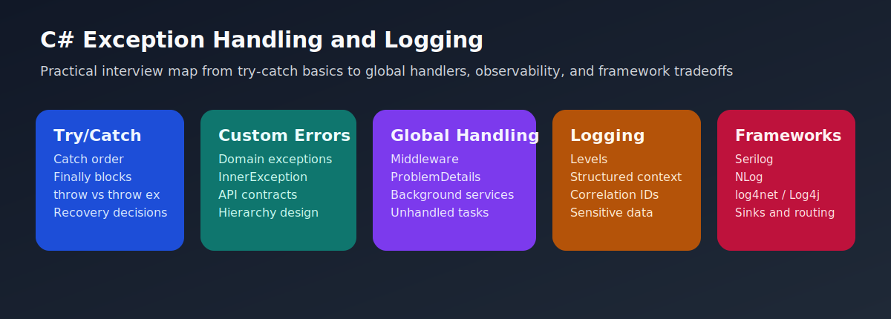

# C# Exception Handling and Logging Interview Questions



This guide covers practical exception handling, error boundaries, and logging design in real C# systems. It follows the corrected format of **100 interview questions for each subtopic**, and every answer includes a C# code example with rotated real-world scenarios so the examples do not repeat verbatim.

## How To Use This Page

- Questions 1-100 cover Try-catch-finally and exception flow basics.
- Questions 101-200 cover Custom exceptions and domain error modeling.
- Questions 201-300 cover Global exception handling and application boundaries.
- Questions 301-400 cover Logging fundamentals and production observability.
- Questions 401-500 cover Serilog, NLog, log4net, and framework tradeoffs.

## 1. Try-catch-finally and exception flow basics

> This section contains **100 interview questions** focused on **Try-catch-finally and exception flow basics**. Every answer includes a C# code example, and the scenarios rotate so they do not repeat verbatim.

### Q1.1 What is try catch finally structure in C# exception handling and logging?

**Answer:** Try catch finally structure means try catch finally protects risky code handles exceptions deliberately and guarantees cleanup steps. Teams should focus on it when explaining try-catch-finally and exception flow basics in real systems, they compare it with no protection around failing code, and they should avoid the trap of catching everything without purpose. Example: while stabilizing a background processor, so maintenance cost stays lower. Another example: during a partner integration timeout, so production logs stay more useful.

**Code Example:**

```csharp
using System;
using System.Threading;
using System.Threading.Tasks;

public static class Demo1_1
{
    public static void Run()
    {
        try
        {
            int value = int.Parse("21");
            Console.WriteLine(value);
        }
        catch (FormatException ex)
        {
            Console.WriteLine(ex.Message);
        }
        finally
        {
            Console.WriteLine("done");
        }
    }
}
```

### Q1.2 How does specific versus broad catch blocks in C# exception handling and logging?

**Answer:** Specific versus broad catch blocks means catch blocks should be as specific as practical so recovery logic stays honest. Teams should focus on it when explaining try-catch-finally and exception flow basics in real systems, they compare it with one catch for all errors always, and they should avoid the trap of hiding the real failure type behind broad handling. Example: during a file-processing exception spike, so failure paths become easier to reason about. Another example: while debugging a batch import, so incident response becomes safer.

**Code Example:**

```csharp
using System;
using System.Threading;
using System.Threading.Tasks;

public static class Demo1_2
{
    public static void Run()
    {
        try
        {
            throw new InvalidOperationException("bad state");
        }
        catch (InvalidOperationException ex)
        {
            Console.WriteLine(ex.Message);
        }
    }
}
```

### Q1.3 Why does rethrowing correctly in C# exception handling and logging?

**Answer:** Rethrowing correctly means rethrowing should preserve stack information when the current layer cannot truly recover. Teams should focus on it when explaining try-catch-finally and exception flow basics in real systems, they compare it with swallowing and continuing silently, and they should avoid the trap of using throw ex and losing the original stack trace. Example: while auditing observability gaps, so maintenance cost stays lower. Another example: during a production incident review, so production logs stay more useful.

**Code Example:**

```csharp
using System;
using System.Threading;
using System.Threading.Tasks;

public static class Demo1_3
{
    public static void Run()
    {
        try
        {
            throw new InvalidOperationException("fail");
        }
        catch
        {
            throw;
        }
    }
}
```

### Q1.4 When should you use finally cleanup behavior in C# exception handling and logging?

**Answer:** Finally cleanup behavior means finally is for cleanup that must run whether an exception occurs or not. Teams should focus on it when explaining try-catch-finally and exception flow basics in real systems, they compare it with cleanup only in the success path, and they should avoid the trap of doing recovery work in finally instead of cleanup. Example: during a payment API failure, so failure paths become easier to reason about. Another example: while comparing structured logging setups, so incident response becomes safer.

**Code Example:**

```csharp
using System;
using System.Threading;
using System.Threading.Tasks;

public static class Demo1_4
{
    public static void Run()
    {
        try
        {
            Console.WriteLine("work");
        }
        finally
        {
            Console.WriteLine("cleanup");
        }
    }
}
```

### Q1.5 What problem does exception flow design in C# exception handling and logging?

**Answer:** Exception flow design means good exception flow decides where to recover where to enrich and where to fail fast. Teams should focus on it when explaining try-catch-finally and exception flow basics in real systems, they compare it with catching at every layer, and they should avoid the trap of blurring ownership of recovery. Example: while stabilizing a background processor, so maintenance cost stays lower. Another example: during a partner integration timeout, so production logs stay more useful.

**Code Example:**

```csharp
using System;
using System.Threading;
using System.Threading.Tasks;

public static class Demo1_5
{
    public static void Run()
    {
        try
        {
            throw new ApplicationException("oops");
        }
        catch (ApplicationException ex)
        {
            Console.WriteLine($"Handled: {ex.Message}");
        }
    }
}
```

### Q1.6 How would you explain exception basics interview framing in C# exception handling and logging?

**Answer:** Exception basics interview framing means strong answers tie try catch finally to runtime behavior diagnostics and safe cleanup. Teams should focus on it when explaining try-catch-finally and exception flow basics in real systems, they compare it with syntax-only explanations, and they should avoid the trap of skipping production impact. Example: during a file-processing exception spike, so failure paths become easier to reason about. Another example: while debugging a batch import, so incident response becomes safer.

**Code Example:**

```csharp
using System;
using System.Threading;
using System.Threading.Tasks;

public static class Demo1_6
{
    public static void Run()
    {
        try
        {
            Console.WriteLine("begin");
        }
        catch (Exception ex)
        {
            Console.WriteLine(ex.GetType().Name);
        }
    }
}
```

### Q1.7 Why is try catch finally structure in C# exception handling and logging?

**Answer:** Try catch finally structure means try catch finally protects risky code handles exceptions deliberately and guarantees cleanup steps. Teams should focus on it when explaining try-catch-finally and exception flow basics in real systems, they compare it with no protection around failing code, and they should avoid the trap of catching everything without purpose. Example: while auditing observability gaps, so maintenance cost stays lower. Another example: during a production incident review, so production logs stay more useful.

**Code Example:**

```csharp
using System;
using System.Threading;
using System.Threading.Tasks;

public static class Demo1_7
{
    public static void Run()
    {
        try
        {
            int value = int.Parse("22");
            Console.WriteLine(value);
        }
        catch (FormatException ex)
        {
            Console.WriteLine(ex.Message);
        }
        finally
        {
            Console.WriteLine("done");
        }
    }
}
```

### Q1.8 How can specific versus broad catch blocks in C# exception handling and logging?

**Answer:** Specific versus broad catch blocks means catch blocks should be as specific as practical so recovery logic stays honest. Teams should focus on it when explaining try-catch-finally and exception flow basics in real systems, they compare it with one catch for all errors always, and they should avoid the trap of hiding the real failure type behind broad handling. Example: during a payment API failure, so failure paths become easier to reason about. Another example: while comparing structured logging setups, so incident response becomes safer.

**Code Example:**

```csharp
using System;
using System.Threading;
using System.Threading.Tasks;

public static class Demo1_8
{
    public static void Run()
    {
        try
        {
            throw new InvalidOperationException("bad state");
        }
        catch (InvalidOperationException ex)
        {
            Console.WriteLine(ex.Message);
        }
    }
}
```

### Q1.9 What is rethrowing correctly in C# exception handling and logging?

**Answer:** Rethrowing correctly means rethrowing should preserve stack information when the current layer cannot truly recover. Teams should focus on it when explaining try-catch-finally and exception flow basics in real systems, they compare it with swallowing and continuing silently, and they should avoid the trap of using throw ex and losing the original stack trace. Example: while stabilizing a background processor, so maintenance cost stays lower. Another example: during a partner integration timeout, so production logs stay more useful.

**Code Example:**

```csharp
using System;
using System.Threading;
using System.Threading.Tasks;

public static class Demo1_9
{
    public static void Run()
    {
        try
        {
            throw new InvalidOperationException("fail");
        }
        catch
        {
            throw;
        }
    }
}
```

### Q1.10 How does finally cleanup behavior in C# exception handling and logging?

**Answer:** Finally cleanup behavior means finally is for cleanup that must run whether an exception occurs or not. Teams should focus on it when explaining try-catch-finally and exception flow basics in real systems, they compare it with cleanup only in the success path, and they should avoid the trap of doing recovery work in finally instead of cleanup. Example: during a file-processing exception spike, so failure paths become easier to reason about. Another example: while debugging a batch import, so incident response becomes safer.

**Code Example:**

```csharp
using System;
using System.Threading;
using System.Threading.Tasks;

public static class Demo1_10
{
    public static void Run()
    {
        try
        {
            Console.WriteLine("work");
        }
        finally
        {
            Console.WriteLine("cleanup");
        }
    }
}
```

### Q1.11 Why does exception flow design in C# exception handling and logging?

**Answer:** Exception flow design means good exception flow decides where to recover where to enrich and where to fail fast. Teams should focus on it when explaining try-catch-finally and exception flow basics in real systems, they compare it with catching at every layer, and they should avoid the trap of blurring ownership of recovery. Example: while auditing observability gaps, so maintenance cost stays lower. Another example: during a production incident review, so production logs stay more useful.

**Code Example:**

```csharp
using System;
using System.Threading;
using System.Threading.Tasks;

public static class Demo1_11
{
    public static void Run()
    {
        try
        {
            throw new ApplicationException("oops");
        }
        catch (ApplicationException ex)
        {
            Console.WriteLine($"Handled: {ex.Message}");
        }
    }
}
```

### Q1.12 When should you use exception basics interview framing in C# exception handling and logging?

**Answer:** Exception basics interview framing means strong answers tie try catch finally to runtime behavior diagnostics and safe cleanup. Teams should focus on it when explaining try-catch-finally and exception flow basics in real systems, they compare it with syntax-only explanations, and they should avoid the trap of skipping production impact. Example: during a payment API failure, so failure paths become easier to reason about. Another example: while comparing structured logging setups, so incident response becomes safer.

**Code Example:**

```csharp
using System;
using System.Threading;
using System.Threading.Tasks;

public static class Demo1_12
{
    public static void Run()
    {
        try
        {
            Console.WriteLine("begin");
        }
        catch (Exception ex)
        {
            Console.WriteLine(ex.GetType().Name);
        }
    }
}
```

### Q1.13 What problem does try catch finally structure in C# exception handling and logging?

**Answer:** Try catch finally structure means try catch finally protects risky code handles exceptions deliberately and guarantees cleanup steps. Teams should focus on it when explaining try-catch-finally and exception flow basics in real systems, they compare it with no protection around failing code, and they should avoid the trap of catching everything without purpose. Example: while stabilizing a background processor, so maintenance cost stays lower. Another example: during a partner integration timeout, so production logs stay more useful.

**Code Example:**

```csharp
using System;
using System.Threading;
using System.Threading.Tasks;

public static class Demo1_13
{
    public static void Run()
    {
        try
        {
            int value = int.Parse("23");
            Console.WriteLine(value);
        }
        catch (FormatException ex)
        {
            Console.WriteLine(ex.Message);
        }
        finally
        {
            Console.WriteLine("done");
        }
    }
}
```

### Q1.14 How would you explain specific versus broad catch blocks in C# exception handling and logging?

**Answer:** Specific versus broad catch blocks means catch blocks should be as specific as practical so recovery logic stays honest. Teams should focus on it when explaining try-catch-finally and exception flow basics in real systems, they compare it with one catch for all errors always, and they should avoid the trap of hiding the real failure type behind broad handling. Example: during a file-processing exception spike, so failure paths become easier to reason about. Another example: while debugging a batch import, so incident response becomes safer.

**Code Example:**

```csharp
using System;
using System.Threading;
using System.Threading.Tasks;

public static class Demo1_14
{
    public static void Run()
    {
        try
        {
            throw new InvalidOperationException("bad state");
        }
        catch (InvalidOperationException ex)
        {
            Console.WriteLine(ex.Message);
        }
    }
}
```

### Q1.15 Why is rethrowing correctly in C# exception handling and logging?

**Answer:** Rethrowing correctly means rethrowing should preserve stack information when the current layer cannot truly recover. Teams should focus on it when explaining try-catch-finally and exception flow basics in real systems, they compare it with swallowing and continuing silently, and they should avoid the trap of using throw ex and losing the original stack trace. Example: while auditing observability gaps, so maintenance cost stays lower. Another example: during a production incident review, so production logs stay more useful.

**Code Example:**

```csharp
using System;
using System.Threading;
using System.Threading.Tasks;

public static class Demo1_15
{
    public static void Run()
    {
        try
        {
            throw new InvalidOperationException("fail");
        }
        catch
        {
            throw;
        }
    }
}
```

### Q1.16 How can finally cleanup behavior in C# exception handling and logging?

**Answer:** Finally cleanup behavior means finally is for cleanup that must run whether an exception occurs or not. Teams should focus on it when explaining try-catch-finally and exception flow basics in real systems, they compare it with cleanup only in the success path, and they should avoid the trap of doing recovery work in finally instead of cleanup. Example: during a payment API failure, so failure paths become easier to reason about. Another example: while comparing structured logging setups, so incident response becomes safer.

**Code Example:**

```csharp
using System;
using System.Threading;
using System.Threading.Tasks;

public static class Demo1_16
{
    public static void Run()
    {
        try
        {
            Console.WriteLine("work");
        }
        finally
        {
            Console.WriteLine("cleanup");
        }
    }
}
```

### Q1.17 What is exception flow design in C# exception handling and logging?

**Answer:** Exception flow design means good exception flow decides where to recover where to enrich and where to fail fast. Teams should focus on it when explaining try-catch-finally and exception flow basics in real systems, they compare it with catching at every layer, and they should avoid the trap of blurring ownership of recovery. Example: while stabilizing a background processor, so maintenance cost stays lower. Another example: during a partner integration timeout, so production logs stay more useful.

**Code Example:**

```csharp
using System;
using System.Threading;
using System.Threading.Tasks;

public static class Demo1_17
{
    public static void Run()
    {
        try
        {
            throw new ApplicationException("oops");
        }
        catch (ApplicationException ex)
        {
            Console.WriteLine($"Handled: {ex.Message}");
        }
    }
}
```

### Q1.18 How does exception basics interview framing in C# exception handling and logging?

**Answer:** Exception basics interview framing means strong answers tie try catch finally to runtime behavior diagnostics and safe cleanup. Teams should focus on it when explaining try-catch-finally and exception flow basics in real systems, they compare it with syntax-only explanations, and they should avoid the trap of skipping production impact. Example: during a file-processing exception spike, so failure paths become easier to reason about. Another example: while debugging a batch import, so incident response becomes safer.

**Code Example:**

```csharp
using System;
using System.Threading;
using System.Threading.Tasks;

public static class Demo1_18
{
    public static void Run()
    {
        try
        {
            Console.WriteLine("begin");
        }
        catch (Exception ex)
        {
            Console.WriteLine(ex.GetType().Name);
        }
    }
}
```

### Q1.19 Why does try catch finally structure in C# exception handling and logging?

**Answer:** Try catch finally structure means try catch finally protects risky code handles exceptions deliberately and guarantees cleanup steps. Teams should focus on it when explaining try-catch-finally and exception flow basics in real systems, they compare it with no protection around failing code, and they should avoid the trap of catching everything without purpose. Example: while auditing observability gaps, so maintenance cost stays lower. Another example: during a production incident review, so production logs stay more useful.

**Code Example:**

```csharp
using System;
using System.Threading;
using System.Threading.Tasks;

public static class Demo1_19
{
    public static void Run()
    {
        try
        {
            int value = int.Parse("24");
            Console.WriteLine(value);
        }
        catch (FormatException ex)
        {
            Console.WriteLine(ex.Message);
        }
        finally
        {
            Console.WriteLine("done");
        }
    }
}
```

### Q1.20 When should you use specific versus broad catch blocks in C# exception handling and logging?

**Answer:** Specific versus broad catch blocks means catch blocks should be as specific as practical so recovery logic stays honest. Teams should focus on it when explaining try-catch-finally and exception flow basics in real systems, they compare it with one catch for all errors always, and they should avoid the trap of hiding the real failure type behind broad handling. Example: during a payment API failure, so failure paths become easier to reason about. Another example: while comparing structured logging setups, so incident response becomes safer.

**Code Example:**

```csharp
using System;
using System.Threading;
using System.Threading.Tasks;

public static class Demo1_20
{
    public static void Run()
    {
        try
        {
            throw new InvalidOperationException("bad state");
        }
        catch (InvalidOperationException ex)
        {
            Console.WriteLine(ex.Message);
        }
    }
}
```

### Q1.21 What problem does rethrowing correctly in C# exception handling and logging?

**Answer:** Rethrowing correctly means rethrowing should preserve stack information when the current layer cannot truly recover. Teams should focus on it when explaining try-catch-finally and exception flow basics in real systems, they compare it with swallowing and continuing silently, and they should avoid the trap of using throw ex and losing the original stack trace. Example: while stabilizing a background processor, so maintenance cost stays lower. Another example: during a partner integration timeout, so production logs stay more useful.

**Code Example:**

```csharp
using System;
using System.Threading;
using System.Threading.Tasks;

public static class Demo1_21
{
    public static void Run()
    {
        try
        {
            throw new InvalidOperationException("fail");
        }
        catch
        {
            throw;
        }
    }
}
```

### Q1.22 How would you explain finally cleanup behavior in C# exception handling and logging?

**Answer:** Finally cleanup behavior means finally is for cleanup that must run whether an exception occurs or not. Teams should focus on it when explaining try-catch-finally and exception flow basics in real systems, they compare it with cleanup only in the success path, and they should avoid the trap of doing recovery work in finally instead of cleanup. Example: during a file-processing exception spike, so failure paths become easier to reason about. Another example: while debugging a batch import, so incident response becomes safer.

**Code Example:**

```csharp
using System;
using System.Threading;
using System.Threading.Tasks;

public static class Demo1_22
{
    public static void Run()
    {
        try
        {
            Console.WriteLine("work");
        }
        finally
        {
            Console.WriteLine("cleanup");
        }
    }
}
```

### Q1.23 Why is exception flow design in C# exception handling and logging?

**Answer:** Exception flow design means good exception flow decides where to recover where to enrich and where to fail fast. Teams should focus on it when explaining try-catch-finally and exception flow basics in real systems, they compare it with catching at every layer, and they should avoid the trap of blurring ownership of recovery. Example: while auditing observability gaps, so maintenance cost stays lower. Another example: during a production incident review, so production logs stay more useful.

**Code Example:**

```csharp
using System;
using System.Threading;
using System.Threading.Tasks;

public static class Demo1_23
{
    public static void Run()
    {
        try
        {
            throw new ApplicationException("oops");
        }
        catch (ApplicationException ex)
        {
            Console.WriteLine($"Handled: {ex.Message}");
        }
    }
}
```

### Q1.24 How can exception basics interview framing in C# exception handling and logging?

**Answer:** Exception basics interview framing means strong answers tie try catch finally to runtime behavior diagnostics and safe cleanup. Teams should focus on it when explaining try-catch-finally and exception flow basics in real systems, they compare it with syntax-only explanations, and they should avoid the trap of skipping production impact. Example: during a payment API failure, so failure paths become easier to reason about. Another example: while comparing structured logging setups, so incident response becomes safer.

**Code Example:**

```csharp
using System;
using System.Threading;
using System.Threading.Tasks;

public static class Demo1_24
{
    public static void Run()
    {
        try
        {
            Console.WriteLine("begin");
        }
        catch (Exception ex)
        {
            Console.WriteLine(ex.GetType().Name);
        }
    }
}
```

### Q1.25 What is try catch finally structure in C# exception handling and logging?

**Answer:** Try catch finally structure means try catch finally protects risky code handles exceptions deliberately and guarantees cleanup steps. Teams should focus on it when explaining try-catch-finally and exception flow basics in real systems, they compare it with no protection around failing code, and they should avoid the trap of catching everything without purpose. Example: while stabilizing a background processor, so maintenance cost stays lower. Another example: during a partner integration timeout, so production logs stay more useful.

**Code Example:**

```csharp
using System;
using System.Threading;
using System.Threading.Tasks;

public static class Demo1_25
{
    public static void Run()
    {
        try
        {
            int value = int.Parse("20");
            Console.WriteLine(value);
        }
        catch (FormatException ex)
        {
            Console.WriteLine(ex.Message);
        }
        finally
        {
            Console.WriteLine("done");
        }
    }
}
```

### Q1.26 How does specific versus broad catch blocks in C# exception handling and logging?

**Answer:** Specific versus broad catch blocks means catch blocks should be as specific as practical so recovery logic stays honest. Teams should focus on it when explaining try-catch-finally and exception flow basics in real systems, they compare it with one catch for all errors always, and they should avoid the trap of hiding the real failure type behind broad handling. Example: during a file-processing exception spike, so failure paths become easier to reason about. Another example: while debugging a batch import, so incident response becomes safer.

**Code Example:**

```csharp
using System;
using System.Threading;
using System.Threading.Tasks;

public static class Demo1_26
{
    public static void Run()
    {
        try
        {
            throw new InvalidOperationException("bad state");
        }
        catch (InvalidOperationException ex)
        {
            Console.WriteLine(ex.Message);
        }
    }
}
```

### Q1.27 Why does rethrowing correctly in C# exception handling and logging?

**Answer:** Rethrowing correctly means rethrowing should preserve stack information when the current layer cannot truly recover. Teams should focus on it when explaining try-catch-finally and exception flow basics in real systems, they compare it with swallowing and continuing silently, and they should avoid the trap of using throw ex and losing the original stack trace. Example: while auditing observability gaps, so maintenance cost stays lower. Another example: during a production incident review, so production logs stay more useful.

**Code Example:**

```csharp
using System;
using System.Threading;
using System.Threading.Tasks;

public static class Demo1_27
{
    public static void Run()
    {
        try
        {
            throw new InvalidOperationException("fail");
        }
        catch
        {
            throw;
        }
    }
}
```

### Q1.28 When should you use finally cleanup behavior in C# exception handling and logging?

**Answer:** Finally cleanup behavior means finally is for cleanup that must run whether an exception occurs or not. Teams should focus on it when explaining try-catch-finally and exception flow basics in real systems, they compare it with cleanup only in the success path, and they should avoid the trap of doing recovery work in finally instead of cleanup. Example: during a payment API failure, so failure paths become easier to reason about. Another example: while comparing structured logging setups, so incident response becomes safer.

**Code Example:**

```csharp
using System;
using System.Threading;
using System.Threading.Tasks;

public static class Demo1_28
{
    public static void Run()
    {
        try
        {
            Console.WriteLine("work");
        }
        finally
        {
            Console.WriteLine("cleanup");
        }
    }
}
```

### Q1.29 What problem does exception flow design in C# exception handling and logging?

**Answer:** Exception flow design means good exception flow decides where to recover where to enrich and where to fail fast. Teams should focus on it when explaining try-catch-finally and exception flow basics in real systems, they compare it with catching at every layer, and they should avoid the trap of blurring ownership of recovery. Example: while stabilizing a background processor, so maintenance cost stays lower. Another example: during a partner integration timeout, so production logs stay more useful.

**Code Example:**

```csharp
using System;
using System.Threading;
using System.Threading.Tasks;

public static class Demo1_29
{
    public static void Run()
    {
        try
        {
            throw new ApplicationException("oops");
        }
        catch (ApplicationException ex)
        {
            Console.WriteLine($"Handled: {ex.Message}");
        }
    }
}
```

### Q1.30 How would you explain exception basics interview framing in C# exception handling and logging?

**Answer:** Exception basics interview framing means strong answers tie try catch finally to runtime behavior diagnostics and safe cleanup. Teams should focus on it when explaining try-catch-finally and exception flow basics in real systems, they compare it with syntax-only explanations, and they should avoid the trap of skipping production impact. Example: during a file-processing exception spike, so failure paths become easier to reason about. Another example: while debugging a batch import, so incident response becomes safer.

**Code Example:**

```csharp
using System;
using System.Threading;
using System.Threading.Tasks;

public static class Demo1_30
{
    public static void Run()
    {
        try
        {
            Console.WriteLine("begin");
        }
        catch (Exception ex)
        {
            Console.WriteLine(ex.GetType().Name);
        }
    }
}
```

### Q1.31 Why is try catch finally structure in C# exception handling and logging?

**Answer:** Try catch finally structure means try catch finally protects risky code handles exceptions deliberately and guarantees cleanup steps. Teams should focus on it when explaining try-catch-finally and exception flow basics in real systems, they compare it with no protection around failing code, and they should avoid the trap of catching everything without purpose. Example: while auditing observability gaps, so maintenance cost stays lower. Another example: during a production incident review, so production logs stay more useful.

**Code Example:**

```csharp
using System;
using System.Threading;
using System.Threading.Tasks;

public static class Demo1_31
{
    public static void Run()
    {
        try
        {
            int value = int.Parse("21");
            Console.WriteLine(value);
        }
        catch (FormatException ex)
        {
            Console.WriteLine(ex.Message);
        }
        finally
        {
            Console.WriteLine("done");
        }
    }
}
```

### Q1.32 How can specific versus broad catch blocks in C# exception handling and logging?

**Answer:** Specific versus broad catch blocks means catch blocks should be as specific as practical so recovery logic stays honest. Teams should focus on it when explaining try-catch-finally and exception flow basics in real systems, they compare it with one catch for all errors always, and they should avoid the trap of hiding the real failure type behind broad handling. Example: during a payment API failure, so failure paths become easier to reason about. Another example: while comparing structured logging setups, so incident response becomes safer.

**Code Example:**

```csharp
using System;
using System.Threading;
using System.Threading.Tasks;

public static class Demo1_32
{
    public static void Run()
    {
        try
        {
            throw new InvalidOperationException("bad state");
        }
        catch (InvalidOperationException ex)
        {
            Console.WriteLine(ex.Message);
        }
    }
}
```

### Q1.33 What is rethrowing correctly in C# exception handling and logging?

**Answer:** Rethrowing correctly means rethrowing should preserve stack information when the current layer cannot truly recover. Teams should focus on it when explaining try-catch-finally and exception flow basics in real systems, they compare it with swallowing and continuing silently, and they should avoid the trap of using throw ex and losing the original stack trace. Example: while stabilizing a background processor, so maintenance cost stays lower. Another example: during a partner integration timeout, so production logs stay more useful.

**Code Example:**

```csharp
using System;
using System.Threading;
using System.Threading.Tasks;

public static class Demo1_33
{
    public static void Run()
    {
        try
        {
            throw new InvalidOperationException("fail");
        }
        catch
        {
            throw;
        }
    }
}
```

### Q1.34 How does finally cleanup behavior in C# exception handling and logging?

**Answer:** Finally cleanup behavior means finally is for cleanup that must run whether an exception occurs or not. Teams should focus on it when explaining try-catch-finally and exception flow basics in real systems, they compare it with cleanup only in the success path, and they should avoid the trap of doing recovery work in finally instead of cleanup. Example: during a file-processing exception spike, so failure paths become easier to reason about. Another example: while debugging a batch import, so incident response becomes safer.

**Code Example:**

```csharp
using System;
using System.Threading;
using System.Threading.Tasks;

public static class Demo1_34
{
    public static void Run()
    {
        try
        {
            Console.WriteLine("work");
        }
        finally
        {
            Console.WriteLine("cleanup");
        }
    }
}
```

### Q1.35 Why does exception flow design in C# exception handling and logging?

**Answer:** Exception flow design means good exception flow decides where to recover where to enrich and where to fail fast. Teams should focus on it when explaining try-catch-finally and exception flow basics in real systems, they compare it with catching at every layer, and they should avoid the trap of blurring ownership of recovery. Example: while auditing observability gaps, so maintenance cost stays lower. Another example: during a production incident review, so production logs stay more useful.

**Code Example:**

```csharp
using System;
using System.Threading;
using System.Threading.Tasks;

public static class Demo1_35
{
    public static void Run()
    {
        try
        {
            throw new ApplicationException("oops");
        }
        catch (ApplicationException ex)
        {
            Console.WriteLine($"Handled: {ex.Message}");
        }
    }
}
```

### Q1.36 When should you use exception basics interview framing in C# exception handling and logging?

**Answer:** Exception basics interview framing means strong answers tie try catch finally to runtime behavior diagnostics and safe cleanup. Teams should focus on it when explaining try-catch-finally and exception flow basics in real systems, they compare it with syntax-only explanations, and they should avoid the trap of skipping production impact. Example: during a payment API failure, so failure paths become easier to reason about. Another example: while comparing structured logging setups, so incident response becomes safer.

**Code Example:**

```csharp
using System;
using System.Threading;
using System.Threading.Tasks;

public static class Demo1_36
{
    public static void Run()
    {
        try
        {
            Console.WriteLine("begin");
        }
        catch (Exception ex)
        {
            Console.WriteLine(ex.GetType().Name);
        }
    }
}
```

### Q1.37 What problem does try catch finally structure in C# exception handling and logging?

**Answer:** Try catch finally structure means try catch finally protects risky code handles exceptions deliberately and guarantees cleanup steps. Teams should focus on it when explaining try-catch-finally and exception flow basics in real systems, they compare it with no protection around failing code, and they should avoid the trap of catching everything without purpose. Example: while stabilizing a background processor, so maintenance cost stays lower. Another example: during a partner integration timeout, so production logs stay more useful.

**Code Example:**

```csharp
using System;
using System.Threading;
using System.Threading.Tasks;

public static class Demo1_37
{
    public static void Run()
    {
        try
        {
            int value = int.Parse("22");
            Console.WriteLine(value);
        }
        catch (FormatException ex)
        {
            Console.WriteLine(ex.Message);
        }
        finally
        {
            Console.WriteLine("done");
        }
    }
}
```

### Q1.38 How would you explain specific versus broad catch blocks in C# exception handling and logging?

**Answer:** Specific versus broad catch blocks means catch blocks should be as specific as practical so recovery logic stays honest. Teams should focus on it when explaining try-catch-finally and exception flow basics in real systems, they compare it with one catch for all errors always, and they should avoid the trap of hiding the real failure type behind broad handling. Example: during a file-processing exception spike, so failure paths become easier to reason about. Another example: while debugging a batch import, so incident response becomes safer.

**Code Example:**

```csharp
using System;
using System.Threading;
using System.Threading.Tasks;

public static class Demo1_38
{
    public static void Run()
    {
        try
        {
            throw new InvalidOperationException("bad state");
        }
        catch (InvalidOperationException ex)
        {
            Console.WriteLine(ex.Message);
        }
    }
}
```

### Q1.39 Why is rethrowing correctly in C# exception handling and logging?

**Answer:** Rethrowing correctly means rethrowing should preserve stack information when the current layer cannot truly recover. Teams should focus on it when explaining try-catch-finally and exception flow basics in real systems, they compare it with swallowing and continuing silently, and they should avoid the trap of using throw ex and losing the original stack trace. Example: while auditing observability gaps, so maintenance cost stays lower. Another example: during a production incident review, so production logs stay more useful.

**Code Example:**

```csharp
using System;
using System.Threading;
using System.Threading.Tasks;

public static class Demo1_39
{
    public static void Run()
    {
        try
        {
            throw new InvalidOperationException("fail");
        }
        catch
        {
            throw;
        }
    }
}
```

### Q1.40 How can finally cleanup behavior in C# exception handling and logging?

**Answer:** Finally cleanup behavior means finally is for cleanup that must run whether an exception occurs or not. Teams should focus on it when explaining try-catch-finally and exception flow basics in real systems, they compare it with cleanup only in the success path, and they should avoid the trap of doing recovery work in finally instead of cleanup. Example: during a payment API failure, so failure paths become easier to reason about. Another example: while comparing structured logging setups, so incident response becomes safer.

**Code Example:**

```csharp
using System;
using System.Threading;
using System.Threading.Tasks;

public static class Demo1_40
{
    public static void Run()
    {
        try
        {
            Console.WriteLine("work");
        }
        finally
        {
            Console.WriteLine("cleanup");
        }
    }
}
```

### Q1.41 What is exception flow design in C# exception handling and logging?

**Answer:** Exception flow design means good exception flow decides where to recover where to enrich and where to fail fast. Teams should focus on it when explaining try-catch-finally and exception flow basics in real systems, they compare it with catching at every layer, and they should avoid the trap of blurring ownership of recovery. Example: while stabilizing a background processor, so maintenance cost stays lower. Another example: during a partner integration timeout, so production logs stay more useful.

**Code Example:**

```csharp
using System;
using System.Threading;
using System.Threading.Tasks;

public static class Demo1_41
{
    public static void Run()
    {
        try
        {
            throw new ApplicationException("oops");
        }
        catch (ApplicationException ex)
        {
            Console.WriteLine($"Handled: {ex.Message}");
        }
    }
}
```

### Q1.42 How does exception basics interview framing in C# exception handling and logging?

**Answer:** Exception basics interview framing means strong answers tie try catch finally to runtime behavior diagnostics and safe cleanup. Teams should focus on it when explaining try-catch-finally and exception flow basics in real systems, they compare it with syntax-only explanations, and they should avoid the trap of skipping production impact. Example: during a file-processing exception spike, so failure paths become easier to reason about. Another example: while debugging a batch import, so incident response becomes safer.

**Code Example:**

```csharp
using System;
using System.Threading;
using System.Threading.Tasks;

public static class Demo1_42
{
    public static void Run()
    {
        try
        {
            Console.WriteLine("begin");
        }
        catch (Exception ex)
        {
            Console.WriteLine(ex.GetType().Name);
        }
    }
}
```

### Q1.43 Why does try catch finally structure in C# exception handling and logging?

**Answer:** Try catch finally structure means try catch finally protects risky code handles exceptions deliberately and guarantees cleanup steps. Teams should focus on it when explaining try-catch-finally and exception flow basics in real systems, they compare it with no protection around failing code, and they should avoid the trap of catching everything without purpose. Example: while auditing observability gaps, so maintenance cost stays lower. Another example: during a production incident review, so production logs stay more useful.

**Code Example:**

```csharp
using System;
using System.Threading;
using System.Threading.Tasks;

public static class Demo1_43
{
    public static void Run()
    {
        try
        {
            int value = int.Parse("23");
            Console.WriteLine(value);
        }
        catch (FormatException ex)
        {
            Console.WriteLine(ex.Message);
        }
        finally
        {
            Console.WriteLine("done");
        }
    }
}
```

### Q1.44 When should you use specific versus broad catch blocks in C# exception handling and logging?

**Answer:** Specific versus broad catch blocks means catch blocks should be as specific as practical so recovery logic stays honest. Teams should focus on it when explaining try-catch-finally and exception flow basics in real systems, they compare it with one catch for all errors always, and they should avoid the trap of hiding the real failure type behind broad handling. Example: during a payment API failure, so failure paths become easier to reason about. Another example: while comparing structured logging setups, so incident response becomes safer.

**Code Example:**

```csharp
using System;
using System.Threading;
using System.Threading.Tasks;

public static class Demo1_44
{
    public static void Run()
    {
        try
        {
            throw new InvalidOperationException("bad state");
        }
        catch (InvalidOperationException ex)
        {
            Console.WriteLine(ex.Message);
        }
    }
}
```

### Q1.45 What problem does rethrowing correctly in C# exception handling and logging?

**Answer:** Rethrowing correctly means rethrowing should preserve stack information when the current layer cannot truly recover. Teams should focus on it when explaining try-catch-finally and exception flow basics in real systems, they compare it with swallowing and continuing silently, and they should avoid the trap of using throw ex and losing the original stack trace. Example: while stabilizing a background processor, so maintenance cost stays lower. Another example: during a partner integration timeout, so production logs stay more useful.

**Code Example:**

```csharp
using System;
using System.Threading;
using System.Threading.Tasks;

public static class Demo1_45
{
    public static void Run()
    {
        try
        {
            throw new InvalidOperationException("fail");
        }
        catch
        {
            throw;
        }
    }
}
```

### Q1.46 How would you explain finally cleanup behavior in C# exception handling and logging?

**Answer:** Finally cleanup behavior means finally is for cleanup that must run whether an exception occurs or not. Teams should focus on it when explaining try-catch-finally and exception flow basics in real systems, they compare it with cleanup only in the success path, and they should avoid the trap of doing recovery work in finally instead of cleanup. Example: during a file-processing exception spike, so failure paths become easier to reason about. Another example: while debugging a batch import, so incident response becomes safer.

**Code Example:**

```csharp
using System;
using System.Threading;
using System.Threading.Tasks;

public static class Demo1_46
{
    public static void Run()
    {
        try
        {
            Console.WriteLine("work");
        }
        finally
        {
            Console.WriteLine("cleanup");
        }
    }
}
```

### Q1.47 Why is exception flow design in C# exception handling and logging?

**Answer:** Exception flow design means good exception flow decides where to recover where to enrich and where to fail fast. Teams should focus on it when explaining try-catch-finally and exception flow basics in real systems, they compare it with catching at every layer, and they should avoid the trap of blurring ownership of recovery. Example: while auditing observability gaps, so maintenance cost stays lower. Another example: during a production incident review, so production logs stay more useful.

**Code Example:**

```csharp
using System;
using System.Threading;
using System.Threading.Tasks;

public static class Demo1_47
{
    public static void Run()
    {
        try
        {
            throw new ApplicationException("oops");
        }
        catch (ApplicationException ex)
        {
            Console.WriteLine($"Handled: {ex.Message}");
        }
    }
}
```

### Q1.48 How can exception basics interview framing in C# exception handling and logging?

**Answer:** Exception basics interview framing means strong answers tie try catch finally to runtime behavior diagnostics and safe cleanup. Teams should focus on it when explaining try-catch-finally and exception flow basics in real systems, they compare it with syntax-only explanations, and they should avoid the trap of skipping production impact. Example: during a payment API failure, so failure paths become easier to reason about. Another example: while comparing structured logging setups, so incident response becomes safer.

**Code Example:**

```csharp
using System;
using System.Threading;
using System.Threading.Tasks;

public static class Demo1_48
{
    public static void Run()
    {
        try
        {
            Console.WriteLine("begin");
        }
        catch (Exception ex)
        {
            Console.WriteLine(ex.GetType().Name);
        }
    }
}
```

### Q1.49 What is try catch finally structure in C# exception handling and logging?

**Answer:** Try catch finally structure means try catch finally protects risky code handles exceptions deliberately and guarantees cleanup steps. Teams should focus on it when explaining try-catch-finally and exception flow basics in real systems, they compare it with no protection around failing code, and they should avoid the trap of catching everything without purpose. Example: while stabilizing a background processor, so maintenance cost stays lower. Another example: during a partner integration timeout, so production logs stay more useful.

**Code Example:**

```csharp
using System;
using System.Threading;
using System.Threading.Tasks;

public static class Demo1_49
{
    public static void Run()
    {
        try
        {
            int value = int.Parse("24");
            Console.WriteLine(value);
        }
        catch (FormatException ex)
        {
            Console.WriteLine(ex.Message);
        }
        finally
        {
            Console.WriteLine("done");
        }
    }
}
```

### Q1.50 How does specific versus broad catch blocks in C# exception handling and logging?

**Answer:** Specific versus broad catch blocks means catch blocks should be as specific as practical so recovery logic stays honest. Teams should focus on it when explaining try-catch-finally and exception flow basics in real systems, they compare it with one catch for all errors always, and they should avoid the trap of hiding the real failure type behind broad handling. Example: during a file-processing exception spike, so failure paths become easier to reason about. Another example: while debugging a batch import, so incident response becomes safer.

**Code Example:**

```csharp
using System;
using System.Threading;
using System.Threading.Tasks;

public static class Demo1_50
{
    public static void Run()
    {
        try
        {
            throw new InvalidOperationException("bad state");
        }
        catch (InvalidOperationException ex)
        {
            Console.WriteLine(ex.Message);
        }
    }
}
```

### Q1.51 Why does rethrowing correctly in C# exception handling and logging?

**Answer:** Rethrowing correctly means rethrowing should preserve stack information when the current layer cannot truly recover. Teams should focus on it when explaining try-catch-finally and exception flow basics in real systems, they compare it with swallowing and continuing silently, and they should avoid the trap of using throw ex and losing the original stack trace. Example: while auditing observability gaps, so maintenance cost stays lower. Another example: during a production incident review, so production logs stay more useful.

**Code Example:**

```csharp
using System;
using System.Threading;
using System.Threading.Tasks;

public static class Demo1_51
{
    public static void Run()
    {
        try
        {
            throw new InvalidOperationException("fail");
        }
        catch
        {
            throw;
        }
    }
}
```

### Q1.52 When should you use finally cleanup behavior in C# exception handling and logging?

**Answer:** Finally cleanup behavior means finally is for cleanup that must run whether an exception occurs or not. Teams should focus on it when explaining try-catch-finally and exception flow basics in real systems, they compare it with cleanup only in the success path, and they should avoid the trap of doing recovery work in finally instead of cleanup. Example: during a payment API failure, so failure paths become easier to reason about. Another example: while comparing structured logging setups, so incident response becomes safer.

**Code Example:**

```csharp
using System;
using System.Threading;
using System.Threading.Tasks;

public static class Demo1_52
{
    public static void Run()
    {
        try
        {
            Console.WriteLine("work");
        }
        finally
        {
            Console.WriteLine("cleanup");
        }
    }
}
```

### Q1.53 What problem does exception flow design in C# exception handling and logging?

**Answer:** Exception flow design means good exception flow decides where to recover where to enrich and where to fail fast. Teams should focus on it when explaining try-catch-finally and exception flow basics in real systems, they compare it with catching at every layer, and they should avoid the trap of blurring ownership of recovery. Example: while stabilizing a background processor, so maintenance cost stays lower. Another example: during a partner integration timeout, so production logs stay more useful.

**Code Example:**

```csharp
using System;
using System.Threading;
using System.Threading.Tasks;

public static class Demo1_53
{
    public static void Run()
    {
        try
        {
            throw new ApplicationException("oops");
        }
        catch (ApplicationException ex)
        {
            Console.WriteLine($"Handled: {ex.Message}");
        }
    }
}
```

### Q1.54 How would you explain exception basics interview framing in C# exception handling and logging?

**Answer:** Exception basics interview framing means strong answers tie try catch finally to runtime behavior diagnostics and safe cleanup. Teams should focus on it when explaining try-catch-finally and exception flow basics in real systems, they compare it with syntax-only explanations, and they should avoid the trap of skipping production impact. Example: during a file-processing exception spike, so failure paths become easier to reason about. Another example: while debugging a batch import, so incident response becomes safer.

**Code Example:**

```csharp
using System;
using System.Threading;
using System.Threading.Tasks;

public static class Demo1_54
{
    public static void Run()
    {
        try
        {
            Console.WriteLine("begin");
        }
        catch (Exception ex)
        {
            Console.WriteLine(ex.GetType().Name);
        }
    }
}
```

### Q1.55 Why is try catch finally structure in C# exception handling and logging?

**Answer:** Try catch finally structure means try catch finally protects risky code handles exceptions deliberately and guarantees cleanup steps. Teams should focus on it when explaining try-catch-finally and exception flow basics in real systems, they compare it with no protection around failing code, and they should avoid the trap of catching everything without purpose. Example: while auditing observability gaps, so maintenance cost stays lower. Another example: during a production incident review, so production logs stay more useful.

**Code Example:**

```csharp
using System;
using System.Threading;
using System.Threading.Tasks;

public static class Demo1_55
{
    public static void Run()
    {
        try
        {
            int value = int.Parse("20");
            Console.WriteLine(value);
        }
        catch (FormatException ex)
        {
            Console.WriteLine(ex.Message);
        }
        finally
        {
            Console.WriteLine("done");
        }
    }
}
```

### Q1.56 How can specific versus broad catch blocks in C# exception handling and logging?

**Answer:** Specific versus broad catch blocks means catch blocks should be as specific as practical so recovery logic stays honest. Teams should focus on it when explaining try-catch-finally and exception flow basics in real systems, they compare it with one catch for all errors always, and they should avoid the trap of hiding the real failure type behind broad handling. Example: during a payment API failure, so failure paths become easier to reason about. Another example: while comparing structured logging setups, so incident response becomes safer.

**Code Example:**

```csharp
using System;
using System.Threading;
using System.Threading.Tasks;

public static class Demo1_56
{
    public static void Run()
    {
        try
        {
            throw new InvalidOperationException("bad state");
        }
        catch (InvalidOperationException ex)
        {
            Console.WriteLine(ex.Message);
        }
    }
}
```

### Q1.57 What is rethrowing correctly in C# exception handling and logging?

**Answer:** Rethrowing correctly means rethrowing should preserve stack information when the current layer cannot truly recover. Teams should focus on it when explaining try-catch-finally and exception flow basics in real systems, they compare it with swallowing and continuing silently, and they should avoid the trap of using throw ex and losing the original stack trace. Example: while stabilizing a background processor, so maintenance cost stays lower. Another example: during a partner integration timeout, so production logs stay more useful.

**Code Example:**

```csharp
using System;
using System.Threading;
using System.Threading.Tasks;

public static class Demo1_57
{
    public static void Run()
    {
        try
        {
            throw new InvalidOperationException("fail");
        }
        catch
        {
            throw;
        }
    }
}
```

### Q1.58 How does finally cleanup behavior in C# exception handling and logging?

**Answer:** Finally cleanup behavior means finally is for cleanup that must run whether an exception occurs or not. Teams should focus on it when explaining try-catch-finally and exception flow basics in real systems, they compare it with cleanup only in the success path, and they should avoid the trap of doing recovery work in finally instead of cleanup. Example: during a file-processing exception spike, so failure paths become easier to reason about. Another example: while debugging a batch import, so incident response becomes safer.

**Code Example:**

```csharp
using System;
using System.Threading;
using System.Threading.Tasks;

public static class Demo1_58
{
    public static void Run()
    {
        try
        {
            Console.WriteLine("work");
        }
        finally
        {
            Console.WriteLine("cleanup");
        }
    }
}
```

### Q1.59 Why does exception flow design in C# exception handling and logging?

**Answer:** Exception flow design means good exception flow decides where to recover where to enrich and where to fail fast. Teams should focus on it when explaining try-catch-finally and exception flow basics in real systems, they compare it with catching at every layer, and they should avoid the trap of blurring ownership of recovery. Example: while auditing observability gaps, so maintenance cost stays lower. Another example: during a production incident review, so production logs stay more useful.

**Code Example:**

```csharp
using System;
using System.Threading;
using System.Threading.Tasks;

public static class Demo1_59
{
    public static void Run()
    {
        try
        {
            throw new ApplicationException("oops");
        }
        catch (ApplicationException ex)
        {
            Console.WriteLine($"Handled: {ex.Message}");
        }
    }
}
```

### Q1.60 When should you use exception basics interview framing in C# exception handling and logging?

**Answer:** Exception basics interview framing means strong answers tie try catch finally to runtime behavior diagnostics and safe cleanup. Teams should focus on it when explaining try-catch-finally and exception flow basics in real systems, they compare it with syntax-only explanations, and they should avoid the trap of skipping production impact. Example: during a payment API failure, so failure paths become easier to reason about. Another example: while comparing structured logging setups, so incident response becomes safer.

**Code Example:**

```csharp
using System;
using System.Threading;
using System.Threading.Tasks;

public static class Demo1_60
{
    public static void Run()
    {
        try
        {
            Console.WriteLine("begin");
        }
        catch (Exception ex)
        {
            Console.WriteLine(ex.GetType().Name);
        }
    }
}
```

### Q1.61 What problem does try catch finally structure in C# exception handling and logging?

**Answer:** Try catch finally structure means try catch finally protects risky code handles exceptions deliberately and guarantees cleanup steps. Teams should focus on it when explaining try-catch-finally and exception flow basics in real systems, they compare it with no protection around failing code, and they should avoid the trap of catching everything without purpose. Example: while stabilizing a background processor, so maintenance cost stays lower. Another example: during a partner integration timeout, so production logs stay more useful.

**Code Example:**

```csharp
using System;
using System.Threading;
using System.Threading.Tasks;

public static class Demo1_61
{
    public static void Run()
    {
        try
        {
            int value = int.Parse("21");
            Console.WriteLine(value);
        }
        catch (FormatException ex)
        {
            Console.WriteLine(ex.Message);
        }
        finally
        {
            Console.WriteLine("done");
        }
    }
}
```

### Q1.62 How would you explain specific versus broad catch blocks in C# exception handling and logging?

**Answer:** Specific versus broad catch blocks means catch blocks should be as specific as practical so recovery logic stays honest. Teams should focus on it when explaining try-catch-finally and exception flow basics in real systems, they compare it with one catch for all errors always, and they should avoid the trap of hiding the real failure type behind broad handling. Example: during a file-processing exception spike, so failure paths become easier to reason about. Another example: while debugging a batch import, so incident response becomes safer.

**Code Example:**

```csharp
using System;
using System.Threading;
using System.Threading.Tasks;

public static class Demo1_62
{
    public static void Run()
    {
        try
        {
            throw new InvalidOperationException("bad state");
        }
        catch (InvalidOperationException ex)
        {
            Console.WriteLine(ex.Message);
        }
    }
}
```

### Q1.63 Why is rethrowing correctly in C# exception handling and logging?

**Answer:** Rethrowing correctly means rethrowing should preserve stack information when the current layer cannot truly recover. Teams should focus on it when explaining try-catch-finally and exception flow basics in real systems, they compare it with swallowing and continuing silently, and they should avoid the trap of using throw ex and losing the original stack trace. Example: while auditing observability gaps, so maintenance cost stays lower. Another example: during a production incident review, so production logs stay more useful.

**Code Example:**

```csharp
using System;
using System.Threading;
using System.Threading.Tasks;

public static class Demo1_63
{
    public static void Run()
    {
        try
        {
            throw new InvalidOperationException("fail");
        }
        catch
        {
            throw;
        }
    }
}
```

### Q1.64 How can finally cleanup behavior in C# exception handling and logging?

**Answer:** Finally cleanup behavior means finally is for cleanup that must run whether an exception occurs or not. Teams should focus on it when explaining try-catch-finally and exception flow basics in real systems, they compare it with cleanup only in the success path, and they should avoid the trap of doing recovery work in finally instead of cleanup. Example: during a payment API failure, so failure paths become easier to reason about. Another example: while comparing structured logging setups, so incident response becomes safer.

**Code Example:**

```csharp
using System;
using System.Threading;
using System.Threading.Tasks;

public static class Demo1_64
{
    public static void Run()
    {
        try
        {
            Console.WriteLine("work");
        }
        finally
        {
            Console.WriteLine("cleanup");
        }
    }
}
```

### Q1.65 What is exception flow design in C# exception handling and logging?

**Answer:** Exception flow design means good exception flow decides where to recover where to enrich and where to fail fast. Teams should focus on it when explaining try-catch-finally and exception flow basics in real systems, they compare it with catching at every layer, and they should avoid the trap of blurring ownership of recovery. Example: while stabilizing a background processor, so maintenance cost stays lower. Another example: during a partner integration timeout, so production logs stay more useful.

**Code Example:**

```csharp
using System;
using System.Threading;
using System.Threading.Tasks;

public static class Demo1_65
{
    public static void Run()
    {
        try
        {
            throw new ApplicationException("oops");
        }
        catch (ApplicationException ex)
        {
            Console.WriteLine($"Handled: {ex.Message}");
        }
    }
}
```

### Q1.66 How does exception basics interview framing in C# exception handling and logging?

**Answer:** Exception basics interview framing means strong answers tie try catch finally to runtime behavior diagnostics and safe cleanup. Teams should focus on it when explaining try-catch-finally and exception flow basics in real systems, they compare it with syntax-only explanations, and they should avoid the trap of skipping production impact. Example: during a file-processing exception spike, so failure paths become easier to reason about. Another example: while debugging a batch import, so incident response becomes safer.

**Code Example:**

```csharp
using System;
using System.Threading;
using System.Threading.Tasks;

public static class Demo1_66
{
    public static void Run()
    {
        try
        {
            Console.WriteLine("begin");
        }
        catch (Exception ex)
        {
            Console.WriteLine(ex.GetType().Name);
        }
    }
}
```

### Q1.67 Why does try catch finally structure in C# exception handling and logging?

**Answer:** Try catch finally structure means try catch finally protects risky code handles exceptions deliberately and guarantees cleanup steps. Teams should focus on it when explaining try-catch-finally and exception flow basics in real systems, they compare it with no protection around failing code, and they should avoid the trap of catching everything without purpose. Example: while auditing observability gaps, so maintenance cost stays lower. Another example: during a production incident review, so production logs stay more useful.

**Code Example:**

```csharp
using System;
using System.Threading;
using System.Threading.Tasks;

public static class Demo1_67
{
    public static void Run()
    {
        try
        {
            int value = int.Parse("22");
            Console.WriteLine(value);
        }
        catch (FormatException ex)
        {
            Console.WriteLine(ex.Message);
        }
        finally
        {
            Console.WriteLine("done");
        }
    }
}
```

### Q1.68 When should you use specific versus broad catch blocks in C# exception handling and logging?

**Answer:** Specific versus broad catch blocks means catch blocks should be as specific as practical so recovery logic stays honest. Teams should focus on it when explaining try-catch-finally and exception flow basics in real systems, they compare it with one catch for all errors always, and they should avoid the trap of hiding the real failure type behind broad handling. Example: during a payment API failure, so failure paths become easier to reason about. Another example: while comparing structured logging setups, so incident response becomes safer.

**Code Example:**

```csharp
using System;
using System.Threading;
using System.Threading.Tasks;

public static class Demo1_68
{
    public static void Run()
    {
        try
        {
            throw new InvalidOperationException("bad state");
        }
        catch (InvalidOperationException ex)
        {
            Console.WriteLine(ex.Message);
        }
    }
}
```

### Q1.69 What problem does rethrowing correctly in C# exception handling and logging?

**Answer:** Rethrowing correctly means rethrowing should preserve stack information when the current layer cannot truly recover. Teams should focus on it when explaining try-catch-finally and exception flow basics in real systems, they compare it with swallowing and continuing silently, and they should avoid the trap of using throw ex and losing the original stack trace. Example: while stabilizing a background processor, so maintenance cost stays lower. Another example: during a partner integration timeout, so production logs stay more useful.

**Code Example:**

```csharp
using System;
using System.Threading;
using System.Threading.Tasks;

public static class Demo1_69
{
    public static void Run()
    {
        try
        {
            throw new InvalidOperationException("fail");
        }
        catch
        {
            throw;
        }
    }
}
```

### Q1.70 How would you explain finally cleanup behavior in C# exception handling and logging?

**Answer:** Finally cleanup behavior means finally is for cleanup that must run whether an exception occurs or not. Teams should focus on it when explaining try-catch-finally and exception flow basics in real systems, they compare it with cleanup only in the success path, and they should avoid the trap of doing recovery work in finally instead of cleanup. Example: during a file-processing exception spike, so failure paths become easier to reason about. Another example: while debugging a batch import, so incident response becomes safer.

**Code Example:**

```csharp
using System;
using System.Threading;
using System.Threading.Tasks;

public static class Demo1_70
{
    public static void Run()
    {
        try
        {
            Console.WriteLine("work");
        }
        finally
        {
            Console.WriteLine("cleanup");
        }
    }
}
```

### Q1.71 Why is exception flow design in C# exception handling and logging?

**Answer:** Exception flow design means good exception flow decides where to recover where to enrich and where to fail fast. Teams should focus on it when explaining try-catch-finally and exception flow basics in real systems, they compare it with catching at every layer, and they should avoid the trap of blurring ownership of recovery. Example: while auditing observability gaps, so maintenance cost stays lower. Another example: during a production incident review, so production logs stay more useful.

**Code Example:**

```csharp
using System;
using System.Threading;
using System.Threading.Tasks;

public static class Demo1_71
{
    public static void Run()
    {
        try
        {
            throw new ApplicationException("oops");
        }
        catch (ApplicationException ex)
        {
            Console.WriteLine($"Handled: {ex.Message}");
        }
    }
}
```

### Q1.72 How can exception basics interview framing in C# exception handling and logging?

**Answer:** Exception basics interview framing means strong answers tie try catch finally to runtime behavior diagnostics and safe cleanup. Teams should focus on it when explaining try-catch-finally and exception flow basics in real systems, they compare it with syntax-only explanations, and they should avoid the trap of skipping production impact. Example: during a payment API failure, so failure paths become easier to reason about. Another example: while comparing structured logging setups, so incident response becomes safer.

**Code Example:**

```csharp
using System;
using System.Threading;
using System.Threading.Tasks;

public static class Demo1_72
{
    public static void Run()
    {
        try
        {
            Console.WriteLine("begin");
        }
        catch (Exception ex)
        {
            Console.WriteLine(ex.GetType().Name);
        }
    }
}
```

### Q1.73 What is try catch finally structure in C# exception handling and logging?

**Answer:** Try catch finally structure means try catch finally protects risky code handles exceptions deliberately and guarantees cleanup steps. Teams should focus on it when explaining try-catch-finally and exception flow basics in real systems, they compare it with no protection around failing code, and they should avoid the trap of catching everything without purpose. Example: while stabilizing a background processor, so maintenance cost stays lower. Another example: during a partner integration timeout, so production logs stay more useful.

**Code Example:**

```csharp
using System;
using System.Threading;
using System.Threading.Tasks;

public static class Demo1_73
{
    public static void Run()
    {
        try
        {
            int value = int.Parse("23");
            Console.WriteLine(value);
        }
        catch (FormatException ex)
        {
            Console.WriteLine(ex.Message);
        }
        finally
        {
            Console.WriteLine("done");
        }
    }
}
```

### Q1.74 How does specific versus broad catch blocks in C# exception handling and logging?

**Answer:** Specific versus broad catch blocks means catch blocks should be as specific as practical so recovery logic stays honest. Teams should focus on it when explaining try-catch-finally and exception flow basics in real systems, they compare it with one catch for all errors always, and they should avoid the trap of hiding the real failure type behind broad handling. Example: during a file-processing exception spike, so failure paths become easier to reason about. Another example: while debugging a batch import, so incident response becomes safer.

**Code Example:**

```csharp
using System;
using System.Threading;
using System.Threading.Tasks;

public static class Demo1_74
{
    public static void Run()
    {
        try
        {
            throw new InvalidOperationException("bad state");
        }
        catch (InvalidOperationException ex)
        {
            Console.WriteLine(ex.Message);
        }
    }
}
```

### Q1.75 Why does rethrowing correctly in C# exception handling and logging?

**Answer:** Rethrowing correctly means rethrowing should preserve stack information when the current layer cannot truly recover. Teams should focus on it when explaining try-catch-finally and exception flow basics in real systems, they compare it with swallowing and continuing silently, and they should avoid the trap of using throw ex and losing the original stack trace. Example: while auditing observability gaps, so maintenance cost stays lower. Another example: during a production incident review, so production logs stay more useful.

**Code Example:**

```csharp
using System;
using System.Threading;
using System.Threading.Tasks;

public static class Demo1_75
{
    public static void Run()
    {
        try
        {
            throw new InvalidOperationException("fail");
        }
        catch
        {
            throw;
        }
    }
}
```

### Q1.76 When should you use finally cleanup behavior in C# exception handling and logging?

**Answer:** Finally cleanup behavior means finally is for cleanup that must run whether an exception occurs or not. Teams should focus on it when explaining try-catch-finally and exception flow basics in real systems, they compare it with cleanup only in the success path, and they should avoid the trap of doing recovery work in finally instead of cleanup. Example: during a payment API failure, so failure paths become easier to reason about. Another example: while comparing structured logging setups, so incident response becomes safer.

**Code Example:**

```csharp
using System;
using System.Threading;
using System.Threading.Tasks;

public static class Demo1_76
{
    public static void Run()
    {
        try
        {
            Console.WriteLine("work");
        }
        finally
        {
            Console.WriteLine("cleanup");
        }
    }
}
```

### Q1.77 What problem does exception flow design in C# exception handling and logging?

**Answer:** Exception flow design means good exception flow decides where to recover where to enrich and where to fail fast. Teams should focus on it when explaining try-catch-finally and exception flow basics in real systems, they compare it with catching at every layer, and they should avoid the trap of blurring ownership of recovery. Example: while stabilizing a background processor, so maintenance cost stays lower. Another example: during a partner integration timeout, so production logs stay more useful.

**Code Example:**

```csharp
using System;
using System.Threading;
using System.Threading.Tasks;

public static class Demo1_77
{
    public static void Run()
    {
        try
        {
            throw new ApplicationException("oops");
        }
        catch (ApplicationException ex)
        {
            Console.WriteLine($"Handled: {ex.Message}");
        }
    }
}
```

### Q1.78 How would you explain exception basics interview framing in C# exception handling and logging?

**Answer:** Exception basics interview framing means strong answers tie try catch finally to runtime behavior diagnostics and safe cleanup. Teams should focus on it when explaining try-catch-finally and exception flow basics in real systems, they compare it with syntax-only explanations, and they should avoid the trap of skipping production impact. Example: during a file-processing exception spike, so failure paths become easier to reason about. Another example: while debugging a batch import, so incident response becomes safer.

**Code Example:**

```csharp
using System;
using System.Threading;
using System.Threading.Tasks;

public static class Demo1_78
{
    public static void Run()
    {
        try
        {
            Console.WriteLine("begin");
        }
        catch (Exception ex)
        {
            Console.WriteLine(ex.GetType().Name);
        }
    }
}
```

### Q1.79 Why is try catch finally structure in C# exception handling and logging?

**Answer:** Try catch finally structure means try catch finally protects risky code handles exceptions deliberately and guarantees cleanup steps. Teams should focus on it when explaining try-catch-finally and exception flow basics in real systems, they compare it with no protection around failing code, and they should avoid the trap of catching everything without purpose. Example: while auditing observability gaps, so maintenance cost stays lower. Another example: during a production incident review, so production logs stay more useful.

**Code Example:**

```csharp
using System;
using System.Threading;
using System.Threading.Tasks;

public static class Demo1_79
{
    public static void Run()
    {
        try
        {
            int value = int.Parse("24");
            Console.WriteLine(value);
        }
        catch (FormatException ex)
        {
            Console.WriteLine(ex.Message);
        }
        finally
        {
            Console.WriteLine("done");
        }
    }
}
```

### Q1.80 How can specific versus broad catch blocks in C# exception handling and logging?

**Answer:** Specific versus broad catch blocks means catch blocks should be as specific as practical so recovery logic stays honest. Teams should focus on it when explaining try-catch-finally and exception flow basics in real systems, they compare it with one catch for all errors always, and they should avoid the trap of hiding the real failure type behind broad handling. Example: during a payment API failure, so failure paths become easier to reason about. Another example: while comparing structured logging setups, so incident response becomes safer.

**Code Example:**

```csharp
using System;
using System.Threading;
using System.Threading.Tasks;

public static class Demo1_80
{
    public static void Run()
    {
        try
        {
            throw new InvalidOperationException("bad state");
        }
        catch (InvalidOperationException ex)
        {
            Console.WriteLine(ex.Message);
        }
    }
}
```

### Q1.81 What is rethrowing correctly in C# exception handling and logging?

**Answer:** Rethrowing correctly means rethrowing should preserve stack information when the current layer cannot truly recover. Teams should focus on it when explaining try-catch-finally and exception flow basics in real systems, they compare it with swallowing and continuing silently, and they should avoid the trap of using throw ex and losing the original stack trace. Example: while stabilizing a background processor, so maintenance cost stays lower. Another example: during a partner integration timeout, so production logs stay more useful.

**Code Example:**

```csharp
using System;
using System.Threading;
using System.Threading.Tasks;

public static class Demo1_81
{
    public static void Run()
    {
        try
        {
            throw new InvalidOperationException("fail");
        }
        catch
        {
            throw;
        }
    }
}
```

### Q1.82 How does finally cleanup behavior in C# exception handling and logging?

**Answer:** Finally cleanup behavior means finally is for cleanup that must run whether an exception occurs or not. Teams should focus on it when explaining try-catch-finally and exception flow basics in real systems, they compare it with cleanup only in the success path, and they should avoid the trap of doing recovery work in finally instead of cleanup. Example: during a file-processing exception spike, so failure paths become easier to reason about. Another example: while debugging a batch import, so incident response becomes safer.

**Code Example:**

```csharp
using System;
using System.Threading;
using System.Threading.Tasks;

public static class Demo1_82
{
    public static void Run()
    {
        try
        {
            Console.WriteLine("work");
        }
        finally
        {
            Console.WriteLine("cleanup");
        }
    }
}
```

### Q1.83 Why does exception flow design in C# exception handling and logging?

**Answer:** Exception flow design means good exception flow decides where to recover where to enrich and where to fail fast. Teams should focus on it when explaining try-catch-finally and exception flow basics in real systems, they compare it with catching at every layer, and they should avoid the trap of blurring ownership of recovery. Example: while auditing observability gaps, so maintenance cost stays lower. Another example: during a production incident review, so production logs stay more useful.

**Code Example:**

```csharp
using System;
using System.Threading;
using System.Threading.Tasks;

public static class Demo1_83
{
    public static void Run()
    {
        try
        {
            throw new ApplicationException("oops");
        }
        catch (ApplicationException ex)
        {
            Console.WriteLine($"Handled: {ex.Message}");
        }
    }
}
```

### Q1.84 When should you use exception basics interview framing in C# exception handling and logging?

**Answer:** Exception basics interview framing means strong answers tie try catch finally to runtime behavior diagnostics and safe cleanup. Teams should focus on it when explaining try-catch-finally and exception flow basics in real systems, they compare it with syntax-only explanations, and they should avoid the trap of skipping production impact. Example: during a payment API failure, so failure paths become easier to reason about. Another example: while comparing structured logging setups, so incident response becomes safer.

**Code Example:**

```csharp
using System;
using System.Threading;
using System.Threading.Tasks;

public static class Demo1_84
{
    public static void Run()
    {
        try
        {
            Console.WriteLine("begin");
        }
        catch (Exception ex)
        {
            Console.WriteLine(ex.GetType().Name);
        }
    }
}
```

### Q1.85 What problem does try catch finally structure in C# exception handling and logging?

**Answer:** Try catch finally structure means try catch finally protects risky code handles exceptions deliberately and guarantees cleanup steps. Teams should focus on it when explaining try-catch-finally and exception flow basics in real systems, they compare it with no protection around failing code, and they should avoid the trap of catching everything without purpose. Example: while stabilizing a background processor, so maintenance cost stays lower. Another example: during a partner integration timeout, so production logs stay more useful.

**Code Example:**

```csharp
using System;
using System.Threading;
using System.Threading.Tasks;

public static class Demo1_85
{
    public static void Run()
    {
        try
        {
            int value = int.Parse("20");
            Console.WriteLine(value);
        }
        catch (FormatException ex)
        {
            Console.WriteLine(ex.Message);
        }
        finally
        {
            Console.WriteLine("done");
        }
    }
}
```

### Q1.86 How would you explain specific versus broad catch blocks in C# exception handling and logging?

**Answer:** Specific versus broad catch blocks means catch blocks should be as specific as practical so recovery logic stays honest. Teams should focus on it when explaining try-catch-finally and exception flow basics in real systems, they compare it with one catch for all errors always, and they should avoid the trap of hiding the real failure type behind broad handling. Example: during a file-processing exception spike, so failure paths become easier to reason about. Another example: while debugging a batch import, so incident response becomes safer.

**Code Example:**

```csharp
using System;
using System.Threading;
using System.Threading.Tasks;

public static class Demo1_86
{
    public static void Run()
    {
        try
        {
            throw new InvalidOperationException("bad state");
        }
        catch (InvalidOperationException ex)
        {
            Console.WriteLine(ex.Message);
        }
    }
}
```

### Q1.87 Why is rethrowing correctly in C# exception handling and logging?

**Answer:** Rethrowing correctly means rethrowing should preserve stack information when the current layer cannot truly recover. Teams should focus on it when explaining try-catch-finally and exception flow basics in real systems, they compare it with swallowing and continuing silently, and they should avoid the trap of using throw ex and losing the original stack trace. Example: while auditing observability gaps, so maintenance cost stays lower. Another example: during a production incident review, so production logs stay more useful.

**Code Example:**

```csharp
using System;
using System.Threading;
using System.Threading.Tasks;

public static class Demo1_87
{
    public static void Run()
    {
        try
        {
            throw new InvalidOperationException("fail");
        }
        catch
        {
            throw;
        }
    }
}
```

### Q1.88 How can finally cleanup behavior in C# exception handling and logging?

**Answer:** Finally cleanup behavior means finally is for cleanup that must run whether an exception occurs or not. Teams should focus on it when explaining try-catch-finally and exception flow basics in real systems, they compare it with cleanup only in the success path, and they should avoid the trap of doing recovery work in finally instead of cleanup. Example: during a payment API failure, so failure paths become easier to reason about. Another example: while comparing structured logging setups, so incident response becomes safer.

**Code Example:**

```csharp
using System;
using System.Threading;
using System.Threading.Tasks;

public static class Demo1_88
{
    public static void Run()
    {
        try
        {
            Console.WriteLine("work");
        }
        finally
        {
            Console.WriteLine("cleanup");
        }
    }
}
```

### Q1.89 What is exception flow design in C# exception handling and logging?

**Answer:** Exception flow design means good exception flow decides where to recover where to enrich and where to fail fast. Teams should focus on it when explaining try-catch-finally and exception flow basics in real systems, they compare it with catching at every layer, and they should avoid the trap of blurring ownership of recovery. Example: while stabilizing a background processor, so maintenance cost stays lower. Another example: during a partner integration timeout, so production logs stay more useful.

**Code Example:**

```csharp
using System;
using System.Threading;
using System.Threading.Tasks;

public static class Demo1_89
{
    public static void Run()
    {
        try
        {
            throw new ApplicationException("oops");
        }
        catch (ApplicationException ex)
        {
            Console.WriteLine($"Handled: {ex.Message}");
        }
    }
}
```

### Q1.90 How does exception basics interview framing in C# exception handling and logging?

**Answer:** Exception basics interview framing means strong answers tie try catch finally to runtime behavior diagnostics and safe cleanup. Teams should focus on it when explaining try-catch-finally and exception flow basics in real systems, they compare it with syntax-only explanations, and they should avoid the trap of skipping production impact. Example: during a file-processing exception spike, so failure paths become easier to reason about. Another example: while debugging a batch import, so incident response becomes safer.

**Code Example:**

```csharp
using System;
using System.Threading;
using System.Threading.Tasks;

public static class Demo1_90
{
    public static void Run()
    {
        try
        {
            Console.WriteLine("begin");
        }
        catch (Exception ex)
        {
            Console.WriteLine(ex.GetType().Name);
        }
    }
}
```

### Q1.91 Why does try catch finally structure in C# exception handling and logging?

**Answer:** Try catch finally structure means try catch finally protects risky code handles exceptions deliberately and guarantees cleanup steps. Teams should focus on it when explaining try-catch-finally and exception flow basics in real systems, they compare it with no protection around failing code, and they should avoid the trap of catching everything without purpose. Example: while auditing observability gaps, so maintenance cost stays lower. Another example: during a production incident review, so production logs stay more useful.

**Code Example:**

```csharp
using System;
using System.Threading;
using System.Threading.Tasks;

public static class Demo1_91
{
    public static void Run()
    {
        try
        {
            int value = int.Parse("21");
            Console.WriteLine(value);
        }
        catch (FormatException ex)
        {
            Console.WriteLine(ex.Message);
        }
        finally
        {
            Console.WriteLine("done");
        }
    }
}
```

### Q1.92 When should you use specific versus broad catch blocks in C# exception handling and logging?

**Answer:** Specific versus broad catch blocks means catch blocks should be as specific as practical so recovery logic stays honest. Teams should focus on it when explaining try-catch-finally and exception flow basics in real systems, they compare it with one catch for all errors always, and they should avoid the trap of hiding the real failure type behind broad handling. Example: during a payment API failure, so failure paths become easier to reason about. Another example: while comparing structured logging setups, so incident response becomes safer.

**Code Example:**

```csharp
using System;
using System.Threading;
using System.Threading.Tasks;

public static class Demo1_92
{
    public static void Run()
    {
        try
        {
            throw new InvalidOperationException("bad state");
        }
        catch (InvalidOperationException ex)
        {
            Console.WriteLine(ex.Message);
        }
    }
}
```

### Q1.93 What problem does rethrowing correctly in C# exception handling and logging?

**Answer:** Rethrowing correctly means rethrowing should preserve stack information when the current layer cannot truly recover. Teams should focus on it when explaining try-catch-finally and exception flow basics in real systems, they compare it with swallowing and continuing silently, and they should avoid the trap of using throw ex and losing the original stack trace. Example: while stabilizing a background processor, so maintenance cost stays lower. Another example: during a partner integration timeout, so production logs stay more useful.

**Code Example:**

```csharp
using System;
using System.Threading;
using System.Threading.Tasks;

public static class Demo1_93
{
    public static void Run()
    {
        try
        {
            throw new InvalidOperationException("fail");
        }
        catch
        {
            throw;
        }
    }
}
```

### Q1.94 How would you explain finally cleanup behavior in C# exception handling and logging?

**Answer:** Finally cleanup behavior means finally is for cleanup that must run whether an exception occurs or not. Teams should focus on it when explaining try-catch-finally and exception flow basics in real systems, they compare it with cleanup only in the success path, and they should avoid the trap of doing recovery work in finally instead of cleanup. Example: during a file-processing exception spike, so failure paths become easier to reason about. Another example: while debugging a batch import, so incident response becomes safer.

**Code Example:**

```csharp
using System;
using System.Threading;
using System.Threading.Tasks;

public static class Demo1_94
{
    public static void Run()
    {
        try
        {
            Console.WriteLine("work");
        }
        finally
        {
            Console.WriteLine("cleanup");
        }
    }
}
```

### Q1.95 Why is exception flow design in C# exception handling and logging?

**Answer:** Exception flow design means good exception flow decides where to recover where to enrich and where to fail fast. Teams should focus on it when explaining try-catch-finally and exception flow basics in real systems, they compare it with catching at every layer, and they should avoid the trap of blurring ownership of recovery. Example: while auditing observability gaps, so maintenance cost stays lower. Another example: during a production incident review, so production logs stay more useful.

**Code Example:**

```csharp
using System;
using System.Threading;
using System.Threading.Tasks;

public static class Demo1_95
{
    public static void Run()
    {
        try
        {
            throw new ApplicationException("oops");
        }
        catch (ApplicationException ex)
        {
            Console.WriteLine($"Handled: {ex.Message}");
        }
    }
}
```

### Q1.96 How can exception basics interview framing in C# exception handling and logging?

**Answer:** Exception basics interview framing means strong answers tie try catch finally to runtime behavior diagnostics and safe cleanup. Teams should focus on it when explaining try-catch-finally and exception flow basics in real systems, they compare it with syntax-only explanations, and they should avoid the trap of skipping production impact. Example: during a payment API failure, so failure paths become easier to reason about. Another example: while comparing structured logging setups, so incident response becomes safer.

**Code Example:**

```csharp
using System;
using System.Threading;
using System.Threading.Tasks;

public static class Demo1_96
{
    public static void Run()
    {
        try
        {
            Console.WriteLine("begin");
        }
        catch (Exception ex)
        {
            Console.WriteLine(ex.GetType().Name);
        }
    }
}
```

### Q1.97 What is try catch finally structure in C# exception handling and logging?

**Answer:** Try catch finally structure means try catch finally protects risky code handles exceptions deliberately and guarantees cleanup steps. Teams should focus on it when explaining try-catch-finally and exception flow basics in real systems, they compare it with no protection around failing code, and they should avoid the trap of catching everything without purpose. Example: while stabilizing a background processor, so maintenance cost stays lower. Another example: during a partner integration timeout, so production logs stay more useful.

**Code Example:**

```csharp
using System;
using System.Threading;
using System.Threading.Tasks;

public static class Demo1_97
{
    public static void Run()
    {
        try
        {
            int value = int.Parse("22");
            Console.WriteLine(value);
        }
        catch (FormatException ex)
        {
            Console.WriteLine(ex.Message);
        }
        finally
        {
            Console.WriteLine("done");
        }
    }
}
```

### Q1.98 How does specific versus broad catch blocks in C# exception handling and logging?

**Answer:** Specific versus broad catch blocks means catch blocks should be as specific as practical so recovery logic stays honest. Teams should focus on it when explaining try-catch-finally and exception flow basics in real systems, they compare it with one catch for all errors always, and they should avoid the trap of hiding the real failure type behind broad handling. Example: during a file-processing exception spike, so failure paths become easier to reason about. Another example: while debugging a batch import, so incident response becomes safer.

**Code Example:**

```csharp
using System;
using System.Threading;
using System.Threading.Tasks;

public static class Demo1_98
{
    public static void Run()
    {
        try
        {
            throw new InvalidOperationException("bad state");
        }
        catch (InvalidOperationException ex)
        {
            Console.WriteLine(ex.Message);
        }
    }
}
```

### Q1.99 Why does rethrowing correctly in C# exception handling and logging?

**Answer:** Rethrowing correctly means rethrowing should preserve stack information when the current layer cannot truly recover. Teams should focus on it when explaining try-catch-finally and exception flow basics in real systems, they compare it with swallowing and continuing silently, and they should avoid the trap of using throw ex and losing the original stack trace. Example: while auditing observability gaps, so maintenance cost stays lower. Another example: during a production incident review, so production logs stay more useful.

**Code Example:**

```csharp
using System;
using System.Threading;
using System.Threading.Tasks;

public static class Demo1_99
{
    public static void Run()
    {
        try
        {
            throw new InvalidOperationException("fail");
        }
        catch
        {
            throw;
        }
    }
}
```

### Q1.100 When should you use finally cleanup behavior in C# exception handling and logging?

**Answer:** Finally cleanup behavior means finally is for cleanup that must run whether an exception occurs or not. Teams should focus on it when explaining try-catch-finally and exception flow basics in real systems, they compare it with cleanup only in the success path, and they should avoid the trap of doing recovery work in finally instead of cleanup. Example: during a payment API failure, so failure paths become easier to reason about. Another example: while comparing structured logging setups, so incident response becomes safer.

**Code Example:**

```csharp
using System;
using System.Threading;
using System.Threading.Tasks;

public static class Demo1_100
{
    public static void Run()
    {
        try
        {
            Console.WriteLine("work");
        }
        finally
        {
            Console.WriteLine("cleanup");
        }
    }
}
```

## 2. Custom exceptions and domain error modeling

> This section contains **100 interview questions** focused on **Custom exceptions and domain error modeling**. Every answer includes a C# code example, and the scenarios rotate so they do not repeat verbatim.

### Q2.1 What problem does domain-specific exceptions in C# exception handling and logging?

**Answer:** Domain-specific exceptions means custom exceptions model business or workflow failures in meaningful terms. Teams should focus on it when explaining custom exceptions and domain error modeling in real systems, they compare it with generic Exception everywhere, and they should avoid the trap of creating vague exception types with no domain value. Example: while stabilizing a background processor, so maintenance cost stays lower. Another example: during a partner integration timeout, so production logs stay more useful.

**Code Example:**

```csharp
using System;
using System.Threading;
using System.Threading.Tasks;

public static class Demo2_1
{
    public static void Run()
    {
        throw new OrderValidationException("Invalid order state");
        class OrderValidationException : Exception
        {
            public OrderValidationException(string message) : base(message) { }
        }
    }
}
```

### Q2.2 How would you explain exception payload and context in C# exception handling and logging?

**Answer:** Exception payload and context means custom exceptions can carry context that helps upstream logging and handling. Teams should focus on it when explaining custom exceptions and domain error modeling in real systems, they compare it with message-only thinking, and they should avoid the trap of throwing without useful diagnostic context. Example: during a file-processing exception spike, so failure paths become easier to reason about. Another example: while debugging a batch import, so incident response becomes safer.

**Code Example:**

```csharp
using System;
using System.Threading;
using System.Threading.Tasks;

public static class Demo2_2
{
    public static void Run()
    {
        throw new PaymentFailedException("Gateway timeout", "PMT-42");
        class PaymentFailedException : Exception
        {
            public PaymentFailedException(string message, string paymentId) : base(message) => PaymentId = paymentId;
            public string PaymentId { get; }
        }
    }
}
```

### Q2.3 Why is operational versus programmer errors in C# exception handling and logging?

**Answer:** Operational versus programmer errors means teams should separate expected operational failures from true code bugs. Teams should focus on it when explaining custom exceptions and domain error modeling in real systems, they compare it with handling all failures the same way, and they should avoid the trap of masking programmer errors as business exceptions. Example: while auditing observability gaps, so maintenance cost stays lower. Another example: during a production incident review, so production logs stay more useful.

**Code Example:**

```csharp
using System;
using System.Threading;
using System.Threading.Tasks;

public static class Demo2_3
{
    public static void Run()
    {
        try
        {
            throw new InvalidOperationException("bug");
        }
        catch (InvalidOperationException ex)
        {
            Console.WriteLine(ex.Message);
        }
    }
}
```

### Q2.4 How can custom exception hierarchy design in C# exception handling and logging?

**Answer:** Custom exception hierarchy design means exception hierarchies should stay small and purposeful rather than over-engineered. Teams should focus on it when explaining custom exceptions and domain error modeling in real systems, they compare it with deep inheritance trees, and they should avoid the trap of creating dozens of exception classes with no handling difference. Example: during a payment API failure, so failure paths become easier to reason about. Another example: while comparing structured logging setups, so incident response becomes safer.

**Code Example:**

```csharp
using System;
using System.Threading;
using System.Threading.Tasks;

public static class Demo2_4
{
    public static void Run()
    {
        class DomainException : Exception
        {
            public DomainException(string message) : base(message) { }
        }
        Console.WriteLine(typeof(DomainException).Name);
    }
}
```

### Q2.5 What is mapping domain errors to boundaries in C# exception handling and logging?

**Answer:** Mapping domain errors to boundaries means domain exceptions often translate into user messages HTTP statuses or workflow outcomes at boundaries. Teams should focus on it when explaining custom exceptions and domain error modeling in real systems, they compare it with surfacing raw exceptions directly, and they should avoid the trap of leaking internals to callers. Example: while stabilizing a background processor, so maintenance cost stays lower. Another example: during a partner integration timeout, so production logs stay more useful.

**Code Example:**

```csharp
using System;
using System.Threading;
using System.Threading.Tasks;

public static class Demo2_5
{
    public static void Run()
    {
        try
        {
            throw new UserNotFoundException("User missing");
        }
        catch (UserNotFoundException ex)
        {
            Console.WriteLine(ex.Message);
        }
        class UserNotFoundException : Exception
        {
            public UserNotFoundException(string message) : base(message) { }
        }
    }
}
```

### Q2.6 How does custom exception interview framing in C# exception handling and logging?

**Answer:** Custom exception interview framing means good answers explain why meaning and handling strategy matter more than just subclassing Exception. Teams should focus on it when explaining custom exceptions and domain error modeling in real systems, they compare it with inheritance trivia only, and they should avoid the trap of ignoring operational use. Example: during a file-processing exception spike, so failure paths become easier to reason about. Another example: while debugging a batch import, so incident response becomes safer.

**Code Example:**

```csharp
using System;
using System.Threading;
using System.Threading.Tasks;

public static class Demo2_6
{
    public static void Run()
    {
        class ImportException : Exception
        {
            public ImportException(string message) : base(message) { }
        }
        Console.WriteLine(new ImportException("bad row").Message);
    }
}
```

### Q2.7 Why does domain-specific exceptions in C# exception handling and logging?

**Answer:** Domain-specific exceptions means custom exceptions model business or workflow failures in meaningful terms. Teams should focus on it when explaining custom exceptions and domain error modeling in real systems, they compare it with generic Exception everywhere, and they should avoid the trap of creating vague exception types with no domain value. Example: while auditing observability gaps, so maintenance cost stays lower. Another example: during a production incident review, so production logs stay more useful.

**Code Example:**

```csharp
using System;
using System.Threading;
using System.Threading.Tasks;

public static class Demo2_7
{
    public static void Run()
    {
        throw new OrderValidationException("Invalid order state");
        class OrderValidationException : Exception
        {
            public OrderValidationException(string message) : base(message) { }
        }
    }
}
```

### Q2.8 When should you use exception payload and context in C# exception handling and logging?

**Answer:** Exception payload and context means custom exceptions can carry context that helps upstream logging and handling. Teams should focus on it when explaining custom exceptions and domain error modeling in real systems, they compare it with message-only thinking, and they should avoid the trap of throwing without useful diagnostic context. Example: during a payment API failure, so failure paths become easier to reason about. Another example: while comparing structured logging setups, so incident response becomes safer.

**Code Example:**

```csharp
using System;
using System.Threading;
using System.Threading.Tasks;

public static class Demo2_8
{
    public static void Run()
    {
        throw new PaymentFailedException("Gateway timeout", "PMT-42");
        class PaymentFailedException : Exception
        {
            public PaymentFailedException(string message, string paymentId) : base(message) => PaymentId = paymentId;
            public string PaymentId { get; }
        }
    }
}
```

### Q2.9 What problem does operational versus programmer errors in C# exception handling and logging?

**Answer:** Operational versus programmer errors means teams should separate expected operational failures from true code bugs. Teams should focus on it when explaining custom exceptions and domain error modeling in real systems, they compare it with handling all failures the same way, and they should avoid the trap of masking programmer errors as business exceptions. Example: while stabilizing a background processor, so maintenance cost stays lower. Another example: during a partner integration timeout, so production logs stay more useful.

**Code Example:**

```csharp
using System;
using System.Threading;
using System.Threading.Tasks;

public static class Demo2_9
{
    public static void Run()
    {
        try
        {
            throw new InvalidOperationException("bug");
        }
        catch (InvalidOperationException ex)
        {
            Console.WriteLine(ex.Message);
        }
    }
}
```

### Q2.10 How would you explain custom exception hierarchy design in C# exception handling and logging?

**Answer:** Custom exception hierarchy design means exception hierarchies should stay small and purposeful rather than over-engineered. Teams should focus on it when explaining custom exceptions and domain error modeling in real systems, they compare it with deep inheritance trees, and they should avoid the trap of creating dozens of exception classes with no handling difference. Example: during a file-processing exception spike, so failure paths become easier to reason about. Another example: while debugging a batch import, so incident response becomes safer.

**Code Example:**

```csharp
using System;
using System.Threading;
using System.Threading.Tasks;

public static class Demo2_10
{
    public static void Run()
    {
        class DomainException : Exception
        {
            public DomainException(string message) : base(message) { }
        }
        Console.WriteLine(typeof(DomainException).Name);
    }
}
```

### Q2.11 Why is mapping domain errors to boundaries in C# exception handling and logging?

**Answer:** Mapping domain errors to boundaries means domain exceptions often translate into user messages HTTP statuses or workflow outcomes at boundaries. Teams should focus on it when explaining custom exceptions and domain error modeling in real systems, they compare it with surfacing raw exceptions directly, and they should avoid the trap of leaking internals to callers. Example: while auditing observability gaps, so maintenance cost stays lower. Another example: during a production incident review, so production logs stay more useful.

**Code Example:**

```csharp
using System;
using System.Threading;
using System.Threading.Tasks;

public static class Demo2_11
{
    public static void Run()
    {
        try
        {
            throw new UserNotFoundException("User missing");
        }
        catch (UserNotFoundException ex)
        {
            Console.WriteLine(ex.Message);
        }
        class UserNotFoundException : Exception
        {
            public UserNotFoundException(string message) : base(message) { }
        }
    }
}
```

### Q2.12 How can custom exception interview framing in C# exception handling and logging?

**Answer:** Custom exception interview framing means good answers explain why meaning and handling strategy matter more than just subclassing Exception. Teams should focus on it when explaining custom exceptions and domain error modeling in real systems, they compare it with inheritance trivia only, and they should avoid the trap of ignoring operational use. Example: during a payment API failure, so failure paths become easier to reason about. Another example: while comparing structured logging setups, so incident response becomes safer.

**Code Example:**

```csharp
using System;
using System.Threading;
using System.Threading.Tasks;

public static class Demo2_12
{
    public static void Run()
    {
        class ImportException : Exception
        {
            public ImportException(string message) : base(message) { }
        }
        Console.WriteLine(new ImportException("bad row").Message);
    }
}
```

### Q2.13 What is domain-specific exceptions in C# exception handling and logging?

**Answer:** Domain-specific exceptions means custom exceptions model business or workflow failures in meaningful terms. Teams should focus on it when explaining custom exceptions and domain error modeling in real systems, they compare it with generic Exception everywhere, and they should avoid the trap of creating vague exception types with no domain value. Example: while stabilizing a background processor, so maintenance cost stays lower. Another example: during a partner integration timeout, so production logs stay more useful.

**Code Example:**

```csharp
using System;
using System.Threading;
using System.Threading.Tasks;

public static class Demo2_13
{
    public static void Run()
    {
        throw new OrderValidationException("Invalid order state");
        class OrderValidationException : Exception
        {
            public OrderValidationException(string message) : base(message) { }
        }
    }
}
```

### Q2.14 How does exception payload and context in C# exception handling and logging?

**Answer:** Exception payload and context means custom exceptions can carry context that helps upstream logging and handling. Teams should focus on it when explaining custom exceptions and domain error modeling in real systems, they compare it with message-only thinking, and they should avoid the trap of throwing without useful diagnostic context. Example: during a file-processing exception spike, so failure paths become easier to reason about. Another example: while debugging a batch import, so incident response becomes safer.

**Code Example:**

```csharp
using System;
using System.Threading;
using System.Threading.Tasks;

public static class Demo2_14
{
    public static void Run()
    {
        throw new PaymentFailedException("Gateway timeout", "PMT-42");
        class PaymentFailedException : Exception
        {
            public PaymentFailedException(string message, string paymentId) : base(message) => PaymentId = paymentId;
            public string PaymentId { get; }
        }
    }
}
```

### Q2.15 Why does operational versus programmer errors in C# exception handling and logging?

**Answer:** Operational versus programmer errors means teams should separate expected operational failures from true code bugs. Teams should focus on it when explaining custom exceptions and domain error modeling in real systems, they compare it with handling all failures the same way, and they should avoid the trap of masking programmer errors as business exceptions. Example: while auditing observability gaps, so maintenance cost stays lower. Another example: during a production incident review, so production logs stay more useful.

**Code Example:**

```csharp
using System;
using System.Threading;
using System.Threading.Tasks;

public static class Demo2_15
{
    public static void Run()
    {
        try
        {
            throw new InvalidOperationException("bug");
        }
        catch (InvalidOperationException ex)
        {
            Console.WriteLine(ex.Message);
        }
    }
}
```

### Q2.16 When should you use custom exception hierarchy design in C# exception handling and logging?

**Answer:** Custom exception hierarchy design means exception hierarchies should stay small and purposeful rather than over-engineered. Teams should focus on it when explaining custom exceptions and domain error modeling in real systems, they compare it with deep inheritance trees, and they should avoid the trap of creating dozens of exception classes with no handling difference. Example: during a payment API failure, so failure paths become easier to reason about. Another example: while comparing structured logging setups, so incident response becomes safer.

**Code Example:**

```csharp
using System;
using System.Threading;
using System.Threading.Tasks;

public static class Demo2_16
{
    public static void Run()
    {
        class DomainException : Exception
        {
            public DomainException(string message) : base(message) { }
        }
        Console.WriteLine(typeof(DomainException).Name);
    }
}
```

### Q2.17 What problem does mapping domain errors to boundaries in C# exception handling and logging?

**Answer:** Mapping domain errors to boundaries means domain exceptions often translate into user messages HTTP statuses or workflow outcomes at boundaries. Teams should focus on it when explaining custom exceptions and domain error modeling in real systems, they compare it with surfacing raw exceptions directly, and they should avoid the trap of leaking internals to callers. Example: while stabilizing a background processor, so maintenance cost stays lower. Another example: during a partner integration timeout, so production logs stay more useful.

**Code Example:**

```csharp
using System;
using System.Threading;
using System.Threading.Tasks;

public static class Demo2_17
{
    public static void Run()
    {
        try
        {
            throw new UserNotFoundException("User missing");
        }
        catch (UserNotFoundException ex)
        {
            Console.WriteLine(ex.Message);
        }
        class UserNotFoundException : Exception
        {
            public UserNotFoundException(string message) : base(message) { }
        }
    }
}
```

### Q2.18 How would you explain custom exception interview framing in C# exception handling and logging?

**Answer:** Custom exception interview framing means good answers explain why meaning and handling strategy matter more than just subclassing Exception. Teams should focus on it when explaining custom exceptions and domain error modeling in real systems, they compare it with inheritance trivia only, and they should avoid the trap of ignoring operational use. Example: during a file-processing exception spike, so failure paths become easier to reason about. Another example: while debugging a batch import, so incident response becomes safer.

**Code Example:**

```csharp
using System;
using System.Threading;
using System.Threading.Tasks;

public static class Demo2_18
{
    public static void Run()
    {
        class ImportException : Exception
        {
            public ImportException(string message) : base(message) { }
        }
        Console.WriteLine(new ImportException("bad row").Message);
    }
}
```

### Q2.19 Why is domain-specific exceptions in C# exception handling and logging?

**Answer:** Domain-specific exceptions means custom exceptions model business or workflow failures in meaningful terms. Teams should focus on it when explaining custom exceptions and domain error modeling in real systems, they compare it with generic Exception everywhere, and they should avoid the trap of creating vague exception types with no domain value. Example: while auditing observability gaps, so maintenance cost stays lower. Another example: during a production incident review, so production logs stay more useful.

**Code Example:**

```csharp
using System;
using System.Threading;
using System.Threading.Tasks;

public static class Demo2_19
{
    public static void Run()
    {
        throw new OrderValidationException("Invalid order state");
        class OrderValidationException : Exception
        {
            public OrderValidationException(string message) : base(message) { }
        }
    }
}
```

### Q2.20 How can exception payload and context in C# exception handling and logging?

**Answer:** Exception payload and context means custom exceptions can carry context that helps upstream logging and handling. Teams should focus on it when explaining custom exceptions and domain error modeling in real systems, they compare it with message-only thinking, and they should avoid the trap of throwing without useful diagnostic context. Example: during a payment API failure, so failure paths become easier to reason about. Another example: while comparing structured logging setups, so incident response becomes safer.

**Code Example:**

```csharp
using System;
using System.Threading;
using System.Threading.Tasks;

public static class Demo2_20
{
    public static void Run()
    {
        throw new PaymentFailedException("Gateway timeout", "PMT-42");
        class PaymentFailedException : Exception
        {
            public PaymentFailedException(string message, string paymentId) : base(message) => PaymentId = paymentId;
            public string PaymentId { get; }
        }
    }
}
```

### Q2.21 What is operational versus programmer errors in C# exception handling and logging?

**Answer:** Operational versus programmer errors means teams should separate expected operational failures from true code bugs. Teams should focus on it when explaining custom exceptions and domain error modeling in real systems, they compare it with handling all failures the same way, and they should avoid the trap of masking programmer errors as business exceptions. Example: while stabilizing a background processor, so maintenance cost stays lower. Another example: during a partner integration timeout, so production logs stay more useful.

**Code Example:**

```csharp
using System;
using System.Threading;
using System.Threading.Tasks;

public static class Demo2_21
{
    public static void Run()
    {
        try
        {
            throw new InvalidOperationException("bug");
        }
        catch (InvalidOperationException ex)
        {
            Console.WriteLine(ex.Message);
        }
    }
}
```

### Q2.22 How does custom exception hierarchy design in C# exception handling and logging?

**Answer:** Custom exception hierarchy design means exception hierarchies should stay small and purposeful rather than over-engineered. Teams should focus on it when explaining custom exceptions and domain error modeling in real systems, they compare it with deep inheritance trees, and they should avoid the trap of creating dozens of exception classes with no handling difference. Example: during a file-processing exception spike, so failure paths become easier to reason about. Another example: while debugging a batch import, so incident response becomes safer.

**Code Example:**

```csharp
using System;
using System.Threading;
using System.Threading.Tasks;

public static class Demo2_22
{
    public static void Run()
    {
        class DomainException : Exception
        {
            public DomainException(string message) : base(message) { }
        }
        Console.WriteLine(typeof(DomainException).Name);
    }
}
```

### Q2.23 Why does mapping domain errors to boundaries in C# exception handling and logging?

**Answer:** Mapping domain errors to boundaries means domain exceptions often translate into user messages HTTP statuses or workflow outcomes at boundaries. Teams should focus on it when explaining custom exceptions and domain error modeling in real systems, they compare it with surfacing raw exceptions directly, and they should avoid the trap of leaking internals to callers. Example: while auditing observability gaps, so maintenance cost stays lower. Another example: during a production incident review, so production logs stay more useful.

**Code Example:**

```csharp
using System;
using System.Threading;
using System.Threading.Tasks;

public static class Demo2_23
{
    public static void Run()
    {
        try
        {
            throw new UserNotFoundException("User missing");
        }
        catch (UserNotFoundException ex)
        {
            Console.WriteLine(ex.Message);
        }
        class UserNotFoundException : Exception
        {
            public UserNotFoundException(string message) : base(message) { }
        }
    }
}
```

### Q2.24 When should you use custom exception interview framing in C# exception handling and logging?

**Answer:** Custom exception interview framing means good answers explain why meaning and handling strategy matter more than just subclassing Exception. Teams should focus on it when explaining custom exceptions and domain error modeling in real systems, they compare it with inheritance trivia only, and they should avoid the trap of ignoring operational use. Example: during a payment API failure, so failure paths become easier to reason about. Another example: while comparing structured logging setups, so incident response becomes safer.

**Code Example:**

```csharp
using System;
using System.Threading;
using System.Threading.Tasks;

public static class Demo2_24
{
    public static void Run()
    {
        class ImportException : Exception
        {
            public ImportException(string message) : base(message) { }
        }
        Console.WriteLine(new ImportException("bad row").Message);
    }
}
```

### Q2.25 What problem does domain-specific exceptions in C# exception handling and logging?

**Answer:** Domain-specific exceptions means custom exceptions model business or workflow failures in meaningful terms. Teams should focus on it when explaining custom exceptions and domain error modeling in real systems, they compare it with generic Exception everywhere, and they should avoid the trap of creating vague exception types with no domain value. Example: while stabilizing a background processor, so maintenance cost stays lower. Another example: during a partner integration timeout, so production logs stay more useful.

**Code Example:**

```csharp
using System;
using System.Threading;
using System.Threading.Tasks;

public static class Demo2_25
{
    public static void Run()
    {
        throw new OrderValidationException("Invalid order state");
        class OrderValidationException : Exception
        {
            public OrderValidationException(string message) : base(message) { }
        }
    }
}
```

### Q2.26 How would you explain exception payload and context in C# exception handling and logging?

**Answer:** Exception payload and context means custom exceptions can carry context that helps upstream logging and handling. Teams should focus on it when explaining custom exceptions and domain error modeling in real systems, they compare it with message-only thinking, and they should avoid the trap of throwing without useful diagnostic context. Example: during a file-processing exception spike, so failure paths become easier to reason about. Another example: while debugging a batch import, so incident response becomes safer.

**Code Example:**

```csharp
using System;
using System.Threading;
using System.Threading.Tasks;

public static class Demo2_26
{
    public static void Run()
    {
        throw new PaymentFailedException("Gateway timeout", "PMT-42");
        class PaymentFailedException : Exception
        {
            public PaymentFailedException(string message, string paymentId) : base(message) => PaymentId = paymentId;
            public string PaymentId { get; }
        }
    }
}
```

### Q2.27 Why is operational versus programmer errors in C# exception handling and logging?

**Answer:** Operational versus programmer errors means teams should separate expected operational failures from true code bugs. Teams should focus on it when explaining custom exceptions and domain error modeling in real systems, they compare it with handling all failures the same way, and they should avoid the trap of masking programmer errors as business exceptions. Example: while auditing observability gaps, so maintenance cost stays lower. Another example: during a production incident review, so production logs stay more useful.

**Code Example:**

```csharp
using System;
using System.Threading;
using System.Threading.Tasks;

public static class Demo2_27
{
    public static void Run()
    {
        try
        {
            throw new InvalidOperationException("bug");
        }
        catch (InvalidOperationException ex)
        {
            Console.WriteLine(ex.Message);
        }
    }
}
```

### Q2.28 How can custom exception hierarchy design in C# exception handling and logging?

**Answer:** Custom exception hierarchy design means exception hierarchies should stay small and purposeful rather than over-engineered. Teams should focus on it when explaining custom exceptions and domain error modeling in real systems, they compare it with deep inheritance trees, and they should avoid the trap of creating dozens of exception classes with no handling difference. Example: during a payment API failure, so failure paths become easier to reason about. Another example: while comparing structured logging setups, so incident response becomes safer.

**Code Example:**

```csharp
using System;
using System.Threading;
using System.Threading.Tasks;

public static class Demo2_28
{
    public static void Run()
    {
        class DomainException : Exception
        {
            public DomainException(string message) : base(message) { }
        }
        Console.WriteLine(typeof(DomainException).Name);
    }
}
```

### Q2.29 What is mapping domain errors to boundaries in C# exception handling and logging?

**Answer:** Mapping domain errors to boundaries means domain exceptions often translate into user messages HTTP statuses or workflow outcomes at boundaries. Teams should focus on it when explaining custom exceptions and domain error modeling in real systems, they compare it with surfacing raw exceptions directly, and they should avoid the trap of leaking internals to callers. Example: while stabilizing a background processor, so maintenance cost stays lower. Another example: during a partner integration timeout, so production logs stay more useful.

**Code Example:**

```csharp
using System;
using System.Threading;
using System.Threading.Tasks;

public static class Demo2_29
{
    public static void Run()
    {
        try
        {
            throw new UserNotFoundException("User missing");
        }
        catch (UserNotFoundException ex)
        {
            Console.WriteLine(ex.Message);
        }
        class UserNotFoundException : Exception
        {
            public UserNotFoundException(string message) : base(message) { }
        }
    }
}
```

### Q2.30 How does custom exception interview framing in C# exception handling and logging?

**Answer:** Custom exception interview framing means good answers explain why meaning and handling strategy matter more than just subclassing Exception. Teams should focus on it when explaining custom exceptions and domain error modeling in real systems, they compare it with inheritance trivia only, and they should avoid the trap of ignoring operational use. Example: during a file-processing exception spike, so failure paths become easier to reason about. Another example: while debugging a batch import, so incident response becomes safer.

**Code Example:**

```csharp
using System;
using System.Threading;
using System.Threading.Tasks;

public static class Demo2_30
{
    public static void Run()
    {
        class ImportException : Exception
        {
            public ImportException(string message) : base(message) { }
        }
        Console.WriteLine(new ImportException("bad row").Message);
    }
}
```

### Q2.31 Why does domain-specific exceptions in C# exception handling and logging?

**Answer:** Domain-specific exceptions means custom exceptions model business or workflow failures in meaningful terms. Teams should focus on it when explaining custom exceptions and domain error modeling in real systems, they compare it with generic Exception everywhere, and they should avoid the trap of creating vague exception types with no domain value. Example: while auditing observability gaps, so maintenance cost stays lower. Another example: during a production incident review, so production logs stay more useful.

**Code Example:**

```csharp
using System;
using System.Threading;
using System.Threading.Tasks;

public static class Demo2_31
{
    public static void Run()
    {
        throw new OrderValidationException("Invalid order state");
        class OrderValidationException : Exception
        {
            public OrderValidationException(string message) : base(message) { }
        }
    }
}
```

### Q2.32 When should you use exception payload and context in C# exception handling and logging?

**Answer:** Exception payload and context means custom exceptions can carry context that helps upstream logging and handling. Teams should focus on it when explaining custom exceptions and domain error modeling in real systems, they compare it with message-only thinking, and they should avoid the trap of throwing without useful diagnostic context. Example: during a payment API failure, so failure paths become easier to reason about. Another example: while comparing structured logging setups, so incident response becomes safer.

**Code Example:**

```csharp
using System;
using System.Threading;
using System.Threading.Tasks;

public static class Demo2_32
{
    public static void Run()
    {
        throw new PaymentFailedException("Gateway timeout", "PMT-42");
        class PaymentFailedException : Exception
        {
            public PaymentFailedException(string message, string paymentId) : base(message) => PaymentId = paymentId;
            public string PaymentId { get; }
        }
    }
}
```

### Q2.33 What problem does operational versus programmer errors in C# exception handling and logging?

**Answer:** Operational versus programmer errors means teams should separate expected operational failures from true code bugs. Teams should focus on it when explaining custom exceptions and domain error modeling in real systems, they compare it with handling all failures the same way, and they should avoid the trap of masking programmer errors as business exceptions. Example: while stabilizing a background processor, so maintenance cost stays lower. Another example: during a partner integration timeout, so production logs stay more useful.

**Code Example:**

```csharp
using System;
using System.Threading;
using System.Threading.Tasks;

public static class Demo2_33
{
    public static void Run()
    {
        try
        {
            throw new InvalidOperationException("bug");
        }
        catch (InvalidOperationException ex)
        {
            Console.WriteLine(ex.Message);
        }
    }
}
```

### Q2.34 How would you explain custom exception hierarchy design in C# exception handling and logging?

**Answer:** Custom exception hierarchy design means exception hierarchies should stay small and purposeful rather than over-engineered. Teams should focus on it when explaining custom exceptions and domain error modeling in real systems, they compare it with deep inheritance trees, and they should avoid the trap of creating dozens of exception classes with no handling difference. Example: during a file-processing exception spike, so failure paths become easier to reason about. Another example: while debugging a batch import, so incident response becomes safer.

**Code Example:**

```csharp
using System;
using System.Threading;
using System.Threading.Tasks;

public static class Demo2_34
{
    public static void Run()
    {
        class DomainException : Exception
        {
            public DomainException(string message) : base(message) { }
        }
        Console.WriteLine(typeof(DomainException).Name);
    }
}
```

### Q2.35 Why is mapping domain errors to boundaries in C# exception handling and logging?

**Answer:** Mapping domain errors to boundaries means domain exceptions often translate into user messages HTTP statuses or workflow outcomes at boundaries. Teams should focus on it when explaining custom exceptions and domain error modeling in real systems, they compare it with surfacing raw exceptions directly, and they should avoid the trap of leaking internals to callers. Example: while auditing observability gaps, so maintenance cost stays lower. Another example: during a production incident review, so production logs stay more useful.

**Code Example:**

```csharp
using System;
using System.Threading;
using System.Threading.Tasks;

public static class Demo2_35
{
    public static void Run()
    {
        try
        {
            throw new UserNotFoundException("User missing");
        }
        catch (UserNotFoundException ex)
        {
            Console.WriteLine(ex.Message);
        }
        class UserNotFoundException : Exception
        {
            public UserNotFoundException(string message) : base(message) { }
        }
    }
}
```

### Q2.36 How can custom exception interview framing in C# exception handling and logging?

**Answer:** Custom exception interview framing means good answers explain why meaning and handling strategy matter more than just subclassing Exception. Teams should focus on it when explaining custom exceptions and domain error modeling in real systems, they compare it with inheritance trivia only, and they should avoid the trap of ignoring operational use. Example: during a payment API failure, so failure paths become easier to reason about. Another example: while comparing structured logging setups, so incident response becomes safer.

**Code Example:**

```csharp
using System;
using System.Threading;
using System.Threading.Tasks;

public static class Demo2_36
{
    public static void Run()
    {
        class ImportException : Exception
        {
            public ImportException(string message) : base(message) { }
        }
        Console.WriteLine(new ImportException("bad row").Message);
    }
}
```

### Q2.37 What is domain-specific exceptions in C# exception handling and logging?

**Answer:** Domain-specific exceptions means custom exceptions model business or workflow failures in meaningful terms. Teams should focus on it when explaining custom exceptions and domain error modeling in real systems, they compare it with generic Exception everywhere, and they should avoid the trap of creating vague exception types with no domain value. Example: while stabilizing a background processor, so maintenance cost stays lower. Another example: during a partner integration timeout, so production logs stay more useful.

**Code Example:**

```csharp
using System;
using System.Threading;
using System.Threading.Tasks;

public static class Demo2_37
{
    public static void Run()
    {
        throw new OrderValidationException("Invalid order state");
        class OrderValidationException : Exception
        {
            public OrderValidationException(string message) : base(message) { }
        }
    }
}
```

### Q2.38 How does exception payload and context in C# exception handling and logging?

**Answer:** Exception payload and context means custom exceptions can carry context that helps upstream logging and handling. Teams should focus on it when explaining custom exceptions and domain error modeling in real systems, they compare it with message-only thinking, and they should avoid the trap of throwing without useful diagnostic context. Example: during a file-processing exception spike, so failure paths become easier to reason about. Another example: while debugging a batch import, so incident response becomes safer.

**Code Example:**

```csharp
using System;
using System.Threading;
using System.Threading.Tasks;

public static class Demo2_38
{
    public static void Run()
    {
        throw new PaymentFailedException("Gateway timeout", "PMT-42");
        class PaymentFailedException : Exception
        {
            public PaymentFailedException(string message, string paymentId) : base(message) => PaymentId = paymentId;
            public string PaymentId { get; }
        }
    }
}
```

### Q2.39 Why does operational versus programmer errors in C# exception handling and logging?

**Answer:** Operational versus programmer errors means teams should separate expected operational failures from true code bugs. Teams should focus on it when explaining custom exceptions and domain error modeling in real systems, they compare it with handling all failures the same way, and they should avoid the trap of masking programmer errors as business exceptions. Example: while auditing observability gaps, so maintenance cost stays lower. Another example: during a production incident review, so production logs stay more useful.

**Code Example:**

```csharp
using System;
using System.Threading;
using System.Threading.Tasks;

public static class Demo2_39
{
    public static void Run()
    {
        try
        {
            throw new InvalidOperationException("bug");
        }
        catch (InvalidOperationException ex)
        {
            Console.WriteLine(ex.Message);
        }
    }
}
```

### Q2.40 When should you use custom exception hierarchy design in C# exception handling and logging?

**Answer:** Custom exception hierarchy design means exception hierarchies should stay small and purposeful rather than over-engineered. Teams should focus on it when explaining custom exceptions and domain error modeling in real systems, they compare it with deep inheritance trees, and they should avoid the trap of creating dozens of exception classes with no handling difference. Example: during a payment API failure, so failure paths become easier to reason about. Another example: while comparing structured logging setups, so incident response becomes safer.

**Code Example:**

```csharp
using System;
using System.Threading;
using System.Threading.Tasks;

public static class Demo2_40
{
    public static void Run()
    {
        class DomainException : Exception
        {
            public DomainException(string message) : base(message) { }
        }
        Console.WriteLine(typeof(DomainException).Name);
    }
}
```

### Q2.41 What problem does mapping domain errors to boundaries in C# exception handling and logging?

**Answer:** Mapping domain errors to boundaries means domain exceptions often translate into user messages HTTP statuses or workflow outcomes at boundaries. Teams should focus on it when explaining custom exceptions and domain error modeling in real systems, they compare it with surfacing raw exceptions directly, and they should avoid the trap of leaking internals to callers. Example: while stabilizing a background processor, so maintenance cost stays lower. Another example: during a partner integration timeout, so production logs stay more useful.

**Code Example:**

```csharp
using System;
using System.Threading;
using System.Threading.Tasks;

public static class Demo2_41
{
    public static void Run()
    {
        try
        {
            throw new UserNotFoundException("User missing");
        }
        catch (UserNotFoundException ex)
        {
            Console.WriteLine(ex.Message);
        }
        class UserNotFoundException : Exception
        {
            public UserNotFoundException(string message) : base(message) { }
        }
    }
}
```

### Q2.42 How would you explain custom exception interview framing in C# exception handling and logging?

**Answer:** Custom exception interview framing means good answers explain why meaning and handling strategy matter more than just subclassing Exception. Teams should focus on it when explaining custom exceptions and domain error modeling in real systems, they compare it with inheritance trivia only, and they should avoid the trap of ignoring operational use. Example: during a file-processing exception spike, so failure paths become easier to reason about. Another example: while debugging a batch import, so incident response becomes safer.

**Code Example:**

```csharp
using System;
using System.Threading;
using System.Threading.Tasks;

public static class Demo2_42
{
    public static void Run()
    {
        class ImportException : Exception
        {
            public ImportException(string message) : base(message) { }
        }
        Console.WriteLine(new ImportException("bad row").Message);
    }
}
```

### Q2.43 Why is domain-specific exceptions in C# exception handling and logging?

**Answer:** Domain-specific exceptions means custom exceptions model business or workflow failures in meaningful terms. Teams should focus on it when explaining custom exceptions and domain error modeling in real systems, they compare it with generic Exception everywhere, and they should avoid the trap of creating vague exception types with no domain value. Example: while auditing observability gaps, so maintenance cost stays lower. Another example: during a production incident review, so production logs stay more useful.

**Code Example:**

```csharp
using System;
using System.Threading;
using System.Threading.Tasks;

public static class Demo2_43
{
    public static void Run()
    {
        throw new OrderValidationException("Invalid order state");
        class OrderValidationException : Exception
        {
            public OrderValidationException(string message) : base(message) { }
        }
    }
}
```

### Q2.44 How can exception payload and context in C# exception handling and logging?

**Answer:** Exception payload and context means custom exceptions can carry context that helps upstream logging and handling. Teams should focus on it when explaining custom exceptions and domain error modeling in real systems, they compare it with message-only thinking, and they should avoid the trap of throwing without useful diagnostic context. Example: during a payment API failure, so failure paths become easier to reason about. Another example: while comparing structured logging setups, so incident response becomes safer.

**Code Example:**

```csharp
using System;
using System.Threading;
using System.Threading.Tasks;

public static class Demo2_44
{
    public static void Run()
    {
        throw new PaymentFailedException("Gateway timeout", "PMT-42");
        class PaymentFailedException : Exception
        {
            public PaymentFailedException(string message, string paymentId) : base(message) => PaymentId = paymentId;
            public string PaymentId { get; }
        }
    }
}
```

### Q2.45 What is operational versus programmer errors in C# exception handling and logging?

**Answer:** Operational versus programmer errors means teams should separate expected operational failures from true code bugs. Teams should focus on it when explaining custom exceptions and domain error modeling in real systems, they compare it with handling all failures the same way, and they should avoid the trap of masking programmer errors as business exceptions. Example: while stabilizing a background processor, so maintenance cost stays lower. Another example: during a partner integration timeout, so production logs stay more useful.

**Code Example:**

```csharp
using System;
using System.Threading;
using System.Threading.Tasks;

public static class Demo2_45
{
    public static void Run()
    {
        try
        {
            throw new InvalidOperationException("bug");
        }
        catch (InvalidOperationException ex)
        {
            Console.WriteLine(ex.Message);
        }
    }
}
```

### Q2.46 How does custom exception hierarchy design in C# exception handling and logging?

**Answer:** Custom exception hierarchy design means exception hierarchies should stay small and purposeful rather than over-engineered. Teams should focus on it when explaining custom exceptions and domain error modeling in real systems, they compare it with deep inheritance trees, and they should avoid the trap of creating dozens of exception classes with no handling difference. Example: during a file-processing exception spike, so failure paths become easier to reason about. Another example: while debugging a batch import, so incident response becomes safer.

**Code Example:**

```csharp
using System;
using System.Threading;
using System.Threading.Tasks;

public static class Demo2_46
{
    public static void Run()
    {
        class DomainException : Exception
        {
            public DomainException(string message) : base(message) { }
        }
        Console.WriteLine(typeof(DomainException).Name);
    }
}
```

### Q2.47 Why does mapping domain errors to boundaries in C# exception handling and logging?

**Answer:** Mapping domain errors to boundaries means domain exceptions often translate into user messages HTTP statuses or workflow outcomes at boundaries. Teams should focus on it when explaining custom exceptions and domain error modeling in real systems, they compare it with surfacing raw exceptions directly, and they should avoid the trap of leaking internals to callers. Example: while auditing observability gaps, so maintenance cost stays lower. Another example: during a production incident review, so production logs stay more useful.

**Code Example:**

```csharp
using System;
using System.Threading;
using System.Threading.Tasks;

public static class Demo2_47
{
    public static void Run()
    {
        try
        {
            throw new UserNotFoundException("User missing");
        }
        catch (UserNotFoundException ex)
        {
            Console.WriteLine(ex.Message);
        }
        class UserNotFoundException : Exception
        {
            public UserNotFoundException(string message) : base(message) { }
        }
    }
}
```

### Q2.48 When should you use custom exception interview framing in C# exception handling and logging?

**Answer:** Custom exception interview framing means good answers explain why meaning and handling strategy matter more than just subclassing Exception. Teams should focus on it when explaining custom exceptions and domain error modeling in real systems, they compare it with inheritance trivia only, and they should avoid the trap of ignoring operational use. Example: during a payment API failure, so failure paths become easier to reason about. Another example: while comparing structured logging setups, so incident response becomes safer.

**Code Example:**

```csharp
using System;
using System.Threading;
using System.Threading.Tasks;

public static class Demo2_48
{
    public static void Run()
    {
        class ImportException : Exception
        {
            public ImportException(string message) : base(message) { }
        }
        Console.WriteLine(new ImportException("bad row").Message);
    }
}
```

### Q2.49 What problem does domain-specific exceptions in C# exception handling and logging?

**Answer:** Domain-specific exceptions means custom exceptions model business or workflow failures in meaningful terms. Teams should focus on it when explaining custom exceptions and domain error modeling in real systems, they compare it with generic Exception everywhere, and they should avoid the trap of creating vague exception types with no domain value. Example: while stabilizing a background processor, so maintenance cost stays lower. Another example: during a partner integration timeout, so production logs stay more useful.

**Code Example:**

```csharp
using System;
using System.Threading;
using System.Threading.Tasks;

public static class Demo2_49
{
    public static void Run()
    {
        throw new OrderValidationException("Invalid order state");
        class OrderValidationException : Exception
        {
            public OrderValidationException(string message) : base(message) { }
        }
    }
}
```

### Q2.50 How would you explain exception payload and context in C# exception handling and logging?

**Answer:** Exception payload and context means custom exceptions can carry context that helps upstream logging and handling. Teams should focus on it when explaining custom exceptions and domain error modeling in real systems, they compare it with message-only thinking, and they should avoid the trap of throwing without useful diagnostic context. Example: during a file-processing exception spike, so failure paths become easier to reason about. Another example: while debugging a batch import, so incident response becomes safer.

**Code Example:**

```csharp
using System;
using System.Threading;
using System.Threading.Tasks;

public static class Demo2_50
{
    public static void Run()
    {
        throw new PaymentFailedException("Gateway timeout", "PMT-42");
        class PaymentFailedException : Exception
        {
            public PaymentFailedException(string message, string paymentId) : base(message) => PaymentId = paymentId;
            public string PaymentId { get; }
        }
    }
}
```

### Q2.51 Why is operational versus programmer errors in C# exception handling and logging?

**Answer:** Operational versus programmer errors means teams should separate expected operational failures from true code bugs. Teams should focus on it when explaining custom exceptions and domain error modeling in real systems, they compare it with handling all failures the same way, and they should avoid the trap of masking programmer errors as business exceptions. Example: while auditing observability gaps, so maintenance cost stays lower. Another example: during a production incident review, so production logs stay more useful.

**Code Example:**

```csharp
using System;
using System.Threading;
using System.Threading.Tasks;

public static class Demo2_51
{
    public static void Run()
    {
        try
        {
            throw new InvalidOperationException("bug");
        }
        catch (InvalidOperationException ex)
        {
            Console.WriteLine(ex.Message);
        }
    }
}
```

### Q2.52 How can custom exception hierarchy design in C# exception handling and logging?

**Answer:** Custom exception hierarchy design means exception hierarchies should stay small and purposeful rather than over-engineered. Teams should focus on it when explaining custom exceptions and domain error modeling in real systems, they compare it with deep inheritance trees, and they should avoid the trap of creating dozens of exception classes with no handling difference. Example: during a payment API failure, so failure paths become easier to reason about. Another example: while comparing structured logging setups, so incident response becomes safer.

**Code Example:**

```csharp
using System;
using System.Threading;
using System.Threading.Tasks;

public static class Demo2_52
{
    public static void Run()
    {
        class DomainException : Exception
        {
            public DomainException(string message) : base(message) { }
        }
        Console.WriteLine(typeof(DomainException).Name);
    }
}
```

### Q2.53 What is mapping domain errors to boundaries in C# exception handling and logging?

**Answer:** Mapping domain errors to boundaries means domain exceptions often translate into user messages HTTP statuses or workflow outcomes at boundaries. Teams should focus on it when explaining custom exceptions and domain error modeling in real systems, they compare it with surfacing raw exceptions directly, and they should avoid the trap of leaking internals to callers. Example: while stabilizing a background processor, so maintenance cost stays lower. Another example: during a partner integration timeout, so production logs stay more useful.

**Code Example:**

```csharp
using System;
using System.Threading;
using System.Threading.Tasks;

public static class Demo2_53
{
    public static void Run()
    {
        try
        {
            throw new UserNotFoundException("User missing");
        }
        catch (UserNotFoundException ex)
        {
            Console.WriteLine(ex.Message);
        }
        class UserNotFoundException : Exception
        {
            public UserNotFoundException(string message) : base(message) { }
        }
    }
}
```

### Q2.54 How does custom exception interview framing in C# exception handling and logging?

**Answer:** Custom exception interview framing means good answers explain why meaning and handling strategy matter more than just subclassing Exception. Teams should focus on it when explaining custom exceptions and domain error modeling in real systems, they compare it with inheritance trivia only, and they should avoid the trap of ignoring operational use. Example: during a file-processing exception spike, so failure paths become easier to reason about. Another example: while debugging a batch import, so incident response becomes safer.

**Code Example:**

```csharp
using System;
using System.Threading;
using System.Threading.Tasks;

public static class Demo2_54
{
    public static void Run()
    {
        class ImportException : Exception
        {
            public ImportException(string message) : base(message) { }
        }
        Console.WriteLine(new ImportException("bad row").Message);
    }
}
```

### Q2.55 Why does domain-specific exceptions in C# exception handling and logging?

**Answer:** Domain-specific exceptions means custom exceptions model business or workflow failures in meaningful terms. Teams should focus on it when explaining custom exceptions and domain error modeling in real systems, they compare it with generic Exception everywhere, and they should avoid the trap of creating vague exception types with no domain value. Example: while auditing observability gaps, so maintenance cost stays lower. Another example: during a production incident review, so production logs stay more useful.

**Code Example:**

```csharp
using System;
using System.Threading;
using System.Threading.Tasks;

public static class Demo2_55
{
    public static void Run()
    {
        throw new OrderValidationException("Invalid order state");
        class OrderValidationException : Exception
        {
            public OrderValidationException(string message) : base(message) { }
        }
    }
}
```

### Q2.56 When should you use exception payload and context in C# exception handling and logging?

**Answer:** Exception payload and context means custom exceptions can carry context that helps upstream logging and handling. Teams should focus on it when explaining custom exceptions and domain error modeling in real systems, they compare it with message-only thinking, and they should avoid the trap of throwing without useful diagnostic context. Example: during a payment API failure, so failure paths become easier to reason about. Another example: while comparing structured logging setups, so incident response becomes safer.

**Code Example:**

```csharp
using System;
using System.Threading;
using System.Threading.Tasks;

public static class Demo2_56
{
    public static void Run()
    {
        throw new PaymentFailedException("Gateway timeout", "PMT-42");
        class PaymentFailedException : Exception
        {
            public PaymentFailedException(string message, string paymentId) : base(message) => PaymentId = paymentId;
            public string PaymentId { get; }
        }
    }
}
```

### Q2.57 What problem does operational versus programmer errors in C# exception handling and logging?

**Answer:** Operational versus programmer errors means teams should separate expected operational failures from true code bugs. Teams should focus on it when explaining custom exceptions and domain error modeling in real systems, they compare it with handling all failures the same way, and they should avoid the trap of masking programmer errors as business exceptions. Example: while stabilizing a background processor, so maintenance cost stays lower. Another example: during a partner integration timeout, so production logs stay more useful.

**Code Example:**

```csharp
using System;
using System.Threading;
using System.Threading.Tasks;

public static class Demo2_57
{
    public static void Run()
    {
        try
        {
            throw new InvalidOperationException("bug");
        }
        catch (InvalidOperationException ex)
        {
            Console.WriteLine(ex.Message);
        }
    }
}
```

### Q2.58 How would you explain custom exception hierarchy design in C# exception handling and logging?

**Answer:** Custom exception hierarchy design means exception hierarchies should stay small and purposeful rather than over-engineered. Teams should focus on it when explaining custom exceptions and domain error modeling in real systems, they compare it with deep inheritance trees, and they should avoid the trap of creating dozens of exception classes with no handling difference. Example: during a file-processing exception spike, so failure paths become easier to reason about. Another example: while debugging a batch import, so incident response becomes safer.

**Code Example:**

```csharp
using System;
using System.Threading;
using System.Threading.Tasks;

public static class Demo2_58
{
    public static void Run()
    {
        class DomainException : Exception
        {
            public DomainException(string message) : base(message) { }
        }
        Console.WriteLine(typeof(DomainException).Name);
    }
}
```

### Q2.59 Why is mapping domain errors to boundaries in C# exception handling and logging?

**Answer:** Mapping domain errors to boundaries means domain exceptions often translate into user messages HTTP statuses or workflow outcomes at boundaries. Teams should focus on it when explaining custom exceptions and domain error modeling in real systems, they compare it with surfacing raw exceptions directly, and they should avoid the trap of leaking internals to callers. Example: while auditing observability gaps, so maintenance cost stays lower. Another example: during a production incident review, so production logs stay more useful.

**Code Example:**

```csharp
using System;
using System.Threading;
using System.Threading.Tasks;

public static class Demo2_59
{
    public static void Run()
    {
        try
        {
            throw new UserNotFoundException("User missing");
        }
        catch (UserNotFoundException ex)
        {
            Console.WriteLine(ex.Message);
        }
        class UserNotFoundException : Exception
        {
            public UserNotFoundException(string message) : base(message) { }
        }
    }
}
```

### Q2.60 How can custom exception interview framing in C# exception handling and logging?

**Answer:** Custom exception interview framing means good answers explain why meaning and handling strategy matter more than just subclassing Exception. Teams should focus on it when explaining custom exceptions and domain error modeling in real systems, they compare it with inheritance trivia only, and they should avoid the trap of ignoring operational use. Example: during a payment API failure, so failure paths become easier to reason about. Another example: while comparing structured logging setups, so incident response becomes safer.

**Code Example:**

```csharp
using System;
using System.Threading;
using System.Threading.Tasks;

public static class Demo2_60
{
    public static void Run()
    {
        class ImportException : Exception
        {
            public ImportException(string message) : base(message) { }
        }
        Console.WriteLine(new ImportException("bad row").Message);
    }
}
```

### Q2.61 What is domain-specific exceptions in C# exception handling and logging?

**Answer:** Domain-specific exceptions means custom exceptions model business or workflow failures in meaningful terms. Teams should focus on it when explaining custom exceptions and domain error modeling in real systems, they compare it with generic Exception everywhere, and they should avoid the trap of creating vague exception types with no domain value. Example: while stabilizing a background processor, so maintenance cost stays lower. Another example: during a partner integration timeout, so production logs stay more useful.

**Code Example:**

```csharp
using System;
using System.Threading;
using System.Threading.Tasks;

public static class Demo2_61
{
    public static void Run()
    {
        throw new OrderValidationException("Invalid order state");
        class OrderValidationException : Exception
        {
            public OrderValidationException(string message) : base(message) { }
        }
    }
}
```

### Q2.62 How does exception payload and context in C# exception handling and logging?

**Answer:** Exception payload and context means custom exceptions can carry context that helps upstream logging and handling. Teams should focus on it when explaining custom exceptions and domain error modeling in real systems, they compare it with message-only thinking, and they should avoid the trap of throwing without useful diagnostic context. Example: during a file-processing exception spike, so failure paths become easier to reason about. Another example: while debugging a batch import, so incident response becomes safer.

**Code Example:**

```csharp
using System;
using System.Threading;
using System.Threading.Tasks;

public static class Demo2_62
{
    public static void Run()
    {
        throw new PaymentFailedException("Gateway timeout", "PMT-42");
        class PaymentFailedException : Exception
        {
            public PaymentFailedException(string message, string paymentId) : base(message) => PaymentId = paymentId;
            public string PaymentId { get; }
        }
    }
}
```

### Q2.63 Why does operational versus programmer errors in C# exception handling and logging?

**Answer:** Operational versus programmer errors means teams should separate expected operational failures from true code bugs. Teams should focus on it when explaining custom exceptions and domain error modeling in real systems, they compare it with handling all failures the same way, and they should avoid the trap of masking programmer errors as business exceptions. Example: while auditing observability gaps, so maintenance cost stays lower. Another example: during a production incident review, so production logs stay more useful.

**Code Example:**

```csharp
using System;
using System.Threading;
using System.Threading.Tasks;

public static class Demo2_63
{
    public static void Run()
    {
        try
        {
            throw new InvalidOperationException("bug");
        }
        catch (InvalidOperationException ex)
        {
            Console.WriteLine(ex.Message);
        }
    }
}
```

### Q2.64 When should you use custom exception hierarchy design in C# exception handling and logging?

**Answer:** Custom exception hierarchy design means exception hierarchies should stay small and purposeful rather than over-engineered. Teams should focus on it when explaining custom exceptions and domain error modeling in real systems, they compare it with deep inheritance trees, and they should avoid the trap of creating dozens of exception classes with no handling difference. Example: during a payment API failure, so failure paths become easier to reason about. Another example: while comparing structured logging setups, so incident response becomes safer.

**Code Example:**

```csharp
using System;
using System.Threading;
using System.Threading.Tasks;

public static class Demo2_64
{
    public static void Run()
    {
        class DomainException : Exception
        {
            public DomainException(string message) : base(message) { }
        }
        Console.WriteLine(typeof(DomainException).Name);
    }
}
```

### Q2.65 What problem does mapping domain errors to boundaries in C# exception handling and logging?

**Answer:** Mapping domain errors to boundaries means domain exceptions often translate into user messages HTTP statuses or workflow outcomes at boundaries. Teams should focus on it when explaining custom exceptions and domain error modeling in real systems, they compare it with surfacing raw exceptions directly, and they should avoid the trap of leaking internals to callers. Example: while stabilizing a background processor, so maintenance cost stays lower. Another example: during a partner integration timeout, so production logs stay more useful.

**Code Example:**

```csharp
using System;
using System.Threading;
using System.Threading.Tasks;

public static class Demo2_65
{
    public static void Run()
    {
        try
        {
            throw new UserNotFoundException("User missing");
        }
        catch (UserNotFoundException ex)
        {
            Console.WriteLine(ex.Message);
        }
        class UserNotFoundException : Exception
        {
            public UserNotFoundException(string message) : base(message) { }
        }
    }
}
```

### Q2.66 How would you explain custom exception interview framing in C# exception handling and logging?

**Answer:** Custom exception interview framing means good answers explain why meaning and handling strategy matter more than just subclassing Exception. Teams should focus on it when explaining custom exceptions and domain error modeling in real systems, they compare it with inheritance trivia only, and they should avoid the trap of ignoring operational use. Example: during a file-processing exception spike, so failure paths become easier to reason about. Another example: while debugging a batch import, so incident response becomes safer.

**Code Example:**

```csharp
using System;
using System.Threading;
using System.Threading.Tasks;

public static class Demo2_66
{
    public static void Run()
    {
        class ImportException : Exception
        {
            public ImportException(string message) : base(message) { }
        }
        Console.WriteLine(new ImportException("bad row").Message);
    }
}
```

### Q2.67 Why is domain-specific exceptions in C# exception handling and logging?

**Answer:** Domain-specific exceptions means custom exceptions model business or workflow failures in meaningful terms. Teams should focus on it when explaining custom exceptions and domain error modeling in real systems, they compare it with generic Exception everywhere, and they should avoid the trap of creating vague exception types with no domain value. Example: while auditing observability gaps, so maintenance cost stays lower. Another example: during a production incident review, so production logs stay more useful.

**Code Example:**

```csharp
using System;
using System.Threading;
using System.Threading.Tasks;

public static class Demo2_67
{
    public static void Run()
    {
        throw new OrderValidationException("Invalid order state");
        class OrderValidationException : Exception
        {
            public OrderValidationException(string message) : base(message) { }
        }
    }
}
```

### Q2.68 How can exception payload and context in C# exception handling and logging?

**Answer:** Exception payload and context means custom exceptions can carry context that helps upstream logging and handling. Teams should focus on it when explaining custom exceptions and domain error modeling in real systems, they compare it with message-only thinking, and they should avoid the trap of throwing without useful diagnostic context. Example: during a payment API failure, so failure paths become easier to reason about. Another example: while comparing structured logging setups, so incident response becomes safer.

**Code Example:**

```csharp
using System;
using System.Threading;
using System.Threading.Tasks;

public static class Demo2_68
{
    public static void Run()
    {
        throw new PaymentFailedException("Gateway timeout", "PMT-42");
        class PaymentFailedException : Exception
        {
            public PaymentFailedException(string message, string paymentId) : base(message) => PaymentId = paymentId;
            public string PaymentId { get; }
        }
    }
}
```

### Q2.69 What is operational versus programmer errors in C# exception handling and logging?

**Answer:** Operational versus programmer errors means teams should separate expected operational failures from true code bugs. Teams should focus on it when explaining custom exceptions and domain error modeling in real systems, they compare it with handling all failures the same way, and they should avoid the trap of masking programmer errors as business exceptions. Example: while stabilizing a background processor, so maintenance cost stays lower. Another example: during a partner integration timeout, so production logs stay more useful.

**Code Example:**

```csharp
using System;
using System.Threading;
using System.Threading.Tasks;

public static class Demo2_69
{
    public static void Run()
    {
        try
        {
            throw new InvalidOperationException("bug");
        }
        catch (InvalidOperationException ex)
        {
            Console.WriteLine(ex.Message);
        }
    }
}
```

### Q2.70 How does custom exception hierarchy design in C# exception handling and logging?

**Answer:** Custom exception hierarchy design means exception hierarchies should stay small and purposeful rather than over-engineered. Teams should focus on it when explaining custom exceptions and domain error modeling in real systems, they compare it with deep inheritance trees, and they should avoid the trap of creating dozens of exception classes with no handling difference. Example: during a file-processing exception spike, so failure paths become easier to reason about. Another example: while debugging a batch import, so incident response becomes safer.

**Code Example:**

```csharp
using System;
using System.Threading;
using System.Threading.Tasks;

public static class Demo2_70
{
    public static void Run()
    {
        class DomainException : Exception
        {
            public DomainException(string message) : base(message) { }
        }
        Console.WriteLine(typeof(DomainException).Name);
    }
}
```

### Q2.71 Why does mapping domain errors to boundaries in C# exception handling and logging?

**Answer:** Mapping domain errors to boundaries means domain exceptions often translate into user messages HTTP statuses or workflow outcomes at boundaries. Teams should focus on it when explaining custom exceptions and domain error modeling in real systems, they compare it with surfacing raw exceptions directly, and they should avoid the trap of leaking internals to callers. Example: while auditing observability gaps, so maintenance cost stays lower. Another example: during a production incident review, so production logs stay more useful.

**Code Example:**

```csharp
using System;
using System.Threading;
using System.Threading.Tasks;

public static class Demo2_71
{
    public static void Run()
    {
        try
        {
            throw new UserNotFoundException("User missing");
        }
        catch (UserNotFoundException ex)
        {
            Console.WriteLine(ex.Message);
        }
        class UserNotFoundException : Exception
        {
            public UserNotFoundException(string message) : base(message) { }
        }
    }
}
```

### Q2.72 When should you use custom exception interview framing in C# exception handling and logging?

**Answer:** Custom exception interview framing means good answers explain why meaning and handling strategy matter more than just subclassing Exception. Teams should focus on it when explaining custom exceptions and domain error modeling in real systems, they compare it with inheritance trivia only, and they should avoid the trap of ignoring operational use. Example: during a payment API failure, so failure paths become easier to reason about. Another example: while comparing structured logging setups, so incident response becomes safer.

**Code Example:**

```csharp
using System;
using System.Threading;
using System.Threading.Tasks;

public static class Demo2_72
{
    public static void Run()
    {
        class ImportException : Exception
        {
            public ImportException(string message) : base(message) { }
        }
        Console.WriteLine(new ImportException("bad row").Message);
    }
}
```

### Q2.73 What problem does domain-specific exceptions in C# exception handling and logging?

**Answer:** Domain-specific exceptions means custom exceptions model business or workflow failures in meaningful terms. Teams should focus on it when explaining custom exceptions and domain error modeling in real systems, they compare it with generic Exception everywhere, and they should avoid the trap of creating vague exception types with no domain value. Example: while stabilizing a background processor, so maintenance cost stays lower. Another example: during a partner integration timeout, so production logs stay more useful.

**Code Example:**

```csharp
using System;
using System.Threading;
using System.Threading.Tasks;

public static class Demo2_73
{
    public static void Run()
    {
        throw new OrderValidationException("Invalid order state");
        class OrderValidationException : Exception
        {
            public OrderValidationException(string message) : base(message) { }
        }
    }
}
```

### Q2.74 How would you explain exception payload and context in C# exception handling and logging?

**Answer:** Exception payload and context means custom exceptions can carry context that helps upstream logging and handling. Teams should focus on it when explaining custom exceptions and domain error modeling in real systems, they compare it with message-only thinking, and they should avoid the trap of throwing without useful diagnostic context. Example: during a file-processing exception spike, so failure paths become easier to reason about. Another example: while debugging a batch import, so incident response becomes safer.

**Code Example:**

```csharp
using System;
using System.Threading;
using System.Threading.Tasks;

public static class Demo2_74
{
    public static void Run()
    {
        throw new PaymentFailedException("Gateway timeout", "PMT-42");
        class PaymentFailedException : Exception
        {
            public PaymentFailedException(string message, string paymentId) : base(message) => PaymentId = paymentId;
            public string PaymentId { get; }
        }
    }
}
```

### Q2.75 Why is operational versus programmer errors in C# exception handling and logging?

**Answer:** Operational versus programmer errors means teams should separate expected operational failures from true code bugs. Teams should focus on it when explaining custom exceptions and domain error modeling in real systems, they compare it with handling all failures the same way, and they should avoid the trap of masking programmer errors as business exceptions. Example: while auditing observability gaps, so maintenance cost stays lower. Another example: during a production incident review, so production logs stay more useful.

**Code Example:**

```csharp
using System;
using System.Threading;
using System.Threading.Tasks;

public static class Demo2_75
{
    public static void Run()
    {
        try
        {
            throw new InvalidOperationException("bug");
        }
        catch (InvalidOperationException ex)
        {
            Console.WriteLine(ex.Message);
        }
    }
}
```

### Q2.76 How can custom exception hierarchy design in C# exception handling and logging?

**Answer:** Custom exception hierarchy design means exception hierarchies should stay small and purposeful rather than over-engineered. Teams should focus on it when explaining custom exceptions and domain error modeling in real systems, they compare it with deep inheritance trees, and they should avoid the trap of creating dozens of exception classes with no handling difference. Example: during a payment API failure, so failure paths become easier to reason about. Another example: while comparing structured logging setups, so incident response becomes safer.

**Code Example:**

```csharp
using System;
using System.Threading;
using System.Threading.Tasks;

public static class Demo2_76
{
    public static void Run()
    {
        class DomainException : Exception
        {
            public DomainException(string message) : base(message) { }
        }
        Console.WriteLine(typeof(DomainException).Name);
    }
}
```

### Q2.77 What is mapping domain errors to boundaries in C# exception handling and logging?

**Answer:** Mapping domain errors to boundaries means domain exceptions often translate into user messages HTTP statuses or workflow outcomes at boundaries. Teams should focus on it when explaining custom exceptions and domain error modeling in real systems, they compare it with surfacing raw exceptions directly, and they should avoid the trap of leaking internals to callers. Example: while stabilizing a background processor, so maintenance cost stays lower. Another example: during a partner integration timeout, so production logs stay more useful.

**Code Example:**

```csharp
using System;
using System.Threading;
using System.Threading.Tasks;

public static class Demo2_77
{
    public static void Run()
    {
        try
        {
            throw new UserNotFoundException("User missing");
        }
        catch (UserNotFoundException ex)
        {
            Console.WriteLine(ex.Message);
        }
        class UserNotFoundException : Exception
        {
            public UserNotFoundException(string message) : base(message) { }
        }
    }
}
```

### Q2.78 How does custom exception interview framing in C# exception handling and logging?

**Answer:** Custom exception interview framing means good answers explain why meaning and handling strategy matter more than just subclassing Exception. Teams should focus on it when explaining custom exceptions and domain error modeling in real systems, they compare it with inheritance trivia only, and they should avoid the trap of ignoring operational use. Example: during a file-processing exception spike, so failure paths become easier to reason about. Another example: while debugging a batch import, so incident response becomes safer.

**Code Example:**

```csharp
using System;
using System.Threading;
using System.Threading.Tasks;

public static class Demo2_78
{
    public static void Run()
    {
        class ImportException : Exception
        {
            public ImportException(string message) : base(message) { }
        }
        Console.WriteLine(new ImportException("bad row").Message);
    }
}
```

### Q2.79 Why does domain-specific exceptions in C# exception handling and logging?

**Answer:** Domain-specific exceptions means custom exceptions model business or workflow failures in meaningful terms. Teams should focus on it when explaining custom exceptions and domain error modeling in real systems, they compare it with generic Exception everywhere, and they should avoid the trap of creating vague exception types with no domain value. Example: while auditing observability gaps, so maintenance cost stays lower. Another example: during a production incident review, so production logs stay more useful.

**Code Example:**

```csharp
using System;
using System.Threading;
using System.Threading.Tasks;

public static class Demo2_79
{
    public static void Run()
    {
        throw new OrderValidationException("Invalid order state");
        class OrderValidationException : Exception
        {
            public OrderValidationException(string message) : base(message) { }
        }
    }
}
```

### Q2.80 When should you use exception payload and context in C# exception handling and logging?

**Answer:** Exception payload and context means custom exceptions can carry context that helps upstream logging and handling. Teams should focus on it when explaining custom exceptions and domain error modeling in real systems, they compare it with message-only thinking, and they should avoid the trap of throwing without useful diagnostic context. Example: during a payment API failure, so failure paths become easier to reason about. Another example: while comparing structured logging setups, so incident response becomes safer.

**Code Example:**

```csharp
using System;
using System.Threading;
using System.Threading.Tasks;

public static class Demo2_80
{
    public static void Run()
    {
        throw new PaymentFailedException("Gateway timeout", "PMT-42");
        class PaymentFailedException : Exception
        {
            public PaymentFailedException(string message, string paymentId) : base(message) => PaymentId = paymentId;
            public string PaymentId { get; }
        }
    }
}
```

### Q2.81 What problem does operational versus programmer errors in C# exception handling and logging?

**Answer:** Operational versus programmer errors means teams should separate expected operational failures from true code bugs. Teams should focus on it when explaining custom exceptions and domain error modeling in real systems, they compare it with handling all failures the same way, and they should avoid the trap of masking programmer errors as business exceptions. Example: while stabilizing a background processor, so maintenance cost stays lower. Another example: during a partner integration timeout, so production logs stay more useful.

**Code Example:**

```csharp
using System;
using System.Threading;
using System.Threading.Tasks;

public static class Demo2_81
{
    public static void Run()
    {
        try
        {
            throw new InvalidOperationException("bug");
        }
        catch (InvalidOperationException ex)
        {
            Console.WriteLine(ex.Message);
        }
    }
}
```

### Q2.82 How would you explain custom exception hierarchy design in C# exception handling and logging?

**Answer:** Custom exception hierarchy design means exception hierarchies should stay small and purposeful rather than over-engineered. Teams should focus on it when explaining custom exceptions and domain error modeling in real systems, they compare it with deep inheritance trees, and they should avoid the trap of creating dozens of exception classes with no handling difference. Example: during a file-processing exception spike, so failure paths become easier to reason about. Another example: while debugging a batch import, so incident response becomes safer.

**Code Example:**

```csharp
using System;
using System.Threading;
using System.Threading.Tasks;

public static class Demo2_82
{
    public static void Run()
    {
        class DomainException : Exception
        {
            public DomainException(string message) : base(message) { }
        }
        Console.WriteLine(typeof(DomainException).Name);
    }
}
```

### Q2.83 Why is mapping domain errors to boundaries in C# exception handling and logging?

**Answer:** Mapping domain errors to boundaries means domain exceptions often translate into user messages HTTP statuses or workflow outcomes at boundaries. Teams should focus on it when explaining custom exceptions and domain error modeling in real systems, they compare it with surfacing raw exceptions directly, and they should avoid the trap of leaking internals to callers. Example: while auditing observability gaps, so maintenance cost stays lower. Another example: during a production incident review, so production logs stay more useful.

**Code Example:**

```csharp
using System;
using System.Threading;
using System.Threading.Tasks;

public static class Demo2_83
{
    public static void Run()
    {
        try
        {
            throw new UserNotFoundException("User missing");
        }
        catch (UserNotFoundException ex)
        {
            Console.WriteLine(ex.Message);
        }
        class UserNotFoundException : Exception
        {
            public UserNotFoundException(string message) : base(message) { }
        }
    }
}
```

### Q2.84 How can custom exception interview framing in C# exception handling and logging?

**Answer:** Custom exception interview framing means good answers explain why meaning and handling strategy matter more than just subclassing Exception. Teams should focus on it when explaining custom exceptions and domain error modeling in real systems, they compare it with inheritance trivia only, and they should avoid the trap of ignoring operational use. Example: during a payment API failure, so failure paths become easier to reason about. Another example: while comparing structured logging setups, so incident response becomes safer.

**Code Example:**

```csharp
using System;
using System.Threading;
using System.Threading.Tasks;

public static class Demo2_84
{
    public static void Run()
    {
        class ImportException : Exception
        {
            public ImportException(string message) : base(message) { }
        }
        Console.WriteLine(new ImportException("bad row").Message);
    }
}
```

### Q2.85 What is domain-specific exceptions in C# exception handling and logging?

**Answer:** Domain-specific exceptions means custom exceptions model business or workflow failures in meaningful terms. Teams should focus on it when explaining custom exceptions and domain error modeling in real systems, they compare it with generic Exception everywhere, and they should avoid the trap of creating vague exception types with no domain value. Example: while stabilizing a background processor, so maintenance cost stays lower. Another example: during a partner integration timeout, so production logs stay more useful.

**Code Example:**

```csharp
using System;
using System.Threading;
using System.Threading.Tasks;

public static class Demo2_85
{
    public static void Run()
    {
        throw new OrderValidationException("Invalid order state");
        class OrderValidationException : Exception
        {
            public OrderValidationException(string message) : base(message) { }
        }
    }
}
```

### Q2.86 How does exception payload and context in C# exception handling and logging?

**Answer:** Exception payload and context means custom exceptions can carry context that helps upstream logging and handling. Teams should focus on it when explaining custom exceptions and domain error modeling in real systems, they compare it with message-only thinking, and they should avoid the trap of throwing without useful diagnostic context. Example: during a file-processing exception spike, so failure paths become easier to reason about. Another example: while debugging a batch import, so incident response becomes safer.

**Code Example:**

```csharp
using System;
using System.Threading;
using System.Threading.Tasks;

public static class Demo2_86
{
    public static void Run()
    {
        throw new PaymentFailedException("Gateway timeout", "PMT-42");
        class PaymentFailedException : Exception
        {
            public PaymentFailedException(string message, string paymentId) : base(message) => PaymentId = paymentId;
            public string PaymentId { get; }
        }
    }
}
```

### Q2.87 Why does operational versus programmer errors in C# exception handling and logging?

**Answer:** Operational versus programmer errors means teams should separate expected operational failures from true code bugs. Teams should focus on it when explaining custom exceptions and domain error modeling in real systems, they compare it with handling all failures the same way, and they should avoid the trap of masking programmer errors as business exceptions. Example: while auditing observability gaps, so maintenance cost stays lower. Another example: during a production incident review, so production logs stay more useful.

**Code Example:**

```csharp
using System;
using System.Threading;
using System.Threading.Tasks;

public static class Demo2_87
{
    public static void Run()
    {
        try
        {
            throw new InvalidOperationException("bug");
        }
        catch (InvalidOperationException ex)
        {
            Console.WriteLine(ex.Message);
        }
    }
}
```

### Q2.88 When should you use custom exception hierarchy design in C# exception handling and logging?

**Answer:** Custom exception hierarchy design means exception hierarchies should stay small and purposeful rather than over-engineered. Teams should focus on it when explaining custom exceptions and domain error modeling in real systems, they compare it with deep inheritance trees, and they should avoid the trap of creating dozens of exception classes with no handling difference. Example: during a payment API failure, so failure paths become easier to reason about. Another example: while comparing structured logging setups, so incident response becomes safer.

**Code Example:**

```csharp
using System;
using System.Threading;
using System.Threading.Tasks;

public static class Demo2_88
{
    public static void Run()
    {
        class DomainException : Exception
        {
            public DomainException(string message) : base(message) { }
        }
        Console.WriteLine(typeof(DomainException).Name);
    }
}
```

### Q2.89 What problem does mapping domain errors to boundaries in C# exception handling and logging?

**Answer:** Mapping domain errors to boundaries means domain exceptions often translate into user messages HTTP statuses or workflow outcomes at boundaries. Teams should focus on it when explaining custom exceptions and domain error modeling in real systems, they compare it with surfacing raw exceptions directly, and they should avoid the trap of leaking internals to callers. Example: while stabilizing a background processor, so maintenance cost stays lower. Another example: during a partner integration timeout, so production logs stay more useful.

**Code Example:**

```csharp
using System;
using System.Threading;
using System.Threading.Tasks;

public static class Demo2_89
{
    public static void Run()
    {
        try
        {
            throw new UserNotFoundException("User missing");
        }
        catch (UserNotFoundException ex)
        {
            Console.WriteLine(ex.Message);
        }
        class UserNotFoundException : Exception
        {
            public UserNotFoundException(string message) : base(message) { }
        }
    }
}
```

### Q2.90 How would you explain custom exception interview framing in C# exception handling and logging?

**Answer:** Custom exception interview framing means good answers explain why meaning and handling strategy matter more than just subclassing Exception. Teams should focus on it when explaining custom exceptions and domain error modeling in real systems, they compare it with inheritance trivia only, and they should avoid the trap of ignoring operational use. Example: during a file-processing exception spike, so failure paths become easier to reason about. Another example: while debugging a batch import, so incident response becomes safer.

**Code Example:**

```csharp
using System;
using System.Threading;
using System.Threading.Tasks;

public static class Demo2_90
{
    public static void Run()
    {
        class ImportException : Exception
        {
            public ImportException(string message) : base(message) { }
        }
        Console.WriteLine(new ImportException("bad row").Message);
    }
}
```

### Q2.91 Why is domain-specific exceptions in C# exception handling and logging?

**Answer:** Domain-specific exceptions means custom exceptions model business or workflow failures in meaningful terms. Teams should focus on it when explaining custom exceptions and domain error modeling in real systems, they compare it with generic Exception everywhere, and they should avoid the trap of creating vague exception types with no domain value. Example: while auditing observability gaps, so maintenance cost stays lower. Another example: during a production incident review, so production logs stay more useful.

**Code Example:**

```csharp
using System;
using System.Threading;
using System.Threading.Tasks;

public static class Demo2_91
{
    public static void Run()
    {
        throw new OrderValidationException("Invalid order state");
        class OrderValidationException : Exception
        {
            public OrderValidationException(string message) : base(message) { }
        }
    }
}
```

### Q2.92 How can exception payload and context in C# exception handling and logging?

**Answer:** Exception payload and context means custom exceptions can carry context that helps upstream logging and handling. Teams should focus on it when explaining custom exceptions and domain error modeling in real systems, they compare it with message-only thinking, and they should avoid the trap of throwing without useful diagnostic context. Example: during a payment API failure, so failure paths become easier to reason about. Another example: while comparing structured logging setups, so incident response becomes safer.

**Code Example:**

```csharp
using System;
using System.Threading;
using System.Threading.Tasks;

public static class Demo2_92
{
    public static void Run()
    {
        throw new PaymentFailedException("Gateway timeout", "PMT-42");
        class PaymentFailedException : Exception
        {
            public PaymentFailedException(string message, string paymentId) : base(message) => PaymentId = paymentId;
            public string PaymentId { get; }
        }
    }
}
```

### Q2.93 What is operational versus programmer errors in C# exception handling and logging?

**Answer:** Operational versus programmer errors means teams should separate expected operational failures from true code bugs. Teams should focus on it when explaining custom exceptions and domain error modeling in real systems, they compare it with handling all failures the same way, and they should avoid the trap of masking programmer errors as business exceptions. Example: while stabilizing a background processor, so maintenance cost stays lower. Another example: during a partner integration timeout, so production logs stay more useful.

**Code Example:**

```csharp
using System;
using System.Threading;
using System.Threading.Tasks;

public static class Demo2_93
{
    public static void Run()
    {
        try
        {
            throw new InvalidOperationException("bug");
        }
        catch (InvalidOperationException ex)
        {
            Console.WriteLine(ex.Message);
        }
    }
}
```

### Q2.94 How does custom exception hierarchy design in C# exception handling and logging?

**Answer:** Custom exception hierarchy design means exception hierarchies should stay small and purposeful rather than over-engineered. Teams should focus on it when explaining custom exceptions and domain error modeling in real systems, they compare it with deep inheritance trees, and they should avoid the trap of creating dozens of exception classes with no handling difference. Example: during a file-processing exception spike, so failure paths become easier to reason about. Another example: while debugging a batch import, so incident response becomes safer.

**Code Example:**

```csharp
using System;
using System.Threading;
using System.Threading.Tasks;

public static class Demo2_94
{
    public static void Run()
    {
        class DomainException : Exception
        {
            public DomainException(string message) : base(message) { }
        }
        Console.WriteLine(typeof(DomainException).Name);
    }
}
```

### Q2.95 Why does mapping domain errors to boundaries in C# exception handling and logging?

**Answer:** Mapping domain errors to boundaries means domain exceptions often translate into user messages HTTP statuses or workflow outcomes at boundaries. Teams should focus on it when explaining custom exceptions and domain error modeling in real systems, they compare it with surfacing raw exceptions directly, and they should avoid the trap of leaking internals to callers. Example: while auditing observability gaps, so maintenance cost stays lower. Another example: during a production incident review, so production logs stay more useful.

**Code Example:**

```csharp
using System;
using System.Threading;
using System.Threading.Tasks;

public static class Demo2_95
{
    public static void Run()
    {
        try
        {
            throw new UserNotFoundException("User missing");
        }
        catch (UserNotFoundException ex)
        {
            Console.WriteLine(ex.Message);
        }
        class UserNotFoundException : Exception
        {
            public UserNotFoundException(string message) : base(message) { }
        }
    }
}
```

### Q2.96 When should you use custom exception interview framing in C# exception handling and logging?

**Answer:** Custom exception interview framing means good answers explain why meaning and handling strategy matter more than just subclassing Exception. Teams should focus on it when explaining custom exceptions and domain error modeling in real systems, they compare it with inheritance trivia only, and they should avoid the trap of ignoring operational use. Example: during a payment API failure, so failure paths become easier to reason about. Another example: while comparing structured logging setups, so incident response becomes safer.

**Code Example:**

```csharp
using System;
using System.Threading;
using System.Threading.Tasks;

public static class Demo2_96
{
    public static void Run()
    {
        class ImportException : Exception
        {
            public ImportException(string message) : base(message) { }
        }
        Console.WriteLine(new ImportException("bad row").Message);
    }
}
```

### Q2.97 What problem does domain-specific exceptions in C# exception handling and logging?

**Answer:** Domain-specific exceptions means custom exceptions model business or workflow failures in meaningful terms. Teams should focus on it when explaining custom exceptions and domain error modeling in real systems, they compare it with generic Exception everywhere, and they should avoid the trap of creating vague exception types with no domain value. Example: while stabilizing a background processor, so maintenance cost stays lower. Another example: during a partner integration timeout, so production logs stay more useful.

**Code Example:**

```csharp
using System;
using System.Threading;
using System.Threading.Tasks;

public static class Demo2_97
{
    public static void Run()
    {
        throw new OrderValidationException("Invalid order state");
        class OrderValidationException : Exception
        {
            public OrderValidationException(string message) : base(message) { }
        }
    }
}
```

### Q2.98 How would you explain exception payload and context in C# exception handling and logging?

**Answer:** Exception payload and context means custom exceptions can carry context that helps upstream logging and handling. Teams should focus on it when explaining custom exceptions and domain error modeling in real systems, they compare it with message-only thinking, and they should avoid the trap of throwing without useful diagnostic context. Example: during a file-processing exception spike, so failure paths become easier to reason about. Another example: while debugging a batch import, so incident response becomes safer.

**Code Example:**

```csharp
using System;
using System.Threading;
using System.Threading.Tasks;

public static class Demo2_98
{
    public static void Run()
    {
        throw new PaymentFailedException("Gateway timeout", "PMT-42");
        class PaymentFailedException : Exception
        {
            public PaymentFailedException(string message, string paymentId) : base(message) => PaymentId = paymentId;
            public string PaymentId { get; }
        }
    }
}
```

### Q2.99 Why is operational versus programmer errors in C# exception handling and logging?

**Answer:** Operational versus programmer errors means teams should separate expected operational failures from true code bugs. Teams should focus on it when explaining custom exceptions and domain error modeling in real systems, they compare it with handling all failures the same way, and they should avoid the trap of masking programmer errors as business exceptions. Example: while auditing observability gaps, so maintenance cost stays lower. Another example: during a production incident review, so production logs stay more useful.

**Code Example:**

```csharp
using System;
using System.Threading;
using System.Threading.Tasks;

public static class Demo2_99
{
    public static void Run()
    {
        try
        {
            throw new InvalidOperationException("bug");
        }
        catch (InvalidOperationException ex)
        {
            Console.WriteLine(ex.Message);
        }
    }
}
```

### Q2.100 How can custom exception hierarchy design in C# exception handling and logging?

**Answer:** Custom exception hierarchy design means exception hierarchies should stay small and purposeful rather than over-engineered. Teams should focus on it when explaining custom exceptions and domain error modeling in real systems, they compare it with deep inheritance trees, and they should avoid the trap of creating dozens of exception classes with no handling difference. Example: during a payment API failure, so failure paths become easier to reason about. Another example: while comparing structured logging setups, so incident response becomes safer.

**Code Example:**

```csharp
using System;
using System.Threading;
using System.Threading.Tasks;

public static class Demo2_100
{
    public static void Run()
    {
        class DomainException : Exception
        {
            public DomainException(string message) : base(message) { }
        }
        Console.WriteLine(typeof(DomainException).Name);
    }
}
```

## 3. Global exception handling and application boundaries

> This section contains **100 interview questions** focused on **Global exception handling and application boundaries**. Every answer includes a C# code example, and the scenarios rotate so they do not repeat verbatim.

### Q3.1 What is global exception middleware in C# exception handling and logging?

**Answer:** Global exception middleware means application boundaries often centralize unhandled failures for consistent responses and logging. Teams should focus on it when explaining global exception handling and application boundaries in real systems, they compare it with scattered ad hoc error formatting, and they should avoid the trap of duplicating boundary logic everywhere. Example: while stabilizing a background processor, so maintenance cost stays lower. Another example: during a partner integration timeout, so production logs stay more useful.

**Code Example:**

```csharp
using System;
using System.Threading;
using System.Threading.Tasks;

public static class Demo3_1
{
    public static void Run()
    {
        app.MapGet("/orders/{id}", (int id) => Results.Ok(id));
        var app = WebApplication.Create();
        app.UseExceptionHandler("/error");
    }
}
```

### Q3.2 How does UI API and worker boundaries in C# exception handling and logging?

**Answer:** Ui api and worker boundaries means different application types need different unhandled-exception strategies at their entry points. Teams should focus on it when explaining global exception handling and application boundaries in real systems, they compare it with one universal approach, and they should avoid the trap of ignoring hosting model differences. Example: during a file-processing exception spike, so failure paths become easier to reason about. Another example: while debugging a batch import, so incident response becomes safer.

**Code Example:**

```csharp
using System;
using System.Threading;
using System.Threading.Tasks;

public static class Demo3_2
{
    public static void Run()
    {
        try
        {
            throw new Exception("top-level");
        }
        catch (Exception ex)
        {
            Console.WriteLine(ex.Message);
        }
    }
}
```

### Q3.3 Why does last-resort handlers in C# exception handling and logging?

**Answer:** Last-resort handlers means top-level handlers are safety nets for logging and shutdown not substitutes for local design. Teams should focus on it when explaining global exception handling and application boundaries in real systems, they compare it with relying on global handlers for normal flow, and they should avoid the trap of treating emergency handlers as business logic. Example: while auditing observability gaps, so maintenance cost stays lower. Another example: during a production incident review, so production logs stay more useful.

**Code Example:**

```csharp
using System;
using System.Threading;
using System.Threading.Tasks;

public static class Demo3_3
{
    public static void Run()
    {
        AppDomain.CurrentDomain.UnhandledException += (_, e) => Console.WriteLine(e.ExceptionObject);
        Console.WriteLine("handler set");
    }
}
```

### Q3.4 When should you use boundary translation in C# exception handling and logging?

**Answer:** Boundary translation means outer layers should translate internal failures into safe external outcomes. Teams should focus on it when explaining global exception handling and application boundaries in real systems, they compare it with exposing stack traces directly, and they should avoid the trap of leaking implementation details beyond the boundary. Example: during a payment API failure, so failure paths become easier to reason about. Another example: while comparing structured logging setups, so incident response becomes safer.

**Code Example:**

```csharp
using System;
using System.Threading;
using System.Threading.Tasks;

public static class Demo3_4
{
    public static void Run()
    {
        Exception ex = new InvalidOperationException("hidden internals");
        Console.WriteLine($"Safe response for: {ex.GetType().Name}");
    }
}
```

### Q3.5 What problem does graceful degradation and shutdown in C# exception handling and logging?

**Answer:** Graceful degradation and shutdown means exception boundaries also influence cleanup retries and orderly stop behavior. Teams should focus on it when explaining global exception handling and application boundaries in real systems, they compare it with crash-or-ignore extremes, and they should avoid the trap of continuing blindly after corrupted state. Example: while stabilizing a background processor, so maintenance cost stays lower. Another example: during a partner integration timeout, so production logs stay more useful.

**Code Example:**

```csharp
using System;
using System.Threading;
using System.Threading.Tasks;

public static class Demo3_5
{
    public static void Run()
    {
        using var cts = new CancellationTokenSource();
        cts.Cancel();
        Console.WriteLine(cts.IsCancellationRequested);
    }
}
```

### Q3.6 How would you explain global handling interview framing in C# exception handling and logging?

**Answer:** Global handling interview framing means strong answers connect local and global strategies instead of choosing only one. Teams should focus on it when explaining global exception handling and application boundaries in real systems, they compare it with absolute rules, and they should avoid the trap of ignoring layered responsibility. Example: during a file-processing exception spike, so failure paths become easier to reason about. Another example: while debugging a batch import, so incident response becomes safer.

**Code Example:**

```csharp
using System;
using System.Threading;
using System.Threading.Tasks;

public static class Demo3_6
{
    public static void Run()
    {
        TaskScheduler.UnobservedTaskException += (_, e) => Console.WriteLine(e.Exception.Message);
        Console.WriteLine("task handler registered");
    }
}
```

### Q3.7 Why is global exception middleware in C# exception handling and logging?

**Answer:** Global exception middleware means application boundaries often centralize unhandled failures for consistent responses and logging. Teams should focus on it when explaining global exception handling and application boundaries in real systems, they compare it with scattered ad hoc error formatting, and they should avoid the trap of duplicating boundary logic everywhere. Example: while auditing observability gaps, so maintenance cost stays lower. Another example: during a production incident review, so production logs stay more useful.

**Code Example:**

```csharp
using System;
using System.Threading;
using System.Threading.Tasks;

public static class Demo3_7
{
    public static void Run()
    {
        app.MapGet("/orders/{id}", (int id) => Results.Ok(id));
        var app = WebApplication.Create();
        app.UseExceptionHandler("/error");
    }
}
```

### Q3.8 How can UI API and worker boundaries in C# exception handling and logging?

**Answer:** Ui api and worker boundaries means different application types need different unhandled-exception strategies at their entry points. Teams should focus on it when explaining global exception handling and application boundaries in real systems, they compare it with one universal approach, and they should avoid the trap of ignoring hosting model differences. Example: during a payment API failure, so failure paths become easier to reason about. Another example: while comparing structured logging setups, so incident response becomes safer.

**Code Example:**

```csharp
using System;
using System.Threading;
using System.Threading.Tasks;

public static class Demo3_8
{
    public static void Run()
    {
        try
        {
            throw new Exception("top-level");
        }
        catch (Exception ex)
        {
            Console.WriteLine(ex.Message);
        }
    }
}
```

### Q3.9 What is last-resort handlers in C# exception handling and logging?

**Answer:** Last-resort handlers means top-level handlers are safety nets for logging and shutdown not substitutes for local design. Teams should focus on it when explaining global exception handling and application boundaries in real systems, they compare it with relying on global handlers for normal flow, and they should avoid the trap of treating emergency handlers as business logic. Example: while stabilizing a background processor, so maintenance cost stays lower. Another example: during a partner integration timeout, so production logs stay more useful.

**Code Example:**

```csharp
using System;
using System.Threading;
using System.Threading.Tasks;

public static class Demo3_9
{
    public static void Run()
    {
        AppDomain.CurrentDomain.UnhandledException += (_, e) => Console.WriteLine(e.ExceptionObject);
        Console.WriteLine("handler set");
    }
}
```

### Q3.10 How does boundary translation in C# exception handling and logging?

**Answer:** Boundary translation means outer layers should translate internal failures into safe external outcomes. Teams should focus on it when explaining global exception handling and application boundaries in real systems, they compare it with exposing stack traces directly, and they should avoid the trap of leaking implementation details beyond the boundary. Example: during a file-processing exception spike, so failure paths become easier to reason about. Another example: while debugging a batch import, so incident response becomes safer.

**Code Example:**

```csharp
using System;
using System.Threading;
using System.Threading.Tasks;

public static class Demo3_10
{
    public static void Run()
    {
        Exception ex = new InvalidOperationException("hidden internals");
        Console.WriteLine($"Safe response for: {ex.GetType().Name}");
    }
}
```

### Q3.11 Why does graceful degradation and shutdown in C# exception handling and logging?

**Answer:** Graceful degradation and shutdown means exception boundaries also influence cleanup retries and orderly stop behavior. Teams should focus on it when explaining global exception handling and application boundaries in real systems, they compare it with crash-or-ignore extremes, and they should avoid the trap of continuing blindly after corrupted state. Example: while auditing observability gaps, so maintenance cost stays lower. Another example: during a production incident review, so production logs stay more useful.

**Code Example:**

```csharp
using System;
using System.Threading;
using System.Threading.Tasks;

public static class Demo3_11
{
    public static void Run()
    {
        using var cts = new CancellationTokenSource();
        cts.Cancel();
        Console.WriteLine(cts.IsCancellationRequested);
    }
}
```

### Q3.12 When should you use global handling interview framing in C# exception handling and logging?

**Answer:** Global handling interview framing means strong answers connect local and global strategies instead of choosing only one. Teams should focus on it when explaining global exception handling and application boundaries in real systems, they compare it with absolute rules, and they should avoid the trap of ignoring layered responsibility. Example: during a payment API failure, so failure paths become easier to reason about. Another example: while comparing structured logging setups, so incident response becomes safer.

**Code Example:**

```csharp
using System;
using System.Threading;
using System.Threading.Tasks;

public static class Demo3_12
{
    public static void Run()
    {
        TaskScheduler.UnobservedTaskException += (_, e) => Console.WriteLine(e.Exception.Message);
        Console.WriteLine("task handler registered");
    }
}
```

### Q3.13 What problem does global exception middleware in C# exception handling and logging?

**Answer:** Global exception middleware means application boundaries often centralize unhandled failures for consistent responses and logging. Teams should focus on it when explaining global exception handling and application boundaries in real systems, they compare it with scattered ad hoc error formatting, and they should avoid the trap of duplicating boundary logic everywhere. Example: while stabilizing a background processor, so maintenance cost stays lower. Another example: during a partner integration timeout, so production logs stay more useful.

**Code Example:**

```csharp
using System;
using System.Threading;
using System.Threading.Tasks;

public static class Demo3_13
{
    public static void Run()
    {
        app.MapGet("/orders/{id}", (int id) => Results.Ok(id));
        var app = WebApplication.Create();
        app.UseExceptionHandler("/error");
    }
}
```

### Q3.14 How would you explain UI API and worker boundaries in C# exception handling and logging?

**Answer:** Ui api and worker boundaries means different application types need different unhandled-exception strategies at their entry points. Teams should focus on it when explaining global exception handling and application boundaries in real systems, they compare it with one universal approach, and they should avoid the trap of ignoring hosting model differences. Example: during a file-processing exception spike, so failure paths become easier to reason about. Another example: while debugging a batch import, so incident response becomes safer.

**Code Example:**

```csharp
using System;
using System.Threading;
using System.Threading.Tasks;

public static class Demo3_14
{
    public static void Run()
    {
        try
        {
            throw new Exception("top-level");
        }
        catch (Exception ex)
        {
            Console.WriteLine(ex.Message);
        }
    }
}
```

### Q3.15 Why is last-resort handlers in C# exception handling and logging?

**Answer:** Last-resort handlers means top-level handlers are safety nets for logging and shutdown not substitutes for local design. Teams should focus on it when explaining global exception handling and application boundaries in real systems, they compare it with relying on global handlers for normal flow, and they should avoid the trap of treating emergency handlers as business logic. Example: while auditing observability gaps, so maintenance cost stays lower. Another example: during a production incident review, so production logs stay more useful.

**Code Example:**

```csharp
using System;
using System.Threading;
using System.Threading.Tasks;

public static class Demo3_15
{
    public static void Run()
    {
        AppDomain.CurrentDomain.UnhandledException += (_, e) => Console.WriteLine(e.ExceptionObject);
        Console.WriteLine("handler set");
    }
}
```

### Q3.16 How can boundary translation in C# exception handling and logging?

**Answer:** Boundary translation means outer layers should translate internal failures into safe external outcomes. Teams should focus on it when explaining global exception handling and application boundaries in real systems, they compare it with exposing stack traces directly, and they should avoid the trap of leaking implementation details beyond the boundary. Example: during a payment API failure, so failure paths become easier to reason about. Another example: while comparing structured logging setups, so incident response becomes safer.

**Code Example:**

```csharp
using System;
using System.Threading;
using System.Threading.Tasks;

public static class Demo3_16
{
    public static void Run()
    {
        Exception ex = new InvalidOperationException("hidden internals");
        Console.WriteLine($"Safe response for: {ex.GetType().Name}");
    }
}
```

### Q3.17 What is graceful degradation and shutdown in C# exception handling and logging?

**Answer:** Graceful degradation and shutdown means exception boundaries also influence cleanup retries and orderly stop behavior. Teams should focus on it when explaining global exception handling and application boundaries in real systems, they compare it with crash-or-ignore extremes, and they should avoid the trap of continuing blindly after corrupted state. Example: while stabilizing a background processor, so maintenance cost stays lower. Another example: during a partner integration timeout, so production logs stay more useful.

**Code Example:**

```csharp
using System;
using System.Threading;
using System.Threading.Tasks;

public static class Demo3_17
{
    public static void Run()
    {
        using var cts = new CancellationTokenSource();
        cts.Cancel();
        Console.WriteLine(cts.IsCancellationRequested);
    }
}
```

### Q3.18 How does global handling interview framing in C# exception handling and logging?

**Answer:** Global handling interview framing means strong answers connect local and global strategies instead of choosing only one. Teams should focus on it when explaining global exception handling and application boundaries in real systems, they compare it with absolute rules, and they should avoid the trap of ignoring layered responsibility. Example: during a file-processing exception spike, so failure paths become easier to reason about. Another example: while debugging a batch import, so incident response becomes safer.

**Code Example:**

```csharp
using System;
using System.Threading;
using System.Threading.Tasks;

public static class Demo3_18
{
    public static void Run()
    {
        TaskScheduler.UnobservedTaskException += (_, e) => Console.WriteLine(e.Exception.Message);
        Console.WriteLine("task handler registered");
    }
}
```

### Q3.19 Why does global exception middleware in C# exception handling and logging?

**Answer:** Global exception middleware means application boundaries often centralize unhandled failures for consistent responses and logging. Teams should focus on it when explaining global exception handling and application boundaries in real systems, they compare it with scattered ad hoc error formatting, and they should avoid the trap of duplicating boundary logic everywhere. Example: while auditing observability gaps, so maintenance cost stays lower. Another example: during a production incident review, so production logs stay more useful.

**Code Example:**

```csharp
using System;
using System.Threading;
using System.Threading.Tasks;

public static class Demo3_19
{
    public static void Run()
    {
        app.MapGet("/orders/{id}", (int id) => Results.Ok(id));
        var app = WebApplication.Create();
        app.UseExceptionHandler("/error");
    }
}
```

### Q3.20 When should you use UI API and worker boundaries in C# exception handling and logging?

**Answer:** Ui api and worker boundaries means different application types need different unhandled-exception strategies at their entry points. Teams should focus on it when explaining global exception handling and application boundaries in real systems, they compare it with one universal approach, and they should avoid the trap of ignoring hosting model differences. Example: during a payment API failure, so failure paths become easier to reason about. Another example: while comparing structured logging setups, so incident response becomes safer.

**Code Example:**

```csharp
using System;
using System.Threading;
using System.Threading.Tasks;

public static class Demo3_20
{
    public static void Run()
    {
        try
        {
            throw new Exception("top-level");
        }
        catch (Exception ex)
        {
            Console.WriteLine(ex.Message);
        }
    }
}
```

### Q3.21 What problem does last-resort handlers in C# exception handling and logging?

**Answer:** Last-resort handlers means top-level handlers are safety nets for logging and shutdown not substitutes for local design. Teams should focus on it when explaining global exception handling and application boundaries in real systems, they compare it with relying on global handlers for normal flow, and they should avoid the trap of treating emergency handlers as business logic. Example: while stabilizing a background processor, so maintenance cost stays lower. Another example: during a partner integration timeout, so production logs stay more useful.

**Code Example:**

```csharp
using System;
using System.Threading;
using System.Threading.Tasks;

public static class Demo3_21
{
    public static void Run()
    {
        AppDomain.CurrentDomain.UnhandledException += (_, e) => Console.WriteLine(e.ExceptionObject);
        Console.WriteLine("handler set");
    }
}
```

### Q3.22 How would you explain boundary translation in C# exception handling and logging?

**Answer:** Boundary translation means outer layers should translate internal failures into safe external outcomes. Teams should focus on it when explaining global exception handling and application boundaries in real systems, they compare it with exposing stack traces directly, and they should avoid the trap of leaking implementation details beyond the boundary. Example: during a file-processing exception spike, so failure paths become easier to reason about. Another example: while debugging a batch import, so incident response becomes safer.

**Code Example:**

```csharp
using System;
using System.Threading;
using System.Threading.Tasks;

public static class Demo3_22
{
    public static void Run()
    {
        Exception ex = new InvalidOperationException("hidden internals");
        Console.WriteLine($"Safe response for: {ex.GetType().Name}");
    }
}
```

### Q3.23 Why is graceful degradation and shutdown in C# exception handling and logging?

**Answer:** Graceful degradation and shutdown means exception boundaries also influence cleanup retries and orderly stop behavior. Teams should focus on it when explaining global exception handling and application boundaries in real systems, they compare it with crash-or-ignore extremes, and they should avoid the trap of continuing blindly after corrupted state. Example: while auditing observability gaps, so maintenance cost stays lower. Another example: during a production incident review, so production logs stay more useful.

**Code Example:**

```csharp
using System;
using System.Threading;
using System.Threading.Tasks;

public static class Demo3_23
{
    public static void Run()
    {
        using var cts = new CancellationTokenSource();
        cts.Cancel();
        Console.WriteLine(cts.IsCancellationRequested);
    }
}
```

### Q3.24 How can global handling interview framing in C# exception handling and logging?

**Answer:** Global handling interview framing means strong answers connect local and global strategies instead of choosing only one. Teams should focus on it when explaining global exception handling and application boundaries in real systems, they compare it with absolute rules, and they should avoid the trap of ignoring layered responsibility. Example: during a payment API failure, so failure paths become easier to reason about. Another example: while comparing structured logging setups, so incident response becomes safer.

**Code Example:**

```csharp
using System;
using System.Threading;
using System.Threading.Tasks;

public static class Demo3_24
{
    public static void Run()
    {
        TaskScheduler.UnobservedTaskException += (_, e) => Console.WriteLine(e.Exception.Message);
        Console.WriteLine("task handler registered");
    }
}
```

### Q3.25 What is global exception middleware in C# exception handling and logging?

**Answer:** Global exception middleware means application boundaries often centralize unhandled failures for consistent responses and logging. Teams should focus on it when explaining global exception handling and application boundaries in real systems, they compare it with scattered ad hoc error formatting, and they should avoid the trap of duplicating boundary logic everywhere. Example: while stabilizing a background processor, so maintenance cost stays lower. Another example: during a partner integration timeout, so production logs stay more useful.

**Code Example:**

```csharp
using System;
using System.Threading;
using System.Threading.Tasks;

public static class Demo3_25
{
    public static void Run()
    {
        app.MapGet("/orders/{id}", (int id) => Results.Ok(id));
        var app = WebApplication.Create();
        app.UseExceptionHandler("/error");
    }
}
```

### Q3.26 How does UI API and worker boundaries in C# exception handling and logging?

**Answer:** Ui api and worker boundaries means different application types need different unhandled-exception strategies at their entry points. Teams should focus on it when explaining global exception handling and application boundaries in real systems, they compare it with one universal approach, and they should avoid the trap of ignoring hosting model differences. Example: during a file-processing exception spike, so failure paths become easier to reason about. Another example: while debugging a batch import, so incident response becomes safer.

**Code Example:**

```csharp
using System;
using System.Threading;
using System.Threading.Tasks;

public static class Demo3_26
{
    public static void Run()
    {
        try
        {
            throw new Exception("top-level");
        }
        catch (Exception ex)
        {
            Console.WriteLine(ex.Message);
        }
    }
}
```

### Q3.27 Why does last-resort handlers in C# exception handling and logging?

**Answer:** Last-resort handlers means top-level handlers are safety nets for logging and shutdown not substitutes for local design. Teams should focus on it when explaining global exception handling and application boundaries in real systems, they compare it with relying on global handlers for normal flow, and they should avoid the trap of treating emergency handlers as business logic. Example: while auditing observability gaps, so maintenance cost stays lower. Another example: during a production incident review, so production logs stay more useful.

**Code Example:**

```csharp
using System;
using System.Threading;
using System.Threading.Tasks;

public static class Demo3_27
{
    public static void Run()
    {
        AppDomain.CurrentDomain.UnhandledException += (_, e) => Console.WriteLine(e.ExceptionObject);
        Console.WriteLine("handler set");
    }
}
```

### Q3.28 When should you use boundary translation in C# exception handling and logging?

**Answer:** Boundary translation means outer layers should translate internal failures into safe external outcomes. Teams should focus on it when explaining global exception handling and application boundaries in real systems, they compare it with exposing stack traces directly, and they should avoid the trap of leaking implementation details beyond the boundary. Example: during a payment API failure, so failure paths become easier to reason about. Another example: while comparing structured logging setups, so incident response becomes safer.

**Code Example:**

```csharp
using System;
using System.Threading;
using System.Threading.Tasks;

public static class Demo3_28
{
    public static void Run()
    {
        Exception ex = new InvalidOperationException("hidden internals");
        Console.WriteLine($"Safe response for: {ex.GetType().Name}");
    }
}
```

### Q3.29 What problem does graceful degradation and shutdown in C# exception handling and logging?

**Answer:** Graceful degradation and shutdown means exception boundaries also influence cleanup retries and orderly stop behavior. Teams should focus on it when explaining global exception handling and application boundaries in real systems, they compare it with crash-or-ignore extremes, and they should avoid the trap of continuing blindly after corrupted state. Example: while stabilizing a background processor, so maintenance cost stays lower. Another example: during a partner integration timeout, so production logs stay more useful.

**Code Example:**

```csharp
using System;
using System.Threading;
using System.Threading.Tasks;

public static class Demo3_29
{
    public static void Run()
    {
        using var cts = new CancellationTokenSource();
        cts.Cancel();
        Console.WriteLine(cts.IsCancellationRequested);
    }
}
```

### Q3.30 How would you explain global handling interview framing in C# exception handling and logging?

**Answer:** Global handling interview framing means strong answers connect local and global strategies instead of choosing only one. Teams should focus on it when explaining global exception handling and application boundaries in real systems, they compare it with absolute rules, and they should avoid the trap of ignoring layered responsibility. Example: during a file-processing exception spike, so failure paths become easier to reason about. Another example: while debugging a batch import, so incident response becomes safer.

**Code Example:**

```csharp
using System;
using System.Threading;
using System.Threading.Tasks;

public static class Demo3_30
{
    public static void Run()
    {
        TaskScheduler.UnobservedTaskException += (_, e) => Console.WriteLine(e.Exception.Message);
        Console.WriteLine("task handler registered");
    }
}
```

### Q3.31 Why is global exception middleware in C# exception handling and logging?

**Answer:** Global exception middleware means application boundaries often centralize unhandled failures for consistent responses and logging. Teams should focus on it when explaining global exception handling and application boundaries in real systems, they compare it with scattered ad hoc error formatting, and they should avoid the trap of duplicating boundary logic everywhere. Example: while auditing observability gaps, so maintenance cost stays lower. Another example: during a production incident review, so production logs stay more useful.

**Code Example:**

```csharp
using System;
using System.Threading;
using System.Threading.Tasks;

public static class Demo3_31
{
    public static void Run()
    {
        app.MapGet("/orders/{id}", (int id) => Results.Ok(id));
        var app = WebApplication.Create();
        app.UseExceptionHandler("/error");
    }
}
```

### Q3.32 How can UI API and worker boundaries in C# exception handling and logging?

**Answer:** Ui api and worker boundaries means different application types need different unhandled-exception strategies at their entry points. Teams should focus on it when explaining global exception handling and application boundaries in real systems, they compare it with one universal approach, and they should avoid the trap of ignoring hosting model differences. Example: during a payment API failure, so failure paths become easier to reason about. Another example: while comparing structured logging setups, so incident response becomes safer.

**Code Example:**

```csharp
using System;
using System.Threading;
using System.Threading.Tasks;

public static class Demo3_32
{
    public static void Run()
    {
        try
        {
            throw new Exception("top-level");
        }
        catch (Exception ex)
        {
            Console.WriteLine(ex.Message);
        }
    }
}
```

### Q3.33 What is last-resort handlers in C# exception handling and logging?

**Answer:** Last-resort handlers means top-level handlers are safety nets for logging and shutdown not substitutes for local design. Teams should focus on it when explaining global exception handling and application boundaries in real systems, they compare it with relying on global handlers for normal flow, and they should avoid the trap of treating emergency handlers as business logic. Example: while stabilizing a background processor, so maintenance cost stays lower. Another example: during a partner integration timeout, so production logs stay more useful.

**Code Example:**

```csharp
using System;
using System.Threading;
using System.Threading.Tasks;

public static class Demo3_33
{
    public static void Run()
    {
        AppDomain.CurrentDomain.UnhandledException += (_, e) => Console.WriteLine(e.ExceptionObject);
        Console.WriteLine("handler set");
    }
}
```

### Q3.34 How does boundary translation in C# exception handling and logging?

**Answer:** Boundary translation means outer layers should translate internal failures into safe external outcomes. Teams should focus on it when explaining global exception handling and application boundaries in real systems, they compare it with exposing stack traces directly, and they should avoid the trap of leaking implementation details beyond the boundary. Example: during a file-processing exception spike, so failure paths become easier to reason about. Another example: while debugging a batch import, so incident response becomes safer.

**Code Example:**

```csharp
using System;
using System.Threading;
using System.Threading.Tasks;

public static class Demo3_34
{
    public static void Run()
    {
        Exception ex = new InvalidOperationException("hidden internals");
        Console.WriteLine($"Safe response for: {ex.GetType().Name}");
    }
}
```

### Q3.35 Why does graceful degradation and shutdown in C# exception handling and logging?

**Answer:** Graceful degradation and shutdown means exception boundaries also influence cleanup retries and orderly stop behavior. Teams should focus on it when explaining global exception handling and application boundaries in real systems, they compare it with crash-or-ignore extremes, and they should avoid the trap of continuing blindly after corrupted state. Example: while auditing observability gaps, so maintenance cost stays lower. Another example: during a production incident review, so production logs stay more useful.

**Code Example:**

```csharp
using System;
using System.Threading;
using System.Threading.Tasks;

public static class Demo3_35
{
    public static void Run()
    {
        using var cts = new CancellationTokenSource();
        cts.Cancel();
        Console.WriteLine(cts.IsCancellationRequested);
    }
}
```

### Q3.36 When should you use global handling interview framing in C# exception handling and logging?

**Answer:** Global handling interview framing means strong answers connect local and global strategies instead of choosing only one. Teams should focus on it when explaining global exception handling and application boundaries in real systems, they compare it with absolute rules, and they should avoid the trap of ignoring layered responsibility. Example: during a payment API failure, so failure paths become easier to reason about. Another example: while comparing structured logging setups, so incident response becomes safer.

**Code Example:**

```csharp
using System;
using System.Threading;
using System.Threading.Tasks;

public static class Demo3_36
{
    public static void Run()
    {
        TaskScheduler.UnobservedTaskException += (_, e) => Console.WriteLine(e.Exception.Message);
        Console.WriteLine("task handler registered");
    }
}
```

### Q3.37 What problem does global exception middleware in C# exception handling and logging?

**Answer:** Global exception middleware means application boundaries often centralize unhandled failures for consistent responses and logging. Teams should focus on it when explaining global exception handling and application boundaries in real systems, they compare it with scattered ad hoc error formatting, and they should avoid the trap of duplicating boundary logic everywhere. Example: while stabilizing a background processor, so maintenance cost stays lower. Another example: during a partner integration timeout, so production logs stay more useful.

**Code Example:**

```csharp
using System;
using System.Threading;
using System.Threading.Tasks;

public static class Demo3_37
{
    public static void Run()
    {
        app.MapGet("/orders/{id}", (int id) => Results.Ok(id));
        var app = WebApplication.Create();
        app.UseExceptionHandler("/error");
    }
}
```

### Q3.38 How would you explain UI API and worker boundaries in C# exception handling and logging?

**Answer:** Ui api and worker boundaries means different application types need different unhandled-exception strategies at their entry points. Teams should focus on it when explaining global exception handling and application boundaries in real systems, they compare it with one universal approach, and they should avoid the trap of ignoring hosting model differences. Example: during a file-processing exception spike, so failure paths become easier to reason about. Another example: while debugging a batch import, so incident response becomes safer.

**Code Example:**

```csharp
using System;
using System.Threading;
using System.Threading.Tasks;

public static class Demo3_38
{
    public static void Run()
    {
        try
        {
            throw new Exception("top-level");
        }
        catch (Exception ex)
        {
            Console.WriteLine(ex.Message);
        }
    }
}
```

### Q3.39 Why is last-resort handlers in C# exception handling and logging?

**Answer:** Last-resort handlers means top-level handlers are safety nets for logging and shutdown not substitutes for local design. Teams should focus on it when explaining global exception handling and application boundaries in real systems, they compare it with relying on global handlers for normal flow, and they should avoid the trap of treating emergency handlers as business logic. Example: while auditing observability gaps, so maintenance cost stays lower. Another example: during a production incident review, so production logs stay more useful.

**Code Example:**

```csharp
using System;
using System.Threading;
using System.Threading.Tasks;

public static class Demo3_39
{
    public static void Run()
    {
        AppDomain.CurrentDomain.UnhandledException += (_, e) => Console.WriteLine(e.ExceptionObject);
        Console.WriteLine("handler set");
    }
}
```

### Q3.40 How can boundary translation in C# exception handling and logging?

**Answer:** Boundary translation means outer layers should translate internal failures into safe external outcomes. Teams should focus on it when explaining global exception handling and application boundaries in real systems, they compare it with exposing stack traces directly, and they should avoid the trap of leaking implementation details beyond the boundary. Example: during a payment API failure, so failure paths become easier to reason about. Another example: while comparing structured logging setups, so incident response becomes safer.

**Code Example:**

```csharp
using System;
using System.Threading;
using System.Threading.Tasks;

public static class Demo3_40
{
    public static void Run()
    {
        Exception ex = new InvalidOperationException("hidden internals");
        Console.WriteLine($"Safe response for: {ex.GetType().Name}");
    }
}
```

### Q3.41 What is graceful degradation and shutdown in C# exception handling and logging?

**Answer:** Graceful degradation and shutdown means exception boundaries also influence cleanup retries and orderly stop behavior. Teams should focus on it when explaining global exception handling and application boundaries in real systems, they compare it with crash-or-ignore extremes, and they should avoid the trap of continuing blindly after corrupted state. Example: while stabilizing a background processor, so maintenance cost stays lower. Another example: during a partner integration timeout, so production logs stay more useful.

**Code Example:**

```csharp
using System;
using System.Threading;
using System.Threading.Tasks;

public static class Demo3_41
{
    public static void Run()
    {
        using var cts = new CancellationTokenSource();
        cts.Cancel();
        Console.WriteLine(cts.IsCancellationRequested);
    }
}
```

### Q3.42 How does global handling interview framing in C# exception handling and logging?

**Answer:** Global handling interview framing means strong answers connect local and global strategies instead of choosing only one. Teams should focus on it when explaining global exception handling and application boundaries in real systems, they compare it with absolute rules, and they should avoid the trap of ignoring layered responsibility. Example: during a file-processing exception spike, so failure paths become easier to reason about. Another example: while debugging a batch import, so incident response becomes safer.

**Code Example:**

```csharp
using System;
using System.Threading;
using System.Threading.Tasks;

public static class Demo3_42
{
    public static void Run()
    {
        TaskScheduler.UnobservedTaskException += (_, e) => Console.WriteLine(e.Exception.Message);
        Console.WriteLine("task handler registered");
    }
}
```

### Q3.43 Why does global exception middleware in C# exception handling and logging?

**Answer:** Global exception middleware means application boundaries often centralize unhandled failures for consistent responses and logging. Teams should focus on it when explaining global exception handling and application boundaries in real systems, they compare it with scattered ad hoc error formatting, and they should avoid the trap of duplicating boundary logic everywhere. Example: while auditing observability gaps, so maintenance cost stays lower. Another example: during a production incident review, so production logs stay more useful.

**Code Example:**

```csharp
using System;
using System.Threading;
using System.Threading.Tasks;

public static class Demo3_43
{
    public static void Run()
    {
        app.MapGet("/orders/{id}", (int id) => Results.Ok(id));
        var app = WebApplication.Create();
        app.UseExceptionHandler("/error");
    }
}
```

### Q3.44 When should you use UI API and worker boundaries in C# exception handling and logging?

**Answer:** Ui api and worker boundaries means different application types need different unhandled-exception strategies at their entry points. Teams should focus on it when explaining global exception handling and application boundaries in real systems, they compare it with one universal approach, and they should avoid the trap of ignoring hosting model differences. Example: during a payment API failure, so failure paths become easier to reason about. Another example: while comparing structured logging setups, so incident response becomes safer.

**Code Example:**

```csharp
using System;
using System.Threading;
using System.Threading.Tasks;

public static class Demo3_44
{
    public static void Run()
    {
        try
        {
            throw new Exception("top-level");
        }
        catch (Exception ex)
        {
            Console.WriteLine(ex.Message);
        }
    }
}
```

### Q3.45 What problem does last-resort handlers in C# exception handling and logging?

**Answer:** Last-resort handlers means top-level handlers are safety nets for logging and shutdown not substitutes for local design. Teams should focus on it when explaining global exception handling and application boundaries in real systems, they compare it with relying on global handlers for normal flow, and they should avoid the trap of treating emergency handlers as business logic. Example: while stabilizing a background processor, so maintenance cost stays lower. Another example: during a partner integration timeout, so production logs stay more useful.

**Code Example:**

```csharp
using System;
using System.Threading;
using System.Threading.Tasks;

public static class Demo3_45
{
    public static void Run()
    {
        AppDomain.CurrentDomain.UnhandledException += (_, e) => Console.WriteLine(e.ExceptionObject);
        Console.WriteLine("handler set");
    }
}
```

### Q3.46 How would you explain boundary translation in C# exception handling and logging?

**Answer:** Boundary translation means outer layers should translate internal failures into safe external outcomes. Teams should focus on it when explaining global exception handling and application boundaries in real systems, they compare it with exposing stack traces directly, and they should avoid the trap of leaking implementation details beyond the boundary. Example: during a file-processing exception spike, so failure paths become easier to reason about. Another example: while debugging a batch import, so incident response becomes safer.

**Code Example:**

```csharp
using System;
using System.Threading;
using System.Threading.Tasks;

public static class Demo3_46
{
    public static void Run()
    {
        Exception ex = new InvalidOperationException("hidden internals");
        Console.WriteLine($"Safe response for: {ex.GetType().Name}");
    }
}
```

### Q3.47 Why is graceful degradation and shutdown in C# exception handling and logging?

**Answer:** Graceful degradation and shutdown means exception boundaries also influence cleanup retries and orderly stop behavior. Teams should focus on it when explaining global exception handling and application boundaries in real systems, they compare it with crash-or-ignore extremes, and they should avoid the trap of continuing blindly after corrupted state. Example: while auditing observability gaps, so maintenance cost stays lower. Another example: during a production incident review, so production logs stay more useful.

**Code Example:**

```csharp
using System;
using System.Threading;
using System.Threading.Tasks;

public static class Demo3_47
{
    public static void Run()
    {
        using var cts = new CancellationTokenSource();
        cts.Cancel();
        Console.WriteLine(cts.IsCancellationRequested);
    }
}
```

### Q3.48 How can global handling interview framing in C# exception handling and logging?

**Answer:** Global handling interview framing means strong answers connect local and global strategies instead of choosing only one. Teams should focus on it when explaining global exception handling and application boundaries in real systems, they compare it with absolute rules, and they should avoid the trap of ignoring layered responsibility. Example: during a payment API failure, so failure paths become easier to reason about. Another example: while comparing structured logging setups, so incident response becomes safer.

**Code Example:**

```csharp
using System;
using System.Threading;
using System.Threading.Tasks;

public static class Demo3_48
{
    public static void Run()
    {
        TaskScheduler.UnobservedTaskException += (_, e) => Console.WriteLine(e.Exception.Message);
        Console.WriteLine("task handler registered");
    }
}
```

### Q3.49 What is global exception middleware in C# exception handling and logging?

**Answer:** Global exception middleware means application boundaries often centralize unhandled failures for consistent responses and logging. Teams should focus on it when explaining global exception handling and application boundaries in real systems, they compare it with scattered ad hoc error formatting, and they should avoid the trap of duplicating boundary logic everywhere. Example: while stabilizing a background processor, so maintenance cost stays lower. Another example: during a partner integration timeout, so production logs stay more useful.

**Code Example:**

```csharp
using System;
using System.Threading;
using System.Threading.Tasks;

public static class Demo3_49
{
    public static void Run()
    {
        app.MapGet("/orders/{id}", (int id) => Results.Ok(id));
        var app = WebApplication.Create();
        app.UseExceptionHandler("/error");
    }
}
```

### Q3.50 How does UI API and worker boundaries in C# exception handling and logging?

**Answer:** Ui api and worker boundaries means different application types need different unhandled-exception strategies at their entry points. Teams should focus on it when explaining global exception handling and application boundaries in real systems, they compare it with one universal approach, and they should avoid the trap of ignoring hosting model differences. Example: during a file-processing exception spike, so failure paths become easier to reason about. Another example: while debugging a batch import, so incident response becomes safer.

**Code Example:**

```csharp
using System;
using System.Threading;
using System.Threading.Tasks;

public static class Demo3_50
{
    public static void Run()
    {
        try
        {
            throw new Exception("top-level");
        }
        catch (Exception ex)
        {
            Console.WriteLine(ex.Message);
        }
    }
}
```

### Q3.51 Why does last-resort handlers in C# exception handling and logging?

**Answer:** Last-resort handlers means top-level handlers are safety nets for logging and shutdown not substitutes for local design. Teams should focus on it when explaining global exception handling and application boundaries in real systems, they compare it with relying on global handlers for normal flow, and they should avoid the trap of treating emergency handlers as business logic. Example: while auditing observability gaps, so maintenance cost stays lower. Another example: during a production incident review, so production logs stay more useful.

**Code Example:**

```csharp
using System;
using System.Threading;
using System.Threading.Tasks;

public static class Demo3_51
{
    public static void Run()
    {
        AppDomain.CurrentDomain.UnhandledException += (_, e) => Console.WriteLine(e.ExceptionObject);
        Console.WriteLine("handler set");
    }
}
```

### Q3.52 When should you use boundary translation in C# exception handling and logging?

**Answer:** Boundary translation means outer layers should translate internal failures into safe external outcomes. Teams should focus on it when explaining global exception handling and application boundaries in real systems, they compare it with exposing stack traces directly, and they should avoid the trap of leaking implementation details beyond the boundary. Example: during a payment API failure, so failure paths become easier to reason about. Another example: while comparing structured logging setups, so incident response becomes safer.

**Code Example:**

```csharp
using System;
using System.Threading;
using System.Threading.Tasks;

public static class Demo3_52
{
    public static void Run()
    {
        Exception ex = new InvalidOperationException("hidden internals");
        Console.WriteLine($"Safe response for: {ex.GetType().Name}");
    }
}
```

### Q3.53 What problem does graceful degradation and shutdown in C# exception handling and logging?

**Answer:** Graceful degradation and shutdown means exception boundaries also influence cleanup retries and orderly stop behavior. Teams should focus on it when explaining global exception handling and application boundaries in real systems, they compare it with crash-or-ignore extremes, and they should avoid the trap of continuing blindly after corrupted state. Example: while stabilizing a background processor, so maintenance cost stays lower. Another example: during a partner integration timeout, so production logs stay more useful.

**Code Example:**

```csharp
using System;
using System.Threading;
using System.Threading.Tasks;

public static class Demo3_53
{
    public static void Run()
    {
        using var cts = new CancellationTokenSource();
        cts.Cancel();
        Console.WriteLine(cts.IsCancellationRequested);
    }
}
```

### Q3.54 How would you explain global handling interview framing in C# exception handling and logging?

**Answer:** Global handling interview framing means strong answers connect local and global strategies instead of choosing only one. Teams should focus on it when explaining global exception handling and application boundaries in real systems, they compare it with absolute rules, and they should avoid the trap of ignoring layered responsibility. Example: during a file-processing exception spike, so failure paths become easier to reason about. Another example: while debugging a batch import, so incident response becomes safer.

**Code Example:**

```csharp
using System;
using System.Threading;
using System.Threading.Tasks;

public static class Demo3_54
{
    public static void Run()
    {
        TaskScheduler.UnobservedTaskException += (_, e) => Console.WriteLine(e.Exception.Message);
        Console.WriteLine("task handler registered");
    }
}
```

### Q3.55 Why is global exception middleware in C# exception handling and logging?

**Answer:** Global exception middleware means application boundaries often centralize unhandled failures for consistent responses and logging. Teams should focus on it when explaining global exception handling and application boundaries in real systems, they compare it with scattered ad hoc error formatting, and they should avoid the trap of duplicating boundary logic everywhere. Example: while auditing observability gaps, so maintenance cost stays lower. Another example: during a production incident review, so production logs stay more useful.

**Code Example:**

```csharp
using System;
using System.Threading;
using System.Threading.Tasks;

public static class Demo3_55
{
    public static void Run()
    {
        app.MapGet("/orders/{id}", (int id) => Results.Ok(id));
        var app = WebApplication.Create();
        app.UseExceptionHandler("/error");
    }
}
```

### Q3.56 How can UI API and worker boundaries in C# exception handling and logging?

**Answer:** Ui api and worker boundaries means different application types need different unhandled-exception strategies at their entry points. Teams should focus on it when explaining global exception handling and application boundaries in real systems, they compare it with one universal approach, and they should avoid the trap of ignoring hosting model differences. Example: during a payment API failure, so failure paths become easier to reason about. Another example: while comparing structured logging setups, so incident response becomes safer.

**Code Example:**

```csharp
using System;
using System.Threading;
using System.Threading.Tasks;

public static class Demo3_56
{
    public static void Run()
    {
        try
        {
            throw new Exception("top-level");
        }
        catch (Exception ex)
        {
            Console.WriteLine(ex.Message);
        }
    }
}
```

### Q3.57 What is last-resort handlers in C# exception handling and logging?

**Answer:** Last-resort handlers means top-level handlers are safety nets for logging and shutdown not substitutes for local design. Teams should focus on it when explaining global exception handling and application boundaries in real systems, they compare it with relying on global handlers for normal flow, and they should avoid the trap of treating emergency handlers as business logic. Example: while stabilizing a background processor, so maintenance cost stays lower. Another example: during a partner integration timeout, so production logs stay more useful.

**Code Example:**

```csharp
using System;
using System.Threading;
using System.Threading.Tasks;

public static class Demo3_57
{
    public static void Run()
    {
        AppDomain.CurrentDomain.UnhandledException += (_, e) => Console.WriteLine(e.ExceptionObject);
        Console.WriteLine("handler set");
    }
}
```

### Q3.58 How does boundary translation in C# exception handling and logging?

**Answer:** Boundary translation means outer layers should translate internal failures into safe external outcomes. Teams should focus on it when explaining global exception handling and application boundaries in real systems, they compare it with exposing stack traces directly, and they should avoid the trap of leaking implementation details beyond the boundary. Example: during a file-processing exception spike, so failure paths become easier to reason about. Another example: while debugging a batch import, so incident response becomes safer.

**Code Example:**

```csharp
using System;
using System.Threading;
using System.Threading.Tasks;

public static class Demo3_58
{
    public static void Run()
    {
        Exception ex = new InvalidOperationException("hidden internals");
        Console.WriteLine($"Safe response for: {ex.GetType().Name}");
    }
}
```

### Q3.59 Why does graceful degradation and shutdown in C# exception handling and logging?

**Answer:** Graceful degradation and shutdown means exception boundaries also influence cleanup retries and orderly stop behavior. Teams should focus on it when explaining global exception handling and application boundaries in real systems, they compare it with crash-or-ignore extremes, and they should avoid the trap of continuing blindly after corrupted state. Example: while auditing observability gaps, so maintenance cost stays lower. Another example: during a production incident review, so production logs stay more useful.

**Code Example:**

```csharp
using System;
using System.Threading;
using System.Threading.Tasks;

public static class Demo3_59
{
    public static void Run()
    {
        using var cts = new CancellationTokenSource();
        cts.Cancel();
        Console.WriteLine(cts.IsCancellationRequested);
    }
}
```

### Q3.60 When should you use global handling interview framing in C# exception handling and logging?

**Answer:** Global handling interview framing means strong answers connect local and global strategies instead of choosing only one. Teams should focus on it when explaining global exception handling and application boundaries in real systems, they compare it with absolute rules, and they should avoid the trap of ignoring layered responsibility. Example: during a payment API failure, so failure paths become easier to reason about. Another example: while comparing structured logging setups, so incident response becomes safer.

**Code Example:**

```csharp
using System;
using System.Threading;
using System.Threading.Tasks;

public static class Demo3_60
{
    public static void Run()
    {
        TaskScheduler.UnobservedTaskException += (_, e) => Console.WriteLine(e.Exception.Message);
        Console.WriteLine("task handler registered");
    }
}
```

### Q3.61 What problem does global exception middleware in C# exception handling and logging?

**Answer:** Global exception middleware means application boundaries often centralize unhandled failures for consistent responses and logging. Teams should focus on it when explaining global exception handling and application boundaries in real systems, they compare it with scattered ad hoc error formatting, and they should avoid the trap of duplicating boundary logic everywhere. Example: while stabilizing a background processor, so maintenance cost stays lower. Another example: during a partner integration timeout, so production logs stay more useful.

**Code Example:**

```csharp
using System;
using System.Threading;
using System.Threading.Tasks;

public static class Demo3_61
{
    public static void Run()
    {
        app.MapGet("/orders/{id}", (int id) => Results.Ok(id));
        var app = WebApplication.Create();
        app.UseExceptionHandler("/error");
    }
}
```

### Q3.62 How would you explain UI API and worker boundaries in C# exception handling and logging?

**Answer:** Ui api and worker boundaries means different application types need different unhandled-exception strategies at their entry points. Teams should focus on it when explaining global exception handling and application boundaries in real systems, they compare it with one universal approach, and they should avoid the trap of ignoring hosting model differences. Example: during a file-processing exception spike, so failure paths become easier to reason about. Another example: while debugging a batch import, so incident response becomes safer.

**Code Example:**

```csharp
using System;
using System.Threading;
using System.Threading.Tasks;

public static class Demo3_62
{
    public static void Run()
    {
        try
        {
            throw new Exception("top-level");
        }
        catch (Exception ex)
        {
            Console.WriteLine(ex.Message);
        }
    }
}
```

### Q3.63 Why is last-resort handlers in C# exception handling and logging?

**Answer:** Last-resort handlers means top-level handlers are safety nets for logging and shutdown not substitutes for local design. Teams should focus on it when explaining global exception handling and application boundaries in real systems, they compare it with relying on global handlers for normal flow, and they should avoid the trap of treating emergency handlers as business logic. Example: while auditing observability gaps, so maintenance cost stays lower. Another example: during a production incident review, so production logs stay more useful.

**Code Example:**

```csharp
using System;
using System.Threading;
using System.Threading.Tasks;

public static class Demo3_63
{
    public static void Run()
    {
        AppDomain.CurrentDomain.UnhandledException += (_, e) => Console.WriteLine(e.ExceptionObject);
        Console.WriteLine("handler set");
    }
}
```

### Q3.64 How can boundary translation in C# exception handling and logging?

**Answer:** Boundary translation means outer layers should translate internal failures into safe external outcomes. Teams should focus on it when explaining global exception handling and application boundaries in real systems, they compare it with exposing stack traces directly, and they should avoid the trap of leaking implementation details beyond the boundary. Example: during a payment API failure, so failure paths become easier to reason about. Another example: while comparing structured logging setups, so incident response becomes safer.

**Code Example:**

```csharp
using System;
using System.Threading;
using System.Threading.Tasks;

public static class Demo3_64
{
    public static void Run()
    {
        Exception ex = new InvalidOperationException("hidden internals");
        Console.WriteLine($"Safe response for: {ex.GetType().Name}");
    }
}
```

### Q3.65 What is graceful degradation and shutdown in C# exception handling and logging?

**Answer:** Graceful degradation and shutdown means exception boundaries also influence cleanup retries and orderly stop behavior. Teams should focus on it when explaining global exception handling and application boundaries in real systems, they compare it with crash-or-ignore extremes, and they should avoid the trap of continuing blindly after corrupted state. Example: while stabilizing a background processor, so maintenance cost stays lower. Another example: during a partner integration timeout, so production logs stay more useful.

**Code Example:**

```csharp
using System;
using System.Threading;
using System.Threading.Tasks;

public static class Demo3_65
{
    public static void Run()
    {
        using var cts = new CancellationTokenSource();
        cts.Cancel();
        Console.WriteLine(cts.IsCancellationRequested);
    }
}
```

### Q3.66 How does global handling interview framing in C# exception handling and logging?

**Answer:** Global handling interview framing means strong answers connect local and global strategies instead of choosing only one. Teams should focus on it when explaining global exception handling and application boundaries in real systems, they compare it with absolute rules, and they should avoid the trap of ignoring layered responsibility. Example: during a file-processing exception spike, so failure paths become easier to reason about. Another example: while debugging a batch import, so incident response becomes safer.

**Code Example:**

```csharp
using System;
using System.Threading;
using System.Threading.Tasks;

public static class Demo3_66
{
    public static void Run()
    {
        TaskScheduler.UnobservedTaskException += (_, e) => Console.WriteLine(e.Exception.Message);
        Console.WriteLine("task handler registered");
    }
}
```

### Q3.67 Why does global exception middleware in C# exception handling and logging?

**Answer:** Global exception middleware means application boundaries often centralize unhandled failures for consistent responses and logging. Teams should focus on it when explaining global exception handling and application boundaries in real systems, they compare it with scattered ad hoc error formatting, and they should avoid the trap of duplicating boundary logic everywhere. Example: while auditing observability gaps, so maintenance cost stays lower. Another example: during a production incident review, so production logs stay more useful.

**Code Example:**

```csharp
using System;
using System.Threading;
using System.Threading.Tasks;

public static class Demo3_67
{
    public static void Run()
    {
        app.MapGet("/orders/{id}", (int id) => Results.Ok(id));
        var app = WebApplication.Create();
        app.UseExceptionHandler("/error");
    }
}
```

### Q3.68 When should you use UI API and worker boundaries in C# exception handling and logging?

**Answer:** Ui api and worker boundaries means different application types need different unhandled-exception strategies at their entry points. Teams should focus on it when explaining global exception handling and application boundaries in real systems, they compare it with one universal approach, and they should avoid the trap of ignoring hosting model differences. Example: during a payment API failure, so failure paths become easier to reason about. Another example: while comparing structured logging setups, so incident response becomes safer.

**Code Example:**

```csharp
using System;
using System.Threading;
using System.Threading.Tasks;

public static class Demo3_68
{
    public static void Run()
    {
        try
        {
            throw new Exception("top-level");
        }
        catch (Exception ex)
        {
            Console.WriteLine(ex.Message);
        }
    }
}
```

### Q3.69 What problem does last-resort handlers in C# exception handling and logging?

**Answer:** Last-resort handlers means top-level handlers are safety nets for logging and shutdown not substitutes for local design. Teams should focus on it when explaining global exception handling and application boundaries in real systems, they compare it with relying on global handlers for normal flow, and they should avoid the trap of treating emergency handlers as business logic. Example: while stabilizing a background processor, so maintenance cost stays lower. Another example: during a partner integration timeout, so production logs stay more useful.

**Code Example:**

```csharp
using System;
using System.Threading;
using System.Threading.Tasks;

public static class Demo3_69
{
    public static void Run()
    {
        AppDomain.CurrentDomain.UnhandledException += (_, e) => Console.WriteLine(e.ExceptionObject);
        Console.WriteLine("handler set");
    }
}
```

### Q3.70 How would you explain boundary translation in C# exception handling and logging?

**Answer:** Boundary translation means outer layers should translate internal failures into safe external outcomes. Teams should focus on it when explaining global exception handling and application boundaries in real systems, they compare it with exposing stack traces directly, and they should avoid the trap of leaking implementation details beyond the boundary. Example: during a file-processing exception spike, so failure paths become easier to reason about. Another example: while debugging a batch import, so incident response becomes safer.

**Code Example:**

```csharp
using System;
using System.Threading;
using System.Threading.Tasks;

public static class Demo3_70
{
    public static void Run()
    {
        Exception ex = new InvalidOperationException("hidden internals");
        Console.WriteLine($"Safe response for: {ex.GetType().Name}");
    }
}
```

### Q3.71 Why is graceful degradation and shutdown in C# exception handling and logging?

**Answer:** Graceful degradation and shutdown means exception boundaries also influence cleanup retries and orderly stop behavior. Teams should focus on it when explaining global exception handling and application boundaries in real systems, they compare it with crash-or-ignore extremes, and they should avoid the trap of continuing blindly after corrupted state. Example: while auditing observability gaps, so maintenance cost stays lower. Another example: during a production incident review, so production logs stay more useful.

**Code Example:**

```csharp
using System;
using System.Threading;
using System.Threading.Tasks;

public static class Demo3_71
{
    public static void Run()
    {
        using var cts = new CancellationTokenSource();
        cts.Cancel();
        Console.WriteLine(cts.IsCancellationRequested);
    }
}
```

### Q3.72 How can global handling interview framing in C# exception handling and logging?

**Answer:** Global handling interview framing means strong answers connect local and global strategies instead of choosing only one. Teams should focus on it when explaining global exception handling and application boundaries in real systems, they compare it with absolute rules, and they should avoid the trap of ignoring layered responsibility. Example: during a payment API failure, so failure paths become easier to reason about. Another example: while comparing structured logging setups, so incident response becomes safer.

**Code Example:**

```csharp
using System;
using System.Threading;
using System.Threading.Tasks;

public static class Demo3_72
{
    public static void Run()
    {
        TaskScheduler.UnobservedTaskException += (_, e) => Console.WriteLine(e.Exception.Message);
        Console.WriteLine("task handler registered");
    }
}
```

### Q3.73 What is global exception middleware in C# exception handling and logging?

**Answer:** Global exception middleware means application boundaries often centralize unhandled failures for consistent responses and logging. Teams should focus on it when explaining global exception handling and application boundaries in real systems, they compare it with scattered ad hoc error formatting, and they should avoid the trap of duplicating boundary logic everywhere. Example: while stabilizing a background processor, so maintenance cost stays lower. Another example: during a partner integration timeout, so production logs stay more useful.

**Code Example:**

```csharp
using System;
using System.Threading;
using System.Threading.Tasks;

public static class Demo3_73
{
    public static void Run()
    {
        app.MapGet("/orders/{id}", (int id) => Results.Ok(id));
        var app = WebApplication.Create();
        app.UseExceptionHandler("/error");
    }
}
```

### Q3.74 How does UI API and worker boundaries in C# exception handling and logging?

**Answer:** Ui api and worker boundaries means different application types need different unhandled-exception strategies at their entry points. Teams should focus on it when explaining global exception handling and application boundaries in real systems, they compare it with one universal approach, and they should avoid the trap of ignoring hosting model differences. Example: during a file-processing exception spike, so failure paths become easier to reason about. Another example: while debugging a batch import, so incident response becomes safer.

**Code Example:**

```csharp
using System;
using System.Threading;
using System.Threading.Tasks;

public static class Demo3_74
{
    public static void Run()
    {
        try
        {
            throw new Exception("top-level");
        }
        catch (Exception ex)
        {
            Console.WriteLine(ex.Message);
        }
    }
}
```

### Q3.75 Why does last-resort handlers in C# exception handling and logging?

**Answer:** Last-resort handlers means top-level handlers are safety nets for logging and shutdown not substitutes for local design. Teams should focus on it when explaining global exception handling and application boundaries in real systems, they compare it with relying on global handlers for normal flow, and they should avoid the trap of treating emergency handlers as business logic. Example: while auditing observability gaps, so maintenance cost stays lower. Another example: during a production incident review, so production logs stay more useful.

**Code Example:**

```csharp
using System;
using System.Threading;
using System.Threading.Tasks;

public static class Demo3_75
{
    public static void Run()
    {
        AppDomain.CurrentDomain.UnhandledException += (_, e) => Console.WriteLine(e.ExceptionObject);
        Console.WriteLine("handler set");
    }
}
```

### Q3.76 When should you use boundary translation in C# exception handling and logging?

**Answer:** Boundary translation means outer layers should translate internal failures into safe external outcomes. Teams should focus on it when explaining global exception handling and application boundaries in real systems, they compare it with exposing stack traces directly, and they should avoid the trap of leaking implementation details beyond the boundary. Example: during a payment API failure, so failure paths become easier to reason about. Another example: while comparing structured logging setups, so incident response becomes safer.

**Code Example:**

```csharp
using System;
using System.Threading;
using System.Threading.Tasks;

public static class Demo3_76
{
    public static void Run()
    {
        Exception ex = new InvalidOperationException("hidden internals");
        Console.WriteLine($"Safe response for: {ex.GetType().Name}");
    }
}
```

### Q3.77 What problem does graceful degradation and shutdown in C# exception handling and logging?

**Answer:** Graceful degradation and shutdown means exception boundaries also influence cleanup retries and orderly stop behavior. Teams should focus on it when explaining global exception handling and application boundaries in real systems, they compare it with crash-or-ignore extremes, and they should avoid the trap of continuing blindly after corrupted state. Example: while stabilizing a background processor, so maintenance cost stays lower. Another example: during a partner integration timeout, so production logs stay more useful.

**Code Example:**

```csharp
using System;
using System.Threading;
using System.Threading.Tasks;

public static class Demo3_77
{
    public static void Run()
    {
        using var cts = new CancellationTokenSource();
        cts.Cancel();
        Console.WriteLine(cts.IsCancellationRequested);
    }
}
```

### Q3.78 How would you explain global handling interview framing in C# exception handling and logging?

**Answer:** Global handling interview framing means strong answers connect local and global strategies instead of choosing only one. Teams should focus on it when explaining global exception handling and application boundaries in real systems, they compare it with absolute rules, and they should avoid the trap of ignoring layered responsibility. Example: during a file-processing exception spike, so failure paths become easier to reason about. Another example: while debugging a batch import, so incident response becomes safer.

**Code Example:**

```csharp
using System;
using System.Threading;
using System.Threading.Tasks;

public static class Demo3_78
{
    public static void Run()
    {
        TaskScheduler.UnobservedTaskException += (_, e) => Console.WriteLine(e.Exception.Message);
        Console.WriteLine("task handler registered");
    }
}
```

### Q3.79 Why is global exception middleware in C# exception handling and logging?

**Answer:** Global exception middleware means application boundaries often centralize unhandled failures for consistent responses and logging. Teams should focus on it when explaining global exception handling and application boundaries in real systems, they compare it with scattered ad hoc error formatting, and they should avoid the trap of duplicating boundary logic everywhere. Example: while auditing observability gaps, so maintenance cost stays lower. Another example: during a production incident review, so production logs stay more useful.

**Code Example:**

```csharp
using System;
using System.Threading;
using System.Threading.Tasks;

public static class Demo3_79
{
    public static void Run()
    {
        app.MapGet("/orders/{id}", (int id) => Results.Ok(id));
        var app = WebApplication.Create();
        app.UseExceptionHandler("/error");
    }
}
```

### Q3.80 How can UI API and worker boundaries in C# exception handling and logging?

**Answer:** Ui api and worker boundaries means different application types need different unhandled-exception strategies at their entry points. Teams should focus on it when explaining global exception handling and application boundaries in real systems, they compare it with one universal approach, and they should avoid the trap of ignoring hosting model differences. Example: during a payment API failure, so failure paths become easier to reason about. Another example: while comparing structured logging setups, so incident response becomes safer.

**Code Example:**

```csharp
using System;
using System.Threading;
using System.Threading.Tasks;

public static class Demo3_80
{
    public static void Run()
    {
        try
        {
            throw new Exception("top-level");
        }
        catch (Exception ex)
        {
            Console.WriteLine(ex.Message);
        }
    }
}
```

### Q3.81 What is last-resort handlers in C# exception handling and logging?

**Answer:** Last-resort handlers means top-level handlers are safety nets for logging and shutdown not substitutes for local design. Teams should focus on it when explaining global exception handling and application boundaries in real systems, they compare it with relying on global handlers for normal flow, and they should avoid the trap of treating emergency handlers as business logic. Example: while stabilizing a background processor, so maintenance cost stays lower. Another example: during a partner integration timeout, so production logs stay more useful.

**Code Example:**

```csharp
using System;
using System.Threading;
using System.Threading.Tasks;

public static class Demo3_81
{
    public static void Run()
    {
        AppDomain.CurrentDomain.UnhandledException += (_, e) => Console.WriteLine(e.ExceptionObject);
        Console.WriteLine("handler set");
    }
}
```

### Q3.82 How does boundary translation in C# exception handling and logging?

**Answer:** Boundary translation means outer layers should translate internal failures into safe external outcomes. Teams should focus on it when explaining global exception handling and application boundaries in real systems, they compare it with exposing stack traces directly, and they should avoid the trap of leaking implementation details beyond the boundary. Example: during a file-processing exception spike, so failure paths become easier to reason about. Another example: while debugging a batch import, so incident response becomes safer.

**Code Example:**

```csharp
using System;
using System.Threading;
using System.Threading.Tasks;

public static class Demo3_82
{
    public static void Run()
    {
        Exception ex = new InvalidOperationException("hidden internals");
        Console.WriteLine($"Safe response for: {ex.GetType().Name}");
    }
}
```

### Q3.83 Why does graceful degradation and shutdown in C# exception handling and logging?

**Answer:** Graceful degradation and shutdown means exception boundaries also influence cleanup retries and orderly stop behavior. Teams should focus on it when explaining global exception handling and application boundaries in real systems, they compare it with crash-or-ignore extremes, and they should avoid the trap of continuing blindly after corrupted state. Example: while auditing observability gaps, so maintenance cost stays lower. Another example: during a production incident review, so production logs stay more useful.

**Code Example:**

```csharp
using System;
using System.Threading;
using System.Threading.Tasks;

public static class Demo3_83
{
    public static void Run()
    {
        using var cts = new CancellationTokenSource();
        cts.Cancel();
        Console.WriteLine(cts.IsCancellationRequested);
    }
}
```

### Q3.84 When should you use global handling interview framing in C# exception handling and logging?

**Answer:** Global handling interview framing means strong answers connect local and global strategies instead of choosing only one. Teams should focus on it when explaining global exception handling and application boundaries in real systems, they compare it with absolute rules, and they should avoid the trap of ignoring layered responsibility. Example: during a payment API failure, so failure paths become easier to reason about. Another example: while comparing structured logging setups, so incident response becomes safer.

**Code Example:**

```csharp
using System;
using System.Threading;
using System.Threading.Tasks;

public static class Demo3_84
{
    public static void Run()
    {
        TaskScheduler.UnobservedTaskException += (_, e) => Console.WriteLine(e.Exception.Message);
        Console.WriteLine("task handler registered");
    }
}
```

### Q3.85 What problem does global exception middleware in C# exception handling and logging?

**Answer:** Global exception middleware means application boundaries often centralize unhandled failures for consistent responses and logging. Teams should focus on it when explaining global exception handling and application boundaries in real systems, they compare it with scattered ad hoc error formatting, and they should avoid the trap of duplicating boundary logic everywhere. Example: while stabilizing a background processor, so maintenance cost stays lower. Another example: during a partner integration timeout, so production logs stay more useful.

**Code Example:**

```csharp
using System;
using System.Threading;
using System.Threading.Tasks;

public static class Demo3_85
{
    public static void Run()
    {
        app.MapGet("/orders/{id}", (int id) => Results.Ok(id));
        var app = WebApplication.Create();
        app.UseExceptionHandler("/error");
    }
}
```

### Q3.86 How would you explain UI API and worker boundaries in C# exception handling and logging?

**Answer:** Ui api and worker boundaries means different application types need different unhandled-exception strategies at their entry points. Teams should focus on it when explaining global exception handling and application boundaries in real systems, they compare it with one universal approach, and they should avoid the trap of ignoring hosting model differences. Example: during a file-processing exception spike, so failure paths become easier to reason about. Another example: while debugging a batch import, so incident response becomes safer.

**Code Example:**

```csharp
using System;
using System.Threading;
using System.Threading.Tasks;

public static class Demo3_86
{
    public static void Run()
    {
        try
        {
            throw new Exception("top-level");
        }
        catch (Exception ex)
        {
            Console.WriteLine(ex.Message);
        }
    }
}
```

### Q3.87 Why is last-resort handlers in C# exception handling and logging?

**Answer:** Last-resort handlers means top-level handlers are safety nets for logging and shutdown not substitutes for local design. Teams should focus on it when explaining global exception handling and application boundaries in real systems, they compare it with relying on global handlers for normal flow, and they should avoid the trap of treating emergency handlers as business logic. Example: while auditing observability gaps, so maintenance cost stays lower. Another example: during a production incident review, so production logs stay more useful.

**Code Example:**

```csharp
using System;
using System.Threading;
using System.Threading.Tasks;

public static class Demo3_87
{
    public static void Run()
    {
        AppDomain.CurrentDomain.UnhandledException += (_, e) => Console.WriteLine(e.ExceptionObject);
        Console.WriteLine("handler set");
    }
}
```

### Q3.88 How can boundary translation in C# exception handling and logging?

**Answer:** Boundary translation means outer layers should translate internal failures into safe external outcomes. Teams should focus on it when explaining global exception handling and application boundaries in real systems, they compare it with exposing stack traces directly, and they should avoid the trap of leaking implementation details beyond the boundary. Example: during a payment API failure, so failure paths become easier to reason about. Another example: while comparing structured logging setups, so incident response becomes safer.

**Code Example:**

```csharp
using System;
using System.Threading;
using System.Threading.Tasks;

public static class Demo3_88
{
    public static void Run()
    {
        Exception ex = new InvalidOperationException("hidden internals");
        Console.WriteLine($"Safe response for: {ex.GetType().Name}");
    }
}
```

### Q3.89 What is graceful degradation and shutdown in C# exception handling and logging?

**Answer:** Graceful degradation and shutdown means exception boundaries also influence cleanup retries and orderly stop behavior. Teams should focus on it when explaining global exception handling and application boundaries in real systems, they compare it with crash-or-ignore extremes, and they should avoid the trap of continuing blindly after corrupted state. Example: while stabilizing a background processor, so maintenance cost stays lower. Another example: during a partner integration timeout, so production logs stay more useful.

**Code Example:**

```csharp
using System;
using System.Threading;
using System.Threading.Tasks;

public static class Demo3_89
{
    public static void Run()
    {
        using var cts = new CancellationTokenSource();
        cts.Cancel();
        Console.WriteLine(cts.IsCancellationRequested);
    }
}
```

### Q3.90 How does global handling interview framing in C# exception handling and logging?

**Answer:** Global handling interview framing means strong answers connect local and global strategies instead of choosing only one. Teams should focus on it when explaining global exception handling and application boundaries in real systems, they compare it with absolute rules, and they should avoid the trap of ignoring layered responsibility. Example: during a file-processing exception spike, so failure paths become easier to reason about. Another example: while debugging a batch import, so incident response becomes safer.

**Code Example:**

```csharp
using System;
using System.Threading;
using System.Threading.Tasks;

public static class Demo3_90
{
    public static void Run()
    {
        TaskScheduler.UnobservedTaskException += (_, e) => Console.WriteLine(e.Exception.Message);
        Console.WriteLine("task handler registered");
    }
}
```

### Q3.91 Why does global exception middleware in C# exception handling and logging?

**Answer:** Global exception middleware means application boundaries often centralize unhandled failures for consistent responses and logging. Teams should focus on it when explaining global exception handling and application boundaries in real systems, they compare it with scattered ad hoc error formatting, and they should avoid the trap of duplicating boundary logic everywhere. Example: while auditing observability gaps, so maintenance cost stays lower. Another example: during a production incident review, so production logs stay more useful.

**Code Example:**

```csharp
using System;
using System.Threading;
using System.Threading.Tasks;

public static class Demo3_91
{
    public static void Run()
    {
        app.MapGet("/orders/{id}", (int id) => Results.Ok(id));
        var app = WebApplication.Create();
        app.UseExceptionHandler("/error");
    }
}
```

### Q3.92 When should you use UI API and worker boundaries in C# exception handling and logging?

**Answer:** Ui api and worker boundaries means different application types need different unhandled-exception strategies at their entry points. Teams should focus on it when explaining global exception handling and application boundaries in real systems, they compare it with one universal approach, and they should avoid the trap of ignoring hosting model differences. Example: during a payment API failure, so failure paths become easier to reason about. Another example: while comparing structured logging setups, so incident response becomes safer.

**Code Example:**

```csharp
using System;
using System.Threading;
using System.Threading.Tasks;

public static class Demo3_92
{
    public static void Run()
    {
        try
        {
            throw new Exception("top-level");
        }
        catch (Exception ex)
        {
            Console.WriteLine(ex.Message);
        }
    }
}
```

### Q3.93 What problem does last-resort handlers in C# exception handling and logging?

**Answer:** Last-resort handlers means top-level handlers are safety nets for logging and shutdown not substitutes for local design. Teams should focus on it when explaining global exception handling and application boundaries in real systems, they compare it with relying on global handlers for normal flow, and they should avoid the trap of treating emergency handlers as business logic. Example: while stabilizing a background processor, so maintenance cost stays lower. Another example: during a partner integration timeout, so production logs stay more useful.

**Code Example:**

```csharp
using System;
using System.Threading;
using System.Threading.Tasks;

public static class Demo3_93
{
    public static void Run()
    {
        AppDomain.CurrentDomain.UnhandledException += (_, e) => Console.WriteLine(e.ExceptionObject);
        Console.WriteLine("handler set");
    }
}
```

### Q3.94 How would you explain boundary translation in C# exception handling and logging?

**Answer:** Boundary translation means outer layers should translate internal failures into safe external outcomes. Teams should focus on it when explaining global exception handling and application boundaries in real systems, they compare it with exposing stack traces directly, and they should avoid the trap of leaking implementation details beyond the boundary. Example: during a file-processing exception spike, so failure paths become easier to reason about. Another example: while debugging a batch import, so incident response becomes safer.

**Code Example:**

```csharp
using System;
using System.Threading;
using System.Threading.Tasks;

public static class Demo3_94
{
    public static void Run()
    {
        Exception ex = new InvalidOperationException("hidden internals");
        Console.WriteLine($"Safe response for: {ex.GetType().Name}");
    }
}
```

### Q3.95 Why is graceful degradation and shutdown in C# exception handling and logging?

**Answer:** Graceful degradation and shutdown means exception boundaries also influence cleanup retries and orderly stop behavior. Teams should focus on it when explaining global exception handling and application boundaries in real systems, they compare it with crash-or-ignore extremes, and they should avoid the trap of continuing blindly after corrupted state. Example: while auditing observability gaps, so maintenance cost stays lower. Another example: during a production incident review, so production logs stay more useful.

**Code Example:**

```csharp
using System;
using System.Threading;
using System.Threading.Tasks;

public static class Demo3_95
{
    public static void Run()
    {
        using var cts = new CancellationTokenSource();
        cts.Cancel();
        Console.WriteLine(cts.IsCancellationRequested);
    }
}
```

### Q3.96 How can global handling interview framing in C# exception handling and logging?

**Answer:** Global handling interview framing means strong answers connect local and global strategies instead of choosing only one. Teams should focus on it when explaining global exception handling and application boundaries in real systems, they compare it with absolute rules, and they should avoid the trap of ignoring layered responsibility. Example: during a payment API failure, so failure paths become easier to reason about. Another example: while comparing structured logging setups, so incident response becomes safer.

**Code Example:**

```csharp
using System;
using System.Threading;
using System.Threading.Tasks;

public static class Demo3_96
{
    public static void Run()
    {
        TaskScheduler.UnobservedTaskException += (_, e) => Console.WriteLine(e.Exception.Message);
        Console.WriteLine("task handler registered");
    }
}
```

### Q3.97 What is global exception middleware in C# exception handling and logging?

**Answer:** Global exception middleware means application boundaries often centralize unhandled failures for consistent responses and logging. Teams should focus on it when explaining global exception handling and application boundaries in real systems, they compare it with scattered ad hoc error formatting, and they should avoid the trap of duplicating boundary logic everywhere. Example: while stabilizing a background processor, so maintenance cost stays lower. Another example: during a partner integration timeout, so production logs stay more useful.

**Code Example:**

```csharp
using System;
using System.Threading;
using System.Threading.Tasks;

public static class Demo3_97
{
    public static void Run()
    {
        app.MapGet("/orders/{id}", (int id) => Results.Ok(id));
        var app = WebApplication.Create();
        app.UseExceptionHandler("/error");
    }
}
```

### Q3.98 How does UI API and worker boundaries in C# exception handling and logging?

**Answer:** Ui api and worker boundaries means different application types need different unhandled-exception strategies at their entry points. Teams should focus on it when explaining global exception handling and application boundaries in real systems, they compare it with one universal approach, and they should avoid the trap of ignoring hosting model differences. Example: during a file-processing exception spike, so failure paths become easier to reason about. Another example: while debugging a batch import, so incident response becomes safer.

**Code Example:**

```csharp
using System;
using System.Threading;
using System.Threading.Tasks;

public static class Demo3_98
{
    public static void Run()
    {
        try
        {
            throw new Exception("top-level");
        }
        catch (Exception ex)
        {
            Console.WriteLine(ex.Message);
        }
    }
}
```

### Q3.99 Why does last-resort handlers in C# exception handling and logging?

**Answer:** Last-resort handlers means top-level handlers are safety nets for logging and shutdown not substitutes for local design. Teams should focus on it when explaining global exception handling and application boundaries in real systems, they compare it with relying on global handlers for normal flow, and they should avoid the trap of treating emergency handlers as business logic. Example: while auditing observability gaps, so maintenance cost stays lower. Another example: during a production incident review, so production logs stay more useful.

**Code Example:**

```csharp
using System;
using System.Threading;
using System.Threading.Tasks;

public static class Demo3_99
{
    public static void Run()
    {
        AppDomain.CurrentDomain.UnhandledException += (_, e) => Console.WriteLine(e.ExceptionObject);
        Console.WriteLine("handler set");
    }
}
```

### Q3.100 When should you use boundary translation in C# exception handling and logging?

**Answer:** Boundary translation means outer layers should translate internal failures into safe external outcomes. Teams should focus on it when explaining global exception handling and application boundaries in real systems, they compare it with exposing stack traces directly, and they should avoid the trap of leaking implementation details beyond the boundary. Example: during a payment API failure, so failure paths become easier to reason about. Another example: while comparing structured logging setups, so incident response becomes safer.

**Code Example:**

```csharp
using System;
using System.Threading;
using System.Threading.Tasks;

public static class Demo3_100
{
    public static void Run()
    {
        Exception ex = new InvalidOperationException("hidden internals");
        Console.WriteLine($"Safe response for: {ex.GetType().Name}");
    }
}
```

## 4. Logging fundamentals and production observability

> This section contains **100 interview questions** focused on **Logging fundamentals and production observability**. Every answer includes a C# code example, and the scenarios rotate so they do not repeat verbatim.

### Q4.1 What problem does structured logging basics in C# exception handling and logging?

**Answer:** Structured logging basics means structured logs capture named properties so teams can search correlate and analyze failures better. Teams should focus on it when explaining logging fundamentals and production observability in real systems, they compare it with plain string-only logs, and they should avoid the trap of writing logs that humans can read but tools cannot query. Example: while stabilizing a background processor, so maintenance cost stays lower. Another example: during a partner integration timeout, so production logs stay more useful.

**Code Example:**

```csharp
using System;
using System.Threading;
using System.Threading.Tasks;

public static class Demo4_1
{
    public static void Run()
    {
        var log = new { Event = "OrderPlaced", OrderId = 1301 };
        Console.WriteLine(log);
    }
}
```

### Q4.2 How would you explain log levels and signal quality in C# exception handling and logging?

**Answer:** Log levels and signal quality means good logging uses levels intentionally so important issues stand out without flooding noise. Teams should focus on it when explaining logging fundamentals and production observability in real systems, they compare it with logging everything as error, and they should avoid the trap of treating all messages as equal. Example: during a file-processing exception spike, so failure paths become easier to reason about. Another example: while debugging a batch import, so incident response becomes safer.

**Code Example:**

```csharp
using System;
using System.Threading;
using System.Threading.Tasks;

public static class Demo4_2
{
    public static void Run()
    {
        var level = "Warning";
        Console.WriteLine($"[{level}] slow request");
    }
}
```

### Q4.3 Why is context enrichment in C# exception handling and logging?

**Answer:** Context enrichment means logs become more valuable when request ids user ids and operation context travel with events. Teams should focus on it when explaining logging fundamentals and production observability in real systems, they compare it with isolated message text only, and they should avoid the trap of dropping correlation context. Example: while auditing observability gaps, so maintenance cost stays lower. Another example: during a production incident review, so production logs stay more useful.

**Code Example:**

```csharp
using System;
using System.Threading;
using System.Threading.Tasks;

public static class Demo4_3
{
    public static void Run()
    {
        var requestId = Guid.NewGuid();
        Console.WriteLine($"RequestId={requestId}");
    }
}
```

### Q4.4 How can logging exceptions correctly in C# exception handling and logging?

**Answer:** Logging exceptions correctly means exceptions should be logged with enough context while preserving the exception object itself. Teams should focus on it when explaining logging fundamentals and production observability in real systems, they compare it with message-only exception logs, and they should avoid the trap of flattening exceptions into strings and losing detail. Example: during a payment API failure, so failure paths become easier to reason about. Another example: while comparing structured logging setups, so incident response becomes safer.

**Code Example:**

```csharp
using System;
using System.Threading;
using System.Threading.Tasks;

public static class Demo4_4
{
    public static void Run()
    {
        try
        {
            throw new InvalidOperationException("disk issue");
        }
        catch (Exception ex)
        {
            Console.WriteLine(ex);
        }
    }
}
```

### Q4.5 What is observability versus noise in C# exception handling and logging?

**Answer:** Observability versus noise means strong logging design balances diagnostic value with cost privacy and readability. Teams should focus on it when explaining logging fundamentals and production observability in real systems, they compare it with log more forever, and they should avoid the trap of creating high-volume low-signal telemetry. Example: while stabilizing a background processor, so maintenance cost stays lower. Another example: during a partner integration timeout, so production logs stay more useful.

**Code Example:**

```csharp
using System;
using System.Threading;
using System.Threading.Tasks;

public static class Demo4_5
{
    public static void Run()
    {
        for (int i = 0; i < 2; i++)
        {
            Console.WriteLine($"heartbeat {i}");
        }
    }
}
```

### Q4.6 How does logging interview framing in C# exception handling and logging?

**Answer:** Logging interview framing means good answers link logs to debugging operations and incident response rather than console output alone. Teams should focus on it when explaining logging fundamentals and production observability in real systems, they compare it with tool-name memorization, and they should avoid the trap of skipping production observability goals. Example: during a file-processing exception spike, so failure paths become easier to reason about. Another example: while debugging a batch import, so incident response becomes safer.

**Code Example:**

```csharp
using System;
using System.Threading;
using System.Threading.Tasks;

public static class Demo4_6
{
    public static void Run()
    {
        var userId = 42;
        Console.WriteLine($"User={userId} action=login");
    }
}
```

### Q4.7 Why does structured logging basics in C# exception handling and logging?

**Answer:** Structured logging basics means structured logs capture named properties so teams can search correlate and analyze failures better. Teams should focus on it when explaining logging fundamentals and production observability in real systems, they compare it with plain string-only logs, and they should avoid the trap of writing logs that humans can read but tools cannot query. Example: while auditing observability gaps, so maintenance cost stays lower. Another example: during a production incident review, so production logs stay more useful.

**Code Example:**

```csharp
using System;
using System.Threading;
using System.Threading.Tasks;

public static class Demo4_7
{
    public static void Run()
    {
        var log = new { Event = "OrderPlaced", OrderId = 1307 };
        Console.WriteLine(log);
    }
}
```

### Q4.8 When should you use log levels and signal quality in C# exception handling and logging?

**Answer:** Log levels and signal quality means good logging uses levels intentionally so important issues stand out without flooding noise. Teams should focus on it when explaining logging fundamentals and production observability in real systems, they compare it with logging everything as error, and they should avoid the trap of treating all messages as equal. Example: during a payment API failure, so failure paths become easier to reason about. Another example: while comparing structured logging setups, so incident response becomes safer.

**Code Example:**

```csharp
using System;
using System.Threading;
using System.Threading.Tasks;

public static class Demo4_8
{
    public static void Run()
    {
        var level = "Warning";
        Console.WriteLine($"[{level}] slow request");
    }
}
```

### Q4.9 What problem does context enrichment in C# exception handling and logging?

**Answer:** Context enrichment means logs become more valuable when request ids user ids and operation context travel with events. Teams should focus on it when explaining logging fundamentals and production observability in real systems, they compare it with isolated message text only, and they should avoid the trap of dropping correlation context. Example: while stabilizing a background processor, so maintenance cost stays lower. Another example: during a partner integration timeout, so production logs stay more useful.

**Code Example:**

```csharp
using System;
using System.Threading;
using System.Threading.Tasks;

public static class Demo4_9
{
    public static void Run()
    {
        var requestId = Guid.NewGuid();
        Console.WriteLine($"RequestId={requestId}");
    }
}
```

### Q4.10 How would you explain logging exceptions correctly in C# exception handling and logging?

**Answer:** Logging exceptions correctly means exceptions should be logged with enough context while preserving the exception object itself. Teams should focus on it when explaining logging fundamentals and production observability in real systems, they compare it with message-only exception logs, and they should avoid the trap of flattening exceptions into strings and losing detail. Example: during a file-processing exception spike, so failure paths become easier to reason about. Another example: while debugging a batch import, so incident response becomes safer.

**Code Example:**

```csharp
using System;
using System.Threading;
using System.Threading.Tasks;

public static class Demo4_10
{
    public static void Run()
    {
        try
        {
            throw new InvalidOperationException("disk issue");
        }
        catch (Exception ex)
        {
            Console.WriteLine(ex);
        }
    }
}
```

### Q4.11 Why is observability versus noise in C# exception handling and logging?

**Answer:** Observability versus noise means strong logging design balances diagnostic value with cost privacy and readability. Teams should focus on it when explaining logging fundamentals and production observability in real systems, they compare it with log more forever, and they should avoid the trap of creating high-volume low-signal telemetry. Example: while auditing observability gaps, so maintenance cost stays lower. Another example: during a production incident review, so production logs stay more useful.

**Code Example:**

```csharp
using System;
using System.Threading;
using System.Threading.Tasks;

public static class Demo4_11
{
    public static void Run()
    {
        for (int i = 0; i < 2; i++)
        {
            Console.WriteLine($"heartbeat {i}");
        }
    }
}
```

### Q4.12 How can logging interview framing in C# exception handling and logging?

**Answer:** Logging interview framing means good answers link logs to debugging operations and incident response rather than console output alone. Teams should focus on it when explaining logging fundamentals and production observability in real systems, they compare it with tool-name memorization, and they should avoid the trap of skipping production observability goals. Example: during a payment API failure, so failure paths become easier to reason about. Another example: while comparing structured logging setups, so incident response becomes safer.

**Code Example:**

```csharp
using System;
using System.Threading;
using System.Threading.Tasks;

public static class Demo4_12
{
    public static void Run()
    {
        var userId = 42;
        Console.WriteLine($"User={userId} action=login");
    }
}
```

### Q4.13 What is structured logging basics in C# exception handling and logging?

**Answer:** Structured logging basics means structured logs capture named properties so teams can search correlate and analyze failures better. Teams should focus on it when explaining logging fundamentals and production observability in real systems, they compare it with plain string-only logs, and they should avoid the trap of writing logs that humans can read but tools cannot query. Example: while stabilizing a background processor, so maintenance cost stays lower. Another example: during a partner integration timeout, so production logs stay more useful.

**Code Example:**

```csharp
using System;
using System.Threading;
using System.Threading.Tasks;

public static class Demo4_13
{
    public static void Run()
    {
        var log = new { Event = "OrderPlaced", OrderId = 1313 };
        Console.WriteLine(log);
    }
}
```

### Q4.14 How does log levels and signal quality in C# exception handling and logging?

**Answer:** Log levels and signal quality means good logging uses levels intentionally so important issues stand out without flooding noise. Teams should focus on it when explaining logging fundamentals and production observability in real systems, they compare it with logging everything as error, and they should avoid the trap of treating all messages as equal. Example: during a file-processing exception spike, so failure paths become easier to reason about. Another example: while debugging a batch import, so incident response becomes safer.

**Code Example:**

```csharp
using System;
using System.Threading;
using System.Threading.Tasks;

public static class Demo4_14
{
    public static void Run()
    {
        var level = "Warning";
        Console.WriteLine($"[{level}] slow request");
    }
}
```

### Q4.15 Why does context enrichment in C# exception handling and logging?

**Answer:** Context enrichment means logs become more valuable when request ids user ids and operation context travel with events. Teams should focus on it when explaining logging fundamentals and production observability in real systems, they compare it with isolated message text only, and they should avoid the trap of dropping correlation context. Example: while auditing observability gaps, so maintenance cost stays lower. Another example: during a production incident review, so production logs stay more useful.

**Code Example:**

```csharp
using System;
using System.Threading;
using System.Threading.Tasks;

public static class Demo4_15
{
    public static void Run()
    {
        var requestId = Guid.NewGuid();
        Console.WriteLine($"RequestId={requestId}");
    }
}
```

### Q4.16 When should you use logging exceptions correctly in C# exception handling and logging?

**Answer:** Logging exceptions correctly means exceptions should be logged with enough context while preserving the exception object itself. Teams should focus on it when explaining logging fundamentals and production observability in real systems, they compare it with message-only exception logs, and they should avoid the trap of flattening exceptions into strings and losing detail. Example: during a payment API failure, so failure paths become easier to reason about. Another example: while comparing structured logging setups, so incident response becomes safer.

**Code Example:**

```csharp
using System;
using System.Threading;
using System.Threading.Tasks;

public static class Demo4_16
{
    public static void Run()
    {
        try
        {
            throw new InvalidOperationException("disk issue");
        }
        catch (Exception ex)
        {
            Console.WriteLine(ex);
        }
    }
}
```

### Q4.17 What problem does observability versus noise in C# exception handling and logging?

**Answer:** Observability versus noise means strong logging design balances diagnostic value with cost privacy and readability. Teams should focus on it when explaining logging fundamentals and production observability in real systems, they compare it with log more forever, and they should avoid the trap of creating high-volume low-signal telemetry. Example: while stabilizing a background processor, so maintenance cost stays lower. Another example: during a partner integration timeout, so production logs stay more useful.

**Code Example:**

```csharp
using System;
using System.Threading;
using System.Threading.Tasks;

public static class Demo4_17
{
    public static void Run()
    {
        for (int i = 0; i < 2; i++)
        {
            Console.WriteLine($"heartbeat {i}");
        }
    }
}
```

### Q4.18 How would you explain logging interview framing in C# exception handling and logging?

**Answer:** Logging interview framing means good answers link logs to debugging operations and incident response rather than console output alone. Teams should focus on it when explaining logging fundamentals and production observability in real systems, they compare it with tool-name memorization, and they should avoid the trap of skipping production observability goals. Example: during a file-processing exception spike, so failure paths become easier to reason about. Another example: while debugging a batch import, so incident response becomes safer.

**Code Example:**

```csharp
using System;
using System.Threading;
using System.Threading.Tasks;

public static class Demo4_18
{
    public static void Run()
    {
        var userId = 42;
        Console.WriteLine($"User={userId} action=login");
    }
}
```

### Q4.19 Why is structured logging basics in C# exception handling and logging?

**Answer:** Structured logging basics means structured logs capture named properties so teams can search correlate and analyze failures better. Teams should focus on it when explaining logging fundamentals and production observability in real systems, they compare it with plain string-only logs, and they should avoid the trap of writing logs that humans can read but tools cannot query. Example: while auditing observability gaps, so maintenance cost stays lower. Another example: during a production incident review, so production logs stay more useful.

**Code Example:**

```csharp
using System;
using System.Threading;
using System.Threading.Tasks;

public static class Demo4_19
{
    public static void Run()
    {
        var log = new { Event = "OrderPlaced", OrderId = 1319 };
        Console.WriteLine(log);
    }
}
```

### Q4.20 How can log levels and signal quality in C# exception handling and logging?

**Answer:** Log levels and signal quality means good logging uses levels intentionally so important issues stand out without flooding noise. Teams should focus on it when explaining logging fundamentals and production observability in real systems, they compare it with logging everything as error, and they should avoid the trap of treating all messages as equal. Example: during a payment API failure, so failure paths become easier to reason about. Another example: while comparing structured logging setups, so incident response becomes safer.

**Code Example:**

```csharp
using System;
using System.Threading;
using System.Threading.Tasks;

public static class Demo4_20
{
    public static void Run()
    {
        var level = "Warning";
        Console.WriteLine($"[{level}] slow request");
    }
}
```

### Q4.21 What is context enrichment in C# exception handling and logging?

**Answer:** Context enrichment means logs become more valuable when request ids user ids and operation context travel with events. Teams should focus on it when explaining logging fundamentals and production observability in real systems, they compare it with isolated message text only, and they should avoid the trap of dropping correlation context. Example: while stabilizing a background processor, so maintenance cost stays lower. Another example: during a partner integration timeout, so production logs stay more useful.

**Code Example:**

```csharp
using System;
using System.Threading;
using System.Threading.Tasks;

public static class Demo4_21
{
    public static void Run()
    {
        var requestId = Guid.NewGuid();
        Console.WriteLine($"RequestId={requestId}");
    }
}
```

### Q4.22 How does logging exceptions correctly in C# exception handling and logging?

**Answer:** Logging exceptions correctly means exceptions should be logged with enough context while preserving the exception object itself. Teams should focus on it when explaining logging fundamentals and production observability in real systems, they compare it with message-only exception logs, and they should avoid the trap of flattening exceptions into strings and losing detail. Example: during a file-processing exception spike, so failure paths become easier to reason about. Another example: while debugging a batch import, so incident response becomes safer.

**Code Example:**

```csharp
using System;
using System.Threading;
using System.Threading.Tasks;

public static class Demo4_22
{
    public static void Run()
    {
        try
        {
            throw new InvalidOperationException("disk issue");
        }
        catch (Exception ex)
        {
            Console.WriteLine(ex);
        }
    }
}
```

### Q4.23 Why does observability versus noise in C# exception handling and logging?

**Answer:** Observability versus noise means strong logging design balances diagnostic value with cost privacy and readability. Teams should focus on it when explaining logging fundamentals and production observability in real systems, they compare it with log more forever, and they should avoid the trap of creating high-volume low-signal telemetry. Example: while auditing observability gaps, so maintenance cost stays lower. Another example: during a production incident review, so production logs stay more useful.

**Code Example:**

```csharp
using System;
using System.Threading;
using System.Threading.Tasks;

public static class Demo4_23
{
    public static void Run()
    {
        for (int i = 0; i < 2; i++)
        {
            Console.WriteLine($"heartbeat {i}");
        }
    }
}
```

### Q4.24 When should you use logging interview framing in C# exception handling and logging?

**Answer:** Logging interview framing means good answers link logs to debugging operations and incident response rather than console output alone. Teams should focus on it when explaining logging fundamentals and production observability in real systems, they compare it with tool-name memorization, and they should avoid the trap of skipping production observability goals. Example: during a payment API failure, so failure paths become easier to reason about. Another example: while comparing structured logging setups, so incident response becomes safer.

**Code Example:**

```csharp
using System;
using System.Threading;
using System.Threading.Tasks;

public static class Demo4_24
{
    public static void Run()
    {
        var userId = 42;
        Console.WriteLine($"User={userId} action=login");
    }
}
```

### Q4.25 What problem does structured logging basics in C# exception handling and logging?

**Answer:** Structured logging basics means structured logs capture named properties so teams can search correlate and analyze failures better. Teams should focus on it when explaining logging fundamentals and production observability in real systems, they compare it with plain string-only logs, and they should avoid the trap of writing logs that humans can read but tools cannot query. Example: while stabilizing a background processor, so maintenance cost stays lower. Another example: during a partner integration timeout, so production logs stay more useful.

**Code Example:**

```csharp
using System;
using System.Threading;
using System.Threading.Tasks;

public static class Demo4_25
{
    public static void Run()
    {
        var log = new { Event = "OrderPlaced", OrderId = 1325 };
        Console.WriteLine(log);
    }
}
```

### Q4.26 How would you explain log levels and signal quality in C# exception handling and logging?

**Answer:** Log levels and signal quality means good logging uses levels intentionally so important issues stand out without flooding noise. Teams should focus on it when explaining logging fundamentals and production observability in real systems, they compare it with logging everything as error, and they should avoid the trap of treating all messages as equal. Example: during a file-processing exception spike, so failure paths become easier to reason about. Another example: while debugging a batch import, so incident response becomes safer.

**Code Example:**

```csharp
using System;
using System.Threading;
using System.Threading.Tasks;

public static class Demo4_26
{
    public static void Run()
    {
        var level = "Warning";
        Console.WriteLine($"[{level}] slow request");
    }
}
```

### Q4.27 Why is context enrichment in C# exception handling and logging?

**Answer:** Context enrichment means logs become more valuable when request ids user ids and operation context travel with events. Teams should focus on it when explaining logging fundamentals and production observability in real systems, they compare it with isolated message text only, and they should avoid the trap of dropping correlation context. Example: while auditing observability gaps, so maintenance cost stays lower. Another example: during a production incident review, so production logs stay more useful.

**Code Example:**

```csharp
using System;
using System.Threading;
using System.Threading.Tasks;

public static class Demo4_27
{
    public static void Run()
    {
        var requestId = Guid.NewGuid();
        Console.WriteLine($"RequestId={requestId}");
    }
}
```

### Q4.28 How can logging exceptions correctly in C# exception handling and logging?

**Answer:** Logging exceptions correctly means exceptions should be logged with enough context while preserving the exception object itself. Teams should focus on it when explaining logging fundamentals and production observability in real systems, they compare it with message-only exception logs, and they should avoid the trap of flattening exceptions into strings and losing detail. Example: during a payment API failure, so failure paths become easier to reason about. Another example: while comparing structured logging setups, so incident response becomes safer.

**Code Example:**

```csharp
using System;
using System.Threading;
using System.Threading.Tasks;

public static class Demo4_28
{
    public static void Run()
    {
        try
        {
            throw new InvalidOperationException("disk issue");
        }
        catch (Exception ex)
        {
            Console.WriteLine(ex);
        }
    }
}
```

### Q4.29 What is observability versus noise in C# exception handling and logging?

**Answer:** Observability versus noise means strong logging design balances diagnostic value with cost privacy and readability. Teams should focus on it when explaining logging fundamentals and production observability in real systems, they compare it with log more forever, and they should avoid the trap of creating high-volume low-signal telemetry. Example: while stabilizing a background processor, so maintenance cost stays lower. Another example: during a partner integration timeout, so production logs stay more useful.

**Code Example:**

```csharp
using System;
using System.Threading;
using System.Threading.Tasks;

public static class Demo4_29
{
    public static void Run()
    {
        for (int i = 0; i < 2; i++)
        {
            Console.WriteLine($"heartbeat {i}");
        }
    }
}
```

### Q4.30 How does logging interview framing in C# exception handling and logging?

**Answer:** Logging interview framing means good answers link logs to debugging operations and incident response rather than console output alone. Teams should focus on it when explaining logging fundamentals and production observability in real systems, they compare it with tool-name memorization, and they should avoid the trap of skipping production observability goals. Example: during a file-processing exception spike, so failure paths become easier to reason about. Another example: while debugging a batch import, so incident response becomes safer.

**Code Example:**

```csharp
using System;
using System.Threading;
using System.Threading.Tasks;

public static class Demo4_30
{
    public static void Run()
    {
        var userId = 42;
        Console.WriteLine($"User={userId} action=login");
    }
}
```

### Q4.31 Why does structured logging basics in C# exception handling and logging?

**Answer:** Structured logging basics means structured logs capture named properties so teams can search correlate and analyze failures better. Teams should focus on it when explaining logging fundamentals and production observability in real systems, they compare it with plain string-only logs, and they should avoid the trap of writing logs that humans can read but tools cannot query. Example: while auditing observability gaps, so maintenance cost stays lower. Another example: during a production incident review, so production logs stay more useful.

**Code Example:**

```csharp
using System;
using System.Threading;
using System.Threading.Tasks;

public static class Demo4_31
{
    public static void Run()
    {
        var log = new { Event = "OrderPlaced", OrderId = 1331 };
        Console.WriteLine(log);
    }
}
```

### Q4.32 When should you use log levels and signal quality in C# exception handling and logging?

**Answer:** Log levels and signal quality means good logging uses levels intentionally so important issues stand out without flooding noise. Teams should focus on it when explaining logging fundamentals and production observability in real systems, they compare it with logging everything as error, and they should avoid the trap of treating all messages as equal. Example: during a payment API failure, so failure paths become easier to reason about. Another example: while comparing structured logging setups, so incident response becomes safer.

**Code Example:**

```csharp
using System;
using System.Threading;
using System.Threading.Tasks;

public static class Demo4_32
{
    public static void Run()
    {
        var level = "Warning";
        Console.WriteLine($"[{level}] slow request");
    }
}
```

### Q4.33 What problem does context enrichment in C# exception handling and logging?

**Answer:** Context enrichment means logs become more valuable when request ids user ids and operation context travel with events. Teams should focus on it when explaining logging fundamentals and production observability in real systems, they compare it with isolated message text only, and they should avoid the trap of dropping correlation context. Example: while stabilizing a background processor, so maintenance cost stays lower. Another example: during a partner integration timeout, so production logs stay more useful.

**Code Example:**

```csharp
using System;
using System.Threading;
using System.Threading.Tasks;

public static class Demo4_33
{
    public static void Run()
    {
        var requestId = Guid.NewGuid();
        Console.WriteLine($"RequestId={requestId}");
    }
}
```

### Q4.34 How would you explain logging exceptions correctly in C# exception handling and logging?

**Answer:** Logging exceptions correctly means exceptions should be logged with enough context while preserving the exception object itself. Teams should focus on it when explaining logging fundamentals and production observability in real systems, they compare it with message-only exception logs, and they should avoid the trap of flattening exceptions into strings and losing detail. Example: during a file-processing exception spike, so failure paths become easier to reason about. Another example: while debugging a batch import, so incident response becomes safer.

**Code Example:**

```csharp
using System;
using System.Threading;
using System.Threading.Tasks;

public static class Demo4_34
{
    public static void Run()
    {
        try
        {
            throw new InvalidOperationException("disk issue");
        }
        catch (Exception ex)
        {
            Console.WriteLine(ex);
        }
    }
}
```

### Q4.35 Why is observability versus noise in C# exception handling and logging?

**Answer:** Observability versus noise means strong logging design balances diagnostic value with cost privacy and readability. Teams should focus on it when explaining logging fundamentals and production observability in real systems, they compare it with log more forever, and they should avoid the trap of creating high-volume low-signal telemetry. Example: while auditing observability gaps, so maintenance cost stays lower. Another example: during a production incident review, so production logs stay more useful.

**Code Example:**

```csharp
using System;
using System.Threading;
using System.Threading.Tasks;

public static class Demo4_35
{
    public static void Run()
    {
        for (int i = 0; i < 2; i++)
        {
            Console.WriteLine($"heartbeat {i}");
        }
    }
}
```

### Q4.36 How can logging interview framing in C# exception handling and logging?

**Answer:** Logging interview framing means good answers link logs to debugging operations and incident response rather than console output alone. Teams should focus on it when explaining logging fundamentals and production observability in real systems, they compare it with tool-name memorization, and they should avoid the trap of skipping production observability goals. Example: during a payment API failure, so failure paths become easier to reason about. Another example: while comparing structured logging setups, so incident response becomes safer.

**Code Example:**

```csharp
using System;
using System.Threading;
using System.Threading.Tasks;

public static class Demo4_36
{
    public static void Run()
    {
        var userId = 42;
        Console.WriteLine($"User={userId} action=login");
    }
}
```

### Q4.37 What is structured logging basics in C# exception handling and logging?

**Answer:** Structured logging basics means structured logs capture named properties so teams can search correlate and analyze failures better. Teams should focus on it when explaining logging fundamentals and production observability in real systems, they compare it with plain string-only logs, and they should avoid the trap of writing logs that humans can read but tools cannot query. Example: while stabilizing a background processor, so maintenance cost stays lower. Another example: during a partner integration timeout, so production logs stay more useful.

**Code Example:**

```csharp
using System;
using System.Threading;
using System.Threading.Tasks;

public static class Demo4_37
{
    public static void Run()
    {
        var log = new { Event = "OrderPlaced", OrderId = 1337 };
        Console.WriteLine(log);
    }
}
```

### Q4.38 How does log levels and signal quality in C# exception handling and logging?

**Answer:** Log levels and signal quality means good logging uses levels intentionally so important issues stand out without flooding noise. Teams should focus on it when explaining logging fundamentals and production observability in real systems, they compare it with logging everything as error, and they should avoid the trap of treating all messages as equal. Example: during a file-processing exception spike, so failure paths become easier to reason about. Another example: while debugging a batch import, so incident response becomes safer.

**Code Example:**

```csharp
using System;
using System.Threading;
using System.Threading.Tasks;

public static class Demo4_38
{
    public static void Run()
    {
        var level = "Warning";
        Console.WriteLine($"[{level}] slow request");
    }
}
```

### Q4.39 Why does context enrichment in C# exception handling and logging?

**Answer:** Context enrichment means logs become more valuable when request ids user ids and operation context travel with events. Teams should focus on it when explaining logging fundamentals and production observability in real systems, they compare it with isolated message text only, and they should avoid the trap of dropping correlation context. Example: while auditing observability gaps, so maintenance cost stays lower. Another example: during a production incident review, so production logs stay more useful.

**Code Example:**

```csharp
using System;
using System.Threading;
using System.Threading.Tasks;

public static class Demo4_39
{
    public static void Run()
    {
        var requestId = Guid.NewGuid();
        Console.WriteLine($"RequestId={requestId}");
    }
}
```

### Q4.40 When should you use logging exceptions correctly in C# exception handling and logging?

**Answer:** Logging exceptions correctly means exceptions should be logged with enough context while preserving the exception object itself. Teams should focus on it when explaining logging fundamentals and production observability in real systems, they compare it with message-only exception logs, and they should avoid the trap of flattening exceptions into strings and losing detail. Example: during a payment API failure, so failure paths become easier to reason about. Another example: while comparing structured logging setups, so incident response becomes safer.

**Code Example:**

```csharp
using System;
using System.Threading;
using System.Threading.Tasks;

public static class Demo4_40
{
    public static void Run()
    {
        try
        {
            throw new InvalidOperationException("disk issue");
        }
        catch (Exception ex)
        {
            Console.WriteLine(ex);
        }
    }
}
```

### Q4.41 What problem does observability versus noise in C# exception handling and logging?

**Answer:** Observability versus noise means strong logging design balances diagnostic value with cost privacy and readability. Teams should focus on it when explaining logging fundamentals and production observability in real systems, they compare it with log more forever, and they should avoid the trap of creating high-volume low-signal telemetry. Example: while stabilizing a background processor, so maintenance cost stays lower. Another example: during a partner integration timeout, so production logs stay more useful.

**Code Example:**

```csharp
using System;
using System.Threading;
using System.Threading.Tasks;

public static class Demo4_41
{
    public static void Run()
    {
        for (int i = 0; i < 2; i++)
        {
            Console.WriteLine($"heartbeat {i}");
        }
    }
}
```

### Q4.42 How would you explain logging interview framing in C# exception handling and logging?

**Answer:** Logging interview framing means good answers link logs to debugging operations and incident response rather than console output alone. Teams should focus on it when explaining logging fundamentals and production observability in real systems, they compare it with tool-name memorization, and they should avoid the trap of skipping production observability goals. Example: during a file-processing exception spike, so failure paths become easier to reason about. Another example: while debugging a batch import, so incident response becomes safer.

**Code Example:**

```csharp
using System;
using System.Threading;
using System.Threading.Tasks;

public static class Demo4_42
{
    public static void Run()
    {
        var userId = 42;
        Console.WriteLine($"User={userId} action=login");
    }
}
```

### Q4.43 Why is structured logging basics in C# exception handling and logging?

**Answer:** Structured logging basics means structured logs capture named properties so teams can search correlate and analyze failures better. Teams should focus on it when explaining logging fundamentals and production observability in real systems, they compare it with plain string-only logs, and they should avoid the trap of writing logs that humans can read but tools cannot query. Example: while auditing observability gaps, so maintenance cost stays lower. Another example: during a production incident review, so production logs stay more useful.

**Code Example:**

```csharp
using System;
using System.Threading;
using System.Threading.Tasks;

public static class Demo4_43
{
    public static void Run()
    {
        var log = new { Event = "OrderPlaced", OrderId = 1343 };
        Console.WriteLine(log);
    }
}
```

### Q4.44 How can log levels and signal quality in C# exception handling and logging?

**Answer:** Log levels and signal quality means good logging uses levels intentionally so important issues stand out without flooding noise. Teams should focus on it when explaining logging fundamentals and production observability in real systems, they compare it with logging everything as error, and they should avoid the trap of treating all messages as equal. Example: during a payment API failure, so failure paths become easier to reason about. Another example: while comparing structured logging setups, so incident response becomes safer.

**Code Example:**

```csharp
using System;
using System.Threading;
using System.Threading.Tasks;

public static class Demo4_44
{
    public static void Run()
    {
        var level = "Warning";
        Console.WriteLine($"[{level}] slow request");
    }
}
```

### Q4.45 What is context enrichment in C# exception handling and logging?

**Answer:** Context enrichment means logs become more valuable when request ids user ids and operation context travel with events. Teams should focus on it when explaining logging fundamentals and production observability in real systems, they compare it with isolated message text only, and they should avoid the trap of dropping correlation context. Example: while stabilizing a background processor, so maintenance cost stays lower. Another example: during a partner integration timeout, so production logs stay more useful.

**Code Example:**

```csharp
using System;
using System.Threading;
using System.Threading.Tasks;

public static class Demo4_45
{
    public static void Run()
    {
        var requestId = Guid.NewGuid();
        Console.WriteLine($"RequestId={requestId}");
    }
}
```

### Q4.46 How does logging exceptions correctly in C# exception handling and logging?

**Answer:** Logging exceptions correctly means exceptions should be logged with enough context while preserving the exception object itself. Teams should focus on it when explaining logging fundamentals and production observability in real systems, they compare it with message-only exception logs, and they should avoid the trap of flattening exceptions into strings and losing detail. Example: during a file-processing exception spike, so failure paths become easier to reason about. Another example: while debugging a batch import, so incident response becomes safer.

**Code Example:**

```csharp
using System;
using System.Threading;
using System.Threading.Tasks;

public static class Demo4_46
{
    public static void Run()
    {
        try
        {
            throw new InvalidOperationException("disk issue");
        }
        catch (Exception ex)
        {
            Console.WriteLine(ex);
        }
    }
}
```

### Q4.47 Why does observability versus noise in C# exception handling and logging?

**Answer:** Observability versus noise means strong logging design balances diagnostic value with cost privacy and readability. Teams should focus on it when explaining logging fundamentals and production observability in real systems, they compare it with log more forever, and they should avoid the trap of creating high-volume low-signal telemetry. Example: while auditing observability gaps, so maintenance cost stays lower. Another example: during a production incident review, so production logs stay more useful.

**Code Example:**

```csharp
using System;
using System.Threading;
using System.Threading.Tasks;

public static class Demo4_47
{
    public static void Run()
    {
        for (int i = 0; i < 2; i++)
        {
            Console.WriteLine($"heartbeat {i}");
        }
    }
}
```

### Q4.48 When should you use logging interview framing in C# exception handling and logging?

**Answer:** Logging interview framing means good answers link logs to debugging operations and incident response rather than console output alone. Teams should focus on it when explaining logging fundamentals and production observability in real systems, they compare it with tool-name memorization, and they should avoid the trap of skipping production observability goals. Example: during a payment API failure, so failure paths become easier to reason about. Another example: while comparing structured logging setups, so incident response becomes safer.

**Code Example:**

```csharp
using System;
using System.Threading;
using System.Threading.Tasks;

public static class Demo4_48
{
    public static void Run()
    {
        var userId = 42;
        Console.WriteLine($"User={userId} action=login");
    }
}
```

### Q4.49 What problem does structured logging basics in C# exception handling and logging?

**Answer:** Structured logging basics means structured logs capture named properties so teams can search correlate and analyze failures better. Teams should focus on it when explaining logging fundamentals and production observability in real systems, they compare it with plain string-only logs, and they should avoid the trap of writing logs that humans can read but tools cannot query. Example: while stabilizing a background processor, so maintenance cost stays lower. Another example: during a partner integration timeout, so production logs stay more useful.

**Code Example:**

```csharp
using System;
using System.Threading;
using System.Threading.Tasks;

public static class Demo4_49
{
    public static void Run()
    {
        var log = new { Event = "OrderPlaced", OrderId = 1349 };
        Console.WriteLine(log);
    }
}
```

### Q4.50 How would you explain log levels and signal quality in C# exception handling and logging?

**Answer:** Log levels and signal quality means good logging uses levels intentionally so important issues stand out without flooding noise. Teams should focus on it when explaining logging fundamentals and production observability in real systems, they compare it with logging everything as error, and they should avoid the trap of treating all messages as equal. Example: during a file-processing exception spike, so failure paths become easier to reason about. Another example: while debugging a batch import, so incident response becomes safer.

**Code Example:**

```csharp
using System;
using System.Threading;
using System.Threading.Tasks;

public static class Demo4_50
{
    public static void Run()
    {
        var level = "Warning";
        Console.WriteLine($"[{level}] slow request");
    }
}
```

### Q4.51 Why is context enrichment in C# exception handling and logging?

**Answer:** Context enrichment means logs become more valuable when request ids user ids and operation context travel with events. Teams should focus on it when explaining logging fundamentals and production observability in real systems, they compare it with isolated message text only, and they should avoid the trap of dropping correlation context. Example: while auditing observability gaps, so maintenance cost stays lower. Another example: during a production incident review, so production logs stay more useful.

**Code Example:**

```csharp
using System;
using System.Threading;
using System.Threading.Tasks;

public static class Demo4_51
{
    public static void Run()
    {
        var requestId = Guid.NewGuid();
        Console.WriteLine($"RequestId={requestId}");
    }
}
```

### Q4.52 How can logging exceptions correctly in C# exception handling and logging?

**Answer:** Logging exceptions correctly means exceptions should be logged with enough context while preserving the exception object itself. Teams should focus on it when explaining logging fundamentals and production observability in real systems, they compare it with message-only exception logs, and they should avoid the trap of flattening exceptions into strings and losing detail. Example: during a payment API failure, so failure paths become easier to reason about. Another example: while comparing structured logging setups, so incident response becomes safer.

**Code Example:**

```csharp
using System;
using System.Threading;
using System.Threading.Tasks;

public static class Demo4_52
{
    public static void Run()
    {
        try
        {
            throw new InvalidOperationException("disk issue");
        }
        catch (Exception ex)
        {
            Console.WriteLine(ex);
        }
    }
}
```

### Q4.53 What is observability versus noise in C# exception handling and logging?

**Answer:** Observability versus noise means strong logging design balances diagnostic value with cost privacy and readability. Teams should focus on it when explaining logging fundamentals and production observability in real systems, they compare it with log more forever, and they should avoid the trap of creating high-volume low-signal telemetry. Example: while stabilizing a background processor, so maintenance cost stays lower. Another example: during a partner integration timeout, so production logs stay more useful.

**Code Example:**

```csharp
using System;
using System.Threading;
using System.Threading.Tasks;

public static class Demo4_53
{
    public static void Run()
    {
        for (int i = 0; i < 2; i++)
        {
            Console.WriteLine($"heartbeat {i}");
        }
    }
}
```

### Q4.54 How does logging interview framing in C# exception handling and logging?

**Answer:** Logging interview framing means good answers link logs to debugging operations and incident response rather than console output alone. Teams should focus on it when explaining logging fundamentals and production observability in real systems, they compare it with tool-name memorization, and they should avoid the trap of skipping production observability goals. Example: during a file-processing exception spike, so failure paths become easier to reason about. Another example: while debugging a batch import, so incident response becomes safer.

**Code Example:**

```csharp
using System;
using System.Threading;
using System.Threading.Tasks;

public static class Demo4_54
{
    public static void Run()
    {
        var userId = 42;
        Console.WriteLine($"User={userId} action=login");
    }
}
```

### Q4.55 Why does structured logging basics in C# exception handling and logging?

**Answer:** Structured logging basics means structured logs capture named properties so teams can search correlate and analyze failures better. Teams should focus on it when explaining logging fundamentals and production observability in real systems, they compare it with plain string-only logs, and they should avoid the trap of writing logs that humans can read but tools cannot query. Example: while auditing observability gaps, so maintenance cost stays lower. Another example: during a production incident review, so production logs stay more useful.

**Code Example:**

```csharp
using System;
using System.Threading;
using System.Threading.Tasks;

public static class Demo4_55
{
    public static void Run()
    {
        var log = new { Event = "OrderPlaced", OrderId = 1355 };
        Console.WriteLine(log);
    }
}
```

### Q4.56 When should you use log levels and signal quality in C# exception handling and logging?

**Answer:** Log levels and signal quality means good logging uses levels intentionally so important issues stand out without flooding noise. Teams should focus on it when explaining logging fundamentals and production observability in real systems, they compare it with logging everything as error, and they should avoid the trap of treating all messages as equal. Example: during a payment API failure, so failure paths become easier to reason about. Another example: while comparing structured logging setups, so incident response becomes safer.

**Code Example:**

```csharp
using System;
using System.Threading;
using System.Threading.Tasks;

public static class Demo4_56
{
    public static void Run()
    {
        var level = "Warning";
        Console.WriteLine($"[{level}] slow request");
    }
}
```

### Q4.57 What problem does context enrichment in C# exception handling and logging?

**Answer:** Context enrichment means logs become more valuable when request ids user ids and operation context travel with events. Teams should focus on it when explaining logging fundamentals and production observability in real systems, they compare it with isolated message text only, and they should avoid the trap of dropping correlation context. Example: while stabilizing a background processor, so maintenance cost stays lower. Another example: during a partner integration timeout, so production logs stay more useful.

**Code Example:**

```csharp
using System;
using System.Threading;
using System.Threading.Tasks;

public static class Demo4_57
{
    public static void Run()
    {
        var requestId = Guid.NewGuid();
        Console.WriteLine($"RequestId={requestId}");
    }
}
```

### Q4.58 How would you explain logging exceptions correctly in C# exception handling and logging?

**Answer:** Logging exceptions correctly means exceptions should be logged with enough context while preserving the exception object itself. Teams should focus on it when explaining logging fundamentals and production observability in real systems, they compare it with message-only exception logs, and they should avoid the trap of flattening exceptions into strings and losing detail. Example: during a file-processing exception spike, so failure paths become easier to reason about. Another example: while debugging a batch import, so incident response becomes safer.

**Code Example:**

```csharp
using System;
using System.Threading;
using System.Threading.Tasks;

public static class Demo4_58
{
    public static void Run()
    {
        try
        {
            throw new InvalidOperationException("disk issue");
        }
        catch (Exception ex)
        {
            Console.WriteLine(ex);
        }
    }
}
```

### Q4.59 Why is observability versus noise in C# exception handling and logging?

**Answer:** Observability versus noise means strong logging design balances diagnostic value with cost privacy and readability. Teams should focus on it when explaining logging fundamentals and production observability in real systems, they compare it with log more forever, and they should avoid the trap of creating high-volume low-signal telemetry. Example: while auditing observability gaps, so maintenance cost stays lower. Another example: during a production incident review, so production logs stay more useful.

**Code Example:**

```csharp
using System;
using System.Threading;
using System.Threading.Tasks;

public static class Demo4_59
{
    public static void Run()
    {
        for (int i = 0; i < 2; i++)
        {
            Console.WriteLine($"heartbeat {i}");
        }
    }
}
```

### Q4.60 How can logging interview framing in C# exception handling and logging?

**Answer:** Logging interview framing means good answers link logs to debugging operations and incident response rather than console output alone. Teams should focus on it when explaining logging fundamentals and production observability in real systems, they compare it with tool-name memorization, and they should avoid the trap of skipping production observability goals. Example: during a payment API failure, so failure paths become easier to reason about. Another example: while comparing structured logging setups, so incident response becomes safer.

**Code Example:**

```csharp
using System;
using System.Threading;
using System.Threading.Tasks;

public static class Demo4_60
{
    public static void Run()
    {
        var userId = 42;
        Console.WriteLine($"User={userId} action=login");
    }
}
```

### Q4.61 What is structured logging basics in C# exception handling and logging?

**Answer:** Structured logging basics means structured logs capture named properties so teams can search correlate and analyze failures better. Teams should focus on it when explaining logging fundamentals and production observability in real systems, they compare it with plain string-only logs, and they should avoid the trap of writing logs that humans can read but tools cannot query. Example: while stabilizing a background processor, so maintenance cost stays lower. Another example: during a partner integration timeout, so production logs stay more useful.

**Code Example:**

```csharp
using System;
using System.Threading;
using System.Threading.Tasks;

public static class Demo4_61
{
    public static void Run()
    {
        var log = new { Event = "OrderPlaced", OrderId = 1361 };
        Console.WriteLine(log);
    }
}
```

### Q4.62 How does log levels and signal quality in C# exception handling and logging?

**Answer:** Log levels and signal quality means good logging uses levels intentionally so important issues stand out without flooding noise. Teams should focus on it when explaining logging fundamentals and production observability in real systems, they compare it with logging everything as error, and they should avoid the trap of treating all messages as equal. Example: during a file-processing exception spike, so failure paths become easier to reason about. Another example: while debugging a batch import, so incident response becomes safer.

**Code Example:**

```csharp
using System;
using System.Threading;
using System.Threading.Tasks;

public static class Demo4_62
{
    public static void Run()
    {
        var level = "Warning";
        Console.WriteLine($"[{level}] slow request");
    }
}
```

### Q4.63 Why does context enrichment in C# exception handling and logging?

**Answer:** Context enrichment means logs become more valuable when request ids user ids and operation context travel with events. Teams should focus on it when explaining logging fundamentals and production observability in real systems, they compare it with isolated message text only, and they should avoid the trap of dropping correlation context. Example: while auditing observability gaps, so maintenance cost stays lower. Another example: during a production incident review, so production logs stay more useful.

**Code Example:**

```csharp
using System;
using System.Threading;
using System.Threading.Tasks;

public static class Demo4_63
{
    public static void Run()
    {
        var requestId = Guid.NewGuid();
        Console.WriteLine($"RequestId={requestId}");
    }
}
```

### Q4.64 When should you use logging exceptions correctly in C# exception handling and logging?

**Answer:** Logging exceptions correctly means exceptions should be logged with enough context while preserving the exception object itself. Teams should focus on it when explaining logging fundamentals and production observability in real systems, they compare it with message-only exception logs, and they should avoid the trap of flattening exceptions into strings and losing detail. Example: during a payment API failure, so failure paths become easier to reason about. Another example: while comparing structured logging setups, so incident response becomes safer.

**Code Example:**

```csharp
using System;
using System.Threading;
using System.Threading.Tasks;

public static class Demo4_64
{
    public static void Run()
    {
        try
        {
            throw new InvalidOperationException("disk issue");
        }
        catch (Exception ex)
        {
            Console.WriteLine(ex);
        }
    }
}
```

### Q4.65 What problem does observability versus noise in C# exception handling and logging?

**Answer:** Observability versus noise means strong logging design balances diagnostic value with cost privacy and readability. Teams should focus on it when explaining logging fundamentals and production observability in real systems, they compare it with log more forever, and they should avoid the trap of creating high-volume low-signal telemetry. Example: while stabilizing a background processor, so maintenance cost stays lower. Another example: during a partner integration timeout, so production logs stay more useful.

**Code Example:**

```csharp
using System;
using System.Threading;
using System.Threading.Tasks;

public static class Demo4_65
{
    public static void Run()
    {
        for (int i = 0; i < 2; i++)
        {
            Console.WriteLine($"heartbeat {i}");
        }
    }
}
```

### Q4.66 How would you explain logging interview framing in C# exception handling and logging?

**Answer:** Logging interview framing means good answers link logs to debugging operations and incident response rather than console output alone. Teams should focus on it when explaining logging fundamentals and production observability in real systems, they compare it with tool-name memorization, and they should avoid the trap of skipping production observability goals. Example: during a file-processing exception spike, so failure paths become easier to reason about. Another example: while debugging a batch import, so incident response becomes safer.

**Code Example:**

```csharp
using System;
using System.Threading;
using System.Threading.Tasks;

public static class Demo4_66
{
    public static void Run()
    {
        var userId = 42;
        Console.WriteLine($"User={userId} action=login");
    }
}
```

### Q4.67 Why is structured logging basics in C# exception handling and logging?

**Answer:** Structured logging basics means structured logs capture named properties so teams can search correlate and analyze failures better. Teams should focus on it when explaining logging fundamentals and production observability in real systems, they compare it with plain string-only logs, and they should avoid the trap of writing logs that humans can read but tools cannot query. Example: while auditing observability gaps, so maintenance cost stays lower. Another example: during a production incident review, so production logs stay more useful.

**Code Example:**

```csharp
using System;
using System.Threading;
using System.Threading.Tasks;

public static class Demo4_67
{
    public static void Run()
    {
        var log = new { Event = "OrderPlaced", OrderId = 1367 };
        Console.WriteLine(log);
    }
}
```

### Q4.68 How can log levels and signal quality in C# exception handling and logging?

**Answer:** Log levels and signal quality means good logging uses levels intentionally so important issues stand out without flooding noise. Teams should focus on it when explaining logging fundamentals and production observability in real systems, they compare it with logging everything as error, and they should avoid the trap of treating all messages as equal. Example: during a payment API failure, so failure paths become easier to reason about. Another example: while comparing structured logging setups, so incident response becomes safer.

**Code Example:**

```csharp
using System;
using System.Threading;
using System.Threading.Tasks;

public static class Demo4_68
{
    public static void Run()
    {
        var level = "Warning";
        Console.WriteLine($"[{level}] slow request");
    }
}
```

### Q4.69 What is context enrichment in C# exception handling and logging?

**Answer:** Context enrichment means logs become more valuable when request ids user ids and operation context travel with events. Teams should focus on it when explaining logging fundamentals and production observability in real systems, they compare it with isolated message text only, and they should avoid the trap of dropping correlation context. Example: while stabilizing a background processor, so maintenance cost stays lower. Another example: during a partner integration timeout, so production logs stay more useful.

**Code Example:**

```csharp
using System;
using System.Threading;
using System.Threading.Tasks;

public static class Demo4_69
{
    public static void Run()
    {
        var requestId = Guid.NewGuid();
        Console.WriteLine($"RequestId={requestId}");
    }
}
```

### Q4.70 How does logging exceptions correctly in C# exception handling and logging?

**Answer:** Logging exceptions correctly means exceptions should be logged with enough context while preserving the exception object itself. Teams should focus on it when explaining logging fundamentals and production observability in real systems, they compare it with message-only exception logs, and they should avoid the trap of flattening exceptions into strings and losing detail. Example: during a file-processing exception spike, so failure paths become easier to reason about. Another example: while debugging a batch import, so incident response becomes safer.

**Code Example:**

```csharp
using System;
using System.Threading;
using System.Threading.Tasks;

public static class Demo4_70
{
    public static void Run()
    {
        try
        {
            throw new InvalidOperationException("disk issue");
        }
        catch (Exception ex)
        {
            Console.WriteLine(ex);
        }
    }
}
```

### Q4.71 Why does observability versus noise in C# exception handling and logging?

**Answer:** Observability versus noise means strong logging design balances diagnostic value with cost privacy and readability. Teams should focus on it when explaining logging fundamentals and production observability in real systems, they compare it with log more forever, and they should avoid the trap of creating high-volume low-signal telemetry. Example: while auditing observability gaps, so maintenance cost stays lower. Another example: during a production incident review, so production logs stay more useful.

**Code Example:**

```csharp
using System;
using System.Threading;
using System.Threading.Tasks;

public static class Demo4_71
{
    public static void Run()
    {
        for (int i = 0; i < 2; i++)
        {
            Console.WriteLine($"heartbeat {i}");
        }
    }
}
```

### Q4.72 When should you use logging interview framing in C# exception handling and logging?

**Answer:** Logging interview framing means good answers link logs to debugging operations and incident response rather than console output alone. Teams should focus on it when explaining logging fundamentals and production observability in real systems, they compare it with tool-name memorization, and they should avoid the trap of skipping production observability goals. Example: during a payment API failure, so failure paths become easier to reason about. Another example: while comparing structured logging setups, so incident response becomes safer.

**Code Example:**

```csharp
using System;
using System.Threading;
using System.Threading.Tasks;

public static class Demo4_72
{
    public static void Run()
    {
        var userId = 42;
        Console.WriteLine($"User={userId} action=login");
    }
}
```

### Q4.73 What problem does structured logging basics in C# exception handling and logging?

**Answer:** Structured logging basics means structured logs capture named properties so teams can search correlate and analyze failures better. Teams should focus on it when explaining logging fundamentals and production observability in real systems, they compare it with plain string-only logs, and they should avoid the trap of writing logs that humans can read but tools cannot query. Example: while stabilizing a background processor, so maintenance cost stays lower. Another example: during a partner integration timeout, so production logs stay more useful.

**Code Example:**

```csharp
using System;
using System.Threading;
using System.Threading.Tasks;

public static class Demo4_73
{
    public static void Run()
    {
        var log = new { Event = "OrderPlaced", OrderId = 1373 };
        Console.WriteLine(log);
    }
}
```

### Q4.74 How would you explain log levels and signal quality in C# exception handling and logging?

**Answer:** Log levels and signal quality means good logging uses levels intentionally so important issues stand out without flooding noise. Teams should focus on it when explaining logging fundamentals and production observability in real systems, they compare it with logging everything as error, and they should avoid the trap of treating all messages as equal. Example: during a file-processing exception spike, so failure paths become easier to reason about. Another example: while debugging a batch import, so incident response becomes safer.

**Code Example:**

```csharp
using System;
using System.Threading;
using System.Threading.Tasks;

public static class Demo4_74
{
    public static void Run()
    {
        var level = "Warning";
        Console.WriteLine($"[{level}] slow request");
    }
}
```

### Q4.75 Why is context enrichment in C# exception handling and logging?

**Answer:** Context enrichment means logs become more valuable when request ids user ids and operation context travel with events. Teams should focus on it when explaining logging fundamentals and production observability in real systems, they compare it with isolated message text only, and they should avoid the trap of dropping correlation context. Example: while auditing observability gaps, so maintenance cost stays lower. Another example: during a production incident review, so production logs stay more useful.

**Code Example:**

```csharp
using System;
using System.Threading;
using System.Threading.Tasks;

public static class Demo4_75
{
    public static void Run()
    {
        var requestId = Guid.NewGuid();
        Console.WriteLine($"RequestId={requestId}");
    }
}
```

### Q4.76 How can logging exceptions correctly in C# exception handling and logging?

**Answer:** Logging exceptions correctly means exceptions should be logged with enough context while preserving the exception object itself. Teams should focus on it when explaining logging fundamentals and production observability in real systems, they compare it with message-only exception logs, and they should avoid the trap of flattening exceptions into strings and losing detail. Example: during a payment API failure, so failure paths become easier to reason about. Another example: while comparing structured logging setups, so incident response becomes safer.

**Code Example:**

```csharp
using System;
using System.Threading;
using System.Threading.Tasks;

public static class Demo4_76
{
    public static void Run()
    {
        try
        {
            throw new InvalidOperationException("disk issue");
        }
        catch (Exception ex)
        {
            Console.WriteLine(ex);
        }
    }
}
```

### Q4.77 What is observability versus noise in C# exception handling and logging?

**Answer:** Observability versus noise means strong logging design balances diagnostic value with cost privacy and readability. Teams should focus on it when explaining logging fundamentals and production observability in real systems, they compare it with log more forever, and they should avoid the trap of creating high-volume low-signal telemetry. Example: while stabilizing a background processor, so maintenance cost stays lower. Another example: during a partner integration timeout, so production logs stay more useful.

**Code Example:**

```csharp
using System;
using System.Threading;
using System.Threading.Tasks;

public static class Demo4_77
{
    public static void Run()
    {
        for (int i = 0; i < 2; i++)
        {
            Console.WriteLine($"heartbeat {i}");
        }
    }
}
```

### Q4.78 How does logging interview framing in C# exception handling and logging?

**Answer:** Logging interview framing means good answers link logs to debugging operations and incident response rather than console output alone. Teams should focus on it when explaining logging fundamentals and production observability in real systems, they compare it with tool-name memorization, and they should avoid the trap of skipping production observability goals. Example: during a file-processing exception spike, so failure paths become easier to reason about. Another example: while debugging a batch import, so incident response becomes safer.

**Code Example:**

```csharp
using System;
using System.Threading;
using System.Threading.Tasks;

public static class Demo4_78
{
    public static void Run()
    {
        var userId = 42;
        Console.WriteLine($"User={userId} action=login");
    }
}
```

### Q4.79 Why does structured logging basics in C# exception handling and logging?

**Answer:** Structured logging basics means structured logs capture named properties so teams can search correlate and analyze failures better. Teams should focus on it when explaining logging fundamentals and production observability in real systems, they compare it with plain string-only logs, and they should avoid the trap of writing logs that humans can read but tools cannot query. Example: while auditing observability gaps, so maintenance cost stays lower. Another example: during a production incident review, so production logs stay more useful.

**Code Example:**

```csharp
using System;
using System.Threading;
using System.Threading.Tasks;

public static class Demo4_79
{
    public static void Run()
    {
        var log = new { Event = "OrderPlaced", OrderId = 1379 };
        Console.WriteLine(log);
    }
}
```

### Q4.80 When should you use log levels and signal quality in C# exception handling and logging?

**Answer:** Log levels and signal quality means good logging uses levels intentionally so important issues stand out without flooding noise. Teams should focus on it when explaining logging fundamentals and production observability in real systems, they compare it with logging everything as error, and they should avoid the trap of treating all messages as equal. Example: during a payment API failure, so failure paths become easier to reason about. Another example: while comparing structured logging setups, so incident response becomes safer.

**Code Example:**

```csharp
using System;
using System.Threading;
using System.Threading.Tasks;

public static class Demo4_80
{
    public static void Run()
    {
        var level = "Warning";
        Console.WriteLine($"[{level}] slow request");
    }
}
```

### Q4.81 What problem does context enrichment in C# exception handling and logging?

**Answer:** Context enrichment means logs become more valuable when request ids user ids and operation context travel with events. Teams should focus on it when explaining logging fundamentals and production observability in real systems, they compare it with isolated message text only, and they should avoid the trap of dropping correlation context. Example: while stabilizing a background processor, so maintenance cost stays lower. Another example: during a partner integration timeout, so production logs stay more useful.

**Code Example:**

```csharp
using System;
using System.Threading;
using System.Threading.Tasks;

public static class Demo4_81
{
    public static void Run()
    {
        var requestId = Guid.NewGuid();
        Console.WriteLine($"RequestId={requestId}");
    }
}
```

### Q4.82 How would you explain logging exceptions correctly in C# exception handling and logging?

**Answer:** Logging exceptions correctly means exceptions should be logged with enough context while preserving the exception object itself. Teams should focus on it when explaining logging fundamentals and production observability in real systems, they compare it with message-only exception logs, and they should avoid the trap of flattening exceptions into strings and losing detail. Example: during a file-processing exception spike, so failure paths become easier to reason about. Another example: while debugging a batch import, so incident response becomes safer.

**Code Example:**

```csharp
using System;
using System.Threading;
using System.Threading.Tasks;

public static class Demo4_82
{
    public static void Run()
    {
        try
        {
            throw new InvalidOperationException("disk issue");
        }
        catch (Exception ex)
        {
            Console.WriteLine(ex);
        }
    }
}
```

### Q4.83 Why is observability versus noise in C# exception handling and logging?

**Answer:** Observability versus noise means strong logging design balances diagnostic value with cost privacy and readability. Teams should focus on it when explaining logging fundamentals and production observability in real systems, they compare it with log more forever, and they should avoid the trap of creating high-volume low-signal telemetry. Example: while auditing observability gaps, so maintenance cost stays lower. Another example: during a production incident review, so production logs stay more useful.

**Code Example:**

```csharp
using System;
using System.Threading;
using System.Threading.Tasks;

public static class Demo4_83
{
    public static void Run()
    {
        for (int i = 0; i < 2; i++)
        {
            Console.WriteLine($"heartbeat {i}");
        }
    }
}
```

### Q4.84 How can logging interview framing in C# exception handling and logging?

**Answer:** Logging interview framing means good answers link logs to debugging operations and incident response rather than console output alone. Teams should focus on it when explaining logging fundamentals and production observability in real systems, they compare it with tool-name memorization, and they should avoid the trap of skipping production observability goals. Example: during a payment API failure, so failure paths become easier to reason about. Another example: while comparing structured logging setups, so incident response becomes safer.

**Code Example:**

```csharp
using System;
using System.Threading;
using System.Threading.Tasks;

public static class Demo4_84
{
    public static void Run()
    {
        var userId = 42;
        Console.WriteLine($"User={userId} action=login");
    }
}
```

### Q4.85 What is structured logging basics in C# exception handling and logging?

**Answer:** Structured logging basics means structured logs capture named properties so teams can search correlate and analyze failures better. Teams should focus on it when explaining logging fundamentals and production observability in real systems, they compare it with plain string-only logs, and they should avoid the trap of writing logs that humans can read but tools cannot query. Example: while stabilizing a background processor, so maintenance cost stays lower. Another example: during a partner integration timeout, so production logs stay more useful.

**Code Example:**

```csharp
using System;
using System.Threading;
using System.Threading.Tasks;

public static class Demo4_85
{
    public static void Run()
    {
        var log = new { Event = "OrderPlaced", OrderId = 1385 };
        Console.WriteLine(log);
    }
}
```

### Q4.86 How does log levels and signal quality in C# exception handling and logging?

**Answer:** Log levels and signal quality means good logging uses levels intentionally so important issues stand out without flooding noise. Teams should focus on it when explaining logging fundamentals and production observability in real systems, they compare it with logging everything as error, and they should avoid the trap of treating all messages as equal. Example: during a file-processing exception spike, so failure paths become easier to reason about. Another example: while debugging a batch import, so incident response becomes safer.

**Code Example:**

```csharp
using System;
using System.Threading;
using System.Threading.Tasks;

public static class Demo4_86
{
    public static void Run()
    {
        var level = "Warning";
        Console.WriteLine($"[{level}] slow request");
    }
}
```

### Q4.87 Why does context enrichment in C# exception handling and logging?

**Answer:** Context enrichment means logs become more valuable when request ids user ids and operation context travel with events. Teams should focus on it when explaining logging fundamentals and production observability in real systems, they compare it with isolated message text only, and they should avoid the trap of dropping correlation context. Example: while auditing observability gaps, so maintenance cost stays lower. Another example: during a production incident review, so production logs stay more useful.

**Code Example:**

```csharp
using System;
using System.Threading;
using System.Threading.Tasks;

public static class Demo4_87
{
    public static void Run()
    {
        var requestId = Guid.NewGuid();
        Console.WriteLine($"RequestId={requestId}");
    }
}
```

### Q4.88 When should you use logging exceptions correctly in C# exception handling and logging?

**Answer:** Logging exceptions correctly means exceptions should be logged with enough context while preserving the exception object itself. Teams should focus on it when explaining logging fundamentals and production observability in real systems, they compare it with message-only exception logs, and they should avoid the trap of flattening exceptions into strings and losing detail. Example: during a payment API failure, so failure paths become easier to reason about. Another example: while comparing structured logging setups, so incident response becomes safer.

**Code Example:**

```csharp
using System;
using System.Threading;
using System.Threading.Tasks;

public static class Demo4_88
{
    public static void Run()
    {
        try
        {
            throw new InvalidOperationException("disk issue");
        }
        catch (Exception ex)
        {
            Console.WriteLine(ex);
        }
    }
}
```

### Q4.89 What problem does observability versus noise in C# exception handling and logging?

**Answer:** Observability versus noise means strong logging design balances diagnostic value with cost privacy and readability. Teams should focus on it when explaining logging fundamentals and production observability in real systems, they compare it with log more forever, and they should avoid the trap of creating high-volume low-signal telemetry. Example: while stabilizing a background processor, so maintenance cost stays lower. Another example: during a partner integration timeout, so production logs stay more useful.

**Code Example:**

```csharp
using System;
using System.Threading;
using System.Threading.Tasks;

public static class Demo4_89
{
    public static void Run()
    {
        for (int i = 0; i < 2; i++)
        {
            Console.WriteLine($"heartbeat {i}");
        }
    }
}
```

### Q4.90 How would you explain logging interview framing in C# exception handling and logging?

**Answer:** Logging interview framing means good answers link logs to debugging operations and incident response rather than console output alone. Teams should focus on it when explaining logging fundamentals and production observability in real systems, they compare it with tool-name memorization, and they should avoid the trap of skipping production observability goals. Example: during a file-processing exception spike, so failure paths become easier to reason about. Another example: while debugging a batch import, so incident response becomes safer.

**Code Example:**

```csharp
using System;
using System.Threading;
using System.Threading.Tasks;

public static class Demo4_90
{
    public static void Run()
    {
        var userId = 42;
        Console.WriteLine($"User={userId} action=login");
    }
}
```

### Q4.91 Why is structured logging basics in C# exception handling and logging?

**Answer:** Structured logging basics means structured logs capture named properties so teams can search correlate and analyze failures better. Teams should focus on it when explaining logging fundamentals and production observability in real systems, they compare it with plain string-only logs, and they should avoid the trap of writing logs that humans can read but tools cannot query. Example: while auditing observability gaps, so maintenance cost stays lower. Another example: during a production incident review, so production logs stay more useful.

**Code Example:**

```csharp
using System;
using System.Threading;
using System.Threading.Tasks;

public static class Demo4_91
{
    public static void Run()
    {
        var log = new { Event = "OrderPlaced", OrderId = 1391 };
        Console.WriteLine(log);
    }
}
```

### Q4.92 How can log levels and signal quality in C# exception handling and logging?

**Answer:** Log levels and signal quality means good logging uses levels intentionally so important issues stand out without flooding noise. Teams should focus on it when explaining logging fundamentals and production observability in real systems, they compare it with logging everything as error, and they should avoid the trap of treating all messages as equal. Example: during a payment API failure, so failure paths become easier to reason about. Another example: while comparing structured logging setups, so incident response becomes safer.

**Code Example:**

```csharp
using System;
using System.Threading;
using System.Threading.Tasks;

public static class Demo4_92
{
    public static void Run()
    {
        var level = "Warning";
        Console.WriteLine($"[{level}] slow request");
    }
}
```

### Q4.93 What is context enrichment in C# exception handling and logging?

**Answer:** Context enrichment means logs become more valuable when request ids user ids and operation context travel with events. Teams should focus on it when explaining logging fundamentals and production observability in real systems, they compare it with isolated message text only, and they should avoid the trap of dropping correlation context. Example: while stabilizing a background processor, so maintenance cost stays lower. Another example: during a partner integration timeout, so production logs stay more useful.

**Code Example:**

```csharp
using System;
using System.Threading;
using System.Threading.Tasks;

public static class Demo4_93
{
    public static void Run()
    {
        var requestId = Guid.NewGuid();
        Console.WriteLine($"RequestId={requestId}");
    }
}
```

### Q4.94 How does logging exceptions correctly in C# exception handling and logging?

**Answer:** Logging exceptions correctly means exceptions should be logged with enough context while preserving the exception object itself. Teams should focus on it when explaining logging fundamentals and production observability in real systems, they compare it with message-only exception logs, and they should avoid the trap of flattening exceptions into strings and losing detail. Example: during a file-processing exception spike, so failure paths become easier to reason about. Another example: while debugging a batch import, so incident response becomes safer.

**Code Example:**

```csharp
using System;
using System.Threading;
using System.Threading.Tasks;

public static class Demo4_94
{
    public static void Run()
    {
        try
        {
            throw new InvalidOperationException("disk issue");
        }
        catch (Exception ex)
        {
            Console.WriteLine(ex);
        }
    }
}
```

### Q4.95 Why does observability versus noise in C# exception handling and logging?

**Answer:** Observability versus noise means strong logging design balances diagnostic value with cost privacy and readability. Teams should focus on it when explaining logging fundamentals and production observability in real systems, they compare it with log more forever, and they should avoid the trap of creating high-volume low-signal telemetry. Example: while auditing observability gaps, so maintenance cost stays lower. Another example: during a production incident review, so production logs stay more useful.

**Code Example:**

```csharp
using System;
using System.Threading;
using System.Threading.Tasks;

public static class Demo4_95
{
    public static void Run()
    {
        for (int i = 0; i < 2; i++)
        {
            Console.WriteLine($"heartbeat {i}");
        }
    }
}
```

### Q4.96 When should you use logging interview framing in C# exception handling and logging?

**Answer:** Logging interview framing means good answers link logs to debugging operations and incident response rather than console output alone. Teams should focus on it when explaining logging fundamentals and production observability in real systems, they compare it with tool-name memorization, and they should avoid the trap of skipping production observability goals. Example: during a payment API failure, so failure paths become easier to reason about. Another example: while comparing structured logging setups, so incident response becomes safer.

**Code Example:**

```csharp
using System;
using System.Threading;
using System.Threading.Tasks;

public static class Demo4_96
{
    public static void Run()
    {
        var userId = 42;
        Console.WriteLine($"User={userId} action=login");
    }
}
```

### Q4.97 What problem does structured logging basics in C# exception handling and logging?

**Answer:** Structured logging basics means structured logs capture named properties so teams can search correlate and analyze failures better. Teams should focus on it when explaining logging fundamentals and production observability in real systems, they compare it with plain string-only logs, and they should avoid the trap of writing logs that humans can read but tools cannot query. Example: while stabilizing a background processor, so maintenance cost stays lower. Another example: during a partner integration timeout, so production logs stay more useful.

**Code Example:**

```csharp
using System;
using System.Threading;
using System.Threading.Tasks;

public static class Demo4_97
{
    public static void Run()
    {
        var log = new { Event = "OrderPlaced", OrderId = 1397 };
        Console.WriteLine(log);
    }
}
```

### Q4.98 How would you explain log levels and signal quality in C# exception handling and logging?

**Answer:** Log levels and signal quality means good logging uses levels intentionally so important issues stand out without flooding noise. Teams should focus on it when explaining logging fundamentals and production observability in real systems, they compare it with logging everything as error, and they should avoid the trap of treating all messages as equal. Example: during a file-processing exception spike, so failure paths become easier to reason about. Another example: while debugging a batch import, so incident response becomes safer.

**Code Example:**

```csharp
using System;
using System.Threading;
using System.Threading.Tasks;

public static class Demo4_98
{
    public static void Run()
    {
        var level = "Warning";
        Console.WriteLine($"[{level}] slow request");
    }
}
```

### Q4.99 Why is context enrichment in C# exception handling and logging?

**Answer:** Context enrichment means logs become more valuable when request ids user ids and operation context travel with events. Teams should focus on it when explaining logging fundamentals and production observability in real systems, they compare it with isolated message text only, and they should avoid the trap of dropping correlation context. Example: while auditing observability gaps, so maintenance cost stays lower. Another example: during a production incident review, so production logs stay more useful.

**Code Example:**

```csharp
using System;
using System.Threading;
using System.Threading.Tasks;

public static class Demo4_99
{
    public static void Run()
    {
        var requestId = Guid.NewGuid();
        Console.WriteLine($"RequestId={requestId}");
    }
}
```

### Q4.100 How can logging exceptions correctly in C# exception handling and logging?

**Answer:** Logging exceptions correctly means exceptions should be logged with enough context while preserving the exception object itself. Teams should focus on it when explaining logging fundamentals and production observability in real systems, they compare it with message-only exception logs, and they should avoid the trap of flattening exceptions into strings and losing detail. Example: during a payment API failure, so failure paths become easier to reason about. Another example: while comparing structured logging setups, so incident response becomes safer.

**Code Example:**

```csharp
using System;
using System.Threading;
using System.Threading.Tasks;

public static class Demo4_100
{
    public static void Run()
    {
        try
        {
            throw new InvalidOperationException("disk issue");
        }
        catch (Exception ex)
        {
            Console.WriteLine(ex);
        }
    }
}
```

## 5. Serilog, NLog, log4net, and framework tradeoffs

> This section contains **100 interview questions** focused on **Serilog, NLog, log4net, and framework tradeoffs**. Every answer includes a C# code example, and the scenarios rotate so they do not repeat verbatim.

### Q5.1 What is structured-first framework choices in C# exception handling and logging?

**Answer:** Structured-first framework choices means different logging frameworks vary in structured logging support sinks configuration style and ecosystem fit. Teams should focus on it when explaining serilog, nlog, log4net, and framework tradeoffs in real systems, they compare it with brand loyalty only, and they should avoid the trap of choosing tooling without workload criteria. Example: while stabilizing a background processor, so maintenance cost stays lower. Another example: during a partner integration timeout, so production logs stay more useful.

**Code Example:**

```csharp
using System;
using System.Threading;
using System.Threading.Tasks;

public static class Demo5_1
{
    public static void Run()
    {
        var logger = new LoggerConfiguration().WriteTo.Console().CreateLogger();
        logger.Information("started");
        class LoggerConfiguration { public LoggerConfiguration WriteTo => this; public LoggerConfiguration Console() => this; public Logger CreateLogger() => new Logger(); }
        class Logger { public void Information(string message) => System.Console.WriteLine(message); }
    }
}
```

### Q5.2 How does sink and target design in C# exception handling and logging?

**Answer:** Sink and target design means log frameworks differ in how they route events to files consoles search stacks and monitoring tools. Teams should focus on it when explaining serilog, nlog, log4net, and framework tradeoffs in real systems, they compare it with single-destination assumptions, and they should avoid the trap of ignoring downstream log consumers. Example: during a file-processing exception spike, so failure paths become easier to reason about. Another example: while debugging a batch import, so incident response becomes safer.

**Code Example:**

```csharp
using System;
using System.Threading;
using System.Threading.Tasks;

public static class Demo5_2
{
    public static void Run()
    {
        var target = "file";
        Console.WriteLine($"NLog-style target: {target}");
    }
}
```

### Q5.3 Why does configuration versus code trade-offs in C# exception handling and logging?

**Answer:** Configuration versus code trade-offs means frameworks balance code-based setup and external configuration differently. Teams should focus on it when explaining serilog, nlog, log4net, and framework tradeoffs in real systems, they compare it with one right configuration style, and they should avoid the trap of ignoring deployment and ops needs. Example: while auditing observability gaps, so maintenance cost stays lower. Another example: during a production incident review, so production logs stay more useful.

**Code Example:**

```csharp
using System;
using System.Threading;
using System.Threading.Tasks;

public static class Demo5_3
{
    public static void Run()
    {
        var mode = "config";
        Console.WriteLine($"Setup via {mode}");
    }
}
```

### Q5.4 When should you use performance and buffering considerations in C# exception handling and logging?

**Answer:** Performance and buffering considerations means logging frameworks differ in async writing batching and overhead under load. Teams should focus on it when explaining serilog, nlog, log4net, and framework tradeoffs in real systems, they compare it with assuming logging cost is negligible, and they should avoid the trap of blocking hot paths with logging choices. Example: during a payment API failure, so failure paths become easier to reason about. Another example: while comparing structured logging setups, so incident response becomes safer.

**Code Example:**

```csharp
using System;
using System.Threading;
using System.Threading.Tasks;

public static class Demo5_4
{
    public static void Run()
    {
        var buffered = true;
        Console.WriteLine(buffered);
    }
}
```

### Q5.5 What problem does framework migration strategy in C# exception handling and logging?

**Answer:** Framework migration strategy means switching logging frameworks should preserve semantics and observability rather than only syntax. Teams should focus on it when explaining serilog, nlog, log4net, and framework tradeoffs in real systems, they compare it with big-bang swaps with no parity check, and they should avoid the trap of breaking dashboards during migration. Example: while stabilizing a background processor, so maintenance cost stays lower. Another example: during a partner integration timeout, so production logs stay more useful.

**Code Example:**

```csharp
using System;
using System.Threading;
using System.Threading.Tasks;

public static class Demo5_5
{
    public static void Run()
    {
        var oldFramework = "log4net";
        var newFramework = "Serilog";
        Console.WriteLine($"{oldFramework} -> {newFramework}");
    }
}
```

### Q5.6 How would you explain framework comparison interview framing in C# exception handling and logging?

**Answer:** Framework comparison interview framing means strong answers compare capabilities trade-offs and ecosystem alignment instead of reciting marketing points. Teams should focus on it when explaining serilog, nlog, log4net, and framework tradeoffs in real systems, they compare it with tool fanboy answers, and they should avoid the trap of ignoring operational fit. Example: during a file-processing exception spike, so failure paths become easier to reason about. Another example: while debugging a batch import, so incident response becomes safer.

**Code Example:**

```csharp
using System;
using System.Threading;
using System.Threading.Tasks;

public static class Demo5_6
{
    public static void Run()
    {
        var tool = "Serilog";
        Console.WriteLine($"Selected {tool}");
    }
}
```

### Q5.7 Why is structured-first framework choices in C# exception handling and logging?

**Answer:** Structured-first framework choices means different logging frameworks vary in structured logging support sinks configuration style and ecosystem fit. Teams should focus on it when explaining serilog, nlog, log4net, and framework tradeoffs in real systems, they compare it with brand loyalty only, and they should avoid the trap of choosing tooling without workload criteria. Example: while auditing observability gaps, so maintenance cost stays lower. Another example: during a production incident review, so production logs stay more useful.

**Code Example:**

```csharp
using System;
using System.Threading;
using System.Threading.Tasks;

public static class Demo5_7
{
    public static void Run()
    {
        var logger = new LoggerConfiguration().WriteTo.Console().CreateLogger();
        logger.Information("started");
        class LoggerConfiguration { public LoggerConfiguration WriteTo => this; public LoggerConfiguration Console() => this; public Logger CreateLogger() => new Logger(); }
        class Logger { public void Information(string message) => System.Console.WriteLine(message); }
    }
}
```

### Q5.8 How can sink and target design in C# exception handling and logging?

**Answer:** Sink and target design means log frameworks differ in how they route events to files consoles search stacks and monitoring tools. Teams should focus on it when explaining serilog, nlog, log4net, and framework tradeoffs in real systems, they compare it with single-destination assumptions, and they should avoid the trap of ignoring downstream log consumers. Example: during a payment API failure, so failure paths become easier to reason about. Another example: while comparing structured logging setups, so incident response becomes safer.

**Code Example:**

```csharp
using System;
using System.Threading;
using System.Threading.Tasks;

public static class Demo5_8
{
    public static void Run()
    {
        var target = "file";
        Console.WriteLine($"NLog-style target: {target}");
    }
}
```

### Q5.9 What is configuration versus code trade-offs in C# exception handling and logging?

**Answer:** Configuration versus code trade-offs means frameworks balance code-based setup and external configuration differently. Teams should focus on it when explaining serilog, nlog, log4net, and framework tradeoffs in real systems, they compare it with one right configuration style, and they should avoid the trap of ignoring deployment and ops needs. Example: while stabilizing a background processor, so maintenance cost stays lower. Another example: during a partner integration timeout, so production logs stay more useful.

**Code Example:**

```csharp
using System;
using System.Threading;
using System.Threading.Tasks;

public static class Demo5_9
{
    public static void Run()
    {
        var mode = "config";
        Console.WriteLine($"Setup via {mode}");
    }
}
```

### Q5.10 How does performance and buffering considerations in C# exception handling and logging?

**Answer:** Performance and buffering considerations means logging frameworks differ in async writing batching and overhead under load. Teams should focus on it when explaining serilog, nlog, log4net, and framework tradeoffs in real systems, they compare it with assuming logging cost is negligible, and they should avoid the trap of blocking hot paths with logging choices. Example: during a file-processing exception spike, so failure paths become easier to reason about. Another example: while debugging a batch import, so incident response becomes safer.

**Code Example:**

```csharp
using System;
using System.Threading;
using System.Threading.Tasks;

public static class Demo5_10
{
    public static void Run()
    {
        var buffered = true;
        Console.WriteLine(buffered);
    }
}
```

### Q5.11 Why does framework migration strategy in C# exception handling and logging?

**Answer:** Framework migration strategy means switching logging frameworks should preserve semantics and observability rather than only syntax. Teams should focus on it when explaining serilog, nlog, log4net, and framework tradeoffs in real systems, they compare it with big-bang swaps with no parity check, and they should avoid the trap of breaking dashboards during migration. Example: while auditing observability gaps, so maintenance cost stays lower. Another example: during a production incident review, so production logs stay more useful.

**Code Example:**

```csharp
using System;
using System.Threading;
using System.Threading.Tasks;

public static class Demo5_11
{
    public static void Run()
    {
        var oldFramework = "log4net";
        var newFramework = "Serilog";
        Console.WriteLine($"{oldFramework} -> {newFramework}");
    }
}
```

### Q5.12 When should you use framework comparison interview framing in C# exception handling and logging?

**Answer:** Framework comparison interview framing means strong answers compare capabilities trade-offs and ecosystem alignment instead of reciting marketing points. Teams should focus on it when explaining serilog, nlog, log4net, and framework tradeoffs in real systems, they compare it with tool fanboy answers, and they should avoid the trap of ignoring operational fit. Example: during a payment API failure, so failure paths become easier to reason about. Another example: while comparing structured logging setups, so incident response becomes safer.

**Code Example:**

```csharp
using System;
using System.Threading;
using System.Threading.Tasks;

public static class Demo5_12
{
    public static void Run()
    {
        var tool = "Serilog";
        Console.WriteLine($"Selected {tool}");
    }
}
```

### Q5.13 What problem does structured-first framework choices in C# exception handling and logging?

**Answer:** Structured-first framework choices means different logging frameworks vary in structured logging support sinks configuration style and ecosystem fit. Teams should focus on it when explaining serilog, nlog, log4net, and framework tradeoffs in real systems, they compare it with brand loyalty only, and they should avoid the trap of choosing tooling without workload criteria. Example: while stabilizing a background processor, so maintenance cost stays lower. Another example: during a partner integration timeout, so production logs stay more useful.

**Code Example:**

```csharp
using System;
using System.Threading;
using System.Threading.Tasks;

public static class Demo5_13
{
    public static void Run()
    {
        var logger = new LoggerConfiguration().WriteTo.Console().CreateLogger();
        logger.Information("started");
        class LoggerConfiguration { public LoggerConfiguration WriteTo => this; public LoggerConfiguration Console() => this; public Logger CreateLogger() => new Logger(); }
        class Logger { public void Information(string message) => System.Console.WriteLine(message); }
    }
}
```

### Q5.14 How would you explain sink and target design in C# exception handling and logging?

**Answer:** Sink and target design means log frameworks differ in how they route events to files consoles search stacks and monitoring tools. Teams should focus on it when explaining serilog, nlog, log4net, and framework tradeoffs in real systems, they compare it with single-destination assumptions, and they should avoid the trap of ignoring downstream log consumers. Example: during a file-processing exception spike, so failure paths become easier to reason about. Another example: while debugging a batch import, so incident response becomes safer.

**Code Example:**

```csharp
using System;
using System.Threading;
using System.Threading.Tasks;

public static class Demo5_14
{
    public static void Run()
    {
        var target = "file";
        Console.WriteLine($"NLog-style target: {target}");
    }
}
```

### Q5.15 Why is configuration versus code trade-offs in C# exception handling and logging?

**Answer:** Configuration versus code trade-offs means frameworks balance code-based setup and external configuration differently. Teams should focus on it when explaining serilog, nlog, log4net, and framework tradeoffs in real systems, they compare it with one right configuration style, and they should avoid the trap of ignoring deployment and ops needs. Example: while auditing observability gaps, so maintenance cost stays lower. Another example: during a production incident review, so production logs stay more useful.

**Code Example:**

```csharp
using System;
using System.Threading;
using System.Threading.Tasks;

public static class Demo5_15
{
    public static void Run()
    {
        var mode = "config";
        Console.WriteLine($"Setup via {mode}");
    }
}
```

### Q5.16 How can performance and buffering considerations in C# exception handling and logging?

**Answer:** Performance and buffering considerations means logging frameworks differ in async writing batching and overhead under load. Teams should focus on it when explaining serilog, nlog, log4net, and framework tradeoffs in real systems, they compare it with assuming logging cost is negligible, and they should avoid the trap of blocking hot paths with logging choices. Example: during a payment API failure, so failure paths become easier to reason about. Another example: while comparing structured logging setups, so incident response becomes safer.

**Code Example:**

```csharp
using System;
using System.Threading;
using System.Threading.Tasks;

public static class Demo5_16
{
    public static void Run()
    {
        var buffered = true;
        Console.WriteLine(buffered);
    }
}
```

### Q5.17 What is framework migration strategy in C# exception handling and logging?

**Answer:** Framework migration strategy means switching logging frameworks should preserve semantics and observability rather than only syntax. Teams should focus on it when explaining serilog, nlog, log4net, and framework tradeoffs in real systems, they compare it with big-bang swaps with no parity check, and they should avoid the trap of breaking dashboards during migration. Example: while stabilizing a background processor, so maintenance cost stays lower. Another example: during a partner integration timeout, so production logs stay more useful.

**Code Example:**

```csharp
using System;
using System.Threading;
using System.Threading.Tasks;

public static class Demo5_17
{
    public static void Run()
    {
        var oldFramework = "log4net";
        var newFramework = "Serilog";
        Console.WriteLine($"{oldFramework} -> {newFramework}");
    }
}
```

### Q5.18 How does framework comparison interview framing in C# exception handling and logging?

**Answer:** Framework comparison interview framing means strong answers compare capabilities trade-offs and ecosystem alignment instead of reciting marketing points. Teams should focus on it when explaining serilog, nlog, log4net, and framework tradeoffs in real systems, they compare it with tool fanboy answers, and they should avoid the trap of ignoring operational fit. Example: during a file-processing exception spike, so failure paths become easier to reason about. Another example: while debugging a batch import, so incident response becomes safer.

**Code Example:**

```csharp
using System;
using System.Threading;
using System.Threading.Tasks;

public static class Demo5_18
{
    public static void Run()
    {
        var tool = "Serilog";
        Console.WriteLine($"Selected {tool}");
    }
}
```

### Q5.19 Why does structured-first framework choices in C# exception handling and logging?

**Answer:** Structured-first framework choices means different logging frameworks vary in structured logging support sinks configuration style and ecosystem fit. Teams should focus on it when explaining serilog, nlog, log4net, and framework tradeoffs in real systems, they compare it with brand loyalty only, and they should avoid the trap of choosing tooling without workload criteria. Example: while auditing observability gaps, so maintenance cost stays lower. Another example: during a production incident review, so production logs stay more useful.

**Code Example:**

```csharp
using System;
using System.Threading;
using System.Threading.Tasks;

public static class Demo5_19
{
    public static void Run()
    {
        var logger = new LoggerConfiguration().WriteTo.Console().CreateLogger();
        logger.Information("started");
        class LoggerConfiguration { public LoggerConfiguration WriteTo => this; public LoggerConfiguration Console() => this; public Logger CreateLogger() => new Logger(); }
        class Logger { public void Information(string message) => System.Console.WriteLine(message); }
    }
}
```

### Q5.20 When should you use sink and target design in C# exception handling and logging?

**Answer:** Sink and target design means log frameworks differ in how they route events to files consoles search stacks and monitoring tools. Teams should focus on it when explaining serilog, nlog, log4net, and framework tradeoffs in real systems, they compare it with single-destination assumptions, and they should avoid the trap of ignoring downstream log consumers. Example: during a payment API failure, so failure paths become easier to reason about. Another example: while comparing structured logging setups, so incident response becomes safer.

**Code Example:**

```csharp
using System;
using System.Threading;
using System.Threading.Tasks;

public static class Demo5_20
{
    public static void Run()
    {
        var target = "file";
        Console.WriteLine($"NLog-style target: {target}");
    }
}
```

### Q5.21 What problem does configuration versus code trade-offs in C# exception handling and logging?

**Answer:** Configuration versus code trade-offs means frameworks balance code-based setup and external configuration differently. Teams should focus on it when explaining serilog, nlog, log4net, and framework tradeoffs in real systems, they compare it with one right configuration style, and they should avoid the trap of ignoring deployment and ops needs. Example: while stabilizing a background processor, so maintenance cost stays lower. Another example: during a partner integration timeout, so production logs stay more useful.

**Code Example:**

```csharp
using System;
using System.Threading;
using System.Threading.Tasks;

public static class Demo5_21
{
    public static void Run()
    {
        var mode = "config";
        Console.WriteLine($"Setup via {mode}");
    }
}
```

### Q5.22 How would you explain performance and buffering considerations in C# exception handling and logging?

**Answer:** Performance and buffering considerations means logging frameworks differ in async writing batching and overhead under load. Teams should focus on it when explaining serilog, nlog, log4net, and framework tradeoffs in real systems, they compare it with assuming logging cost is negligible, and they should avoid the trap of blocking hot paths with logging choices. Example: during a file-processing exception spike, so failure paths become easier to reason about. Another example: while debugging a batch import, so incident response becomes safer.

**Code Example:**

```csharp
using System;
using System.Threading;
using System.Threading.Tasks;

public static class Demo5_22
{
    public static void Run()
    {
        var buffered = true;
        Console.WriteLine(buffered);
    }
}
```

### Q5.23 Why is framework migration strategy in C# exception handling and logging?

**Answer:** Framework migration strategy means switching logging frameworks should preserve semantics and observability rather than only syntax. Teams should focus on it when explaining serilog, nlog, log4net, and framework tradeoffs in real systems, they compare it with big-bang swaps with no parity check, and they should avoid the trap of breaking dashboards during migration. Example: while auditing observability gaps, so maintenance cost stays lower. Another example: during a production incident review, so production logs stay more useful.

**Code Example:**

```csharp
using System;
using System.Threading;
using System.Threading.Tasks;

public static class Demo5_23
{
    public static void Run()
    {
        var oldFramework = "log4net";
        var newFramework = "Serilog";
        Console.WriteLine($"{oldFramework} -> {newFramework}");
    }
}
```

### Q5.24 How can framework comparison interview framing in C# exception handling and logging?

**Answer:** Framework comparison interview framing means strong answers compare capabilities trade-offs and ecosystem alignment instead of reciting marketing points. Teams should focus on it when explaining serilog, nlog, log4net, and framework tradeoffs in real systems, they compare it with tool fanboy answers, and they should avoid the trap of ignoring operational fit. Example: during a payment API failure, so failure paths become easier to reason about. Another example: while comparing structured logging setups, so incident response becomes safer.

**Code Example:**

```csharp
using System;
using System.Threading;
using System.Threading.Tasks;

public static class Demo5_24
{
    public static void Run()
    {
        var tool = "Serilog";
        Console.WriteLine($"Selected {tool}");
    }
}
```

### Q5.25 What is structured-first framework choices in C# exception handling and logging?

**Answer:** Structured-first framework choices means different logging frameworks vary in structured logging support sinks configuration style and ecosystem fit. Teams should focus on it when explaining serilog, nlog, log4net, and framework tradeoffs in real systems, they compare it with brand loyalty only, and they should avoid the trap of choosing tooling without workload criteria. Example: while stabilizing a background processor, so maintenance cost stays lower. Another example: during a partner integration timeout, so production logs stay more useful.

**Code Example:**

```csharp
using System;
using System.Threading;
using System.Threading.Tasks;

public static class Demo5_25
{
    public static void Run()
    {
        var logger = new LoggerConfiguration().WriteTo.Console().CreateLogger();
        logger.Information("started");
        class LoggerConfiguration { public LoggerConfiguration WriteTo => this; public LoggerConfiguration Console() => this; public Logger CreateLogger() => new Logger(); }
        class Logger { public void Information(string message) => System.Console.WriteLine(message); }
    }
}
```

### Q5.26 How does sink and target design in C# exception handling and logging?

**Answer:** Sink and target design means log frameworks differ in how they route events to files consoles search stacks and monitoring tools. Teams should focus on it when explaining serilog, nlog, log4net, and framework tradeoffs in real systems, they compare it with single-destination assumptions, and they should avoid the trap of ignoring downstream log consumers. Example: during a file-processing exception spike, so failure paths become easier to reason about. Another example: while debugging a batch import, so incident response becomes safer.

**Code Example:**

```csharp
using System;
using System.Threading;
using System.Threading.Tasks;

public static class Demo5_26
{
    public static void Run()
    {
        var target = "file";
        Console.WriteLine($"NLog-style target: {target}");
    }
}
```

### Q5.27 Why does configuration versus code trade-offs in C# exception handling and logging?

**Answer:** Configuration versus code trade-offs means frameworks balance code-based setup and external configuration differently. Teams should focus on it when explaining serilog, nlog, log4net, and framework tradeoffs in real systems, they compare it with one right configuration style, and they should avoid the trap of ignoring deployment and ops needs. Example: while auditing observability gaps, so maintenance cost stays lower. Another example: during a production incident review, so production logs stay more useful.

**Code Example:**

```csharp
using System;
using System.Threading;
using System.Threading.Tasks;

public static class Demo5_27
{
    public static void Run()
    {
        var mode = "config";
        Console.WriteLine($"Setup via {mode}");
    }
}
```

### Q5.28 When should you use performance and buffering considerations in C# exception handling and logging?

**Answer:** Performance and buffering considerations means logging frameworks differ in async writing batching and overhead under load. Teams should focus on it when explaining serilog, nlog, log4net, and framework tradeoffs in real systems, they compare it with assuming logging cost is negligible, and they should avoid the trap of blocking hot paths with logging choices. Example: during a payment API failure, so failure paths become easier to reason about. Another example: while comparing structured logging setups, so incident response becomes safer.

**Code Example:**

```csharp
using System;
using System.Threading;
using System.Threading.Tasks;

public static class Demo5_28
{
    public static void Run()
    {
        var buffered = true;
        Console.WriteLine(buffered);
    }
}
```

### Q5.29 What problem does framework migration strategy in C# exception handling and logging?

**Answer:** Framework migration strategy means switching logging frameworks should preserve semantics and observability rather than only syntax. Teams should focus on it when explaining serilog, nlog, log4net, and framework tradeoffs in real systems, they compare it with big-bang swaps with no parity check, and they should avoid the trap of breaking dashboards during migration. Example: while stabilizing a background processor, so maintenance cost stays lower. Another example: during a partner integration timeout, so production logs stay more useful.

**Code Example:**

```csharp
using System;
using System.Threading;
using System.Threading.Tasks;

public static class Demo5_29
{
    public static void Run()
    {
        var oldFramework = "log4net";
        var newFramework = "Serilog";
        Console.WriteLine($"{oldFramework} -> {newFramework}");
    }
}
```

### Q5.30 How would you explain framework comparison interview framing in C# exception handling and logging?

**Answer:** Framework comparison interview framing means strong answers compare capabilities trade-offs and ecosystem alignment instead of reciting marketing points. Teams should focus on it when explaining serilog, nlog, log4net, and framework tradeoffs in real systems, they compare it with tool fanboy answers, and they should avoid the trap of ignoring operational fit. Example: during a file-processing exception spike, so failure paths become easier to reason about. Another example: while debugging a batch import, so incident response becomes safer.

**Code Example:**

```csharp
using System;
using System.Threading;
using System.Threading.Tasks;

public static class Demo5_30
{
    public static void Run()
    {
        var tool = "Serilog";
        Console.WriteLine($"Selected {tool}");
    }
}
```

### Q5.31 Why is structured-first framework choices in C# exception handling and logging?

**Answer:** Structured-first framework choices means different logging frameworks vary in structured logging support sinks configuration style and ecosystem fit. Teams should focus on it when explaining serilog, nlog, log4net, and framework tradeoffs in real systems, they compare it with brand loyalty only, and they should avoid the trap of choosing tooling without workload criteria. Example: while auditing observability gaps, so maintenance cost stays lower. Another example: during a production incident review, so production logs stay more useful.

**Code Example:**

```csharp
using System;
using System.Threading;
using System.Threading.Tasks;

public static class Demo5_31
{
    public static void Run()
    {
        var logger = new LoggerConfiguration().WriteTo.Console().CreateLogger();
        logger.Information("started");
        class LoggerConfiguration { public LoggerConfiguration WriteTo => this; public LoggerConfiguration Console() => this; public Logger CreateLogger() => new Logger(); }
        class Logger { public void Information(string message) => System.Console.WriteLine(message); }
    }
}
```

### Q5.32 How can sink and target design in C# exception handling and logging?

**Answer:** Sink and target design means log frameworks differ in how they route events to files consoles search stacks and monitoring tools. Teams should focus on it when explaining serilog, nlog, log4net, and framework tradeoffs in real systems, they compare it with single-destination assumptions, and they should avoid the trap of ignoring downstream log consumers. Example: during a payment API failure, so failure paths become easier to reason about. Another example: while comparing structured logging setups, so incident response becomes safer.

**Code Example:**

```csharp
using System;
using System.Threading;
using System.Threading.Tasks;

public static class Demo5_32
{
    public static void Run()
    {
        var target = "file";
        Console.WriteLine($"NLog-style target: {target}");
    }
}
```

### Q5.33 What is configuration versus code trade-offs in C# exception handling and logging?

**Answer:** Configuration versus code trade-offs means frameworks balance code-based setup and external configuration differently. Teams should focus on it when explaining serilog, nlog, log4net, and framework tradeoffs in real systems, they compare it with one right configuration style, and they should avoid the trap of ignoring deployment and ops needs. Example: while stabilizing a background processor, so maintenance cost stays lower. Another example: during a partner integration timeout, so production logs stay more useful.

**Code Example:**

```csharp
using System;
using System.Threading;
using System.Threading.Tasks;

public static class Demo5_33
{
    public static void Run()
    {
        var mode = "config";
        Console.WriteLine($"Setup via {mode}");
    }
}
```

### Q5.34 How does performance and buffering considerations in C# exception handling and logging?

**Answer:** Performance and buffering considerations means logging frameworks differ in async writing batching and overhead under load. Teams should focus on it when explaining serilog, nlog, log4net, and framework tradeoffs in real systems, they compare it with assuming logging cost is negligible, and they should avoid the trap of blocking hot paths with logging choices. Example: during a file-processing exception spike, so failure paths become easier to reason about. Another example: while debugging a batch import, so incident response becomes safer.

**Code Example:**

```csharp
using System;
using System.Threading;
using System.Threading.Tasks;

public static class Demo5_34
{
    public static void Run()
    {
        var buffered = true;
        Console.WriteLine(buffered);
    }
}
```

### Q5.35 Why does framework migration strategy in C# exception handling and logging?

**Answer:** Framework migration strategy means switching logging frameworks should preserve semantics and observability rather than only syntax. Teams should focus on it when explaining serilog, nlog, log4net, and framework tradeoffs in real systems, they compare it with big-bang swaps with no parity check, and they should avoid the trap of breaking dashboards during migration. Example: while auditing observability gaps, so maintenance cost stays lower. Another example: during a production incident review, so production logs stay more useful.

**Code Example:**

```csharp
using System;
using System.Threading;
using System.Threading.Tasks;

public static class Demo5_35
{
    public static void Run()
    {
        var oldFramework = "log4net";
        var newFramework = "Serilog";
        Console.WriteLine($"{oldFramework} -> {newFramework}");
    }
}
```

### Q5.36 When should you use framework comparison interview framing in C# exception handling and logging?

**Answer:** Framework comparison interview framing means strong answers compare capabilities trade-offs and ecosystem alignment instead of reciting marketing points. Teams should focus on it when explaining serilog, nlog, log4net, and framework tradeoffs in real systems, they compare it with tool fanboy answers, and they should avoid the trap of ignoring operational fit. Example: during a payment API failure, so failure paths become easier to reason about. Another example: while comparing structured logging setups, so incident response becomes safer.

**Code Example:**

```csharp
using System;
using System.Threading;
using System.Threading.Tasks;

public static class Demo5_36
{
    public static void Run()
    {
        var tool = "Serilog";
        Console.WriteLine($"Selected {tool}");
    }
}
```

### Q5.37 What problem does structured-first framework choices in C# exception handling and logging?

**Answer:** Structured-first framework choices means different logging frameworks vary in structured logging support sinks configuration style and ecosystem fit. Teams should focus on it when explaining serilog, nlog, log4net, and framework tradeoffs in real systems, they compare it with brand loyalty only, and they should avoid the trap of choosing tooling without workload criteria. Example: while stabilizing a background processor, so maintenance cost stays lower. Another example: during a partner integration timeout, so production logs stay more useful.

**Code Example:**

```csharp
using System;
using System.Threading;
using System.Threading.Tasks;

public static class Demo5_37
{
    public static void Run()
    {
        var logger = new LoggerConfiguration().WriteTo.Console().CreateLogger();
        logger.Information("started");
        class LoggerConfiguration { public LoggerConfiguration WriteTo => this; public LoggerConfiguration Console() => this; public Logger CreateLogger() => new Logger(); }
        class Logger { public void Information(string message) => System.Console.WriteLine(message); }
    }
}
```

### Q5.38 How would you explain sink and target design in C# exception handling and logging?

**Answer:** Sink and target design means log frameworks differ in how they route events to files consoles search stacks and monitoring tools. Teams should focus on it when explaining serilog, nlog, log4net, and framework tradeoffs in real systems, they compare it with single-destination assumptions, and they should avoid the trap of ignoring downstream log consumers. Example: during a file-processing exception spike, so failure paths become easier to reason about. Another example: while debugging a batch import, so incident response becomes safer.

**Code Example:**

```csharp
using System;
using System.Threading;
using System.Threading.Tasks;

public static class Demo5_38
{
    public static void Run()
    {
        var target = "file";
        Console.WriteLine($"NLog-style target: {target}");
    }
}
```

### Q5.39 Why is configuration versus code trade-offs in C# exception handling and logging?

**Answer:** Configuration versus code trade-offs means frameworks balance code-based setup and external configuration differently. Teams should focus on it when explaining serilog, nlog, log4net, and framework tradeoffs in real systems, they compare it with one right configuration style, and they should avoid the trap of ignoring deployment and ops needs. Example: while auditing observability gaps, so maintenance cost stays lower. Another example: during a production incident review, so production logs stay more useful.

**Code Example:**

```csharp
using System;
using System.Threading;
using System.Threading.Tasks;

public static class Demo5_39
{
    public static void Run()
    {
        var mode = "config";
        Console.WriteLine($"Setup via {mode}");
    }
}
```

### Q5.40 How can performance and buffering considerations in C# exception handling and logging?

**Answer:** Performance and buffering considerations means logging frameworks differ in async writing batching and overhead under load. Teams should focus on it when explaining serilog, nlog, log4net, and framework tradeoffs in real systems, they compare it with assuming logging cost is negligible, and they should avoid the trap of blocking hot paths with logging choices. Example: during a payment API failure, so failure paths become easier to reason about. Another example: while comparing structured logging setups, so incident response becomes safer.

**Code Example:**

```csharp
using System;
using System.Threading;
using System.Threading.Tasks;

public static class Demo5_40
{
    public static void Run()
    {
        var buffered = true;
        Console.WriteLine(buffered);
    }
}
```

### Q5.41 What is framework migration strategy in C# exception handling and logging?

**Answer:** Framework migration strategy means switching logging frameworks should preserve semantics and observability rather than only syntax. Teams should focus on it when explaining serilog, nlog, log4net, and framework tradeoffs in real systems, they compare it with big-bang swaps with no parity check, and they should avoid the trap of breaking dashboards during migration. Example: while stabilizing a background processor, so maintenance cost stays lower. Another example: during a partner integration timeout, so production logs stay more useful.

**Code Example:**

```csharp
using System;
using System.Threading;
using System.Threading.Tasks;

public static class Demo5_41
{
    public static void Run()
    {
        var oldFramework = "log4net";
        var newFramework = "Serilog";
        Console.WriteLine($"{oldFramework} -> {newFramework}");
    }
}
```

### Q5.42 How does framework comparison interview framing in C# exception handling and logging?

**Answer:** Framework comparison interview framing means strong answers compare capabilities trade-offs and ecosystem alignment instead of reciting marketing points. Teams should focus on it when explaining serilog, nlog, log4net, and framework tradeoffs in real systems, they compare it with tool fanboy answers, and they should avoid the trap of ignoring operational fit. Example: during a file-processing exception spike, so failure paths become easier to reason about. Another example: while debugging a batch import, so incident response becomes safer.

**Code Example:**

```csharp
using System;
using System.Threading;
using System.Threading.Tasks;

public static class Demo5_42
{
    public static void Run()
    {
        var tool = "Serilog";
        Console.WriteLine($"Selected {tool}");
    }
}
```

### Q5.43 Why does structured-first framework choices in C# exception handling and logging?

**Answer:** Structured-first framework choices means different logging frameworks vary in structured logging support sinks configuration style and ecosystem fit. Teams should focus on it when explaining serilog, nlog, log4net, and framework tradeoffs in real systems, they compare it with brand loyalty only, and they should avoid the trap of choosing tooling without workload criteria. Example: while auditing observability gaps, so maintenance cost stays lower. Another example: during a production incident review, so production logs stay more useful.

**Code Example:**

```csharp
using System;
using System.Threading;
using System.Threading.Tasks;

public static class Demo5_43
{
    public static void Run()
    {
        var logger = new LoggerConfiguration().WriteTo.Console().CreateLogger();
        logger.Information("started");
        class LoggerConfiguration { public LoggerConfiguration WriteTo => this; public LoggerConfiguration Console() => this; public Logger CreateLogger() => new Logger(); }
        class Logger { public void Information(string message) => System.Console.WriteLine(message); }
    }
}
```

### Q5.44 When should you use sink and target design in C# exception handling and logging?

**Answer:** Sink and target design means log frameworks differ in how they route events to files consoles search stacks and monitoring tools. Teams should focus on it when explaining serilog, nlog, log4net, and framework tradeoffs in real systems, they compare it with single-destination assumptions, and they should avoid the trap of ignoring downstream log consumers. Example: during a payment API failure, so failure paths become easier to reason about. Another example: while comparing structured logging setups, so incident response becomes safer.

**Code Example:**

```csharp
using System;
using System.Threading;
using System.Threading.Tasks;

public static class Demo5_44
{
    public static void Run()
    {
        var target = "file";
        Console.WriteLine($"NLog-style target: {target}");
    }
}
```

### Q5.45 What problem does configuration versus code trade-offs in C# exception handling and logging?

**Answer:** Configuration versus code trade-offs means frameworks balance code-based setup and external configuration differently. Teams should focus on it when explaining serilog, nlog, log4net, and framework tradeoffs in real systems, they compare it with one right configuration style, and they should avoid the trap of ignoring deployment and ops needs. Example: while stabilizing a background processor, so maintenance cost stays lower. Another example: during a partner integration timeout, so production logs stay more useful.

**Code Example:**

```csharp
using System;
using System.Threading;
using System.Threading.Tasks;

public static class Demo5_45
{
    public static void Run()
    {
        var mode = "config";
        Console.WriteLine($"Setup via {mode}");
    }
}
```

### Q5.46 How would you explain performance and buffering considerations in C# exception handling and logging?

**Answer:** Performance and buffering considerations means logging frameworks differ in async writing batching and overhead under load. Teams should focus on it when explaining serilog, nlog, log4net, and framework tradeoffs in real systems, they compare it with assuming logging cost is negligible, and they should avoid the trap of blocking hot paths with logging choices. Example: during a file-processing exception spike, so failure paths become easier to reason about. Another example: while debugging a batch import, so incident response becomes safer.

**Code Example:**

```csharp
using System;
using System.Threading;
using System.Threading.Tasks;

public static class Demo5_46
{
    public static void Run()
    {
        var buffered = true;
        Console.WriteLine(buffered);
    }
}
```

### Q5.47 Why is framework migration strategy in C# exception handling and logging?

**Answer:** Framework migration strategy means switching logging frameworks should preserve semantics and observability rather than only syntax. Teams should focus on it when explaining serilog, nlog, log4net, and framework tradeoffs in real systems, they compare it with big-bang swaps with no parity check, and they should avoid the trap of breaking dashboards during migration. Example: while auditing observability gaps, so maintenance cost stays lower. Another example: during a production incident review, so production logs stay more useful.

**Code Example:**

```csharp
using System;
using System.Threading;
using System.Threading.Tasks;

public static class Demo5_47
{
    public static void Run()
    {
        var oldFramework = "log4net";
        var newFramework = "Serilog";
        Console.WriteLine($"{oldFramework} -> {newFramework}");
    }
}
```

### Q5.48 How can framework comparison interview framing in C# exception handling and logging?

**Answer:** Framework comparison interview framing means strong answers compare capabilities trade-offs and ecosystem alignment instead of reciting marketing points. Teams should focus on it when explaining serilog, nlog, log4net, and framework tradeoffs in real systems, they compare it with tool fanboy answers, and they should avoid the trap of ignoring operational fit. Example: during a payment API failure, so failure paths become easier to reason about. Another example: while comparing structured logging setups, so incident response becomes safer.

**Code Example:**

```csharp
using System;
using System.Threading;
using System.Threading.Tasks;

public static class Demo5_48
{
    public static void Run()
    {
        var tool = "Serilog";
        Console.WriteLine($"Selected {tool}");
    }
}
```

### Q5.49 What is structured-first framework choices in C# exception handling and logging?

**Answer:** Structured-first framework choices means different logging frameworks vary in structured logging support sinks configuration style and ecosystem fit. Teams should focus on it when explaining serilog, nlog, log4net, and framework tradeoffs in real systems, they compare it with brand loyalty only, and they should avoid the trap of choosing tooling without workload criteria. Example: while stabilizing a background processor, so maintenance cost stays lower. Another example: during a partner integration timeout, so production logs stay more useful.

**Code Example:**

```csharp
using System;
using System.Threading;
using System.Threading.Tasks;

public static class Demo5_49
{
    public static void Run()
    {
        var logger = new LoggerConfiguration().WriteTo.Console().CreateLogger();
        logger.Information("started");
        class LoggerConfiguration { public LoggerConfiguration WriteTo => this; public LoggerConfiguration Console() => this; public Logger CreateLogger() => new Logger(); }
        class Logger { public void Information(string message) => System.Console.WriteLine(message); }
    }
}
```

### Q5.50 How does sink and target design in C# exception handling and logging?

**Answer:** Sink and target design means log frameworks differ in how they route events to files consoles search stacks and monitoring tools. Teams should focus on it when explaining serilog, nlog, log4net, and framework tradeoffs in real systems, they compare it with single-destination assumptions, and they should avoid the trap of ignoring downstream log consumers. Example: during a file-processing exception spike, so failure paths become easier to reason about. Another example: while debugging a batch import, so incident response becomes safer.

**Code Example:**

```csharp
using System;
using System.Threading;
using System.Threading.Tasks;

public static class Demo5_50
{
    public static void Run()
    {
        var target = "file";
        Console.WriteLine($"NLog-style target: {target}");
    }
}
```

### Q5.51 Why does configuration versus code trade-offs in C# exception handling and logging?

**Answer:** Configuration versus code trade-offs means frameworks balance code-based setup and external configuration differently. Teams should focus on it when explaining serilog, nlog, log4net, and framework tradeoffs in real systems, they compare it with one right configuration style, and they should avoid the trap of ignoring deployment and ops needs. Example: while auditing observability gaps, so maintenance cost stays lower. Another example: during a production incident review, so production logs stay more useful.

**Code Example:**

```csharp
using System;
using System.Threading;
using System.Threading.Tasks;

public static class Demo5_51
{
    public static void Run()
    {
        var mode = "config";
        Console.WriteLine($"Setup via {mode}");
    }
}
```

### Q5.52 When should you use performance and buffering considerations in C# exception handling and logging?

**Answer:** Performance and buffering considerations means logging frameworks differ in async writing batching and overhead under load. Teams should focus on it when explaining serilog, nlog, log4net, and framework tradeoffs in real systems, they compare it with assuming logging cost is negligible, and they should avoid the trap of blocking hot paths with logging choices. Example: during a payment API failure, so failure paths become easier to reason about. Another example: while comparing structured logging setups, so incident response becomes safer.

**Code Example:**

```csharp
using System;
using System.Threading;
using System.Threading.Tasks;

public static class Demo5_52
{
    public static void Run()
    {
        var buffered = true;
        Console.WriteLine(buffered);
    }
}
```

### Q5.53 What problem does framework migration strategy in C# exception handling and logging?

**Answer:** Framework migration strategy means switching logging frameworks should preserve semantics and observability rather than only syntax. Teams should focus on it when explaining serilog, nlog, log4net, and framework tradeoffs in real systems, they compare it with big-bang swaps with no parity check, and they should avoid the trap of breaking dashboards during migration. Example: while stabilizing a background processor, so maintenance cost stays lower. Another example: during a partner integration timeout, so production logs stay more useful.

**Code Example:**

```csharp
using System;
using System.Threading;
using System.Threading.Tasks;

public static class Demo5_53
{
    public static void Run()
    {
        var oldFramework = "log4net";
        var newFramework = "Serilog";
        Console.WriteLine($"{oldFramework} -> {newFramework}");
    }
}
```

### Q5.54 How would you explain framework comparison interview framing in C# exception handling and logging?

**Answer:** Framework comparison interview framing means strong answers compare capabilities trade-offs and ecosystem alignment instead of reciting marketing points. Teams should focus on it when explaining serilog, nlog, log4net, and framework tradeoffs in real systems, they compare it with tool fanboy answers, and they should avoid the trap of ignoring operational fit. Example: during a file-processing exception spike, so failure paths become easier to reason about. Another example: while debugging a batch import, so incident response becomes safer.

**Code Example:**

```csharp
using System;
using System.Threading;
using System.Threading.Tasks;

public static class Demo5_54
{
    public static void Run()
    {
        var tool = "Serilog";
        Console.WriteLine($"Selected {tool}");
    }
}
```

### Q5.55 Why is structured-first framework choices in C# exception handling and logging?

**Answer:** Structured-first framework choices means different logging frameworks vary in structured logging support sinks configuration style and ecosystem fit. Teams should focus on it when explaining serilog, nlog, log4net, and framework tradeoffs in real systems, they compare it with brand loyalty only, and they should avoid the trap of choosing tooling without workload criteria. Example: while auditing observability gaps, so maintenance cost stays lower. Another example: during a production incident review, so production logs stay more useful.

**Code Example:**

```csharp
using System;
using System.Threading;
using System.Threading.Tasks;

public static class Demo5_55
{
    public static void Run()
    {
        var logger = new LoggerConfiguration().WriteTo.Console().CreateLogger();
        logger.Information("started");
        class LoggerConfiguration { public LoggerConfiguration WriteTo => this; public LoggerConfiguration Console() => this; public Logger CreateLogger() => new Logger(); }
        class Logger { public void Information(string message) => System.Console.WriteLine(message); }
    }
}
```

### Q5.56 How can sink and target design in C# exception handling and logging?

**Answer:** Sink and target design means log frameworks differ in how they route events to files consoles search stacks and monitoring tools. Teams should focus on it when explaining serilog, nlog, log4net, and framework tradeoffs in real systems, they compare it with single-destination assumptions, and they should avoid the trap of ignoring downstream log consumers. Example: during a payment API failure, so failure paths become easier to reason about. Another example: while comparing structured logging setups, so incident response becomes safer.

**Code Example:**

```csharp
using System;
using System.Threading;
using System.Threading.Tasks;

public static class Demo5_56
{
    public static void Run()
    {
        var target = "file";
        Console.WriteLine($"NLog-style target: {target}");
    }
}
```

### Q5.57 What is configuration versus code trade-offs in C# exception handling and logging?

**Answer:** Configuration versus code trade-offs means frameworks balance code-based setup and external configuration differently. Teams should focus on it when explaining serilog, nlog, log4net, and framework tradeoffs in real systems, they compare it with one right configuration style, and they should avoid the trap of ignoring deployment and ops needs. Example: while stabilizing a background processor, so maintenance cost stays lower. Another example: during a partner integration timeout, so production logs stay more useful.

**Code Example:**

```csharp
using System;
using System.Threading;
using System.Threading.Tasks;

public static class Demo5_57
{
    public static void Run()
    {
        var mode = "config";
        Console.WriteLine($"Setup via {mode}");
    }
}
```

### Q5.58 How does performance and buffering considerations in C# exception handling and logging?

**Answer:** Performance and buffering considerations means logging frameworks differ in async writing batching and overhead under load. Teams should focus on it when explaining serilog, nlog, log4net, and framework tradeoffs in real systems, they compare it with assuming logging cost is negligible, and they should avoid the trap of blocking hot paths with logging choices. Example: during a file-processing exception spike, so failure paths become easier to reason about. Another example: while debugging a batch import, so incident response becomes safer.

**Code Example:**

```csharp
using System;
using System.Threading;
using System.Threading.Tasks;

public static class Demo5_58
{
    public static void Run()
    {
        var buffered = true;
        Console.WriteLine(buffered);
    }
}
```

### Q5.59 Why does framework migration strategy in C# exception handling and logging?

**Answer:** Framework migration strategy means switching logging frameworks should preserve semantics and observability rather than only syntax. Teams should focus on it when explaining serilog, nlog, log4net, and framework tradeoffs in real systems, they compare it with big-bang swaps with no parity check, and they should avoid the trap of breaking dashboards during migration. Example: while auditing observability gaps, so maintenance cost stays lower. Another example: during a production incident review, so production logs stay more useful.

**Code Example:**

```csharp
using System;
using System.Threading;
using System.Threading.Tasks;

public static class Demo5_59
{
    public static void Run()
    {
        var oldFramework = "log4net";
        var newFramework = "Serilog";
        Console.WriteLine($"{oldFramework} -> {newFramework}");
    }
}
```

### Q5.60 When should you use framework comparison interview framing in C# exception handling and logging?

**Answer:** Framework comparison interview framing means strong answers compare capabilities trade-offs and ecosystem alignment instead of reciting marketing points. Teams should focus on it when explaining serilog, nlog, log4net, and framework tradeoffs in real systems, they compare it with tool fanboy answers, and they should avoid the trap of ignoring operational fit. Example: during a payment API failure, so failure paths become easier to reason about. Another example: while comparing structured logging setups, so incident response becomes safer.

**Code Example:**

```csharp
using System;
using System.Threading;
using System.Threading.Tasks;

public static class Demo5_60
{
    public static void Run()
    {
        var tool = "Serilog";
        Console.WriteLine($"Selected {tool}");
    }
}
```

### Q5.61 What problem does structured-first framework choices in C# exception handling and logging?

**Answer:** Structured-first framework choices means different logging frameworks vary in structured logging support sinks configuration style and ecosystem fit. Teams should focus on it when explaining serilog, nlog, log4net, and framework tradeoffs in real systems, they compare it with brand loyalty only, and they should avoid the trap of choosing tooling without workload criteria. Example: while stabilizing a background processor, so maintenance cost stays lower. Another example: during a partner integration timeout, so production logs stay more useful.

**Code Example:**

```csharp
using System;
using System.Threading;
using System.Threading.Tasks;

public static class Demo5_61
{
    public static void Run()
    {
        var logger = new LoggerConfiguration().WriteTo.Console().CreateLogger();
        logger.Information("started");
        class LoggerConfiguration { public LoggerConfiguration WriteTo => this; public LoggerConfiguration Console() => this; public Logger CreateLogger() => new Logger(); }
        class Logger { public void Information(string message) => System.Console.WriteLine(message); }
    }
}
```

### Q5.62 How would you explain sink and target design in C# exception handling and logging?

**Answer:** Sink and target design means log frameworks differ in how they route events to files consoles search stacks and monitoring tools. Teams should focus on it when explaining serilog, nlog, log4net, and framework tradeoffs in real systems, they compare it with single-destination assumptions, and they should avoid the trap of ignoring downstream log consumers. Example: during a file-processing exception spike, so failure paths become easier to reason about. Another example: while debugging a batch import, so incident response becomes safer.

**Code Example:**

```csharp
using System;
using System.Threading;
using System.Threading.Tasks;

public static class Demo5_62
{
    public static void Run()
    {
        var target = "file";
        Console.WriteLine($"NLog-style target: {target}");
    }
}
```

### Q5.63 Why is configuration versus code trade-offs in C# exception handling and logging?

**Answer:** Configuration versus code trade-offs means frameworks balance code-based setup and external configuration differently. Teams should focus on it when explaining serilog, nlog, log4net, and framework tradeoffs in real systems, they compare it with one right configuration style, and they should avoid the trap of ignoring deployment and ops needs. Example: while auditing observability gaps, so maintenance cost stays lower. Another example: during a production incident review, so production logs stay more useful.

**Code Example:**

```csharp
using System;
using System.Threading;
using System.Threading.Tasks;

public static class Demo5_63
{
    public static void Run()
    {
        var mode = "config";
        Console.WriteLine($"Setup via {mode}");
    }
}
```

### Q5.64 How can performance and buffering considerations in C# exception handling and logging?

**Answer:** Performance and buffering considerations means logging frameworks differ in async writing batching and overhead under load. Teams should focus on it when explaining serilog, nlog, log4net, and framework tradeoffs in real systems, they compare it with assuming logging cost is negligible, and they should avoid the trap of blocking hot paths with logging choices. Example: during a payment API failure, so failure paths become easier to reason about. Another example: while comparing structured logging setups, so incident response becomes safer.

**Code Example:**

```csharp
using System;
using System.Threading;
using System.Threading.Tasks;

public static class Demo5_64
{
    public static void Run()
    {
        var buffered = true;
        Console.WriteLine(buffered);
    }
}
```

### Q5.65 What is framework migration strategy in C# exception handling and logging?

**Answer:** Framework migration strategy means switching logging frameworks should preserve semantics and observability rather than only syntax. Teams should focus on it when explaining serilog, nlog, log4net, and framework tradeoffs in real systems, they compare it with big-bang swaps with no parity check, and they should avoid the trap of breaking dashboards during migration. Example: while stabilizing a background processor, so maintenance cost stays lower. Another example: during a partner integration timeout, so production logs stay more useful.

**Code Example:**

```csharp
using System;
using System.Threading;
using System.Threading.Tasks;

public static class Demo5_65
{
    public static void Run()
    {
        var oldFramework = "log4net";
        var newFramework = "Serilog";
        Console.WriteLine($"{oldFramework} -> {newFramework}");
    }
}
```

### Q5.66 How does framework comparison interview framing in C# exception handling and logging?

**Answer:** Framework comparison interview framing means strong answers compare capabilities trade-offs and ecosystem alignment instead of reciting marketing points. Teams should focus on it when explaining serilog, nlog, log4net, and framework tradeoffs in real systems, they compare it with tool fanboy answers, and they should avoid the trap of ignoring operational fit. Example: during a file-processing exception spike, so failure paths become easier to reason about. Another example: while debugging a batch import, so incident response becomes safer.

**Code Example:**

```csharp
using System;
using System.Threading;
using System.Threading.Tasks;

public static class Demo5_66
{
    public static void Run()
    {
        var tool = "Serilog";
        Console.WriteLine($"Selected {tool}");
    }
}
```

### Q5.67 Why does structured-first framework choices in C# exception handling and logging?

**Answer:** Structured-first framework choices means different logging frameworks vary in structured logging support sinks configuration style and ecosystem fit. Teams should focus on it when explaining serilog, nlog, log4net, and framework tradeoffs in real systems, they compare it with brand loyalty only, and they should avoid the trap of choosing tooling without workload criteria. Example: while auditing observability gaps, so maintenance cost stays lower. Another example: during a production incident review, so production logs stay more useful.

**Code Example:**

```csharp
using System;
using System.Threading;
using System.Threading.Tasks;

public static class Demo5_67
{
    public static void Run()
    {
        var logger = new LoggerConfiguration().WriteTo.Console().CreateLogger();
        logger.Information("started");
        class LoggerConfiguration { public LoggerConfiguration WriteTo => this; public LoggerConfiguration Console() => this; public Logger CreateLogger() => new Logger(); }
        class Logger { public void Information(string message) => System.Console.WriteLine(message); }
    }
}
```

### Q5.68 When should you use sink and target design in C# exception handling and logging?

**Answer:** Sink and target design means log frameworks differ in how they route events to files consoles search stacks and monitoring tools. Teams should focus on it when explaining serilog, nlog, log4net, and framework tradeoffs in real systems, they compare it with single-destination assumptions, and they should avoid the trap of ignoring downstream log consumers. Example: during a payment API failure, so failure paths become easier to reason about. Another example: while comparing structured logging setups, so incident response becomes safer.

**Code Example:**

```csharp
using System;
using System.Threading;
using System.Threading.Tasks;

public static class Demo5_68
{
    public static void Run()
    {
        var target = "file";
        Console.WriteLine($"NLog-style target: {target}");
    }
}
```

### Q5.69 What problem does configuration versus code trade-offs in C# exception handling and logging?

**Answer:** Configuration versus code trade-offs means frameworks balance code-based setup and external configuration differently. Teams should focus on it when explaining serilog, nlog, log4net, and framework tradeoffs in real systems, they compare it with one right configuration style, and they should avoid the trap of ignoring deployment and ops needs. Example: while stabilizing a background processor, so maintenance cost stays lower. Another example: during a partner integration timeout, so production logs stay more useful.

**Code Example:**

```csharp
using System;
using System.Threading;
using System.Threading.Tasks;

public static class Demo5_69
{
    public static void Run()
    {
        var mode = "config";
        Console.WriteLine($"Setup via {mode}");
    }
}
```

### Q5.70 How would you explain performance and buffering considerations in C# exception handling and logging?

**Answer:** Performance and buffering considerations means logging frameworks differ in async writing batching and overhead under load. Teams should focus on it when explaining serilog, nlog, log4net, and framework tradeoffs in real systems, they compare it with assuming logging cost is negligible, and they should avoid the trap of blocking hot paths with logging choices. Example: during a file-processing exception spike, so failure paths become easier to reason about. Another example: while debugging a batch import, so incident response becomes safer.

**Code Example:**

```csharp
using System;
using System.Threading;
using System.Threading.Tasks;

public static class Demo5_70
{
    public static void Run()
    {
        var buffered = true;
        Console.WriteLine(buffered);
    }
}
```

### Q5.71 Why is framework migration strategy in C# exception handling and logging?

**Answer:** Framework migration strategy means switching logging frameworks should preserve semantics and observability rather than only syntax. Teams should focus on it when explaining serilog, nlog, log4net, and framework tradeoffs in real systems, they compare it with big-bang swaps with no parity check, and they should avoid the trap of breaking dashboards during migration. Example: while auditing observability gaps, so maintenance cost stays lower. Another example: during a production incident review, so production logs stay more useful.

**Code Example:**

```csharp
using System;
using System.Threading;
using System.Threading.Tasks;

public static class Demo5_71
{
    public static void Run()
    {
        var oldFramework = "log4net";
        var newFramework = "Serilog";
        Console.WriteLine($"{oldFramework} -> {newFramework}");
    }
}
```

### Q5.72 How can framework comparison interview framing in C# exception handling and logging?

**Answer:** Framework comparison interview framing means strong answers compare capabilities trade-offs and ecosystem alignment instead of reciting marketing points. Teams should focus on it when explaining serilog, nlog, log4net, and framework tradeoffs in real systems, they compare it with tool fanboy answers, and they should avoid the trap of ignoring operational fit. Example: during a payment API failure, so failure paths become easier to reason about. Another example: while comparing structured logging setups, so incident response becomes safer.

**Code Example:**

```csharp
using System;
using System.Threading;
using System.Threading.Tasks;

public static class Demo5_72
{
    public static void Run()
    {
        var tool = "Serilog";
        Console.WriteLine($"Selected {tool}");
    }
}
```

### Q5.73 What is structured-first framework choices in C# exception handling and logging?

**Answer:** Structured-first framework choices means different logging frameworks vary in structured logging support sinks configuration style and ecosystem fit. Teams should focus on it when explaining serilog, nlog, log4net, and framework tradeoffs in real systems, they compare it with brand loyalty only, and they should avoid the trap of choosing tooling without workload criteria. Example: while stabilizing a background processor, so maintenance cost stays lower. Another example: during a partner integration timeout, so production logs stay more useful.

**Code Example:**

```csharp
using System;
using System.Threading;
using System.Threading.Tasks;

public static class Demo5_73
{
    public static void Run()
    {
        var logger = new LoggerConfiguration().WriteTo.Console().CreateLogger();
        logger.Information("started");
        class LoggerConfiguration { public LoggerConfiguration WriteTo => this; public LoggerConfiguration Console() => this; public Logger CreateLogger() => new Logger(); }
        class Logger { public void Information(string message) => System.Console.WriteLine(message); }
    }
}
```

### Q5.74 How does sink and target design in C# exception handling and logging?

**Answer:** Sink and target design means log frameworks differ in how they route events to files consoles search stacks and monitoring tools. Teams should focus on it when explaining serilog, nlog, log4net, and framework tradeoffs in real systems, they compare it with single-destination assumptions, and they should avoid the trap of ignoring downstream log consumers. Example: during a file-processing exception spike, so failure paths become easier to reason about. Another example: while debugging a batch import, so incident response becomes safer.

**Code Example:**

```csharp
using System;
using System.Threading;
using System.Threading.Tasks;

public static class Demo5_74
{
    public static void Run()
    {
        var target = "file";
        Console.WriteLine($"NLog-style target: {target}");
    }
}
```

### Q5.75 Why does configuration versus code trade-offs in C# exception handling and logging?

**Answer:** Configuration versus code trade-offs means frameworks balance code-based setup and external configuration differently. Teams should focus on it when explaining serilog, nlog, log4net, and framework tradeoffs in real systems, they compare it with one right configuration style, and they should avoid the trap of ignoring deployment and ops needs. Example: while auditing observability gaps, so maintenance cost stays lower. Another example: during a production incident review, so production logs stay more useful.

**Code Example:**

```csharp
using System;
using System.Threading;
using System.Threading.Tasks;

public static class Demo5_75
{
    public static void Run()
    {
        var mode = "config";
        Console.WriteLine($"Setup via {mode}");
    }
}
```

### Q5.76 When should you use performance and buffering considerations in C# exception handling and logging?

**Answer:** Performance and buffering considerations means logging frameworks differ in async writing batching and overhead under load. Teams should focus on it when explaining serilog, nlog, log4net, and framework tradeoffs in real systems, they compare it with assuming logging cost is negligible, and they should avoid the trap of blocking hot paths with logging choices. Example: during a payment API failure, so failure paths become easier to reason about. Another example: while comparing structured logging setups, so incident response becomes safer.

**Code Example:**

```csharp
using System;
using System.Threading;
using System.Threading.Tasks;

public static class Demo5_76
{
    public static void Run()
    {
        var buffered = true;
        Console.WriteLine(buffered);
    }
}
```

### Q5.77 What problem does framework migration strategy in C# exception handling and logging?

**Answer:** Framework migration strategy means switching logging frameworks should preserve semantics and observability rather than only syntax. Teams should focus on it when explaining serilog, nlog, log4net, and framework tradeoffs in real systems, they compare it with big-bang swaps with no parity check, and they should avoid the trap of breaking dashboards during migration. Example: while stabilizing a background processor, so maintenance cost stays lower. Another example: during a partner integration timeout, so production logs stay more useful.

**Code Example:**

```csharp
using System;
using System.Threading;
using System.Threading.Tasks;

public static class Demo5_77
{
    public static void Run()
    {
        var oldFramework = "log4net";
        var newFramework = "Serilog";
        Console.WriteLine($"{oldFramework} -> {newFramework}");
    }
}
```

### Q5.78 How would you explain framework comparison interview framing in C# exception handling and logging?

**Answer:** Framework comparison interview framing means strong answers compare capabilities trade-offs and ecosystem alignment instead of reciting marketing points. Teams should focus on it when explaining serilog, nlog, log4net, and framework tradeoffs in real systems, they compare it with tool fanboy answers, and they should avoid the trap of ignoring operational fit. Example: during a file-processing exception spike, so failure paths become easier to reason about. Another example: while debugging a batch import, so incident response becomes safer.

**Code Example:**

```csharp
using System;
using System.Threading;
using System.Threading.Tasks;

public static class Demo5_78
{
    public static void Run()
    {
        var tool = "Serilog";
        Console.WriteLine($"Selected {tool}");
    }
}
```

### Q5.79 Why is structured-first framework choices in C# exception handling and logging?

**Answer:** Structured-first framework choices means different logging frameworks vary in structured logging support sinks configuration style and ecosystem fit. Teams should focus on it when explaining serilog, nlog, log4net, and framework tradeoffs in real systems, they compare it with brand loyalty only, and they should avoid the trap of choosing tooling without workload criteria. Example: while auditing observability gaps, so maintenance cost stays lower. Another example: during a production incident review, so production logs stay more useful.

**Code Example:**

```csharp
using System;
using System.Threading;
using System.Threading.Tasks;

public static class Demo5_79
{
    public static void Run()
    {
        var logger = new LoggerConfiguration().WriteTo.Console().CreateLogger();
        logger.Information("started");
        class LoggerConfiguration { public LoggerConfiguration WriteTo => this; public LoggerConfiguration Console() => this; public Logger CreateLogger() => new Logger(); }
        class Logger { public void Information(string message) => System.Console.WriteLine(message); }
    }
}
```

### Q5.80 How can sink and target design in C# exception handling and logging?

**Answer:** Sink and target design means log frameworks differ in how they route events to files consoles search stacks and monitoring tools. Teams should focus on it when explaining serilog, nlog, log4net, and framework tradeoffs in real systems, they compare it with single-destination assumptions, and they should avoid the trap of ignoring downstream log consumers. Example: during a payment API failure, so failure paths become easier to reason about. Another example: while comparing structured logging setups, so incident response becomes safer.

**Code Example:**

```csharp
using System;
using System.Threading;
using System.Threading.Tasks;

public static class Demo5_80
{
    public static void Run()
    {
        var target = "file";
        Console.WriteLine($"NLog-style target: {target}");
    }
}
```

### Q5.81 What is configuration versus code trade-offs in C# exception handling and logging?

**Answer:** Configuration versus code trade-offs means frameworks balance code-based setup and external configuration differently. Teams should focus on it when explaining serilog, nlog, log4net, and framework tradeoffs in real systems, they compare it with one right configuration style, and they should avoid the trap of ignoring deployment and ops needs. Example: while stabilizing a background processor, so maintenance cost stays lower. Another example: during a partner integration timeout, so production logs stay more useful.

**Code Example:**

```csharp
using System;
using System.Threading;
using System.Threading.Tasks;

public static class Demo5_81
{
    public static void Run()
    {
        var mode = "config";
        Console.WriteLine($"Setup via {mode}");
    }
}
```

### Q5.82 How does performance and buffering considerations in C# exception handling and logging?

**Answer:** Performance and buffering considerations means logging frameworks differ in async writing batching and overhead under load. Teams should focus on it when explaining serilog, nlog, log4net, and framework tradeoffs in real systems, they compare it with assuming logging cost is negligible, and they should avoid the trap of blocking hot paths with logging choices. Example: during a file-processing exception spike, so failure paths become easier to reason about. Another example: while debugging a batch import, so incident response becomes safer.

**Code Example:**

```csharp
using System;
using System.Threading;
using System.Threading.Tasks;

public static class Demo5_82
{
    public static void Run()
    {
        var buffered = true;
        Console.WriteLine(buffered);
    }
}
```

### Q5.83 Why does framework migration strategy in C# exception handling and logging?

**Answer:** Framework migration strategy means switching logging frameworks should preserve semantics and observability rather than only syntax. Teams should focus on it when explaining serilog, nlog, log4net, and framework tradeoffs in real systems, they compare it with big-bang swaps with no parity check, and they should avoid the trap of breaking dashboards during migration. Example: while auditing observability gaps, so maintenance cost stays lower. Another example: during a production incident review, so production logs stay more useful.

**Code Example:**

```csharp
using System;
using System.Threading;
using System.Threading.Tasks;

public static class Demo5_83
{
    public static void Run()
    {
        var oldFramework = "log4net";
        var newFramework = "Serilog";
        Console.WriteLine($"{oldFramework} -> {newFramework}");
    }
}
```

### Q5.84 When should you use framework comparison interview framing in C# exception handling and logging?

**Answer:** Framework comparison interview framing means strong answers compare capabilities trade-offs and ecosystem alignment instead of reciting marketing points. Teams should focus on it when explaining serilog, nlog, log4net, and framework tradeoffs in real systems, they compare it with tool fanboy answers, and they should avoid the trap of ignoring operational fit. Example: during a payment API failure, so failure paths become easier to reason about. Another example: while comparing structured logging setups, so incident response becomes safer.

**Code Example:**

```csharp
using System;
using System.Threading;
using System.Threading.Tasks;

public static class Demo5_84
{
    public static void Run()
    {
        var tool = "Serilog";
        Console.WriteLine($"Selected {tool}");
    }
}
```

### Q5.85 What problem does structured-first framework choices in C# exception handling and logging?

**Answer:** Structured-first framework choices means different logging frameworks vary in structured logging support sinks configuration style and ecosystem fit. Teams should focus on it when explaining serilog, nlog, log4net, and framework tradeoffs in real systems, they compare it with brand loyalty only, and they should avoid the trap of choosing tooling without workload criteria. Example: while stabilizing a background processor, so maintenance cost stays lower. Another example: during a partner integration timeout, so production logs stay more useful.

**Code Example:**

```csharp
using System;
using System.Threading;
using System.Threading.Tasks;

public static class Demo5_85
{
    public static void Run()
    {
        var logger = new LoggerConfiguration().WriteTo.Console().CreateLogger();
        logger.Information("started");
        class LoggerConfiguration { public LoggerConfiguration WriteTo => this; public LoggerConfiguration Console() => this; public Logger CreateLogger() => new Logger(); }
        class Logger { public void Information(string message) => System.Console.WriteLine(message); }
    }
}
```

### Q5.86 How would you explain sink and target design in C# exception handling and logging?

**Answer:** Sink and target design means log frameworks differ in how they route events to files consoles search stacks and monitoring tools. Teams should focus on it when explaining serilog, nlog, log4net, and framework tradeoffs in real systems, they compare it with single-destination assumptions, and they should avoid the trap of ignoring downstream log consumers. Example: during a file-processing exception spike, so failure paths become easier to reason about. Another example: while debugging a batch import, so incident response becomes safer.

**Code Example:**

```csharp
using System;
using System.Threading;
using System.Threading.Tasks;

public static class Demo5_86
{
    public static void Run()
    {
        var target = "file";
        Console.WriteLine($"NLog-style target: {target}");
    }
}
```

### Q5.87 Why is configuration versus code trade-offs in C# exception handling and logging?

**Answer:** Configuration versus code trade-offs means frameworks balance code-based setup and external configuration differently. Teams should focus on it when explaining serilog, nlog, log4net, and framework tradeoffs in real systems, they compare it with one right configuration style, and they should avoid the trap of ignoring deployment and ops needs. Example: while auditing observability gaps, so maintenance cost stays lower. Another example: during a production incident review, so production logs stay more useful.

**Code Example:**

```csharp
using System;
using System.Threading;
using System.Threading.Tasks;

public static class Demo5_87
{
    public static void Run()
    {
        var mode = "config";
        Console.WriteLine($"Setup via {mode}");
    }
}
```

### Q5.88 How can performance and buffering considerations in C# exception handling and logging?

**Answer:** Performance and buffering considerations means logging frameworks differ in async writing batching and overhead under load. Teams should focus on it when explaining serilog, nlog, log4net, and framework tradeoffs in real systems, they compare it with assuming logging cost is negligible, and they should avoid the trap of blocking hot paths with logging choices. Example: during a payment API failure, so failure paths become easier to reason about. Another example: while comparing structured logging setups, so incident response becomes safer.

**Code Example:**

```csharp
using System;
using System.Threading;
using System.Threading.Tasks;

public static class Demo5_88
{
    public static void Run()
    {
        var buffered = true;
        Console.WriteLine(buffered);
    }
}
```

### Q5.89 What is framework migration strategy in C# exception handling and logging?

**Answer:** Framework migration strategy means switching logging frameworks should preserve semantics and observability rather than only syntax. Teams should focus on it when explaining serilog, nlog, log4net, and framework tradeoffs in real systems, they compare it with big-bang swaps with no parity check, and they should avoid the trap of breaking dashboards during migration. Example: while stabilizing a background processor, so maintenance cost stays lower. Another example: during a partner integration timeout, so production logs stay more useful.

**Code Example:**

```csharp
using System;
using System.Threading;
using System.Threading.Tasks;

public static class Demo5_89
{
    public static void Run()
    {
        var oldFramework = "log4net";
        var newFramework = "Serilog";
        Console.WriteLine($"{oldFramework} -> {newFramework}");
    }
}
```

### Q5.90 How does framework comparison interview framing in C# exception handling and logging?

**Answer:** Framework comparison interview framing means strong answers compare capabilities trade-offs and ecosystem alignment instead of reciting marketing points. Teams should focus on it when explaining serilog, nlog, log4net, and framework tradeoffs in real systems, they compare it with tool fanboy answers, and they should avoid the trap of ignoring operational fit. Example: during a file-processing exception spike, so failure paths become easier to reason about. Another example: while debugging a batch import, so incident response becomes safer.

**Code Example:**

```csharp
using System;
using System.Threading;
using System.Threading.Tasks;

public static class Demo5_90
{
    public static void Run()
    {
        var tool = "Serilog";
        Console.WriteLine($"Selected {tool}");
    }
}
```

### Q5.91 Why does structured-first framework choices in C# exception handling and logging?

**Answer:** Structured-first framework choices means different logging frameworks vary in structured logging support sinks configuration style and ecosystem fit. Teams should focus on it when explaining serilog, nlog, log4net, and framework tradeoffs in real systems, they compare it with brand loyalty only, and they should avoid the trap of choosing tooling without workload criteria. Example: while auditing observability gaps, so maintenance cost stays lower. Another example: during a production incident review, so production logs stay more useful.

**Code Example:**

```csharp
using System;
using System.Threading;
using System.Threading.Tasks;

public static class Demo5_91
{
    public static void Run()
    {
        var logger = new LoggerConfiguration().WriteTo.Console().CreateLogger();
        logger.Information("started");
        class LoggerConfiguration { public LoggerConfiguration WriteTo => this; public LoggerConfiguration Console() => this; public Logger CreateLogger() => new Logger(); }
        class Logger { public void Information(string message) => System.Console.WriteLine(message); }
    }
}
```

### Q5.92 When should you use sink and target design in C# exception handling and logging?

**Answer:** Sink and target design means log frameworks differ in how they route events to files consoles search stacks and monitoring tools. Teams should focus on it when explaining serilog, nlog, log4net, and framework tradeoffs in real systems, they compare it with single-destination assumptions, and they should avoid the trap of ignoring downstream log consumers. Example: during a payment API failure, so failure paths become easier to reason about. Another example: while comparing structured logging setups, so incident response becomes safer.

**Code Example:**

```csharp
using System;
using System.Threading;
using System.Threading.Tasks;

public static class Demo5_92
{
    public static void Run()
    {
        var target = "file";
        Console.WriteLine($"NLog-style target: {target}");
    }
}
```

### Q5.93 What problem does configuration versus code trade-offs in C# exception handling and logging?

**Answer:** Configuration versus code trade-offs means frameworks balance code-based setup and external configuration differently. Teams should focus on it when explaining serilog, nlog, log4net, and framework tradeoffs in real systems, they compare it with one right configuration style, and they should avoid the trap of ignoring deployment and ops needs. Example: while stabilizing a background processor, so maintenance cost stays lower. Another example: during a partner integration timeout, so production logs stay more useful.

**Code Example:**

```csharp
using System;
using System.Threading;
using System.Threading.Tasks;

public static class Demo5_93
{
    public static void Run()
    {
        var mode = "config";
        Console.WriteLine($"Setup via {mode}");
    }
}
```

### Q5.94 How would you explain performance and buffering considerations in C# exception handling and logging?

**Answer:** Performance and buffering considerations means logging frameworks differ in async writing batching and overhead under load. Teams should focus on it when explaining serilog, nlog, log4net, and framework tradeoffs in real systems, they compare it with assuming logging cost is negligible, and they should avoid the trap of blocking hot paths with logging choices. Example: during a file-processing exception spike, so failure paths become easier to reason about. Another example: while debugging a batch import, so incident response becomes safer.

**Code Example:**

```csharp
using System;
using System.Threading;
using System.Threading.Tasks;

public static class Demo5_94
{
    public static void Run()
    {
        var buffered = true;
        Console.WriteLine(buffered);
    }
}
```

### Q5.95 Why is framework migration strategy in C# exception handling and logging?

**Answer:** Framework migration strategy means switching logging frameworks should preserve semantics and observability rather than only syntax. Teams should focus on it when explaining serilog, nlog, log4net, and framework tradeoffs in real systems, they compare it with big-bang swaps with no parity check, and they should avoid the trap of breaking dashboards during migration. Example: while auditing observability gaps, so maintenance cost stays lower. Another example: during a production incident review, so production logs stay more useful.

**Code Example:**

```csharp
using System;
using System.Threading;
using System.Threading.Tasks;

public static class Demo5_95
{
    public static void Run()
    {
        var oldFramework = "log4net";
        var newFramework = "Serilog";
        Console.WriteLine($"{oldFramework} -> {newFramework}");
    }
}
```

### Q5.96 How can framework comparison interview framing in C# exception handling and logging?

**Answer:** Framework comparison interview framing means strong answers compare capabilities trade-offs and ecosystem alignment instead of reciting marketing points. Teams should focus on it when explaining serilog, nlog, log4net, and framework tradeoffs in real systems, they compare it with tool fanboy answers, and they should avoid the trap of ignoring operational fit. Example: during a payment API failure, so failure paths become easier to reason about. Another example: while comparing structured logging setups, so incident response becomes safer.

**Code Example:**

```csharp
using System;
using System.Threading;
using System.Threading.Tasks;

public static class Demo5_96
{
    public static void Run()
    {
        var tool = "Serilog";
        Console.WriteLine($"Selected {tool}");
    }
}
```

### Q5.97 What is structured-first framework choices in C# exception handling and logging?

**Answer:** Structured-first framework choices means different logging frameworks vary in structured logging support sinks configuration style and ecosystem fit. Teams should focus on it when explaining serilog, nlog, log4net, and framework tradeoffs in real systems, they compare it with brand loyalty only, and they should avoid the trap of choosing tooling without workload criteria. Example: while stabilizing a background processor, so maintenance cost stays lower. Another example: during a partner integration timeout, so production logs stay more useful.

**Code Example:**

```csharp
using System;
using System.Threading;
using System.Threading.Tasks;

public static class Demo5_97
{
    public static void Run()
    {
        var logger = new LoggerConfiguration().WriteTo.Console().CreateLogger();
        logger.Information("started");
        class LoggerConfiguration { public LoggerConfiguration WriteTo => this; public LoggerConfiguration Console() => this; public Logger CreateLogger() => new Logger(); }
        class Logger { public void Information(string message) => System.Console.WriteLine(message); }
    }
}
```

### Q5.98 How does sink and target design in C# exception handling and logging?

**Answer:** Sink and target design means log frameworks differ in how they route events to files consoles search stacks and monitoring tools. Teams should focus on it when explaining serilog, nlog, log4net, and framework tradeoffs in real systems, they compare it with single-destination assumptions, and they should avoid the trap of ignoring downstream log consumers. Example: during a file-processing exception spike, so failure paths become easier to reason about. Another example: while debugging a batch import, so incident response becomes safer.

**Code Example:**

```csharp
using System;
using System.Threading;
using System.Threading.Tasks;

public static class Demo5_98
{
    public static void Run()
    {
        var target = "file";
        Console.WriteLine($"NLog-style target: {target}");
    }
}
```

### Q5.99 Why does configuration versus code trade-offs in C# exception handling and logging?

**Answer:** Configuration versus code trade-offs means frameworks balance code-based setup and external configuration differently. Teams should focus on it when explaining serilog, nlog, log4net, and framework tradeoffs in real systems, they compare it with one right configuration style, and they should avoid the trap of ignoring deployment and ops needs. Example: while auditing observability gaps, so maintenance cost stays lower. Another example: during a production incident review, so production logs stay more useful.

**Code Example:**

```csharp
using System;
using System.Threading;
using System.Threading.Tasks;

public static class Demo5_99
{
    public static void Run()
    {
        var mode = "config";
        Console.WriteLine($"Setup via {mode}");
    }
}
```

### Q5.100 When should you use performance and buffering considerations in C# exception handling and logging?

**Answer:** Performance and buffering considerations means logging frameworks differ in async writing batching and overhead under load. Teams should focus on it when explaining serilog, nlog, log4net, and framework tradeoffs in real systems, they compare it with assuming logging cost is negligible, and they should avoid the trap of blocking hot paths with logging choices. Example: during a payment API failure, so failure paths become easier to reason about. Another example: while comparing structured logging setups, so incident response becomes safer.

**Code Example:**

```csharp
using System;
using System.Threading;
using System.Threading.Tasks;

public static class Demo5_100
{
    public static void Run()
    {
        var buffered = true;
        Console.WriteLine(buffered);
    }
}
```
