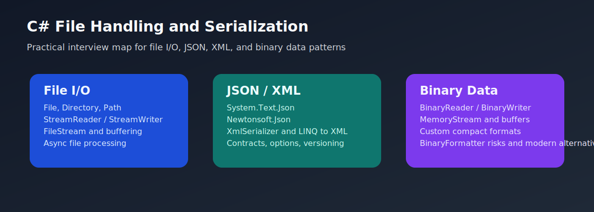

# C# File Handling and Serialization Interview Questions



This guide is written from a practical, long-industry perspective: the kind of file I/O and serialization knowledge that still matters after years of imports, exports, batch jobs, integration payloads, and production data troubleshooting. It starts with the basics and moves steadily into the tricky compatibility, performance, and safety issues that real teams actually debug.

Note: the binary serialization section covers modern, safer binary patterns such as BinaryReader and BinaryWriter, and it also explains why BinaryFormatter-style serialization is obsolete and unsafe for new code.

## 1. File I/O with File and Stream APIs

This section covers the practical file-handling side of C#: path safety, text and byte streams, async I/O, streaming large files, and the operational errors that real systems hit once file workflows leave the developer laptop.

### 1. What is the role of File, Directory, and Path operations in C# file handling and serialization interviews?

**Answer:**

In C# file handling and serialization interviews, File, Directory, and Path operations refers to the basic file-system APIs used to locate, create, inspect, and manage files and folders safely in application code. Interviewers use this topic to see whether a candidate can connect data movement code to real production reliability and maintainability.

**Sample:**

```csharp
string exportRoot = Path.Combine(AppContext.BaseDirectory, "exports", DateTime.UtcNow.ToString("yyyyMMdd"));
Directory.CreateDirectory(exportRoot);

string filePath = Path.Combine(exportRoot, "invoices.csv");
Console.WriteLine(filePath);
```

---

### 2. Why is File, Directory, and Path operations important in real projects?

**Answer:**

It matters because almost every enterprise application eventually reads imports, writes exports, manages temp files, or inspects file-system paths. In production, this shows up in imports, exports, report generation, APIs, caching, integrations, and support troubleshooting.

**Sample:**

```csharp
string exportRoot = Path.Combine(AppContext.BaseDirectory, "exports", DateTime.UtcNow.ToString("yyyyMMdd"));
Directory.CreateDirectory(exportRoot);

string filePath = Path.Combine(exportRoot, "invoices.csv");
Console.WriteLine(filePath);
```

---

### 3. When should you use or think carefully about File, Directory, and Path operations?

**Answer:**

Use or reason carefully about File, Directory, and Path operations when the application needs to create folders, verify whether files exist, combine paths safely, or manage import and export locations. Strong interview answers connect it to correctness, performance, compatibility, or operational safety.

**Sample:**

```csharp
string exportRoot = Path.Combine(AppContext.BaseDirectory, "exports", DateTime.UtcNow.ToString("yyyyMMdd"));
Directory.CreateDirectory(exportRoot);

string filePath = Path.Combine(exportRoot, "invoices.csv");
Console.WriteLine(filePath);
```

---

### 4. What is a real-time example of File, Directory, and Path operations?

**Answer:**

A nightly invoicing job may build a tenant-specific export path, ensure the directory exists, and then place generated CSV files into a dated folder. Real examples usually land better than toy examples because they show how data handling really behaves in working systems.

**Sample:**

```csharp
string exportRoot = Path.Combine(AppContext.BaseDirectory, "exports", DateTime.UtcNow.ToString("yyyyMMdd"));
Directory.CreateDirectory(exportRoot);

string filePath = Path.Combine(exportRoot, "invoices.csv");
Console.WriteLine(filePath);
```

---

### 5. What is a best practice for File, Directory, and Path operations?

**Answer:**

Use Path helpers instead of string concatenation, validate paths from external input, and create directories explicitly before writing files. The strongest answers usually explain which bugs, incidents, or maintenance problems this practice helps avoid.

**Sample:**

```csharp
string exportRoot = Path.Combine(AppContext.BaseDirectory, "exports", DateTime.UtcNow.ToString("yyyyMMdd"));
Directory.CreateDirectory(exportRoot);

string filePath = Path.Combine(exportRoot, "invoices.csv");
Console.WriteLine(filePath);
```

---

### 6. What is a tricky interview point or common mistake around File, Directory, and Path operations?

**Answer:**

A common mistake is manually concatenating path strings or trusting user-supplied paths, which leads to fragile code or traversal risk. This is often where experienced answers sound very different from surface-level ones.

**Sample:**

```csharp
string fileName = "..\\..\\secret.txt";
string safeName = Path.GetFileName(fileName);
Console.WriteLine(safeName);
```

---

### 7. How does File, Directory, and Path operations differ from stream-based file reading and writing?

**Answer:**

File, Directory, and Path operations is about the basic file-system APIs used to locate, create, inspect, and manage files and folders safely in application code, whereas stream-based file reading and writing is about the actual byte or text I O operations over file contents rather than file-system navigation and path management. Interviewers like this comparison because it shows judgment instead of memorized API names.

**Sample:**

```csharp
string exportRoot = Path.Combine(AppContext.BaseDirectory, "exports", DateTime.UtcNow.ToString("yyyyMMdd"));
Directory.CreateDirectory(exportRoot);

string filePath = Path.Combine(exportRoot, "invoices.csv");
Console.WriteLine(filePath);
```

---

### 8. How do you troubleshoot problems related to File, Directory, and Path operations?

**Answer:**

Check the resolved path, file existence, permissions, and whether the process is running against the directory you think it is. Troubleshooting-based answers usually sound stronger because file and serialization bugs often show up as data corruption, mismatches, or production edge cases.

**Sample:**

```csharp
string fileName = "..\\..\\secret.txt";
string safeName = Path.GetFileName(fileName);
Console.WriteLine(safeName);
```

---

### 9. What follow-up question does an interviewer usually ask after File, Directory, and Path operations?

**Answer:**

A common follow-up is why Path.Combine is safer than string concatenation and how to avoid path traversal issues in file-driven features. That usually moves the discussion from syntax to compatibility, safety, and real-world tradeoffs.

**Sample:**

```csharp
string exportRoot = Path.Combine(AppContext.BaseDirectory, "exports", DateTime.UtcNow.ToString("yyyyMMdd"));
Directory.CreateDirectory(exportRoot);

string filePath = Path.Combine(exportRoot, "invoices.csv");
Console.WriteLine(filePath);
```

---

### 10. How does File, Directory, and Path operations connect to the rest of C# data handling design?

**Answer:**

Path handling is the entry point to safe file I O, temp-file management, exports, and operational debugging. That is why this topic keeps appearing in senior interviews even when the original question sounds small.

**Sample:**

```csharp
string exportRoot = Path.Combine(AppContext.BaseDirectory, "exports", DateTime.UtcNow.ToString("yyyyMMdd"));
Directory.CreateDirectory(exportRoot);

string filePath = Path.Combine(exportRoot, "invoices.csv");
Console.WriteLine(filePath);
```

---

### 11. What is the role of Reading and writing text with File, StreamReader, and StreamWriter in C# file handling and serialization interviews?

**Answer:**

In C# file handling and serialization interviews, Reading and writing text with File, StreamReader, and StreamWriter refers to the common text-oriented APIs used to load, append, and emit human-readable files such as logs, CSVs, and templates. Interviewers use this topic to see whether a candidate can connect data movement code to real production reliability and maintainability.

**Sample:**

```csharp
string path = Path.Combine(AppContext.BaseDirectory, "logs", "orders.log");
Directory.CreateDirectory(Path.GetDirectoryName(path)!);

using var writer = new StreamWriter(path, append: true, Encoding.UTF8);
writer.WriteLine($"{DateTime.UtcNow:O},SO-100,Processed");
```

---

### 12. Why is Reading and writing text with File, StreamReader, and StreamWriter important in real projects?

**Answer:**

It matters because business systems constantly work with text files, and the API choice affects readability, memory use, and control over encoding or append behavior. In production, this shows up in imports, exports, report generation, APIs, caching, integrations, and support troubleshooting.

**Sample:**

```csharp
string path = Path.Combine(AppContext.BaseDirectory, "logs", "orders.log");
Directory.CreateDirectory(Path.GetDirectoryName(path)!);

using var writer = new StreamWriter(path, append: true, Encoding.UTF8);
writer.WriteLine($"{DateTime.UtcNow:O},SO-100,Processed");
```

---

### 13. When should you use or think carefully about Reading and writing text with File, StreamReader, and StreamWriter?

**Answer:**

Use or reason carefully about Reading and writing text with File, StreamReader, and StreamWriter when you need to read or write text data such as CSV exports, plain-text reports, templates, or operational logs. Strong interview answers connect it to correctness, performance, compatibility, or operational safety.

**Sample:**

```csharp
string path = Path.Combine(AppContext.BaseDirectory, "logs", "orders.log");
Directory.CreateDirectory(Path.GetDirectoryName(path)!);

using var writer = new StreamWriter(path, append: true, Encoding.UTF8);
writer.WriteLine($"{DateTime.UtcNow:O},SO-100,Processed");
```

---

### 14. What is a real-time example of Reading and writing text with File, StreamReader, and StreamWriter?

**Answer:**

A support export feature may write a UTF-8 CSV file with invoice data, while a reconciliation utility reads line-oriented input from a vendor text feed. Real examples usually land better than toy examples because they show how data handling really behaves in working systems.

**Sample:**

```csharp
string path = Path.Combine(AppContext.BaseDirectory, "logs", "orders.log");
Directory.CreateDirectory(Path.GetDirectoryName(path)!);

using var writer = new StreamWriter(path, append: true, Encoding.UTF8);
writer.WriteLine($"{DateTime.UtcNow:O},SO-100,Processed");
```

---

### 15. What is a best practice for Reading and writing text with File, StreamReader, and StreamWriter?

**Answer:**

Choose the simplest API that fits the workload, set encoding intentionally when needed, and stream large files instead of loading everything into memory unnecessarily. The strongest answers usually explain which bugs, incidents, or maintenance problems this practice helps avoid.

**Sample:**

```csharp
string path = Path.Combine(AppContext.BaseDirectory, "logs", "orders.log");
Directory.CreateDirectory(Path.GetDirectoryName(path)!);

using var writer = new StreamWriter(path, append: true, Encoding.UTF8);
writer.WriteLine($"{DateTime.UtcNow:O},SO-100,Processed");
```

---

### 16. What is a tricky interview point or common mistake around Reading and writing text with File, StreamReader, and StreamWriter?

**Answer:**

A common mistake is using ReadAllText or ReadAllLines on very large files when a streaming approach would be safer. This is often where experienced answers sound very different from surface-level ones.

**Sample:**

```csharp
using var reader = new StreamReader("large-import.txt", Encoding.UTF8);
string? line;
while ((line = reader.ReadLine()) is not null)
{
    Console.WriteLine(line);
    break;
}
```

---

### 17. How does Reading and writing text with File, StreamReader, and StreamWriter differ from low-level FileStream byte operations?

**Answer:**

Reading and writing text with File, StreamReader, and StreamWriter is about the common text-oriented APIs used to load, append, and emit human-readable files such as logs, CSVs, and templates, whereas low-level FileStream byte operations is about byte-oriented stream control rather than higher-level text readers and writers. Interviewers like this comparison because it shows judgment instead of memorized API names.

**Sample:**

```csharp
string path = Path.Combine(AppContext.BaseDirectory, "logs", "orders.log");
Directory.CreateDirectory(Path.GetDirectoryName(path)!);

using var writer = new StreamWriter(path, append: true, Encoding.UTF8);
writer.WriteLine($"{DateTime.UtcNow:O},SO-100,Processed");
```

---

### 18. How do you troubleshoot problems related to Reading and writing text with File, StreamReader, and StreamWriter?

**Answer:**

Check file encoding, unexpected line endings, and whether the code should stream line by line instead of reading everything at once. Troubleshooting-based answers usually sound stronger because file and serialization bugs often show up as data corruption, mismatches, or production edge cases.

**Sample:**

```csharp
using var reader = new StreamReader("large-import.txt", Encoding.UTF8);
string? line;
while ((line = reader.ReadLine()) is not null)
{
    Console.WriteLine(line);
    break;
}
```

---

### 19. What follow-up question does an interviewer usually ask after Reading and writing text with File, StreamReader, and StreamWriter?

**Answer:**

A common follow-up is when File.ReadAllText is fine, when StreamReader is better, and how encoding issues show up in real integrations. That usually moves the discussion from syntax to compatibility, safety, and real-world tradeoffs.

**Sample:**

```csharp
string path = Path.Combine(AppContext.BaseDirectory, "logs", "orders.log");
Directory.CreateDirectory(Path.GetDirectoryName(path)!);

using var writer = new StreamWriter(path, append: true, Encoding.UTF8);
writer.WriteLine($"{DateTime.UtcNow:O},SO-100,Processed");
```

---

### 20. How does Reading and writing text with File, StreamReader, and StreamWriter connect to the rest of C# data handling design?

**Answer:**

Text APIs connect file handling directly to exports, imports, logging, and serialization workflows. That is why this topic keeps appearing in senior interviews even when the original question sounds small.

**Sample:**

```csharp
string path = Path.Combine(AppContext.BaseDirectory, "logs", "orders.log");
Directory.CreateDirectory(Path.GetDirectoryName(path)!);

using var writer = new StreamWriter(path, append: true, Encoding.UTF8);
writer.WriteLine($"{DateTime.UtcNow:O},SO-100,Processed");
```

---

### 21. What is the role of FileStream, buffering, and byte-oriented access in C# file handling and serialization interviews?

**Answer:**

In C# file handling and serialization interviews, FileStream, buffering, and byte-oriented access refers to the lower-level stream API used when code needs explicit control over bytes, buffers, file modes, and stream ownership. Interviewers use this topic to see whether a candidate can connect data movement code to real production reliability and maintainability.

**Sample:**

```csharp
byte[] payload = Encoding.UTF8.GetBytes("Invoice export ready");
using var stream = new FileStream("status.bin", FileMode.Create, FileAccess.Write, FileShare.None);
stream.Write(payload, 0, payload.Length);
```

---

### 22. Why is FileStream, buffering, and byte-oriented access important in real projects?

**Answer:**

It matters because binary files, large file transfers, and advanced I O scenarios often need more control than the simple File helper methods provide. In production, this shows up in imports, exports, report generation, APIs, caching, integrations, and support troubleshooting.

**Sample:**

```csharp
byte[] payload = Encoding.UTF8.GetBytes("Invoice export ready");
using var stream = new FileStream("status.bin", FileMode.Create, FileAccess.Write, FileShare.None);
stream.Write(payload, 0, payload.Length);
```

---

### 23. When should you use or think carefully about FileStream, buffering, and byte-oriented access?

**Answer:**

Use or reason carefully about FileStream, buffering, and byte-oriented access when you need byte-level access, custom buffering, append or truncate control, or a stream that can be passed into other components. Strong interview answers connect it to correctness, performance, compatibility, or operational safety.

**Sample:**

```csharp
byte[] payload = Encoding.UTF8.GetBytes("Invoice export ready");
using var stream = new FileStream("status.bin", FileMode.Create, FileAccess.Write, FileShare.None);
stream.Write(payload, 0, payload.Length);
```

---

### 24. What is a real-time example of FileStream, buffering, and byte-oriented access?

**Answer:**

A document service may open a FileStream and pipe PDF bytes into cloud storage or a compression layer without loading the whole file into memory. Real examples usually land better than toy examples because they show how data handling really behaves in working systems.

**Sample:**

```csharp
byte[] payload = Encoding.UTF8.GetBytes("Invoice export ready");
using var stream = new FileStream("status.bin", FileMode.Create, FileAccess.Write, FileShare.None);
stream.Write(payload, 0, payload.Length);
```

---

### 25. What is a best practice for FileStream, buffering, and byte-oriented access?

**Answer:**

Open streams with the right FileMode and FileAccess, keep ownership clear, and use buffering intentionally rather than by habit. The strongest answers usually explain which bugs, incidents, or maintenance problems this practice helps avoid.

**Sample:**

```csharp
byte[] payload = Encoding.UTF8.GetBytes("Invoice export ready");
using var stream = new FileStream("status.bin", FileMode.Create, FileAccess.Write, FileShare.None);
stream.Write(payload, 0, payload.Length);
```

---

### 26. What is a tricky interview point or common mistake around FileStream, buffering, and byte-oriented access?

**Answer:**

A common mistake is using the wrong mode such as Create when OpenOrCreate or Append was intended, causing data loss or unexpected file truncation. This is often where experienced answers sound very different from surface-level ones.

**Sample:**

```csharp
using var stream = new FileStream("status.bin", FileMode.OpenOrCreate, FileAccess.ReadWrite, FileShare.Read);
Console.WriteLine(stream.Position);
stream.Seek(0, SeekOrigin.Begin);
```

---

### 27. How does FileStream, buffering, and byte-oriented access differ from high-level File helper methods?

**Answer:**

FileStream, buffering, and byte-oriented access is about the lower-level stream API used when code needs explicit control over bytes, buffers, file modes, and stream ownership, whereas high-level File helper methods is about simpler convenience APIs rather than explicit stream ownership and byte-level file control. Interviewers like this comparison because it shows judgment instead of memorized API names.

**Sample:**

```csharp
byte[] payload = Encoding.UTF8.GetBytes("Invoice export ready");
using var stream = new FileStream("status.bin", FileMode.Create, FileAccess.Write, FileShare.None);
stream.Write(payload, 0, payload.Length);
```

---

### 28. How do you troubleshoot problems related to FileStream, buffering, and byte-oriented access?

**Answer:**

Check mode, access, and share settings, then confirm whether the file pointer position and buffer usage match the expected behavior. Troubleshooting-based answers usually sound stronger because file and serialization bugs often show up as data corruption, mismatches, or production edge cases.

**Sample:**

```csharp
using var stream = new FileStream("status.bin", FileMode.OpenOrCreate, FileAccess.ReadWrite, FileShare.Read);
Console.WriteLine(stream.Position);
stream.Seek(0, SeekOrigin.Begin);
```

---

### 29. What follow-up question does an interviewer usually ask after FileStream, buffering, and byte-oriented access?

**Answer:**

A common follow-up is which FileMode and FileAccess combinations are common in real systems and when a FileStream is preferable to File helpers. That usually moves the discussion from syntax to compatibility, safety, and real-world tradeoffs.

**Sample:**

```csharp
byte[] payload = Encoding.UTF8.GetBytes("Invoice export ready");
using var stream = new FileStream("status.bin", FileMode.Create, FileAccess.Write, FileShare.None);
stream.Write(payload, 0, payload.Length);
```

---

### 30. How does FileStream, buffering, and byte-oriented access connect to the rest of C# data handling design?

**Answer:**

FileStream is the bridge between simple file handling and advanced streaming or serialization code. That is why this topic keeps appearing in senior interviews even when the original question sounds small.

**Sample:**

```csharp
byte[] payload = Encoding.UTF8.GetBytes("Invoice export ready");
using var stream = new FileStream("status.bin", FileMode.Create, FileAccess.Write, FileShare.None);
stream.Write(payload, 0, payload.Length);
```

---

### 31. What is the role of Asynchronous file I O and scalable processing in C# file handling and serialization interviews?

**Answer:**

In C# file handling and serialization interviews, Asynchronous file I O and scalable processing refers to the async file APIs and stream patterns that let applications avoid blocking threads while waiting on disk operations. Interviewers use this topic to see whether a candidate can connect data movement code to real production reliability and maintainability.

**Sample:**

```csharp
string path = Path.Combine(AppContext.BaseDirectory, "uploads", "invoice.json");
Directory.CreateDirectory(Path.GetDirectoryName(path)!);

await File.WriteAllTextAsync(path, "{\"invoiceNo\":\"INV-100\"}");
string content = await File.ReadAllTextAsync(path);
Console.WriteLine(content);
```

---

### 32. Why is Asynchronous file I O and scalable processing important in real projects?

**Answer:**

It matters because file-heavy APIs and worker processes can become less scalable if every read and write blocks a thread unnecessarily. In production, this shows up in imports, exports, report generation, APIs, caching, integrations, and support troubleshooting.

**Sample:**

```csharp
string path = Path.Combine(AppContext.BaseDirectory, "uploads", "invoice.json");
Directory.CreateDirectory(Path.GetDirectoryName(path)!);

await File.WriteAllTextAsync(path, "{\"invoiceNo\":\"INV-100\"}");
string content = await File.ReadAllTextAsync(path);
Console.WriteLine(content);
```

---

### 33. When should you use or think carefully about Asynchronous file I O and scalable processing?

**Answer:**

Use or reason carefully about Asynchronous file I O and scalable processing when the application processes uploads, downloads, large exports, or background file tasks and should remain responsive while waiting for I O. Strong interview answers connect it to correctness, performance, compatibility, or operational safety.

**Sample:**

```csharp
string path = Path.Combine(AppContext.BaseDirectory, "uploads", "invoice.json");
Directory.CreateDirectory(Path.GetDirectoryName(path)!);

await File.WriteAllTextAsync(path, "{\"invoiceNo\":\"INV-100\"}");
string content = await File.ReadAllTextAsync(path);
Console.WriteLine(content);
```

---

### 34. What is a real-time example of Asynchronous file I O and scalable processing?

**Answer:**

An API that stores uploaded invoices can await asynchronous stream copies so request threads remain available for other traffic during disk or network waits. Real examples usually land better than toy examples because they show how data handling really behaves in working systems.

**Sample:**

```csharp
string path = Path.Combine(AppContext.BaseDirectory, "uploads", "invoice.json");
Directory.CreateDirectory(Path.GetDirectoryName(path)!);

await File.WriteAllTextAsync(path, "{\"invoiceNo\":\"INV-100\"}");
string content = await File.ReadAllTextAsync(path);
Console.WriteLine(content);
```

---

### 35. What is a best practice for Asynchronous file I O and scalable processing?

**Answer:**

Use async file APIs in request and worker code where I O waiting matters, and propagate cancellation tokens through long-running file operations. The strongest answers usually explain which bugs, incidents, or maintenance problems this practice helps avoid.

**Sample:**

```csharp
string path = Path.Combine(AppContext.BaseDirectory, "uploads", "invoice.json");
Directory.CreateDirectory(Path.GetDirectoryName(path)!);

await File.WriteAllTextAsync(path, "{\"invoiceNo\":\"INV-100\"}");
string content = await File.ReadAllTextAsync(path);
Console.WriteLine(content);
```

---

### 36. What is a tricky interview point or common mistake around Asynchronous file I O and scalable processing?

**Answer:**

A common mistake is wrapping synchronous file work in Task.Run instead of using the real asynchronous APIs already provided by the framework. This is often where experienced answers sound very different from surface-level ones.

**Sample:**

```csharp
await using var source = File.OpenRead("invoice.pdf");
await using var destination = File.Create("invoice-copy.pdf");
await source.CopyToAsync(destination);
```

---

### 37. How does Asynchronous file I O and scalable processing differ from synchronous blocking file operations?

**Answer:**

Asynchronous file I O and scalable processing is about the async file APIs and stream patterns that let applications avoid blocking threads while waiting on disk operations, whereas synchronous blocking file operations is about direct thread-blocking disk access rather than awaited non-blocking I O calls. Interviewers like this comparison because it shows judgment instead of memorized API names.

**Sample:**

```csharp
string path = Path.Combine(AppContext.BaseDirectory, "uploads", "invoice.json");
Directory.CreateDirectory(Path.GetDirectoryName(path)!);

await File.WriteAllTextAsync(path, "{\"invoiceNo\":\"INV-100\"}");
string content = await File.ReadAllTextAsync(path);
Console.WriteLine(content);
```

---

### 38. How do you troubleshoot problems related to Asynchronous file I O and scalable processing?

**Answer:**

Check whether the API used is genuinely async, whether cancellation flows through, and whether hidden sync calls still block inside the path. Troubleshooting-based answers usually sound stronger because file and serialization bugs often show up as data corruption, mismatches, or production edge cases.

**Sample:**

```csharp
await using var source = File.OpenRead("invoice.pdf");
await using var destination = File.Create("invoice-copy.pdf");
await source.CopyToAsync(destination);
```

---

### 39. What follow-up question does an interviewer usually ask after Asynchronous file I O and scalable processing?

**Answer:**

A common follow-up is why async helps I O-bound file workloads and when synchronous file access is still acceptable in small console utilities or startup code. That usually moves the discussion from syntax to compatibility, safety, and real-world tradeoffs.

**Sample:**

```csharp
string path = Path.Combine(AppContext.BaseDirectory, "uploads", "invoice.json");
Directory.CreateDirectory(Path.GetDirectoryName(path)!);

await File.WriteAllTextAsync(path, "{\"invoiceNo\":\"INV-100\"}");
string content = await File.ReadAllTextAsync(path);
Console.WriteLine(content);
```

---

### 40. How does Asynchronous file I O and scalable processing connect to the rest of C# data handling design?

**Answer:**

Async file handling connects I O basics to throughput, web APIs, and background processing design. That is why this topic keeps appearing in senior interviews even when the original question sounds small.

**Sample:**

```csharp
string path = Path.Combine(AppContext.BaseDirectory, "uploads", "invoice.json");
Directory.CreateDirectory(Path.GetDirectoryName(path)!);

await File.WriteAllTextAsync(path, "{\"invoiceNo\":\"INV-100\"}");
string content = await File.ReadAllTextAsync(path);
Console.WriteLine(content);
```

---

### 41. What is the role of Large file processing, streaming, and memory safety in C# file handling and serialization interviews?

**Answer:**

In C# file handling and serialization interviews, Large file processing, streaming, and memory safety refers to the patterns used to handle large files without exhausting memory or creating long pauses from all-at-once loading. Interviewers use this topic to see whether a candidate can connect data movement code to real production reliability and maintainability.

**Sample:**

```csharp
await using var stream = File.OpenRead("orders.csv");
using var reader = new StreamReader(stream);

string? line;
while ((line = await reader.ReadLineAsync()) is not null)
{
    Console.WriteLine(line);
    break;
}
```

---

### 42. Why is Large file processing, streaming, and memory safety important in real projects?

**Answer:**

It matters because imports and exports can grow far beyond development-size samples, and memory-heavy file code often fails first in production. In production, this shows up in imports, exports, report generation, APIs, caching, integrations, and support troubleshooting.

**Sample:**

```csharp
await using var stream = File.OpenRead("orders.csv");
using var reader = new StreamReader(stream);

string? line;
while ((line = await reader.ReadLineAsync()) is not null)
{
    Console.WriteLine(line);
    break;
}
```

---

### 43. When should you use or think carefully about Large file processing, streaming, and memory safety?

**Answer:**

Use or reason carefully about Large file processing, streaming, and memory safety when the application processes very large CSVs, logs, documents, or integration files that should be streamed incrementally. Strong interview answers connect it to correctness, performance, compatibility, or operational safety.

**Sample:**

```csharp
await using var stream = File.OpenRead("orders.csv");
using var reader = new StreamReader(stream);

string? line;
while ((line = await reader.ReadLineAsync()) is not null)
{
    Console.WriteLine(line);
    break;
}
```

---

### 44. What is a real-time example of Large file processing, streaming, and memory safety?

**Answer:**

A reconciliation worker may stream a million-row CSV line by line, validating and batching records instead of loading the whole file into memory first. Real examples usually land better than toy examples because they show how data handling really behaves in working systems.

**Sample:**

```csharp
await using var stream = File.OpenRead("orders.csv");
using var reader = new StreamReader(stream);

string? line;
while ((line = await reader.ReadLineAsync()) is not null)
{
    Console.WriteLine(line);
    break;
}
```

---

### 45. What is a best practice for Large file processing, streaming, and memory safety?

**Answer:**

Stream large files incrementally, batch output intelligently, and avoid all-at-once read patterns unless the file size is truly bounded and small. The strongest answers usually explain which bugs, incidents, or maintenance problems this practice helps avoid.

**Sample:**

```csharp
await using var stream = File.OpenRead("orders.csv");
using var reader = new StreamReader(stream);

string? line;
while ((line = await reader.ReadLineAsync()) is not null)
{
    Console.WriteLine(line);
    break;
}
```

---

### 46. What is a tricky interview point or common mistake around Large file processing, streaming, and memory safety?

**Answer:**

A common anti-pattern is testing with tiny files and then shipping code that breaks when production files are hundreds of megabytes. This is often where experienced answers sound very different from surface-level ones.

**Sample:**

```csharp
byte[] allBytes = File.ReadAllBytes("huge-backup.zip");
Console.WriteLine($"Loaded {allBytes.Length} bytes into memory.");
Console.WriteLine("This is risky for very large files.");
```

---

### 47. How does Large file processing, streaming, and memory safety differ from small-file convenience loading?

**Answer:**

Large file processing, streaming, and memory safety is about the patterns used to handle large files without exhausting memory or creating long pauses from all-at-once loading, whereas small-file convenience loading is about all-at-once read patterns that are acceptable only when the file size is confidently small and bounded. Interviewers like this comparison because it shows judgment instead of memorized API names.

**Sample:**

```csharp
await using var stream = File.OpenRead("orders.csv");
using var reader = new StreamReader(stream);

string? line;
while ((line = await reader.ReadLineAsync()) is not null)
{
    Console.WriteLine(line);
    break;
}
```

---

### 48. How do you troubleshoot problems related to Large file processing, streaming, and memory safety?

**Answer:**

Measure memory spikes, inspect file size assumptions, and look for ReadAllLines, ReadAllBytes, or oversized in-memory intermediate structures. Troubleshooting-based answers usually sound stronger because file and serialization bugs often show up as data corruption, mismatches, or production edge cases.

**Sample:**

```csharp
byte[] allBytes = File.ReadAllBytes("huge-backup.zip");
Console.WriteLine($"Loaded {allBytes.Length} bytes into memory.");
Console.WriteLine("This is risky for very large files.");
```

---

### 49. What follow-up question does an interviewer usually ask after Large file processing, streaming, and memory safety?

**Answer:**

A common follow-up is how to redesign a memory-heavy import to stream records safely and what batching patterns work well for exports. That usually moves the discussion from syntax to compatibility, safety, and real-world tradeoffs.

**Sample:**

```csharp
await using var stream = File.OpenRead("orders.csv");
using var reader = new StreamReader(stream);

string? line;
while ((line = await reader.ReadLineAsync()) is not null)
{
    Console.WriteLine(line);
    break;
}
```

---

### 50. How does Large file processing, streaming, and memory safety connect to the rest of C# data handling design?

**Answer:**

Streaming discipline links file I O choices to performance, stability, and operational predictability. That is why this topic keeps appearing in senior interviews even when the original question sounds small.

**Sample:**

```csharp
await using var stream = File.OpenRead("orders.csv");
using var reader = new StreamReader(stream);

string? line;
while ((line = await reader.ReadLineAsync()) is not null)
{
    Console.WriteLine(line);
    break;
}
```

---

### 51. What is the role of File locks, sharing modes, and operational error handling in C# file handling and serialization interviews?

**Answer:**

In C# file handling and serialization interviews, File locks, sharing modes, and operational error handling refers to the practical file-access issues around sharing modes, locked files, permissions, and retry logic in real deployment environments. Interviewers use this topic to see whether a candidate can connect data movement code to real production reliability and maintainability.

**Sample:**

```csharp
try
{
    using var stream = new FileStream("incoming.txt", FileMode.Open, FileAccess.Read, FileShare.Read);
    Console.WriteLine(stream.Length);
}
catch (IOException ex)
{
    Console.WriteLine($"File I/O issue: {ex.Message}");
}
```

---

### 52. Why is File locks, sharing modes, and operational error handling important in real projects?

**Answer:**

It matters because file code often fails not from syntax problems but from contention, permissions, antivirus scans, or other processes touching the same file. In production, this shows up in imports, exports, report generation, APIs, caching, integrations, and support troubleshooting.

**Sample:**

```csharp
try
{
    using var stream = new FileStream("incoming.txt", FileMode.Open, FileAccess.Read, FileShare.Read);
    Console.WriteLine(stream.Length);
}
catch (IOException ex)
{
    Console.WriteLine($"File I/O issue: {ex.Message}");
}
```

---

### 53. When should you use or think carefully about File locks, sharing modes, and operational error handling?

**Answer:**

Use or reason carefully about File locks, sharing modes, and operational error handling when multiple processes may touch the same file or when the application runs under service accounts, batch schedulers, or shared file-system environments. Strong interview answers connect it to correctness, performance, compatibility, or operational safety.

**Sample:**

```csharp
try
{
    using var stream = new FileStream("incoming.txt", FileMode.Open, FileAccess.Read, FileShare.Read);
    Console.WriteLine(stream.Length);
}
catch (IOException ex)
{
    Console.WriteLine($"File I/O issue: {ex.Message}");
}
```

---

### 54. What is a real-time example of File locks, sharing modes, and operational error handling?

**Answer:**

A nightly feed processor may fail because another process is still writing the incoming file, requiring safe share settings or a retry-and-stabilize approach. Real examples usually land better than toy examples because they show how data handling really behaves in working systems.

**Sample:**

```csharp
try
{
    using var stream = new FileStream("incoming.txt", FileMode.Open, FileAccess.Read, FileShare.Read);
    Console.WriteLine(stream.Length);
}
catch (IOException ex)
{
    Console.WriteLine($"File I/O issue: {ex.Message}");
}
```

---

### 55. What is a best practice for File locks, sharing modes, and operational error handling?

**Answer:**

Handle IOException and UnauthorizedAccessException thoughtfully, choose share modes intentionally, and avoid assuming the file system is always stable or single-user. The strongest answers usually explain which bugs, incidents, or maintenance problems this practice helps avoid.

**Sample:**

```csharp
try
{
    using var stream = new FileStream("incoming.txt", FileMode.Open, FileAccess.Read, FileShare.Read);
    Console.WriteLine(stream.Length);
}
catch (IOException ex)
{
    Console.WriteLine($"File I/O issue: {ex.Message}");
}
```

---

### 56. What is a tricky interview point or common mistake around File locks, sharing modes, and operational error handling?

**Answer:**

A common mistake is retrying every file exception blindly when some errors indicate permissions or path problems that retries will never fix. This is often where experienced answers sound very different from surface-level ones.

**Sample:**

```csharp
using var stream = new FileStream("audit.log", FileMode.Append, FileAccess.Write, FileShare.Read);
Console.WriteLine("Share modes affect whether other processes can read or write the file.");
```

---

### 57. How does File locks, sharing modes, and operational error handling differ from happy-path file reads in isolated local development?

**Answer:**

File locks, sharing modes, and operational error handling is about the practical file-access issues around sharing modes, locked files, permissions, and retry logic in real deployment environments, whereas happy-path file reads in isolated local development is about simple local scenarios where no other process, permission boundary, or operational contention interferes with file access. Interviewers like this comparison because it shows judgment instead of memorized API names.

**Sample:**

```csharp
try
{
    using var stream = new FileStream("incoming.txt", FileMode.Open, FileAccess.Read, FileShare.Read);
    Console.WriteLine(stream.Length);
}
catch (IOException ex)
{
    Console.WriteLine($"File I/O issue: {ex.Message}");
}
```

---

### 58. How do you troubleshoot problems related to File locks, sharing modes, and operational error handling?

**Answer:**

Check exception type, file existence, process identity, share mode, and whether another process or service still owns the file. Troubleshooting-based answers usually sound stronger because file and serialization bugs often show up as data corruption, mismatches, or production edge cases.

**Sample:**

```csharp
using var stream = new FileStream("audit.log", FileMode.Append, FileAccess.Write, FileShare.Read);
Console.WriteLine("Share modes affect whether other processes can read or write the file.");
```

---

### 59. What follow-up question does an interviewer usually ask after File locks, sharing modes, and operational error handling?

**Answer:**

A common follow-up is how FileShare affects behavior and which file exceptions are worth retrying versus escalating immediately. That usually moves the discussion from syntax to compatibility, safety, and real-world tradeoffs.

**Sample:**

```csharp
try
{
    using var stream = new FileStream("incoming.txt", FileMode.Open, FileAccess.Read, FileShare.Read);
    Console.WriteLine(stream.Length);
}
catch (IOException ex)
{
    Console.WriteLine($"File I/O issue: {ex.Message}");
}
```

---

### 60. How does File locks, sharing modes, and operational error handling connect to the rest of C# data handling design?

**Answer:**

Operational file error handling turns basic file APIs into production-ready code instead of optimistic demos. That is why this topic keeps appearing in senior interviews even when the original question sounds small.

**Sample:**

```csharp
try
{
    using var stream = new FileStream("incoming.txt", FileMode.Open, FileAccess.Read, FileShare.Read);
    Console.WriteLine(stream.Length);
}
catch (IOException ex)
{
    Console.WriteLine($"File I/O issue: {ex.Message}");
}
```

---

## 2. JSON and XML serialization

This section covers JSON and XML handling from the practical perspective interviewers care about most: stable contracts, clean serializer setup, legacy library differences, and how to evolve payloads without breaking consumers.

### 61. What is the role of System.Text.Json basic serialization and deserialization in C# file handling and serialization interviews?

**Answer:**

In C# file handling and serialization interviews, System.Text.Json basic serialization and deserialization refers to the built-in .NET JSON serializer used for turning C# objects into JSON and back with modern performance-oriented defaults. Interviewers use this topic to see whether a candidate can connect data movement code to real production reliability and maintainability.

**Sample:**

```csharp
public record InvoiceDto(string InvoiceNo, decimal Amount);

var invoice = new InvoiceDto("INV-100", 1499.95m);
string json = JsonSerializer.Serialize(invoice);
var parsed = JsonSerializer.Deserialize<InvoiceDto>(json);

Console.WriteLine(json);
Console.WriteLine(parsed?.InvoiceNo);
```

---

### 62. Why is System.Text.Json basic serialization and deserialization important in real projects?

**Answer:**

It matters because System.Text.Json is the default JSON stack for modern ASP.NET Core applications and many internal services. In production, this shows up in imports, exports, report generation, APIs, caching, integrations, and support troubleshooting.

**Sample:**

```csharp
public record InvoiceDto(string InvoiceNo, decimal Amount);

var invoice = new InvoiceDto("INV-100", 1499.95m);
string json = JsonSerializer.Serialize(invoice);
var parsed = JsonSerializer.Deserialize<InvoiceDto>(json);

Console.WriteLine(json);
Console.WriteLine(parsed?.InvoiceNo);
```

---

### 63. When should you use or think carefully about System.Text.Json basic serialization and deserialization?

**Answer:**

Use or reason carefully about System.Text.Json basic serialization and deserialization when the application exchanges API payloads, writes JSON files, caches JSON snapshots, or processes import and export documents. Strong interview answers connect it to correctness, performance, compatibility, or operational safety.

**Sample:**

```csharp
public record InvoiceDto(string InvoiceNo, decimal Amount);

var invoice = new InvoiceDto("INV-100", 1499.95m);
string json = JsonSerializer.Serialize(invoice);
var parsed = JsonSerializer.Deserialize<InvoiceDto>(json);

Console.WriteLine(json);
Console.WriteLine(parsed?.InvoiceNo);
```

---

### 64. What is a real-time example of System.Text.Json basic serialization and deserialization?

**Answer:**

An order API may serialize response DTOs with System.Text.Json, while a worker deserializes queued JSON payloads from a file drop or message store. Real examples usually land better than toy examples because they show how data handling really behaves in working systems.

**Sample:**

```csharp
public record InvoiceDto(string InvoiceNo, decimal Amount);

var invoice = new InvoiceDto("INV-100", 1499.95m);
string json = JsonSerializer.Serialize(invoice);
var parsed = JsonSerializer.Deserialize<InvoiceDto>(json);

Console.WriteLine(json);
Console.WriteLine(parsed?.InvoiceNo);
```

---

### 65. What is a best practice for System.Text.Json basic serialization and deserialization?

**Answer:**

Use clear DTOs, keep contracts explicit, and configure serializer options intentionally instead of relying on accidental defaults in critical integrations. The strongest answers usually explain which bugs, incidents, or maintenance problems this practice helps avoid.

**Sample:**

```csharp
public record InvoiceDto(string InvoiceNo, decimal Amount);

var invoice = new InvoiceDto("INV-100", 1499.95m);
string json = JsonSerializer.Serialize(invoice);
var parsed = JsonSerializer.Deserialize<InvoiceDto>(json);

Console.WriteLine(json);
Console.WriteLine(parsed?.InvoiceNo);
```

---

### 66. What is a tricky interview point or common mistake around System.Text.Json basic serialization and deserialization?

**Answer:**

A common mistake is assuming serializer defaults will always match external system expectations around casing, enums, or null handling. This is often where experienced answers sound very different from surface-level ones.

**Sample:**

```csharp
var options = new JsonSerializerOptions
{
    PropertyNamingPolicy = JsonNamingPolicy.CamelCase,
    WriteIndented = true
};

Console.WriteLine(JsonSerializer.Serialize(new { OrderNo = "SO-100" }, options));
```

---

### 67. How does System.Text.Json basic serialization and deserialization differ from Newtonsoft.Json contract handling?

**Answer:**

System.Text.Json basic serialization and deserialization is about the built-in .NET JSON serializer used for turning C# objects into JSON and back with modern performance-oriented defaults, whereas Newtonsoft.Json contract handling is about the older and still widely used JSON library with a different feature set and many enterprise codebases built around it. Interviewers like this comparison because it shows judgment instead of memorized API names.

**Sample:**

```csharp
public record InvoiceDto(string InvoiceNo, decimal Amount);

var invoice = new InvoiceDto("INV-100", 1499.95m);
string json = JsonSerializer.Serialize(invoice);
var parsed = JsonSerializer.Deserialize<InvoiceDto>(json);

Console.WriteLine(json);
Console.WriteLine(parsed?.InvoiceNo);
```

---

### 68. How do you troubleshoot problems related to System.Text.Json basic serialization and deserialization?

**Answer:**

Inspect the raw JSON, check serializer options, and confirm property names, casing, and constructor or setter behavior match the DTO contract. Troubleshooting-based answers usually sound stronger because file and serialization bugs often show up as data corruption, mismatches, or production edge cases.

**Sample:**

```csharp
var options = new JsonSerializerOptions
{
    PropertyNamingPolicy = JsonNamingPolicy.CamelCase,
    WriteIndented = true
};

Console.WriteLine(JsonSerializer.Serialize(new { OrderNo = "SO-100" }, options));
```

---

### 69. What follow-up question does an interviewer usually ask after System.Text.Json basic serialization and deserialization?

**Answer:**

A common follow-up is when System.Text.Json is the right default and which contract differences usually surprise teams during migration. That usually moves the discussion from syntax to compatibility, safety, and real-world tradeoffs.

**Sample:**

```csharp
public record InvoiceDto(string InvoiceNo, decimal Amount);

var invoice = new InvoiceDto("INV-100", 1499.95m);
string json = JsonSerializer.Serialize(invoice);
var parsed = JsonSerializer.Deserialize<InvoiceDto>(json);

Console.WriteLine(json);
Console.WriteLine(parsed?.InvoiceNo);
```

---

### 70. How does System.Text.Json basic serialization and deserialization connect to the rest of C# data handling design?

**Answer:**

System.Text.Json sits at the center of modern API payload handling, config serialization, and worker message processing. That is why this topic keeps appearing in senior interviews even when the original question sounds small.

**Sample:**

```csharp
public record InvoiceDto(string InvoiceNo, decimal Amount);

var invoice = new InvoiceDto("INV-100", 1499.95m);
string json = JsonSerializer.Serialize(invoice);
var parsed = JsonSerializer.Deserialize<InvoiceDto>(json);

Console.WriteLine(json);
Console.WriteLine(parsed?.InvoiceNo);
```

---

### 71. What is the role of JSON serializer options, naming policies, and contract control in C# file handling and serialization interviews?

**Answer:**

In C# file handling and serialization interviews, JSON serializer options, naming policies, and contract control refers to the configuration choices that shape JSON output and input behavior such as naming, indentation, null handling, enum formatting, and case sensitivity. Interviewers use this topic to see whether a candidate can connect data movement code to real production reliability and maintainability.

**Sample:**

```csharp
var options = new JsonSerializerOptions
{
    PropertyNamingPolicy = JsonNamingPolicy.CamelCase,
    Converters = { new JsonStringEnumConverter() },
    WriteIndented = true
};

string json = JsonSerializer.Serialize(new { Status = OrderStatus.Packed }, options);
Console.WriteLine(json);

enum OrderStatus { Packed, Shipped }
```

---

### 72. Why is JSON serializer options, naming policies, and contract control important in real projects?

**Answer:**

It matters because integrations fail quickly when producer and consumer disagree on JSON contract details. In production, this shows up in imports, exports, report generation, APIs, caching, integrations, and support troubleshooting.

**Sample:**

```csharp
var options = new JsonSerializerOptions
{
    PropertyNamingPolicy = JsonNamingPolicy.CamelCase,
    Converters = { new JsonStringEnumConverter() },
    WriteIndented = true
};

string json = JsonSerializer.Serialize(new { Status = OrderStatus.Packed }, options);
Console.WriteLine(json);

enum OrderStatus { Packed, Shipped }
```

---

### 73. When should you use or think carefully about JSON serializer options, naming policies, and contract control?

**Answer:**

Use or reason carefully about JSON serializer options, naming policies, and contract control when an external system or frontend expects specific JSON shapes, casing rules, enum strings, or property inclusion behavior. Strong interview answers connect it to correctness, performance, compatibility, or operational safety.

**Sample:**

```csharp
var options = new JsonSerializerOptions
{
    PropertyNamingPolicy = JsonNamingPolicy.CamelCase,
    Converters = { new JsonStringEnumConverter() },
    WriteIndented = true
};

string json = JsonSerializer.Serialize(new { Status = OrderStatus.Packed }, options);
Console.WriteLine(json);

enum OrderStatus { Packed, Shipped }
```

---

### 74. What is a real-time example of JSON serializer options, naming policies, and contract control?

**Answer:**

A frontend may require camelCase property names and string enums, while an internal export job wants indented JSON for readable archive snapshots. Real examples usually land better than toy examples because they show how data handling really behaves in working systems.

**Sample:**

```csharp
var options = new JsonSerializerOptions
{
    PropertyNamingPolicy = JsonNamingPolicy.CamelCase,
    Converters = { new JsonStringEnumConverter() },
    WriteIndented = true
};

string json = JsonSerializer.Serialize(new { Status = OrderStatus.Packed }, options);
Console.WriteLine(json);

enum OrderStatus { Packed, Shipped }
```

---

### 75. What is a best practice for JSON serializer options, naming policies, and contract control?

**Answer:**

Treat serializer options as part of the contract, keep them centralized where possible, and do not let different endpoints drift into incompatible defaults accidentally. The strongest answers usually explain which bugs, incidents, or maintenance problems this practice helps avoid.

**Sample:**

```csharp
var options = new JsonSerializerOptions
{
    PropertyNamingPolicy = JsonNamingPolicy.CamelCase,
    Converters = { new JsonStringEnumConverter() },
    WriteIndented = true
};

string json = JsonSerializer.Serialize(new { Status = OrderStatus.Packed }, options);
Console.WriteLine(json);

enum OrderStatus { Packed, Shipped }
```

---

### 76. What is a tricky interview point or common mistake around JSON serializer options, naming policies, and contract control?

**Answer:**

Candidates often know the APIs but skip the idea that option drift across services becomes an integration problem, not just a formatting preference. This is often where experienced answers sound very different from surface-level ones.

**Sample:**

```csharp
var options = new JsonSerializerOptions { PropertyNameCaseInsensitive = true };
var dto = JsonSerializer.Deserialize<Dictionary<string, string>>("{\"invoiceNo\":\"INV-100\"}", options);
Console.WriteLine(dto?["invoiceNo"]);
```

---

### 77. How does JSON serializer options, naming policies, and contract control differ from default serializer behavior with no explicit options?

**Answer:**

JSON serializer options, naming policies, and contract control is about the configuration choices that shape JSON output and input behavior such as naming, indentation, null handling, enum formatting, and case sensitivity, whereas default serializer behavior with no explicit options is about letting the runtime defaults decide contract details instead of setting the options the integration actually requires. Interviewers like this comparison because it shows judgment instead of memorized API names.

**Sample:**

```csharp
var options = new JsonSerializerOptions
{
    PropertyNamingPolicy = JsonNamingPolicy.CamelCase,
    Converters = { new JsonStringEnumConverter() },
    WriteIndented = true
};

string json = JsonSerializer.Serialize(new { Status = OrderStatus.Packed }, options);
Console.WriteLine(json);

enum OrderStatus { Packed, Shipped }
```

---

### 78. How do you troubleshoot problems related to JSON serializer options, naming policies, and contract control?

**Answer:**

Compare the actual JSON against the contract, inspect option registration, and verify whether enum, null, or naming behavior changed between environments or versions. Troubleshooting-based answers usually sound stronger because file and serialization bugs often show up as data corruption, mismatches, or production edge cases.

**Sample:**

```csharp
var options = new JsonSerializerOptions { PropertyNameCaseInsensitive = true };
var dto = JsonSerializer.Deserialize<Dictionary<string, string>>("{\"invoiceNo\":\"INV-100\"}", options);
Console.WriteLine(dto?["invoiceNo"]);
```

---

### 79. What follow-up question does an interviewer usually ask after JSON serializer options, naming policies, and contract control?

**Answer:**

A common follow-up is how to configure camelCase, string enums, null handling, and why these choices should be considered part of a published API contract. That usually moves the discussion from syntax to compatibility, safety, and real-world tradeoffs.

**Sample:**

```csharp
var options = new JsonSerializerOptions
{
    PropertyNamingPolicy = JsonNamingPolicy.CamelCase,
    Converters = { new JsonStringEnumConverter() },
    WriteIndented = true
};

string json = JsonSerializer.Serialize(new { Status = OrderStatus.Packed }, options);
Console.WriteLine(json);

enum OrderStatus { Packed, Shipped }
```

---

### 80. How does JSON serializer options, naming policies, and contract control connect to the rest of C# data handling design?

**Answer:**

Option control links serialization to versioning, frontend compatibility, and support stability. That is why this topic keeps appearing in senior interviews even when the original question sounds small.

**Sample:**

```csharp
var options = new JsonSerializerOptions
{
    PropertyNamingPolicy = JsonNamingPolicy.CamelCase,
    Converters = { new JsonStringEnumConverter() },
    WriteIndented = true
};

string json = JsonSerializer.Serialize(new { Status = OrderStatus.Packed }, options);
Console.WriteLine(json);

enum OrderStatus { Packed, Shipped }
```

---

### 81. What is the role of Custom JSON converters and non-standard payloads in C# file handling and serialization interviews?

**Answer:**

In C# file handling and serialization interviews, Custom JSON converters and non-standard payloads refers to the extension points used when JSON payloads need custom formatting, parsing, or compatibility handling beyond the default serializer behavior. Interviewers use this topic to see whether a candidate can connect data movement code to real production reliability and maintainability.

**Sample:**

```csharp
public sealed class YyyyMMddDateConverter : JsonConverter<DateTime>
{
    public override DateTime Read(ref Utf8JsonReader reader, Type typeToConvert, JsonSerializerOptions options)
        => DateTime.ParseExact(reader.GetString()!, "yyyyMMdd", CultureInfo.InvariantCulture);

    public override void Write(Utf8JsonWriter writer, DateTime value, JsonSerializerOptions options)
        => writer.WriteStringValue(value.ToString("yyyyMMdd"));
}
```

---

### 82. Why is Custom JSON converters and non-standard payloads important in real projects?

**Answer:**

It matters because enterprise integrations often send dates, identifiers, or polymorphic payloads in formats that do not match the default serializer assumptions. In production, this shows up in imports, exports, report generation, APIs, caching, integrations, and support troubleshooting.

**Sample:**

```csharp
public sealed class YyyyMMddDateConverter : JsonConverter<DateTime>
{
    public override DateTime Read(ref Utf8JsonReader reader, Type typeToConvert, JsonSerializerOptions options)
        => DateTime.ParseExact(reader.GetString()!, "yyyyMMdd", CultureInfo.InvariantCulture);

    public override void Write(Utf8JsonWriter writer, DateTime value, JsonSerializerOptions options)
        => writer.WriteStringValue(value.ToString("yyyyMMdd"));
}
```

---

### 83. When should you use or think carefully about Custom JSON converters and non-standard payloads?

**Answer:**

Use or reason carefully about Custom JSON converters and non-standard payloads when incoming or outgoing JSON uses custom value formats, legacy shapes, unusual enums, or data that needs normalization during serialization. Strong interview answers connect it to correctness, performance, compatibility, or operational safety.

**Sample:**

```csharp
public sealed class YyyyMMddDateConverter : JsonConverter<DateTime>
{
    public override DateTime Read(ref Utf8JsonReader reader, Type typeToConvert, JsonSerializerOptions options)
        => DateTime.ParseExact(reader.GetString()!, "yyyyMMdd", CultureInfo.InvariantCulture);

    public override void Write(Utf8JsonWriter writer, DateTime value, JsonSerializerOptions options)
        => writer.WriteStringValue(value.ToString("yyyyMMdd"));
}
```

---

### 84. What is a real-time example of Custom JSON converters and non-standard payloads?

**Answer:**

A vendor integration may send dates as yyyyMMdd strings, requiring a converter so the rest of the application can still work with normal DateTime values safely. Real examples usually land better than toy examples because they show how data handling really behaves in working systems.

**Sample:**

```csharp
public sealed class YyyyMMddDateConverter : JsonConverter<DateTime>
{
    public override DateTime Read(ref Utf8JsonReader reader, Type typeToConvert, JsonSerializerOptions options)
        => DateTime.ParseExact(reader.GetString()!, "yyyyMMdd", CultureInfo.InvariantCulture);

    public override void Write(Utf8JsonWriter writer, DateTime value, JsonSerializerOptions options)
        => writer.WriteStringValue(value.ToString("yyyyMMdd"));
}
```

---

### 85. What is a best practice for Custom JSON converters and non-standard payloads?

**Answer:**

Use custom converters for true contract needs, keep them small and well-tested, and avoid burying business logic inside serialization infrastructure. The strongest answers usually explain which bugs, incidents, or maintenance problems this practice helps avoid.

**Sample:**

```csharp
public sealed class YyyyMMddDateConverter : JsonConverter<DateTime>
{
    public override DateTime Read(ref Utf8JsonReader reader, Type typeToConvert, JsonSerializerOptions options)
        => DateTime.ParseExact(reader.GetString()!, "yyyyMMdd", CultureInfo.InvariantCulture);

    public override void Write(Utf8JsonWriter writer, DateTime value, JsonSerializerOptions options)
        => writer.WriteStringValue(value.ToString("yyyyMMdd"));
}
```

---

### 86. What is a tricky interview point or common mistake around Custom JSON converters and non-standard payloads?

**Answer:**

A common mistake is overusing converters when a simpler DTO shape or explicit mapping layer would keep responsibilities clearer. This is often where experienced answers sound very different from surface-level ones.

**Sample:**

```csharp
var options = new JsonSerializerOptions();
options.Converters.Add(new YyyyMMddDateConverter());
Console.WriteLine(JsonSerializer.Serialize(DateTime.UtcNow.Date, options));
```

---

### 87. How does Custom JSON converters and non-standard payloads differ from standard serializer option tuning?

**Answer:**

Custom JSON converters and non-standard payloads is about the extension points used when JSON payloads need custom formatting, parsing, or compatibility handling beyond the default serializer behavior, whereas standard serializer option tuning is about built-in naming, enum, and formatting configuration without custom read and write logic. Interviewers like this comparison because it shows judgment instead of memorized API names.

**Sample:**

```csharp
public sealed class YyyyMMddDateConverter : JsonConverter<DateTime>
{
    public override DateTime Read(ref Utf8JsonReader reader, Type typeToConvert, JsonSerializerOptions options)
        => DateTime.ParseExact(reader.GetString()!, "yyyyMMdd", CultureInfo.InvariantCulture);

    public override void Write(Utf8JsonWriter writer, DateTime value, JsonSerializerOptions options)
        => writer.WriteStringValue(value.ToString("yyyyMMdd"));
}
```

---

### 88. How do you troubleshoot problems related to Custom JSON converters and non-standard payloads?

**Answer:**

Reproduce with the exact raw payload, inspect converter registration order, and verify whether the converter is too broad or silently swallowing malformed values. Troubleshooting-based answers usually sound stronger because file and serialization bugs often show up as data corruption, mismatches, or production edge cases.

**Sample:**

```csharp
var options = new JsonSerializerOptions();
options.Converters.Add(new YyyyMMddDateConverter());
Console.WriteLine(JsonSerializer.Serialize(DateTime.UtcNow.Date, options));
```

---

### 89. What follow-up question does an interviewer usually ask after Custom JSON converters and non-standard payloads?

**Answer:**

A common follow-up is when a converter is justified, how to test it, and how to avoid turning serialization code into a second business layer. That usually moves the discussion from syntax to compatibility, safety, and real-world tradeoffs.

**Sample:**

```csharp
public sealed class YyyyMMddDateConverter : JsonConverter<DateTime>
{
    public override DateTime Read(ref Utf8JsonReader reader, Type typeToConvert, JsonSerializerOptions options)
        => DateTime.ParseExact(reader.GetString()!, "yyyyMMdd", CultureInfo.InvariantCulture);

    public override void Write(Utf8JsonWriter writer, DateTime value, JsonSerializerOptions options)
        => writer.WriteStringValue(value.ToString("yyyyMMdd"));
}
```

---

### 90. How does Custom JSON converters and non-standard payloads connect to the rest of C# data handling design?

**Answer:**

Custom converters connect serializer internals to legacy integration support and contract evolution. That is why this topic keeps appearing in senior interviews even when the original question sounds small.

**Sample:**

```csharp
public sealed class YyyyMMddDateConverter : JsonConverter<DateTime>
{
    public override DateTime Read(ref Utf8JsonReader reader, Type typeToConvert, JsonSerializerOptions options)
        => DateTime.ParseExact(reader.GetString()!, "yyyyMMdd", CultureInfo.InvariantCulture);

    public override void Write(Utf8JsonWriter writer, DateTime value, JsonSerializerOptions options)
        => writer.WriteStringValue(value.ToString("yyyyMMdd"));
}
```

---

### 91. What is the role of Newtonsoft.Json in enterprise codebases in C# file handling and serialization interviews?

**Answer:**

In C# file handling and serialization interviews, Newtonsoft.Json in enterprise codebases refers to the widely used JSON library that remains common in mature .NET systems because of its extensive features and long ecosystem history. Interviewers use this topic to see whether a candidate can connect data movement code to real production reliability and maintainability.

**Sample:**

```csharp
var invoice = new { InvoiceNo = "INV-200", Amount = 2500m };
string json = JsonConvert.SerializeObject(invoice, Formatting.Indented);
var parsed = JsonConvert.DeserializeObject<Dictionary<string, object>>(json);

Console.WriteLine(json);
Console.WriteLine(parsed?["InvoiceNo"]);
```

---

### 92. Why is Newtonsoft.Json in enterprise codebases important in real projects?

**Answer:**

It matters because many interview codebases and enterprise applications still depend on Newtonsoft.Json for legacy compatibility, advanced customization, or migration reasons. In production, this shows up in imports, exports, report generation, APIs, caching, integrations, and support troubleshooting.

**Sample:**

```csharp
var invoice = new { InvoiceNo = "INV-200", Amount = 2500m };
string json = JsonConvert.SerializeObject(invoice, Formatting.Indented);
var parsed = JsonConvert.DeserializeObject<Dictionary<string, object>>(json);

Console.WriteLine(json);
Console.WriteLine(parsed?["InvoiceNo"]);
```

---

### 93. When should you use or think carefully about Newtonsoft.Json in enterprise codebases?

**Answer:**

Use or reason carefully about Newtonsoft.Json in enterprise codebases when you are maintaining older systems, need Newtonsoft-specific features, or are comparing it with System.Text.Json during a modernization effort. Strong interview answers connect it to correctness, performance, compatibility, or operational safety.

**Sample:**

```csharp
var invoice = new { InvoiceNo = "INV-200", Amount = 2500m };
string json = JsonConvert.SerializeObject(invoice, Formatting.Indented);
var parsed = JsonConvert.DeserializeObject<Dictionary<string, object>>(json);

Console.WriteLine(json);
Console.WriteLine(parsed?["InvoiceNo"]);
```

---

### 94. What is a real-time example of Newtonsoft.Json in enterprise codebases?

**Answer:**

A legacy ERP integration may still use Newtonsoft.Json attributes and converters heavily, so engineers must understand its contract behavior before changing the payload pipeline. Real examples usually land better than toy examples because they show how data handling really behaves in working systems.

**Sample:**

```csharp
var invoice = new { InvoiceNo = "INV-200", Amount = 2500m };
string json = JsonConvert.SerializeObject(invoice, Formatting.Indented);
var parsed = JsonConvert.DeserializeObject<Dictionary<string, object>>(json);

Console.WriteLine(json);
Console.WriteLine(parsed?["InvoiceNo"]);
```

---

### 95. What is a best practice for Newtonsoft.Json in enterprise codebases?

**Answer:**

Use Newtonsoft.Json deliberately where its feature set is needed, but know which parts of the codebase depend on it so migrations are not accidental or half-finished. The strongest answers usually explain which bugs, incidents, or maintenance problems this practice helps avoid.

**Sample:**

```csharp
var invoice = new { InvoiceNo = "INV-200", Amount = 2500m };
string json = JsonConvert.SerializeObject(invoice, Formatting.Indented);
var parsed = JsonConvert.DeserializeObject<Dictionary<string, object>>(json);

Console.WriteLine(json);
Console.WriteLine(parsed?["InvoiceNo"]);
```

---

### 96. What is a tricky interview point or common mistake around Newtonsoft.Json in enterprise codebases?

**Answer:**

A common weak answer treats System.Text.Json and Newtonsoft.Json as interchangeable without noting contract and feature differences that can break real integrations. This is often where experienced answers sound very different from surface-level ones.

**Sample:**

```csharp
public class LegacyInvoice
{
    [JsonProperty("invoice_no")]
    public string InvoiceNo { get; set; } = string.Empty;
}

Console.WriteLine(JsonConvert.SerializeObject(new LegacyInvoice { InvoiceNo = "INV-201" }));
```

---

### 97. How does Newtonsoft.Json in enterprise codebases differ from System.Text.Json basic serialization and deserialization?

**Answer:**

Newtonsoft.Json in enterprise codebases is about the widely used JSON library that remains common in mature .NET systems because of its extensive features and long ecosystem history, whereas System.Text.Json basic serialization and deserialization is about the newer built-in serializer that is now the default choice for many modern .NET APIs. Interviewers like this comparison because it shows judgment instead of memorized API names.

**Sample:**

```csharp
var invoice = new { InvoiceNo = "INV-200", Amount = 2500m };
string json = JsonConvert.SerializeObject(invoice, Formatting.Indented);
var parsed = JsonConvert.DeserializeObject<Dictionary<string, object>>(json);

Console.WriteLine(json);
Console.WriteLine(parsed?["InvoiceNo"]);
```

---

### 98. How do you troubleshoot problems related to Newtonsoft.Json in enterprise codebases?

**Answer:**

Check attribute usage, contract resolver settings, converter registration, and whether the payload shape changed during migration between libraries. Troubleshooting-based answers usually sound stronger because file and serialization bugs often show up as data corruption, mismatches, or production edge cases.

**Sample:**

```csharp
public class LegacyInvoice
{
    [JsonProperty("invoice_no")]
    public string InvoiceNo { get; set; } = string.Empty;
}

Console.WriteLine(JsonConvert.SerializeObject(new LegacyInvoice { InvoiceNo = "INV-201" }));
```

---

### 99. What follow-up question does an interviewer usually ask after Newtonsoft.Json in enterprise codebases?

**Answer:**

A common follow-up is which library is the default today, why Newtonsoft still appears in interviews, and what migration risks teams usually hit. That usually moves the discussion from syntax to compatibility, safety, and real-world tradeoffs.

**Sample:**

```csharp
var invoice = new { InvoiceNo = "INV-200", Amount = 2500m };
string json = JsonConvert.SerializeObject(invoice, Formatting.Indented);
var parsed = JsonConvert.DeserializeObject<Dictionary<string, object>>(json);

Console.WriteLine(json);
Console.WriteLine(parsed?["InvoiceNo"]);
```

---

### 100. How does Newtonsoft.Json in enterprise codebases connect to the rest of C# data handling design?

**Answer:**

Newtonsoft knowledge helps teams maintain older APIs and reason safely about JSON migrations. That is why this topic keeps appearing in senior interviews even when the original question sounds small.

**Sample:**

```csharp
var invoice = new { InvoiceNo = "INV-200", Amount = 2500m };
string json = JsonConvert.SerializeObject(invoice, Formatting.Indented);
var parsed = JsonConvert.DeserializeObject<Dictionary<string, object>>(json);

Console.WriteLine(json);
Console.WriteLine(parsed?["InvoiceNo"]);
```

---

### 101. What is the role of XML serialization with XmlSerializer and LINQ to XML in C# file handling and serialization interviews?

**Answer:**

In C# file handling and serialization interviews, XML serialization with XmlSerializer and LINQ to XML refers to the XML handling approaches used when systems exchange document-style data, configuration, or partner feeds that still rely on XML contracts. Interviewers use this topic to see whether a candidate can connect data movement code to real production reliability and maintainability.

**Sample:**

```csharp
[XmlRoot("invoice")]
public class InvoiceXml
{
    [XmlElement("invoiceNo")]
    public string InvoiceNo { get; set; } = string.Empty;

    [XmlElement("amount")]
    public decimal Amount { get; set; }
}

var serializer = new XmlSerializer(typeof(InvoiceXml));
using var writer = new StringWriter();
serializer.Serialize(writer, new InvoiceXml { InvoiceNo = "INV-300", Amount = 199.99m });
Console.WriteLine(writer.ToString());
```

---

### 102. Why is XML serialization with XmlSerializer and LINQ to XML important in real projects?

**Answer:**

It matters because XML remains common in many enterprise integrations, regulatory formats, and long-lived file exchange processes. In production, this shows up in imports, exports, report generation, APIs, caching, integrations, and support troubleshooting.

**Sample:**

```csharp
[XmlRoot("invoice")]
public class InvoiceXml
{
    [XmlElement("invoiceNo")]
    public string InvoiceNo { get; set; } = string.Empty;

    [XmlElement("amount")]
    public decimal Amount { get; set; }
}

var serializer = new XmlSerializer(typeof(InvoiceXml));
using var writer = new StringWriter();
serializer.Serialize(writer, new InvoiceXml { InvoiceNo = "INV-300", Amount = 199.99m });
Console.WriteLine(writer.ToString());
```

---

### 103. When should you use or think carefully about XML serialization with XmlSerializer and LINQ to XML?

**Answer:**

Use or reason carefully about XML serialization with XmlSerializer and LINQ to XML when the application reads or writes XML feeds, document payloads, or legacy integration formats that require schema-like structure and element naming. Strong interview answers connect it to correctness, performance, compatibility, or operational safety.

**Sample:**

```csharp
[XmlRoot("invoice")]
public class InvoiceXml
{
    [XmlElement("invoiceNo")]
    public string InvoiceNo { get; set; } = string.Empty;

    [XmlElement("amount")]
    public decimal Amount { get; set; }
}

var serializer = new XmlSerializer(typeof(InvoiceXml));
using var writer = new StringWriter();
serializer.Serialize(writer, new InvoiceXml { InvoiceNo = "INV-300", Amount = 199.99m });
Console.WriteLine(writer.ToString());
```

---

### 104. What is a real-time example of XML serialization with XmlSerializer and LINQ to XML?

**Answer:**

A finance integration may export tax documents as XML using XmlSerializer, while a maintenance tool uses LINQ to XML to inspect and patch configuration files. Real examples usually land better than toy examples because they show how data handling really behaves in working systems.

**Sample:**

```csharp
[XmlRoot("invoice")]
public class InvoiceXml
{
    [XmlElement("invoiceNo")]
    public string InvoiceNo { get; set; } = string.Empty;

    [XmlElement("amount")]
    public decimal Amount { get; set; }
}

var serializer = new XmlSerializer(typeof(InvoiceXml));
using var writer = new StringWriter();
serializer.Serialize(writer, new InvoiceXml { InvoiceNo = "INV-300", Amount = 199.99m });
Console.WriteLine(writer.ToString());
```

---

### 105. What is a best practice for XML serialization with XmlSerializer and LINQ to XML?

**Answer:**

Use XmlSerializer for contract-driven object serialization and LINQ to XML when you need flexible document inspection or targeted XML edits. The strongest answers usually explain which bugs, incidents, or maintenance problems this practice helps avoid.

**Sample:**

```csharp
[XmlRoot("invoice")]
public class InvoiceXml
{
    [XmlElement("invoiceNo")]
    public string InvoiceNo { get; set; } = string.Empty;

    [XmlElement("amount")]
    public decimal Amount { get; set; }
}

var serializer = new XmlSerializer(typeof(InvoiceXml));
using var writer = new StringWriter();
serializer.Serialize(writer, new InvoiceXml { InvoiceNo = "INV-300", Amount = 199.99m });
Console.WriteLine(writer.ToString());
```

---

### 106. What is a tricky interview point or common mistake around XML serialization with XmlSerializer and LINQ to XML?

**Answer:**

A common mistake is forcing XML into object serialization when the real task is document transformation, which is often cleaner with XDocument. This is often where experienced answers sound very different from surface-level ones.

**Sample:**

```csharp
var doc = new XDocument(
    new XElement("invoice",
        new XElement("invoiceNo", "INV-301"),
        new XElement("amount", 250m)));

Console.WriteLine(doc.Root?.Element("invoiceNo")?.Value);
```

---

### 107. How does XML serialization with XmlSerializer and LINQ to XML differ from JSON object serialization?

**Answer:**

XML serialization with XmlSerializer and LINQ to XML is about the XML handling approaches used when systems exchange document-style data, configuration, or partner feeds that still rely on XML contracts, whereas JSON object serialization is about lighter-weight JSON payload handling rather than element and attribute-oriented XML documents. Interviewers like this comparison because it shows judgment instead of memorized API names.

**Sample:**

```csharp
[XmlRoot("invoice")]
public class InvoiceXml
{
    [XmlElement("invoiceNo")]
    public string InvoiceNo { get; set; } = string.Empty;

    [XmlElement("amount")]
    public decimal Amount { get; set; }
}

var serializer = new XmlSerializer(typeof(InvoiceXml));
using var writer = new StringWriter();
serializer.Serialize(writer, new InvoiceXml { InvoiceNo = "INV-300", Amount = 199.99m });
Console.WriteLine(writer.ToString());
```

---

### 108. How do you troubleshoot problems related to XML serialization with XmlSerializer and LINQ to XML?

**Answer:**

Inspect namespaces, element names, and whether the issue is with object mapping, document structure, or schema expectations from the partner system. Troubleshooting-based answers usually sound stronger because file and serialization bugs often show up as data corruption, mismatches, or production edge cases.

**Sample:**

```csharp
var doc = new XDocument(
    new XElement("invoice",
        new XElement("invoiceNo", "INV-301"),
        new XElement("amount", 250m)));

Console.WriteLine(doc.Root?.Element("invoiceNo")?.Value);
```

---

### 109. What follow-up question does an interviewer usually ask after XML serialization with XmlSerializer and LINQ to XML?

**Answer:**

A common follow-up is when XmlSerializer is the right tool, when XDocument is better, and why XML namespaces often break otherwise correct-looking code. That usually moves the discussion from syntax to compatibility, safety, and real-world tradeoffs.

**Sample:**

```csharp
[XmlRoot("invoice")]
public class InvoiceXml
{
    [XmlElement("invoiceNo")]
    public string InvoiceNo { get; set; } = string.Empty;

    [XmlElement("amount")]
    public decimal Amount { get; set; }
}

var serializer = new XmlSerializer(typeof(InvoiceXml));
using var writer = new StringWriter();
serializer.Serialize(writer, new InvoiceXml { InvoiceNo = "INV-300", Amount = 199.99m });
Console.WriteLine(writer.ToString());
```

---

### 110. How does XML serialization with XmlSerializer and LINQ to XML connect to the rest of C# data handling design?

**Answer:**

XML handling broadens serialization knowledge beyond JSON into enterprise interoperability and document workflows. That is why this topic keeps appearing in senior interviews even when the original question sounds small.

**Sample:**

```csharp
[XmlRoot("invoice")]
public class InvoiceXml
{
    [XmlElement("invoiceNo")]
    public string InvoiceNo { get; set; } = string.Empty;

    [XmlElement("amount")]
    public decimal Amount { get; set; }
}

var serializer = new XmlSerializer(typeof(InvoiceXml));
using var writer = new StringWriter();
serializer.Serialize(writer, new InvoiceXml { InvoiceNo = "INV-300", Amount = 199.99m });
Console.WriteLine(writer.ToString());
```

---

### 111. What is the role of Serialization versioning, compatibility, and contract evolution in C# file handling and serialization interviews?

**Answer:**

In C# file handling and serialization interviews, Serialization versioning, compatibility, and contract evolution refers to the design work of changing file and payload formats safely over time without breaking old data, old clients, or downstream integrations. Interviewers use this topic to see whether a candidate can connect data movement code to real production reliability and maintainability.

**Sample:**

```csharp
public class OrderExportV1
{
    public string OrderNo { get; set; } = string.Empty;
    public decimal Total { get; set; }
    public string? Currency { get; set; } // added later as optional
}

string json = JsonSerializer.Serialize(new OrderExportV1 { OrderNo = "SO-100", Total = 499.95m });
Console.WriteLine(json);
```

---

### 112. Why is Serialization versioning, compatibility, and contract evolution important in real projects?

**Answer:**

It matters because serialization is really a contract, and contract changes become production incidents if versioning is ignored. In production, this shows up in imports, exports, report generation, APIs, caching, integrations, and support troubleshooting.

**Sample:**

```csharp
public class OrderExportV1
{
    public string OrderNo { get; set; } = string.Empty;
    public decimal Total { get; set; }
    public string? Currency { get; set; } // added later as optional
}

string json = JsonSerializer.Serialize(new OrderExportV1 { OrderNo = "SO-100", Total = 499.95m });
Console.WriteLine(json);
```

---

### 113. When should you use or think carefully about Serialization versioning, compatibility, and contract evolution?

**Answer:**

Use or reason carefully about Serialization versioning, compatibility, and contract evolution when an API payload, JSON file, XML document, or internal cache format changes while older producers or consumers still exist. Strong interview answers connect it to correctness, performance, compatibility, or operational safety.

**Sample:**

```csharp
public class OrderExportV1
{
    public string OrderNo { get; set; } = string.Empty;
    public decimal Total { get; set; }
    public string? Currency { get; set; } // added later as optional
}

string json = JsonSerializer.Serialize(new OrderExportV1 { OrderNo = "SO-100", Total = 499.95m });
Console.WriteLine(json);
```

---

### 114. What is a real-time example of Serialization versioning, compatibility, and contract evolution?

**Answer:**

A mobile app on an older version may still send a previous JSON contract while the API has already introduced new optional fields and a renamed status value. Real examples usually land better than toy examples because they show how data handling really behaves in working systems.

**Sample:**

```csharp
public class OrderExportV1
{
    public string OrderNo { get; set; } = string.Empty;
    public decimal Total { get; set; }
    public string? Currency { get; set; } // added later as optional
}

string json = JsonSerializer.Serialize(new OrderExportV1 { OrderNo = "SO-100", Total = 499.95m });
Console.WriteLine(json);
```

---

### 115. What is a best practice for Serialization versioning, compatibility, and contract evolution?

**Answer:**

Add fields carefully, preserve compatibility where possible, use optional fields and tolerant readers, and version explicitly when breaking changes are unavoidable. The strongest answers usually explain which bugs, incidents, or maintenance problems this practice helps avoid.

**Sample:**

```csharp
public class OrderExportV1
{
    public string OrderNo { get; set; } = string.Empty;
    public decimal Total { get; set; }
    public string? Currency { get; set; } // added later as optional
}

string json = JsonSerializer.Serialize(new OrderExportV1 { OrderNo = "SO-100", Total = 499.95m });
Console.WriteLine(json);
```

---

### 116. What is a tricky interview point or common mistake around Serialization versioning, compatibility, and contract evolution?

**Answer:**

A common mistake is assuming a renamed property is a harmless refactor when it is actually a breaking contract change for external systems. This is often where experienced answers sound very different from surface-level ones.

**Sample:**

```csharp
Console.WriteLine("Renaming a serialized property can break old clients even if the C# refactor feels harmless.");
```

---

### 117. How does Serialization versioning, compatibility, and contract evolution differ from one-team-only in-memory object refactoring?

**Answer:**

Serialization versioning, compatibility, and contract evolution is about the design work of changing file and payload formats safely over time without breaking old data, old clients, or downstream integrations, whereas one-team-only in-memory object refactoring is about ordinary code refactors that do not cross a persisted or external contract boundary. Interviewers like this comparison because it shows judgment instead of memorized API names.

**Sample:**

```csharp
public class OrderExportV1
{
    public string OrderNo { get; set; } = string.Empty;
    public decimal Total { get; set; }
    public string? Currency { get; set; } // added later as optional
}

string json = JsonSerializer.Serialize(new OrderExportV1 { OrderNo = "SO-100", Total = 499.95m });
Console.WriteLine(json);
```

---

### 118. How do you troubleshoot problems related to Serialization versioning, compatibility, and contract evolution?

**Answer:**

Compare old and new payloads, inspect serializer settings, and confirm whether clients are still sending or expecting older fields or enum values. Troubleshooting-based answers usually sound stronger because file and serialization bugs often show up as data corruption, mismatches, or production edge cases.

**Sample:**

```csharp
Console.WriteLine("Renaming a serialized property can break old clients even if the C# refactor feels harmless.");
```

---

### 119. What follow-up question does an interviewer usually ask after Serialization versioning, compatibility, and contract evolution?

**Answer:**

A common follow-up is which serialization changes are usually backward compatible, which are breaking, and how to evolve contracts safely over time. That usually moves the discussion from syntax to compatibility, safety, and real-world tradeoffs.

**Sample:**

```csharp
public class OrderExportV1
{
    public string OrderNo { get; set; } = string.Empty;
    public decimal Total { get; set; }
    public string? Currency { get; set; } // added later as optional
}

string json = JsonSerializer.Serialize(new OrderExportV1 { OrderNo = "SO-100", Total = 499.95m });
Console.WriteLine(json);
```

---

### 120. How does Serialization versioning, compatibility, and contract evolution connect to the rest of C# data handling design?

**Answer:**

Contract evolution ties serializer mechanics back to release management, API versioning, and operational stability. That is why this topic keeps appearing in senior interviews even when the original question sounds small.

**Sample:**

```csharp
public class OrderExportV1
{
    public string OrderNo { get; set; } = string.Empty;
    public decimal Total { get; set; }
    public string? Currency { get; set; } // added later as optional
}

string json = JsonSerializer.Serialize(new OrderExportV1 { OrderNo = "SO-100", Total = 499.95m });
Console.WriteLine(json);
```

---

## 3. Binary serialization and compact data formats

This section covers the safe modern answer to binary serialization: explicit binary readers and writers, clear contracts, compatibility design, and why legacy BinaryFormatter-style approaches are obsolete for new code.

### 121. What is the role of BinaryReader and BinaryWriter for compact binary files in C# file handling and serialization interviews?

**Answer:**

In C# file handling and serialization interviews, BinaryReader and BinaryWriter for compact binary files refers to the built-in APIs for writing and reading primitive values to and from binary streams in a predictable, compact format. Interviewers use this topic to see whether a candidate can connect data movement code to real production reliability and maintainability.

**Sample:**

```csharp
using var stream = File.Create("scan-record.bin");
using var writer = new BinaryWriter(stream, Encoding.UTF8, leaveOpen: false);
writer.Write("SCAN-1001");
writer.Write(DateTime.UtcNow.Ticks);
writer.Write(42);
```

---

### 122. Why is BinaryReader and BinaryWriter for compact binary files important in real projects?

**Answer:**

It matters because many systems still use compact binary records for speed, file size, or compatibility with device and protocol formats. In production, this shows up in imports, exports, report generation, APIs, caching, integrations, and support troubleshooting.

**Sample:**

```csharp
using var stream = File.Create("scan-record.bin");
using var writer = new BinaryWriter(stream, Encoding.UTF8, leaveOpen: false);
writer.Write("SCAN-1001");
writer.Write(DateTime.UtcNow.Ticks);
writer.Write(42);
```

---

### 123. When should you use or think carefully about BinaryReader and BinaryWriter for compact binary files?

**Answer:**

Use or reason carefully about BinaryReader and BinaryWriter for compact binary files when you need a small custom binary format for exports, caches, device messages, or internal snapshots of primitive data. Strong interview answers connect it to correctness, performance, compatibility, or operational safety.

**Sample:**

```csharp
using var stream = File.Create("scan-record.bin");
using var writer = new BinaryWriter(stream, Encoding.UTF8, leaveOpen: false);
writer.Write("SCAN-1001");
writer.Write(DateTime.UtcNow.Ticks);
writer.Write(42);
```

---

### 124. What is a real-time example of BinaryReader and BinaryWriter for compact binary files?

**Answer:**

A warehouse edge service may write compact shipment scan records to a binary queue file for later upload when connectivity returns. Real examples usually land better than toy examples because they show how data handling really behaves in working systems.

**Sample:**

```csharp
using var stream = File.Create("scan-record.bin");
using var writer = new BinaryWriter(stream, Encoding.UTF8, leaveOpen: false);
writer.Write("SCAN-1001");
writer.Write(DateTime.UtcNow.Ticks);
writer.Write(42);
```

---

### 125. What is a best practice for BinaryReader and BinaryWriter for compact binary files?

**Answer:**

Define the binary record layout clearly, write and read fields in the same order, and treat the format as a contract that should be documented. The strongest answers usually explain which bugs, incidents, or maintenance problems this practice helps avoid.

**Sample:**

```csharp
using var stream = File.Create("scan-record.bin");
using var writer = new BinaryWriter(stream, Encoding.UTF8, leaveOpen: false);
writer.Write("SCAN-1001");
writer.Write(DateTime.UtcNow.Ticks);
writer.Write(42);
```

---

### 126. What is a tricky interview point or common mistake around BinaryReader and BinaryWriter for compact binary files?

**Answer:**

A common mistake is changing field order or type widths without versioning, which silently corrupts data interpretation later. This is often where experienced answers sound very different from surface-level ones.

**Sample:**

```csharp
using var stream = File.OpenRead("scan-record.bin");
using var reader = new BinaryReader(stream, Encoding.UTF8, leaveOpen: false);
Console.WriteLine(reader.ReadString());
```

---

### 127. How does BinaryReader and BinaryWriter for compact binary files differ from JSON and XML text serialization?

**Answer:**

BinaryReader and BinaryWriter for compact binary files is about the built-in APIs for writing and reading primitive values to and from binary streams in a predictable, compact format, whereas JSON and XML text serialization is about human-readable payload formats rather than compact binary record encoding. Interviewers like this comparison because it shows judgment instead of memorized API names.

**Sample:**

```csharp
using var stream = File.Create("scan-record.bin");
using var writer = new BinaryWriter(stream, Encoding.UTF8, leaveOpen: false);
writer.Write("SCAN-1001");
writer.Write(DateTime.UtcNow.Ticks);
writer.Write(42);
```

---

### 128. How do you troubleshoot problems related to BinaryReader and BinaryWriter for compact binary files?

**Answer:**

Check field order, primitive sizes, encoding assumptions, and whether both producer and consumer use the same contract version. Troubleshooting-based answers usually sound stronger because file and serialization bugs often show up as data corruption, mismatches, or production edge cases.

**Sample:**

```csharp
using var stream = File.OpenRead("scan-record.bin");
using var reader = new BinaryReader(stream, Encoding.UTF8, leaveOpen: false);
Console.WriteLine(reader.ReadString());
```

---

### 129. What follow-up question does an interviewer usually ask after BinaryReader and BinaryWriter for compact binary files?

**Answer:**

A common follow-up is when binary formats are worth the complexity and why explicit field order matters so much. That usually moves the discussion from syntax to compatibility, safety, and real-world tradeoffs.

**Sample:**

```csharp
using var stream = File.Create("scan-record.bin");
using var writer = new BinaryWriter(stream, Encoding.UTF8, leaveOpen: false);
writer.Write("SCAN-1001");
writer.Write(DateTime.UtcNow.Ticks);
writer.Write(42);
```

---

### 130. How does BinaryReader and BinaryWriter for compact binary files connect to the rest of C# data handling design?

**Answer:**

BinaryReader and BinaryWriter form the foundation of simple custom binary serialization in safe modern .NET code. That is why this topic keeps appearing in senior interviews even when the original question sounds small.

**Sample:**

```csharp
using var stream = File.Create("scan-record.bin");
using var writer = new BinaryWriter(stream, Encoding.UTF8, leaveOpen: false);
writer.Write("SCAN-1001");
writer.Write(DateTime.UtcNow.Ticks);
writer.Write(42);
```

---

### 131. What is the role of MemoryStream and in-memory binary payload construction in C# file handling and serialization interviews?

**Answer:**

In C# file handling and serialization interviews, MemoryStream and in-memory binary payload construction refers to the pattern of building binary payloads in memory before sending them across the network, caching them, or persisting them as a single buffer. Interviewers use this topic to see whether a candidate can connect data movement code to real production reliability and maintainability.

**Sample:**

```csharp
using var buffer = new MemoryStream();
using (var writer = new BinaryWriter(buffer, Encoding.UTF8, leaveOpen: true))
{
    writer.Write("INV-400");
    writer.Write(1499.95m);
}

byte[] payload = buffer.ToArray();
Console.WriteLine(payload.Length);
```

---

### 132. Why is MemoryStream and in-memory binary payload construction important in real projects?

**Answer:**

It matters because many applications need temporary binary buffers for uploads, exports, signatures, or inter-service protocols. In production, this shows up in imports, exports, report generation, APIs, caching, integrations, and support troubleshooting.

**Sample:**

```csharp
using var buffer = new MemoryStream();
using (var writer = new BinaryWriter(buffer, Encoding.UTF8, leaveOpen: true))
{
    writer.Write("INV-400");
    writer.Write(1499.95m);
}

byte[] payload = buffer.ToArray();
Console.WriteLine(payload.Length);
```

---

### 133. When should you use or think carefully about MemoryStream and in-memory binary payload construction?

**Answer:**

Use or reason carefully about MemoryStream and in-memory binary payload construction when you need to compose a binary message in memory before writing it to disk, returning it from an API, or sending it to another service. Strong interview answers connect it to correctness, performance, compatibility, or operational safety.

**Sample:**

```csharp
using var buffer = new MemoryStream();
using (var writer = new BinaryWriter(buffer, Encoding.UTF8, leaveOpen: true))
{
    writer.Write("INV-400");
    writer.Write(1499.95m);
}

byte[] payload = buffer.ToArray();
Console.WriteLine(payload.Length);
```

---

### 134. What is a real-time example of MemoryStream and in-memory binary payload construction?

**Answer:**

A document service may build a binary attachment package in memory before uploading it to blob storage or sending it to a downstream signing service. Real examples usually land better than toy examples because they show how data handling really behaves in working systems.

**Sample:**

```csharp
using var buffer = new MemoryStream();
using (var writer = new BinaryWriter(buffer, Encoding.UTF8, leaveOpen: true))
{
    writer.Write("INV-400");
    writer.Write(1499.95m);
}

byte[] payload = buffer.ToArray();
Console.WriteLine(payload.Length);
```

---

### 135. What is a best practice for MemoryStream and in-memory binary payload construction?

**Answer:**

Use MemoryStream for temporary binary composition, but watch size growth and avoid keeping very large payloads in memory longer than necessary. The strongest answers usually explain which bugs, incidents, or maintenance problems this practice helps avoid.

**Sample:**

```csharp
using var buffer = new MemoryStream();
using (var writer = new BinaryWriter(buffer, Encoding.UTF8, leaveOpen: true))
{
    writer.Write("INV-400");
    writer.Write(1499.95m);
}

byte[] payload = buffer.ToArray();
Console.WriteLine(payload.Length);
```

---

### 136. What is a tricky interview point or common mistake around MemoryStream and in-memory binary payload construction?

**Answer:**

A common mistake is using MemoryStream for huge outputs that should really be streamed directly to a destination. This is often where experienced answers sound very different from surface-level ones.

**Sample:**

```csharp
using var buffer = new MemoryStream();
using var writer = new BinaryWriter(buffer, Encoding.UTF8, leaveOpen: true);
writer.Write(123);
buffer.Position = 0;
using var reader = new BinaryReader(buffer, Encoding.UTF8, leaveOpen: true);
Console.WriteLine(reader.ReadInt32());
```

---

### 137. How does MemoryStream and in-memory binary payload construction differ from direct file-backed streaming?

**Answer:**

MemoryStream and in-memory binary payload construction is about the pattern of building binary payloads in memory before sending them across the network, caching them, or persisting them as a single buffer, whereas direct file-backed streaming is about writing or reading straight to a destination stream instead of buffering the whole binary payload in memory first. Interviewers like this comparison because it shows judgment instead of memorized API names.

**Sample:**

```csharp
using var buffer = new MemoryStream();
using (var writer = new BinaryWriter(buffer, Encoding.UTF8, leaveOpen: true))
{
    writer.Write("INV-400");
    writer.Write(1499.95m);
}

byte[] payload = buffer.ToArray();
Console.WriteLine(payload.Length);
```

---

### 138. How do you troubleshoot problems related to MemoryStream and in-memory binary payload construction?

**Answer:**

Check stream position, buffer size, and whether the code should rewind before reading or sending the composed payload. Troubleshooting-based answers usually sound stronger because file and serialization bugs often show up as data corruption, mismatches, or production edge cases.

**Sample:**

```csharp
using var buffer = new MemoryStream();
using var writer = new BinaryWriter(buffer, Encoding.UTF8, leaveOpen: true);
writer.Write(123);
buffer.Position = 0;
using var reader = new BinaryReader(buffer, Encoding.UTF8, leaveOpen: true);
Console.WriteLine(reader.ReadInt32());
```

---

### 139. What follow-up question does an interviewer usually ask after MemoryStream and in-memory binary payload construction?

**Answer:**

A common follow-up is when MemoryStream is appropriate, when it becomes too memory-heavy, and why position management matters. That usually moves the discussion from syntax to compatibility, safety, and real-world tradeoffs.

**Sample:**

```csharp
using var buffer = new MemoryStream();
using (var writer = new BinaryWriter(buffer, Encoding.UTF8, leaveOpen: true))
{
    writer.Write("INV-400");
    writer.Write(1499.95m);
}

byte[] payload = buffer.ToArray();
Console.WriteLine(payload.Length);
```

---

### 140. How does MemoryStream and in-memory binary payload construction connect to the rest of C# data handling design?

**Answer:**

MemoryStream ties binary encoding to APIs, cloud uploads, and intermediate processing pipelines. That is why this topic keeps appearing in senior interviews even when the original question sounds small.

**Sample:**

```csharp
using var buffer = new MemoryStream();
using (var writer = new BinaryWriter(buffer, Encoding.UTF8, leaveOpen: true))
{
    writer.Write("INV-400");
    writer.Write(1499.95m);
}

byte[] payload = buffer.ToArray();
Console.WriteLine(payload.Length);
```

---

### 141. What is the role of Custom binary contracts, field order, and compatibility in C# file handling and serialization interviews?

**Answer:**

In C# file handling and serialization interviews, Custom binary contracts, field order, and compatibility refers to the design of a stable binary record layout with explicit field ordering, sizes, and versioning so data can be read safely over time. Interviewers use this topic to see whether a candidate can connect data movement code to real production reliability and maintainability.

**Sample:**

```csharp
using var stream = new MemoryStream();
using (var writer = new BinaryWriter(stream, Encoding.UTF8, leaveOpen: true))
{
    writer.Write((byte)1); // version
    writer.Write("ORD-900");
    writer.Write(250.75m);
}

Console.WriteLine(Convert.ToHexString(stream.ToArray()));
```

---

### 142. Why is Custom binary contracts, field order, and compatibility important in real projects?

**Answer:**

It matters because binary formats are unforgiving: if the contract drifts without discipline, the reader misinterprets bytes rather than failing clearly. In production, this shows up in imports, exports, report generation, APIs, caching, integrations, and support troubleshooting.

**Sample:**

```csharp
using var stream = new MemoryStream();
using (var writer = new BinaryWriter(stream, Encoding.UTF8, leaveOpen: true))
{
    writer.Write((byte)1); // version
    writer.Write("ORD-900");
    writer.Write(250.75m);
}

Console.WriteLine(Convert.ToHexString(stream.ToArray()));
```

---

### 143. When should you use or think carefully about Custom binary contracts, field order, and compatibility?

**Answer:**

Use or reason carefully about Custom binary contracts, field order, and compatibility when you create a custom binary format for performance, compactness, or legacy compatibility and need to evolve it without corrupting readers. Strong interview answers connect it to correctness, performance, compatibility, or operational safety.

**Sample:**

```csharp
using var stream = new MemoryStream();
using (var writer = new BinaryWriter(stream, Encoding.UTF8, leaveOpen: true))
{
    writer.Write((byte)1); // version
    writer.Write("ORD-900");
    writer.Write(250.75m);
}

Console.WriteLine(Convert.ToHexString(stream.ToArray()));
```

---

### 144. What is a real-time example of Custom binary contracts, field order, and compatibility?

**Answer:**

A telemetry collector may prepend a version byte and fixed field order so old and new agents can still parse compact device payloads safely. Real examples usually land better than toy examples because they show how data handling really behaves in working systems.

**Sample:**

```csharp
using var stream = new MemoryStream();
using (var writer = new BinaryWriter(stream, Encoding.UTF8, leaveOpen: true))
{
    writer.Write((byte)1); // version
    writer.Write("ORD-900");
    writer.Write(250.75m);
}

Console.WriteLine(Convert.ToHexString(stream.ToArray()));
```

---

### 145. What is a best practice for Custom binary contracts, field order, and compatibility?

**Answer:**

Include a version or header, define field order explicitly, and add compatibility rules before the format ships into real environments. The strongest answers usually explain which bugs, incidents, or maintenance problems this practice helps avoid.

**Sample:**

```csharp
using var stream = new MemoryStream();
using (var writer = new BinaryWriter(stream, Encoding.UTF8, leaveOpen: true))
{
    writer.Write((byte)1); // version
    writer.Write("ORD-900");
    writer.Write(250.75m);
}

Console.WriteLine(Convert.ToHexString(stream.ToArray()));
```

---

### 146. What is a tricky interview point or common mistake around Custom binary contracts, field order, and compatibility?

**Answer:**

A common mistake is treating custom binary formats like internal implementation details even after files or messages have escaped into other services or customer environments. This is often where experienced answers sound very different from surface-level ones.

**Sample:**

```csharp
Console.WriteLine("Changing write order without updating the reader corrupts interpretation immediately.");
```

---

### 147. How does Custom binary contracts, field order, and compatibility differ from self-describing text payload formats?

**Answer:**

Custom binary contracts, field order, and compatibility is about the design of a stable binary record layout with explicit field ordering, sizes, and versioning so data can be read safely over time, whereas self-describing text payload formats is about formats like JSON or XML that expose field names and are often more tolerant of additive changes. Interviewers like this comparison because it shows judgment instead of memorized API names.

**Sample:**

```csharp
using var stream = new MemoryStream();
using (var writer = new BinaryWriter(stream, Encoding.UTF8, leaveOpen: true))
{
    writer.Write((byte)1); // version
    writer.Write("ORD-900");
    writer.Write(250.75m);
}

Console.WriteLine(Convert.ToHexString(stream.ToArray()));
```

---

### 148. How do you troubleshoot problems related to Custom binary contracts, field order, and compatibility?

**Answer:**

Inspect raw bytes, verify the expected header or version, and compare the writer and reader implementations line by line for drift. Troubleshooting-based answers usually sound stronger because file and serialization bugs often show up as data corruption, mismatches, or production edge cases.

**Sample:**

```csharp
Console.WriteLine("Changing write order without updating the reader corrupts interpretation immediately.");
```

---

### 149. What follow-up question does an interviewer usually ask after Custom binary contracts, field order, and compatibility?

**Answer:**

A common follow-up is which kinds of changes break binary formats and why a version header or magic number is often a smart first step. That usually moves the discussion from syntax to compatibility, safety, and real-world tradeoffs.

**Sample:**

```csharp
using var stream = new MemoryStream();
using (var writer = new BinaryWriter(stream, Encoding.UTF8, leaveOpen: true))
{
    writer.Write((byte)1); // version
    writer.Write("ORD-900");
    writer.Write(250.75m);
}

Console.WriteLine(Convert.ToHexString(stream.ToArray()));
```

---

### 150. How does Custom binary contracts, field order, and compatibility connect to the rest of C# data handling design?

**Answer:**

Binary contract design links raw byte handling to release management and long-term compatibility. That is why this topic keeps appearing in senior interviews even when the original question sounds small.

**Sample:**

```csharp
using var stream = new MemoryStream();
using (var writer = new BinaryWriter(stream, Encoding.UTF8, leaveOpen: true))
{
    writer.Write((byte)1); // version
    writer.Write("ORD-900");
    writer.Write(250.75m);
}

Console.WriteLine(Convert.ToHexString(stream.ToArray()));
```

---

### 151. What is the role of Binary performance, buffering, and compact data tradeoffs in C# file handling and serialization interviews?

**Answer:**

In C# file handling and serialization interviews, Binary performance, buffering, and compact data tradeoffs refers to the practical reasons teams choose binary formats for size or speed, along with the readability and maintenance tradeoffs that come with them. Interviewers use this topic to see whether a candidate can connect data movement code to real production reliability and maintainability.

**Sample:**

```csharp
using var buffer = new MemoryStream();
using (var writer = new BinaryWriter(buffer, Encoding.UTF8, leaveOpen: true))
{
    for (int i = 0; i < 1000; i++)
    {
        writer.Write(i);
    }
}

Console.WriteLine($"Binary payload size: {buffer.Length}");
```

---

### 152. Why is Binary performance, buffering, and compact data tradeoffs important in real projects?

**Answer:**

It matters because binary formats can be faster and smaller, but they are also harder to inspect, evolve, and troubleshoot without tooling. In production, this shows up in imports, exports, report generation, APIs, caching, integrations, and support troubleshooting.

**Sample:**

```csharp
using var buffer = new MemoryStream();
using (var writer = new BinaryWriter(buffer, Encoding.UTF8, leaveOpen: true))
{
    for (int i = 0; i < 1000; i++)
    {
        writer.Write(i);
    }
}

Console.WriteLine($"Binary payload size: {buffer.Length}");
```

---

### 153. When should you use or think carefully about Binary performance, buffering, and compact data tradeoffs?

**Answer:**

Use or reason carefully about Binary performance, buffering, and compact data tradeoffs when throughput, payload size, storage volume, or device constraints make text formats less attractive than compact binary representations. Strong interview answers connect it to correctness, performance, compatibility, or operational safety.

**Sample:**

```csharp
using var buffer = new MemoryStream();
using (var writer = new BinaryWriter(buffer, Encoding.UTF8, leaveOpen: true))
{
    for (int i = 0; i < 1000; i++)
    {
        writer.Write(i);
    }
}

Console.WriteLine($"Binary payload size: {buffer.Length}");
```

---

### 154. What is a real-time example of Binary performance, buffering, and compact data tradeoffs?

**Answer:**

A telemetry ingestion pipeline may prefer compact binary records at the edge to reduce bandwidth, then transform them into JSON later for analysis and support tooling. Real examples usually land better than toy examples because they show how data handling really behaves in working systems.

**Sample:**

```csharp
using var buffer = new MemoryStream();
using (var writer = new BinaryWriter(buffer, Encoding.UTF8, leaveOpen: true))
{
    for (int i = 0; i < 1000; i++)
    {
        writer.Write(i);
    }
}

Console.WriteLine($"Binary payload size: {buffer.Length}");
```

---

### 155. What is a best practice for Binary performance, buffering, and compact data tradeoffs?

**Answer:**

Choose binary only when the size or speed benefit is real, and pair it with documentation or tooling so support teams are not blind during incidents. The strongest answers usually explain which bugs, incidents, or maintenance problems this practice helps avoid.

**Sample:**

```csharp
using var buffer = new MemoryStream();
using (var writer = new BinaryWriter(buffer, Encoding.UTF8, leaveOpen: true))
{
    for (int i = 0; i < 1000; i++)
    {
        writer.Write(i);
    }
}

Console.WriteLine($"Binary payload size: {buffer.Length}");
```

---

### 156. What is a tricky interview point or common mistake around Binary performance, buffering, and compact data tradeoffs?

**Answer:**

A weak answer says binary is always faster without mentioning that readability, debuggability, and compatibility costs also matter. This is often where experienced answers sound very different from surface-level ones.

**Sample:**

```csharp
string json = JsonSerializer.Serialize(Enumerable.Range(1, 1000).ToArray());
Console.WriteLine($"JSON payload size: {Encoding.UTF8.GetByteCount(json)}");
Console.WriteLine("Compare the gain before choosing binary everywhere.");
```

---

### 157. How does Binary performance, buffering, and compact data tradeoffs differ from human-readable text serialization formats?

**Answer:**

Binary performance, buffering, and compact data tradeoffs is about the practical reasons teams choose binary formats for size or speed, along with the readability and maintenance tradeoffs that come with them, whereas human-readable text serialization formats is about formats that are easier to inspect and evolve even if they are larger or sometimes slower. Interviewers like this comparison because it shows judgment instead of memorized API names.

**Sample:**

```csharp
using var buffer = new MemoryStream();
using (var writer = new BinaryWriter(buffer, Encoding.UTF8, leaveOpen: true))
{
    for (int i = 0; i < 1000; i++)
    {
        writer.Write(i);
    }
}

Console.WriteLine($"Binary payload size: {buffer.Length}");
```

---

### 158. How do you troubleshoot problems related to Binary performance, buffering, and compact data tradeoffs?

**Answer:**

Benchmark with realistic payloads, inspect buffer churn, and check whether the operational cost of opaque data outweighs the raw performance gain. Troubleshooting-based answers usually sound stronger because file and serialization bugs often show up as data corruption, mismatches, or production edge cases.

**Sample:**

```csharp
string json = JsonSerializer.Serialize(Enumerable.Range(1, 1000).ToArray());
Console.WriteLine($"JSON payload size: {Encoding.UTF8.GetByteCount(json)}");
Console.WriteLine("Compare the gain before choosing binary everywhere.");
```

---

### 159. What follow-up question does an interviewer usually ask after Binary performance, buffering, and compact data tradeoffs?

**Answer:**

A common follow-up is when binary wins clearly and when JSON or XML is the better long-term choice despite overhead. That usually moves the discussion from syntax to compatibility, safety, and real-world tradeoffs.

**Sample:**

```csharp
using var buffer = new MemoryStream();
using (var writer = new BinaryWriter(buffer, Encoding.UTF8, leaveOpen: true))
{
    for (int i = 0; i < 1000; i++)
    {
        writer.Write(i);
    }
}

Console.WriteLine($"Binary payload size: {buffer.Length}");
```

---

### 160. How does Binary performance, buffering, and compact data tradeoffs connect to the rest of C# data handling design?

**Answer:**

Performance tradeoffs tie binary serialization back to supportability, tooling, and architecture decisions. That is why this topic keeps appearing in senior interviews even when the original question sounds small.

**Sample:**

```csharp
using var buffer = new MemoryStream();
using (var writer = new BinaryWriter(buffer, Encoding.UTF8, leaveOpen: true))
{
    for (int i = 0; i < 1000; i++)
    {
        writer.Write(i);
    }
}

Console.WriteLine($"Binary payload size: {buffer.Length}");
```

---

### 161. What is the role of BinaryFormatter risks and modern safer alternatives in C# file handling and serialization interviews?

**Answer:**

In C# file handling and serialization interviews, BinaryFormatter risks and modern safer alternatives refers to the modern .NET guidance that BinaryFormatter-style object graph serialization is obsolete and unsafe, with safer alternatives preferred for new systems. Interviewers use this topic to see whether a candidate can connect data movement code to real production reliability and maintainability.

**Sample:**

```csharp
Console.WriteLine("BinaryFormatter is obsolete and unsafe for new development.");
Console.WriteLine("Prefer explicit contracts with BinaryReader/BinaryWriter, JSON, XML, or modern binary formats.");
```

---

### 162. Why is BinaryFormatter risks and modern safer alternatives important in real projects?

**Answer:**

It matters because interviewers increasingly expect engineers to know that old binary object serialization patterns are dangerous when untrusted or version-sensitive data is involved. In production, this shows up in imports, exports, report generation, APIs, caching, integrations, and support troubleshooting.

**Sample:**

```csharp
Console.WriteLine("BinaryFormatter is obsolete and unsafe for new development.");
Console.WriteLine("Prefer explicit contracts with BinaryReader/BinaryWriter, JSON, XML, or modern binary formats.");
```

---

### 163. When should you use or think carefully about BinaryFormatter risks and modern safer alternatives?

**Answer:**

Use or reason carefully about BinaryFormatter risks and modern safer alternatives when you encounter legacy BinaryFormatter-style code or need to explain what a safer modern binary or structured alternative would look like. Strong interview answers connect it to correctness, performance, compatibility, or operational safety.

**Sample:**

```csharp
Console.WriteLine("BinaryFormatter is obsolete and unsafe for new development.");
Console.WriteLine("Prefer explicit contracts with BinaryReader/BinaryWriter, JSON, XML, or modern binary formats.");
```

---

### 164. What is a real-time example of BinaryFormatter risks and modern safer alternatives?

**Answer:**

A legacy desktop tool may still use BinaryFormatter for local cache files, but a modern service should move to safer custom binary, JSON, MessagePack-like, or protobuf-style formats depending on requirements. Real examples usually land better than toy examples because they show how data handling really behaves in working systems.

**Sample:**

```csharp
Console.WriteLine("BinaryFormatter is obsolete and unsafe for new development.");
Console.WriteLine("Prefer explicit contracts with BinaryReader/BinaryWriter, JSON, XML, or modern binary formats.");
```

---

### 165. What is a best practice for BinaryFormatter risks and modern safer alternatives?

**Answer:**

Do not use BinaryFormatter for new code, and plan migrations toward safer explicit formats that do not deserialize arbitrary object graphs. The strongest answers usually explain which bugs, incidents, or maintenance problems this practice helps avoid.

**Sample:**

```csharp
Console.WriteLine("BinaryFormatter is obsolete and unsafe for new development.");
Console.WriteLine("Prefer explicit contracts with BinaryReader/BinaryWriter, JSON, XML, or modern binary formats.");
```

---

### 166. What is a tricky interview point or common mistake around BinaryFormatter risks and modern safer alternatives?

**Answer:**

A common weak answer knows BinaryFormatter is old but cannot explain that the deeper issue is unsafe arbitrary object graph deserialization, not just obsolescence fashion. This is often where experienced answers sound very different from surface-level ones.

**Sample:**

```csharp
Console.WriteLine("Unsafe deserialization is a security problem, not just a style problem.");
```

---

### 167. How does BinaryFormatter risks and modern safer alternatives differ from explicit safe binary or text contract formats?

**Answer:**

BinaryFormatter risks and modern safer alternatives is about the modern .NET guidance that BinaryFormatter-style object graph serialization is obsolete and unsafe, with safer alternatives preferred for new systems, whereas explicit safe binary or text contract formats is about formats where the application controls exactly what fields are read and written rather than rehydrating arbitrary object graphs automatically. Interviewers like this comparison because it shows judgment instead of memorized API names.

**Sample:**

```csharp
Console.WriteLine("BinaryFormatter is obsolete and unsafe for new development.");
Console.WriteLine("Prefer explicit contracts with BinaryReader/BinaryWriter, JSON, XML, or modern binary formats.");
```

---

### 168. How do you troubleshoot problems related to BinaryFormatter risks and modern safer alternatives?

**Answer:**

Identify where legacy binary serialization is used, assess whether untrusted input is possible, and plan migration to an explicit contract format before the dependency becomes harder to unwind. Troubleshooting-based answers usually sound stronger because file and serialization bugs often show up as data corruption, mismatches, or production edge cases.

**Sample:**

```csharp
Console.WriteLine("Unsafe deserialization is a security problem, not just a style problem.");
```

---

### 169. What follow-up question does an interviewer usually ask after BinaryFormatter risks and modern safer alternatives?

**Answer:**

A common follow-up is why BinaryFormatter is unsafe, what migration options exist, and how to explain the risk to a team maintaining older code. That usually moves the discussion from syntax to compatibility, safety, and real-world tradeoffs.

**Sample:**

```csharp
Console.WriteLine("BinaryFormatter is obsolete and unsafe for new development.");
Console.WriteLine("Prefer explicit contracts with BinaryReader/BinaryWriter, JSON, XML, or modern binary formats.");
```

---

### 170. How does BinaryFormatter risks and modern safer alternatives connect to the rest of C# data handling design?

**Answer:**

This topic connects binary serialization to security, compatibility, and modernization strategy. That is why this topic keeps appearing in senior interviews even when the original question sounds small.

**Sample:**

```csharp
Console.WriteLine("BinaryFormatter is obsolete and unsafe for new development.");
Console.WriteLine("Prefer explicit contracts with BinaryReader/BinaryWriter, JSON, XML, or modern binary formats.");
```

---

### 171. What is the role of Checksums, integrity, and validating binary payloads in C# file handling and serialization interviews?

**Answer:**

In C# file handling and serialization interviews, Checksums, integrity, and validating binary payloads refers to the practical techniques used to verify that binary payloads are complete and untampered with before trusting their contents. Interviewers use this topic to see whether a candidate can connect data movement code to real production reliability and maintainability.

**Sample:**

```csharp
byte[] payload = Encoding.UTF8.GetBytes("INV-500|149.95");
byte[] checksum = SHA256.HashData(payload);

Console.WriteLine(Convert.ToHexString(checksum));
```

---

### 172. Why is Checksums, integrity, and validating binary payloads important in real projects?

**Answer:**

It matters because binary formats are opaque, so corruption or truncation can be harder to spot without explicit validation signals. In production, this shows up in imports, exports, report generation, APIs, caching, integrations, and support troubleshooting.

**Sample:**

```csharp
byte[] payload = Encoding.UTF8.GetBytes("INV-500|149.95");
byte[] checksum = SHA256.HashData(payload);

Console.WriteLine(Convert.ToHexString(checksum));
```

---

### 173. When should you use or think carefully about Checksums, integrity, and validating binary payloads?

**Answer:**

Use or reason carefully about Checksums, integrity, and validating binary payloads when files move across networks, are stored in queues, or might be partially written or corrupted before the reader consumes them. Strong interview answers connect it to correctness, performance, compatibility, or operational safety.

**Sample:**

```csharp
byte[] payload = Encoding.UTF8.GetBytes("INV-500|149.95");
byte[] checksum = SHA256.HashData(payload);

Console.WriteLine(Convert.ToHexString(checksum));
```

---

### 174. What is a real-time example of Checksums, integrity, and validating binary payloads?

**Answer:**

A warehouse device may write compact binary scan batches that include a checksum so the server can reject truncated or corrupted uploads cleanly. Real examples usually land better than toy examples because they show how data handling really behaves in working systems.

**Sample:**

```csharp
byte[] payload = Encoding.UTF8.GetBytes("INV-500|149.95");
byte[] checksum = SHA256.HashData(payload);

Console.WriteLine(Convert.ToHexString(checksum));
```

---

### 175. What is a best practice for Checksums, integrity, and validating binary payloads?

**Answer:**

Include length markers, versioning, or checksums where corruption risk matters, and validate before trusting the payload contents. The strongest answers usually explain which bugs, incidents, or maintenance problems this practice helps avoid.

**Sample:**

```csharp
byte[] payload = Encoding.UTF8.GetBytes("INV-500|149.95");
byte[] checksum = SHA256.HashData(payload);

Console.WriteLine(Convert.ToHexString(checksum));
```

---

### 176. What is a tricky interview point or common mistake around Checksums, integrity, and validating binary payloads?

**Answer:**

A common mistake is assuming the reader will fail loudly on every corruption case when some broken payloads may simply parse into wrong values. This is often where experienced answers sound very different from surface-level ones.

**Sample:**

```csharp
using var stream = new MemoryStream();
using var writer = new BinaryWriter(stream, Encoding.UTF8, leaveOpen: true);
writer.Write(0); // placeholder for length
writer.Write("payload");
Console.WriteLine("Length prefixes help readers validate binary data boundaries.");
```

---

### 177. How does Checksums, integrity, and validating binary payloads differ from blind trust in binary payload contents?

**Answer:**

Checksums, integrity, and validating binary payloads is about the practical techniques used to verify that binary payloads are complete and untampered with before trusting their contents, whereas blind trust in binary payload contents is about consuming bytes directly without any explicit integrity or completeness checks around the format. Interviewers like this comparison because it shows judgment instead of memorized API names.

**Sample:**

```csharp
byte[] payload = Encoding.UTF8.GetBytes("INV-500|149.95");
byte[] checksum = SHA256.HashData(payload);

Console.WriteLine(Convert.ToHexString(checksum));
```

---

### 178. How do you troubleshoot problems related to Checksums, integrity, and validating binary payloads?

**Answer:**

Validate headers, lengths, and checksums first, then inspect whether the payload was truncated, reordered, or decoded with the wrong contract. Troubleshooting-based answers usually sound stronger because file and serialization bugs often show up as data corruption, mismatches, or production edge cases.

**Sample:**

```csharp
using var stream = new MemoryStream();
using var writer = new BinaryWriter(stream, Encoding.UTF8, leaveOpen: true);
writer.Write(0); // placeholder for length
writer.Write("payload");
Console.WriteLine("Length prefixes help readers validate binary data boundaries.");
```

---

### 179. What follow-up question does an interviewer usually ask after Checksums, integrity, and validating binary payloads?

**Answer:**

A common follow-up is when a checksum is worthwhile, how length prefixes help, and why opaque binary data needs stronger validation discipline. That usually moves the discussion from syntax to compatibility, safety, and real-world tradeoffs.

**Sample:**

```csharp
byte[] payload = Encoding.UTF8.GetBytes("INV-500|149.95");
byte[] checksum = SHA256.HashData(payload);

Console.WriteLine(Convert.ToHexString(checksum));
```

---

### 180. How does Checksums, integrity, and validating binary payloads connect to the rest of C# data handling design?

**Answer:**

Integrity validation turns binary serialization from a raw speed trick into a production-safe data transport strategy. That is why this topic keeps appearing in senior interviews even when the original question sounds small.

**Sample:**

```csharp
byte[] payload = Encoding.UTF8.GetBytes("INV-500|149.95");
byte[] checksum = SHA256.HashData(payload);

Console.WriteLine(Convert.ToHexString(checksum));
```

---

