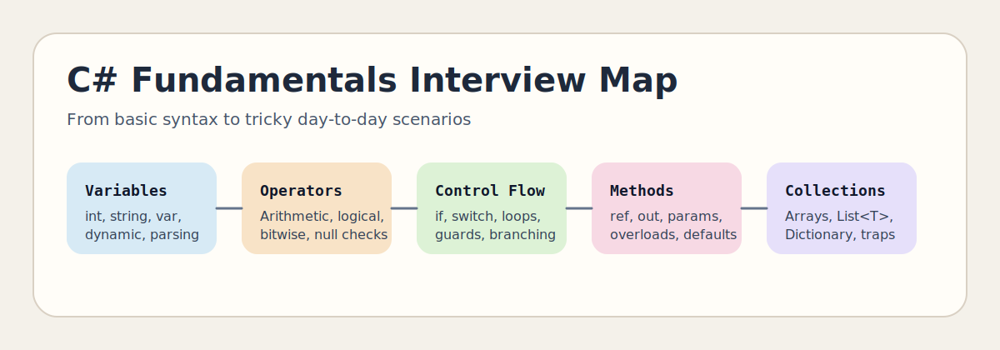

# C# Fundamentals Interview Questions



This guide covers practical C# fundamentals from beginner concepts to tricky interview edge cases that show up in production code. It follows the corrected format of **100 interview questions for each subtopic**, and every answer includes a C# code example with rotated real-world scenarios so the examples do not repeat verbatim.

## How To Use This Page

- Questions 1-100 cover Variables, data types, and type behavior.
- Questions 101-200 cover Operators and expression logic.
- Questions 201-300 cover Branching and decision flow.
- Questions 301-400 cover Loops and iteration patterns.
- Questions 401-500 cover Methods and parameter passing.
- Questions 501-600 cover Arrays, collections, and lookup patterns.
- Questions 601-700 cover Type design, visibility, members, and program structure basics.

## 1. Variables, data types, and type behavior

> This section contains **100 interview questions** focused on **Variables, data types, and type behavior**. Every answer includes a C# code example, and the scenarios rotate so they do not repeat verbatim.

### Q1.1 What is numeric type selection in C# fundamentals?

**Answer:** Numeric type selection means choosing int, long, double, or decimal based on range and precision. Teams should focus on it when discussing variables, data types, and type behavior in production code, they compare it with using one numeric type everywhere, and they should avoid the trap of storing currency in floating-point types. Example: while tuning a reporting batch, so interview answers sound more grounded. Another example: during a release hardening session, so the design choice is easier to defend.

**Code Example:**

```csharp
using System;
using System.Collections.Generic;

public static class Demo1_1
{
    public static void Run()
    {
        decimal total = 149.95m + 1m;
        long orderId = 9000000000L + 1;
        Console.WriteLine($"{total} | {orderId}");
    }
}
```

### Q1.2 How does var and compile-time type inference in C# fundamentals?

**Answer:** Var and compile-time type inference means letting the compiler infer a static type from the assigned expression. Teams should focus on it when discussing variables, data types, and type behavior in production code, they compare it with dynamic typing at runtime, and they should avoid the trap of claiming var removes type safety. Example: during a support escalation for null data, so the API contract becomes clearer. Another example: while stabilizing a background worker, so review comments become more actionable.

**Code Example:**

```csharp
using System;
using System.Collections.Generic;

public static class Demo1_2
{
    public static void Run()
    {
        var name = "Catalog-2";
        var retry = 3;
        Console.WriteLine($"{name} retries {retry}");
    }
}
```

### Q1.3 Why does nullable value and reference intent in C# fundamentals?

**Answer:** Nullable value and reference intent means modeling missing data explicitly with nullable value types and nullable reference annotations. Teams should focus on it when discussing variables, data types, and type behavior in production code, they compare it with null-blind coding, and they should avoid the trap of ignoring nullable warnings on external input. Example: while debugging a notification workflow, so the service stays easier to extend. Another example: during a bug bash for a finance dashboard, so support debugging gets faster.

**Code Example:**

```csharp
using System;
using System.Collections.Generic;

public static class Demo1_3
{
    public static void Run()
    {
        string? middle = "Lee";
        int? points = null;
        Console.WriteLine(middle ?? "<missing>");
        Console.WriteLine(points?.ToString() ?? "No points");
    }
}
```

### Q1.4 When should you use implicit versus explicit conversion in C# fundamentals?

**Answer:** Implicit versus explicit conversion means understanding that safe widening can happen automatically while narrowing needs an explicit cast or parse. Teams should focus on it when discussing variables, data types, and type behavior in production code, they compare it with assuming all conversions are harmless, and they should avoid the trap of casting user data without checking range or format. Example: during a migration from .NET Framework to .NET, so edge cases are handled earlier. Another example: while reviewing a customer onboarding API, so team conventions stay more consistent.

**Code Example:**

```csharp
using System;
using System.Collections.Generic;

public static class Demo1_4
{
    public static void Run()
    {
        int seats = 24;
        long snapshot = seats;
        double ratio = (double)seats / 6;
        Console.WriteLine($"{snapshot} | {ratio:F2}");
    }
}
```

### Q1.5 What problem does default values and initialization rules in C# fundamentals?

**Answer:** Default values and initialization rules means knowing that fields get defaults but local variables must be assigned before use. Teams should focus on it when discussing variables, data types, and type behavior in production code, they compare it with treating locals like fields, and they should avoid the trap of reading locals before assignment. Example: while onboarding a junior backend engineer, so future refactoring becomes less risky. Another example: during a production login incident, so the bug becomes easier to isolate.

**Code Example:**

```csharp
using System;
using System.Collections.Generic;

public static class Demo1_5
{
    public static void Run()
    {
        int processed;
        processed = 45;
        Console.WriteLine(processed);
    }
}
```

### Q1.6 How would you explain reference versus value semantics in C# fundamentals?

**Answer:** Reference versus value semantics means understanding that value types copy data while reference types copy references. Teams should focus on it when discussing variables, data types, and type behavior in production code, they compare it with assuming every assignment makes an independent deep copy, and they should avoid the trap of mutating shared references by accident. Example: during a payment reconciliation fix, so test coverage becomes easier to design. Another example: while building a payroll export utility, so interview answers sound more grounded.

**Code Example:**

```csharp
using System;
using System.Collections.Generic;

public static class Demo1_6
{
    public static void Run()
    {
        int original = 5;
        int copied = original;
        copied++;
        var tags = new List<string> { "new", "priority-1" };
        var shared = tags;
        shared.Add("review");
        Console.WriteLine($"{original}/{copied} | {string.Join(",", tags)}");
    }
}
```

### Q1.7 Why is numeric type selection in C# fundamentals?

**Answer:** Numeric type selection means choosing int, long, double, or decimal based on range and precision. Teams should focus on it when discussing variables, data types, and type behavior in production code, they compare it with using one numeric type everywhere, and they should avoid the trap of storing currency in floating-point types. Example: while tuning a reporting batch, so the implementation becomes easier to validate. Another example: during a release hardening session, so the API contract becomes clearer.

**Code Example:**

```csharp
using System;
using System.Collections.Generic;

public static class Demo1_7
{
    public static void Run()
    {
        decimal total = 149.95m + 0m;
        long orderId = 9000000000L + 7;
        Console.WriteLine($"{total} | {orderId}");
    }
}
```

### Q1.8 How can var and compile-time type inference in C# fundamentals?

**Answer:** Var and compile-time type inference means letting the compiler infer a static type from the assigned expression. Teams should focus on it when discussing variables, data types, and type behavior in production code, they compare it with dynamic typing at runtime, and they should avoid the trap of claiming var removes type safety. Example: during a support escalation for null data, so the production fix is safer to roll out. Another example: while stabilizing a background worker, so the service stays easier to extend.

**Code Example:**

```csharp
using System;
using System.Collections.Generic;

public static class Demo1_8
{
    public static void Run()
    {
        var name = "Catalog-8";
        var retry = 1;
        Console.WriteLine($"{name} retries {retry}");
    }
}
```

### Q1.9 What is nullable value and reference intent in C# fundamentals?

**Answer:** Nullable value and reference intent means modeling missing data explicitly with nullable value types and nullable reference annotations. Teams should focus on it when discussing variables, data types, and type behavior in production code, they compare it with null-blind coding, and they should avoid the trap of ignoring nullable warnings on external input. Example: while debugging a notification workflow, so data loss is less likely. Another example: during a bug bash for a finance dashboard, so edge cases are handled earlier.

**Code Example:**

```csharp
using System;
using System.Collections.Generic;

public static class Demo1_9
{
    public static void Run()
    {
        string? middle = "Lee";
        int? points = null;
        Console.WriteLine(middle ?? "<missing>");
        Console.WriteLine(points?.ToString() ?? "No points");
    }
}
```

### Q1.10 How does implicit versus explicit conversion in C# fundamentals?

**Answer:** Implicit versus explicit conversion means understanding that safe widening can happen automatically while narrowing needs an explicit cast or parse. Teams should focus on it when discussing variables, data types, and type behavior in production code, they compare it with assuming all conversions are harmless, and they should avoid the trap of casting user data without checking range or format. Example: during a migration from .NET Framework to .NET, so runtime surprises are reduced. Another example: while reviewing a customer onboarding API, so future refactoring becomes less risky.

**Code Example:**

```csharp
using System;
using System.Collections.Generic;

public static class Demo1_10
{
    public static void Run()
    {
        int seats = 21;
        long snapshot = seats;
        double ratio = (double)seats / 2;
        Console.WriteLine($"{snapshot} | {ratio:F2}");
    }
}
```

### Q1.11 Why does default values and initialization rules in C# fundamentals?

**Answer:** Default values and initialization rules means knowing that fields get defaults but local variables must be assigned before use. Teams should focus on it when discussing variables, data types, and type behavior in production code, they compare it with treating locals like fields, and they should avoid the trap of reading locals before assignment. Example: while onboarding a junior backend engineer, so the code reads more predictably. Another example: during a production login incident, so test coverage becomes easier to design.

**Code Example:**

```csharp
using System;
using System.Collections.Generic;

public static class Demo1_11
{
    public static void Run()
    {
        int processed;
        processed = 40;
        Console.WriteLine(processed);
    }
}
```

### Q1.12 When should you use reference versus value semantics in C# fundamentals?

**Answer:** Reference versus value semantics means understanding that value types copy data while reference types copy references. Teams should focus on it when discussing variables, data types, and type behavior in production code, they compare it with assuming every assignment makes an independent deep copy, and they should avoid the trap of mutating shared references by accident. Example: during a payment reconciliation fix, so the domain model stays easier to explain. Another example: while building a payroll export utility, so the implementation becomes easier to validate.

**Code Example:**

```csharp
using System;
using System.Collections.Generic;

public static class Demo1_12
{
    public static void Run()
    {
        int original = 5;
        int copied = original;
        copied++;
        var tags = new List<string> { "new", "priority-2" };
        var shared = tags;
        shared.Add("review");
        Console.WriteLine($"{original}/{copied} | {string.Join(",", tags)}");
    }
}
```

### Q1.13 What problem does numeric type selection in C# fundamentals?

**Answer:** Numeric type selection means choosing int, long, double, or decimal based on range and precision. Teams should focus on it when discussing variables, data types, and type behavior in production code, they compare it with using one numeric type everywhere, and they should avoid the trap of storing currency in floating-point types. Example: while tuning a reporting batch, so performance trade-offs become easier to discuss. Another example: during a release hardening session, so the production fix is safer to roll out.

**Code Example:**

```csharp
using System;
using System.Collections.Generic;

public static class Demo1_13
{
    public static void Run()
    {
        decimal total = 149.95m + 6m;
        long orderId = 9000000000L + 13;
        Console.WriteLine($"{total} | {orderId}");
    }
}
```

### Q1.14 How would you explain var and compile-time type inference in C# fundamentals?

**Answer:** Var and compile-time type inference means letting the compiler infer a static type from the assigned expression. Teams should focus on it when discussing variables, data types, and type behavior in production code, they compare it with dynamic typing at runtime, and they should avoid the trap of claiming var removes type safety. Example: during a support escalation for null data, so the design choice is easier to defend. Another example: while stabilizing a background worker, so data loss is less likely.

**Code Example:**

```csharp
using System;
using System.Collections.Generic;

public static class Demo1_14
{
    public static void Run()
    {
        var name = "Catalog-14";
        var retry = 3;
        Console.WriteLine($"{name} retries {retry}");
    }
}
```

### Q1.15 Why is nullable value and reference intent in C# fundamentals?

**Answer:** Nullable value and reference intent means modeling missing data explicitly with nullable value types and nullable reference annotations. Teams should focus on it when discussing variables, data types, and type behavior in production code, they compare it with null-blind coding, and they should avoid the trap of ignoring nullable warnings on external input. Example: while debugging a notification workflow, so review comments become more actionable. Another example: during a bug bash for a finance dashboard, so runtime surprises are reduced.

**Code Example:**

```csharp
using System;
using System.Collections.Generic;

public static class Demo1_15
{
    public static void Run()
    {
        string? middle = "Lee";
        int? points = null;
        Console.WriteLine(middle ?? "<missing>");
        Console.WriteLine(points?.ToString() ?? "No points");
    }
}
```

### Q1.16 How can implicit versus explicit conversion in C# fundamentals?

**Answer:** Implicit versus explicit conversion means understanding that safe widening can happen automatically while narrowing needs an explicit cast or parse. Teams should focus on it when discussing variables, data types, and type behavior in production code, they compare it with assuming all conversions are harmless, and they should avoid the trap of casting user data without checking range or format. Example: during a migration from .NET Framework to .NET, so support debugging gets faster. Another example: while reviewing a customer onboarding API, so the code reads more predictably.

**Code Example:**

```csharp
using System;
using System.Collections.Generic;

public static class Demo1_16
{
    public static void Run()
    {
        int seats = 27;
        long snapshot = seats;
        double ratio = (double)seats / 3;
        Console.WriteLine($"{snapshot} | {ratio:F2}");
    }
}
```

### Q1.17 What is default values and initialization rules in C# fundamentals?

**Answer:** Default values and initialization rules means knowing that fields get defaults but local variables must be assigned before use. Teams should focus on it when discussing variables, data types, and type behavior in production code, they compare it with treating locals like fields, and they should avoid the trap of reading locals before assignment. Example: while onboarding a junior backend engineer, so team conventions stay more consistent. Another example: during a production login incident, so the domain model stays easier to explain.

**Code Example:**

```csharp
using System;
using System.Collections.Generic;

public static class Demo1_17
{
    public static void Run()
    {
        int processed;
        processed = 46;
        Console.WriteLine(processed);
    }
}
```

### Q1.18 How does reference versus value semantics in C# fundamentals?

**Answer:** Reference versus value semantics means understanding that value types copy data while reference types copy references. Teams should focus on it when discussing variables, data types, and type behavior in production code, they compare it with assuming every assignment makes an independent deep copy, and they should avoid the trap of mutating shared references by accident. Example: during a payment reconciliation fix, so the bug becomes easier to isolate. Another example: while building a payroll export utility, so performance trade-offs become easier to discuss.

**Code Example:**

```csharp
using System;
using System.Collections.Generic;

public static class Demo1_18
{
    public static void Run()
    {
        int original = 5;
        int copied = original;
        copied++;
        var tags = new List<string> { "new", "priority-3" };
        var shared = tags;
        shared.Add("review");
        Console.WriteLine($"{original}/{copied} | {string.Join(",", tags)}");
    }
}
```

### Q1.19 Why does numeric type selection in C# fundamentals?

**Answer:** Numeric type selection means choosing int, long, double, or decimal based on range and precision. Teams should focus on it when discussing variables, data types, and type behavior in production code, they compare it with using one numeric type everywhere, and they should avoid the trap of storing currency in floating-point types. Example: while tuning a reporting batch, so interview answers sound more grounded. Another example: during a release hardening session, so the design choice is easier to defend.

**Code Example:**

```csharp
using System;
using System.Collections.Generic;

public static class Demo1_19
{
    public static void Run()
    {
        decimal total = 149.95m + 5m;
        long orderId = 9000000000L + 19;
        Console.WriteLine($"{total} | {orderId}");
    }
}
```

### Q1.20 When should you use var and compile-time type inference in C# fundamentals?

**Answer:** Var and compile-time type inference means letting the compiler infer a static type from the assigned expression. Teams should focus on it when discussing variables, data types, and type behavior in production code, they compare it with dynamic typing at runtime, and they should avoid the trap of claiming var removes type safety. Example: during a support escalation for null data, so the API contract becomes clearer. Another example: while stabilizing a background worker, so review comments become more actionable.

**Code Example:**

```csharp
using System;
using System.Collections.Generic;

public static class Demo1_20
{
    public static void Run()
    {
        var name = "Catalog-20";
        var retry = 1;
        Console.WriteLine($"{name} retries {retry}");
    }
}
```

### Q1.21 What problem does nullable value and reference intent in C# fundamentals?

**Answer:** Nullable value and reference intent means modeling missing data explicitly with nullable value types and nullable reference annotations. Teams should focus on it when discussing variables, data types, and type behavior in production code, they compare it with null-blind coding, and they should avoid the trap of ignoring nullable warnings on external input. Example: while debugging a notification workflow, so the service stays easier to extend. Another example: during a bug bash for a finance dashboard, so support debugging gets faster.

**Code Example:**

```csharp
using System;
using System.Collections.Generic;

public static class Demo1_21
{
    public static void Run()
    {
        string? middle = "Lee";
        int? points = null;
        Console.WriteLine(middle ?? "<missing>");
        Console.WriteLine(points?.ToString() ?? "No points");
    }
}
```

### Q1.22 How would you explain implicit versus explicit conversion in C# fundamentals?

**Answer:** Implicit versus explicit conversion means understanding that safe widening can happen automatically while narrowing needs an explicit cast or parse. Teams should focus on it when discussing variables, data types, and type behavior in production code, they compare it with assuming all conversions are harmless, and they should avoid the trap of casting user data without checking range or format. Example: during a migration from .NET Framework to .NET, so edge cases are handled earlier. Another example: while reviewing a customer onboarding API, so team conventions stay more consistent.

**Code Example:**

```csharp
using System;
using System.Collections.Generic;

public static class Demo1_22
{
    public static void Run()
    {
        int seats = 24;
        long snapshot = seats;
        double ratio = (double)seats / 4;
        Console.WriteLine($"{snapshot} | {ratio:F2}");
    }
}
```

### Q1.23 Why is default values and initialization rules in C# fundamentals?

**Answer:** Default values and initialization rules means knowing that fields get defaults but local variables must be assigned before use. Teams should focus on it when discussing variables, data types, and type behavior in production code, they compare it with treating locals like fields, and they should avoid the trap of reading locals before assignment. Example: while onboarding a junior backend engineer, so future refactoring becomes less risky. Another example: during a production login incident, so the bug becomes easier to isolate.

**Code Example:**

```csharp
using System;
using System.Collections.Generic;

public static class Demo1_23
{
    public static void Run()
    {
        int processed;
        processed = 41;
        Console.WriteLine(processed);
    }
}
```

### Q1.24 How can reference versus value semantics in C# fundamentals?

**Answer:** Reference versus value semantics means understanding that value types copy data while reference types copy references. Teams should focus on it when discussing variables, data types, and type behavior in production code, they compare it with assuming every assignment makes an independent deep copy, and they should avoid the trap of mutating shared references by accident. Example: during a payment reconciliation fix, so test coverage becomes easier to design. Another example: while building a payroll export utility, so interview answers sound more grounded.

**Code Example:**

```csharp
using System;
using System.Collections.Generic;

public static class Demo1_24
{
    public static void Run()
    {
        int original = 5;
        int copied = original;
        copied++;
        var tags = new List<string> { "new", "priority-4" };
        var shared = tags;
        shared.Add("review");
        Console.WriteLine($"{original}/{copied} | {string.Join(",", tags)}");
    }
}
```

### Q1.25 What is numeric type selection in C# fundamentals?

**Answer:** Numeric type selection means choosing int, long, double, or decimal based on range and precision. Teams should focus on it when discussing variables, data types, and type behavior in production code, they compare it with using one numeric type everywhere, and they should avoid the trap of storing currency in floating-point types. Example: while tuning a reporting batch, so the implementation becomes easier to validate. Another example: during a release hardening session, so the API contract becomes clearer.

**Code Example:**

```csharp
using System;
using System.Collections.Generic;

public static class Demo1_25
{
    public static void Run()
    {
        decimal total = 149.95m + 4m;
        long orderId = 9000000000L + 25;
        Console.WriteLine($"{total} | {orderId}");
    }
}
```

### Q1.26 How does var and compile-time type inference in C# fundamentals?

**Answer:** Var and compile-time type inference means letting the compiler infer a static type from the assigned expression. Teams should focus on it when discussing variables, data types, and type behavior in production code, they compare it with dynamic typing at runtime, and they should avoid the trap of claiming var removes type safety. Example: during a support escalation for null data, so the production fix is safer to roll out. Another example: while stabilizing a background worker, so the service stays easier to extend.

**Code Example:**

```csharp
using System;
using System.Collections.Generic;

public static class Demo1_26
{
    public static void Run()
    {
        var name = "Catalog-26";
        var retry = 3;
        Console.WriteLine($"{name} retries {retry}");
    }
}
```

### Q1.27 Why does nullable value and reference intent in C# fundamentals?

**Answer:** Nullable value and reference intent means modeling missing data explicitly with nullable value types and nullable reference annotations. Teams should focus on it when discussing variables, data types, and type behavior in production code, they compare it with null-blind coding, and they should avoid the trap of ignoring nullable warnings on external input. Example: while debugging a notification workflow, so data loss is less likely. Another example: during a bug bash for a finance dashboard, so edge cases are handled earlier.

**Code Example:**

```csharp
using System;
using System.Collections.Generic;

public static class Demo1_27
{
    public static void Run()
    {
        string? middle = "Lee";
        int? points = null;
        Console.WriteLine(middle ?? "<missing>");
        Console.WriteLine(points?.ToString() ?? "No points");
    }
}
```

### Q1.28 When should you use implicit versus explicit conversion in C# fundamentals?

**Answer:** Implicit versus explicit conversion means understanding that safe widening can happen automatically while narrowing needs an explicit cast or parse. Teams should focus on it when discussing variables, data types, and type behavior in production code, they compare it with assuming all conversions are harmless, and they should avoid the trap of casting user data without checking range or format. Example: during a migration from .NET Framework to .NET, so runtime surprises are reduced. Another example: while reviewing a customer onboarding API, so future refactoring becomes less risky.

**Code Example:**

```csharp
using System;
using System.Collections.Generic;

public static class Demo1_28
{
    public static void Run()
    {
        int seats = 21;
        long snapshot = seats;
        double ratio = (double)seats / 5;
        Console.WriteLine($"{snapshot} | {ratio:F2}");
    }
}
```

### Q1.29 What problem does default values and initialization rules in C# fundamentals?

**Answer:** Default values and initialization rules means knowing that fields get defaults but local variables must be assigned before use. Teams should focus on it when discussing variables, data types, and type behavior in production code, they compare it with treating locals like fields, and they should avoid the trap of reading locals before assignment. Example: while onboarding a junior backend engineer, so the code reads more predictably. Another example: during a production login incident, so test coverage becomes easier to design.

**Code Example:**

```csharp
using System;
using System.Collections.Generic;

public static class Demo1_29
{
    public static void Run()
    {
        int processed;
        processed = 47;
        Console.WriteLine(processed);
    }
}
```

### Q1.30 How would you explain reference versus value semantics in C# fundamentals?

**Answer:** Reference versus value semantics means understanding that value types copy data while reference types copy references. Teams should focus on it when discussing variables, data types, and type behavior in production code, they compare it with assuming every assignment makes an independent deep copy, and they should avoid the trap of mutating shared references by accident. Example: during a payment reconciliation fix, so the domain model stays easier to explain. Another example: while building a payroll export utility, so the implementation becomes easier to validate.

**Code Example:**

```csharp
using System;
using System.Collections.Generic;

public static class Demo1_30
{
    public static void Run()
    {
        int original = 5;
        int copied = original;
        copied++;
        var tags = new List<string> { "new", "priority-0" };
        var shared = tags;
        shared.Add("review");
        Console.WriteLine($"{original}/{copied} | {string.Join(",", tags)}");
    }
}
```

### Q1.31 Why is numeric type selection in C# fundamentals?

**Answer:** Numeric type selection means choosing int, long, double, or decimal based on range and precision. Teams should focus on it when discussing variables, data types, and type behavior in production code, they compare it with using one numeric type everywhere, and they should avoid the trap of storing currency in floating-point types. Example: while tuning a reporting batch, so performance trade-offs become easier to discuss. Another example: during a release hardening session, so the production fix is safer to roll out.

**Code Example:**

```csharp
using System;
using System.Collections.Generic;

public static class Demo1_31
{
    public static void Run()
    {
        decimal total = 149.95m + 3m;
        long orderId = 9000000000L + 31;
        Console.WriteLine($"{total} | {orderId}");
    }
}
```

### Q1.32 How can var and compile-time type inference in C# fundamentals?

**Answer:** Var and compile-time type inference means letting the compiler infer a static type from the assigned expression. Teams should focus on it when discussing variables, data types, and type behavior in production code, they compare it with dynamic typing at runtime, and they should avoid the trap of claiming var removes type safety. Example: during a support escalation for null data, so the design choice is easier to defend. Another example: while stabilizing a background worker, so data loss is less likely.

**Code Example:**

```csharp
using System;
using System.Collections.Generic;

public static class Demo1_32
{
    public static void Run()
    {
        var name = "Catalog-32";
        var retry = 1;
        Console.WriteLine($"{name} retries {retry}");
    }
}
```

### Q1.33 What is nullable value and reference intent in C# fundamentals?

**Answer:** Nullable value and reference intent means modeling missing data explicitly with nullable value types and nullable reference annotations. Teams should focus on it when discussing variables, data types, and type behavior in production code, they compare it with null-blind coding, and they should avoid the trap of ignoring nullable warnings on external input. Example: while debugging a notification workflow, so review comments become more actionable. Another example: during a bug bash for a finance dashboard, so runtime surprises are reduced.

**Code Example:**

```csharp
using System;
using System.Collections.Generic;

public static class Demo1_33
{
    public static void Run()
    {
        string? middle = "Lee";
        int? points = null;
        Console.WriteLine(middle ?? "<missing>");
        Console.WriteLine(points?.ToString() ?? "No points");
    }
}
```

### Q1.34 How does implicit versus explicit conversion in C# fundamentals?

**Answer:** Implicit versus explicit conversion means understanding that safe widening can happen automatically while narrowing needs an explicit cast or parse. Teams should focus on it when discussing variables, data types, and type behavior in production code, they compare it with assuming all conversions are harmless, and they should avoid the trap of casting user data without checking range or format. Example: during a migration from .NET Framework to .NET, so support debugging gets faster. Another example: while reviewing a customer onboarding API, so the code reads more predictably.

**Code Example:**

```csharp
using System;
using System.Collections.Generic;

public static class Demo1_34
{
    public static void Run()
    {
        int seats = 27;
        long snapshot = seats;
        double ratio = (double)seats / 6;
        Console.WriteLine($"{snapshot} | {ratio:F2}");
    }
}
```

### Q1.35 Why does default values and initialization rules in C# fundamentals?

**Answer:** Default values and initialization rules means knowing that fields get defaults but local variables must be assigned before use. Teams should focus on it when discussing variables, data types, and type behavior in production code, they compare it with treating locals like fields, and they should avoid the trap of reading locals before assignment. Example: while onboarding a junior backend engineer, so team conventions stay more consistent. Another example: during a production login incident, so the domain model stays easier to explain.

**Code Example:**

```csharp
using System;
using System.Collections.Generic;

public static class Demo1_35
{
    public static void Run()
    {
        int processed;
        processed = 42;
        Console.WriteLine(processed);
    }
}
```

### Q1.36 When should you use reference versus value semantics in C# fundamentals?

**Answer:** Reference versus value semantics means understanding that value types copy data while reference types copy references. Teams should focus on it when discussing variables, data types, and type behavior in production code, they compare it with assuming every assignment makes an independent deep copy, and they should avoid the trap of mutating shared references by accident. Example: during a payment reconciliation fix, so the bug becomes easier to isolate. Another example: while building a payroll export utility, so performance trade-offs become easier to discuss.

**Code Example:**

```csharp
using System;
using System.Collections.Generic;

public static class Demo1_36
{
    public static void Run()
    {
        int original = 5;
        int copied = original;
        copied++;
        var tags = new List<string> { "new", "priority-1" };
        var shared = tags;
        shared.Add("review");
        Console.WriteLine($"{original}/{copied} | {string.Join(",", tags)}");
    }
}
```

### Q1.37 What problem does numeric type selection in C# fundamentals?

**Answer:** Numeric type selection means choosing int, long, double, or decimal based on range and precision. Teams should focus on it when discussing variables, data types, and type behavior in production code, they compare it with using one numeric type everywhere, and they should avoid the trap of storing currency in floating-point types. Example: while tuning a reporting batch, so interview answers sound more grounded. Another example: during a release hardening session, so the design choice is easier to defend.

**Code Example:**

```csharp
using System;
using System.Collections.Generic;

public static class Demo1_37
{
    public static void Run()
    {
        decimal total = 149.95m + 2m;
        long orderId = 9000000000L + 37;
        Console.WriteLine($"{total} | {orderId}");
    }
}
```

### Q1.38 How would you explain var and compile-time type inference in C# fundamentals?

**Answer:** Var and compile-time type inference means letting the compiler infer a static type from the assigned expression. Teams should focus on it when discussing variables, data types, and type behavior in production code, they compare it with dynamic typing at runtime, and they should avoid the trap of claiming var removes type safety. Example: during a support escalation for null data, so the API contract becomes clearer. Another example: while stabilizing a background worker, so review comments become more actionable.

**Code Example:**

```csharp
using System;
using System.Collections.Generic;

public static class Demo1_38
{
    public static void Run()
    {
        var name = "Catalog-38";
        var retry = 3;
        Console.WriteLine($"{name} retries {retry}");
    }
}
```

### Q1.39 Why is nullable value and reference intent in C# fundamentals?

**Answer:** Nullable value and reference intent means modeling missing data explicitly with nullable value types and nullable reference annotations. Teams should focus on it when discussing variables, data types, and type behavior in production code, they compare it with null-blind coding, and they should avoid the trap of ignoring nullable warnings on external input. Example: while debugging a notification workflow, so the service stays easier to extend. Another example: during a bug bash for a finance dashboard, so support debugging gets faster.

**Code Example:**

```csharp
using System;
using System.Collections.Generic;

public static class Demo1_39
{
    public static void Run()
    {
        string? middle = "Lee";
        int? points = null;
        Console.WriteLine(middle ?? "<missing>");
        Console.WriteLine(points?.ToString() ?? "No points");
    }
}
```

### Q1.40 How can implicit versus explicit conversion in C# fundamentals?

**Answer:** Implicit versus explicit conversion means understanding that safe widening can happen automatically while narrowing needs an explicit cast or parse. Teams should focus on it when discussing variables, data types, and type behavior in production code, they compare it with assuming all conversions are harmless, and they should avoid the trap of casting user data without checking range or format. Example: during a migration from .NET Framework to .NET, so edge cases are handled earlier. Another example: while reviewing a customer onboarding API, so team conventions stay more consistent.

**Code Example:**

```csharp
using System;
using System.Collections.Generic;

public static class Demo1_40
{
    public static void Run()
    {
        int seats = 24;
        long snapshot = seats;
        double ratio = (double)seats / 2;
        Console.WriteLine($"{snapshot} | {ratio:F2}");
    }
}
```

### Q1.41 What is default values and initialization rules in C# fundamentals?

**Answer:** Default values and initialization rules means knowing that fields get defaults but local variables must be assigned before use. Teams should focus on it when discussing variables, data types, and type behavior in production code, they compare it with treating locals like fields, and they should avoid the trap of reading locals before assignment. Example: while onboarding a junior backend engineer, so future refactoring becomes less risky. Another example: during a production login incident, so the bug becomes easier to isolate.

**Code Example:**

```csharp
using System;
using System.Collections.Generic;

public static class Demo1_41
{
    public static void Run()
    {
        int processed;
        processed = 48;
        Console.WriteLine(processed);
    }
}
```

### Q1.42 How does reference versus value semantics in C# fundamentals?

**Answer:** Reference versus value semantics means understanding that value types copy data while reference types copy references. Teams should focus on it when discussing variables, data types, and type behavior in production code, they compare it with assuming every assignment makes an independent deep copy, and they should avoid the trap of mutating shared references by accident. Example: during a payment reconciliation fix, so test coverage becomes easier to design. Another example: while building a payroll export utility, so interview answers sound more grounded.

**Code Example:**

```csharp
using System;
using System.Collections.Generic;

public static class Demo1_42
{
    public static void Run()
    {
        int original = 5;
        int copied = original;
        copied++;
        var tags = new List<string> { "new", "priority-2" };
        var shared = tags;
        shared.Add("review");
        Console.WriteLine($"{original}/{copied} | {string.Join(",", tags)}");
    }
}
```

### Q1.43 Why does numeric type selection in C# fundamentals?

**Answer:** Numeric type selection means choosing int, long, double, or decimal based on range and precision. Teams should focus on it when discussing variables, data types, and type behavior in production code, they compare it with using one numeric type everywhere, and they should avoid the trap of storing currency in floating-point types. Example: while tuning a reporting batch, so the implementation becomes easier to validate. Another example: during a release hardening session, so the API contract becomes clearer.

**Code Example:**

```csharp
using System;
using System.Collections.Generic;

public static class Demo1_43
{
    public static void Run()
    {
        decimal total = 149.95m + 1m;
        long orderId = 9000000000L + 43;
        Console.WriteLine($"{total} | {orderId}");
    }
}
```

### Q1.44 When should you use var and compile-time type inference in C# fundamentals?

**Answer:** Var and compile-time type inference means letting the compiler infer a static type from the assigned expression. Teams should focus on it when discussing variables, data types, and type behavior in production code, they compare it with dynamic typing at runtime, and they should avoid the trap of claiming var removes type safety. Example: during a support escalation for null data, so the production fix is safer to roll out. Another example: while stabilizing a background worker, so the service stays easier to extend.

**Code Example:**

```csharp
using System;
using System.Collections.Generic;

public static class Demo1_44
{
    public static void Run()
    {
        var name = "Catalog-44";
        var retry = 1;
        Console.WriteLine($"{name} retries {retry}");
    }
}
```

### Q1.45 What problem does nullable value and reference intent in C# fundamentals?

**Answer:** Nullable value and reference intent means modeling missing data explicitly with nullable value types and nullable reference annotations. Teams should focus on it when discussing variables, data types, and type behavior in production code, they compare it with null-blind coding, and they should avoid the trap of ignoring nullable warnings on external input. Example: while debugging a notification workflow, so data loss is less likely. Another example: during a bug bash for a finance dashboard, so edge cases are handled earlier.

**Code Example:**

```csharp
using System;
using System.Collections.Generic;

public static class Demo1_45
{
    public static void Run()
    {
        string? middle = "Lee";
        int? points = null;
        Console.WriteLine(middle ?? "<missing>");
        Console.WriteLine(points?.ToString() ?? "No points");
    }
}
```

### Q1.46 How would you explain implicit versus explicit conversion in C# fundamentals?

**Answer:** Implicit versus explicit conversion means understanding that safe widening can happen automatically while narrowing needs an explicit cast or parse. Teams should focus on it when discussing variables, data types, and type behavior in production code, they compare it with assuming all conversions are harmless, and they should avoid the trap of casting user data without checking range or format. Example: during a migration from .NET Framework to .NET, so runtime surprises are reduced. Another example: while reviewing a customer onboarding API, so future refactoring becomes less risky.

**Code Example:**

```csharp
using System;
using System.Collections.Generic;

public static class Demo1_46
{
    public static void Run()
    {
        int seats = 21;
        long snapshot = seats;
        double ratio = (double)seats / 3;
        Console.WriteLine($"{snapshot} | {ratio:F2}");
    }
}
```

### Q1.47 Why is default values and initialization rules in C# fundamentals?

**Answer:** Default values and initialization rules means knowing that fields get defaults but local variables must be assigned before use. Teams should focus on it when discussing variables, data types, and type behavior in production code, they compare it with treating locals like fields, and they should avoid the trap of reading locals before assignment. Example: while onboarding a junior backend engineer, so the code reads more predictably. Another example: during a production login incident, so test coverage becomes easier to design.

**Code Example:**

```csharp
using System;
using System.Collections.Generic;

public static class Demo1_47
{
    public static void Run()
    {
        int processed;
        processed = 43;
        Console.WriteLine(processed);
    }
}
```

### Q1.48 How can reference versus value semantics in C# fundamentals?

**Answer:** Reference versus value semantics means understanding that value types copy data while reference types copy references. Teams should focus on it when discussing variables, data types, and type behavior in production code, they compare it with assuming every assignment makes an independent deep copy, and they should avoid the trap of mutating shared references by accident. Example: during a payment reconciliation fix, so the domain model stays easier to explain. Another example: while building a payroll export utility, so the implementation becomes easier to validate.

**Code Example:**

```csharp
using System;
using System.Collections.Generic;

public static class Demo1_48
{
    public static void Run()
    {
        int original = 5;
        int copied = original;
        copied++;
        var tags = new List<string> { "new", "priority-3" };
        var shared = tags;
        shared.Add("review");
        Console.WriteLine($"{original}/{copied} | {string.Join(",", tags)}");
    }
}
```

### Q1.49 What is numeric type selection in C# fundamentals?

**Answer:** Numeric type selection means choosing int, long, double, or decimal based on range and precision. Teams should focus on it when discussing variables, data types, and type behavior in production code, they compare it with using one numeric type everywhere, and they should avoid the trap of storing currency in floating-point types. Example: while tuning a reporting batch, so performance trade-offs become easier to discuss. Another example: during a release hardening session, so the production fix is safer to roll out.

**Code Example:**

```csharp
using System;
using System.Collections.Generic;

public static class Demo1_49
{
    public static void Run()
    {
        decimal total = 149.95m + 0m;
        long orderId = 9000000000L + 49;
        Console.WriteLine($"{total} | {orderId}");
    }
}
```

### Q1.50 How does var and compile-time type inference in C# fundamentals?

**Answer:** Var and compile-time type inference means letting the compiler infer a static type from the assigned expression. Teams should focus on it when discussing variables, data types, and type behavior in production code, they compare it with dynamic typing at runtime, and they should avoid the trap of claiming var removes type safety. Example: during a support escalation for null data, so the design choice is easier to defend. Another example: while stabilizing a background worker, so data loss is less likely.

**Code Example:**

```csharp
using System;
using System.Collections.Generic;

public static class Demo1_50
{
    public static void Run()
    {
        var name = "Catalog-50";
        var retry = 3;
        Console.WriteLine($"{name} retries {retry}");
    }
}
```

### Q1.51 Why does nullable value and reference intent in C# fundamentals?

**Answer:** Nullable value and reference intent means modeling missing data explicitly with nullable value types and nullable reference annotations. Teams should focus on it when discussing variables, data types, and type behavior in production code, they compare it with null-blind coding, and they should avoid the trap of ignoring nullable warnings on external input. Example: while debugging a notification workflow, so review comments become more actionable. Another example: during a bug bash for a finance dashboard, so runtime surprises are reduced.

**Code Example:**

```csharp
using System;
using System.Collections.Generic;

public static class Demo1_51
{
    public static void Run()
    {
        string? middle = "Lee";
        int? points = null;
        Console.WriteLine(middle ?? "<missing>");
        Console.WriteLine(points?.ToString() ?? "No points");
    }
}
```

### Q1.52 When should you use implicit versus explicit conversion in C# fundamentals?

**Answer:** Implicit versus explicit conversion means understanding that safe widening can happen automatically while narrowing needs an explicit cast or parse. Teams should focus on it when discussing variables, data types, and type behavior in production code, they compare it with assuming all conversions are harmless, and they should avoid the trap of casting user data without checking range or format. Example: during a migration from .NET Framework to .NET, so support debugging gets faster. Another example: while reviewing a customer onboarding API, so the code reads more predictably.

**Code Example:**

```csharp
using System;
using System.Collections.Generic;

public static class Demo1_52
{
    public static void Run()
    {
        int seats = 27;
        long snapshot = seats;
        double ratio = (double)seats / 4;
        Console.WriteLine($"{snapshot} | {ratio:F2}");
    }
}
```

### Q1.53 What problem does default values and initialization rules in C# fundamentals?

**Answer:** Default values and initialization rules means knowing that fields get defaults but local variables must be assigned before use. Teams should focus on it when discussing variables, data types, and type behavior in production code, they compare it with treating locals like fields, and they should avoid the trap of reading locals before assignment. Example: while onboarding a junior backend engineer, so team conventions stay more consistent. Another example: during a production login incident, so the domain model stays easier to explain.

**Code Example:**

```csharp
using System;
using System.Collections.Generic;

public static class Demo1_53
{
    public static void Run()
    {
        int processed;
        processed = 49;
        Console.WriteLine(processed);
    }
}
```

### Q1.54 How would you explain reference versus value semantics in C# fundamentals?

**Answer:** Reference versus value semantics means understanding that value types copy data while reference types copy references. Teams should focus on it when discussing variables, data types, and type behavior in production code, they compare it with assuming every assignment makes an independent deep copy, and they should avoid the trap of mutating shared references by accident. Example: during a payment reconciliation fix, so the bug becomes easier to isolate. Another example: while building a payroll export utility, so performance trade-offs become easier to discuss.

**Code Example:**

```csharp
using System;
using System.Collections.Generic;

public static class Demo1_54
{
    public static void Run()
    {
        int original = 5;
        int copied = original;
        copied++;
        var tags = new List<string> { "new", "priority-4" };
        var shared = tags;
        shared.Add("review");
        Console.WriteLine($"{original}/{copied} | {string.Join(",", tags)}");
    }
}
```

### Q1.55 Why is numeric type selection in C# fundamentals?

**Answer:** Numeric type selection means choosing int, long, double, or decimal based on range and precision. Teams should focus on it when discussing variables, data types, and type behavior in production code, they compare it with using one numeric type everywhere, and they should avoid the trap of storing currency in floating-point types. Example: while tuning a reporting batch, so interview answers sound more grounded. Another example: during a release hardening session, so the design choice is easier to defend.

**Code Example:**

```csharp
using System;
using System.Collections.Generic;

public static class Demo1_55
{
    public static void Run()
    {
        decimal total = 149.95m + 6m;
        long orderId = 9000000000L + 55;
        Console.WriteLine($"{total} | {orderId}");
    }
}
```

### Q1.56 How can var and compile-time type inference in C# fundamentals?

**Answer:** Var and compile-time type inference means letting the compiler infer a static type from the assigned expression. Teams should focus on it when discussing variables, data types, and type behavior in production code, they compare it with dynamic typing at runtime, and they should avoid the trap of claiming var removes type safety. Example: during a support escalation for null data, so the API contract becomes clearer. Another example: while stabilizing a background worker, so review comments become more actionable.

**Code Example:**

```csharp
using System;
using System.Collections.Generic;

public static class Demo1_56
{
    public static void Run()
    {
        var name = "Catalog-56";
        var retry = 1;
        Console.WriteLine($"{name} retries {retry}");
    }
}
```

### Q1.57 What is nullable value and reference intent in C# fundamentals?

**Answer:** Nullable value and reference intent means modeling missing data explicitly with nullable value types and nullable reference annotations. Teams should focus on it when discussing variables, data types, and type behavior in production code, they compare it with null-blind coding, and they should avoid the trap of ignoring nullable warnings on external input. Example: while debugging a notification workflow, so the service stays easier to extend. Another example: during a bug bash for a finance dashboard, so support debugging gets faster.

**Code Example:**

```csharp
using System;
using System.Collections.Generic;

public static class Demo1_57
{
    public static void Run()
    {
        string? middle = "Lee";
        int? points = null;
        Console.WriteLine(middle ?? "<missing>");
        Console.WriteLine(points?.ToString() ?? "No points");
    }
}
```

### Q1.58 How does implicit versus explicit conversion in C# fundamentals?

**Answer:** Implicit versus explicit conversion means understanding that safe widening can happen automatically while narrowing needs an explicit cast or parse. Teams should focus on it when discussing variables, data types, and type behavior in production code, they compare it with assuming all conversions are harmless, and they should avoid the trap of casting user data without checking range or format. Example: during a migration from .NET Framework to .NET, so edge cases are handled earlier. Another example: while reviewing a customer onboarding API, so team conventions stay more consistent.

**Code Example:**

```csharp
using System;
using System.Collections.Generic;

public static class Demo1_58
{
    public static void Run()
    {
        int seats = 24;
        long snapshot = seats;
        double ratio = (double)seats / 5;
        Console.WriteLine($"{snapshot} | {ratio:F2}");
    }
}
```

### Q1.59 Why does default values and initialization rules in C# fundamentals?

**Answer:** Default values and initialization rules means knowing that fields get defaults but local variables must be assigned before use. Teams should focus on it when discussing variables, data types, and type behavior in production code, they compare it with treating locals like fields, and they should avoid the trap of reading locals before assignment. Example: while onboarding a junior backend engineer, so future refactoring becomes less risky. Another example: during a production login incident, so the bug becomes easier to isolate.

**Code Example:**

```csharp
using System;
using System.Collections.Generic;

public static class Demo1_59
{
    public static void Run()
    {
        int processed;
        processed = 44;
        Console.WriteLine(processed);
    }
}
```

### Q1.60 When should you use reference versus value semantics in C# fundamentals?

**Answer:** Reference versus value semantics means understanding that value types copy data while reference types copy references. Teams should focus on it when discussing variables, data types, and type behavior in production code, they compare it with assuming every assignment makes an independent deep copy, and they should avoid the trap of mutating shared references by accident. Example: during a payment reconciliation fix, so test coverage becomes easier to design. Another example: while building a payroll export utility, so interview answers sound more grounded.

**Code Example:**

```csharp
using System;
using System.Collections.Generic;

public static class Demo1_60
{
    public static void Run()
    {
        int original = 5;
        int copied = original;
        copied++;
        var tags = new List<string> { "new", "priority-0" };
        var shared = tags;
        shared.Add("review");
        Console.WriteLine($"{original}/{copied} | {string.Join(",", tags)}");
    }
}
```

### Q1.61 What problem does numeric type selection in C# fundamentals?

**Answer:** Numeric type selection means choosing int, long, double, or decimal based on range and precision. Teams should focus on it when discussing variables, data types, and type behavior in production code, they compare it with using one numeric type everywhere, and they should avoid the trap of storing currency in floating-point types. Example: while tuning a reporting batch, so the implementation becomes easier to validate. Another example: during a release hardening session, so the API contract becomes clearer.

**Code Example:**

```csharp
using System;
using System.Collections.Generic;

public static class Demo1_61
{
    public static void Run()
    {
        decimal total = 149.95m + 5m;
        long orderId = 9000000000L + 61;
        Console.WriteLine($"{total} | {orderId}");
    }
}
```

### Q1.62 How would you explain var and compile-time type inference in C# fundamentals?

**Answer:** Var and compile-time type inference means letting the compiler infer a static type from the assigned expression. Teams should focus on it when discussing variables, data types, and type behavior in production code, they compare it with dynamic typing at runtime, and they should avoid the trap of claiming var removes type safety. Example: during a support escalation for null data, so the production fix is safer to roll out. Another example: while stabilizing a background worker, so the service stays easier to extend.

**Code Example:**

```csharp
using System;
using System.Collections.Generic;

public static class Demo1_62
{
    public static void Run()
    {
        var name = "Catalog-62";
        var retry = 3;
        Console.WriteLine($"{name} retries {retry}");
    }
}
```

### Q1.63 Why is nullable value and reference intent in C# fundamentals?

**Answer:** Nullable value and reference intent means modeling missing data explicitly with nullable value types and nullable reference annotations. Teams should focus on it when discussing variables, data types, and type behavior in production code, they compare it with null-blind coding, and they should avoid the trap of ignoring nullable warnings on external input. Example: while debugging a notification workflow, so data loss is less likely. Another example: during a bug bash for a finance dashboard, so edge cases are handled earlier.

**Code Example:**

```csharp
using System;
using System.Collections.Generic;

public static class Demo1_63
{
    public static void Run()
    {
        string? middle = "Lee";
        int? points = null;
        Console.WriteLine(middle ?? "<missing>");
        Console.WriteLine(points?.ToString() ?? "No points");
    }
}
```

### Q1.64 How can implicit versus explicit conversion in C# fundamentals?

**Answer:** Implicit versus explicit conversion means understanding that safe widening can happen automatically while narrowing needs an explicit cast or parse. Teams should focus on it when discussing variables, data types, and type behavior in production code, they compare it with assuming all conversions are harmless, and they should avoid the trap of casting user data without checking range or format. Example: during a migration from .NET Framework to .NET, so runtime surprises are reduced. Another example: while reviewing a customer onboarding API, so future refactoring becomes less risky.

**Code Example:**

```csharp
using System;
using System.Collections.Generic;

public static class Demo1_64
{
    public static void Run()
    {
        int seats = 21;
        long snapshot = seats;
        double ratio = (double)seats / 6;
        Console.WriteLine($"{snapshot} | {ratio:F2}");
    }
}
```

### Q1.65 What is default values and initialization rules in C# fundamentals?

**Answer:** Default values and initialization rules means knowing that fields get defaults but local variables must be assigned before use. Teams should focus on it when discussing variables, data types, and type behavior in production code, they compare it with treating locals like fields, and they should avoid the trap of reading locals before assignment. Example: while onboarding a junior backend engineer, so the code reads more predictably. Another example: during a production login incident, so test coverage becomes easier to design.

**Code Example:**

```csharp
using System;
using System.Collections.Generic;

public static class Demo1_65
{
    public static void Run()
    {
        int processed;
        processed = 50;
        Console.WriteLine(processed);
    }
}
```

### Q1.66 How does reference versus value semantics in C# fundamentals?

**Answer:** Reference versus value semantics means understanding that value types copy data while reference types copy references. Teams should focus on it when discussing variables, data types, and type behavior in production code, they compare it with assuming every assignment makes an independent deep copy, and they should avoid the trap of mutating shared references by accident. Example: during a payment reconciliation fix, so the domain model stays easier to explain. Another example: while building a payroll export utility, so the implementation becomes easier to validate.

**Code Example:**

```csharp
using System;
using System.Collections.Generic;

public static class Demo1_66
{
    public static void Run()
    {
        int original = 5;
        int copied = original;
        copied++;
        var tags = new List<string> { "new", "priority-1" };
        var shared = tags;
        shared.Add("review");
        Console.WriteLine($"{original}/{copied} | {string.Join(",", tags)}");
    }
}
```

### Q1.67 Why does numeric type selection in C# fundamentals?

**Answer:** Numeric type selection means choosing int, long, double, or decimal based on range and precision. Teams should focus on it when discussing variables, data types, and type behavior in production code, they compare it with using one numeric type everywhere, and they should avoid the trap of storing currency in floating-point types. Example: while tuning a reporting batch, so performance trade-offs become easier to discuss. Another example: during a release hardening session, so the production fix is safer to roll out.

**Code Example:**

```csharp
using System;
using System.Collections.Generic;

public static class Demo1_67
{
    public static void Run()
    {
        decimal total = 149.95m + 4m;
        long orderId = 9000000000L + 67;
        Console.WriteLine($"{total} | {orderId}");
    }
}
```

### Q1.68 When should you use var and compile-time type inference in C# fundamentals?

**Answer:** Var and compile-time type inference means letting the compiler infer a static type from the assigned expression. Teams should focus on it when discussing variables, data types, and type behavior in production code, they compare it with dynamic typing at runtime, and they should avoid the trap of claiming var removes type safety. Example: during a support escalation for null data, so the design choice is easier to defend. Another example: while stabilizing a background worker, so data loss is less likely.

**Code Example:**

```csharp
using System;
using System.Collections.Generic;

public static class Demo1_68
{
    public static void Run()
    {
        var name = "Catalog-68";
        var retry = 1;
        Console.WriteLine($"{name} retries {retry}");
    }
}
```

### Q1.69 What problem does nullable value and reference intent in C# fundamentals?

**Answer:** Nullable value and reference intent means modeling missing data explicitly with nullable value types and nullable reference annotations. Teams should focus on it when discussing variables, data types, and type behavior in production code, they compare it with null-blind coding, and they should avoid the trap of ignoring nullable warnings on external input. Example: while debugging a notification workflow, so review comments become more actionable. Another example: during a bug bash for a finance dashboard, so runtime surprises are reduced.

**Code Example:**

```csharp
using System;
using System.Collections.Generic;

public static class Demo1_69
{
    public static void Run()
    {
        string? middle = "Lee";
        int? points = null;
        Console.WriteLine(middle ?? "<missing>");
        Console.WriteLine(points?.ToString() ?? "No points");
    }
}
```

### Q1.70 How would you explain implicit versus explicit conversion in C# fundamentals?

**Answer:** Implicit versus explicit conversion means understanding that safe widening can happen automatically while narrowing needs an explicit cast or parse. Teams should focus on it when discussing variables, data types, and type behavior in production code, they compare it with assuming all conversions are harmless, and they should avoid the trap of casting user data without checking range or format. Example: during a migration from .NET Framework to .NET, so support debugging gets faster. Another example: while reviewing a customer onboarding API, so the code reads more predictably.

**Code Example:**

```csharp
using System;
using System.Collections.Generic;

public static class Demo1_70
{
    public static void Run()
    {
        int seats = 27;
        long snapshot = seats;
        double ratio = (double)seats / 2;
        Console.WriteLine($"{snapshot} | {ratio:F2}");
    }
}
```

### Q1.71 Why is default values and initialization rules in C# fundamentals?

**Answer:** Default values and initialization rules means knowing that fields get defaults but local variables must be assigned before use. Teams should focus on it when discussing variables, data types, and type behavior in production code, they compare it with treating locals like fields, and they should avoid the trap of reading locals before assignment. Example: while onboarding a junior backend engineer, so team conventions stay more consistent. Another example: during a production login incident, so the domain model stays easier to explain.

**Code Example:**

```csharp
using System;
using System.Collections.Generic;

public static class Demo1_71
{
    public static void Run()
    {
        int processed;
        processed = 45;
        Console.WriteLine(processed);
    }
}
```

### Q1.72 How can reference versus value semantics in C# fundamentals?

**Answer:** Reference versus value semantics means understanding that value types copy data while reference types copy references. Teams should focus on it when discussing variables, data types, and type behavior in production code, they compare it with assuming every assignment makes an independent deep copy, and they should avoid the trap of mutating shared references by accident. Example: during a payment reconciliation fix, so the bug becomes easier to isolate. Another example: while building a payroll export utility, so performance trade-offs become easier to discuss.

**Code Example:**

```csharp
using System;
using System.Collections.Generic;

public static class Demo1_72
{
    public static void Run()
    {
        int original = 5;
        int copied = original;
        copied++;
        var tags = new List<string> { "new", "priority-2" };
        var shared = tags;
        shared.Add("review");
        Console.WriteLine($"{original}/{copied} | {string.Join(",", tags)}");
    }
}
```

### Q1.73 What is numeric type selection in C# fundamentals?

**Answer:** Numeric type selection means choosing int, long, double, or decimal based on range and precision. Teams should focus on it when discussing variables, data types, and type behavior in production code, they compare it with using one numeric type everywhere, and they should avoid the trap of storing currency in floating-point types. Example: while tuning a reporting batch, so interview answers sound more grounded. Another example: during a release hardening session, so the design choice is easier to defend.

**Code Example:**

```csharp
using System;
using System.Collections.Generic;

public static class Demo1_73
{
    public static void Run()
    {
        decimal total = 149.95m + 3m;
        long orderId = 9000000000L + 73;
        Console.WriteLine($"{total} | {orderId}");
    }
}
```

### Q1.74 How does var and compile-time type inference in C# fundamentals?

**Answer:** Var and compile-time type inference means letting the compiler infer a static type from the assigned expression. Teams should focus on it when discussing variables, data types, and type behavior in production code, they compare it with dynamic typing at runtime, and they should avoid the trap of claiming var removes type safety. Example: during a support escalation for null data, so the API contract becomes clearer. Another example: while stabilizing a background worker, so review comments become more actionable.

**Code Example:**

```csharp
using System;
using System.Collections.Generic;

public static class Demo1_74
{
    public static void Run()
    {
        var name = "Catalog-74";
        var retry = 3;
        Console.WriteLine($"{name} retries {retry}");
    }
}
```

### Q1.75 Why does nullable value and reference intent in C# fundamentals?

**Answer:** Nullable value and reference intent means modeling missing data explicitly with nullable value types and nullable reference annotations. Teams should focus on it when discussing variables, data types, and type behavior in production code, they compare it with null-blind coding, and they should avoid the trap of ignoring nullable warnings on external input. Example: while debugging a notification workflow, so the service stays easier to extend. Another example: during a bug bash for a finance dashboard, so support debugging gets faster.

**Code Example:**

```csharp
using System;
using System.Collections.Generic;

public static class Demo1_75
{
    public static void Run()
    {
        string? middle = "Lee";
        int? points = null;
        Console.WriteLine(middle ?? "<missing>");
        Console.WriteLine(points?.ToString() ?? "No points");
    }
}
```

### Q1.76 When should you use implicit versus explicit conversion in C# fundamentals?

**Answer:** Implicit versus explicit conversion means understanding that safe widening can happen automatically while narrowing needs an explicit cast or parse. Teams should focus on it when discussing variables, data types, and type behavior in production code, they compare it with assuming all conversions are harmless, and they should avoid the trap of casting user data without checking range or format. Example: during a migration from .NET Framework to .NET, so edge cases are handled earlier. Another example: while reviewing a customer onboarding API, so team conventions stay more consistent.

**Code Example:**

```csharp
using System;
using System.Collections.Generic;

public static class Demo1_76
{
    public static void Run()
    {
        int seats = 24;
        long snapshot = seats;
        double ratio = (double)seats / 3;
        Console.WriteLine($"{snapshot} | {ratio:F2}");
    }
}
```

### Q1.77 What problem does default values and initialization rules in C# fundamentals?

**Answer:** Default values and initialization rules means knowing that fields get defaults but local variables must be assigned before use. Teams should focus on it when discussing variables, data types, and type behavior in production code, they compare it with treating locals like fields, and they should avoid the trap of reading locals before assignment. Example: while onboarding a junior backend engineer, so future refactoring becomes less risky. Another example: during a production login incident, so the bug becomes easier to isolate.

**Code Example:**

```csharp
using System;
using System.Collections.Generic;

public static class Demo1_77
{
    public static void Run()
    {
        int processed;
        processed = 40;
        Console.WriteLine(processed);
    }
}
```

### Q1.78 How would you explain reference versus value semantics in C# fundamentals?

**Answer:** Reference versus value semantics means understanding that value types copy data while reference types copy references. Teams should focus on it when discussing variables, data types, and type behavior in production code, they compare it with assuming every assignment makes an independent deep copy, and they should avoid the trap of mutating shared references by accident. Example: during a payment reconciliation fix, so test coverage becomes easier to design. Another example: while building a payroll export utility, so interview answers sound more grounded.

**Code Example:**

```csharp
using System;
using System.Collections.Generic;

public static class Demo1_78
{
    public static void Run()
    {
        int original = 5;
        int copied = original;
        copied++;
        var tags = new List<string> { "new", "priority-3" };
        var shared = tags;
        shared.Add("review");
        Console.WriteLine($"{original}/{copied} | {string.Join(",", tags)}");
    }
}
```

### Q1.79 Why is numeric type selection in C# fundamentals?

**Answer:** Numeric type selection means choosing int, long, double, or decimal based on range and precision. Teams should focus on it when discussing variables, data types, and type behavior in production code, they compare it with using one numeric type everywhere, and they should avoid the trap of storing currency in floating-point types. Example: while tuning a reporting batch, so the implementation becomes easier to validate. Another example: during a release hardening session, so the API contract becomes clearer.

**Code Example:**

```csharp
using System;
using System.Collections.Generic;

public static class Demo1_79
{
    public static void Run()
    {
        decimal total = 149.95m + 2m;
        long orderId = 9000000000L + 79;
        Console.WriteLine($"{total} | {orderId}");
    }
}
```

### Q1.80 How can var and compile-time type inference in C# fundamentals?

**Answer:** Var and compile-time type inference means letting the compiler infer a static type from the assigned expression. Teams should focus on it when discussing variables, data types, and type behavior in production code, they compare it with dynamic typing at runtime, and they should avoid the trap of claiming var removes type safety. Example: during a support escalation for null data, so the production fix is safer to roll out. Another example: while stabilizing a background worker, so the service stays easier to extend.

**Code Example:**

```csharp
using System;
using System.Collections.Generic;

public static class Demo1_80
{
    public static void Run()
    {
        var name = "Catalog-80";
        var retry = 1;
        Console.WriteLine($"{name} retries {retry}");
    }
}
```

### Q1.81 What is nullable value and reference intent in C# fundamentals?

**Answer:** Nullable value and reference intent means modeling missing data explicitly with nullable value types and nullable reference annotations. Teams should focus on it when discussing variables, data types, and type behavior in production code, they compare it with null-blind coding, and they should avoid the trap of ignoring nullable warnings on external input. Example: while debugging a notification workflow, so data loss is less likely. Another example: during a bug bash for a finance dashboard, so edge cases are handled earlier.

**Code Example:**

```csharp
using System;
using System.Collections.Generic;

public static class Demo1_81
{
    public static void Run()
    {
        string? middle = "Lee";
        int? points = null;
        Console.WriteLine(middle ?? "<missing>");
        Console.WriteLine(points?.ToString() ?? "No points");
    }
}
```

### Q1.82 How does implicit versus explicit conversion in C# fundamentals?

**Answer:** Implicit versus explicit conversion means understanding that safe widening can happen automatically while narrowing needs an explicit cast or parse. Teams should focus on it when discussing variables, data types, and type behavior in production code, they compare it with assuming all conversions are harmless, and they should avoid the trap of casting user data without checking range or format. Example: during a migration from .NET Framework to .NET, so runtime surprises are reduced. Another example: while reviewing a customer onboarding API, so future refactoring becomes less risky.

**Code Example:**

```csharp
using System;
using System.Collections.Generic;

public static class Demo1_82
{
    public static void Run()
    {
        int seats = 21;
        long snapshot = seats;
        double ratio = (double)seats / 4;
        Console.WriteLine($"{snapshot} | {ratio:F2}");
    }
}
```

### Q1.83 Why does default values and initialization rules in C# fundamentals?

**Answer:** Default values and initialization rules means knowing that fields get defaults but local variables must be assigned before use. Teams should focus on it when discussing variables, data types, and type behavior in production code, they compare it with treating locals like fields, and they should avoid the trap of reading locals before assignment. Example: while onboarding a junior backend engineer, so the code reads more predictably. Another example: during a production login incident, so test coverage becomes easier to design.

**Code Example:**

```csharp
using System;
using System.Collections.Generic;

public static class Demo1_83
{
    public static void Run()
    {
        int processed;
        processed = 46;
        Console.WriteLine(processed);
    }
}
```

### Q1.84 When should you use reference versus value semantics in C# fundamentals?

**Answer:** Reference versus value semantics means understanding that value types copy data while reference types copy references. Teams should focus on it when discussing variables, data types, and type behavior in production code, they compare it with assuming every assignment makes an independent deep copy, and they should avoid the trap of mutating shared references by accident. Example: during a payment reconciliation fix, so the domain model stays easier to explain. Another example: while building a payroll export utility, so the implementation becomes easier to validate.

**Code Example:**

```csharp
using System;
using System.Collections.Generic;

public static class Demo1_84
{
    public static void Run()
    {
        int original = 5;
        int copied = original;
        copied++;
        var tags = new List<string> { "new", "priority-4" };
        var shared = tags;
        shared.Add("review");
        Console.WriteLine($"{original}/{copied} | {string.Join(",", tags)}");
    }
}
```

### Q1.85 What problem does numeric type selection in C# fundamentals?

**Answer:** Numeric type selection means choosing int, long, double, or decimal based on range and precision. Teams should focus on it when discussing variables, data types, and type behavior in production code, they compare it with using one numeric type everywhere, and they should avoid the trap of storing currency in floating-point types. Example: while tuning a reporting batch, so performance trade-offs become easier to discuss. Another example: during a release hardening session, so the production fix is safer to roll out.

**Code Example:**

```csharp
using System;
using System.Collections.Generic;

public static class Demo1_85
{
    public static void Run()
    {
        decimal total = 149.95m + 1m;
        long orderId = 9000000000L + 85;
        Console.WriteLine($"{total} | {orderId}");
    }
}
```

### Q1.86 How would you explain var and compile-time type inference in C# fundamentals?

**Answer:** Var and compile-time type inference means letting the compiler infer a static type from the assigned expression. Teams should focus on it when discussing variables, data types, and type behavior in production code, they compare it with dynamic typing at runtime, and they should avoid the trap of claiming var removes type safety. Example: during a support escalation for null data, so the design choice is easier to defend. Another example: while stabilizing a background worker, so data loss is less likely.

**Code Example:**

```csharp
using System;
using System.Collections.Generic;

public static class Demo1_86
{
    public static void Run()
    {
        var name = "Catalog-86";
        var retry = 3;
        Console.WriteLine($"{name} retries {retry}");
    }
}
```

### Q1.87 Why is nullable value and reference intent in C# fundamentals?

**Answer:** Nullable value and reference intent means modeling missing data explicitly with nullable value types and nullable reference annotations. Teams should focus on it when discussing variables, data types, and type behavior in production code, they compare it with null-blind coding, and they should avoid the trap of ignoring nullable warnings on external input. Example: while debugging a notification workflow, so review comments become more actionable. Another example: during a bug bash for a finance dashboard, so runtime surprises are reduced.

**Code Example:**

```csharp
using System;
using System.Collections.Generic;

public static class Demo1_87
{
    public static void Run()
    {
        string? middle = "Lee";
        int? points = null;
        Console.WriteLine(middle ?? "<missing>");
        Console.WriteLine(points?.ToString() ?? "No points");
    }
}
```

### Q1.88 How can implicit versus explicit conversion in C# fundamentals?

**Answer:** Implicit versus explicit conversion means understanding that safe widening can happen automatically while narrowing needs an explicit cast or parse. Teams should focus on it when discussing variables, data types, and type behavior in production code, they compare it with assuming all conversions are harmless, and they should avoid the trap of casting user data without checking range or format. Example: during a migration from .NET Framework to .NET, so support debugging gets faster. Another example: while reviewing a customer onboarding API, so the code reads more predictably.

**Code Example:**

```csharp
using System;
using System.Collections.Generic;

public static class Demo1_88
{
    public static void Run()
    {
        int seats = 27;
        long snapshot = seats;
        double ratio = (double)seats / 5;
        Console.WriteLine($"{snapshot} | {ratio:F2}");
    }
}
```

### Q1.89 What is default values and initialization rules in C# fundamentals?

**Answer:** Default values and initialization rules means knowing that fields get defaults but local variables must be assigned before use. Teams should focus on it when discussing variables, data types, and type behavior in production code, they compare it with treating locals like fields, and they should avoid the trap of reading locals before assignment. Example: while onboarding a junior backend engineer, so team conventions stay more consistent. Another example: during a production login incident, so the domain model stays easier to explain.

**Code Example:**

```csharp
using System;
using System.Collections.Generic;

public static class Demo1_89
{
    public static void Run()
    {
        int processed;
        processed = 41;
        Console.WriteLine(processed);
    }
}
```

### Q1.90 How does reference versus value semantics in C# fundamentals?

**Answer:** Reference versus value semantics means understanding that value types copy data while reference types copy references. Teams should focus on it when discussing variables, data types, and type behavior in production code, they compare it with assuming every assignment makes an independent deep copy, and they should avoid the trap of mutating shared references by accident. Example: during a payment reconciliation fix, so the bug becomes easier to isolate. Another example: while building a payroll export utility, so performance trade-offs become easier to discuss.

**Code Example:**

```csharp
using System;
using System.Collections.Generic;

public static class Demo1_90
{
    public static void Run()
    {
        int original = 5;
        int copied = original;
        copied++;
        var tags = new List<string> { "new", "priority-0" };
        var shared = tags;
        shared.Add("review");
        Console.WriteLine($"{original}/{copied} | {string.Join(",", tags)}");
    }
}
```

### Q1.91 Why does numeric type selection in C# fundamentals?

**Answer:** Numeric type selection means choosing int, long, double, or decimal based on range and precision. Teams should focus on it when discussing variables, data types, and type behavior in production code, they compare it with using one numeric type everywhere, and they should avoid the trap of storing currency in floating-point types. Example: while tuning a reporting batch, so interview answers sound more grounded. Another example: during a release hardening session, so the design choice is easier to defend.

**Code Example:**

```csharp
using System;
using System.Collections.Generic;

public static class Demo1_91
{
    public static void Run()
    {
        decimal total = 149.95m + 0m;
        long orderId = 9000000000L + 91;
        Console.WriteLine($"{total} | {orderId}");
    }
}
```

### Q1.92 When should you use var and compile-time type inference in C# fundamentals?

**Answer:** Var and compile-time type inference means letting the compiler infer a static type from the assigned expression. Teams should focus on it when discussing variables, data types, and type behavior in production code, they compare it with dynamic typing at runtime, and they should avoid the trap of claiming var removes type safety. Example: during a support escalation for null data, so the API contract becomes clearer. Another example: while stabilizing a background worker, so review comments become more actionable.

**Code Example:**

```csharp
using System;
using System.Collections.Generic;

public static class Demo1_92
{
    public static void Run()
    {
        var name = "Catalog-92";
        var retry = 1;
        Console.WriteLine($"{name} retries {retry}");
    }
}
```

### Q1.93 What problem does nullable value and reference intent in C# fundamentals?

**Answer:** Nullable value and reference intent means modeling missing data explicitly with nullable value types and nullable reference annotations. Teams should focus on it when discussing variables, data types, and type behavior in production code, they compare it with null-blind coding, and they should avoid the trap of ignoring nullable warnings on external input. Example: while debugging a notification workflow, so the service stays easier to extend. Another example: during a bug bash for a finance dashboard, so support debugging gets faster.

**Code Example:**

```csharp
using System;
using System.Collections.Generic;

public static class Demo1_93
{
    public static void Run()
    {
        string? middle = "Lee";
        int? points = null;
        Console.WriteLine(middle ?? "<missing>");
        Console.WriteLine(points?.ToString() ?? "No points");
    }
}
```

### Q1.94 How would you explain implicit versus explicit conversion in C# fundamentals?

**Answer:** Implicit versus explicit conversion means understanding that safe widening can happen automatically while narrowing needs an explicit cast or parse. Teams should focus on it when discussing variables, data types, and type behavior in production code, they compare it with assuming all conversions are harmless, and they should avoid the trap of casting user data without checking range or format. Example: during a migration from .NET Framework to .NET, so edge cases are handled earlier. Another example: while reviewing a customer onboarding API, so team conventions stay more consistent.

**Code Example:**

```csharp
using System;
using System.Collections.Generic;

public static class Demo1_94
{
    public static void Run()
    {
        int seats = 24;
        long snapshot = seats;
        double ratio = (double)seats / 6;
        Console.WriteLine($"{snapshot} | {ratio:F2}");
    }
}
```

### Q1.95 Why is default values and initialization rules in C# fundamentals?

**Answer:** Default values and initialization rules means knowing that fields get defaults but local variables must be assigned before use. Teams should focus on it when discussing variables, data types, and type behavior in production code, they compare it with treating locals like fields, and they should avoid the trap of reading locals before assignment. Example: while onboarding a junior backend engineer, so future refactoring becomes less risky. Another example: during a production login incident, so the bug becomes easier to isolate.

**Code Example:**

```csharp
using System;
using System.Collections.Generic;

public static class Demo1_95
{
    public static void Run()
    {
        int processed;
        processed = 47;
        Console.WriteLine(processed);
    }
}
```

### Q1.96 How can reference versus value semantics in C# fundamentals?

**Answer:** Reference versus value semantics means understanding that value types copy data while reference types copy references. Teams should focus on it when discussing variables, data types, and type behavior in production code, they compare it with assuming every assignment makes an independent deep copy, and they should avoid the trap of mutating shared references by accident. Example: during a payment reconciliation fix, so test coverage becomes easier to design. Another example: while building a payroll export utility, so interview answers sound more grounded.

**Code Example:**

```csharp
using System;
using System.Collections.Generic;

public static class Demo1_96
{
    public static void Run()
    {
        int original = 5;
        int copied = original;
        copied++;
        var tags = new List<string> { "new", "priority-1" };
        var shared = tags;
        shared.Add("review");
        Console.WriteLine($"{original}/{copied} | {string.Join(",", tags)}");
    }
}
```

### Q1.97 What is numeric type selection in C# fundamentals?

**Answer:** Numeric type selection means choosing int, long, double, or decimal based on range and precision. Teams should focus on it when discussing variables, data types, and type behavior in production code, they compare it with using one numeric type everywhere, and they should avoid the trap of storing currency in floating-point types. Example: while tuning a reporting batch, so the implementation becomes easier to validate. Another example: during a release hardening session, so the API contract becomes clearer.

**Code Example:**

```csharp
using System;
using System.Collections.Generic;

public static class Demo1_97
{
    public static void Run()
    {
        decimal total = 149.95m + 6m;
        long orderId = 9000000000L + 97;
        Console.WriteLine($"{total} | {orderId}");
    }
}
```

### Q1.98 How does var and compile-time type inference in C# fundamentals?

**Answer:** Var and compile-time type inference means letting the compiler infer a static type from the assigned expression. Teams should focus on it when discussing variables, data types, and type behavior in production code, they compare it with dynamic typing at runtime, and they should avoid the trap of claiming var removes type safety. Example: during a support escalation for null data, so the production fix is safer to roll out. Another example: while stabilizing a background worker, so the service stays easier to extend.

**Code Example:**

```csharp
using System;
using System.Collections.Generic;

public static class Demo1_98
{
    public static void Run()
    {
        var name = "Catalog-98";
        var retry = 3;
        Console.WriteLine($"{name} retries {retry}");
    }
}
```

### Q1.99 Why does nullable value and reference intent in C# fundamentals?

**Answer:** Nullable value and reference intent means modeling missing data explicitly with nullable value types and nullable reference annotations. Teams should focus on it when discussing variables, data types, and type behavior in production code, they compare it with null-blind coding, and they should avoid the trap of ignoring nullable warnings on external input. Example: while debugging a notification workflow, so data loss is less likely. Another example: during a bug bash for a finance dashboard, so edge cases are handled earlier.

**Code Example:**

```csharp
using System;
using System.Collections.Generic;

public static class Demo1_99
{
    public static void Run()
    {
        string? middle = "Lee";
        int? points = null;
        Console.WriteLine(middle ?? "<missing>");
        Console.WriteLine(points?.ToString() ?? "No points");
    }
}
```

### Q1.100 When should you use implicit versus explicit conversion in C# fundamentals?

**Answer:** Implicit versus explicit conversion means understanding that safe widening can happen automatically while narrowing needs an explicit cast or parse. Teams should focus on it when discussing variables, data types, and type behavior in production code, they compare it with assuming all conversions are harmless, and they should avoid the trap of casting user data without checking range or format. Example: during a migration from .NET Framework to .NET, so runtime surprises are reduced. Another example: while reviewing a customer onboarding API, so future refactoring becomes less risky.

**Code Example:**

```csharp
using System;
using System.Collections.Generic;

public static class Demo1_100
{
    public static void Run()
    {
        int seats = 21;
        long snapshot = seats;
        double ratio = (double)seats / 2;
        Console.WriteLine($"{snapshot} | {ratio:F2}");
    }
}
```

## 2. Operators and expression logic

> This section contains **100 interview questions** focused on **Operators and expression logic**. Every answer includes a C# code example, and the scenarios rotate so they do not repeat verbatim.

### Q2.1 What problem does arithmetic and precedence rules in C# fundamentals?

**Answer:** Arithmetic and precedence rules means knowing that operator precedence changes how calculations are evaluated. Teams should focus on it when discussing operators and expression logic in production code, they compare it with reading expressions strictly left to right, and they should avoid the trap of writing formulas without clarifying parentheses. Example: while onboarding a junior backend engineer, so the code reads more predictably. Another example: during a production login incident, so test coverage becomes easier to design.

**Code Example:**

```csharp
using System;
using System.Collections.Generic;

public static class Demo2_1
{
    public static void Run()
    {
        int subtotal = 81;
        int fee = 7;
        int raw = subtotal + fee * 2;
        int corrected = (subtotal + fee) * 2;
        Console.WriteLine($"{raw} | {corrected}");
    }
}
```

### Q2.2 How would you explain comparison and boolean composition in C# fundamentals?

**Answer:** Comparison and boolean composition means turning business rules into true or false conditions with comparison and logical operators. Teams should focus on it when discussing operators and expression logic in production code, they compare it with splitting one rule across many disconnected checks, and they should avoid the trap of mixing conditions without grouping intent. Example: during a payment reconciliation fix, so the domain model stays easier to explain. Another example: while building a payroll export utility, so the implementation becomes easier to validate.

**Code Example:**

```csharp
using System;
using System.Collections.Generic;

public static class Demo2_2
{
    public static void Run()
    {
        int stock = 16;
        bool priority = false;
        bool canShip = stock > 5 && (priority || stock > 15);
        Console.WriteLine(canShip);
    }
}
```

### Q2.3 Why is short-circuit evaluation in C# fundamentals?

**Answer:** Short-circuit evaluation means using && and || with the knowledge that the right side may not run. Teams should focus on it when discussing operators and expression logic in production code, they compare it with bitwise boolean evaluation, and they should avoid the trap of calling members before a null-safe check can stop it. Example: while tuning a reporting batch, so performance trade-offs become easier to discuss. Another example: during a release hardening session, so the production fix is safer to roll out.

**Code Example:**

```csharp
using System;
using System.Collections.Generic;

public static class Demo2_3
{
    public static void Run()
    {
        string? email = "user103@example.com";
        bool ok = email != null && email.EndsWith("@example.com");
        Console.WriteLine(ok);
    }
}
```

### Q2.4 How can null-coalescing and conditional operators in C# fundamentals?

**Answer:** Null-coalescing and conditional operators means using ??, ??=, and ?: to express fallbacks and compact branching. Teams should focus on it when discussing operators and expression logic in production code, they compare it with long manual fallback code, and they should avoid the trap of compressing too much logic into unreadable expressions. Example: during a support escalation for null data, so the design choice is easier to defend. Another example: while stabilizing a background worker, so data loss is less likely.

**Code Example:**

```csharp
using System;
using System.Collections.Generic;

public static class Demo2_4
{
    public static void Run()
    {
        string? display = "Agent-104";
        display ??= "Guest";
        string badge = display == "Guest" ? "Limited" : "Standard";
        Console.WriteLine($"{display} => {badge}");
    }
}
```

### Q2.5 What is assignment variants and increment behavior in C# fundamentals?

**Answer:** Assignment variants and increment behavior means knowing what +=, -=, ++, and -- do to current values. Teams should focus on it when discussing operators and expression logic in production code, they compare it with rewriting every update verbosely, and they should avoid the trap of using pre and post increment in confusing expressions. Example: while debugging a notification workflow, so review comments become more actionable. Another example: during a bug bash for a finance dashboard, so runtime surprises are reduced.

**Code Example:**

```csharp
using System;
using System.Collections.Generic;

public static class Demo2_5
{
    public static void Run()
    {
        int retry = 0;
        retry += 2;
        int previous = retry++;
        Console.WriteLine($"{previous}/{retry}");
    }
}
```

### Q2.6 How does pattern matching expressions in C# fundamentals?

**Answer:** Pattern matching expressions means using is checks and switch expressions to make decisions more expressive. Teams should focus on it when discussing operators and expression logic in production code, they compare it with older cast-heavy branching, and they should avoid the trap of answering with only outdated syntax. Example: during a migration from .NET Framework to .NET, so support debugging gets faster. Another example: while reviewing a customer onboarding API, so the code reads more predictably.

**Code Example:**

```csharp
using System;
using System.Collections.Generic;

public static class Demo2_6
{
    public static void Run()
    {
        object responseTime = 186;
        string level = responseTime is int ms && ms < 120 ? "Healthy" : "Investigate";
        Console.WriteLine(level);
    }
}
```

### Q2.7 Why does arithmetic and precedence rules in C# fundamentals?

**Answer:** Arithmetic and precedence rules means knowing that operator precedence changes how calculations are evaluated. Teams should focus on it when discussing operators and expression logic in production code, they compare it with reading expressions strictly left to right, and they should avoid the trap of writing formulas without clarifying parentheses. Example: while onboarding a junior backend engineer, so team conventions stay more consistent. Another example: during a production login incident, so the domain model stays easier to explain.

**Code Example:**

```csharp
using System;
using System.Collections.Generic;

public static class Demo2_7
{
    public static void Run()
    {
        int subtotal = 87;
        int fee = 7;
        int raw = subtotal + fee * 2;
        int corrected = (subtotal + fee) * 2;
        Console.WriteLine($"{raw} | {corrected}");
    }
}
```

### Q2.8 When should you use comparison and boolean composition in C# fundamentals?

**Answer:** Comparison and boolean composition means turning business rules into true or false conditions with comparison and logical operators. Teams should focus on it when discussing operators and expression logic in production code, they compare it with splitting one rule across many disconnected checks, and they should avoid the trap of mixing conditions without grouping intent. Example: during a payment reconciliation fix, so the bug becomes easier to isolate. Another example: while building a payroll export utility, so performance trade-offs become easier to discuss.

**Code Example:**

```csharp
using System;
using System.Collections.Generic;

public static class Demo2_8
{
    public static void Run()
    {
        int stock = 10;
        bool priority = false;
        bool canShip = stock > 5 && (priority || stock > 15);
        Console.WriteLine(canShip);
    }
}
```

### Q2.9 What problem does short-circuit evaluation in C# fundamentals?

**Answer:** Short-circuit evaluation means using && and || with the knowledge that the right side may not run. Teams should focus on it when discussing operators and expression logic in production code, they compare it with bitwise boolean evaluation, and they should avoid the trap of calling members before a null-safe check can stop it. Example: while tuning a reporting batch, so interview answers sound more grounded. Another example: during a release hardening session, so the design choice is easier to defend.

**Code Example:**

```csharp
using System;
using System.Collections.Generic;

public static class Demo2_9
{
    public static void Run()
    {
        string? email = "user109@example.com";
        bool ok = email != null && email.EndsWith("@example.com");
        Console.WriteLine(ok);
    }
}
```

### Q2.10 How would you explain null-coalescing and conditional operators in C# fundamentals?

**Answer:** Null-coalescing and conditional operators means using ??, ??=, and ?: to express fallbacks and compact branching. Teams should focus on it when discussing operators and expression logic in production code, they compare it with long manual fallback code, and they should avoid the trap of compressing too much logic into unreadable expressions. Example: during a support escalation for null data, so the API contract becomes clearer. Another example: while stabilizing a background worker, so review comments become more actionable.

**Code Example:**

```csharp
using System;
using System.Collections.Generic;

public static class Demo2_10
{
    public static void Run()
    {
        string? display = "Agent-110";
        display ??= "Guest";
        string badge = display == "Guest" ? "Limited" : "Standard";
        Console.WriteLine($"{display} => {badge}");
    }
}
```

### Q2.11 Why is assignment variants and increment behavior in C# fundamentals?

**Answer:** Assignment variants and increment behavior means knowing what +=, -=, ++, and -- do to current values. Teams should focus on it when discussing operators and expression logic in production code, they compare it with rewriting every update verbosely, and they should avoid the trap of using pre and post increment in confusing expressions. Example: while debugging a notification workflow, so the service stays easier to extend. Another example: during a bug bash for a finance dashboard, so support debugging gets faster.

**Code Example:**

```csharp
using System;
using System.Collections.Generic;

public static class Demo2_11
{
    public static void Run()
    {
        int retry = 1;
        retry += 2;
        int previous = retry++;
        Console.WriteLine($"{previous}/{retry}");
    }
}
```

### Q2.12 How can pattern matching expressions in C# fundamentals?

**Answer:** Pattern matching expressions means using is checks and switch expressions to make decisions more expressive. Teams should focus on it when discussing operators and expression logic in production code, they compare it with older cast-heavy branching, and they should avoid the trap of answering with only outdated syntax. Example: during a migration from .NET Framework to .NET, so edge cases are handled earlier. Another example: while reviewing a customer onboarding API, so team conventions stay more consistent.

**Code Example:**

```csharp
using System;
using System.Collections.Generic;

public static class Demo2_12
{
    public static void Run()
    {
        object responseTime = 192;
        string level = responseTime is int ms && ms < 120 ? "Healthy" : "Investigate";
        Console.WriteLine(level);
    }
}
```

### Q2.13 What is arithmetic and precedence rules in C# fundamentals?

**Answer:** Arithmetic and precedence rules means knowing that operator precedence changes how calculations are evaluated. Teams should focus on it when discussing operators and expression logic in production code, they compare it with reading expressions strictly left to right, and they should avoid the trap of writing formulas without clarifying parentheses. Example: while onboarding a junior backend engineer, so future refactoring becomes less risky. Another example: during a production login incident, so the bug becomes easier to isolate.

**Code Example:**

```csharp
using System;
using System.Collections.Generic;

public static class Demo2_13
{
    public static void Run()
    {
        int subtotal = 93;
        int fee = 7;
        int raw = subtotal + fee * 2;
        int corrected = (subtotal + fee) * 2;
        Console.WriteLine($"{raw} | {corrected}");
    }
}
```

### Q2.14 How does comparison and boolean composition in C# fundamentals?

**Answer:** Comparison and boolean composition means turning business rules into true or false conditions with comparison and logical operators. Teams should focus on it when discussing operators and expression logic in production code, they compare it with splitting one rule across many disconnected checks, and they should avoid the trap of mixing conditions without grouping intent. Example: during a payment reconciliation fix, so test coverage becomes easier to design. Another example: while building a payroll export utility, so interview answers sound more grounded.

**Code Example:**

```csharp
using System;
using System.Collections.Generic;

public static class Demo2_14
{
    public static void Run()
    {
        int stock = 16;
        bool priority = false;
        bool canShip = stock > 5 && (priority || stock > 15);
        Console.WriteLine(canShip);
    }
}
```

### Q2.15 Why does short-circuit evaluation in C# fundamentals?

**Answer:** Short-circuit evaluation means using && and || with the knowledge that the right side may not run. Teams should focus on it when discussing operators and expression logic in production code, they compare it with bitwise boolean evaluation, and they should avoid the trap of calling members before a null-safe check can stop it. Example: while tuning a reporting batch, so the implementation becomes easier to validate. Another example: during a release hardening session, so the API contract becomes clearer.

**Code Example:**

```csharp
using System;
using System.Collections.Generic;

public static class Demo2_15
{
    public static void Run()
    {
        string? email = "user115@example.com";
        bool ok = email != null && email.EndsWith("@example.com");
        Console.WriteLine(ok);
    }
}
```

### Q2.16 When should you use null-coalescing and conditional operators in C# fundamentals?

**Answer:** Null-coalescing and conditional operators means using ??, ??=, and ?: to express fallbacks and compact branching. Teams should focus on it when discussing operators and expression logic in production code, they compare it with long manual fallback code, and they should avoid the trap of compressing too much logic into unreadable expressions. Example: during a support escalation for null data, so the production fix is safer to roll out. Another example: while stabilizing a background worker, so the service stays easier to extend.

**Code Example:**

```csharp
using System;
using System.Collections.Generic;

public static class Demo2_16
{
    public static void Run()
    {
        string? display = "Agent-116";
        display ??= "Guest";
        string badge = display == "Guest" ? "Limited" : "Standard";
        Console.WriteLine($"{display} => {badge}");
    }
}
```

### Q2.17 What problem does assignment variants and increment behavior in C# fundamentals?

**Answer:** Assignment variants and increment behavior means knowing what +=, -=, ++, and -- do to current values. Teams should focus on it when discussing operators and expression logic in production code, they compare it with rewriting every update verbosely, and they should avoid the trap of using pre and post increment in confusing expressions. Example: while debugging a notification workflow, so data loss is less likely. Another example: during a bug bash for a finance dashboard, so edge cases are handled earlier.

**Code Example:**

```csharp
using System;
using System.Collections.Generic;

public static class Demo2_17
{
    public static void Run()
    {
        int retry = 2;
        retry += 2;
        int previous = retry++;
        Console.WriteLine($"{previous}/{retry}");
    }
}
```

### Q2.18 How would you explain pattern matching expressions in C# fundamentals?

**Answer:** Pattern matching expressions means using is checks and switch expressions to make decisions more expressive. Teams should focus on it when discussing operators and expression logic in production code, they compare it with older cast-heavy branching, and they should avoid the trap of answering with only outdated syntax. Example: during a migration from .NET Framework to .NET, so runtime surprises are reduced. Another example: while reviewing a customer onboarding API, so future refactoring becomes less risky.

**Code Example:**

```csharp
using System;
using System.Collections.Generic;

public static class Demo2_18
{
    public static void Run()
    {
        object responseTime = 198;
        string level = responseTime is int ms && ms < 120 ? "Healthy" : "Investigate";
        Console.WriteLine(level);
    }
}
```

### Q2.19 Why is arithmetic and precedence rules in C# fundamentals?

**Answer:** Arithmetic and precedence rules means knowing that operator precedence changes how calculations are evaluated. Teams should focus on it when discussing operators and expression logic in production code, they compare it with reading expressions strictly left to right, and they should avoid the trap of writing formulas without clarifying parentheses. Example: while onboarding a junior backend engineer, so the code reads more predictably. Another example: during a production login incident, so test coverage becomes easier to design.

**Code Example:**

```csharp
using System;
using System.Collections.Generic;

public static class Demo2_19
{
    public static void Run()
    {
        int subtotal = 99;
        int fee = 7;
        int raw = subtotal + fee * 2;
        int corrected = (subtotal + fee) * 2;
        Console.WriteLine($"{raw} | {corrected}");
    }
}
```

### Q2.20 How can comparison and boolean composition in C# fundamentals?

**Answer:** Comparison and boolean composition means turning business rules into true or false conditions with comparison and logical operators. Teams should focus on it when discussing operators and expression logic in production code, they compare it with splitting one rule across many disconnected checks, and they should avoid the trap of mixing conditions without grouping intent. Example: during a payment reconciliation fix, so the domain model stays easier to explain. Another example: while building a payroll export utility, so the implementation becomes easier to validate.

**Code Example:**

```csharp
using System;
using System.Collections.Generic;

public static class Demo2_20
{
    public static void Run()
    {
        int stock = 10;
        bool priority = false;
        bool canShip = stock > 5 && (priority || stock > 15);
        Console.WriteLine(canShip);
    }
}
```

### Q2.21 What is short-circuit evaluation in C# fundamentals?

**Answer:** Short-circuit evaluation means using && and || with the knowledge that the right side may not run. Teams should focus on it when discussing operators and expression logic in production code, they compare it with bitwise boolean evaluation, and they should avoid the trap of calling members before a null-safe check can stop it. Example: while tuning a reporting batch, so performance trade-offs become easier to discuss. Another example: during a release hardening session, so the production fix is safer to roll out.

**Code Example:**

```csharp
using System;
using System.Collections.Generic;

public static class Demo2_21
{
    public static void Run()
    {
        string? email = "user121@example.com";
        bool ok = email != null && email.EndsWith("@example.com");
        Console.WriteLine(ok);
    }
}
```

### Q2.22 How does null-coalescing and conditional operators in C# fundamentals?

**Answer:** Null-coalescing and conditional operators means using ??, ??=, and ?: to express fallbacks and compact branching. Teams should focus on it when discussing operators and expression logic in production code, they compare it with long manual fallback code, and they should avoid the trap of compressing too much logic into unreadable expressions. Example: during a support escalation for null data, so the design choice is easier to defend. Another example: while stabilizing a background worker, so data loss is less likely.

**Code Example:**

```csharp
using System;
using System.Collections.Generic;

public static class Demo2_22
{
    public static void Run()
    {
        string? display = "Agent-122";
        display ??= "Guest";
        string badge = display == "Guest" ? "Limited" : "Standard";
        Console.WriteLine($"{display} => {badge}");
    }
}
```

### Q2.23 Why does assignment variants and increment behavior in C# fundamentals?

**Answer:** Assignment variants and increment behavior means knowing what +=, -=, ++, and -- do to current values. Teams should focus on it when discussing operators and expression logic in production code, they compare it with rewriting every update verbosely, and they should avoid the trap of using pre and post increment in confusing expressions. Example: while debugging a notification workflow, so review comments become more actionable. Another example: during a bug bash for a finance dashboard, so runtime surprises are reduced.

**Code Example:**

```csharp
using System;
using System.Collections.Generic;

public static class Demo2_23
{
    public static void Run()
    {
        int retry = 3;
        retry += 2;
        int previous = retry++;
        Console.WriteLine($"{previous}/{retry}");
    }
}
```

### Q2.24 When should you use pattern matching expressions in C# fundamentals?

**Answer:** Pattern matching expressions means using is checks and switch expressions to make decisions more expressive. Teams should focus on it when discussing operators and expression logic in production code, they compare it with older cast-heavy branching, and they should avoid the trap of answering with only outdated syntax. Example: during a migration from .NET Framework to .NET, so support debugging gets faster. Another example: while reviewing a customer onboarding API, so the code reads more predictably.

**Code Example:**

```csharp
using System;
using System.Collections.Generic;

public static class Demo2_24
{
    public static void Run()
    {
        object responseTime = 204;
        string level = responseTime is int ms && ms < 120 ? "Healthy" : "Investigate";
        Console.WriteLine(level);
    }
}
```

### Q2.25 What problem does arithmetic and precedence rules in C# fundamentals?

**Answer:** Arithmetic and precedence rules means knowing that operator precedence changes how calculations are evaluated. Teams should focus on it when discussing operators and expression logic in production code, they compare it with reading expressions strictly left to right, and they should avoid the trap of writing formulas without clarifying parentheses. Example: while onboarding a junior backend engineer, so team conventions stay more consistent. Another example: during a production login incident, so the domain model stays easier to explain.

**Code Example:**

```csharp
using System;
using System.Collections.Generic;

public static class Demo2_25
{
    public static void Run()
    {
        int subtotal = 85;
        int fee = 7;
        int raw = subtotal + fee * 2;
        int corrected = (subtotal + fee) * 2;
        Console.WriteLine($"{raw} | {corrected}");
    }
}
```

### Q2.26 How would you explain comparison and boolean composition in C# fundamentals?

**Answer:** Comparison and boolean composition means turning business rules into true or false conditions with comparison and logical operators. Teams should focus on it when discussing operators and expression logic in production code, they compare it with splitting one rule across many disconnected checks, and they should avoid the trap of mixing conditions without grouping intent. Example: during a payment reconciliation fix, so the bug becomes easier to isolate. Another example: while building a payroll export utility, so performance trade-offs become easier to discuss.

**Code Example:**

```csharp
using System;
using System.Collections.Generic;

public static class Demo2_26
{
    public static void Run()
    {
        int stock = 16;
        bool priority = false;
        bool canShip = stock > 5 && (priority || stock > 15);
        Console.WriteLine(canShip);
    }
}
```

### Q2.27 Why is short-circuit evaluation in C# fundamentals?

**Answer:** Short-circuit evaluation means using && and || with the knowledge that the right side may not run. Teams should focus on it when discussing operators and expression logic in production code, they compare it with bitwise boolean evaluation, and they should avoid the trap of calling members before a null-safe check can stop it. Example: while tuning a reporting batch, so interview answers sound more grounded. Another example: during a release hardening session, so the design choice is easier to defend.

**Code Example:**

```csharp
using System;
using System.Collections.Generic;

public static class Demo2_27
{
    public static void Run()
    {
        string? email = "user127@example.com";
        bool ok = email != null && email.EndsWith("@example.com");
        Console.WriteLine(ok);
    }
}
```

### Q2.28 How can null-coalescing and conditional operators in C# fundamentals?

**Answer:** Null-coalescing and conditional operators means using ??, ??=, and ?: to express fallbacks and compact branching. Teams should focus on it when discussing operators and expression logic in production code, they compare it with long manual fallback code, and they should avoid the trap of compressing too much logic into unreadable expressions. Example: during a support escalation for null data, so the API contract becomes clearer. Another example: while stabilizing a background worker, so review comments become more actionable.

**Code Example:**

```csharp
using System;
using System.Collections.Generic;

public static class Demo2_28
{
    public static void Run()
    {
        string? display = "Agent-128";
        display ??= "Guest";
        string badge = display == "Guest" ? "Limited" : "Standard";
        Console.WriteLine($"{display} => {badge}");
    }
}
```

### Q2.29 What is assignment variants and increment behavior in C# fundamentals?

**Answer:** Assignment variants and increment behavior means knowing what +=, -=, ++, and -- do to current values. Teams should focus on it when discussing operators and expression logic in production code, they compare it with rewriting every update verbosely, and they should avoid the trap of using pre and post increment in confusing expressions. Example: while debugging a notification workflow, so the service stays easier to extend. Another example: during a bug bash for a finance dashboard, so support debugging gets faster.

**Code Example:**

```csharp
using System;
using System.Collections.Generic;

public static class Demo2_29
{
    public static void Run()
    {
        int retry = 4;
        retry += 2;
        int previous = retry++;
        Console.WriteLine($"{previous}/{retry}");
    }
}
```

### Q2.30 How does pattern matching expressions in C# fundamentals?

**Answer:** Pattern matching expressions means using is checks and switch expressions to make decisions more expressive. Teams should focus on it when discussing operators and expression logic in production code, they compare it with older cast-heavy branching, and they should avoid the trap of answering with only outdated syntax. Example: during a migration from .NET Framework to .NET, so edge cases are handled earlier. Another example: while reviewing a customer onboarding API, so team conventions stay more consistent.

**Code Example:**

```csharp
using System;
using System.Collections.Generic;

public static class Demo2_30
{
    public static void Run()
    {
        object responseTime = 210;
        string level = responseTime is int ms && ms < 120 ? "Healthy" : "Investigate";
        Console.WriteLine(level);
    }
}
```

### Q2.31 Why does arithmetic and precedence rules in C# fundamentals?

**Answer:** Arithmetic and precedence rules means knowing that operator precedence changes how calculations are evaluated. Teams should focus on it when discussing operators and expression logic in production code, they compare it with reading expressions strictly left to right, and they should avoid the trap of writing formulas without clarifying parentheses. Example: while onboarding a junior backend engineer, so future refactoring becomes less risky. Another example: during a production login incident, so the bug becomes easier to isolate.

**Code Example:**

```csharp
using System;
using System.Collections.Generic;

public static class Demo2_31
{
    public static void Run()
    {
        int subtotal = 91;
        int fee = 7;
        int raw = subtotal + fee * 2;
        int corrected = (subtotal + fee) * 2;
        Console.WriteLine($"{raw} | {corrected}");
    }
}
```

### Q2.32 When should you use comparison and boolean composition in C# fundamentals?

**Answer:** Comparison and boolean composition means turning business rules into true or false conditions with comparison and logical operators. Teams should focus on it when discussing operators and expression logic in production code, they compare it with splitting one rule across many disconnected checks, and they should avoid the trap of mixing conditions without grouping intent. Example: during a payment reconciliation fix, so test coverage becomes easier to design. Another example: while building a payroll export utility, so interview answers sound more grounded.

**Code Example:**

```csharp
using System;
using System.Collections.Generic;

public static class Demo2_32
{
    public static void Run()
    {
        int stock = 10;
        bool priority = false;
        bool canShip = stock > 5 && (priority || stock > 15);
        Console.WriteLine(canShip);
    }
}
```

### Q2.33 What problem does short-circuit evaluation in C# fundamentals?

**Answer:** Short-circuit evaluation means using && and || with the knowledge that the right side may not run. Teams should focus on it when discussing operators and expression logic in production code, they compare it with bitwise boolean evaluation, and they should avoid the trap of calling members before a null-safe check can stop it. Example: while tuning a reporting batch, so the implementation becomes easier to validate. Another example: during a release hardening session, so the API contract becomes clearer.

**Code Example:**

```csharp
using System;
using System.Collections.Generic;

public static class Demo2_33
{
    public static void Run()
    {
        string? email = "user133@example.com";
        bool ok = email != null && email.EndsWith("@example.com");
        Console.WriteLine(ok);
    }
}
```

### Q2.34 How would you explain null-coalescing and conditional operators in C# fundamentals?

**Answer:** Null-coalescing and conditional operators means using ??, ??=, and ?: to express fallbacks and compact branching. Teams should focus on it when discussing operators and expression logic in production code, they compare it with long manual fallback code, and they should avoid the trap of compressing too much logic into unreadable expressions. Example: during a support escalation for null data, so the production fix is safer to roll out. Another example: while stabilizing a background worker, so the service stays easier to extend.

**Code Example:**

```csharp
using System;
using System.Collections.Generic;

public static class Demo2_34
{
    public static void Run()
    {
        string? display = "Agent-134";
        display ??= "Guest";
        string badge = display == "Guest" ? "Limited" : "Standard";
        Console.WriteLine($"{display} => {badge}");
    }
}
```

### Q2.35 Why is assignment variants and increment behavior in C# fundamentals?

**Answer:** Assignment variants and increment behavior means knowing what +=, -=, ++, and -- do to current values. Teams should focus on it when discussing operators and expression logic in production code, they compare it with rewriting every update verbosely, and they should avoid the trap of using pre and post increment in confusing expressions. Example: while debugging a notification workflow, so data loss is less likely. Another example: during a bug bash for a finance dashboard, so edge cases are handled earlier.

**Code Example:**

```csharp
using System;
using System.Collections.Generic;

public static class Demo2_35
{
    public static void Run()
    {
        int retry = 0;
        retry += 2;
        int previous = retry++;
        Console.WriteLine($"{previous}/{retry}");
    }
}
```

### Q2.36 How can pattern matching expressions in C# fundamentals?

**Answer:** Pattern matching expressions means using is checks and switch expressions to make decisions more expressive. Teams should focus on it when discussing operators and expression logic in production code, they compare it with older cast-heavy branching, and they should avoid the trap of answering with only outdated syntax. Example: during a migration from .NET Framework to .NET, so runtime surprises are reduced. Another example: while reviewing a customer onboarding API, so future refactoring becomes less risky.

**Code Example:**

```csharp
using System;
using System.Collections.Generic;

public static class Demo2_36
{
    public static void Run()
    {
        object responseTime = 216;
        string level = responseTime is int ms && ms < 120 ? "Healthy" : "Investigate";
        Console.WriteLine(level);
    }
}
```

### Q2.37 What is arithmetic and precedence rules in C# fundamentals?

**Answer:** Arithmetic and precedence rules means knowing that operator precedence changes how calculations are evaluated. Teams should focus on it when discussing operators and expression logic in production code, they compare it with reading expressions strictly left to right, and they should avoid the trap of writing formulas without clarifying parentheses. Example: while onboarding a junior backend engineer, so the code reads more predictably. Another example: during a production login incident, so test coverage becomes easier to design.

**Code Example:**

```csharp
using System;
using System.Collections.Generic;

public static class Demo2_37
{
    public static void Run()
    {
        int subtotal = 97;
        int fee = 7;
        int raw = subtotal + fee * 2;
        int corrected = (subtotal + fee) * 2;
        Console.WriteLine($"{raw} | {corrected}");
    }
}
```

### Q2.38 How does comparison and boolean composition in C# fundamentals?

**Answer:** Comparison and boolean composition means turning business rules into true or false conditions with comparison and logical operators. Teams should focus on it when discussing operators and expression logic in production code, they compare it with splitting one rule across many disconnected checks, and they should avoid the trap of mixing conditions without grouping intent. Example: during a payment reconciliation fix, so the domain model stays easier to explain. Another example: while building a payroll export utility, so the implementation becomes easier to validate.

**Code Example:**

```csharp
using System;
using System.Collections.Generic;

public static class Demo2_38
{
    public static void Run()
    {
        int stock = 16;
        bool priority = false;
        bool canShip = stock > 5 && (priority || stock > 15);
        Console.WriteLine(canShip);
    }
}
```

### Q2.39 Why does short-circuit evaluation in C# fundamentals?

**Answer:** Short-circuit evaluation means using && and || with the knowledge that the right side may not run. Teams should focus on it when discussing operators and expression logic in production code, they compare it with bitwise boolean evaluation, and they should avoid the trap of calling members before a null-safe check can stop it. Example: while tuning a reporting batch, so performance trade-offs become easier to discuss. Another example: during a release hardening session, so the production fix is safer to roll out.

**Code Example:**

```csharp
using System;
using System.Collections.Generic;

public static class Demo2_39
{
    public static void Run()
    {
        string? email = "user139@example.com";
        bool ok = email != null && email.EndsWith("@example.com");
        Console.WriteLine(ok);
    }
}
```

### Q2.40 When should you use null-coalescing and conditional operators in C# fundamentals?

**Answer:** Null-coalescing and conditional operators means using ??, ??=, and ?: to express fallbacks and compact branching. Teams should focus on it when discussing operators and expression logic in production code, they compare it with long manual fallback code, and they should avoid the trap of compressing too much logic into unreadable expressions. Example: during a support escalation for null data, so the design choice is easier to defend. Another example: while stabilizing a background worker, so data loss is less likely.

**Code Example:**

```csharp
using System;
using System.Collections.Generic;

public static class Demo2_40
{
    public static void Run()
    {
        string? display = "Agent-140";
        display ??= "Guest";
        string badge = display == "Guest" ? "Limited" : "Standard";
        Console.WriteLine($"{display} => {badge}");
    }
}
```

### Q2.41 What problem does assignment variants and increment behavior in C# fundamentals?

**Answer:** Assignment variants and increment behavior means knowing what +=, -=, ++, and -- do to current values. Teams should focus on it when discussing operators and expression logic in production code, they compare it with rewriting every update verbosely, and they should avoid the trap of using pre and post increment in confusing expressions. Example: while debugging a notification workflow, so review comments become more actionable. Another example: during a bug bash for a finance dashboard, so runtime surprises are reduced.

**Code Example:**

```csharp
using System;
using System.Collections.Generic;

public static class Demo2_41
{
    public static void Run()
    {
        int retry = 1;
        retry += 2;
        int previous = retry++;
        Console.WriteLine($"{previous}/{retry}");
    }
}
```

### Q2.42 How would you explain pattern matching expressions in C# fundamentals?

**Answer:** Pattern matching expressions means using is checks and switch expressions to make decisions more expressive. Teams should focus on it when discussing operators and expression logic in production code, they compare it with older cast-heavy branching, and they should avoid the trap of answering with only outdated syntax. Example: during a migration from .NET Framework to .NET, so support debugging gets faster. Another example: while reviewing a customer onboarding API, so the code reads more predictably.

**Code Example:**

```csharp
using System;
using System.Collections.Generic;

public static class Demo2_42
{
    public static void Run()
    {
        object responseTime = 222;
        string level = responseTime is int ms && ms < 120 ? "Healthy" : "Investigate";
        Console.WriteLine(level);
    }
}
```

### Q2.43 Why is arithmetic and precedence rules in C# fundamentals?

**Answer:** Arithmetic and precedence rules means knowing that operator precedence changes how calculations are evaluated. Teams should focus on it when discussing operators and expression logic in production code, they compare it with reading expressions strictly left to right, and they should avoid the trap of writing formulas without clarifying parentheses. Example: while onboarding a junior backend engineer, so team conventions stay more consistent. Another example: during a production login incident, so the domain model stays easier to explain.

**Code Example:**

```csharp
using System;
using System.Collections.Generic;

public static class Demo2_43
{
    public static void Run()
    {
        int subtotal = 83;
        int fee = 7;
        int raw = subtotal + fee * 2;
        int corrected = (subtotal + fee) * 2;
        Console.WriteLine($"{raw} | {corrected}");
    }
}
```

### Q2.44 How can comparison and boolean composition in C# fundamentals?

**Answer:** Comparison and boolean composition means turning business rules into true or false conditions with comparison and logical operators. Teams should focus on it when discussing operators and expression logic in production code, they compare it with splitting one rule across many disconnected checks, and they should avoid the trap of mixing conditions without grouping intent. Example: during a payment reconciliation fix, so the bug becomes easier to isolate. Another example: while building a payroll export utility, so performance trade-offs become easier to discuss.

**Code Example:**

```csharp
using System;
using System.Collections.Generic;

public static class Demo2_44
{
    public static void Run()
    {
        int stock = 10;
        bool priority = false;
        bool canShip = stock > 5 && (priority || stock > 15);
        Console.WriteLine(canShip);
    }
}
```

### Q2.45 What is short-circuit evaluation in C# fundamentals?

**Answer:** Short-circuit evaluation means using && and || with the knowledge that the right side may not run. Teams should focus on it when discussing operators and expression logic in production code, they compare it with bitwise boolean evaluation, and they should avoid the trap of calling members before a null-safe check can stop it. Example: while tuning a reporting batch, so interview answers sound more grounded. Another example: during a release hardening session, so the design choice is easier to defend.

**Code Example:**

```csharp
using System;
using System.Collections.Generic;

public static class Demo2_45
{
    public static void Run()
    {
        string? email = "user145@example.com";
        bool ok = email != null && email.EndsWith("@example.com");
        Console.WriteLine(ok);
    }
}
```

### Q2.46 How does null-coalescing and conditional operators in C# fundamentals?

**Answer:** Null-coalescing and conditional operators means using ??, ??=, and ?: to express fallbacks and compact branching. Teams should focus on it when discussing operators and expression logic in production code, they compare it with long manual fallback code, and they should avoid the trap of compressing too much logic into unreadable expressions. Example: during a support escalation for null data, so the API contract becomes clearer. Another example: while stabilizing a background worker, so review comments become more actionable.

**Code Example:**

```csharp
using System;
using System.Collections.Generic;

public static class Demo2_46
{
    public static void Run()
    {
        string? display = "Agent-146";
        display ??= "Guest";
        string badge = display == "Guest" ? "Limited" : "Standard";
        Console.WriteLine($"{display} => {badge}");
    }
}
```

### Q2.47 Why does assignment variants and increment behavior in C# fundamentals?

**Answer:** Assignment variants and increment behavior means knowing what +=, -=, ++, and -- do to current values. Teams should focus on it when discussing operators and expression logic in production code, they compare it with rewriting every update verbosely, and they should avoid the trap of using pre and post increment in confusing expressions. Example: while debugging a notification workflow, so the service stays easier to extend. Another example: during a bug bash for a finance dashboard, so support debugging gets faster.

**Code Example:**

```csharp
using System;
using System.Collections.Generic;

public static class Demo2_47
{
    public static void Run()
    {
        int retry = 2;
        retry += 2;
        int previous = retry++;
        Console.WriteLine($"{previous}/{retry}");
    }
}
```

### Q2.48 When should you use pattern matching expressions in C# fundamentals?

**Answer:** Pattern matching expressions means using is checks and switch expressions to make decisions more expressive. Teams should focus on it when discussing operators and expression logic in production code, they compare it with older cast-heavy branching, and they should avoid the trap of answering with only outdated syntax. Example: during a migration from .NET Framework to .NET, so edge cases are handled earlier. Another example: while reviewing a customer onboarding API, so team conventions stay more consistent.

**Code Example:**

```csharp
using System;
using System.Collections.Generic;

public static class Demo2_48
{
    public static void Run()
    {
        object responseTime = 228;
        string level = responseTime is int ms && ms < 120 ? "Healthy" : "Investigate";
        Console.WriteLine(level);
    }
}
```

### Q2.49 What problem does arithmetic and precedence rules in C# fundamentals?

**Answer:** Arithmetic and precedence rules means knowing that operator precedence changes how calculations are evaluated. Teams should focus on it when discussing operators and expression logic in production code, they compare it with reading expressions strictly left to right, and they should avoid the trap of writing formulas without clarifying parentheses. Example: while onboarding a junior backend engineer, so future refactoring becomes less risky. Another example: during a production login incident, so the bug becomes easier to isolate.

**Code Example:**

```csharp
using System;
using System.Collections.Generic;

public static class Demo2_49
{
    public static void Run()
    {
        int subtotal = 89;
        int fee = 7;
        int raw = subtotal + fee * 2;
        int corrected = (subtotal + fee) * 2;
        Console.WriteLine($"{raw} | {corrected}");
    }
}
```

### Q2.50 How would you explain comparison and boolean composition in C# fundamentals?

**Answer:** Comparison and boolean composition means turning business rules into true or false conditions with comparison and logical operators. Teams should focus on it when discussing operators and expression logic in production code, they compare it with splitting one rule across many disconnected checks, and they should avoid the trap of mixing conditions without grouping intent. Example: during a payment reconciliation fix, so test coverage becomes easier to design. Another example: while building a payroll export utility, so interview answers sound more grounded.

**Code Example:**

```csharp
using System;
using System.Collections.Generic;

public static class Demo2_50
{
    public static void Run()
    {
        int stock = 16;
        bool priority = false;
        bool canShip = stock > 5 && (priority || stock > 15);
        Console.WriteLine(canShip);
    }
}
```

### Q2.51 Why is short-circuit evaluation in C# fundamentals?

**Answer:** Short-circuit evaluation means using && and || with the knowledge that the right side may not run. Teams should focus on it when discussing operators and expression logic in production code, they compare it with bitwise boolean evaluation, and they should avoid the trap of calling members before a null-safe check can stop it. Example: while tuning a reporting batch, so the implementation becomes easier to validate. Another example: during a release hardening session, so the API contract becomes clearer.

**Code Example:**

```csharp
using System;
using System.Collections.Generic;

public static class Demo2_51
{
    public static void Run()
    {
        string? email = "user151@example.com";
        bool ok = email != null && email.EndsWith("@example.com");
        Console.WriteLine(ok);
    }
}
```

### Q2.52 How can null-coalescing and conditional operators in C# fundamentals?

**Answer:** Null-coalescing and conditional operators means using ??, ??=, and ?: to express fallbacks and compact branching. Teams should focus on it when discussing operators and expression logic in production code, they compare it with long manual fallback code, and they should avoid the trap of compressing too much logic into unreadable expressions. Example: during a support escalation for null data, so the production fix is safer to roll out. Another example: while stabilizing a background worker, so the service stays easier to extend.

**Code Example:**

```csharp
using System;
using System.Collections.Generic;

public static class Demo2_52
{
    public static void Run()
    {
        string? display = "Agent-152";
        display ??= "Guest";
        string badge = display == "Guest" ? "Limited" : "Standard";
        Console.WriteLine($"{display} => {badge}");
    }
}
```

### Q2.53 What is assignment variants and increment behavior in C# fundamentals?

**Answer:** Assignment variants and increment behavior means knowing what +=, -=, ++, and -- do to current values. Teams should focus on it when discussing operators and expression logic in production code, they compare it with rewriting every update verbosely, and they should avoid the trap of using pre and post increment in confusing expressions. Example: while debugging a notification workflow, so data loss is less likely. Another example: during a bug bash for a finance dashboard, so edge cases are handled earlier.

**Code Example:**

```csharp
using System;
using System.Collections.Generic;

public static class Demo2_53
{
    public static void Run()
    {
        int retry = 3;
        retry += 2;
        int previous = retry++;
        Console.WriteLine($"{previous}/{retry}");
    }
}
```

### Q2.54 How does pattern matching expressions in C# fundamentals?

**Answer:** Pattern matching expressions means using is checks and switch expressions to make decisions more expressive. Teams should focus on it when discussing operators and expression logic in production code, they compare it with older cast-heavy branching, and they should avoid the trap of answering with only outdated syntax. Example: during a migration from .NET Framework to .NET, so runtime surprises are reduced. Another example: while reviewing a customer onboarding API, so future refactoring becomes less risky.

**Code Example:**

```csharp
using System;
using System.Collections.Generic;

public static class Demo2_54
{
    public static void Run()
    {
        object responseTime = 234;
        string level = responseTime is int ms && ms < 120 ? "Healthy" : "Investigate";
        Console.WriteLine(level);
    }
}
```

### Q2.55 Why does arithmetic and precedence rules in C# fundamentals?

**Answer:** Arithmetic and precedence rules means knowing that operator precedence changes how calculations are evaluated. Teams should focus on it when discussing operators and expression logic in production code, they compare it with reading expressions strictly left to right, and they should avoid the trap of writing formulas without clarifying parentheses. Example: while onboarding a junior backend engineer, so the code reads more predictably. Another example: during a production login incident, so test coverage becomes easier to design.

**Code Example:**

```csharp
using System;
using System.Collections.Generic;

public static class Demo2_55
{
    public static void Run()
    {
        int subtotal = 95;
        int fee = 7;
        int raw = subtotal + fee * 2;
        int corrected = (subtotal + fee) * 2;
        Console.WriteLine($"{raw} | {corrected}");
    }
}
```

### Q2.56 When should you use comparison and boolean composition in C# fundamentals?

**Answer:** Comparison and boolean composition means turning business rules into true or false conditions with comparison and logical operators. Teams should focus on it when discussing operators and expression logic in production code, they compare it with splitting one rule across many disconnected checks, and they should avoid the trap of mixing conditions without grouping intent. Example: during a payment reconciliation fix, so the domain model stays easier to explain. Another example: while building a payroll export utility, so the implementation becomes easier to validate.

**Code Example:**

```csharp
using System;
using System.Collections.Generic;

public static class Demo2_56
{
    public static void Run()
    {
        int stock = 10;
        bool priority = false;
        bool canShip = stock > 5 && (priority || stock > 15);
        Console.WriteLine(canShip);
    }
}
```

### Q2.57 What problem does short-circuit evaluation in C# fundamentals?

**Answer:** Short-circuit evaluation means using && and || with the knowledge that the right side may not run. Teams should focus on it when discussing operators and expression logic in production code, they compare it with bitwise boolean evaluation, and they should avoid the trap of calling members before a null-safe check can stop it. Example: while tuning a reporting batch, so performance trade-offs become easier to discuss. Another example: during a release hardening session, so the production fix is safer to roll out.

**Code Example:**

```csharp
using System;
using System.Collections.Generic;

public static class Demo2_57
{
    public static void Run()
    {
        string? email = "user157@example.com";
        bool ok = email != null && email.EndsWith("@example.com");
        Console.WriteLine(ok);
    }
}
```

### Q2.58 How would you explain null-coalescing and conditional operators in C# fundamentals?

**Answer:** Null-coalescing and conditional operators means using ??, ??=, and ?: to express fallbacks and compact branching. Teams should focus on it when discussing operators and expression logic in production code, they compare it with long manual fallback code, and they should avoid the trap of compressing too much logic into unreadable expressions. Example: during a support escalation for null data, so the design choice is easier to defend. Another example: while stabilizing a background worker, so data loss is less likely.

**Code Example:**

```csharp
using System;
using System.Collections.Generic;

public static class Demo2_58
{
    public static void Run()
    {
        string? display = "Agent-158";
        display ??= "Guest";
        string badge = display == "Guest" ? "Limited" : "Standard";
        Console.WriteLine($"{display} => {badge}");
    }
}
```

### Q2.59 Why is assignment variants and increment behavior in C# fundamentals?

**Answer:** Assignment variants and increment behavior means knowing what +=, -=, ++, and -- do to current values. Teams should focus on it when discussing operators and expression logic in production code, they compare it with rewriting every update verbosely, and they should avoid the trap of using pre and post increment in confusing expressions. Example: while debugging a notification workflow, so review comments become more actionable. Another example: during a bug bash for a finance dashboard, so runtime surprises are reduced.

**Code Example:**

```csharp
using System;
using System.Collections.Generic;

public static class Demo2_59
{
    public static void Run()
    {
        int retry = 4;
        retry += 2;
        int previous = retry++;
        Console.WriteLine($"{previous}/{retry}");
    }
}
```

### Q2.60 How can pattern matching expressions in C# fundamentals?

**Answer:** Pattern matching expressions means using is checks and switch expressions to make decisions more expressive. Teams should focus on it when discussing operators and expression logic in production code, they compare it with older cast-heavy branching, and they should avoid the trap of answering with only outdated syntax. Example: during a migration from .NET Framework to .NET, so support debugging gets faster. Another example: while reviewing a customer onboarding API, so the code reads more predictably.

**Code Example:**

```csharp
using System;
using System.Collections.Generic;

public static class Demo2_60
{
    public static void Run()
    {
        object responseTime = 240;
        string level = responseTime is int ms && ms < 120 ? "Healthy" : "Investigate";
        Console.WriteLine(level);
    }
}
```

### Q2.61 What is arithmetic and precedence rules in C# fundamentals?

**Answer:** Arithmetic and precedence rules means knowing that operator precedence changes how calculations are evaluated. Teams should focus on it when discussing operators and expression logic in production code, they compare it with reading expressions strictly left to right, and they should avoid the trap of writing formulas without clarifying parentheses. Example: while onboarding a junior backend engineer, so team conventions stay more consistent. Another example: during a production login incident, so the domain model stays easier to explain.

**Code Example:**

```csharp
using System;
using System.Collections.Generic;

public static class Demo2_61
{
    public static void Run()
    {
        int subtotal = 81;
        int fee = 7;
        int raw = subtotal + fee * 2;
        int corrected = (subtotal + fee) * 2;
        Console.WriteLine($"{raw} | {corrected}");
    }
}
```

### Q2.62 How does comparison and boolean composition in C# fundamentals?

**Answer:** Comparison and boolean composition means turning business rules into true or false conditions with comparison and logical operators. Teams should focus on it when discussing operators and expression logic in production code, they compare it with splitting one rule across many disconnected checks, and they should avoid the trap of mixing conditions without grouping intent. Example: during a payment reconciliation fix, so the bug becomes easier to isolate. Another example: while building a payroll export utility, so performance trade-offs become easier to discuss.

**Code Example:**

```csharp
using System;
using System.Collections.Generic;

public static class Demo2_62
{
    public static void Run()
    {
        int stock = 16;
        bool priority = false;
        bool canShip = stock > 5 && (priority || stock > 15);
        Console.WriteLine(canShip);
    }
}
```

### Q2.63 Why does short-circuit evaluation in C# fundamentals?

**Answer:** Short-circuit evaluation means using && and || with the knowledge that the right side may not run. Teams should focus on it when discussing operators and expression logic in production code, they compare it with bitwise boolean evaluation, and they should avoid the trap of calling members before a null-safe check can stop it. Example: while tuning a reporting batch, so interview answers sound more grounded. Another example: during a release hardening session, so the design choice is easier to defend.

**Code Example:**

```csharp
using System;
using System.Collections.Generic;

public static class Demo2_63
{
    public static void Run()
    {
        string? email = "user163@example.com";
        bool ok = email != null && email.EndsWith("@example.com");
        Console.WriteLine(ok);
    }
}
```

### Q2.64 When should you use null-coalescing and conditional operators in C# fundamentals?

**Answer:** Null-coalescing and conditional operators means using ??, ??=, and ?: to express fallbacks and compact branching. Teams should focus on it when discussing operators and expression logic in production code, they compare it with long manual fallback code, and they should avoid the trap of compressing too much logic into unreadable expressions. Example: during a support escalation for null data, so the API contract becomes clearer. Another example: while stabilizing a background worker, so review comments become more actionable.

**Code Example:**

```csharp
using System;
using System.Collections.Generic;

public static class Demo2_64
{
    public static void Run()
    {
        string? display = "Agent-164";
        display ??= "Guest";
        string badge = display == "Guest" ? "Limited" : "Standard";
        Console.WriteLine($"{display} => {badge}");
    }
}
```

### Q2.65 What problem does assignment variants and increment behavior in C# fundamentals?

**Answer:** Assignment variants and increment behavior means knowing what +=, -=, ++, and -- do to current values. Teams should focus on it when discussing operators and expression logic in production code, they compare it with rewriting every update verbosely, and they should avoid the trap of using pre and post increment in confusing expressions. Example: while debugging a notification workflow, so the service stays easier to extend. Another example: during a bug bash for a finance dashboard, so support debugging gets faster.

**Code Example:**

```csharp
using System;
using System.Collections.Generic;

public static class Demo2_65
{
    public static void Run()
    {
        int retry = 0;
        retry += 2;
        int previous = retry++;
        Console.WriteLine($"{previous}/{retry}");
    }
}
```

### Q2.66 How would you explain pattern matching expressions in C# fundamentals?

**Answer:** Pattern matching expressions means using is checks and switch expressions to make decisions more expressive. Teams should focus on it when discussing operators and expression logic in production code, they compare it with older cast-heavy branching, and they should avoid the trap of answering with only outdated syntax. Example: during a migration from .NET Framework to .NET, so edge cases are handled earlier. Another example: while reviewing a customer onboarding API, so team conventions stay more consistent.

**Code Example:**

```csharp
using System;
using System.Collections.Generic;

public static class Demo2_66
{
    public static void Run()
    {
        object responseTime = 246;
        string level = responseTime is int ms && ms < 120 ? "Healthy" : "Investigate";
        Console.WriteLine(level);
    }
}
```

### Q2.67 Why is arithmetic and precedence rules in C# fundamentals?

**Answer:** Arithmetic and precedence rules means knowing that operator precedence changes how calculations are evaluated. Teams should focus on it when discussing operators and expression logic in production code, they compare it with reading expressions strictly left to right, and they should avoid the trap of writing formulas without clarifying parentheses. Example: while onboarding a junior backend engineer, so future refactoring becomes less risky. Another example: during a production login incident, so the bug becomes easier to isolate.

**Code Example:**

```csharp
using System;
using System.Collections.Generic;

public static class Demo2_67
{
    public static void Run()
    {
        int subtotal = 87;
        int fee = 7;
        int raw = subtotal + fee * 2;
        int corrected = (subtotal + fee) * 2;
        Console.WriteLine($"{raw} | {corrected}");
    }
}
```

### Q2.68 How can comparison and boolean composition in C# fundamentals?

**Answer:** Comparison and boolean composition means turning business rules into true or false conditions with comparison and logical operators. Teams should focus on it when discussing operators and expression logic in production code, they compare it with splitting one rule across many disconnected checks, and they should avoid the trap of mixing conditions without grouping intent. Example: during a payment reconciliation fix, so test coverage becomes easier to design. Another example: while building a payroll export utility, so interview answers sound more grounded.

**Code Example:**

```csharp
using System;
using System.Collections.Generic;

public static class Demo2_68
{
    public static void Run()
    {
        int stock = 10;
        bool priority = false;
        bool canShip = stock > 5 && (priority || stock > 15);
        Console.WriteLine(canShip);
    }
}
```

### Q2.69 What is short-circuit evaluation in C# fundamentals?

**Answer:** Short-circuit evaluation means using && and || with the knowledge that the right side may not run. Teams should focus on it when discussing operators and expression logic in production code, they compare it with bitwise boolean evaluation, and they should avoid the trap of calling members before a null-safe check can stop it. Example: while tuning a reporting batch, so the implementation becomes easier to validate. Another example: during a release hardening session, so the API contract becomes clearer.

**Code Example:**

```csharp
using System;
using System.Collections.Generic;

public static class Demo2_69
{
    public static void Run()
    {
        string? email = "user169@example.com";
        bool ok = email != null && email.EndsWith("@example.com");
        Console.WriteLine(ok);
    }
}
```

### Q2.70 How does null-coalescing and conditional operators in C# fundamentals?

**Answer:** Null-coalescing and conditional operators means using ??, ??=, and ?: to express fallbacks and compact branching. Teams should focus on it when discussing operators and expression logic in production code, they compare it with long manual fallback code, and they should avoid the trap of compressing too much logic into unreadable expressions. Example: during a support escalation for null data, so the production fix is safer to roll out. Another example: while stabilizing a background worker, so the service stays easier to extend.

**Code Example:**

```csharp
using System;
using System.Collections.Generic;

public static class Demo2_70
{
    public static void Run()
    {
        string? display = "Agent-170";
        display ??= "Guest";
        string badge = display == "Guest" ? "Limited" : "Standard";
        Console.WriteLine($"{display} => {badge}");
    }
}
```

### Q2.71 Why does assignment variants and increment behavior in C# fundamentals?

**Answer:** Assignment variants and increment behavior means knowing what +=, -=, ++, and -- do to current values. Teams should focus on it when discussing operators and expression logic in production code, they compare it with rewriting every update verbosely, and they should avoid the trap of using pre and post increment in confusing expressions. Example: while debugging a notification workflow, so data loss is less likely. Another example: during a bug bash for a finance dashboard, so edge cases are handled earlier.

**Code Example:**

```csharp
using System;
using System.Collections.Generic;

public static class Demo2_71
{
    public static void Run()
    {
        int retry = 1;
        retry += 2;
        int previous = retry++;
        Console.WriteLine($"{previous}/{retry}");
    }
}
```

### Q2.72 When should you use pattern matching expressions in C# fundamentals?

**Answer:** Pattern matching expressions means using is checks and switch expressions to make decisions more expressive. Teams should focus on it when discussing operators and expression logic in production code, they compare it with older cast-heavy branching, and they should avoid the trap of answering with only outdated syntax. Example: during a migration from .NET Framework to .NET, so runtime surprises are reduced. Another example: while reviewing a customer onboarding API, so future refactoring becomes less risky.

**Code Example:**

```csharp
using System;
using System.Collections.Generic;

public static class Demo2_72
{
    public static void Run()
    {
        object responseTime = 252;
        string level = responseTime is int ms && ms < 120 ? "Healthy" : "Investigate";
        Console.WriteLine(level);
    }
}
```

### Q2.73 What problem does arithmetic and precedence rules in C# fundamentals?

**Answer:** Arithmetic and precedence rules means knowing that operator precedence changes how calculations are evaluated. Teams should focus on it when discussing operators and expression logic in production code, they compare it with reading expressions strictly left to right, and they should avoid the trap of writing formulas without clarifying parentheses. Example: while onboarding a junior backend engineer, so the code reads more predictably. Another example: during a production login incident, so test coverage becomes easier to design.

**Code Example:**

```csharp
using System;
using System.Collections.Generic;

public static class Demo2_73
{
    public static void Run()
    {
        int subtotal = 93;
        int fee = 7;
        int raw = subtotal + fee * 2;
        int corrected = (subtotal + fee) * 2;
        Console.WriteLine($"{raw} | {corrected}");
    }
}
```

### Q2.74 How would you explain comparison and boolean composition in C# fundamentals?

**Answer:** Comparison and boolean composition means turning business rules into true or false conditions with comparison and logical operators. Teams should focus on it when discussing operators and expression logic in production code, they compare it with splitting one rule across many disconnected checks, and they should avoid the trap of mixing conditions without grouping intent. Example: during a payment reconciliation fix, so the domain model stays easier to explain. Another example: while building a payroll export utility, so the implementation becomes easier to validate.

**Code Example:**

```csharp
using System;
using System.Collections.Generic;

public static class Demo2_74
{
    public static void Run()
    {
        int stock = 16;
        bool priority = false;
        bool canShip = stock > 5 && (priority || stock > 15);
        Console.WriteLine(canShip);
    }
}
```

### Q2.75 Why is short-circuit evaluation in C# fundamentals?

**Answer:** Short-circuit evaluation means using && and || with the knowledge that the right side may not run. Teams should focus on it when discussing operators and expression logic in production code, they compare it with bitwise boolean evaluation, and they should avoid the trap of calling members before a null-safe check can stop it. Example: while tuning a reporting batch, so performance trade-offs become easier to discuss. Another example: during a release hardening session, so the production fix is safer to roll out.

**Code Example:**

```csharp
using System;
using System.Collections.Generic;

public static class Demo2_75
{
    public static void Run()
    {
        string? email = "user175@example.com";
        bool ok = email != null && email.EndsWith("@example.com");
        Console.WriteLine(ok);
    }
}
```

### Q2.76 How can null-coalescing and conditional operators in C# fundamentals?

**Answer:** Null-coalescing and conditional operators means using ??, ??=, and ?: to express fallbacks and compact branching. Teams should focus on it when discussing operators and expression logic in production code, they compare it with long manual fallback code, and they should avoid the trap of compressing too much logic into unreadable expressions. Example: during a support escalation for null data, so the design choice is easier to defend. Another example: while stabilizing a background worker, so data loss is less likely.

**Code Example:**

```csharp
using System;
using System.Collections.Generic;

public static class Demo2_76
{
    public static void Run()
    {
        string? display = "Agent-176";
        display ??= "Guest";
        string badge = display == "Guest" ? "Limited" : "Standard";
        Console.WriteLine($"{display} => {badge}");
    }
}
```

### Q2.77 What is assignment variants and increment behavior in C# fundamentals?

**Answer:** Assignment variants and increment behavior means knowing what +=, -=, ++, and -- do to current values. Teams should focus on it when discussing operators and expression logic in production code, they compare it with rewriting every update verbosely, and they should avoid the trap of using pre and post increment in confusing expressions. Example: while debugging a notification workflow, so review comments become more actionable. Another example: during a bug bash for a finance dashboard, so runtime surprises are reduced.

**Code Example:**

```csharp
using System;
using System.Collections.Generic;

public static class Demo2_77
{
    public static void Run()
    {
        int retry = 2;
        retry += 2;
        int previous = retry++;
        Console.WriteLine($"{previous}/{retry}");
    }
}
```

### Q2.78 How does pattern matching expressions in C# fundamentals?

**Answer:** Pattern matching expressions means using is checks and switch expressions to make decisions more expressive. Teams should focus on it when discussing operators and expression logic in production code, they compare it with older cast-heavy branching, and they should avoid the trap of answering with only outdated syntax. Example: during a migration from .NET Framework to .NET, so support debugging gets faster. Another example: while reviewing a customer onboarding API, so the code reads more predictably.

**Code Example:**

```csharp
using System;
using System.Collections.Generic;

public static class Demo2_78
{
    public static void Run()
    {
        object responseTime = 258;
        string level = responseTime is int ms && ms < 120 ? "Healthy" : "Investigate";
        Console.WriteLine(level);
    }
}
```

### Q2.79 Why does arithmetic and precedence rules in C# fundamentals?

**Answer:** Arithmetic and precedence rules means knowing that operator precedence changes how calculations are evaluated. Teams should focus on it when discussing operators and expression logic in production code, they compare it with reading expressions strictly left to right, and they should avoid the trap of writing formulas without clarifying parentheses. Example: while onboarding a junior backend engineer, so team conventions stay more consistent. Another example: during a production login incident, so the domain model stays easier to explain.

**Code Example:**

```csharp
using System;
using System.Collections.Generic;

public static class Demo2_79
{
    public static void Run()
    {
        int subtotal = 99;
        int fee = 7;
        int raw = subtotal + fee * 2;
        int corrected = (subtotal + fee) * 2;
        Console.WriteLine($"{raw} | {corrected}");
    }
}
```

### Q2.80 When should you use comparison and boolean composition in C# fundamentals?

**Answer:** Comparison and boolean composition means turning business rules into true or false conditions with comparison and logical operators. Teams should focus on it when discussing operators and expression logic in production code, they compare it with splitting one rule across many disconnected checks, and they should avoid the trap of mixing conditions without grouping intent. Example: during a payment reconciliation fix, so the bug becomes easier to isolate. Another example: while building a payroll export utility, so performance trade-offs become easier to discuss.

**Code Example:**

```csharp
using System;
using System.Collections.Generic;

public static class Demo2_80
{
    public static void Run()
    {
        int stock = 10;
        bool priority = false;
        bool canShip = stock > 5 && (priority || stock > 15);
        Console.WriteLine(canShip);
    }
}
```

### Q2.81 What problem does short-circuit evaluation in C# fundamentals?

**Answer:** Short-circuit evaluation means using && and || with the knowledge that the right side may not run. Teams should focus on it when discussing operators and expression logic in production code, they compare it with bitwise boolean evaluation, and they should avoid the trap of calling members before a null-safe check can stop it. Example: while tuning a reporting batch, so interview answers sound more grounded. Another example: during a release hardening session, so the design choice is easier to defend.

**Code Example:**

```csharp
using System;
using System.Collections.Generic;

public static class Demo2_81
{
    public static void Run()
    {
        string? email = "user181@example.com";
        bool ok = email != null && email.EndsWith("@example.com");
        Console.WriteLine(ok);
    }
}
```

### Q2.82 How would you explain null-coalescing and conditional operators in C# fundamentals?

**Answer:** Null-coalescing and conditional operators means using ??, ??=, and ?: to express fallbacks and compact branching. Teams should focus on it when discussing operators and expression logic in production code, they compare it with long manual fallback code, and they should avoid the trap of compressing too much logic into unreadable expressions. Example: during a support escalation for null data, so the API contract becomes clearer. Another example: while stabilizing a background worker, so review comments become more actionable.

**Code Example:**

```csharp
using System;
using System.Collections.Generic;

public static class Demo2_82
{
    public static void Run()
    {
        string? display = "Agent-182";
        display ??= "Guest";
        string badge = display == "Guest" ? "Limited" : "Standard";
        Console.WriteLine($"{display} => {badge}");
    }
}
```

### Q2.83 Why is assignment variants and increment behavior in C# fundamentals?

**Answer:** Assignment variants and increment behavior means knowing what +=, -=, ++, and -- do to current values. Teams should focus on it when discussing operators and expression logic in production code, they compare it with rewriting every update verbosely, and they should avoid the trap of using pre and post increment in confusing expressions. Example: while debugging a notification workflow, so the service stays easier to extend. Another example: during a bug bash for a finance dashboard, so support debugging gets faster.

**Code Example:**

```csharp
using System;
using System.Collections.Generic;

public static class Demo2_83
{
    public static void Run()
    {
        int retry = 3;
        retry += 2;
        int previous = retry++;
        Console.WriteLine($"{previous}/{retry}");
    }
}
```

### Q2.84 How can pattern matching expressions in C# fundamentals?

**Answer:** Pattern matching expressions means using is checks and switch expressions to make decisions more expressive. Teams should focus on it when discussing operators and expression logic in production code, they compare it with older cast-heavy branching, and they should avoid the trap of answering with only outdated syntax. Example: during a migration from .NET Framework to .NET, so edge cases are handled earlier. Another example: while reviewing a customer onboarding API, so team conventions stay more consistent.

**Code Example:**

```csharp
using System;
using System.Collections.Generic;

public static class Demo2_84
{
    public static void Run()
    {
        object responseTime = 264;
        string level = responseTime is int ms && ms < 120 ? "Healthy" : "Investigate";
        Console.WriteLine(level);
    }
}
```

### Q2.85 What is arithmetic and precedence rules in C# fundamentals?

**Answer:** Arithmetic and precedence rules means knowing that operator precedence changes how calculations are evaluated. Teams should focus on it when discussing operators and expression logic in production code, they compare it with reading expressions strictly left to right, and they should avoid the trap of writing formulas without clarifying parentheses. Example: while onboarding a junior backend engineer, so future refactoring becomes less risky. Another example: during a production login incident, so the bug becomes easier to isolate.

**Code Example:**

```csharp
using System;
using System.Collections.Generic;

public static class Demo2_85
{
    public static void Run()
    {
        int subtotal = 85;
        int fee = 7;
        int raw = subtotal + fee * 2;
        int corrected = (subtotal + fee) * 2;
        Console.WriteLine($"{raw} | {corrected}");
    }
}
```

### Q2.86 How does comparison and boolean composition in C# fundamentals?

**Answer:** Comparison and boolean composition means turning business rules into true or false conditions with comparison and logical operators. Teams should focus on it when discussing operators and expression logic in production code, they compare it with splitting one rule across many disconnected checks, and they should avoid the trap of mixing conditions without grouping intent. Example: during a payment reconciliation fix, so test coverage becomes easier to design. Another example: while building a payroll export utility, so interview answers sound more grounded.

**Code Example:**

```csharp
using System;
using System.Collections.Generic;

public static class Demo2_86
{
    public static void Run()
    {
        int stock = 16;
        bool priority = false;
        bool canShip = stock > 5 && (priority || stock > 15);
        Console.WriteLine(canShip);
    }
}
```

### Q2.87 Why does short-circuit evaluation in C# fundamentals?

**Answer:** Short-circuit evaluation means using && and || with the knowledge that the right side may not run. Teams should focus on it when discussing operators and expression logic in production code, they compare it with bitwise boolean evaluation, and they should avoid the trap of calling members before a null-safe check can stop it. Example: while tuning a reporting batch, so the implementation becomes easier to validate. Another example: during a release hardening session, so the API contract becomes clearer.

**Code Example:**

```csharp
using System;
using System.Collections.Generic;

public static class Demo2_87
{
    public static void Run()
    {
        string? email = "user187@example.com";
        bool ok = email != null && email.EndsWith("@example.com");
        Console.WriteLine(ok);
    }
}
```

### Q2.88 When should you use null-coalescing and conditional operators in C# fundamentals?

**Answer:** Null-coalescing and conditional operators means using ??, ??=, and ?: to express fallbacks and compact branching. Teams should focus on it when discussing operators and expression logic in production code, they compare it with long manual fallback code, and they should avoid the trap of compressing too much logic into unreadable expressions. Example: during a support escalation for null data, so the production fix is safer to roll out. Another example: while stabilizing a background worker, so the service stays easier to extend.

**Code Example:**

```csharp
using System;
using System.Collections.Generic;

public static class Demo2_88
{
    public static void Run()
    {
        string? display = "Agent-188";
        display ??= "Guest";
        string badge = display == "Guest" ? "Limited" : "Standard";
        Console.WriteLine($"{display} => {badge}");
    }
}
```

### Q2.89 What problem does assignment variants and increment behavior in C# fundamentals?

**Answer:** Assignment variants and increment behavior means knowing what +=, -=, ++, and -- do to current values. Teams should focus on it when discussing operators and expression logic in production code, they compare it with rewriting every update verbosely, and they should avoid the trap of using pre and post increment in confusing expressions. Example: while debugging a notification workflow, so data loss is less likely. Another example: during a bug bash for a finance dashboard, so edge cases are handled earlier.

**Code Example:**

```csharp
using System;
using System.Collections.Generic;

public static class Demo2_89
{
    public static void Run()
    {
        int retry = 4;
        retry += 2;
        int previous = retry++;
        Console.WriteLine($"{previous}/{retry}");
    }
}
```

### Q2.90 How would you explain pattern matching expressions in C# fundamentals?

**Answer:** Pattern matching expressions means using is checks and switch expressions to make decisions more expressive. Teams should focus on it when discussing operators and expression logic in production code, they compare it with older cast-heavy branching, and they should avoid the trap of answering with only outdated syntax. Example: during a migration from .NET Framework to .NET, so runtime surprises are reduced. Another example: while reviewing a customer onboarding API, so future refactoring becomes less risky.

**Code Example:**

```csharp
using System;
using System.Collections.Generic;

public static class Demo2_90
{
    public static void Run()
    {
        object responseTime = 270;
        string level = responseTime is int ms && ms < 120 ? "Healthy" : "Investigate";
        Console.WriteLine(level);
    }
}
```

### Q2.91 Why is arithmetic and precedence rules in C# fundamentals?

**Answer:** Arithmetic and precedence rules means knowing that operator precedence changes how calculations are evaluated. Teams should focus on it when discussing operators and expression logic in production code, they compare it with reading expressions strictly left to right, and they should avoid the trap of writing formulas without clarifying parentheses. Example: while onboarding a junior backend engineer, so the code reads more predictably. Another example: during a production login incident, so test coverage becomes easier to design.

**Code Example:**

```csharp
using System;
using System.Collections.Generic;

public static class Demo2_91
{
    public static void Run()
    {
        int subtotal = 91;
        int fee = 7;
        int raw = subtotal + fee * 2;
        int corrected = (subtotal + fee) * 2;
        Console.WriteLine($"{raw} | {corrected}");
    }
}
```

### Q2.92 How can comparison and boolean composition in C# fundamentals?

**Answer:** Comparison and boolean composition means turning business rules into true or false conditions with comparison and logical operators. Teams should focus on it when discussing operators and expression logic in production code, they compare it with splitting one rule across many disconnected checks, and they should avoid the trap of mixing conditions without grouping intent. Example: during a payment reconciliation fix, so the domain model stays easier to explain. Another example: while building a payroll export utility, so the implementation becomes easier to validate.

**Code Example:**

```csharp
using System;
using System.Collections.Generic;

public static class Demo2_92
{
    public static void Run()
    {
        int stock = 10;
        bool priority = false;
        bool canShip = stock > 5 && (priority || stock > 15);
        Console.WriteLine(canShip);
    }
}
```

### Q2.93 What is short-circuit evaluation in C# fundamentals?

**Answer:** Short-circuit evaluation means using && and || with the knowledge that the right side may not run. Teams should focus on it when discussing operators and expression logic in production code, they compare it with bitwise boolean evaluation, and they should avoid the trap of calling members before a null-safe check can stop it. Example: while tuning a reporting batch, so performance trade-offs become easier to discuss. Another example: during a release hardening session, so the production fix is safer to roll out.

**Code Example:**

```csharp
using System;
using System.Collections.Generic;

public static class Demo2_93
{
    public static void Run()
    {
        string? email = "user193@example.com";
        bool ok = email != null && email.EndsWith("@example.com");
        Console.WriteLine(ok);
    }
}
```

### Q2.94 How does null-coalescing and conditional operators in C# fundamentals?

**Answer:** Null-coalescing and conditional operators means using ??, ??=, and ?: to express fallbacks and compact branching. Teams should focus on it when discussing operators and expression logic in production code, they compare it with long manual fallback code, and they should avoid the trap of compressing too much logic into unreadable expressions. Example: during a support escalation for null data, so the design choice is easier to defend. Another example: while stabilizing a background worker, so data loss is less likely.

**Code Example:**

```csharp
using System;
using System.Collections.Generic;

public static class Demo2_94
{
    public static void Run()
    {
        string? display = "Agent-194";
        display ??= "Guest";
        string badge = display == "Guest" ? "Limited" : "Standard";
        Console.WriteLine($"{display} => {badge}");
    }
}
```

### Q2.95 Why does assignment variants and increment behavior in C# fundamentals?

**Answer:** Assignment variants and increment behavior means knowing what +=, -=, ++, and -- do to current values. Teams should focus on it when discussing operators and expression logic in production code, they compare it with rewriting every update verbosely, and they should avoid the trap of using pre and post increment in confusing expressions. Example: while debugging a notification workflow, so review comments become more actionable. Another example: during a bug bash for a finance dashboard, so runtime surprises are reduced.

**Code Example:**

```csharp
using System;
using System.Collections.Generic;

public static class Demo2_95
{
    public static void Run()
    {
        int retry = 0;
        retry += 2;
        int previous = retry++;
        Console.WriteLine($"{previous}/{retry}");
    }
}
```

### Q2.96 When should you use pattern matching expressions in C# fundamentals?

**Answer:** Pattern matching expressions means using is checks and switch expressions to make decisions more expressive. Teams should focus on it when discussing operators and expression logic in production code, they compare it with older cast-heavy branching, and they should avoid the trap of answering with only outdated syntax. Example: during a migration from .NET Framework to .NET, so support debugging gets faster. Another example: while reviewing a customer onboarding API, so the code reads more predictably.

**Code Example:**

```csharp
using System;
using System.Collections.Generic;

public static class Demo2_96
{
    public static void Run()
    {
        object responseTime = 276;
        string level = responseTime is int ms && ms < 120 ? "Healthy" : "Investigate";
        Console.WriteLine(level);
    }
}
```

### Q2.97 What problem does arithmetic and precedence rules in C# fundamentals?

**Answer:** Arithmetic and precedence rules means knowing that operator precedence changes how calculations are evaluated. Teams should focus on it when discussing operators and expression logic in production code, they compare it with reading expressions strictly left to right, and they should avoid the trap of writing formulas without clarifying parentheses. Example: while onboarding a junior backend engineer, so team conventions stay more consistent. Another example: during a production login incident, so the domain model stays easier to explain.

**Code Example:**

```csharp
using System;
using System.Collections.Generic;

public static class Demo2_97
{
    public static void Run()
    {
        int subtotal = 97;
        int fee = 7;
        int raw = subtotal + fee * 2;
        int corrected = (subtotal + fee) * 2;
        Console.WriteLine($"{raw} | {corrected}");
    }
}
```

### Q2.98 How would you explain comparison and boolean composition in C# fundamentals?

**Answer:** Comparison and boolean composition means turning business rules into true or false conditions with comparison and logical operators. Teams should focus on it when discussing operators and expression logic in production code, they compare it with splitting one rule across many disconnected checks, and they should avoid the trap of mixing conditions without grouping intent. Example: during a payment reconciliation fix, so the bug becomes easier to isolate. Another example: while building a payroll export utility, so performance trade-offs become easier to discuss.

**Code Example:**

```csharp
using System;
using System.Collections.Generic;

public static class Demo2_98
{
    public static void Run()
    {
        int stock = 16;
        bool priority = false;
        bool canShip = stock > 5 && (priority || stock > 15);
        Console.WriteLine(canShip);
    }
}
```

### Q2.99 Why is short-circuit evaluation in C# fundamentals?

**Answer:** Short-circuit evaluation means using && and || with the knowledge that the right side may not run. Teams should focus on it when discussing operators and expression logic in production code, they compare it with bitwise boolean evaluation, and they should avoid the trap of calling members before a null-safe check can stop it. Example: while tuning a reporting batch, so interview answers sound more grounded. Another example: during a release hardening session, so the design choice is easier to defend.

**Code Example:**

```csharp
using System;
using System.Collections.Generic;

public static class Demo2_99
{
    public static void Run()
    {
        string? email = "user199@example.com";
        bool ok = email != null && email.EndsWith("@example.com");
        Console.WriteLine(ok);
    }
}
```

### Q2.100 How can null-coalescing and conditional operators in C# fundamentals?

**Answer:** Null-coalescing and conditional operators means using ??, ??=, and ?: to express fallbacks and compact branching. Teams should focus on it when discussing operators and expression logic in production code, they compare it with long manual fallback code, and they should avoid the trap of compressing too much logic into unreadable expressions. Example: during a support escalation for null data, so the API contract becomes clearer. Another example: while stabilizing a background worker, so review comments become more actionable.

**Code Example:**

```csharp
using System;
using System.Collections.Generic;

public static class Demo2_100
{
    public static void Run()
    {
        string? display = "Agent-200";
        display ??= "Guest";
        string badge = display == "Guest" ? "Limited" : "Standard";
        Console.WriteLine($"{display} => {badge}");
    }
}
```

## 3. Branching and decision flow

> This section contains **100 interview questions** focused on **Branching and decision flow**. Every answer includes a C# code example, and the scenarios rotate so they do not repeat verbatim.

### Q3.1 What is if else control flow in C# fundamentals?

**Answer:** If else control flow means executing different paths based on runtime conditions. Teams should focus on it when discussing branching and decision flow in production code, they compare it with single-path logic that ignores context, and they should avoid the trap of deep nesting that hides intent. Example: while debugging a notification workflow, so the service stays easier to extend. Another example: during a bug bash for a finance dashboard, so support debugging gets faster.

**Code Example:**

```csharp
using System;
using System.Collections.Generic;

public static class Demo3_1
{
    public static void Run()
    {
        int creditScore = 661;
        if (creditScore >= 650)
        {
            Console.WriteLine("Approved");
        }
        else
        {
            Console.WriteLine("Manual review");
        }
    }
}
```

### Q3.2 How does switch statement versus switch expression in C# fundamentals?

**Answer:** Switch statement versus switch expression means choosing the right multi-branch form for status- or type-based decisions. Teams should focus on it when discussing branching and decision flow in production code, they compare it with long if else ladders for every state, and they should avoid the trap of forgetting default handling. Example: during a migration from .NET Framework to .NET, so edge cases are handled earlier. Another example: while reviewing a customer onboarding API, so team conventions stay more consistent.

**Code Example:**

```csharp
using System;
using System.Collections.Generic;

public static class Demo3_2
{
    public static void Run()
    {
        string status = "Shipped";
        string action = status switch
        {
            "New" => "Validate order",
            "Paid" => "Reserve inventory",
            "Shipped" => "Track delivery",
            _ => "Archive record"
        };
        Console.WriteLine(action);
    }
}
```

### Q3.3 Why does guard clauses for readable decisions in C# fundamentals?

**Answer:** Guard clauses for readable decisions means returning early when preconditions fail to keep the main path clear. Teams should focus on it when discussing branching and decision flow in production code, they compare it with wrapping the happy path in nested blocks, and they should avoid the trap of mixing validation and business logic too deeply. Example: while onboarding a junior backend engineer, so future refactoring becomes less risky. Another example: during a production login incident, so the bug becomes easier to isolate.

**Code Example:**

```csharp
using System;
using System.Collections.Generic;

public static class Demo3_3
{
    public static void Run()
    {
        bool active = true;
        decimal balance = 634m;
        if (!active)
        {
            Console.WriteLine("Inactive");
            return;
        }
        Console.WriteLine(balance > 100 ? "Priority" : "Standard");
    }
}
```

### Q3.4 When should you use branch ordering and specificity in C# fundamentals?

**Answer:** Branch ordering and specificity means placing more specific conditions before broader ones. Teams should focus on it when discussing branching and decision flow in production code, they compare it with assuming later branches can override earlier ones, and they should avoid the trap of hiding a specific rule behind a generic check. Example: during a payment reconciliation fix, so test coverage becomes easier to design. Another example: while building a payroll export utility, so interview answers sound more grounded.

**Code Example:**

```csharp
using System;
using System.Collections.Generic;

public static class Demo3_4
{
    public static void Run()
    {
        int amount = 1060;
        if (amount > 500)
        {
            Console.WriteLine("Executive approval");
        }
        else if (amount > 100)
        {
            Console.WriteLine("Manager approval");
        }
        else
        {
            Console.WriteLine("Auto-approved");
        }
    }
}
```

### Q3.5 What problem does boolean flags versus intention revealing branches in C# fundamentals?

**Answer:** Boolean flags versus intention revealing branches means naming conditions so control flow is easier to read. Teams should focus on it when discussing branching and decision flow in production code, they compare it with repeating raw expressions everywhere, and they should avoid the trap of using vague flag names. Example: while tuning a reporting batch, so the implementation becomes easier to validate. Another example: during a release hardening session, so the API contract becomes clearer.

**Code Example:**

```csharp
using System;
using System.Collections.Generic;

public static class Demo3_5
{
    public static void Run()
    {
        int failedAttempts = 1;
        bool lockAccount = failedAttempts >= 3;
        Console.WriteLine(lockAccount ? "Lock account" : "Allow login");
    }
}
```

### Q3.6 How would you explain decision flow for validation pipelines in C# fundamentals?

**Answer:** Decision flow for validation pipelines means describing both success and rejection paths in real request handling. Teams should focus on it when discussing branching and decision flow in production code, they compare it with syntax-only explanations, and they should avoid the trap of forgetting invalid and unsupported states. Example: during a support escalation for null data, so the production fix is safer to roll out. Another example: while stabilizing a background worker, so the service stays easier to extend.

**Code Example:**

```csharp
using System;
using System.Collections.Generic;

public static class Demo3_6
{
    public static void Run()
    {
        string? email = "contact206@example.com";
        if (string.IsNullOrWhiteSpace(email))
        {
            Console.WriteLine("Email required");
        }
        else if (!email.Contains("@"))
        {
            Console.WriteLine("Invalid format");
        }
        else
        {
            Console.WriteLine("Continue workflow");
        }
    }
}
```

### Q3.7 Why is if else control flow in C# fundamentals?

**Answer:** If else control flow means executing different paths based on runtime conditions. Teams should focus on it when discussing branching and decision flow in production code, they compare it with single-path logic that ignores context, and they should avoid the trap of deep nesting that hides intent. Example: while debugging a notification workflow, so data loss is less likely. Another example: during a bug bash for a finance dashboard, so edge cases are handled earlier.

**Code Example:**

```csharp
using System;
using System.Collections.Generic;

public static class Demo3_7
{
    public static void Run()
    {
        int creditScore = 667;
        if (creditScore >= 650)
        {
            Console.WriteLine("Approved");
        }
        else
        {
            Console.WriteLine("Manual review");
        }
    }
}
```

### Q3.8 How can switch statement versus switch expression in C# fundamentals?

**Answer:** Switch statement versus switch expression means choosing the right multi-branch form for status- or type-based decisions. Teams should focus on it when discussing branching and decision flow in production code, they compare it with long if else ladders for every state, and they should avoid the trap of forgetting default handling. Example: during a migration from .NET Framework to .NET, so runtime surprises are reduced. Another example: while reviewing a customer onboarding API, so future refactoring becomes less risky.

**Code Example:**

```csharp
using System;
using System.Collections.Generic;

public static class Demo3_8
{
    public static void Run()
    {
        string status = "New";
        string action = status switch
        {
            "New" => "Validate order",
            "Paid" => "Reserve inventory",
            "Shipped" => "Track delivery",
            _ => "Archive record"
        };
        Console.WriteLine(action);
    }
}
```

### Q3.9 What is guard clauses for readable decisions in C# fundamentals?

**Answer:** Guard clauses for readable decisions means returning early when preconditions fail to keep the main path clear. Teams should focus on it when discussing branching and decision flow in production code, they compare it with wrapping the happy path in nested blocks, and they should avoid the trap of mixing validation and business logic too deeply. Example: while onboarding a junior backend engineer, so the code reads more predictably. Another example: during a production login incident, so test coverage becomes easier to design.

**Code Example:**

```csharp
using System;
using System.Collections.Generic;

public static class Demo3_9
{
    public static void Run()
    {
        bool active = true;
        decimal balance = 652m;
        if (!active)
        {
            Console.WriteLine("Inactive");
            return;
        }
        Console.WriteLine(balance > 100 ? "Priority" : "Standard");
    }
}
```

### Q3.10 How does branch ordering and specificity in C# fundamentals?

**Answer:** Branch ordering and specificity means placing more specific conditions before broader ones. Teams should focus on it when discussing branching and decision flow in production code, they compare it with assuming later branches can override earlier ones, and they should avoid the trap of hiding a specific rule behind a generic check. Example: during a payment reconciliation fix, so the domain model stays easier to explain. Another example: while building a payroll export utility, so the implementation becomes easier to validate.

**Code Example:**

```csharp
using System;
using System.Collections.Generic;

public static class Demo3_10
{
    public static void Run()
    {
        int amount = 1090;
        if (amount > 500)
        {
            Console.WriteLine("Executive approval");
        }
        else if (amount > 100)
        {
            Console.WriteLine("Manager approval");
        }
        else
        {
            Console.WriteLine("Auto-approved");
        }
    }
}
```

### Q3.11 Why does boolean flags versus intention revealing branches in C# fundamentals?

**Answer:** Boolean flags versus intention revealing branches means naming conditions so control flow is easier to read. Teams should focus on it when discussing branching and decision flow in production code, they compare it with repeating raw expressions everywhere, and they should avoid the trap of using vague flag names. Example: while tuning a reporting batch, so performance trade-offs become easier to discuss. Another example: during a release hardening session, so the production fix is safer to roll out.

**Code Example:**

```csharp
using System;
using System.Collections.Generic;

public static class Demo3_11
{
    public static void Run()
    {
        int failedAttempts = 1;
        bool lockAccount = failedAttempts >= 3;
        Console.WriteLine(lockAccount ? "Lock account" : "Allow login");
    }
}
```

### Q3.12 When should you use decision flow for validation pipelines in C# fundamentals?

**Answer:** Decision flow for validation pipelines means describing both success and rejection paths in real request handling. Teams should focus on it when discussing branching and decision flow in production code, they compare it with syntax-only explanations, and they should avoid the trap of forgetting invalid and unsupported states. Example: during a support escalation for null data, so the design choice is easier to defend. Another example: while stabilizing a background worker, so data loss is less likely.

**Code Example:**

```csharp
using System;
using System.Collections.Generic;

public static class Demo3_12
{
    public static void Run()
    {
        string? email = null;
        if (string.IsNullOrWhiteSpace(email))
        {
            Console.WriteLine("Email required");
        }
        else if (!email.Contains("@"))
        {
            Console.WriteLine("Invalid format");
        }
        else
        {
            Console.WriteLine("Continue workflow");
        }
    }
}
```

### Q3.13 What problem does if else control flow in C# fundamentals?

**Answer:** If else control flow means executing different paths based on runtime conditions. Teams should focus on it when discussing branching and decision flow in production code, they compare it with single-path logic that ignores context, and they should avoid the trap of deep nesting that hides intent. Example: while debugging a notification workflow, so review comments become more actionable. Another example: during a bug bash for a finance dashboard, so runtime surprises are reduced.

**Code Example:**

```csharp
using System;
using System.Collections.Generic;

public static class Demo3_13
{
    public static void Run()
    {
        int creditScore = 673;
        if (creditScore >= 650)
        {
            Console.WriteLine("Approved");
        }
        else
        {
            Console.WriteLine("Manual review");
        }
    }
}
```

### Q3.14 How would you explain switch statement versus switch expression in C# fundamentals?

**Answer:** Switch statement versus switch expression means choosing the right multi-branch form for status- or type-based decisions. Teams should focus on it when discussing branching and decision flow in production code, they compare it with long if else ladders for every state, and they should avoid the trap of forgetting default handling. Example: during a migration from .NET Framework to .NET, so support debugging gets faster. Another example: while reviewing a customer onboarding API, so the code reads more predictably.

**Code Example:**

```csharp
using System;
using System.Collections.Generic;

public static class Demo3_14
{
    public static void Run()
    {
        string status = "Shipped";
        string action = status switch
        {
            "New" => "Validate order",
            "Paid" => "Reserve inventory",
            "Shipped" => "Track delivery",
            _ => "Archive record"
        };
        Console.WriteLine(action);
    }
}
```

### Q3.15 Why is guard clauses for readable decisions in C# fundamentals?

**Answer:** Guard clauses for readable decisions means returning early when preconditions fail to keep the main path clear. Teams should focus on it when discussing branching and decision flow in production code, they compare it with wrapping the happy path in nested blocks, and they should avoid the trap of mixing validation and business logic too deeply. Example: while onboarding a junior backend engineer, so team conventions stay more consistent. Another example: during a production login incident, so the domain model stays easier to explain.

**Code Example:**

```csharp
using System;
using System.Collections.Generic;

public static class Demo3_15
{
    public static void Run()
    {
        bool active = true;
        decimal balance = 670m;
        if (!active)
        {
            Console.WriteLine("Inactive");
            return;
        }
        Console.WriteLine(balance > 100 ? "Priority" : "Standard");
    }
}
```

### Q3.16 How can branch ordering and specificity in C# fundamentals?

**Answer:** Branch ordering and specificity means placing more specific conditions before broader ones. Teams should focus on it when discussing branching and decision flow in production code, they compare it with assuming later branches can override earlier ones, and they should avoid the trap of hiding a specific rule behind a generic check. Example: during a payment reconciliation fix, so the bug becomes easier to isolate. Another example: while building a payroll export utility, so performance trade-offs become easier to discuss.

**Code Example:**

```csharp
using System;
using System.Collections.Generic;

public static class Demo3_16
{
    public static void Run()
    {
        int amount = 1120;
        if (amount > 500)
        {
            Console.WriteLine("Executive approval");
        }
        else if (amount > 100)
        {
            Console.WriteLine("Manager approval");
        }
        else
        {
            Console.WriteLine("Auto-approved");
        }
    }
}
```

### Q3.17 What is boolean flags versus intention revealing branches in C# fundamentals?

**Answer:** Boolean flags versus intention revealing branches means naming conditions so control flow is easier to read. Teams should focus on it when discussing branching and decision flow in production code, they compare it with repeating raw expressions everywhere, and they should avoid the trap of using vague flag names. Example: while tuning a reporting batch, so interview answers sound more grounded. Another example: during a release hardening session, so the design choice is easier to defend.

**Code Example:**

```csharp
using System;
using System.Collections.Generic;

public static class Demo3_17
{
    public static void Run()
    {
        int failedAttempts = 1;
        bool lockAccount = failedAttempts >= 3;
        Console.WriteLine(lockAccount ? "Lock account" : "Allow login");
    }
}
```

### Q3.18 How does decision flow for validation pipelines in C# fundamentals?

**Answer:** Decision flow for validation pipelines means describing both success and rejection paths in real request handling. Teams should focus on it when discussing branching and decision flow in production code, they compare it with syntax-only explanations, and they should avoid the trap of forgetting invalid and unsupported states. Example: during a support escalation for null data, so the API contract becomes clearer. Another example: while stabilizing a background worker, so review comments become more actionable.

**Code Example:**

```csharp
using System;
using System.Collections.Generic;

public static class Demo3_18
{
    public static void Run()
    {
        string? email = "contact218@example.com";
        if (string.IsNullOrWhiteSpace(email))
        {
            Console.WriteLine("Email required");
        }
        else if (!email.Contains("@"))
        {
            Console.WriteLine("Invalid format");
        }
        else
        {
            Console.WriteLine("Continue workflow");
        }
    }
}
```

### Q3.19 Why does if else control flow in C# fundamentals?

**Answer:** If else control flow means executing different paths based on runtime conditions. Teams should focus on it when discussing branching and decision flow in production code, they compare it with single-path logic that ignores context, and they should avoid the trap of deep nesting that hides intent. Example: while debugging a notification workflow, so the service stays easier to extend. Another example: during a bug bash for a finance dashboard, so support debugging gets faster.

**Code Example:**

```csharp
using System;
using System.Collections.Generic;

public static class Demo3_19
{
    public static void Run()
    {
        int creditScore = 679;
        if (creditScore >= 650)
        {
            Console.WriteLine("Approved");
        }
        else
        {
            Console.WriteLine("Manual review");
        }
    }
}
```

### Q3.20 When should you use switch statement versus switch expression in C# fundamentals?

**Answer:** Switch statement versus switch expression means choosing the right multi-branch form for status- or type-based decisions. Teams should focus on it when discussing branching and decision flow in production code, they compare it with long if else ladders for every state, and they should avoid the trap of forgetting default handling. Example: during a migration from .NET Framework to .NET, so edge cases are handled earlier. Another example: while reviewing a customer onboarding API, so team conventions stay more consistent.

**Code Example:**

```csharp
using System;
using System.Collections.Generic;

public static class Demo3_20
{
    public static void Run()
    {
        string status = "New";
        string action = status switch
        {
            "New" => "Validate order",
            "Paid" => "Reserve inventory",
            "Shipped" => "Track delivery",
            _ => "Archive record"
        };
        Console.WriteLine(action);
    }
}
```

### Q3.21 What problem does guard clauses for readable decisions in C# fundamentals?

**Answer:** Guard clauses for readable decisions means returning early when preconditions fail to keep the main path clear. Teams should focus on it when discussing branching and decision flow in production code, they compare it with wrapping the happy path in nested blocks, and they should avoid the trap of mixing validation and business logic too deeply. Example: while onboarding a junior backend engineer, so future refactoring becomes less risky. Another example: during a production login incident, so the bug becomes easier to isolate.

**Code Example:**

```csharp
using System;
using System.Collections.Generic;

public static class Demo3_21
{
    public static void Run()
    {
        bool active = true;
        decimal balance = 688m;
        if (!active)
        {
            Console.WriteLine("Inactive");
            return;
        }
        Console.WriteLine(balance > 100 ? "Priority" : "Standard");
    }
}
```

### Q3.22 How would you explain branch ordering and specificity in C# fundamentals?

**Answer:** Branch ordering and specificity means placing more specific conditions before broader ones. Teams should focus on it when discussing branching and decision flow in production code, they compare it with assuming later branches can override earlier ones, and they should avoid the trap of hiding a specific rule behind a generic check. Example: during a payment reconciliation fix, so test coverage becomes easier to design. Another example: while building a payroll export utility, so interview answers sound more grounded.

**Code Example:**

```csharp
using System;
using System.Collections.Generic;

public static class Demo3_22
{
    public static void Run()
    {
        int amount = 1150;
        if (amount > 500)
        {
            Console.WriteLine("Executive approval");
        }
        else if (amount > 100)
        {
            Console.WriteLine("Manager approval");
        }
        else
        {
            Console.WriteLine("Auto-approved");
        }
    }
}
```

### Q3.23 Why is boolean flags versus intention revealing branches in C# fundamentals?

**Answer:** Boolean flags versus intention revealing branches means naming conditions so control flow is easier to read. Teams should focus on it when discussing branching and decision flow in production code, they compare it with repeating raw expressions everywhere, and they should avoid the trap of using vague flag names. Example: while tuning a reporting batch, so the implementation becomes easier to validate. Another example: during a release hardening session, so the API contract becomes clearer.

**Code Example:**

```csharp
using System;
using System.Collections.Generic;

public static class Demo3_23
{
    public static void Run()
    {
        int failedAttempts = 1;
        bool lockAccount = failedAttempts >= 3;
        Console.WriteLine(lockAccount ? "Lock account" : "Allow login");
    }
}
```

### Q3.24 How can decision flow for validation pipelines in C# fundamentals?

**Answer:** Decision flow for validation pipelines means describing both success and rejection paths in real request handling. Teams should focus on it when discussing branching and decision flow in production code, they compare it with syntax-only explanations, and they should avoid the trap of forgetting invalid and unsupported states. Example: during a support escalation for null data, so the production fix is safer to roll out. Another example: while stabilizing a background worker, so the service stays easier to extend.

**Code Example:**

```csharp
using System;
using System.Collections.Generic;

public static class Demo3_24
{
    public static void Run()
    {
        string? email = null;
        if (string.IsNullOrWhiteSpace(email))
        {
            Console.WriteLine("Email required");
        }
        else if (!email.Contains("@"))
        {
            Console.WriteLine("Invalid format");
        }
        else
        {
            Console.WriteLine("Continue workflow");
        }
    }
}
```

### Q3.25 What is if else control flow in C# fundamentals?

**Answer:** If else control flow means executing different paths based on runtime conditions. Teams should focus on it when discussing branching and decision flow in production code, they compare it with single-path logic that ignores context, and they should avoid the trap of deep nesting that hides intent. Example: while debugging a notification workflow, so data loss is less likely. Another example: during a bug bash for a finance dashboard, so edge cases are handled earlier.

**Code Example:**

```csharp
using System;
using System.Collections.Generic;

public static class Demo3_25
{
    public static void Run()
    {
        int creditScore = 685;
        if (creditScore >= 650)
        {
            Console.WriteLine("Approved");
        }
        else
        {
            Console.WriteLine("Manual review");
        }
    }
}
```

### Q3.26 How does switch statement versus switch expression in C# fundamentals?

**Answer:** Switch statement versus switch expression means choosing the right multi-branch form for status- or type-based decisions. Teams should focus on it when discussing branching and decision flow in production code, they compare it with long if else ladders for every state, and they should avoid the trap of forgetting default handling. Example: during a migration from .NET Framework to .NET, so runtime surprises are reduced. Another example: while reviewing a customer onboarding API, so future refactoring becomes less risky.

**Code Example:**

```csharp
using System;
using System.Collections.Generic;

public static class Demo3_26
{
    public static void Run()
    {
        string status = "Shipped";
        string action = status switch
        {
            "New" => "Validate order",
            "Paid" => "Reserve inventory",
            "Shipped" => "Track delivery",
            _ => "Archive record"
        };
        Console.WriteLine(action);
    }
}
```

### Q3.27 Why does guard clauses for readable decisions in C# fundamentals?

**Answer:** Guard clauses for readable decisions means returning early when preconditions fail to keep the main path clear. Teams should focus on it when discussing branching and decision flow in production code, they compare it with wrapping the happy path in nested blocks, and they should avoid the trap of mixing validation and business logic too deeply. Example: while onboarding a junior backend engineer, so the code reads more predictably. Another example: during a production login incident, so test coverage becomes easier to design.

**Code Example:**

```csharp
using System;
using System.Collections.Generic;

public static class Demo3_27
{
    public static void Run()
    {
        bool active = true;
        decimal balance = 706m;
        if (!active)
        {
            Console.WriteLine("Inactive");
            return;
        }
        Console.WriteLine(balance > 100 ? "Priority" : "Standard");
    }
}
```

### Q3.28 When should you use branch ordering and specificity in C# fundamentals?

**Answer:** Branch ordering and specificity means placing more specific conditions before broader ones. Teams should focus on it when discussing branching and decision flow in production code, they compare it with assuming later branches can override earlier ones, and they should avoid the trap of hiding a specific rule behind a generic check. Example: during a payment reconciliation fix, so the domain model stays easier to explain. Another example: while building a payroll export utility, so the implementation becomes easier to validate.

**Code Example:**

```csharp
using System;
using System.Collections.Generic;

public static class Demo3_28
{
    public static void Run()
    {
        int amount = 1180;
        if (amount > 500)
        {
            Console.WriteLine("Executive approval");
        }
        else if (amount > 100)
        {
            Console.WriteLine("Manager approval");
        }
        else
        {
            Console.WriteLine("Auto-approved");
        }
    }
}
```

### Q3.29 What problem does boolean flags versus intention revealing branches in C# fundamentals?

**Answer:** Boolean flags versus intention revealing branches means naming conditions so control flow is easier to read. Teams should focus on it when discussing branching and decision flow in production code, they compare it with repeating raw expressions everywhere, and they should avoid the trap of using vague flag names. Example: while tuning a reporting batch, so performance trade-offs become easier to discuss. Another example: during a release hardening session, so the production fix is safer to roll out.

**Code Example:**

```csharp
using System;
using System.Collections.Generic;

public static class Demo3_29
{
    public static void Run()
    {
        int failedAttempts = 1;
        bool lockAccount = failedAttempts >= 3;
        Console.WriteLine(lockAccount ? "Lock account" : "Allow login");
    }
}
```

### Q3.30 How would you explain decision flow for validation pipelines in C# fundamentals?

**Answer:** Decision flow for validation pipelines means describing both success and rejection paths in real request handling. Teams should focus on it when discussing branching and decision flow in production code, they compare it with syntax-only explanations, and they should avoid the trap of forgetting invalid and unsupported states. Example: during a support escalation for null data, so the design choice is easier to defend. Another example: while stabilizing a background worker, so data loss is less likely.

**Code Example:**

```csharp
using System;
using System.Collections.Generic;

public static class Demo3_30
{
    public static void Run()
    {
        string? email = "contact230@example.com";
        if (string.IsNullOrWhiteSpace(email))
        {
            Console.WriteLine("Email required");
        }
        else if (!email.Contains("@"))
        {
            Console.WriteLine("Invalid format");
        }
        else
        {
            Console.WriteLine("Continue workflow");
        }
    }
}
```

### Q3.31 Why is if else control flow in C# fundamentals?

**Answer:** If else control flow means executing different paths based on runtime conditions. Teams should focus on it when discussing branching and decision flow in production code, they compare it with single-path logic that ignores context, and they should avoid the trap of deep nesting that hides intent. Example: while debugging a notification workflow, so review comments become more actionable. Another example: during a bug bash for a finance dashboard, so runtime surprises are reduced.

**Code Example:**

```csharp
using System;
using System.Collections.Generic;

public static class Demo3_31
{
    public static void Run()
    {
        int creditScore = 691;
        if (creditScore >= 650)
        {
            Console.WriteLine("Approved");
        }
        else
        {
            Console.WriteLine("Manual review");
        }
    }
}
```

### Q3.32 How can switch statement versus switch expression in C# fundamentals?

**Answer:** Switch statement versus switch expression means choosing the right multi-branch form for status- or type-based decisions. Teams should focus on it when discussing branching and decision flow in production code, they compare it with long if else ladders for every state, and they should avoid the trap of forgetting default handling. Example: during a migration from .NET Framework to .NET, so support debugging gets faster. Another example: while reviewing a customer onboarding API, so the code reads more predictably.

**Code Example:**

```csharp
using System;
using System.Collections.Generic;

public static class Demo3_32
{
    public static void Run()
    {
        string status = "New";
        string action = status switch
        {
            "New" => "Validate order",
            "Paid" => "Reserve inventory",
            "Shipped" => "Track delivery",
            _ => "Archive record"
        };
        Console.WriteLine(action);
    }
}
```

### Q3.33 What is guard clauses for readable decisions in C# fundamentals?

**Answer:** Guard clauses for readable decisions means returning early when preconditions fail to keep the main path clear. Teams should focus on it when discussing branching and decision flow in production code, they compare it with wrapping the happy path in nested blocks, and they should avoid the trap of mixing validation and business logic too deeply. Example: while onboarding a junior backend engineer, so team conventions stay more consistent. Another example: during a production login incident, so the domain model stays easier to explain.

**Code Example:**

```csharp
using System;
using System.Collections.Generic;

public static class Demo3_33
{
    public static void Run()
    {
        bool active = true;
        decimal balance = 724m;
        if (!active)
        {
            Console.WriteLine("Inactive");
            return;
        }
        Console.WriteLine(balance > 100 ? "Priority" : "Standard");
    }
}
```

### Q3.34 How does branch ordering and specificity in C# fundamentals?

**Answer:** Branch ordering and specificity means placing more specific conditions before broader ones. Teams should focus on it when discussing branching and decision flow in production code, they compare it with assuming later branches can override earlier ones, and they should avoid the trap of hiding a specific rule behind a generic check. Example: during a payment reconciliation fix, so the bug becomes easier to isolate. Another example: while building a payroll export utility, so performance trade-offs become easier to discuss.

**Code Example:**

```csharp
using System;
using System.Collections.Generic;

public static class Demo3_34
{
    public static void Run()
    {
        int amount = 1210;
        if (amount > 500)
        {
            Console.WriteLine("Executive approval");
        }
        else if (amount > 100)
        {
            Console.WriteLine("Manager approval");
        }
        else
        {
            Console.WriteLine("Auto-approved");
        }
    }
}
```

### Q3.35 Why does boolean flags versus intention revealing branches in C# fundamentals?

**Answer:** Boolean flags versus intention revealing branches means naming conditions so control flow is easier to read. Teams should focus on it when discussing branching and decision flow in production code, they compare it with repeating raw expressions everywhere, and they should avoid the trap of using vague flag names. Example: while tuning a reporting batch, so interview answers sound more grounded. Another example: during a release hardening session, so the design choice is easier to defend.

**Code Example:**

```csharp
using System;
using System.Collections.Generic;

public static class Demo3_35
{
    public static void Run()
    {
        int failedAttempts = 1;
        bool lockAccount = failedAttempts >= 3;
        Console.WriteLine(lockAccount ? "Lock account" : "Allow login");
    }
}
```

### Q3.36 When should you use decision flow for validation pipelines in C# fundamentals?

**Answer:** Decision flow for validation pipelines means describing both success and rejection paths in real request handling. Teams should focus on it when discussing branching and decision flow in production code, they compare it with syntax-only explanations, and they should avoid the trap of forgetting invalid and unsupported states. Example: during a support escalation for null data, so the API contract becomes clearer. Another example: while stabilizing a background worker, so review comments become more actionable.

**Code Example:**

```csharp
using System;
using System.Collections.Generic;

public static class Demo3_36
{
    public static void Run()
    {
        string? email = null;
        if (string.IsNullOrWhiteSpace(email))
        {
            Console.WriteLine("Email required");
        }
        else if (!email.Contains("@"))
        {
            Console.WriteLine("Invalid format");
        }
        else
        {
            Console.WriteLine("Continue workflow");
        }
    }
}
```

### Q3.37 What problem does if else control flow in C# fundamentals?

**Answer:** If else control flow means executing different paths based on runtime conditions. Teams should focus on it when discussing branching and decision flow in production code, they compare it with single-path logic that ignores context, and they should avoid the trap of deep nesting that hides intent. Example: while debugging a notification workflow, so the service stays easier to extend. Another example: during a bug bash for a finance dashboard, so support debugging gets faster.

**Code Example:**

```csharp
using System;
using System.Collections.Generic;

public static class Demo3_37
{
    public static void Run()
    {
        int creditScore = 697;
        if (creditScore >= 650)
        {
            Console.WriteLine("Approved");
        }
        else
        {
            Console.WriteLine("Manual review");
        }
    }
}
```

### Q3.38 How would you explain switch statement versus switch expression in C# fundamentals?

**Answer:** Switch statement versus switch expression means choosing the right multi-branch form for status- or type-based decisions. Teams should focus on it when discussing branching and decision flow in production code, they compare it with long if else ladders for every state, and they should avoid the trap of forgetting default handling. Example: during a migration from .NET Framework to .NET, so edge cases are handled earlier. Another example: while reviewing a customer onboarding API, so team conventions stay more consistent.

**Code Example:**

```csharp
using System;
using System.Collections.Generic;

public static class Demo3_38
{
    public static void Run()
    {
        string status = "Shipped";
        string action = status switch
        {
            "New" => "Validate order",
            "Paid" => "Reserve inventory",
            "Shipped" => "Track delivery",
            _ => "Archive record"
        };
        Console.WriteLine(action);
    }
}
```

### Q3.39 Why is guard clauses for readable decisions in C# fundamentals?

**Answer:** Guard clauses for readable decisions means returning early when preconditions fail to keep the main path clear. Teams should focus on it when discussing branching and decision flow in production code, they compare it with wrapping the happy path in nested blocks, and they should avoid the trap of mixing validation and business logic too deeply. Example: while onboarding a junior backend engineer, so future refactoring becomes less risky. Another example: during a production login incident, so the bug becomes easier to isolate.

**Code Example:**

```csharp
using System;
using System.Collections.Generic;

public static class Demo3_39
{
    public static void Run()
    {
        bool active = true;
        decimal balance = 742m;
        if (!active)
        {
            Console.WriteLine("Inactive");
            return;
        }
        Console.WriteLine(balance > 100 ? "Priority" : "Standard");
    }
}
```

### Q3.40 How can branch ordering and specificity in C# fundamentals?

**Answer:** Branch ordering and specificity means placing more specific conditions before broader ones. Teams should focus on it when discussing branching and decision flow in production code, they compare it with assuming later branches can override earlier ones, and they should avoid the trap of hiding a specific rule behind a generic check. Example: during a payment reconciliation fix, so test coverage becomes easier to design. Another example: while building a payroll export utility, so interview answers sound more grounded.

**Code Example:**

```csharp
using System;
using System.Collections.Generic;

public static class Demo3_40
{
    public static void Run()
    {
        int amount = 1240;
        if (amount > 500)
        {
            Console.WriteLine("Executive approval");
        }
        else if (amount > 100)
        {
            Console.WriteLine("Manager approval");
        }
        else
        {
            Console.WriteLine("Auto-approved");
        }
    }
}
```

### Q3.41 What is boolean flags versus intention revealing branches in C# fundamentals?

**Answer:** Boolean flags versus intention revealing branches means naming conditions so control flow is easier to read. Teams should focus on it when discussing branching and decision flow in production code, they compare it with repeating raw expressions everywhere, and they should avoid the trap of using vague flag names. Example: while tuning a reporting batch, so the implementation becomes easier to validate. Another example: during a release hardening session, so the API contract becomes clearer.

**Code Example:**

```csharp
using System;
using System.Collections.Generic;

public static class Demo3_41
{
    public static void Run()
    {
        int failedAttempts = 1;
        bool lockAccount = failedAttempts >= 3;
        Console.WriteLine(lockAccount ? "Lock account" : "Allow login");
    }
}
```

### Q3.42 How does decision flow for validation pipelines in C# fundamentals?

**Answer:** Decision flow for validation pipelines means describing both success and rejection paths in real request handling. Teams should focus on it when discussing branching and decision flow in production code, they compare it with syntax-only explanations, and they should avoid the trap of forgetting invalid and unsupported states. Example: during a support escalation for null data, so the production fix is safer to roll out. Another example: while stabilizing a background worker, so the service stays easier to extend.

**Code Example:**

```csharp
using System;
using System.Collections.Generic;

public static class Demo3_42
{
    public static void Run()
    {
        string? email = "contact242@example.com";
        if (string.IsNullOrWhiteSpace(email))
        {
            Console.WriteLine("Email required");
        }
        else if (!email.Contains("@"))
        {
            Console.WriteLine("Invalid format");
        }
        else
        {
            Console.WriteLine("Continue workflow");
        }
    }
}
```

### Q3.43 Why does if else control flow in C# fundamentals?

**Answer:** If else control flow means executing different paths based on runtime conditions. Teams should focus on it when discussing branching and decision flow in production code, they compare it with single-path logic that ignores context, and they should avoid the trap of deep nesting that hides intent. Example: while debugging a notification workflow, so data loss is less likely. Another example: during a bug bash for a finance dashboard, so edge cases are handled earlier.

**Code Example:**

```csharp
using System;
using System.Collections.Generic;

public static class Demo3_43
{
    public static void Run()
    {
        int creditScore = 583;
        if (creditScore >= 650)
        {
            Console.WriteLine("Approved");
        }
        else
        {
            Console.WriteLine("Manual review");
        }
    }
}
```

### Q3.44 When should you use switch statement versus switch expression in C# fundamentals?

**Answer:** Switch statement versus switch expression means choosing the right multi-branch form for status- or type-based decisions. Teams should focus on it when discussing branching and decision flow in production code, they compare it with long if else ladders for every state, and they should avoid the trap of forgetting default handling. Example: during a migration from .NET Framework to .NET, so runtime surprises are reduced. Another example: while reviewing a customer onboarding API, so future refactoring becomes less risky.

**Code Example:**

```csharp
using System;
using System.Collections.Generic;

public static class Demo3_44
{
    public static void Run()
    {
        string status = "New";
        string action = status switch
        {
            "New" => "Validate order",
            "Paid" => "Reserve inventory",
            "Shipped" => "Track delivery",
            _ => "Archive record"
        };
        Console.WriteLine(action);
    }
}
```

### Q3.45 What problem does guard clauses for readable decisions in C# fundamentals?

**Answer:** Guard clauses for readable decisions means returning early when preconditions fail to keep the main path clear. Teams should focus on it when discussing branching and decision flow in production code, they compare it with wrapping the happy path in nested blocks, and they should avoid the trap of mixing validation and business logic too deeply. Example: while onboarding a junior backend engineer, so the code reads more predictably. Another example: during a production login incident, so test coverage becomes easier to design.

**Code Example:**

```csharp
using System;
using System.Collections.Generic;

public static class Demo3_45
{
    public static void Run()
    {
        bool active = true;
        decimal balance = 760m;
        if (!active)
        {
            Console.WriteLine("Inactive");
            return;
        }
        Console.WriteLine(balance > 100 ? "Priority" : "Standard");
    }
}
```

### Q3.46 How would you explain branch ordering and specificity in C# fundamentals?

**Answer:** Branch ordering and specificity means placing more specific conditions before broader ones. Teams should focus on it when discussing branching and decision flow in production code, they compare it with assuming later branches can override earlier ones, and they should avoid the trap of hiding a specific rule behind a generic check. Example: during a payment reconciliation fix, so the domain model stays easier to explain. Another example: while building a payroll export utility, so the implementation becomes easier to validate.

**Code Example:**

```csharp
using System;
using System.Collections.Generic;

public static class Demo3_46
{
    public static void Run()
    {
        int amount = 1270;
        if (amount > 500)
        {
            Console.WriteLine("Executive approval");
        }
        else if (amount > 100)
        {
            Console.WriteLine("Manager approval");
        }
        else
        {
            Console.WriteLine("Auto-approved");
        }
    }
}
```

### Q3.47 Why is boolean flags versus intention revealing branches in C# fundamentals?

**Answer:** Boolean flags versus intention revealing branches means naming conditions so control flow is easier to read. Teams should focus on it when discussing branching and decision flow in production code, they compare it with repeating raw expressions everywhere, and they should avoid the trap of using vague flag names. Example: while tuning a reporting batch, so performance trade-offs become easier to discuss. Another example: during a release hardening session, so the production fix is safer to roll out.

**Code Example:**

```csharp
using System;
using System.Collections.Generic;

public static class Demo3_47
{
    public static void Run()
    {
        int failedAttempts = 1;
        bool lockAccount = failedAttempts >= 3;
        Console.WriteLine(lockAccount ? "Lock account" : "Allow login");
    }
}
```

### Q3.48 How can decision flow for validation pipelines in C# fundamentals?

**Answer:** Decision flow for validation pipelines means describing both success and rejection paths in real request handling. Teams should focus on it when discussing branching and decision flow in production code, they compare it with syntax-only explanations, and they should avoid the trap of forgetting invalid and unsupported states. Example: during a support escalation for null data, so the design choice is easier to defend. Another example: while stabilizing a background worker, so data loss is less likely.

**Code Example:**

```csharp
using System;
using System.Collections.Generic;

public static class Demo3_48
{
    public static void Run()
    {
        string? email = null;
        if (string.IsNullOrWhiteSpace(email))
        {
            Console.WriteLine("Email required");
        }
        else if (!email.Contains("@"))
        {
            Console.WriteLine("Invalid format");
        }
        else
        {
            Console.WriteLine("Continue workflow");
        }
    }
}
```

### Q3.49 What is if else control flow in C# fundamentals?

**Answer:** If else control flow means executing different paths based on runtime conditions. Teams should focus on it when discussing branching and decision flow in production code, they compare it with single-path logic that ignores context, and they should avoid the trap of deep nesting that hides intent. Example: while debugging a notification workflow, so review comments become more actionable. Another example: during a bug bash for a finance dashboard, so runtime surprises are reduced.

**Code Example:**

```csharp
using System;
using System.Collections.Generic;

public static class Demo3_49
{
    public static void Run()
    {
        int creditScore = 589;
        if (creditScore >= 650)
        {
            Console.WriteLine("Approved");
        }
        else
        {
            Console.WriteLine("Manual review");
        }
    }
}
```

### Q3.50 How does switch statement versus switch expression in C# fundamentals?

**Answer:** Switch statement versus switch expression means choosing the right multi-branch form for status- or type-based decisions. Teams should focus on it when discussing branching and decision flow in production code, they compare it with long if else ladders for every state, and they should avoid the trap of forgetting default handling. Example: during a migration from .NET Framework to .NET, so support debugging gets faster. Another example: while reviewing a customer onboarding API, so the code reads more predictably.

**Code Example:**

```csharp
using System;
using System.Collections.Generic;

public static class Demo3_50
{
    public static void Run()
    {
        string status = "Shipped";
        string action = status switch
        {
            "New" => "Validate order",
            "Paid" => "Reserve inventory",
            "Shipped" => "Track delivery",
            _ => "Archive record"
        };
        Console.WriteLine(action);
    }
}
```

### Q3.51 Why does guard clauses for readable decisions in C# fundamentals?

**Answer:** Guard clauses for readable decisions means returning early when preconditions fail to keep the main path clear. Teams should focus on it when discussing branching and decision flow in production code, they compare it with wrapping the happy path in nested blocks, and they should avoid the trap of mixing validation and business logic too deeply. Example: while onboarding a junior backend engineer, so team conventions stay more consistent. Another example: during a production login incident, so the domain model stays easier to explain.

**Code Example:**

```csharp
using System;
using System.Collections.Generic;

public static class Demo3_51
{
    public static void Run()
    {
        bool active = true;
        decimal balance = 778m;
        if (!active)
        {
            Console.WriteLine("Inactive");
            return;
        }
        Console.WriteLine(balance > 100 ? "Priority" : "Standard");
    }
}
```

### Q3.52 When should you use branch ordering and specificity in C# fundamentals?

**Answer:** Branch ordering and specificity means placing more specific conditions before broader ones. Teams should focus on it when discussing branching and decision flow in production code, they compare it with assuming later branches can override earlier ones, and they should avoid the trap of hiding a specific rule behind a generic check. Example: during a payment reconciliation fix, so the bug becomes easier to isolate. Another example: while building a payroll export utility, so performance trade-offs become easier to discuss.

**Code Example:**

```csharp
using System;
using System.Collections.Generic;

public static class Demo3_52
{
    public static void Run()
    {
        int amount = 1300;
        if (amount > 500)
        {
            Console.WriteLine("Executive approval");
        }
        else if (amount > 100)
        {
            Console.WriteLine("Manager approval");
        }
        else
        {
            Console.WriteLine("Auto-approved");
        }
    }
}
```

### Q3.53 What problem does boolean flags versus intention revealing branches in C# fundamentals?

**Answer:** Boolean flags versus intention revealing branches means naming conditions so control flow is easier to read. Teams should focus on it when discussing branching and decision flow in production code, they compare it with repeating raw expressions everywhere, and they should avoid the trap of using vague flag names. Example: while tuning a reporting batch, so interview answers sound more grounded. Another example: during a release hardening session, so the design choice is easier to defend.

**Code Example:**

```csharp
using System;
using System.Collections.Generic;

public static class Demo3_53
{
    public static void Run()
    {
        int failedAttempts = 1;
        bool lockAccount = failedAttempts >= 3;
        Console.WriteLine(lockAccount ? "Lock account" : "Allow login");
    }
}
```

### Q3.54 How would you explain decision flow for validation pipelines in C# fundamentals?

**Answer:** Decision flow for validation pipelines means describing both success and rejection paths in real request handling. Teams should focus on it when discussing branching and decision flow in production code, they compare it with syntax-only explanations, and they should avoid the trap of forgetting invalid and unsupported states. Example: during a support escalation for null data, so the API contract becomes clearer. Another example: while stabilizing a background worker, so review comments become more actionable.

**Code Example:**

```csharp
using System;
using System.Collections.Generic;

public static class Demo3_54
{
    public static void Run()
    {
        string? email = "contact254@example.com";
        if (string.IsNullOrWhiteSpace(email))
        {
            Console.WriteLine("Email required");
        }
        else if (!email.Contains("@"))
        {
            Console.WriteLine("Invalid format");
        }
        else
        {
            Console.WriteLine("Continue workflow");
        }
    }
}
```

### Q3.55 Why is if else control flow in C# fundamentals?

**Answer:** If else control flow means executing different paths based on runtime conditions. Teams should focus on it when discussing branching and decision flow in production code, they compare it with single-path logic that ignores context, and they should avoid the trap of deep nesting that hides intent. Example: while debugging a notification workflow, so the service stays easier to extend. Another example: during a bug bash for a finance dashboard, so support debugging gets faster.

**Code Example:**

```csharp
using System;
using System.Collections.Generic;

public static class Demo3_55
{
    public static void Run()
    {
        int creditScore = 595;
        if (creditScore >= 650)
        {
            Console.WriteLine("Approved");
        }
        else
        {
            Console.WriteLine("Manual review");
        }
    }
}
```

### Q3.56 How can switch statement versus switch expression in C# fundamentals?

**Answer:** Switch statement versus switch expression means choosing the right multi-branch form for status- or type-based decisions. Teams should focus on it when discussing branching and decision flow in production code, they compare it with long if else ladders for every state, and they should avoid the trap of forgetting default handling. Example: during a migration from .NET Framework to .NET, so edge cases are handled earlier. Another example: while reviewing a customer onboarding API, so team conventions stay more consistent.

**Code Example:**

```csharp
using System;
using System.Collections.Generic;

public static class Demo3_56
{
    public static void Run()
    {
        string status = "New";
        string action = status switch
        {
            "New" => "Validate order",
            "Paid" => "Reserve inventory",
            "Shipped" => "Track delivery",
            _ => "Archive record"
        };
        Console.WriteLine(action);
    }
}
```

### Q3.57 What is guard clauses for readable decisions in C# fundamentals?

**Answer:** Guard clauses for readable decisions means returning early when preconditions fail to keep the main path clear. Teams should focus on it when discussing branching and decision flow in production code, they compare it with wrapping the happy path in nested blocks, and they should avoid the trap of mixing validation and business logic too deeply. Example: while onboarding a junior backend engineer, so future refactoring becomes less risky. Another example: during a production login incident, so the bug becomes easier to isolate.

**Code Example:**

```csharp
using System;
using System.Collections.Generic;

public static class Demo3_57
{
    public static void Run()
    {
        bool active = true;
        decimal balance = 796m;
        if (!active)
        {
            Console.WriteLine("Inactive");
            return;
        }
        Console.WriteLine(balance > 100 ? "Priority" : "Standard");
    }
}
```

### Q3.58 How does branch ordering and specificity in C# fundamentals?

**Answer:** Branch ordering and specificity means placing more specific conditions before broader ones. Teams should focus on it when discussing branching and decision flow in production code, they compare it with assuming later branches can override earlier ones, and they should avoid the trap of hiding a specific rule behind a generic check. Example: during a payment reconciliation fix, so test coverage becomes easier to design. Another example: while building a payroll export utility, so interview answers sound more grounded.

**Code Example:**

```csharp
using System;
using System.Collections.Generic;

public static class Demo3_58
{
    public static void Run()
    {
        int amount = 1330;
        if (amount > 500)
        {
            Console.WriteLine("Executive approval");
        }
        else if (amount > 100)
        {
            Console.WriteLine("Manager approval");
        }
        else
        {
            Console.WriteLine("Auto-approved");
        }
    }
}
```

### Q3.59 Why does boolean flags versus intention revealing branches in C# fundamentals?

**Answer:** Boolean flags versus intention revealing branches means naming conditions so control flow is easier to read. Teams should focus on it when discussing branching and decision flow in production code, they compare it with repeating raw expressions everywhere, and they should avoid the trap of using vague flag names. Example: while tuning a reporting batch, so the implementation becomes easier to validate. Another example: during a release hardening session, so the API contract becomes clearer.

**Code Example:**

```csharp
using System;
using System.Collections.Generic;

public static class Demo3_59
{
    public static void Run()
    {
        int failedAttempts = 1;
        bool lockAccount = failedAttempts >= 3;
        Console.WriteLine(lockAccount ? "Lock account" : "Allow login");
    }
}
```

### Q3.60 When should you use decision flow for validation pipelines in C# fundamentals?

**Answer:** Decision flow for validation pipelines means describing both success and rejection paths in real request handling. Teams should focus on it when discussing branching and decision flow in production code, they compare it with syntax-only explanations, and they should avoid the trap of forgetting invalid and unsupported states. Example: during a support escalation for null data, so the production fix is safer to roll out. Another example: while stabilizing a background worker, so the service stays easier to extend.

**Code Example:**

```csharp
using System;
using System.Collections.Generic;

public static class Demo3_60
{
    public static void Run()
    {
        string? email = null;
        if (string.IsNullOrWhiteSpace(email))
        {
            Console.WriteLine("Email required");
        }
        else if (!email.Contains("@"))
        {
            Console.WriteLine("Invalid format");
        }
        else
        {
            Console.WriteLine("Continue workflow");
        }
    }
}
```

### Q3.61 What problem does if else control flow in C# fundamentals?

**Answer:** If else control flow means executing different paths based on runtime conditions. Teams should focus on it when discussing branching and decision flow in production code, they compare it with single-path logic that ignores context, and they should avoid the trap of deep nesting that hides intent. Example: while debugging a notification workflow, so data loss is less likely. Another example: during a bug bash for a finance dashboard, so edge cases are handled earlier.

**Code Example:**

```csharp
using System;
using System.Collections.Generic;

public static class Demo3_61
{
    public static void Run()
    {
        int creditScore = 601;
        if (creditScore >= 650)
        {
            Console.WriteLine("Approved");
        }
        else
        {
            Console.WriteLine("Manual review");
        }
    }
}
```

### Q3.62 How would you explain switch statement versus switch expression in C# fundamentals?

**Answer:** Switch statement versus switch expression means choosing the right multi-branch form for status- or type-based decisions. Teams should focus on it when discussing branching and decision flow in production code, they compare it with long if else ladders for every state, and they should avoid the trap of forgetting default handling. Example: during a migration from .NET Framework to .NET, so runtime surprises are reduced. Another example: while reviewing a customer onboarding API, so future refactoring becomes less risky.

**Code Example:**

```csharp
using System;
using System.Collections.Generic;

public static class Demo3_62
{
    public static void Run()
    {
        string status = "Shipped";
        string action = status switch
        {
            "New" => "Validate order",
            "Paid" => "Reserve inventory",
            "Shipped" => "Track delivery",
            _ => "Archive record"
        };
        Console.WriteLine(action);
    }
}
```

### Q3.63 Why is guard clauses for readable decisions in C# fundamentals?

**Answer:** Guard clauses for readable decisions means returning early when preconditions fail to keep the main path clear. Teams should focus on it when discussing branching and decision flow in production code, they compare it with wrapping the happy path in nested blocks, and they should avoid the trap of mixing validation and business logic too deeply. Example: while onboarding a junior backend engineer, so the code reads more predictably. Another example: during a production login incident, so test coverage becomes easier to design.

**Code Example:**

```csharp
using System;
using System.Collections.Generic;

public static class Demo3_63
{
    public static void Run()
    {
        bool active = true;
        decimal balance = 814m;
        if (!active)
        {
            Console.WriteLine("Inactive");
            return;
        }
        Console.WriteLine(balance > 100 ? "Priority" : "Standard");
    }
}
```

### Q3.64 How can branch ordering and specificity in C# fundamentals?

**Answer:** Branch ordering and specificity means placing more specific conditions before broader ones. Teams should focus on it when discussing branching and decision flow in production code, they compare it with assuming later branches can override earlier ones, and they should avoid the trap of hiding a specific rule behind a generic check. Example: during a payment reconciliation fix, so the domain model stays easier to explain. Another example: while building a payroll export utility, so the implementation becomes easier to validate.

**Code Example:**

```csharp
using System;
using System.Collections.Generic;

public static class Demo3_64
{
    public static void Run()
    {
        int amount = 1360;
        if (amount > 500)
        {
            Console.WriteLine("Executive approval");
        }
        else if (amount > 100)
        {
            Console.WriteLine("Manager approval");
        }
        else
        {
            Console.WriteLine("Auto-approved");
        }
    }
}
```

### Q3.65 What is boolean flags versus intention revealing branches in C# fundamentals?

**Answer:** Boolean flags versus intention revealing branches means naming conditions so control flow is easier to read. Teams should focus on it when discussing branching and decision flow in production code, they compare it with repeating raw expressions everywhere, and they should avoid the trap of using vague flag names. Example: while tuning a reporting batch, so performance trade-offs become easier to discuss. Another example: during a release hardening session, so the production fix is safer to roll out.

**Code Example:**

```csharp
using System;
using System.Collections.Generic;

public static class Demo3_65
{
    public static void Run()
    {
        int failedAttempts = 1;
        bool lockAccount = failedAttempts >= 3;
        Console.WriteLine(lockAccount ? "Lock account" : "Allow login");
    }
}
```

### Q3.66 How does decision flow for validation pipelines in C# fundamentals?

**Answer:** Decision flow for validation pipelines means describing both success and rejection paths in real request handling. Teams should focus on it when discussing branching and decision flow in production code, they compare it with syntax-only explanations, and they should avoid the trap of forgetting invalid and unsupported states. Example: during a support escalation for null data, so the design choice is easier to defend. Another example: while stabilizing a background worker, so data loss is less likely.

**Code Example:**

```csharp
using System;
using System.Collections.Generic;

public static class Demo3_66
{
    public static void Run()
    {
        string? email = "contact266@example.com";
        if (string.IsNullOrWhiteSpace(email))
        {
            Console.WriteLine("Email required");
        }
        else if (!email.Contains("@"))
        {
            Console.WriteLine("Invalid format");
        }
        else
        {
            Console.WriteLine("Continue workflow");
        }
    }
}
```

### Q3.67 Why does if else control flow in C# fundamentals?

**Answer:** If else control flow means executing different paths based on runtime conditions. Teams should focus on it when discussing branching and decision flow in production code, they compare it with single-path logic that ignores context, and they should avoid the trap of deep nesting that hides intent. Example: while debugging a notification workflow, so review comments become more actionable. Another example: during a bug bash for a finance dashboard, so runtime surprises are reduced.

**Code Example:**

```csharp
using System;
using System.Collections.Generic;

public static class Demo3_67
{
    public static void Run()
    {
        int creditScore = 607;
        if (creditScore >= 650)
        {
            Console.WriteLine("Approved");
        }
        else
        {
            Console.WriteLine("Manual review");
        }
    }
}
```

### Q3.68 When should you use switch statement versus switch expression in C# fundamentals?

**Answer:** Switch statement versus switch expression means choosing the right multi-branch form for status- or type-based decisions. Teams should focus on it when discussing branching and decision flow in production code, they compare it with long if else ladders for every state, and they should avoid the trap of forgetting default handling. Example: during a migration from .NET Framework to .NET, so support debugging gets faster. Another example: while reviewing a customer onboarding API, so the code reads more predictably.

**Code Example:**

```csharp
using System;
using System.Collections.Generic;

public static class Demo3_68
{
    public static void Run()
    {
        string status = "New";
        string action = status switch
        {
            "New" => "Validate order",
            "Paid" => "Reserve inventory",
            "Shipped" => "Track delivery",
            _ => "Archive record"
        };
        Console.WriteLine(action);
    }
}
```

### Q3.69 What problem does guard clauses for readable decisions in C# fundamentals?

**Answer:** Guard clauses for readable decisions means returning early when preconditions fail to keep the main path clear. Teams should focus on it when discussing branching and decision flow in production code, they compare it with wrapping the happy path in nested blocks, and they should avoid the trap of mixing validation and business logic too deeply. Example: while onboarding a junior backend engineer, so team conventions stay more consistent. Another example: during a production login incident, so the domain model stays easier to explain.

**Code Example:**

```csharp
using System;
using System.Collections.Generic;

public static class Demo3_69
{
    public static void Run()
    {
        bool active = true;
        decimal balance = 832m;
        if (!active)
        {
            Console.WriteLine("Inactive");
            return;
        }
        Console.WriteLine(balance > 100 ? "Priority" : "Standard");
    }
}
```

### Q3.70 How would you explain branch ordering and specificity in C# fundamentals?

**Answer:** Branch ordering and specificity means placing more specific conditions before broader ones. Teams should focus on it when discussing branching and decision flow in production code, they compare it with assuming later branches can override earlier ones, and they should avoid the trap of hiding a specific rule behind a generic check. Example: during a payment reconciliation fix, so the bug becomes easier to isolate. Another example: while building a payroll export utility, so performance trade-offs become easier to discuss.

**Code Example:**

```csharp
using System;
using System.Collections.Generic;

public static class Demo3_70
{
    public static void Run()
    {
        int amount = 1390;
        if (amount > 500)
        {
            Console.WriteLine("Executive approval");
        }
        else if (amount > 100)
        {
            Console.WriteLine("Manager approval");
        }
        else
        {
            Console.WriteLine("Auto-approved");
        }
    }
}
```

### Q3.71 Why is boolean flags versus intention revealing branches in C# fundamentals?

**Answer:** Boolean flags versus intention revealing branches means naming conditions so control flow is easier to read. Teams should focus on it when discussing branching and decision flow in production code, they compare it with repeating raw expressions everywhere, and they should avoid the trap of using vague flag names. Example: while tuning a reporting batch, so interview answers sound more grounded. Another example: during a release hardening session, so the design choice is easier to defend.

**Code Example:**

```csharp
using System;
using System.Collections.Generic;

public static class Demo3_71
{
    public static void Run()
    {
        int failedAttempts = 1;
        bool lockAccount = failedAttempts >= 3;
        Console.WriteLine(lockAccount ? "Lock account" : "Allow login");
    }
}
```

### Q3.72 How can decision flow for validation pipelines in C# fundamentals?

**Answer:** Decision flow for validation pipelines means describing both success and rejection paths in real request handling. Teams should focus on it when discussing branching and decision flow in production code, they compare it with syntax-only explanations, and they should avoid the trap of forgetting invalid and unsupported states. Example: during a support escalation for null data, so the API contract becomes clearer. Another example: while stabilizing a background worker, so review comments become more actionable.

**Code Example:**

```csharp
using System;
using System.Collections.Generic;

public static class Demo3_72
{
    public static void Run()
    {
        string? email = null;
        if (string.IsNullOrWhiteSpace(email))
        {
            Console.WriteLine("Email required");
        }
        else if (!email.Contains("@"))
        {
            Console.WriteLine("Invalid format");
        }
        else
        {
            Console.WriteLine("Continue workflow");
        }
    }
}
```

### Q3.73 What is if else control flow in C# fundamentals?

**Answer:** If else control flow means executing different paths based on runtime conditions. Teams should focus on it when discussing branching and decision flow in production code, they compare it with single-path logic that ignores context, and they should avoid the trap of deep nesting that hides intent. Example: while debugging a notification workflow, so the service stays easier to extend. Another example: during a bug bash for a finance dashboard, so support debugging gets faster.

**Code Example:**

```csharp
using System;
using System.Collections.Generic;

public static class Demo3_73
{
    public static void Run()
    {
        int creditScore = 613;
        if (creditScore >= 650)
        {
            Console.WriteLine("Approved");
        }
        else
        {
            Console.WriteLine("Manual review");
        }
    }
}
```

### Q3.74 How does switch statement versus switch expression in C# fundamentals?

**Answer:** Switch statement versus switch expression means choosing the right multi-branch form for status- or type-based decisions. Teams should focus on it when discussing branching and decision flow in production code, they compare it with long if else ladders for every state, and they should avoid the trap of forgetting default handling. Example: during a migration from .NET Framework to .NET, so edge cases are handled earlier. Another example: while reviewing a customer onboarding API, so team conventions stay more consistent.

**Code Example:**

```csharp
using System;
using System.Collections.Generic;

public static class Demo3_74
{
    public static void Run()
    {
        string status = "Shipped";
        string action = status switch
        {
            "New" => "Validate order",
            "Paid" => "Reserve inventory",
            "Shipped" => "Track delivery",
            _ => "Archive record"
        };
        Console.WriteLine(action);
    }
}
```

### Q3.75 Why does guard clauses for readable decisions in C# fundamentals?

**Answer:** Guard clauses for readable decisions means returning early when preconditions fail to keep the main path clear. Teams should focus on it when discussing branching and decision flow in production code, they compare it with wrapping the happy path in nested blocks, and they should avoid the trap of mixing validation and business logic too deeply. Example: while onboarding a junior backend engineer, so future refactoring becomes less risky. Another example: during a production login incident, so the bug becomes easier to isolate.

**Code Example:**

```csharp
using System;
using System.Collections.Generic;

public static class Demo3_75
{
    public static void Run()
    {
        bool active = true;
        decimal balance = 850m;
        if (!active)
        {
            Console.WriteLine("Inactive");
            return;
        }
        Console.WriteLine(balance > 100 ? "Priority" : "Standard");
    }
}
```

### Q3.76 When should you use branch ordering and specificity in C# fundamentals?

**Answer:** Branch ordering and specificity means placing more specific conditions before broader ones. Teams should focus on it when discussing branching and decision flow in production code, they compare it with assuming later branches can override earlier ones, and they should avoid the trap of hiding a specific rule behind a generic check. Example: during a payment reconciliation fix, so test coverage becomes easier to design. Another example: while building a payroll export utility, so interview answers sound more grounded.

**Code Example:**

```csharp
using System;
using System.Collections.Generic;

public static class Demo3_76
{
    public static void Run()
    {
        int amount = 1420;
        if (amount > 500)
        {
            Console.WriteLine("Executive approval");
        }
        else if (amount > 100)
        {
            Console.WriteLine("Manager approval");
        }
        else
        {
            Console.WriteLine("Auto-approved");
        }
    }
}
```

### Q3.77 What problem does boolean flags versus intention revealing branches in C# fundamentals?

**Answer:** Boolean flags versus intention revealing branches means naming conditions so control flow is easier to read. Teams should focus on it when discussing branching and decision flow in production code, they compare it with repeating raw expressions everywhere, and they should avoid the trap of using vague flag names. Example: while tuning a reporting batch, so the implementation becomes easier to validate. Another example: during a release hardening session, so the API contract becomes clearer.

**Code Example:**

```csharp
using System;
using System.Collections.Generic;

public static class Demo3_77
{
    public static void Run()
    {
        int failedAttempts = 1;
        bool lockAccount = failedAttempts >= 3;
        Console.WriteLine(lockAccount ? "Lock account" : "Allow login");
    }
}
```

### Q3.78 How would you explain decision flow for validation pipelines in C# fundamentals?

**Answer:** Decision flow for validation pipelines means describing both success and rejection paths in real request handling. Teams should focus on it when discussing branching and decision flow in production code, they compare it with syntax-only explanations, and they should avoid the trap of forgetting invalid and unsupported states. Example: during a support escalation for null data, so the production fix is safer to roll out. Another example: while stabilizing a background worker, so the service stays easier to extend.

**Code Example:**

```csharp
using System;
using System.Collections.Generic;

public static class Demo3_78
{
    public static void Run()
    {
        string? email = "contact278@example.com";
        if (string.IsNullOrWhiteSpace(email))
        {
            Console.WriteLine("Email required");
        }
        else if (!email.Contains("@"))
        {
            Console.WriteLine("Invalid format");
        }
        else
        {
            Console.WriteLine("Continue workflow");
        }
    }
}
```

### Q3.79 Why is if else control flow in C# fundamentals?

**Answer:** If else control flow means executing different paths based on runtime conditions. Teams should focus on it when discussing branching and decision flow in production code, they compare it with single-path logic that ignores context, and they should avoid the trap of deep nesting that hides intent. Example: while debugging a notification workflow, so data loss is less likely. Another example: during a bug bash for a finance dashboard, so edge cases are handled earlier.

**Code Example:**

```csharp
using System;
using System.Collections.Generic;

public static class Demo3_79
{
    public static void Run()
    {
        int creditScore = 619;
        if (creditScore >= 650)
        {
            Console.WriteLine("Approved");
        }
        else
        {
            Console.WriteLine("Manual review");
        }
    }
}
```

### Q3.80 How can switch statement versus switch expression in C# fundamentals?

**Answer:** Switch statement versus switch expression means choosing the right multi-branch form for status- or type-based decisions. Teams should focus on it when discussing branching and decision flow in production code, they compare it with long if else ladders for every state, and they should avoid the trap of forgetting default handling. Example: during a migration from .NET Framework to .NET, so runtime surprises are reduced. Another example: while reviewing a customer onboarding API, so future refactoring becomes less risky.

**Code Example:**

```csharp
using System;
using System.Collections.Generic;

public static class Demo3_80
{
    public static void Run()
    {
        string status = "New";
        string action = status switch
        {
            "New" => "Validate order",
            "Paid" => "Reserve inventory",
            "Shipped" => "Track delivery",
            _ => "Archive record"
        };
        Console.WriteLine(action);
    }
}
```

### Q3.81 What is guard clauses for readable decisions in C# fundamentals?

**Answer:** Guard clauses for readable decisions means returning early when preconditions fail to keep the main path clear. Teams should focus on it when discussing branching and decision flow in production code, they compare it with wrapping the happy path in nested blocks, and they should avoid the trap of mixing validation and business logic too deeply. Example: while onboarding a junior backend engineer, so the code reads more predictably. Another example: during a production login incident, so test coverage becomes easier to design.

**Code Example:**

```csharp
using System;
using System.Collections.Generic;

public static class Demo3_81
{
    public static void Run()
    {
        bool active = true;
        decimal balance = 868m;
        if (!active)
        {
            Console.WriteLine("Inactive");
            return;
        }
        Console.WriteLine(balance > 100 ? "Priority" : "Standard");
    }
}
```

### Q3.82 How does branch ordering and specificity in C# fundamentals?

**Answer:** Branch ordering and specificity means placing more specific conditions before broader ones. Teams should focus on it when discussing branching and decision flow in production code, they compare it with assuming later branches can override earlier ones, and they should avoid the trap of hiding a specific rule behind a generic check. Example: during a payment reconciliation fix, so the domain model stays easier to explain. Another example: while building a payroll export utility, so the implementation becomes easier to validate.

**Code Example:**

```csharp
using System;
using System.Collections.Generic;

public static class Demo3_82
{
    public static void Run()
    {
        int amount = 1450;
        if (amount > 500)
        {
            Console.WriteLine("Executive approval");
        }
        else if (amount > 100)
        {
            Console.WriteLine("Manager approval");
        }
        else
        {
            Console.WriteLine("Auto-approved");
        }
    }
}
```

### Q3.83 Why does boolean flags versus intention revealing branches in C# fundamentals?

**Answer:** Boolean flags versus intention revealing branches means naming conditions so control flow is easier to read. Teams should focus on it when discussing branching and decision flow in production code, they compare it with repeating raw expressions everywhere, and they should avoid the trap of using vague flag names. Example: while tuning a reporting batch, so performance trade-offs become easier to discuss. Another example: during a release hardening session, so the production fix is safer to roll out.

**Code Example:**

```csharp
using System;
using System.Collections.Generic;

public static class Demo3_83
{
    public static void Run()
    {
        int failedAttempts = 1;
        bool lockAccount = failedAttempts >= 3;
        Console.WriteLine(lockAccount ? "Lock account" : "Allow login");
    }
}
```

### Q3.84 When should you use decision flow for validation pipelines in C# fundamentals?

**Answer:** Decision flow for validation pipelines means describing both success and rejection paths in real request handling. Teams should focus on it when discussing branching and decision flow in production code, they compare it with syntax-only explanations, and they should avoid the trap of forgetting invalid and unsupported states. Example: during a support escalation for null data, so the design choice is easier to defend. Another example: while stabilizing a background worker, so data loss is less likely.

**Code Example:**

```csharp
using System;
using System.Collections.Generic;

public static class Demo3_84
{
    public static void Run()
    {
        string? email = null;
        if (string.IsNullOrWhiteSpace(email))
        {
            Console.WriteLine("Email required");
        }
        else if (!email.Contains("@"))
        {
            Console.WriteLine("Invalid format");
        }
        else
        {
            Console.WriteLine("Continue workflow");
        }
    }
}
```

### Q3.85 What problem does if else control flow in C# fundamentals?

**Answer:** If else control flow means executing different paths based on runtime conditions. Teams should focus on it when discussing branching and decision flow in production code, they compare it with single-path logic that ignores context, and they should avoid the trap of deep nesting that hides intent. Example: while debugging a notification workflow, so review comments become more actionable. Another example: during a bug bash for a finance dashboard, so runtime surprises are reduced.

**Code Example:**

```csharp
using System;
using System.Collections.Generic;

public static class Demo3_85
{
    public static void Run()
    {
        int creditScore = 625;
        if (creditScore >= 650)
        {
            Console.WriteLine("Approved");
        }
        else
        {
            Console.WriteLine("Manual review");
        }
    }
}
```

### Q3.86 How would you explain switch statement versus switch expression in C# fundamentals?

**Answer:** Switch statement versus switch expression means choosing the right multi-branch form for status- or type-based decisions. Teams should focus on it when discussing branching and decision flow in production code, they compare it with long if else ladders for every state, and they should avoid the trap of forgetting default handling. Example: during a migration from .NET Framework to .NET, so support debugging gets faster. Another example: while reviewing a customer onboarding API, so the code reads more predictably.

**Code Example:**

```csharp
using System;
using System.Collections.Generic;

public static class Demo3_86
{
    public static void Run()
    {
        string status = "Shipped";
        string action = status switch
        {
            "New" => "Validate order",
            "Paid" => "Reserve inventory",
            "Shipped" => "Track delivery",
            _ => "Archive record"
        };
        Console.WriteLine(action);
    }
}
```

### Q3.87 Why is guard clauses for readable decisions in C# fundamentals?

**Answer:** Guard clauses for readable decisions means returning early when preconditions fail to keep the main path clear. Teams should focus on it when discussing branching and decision flow in production code, they compare it with wrapping the happy path in nested blocks, and they should avoid the trap of mixing validation and business logic too deeply. Example: while onboarding a junior backend engineer, so team conventions stay more consistent. Another example: during a production login incident, so the domain model stays easier to explain.

**Code Example:**

```csharp
using System;
using System.Collections.Generic;

public static class Demo3_87
{
    public static void Run()
    {
        bool active = true;
        decimal balance = 886m;
        if (!active)
        {
            Console.WriteLine("Inactive");
            return;
        }
        Console.WriteLine(balance > 100 ? "Priority" : "Standard");
    }
}
```

### Q3.88 How can branch ordering and specificity in C# fundamentals?

**Answer:** Branch ordering and specificity means placing more specific conditions before broader ones. Teams should focus on it when discussing branching and decision flow in production code, they compare it with assuming later branches can override earlier ones, and they should avoid the trap of hiding a specific rule behind a generic check. Example: during a payment reconciliation fix, so the bug becomes easier to isolate. Another example: while building a payroll export utility, so performance trade-offs become easier to discuss.

**Code Example:**

```csharp
using System;
using System.Collections.Generic;

public static class Demo3_88
{
    public static void Run()
    {
        int amount = 1480;
        if (amount > 500)
        {
            Console.WriteLine("Executive approval");
        }
        else if (amount > 100)
        {
            Console.WriteLine("Manager approval");
        }
        else
        {
            Console.WriteLine("Auto-approved");
        }
    }
}
```

### Q3.89 What is boolean flags versus intention revealing branches in C# fundamentals?

**Answer:** Boolean flags versus intention revealing branches means naming conditions so control flow is easier to read. Teams should focus on it when discussing branching and decision flow in production code, they compare it with repeating raw expressions everywhere, and they should avoid the trap of using vague flag names. Example: while tuning a reporting batch, so interview answers sound more grounded. Another example: during a release hardening session, so the design choice is easier to defend.

**Code Example:**

```csharp
using System;
using System.Collections.Generic;

public static class Demo3_89
{
    public static void Run()
    {
        int failedAttempts = 1;
        bool lockAccount = failedAttempts >= 3;
        Console.WriteLine(lockAccount ? "Lock account" : "Allow login");
    }
}
```

### Q3.90 How does decision flow for validation pipelines in C# fundamentals?

**Answer:** Decision flow for validation pipelines means describing both success and rejection paths in real request handling. Teams should focus on it when discussing branching and decision flow in production code, they compare it with syntax-only explanations, and they should avoid the trap of forgetting invalid and unsupported states. Example: during a support escalation for null data, so the API contract becomes clearer. Another example: while stabilizing a background worker, so review comments become more actionable.

**Code Example:**

```csharp
using System;
using System.Collections.Generic;

public static class Demo3_90
{
    public static void Run()
    {
        string? email = "contact290@example.com";
        if (string.IsNullOrWhiteSpace(email))
        {
            Console.WriteLine("Email required");
        }
        else if (!email.Contains("@"))
        {
            Console.WriteLine("Invalid format");
        }
        else
        {
            Console.WriteLine("Continue workflow");
        }
    }
}
```

### Q3.91 Why does if else control flow in C# fundamentals?

**Answer:** If else control flow means executing different paths based on runtime conditions. Teams should focus on it when discussing branching and decision flow in production code, they compare it with single-path logic that ignores context, and they should avoid the trap of deep nesting that hides intent. Example: while debugging a notification workflow, so the service stays easier to extend. Another example: during a bug bash for a finance dashboard, so support debugging gets faster.

**Code Example:**

```csharp
using System;
using System.Collections.Generic;

public static class Demo3_91
{
    public static void Run()
    {
        int creditScore = 631;
        if (creditScore >= 650)
        {
            Console.WriteLine("Approved");
        }
        else
        {
            Console.WriteLine("Manual review");
        }
    }
}
```

### Q3.92 When should you use switch statement versus switch expression in C# fundamentals?

**Answer:** Switch statement versus switch expression means choosing the right multi-branch form for status- or type-based decisions. Teams should focus on it when discussing branching and decision flow in production code, they compare it with long if else ladders for every state, and they should avoid the trap of forgetting default handling. Example: during a migration from .NET Framework to .NET, so edge cases are handled earlier. Another example: while reviewing a customer onboarding API, so team conventions stay more consistent.

**Code Example:**

```csharp
using System;
using System.Collections.Generic;

public static class Demo3_92
{
    public static void Run()
    {
        string status = "New";
        string action = status switch
        {
            "New" => "Validate order",
            "Paid" => "Reserve inventory",
            "Shipped" => "Track delivery",
            _ => "Archive record"
        };
        Console.WriteLine(action);
    }
}
```

### Q3.93 What problem does guard clauses for readable decisions in C# fundamentals?

**Answer:** Guard clauses for readable decisions means returning early when preconditions fail to keep the main path clear. Teams should focus on it when discussing branching and decision flow in production code, they compare it with wrapping the happy path in nested blocks, and they should avoid the trap of mixing validation and business logic too deeply. Example: while onboarding a junior backend engineer, so future refactoring becomes less risky. Another example: during a production login incident, so the bug becomes easier to isolate.

**Code Example:**

```csharp
using System;
using System.Collections.Generic;

public static class Demo3_93
{
    public static void Run()
    {
        bool active = true;
        decimal balance = 904m;
        if (!active)
        {
            Console.WriteLine("Inactive");
            return;
        }
        Console.WriteLine(balance > 100 ? "Priority" : "Standard");
    }
}
```

### Q3.94 How would you explain branch ordering and specificity in C# fundamentals?

**Answer:** Branch ordering and specificity means placing more specific conditions before broader ones. Teams should focus on it when discussing branching and decision flow in production code, they compare it with assuming later branches can override earlier ones, and they should avoid the trap of hiding a specific rule behind a generic check. Example: during a payment reconciliation fix, so test coverage becomes easier to design. Another example: while building a payroll export utility, so interview answers sound more grounded.

**Code Example:**

```csharp
using System;
using System.Collections.Generic;

public static class Demo3_94
{
    public static void Run()
    {
        int amount = 1510;
        if (amount > 500)
        {
            Console.WriteLine("Executive approval");
        }
        else if (amount > 100)
        {
            Console.WriteLine("Manager approval");
        }
        else
        {
            Console.WriteLine("Auto-approved");
        }
    }
}
```

### Q3.95 Why is boolean flags versus intention revealing branches in C# fundamentals?

**Answer:** Boolean flags versus intention revealing branches means naming conditions so control flow is easier to read. Teams should focus on it when discussing branching and decision flow in production code, they compare it with repeating raw expressions everywhere, and they should avoid the trap of using vague flag names. Example: while tuning a reporting batch, so the implementation becomes easier to validate. Another example: during a release hardening session, so the API contract becomes clearer.

**Code Example:**

```csharp
using System;
using System.Collections.Generic;

public static class Demo3_95
{
    public static void Run()
    {
        int failedAttempts = 1;
        bool lockAccount = failedAttempts >= 3;
        Console.WriteLine(lockAccount ? "Lock account" : "Allow login");
    }
}
```

### Q3.96 How can decision flow for validation pipelines in C# fundamentals?

**Answer:** Decision flow for validation pipelines means describing both success and rejection paths in real request handling. Teams should focus on it when discussing branching and decision flow in production code, they compare it with syntax-only explanations, and they should avoid the trap of forgetting invalid and unsupported states. Example: during a support escalation for null data, so the production fix is safer to roll out. Another example: while stabilizing a background worker, so the service stays easier to extend.

**Code Example:**

```csharp
using System;
using System.Collections.Generic;

public static class Demo3_96
{
    public static void Run()
    {
        string? email = null;
        if (string.IsNullOrWhiteSpace(email))
        {
            Console.WriteLine("Email required");
        }
        else if (!email.Contains("@"))
        {
            Console.WriteLine("Invalid format");
        }
        else
        {
            Console.WriteLine("Continue workflow");
        }
    }
}
```

### Q3.97 What is if else control flow in C# fundamentals?

**Answer:** If else control flow means executing different paths based on runtime conditions. Teams should focus on it when discussing branching and decision flow in production code, they compare it with single-path logic that ignores context, and they should avoid the trap of deep nesting that hides intent. Example: while debugging a notification workflow, so data loss is less likely. Another example: during a bug bash for a finance dashboard, so edge cases are handled earlier.

**Code Example:**

```csharp
using System;
using System.Collections.Generic;

public static class Demo3_97
{
    public static void Run()
    {
        int creditScore = 637;
        if (creditScore >= 650)
        {
            Console.WriteLine("Approved");
        }
        else
        {
            Console.WriteLine("Manual review");
        }
    }
}
```

### Q3.98 How does switch statement versus switch expression in C# fundamentals?

**Answer:** Switch statement versus switch expression means choosing the right multi-branch form for status- or type-based decisions. Teams should focus on it when discussing branching and decision flow in production code, they compare it with long if else ladders for every state, and they should avoid the trap of forgetting default handling. Example: during a migration from .NET Framework to .NET, so runtime surprises are reduced. Another example: while reviewing a customer onboarding API, so future refactoring becomes less risky.

**Code Example:**

```csharp
using System;
using System.Collections.Generic;

public static class Demo3_98
{
    public static void Run()
    {
        string status = "Shipped";
        string action = status switch
        {
            "New" => "Validate order",
            "Paid" => "Reserve inventory",
            "Shipped" => "Track delivery",
            _ => "Archive record"
        };
        Console.WriteLine(action);
    }
}
```

### Q3.99 Why does guard clauses for readable decisions in C# fundamentals?

**Answer:** Guard clauses for readable decisions means returning early when preconditions fail to keep the main path clear. Teams should focus on it when discussing branching and decision flow in production code, they compare it with wrapping the happy path in nested blocks, and they should avoid the trap of mixing validation and business logic too deeply. Example: while onboarding a junior backend engineer, so the code reads more predictably. Another example: during a production login incident, so test coverage becomes easier to design.

**Code Example:**

```csharp
using System;
using System.Collections.Generic;

public static class Demo3_99
{
    public static void Run()
    {
        bool active = true;
        decimal balance = 922m;
        if (!active)
        {
            Console.WriteLine("Inactive");
            return;
        }
        Console.WriteLine(balance > 100 ? "Priority" : "Standard");
    }
}
```

### Q3.100 When should you use branch ordering and specificity in C# fundamentals?

**Answer:** Branch ordering and specificity means placing more specific conditions before broader ones. Teams should focus on it when discussing branching and decision flow in production code, they compare it with assuming later branches can override earlier ones, and they should avoid the trap of hiding a specific rule behind a generic check. Example: during a payment reconciliation fix, so the domain model stays easier to explain. Another example: while building a payroll export utility, so the implementation becomes easier to validate.

**Code Example:**

```csharp
using System;
using System.Collections.Generic;

public static class Demo3_100
{
    public static void Run()
    {
        int amount = 1540;
        if (amount > 500)
        {
            Console.WriteLine("Executive approval");
        }
        else if (amount > 100)
        {
            Console.WriteLine("Manager approval");
        }
        else
        {
            Console.WriteLine("Auto-approved");
        }
    }
}
```

## 4. Loops and iteration patterns

> This section contains **100 interview questions** focused on **Loops and iteration patterns**. Every answer includes a C# code example, and the scenarios rotate so they do not repeat verbatim.

### Q4.1 What problem does for loop control in C# fundamentals?

**Answer:** For loop control means using index-based iteration when counts and positions matter. Teams should focus on it when discussing loops and iteration patterns in production code, they compare it with using abstract iteration for every case, and they should avoid the trap of off-by-one errors. Example: while tuning a reporting batch, so performance trade-offs become easier to discuss. Another example: during a release hardening session, so the production fix is safer to roll out.

**Code Example:**

```csharp
using System;
using System.Collections.Generic;

public static class Demo4_1
{
    public static void Run()
    {
        for (int i = 0; i < 4; i++)
        {
            Console.WriteLine($"Batch item {i}");
        }
    }
}
```

### Q4.2 How would you explain foreach and collection traversal in C# fundamentals?

**Answer:** Foreach and collection traversal means iterating cleanly over items when index math is unnecessary. Teams should focus on it when discussing loops and iteration patterns in production code, they compare it with manual index handling everywhere, and they should avoid the trap of mutating a collection unsafely while enumerating it. Example: during a support escalation for null data, so the design choice is easier to defend. Another example: while stabilizing a background worker, so data loss is less likely.

**Code Example:**

```csharp
using System;
using System.Collections.Generic;

public static class Demo4_2
{
    public static void Run()
    {
        var departments = new List<string> { "Sales", "Ops", "Finance-2" };
        foreach (var department in departments)
        {
            Console.WriteLine(department);
        }
    }
}
```

### Q4.3 Why is while and do while usage in C# fundamentals?

**Answer:** While and do while usage means repeating work based on a condition that changes over time. Teams should focus on it when discussing loops and iteration patterns in production code, they compare it with forcing condition-driven work into fixed counts, and they should avoid the trap of forgetting to change loop state. Example: while debugging a notification workflow, so review comments become more actionable. Another example: during a bug bash for a finance dashboard, so runtime surprises are reduced.

**Code Example:**

```csharp
using System;
using System.Collections.Generic;

public static class Demo4_3
{
    public static void Run()
    {
        int retries = 0;
        while (retries < 2)
        {
            Console.WriteLine($"Attempt {retries + 1}");
            retries++;
        }
    }
}
```

### Q4.4 How can break continue and loop control signals in C# fundamentals?

**Answer:** Break continue and loop control signals means skipping or stopping iteration as soon as conditions are met. Teams should focus on it when discussing loops and iteration patterns in production code, they compare it with processing every item even after a match appears, and they should avoid the trap of using too many jumps inside one loop. Example: during a migration from .NET Framework to .NET, so support debugging gets faster. Another example: while reviewing a customer onboarding API, so the code reads more predictably.

**Code Example:**

```csharp
using System;
using System.Collections.Generic;

public static class Demo4_4
{
    public static void Run()
    {
        var ids = new List<int> { 101, 205, 309, 704 };
        foreach (var id in ids)
        {
            if (id < 200) continue;
            Console.WriteLine($"Process {id}");
            break;
        }
    }
}
```

### Q4.5 What is iteration and side effect awareness in C# fundamentals?

**Answer:** Iteration and side effect awareness means thinking about what each iteration changes or calls. Teams should focus on it when discussing loops and iteration patterns in production code, they compare it with treating loops as cost-free syntax, and they should avoid the trap of placing expensive work inside loops carelessly. Example: while onboarding a junior backend engineer, so team conventions stay more consistent. Another example: during a production login incident, so the domain model stays easier to explain.

**Code Example:**

```csharp
using System;
using System.Collections.Generic;

public static class Demo4_5
{
    public static void Run()
    {
        var reportIds = new[] { 306, 307, 308 };
        foreach (var reportId in reportIds)
        {
            Console.WriteLine($"Queue report generation for {reportId}");
        }
    }
}
```

### Q4.6 How does iteration over arrays versus lists in C# fundamentals?

**Answer:** Iteration over arrays versus lists means choosing between fixed-size arrays and dynamic lists based on growth needs. Teams should focus on it when discussing loops and iteration patterns in production code, they compare it with treating all sequences as identical, and they should avoid the trap of choosing arrays for data that clearly grows. Example: during a payment reconciliation fix, so the bug becomes easier to isolate. Another example: while building a payroll export utility, so performance trade-offs become easier to discuss.

**Code Example:**

```csharp
using System;
using System.Collections.Generic;

public static class Demo4_6
{
    public static void Run()
    {
        var dynamicSteps = new List<string> { "Validate", "Transform", "Notify-2" };
        string[] fixedSteps = { "Validate", "Transform", "Load" };
        Console.WriteLine($"{fixedSteps.Length}/{dynamicSteps.Count}");
    }
}
```

### Q4.7 Why does for loop control in C# fundamentals?

**Answer:** For loop control means using index-based iteration when counts and positions matter. Teams should focus on it when discussing loops and iteration patterns in production code, they compare it with using abstract iteration for every case, and they should avoid the trap of off-by-one errors. Example: while tuning a reporting batch, so interview answers sound more grounded. Another example: during a release hardening session, so the design choice is easier to defend.

**Code Example:**

```csharp
using System;
using System.Collections.Generic;

public static class Demo4_7
{
    public static void Run()
    {
        for (int i = 0; i < 6; i++)
        {
            Console.WriteLine($"Batch item {i}");
        }
    }
}
```

### Q4.8 When should you use foreach and collection traversal in C# fundamentals?

**Answer:** Foreach and collection traversal means iterating cleanly over items when index math is unnecessary. Teams should focus on it when discussing loops and iteration patterns in production code, they compare it with manual index handling everywhere, and they should avoid the trap of mutating a collection unsafely while enumerating it. Example: during a support escalation for null data, so the API contract becomes clearer. Another example: while stabilizing a background worker, so review comments become more actionable.

**Code Example:**

```csharp
using System;
using System.Collections.Generic;

public static class Demo4_8
{
    public static void Run()
    {
        var departments = new List<string> { "Sales", "Ops", "Finance-3" };
        foreach (var department in departments)
        {
            Console.WriteLine(department);
        }
    }
}
```

### Q4.9 What problem does while and do while usage in C# fundamentals?

**Answer:** While and do while usage means repeating work based on a condition that changes over time. Teams should focus on it when discussing loops and iteration patterns in production code, they compare it with forcing condition-driven work into fixed counts, and they should avoid the trap of forgetting to change loop state. Example: while debugging a notification workflow, so the service stays easier to extend. Another example: during a bug bash for a finance dashboard, so support debugging gets faster.

**Code Example:**

```csharp
using System;
using System.Collections.Generic;

public static class Demo4_9
{
    public static void Run()
    {
        int retries = 0;
        while (retries < 2)
        {
            Console.WriteLine($"Attempt {retries + 1}");
            retries++;
        }
    }
}
```

### Q4.10 How would you explain break continue and loop control signals in C# fundamentals?

**Answer:** Break continue and loop control signals means skipping or stopping iteration as soon as conditions are met. Teams should focus on it when discussing loops and iteration patterns in production code, they compare it with processing every item even after a match appears, and they should avoid the trap of using too many jumps inside one loop. Example: during a migration from .NET Framework to .NET, so edge cases are handled earlier. Another example: while reviewing a customer onboarding API, so team conventions stay more consistent.

**Code Example:**

```csharp
using System;
using System.Collections.Generic;

public static class Demo4_10
{
    public static void Run()
    {
        var ids = new List<int> { 101, 205, 309, 710 };
        foreach (var id in ids)
        {
            if (id < 200) continue;
            Console.WriteLine($"Process {id}");
            break;
        }
    }
}
```

### Q4.11 Why is iteration and side effect awareness in C# fundamentals?

**Answer:** Iteration and side effect awareness means thinking about what each iteration changes or calls. Teams should focus on it when discussing loops and iteration patterns in production code, they compare it with treating loops as cost-free syntax, and they should avoid the trap of placing expensive work inside loops carelessly. Example: while onboarding a junior backend engineer, so future refactoring becomes less risky. Another example: during a production login incident, so the bug becomes easier to isolate.

**Code Example:**

```csharp
using System;
using System.Collections.Generic;

public static class Demo4_11
{
    public static void Run()
    {
        var reportIds = new[] { 312, 313, 314 };
        foreach (var reportId in reportIds)
        {
            Console.WriteLine($"Queue report generation for {reportId}");
        }
    }
}
```

### Q4.12 How can iteration over arrays versus lists in C# fundamentals?

**Answer:** Iteration over arrays versus lists means choosing between fixed-size arrays and dynamic lists based on growth needs. Teams should focus on it when discussing loops and iteration patterns in production code, they compare it with treating all sequences as identical, and they should avoid the trap of choosing arrays for data that clearly grows. Example: during a payment reconciliation fix, so test coverage becomes easier to design. Another example: while building a payroll export utility, so interview answers sound more grounded.

**Code Example:**

```csharp
using System;
using System.Collections.Generic;

public static class Demo4_12
{
    public static void Run()
    {
        var dynamicSteps = new List<string> { "Validate", "Transform", "Notify-0" };
        string[] fixedSteps = { "Validate", "Transform", "Load" };
        Console.WriteLine($"{fixedSteps.Length}/{dynamicSteps.Count}");
    }
}
```

### Q4.13 What is for loop control in C# fundamentals?

**Answer:** For loop control means using index-based iteration when counts and positions matter. Teams should focus on it when discussing loops and iteration patterns in production code, they compare it with using abstract iteration for every case, and they should avoid the trap of off-by-one errors. Example: while tuning a reporting batch, so the implementation becomes easier to validate. Another example: during a release hardening session, so the API contract becomes clearer.

**Code Example:**

```csharp
using System;
using System.Collections.Generic;

public static class Demo4_13
{
    public static void Run()
    {
        for (int i = 0; i < 4; i++)
        {
            Console.WriteLine($"Batch item {i}");
        }
    }
}
```

### Q4.14 How does foreach and collection traversal in C# fundamentals?

**Answer:** Foreach and collection traversal means iterating cleanly over items when index math is unnecessary. Teams should focus on it when discussing loops and iteration patterns in production code, they compare it with manual index handling everywhere, and they should avoid the trap of mutating a collection unsafely while enumerating it. Example: during a support escalation for null data, so the production fix is safer to roll out. Another example: while stabilizing a background worker, so the service stays easier to extend.

**Code Example:**

```csharp
using System;
using System.Collections.Generic;

public static class Demo4_14
{
    public static void Run()
    {
        var departments = new List<string> { "Sales", "Ops", "Finance-4" };
        foreach (var department in departments)
        {
            Console.WriteLine(department);
        }
    }
}
```

### Q4.15 Why does while and do while usage in C# fundamentals?

**Answer:** While and do while usage means repeating work based on a condition that changes over time. Teams should focus on it when discussing loops and iteration patterns in production code, they compare it with forcing condition-driven work into fixed counts, and they should avoid the trap of forgetting to change loop state. Example: while debugging a notification workflow, so data loss is less likely. Another example: during a bug bash for a finance dashboard, so edge cases are handled earlier.

**Code Example:**

```csharp
using System;
using System.Collections.Generic;

public static class Demo4_15
{
    public static void Run()
    {
        int retries = 0;
        while (retries < 2)
        {
            Console.WriteLine($"Attempt {retries + 1}");
            retries++;
        }
    }
}
```

### Q4.16 When should you use break continue and loop control signals in C# fundamentals?

**Answer:** Break continue and loop control signals means skipping or stopping iteration as soon as conditions are met. Teams should focus on it when discussing loops and iteration patterns in production code, they compare it with processing every item even after a match appears, and they should avoid the trap of using too many jumps inside one loop. Example: during a migration from .NET Framework to .NET, so runtime surprises are reduced. Another example: while reviewing a customer onboarding API, so future refactoring becomes less risky.

**Code Example:**

```csharp
using System;
using System.Collections.Generic;

public static class Demo4_16
{
    public static void Run()
    {
        var ids = new List<int> { 101, 205, 309, 716 };
        foreach (var id in ids)
        {
            if (id < 200) continue;
            Console.WriteLine($"Process {id}");
            break;
        }
    }
}
```

### Q4.17 What problem does iteration and side effect awareness in C# fundamentals?

**Answer:** Iteration and side effect awareness means thinking about what each iteration changes or calls. Teams should focus on it when discussing loops and iteration patterns in production code, they compare it with treating loops as cost-free syntax, and they should avoid the trap of placing expensive work inside loops carelessly. Example: while onboarding a junior backend engineer, so the code reads more predictably. Another example: during a production login incident, so test coverage becomes easier to design.

**Code Example:**

```csharp
using System;
using System.Collections.Generic;

public static class Demo4_17
{
    public static void Run()
    {
        var reportIds = new[] { 318, 319, 320 };
        foreach (var reportId in reportIds)
        {
            Console.WriteLine($"Queue report generation for {reportId}");
        }
    }
}
```

### Q4.18 How would you explain iteration over arrays versus lists in C# fundamentals?

**Answer:** Iteration over arrays versus lists means choosing between fixed-size arrays and dynamic lists based on growth needs. Teams should focus on it when discussing loops and iteration patterns in production code, they compare it with treating all sequences as identical, and they should avoid the trap of choosing arrays for data that clearly grows. Example: during a payment reconciliation fix, so the domain model stays easier to explain. Another example: while building a payroll export utility, so the implementation becomes easier to validate.

**Code Example:**

```csharp
using System;
using System.Collections.Generic;

public static class Demo4_18
{
    public static void Run()
    {
        var dynamicSteps = new List<string> { "Validate", "Transform", "Notify-2" };
        string[] fixedSteps = { "Validate", "Transform", "Load" };
        Console.WriteLine($"{fixedSteps.Length}/{dynamicSteps.Count}");
    }
}
```

### Q4.19 Why is for loop control in C# fundamentals?

**Answer:** For loop control means using index-based iteration when counts and positions matter. Teams should focus on it when discussing loops and iteration patterns in production code, they compare it with using abstract iteration for every case, and they should avoid the trap of off-by-one errors. Example: while tuning a reporting batch, so performance trade-offs become easier to discuss. Another example: during a release hardening session, so the production fix is safer to roll out.

**Code Example:**

```csharp
using System;
using System.Collections.Generic;

public static class Demo4_19
{
    public static void Run()
    {
        for (int i = 0; i < 6; i++)
        {
            Console.WriteLine($"Batch item {i}");
        }
    }
}
```

### Q4.20 How can foreach and collection traversal in C# fundamentals?

**Answer:** Foreach and collection traversal means iterating cleanly over items when index math is unnecessary. Teams should focus on it when discussing loops and iteration patterns in production code, they compare it with manual index handling everywhere, and they should avoid the trap of mutating a collection unsafely while enumerating it. Example: during a support escalation for null data, so the design choice is easier to defend. Another example: while stabilizing a background worker, so data loss is less likely.

**Code Example:**

```csharp
using System;
using System.Collections.Generic;

public static class Demo4_20
{
    public static void Run()
    {
        var departments = new List<string> { "Sales", "Ops", "Finance-0" };
        foreach (var department in departments)
        {
            Console.WriteLine(department);
        }
    }
}
```

### Q4.21 What is while and do while usage in C# fundamentals?

**Answer:** While and do while usage means repeating work based on a condition that changes over time. Teams should focus on it when discussing loops and iteration patterns in production code, they compare it with forcing condition-driven work into fixed counts, and they should avoid the trap of forgetting to change loop state. Example: while debugging a notification workflow, so review comments become more actionable. Another example: during a bug bash for a finance dashboard, so runtime surprises are reduced.

**Code Example:**

```csharp
using System;
using System.Collections.Generic;

public static class Demo4_21
{
    public static void Run()
    {
        int retries = 0;
        while (retries < 2)
        {
            Console.WriteLine($"Attempt {retries + 1}");
            retries++;
        }
    }
}
```

### Q4.22 How does break continue and loop control signals in C# fundamentals?

**Answer:** Break continue and loop control signals means skipping or stopping iteration as soon as conditions are met. Teams should focus on it when discussing loops and iteration patterns in production code, they compare it with processing every item even after a match appears, and they should avoid the trap of using too many jumps inside one loop. Example: during a migration from .NET Framework to .NET, so support debugging gets faster. Another example: while reviewing a customer onboarding API, so the code reads more predictably.

**Code Example:**

```csharp
using System;
using System.Collections.Generic;

public static class Demo4_22
{
    public static void Run()
    {
        var ids = new List<int> { 101, 205, 309, 722 };
        foreach (var id in ids)
        {
            if (id < 200) continue;
            Console.WriteLine($"Process {id}");
            break;
        }
    }
}
```

### Q4.23 Why does iteration and side effect awareness in C# fundamentals?

**Answer:** Iteration and side effect awareness means thinking about what each iteration changes or calls. Teams should focus on it when discussing loops and iteration patterns in production code, they compare it with treating loops as cost-free syntax, and they should avoid the trap of placing expensive work inside loops carelessly. Example: while onboarding a junior backend engineer, so team conventions stay more consistent. Another example: during a production login incident, so the domain model stays easier to explain.

**Code Example:**

```csharp
using System;
using System.Collections.Generic;

public static class Demo4_23
{
    public static void Run()
    {
        var reportIds = new[] { 324, 325, 326 };
        foreach (var reportId in reportIds)
        {
            Console.WriteLine($"Queue report generation for {reportId}");
        }
    }
}
```

### Q4.24 When should you use iteration over arrays versus lists in C# fundamentals?

**Answer:** Iteration over arrays versus lists means choosing between fixed-size arrays and dynamic lists based on growth needs. Teams should focus on it when discussing loops and iteration patterns in production code, they compare it with treating all sequences as identical, and they should avoid the trap of choosing arrays for data that clearly grows. Example: during a payment reconciliation fix, so the bug becomes easier to isolate. Another example: while building a payroll export utility, so performance trade-offs become easier to discuss.

**Code Example:**

```csharp
using System;
using System.Collections.Generic;

public static class Demo4_24
{
    public static void Run()
    {
        var dynamicSteps = new List<string> { "Validate", "Transform", "Notify-0" };
        string[] fixedSteps = { "Validate", "Transform", "Load" };
        Console.WriteLine($"{fixedSteps.Length}/{dynamicSteps.Count}");
    }
}
```

### Q4.25 What problem does for loop control in C# fundamentals?

**Answer:** For loop control means using index-based iteration when counts and positions matter. Teams should focus on it when discussing loops and iteration patterns in production code, they compare it with using abstract iteration for every case, and they should avoid the trap of off-by-one errors. Example: while tuning a reporting batch, so interview answers sound more grounded. Another example: during a release hardening session, so the design choice is easier to defend.

**Code Example:**

```csharp
using System;
using System.Collections.Generic;

public static class Demo4_25
{
    public static void Run()
    {
        for (int i = 0; i < 4; i++)
        {
            Console.WriteLine($"Batch item {i}");
        }
    }
}
```

### Q4.26 How would you explain foreach and collection traversal in C# fundamentals?

**Answer:** Foreach and collection traversal means iterating cleanly over items when index math is unnecessary. Teams should focus on it when discussing loops and iteration patterns in production code, they compare it with manual index handling everywhere, and they should avoid the trap of mutating a collection unsafely while enumerating it. Example: during a support escalation for null data, so the API contract becomes clearer. Another example: while stabilizing a background worker, so review comments become more actionable.

**Code Example:**

```csharp
using System;
using System.Collections.Generic;

public static class Demo4_26
{
    public static void Run()
    {
        var departments = new List<string> { "Sales", "Ops", "Finance-1" };
        foreach (var department in departments)
        {
            Console.WriteLine(department);
        }
    }
}
```

### Q4.27 Why is while and do while usage in C# fundamentals?

**Answer:** While and do while usage means repeating work based on a condition that changes over time. Teams should focus on it when discussing loops and iteration patterns in production code, they compare it with forcing condition-driven work into fixed counts, and they should avoid the trap of forgetting to change loop state. Example: while debugging a notification workflow, so the service stays easier to extend. Another example: during a bug bash for a finance dashboard, so support debugging gets faster.

**Code Example:**

```csharp
using System;
using System.Collections.Generic;

public static class Demo4_27
{
    public static void Run()
    {
        int retries = 0;
        while (retries < 2)
        {
            Console.WriteLine($"Attempt {retries + 1}");
            retries++;
        }
    }
}
```

### Q4.28 How can break continue and loop control signals in C# fundamentals?

**Answer:** Break continue and loop control signals means skipping or stopping iteration as soon as conditions are met. Teams should focus on it when discussing loops and iteration patterns in production code, they compare it with processing every item even after a match appears, and they should avoid the trap of using too many jumps inside one loop. Example: during a migration from .NET Framework to .NET, so edge cases are handled earlier. Another example: while reviewing a customer onboarding API, so team conventions stay more consistent.

**Code Example:**

```csharp
using System;
using System.Collections.Generic;

public static class Demo4_28
{
    public static void Run()
    {
        var ids = new List<int> { 101, 205, 309, 728 };
        foreach (var id in ids)
        {
            if (id < 200) continue;
            Console.WriteLine($"Process {id}");
            break;
        }
    }
}
```

### Q4.29 What is iteration and side effect awareness in C# fundamentals?

**Answer:** Iteration and side effect awareness means thinking about what each iteration changes or calls. Teams should focus on it when discussing loops and iteration patterns in production code, they compare it with treating loops as cost-free syntax, and they should avoid the trap of placing expensive work inside loops carelessly. Example: while onboarding a junior backend engineer, so future refactoring becomes less risky. Another example: during a production login incident, so the bug becomes easier to isolate.

**Code Example:**

```csharp
using System;
using System.Collections.Generic;

public static class Demo4_29
{
    public static void Run()
    {
        var reportIds = new[] { 330, 331, 332 };
        foreach (var reportId in reportIds)
        {
            Console.WriteLine($"Queue report generation for {reportId}");
        }
    }
}
```

### Q4.30 How does iteration over arrays versus lists in C# fundamentals?

**Answer:** Iteration over arrays versus lists means choosing between fixed-size arrays and dynamic lists based on growth needs. Teams should focus on it when discussing loops and iteration patterns in production code, they compare it with treating all sequences as identical, and they should avoid the trap of choosing arrays for data that clearly grows. Example: during a payment reconciliation fix, so test coverage becomes easier to design. Another example: while building a payroll export utility, so interview answers sound more grounded.

**Code Example:**

```csharp
using System;
using System.Collections.Generic;

public static class Demo4_30
{
    public static void Run()
    {
        var dynamicSteps = new List<string> { "Validate", "Transform", "Notify-2" };
        string[] fixedSteps = { "Validate", "Transform", "Load" };
        Console.WriteLine($"{fixedSteps.Length}/{dynamicSteps.Count}");
    }
}
```

### Q4.31 Why does for loop control in C# fundamentals?

**Answer:** For loop control means using index-based iteration when counts and positions matter. Teams should focus on it when discussing loops and iteration patterns in production code, they compare it with using abstract iteration for every case, and they should avoid the trap of off-by-one errors. Example: while tuning a reporting batch, so the implementation becomes easier to validate. Another example: during a release hardening session, so the API contract becomes clearer.

**Code Example:**

```csharp
using System;
using System.Collections.Generic;

public static class Demo4_31
{
    public static void Run()
    {
        for (int i = 0; i < 6; i++)
        {
            Console.WriteLine($"Batch item {i}");
        }
    }
}
```

### Q4.32 When should you use foreach and collection traversal in C# fundamentals?

**Answer:** Foreach and collection traversal means iterating cleanly over items when index math is unnecessary. Teams should focus on it when discussing loops and iteration patterns in production code, they compare it with manual index handling everywhere, and they should avoid the trap of mutating a collection unsafely while enumerating it. Example: during a support escalation for null data, so the production fix is safer to roll out. Another example: while stabilizing a background worker, so the service stays easier to extend.

**Code Example:**

```csharp
using System;
using System.Collections.Generic;

public static class Demo4_32
{
    public static void Run()
    {
        var departments = new List<string> { "Sales", "Ops", "Finance-2" };
        foreach (var department in departments)
        {
            Console.WriteLine(department);
        }
    }
}
```

### Q4.33 What problem does while and do while usage in C# fundamentals?

**Answer:** While and do while usage means repeating work based on a condition that changes over time. Teams should focus on it when discussing loops and iteration patterns in production code, they compare it with forcing condition-driven work into fixed counts, and they should avoid the trap of forgetting to change loop state. Example: while debugging a notification workflow, so data loss is less likely. Another example: during a bug bash for a finance dashboard, so edge cases are handled earlier.

**Code Example:**

```csharp
using System;
using System.Collections.Generic;

public static class Demo4_33
{
    public static void Run()
    {
        int retries = 0;
        while (retries < 2)
        {
            Console.WriteLine($"Attempt {retries + 1}");
            retries++;
        }
    }
}
```

### Q4.34 How would you explain break continue and loop control signals in C# fundamentals?

**Answer:** Break continue and loop control signals means skipping or stopping iteration as soon as conditions are met. Teams should focus on it when discussing loops and iteration patterns in production code, they compare it with processing every item even after a match appears, and they should avoid the trap of using too many jumps inside one loop. Example: during a migration from .NET Framework to .NET, so runtime surprises are reduced. Another example: while reviewing a customer onboarding API, so future refactoring becomes less risky.

**Code Example:**

```csharp
using System;
using System.Collections.Generic;

public static class Demo4_34
{
    public static void Run()
    {
        var ids = new List<int> { 101, 205, 309, 734 };
        foreach (var id in ids)
        {
            if (id < 200) continue;
            Console.WriteLine($"Process {id}");
            break;
        }
    }
}
```

### Q4.35 Why is iteration and side effect awareness in C# fundamentals?

**Answer:** Iteration and side effect awareness means thinking about what each iteration changes or calls. Teams should focus on it when discussing loops and iteration patterns in production code, they compare it with treating loops as cost-free syntax, and they should avoid the trap of placing expensive work inside loops carelessly. Example: while onboarding a junior backend engineer, so the code reads more predictably. Another example: during a production login incident, so test coverage becomes easier to design.

**Code Example:**

```csharp
using System;
using System.Collections.Generic;

public static class Demo4_35
{
    public static void Run()
    {
        var reportIds = new[] { 336, 337, 338 };
        foreach (var reportId in reportIds)
        {
            Console.WriteLine($"Queue report generation for {reportId}");
        }
    }
}
```

### Q4.36 How can iteration over arrays versus lists in C# fundamentals?

**Answer:** Iteration over arrays versus lists means choosing between fixed-size arrays and dynamic lists based on growth needs. Teams should focus on it when discussing loops and iteration patterns in production code, they compare it with treating all sequences as identical, and they should avoid the trap of choosing arrays for data that clearly grows. Example: during a payment reconciliation fix, so the domain model stays easier to explain. Another example: while building a payroll export utility, so the implementation becomes easier to validate.

**Code Example:**

```csharp
using System;
using System.Collections.Generic;

public static class Demo4_36
{
    public static void Run()
    {
        var dynamicSteps = new List<string> { "Validate", "Transform", "Notify-0" };
        string[] fixedSteps = { "Validate", "Transform", "Load" };
        Console.WriteLine($"{fixedSteps.Length}/{dynamicSteps.Count}");
    }
}
```

### Q4.37 What is for loop control in C# fundamentals?

**Answer:** For loop control means using index-based iteration when counts and positions matter. Teams should focus on it when discussing loops and iteration patterns in production code, they compare it with using abstract iteration for every case, and they should avoid the trap of off-by-one errors. Example: while tuning a reporting batch, so performance trade-offs become easier to discuss. Another example: during a release hardening session, so the production fix is safer to roll out.

**Code Example:**

```csharp
using System;
using System.Collections.Generic;

public static class Demo4_37
{
    public static void Run()
    {
        for (int i = 0; i < 4; i++)
        {
            Console.WriteLine($"Batch item {i}");
        }
    }
}
```

### Q4.38 How does foreach and collection traversal in C# fundamentals?

**Answer:** Foreach and collection traversal means iterating cleanly over items when index math is unnecessary. Teams should focus on it when discussing loops and iteration patterns in production code, they compare it with manual index handling everywhere, and they should avoid the trap of mutating a collection unsafely while enumerating it. Example: during a support escalation for null data, so the design choice is easier to defend. Another example: while stabilizing a background worker, so data loss is less likely.

**Code Example:**

```csharp
using System;
using System.Collections.Generic;

public static class Demo4_38
{
    public static void Run()
    {
        var departments = new List<string> { "Sales", "Ops", "Finance-3" };
        foreach (var department in departments)
        {
            Console.WriteLine(department);
        }
    }
}
```

### Q4.39 Why does while and do while usage in C# fundamentals?

**Answer:** While and do while usage means repeating work based on a condition that changes over time. Teams should focus on it when discussing loops and iteration patterns in production code, they compare it with forcing condition-driven work into fixed counts, and they should avoid the trap of forgetting to change loop state. Example: while debugging a notification workflow, so review comments become more actionable. Another example: during a bug bash for a finance dashboard, so runtime surprises are reduced.

**Code Example:**

```csharp
using System;
using System.Collections.Generic;

public static class Demo4_39
{
    public static void Run()
    {
        int retries = 0;
        while (retries < 2)
        {
            Console.WriteLine($"Attempt {retries + 1}");
            retries++;
        }
    }
}
```

### Q4.40 When should you use break continue and loop control signals in C# fundamentals?

**Answer:** Break continue and loop control signals means skipping or stopping iteration as soon as conditions are met. Teams should focus on it when discussing loops and iteration patterns in production code, they compare it with processing every item even after a match appears, and they should avoid the trap of using too many jumps inside one loop. Example: during a migration from .NET Framework to .NET, so support debugging gets faster. Another example: while reviewing a customer onboarding API, so the code reads more predictably.

**Code Example:**

```csharp
using System;
using System.Collections.Generic;

public static class Demo4_40
{
    public static void Run()
    {
        var ids = new List<int> { 101, 205, 309, 740 };
        foreach (var id in ids)
        {
            if (id < 200) continue;
            Console.WriteLine($"Process {id}");
            break;
        }
    }
}
```

### Q4.41 What problem does iteration and side effect awareness in C# fundamentals?

**Answer:** Iteration and side effect awareness means thinking about what each iteration changes or calls. Teams should focus on it when discussing loops and iteration patterns in production code, they compare it with treating loops as cost-free syntax, and they should avoid the trap of placing expensive work inside loops carelessly. Example: while onboarding a junior backend engineer, so team conventions stay more consistent. Another example: during a production login incident, so the domain model stays easier to explain.

**Code Example:**

```csharp
using System;
using System.Collections.Generic;

public static class Demo4_41
{
    public static void Run()
    {
        var reportIds = new[] { 342, 343, 344 };
        foreach (var reportId in reportIds)
        {
            Console.WriteLine($"Queue report generation for {reportId}");
        }
    }
}
```

### Q4.42 How would you explain iteration over arrays versus lists in C# fundamentals?

**Answer:** Iteration over arrays versus lists means choosing between fixed-size arrays and dynamic lists based on growth needs. Teams should focus on it when discussing loops and iteration patterns in production code, they compare it with treating all sequences as identical, and they should avoid the trap of choosing arrays for data that clearly grows. Example: during a payment reconciliation fix, so the bug becomes easier to isolate. Another example: while building a payroll export utility, so performance trade-offs become easier to discuss.

**Code Example:**

```csharp
using System;
using System.Collections.Generic;

public static class Demo4_42
{
    public static void Run()
    {
        var dynamicSteps = new List<string> { "Validate", "Transform", "Notify-2" };
        string[] fixedSteps = { "Validate", "Transform", "Load" };
        Console.WriteLine($"{fixedSteps.Length}/{dynamicSteps.Count}");
    }
}
```

### Q4.43 Why is for loop control in C# fundamentals?

**Answer:** For loop control means using index-based iteration when counts and positions matter. Teams should focus on it when discussing loops and iteration patterns in production code, they compare it with using abstract iteration for every case, and they should avoid the trap of off-by-one errors. Example: while tuning a reporting batch, so interview answers sound more grounded. Another example: during a release hardening session, so the design choice is easier to defend.

**Code Example:**

```csharp
using System;
using System.Collections.Generic;

public static class Demo4_43
{
    public static void Run()
    {
        for (int i = 0; i < 6; i++)
        {
            Console.WriteLine($"Batch item {i}");
        }
    }
}
```

### Q4.44 How can foreach and collection traversal in C# fundamentals?

**Answer:** Foreach and collection traversal means iterating cleanly over items when index math is unnecessary. Teams should focus on it when discussing loops and iteration patterns in production code, they compare it with manual index handling everywhere, and they should avoid the trap of mutating a collection unsafely while enumerating it. Example: during a support escalation for null data, so the API contract becomes clearer. Another example: while stabilizing a background worker, so review comments become more actionable.

**Code Example:**

```csharp
using System;
using System.Collections.Generic;

public static class Demo4_44
{
    public static void Run()
    {
        var departments = new List<string> { "Sales", "Ops", "Finance-4" };
        foreach (var department in departments)
        {
            Console.WriteLine(department);
        }
    }
}
```

### Q4.45 What is while and do while usage in C# fundamentals?

**Answer:** While and do while usage means repeating work based on a condition that changes over time. Teams should focus on it when discussing loops and iteration patterns in production code, they compare it with forcing condition-driven work into fixed counts, and they should avoid the trap of forgetting to change loop state. Example: while debugging a notification workflow, so the service stays easier to extend. Another example: during a bug bash for a finance dashboard, so support debugging gets faster.

**Code Example:**

```csharp
using System;
using System.Collections.Generic;

public static class Demo4_45
{
    public static void Run()
    {
        int retries = 0;
        while (retries < 2)
        {
            Console.WriteLine($"Attempt {retries + 1}");
            retries++;
        }
    }
}
```

### Q4.46 How does break continue and loop control signals in C# fundamentals?

**Answer:** Break continue and loop control signals means skipping or stopping iteration as soon as conditions are met. Teams should focus on it when discussing loops and iteration patterns in production code, they compare it with processing every item even after a match appears, and they should avoid the trap of using too many jumps inside one loop. Example: during a migration from .NET Framework to .NET, so edge cases are handled earlier. Another example: while reviewing a customer onboarding API, so team conventions stay more consistent.

**Code Example:**

```csharp
using System;
using System.Collections.Generic;

public static class Demo4_46
{
    public static void Run()
    {
        var ids = new List<int> { 101, 205, 309, 746 };
        foreach (var id in ids)
        {
            if (id < 200) continue;
            Console.WriteLine($"Process {id}");
            break;
        }
    }
}
```

### Q4.47 Why does iteration and side effect awareness in C# fundamentals?

**Answer:** Iteration and side effect awareness means thinking about what each iteration changes or calls. Teams should focus on it when discussing loops and iteration patterns in production code, they compare it with treating loops as cost-free syntax, and they should avoid the trap of placing expensive work inside loops carelessly. Example: while onboarding a junior backend engineer, so future refactoring becomes less risky. Another example: during a production login incident, so the bug becomes easier to isolate.

**Code Example:**

```csharp
using System;
using System.Collections.Generic;

public static class Demo4_47
{
    public static void Run()
    {
        var reportIds = new[] { 348, 349, 350 };
        foreach (var reportId in reportIds)
        {
            Console.WriteLine($"Queue report generation for {reportId}");
        }
    }
}
```

### Q4.48 When should you use iteration over arrays versus lists in C# fundamentals?

**Answer:** Iteration over arrays versus lists means choosing between fixed-size arrays and dynamic lists based on growth needs. Teams should focus on it when discussing loops and iteration patterns in production code, they compare it with treating all sequences as identical, and they should avoid the trap of choosing arrays for data that clearly grows. Example: during a payment reconciliation fix, so test coverage becomes easier to design. Another example: while building a payroll export utility, so interview answers sound more grounded.

**Code Example:**

```csharp
using System;
using System.Collections.Generic;

public static class Demo4_48
{
    public static void Run()
    {
        var dynamicSteps = new List<string> { "Validate", "Transform", "Notify-0" };
        string[] fixedSteps = { "Validate", "Transform", "Load" };
        Console.WriteLine($"{fixedSteps.Length}/{dynamicSteps.Count}");
    }
}
```

### Q4.49 What problem does for loop control in C# fundamentals?

**Answer:** For loop control means using index-based iteration when counts and positions matter. Teams should focus on it when discussing loops and iteration patterns in production code, they compare it with using abstract iteration for every case, and they should avoid the trap of off-by-one errors. Example: while tuning a reporting batch, so the implementation becomes easier to validate. Another example: during a release hardening session, so the API contract becomes clearer.

**Code Example:**

```csharp
using System;
using System.Collections.Generic;

public static class Demo4_49
{
    public static void Run()
    {
        for (int i = 0; i < 4; i++)
        {
            Console.WriteLine($"Batch item {i}");
        }
    }
}
```

### Q4.50 How would you explain foreach and collection traversal in C# fundamentals?

**Answer:** Foreach and collection traversal means iterating cleanly over items when index math is unnecessary. Teams should focus on it when discussing loops and iteration patterns in production code, they compare it with manual index handling everywhere, and they should avoid the trap of mutating a collection unsafely while enumerating it. Example: during a support escalation for null data, so the production fix is safer to roll out. Another example: while stabilizing a background worker, so the service stays easier to extend.

**Code Example:**

```csharp
using System;
using System.Collections.Generic;

public static class Demo4_50
{
    public static void Run()
    {
        var departments = new List<string> { "Sales", "Ops", "Finance-0" };
        foreach (var department in departments)
        {
            Console.WriteLine(department);
        }
    }
}
```

### Q4.51 Why is while and do while usage in C# fundamentals?

**Answer:** While and do while usage means repeating work based on a condition that changes over time. Teams should focus on it when discussing loops and iteration patterns in production code, they compare it with forcing condition-driven work into fixed counts, and they should avoid the trap of forgetting to change loop state. Example: while debugging a notification workflow, so data loss is less likely. Another example: during a bug bash for a finance dashboard, so edge cases are handled earlier.

**Code Example:**

```csharp
using System;
using System.Collections.Generic;

public static class Demo4_51
{
    public static void Run()
    {
        int retries = 0;
        while (retries < 2)
        {
            Console.WriteLine($"Attempt {retries + 1}");
            retries++;
        }
    }
}
```

### Q4.52 How can break continue and loop control signals in C# fundamentals?

**Answer:** Break continue and loop control signals means skipping or stopping iteration as soon as conditions are met. Teams should focus on it when discussing loops and iteration patterns in production code, they compare it with processing every item even after a match appears, and they should avoid the trap of using too many jumps inside one loop. Example: during a migration from .NET Framework to .NET, so runtime surprises are reduced. Another example: while reviewing a customer onboarding API, so future refactoring becomes less risky.

**Code Example:**

```csharp
using System;
using System.Collections.Generic;

public static class Demo4_52
{
    public static void Run()
    {
        var ids = new List<int> { 101, 205, 309, 752 };
        foreach (var id in ids)
        {
            if (id < 200) continue;
            Console.WriteLine($"Process {id}");
            break;
        }
    }
}
```

### Q4.53 What is iteration and side effect awareness in C# fundamentals?

**Answer:** Iteration and side effect awareness means thinking about what each iteration changes or calls. Teams should focus on it when discussing loops and iteration patterns in production code, they compare it with treating loops as cost-free syntax, and they should avoid the trap of placing expensive work inside loops carelessly. Example: while onboarding a junior backend engineer, so the code reads more predictably. Another example: during a production login incident, so test coverage becomes easier to design.

**Code Example:**

```csharp
using System;
using System.Collections.Generic;

public static class Demo4_53
{
    public static void Run()
    {
        var reportIds = new[] { 354, 355, 356 };
        foreach (var reportId in reportIds)
        {
            Console.WriteLine($"Queue report generation for {reportId}");
        }
    }
}
```

### Q4.54 How does iteration over arrays versus lists in C# fundamentals?

**Answer:** Iteration over arrays versus lists means choosing between fixed-size arrays and dynamic lists based on growth needs. Teams should focus on it when discussing loops and iteration patterns in production code, they compare it with treating all sequences as identical, and they should avoid the trap of choosing arrays for data that clearly grows. Example: during a payment reconciliation fix, so the domain model stays easier to explain. Another example: while building a payroll export utility, so the implementation becomes easier to validate.

**Code Example:**

```csharp
using System;
using System.Collections.Generic;

public static class Demo4_54
{
    public static void Run()
    {
        var dynamicSteps = new List<string> { "Validate", "Transform", "Notify-2" };
        string[] fixedSteps = { "Validate", "Transform", "Load" };
        Console.WriteLine($"{fixedSteps.Length}/{dynamicSteps.Count}");
    }
}
```

### Q4.55 Why does for loop control in C# fundamentals?

**Answer:** For loop control means using index-based iteration when counts and positions matter. Teams should focus on it when discussing loops and iteration patterns in production code, they compare it with using abstract iteration for every case, and they should avoid the trap of off-by-one errors. Example: while tuning a reporting batch, so performance trade-offs become easier to discuss. Another example: during a release hardening session, so the production fix is safer to roll out.

**Code Example:**

```csharp
using System;
using System.Collections.Generic;

public static class Demo4_55
{
    public static void Run()
    {
        for (int i = 0; i < 6; i++)
        {
            Console.WriteLine($"Batch item {i}");
        }
    }
}
```

### Q4.56 When should you use foreach and collection traversal in C# fundamentals?

**Answer:** Foreach and collection traversal means iterating cleanly over items when index math is unnecessary. Teams should focus on it when discussing loops and iteration patterns in production code, they compare it with manual index handling everywhere, and they should avoid the trap of mutating a collection unsafely while enumerating it. Example: during a support escalation for null data, so the design choice is easier to defend. Another example: while stabilizing a background worker, so data loss is less likely.

**Code Example:**

```csharp
using System;
using System.Collections.Generic;

public static class Demo4_56
{
    public static void Run()
    {
        var departments = new List<string> { "Sales", "Ops", "Finance-1" };
        foreach (var department in departments)
        {
            Console.WriteLine(department);
        }
    }
}
```

### Q4.57 What problem does while and do while usage in C# fundamentals?

**Answer:** While and do while usage means repeating work based on a condition that changes over time. Teams should focus on it when discussing loops and iteration patterns in production code, they compare it with forcing condition-driven work into fixed counts, and they should avoid the trap of forgetting to change loop state. Example: while debugging a notification workflow, so review comments become more actionable. Another example: during a bug bash for a finance dashboard, so runtime surprises are reduced.

**Code Example:**

```csharp
using System;
using System.Collections.Generic;

public static class Demo4_57
{
    public static void Run()
    {
        int retries = 0;
        while (retries < 2)
        {
            Console.WriteLine($"Attempt {retries + 1}");
            retries++;
        }
    }
}
```

### Q4.58 How would you explain break continue and loop control signals in C# fundamentals?

**Answer:** Break continue and loop control signals means skipping or stopping iteration as soon as conditions are met. Teams should focus on it when discussing loops and iteration patterns in production code, they compare it with processing every item even after a match appears, and they should avoid the trap of using too many jumps inside one loop. Example: during a migration from .NET Framework to .NET, so support debugging gets faster. Another example: while reviewing a customer onboarding API, so the code reads more predictably.

**Code Example:**

```csharp
using System;
using System.Collections.Generic;

public static class Demo4_58
{
    public static void Run()
    {
        var ids = new List<int> { 101, 205, 309, 758 };
        foreach (var id in ids)
        {
            if (id < 200) continue;
            Console.WriteLine($"Process {id}");
            break;
        }
    }
}
```

### Q4.59 Why is iteration and side effect awareness in C# fundamentals?

**Answer:** Iteration and side effect awareness means thinking about what each iteration changes or calls. Teams should focus on it when discussing loops and iteration patterns in production code, they compare it with treating loops as cost-free syntax, and they should avoid the trap of placing expensive work inside loops carelessly. Example: while onboarding a junior backend engineer, so team conventions stay more consistent. Another example: during a production login incident, so the domain model stays easier to explain.

**Code Example:**

```csharp
using System;
using System.Collections.Generic;

public static class Demo4_59
{
    public static void Run()
    {
        var reportIds = new[] { 360, 361, 362 };
        foreach (var reportId in reportIds)
        {
            Console.WriteLine($"Queue report generation for {reportId}");
        }
    }
}
```

### Q4.60 How can iteration over arrays versus lists in C# fundamentals?

**Answer:** Iteration over arrays versus lists means choosing between fixed-size arrays and dynamic lists based on growth needs. Teams should focus on it when discussing loops and iteration patterns in production code, they compare it with treating all sequences as identical, and they should avoid the trap of choosing arrays for data that clearly grows. Example: during a payment reconciliation fix, so the bug becomes easier to isolate. Another example: while building a payroll export utility, so performance trade-offs become easier to discuss.

**Code Example:**

```csharp
using System;
using System.Collections.Generic;

public static class Demo4_60
{
    public static void Run()
    {
        var dynamicSteps = new List<string> { "Validate", "Transform", "Notify-0" };
        string[] fixedSteps = { "Validate", "Transform", "Load" };
        Console.WriteLine($"{fixedSteps.Length}/{dynamicSteps.Count}");
    }
}
```

### Q4.61 What is for loop control in C# fundamentals?

**Answer:** For loop control means using index-based iteration when counts and positions matter. Teams should focus on it when discussing loops and iteration patterns in production code, they compare it with using abstract iteration for every case, and they should avoid the trap of off-by-one errors. Example: while tuning a reporting batch, so interview answers sound more grounded. Another example: during a release hardening session, so the design choice is easier to defend.

**Code Example:**

```csharp
using System;
using System.Collections.Generic;

public static class Demo4_61
{
    public static void Run()
    {
        for (int i = 0; i < 4; i++)
        {
            Console.WriteLine($"Batch item {i}");
        }
    }
}
```

### Q4.62 How does foreach and collection traversal in C# fundamentals?

**Answer:** Foreach and collection traversal means iterating cleanly over items when index math is unnecessary. Teams should focus on it when discussing loops and iteration patterns in production code, they compare it with manual index handling everywhere, and they should avoid the trap of mutating a collection unsafely while enumerating it. Example: during a support escalation for null data, so the API contract becomes clearer. Another example: while stabilizing a background worker, so review comments become more actionable.

**Code Example:**

```csharp
using System;
using System.Collections.Generic;

public static class Demo4_62
{
    public static void Run()
    {
        var departments = new List<string> { "Sales", "Ops", "Finance-2" };
        foreach (var department in departments)
        {
            Console.WriteLine(department);
        }
    }
}
```

### Q4.63 Why does while and do while usage in C# fundamentals?

**Answer:** While and do while usage means repeating work based on a condition that changes over time. Teams should focus on it when discussing loops and iteration patterns in production code, they compare it with forcing condition-driven work into fixed counts, and they should avoid the trap of forgetting to change loop state. Example: while debugging a notification workflow, so the service stays easier to extend. Another example: during a bug bash for a finance dashboard, so support debugging gets faster.

**Code Example:**

```csharp
using System;
using System.Collections.Generic;

public static class Demo4_63
{
    public static void Run()
    {
        int retries = 0;
        while (retries < 2)
        {
            Console.WriteLine($"Attempt {retries + 1}");
            retries++;
        }
    }
}
```

### Q4.64 When should you use break continue and loop control signals in C# fundamentals?

**Answer:** Break continue and loop control signals means skipping or stopping iteration as soon as conditions are met. Teams should focus on it when discussing loops and iteration patterns in production code, they compare it with processing every item even after a match appears, and they should avoid the trap of using too many jumps inside one loop. Example: during a migration from .NET Framework to .NET, so edge cases are handled earlier. Another example: while reviewing a customer onboarding API, so team conventions stay more consistent.

**Code Example:**

```csharp
using System;
using System.Collections.Generic;

public static class Demo4_64
{
    public static void Run()
    {
        var ids = new List<int> { 101, 205, 309, 764 };
        foreach (var id in ids)
        {
            if (id < 200) continue;
            Console.WriteLine($"Process {id}");
            break;
        }
    }
}
```

### Q4.65 What problem does iteration and side effect awareness in C# fundamentals?

**Answer:** Iteration and side effect awareness means thinking about what each iteration changes or calls. Teams should focus on it when discussing loops and iteration patterns in production code, they compare it with treating loops as cost-free syntax, and they should avoid the trap of placing expensive work inside loops carelessly. Example: while onboarding a junior backend engineer, so future refactoring becomes less risky. Another example: during a production login incident, so the bug becomes easier to isolate.

**Code Example:**

```csharp
using System;
using System.Collections.Generic;

public static class Demo4_65
{
    public static void Run()
    {
        var reportIds = new[] { 366, 367, 368 };
        foreach (var reportId in reportIds)
        {
            Console.WriteLine($"Queue report generation for {reportId}");
        }
    }
}
```

### Q4.66 How would you explain iteration over arrays versus lists in C# fundamentals?

**Answer:** Iteration over arrays versus lists means choosing between fixed-size arrays and dynamic lists based on growth needs. Teams should focus on it when discussing loops and iteration patterns in production code, they compare it with treating all sequences as identical, and they should avoid the trap of choosing arrays for data that clearly grows. Example: during a payment reconciliation fix, so test coverage becomes easier to design. Another example: while building a payroll export utility, so interview answers sound more grounded.

**Code Example:**

```csharp
using System;
using System.Collections.Generic;

public static class Demo4_66
{
    public static void Run()
    {
        var dynamicSteps = new List<string> { "Validate", "Transform", "Notify-2" };
        string[] fixedSteps = { "Validate", "Transform", "Load" };
        Console.WriteLine($"{fixedSteps.Length}/{dynamicSteps.Count}");
    }
}
```

### Q4.67 Why is for loop control in C# fundamentals?

**Answer:** For loop control means using index-based iteration when counts and positions matter. Teams should focus on it when discussing loops and iteration patterns in production code, they compare it with using abstract iteration for every case, and they should avoid the trap of off-by-one errors. Example: while tuning a reporting batch, so the implementation becomes easier to validate. Another example: during a release hardening session, so the API contract becomes clearer.

**Code Example:**

```csharp
using System;
using System.Collections.Generic;

public static class Demo4_67
{
    public static void Run()
    {
        for (int i = 0; i < 6; i++)
        {
            Console.WriteLine($"Batch item {i}");
        }
    }
}
```

### Q4.68 How can foreach and collection traversal in C# fundamentals?

**Answer:** Foreach and collection traversal means iterating cleanly over items when index math is unnecessary. Teams should focus on it when discussing loops and iteration patterns in production code, they compare it with manual index handling everywhere, and they should avoid the trap of mutating a collection unsafely while enumerating it. Example: during a support escalation for null data, so the production fix is safer to roll out. Another example: while stabilizing a background worker, so the service stays easier to extend.

**Code Example:**

```csharp
using System;
using System.Collections.Generic;

public static class Demo4_68
{
    public static void Run()
    {
        var departments = new List<string> { "Sales", "Ops", "Finance-3" };
        foreach (var department in departments)
        {
            Console.WriteLine(department);
        }
    }
}
```

### Q4.69 What is while and do while usage in C# fundamentals?

**Answer:** While and do while usage means repeating work based on a condition that changes over time. Teams should focus on it when discussing loops and iteration patterns in production code, they compare it with forcing condition-driven work into fixed counts, and they should avoid the trap of forgetting to change loop state. Example: while debugging a notification workflow, so data loss is less likely. Another example: during a bug bash for a finance dashboard, so edge cases are handled earlier.

**Code Example:**

```csharp
using System;
using System.Collections.Generic;

public static class Demo4_69
{
    public static void Run()
    {
        int retries = 0;
        while (retries < 2)
        {
            Console.WriteLine($"Attempt {retries + 1}");
            retries++;
        }
    }
}
```

### Q4.70 How does break continue and loop control signals in C# fundamentals?

**Answer:** Break continue and loop control signals means skipping or stopping iteration as soon as conditions are met. Teams should focus on it when discussing loops and iteration patterns in production code, they compare it with processing every item even after a match appears, and they should avoid the trap of using too many jumps inside one loop. Example: during a migration from .NET Framework to .NET, so runtime surprises are reduced. Another example: while reviewing a customer onboarding API, so future refactoring becomes less risky.

**Code Example:**

```csharp
using System;
using System.Collections.Generic;

public static class Demo4_70
{
    public static void Run()
    {
        var ids = new List<int> { 101, 205, 309, 770 };
        foreach (var id in ids)
        {
            if (id < 200) continue;
            Console.WriteLine($"Process {id}");
            break;
        }
    }
}
```

### Q4.71 Why does iteration and side effect awareness in C# fundamentals?

**Answer:** Iteration and side effect awareness means thinking about what each iteration changes or calls. Teams should focus on it when discussing loops and iteration patterns in production code, they compare it with treating loops as cost-free syntax, and they should avoid the trap of placing expensive work inside loops carelessly. Example: while onboarding a junior backend engineer, so the code reads more predictably. Another example: during a production login incident, so test coverage becomes easier to design.

**Code Example:**

```csharp
using System;
using System.Collections.Generic;

public static class Demo4_71
{
    public static void Run()
    {
        var reportIds = new[] { 372, 373, 374 };
        foreach (var reportId in reportIds)
        {
            Console.WriteLine($"Queue report generation for {reportId}");
        }
    }
}
```

### Q4.72 When should you use iteration over arrays versus lists in C# fundamentals?

**Answer:** Iteration over arrays versus lists means choosing between fixed-size arrays and dynamic lists based on growth needs. Teams should focus on it when discussing loops and iteration patterns in production code, they compare it with treating all sequences as identical, and they should avoid the trap of choosing arrays for data that clearly grows. Example: during a payment reconciliation fix, so the domain model stays easier to explain. Another example: while building a payroll export utility, so the implementation becomes easier to validate.

**Code Example:**

```csharp
using System;
using System.Collections.Generic;

public static class Demo4_72
{
    public static void Run()
    {
        var dynamicSteps = new List<string> { "Validate", "Transform", "Notify-0" };
        string[] fixedSteps = { "Validate", "Transform", "Load" };
        Console.WriteLine($"{fixedSteps.Length}/{dynamicSteps.Count}");
    }
}
```

### Q4.73 What problem does for loop control in C# fundamentals?

**Answer:** For loop control means using index-based iteration when counts and positions matter. Teams should focus on it when discussing loops and iteration patterns in production code, they compare it with using abstract iteration for every case, and they should avoid the trap of off-by-one errors. Example: while tuning a reporting batch, so performance trade-offs become easier to discuss. Another example: during a release hardening session, so the production fix is safer to roll out.

**Code Example:**

```csharp
using System;
using System.Collections.Generic;

public static class Demo4_73
{
    public static void Run()
    {
        for (int i = 0; i < 4; i++)
        {
            Console.WriteLine($"Batch item {i}");
        }
    }
}
```

### Q4.74 How would you explain foreach and collection traversal in C# fundamentals?

**Answer:** Foreach and collection traversal means iterating cleanly over items when index math is unnecessary. Teams should focus on it when discussing loops and iteration patterns in production code, they compare it with manual index handling everywhere, and they should avoid the trap of mutating a collection unsafely while enumerating it. Example: during a support escalation for null data, so the design choice is easier to defend. Another example: while stabilizing a background worker, so data loss is less likely.

**Code Example:**

```csharp
using System;
using System.Collections.Generic;

public static class Demo4_74
{
    public static void Run()
    {
        var departments = new List<string> { "Sales", "Ops", "Finance-4" };
        foreach (var department in departments)
        {
            Console.WriteLine(department);
        }
    }
}
```

### Q4.75 Why is while and do while usage in C# fundamentals?

**Answer:** While and do while usage means repeating work based on a condition that changes over time. Teams should focus on it when discussing loops and iteration patterns in production code, they compare it with forcing condition-driven work into fixed counts, and they should avoid the trap of forgetting to change loop state. Example: while debugging a notification workflow, so review comments become more actionable. Another example: during a bug bash for a finance dashboard, so runtime surprises are reduced.

**Code Example:**

```csharp
using System;
using System.Collections.Generic;

public static class Demo4_75
{
    public static void Run()
    {
        int retries = 0;
        while (retries < 2)
        {
            Console.WriteLine($"Attempt {retries + 1}");
            retries++;
        }
    }
}
```

### Q4.76 How can break continue and loop control signals in C# fundamentals?

**Answer:** Break continue and loop control signals means skipping or stopping iteration as soon as conditions are met. Teams should focus on it when discussing loops and iteration patterns in production code, they compare it with processing every item even after a match appears, and they should avoid the trap of using too many jumps inside one loop. Example: during a migration from .NET Framework to .NET, so support debugging gets faster. Another example: while reviewing a customer onboarding API, so the code reads more predictably.

**Code Example:**

```csharp
using System;
using System.Collections.Generic;

public static class Demo4_76
{
    public static void Run()
    {
        var ids = new List<int> { 101, 205, 309, 776 };
        foreach (var id in ids)
        {
            if (id < 200) continue;
            Console.WriteLine($"Process {id}");
            break;
        }
    }
}
```

### Q4.77 What is iteration and side effect awareness in C# fundamentals?

**Answer:** Iteration and side effect awareness means thinking about what each iteration changes or calls. Teams should focus on it when discussing loops and iteration patterns in production code, they compare it with treating loops as cost-free syntax, and they should avoid the trap of placing expensive work inside loops carelessly. Example: while onboarding a junior backend engineer, so team conventions stay more consistent. Another example: during a production login incident, so the domain model stays easier to explain.

**Code Example:**

```csharp
using System;
using System.Collections.Generic;

public static class Demo4_77
{
    public static void Run()
    {
        var reportIds = new[] { 378, 379, 380 };
        foreach (var reportId in reportIds)
        {
            Console.WriteLine($"Queue report generation for {reportId}");
        }
    }
}
```

### Q4.78 How does iteration over arrays versus lists in C# fundamentals?

**Answer:** Iteration over arrays versus lists means choosing between fixed-size arrays and dynamic lists based on growth needs. Teams should focus on it when discussing loops and iteration patterns in production code, they compare it with treating all sequences as identical, and they should avoid the trap of choosing arrays for data that clearly grows. Example: during a payment reconciliation fix, so the bug becomes easier to isolate. Another example: while building a payroll export utility, so performance trade-offs become easier to discuss.

**Code Example:**

```csharp
using System;
using System.Collections.Generic;

public static class Demo4_78
{
    public static void Run()
    {
        var dynamicSteps = new List<string> { "Validate", "Transform", "Notify-2" };
        string[] fixedSteps = { "Validate", "Transform", "Load" };
        Console.WriteLine($"{fixedSteps.Length}/{dynamicSteps.Count}");
    }
}
```

### Q4.79 Why does for loop control in C# fundamentals?

**Answer:** For loop control means using index-based iteration when counts and positions matter. Teams should focus on it when discussing loops and iteration patterns in production code, they compare it with using abstract iteration for every case, and they should avoid the trap of off-by-one errors. Example: while tuning a reporting batch, so interview answers sound more grounded. Another example: during a release hardening session, so the design choice is easier to defend.

**Code Example:**

```csharp
using System;
using System.Collections.Generic;

public static class Demo4_79
{
    public static void Run()
    {
        for (int i = 0; i < 6; i++)
        {
            Console.WriteLine($"Batch item {i}");
        }
    }
}
```

### Q4.80 When should you use foreach and collection traversal in C# fundamentals?

**Answer:** Foreach and collection traversal means iterating cleanly over items when index math is unnecessary. Teams should focus on it when discussing loops and iteration patterns in production code, they compare it with manual index handling everywhere, and they should avoid the trap of mutating a collection unsafely while enumerating it. Example: during a support escalation for null data, so the API contract becomes clearer. Another example: while stabilizing a background worker, so review comments become more actionable.

**Code Example:**

```csharp
using System;
using System.Collections.Generic;

public static class Demo4_80
{
    public static void Run()
    {
        var departments = new List<string> { "Sales", "Ops", "Finance-0" };
        foreach (var department in departments)
        {
            Console.WriteLine(department);
        }
    }
}
```

### Q4.81 What problem does while and do while usage in C# fundamentals?

**Answer:** While and do while usage means repeating work based on a condition that changes over time. Teams should focus on it when discussing loops and iteration patterns in production code, they compare it with forcing condition-driven work into fixed counts, and they should avoid the trap of forgetting to change loop state. Example: while debugging a notification workflow, so the service stays easier to extend. Another example: during a bug bash for a finance dashboard, so support debugging gets faster.

**Code Example:**

```csharp
using System;
using System.Collections.Generic;

public static class Demo4_81
{
    public static void Run()
    {
        int retries = 0;
        while (retries < 2)
        {
            Console.WriteLine($"Attempt {retries + 1}");
            retries++;
        }
    }
}
```

### Q4.82 How would you explain break continue and loop control signals in C# fundamentals?

**Answer:** Break continue and loop control signals means skipping or stopping iteration as soon as conditions are met. Teams should focus on it when discussing loops and iteration patterns in production code, they compare it with processing every item even after a match appears, and they should avoid the trap of using too many jumps inside one loop. Example: during a migration from .NET Framework to .NET, so edge cases are handled earlier. Another example: while reviewing a customer onboarding API, so team conventions stay more consistent.

**Code Example:**

```csharp
using System;
using System.Collections.Generic;

public static class Demo4_82
{
    public static void Run()
    {
        var ids = new List<int> { 101, 205, 309, 782 };
        foreach (var id in ids)
        {
            if (id < 200) continue;
            Console.WriteLine($"Process {id}");
            break;
        }
    }
}
```

### Q4.83 Why is iteration and side effect awareness in C# fundamentals?

**Answer:** Iteration and side effect awareness means thinking about what each iteration changes or calls. Teams should focus on it when discussing loops and iteration patterns in production code, they compare it with treating loops as cost-free syntax, and they should avoid the trap of placing expensive work inside loops carelessly. Example: while onboarding a junior backend engineer, so future refactoring becomes less risky. Another example: during a production login incident, so the bug becomes easier to isolate.

**Code Example:**

```csharp
using System;
using System.Collections.Generic;

public static class Demo4_83
{
    public static void Run()
    {
        var reportIds = new[] { 384, 385, 386 };
        foreach (var reportId in reportIds)
        {
            Console.WriteLine($"Queue report generation for {reportId}");
        }
    }
}
```

### Q4.84 How can iteration over arrays versus lists in C# fundamentals?

**Answer:** Iteration over arrays versus lists means choosing between fixed-size arrays and dynamic lists based on growth needs. Teams should focus on it when discussing loops and iteration patterns in production code, they compare it with treating all sequences as identical, and they should avoid the trap of choosing arrays for data that clearly grows. Example: during a payment reconciliation fix, so test coverage becomes easier to design. Another example: while building a payroll export utility, so interview answers sound more grounded.

**Code Example:**

```csharp
using System;
using System.Collections.Generic;

public static class Demo4_84
{
    public static void Run()
    {
        var dynamicSteps = new List<string> { "Validate", "Transform", "Notify-0" };
        string[] fixedSteps = { "Validate", "Transform", "Load" };
        Console.WriteLine($"{fixedSteps.Length}/{dynamicSteps.Count}");
    }
}
```

### Q4.85 What is for loop control in C# fundamentals?

**Answer:** For loop control means using index-based iteration when counts and positions matter. Teams should focus on it when discussing loops and iteration patterns in production code, they compare it with using abstract iteration for every case, and they should avoid the trap of off-by-one errors. Example: while tuning a reporting batch, so the implementation becomes easier to validate. Another example: during a release hardening session, so the API contract becomes clearer.

**Code Example:**

```csharp
using System;
using System.Collections.Generic;

public static class Demo4_85
{
    public static void Run()
    {
        for (int i = 0; i < 4; i++)
        {
            Console.WriteLine($"Batch item {i}");
        }
    }
}
```

### Q4.86 How does foreach and collection traversal in C# fundamentals?

**Answer:** Foreach and collection traversal means iterating cleanly over items when index math is unnecessary. Teams should focus on it when discussing loops and iteration patterns in production code, they compare it with manual index handling everywhere, and they should avoid the trap of mutating a collection unsafely while enumerating it. Example: during a support escalation for null data, so the production fix is safer to roll out. Another example: while stabilizing a background worker, so the service stays easier to extend.

**Code Example:**

```csharp
using System;
using System.Collections.Generic;

public static class Demo4_86
{
    public static void Run()
    {
        var departments = new List<string> { "Sales", "Ops", "Finance-1" };
        foreach (var department in departments)
        {
            Console.WriteLine(department);
        }
    }
}
```

### Q4.87 Why does while and do while usage in C# fundamentals?

**Answer:** While and do while usage means repeating work based on a condition that changes over time. Teams should focus on it when discussing loops and iteration patterns in production code, they compare it with forcing condition-driven work into fixed counts, and they should avoid the trap of forgetting to change loop state. Example: while debugging a notification workflow, so data loss is less likely. Another example: during a bug bash for a finance dashboard, so edge cases are handled earlier.

**Code Example:**

```csharp
using System;
using System.Collections.Generic;

public static class Demo4_87
{
    public static void Run()
    {
        int retries = 0;
        while (retries < 2)
        {
            Console.WriteLine($"Attempt {retries + 1}");
            retries++;
        }
    }
}
```

### Q4.88 When should you use break continue and loop control signals in C# fundamentals?

**Answer:** Break continue and loop control signals means skipping or stopping iteration as soon as conditions are met. Teams should focus on it when discussing loops and iteration patterns in production code, they compare it with processing every item even after a match appears, and they should avoid the trap of using too many jumps inside one loop. Example: during a migration from .NET Framework to .NET, so runtime surprises are reduced. Another example: while reviewing a customer onboarding API, so future refactoring becomes less risky.

**Code Example:**

```csharp
using System;
using System.Collections.Generic;

public static class Demo4_88
{
    public static void Run()
    {
        var ids = new List<int> { 101, 205, 309, 788 };
        foreach (var id in ids)
        {
            if (id < 200) continue;
            Console.WriteLine($"Process {id}");
            break;
        }
    }
}
```

### Q4.89 What problem does iteration and side effect awareness in C# fundamentals?

**Answer:** Iteration and side effect awareness means thinking about what each iteration changes or calls. Teams should focus on it when discussing loops and iteration patterns in production code, they compare it with treating loops as cost-free syntax, and they should avoid the trap of placing expensive work inside loops carelessly. Example: while onboarding a junior backend engineer, so the code reads more predictably. Another example: during a production login incident, so test coverage becomes easier to design.

**Code Example:**

```csharp
using System;
using System.Collections.Generic;

public static class Demo4_89
{
    public static void Run()
    {
        var reportIds = new[] { 390, 391, 392 };
        foreach (var reportId in reportIds)
        {
            Console.WriteLine($"Queue report generation for {reportId}");
        }
    }
}
```

### Q4.90 How would you explain iteration over arrays versus lists in C# fundamentals?

**Answer:** Iteration over arrays versus lists means choosing between fixed-size arrays and dynamic lists based on growth needs. Teams should focus on it when discussing loops and iteration patterns in production code, they compare it with treating all sequences as identical, and they should avoid the trap of choosing arrays for data that clearly grows. Example: during a payment reconciliation fix, so the domain model stays easier to explain. Another example: while building a payroll export utility, so the implementation becomes easier to validate.

**Code Example:**

```csharp
using System;
using System.Collections.Generic;

public static class Demo4_90
{
    public static void Run()
    {
        var dynamicSteps = new List<string> { "Validate", "Transform", "Notify-2" };
        string[] fixedSteps = { "Validate", "Transform", "Load" };
        Console.WriteLine($"{fixedSteps.Length}/{dynamicSteps.Count}");
    }
}
```

### Q4.91 Why is for loop control in C# fundamentals?

**Answer:** For loop control means using index-based iteration when counts and positions matter. Teams should focus on it when discussing loops and iteration patterns in production code, they compare it with using abstract iteration for every case, and they should avoid the trap of off-by-one errors. Example: while tuning a reporting batch, so performance trade-offs become easier to discuss. Another example: during a release hardening session, so the production fix is safer to roll out.

**Code Example:**

```csharp
using System;
using System.Collections.Generic;

public static class Demo4_91
{
    public static void Run()
    {
        for (int i = 0; i < 6; i++)
        {
            Console.WriteLine($"Batch item {i}");
        }
    }
}
```

### Q4.92 How can foreach and collection traversal in C# fundamentals?

**Answer:** Foreach and collection traversal means iterating cleanly over items when index math is unnecessary. Teams should focus on it when discussing loops and iteration patterns in production code, they compare it with manual index handling everywhere, and they should avoid the trap of mutating a collection unsafely while enumerating it. Example: during a support escalation for null data, so the design choice is easier to defend. Another example: while stabilizing a background worker, so data loss is less likely.

**Code Example:**

```csharp
using System;
using System.Collections.Generic;

public static class Demo4_92
{
    public static void Run()
    {
        var departments = new List<string> { "Sales", "Ops", "Finance-2" };
        foreach (var department in departments)
        {
            Console.WriteLine(department);
        }
    }
}
```

### Q4.93 What is while and do while usage in C# fundamentals?

**Answer:** While and do while usage means repeating work based on a condition that changes over time. Teams should focus on it when discussing loops and iteration patterns in production code, they compare it with forcing condition-driven work into fixed counts, and they should avoid the trap of forgetting to change loop state. Example: while debugging a notification workflow, so review comments become more actionable. Another example: during a bug bash for a finance dashboard, so runtime surprises are reduced.

**Code Example:**

```csharp
using System;
using System.Collections.Generic;

public static class Demo4_93
{
    public static void Run()
    {
        int retries = 0;
        while (retries < 2)
        {
            Console.WriteLine($"Attempt {retries + 1}");
            retries++;
        }
    }
}
```

### Q4.94 How does break continue and loop control signals in C# fundamentals?

**Answer:** Break continue and loop control signals means skipping or stopping iteration as soon as conditions are met. Teams should focus on it when discussing loops and iteration patterns in production code, they compare it with processing every item even after a match appears, and they should avoid the trap of using too many jumps inside one loop. Example: during a migration from .NET Framework to .NET, so support debugging gets faster. Another example: while reviewing a customer onboarding API, so the code reads more predictably.

**Code Example:**

```csharp
using System;
using System.Collections.Generic;

public static class Demo4_94
{
    public static void Run()
    {
        var ids = new List<int> { 101, 205, 309, 794 };
        foreach (var id in ids)
        {
            if (id < 200) continue;
            Console.WriteLine($"Process {id}");
            break;
        }
    }
}
```

### Q4.95 Why does iteration and side effect awareness in C# fundamentals?

**Answer:** Iteration and side effect awareness means thinking about what each iteration changes or calls. Teams should focus on it when discussing loops and iteration patterns in production code, they compare it with treating loops as cost-free syntax, and they should avoid the trap of placing expensive work inside loops carelessly. Example: while onboarding a junior backend engineer, so team conventions stay more consistent. Another example: during a production login incident, so the domain model stays easier to explain.

**Code Example:**

```csharp
using System;
using System.Collections.Generic;

public static class Demo4_95
{
    public static void Run()
    {
        var reportIds = new[] { 396, 397, 398 };
        foreach (var reportId in reportIds)
        {
            Console.WriteLine($"Queue report generation for {reportId}");
        }
    }
}
```

### Q4.96 When should you use iteration over arrays versus lists in C# fundamentals?

**Answer:** Iteration over arrays versus lists means choosing between fixed-size arrays and dynamic lists based on growth needs. Teams should focus on it when discussing loops and iteration patterns in production code, they compare it with treating all sequences as identical, and they should avoid the trap of choosing arrays for data that clearly grows. Example: during a payment reconciliation fix, so the bug becomes easier to isolate. Another example: while building a payroll export utility, so performance trade-offs become easier to discuss.

**Code Example:**

```csharp
using System;
using System.Collections.Generic;

public static class Demo4_96
{
    public static void Run()
    {
        var dynamicSteps = new List<string> { "Validate", "Transform", "Notify-0" };
        string[] fixedSteps = { "Validate", "Transform", "Load" };
        Console.WriteLine($"{fixedSteps.Length}/{dynamicSteps.Count}");
    }
}
```

### Q4.97 What problem does for loop control in C# fundamentals?

**Answer:** For loop control means using index-based iteration when counts and positions matter. Teams should focus on it when discussing loops and iteration patterns in production code, they compare it with using abstract iteration for every case, and they should avoid the trap of off-by-one errors. Example: while tuning a reporting batch, so interview answers sound more grounded. Another example: during a release hardening session, so the design choice is easier to defend.

**Code Example:**

```csharp
using System;
using System.Collections.Generic;

public static class Demo4_97
{
    public static void Run()
    {
        for (int i = 0; i < 4; i++)
        {
            Console.WriteLine($"Batch item {i}");
        }
    }
}
```

### Q4.98 How would you explain foreach and collection traversal in C# fundamentals?

**Answer:** Foreach and collection traversal means iterating cleanly over items when index math is unnecessary. Teams should focus on it when discussing loops and iteration patterns in production code, they compare it with manual index handling everywhere, and they should avoid the trap of mutating a collection unsafely while enumerating it. Example: during a support escalation for null data, so the API contract becomes clearer. Another example: while stabilizing a background worker, so review comments become more actionable.

**Code Example:**

```csharp
using System;
using System.Collections.Generic;

public static class Demo4_98
{
    public static void Run()
    {
        var departments = new List<string> { "Sales", "Ops", "Finance-3" };
        foreach (var department in departments)
        {
            Console.WriteLine(department);
        }
    }
}
```

### Q4.99 Why is while and do while usage in C# fundamentals?

**Answer:** While and do while usage means repeating work based on a condition that changes over time. Teams should focus on it when discussing loops and iteration patterns in production code, they compare it with forcing condition-driven work into fixed counts, and they should avoid the trap of forgetting to change loop state. Example: while debugging a notification workflow, so the service stays easier to extend. Another example: during a bug bash for a finance dashboard, so support debugging gets faster.

**Code Example:**

```csharp
using System;
using System.Collections.Generic;

public static class Demo4_99
{
    public static void Run()
    {
        int retries = 0;
        while (retries < 2)
        {
            Console.WriteLine($"Attempt {retries + 1}");
            retries++;
        }
    }
}
```

### Q4.100 How can break continue and loop control signals in C# fundamentals?

**Answer:** Break continue and loop control signals means skipping or stopping iteration as soon as conditions are met. Teams should focus on it when discussing loops and iteration patterns in production code, they compare it with processing every item even after a match appears, and they should avoid the trap of using too many jumps inside one loop. Example: during a migration from .NET Framework to .NET, so edge cases are handled earlier. Another example: while reviewing a customer onboarding API, so team conventions stay more consistent.

**Code Example:**

```csharp
using System;
using System.Collections.Generic;

public static class Demo4_100
{
    public static void Run()
    {
        var ids = new List<int> { 101, 205, 309, 800 };
        foreach (var id in ids)
        {
            if (id < 200) continue;
            Console.WriteLine($"Process {id}");
            break;
        }
    }
}
```

## 5. Methods and parameter passing

> This section contains **100 interview questions** focused on **Methods and parameter passing**. Every answer includes a C# code example, and the scenarios rotate so they do not repeat verbatim.

### Q5.1 What is method extraction and reuse in C# fundamentals?

**Answer:** Method extraction and reuse means grouping behavior into named reusable units. Teams should focus on it when discussing methods and parameter passing in production code, they compare it with keeping all logic in one huge method, and they should avoid the trap of creating vague helper methods. Example: while onboarding a junior backend engineer, so future refactoring becomes less risky. Another example: during a production login incident, so the bug becomes easier to isolate.

**Code Example:**

```csharp
using System;
using System.Collections.Generic;

public static class Demo5_1
{
    public static void Run()
    {
        static decimal CalculateVat(decimal amount) => amount * 0.18m;
        decimal invoice = 501m;
        Console.WriteLine(CalculateVat(invoice));
    }
}
```

### Q5.2 How does value passing versus reference passing in C# fundamentals?

**Answer:** Value passing versus reference passing means understanding what gets copied when methods are called. Teams should focus on it when discussing methods and parameter passing in production code, they compare it with assuming all arguments behave the same way, and they should avoid the trap of changing a referenced object and expecting isolation. Example: during a payment reconciliation fix, so test coverage becomes easier to design. Another example: while building a payroll export utility, so interview answers sound more grounded.

**Code Example:**

```csharp
using System;
using System.Collections.Generic;

public static class Demo5_2
{
    public static void Run()
    {
        static void Rename(List<string> names)
        {
            names.Add("Auditor-0");
        }
        var names = new List<string> { "Ops" };
        Rename(names);
        Console.WriteLine(string.Join(",", names));
    }
}
```

### Q5.3 Why does ref out and in parameters in C# fundamentals?

**Answer:** Ref out and in parameters means using parameter modifiers when a method must update or protect data explicitly. Teams should focus on it when discussing methods and parameter passing in production code, they compare it with ignoring modifier semantics, and they should avoid the trap of using ref or out when a better design exists. Example: while tuning a reporting batch, so the implementation becomes easier to validate. Another example: during a release hardening session, so the API contract becomes clearer.

**Code Example:**

```csharp
using System;
using System.Collections.Generic;

public static class Demo5_3
{
    public static void Run()
    {
        static void BuildSummary(int approved, int rejected, out string summary)
        {
            summary = $"Approved={approved}, Rejected={rejected}";
        }
        BuildSummary(4, 1, out var result);
        Console.WriteLine(result);
    }
}
```

### Q5.4 When should you use optional parameters and named arguments in C# fundamentals?

**Answer:** Optional parameters and named arguments means making call sites clearer with good defaults and explicit names. Teams should focus on it when discussing methods and parameter passing in production code, they compare it with too many overloads for tiny variations, and they should avoid the trap of adding so many optional values that the API becomes muddy. Example: during a support escalation for null data, so the production fix is safer to roll out. Another example: while stabilizing a background worker, so the service stays easier to extend.

**Code Example:**

```csharp
using System;
using System.Collections.Generic;

public static class Demo5_4
{
    public static void Run()
    {
        static string BuildMessage(string name, bool urgent = false, int retry = 1)
        {
            return $"{name} | urgent={urgent} | retry={retry}";
        }
        Console.WriteLine(BuildMessage(name: "Worker-404", retry: 3));
    }
}
```

### Q5.5 What problem does return values versus side effects in C# fundamentals?

**Answer:** Return values versus side effects means separating calculation from mutation when designing methods. Teams should focus on it when discussing methods and parameter passing in production code, they compare it with mixing pure computation with hidden changes, and they should avoid the trap of hiding important state changes inside helper methods. Example: while debugging a notification workflow, so data loss is less likely. Another example: during a bug bash for a finance dashboard, so edge cases are handled earlier.

**Code Example:**

```csharp
using System;
using System.Collections.Generic;

public static class Demo5_5
{
    public static void Run()
    {
        static int CalculatePoints(int purchases) => purchases * 10;
        int points = CalculatePoints(7);
        Console.WriteLine($"Points: {points}");
    }
}
```

### Q5.6 How would you explain method overloading basics in C# fundamentals?

**Answer:** Method overloading basics means supporting one conceptual operation with multiple parameter shapes. Teams should focus on it when discussing methods and parameter passing in production code, they compare it with inventing unrelated names for every variant, and they should avoid the trap of creating overloads that confuse callers. Example: during a migration from .NET Framework to .NET, so runtime surprises are reduced. Another example: while reviewing a customer onboarding API, so future refactoring becomes less risky.

**Code Example:**

```csharp
using System;
using System.Collections.Generic;

public static class Demo5_6
{
    public static void Run()
    {
        static string FormatAmount(int value) => $"Count: {value}";
        static string FormatAmount(decimal value) => $"Currency: {value:C}";
        Console.WriteLine(FormatAmount(7));
        Console.WriteLine(FormatAmount(506m));
    }
}
```

### Q5.7 Why is method extraction and reuse in C# fundamentals?

**Answer:** Method extraction and reuse means grouping behavior into named reusable units. Teams should focus on it when discussing methods and parameter passing in production code, they compare it with keeping all logic in one huge method, and they should avoid the trap of creating vague helper methods. Example: while onboarding a junior backend engineer, so the code reads more predictably. Another example: during a production login incident, so test coverage becomes easier to design.

**Code Example:**

```csharp
using System;
using System.Collections.Generic;

public static class Demo5_7
{
    public static void Run()
    {
        static decimal CalculateVat(decimal amount) => amount * 0.18m;
        decimal invoice = 507m;
        Console.WriteLine(CalculateVat(invoice));
    }
}
```

### Q5.8 How can value passing versus reference passing in C# fundamentals?

**Answer:** Value passing versus reference passing means understanding what gets copied when methods are called. Teams should focus on it when discussing methods and parameter passing in production code, they compare it with assuming all arguments behave the same way, and they should avoid the trap of changing a referenced object and expecting isolation. Example: during a payment reconciliation fix, so the domain model stays easier to explain. Another example: while building a payroll export utility, so the implementation becomes easier to validate.

**Code Example:**

```csharp
using System;
using System.Collections.Generic;

public static class Demo5_8
{
    public static void Run()
    {
        static void Rename(List<string> names)
        {
            names.Add("Auditor-0");
        }
        var names = new List<string> { "Ops" };
        Rename(names);
        Console.WriteLine(string.Join(",", names));
    }
}
```

### Q5.9 What is ref out and in parameters in C# fundamentals?

**Answer:** Ref out and in parameters means using parameter modifiers when a method must update or protect data explicitly. Teams should focus on it when discussing methods and parameter passing in production code, they compare it with ignoring modifier semantics, and they should avoid the trap of using ref or out when a better design exists. Example: while tuning a reporting batch, so performance trade-offs become easier to discuss. Another example: during a release hardening session, so the production fix is safer to roll out.

**Code Example:**

```csharp
using System;
using System.Collections.Generic;

public static class Demo5_9
{
    public static void Run()
    {
        static void BuildSummary(int approved, int rejected, out string summary)
        {
            summary = $"Approved={approved}, Rejected={rejected}";
        }
        BuildSummary(5, 1, out var result);
        Console.WriteLine(result);
    }
}
```

### Q5.10 How does optional parameters and named arguments in C# fundamentals?

**Answer:** Optional parameters and named arguments means making call sites clearer with good defaults and explicit names. Teams should focus on it when discussing methods and parameter passing in production code, they compare it with too many overloads for tiny variations, and they should avoid the trap of adding so many optional values that the API becomes muddy. Example: during a support escalation for null data, so the design choice is easier to defend. Another example: while stabilizing a background worker, so data loss is less likely.

**Code Example:**

```csharp
using System;
using System.Collections.Generic;

public static class Demo5_10
{
    public static void Run()
    {
        static string BuildMessage(string name, bool urgent = false, int retry = 1)
        {
            return $"{name} | urgent={urgent} | retry={retry}";
        }
        Console.WriteLine(BuildMessage(name: "Worker-410", retry: 3));
    }
}
```

### Q5.11 Why does return values versus side effects in C# fundamentals?

**Answer:** Return values versus side effects means separating calculation from mutation when designing methods. Teams should focus on it when discussing methods and parameter passing in production code, they compare it with mixing pure computation with hidden changes, and they should avoid the trap of hiding important state changes inside helper methods. Example: while debugging a notification workflow, so review comments become more actionable. Another example: during a bug bash for a finance dashboard, so runtime surprises are reduced.

**Code Example:**

```csharp
using System;
using System.Collections.Generic;

public static class Demo5_11
{
    public static void Run()
    {
        static int CalculatePoints(int purchases) => purchases * 10;
        int points = CalculatePoints(6);
        Console.WriteLine($"Points: {points}");
    }
}
```

### Q5.12 When should you use method overloading basics in C# fundamentals?

**Answer:** Method overloading basics means supporting one conceptual operation with multiple parameter shapes. Teams should focus on it when discussing methods and parameter passing in production code, they compare it with inventing unrelated names for every variant, and they should avoid the trap of creating overloads that confuse callers. Example: during a migration from .NET Framework to .NET, so support debugging gets faster. Another example: while reviewing a customer onboarding API, so the code reads more predictably.

**Code Example:**

```csharp
using System;
using System.Collections.Generic;

public static class Demo5_12
{
    public static void Run()
    {
        static string FormatAmount(int value) => $"Count: {value}";
        static string FormatAmount(decimal value) => $"Currency: {value:C}";
        Console.WriteLine(FormatAmount(5));
        Console.WriteLine(FormatAmount(512m));
    }
}
```

### Q5.13 What problem does method extraction and reuse in C# fundamentals?

**Answer:** Method extraction and reuse means grouping behavior into named reusable units. Teams should focus on it when discussing methods and parameter passing in production code, they compare it with keeping all logic in one huge method, and they should avoid the trap of creating vague helper methods. Example: while onboarding a junior backend engineer, so team conventions stay more consistent. Another example: during a production login incident, so the domain model stays easier to explain.

**Code Example:**

```csharp
using System;
using System.Collections.Generic;

public static class Demo5_13
{
    public static void Run()
    {
        static decimal CalculateVat(decimal amount) => amount * 0.18m;
        decimal invoice = 513m;
        Console.WriteLine(CalculateVat(invoice));
    }
}
```

### Q5.14 How would you explain value passing versus reference passing in C# fundamentals?

**Answer:** Value passing versus reference passing means understanding what gets copied when methods are called. Teams should focus on it when discussing methods and parameter passing in production code, they compare it with assuming all arguments behave the same way, and they should avoid the trap of changing a referenced object and expecting isolation. Example: during a payment reconciliation fix, so the bug becomes easier to isolate. Another example: while building a payroll export utility, so performance trade-offs become easier to discuss.

**Code Example:**

```csharp
using System;
using System.Collections.Generic;

public static class Demo5_14
{
    public static void Run()
    {
        static void Rename(List<string> names)
        {
            names.Add("Auditor-0");
        }
        var names = new List<string> { "Ops" };
        Rename(names);
        Console.WriteLine(string.Join(",", names));
    }
}
```

### Q5.15 Why is ref out and in parameters in C# fundamentals?

**Answer:** Ref out and in parameters means using parameter modifiers when a method must update or protect data explicitly. Teams should focus on it when discussing methods and parameter passing in production code, they compare it with ignoring modifier semantics, and they should avoid the trap of using ref or out when a better design exists. Example: while tuning a reporting batch, so interview answers sound more grounded. Another example: during a release hardening session, so the design choice is easier to defend.

**Code Example:**

```csharp
using System;
using System.Collections.Generic;

public static class Demo5_15
{
    public static void Run()
    {
        static void BuildSummary(int approved, int rejected, out string summary)
        {
            summary = $"Approved={approved}, Rejected={rejected}";
        }
        BuildSummary(1, 1, out var result);
        Console.WriteLine(result);
    }
}
```

### Q5.16 How can optional parameters and named arguments in C# fundamentals?

**Answer:** Optional parameters and named arguments means making call sites clearer with good defaults and explicit names. Teams should focus on it when discussing methods and parameter passing in production code, they compare it with too many overloads for tiny variations, and they should avoid the trap of adding so many optional values that the API becomes muddy. Example: during a support escalation for null data, so the API contract becomes clearer. Another example: while stabilizing a background worker, so review comments become more actionable.

**Code Example:**

```csharp
using System;
using System.Collections.Generic;

public static class Demo5_16
{
    public static void Run()
    {
        static string BuildMessage(string name, bool urgent = false, int retry = 1)
        {
            return $"{name} | urgent={urgent} | retry={retry}";
        }
        Console.WriteLine(BuildMessage(name: "Worker-416", retry: 3));
    }
}
```

### Q5.17 What is return values versus side effects in C# fundamentals?

**Answer:** Return values versus side effects means separating calculation from mutation when designing methods. Teams should focus on it when discussing methods and parameter passing in production code, they compare it with mixing pure computation with hidden changes, and they should avoid the trap of hiding important state changes inside helper methods. Example: while debugging a notification workflow, so the service stays easier to extend. Another example: during a bug bash for a finance dashboard, so support debugging gets faster.

**Code Example:**

```csharp
using System;
using System.Collections.Generic;

public static class Demo5_17
{
    public static void Run()
    {
        static int CalculatePoints(int purchases) => purchases * 10;
        int points = CalculatePoints(5);
        Console.WriteLine($"Points: {points}");
    }
}
```

### Q5.18 How does method overloading basics in C# fundamentals?

**Answer:** Method overloading basics means supporting one conceptual operation with multiple parameter shapes. Teams should focus on it when discussing methods and parameter passing in production code, they compare it with inventing unrelated names for every variant, and they should avoid the trap of creating overloads that confuse callers. Example: during a migration from .NET Framework to .NET, so edge cases are handled earlier. Another example: while reviewing a customer onboarding API, so team conventions stay more consistent.

**Code Example:**

```csharp
using System;
using System.Collections.Generic;

public static class Demo5_18
{
    public static void Run()
    {
        static string FormatAmount(int value) => $"Count: {value}";
        static string FormatAmount(decimal value) => $"Currency: {value:C}";
        Console.WriteLine(FormatAmount(3));
        Console.WriteLine(FormatAmount(518m));
    }
}
```

### Q5.19 Why does method extraction and reuse in C# fundamentals?

**Answer:** Method extraction and reuse means grouping behavior into named reusable units. Teams should focus on it when discussing methods and parameter passing in production code, they compare it with keeping all logic in one huge method, and they should avoid the trap of creating vague helper methods. Example: while onboarding a junior backend engineer, so future refactoring becomes less risky. Another example: during a production login incident, so the bug becomes easier to isolate.

**Code Example:**

```csharp
using System;
using System.Collections.Generic;

public static class Demo5_19
{
    public static void Run()
    {
        static decimal CalculateVat(decimal amount) => amount * 0.18m;
        decimal invoice = 519m;
        Console.WriteLine(CalculateVat(invoice));
    }
}
```

### Q5.20 When should you use value passing versus reference passing in C# fundamentals?

**Answer:** Value passing versus reference passing means understanding what gets copied when methods are called. Teams should focus on it when discussing methods and parameter passing in production code, they compare it with assuming all arguments behave the same way, and they should avoid the trap of changing a referenced object and expecting isolation. Example: during a payment reconciliation fix, so test coverage becomes easier to design. Another example: while building a payroll export utility, so interview answers sound more grounded.

**Code Example:**

```csharp
using System;
using System.Collections.Generic;

public static class Demo5_20
{
    public static void Run()
    {
        static void Rename(List<string> names)
        {
            names.Add("Auditor-0");
        }
        var names = new List<string> { "Ops" };
        Rename(names);
        Console.WriteLine(string.Join(",", names));
    }
}
```

### Q5.21 What problem does ref out and in parameters in C# fundamentals?

**Answer:** Ref out and in parameters means using parameter modifiers when a method must update or protect data explicitly. Teams should focus on it when discussing methods and parameter passing in production code, they compare it with ignoring modifier semantics, and they should avoid the trap of using ref or out when a better design exists. Example: while tuning a reporting batch, so the implementation becomes easier to validate. Another example: during a release hardening session, so the API contract becomes clearer.

**Code Example:**

```csharp
using System;
using System.Collections.Generic;

public static class Demo5_21
{
    public static void Run()
    {
        static void BuildSummary(int approved, int rejected, out string summary)
        {
            summary = $"Approved={approved}, Rejected={rejected}";
        }
        BuildSummary(2, 1, out var result);
        Console.WriteLine(result);
    }
}
```

### Q5.22 How would you explain optional parameters and named arguments in C# fundamentals?

**Answer:** Optional parameters and named arguments means making call sites clearer with good defaults and explicit names. Teams should focus on it when discussing methods and parameter passing in production code, they compare it with too many overloads for tiny variations, and they should avoid the trap of adding so many optional values that the API becomes muddy. Example: during a support escalation for null data, so the production fix is safer to roll out. Another example: while stabilizing a background worker, so the service stays easier to extend.

**Code Example:**

```csharp
using System;
using System.Collections.Generic;

public static class Demo5_22
{
    public static void Run()
    {
        static string BuildMessage(string name, bool urgent = false, int retry = 1)
        {
            return $"{name} | urgent={urgent} | retry={retry}";
        }
        Console.WriteLine(BuildMessage(name: "Worker-422", retry: 3));
    }
}
```

### Q5.23 Why is return values versus side effects in C# fundamentals?

**Answer:** Return values versus side effects means separating calculation from mutation when designing methods. Teams should focus on it when discussing methods and parameter passing in production code, they compare it with mixing pure computation with hidden changes, and they should avoid the trap of hiding important state changes inside helper methods. Example: while debugging a notification workflow, so data loss is less likely. Another example: during a bug bash for a finance dashboard, so edge cases are handled earlier.

**Code Example:**

```csharp
using System;
using System.Collections.Generic;

public static class Demo5_23
{
    public static void Run()
    {
        static int CalculatePoints(int purchases) => purchases * 10;
        int points = CalculatePoints(4);
        Console.WriteLine($"Points: {points}");
    }
}
```

### Q5.24 How can method overloading basics in C# fundamentals?

**Answer:** Method overloading basics means supporting one conceptual operation with multiple parameter shapes. Teams should focus on it when discussing methods and parameter passing in production code, they compare it with inventing unrelated names for every variant, and they should avoid the trap of creating overloads that confuse callers. Example: during a migration from .NET Framework to .NET, so runtime surprises are reduced. Another example: while reviewing a customer onboarding API, so future refactoring becomes less risky.

**Code Example:**

```csharp
using System;
using System.Collections.Generic;

public static class Demo5_24
{
    public static void Run()
    {
        static string FormatAmount(int value) => $"Count: {value}";
        static string FormatAmount(decimal value) => $"Currency: {value:C}";
        Console.WriteLine(FormatAmount(1));
        Console.WriteLine(FormatAmount(524m));
    }
}
```

### Q5.25 What is method extraction and reuse in C# fundamentals?

**Answer:** Method extraction and reuse means grouping behavior into named reusable units. Teams should focus on it when discussing methods and parameter passing in production code, they compare it with keeping all logic in one huge method, and they should avoid the trap of creating vague helper methods. Example: while onboarding a junior backend engineer, so the code reads more predictably. Another example: during a production login incident, so test coverage becomes easier to design.

**Code Example:**

```csharp
using System;
using System.Collections.Generic;

public static class Demo5_25
{
    public static void Run()
    {
        static decimal CalculateVat(decimal amount) => amount * 0.18m;
        decimal invoice = 525m;
        Console.WriteLine(CalculateVat(invoice));
    }
}
```

### Q5.26 How does value passing versus reference passing in C# fundamentals?

**Answer:** Value passing versus reference passing means understanding what gets copied when methods are called. Teams should focus on it when discussing methods and parameter passing in production code, they compare it with assuming all arguments behave the same way, and they should avoid the trap of changing a referenced object and expecting isolation. Example: during a payment reconciliation fix, so the domain model stays easier to explain. Another example: while building a payroll export utility, so the implementation becomes easier to validate.

**Code Example:**

```csharp
using System;
using System.Collections.Generic;

public static class Demo5_26
{
    public static void Run()
    {
        static void Rename(List<string> names)
        {
            names.Add("Auditor-0");
        }
        var names = new List<string> { "Ops" };
        Rename(names);
        Console.WriteLine(string.Join(",", names));
    }
}
```

### Q5.27 Why does ref out and in parameters in C# fundamentals?

**Answer:** Ref out and in parameters means using parameter modifiers when a method must update or protect data explicitly. Teams should focus on it when discussing methods and parameter passing in production code, they compare it with ignoring modifier semantics, and they should avoid the trap of using ref or out when a better design exists. Example: while tuning a reporting batch, so performance trade-offs become easier to discuss. Another example: during a release hardening session, so the production fix is safer to roll out.

**Code Example:**

```csharp
using System;
using System.Collections.Generic;

public static class Demo5_27
{
    public static void Run()
    {
        static void BuildSummary(int approved, int rejected, out string summary)
        {
            summary = $"Approved={approved}, Rejected={rejected}";
        }
        BuildSummary(3, 1, out var result);
        Console.WriteLine(result);
    }
}
```

### Q5.28 When should you use optional parameters and named arguments in C# fundamentals?

**Answer:** Optional parameters and named arguments means making call sites clearer with good defaults and explicit names. Teams should focus on it when discussing methods and parameter passing in production code, they compare it with too many overloads for tiny variations, and they should avoid the trap of adding so many optional values that the API becomes muddy. Example: during a support escalation for null data, so the design choice is easier to defend. Another example: while stabilizing a background worker, so data loss is less likely.

**Code Example:**

```csharp
using System;
using System.Collections.Generic;

public static class Demo5_28
{
    public static void Run()
    {
        static string BuildMessage(string name, bool urgent = false, int retry = 1)
        {
            return $"{name} | urgent={urgent} | retry={retry}";
        }
        Console.WriteLine(BuildMessage(name: "Worker-428", retry: 3));
    }
}
```

### Q5.29 What problem does return values versus side effects in C# fundamentals?

**Answer:** Return values versus side effects means separating calculation from mutation when designing methods. Teams should focus on it when discussing methods and parameter passing in production code, they compare it with mixing pure computation with hidden changes, and they should avoid the trap of hiding important state changes inside helper methods. Example: while debugging a notification workflow, so review comments become more actionable. Another example: during a bug bash for a finance dashboard, so runtime surprises are reduced.

**Code Example:**

```csharp
using System;
using System.Collections.Generic;

public static class Demo5_29
{
    public static void Run()
    {
        static int CalculatePoints(int purchases) => purchases * 10;
        int points = CalculatePoints(3);
        Console.WriteLine($"Points: {points}");
    }
}
```

### Q5.30 How would you explain method overloading basics in C# fundamentals?

**Answer:** Method overloading basics means supporting one conceptual operation with multiple parameter shapes. Teams should focus on it when discussing methods and parameter passing in production code, they compare it with inventing unrelated names for every variant, and they should avoid the trap of creating overloads that confuse callers. Example: during a migration from .NET Framework to .NET, so support debugging gets faster. Another example: while reviewing a customer onboarding API, so the code reads more predictably.

**Code Example:**

```csharp
using System;
using System.Collections.Generic;

public static class Demo5_30
{
    public static void Run()
    {
        static string FormatAmount(int value) => $"Count: {value}";
        static string FormatAmount(decimal value) => $"Currency: {value:C}";
        Console.WriteLine(FormatAmount(7));
        Console.WriteLine(FormatAmount(530m));
    }
}
```

### Q5.31 Why is method extraction and reuse in C# fundamentals?

**Answer:** Method extraction and reuse means grouping behavior into named reusable units. Teams should focus on it when discussing methods and parameter passing in production code, they compare it with keeping all logic in one huge method, and they should avoid the trap of creating vague helper methods. Example: while onboarding a junior backend engineer, so team conventions stay more consistent. Another example: during a production login incident, so the domain model stays easier to explain.

**Code Example:**

```csharp
using System;
using System.Collections.Generic;

public static class Demo5_31
{
    public static void Run()
    {
        static decimal CalculateVat(decimal amount) => amount * 0.18m;
        decimal invoice = 531m;
        Console.WriteLine(CalculateVat(invoice));
    }
}
```

### Q5.32 How can value passing versus reference passing in C# fundamentals?

**Answer:** Value passing versus reference passing means understanding what gets copied when methods are called. Teams should focus on it when discussing methods and parameter passing in production code, they compare it with assuming all arguments behave the same way, and they should avoid the trap of changing a referenced object and expecting isolation. Example: during a payment reconciliation fix, so the bug becomes easier to isolate. Another example: while building a payroll export utility, so performance trade-offs become easier to discuss.

**Code Example:**

```csharp
using System;
using System.Collections.Generic;

public static class Demo5_32
{
    public static void Run()
    {
        static void Rename(List<string> names)
        {
            names.Add("Auditor-0");
        }
        var names = new List<string> { "Ops" };
        Rename(names);
        Console.WriteLine(string.Join(",", names));
    }
}
```

### Q5.33 What is ref out and in parameters in C# fundamentals?

**Answer:** Ref out and in parameters means using parameter modifiers when a method must update or protect data explicitly. Teams should focus on it when discussing methods and parameter passing in production code, they compare it with ignoring modifier semantics, and they should avoid the trap of using ref or out when a better design exists. Example: while tuning a reporting batch, so interview answers sound more grounded. Another example: during a release hardening session, so the design choice is easier to defend.

**Code Example:**

```csharp
using System;
using System.Collections.Generic;

public static class Demo5_33
{
    public static void Run()
    {
        static void BuildSummary(int approved, int rejected, out string summary)
        {
            summary = $"Approved={approved}, Rejected={rejected}";
        }
        BuildSummary(4, 1, out var result);
        Console.WriteLine(result);
    }
}
```

### Q5.34 How does optional parameters and named arguments in C# fundamentals?

**Answer:** Optional parameters and named arguments means making call sites clearer with good defaults and explicit names. Teams should focus on it when discussing methods and parameter passing in production code, they compare it with too many overloads for tiny variations, and they should avoid the trap of adding so many optional values that the API becomes muddy. Example: during a support escalation for null data, so the API contract becomes clearer. Another example: while stabilizing a background worker, so review comments become more actionable.

**Code Example:**

```csharp
using System;
using System.Collections.Generic;

public static class Demo5_34
{
    public static void Run()
    {
        static string BuildMessage(string name, bool urgent = false, int retry = 1)
        {
            return $"{name} | urgent={urgent} | retry={retry}";
        }
        Console.WriteLine(BuildMessage(name: "Worker-434", retry: 3));
    }
}
```

### Q5.35 Why does return values versus side effects in C# fundamentals?

**Answer:** Return values versus side effects means separating calculation from mutation when designing methods. Teams should focus on it when discussing methods and parameter passing in production code, they compare it with mixing pure computation with hidden changes, and they should avoid the trap of hiding important state changes inside helper methods. Example: while debugging a notification workflow, so the service stays easier to extend. Another example: during a bug bash for a finance dashboard, so support debugging gets faster.

**Code Example:**

```csharp
using System;
using System.Collections.Generic;

public static class Demo5_35
{
    public static void Run()
    {
        static int CalculatePoints(int purchases) => purchases * 10;
        int points = CalculatePoints(2);
        Console.WriteLine($"Points: {points}");
    }
}
```

### Q5.36 When should you use method overloading basics in C# fundamentals?

**Answer:** Method overloading basics means supporting one conceptual operation with multiple parameter shapes. Teams should focus on it when discussing methods and parameter passing in production code, they compare it with inventing unrelated names for every variant, and they should avoid the trap of creating overloads that confuse callers. Example: during a migration from .NET Framework to .NET, so edge cases are handled earlier. Another example: while reviewing a customer onboarding API, so team conventions stay more consistent.

**Code Example:**

```csharp
using System;
using System.Collections.Generic;

public static class Demo5_36
{
    public static void Run()
    {
        static string FormatAmount(int value) => $"Count: {value}";
        static string FormatAmount(decimal value) => $"Currency: {value:C}";
        Console.WriteLine(FormatAmount(5));
        Console.WriteLine(FormatAmount(536m));
    }
}
```

### Q5.37 What problem does method extraction and reuse in C# fundamentals?

**Answer:** Method extraction and reuse means grouping behavior into named reusable units. Teams should focus on it when discussing methods and parameter passing in production code, they compare it with keeping all logic in one huge method, and they should avoid the trap of creating vague helper methods. Example: while onboarding a junior backend engineer, so future refactoring becomes less risky. Another example: during a production login incident, so the bug becomes easier to isolate.

**Code Example:**

```csharp
using System;
using System.Collections.Generic;

public static class Demo5_37
{
    public static void Run()
    {
        static decimal CalculateVat(decimal amount) => amount * 0.18m;
        decimal invoice = 537m;
        Console.WriteLine(CalculateVat(invoice));
    }
}
```

### Q5.38 How would you explain value passing versus reference passing in C# fundamentals?

**Answer:** Value passing versus reference passing means understanding what gets copied when methods are called. Teams should focus on it when discussing methods and parameter passing in production code, they compare it with assuming all arguments behave the same way, and they should avoid the trap of changing a referenced object and expecting isolation. Example: during a payment reconciliation fix, so test coverage becomes easier to design. Another example: while building a payroll export utility, so interview answers sound more grounded.

**Code Example:**

```csharp
using System;
using System.Collections.Generic;

public static class Demo5_38
{
    public static void Run()
    {
        static void Rename(List<string> names)
        {
            names.Add("Auditor-0");
        }
        var names = new List<string> { "Ops" };
        Rename(names);
        Console.WriteLine(string.Join(",", names));
    }
}
```

### Q5.39 Why is ref out and in parameters in C# fundamentals?

**Answer:** Ref out and in parameters means using parameter modifiers when a method must update or protect data explicitly. Teams should focus on it when discussing methods and parameter passing in production code, they compare it with ignoring modifier semantics, and they should avoid the trap of using ref or out when a better design exists. Example: while tuning a reporting batch, so the implementation becomes easier to validate. Another example: during a release hardening session, so the API contract becomes clearer.

**Code Example:**

```csharp
using System;
using System.Collections.Generic;

public static class Demo5_39
{
    public static void Run()
    {
        static void BuildSummary(int approved, int rejected, out string summary)
        {
            summary = $"Approved={approved}, Rejected={rejected}";
        }
        BuildSummary(5, 1, out var result);
        Console.WriteLine(result);
    }
}
```

### Q5.40 How can optional parameters and named arguments in C# fundamentals?

**Answer:** Optional parameters and named arguments means making call sites clearer with good defaults and explicit names. Teams should focus on it when discussing methods and parameter passing in production code, they compare it with too many overloads for tiny variations, and they should avoid the trap of adding so many optional values that the API becomes muddy. Example: during a support escalation for null data, so the production fix is safer to roll out. Another example: while stabilizing a background worker, so the service stays easier to extend.

**Code Example:**

```csharp
using System;
using System.Collections.Generic;

public static class Demo5_40
{
    public static void Run()
    {
        static string BuildMessage(string name, bool urgent = false, int retry = 1)
        {
            return $"{name} | urgent={urgent} | retry={retry}";
        }
        Console.WriteLine(BuildMessage(name: "Worker-440", retry: 3));
    }
}
```

### Q5.41 What is return values versus side effects in C# fundamentals?

**Answer:** Return values versus side effects means separating calculation from mutation when designing methods. Teams should focus on it when discussing methods and parameter passing in production code, they compare it with mixing pure computation with hidden changes, and they should avoid the trap of hiding important state changes inside helper methods. Example: while debugging a notification workflow, so data loss is less likely. Another example: during a bug bash for a finance dashboard, so edge cases are handled earlier.

**Code Example:**

```csharp
using System;
using System.Collections.Generic;

public static class Demo5_41
{
    public static void Run()
    {
        static int CalculatePoints(int purchases) => purchases * 10;
        int points = CalculatePoints(1);
        Console.WriteLine($"Points: {points}");
    }
}
```

### Q5.42 How does method overloading basics in C# fundamentals?

**Answer:** Method overloading basics means supporting one conceptual operation with multiple parameter shapes. Teams should focus on it when discussing methods and parameter passing in production code, they compare it with inventing unrelated names for every variant, and they should avoid the trap of creating overloads that confuse callers. Example: during a migration from .NET Framework to .NET, so runtime surprises are reduced. Another example: while reviewing a customer onboarding API, so future refactoring becomes less risky.

**Code Example:**

```csharp
using System;
using System.Collections.Generic;

public static class Demo5_42
{
    public static void Run()
    {
        static string FormatAmount(int value) => $"Count: {value}";
        static string FormatAmount(decimal value) => $"Currency: {value:C}";
        Console.WriteLine(FormatAmount(3));
        Console.WriteLine(FormatAmount(542m));
    }
}
```

### Q5.43 Why does method extraction and reuse in C# fundamentals?

**Answer:** Method extraction and reuse means grouping behavior into named reusable units. Teams should focus on it when discussing methods and parameter passing in production code, they compare it with keeping all logic in one huge method, and they should avoid the trap of creating vague helper methods. Example: while onboarding a junior backend engineer, so the code reads more predictably. Another example: during a production login incident, so test coverage becomes easier to design.

**Code Example:**

```csharp
using System;
using System.Collections.Generic;

public static class Demo5_43
{
    public static void Run()
    {
        static decimal CalculateVat(decimal amount) => amount * 0.18m;
        decimal invoice = 543m;
        Console.WriteLine(CalculateVat(invoice));
    }
}
```

### Q5.44 When should you use value passing versus reference passing in C# fundamentals?

**Answer:** Value passing versus reference passing means understanding what gets copied when methods are called. Teams should focus on it when discussing methods and parameter passing in production code, they compare it with assuming all arguments behave the same way, and they should avoid the trap of changing a referenced object and expecting isolation. Example: during a payment reconciliation fix, so the domain model stays easier to explain. Another example: while building a payroll export utility, so the implementation becomes easier to validate.

**Code Example:**

```csharp
using System;
using System.Collections.Generic;

public static class Demo5_44
{
    public static void Run()
    {
        static void Rename(List<string> names)
        {
            names.Add("Auditor-0");
        }
        var names = new List<string> { "Ops" };
        Rename(names);
        Console.WriteLine(string.Join(",", names));
    }
}
```

### Q5.45 What problem does ref out and in parameters in C# fundamentals?

**Answer:** Ref out and in parameters means using parameter modifiers when a method must update or protect data explicitly. Teams should focus on it when discussing methods and parameter passing in production code, they compare it with ignoring modifier semantics, and they should avoid the trap of using ref or out when a better design exists. Example: while tuning a reporting batch, so performance trade-offs become easier to discuss. Another example: during a release hardening session, so the production fix is safer to roll out.

**Code Example:**

```csharp
using System;
using System.Collections.Generic;

public static class Demo5_45
{
    public static void Run()
    {
        static void BuildSummary(int approved, int rejected, out string summary)
        {
            summary = $"Approved={approved}, Rejected={rejected}";
        }
        BuildSummary(1, 1, out var result);
        Console.WriteLine(result);
    }
}
```

### Q5.46 How would you explain optional parameters and named arguments in C# fundamentals?

**Answer:** Optional parameters and named arguments means making call sites clearer with good defaults and explicit names. Teams should focus on it when discussing methods and parameter passing in production code, they compare it with too many overloads for tiny variations, and they should avoid the trap of adding so many optional values that the API becomes muddy. Example: during a support escalation for null data, so the design choice is easier to defend. Another example: while stabilizing a background worker, so data loss is less likely.

**Code Example:**

```csharp
using System;
using System.Collections.Generic;

public static class Demo5_46
{
    public static void Run()
    {
        static string BuildMessage(string name, bool urgent = false, int retry = 1)
        {
            return $"{name} | urgent={urgent} | retry={retry}";
        }
        Console.WriteLine(BuildMessage(name: "Worker-446", retry: 3));
    }
}
```

### Q5.47 Why is return values versus side effects in C# fundamentals?

**Answer:** Return values versus side effects means separating calculation from mutation when designing methods. Teams should focus on it when discussing methods and parameter passing in production code, they compare it with mixing pure computation with hidden changes, and they should avoid the trap of hiding important state changes inside helper methods. Example: while debugging a notification workflow, so review comments become more actionable. Another example: during a bug bash for a finance dashboard, so runtime surprises are reduced.

**Code Example:**

```csharp
using System;
using System.Collections.Generic;

public static class Demo5_47
{
    public static void Run()
    {
        static int CalculatePoints(int purchases) => purchases * 10;
        int points = CalculatePoints(7);
        Console.WriteLine($"Points: {points}");
    }
}
```

### Q5.48 How can method overloading basics in C# fundamentals?

**Answer:** Method overloading basics means supporting one conceptual operation with multiple parameter shapes. Teams should focus on it when discussing methods and parameter passing in production code, they compare it with inventing unrelated names for every variant, and they should avoid the trap of creating overloads that confuse callers. Example: during a migration from .NET Framework to .NET, so support debugging gets faster. Another example: while reviewing a customer onboarding API, so the code reads more predictably.

**Code Example:**

```csharp
using System;
using System.Collections.Generic;

public static class Demo5_48
{
    public static void Run()
    {
        static string FormatAmount(int value) => $"Count: {value}";
        static string FormatAmount(decimal value) => $"Currency: {value:C}";
        Console.WriteLine(FormatAmount(1));
        Console.WriteLine(FormatAmount(548m));
    }
}
```

### Q5.49 What is method extraction and reuse in C# fundamentals?

**Answer:** Method extraction and reuse means grouping behavior into named reusable units. Teams should focus on it when discussing methods and parameter passing in production code, they compare it with keeping all logic in one huge method, and they should avoid the trap of creating vague helper methods. Example: while onboarding a junior backend engineer, so team conventions stay more consistent. Another example: during a production login incident, so the domain model stays easier to explain.

**Code Example:**

```csharp
using System;
using System.Collections.Generic;

public static class Demo5_49
{
    public static void Run()
    {
        static decimal CalculateVat(decimal amount) => amount * 0.18m;
        decimal invoice = 549m;
        Console.WriteLine(CalculateVat(invoice));
    }
}
```

### Q5.50 How does value passing versus reference passing in C# fundamentals?

**Answer:** Value passing versus reference passing means understanding what gets copied when methods are called. Teams should focus on it when discussing methods and parameter passing in production code, they compare it with assuming all arguments behave the same way, and they should avoid the trap of changing a referenced object and expecting isolation. Example: during a payment reconciliation fix, so the bug becomes easier to isolate. Another example: while building a payroll export utility, so performance trade-offs become easier to discuss.

**Code Example:**

```csharp
using System;
using System.Collections.Generic;

public static class Demo5_50
{
    public static void Run()
    {
        static void Rename(List<string> names)
        {
            names.Add("Auditor-0");
        }
        var names = new List<string> { "Ops" };
        Rename(names);
        Console.WriteLine(string.Join(",", names));
    }
}
```

### Q5.51 Why does ref out and in parameters in C# fundamentals?

**Answer:** Ref out and in parameters means using parameter modifiers when a method must update or protect data explicitly. Teams should focus on it when discussing methods and parameter passing in production code, they compare it with ignoring modifier semantics, and they should avoid the trap of using ref or out when a better design exists. Example: while tuning a reporting batch, so interview answers sound more grounded. Another example: during a release hardening session, so the design choice is easier to defend.

**Code Example:**

```csharp
using System;
using System.Collections.Generic;

public static class Demo5_51
{
    public static void Run()
    {
        static void BuildSummary(int approved, int rejected, out string summary)
        {
            summary = $"Approved={approved}, Rejected={rejected}";
        }
        BuildSummary(2, 1, out var result);
        Console.WriteLine(result);
    }
}
```

### Q5.52 When should you use optional parameters and named arguments in C# fundamentals?

**Answer:** Optional parameters and named arguments means making call sites clearer with good defaults and explicit names. Teams should focus on it when discussing methods and parameter passing in production code, they compare it with too many overloads for tiny variations, and they should avoid the trap of adding so many optional values that the API becomes muddy. Example: during a support escalation for null data, so the API contract becomes clearer. Another example: while stabilizing a background worker, so review comments become more actionable.

**Code Example:**

```csharp
using System;
using System.Collections.Generic;

public static class Demo5_52
{
    public static void Run()
    {
        static string BuildMessage(string name, bool urgent = false, int retry = 1)
        {
            return $"{name} | urgent={urgent} | retry={retry}";
        }
        Console.WriteLine(BuildMessage(name: "Worker-452", retry: 3));
    }
}
```

### Q5.53 What problem does return values versus side effects in C# fundamentals?

**Answer:** Return values versus side effects means separating calculation from mutation when designing methods. Teams should focus on it when discussing methods and parameter passing in production code, they compare it with mixing pure computation with hidden changes, and they should avoid the trap of hiding important state changes inside helper methods. Example: while debugging a notification workflow, so the service stays easier to extend. Another example: during a bug bash for a finance dashboard, so support debugging gets faster.

**Code Example:**

```csharp
using System;
using System.Collections.Generic;

public static class Demo5_53
{
    public static void Run()
    {
        static int CalculatePoints(int purchases) => purchases * 10;
        int points = CalculatePoints(6);
        Console.WriteLine($"Points: {points}");
    }
}
```

### Q5.54 How would you explain method overloading basics in C# fundamentals?

**Answer:** Method overloading basics means supporting one conceptual operation with multiple parameter shapes. Teams should focus on it when discussing methods and parameter passing in production code, they compare it with inventing unrelated names for every variant, and they should avoid the trap of creating overloads that confuse callers. Example: during a migration from .NET Framework to .NET, so edge cases are handled earlier. Another example: while reviewing a customer onboarding API, so team conventions stay more consistent.

**Code Example:**

```csharp
using System;
using System.Collections.Generic;

public static class Demo5_54
{
    public static void Run()
    {
        static string FormatAmount(int value) => $"Count: {value}";
        static string FormatAmount(decimal value) => $"Currency: {value:C}";
        Console.WriteLine(FormatAmount(7));
        Console.WriteLine(FormatAmount(554m));
    }
}
```

### Q5.55 Why is method extraction and reuse in C# fundamentals?

**Answer:** Method extraction and reuse means grouping behavior into named reusable units. Teams should focus on it when discussing methods and parameter passing in production code, they compare it with keeping all logic in one huge method, and they should avoid the trap of creating vague helper methods. Example: while onboarding a junior backend engineer, so future refactoring becomes less risky. Another example: during a production login incident, so the bug becomes easier to isolate.

**Code Example:**

```csharp
using System;
using System.Collections.Generic;

public static class Demo5_55
{
    public static void Run()
    {
        static decimal CalculateVat(decimal amount) => amount * 0.18m;
        decimal invoice = 555m;
        Console.WriteLine(CalculateVat(invoice));
    }
}
```

### Q5.56 How can value passing versus reference passing in C# fundamentals?

**Answer:** Value passing versus reference passing means understanding what gets copied when methods are called. Teams should focus on it when discussing methods and parameter passing in production code, they compare it with assuming all arguments behave the same way, and they should avoid the trap of changing a referenced object and expecting isolation. Example: during a payment reconciliation fix, so test coverage becomes easier to design. Another example: while building a payroll export utility, so interview answers sound more grounded.

**Code Example:**

```csharp
using System;
using System.Collections.Generic;

public static class Demo5_56
{
    public static void Run()
    {
        static void Rename(List<string> names)
        {
            names.Add("Auditor-0");
        }
        var names = new List<string> { "Ops" };
        Rename(names);
        Console.WriteLine(string.Join(",", names));
    }
}
```

### Q5.57 What is ref out and in parameters in C# fundamentals?

**Answer:** Ref out and in parameters means using parameter modifiers when a method must update or protect data explicitly. Teams should focus on it when discussing methods and parameter passing in production code, they compare it with ignoring modifier semantics, and they should avoid the trap of using ref or out when a better design exists. Example: while tuning a reporting batch, so the implementation becomes easier to validate. Another example: during a release hardening session, so the API contract becomes clearer.

**Code Example:**

```csharp
using System;
using System.Collections.Generic;

public static class Demo5_57
{
    public static void Run()
    {
        static void BuildSummary(int approved, int rejected, out string summary)
        {
            summary = $"Approved={approved}, Rejected={rejected}";
        }
        BuildSummary(3, 1, out var result);
        Console.WriteLine(result);
    }
}
```

### Q5.58 How does optional parameters and named arguments in C# fundamentals?

**Answer:** Optional parameters and named arguments means making call sites clearer with good defaults and explicit names. Teams should focus on it when discussing methods and parameter passing in production code, they compare it with too many overloads for tiny variations, and they should avoid the trap of adding so many optional values that the API becomes muddy. Example: during a support escalation for null data, so the production fix is safer to roll out. Another example: while stabilizing a background worker, so the service stays easier to extend.

**Code Example:**

```csharp
using System;
using System.Collections.Generic;

public static class Demo5_58
{
    public static void Run()
    {
        static string BuildMessage(string name, bool urgent = false, int retry = 1)
        {
            return $"{name} | urgent={urgent} | retry={retry}";
        }
        Console.WriteLine(BuildMessage(name: "Worker-458", retry: 3));
    }
}
```

### Q5.59 Why does return values versus side effects in C# fundamentals?

**Answer:** Return values versus side effects means separating calculation from mutation when designing methods. Teams should focus on it when discussing methods and parameter passing in production code, they compare it with mixing pure computation with hidden changes, and they should avoid the trap of hiding important state changes inside helper methods. Example: while debugging a notification workflow, so data loss is less likely. Another example: during a bug bash for a finance dashboard, so edge cases are handled earlier.

**Code Example:**

```csharp
using System;
using System.Collections.Generic;

public static class Demo5_59
{
    public static void Run()
    {
        static int CalculatePoints(int purchases) => purchases * 10;
        int points = CalculatePoints(5);
        Console.WriteLine($"Points: {points}");
    }
}
```

### Q5.60 When should you use method overloading basics in C# fundamentals?

**Answer:** Method overloading basics means supporting one conceptual operation with multiple parameter shapes. Teams should focus on it when discussing methods and parameter passing in production code, they compare it with inventing unrelated names for every variant, and they should avoid the trap of creating overloads that confuse callers. Example: during a migration from .NET Framework to .NET, so runtime surprises are reduced. Another example: while reviewing a customer onboarding API, so future refactoring becomes less risky.

**Code Example:**

```csharp
using System;
using System.Collections.Generic;

public static class Demo5_60
{
    public static void Run()
    {
        static string FormatAmount(int value) => $"Count: {value}";
        static string FormatAmount(decimal value) => $"Currency: {value:C}";
        Console.WriteLine(FormatAmount(5));
        Console.WriteLine(FormatAmount(560m));
    }
}
```

### Q5.61 What problem does method extraction and reuse in C# fundamentals?

**Answer:** Method extraction and reuse means grouping behavior into named reusable units. Teams should focus on it when discussing methods and parameter passing in production code, they compare it with keeping all logic in one huge method, and they should avoid the trap of creating vague helper methods. Example: while onboarding a junior backend engineer, so the code reads more predictably. Another example: during a production login incident, so test coverage becomes easier to design.

**Code Example:**

```csharp
using System;
using System.Collections.Generic;

public static class Demo5_61
{
    public static void Run()
    {
        static decimal CalculateVat(decimal amount) => amount * 0.18m;
        decimal invoice = 561m;
        Console.WriteLine(CalculateVat(invoice));
    }
}
```

### Q5.62 How would you explain value passing versus reference passing in C# fundamentals?

**Answer:** Value passing versus reference passing means understanding what gets copied when methods are called. Teams should focus on it when discussing methods and parameter passing in production code, they compare it with assuming all arguments behave the same way, and they should avoid the trap of changing a referenced object and expecting isolation. Example: during a payment reconciliation fix, so the domain model stays easier to explain. Another example: while building a payroll export utility, so the implementation becomes easier to validate.

**Code Example:**

```csharp
using System;
using System.Collections.Generic;

public static class Demo5_62
{
    public static void Run()
    {
        static void Rename(List<string> names)
        {
            names.Add("Auditor-0");
        }
        var names = new List<string> { "Ops" };
        Rename(names);
        Console.WriteLine(string.Join(",", names));
    }
}
```

### Q5.63 Why is ref out and in parameters in C# fundamentals?

**Answer:** Ref out and in parameters means using parameter modifiers when a method must update or protect data explicitly. Teams should focus on it when discussing methods and parameter passing in production code, they compare it with ignoring modifier semantics, and they should avoid the trap of using ref or out when a better design exists. Example: while tuning a reporting batch, so performance trade-offs become easier to discuss. Another example: during a release hardening session, so the production fix is safer to roll out.

**Code Example:**

```csharp
using System;
using System.Collections.Generic;

public static class Demo5_63
{
    public static void Run()
    {
        static void BuildSummary(int approved, int rejected, out string summary)
        {
            summary = $"Approved={approved}, Rejected={rejected}";
        }
        BuildSummary(4, 1, out var result);
        Console.WriteLine(result);
    }
}
```

### Q5.64 How can optional parameters and named arguments in C# fundamentals?

**Answer:** Optional parameters and named arguments means making call sites clearer with good defaults and explicit names. Teams should focus on it when discussing methods and parameter passing in production code, they compare it with too many overloads for tiny variations, and they should avoid the trap of adding so many optional values that the API becomes muddy. Example: during a support escalation for null data, so the design choice is easier to defend. Another example: while stabilizing a background worker, so data loss is less likely.

**Code Example:**

```csharp
using System;
using System.Collections.Generic;

public static class Demo5_64
{
    public static void Run()
    {
        static string BuildMessage(string name, bool urgent = false, int retry = 1)
        {
            return $"{name} | urgent={urgent} | retry={retry}";
        }
        Console.WriteLine(BuildMessage(name: "Worker-464", retry: 3));
    }
}
```

### Q5.65 What is return values versus side effects in C# fundamentals?

**Answer:** Return values versus side effects means separating calculation from mutation when designing methods. Teams should focus on it when discussing methods and parameter passing in production code, they compare it with mixing pure computation with hidden changes, and they should avoid the trap of hiding important state changes inside helper methods. Example: while debugging a notification workflow, so review comments become more actionable. Another example: during a bug bash for a finance dashboard, so runtime surprises are reduced.

**Code Example:**

```csharp
using System;
using System.Collections.Generic;

public static class Demo5_65
{
    public static void Run()
    {
        static int CalculatePoints(int purchases) => purchases * 10;
        int points = CalculatePoints(4);
        Console.WriteLine($"Points: {points}");
    }
}
```

### Q5.66 How does method overloading basics in C# fundamentals?

**Answer:** Method overloading basics means supporting one conceptual operation with multiple parameter shapes. Teams should focus on it when discussing methods and parameter passing in production code, they compare it with inventing unrelated names for every variant, and they should avoid the trap of creating overloads that confuse callers. Example: during a migration from .NET Framework to .NET, so support debugging gets faster. Another example: while reviewing a customer onboarding API, so the code reads more predictably.

**Code Example:**

```csharp
using System;
using System.Collections.Generic;

public static class Demo5_66
{
    public static void Run()
    {
        static string FormatAmount(int value) => $"Count: {value}";
        static string FormatAmount(decimal value) => $"Currency: {value:C}";
        Console.WriteLine(FormatAmount(3));
        Console.WriteLine(FormatAmount(566m));
    }
}
```

### Q5.67 Why does method extraction and reuse in C# fundamentals?

**Answer:** Method extraction and reuse means grouping behavior into named reusable units. Teams should focus on it when discussing methods and parameter passing in production code, they compare it with keeping all logic in one huge method, and they should avoid the trap of creating vague helper methods. Example: while onboarding a junior backend engineer, so team conventions stay more consistent. Another example: during a production login incident, so the domain model stays easier to explain.

**Code Example:**

```csharp
using System;
using System.Collections.Generic;

public static class Demo5_67
{
    public static void Run()
    {
        static decimal CalculateVat(decimal amount) => amount * 0.18m;
        decimal invoice = 567m;
        Console.WriteLine(CalculateVat(invoice));
    }
}
```

### Q5.68 When should you use value passing versus reference passing in C# fundamentals?

**Answer:** Value passing versus reference passing means understanding what gets copied when methods are called. Teams should focus on it when discussing methods and parameter passing in production code, they compare it with assuming all arguments behave the same way, and they should avoid the trap of changing a referenced object and expecting isolation. Example: during a payment reconciliation fix, so the bug becomes easier to isolate. Another example: while building a payroll export utility, so performance trade-offs become easier to discuss.

**Code Example:**

```csharp
using System;
using System.Collections.Generic;

public static class Demo5_68
{
    public static void Run()
    {
        static void Rename(List<string> names)
        {
            names.Add("Auditor-0");
        }
        var names = new List<string> { "Ops" };
        Rename(names);
        Console.WriteLine(string.Join(",", names));
    }
}
```

### Q5.69 What problem does ref out and in parameters in C# fundamentals?

**Answer:** Ref out and in parameters means using parameter modifiers when a method must update or protect data explicitly. Teams should focus on it when discussing methods and parameter passing in production code, they compare it with ignoring modifier semantics, and they should avoid the trap of using ref or out when a better design exists. Example: while tuning a reporting batch, so interview answers sound more grounded. Another example: during a release hardening session, so the design choice is easier to defend.

**Code Example:**

```csharp
using System;
using System.Collections.Generic;

public static class Demo5_69
{
    public static void Run()
    {
        static void BuildSummary(int approved, int rejected, out string summary)
        {
            summary = $"Approved={approved}, Rejected={rejected}";
        }
        BuildSummary(5, 1, out var result);
        Console.WriteLine(result);
    }
}
```

### Q5.70 How would you explain optional parameters and named arguments in C# fundamentals?

**Answer:** Optional parameters and named arguments means making call sites clearer with good defaults and explicit names. Teams should focus on it when discussing methods and parameter passing in production code, they compare it with too many overloads for tiny variations, and they should avoid the trap of adding so many optional values that the API becomes muddy. Example: during a support escalation for null data, so the API contract becomes clearer. Another example: while stabilizing a background worker, so review comments become more actionable.

**Code Example:**

```csharp
using System;
using System.Collections.Generic;

public static class Demo5_70
{
    public static void Run()
    {
        static string BuildMessage(string name, bool urgent = false, int retry = 1)
        {
            return $"{name} | urgent={urgent} | retry={retry}";
        }
        Console.WriteLine(BuildMessage(name: "Worker-470", retry: 3));
    }
}
```

### Q5.71 Why is return values versus side effects in C# fundamentals?

**Answer:** Return values versus side effects means separating calculation from mutation when designing methods. Teams should focus on it when discussing methods and parameter passing in production code, they compare it with mixing pure computation with hidden changes, and they should avoid the trap of hiding important state changes inside helper methods. Example: while debugging a notification workflow, so the service stays easier to extend. Another example: during a bug bash for a finance dashboard, so support debugging gets faster.

**Code Example:**

```csharp
using System;
using System.Collections.Generic;

public static class Demo5_71
{
    public static void Run()
    {
        static int CalculatePoints(int purchases) => purchases * 10;
        int points = CalculatePoints(3);
        Console.WriteLine($"Points: {points}");
    }
}
```

### Q5.72 How can method overloading basics in C# fundamentals?

**Answer:** Method overloading basics means supporting one conceptual operation with multiple parameter shapes. Teams should focus on it when discussing methods and parameter passing in production code, they compare it with inventing unrelated names for every variant, and they should avoid the trap of creating overloads that confuse callers. Example: during a migration from .NET Framework to .NET, so edge cases are handled earlier. Another example: while reviewing a customer onboarding API, so team conventions stay more consistent.

**Code Example:**

```csharp
using System;
using System.Collections.Generic;

public static class Demo5_72
{
    public static void Run()
    {
        static string FormatAmount(int value) => $"Count: {value}";
        static string FormatAmount(decimal value) => $"Currency: {value:C}";
        Console.WriteLine(FormatAmount(1));
        Console.WriteLine(FormatAmount(572m));
    }
}
```

### Q5.73 What is method extraction and reuse in C# fundamentals?

**Answer:** Method extraction and reuse means grouping behavior into named reusable units. Teams should focus on it when discussing methods and parameter passing in production code, they compare it with keeping all logic in one huge method, and they should avoid the trap of creating vague helper methods. Example: while onboarding a junior backend engineer, so future refactoring becomes less risky. Another example: during a production login incident, so the bug becomes easier to isolate.

**Code Example:**

```csharp
using System;
using System.Collections.Generic;

public static class Demo5_73
{
    public static void Run()
    {
        static decimal CalculateVat(decimal amount) => amount * 0.18m;
        decimal invoice = 573m;
        Console.WriteLine(CalculateVat(invoice));
    }
}
```

### Q5.74 How does value passing versus reference passing in C# fundamentals?

**Answer:** Value passing versus reference passing means understanding what gets copied when methods are called. Teams should focus on it when discussing methods and parameter passing in production code, they compare it with assuming all arguments behave the same way, and they should avoid the trap of changing a referenced object and expecting isolation. Example: during a payment reconciliation fix, so test coverage becomes easier to design. Another example: while building a payroll export utility, so interview answers sound more grounded.

**Code Example:**

```csharp
using System;
using System.Collections.Generic;

public static class Demo5_74
{
    public static void Run()
    {
        static void Rename(List<string> names)
        {
            names.Add("Auditor-0");
        }
        var names = new List<string> { "Ops" };
        Rename(names);
        Console.WriteLine(string.Join(",", names));
    }
}
```

### Q5.75 Why does ref out and in parameters in C# fundamentals?

**Answer:** Ref out and in parameters means using parameter modifiers when a method must update or protect data explicitly. Teams should focus on it when discussing methods and parameter passing in production code, they compare it with ignoring modifier semantics, and they should avoid the trap of using ref or out when a better design exists. Example: while tuning a reporting batch, so the implementation becomes easier to validate. Another example: during a release hardening session, so the API contract becomes clearer.

**Code Example:**

```csharp
using System;
using System.Collections.Generic;

public static class Demo5_75
{
    public static void Run()
    {
        static void BuildSummary(int approved, int rejected, out string summary)
        {
            summary = $"Approved={approved}, Rejected={rejected}";
        }
        BuildSummary(1, 1, out var result);
        Console.WriteLine(result);
    }
}
```

### Q5.76 When should you use optional parameters and named arguments in C# fundamentals?

**Answer:** Optional parameters and named arguments means making call sites clearer with good defaults and explicit names. Teams should focus on it when discussing methods and parameter passing in production code, they compare it with too many overloads for tiny variations, and they should avoid the trap of adding so many optional values that the API becomes muddy. Example: during a support escalation for null data, so the production fix is safer to roll out. Another example: while stabilizing a background worker, so the service stays easier to extend.

**Code Example:**

```csharp
using System;
using System.Collections.Generic;

public static class Demo5_76
{
    public static void Run()
    {
        static string BuildMessage(string name, bool urgent = false, int retry = 1)
        {
            return $"{name} | urgent={urgent} | retry={retry}";
        }
        Console.WriteLine(BuildMessage(name: "Worker-476", retry: 3));
    }
}
```

### Q5.77 What problem does return values versus side effects in C# fundamentals?

**Answer:** Return values versus side effects means separating calculation from mutation when designing methods. Teams should focus on it when discussing methods and parameter passing in production code, they compare it with mixing pure computation with hidden changes, and they should avoid the trap of hiding important state changes inside helper methods. Example: while debugging a notification workflow, so data loss is less likely. Another example: during a bug bash for a finance dashboard, so edge cases are handled earlier.

**Code Example:**

```csharp
using System;
using System.Collections.Generic;

public static class Demo5_77
{
    public static void Run()
    {
        static int CalculatePoints(int purchases) => purchases * 10;
        int points = CalculatePoints(2);
        Console.WriteLine($"Points: {points}");
    }
}
```

### Q5.78 How would you explain method overloading basics in C# fundamentals?

**Answer:** Method overloading basics means supporting one conceptual operation with multiple parameter shapes. Teams should focus on it when discussing methods and parameter passing in production code, they compare it with inventing unrelated names for every variant, and they should avoid the trap of creating overloads that confuse callers. Example: during a migration from .NET Framework to .NET, so runtime surprises are reduced. Another example: while reviewing a customer onboarding API, so future refactoring becomes less risky.

**Code Example:**

```csharp
using System;
using System.Collections.Generic;

public static class Demo5_78
{
    public static void Run()
    {
        static string FormatAmount(int value) => $"Count: {value}";
        static string FormatAmount(decimal value) => $"Currency: {value:C}";
        Console.WriteLine(FormatAmount(7));
        Console.WriteLine(FormatAmount(578m));
    }
}
```

### Q5.79 Why is method extraction and reuse in C# fundamentals?

**Answer:** Method extraction and reuse means grouping behavior into named reusable units. Teams should focus on it when discussing methods and parameter passing in production code, they compare it with keeping all logic in one huge method, and they should avoid the trap of creating vague helper methods. Example: while onboarding a junior backend engineer, so the code reads more predictably. Another example: during a production login incident, so test coverage becomes easier to design.

**Code Example:**

```csharp
using System;
using System.Collections.Generic;

public static class Demo5_79
{
    public static void Run()
    {
        static decimal CalculateVat(decimal amount) => amount * 0.18m;
        decimal invoice = 579m;
        Console.WriteLine(CalculateVat(invoice));
    }
}
```

### Q5.80 How can value passing versus reference passing in C# fundamentals?

**Answer:** Value passing versus reference passing means understanding what gets copied when methods are called. Teams should focus on it when discussing methods and parameter passing in production code, they compare it with assuming all arguments behave the same way, and they should avoid the trap of changing a referenced object and expecting isolation. Example: during a payment reconciliation fix, so the domain model stays easier to explain. Another example: while building a payroll export utility, so the implementation becomes easier to validate.

**Code Example:**

```csharp
using System;
using System.Collections.Generic;

public static class Demo5_80
{
    public static void Run()
    {
        static void Rename(List<string> names)
        {
            names.Add("Auditor-0");
        }
        var names = new List<string> { "Ops" };
        Rename(names);
        Console.WriteLine(string.Join(",", names));
    }
}
```

### Q5.81 What is ref out and in parameters in C# fundamentals?

**Answer:** Ref out and in parameters means using parameter modifiers when a method must update or protect data explicitly. Teams should focus on it when discussing methods and parameter passing in production code, they compare it with ignoring modifier semantics, and they should avoid the trap of using ref or out when a better design exists. Example: while tuning a reporting batch, so performance trade-offs become easier to discuss. Another example: during a release hardening session, so the production fix is safer to roll out.

**Code Example:**

```csharp
using System;
using System.Collections.Generic;

public static class Demo5_81
{
    public static void Run()
    {
        static void BuildSummary(int approved, int rejected, out string summary)
        {
            summary = $"Approved={approved}, Rejected={rejected}";
        }
        BuildSummary(2, 1, out var result);
        Console.WriteLine(result);
    }
}
```

### Q5.82 How does optional parameters and named arguments in C# fundamentals?

**Answer:** Optional parameters and named arguments means making call sites clearer with good defaults and explicit names. Teams should focus on it when discussing methods and parameter passing in production code, they compare it with too many overloads for tiny variations, and they should avoid the trap of adding so many optional values that the API becomes muddy. Example: during a support escalation for null data, so the design choice is easier to defend. Another example: while stabilizing a background worker, so data loss is less likely.

**Code Example:**

```csharp
using System;
using System.Collections.Generic;

public static class Demo5_82
{
    public static void Run()
    {
        static string BuildMessage(string name, bool urgent = false, int retry = 1)
        {
            return $"{name} | urgent={urgent} | retry={retry}";
        }
        Console.WriteLine(BuildMessage(name: "Worker-482", retry: 3));
    }
}
```

### Q5.83 Why does return values versus side effects in C# fundamentals?

**Answer:** Return values versus side effects means separating calculation from mutation when designing methods. Teams should focus on it when discussing methods and parameter passing in production code, they compare it with mixing pure computation with hidden changes, and they should avoid the trap of hiding important state changes inside helper methods. Example: while debugging a notification workflow, so review comments become more actionable. Another example: during a bug bash for a finance dashboard, so runtime surprises are reduced.

**Code Example:**

```csharp
using System;
using System.Collections.Generic;

public static class Demo5_83
{
    public static void Run()
    {
        static int CalculatePoints(int purchases) => purchases * 10;
        int points = CalculatePoints(1);
        Console.WriteLine($"Points: {points}");
    }
}
```

### Q5.84 When should you use method overloading basics in C# fundamentals?

**Answer:** Method overloading basics means supporting one conceptual operation with multiple parameter shapes. Teams should focus on it when discussing methods and parameter passing in production code, they compare it with inventing unrelated names for every variant, and they should avoid the trap of creating overloads that confuse callers. Example: during a migration from .NET Framework to .NET, so support debugging gets faster. Another example: while reviewing a customer onboarding API, so the code reads more predictably.

**Code Example:**

```csharp
using System;
using System.Collections.Generic;

public static class Demo5_84
{
    public static void Run()
    {
        static string FormatAmount(int value) => $"Count: {value}";
        static string FormatAmount(decimal value) => $"Currency: {value:C}";
        Console.WriteLine(FormatAmount(5));
        Console.WriteLine(FormatAmount(584m));
    }
}
```

### Q5.85 What problem does method extraction and reuse in C# fundamentals?

**Answer:** Method extraction and reuse means grouping behavior into named reusable units. Teams should focus on it when discussing methods and parameter passing in production code, they compare it with keeping all logic in one huge method, and they should avoid the trap of creating vague helper methods. Example: while onboarding a junior backend engineer, so team conventions stay more consistent. Another example: during a production login incident, so the domain model stays easier to explain.

**Code Example:**

```csharp
using System;
using System.Collections.Generic;

public static class Demo5_85
{
    public static void Run()
    {
        static decimal CalculateVat(decimal amount) => amount * 0.18m;
        decimal invoice = 585m;
        Console.WriteLine(CalculateVat(invoice));
    }
}
```

### Q5.86 How would you explain value passing versus reference passing in C# fundamentals?

**Answer:** Value passing versus reference passing means understanding what gets copied when methods are called. Teams should focus on it when discussing methods and parameter passing in production code, they compare it with assuming all arguments behave the same way, and they should avoid the trap of changing a referenced object and expecting isolation. Example: during a payment reconciliation fix, so the bug becomes easier to isolate. Another example: while building a payroll export utility, so performance trade-offs become easier to discuss.

**Code Example:**

```csharp
using System;
using System.Collections.Generic;

public static class Demo5_86
{
    public static void Run()
    {
        static void Rename(List<string> names)
        {
            names.Add("Auditor-0");
        }
        var names = new List<string> { "Ops" };
        Rename(names);
        Console.WriteLine(string.Join(",", names));
    }
}
```

### Q5.87 Why is ref out and in parameters in C# fundamentals?

**Answer:** Ref out and in parameters means using parameter modifiers when a method must update or protect data explicitly. Teams should focus on it when discussing methods and parameter passing in production code, they compare it with ignoring modifier semantics, and they should avoid the trap of using ref or out when a better design exists. Example: while tuning a reporting batch, so interview answers sound more grounded. Another example: during a release hardening session, so the design choice is easier to defend.

**Code Example:**

```csharp
using System;
using System.Collections.Generic;

public static class Demo5_87
{
    public static void Run()
    {
        static void BuildSummary(int approved, int rejected, out string summary)
        {
            summary = $"Approved={approved}, Rejected={rejected}";
        }
        BuildSummary(3, 1, out var result);
        Console.WriteLine(result);
    }
}
```

### Q5.88 How can optional parameters and named arguments in C# fundamentals?

**Answer:** Optional parameters and named arguments means making call sites clearer with good defaults and explicit names. Teams should focus on it when discussing methods and parameter passing in production code, they compare it with too many overloads for tiny variations, and they should avoid the trap of adding so many optional values that the API becomes muddy. Example: during a support escalation for null data, so the API contract becomes clearer. Another example: while stabilizing a background worker, so review comments become more actionable.

**Code Example:**

```csharp
using System;
using System.Collections.Generic;

public static class Demo5_88
{
    public static void Run()
    {
        static string BuildMessage(string name, bool urgent = false, int retry = 1)
        {
            return $"{name} | urgent={urgent} | retry={retry}";
        }
        Console.WriteLine(BuildMessage(name: "Worker-488", retry: 3));
    }
}
```

### Q5.89 What is return values versus side effects in C# fundamentals?

**Answer:** Return values versus side effects means separating calculation from mutation when designing methods. Teams should focus on it when discussing methods and parameter passing in production code, they compare it with mixing pure computation with hidden changes, and they should avoid the trap of hiding important state changes inside helper methods. Example: while debugging a notification workflow, so the service stays easier to extend. Another example: during a bug bash for a finance dashboard, so support debugging gets faster.

**Code Example:**

```csharp
using System;
using System.Collections.Generic;

public static class Demo5_89
{
    public static void Run()
    {
        static int CalculatePoints(int purchases) => purchases * 10;
        int points = CalculatePoints(7);
        Console.WriteLine($"Points: {points}");
    }
}
```

### Q5.90 How does method overloading basics in C# fundamentals?

**Answer:** Method overloading basics means supporting one conceptual operation with multiple parameter shapes. Teams should focus on it when discussing methods and parameter passing in production code, they compare it with inventing unrelated names for every variant, and they should avoid the trap of creating overloads that confuse callers. Example: during a migration from .NET Framework to .NET, so edge cases are handled earlier. Another example: while reviewing a customer onboarding API, so team conventions stay more consistent.

**Code Example:**

```csharp
using System;
using System.Collections.Generic;

public static class Demo5_90
{
    public static void Run()
    {
        static string FormatAmount(int value) => $"Count: {value}";
        static string FormatAmount(decimal value) => $"Currency: {value:C}";
        Console.WriteLine(FormatAmount(3));
        Console.WriteLine(FormatAmount(590m));
    }
}
```

### Q5.91 Why does method extraction and reuse in C# fundamentals?

**Answer:** Method extraction and reuse means grouping behavior into named reusable units. Teams should focus on it when discussing methods and parameter passing in production code, they compare it with keeping all logic in one huge method, and they should avoid the trap of creating vague helper methods. Example: while onboarding a junior backend engineer, so future refactoring becomes less risky. Another example: during a production login incident, so the bug becomes easier to isolate.

**Code Example:**

```csharp
using System;
using System.Collections.Generic;

public static class Demo5_91
{
    public static void Run()
    {
        static decimal CalculateVat(decimal amount) => amount * 0.18m;
        decimal invoice = 591m;
        Console.WriteLine(CalculateVat(invoice));
    }
}
```

### Q5.92 When should you use value passing versus reference passing in C# fundamentals?

**Answer:** Value passing versus reference passing means understanding what gets copied when methods are called. Teams should focus on it when discussing methods and parameter passing in production code, they compare it with assuming all arguments behave the same way, and they should avoid the trap of changing a referenced object and expecting isolation. Example: during a payment reconciliation fix, so test coverage becomes easier to design. Another example: while building a payroll export utility, so interview answers sound more grounded.

**Code Example:**

```csharp
using System;
using System.Collections.Generic;

public static class Demo5_92
{
    public static void Run()
    {
        static void Rename(List<string> names)
        {
            names.Add("Auditor-0");
        }
        var names = new List<string> { "Ops" };
        Rename(names);
        Console.WriteLine(string.Join(",", names));
    }
}
```

### Q5.93 What problem does ref out and in parameters in C# fundamentals?

**Answer:** Ref out and in parameters means using parameter modifiers when a method must update or protect data explicitly. Teams should focus on it when discussing methods and parameter passing in production code, they compare it with ignoring modifier semantics, and they should avoid the trap of using ref or out when a better design exists. Example: while tuning a reporting batch, so the implementation becomes easier to validate. Another example: during a release hardening session, so the API contract becomes clearer.

**Code Example:**

```csharp
using System;
using System.Collections.Generic;

public static class Demo5_93
{
    public static void Run()
    {
        static void BuildSummary(int approved, int rejected, out string summary)
        {
            summary = $"Approved={approved}, Rejected={rejected}";
        }
        BuildSummary(4, 1, out var result);
        Console.WriteLine(result);
    }
}
```

### Q5.94 How would you explain optional parameters and named arguments in C# fundamentals?

**Answer:** Optional parameters and named arguments means making call sites clearer with good defaults and explicit names. Teams should focus on it when discussing methods and parameter passing in production code, they compare it with too many overloads for tiny variations, and they should avoid the trap of adding so many optional values that the API becomes muddy. Example: during a support escalation for null data, so the production fix is safer to roll out. Another example: while stabilizing a background worker, so the service stays easier to extend.

**Code Example:**

```csharp
using System;
using System.Collections.Generic;

public static class Demo5_94
{
    public static void Run()
    {
        static string BuildMessage(string name, bool urgent = false, int retry = 1)
        {
            return $"{name} | urgent={urgent} | retry={retry}";
        }
        Console.WriteLine(BuildMessage(name: "Worker-494", retry: 3));
    }
}
```

### Q5.95 Why is return values versus side effects in C# fundamentals?

**Answer:** Return values versus side effects means separating calculation from mutation when designing methods. Teams should focus on it when discussing methods and parameter passing in production code, they compare it with mixing pure computation with hidden changes, and they should avoid the trap of hiding important state changes inside helper methods. Example: while debugging a notification workflow, so data loss is less likely. Another example: during a bug bash for a finance dashboard, so edge cases are handled earlier.

**Code Example:**

```csharp
using System;
using System.Collections.Generic;

public static class Demo5_95
{
    public static void Run()
    {
        static int CalculatePoints(int purchases) => purchases * 10;
        int points = CalculatePoints(6);
        Console.WriteLine($"Points: {points}");
    }
}
```

### Q5.96 How can method overloading basics in C# fundamentals?

**Answer:** Method overloading basics means supporting one conceptual operation with multiple parameter shapes. Teams should focus on it when discussing methods and parameter passing in production code, they compare it with inventing unrelated names for every variant, and they should avoid the trap of creating overloads that confuse callers. Example: during a migration from .NET Framework to .NET, so runtime surprises are reduced. Another example: while reviewing a customer onboarding API, so future refactoring becomes less risky.

**Code Example:**

```csharp
using System;
using System.Collections.Generic;

public static class Demo5_96
{
    public static void Run()
    {
        static string FormatAmount(int value) => $"Count: {value}";
        static string FormatAmount(decimal value) => $"Currency: {value:C}";
        Console.WriteLine(FormatAmount(1));
        Console.WriteLine(FormatAmount(596m));
    }
}
```

### Q5.97 What is method extraction and reuse in C# fundamentals?

**Answer:** Method extraction and reuse means grouping behavior into named reusable units. Teams should focus on it when discussing methods and parameter passing in production code, they compare it with keeping all logic in one huge method, and they should avoid the trap of creating vague helper methods. Example: while onboarding a junior backend engineer, so the code reads more predictably. Another example: during a production login incident, so test coverage becomes easier to design.

**Code Example:**

```csharp
using System;
using System.Collections.Generic;

public static class Demo5_97
{
    public static void Run()
    {
        static decimal CalculateVat(decimal amount) => amount * 0.18m;
        decimal invoice = 597m;
        Console.WriteLine(CalculateVat(invoice));
    }
}
```

### Q5.98 How does value passing versus reference passing in C# fundamentals?

**Answer:** Value passing versus reference passing means understanding what gets copied when methods are called. Teams should focus on it when discussing methods and parameter passing in production code, they compare it with assuming all arguments behave the same way, and they should avoid the trap of changing a referenced object and expecting isolation. Example: during a payment reconciliation fix, so the domain model stays easier to explain. Another example: while building a payroll export utility, so the implementation becomes easier to validate.

**Code Example:**

```csharp
using System;
using System.Collections.Generic;

public static class Demo5_98
{
    public static void Run()
    {
        static void Rename(List<string> names)
        {
            names.Add("Auditor-0");
        }
        var names = new List<string> { "Ops" };
        Rename(names);
        Console.WriteLine(string.Join(",", names));
    }
}
```

### Q5.99 Why does ref out and in parameters in C# fundamentals?

**Answer:** Ref out and in parameters means using parameter modifiers when a method must update or protect data explicitly. Teams should focus on it when discussing methods and parameter passing in production code, they compare it with ignoring modifier semantics, and they should avoid the trap of using ref or out when a better design exists. Example: while tuning a reporting batch, so performance trade-offs become easier to discuss. Another example: during a release hardening session, so the production fix is safer to roll out.

**Code Example:**

```csharp
using System;
using System.Collections.Generic;

public static class Demo5_99
{
    public static void Run()
    {
        static void BuildSummary(int approved, int rejected, out string summary)
        {
            summary = $"Approved={approved}, Rejected={rejected}";
        }
        BuildSummary(5, 1, out var result);
        Console.WriteLine(result);
    }
}
```

### Q5.100 When should you use optional parameters and named arguments in C# fundamentals?

**Answer:** Optional parameters and named arguments means making call sites clearer with good defaults and explicit names. Teams should focus on it when discussing methods and parameter passing in production code, they compare it with too many overloads for tiny variations, and they should avoid the trap of adding so many optional values that the API becomes muddy. Example: during a support escalation for null data, so the design choice is easier to defend. Another example: while stabilizing a background worker, so data loss is less likely.

**Code Example:**

```csharp
using System;
using System.Collections.Generic;

public static class Demo5_100
{
    public static void Run()
    {
        static string BuildMessage(string name, bool urgent = false, int retry = 1)
        {
            return $"{name} | urgent={urgent} | retry={retry}";
        }
        Console.WriteLine(BuildMessage(name: "Worker-500", retry: 3));
    }
}
```

## 6. Arrays, collections, and lookup patterns

> This section contains **100 interview questions** focused on **Arrays, collections, and lookup patterns**. Every answer includes a C# code example, and the scenarios rotate so they do not repeat verbatim.

### Q6.1 What problem does array basics and fixed size behavior in C# fundamentals?

**Answer:** Array basics and fixed size behavior means using arrays when element count is known and stable. Teams should focus on it when discussing arrays, collections, and lookup patterns in production code, they compare it with dynamic structures for every case, and they should avoid the trap of picking arrays for data that needs resizing. Example: while debugging a notification workflow, so review comments become more actionable. Another example: during a bug bash for a finance dashboard, so runtime surprises are reduced.

**Code Example:**

```csharp
using System;
using System.Collections.Generic;

public static class Demo6_1
{
    public static void Run()
    {
        int[] weeklyOrders = { 511, 513, 512, 516 };
        Console.WriteLine($"{weeklyOrders[0]} | {weeklyOrders.Length}");
    }
}
```

### Q6.2 How would you explain list usage for dynamic collections in C# fundamentals?

**Answer:** List usage for dynamic collections means using List<T> when items grow or shrink during execution. Teams should focus on it when discussing arrays, collections, and lookup patterns in production code, they compare it with fixed arrays or legacy non-generic collections, and they should avoid the trap of forgetting to ask whether uniqueness or key lookup matters. Example: during a migration from .NET Framework to .NET, so support debugging gets faster. Another example: while reviewing a customer onboarding API, so the code reads more predictably.

**Code Example:**

```csharp
using System;
using System.Collections.Generic;

public static class Demo6_2
{
    public static void Run()
    {
        var queue = new List<string> { "Import", "Validate" };
        queue.Add("Publish-2");
        Console.WriteLine($"Tasks: {queue.Count}");
    }
}
```

### Q6.3 Why is dictionary lookups by key in C# fundamentals?

**Answer:** Dictionary lookups by key means choosing Dictionary<TKey,TValue> for direct key-based retrieval. Teams should focus on it when discussing arrays, collections, and lookup patterns in production code, they compare it with scanning a list for every lookup, and they should avoid the trap of indexing missing keys without checks. Example: while onboarding a junior backend engineer, so team conventions stay more consistent. Another example: during a production login incident, so the domain model stays easier to explain.

**Code Example:**

```csharp
using System;
using System.Collections.Generic;

public static class Demo6_3
{
    public static void Run()
    {
        var statusByCode = new Dictionary<string, string>
        {
            ["N"] = "New",
            ["P"] = "Paid",
            ["S"] = "Shipped-3"
        };
        Console.WriteLine(statusByCode.TryGetValue("P", out var label) ? label : "Unknown");
    }
}
```

### Q6.4 How can collection selection by intent in C# fundamentals?

**Answer:** Collection selection by intent means matching a collection to access patterns ordering and lookup needs. Teams should focus on it when discussing arrays, collections, and lookup patterns in production code, they compare it with defaulting to List<T> for everything, and they should avoid the trap of picking a familiar type that fits poorly. Example: during a payment reconciliation fix, so the bug becomes easier to isolate. Another example: while building a payroll export utility, so performance trade-offs become easier to discuss.

**Code Example:**

```csharp
using System;
using System.Collections.Generic;

public static class Demo6_4
{
    public static void Run()
    {
        var emails = new HashSet<string> { "ops@example.com", "alerts@example.com" };
        emails.Add("ops@example.com");
        Console.WriteLine($"Unique emails: {emails.Count}");
    }
}
```

### Q6.5 What is iteration search and lookup trade-offs in C# fundamentals?

**Answer:** Iteration search and lookup trade-offs means understanding that collections differ in iteration membership and access cost. Teams should focus on it when discussing arrays, collections, and lookup patterns in production code, they compare it with assuming all collection operations cost the same, and they should avoid the trap of repeating linear searches inside larger loops. Example: while tuning a reporting batch, so interview answers sound more grounded. Another example: during a release hardening session, so the design choice is easier to defend.

**Code Example:**

```csharp
using System;
using System.Collections.Generic;

public static class Demo6_5
{
    public static void Run()
    {
        var regions = new List<string> { "US", "EU", "APAC-1" };
        bool hasEurope = regions.Contains("EU");
        Console.WriteLine($"Contains EU: {hasEurope}");
    }
}
```

### Q6.6 How does safe access and missing data handling in C# fundamentals?

**Answer:** Safe access and missing data handling means handling out-of-range indexes and missing keys deliberately. Teams should focus on it when discussing arrays, collections, and lookup patterns in production code, they compare it with optimistic direct indexing, and they should avoid the trap of turning raw user input into indexes without validation. Example: during a support escalation for null data, so the API contract becomes clearer. Another example: while stabilizing a background worker, so review comments become more actionable.

**Code Example:**

```csharp
using System;
using System.Collections.Generic;

public static class Demo6_6
{
    public static void Run()
    {
        var steps = new[] { "Queued", "Running", "Complete" };
        int index = 1;
        string value = index < steps.Length ? steps[index] : "Unknown";
        Console.WriteLine(value);
    }
}
```

### Q6.7 Why does array basics and fixed size behavior in C# fundamentals?

**Answer:** Array basics and fixed size behavior means using arrays when element count is known and stable. Teams should focus on it when discussing arrays, collections, and lookup patterns in production code, they compare it with dynamic structures for every case, and they should avoid the trap of picking arrays for data that needs resizing. Example: while debugging a notification workflow, so the service stays easier to extend. Another example: during a bug bash for a finance dashboard, so support debugging gets faster.

**Code Example:**

```csharp
using System;
using System.Collections.Generic;

public static class Demo6_7
{
    public static void Run()
    {
        int[] weeklyOrders = { 517, 519, 518, 522 };
        Console.WriteLine($"{weeklyOrders[0]} | {weeklyOrders.Length}");
    }
}
```

### Q6.8 When should you use list usage for dynamic collections in C# fundamentals?

**Answer:** List usage for dynamic collections means using List<T> when items grow or shrink during execution. Teams should focus on it when discussing arrays, collections, and lookup patterns in production code, they compare it with fixed arrays or legacy non-generic collections, and they should avoid the trap of forgetting to ask whether uniqueness or key lookup matters. Example: during a migration from .NET Framework to .NET, so edge cases are handled earlier. Another example: while reviewing a customer onboarding API, so team conventions stay more consistent.

**Code Example:**

```csharp
using System;
using System.Collections.Generic;

public static class Demo6_8
{
    public static void Run()
    {
        var queue = new List<string> { "Import", "Validate" };
        queue.Add("Publish-3");
        Console.WriteLine($"Tasks: {queue.Count}");
    }
}
```

### Q6.9 What problem does dictionary lookups by key in C# fundamentals?

**Answer:** Dictionary lookups by key means choosing Dictionary<TKey,TValue> for direct key-based retrieval. Teams should focus on it when discussing arrays, collections, and lookup patterns in production code, they compare it with scanning a list for every lookup, and they should avoid the trap of indexing missing keys without checks. Example: while onboarding a junior backend engineer, so future refactoring becomes less risky. Another example: during a production login incident, so the bug becomes easier to isolate.

**Code Example:**

```csharp
using System;
using System.Collections.Generic;

public static class Demo6_9
{
    public static void Run()
    {
        var statusByCode = new Dictionary<string, string>
        {
            ["N"] = "New",
            ["P"] = "Paid",
            ["S"] = "Shipped-1"
        };
        Console.WriteLine(statusByCode.TryGetValue("P", out var label) ? label : "Unknown");
    }
}
```

### Q6.10 How would you explain collection selection by intent in C# fundamentals?

**Answer:** Collection selection by intent means matching a collection to access patterns ordering and lookup needs. Teams should focus on it when discussing arrays, collections, and lookup patterns in production code, they compare it with defaulting to List<T> for everything, and they should avoid the trap of picking a familiar type that fits poorly. Example: during a payment reconciliation fix, so test coverage becomes easier to design. Another example: while building a payroll export utility, so interview answers sound more grounded.

**Code Example:**

```csharp
using System;
using System.Collections.Generic;

public static class Demo6_10
{
    public static void Run()
    {
        var emails = new HashSet<string> { "ops@example.com", "alerts@example.com" };
        emails.Add("ops@example.com");
        Console.WriteLine($"Unique emails: {emails.Count}");
    }
}
```

### Q6.11 Why is iteration search and lookup trade-offs in C# fundamentals?

**Answer:** Iteration search and lookup trade-offs means understanding that collections differ in iteration membership and access cost. Teams should focus on it when discussing arrays, collections, and lookup patterns in production code, they compare it with assuming all collection operations cost the same, and they should avoid the trap of repeating linear searches inside larger loops. Example: while tuning a reporting batch, so the implementation becomes easier to validate. Another example: during a release hardening session, so the API contract becomes clearer.

**Code Example:**

```csharp
using System;
using System.Collections.Generic;

public static class Demo6_11
{
    public static void Run()
    {
        var regions = new List<string> { "US", "EU", "APAC-1" };
        bool hasEurope = regions.Contains("EU");
        Console.WriteLine($"Contains EU: {hasEurope}");
    }
}
```

### Q6.12 How can safe access and missing data handling in C# fundamentals?

**Answer:** Safe access and missing data handling means handling out-of-range indexes and missing keys deliberately. Teams should focus on it when discussing arrays, collections, and lookup patterns in production code, they compare it with optimistic direct indexing, and they should avoid the trap of turning raw user input into indexes without validation. Example: during a support escalation for null data, so the production fix is safer to roll out. Another example: while stabilizing a background worker, so the service stays easier to extend.

**Code Example:**

```csharp
using System;
using System.Collections.Generic;

public static class Demo6_12
{
    public static void Run()
    {
        var steps = new[] { "Queued", "Running", "Complete" };
        int index = 2;
        string value = index < steps.Length ? steps[index] : "Unknown";
        Console.WriteLine(value);
    }
}
```

### Q6.13 What is array basics and fixed size behavior in C# fundamentals?

**Answer:** Array basics and fixed size behavior means using arrays when element count is known and stable. Teams should focus on it when discussing arrays, collections, and lookup patterns in production code, they compare it with dynamic structures for every case, and they should avoid the trap of picking arrays for data that needs resizing. Example: while debugging a notification workflow, so data loss is less likely. Another example: during a bug bash for a finance dashboard, so edge cases are handled earlier.

**Code Example:**

```csharp
using System;
using System.Collections.Generic;

public static class Demo6_13
{
    public static void Run()
    {
        int[] weeklyOrders = { 523, 525, 524, 528 };
        Console.WriteLine($"{weeklyOrders[0]} | {weeklyOrders.Length}");
    }
}
```

### Q6.14 How does list usage for dynamic collections in C# fundamentals?

**Answer:** List usage for dynamic collections means using List<T> when items grow or shrink during execution. Teams should focus on it when discussing arrays, collections, and lookup patterns in production code, they compare it with fixed arrays or legacy non-generic collections, and they should avoid the trap of forgetting to ask whether uniqueness or key lookup matters. Example: during a migration from .NET Framework to .NET, so runtime surprises are reduced. Another example: while reviewing a customer onboarding API, so future refactoring becomes less risky.

**Code Example:**

```csharp
using System;
using System.Collections.Generic;

public static class Demo6_14
{
    public static void Run()
    {
        var queue = new List<string> { "Import", "Validate" };
        queue.Add("Publish-4");
        Console.WriteLine($"Tasks: {queue.Count}");
    }
}
```

### Q6.15 Why does dictionary lookups by key in C# fundamentals?

**Answer:** Dictionary lookups by key means choosing Dictionary<TKey,TValue> for direct key-based retrieval. Teams should focus on it when discussing arrays, collections, and lookup patterns in production code, they compare it with scanning a list for every lookup, and they should avoid the trap of indexing missing keys without checks. Example: while onboarding a junior backend engineer, so the code reads more predictably. Another example: during a production login incident, so test coverage becomes easier to design.

**Code Example:**

```csharp
using System;
using System.Collections.Generic;

public static class Demo6_15
{
    public static void Run()
    {
        var statusByCode = new Dictionary<string, string>
        {
            ["N"] = "New",
            ["P"] = "Paid",
            ["S"] = "Shipped-3"
        };
        Console.WriteLine(statusByCode.TryGetValue("P", out var label) ? label : "Unknown");
    }
}
```

### Q6.16 When should you use collection selection by intent in C# fundamentals?

**Answer:** Collection selection by intent means matching a collection to access patterns ordering and lookup needs. Teams should focus on it when discussing arrays, collections, and lookup patterns in production code, they compare it with defaulting to List<T> for everything, and they should avoid the trap of picking a familiar type that fits poorly. Example: during a payment reconciliation fix, so the domain model stays easier to explain. Another example: while building a payroll export utility, so the implementation becomes easier to validate.

**Code Example:**

```csharp
using System;
using System.Collections.Generic;

public static class Demo6_16
{
    public static void Run()
    {
        var emails = new HashSet<string> { "ops@example.com", "alerts@example.com" };
        emails.Add("ops@example.com");
        Console.WriteLine($"Unique emails: {emails.Count}");
    }
}
```

### Q6.17 What problem does iteration search and lookup trade-offs in C# fundamentals?

**Answer:** Iteration search and lookup trade-offs means understanding that collections differ in iteration membership and access cost. Teams should focus on it when discussing arrays, collections, and lookup patterns in production code, they compare it with assuming all collection operations cost the same, and they should avoid the trap of repeating linear searches inside larger loops. Example: while tuning a reporting batch, so performance trade-offs become easier to discuss. Another example: during a release hardening session, so the production fix is safer to roll out.

**Code Example:**

```csharp
using System;
using System.Collections.Generic;

public static class Demo6_17
{
    public static void Run()
    {
        var regions = new List<string> { "US", "EU", "APAC-1" };
        bool hasEurope = regions.Contains("EU");
        Console.WriteLine($"Contains EU: {hasEurope}");
    }
}
```

### Q6.18 How would you explain safe access and missing data handling in C# fundamentals?

**Answer:** Safe access and missing data handling means handling out-of-range indexes and missing keys deliberately. Teams should focus on it when discussing arrays, collections, and lookup patterns in production code, they compare it with optimistic direct indexing, and they should avoid the trap of turning raw user input into indexes without validation. Example: during a support escalation for null data, so the design choice is easier to defend. Another example: while stabilizing a background worker, so data loss is less likely.

**Code Example:**

```csharp
using System;
using System.Collections.Generic;

public static class Demo6_18
{
    public static void Run()
    {
        var steps = new[] { "Queued", "Running", "Complete" };
        int index = 3;
        string value = index < steps.Length ? steps[index] : "Unknown";
        Console.WriteLine(value);
    }
}
```

### Q6.19 Why is array basics and fixed size behavior in C# fundamentals?

**Answer:** Array basics and fixed size behavior means using arrays when element count is known and stable. Teams should focus on it when discussing arrays, collections, and lookup patterns in production code, they compare it with dynamic structures for every case, and they should avoid the trap of picking arrays for data that needs resizing. Example: while debugging a notification workflow, so review comments become more actionable. Another example: during a bug bash for a finance dashboard, so runtime surprises are reduced.

**Code Example:**

```csharp
using System;
using System.Collections.Generic;

public static class Demo6_19
{
    public static void Run()
    {
        int[] weeklyOrders = { 529, 531, 530, 534 };
        Console.WriteLine($"{weeklyOrders[0]} | {weeklyOrders.Length}");
    }
}
```

### Q6.20 How can list usage for dynamic collections in C# fundamentals?

**Answer:** List usage for dynamic collections means using List<T> when items grow or shrink during execution. Teams should focus on it when discussing arrays, collections, and lookup patterns in production code, they compare it with fixed arrays or legacy non-generic collections, and they should avoid the trap of forgetting to ask whether uniqueness or key lookup matters. Example: during a migration from .NET Framework to .NET, so support debugging gets faster. Another example: while reviewing a customer onboarding API, so the code reads more predictably.

**Code Example:**

```csharp
using System;
using System.Collections.Generic;

public static class Demo6_20
{
    public static void Run()
    {
        var queue = new List<string> { "Import", "Validate" };
        queue.Add("Publish-0");
        Console.WriteLine($"Tasks: {queue.Count}");
    }
}
```

### Q6.21 What is dictionary lookups by key in C# fundamentals?

**Answer:** Dictionary lookups by key means choosing Dictionary<TKey,TValue> for direct key-based retrieval. Teams should focus on it when discussing arrays, collections, and lookup patterns in production code, they compare it with scanning a list for every lookup, and they should avoid the trap of indexing missing keys without checks. Example: while onboarding a junior backend engineer, so team conventions stay more consistent. Another example: during a production login incident, so the domain model stays easier to explain.

**Code Example:**

```csharp
using System;
using System.Collections.Generic;

public static class Demo6_21
{
    public static void Run()
    {
        var statusByCode = new Dictionary<string, string>
        {
            ["N"] = "New",
            ["P"] = "Paid",
            ["S"] = "Shipped-1"
        };
        Console.WriteLine(statusByCode.TryGetValue("P", out var label) ? label : "Unknown");
    }
}
```

### Q6.22 How does collection selection by intent in C# fundamentals?

**Answer:** Collection selection by intent means matching a collection to access patterns ordering and lookup needs. Teams should focus on it when discussing arrays, collections, and lookup patterns in production code, they compare it with defaulting to List<T> for everything, and they should avoid the trap of picking a familiar type that fits poorly. Example: during a payment reconciliation fix, so the bug becomes easier to isolate. Another example: while building a payroll export utility, so performance trade-offs become easier to discuss.

**Code Example:**

```csharp
using System;
using System.Collections.Generic;

public static class Demo6_22
{
    public static void Run()
    {
        var emails = new HashSet<string> { "ops@example.com", "alerts@example.com" };
        emails.Add("ops@example.com");
        Console.WriteLine($"Unique emails: {emails.Count}");
    }
}
```

### Q6.23 Why does iteration search and lookup trade-offs in C# fundamentals?

**Answer:** Iteration search and lookup trade-offs means understanding that collections differ in iteration membership and access cost. Teams should focus on it when discussing arrays, collections, and lookup patterns in production code, they compare it with assuming all collection operations cost the same, and they should avoid the trap of repeating linear searches inside larger loops. Example: while tuning a reporting batch, so interview answers sound more grounded. Another example: during a release hardening session, so the design choice is easier to defend.

**Code Example:**

```csharp
using System;
using System.Collections.Generic;

public static class Demo6_23
{
    public static void Run()
    {
        var regions = new List<string> { "US", "EU", "APAC-1" };
        bool hasEurope = regions.Contains("EU");
        Console.WriteLine($"Contains EU: {hasEurope}");
    }
}
```

### Q6.24 When should you use safe access and missing data handling in C# fundamentals?

**Answer:** Safe access and missing data handling means handling out-of-range indexes and missing keys deliberately. Teams should focus on it when discussing arrays, collections, and lookup patterns in production code, they compare it with optimistic direct indexing, and they should avoid the trap of turning raw user input into indexes without validation. Example: during a support escalation for null data, so the API contract becomes clearer. Another example: while stabilizing a background worker, so review comments become more actionable.

**Code Example:**

```csharp
using System;
using System.Collections.Generic;

public static class Demo6_24
{
    public static void Run()
    {
        var steps = new[] { "Queued", "Running", "Complete" };
        int index = 4;
        string value = index < steps.Length ? steps[index] : "Unknown";
        Console.WriteLine(value);
    }
}
```

### Q6.25 What problem does array basics and fixed size behavior in C# fundamentals?

**Answer:** Array basics and fixed size behavior means using arrays when element count is known and stable. Teams should focus on it when discussing arrays, collections, and lookup patterns in production code, they compare it with dynamic structures for every case, and they should avoid the trap of picking arrays for data that needs resizing. Example: while debugging a notification workflow, so the service stays easier to extend. Another example: during a bug bash for a finance dashboard, so support debugging gets faster.

**Code Example:**

```csharp
using System;
using System.Collections.Generic;

public static class Demo6_25
{
    public static void Run()
    {
        int[] weeklyOrders = { 535, 537, 536, 540 };
        Console.WriteLine($"{weeklyOrders[0]} | {weeklyOrders.Length}");
    }
}
```

### Q6.26 How would you explain list usage for dynamic collections in C# fundamentals?

**Answer:** List usage for dynamic collections means using List<T> when items grow or shrink during execution. Teams should focus on it when discussing arrays, collections, and lookup patterns in production code, they compare it with fixed arrays or legacy non-generic collections, and they should avoid the trap of forgetting to ask whether uniqueness or key lookup matters. Example: during a migration from .NET Framework to .NET, so edge cases are handled earlier. Another example: while reviewing a customer onboarding API, so team conventions stay more consistent.

**Code Example:**

```csharp
using System;
using System.Collections.Generic;

public static class Demo6_26
{
    public static void Run()
    {
        var queue = new List<string> { "Import", "Validate" };
        queue.Add("Publish-1");
        Console.WriteLine($"Tasks: {queue.Count}");
    }
}
```

### Q6.27 Why is dictionary lookups by key in C# fundamentals?

**Answer:** Dictionary lookups by key means choosing Dictionary<TKey,TValue> for direct key-based retrieval. Teams should focus on it when discussing arrays, collections, and lookup patterns in production code, they compare it with scanning a list for every lookup, and they should avoid the trap of indexing missing keys without checks. Example: while onboarding a junior backend engineer, so future refactoring becomes less risky. Another example: during a production login incident, so the bug becomes easier to isolate.

**Code Example:**

```csharp
using System;
using System.Collections.Generic;

public static class Demo6_27
{
    public static void Run()
    {
        var statusByCode = new Dictionary<string, string>
        {
            ["N"] = "New",
            ["P"] = "Paid",
            ["S"] = "Shipped-3"
        };
        Console.WriteLine(statusByCode.TryGetValue("P", out var label) ? label : "Unknown");
    }
}
```

### Q6.28 How can collection selection by intent in C# fundamentals?

**Answer:** Collection selection by intent means matching a collection to access patterns ordering and lookup needs. Teams should focus on it when discussing arrays, collections, and lookup patterns in production code, they compare it with defaulting to List<T> for everything, and they should avoid the trap of picking a familiar type that fits poorly. Example: during a payment reconciliation fix, so test coverage becomes easier to design. Another example: while building a payroll export utility, so interview answers sound more grounded.

**Code Example:**

```csharp
using System;
using System.Collections.Generic;

public static class Demo6_28
{
    public static void Run()
    {
        var emails = new HashSet<string> { "ops@example.com", "alerts@example.com" };
        emails.Add("ops@example.com");
        Console.WriteLine($"Unique emails: {emails.Count}");
    }
}
```

### Q6.29 What is iteration search and lookup trade-offs in C# fundamentals?

**Answer:** Iteration search and lookup trade-offs means understanding that collections differ in iteration membership and access cost. Teams should focus on it when discussing arrays, collections, and lookup patterns in production code, they compare it with assuming all collection operations cost the same, and they should avoid the trap of repeating linear searches inside larger loops. Example: while tuning a reporting batch, so the implementation becomes easier to validate. Another example: during a release hardening session, so the API contract becomes clearer.

**Code Example:**

```csharp
using System;
using System.Collections.Generic;

public static class Demo6_29
{
    public static void Run()
    {
        var regions = new List<string> { "US", "EU", "APAC-1" };
        bool hasEurope = regions.Contains("EU");
        Console.WriteLine($"Contains EU: {hasEurope}");
    }
}
```

### Q6.30 How does safe access and missing data handling in C# fundamentals?

**Answer:** Safe access and missing data handling means handling out-of-range indexes and missing keys deliberately. Teams should focus on it when discussing arrays, collections, and lookup patterns in production code, they compare it with optimistic direct indexing, and they should avoid the trap of turning raw user input into indexes without validation. Example: during a support escalation for null data, so the production fix is safer to roll out. Another example: while stabilizing a background worker, so the service stays easier to extend.

**Code Example:**

```csharp
using System;
using System.Collections.Generic;

public static class Demo6_30
{
    public static void Run()
    {
        var steps = new[] { "Queued", "Running", "Complete" };
        int index = 0;
        string value = index < steps.Length ? steps[index] : "Unknown";
        Console.WriteLine(value);
    }
}
```

### Q6.31 Why does array basics and fixed size behavior in C# fundamentals?

**Answer:** Array basics and fixed size behavior means using arrays when element count is known and stable. Teams should focus on it when discussing arrays, collections, and lookup patterns in production code, they compare it with dynamic structures for every case, and they should avoid the trap of picking arrays for data that needs resizing. Example: while debugging a notification workflow, so data loss is less likely. Another example: during a bug bash for a finance dashboard, so edge cases are handled earlier.

**Code Example:**

```csharp
using System;
using System.Collections.Generic;

public static class Demo6_31
{
    public static void Run()
    {
        int[] weeklyOrders = { 541, 543, 542, 546 };
        Console.WriteLine($"{weeklyOrders[0]} | {weeklyOrders.Length}");
    }
}
```

### Q6.32 When should you use list usage for dynamic collections in C# fundamentals?

**Answer:** List usage for dynamic collections means using List<T> when items grow or shrink during execution. Teams should focus on it when discussing arrays, collections, and lookup patterns in production code, they compare it with fixed arrays or legacy non-generic collections, and they should avoid the trap of forgetting to ask whether uniqueness or key lookup matters. Example: during a migration from .NET Framework to .NET, so runtime surprises are reduced. Another example: while reviewing a customer onboarding API, so future refactoring becomes less risky.

**Code Example:**

```csharp
using System;
using System.Collections.Generic;

public static class Demo6_32
{
    public static void Run()
    {
        var queue = new List<string> { "Import", "Validate" };
        queue.Add("Publish-2");
        Console.WriteLine($"Tasks: {queue.Count}");
    }
}
```

### Q6.33 What problem does dictionary lookups by key in C# fundamentals?

**Answer:** Dictionary lookups by key means choosing Dictionary<TKey,TValue> for direct key-based retrieval. Teams should focus on it when discussing arrays, collections, and lookup patterns in production code, they compare it with scanning a list for every lookup, and they should avoid the trap of indexing missing keys without checks. Example: while onboarding a junior backend engineer, so the code reads more predictably. Another example: during a production login incident, so test coverage becomes easier to design.

**Code Example:**

```csharp
using System;
using System.Collections.Generic;

public static class Demo6_33
{
    public static void Run()
    {
        var statusByCode = new Dictionary<string, string>
        {
            ["N"] = "New",
            ["P"] = "Paid",
            ["S"] = "Shipped-1"
        };
        Console.WriteLine(statusByCode.TryGetValue("P", out var label) ? label : "Unknown");
    }
}
```

### Q6.34 How would you explain collection selection by intent in C# fundamentals?

**Answer:** Collection selection by intent means matching a collection to access patterns ordering and lookup needs. Teams should focus on it when discussing arrays, collections, and lookup patterns in production code, they compare it with defaulting to List<T> for everything, and they should avoid the trap of picking a familiar type that fits poorly. Example: during a payment reconciliation fix, so the domain model stays easier to explain. Another example: while building a payroll export utility, so the implementation becomes easier to validate.

**Code Example:**

```csharp
using System;
using System.Collections.Generic;

public static class Demo6_34
{
    public static void Run()
    {
        var emails = new HashSet<string> { "ops@example.com", "alerts@example.com" };
        emails.Add("ops@example.com");
        Console.WriteLine($"Unique emails: {emails.Count}");
    }
}
```

### Q6.35 Why is iteration search and lookup trade-offs in C# fundamentals?

**Answer:** Iteration search and lookup trade-offs means understanding that collections differ in iteration membership and access cost. Teams should focus on it when discussing arrays, collections, and lookup patterns in production code, they compare it with assuming all collection operations cost the same, and they should avoid the trap of repeating linear searches inside larger loops. Example: while tuning a reporting batch, so performance trade-offs become easier to discuss. Another example: during a release hardening session, so the production fix is safer to roll out.

**Code Example:**

```csharp
using System;
using System.Collections.Generic;

public static class Demo6_35
{
    public static void Run()
    {
        var regions = new List<string> { "US", "EU", "APAC-1" };
        bool hasEurope = regions.Contains("EU");
        Console.WriteLine($"Contains EU: {hasEurope}");
    }
}
```

### Q6.36 How can safe access and missing data handling in C# fundamentals?

**Answer:** Safe access and missing data handling means handling out-of-range indexes and missing keys deliberately. Teams should focus on it when discussing arrays, collections, and lookup patterns in production code, they compare it with optimistic direct indexing, and they should avoid the trap of turning raw user input into indexes without validation. Example: during a support escalation for null data, so the design choice is easier to defend. Another example: while stabilizing a background worker, so data loss is less likely.

**Code Example:**

```csharp
using System;
using System.Collections.Generic;

public static class Demo6_36
{
    public static void Run()
    {
        var steps = new[] { "Queued", "Running", "Complete" };
        int index = 1;
        string value = index < steps.Length ? steps[index] : "Unknown";
        Console.WriteLine(value);
    }
}
```

### Q6.37 What is array basics and fixed size behavior in C# fundamentals?

**Answer:** Array basics and fixed size behavior means using arrays when element count is known and stable. Teams should focus on it when discussing arrays, collections, and lookup patterns in production code, they compare it with dynamic structures for every case, and they should avoid the trap of picking arrays for data that needs resizing. Example: while debugging a notification workflow, so review comments become more actionable. Another example: during a bug bash for a finance dashboard, so runtime surprises are reduced.

**Code Example:**

```csharp
using System;
using System.Collections.Generic;

public static class Demo6_37
{
    public static void Run()
    {
        int[] weeklyOrders = { 547, 549, 548, 552 };
        Console.WriteLine($"{weeklyOrders[0]} | {weeklyOrders.Length}");
    }
}
```

### Q6.38 How does list usage for dynamic collections in C# fundamentals?

**Answer:** List usage for dynamic collections means using List<T> when items grow or shrink during execution. Teams should focus on it when discussing arrays, collections, and lookup patterns in production code, they compare it with fixed arrays or legacy non-generic collections, and they should avoid the trap of forgetting to ask whether uniqueness or key lookup matters. Example: during a migration from .NET Framework to .NET, so support debugging gets faster. Another example: while reviewing a customer onboarding API, so the code reads more predictably.

**Code Example:**

```csharp
using System;
using System.Collections.Generic;

public static class Demo6_38
{
    public static void Run()
    {
        var queue = new List<string> { "Import", "Validate" };
        queue.Add("Publish-3");
        Console.WriteLine($"Tasks: {queue.Count}");
    }
}
```

### Q6.39 Why does dictionary lookups by key in C# fundamentals?

**Answer:** Dictionary lookups by key means choosing Dictionary<TKey,TValue> for direct key-based retrieval. Teams should focus on it when discussing arrays, collections, and lookup patterns in production code, they compare it with scanning a list for every lookup, and they should avoid the trap of indexing missing keys without checks. Example: while onboarding a junior backend engineer, so team conventions stay more consistent. Another example: during a production login incident, so the domain model stays easier to explain.

**Code Example:**

```csharp
using System;
using System.Collections.Generic;

public static class Demo6_39
{
    public static void Run()
    {
        var statusByCode = new Dictionary<string, string>
        {
            ["N"] = "New",
            ["P"] = "Paid",
            ["S"] = "Shipped-3"
        };
        Console.WriteLine(statusByCode.TryGetValue("P", out var label) ? label : "Unknown");
    }
}
```

### Q6.40 When should you use collection selection by intent in C# fundamentals?

**Answer:** Collection selection by intent means matching a collection to access patterns ordering and lookup needs. Teams should focus on it when discussing arrays, collections, and lookup patterns in production code, they compare it with defaulting to List<T> for everything, and they should avoid the trap of picking a familiar type that fits poorly. Example: during a payment reconciliation fix, so the bug becomes easier to isolate. Another example: while building a payroll export utility, so performance trade-offs become easier to discuss.

**Code Example:**

```csharp
using System;
using System.Collections.Generic;

public static class Demo6_40
{
    public static void Run()
    {
        var emails = new HashSet<string> { "ops@example.com", "alerts@example.com" };
        emails.Add("ops@example.com");
        Console.WriteLine($"Unique emails: {emails.Count}");
    }
}
```

### Q6.41 What problem does iteration search and lookup trade-offs in C# fundamentals?

**Answer:** Iteration search and lookup trade-offs means understanding that collections differ in iteration membership and access cost. Teams should focus on it when discussing arrays, collections, and lookup patterns in production code, they compare it with assuming all collection operations cost the same, and they should avoid the trap of repeating linear searches inside larger loops. Example: while tuning a reporting batch, so interview answers sound more grounded. Another example: during a release hardening session, so the design choice is easier to defend.

**Code Example:**

```csharp
using System;
using System.Collections.Generic;

public static class Demo6_41
{
    public static void Run()
    {
        var regions = new List<string> { "US", "EU", "APAC-1" };
        bool hasEurope = regions.Contains("EU");
        Console.WriteLine($"Contains EU: {hasEurope}");
    }
}
```

### Q6.42 How would you explain safe access and missing data handling in C# fundamentals?

**Answer:** Safe access and missing data handling means handling out-of-range indexes and missing keys deliberately. Teams should focus on it when discussing arrays, collections, and lookup patterns in production code, they compare it with optimistic direct indexing, and they should avoid the trap of turning raw user input into indexes without validation. Example: during a support escalation for null data, so the API contract becomes clearer. Another example: while stabilizing a background worker, so review comments become more actionable.

**Code Example:**

```csharp
using System;
using System.Collections.Generic;

public static class Demo6_42
{
    public static void Run()
    {
        var steps = new[] { "Queued", "Running", "Complete" };
        int index = 2;
        string value = index < steps.Length ? steps[index] : "Unknown";
        Console.WriteLine(value);
    }
}
```

### Q6.43 Why is array basics and fixed size behavior in C# fundamentals?

**Answer:** Array basics and fixed size behavior means using arrays when element count is known and stable. Teams should focus on it when discussing arrays, collections, and lookup patterns in production code, they compare it with dynamic structures for every case, and they should avoid the trap of picking arrays for data that needs resizing. Example: while debugging a notification workflow, so the service stays easier to extend. Another example: during a bug bash for a finance dashboard, so support debugging gets faster.

**Code Example:**

```csharp
using System;
using System.Collections.Generic;

public static class Demo6_43
{
    public static void Run()
    {
        int[] weeklyOrders = { 553, 555, 554, 558 };
        Console.WriteLine($"{weeklyOrders[0]} | {weeklyOrders.Length}");
    }
}
```

### Q6.44 How can list usage for dynamic collections in C# fundamentals?

**Answer:** List usage for dynamic collections means using List<T> when items grow or shrink during execution. Teams should focus on it when discussing arrays, collections, and lookup patterns in production code, they compare it with fixed arrays or legacy non-generic collections, and they should avoid the trap of forgetting to ask whether uniqueness or key lookup matters. Example: during a migration from .NET Framework to .NET, so edge cases are handled earlier. Another example: while reviewing a customer onboarding API, so team conventions stay more consistent.

**Code Example:**

```csharp
using System;
using System.Collections.Generic;

public static class Demo6_44
{
    public static void Run()
    {
        var queue = new List<string> { "Import", "Validate" };
        queue.Add("Publish-4");
        Console.WriteLine($"Tasks: {queue.Count}");
    }
}
```

### Q6.45 What is dictionary lookups by key in C# fundamentals?

**Answer:** Dictionary lookups by key means choosing Dictionary<TKey,TValue> for direct key-based retrieval. Teams should focus on it when discussing arrays, collections, and lookup patterns in production code, they compare it with scanning a list for every lookup, and they should avoid the trap of indexing missing keys without checks. Example: while onboarding a junior backend engineer, so future refactoring becomes less risky. Another example: during a production login incident, so the bug becomes easier to isolate.

**Code Example:**

```csharp
using System;
using System.Collections.Generic;

public static class Demo6_45
{
    public static void Run()
    {
        var statusByCode = new Dictionary<string, string>
        {
            ["N"] = "New",
            ["P"] = "Paid",
            ["S"] = "Shipped-1"
        };
        Console.WriteLine(statusByCode.TryGetValue("P", out var label) ? label : "Unknown");
    }
}
```

### Q6.46 How does collection selection by intent in C# fundamentals?

**Answer:** Collection selection by intent means matching a collection to access patterns ordering and lookup needs. Teams should focus on it when discussing arrays, collections, and lookup patterns in production code, they compare it with defaulting to List<T> for everything, and they should avoid the trap of picking a familiar type that fits poorly. Example: during a payment reconciliation fix, so test coverage becomes easier to design. Another example: while building a payroll export utility, so interview answers sound more grounded.

**Code Example:**

```csharp
using System;
using System.Collections.Generic;

public static class Demo6_46
{
    public static void Run()
    {
        var emails = new HashSet<string> { "ops@example.com", "alerts@example.com" };
        emails.Add("ops@example.com");
        Console.WriteLine($"Unique emails: {emails.Count}");
    }
}
```

### Q6.47 Why does iteration search and lookup trade-offs in C# fundamentals?

**Answer:** Iteration search and lookup trade-offs means understanding that collections differ in iteration membership and access cost. Teams should focus on it when discussing arrays, collections, and lookup patterns in production code, they compare it with assuming all collection operations cost the same, and they should avoid the trap of repeating linear searches inside larger loops. Example: while tuning a reporting batch, so the implementation becomes easier to validate. Another example: during a release hardening session, so the API contract becomes clearer.

**Code Example:**

```csharp
using System;
using System.Collections.Generic;

public static class Demo6_47
{
    public static void Run()
    {
        var regions = new List<string> { "US", "EU", "APAC-1" };
        bool hasEurope = regions.Contains("EU");
        Console.WriteLine($"Contains EU: {hasEurope}");
    }
}
```

### Q6.48 When should you use safe access and missing data handling in C# fundamentals?

**Answer:** Safe access and missing data handling means handling out-of-range indexes and missing keys deliberately. Teams should focus on it when discussing arrays, collections, and lookup patterns in production code, they compare it with optimistic direct indexing, and they should avoid the trap of turning raw user input into indexes without validation. Example: during a support escalation for null data, so the production fix is safer to roll out. Another example: while stabilizing a background worker, so the service stays easier to extend.

**Code Example:**

```csharp
using System;
using System.Collections.Generic;

public static class Demo6_48
{
    public static void Run()
    {
        var steps = new[] { "Queued", "Running", "Complete" };
        int index = 3;
        string value = index < steps.Length ? steps[index] : "Unknown";
        Console.WriteLine(value);
    }
}
```

### Q6.49 What problem does array basics and fixed size behavior in C# fundamentals?

**Answer:** Array basics and fixed size behavior means using arrays when element count is known and stable. Teams should focus on it when discussing arrays, collections, and lookup patterns in production code, they compare it with dynamic structures for every case, and they should avoid the trap of picking arrays for data that needs resizing. Example: while debugging a notification workflow, so data loss is less likely. Another example: during a bug bash for a finance dashboard, so edge cases are handled earlier.

**Code Example:**

```csharp
using System;
using System.Collections.Generic;

public static class Demo6_49
{
    public static void Run()
    {
        int[] weeklyOrders = { 559, 561, 560, 564 };
        Console.WriteLine($"{weeklyOrders[0]} | {weeklyOrders.Length}");
    }
}
```

### Q6.50 How would you explain list usage for dynamic collections in C# fundamentals?

**Answer:** List usage for dynamic collections means using List<T> when items grow or shrink during execution. Teams should focus on it when discussing arrays, collections, and lookup patterns in production code, they compare it with fixed arrays or legacy non-generic collections, and they should avoid the trap of forgetting to ask whether uniqueness or key lookup matters. Example: during a migration from .NET Framework to .NET, so runtime surprises are reduced. Another example: while reviewing a customer onboarding API, so future refactoring becomes less risky.

**Code Example:**

```csharp
using System;
using System.Collections.Generic;

public static class Demo6_50
{
    public static void Run()
    {
        var queue = new List<string> { "Import", "Validate" };
        queue.Add("Publish-0");
        Console.WriteLine($"Tasks: {queue.Count}");
    }
}
```

### Q6.51 Why is dictionary lookups by key in C# fundamentals?

**Answer:** Dictionary lookups by key means choosing Dictionary<TKey,TValue> for direct key-based retrieval. Teams should focus on it when discussing arrays, collections, and lookup patterns in production code, they compare it with scanning a list for every lookup, and they should avoid the trap of indexing missing keys without checks. Example: while onboarding a junior backend engineer, so the code reads more predictably. Another example: during a production login incident, so test coverage becomes easier to design.

**Code Example:**

```csharp
using System;
using System.Collections.Generic;

public static class Demo6_51
{
    public static void Run()
    {
        var statusByCode = new Dictionary<string, string>
        {
            ["N"] = "New",
            ["P"] = "Paid",
            ["S"] = "Shipped-3"
        };
        Console.WriteLine(statusByCode.TryGetValue("P", out var label) ? label : "Unknown");
    }
}
```

### Q6.52 How can collection selection by intent in C# fundamentals?

**Answer:** Collection selection by intent means matching a collection to access patterns ordering and lookup needs. Teams should focus on it when discussing arrays, collections, and lookup patterns in production code, they compare it with defaulting to List<T> for everything, and they should avoid the trap of picking a familiar type that fits poorly. Example: during a payment reconciliation fix, so the domain model stays easier to explain. Another example: while building a payroll export utility, so the implementation becomes easier to validate.

**Code Example:**

```csharp
using System;
using System.Collections.Generic;

public static class Demo6_52
{
    public static void Run()
    {
        var emails = new HashSet<string> { "ops@example.com", "alerts@example.com" };
        emails.Add("ops@example.com");
        Console.WriteLine($"Unique emails: {emails.Count}");
    }
}
```

### Q6.53 What is iteration search and lookup trade-offs in C# fundamentals?

**Answer:** Iteration search and lookup trade-offs means understanding that collections differ in iteration membership and access cost. Teams should focus on it when discussing arrays, collections, and lookup patterns in production code, they compare it with assuming all collection operations cost the same, and they should avoid the trap of repeating linear searches inside larger loops. Example: while tuning a reporting batch, so performance trade-offs become easier to discuss. Another example: during a release hardening session, so the production fix is safer to roll out.

**Code Example:**

```csharp
using System;
using System.Collections.Generic;

public static class Demo6_53
{
    public static void Run()
    {
        var regions = new List<string> { "US", "EU", "APAC-1" };
        bool hasEurope = regions.Contains("EU");
        Console.WriteLine($"Contains EU: {hasEurope}");
    }
}
```

### Q6.54 How does safe access and missing data handling in C# fundamentals?

**Answer:** Safe access and missing data handling means handling out-of-range indexes and missing keys deliberately. Teams should focus on it when discussing arrays, collections, and lookup patterns in production code, they compare it with optimistic direct indexing, and they should avoid the trap of turning raw user input into indexes without validation. Example: during a support escalation for null data, so the design choice is easier to defend. Another example: while stabilizing a background worker, so data loss is less likely.

**Code Example:**

```csharp
using System;
using System.Collections.Generic;

public static class Demo6_54
{
    public static void Run()
    {
        var steps = new[] { "Queued", "Running", "Complete" };
        int index = 4;
        string value = index < steps.Length ? steps[index] : "Unknown";
        Console.WriteLine(value);
    }
}
```

### Q6.55 Why does array basics and fixed size behavior in C# fundamentals?

**Answer:** Array basics and fixed size behavior means using arrays when element count is known and stable. Teams should focus on it when discussing arrays, collections, and lookup patterns in production code, they compare it with dynamic structures for every case, and they should avoid the trap of picking arrays for data that needs resizing. Example: while debugging a notification workflow, so review comments become more actionable. Another example: during a bug bash for a finance dashboard, so runtime surprises are reduced.

**Code Example:**

```csharp
using System;
using System.Collections.Generic;

public static class Demo6_55
{
    public static void Run()
    {
        int[] weeklyOrders = { 565, 567, 566, 570 };
        Console.WriteLine($"{weeklyOrders[0]} | {weeklyOrders.Length}");
    }
}
```

### Q6.56 When should you use list usage for dynamic collections in C# fundamentals?

**Answer:** List usage for dynamic collections means using List<T> when items grow or shrink during execution. Teams should focus on it when discussing arrays, collections, and lookup patterns in production code, they compare it with fixed arrays or legacy non-generic collections, and they should avoid the trap of forgetting to ask whether uniqueness or key lookup matters. Example: during a migration from .NET Framework to .NET, so support debugging gets faster. Another example: while reviewing a customer onboarding API, so the code reads more predictably.

**Code Example:**

```csharp
using System;
using System.Collections.Generic;

public static class Demo6_56
{
    public static void Run()
    {
        var queue = new List<string> { "Import", "Validate" };
        queue.Add("Publish-1");
        Console.WriteLine($"Tasks: {queue.Count}");
    }
}
```

### Q6.57 What problem does dictionary lookups by key in C# fundamentals?

**Answer:** Dictionary lookups by key means choosing Dictionary<TKey,TValue> for direct key-based retrieval. Teams should focus on it when discussing arrays, collections, and lookup patterns in production code, they compare it with scanning a list for every lookup, and they should avoid the trap of indexing missing keys without checks. Example: while onboarding a junior backend engineer, so team conventions stay more consistent. Another example: during a production login incident, so the domain model stays easier to explain.

**Code Example:**

```csharp
using System;
using System.Collections.Generic;

public static class Demo6_57
{
    public static void Run()
    {
        var statusByCode = new Dictionary<string, string>
        {
            ["N"] = "New",
            ["P"] = "Paid",
            ["S"] = "Shipped-1"
        };
        Console.WriteLine(statusByCode.TryGetValue("P", out var label) ? label : "Unknown");
    }
}
```

### Q6.58 How would you explain collection selection by intent in C# fundamentals?

**Answer:** Collection selection by intent means matching a collection to access patterns ordering and lookup needs. Teams should focus on it when discussing arrays, collections, and lookup patterns in production code, they compare it with defaulting to List<T> for everything, and they should avoid the trap of picking a familiar type that fits poorly. Example: during a payment reconciliation fix, so the bug becomes easier to isolate. Another example: while building a payroll export utility, so performance trade-offs become easier to discuss.

**Code Example:**

```csharp
using System;
using System.Collections.Generic;

public static class Demo6_58
{
    public static void Run()
    {
        var emails = new HashSet<string> { "ops@example.com", "alerts@example.com" };
        emails.Add("ops@example.com");
        Console.WriteLine($"Unique emails: {emails.Count}");
    }
}
```

### Q6.59 Why is iteration search and lookup trade-offs in C# fundamentals?

**Answer:** Iteration search and lookup trade-offs means understanding that collections differ in iteration membership and access cost. Teams should focus on it when discussing arrays, collections, and lookup patterns in production code, they compare it with assuming all collection operations cost the same, and they should avoid the trap of repeating linear searches inside larger loops. Example: while tuning a reporting batch, so interview answers sound more grounded. Another example: during a release hardening session, so the design choice is easier to defend.

**Code Example:**

```csharp
using System;
using System.Collections.Generic;

public static class Demo6_59
{
    public static void Run()
    {
        var regions = new List<string> { "US", "EU", "APAC-1" };
        bool hasEurope = regions.Contains("EU");
        Console.WriteLine($"Contains EU: {hasEurope}");
    }
}
```

### Q6.60 How can safe access and missing data handling in C# fundamentals?

**Answer:** Safe access and missing data handling means handling out-of-range indexes and missing keys deliberately. Teams should focus on it when discussing arrays, collections, and lookup patterns in production code, they compare it with optimistic direct indexing, and they should avoid the trap of turning raw user input into indexes without validation. Example: during a support escalation for null data, so the API contract becomes clearer. Another example: while stabilizing a background worker, so review comments become more actionable.

**Code Example:**

```csharp
using System;
using System.Collections.Generic;

public static class Demo6_60
{
    public static void Run()
    {
        var steps = new[] { "Queued", "Running", "Complete" };
        int index = 0;
        string value = index < steps.Length ? steps[index] : "Unknown";
        Console.WriteLine(value);
    }
}
```

### Q6.61 What is array basics and fixed size behavior in C# fundamentals?

**Answer:** Array basics and fixed size behavior means using arrays when element count is known and stable. Teams should focus on it when discussing arrays, collections, and lookup patterns in production code, they compare it with dynamic structures for every case, and they should avoid the trap of picking arrays for data that needs resizing. Example: while debugging a notification workflow, so the service stays easier to extend. Another example: during a bug bash for a finance dashboard, so support debugging gets faster.

**Code Example:**

```csharp
using System;
using System.Collections.Generic;

public static class Demo6_61
{
    public static void Run()
    {
        int[] weeklyOrders = { 571, 573, 572, 576 };
        Console.WriteLine($"{weeklyOrders[0]} | {weeklyOrders.Length}");
    }
}
```

### Q6.62 How does list usage for dynamic collections in C# fundamentals?

**Answer:** List usage for dynamic collections means using List<T> when items grow or shrink during execution. Teams should focus on it when discussing arrays, collections, and lookup patterns in production code, they compare it with fixed arrays or legacy non-generic collections, and they should avoid the trap of forgetting to ask whether uniqueness or key lookup matters. Example: during a migration from .NET Framework to .NET, so edge cases are handled earlier. Another example: while reviewing a customer onboarding API, so team conventions stay more consistent.

**Code Example:**

```csharp
using System;
using System.Collections.Generic;

public static class Demo6_62
{
    public static void Run()
    {
        var queue = new List<string> { "Import", "Validate" };
        queue.Add("Publish-2");
        Console.WriteLine($"Tasks: {queue.Count}");
    }
}
```

### Q6.63 Why does dictionary lookups by key in C# fundamentals?

**Answer:** Dictionary lookups by key means choosing Dictionary<TKey,TValue> for direct key-based retrieval. Teams should focus on it when discussing arrays, collections, and lookup patterns in production code, they compare it with scanning a list for every lookup, and they should avoid the trap of indexing missing keys without checks. Example: while onboarding a junior backend engineer, so future refactoring becomes less risky. Another example: during a production login incident, so the bug becomes easier to isolate.

**Code Example:**

```csharp
using System;
using System.Collections.Generic;

public static class Demo6_63
{
    public static void Run()
    {
        var statusByCode = new Dictionary<string, string>
        {
            ["N"] = "New",
            ["P"] = "Paid",
            ["S"] = "Shipped-3"
        };
        Console.WriteLine(statusByCode.TryGetValue("P", out var label) ? label : "Unknown");
    }
}
```

### Q6.64 When should you use collection selection by intent in C# fundamentals?

**Answer:** Collection selection by intent means matching a collection to access patterns ordering and lookup needs. Teams should focus on it when discussing arrays, collections, and lookup patterns in production code, they compare it with defaulting to List<T> for everything, and they should avoid the trap of picking a familiar type that fits poorly. Example: during a payment reconciliation fix, so test coverage becomes easier to design. Another example: while building a payroll export utility, so interview answers sound more grounded.

**Code Example:**

```csharp
using System;
using System.Collections.Generic;

public static class Demo6_64
{
    public static void Run()
    {
        var emails = new HashSet<string> { "ops@example.com", "alerts@example.com" };
        emails.Add("ops@example.com");
        Console.WriteLine($"Unique emails: {emails.Count}");
    }
}
```

### Q6.65 What problem does iteration search and lookup trade-offs in C# fundamentals?

**Answer:** Iteration search and lookup trade-offs means understanding that collections differ in iteration membership and access cost. Teams should focus on it when discussing arrays, collections, and lookup patterns in production code, they compare it with assuming all collection operations cost the same, and they should avoid the trap of repeating linear searches inside larger loops. Example: while tuning a reporting batch, so the implementation becomes easier to validate. Another example: during a release hardening session, so the API contract becomes clearer.

**Code Example:**

```csharp
using System;
using System.Collections.Generic;

public static class Demo6_65
{
    public static void Run()
    {
        var regions = new List<string> { "US", "EU", "APAC-1" };
        bool hasEurope = regions.Contains("EU");
        Console.WriteLine($"Contains EU: {hasEurope}");
    }
}
```

### Q6.66 How would you explain safe access and missing data handling in C# fundamentals?

**Answer:** Safe access and missing data handling means handling out-of-range indexes and missing keys deliberately. Teams should focus on it when discussing arrays, collections, and lookup patterns in production code, they compare it with optimistic direct indexing, and they should avoid the trap of turning raw user input into indexes without validation. Example: during a support escalation for null data, so the production fix is safer to roll out. Another example: while stabilizing a background worker, so the service stays easier to extend.

**Code Example:**

```csharp
using System;
using System.Collections.Generic;

public static class Demo6_66
{
    public static void Run()
    {
        var steps = new[] { "Queued", "Running", "Complete" };
        int index = 1;
        string value = index < steps.Length ? steps[index] : "Unknown";
        Console.WriteLine(value);
    }
}
```

### Q6.67 Why is array basics and fixed size behavior in C# fundamentals?

**Answer:** Array basics and fixed size behavior means using arrays when element count is known and stable. Teams should focus on it when discussing arrays, collections, and lookup patterns in production code, they compare it with dynamic structures for every case, and they should avoid the trap of picking arrays for data that needs resizing. Example: while debugging a notification workflow, so data loss is less likely. Another example: during a bug bash for a finance dashboard, so edge cases are handled earlier.

**Code Example:**

```csharp
using System;
using System.Collections.Generic;

public static class Demo6_67
{
    public static void Run()
    {
        int[] weeklyOrders = { 577, 579, 578, 582 };
        Console.WriteLine($"{weeklyOrders[0]} | {weeklyOrders.Length}");
    }
}
```

### Q6.68 How can list usage for dynamic collections in C# fundamentals?

**Answer:** List usage for dynamic collections means using List<T> when items grow or shrink during execution. Teams should focus on it when discussing arrays, collections, and lookup patterns in production code, they compare it with fixed arrays or legacy non-generic collections, and they should avoid the trap of forgetting to ask whether uniqueness or key lookup matters. Example: during a migration from .NET Framework to .NET, so runtime surprises are reduced. Another example: while reviewing a customer onboarding API, so future refactoring becomes less risky.

**Code Example:**

```csharp
using System;
using System.Collections.Generic;

public static class Demo6_68
{
    public static void Run()
    {
        var queue = new List<string> { "Import", "Validate" };
        queue.Add("Publish-3");
        Console.WriteLine($"Tasks: {queue.Count}");
    }
}
```

### Q6.69 What is dictionary lookups by key in C# fundamentals?

**Answer:** Dictionary lookups by key means choosing Dictionary<TKey,TValue> for direct key-based retrieval. Teams should focus on it when discussing arrays, collections, and lookup patterns in production code, they compare it with scanning a list for every lookup, and they should avoid the trap of indexing missing keys without checks. Example: while onboarding a junior backend engineer, so the code reads more predictably. Another example: during a production login incident, so test coverage becomes easier to design.

**Code Example:**

```csharp
using System;
using System.Collections.Generic;

public static class Demo6_69
{
    public static void Run()
    {
        var statusByCode = new Dictionary<string, string>
        {
            ["N"] = "New",
            ["P"] = "Paid",
            ["S"] = "Shipped-1"
        };
        Console.WriteLine(statusByCode.TryGetValue("P", out var label) ? label : "Unknown");
    }
}
```

### Q6.70 How does collection selection by intent in C# fundamentals?

**Answer:** Collection selection by intent means matching a collection to access patterns ordering and lookup needs. Teams should focus on it when discussing arrays, collections, and lookup patterns in production code, they compare it with defaulting to List<T> for everything, and they should avoid the trap of picking a familiar type that fits poorly. Example: during a payment reconciliation fix, so the domain model stays easier to explain. Another example: while building a payroll export utility, so the implementation becomes easier to validate.

**Code Example:**

```csharp
using System;
using System.Collections.Generic;

public static class Demo6_70
{
    public static void Run()
    {
        var emails = new HashSet<string> { "ops@example.com", "alerts@example.com" };
        emails.Add("ops@example.com");
        Console.WriteLine($"Unique emails: {emails.Count}");
    }
}
```

### Q6.71 Why does iteration search and lookup trade-offs in C# fundamentals?

**Answer:** Iteration search and lookup trade-offs means understanding that collections differ in iteration membership and access cost. Teams should focus on it when discussing arrays, collections, and lookup patterns in production code, they compare it with assuming all collection operations cost the same, and they should avoid the trap of repeating linear searches inside larger loops. Example: while tuning a reporting batch, so performance trade-offs become easier to discuss. Another example: during a release hardening session, so the production fix is safer to roll out.

**Code Example:**

```csharp
using System;
using System.Collections.Generic;

public static class Demo6_71
{
    public static void Run()
    {
        var regions = new List<string> { "US", "EU", "APAC-1" };
        bool hasEurope = regions.Contains("EU");
        Console.WriteLine($"Contains EU: {hasEurope}");
    }
}
```

### Q6.72 When should you use safe access and missing data handling in C# fundamentals?

**Answer:** Safe access and missing data handling means handling out-of-range indexes and missing keys deliberately. Teams should focus on it when discussing arrays, collections, and lookup patterns in production code, they compare it with optimistic direct indexing, and they should avoid the trap of turning raw user input into indexes without validation. Example: during a support escalation for null data, so the design choice is easier to defend. Another example: while stabilizing a background worker, so data loss is less likely.

**Code Example:**

```csharp
using System;
using System.Collections.Generic;

public static class Demo6_72
{
    public static void Run()
    {
        var steps = new[] { "Queued", "Running", "Complete" };
        int index = 2;
        string value = index < steps.Length ? steps[index] : "Unknown";
        Console.WriteLine(value);
    }
}
```

### Q6.73 What problem does array basics and fixed size behavior in C# fundamentals?

**Answer:** Array basics and fixed size behavior means using arrays when element count is known and stable. Teams should focus on it when discussing arrays, collections, and lookup patterns in production code, they compare it with dynamic structures for every case, and they should avoid the trap of picking arrays for data that needs resizing. Example: while debugging a notification workflow, so review comments become more actionable. Another example: during a bug bash for a finance dashboard, so runtime surprises are reduced.

**Code Example:**

```csharp
using System;
using System.Collections.Generic;

public static class Demo6_73
{
    public static void Run()
    {
        int[] weeklyOrders = { 583, 585, 584, 588 };
        Console.WriteLine($"{weeklyOrders[0]} | {weeklyOrders.Length}");
    }
}
```

### Q6.74 How would you explain list usage for dynamic collections in C# fundamentals?

**Answer:** List usage for dynamic collections means using List<T> when items grow or shrink during execution. Teams should focus on it when discussing arrays, collections, and lookup patterns in production code, they compare it with fixed arrays or legacy non-generic collections, and they should avoid the trap of forgetting to ask whether uniqueness or key lookup matters. Example: during a migration from .NET Framework to .NET, so support debugging gets faster. Another example: while reviewing a customer onboarding API, so the code reads more predictably.

**Code Example:**

```csharp
using System;
using System.Collections.Generic;

public static class Demo6_74
{
    public static void Run()
    {
        var queue = new List<string> { "Import", "Validate" };
        queue.Add("Publish-4");
        Console.WriteLine($"Tasks: {queue.Count}");
    }
}
```

### Q6.75 Why is dictionary lookups by key in C# fundamentals?

**Answer:** Dictionary lookups by key means choosing Dictionary<TKey,TValue> for direct key-based retrieval. Teams should focus on it when discussing arrays, collections, and lookup patterns in production code, they compare it with scanning a list for every lookup, and they should avoid the trap of indexing missing keys without checks. Example: while onboarding a junior backend engineer, so team conventions stay more consistent. Another example: during a production login incident, so the domain model stays easier to explain.

**Code Example:**

```csharp
using System;
using System.Collections.Generic;

public static class Demo6_75
{
    public static void Run()
    {
        var statusByCode = new Dictionary<string, string>
        {
            ["N"] = "New",
            ["P"] = "Paid",
            ["S"] = "Shipped-3"
        };
        Console.WriteLine(statusByCode.TryGetValue("P", out var label) ? label : "Unknown");
    }
}
```

### Q6.76 How can collection selection by intent in C# fundamentals?

**Answer:** Collection selection by intent means matching a collection to access patterns ordering and lookup needs. Teams should focus on it when discussing arrays, collections, and lookup patterns in production code, they compare it with defaulting to List<T> for everything, and they should avoid the trap of picking a familiar type that fits poorly. Example: during a payment reconciliation fix, so the bug becomes easier to isolate. Another example: while building a payroll export utility, so performance trade-offs become easier to discuss.

**Code Example:**

```csharp
using System;
using System.Collections.Generic;

public static class Demo6_76
{
    public static void Run()
    {
        var emails = new HashSet<string> { "ops@example.com", "alerts@example.com" };
        emails.Add("ops@example.com");
        Console.WriteLine($"Unique emails: {emails.Count}");
    }
}
```

### Q6.77 What is iteration search and lookup trade-offs in C# fundamentals?

**Answer:** Iteration search and lookup trade-offs means understanding that collections differ in iteration membership and access cost. Teams should focus on it when discussing arrays, collections, and lookup patterns in production code, they compare it with assuming all collection operations cost the same, and they should avoid the trap of repeating linear searches inside larger loops. Example: while tuning a reporting batch, so interview answers sound more grounded. Another example: during a release hardening session, so the design choice is easier to defend.

**Code Example:**

```csharp
using System;
using System.Collections.Generic;

public static class Demo6_77
{
    public static void Run()
    {
        var regions = new List<string> { "US", "EU", "APAC-1" };
        bool hasEurope = regions.Contains("EU");
        Console.WriteLine($"Contains EU: {hasEurope}");
    }
}
```

### Q6.78 How does safe access and missing data handling in C# fundamentals?

**Answer:** Safe access and missing data handling means handling out-of-range indexes and missing keys deliberately. Teams should focus on it when discussing arrays, collections, and lookup patterns in production code, they compare it with optimistic direct indexing, and they should avoid the trap of turning raw user input into indexes without validation. Example: during a support escalation for null data, so the API contract becomes clearer. Another example: while stabilizing a background worker, so review comments become more actionable.

**Code Example:**

```csharp
using System;
using System.Collections.Generic;

public static class Demo6_78
{
    public static void Run()
    {
        var steps = new[] { "Queued", "Running", "Complete" };
        int index = 3;
        string value = index < steps.Length ? steps[index] : "Unknown";
        Console.WriteLine(value);
    }
}
```

### Q6.79 Why does array basics and fixed size behavior in C# fundamentals?

**Answer:** Array basics and fixed size behavior means using arrays when element count is known and stable. Teams should focus on it when discussing arrays, collections, and lookup patterns in production code, they compare it with dynamic structures for every case, and they should avoid the trap of picking arrays for data that needs resizing. Example: while debugging a notification workflow, so the service stays easier to extend. Another example: during a bug bash for a finance dashboard, so support debugging gets faster.

**Code Example:**

```csharp
using System;
using System.Collections.Generic;

public static class Demo6_79
{
    public static void Run()
    {
        int[] weeklyOrders = { 589, 591, 590, 594 };
        Console.WriteLine($"{weeklyOrders[0]} | {weeklyOrders.Length}");
    }
}
```

### Q6.80 When should you use list usage for dynamic collections in C# fundamentals?

**Answer:** List usage for dynamic collections means using List<T> when items grow or shrink during execution. Teams should focus on it when discussing arrays, collections, and lookup patterns in production code, they compare it with fixed arrays or legacy non-generic collections, and they should avoid the trap of forgetting to ask whether uniqueness or key lookup matters. Example: during a migration from .NET Framework to .NET, so edge cases are handled earlier. Another example: while reviewing a customer onboarding API, so team conventions stay more consistent.

**Code Example:**

```csharp
using System;
using System.Collections.Generic;

public static class Demo6_80
{
    public static void Run()
    {
        var queue = new List<string> { "Import", "Validate" };
        queue.Add("Publish-0");
        Console.WriteLine($"Tasks: {queue.Count}");
    }
}
```

### Q6.81 What problem does dictionary lookups by key in C# fundamentals?

**Answer:** Dictionary lookups by key means choosing Dictionary<TKey,TValue> for direct key-based retrieval. Teams should focus on it when discussing arrays, collections, and lookup patterns in production code, they compare it with scanning a list for every lookup, and they should avoid the trap of indexing missing keys without checks. Example: while onboarding a junior backend engineer, so future refactoring becomes less risky. Another example: during a production login incident, so the bug becomes easier to isolate.

**Code Example:**

```csharp
using System;
using System.Collections.Generic;

public static class Demo6_81
{
    public static void Run()
    {
        var statusByCode = new Dictionary<string, string>
        {
            ["N"] = "New",
            ["P"] = "Paid",
            ["S"] = "Shipped-1"
        };
        Console.WriteLine(statusByCode.TryGetValue("P", out var label) ? label : "Unknown");
    }
}
```

### Q6.82 How would you explain collection selection by intent in C# fundamentals?

**Answer:** Collection selection by intent means matching a collection to access patterns ordering and lookup needs. Teams should focus on it when discussing arrays, collections, and lookup patterns in production code, they compare it with defaulting to List<T> for everything, and they should avoid the trap of picking a familiar type that fits poorly. Example: during a payment reconciliation fix, so test coverage becomes easier to design. Another example: while building a payroll export utility, so interview answers sound more grounded.

**Code Example:**

```csharp
using System;
using System.Collections.Generic;

public static class Demo6_82
{
    public static void Run()
    {
        var emails = new HashSet<string> { "ops@example.com", "alerts@example.com" };
        emails.Add("ops@example.com");
        Console.WriteLine($"Unique emails: {emails.Count}");
    }
}
```

### Q6.83 Why is iteration search and lookup trade-offs in C# fundamentals?

**Answer:** Iteration search and lookup trade-offs means understanding that collections differ in iteration membership and access cost. Teams should focus on it when discussing arrays, collections, and lookup patterns in production code, they compare it with assuming all collection operations cost the same, and they should avoid the trap of repeating linear searches inside larger loops. Example: while tuning a reporting batch, so the implementation becomes easier to validate. Another example: during a release hardening session, so the API contract becomes clearer.

**Code Example:**

```csharp
using System;
using System.Collections.Generic;

public static class Demo6_83
{
    public static void Run()
    {
        var regions = new List<string> { "US", "EU", "APAC-1" };
        bool hasEurope = regions.Contains("EU");
        Console.WriteLine($"Contains EU: {hasEurope}");
    }
}
```

### Q6.84 How can safe access and missing data handling in C# fundamentals?

**Answer:** Safe access and missing data handling means handling out-of-range indexes and missing keys deliberately. Teams should focus on it when discussing arrays, collections, and lookup patterns in production code, they compare it with optimistic direct indexing, and they should avoid the trap of turning raw user input into indexes without validation. Example: during a support escalation for null data, so the production fix is safer to roll out. Another example: while stabilizing a background worker, so the service stays easier to extend.

**Code Example:**

```csharp
using System;
using System.Collections.Generic;

public static class Demo6_84
{
    public static void Run()
    {
        var steps = new[] { "Queued", "Running", "Complete" };
        int index = 4;
        string value = index < steps.Length ? steps[index] : "Unknown";
        Console.WriteLine(value);
    }
}
```

### Q6.85 What is array basics and fixed size behavior in C# fundamentals?

**Answer:** Array basics and fixed size behavior means using arrays when element count is known and stable. Teams should focus on it when discussing arrays, collections, and lookup patterns in production code, they compare it with dynamic structures for every case, and they should avoid the trap of picking arrays for data that needs resizing. Example: while debugging a notification workflow, so data loss is less likely. Another example: during a bug bash for a finance dashboard, so edge cases are handled earlier.

**Code Example:**

```csharp
using System;
using System.Collections.Generic;

public static class Demo6_85
{
    public static void Run()
    {
        int[] weeklyOrders = { 595, 597, 596, 600 };
        Console.WriteLine($"{weeklyOrders[0]} | {weeklyOrders.Length}");
    }
}
```

### Q6.86 How does list usage for dynamic collections in C# fundamentals?

**Answer:** List usage for dynamic collections means using List<T> when items grow or shrink during execution. Teams should focus on it when discussing arrays, collections, and lookup patterns in production code, they compare it with fixed arrays or legacy non-generic collections, and they should avoid the trap of forgetting to ask whether uniqueness or key lookup matters. Example: during a migration from .NET Framework to .NET, so runtime surprises are reduced. Another example: while reviewing a customer onboarding API, so future refactoring becomes less risky.

**Code Example:**

```csharp
using System;
using System.Collections.Generic;

public static class Demo6_86
{
    public static void Run()
    {
        var queue = new List<string> { "Import", "Validate" };
        queue.Add("Publish-1");
        Console.WriteLine($"Tasks: {queue.Count}");
    }
}
```

### Q6.87 Why does dictionary lookups by key in C# fundamentals?

**Answer:** Dictionary lookups by key means choosing Dictionary<TKey,TValue> for direct key-based retrieval. Teams should focus on it when discussing arrays, collections, and lookup patterns in production code, they compare it with scanning a list for every lookup, and they should avoid the trap of indexing missing keys without checks. Example: while onboarding a junior backend engineer, so the code reads more predictably. Another example: during a production login incident, so test coverage becomes easier to design.

**Code Example:**

```csharp
using System;
using System.Collections.Generic;

public static class Demo6_87
{
    public static void Run()
    {
        var statusByCode = new Dictionary<string, string>
        {
            ["N"] = "New",
            ["P"] = "Paid",
            ["S"] = "Shipped-3"
        };
        Console.WriteLine(statusByCode.TryGetValue("P", out var label) ? label : "Unknown");
    }
}
```

### Q6.88 When should you use collection selection by intent in C# fundamentals?

**Answer:** Collection selection by intent means matching a collection to access patterns ordering and lookup needs. Teams should focus on it when discussing arrays, collections, and lookup patterns in production code, they compare it with defaulting to List<T> for everything, and they should avoid the trap of picking a familiar type that fits poorly. Example: during a payment reconciliation fix, so the domain model stays easier to explain. Another example: while building a payroll export utility, so the implementation becomes easier to validate.

**Code Example:**

```csharp
using System;
using System.Collections.Generic;

public static class Demo6_88
{
    public static void Run()
    {
        var emails = new HashSet<string> { "ops@example.com", "alerts@example.com" };
        emails.Add("ops@example.com");
        Console.WriteLine($"Unique emails: {emails.Count}");
    }
}
```

### Q6.89 What problem does iteration search and lookup trade-offs in C# fundamentals?

**Answer:** Iteration search and lookup trade-offs means understanding that collections differ in iteration membership and access cost. Teams should focus on it when discussing arrays, collections, and lookup patterns in production code, they compare it with assuming all collection operations cost the same, and they should avoid the trap of repeating linear searches inside larger loops. Example: while tuning a reporting batch, so performance trade-offs become easier to discuss. Another example: during a release hardening session, so the production fix is safer to roll out.

**Code Example:**

```csharp
using System;
using System.Collections.Generic;

public static class Demo6_89
{
    public static void Run()
    {
        var regions = new List<string> { "US", "EU", "APAC-1" };
        bool hasEurope = regions.Contains("EU");
        Console.WriteLine($"Contains EU: {hasEurope}");
    }
}
```

### Q6.90 How would you explain safe access and missing data handling in C# fundamentals?

**Answer:** Safe access and missing data handling means handling out-of-range indexes and missing keys deliberately. Teams should focus on it when discussing arrays, collections, and lookup patterns in production code, they compare it with optimistic direct indexing, and they should avoid the trap of turning raw user input into indexes without validation. Example: during a support escalation for null data, so the design choice is easier to defend. Another example: while stabilizing a background worker, so data loss is less likely.

**Code Example:**

```csharp
using System;
using System.Collections.Generic;

public static class Demo6_90
{
    public static void Run()
    {
        var steps = new[] { "Queued", "Running", "Complete" };
        int index = 0;
        string value = index < steps.Length ? steps[index] : "Unknown";
        Console.WriteLine(value);
    }
}
```

### Q6.91 Why is array basics and fixed size behavior in C# fundamentals?

**Answer:** Array basics and fixed size behavior means using arrays when element count is known and stable. Teams should focus on it when discussing arrays, collections, and lookup patterns in production code, they compare it with dynamic structures for every case, and they should avoid the trap of picking arrays for data that needs resizing. Example: while debugging a notification workflow, so review comments become more actionable. Another example: during a bug bash for a finance dashboard, so runtime surprises are reduced.

**Code Example:**

```csharp
using System;
using System.Collections.Generic;

public static class Demo6_91
{
    public static void Run()
    {
        int[] weeklyOrders = { 601, 603, 602, 606 };
        Console.WriteLine($"{weeklyOrders[0]} | {weeklyOrders.Length}");
    }
}
```

### Q6.92 How can list usage for dynamic collections in C# fundamentals?

**Answer:** List usage for dynamic collections means using List<T> when items grow or shrink during execution. Teams should focus on it when discussing arrays, collections, and lookup patterns in production code, they compare it with fixed arrays or legacy non-generic collections, and they should avoid the trap of forgetting to ask whether uniqueness or key lookup matters. Example: during a migration from .NET Framework to .NET, so support debugging gets faster. Another example: while reviewing a customer onboarding API, so the code reads more predictably.

**Code Example:**

```csharp
using System;
using System.Collections.Generic;

public static class Demo6_92
{
    public static void Run()
    {
        var queue = new List<string> { "Import", "Validate" };
        queue.Add("Publish-2");
        Console.WriteLine($"Tasks: {queue.Count}");
    }
}
```

### Q6.93 What is dictionary lookups by key in C# fundamentals?

**Answer:** Dictionary lookups by key means choosing Dictionary<TKey,TValue> for direct key-based retrieval. Teams should focus on it when discussing arrays, collections, and lookup patterns in production code, they compare it with scanning a list for every lookup, and they should avoid the trap of indexing missing keys without checks. Example: while onboarding a junior backend engineer, so team conventions stay more consistent. Another example: during a production login incident, so the domain model stays easier to explain.

**Code Example:**

```csharp
using System;
using System.Collections.Generic;

public static class Demo6_93
{
    public static void Run()
    {
        var statusByCode = new Dictionary<string, string>
        {
            ["N"] = "New",
            ["P"] = "Paid",
            ["S"] = "Shipped-1"
        };
        Console.WriteLine(statusByCode.TryGetValue("P", out var label) ? label : "Unknown");
    }
}
```

### Q6.94 How does collection selection by intent in C# fundamentals?

**Answer:** Collection selection by intent means matching a collection to access patterns ordering and lookup needs. Teams should focus on it when discussing arrays, collections, and lookup patterns in production code, they compare it with defaulting to List<T> for everything, and they should avoid the trap of picking a familiar type that fits poorly. Example: during a payment reconciliation fix, so the bug becomes easier to isolate. Another example: while building a payroll export utility, so performance trade-offs become easier to discuss.

**Code Example:**

```csharp
using System;
using System.Collections.Generic;

public static class Demo6_94
{
    public static void Run()
    {
        var emails = new HashSet<string> { "ops@example.com", "alerts@example.com" };
        emails.Add("ops@example.com");
        Console.WriteLine($"Unique emails: {emails.Count}");
    }
}
```

### Q6.95 Why does iteration search and lookup trade-offs in C# fundamentals?

**Answer:** Iteration search and lookup trade-offs means understanding that collections differ in iteration membership and access cost. Teams should focus on it when discussing arrays, collections, and lookup patterns in production code, they compare it with assuming all collection operations cost the same, and they should avoid the trap of repeating linear searches inside larger loops. Example: while tuning a reporting batch, so interview answers sound more grounded. Another example: during a release hardening session, so the design choice is easier to defend.

**Code Example:**

```csharp
using System;
using System.Collections.Generic;

public static class Demo6_95
{
    public static void Run()
    {
        var regions = new List<string> { "US", "EU", "APAC-1" };
        bool hasEurope = regions.Contains("EU");
        Console.WriteLine($"Contains EU: {hasEurope}");
    }
}
```

### Q6.96 When should you use safe access and missing data handling in C# fundamentals?

**Answer:** Safe access and missing data handling means handling out-of-range indexes and missing keys deliberately. Teams should focus on it when discussing arrays, collections, and lookup patterns in production code, they compare it with optimistic direct indexing, and they should avoid the trap of turning raw user input into indexes without validation. Example: during a support escalation for null data, so the API contract becomes clearer. Another example: while stabilizing a background worker, so review comments become more actionable.

**Code Example:**

```csharp
using System;
using System.Collections.Generic;

public static class Demo6_96
{
    public static void Run()
    {
        var steps = new[] { "Queued", "Running", "Complete" };
        int index = 1;
        string value = index < steps.Length ? steps[index] : "Unknown";
        Console.WriteLine(value);
    }
}
```

### Q6.97 What problem does array basics and fixed size behavior in C# fundamentals?

**Answer:** Array basics and fixed size behavior means using arrays when element count is known and stable. Teams should focus on it when discussing arrays, collections, and lookup patterns in production code, they compare it with dynamic structures for every case, and they should avoid the trap of picking arrays for data that needs resizing. Example: while debugging a notification workflow, so the service stays easier to extend. Another example: during a bug bash for a finance dashboard, so support debugging gets faster.

**Code Example:**

```csharp
using System;
using System.Collections.Generic;

public static class Demo6_97
{
    public static void Run()
    {
        int[] weeklyOrders = { 607, 609, 608, 612 };
        Console.WriteLine($"{weeklyOrders[0]} | {weeklyOrders.Length}");
    }
}
```

### Q6.98 How would you explain list usage for dynamic collections in C# fundamentals?

**Answer:** List usage for dynamic collections means using List<T> when items grow or shrink during execution. Teams should focus on it when discussing arrays, collections, and lookup patterns in production code, they compare it with fixed arrays or legacy non-generic collections, and they should avoid the trap of forgetting to ask whether uniqueness or key lookup matters. Example: during a migration from .NET Framework to .NET, so edge cases are handled earlier. Another example: while reviewing a customer onboarding API, so team conventions stay more consistent.

**Code Example:**

```csharp
using System;
using System.Collections.Generic;

public static class Demo6_98
{
    public static void Run()
    {
        var queue = new List<string> { "Import", "Validate" };
        queue.Add("Publish-3");
        Console.WriteLine($"Tasks: {queue.Count}");
    }
}
```

### Q6.99 Why is dictionary lookups by key in C# fundamentals?

**Answer:** Dictionary lookups by key means choosing Dictionary<TKey,TValue> for direct key-based retrieval. Teams should focus on it when discussing arrays, collections, and lookup patterns in production code, they compare it with scanning a list for every lookup, and they should avoid the trap of indexing missing keys without checks. Example: while onboarding a junior backend engineer, so future refactoring becomes less risky. Another example: during a production login incident, so the bug becomes easier to isolate.

**Code Example:**

```csharp
using System;
using System.Collections.Generic;

public static class Demo6_99
{
    public static void Run()
    {
        var statusByCode = new Dictionary<string, string>
        {
            ["N"] = "New",
            ["P"] = "Paid",
            ["S"] = "Shipped-3"
        };
        Console.WriteLine(statusByCode.TryGetValue("P", out var label) ? label : "Unknown");
    }
}
```

### Q6.100 How can collection selection by intent in C# fundamentals?

**Answer:** Collection selection by intent means matching a collection to access patterns ordering and lookup needs. Teams should focus on it when discussing arrays, collections, and lookup patterns in production code, they compare it with defaulting to List<T> for everything, and they should avoid the trap of picking a familiar type that fits poorly. Example: during a payment reconciliation fix, so test coverage becomes easier to design. Another example: while building a payroll export utility, so interview answers sound more grounded.

**Code Example:**

```csharp
using System;
using System.Collections.Generic;

public static class Demo6_100
{
    public static void Run()
    {
        var emails = new HashSet<string> { "ops@example.com", "alerts@example.com" };
        emails.Add("ops@example.com");
        Console.WriteLine($"Unique emails: {emails.Count}");
    }
}
```

## 7. Type design, visibility, members, and program structure basics

> This section contains **100 interview questions** focused on **Type design, visibility, members, and program structure basics**. Every answer includes a C# code example, and the scenarios rotate so they do not repeat verbatim.

### Q7.1 What is class design and responsibility boundaries in C# fundamentals?

**Answer:** Class design and responsibility boundaries means keeping a type focused on one meaningful responsibility. Teams should focus on it when discussing type design, visibility, members, and program structure basics in production code, they compare it with dumping unrelated logic into utility classes, and they should avoid the trap of growing god classes over time. Example: while tuning a reporting batch, so the implementation becomes easier to validate. Another example: during a release hardening session, so the API contract becomes clearer.

**Code Example:**

```csharp
using System;
using System.Collections.Generic;

public static class Demo7_1
{
    public static void Run()
    {
        class InvoiceSummary
        {
            public decimal Total { get; set; } = 801m;
            public string Currency { get; set; } = "USD";
        }
        var summary = new InvoiceSummary();
        Console.WriteLine($"{summary.Total} {summary.Currency}");
    }
}
```

### Q7.2 How does access modifiers and visibility rules in C# fundamentals?

**Answer:** Access modifiers and visibility rules means using public private and related modifiers to protect invariants. Teams should focus on it when discussing type design, visibility, members, and program structure basics in production code, they compare it with making every member public, and they should avoid the trap of exposing mutable internals directly. Example: during a support escalation for null data, so the production fix is safer to roll out. Another example: while stabilizing a background worker, so the service stays easier to extend.

**Code Example:**

```csharp
using System;
using System.Collections.Generic;

public static class Demo7_2
{
    public static void Run()
    {
        class AuditRecord
        {
            public string Action { get; private set; } = "Created-2";
            public void Rename(string action) => Action = action;
        }
        var record = new AuditRecord();
        record.Rename("Updated");
        Console.WriteLine(record.Action);
    }
}
```

### Q7.3 Why does fields properties and methods in C# fundamentals?

**Answer:** Fields properties and methods means understanding the different roles of storage access and behavior members. Teams should focus on it when discussing type design, visibility, members, and program structure basics in production code, they compare it with treating all members as equivalent syntax, and they should avoid the trap of skipping validation opportunities by exposing fields carelessly. Example: while debugging a notification workflow, so data loss is less likely. Another example: during a bug bash for a finance dashboard, so edge cases are handled earlier.

**Code Example:**

```csharp
using System;
using System.Collections.Generic;

public static class Demo7_3
{
    public static void Run()
    {
        class EmployeeProfile
        {
            private decimal _salary = 3603m;
            public decimal Salary => _salary;
            public void ApplyRaise(decimal amount) => _salary += amount;
        }
        var profile = new EmployeeProfile();
        profile.ApplyRaise(150m);
        Console.WriteLine(profile.Salary);
    }
}
```

### Q7.4 When should you use constructors and initialization intent in C# fundamentals?

**Answer:** Constructors and initialization intent means establishing valid object state at creation time. Teams should focus on it when discussing type design, visibility, members, and program structure basics in production code, they compare it with filling critical data later by convention, and they should avoid the trap of allowing invalid partially built objects. Example: during a migration from .NET Framework to .NET, so runtime surprises are reduced. Another example: while reviewing a customer onboarding API, so future refactoring becomes less risky.

**Code Example:**

```csharp
using System;
using System.Collections.Generic;

public static class Demo7_4
{
    public static void Run()
    {
        class CustomerRecord
        {
            public CustomerRecord(string id) => Id = id;
            public string Id { get; }
        }
        var customer = new CustomerRecord("CUST-1604");
        Console.WriteLine(customer.Id);
    }
}
```

### Q7.5 What problem does static members versus instance members in C# fundamentals?

**Answer:** Static members versus instance members means separating shared type-level behavior from object-specific state. Teams should focus on it when discussing type design, visibility, members, and program structure basics in production code, they compare it with treating static and instance members as interchangeable, and they should avoid the trap of keeping request-specific mutable data in static members. Example: while onboarding a junior backend engineer, so the code reads more predictably. Another example: during a production login incident, so test coverage becomes easier to design.

**Code Example:**

```csharp
using System;
using System.Collections.Generic;

public static class Demo7_5
{
    public static void Run()
    {
        class InvoiceNumberGenerator
        {
            private static int _seed = 705;
            public static int Next() => ++_seed;
        }
        Console.WriteLine(InvoiceNumberGenerator.Next());
    }
}
```

### Q7.6 How would you explain namespaces files and program structure in C# fundamentals?

**Answer:** Namespaces files and program structure means organizing types so the solution stays understandable as it grows. Teams should focus on it when discussing type design, visibility, members, and program structure basics in production code, they compare it with placing unrelated types into one flat area, and they should avoid the trap of letting structure drift until ownership is unclear. Example: during a payment reconciliation fix, so the domain model stays easier to explain. Another example: while building a payroll export utility, so the implementation becomes easier to validate.

**Code Example:**

```csharp
using System;
using System.Collections.Generic;

public static class Demo7_6
{
    public static void Run()
    {
        namespace Demo.Fundamentals.Section7
        {
            public static class ProgramMap606
            {
                public static void Describe() => Console.WriteLine("Structured by responsibility");
            }
        }
        Demo.Fundamentals.Section7.ProgramMap606.Describe();
    }
}
```

### Q7.7 Why is class design and responsibility boundaries in C# fundamentals?

**Answer:** Class design and responsibility boundaries means keeping a type focused on one meaningful responsibility. Teams should focus on it when discussing type design, visibility, members, and program structure basics in production code, they compare it with dumping unrelated logic into utility classes, and they should avoid the trap of growing god classes over time. Example: while tuning a reporting batch, so performance trade-offs become easier to discuss. Another example: during a release hardening session, so the production fix is safer to roll out.

**Code Example:**

```csharp
using System;
using System.Collections.Generic;

public static class Demo7_7
{
    public static void Run()
    {
        class InvoiceSummary
        {
            public decimal Total { get; set; } = 807m;
            public string Currency { get; set; } = "USD";
        }
        var summary = new InvoiceSummary();
        Console.WriteLine($"{summary.Total} {summary.Currency}");
    }
}
```

### Q7.8 How can access modifiers and visibility rules in C# fundamentals?

**Answer:** Access modifiers and visibility rules means using public private and related modifiers to protect invariants. Teams should focus on it when discussing type design, visibility, members, and program structure basics in production code, they compare it with making every member public, and they should avoid the trap of exposing mutable internals directly. Example: during a support escalation for null data, so the design choice is easier to defend. Another example: while stabilizing a background worker, so data loss is less likely.

**Code Example:**

```csharp
using System;
using System.Collections.Generic;

public static class Demo7_8
{
    public static void Run()
    {
        class AuditRecord
        {
            public string Action { get; private set; } = "Created-3";
            public void Rename(string action) => Action = action;
        }
        var record = new AuditRecord();
        record.Rename("Updated");
        Console.WriteLine(record.Action);
    }
}
```

### Q7.9 What is fields properties and methods in C# fundamentals?

**Answer:** Fields properties and methods means understanding the different roles of storage access and behavior members. Teams should focus on it when discussing type design, visibility, members, and program structure basics in production code, they compare it with treating all members as equivalent syntax, and they should avoid the trap of skipping validation opportunities by exposing fields carelessly. Example: while debugging a notification workflow, so review comments become more actionable. Another example: during a bug bash for a finance dashboard, so runtime surprises are reduced.

**Code Example:**

```csharp
using System;
using System.Collections.Generic;

public static class Demo7_9
{
    public static void Run()
    {
        class EmployeeProfile
        {
            private decimal _salary = 3609m;
            public decimal Salary => _salary;
            public void ApplyRaise(decimal amount) => _salary += amount;
        }
        var profile = new EmployeeProfile();
        profile.ApplyRaise(150m);
        Console.WriteLine(profile.Salary);
    }
}
```

### Q7.10 How does constructors and initialization intent in C# fundamentals?

**Answer:** Constructors and initialization intent means establishing valid object state at creation time. Teams should focus on it when discussing type design, visibility, members, and program structure basics in production code, they compare it with filling critical data later by convention, and they should avoid the trap of allowing invalid partially built objects. Example: during a migration from .NET Framework to .NET, so support debugging gets faster. Another example: while reviewing a customer onboarding API, so the code reads more predictably.

**Code Example:**

```csharp
using System;
using System.Collections.Generic;

public static class Demo7_10
{
    public static void Run()
    {
        class CustomerRecord
        {
            public CustomerRecord(string id) => Id = id;
            public string Id { get; }
        }
        var customer = new CustomerRecord("CUST-1610");
        Console.WriteLine(customer.Id);
    }
}
```

### Q7.11 Why does static members versus instance members in C# fundamentals?

**Answer:** Static members versus instance members means separating shared type-level behavior from object-specific state. Teams should focus on it when discussing type design, visibility, members, and program structure basics in production code, they compare it with treating static and instance members as interchangeable, and they should avoid the trap of keeping request-specific mutable data in static members. Example: while onboarding a junior backend engineer, so team conventions stay more consistent. Another example: during a production login incident, so the domain model stays easier to explain.

**Code Example:**

```csharp
using System;
using System.Collections.Generic;

public static class Demo7_11
{
    public static void Run()
    {
        class InvoiceNumberGenerator
        {
            private static int _seed = 711;
            public static int Next() => ++_seed;
        }
        Console.WriteLine(InvoiceNumberGenerator.Next());
    }
}
```

### Q7.12 When should you use namespaces files and program structure in C# fundamentals?

**Answer:** Namespaces files and program structure means organizing types so the solution stays understandable as it grows. Teams should focus on it when discussing type design, visibility, members, and program structure basics in production code, they compare it with placing unrelated types into one flat area, and they should avoid the trap of letting structure drift until ownership is unclear. Example: during a payment reconciliation fix, so the bug becomes easier to isolate. Another example: while building a payroll export utility, so performance trade-offs become easier to discuss.

**Code Example:**

```csharp
using System;
using System.Collections.Generic;

public static class Demo7_12
{
    public static void Run()
    {
        namespace Demo.Fundamentals.Section7
        {
            public static class ProgramMap612
            {
                public static void Describe() => Console.WriteLine("Structured by responsibility");
            }
        }
        Demo.Fundamentals.Section7.ProgramMap612.Describe();
    }
}
```

### Q7.13 What problem does class design and responsibility boundaries in C# fundamentals?

**Answer:** Class design and responsibility boundaries means keeping a type focused on one meaningful responsibility. Teams should focus on it when discussing type design, visibility, members, and program structure basics in production code, they compare it with dumping unrelated logic into utility classes, and they should avoid the trap of growing god classes over time. Example: while tuning a reporting batch, so interview answers sound more grounded. Another example: during a release hardening session, so the design choice is easier to defend.

**Code Example:**

```csharp
using System;
using System.Collections.Generic;

public static class Demo7_13
{
    public static void Run()
    {
        class InvoiceSummary
        {
            public decimal Total { get; set; } = 813m;
            public string Currency { get; set; } = "USD";
        }
        var summary = new InvoiceSummary();
        Console.WriteLine($"{summary.Total} {summary.Currency}");
    }
}
```

### Q7.14 How would you explain access modifiers and visibility rules in C# fundamentals?

**Answer:** Access modifiers and visibility rules means using public private and related modifiers to protect invariants. Teams should focus on it when discussing type design, visibility, members, and program structure basics in production code, they compare it with making every member public, and they should avoid the trap of exposing mutable internals directly. Example: during a support escalation for null data, so the API contract becomes clearer. Another example: while stabilizing a background worker, so review comments become more actionable.

**Code Example:**

```csharp
using System;
using System.Collections.Generic;

public static class Demo7_14
{
    public static void Run()
    {
        class AuditRecord
        {
            public string Action { get; private set; } = "Created-4";
            public void Rename(string action) => Action = action;
        }
        var record = new AuditRecord();
        record.Rename("Updated");
        Console.WriteLine(record.Action);
    }
}
```

### Q7.15 Why is fields properties and methods in C# fundamentals?

**Answer:** Fields properties and methods means understanding the different roles of storage access and behavior members. Teams should focus on it when discussing type design, visibility, members, and program structure basics in production code, they compare it with treating all members as equivalent syntax, and they should avoid the trap of skipping validation opportunities by exposing fields carelessly. Example: while debugging a notification workflow, so the service stays easier to extend. Another example: during a bug bash for a finance dashboard, so support debugging gets faster.

**Code Example:**

```csharp
using System;
using System.Collections.Generic;

public static class Demo7_15
{
    public static void Run()
    {
        class EmployeeProfile
        {
            private decimal _salary = 3615m;
            public decimal Salary => _salary;
            public void ApplyRaise(decimal amount) => _salary += amount;
        }
        var profile = new EmployeeProfile();
        profile.ApplyRaise(150m);
        Console.WriteLine(profile.Salary);
    }
}
```

### Q7.16 How can constructors and initialization intent in C# fundamentals?

**Answer:** Constructors and initialization intent means establishing valid object state at creation time. Teams should focus on it when discussing type design, visibility, members, and program structure basics in production code, they compare it with filling critical data later by convention, and they should avoid the trap of allowing invalid partially built objects. Example: during a migration from .NET Framework to .NET, so edge cases are handled earlier. Another example: while reviewing a customer onboarding API, so team conventions stay more consistent.

**Code Example:**

```csharp
using System;
using System.Collections.Generic;

public static class Demo7_16
{
    public static void Run()
    {
        class CustomerRecord
        {
            public CustomerRecord(string id) => Id = id;
            public string Id { get; }
        }
        var customer = new CustomerRecord("CUST-1616");
        Console.WriteLine(customer.Id);
    }
}
```

### Q7.17 What is static members versus instance members in C# fundamentals?

**Answer:** Static members versus instance members means separating shared type-level behavior from object-specific state. Teams should focus on it when discussing type design, visibility, members, and program structure basics in production code, they compare it with treating static and instance members as interchangeable, and they should avoid the trap of keeping request-specific mutable data in static members. Example: while onboarding a junior backend engineer, so future refactoring becomes less risky. Another example: during a production login incident, so the bug becomes easier to isolate.

**Code Example:**

```csharp
using System;
using System.Collections.Generic;

public static class Demo7_17
{
    public static void Run()
    {
        class InvoiceNumberGenerator
        {
            private static int _seed = 717;
            public static int Next() => ++_seed;
        }
        Console.WriteLine(InvoiceNumberGenerator.Next());
    }
}
```

### Q7.18 How does namespaces files and program structure in C# fundamentals?

**Answer:** Namespaces files and program structure means organizing types so the solution stays understandable as it grows. Teams should focus on it when discussing type design, visibility, members, and program structure basics in production code, they compare it with placing unrelated types into one flat area, and they should avoid the trap of letting structure drift until ownership is unclear. Example: during a payment reconciliation fix, so test coverage becomes easier to design. Another example: while building a payroll export utility, so interview answers sound more grounded.

**Code Example:**

```csharp
using System;
using System.Collections.Generic;

public static class Demo7_18
{
    public static void Run()
    {
        namespace Demo.Fundamentals.Section7
        {
            public static class ProgramMap618
            {
                public static void Describe() => Console.WriteLine("Structured by responsibility");
            }
        }
        Demo.Fundamentals.Section7.ProgramMap618.Describe();
    }
}
```

### Q7.19 Why does class design and responsibility boundaries in C# fundamentals?

**Answer:** Class design and responsibility boundaries means keeping a type focused on one meaningful responsibility. Teams should focus on it when discussing type design, visibility, members, and program structure basics in production code, they compare it with dumping unrelated logic into utility classes, and they should avoid the trap of growing god classes over time. Example: while tuning a reporting batch, so the implementation becomes easier to validate. Another example: during a release hardening session, so the API contract becomes clearer.

**Code Example:**

```csharp
using System;
using System.Collections.Generic;

public static class Demo7_19
{
    public static void Run()
    {
        class InvoiceSummary
        {
            public decimal Total { get; set; } = 819m;
            public string Currency { get; set; } = "USD";
        }
        var summary = new InvoiceSummary();
        Console.WriteLine($"{summary.Total} {summary.Currency}");
    }
}
```

### Q7.20 When should you use access modifiers and visibility rules in C# fundamentals?

**Answer:** Access modifiers and visibility rules means using public private and related modifiers to protect invariants. Teams should focus on it when discussing type design, visibility, members, and program structure basics in production code, they compare it with making every member public, and they should avoid the trap of exposing mutable internals directly. Example: during a support escalation for null data, so the production fix is safer to roll out. Another example: while stabilizing a background worker, so the service stays easier to extend.

**Code Example:**

```csharp
using System;
using System.Collections.Generic;

public static class Demo7_20
{
    public static void Run()
    {
        class AuditRecord
        {
            public string Action { get; private set; } = "Created-0";
            public void Rename(string action) => Action = action;
        }
        var record = new AuditRecord();
        record.Rename("Updated");
        Console.WriteLine(record.Action);
    }
}
```

### Q7.21 What problem does fields properties and methods in C# fundamentals?

**Answer:** Fields properties and methods means understanding the different roles of storage access and behavior members. Teams should focus on it when discussing type design, visibility, members, and program structure basics in production code, they compare it with treating all members as equivalent syntax, and they should avoid the trap of skipping validation opportunities by exposing fields carelessly. Example: while debugging a notification workflow, so data loss is less likely. Another example: during a bug bash for a finance dashboard, so edge cases are handled earlier.

**Code Example:**

```csharp
using System;
using System.Collections.Generic;

public static class Demo7_21
{
    public static void Run()
    {
        class EmployeeProfile
        {
            private decimal _salary = 3621m;
            public decimal Salary => _salary;
            public void ApplyRaise(decimal amount) => _salary += amount;
        }
        var profile = new EmployeeProfile();
        profile.ApplyRaise(150m);
        Console.WriteLine(profile.Salary);
    }
}
```

### Q7.22 How would you explain constructors and initialization intent in C# fundamentals?

**Answer:** Constructors and initialization intent means establishing valid object state at creation time. Teams should focus on it when discussing type design, visibility, members, and program structure basics in production code, they compare it with filling critical data later by convention, and they should avoid the trap of allowing invalid partially built objects. Example: during a migration from .NET Framework to .NET, so runtime surprises are reduced. Another example: while reviewing a customer onboarding API, so future refactoring becomes less risky.

**Code Example:**

```csharp
using System;
using System.Collections.Generic;

public static class Demo7_22
{
    public static void Run()
    {
        class CustomerRecord
        {
            public CustomerRecord(string id) => Id = id;
            public string Id { get; }
        }
        var customer = new CustomerRecord("CUST-1622");
        Console.WriteLine(customer.Id);
    }
}
```

### Q7.23 Why is static members versus instance members in C# fundamentals?

**Answer:** Static members versus instance members means separating shared type-level behavior from object-specific state. Teams should focus on it when discussing type design, visibility, members, and program structure basics in production code, they compare it with treating static and instance members as interchangeable, and they should avoid the trap of keeping request-specific mutable data in static members. Example: while onboarding a junior backend engineer, so the code reads more predictably. Another example: during a production login incident, so test coverage becomes easier to design.

**Code Example:**

```csharp
using System;
using System.Collections.Generic;

public static class Demo7_23
{
    public static void Run()
    {
        class InvoiceNumberGenerator
        {
            private static int _seed = 723;
            public static int Next() => ++_seed;
        }
        Console.WriteLine(InvoiceNumberGenerator.Next());
    }
}
```

### Q7.24 How can namespaces files and program structure in C# fundamentals?

**Answer:** Namespaces files and program structure means organizing types so the solution stays understandable as it grows. Teams should focus on it when discussing type design, visibility, members, and program structure basics in production code, they compare it with placing unrelated types into one flat area, and they should avoid the trap of letting structure drift until ownership is unclear. Example: during a payment reconciliation fix, so the domain model stays easier to explain. Another example: while building a payroll export utility, so the implementation becomes easier to validate.

**Code Example:**

```csharp
using System;
using System.Collections.Generic;

public static class Demo7_24
{
    public static void Run()
    {
        namespace Demo.Fundamentals.Section7
        {
            public static class ProgramMap624
            {
                public static void Describe() => Console.WriteLine("Structured by responsibility");
            }
        }
        Demo.Fundamentals.Section7.ProgramMap624.Describe();
    }
}
```

### Q7.25 What is class design and responsibility boundaries in C# fundamentals?

**Answer:** Class design and responsibility boundaries means keeping a type focused on one meaningful responsibility. Teams should focus on it when discussing type design, visibility, members, and program structure basics in production code, they compare it with dumping unrelated logic into utility classes, and they should avoid the trap of growing god classes over time. Example: while tuning a reporting batch, so performance trade-offs become easier to discuss. Another example: during a release hardening session, so the production fix is safer to roll out.

**Code Example:**

```csharp
using System;
using System.Collections.Generic;

public static class Demo7_25
{
    public static void Run()
    {
        class InvoiceSummary
        {
            public decimal Total { get; set; } = 825m;
            public string Currency { get; set; } = "USD";
        }
        var summary = new InvoiceSummary();
        Console.WriteLine($"{summary.Total} {summary.Currency}");
    }
}
```

### Q7.26 How does access modifiers and visibility rules in C# fundamentals?

**Answer:** Access modifiers and visibility rules means using public private and related modifiers to protect invariants. Teams should focus on it when discussing type design, visibility, members, and program structure basics in production code, they compare it with making every member public, and they should avoid the trap of exposing mutable internals directly. Example: during a support escalation for null data, so the design choice is easier to defend. Another example: while stabilizing a background worker, so data loss is less likely.

**Code Example:**

```csharp
using System;
using System.Collections.Generic;

public static class Demo7_26
{
    public static void Run()
    {
        class AuditRecord
        {
            public string Action { get; private set; } = "Created-1";
            public void Rename(string action) => Action = action;
        }
        var record = new AuditRecord();
        record.Rename("Updated");
        Console.WriteLine(record.Action);
    }
}
```

### Q7.27 Why does fields properties and methods in C# fundamentals?

**Answer:** Fields properties and methods means understanding the different roles of storage access and behavior members. Teams should focus on it when discussing type design, visibility, members, and program structure basics in production code, they compare it with treating all members as equivalent syntax, and they should avoid the trap of skipping validation opportunities by exposing fields carelessly. Example: while debugging a notification workflow, so review comments become more actionable. Another example: during a bug bash for a finance dashboard, so runtime surprises are reduced.

**Code Example:**

```csharp
using System;
using System.Collections.Generic;

public static class Demo7_27
{
    public static void Run()
    {
        class EmployeeProfile
        {
            private decimal _salary = 3627m;
            public decimal Salary => _salary;
            public void ApplyRaise(decimal amount) => _salary += amount;
        }
        var profile = new EmployeeProfile();
        profile.ApplyRaise(150m);
        Console.WriteLine(profile.Salary);
    }
}
```

### Q7.28 When should you use constructors and initialization intent in C# fundamentals?

**Answer:** Constructors and initialization intent means establishing valid object state at creation time. Teams should focus on it when discussing type design, visibility, members, and program structure basics in production code, they compare it with filling critical data later by convention, and they should avoid the trap of allowing invalid partially built objects. Example: during a migration from .NET Framework to .NET, so support debugging gets faster. Another example: while reviewing a customer onboarding API, so the code reads more predictably.

**Code Example:**

```csharp
using System;
using System.Collections.Generic;

public static class Demo7_28
{
    public static void Run()
    {
        class CustomerRecord
        {
            public CustomerRecord(string id) => Id = id;
            public string Id { get; }
        }
        var customer = new CustomerRecord("CUST-1628");
        Console.WriteLine(customer.Id);
    }
}
```

### Q7.29 What problem does static members versus instance members in C# fundamentals?

**Answer:** Static members versus instance members means separating shared type-level behavior from object-specific state. Teams should focus on it when discussing type design, visibility, members, and program structure basics in production code, they compare it with treating static and instance members as interchangeable, and they should avoid the trap of keeping request-specific mutable data in static members. Example: while onboarding a junior backend engineer, so team conventions stay more consistent. Another example: during a production login incident, so the domain model stays easier to explain.

**Code Example:**

```csharp
using System;
using System.Collections.Generic;

public static class Demo7_29
{
    public static void Run()
    {
        class InvoiceNumberGenerator
        {
            private static int _seed = 729;
            public static int Next() => ++_seed;
        }
        Console.WriteLine(InvoiceNumberGenerator.Next());
    }
}
```

### Q7.30 How would you explain namespaces files and program structure in C# fundamentals?

**Answer:** Namespaces files and program structure means organizing types so the solution stays understandable as it grows. Teams should focus on it when discussing type design, visibility, members, and program structure basics in production code, they compare it with placing unrelated types into one flat area, and they should avoid the trap of letting structure drift until ownership is unclear. Example: during a payment reconciliation fix, so the bug becomes easier to isolate. Another example: while building a payroll export utility, so performance trade-offs become easier to discuss.

**Code Example:**

```csharp
using System;
using System.Collections.Generic;

public static class Demo7_30
{
    public static void Run()
    {
        namespace Demo.Fundamentals.Section7
        {
            public static class ProgramMap630
            {
                public static void Describe() => Console.WriteLine("Structured by responsibility");
            }
        }
        Demo.Fundamentals.Section7.ProgramMap630.Describe();
    }
}
```

### Q7.31 Why is class design and responsibility boundaries in C# fundamentals?

**Answer:** Class design and responsibility boundaries means keeping a type focused on one meaningful responsibility. Teams should focus on it when discussing type design, visibility, members, and program structure basics in production code, they compare it with dumping unrelated logic into utility classes, and they should avoid the trap of growing god classes over time. Example: while tuning a reporting batch, so interview answers sound more grounded. Another example: during a release hardening session, so the design choice is easier to defend.

**Code Example:**

```csharp
using System;
using System.Collections.Generic;

public static class Demo7_31
{
    public static void Run()
    {
        class InvoiceSummary
        {
            public decimal Total { get; set; } = 831m;
            public string Currency { get; set; } = "USD";
        }
        var summary = new InvoiceSummary();
        Console.WriteLine($"{summary.Total} {summary.Currency}");
    }
}
```

### Q7.32 How can access modifiers and visibility rules in C# fundamentals?

**Answer:** Access modifiers and visibility rules means using public private and related modifiers to protect invariants. Teams should focus on it when discussing type design, visibility, members, and program structure basics in production code, they compare it with making every member public, and they should avoid the trap of exposing mutable internals directly. Example: during a support escalation for null data, so the API contract becomes clearer. Another example: while stabilizing a background worker, so review comments become more actionable.

**Code Example:**

```csharp
using System;
using System.Collections.Generic;

public static class Demo7_32
{
    public static void Run()
    {
        class AuditRecord
        {
            public string Action { get; private set; } = "Created-2";
            public void Rename(string action) => Action = action;
        }
        var record = new AuditRecord();
        record.Rename("Updated");
        Console.WriteLine(record.Action);
    }
}
```

### Q7.33 What is fields properties and methods in C# fundamentals?

**Answer:** Fields properties and methods means understanding the different roles of storage access and behavior members. Teams should focus on it when discussing type design, visibility, members, and program structure basics in production code, they compare it with treating all members as equivalent syntax, and they should avoid the trap of skipping validation opportunities by exposing fields carelessly. Example: while debugging a notification workflow, so the service stays easier to extend. Another example: during a bug bash for a finance dashboard, so support debugging gets faster.

**Code Example:**

```csharp
using System;
using System.Collections.Generic;

public static class Demo7_33
{
    public static void Run()
    {
        class EmployeeProfile
        {
            private decimal _salary = 3633m;
            public decimal Salary => _salary;
            public void ApplyRaise(decimal amount) => _salary += amount;
        }
        var profile = new EmployeeProfile();
        profile.ApplyRaise(150m);
        Console.WriteLine(profile.Salary);
    }
}
```

### Q7.34 How does constructors and initialization intent in C# fundamentals?

**Answer:** Constructors and initialization intent means establishing valid object state at creation time. Teams should focus on it when discussing type design, visibility, members, and program structure basics in production code, they compare it with filling critical data later by convention, and they should avoid the trap of allowing invalid partially built objects. Example: during a migration from .NET Framework to .NET, so edge cases are handled earlier. Another example: while reviewing a customer onboarding API, so team conventions stay more consistent.

**Code Example:**

```csharp
using System;
using System.Collections.Generic;

public static class Demo7_34
{
    public static void Run()
    {
        class CustomerRecord
        {
            public CustomerRecord(string id) => Id = id;
            public string Id { get; }
        }
        var customer = new CustomerRecord("CUST-1634");
        Console.WriteLine(customer.Id);
    }
}
```

### Q7.35 Why does static members versus instance members in C# fundamentals?

**Answer:** Static members versus instance members means separating shared type-level behavior from object-specific state. Teams should focus on it when discussing type design, visibility, members, and program structure basics in production code, they compare it with treating static and instance members as interchangeable, and they should avoid the trap of keeping request-specific mutable data in static members. Example: while onboarding a junior backend engineer, so future refactoring becomes less risky. Another example: during a production login incident, so the bug becomes easier to isolate.

**Code Example:**

```csharp
using System;
using System.Collections.Generic;

public static class Demo7_35
{
    public static void Run()
    {
        class InvoiceNumberGenerator
        {
            private static int _seed = 735;
            public static int Next() => ++_seed;
        }
        Console.WriteLine(InvoiceNumberGenerator.Next());
    }
}
```

### Q7.36 When should you use namespaces files and program structure in C# fundamentals?

**Answer:** Namespaces files and program structure means organizing types so the solution stays understandable as it grows. Teams should focus on it when discussing type design, visibility, members, and program structure basics in production code, they compare it with placing unrelated types into one flat area, and they should avoid the trap of letting structure drift until ownership is unclear. Example: during a payment reconciliation fix, so test coverage becomes easier to design. Another example: while building a payroll export utility, so interview answers sound more grounded.

**Code Example:**

```csharp
using System;
using System.Collections.Generic;

public static class Demo7_36
{
    public static void Run()
    {
        namespace Demo.Fundamentals.Section7
        {
            public static class ProgramMap636
            {
                public static void Describe() => Console.WriteLine("Structured by responsibility");
            }
        }
        Demo.Fundamentals.Section7.ProgramMap636.Describe();
    }
}
```

### Q7.37 What problem does class design and responsibility boundaries in C# fundamentals?

**Answer:** Class design and responsibility boundaries means keeping a type focused on one meaningful responsibility. Teams should focus on it when discussing type design, visibility, members, and program structure basics in production code, they compare it with dumping unrelated logic into utility classes, and they should avoid the trap of growing god classes over time. Example: while tuning a reporting batch, so the implementation becomes easier to validate. Another example: during a release hardening session, so the API contract becomes clearer.

**Code Example:**

```csharp
using System;
using System.Collections.Generic;

public static class Demo7_37
{
    public static void Run()
    {
        class InvoiceSummary
        {
            public decimal Total { get; set; } = 837m;
            public string Currency { get; set; } = "USD";
        }
        var summary = new InvoiceSummary();
        Console.WriteLine($"{summary.Total} {summary.Currency}");
    }
}
```

### Q7.38 How would you explain access modifiers and visibility rules in C# fundamentals?

**Answer:** Access modifiers and visibility rules means using public private and related modifiers to protect invariants. Teams should focus on it when discussing type design, visibility, members, and program structure basics in production code, they compare it with making every member public, and they should avoid the trap of exposing mutable internals directly. Example: during a support escalation for null data, so the production fix is safer to roll out. Another example: while stabilizing a background worker, so the service stays easier to extend.

**Code Example:**

```csharp
using System;
using System.Collections.Generic;

public static class Demo7_38
{
    public static void Run()
    {
        class AuditRecord
        {
            public string Action { get; private set; } = "Created-3";
            public void Rename(string action) => Action = action;
        }
        var record = new AuditRecord();
        record.Rename("Updated");
        Console.WriteLine(record.Action);
    }
}
```

### Q7.39 Why is fields properties and methods in C# fundamentals?

**Answer:** Fields properties and methods means understanding the different roles of storage access and behavior members. Teams should focus on it when discussing type design, visibility, members, and program structure basics in production code, they compare it with treating all members as equivalent syntax, and they should avoid the trap of skipping validation opportunities by exposing fields carelessly. Example: while debugging a notification workflow, so data loss is less likely. Another example: during a bug bash for a finance dashboard, so edge cases are handled earlier.

**Code Example:**

```csharp
using System;
using System.Collections.Generic;

public static class Demo7_39
{
    public static void Run()
    {
        class EmployeeProfile
        {
            private decimal _salary = 3639m;
            public decimal Salary => _salary;
            public void ApplyRaise(decimal amount) => _salary += amount;
        }
        var profile = new EmployeeProfile();
        profile.ApplyRaise(150m);
        Console.WriteLine(profile.Salary);
    }
}
```

### Q7.40 How can constructors and initialization intent in C# fundamentals?

**Answer:** Constructors and initialization intent means establishing valid object state at creation time. Teams should focus on it when discussing type design, visibility, members, and program structure basics in production code, they compare it with filling critical data later by convention, and they should avoid the trap of allowing invalid partially built objects. Example: during a migration from .NET Framework to .NET, so runtime surprises are reduced. Another example: while reviewing a customer onboarding API, so future refactoring becomes less risky.

**Code Example:**

```csharp
using System;
using System.Collections.Generic;

public static class Demo7_40
{
    public static void Run()
    {
        class CustomerRecord
        {
            public CustomerRecord(string id) => Id = id;
            public string Id { get; }
        }
        var customer = new CustomerRecord("CUST-1640");
        Console.WriteLine(customer.Id);
    }
}
```

### Q7.41 What is static members versus instance members in C# fundamentals?

**Answer:** Static members versus instance members means separating shared type-level behavior from object-specific state. Teams should focus on it when discussing type design, visibility, members, and program structure basics in production code, they compare it with treating static and instance members as interchangeable, and they should avoid the trap of keeping request-specific mutable data in static members. Example: while onboarding a junior backend engineer, so the code reads more predictably. Another example: during a production login incident, so test coverage becomes easier to design.

**Code Example:**

```csharp
using System;
using System.Collections.Generic;

public static class Demo7_41
{
    public static void Run()
    {
        class InvoiceNumberGenerator
        {
            private static int _seed = 741;
            public static int Next() => ++_seed;
        }
        Console.WriteLine(InvoiceNumberGenerator.Next());
    }
}
```

### Q7.42 How does namespaces files and program structure in C# fundamentals?

**Answer:** Namespaces files and program structure means organizing types so the solution stays understandable as it grows. Teams should focus on it when discussing type design, visibility, members, and program structure basics in production code, they compare it with placing unrelated types into one flat area, and they should avoid the trap of letting structure drift until ownership is unclear. Example: during a payment reconciliation fix, so the domain model stays easier to explain. Another example: while building a payroll export utility, so the implementation becomes easier to validate.

**Code Example:**

```csharp
using System;
using System.Collections.Generic;

public static class Demo7_42
{
    public static void Run()
    {
        namespace Demo.Fundamentals.Section7
        {
            public static class ProgramMap642
            {
                public static void Describe() => Console.WriteLine("Structured by responsibility");
            }
        }
        Demo.Fundamentals.Section7.ProgramMap642.Describe();
    }
}
```

### Q7.43 Why does class design and responsibility boundaries in C# fundamentals?

**Answer:** Class design and responsibility boundaries means keeping a type focused on one meaningful responsibility. Teams should focus on it when discussing type design, visibility, members, and program structure basics in production code, they compare it with dumping unrelated logic into utility classes, and they should avoid the trap of growing god classes over time. Example: while tuning a reporting batch, so performance trade-offs become easier to discuss. Another example: during a release hardening session, so the production fix is safer to roll out.

**Code Example:**

```csharp
using System;
using System.Collections.Generic;

public static class Demo7_43
{
    public static void Run()
    {
        class InvoiceSummary
        {
            public decimal Total { get; set; } = 843m;
            public string Currency { get; set; } = "USD";
        }
        var summary = new InvoiceSummary();
        Console.WriteLine($"{summary.Total} {summary.Currency}");
    }
}
```

### Q7.44 When should you use access modifiers and visibility rules in C# fundamentals?

**Answer:** Access modifiers and visibility rules means using public private and related modifiers to protect invariants. Teams should focus on it when discussing type design, visibility, members, and program structure basics in production code, they compare it with making every member public, and they should avoid the trap of exposing mutable internals directly. Example: during a support escalation for null data, so the design choice is easier to defend. Another example: while stabilizing a background worker, so data loss is less likely.

**Code Example:**

```csharp
using System;
using System.Collections.Generic;

public static class Demo7_44
{
    public static void Run()
    {
        class AuditRecord
        {
            public string Action { get; private set; } = "Created-4";
            public void Rename(string action) => Action = action;
        }
        var record = new AuditRecord();
        record.Rename("Updated");
        Console.WriteLine(record.Action);
    }
}
```

### Q7.45 What problem does fields properties and methods in C# fundamentals?

**Answer:** Fields properties and methods means understanding the different roles of storage access and behavior members. Teams should focus on it when discussing type design, visibility, members, and program structure basics in production code, they compare it with treating all members as equivalent syntax, and they should avoid the trap of skipping validation opportunities by exposing fields carelessly. Example: while debugging a notification workflow, so review comments become more actionable. Another example: during a bug bash for a finance dashboard, so runtime surprises are reduced.

**Code Example:**

```csharp
using System;
using System.Collections.Generic;

public static class Demo7_45
{
    public static void Run()
    {
        class EmployeeProfile
        {
            private decimal _salary = 3645m;
            public decimal Salary => _salary;
            public void ApplyRaise(decimal amount) => _salary += amount;
        }
        var profile = new EmployeeProfile();
        profile.ApplyRaise(150m);
        Console.WriteLine(profile.Salary);
    }
}
```

### Q7.46 How would you explain constructors and initialization intent in C# fundamentals?

**Answer:** Constructors and initialization intent means establishing valid object state at creation time. Teams should focus on it when discussing type design, visibility, members, and program structure basics in production code, they compare it with filling critical data later by convention, and they should avoid the trap of allowing invalid partially built objects. Example: during a migration from .NET Framework to .NET, so support debugging gets faster. Another example: while reviewing a customer onboarding API, so the code reads more predictably.

**Code Example:**

```csharp
using System;
using System.Collections.Generic;

public static class Demo7_46
{
    public static void Run()
    {
        class CustomerRecord
        {
            public CustomerRecord(string id) => Id = id;
            public string Id { get; }
        }
        var customer = new CustomerRecord("CUST-1646");
        Console.WriteLine(customer.Id);
    }
}
```

### Q7.47 Why is static members versus instance members in C# fundamentals?

**Answer:** Static members versus instance members means separating shared type-level behavior from object-specific state. Teams should focus on it when discussing type design, visibility, members, and program structure basics in production code, they compare it with treating static and instance members as interchangeable, and they should avoid the trap of keeping request-specific mutable data in static members. Example: while onboarding a junior backend engineer, so team conventions stay more consistent. Another example: during a production login incident, so the domain model stays easier to explain.

**Code Example:**

```csharp
using System;
using System.Collections.Generic;

public static class Demo7_47
{
    public static void Run()
    {
        class InvoiceNumberGenerator
        {
            private static int _seed = 747;
            public static int Next() => ++_seed;
        }
        Console.WriteLine(InvoiceNumberGenerator.Next());
    }
}
```

### Q7.48 How can namespaces files and program structure in C# fundamentals?

**Answer:** Namespaces files and program structure means organizing types so the solution stays understandable as it grows. Teams should focus on it when discussing type design, visibility, members, and program structure basics in production code, they compare it with placing unrelated types into one flat area, and they should avoid the trap of letting structure drift until ownership is unclear. Example: during a payment reconciliation fix, so the bug becomes easier to isolate. Another example: while building a payroll export utility, so performance trade-offs become easier to discuss.

**Code Example:**

```csharp
using System;
using System.Collections.Generic;

public static class Demo7_48
{
    public static void Run()
    {
        namespace Demo.Fundamentals.Section7
        {
            public static class ProgramMap648
            {
                public static void Describe() => Console.WriteLine("Structured by responsibility");
            }
        }
        Demo.Fundamentals.Section7.ProgramMap648.Describe();
    }
}
```

### Q7.49 What is class design and responsibility boundaries in C# fundamentals?

**Answer:** Class design and responsibility boundaries means keeping a type focused on one meaningful responsibility. Teams should focus on it when discussing type design, visibility, members, and program structure basics in production code, they compare it with dumping unrelated logic into utility classes, and they should avoid the trap of growing god classes over time. Example: while tuning a reporting batch, so interview answers sound more grounded. Another example: during a release hardening session, so the design choice is easier to defend.

**Code Example:**

```csharp
using System;
using System.Collections.Generic;

public static class Demo7_49
{
    public static void Run()
    {
        class InvoiceSummary
        {
            public decimal Total { get; set; } = 849m;
            public string Currency { get; set; } = "USD";
        }
        var summary = new InvoiceSummary();
        Console.WriteLine($"{summary.Total} {summary.Currency}");
    }
}
```

### Q7.50 How does access modifiers and visibility rules in C# fundamentals?

**Answer:** Access modifiers and visibility rules means using public private and related modifiers to protect invariants. Teams should focus on it when discussing type design, visibility, members, and program structure basics in production code, they compare it with making every member public, and they should avoid the trap of exposing mutable internals directly. Example: during a support escalation for null data, so the API contract becomes clearer. Another example: while stabilizing a background worker, so review comments become more actionable.

**Code Example:**

```csharp
using System;
using System.Collections.Generic;

public static class Demo7_50
{
    public static void Run()
    {
        class AuditRecord
        {
            public string Action { get; private set; } = "Created-0";
            public void Rename(string action) => Action = action;
        }
        var record = new AuditRecord();
        record.Rename("Updated");
        Console.WriteLine(record.Action);
    }
}
```

### Q7.51 Why does fields properties and methods in C# fundamentals?

**Answer:** Fields properties and methods means understanding the different roles of storage access and behavior members. Teams should focus on it when discussing type design, visibility, members, and program structure basics in production code, they compare it with treating all members as equivalent syntax, and they should avoid the trap of skipping validation opportunities by exposing fields carelessly. Example: while debugging a notification workflow, so the service stays easier to extend. Another example: during a bug bash for a finance dashboard, so support debugging gets faster.

**Code Example:**

```csharp
using System;
using System.Collections.Generic;

public static class Demo7_51
{
    public static void Run()
    {
        class EmployeeProfile
        {
            private decimal _salary = 3651m;
            public decimal Salary => _salary;
            public void ApplyRaise(decimal amount) => _salary += amount;
        }
        var profile = new EmployeeProfile();
        profile.ApplyRaise(150m);
        Console.WriteLine(profile.Salary);
    }
}
```

### Q7.52 When should you use constructors and initialization intent in C# fundamentals?

**Answer:** Constructors and initialization intent means establishing valid object state at creation time. Teams should focus on it when discussing type design, visibility, members, and program structure basics in production code, they compare it with filling critical data later by convention, and they should avoid the trap of allowing invalid partially built objects. Example: during a migration from .NET Framework to .NET, so edge cases are handled earlier. Another example: while reviewing a customer onboarding API, so team conventions stay more consistent.

**Code Example:**

```csharp
using System;
using System.Collections.Generic;

public static class Demo7_52
{
    public static void Run()
    {
        class CustomerRecord
        {
            public CustomerRecord(string id) => Id = id;
            public string Id { get; }
        }
        var customer = new CustomerRecord("CUST-1652");
        Console.WriteLine(customer.Id);
    }
}
```

### Q7.53 What problem does static members versus instance members in C# fundamentals?

**Answer:** Static members versus instance members means separating shared type-level behavior from object-specific state. Teams should focus on it when discussing type design, visibility, members, and program structure basics in production code, they compare it with treating static and instance members as interchangeable, and they should avoid the trap of keeping request-specific mutable data in static members. Example: while onboarding a junior backend engineer, so future refactoring becomes less risky. Another example: during a production login incident, so the bug becomes easier to isolate.

**Code Example:**

```csharp
using System;
using System.Collections.Generic;

public static class Demo7_53
{
    public static void Run()
    {
        class InvoiceNumberGenerator
        {
            private static int _seed = 753;
            public static int Next() => ++_seed;
        }
        Console.WriteLine(InvoiceNumberGenerator.Next());
    }
}
```

### Q7.54 How would you explain namespaces files and program structure in C# fundamentals?

**Answer:** Namespaces files and program structure means organizing types so the solution stays understandable as it grows. Teams should focus on it when discussing type design, visibility, members, and program structure basics in production code, they compare it with placing unrelated types into one flat area, and they should avoid the trap of letting structure drift until ownership is unclear. Example: during a payment reconciliation fix, so test coverage becomes easier to design. Another example: while building a payroll export utility, so interview answers sound more grounded.

**Code Example:**

```csharp
using System;
using System.Collections.Generic;

public static class Demo7_54
{
    public static void Run()
    {
        namespace Demo.Fundamentals.Section7
        {
            public static class ProgramMap654
            {
                public static void Describe() => Console.WriteLine("Structured by responsibility");
            }
        }
        Demo.Fundamentals.Section7.ProgramMap654.Describe();
    }
}
```

### Q7.55 Why is class design and responsibility boundaries in C# fundamentals?

**Answer:** Class design and responsibility boundaries means keeping a type focused on one meaningful responsibility. Teams should focus on it when discussing type design, visibility, members, and program structure basics in production code, they compare it with dumping unrelated logic into utility classes, and they should avoid the trap of growing god classes over time. Example: while tuning a reporting batch, so the implementation becomes easier to validate. Another example: during a release hardening session, so the API contract becomes clearer.

**Code Example:**

```csharp
using System;
using System.Collections.Generic;

public static class Demo7_55
{
    public static void Run()
    {
        class InvoiceSummary
        {
            public decimal Total { get; set; } = 855m;
            public string Currency { get; set; } = "USD";
        }
        var summary = new InvoiceSummary();
        Console.WriteLine($"{summary.Total} {summary.Currency}");
    }
}
```

### Q7.56 How can access modifiers and visibility rules in C# fundamentals?

**Answer:** Access modifiers and visibility rules means using public private and related modifiers to protect invariants. Teams should focus on it when discussing type design, visibility, members, and program structure basics in production code, they compare it with making every member public, and they should avoid the trap of exposing mutable internals directly. Example: during a support escalation for null data, so the production fix is safer to roll out. Another example: while stabilizing a background worker, so the service stays easier to extend.

**Code Example:**

```csharp
using System;
using System.Collections.Generic;

public static class Demo7_56
{
    public static void Run()
    {
        class AuditRecord
        {
            public string Action { get; private set; } = "Created-1";
            public void Rename(string action) => Action = action;
        }
        var record = new AuditRecord();
        record.Rename("Updated");
        Console.WriteLine(record.Action);
    }
}
```

### Q7.57 What is fields properties and methods in C# fundamentals?

**Answer:** Fields properties and methods means understanding the different roles of storage access and behavior members. Teams should focus on it when discussing type design, visibility, members, and program structure basics in production code, they compare it with treating all members as equivalent syntax, and they should avoid the trap of skipping validation opportunities by exposing fields carelessly. Example: while debugging a notification workflow, so data loss is less likely. Another example: during a bug bash for a finance dashboard, so edge cases are handled earlier.

**Code Example:**

```csharp
using System;
using System.Collections.Generic;

public static class Demo7_57
{
    public static void Run()
    {
        class EmployeeProfile
        {
            private decimal _salary = 3657m;
            public decimal Salary => _salary;
            public void ApplyRaise(decimal amount) => _salary += amount;
        }
        var profile = new EmployeeProfile();
        profile.ApplyRaise(150m);
        Console.WriteLine(profile.Salary);
    }
}
```

### Q7.58 How does constructors and initialization intent in C# fundamentals?

**Answer:** Constructors and initialization intent means establishing valid object state at creation time. Teams should focus on it when discussing type design, visibility, members, and program structure basics in production code, they compare it with filling critical data later by convention, and they should avoid the trap of allowing invalid partially built objects. Example: during a migration from .NET Framework to .NET, so runtime surprises are reduced. Another example: while reviewing a customer onboarding API, so future refactoring becomes less risky.

**Code Example:**

```csharp
using System;
using System.Collections.Generic;

public static class Demo7_58
{
    public static void Run()
    {
        class CustomerRecord
        {
            public CustomerRecord(string id) => Id = id;
            public string Id { get; }
        }
        var customer = new CustomerRecord("CUST-1658");
        Console.WriteLine(customer.Id);
    }
}
```

### Q7.59 Why does static members versus instance members in C# fundamentals?

**Answer:** Static members versus instance members means separating shared type-level behavior from object-specific state. Teams should focus on it when discussing type design, visibility, members, and program structure basics in production code, they compare it with treating static and instance members as interchangeable, and they should avoid the trap of keeping request-specific mutable data in static members. Example: while onboarding a junior backend engineer, so the code reads more predictably. Another example: during a production login incident, so test coverage becomes easier to design.

**Code Example:**

```csharp
using System;
using System.Collections.Generic;

public static class Demo7_59
{
    public static void Run()
    {
        class InvoiceNumberGenerator
        {
            private static int _seed = 759;
            public static int Next() => ++_seed;
        }
        Console.WriteLine(InvoiceNumberGenerator.Next());
    }
}
```

### Q7.60 When should you use namespaces files and program structure in C# fundamentals?

**Answer:** Namespaces files and program structure means organizing types so the solution stays understandable as it grows. Teams should focus on it when discussing type design, visibility, members, and program structure basics in production code, they compare it with placing unrelated types into one flat area, and they should avoid the trap of letting structure drift until ownership is unclear. Example: during a payment reconciliation fix, so the domain model stays easier to explain. Another example: while building a payroll export utility, so the implementation becomes easier to validate.

**Code Example:**

```csharp
using System;
using System.Collections.Generic;

public static class Demo7_60
{
    public static void Run()
    {
        namespace Demo.Fundamentals.Section7
        {
            public static class ProgramMap660
            {
                public static void Describe() => Console.WriteLine("Structured by responsibility");
            }
        }
        Demo.Fundamentals.Section7.ProgramMap660.Describe();
    }
}
```

### Q7.61 What problem does class design and responsibility boundaries in C# fundamentals?

**Answer:** Class design and responsibility boundaries means keeping a type focused on one meaningful responsibility. Teams should focus on it when discussing type design, visibility, members, and program structure basics in production code, they compare it with dumping unrelated logic into utility classes, and they should avoid the trap of growing god classes over time. Example: while tuning a reporting batch, so performance trade-offs become easier to discuss. Another example: during a release hardening session, so the production fix is safer to roll out.

**Code Example:**

```csharp
using System;
using System.Collections.Generic;

public static class Demo7_61
{
    public static void Run()
    {
        class InvoiceSummary
        {
            public decimal Total { get; set; } = 861m;
            public string Currency { get; set; } = "USD";
        }
        var summary = new InvoiceSummary();
        Console.WriteLine($"{summary.Total} {summary.Currency}");
    }
}
```

### Q7.62 How would you explain access modifiers and visibility rules in C# fundamentals?

**Answer:** Access modifiers and visibility rules means using public private and related modifiers to protect invariants. Teams should focus on it when discussing type design, visibility, members, and program structure basics in production code, they compare it with making every member public, and they should avoid the trap of exposing mutable internals directly. Example: during a support escalation for null data, so the design choice is easier to defend. Another example: while stabilizing a background worker, so data loss is less likely.

**Code Example:**

```csharp
using System;
using System.Collections.Generic;

public static class Demo7_62
{
    public static void Run()
    {
        class AuditRecord
        {
            public string Action { get; private set; } = "Created-2";
            public void Rename(string action) => Action = action;
        }
        var record = new AuditRecord();
        record.Rename("Updated");
        Console.WriteLine(record.Action);
    }
}
```

### Q7.63 Why is fields properties and methods in C# fundamentals?

**Answer:** Fields properties and methods means understanding the different roles of storage access and behavior members. Teams should focus on it when discussing type design, visibility, members, and program structure basics in production code, they compare it with treating all members as equivalent syntax, and they should avoid the trap of skipping validation opportunities by exposing fields carelessly. Example: while debugging a notification workflow, so review comments become more actionable. Another example: during a bug bash for a finance dashboard, so runtime surprises are reduced.

**Code Example:**

```csharp
using System;
using System.Collections.Generic;

public static class Demo7_63
{
    public static void Run()
    {
        class EmployeeProfile
        {
            private decimal _salary = 3663m;
            public decimal Salary => _salary;
            public void ApplyRaise(decimal amount) => _salary += amount;
        }
        var profile = new EmployeeProfile();
        profile.ApplyRaise(150m);
        Console.WriteLine(profile.Salary);
    }
}
```

### Q7.64 How can constructors and initialization intent in C# fundamentals?

**Answer:** Constructors and initialization intent means establishing valid object state at creation time. Teams should focus on it when discussing type design, visibility, members, and program structure basics in production code, they compare it with filling critical data later by convention, and they should avoid the trap of allowing invalid partially built objects. Example: during a migration from .NET Framework to .NET, so support debugging gets faster. Another example: while reviewing a customer onboarding API, so the code reads more predictably.

**Code Example:**

```csharp
using System;
using System.Collections.Generic;

public static class Demo7_64
{
    public static void Run()
    {
        class CustomerRecord
        {
            public CustomerRecord(string id) => Id = id;
            public string Id { get; }
        }
        var customer = new CustomerRecord("CUST-1664");
        Console.WriteLine(customer.Id);
    }
}
```

### Q7.65 What is static members versus instance members in C# fundamentals?

**Answer:** Static members versus instance members means separating shared type-level behavior from object-specific state. Teams should focus on it when discussing type design, visibility, members, and program structure basics in production code, they compare it with treating static and instance members as interchangeable, and they should avoid the trap of keeping request-specific mutable data in static members. Example: while onboarding a junior backend engineer, so team conventions stay more consistent. Another example: during a production login incident, so the domain model stays easier to explain.

**Code Example:**

```csharp
using System;
using System.Collections.Generic;

public static class Demo7_65
{
    public static void Run()
    {
        class InvoiceNumberGenerator
        {
            private static int _seed = 765;
            public static int Next() => ++_seed;
        }
        Console.WriteLine(InvoiceNumberGenerator.Next());
    }
}
```

### Q7.66 How does namespaces files and program structure in C# fundamentals?

**Answer:** Namespaces files and program structure means organizing types so the solution stays understandable as it grows. Teams should focus on it when discussing type design, visibility, members, and program structure basics in production code, they compare it with placing unrelated types into one flat area, and they should avoid the trap of letting structure drift until ownership is unclear. Example: during a payment reconciliation fix, so the bug becomes easier to isolate. Another example: while building a payroll export utility, so performance trade-offs become easier to discuss.

**Code Example:**

```csharp
using System;
using System.Collections.Generic;

public static class Demo7_66
{
    public static void Run()
    {
        namespace Demo.Fundamentals.Section7
        {
            public static class ProgramMap666
            {
                public static void Describe() => Console.WriteLine("Structured by responsibility");
            }
        }
        Demo.Fundamentals.Section7.ProgramMap666.Describe();
    }
}
```

### Q7.67 Why does class design and responsibility boundaries in C# fundamentals?

**Answer:** Class design and responsibility boundaries means keeping a type focused on one meaningful responsibility. Teams should focus on it when discussing type design, visibility, members, and program structure basics in production code, they compare it with dumping unrelated logic into utility classes, and they should avoid the trap of growing god classes over time. Example: while tuning a reporting batch, so interview answers sound more grounded. Another example: during a release hardening session, so the design choice is easier to defend.

**Code Example:**

```csharp
using System;
using System.Collections.Generic;

public static class Demo7_67
{
    public static void Run()
    {
        class InvoiceSummary
        {
            public decimal Total { get; set; } = 867m;
            public string Currency { get; set; } = "USD";
        }
        var summary = new InvoiceSummary();
        Console.WriteLine($"{summary.Total} {summary.Currency}");
    }
}
```

### Q7.68 When should you use access modifiers and visibility rules in C# fundamentals?

**Answer:** Access modifiers and visibility rules means using public private and related modifiers to protect invariants. Teams should focus on it when discussing type design, visibility, members, and program structure basics in production code, they compare it with making every member public, and they should avoid the trap of exposing mutable internals directly. Example: during a support escalation for null data, so the API contract becomes clearer. Another example: while stabilizing a background worker, so review comments become more actionable.

**Code Example:**

```csharp
using System;
using System.Collections.Generic;

public static class Demo7_68
{
    public static void Run()
    {
        class AuditRecord
        {
            public string Action { get; private set; } = "Created-3";
            public void Rename(string action) => Action = action;
        }
        var record = new AuditRecord();
        record.Rename("Updated");
        Console.WriteLine(record.Action);
    }
}
```

### Q7.69 What problem does fields properties and methods in C# fundamentals?

**Answer:** Fields properties and methods means understanding the different roles of storage access and behavior members. Teams should focus on it when discussing type design, visibility, members, and program structure basics in production code, they compare it with treating all members as equivalent syntax, and they should avoid the trap of skipping validation opportunities by exposing fields carelessly. Example: while debugging a notification workflow, so the service stays easier to extend. Another example: during a bug bash for a finance dashboard, so support debugging gets faster.

**Code Example:**

```csharp
using System;
using System.Collections.Generic;

public static class Demo7_69
{
    public static void Run()
    {
        class EmployeeProfile
        {
            private decimal _salary = 3669m;
            public decimal Salary => _salary;
            public void ApplyRaise(decimal amount) => _salary += amount;
        }
        var profile = new EmployeeProfile();
        profile.ApplyRaise(150m);
        Console.WriteLine(profile.Salary);
    }
}
```

### Q7.70 How would you explain constructors and initialization intent in C# fundamentals?

**Answer:** Constructors and initialization intent means establishing valid object state at creation time. Teams should focus on it when discussing type design, visibility, members, and program structure basics in production code, they compare it with filling critical data later by convention, and they should avoid the trap of allowing invalid partially built objects. Example: during a migration from .NET Framework to .NET, so edge cases are handled earlier. Another example: while reviewing a customer onboarding API, so team conventions stay more consistent.

**Code Example:**

```csharp
using System;
using System.Collections.Generic;

public static class Demo7_70
{
    public static void Run()
    {
        class CustomerRecord
        {
            public CustomerRecord(string id) => Id = id;
            public string Id { get; }
        }
        var customer = new CustomerRecord("CUST-1670");
        Console.WriteLine(customer.Id);
    }
}
```

### Q7.71 Why is static members versus instance members in C# fundamentals?

**Answer:** Static members versus instance members means separating shared type-level behavior from object-specific state. Teams should focus on it when discussing type design, visibility, members, and program structure basics in production code, they compare it with treating static and instance members as interchangeable, and they should avoid the trap of keeping request-specific mutable data in static members. Example: while onboarding a junior backend engineer, so future refactoring becomes less risky. Another example: during a production login incident, so the bug becomes easier to isolate.

**Code Example:**

```csharp
using System;
using System.Collections.Generic;

public static class Demo7_71
{
    public static void Run()
    {
        class InvoiceNumberGenerator
        {
            private static int _seed = 771;
            public static int Next() => ++_seed;
        }
        Console.WriteLine(InvoiceNumberGenerator.Next());
    }
}
```

### Q7.72 How can namespaces files and program structure in C# fundamentals?

**Answer:** Namespaces files and program structure means organizing types so the solution stays understandable as it grows. Teams should focus on it when discussing type design, visibility, members, and program structure basics in production code, they compare it with placing unrelated types into one flat area, and they should avoid the trap of letting structure drift until ownership is unclear. Example: during a payment reconciliation fix, so test coverage becomes easier to design. Another example: while building a payroll export utility, so interview answers sound more grounded.

**Code Example:**

```csharp
using System;
using System.Collections.Generic;

public static class Demo7_72
{
    public static void Run()
    {
        namespace Demo.Fundamentals.Section7
        {
            public static class ProgramMap672
            {
                public static void Describe() => Console.WriteLine("Structured by responsibility");
            }
        }
        Demo.Fundamentals.Section7.ProgramMap672.Describe();
    }
}
```

### Q7.73 What is class design and responsibility boundaries in C# fundamentals?

**Answer:** Class design and responsibility boundaries means keeping a type focused on one meaningful responsibility. Teams should focus on it when discussing type design, visibility, members, and program structure basics in production code, they compare it with dumping unrelated logic into utility classes, and they should avoid the trap of growing god classes over time. Example: while tuning a reporting batch, so the implementation becomes easier to validate. Another example: during a release hardening session, so the API contract becomes clearer.

**Code Example:**

```csharp
using System;
using System.Collections.Generic;

public static class Demo7_73
{
    public static void Run()
    {
        class InvoiceSummary
        {
            public decimal Total { get; set; } = 873m;
            public string Currency { get; set; } = "USD";
        }
        var summary = new InvoiceSummary();
        Console.WriteLine($"{summary.Total} {summary.Currency}");
    }
}
```

### Q7.74 How does access modifiers and visibility rules in C# fundamentals?

**Answer:** Access modifiers and visibility rules means using public private and related modifiers to protect invariants. Teams should focus on it when discussing type design, visibility, members, and program structure basics in production code, they compare it with making every member public, and they should avoid the trap of exposing mutable internals directly. Example: during a support escalation for null data, so the production fix is safer to roll out. Another example: while stabilizing a background worker, so the service stays easier to extend.

**Code Example:**

```csharp
using System;
using System.Collections.Generic;

public static class Demo7_74
{
    public static void Run()
    {
        class AuditRecord
        {
            public string Action { get; private set; } = "Created-4";
            public void Rename(string action) => Action = action;
        }
        var record = new AuditRecord();
        record.Rename("Updated");
        Console.WriteLine(record.Action);
    }
}
```

### Q7.75 Why does fields properties and methods in C# fundamentals?

**Answer:** Fields properties and methods means understanding the different roles of storage access and behavior members. Teams should focus on it when discussing type design, visibility, members, and program structure basics in production code, they compare it with treating all members as equivalent syntax, and they should avoid the trap of skipping validation opportunities by exposing fields carelessly. Example: while debugging a notification workflow, so data loss is less likely. Another example: during a bug bash for a finance dashboard, so edge cases are handled earlier.

**Code Example:**

```csharp
using System;
using System.Collections.Generic;

public static class Demo7_75
{
    public static void Run()
    {
        class EmployeeProfile
        {
            private decimal _salary = 3675m;
            public decimal Salary => _salary;
            public void ApplyRaise(decimal amount) => _salary += amount;
        }
        var profile = new EmployeeProfile();
        profile.ApplyRaise(150m);
        Console.WriteLine(profile.Salary);
    }
}
```

### Q7.76 When should you use constructors and initialization intent in C# fundamentals?

**Answer:** Constructors and initialization intent means establishing valid object state at creation time. Teams should focus on it when discussing type design, visibility, members, and program structure basics in production code, they compare it with filling critical data later by convention, and they should avoid the trap of allowing invalid partially built objects. Example: during a migration from .NET Framework to .NET, so runtime surprises are reduced. Another example: while reviewing a customer onboarding API, so future refactoring becomes less risky.

**Code Example:**

```csharp
using System;
using System.Collections.Generic;

public static class Demo7_76
{
    public static void Run()
    {
        class CustomerRecord
        {
            public CustomerRecord(string id) => Id = id;
            public string Id { get; }
        }
        var customer = new CustomerRecord("CUST-1676");
        Console.WriteLine(customer.Id);
    }
}
```

### Q7.77 What problem does static members versus instance members in C# fundamentals?

**Answer:** Static members versus instance members means separating shared type-level behavior from object-specific state. Teams should focus on it when discussing type design, visibility, members, and program structure basics in production code, they compare it with treating static and instance members as interchangeable, and they should avoid the trap of keeping request-specific mutable data in static members. Example: while onboarding a junior backend engineer, so the code reads more predictably. Another example: during a production login incident, so test coverage becomes easier to design.

**Code Example:**

```csharp
using System;
using System.Collections.Generic;

public static class Demo7_77
{
    public static void Run()
    {
        class InvoiceNumberGenerator
        {
            private static int _seed = 777;
            public static int Next() => ++_seed;
        }
        Console.WriteLine(InvoiceNumberGenerator.Next());
    }
}
```

### Q7.78 How would you explain namespaces files and program structure in C# fundamentals?

**Answer:** Namespaces files and program structure means organizing types so the solution stays understandable as it grows. Teams should focus on it when discussing type design, visibility, members, and program structure basics in production code, they compare it with placing unrelated types into one flat area, and they should avoid the trap of letting structure drift until ownership is unclear. Example: during a payment reconciliation fix, so the domain model stays easier to explain. Another example: while building a payroll export utility, so the implementation becomes easier to validate.

**Code Example:**

```csharp
using System;
using System.Collections.Generic;

public static class Demo7_78
{
    public static void Run()
    {
        namespace Demo.Fundamentals.Section7
        {
            public static class ProgramMap678
            {
                public static void Describe() => Console.WriteLine("Structured by responsibility");
            }
        }
        Demo.Fundamentals.Section7.ProgramMap678.Describe();
    }
}
```

### Q7.79 Why is class design and responsibility boundaries in C# fundamentals?

**Answer:** Class design and responsibility boundaries means keeping a type focused on one meaningful responsibility. Teams should focus on it when discussing type design, visibility, members, and program structure basics in production code, they compare it with dumping unrelated logic into utility classes, and they should avoid the trap of growing god classes over time. Example: while tuning a reporting batch, so performance trade-offs become easier to discuss. Another example: during a release hardening session, so the production fix is safer to roll out.

**Code Example:**

```csharp
using System;
using System.Collections.Generic;

public static class Demo7_79
{
    public static void Run()
    {
        class InvoiceSummary
        {
            public decimal Total { get; set; } = 879m;
            public string Currency { get; set; } = "USD";
        }
        var summary = new InvoiceSummary();
        Console.WriteLine($"{summary.Total} {summary.Currency}");
    }
}
```

### Q7.80 How can access modifiers and visibility rules in C# fundamentals?

**Answer:** Access modifiers and visibility rules means using public private and related modifiers to protect invariants. Teams should focus on it when discussing type design, visibility, members, and program structure basics in production code, they compare it with making every member public, and they should avoid the trap of exposing mutable internals directly. Example: during a support escalation for null data, so the design choice is easier to defend. Another example: while stabilizing a background worker, so data loss is less likely.

**Code Example:**

```csharp
using System;
using System.Collections.Generic;

public static class Demo7_80
{
    public static void Run()
    {
        class AuditRecord
        {
            public string Action { get; private set; } = "Created-0";
            public void Rename(string action) => Action = action;
        }
        var record = new AuditRecord();
        record.Rename("Updated");
        Console.WriteLine(record.Action);
    }
}
```

### Q7.81 What is fields properties and methods in C# fundamentals?

**Answer:** Fields properties and methods means understanding the different roles of storage access and behavior members. Teams should focus on it when discussing type design, visibility, members, and program structure basics in production code, they compare it with treating all members as equivalent syntax, and they should avoid the trap of skipping validation opportunities by exposing fields carelessly. Example: while debugging a notification workflow, so review comments become more actionable. Another example: during a bug bash for a finance dashboard, so runtime surprises are reduced.

**Code Example:**

```csharp
using System;
using System.Collections.Generic;

public static class Demo7_81
{
    public static void Run()
    {
        class EmployeeProfile
        {
            private decimal _salary = 3681m;
            public decimal Salary => _salary;
            public void ApplyRaise(decimal amount) => _salary += amount;
        }
        var profile = new EmployeeProfile();
        profile.ApplyRaise(150m);
        Console.WriteLine(profile.Salary);
    }
}
```

### Q7.82 How does constructors and initialization intent in C# fundamentals?

**Answer:** Constructors and initialization intent means establishing valid object state at creation time. Teams should focus on it when discussing type design, visibility, members, and program structure basics in production code, they compare it with filling critical data later by convention, and they should avoid the trap of allowing invalid partially built objects. Example: during a migration from .NET Framework to .NET, so support debugging gets faster. Another example: while reviewing a customer onboarding API, so the code reads more predictably.

**Code Example:**

```csharp
using System;
using System.Collections.Generic;

public static class Demo7_82
{
    public static void Run()
    {
        class CustomerRecord
        {
            public CustomerRecord(string id) => Id = id;
            public string Id { get; }
        }
        var customer = new CustomerRecord("CUST-1682");
        Console.WriteLine(customer.Id);
    }
}
```

### Q7.83 Why does static members versus instance members in C# fundamentals?

**Answer:** Static members versus instance members means separating shared type-level behavior from object-specific state. Teams should focus on it when discussing type design, visibility, members, and program structure basics in production code, they compare it with treating static and instance members as interchangeable, and they should avoid the trap of keeping request-specific mutable data in static members. Example: while onboarding a junior backend engineer, so team conventions stay more consistent. Another example: during a production login incident, so the domain model stays easier to explain.

**Code Example:**

```csharp
using System;
using System.Collections.Generic;

public static class Demo7_83
{
    public static void Run()
    {
        class InvoiceNumberGenerator
        {
            private static int _seed = 783;
            public static int Next() => ++_seed;
        }
        Console.WriteLine(InvoiceNumberGenerator.Next());
    }
}
```

### Q7.84 When should you use namespaces files and program structure in C# fundamentals?

**Answer:** Namespaces files and program structure means organizing types so the solution stays understandable as it grows. Teams should focus on it when discussing type design, visibility, members, and program structure basics in production code, they compare it with placing unrelated types into one flat area, and they should avoid the trap of letting structure drift until ownership is unclear. Example: during a payment reconciliation fix, so the bug becomes easier to isolate. Another example: while building a payroll export utility, so performance trade-offs become easier to discuss.

**Code Example:**

```csharp
using System;
using System.Collections.Generic;

public static class Demo7_84
{
    public static void Run()
    {
        namespace Demo.Fundamentals.Section7
        {
            public static class ProgramMap684
            {
                public static void Describe() => Console.WriteLine("Structured by responsibility");
            }
        }
        Demo.Fundamentals.Section7.ProgramMap684.Describe();
    }
}
```

### Q7.85 What problem does class design and responsibility boundaries in C# fundamentals?

**Answer:** Class design and responsibility boundaries means keeping a type focused on one meaningful responsibility. Teams should focus on it when discussing type design, visibility, members, and program structure basics in production code, they compare it with dumping unrelated logic into utility classes, and they should avoid the trap of growing god classes over time. Example: while tuning a reporting batch, so interview answers sound more grounded. Another example: during a release hardening session, so the design choice is easier to defend.

**Code Example:**

```csharp
using System;
using System.Collections.Generic;

public static class Demo7_85
{
    public static void Run()
    {
        class InvoiceSummary
        {
            public decimal Total { get; set; } = 885m;
            public string Currency { get; set; } = "USD";
        }
        var summary = new InvoiceSummary();
        Console.WriteLine($"{summary.Total} {summary.Currency}");
    }
}
```

### Q7.86 How would you explain access modifiers and visibility rules in C# fundamentals?

**Answer:** Access modifiers and visibility rules means using public private and related modifiers to protect invariants. Teams should focus on it when discussing type design, visibility, members, and program structure basics in production code, they compare it with making every member public, and they should avoid the trap of exposing mutable internals directly. Example: during a support escalation for null data, so the API contract becomes clearer. Another example: while stabilizing a background worker, so review comments become more actionable.

**Code Example:**

```csharp
using System;
using System.Collections.Generic;

public static class Demo7_86
{
    public static void Run()
    {
        class AuditRecord
        {
            public string Action { get; private set; } = "Created-1";
            public void Rename(string action) => Action = action;
        }
        var record = new AuditRecord();
        record.Rename("Updated");
        Console.WriteLine(record.Action);
    }
}
```

### Q7.87 Why is fields properties and methods in C# fundamentals?

**Answer:** Fields properties and methods means understanding the different roles of storage access and behavior members. Teams should focus on it when discussing type design, visibility, members, and program structure basics in production code, they compare it with treating all members as equivalent syntax, and they should avoid the trap of skipping validation opportunities by exposing fields carelessly. Example: while debugging a notification workflow, so the service stays easier to extend. Another example: during a bug bash for a finance dashboard, so support debugging gets faster.

**Code Example:**

```csharp
using System;
using System.Collections.Generic;

public static class Demo7_87
{
    public static void Run()
    {
        class EmployeeProfile
        {
            private decimal _salary = 3687m;
            public decimal Salary => _salary;
            public void ApplyRaise(decimal amount) => _salary += amount;
        }
        var profile = new EmployeeProfile();
        profile.ApplyRaise(150m);
        Console.WriteLine(profile.Salary);
    }
}
```

### Q7.88 How can constructors and initialization intent in C# fundamentals?

**Answer:** Constructors and initialization intent means establishing valid object state at creation time. Teams should focus on it when discussing type design, visibility, members, and program structure basics in production code, they compare it with filling critical data later by convention, and they should avoid the trap of allowing invalid partially built objects. Example: during a migration from .NET Framework to .NET, so edge cases are handled earlier. Another example: while reviewing a customer onboarding API, so team conventions stay more consistent.

**Code Example:**

```csharp
using System;
using System.Collections.Generic;

public static class Demo7_88
{
    public static void Run()
    {
        class CustomerRecord
        {
            public CustomerRecord(string id) => Id = id;
            public string Id { get; }
        }
        var customer = new CustomerRecord("CUST-1688");
        Console.WriteLine(customer.Id);
    }
}
```

### Q7.89 What is static members versus instance members in C# fundamentals?

**Answer:** Static members versus instance members means separating shared type-level behavior from object-specific state. Teams should focus on it when discussing type design, visibility, members, and program structure basics in production code, they compare it with treating static and instance members as interchangeable, and they should avoid the trap of keeping request-specific mutable data in static members. Example: while onboarding a junior backend engineer, so future refactoring becomes less risky. Another example: during a production login incident, so the bug becomes easier to isolate.

**Code Example:**

```csharp
using System;
using System.Collections.Generic;

public static class Demo7_89
{
    public static void Run()
    {
        class InvoiceNumberGenerator
        {
            private static int _seed = 789;
            public static int Next() => ++_seed;
        }
        Console.WriteLine(InvoiceNumberGenerator.Next());
    }
}
```

### Q7.90 How does namespaces files and program structure in C# fundamentals?

**Answer:** Namespaces files and program structure means organizing types so the solution stays understandable as it grows. Teams should focus on it when discussing type design, visibility, members, and program structure basics in production code, they compare it with placing unrelated types into one flat area, and they should avoid the trap of letting structure drift until ownership is unclear. Example: during a payment reconciliation fix, so test coverage becomes easier to design. Another example: while building a payroll export utility, so interview answers sound more grounded.

**Code Example:**

```csharp
using System;
using System.Collections.Generic;

public static class Demo7_90
{
    public static void Run()
    {
        namespace Demo.Fundamentals.Section7
        {
            public static class ProgramMap690
            {
                public static void Describe() => Console.WriteLine("Structured by responsibility");
            }
        }
        Demo.Fundamentals.Section7.ProgramMap690.Describe();
    }
}
```

### Q7.91 Why does class design and responsibility boundaries in C# fundamentals?

**Answer:** Class design and responsibility boundaries means keeping a type focused on one meaningful responsibility. Teams should focus on it when discussing type design, visibility, members, and program structure basics in production code, they compare it with dumping unrelated logic into utility classes, and they should avoid the trap of growing god classes over time. Example: while tuning a reporting batch, so the implementation becomes easier to validate. Another example: during a release hardening session, so the API contract becomes clearer.

**Code Example:**

```csharp
using System;
using System.Collections.Generic;

public static class Demo7_91
{
    public static void Run()
    {
        class InvoiceSummary
        {
            public decimal Total { get; set; } = 891m;
            public string Currency { get; set; } = "USD";
        }
        var summary = new InvoiceSummary();
        Console.WriteLine($"{summary.Total} {summary.Currency}");
    }
}
```

### Q7.92 When should you use access modifiers and visibility rules in C# fundamentals?

**Answer:** Access modifiers and visibility rules means using public private and related modifiers to protect invariants. Teams should focus on it when discussing type design, visibility, members, and program structure basics in production code, they compare it with making every member public, and they should avoid the trap of exposing mutable internals directly. Example: during a support escalation for null data, so the production fix is safer to roll out. Another example: while stabilizing a background worker, so the service stays easier to extend.

**Code Example:**

```csharp
using System;
using System.Collections.Generic;

public static class Demo7_92
{
    public static void Run()
    {
        class AuditRecord
        {
            public string Action { get; private set; } = "Created-2";
            public void Rename(string action) => Action = action;
        }
        var record = new AuditRecord();
        record.Rename("Updated");
        Console.WriteLine(record.Action);
    }
}
```

### Q7.93 What problem does fields properties and methods in C# fundamentals?

**Answer:** Fields properties and methods means understanding the different roles of storage access and behavior members. Teams should focus on it when discussing type design, visibility, members, and program structure basics in production code, they compare it with treating all members as equivalent syntax, and they should avoid the trap of skipping validation opportunities by exposing fields carelessly. Example: while debugging a notification workflow, so data loss is less likely. Another example: during a bug bash for a finance dashboard, so edge cases are handled earlier.

**Code Example:**

```csharp
using System;
using System.Collections.Generic;

public static class Demo7_93
{
    public static void Run()
    {
        class EmployeeProfile
        {
            private decimal _salary = 3693m;
            public decimal Salary => _salary;
            public void ApplyRaise(decimal amount) => _salary += amount;
        }
        var profile = new EmployeeProfile();
        profile.ApplyRaise(150m);
        Console.WriteLine(profile.Salary);
    }
}
```

### Q7.94 How would you explain constructors and initialization intent in C# fundamentals?

**Answer:** Constructors and initialization intent means establishing valid object state at creation time. Teams should focus on it when discussing type design, visibility, members, and program structure basics in production code, they compare it with filling critical data later by convention, and they should avoid the trap of allowing invalid partially built objects. Example: during a migration from .NET Framework to .NET, so runtime surprises are reduced. Another example: while reviewing a customer onboarding API, so future refactoring becomes less risky.

**Code Example:**

```csharp
using System;
using System.Collections.Generic;

public static class Demo7_94
{
    public static void Run()
    {
        class CustomerRecord
        {
            public CustomerRecord(string id) => Id = id;
            public string Id { get; }
        }
        var customer = new CustomerRecord("CUST-1694");
        Console.WriteLine(customer.Id);
    }
}
```

### Q7.95 Why is static members versus instance members in C# fundamentals?

**Answer:** Static members versus instance members means separating shared type-level behavior from object-specific state. Teams should focus on it when discussing type design, visibility, members, and program structure basics in production code, they compare it with treating static and instance members as interchangeable, and they should avoid the trap of keeping request-specific mutable data in static members. Example: while onboarding a junior backend engineer, so the code reads more predictably. Another example: during a production login incident, so test coverage becomes easier to design.

**Code Example:**

```csharp
using System;
using System.Collections.Generic;

public static class Demo7_95
{
    public static void Run()
    {
        class InvoiceNumberGenerator
        {
            private static int _seed = 795;
            public static int Next() => ++_seed;
        }
        Console.WriteLine(InvoiceNumberGenerator.Next());
    }
}
```

### Q7.96 How can namespaces files and program structure in C# fundamentals?

**Answer:** Namespaces files and program structure means organizing types so the solution stays understandable as it grows. Teams should focus on it when discussing type design, visibility, members, and program structure basics in production code, they compare it with placing unrelated types into one flat area, and they should avoid the trap of letting structure drift until ownership is unclear. Example: during a payment reconciliation fix, so the domain model stays easier to explain. Another example: while building a payroll export utility, so the implementation becomes easier to validate.

**Code Example:**

```csharp
using System;
using System.Collections.Generic;

public static class Demo7_96
{
    public static void Run()
    {
        namespace Demo.Fundamentals.Section7
        {
            public static class ProgramMap696
            {
                public static void Describe() => Console.WriteLine("Structured by responsibility");
            }
        }
        Demo.Fundamentals.Section7.ProgramMap696.Describe();
    }
}
```

### Q7.97 What is class design and responsibility boundaries in C# fundamentals?

**Answer:** Class design and responsibility boundaries means keeping a type focused on one meaningful responsibility. Teams should focus on it when discussing type design, visibility, members, and program structure basics in production code, they compare it with dumping unrelated logic into utility classes, and they should avoid the trap of growing god classes over time. Example: while tuning a reporting batch, so performance trade-offs become easier to discuss. Another example: during a release hardening session, so the production fix is safer to roll out.

**Code Example:**

```csharp
using System;
using System.Collections.Generic;

public static class Demo7_97
{
    public static void Run()
    {
        class InvoiceSummary
        {
            public decimal Total { get; set; } = 897m;
            public string Currency { get; set; } = "USD";
        }
        var summary = new InvoiceSummary();
        Console.WriteLine($"{summary.Total} {summary.Currency}");
    }
}
```

### Q7.98 How does access modifiers and visibility rules in C# fundamentals?

**Answer:** Access modifiers and visibility rules means using public private and related modifiers to protect invariants. Teams should focus on it when discussing type design, visibility, members, and program structure basics in production code, they compare it with making every member public, and they should avoid the trap of exposing mutable internals directly. Example: during a support escalation for null data, so the design choice is easier to defend. Another example: while stabilizing a background worker, so data loss is less likely.

**Code Example:**

```csharp
using System;
using System.Collections.Generic;

public static class Demo7_98
{
    public static void Run()
    {
        class AuditRecord
        {
            public string Action { get; private set; } = "Created-3";
            public void Rename(string action) => Action = action;
        }
        var record = new AuditRecord();
        record.Rename("Updated");
        Console.WriteLine(record.Action);
    }
}
```

### Q7.99 Why does fields properties and methods in C# fundamentals?

**Answer:** Fields properties and methods means understanding the different roles of storage access and behavior members. Teams should focus on it when discussing type design, visibility, members, and program structure basics in production code, they compare it with treating all members as equivalent syntax, and they should avoid the trap of skipping validation opportunities by exposing fields carelessly. Example: while debugging a notification workflow, so review comments become more actionable. Another example: during a bug bash for a finance dashboard, so runtime surprises are reduced.

**Code Example:**

```csharp
using System;
using System.Collections.Generic;

public static class Demo7_99
{
    public static void Run()
    {
        class EmployeeProfile
        {
            private decimal _salary = 3699m;
            public decimal Salary => _salary;
            public void ApplyRaise(decimal amount) => _salary += amount;
        }
        var profile = new EmployeeProfile();
        profile.ApplyRaise(150m);
        Console.WriteLine(profile.Salary);
    }
}
```

### Q7.100 When should you use constructors and initialization intent in C# fundamentals?

**Answer:** Constructors and initialization intent means establishing valid object state at creation time. Teams should focus on it when discussing type design, visibility, members, and program structure basics in production code, they compare it with filling critical data later by convention, and they should avoid the trap of allowing invalid partially built objects. Example: during a migration from .NET Framework to .NET, so support debugging gets faster. Another example: while reviewing a customer onboarding API, so the code reads more predictably.

**Code Example:**

```csharp
using System;
using System.Collections.Generic;

public static class Demo7_100
{
    public static void Run()
    {
        class CustomerRecord
        {
            public CustomerRecord(string id) => Id = id;
            public string Id { get; }
        }
        var customer = new CustomerRecord("CUST-1700");
        Console.WriteLine(customer.Id);
    }
}
```
