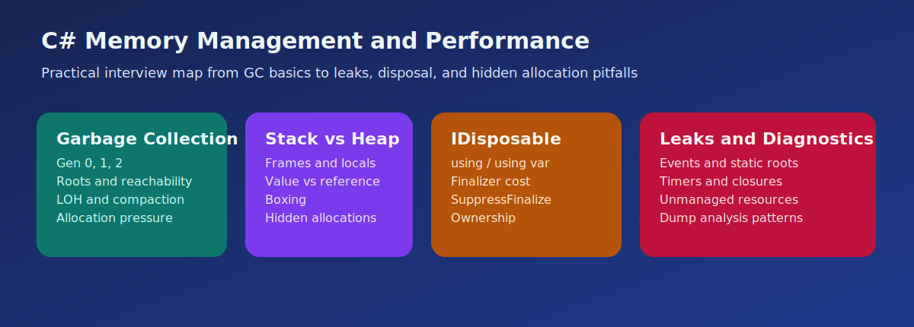

# C# Memory Management and Performance Interview Questions



This guide covers practical memory behavior, cleanup, and performance trade-offs in real C# systems. It follows the corrected format of **100 interview questions for each subtopic**, and every answer includes a C# code example with rotated real-world scenarios so the examples do not repeat verbatim.

## How To Use This Page

- Questions 1-100 cover Garbage collection and generational memory behavior.
- Questions 101-200 cover Stack, heap, and hidden allocation behavior.
- Questions 201-300 cover IDisposable, finalizers, and deterministic cleanup.
- Questions 301-400 cover Memory leaks, retained references, and resource leak debugging.

## 1. Garbage collection and generational memory behavior

> This section contains **100 interview questions** focused on **Garbage collection and generational memory behavior**. Every answer includes a C# code example, and the scenarios rotate so they do not repeat verbatim.

### Q1.1 What is generational GC basics in C# memory management and performance?

**Answer:** Generational gc basics means the .NET garbage collector favors short-lived objects and promotes survivors into older generations. Teams should focus on it when explaining garbage collection and generational memory behavior in real systems, they compare it with flat one-size-fits-all cleanup thinking, and they should avoid the trap of assuming every object is treated the same way by the GC. Example: while fixing a long-running import service, so diagnostics stay easier to preserve. Another example: during a cache pressure investigation, so cleanup boundaries stay clearer.

**Code Example:**

```csharp
using System;
using System.Collections;
using System.Collections.Generic;
using System.IO;
using System.Linq;
using System.Threading.Tasks;

public static class Demo1_1
{
    public static void Run()
    {
        for (int i = 0; i < 1000; i++)
        {
            var dto = new { Id = i, Batch = 1 };
        }
        Console.WriteLine("Gen 0 churn example");
    }
}
```

### Q1.2 How does short lived allocation patterns in C# memory management and performance?

**Answer:** Short lived allocation patterns means frequent short-lived allocations usually pressure Gen 0 first and can still affect throughput. Teams should focus on it when explaining garbage collection and generational memory behavior in real systems, they compare it with allocation-free assumptions, and they should avoid the trap of ignoring churn in hot paths. Example: during a production leak triage, so cleanup boundaries stay clearer. Another example: while fixing a long-running import service, so resource ownership becomes easier to reason about.

**Code Example:**

```csharp
using System;
using System.Collections;
using System.Collections.Generic;
using System.IO;
using System.Linq;
using System.Threading.Tasks;

public static class Demo1_2
{
    public static void Run()
    {
        var items = new List<string>();
        for (int i = 0; i < 10; i++) items.Add($"item-{i}");
        Console.WriteLine(items.Count);
    }
}
```

### Q1.3 Why does promotion and survivor cost in C# memory management and performance?

**Answer:** Promotion and survivor cost means objects that survive collections can move into older generations where cleanup becomes more expensive. Teams should focus on it when explaining garbage collection and generational memory behavior in real systems, they compare it with thinking only about creation cost, and they should avoid the trap of keeping data alive longer than needed. Example: while hardening a reusable library, so resource ownership becomes easier to reason about. Another example: during a production leak triage, so memory churn becomes easier to spot.

**Code Example:**

```csharp
using System;
using System.Collections;
using System.Collections.Generic;
using System.IO;
using System.Linq;
using System.Threading.Tasks;

public static class Demo1_3
{
    public static void Run()
    {
        var survivors = new List<byte[]>();
        for (int i = 0; i < 3; i++) survivors.Add(new byte[1024]);
        Console.WriteLine(survivors.Count);
    }
}
```

### Q1.4 When should you use large object and retention awareness in C# memory management and performance?

**Answer:** Large object and retention awareness means bigger allocations and longer-lived buffers can change GC behavior and fragmentation risk. Teams should focus on it when explaining garbage collection and generational memory behavior in real systems, they compare it with tiny-object-only reasoning, and they should avoid the trap of forgetting large buffers in memory analysis. Example: during an API latency review, so memory churn becomes easier to spot. Another example: while hardening a reusable library, so retention problems become easier to isolate.

**Code Example:**

```csharp
using System;
using System.Collections;
using System.Collections.Generic;
using System.IO;
using System.Linq;
using System.Threading.Tasks;

public static class Demo1_4
{
    public static void Run()
    {
        byte[] buffer = new byte[85000];
        Console.WriteLine(buffer.Length);
    }
}
```

### Q1.5 What problem does allocation versus retention framing in C# memory management and performance?

**Answer:** Allocation versus retention framing means memory performance is not just about how much you allocate but also how long objects stay referenced. Teams should focus on it when explaining garbage collection and generational memory behavior in real systems, they compare it with allocation counts only, and they should avoid the trap of ignoring retention lifetimes. Example: while profiling a file-processing pipeline, so retention problems become easier to isolate. Another example: during an API latency review, so the leak source becomes easier to narrow down.

**Code Example:**

```csharp
using System;
using System.Collections;
using System.Collections.Generic;
using System.IO;
using System.Linq;
using System.Threading.Tasks;

public static class Demo1_5
{
    public static void Run()
    {
        var cache = new Dictionary<int, string>();
        cache[5] = "live";
        Console.WriteLine(cache.Count);
    }
}
```

### Q1.6 How would you explain GC interview framing in C# memory management and performance?

**Answer:** Gc interview framing means strong answers connect GC theory to service latency throughput and memory diagnostics. Teams should focus on it when explaining garbage collection and generational memory behavior in real systems, they compare it with textbook GC definitions only, and they should avoid the trap of skipping production symptoms. Example: during a batch allocation benchmark, so the leak source becomes easier to narrow down. Another example: while profiling a file-processing pipeline, so throughput trade-offs become easier to defend.

**Code Example:**

```csharp
using System;
using System.Collections;
using System.Collections.Generic;
using System.IO;
using System.Linq;
using System.Threading.Tasks;

public static class Demo1_6
{
    public static void Run()
    {
        Console.WriteLine(GC.GetTotalMemory(forceFullCollection: false) >= 0);
    }
}
```

### Q1.7 Why is generational GC basics in C# memory management and performance?

**Answer:** Generational gc basics means the .NET garbage collector favors short-lived objects and promotes survivors into older generations. Teams should focus on it when explaining garbage collection and generational memory behavior in real systems, they compare it with flat one-size-fits-all cleanup thinking, and they should avoid the trap of assuming every object is treated the same way by the GC. Example: while debugging a worker memory spike, so throughput trade-offs become easier to defend. Another example: during a batch allocation benchmark, so allocation pressure becomes easier to explain.

**Code Example:**

```csharp
using System;
using System.Collections;
using System.Collections.Generic;
using System.IO;
using System.Linq;
using System.Threading.Tasks;

public static class Demo1_7
{
    public static void Run()
    {
        for (int i = 0; i < 1000; i++)
        {
            var dto = new { Id = i, Batch = 0 };
        }
        Console.WriteLine("Gen 0 churn example");
    }
}
```

### Q1.8 How can short lived allocation patterns in C# memory management and performance?

**Answer:** Short lived allocation patterns means frequent short-lived allocations usually pressure Gen 0 first and can still affect throughput. Teams should focus on it when explaining garbage collection and generational memory behavior in real systems, they compare it with allocation-free assumptions, and they should avoid the trap of ignoring churn in hot paths. Example: during a support issue on retained objects, so allocation pressure becomes easier to explain. Another example: while debugging a worker memory spike, so diagnostics stay easier to preserve.

**Code Example:**

```csharp
using System;
using System.Collections;
using System.Collections.Generic;
using System.IO;
using System.Linq;
using System.Threading.Tasks;

public static class Demo1_8
{
    public static void Run()
    {
        var items = new List<string>();
        for (int i = 0; i < 10; i++) items.Add($"item-{i}");
        Console.WriteLine(items.Count);
    }
}
```

### Q1.9 What is promotion and survivor cost in C# memory management and performance?

**Answer:** Promotion and survivor cost means objects that survive collections can move into older generations where cleanup becomes more expensive. Teams should focus on it when explaining garbage collection and generational memory behavior in real systems, they compare it with thinking only about creation cost, and they should avoid the trap of keeping data alive longer than needed. Example: while reviewing disposal patterns in a service layer, so diagnostics stay easier to preserve. Another example: during a support issue on retained objects, so cleanup boundaries stay clearer.

**Code Example:**

```csharp
using System;
using System.Collections;
using System.Collections.Generic;
using System.IO;
using System.Linq;
using System.Threading.Tasks;

public static class Demo1_9
{
    public static void Run()
    {
        var survivors = new List<byte[]>();
        for (int i = 0; i < 3; i++) survivors.Add(new byte[1024]);
        Console.WriteLine(survivors.Count);
    }
}
```

### Q1.10 How does large object and retention awareness in C# memory management and performance?

**Answer:** Large object and retention awareness means bigger allocations and longer-lived buffers can change GC behavior and fragmentation risk. Teams should focus on it when explaining garbage collection and generational memory behavior in real systems, they compare it with tiny-object-only reasoning, and they should avoid the trap of forgetting large buffers in memory analysis. Example: during a cache pressure investigation, so cleanup boundaries stay clearer. Another example: while reviewing disposal patterns in a service layer, so resource ownership becomes easier to reason about.

**Code Example:**

```csharp
using System;
using System.Collections;
using System.Collections.Generic;
using System.IO;
using System.Linq;
using System.Threading.Tasks;

public static class Demo1_10
{
    public static void Run()
    {
        byte[] buffer = new byte[85000];
        Console.WriteLine(buffer.Length);
    }
}
```

### Q1.11 Why does allocation versus retention framing in C# memory management and performance?

**Answer:** Allocation versus retention framing means memory performance is not just about how much you allocate but also how long objects stay referenced. Teams should focus on it when explaining garbage collection and generational memory behavior in real systems, they compare it with allocation counts only, and they should avoid the trap of ignoring retention lifetimes. Example: while fixing a long-running import service, so resource ownership becomes easier to reason about. Another example: during a cache pressure investigation, so memory churn becomes easier to spot.

**Code Example:**

```csharp
using System;
using System.Collections;
using System.Collections.Generic;
using System.IO;
using System.Linq;
using System.Threading.Tasks;

public static class Demo1_11
{
    public static void Run()
    {
        var cache = new Dictionary<int, string>();
        cache[11] = "live";
        Console.WriteLine(cache.Count);
    }
}
```

### Q1.12 When should you use GC interview framing in C# memory management and performance?

**Answer:** Gc interview framing means strong answers connect GC theory to service latency throughput and memory diagnostics. Teams should focus on it when explaining garbage collection and generational memory behavior in real systems, they compare it with textbook GC definitions only, and they should avoid the trap of skipping production symptoms. Example: during a production leak triage, so memory churn becomes easier to spot. Another example: while fixing a long-running import service, so retention problems become easier to isolate.

**Code Example:**

```csharp
using System;
using System.Collections;
using System.Collections.Generic;
using System.IO;
using System.Linq;
using System.Threading.Tasks;

public static class Demo1_12
{
    public static void Run()
    {
        Console.WriteLine(GC.GetTotalMemory(forceFullCollection: false) >= 0);
    }
}
```

### Q1.13 What problem does generational GC basics in C# memory management and performance?

**Answer:** Generational gc basics means the .NET garbage collector favors short-lived objects and promotes survivors into older generations. Teams should focus on it when explaining garbage collection and generational memory behavior in real systems, they compare it with flat one-size-fits-all cleanup thinking, and they should avoid the trap of assuming every object is treated the same way by the GC. Example: while hardening a reusable library, so retention problems become easier to isolate. Another example: during a production leak triage, so the leak source becomes easier to narrow down.

**Code Example:**

```csharp
using System;
using System.Collections;
using System.Collections.Generic;
using System.IO;
using System.Linq;
using System.Threading.Tasks;

public static class Demo1_13
{
    public static void Run()
    {
        for (int i = 0; i < 1000; i++)
        {
            var dto = new { Id = i, Batch = 6 };
        }
        Console.WriteLine("Gen 0 churn example");
    }
}
```

### Q1.14 How would you explain short lived allocation patterns in C# memory management and performance?

**Answer:** Short lived allocation patterns means frequent short-lived allocations usually pressure Gen 0 first and can still affect throughput. Teams should focus on it when explaining garbage collection and generational memory behavior in real systems, they compare it with allocation-free assumptions, and they should avoid the trap of ignoring churn in hot paths. Example: during an API latency review, so the leak source becomes easier to narrow down. Another example: while hardening a reusable library, so throughput trade-offs become easier to defend.

**Code Example:**

```csharp
using System;
using System.Collections;
using System.Collections.Generic;
using System.IO;
using System.Linq;
using System.Threading.Tasks;

public static class Demo1_14
{
    public static void Run()
    {
        var items = new List<string>();
        for (int i = 0; i < 10; i++) items.Add($"item-{i}");
        Console.WriteLine(items.Count);
    }
}
```

### Q1.15 Why is promotion and survivor cost in C# memory management and performance?

**Answer:** Promotion and survivor cost means objects that survive collections can move into older generations where cleanup becomes more expensive. Teams should focus on it when explaining garbage collection and generational memory behavior in real systems, they compare it with thinking only about creation cost, and they should avoid the trap of keeping data alive longer than needed. Example: while profiling a file-processing pipeline, so throughput trade-offs become easier to defend. Another example: during an API latency review, so allocation pressure becomes easier to explain.

**Code Example:**

```csharp
using System;
using System.Collections;
using System.Collections.Generic;
using System.IO;
using System.Linq;
using System.Threading.Tasks;

public static class Demo1_15
{
    public static void Run()
    {
        var survivors = new List<byte[]>();
        for (int i = 0; i < 3; i++) survivors.Add(new byte[1024]);
        Console.WriteLine(survivors.Count);
    }
}
```

### Q1.16 How can large object and retention awareness in C# memory management and performance?

**Answer:** Large object and retention awareness means bigger allocations and longer-lived buffers can change GC behavior and fragmentation risk. Teams should focus on it when explaining garbage collection and generational memory behavior in real systems, they compare it with tiny-object-only reasoning, and they should avoid the trap of forgetting large buffers in memory analysis. Example: during a batch allocation benchmark, so allocation pressure becomes easier to explain. Another example: while profiling a file-processing pipeline, so diagnostics stay easier to preserve.

**Code Example:**

```csharp
using System;
using System.Collections;
using System.Collections.Generic;
using System.IO;
using System.Linq;
using System.Threading.Tasks;

public static class Demo1_16
{
    public static void Run()
    {
        byte[] buffer = new byte[85000];
        Console.WriteLine(buffer.Length);
    }
}
```

### Q1.17 What is allocation versus retention framing in C# memory management and performance?

**Answer:** Allocation versus retention framing means memory performance is not just about how much you allocate but also how long objects stay referenced. Teams should focus on it when explaining garbage collection and generational memory behavior in real systems, they compare it with allocation counts only, and they should avoid the trap of ignoring retention lifetimes. Example: while debugging a worker memory spike, so diagnostics stay easier to preserve. Another example: during a batch allocation benchmark, so cleanup boundaries stay clearer.

**Code Example:**

```csharp
using System;
using System.Collections;
using System.Collections.Generic;
using System.IO;
using System.Linq;
using System.Threading.Tasks;

public static class Demo1_17
{
    public static void Run()
    {
        var cache = new Dictionary<int, string>();
        cache[17] = "live";
        Console.WriteLine(cache.Count);
    }
}
```

### Q1.18 How does GC interview framing in C# memory management and performance?

**Answer:** Gc interview framing means strong answers connect GC theory to service latency throughput and memory diagnostics. Teams should focus on it when explaining garbage collection and generational memory behavior in real systems, they compare it with textbook GC definitions only, and they should avoid the trap of skipping production symptoms. Example: during a support issue on retained objects, so cleanup boundaries stay clearer. Another example: while debugging a worker memory spike, so resource ownership becomes easier to reason about.

**Code Example:**

```csharp
using System;
using System.Collections;
using System.Collections.Generic;
using System.IO;
using System.Linq;
using System.Threading.Tasks;

public static class Demo1_18
{
    public static void Run()
    {
        Console.WriteLine(GC.GetTotalMemory(forceFullCollection: false) >= 0);
    }
}
```

### Q1.19 Why does generational GC basics in C# memory management and performance?

**Answer:** Generational gc basics means the .NET garbage collector favors short-lived objects and promotes survivors into older generations. Teams should focus on it when explaining garbage collection and generational memory behavior in real systems, they compare it with flat one-size-fits-all cleanup thinking, and they should avoid the trap of assuming every object is treated the same way by the GC. Example: while reviewing disposal patterns in a service layer, so resource ownership becomes easier to reason about. Another example: during a support issue on retained objects, so memory churn becomes easier to spot.

**Code Example:**

```csharp
using System;
using System.Collections;
using System.Collections.Generic;
using System.IO;
using System.Linq;
using System.Threading.Tasks;

public static class Demo1_19
{
    public static void Run()
    {
        for (int i = 0; i < 1000; i++)
        {
            var dto = new { Id = i, Batch = 5 };
        }
        Console.WriteLine("Gen 0 churn example");
    }
}
```

### Q1.20 When should you use short lived allocation patterns in C# memory management and performance?

**Answer:** Short lived allocation patterns means frequent short-lived allocations usually pressure Gen 0 first and can still affect throughput. Teams should focus on it when explaining garbage collection and generational memory behavior in real systems, they compare it with allocation-free assumptions, and they should avoid the trap of ignoring churn in hot paths. Example: during a cache pressure investigation, so memory churn becomes easier to spot. Another example: while reviewing disposal patterns in a service layer, so retention problems become easier to isolate.

**Code Example:**

```csharp
using System;
using System.Collections;
using System.Collections.Generic;
using System.IO;
using System.Linq;
using System.Threading.Tasks;

public static class Demo1_20
{
    public static void Run()
    {
        var items = new List<string>();
        for (int i = 0; i < 10; i++) items.Add($"item-{i}");
        Console.WriteLine(items.Count);
    }
}
```

### Q1.21 What problem does promotion and survivor cost in C# memory management and performance?

**Answer:** Promotion and survivor cost means objects that survive collections can move into older generations where cleanup becomes more expensive. Teams should focus on it when explaining garbage collection and generational memory behavior in real systems, they compare it with thinking only about creation cost, and they should avoid the trap of keeping data alive longer than needed. Example: while fixing a long-running import service, so retention problems become easier to isolate. Another example: during a cache pressure investigation, so the leak source becomes easier to narrow down.

**Code Example:**

```csharp
using System;
using System.Collections;
using System.Collections.Generic;
using System.IO;
using System.Linq;
using System.Threading.Tasks;

public static class Demo1_21
{
    public static void Run()
    {
        var survivors = new List<byte[]>();
        for (int i = 0; i < 3; i++) survivors.Add(new byte[1024]);
        Console.WriteLine(survivors.Count);
    }
}
```

### Q1.22 How would you explain large object and retention awareness in C# memory management and performance?

**Answer:** Large object and retention awareness means bigger allocations and longer-lived buffers can change GC behavior and fragmentation risk. Teams should focus on it when explaining garbage collection and generational memory behavior in real systems, they compare it with tiny-object-only reasoning, and they should avoid the trap of forgetting large buffers in memory analysis. Example: during a production leak triage, so the leak source becomes easier to narrow down. Another example: while fixing a long-running import service, so throughput trade-offs become easier to defend.

**Code Example:**

```csharp
using System;
using System.Collections;
using System.Collections.Generic;
using System.IO;
using System.Linq;
using System.Threading.Tasks;

public static class Demo1_22
{
    public static void Run()
    {
        byte[] buffer = new byte[85000];
        Console.WriteLine(buffer.Length);
    }
}
```

### Q1.23 Why is allocation versus retention framing in C# memory management and performance?

**Answer:** Allocation versus retention framing means memory performance is not just about how much you allocate but also how long objects stay referenced. Teams should focus on it when explaining garbage collection and generational memory behavior in real systems, they compare it with allocation counts only, and they should avoid the trap of ignoring retention lifetimes. Example: while hardening a reusable library, so throughput trade-offs become easier to defend. Another example: during a production leak triage, so allocation pressure becomes easier to explain.

**Code Example:**

```csharp
using System;
using System.Collections;
using System.Collections.Generic;
using System.IO;
using System.Linq;
using System.Threading.Tasks;

public static class Demo1_23
{
    public static void Run()
    {
        var cache = new Dictionary<int, string>();
        cache[23] = "live";
        Console.WriteLine(cache.Count);
    }
}
```

### Q1.24 How can GC interview framing in C# memory management and performance?

**Answer:** Gc interview framing means strong answers connect GC theory to service latency throughput and memory diagnostics. Teams should focus on it when explaining garbage collection and generational memory behavior in real systems, they compare it with textbook GC definitions only, and they should avoid the trap of skipping production symptoms. Example: during an API latency review, so allocation pressure becomes easier to explain. Another example: while hardening a reusable library, so diagnostics stay easier to preserve.

**Code Example:**

```csharp
using System;
using System.Collections;
using System.Collections.Generic;
using System.IO;
using System.Linq;
using System.Threading.Tasks;

public static class Demo1_24
{
    public static void Run()
    {
        Console.WriteLine(GC.GetTotalMemory(forceFullCollection: false) >= 0);
    }
}
```

### Q1.25 What is generational GC basics in C# memory management and performance?

**Answer:** Generational gc basics means the .NET garbage collector favors short-lived objects and promotes survivors into older generations. Teams should focus on it when explaining garbage collection and generational memory behavior in real systems, they compare it with flat one-size-fits-all cleanup thinking, and they should avoid the trap of assuming every object is treated the same way by the GC. Example: while profiling a file-processing pipeline, so diagnostics stay easier to preserve. Another example: during an API latency review, so cleanup boundaries stay clearer.

**Code Example:**

```csharp
using System;
using System.Collections;
using System.Collections.Generic;
using System.IO;
using System.Linq;
using System.Threading.Tasks;

public static class Demo1_25
{
    public static void Run()
    {
        for (int i = 0; i < 1000; i++)
        {
            var dto = new { Id = i, Batch = 4 };
        }
        Console.WriteLine("Gen 0 churn example");
    }
}
```

### Q1.26 How does short lived allocation patterns in C# memory management and performance?

**Answer:** Short lived allocation patterns means frequent short-lived allocations usually pressure Gen 0 first and can still affect throughput. Teams should focus on it when explaining garbage collection and generational memory behavior in real systems, they compare it with allocation-free assumptions, and they should avoid the trap of ignoring churn in hot paths. Example: during a batch allocation benchmark, so cleanup boundaries stay clearer. Another example: while profiling a file-processing pipeline, so resource ownership becomes easier to reason about.

**Code Example:**

```csharp
using System;
using System.Collections;
using System.Collections.Generic;
using System.IO;
using System.Linq;
using System.Threading.Tasks;

public static class Demo1_26
{
    public static void Run()
    {
        var items = new List<string>();
        for (int i = 0; i < 10; i++) items.Add($"item-{i}");
        Console.WriteLine(items.Count);
    }
}
```

### Q1.27 Why does promotion and survivor cost in C# memory management and performance?

**Answer:** Promotion and survivor cost means objects that survive collections can move into older generations where cleanup becomes more expensive. Teams should focus on it when explaining garbage collection and generational memory behavior in real systems, they compare it with thinking only about creation cost, and they should avoid the trap of keeping data alive longer than needed. Example: while debugging a worker memory spike, so resource ownership becomes easier to reason about. Another example: during a batch allocation benchmark, so memory churn becomes easier to spot.

**Code Example:**

```csharp
using System;
using System.Collections;
using System.Collections.Generic;
using System.IO;
using System.Linq;
using System.Threading.Tasks;

public static class Demo1_27
{
    public static void Run()
    {
        var survivors = new List<byte[]>();
        for (int i = 0; i < 3; i++) survivors.Add(new byte[1024]);
        Console.WriteLine(survivors.Count);
    }
}
```

### Q1.28 When should you use large object and retention awareness in C# memory management and performance?

**Answer:** Large object and retention awareness means bigger allocations and longer-lived buffers can change GC behavior and fragmentation risk. Teams should focus on it when explaining garbage collection and generational memory behavior in real systems, they compare it with tiny-object-only reasoning, and they should avoid the trap of forgetting large buffers in memory analysis. Example: during a support issue on retained objects, so memory churn becomes easier to spot. Another example: while debugging a worker memory spike, so retention problems become easier to isolate.

**Code Example:**

```csharp
using System;
using System.Collections;
using System.Collections.Generic;
using System.IO;
using System.Linq;
using System.Threading.Tasks;

public static class Demo1_28
{
    public static void Run()
    {
        byte[] buffer = new byte[85000];
        Console.WriteLine(buffer.Length);
    }
}
```

### Q1.29 What problem does allocation versus retention framing in C# memory management and performance?

**Answer:** Allocation versus retention framing means memory performance is not just about how much you allocate but also how long objects stay referenced. Teams should focus on it when explaining garbage collection and generational memory behavior in real systems, they compare it with allocation counts only, and they should avoid the trap of ignoring retention lifetimes. Example: while reviewing disposal patterns in a service layer, so retention problems become easier to isolate. Another example: during a support issue on retained objects, so the leak source becomes easier to narrow down.

**Code Example:**

```csharp
using System;
using System.Collections;
using System.Collections.Generic;
using System.IO;
using System.Linq;
using System.Threading.Tasks;

public static class Demo1_29
{
    public static void Run()
    {
        var cache = new Dictionary<int, string>();
        cache[29] = "live";
        Console.WriteLine(cache.Count);
    }
}
```

### Q1.30 How would you explain GC interview framing in C# memory management and performance?

**Answer:** Gc interview framing means strong answers connect GC theory to service latency throughput and memory diagnostics. Teams should focus on it when explaining garbage collection and generational memory behavior in real systems, they compare it with textbook GC definitions only, and they should avoid the trap of skipping production symptoms. Example: during a cache pressure investigation, so the leak source becomes easier to narrow down. Another example: while reviewing disposal patterns in a service layer, so throughput trade-offs become easier to defend.

**Code Example:**

```csharp
using System;
using System.Collections;
using System.Collections.Generic;
using System.IO;
using System.Linq;
using System.Threading.Tasks;

public static class Demo1_30
{
    public static void Run()
    {
        Console.WriteLine(GC.GetTotalMemory(forceFullCollection: false) >= 0);
    }
}
```

### Q1.31 Why is generational GC basics in C# memory management and performance?

**Answer:** Generational gc basics means the .NET garbage collector favors short-lived objects and promotes survivors into older generations. Teams should focus on it when explaining garbage collection and generational memory behavior in real systems, they compare it with flat one-size-fits-all cleanup thinking, and they should avoid the trap of assuming every object is treated the same way by the GC. Example: while fixing a long-running import service, so throughput trade-offs become easier to defend. Another example: during a cache pressure investigation, so allocation pressure becomes easier to explain.

**Code Example:**

```csharp
using System;
using System.Collections;
using System.Collections.Generic;
using System.IO;
using System.Linq;
using System.Threading.Tasks;

public static class Demo1_31
{
    public static void Run()
    {
        for (int i = 0; i < 1000; i++)
        {
            var dto = new { Id = i, Batch = 3 };
        }
        Console.WriteLine("Gen 0 churn example");
    }
}
```

### Q1.32 How can short lived allocation patterns in C# memory management and performance?

**Answer:** Short lived allocation patterns means frequent short-lived allocations usually pressure Gen 0 first and can still affect throughput. Teams should focus on it when explaining garbage collection and generational memory behavior in real systems, they compare it with allocation-free assumptions, and they should avoid the trap of ignoring churn in hot paths. Example: during a production leak triage, so allocation pressure becomes easier to explain. Another example: while fixing a long-running import service, so diagnostics stay easier to preserve.

**Code Example:**

```csharp
using System;
using System.Collections;
using System.Collections.Generic;
using System.IO;
using System.Linq;
using System.Threading.Tasks;

public static class Demo1_32
{
    public static void Run()
    {
        var items = new List<string>();
        for (int i = 0; i < 10; i++) items.Add($"item-{i}");
        Console.WriteLine(items.Count);
    }
}
```

### Q1.33 What is promotion and survivor cost in C# memory management and performance?

**Answer:** Promotion and survivor cost means objects that survive collections can move into older generations where cleanup becomes more expensive. Teams should focus on it when explaining garbage collection and generational memory behavior in real systems, they compare it with thinking only about creation cost, and they should avoid the trap of keeping data alive longer than needed. Example: while hardening a reusable library, so diagnostics stay easier to preserve. Another example: during a production leak triage, so cleanup boundaries stay clearer.

**Code Example:**

```csharp
using System;
using System.Collections;
using System.Collections.Generic;
using System.IO;
using System.Linq;
using System.Threading.Tasks;

public static class Demo1_33
{
    public static void Run()
    {
        var survivors = new List<byte[]>();
        for (int i = 0; i < 3; i++) survivors.Add(new byte[1024]);
        Console.WriteLine(survivors.Count);
    }
}
```

### Q1.34 How does large object and retention awareness in C# memory management and performance?

**Answer:** Large object and retention awareness means bigger allocations and longer-lived buffers can change GC behavior and fragmentation risk. Teams should focus on it when explaining garbage collection and generational memory behavior in real systems, they compare it with tiny-object-only reasoning, and they should avoid the trap of forgetting large buffers in memory analysis. Example: during an API latency review, so cleanup boundaries stay clearer. Another example: while hardening a reusable library, so resource ownership becomes easier to reason about.

**Code Example:**

```csharp
using System;
using System.Collections;
using System.Collections.Generic;
using System.IO;
using System.Linq;
using System.Threading.Tasks;

public static class Demo1_34
{
    public static void Run()
    {
        byte[] buffer = new byte[85000];
        Console.WriteLine(buffer.Length);
    }
}
```

### Q1.35 Why does allocation versus retention framing in C# memory management and performance?

**Answer:** Allocation versus retention framing means memory performance is not just about how much you allocate but also how long objects stay referenced. Teams should focus on it when explaining garbage collection and generational memory behavior in real systems, they compare it with allocation counts only, and they should avoid the trap of ignoring retention lifetimes. Example: while profiling a file-processing pipeline, so resource ownership becomes easier to reason about. Another example: during an API latency review, so memory churn becomes easier to spot.

**Code Example:**

```csharp
using System;
using System.Collections;
using System.Collections.Generic;
using System.IO;
using System.Linq;
using System.Threading.Tasks;

public static class Demo1_35
{
    public static void Run()
    {
        var cache = new Dictionary<int, string>();
        cache[35] = "live";
        Console.WriteLine(cache.Count);
    }
}
```

### Q1.36 When should you use GC interview framing in C# memory management and performance?

**Answer:** Gc interview framing means strong answers connect GC theory to service latency throughput and memory diagnostics. Teams should focus on it when explaining garbage collection and generational memory behavior in real systems, they compare it with textbook GC definitions only, and they should avoid the trap of skipping production symptoms. Example: during a batch allocation benchmark, so memory churn becomes easier to spot. Another example: while profiling a file-processing pipeline, so retention problems become easier to isolate.

**Code Example:**

```csharp
using System;
using System.Collections;
using System.Collections.Generic;
using System.IO;
using System.Linq;
using System.Threading.Tasks;

public static class Demo1_36
{
    public static void Run()
    {
        Console.WriteLine(GC.GetTotalMemory(forceFullCollection: false) >= 0);
    }
}
```

### Q1.37 What problem does generational GC basics in C# memory management and performance?

**Answer:** Generational gc basics means the .NET garbage collector favors short-lived objects and promotes survivors into older generations. Teams should focus on it when explaining garbage collection and generational memory behavior in real systems, they compare it with flat one-size-fits-all cleanup thinking, and they should avoid the trap of assuming every object is treated the same way by the GC. Example: while debugging a worker memory spike, so retention problems become easier to isolate. Another example: during a batch allocation benchmark, so the leak source becomes easier to narrow down.

**Code Example:**

```csharp
using System;
using System.Collections;
using System.Collections.Generic;
using System.IO;
using System.Linq;
using System.Threading.Tasks;

public static class Demo1_37
{
    public static void Run()
    {
        for (int i = 0; i < 1000; i++)
        {
            var dto = new { Id = i, Batch = 2 };
        }
        Console.WriteLine("Gen 0 churn example");
    }
}
```

### Q1.38 How would you explain short lived allocation patterns in C# memory management and performance?

**Answer:** Short lived allocation patterns means frequent short-lived allocations usually pressure Gen 0 first and can still affect throughput. Teams should focus on it when explaining garbage collection and generational memory behavior in real systems, they compare it with allocation-free assumptions, and they should avoid the trap of ignoring churn in hot paths. Example: during a support issue on retained objects, so the leak source becomes easier to narrow down. Another example: while debugging a worker memory spike, so throughput trade-offs become easier to defend.

**Code Example:**

```csharp
using System;
using System.Collections;
using System.Collections.Generic;
using System.IO;
using System.Linq;
using System.Threading.Tasks;

public static class Demo1_38
{
    public static void Run()
    {
        var items = new List<string>();
        for (int i = 0; i < 10; i++) items.Add($"item-{i}");
        Console.WriteLine(items.Count);
    }
}
```

### Q1.39 Why is promotion and survivor cost in C# memory management and performance?

**Answer:** Promotion and survivor cost means objects that survive collections can move into older generations where cleanup becomes more expensive. Teams should focus on it when explaining garbage collection and generational memory behavior in real systems, they compare it with thinking only about creation cost, and they should avoid the trap of keeping data alive longer than needed. Example: while reviewing disposal patterns in a service layer, so throughput trade-offs become easier to defend. Another example: during a support issue on retained objects, so allocation pressure becomes easier to explain.

**Code Example:**

```csharp
using System;
using System.Collections;
using System.Collections.Generic;
using System.IO;
using System.Linq;
using System.Threading.Tasks;

public static class Demo1_39
{
    public static void Run()
    {
        var survivors = new List<byte[]>();
        for (int i = 0; i < 3; i++) survivors.Add(new byte[1024]);
        Console.WriteLine(survivors.Count);
    }
}
```

### Q1.40 How can large object and retention awareness in C# memory management and performance?

**Answer:** Large object and retention awareness means bigger allocations and longer-lived buffers can change GC behavior and fragmentation risk. Teams should focus on it when explaining garbage collection and generational memory behavior in real systems, they compare it with tiny-object-only reasoning, and they should avoid the trap of forgetting large buffers in memory analysis. Example: during a cache pressure investigation, so allocation pressure becomes easier to explain. Another example: while reviewing disposal patterns in a service layer, so diagnostics stay easier to preserve.

**Code Example:**

```csharp
using System;
using System.Collections;
using System.Collections.Generic;
using System.IO;
using System.Linq;
using System.Threading.Tasks;

public static class Demo1_40
{
    public static void Run()
    {
        byte[] buffer = new byte[85000];
        Console.WriteLine(buffer.Length);
    }
}
```

### Q1.41 What is allocation versus retention framing in C# memory management and performance?

**Answer:** Allocation versus retention framing means memory performance is not just about how much you allocate but also how long objects stay referenced. Teams should focus on it when explaining garbage collection and generational memory behavior in real systems, they compare it with allocation counts only, and they should avoid the trap of ignoring retention lifetimes. Example: while fixing a long-running import service, so diagnostics stay easier to preserve. Another example: during a cache pressure investigation, so cleanup boundaries stay clearer.

**Code Example:**

```csharp
using System;
using System.Collections;
using System.Collections.Generic;
using System.IO;
using System.Linq;
using System.Threading.Tasks;

public static class Demo1_41
{
    public static void Run()
    {
        var cache = new Dictionary<int, string>();
        cache[41] = "live";
        Console.WriteLine(cache.Count);
    }
}
```

### Q1.42 How does GC interview framing in C# memory management and performance?

**Answer:** Gc interview framing means strong answers connect GC theory to service latency throughput and memory diagnostics. Teams should focus on it when explaining garbage collection and generational memory behavior in real systems, they compare it with textbook GC definitions only, and they should avoid the trap of skipping production symptoms. Example: during a production leak triage, so cleanup boundaries stay clearer. Another example: while fixing a long-running import service, so resource ownership becomes easier to reason about.

**Code Example:**

```csharp
using System;
using System.Collections;
using System.Collections.Generic;
using System.IO;
using System.Linq;
using System.Threading.Tasks;

public static class Demo1_42
{
    public static void Run()
    {
        Console.WriteLine(GC.GetTotalMemory(forceFullCollection: false) >= 0);
    }
}
```

### Q1.43 Why does generational GC basics in C# memory management and performance?

**Answer:** Generational gc basics means the .NET garbage collector favors short-lived objects and promotes survivors into older generations. Teams should focus on it when explaining garbage collection and generational memory behavior in real systems, they compare it with flat one-size-fits-all cleanup thinking, and they should avoid the trap of assuming every object is treated the same way by the GC. Example: while hardening a reusable library, so resource ownership becomes easier to reason about. Another example: during a production leak triage, so memory churn becomes easier to spot.

**Code Example:**

```csharp
using System;
using System.Collections;
using System.Collections.Generic;
using System.IO;
using System.Linq;
using System.Threading.Tasks;

public static class Demo1_43
{
    public static void Run()
    {
        for (int i = 0; i < 1000; i++)
        {
            var dto = new { Id = i, Batch = 1 };
        }
        Console.WriteLine("Gen 0 churn example");
    }
}
```

### Q1.44 When should you use short lived allocation patterns in C# memory management and performance?

**Answer:** Short lived allocation patterns means frequent short-lived allocations usually pressure Gen 0 first and can still affect throughput. Teams should focus on it when explaining garbage collection and generational memory behavior in real systems, they compare it with allocation-free assumptions, and they should avoid the trap of ignoring churn in hot paths. Example: during an API latency review, so memory churn becomes easier to spot. Another example: while hardening a reusable library, so retention problems become easier to isolate.

**Code Example:**

```csharp
using System;
using System.Collections;
using System.Collections.Generic;
using System.IO;
using System.Linq;
using System.Threading.Tasks;

public static class Demo1_44
{
    public static void Run()
    {
        var items = new List<string>();
        for (int i = 0; i < 10; i++) items.Add($"item-{i}");
        Console.WriteLine(items.Count);
    }
}
```

### Q1.45 What problem does promotion and survivor cost in C# memory management and performance?

**Answer:** Promotion and survivor cost means objects that survive collections can move into older generations where cleanup becomes more expensive. Teams should focus on it when explaining garbage collection and generational memory behavior in real systems, they compare it with thinking only about creation cost, and they should avoid the trap of keeping data alive longer than needed. Example: while profiling a file-processing pipeline, so retention problems become easier to isolate. Another example: during an API latency review, so the leak source becomes easier to narrow down.

**Code Example:**

```csharp
using System;
using System.Collections;
using System.Collections.Generic;
using System.IO;
using System.Linq;
using System.Threading.Tasks;

public static class Demo1_45
{
    public static void Run()
    {
        var survivors = new List<byte[]>();
        for (int i = 0; i < 3; i++) survivors.Add(new byte[1024]);
        Console.WriteLine(survivors.Count);
    }
}
```

### Q1.46 How would you explain large object and retention awareness in C# memory management and performance?

**Answer:** Large object and retention awareness means bigger allocations and longer-lived buffers can change GC behavior and fragmentation risk. Teams should focus on it when explaining garbage collection and generational memory behavior in real systems, they compare it with tiny-object-only reasoning, and they should avoid the trap of forgetting large buffers in memory analysis. Example: during a batch allocation benchmark, so the leak source becomes easier to narrow down. Another example: while profiling a file-processing pipeline, so throughput trade-offs become easier to defend.

**Code Example:**

```csharp
using System;
using System.Collections;
using System.Collections.Generic;
using System.IO;
using System.Linq;
using System.Threading.Tasks;

public static class Demo1_46
{
    public static void Run()
    {
        byte[] buffer = new byte[85000];
        Console.WriteLine(buffer.Length);
    }
}
```

### Q1.47 Why is allocation versus retention framing in C# memory management and performance?

**Answer:** Allocation versus retention framing means memory performance is not just about how much you allocate but also how long objects stay referenced. Teams should focus on it when explaining garbage collection and generational memory behavior in real systems, they compare it with allocation counts only, and they should avoid the trap of ignoring retention lifetimes. Example: while debugging a worker memory spike, so throughput trade-offs become easier to defend. Another example: during a batch allocation benchmark, so allocation pressure becomes easier to explain.

**Code Example:**

```csharp
using System;
using System.Collections;
using System.Collections.Generic;
using System.IO;
using System.Linq;
using System.Threading.Tasks;

public static class Demo1_47
{
    public static void Run()
    {
        var cache = new Dictionary<int, string>();
        cache[47] = "live";
        Console.WriteLine(cache.Count);
    }
}
```

### Q1.48 How can GC interview framing in C# memory management and performance?

**Answer:** Gc interview framing means strong answers connect GC theory to service latency throughput and memory diagnostics. Teams should focus on it when explaining garbage collection and generational memory behavior in real systems, they compare it with textbook GC definitions only, and they should avoid the trap of skipping production symptoms. Example: during a support issue on retained objects, so allocation pressure becomes easier to explain. Another example: while debugging a worker memory spike, so diagnostics stay easier to preserve.

**Code Example:**

```csharp
using System;
using System.Collections;
using System.Collections.Generic;
using System.IO;
using System.Linq;
using System.Threading.Tasks;

public static class Demo1_48
{
    public static void Run()
    {
        Console.WriteLine(GC.GetTotalMemory(forceFullCollection: false) >= 0);
    }
}
```

### Q1.49 What is generational GC basics in C# memory management and performance?

**Answer:** Generational gc basics means the .NET garbage collector favors short-lived objects and promotes survivors into older generations. Teams should focus on it when explaining garbage collection and generational memory behavior in real systems, they compare it with flat one-size-fits-all cleanup thinking, and they should avoid the trap of assuming every object is treated the same way by the GC. Example: while reviewing disposal patterns in a service layer, so diagnostics stay easier to preserve. Another example: during a support issue on retained objects, so cleanup boundaries stay clearer.

**Code Example:**

```csharp
using System;
using System.Collections;
using System.Collections.Generic;
using System.IO;
using System.Linq;
using System.Threading.Tasks;

public static class Demo1_49
{
    public static void Run()
    {
        for (int i = 0; i < 1000; i++)
        {
            var dto = new { Id = i, Batch = 0 };
        }
        Console.WriteLine("Gen 0 churn example");
    }
}
```

### Q1.50 How does short lived allocation patterns in C# memory management and performance?

**Answer:** Short lived allocation patterns means frequent short-lived allocations usually pressure Gen 0 first and can still affect throughput. Teams should focus on it when explaining garbage collection and generational memory behavior in real systems, they compare it with allocation-free assumptions, and they should avoid the trap of ignoring churn in hot paths. Example: during a cache pressure investigation, so cleanup boundaries stay clearer. Another example: while reviewing disposal patterns in a service layer, so resource ownership becomes easier to reason about.

**Code Example:**

```csharp
using System;
using System.Collections;
using System.Collections.Generic;
using System.IO;
using System.Linq;
using System.Threading.Tasks;

public static class Demo1_50
{
    public static void Run()
    {
        var items = new List<string>();
        for (int i = 0; i < 10; i++) items.Add($"item-{i}");
        Console.WriteLine(items.Count);
    }
}
```

### Q1.51 Why does promotion and survivor cost in C# memory management and performance?

**Answer:** Promotion and survivor cost means objects that survive collections can move into older generations where cleanup becomes more expensive. Teams should focus on it when explaining garbage collection and generational memory behavior in real systems, they compare it with thinking only about creation cost, and they should avoid the trap of keeping data alive longer than needed. Example: while fixing a long-running import service, so resource ownership becomes easier to reason about. Another example: during a cache pressure investigation, so memory churn becomes easier to spot.

**Code Example:**

```csharp
using System;
using System.Collections;
using System.Collections.Generic;
using System.IO;
using System.Linq;
using System.Threading.Tasks;

public static class Demo1_51
{
    public static void Run()
    {
        var survivors = new List<byte[]>();
        for (int i = 0; i < 3; i++) survivors.Add(new byte[1024]);
        Console.WriteLine(survivors.Count);
    }
}
```

### Q1.52 When should you use large object and retention awareness in C# memory management and performance?

**Answer:** Large object and retention awareness means bigger allocations and longer-lived buffers can change GC behavior and fragmentation risk. Teams should focus on it when explaining garbage collection and generational memory behavior in real systems, they compare it with tiny-object-only reasoning, and they should avoid the trap of forgetting large buffers in memory analysis. Example: during a production leak triage, so memory churn becomes easier to spot. Another example: while fixing a long-running import service, so retention problems become easier to isolate.

**Code Example:**

```csharp
using System;
using System.Collections;
using System.Collections.Generic;
using System.IO;
using System.Linq;
using System.Threading.Tasks;

public static class Demo1_52
{
    public static void Run()
    {
        byte[] buffer = new byte[85000];
        Console.WriteLine(buffer.Length);
    }
}
```

### Q1.53 What problem does allocation versus retention framing in C# memory management and performance?

**Answer:** Allocation versus retention framing means memory performance is not just about how much you allocate but also how long objects stay referenced. Teams should focus on it when explaining garbage collection and generational memory behavior in real systems, they compare it with allocation counts only, and they should avoid the trap of ignoring retention lifetimes. Example: while hardening a reusable library, so retention problems become easier to isolate. Another example: during a production leak triage, so the leak source becomes easier to narrow down.

**Code Example:**

```csharp
using System;
using System.Collections;
using System.Collections.Generic;
using System.IO;
using System.Linq;
using System.Threading.Tasks;

public static class Demo1_53
{
    public static void Run()
    {
        var cache = new Dictionary<int, string>();
        cache[53] = "live";
        Console.WriteLine(cache.Count);
    }
}
```

### Q1.54 How would you explain GC interview framing in C# memory management and performance?

**Answer:** Gc interview framing means strong answers connect GC theory to service latency throughput and memory diagnostics. Teams should focus on it when explaining garbage collection and generational memory behavior in real systems, they compare it with textbook GC definitions only, and they should avoid the trap of skipping production symptoms. Example: during an API latency review, so the leak source becomes easier to narrow down. Another example: while hardening a reusable library, so throughput trade-offs become easier to defend.

**Code Example:**

```csharp
using System;
using System.Collections;
using System.Collections.Generic;
using System.IO;
using System.Linq;
using System.Threading.Tasks;

public static class Demo1_54
{
    public static void Run()
    {
        Console.WriteLine(GC.GetTotalMemory(forceFullCollection: false) >= 0);
    }
}
```

### Q1.55 Why is generational GC basics in C# memory management and performance?

**Answer:** Generational gc basics means the .NET garbage collector favors short-lived objects and promotes survivors into older generations. Teams should focus on it when explaining garbage collection and generational memory behavior in real systems, they compare it with flat one-size-fits-all cleanup thinking, and they should avoid the trap of assuming every object is treated the same way by the GC. Example: while profiling a file-processing pipeline, so throughput trade-offs become easier to defend. Another example: during an API latency review, so allocation pressure becomes easier to explain.

**Code Example:**

```csharp
using System;
using System.Collections;
using System.Collections.Generic;
using System.IO;
using System.Linq;
using System.Threading.Tasks;

public static class Demo1_55
{
    public static void Run()
    {
        for (int i = 0; i < 1000; i++)
        {
            var dto = new { Id = i, Batch = 6 };
        }
        Console.WriteLine("Gen 0 churn example");
    }
}
```

### Q1.56 How can short lived allocation patterns in C# memory management and performance?

**Answer:** Short lived allocation patterns means frequent short-lived allocations usually pressure Gen 0 first and can still affect throughput. Teams should focus on it when explaining garbage collection and generational memory behavior in real systems, they compare it with allocation-free assumptions, and they should avoid the trap of ignoring churn in hot paths. Example: during a batch allocation benchmark, so allocation pressure becomes easier to explain. Another example: while profiling a file-processing pipeline, so diagnostics stay easier to preserve.

**Code Example:**

```csharp
using System;
using System.Collections;
using System.Collections.Generic;
using System.IO;
using System.Linq;
using System.Threading.Tasks;

public static class Demo1_56
{
    public static void Run()
    {
        var items = new List<string>();
        for (int i = 0; i < 10; i++) items.Add($"item-{i}");
        Console.WriteLine(items.Count);
    }
}
```

### Q1.57 What is promotion and survivor cost in C# memory management and performance?

**Answer:** Promotion and survivor cost means objects that survive collections can move into older generations where cleanup becomes more expensive. Teams should focus on it when explaining garbage collection and generational memory behavior in real systems, they compare it with thinking only about creation cost, and they should avoid the trap of keeping data alive longer than needed. Example: while debugging a worker memory spike, so diagnostics stay easier to preserve. Another example: during a batch allocation benchmark, so cleanup boundaries stay clearer.

**Code Example:**

```csharp
using System;
using System.Collections;
using System.Collections.Generic;
using System.IO;
using System.Linq;
using System.Threading.Tasks;

public static class Demo1_57
{
    public static void Run()
    {
        var survivors = new List<byte[]>();
        for (int i = 0; i < 3; i++) survivors.Add(new byte[1024]);
        Console.WriteLine(survivors.Count);
    }
}
```

### Q1.58 How does large object and retention awareness in C# memory management and performance?

**Answer:** Large object and retention awareness means bigger allocations and longer-lived buffers can change GC behavior and fragmentation risk. Teams should focus on it when explaining garbage collection and generational memory behavior in real systems, they compare it with tiny-object-only reasoning, and they should avoid the trap of forgetting large buffers in memory analysis. Example: during a support issue on retained objects, so cleanup boundaries stay clearer. Another example: while debugging a worker memory spike, so resource ownership becomes easier to reason about.

**Code Example:**

```csharp
using System;
using System.Collections;
using System.Collections.Generic;
using System.IO;
using System.Linq;
using System.Threading.Tasks;

public static class Demo1_58
{
    public static void Run()
    {
        byte[] buffer = new byte[85000];
        Console.WriteLine(buffer.Length);
    }
}
```

### Q1.59 Why does allocation versus retention framing in C# memory management and performance?

**Answer:** Allocation versus retention framing means memory performance is not just about how much you allocate but also how long objects stay referenced. Teams should focus on it when explaining garbage collection and generational memory behavior in real systems, they compare it with allocation counts only, and they should avoid the trap of ignoring retention lifetimes. Example: while reviewing disposal patterns in a service layer, so resource ownership becomes easier to reason about. Another example: during a support issue on retained objects, so memory churn becomes easier to spot.

**Code Example:**

```csharp
using System;
using System.Collections;
using System.Collections.Generic;
using System.IO;
using System.Linq;
using System.Threading.Tasks;

public static class Demo1_59
{
    public static void Run()
    {
        var cache = new Dictionary<int, string>();
        cache[59] = "live";
        Console.WriteLine(cache.Count);
    }
}
```

### Q1.60 When should you use GC interview framing in C# memory management and performance?

**Answer:** Gc interview framing means strong answers connect GC theory to service latency throughput and memory diagnostics. Teams should focus on it when explaining garbage collection and generational memory behavior in real systems, they compare it with textbook GC definitions only, and they should avoid the trap of skipping production symptoms. Example: during a cache pressure investigation, so memory churn becomes easier to spot. Another example: while reviewing disposal patterns in a service layer, so retention problems become easier to isolate.

**Code Example:**

```csharp
using System;
using System.Collections;
using System.Collections.Generic;
using System.IO;
using System.Linq;
using System.Threading.Tasks;

public static class Demo1_60
{
    public static void Run()
    {
        Console.WriteLine(GC.GetTotalMemory(forceFullCollection: false) >= 0);
    }
}
```

### Q1.61 What problem does generational GC basics in C# memory management and performance?

**Answer:** Generational gc basics means the .NET garbage collector favors short-lived objects and promotes survivors into older generations. Teams should focus on it when explaining garbage collection and generational memory behavior in real systems, they compare it with flat one-size-fits-all cleanup thinking, and they should avoid the trap of assuming every object is treated the same way by the GC. Example: while fixing a long-running import service, so retention problems become easier to isolate. Another example: during a cache pressure investigation, so the leak source becomes easier to narrow down.

**Code Example:**

```csharp
using System;
using System.Collections;
using System.Collections.Generic;
using System.IO;
using System.Linq;
using System.Threading.Tasks;

public static class Demo1_61
{
    public static void Run()
    {
        for (int i = 0; i < 1000; i++)
        {
            var dto = new { Id = i, Batch = 5 };
        }
        Console.WriteLine("Gen 0 churn example");
    }
}
```

### Q1.62 How would you explain short lived allocation patterns in C# memory management and performance?

**Answer:** Short lived allocation patterns means frequent short-lived allocations usually pressure Gen 0 first and can still affect throughput. Teams should focus on it when explaining garbage collection and generational memory behavior in real systems, they compare it with allocation-free assumptions, and they should avoid the trap of ignoring churn in hot paths. Example: during a production leak triage, so the leak source becomes easier to narrow down. Another example: while fixing a long-running import service, so throughput trade-offs become easier to defend.

**Code Example:**

```csharp
using System;
using System.Collections;
using System.Collections.Generic;
using System.IO;
using System.Linq;
using System.Threading.Tasks;

public static class Demo1_62
{
    public static void Run()
    {
        var items = new List<string>();
        for (int i = 0; i < 10; i++) items.Add($"item-{i}");
        Console.WriteLine(items.Count);
    }
}
```

### Q1.63 Why is promotion and survivor cost in C# memory management and performance?

**Answer:** Promotion and survivor cost means objects that survive collections can move into older generations where cleanup becomes more expensive. Teams should focus on it when explaining garbage collection and generational memory behavior in real systems, they compare it with thinking only about creation cost, and they should avoid the trap of keeping data alive longer than needed. Example: while hardening a reusable library, so throughput trade-offs become easier to defend. Another example: during a production leak triage, so allocation pressure becomes easier to explain.

**Code Example:**

```csharp
using System;
using System.Collections;
using System.Collections.Generic;
using System.IO;
using System.Linq;
using System.Threading.Tasks;

public static class Demo1_63
{
    public static void Run()
    {
        var survivors = new List<byte[]>();
        for (int i = 0; i < 3; i++) survivors.Add(new byte[1024]);
        Console.WriteLine(survivors.Count);
    }
}
```

### Q1.64 How can large object and retention awareness in C# memory management and performance?

**Answer:** Large object and retention awareness means bigger allocations and longer-lived buffers can change GC behavior and fragmentation risk. Teams should focus on it when explaining garbage collection and generational memory behavior in real systems, they compare it with tiny-object-only reasoning, and they should avoid the trap of forgetting large buffers in memory analysis. Example: during an API latency review, so allocation pressure becomes easier to explain. Another example: while hardening a reusable library, so diagnostics stay easier to preserve.

**Code Example:**

```csharp
using System;
using System.Collections;
using System.Collections.Generic;
using System.IO;
using System.Linq;
using System.Threading.Tasks;

public static class Demo1_64
{
    public static void Run()
    {
        byte[] buffer = new byte[85000];
        Console.WriteLine(buffer.Length);
    }
}
```

### Q1.65 What is allocation versus retention framing in C# memory management and performance?

**Answer:** Allocation versus retention framing means memory performance is not just about how much you allocate but also how long objects stay referenced. Teams should focus on it when explaining garbage collection and generational memory behavior in real systems, they compare it with allocation counts only, and they should avoid the trap of ignoring retention lifetimes. Example: while profiling a file-processing pipeline, so diagnostics stay easier to preserve. Another example: during an API latency review, so cleanup boundaries stay clearer.

**Code Example:**

```csharp
using System;
using System.Collections;
using System.Collections.Generic;
using System.IO;
using System.Linq;
using System.Threading.Tasks;

public static class Demo1_65
{
    public static void Run()
    {
        var cache = new Dictionary<int, string>();
        cache[65] = "live";
        Console.WriteLine(cache.Count);
    }
}
```

### Q1.66 How does GC interview framing in C# memory management and performance?

**Answer:** Gc interview framing means strong answers connect GC theory to service latency throughput and memory diagnostics. Teams should focus on it when explaining garbage collection and generational memory behavior in real systems, they compare it with textbook GC definitions only, and they should avoid the trap of skipping production symptoms. Example: during a batch allocation benchmark, so cleanup boundaries stay clearer. Another example: while profiling a file-processing pipeline, so resource ownership becomes easier to reason about.

**Code Example:**

```csharp
using System;
using System.Collections;
using System.Collections.Generic;
using System.IO;
using System.Linq;
using System.Threading.Tasks;

public static class Demo1_66
{
    public static void Run()
    {
        Console.WriteLine(GC.GetTotalMemory(forceFullCollection: false) >= 0);
    }
}
```

### Q1.67 Why does generational GC basics in C# memory management and performance?

**Answer:** Generational gc basics means the .NET garbage collector favors short-lived objects and promotes survivors into older generations. Teams should focus on it when explaining garbage collection and generational memory behavior in real systems, they compare it with flat one-size-fits-all cleanup thinking, and they should avoid the trap of assuming every object is treated the same way by the GC. Example: while debugging a worker memory spike, so resource ownership becomes easier to reason about. Another example: during a batch allocation benchmark, so memory churn becomes easier to spot.

**Code Example:**

```csharp
using System;
using System.Collections;
using System.Collections.Generic;
using System.IO;
using System.Linq;
using System.Threading.Tasks;

public static class Demo1_67
{
    public static void Run()
    {
        for (int i = 0; i < 1000; i++)
        {
            var dto = new { Id = i, Batch = 4 };
        }
        Console.WriteLine("Gen 0 churn example");
    }
}
```

### Q1.68 When should you use short lived allocation patterns in C# memory management and performance?

**Answer:** Short lived allocation patterns means frequent short-lived allocations usually pressure Gen 0 first and can still affect throughput. Teams should focus on it when explaining garbage collection and generational memory behavior in real systems, they compare it with allocation-free assumptions, and they should avoid the trap of ignoring churn in hot paths. Example: during a support issue on retained objects, so memory churn becomes easier to spot. Another example: while debugging a worker memory spike, so retention problems become easier to isolate.

**Code Example:**

```csharp
using System;
using System.Collections;
using System.Collections.Generic;
using System.IO;
using System.Linq;
using System.Threading.Tasks;

public static class Demo1_68
{
    public static void Run()
    {
        var items = new List<string>();
        for (int i = 0; i < 10; i++) items.Add($"item-{i}");
        Console.WriteLine(items.Count);
    }
}
```

### Q1.69 What problem does promotion and survivor cost in C# memory management and performance?

**Answer:** Promotion and survivor cost means objects that survive collections can move into older generations where cleanup becomes more expensive. Teams should focus on it when explaining garbage collection and generational memory behavior in real systems, they compare it with thinking only about creation cost, and they should avoid the trap of keeping data alive longer than needed. Example: while reviewing disposal patterns in a service layer, so retention problems become easier to isolate. Another example: during a support issue on retained objects, so the leak source becomes easier to narrow down.

**Code Example:**

```csharp
using System;
using System.Collections;
using System.Collections.Generic;
using System.IO;
using System.Linq;
using System.Threading.Tasks;

public static class Demo1_69
{
    public static void Run()
    {
        var survivors = new List<byte[]>();
        for (int i = 0; i < 3; i++) survivors.Add(new byte[1024]);
        Console.WriteLine(survivors.Count);
    }
}
```

### Q1.70 How would you explain large object and retention awareness in C# memory management and performance?

**Answer:** Large object and retention awareness means bigger allocations and longer-lived buffers can change GC behavior and fragmentation risk. Teams should focus on it when explaining garbage collection and generational memory behavior in real systems, they compare it with tiny-object-only reasoning, and they should avoid the trap of forgetting large buffers in memory analysis. Example: during a cache pressure investigation, so the leak source becomes easier to narrow down. Another example: while reviewing disposal patterns in a service layer, so throughput trade-offs become easier to defend.

**Code Example:**

```csharp
using System;
using System.Collections;
using System.Collections.Generic;
using System.IO;
using System.Linq;
using System.Threading.Tasks;

public static class Demo1_70
{
    public static void Run()
    {
        byte[] buffer = new byte[85000];
        Console.WriteLine(buffer.Length);
    }
}
```

### Q1.71 Why is allocation versus retention framing in C# memory management and performance?

**Answer:** Allocation versus retention framing means memory performance is not just about how much you allocate but also how long objects stay referenced. Teams should focus on it when explaining garbage collection and generational memory behavior in real systems, they compare it with allocation counts only, and they should avoid the trap of ignoring retention lifetimes. Example: while fixing a long-running import service, so throughput trade-offs become easier to defend. Another example: during a cache pressure investigation, so allocation pressure becomes easier to explain.

**Code Example:**

```csharp
using System;
using System.Collections;
using System.Collections.Generic;
using System.IO;
using System.Linq;
using System.Threading.Tasks;

public static class Demo1_71
{
    public static void Run()
    {
        var cache = new Dictionary<int, string>();
        cache[71] = "live";
        Console.WriteLine(cache.Count);
    }
}
```

### Q1.72 How can GC interview framing in C# memory management and performance?

**Answer:** Gc interview framing means strong answers connect GC theory to service latency throughput and memory diagnostics. Teams should focus on it when explaining garbage collection and generational memory behavior in real systems, they compare it with textbook GC definitions only, and they should avoid the trap of skipping production symptoms. Example: during a production leak triage, so allocation pressure becomes easier to explain. Another example: while fixing a long-running import service, so diagnostics stay easier to preserve.

**Code Example:**

```csharp
using System;
using System.Collections;
using System.Collections.Generic;
using System.IO;
using System.Linq;
using System.Threading.Tasks;

public static class Demo1_72
{
    public static void Run()
    {
        Console.WriteLine(GC.GetTotalMemory(forceFullCollection: false) >= 0);
    }
}
```

### Q1.73 What is generational GC basics in C# memory management and performance?

**Answer:** Generational gc basics means the .NET garbage collector favors short-lived objects and promotes survivors into older generations. Teams should focus on it when explaining garbage collection and generational memory behavior in real systems, they compare it with flat one-size-fits-all cleanup thinking, and they should avoid the trap of assuming every object is treated the same way by the GC. Example: while hardening a reusable library, so diagnostics stay easier to preserve. Another example: during a production leak triage, so cleanup boundaries stay clearer.

**Code Example:**

```csharp
using System;
using System.Collections;
using System.Collections.Generic;
using System.IO;
using System.Linq;
using System.Threading.Tasks;

public static class Demo1_73
{
    public static void Run()
    {
        for (int i = 0; i < 1000; i++)
        {
            var dto = new { Id = i, Batch = 3 };
        }
        Console.WriteLine("Gen 0 churn example");
    }
}
```

### Q1.74 How does short lived allocation patterns in C# memory management and performance?

**Answer:** Short lived allocation patterns means frequent short-lived allocations usually pressure Gen 0 first and can still affect throughput. Teams should focus on it when explaining garbage collection and generational memory behavior in real systems, they compare it with allocation-free assumptions, and they should avoid the trap of ignoring churn in hot paths. Example: during an API latency review, so cleanup boundaries stay clearer. Another example: while hardening a reusable library, so resource ownership becomes easier to reason about.

**Code Example:**

```csharp
using System;
using System.Collections;
using System.Collections.Generic;
using System.IO;
using System.Linq;
using System.Threading.Tasks;

public static class Demo1_74
{
    public static void Run()
    {
        var items = new List<string>();
        for (int i = 0; i < 10; i++) items.Add($"item-{i}");
        Console.WriteLine(items.Count);
    }
}
```

### Q1.75 Why does promotion and survivor cost in C# memory management and performance?

**Answer:** Promotion and survivor cost means objects that survive collections can move into older generations where cleanup becomes more expensive. Teams should focus on it when explaining garbage collection and generational memory behavior in real systems, they compare it with thinking only about creation cost, and they should avoid the trap of keeping data alive longer than needed. Example: while profiling a file-processing pipeline, so resource ownership becomes easier to reason about. Another example: during an API latency review, so memory churn becomes easier to spot.

**Code Example:**

```csharp
using System;
using System.Collections;
using System.Collections.Generic;
using System.IO;
using System.Linq;
using System.Threading.Tasks;

public static class Demo1_75
{
    public static void Run()
    {
        var survivors = new List<byte[]>();
        for (int i = 0; i < 3; i++) survivors.Add(new byte[1024]);
        Console.WriteLine(survivors.Count);
    }
}
```

### Q1.76 When should you use large object and retention awareness in C# memory management and performance?

**Answer:** Large object and retention awareness means bigger allocations and longer-lived buffers can change GC behavior and fragmentation risk. Teams should focus on it when explaining garbage collection and generational memory behavior in real systems, they compare it with tiny-object-only reasoning, and they should avoid the trap of forgetting large buffers in memory analysis. Example: during a batch allocation benchmark, so memory churn becomes easier to spot. Another example: while profiling a file-processing pipeline, so retention problems become easier to isolate.

**Code Example:**

```csharp
using System;
using System.Collections;
using System.Collections.Generic;
using System.IO;
using System.Linq;
using System.Threading.Tasks;

public static class Demo1_76
{
    public static void Run()
    {
        byte[] buffer = new byte[85000];
        Console.WriteLine(buffer.Length);
    }
}
```

### Q1.77 What problem does allocation versus retention framing in C# memory management and performance?

**Answer:** Allocation versus retention framing means memory performance is not just about how much you allocate but also how long objects stay referenced. Teams should focus on it when explaining garbage collection and generational memory behavior in real systems, they compare it with allocation counts only, and they should avoid the trap of ignoring retention lifetimes. Example: while debugging a worker memory spike, so retention problems become easier to isolate. Another example: during a batch allocation benchmark, so the leak source becomes easier to narrow down.

**Code Example:**

```csharp
using System;
using System.Collections;
using System.Collections.Generic;
using System.IO;
using System.Linq;
using System.Threading.Tasks;

public static class Demo1_77
{
    public static void Run()
    {
        var cache = new Dictionary<int, string>();
        cache[77] = "live";
        Console.WriteLine(cache.Count);
    }
}
```

### Q1.78 How would you explain GC interview framing in C# memory management and performance?

**Answer:** Gc interview framing means strong answers connect GC theory to service latency throughput and memory diagnostics. Teams should focus on it when explaining garbage collection and generational memory behavior in real systems, they compare it with textbook GC definitions only, and they should avoid the trap of skipping production symptoms. Example: during a support issue on retained objects, so the leak source becomes easier to narrow down. Another example: while debugging a worker memory spike, so throughput trade-offs become easier to defend.

**Code Example:**

```csharp
using System;
using System.Collections;
using System.Collections.Generic;
using System.IO;
using System.Linq;
using System.Threading.Tasks;

public static class Demo1_78
{
    public static void Run()
    {
        Console.WriteLine(GC.GetTotalMemory(forceFullCollection: false) >= 0);
    }
}
```

### Q1.79 Why is generational GC basics in C# memory management and performance?

**Answer:** Generational gc basics means the .NET garbage collector favors short-lived objects and promotes survivors into older generations. Teams should focus on it when explaining garbage collection and generational memory behavior in real systems, they compare it with flat one-size-fits-all cleanup thinking, and they should avoid the trap of assuming every object is treated the same way by the GC. Example: while reviewing disposal patterns in a service layer, so throughput trade-offs become easier to defend. Another example: during a support issue on retained objects, so allocation pressure becomes easier to explain.

**Code Example:**

```csharp
using System;
using System.Collections;
using System.Collections.Generic;
using System.IO;
using System.Linq;
using System.Threading.Tasks;

public static class Demo1_79
{
    public static void Run()
    {
        for (int i = 0; i < 1000; i++)
        {
            var dto = new { Id = i, Batch = 2 };
        }
        Console.WriteLine("Gen 0 churn example");
    }
}
```

### Q1.80 How can short lived allocation patterns in C# memory management and performance?

**Answer:** Short lived allocation patterns means frequent short-lived allocations usually pressure Gen 0 first and can still affect throughput. Teams should focus on it when explaining garbage collection and generational memory behavior in real systems, they compare it with allocation-free assumptions, and they should avoid the trap of ignoring churn in hot paths. Example: during a cache pressure investigation, so allocation pressure becomes easier to explain. Another example: while reviewing disposal patterns in a service layer, so diagnostics stay easier to preserve.

**Code Example:**

```csharp
using System;
using System.Collections;
using System.Collections.Generic;
using System.IO;
using System.Linq;
using System.Threading.Tasks;

public static class Demo1_80
{
    public static void Run()
    {
        var items = new List<string>();
        for (int i = 0; i < 10; i++) items.Add($"item-{i}");
        Console.WriteLine(items.Count);
    }
}
```

### Q1.81 What is promotion and survivor cost in C# memory management and performance?

**Answer:** Promotion and survivor cost means objects that survive collections can move into older generations where cleanup becomes more expensive. Teams should focus on it when explaining garbage collection and generational memory behavior in real systems, they compare it with thinking only about creation cost, and they should avoid the trap of keeping data alive longer than needed. Example: while fixing a long-running import service, so diagnostics stay easier to preserve. Another example: during a cache pressure investigation, so cleanup boundaries stay clearer.

**Code Example:**

```csharp
using System;
using System.Collections;
using System.Collections.Generic;
using System.IO;
using System.Linq;
using System.Threading.Tasks;

public static class Demo1_81
{
    public static void Run()
    {
        var survivors = new List<byte[]>();
        for (int i = 0; i < 3; i++) survivors.Add(new byte[1024]);
        Console.WriteLine(survivors.Count);
    }
}
```

### Q1.82 How does large object and retention awareness in C# memory management and performance?

**Answer:** Large object and retention awareness means bigger allocations and longer-lived buffers can change GC behavior and fragmentation risk. Teams should focus on it when explaining garbage collection and generational memory behavior in real systems, they compare it with tiny-object-only reasoning, and they should avoid the trap of forgetting large buffers in memory analysis. Example: during a production leak triage, so cleanup boundaries stay clearer. Another example: while fixing a long-running import service, so resource ownership becomes easier to reason about.

**Code Example:**

```csharp
using System;
using System.Collections;
using System.Collections.Generic;
using System.IO;
using System.Linq;
using System.Threading.Tasks;

public static class Demo1_82
{
    public static void Run()
    {
        byte[] buffer = new byte[85000];
        Console.WriteLine(buffer.Length);
    }
}
```

### Q1.83 Why does allocation versus retention framing in C# memory management and performance?

**Answer:** Allocation versus retention framing means memory performance is not just about how much you allocate but also how long objects stay referenced. Teams should focus on it when explaining garbage collection and generational memory behavior in real systems, they compare it with allocation counts only, and they should avoid the trap of ignoring retention lifetimes. Example: while hardening a reusable library, so resource ownership becomes easier to reason about. Another example: during a production leak triage, so memory churn becomes easier to spot.

**Code Example:**

```csharp
using System;
using System.Collections;
using System.Collections.Generic;
using System.IO;
using System.Linq;
using System.Threading.Tasks;

public static class Demo1_83
{
    public static void Run()
    {
        var cache = new Dictionary<int, string>();
        cache[83] = "live";
        Console.WriteLine(cache.Count);
    }
}
```

### Q1.84 When should you use GC interview framing in C# memory management and performance?

**Answer:** Gc interview framing means strong answers connect GC theory to service latency throughput and memory diagnostics. Teams should focus on it when explaining garbage collection and generational memory behavior in real systems, they compare it with textbook GC definitions only, and they should avoid the trap of skipping production symptoms. Example: during an API latency review, so memory churn becomes easier to spot. Another example: while hardening a reusable library, so retention problems become easier to isolate.

**Code Example:**

```csharp
using System;
using System.Collections;
using System.Collections.Generic;
using System.IO;
using System.Linq;
using System.Threading.Tasks;

public static class Demo1_84
{
    public static void Run()
    {
        Console.WriteLine(GC.GetTotalMemory(forceFullCollection: false) >= 0);
    }
}
```

### Q1.85 What problem does generational GC basics in C# memory management and performance?

**Answer:** Generational gc basics means the .NET garbage collector favors short-lived objects and promotes survivors into older generations. Teams should focus on it when explaining garbage collection and generational memory behavior in real systems, they compare it with flat one-size-fits-all cleanup thinking, and they should avoid the trap of assuming every object is treated the same way by the GC. Example: while profiling a file-processing pipeline, so retention problems become easier to isolate. Another example: during an API latency review, so the leak source becomes easier to narrow down.

**Code Example:**

```csharp
using System;
using System.Collections;
using System.Collections.Generic;
using System.IO;
using System.Linq;
using System.Threading.Tasks;

public static class Demo1_85
{
    public static void Run()
    {
        for (int i = 0; i < 1000; i++)
        {
            var dto = new { Id = i, Batch = 1 };
        }
        Console.WriteLine("Gen 0 churn example");
    }
}
```

### Q1.86 How would you explain short lived allocation patterns in C# memory management and performance?

**Answer:** Short lived allocation patterns means frequent short-lived allocations usually pressure Gen 0 first and can still affect throughput. Teams should focus on it when explaining garbage collection and generational memory behavior in real systems, they compare it with allocation-free assumptions, and they should avoid the trap of ignoring churn in hot paths. Example: during a batch allocation benchmark, so the leak source becomes easier to narrow down. Another example: while profiling a file-processing pipeline, so throughput trade-offs become easier to defend.

**Code Example:**

```csharp
using System;
using System.Collections;
using System.Collections.Generic;
using System.IO;
using System.Linq;
using System.Threading.Tasks;

public static class Demo1_86
{
    public static void Run()
    {
        var items = new List<string>();
        for (int i = 0; i < 10; i++) items.Add($"item-{i}");
        Console.WriteLine(items.Count);
    }
}
```

### Q1.87 Why is promotion and survivor cost in C# memory management and performance?

**Answer:** Promotion and survivor cost means objects that survive collections can move into older generations where cleanup becomes more expensive. Teams should focus on it when explaining garbage collection and generational memory behavior in real systems, they compare it with thinking only about creation cost, and they should avoid the trap of keeping data alive longer than needed. Example: while debugging a worker memory spike, so throughput trade-offs become easier to defend. Another example: during a batch allocation benchmark, so allocation pressure becomes easier to explain.

**Code Example:**

```csharp
using System;
using System.Collections;
using System.Collections.Generic;
using System.IO;
using System.Linq;
using System.Threading.Tasks;

public static class Demo1_87
{
    public static void Run()
    {
        var survivors = new List<byte[]>();
        for (int i = 0; i < 3; i++) survivors.Add(new byte[1024]);
        Console.WriteLine(survivors.Count);
    }
}
```

### Q1.88 How can large object and retention awareness in C# memory management and performance?

**Answer:** Large object and retention awareness means bigger allocations and longer-lived buffers can change GC behavior and fragmentation risk. Teams should focus on it when explaining garbage collection and generational memory behavior in real systems, they compare it with tiny-object-only reasoning, and they should avoid the trap of forgetting large buffers in memory analysis. Example: during a support issue on retained objects, so allocation pressure becomes easier to explain. Another example: while debugging a worker memory spike, so diagnostics stay easier to preserve.

**Code Example:**

```csharp
using System;
using System.Collections;
using System.Collections.Generic;
using System.IO;
using System.Linq;
using System.Threading.Tasks;

public static class Demo1_88
{
    public static void Run()
    {
        byte[] buffer = new byte[85000];
        Console.WriteLine(buffer.Length);
    }
}
```

### Q1.89 What is allocation versus retention framing in C# memory management and performance?

**Answer:** Allocation versus retention framing means memory performance is not just about how much you allocate but also how long objects stay referenced. Teams should focus on it when explaining garbage collection and generational memory behavior in real systems, they compare it with allocation counts only, and they should avoid the trap of ignoring retention lifetimes. Example: while reviewing disposal patterns in a service layer, so diagnostics stay easier to preserve. Another example: during a support issue on retained objects, so cleanup boundaries stay clearer.

**Code Example:**

```csharp
using System;
using System.Collections;
using System.Collections.Generic;
using System.IO;
using System.Linq;
using System.Threading.Tasks;

public static class Demo1_89
{
    public static void Run()
    {
        var cache = new Dictionary<int, string>();
        cache[89] = "live";
        Console.WriteLine(cache.Count);
    }
}
```

### Q1.90 How does GC interview framing in C# memory management and performance?

**Answer:** Gc interview framing means strong answers connect GC theory to service latency throughput and memory diagnostics. Teams should focus on it when explaining garbage collection and generational memory behavior in real systems, they compare it with textbook GC definitions only, and they should avoid the trap of skipping production symptoms. Example: during a cache pressure investigation, so cleanup boundaries stay clearer. Another example: while reviewing disposal patterns in a service layer, so resource ownership becomes easier to reason about.

**Code Example:**

```csharp
using System;
using System.Collections;
using System.Collections.Generic;
using System.IO;
using System.Linq;
using System.Threading.Tasks;

public static class Demo1_90
{
    public static void Run()
    {
        Console.WriteLine(GC.GetTotalMemory(forceFullCollection: false) >= 0);
    }
}
```

### Q1.91 Why does generational GC basics in C# memory management and performance?

**Answer:** Generational gc basics means the .NET garbage collector favors short-lived objects and promotes survivors into older generations. Teams should focus on it when explaining garbage collection and generational memory behavior in real systems, they compare it with flat one-size-fits-all cleanup thinking, and they should avoid the trap of assuming every object is treated the same way by the GC. Example: while fixing a long-running import service, so resource ownership becomes easier to reason about. Another example: during a cache pressure investigation, so memory churn becomes easier to spot.

**Code Example:**

```csharp
using System;
using System.Collections;
using System.Collections.Generic;
using System.IO;
using System.Linq;
using System.Threading.Tasks;

public static class Demo1_91
{
    public static void Run()
    {
        for (int i = 0; i < 1000; i++)
        {
            var dto = new { Id = i, Batch = 0 };
        }
        Console.WriteLine("Gen 0 churn example");
    }
}
```

### Q1.92 When should you use short lived allocation patterns in C# memory management and performance?

**Answer:** Short lived allocation patterns means frequent short-lived allocations usually pressure Gen 0 first and can still affect throughput. Teams should focus on it when explaining garbage collection and generational memory behavior in real systems, they compare it with allocation-free assumptions, and they should avoid the trap of ignoring churn in hot paths. Example: during a production leak triage, so memory churn becomes easier to spot. Another example: while fixing a long-running import service, so retention problems become easier to isolate.

**Code Example:**

```csharp
using System;
using System.Collections;
using System.Collections.Generic;
using System.IO;
using System.Linq;
using System.Threading.Tasks;

public static class Demo1_92
{
    public static void Run()
    {
        var items = new List<string>();
        for (int i = 0; i < 10; i++) items.Add($"item-{i}");
        Console.WriteLine(items.Count);
    }
}
```

### Q1.93 What problem does promotion and survivor cost in C# memory management and performance?

**Answer:** Promotion and survivor cost means objects that survive collections can move into older generations where cleanup becomes more expensive. Teams should focus on it when explaining garbage collection and generational memory behavior in real systems, they compare it with thinking only about creation cost, and they should avoid the trap of keeping data alive longer than needed. Example: while hardening a reusable library, so retention problems become easier to isolate. Another example: during a production leak triage, so the leak source becomes easier to narrow down.

**Code Example:**

```csharp
using System;
using System.Collections;
using System.Collections.Generic;
using System.IO;
using System.Linq;
using System.Threading.Tasks;

public static class Demo1_93
{
    public static void Run()
    {
        var survivors = new List<byte[]>();
        for (int i = 0; i < 3; i++) survivors.Add(new byte[1024]);
        Console.WriteLine(survivors.Count);
    }
}
```

### Q1.94 How would you explain large object and retention awareness in C# memory management and performance?

**Answer:** Large object and retention awareness means bigger allocations and longer-lived buffers can change GC behavior and fragmentation risk. Teams should focus on it when explaining garbage collection and generational memory behavior in real systems, they compare it with tiny-object-only reasoning, and they should avoid the trap of forgetting large buffers in memory analysis. Example: during an API latency review, so the leak source becomes easier to narrow down. Another example: while hardening a reusable library, so throughput trade-offs become easier to defend.

**Code Example:**

```csharp
using System;
using System.Collections;
using System.Collections.Generic;
using System.IO;
using System.Linq;
using System.Threading.Tasks;

public static class Demo1_94
{
    public static void Run()
    {
        byte[] buffer = new byte[85000];
        Console.WriteLine(buffer.Length);
    }
}
```

### Q1.95 Why is allocation versus retention framing in C# memory management and performance?

**Answer:** Allocation versus retention framing means memory performance is not just about how much you allocate but also how long objects stay referenced. Teams should focus on it when explaining garbage collection and generational memory behavior in real systems, they compare it with allocation counts only, and they should avoid the trap of ignoring retention lifetimes. Example: while profiling a file-processing pipeline, so throughput trade-offs become easier to defend. Another example: during an API latency review, so allocation pressure becomes easier to explain.

**Code Example:**

```csharp
using System;
using System.Collections;
using System.Collections.Generic;
using System.IO;
using System.Linq;
using System.Threading.Tasks;

public static class Demo1_95
{
    public static void Run()
    {
        var cache = new Dictionary<int, string>();
        cache[95] = "live";
        Console.WriteLine(cache.Count);
    }
}
```

### Q1.96 How can GC interview framing in C# memory management and performance?

**Answer:** Gc interview framing means strong answers connect GC theory to service latency throughput and memory diagnostics. Teams should focus on it when explaining garbage collection and generational memory behavior in real systems, they compare it with textbook GC definitions only, and they should avoid the trap of skipping production symptoms. Example: during a batch allocation benchmark, so allocation pressure becomes easier to explain. Another example: while profiling a file-processing pipeline, so diagnostics stay easier to preserve.

**Code Example:**

```csharp
using System;
using System.Collections;
using System.Collections.Generic;
using System.IO;
using System.Linq;
using System.Threading.Tasks;

public static class Demo1_96
{
    public static void Run()
    {
        Console.WriteLine(GC.GetTotalMemory(forceFullCollection: false) >= 0);
    }
}
```

### Q1.97 What is generational GC basics in C# memory management and performance?

**Answer:** Generational gc basics means the .NET garbage collector favors short-lived objects and promotes survivors into older generations. Teams should focus on it when explaining garbage collection and generational memory behavior in real systems, they compare it with flat one-size-fits-all cleanup thinking, and they should avoid the trap of assuming every object is treated the same way by the GC. Example: while debugging a worker memory spike, so diagnostics stay easier to preserve. Another example: during a batch allocation benchmark, so cleanup boundaries stay clearer.

**Code Example:**

```csharp
using System;
using System.Collections;
using System.Collections.Generic;
using System.IO;
using System.Linq;
using System.Threading.Tasks;

public static class Demo1_97
{
    public static void Run()
    {
        for (int i = 0; i < 1000; i++)
        {
            var dto = new { Id = i, Batch = 6 };
        }
        Console.WriteLine("Gen 0 churn example");
    }
}
```

### Q1.98 How does short lived allocation patterns in C# memory management and performance?

**Answer:** Short lived allocation patterns means frequent short-lived allocations usually pressure Gen 0 first and can still affect throughput. Teams should focus on it when explaining garbage collection and generational memory behavior in real systems, they compare it with allocation-free assumptions, and they should avoid the trap of ignoring churn in hot paths. Example: during a support issue on retained objects, so cleanup boundaries stay clearer. Another example: while debugging a worker memory spike, so resource ownership becomes easier to reason about.

**Code Example:**

```csharp
using System;
using System.Collections;
using System.Collections.Generic;
using System.IO;
using System.Linq;
using System.Threading.Tasks;

public static class Demo1_98
{
    public static void Run()
    {
        var items = new List<string>();
        for (int i = 0; i < 10; i++) items.Add($"item-{i}");
        Console.WriteLine(items.Count);
    }
}
```

### Q1.99 Why does promotion and survivor cost in C# memory management and performance?

**Answer:** Promotion and survivor cost means objects that survive collections can move into older generations where cleanup becomes more expensive. Teams should focus on it when explaining garbage collection and generational memory behavior in real systems, they compare it with thinking only about creation cost, and they should avoid the trap of keeping data alive longer than needed. Example: while reviewing disposal patterns in a service layer, so resource ownership becomes easier to reason about. Another example: during a support issue on retained objects, so memory churn becomes easier to spot.

**Code Example:**

```csharp
using System;
using System.Collections;
using System.Collections.Generic;
using System.IO;
using System.Linq;
using System.Threading.Tasks;

public static class Demo1_99
{
    public static void Run()
    {
        var survivors = new List<byte[]>();
        for (int i = 0; i < 3; i++) survivors.Add(new byte[1024]);
        Console.WriteLine(survivors.Count);
    }
}
```

### Q1.100 When should you use large object and retention awareness in C# memory management and performance?

**Answer:** Large object and retention awareness means bigger allocations and longer-lived buffers can change GC behavior and fragmentation risk. Teams should focus on it when explaining garbage collection and generational memory behavior in real systems, they compare it with tiny-object-only reasoning, and they should avoid the trap of forgetting large buffers in memory analysis. Example: during a cache pressure investigation, so memory churn becomes easier to spot. Another example: while reviewing disposal patterns in a service layer, so retention problems become easier to isolate.

**Code Example:**

```csharp
using System;
using System.Collections;
using System.Collections.Generic;
using System.IO;
using System.Linq;
using System.Threading.Tasks;

public static class Demo1_100
{
    public static void Run()
    {
        byte[] buffer = new byte[85000];
        Console.WriteLine(buffer.Length);
    }
}
```

## 2. Stack, heap, and hidden allocation behavior

> This section contains **100 interview questions** focused on **Stack, heap, and hidden allocation behavior**. Every answer includes a C# code example, and the scenarios rotate so they do not repeat verbatim.

### Q2.1 What problem does stack versus heap basics in C# memory management and performance?

**Answer:** Stack versus heap basics means stack storage and heap allocation behave differently in lifetime cost and indirection. Teams should focus on it when explaining stack, heap, and hidden allocation behavior in real systems, they compare it with all data lives the same way, and they should avoid the trap of answering with vague memory metaphors. Example: while fixing a long-running import service, so retention problems become easier to isolate. Another example: during a cache pressure investigation, so the leak source becomes easier to narrow down.

**Code Example:**

```csharp
using System;
using System.Collections;
using System.Collections.Generic;
using System.IO;
using System.Linq;
using System.Threading.Tasks;

public static class Demo2_1
{
    public static void Run()
    {
        int count = 5;
        Console.WriteLine(count);
        string text = "heap object";
        Console.WriteLine(text);
    }
}
```

### Q2.2 How would you explain value and reference type impact in C# memory management and performance?

**Answer:** Value and reference type impact means value and reference types often affect copying indirection and allocation patterns differently. Teams should focus on it when explaining stack, heap, and hidden allocation behavior in real systems, they compare it with syntax-only type comparisons, and they should avoid the trap of ignoring runtime consequences. Example: during a production leak triage, so the leak source becomes easier to narrow down. Another example: while fixing a long-running import service, so throughput trade-offs become easier to defend.

**Code Example:**

```csharp
using System;
using System.Collections;
using System.Collections.Generic;
using System.IO;
using System.Linq;
using System.Threading.Tasks;

public static class Demo2_2
{
    public static void Run()
    {
        int value = 42;
        object boxed = value;
        Console.WriteLine(boxed);
    }
}
```

### Q2.3 Why is boxing and unboxing in C# memory management and performance?

**Answer:** Boxing and unboxing means boxing allocates when value types are treated as objects or interfaces in certain contexts. Teams should focus on it when explaining stack, heap, and hidden allocation behavior in real systems, they compare it with free conversions, and they should avoid the trap of forgetting boxing in generic and non-generic boundaries. Example: while hardening a reusable library, so throughput trade-offs become easier to defend. Another example: during a production leak triage, so allocation pressure becomes easier to explain.

**Code Example:**

```csharp
using System;
using System.Collections;
using System.Collections.Generic;
using System.IO;
using System.Linq;
using System.Threading.Tasks;

public static class Demo2_3
{
    public static void Run()
    {
        var numbers = new ArrayList();
        numbers.Add(10);
        numbers.Add(20);
        Console.WriteLine(numbers.Count);
    }
}
```

### Q2.4 How can closure and lambda allocations in C# memory management and performance?

**Answer:** Closure and lambda allocations means captured lambdas can allocate hidden objects depending on usage and lifetime. Teams should focus on it when explaining stack, heap, and hidden allocation behavior in real systems, they compare it with assuming lambdas are always free, and they should avoid the trap of ignoring capture cost in hot paths. Example: during an API latency review, so allocation pressure becomes easier to explain. Another example: while hardening a reusable library, so diagnostics stay easier to preserve.

**Code Example:**

```csharp
using System;
using System.Collections;
using System.Collections.Generic;
using System.IO;
using System.Linq;
using System.Threading.Tasks;

public static class Demo2_4
{
    public static void Run()
    {
        int seed = 104;
        Func<int> next = () => seed + 1;
        Console.WriteLine(next());
    }
}
```

### Q2.5 What is iterator and async state allocations in C# memory management and performance?

**Answer:** Iterator and async state allocations means compiler-generated state machines can add hidden allocations for iterators and async workflows. Teams should focus on it when explaining stack, heap, and hidden allocation behavior in real systems, they compare it with manual-code-only performance thinking, and they should avoid the trap of skipping generated object costs. Example: while profiling a file-processing pipeline, so diagnostics stay easier to preserve. Another example: during an API latency review, so cleanup boundaries stay clearer.

**Code Example:**

```csharp
using System;
using System.Collections;
using System.Collections.Generic;
using System.IO;
using System.Linq;
using System.Threading.Tasks;

public static class Demo2_5
{
    public static void Run()
    {
        IEnumerable<int> Sequence()
        {
            yield return 1;
            yield return 2;
        }
        Console.WriteLine(Sequence().Count());
    }
}
```

### Q2.6 How does allocation interview framing in C# memory management and performance?

**Answer:** Allocation interview framing means good answers explain where allocations really come from instead of blaming only new keywords. Teams should focus on it when explaining stack, heap, and hidden allocation behavior in real systems, they compare it with surface-level memory talk, and they should avoid the trap of missing hidden allocations. Example: during a batch allocation benchmark, so cleanup boundaries stay clearer. Another example: while profiling a file-processing pipeline, so resource ownership becomes easier to reason about.

**Code Example:**

```csharp
using System;
using System.Collections;
using System.Collections.Generic;
using System.IO;
using System.Linq;
using System.Threading.Tasks;

public static class Demo2_6
{
    public static void Run()
    {
        Task<int> WorkAsync() => Task.FromResult(5);
        Console.WriteLine(WorkAsync().Result);
    }
}
```

### Q2.7 Why does stack versus heap basics in C# memory management and performance?

**Answer:** Stack versus heap basics means stack storage and heap allocation behave differently in lifetime cost and indirection. Teams should focus on it when explaining stack, heap, and hidden allocation behavior in real systems, they compare it with all data lives the same way, and they should avoid the trap of answering with vague memory metaphors. Example: while debugging a worker memory spike, so resource ownership becomes easier to reason about. Another example: during a batch allocation benchmark, so memory churn becomes easier to spot.

**Code Example:**

```csharp
using System;
using System.Collections;
using System.Collections.Generic;
using System.IO;
using System.Linq;
using System.Threading.Tasks;

public static class Demo2_7
{
    public static void Run()
    {
        int count = 5;
        Console.WriteLine(count);
        string text = "heap object";
        Console.WriteLine(text);
    }
}
```

### Q2.8 When should you use value and reference type impact in C# memory management and performance?

**Answer:** Value and reference type impact means value and reference types often affect copying indirection and allocation patterns differently. Teams should focus on it when explaining stack, heap, and hidden allocation behavior in real systems, they compare it with syntax-only type comparisons, and they should avoid the trap of ignoring runtime consequences. Example: during a support issue on retained objects, so memory churn becomes easier to spot. Another example: while debugging a worker memory spike, so retention problems become easier to isolate.

**Code Example:**

```csharp
using System;
using System.Collections;
using System.Collections.Generic;
using System.IO;
using System.Linq;
using System.Threading.Tasks;

public static class Demo2_8
{
    public static void Run()
    {
        int value = 42;
        object boxed = value;
        Console.WriteLine(boxed);
    }
}
```

### Q2.9 What problem does boxing and unboxing in C# memory management and performance?

**Answer:** Boxing and unboxing means boxing allocates when value types are treated as objects or interfaces in certain contexts. Teams should focus on it when explaining stack, heap, and hidden allocation behavior in real systems, they compare it with free conversions, and they should avoid the trap of forgetting boxing in generic and non-generic boundaries. Example: while reviewing disposal patterns in a service layer, so retention problems become easier to isolate. Another example: during a support issue on retained objects, so the leak source becomes easier to narrow down.

**Code Example:**

```csharp
using System;
using System.Collections;
using System.Collections.Generic;
using System.IO;
using System.Linq;
using System.Threading.Tasks;

public static class Demo2_9
{
    public static void Run()
    {
        var numbers = new ArrayList();
        numbers.Add(10);
        numbers.Add(20);
        Console.WriteLine(numbers.Count);
    }
}
```

### Q2.10 How would you explain closure and lambda allocations in C# memory management and performance?

**Answer:** Closure and lambda allocations means captured lambdas can allocate hidden objects depending on usage and lifetime. Teams should focus on it when explaining stack, heap, and hidden allocation behavior in real systems, they compare it with assuming lambdas are always free, and they should avoid the trap of ignoring capture cost in hot paths. Example: during a cache pressure investigation, so the leak source becomes easier to narrow down. Another example: while reviewing disposal patterns in a service layer, so throughput trade-offs become easier to defend.

**Code Example:**

```csharp
using System;
using System.Collections;
using System.Collections.Generic;
using System.IO;
using System.Linq;
using System.Threading.Tasks;

public static class Demo2_10
{
    public static void Run()
    {
        int seed = 110;
        Func<int> next = () => seed + 1;
        Console.WriteLine(next());
    }
}
```

### Q2.11 Why is iterator and async state allocations in C# memory management and performance?

**Answer:** Iterator and async state allocations means compiler-generated state machines can add hidden allocations for iterators and async workflows. Teams should focus on it when explaining stack, heap, and hidden allocation behavior in real systems, they compare it with manual-code-only performance thinking, and they should avoid the trap of skipping generated object costs. Example: while fixing a long-running import service, so throughput trade-offs become easier to defend. Another example: during a cache pressure investigation, so allocation pressure becomes easier to explain.

**Code Example:**

```csharp
using System;
using System.Collections;
using System.Collections.Generic;
using System.IO;
using System.Linq;
using System.Threading.Tasks;

public static class Demo2_11
{
    public static void Run()
    {
        IEnumerable<int> Sequence()
        {
            yield return 1;
            yield return 2;
        }
        Console.WriteLine(Sequence().Count());
    }
}
```

### Q2.12 How can allocation interview framing in C# memory management and performance?

**Answer:** Allocation interview framing means good answers explain where allocations really come from instead of blaming only new keywords. Teams should focus on it when explaining stack, heap, and hidden allocation behavior in real systems, they compare it with surface-level memory talk, and they should avoid the trap of missing hidden allocations. Example: during a production leak triage, so allocation pressure becomes easier to explain. Another example: while fixing a long-running import service, so diagnostics stay easier to preserve.

**Code Example:**

```csharp
using System;
using System.Collections;
using System.Collections.Generic;
using System.IO;
using System.Linq;
using System.Threading.Tasks;

public static class Demo2_12
{
    public static void Run()
    {
        Task<int> WorkAsync() => Task.FromResult(5);
        Console.WriteLine(WorkAsync().Result);
    }
}
```

### Q2.13 What is stack versus heap basics in C# memory management and performance?

**Answer:** Stack versus heap basics means stack storage and heap allocation behave differently in lifetime cost and indirection. Teams should focus on it when explaining stack, heap, and hidden allocation behavior in real systems, they compare it with all data lives the same way, and they should avoid the trap of answering with vague memory metaphors. Example: while hardening a reusable library, so diagnostics stay easier to preserve. Another example: during a production leak triage, so cleanup boundaries stay clearer.

**Code Example:**

```csharp
using System;
using System.Collections;
using System.Collections.Generic;
using System.IO;
using System.Linq;
using System.Threading.Tasks;

public static class Demo2_13
{
    public static void Run()
    {
        int count = 5;
        Console.WriteLine(count);
        string text = "heap object";
        Console.WriteLine(text);
    }
}
```

### Q2.14 How does value and reference type impact in C# memory management and performance?

**Answer:** Value and reference type impact means value and reference types often affect copying indirection and allocation patterns differently. Teams should focus on it when explaining stack, heap, and hidden allocation behavior in real systems, they compare it with syntax-only type comparisons, and they should avoid the trap of ignoring runtime consequences. Example: during an API latency review, so cleanup boundaries stay clearer. Another example: while hardening a reusable library, so resource ownership becomes easier to reason about.

**Code Example:**

```csharp
using System;
using System.Collections;
using System.Collections.Generic;
using System.IO;
using System.Linq;
using System.Threading.Tasks;

public static class Demo2_14
{
    public static void Run()
    {
        int value = 42;
        object boxed = value;
        Console.WriteLine(boxed);
    }
}
```

### Q2.15 Why does boxing and unboxing in C# memory management and performance?

**Answer:** Boxing and unboxing means boxing allocates when value types are treated as objects or interfaces in certain contexts. Teams should focus on it when explaining stack, heap, and hidden allocation behavior in real systems, they compare it with free conversions, and they should avoid the trap of forgetting boxing in generic and non-generic boundaries. Example: while profiling a file-processing pipeline, so resource ownership becomes easier to reason about. Another example: during an API latency review, so memory churn becomes easier to spot.

**Code Example:**

```csharp
using System;
using System.Collections;
using System.Collections.Generic;
using System.IO;
using System.Linq;
using System.Threading.Tasks;

public static class Demo2_15
{
    public static void Run()
    {
        var numbers = new ArrayList();
        numbers.Add(10);
        numbers.Add(20);
        Console.WriteLine(numbers.Count);
    }
}
```

### Q2.16 When should you use closure and lambda allocations in C# memory management and performance?

**Answer:** Closure and lambda allocations means captured lambdas can allocate hidden objects depending on usage and lifetime. Teams should focus on it when explaining stack, heap, and hidden allocation behavior in real systems, they compare it with assuming lambdas are always free, and they should avoid the trap of ignoring capture cost in hot paths. Example: during a batch allocation benchmark, so memory churn becomes easier to spot. Another example: while profiling a file-processing pipeline, so retention problems become easier to isolate.

**Code Example:**

```csharp
using System;
using System.Collections;
using System.Collections.Generic;
using System.IO;
using System.Linq;
using System.Threading.Tasks;

public static class Demo2_16
{
    public static void Run()
    {
        int seed = 116;
        Func<int> next = () => seed + 1;
        Console.WriteLine(next());
    }
}
```

### Q2.17 What problem does iterator and async state allocations in C# memory management and performance?

**Answer:** Iterator and async state allocations means compiler-generated state machines can add hidden allocations for iterators and async workflows. Teams should focus on it when explaining stack, heap, and hidden allocation behavior in real systems, they compare it with manual-code-only performance thinking, and they should avoid the trap of skipping generated object costs. Example: while debugging a worker memory spike, so retention problems become easier to isolate. Another example: during a batch allocation benchmark, so the leak source becomes easier to narrow down.

**Code Example:**

```csharp
using System;
using System.Collections;
using System.Collections.Generic;
using System.IO;
using System.Linq;
using System.Threading.Tasks;

public static class Demo2_17
{
    public static void Run()
    {
        IEnumerable<int> Sequence()
        {
            yield return 1;
            yield return 2;
        }
        Console.WriteLine(Sequence().Count());
    }
}
```

### Q2.18 How would you explain allocation interview framing in C# memory management and performance?

**Answer:** Allocation interview framing means good answers explain where allocations really come from instead of blaming only new keywords. Teams should focus on it when explaining stack, heap, and hidden allocation behavior in real systems, they compare it with surface-level memory talk, and they should avoid the trap of missing hidden allocations. Example: during a support issue on retained objects, so the leak source becomes easier to narrow down. Another example: while debugging a worker memory spike, so throughput trade-offs become easier to defend.

**Code Example:**

```csharp
using System;
using System.Collections;
using System.Collections.Generic;
using System.IO;
using System.Linq;
using System.Threading.Tasks;

public static class Demo2_18
{
    public static void Run()
    {
        Task<int> WorkAsync() => Task.FromResult(5);
        Console.WriteLine(WorkAsync().Result);
    }
}
```

### Q2.19 Why is stack versus heap basics in C# memory management and performance?

**Answer:** Stack versus heap basics means stack storage and heap allocation behave differently in lifetime cost and indirection. Teams should focus on it when explaining stack, heap, and hidden allocation behavior in real systems, they compare it with all data lives the same way, and they should avoid the trap of answering with vague memory metaphors. Example: while reviewing disposal patterns in a service layer, so throughput trade-offs become easier to defend. Another example: during a support issue on retained objects, so allocation pressure becomes easier to explain.

**Code Example:**

```csharp
using System;
using System.Collections;
using System.Collections.Generic;
using System.IO;
using System.Linq;
using System.Threading.Tasks;

public static class Demo2_19
{
    public static void Run()
    {
        int count = 5;
        Console.WriteLine(count);
        string text = "heap object";
        Console.WriteLine(text);
    }
}
```

### Q2.20 How can value and reference type impact in C# memory management and performance?

**Answer:** Value and reference type impact means value and reference types often affect copying indirection and allocation patterns differently. Teams should focus on it when explaining stack, heap, and hidden allocation behavior in real systems, they compare it with syntax-only type comparisons, and they should avoid the trap of ignoring runtime consequences. Example: during a cache pressure investigation, so allocation pressure becomes easier to explain. Another example: while reviewing disposal patterns in a service layer, so diagnostics stay easier to preserve.

**Code Example:**

```csharp
using System;
using System.Collections;
using System.Collections.Generic;
using System.IO;
using System.Linq;
using System.Threading.Tasks;

public static class Demo2_20
{
    public static void Run()
    {
        int value = 42;
        object boxed = value;
        Console.WriteLine(boxed);
    }
}
```

### Q2.21 What is boxing and unboxing in C# memory management and performance?

**Answer:** Boxing and unboxing means boxing allocates when value types are treated as objects or interfaces in certain contexts. Teams should focus on it when explaining stack, heap, and hidden allocation behavior in real systems, they compare it with free conversions, and they should avoid the trap of forgetting boxing in generic and non-generic boundaries. Example: while fixing a long-running import service, so diagnostics stay easier to preserve. Another example: during a cache pressure investigation, so cleanup boundaries stay clearer.

**Code Example:**

```csharp
using System;
using System.Collections;
using System.Collections.Generic;
using System.IO;
using System.Linq;
using System.Threading.Tasks;

public static class Demo2_21
{
    public static void Run()
    {
        var numbers = new ArrayList();
        numbers.Add(10);
        numbers.Add(20);
        Console.WriteLine(numbers.Count);
    }
}
```

### Q2.22 How does closure and lambda allocations in C# memory management and performance?

**Answer:** Closure and lambda allocations means captured lambdas can allocate hidden objects depending on usage and lifetime. Teams should focus on it when explaining stack, heap, and hidden allocation behavior in real systems, they compare it with assuming lambdas are always free, and they should avoid the trap of ignoring capture cost in hot paths. Example: during a production leak triage, so cleanup boundaries stay clearer. Another example: while fixing a long-running import service, so resource ownership becomes easier to reason about.

**Code Example:**

```csharp
using System;
using System.Collections;
using System.Collections.Generic;
using System.IO;
using System.Linq;
using System.Threading.Tasks;

public static class Demo2_22
{
    public static void Run()
    {
        int seed = 122;
        Func<int> next = () => seed + 1;
        Console.WriteLine(next());
    }
}
```

### Q2.23 Why does iterator and async state allocations in C# memory management and performance?

**Answer:** Iterator and async state allocations means compiler-generated state machines can add hidden allocations for iterators and async workflows. Teams should focus on it when explaining stack, heap, and hidden allocation behavior in real systems, they compare it with manual-code-only performance thinking, and they should avoid the trap of skipping generated object costs. Example: while hardening a reusable library, so resource ownership becomes easier to reason about. Another example: during a production leak triage, so memory churn becomes easier to spot.

**Code Example:**

```csharp
using System;
using System.Collections;
using System.Collections.Generic;
using System.IO;
using System.Linq;
using System.Threading.Tasks;

public static class Demo2_23
{
    public static void Run()
    {
        IEnumerable<int> Sequence()
        {
            yield return 1;
            yield return 2;
        }
        Console.WriteLine(Sequence().Count());
    }
}
```

### Q2.24 When should you use allocation interview framing in C# memory management and performance?

**Answer:** Allocation interview framing means good answers explain where allocations really come from instead of blaming only new keywords. Teams should focus on it when explaining stack, heap, and hidden allocation behavior in real systems, they compare it with surface-level memory talk, and they should avoid the trap of missing hidden allocations. Example: during an API latency review, so memory churn becomes easier to spot. Another example: while hardening a reusable library, so retention problems become easier to isolate.

**Code Example:**

```csharp
using System;
using System.Collections;
using System.Collections.Generic;
using System.IO;
using System.Linq;
using System.Threading.Tasks;

public static class Demo2_24
{
    public static void Run()
    {
        Task<int> WorkAsync() => Task.FromResult(5);
        Console.WriteLine(WorkAsync().Result);
    }
}
```

### Q2.25 What problem does stack versus heap basics in C# memory management and performance?

**Answer:** Stack versus heap basics means stack storage and heap allocation behave differently in lifetime cost and indirection. Teams should focus on it when explaining stack, heap, and hidden allocation behavior in real systems, they compare it with all data lives the same way, and they should avoid the trap of answering with vague memory metaphors. Example: while profiling a file-processing pipeline, so retention problems become easier to isolate. Another example: during an API latency review, so the leak source becomes easier to narrow down.

**Code Example:**

```csharp
using System;
using System.Collections;
using System.Collections.Generic;
using System.IO;
using System.Linq;
using System.Threading.Tasks;

public static class Demo2_25
{
    public static void Run()
    {
        int count = 5;
        Console.WriteLine(count);
        string text = "heap object";
        Console.WriteLine(text);
    }
}
```

### Q2.26 How would you explain value and reference type impact in C# memory management and performance?

**Answer:** Value and reference type impact means value and reference types often affect copying indirection and allocation patterns differently. Teams should focus on it when explaining stack, heap, and hidden allocation behavior in real systems, they compare it with syntax-only type comparisons, and they should avoid the trap of ignoring runtime consequences. Example: during a batch allocation benchmark, so the leak source becomes easier to narrow down. Another example: while profiling a file-processing pipeline, so throughput trade-offs become easier to defend.

**Code Example:**

```csharp
using System;
using System.Collections;
using System.Collections.Generic;
using System.IO;
using System.Linq;
using System.Threading.Tasks;

public static class Demo2_26
{
    public static void Run()
    {
        int value = 42;
        object boxed = value;
        Console.WriteLine(boxed);
    }
}
```

### Q2.27 Why is boxing and unboxing in C# memory management and performance?

**Answer:** Boxing and unboxing means boxing allocates when value types are treated as objects or interfaces in certain contexts. Teams should focus on it when explaining stack, heap, and hidden allocation behavior in real systems, they compare it with free conversions, and they should avoid the trap of forgetting boxing in generic and non-generic boundaries. Example: while debugging a worker memory spike, so throughput trade-offs become easier to defend. Another example: during a batch allocation benchmark, so allocation pressure becomes easier to explain.

**Code Example:**

```csharp
using System;
using System.Collections;
using System.Collections.Generic;
using System.IO;
using System.Linq;
using System.Threading.Tasks;

public static class Demo2_27
{
    public static void Run()
    {
        var numbers = new ArrayList();
        numbers.Add(10);
        numbers.Add(20);
        Console.WriteLine(numbers.Count);
    }
}
```

### Q2.28 How can closure and lambda allocations in C# memory management and performance?

**Answer:** Closure and lambda allocations means captured lambdas can allocate hidden objects depending on usage and lifetime. Teams should focus on it when explaining stack, heap, and hidden allocation behavior in real systems, they compare it with assuming lambdas are always free, and they should avoid the trap of ignoring capture cost in hot paths. Example: during a support issue on retained objects, so allocation pressure becomes easier to explain. Another example: while debugging a worker memory spike, so diagnostics stay easier to preserve.

**Code Example:**

```csharp
using System;
using System.Collections;
using System.Collections.Generic;
using System.IO;
using System.Linq;
using System.Threading.Tasks;

public static class Demo2_28
{
    public static void Run()
    {
        int seed = 128;
        Func<int> next = () => seed + 1;
        Console.WriteLine(next());
    }
}
```

### Q2.29 What is iterator and async state allocations in C# memory management and performance?

**Answer:** Iterator and async state allocations means compiler-generated state machines can add hidden allocations for iterators and async workflows. Teams should focus on it when explaining stack, heap, and hidden allocation behavior in real systems, they compare it with manual-code-only performance thinking, and they should avoid the trap of skipping generated object costs. Example: while reviewing disposal patterns in a service layer, so diagnostics stay easier to preserve. Another example: during a support issue on retained objects, so cleanup boundaries stay clearer.

**Code Example:**

```csharp
using System;
using System.Collections;
using System.Collections.Generic;
using System.IO;
using System.Linq;
using System.Threading.Tasks;

public static class Demo2_29
{
    public static void Run()
    {
        IEnumerable<int> Sequence()
        {
            yield return 1;
            yield return 2;
        }
        Console.WriteLine(Sequence().Count());
    }
}
```

### Q2.30 How does allocation interview framing in C# memory management and performance?

**Answer:** Allocation interview framing means good answers explain where allocations really come from instead of blaming only new keywords. Teams should focus on it when explaining stack, heap, and hidden allocation behavior in real systems, they compare it with surface-level memory talk, and they should avoid the trap of missing hidden allocations. Example: during a cache pressure investigation, so cleanup boundaries stay clearer. Another example: while reviewing disposal patterns in a service layer, so resource ownership becomes easier to reason about.

**Code Example:**

```csharp
using System;
using System.Collections;
using System.Collections.Generic;
using System.IO;
using System.Linq;
using System.Threading.Tasks;

public static class Demo2_30
{
    public static void Run()
    {
        Task<int> WorkAsync() => Task.FromResult(5);
        Console.WriteLine(WorkAsync().Result);
    }
}
```

### Q2.31 Why does stack versus heap basics in C# memory management and performance?

**Answer:** Stack versus heap basics means stack storage and heap allocation behave differently in lifetime cost and indirection. Teams should focus on it when explaining stack, heap, and hidden allocation behavior in real systems, they compare it with all data lives the same way, and they should avoid the trap of answering with vague memory metaphors. Example: while fixing a long-running import service, so resource ownership becomes easier to reason about. Another example: during a cache pressure investigation, so memory churn becomes easier to spot.

**Code Example:**

```csharp
using System;
using System.Collections;
using System.Collections.Generic;
using System.IO;
using System.Linq;
using System.Threading.Tasks;

public static class Demo2_31
{
    public static void Run()
    {
        int count = 5;
        Console.WriteLine(count);
        string text = "heap object";
        Console.WriteLine(text);
    }
}
```

### Q2.32 When should you use value and reference type impact in C# memory management and performance?

**Answer:** Value and reference type impact means value and reference types often affect copying indirection and allocation patterns differently. Teams should focus on it when explaining stack, heap, and hidden allocation behavior in real systems, they compare it with syntax-only type comparisons, and they should avoid the trap of ignoring runtime consequences. Example: during a production leak triage, so memory churn becomes easier to spot. Another example: while fixing a long-running import service, so retention problems become easier to isolate.

**Code Example:**

```csharp
using System;
using System.Collections;
using System.Collections.Generic;
using System.IO;
using System.Linq;
using System.Threading.Tasks;

public static class Demo2_32
{
    public static void Run()
    {
        int value = 42;
        object boxed = value;
        Console.WriteLine(boxed);
    }
}
```

### Q2.33 What problem does boxing and unboxing in C# memory management and performance?

**Answer:** Boxing and unboxing means boxing allocates when value types are treated as objects or interfaces in certain contexts. Teams should focus on it when explaining stack, heap, and hidden allocation behavior in real systems, they compare it with free conversions, and they should avoid the trap of forgetting boxing in generic and non-generic boundaries. Example: while hardening a reusable library, so retention problems become easier to isolate. Another example: during a production leak triage, so the leak source becomes easier to narrow down.

**Code Example:**

```csharp
using System;
using System.Collections;
using System.Collections.Generic;
using System.IO;
using System.Linq;
using System.Threading.Tasks;

public static class Demo2_33
{
    public static void Run()
    {
        var numbers = new ArrayList();
        numbers.Add(10);
        numbers.Add(20);
        Console.WriteLine(numbers.Count);
    }
}
```

### Q2.34 How would you explain closure and lambda allocations in C# memory management and performance?

**Answer:** Closure and lambda allocations means captured lambdas can allocate hidden objects depending on usage and lifetime. Teams should focus on it when explaining stack, heap, and hidden allocation behavior in real systems, they compare it with assuming lambdas are always free, and they should avoid the trap of ignoring capture cost in hot paths. Example: during an API latency review, so the leak source becomes easier to narrow down. Another example: while hardening a reusable library, so throughput trade-offs become easier to defend.

**Code Example:**

```csharp
using System;
using System.Collections;
using System.Collections.Generic;
using System.IO;
using System.Linq;
using System.Threading.Tasks;

public static class Demo2_34
{
    public static void Run()
    {
        int seed = 134;
        Func<int> next = () => seed + 1;
        Console.WriteLine(next());
    }
}
```

### Q2.35 Why is iterator and async state allocations in C# memory management and performance?

**Answer:** Iterator and async state allocations means compiler-generated state machines can add hidden allocations for iterators and async workflows. Teams should focus on it when explaining stack, heap, and hidden allocation behavior in real systems, they compare it with manual-code-only performance thinking, and they should avoid the trap of skipping generated object costs. Example: while profiling a file-processing pipeline, so throughput trade-offs become easier to defend. Another example: during an API latency review, so allocation pressure becomes easier to explain.

**Code Example:**

```csharp
using System;
using System.Collections;
using System.Collections.Generic;
using System.IO;
using System.Linq;
using System.Threading.Tasks;

public static class Demo2_35
{
    public static void Run()
    {
        IEnumerable<int> Sequence()
        {
            yield return 1;
            yield return 2;
        }
        Console.WriteLine(Sequence().Count());
    }
}
```

### Q2.36 How can allocation interview framing in C# memory management and performance?

**Answer:** Allocation interview framing means good answers explain where allocations really come from instead of blaming only new keywords. Teams should focus on it when explaining stack, heap, and hidden allocation behavior in real systems, they compare it with surface-level memory talk, and they should avoid the trap of missing hidden allocations. Example: during a batch allocation benchmark, so allocation pressure becomes easier to explain. Another example: while profiling a file-processing pipeline, so diagnostics stay easier to preserve.

**Code Example:**

```csharp
using System;
using System.Collections;
using System.Collections.Generic;
using System.IO;
using System.Linq;
using System.Threading.Tasks;

public static class Demo2_36
{
    public static void Run()
    {
        Task<int> WorkAsync() => Task.FromResult(5);
        Console.WriteLine(WorkAsync().Result);
    }
}
```

### Q2.37 What is stack versus heap basics in C# memory management and performance?

**Answer:** Stack versus heap basics means stack storage and heap allocation behave differently in lifetime cost and indirection. Teams should focus on it when explaining stack, heap, and hidden allocation behavior in real systems, they compare it with all data lives the same way, and they should avoid the trap of answering with vague memory metaphors. Example: while debugging a worker memory spike, so diagnostics stay easier to preserve. Another example: during a batch allocation benchmark, so cleanup boundaries stay clearer.

**Code Example:**

```csharp
using System;
using System.Collections;
using System.Collections.Generic;
using System.IO;
using System.Linq;
using System.Threading.Tasks;

public static class Demo2_37
{
    public static void Run()
    {
        int count = 5;
        Console.WriteLine(count);
        string text = "heap object";
        Console.WriteLine(text);
    }
}
```

### Q2.38 How does value and reference type impact in C# memory management and performance?

**Answer:** Value and reference type impact means value and reference types often affect copying indirection and allocation patterns differently. Teams should focus on it when explaining stack, heap, and hidden allocation behavior in real systems, they compare it with syntax-only type comparisons, and they should avoid the trap of ignoring runtime consequences. Example: during a support issue on retained objects, so cleanup boundaries stay clearer. Another example: while debugging a worker memory spike, so resource ownership becomes easier to reason about.

**Code Example:**

```csharp
using System;
using System.Collections;
using System.Collections.Generic;
using System.IO;
using System.Linq;
using System.Threading.Tasks;

public static class Demo2_38
{
    public static void Run()
    {
        int value = 42;
        object boxed = value;
        Console.WriteLine(boxed);
    }
}
```

### Q2.39 Why does boxing and unboxing in C# memory management and performance?

**Answer:** Boxing and unboxing means boxing allocates when value types are treated as objects or interfaces in certain contexts. Teams should focus on it when explaining stack, heap, and hidden allocation behavior in real systems, they compare it with free conversions, and they should avoid the trap of forgetting boxing in generic and non-generic boundaries. Example: while reviewing disposal patterns in a service layer, so resource ownership becomes easier to reason about. Another example: during a support issue on retained objects, so memory churn becomes easier to spot.

**Code Example:**

```csharp
using System;
using System.Collections;
using System.Collections.Generic;
using System.IO;
using System.Linq;
using System.Threading.Tasks;

public static class Demo2_39
{
    public static void Run()
    {
        var numbers = new ArrayList();
        numbers.Add(10);
        numbers.Add(20);
        Console.WriteLine(numbers.Count);
    }
}
```

### Q2.40 When should you use closure and lambda allocations in C# memory management and performance?

**Answer:** Closure and lambda allocations means captured lambdas can allocate hidden objects depending on usage and lifetime. Teams should focus on it when explaining stack, heap, and hidden allocation behavior in real systems, they compare it with assuming lambdas are always free, and they should avoid the trap of ignoring capture cost in hot paths. Example: during a cache pressure investigation, so memory churn becomes easier to spot. Another example: while reviewing disposal patterns in a service layer, so retention problems become easier to isolate.

**Code Example:**

```csharp
using System;
using System.Collections;
using System.Collections.Generic;
using System.IO;
using System.Linq;
using System.Threading.Tasks;

public static class Demo2_40
{
    public static void Run()
    {
        int seed = 140;
        Func<int> next = () => seed + 1;
        Console.WriteLine(next());
    }
}
```

### Q2.41 What problem does iterator and async state allocations in C# memory management and performance?

**Answer:** Iterator and async state allocations means compiler-generated state machines can add hidden allocations for iterators and async workflows. Teams should focus on it when explaining stack, heap, and hidden allocation behavior in real systems, they compare it with manual-code-only performance thinking, and they should avoid the trap of skipping generated object costs. Example: while fixing a long-running import service, so retention problems become easier to isolate. Another example: during a cache pressure investigation, so the leak source becomes easier to narrow down.

**Code Example:**

```csharp
using System;
using System.Collections;
using System.Collections.Generic;
using System.IO;
using System.Linq;
using System.Threading.Tasks;

public static class Demo2_41
{
    public static void Run()
    {
        IEnumerable<int> Sequence()
        {
            yield return 1;
            yield return 2;
        }
        Console.WriteLine(Sequence().Count());
    }
}
```

### Q2.42 How would you explain allocation interview framing in C# memory management and performance?

**Answer:** Allocation interview framing means good answers explain where allocations really come from instead of blaming only new keywords. Teams should focus on it when explaining stack, heap, and hidden allocation behavior in real systems, they compare it with surface-level memory talk, and they should avoid the trap of missing hidden allocations. Example: during a production leak triage, so the leak source becomes easier to narrow down. Another example: while fixing a long-running import service, so throughput trade-offs become easier to defend.

**Code Example:**

```csharp
using System;
using System.Collections;
using System.Collections.Generic;
using System.IO;
using System.Linq;
using System.Threading.Tasks;

public static class Demo2_42
{
    public static void Run()
    {
        Task<int> WorkAsync() => Task.FromResult(5);
        Console.WriteLine(WorkAsync().Result);
    }
}
```

### Q2.43 Why is stack versus heap basics in C# memory management and performance?

**Answer:** Stack versus heap basics means stack storage and heap allocation behave differently in lifetime cost and indirection. Teams should focus on it when explaining stack, heap, and hidden allocation behavior in real systems, they compare it with all data lives the same way, and they should avoid the trap of answering with vague memory metaphors. Example: while hardening a reusable library, so throughput trade-offs become easier to defend. Another example: during a production leak triage, so allocation pressure becomes easier to explain.

**Code Example:**

```csharp
using System;
using System.Collections;
using System.Collections.Generic;
using System.IO;
using System.Linq;
using System.Threading.Tasks;

public static class Demo2_43
{
    public static void Run()
    {
        int count = 5;
        Console.WriteLine(count);
        string text = "heap object";
        Console.WriteLine(text);
    }
}
```

### Q2.44 How can value and reference type impact in C# memory management and performance?

**Answer:** Value and reference type impact means value and reference types often affect copying indirection and allocation patterns differently. Teams should focus on it when explaining stack, heap, and hidden allocation behavior in real systems, they compare it with syntax-only type comparisons, and they should avoid the trap of ignoring runtime consequences. Example: during an API latency review, so allocation pressure becomes easier to explain. Another example: while hardening a reusable library, so diagnostics stay easier to preserve.

**Code Example:**

```csharp
using System;
using System.Collections;
using System.Collections.Generic;
using System.IO;
using System.Linq;
using System.Threading.Tasks;

public static class Demo2_44
{
    public static void Run()
    {
        int value = 42;
        object boxed = value;
        Console.WriteLine(boxed);
    }
}
```

### Q2.45 What is boxing and unboxing in C# memory management and performance?

**Answer:** Boxing and unboxing means boxing allocates when value types are treated as objects or interfaces in certain contexts. Teams should focus on it when explaining stack, heap, and hidden allocation behavior in real systems, they compare it with free conversions, and they should avoid the trap of forgetting boxing in generic and non-generic boundaries. Example: while profiling a file-processing pipeline, so diagnostics stay easier to preserve. Another example: during an API latency review, so cleanup boundaries stay clearer.

**Code Example:**

```csharp
using System;
using System.Collections;
using System.Collections.Generic;
using System.IO;
using System.Linq;
using System.Threading.Tasks;

public static class Demo2_45
{
    public static void Run()
    {
        var numbers = new ArrayList();
        numbers.Add(10);
        numbers.Add(20);
        Console.WriteLine(numbers.Count);
    }
}
```

### Q2.46 How does closure and lambda allocations in C# memory management and performance?

**Answer:** Closure and lambda allocations means captured lambdas can allocate hidden objects depending on usage and lifetime. Teams should focus on it when explaining stack, heap, and hidden allocation behavior in real systems, they compare it with assuming lambdas are always free, and they should avoid the trap of ignoring capture cost in hot paths. Example: during a batch allocation benchmark, so cleanup boundaries stay clearer. Another example: while profiling a file-processing pipeline, so resource ownership becomes easier to reason about.

**Code Example:**

```csharp
using System;
using System.Collections;
using System.Collections.Generic;
using System.IO;
using System.Linq;
using System.Threading.Tasks;

public static class Demo2_46
{
    public static void Run()
    {
        int seed = 146;
        Func<int> next = () => seed + 1;
        Console.WriteLine(next());
    }
}
```

### Q2.47 Why does iterator and async state allocations in C# memory management and performance?

**Answer:** Iterator and async state allocations means compiler-generated state machines can add hidden allocations for iterators and async workflows. Teams should focus on it when explaining stack, heap, and hidden allocation behavior in real systems, they compare it with manual-code-only performance thinking, and they should avoid the trap of skipping generated object costs. Example: while debugging a worker memory spike, so resource ownership becomes easier to reason about. Another example: during a batch allocation benchmark, so memory churn becomes easier to spot.

**Code Example:**

```csharp
using System;
using System.Collections;
using System.Collections.Generic;
using System.IO;
using System.Linq;
using System.Threading.Tasks;

public static class Demo2_47
{
    public static void Run()
    {
        IEnumerable<int> Sequence()
        {
            yield return 1;
            yield return 2;
        }
        Console.WriteLine(Sequence().Count());
    }
}
```

### Q2.48 When should you use allocation interview framing in C# memory management and performance?

**Answer:** Allocation interview framing means good answers explain where allocations really come from instead of blaming only new keywords. Teams should focus on it when explaining stack, heap, and hidden allocation behavior in real systems, they compare it with surface-level memory talk, and they should avoid the trap of missing hidden allocations. Example: during a support issue on retained objects, so memory churn becomes easier to spot. Another example: while debugging a worker memory spike, so retention problems become easier to isolate.

**Code Example:**

```csharp
using System;
using System.Collections;
using System.Collections.Generic;
using System.IO;
using System.Linq;
using System.Threading.Tasks;

public static class Demo2_48
{
    public static void Run()
    {
        Task<int> WorkAsync() => Task.FromResult(5);
        Console.WriteLine(WorkAsync().Result);
    }
}
```

### Q2.49 What problem does stack versus heap basics in C# memory management and performance?

**Answer:** Stack versus heap basics means stack storage and heap allocation behave differently in lifetime cost and indirection. Teams should focus on it when explaining stack, heap, and hidden allocation behavior in real systems, they compare it with all data lives the same way, and they should avoid the trap of answering with vague memory metaphors. Example: while reviewing disposal patterns in a service layer, so retention problems become easier to isolate. Another example: during a support issue on retained objects, so the leak source becomes easier to narrow down.

**Code Example:**

```csharp
using System;
using System.Collections;
using System.Collections.Generic;
using System.IO;
using System.Linq;
using System.Threading.Tasks;

public static class Demo2_49
{
    public static void Run()
    {
        int count = 5;
        Console.WriteLine(count);
        string text = "heap object";
        Console.WriteLine(text);
    }
}
```

### Q2.50 How would you explain value and reference type impact in C# memory management and performance?

**Answer:** Value and reference type impact means value and reference types often affect copying indirection and allocation patterns differently. Teams should focus on it when explaining stack, heap, and hidden allocation behavior in real systems, they compare it with syntax-only type comparisons, and they should avoid the trap of ignoring runtime consequences. Example: during a cache pressure investigation, so the leak source becomes easier to narrow down. Another example: while reviewing disposal patterns in a service layer, so throughput trade-offs become easier to defend.

**Code Example:**

```csharp
using System;
using System.Collections;
using System.Collections.Generic;
using System.IO;
using System.Linq;
using System.Threading.Tasks;

public static class Demo2_50
{
    public static void Run()
    {
        int value = 42;
        object boxed = value;
        Console.WriteLine(boxed);
    }
}
```

### Q2.51 Why is boxing and unboxing in C# memory management and performance?

**Answer:** Boxing and unboxing means boxing allocates when value types are treated as objects or interfaces in certain contexts. Teams should focus on it when explaining stack, heap, and hidden allocation behavior in real systems, they compare it with free conversions, and they should avoid the trap of forgetting boxing in generic and non-generic boundaries. Example: while fixing a long-running import service, so throughput trade-offs become easier to defend. Another example: during a cache pressure investigation, so allocation pressure becomes easier to explain.

**Code Example:**

```csharp
using System;
using System.Collections;
using System.Collections.Generic;
using System.IO;
using System.Linq;
using System.Threading.Tasks;

public static class Demo2_51
{
    public static void Run()
    {
        var numbers = new ArrayList();
        numbers.Add(10);
        numbers.Add(20);
        Console.WriteLine(numbers.Count);
    }
}
```

### Q2.52 How can closure and lambda allocations in C# memory management and performance?

**Answer:** Closure and lambda allocations means captured lambdas can allocate hidden objects depending on usage and lifetime. Teams should focus on it when explaining stack, heap, and hidden allocation behavior in real systems, they compare it with assuming lambdas are always free, and they should avoid the trap of ignoring capture cost in hot paths. Example: during a production leak triage, so allocation pressure becomes easier to explain. Another example: while fixing a long-running import service, so diagnostics stay easier to preserve.

**Code Example:**

```csharp
using System;
using System.Collections;
using System.Collections.Generic;
using System.IO;
using System.Linq;
using System.Threading.Tasks;

public static class Demo2_52
{
    public static void Run()
    {
        int seed = 152;
        Func<int> next = () => seed + 1;
        Console.WriteLine(next());
    }
}
```

### Q2.53 What is iterator and async state allocations in C# memory management and performance?

**Answer:** Iterator and async state allocations means compiler-generated state machines can add hidden allocations for iterators and async workflows. Teams should focus on it when explaining stack, heap, and hidden allocation behavior in real systems, they compare it with manual-code-only performance thinking, and they should avoid the trap of skipping generated object costs. Example: while hardening a reusable library, so diagnostics stay easier to preserve. Another example: during a production leak triage, so cleanup boundaries stay clearer.

**Code Example:**

```csharp
using System;
using System.Collections;
using System.Collections.Generic;
using System.IO;
using System.Linq;
using System.Threading.Tasks;

public static class Demo2_53
{
    public static void Run()
    {
        IEnumerable<int> Sequence()
        {
            yield return 1;
            yield return 2;
        }
        Console.WriteLine(Sequence().Count());
    }
}
```

### Q2.54 How does allocation interview framing in C# memory management and performance?

**Answer:** Allocation interview framing means good answers explain where allocations really come from instead of blaming only new keywords. Teams should focus on it when explaining stack, heap, and hidden allocation behavior in real systems, they compare it with surface-level memory talk, and they should avoid the trap of missing hidden allocations. Example: during an API latency review, so cleanup boundaries stay clearer. Another example: while hardening a reusable library, so resource ownership becomes easier to reason about.

**Code Example:**

```csharp
using System;
using System.Collections;
using System.Collections.Generic;
using System.IO;
using System.Linq;
using System.Threading.Tasks;

public static class Demo2_54
{
    public static void Run()
    {
        Task<int> WorkAsync() => Task.FromResult(5);
        Console.WriteLine(WorkAsync().Result);
    }
}
```

### Q2.55 Why does stack versus heap basics in C# memory management and performance?

**Answer:** Stack versus heap basics means stack storage and heap allocation behave differently in lifetime cost and indirection. Teams should focus on it when explaining stack, heap, and hidden allocation behavior in real systems, they compare it with all data lives the same way, and they should avoid the trap of answering with vague memory metaphors. Example: while profiling a file-processing pipeline, so resource ownership becomes easier to reason about. Another example: during an API latency review, so memory churn becomes easier to spot.

**Code Example:**

```csharp
using System;
using System.Collections;
using System.Collections.Generic;
using System.IO;
using System.Linq;
using System.Threading.Tasks;

public static class Demo2_55
{
    public static void Run()
    {
        int count = 5;
        Console.WriteLine(count);
        string text = "heap object";
        Console.WriteLine(text);
    }
}
```

### Q2.56 When should you use value and reference type impact in C# memory management and performance?

**Answer:** Value and reference type impact means value and reference types often affect copying indirection and allocation patterns differently. Teams should focus on it when explaining stack, heap, and hidden allocation behavior in real systems, they compare it with syntax-only type comparisons, and they should avoid the trap of ignoring runtime consequences. Example: during a batch allocation benchmark, so memory churn becomes easier to spot. Another example: while profiling a file-processing pipeline, so retention problems become easier to isolate.

**Code Example:**

```csharp
using System;
using System.Collections;
using System.Collections.Generic;
using System.IO;
using System.Linq;
using System.Threading.Tasks;

public static class Demo2_56
{
    public static void Run()
    {
        int value = 42;
        object boxed = value;
        Console.WriteLine(boxed);
    }
}
```

### Q2.57 What problem does boxing and unboxing in C# memory management and performance?

**Answer:** Boxing and unboxing means boxing allocates when value types are treated as objects or interfaces in certain contexts. Teams should focus on it when explaining stack, heap, and hidden allocation behavior in real systems, they compare it with free conversions, and they should avoid the trap of forgetting boxing in generic and non-generic boundaries. Example: while debugging a worker memory spike, so retention problems become easier to isolate. Another example: during a batch allocation benchmark, so the leak source becomes easier to narrow down.

**Code Example:**

```csharp
using System;
using System.Collections;
using System.Collections.Generic;
using System.IO;
using System.Linq;
using System.Threading.Tasks;

public static class Demo2_57
{
    public static void Run()
    {
        var numbers = new ArrayList();
        numbers.Add(10);
        numbers.Add(20);
        Console.WriteLine(numbers.Count);
    }
}
```

### Q2.58 How would you explain closure and lambda allocations in C# memory management and performance?

**Answer:** Closure and lambda allocations means captured lambdas can allocate hidden objects depending on usage and lifetime. Teams should focus on it when explaining stack, heap, and hidden allocation behavior in real systems, they compare it with assuming lambdas are always free, and they should avoid the trap of ignoring capture cost in hot paths. Example: during a support issue on retained objects, so the leak source becomes easier to narrow down. Another example: while debugging a worker memory spike, so throughput trade-offs become easier to defend.

**Code Example:**

```csharp
using System;
using System.Collections;
using System.Collections.Generic;
using System.IO;
using System.Linq;
using System.Threading.Tasks;

public static class Demo2_58
{
    public static void Run()
    {
        int seed = 158;
        Func<int> next = () => seed + 1;
        Console.WriteLine(next());
    }
}
```

### Q2.59 Why is iterator and async state allocations in C# memory management and performance?

**Answer:** Iterator and async state allocations means compiler-generated state machines can add hidden allocations for iterators and async workflows. Teams should focus on it when explaining stack, heap, and hidden allocation behavior in real systems, they compare it with manual-code-only performance thinking, and they should avoid the trap of skipping generated object costs. Example: while reviewing disposal patterns in a service layer, so throughput trade-offs become easier to defend. Another example: during a support issue on retained objects, so allocation pressure becomes easier to explain.

**Code Example:**

```csharp
using System;
using System.Collections;
using System.Collections.Generic;
using System.IO;
using System.Linq;
using System.Threading.Tasks;

public static class Demo2_59
{
    public static void Run()
    {
        IEnumerable<int> Sequence()
        {
            yield return 1;
            yield return 2;
        }
        Console.WriteLine(Sequence().Count());
    }
}
```

### Q2.60 How can allocation interview framing in C# memory management and performance?

**Answer:** Allocation interview framing means good answers explain where allocations really come from instead of blaming only new keywords. Teams should focus on it when explaining stack, heap, and hidden allocation behavior in real systems, they compare it with surface-level memory talk, and they should avoid the trap of missing hidden allocations. Example: during a cache pressure investigation, so allocation pressure becomes easier to explain. Another example: while reviewing disposal patterns in a service layer, so diagnostics stay easier to preserve.

**Code Example:**

```csharp
using System;
using System.Collections;
using System.Collections.Generic;
using System.IO;
using System.Linq;
using System.Threading.Tasks;

public static class Demo2_60
{
    public static void Run()
    {
        Task<int> WorkAsync() => Task.FromResult(5);
        Console.WriteLine(WorkAsync().Result);
    }
}
```

### Q2.61 What is stack versus heap basics in C# memory management and performance?

**Answer:** Stack versus heap basics means stack storage and heap allocation behave differently in lifetime cost and indirection. Teams should focus on it when explaining stack, heap, and hidden allocation behavior in real systems, they compare it with all data lives the same way, and they should avoid the trap of answering with vague memory metaphors. Example: while fixing a long-running import service, so diagnostics stay easier to preserve. Another example: during a cache pressure investigation, so cleanup boundaries stay clearer.

**Code Example:**

```csharp
using System;
using System.Collections;
using System.Collections.Generic;
using System.IO;
using System.Linq;
using System.Threading.Tasks;

public static class Demo2_61
{
    public static void Run()
    {
        int count = 5;
        Console.WriteLine(count);
        string text = "heap object";
        Console.WriteLine(text);
    }
}
```

### Q2.62 How does value and reference type impact in C# memory management and performance?

**Answer:** Value and reference type impact means value and reference types often affect copying indirection and allocation patterns differently. Teams should focus on it when explaining stack, heap, and hidden allocation behavior in real systems, they compare it with syntax-only type comparisons, and they should avoid the trap of ignoring runtime consequences. Example: during a production leak triage, so cleanup boundaries stay clearer. Another example: while fixing a long-running import service, so resource ownership becomes easier to reason about.

**Code Example:**

```csharp
using System;
using System.Collections;
using System.Collections.Generic;
using System.IO;
using System.Linq;
using System.Threading.Tasks;

public static class Demo2_62
{
    public static void Run()
    {
        int value = 42;
        object boxed = value;
        Console.WriteLine(boxed);
    }
}
```

### Q2.63 Why does boxing and unboxing in C# memory management and performance?

**Answer:** Boxing and unboxing means boxing allocates when value types are treated as objects or interfaces in certain contexts. Teams should focus on it when explaining stack, heap, and hidden allocation behavior in real systems, they compare it with free conversions, and they should avoid the trap of forgetting boxing in generic and non-generic boundaries. Example: while hardening a reusable library, so resource ownership becomes easier to reason about. Another example: during a production leak triage, so memory churn becomes easier to spot.

**Code Example:**

```csharp
using System;
using System.Collections;
using System.Collections.Generic;
using System.IO;
using System.Linq;
using System.Threading.Tasks;

public static class Demo2_63
{
    public static void Run()
    {
        var numbers = new ArrayList();
        numbers.Add(10);
        numbers.Add(20);
        Console.WriteLine(numbers.Count);
    }
}
```

### Q2.64 When should you use closure and lambda allocations in C# memory management and performance?

**Answer:** Closure and lambda allocations means captured lambdas can allocate hidden objects depending on usage and lifetime. Teams should focus on it when explaining stack, heap, and hidden allocation behavior in real systems, they compare it with assuming lambdas are always free, and they should avoid the trap of ignoring capture cost in hot paths. Example: during an API latency review, so memory churn becomes easier to spot. Another example: while hardening a reusable library, so retention problems become easier to isolate.

**Code Example:**

```csharp
using System;
using System.Collections;
using System.Collections.Generic;
using System.IO;
using System.Linq;
using System.Threading.Tasks;

public static class Demo2_64
{
    public static void Run()
    {
        int seed = 164;
        Func<int> next = () => seed + 1;
        Console.WriteLine(next());
    }
}
```

### Q2.65 What problem does iterator and async state allocations in C# memory management and performance?

**Answer:** Iterator and async state allocations means compiler-generated state machines can add hidden allocations for iterators and async workflows. Teams should focus on it when explaining stack, heap, and hidden allocation behavior in real systems, they compare it with manual-code-only performance thinking, and they should avoid the trap of skipping generated object costs. Example: while profiling a file-processing pipeline, so retention problems become easier to isolate. Another example: during an API latency review, so the leak source becomes easier to narrow down.

**Code Example:**

```csharp
using System;
using System.Collections;
using System.Collections.Generic;
using System.IO;
using System.Linq;
using System.Threading.Tasks;

public static class Demo2_65
{
    public static void Run()
    {
        IEnumerable<int> Sequence()
        {
            yield return 1;
            yield return 2;
        }
        Console.WriteLine(Sequence().Count());
    }
}
```

### Q2.66 How would you explain allocation interview framing in C# memory management and performance?

**Answer:** Allocation interview framing means good answers explain where allocations really come from instead of blaming only new keywords. Teams should focus on it when explaining stack, heap, and hidden allocation behavior in real systems, they compare it with surface-level memory talk, and they should avoid the trap of missing hidden allocations. Example: during a batch allocation benchmark, so the leak source becomes easier to narrow down. Another example: while profiling a file-processing pipeline, so throughput trade-offs become easier to defend.

**Code Example:**

```csharp
using System;
using System.Collections;
using System.Collections.Generic;
using System.IO;
using System.Linq;
using System.Threading.Tasks;

public static class Demo2_66
{
    public static void Run()
    {
        Task<int> WorkAsync() => Task.FromResult(5);
        Console.WriteLine(WorkAsync().Result);
    }
}
```

### Q2.67 Why is stack versus heap basics in C# memory management and performance?

**Answer:** Stack versus heap basics means stack storage and heap allocation behave differently in lifetime cost and indirection. Teams should focus on it when explaining stack, heap, and hidden allocation behavior in real systems, they compare it with all data lives the same way, and they should avoid the trap of answering with vague memory metaphors. Example: while debugging a worker memory spike, so throughput trade-offs become easier to defend. Another example: during a batch allocation benchmark, so allocation pressure becomes easier to explain.

**Code Example:**

```csharp
using System;
using System.Collections;
using System.Collections.Generic;
using System.IO;
using System.Linq;
using System.Threading.Tasks;

public static class Demo2_67
{
    public static void Run()
    {
        int count = 5;
        Console.WriteLine(count);
        string text = "heap object";
        Console.WriteLine(text);
    }
}
```

### Q2.68 How can value and reference type impact in C# memory management and performance?

**Answer:** Value and reference type impact means value and reference types often affect copying indirection and allocation patterns differently. Teams should focus on it when explaining stack, heap, and hidden allocation behavior in real systems, they compare it with syntax-only type comparisons, and they should avoid the trap of ignoring runtime consequences. Example: during a support issue on retained objects, so allocation pressure becomes easier to explain. Another example: while debugging a worker memory spike, so diagnostics stay easier to preserve.

**Code Example:**

```csharp
using System;
using System.Collections;
using System.Collections.Generic;
using System.IO;
using System.Linq;
using System.Threading.Tasks;

public static class Demo2_68
{
    public static void Run()
    {
        int value = 42;
        object boxed = value;
        Console.WriteLine(boxed);
    }
}
```

### Q2.69 What is boxing and unboxing in C# memory management and performance?

**Answer:** Boxing and unboxing means boxing allocates when value types are treated as objects or interfaces in certain contexts. Teams should focus on it when explaining stack, heap, and hidden allocation behavior in real systems, they compare it with free conversions, and they should avoid the trap of forgetting boxing in generic and non-generic boundaries. Example: while reviewing disposal patterns in a service layer, so diagnostics stay easier to preserve. Another example: during a support issue on retained objects, so cleanup boundaries stay clearer.

**Code Example:**

```csharp
using System;
using System.Collections;
using System.Collections.Generic;
using System.IO;
using System.Linq;
using System.Threading.Tasks;

public static class Demo2_69
{
    public static void Run()
    {
        var numbers = new ArrayList();
        numbers.Add(10);
        numbers.Add(20);
        Console.WriteLine(numbers.Count);
    }
}
```

### Q2.70 How does closure and lambda allocations in C# memory management and performance?

**Answer:** Closure and lambda allocations means captured lambdas can allocate hidden objects depending on usage and lifetime. Teams should focus on it when explaining stack, heap, and hidden allocation behavior in real systems, they compare it with assuming lambdas are always free, and they should avoid the trap of ignoring capture cost in hot paths. Example: during a cache pressure investigation, so cleanup boundaries stay clearer. Another example: while reviewing disposal patterns in a service layer, so resource ownership becomes easier to reason about.

**Code Example:**

```csharp
using System;
using System.Collections;
using System.Collections.Generic;
using System.IO;
using System.Linq;
using System.Threading.Tasks;

public static class Demo2_70
{
    public static void Run()
    {
        int seed = 170;
        Func<int> next = () => seed + 1;
        Console.WriteLine(next());
    }
}
```

### Q2.71 Why does iterator and async state allocations in C# memory management and performance?

**Answer:** Iterator and async state allocations means compiler-generated state machines can add hidden allocations for iterators and async workflows. Teams should focus on it when explaining stack, heap, and hidden allocation behavior in real systems, they compare it with manual-code-only performance thinking, and they should avoid the trap of skipping generated object costs. Example: while fixing a long-running import service, so resource ownership becomes easier to reason about. Another example: during a cache pressure investigation, so memory churn becomes easier to spot.

**Code Example:**

```csharp
using System;
using System.Collections;
using System.Collections.Generic;
using System.IO;
using System.Linq;
using System.Threading.Tasks;

public static class Demo2_71
{
    public static void Run()
    {
        IEnumerable<int> Sequence()
        {
            yield return 1;
            yield return 2;
        }
        Console.WriteLine(Sequence().Count());
    }
}
```

### Q2.72 When should you use allocation interview framing in C# memory management and performance?

**Answer:** Allocation interview framing means good answers explain where allocations really come from instead of blaming only new keywords. Teams should focus on it when explaining stack, heap, and hidden allocation behavior in real systems, they compare it with surface-level memory talk, and they should avoid the trap of missing hidden allocations. Example: during a production leak triage, so memory churn becomes easier to spot. Another example: while fixing a long-running import service, so retention problems become easier to isolate.

**Code Example:**

```csharp
using System;
using System.Collections;
using System.Collections.Generic;
using System.IO;
using System.Linq;
using System.Threading.Tasks;

public static class Demo2_72
{
    public static void Run()
    {
        Task<int> WorkAsync() => Task.FromResult(5);
        Console.WriteLine(WorkAsync().Result);
    }
}
```

### Q2.73 What problem does stack versus heap basics in C# memory management and performance?

**Answer:** Stack versus heap basics means stack storage and heap allocation behave differently in lifetime cost and indirection. Teams should focus on it when explaining stack, heap, and hidden allocation behavior in real systems, they compare it with all data lives the same way, and they should avoid the trap of answering with vague memory metaphors. Example: while hardening a reusable library, so retention problems become easier to isolate. Another example: during a production leak triage, so the leak source becomes easier to narrow down.

**Code Example:**

```csharp
using System;
using System.Collections;
using System.Collections.Generic;
using System.IO;
using System.Linq;
using System.Threading.Tasks;

public static class Demo2_73
{
    public static void Run()
    {
        int count = 5;
        Console.WriteLine(count);
        string text = "heap object";
        Console.WriteLine(text);
    }
}
```

### Q2.74 How would you explain value and reference type impact in C# memory management and performance?

**Answer:** Value and reference type impact means value and reference types often affect copying indirection and allocation patterns differently. Teams should focus on it when explaining stack, heap, and hidden allocation behavior in real systems, they compare it with syntax-only type comparisons, and they should avoid the trap of ignoring runtime consequences. Example: during an API latency review, so the leak source becomes easier to narrow down. Another example: while hardening a reusable library, so throughput trade-offs become easier to defend.

**Code Example:**

```csharp
using System;
using System.Collections;
using System.Collections.Generic;
using System.IO;
using System.Linq;
using System.Threading.Tasks;

public static class Demo2_74
{
    public static void Run()
    {
        int value = 42;
        object boxed = value;
        Console.WriteLine(boxed);
    }
}
```

### Q2.75 Why is boxing and unboxing in C# memory management and performance?

**Answer:** Boxing and unboxing means boxing allocates when value types are treated as objects or interfaces in certain contexts. Teams should focus on it when explaining stack, heap, and hidden allocation behavior in real systems, they compare it with free conversions, and they should avoid the trap of forgetting boxing in generic and non-generic boundaries. Example: while profiling a file-processing pipeline, so throughput trade-offs become easier to defend. Another example: during an API latency review, so allocation pressure becomes easier to explain.

**Code Example:**

```csharp
using System;
using System.Collections;
using System.Collections.Generic;
using System.IO;
using System.Linq;
using System.Threading.Tasks;

public static class Demo2_75
{
    public static void Run()
    {
        var numbers = new ArrayList();
        numbers.Add(10);
        numbers.Add(20);
        Console.WriteLine(numbers.Count);
    }
}
```

### Q2.76 How can closure and lambda allocations in C# memory management and performance?

**Answer:** Closure and lambda allocations means captured lambdas can allocate hidden objects depending on usage and lifetime. Teams should focus on it when explaining stack, heap, and hidden allocation behavior in real systems, they compare it with assuming lambdas are always free, and they should avoid the trap of ignoring capture cost in hot paths. Example: during a batch allocation benchmark, so allocation pressure becomes easier to explain. Another example: while profiling a file-processing pipeline, so diagnostics stay easier to preserve.

**Code Example:**

```csharp
using System;
using System.Collections;
using System.Collections.Generic;
using System.IO;
using System.Linq;
using System.Threading.Tasks;

public static class Demo2_76
{
    public static void Run()
    {
        int seed = 176;
        Func<int> next = () => seed + 1;
        Console.WriteLine(next());
    }
}
```

### Q2.77 What is iterator and async state allocations in C# memory management and performance?

**Answer:** Iterator and async state allocations means compiler-generated state machines can add hidden allocations for iterators and async workflows. Teams should focus on it when explaining stack, heap, and hidden allocation behavior in real systems, they compare it with manual-code-only performance thinking, and they should avoid the trap of skipping generated object costs. Example: while debugging a worker memory spike, so diagnostics stay easier to preserve. Another example: during a batch allocation benchmark, so cleanup boundaries stay clearer.

**Code Example:**

```csharp
using System;
using System.Collections;
using System.Collections.Generic;
using System.IO;
using System.Linq;
using System.Threading.Tasks;

public static class Demo2_77
{
    public static void Run()
    {
        IEnumerable<int> Sequence()
        {
            yield return 1;
            yield return 2;
        }
        Console.WriteLine(Sequence().Count());
    }
}
```

### Q2.78 How does allocation interview framing in C# memory management and performance?

**Answer:** Allocation interview framing means good answers explain where allocations really come from instead of blaming only new keywords. Teams should focus on it when explaining stack, heap, and hidden allocation behavior in real systems, they compare it with surface-level memory talk, and they should avoid the trap of missing hidden allocations. Example: during a support issue on retained objects, so cleanup boundaries stay clearer. Another example: while debugging a worker memory spike, so resource ownership becomes easier to reason about.

**Code Example:**

```csharp
using System;
using System.Collections;
using System.Collections.Generic;
using System.IO;
using System.Linq;
using System.Threading.Tasks;

public static class Demo2_78
{
    public static void Run()
    {
        Task<int> WorkAsync() => Task.FromResult(5);
        Console.WriteLine(WorkAsync().Result);
    }
}
```

### Q2.79 Why does stack versus heap basics in C# memory management and performance?

**Answer:** Stack versus heap basics means stack storage and heap allocation behave differently in lifetime cost and indirection. Teams should focus on it when explaining stack, heap, and hidden allocation behavior in real systems, they compare it with all data lives the same way, and they should avoid the trap of answering with vague memory metaphors. Example: while reviewing disposal patterns in a service layer, so resource ownership becomes easier to reason about. Another example: during a support issue on retained objects, so memory churn becomes easier to spot.

**Code Example:**

```csharp
using System;
using System.Collections;
using System.Collections.Generic;
using System.IO;
using System.Linq;
using System.Threading.Tasks;

public static class Demo2_79
{
    public static void Run()
    {
        int count = 5;
        Console.WriteLine(count);
        string text = "heap object";
        Console.WriteLine(text);
    }
}
```

### Q2.80 When should you use value and reference type impact in C# memory management and performance?

**Answer:** Value and reference type impact means value and reference types often affect copying indirection and allocation patterns differently. Teams should focus on it when explaining stack, heap, and hidden allocation behavior in real systems, they compare it with syntax-only type comparisons, and they should avoid the trap of ignoring runtime consequences. Example: during a cache pressure investigation, so memory churn becomes easier to spot. Another example: while reviewing disposal patterns in a service layer, so retention problems become easier to isolate.

**Code Example:**

```csharp
using System;
using System.Collections;
using System.Collections.Generic;
using System.IO;
using System.Linq;
using System.Threading.Tasks;

public static class Demo2_80
{
    public static void Run()
    {
        int value = 42;
        object boxed = value;
        Console.WriteLine(boxed);
    }
}
```

### Q2.81 What problem does boxing and unboxing in C# memory management and performance?

**Answer:** Boxing and unboxing means boxing allocates when value types are treated as objects or interfaces in certain contexts. Teams should focus on it when explaining stack, heap, and hidden allocation behavior in real systems, they compare it with free conversions, and they should avoid the trap of forgetting boxing in generic and non-generic boundaries. Example: while fixing a long-running import service, so retention problems become easier to isolate. Another example: during a cache pressure investigation, so the leak source becomes easier to narrow down.

**Code Example:**

```csharp
using System;
using System.Collections;
using System.Collections.Generic;
using System.IO;
using System.Linq;
using System.Threading.Tasks;

public static class Demo2_81
{
    public static void Run()
    {
        var numbers = new ArrayList();
        numbers.Add(10);
        numbers.Add(20);
        Console.WriteLine(numbers.Count);
    }
}
```

### Q2.82 How would you explain closure and lambda allocations in C# memory management and performance?

**Answer:** Closure and lambda allocations means captured lambdas can allocate hidden objects depending on usage and lifetime. Teams should focus on it when explaining stack, heap, and hidden allocation behavior in real systems, they compare it with assuming lambdas are always free, and they should avoid the trap of ignoring capture cost in hot paths. Example: during a production leak triage, so the leak source becomes easier to narrow down. Another example: while fixing a long-running import service, so throughput trade-offs become easier to defend.

**Code Example:**

```csharp
using System;
using System.Collections;
using System.Collections.Generic;
using System.IO;
using System.Linq;
using System.Threading.Tasks;

public static class Demo2_82
{
    public static void Run()
    {
        int seed = 182;
        Func<int> next = () => seed + 1;
        Console.WriteLine(next());
    }
}
```

### Q2.83 Why is iterator and async state allocations in C# memory management and performance?

**Answer:** Iterator and async state allocations means compiler-generated state machines can add hidden allocations for iterators and async workflows. Teams should focus on it when explaining stack, heap, and hidden allocation behavior in real systems, they compare it with manual-code-only performance thinking, and they should avoid the trap of skipping generated object costs. Example: while hardening a reusable library, so throughput trade-offs become easier to defend. Another example: during a production leak triage, so allocation pressure becomes easier to explain.

**Code Example:**

```csharp
using System;
using System.Collections;
using System.Collections.Generic;
using System.IO;
using System.Linq;
using System.Threading.Tasks;

public static class Demo2_83
{
    public static void Run()
    {
        IEnumerable<int> Sequence()
        {
            yield return 1;
            yield return 2;
        }
        Console.WriteLine(Sequence().Count());
    }
}
```

### Q2.84 How can allocation interview framing in C# memory management and performance?

**Answer:** Allocation interview framing means good answers explain where allocations really come from instead of blaming only new keywords. Teams should focus on it when explaining stack, heap, and hidden allocation behavior in real systems, they compare it with surface-level memory talk, and they should avoid the trap of missing hidden allocations. Example: during an API latency review, so allocation pressure becomes easier to explain. Another example: while hardening a reusable library, so diagnostics stay easier to preserve.

**Code Example:**

```csharp
using System;
using System.Collections;
using System.Collections.Generic;
using System.IO;
using System.Linq;
using System.Threading.Tasks;

public static class Demo2_84
{
    public static void Run()
    {
        Task<int> WorkAsync() => Task.FromResult(5);
        Console.WriteLine(WorkAsync().Result);
    }
}
```

### Q2.85 What is stack versus heap basics in C# memory management and performance?

**Answer:** Stack versus heap basics means stack storage and heap allocation behave differently in lifetime cost and indirection. Teams should focus on it when explaining stack, heap, and hidden allocation behavior in real systems, they compare it with all data lives the same way, and they should avoid the trap of answering with vague memory metaphors. Example: while profiling a file-processing pipeline, so diagnostics stay easier to preserve. Another example: during an API latency review, so cleanup boundaries stay clearer.

**Code Example:**

```csharp
using System;
using System.Collections;
using System.Collections.Generic;
using System.IO;
using System.Linq;
using System.Threading.Tasks;

public static class Demo2_85
{
    public static void Run()
    {
        int count = 5;
        Console.WriteLine(count);
        string text = "heap object";
        Console.WriteLine(text);
    }
}
```

### Q2.86 How does value and reference type impact in C# memory management and performance?

**Answer:** Value and reference type impact means value and reference types often affect copying indirection and allocation patterns differently. Teams should focus on it when explaining stack, heap, and hidden allocation behavior in real systems, they compare it with syntax-only type comparisons, and they should avoid the trap of ignoring runtime consequences. Example: during a batch allocation benchmark, so cleanup boundaries stay clearer. Another example: while profiling a file-processing pipeline, so resource ownership becomes easier to reason about.

**Code Example:**

```csharp
using System;
using System.Collections;
using System.Collections.Generic;
using System.IO;
using System.Linq;
using System.Threading.Tasks;

public static class Demo2_86
{
    public static void Run()
    {
        int value = 42;
        object boxed = value;
        Console.WriteLine(boxed);
    }
}
```

### Q2.87 Why does boxing and unboxing in C# memory management and performance?

**Answer:** Boxing and unboxing means boxing allocates when value types are treated as objects or interfaces in certain contexts. Teams should focus on it when explaining stack, heap, and hidden allocation behavior in real systems, they compare it with free conversions, and they should avoid the trap of forgetting boxing in generic and non-generic boundaries. Example: while debugging a worker memory spike, so resource ownership becomes easier to reason about. Another example: during a batch allocation benchmark, so memory churn becomes easier to spot.

**Code Example:**

```csharp
using System;
using System.Collections;
using System.Collections.Generic;
using System.IO;
using System.Linq;
using System.Threading.Tasks;

public static class Demo2_87
{
    public static void Run()
    {
        var numbers = new ArrayList();
        numbers.Add(10);
        numbers.Add(20);
        Console.WriteLine(numbers.Count);
    }
}
```

### Q2.88 When should you use closure and lambda allocations in C# memory management and performance?

**Answer:** Closure and lambda allocations means captured lambdas can allocate hidden objects depending on usage and lifetime. Teams should focus on it when explaining stack, heap, and hidden allocation behavior in real systems, they compare it with assuming lambdas are always free, and they should avoid the trap of ignoring capture cost in hot paths. Example: during a support issue on retained objects, so memory churn becomes easier to spot. Another example: while debugging a worker memory spike, so retention problems become easier to isolate.

**Code Example:**

```csharp
using System;
using System.Collections;
using System.Collections.Generic;
using System.IO;
using System.Linq;
using System.Threading.Tasks;

public static class Demo2_88
{
    public static void Run()
    {
        int seed = 188;
        Func<int> next = () => seed + 1;
        Console.WriteLine(next());
    }
}
```

### Q2.89 What problem does iterator and async state allocations in C# memory management and performance?

**Answer:** Iterator and async state allocations means compiler-generated state machines can add hidden allocations for iterators and async workflows. Teams should focus on it when explaining stack, heap, and hidden allocation behavior in real systems, they compare it with manual-code-only performance thinking, and they should avoid the trap of skipping generated object costs. Example: while reviewing disposal patterns in a service layer, so retention problems become easier to isolate. Another example: during a support issue on retained objects, so the leak source becomes easier to narrow down.

**Code Example:**

```csharp
using System;
using System.Collections;
using System.Collections.Generic;
using System.IO;
using System.Linq;
using System.Threading.Tasks;

public static class Demo2_89
{
    public static void Run()
    {
        IEnumerable<int> Sequence()
        {
            yield return 1;
            yield return 2;
        }
        Console.WriteLine(Sequence().Count());
    }
}
```

### Q2.90 How would you explain allocation interview framing in C# memory management and performance?

**Answer:** Allocation interview framing means good answers explain where allocations really come from instead of blaming only new keywords. Teams should focus on it when explaining stack, heap, and hidden allocation behavior in real systems, they compare it with surface-level memory talk, and they should avoid the trap of missing hidden allocations. Example: during a cache pressure investigation, so the leak source becomes easier to narrow down. Another example: while reviewing disposal patterns in a service layer, so throughput trade-offs become easier to defend.

**Code Example:**

```csharp
using System;
using System.Collections;
using System.Collections.Generic;
using System.IO;
using System.Linq;
using System.Threading.Tasks;

public static class Demo2_90
{
    public static void Run()
    {
        Task<int> WorkAsync() => Task.FromResult(5);
        Console.WriteLine(WorkAsync().Result);
    }
}
```

### Q2.91 Why is stack versus heap basics in C# memory management and performance?

**Answer:** Stack versus heap basics means stack storage and heap allocation behave differently in lifetime cost and indirection. Teams should focus on it when explaining stack, heap, and hidden allocation behavior in real systems, they compare it with all data lives the same way, and they should avoid the trap of answering with vague memory metaphors. Example: while fixing a long-running import service, so throughput trade-offs become easier to defend. Another example: during a cache pressure investigation, so allocation pressure becomes easier to explain.

**Code Example:**

```csharp
using System;
using System.Collections;
using System.Collections.Generic;
using System.IO;
using System.Linq;
using System.Threading.Tasks;

public static class Demo2_91
{
    public static void Run()
    {
        int count = 5;
        Console.WriteLine(count);
        string text = "heap object";
        Console.WriteLine(text);
    }
}
```

### Q2.92 How can value and reference type impact in C# memory management and performance?

**Answer:** Value and reference type impact means value and reference types often affect copying indirection and allocation patterns differently. Teams should focus on it when explaining stack, heap, and hidden allocation behavior in real systems, they compare it with syntax-only type comparisons, and they should avoid the trap of ignoring runtime consequences. Example: during a production leak triage, so allocation pressure becomes easier to explain. Another example: while fixing a long-running import service, so diagnostics stay easier to preserve.

**Code Example:**

```csharp
using System;
using System.Collections;
using System.Collections.Generic;
using System.IO;
using System.Linq;
using System.Threading.Tasks;

public static class Demo2_92
{
    public static void Run()
    {
        int value = 42;
        object boxed = value;
        Console.WriteLine(boxed);
    }
}
```

### Q2.93 What is boxing and unboxing in C# memory management and performance?

**Answer:** Boxing and unboxing means boxing allocates when value types are treated as objects or interfaces in certain contexts. Teams should focus on it when explaining stack, heap, and hidden allocation behavior in real systems, they compare it with free conversions, and they should avoid the trap of forgetting boxing in generic and non-generic boundaries. Example: while hardening a reusable library, so diagnostics stay easier to preserve. Another example: during a production leak triage, so cleanup boundaries stay clearer.

**Code Example:**

```csharp
using System;
using System.Collections;
using System.Collections.Generic;
using System.IO;
using System.Linq;
using System.Threading.Tasks;

public static class Demo2_93
{
    public static void Run()
    {
        var numbers = new ArrayList();
        numbers.Add(10);
        numbers.Add(20);
        Console.WriteLine(numbers.Count);
    }
}
```

### Q2.94 How does closure and lambda allocations in C# memory management and performance?

**Answer:** Closure and lambda allocations means captured lambdas can allocate hidden objects depending on usage and lifetime. Teams should focus on it when explaining stack, heap, and hidden allocation behavior in real systems, they compare it with assuming lambdas are always free, and they should avoid the trap of ignoring capture cost in hot paths. Example: during an API latency review, so cleanup boundaries stay clearer. Another example: while hardening a reusable library, so resource ownership becomes easier to reason about.

**Code Example:**

```csharp
using System;
using System.Collections;
using System.Collections.Generic;
using System.IO;
using System.Linq;
using System.Threading.Tasks;

public static class Demo2_94
{
    public static void Run()
    {
        int seed = 194;
        Func<int> next = () => seed + 1;
        Console.WriteLine(next());
    }
}
```

### Q2.95 Why does iterator and async state allocations in C# memory management and performance?

**Answer:** Iterator and async state allocations means compiler-generated state machines can add hidden allocations for iterators and async workflows. Teams should focus on it when explaining stack, heap, and hidden allocation behavior in real systems, they compare it with manual-code-only performance thinking, and they should avoid the trap of skipping generated object costs. Example: while profiling a file-processing pipeline, so resource ownership becomes easier to reason about. Another example: during an API latency review, so memory churn becomes easier to spot.

**Code Example:**

```csharp
using System;
using System.Collections;
using System.Collections.Generic;
using System.IO;
using System.Linq;
using System.Threading.Tasks;

public static class Demo2_95
{
    public static void Run()
    {
        IEnumerable<int> Sequence()
        {
            yield return 1;
            yield return 2;
        }
        Console.WriteLine(Sequence().Count());
    }
}
```

### Q2.96 When should you use allocation interview framing in C# memory management and performance?

**Answer:** Allocation interview framing means good answers explain where allocations really come from instead of blaming only new keywords. Teams should focus on it when explaining stack, heap, and hidden allocation behavior in real systems, they compare it with surface-level memory talk, and they should avoid the trap of missing hidden allocations. Example: during a batch allocation benchmark, so memory churn becomes easier to spot. Another example: while profiling a file-processing pipeline, so retention problems become easier to isolate.

**Code Example:**

```csharp
using System;
using System.Collections;
using System.Collections.Generic;
using System.IO;
using System.Linq;
using System.Threading.Tasks;

public static class Demo2_96
{
    public static void Run()
    {
        Task<int> WorkAsync() => Task.FromResult(5);
        Console.WriteLine(WorkAsync().Result);
    }
}
```

### Q2.97 What problem does stack versus heap basics in C# memory management and performance?

**Answer:** Stack versus heap basics means stack storage and heap allocation behave differently in lifetime cost and indirection. Teams should focus on it when explaining stack, heap, and hidden allocation behavior in real systems, they compare it with all data lives the same way, and they should avoid the trap of answering with vague memory metaphors. Example: while debugging a worker memory spike, so retention problems become easier to isolate. Another example: during a batch allocation benchmark, so the leak source becomes easier to narrow down.

**Code Example:**

```csharp
using System;
using System.Collections;
using System.Collections.Generic;
using System.IO;
using System.Linq;
using System.Threading.Tasks;

public static class Demo2_97
{
    public static void Run()
    {
        int count = 5;
        Console.WriteLine(count);
        string text = "heap object";
        Console.WriteLine(text);
    }
}
```

### Q2.98 How would you explain value and reference type impact in C# memory management and performance?

**Answer:** Value and reference type impact means value and reference types often affect copying indirection and allocation patterns differently. Teams should focus on it when explaining stack, heap, and hidden allocation behavior in real systems, they compare it with syntax-only type comparisons, and they should avoid the trap of ignoring runtime consequences. Example: during a support issue on retained objects, so the leak source becomes easier to narrow down. Another example: while debugging a worker memory spike, so throughput trade-offs become easier to defend.

**Code Example:**

```csharp
using System;
using System.Collections;
using System.Collections.Generic;
using System.IO;
using System.Linq;
using System.Threading.Tasks;

public static class Demo2_98
{
    public static void Run()
    {
        int value = 42;
        object boxed = value;
        Console.WriteLine(boxed);
    }
}
```

### Q2.99 Why is boxing and unboxing in C# memory management and performance?

**Answer:** Boxing and unboxing means boxing allocates when value types are treated as objects or interfaces in certain contexts. Teams should focus on it when explaining stack, heap, and hidden allocation behavior in real systems, they compare it with free conversions, and they should avoid the trap of forgetting boxing in generic and non-generic boundaries. Example: while reviewing disposal patterns in a service layer, so throughput trade-offs become easier to defend. Another example: during a support issue on retained objects, so allocation pressure becomes easier to explain.

**Code Example:**

```csharp
using System;
using System.Collections;
using System.Collections.Generic;
using System.IO;
using System.Linq;
using System.Threading.Tasks;

public static class Demo2_99
{
    public static void Run()
    {
        var numbers = new ArrayList();
        numbers.Add(10);
        numbers.Add(20);
        Console.WriteLine(numbers.Count);
    }
}
```

### Q2.100 How can closure and lambda allocations in C# memory management and performance?

**Answer:** Closure and lambda allocations means captured lambdas can allocate hidden objects depending on usage and lifetime. Teams should focus on it when explaining stack, heap, and hidden allocation behavior in real systems, they compare it with assuming lambdas are always free, and they should avoid the trap of ignoring capture cost in hot paths. Example: during a cache pressure investigation, so allocation pressure becomes easier to explain. Another example: while reviewing disposal patterns in a service layer, so diagnostics stay easier to preserve.

**Code Example:**

```csharp
using System;
using System.Collections;
using System.Collections.Generic;
using System.IO;
using System.Linq;
using System.Threading.Tasks;

public static class Demo2_100
{
    public static void Run()
    {
        int seed = 200;
        Func<int> next = () => seed + 1;
        Console.WriteLine(next());
    }
}
```

## 3. IDisposable, finalizers, and deterministic cleanup

> This section contains **100 interview questions** focused on **IDisposable, finalizers, and deterministic cleanup**. Every answer includes a C# code example, and the scenarios rotate so they do not repeat verbatim.

### Q3.1 What is IDisposable ownership in C# memory management and performance?

**Answer:** Idisposable ownership means IDisposable defines explicit cleanup for resources that should not wait for garbage collection. Teams should focus on it when explaining idisposable, finalizers, and deterministic cleanup in real systems, they compare it with GC-only cleanup assumptions, and they should avoid the trap of forgetting to dispose owned resources. Example: while fixing a long-running import service, so diagnostics stay easier to preserve. Another example: during a cache pressure investigation, so cleanup boundaries stay clearer.

**Code Example:**

```csharp
using System;
using System.Collections;
using System.Collections.Generic;
using System.IO;
using System.Linq;
using System.Threading.Tasks;

public static class Demo3_1
{
    public static void Run()
    {
        using var stream = new MemoryStream();
        Console.WriteLine(stream.CanRead);
    }
}
```

### Q3.2 How does using and using declarations in C# memory management and performance?

**Answer:** Using and using declarations means using patterns make deterministic cleanup easier and safer for streams handles and scoped resources. Teams should focus on it when explaining idisposable, finalizers, and deterministic cleanup in real systems, they compare it with manual cleanup everywhere, and they should avoid the trap of leaving disposal to chance. Example: during a production leak triage, so cleanup boundaries stay clearer. Another example: while fixing a long-running import service, so resource ownership becomes easier to reason about.

**Code Example:**

```csharp
using System;
using System.Collections;
using System.Collections.Generic;
using System.IO;
using System.Linq;
using System.Threading.Tasks;

public static class Demo3_2
{
    public static void Run()
    {
        using var reader = new StringReader("abc");
        Console.WriteLine(reader.ReadLine());
    }
}
```

### Q3.3 Why does finalizer purpose and limits in C# memory management and performance?

**Answer:** Finalizer purpose and limits means finalizers are a last-resort cleanup mechanism and usually cost more than deterministic disposal. Teams should focus on it when explaining idisposable, finalizers, and deterministic cleanup in real systems, they compare it with finalizers as the primary cleanup tool, and they should avoid the trap of depending on finalizers for normal resource management. Example: while hardening a reusable library, so resource ownership becomes easier to reason about. Another example: during a production leak triage, so memory churn becomes easier to spot.

**Code Example:**

```csharp
using System;
using System.Collections;
using System.Collections.Generic;
using System.IO;
using System.Linq;
using System.Threading.Tasks;

public static class Demo3_3
{
    public static void Run()
    {
        class TempHandle : IDisposable
        {
            public void Dispose() => Console.WriteLine("disposed");
        }
        using var handle = new TempHandle();
    }
}
```

### Q3.4 When should you use dispose pattern design in C# memory management and performance?

**Answer:** Dispose pattern design means types that own disposable resources should implement cleanup clearly and consistently. Teams should focus on it when explaining idisposable, finalizers, and deterministic cleanup in real systems, they compare it with partial ad hoc disposal logic, and they should avoid the trap of mixing ownership rules. Example: during an API latency review, so memory churn becomes easier to spot. Another example: while hardening a reusable library, so retention problems become easier to isolate.

**Code Example:**

```csharp
using System;
using System.Collections;
using System.Collections.Generic;
using System.IO;
using System.Linq;
using System.Threading.Tasks;

public static class Demo3_4
{
    public static void Run()
    {
        class OwnedResource : IDisposable
        {
            private bool _disposed;
            public void Dispose() { _disposed = true; Console.WriteLine(_disposed); }
        }
        using var resource = new OwnedResource();
    }
}
```

### Q3.5 What problem does managed versus unmanaged resources in C# memory management and performance?

**Answer:** Managed versus unmanaged resources means cleanup strategy depends on whether the type holds managed disposables unmanaged handles or both. Teams should focus on it when explaining idisposable, finalizers, and deterministic cleanup in real systems, they compare it with one cleanup story for all resources, and they should avoid the trap of ignoring unmanaged boundaries. Example: while profiling a file-processing pipeline, so retention problems become easier to isolate. Another example: during an API latency review, so the leak source becomes easier to narrow down.

**Code Example:**

```csharp
using System;
using System.Collections;
using System.Collections.Generic;
using System.IO;
using System.Linq;
using System.Threading.Tasks;

public static class Demo3_5
{
    public static void Run()
    {
        class UnmanagedWrapper : IDisposable
        {
            public void Dispose() => Console.WriteLine("cleanup unmanaged boundary");
        }
        using var wrapper = new UnmanagedWrapper();
    }
}
```

### Q3.6 How would you explain cleanup interview framing in C# memory management and performance?

**Answer:** Cleanup interview framing means strong answers tie IDisposable to ownership lifetime and reliability rather than just syntax. Teams should focus on it when explaining idisposable, finalizers, and deterministic cleanup in real systems, they compare it with using-keyword memorization, and they should avoid the trap of skipping ownership semantics. Example: during a batch allocation benchmark, so the leak source becomes easier to narrow down. Another example: while profiling a file-processing pipeline, so throughput trade-offs become easier to defend.

**Code Example:**

```csharp
using System;
using System.Collections;
using System.Collections.Generic;
using System.IO;
using System.Linq;
using System.Threading.Tasks;

public static class Demo3_6
{
    public static void Run()
    {
        using var writer = new StringWriter();
        writer.Write("ok");
        Console.WriteLine(writer.ToString());
    }
}
```

### Q3.7 Why is IDisposable ownership in C# memory management and performance?

**Answer:** Idisposable ownership means IDisposable defines explicit cleanup for resources that should not wait for garbage collection. Teams should focus on it when explaining idisposable, finalizers, and deterministic cleanup in real systems, they compare it with GC-only cleanup assumptions, and they should avoid the trap of forgetting to dispose owned resources. Example: while debugging a worker memory spike, so throughput trade-offs become easier to defend. Another example: during a batch allocation benchmark, so allocation pressure becomes easier to explain.

**Code Example:**

```csharp
using System;
using System.Collections;
using System.Collections.Generic;
using System.IO;
using System.Linq;
using System.Threading.Tasks;

public static class Demo3_7
{
    public static void Run()
    {
        using var stream = new MemoryStream();
        Console.WriteLine(stream.CanRead);
    }
}
```

### Q3.8 How can using and using declarations in C# memory management and performance?

**Answer:** Using and using declarations means using patterns make deterministic cleanup easier and safer for streams handles and scoped resources. Teams should focus on it when explaining idisposable, finalizers, and deterministic cleanup in real systems, they compare it with manual cleanup everywhere, and they should avoid the trap of leaving disposal to chance. Example: during a support issue on retained objects, so allocation pressure becomes easier to explain. Another example: while debugging a worker memory spike, so diagnostics stay easier to preserve.

**Code Example:**

```csharp
using System;
using System.Collections;
using System.Collections.Generic;
using System.IO;
using System.Linq;
using System.Threading.Tasks;

public static class Demo3_8
{
    public static void Run()
    {
        using var reader = new StringReader("abc");
        Console.WriteLine(reader.ReadLine());
    }
}
```

### Q3.9 What is finalizer purpose and limits in C# memory management and performance?

**Answer:** Finalizer purpose and limits means finalizers are a last-resort cleanup mechanism and usually cost more than deterministic disposal. Teams should focus on it when explaining idisposable, finalizers, and deterministic cleanup in real systems, they compare it with finalizers as the primary cleanup tool, and they should avoid the trap of depending on finalizers for normal resource management. Example: while reviewing disposal patterns in a service layer, so diagnostics stay easier to preserve. Another example: during a support issue on retained objects, so cleanup boundaries stay clearer.

**Code Example:**

```csharp
using System;
using System.Collections;
using System.Collections.Generic;
using System.IO;
using System.Linq;
using System.Threading.Tasks;

public static class Demo3_9
{
    public static void Run()
    {
        class TempHandle : IDisposable
        {
            public void Dispose() => Console.WriteLine("disposed");
        }
        using var handle = new TempHandle();
    }
}
```

### Q3.10 How does dispose pattern design in C# memory management and performance?

**Answer:** Dispose pattern design means types that own disposable resources should implement cleanup clearly and consistently. Teams should focus on it when explaining idisposable, finalizers, and deterministic cleanup in real systems, they compare it with partial ad hoc disposal logic, and they should avoid the trap of mixing ownership rules. Example: during a cache pressure investigation, so cleanup boundaries stay clearer. Another example: while reviewing disposal patterns in a service layer, so resource ownership becomes easier to reason about.

**Code Example:**

```csharp
using System;
using System.Collections;
using System.Collections.Generic;
using System.IO;
using System.Linq;
using System.Threading.Tasks;

public static class Demo3_10
{
    public static void Run()
    {
        class OwnedResource : IDisposable
        {
            private bool _disposed;
            public void Dispose() { _disposed = true; Console.WriteLine(_disposed); }
        }
        using var resource = new OwnedResource();
    }
}
```

### Q3.11 Why does managed versus unmanaged resources in C# memory management and performance?

**Answer:** Managed versus unmanaged resources means cleanup strategy depends on whether the type holds managed disposables unmanaged handles or both. Teams should focus on it when explaining idisposable, finalizers, and deterministic cleanup in real systems, they compare it with one cleanup story for all resources, and they should avoid the trap of ignoring unmanaged boundaries. Example: while fixing a long-running import service, so resource ownership becomes easier to reason about. Another example: during a cache pressure investigation, so memory churn becomes easier to spot.

**Code Example:**

```csharp
using System;
using System.Collections;
using System.Collections.Generic;
using System.IO;
using System.Linq;
using System.Threading.Tasks;

public static class Demo3_11
{
    public static void Run()
    {
        class UnmanagedWrapper : IDisposable
        {
            public void Dispose() => Console.WriteLine("cleanup unmanaged boundary");
        }
        using var wrapper = new UnmanagedWrapper();
    }
}
```

### Q3.12 When should you use cleanup interview framing in C# memory management and performance?

**Answer:** Cleanup interview framing means strong answers tie IDisposable to ownership lifetime and reliability rather than just syntax. Teams should focus on it when explaining idisposable, finalizers, and deterministic cleanup in real systems, they compare it with using-keyword memorization, and they should avoid the trap of skipping ownership semantics. Example: during a production leak triage, so memory churn becomes easier to spot. Another example: while fixing a long-running import service, so retention problems become easier to isolate.

**Code Example:**

```csharp
using System;
using System.Collections;
using System.Collections.Generic;
using System.IO;
using System.Linq;
using System.Threading.Tasks;

public static class Demo3_12
{
    public static void Run()
    {
        using var writer = new StringWriter();
        writer.Write("ok");
        Console.WriteLine(writer.ToString());
    }
}
```

### Q3.13 What problem does IDisposable ownership in C# memory management and performance?

**Answer:** Idisposable ownership means IDisposable defines explicit cleanup for resources that should not wait for garbage collection. Teams should focus on it when explaining idisposable, finalizers, and deterministic cleanup in real systems, they compare it with GC-only cleanup assumptions, and they should avoid the trap of forgetting to dispose owned resources. Example: while hardening a reusable library, so retention problems become easier to isolate. Another example: during a production leak triage, so the leak source becomes easier to narrow down.

**Code Example:**

```csharp
using System;
using System.Collections;
using System.Collections.Generic;
using System.IO;
using System.Linq;
using System.Threading.Tasks;

public static class Demo3_13
{
    public static void Run()
    {
        using var stream = new MemoryStream();
        Console.WriteLine(stream.CanRead);
    }
}
```

### Q3.14 How would you explain using and using declarations in C# memory management and performance?

**Answer:** Using and using declarations means using patterns make deterministic cleanup easier and safer for streams handles and scoped resources. Teams should focus on it when explaining idisposable, finalizers, and deterministic cleanup in real systems, they compare it with manual cleanup everywhere, and they should avoid the trap of leaving disposal to chance. Example: during an API latency review, so the leak source becomes easier to narrow down. Another example: while hardening a reusable library, so throughput trade-offs become easier to defend.

**Code Example:**

```csharp
using System;
using System.Collections;
using System.Collections.Generic;
using System.IO;
using System.Linq;
using System.Threading.Tasks;

public static class Demo3_14
{
    public static void Run()
    {
        using var reader = new StringReader("abc");
        Console.WriteLine(reader.ReadLine());
    }
}
```

### Q3.15 Why is finalizer purpose and limits in C# memory management and performance?

**Answer:** Finalizer purpose and limits means finalizers are a last-resort cleanup mechanism and usually cost more than deterministic disposal. Teams should focus on it when explaining idisposable, finalizers, and deterministic cleanup in real systems, they compare it with finalizers as the primary cleanup tool, and they should avoid the trap of depending on finalizers for normal resource management. Example: while profiling a file-processing pipeline, so throughput trade-offs become easier to defend. Another example: during an API latency review, so allocation pressure becomes easier to explain.

**Code Example:**

```csharp
using System;
using System.Collections;
using System.Collections.Generic;
using System.IO;
using System.Linq;
using System.Threading.Tasks;

public static class Demo3_15
{
    public static void Run()
    {
        class TempHandle : IDisposable
        {
            public void Dispose() => Console.WriteLine("disposed");
        }
        using var handle = new TempHandle();
    }
}
```

### Q3.16 How can dispose pattern design in C# memory management and performance?

**Answer:** Dispose pattern design means types that own disposable resources should implement cleanup clearly and consistently. Teams should focus on it when explaining idisposable, finalizers, and deterministic cleanup in real systems, they compare it with partial ad hoc disposal logic, and they should avoid the trap of mixing ownership rules. Example: during a batch allocation benchmark, so allocation pressure becomes easier to explain. Another example: while profiling a file-processing pipeline, so diagnostics stay easier to preserve.

**Code Example:**

```csharp
using System;
using System.Collections;
using System.Collections.Generic;
using System.IO;
using System.Linq;
using System.Threading.Tasks;

public static class Demo3_16
{
    public static void Run()
    {
        class OwnedResource : IDisposable
        {
            private bool _disposed;
            public void Dispose() { _disposed = true; Console.WriteLine(_disposed); }
        }
        using var resource = new OwnedResource();
    }
}
```

### Q3.17 What is managed versus unmanaged resources in C# memory management and performance?

**Answer:** Managed versus unmanaged resources means cleanup strategy depends on whether the type holds managed disposables unmanaged handles or both. Teams should focus on it when explaining idisposable, finalizers, and deterministic cleanup in real systems, they compare it with one cleanup story for all resources, and they should avoid the trap of ignoring unmanaged boundaries. Example: while debugging a worker memory spike, so diagnostics stay easier to preserve. Another example: during a batch allocation benchmark, so cleanup boundaries stay clearer.

**Code Example:**

```csharp
using System;
using System.Collections;
using System.Collections.Generic;
using System.IO;
using System.Linq;
using System.Threading.Tasks;

public static class Demo3_17
{
    public static void Run()
    {
        class UnmanagedWrapper : IDisposable
        {
            public void Dispose() => Console.WriteLine("cleanup unmanaged boundary");
        }
        using var wrapper = new UnmanagedWrapper();
    }
}
```

### Q3.18 How does cleanup interview framing in C# memory management and performance?

**Answer:** Cleanup interview framing means strong answers tie IDisposable to ownership lifetime and reliability rather than just syntax. Teams should focus on it when explaining idisposable, finalizers, and deterministic cleanup in real systems, they compare it with using-keyword memorization, and they should avoid the trap of skipping ownership semantics. Example: during a support issue on retained objects, so cleanup boundaries stay clearer. Another example: while debugging a worker memory spike, so resource ownership becomes easier to reason about.

**Code Example:**

```csharp
using System;
using System.Collections;
using System.Collections.Generic;
using System.IO;
using System.Linq;
using System.Threading.Tasks;

public static class Demo3_18
{
    public static void Run()
    {
        using var writer = new StringWriter();
        writer.Write("ok");
        Console.WriteLine(writer.ToString());
    }
}
```

### Q3.19 Why does IDisposable ownership in C# memory management and performance?

**Answer:** Idisposable ownership means IDisposable defines explicit cleanup for resources that should not wait for garbage collection. Teams should focus on it when explaining idisposable, finalizers, and deterministic cleanup in real systems, they compare it with GC-only cleanup assumptions, and they should avoid the trap of forgetting to dispose owned resources. Example: while reviewing disposal patterns in a service layer, so resource ownership becomes easier to reason about. Another example: during a support issue on retained objects, so memory churn becomes easier to spot.

**Code Example:**

```csharp
using System;
using System.Collections;
using System.Collections.Generic;
using System.IO;
using System.Linq;
using System.Threading.Tasks;

public static class Demo3_19
{
    public static void Run()
    {
        using var stream = new MemoryStream();
        Console.WriteLine(stream.CanRead);
    }
}
```

### Q3.20 When should you use using and using declarations in C# memory management and performance?

**Answer:** Using and using declarations means using patterns make deterministic cleanup easier and safer for streams handles and scoped resources. Teams should focus on it when explaining idisposable, finalizers, and deterministic cleanup in real systems, they compare it with manual cleanup everywhere, and they should avoid the trap of leaving disposal to chance. Example: during a cache pressure investigation, so memory churn becomes easier to spot. Another example: while reviewing disposal patterns in a service layer, so retention problems become easier to isolate.

**Code Example:**

```csharp
using System;
using System.Collections;
using System.Collections.Generic;
using System.IO;
using System.Linq;
using System.Threading.Tasks;

public static class Demo3_20
{
    public static void Run()
    {
        using var reader = new StringReader("abc");
        Console.WriteLine(reader.ReadLine());
    }
}
```

### Q3.21 What problem does finalizer purpose and limits in C# memory management and performance?

**Answer:** Finalizer purpose and limits means finalizers are a last-resort cleanup mechanism and usually cost more than deterministic disposal. Teams should focus on it when explaining idisposable, finalizers, and deterministic cleanup in real systems, they compare it with finalizers as the primary cleanup tool, and they should avoid the trap of depending on finalizers for normal resource management. Example: while fixing a long-running import service, so retention problems become easier to isolate. Another example: during a cache pressure investigation, so the leak source becomes easier to narrow down.

**Code Example:**

```csharp
using System;
using System.Collections;
using System.Collections.Generic;
using System.IO;
using System.Linq;
using System.Threading.Tasks;

public static class Demo3_21
{
    public static void Run()
    {
        class TempHandle : IDisposable
        {
            public void Dispose() => Console.WriteLine("disposed");
        }
        using var handle = new TempHandle();
    }
}
```

### Q3.22 How would you explain dispose pattern design in C# memory management and performance?

**Answer:** Dispose pattern design means types that own disposable resources should implement cleanup clearly and consistently. Teams should focus on it when explaining idisposable, finalizers, and deterministic cleanup in real systems, they compare it with partial ad hoc disposal logic, and they should avoid the trap of mixing ownership rules. Example: during a production leak triage, so the leak source becomes easier to narrow down. Another example: while fixing a long-running import service, so throughput trade-offs become easier to defend.

**Code Example:**

```csharp
using System;
using System.Collections;
using System.Collections.Generic;
using System.IO;
using System.Linq;
using System.Threading.Tasks;

public static class Demo3_22
{
    public static void Run()
    {
        class OwnedResource : IDisposable
        {
            private bool _disposed;
            public void Dispose() { _disposed = true; Console.WriteLine(_disposed); }
        }
        using var resource = new OwnedResource();
    }
}
```

### Q3.23 Why is managed versus unmanaged resources in C# memory management and performance?

**Answer:** Managed versus unmanaged resources means cleanup strategy depends on whether the type holds managed disposables unmanaged handles or both. Teams should focus on it when explaining idisposable, finalizers, and deterministic cleanup in real systems, they compare it with one cleanup story for all resources, and they should avoid the trap of ignoring unmanaged boundaries. Example: while hardening a reusable library, so throughput trade-offs become easier to defend. Another example: during a production leak triage, so allocation pressure becomes easier to explain.

**Code Example:**

```csharp
using System;
using System.Collections;
using System.Collections.Generic;
using System.IO;
using System.Linq;
using System.Threading.Tasks;

public static class Demo3_23
{
    public static void Run()
    {
        class UnmanagedWrapper : IDisposable
        {
            public void Dispose() => Console.WriteLine("cleanup unmanaged boundary");
        }
        using var wrapper = new UnmanagedWrapper();
    }
}
```

### Q3.24 How can cleanup interview framing in C# memory management and performance?

**Answer:** Cleanup interview framing means strong answers tie IDisposable to ownership lifetime and reliability rather than just syntax. Teams should focus on it when explaining idisposable, finalizers, and deterministic cleanup in real systems, they compare it with using-keyword memorization, and they should avoid the trap of skipping ownership semantics. Example: during an API latency review, so allocation pressure becomes easier to explain. Another example: while hardening a reusable library, so diagnostics stay easier to preserve.

**Code Example:**

```csharp
using System;
using System.Collections;
using System.Collections.Generic;
using System.IO;
using System.Linq;
using System.Threading.Tasks;

public static class Demo3_24
{
    public static void Run()
    {
        using var writer = new StringWriter();
        writer.Write("ok");
        Console.WriteLine(writer.ToString());
    }
}
```

### Q3.25 What is IDisposable ownership in C# memory management and performance?

**Answer:** Idisposable ownership means IDisposable defines explicit cleanup for resources that should not wait for garbage collection. Teams should focus on it when explaining idisposable, finalizers, and deterministic cleanup in real systems, they compare it with GC-only cleanup assumptions, and they should avoid the trap of forgetting to dispose owned resources. Example: while profiling a file-processing pipeline, so diagnostics stay easier to preserve. Another example: during an API latency review, so cleanup boundaries stay clearer.

**Code Example:**

```csharp
using System;
using System.Collections;
using System.Collections.Generic;
using System.IO;
using System.Linq;
using System.Threading.Tasks;

public static class Demo3_25
{
    public static void Run()
    {
        using var stream = new MemoryStream();
        Console.WriteLine(stream.CanRead);
    }
}
```

### Q3.26 How does using and using declarations in C# memory management and performance?

**Answer:** Using and using declarations means using patterns make deterministic cleanup easier and safer for streams handles and scoped resources. Teams should focus on it when explaining idisposable, finalizers, and deterministic cleanup in real systems, they compare it with manual cleanup everywhere, and they should avoid the trap of leaving disposal to chance. Example: during a batch allocation benchmark, so cleanup boundaries stay clearer. Another example: while profiling a file-processing pipeline, so resource ownership becomes easier to reason about.

**Code Example:**

```csharp
using System;
using System.Collections;
using System.Collections.Generic;
using System.IO;
using System.Linq;
using System.Threading.Tasks;

public static class Demo3_26
{
    public static void Run()
    {
        using var reader = new StringReader("abc");
        Console.WriteLine(reader.ReadLine());
    }
}
```

### Q3.27 Why does finalizer purpose and limits in C# memory management and performance?

**Answer:** Finalizer purpose and limits means finalizers are a last-resort cleanup mechanism and usually cost more than deterministic disposal. Teams should focus on it when explaining idisposable, finalizers, and deterministic cleanup in real systems, they compare it with finalizers as the primary cleanup tool, and they should avoid the trap of depending on finalizers for normal resource management. Example: while debugging a worker memory spike, so resource ownership becomes easier to reason about. Another example: during a batch allocation benchmark, so memory churn becomes easier to spot.

**Code Example:**

```csharp
using System;
using System.Collections;
using System.Collections.Generic;
using System.IO;
using System.Linq;
using System.Threading.Tasks;

public static class Demo3_27
{
    public static void Run()
    {
        class TempHandle : IDisposable
        {
            public void Dispose() => Console.WriteLine("disposed");
        }
        using var handle = new TempHandle();
    }
}
```

### Q3.28 When should you use dispose pattern design in C# memory management and performance?

**Answer:** Dispose pattern design means types that own disposable resources should implement cleanup clearly and consistently. Teams should focus on it when explaining idisposable, finalizers, and deterministic cleanup in real systems, they compare it with partial ad hoc disposal logic, and they should avoid the trap of mixing ownership rules. Example: during a support issue on retained objects, so memory churn becomes easier to spot. Another example: while debugging a worker memory spike, so retention problems become easier to isolate.

**Code Example:**

```csharp
using System;
using System.Collections;
using System.Collections.Generic;
using System.IO;
using System.Linq;
using System.Threading.Tasks;

public static class Demo3_28
{
    public static void Run()
    {
        class OwnedResource : IDisposable
        {
            private bool _disposed;
            public void Dispose() { _disposed = true; Console.WriteLine(_disposed); }
        }
        using var resource = new OwnedResource();
    }
}
```

### Q3.29 What problem does managed versus unmanaged resources in C# memory management and performance?

**Answer:** Managed versus unmanaged resources means cleanup strategy depends on whether the type holds managed disposables unmanaged handles or both. Teams should focus on it when explaining idisposable, finalizers, and deterministic cleanup in real systems, they compare it with one cleanup story for all resources, and they should avoid the trap of ignoring unmanaged boundaries. Example: while reviewing disposal patterns in a service layer, so retention problems become easier to isolate. Another example: during a support issue on retained objects, so the leak source becomes easier to narrow down.

**Code Example:**

```csharp
using System;
using System.Collections;
using System.Collections.Generic;
using System.IO;
using System.Linq;
using System.Threading.Tasks;

public static class Demo3_29
{
    public static void Run()
    {
        class UnmanagedWrapper : IDisposable
        {
            public void Dispose() => Console.WriteLine("cleanup unmanaged boundary");
        }
        using var wrapper = new UnmanagedWrapper();
    }
}
```

### Q3.30 How would you explain cleanup interview framing in C# memory management and performance?

**Answer:** Cleanup interview framing means strong answers tie IDisposable to ownership lifetime and reliability rather than just syntax. Teams should focus on it when explaining idisposable, finalizers, and deterministic cleanup in real systems, they compare it with using-keyword memorization, and they should avoid the trap of skipping ownership semantics. Example: during a cache pressure investigation, so the leak source becomes easier to narrow down. Another example: while reviewing disposal patterns in a service layer, so throughput trade-offs become easier to defend.

**Code Example:**

```csharp
using System;
using System.Collections;
using System.Collections.Generic;
using System.IO;
using System.Linq;
using System.Threading.Tasks;

public static class Demo3_30
{
    public static void Run()
    {
        using var writer = new StringWriter();
        writer.Write("ok");
        Console.WriteLine(writer.ToString());
    }
}
```

### Q3.31 Why is IDisposable ownership in C# memory management and performance?

**Answer:** Idisposable ownership means IDisposable defines explicit cleanup for resources that should not wait for garbage collection. Teams should focus on it when explaining idisposable, finalizers, and deterministic cleanup in real systems, they compare it with GC-only cleanup assumptions, and they should avoid the trap of forgetting to dispose owned resources. Example: while fixing a long-running import service, so throughput trade-offs become easier to defend. Another example: during a cache pressure investigation, so allocation pressure becomes easier to explain.

**Code Example:**

```csharp
using System;
using System.Collections;
using System.Collections.Generic;
using System.IO;
using System.Linq;
using System.Threading.Tasks;

public static class Demo3_31
{
    public static void Run()
    {
        using var stream = new MemoryStream();
        Console.WriteLine(stream.CanRead);
    }
}
```

### Q3.32 How can using and using declarations in C# memory management and performance?

**Answer:** Using and using declarations means using patterns make deterministic cleanup easier and safer for streams handles and scoped resources. Teams should focus on it when explaining idisposable, finalizers, and deterministic cleanup in real systems, they compare it with manual cleanup everywhere, and they should avoid the trap of leaving disposal to chance. Example: during a production leak triage, so allocation pressure becomes easier to explain. Another example: while fixing a long-running import service, so diagnostics stay easier to preserve.

**Code Example:**

```csharp
using System;
using System.Collections;
using System.Collections.Generic;
using System.IO;
using System.Linq;
using System.Threading.Tasks;

public static class Demo3_32
{
    public static void Run()
    {
        using var reader = new StringReader("abc");
        Console.WriteLine(reader.ReadLine());
    }
}
```

### Q3.33 What is finalizer purpose and limits in C# memory management and performance?

**Answer:** Finalizer purpose and limits means finalizers are a last-resort cleanup mechanism and usually cost more than deterministic disposal. Teams should focus on it when explaining idisposable, finalizers, and deterministic cleanup in real systems, they compare it with finalizers as the primary cleanup tool, and they should avoid the trap of depending on finalizers for normal resource management. Example: while hardening a reusable library, so diagnostics stay easier to preserve. Another example: during a production leak triage, so cleanup boundaries stay clearer.

**Code Example:**

```csharp
using System;
using System.Collections;
using System.Collections.Generic;
using System.IO;
using System.Linq;
using System.Threading.Tasks;

public static class Demo3_33
{
    public static void Run()
    {
        class TempHandle : IDisposable
        {
            public void Dispose() => Console.WriteLine("disposed");
        }
        using var handle = new TempHandle();
    }
}
```

### Q3.34 How does dispose pattern design in C# memory management and performance?

**Answer:** Dispose pattern design means types that own disposable resources should implement cleanup clearly and consistently. Teams should focus on it when explaining idisposable, finalizers, and deterministic cleanup in real systems, they compare it with partial ad hoc disposal logic, and they should avoid the trap of mixing ownership rules. Example: during an API latency review, so cleanup boundaries stay clearer. Another example: while hardening a reusable library, so resource ownership becomes easier to reason about.

**Code Example:**

```csharp
using System;
using System.Collections;
using System.Collections.Generic;
using System.IO;
using System.Linq;
using System.Threading.Tasks;

public static class Demo3_34
{
    public static void Run()
    {
        class OwnedResource : IDisposable
        {
            private bool _disposed;
            public void Dispose() { _disposed = true; Console.WriteLine(_disposed); }
        }
        using var resource = new OwnedResource();
    }
}
```

### Q3.35 Why does managed versus unmanaged resources in C# memory management and performance?

**Answer:** Managed versus unmanaged resources means cleanup strategy depends on whether the type holds managed disposables unmanaged handles or both. Teams should focus on it when explaining idisposable, finalizers, and deterministic cleanup in real systems, they compare it with one cleanup story for all resources, and they should avoid the trap of ignoring unmanaged boundaries. Example: while profiling a file-processing pipeline, so resource ownership becomes easier to reason about. Another example: during an API latency review, so memory churn becomes easier to spot.

**Code Example:**

```csharp
using System;
using System.Collections;
using System.Collections.Generic;
using System.IO;
using System.Linq;
using System.Threading.Tasks;

public static class Demo3_35
{
    public static void Run()
    {
        class UnmanagedWrapper : IDisposable
        {
            public void Dispose() => Console.WriteLine("cleanup unmanaged boundary");
        }
        using var wrapper = new UnmanagedWrapper();
    }
}
```

### Q3.36 When should you use cleanup interview framing in C# memory management and performance?

**Answer:** Cleanup interview framing means strong answers tie IDisposable to ownership lifetime and reliability rather than just syntax. Teams should focus on it when explaining idisposable, finalizers, and deterministic cleanup in real systems, they compare it with using-keyword memorization, and they should avoid the trap of skipping ownership semantics. Example: during a batch allocation benchmark, so memory churn becomes easier to spot. Another example: while profiling a file-processing pipeline, so retention problems become easier to isolate.

**Code Example:**

```csharp
using System;
using System.Collections;
using System.Collections.Generic;
using System.IO;
using System.Linq;
using System.Threading.Tasks;

public static class Demo3_36
{
    public static void Run()
    {
        using var writer = new StringWriter();
        writer.Write("ok");
        Console.WriteLine(writer.ToString());
    }
}
```

### Q3.37 What problem does IDisposable ownership in C# memory management and performance?

**Answer:** Idisposable ownership means IDisposable defines explicit cleanup for resources that should not wait for garbage collection. Teams should focus on it when explaining idisposable, finalizers, and deterministic cleanup in real systems, they compare it with GC-only cleanup assumptions, and they should avoid the trap of forgetting to dispose owned resources. Example: while debugging a worker memory spike, so retention problems become easier to isolate. Another example: during a batch allocation benchmark, so the leak source becomes easier to narrow down.

**Code Example:**

```csharp
using System;
using System.Collections;
using System.Collections.Generic;
using System.IO;
using System.Linq;
using System.Threading.Tasks;

public static class Demo3_37
{
    public static void Run()
    {
        using var stream = new MemoryStream();
        Console.WriteLine(stream.CanRead);
    }
}
```

### Q3.38 How would you explain using and using declarations in C# memory management and performance?

**Answer:** Using and using declarations means using patterns make deterministic cleanup easier and safer for streams handles and scoped resources. Teams should focus on it when explaining idisposable, finalizers, and deterministic cleanup in real systems, they compare it with manual cleanup everywhere, and they should avoid the trap of leaving disposal to chance. Example: during a support issue on retained objects, so the leak source becomes easier to narrow down. Another example: while debugging a worker memory spike, so throughput trade-offs become easier to defend.

**Code Example:**

```csharp
using System;
using System.Collections;
using System.Collections.Generic;
using System.IO;
using System.Linq;
using System.Threading.Tasks;

public static class Demo3_38
{
    public static void Run()
    {
        using var reader = new StringReader("abc");
        Console.WriteLine(reader.ReadLine());
    }
}
```

### Q3.39 Why is finalizer purpose and limits in C# memory management and performance?

**Answer:** Finalizer purpose and limits means finalizers are a last-resort cleanup mechanism and usually cost more than deterministic disposal. Teams should focus on it when explaining idisposable, finalizers, and deterministic cleanup in real systems, they compare it with finalizers as the primary cleanup tool, and they should avoid the trap of depending on finalizers for normal resource management. Example: while reviewing disposal patterns in a service layer, so throughput trade-offs become easier to defend. Another example: during a support issue on retained objects, so allocation pressure becomes easier to explain.

**Code Example:**

```csharp
using System;
using System.Collections;
using System.Collections.Generic;
using System.IO;
using System.Linq;
using System.Threading.Tasks;

public static class Demo3_39
{
    public static void Run()
    {
        class TempHandle : IDisposable
        {
            public void Dispose() => Console.WriteLine("disposed");
        }
        using var handle = new TempHandle();
    }
}
```

### Q3.40 How can dispose pattern design in C# memory management and performance?

**Answer:** Dispose pattern design means types that own disposable resources should implement cleanup clearly and consistently. Teams should focus on it when explaining idisposable, finalizers, and deterministic cleanup in real systems, they compare it with partial ad hoc disposal logic, and they should avoid the trap of mixing ownership rules. Example: during a cache pressure investigation, so allocation pressure becomes easier to explain. Another example: while reviewing disposal patterns in a service layer, so diagnostics stay easier to preserve.

**Code Example:**

```csharp
using System;
using System.Collections;
using System.Collections.Generic;
using System.IO;
using System.Linq;
using System.Threading.Tasks;

public static class Demo3_40
{
    public static void Run()
    {
        class OwnedResource : IDisposable
        {
            private bool _disposed;
            public void Dispose() { _disposed = true; Console.WriteLine(_disposed); }
        }
        using var resource = new OwnedResource();
    }
}
```

### Q3.41 What is managed versus unmanaged resources in C# memory management and performance?

**Answer:** Managed versus unmanaged resources means cleanup strategy depends on whether the type holds managed disposables unmanaged handles or both. Teams should focus on it when explaining idisposable, finalizers, and deterministic cleanup in real systems, they compare it with one cleanup story for all resources, and they should avoid the trap of ignoring unmanaged boundaries. Example: while fixing a long-running import service, so diagnostics stay easier to preserve. Another example: during a cache pressure investigation, so cleanup boundaries stay clearer.

**Code Example:**

```csharp
using System;
using System.Collections;
using System.Collections.Generic;
using System.IO;
using System.Linq;
using System.Threading.Tasks;

public static class Demo3_41
{
    public static void Run()
    {
        class UnmanagedWrapper : IDisposable
        {
            public void Dispose() => Console.WriteLine("cleanup unmanaged boundary");
        }
        using var wrapper = new UnmanagedWrapper();
    }
}
```

### Q3.42 How does cleanup interview framing in C# memory management and performance?

**Answer:** Cleanup interview framing means strong answers tie IDisposable to ownership lifetime and reliability rather than just syntax. Teams should focus on it when explaining idisposable, finalizers, and deterministic cleanup in real systems, they compare it with using-keyword memorization, and they should avoid the trap of skipping ownership semantics. Example: during a production leak triage, so cleanup boundaries stay clearer. Another example: while fixing a long-running import service, so resource ownership becomes easier to reason about.

**Code Example:**

```csharp
using System;
using System.Collections;
using System.Collections.Generic;
using System.IO;
using System.Linq;
using System.Threading.Tasks;

public static class Demo3_42
{
    public static void Run()
    {
        using var writer = new StringWriter();
        writer.Write("ok");
        Console.WriteLine(writer.ToString());
    }
}
```

### Q3.43 Why does IDisposable ownership in C# memory management and performance?

**Answer:** Idisposable ownership means IDisposable defines explicit cleanup for resources that should not wait for garbage collection. Teams should focus on it when explaining idisposable, finalizers, and deterministic cleanup in real systems, they compare it with GC-only cleanup assumptions, and they should avoid the trap of forgetting to dispose owned resources. Example: while hardening a reusable library, so resource ownership becomes easier to reason about. Another example: during a production leak triage, so memory churn becomes easier to spot.

**Code Example:**

```csharp
using System;
using System.Collections;
using System.Collections.Generic;
using System.IO;
using System.Linq;
using System.Threading.Tasks;

public static class Demo3_43
{
    public static void Run()
    {
        using var stream = new MemoryStream();
        Console.WriteLine(stream.CanRead);
    }
}
```

### Q3.44 When should you use using and using declarations in C# memory management and performance?

**Answer:** Using and using declarations means using patterns make deterministic cleanup easier and safer for streams handles and scoped resources. Teams should focus on it when explaining idisposable, finalizers, and deterministic cleanup in real systems, they compare it with manual cleanup everywhere, and they should avoid the trap of leaving disposal to chance. Example: during an API latency review, so memory churn becomes easier to spot. Another example: while hardening a reusable library, so retention problems become easier to isolate.

**Code Example:**

```csharp
using System;
using System.Collections;
using System.Collections.Generic;
using System.IO;
using System.Linq;
using System.Threading.Tasks;

public static class Demo3_44
{
    public static void Run()
    {
        using var reader = new StringReader("abc");
        Console.WriteLine(reader.ReadLine());
    }
}
```

### Q3.45 What problem does finalizer purpose and limits in C# memory management and performance?

**Answer:** Finalizer purpose and limits means finalizers are a last-resort cleanup mechanism and usually cost more than deterministic disposal. Teams should focus on it when explaining idisposable, finalizers, and deterministic cleanup in real systems, they compare it with finalizers as the primary cleanup tool, and they should avoid the trap of depending on finalizers for normal resource management. Example: while profiling a file-processing pipeline, so retention problems become easier to isolate. Another example: during an API latency review, so the leak source becomes easier to narrow down.

**Code Example:**

```csharp
using System;
using System.Collections;
using System.Collections.Generic;
using System.IO;
using System.Linq;
using System.Threading.Tasks;

public static class Demo3_45
{
    public static void Run()
    {
        class TempHandle : IDisposable
        {
            public void Dispose() => Console.WriteLine("disposed");
        }
        using var handle = new TempHandle();
    }
}
```

### Q3.46 How would you explain dispose pattern design in C# memory management and performance?

**Answer:** Dispose pattern design means types that own disposable resources should implement cleanup clearly and consistently. Teams should focus on it when explaining idisposable, finalizers, and deterministic cleanup in real systems, they compare it with partial ad hoc disposal logic, and they should avoid the trap of mixing ownership rules. Example: during a batch allocation benchmark, so the leak source becomes easier to narrow down. Another example: while profiling a file-processing pipeline, so throughput trade-offs become easier to defend.

**Code Example:**

```csharp
using System;
using System.Collections;
using System.Collections.Generic;
using System.IO;
using System.Linq;
using System.Threading.Tasks;

public static class Demo3_46
{
    public static void Run()
    {
        class OwnedResource : IDisposable
        {
            private bool _disposed;
            public void Dispose() { _disposed = true; Console.WriteLine(_disposed); }
        }
        using var resource = new OwnedResource();
    }
}
```

### Q3.47 Why is managed versus unmanaged resources in C# memory management and performance?

**Answer:** Managed versus unmanaged resources means cleanup strategy depends on whether the type holds managed disposables unmanaged handles or both. Teams should focus on it when explaining idisposable, finalizers, and deterministic cleanup in real systems, they compare it with one cleanup story for all resources, and they should avoid the trap of ignoring unmanaged boundaries. Example: while debugging a worker memory spike, so throughput trade-offs become easier to defend. Another example: during a batch allocation benchmark, so allocation pressure becomes easier to explain.

**Code Example:**

```csharp
using System;
using System.Collections;
using System.Collections.Generic;
using System.IO;
using System.Linq;
using System.Threading.Tasks;

public static class Demo3_47
{
    public static void Run()
    {
        class UnmanagedWrapper : IDisposable
        {
            public void Dispose() => Console.WriteLine("cleanup unmanaged boundary");
        }
        using var wrapper = new UnmanagedWrapper();
    }
}
```

### Q3.48 How can cleanup interview framing in C# memory management and performance?

**Answer:** Cleanup interview framing means strong answers tie IDisposable to ownership lifetime and reliability rather than just syntax. Teams should focus on it when explaining idisposable, finalizers, and deterministic cleanup in real systems, they compare it with using-keyword memorization, and they should avoid the trap of skipping ownership semantics. Example: during a support issue on retained objects, so allocation pressure becomes easier to explain. Another example: while debugging a worker memory spike, so diagnostics stay easier to preserve.

**Code Example:**

```csharp
using System;
using System.Collections;
using System.Collections.Generic;
using System.IO;
using System.Linq;
using System.Threading.Tasks;

public static class Demo3_48
{
    public static void Run()
    {
        using var writer = new StringWriter();
        writer.Write("ok");
        Console.WriteLine(writer.ToString());
    }
}
```

### Q3.49 What is IDisposable ownership in C# memory management and performance?

**Answer:** Idisposable ownership means IDisposable defines explicit cleanup for resources that should not wait for garbage collection. Teams should focus on it when explaining idisposable, finalizers, and deterministic cleanup in real systems, they compare it with GC-only cleanup assumptions, and they should avoid the trap of forgetting to dispose owned resources. Example: while reviewing disposal patterns in a service layer, so diagnostics stay easier to preserve. Another example: during a support issue on retained objects, so cleanup boundaries stay clearer.

**Code Example:**

```csharp
using System;
using System.Collections;
using System.Collections.Generic;
using System.IO;
using System.Linq;
using System.Threading.Tasks;

public static class Demo3_49
{
    public static void Run()
    {
        using var stream = new MemoryStream();
        Console.WriteLine(stream.CanRead);
    }
}
```

### Q3.50 How does using and using declarations in C# memory management and performance?

**Answer:** Using and using declarations means using patterns make deterministic cleanup easier and safer for streams handles and scoped resources. Teams should focus on it when explaining idisposable, finalizers, and deterministic cleanup in real systems, they compare it with manual cleanup everywhere, and they should avoid the trap of leaving disposal to chance. Example: during a cache pressure investigation, so cleanup boundaries stay clearer. Another example: while reviewing disposal patterns in a service layer, so resource ownership becomes easier to reason about.

**Code Example:**

```csharp
using System;
using System.Collections;
using System.Collections.Generic;
using System.IO;
using System.Linq;
using System.Threading.Tasks;

public static class Demo3_50
{
    public static void Run()
    {
        using var reader = new StringReader("abc");
        Console.WriteLine(reader.ReadLine());
    }
}
```

### Q3.51 Why does finalizer purpose and limits in C# memory management and performance?

**Answer:** Finalizer purpose and limits means finalizers are a last-resort cleanup mechanism and usually cost more than deterministic disposal. Teams should focus on it when explaining idisposable, finalizers, and deterministic cleanup in real systems, they compare it with finalizers as the primary cleanup tool, and they should avoid the trap of depending on finalizers for normal resource management. Example: while fixing a long-running import service, so resource ownership becomes easier to reason about. Another example: during a cache pressure investigation, so memory churn becomes easier to spot.

**Code Example:**

```csharp
using System;
using System.Collections;
using System.Collections.Generic;
using System.IO;
using System.Linq;
using System.Threading.Tasks;

public static class Demo3_51
{
    public static void Run()
    {
        class TempHandle : IDisposable
        {
            public void Dispose() => Console.WriteLine("disposed");
        }
        using var handle = new TempHandle();
    }
}
```

### Q3.52 When should you use dispose pattern design in C# memory management and performance?

**Answer:** Dispose pattern design means types that own disposable resources should implement cleanup clearly and consistently. Teams should focus on it when explaining idisposable, finalizers, and deterministic cleanup in real systems, they compare it with partial ad hoc disposal logic, and they should avoid the trap of mixing ownership rules. Example: during a production leak triage, so memory churn becomes easier to spot. Another example: while fixing a long-running import service, so retention problems become easier to isolate.

**Code Example:**

```csharp
using System;
using System.Collections;
using System.Collections.Generic;
using System.IO;
using System.Linq;
using System.Threading.Tasks;

public static class Demo3_52
{
    public static void Run()
    {
        class OwnedResource : IDisposable
        {
            private bool _disposed;
            public void Dispose() { _disposed = true; Console.WriteLine(_disposed); }
        }
        using var resource = new OwnedResource();
    }
}
```

### Q3.53 What problem does managed versus unmanaged resources in C# memory management and performance?

**Answer:** Managed versus unmanaged resources means cleanup strategy depends on whether the type holds managed disposables unmanaged handles or both. Teams should focus on it when explaining idisposable, finalizers, and deterministic cleanup in real systems, they compare it with one cleanup story for all resources, and they should avoid the trap of ignoring unmanaged boundaries. Example: while hardening a reusable library, so retention problems become easier to isolate. Another example: during a production leak triage, so the leak source becomes easier to narrow down.

**Code Example:**

```csharp
using System;
using System.Collections;
using System.Collections.Generic;
using System.IO;
using System.Linq;
using System.Threading.Tasks;

public static class Demo3_53
{
    public static void Run()
    {
        class UnmanagedWrapper : IDisposable
        {
            public void Dispose() => Console.WriteLine("cleanup unmanaged boundary");
        }
        using var wrapper = new UnmanagedWrapper();
    }
}
```

### Q3.54 How would you explain cleanup interview framing in C# memory management and performance?

**Answer:** Cleanup interview framing means strong answers tie IDisposable to ownership lifetime and reliability rather than just syntax. Teams should focus on it when explaining idisposable, finalizers, and deterministic cleanup in real systems, they compare it with using-keyword memorization, and they should avoid the trap of skipping ownership semantics. Example: during an API latency review, so the leak source becomes easier to narrow down. Another example: while hardening a reusable library, so throughput trade-offs become easier to defend.

**Code Example:**

```csharp
using System;
using System.Collections;
using System.Collections.Generic;
using System.IO;
using System.Linq;
using System.Threading.Tasks;

public static class Demo3_54
{
    public static void Run()
    {
        using var writer = new StringWriter();
        writer.Write("ok");
        Console.WriteLine(writer.ToString());
    }
}
```

### Q3.55 Why is IDisposable ownership in C# memory management and performance?

**Answer:** Idisposable ownership means IDisposable defines explicit cleanup for resources that should not wait for garbage collection. Teams should focus on it when explaining idisposable, finalizers, and deterministic cleanup in real systems, they compare it with GC-only cleanup assumptions, and they should avoid the trap of forgetting to dispose owned resources. Example: while profiling a file-processing pipeline, so throughput trade-offs become easier to defend. Another example: during an API latency review, so allocation pressure becomes easier to explain.

**Code Example:**

```csharp
using System;
using System.Collections;
using System.Collections.Generic;
using System.IO;
using System.Linq;
using System.Threading.Tasks;

public static class Demo3_55
{
    public static void Run()
    {
        using var stream = new MemoryStream();
        Console.WriteLine(stream.CanRead);
    }
}
```

### Q3.56 How can using and using declarations in C# memory management and performance?

**Answer:** Using and using declarations means using patterns make deterministic cleanup easier and safer for streams handles and scoped resources. Teams should focus on it when explaining idisposable, finalizers, and deterministic cleanup in real systems, they compare it with manual cleanup everywhere, and they should avoid the trap of leaving disposal to chance. Example: during a batch allocation benchmark, so allocation pressure becomes easier to explain. Another example: while profiling a file-processing pipeline, so diagnostics stay easier to preserve.

**Code Example:**

```csharp
using System;
using System.Collections;
using System.Collections.Generic;
using System.IO;
using System.Linq;
using System.Threading.Tasks;

public static class Demo3_56
{
    public static void Run()
    {
        using var reader = new StringReader("abc");
        Console.WriteLine(reader.ReadLine());
    }
}
```

### Q3.57 What is finalizer purpose and limits in C# memory management and performance?

**Answer:** Finalizer purpose and limits means finalizers are a last-resort cleanup mechanism and usually cost more than deterministic disposal. Teams should focus on it when explaining idisposable, finalizers, and deterministic cleanup in real systems, they compare it with finalizers as the primary cleanup tool, and they should avoid the trap of depending on finalizers for normal resource management. Example: while debugging a worker memory spike, so diagnostics stay easier to preserve. Another example: during a batch allocation benchmark, so cleanup boundaries stay clearer.

**Code Example:**

```csharp
using System;
using System.Collections;
using System.Collections.Generic;
using System.IO;
using System.Linq;
using System.Threading.Tasks;

public static class Demo3_57
{
    public static void Run()
    {
        class TempHandle : IDisposable
        {
            public void Dispose() => Console.WriteLine("disposed");
        }
        using var handle = new TempHandle();
    }
}
```

### Q3.58 How does dispose pattern design in C# memory management and performance?

**Answer:** Dispose pattern design means types that own disposable resources should implement cleanup clearly and consistently. Teams should focus on it when explaining idisposable, finalizers, and deterministic cleanup in real systems, they compare it with partial ad hoc disposal logic, and they should avoid the trap of mixing ownership rules. Example: during a support issue on retained objects, so cleanup boundaries stay clearer. Another example: while debugging a worker memory spike, so resource ownership becomes easier to reason about.

**Code Example:**

```csharp
using System;
using System.Collections;
using System.Collections.Generic;
using System.IO;
using System.Linq;
using System.Threading.Tasks;

public static class Demo3_58
{
    public static void Run()
    {
        class OwnedResource : IDisposable
        {
            private bool _disposed;
            public void Dispose() { _disposed = true; Console.WriteLine(_disposed); }
        }
        using var resource = new OwnedResource();
    }
}
```

### Q3.59 Why does managed versus unmanaged resources in C# memory management and performance?

**Answer:** Managed versus unmanaged resources means cleanup strategy depends on whether the type holds managed disposables unmanaged handles or both. Teams should focus on it when explaining idisposable, finalizers, and deterministic cleanup in real systems, they compare it with one cleanup story for all resources, and they should avoid the trap of ignoring unmanaged boundaries. Example: while reviewing disposal patterns in a service layer, so resource ownership becomes easier to reason about. Another example: during a support issue on retained objects, so memory churn becomes easier to spot.

**Code Example:**

```csharp
using System;
using System.Collections;
using System.Collections.Generic;
using System.IO;
using System.Linq;
using System.Threading.Tasks;

public static class Demo3_59
{
    public static void Run()
    {
        class UnmanagedWrapper : IDisposable
        {
            public void Dispose() => Console.WriteLine("cleanup unmanaged boundary");
        }
        using var wrapper = new UnmanagedWrapper();
    }
}
```

### Q3.60 When should you use cleanup interview framing in C# memory management and performance?

**Answer:** Cleanup interview framing means strong answers tie IDisposable to ownership lifetime and reliability rather than just syntax. Teams should focus on it when explaining idisposable, finalizers, and deterministic cleanup in real systems, they compare it with using-keyword memorization, and they should avoid the trap of skipping ownership semantics. Example: during a cache pressure investigation, so memory churn becomes easier to spot. Another example: while reviewing disposal patterns in a service layer, so retention problems become easier to isolate.

**Code Example:**

```csharp
using System;
using System.Collections;
using System.Collections.Generic;
using System.IO;
using System.Linq;
using System.Threading.Tasks;

public static class Demo3_60
{
    public static void Run()
    {
        using var writer = new StringWriter();
        writer.Write("ok");
        Console.WriteLine(writer.ToString());
    }
}
```

### Q3.61 What problem does IDisposable ownership in C# memory management and performance?

**Answer:** Idisposable ownership means IDisposable defines explicit cleanup for resources that should not wait for garbage collection. Teams should focus on it when explaining idisposable, finalizers, and deterministic cleanup in real systems, they compare it with GC-only cleanup assumptions, and they should avoid the trap of forgetting to dispose owned resources. Example: while fixing a long-running import service, so retention problems become easier to isolate. Another example: during a cache pressure investigation, so the leak source becomes easier to narrow down.

**Code Example:**

```csharp
using System;
using System.Collections;
using System.Collections.Generic;
using System.IO;
using System.Linq;
using System.Threading.Tasks;

public static class Demo3_61
{
    public static void Run()
    {
        using var stream = new MemoryStream();
        Console.WriteLine(stream.CanRead);
    }
}
```

### Q3.62 How would you explain using and using declarations in C# memory management and performance?

**Answer:** Using and using declarations means using patterns make deterministic cleanup easier and safer for streams handles and scoped resources. Teams should focus on it when explaining idisposable, finalizers, and deterministic cleanup in real systems, they compare it with manual cleanup everywhere, and they should avoid the trap of leaving disposal to chance. Example: during a production leak triage, so the leak source becomes easier to narrow down. Another example: while fixing a long-running import service, so throughput trade-offs become easier to defend.

**Code Example:**

```csharp
using System;
using System.Collections;
using System.Collections.Generic;
using System.IO;
using System.Linq;
using System.Threading.Tasks;

public static class Demo3_62
{
    public static void Run()
    {
        using var reader = new StringReader("abc");
        Console.WriteLine(reader.ReadLine());
    }
}
```

### Q3.63 Why is finalizer purpose and limits in C# memory management and performance?

**Answer:** Finalizer purpose and limits means finalizers are a last-resort cleanup mechanism and usually cost more than deterministic disposal. Teams should focus on it when explaining idisposable, finalizers, and deterministic cleanup in real systems, they compare it with finalizers as the primary cleanup tool, and they should avoid the trap of depending on finalizers for normal resource management. Example: while hardening a reusable library, so throughput trade-offs become easier to defend. Another example: during a production leak triage, so allocation pressure becomes easier to explain.

**Code Example:**

```csharp
using System;
using System.Collections;
using System.Collections.Generic;
using System.IO;
using System.Linq;
using System.Threading.Tasks;

public static class Demo3_63
{
    public static void Run()
    {
        class TempHandle : IDisposable
        {
            public void Dispose() => Console.WriteLine("disposed");
        }
        using var handle = new TempHandle();
    }
}
```

### Q3.64 How can dispose pattern design in C# memory management and performance?

**Answer:** Dispose pattern design means types that own disposable resources should implement cleanup clearly and consistently. Teams should focus on it when explaining idisposable, finalizers, and deterministic cleanup in real systems, they compare it with partial ad hoc disposal logic, and they should avoid the trap of mixing ownership rules. Example: during an API latency review, so allocation pressure becomes easier to explain. Another example: while hardening a reusable library, so diagnostics stay easier to preserve.

**Code Example:**

```csharp
using System;
using System.Collections;
using System.Collections.Generic;
using System.IO;
using System.Linq;
using System.Threading.Tasks;

public static class Demo3_64
{
    public static void Run()
    {
        class OwnedResource : IDisposable
        {
            private bool _disposed;
            public void Dispose() { _disposed = true; Console.WriteLine(_disposed); }
        }
        using var resource = new OwnedResource();
    }
}
```

### Q3.65 What is managed versus unmanaged resources in C# memory management and performance?

**Answer:** Managed versus unmanaged resources means cleanup strategy depends on whether the type holds managed disposables unmanaged handles or both. Teams should focus on it when explaining idisposable, finalizers, and deterministic cleanup in real systems, they compare it with one cleanup story for all resources, and they should avoid the trap of ignoring unmanaged boundaries. Example: while profiling a file-processing pipeline, so diagnostics stay easier to preserve. Another example: during an API latency review, so cleanup boundaries stay clearer.

**Code Example:**

```csharp
using System;
using System.Collections;
using System.Collections.Generic;
using System.IO;
using System.Linq;
using System.Threading.Tasks;

public static class Demo3_65
{
    public static void Run()
    {
        class UnmanagedWrapper : IDisposable
        {
            public void Dispose() => Console.WriteLine("cleanup unmanaged boundary");
        }
        using var wrapper = new UnmanagedWrapper();
    }
}
```

### Q3.66 How does cleanup interview framing in C# memory management and performance?

**Answer:** Cleanup interview framing means strong answers tie IDisposable to ownership lifetime and reliability rather than just syntax. Teams should focus on it when explaining idisposable, finalizers, and deterministic cleanup in real systems, they compare it with using-keyword memorization, and they should avoid the trap of skipping ownership semantics. Example: during a batch allocation benchmark, so cleanup boundaries stay clearer. Another example: while profiling a file-processing pipeline, so resource ownership becomes easier to reason about.

**Code Example:**

```csharp
using System;
using System.Collections;
using System.Collections.Generic;
using System.IO;
using System.Linq;
using System.Threading.Tasks;

public static class Demo3_66
{
    public static void Run()
    {
        using var writer = new StringWriter();
        writer.Write("ok");
        Console.WriteLine(writer.ToString());
    }
}
```

### Q3.67 Why does IDisposable ownership in C# memory management and performance?

**Answer:** Idisposable ownership means IDisposable defines explicit cleanup for resources that should not wait for garbage collection. Teams should focus on it when explaining idisposable, finalizers, and deterministic cleanup in real systems, they compare it with GC-only cleanup assumptions, and they should avoid the trap of forgetting to dispose owned resources. Example: while debugging a worker memory spike, so resource ownership becomes easier to reason about. Another example: during a batch allocation benchmark, so memory churn becomes easier to spot.

**Code Example:**

```csharp
using System;
using System.Collections;
using System.Collections.Generic;
using System.IO;
using System.Linq;
using System.Threading.Tasks;

public static class Demo3_67
{
    public static void Run()
    {
        using var stream = new MemoryStream();
        Console.WriteLine(stream.CanRead);
    }
}
```

### Q3.68 When should you use using and using declarations in C# memory management and performance?

**Answer:** Using and using declarations means using patterns make deterministic cleanup easier and safer for streams handles and scoped resources. Teams should focus on it when explaining idisposable, finalizers, and deterministic cleanup in real systems, they compare it with manual cleanup everywhere, and they should avoid the trap of leaving disposal to chance. Example: during a support issue on retained objects, so memory churn becomes easier to spot. Another example: while debugging a worker memory spike, so retention problems become easier to isolate.

**Code Example:**

```csharp
using System;
using System.Collections;
using System.Collections.Generic;
using System.IO;
using System.Linq;
using System.Threading.Tasks;

public static class Demo3_68
{
    public static void Run()
    {
        using var reader = new StringReader("abc");
        Console.WriteLine(reader.ReadLine());
    }
}
```

### Q3.69 What problem does finalizer purpose and limits in C# memory management and performance?

**Answer:** Finalizer purpose and limits means finalizers are a last-resort cleanup mechanism and usually cost more than deterministic disposal. Teams should focus on it when explaining idisposable, finalizers, and deterministic cleanup in real systems, they compare it with finalizers as the primary cleanup tool, and they should avoid the trap of depending on finalizers for normal resource management. Example: while reviewing disposal patterns in a service layer, so retention problems become easier to isolate. Another example: during a support issue on retained objects, so the leak source becomes easier to narrow down.

**Code Example:**

```csharp
using System;
using System.Collections;
using System.Collections.Generic;
using System.IO;
using System.Linq;
using System.Threading.Tasks;

public static class Demo3_69
{
    public static void Run()
    {
        class TempHandle : IDisposable
        {
            public void Dispose() => Console.WriteLine("disposed");
        }
        using var handle = new TempHandle();
    }
}
```

### Q3.70 How would you explain dispose pattern design in C# memory management and performance?

**Answer:** Dispose pattern design means types that own disposable resources should implement cleanup clearly and consistently. Teams should focus on it when explaining idisposable, finalizers, and deterministic cleanup in real systems, they compare it with partial ad hoc disposal logic, and they should avoid the trap of mixing ownership rules. Example: during a cache pressure investigation, so the leak source becomes easier to narrow down. Another example: while reviewing disposal patterns in a service layer, so throughput trade-offs become easier to defend.

**Code Example:**

```csharp
using System;
using System.Collections;
using System.Collections.Generic;
using System.IO;
using System.Linq;
using System.Threading.Tasks;

public static class Demo3_70
{
    public static void Run()
    {
        class OwnedResource : IDisposable
        {
            private bool _disposed;
            public void Dispose() { _disposed = true; Console.WriteLine(_disposed); }
        }
        using var resource = new OwnedResource();
    }
}
```

### Q3.71 Why is managed versus unmanaged resources in C# memory management and performance?

**Answer:** Managed versus unmanaged resources means cleanup strategy depends on whether the type holds managed disposables unmanaged handles or both. Teams should focus on it when explaining idisposable, finalizers, and deterministic cleanup in real systems, they compare it with one cleanup story for all resources, and they should avoid the trap of ignoring unmanaged boundaries. Example: while fixing a long-running import service, so throughput trade-offs become easier to defend. Another example: during a cache pressure investigation, so allocation pressure becomes easier to explain.

**Code Example:**

```csharp
using System;
using System.Collections;
using System.Collections.Generic;
using System.IO;
using System.Linq;
using System.Threading.Tasks;

public static class Demo3_71
{
    public static void Run()
    {
        class UnmanagedWrapper : IDisposable
        {
            public void Dispose() => Console.WriteLine("cleanup unmanaged boundary");
        }
        using var wrapper = new UnmanagedWrapper();
    }
}
```

### Q3.72 How can cleanup interview framing in C# memory management and performance?

**Answer:** Cleanup interview framing means strong answers tie IDisposable to ownership lifetime and reliability rather than just syntax. Teams should focus on it when explaining idisposable, finalizers, and deterministic cleanup in real systems, they compare it with using-keyword memorization, and they should avoid the trap of skipping ownership semantics. Example: during a production leak triage, so allocation pressure becomes easier to explain. Another example: while fixing a long-running import service, so diagnostics stay easier to preserve.

**Code Example:**

```csharp
using System;
using System.Collections;
using System.Collections.Generic;
using System.IO;
using System.Linq;
using System.Threading.Tasks;

public static class Demo3_72
{
    public static void Run()
    {
        using var writer = new StringWriter();
        writer.Write("ok");
        Console.WriteLine(writer.ToString());
    }
}
```

### Q3.73 What is IDisposable ownership in C# memory management and performance?

**Answer:** Idisposable ownership means IDisposable defines explicit cleanup for resources that should not wait for garbage collection. Teams should focus on it when explaining idisposable, finalizers, and deterministic cleanup in real systems, they compare it with GC-only cleanup assumptions, and they should avoid the trap of forgetting to dispose owned resources. Example: while hardening a reusable library, so diagnostics stay easier to preserve. Another example: during a production leak triage, so cleanup boundaries stay clearer.

**Code Example:**

```csharp
using System;
using System.Collections;
using System.Collections.Generic;
using System.IO;
using System.Linq;
using System.Threading.Tasks;

public static class Demo3_73
{
    public static void Run()
    {
        using var stream = new MemoryStream();
        Console.WriteLine(stream.CanRead);
    }
}
```

### Q3.74 How does using and using declarations in C# memory management and performance?

**Answer:** Using and using declarations means using patterns make deterministic cleanup easier and safer for streams handles and scoped resources. Teams should focus on it when explaining idisposable, finalizers, and deterministic cleanup in real systems, they compare it with manual cleanup everywhere, and they should avoid the trap of leaving disposal to chance. Example: during an API latency review, so cleanup boundaries stay clearer. Another example: while hardening a reusable library, so resource ownership becomes easier to reason about.

**Code Example:**

```csharp
using System;
using System.Collections;
using System.Collections.Generic;
using System.IO;
using System.Linq;
using System.Threading.Tasks;

public static class Demo3_74
{
    public static void Run()
    {
        using var reader = new StringReader("abc");
        Console.WriteLine(reader.ReadLine());
    }
}
```

### Q3.75 Why does finalizer purpose and limits in C# memory management and performance?

**Answer:** Finalizer purpose and limits means finalizers are a last-resort cleanup mechanism and usually cost more than deterministic disposal. Teams should focus on it when explaining idisposable, finalizers, and deterministic cleanup in real systems, they compare it with finalizers as the primary cleanup tool, and they should avoid the trap of depending on finalizers for normal resource management. Example: while profiling a file-processing pipeline, so resource ownership becomes easier to reason about. Another example: during an API latency review, so memory churn becomes easier to spot.

**Code Example:**

```csharp
using System;
using System.Collections;
using System.Collections.Generic;
using System.IO;
using System.Linq;
using System.Threading.Tasks;

public static class Demo3_75
{
    public static void Run()
    {
        class TempHandle : IDisposable
        {
            public void Dispose() => Console.WriteLine("disposed");
        }
        using var handle = new TempHandle();
    }
}
```

### Q3.76 When should you use dispose pattern design in C# memory management and performance?

**Answer:** Dispose pattern design means types that own disposable resources should implement cleanup clearly and consistently. Teams should focus on it when explaining idisposable, finalizers, and deterministic cleanup in real systems, they compare it with partial ad hoc disposal logic, and they should avoid the trap of mixing ownership rules. Example: during a batch allocation benchmark, so memory churn becomes easier to spot. Another example: while profiling a file-processing pipeline, so retention problems become easier to isolate.

**Code Example:**

```csharp
using System;
using System.Collections;
using System.Collections.Generic;
using System.IO;
using System.Linq;
using System.Threading.Tasks;

public static class Demo3_76
{
    public static void Run()
    {
        class OwnedResource : IDisposable
        {
            private bool _disposed;
            public void Dispose() { _disposed = true; Console.WriteLine(_disposed); }
        }
        using var resource = new OwnedResource();
    }
}
```

### Q3.77 What problem does managed versus unmanaged resources in C# memory management and performance?

**Answer:** Managed versus unmanaged resources means cleanup strategy depends on whether the type holds managed disposables unmanaged handles or both. Teams should focus on it when explaining idisposable, finalizers, and deterministic cleanup in real systems, they compare it with one cleanup story for all resources, and they should avoid the trap of ignoring unmanaged boundaries. Example: while debugging a worker memory spike, so retention problems become easier to isolate. Another example: during a batch allocation benchmark, so the leak source becomes easier to narrow down.

**Code Example:**

```csharp
using System;
using System.Collections;
using System.Collections.Generic;
using System.IO;
using System.Linq;
using System.Threading.Tasks;

public static class Demo3_77
{
    public static void Run()
    {
        class UnmanagedWrapper : IDisposable
        {
            public void Dispose() => Console.WriteLine("cleanup unmanaged boundary");
        }
        using var wrapper = new UnmanagedWrapper();
    }
}
```

### Q3.78 How would you explain cleanup interview framing in C# memory management and performance?

**Answer:** Cleanup interview framing means strong answers tie IDisposable to ownership lifetime and reliability rather than just syntax. Teams should focus on it when explaining idisposable, finalizers, and deterministic cleanup in real systems, they compare it with using-keyword memorization, and they should avoid the trap of skipping ownership semantics. Example: during a support issue on retained objects, so the leak source becomes easier to narrow down. Another example: while debugging a worker memory spike, so throughput trade-offs become easier to defend.

**Code Example:**

```csharp
using System;
using System.Collections;
using System.Collections.Generic;
using System.IO;
using System.Linq;
using System.Threading.Tasks;

public static class Demo3_78
{
    public static void Run()
    {
        using var writer = new StringWriter();
        writer.Write("ok");
        Console.WriteLine(writer.ToString());
    }
}
```

### Q3.79 Why is IDisposable ownership in C# memory management and performance?

**Answer:** Idisposable ownership means IDisposable defines explicit cleanup for resources that should not wait for garbage collection. Teams should focus on it when explaining idisposable, finalizers, and deterministic cleanup in real systems, they compare it with GC-only cleanup assumptions, and they should avoid the trap of forgetting to dispose owned resources. Example: while reviewing disposal patterns in a service layer, so throughput trade-offs become easier to defend. Another example: during a support issue on retained objects, so allocation pressure becomes easier to explain.

**Code Example:**

```csharp
using System;
using System.Collections;
using System.Collections.Generic;
using System.IO;
using System.Linq;
using System.Threading.Tasks;

public static class Demo3_79
{
    public static void Run()
    {
        using var stream = new MemoryStream();
        Console.WriteLine(stream.CanRead);
    }
}
```

### Q3.80 How can using and using declarations in C# memory management and performance?

**Answer:** Using and using declarations means using patterns make deterministic cleanup easier and safer for streams handles and scoped resources. Teams should focus on it when explaining idisposable, finalizers, and deterministic cleanup in real systems, they compare it with manual cleanup everywhere, and they should avoid the trap of leaving disposal to chance. Example: during a cache pressure investigation, so allocation pressure becomes easier to explain. Another example: while reviewing disposal patterns in a service layer, so diagnostics stay easier to preserve.

**Code Example:**

```csharp
using System;
using System.Collections;
using System.Collections.Generic;
using System.IO;
using System.Linq;
using System.Threading.Tasks;

public static class Demo3_80
{
    public static void Run()
    {
        using var reader = new StringReader("abc");
        Console.WriteLine(reader.ReadLine());
    }
}
```

### Q3.81 What is finalizer purpose and limits in C# memory management and performance?

**Answer:** Finalizer purpose and limits means finalizers are a last-resort cleanup mechanism and usually cost more than deterministic disposal. Teams should focus on it when explaining idisposable, finalizers, and deterministic cleanup in real systems, they compare it with finalizers as the primary cleanup tool, and they should avoid the trap of depending on finalizers for normal resource management. Example: while fixing a long-running import service, so diagnostics stay easier to preserve. Another example: during a cache pressure investigation, so cleanup boundaries stay clearer.

**Code Example:**

```csharp
using System;
using System.Collections;
using System.Collections.Generic;
using System.IO;
using System.Linq;
using System.Threading.Tasks;

public static class Demo3_81
{
    public static void Run()
    {
        class TempHandle : IDisposable
        {
            public void Dispose() => Console.WriteLine("disposed");
        }
        using var handle = new TempHandle();
    }
}
```

### Q3.82 How does dispose pattern design in C# memory management and performance?

**Answer:** Dispose pattern design means types that own disposable resources should implement cleanup clearly and consistently. Teams should focus on it when explaining idisposable, finalizers, and deterministic cleanup in real systems, they compare it with partial ad hoc disposal logic, and they should avoid the trap of mixing ownership rules. Example: during a production leak triage, so cleanup boundaries stay clearer. Another example: while fixing a long-running import service, so resource ownership becomes easier to reason about.

**Code Example:**

```csharp
using System;
using System.Collections;
using System.Collections.Generic;
using System.IO;
using System.Linq;
using System.Threading.Tasks;

public static class Demo3_82
{
    public static void Run()
    {
        class OwnedResource : IDisposable
        {
            private bool _disposed;
            public void Dispose() { _disposed = true; Console.WriteLine(_disposed); }
        }
        using var resource = new OwnedResource();
    }
}
```

### Q3.83 Why does managed versus unmanaged resources in C# memory management and performance?

**Answer:** Managed versus unmanaged resources means cleanup strategy depends on whether the type holds managed disposables unmanaged handles or both. Teams should focus on it when explaining idisposable, finalizers, and deterministic cleanup in real systems, they compare it with one cleanup story for all resources, and they should avoid the trap of ignoring unmanaged boundaries. Example: while hardening a reusable library, so resource ownership becomes easier to reason about. Another example: during a production leak triage, so memory churn becomes easier to spot.

**Code Example:**

```csharp
using System;
using System.Collections;
using System.Collections.Generic;
using System.IO;
using System.Linq;
using System.Threading.Tasks;

public static class Demo3_83
{
    public static void Run()
    {
        class UnmanagedWrapper : IDisposable
        {
            public void Dispose() => Console.WriteLine("cleanup unmanaged boundary");
        }
        using var wrapper = new UnmanagedWrapper();
    }
}
```

### Q3.84 When should you use cleanup interview framing in C# memory management and performance?

**Answer:** Cleanup interview framing means strong answers tie IDisposable to ownership lifetime and reliability rather than just syntax. Teams should focus on it when explaining idisposable, finalizers, and deterministic cleanup in real systems, they compare it with using-keyword memorization, and they should avoid the trap of skipping ownership semantics. Example: during an API latency review, so memory churn becomes easier to spot. Another example: while hardening a reusable library, so retention problems become easier to isolate.

**Code Example:**

```csharp
using System;
using System.Collections;
using System.Collections.Generic;
using System.IO;
using System.Linq;
using System.Threading.Tasks;

public static class Demo3_84
{
    public static void Run()
    {
        using var writer = new StringWriter();
        writer.Write("ok");
        Console.WriteLine(writer.ToString());
    }
}
```

### Q3.85 What problem does IDisposable ownership in C# memory management and performance?

**Answer:** Idisposable ownership means IDisposable defines explicit cleanup for resources that should not wait for garbage collection. Teams should focus on it when explaining idisposable, finalizers, and deterministic cleanup in real systems, they compare it with GC-only cleanup assumptions, and they should avoid the trap of forgetting to dispose owned resources. Example: while profiling a file-processing pipeline, so retention problems become easier to isolate. Another example: during an API latency review, so the leak source becomes easier to narrow down.

**Code Example:**

```csharp
using System;
using System.Collections;
using System.Collections.Generic;
using System.IO;
using System.Linq;
using System.Threading.Tasks;

public static class Demo3_85
{
    public static void Run()
    {
        using var stream = new MemoryStream();
        Console.WriteLine(stream.CanRead);
    }
}
```

### Q3.86 How would you explain using and using declarations in C# memory management and performance?

**Answer:** Using and using declarations means using patterns make deterministic cleanup easier and safer for streams handles and scoped resources. Teams should focus on it when explaining idisposable, finalizers, and deterministic cleanup in real systems, they compare it with manual cleanup everywhere, and they should avoid the trap of leaving disposal to chance. Example: during a batch allocation benchmark, so the leak source becomes easier to narrow down. Another example: while profiling a file-processing pipeline, so throughput trade-offs become easier to defend.

**Code Example:**

```csharp
using System;
using System.Collections;
using System.Collections.Generic;
using System.IO;
using System.Linq;
using System.Threading.Tasks;

public static class Demo3_86
{
    public static void Run()
    {
        using var reader = new StringReader("abc");
        Console.WriteLine(reader.ReadLine());
    }
}
```

### Q3.87 Why is finalizer purpose and limits in C# memory management and performance?

**Answer:** Finalizer purpose and limits means finalizers are a last-resort cleanup mechanism and usually cost more than deterministic disposal. Teams should focus on it when explaining idisposable, finalizers, and deterministic cleanup in real systems, they compare it with finalizers as the primary cleanup tool, and they should avoid the trap of depending on finalizers for normal resource management. Example: while debugging a worker memory spike, so throughput trade-offs become easier to defend. Another example: during a batch allocation benchmark, so allocation pressure becomes easier to explain.

**Code Example:**

```csharp
using System;
using System.Collections;
using System.Collections.Generic;
using System.IO;
using System.Linq;
using System.Threading.Tasks;

public static class Demo3_87
{
    public static void Run()
    {
        class TempHandle : IDisposable
        {
            public void Dispose() => Console.WriteLine("disposed");
        }
        using var handle = new TempHandle();
    }
}
```

### Q3.88 How can dispose pattern design in C# memory management and performance?

**Answer:** Dispose pattern design means types that own disposable resources should implement cleanup clearly and consistently. Teams should focus on it when explaining idisposable, finalizers, and deterministic cleanup in real systems, they compare it with partial ad hoc disposal logic, and they should avoid the trap of mixing ownership rules. Example: during a support issue on retained objects, so allocation pressure becomes easier to explain. Another example: while debugging a worker memory spike, so diagnostics stay easier to preserve.

**Code Example:**

```csharp
using System;
using System.Collections;
using System.Collections.Generic;
using System.IO;
using System.Linq;
using System.Threading.Tasks;

public static class Demo3_88
{
    public static void Run()
    {
        class OwnedResource : IDisposable
        {
            private bool _disposed;
            public void Dispose() { _disposed = true; Console.WriteLine(_disposed); }
        }
        using var resource = new OwnedResource();
    }
}
```

### Q3.89 What is managed versus unmanaged resources in C# memory management and performance?

**Answer:** Managed versus unmanaged resources means cleanup strategy depends on whether the type holds managed disposables unmanaged handles or both. Teams should focus on it when explaining idisposable, finalizers, and deterministic cleanup in real systems, they compare it with one cleanup story for all resources, and they should avoid the trap of ignoring unmanaged boundaries. Example: while reviewing disposal patterns in a service layer, so diagnostics stay easier to preserve. Another example: during a support issue on retained objects, so cleanup boundaries stay clearer.

**Code Example:**

```csharp
using System;
using System.Collections;
using System.Collections.Generic;
using System.IO;
using System.Linq;
using System.Threading.Tasks;

public static class Demo3_89
{
    public static void Run()
    {
        class UnmanagedWrapper : IDisposable
        {
            public void Dispose() => Console.WriteLine("cleanup unmanaged boundary");
        }
        using var wrapper = new UnmanagedWrapper();
    }
}
```

### Q3.90 How does cleanup interview framing in C# memory management and performance?

**Answer:** Cleanup interview framing means strong answers tie IDisposable to ownership lifetime and reliability rather than just syntax. Teams should focus on it when explaining idisposable, finalizers, and deterministic cleanup in real systems, they compare it with using-keyword memorization, and they should avoid the trap of skipping ownership semantics. Example: during a cache pressure investigation, so cleanup boundaries stay clearer. Another example: while reviewing disposal patterns in a service layer, so resource ownership becomes easier to reason about.

**Code Example:**

```csharp
using System;
using System.Collections;
using System.Collections.Generic;
using System.IO;
using System.Linq;
using System.Threading.Tasks;

public static class Demo3_90
{
    public static void Run()
    {
        using var writer = new StringWriter();
        writer.Write("ok");
        Console.WriteLine(writer.ToString());
    }
}
```

### Q3.91 Why does IDisposable ownership in C# memory management and performance?

**Answer:** Idisposable ownership means IDisposable defines explicit cleanup for resources that should not wait for garbage collection. Teams should focus on it when explaining idisposable, finalizers, and deterministic cleanup in real systems, they compare it with GC-only cleanup assumptions, and they should avoid the trap of forgetting to dispose owned resources. Example: while fixing a long-running import service, so resource ownership becomes easier to reason about. Another example: during a cache pressure investigation, so memory churn becomes easier to spot.

**Code Example:**

```csharp
using System;
using System.Collections;
using System.Collections.Generic;
using System.IO;
using System.Linq;
using System.Threading.Tasks;

public static class Demo3_91
{
    public static void Run()
    {
        using var stream = new MemoryStream();
        Console.WriteLine(stream.CanRead);
    }
}
```

### Q3.92 When should you use using and using declarations in C# memory management and performance?

**Answer:** Using and using declarations means using patterns make deterministic cleanup easier and safer for streams handles and scoped resources. Teams should focus on it when explaining idisposable, finalizers, and deterministic cleanup in real systems, they compare it with manual cleanup everywhere, and they should avoid the trap of leaving disposal to chance. Example: during a production leak triage, so memory churn becomes easier to spot. Another example: while fixing a long-running import service, so retention problems become easier to isolate.

**Code Example:**

```csharp
using System;
using System.Collections;
using System.Collections.Generic;
using System.IO;
using System.Linq;
using System.Threading.Tasks;

public static class Demo3_92
{
    public static void Run()
    {
        using var reader = new StringReader("abc");
        Console.WriteLine(reader.ReadLine());
    }
}
```

### Q3.93 What problem does finalizer purpose and limits in C# memory management and performance?

**Answer:** Finalizer purpose and limits means finalizers are a last-resort cleanup mechanism and usually cost more than deterministic disposal. Teams should focus on it when explaining idisposable, finalizers, and deterministic cleanup in real systems, they compare it with finalizers as the primary cleanup tool, and they should avoid the trap of depending on finalizers for normal resource management. Example: while hardening a reusable library, so retention problems become easier to isolate. Another example: during a production leak triage, so the leak source becomes easier to narrow down.

**Code Example:**

```csharp
using System;
using System.Collections;
using System.Collections.Generic;
using System.IO;
using System.Linq;
using System.Threading.Tasks;

public static class Demo3_93
{
    public static void Run()
    {
        class TempHandle : IDisposable
        {
            public void Dispose() => Console.WriteLine("disposed");
        }
        using var handle = new TempHandle();
    }
}
```

### Q3.94 How would you explain dispose pattern design in C# memory management and performance?

**Answer:** Dispose pattern design means types that own disposable resources should implement cleanup clearly and consistently. Teams should focus on it when explaining idisposable, finalizers, and deterministic cleanup in real systems, they compare it with partial ad hoc disposal logic, and they should avoid the trap of mixing ownership rules. Example: during an API latency review, so the leak source becomes easier to narrow down. Another example: while hardening a reusable library, so throughput trade-offs become easier to defend.

**Code Example:**

```csharp
using System;
using System.Collections;
using System.Collections.Generic;
using System.IO;
using System.Linq;
using System.Threading.Tasks;

public static class Demo3_94
{
    public static void Run()
    {
        class OwnedResource : IDisposable
        {
            private bool _disposed;
            public void Dispose() { _disposed = true; Console.WriteLine(_disposed); }
        }
        using var resource = new OwnedResource();
    }
}
```

### Q3.95 Why is managed versus unmanaged resources in C# memory management and performance?

**Answer:** Managed versus unmanaged resources means cleanup strategy depends on whether the type holds managed disposables unmanaged handles or both. Teams should focus on it when explaining idisposable, finalizers, and deterministic cleanup in real systems, they compare it with one cleanup story for all resources, and they should avoid the trap of ignoring unmanaged boundaries. Example: while profiling a file-processing pipeline, so throughput trade-offs become easier to defend. Another example: during an API latency review, so allocation pressure becomes easier to explain.

**Code Example:**

```csharp
using System;
using System.Collections;
using System.Collections.Generic;
using System.IO;
using System.Linq;
using System.Threading.Tasks;

public static class Demo3_95
{
    public static void Run()
    {
        class UnmanagedWrapper : IDisposable
        {
            public void Dispose() => Console.WriteLine("cleanup unmanaged boundary");
        }
        using var wrapper = new UnmanagedWrapper();
    }
}
```

### Q3.96 How can cleanup interview framing in C# memory management and performance?

**Answer:** Cleanup interview framing means strong answers tie IDisposable to ownership lifetime and reliability rather than just syntax. Teams should focus on it when explaining idisposable, finalizers, and deterministic cleanup in real systems, they compare it with using-keyword memorization, and they should avoid the trap of skipping ownership semantics. Example: during a batch allocation benchmark, so allocation pressure becomes easier to explain. Another example: while profiling a file-processing pipeline, so diagnostics stay easier to preserve.

**Code Example:**

```csharp
using System;
using System.Collections;
using System.Collections.Generic;
using System.IO;
using System.Linq;
using System.Threading.Tasks;

public static class Demo3_96
{
    public static void Run()
    {
        using var writer = new StringWriter();
        writer.Write("ok");
        Console.WriteLine(writer.ToString());
    }
}
```

### Q3.97 What is IDisposable ownership in C# memory management and performance?

**Answer:** Idisposable ownership means IDisposable defines explicit cleanup for resources that should not wait for garbage collection. Teams should focus on it when explaining idisposable, finalizers, and deterministic cleanup in real systems, they compare it with GC-only cleanup assumptions, and they should avoid the trap of forgetting to dispose owned resources. Example: while debugging a worker memory spike, so diagnostics stay easier to preserve. Another example: during a batch allocation benchmark, so cleanup boundaries stay clearer.

**Code Example:**

```csharp
using System;
using System.Collections;
using System.Collections.Generic;
using System.IO;
using System.Linq;
using System.Threading.Tasks;

public static class Demo3_97
{
    public static void Run()
    {
        using var stream = new MemoryStream();
        Console.WriteLine(stream.CanRead);
    }
}
```

### Q3.98 How does using and using declarations in C# memory management and performance?

**Answer:** Using and using declarations means using patterns make deterministic cleanup easier and safer for streams handles and scoped resources. Teams should focus on it when explaining idisposable, finalizers, and deterministic cleanup in real systems, they compare it with manual cleanup everywhere, and they should avoid the trap of leaving disposal to chance. Example: during a support issue on retained objects, so cleanup boundaries stay clearer. Another example: while debugging a worker memory spike, so resource ownership becomes easier to reason about.

**Code Example:**

```csharp
using System;
using System.Collections;
using System.Collections.Generic;
using System.IO;
using System.Linq;
using System.Threading.Tasks;

public static class Demo3_98
{
    public static void Run()
    {
        using var reader = new StringReader("abc");
        Console.WriteLine(reader.ReadLine());
    }
}
```

### Q3.99 Why does finalizer purpose and limits in C# memory management and performance?

**Answer:** Finalizer purpose and limits means finalizers are a last-resort cleanup mechanism and usually cost more than deterministic disposal. Teams should focus on it when explaining idisposable, finalizers, and deterministic cleanup in real systems, they compare it with finalizers as the primary cleanup tool, and they should avoid the trap of depending on finalizers for normal resource management. Example: while reviewing disposal patterns in a service layer, so resource ownership becomes easier to reason about. Another example: during a support issue on retained objects, so memory churn becomes easier to spot.

**Code Example:**

```csharp
using System;
using System.Collections;
using System.Collections.Generic;
using System.IO;
using System.Linq;
using System.Threading.Tasks;

public static class Demo3_99
{
    public static void Run()
    {
        class TempHandle : IDisposable
        {
            public void Dispose() => Console.WriteLine("disposed");
        }
        using var handle = new TempHandle();
    }
}
```

### Q3.100 When should you use dispose pattern design in C# memory management and performance?

**Answer:** Dispose pattern design means types that own disposable resources should implement cleanup clearly and consistently. Teams should focus on it when explaining idisposable, finalizers, and deterministic cleanup in real systems, they compare it with partial ad hoc disposal logic, and they should avoid the trap of mixing ownership rules. Example: during a cache pressure investigation, so memory churn becomes easier to spot. Another example: while reviewing disposal patterns in a service layer, so retention problems become easier to isolate.

**Code Example:**

```csharp
using System;
using System.Collections;
using System.Collections.Generic;
using System.IO;
using System.Linq;
using System.Threading.Tasks;

public static class Demo3_100
{
    public static void Run()
    {
        class OwnedResource : IDisposable
        {
            private bool _disposed;
            public void Dispose() { _disposed = true; Console.WriteLine(_disposed); }
        }
        using var resource = new OwnedResource();
    }
}
```

## 4. Memory leaks, retained references, and resource leak debugging

> This section contains **100 interview questions** focused on **Memory leaks, retained references, and resource leak debugging**. Every answer includes a C# code example, and the scenarios rotate so they do not repeat verbatim.

### Q4.1 What problem does retained reference leaks in C# memory management and performance?

**Answer:** Retained reference leaks means managed leaks usually come from objects staying referenced longer than intended. Teams should focus on it when explaining memory leaks, retained references, and resource leak debugging in real systems, they compare it with manual-free memory thinking, and they should avoid the trap of assuming GC prevents all leaks. Example: while fixing a long-running import service, so retention problems become easier to isolate. Another example: during a cache pressure investigation, so the leak source becomes easier to narrow down.

**Code Example:**

```csharp
using System;
using System.Collections;
using System.Collections.Generic;
using System.IO;
using System.Linq;
using System.Threading.Tasks;

public static class Demo4_1
{
    public static void Run()
    {
        var cache = new List<string>();
        cache.Add("item");
        Console.WriteLine(cache.Count);
    }
}
```

### Q4.2 How would you explain event and cache retention in C# memory management and performance?

**Answer:** Event and cache retention means events static collections and caches often keep objects alive unexpectedly. Teams should focus on it when explaining memory leaks, retained references, and resource leak debugging in real systems, they compare it with local-variable-only debugging, and they should avoid the trap of forgetting long-lived roots. Example: during a production leak triage, so the leak source becomes easier to narrow down. Another example: while fixing a long-running import service, so throughput trade-offs become easier to defend.

**Code Example:**

```csharp
using System;
using System.Collections;
using System.Collections.Generic;
using System.IO;
using System.Linq;
using System.Threading.Tasks;

public static class Demo4_2
{
    public static void Run()
    {
        var publisher = new Publisher();
        publisher.Changed += (_, __) => Console.WriteLine("changed");
        publisher.Raise();
        class Publisher { public event EventHandler? Changed; public void Raise() => Changed?.Invoke(this, EventArgs.Empty); }
    }
}
```

### Q4.3 Why is resource leaks beyond memory in C# memory management and performance?

**Answer:** Resource leaks beyond memory means leaks also include files sockets timers and other resources that outlive intended ownership. Teams should focus on it when explaining memory leaks, retained references, and resource leak debugging in real systems, they compare it with heap-only leak analysis, and they should avoid the trap of ignoring handles and OS resources. Example: while hardening a reusable library, so throughput trade-offs become easier to defend. Another example: during a production leak triage, so allocation pressure becomes easier to explain.

**Code Example:**

```csharp
using System;
using System.Collections;
using System.Collections.Generic;
using System.IO;
using System.Linq;
using System.Threading.Tasks;

public static class Demo4_3
{
    public static void Run()
    {
        using var timer = new System.Timers.Timer(1000);
        Console.WriteLine(timer.Interval);
    }
}
```

### Q4.4 How can profiling and snapshot comparison in C# memory management and performance?

**Answer:** Profiling and snapshot comparison means memory debugging often depends on comparing snapshots and following object roots. Teams should focus on it when explaining memory leaks, retained references, and resource leak debugging in real systems, they compare it with guess-based leak hunting, and they should avoid the trap of changing code without evidence. Example: during an API latency review, so allocation pressure becomes easier to explain. Another example: while hardening a reusable library, so diagnostics stay easier to preserve.

**Code Example:**

```csharp
using System;
using System.Collections;
using System.Collections.Generic;
using System.IO;
using System.Linq;
using System.Threading.Tasks;

public static class Demo4_4
{
    public static void Run()
    {
        var before = GC.GetTotalMemory(false);
        var list = Enumerable.Range(1, 100).ToList();
        var after = GC.GetTotalMemory(false);
        Console.WriteLine(after >= before);
    }
}
```

### Q4.5 What is leak reproduction strategy in C# memory management and performance?

**Answer:** Leak reproduction strategy means repeatable reproduction makes memory and resource leak diagnosis much safer. Teams should focus on it when explaining memory leaks, retained references, and resource leak debugging in real systems, they compare it with one-off observations only, and they should avoid the trap of trying to debug leaks without stable repro steps. Example: while profiling a file-processing pipeline, so diagnostics stay easier to preserve. Another example: during an API latency review, so cleanup boundaries stay clearer.

**Code Example:**

```csharp
using System;
using System.Collections;
using System.Collections.Generic;
using System.IO;
using System.Linq;
using System.Threading.Tasks;

public static class Demo4_5
{
    public static void Run()
    {
        var rows = new List<byte[]>();
        for (int i = 0; i < 3; i++) rows.Add(new byte[2048]);
        Console.WriteLine(rows.Sum(x => x.Length));
    }
}
```

### Q4.6 How does leak interview framing in C# memory management and performance?

**Answer:** Leak interview framing means good answers connect symptoms tools retained roots and cleanup boundaries. Teams should focus on it when explaining memory leaks, retained references, and resource leak debugging in real systems, they compare it with generic leak definitions only, and they should avoid the trap of skipping actual debugging method. Example: during a batch allocation benchmark, so cleanup boundaries stay clearer. Another example: while profiling a file-processing pipeline, so resource ownership becomes easier to reason about.

**Code Example:**

```csharp
using System;
using System.Collections;
using System.Collections.Generic;
using System.IO;
using System.Linq;
using System.Threading.Tasks;

public static class Demo4_6
{
    public static void Run()
    {
        Console.WriteLine("Take dump, compare roots, confirm repro");
    }
}
```

### Q4.7 Why does retained reference leaks in C# memory management and performance?

**Answer:** Retained reference leaks means managed leaks usually come from objects staying referenced longer than intended. Teams should focus on it when explaining memory leaks, retained references, and resource leak debugging in real systems, they compare it with manual-free memory thinking, and they should avoid the trap of assuming GC prevents all leaks. Example: while debugging a worker memory spike, so resource ownership becomes easier to reason about. Another example: during a batch allocation benchmark, so memory churn becomes easier to spot.

**Code Example:**

```csharp
using System;
using System.Collections;
using System.Collections.Generic;
using System.IO;
using System.Linq;
using System.Threading.Tasks;

public static class Demo4_7
{
    public static void Run()
    {
        var cache = new List<string>();
        cache.Add("item");
        Console.WriteLine(cache.Count);
    }
}
```

### Q4.8 When should you use event and cache retention in C# memory management and performance?

**Answer:** Event and cache retention means events static collections and caches often keep objects alive unexpectedly. Teams should focus on it when explaining memory leaks, retained references, and resource leak debugging in real systems, they compare it with local-variable-only debugging, and they should avoid the trap of forgetting long-lived roots. Example: during a support issue on retained objects, so memory churn becomes easier to spot. Another example: while debugging a worker memory spike, so retention problems become easier to isolate.

**Code Example:**

```csharp
using System;
using System.Collections;
using System.Collections.Generic;
using System.IO;
using System.Linq;
using System.Threading.Tasks;

public static class Demo4_8
{
    public static void Run()
    {
        var publisher = new Publisher();
        publisher.Changed += (_, __) => Console.WriteLine("changed");
        publisher.Raise();
        class Publisher { public event EventHandler? Changed; public void Raise() => Changed?.Invoke(this, EventArgs.Empty); }
    }
}
```

### Q4.9 What problem does resource leaks beyond memory in C# memory management and performance?

**Answer:** Resource leaks beyond memory means leaks also include files sockets timers and other resources that outlive intended ownership. Teams should focus on it when explaining memory leaks, retained references, and resource leak debugging in real systems, they compare it with heap-only leak analysis, and they should avoid the trap of ignoring handles and OS resources. Example: while reviewing disposal patterns in a service layer, so retention problems become easier to isolate. Another example: during a support issue on retained objects, so the leak source becomes easier to narrow down.

**Code Example:**

```csharp
using System;
using System.Collections;
using System.Collections.Generic;
using System.IO;
using System.Linq;
using System.Threading.Tasks;

public static class Demo4_9
{
    public static void Run()
    {
        using var timer = new System.Timers.Timer(1000);
        Console.WriteLine(timer.Interval);
    }
}
```

### Q4.10 How would you explain profiling and snapshot comparison in C# memory management and performance?

**Answer:** Profiling and snapshot comparison means memory debugging often depends on comparing snapshots and following object roots. Teams should focus on it when explaining memory leaks, retained references, and resource leak debugging in real systems, they compare it with guess-based leak hunting, and they should avoid the trap of changing code without evidence. Example: during a cache pressure investigation, so the leak source becomes easier to narrow down. Another example: while reviewing disposal patterns in a service layer, so throughput trade-offs become easier to defend.

**Code Example:**

```csharp
using System;
using System.Collections;
using System.Collections.Generic;
using System.IO;
using System.Linq;
using System.Threading.Tasks;

public static class Demo4_10
{
    public static void Run()
    {
        var before = GC.GetTotalMemory(false);
        var list = Enumerable.Range(1, 100).ToList();
        var after = GC.GetTotalMemory(false);
        Console.WriteLine(after >= before);
    }
}
```

### Q4.11 Why is leak reproduction strategy in C# memory management and performance?

**Answer:** Leak reproduction strategy means repeatable reproduction makes memory and resource leak diagnosis much safer. Teams should focus on it when explaining memory leaks, retained references, and resource leak debugging in real systems, they compare it with one-off observations only, and they should avoid the trap of trying to debug leaks without stable repro steps. Example: while fixing a long-running import service, so throughput trade-offs become easier to defend. Another example: during a cache pressure investigation, so allocation pressure becomes easier to explain.

**Code Example:**

```csharp
using System;
using System.Collections;
using System.Collections.Generic;
using System.IO;
using System.Linq;
using System.Threading.Tasks;

public static class Demo4_11
{
    public static void Run()
    {
        var rows = new List<byte[]>();
        for (int i = 0; i < 3; i++) rows.Add(new byte[2048]);
        Console.WriteLine(rows.Sum(x => x.Length));
    }
}
```

### Q4.12 How can leak interview framing in C# memory management and performance?

**Answer:** Leak interview framing means good answers connect symptoms tools retained roots and cleanup boundaries. Teams should focus on it when explaining memory leaks, retained references, and resource leak debugging in real systems, they compare it with generic leak definitions only, and they should avoid the trap of skipping actual debugging method. Example: during a production leak triage, so allocation pressure becomes easier to explain. Another example: while fixing a long-running import service, so diagnostics stay easier to preserve.

**Code Example:**

```csharp
using System;
using System.Collections;
using System.Collections.Generic;
using System.IO;
using System.Linq;
using System.Threading.Tasks;

public static class Demo4_12
{
    public static void Run()
    {
        Console.WriteLine("Take dump, compare roots, confirm repro");
    }
}
```

### Q4.13 What is retained reference leaks in C# memory management and performance?

**Answer:** Retained reference leaks means managed leaks usually come from objects staying referenced longer than intended. Teams should focus on it when explaining memory leaks, retained references, and resource leak debugging in real systems, they compare it with manual-free memory thinking, and they should avoid the trap of assuming GC prevents all leaks. Example: while hardening a reusable library, so diagnostics stay easier to preserve. Another example: during a production leak triage, so cleanup boundaries stay clearer.

**Code Example:**

```csharp
using System;
using System.Collections;
using System.Collections.Generic;
using System.IO;
using System.Linq;
using System.Threading.Tasks;

public static class Demo4_13
{
    public static void Run()
    {
        var cache = new List<string>();
        cache.Add("item");
        Console.WriteLine(cache.Count);
    }
}
```

### Q4.14 How does event and cache retention in C# memory management and performance?

**Answer:** Event and cache retention means events static collections and caches often keep objects alive unexpectedly. Teams should focus on it when explaining memory leaks, retained references, and resource leak debugging in real systems, they compare it with local-variable-only debugging, and they should avoid the trap of forgetting long-lived roots. Example: during an API latency review, so cleanup boundaries stay clearer. Another example: while hardening a reusable library, so resource ownership becomes easier to reason about.

**Code Example:**

```csharp
using System;
using System.Collections;
using System.Collections.Generic;
using System.IO;
using System.Linq;
using System.Threading.Tasks;

public static class Demo4_14
{
    public static void Run()
    {
        var publisher = new Publisher();
        publisher.Changed += (_, __) => Console.WriteLine("changed");
        publisher.Raise();
        class Publisher { public event EventHandler? Changed; public void Raise() => Changed?.Invoke(this, EventArgs.Empty); }
    }
}
```

### Q4.15 Why does resource leaks beyond memory in C# memory management and performance?

**Answer:** Resource leaks beyond memory means leaks also include files sockets timers and other resources that outlive intended ownership. Teams should focus on it when explaining memory leaks, retained references, and resource leak debugging in real systems, they compare it with heap-only leak analysis, and they should avoid the trap of ignoring handles and OS resources. Example: while profiling a file-processing pipeline, so resource ownership becomes easier to reason about. Another example: during an API latency review, so memory churn becomes easier to spot.

**Code Example:**

```csharp
using System;
using System.Collections;
using System.Collections.Generic;
using System.IO;
using System.Linq;
using System.Threading.Tasks;

public static class Demo4_15
{
    public static void Run()
    {
        using var timer = new System.Timers.Timer(1000);
        Console.WriteLine(timer.Interval);
    }
}
```

### Q4.16 When should you use profiling and snapshot comparison in C# memory management and performance?

**Answer:** Profiling and snapshot comparison means memory debugging often depends on comparing snapshots and following object roots. Teams should focus on it when explaining memory leaks, retained references, and resource leak debugging in real systems, they compare it with guess-based leak hunting, and they should avoid the trap of changing code without evidence. Example: during a batch allocation benchmark, so memory churn becomes easier to spot. Another example: while profiling a file-processing pipeline, so retention problems become easier to isolate.

**Code Example:**

```csharp
using System;
using System.Collections;
using System.Collections.Generic;
using System.IO;
using System.Linq;
using System.Threading.Tasks;

public static class Demo4_16
{
    public static void Run()
    {
        var before = GC.GetTotalMemory(false);
        var list = Enumerable.Range(1, 100).ToList();
        var after = GC.GetTotalMemory(false);
        Console.WriteLine(after >= before);
    }
}
```

### Q4.17 What problem does leak reproduction strategy in C# memory management and performance?

**Answer:** Leak reproduction strategy means repeatable reproduction makes memory and resource leak diagnosis much safer. Teams should focus on it when explaining memory leaks, retained references, and resource leak debugging in real systems, they compare it with one-off observations only, and they should avoid the trap of trying to debug leaks without stable repro steps. Example: while debugging a worker memory spike, so retention problems become easier to isolate. Another example: during a batch allocation benchmark, so the leak source becomes easier to narrow down.

**Code Example:**

```csharp
using System;
using System.Collections;
using System.Collections.Generic;
using System.IO;
using System.Linq;
using System.Threading.Tasks;

public static class Demo4_17
{
    public static void Run()
    {
        var rows = new List<byte[]>();
        for (int i = 0; i < 3; i++) rows.Add(new byte[2048]);
        Console.WriteLine(rows.Sum(x => x.Length));
    }
}
```

### Q4.18 How would you explain leak interview framing in C# memory management and performance?

**Answer:** Leak interview framing means good answers connect symptoms tools retained roots and cleanup boundaries. Teams should focus on it when explaining memory leaks, retained references, and resource leak debugging in real systems, they compare it with generic leak definitions only, and they should avoid the trap of skipping actual debugging method. Example: during a support issue on retained objects, so the leak source becomes easier to narrow down. Another example: while debugging a worker memory spike, so throughput trade-offs become easier to defend.

**Code Example:**

```csharp
using System;
using System.Collections;
using System.Collections.Generic;
using System.IO;
using System.Linq;
using System.Threading.Tasks;

public static class Demo4_18
{
    public static void Run()
    {
        Console.WriteLine("Take dump, compare roots, confirm repro");
    }
}
```

### Q4.19 Why is retained reference leaks in C# memory management and performance?

**Answer:** Retained reference leaks means managed leaks usually come from objects staying referenced longer than intended. Teams should focus on it when explaining memory leaks, retained references, and resource leak debugging in real systems, they compare it with manual-free memory thinking, and they should avoid the trap of assuming GC prevents all leaks. Example: while reviewing disposal patterns in a service layer, so throughput trade-offs become easier to defend. Another example: during a support issue on retained objects, so allocation pressure becomes easier to explain.

**Code Example:**

```csharp
using System;
using System.Collections;
using System.Collections.Generic;
using System.IO;
using System.Linq;
using System.Threading.Tasks;

public static class Demo4_19
{
    public static void Run()
    {
        var cache = new List<string>();
        cache.Add("item");
        Console.WriteLine(cache.Count);
    }
}
```

### Q4.20 How can event and cache retention in C# memory management and performance?

**Answer:** Event and cache retention means events static collections and caches often keep objects alive unexpectedly. Teams should focus on it when explaining memory leaks, retained references, and resource leak debugging in real systems, they compare it with local-variable-only debugging, and they should avoid the trap of forgetting long-lived roots. Example: during a cache pressure investigation, so allocation pressure becomes easier to explain. Another example: while reviewing disposal patterns in a service layer, so diagnostics stay easier to preserve.

**Code Example:**

```csharp
using System;
using System.Collections;
using System.Collections.Generic;
using System.IO;
using System.Linq;
using System.Threading.Tasks;

public static class Demo4_20
{
    public static void Run()
    {
        var publisher = new Publisher();
        publisher.Changed += (_, __) => Console.WriteLine("changed");
        publisher.Raise();
        class Publisher { public event EventHandler? Changed; public void Raise() => Changed?.Invoke(this, EventArgs.Empty); }
    }
}
```

### Q4.21 What is resource leaks beyond memory in C# memory management and performance?

**Answer:** Resource leaks beyond memory means leaks also include files sockets timers and other resources that outlive intended ownership. Teams should focus on it when explaining memory leaks, retained references, and resource leak debugging in real systems, they compare it with heap-only leak analysis, and they should avoid the trap of ignoring handles and OS resources. Example: while fixing a long-running import service, so diagnostics stay easier to preserve. Another example: during a cache pressure investigation, so cleanup boundaries stay clearer.

**Code Example:**

```csharp
using System;
using System.Collections;
using System.Collections.Generic;
using System.IO;
using System.Linq;
using System.Threading.Tasks;

public static class Demo4_21
{
    public static void Run()
    {
        using var timer = new System.Timers.Timer(1000);
        Console.WriteLine(timer.Interval);
    }
}
```

### Q4.22 How does profiling and snapshot comparison in C# memory management and performance?

**Answer:** Profiling and snapshot comparison means memory debugging often depends on comparing snapshots and following object roots. Teams should focus on it when explaining memory leaks, retained references, and resource leak debugging in real systems, they compare it with guess-based leak hunting, and they should avoid the trap of changing code without evidence. Example: during a production leak triage, so cleanup boundaries stay clearer. Another example: while fixing a long-running import service, so resource ownership becomes easier to reason about.

**Code Example:**

```csharp
using System;
using System.Collections;
using System.Collections.Generic;
using System.IO;
using System.Linq;
using System.Threading.Tasks;

public static class Demo4_22
{
    public static void Run()
    {
        var before = GC.GetTotalMemory(false);
        var list = Enumerable.Range(1, 100).ToList();
        var after = GC.GetTotalMemory(false);
        Console.WriteLine(after >= before);
    }
}
```

### Q4.23 Why does leak reproduction strategy in C# memory management and performance?

**Answer:** Leak reproduction strategy means repeatable reproduction makes memory and resource leak diagnosis much safer. Teams should focus on it when explaining memory leaks, retained references, and resource leak debugging in real systems, they compare it with one-off observations only, and they should avoid the trap of trying to debug leaks without stable repro steps. Example: while hardening a reusable library, so resource ownership becomes easier to reason about. Another example: during a production leak triage, so memory churn becomes easier to spot.

**Code Example:**

```csharp
using System;
using System.Collections;
using System.Collections.Generic;
using System.IO;
using System.Linq;
using System.Threading.Tasks;

public static class Demo4_23
{
    public static void Run()
    {
        var rows = new List<byte[]>();
        for (int i = 0; i < 3; i++) rows.Add(new byte[2048]);
        Console.WriteLine(rows.Sum(x => x.Length));
    }
}
```

### Q4.24 When should you use leak interview framing in C# memory management and performance?

**Answer:** Leak interview framing means good answers connect symptoms tools retained roots and cleanup boundaries. Teams should focus on it when explaining memory leaks, retained references, and resource leak debugging in real systems, they compare it with generic leak definitions only, and they should avoid the trap of skipping actual debugging method. Example: during an API latency review, so memory churn becomes easier to spot. Another example: while hardening a reusable library, so retention problems become easier to isolate.

**Code Example:**

```csharp
using System;
using System.Collections;
using System.Collections.Generic;
using System.IO;
using System.Linq;
using System.Threading.Tasks;

public static class Demo4_24
{
    public static void Run()
    {
        Console.WriteLine("Take dump, compare roots, confirm repro");
    }
}
```

### Q4.25 What problem does retained reference leaks in C# memory management and performance?

**Answer:** Retained reference leaks means managed leaks usually come from objects staying referenced longer than intended. Teams should focus on it when explaining memory leaks, retained references, and resource leak debugging in real systems, they compare it with manual-free memory thinking, and they should avoid the trap of assuming GC prevents all leaks. Example: while profiling a file-processing pipeline, so retention problems become easier to isolate. Another example: during an API latency review, so the leak source becomes easier to narrow down.

**Code Example:**

```csharp
using System;
using System.Collections;
using System.Collections.Generic;
using System.IO;
using System.Linq;
using System.Threading.Tasks;

public static class Demo4_25
{
    public static void Run()
    {
        var cache = new List<string>();
        cache.Add("item");
        Console.WriteLine(cache.Count);
    }
}
```

### Q4.26 How would you explain event and cache retention in C# memory management and performance?

**Answer:** Event and cache retention means events static collections and caches often keep objects alive unexpectedly. Teams should focus on it when explaining memory leaks, retained references, and resource leak debugging in real systems, they compare it with local-variable-only debugging, and they should avoid the trap of forgetting long-lived roots. Example: during a batch allocation benchmark, so the leak source becomes easier to narrow down. Another example: while profiling a file-processing pipeline, so throughput trade-offs become easier to defend.

**Code Example:**

```csharp
using System;
using System.Collections;
using System.Collections.Generic;
using System.IO;
using System.Linq;
using System.Threading.Tasks;

public static class Demo4_26
{
    public static void Run()
    {
        var publisher = new Publisher();
        publisher.Changed += (_, __) => Console.WriteLine("changed");
        publisher.Raise();
        class Publisher { public event EventHandler? Changed; public void Raise() => Changed?.Invoke(this, EventArgs.Empty); }
    }
}
```

### Q4.27 Why is resource leaks beyond memory in C# memory management and performance?

**Answer:** Resource leaks beyond memory means leaks also include files sockets timers and other resources that outlive intended ownership. Teams should focus on it when explaining memory leaks, retained references, and resource leak debugging in real systems, they compare it with heap-only leak analysis, and they should avoid the trap of ignoring handles and OS resources. Example: while debugging a worker memory spike, so throughput trade-offs become easier to defend. Another example: during a batch allocation benchmark, so allocation pressure becomes easier to explain.

**Code Example:**

```csharp
using System;
using System.Collections;
using System.Collections.Generic;
using System.IO;
using System.Linq;
using System.Threading.Tasks;

public static class Demo4_27
{
    public static void Run()
    {
        using var timer = new System.Timers.Timer(1000);
        Console.WriteLine(timer.Interval);
    }
}
```

### Q4.28 How can profiling and snapshot comparison in C# memory management and performance?

**Answer:** Profiling and snapshot comparison means memory debugging often depends on comparing snapshots and following object roots. Teams should focus on it when explaining memory leaks, retained references, and resource leak debugging in real systems, they compare it with guess-based leak hunting, and they should avoid the trap of changing code without evidence. Example: during a support issue on retained objects, so allocation pressure becomes easier to explain. Another example: while debugging a worker memory spike, so diagnostics stay easier to preserve.

**Code Example:**

```csharp
using System;
using System.Collections;
using System.Collections.Generic;
using System.IO;
using System.Linq;
using System.Threading.Tasks;

public static class Demo4_28
{
    public static void Run()
    {
        var before = GC.GetTotalMemory(false);
        var list = Enumerable.Range(1, 100).ToList();
        var after = GC.GetTotalMemory(false);
        Console.WriteLine(after >= before);
    }
}
```

### Q4.29 What is leak reproduction strategy in C# memory management and performance?

**Answer:** Leak reproduction strategy means repeatable reproduction makes memory and resource leak diagnosis much safer. Teams should focus on it when explaining memory leaks, retained references, and resource leak debugging in real systems, they compare it with one-off observations only, and they should avoid the trap of trying to debug leaks without stable repro steps. Example: while reviewing disposal patterns in a service layer, so diagnostics stay easier to preserve. Another example: during a support issue on retained objects, so cleanup boundaries stay clearer.

**Code Example:**

```csharp
using System;
using System.Collections;
using System.Collections.Generic;
using System.IO;
using System.Linq;
using System.Threading.Tasks;

public static class Demo4_29
{
    public static void Run()
    {
        var rows = new List<byte[]>();
        for (int i = 0; i < 3; i++) rows.Add(new byte[2048]);
        Console.WriteLine(rows.Sum(x => x.Length));
    }
}
```

### Q4.30 How does leak interview framing in C# memory management and performance?

**Answer:** Leak interview framing means good answers connect symptoms tools retained roots and cleanup boundaries. Teams should focus on it when explaining memory leaks, retained references, and resource leak debugging in real systems, they compare it with generic leak definitions only, and they should avoid the trap of skipping actual debugging method. Example: during a cache pressure investigation, so cleanup boundaries stay clearer. Another example: while reviewing disposal patterns in a service layer, so resource ownership becomes easier to reason about.

**Code Example:**

```csharp
using System;
using System.Collections;
using System.Collections.Generic;
using System.IO;
using System.Linq;
using System.Threading.Tasks;

public static class Demo4_30
{
    public static void Run()
    {
        Console.WriteLine("Take dump, compare roots, confirm repro");
    }
}
```

### Q4.31 Why does retained reference leaks in C# memory management and performance?

**Answer:** Retained reference leaks means managed leaks usually come from objects staying referenced longer than intended. Teams should focus on it when explaining memory leaks, retained references, and resource leak debugging in real systems, they compare it with manual-free memory thinking, and they should avoid the trap of assuming GC prevents all leaks. Example: while fixing a long-running import service, so resource ownership becomes easier to reason about. Another example: during a cache pressure investigation, so memory churn becomes easier to spot.

**Code Example:**

```csharp
using System;
using System.Collections;
using System.Collections.Generic;
using System.IO;
using System.Linq;
using System.Threading.Tasks;

public static class Demo4_31
{
    public static void Run()
    {
        var cache = new List<string>();
        cache.Add("item");
        Console.WriteLine(cache.Count);
    }
}
```

### Q4.32 When should you use event and cache retention in C# memory management and performance?

**Answer:** Event and cache retention means events static collections and caches often keep objects alive unexpectedly. Teams should focus on it when explaining memory leaks, retained references, and resource leak debugging in real systems, they compare it with local-variable-only debugging, and they should avoid the trap of forgetting long-lived roots. Example: during a production leak triage, so memory churn becomes easier to spot. Another example: while fixing a long-running import service, so retention problems become easier to isolate.

**Code Example:**

```csharp
using System;
using System.Collections;
using System.Collections.Generic;
using System.IO;
using System.Linq;
using System.Threading.Tasks;

public static class Demo4_32
{
    public static void Run()
    {
        var publisher = new Publisher();
        publisher.Changed += (_, __) => Console.WriteLine("changed");
        publisher.Raise();
        class Publisher { public event EventHandler? Changed; public void Raise() => Changed?.Invoke(this, EventArgs.Empty); }
    }
}
```

### Q4.33 What problem does resource leaks beyond memory in C# memory management and performance?

**Answer:** Resource leaks beyond memory means leaks also include files sockets timers and other resources that outlive intended ownership. Teams should focus on it when explaining memory leaks, retained references, and resource leak debugging in real systems, they compare it with heap-only leak analysis, and they should avoid the trap of ignoring handles and OS resources. Example: while hardening a reusable library, so retention problems become easier to isolate. Another example: during a production leak triage, so the leak source becomes easier to narrow down.

**Code Example:**

```csharp
using System;
using System.Collections;
using System.Collections.Generic;
using System.IO;
using System.Linq;
using System.Threading.Tasks;

public static class Demo4_33
{
    public static void Run()
    {
        using var timer = new System.Timers.Timer(1000);
        Console.WriteLine(timer.Interval);
    }
}
```

### Q4.34 How would you explain profiling and snapshot comparison in C# memory management and performance?

**Answer:** Profiling and snapshot comparison means memory debugging often depends on comparing snapshots and following object roots. Teams should focus on it when explaining memory leaks, retained references, and resource leak debugging in real systems, they compare it with guess-based leak hunting, and they should avoid the trap of changing code without evidence. Example: during an API latency review, so the leak source becomes easier to narrow down. Another example: while hardening a reusable library, so throughput trade-offs become easier to defend.

**Code Example:**

```csharp
using System;
using System.Collections;
using System.Collections.Generic;
using System.IO;
using System.Linq;
using System.Threading.Tasks;

public static class Demo4_34
{
    public static void Run()
    {
        var before = GC.GetTotalMemory(false);
        var list = Enumerable.Range(1, 100).ToList();
        var after = GC.GetTotalMemory(false);
        Console.WriteLine(after >= before);
    }
}
```

### Q4.35 Why is leak reproduction strategy in C# memory management and performance?

**Answer:** Leak reproduction strategy means repeatable reproduction makes memory and resource leak diagnosis much safer. Teams should focus on it when explaining memory leaks, retained references, and resource leak debugging in real systems, they compare it with one-off observations only, and they should avoid the trap of trying to debug leaks without stable repro steps. Example: while profiling a file-processing pipeline, so throughput trade-offs become easier to defend. Another example: during an API latency review, so allocation pressure becomes easier to explain.

**Code Example:**

```csharp
using System;
using System.Collections;
using System.Collections.Generic;
using System.IO;
using System.Linq;
using System.Threading.Tasks;

public static class Demo4_35
{
    public static void Run()
    {
        var rows = new List<byte[]>();
        for (int i = 0; i < 3; i++) rows.Add(new byte[2048]);
        Console.WriteLine(rows.Sum(x => x.Length));
    }
}
```

### Q4.36 How can leak interview framing in C# memory management and performance?

**Answer:** Leak interview framing means good answers connect symptoms tools retained roots and cleanup boundaries. Teams should focus on it when explaining memory leaks, retained references, and resource leak debugging in real systems, they compare it with generic leak definitions only, and they should avoid the trap of skipping actual debugging method. Example: during a batch allocation benchmark, so allocation pressure becomes easier to explain. Another example: while profiling a file-processing pipeline, so diagnostics stay easier to preserve.

**Code Example:**

```csharp
using System;
using System.Collections;
using System.Collections.Generic;
using System.IO;
using System.Linq;
using System.Threading.Tasks;

public static class Demo4_36
{
    public static void Run()
    {
        Console.WriteLine("Take dump, compare roots, confirm repro");
    }
}
```

### Q4.37 What is retained reference leaks in C# memory management and performance?

**Answer:** Retained reference leaks means managed leaks usually come from objects staying referenced longer than intended. Teams should focus on it when explaining memory leaks, retained references, and resource leak debugging in real systems, they compare it with manual-free memory thinking, and they should avoid the trap of assuming GC prevents all leaks. Example: while debugging a worker memory spike, so diagnostics stay easier to preserve. Another example: during a batch allocation benchmark, so cleanup boundaries stay clearer.

**Code Example:**

```csharp
using System;
using System.Collections;
using System.Collections.Generic;
using System.IO;
using System.Linq;
using System.Threading.Tasks;

public static class Demo4_37
{
    public static void Run()
    {
        var cache = new List<string>();
        cache.Add("item");
        Console.WriteLine(cache.Count);
    }
}
```

### Q4.38 How does event and cache retention in C# memory management and performance?

**Answer:** Event and cache retention means events static collections and caches often keep objects alive unexpectedly. Teams should focus on it when explaining memory leaks, retained references, and resource leak debugging in real systems, they compare it with local-variable-only debugging, and they should avoid the trap of forgetting long-lived roots. Example: during a support issue on retained objects, so cleanup boundaries stay clearer. Another example: while debugging a worker memory spike, so resource ownership becomes easier to reason about.

**Code Example:**

```csharp
using System;
using System.Collections;
using System.Collections.Generic;
using System.IO;
using System.Linq;
using System.Threading.Tasks;

public static class Demo4_38
{
    public static void Run()
    {
        var publisher = new Publisher();
        publisher.Changed += (_, __) => Console.WriteLine("changed");
        publisher.Raise();
        class Publisher { public event EventHandler? Changed; public void Raise() => Changed?.Invoke(this, EventArgs.Empty); }
    }
}
```

### Q4.39 Why does resource leaks beyond memory in C# memory management and performance?

**Answer:** Resource leaks beyond memory means leaks also include files sockets timers and other resources that outlive intended ownership. Teams should focus on it when explaining memory leaks, retained references, and resource leak debugging in real systems, they compare it with heap-only leak analysis, and they should avoid the trap of ignoring handles and OS resources. Example: while reviewing disposal patterns in a service layer, so resource ownership becomes easier to reason about. Another example: during a support issue on retained objects, so memory churn becomes easier to spot.

**Code Example:**

```csharp
using System;
using System.Collections;
using System.Collections.Generic;
using System.IO;
using System.Linq;
using System.Threading.Tasks;

public static class Demo4_39
{
    public static void Run()
    {
        using var timer = new System.Timers.Timer(1000);
        Console.WriteLine(timer.Interval);
    }
}
```

### Q4.40 When should you use profiling and snapshot comparison in C# memory management and performance?

**Answer:** Profiling and snapshot comparison means memory debugging often depends on comparing snapshots and following object roots. Teams should focus on it when explaining memory leaks, retained references, and resource leak debugging in real systems, they compare it with guess-based leak hunting, and they should avoid the trap of changing code without evidence. Example: during a cache pressure investigation, so memory churn becomes easier to spot. Another example: while reviewing disposal patterns in a service layer, so retention problems become easier to isolate.

**Code Example:**

```csharp
using System;
using System.Collections;
using System.Collections.Generic;
using System.IO;
using System.Linq;
using System.Threading.Tasks;

public static class Demo4_40
{
    public static void Run()
    {
        var before = GC.GetTotalMemory(false);
        var list = Enumerable.Range(1, 100).ToList();
        var after = GC.GetTotalMemory(false);
        Console.WriteLine(after >= before);
    }
}
```

### Q4.41 What problem does leak reproduction strategy in C# memory management and performance?

**Answer:** Leak reproduction strategy means repeatable reproduction makes memory and resource leak diagnosis much safer. Teams should focus on it when explaining memory leaks, retained references, and resource leak debugging in real systems, they compare it with one-off observations only, and they should avoid the trap of trying to debug leaks without stable repro steps. Example: while fixing a long-running import service, so retention problems become easier to isolate. Another example: during a cache pressure investigation, so the leak source becomes easier to narrow down.

**Code Example:**

```csharp
using System;
using System.Collections;
using System.Collections.Generic;
using System.IO;
using System.Linq;
using System.Threading.Tasks;

public static class Demo4_41
{
    public static void Run()
    {
        var rows = new List<byte[]>();
        for (int i = 0; i < 3; i++) rows.Add(new byte[2048]);
        Console.WriteLine(rows.Sum(x => x.Length));
    }
}
```

### Q4.42 How would you explain leak interview framing in C# memory management and performance?

**Answer:** Leak interview framing means good answers connect symptoms tools retained roots and cleanup boundaries. Teams should focus on it when explaining memory leaks, retained references, and resource leak debugging in real systems, they compare it with generic leak definitions only, and they should avoid the trap of skipping actual debugging method. Example: during a production leak triage, so the leak source becomes easier to narrow down. Another example: while fixing a long-running import service, so throughput trade-offs become easier to defend.

**Code Example:**

```csharp
using System;
using System.Collections;
using System.Collections.Generic;
using System.IO;
using System.Linq;
using System.Threading.Tasks;

public static class Demo4_42
{
    public static void Run()
    {
        Console.WriteLine("Take dump, compare roots, confirm repro");
    }
}
```

### Q4.43 Why is retained reference leaks in C# memory management and performance?

**Answer:** Retained reference leaks means managed leaks usually come from objects staying referenced longer than intended. Teams should focus on it when explaining memory leaks, retained references, and resource leak debugging in real systems, they compare it with manual-free memory thinking, and they should avoid the trap of assuming GC prevents all leaks. Example: while hardening a reusable library, so throughput trade-offs become easier to defend. Another example: during a production leak triage, so allocation pressure becomes easier to explain.

**Code Example:**

```csharp
using System;
using System.Collections;
using System.Collections.Generic;
using System.IO;
using System.Linq;
using System.Threading.Tasks;

public static class Demo4_43
{
    public static void Run()
    {
        var cache = new List<string>();
        cache.Add("item");
        Console.WriteLine(cache.Count);
    }
}
```

### Q4.44 How can event and cache retention in C# memory management and performance?

**Answer:** Event and cache retention means events static collections and caches often keep objects alive unexpectedly. Teams should focus on it when explaining memory leaks, retained references, and resource leak debugging in real systems, they compare it with local-variable-only debugging, and they should avoid the trap of forgetting long-lived roots. Example: during an API latency review, so allocation pressure becomes easier to explain. Another example: while hardening a reusable library, so diagnostics stay easier to preserve.

**Code Example:**

```csharp
using System;
using System.Collections;
using System.Collections.Generic;
using System.IO;
using System.Linq;
using System.Threading.Tasks;

public static class Demo4_44
{
    public static void Run()
    {
        var publisher = new Publisher();
        publisher.Changed += (_, __) => Console.WriteLine("changed");
        publisher.Raise();
        class Publisher { public event EventHandler? Changed; public void Raise() => Changed?.Invoke(this, EventArgs.Empty); }
    }
}
```

### Q4.45 What is resource leaks beyond memory in C# memory management and performance?

**Answer:** Resource leaks beyond memory means leaks also include files sockets timers and other resources that outlive intended ownership. Teams should focus on it when explaining memory leaks, retained references, and resource leak debugging in real systems, they compare it with heap-only leak analysis, and they should avoid the trap of ignoring handles and OS resources. Example: while profiling a file-processing pipeline, so diagnostics stay easier to preserve. Another example: during an API latency review, so cleanup boundaries stay clearer.

**Code Example:**

```csharp
using System;
using System.Collections;
using System.Collections.Generic;
using System.IO;
using System.Linq;
using System.Threading.Tasks;

public static class Demo4_45
{
    public static void Run()
    {
        using var timer = new System.Timers.Timer(1000);
        Console.WriteLine(timer.Interval);
    }
}
```

### Q4.46 How does profiling and snapshot comparison in C# memory management and performance?

**Answer:** Profiling and snapshot comparison means memory debugging often depends on comparing snapshots and following object roots. Teams should focus on it when explaining memory leaks, retained references, and resource leak debugging in real systems, they compare it with guess-based leak hunting, and they should avoid the trap of changing code without evidence. Example: during a batch allocation benchmark, so cleanup boundaries stay clearer. Another example: while profiling a file-processing pipeline, so resource ownership becomes easier to reason about.

**Code Example:**

```csharp
using System;
using System.Collections;
using System.Collections.Generic;
using System.IO;
using System.Linq;
using System.Threading.Tasks;

public static class Demo4_46
{
    public static void Run()
    {
        var before = GC.GetTotalMemory(false);
        var list = Enumerable.Range(1, 100).ToList();
        var after = GC.GetTotalMemory(false);
        Console.WriteLine(after >= before);
    }
}
```

### Q4.47 Why does leak reproduction strategy in C# memory management and performance?

**Answer:** Leak reproduction strategy means repeatable reproduction makes memory and resource leak diagnosis much safer. Teams should focus on it when explaining memory leaks, retained references, and resource leak debugging in real systems, they compare it with one-off observations only, and they should avoid the trap of trying to debug leaks without stable repro steps. Example: while debugging a worker memory spike, so resource ownership becomes easier to reason about. Another example: during a batch allocation benchmark, so memory churn becomes easier to spot.

**Code Example:**

```csharp
using System;
using System.Collections;
using System.Collections.Generic;
using System.IO;
using System.Linq;
using System.Threading.Tasks;

public static class Demo4_47
{
    public static void Run()
    {
        var rows = new List<byte[]>();
        for (int i = 0; i < 3; i++) rows.Add(new byte[2048]);
        Console.WriteLine(rows.Sum(x => x.Length));
    }
}
```

### Q4.48 When should you use leak interview framing in C# memory management and performance?

**Answer:** Leak interview framing means good answers connect symptoms tools retained roots and cleanup boundaries. Teams should focus on it when explaining memory leaks, retained references, and resource leak debugging in real systems, they compare it with generic leak definitions only, and they should avoid the trap of skipping actual debugging method. Example: during a support issue on retained objects, so memory churn becomes easier to spot. Another example: while debugging a worker memory spike, so retention problems become easier to isolate.

**Code Example:**

```csharp
using System;
using System.Collections;
using System.Collections.Generic;
using System.IO;
using System.Linq;
using System.Threading.Tasks;

public static class Demo4_48
{
    public static void Run()
    {
        Console.WriteLine("Take dump, compare roots, confirm repro");
    }
}
```

### Q4.49 What problem does retained reference leaks in C# memory management and performance?

**Answer:** Retained reference leaks means managed leaks usually come from objects staying referenced longer than intended. Teams should focus on it when explaining memory leaks, retained references, and resource leak debugging in real systems, they compare it with manual-free memory thinking, and they should avoid the trap of assuming GC prevents all leaks. Example: while reviewing disposal patterns in a service layer, so retention problems become easier to isolate. Another example: during a support issue on retained objects, so the leak source becomes easier to narrow down.

**Code Example:**

```csharp
using System;
using System.Collections;
using System.Collections.Generic;
using System.IO;
using System.Linq;
using System.Threading.Tasks;

public static class Demo4_49
{
    public static void Run()
    {
        var cache = new List<string>();
        cache.Add("item");
        Console.WriteLine(cache.Count);
    }
}
```

### Q4.50 How would you explain event and cache retention in C# memory management and performance?

**Answer:** Event and cache retention means events static collections and caches often keep objects alive unexpectedly. Teams should focus on it when explaining memory leaks, retained references, and resource leak debugging in real systems, they compare it with local-variable-only debugging, and they should avoid the trap of forgetting long-lived roots. Example: during a cache pressure investigation, so the leak source becomes easier to narrow down. Another example: while reviewing disposal patterns in a service layer, so throughput trade-offs become easier to defend.

**Code Example:**

```csharp
using System;
using System.Collections;
using System.Collections.Generic;
using System.IO;
using System.Linq;
using System.Threading.Tasks;

public static class Demo4_50
{
    public static void Run()
    {
        var publisher = new Publisher();
        publisher.Changed += (_, __) => Console.WriteLine("changed");
        publisher.Raise();
        class Publisher { public event EventHandler? Changed; public void Raise() => Changed?.Invoke(this, EventArgs.Empty); }
    }
}
```

### Q4.51 Why is resource leaks beyond memory in C# memory management and performance?

**Answer:** Resource leaks beyond memory means leaks also include files sockets timers and other resources that outlive intended ownership. Teams should focus on it when explaining memory leaks, retained references, and resource leak debugging in real systems, they compare it with heap-only leak analysis, and they should avoid the trap of ignoring handles and OS resources. Example: while fixing a long-running import service, so throughput trade-offs become easier to defend. Another example: during a cache pressure investigation, so allocation pressure becomes easier to explain.

**Code Example:**

```csharp
using System;
using System.Collections;
using System.Collections.Generic;
using System.IO;
using System.Linq;
using System.Threading.Tasks;

public static class Demo4_51
{
    public static void Run()
    {
        using var timer = new System.Timers.Timer(1000);
        Console.WriteLine(timer.Interval);
    }
}
```

### Q4.52 How can profiling and snapshot comparison in C# memory management and performance?

**Answer:** Profiling and snapshot comparison means memory debugging often depends on comparing snapshots and following object roots. Teams should focus on it when explaining memory leaks, retained references, and resource leak debugging in real systems, they compare it with guess-based leak hunting, and they should avoid the trap of changing code without evidence. Example: during a production leak triage, so allocation pressure becomes easier to explain. Another example: while fixing a long-running import service, so diagnostics stay easier to preserve.

**Code Example:**

```csharp
using System;
using System.Collections;
using System.Collections.Generic;
using System.IO;
using System.Linq;
using System.Threading.Tasks;

public static class Demo4_52
{
    public static void Run()
    {
        var before = GC.GetTotalMemory(false);
        var list = Enumerable.Range(1, 100).ToList();
        var after = GC.GetTotalMemory(false);
        Console.WriteLine(after >= before);
    }
}
```

### Q4.53 What is leak reproduction strategy in C# memory management and performance?

**Answer:** Leak reproduction strategy means repeatable reproduction makes memory and resource leak diagnosis much safer. Teams should focus on it when explaining memory leaks, retained references, and resource leak debugging in real systems, they compare it with one-off observations only, and they should avoid the trap of trying to debug leaks without stable repro steps. Example: while hardening a reusable library, so diagnostics stay easier to preserve. Another example: during a production leak triage, so cleanup boundaries stay clearer.

**Code Example:**

```csharp
using System;
using System.Collections;
using System.Collections.Generic;
using System.IO;
using System.Linq;
using System.Threading.Tasks;

public static class Demo4_53
{
    public static void Run()
    {
        var rows = new List<byte[]>();
        for (int i = 0; i < 3; i++) rows.Add(new byte[2048]);
        Console.WriteLine(rows.Sum(x => x.Length));
    }
}
```

### Q4.54 How does leak interview framing in C# memory management and performance?

**Answer:** Leak interview framing means good answers connect symptoms tools retained roots and cleanup boundaries. Teams should focus on it when explaining memory leaks, retained references, and resource leak debugging in real systems, they compare it with generic leak definitions only, and they should avoid the trap of skipping actual debugging method. Example: during an API latency review, so cleanup boundaries stay clearer. Another example: while hardening a reusable library, so resource ownership becomes easier to reason about.

**Code Example:**

```csharp
using System;
using System.Collections;
using System.Collections.Generic;
using System.IO;
using System.Linq;
using System.Threading.Tasks;

public static class Demo4_54
{
    public static void Run()
    {
        Console.WriteLine("Take dump, compare roots, confirm repro");
    }
}
```

### Q4.55 Why does retained reference leaks in C# memory management and performance?

**Answer:** Retained reference leaks means managed leaks usually come from objects staying referenced longer than intended. Teams should focus on it when explaining memory leaks, retained references, and resource leak debugging in real systems, they compare it with manual-free memory thinking, and they should avoid the trap of assuming GC prevents all leaks. Example: while profiling a file-processing pipeline, so resource ownership becomes easier to reason about. Another example: during an API latency review, so memory churn becomes easier to spot.

**Code Example:**

```csharp
using System;
using System.Collections;
using System.Collections.Generic;
using System.IO;
using System.Linq;
using System.Threading.Tasks;

public static class Demo4_55
{
    public static void Run()
    {
        var cache = new List<string>();
        cache.Add("item");
        Console.WriteLine(cache.Count);
    }
}
```

### Q4.56 When should you use event and cache retention in C# memory management and performance?

**Answer:** Event and cache retention means events static collections and caches often keep objects alive unexpectedly. Teams should focus on it when explaining memory leaks, retained references, and resource leak debugging in real systems, they compare it with local-variable-only debugging, and they should avoid the trap of forgetting long-lived roots. Example: during a batch allocation benchmark, so memory churn becomes easier to spot. Another example: while profiling a file-processing pipeline, so retention problems become easier to isolate.

**Code Example:**

```csharp
using System;
using System.Collections;
using System.Collections.Generic;
using System.IO;
using System.Linq;
using System.Threading.Tasks;

public static class Demo4_56
{
    public static void Run()
    {
        var publisher = new Publisher();
        publisher.Changed += (_, __) => Console.WriteLine("changed");
        publisher.Raise();
        class Publisher { public event EventHandler? Changed; public void Raise() => Changed?.Invoke(this, EventArgs.Empty); }
    }
}
```

### Q4.57 What problem does resource leaks beyond memory in C# memory management and performance?

**Answer:** Resource leaks beyond memory means leaks also include files sockets timers and other resources that outlive intended ownership. Teams should focus on it when explaining memory leaks, retained references, and resource leak debugging in real systems, they compare it with heap-only leak analysis, and they should avoid the trap of ignoring handles and OS resources. Example: while debugging a worker memory spike, so retention problems become easier to isolate. Another example: during a batch allocation benchmark, so the leak source becomes easier to narrow down.

**Code Example:**

```csharp
using System;
using System.Collections;
using System.Collections.Generic;
using System.IO;
using System.Linq;
using System.Threading.Tasks;

public static class Demo4_57
{
    public static void Run()
    {
        using var timer = new System.Timers.Timer(1000);
        Console.WriteLine(timer.Interval);
    }
}
```

### Q4.58 How would you explain profiling and snapshot comparison in C# memory management and performance?

**Answer:** Profiling and snapshot comparison means memory debugging often depends on comparing snapshots and following object roots. Teams should focus on it when explaining memory leaks, retained references, and resource leak debugging in real systems, they compare it with guess-based leak hunting, and they should avoid the trap of changing code without evidence. Example: during a support issue on retained objects, so the leak source becomes easier to narrow down. Another example: while debugging a worker memory spike, so throughput trade-offs become easier to defend.

**Code Example:**

```csharp
using System;
using System.Collections;
using System.Collections.Generic;
using System.IO;
using System.Linq;
using System.Threading.Tasks;

public static class Demo4_58
{
    public static void Run()
    {
        var before = GC.GetTotalMemory(false);
        var list = Enumerable.Range(1, 100).ToList();
        var after = GC.GetTotalMemory(false);
        Console.WriteLine(after >= before);
    }
}
```

### Q4.59 Why is leak reproduction strategy in C# memory management and performance?

**Answer:** Leak reproduction strategy means repeatable reproduction makes memory and resource leak diagnosis much safer. Teams should focus on it when explaining memory leaks, retained references, and resource leak debugging in real systems, they compare it with one-off observations only, and they should avoid the trap of trying to debug leaks without stable repro steps. Example: while reviewing disposal patterns in a service layer, so throughput trade-offs become easier to defend. Another example: during a support issue on retained objects, so allocation pressure becomes easier to explain.

**Code Example:**

```csharp
using System;
using System.Collections;
using System.Collections.Generic;
using System.IO;
using System.Linq;
using System.Threading.Tasks;

public static class Demo4_59
{
    public static void Run()
    {
        var rows = new List<byte[]>();
        for (int i = 0; i < 3; i++) rows.Add(new byte[2048]);
        Console.WriteLine(rows.Sum(x => x.Length));
    }
}
```

### Q4.60 How can leak interview framing in C# memory management and performance?

**Answer:** Leak interview framing means good answers connect symptoms tools retained roots and cleanup boundaries. Teams should focus on it when explaining memory leaks, retained references, and resource leak debugging in real systems, they compare it with generic leak definitions only, and they should avoid the trap of skipping actual debugging method. Example: during a cache pressure investigation, so allocation pressure becomes easier to explain. Another example: while reviewing disposal patterns in a service layer, so diagnostics stay easier to preserve.

**Code Example:**

```csharp
using System;
using System.Collections;
using System.Collections.Generic;
using System.IO;
using System.Linq;
using System.Threading.Tasks;

public static class Demo4_60
{
    public static void Run()
    {
        Console.WriteLine("Take dump, compare roots, confirm repro");
    }
}
```

### Q4.61 What is retained reference leaks in C# memory management and performance?

**Answer:** Retained reference leaks means managed leaks usually come from objects staying referenced longer than intended. Teams should focus on it when explaining memory leaks, retained references, and resource leak debugging in real systems, they compare it with manual-free memory thinking, and they should avoid the trap of assuming GC prevents all leaks. Example: while fixing a long-running import service, so diagnostics stay easier to preserve. Another example: during a cache pressure investigation, so cleanup boundaries stay clearer.

**Code Example:**

```csharp
using System;
using System.Collections;
using System.Collections.Generic;
using System.IO;
using System.Linq;
using System.Threading.Tasks;

public static class Demo4_61
{
    public static void Run()
    {
        var cache = new List<string>();
        cache.Add("item");
        Console.WriteLine(cache.Count);
    }
}
```

### Q4.62 How does event and cache retention in C# memory management and performance?

**Answer:** Event and cache retention means events static collections and caches often keep objects alive unexpectedly. Teams should focus on it when explaining memory leaks, retained references, and resource leak debugging in real systems, they compare it with local-variable-only debugging, and they should avoid the trap of forgetting long-lived roots. Example: during a production leak triage, so cleanup boundaries stay clearer. Another example: while fixing a long-running import service, so resource ownership becomes easier to reason about.

**Code Example:**

```csharp
using System;
using System.Collections;
using System.Collections.Generic;
using System.IO;
using System.Linq;
using System.Threading.Tasks;

public static class Demo4_62
{
    public static void Run()
    {
        var publisher = new Publisher();
        publisher.Changed += (_, __) => Console.WriteLine("changed");
        publisher.Raise();
        class Publisher { public event EventHandler? Changed; public void Raise() => Changed?.Invoke(this, EventArgs.Empty); }
    }
}
```

### Q4.63 Why does resource leaks beyond memory in C# memory management and performance?

**Answer:** Resource leaks beyond memory means leaks also include files sockets timers and other resources that outlive intended ownership. Teams should focus on it when explaining memory leaks, retained references, and resource leak debugging in real systems, they compare it with heap-only leak analysis, and they should avoid the trap of ignoring handles and OS resources. Example: while hardening a reusable library, so resource ownership becomes easier to reason about. Another example: during a production leak triage, so memory churn becomes easier to spot.

**Code Example:**

```csharp
using System;
using System.Collections;
using System.Collections.Generic;
using System.IO;
using System.Linq;
using System.Threading.Tasks;

public static class Demo4_63
{
    public static void Run()
    {
        using var timer = new System.Timers.Timer(1000);
        Console.WriteLine(timer.Interval);
    }
}
```

### Q4.64 When should you use profiling and snapshot comparison in C# memory management and performance?

**Answer:** Profiling and snapshot comparison means memory debugging often depends on comparing snapshots and following object roots. Teams should focus on it when explaining memory leaks, retained references, and resource leak debugging in real systems, they compare it with guess-based leak hunting, and they should avoid the trap of changing code without evidence. Example: during an API latency review, so memory churn becomes easier to spot. Another example: while hardening a reusable library, so retention problems become easier to isolate.

**Code Example:**

```csharp
using System;
using System.Collections;
using System.Collections.Generic;
using System.IO;
using System.Linq;
using System.Threading.Tasks;

public static class Demo4_64
{
    public static void Run()
    {
        var before = GC.GetTotalMemory(false);
        var list = Enumerable.Range(1, 100).ToList();
        var after = GC.GetTotalMemory(false);
        Console.WriteLine(after >= before);
    }
}
```

### Q4.65 What problem does leak reproduction strategy in C# memory management and performance?

**Answer:** Leak reproduction strategy means repeatable reproduction makes memory and resource leak diagnosis much safer. Teams should focus on it when explaining memory leaks, retained references, and resource leak debugging in real systems, they compare it with one-off observations only, and they should avoid the trap of trying to debug leaks without stable repro steps. Example: while profiling a file-processing pipeline, so retention problems become easier to isolate. Another example: during an API latency review, so the leak source becomes easier to narrow down.

**Code Example:**

```csharp
using System;
using System.Collections;
using System.Collections.Generic;
using System.IO;
using System.Linq;
using System.Threading.Tasks;

public static class Demo4_65
{
    public static void Run()
    {
        var rows = new List<byte[]>();
        for (int i = 0; i < 3; i++) rows.Add(new byte[2048]);
        Console.WriteLine(rows.Sum(x => x.Length));
    }
}
```

### Q4.66 How would you explain leak interview framing in C# memory management and performance?

**Answer:** Leak interview framing means good answers connect symptoms tools retained roots and cleanup boundaries. Teams should focus on it when explaining memory leaks, retained references, and resource leak debugging in real systems, they compare it with generic leak definitions only, and they should avoid the trap of skipping actual debugging method. Example: during a batch allocation benchmark, so the leak source becomes easier to narrow down. Another example: while profiling a file-processing pipeline, so throughput trade-offs become easier to defend.

**Code Example:**

```csharp
using System;
using System.Collections;
using System.Collections.Generic;
using System.IO;
using System.Linq;
using System.Threading.Tasks;

public static class Demo4_66
{
    public static void Run()
    {
        Console.WriteLine("Take dump, compare roots, confirm repro");
    }
}
```

### Q4.67 Why is retained reference leaks in C# memory management and performance?

**Answer:** Retained reference leaks means managed leaks usually come from objects staying referenced longer than intended. Teams should focus on it when explaining memory leaks, retained references, and resource leak debugging in real systems, they compare it with manual-free memory thinking, and they should avoid the trap of assuming GC prevents all leaks. Example: while debugging a worker memory spike, so throughput trade-offs become easier to defend. Another example: during a batch allocation benchmark, so allocation pressure becomes easier to explain.

**Code Example:**

```csharp
using System;
using System.Collections;
using System.Collections.Generic;
using System.IO;
using System.Linq;
using System.Threading.Tasks;

public static class Demo4_67
{
    public static void Run()
    {
        var cache = new List<string>();
        cache.Add("item");
        Console.WriteLine(cache.Count);
    }
}
```

### Q4.68 How can event and cache retention in C# memory management and performance?

**Answer:** Event and cache retention means events static collections and caches often keep objects alive unexpectedly. Teams should focus on it when explaining memory leaks, retained references, and resource leak debugging in real systems, they compare it with local-variable-only debugging, and they should avoid the trap of forgetting long-lived roots. Example: during a support issue on retained objects, so allocation pressure becomes easier to explain. Another example: while debugging a worker memory spike, so diagnostics stay easier to preserve.

**Code Example:**

```csharp
using System;
using System.Collections;
using System.Collections.Generic;
using System.IO;
using System.Linq;
using System.Threading.Tasks;

public static class Demo4_68
{
    public static void Run()
    {
        var publisher = new Publisher();
        publisher.Changed += (_, __) => Console.WriteLine("changed");
        publisher.Raise();
        class Publisher { public event EventHandler? Changed; public void Raise() => Changed?.Invoke(this, EventArgs.Empty); }
    }
}
```

### Q4.69 What is resource leaks beyond memory in C# memory management and performance?

**Answer:** Resource leaks beyond memory means leaks also include files sockets timers and other resources that outlive intended ownership. Teams should focus on it when explaining memory leaks, retained references, and resource leak debugging in real systems, they compare it with heap-only leak analysis, and they should avoid the trap of ignoring handles and OS resources. Example: while reviewing disposal patterns in a service layer, so diagnostics stay easier to preserve. Another example: during a support issue on retained objects, so cleanup boundaries stay clearer.

**Code Example:**

```csharp
using System;
using System.Collections;
using System.Collections.Generic;
using System.IO;
using System.Linq;
using System.Threading.Tasks;

public static class Demo4_69
{
    public static void Run()
    {
        using var timer = new System.Timers.Timer(1000);
        Console.WriteLine(timer.Interval);
    }
}
```

### Q4.70 How does profiling and snapshot comparison in C# memory management and performance?

**Answer:** Profiling and snapshot comparison means memory debugging often depends on comparing snapshots and following object roots. Teams should focus on it when explaining memory leaks, retained references, and resource leak debugging in real systems, they compare it with guess-based leak hunting, and they should avoid the trap of changing code without evidence. Example: during a cache pressure investigation, so cleanup boundaries stay clearer. Another example: while reviewing disposal patterns in a service layer, so resource ownership becomes easier to reason about.

**Code Example:**

```csharp
using System;
using System.Collections;
using System.Collections.Generic;
using System.IO;
using System.Linq;
using System.Threading.Tasks;

public static class Demo4_70
{
    public static void Run()
    {
        var before = GC.GetTotalMemory(false);
        var list = Enumerable.Range(1, 100).ToList();
        var after = GC.GetTotalMemory(false);
        Console.WriteLine(after >= before);
    }
}
```

### Q4.71 Why does leak reproduction strategy in C# memory management and performance?

**Answer:** Leak reproduction strategy means repeatable reproduction makes memory and resource leak diagnosis much safer. Teams should focus on it when explaining memory leaks, retained references, and resource leak debugging in real systems, they compare it with one-off observations only, and they should avoid the trap of trying to debug leaks without stable repro steps. Example: while fixing a long-running import service, so resource ownership becomes easier to reason about. Another example: during a cache pressure investigation, so memory churn becomes easier to spot.

**Code Example:**

```csharp
using System;
using System.Collections;
using System.Collections.Generic;
using System.IO;
using System.Linq;
using System.Threading.Tasks;

public static class Demo4_71
{
    public static void Run()
    {
        var rows = new List<byte[]>();
        for (int i = 0; i < 3; i++) rows.Add(new byte[2048]);
        Console.WriteLine(rows.Sum(x => x.Length));
    }
}
```

### Q4.72 When should you use leak interview framing in C# memory management and performance?

**Answer:** Leak interview framing means good answers connect symptoms tools retained roots and cleanup boundaries. Teams should focus on it when explaining memory leaks, retained references, and resource leak debugging in real systems, they compare it with generic leak definitions only, and they should avoid the trap of skipping actual debugging method. Example: during a production leak triage, so memory churn becomes easier to spot. Another example: while fixing a long-running import service, so retention problems become easier to isolate.

**Code Example:**

```csharp
using System;
using System.Collections;
using System.Collections.Generic;
using System.IO;
using System.Linq;
using System.Threading.Tasks;

public static class Demo4_72
{
    public static void Run()
    {
        Console.WriteLine("Take dump, compare roots, confirm repro");
    }
}
```

### Q4.73 What problem does retained reference leaks in C# memory management and performance?

**Answer:** Retained reference leaks means managed leaks usually come from objects staying referenced longer than intended. Teams should focus on it when explaining memory leaks, retained references, and resource leak debugging in real systems, they compare it with manual-free memory thinking, and they should avoid the trap of assuming GC prevents all leaks. Example: while hardening a reusable library, so retention problems become easier to isolate. Another example: during a production leak triage, so the leak source becomes easier to narrow down.

**Code Example:**

```csharp
using System;
using System.Collections;
using System.Collections.Generic;
using System.IO;
using System.Linq;
using System.Threading.Tasks;

public static class Demo4_73
{
    public static void Run()
    {
        var cache = new List<string>();
        cache.Add("item");
        Console.WriteLine(cache.Count);
    }
}
```

### Q4.74 How would you explain event and cache retention in C# memory management and performance?

**Answer:** Event and cache retention means events static collections and caches often keep objects alive unexpectedly. Teams should focus on it when explaining memory leaks, retained references, and resource leak debugging in real systems, they compare it with local-variable-only debugging, and they should avoid the trap of forgetting long-lived roots. Example: during an API latency review, so the leak source becomes easier to narrow down. Another example: while hardening a reusable library, so throughput trade-offs become easier to defend.

**Code Example:**

```csharp
using System;
using System.Collections;
using System.Collections.Generic;
using System.IO;
using System.Linq;
using System.Threading.Tasks;

public static class Demo4_74
{
    public static void Run()
    {
        var publisher = new Publisher();
        publisher.Changed += (_, __) => Console.WriteLine("changed");
        publisher.Raise();
        class Publisher { public event EventHandler? Changed; public void Raise() => Changed?.Invoke(this, EventArgs.Empty); }
    }
}
```

### Q4.75 Why is resource leaks beyond memory in C# memory management and performance?

**Answer:** Resource leaks beyond memory means leaks also include files sockets timers and other resources that outlive intended ownership. Teams should focus on it when explaining memory leaks, retained references, and resource leak debugging in real systems, they compare it with heap-only leak analysis, and they should avoid the trap of ignoring handles and OS resources. Example: while profiling a file-processing pipeline, so throughput trade-offs become easier to defend. Another example: during an API latency review, so allocation pressure becomes easier to explain.

**Code Example:**

```csharp
using System;
using System.Collections;
using System.Collections.Generic;
using System.IO;
using System.Linq;
using System.Threading.Tasks;

public static class Demo4_75
{
    public static void Run()
    {
        using var timer = new System.Timers.Timer(1000);
        Console.WriteLine(timer.Interval);
    }
}
```

### Q4.76 How can profiling and snapshot comparison in C# memory management and performance?

**Answer:** Profiling and snapshot comparison means memory debugging often depends on comparing snapshots and following object roots. Teams should focus on it when explaining memory leaks, retained references, and resource leak debugging in real systems, they compare it with guess-based leak hunting, and they should avoid the trap of changing code without evidence. Example: during a batch allocation benchmark, so allocation pressure becomes easier to explain. Another example: while profiling a file-processing pipeline, so diagnostics stay easier to preserve.

**Code Example:**

```csharp
using System;
using System.Collections;
using System.Collections.Generic;
using System.IO;
using System.Linq;
using System.Threading.Tasks;

public static class Demo4_76
{
    public static void Run()
    {
        var before = GC.GetTotalMemory(false);
        var list = Enumerable.Range(1, 100).ToList();
        var after = GC.GetTotalMemory(false);
        Console.WriteLine(after >= before);
    }
}
```

### Q4.77 What is leak reproduction strategy in C# memory management and performance?

**Answer:** Leak reproduction strategy means repeatable reproduction makes memory and resource leak diagnosis much safer. Teams should focus on it when explaining memory leaks, retained references, and resource leak debugging in real systems, they compare it with one-off observations only, and they should avoid the trap of trying to debug leaks without stable repro steps. Example: while debugging a worker memory spike, so diagnostics stay easier to preserve. Another example: during a batch allocation benchmark, so cleanup boundaries stay clearer.

**Code Example:**

```csharp
using System;
using System.Collections;
using System.Collections.Generic;
using System.IO;
using System.Linq;
using System.Threading.Tasks;

public static class Demo4_77
{
    public static void Run()
    {
        var rows = new List<byte[]>();
        for (int i = 0; i < 3; i++) rows.Add(new byte[2048]);
        Console.WriteLine(rows.Sum(x => x.Length));
    }
}
```

### Q4.78 How does leak interview framing in C# memory management and performance?

**Answer:** Leak interview framing means good answers connect symptoms tools retained roots and cleanup boundaries. Teams should focus on it when explaining memory leaks, retained references, and resource leak debugging in real systems, they compare it with generic leak definitions only, and they should avoid the trap of skipping actual debugging method. Example: during a support issue on retained objects, so cleanup boundaries stay clearer. Another example: while debugging a worker memory spike, so resource ownership becomes easier to reason about.

**Code Example:**

```csharp
using System;
using System.Collections;
using System.Collections.Generic;
using System.IO;
using System.Linq;
using System.Threading.Tasks;

public static class Demo4_78
{
    public static void Run()
    {
        Console.WriteLine("Take dump, compare roots, confirm repro");
    }
}
```

### Q4.79 Why does retained reference leaks in C# memory management and performance?

**Answer:** Retained reference leaks means managed leaks usually come from objects staying referenced longer than intended. Teams should focus on it when explaining memory leaks, retained references, and resource leak debugging in real systems, they compare it with manual-free memory thinking, and they should avoid the trap of assuming GC prevents all leaks. Example: while reviewing disposal patterns in a service layer, so resource ownership becomes easier to reason about. Another example: during a support issue on retained objects, so memory churn becomes easier to spot.

**Code Example:**

```csharp
using System;
using System.Collections;
using System.Collections.Generic;
using System.IO;
using System.Linq;
using System.Threading.Tasks;

public static class Demo4_79
{
    public static void Run()
    {
        var cache = new List<string>();
        cache.Add("item");
        Console.WriteLine(cache.Count);
    }
}
```

### Q4.80 When should you use event and cache retention in C# memory management and performance?

**Answer:** Event and cache retention means events static collections and caches often keep objects alive unexpectedly. Teams should focus on it when explaining memory leaks, retained references, and resource leak debugging in real systems, they compare it with local-variable-only debugging, and they should avoid the trap of forgetting long-lived roots. Example: during a cache pressure investigation, so memory churn becomes easier to spot. Another example: while reviewing disposal patterns in a service layer, so retention problems become easier to isolate.

**Code Example:**

```csharp
using System;
using System.Collections;
using System.Collections.Generic;
using System.IO;
using System.Linq;
using System.Threading.Tasks;

public static class Demo4_80
{
    public static void Run()
    {
        var publisher = new Publisher();
        publisher.Changed += (_, __) => Console.WriteLine("changed");
        publisher.Raise();
        class Publisher { public event EventHandler? Changed; public void Raise() => Changed?.Invoke(this, EventArgs.Empty); }
    }
}
```

### Q4.81 What problem does resource leaks beyond memory in C# memory management and performance?

**Answer:** Resource leaks beyond memory means leaks also include files sockets timers and other resources that outlive intended ownership. Teams should focus on it when explaining memory leaks, retained references, and resource leak debugging in real systems, they compare it with heap-only leak analysis, and they should avoid the trap of ignoring handles and OS resources. Example: while fixing a long-running import service, so retention problems become easier to isolate. Another example: during a cache pressure investigation, so the leak source becomes easier to narrow down.

**Code Example:**

```csharp
using System;
using System.Collections;
using System.Collections.Generic;
using System.IO;
using System.Linq;
using System.Threading.Tasks;

public static class Demo4_81
{
    public static void Run()
    {
        using var timer = new System.Timers.Timer(1000);
        Console.WriteLine(timer.Interval);
    }
}
```

### Q4.82 How would you explain profiling and snapshot comparison in C# memory management and performance?

**Answer:** Profiling and snapshot comparison means memory debugging often depends on comparing snapshots and following object roots. Teams should focus on it when explaining memory leaks, retained references, and resource leak debugging in real systems, they compare it with guess-based leak hunting, and they should avoid the trap of changing code without evidence. Example: during a production leak triage, so the leak source becomes easier to narrow down. Another example: while fixing a long-running import service, so throughput trade-offs become easier to defend.

**Code Example:**

```csharp
using System;
using System.Collections;
using System.Collections.Generic;
using System.IO;
using System.Linq;
using System.Threading.Tasks;

public static class Demo4_82
{
    public static void Run()
    {
        var before = GC.GetTotalMemory(false);
        var list = Enumerable.Range(1, 100).ToList();
        var after = GC.GetTotalMemory(false);
        Console.WriteLine(after >= before);
    }
}
```

### Q4.83 Why is leak reproduction strategy in C# memory management and performance?

**Answer:** Leak reproduction strategy means repeatable reproduction makes memory and resource leak diagnosis much safer. Teams should focus on it when explaining memory leaks, retained references, and resource leak debugging in real systems, they compare it with one-off observations only, and they should avoid the trap of trying to debug leaks without stable repro steps. Example: while hardening a reusable library, so throughput trade-offs become easier to defend. Another example: during a production leak triage, so allocation pressure becomes easier to explain.

**Code Example:**

```csharp
using System;
using System.Collections;
using System.Collections.Generic;
using System.IO;
using System.Linq;
using System.Threading.Tasks;

public static class Demo4_83
{
    public static void Run()
    {
        var rows = new List<byte[]>();
        for (int i = 0; i < 3; i++) rows.Add(new byte[2048]);
        Console.WriteLine(rows.Sum(x => x.Length));
    }
}
```

### Q4.84 How can leak interview framing in C# memory management and performance?

**Answer:** Leak interview framing means good answers connect symptoms tools retained roots and cleanup boundaries. Teams should focus on it when explaining memory leaks, retained references, and resource leak debugging in real systems, they compare it with generic leak definitions only, and they should avoid the trap of skipping actual debugging method. Example: during an API latency review, so allocation pressure becomes easier to explain. Another example: while hardening a reusable library, so diagnostics stay easier to preserve.

**Code Example:**

```csharp
using System;
using System.Collections;
using System.Collections.Generic;
using System.IO;
using System.Linq;
using System.Threading.Tasks;

public static class Demo4_84
{
    public static void Run()
    {
        Console.WriteLine("Take dump, compare roots, confirm repro");
    }
}
```

### Q4.85 What is retained reference leaks in C# memory management and performance?

**Answer:** Retained reference leaks means managed leaks usually come from objects staying referenced longer than intended. Teams should focus on it when explaining memory leaks, retained references, and resource leak debugging in real systems, they compare it with manual-free memory thinking, and they should avoid the trap of assuming GC prevents all leaks. Example: while profiling a file-processing pipeline, so diagnostics stay easier to preserve. Another example: during an API latency review, so cleanup boundaries stay clearer.

**Code Example:**

```csharp
using System;
using System.Collections;
using System.Collections.Generic;
using System.IO;
using System.Linq;
using System.Threading.Tasks;

public static class Demo4_85
{
    public static void Run()
    {
        var cache = new List<string>();
        cache.Add("item");
        Console.WriteLine(cache.Count);
    }
}
```

### Q4.86 How does event and cache retention in C# memory management and performance?

**Answer:** Event and cache retention means events static collections and caches often keep objects alive unexpectedly. Teams should focus on it when explaining memory leaks, retained references, and resource leak debugging in real systems, they compare it with local-variable-only debugging, and they should avoid the trap of forgetting long-lived roots. Example: during a batch allocation benchmark, so cleanup boundaries stay clearer. Another example: while profiling a file-processing pipeline, so resource ownership becomes easier to reason about.

**Code Example:**

```csharp
using System;
using System.Collections;
using System.Collections.Generic;
using System.IO;
using System.Linq;
using System.Threading.Tasks;

public static class Demo4_86
{
    public static void Run()
    {
        var publisher = new Publisher();
        publisher.Changed += (_, __) => Console.WriteLine("changed");
        publisher.Raise();
        class Publisher { public event EventHandler? Changed; public void Raise() => Changed?.Invoke(this, EventArgs.Empty); }
    }
}
```

### Q4.87 Why does resource leaks beyond memory in C# memory management and performance?

**Answer:** Resource leaks beyond memory means leaks also include files sockets timers and other resources that outlive intended ownership. Teams should focus on it when explaining memory leaks, retained references, and resource leak debugging in real systems, they compare it with heap-only leak analysis, and they should avoid the trap of ignoring handles and OS resources. Example: while debugging a worker memory spike, so resource ownership becomes easier to reason about. Another example: during a batch allocation benchmark, so memory churn becomes easier to spot.

**Code Example:**

```csharp
using System;
using System.Collections;
using System.Collections.Generic;
using System.IO;
using System.Linq;
using System.Threading.Tasks;

public static class Demo4_87
{
    public static void Run()
    {
        using var timer = new System.Timers.Timer(1000);
        Console.WriteLine(timer.Interval);
    }
}
```

### Q4.88 When should you use profiling and snapshot comparison in C# memory management and performance?

**Answer:** Profiling and snapshot comparison means memory debugging often depends on comparing snapshots and following object roots. Teams should focus on it when explaining memory leaks, retained references, and resource leak debugging in real systems, they compare it with guess-based leak hunting, and they should avoid the trap of changing code without evidence. Example: during a support issue on retained objects, so memory churn becomes easier to spot. Another example: while debugging a worker memory spike, so retention problems become easier to isolate.

**Code Example:**

```csharp
using System;
using System.Collections;
using System.Collections.Generic;
using System.IO;
using System.Linq;
using System.Threading.Tasks;

public static class Demo4_88
{
    public static void Run()
    {
        var before = GC.GetTotalMemory(false);
        var list = Enumerable.Range(1, 100).ToList();
        var after = GC.GetTotalMemory(false);
        Console.WriteLine(after >= before);
    }
}
```

### Q4.89 What problem does leak reproduction strategy in C# memory management and performance?

**Answer:** Leak reproduction strategy means repeatable reproduction makes memory and resource leak diagnosis much safer. Teams should focus on it when explaining memory leaks, retained references, and resource leak debugging in real systems, they compare it with one-off observations only, and they should avoid the trap of trying to debug leaks without stable repro steps. Example: while reviewing disposal patterns in a service layer, so retention problems become easier to isolate. Another example: during a support issue on retained objects, so the leak source becomes easier to narrow down.

**Code Example:**

```csharp
using System;
using System.Collections;
using System.Collections.Generic;
using System.IO;
using System.Linq;
using System.Threading.Tasks;

public static class Demo4_89
{
    public static void Run()
    {
        var rows = new List<byte[]>();
        for (int i = 0; i < 3; i++) rows.Add(new byte[2048]);
        Console.WriteLine(rows.Sum(x => x.Length));
    }
}
```

### Q4.90 How would you explain leak interview framing in C# memory management and performance?

**Answer:** Leak interview framing means good answers connect symptoms tools retained roots and cleanup boundaries. Teams should focus on it when explaining memory leaks, retained references, and resource leak debugging in real systems, they compare it with generic leak definitions only, and they should avoid the trap of skipping actual debugging method. Example: during a cache pressure investigation, so the leak source becomes easier to narrow down. Another example: while reviewing disposal patterns in a service layer, so throughput trade-offs become easier to defend.

**Code Example:**

```csharp
using System;
using System.Collections;
using System.Collections.Generic;
using System.IO;
using System.Linq;
using System.Threading.Tasks;

public static class Demo4_90
{
    public static void Run()
    {
        Console.WriteLine("Take dump, compare roots, confirm repro");
    }
}
```

### Q4.91 Why is retained reference leaks in C# memory management and performance?

**Answer:** Retained reference leaks means managed leaks usually come from objects staying referenced longer than intended. Teams should focus on it when explaining memory leaks, retained references, and resource leak debugging in real systems, they compare it with manual-free memory thinking, and they should avoid the trap of assuming GC prevents all leaks. Example: while fixing a long-running import service, so throughput trade-offs become easier to defend. Another example: during a cache pressure investigation, so allocation pressure becomes easier to explain.

**Code Example:**

```csharp
using System;
using System.Collections;
using System.Collections.Generic;
using System.IO;
using System.Linq;
using System.Threading.Tasks;

public static class Demo4_91
{
    public static void Run()
    {
        var cache = new List<string>();
        cache.Add("item");
        Console.WriteLine(cache.Count);
    }
}
```

### Q4.92 How can event and cache retention in C# memory management and performance?

**Answer:** Event and cache retention means events static collections and caches often keep objects alive unexpectedly. Teams should focus on it when explaining memory leaks, retained references, and resource leak debugging in real systems, they compare it with local-variable-only debugging, and they should avoid the trap of forgetting long-lived roots. Example: during a production leak triage, so allocation pressure becomes easier to explain. Another example: while fixing a long-running import service, so diagnostics stay easier to preserve.

**Code Example:**

```csharp
using System;
using System.Collections;
using System.Collections.Generic;
using System.IO;
using System.Linq;
using System.Threading.Tasks;

public static class Demo4_92
{
    public static void Run()
    {
        var publisher = new Publisher();
        publisher.Changed += (_, __) => Console.WriteLine("changed");
        publisher.Raise();
        class Publisher { public event EventHandler? Changed; public void Raise() => Changed?.Invoke(this, EventArgs.Empty); }
    }
}
```

### Q4.93 What is resource leaks beyond memory in C# memory management and performance?

**Answer:** Resource leaks beyond memory means leaks also include files sockets timers and other resources that outlive intended ownership. Teams should focus on it when explaining memory leaks, retained references, and resource leak debugging in real systems, they compare it with heap-only leak analysis, and they should avoid the trap of ignoring handles and OS resources. Example: while hardening a reusable library, so diagnostics stay easier to preserve. Another example: during a production leak triage, so cleanup boundaries stay clearer.

**Code Example:**

```csharp
using System;
using System.Collections;
using System.Collections.Generic;
using System.IO;
using System.Linq;
using System.Threading.Tasks;

public static class Demo4_93
{
    public static void Run()
    {
        using var timer = new System.Timers.Timer(1000);
        Console.WriteLine(timer.Interval);
    }
}
```

### Q4.94 How does profiling and snapshot comparison in C# memory management and performance?

**Answer:** Profiling and snapshot comparison means memory debugging often depends on comparing snapshots and following object roots. Teams should focus on it when explaining memory leaks, retained references, and resource leak debugging in real systems, they compare it with guess-based leak hunting, and they should avoid the trap of changing code without evidence. Example: during an API latency review, so cleanup boundaries stay clearer. Another example: while hardening a reusable library, so resource ownership becomes easier to reason about.

**Code Example:**

```csharp
using System;
using System.Collections;
using System.Collections.Generic;
using System.IO;
using System.Linq;
using System.Threading.Tasks;

public static class Demo4_94
{
    public static void Run()
    {
        var before = GC.GetTotalMemory(false);
        var list = Enumerable.Range(1, 100).ToList();
        var after = GC.GetTotalMemory(false);
        Console.WriteLine(after >= before);
    }
}
```

### Q4.95 Why does leak reproduction strategy in C# memory management and performance?

**Answer:** Leak reproduction strategy means repeatable reproduction makes memory and resource leak diagnosis much safer. Teams should focus on it when explaining memory leaks, retained references, and resource leak debugging in real systems, they compare it with one-off observations only, and they should avoid the trap of trying to debug leaks without stable repro steps. Example: while profiling a file-processing pipeline, so resource ownership becomes easier to reason about. Another example: during an API latency review, so memory churn becomes easier to spot.

**Code Example:**

```csharp
using System;
using System.Collections;
using System.Collections.Generic;
using System.IO;
using System.Linq;
using System.Threading.Tasks;

public static class Demo4_95
{
    public static void Run()
    {
        var rows = new List<byte[]>();
        for (int i = 0; i < 3; i++) rows.Add(new byte[2048]);
        Console.WriteLine(rows.Sum(x => x.Length));
    }
}
```

### Q4.96 When should you use leak interview framing in C# memory management and performance?

**Answer:** Leak interview framing means good answers connect symptoms tools retained roots and cleanup boundaries. Teams should focus on it when explaining memory leaks, retained references, and resource leak debugging in real systems, they compare it with generic leak definitions only, and they should avoid the trap of skipping actual debugging method. Example: during a batch allocation benchmark, so memory churn becomes easier to spot. Another example: while profiling a file-processing pipeline, so retention problems become easier to isolate.

**Code Example:**

```csharp
using System;
using System.Collections;
using System.Collections.Generic;
using System.IO;
using System.Linq;
using System.Threading.Tasks;

public static class Demo4_96
{
    public static void Run()
    {
        Console.WriteLine("Take dump, compare roots, confirm repro");
    }
}
```

### Q4.97 What problem does retained reference leaks in C# memory management and performance?

**Answer:** Retained reference leaks means managed leaks usually come from objects staying referenced longer than intended. Teams should focus on it when explaining memory leaks, retained references, and resource leak debugging in real systems, they compare it with manual-free memory thinking, and they should avoid the trap of assuming GC prevents all leaks. Example: while debugging a worker memory spike, so retention problems become easier to isolate. Another example: during a batch allocation benchmark, so the leak source becomes easier to narrow down.

**Code Example:**

```csharp
using System;
using System.Collections;
using System.Collections.Generic;
using System.IO;
using System.Linq;
using System.Threading.Tasks;

public static class Demo4_97
{
    public static void Run()
    {
        var cache = new List<string>();
        cache.Add("item");
        Console.WriteLine(cache.Count);
    }
}
```

### Q4.98 How would you explain event and cache retention in C# memory management and performance?

**Answer:** Event and cache retention means events static collections and caches often keep objects alive unexpectedly. Teams should focus on it when explaining memory leaks, retained references, and resource leak debugging in real systems, they compare it with local-variable-only debugging, and they should avoid the trap of forgetting long-lived roots. Example: during a support issue on retained objects, so the leak source becomes easier to narrow down. Another example: while debugging a worker memory spike, so throughput trade-offs become easier to defend.

**Code Example:**

```csharp
using System;
using System.Collections;
using System.Collections.Generic;
using System.IO;
using System.Linq;
using System.Threading.Tasks;

public static class Demo4_98
{
    public static void Run()
    {
        var publisher = new Publisher();
        publisher.Changed += (_, __) => Console.WriteLine("changed");
        publisher.Raise();
        class Publisher { public event EventHandler? Changed; public void Raise() => Changed?.Invoke(this, EventArgs.Empty); }
    }
}
```

### Q4.99 Why is resource leaks beyond memory in C# memory management and performance?

**Answer:** Resource leaks beyond memory means leaks also include files sockets timers and other resources that outlive intended ownership. Teams should focus on it when explaining memory leaks, retained references, and resource leak debugging in real systems, they compare it with heap-only leak analysis, and they should avoid the trap of ignoring handles and OS resources. Example: while reviewing disposal patterns in a service layer, so throughput trade-offs become easier to defend. Another example: during a support issue on retained objects, so allocation pressure becomes easier to explain.

**Code Example:**

```csharp
using System;
using System.Collections;
using System.Collections.Generic;
using System.IO;
using System.Linq;
using System.Threading.Tasks;

public static class Demo4_99
{
    public static void Run()
    {
        using var timer = new System.Timers.Timer(1000);
        Console.WriteLine(timer.Interval);
    }
}
```

### Q4.100 How can profiling and snapshot comparison in C# memory management and performance?

**Answer:** Profiling and snapshot comparison means memory debugging often depends on comparing snapshots and following object roots. Teams should focus on it when explaining memory leaks, retained references, and resource leak debugging in real systems, they compare it with guess-based leak hunting, and they should avoid the trap of changing code without evidence. Example: during a cache pressure investigation, so allocation pressure becomes easier to explain. Another example: while reviewing disposal patterns in a service layer, so diagnostics stay easier to preserve.

**Code Example:**

```csharp
using System;
using System.Collections;
using System.Collections.Generic;
using System.IO;
using System.Linq;
using System.Threading.Tasks;

public static class Demo4_100
{
    public static void Run()
    {
        var before = GC.GetTotalMemory(false);
        var list = Enumerable.Range(1, 100).ToList();
        var after = GC.GetTotalMemory(false);
        Console.WriteLine(after >= before);
    }
}
```
