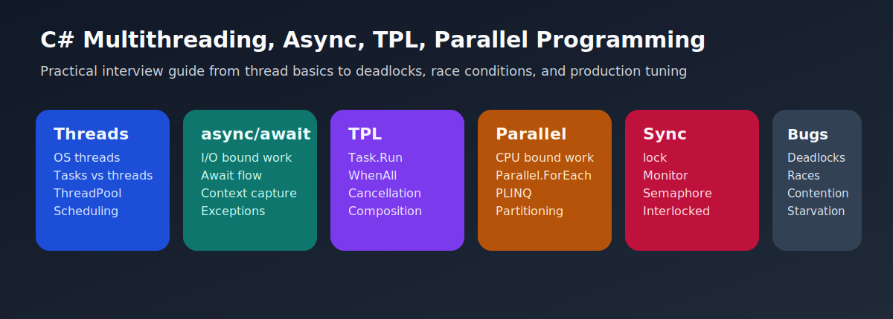

# C# Multithreading and Async Programming Interview Questions



This guide covers practical threading, tasks, async workflows, and synchronization design in real C# systems. It follows the corrected format of **100 interview questions for each subtopic**, and every answer includes a C# code example with rotated real-world scenarios so the examples do not repeat verbatim.

## How To Use This Page

- Questions 1-100 cover Threads, tasks, and their differences.
- Questions 101-200 cover async and await.
- Questions 201-300 cover Task Parallel Library (TPL).
- Questions 301-400 cover Parallel programming.
- Questions 401-500 cover Synchronization with lock, Monitor, Semaphore, and related tools.
- Questions 501-600 cover Deadlocks, race conditions, and concurrency bug prevention.

## 1. Threads, tasks, and their differences

> This section contains **100 interview questions** focused on **Threads, tasks, and their differences**. Every answer includes a C# code example, and the scenarios rotate so they do not repeat verbatim.

### Q1.1 What is threads versus tasks basics in C# multithreading and async programming?

**Answer:** Threads versus tasks basics means threads are execution units while tasks are higher-level representations of asynchronous or concurrent work. Teams should focus on it when explaining threads, tasks, and their differences in real systems, they compare it with treating Thread and Task as the same abstraction, and they should avoid the trap of choosing low-level threading without a reason. Example: while reviewing a parallel batch design, so resource contention becomes easier to reason about. Another example: during a background worker slowdown, so blocking behavior becomes easier to spot.

**Code Example:**

```csharp
using System;
using System.Collections.Concurrent;
using System.Collections.Generic;
using System.Collections.Immutable;
using System.Diagnostics;
using System.Linq;
using System.Threading;
using System.Threading.Tasks;

public static class Demo1_1
{
    public static void Run()
    {
        var thread = new Thread(() => Console.WriteLine(Environment.CurrentManagedThreadId));
        thread.Start();
        thread.Join();
    }
}
```

### Q1.2 How does ThreadPool role in C# multithreading and async programming?

**Answer:** Threadpool role means the ThreadPool reuses worker threads for queued work and shapes scalability for many workloads. Teams should focus on it when explaining threads, tasks, and their differences in real systems, they compare it with new dedicated threads for everything, and they should avoid the trap of ignoring pool behavior under blocking load. Example: during a UI responsiveness review, so blocking behavior becomes easier to spot. Another example: while reviewing a parallel batch design, so the design choice becomes easier to justify.

**Code Example:**

```csharp
using System;
using System.Collections.Concurrent;
using System.Collections.Generic;
using System.Collections.Immutable;
using System.Diagnostics;
using System.Linq;
using System.Threading;
using System.Threading.Tasks;

public static class Demo1_2
{
    public static void Run()
    {
        Task task = Task.Run(() => Console.WriteLine("pool work"));
        task.Wait();
    }
}
```

### Q1.3 Why does CPU bound versus I O bound framing in C# multithreading and async programming?

**Answer:** Cpu bound versus i o bound framing means concurrency design should distinguish CPU-heavy work from waiting-heavy work. Teams should focus on it when explaining threads, tasks, and their differences in real systems, they compare it with one concurrency strategy for all workloads, and they should avoid the trap of using extra threads to hide I O design issues. Example: while hardening concurrency in a reporting job, so the design choice becomes easier to justify. Another example: during a UI responsiveness review, so the bug becomes easier to isolate.

**Code Example:**

```csharp
using System;
using System.Collections.Concurrent;
using System.Collections.Generic;
using System.Collections.Immutable;
using System.Diagnostics;
using System.Linq;
using System.Threading;
using System.Threading.Tasks;

public static class Demo1_3
{
    public static void Run()
    {
        bool cpuBound = true;
        Console.WriteLine(cpuBound ? "CPU" : "I/O");
    }
}
```

### Q1.4 When should you use Task scheduling behavior in C# multithreading and async programming?

**Answer:** Task scheduling behavior means task execution depends on schedulers and pool availability rather than one guaranteed new thread. Teams should focus on it when explaining threads, tasks, and their differences in real systems, they compare it with one task equals one new thread thinking, and they should avoid the trap of explaining tasks as direct thread wrappers. Example: during a queue consumer incident, so the bug becomes easier to isolate. Another example: while hardening concurrency in a reporting job, so throughput trade-offs become easier to defend.

**Code Example:**

```csharp
using System;
using System.Collections.Concurrent;
using System.Collections.Generic;
using System.Collections.Immutable;
using System.Diagnostics;
using System.Linq;
using System.Threading;
using System.Threading.Tasks;

public static class Demo1_4
{
    public static void Run()
    {
        Task<int> work = Task.Run(() => 42);
        Console.WriteLine(work.Result);
    }
}
```

### Q1.5 What problem does long running work choices in C# multithreading and async programming?

**Answer:** Long running work choices means some workloads need dedicated treatment when they block for long periods or monopolize pool threads. Teams should focus on it when explaining threads, tasks, and their differences in real systems, they compare it with default scheduling for every long-lived job, and they should avoid the trap of starving the pool with blocking work. Example: while tuning a task-heavy import pipeline, so throughput trade-offs become easier to defend. Another example: during a queue consumer incident, so async behavior becomes easier to predict.

**Code Example:**

```csharp
using System;
using System.Collections.Concurrent;
using System.Collections.Generic;
using System.Collections.Immutable;
using System.Diagnostics;
using System.Linq;
using System.Threading;
using System.Threading.Tasks;

public static class Demo1_5
{
    public static void Run()
    {
        Task.Factory.StartNew(() => Thread.Sleep(10), TaskCreationOptions.LongRunning).Wait();
        Console.WriteLine("done");
    }
}
```

### Q1.6 How would you explain thread task interview framing in C# multithreading and async programming?

**Answer:** Thread task interview framing means strong answers connect abstraction choice to scalability diagnostics and maintainability. Teams should focus on it when explaining threads, tasks, and their differences in real systems, they compare it with API memorization only, and they should avoid the trap of skipping workload context. Example: during a thread-pool starvation analysis, so async behavior becomes easier to predict. Another example: while tuning a task-heavy import pipeline, so the concurrency boundary stays clearer.

**Code Example:**

```csharp
using System;
using System.Collections.Concurrent;
using System.Collections.Generic;
using System.Collections.Immutable;
using System.Diagnostics;
using System.Linq;
using System.Threading;
using System.Threading.Tasks;

public static class Demo1_6
{
    public static void Run()
    {
        Console.WriteLine(Thread.CurrentThread.ManagedThreadId);
    }
}
```

### Q1.7 Why is threads versus tasks basics in C# multithreading and async programming?

**Answer:** Threads versus tasks basics means threads are execution units while tasks are higher-level representations of asynchronous or concurrent work. Teams should focus on it when explaining threads, tasks, and their differences in real systems, they compare it with treating Thread and Task as the same abstraction, and they should avoid the trap of choosing low-level threading without a reason. Example: while debugging an API timeout chain, so the concurrency boundary stays clearer. Another example: during a thread-pool starvation analysis, so execution flow becomes easier to explain.

**Code Example:**

```csharp
using System;
using System.Collections.Concurrent;
using System.Collections.Generic;
using System.Collections.Immutable;
using System.Diagnostics;
using System.Linq;
using System.Threading;
using System.Threading.Tasks;

public static class Demo1_7
{
    public static void Run()
    {
        var thread = new Thread(() => Console.WriteLine(Environment.CurrentManagedThreadId));
        thread.Start();
        thread.Join();
    }
}
```

### Q1.8 How can ThreadPool role in C# multithreading and async programming?

**Answer:** Threadpool role means the ThreadPool reuses worker threads for queued work and shapes scalability for many workloads. Teams should focus on it when explaining threads, tasks, and their differences in real systems, they compare it with new dedicated threads for everything, and they should avoid the trap of ignoring pool behavior under blocking load. Example: during a deadlock investigation, so execution flow becomes easier to explain. Another example: while debugging an API timeout chain, so resource contention becomes easier to reason about.

**Code Example:**

```csharp
using System;
using System.Collections.Concurrent;
using System.Collections.Generic;
using System.Collections.Immutable;
using System.Diagnostics;
using System.Linq;
using System.Threading;
using System.Threading.Tasks;

public static class Demo1_8
{
    public static void Run()
    {
        Task task = Task.Run(() => Console.WriteLine("pool work"));
        task.Wait();
    }
}
```

### Q1.9 What is CPU bound versus I O bound framing in C# multithreading and async programming?

**Answer:** Cpu bound versus i o bound framing means concurrency design should distinguish CPU-heavy work from waiting-heavy work. Teams should focus on it when explaining threads, tasks, and their differences in real systems, they compare it with one concurrency strategy for all workloads, and they should avoid the trap of using extra threads to hide I O design issues. Example: while stabilizing a message-processing service, so resource contention becomes easier to reason about. Another example: during a deadlock investigation, so blocking behavior becomes easier to spot.

**Code Example:**

```csharp
using System;
using System.Collections.Concurrent;
using System.Collections.Generic;
using System.Collections.Immutable;
using System.Diagnostics;
using System.Linq;
using System.Threading;
using System.Threading.Tasks;

public static class Demo1_9
{
    public static void Run()
    {
        bool cpuBound = true;
        Console.WriteLine(cpuBound ? "CPU" : "I/O");
    }
}
```

### Q1.10 How does Task scheduling behavior in C# multithreading and async programming?

**Answer:** Task scheduling behavior means task execution depends on schedulers and pool availability rather than one guaranteed new thread. Teams should focus on it when explaining threads, tasks, and their differences in real systems, they compare it with one task equals one new thread thinking, and they should avoid the trap of explaining tasks as direct thread wrappers. Example: during a background worker slowdown, so blocking behavior becomes easier to spot. Another example: while stabilizing a message-processing service, so the design choice becomes easier to justify.

**Code Example:**

```csharp
using System;
using System.Collections.Concurrent;
using System.Collections.Generic;
using System.Collections.Immutable;
using System.Diagnostics;
using System.Linq;
using System.Threading;
using System.Threading.Tasks;

public static class Demo1_10
{
    public static void Run()
    {
        Task<int> work = Task.Run(() => 42);
        Console.WriteLine(work.Result);
    }
}
```

### Q1.11 Why does long running work choices in C# multithreading and async programming?

**Answer:** Long running work choices means some workloads need dedicated treatment when they block for long periods or monopolize pool threads. Teams should focus on it when explaining threads, tasks, and their differences in real systems, they compare it with default scheduling for every long-lived job, and they should avoid the trap of starving the pool with blocking work. Example: while reviewing a parallel batch design, so the design choice becomes easier to justify. Another example: during a background worker slowdown, so the bug becomes easier to isolate.

**Code Example:**

```csharp
using System;
using System.Collections.Concurrent;
using System.Collections.Generic;
using System.Collections.Immutable;
using System.Diagnostics;
using System.Linq;
using System.Threading;
using System.Threading.Tasks;

public static class Demo1_11
{
    public static void Run()
    {
        Task.Factory.StartNew(() => Thread.Sleep(10), TaskCreationOptions.LongRunning).Wait();
        Console.WriteLine("done");
    }
}
```

### Q1.12 When should you use thread task interview framing in C# multithreading and async programming?

**Answer:** Thread task interview framing means strong answers connect abstraction choice to scalability diagnostics and maintainability. Teams should focus on it when explaining threads, tasks, and their differences in real systems, they compare it with API memorization only, and they should avoid the trap of skipping workload context. Example: during a UI responsiveness review, so the bug becomes easier to isolate. Another example: while reviewing a parallel batch design, so throughput trade-offs become easier to defend.

**Code Example:**

```csharp
using System;
using System.Collections.Concurrent;
using System.Collections.Generic;
using System.Collections.Immutable;
using System.Diagnostics;
using System.Linq;
using System.Threading;
using System.Threading.Tasks;

public static class Demo1_12
{
    public static void Run()
    {
        Console.WriteLine(Thread.CurrentThread.ManagedThreadId);
    }
}
```

### Q1.13 What problem does threads versus tasks basics in C# multithreading and async programming?

**Answer:** Threads versus tasks basics means threads are execution units while tasks are higher-level representations of asynchronous or concurrent work. Teams should focus on it when explaining threads, tasks, and their differences in real systems, they compare it with treating Thread and Task as the same abstraction, and they should avoid the trap of choosing low-level threading without a reason. Example: while hardening concurrency in a reporting job, so throughput trade-offs become easier to defend. Another example: during a UI responsiveness review, so async behavior becomes easier to predict.

**Code Example:**

```csharp
using System;
using System.Collections.Concurrent;
using System.Collections.Generic;
using System.Collections.Immutable;
using System.Diagnostics;
using System.Linq;
using System.Threading;
using System.Threading.Tasks;

public static class Demo1_13
{
    public static void Run()
    {
        var thread = new Thread(() => Console.WriteLine(Environment.CurrentManagedThreadId));
        thread.Start();
        thread.Join();
    }
}
```

### Q1.14 How would you explain ThreadPool role in C# multithreading and async programming?

**Answer:** Threadpool role means the ThreadPool reuses worker threads for queued work and shapes scalability for many workloads. Teams should focus on it when explaining threads, tasks, and their differences in real systems, they compare it with new dedicated threads for everything, and they should avoid the trap of ignoring pool behavior under blocking load. Example: during a queue consumer incident, so async behavior becomes easier to predict. Another example: while hardening concurrency in a reporting job, so the concurrency boundary stays clearer.

**Code Example:**

```csharp
using System;
using System.Collections.Concurrent;
using System.Collections.Generic;
using System.Collections.Immutable;
using System.Diagnostics;
using System.Linq;
using System.Threading;
using System.Threading.Tasks;

public static class Demo1_14
{
    public static void Run()
    {
        Task task = Task.Run(() => Console.WriteLine("pool work"));
        task.Wait();
    }
}
```

### Q1.15 Why is CPU bound versus I O bound framing in C# multithreading and async programming?

**Answer:** Cpu bound versus i o bound framing means concurrency design should distinguish CPU-heavy work from waiting-heavy work. Teams should focus on it when explaining threads, tasks, and their differences in real systems, they compare it with one concurrency strategy for all workloads, and they should avoid the trap of using extra threads to hide I O design issues. Example: while tuning a task-heavy import pipeline, so the concurrency boundary stays clearer. Another example: during a queue consumer incident, so execution flow becomes easier to explain.

**Code Example:**

```csharp
using System;
using System.Collections.Concurrent;
using System.Collections.Generic;
using System.Collections.Immutable;
using System.Diagnostics;
using System.Linq;
using System.Threading;
using System.Threading.Tasks;

public static class Demo1_15
{
    public static void Run()
    {
        bool cpuBound = true;
        Console.WriteLine(cpuBound ? "CPU" : "I/O");
    }
}
```

### Q1.16 How can Task scheduling behavior in C# multithreading and async programming?

**Answer:** Task scheduling behavior means task execution depends on schedulers and pool availability rather than one guaranteed new thread. Teams should focus on it when explaining threads, tasks, and their differences in real systems, they compare it with one task equals one new thread thinking, and they should avoid the trap of explaining tasks as direct thread wrappers. Example: during a thread-pool starvation analysis, so execution flow becomes easier to explain. Another example: while tuning a task-heavy import pipeline, so resource contention becomes easier to reason about.

**Code Example:**

```csharp
using System;
using System.Collections.Concurrent;
using System.Collections.Generic;
using System.Collections.Immutable;
using System.Diagnostics;
using System.Linq;
using System.Threading;
using System.Threading.Tasks;

public static class Demo1_16
{
    public static void Run()
    {
        Task<int> work = Task.Run(() => 42);
        Console.WriteLine(work.Result);
    }
}
```

### Q1.17 What is long running work choices in C# multithreading and async programming?

**Answer:** Long running work choices means some workloads need dedicated treatment when they block for long periods or monopolize pool threads. Teams should focus on it when explaining threads, tasks, and their differences in real systems, they compare it with default scheduling for every long-lived job, and they should avoid the trap of starving the pool with blocking work. Example: while debugging an API timeout chain, so resource contention becomes easier to reason about. Another example: during a thread-pool starvation analysis, so blocking behavior becomes easier to spot.

**Code Example:**

```csharp
using System;
using System.Collections.Concurrent;
using System.Collections.Generic;
using System.Collections.Immutable;
using System.Diagnostics;
using System.Linq;
using System.Threading;
using System.Threading.Tasks;

public static class Demo1_17
{
    public static void Run()
    {
        Task.Factory.StartNew(() => Thread.Sleep(10), TaskCreationOptions.LongRunning).Wait();
        Console.WriteLine("done");
    }
}
```

### Q1.18 How does thread task interview framing in C# multithreading and async programming?

**Answer:** Thread task interview framing means strong answers connect abstraction choice to scalability diagnostics and maintainability. Teams should focus on it when explaining threads, tasks, and their differences in real systems, they compare it with API memorization only, and they should avoid the trap of skipping workload context. Example: during a deadlock investigation, so blocking behavior becomes easier to spot. Another example: while debugging an API timeout chain, so the design choice becomes easier to justify.

**Code Example:**

```csharp
using System;
using System.Collections.Concurrent;
using System.Collections.Generic;
using System.Collections.Immutable;
using System.Diagnostics;
using System.Linq;
using System.Threading;
using System.Threading.Tasks;

public static class Demo1_18
{
    public static void Run()
    {
        Console.WriteLine(Thread.CurrentThread.ManagedThreadId);
    }
}
```

### Q1.19 Why does threads versus tasks basics in C# multithreading and async programming?

**Answer:** Threads versus tasks basics means threads are execution units while tasks are higher-level representations of asynchronous or concurrent work. Teams should focus on it when explaining threads, tasks, and their differences in real systems, they compare it with treating Thread and Task as the same abstraction, and they should avoid the trap of choosing low-level threading without a reason. Example: while stabilizing a message-processing service, so the design choice becomes easier to justify. Another example: during a deadlock investigation, so the bug becomes easier to isolate.

**Code Example:**

```csharp
using System;
using System.Collections.Concurrent;
using System.Collections.Generic;
using System.Collections.Immutable;
using System.Diagnostics;
using System.Linq;
using System.Threading;
using System.Threading.Tasks;

public static class Demo1_19
{
    public static void Run()
    {
        var thread = new Thread(() => Console.WriteLine(Environment.CurrentManagedThreadId));
        thread.Start();
        thread.Join();
    }
}
```

### Q1.20 When should you use ThreadPool role in C# multithreading and async programming?

**Answer:** Threadpool role means the ThreadPool reuses worker threads for queued work and shapes scalability for many workloads. Teams should focus on it when explaining threads, tasks, and their differences in real systems, they compare it with new dedicated threads for everything, and they should avoid the trap of ignoring pool behavior under blocking load. Example: during a background worker slowdown, so the bug becomes easier to isolate. Another example: while stabilizing a message-processing service, so throughput trade-offs become easier to defend.

**Code Example:**

```csharp
using System;
using System.Collections.Concurrent;
using System.Collections.Generic;
using System.Collections.Immutable;
using System.Diagnostics;
using System.Linq;
using System.Threading;
using System.Threading.Tasks;

public static class Demo1_20
{
    public static void Run()
    {
        Task task = Task.Run(() => Console.WriteLine("pool work"));
        task.Wait();
    }
}
```

### Q1.21 What problem does CPU bound versus I O bound framing in C# multithreading and async programming?

**Answer:** Cpu bound versus i o bound framing means concurrency design should distinguish CPU-heavy work from waiting-heavy work. Teams should focus on it when explaining threads, tasks, and their differences in real systems, they compare it with one concurrency strategy for all workloads, and they should avoid the trap of using extra threads to hide I O design issues. Example: while reviewing a parallel batch design, so throughput trade-offs become easier to defend. Another example: during a background worker slowdown, so async behavior becomes easier to predict.

**Code Example:**

```csharp
using System;
using System.Collections.Concurrent;
using System.Collections.Generic;
using System.Collections.Immutable;
using System.Diagnostics;
using System.Linq;
using System.Threading;
using System.Threading.Tasks;

public static class Demo1_21
{
    public static void Run()
    {
        bool cpuBound = true;
        Console.WriteLine(cpuBound ? "CPU" : "I/O");
    }
}
```

### Q1.22 How would you explain Task scheduling behavior in C# multithreading and async programming?

**Answer:** Task scheduling behavior means task execution depends on schedulers and pool availability rather than one guaranteed new thread. Teams should focus on it when explaining threads, tasks, and their differences in real systems, they compare it with one task equals one new thread thinking, and they should avoid the trap of explaining tasks as direct thread wrappers. Example: during a UI responsiveness review, so async behavior becomes easier to predict. Another example: while reviewing a parallel batch design, so the concurrency boundary stays clearer.

**Code Example:**

```csharp
using System;
using System.Collections.Concurrent;
using System.Collections.Generic;
using System.Collections.Immutable;
using System.Diagnostics;
using System.Linq;
using System.Threading;
using System.Threading.Tasks;

public static class Demo1_22
{
    public static void Run()
    {
        Task<int> work = Task.Run(() => 42);
        Console.WriteLine(work.Result);
    }
}
```

### Q1.23 Why is long running work choices in C# multithreading and async programming?

**Answer:** Long running work choices means some workloads need dedicated treatment when they block for long periods or monopolize pool threads. Teams should focus on it when explaining threads, tasks, and their differences in real systems, they compare it with default scheduling for every long-lived job, and they should avoid the trap of starving the pool with blocking work. Example: while hardening concurrency in a reporting job, so the concurrency boundary stays clearer. Another example: during a UI responsiveness review, so execution flow becomes easier to explain.

**Code Example:**

```csharp
using System;
using System.Collections.Concurrent;
using System.Collections.Generic;
using System.Collections.Immutable;
using System.Diagnostics;
using System.Linq;
using System.Threading;
using System.Threading.Tasks;

public static class Demo1_23
{
    public static void Run()
    {
        Task.Factory.StartNew(() => Thread.Sleep(10), TaskCreationOptions.LongRunning).Wait();
        Console.WriteLine("done");
    }
}
```

### Q1.24 How can thread task interview framing in C# multithreading and async programming?

**Answer:** Thread task interview framing means strong answers connect abstraction choice to scalability diagnostics and maintainability. Teams should focus on it when explaining threads, tasks, and their differences in real systems, they compare it with API memorization only, and they should avoid the trap of skipping workload context. Example: during a queue consumer incident, so execution flow becomes easier to explain. Another example: while hardening concurrency in a reporting job, so resource contention becomes easier to reason about.

**Code Example:**

```csharp
using System;
using System.Collections.Concurrent;
using System.Collections.Generic;
using System.Collections.Immutable;
using System.Diagnostics;
using System.Linq;
using System.Threading;
using System.Threading.Tasks;

public static class Demo1_24
{
    public static void Run()
    {
        Console.WriteLine(Thread.CurrentThread.ManagedThreadId);
    }
}
```

### Q1.25 What is threads versus tasks basics in C# multithreading and async programming?

**Answer:** Threads versus tasks basics means threads are execution units while tasks are higher-level representations of asynchronous or concurrent work. Teams should focus on it when explaining threads, tasks, and their differences in real systems, they compare it with treating Thread and Task as the same abstraction, and they should avoid the trap of choosing low-level threading without a reason. Example: while tuning a task-heavy import pipeline, so resource contention becomes easier to reason about. Another example: during a queue consumer incident, so blocking behavior becomes easier to spot.

**Code Example:**

```csharp
using System;
using System.Collections.Concurrent;
using System.Collections.Generic;
using System.Collections.Immutable;
using System.Diagnostics;
using System.Linq;
using System.Threading;
using System.Threading.Tasks;

public static class Demo1_25
{
    public static void Run()
    {
        var thread = new Thread(() => Console.WriteLine(Environment.CurrentManagedThreadId));
        thread.Start();
        thread.Join();
    }
}
```

### Q1.26 How does ThreadPool role in C# multithreading and async programming?

**Answer:** Threadpool role means the ThreadPool reuses worker threads for queued work and shapes scalability for many workloads. Teams should focus on it when explaining threads, tasks, and their differences in real systems, they compare it with new dedicated threads for everything, and they should avoid the trap of ignoring pool behavior under blocking load. Example: during a thread-pool starvation analysis, so blocking behavior becomes easier to spot. Another example: while tuning a task-heavy import pipeline, so the design choice becomes easier to justify.

**Code Example:**

```csharp
using System;
using System.Collections.Concurrent;
using System.Collections.Generic;
using System.Collections.Immutable;
using System.Diagnostics;
using System.Linq;
using System.Threading;
using System.Threading.Tasks;

public static class Demo1_26
{
    public static void Run()
    {
        Task task = Task.Run(() => Console.WriteLine("pool work"));
        task.Wait();
    }
}
```

### Q1.27 Why does CPU bound versus I O bound framing in C# multithreading and async programming?

**Answer:** Cpu bound versus i o bound framing means concurrency design should distinguish CPU-heavy work from waiting-heavy work. Teams should focus on it when explaining threads, tasks, and their differences in real systems, they compare it with one concurrency strategy for all workloads, and they should avoid the trap of using extra threads to hide I O design issues. Example: while debugging an API timeout chain, so the design choice becomes easier to justify. Another example: during a thread-pool starvation analysis, so the bug becomes easier to isolate.

**Code Example:**

```csharp
using System;
using System.Collections.Concurrent;
using System.Collections.Generic;
using System.Collections.Immutable;
using System.Diagnostics;
using System.Linq;
using System.Threading;
using System.Threading.Tasks;

public static class Demo1_27
{
    public static void Run()
    {
        bool cpuBound = true;
        Console.WriteLine(cpuBound ? "CPU" : "I/O");
    }
}
```

### Q1.28 When should you use Task scheduling behavior in C# multithreading and async programming?

**Answer:** Task scheduling behavior means task execution depends on schedulers and pool availability rather than one guaranteed new thread. Teams should focus on it when explaining threads, tasks, and their differences in real systems, they compare it with one task equals one new thread thinking, and they should avoid the trap of explaining tasks as direct thread wrappers. Example: during a deadlock investigation, so the bug becomes easier to isolate. Another example: while debugging an API timeout chain, so throughput trade-offs become easier to defend.

**Code Example:**

```csharp
using System;
using System.Collections.Concurrent;
using System.Collections.Generic;
using System.Collections.Immutable;
using System.Diagnostics;
using System.Linq;
using System.Threading;
using System.Threading.Tasks;

public static class Demo1_28
{
    public static void Run()
    {
        Task<int> work = Task.Run(() => 42);
        Console.WriteLine(work.Result);
    }
}
```

### Q1.29 What problem does long running work choices in C# multithreading and async programming?

**Answer:** Long running work choices means some workloads need dedicated treatment when they block for long periods or monopolize pool threads. Teams should focus on it when explaining threads, tasks, and their differences in real systems, they compare it with default scheduling for every long-lived job, and they should avoid the trap of starving the pool with blocking work. Example: while stabilizing a message-processing service, so throughput trade-offs become easier to defend. Another example: during a deadlock investigation, so async behavior becomes easier to predict.

**Code Example:**

```csharp
using System;
using System.Collections.Concurrent;
using System.Collections.Generic;
using System.Collections.Immutable;
using System.Diagnostics;
using System.Linq;
using System.Threading;
using System.Threading.Tasks;

public static class Demo1_29
{
    public static void Run()
    {
        Task.Factory.StartNew(() => Thread.Sleep(10), TaskCreationOptions.LongRunning).Wait();
        Console.WriteLine("done");
    }
}
```

### Q1.30 How would you explain thread task interview framing in C# multithreading and async programming?

**Answer:** Thread task interview framing means strong answers connect abstraction choice to scalability diagnostics and maintainability. Teams should focus on it when explaining threads, tasks, and their differences in real systems, they compare it with API memorization only, and they should avoid the trap of skipping workload context. Example: during a background worker slowdown, so async behavior becomes easier to predict. Another example: while stabilizing a message-processing service, so the concurrency boundary stays clearer.

**Code Example:**

```csharp
using System;
using System.Collections.Concurrent;
using System.Collections.Generic;
using System.Collections.Immutable;
using System.Diagnostics;
using System.Linq;
using System.Threading;
using System.Threading.Tasks;

public static class Demo1_30
{
    public static void Run()
    {
        Console.WriteLine(Thread.CurrentThread.ManagedThreadId);
    }
}
```

### Q1.31 Why is threads versus tasks basics in C# multithreading and async programming?

**Answer:** Threads versus tasks basics means threads are execution units while tasks are higher-level representations of asynchronous or concurrent work. Teams should focus on it when explaining threads, tasks, and their differences in real systems, they compare it with treating Thread and Task as the same abstraction, and they should avoid the trap of choosing low-level threading without a reason. Example: while reviewing a parallel batch design, so the concurrency boundary stays clearer. Another example: during a background worker slowdown, so execution flow becomes easier to explain.

**Code Example:**

```csharp
using System;
using System.Collections.Concurrent;
using System.Collections.Generic;
using System.Collections.Immutable;
using System.Diagnostics;
using System.Linq;
using System.Threading;
using System.Threading.Tasks;

public static class Demo1_31
{
    public static void Run()
    {
        var thread = new Thread(() => Console.WriteLine(Environment.CurrentManagedThreadId));
        thread.Start();
        thread.Join();
    }
}
```

### Q1.32 How can ThreadPool role in C# multithreading and async programming?

**Answer:** Threadpool role means the ThreadPool reuses worker threads for queued work and shapes scalability for many workloads. Teams should focus on it when explaining threads, tasks, and their differences in real systems, they compare it with new dedicated threads for everything, and they should avoid the trap of ignoring pool behavior under blocking load. Example: during a UI responsiveness review, so execution flow becomes easier to explain. Another example: while reviewing a parallel batch design, so resource contention becomes easier to reason about.

**Code Example:**

```csharp
using System;
using System.Collections.Concurrent;
using System.Collections.Generic;
using System.Collections.Immutable;
using System.Diagnostics;
using System.Linq;
using System.Threading;
using System.Threading.Tasks;

public static class Demo1_32
{
    public static void Run()
    {
        Task task = Task.Run(() => Console.WriteLine("pool work"));
        task.Wait();
    }
}
```

### Q1.33 What is CPU bound versus I O bound framing in C# multithreading and async programming?

**Answer:** Cpu bound versus i o bound framing means concurrency design should distinguish CPU-heavy work from waiting-heavy work. Teams should focus on it when explaining threads, tasks, and their differences in real systems, they compare it with one concurrency strategy for all workloads, and they should avoid the trap of using extra threads to hide I O design issues. Example: while hardening concurrency in a reporting job, so resource contention becomes easier to reason about. Another example: during a UI responsiveness review, so blocking behavior becomes easier to spot.

**Code Example:**

```csharp
using System;
using System.Collections.Concurrent;
using System.Collections.Generic;
using System.Collections.Immutable;
using System.Diagnostics;
using System.Linq;
using System.Threading;
using System.Threading.Tasks;

public static class Demo1_33
{
    public static void Run()
    {
        bool cpuBound = true;
        Console.WriteLine(cpuBound ? "CPU" : "I/O");
    }
}
```

### Q1.34 How does Task scheduling behavior in C# multithreading and async programming?

**Answer:** Task scheduling behavior means task execution depends on schedulers and pool availability rather than one guaranteed new thread. Teams should focus on it when explaining threads, tasks, and their differences in real systems, they compare it with one task equals one new thread thinking, and they should avoid the trap of explaining tasks as direct thread wrappers. Example: during a queue consumer incident, so blocking behavior becomes easier to spot. Another example: while hardening concurrency in a reporting job, so the design choice becomes easier to justify.

**Code Example:**

```csharp
using System;
using System.Collections.Concurrent;
using System.Collections.Generic;
using System.Collections.Immutable;
using System.Diagnostics;
using System.Linq;
using System.Threading;
using System.Threading.Tasks;

public static class Demo1_34
{
    public static void Run()
    {
        Task<int> work = Task.Run(() => 42);
        Console.WriteLine(work.Result);
    }
}
```

### Q1.35 Why does long running work choices in C# multithreading and async programming?

**Answer:** Long running work choices means some workloads need dedicated treatment when they block for long periods or monopolize pool threads. Teams should focus on it when explaining threads, tasks, and their differences in real systems, they compare it with default scheduling for every long-lived job, and they should avoid the trap of starving the pool with blocking work. Example: while tuning a task-heavy import pipeline, so the design choice becomes easier to justify. Another example: during a queue consumer incident, so the bug becomes easier to isolate.

**Code Example:**

```csharp
using System;
using System.Collections.Concurrent;
using System.Collections.Generic;
using System.Collections.Immutable;
using System.Diagnostics;
using System.Linq;
using System.Threading;
using System.Threading.Tasks;

public static class Demo1_35
{
    public static void Run()
    {
        Task.Factory.StartNew(() => Thread.Sleep(10), TaskCreationOptions.LongRunning).Wait();
        Console.WriteLine("done");
    }
}
```

### Q1.36 When should you use thread task interview framing in C# multithreading and async programming?

**Answer:** Thread task interview framing means strong answers connect abstraction choice to scalability diagnostics and maintainability. Teams should focus on it when explaining threads, tasks, and their differences in real systems, they compare it with API memorization only, and they should avoid the trap of skipping workload context. Example: during a thread-pool starvation analysis, so the bug becomes easier to isolate. Another example: while tuning a task-heavy import pipeline, so throughput trade-offs become easier to defend.

**Code Example:**

```csharp
using System;
using System.Collections.Concurrent;
using System.Collections.Generic;
using System.Collections.Immutable;
using System.Diagnostics;
using System.Linq;
using System.Threading;
using System.Threading.Tasks;

public static class Demo1_36
{
    public static void Run()
    {
        Console.WriteLine(Thread.CurrentThread.ManagedThreadId);
    }
}
```

### Q1.37 What problem does threads versus tasks basics in C# multithreading and async programming?

**Answer:** Threads versus tasks basics means threads are execution units while tasks are higher-level representations of asynchronous or concurrent work. Teams should focus on it when explaining threads, tasks, and their differences in real systems, they compare it with treating Thread and Task as the same abstraction, and they should avoid the trap of choosing low-level threading without a reason. Example: while debugging an API timeout chain, so throughput trade-offs become easier to defend. Another example: during a thread-pool starvation analysis, so async behavior becomes easier to predict.

**Code Example:**

```csharp
using System;
using System.Collections.Concurrent;
using System.Collections.Generic;
using System.Collections.Immutable;
using System.Diagnostics;
using System.Linq;
using System.Threading;
using System.Threading.Tasks;

public static class Demo1_37
{
    public static void Run()
    {
        var thread = new Thread(() => Console.WriteLine(Environment.CurrentManagedThreadId));
        thread.Start();
        thread.Join();
    }
}
```

### Q1.38 How would you explain ThreadPool role in C# multithreading and async programming?

**Answer:** Threadpool role means the ThreadPool reuses worker threads for queued work and shapes scalability for many workloads. Teams should focus on it when explaining threads, tasks, and their differences in real systems, they compare it with new dedicated threads for everything, and they should avoid the trap of ignoring pool behavior under blocking load. Example: during a deadlock investigation, so async behavior becomes easier to predict. Another example: while debugging an API timeout chain, so the concurrency boundary stays clearer.

**Code Example:**

```csharp
using System;
using System.Collections.Concurrent;
using System.Collections.Generic;
using System.Collections.Immutable;
using System.Diagnostics;
using System.Linq;
using System.Threading;
using System.Threading.Tasks;

public static class Demo1_38
{
    public static void Run()
    {
        Task task = Task.Run(() => Console.WriteLine("pool work"));
        task.Wait();
    }
}
```

### Q1.39 Why is CPU bound versus I O bound framing in C# multithreading and async programming?

**Answer:** Cpu bound versus i o bound framing means concurrency design should distinguish CPU-heavy work from waiting-heavy work. Teams should focus on it when explaining threads, tasks, and their differences in real systems, they compare it with one concurrency strategy for all workloads, and they should avoid the trap of using extra threads to hide I O design issues. Example: while stabilizing a message-processing service, so the concurrency boundary stays clearer. Another example: during a deadlock investigation, so execution flow becomes easier to explain.

**Code Example:**

```csharp
using System;
using System.Collections.Concurrent;
using System.Collections.Generic;
using System.Collections.Immutable;
using System.Diagnostics;
using System.Linq;
using System.Threading;
using System.Threading.Tasks;

public static class Demo1_39
{
    public static void Run()
    {
        bool cpuBound = true;
        Console.WriteLine(cpuBound ? "CPU" : "I/O");
    }
}
```

### Q1.40 How can Task scheduling behavior in C# multithreading and async programming?

**Answer:** Task scheduling behavior means task execution depends on schedulers and pool availability rather than one guaranteed new thread. Teams should focus on it when explaining threads, tasks, and their differences in real systems, they compare it with one task equals one new thread thinking, and they should avoid the trap of explaining tasks as direct thread wrappers. Example: during a background worker slowdown, so execution flow becomes easier to explain. Another example: while stabilizing a message-processing service, so resource contention becomes easier to reason about.

**Code Example:**

```csharp
using System;
using System.Collections.Concurrent;
using System.Collections.Generic;
using System.Collections.Immutable;
using System.Diagnostics;
using System.Linq;
using System.Threading;
using System.Threading.Tasks;

public static class Demo1_40
{
    public static void Run()
    {
        Task<int> work = Task.Run(() => 42);
        Console.WriteLine(work.Result);
    }
}
```

### Q1.41 What is long running work choices in C# multithreading and async programming?

**Answer:** Long running work choices means some workloads need dedicated treatment when they block for long periods or monopolize pool threads. Teams should focus on it when explaining threads, tasks, and their differences in real systems, they compare it with default scheduling for every long-lived job, and they should avoid the trap of starving the pool with blocking work. Example: while reviewing a parallel batch design, so resource contention becomes easier to reason about. Another example: during a background worker slowdown, so blocking behavior becomes easier to spot.

**Code Example:**

```csharp
using System;
using System.Collections.Concurrent;
using System.Collections.Generic;
using System.Collections.Immutable;
using System.Diagnostics;
using System.Linq;
using System.Threading;
using System.Threading.Tasks;

public static class Demo1_41
{
    public static void Run()
    {
        Task.Factory.StartNew(() => Thread.Sleep(10), TaskCreationOptions.LongRunning).Wait();
        Console.WriteLine("done");
    }
}
```

### Q1.42 How does thread task interview framing in C# multithreading and async programming?

**Answer:** Thread task interview framing means strong answers connect abstraction choice to scalability diagnostics and maintainability. Teams should focus on it when explaining threads, tasks, and their differences in real systems, they compare it with API memorization only, and they should avoid the trap of skipping workload context. Example: during a UI responsiveness review, so blocking behavior becomes easier to spot. Another example: while reviewing a parallel batch design, so the design choice becomes easier to justify.

**Code Example:**

```csharp
using System;
using System.Collections.Concurrent;
using System.Collections.Generic;
using System.Collections.Immutable;
using System.Diagnostics;
using System.Linq;
using System.Threading;
using System.Threading.Tasks;

public static class Demo1_42
{
    public static void Run()
    {
        Console.WriteLine(Thread.CurrentThread.ManagedThreadId);
    }
}
```

### Q1.43 Why does threads versus tasks basics in C# multithreading and async programming?

**Answer:** Threads versus tasks basics means threads are execution units while tasks are higher-level representations of asynchronous or concurrent work. Teams should focus on it when explaining threads, tasks, and their differences in real systems, they compare it with treating Thread and Task as the same abstraction, and they should avoid the trap of choosing low-level threading without a reason. Example: while hardening concurrency in a reporting job, so the design choice becomes easier to justify. Another example: during a UI responsiveness review, so the bug becomes easier to isolate.

**Code Example:**

```csharp
using System;
using System.Collections.Concurrent;
using System.Collections.Generic;
using System.Collections.Immutable;
using System.Diagnostics;
using System.Linq;
using System.Threading;
using System.Threading.Tasks;

public static class Demo1_43
{
    public static void Run()
    {
        var thread = new Thread(() => Console.WriteLine(Environment.CurrentManagedThreadId));
        thread.Start();
        thread.Join();
    }
}
```

### Q1.44 When should you use ThreadPool role in C# multithreading and async programming?

**Answer:** Threadpool role means the ThreadPool reuses worker threads for queued work and shapes scalability for many workloads. Teams should focus on it when explaining threads, tasks, and their differences in real systems, they compare it with new dedicated threads for everything, and they should avoid the trap of ignoring pool behavior under blocking load. Example: during a queue consumer incident, so the bug becomes easier to isolate. Another example: while hardening concurrency in a reporting job, so throughput trade-offs become easier to defend.

**Code Example:**

```csharp
using System;
using System.Collections.Concurrent;
using System.Collections.Generic;
using System.Collections.Immutable;
using System.Diagnostics;
using System.Linq;
using System.Threading;
using System.Threading.Tasks;

public static class Demo1_44
{
    public static void Run()
    {
        Task task = Task.Run(() => Console.WriteLine("pool work"));
        task.Wait();
    }
}
```

### Q1.45 What problem does CPU bound versus I O bound framing in C# multithreading and async programming?

**Answer:** Cpu bound versus i o bound framing means concurrency design should distinguish CPU-heavy work from waiting-heavy work. Teams should focus on it when explaining threads, tasks, and their differences in real systems, they compare it with one concurrency strategy for all workloads, and they should avoid the trap of using extra threads to hide I O design issues. Example: while tuning a task-heavy import pipeline, so throughput trade-offs become easier to defend. Another example: during a queue consumer incident, so async behavior becomes easier to predict.

**Code Example:**

```csharp
using System;
using System.Collections.Concurrent;
using System.Collections.Generic;
using System.Collections.Immutable;
using System.Diagnostics;
using System.Linq;
using System.Threading;
using System.Threading.Tasks;

public static class Demo1_45
{
    public static void Run()
    {
        bool cpuBound = true;
        Console.WriteLine(cpuBound ? "CPU" : "I/O");
    }
}
```

### Q1.46 How would you explain Task scheduling behavior in C# multithreading and async programming?

**Answer:** Task scheduling behavior means task execution depends on schedulers and pool availability rather than one guaranteed new thread. Teams should focus on it when explaining threads, tasks, and their differences in real systems, they compare it with one task equals one new thread thinking, and they should avoid the trap of explaining tasks as direct thread wrappers. Example: during a thread-pool starvation analysis, so async behavior becomes easier to predict. Another example: while tuning a task-heavy import pipeline, so the concurrency boundary stays clearer.

**Code Example:**

```csharp
using System;
using System.Collections.Concurrent;
using System.Collections.Generic;
using System.Collections.Immutable;
using System.Diagnostics;
using System.Linq;
using System.Threading;
using System.Threading.Tasks;

public static class Demo1_46
{
    public static void Run()
    {
        Task<int> work = Task.Run(() => 42);
        Console.WriteLine(work.Result);
    }
}
```

### Q1.47 Why is long running work choices in C# multithreading and async programming?

**Answer:** Long running work choices means some workloads need dedicated treatment when they block for long periods or monopolize pool threads. Teams should focus on it when explaining threads, tasks, and their differences in real systems, they compare it with default scheduling for every long-lived job, and they should avoid the trap of starving the pool with blocking work. Example: while debugging an API timeout chain, so the concurrency boundary stays clearer. Another example: during a thread-pool starvation analysis, so execution flow becomes easier to explain.

**Code Example:**

```csharp
using System;
using System.Collections.Concurrent;
using System.Collections.Generic;
using System.Collections.Immutable;
using System.Diagnostics;
using System.Linq;
using System.Threading;
using System.Threading.Tasks;

public static class Demo1_47
{
    public static void Run()
    {
        Task.Factory.StartNew(() => Thread.Sleep(10), TaskCreationOptions.LongRunning).Wait();
        Console.WriteLine("done");
    }
}
```

### Q1.48 How can thread task interview framing in C# multithreading and async programming?

**Answer:** Thread task interview framing means strong answers connect abstraction choice to scalability diagnostics and maintainability. Teams should focus on it when explaining threads, tasks, and their differences in real systems, they compare it with API memorization only, and they should avoid the trap of skipping workload context. Example: during a deadlock investigation, so execution flow becomes easier to explain. Another example: while debugging an API timeout chain, so resource contention becomes easier to reason about.

**Code Example:**

```csharp
using System;
using System.Collections.Concurrent;
using System.Collections.Generic;
using System.Collections.Immutable;
using System.Diagnostics;
using System.Linq;
using System.Threading;
using System.Threading.Tasks;

public static class Demo1_48
{
    public static void Run()
    {
        Console.WriteLine(Thread.CurrentThread.ManagedThreadId);
    }
}
```

### Q1.49 What is threads versus tasks basics in C# multithreading and async programming?

**Answer:** Threads versus tasks basics means threads are execution units while tasks are higher-level representations of asynchronous or concurrent work. Teams should focus on it when explaining threads, tasks, and their differences in real systems, they compare it with treating Thread and Task as the same abstraction, and they should avoid the trap of choosing low-level threading without a reason. Example: while stabilizing a message-processing service, so resource contention becomes easier to reason about. Another example: during a deadlock investigation, so blocking behavior becomes easier to spot.

**Code Example:**

```csharp
using System;
using System.Collections.Concurrent;
using System.Collections.Generic;
using System.Collections.Immutable;
using System.Diagnostics;
using System.Linq;
using System.Threading;
using System.Threading.Tasks;

public static class Demo1_49
{
    public static void Run()
    {
        var thread = new Thread(() => Console.WriteLine(Environment.CurrentManagedThreadId));
        thread.Start();
        thread.Join();
    }
}
```

### Q1.50 How does ThreadPool role in C# multithreading and async programming?

**Answer:** Threadpool role means the ThreadPool reuses worker threads for queued work and shapes scalability for many workloads. Teams should focus on it when explaining threads, tasks, and their differences in real systems, they compare it with new dedicated threads for everything, and they should avoid the trap of ignoring pool behavior under blocking load. Example: during a background worker slowdown, so blocking behavior becomes easier to spot. Another example: while stabilizing a message-processing service, so the design choice becomes easier to justify.

**Code Example:**

```csharp
using System;
using System.Collections.Concurrent;
using System.Collections.Generic;
using System.Collections.Immutable;
using System.Diagnostics;
using System.Linq;
using System.Threading;
using System.Threading.Tasks;

public static class Demo1_50
{
    public static void Run()
    {
        Task task = Task.Run(() => Console.WriteLine("pool work"));
        task.Wait();
    }
}
```

### Q1.51 Why does CPU bound versus I O bound framing in C# multithreading and async programming?

**Answer:** Cpu bound versus i o bound framing means concurrency design should distinguish CPU-heavy work from waiting-heavy work. Teams should focus on it when explaining threads, tasks, and their differences in real systems, they compare it with one concurrency strategy for all workloads, and they should avoid the trap of using extra threads to hide I O design issues. Example: while reviewing a parallel batch design, so the design choice becomes easier to justify. Another example: during a background worker slowdown, so the bug becomes easier to isolate.

**Code Example:**

```csharp
using System;
using System.Collections.Concurrent;
using System.Collections.Generic;
using System.Collections.Immutable;
using System.Diagnostics;
using System.Linq;
using System.Threading;
using System.Threading.Tasks;

public static class Demo1_51
{
    public static void Run()
    {
        bool cpuBound = true;
        Console.WriteLine(cpuBound ? "CPU" : "I/O");
    }
}
```

### Q1.52 When should you use Task scheduling behavior in C# multithreading and async programming?

**Answer:** Task scheduling behavior means task execution depends on schedulers and pool availability rather than one guaranteed new thread. Teams should focus on it when explaining threads, tasks, and their differences in real systems, they compare it with one task equals one new thread thinking, and they should avoid the trap of explaining tasks as direct thread wrappers. Example: during a UI responsiveness review, so the bug becomes easier to isolate. Another example: while reviewing a parallel batch design, so throughput trade-offs become easier to defend.

**Code Example:**

```csharp
using System;
using System.Collections.Concurrent;
using System.Collections.Generic;
using System.Collections.Immutable;
using System.Diagnostics;
using System.Linq;
using System.Threading;
using System.Threading.Tasks;

public static class Demo1_52
{
    public static void Run()
    {
        Task<int> work = Task.Run(() => 42);
        Console.WriteLine(work.Result);
    }
}
```

### Q1.53 What problem does long running work choices in C# multithreading and async programming?

**Answer:** Long running work choices means some workloads need dedicated treatment when they block for long periods or monopolize pool threads. Teams should focus on it when explaining threads, tasks, and their differences in real systems, they compare it with default scheduling for every long-lived job, and they should avoid the trap of starving the pool with blocking work. Example: while hardening concurrency in a reporting job, so throughput trade-offs become easier to defend. Another example: during a UI responsiveness review, so async behavior becomes easier to predict.

**Code Example:**

```csharp
using System;
using System.Collections.Concurrent;
using System.Collections.Generic;
using System.Collections.Immutable;
using System.Diagnostics;
using System.Linq;
using System.Threading;
using System.Threading.Tasks;

public static class Demo1_53
{
    public static void Run()
    {
        Task.Factory.StartNew(() => Thread.Sleep(10), TaskCreationOptions.LongRunning).Wait();
        Console.WriteLine("done");
    }
}
```

### Q1.54 How would you explain thread task interview framing in C# multithreading and async programming?

**Answer:** Thread task interview framing means strong answers connect abstraction choice to scalability diagnostics and maintainability. Teams should focus on it when explaining threads, tasks, and their differences in real systems, they compare it with API memorization only, and they should avoid the trap of skipping workload context. Example: during a queue consumer incident, so async behavior becomes easier to predict. Another example: while hardening concurrency in a reporting job, so the concurrency boundary stays clearer.

**Code Example:**

```csharp
using System;
using System.Collections.Concurrent;
using System.Collections.Generic;
using System.Collections.Immutable;
using System.Diagnostics;
using System.Linq;
using System.Threading;
using System.Threading.Tasks;

public static class Demo1_54
{
    public static void Run()
    {
        Console.WriteLine(Thread.CurrentThread.ManagedThreadId);
    }
}
```

### Q1.55 Why is threads versus tasks basics in C# multithreading and async programming?

**Answer:** Threads versus tasks basics means threads are execution units while tasks are higher-level representations of asynchronous or concurrent work. Teams should focus on it when explaining threads, tasks, and their differences in real systems, they compare it with treating Thread and Task as the same abstraction, and they should avoid the trap of choosing low-level threading without a reason. Example: while tuning a task-heavy import pipeline, so the concurrency boundary stays clearer. Another example: during a queue consumer incident, so execution flow becomes easier to explain.

**Code Example:**

```csharp
using System;
using System.Collections.Concurrent;
using System.Collections.Generic;
using System.Collections.Immutable;
using System.Diagnostics;
using System.Linq;
using System.Threading;
using System.Threading.Tasks;

public static class Demo1_55
{
    public static void Run()
    {
        var thread = new Thread(() => Console.WriteLine(Environment.CurrentManagedThreadId));
        thread.Start();
        thread.Join();
    }
}
```

### Q1.56 How can ThreadPool role in C# multithreading and async programming?

**Answer:** Threadpool role means the ThreadPool reuses worker threads for queued work and shapes scalability for many workloads. Teams should focus on it when explaining threads, tasks, and their differences in real systems, they compare it with new dedicated threads for everything, and they should avoid the trap of ignoring pool behavior under blocking load. Example: during a thread-pool starvation analysis, so execution flow becomes easier to explain. Another example: while tuning a task-heavy import pipeline, so resource contention becomes easier to reason about.

**Code Example:**

```csharp
using System;
using System.Collections.Concurrent;
using System.Collections.Generic;
using System.Collections.Immutable;
using System.Diagnostics;
using System.Linq;
using System.Threading;
using System.Threading.Tasks;

public static class Demo1_56
{
    public static void Run()
    {
        Task task = Task.Run(() => Console.WriteLine("pool work"));
        task.Wait();
    }
}
```

### Q1.57 What is CPU bound versus I O bound framing in C# multithreading and async programming?

**Answer:** Cpu bound versus i o bound framing means concurrency design should distinguish CPU-heavy work from waiting-heavy work. Teams should focus on it when explaining threads, tasks, and their differences in real systems, they compare it with one concurrency strategy for all workloads, and they should avoid the trap of using extra threads to hide I O design issues. Example: while debugging an API timeout chain, so resource contention becomes easier to reason about. Another example: during a thread-pool starvation analysis, so blocking behavior becomes easier to spot.

**Code Example:**

```csharp
using System;
using System.Collections.Concurrent;
using System.Collections.Generic;
using System.Collections.Immutable;
using System.Diagnostics;
using System.Linq;
using System.Threading;
using System.Threading.Tasks;

public static class Demo1_57
{
    public static void Run()
    {
        bool cpuBound = true;
        Console.WriteLine(cpuBound ? "CPU" : "I/O");
    }
}
```

### Q1.58 How does Task scheduling behavior in C# multithreading and async programming?

**Answer:** Task scheduling behavior means task execution depends on schedulers and pool availability rather than one guaranteed new thread. Teams should focus on it when explaining threads, tasks, and their differences in real systems, they compare it with one task equals one new thread thinking, and they should avoid the trap of explaining tasks as direct thread wrappers. Example: during a deadlock investigation, so blocking behavior becomes easier to spot. Another example: while debugging an API timeout chain, so the design choice becomes easier to justify.

**Code Example:**

```csharp
using System;
using System.Collections.Concurrent;
using System.Collections.Generic;
using System.Collections.Immutable;
using System.Diagnostics;
using System.Linq;
using System.Threading;
using System.Threading.Tasks;

public static class Demo1_58
{
    public static void Run()
    {
        Task<int> work = Task.Run(() => 42);
        Console.WriteLine(work.Result);
    }
}
```

### Q1.59 Why does long running work choices in C# multithreading and async programming?

**Answer:** Long running work choices means some workloads need dedicated treatment when they block for long periods or monopolize pool threads. Teams should focus on it when explaining threads, tasks, and their differences in real systems, they compare it with default scheduling for every long-lived job, and they should avoid the trap of starving the pool with blocking work. Example: while stabilizing a message-processing service, so the design choice becomes easier to justify. Another example: during a deadlock investigation, so the bug becomes easier to isolate.

**Code Example:**

```csharp
using System;
using System.Collections.Concurrent;
using System.Collections.Generic;
using System.Collections.Immutable;
using System.Diagnostics;
using System.Linq;
using System.Threading;
using System.Threading.Tasks;

public static class Demo1_59
{
    public static void Run()
    {
        Task.Factory.StartNew(() => Thread.Sleep(10), TaskCreationOptions.LongRunning).Wait();
        Console.WriteLine("done");
    }
}
```

### Q1.60 When should you use thread task interview framing in C# multithreading and async programming?

**Answer:** Thread task interview framing means strong answers connect abstraction choice to scalability diagnostics and maintainability. Teams should focus on it when explaining threads, tasks, and their differences in real systems, they compare it with API memorization only, and they should avoid the trap of skipping workload context. Example: during a background worker slowdown, so the bug becomes easier to isolate. Another example: while stabilizing a message-processing service, so throughput trade-offs become easier to defend.

**Code Example:**

```csharp
using System;
using System.Collections.Concurrent;
using System.Collections.Generic;
using System.Collections.Immutable;
using System.Diagnostics;
using System.Linq;
using System.Threading;
using System.Threading.Tasks;

public static class Demo1_60
{
    public static void Run()
    {
        Console.WriteLine(Thread.CurrentThread.ManagedThreadId);
    }
}
```

### Q1.61 What problem does threads versus tasks basics in C# multithreading and async programming?

**Answer:** Threads versus tasks basics means threads are execution units while tasks are higher-level representations of asynchronous or concurrent work. Teams should focus on it when explaining threads, tasks, and their differences in real systems, they compare it with treating Thread and Task as the same abstraction, and they should avoid the trap of choosing low-level threading without a reason. Example: while reviewing a parallel batch design, so throughput trade-offs become easier to defend. Another example: during a background worker slowdown, so async behavior becomes easier to predict.

**Code Example:**

```csharp
using System;
using System.Collections.Concurrent;
using System.Collections.Generic;
using System.Collections.Immutable;
using System.Diagnostics;
using System.Linq;
using System.Threading;
using System.Threading.Tasks;

public static class Demo1_61
{
    public static void Run()
    {
        var thread = new Thread(() => Console.WriteLine(Environment.CurrentManagedThreadId));
        thread.Start();
        thread.Join();
    }
}
```

### Q1.62 How would you explain ThreadPool role in C# multithreading and async programming?

**Answer:** Threadpool role means the ThreadPool reuses worker threads for queued work and shapes scalability for many workloads. Teams should focus on it when explaining threads, tasks, and their differences in real systems, they compare it with new dedicated threads for everything, and they should avoid the trap of ignoring pool behavior under blocking load. Example: during a UI responsiveness review, so async behavior becomes easier to predict. Another example: while reviewing a parallel batch design, so the concurrency boundary stays clearer.

**Code Example:**

```csharp
using System;
using System.Collections.Concurrent;
using System.Collections.Generic;
using System.Collections.Immutable;
using System.Diagnostics;
using System.Linq;
using System.Threading;
using System.Threading.Tasks;

public static class Demo1_62
{
    public static void Run()
    {
        Task task = Task.Run(() => Console.WriteLine("pool work"));
        task.Wait();
    }
}
```

### Q1.63 Why is CPU bound versus I O bound framing in C# multithreading and async programming?

**Answer:** Cpu bound versus i o bound framing means concurrency design should distinguish CPU-heavy work from waiting-heavy work. Teams should focus on it when explaining threads, tasks, and their differences in real systems, they compare it with one concurrency strategy for all workloads, and they should avoid the trap of using extra threads to hide I O design issues. Example: while hardening concurrency in a reporting job, so the concurrency boundary stays clearer. Another example: during a UI responsiveness review, so execution flow becomes easier to explain.

**Code Example:**

```csharp
using System;
using System.Collections.Concurrent;
using System.Collections.Generic;
using System.Collections.Immutable;
using System.Diagnostics;
using System.Linq;
using System.Threading;
using System.Threading.Tasks;

public static class Demo1_63
{
    public static void Run()
    {
        bool cpuBound = true;
        Console.WriteLine(cpuBound ? "CPU" : "I/O");
    }
}
```

### Q1.64 How can Task scheduling behavior in C# multithreading and async programming?

**Answer:** Task scheduling behavior means task execution depends on schedulers and pool availability rather than one guaranteed new thread. Teams should focus on it when explaining threads, tasks, and their differences in real systems, they compare it with one task equals one new thread thinking, and they should avoid the trap of explaining tasks as direct thread wrappers. Example: during a queue consumer incident, so execution flow becomes easier to explain. Another example: while hardening concurrency in a reporting job, so resource contention becomes easier to reason about.

**Code Example:**

```csharp
using System;
using System.Collections.Concurrent;
using System.Collections.Generic;
using System.Collections.Immutable;
using System.Diagnostics;
using System.Linq;
using System.Threading;
using System.Threading.Tasks;

public static class Demo1_64
{
    public static void Run()
    {
        Task<int> work = Task.Run(() => 42);
        Console.WriteLine(work.Result);
    }
}
```

### Q1.65 What is long running work choices in C# multithreading and async programming?

**Answer:** Long running work choices means some workloads need dedicated treatment when they block for long periods or monopolize pool threads. Teams should focus on it when explaining threads, tasks, and their differences in real systems, they compare it with default scheduling for every long-lived job, and they should avoid the trap of starving the pool with blocking work. Example: while tuning a task-heavy import pipeline, so resource contention becomes easier to reason about. Another example: during a queue consumer incident, so blocking behavior becomes easier to spot.

**Code Example:**

```csharp
using System;
using System.Collections.Concurrent;
using System.Collections.Generic;
using System.Collections.Immutable;
using System.Diagnostics;
using System.Linq;
using System.Threading;
using System.Threading.Tasks;

public static class Demo1_65
{
    public static void Run()
    {
        Task.Factory.StartNew(() => Thread.Sleep(10), TaskCreationOptions.LongRunning).Wait();
        Console.WriteLine("done");
    }
}
```

### Q1.66 How does thread task interview framing in C# multithreading and async programming?

**Answer:** Thread task interview framing means strong answers connect abstraction choice to scalability diagnostics and maintainability. Teams should focus on it when explaining threads, tasks, and their differences in real systems, they compare it with API memorization only, and they should avoid the trap of skipping workload context. Example: during a thread-pool starvation analysis, so blocking behavior becomes easier to spot. Another example: while tuning a task-heavy import pipeline, so the design choice becomes easier to justify.

**Code Example:**

```csharp
using System;
using System.Collections.Concurrent;
using System.Collections.Generic;
using System.Collections.Immutable;
using System.Diagnostics;
using System.Linq;
using System.Threading;
using System.Threading.Tasks;

public static class Demo1_66
{
    public static void Run()
    {
        Console.WriteLine(Thread.CurrentThread.ManagedThreadId);
    }
}
```

### Q1.67 Why does threads versus tasks basics in C# multithreading and async programming?

**Answer:** Threads versus tasks basics means threads are execution units while tasks are higher-level representations of asynchronous or concurrent work. Teams should focus on it when explaining threads, tasks, and their differences in real systems, they compare it with treating Thread and Task as the same abstraction, and they should avoid the trap of choosing low-level threading without a reason. Example: while debugging an API timeout chain, so the design choice becomes easier to justify. Another example: during a thread-pool starvation analysis, so the bug becomes easier to isolate.

**Code Example:**

```csharp
using System;
using System.Collections.Concurrent;
using System.Collections.Generic;
using System.Collections.Immutable;
using System.Diagnostics;
using System.Linq;
using System.Threading;
using System.Threading.Tasks;

public static class Demo1_67
{
    public static void Run()
    {
        var thread = new Thread(() => Console.WriteLine(Environment.CurrentManagedThreadId));
        thread.Start();
        thread.Join();
    }
}
```

### Q1.68 When should you use ThreadPool role in C# multithreading and async programming?

**Answer:** Threadpool role means the ThreadPool reuses worker threads for queued work and shapes scalability for many workloads. Teams should focus on it when explaining threads, tasks, and their differences in real systems, they compare it with new dedicated threads for everything, and they should avoid the trap of ignoring pool behavior under blocking load. Example: during a deadlock investigation, so the bug becomes easier to isolate. Another example: while debugging an API timeout chain, so throughput trade-offs become easier to defend.

**Code Example:**

```csharp
using System;
using System.Collections.Concurrent;
using System.Collections.Generic;
using System.Collections.Immutable;
using System.Diagnostics;
using System.Linq;
using System.Threading;
using System.Threading.Tasks;

public static class Demo1_68
{
    public static void Run()
    {
        Task task = Task.Run(() => Console.WriteLine("pool work"));
        task.Wait();
    }
}
```

### Q1.69 What problem does CPU bound versus I O bound framing in C# multithreading and async programming?

**Answer:** Cpu bound versus i o bound framing means concurrency design should distinguish CPU-heavy work from waiting-heavy work. Teams should focus on it when explaining threads, tasks, and their differences in real systems, they compare it with one concurrency strategy for all workloads, and they should avoid the trap of using extra threads to hide I O design issues. Example: while stabilizing a message-processing service, so throughput trade-offs become easier to defend. Another example: during a deadlock investigation, so async behavior becomes easier to predict.

**Code Example:**

```csharp
using System;
using System.Collections.Concurrent;
using System.Collections.Generic;
using System.Collections.Immutable;
using System.Diagnostics;
using System.Linq;
using System.Threading;
using System.Threading.Tasks;

public static class Demo1_69
{
    public static void Run()
    {
        bool cpuBound = true;
        Console.WriteLine(cpuBound ? "CPU" : "I/O");
    }
}
```

### Q1.70 How would you explain Task scheduling behavior in C# multithreading and async programming?

**Answer:** Task scheduling behavior means task execution depends on schedulers and pool availability rather than one guaranteed new thread. Teams should focus on it when explaining threads, tasks, and their differences in real systems, they compare it with one task equals one new thread thinking, and they should avoid the trap of explaining tasks as direct thread wrappers. Example: during a background worker slowdown, so async behavior becomes easier to predict. Another example: while stabilizing a message-processing service, so the concurrency boundary stays clearer.

**Code Example:**

```csharp
using System;
using System.Collections.Concurrent;
using System.Collections.Generic;
using System.Collections.Immutable;
using System.Diagnostics;
using System.Linq;
using System.Threading;
using System.Threading.Tasks;

public static class Demo1_70
{
    public static void Run()
    {
        Task<int> work = Task.Run(() => 42);
        Console.WriteLine(work.Result);
    }
}
```

### Q1.71 Why is long running work choices in C# multithreading and async programming?

**Answer:** Long running work choices means some workloads need dedicated treatment when they block for long periods or monopolize pool threads. Teams should focus on it when explaining threads, tasks, and their differences in real systems, they compare it with default scheduling for every long-lived job, and they should avoid the trap of starving the pool with blocking work. Example: while reviewing a parallel batch design, so the concurrency boundary stays clearer. Another example: during a background worker slowdown, so execution flow becomes easier to explain.

**Code Example:**

```csharp
using System;
using System.Collections.Concurrent;
using System.Collections.Generic;
using System.Collections.Immutable;
using System.Diagnostics;
using System.Linq;
using System.Threading;
using System.Threading.Tasks;

public static class Demo1_71
{
    public static void Run()
    {
        Task.Factory.StartNew(() => Thread.Sleep(10), TaskCreationOptions.LongRunning).Wait();
        Console.WriteLine("done");
    }
}
```

### Q1.72 How can thread task interview framing in C# multithreading and async programming?

**Answer:** Thread task interview framing means strong answers connect abstraction choice to scalability diagnostics and maintainability. Teams should focus on it when explaining threads, tasks, and their differences in real systems, they compare it with API memorization only, and they should avoid the trap of skipping workload context. Example: during a UI responsiveness review, so execution flow becomes easier to explain. Another example: while reviewing a parallel batch design, so resource contention becomes easier to reason about.

**Code Example:**

```csharp
using System;
using System.Collections.Concurrent;
using System.Collections.Generic;
using System.Collections.Immutable;
using System.Diagnostics;
using System.Linq;
using System.Threading;
using System.Threading.Tasks;

public static class Demo1_72
{
    public static void Run()
    {
        Console.WriteLine(Thread.CurrentThread.ManagedThreadId);
    }
}
```

### Q1.73 What is threads versus tasks basics in C# multithreading and async programming?

**Answer:** Threads versus tasks basics means threads are execution units while tasks are higher-level representations of asynchronous or concurrent work. Teams should focus on it when explaining threads, tasks, and their differences in real systems, they compare it with treating Thread and Task as the same abstraction, and they should avoid the trap of choosing low-level threading without a reason. Example: while hardening concurrency in a reporting job, so resource contention becomes easier to reason about. Another example: during a UI responsiveness review, so blocking behavior becomes easier to spot.

**Code Example:**

```csharp
using System;
using System.Collections.Concurrent;
using System.Collections.Generic;
using System.Collections.Immutable;
using System.Diagnostics;
using System.Linq;
using System.Threading;
using System.Threading.Tasks;

public static class Demo1_73
{
    public static void Run()
    {
        var thread = new Thread(() => Console.WriteLine(Environment.CurrentManagedThreadId));
        thread.Start();
        thread.Join();
    }
}
```

### Q1.74 How does ThreadPool role in C# multithreading and async programming?

**Answer:** Threadpool role means the ThreadPool reuses worker threads for queued work and shapes scalability for many workloads. Teams should focus on it when explaining threads, tasks, and their differences in real systems, they compare it with new dedicated threads for everything, and they should avoid the trap of ignoring pool behavior under blocking load. Example: during a queue consumer incident, so blocking behavior becomes easier to spot. Another example: while hardening concurrency in a reporting job, so the design choice becomes easier to justify.

**Code Example:**

```csharp
using System;
using System.Collections.Concurrent;
using System.Collections.Generic;
using System.Collections.Immutable;
using System.Diagnostics;
using System.Linq;
using System.Threading;
using System.Threading.Tasks;

public static class Demo1_74
{
    public static void Run()
    {
        Task task = Task.Run(() => Console.WriteLine("pool work"));
        task.Wait();
    }
}
```

### Q1.75 Why does CPU bound versus I O bound framing in C# multithreading and async programming?

**Answer:** Cpu bound versus i o bound framing means concurrency design should distinguish CPU-heavy work from waiting-heavy work. Teams should focus on it when explaining threads, tasks, and their differences in real systems, they compare it with one concurrency strategy for all workloads, and they should avoid the trap of using extra threads to hide I O design issues. Example: while tuning a task-heavy import pipeline, so the design choice becomes easier to justify. Another example: during a queue consumer incident, so the bug becomes easier to isolate.

**Code Example:**

```csharp
using System;
using System.Collections.Concurrent;
using System.Collections.Generic;
using System.Collections.Immutable;
using System.Diagnostics;
using System.Linq;
using System.Threading;
using System.Threading.Tasks;

public static class Demo1_75
{
    public static void Run()
    {
        bool cpuBound = true;
        Console.WriteLine(cpuBound ? "CPU" : "I/O");
    }
}
```

### Q1.76 When should you use Task scheduling behavior in C# multithreading and async programming?

**Answer:** Task scheduling behavior means task execution depends on schedulers and pool availability rather than one guaranteed new thread. Teams should focus on it when explaining threads, tasks, and their differences in real systems, they compare it with one task equals one new thread thinking, and they should avoid the trap of explaining tasks as direct thread wrappers. Example: during a thread-pool starvation analysis, so the bug becomes easier to isolate. Another example: while tuning a task-heavy import pipeline, so throughput trade-offs become easier to defend.

**Code Example:**

```csharp
using System;
using System.Collections.Concurrent;
using System.Collections.Generic;
using System.Collections.Immutable;
using System.Diagnostics;
using System.Linq;
using System.Threading;
using System.Threading.Tasks;

public static class Demo1_76
{
    public static void Run()
    {
        Task<int> work = Task.Run(() => 42);
        Console.WriteLine(work.Result);
    }
}
```

### Q1.77 What problem does long running work choices in C# multithreading and async programming?

**Answer:** Long running work choices means some workloads need dedicated treatment when they block for long periods or monopolize pool threads. Teams should focus on it when explaining threads, tasks, and their differences in real systems, they compare it with default scheduling for every long-lived job, and they should avoid the trap of starving the pool with blocking work. Example: while debugging an API timeout chain, so throughput trade-offs become easier to defend. Another example: during a thread-pool starvation analysis, so async behavior becomes easier to predict.

**Code Example:**

```csharp
using System;
using System.Collections.Concurrent;
using System.Collections.Generic;
using System.Collections.Immutable;
using System.Diagnostics;
using System.Linq;
using System.Threading;
using System.Threading.Tasks;

public static class Demo1_77
{
    public static void Run()
    {
        Task.Factory.StartNew(() => Thread.Sleep(10), TaskCreationOptions.LongRunning).Wait();
        Console.WriteLine("done");
    }
}
```

### Q1.78 How would you explain thread task interview framing in C# multithreading and async programming?

**Answer:** Thread task interview framing means strong answers connect abstraction choice to scalability diagnostics and maintainability. Teams should focus on it when explaining threads, tasks, and their differences in real systems, they compare it with API memorization only, and they should avoid the trap of skipping workload context. Example: during a deadlock investigation, so async behavior becomes easier to predict. Another example: while debugging an API timeout chain, so the concurrency boundary stays clearer.

**Code Example:**

```csharp
using System;
using System.Collections.Concurrent;
using System.Collections.Generic;
using System.Collections.Immutable;
using System.Diagnostics;
using System.Linq;
using System.Threading;
using System.Threading.Tasks;

public static class Demo1_78
{
    public static void Run()
    {
        Console.WriteLine(Thread.CurrentThread.ManagedThreadId);
    }
}
```

### Q1.79 Why is threads versus tasks basics in C# multithreading and async programming?

**Answer:** Threads versus tasks basics means threads are execution units while tasks are higher-level representations of asynchronous or concurrent work. Teams should focus on it when explaining threads, tasks, and their differences in real systems, they compare it with treating Thread and Task as the same abstraction, and they should avoid the trap of choosing low-level threading without a reason. Example: while stabilizing a message-processing service, so the concurrency boundary stays clearer. Another example: during a deadlock investigation, so execution flow becomes easier to explain.

**Code Example:**

```csharp
using System;
using System.Collections.Concurrent;
using System.Collections.Generic;
using System.Collections.Immutable;
using System.Diagnostics;
using System.Linq;
using System.Threading;
using System.Threading.Tasks;

public static class Demo1_79
{
    public static void Run()
    {
        var thread = new Thread(() => Console.WriteLine(Environment.CurrentManagedThreadId));
        thread.Start();
        thread.Join();
    }
}
```

### Q1.80 How can ThreadPool role in C# multithreading and async programming?

**Answer:** Threadpool role means the ThreadPool reuses worker threads for queued work and shapes scalability for many workloads. Teams should focus on it when explaining threads, tasks, and their differences in real systems, they compare it with new dedicated threads for everything, and they should avoid the trap of ignoring pool behavior under blocking load. Example: during a background worker slowdown, so execution flow becomes easier to explain. Another example: while stabilizing a message-processing service, so resource contention becomes easier to reason about.

**Code Example:**

```csharp
using System;
using System.Collections.Concurrent;
using System.Collections.Generic;
using System.Collections.Immutable;
using System.Diagnostics;
using System.Linq;
using System.Threading;
using System.Threading.Tasks;

public static class Demo1_80
{
    public static void Run()
    {
        Task task = Task.Run(() => Console.WriteLine("pool work"));
        task.Wait();
    }
}
```

### Q1.81 What is CPU bound versus I O bound framing in C# multithreading and async programming?

**Answer:** Cpu bound versus i o bound framing means concurrency design should distinguish CPU-heavy work from waiting-heavy work. Teams should focus on it when explaining threads, tasks, and their differences in real systems, they compare it with one concurrency strategy for all workloads, and they should avoid the trap of using extra threads to hide I O design issues. Example: while reviewing a parallel batch design, so resource contention becomes easier to reason about. Another example: during a background worker slowdown, so blocking behavior becomes easier to spot.

**Code Example:**

```csharp
using System;
using System.Collections.Concurrent;
using System.Collections.Generic;
using System.Collections.Immutable;
using System.Diagnostics;
using System.Linq;
using System.Threading;
using System.Threading.Tasks;

public static class Demo1_81
{
    public static void Run()
    {
        bool cpuBound = true;
        Console.WriteLine(cpuBound ? "CPU" : "I/O");
    }
}
```

### Q1.82 How does Task scheduling behavior in C# multithreading and async programming?

**Answer:** Task scheduling behavior means task execution depends on schedulers and pool availability rather than one guaranteed new thread. Teams should focus on it when explaining threads, tasks, and their differences in real systems, they compare it with one task equals one new thread thinking, and they should avoid the trap of explaining tasks as direct thread wrappers. Example: during a UI responsiveness review, so blocking behavior becomes easier to spot. Another example: while reviewing a parallel batch design, so the design choice becomes easier to justify.

**Code Example:**

```csharp
using System;
using System.Collections.Concurrent;
using System.Collections.Generic;
using System.Collections.Immutable;
using System.Diagnostics;
using System.Linq;
using System.Threading;
using System.Threading.Tasks;

public static class Demo1_82
{
    public static void Run()
    {
        Task<int> work = Task.Run(() => 42);
        Console.WriteLine(work.Result);
    }
}
```

### Q1.83 Why does long running work choices in C# multithreading and async programming?

**Answer:** Long running work choices means some workloads need dedicated treatment when they block for long periods or monopolize pool threads. Teams should focus on it when explaining threads, tasks, and their differences in real systems, they compare it with default scheduling for every long-lived job, and they should avoid the trap of starving the pool with blocking work. Example: while hardening concurrency in a reporting job, so the design choice becomes easier to justify. Another example: during a UI responsiveness review, so the bug becomes easier to isolate.

**Code Example:**

```csharp
using System;
using System.Collections.Concurrent;
using System.Collections.Generic;
using System.Collections.Immutable;
using System.Diagnostics;
using System.Linq;
using System.Threading;
using System.Threading.Tasks;

public static class Demo1_83
{
    public static void Run()
    {
        Task.Factory.StartNew(() => Thread.Sleep(10), TaskCreationOptions.LongRunning).Wait();
        Console.WriteLine("done");
    }
}
```

### Q1.84 When should you use thread task interview framing in C# multithreading and async programming?

**Answer:** Thread task interview framing means strong answers connect abstraction choice to scalability diagnostics and maintainability. Teams should focus on it when explaining threads, tasks, and their differences in real systems, they compare it with API memorization only, and they should avoid the trap of skipping workload context. Example: during a queue consumer incident, so the bug becomes easier to isolate. Another example: while hardening concurrency in a reporting job, so throughput trade-offs become easier to defend.

**Code Example:**

```csharp
using System;
using System.Collections.Concurrent;
using System.Collections.Generic;
using System.Collections.Immutable;
using System.Diagnostics;
using System.Linq;
using System.Threading;
using System.Threading.Tasks;

public static class Demo1_84
{
    public static void Run()
    {
        Console.WriteLine(Thread.CurrentThread.ManagedThreadId);
    }
}
```

### Q1.85 What problem does threads versus tasks basics in C# multithreading and async programming?

**Answer:** Threads versus tasks basics means threads are execution units while tasks are higher-level representations of asynchronous or concurrent work. Teams should focus on it when explaining threads, tasks, and their differences in real systems, they compare it with treating Thread and Task as the same abstraction, and they should avoid the trap of choosing low-level threading without a reason. Example: while tuning a task-heavy import pipeline, so throughput trade-offs become easier to defend. Another example: during a queue consumer incident, so async behavior becomes easier to predict.

**Code Example:**

```csharp
using System;
using System.Collections.Concurrent;
using System.Collections.Generic;
using System.Collections.Immutable;
using System.Diagnostics;
using System.Linq;
using System.Threading;
using System.Threading.Tasks;

public static class Demo1_85
{
    public static void Run()
    {
        var thread = new Thread(() => Console.WriteLine(Environment.CurrentManagedThreadId));
        thread.Start();
        thread.Join();
    }
}
```

### Q1.86 How would you explain ThreadPool role in C# multithreading and async programming?

**Answer:** Threadpool role means the ThreadPool reuses worker threads for queued work and shapes scalability for many workloads. Teams should focus on it when explaining threads, tasks, and their differences in real systems, they compare it with new dedicated threads for everything, and they should avoid the trap of ignoring pool behavior under blocking load. Example: during a thread-pool starvation analysis, so async behavior becomes easier to predict. Another example: while tuning a task-heavy import pipeline, so the concurrency boundary stays clearer.

**Code Example:**

```csharp
using System;
using System.Collections.Concurrent;
using System.Collections.Generic;
using System.Collections.Immutable;
using System.Diagnostics;
using System.Linq;
using System.Threading;
using System.Threading.Tasks;

public static class Demo1_86
{
    public static void Run()
    {
        Task task = Task.Run(() => Console.WriteLine("pool work"));
        task.Wait();
    }
}
```

### Q1.87 Why is CPU bound versus I O bound framing in C# multithreading and async programming?

**Answer:** Cpu bound versus i o bound framing means concurrency design should distinguish CPU-heavy work from waiting-heavy work. Teams should focus on it when explaining threads, tasks, and their differences in real systems, they compare it with one concurrency strategy for all workloads, and they should avoid the trap of using extra threads to hide I O design issues. Example: while debugging an API timeout chain, so the concurrency boundary stays clearer. Another example: during a thread-pool starvation analysis, so execution flow becomes easier to explain.

**Code Example:**

```csharp
using System;
using System.Collections.Concurrent;
using System.Collections.Generic;
using System.Collections.Immutable;
using System.Diagnostics;
using System.Linq;
using System.Threading;
using System.Threading.Tasks;

public static class Demo1_87
{
    public static void Run()
    {
        bool cpuBound = true;
        Console.WriteLine(cpuBound ? "CPU" : "I/O");
    }
}
```

### Q1.88 How can Task scheduling behavior in C# multithreading and async programming?

**Answer:** Task scheduling behavior means task execution depends on schedulers and pool availability rather than one guaranteed new thread. Teams should focus on it when explaining threads, tasks, and their differences in real systems, they compare it with one task equals one new thread thinking, and they should avoid the trap of explaining tasks as direct thread wrappers. Example: during a deadlock investigation, so execution flow becomes easier to explain. Another example: while debugging an API timeout chain, so resource contention becomes easier to reason about.

**Code Example:**

```csharp
using System;
using System.Collections.Concurrent;
using System.Collections.Generic;
using System.Collections.Immutable;
using System.Diagnostics;
using System.Linq;
using System.Threading;
using System.Threading.Tasks;

public static class Demo1_88
{
    public static void Run()
    {
        Task<int> work = Task.Run(() => 42);
        Console.WriteLine(work.Result);
    }
}
```

### Q1.89 What is long running work choices in C# multithreading and async programming?

**Answer:** Long running work choices means some workloads need dedicated treatment when they block for long periods or monopolize pool threads. Teams should focus on it when explaining threads, tasks, and their differences in real systems, they compare it with default scheduling for every long-lived job, and they should avoid the trap of starving the pool with blocking work. Example: while stabilizing a message-processing service, so resource contention becomes easier to reason about. Another example: during a deadlock investigation, so blocking behavior becomes easier to spot.

**Code Example:**

```csharp
using System;
using System.Collections.Concurrent;
using System.Collections.Generic;
using System.Collections.Immutable;
using System.Diagnostics;
using System.Linq;
using System.Threading;
using System.Threading.Tasks;

public static class Demo1_89
{
    public static void Run()
    {
        Task.Factory.StartNew(() => Thread.Sleep(10), TaskCreationOptions.LongRunning).Wait();
        Console.WriteLine("done");
    }
}
```

### Q1.90 How does thread task interview framing in C# multithreading and async programming?

**Answer:** Thread task interview framing means strong answers connect abstraction choice to scalability diagnostics and maintainability. Teams should focus on it when explaining threads, tasks, and their differences in real systems, they compare it with API memorization only, and they should avoid the trap of skipping workload context. Example: during a background worker slowdown, so blocking behavior becomes easier to spot. Another example: while stabilizing a message-processing service, so the design choice becomes easier to justify.

**Code Example:**

```csharp
using System;
using System.Collections.Concurrent;
using System.Collections.Generic;
using System.Collections.Immutable;
using System.Diagnostics;
using System.Linq;
using System.Threading;
using System.Threading.Tasks;

public static class Demo1_90
{
    public static void Run()
    {
        Console.WriteLine(Thread.CurrentThread.ManagedThreadId);
    }
}
```

### Q1.91 Why does threads versus tasks basics in C# multithreading and async programming?

**Answer:** Threads versus tasks basics means threads are execution units while tasks are higher-level representations of asynchronous or concurrent work. Teams should focus on it when explaining threads, tasks, and their differences in real systems, they compare it with treating Thread and Task as the same abstraction, and they should avoid the trap of choosing low-level threading without a reason. Example: while reviewing a parallel batch design, so the design choice becomes easier to justify. Another example: during a background worker slowdown, so the bug becomes easier to isolate.

**Code Example:**

```csharp
using System;
using System.Collections.Concurrent;
using System.Collections.Generic;
using System.Collections.Immutable;
using System.Diagnostics;
using System.Linq;
using System.Threading;
using System.Threading.Tasks;

public static class Demo1_91
{
    public static void Run()
    {
        var thread = new Thread(() => Console.WriteLine(Environment.CurrentManagedThreadId));
        thread.Start();
        thread.Join();
    }
}
```

### Q1.92 When should you use ThreadPool role in C# multithreading and async programming?

**Answer:** Threadpool role means the ThreadPool reuses worker threads for queued work and shapes scalability for many workloads. Teams should focus on it when explaining threads, tasks, and their differences in real systems, they compare it with new dedicated threads for everything, and they should avoid the trap of ignoring pool behavior under blocking load. Example: during a UI responsiveness review, so the bug becomes easier to isolate. Another example: while reviewing a parallel batch design, so throughput trade-offs become easier to defend.

**Code Example:**

```csharp
using System;
using System.Collections.Concurrent;
using System.Collections.Generic;
using System.Collections.Immutable;
using System.Diagnostics;
using System.Linq;
using System.Threading;
using System.Threading.Tasks;

public static class Demo1_92
{
    public static void Run()
    {
        Task task = Task.Run(() => Console.WriteLine("pool work"));
        task.Wait();
    }
}
```

### Q1.93 What problem does CPU bound versus I O bound framing in C# multithreading and async programming?

**Answer:** Cpu bound versus i o bound framing means concurrency design should distinguish CPU-heavy work from waiting-heavy work. Teams should focus on it when explaining threads, tasks, and their differences in real systems, they compare it with one concurrency strategy for all workloads, and they should avoid the trap of using extra threads to hide I O design issues. Example: while hardening concurrency in a reporting job, so throughput trade-offs become easier to defend. Another example: during a UI responsiveness review, so async behavior becomes easier to predict.

**Code Example:**

```csharp
using System;
using System.Collections.Concurrent;
using System.Collections.Generic;
using System.Collections.Immutable;
using System.Diagnostics;
using System.Linq;
using System.Threading;
using System.Threading.Tasks;

public static class Demo1_93
{
    public static void Run()
    {
        bool cpuBound = true;
        Console.WriteLine(cpuBound ? "CPU" : "I/O");
    }
}
```

### Q1.94 How would you explain Task scheduling behavior in C# multithreading and async programming?

**Answer:** Task scheduling behavior means task execution depends on schedulers and pool availability rather than one guaranteed new thread. Teams should focus on it when explaining threads, tasks, and their differences in real systems, they compare it with one task equals one new thread thinking, and they should avoid the trap of explaining tasks as direct thread wrappers. Example: during a queue consumer incident, so async behavior becomes easier to predict. Another example: while hardening concurrency in a reporting job, so the concurrency boundary stays clearer.

**Code Example:**

```csharp
using System;
using System.Collections.Concurrent;
using System.Collections.Generic;
using System.Collections.Immutable;
using System.Diagnostics;
using System.Linq;
using System.Threading;
using System.Threading.Tasks;

public static class Demo1_94
{
    public static void Run()
    {
        Task<int> work = Task.Run(() => 42);
        Console.WriteLine(work.Result);
    }
}
```

### Q1.95 Why is long running work choices in C# multithreading and async programming?

**Answer:** Long running work choices means some workloads need dedicated treatment when they block for long periods or monopolize pool threads. Teams should focus on it when explaining threads, tasks, and their differences in real systems, they compare it with default scheduling for every long-lived job, and they should avoid the trap of starving the pool with blocking work. Example: while tuning a task-heavy import pipeline, so the concurrency boundary stays clearer. Another example: during a queue consumer incident, so execution flow becomes easier to explain.

**Code Example:**

```csharp
using System;
using System.Collections.Concurrent;
using System.Collections.Generic;
using System.Collections.Immutable;
using System.Diagnostics;
using System.Linq;
using System.Threading;
using System.Threading.Tasks;

public static class Demo1_95
{
    public static void Run()
    {
        Task.Factory.StartNew(() => Thread.Sleep(10), TaskCreationOptions.LongRunning).Wait();
        Console.WriteLine("done");
    }
}
```

### Q1.96 How can thread task interview framing in C# multithreading and async programming?

**Answer:** Thread task interview framing means strong answers connect abstraction choice to scalability diagnostics and maintainability. Teams should focus on it when explaining threads, tasks, and their differences in real systems, they compare it with API memorization only, and they should avoid the trap of skipping workload context. Example: during a thread-pool starvation analysis, so execution flow becomes easier to explain. Another example: while tuning a task-heavy import pipeline, so resource contention becomes easier to reason about.

**Code Example:**

```csharp
using System;
using System.Collections.Concurrent;
using System.Collections.Generic;
using System.Collections.Immutable;
using System.Diagnostics;
using System.Linq;
using System.Threading;
using System.Threading.Tasks;

public static class Demo1_96
{
    public static void Run()
    {
        Console.WriteLine(Thread.CurrentThread.ManagedThreadId);
    }
}
```

### Q1.97 What is threads versus tasks basics in C# multithreading and async programming?

**Answer:** Threads versus tasks basics means threads are execution units while tasks are higher-level representations of asynchronous or concurrent work. Teams should focus on it when explaining threads, tasks, and their differences in real systems, they compare it with treating Thread and Task as the same abstraction, and they should avoid the trap of choosing low-level threading without a reason. Example: while debugging an API timeout chain, so resource contention becomes easier to reason about. Another example: during a thread-pool starvation analysis, so blocking behavior becomes easier to spot.

**Code Example:**

```csharp
using System;
using System.Collections.Concurrent;
using System.Collections.Generic;
using System.Collections.Immutable;
using System.Diagnostics;
using System.Linq;
using System.Threading;
using System.Threading.Tasks;

public static class Demo1_97
{
    public static void Run()
    {
        var thread = new Thread(() => Console.WriteLine(Environment.CurrentManagedThreadId));
        thread.Start();
        thread.Join();
    }
}
```

### Q1.98 How does ThreadPool role in C# multithreading and async programming?

**Answer:** Threadpool role means the ThreadPool reuses worker threads for queued work and shapes scalability for many workloads. Teams should focus on it when explaining threads, tasks, and their differences in real systems, they compare it with new dedicated threads for everything, and they should avoid the trap of ignoring pool behavior under blocking load. Example: during a deadlock investigation, so blocking behavior becomes easier to spot. Another example: while debugging an API timeout chain, so the design choice becomes easier to justify.

**Code Example:**

```csharp
using System;
using System.Collections.Concurrent;
using System.Collections.Generic;
using System.Collections.Immutable;
using System.Diagnostics;
using System.Linq;
using System.Threading;
using System.Threading.Tasks;

public static class Demo1_98
{
    public static void Run()
    {
        Task task = Task.Run(() => Console.WriteLine("pool work"));
        task.Wait();
    }
}
```

### Q1.99 Why does CPU bound versus I O bound framing in C# multithreading and async programming?

**Answer:** Cpu bound versus i o bound framing means concurrency design should distinguish CPU-heavy work from waiting-heavy work. Teams should focus on it when explaining threads, tasks, and their differences in real systems, they compare it with one concurrency strategy for all workloads, and they should avoid the trap of using extra threads to hide I O design issues. Example: while stabilizing a message-processing service, so the design choice becomes easier to justify. Another example: during a deadlock investigation, so the bug becomes easier to isolate.

**Code Example:**

```csharp
using System;
using System.Collections.Concurrent;
using System.Collections.Generic;
using System.Collections.Immutable;
using System.Diagnostics;
using System.Linq;
using System.Threading;
using System.Threading.Tasks;

public static class Demo1_99
{
    public static void Run()
    {
        bool cpuBound = true;
        Console.WriteLine(cpuBound ? "CPU" : "I/O");
    }
}
```

### Q1.100 When should you use Task scheduling behavior in C# multithreading and async programming?

**Answer:** Task scheduling behavior means task execution depends on schedulers and pool availability rather than one guaranteed new thread. Teams should focus on it when explaining threads, tasks, and their differences in real systems, they compare it with one task equals one new thread thinking, and they should avoid the trap of explaining tasks as direct thread wrappers. Example: during a background worker slowdown, so the bug becomes easier to isolate. Another example: while stabilizing a message-processing service, so throughput trade-offs become easier to defend.

**Code Example:**

```csharp
using System;
using System.Collections.Concurrent;
using System.Collections.Generic;
using System.Collections.Immutable;
using System.Diagnostics;
using System.Linq;
using System.Threading;
using System.Threading.Tasks;

public static class Demo1_100
{
    public static void Run()
    {
        Task<int> work = Task.Run(() => 42);
        Console.WriteLine(work.Result);
    }
}
```

## 2. async and await

> This section contains **100 interview questions** focused on **async and await**. Every answer includes a C# code example, and the scenarios rotate so they do not repeat verbatim.

### Q2.1 What problem does async await flow in C# multithreading and async programming?

**Answer:** Async await flow means async and await express asynchronous workflows without manual continuation plumbing. Teams should focus on it when explaining async and await in real systems, they compare it with manual callback-only reasoning, and they should avoid the trap of thinking async automatically means parallel. Example: while reviewing a parallel batch design, so throughput trade-offs become easier to defend. Another example: during a background worker slowdown, so async behavior becomes easier to predict.

**Code Example:**

```csharp
using System;
using System.Collections.Concurrent;
using System.Collections.Generic;
using System.Collections.Immutable;
using System.Diagnostics;
using System.Linq;
using System.Threading;
using System.Threading.Tasks;

public static class Demo2_1
{
    public static void Run()
    {
        static async Task<int> GetValueAsync() { await Task.Delay(1); return 5; }
        Console.WriteLine(GetValueAsync().Result);
    }
}
```

### Q2.2 How would you explain await and non blocking waits in C# multithreading and async programming?

**Answer:** Await and non blocking waits means await lets the method yield while the awaited work continues without blocking the caller thread in common async paths. Teams should focus on it when explaining async and await in real systems, they compare it with Thread.Sleep style waiting, and they should avoid the trap of confusing waiting with busy blocking. Example: during a UI responsiveness review, so async behavior becomes easier to predict. Another example: while reviewing a parallel batch design, so the concurrency boundary stays clearer.

**Code Example:**

```csharp
using System;
using System.Collections.Concurrent;
using System.Collections.Generic;
using System.Collections.Immutable;
using System.Diagnostics;
using System.Linq;
using System.Threading;
using System.Threading.Tasks;

public static class Demo2_2
{
    public static void Run()
    {
        static async Task WaitAsync() { await Task.Delay(1); Console.WriteLine("after await"); }
        WaitAsync().Wait();
    }
}
```

### Q2.3 Why is Task return types and intent in C# multithreading and async programming?

**Answer:** Task return types and intent means Task and Task<T> communicate asynchronous completion and results clearly across method boundaries. Teams should focus on it when explaining async and await in real systems, they compare it with void-returning async everywhere, and they should avoid the trap of using async void outside event handlers. Example: while hardening concurrency in a reporting job, so the concurrency boundary stays clearer. Another example: during a UI responsiveness review, so execution flow becomes easier to explain.

**Code Example:**

```csharp
using System;
using System.Collections.Concurrent;
using System.Collections.Generic;
using System.Collections.Immutable;
using System.Diagnostics;
using System.Linq;
using System.Threading;
using System.Threading.Tasks;

public static class Demo2_3
{
    public static void Run()
    {
        static async Task<string> NameAsync() { await Task.Delay(1); return "ok"; }
        Console.WriteLine(NameAsync().Result);
    }
}
```

### Q2.4 How can exception flow in async methods in C# multithreading and async programming?

**Answer:** Exception flow in async methods means async exceptions surface through the returned task and need proper awaiting or handling. Teams should focus on it when explaining async and await in real systems, they compare it with synchronous catch assumptions everywhere, and they should avoid the trap of forgetting to await tasks and missing failures. Example: during a queue consumer incident, so execution flow becomes easier to explain. Another example: while hardening concurrency in a reporting job, so resource contention becomes easier to reason about.

**Code Example:**

```csharp
using System;
using System.Collections.Concurrent;
using System.Collections.Generic;
using System.Collections.Immutable;
using System.Diagnostics;
using System.Linq;
using System.Threading;
using System.Threading.Tasks;

public static class Demo2_4
{
    public static void Run()
    {
        static async Task FailAsync() { await Task.Delay(1); throw new InvalidOperationException("boom"); }
        try { FailAsync().Wait(); } catch (AggregateException ex) { Console.WriteLine(ex.InnerException?.Message); }
    }
}
```

### Q2.5 What is ConfigureAwait and context awareness in C# multithreading and async programming?

**Answer:** Configureawait and context awareness means some environments care about context capture while others emphasize library neutrality and throughput. Teams should focus on it when explaining async and await in real systems, they compare it with one blanket rule for all apps, and they should avoid the trap of using ConfigureAwait with no environment reasoning. Example: while tuning a task-heavy import pipeline, so resource contention becomes easier to reason about. Another example: during a queue consumer incident, so blocking behavior becomes easier to spot.

**Code Example:**

```csharp
using System;
using System.Collections.Concurrent;
using System.Collections.Generic;
using System.Collections.Immutable;
using System.Diagnostics;
using System.Linq;
using System.Threading;
using System.Threading.Tasks;

public static class Demo2_5
{
    public static void Run()
    {
        static async Task LibraryAsync() { await Task.Delay(1).ConfigureAwait(false); Console.WriteLine("lib"); }
        LibraryAsync().Wait();
    }
}
```

### Q2.6 How does async interview framing in C# multithreading and async programming?

**Answer:** Async interview framing means good answers tie async to responsiveness throughput and failure behavior rather than just syntax sugar. Teams should focus on it when explaining async and await in real systems, they compare it with keyword definitions only, and they should avoid the trap of skipping control-flow consequences. Example: during a thread-pool starvation analysis, so blocking behavior becomes easier to spot. Another example: while tuning a task-heavy import pipeline, so the design choice becomes easier to justify.

**Code Example:**

```csharp
using System;
using System.Collections.Concurrent;
using System.Collections.Generic;
using System.Collections.Immutable;
using System.Diagnostics;
using System.Linq;
using System.Threading;
using System.Threading.Tasks;

public static class Demo2_6
{
    public static void Run()
    {
        Func<Task> run = async () => { await Task.Delay(1); Console.WriteLine("async"); };
        run().Wait();
    }
}
```

### Q2.7 Why does async await flow in C# multithreading and async programming?

**Answer:** Async await flow means async and await express asynchronous workflows without manual continuation plumbing. Teams should focus on it when explaining async and await in real systems, they compare it with manual callback-only reasoning, and they should avoid the trap of thinking async automatically means parallel. Example: while debugging an API timeout chain, so the design choice becomes easier to justify. Another example: during a thread-pool starvation analysis, so the bug becomes easier to isolate.

**Code Example:**

```csharp
using System;
using System.Collections.Concurrent;
using System.Collections.Generic;
using System.Collections.Immutable;
using System.Diagnostics;
using System.Linq;
using System.Threading;
using System.Threading.Tasks;

public static class Demo2_7
{
    public static void Run()
    {
        static async Task<int> GetValueAsync() { await Task.Delay(1); return 5; }
        Console.WriteLine(GetValueAsync().Result);
    }
}
```

### Q2.8 When should you use await and non blocking waits in C# multithreading and async programming?

**Answer:** Await and non blocking waits means await lets the method yield while the awaited work continues without blocking the caller thread in common async paths. Teams should focus on it when explaining async and await in real systems, they compare it with Thread.Sleep style waiting, and they should avoid the trap of confusing waiting with busy blocking. Example: during a deadlock investigation, so the bug becomes easier to isolate. Another example: while debugging an API timeout chain, so throughput trade-offs become easier to defend.

**Code Example:**

```csharp
using System;
using System.Collections.Concurrent;
using System.Collections.Generic;
using System.Collections.Immutable;
using System.Diagnostics;
using System.Linq;
using System.Threading;
using System.Threading.Tasks;

public static class Demo2_8
{
    public static void Run()
    {
        static async Task WaitAsync() { await Task.Delay(1); Console.WriteLine("after await"); }
        WaitAsync().Wait();
    }
}
```

### Q2.9 What problem does Task return types and intent in C# multithreading and async programming?

**Answer:** Task return types and intent means Task and Task<T> communicate asynchronous completion and results clearly across method boundaries. Teams should focus on it when explaining async and await in real systems, they compare it with void-returning async everywhere, and they should avoid the trap of using async void outside event handlers. Example: while stabilizing a message-processing service, so throughput trade-offs become easier to defend. Another example: during a deadlock investigation, so async behavior becomes easier to predict.

**Code Example:**

```csharp
using System;
using System.Collections.Concurrent;
using System.Collections.Generic;
using System.Collections.Immutable;
using System.Diagnostics;
using System.Linq;
using System.Threading;
using System.Threading.Tasks;

public static class Demo2_9
{
    public static void Run()
    {
        static async Task<string> NameAsync() { await Task.Delay(1); return "ok"; }
        Console.WriteLine(NameAsync().Result);
    }
}
```

### Q2.10 How would you explain exception flow in async methods in C# multithreading and async programming?

**Answer:** Exception flow in async methods means async exceptions surface through the returned task and need proper awaiting or handling. Teams should focus on it when explaining async and await in real systems, they compare it with synchronous catch assumptions everywhere, and they should avoid the trap of forgetting to await tasks and missing failures. Example: during a background worker slowdown, so async behavior becomes easier to predict. Another example: while stabilizing a message-processing service, so the concurrency boundary stays clearer.

**Code Example:**

```csharp
using System;
using System.Collections.Concurrent;
using System.Collections.Generic;
using System.Collections.Immutable;
using System.Diagnostics;
using System.Linq;
using System.Threading;
using System.Threading.Tasks;

public static class Demo2_10
{
    public static void Run()
    {
        static async Task FailAsync() { await Task.Delay(1); throw new InvalidOperationException("boom"); }
        try { FailAsync().Wait(); } catch (AggregateException ex) { Console.WriteLine(ex.InnerException?.Message); }
    }
}
```

### Q2.11 Why is ConfigureAwait and context awareness in C# multithreading and async programming?

**Answer:** Configureawait and context awareness means some environments care about context capture while others emphasize library neutrality and throughput. Teams should focus on it when explaining async and await in real systems, they compare it with one blanket rule for all apps, and they should avoid the trap of using ConfigureAwait with no environment reasoning. Example: while reviewing a parallel batch design, so the concurrency boundary stays clearer. Another example: during a background worker slowdown, so execution flow becomes easier to explain.

**Code Example:**

```csharp
using System;
using System.Collections.Concurrent;
using System.Collections.Generic;
using System.Collections.Immutable;
using System.Diagnostics;
using System.Linq;
using System.Threading;
using System.Threading.Tasks;

public static class Demo2_11
{
    public static void Run()
    {
        static async Task LibraryAsync() { await Task.Delay(1).ConfigureAwait(false); Console.WriteLine("lib"); }
        LibraryAsync().Wait();
    }
}
```

### Q2.12 How can async interview framing in C# multithreading and async programming?

**Answer:** Async interview framing means good answers tie async to responsiveness throughput and failure behavior rather than just syntax sugar. Teams should focus on it when explaining async and await in real systems, they compare it with keyword definitions only, and they should avoid the trap of skipping control-flow consequences. Example: during a UI responsiveness review, so execution flow becomes easier to explain. Another example: while reviewing a parallel batch design, so resource contention becomes easier to reason about.

**Code Example:**

```csharp
using System;
using System.Collections.Concurrent;
using System.Collections.Generic;
using System.Collections.Immutable;
using System.Diagnostics;
using System.Linq;
using System.Threading;
using System.Threading.Tasks;

public static class Demo2_12
{
    public static void Run()
    {
        Func<Task> run = async () => { await Task.Delay(1); Console.WriteLine("async"); };
        run().Wait();
    }
}
```

### Q2.13 What is async await flow in C# multithreading and async programming?

**Answer:** Async await flow means async and await express asynchronous workflows without manual continuation plumbing. Teams should focus on it when explaining async and await in real systems, they compare it with manual callback-only reasoning, and they should avoid the trap of thinking async automatically means parallel. Example: while hardening concurrency in a reporting job, so resource contention becomes easier to reason about. Another example: during a UI responsiveness review, so blocking behavior becomes easier to spot.

**Code Example:**

```csharp
using System;
using System.Collections.Concurrent;
using System.Collections.Generic;
using System.Collections.Immutable;
using System.Diagnostics;
using System.Linq;
using System.Threading;
using System.Threading.Tasks;

public static class Demo2_13
{
    public static void Run()
    {
        static async Task<int> GetValueAsync() { await Task.Delay(1); return 5; }
        Console.WriteLine(GetValueAsync().Result);
    }
}
```

### Q2.14 How does await and non blocking waits in C# multithreading and async programming?

**Answer:** Await and non blocking waits means await lets the method yield while the awaited work continues without blocking the caller thread in common async paths. Teams should focus on it when explaining async and await in real systems, they compare it with Thread.Sleep style waiting, and they should avoid the trap of confusing waiting with busy blocking. Example: during a queue consumer incident, so blocking behavior becomes easier to spot. Another example: while hardening concurrency in a reporting job, so the design choice becomes easier to justify.

**Code Example:**

```csharp
using System;
using System.Collections.Concurrent;
using System.Collections.Generic;
using System.Collections.Immutable;
using System.Diagnostics;
using System.Linq;
using System.Threading;
using System.Threading.Tasks;

public static class Demo2_14
{
    public static void Run()
    {
        static async Task WaitAsync() { await Task.Delay(1); Console.WriteLine("after await"); }
        WaitAsync().Wait();
    }
}
```

### Q2.15 Why does Task return types and intent in C# multithreading and async programming?

**Answer:** Task return types and intent means Task and Task<T> communicate asynchronous completion and results clearly across method boundaries. Teams should focus on it when explaining async and await in real systems, they compare it with void-returning async everywhere, and they should avoid the trap of using async void outside event handlers. Example: while tuning a task-heavy import pipeline, so the design choice becomes easier to justify. Another example: during a queue consumer incident, so the bug becomes easier to isolate.

**Code Example:**

```csharp
using System;
using System.Collections.Concurrent;
using System.Collections.Generic;
using System.Collections.Immutable;
using System.Diagnostics;
using System.Linq;
using System.Threading;
using System.Threading.Tasks;

public static class Demo2_15
{
    public static void Run()
    {
        static async Task<string> NameAsync() { await Task.Delay(1); return "ok"; }
        Console.WriteLine(NameAsync().Result);
    }
}
```

### Q2.16 When should you use exception flow in async methods in C# multithreading and async programming?

**Answer:** Exception flow in async methods means async exceptions surface through the returned task and need proper awaiting or handling. Teams should focus on it when explaining async and await in real systems, they compare it with synchronous catch assumptions everywhere, and they should avoid the trap of forgetting to await tasks and missing failures. Example: during a thread-pool starvation analysis, so the bug becomes easier to isolate. Another example: while tuning a task-heavy import pipeline, so throughput trade-offs become easier to defend.

**Code Example:**

```csharp
using System;
using System.Collections.Concurrent;
using System.Collections.Generic;
using System.Collections.Immutable;
using System.Diagnostics;
using System.Linq;
using System.Threading;
using System.Threading.Tasks;

public static class Demo2_16
{
    public static void Run()
    {
        static async Task FailAsync() { await Task.Delay(1); throw new InvalidOperationException("boom"); }
        try { FailAsync().Wait(); } catch (AggregateException ex) { Console.WriteLine(ex.InnerException?.Message); }
    }
}
```

### Q2.17 What problem does ConfigureAwait and context awareness in C# multithreading and async programming?

**Answer:** Configureawait and context awareness means some environments care about context capture while others emphasize library neutrality and throughput. Teams should focus on it when explaining async and await in real systems, they compare it with one blanket rule for all apps, and they should avoid the trap of using ConfigureAwait with no environment reasoning. Example: while debugging an API timeout chain, so throughput trade-offs become easier to defend. Another example: during a thread-pool starvation analysis, so async behavior becomes easier to predict.

**Code Example:**

```csharp
using System;
using System.Collections.Concurrent;
using System.Collections.Generic;
using System.Collections.Immutable;
using System.Diagnostics;
using System.Linq;
using System.Threading;
using System.Threading.Tasks;

public static class Demo2_17
{
    public static void Run()
    {
        static async Task LibraryAsync() { await Task.Delay(1).ConfigureAwait(false); Console.WriteLine("lib"); }
        LibraryAsync().Wait();
    }
}
```

### Q2.18 How would you explain async interview framing in C# multithreading and async programming?

**Answer:** Async interview framing means good answers tie async to responsiveness throughput and failure behavior rather than just syntax sugar. Teams should focus on it when explaining async and await in real systems, they compare it with keyword definitions only, and they should avoid the trap of skipping control-flow consequences. Example: during a deadlock investigation, so async behavior becomes easier to predict. Another example: while debugging an API timeout chain, so the concurrency boundary stays clearer.

**Code Example:**

```csharp
using System;
using System.Collections.Concurrent;
using System.Collections.Generic;
using System.Collections.Immutable;
using System.Diagnostics;
using System.Linq;
using System.Threading;
using System.Threading.Tasks;

public static class Demo2_18
{
    public static void Run()
    {
        Func<Task> run = async () => { await Task.Delay(1); Console.WriteLine("async"); };
        run().Wait();
    }
}
```

### Q2.19 Why is async await flow in C# multithreading and async programming?

**Answer:** Async await flow means async and await express asynchronous workflows without manual continuation plumbing. Teams should focus on it when explaining async and await in real systems, they compare it with manual callback-only reasoning, and they should avoid the trap of thinking async automatically means parallel. Example: while stabilizing a message-processing service, so the concurrency boundary stays clearer. Another example: during a deadlock investigation, so execution flow becomes easier to explain.

**Code Example:**

```csharp
using System;
using System.Collections.Concurrent;
using System.Collections.Generic;
using System.Collections.Immutable;
using System.Diagnostics;
using System.Linq;
using System.Threading;
using System.Threading.Tasks;

public static class Demo2_19
{
    public static void Run()
    {
        static async Task<int> GetValueAsync() { await Task.Delay(1); return 5; }
        Console.WriteLine(GetValueAsync().Result);
    }
}
```

### Q2.20 How can await and non blocking waits in C# multithreading and async programming?

**Answer:** Await and non blocking waits means await lets the method yield while the awaited work continues without blocking the caller thread in common async paths. Teams should focus on it when explaining async and await in real systems, they compare it with Thread.Sleep style waiting, and they should avoid the trap of confusing waiting with busy blocking. Example: during a background worker slowdown, so execution flow becomes easier to explain. Another example: while stabilizing a message-processing service, so resource contention becomes easier to reason about.

**Code Example:**

```csharp
using System;
using System.Collections.Concurrent;
using System.Collections.Generic;
using System.Collections.Immutable;
using System.Diagnostics;
using System.Linq;
using System.Threading;
using System.Threading.Tasks;

public static class Demo2_20
{
    public static void Run()
    {
        static async Task WaitAsync() { await Task.Delay(1); Console.WriteLine("after await"); }
        WaitAsync().Wait();
    }
}
```

### Q2.21 What is Task return types and intent in C# multithreading and async programming?

**Answer:** Task return types and intent means Task and Task<T> communicate asynchronous completion and results clearly across method boundaries. Teams should focus on it when explaining async and await in real systems, they compare it with void-returning async everywhere, and they should avoid the trap of using async void outside event handlers. Example: while reviewing a parallel batch design, so resource contention becomes easier to reason about. Another example: during a background worker slowdown, so blocking behavior becomes easier to spot.

**Code Example:**

```csharp
using System;
using System.Collections.Concurrent;
using System.Collections.Generic;
using System.Collections.Immutable;
using System.Diagnostics;
using System.Linq;
using System.Threading;
using System.Threading.Tasks;

public static class Demo2_21
{
    public static void Run()
    {
        static async Task<string> NameAsync() { await Task.Delay(1); return "ok"; }
        Console.WriteLine(NameAsync().Result);
    }
}
```

### Q2.22 How does exception flow in async methods in C# multithreading and async programming?

**Answer:** Exception flow in async methods means async exceptions surface through the returned task and need proper awaiting or handling. Teams should focus on it when explaining async and await in real systems, they compare it with synchronous catch assumptions everywhere, and they should avoid the trap of forgetting to await tasks and missing failures. Example: during a UI responsiveness review, so blocking behavior becomes easier to spot. Another example: while reviewing a parallel batch design, so the design choice becomes easier to justify.

**Code Example:**

```csharp
using System;
using System.Collections.Concurrent;
using System.Collections.Generic;
using System.Collections.Immutable;
using System.Diagnostics;
using System.Linq;
using System.Threading;
using System.Threading.Tasks;

public static class Demo2_22
{
    public static void Run()
    {
        static async Task FailAsync() { await Task.Delay(1); throw new InvalidOperationException("boom"); }
        try { FailAsync().Wait(); } catch (AggregateException ex) { Console.WriteLine(ex.InnerException?.Message); }
    }
}
```

### Q2.23 Why does ConfigureAwait and context awareness in C# multithreading and async programming?

**Answer:** Configureawait and context awareness means some environments care about context capture while others emphasize library neutrality and throughput. Teams should focus on it when explaining async and await in real systems, they compare it with one blanket rule for all apps, and they should avoid the trap of using ConfigureAwait with no environment reasoning. Example: while hardening concurrency in a reporting job, so the design choice becomes easier to justify. Another example: during a UI responsiveness review, so the bug becomes easier to isolate.

**Code Example:**

```csharp
using System;
using System.Collections.Concurrent;
using System.Collections.Generic;
using System.Collections.Immutable;
using System.Diagnostics;
using System.Linq;
using System.Threading;
using System.Threading.Tasks;

public static class Demo2_23
{
    public static void Run()
    {
        static async Task LibraryAsync() { await Task.Delay(1).ConfigureAwait(false); Console.WriteLine("lib"); }
        LibraryAsync().Wait();
    }
}
```

### Q2.24 When should you use async interview framing in C# multithreading and async programming?

**Answer:** Async interview framing means good answers tie async to responsiveness throughput and failure behavior rather than just syntax sugar. Teams should focus on it when explaining async and await in real systems, they compare it with keyword definitions only, and they should avoid the trap of skipping control-flow consequences. Example: during a queue consumer incident, so the bug becomes easier to isolate. Another example: while hardening concurrency in a reporting job, so throughput trade-offs become easier to defend.

**Code Example:**

```csharp
using System;
using System.Collections.Concurrent;
using System.Collections.Generic;
using System.Collections.Immutable;
using System.Diagnostics;
using System.Linq;
using System.Threading;
using System.Threading.Tasks;

public static class Demo2_24
{
    public static void Run()
    {
        Func<Task> run = async () => { await Task.Delay(1); Console.WriteLine("async"); };
        run().Wait();
    }
}
```

### Q2.25 What problem does async await flow in C# multithreading and async programming?

**Answer:** Async await flow means async and await express asynchronous workflows without manual continuation plumbing. Teams should focus on it when explaining async and await in real systems, they compare it with manual callback-only reasoning, and they should avoid the trap of thinking async automatically means parallel. Example: while tuning a task-heavy import pipeline, so throughput trade-offs become easier to defend. Another example: during a queue consumer incident, so async behavior becomes easier to predict.

**Code Example:**

```csharp
using System;
using System.Collections.Concurrent;
using System.Collections.Generic;
using System.Collections.Immutable;
using System.Diagnostics;
using System.Linq;
using System.Threading;
using System.Threading.Tasks;

public static class Demo2_25
{
    public static void Run()
    {
        static async Task<int> GetValueAsync() { await Task.Delay(1); return 5; }
        Console.WriteLine(GetValueAsync().Result);
    }
}
```

### Q2.26 How would you explain await and non blocking waits in C# multithreading and async programming?

**Answer:** Await and non blocking waits means await lets the method yield while the awaited work continues without blocking the caller thread in common async paths. Teams should focus on it when explaining async and await in real systems, they compare it with Thread.Sleep style waiting, and they should avoid the trap of confusing waiting with busy blocking. Example: during a thread-pool starvation analysis, so async behavior becomes easier to predict. Another example: while tuning a task-heavy import pipeline, so the concurrency boundary stays clearer.

**Code Example:**

```csharp
using System;
using System.Collections.Concurrent;
using System.Collections.Generic;
using System.Collections.Immutable;
using System.Diagnostics;
using System.Linq;
using System.Threading;
using System.Threading.Tasks;

public static class Demo2_26
{
    public static void Run()
    {
        static async Task WaitAsync() { await Task.Delay(1); Console.WriteLine("after await"); }
        WaitAsync().Wait();
    }
}
```

### Q2.27 Why is Task return types and intent in C# multithreading and async programming?

**Answer:** Task return types and intent means Task and Task<T> communicate asynchronous completion and results clearly across method boundaries. Teams should focus on it when explaining async and await in real systems, they compare it with void-returning async everywhere, and they should avoid the trap of using async void outside event handlers. Example: while debugging an API timeout chain, so the concurrency boundary stays clearer. Another example: during a thread-pool starvation analysis, so execution flow becomes easier to explain.

**Code Example:**

```csharp
using System;
using System.Collections.Concurrent;
using System.Collections.Generic;
using System.Collections.Immutable;
using System.Diagnostics;
using System.Linq;
using System.Threading;
using System.Threading.Tasks;

public static class Demo2_27
{
    public static void Run()
    {
        static async Task<string> NameAsync() { await Task.Delay(1); return "ok"; }
        Console.WriteLine(NameAsync().Result);
    }
}
```

### Q2.28 How can exception flow in async methods in C# multithreading and async programming?

**Answer:** Exception flow in async methods means async exceptions surface through the returned task and need proper awaiting or handling. Teams should focus on it when explaining async and await in real systems, they compare it with synchronous catch assumptions everywhere, and they should avoid the trap of forgetting to await tasks and missing failures. Example: during a deadlock investigation, so execution flow becomes easier to explain. Another example: while debugging an API timeout chain, so resource contention becomes easier to reason about.

**Code Example:**

```csharp
using System;
using System.Collections.Concurrent;
using System.Collections.Generic;
using System.Collections.Immutable;
using System.Diagnostics;
using System.Linq;
using System.Threading;
using System.Threading.Tasks;

public static class Demo2_28
{
    public static void Run()
    {
        static async Task FailAsync() { await Task.Delay(1); throw new InvalidOperationException("boom"); }
        try { FailAsync().Wait(); } catch (AggregateException ex) { Console.WriteLine(ex.InnerException?.Message); }
    }
}
```

### Q2.29 What is ConfigureAwait and context awareness in C# multithreading and async programming?

**Answer:** Configureawait and context awareness means some environments care about context capture while others emphasize library neutrality and throughput. Teams should focus on it when explaining async and await in real systems, they compare it with one blanket rule for all apps, and they should avoid the trap of using ConfigureAwait with no environment reasoning. Example: while stabilizing a message-processing service, so resource contention becomes easier to reason about. Another example: during a deadlock investigation, so blocking behavior becomes easier to spot.

**Code Example:**

```csharp
using System;
using System.Collections.Concurrent;
using System.Collections.Generic;
using System.Collections.Immutable;
using System.Diagnostics;
using System.Linq;
using System.Threading;
using System.Threading.Tasks;

public static class Demo2_29
{
    public static void Run()
    {
        static async Task LibraryAsync() { await Task.Delay(1).ConfigureAwait(false); Console.WriteLine("lib"); }
        LibraryAsync().Wait();
    }
}
```

### Q2.30 How does async interview framing in C# multithreading and async programming?

**Answer:** Async interview framing means good answers tie async to responsiveness throughput and failure behavior rather than just syntax sugar. Teams should focus on it when explaining async and await in real systems, they compare it with keyword definitions only, and they should avoid the trap of skipping control-flow consequences. Example: during a background worker slowdown, so blocking behavior becomes easier to spot. Another example: while stabilizing a message-processing service, so the design choice becomes easier to justify.

**Code Example:**

```csharp
using System;
using System.Collections.Concurrent;
using System.Collections.Generic;
using System.Collections.Immutable;
using System.Diagnostics;
using System.Linq;
using System.Threading;
using System.Threading.Tasks;

public static class Demo2_30
{
    public static void Run()
    {
        Func<Task> run = async () => { await Task.Delay(1); Console.WriteLine("async"); };
        run().Wait();
    }
}
```

### Q2.31 Why does async await flow in C# multithreading and async programming?

**Answer:** Async await flow means async and await express asynchronous workflows without manual continuation plumbing. Teams should focus on it when explaining async and await in real systems, they compare it with manual callback-only reasoning, and they should avoid the trap of thinking async automatically means parallel. Example: while reviewing a parallel batch design, so the design choice becomes easier to justify. Another example: during a background worker slowdown, so the bug becomes easier to isolate.

**Code Example:**

```csharp
using System;
using System.Collections.Concurrent;
using System.Collections.Generic;
using System.Collections.Immutable;
using System.Diagnostics;
using System.Linq;
using System.Threading;
using System.Threading.Tasks;

public static class Demo2_31
{
    public static void Run()
    {
        static async Task<int> GetValueAsync() { await Task.Delay(1); return 5; }
        Console.WriteLine(GetValueAsync().Result);
    }
}
```

### Q2.32 When should you use await and non blocking waits in C# multithreading and async programming?

**Answer:** Await and non blocking waits means await lets the method yield while the awaited work continues without blocking the caller thread in common async paths. Teams should focus on it when explaining async and await in real systems, they compare it with Thread.Sleep style waiting, and they should avoid the trap of confusing waiting with busy blocking. Example: during a UI responsiveness review, so the bug becomes easier to isolate. Another example: while reviewing a parallel batch design, so throughput trade-offs become easier to defend.

**Code Example:**

```csharp
using System;
using System.Collections.Concurrent;
using System.Collections.Generic;
using System.Collections.Immutable;
using System.Diagnostics;
using System.Linq;
using System.Threading;
using System.Threading.Tasks;

public static class Demo2_32
{
    public static void Run()
    {
        static async Task WaitAsync() { await Task.Delay(1); Console.WriteLine("after await"); }
        WaitAsync().Wait();
    }
}
```

### Q2.33 What problem does Task return types and intent in C# multithreading and async programming?

**Answer:** Task return types and intent means Task and Task<T> communicate asynchronous completion and results clearly across method boundaries. Teams should focus on it when explaining async and await in real systems, they compare it with void-returning async everywhere, and they should avoid the trap of using async void outside event handlers. Example: while hardening concurrency in a reporting job, so throughput trade-offs become easier to defend. Another example: during a UI responsiveness review, so async behavior becomes easier to predict.

**Code Example:**

```csharp
using System;
using System.Collections.Concurrent;
using System.Collections.Generic;
using System.Collections.Immutable;
using System.Diagnostics;
using System.Linq;
using System.Threading;
using System.Threading.Tasks;

public static class Demo2_33
{
    public static void Run()
    {
        static async Task<string> NameAsync() { await Task.Delay(1); return "ok"; }
        Console.WriteLine(NameAsync().Result);
    }
}
```

### Q2.34 How would you explain exception flow in async methods in C# multithreading and async programming?

**Answer:** Exception flow in async methods means async exceptions surface through the returned task and need proper awaiting or handling. Teams should focus on it when explaining async and await in real systems, they compare it with synchronous catch assumptions everywhere, and they should avoid the trap of forgetting to await tasks and missing failures. Example: during a queue consumer incident, so async behavior becomes easier to predict. Another example: while hardening concurrency in a reporting job, so the concurrency boundary stays clearer.

**Code Example:**

```csharp
using System;
using System.Collections.Concurrent;
using System.Collections.Generic;
using System.Collections.Immutable;
using System.Diagnostics;
using System.Linq;
using System.Threading;
using System.Threading.Tasks;

public static class Demo2_34
{
    public static void Run()
    {
        static async Task FailAsync() { await Task.Delay(1); throw new InvalidOperationException("boom"); }
        try { FailAsync().Wait(); } catch (AggregateException ex) { Console.WriteLine(ex.InnerException?.Message); }
    }
}
```

### Q2.35 Why is ConfigureAwait and context awareness in C# multithreading and async programming?

**Answer:** Configureawait and context awareness means some environments care about context capture while others emphasize library neutrality and throughput. Teams should focus on it when explaining async and await in real systems, they compare it with one blanket rule for all apps, and they should avoid the trap of using ConfigureAwait with no environment reasoning. Example: while tuning a task-heavy import pipeline, so the concurrency boundary stays clearer. Another example: during a queue consumer incident, so execution flow becomes easier to explain.

**Code Example:**

```csharp
using System;
using System.Collections.Concurrent;
using System.Collections.Generic;
using System.Collections.Immutable;
using System.Diagnostics;
using System.Linq;
using System.Threading;
using System.Threading.Tasks;

public static class Demo2_35
{
    public static void Run()
    {
        static async Task LibraryAsync() { await Task.Delay(1).ConfigureAwait(false); Console.WriteLine("lib"); }
        LibraryAsync().Wait();
    }
}
```

### Q2.36 How can async interview framing in C# multithreading and async programming?

**Answer:** Async interview framing means good answers tie async to responsiveness throughput and failure behavior rather than just syntax sugar. Teams should focus on it when explaining async and await in real systems, they compare it with keyword definitions only, and they should avoid the trap of skipping control-flow consequences. Example: during a thread-pool starvation analysis, so execution flow becomes easier to explain. Another example: while tuning a task-heavy import pipeline, so resource contention becomes easier to reason about.

**Code Example:**

```csharp
using System;
using System.Collections.Concurrent;
using System.Collections.Generic;
using System.Collections.Immutable;
using System.Diagnostics;
using System.Linq;
using System.Threading;
using System.Threading.Tasks;

public static class Demo2_36
{
    public static void Run()
    {
        Func<Task> run = async () => { await Task.Delay(1); Console.WriteLine("async"); };
        run().Wait();
    }
}
```

### Q2.37 What is async await flow in C# multithreading and async programming?

**Answer:** Async await flow means async and await express asynchronous workflows without manual continuation plumbing. Teams should focus on it when explaining async and await in real systems, they compare it with manual callback-only reasoning, and they should avoid the trap of thinking async automatically means parallel. Example: while debugging an API timeout chain, so resource contention becomes easier to reason about. Another example: during a thread-pool starvation analysis, so blocking behavior becomes easier to spot.

**Code Example:**

```csharp
using System;
using System.Collections.Concurrent;
using System.Collections.Generic;
using System.Collections.Immutable;
using System.Diagnostics;
using System.Linq;
using System.Threading;
using System.Threading.Tasks;

public static class Demo2_37
{
    public static void Run()
    {
        static async Task<int> GetValueAsync() { await Task.Delay(1); return 5; }
        Console.WriteLine(GetValueAsync().Result);
    }
}
```

### Q2.38 How does await and non blocking waits in C# multithreading and async programming?

**Answer:** Await and non blocking waits means await lets the method yield while the awaited work continues without blocking the caller thread in common async paths. Teams should focus on it when explaining async and await in real systems, they compare it with Thread.Sleep style waiting, and they should avoid the trap of confusing waiting with busy blocking. Example: during a deadlock investigation, so blocking behavior becomes easier to spot. Another example: while debugging an API timeout chain, so the design choice becomes easier to justify.

**Code Example:**

```csharp
using System;
using System.Collections.Concurrent;
using System.Collections.Generic;
using System.Collections.Immutable;
using System.Diagnostics;
using System.Linq;
using System.Threading;
using System.Threading.Tasks;

public static class Demo2_38
{
    public static void Run()
    {
        static async Task WaitAsync() { await Task.Delay(1); Console.WriteLine("after await"); }
        WaitAsync().Wait();
    }
}
```

### Q2.39 Why does Task return types and intent in C# multithreading and async programming?

**Answer:** Task return types and intent means Task and Task<T> communicate asynchronous completion and results clearly across method boundaries. Teams should focus on it when explaining async and await in real systems, they compare it with void-returning async everywhere, and they should avoid the trap of using async void outside event handlers. Example: while stabilizing a message-processing service, so the design choice becomes easier to justify. Another example: during a deadlock investigation, so the bug becomes easier to isolate.

**Code Example:**

```csharp
using System;
using System.Collections.Concurrent;
using System.Collections.Generic;
using System.Collections.Immutable;
using System.Diagnostics;
using System.Linq;
using System.Threading;
using System.Threading.Tasks;

public static class Demo2_39
{
    public static void Run()
    {
        static async Task<string> NameAsync() { await Task.Delay(1); return "ok"; }
        Console.WriteLine(NameAsync().Result);
    }
}
```

### Q2.40 When should you use exception flow in async methods in C# multithreading and async programming?

**Answer:** Exception flow in async methods means async exceptions surface through the returned task and need proper awaiting or handling. Teams should focus on it when explaining async and await in real systems, they compare it with synchronous catch assumptions everywhere, and they should avoid the trap of forgetting to await tasks and missing failures. Example: during a background worker slowdown, so the bug becomes easier to isolate. Another example: while stabilizing a message-processing service, so throughput trade-offs become easier to defend.

**Code Example:**

```csharp
using System;
using System.Collections.Concurrent;
using System.Collections.Generic;
using System.Collections.Immutable;
using System.Diagnostics;
using System.Linq;
using System.Threading;
using System.Threading.Tasks;

public static class Demo2_40
{
    public static void Run()
    {
        static async Task FailAsync() { await Task.Delay(1); throw new InvalidOperationException("boom"); }
        try { FailAsync().Wait(); } catch (AggregateException ex) { Console.WriteLine(ex.InnerException?.Message); }
    }
}
```

### Q2.41 What problem does ConfigureAwait and context awareness in C# multithreading and async programming?

**Answer:** Configureawait and context awareness means some environments care about context capture while others emphasize library neutrality and throughput. Teams should focus on it when explaining async and await in real systems, they compare it with one blanket rule for all apps, and they should avoid the trap of using ConfigureAwait with no environment reasoning. Example: while reviewing a parallel batch design, so throughput trade-offs become easier to defend. Another example: during a background worker slowdown, so async behavior becomes easier to predict.

**Code Example:**

```csharp
using System;
using System.Collections.Concurrent;
using System.Collections.Generic;
using System.Collections.Immutable;
using System.Diagnostics;
using System.Linq;
using System.Threading;
using System.Threading.Tasks;

public static class Demo2_41
{
    public static void Run()
    {
        static async Task LibraryAsync() { await Task.Delay(1).ConfigureAwait(false); Console.WriteLine("lib"); }
        LibraryAsync().Wait();
    }
}
```

### Q2.42 How would you explain async interview framing in C# multithreading and async programming?

**Answer:** Async interview framing means good answers tie async to responsiveness throughput and failure behavior rather than just syntax sugar. Teams should focus on it when explaining async and await in real systems, they compare it with keyword definitions only, and they should avoid the trap of skipping control-flow consequences. Example: during a UI responsiveness review, so async behavior becomes easier to predict. Another example: while reviewing a parallel batch design, so the concurrency boundary stays clearer.

**Code Example:**

```csharp
using System;
using System.Collections.Concurrent;
using System.Collections.Generic;
using System.Collections.Immutable;
using System.Diagnostics;
using System.Linq;
using System.Threading;
using System.Threading.Tasks;

public static class Demo2_42
{
    public static void Run()
    {
        Func<Task> run = async () => { await Task.Delay(1); Console.WriteLine("async"); };
        run().Wait();
    }
}
```

### Q2.43 Why is async await flow in C# multithreading and async programming?

**Answer:** Async await flow means async and await express asynchronous workflows without manual continuation plumbing. Teams should focus on it when explaining async and await in real systems, they compare it with manual callback-only reasoning, and they should avoid the trap of thinking async automatically means parallel. Example: while hardening concurrency in a reporting job, so the concurrency boundary stays clearer. Another example: during a UI responsiveness review, so execution flow becomes easier to explain.

**Code Example:**

```csharp
using System;
using System.Collections.Concurrent;
using System.Collections.Generic;
using System.Collections.Immutable;
using System.Diagnostics;
using System.Linq;
using System.Threading;
using System.Threading.Tasks;

public static class Demo2_43
{
    public static void Run()
    {
        static async Task<int> GetValueAsync() { await Task.Delay(1); return 5; }
        Console.WriteLine(GetValueAsync().Result);
    }
}
```

### Q2.44 How can await and non blocking waits in C# multithreading and async programming?

**Answer:** Await and non blocking waits means await lets the method yield while the awaited work continues without blocking the caller thread in common async paths. Teams should focus on it when explaining async and await in real systems, they compare it with Thread.Sleep style waiting, and they should avoid the trap of confusing waiting with busy blocking. Example: during a queue consumer incident, so execution flow becomes easier to explain. Another example: while hardening concurrency in a reporting job, so resource contention becomes easier to reason about.

**Code Example:**

```csharp
using System;
using System.Collections.Concurrent;
using System.Collections.Generic;
using System.Collections.Immutable;
using System.Diagnostics;
using System.Linq;
using System.Threading;
using System.Threading.Tasks;

public static class Demo2_44
{
    public static void Run()
    {
        static async Task WaitAsync() { await Task.Delay(1); Console.WriteLine("after await"); }
        WaitAsync().Wait();
    }
}
```

### Q2.45 What is Task return types and intent in C# multithreading and async programming?

**Answer:** Task return types and intent means Task and Task<T> communicate asynchronous completion and results clearly across method boundaries. Teams should focus on it when explaining async and await in real systems, they compare it with void-returning async everywhere, and they should avoid the trap of using async void outside event handlers. Example: while tuning a task-heavy import pipeline, so resource contention becomes easier to reason about. Another example: during a queue consumer incident, so blocking behavior becomes easier to spot.

**Code Example:**

```csharp
using System;
using System.Collections.Concurrent;
using System.Collections.Generic;
using System.Collections.Immutable;
using System.Diagnostics;
using System.Linq;
using System.Threading;
using System.Threading.Tasks;

public static class Demo2_45
{
    public static void Run()
    {
        static async Task<string> NameAsync() { await Task.Delay(1); return "ok"; }
        Console.WriteLine(NameAsync().Result);
    }
}
```

### Q2.46 How does exception flow in async methods in C# multithreading and async programming?

**Answer:** Exception flow in async methods means async exceptions surface through the returned task and need proper awaiting or handling. Teams should focus on it when explaining async and await in real systems, they compare it with synchronous catch assumptions everywhere, and they should avoid the trap of forgetting to await tasks and missing failures. Example: during a thread-pool starvation analysis, so blocking behavior becomes easier to spot. Another example: while tuning a task-heavy import pipeline, so the design choice becomes easier to justify.

**Code Example:**

```csharp
using System;
using System.Collections.Concurrent;
using System.Collections.Generic;
using System.Collections.Immutable;
using System.Diagnostics;
using System.Linq;
using System.Threading;
using System.Threading.Tasks;

public static class Demo2_46
{
    public static void Run()
    {
        static async Task FailAsync() { await Task.Delay(1); throw new InvalidOperationException("boom"); }
        try { FailAsync().Wait(); } catch (AggregateException ex) { Console.WriteLine(ex.InnerException?.Message); }
    }
}
```

### Q2.47 Why does ConfigureAwait and context awareness in C# multithreading and async programming?

**Answer:** Configureawait and context awareness means some environments care about context capture while others emphasize library neutrality and throughput. Teams should focus on it when explaining async and await in real systems, they compare it with one blanket rule for all apps, and they should avoid the trap of using ConfigureAwait with no environment reasoning. Example: while debugging an API timeout chain, so the design choice becomes easier to justify. Another example: during a thread-pool starvation analysis, so the bug becomes easier to isolate.

**Code Example:**

```csharp
using System;
using System.Collections.Concurrent;
using System.Collections.Generic;
using System.Collections.Immutable;
using System.Diagnostics;
using System.Linq;
using System.Threading;
using System.Threading.Tasks;

public static class Demo2_47
{
    public static void Run()
    {
        static async Task LibraryAsync() { await Task.Delay(1).ConfigureAwait(false); Console.WriteLine("lib"); }
        LibraryAsync().Wait();
    }
}
```

### Q2.48 When should you use async interview framing in C# multithreading and async programming?

**Answer:** Async interview framing means good answers tie async to responsiveness throughput and failure behavior rather than just syntax sugar. Teams should focus on it when explaining async and await in real systems, they compare it with keyword definitions only, and they should avoid the trap of skipping control-flow consequences. Example: during a deadlock investigation, so the bug becomes easier to isolate. Another example: while debugging an API timeout chain, so throughput trade-offs become easier to defend.

**Code Example:**

```csharp
using System;
using System.Collections.Concurrent;
using System.Collections.Generic;
using System.Collections.Immutable;
using System.Diagnostics;
using System.Linq;
using System.Threading;
using System.Threading.Tasks;

public static class Demo2_48
{
    public static void Run()
    {
        Func<Task> run = async () => { await Task.Delay(1); Console.WriteLine("async"); };
        run().Wait();
    }
}
```

### Q2.49 What problem does async await flow in C# multithreading and async programming?

**Answer:** Async await flow means async and await express asynchronous workflows without manual continuation plumbing. Teams should focus on it when explaining async and await in real systems, they compare it with manual callback-only reasoning, and they should avoid the trap of thinking async automatically means parallel. Example: while stabilizing a message-processing service, so throughput trade-offs become easier to defend. Another example: during a deadlock investigation, so async behavior becomes easier to predict.

**Code Example:**

```csharp
using System;
using System.Collections.Concurrent;
using System.Collections.Generic;
using System.Collections.Immutable;
using System.Diagnostics;
using System.Linq;
using System.Threading;
using System.Threading.Tasks;

public static class Demo2_49
{
    public static void Run()
    {
        static async Task<int> GetValueAsync() { await Task.Delay(1); return 5; }
        Console.WriteLine(GetValueAsync().Result);
    }
}
```

### Q2.50 How would you explain await and non blocking waits in C# multithreading and async programming?

**Answer:** Await and non blocking waits means await lets the method yield while the awaited work continues without blocking the caller thread in common async paths. Teams should focus on it when explaining async and await in real systems, they compare it with Thread.Sleep style waiting, and they should avoid the trap of confusing waiting with busy blocking. Example: during a background worker slowdown, so async behavior becomes easier to predict. Another example: while stabilizing a message-processing service, so the concurrency boundary stays clearer.

**Code Example:**

```csharp
using System;
using System.Collections.Concurrent;
using System.Collections.Generic;
using System.Collections.Immutable;
using System.Diagnostics;
using System.Linq;
using System.Threading;
using System.Threading.Tasks;

public static class Demo2_50
{
    public static void Run()
    {
        static async Task WaitAsync() { await Task.Delay(1); Console.WriteLine("after await"); }
        WaitAsync().Wait();
    }
}
```

### Q2.51 Why is Task return types and intent in C# multithreading and async programming?

**Answer:** Task return types and intent means Task and Task<T> communicate asynchronous completion and results clearly across method boundaries. Teams should focus on it when explaining async and await in real systems, they compare it with void-returning async everywhere, and they should avoid the trap of using async void outside event handlers. Example: while reviewing a parallel batch design, so the concurrency boundary stays clearer. Another example: during a background worker slowdown, so execution flow becomes easier to explain.

**Code Example:**

```csharp
using System;
using System.Collections.Concurrent;
using System.Collections.Generic;
using System.Collections.Immutable;
using System.Diagnostics;
using System.Linq;
using System.Threading;
using System.Threading.Tasks;

public static class Demo2_51
{
    public static void Run()
    {
        static async Task<string> NameAsync() { await Task.Delay(1); return "ok"; }
        Console.WriteLine(NameAsync().Result);
    }
}
```

### Q2.52 How can exception flow in async methods in C# multithreading and async programming?

**Answer:** Exception flow in async methods means async exceptions surface through the returned task and need proper awaiting or handling. Teams should focus on it when explaining async and await in real systems, they compare it with synchronous catch assumptions everywhere, and they should avoid the trap of forgetting to await tasks and missing failures. Example: during a UI responsiveness review, so execution flow becomes easier to explain. Another example: while reviewing a parallel batch design, so resource contention becomes easier to reason about.

**Code Example:**

```csharp
using System;
using System.Collections.Concurrent;
using System.Collections.Generic;
using System.Collections.Immutable;
using System.Diagnostics;
using System.Linq;
using System.Threading;
using System.Threading.Tasks;

public static class Demo2_52
{
    public static void Run()
    {
        static async Task FailAsync() { await Task.Delay(1); throw new InvalidOperationException("boom"); }
        try { FailAsync().Wait(); } catch (AggregateException ex) { Console.WriteLine(ex.InnerException?.Message); }
    }
}
```

### Q2.53 What is ConfigureAwait and context awareness in C# multithreading and async programming?

**Answer:** Configureawait and context awareness means some environments care about context capture while others emphasize library neutrality and throughput. Teams should focus on it when explaining async and await in real systems, they compare it with one blanket rule for all apps, and they should avoid the trap of using ConfigureAwait with no environment reasoning. Example: while hardening concurrency in a reporting job, so resource contention becomes easier to reason about. Another example: during a UI responsiveness review, so blocking behavior becomes easier to spot.

**Code Example:**

```csharp
using System;
using System.Collections.Concurrent;
using System.Collections.Generic;
using System.Collections.Immutable;
using System.Diagnostics;
using System.Linq;
using System.Threading;
using System.Threading.Tasks;

public static class Demo2_53
{
    public static void Run()
    {
        static async Task LibraryAsync() { await Task.Delay(1).ConfigureAwait(false); Console.WriteLine("lib"); }
        LibraryAsync().Wait();
    }
}
```

### Q2.54 How does async interview framing in C# multithreading and async programming?

**Answer:** Async interview framing means good answers tie async to responsiveness throughput and failure behavior rather than just syntax sugar. Teams should focus on it when explaining async and await in real systems, they compare it with keyword definitions only, and they should avoid the trap of skipping control-flow consequences. Example: during a queue consumer incident, so blocking behavior becomes easier to spot. Another example: while hardening concurrency in a reporting job, so the design choice becomes easier to justify.

**Code Example:**

```csharp
using System;
using System.Collections.Concurrent;
using System.Collections.Generic;
using System.Collections.Immutable;
using System.Diagnostics;
using System.Linq;
using System.Threading;
using System.Threading.Tasks;

public static class Demo2_54
{
    public static void Run()
    {
        Func<Task> run = async () => { await Task.Delay(1); Console.WriteLine("async"); };
        run().Wait();
    }
}
```

### Q2.55 Why does async await flow in C# multithreading and async programming?

**Answer:** Async await flow means async and await express asynchronous workflows without manual continuation plumbing. Teams should focus on it when explaining async and await in real systems, they compare it with manual callback-only reasoning, and they should avoid the trap of thinking async automatically means parallel. Example: while tuning a task-heavy import pipeline, so the design choice becomes easier to justify. Another example: during a queue consumer incident, so the bug becomes easier to isolate.

**Code Example:**

```csharp
using System;
using System.Collections.Concurrent;
using System.Collections.Generic;
using System.Collections.Immutable;
using System.Diagnostics;
using System.Linq;
using System.Threading;
using System.Threading.Tasks;

public static class Demo2_55
{
    public static void Run()
    {
        static async Task<int> GetValueAsync() { await Task.Delay(1); return 5; }
        Console.WriteLine(GetValueAsync().Result);
    }
}
```

### Q2.56 When should you use await and non blocking waits in C# multithreading and async programming?

**Answer:** Await and non blocking waits means await lets the method yield while the awaited work continues without blocking the caller thread in common async paths. Teams should focus on it when explaining async and await in real systems, they compare it with Thread.Sleep style waiting, and they should avoid the trap of confusing waiting with busy blocking. Example: during a thread-pool starvation analysis, so the bug becomes easier to isolate. Another example: while tuning a task-heavy import pipeline, so throughput trade-offs become easier to defend.

**Code Example:**

```csharp
using System;
using System.Collections.Concurrent;
using System.Collections.Generic;
using System.Collections.Immutable;
using System.Diagnostics;
using System.Linq;
using System.Threading;
using System.Threading.Tasks;

public static class Demo2_56
{
    public static void Run()
    {
        static async Task WaitAsync() { await Task.Delay(1); Console.WriteLine("after await"); }
        WaitAsync().Wait();
    }
}
```

### Q2.57 What problem does Task return types and intent in C# multithreading and async programming?

**Answer:** Task return types and intent means Task and Task<T> communicate asynchronous completion and results clearly across method boundaries. Teams should focus on it when explaining async and await in real systems, they compare it with void-returning async everywhere, and they should avoid the trap of using async void outside event handlers. Example: while debugging an API timeout chain, so throughput trade-offs become easier to defend. Another example: during a thread-pool starvation analysis, so async behavior becomes easier to predict.

**Code Example:**

```csharp
using System;
using System.Collections.Concurrent;
using System.Collections.Generic;
using System.Collections.Immutable;
using System.Diagnostics;
using System.Linq;
using System.Threading;
using System.Threading.Tasks;

public static class Demo2_57
{
    public static void Run()
    {
        static async Task<string> NameAsync() { await Task.Delay(1); return "ok"; }
        Console.WriteLine(NameAsync().Result);
    }
}
```

### Q2.58 How would you explain exception flow in async methods in C# multithreading and async programming?

**Answer:** Exception flow in async methods means async exceptions surface through the returned task and need proper awaiting or handling. Teams should focus on it when explaining async and await in real systems, they compare it with synchronous catch assumptions everywhere, and they should avoid the trap of forgetting to await tasks and missing failures. Example: during a deadlock investigation, so async behavior becomes easier to predict. Another example: while debugging an API timeout chain, so the concurrency boundary stays clearer.

**Code Example:**

```csharp
using System;
using System.Collections.Concurrent;
using System.Collections.Generic;
using System.Collections.Immutable;
using System.Diagnostics;
using System.Linq;
using System.Threading;
using System.Threading.Tasks;

public static class Demo2_58
{
    public static void Run()
    {
        static async Task FailAsync() { await Task.Delay(1); throw new InvalidOperationException("boom"); }
        try { FailAsync().Wait(); } catch (AggregateException ex) { Console.WriteLine(ex.InnerException?.Message); }
    }
}
```

### Q2.59 Why is ConfigureAwait and context awareness in C# multithreading and async programming?

**Answer:** Configureawait and context awareness means some environments care about context capture while others emphasize library neutrality and throughput. Teams should focus on it when explaining async and await in real systems, they compare it with one blanket rule for all apps, and they should avoid the trap of using ConfigureAwait with no environment reasoning. Example: while stabilizing a message-processing service, so the concurrency boundary stays clearer. Another example: during a deadlock investigation, so execution flow becomes easier to explain.

**Code Example:**

```csharp
using System;
using System.Collections.Concurrent;
using System.Collections.Generic;
using System.Collections.Immutable;
using System.Diagnostics;
using System.Linq;
using System.Threading;
using System.Threading.Tasks;

public static class Demo2_59
{
    public static void Run()
    {
        static async Task LibraryAsync() { await Task.Delay(1).ConfigureAwait(false); Console.WriteLine("lib"); }
        LibraryAsync().Wait();
    }
}
```

### Q2.60 How can async interview framing in C# multithreading and async programming?

**Answer:** Async interview framing means good answers tie async to responsiveness throughput and failure behavior rather than just syntax sugar. Teams should focus on it when explaining async and await in real systems, they compare it with keyword definitions only, and they should avoid the trap of skipping control-flow consequences. Example: during a background worker slowdown, so execution flow becomes easier to explain. Another example: while stabilizing a message-processing service, so resource contention becomes easier to reason about.

**Code Example:**

```csharp
using System;
using System.Collections.Concurrent;
using System.Collections.Generic;
using System.Collections.Immutable;
using System.Diagnostics;
using System.Linq;
using System.Threading;
using System.Threading.Tasks;

public static class Demo2_60
{
    public static void Run()
    {
        Func<Task> run = async () => { await Task.Delay(1); Console.WriteLine("async"); };
        run().Wait();
    }
}
```

### Q2.61 What is async await flow in C# multithreading and async programming?

**Answer:** Async await flow means async and await express asynchronous workflows without manual continuation plumbing. Teams should focus on it when explaining async and await in real systems, they compare it with manual callback-only reasoning, and they should avoid the trap of thinking async automatically means parallel. Example: while reviewing a parallel batch design, so resource contention becomes easier to reason about. Another example: during a background worker slowdown, so blocking behavior becomes easier to spot.

**Code Example:**

```csharp
using System;
using System.Collections.Concurrent;
using System.Collections.Generic;
using System.Collections.Immutable;
using System.Diagnostics;
using System.Linq;
using System.Threading;
using System.Threading.Tasks;

public static class Demo2_61
{
    public static void Run()
    {
        static async Task<int> GetValueAsync() { await Task.Delay(1); return 5; }
        Console.WriteLine(GetValueAsync().Result);
    }
}
```

### Q2.62 How does await and non blocking waits in C# multithreading and async programming?

**Answer:** Await and non blocking waits means await lets the method yield while the awaited work continues without blocking the caller thread in common async paths. Teams should focus on it when explaining async and await in real systems, they compare it with Thread.Sleep style waiting, and they should avoid the trap of confusing waiting with busy blocking. Example: during a UI responsiveness review, so blocking behavior becomes easier to spot. Another example: while reviewing a parallel batch design, so the design choice becomes easier to justify.

**Code Example:**

```csharp
using System;
using System.Collections.Concurrent;
using System.Collections.Generic;
using System.Collections.Immutable;
using System.Diagnostics;
using System.Linq;
using System.Threading;
using System.Threading.Tasks;

public static class Demo2_62
{
    public static void Run()
    {
        static async Task WaitAsync() { await Task.Delay(1); Console.WriteLine("after await"); }
        WaitAsync().Wait();
    }
}
```

### Q2.63 Why does Task return types and intent in C# multithreading and async programming?

**Answer:** Task return types and intent means Task and Task<T> communicate asynchronous completion and results clearly across method boundaries. Teams should focus on it when explaining async and await in real systems, they compare it with void-returning async everywhere, and they should avoid the trap of using async void outside event handlers. Example: while hardening concurrency in a reporting job, so the design choice becomes easier to justify. Another example: during a UI responsiveness review, so the bug becomes easier to isolate.

**Code Example:**

```csharp
using System;
using System.Collections.Concurrent;
using System.Collections.Generic;
using System.Collections.Immutable;
using System.Diagnostics;
using System.Linq;
using System.Threading;
using System.Threading.Tasks;

public static class Demo2_63
{
    public static void Run()
    {
        static async Task<string> NameAsync() { await Task.Delay(1); return "ok"; }
        Console.WriteLine(NameAsync().Result);
    }
}
```

### Q2.64 When should you use exception flow in async methods in C# multithreading and async programming?

**Answer:** Exception flow in async methods means async exceptions surface through the returned task and need proper awaiting or handling. Teams should focus on it when explaining async and await in real systems, they compare it with synchronous catch assumptions everywhere, and they should avoid the trap of forgetting to await tasks and missing failures. Example: during a queue consumer incident, so the bug becomes easier to isolate. Another example: while hardening concurrency in a reporting job, so throughput trade-offs become easier to defend.

**Code Example:**

```csharp
using System;
using System.Collections.Concurrent;
using System.Collections.Generic;
using System.Collections.Immutable;
using System.Diagnostics;
using System.Linq;
using System.Threading;
using System.Threading.Tasks;

public static class Demo2_64
{
    public static void Run()
    {
        static async Task FailAsync() { await Task.Delay(1); throw new InvalidOperationException("boom"); }
        try { FailAsync().Wait(); } catch (AggregateException ex) { Console.WriteLine(ex.InnerException?.Message); }
    }
}
```

### Q2.65 What problem does ConfigureAwait and context awareness in C# multithreading and async programming?

**Answer:** Configureawait and context awareness means some environments care about context capture while others emphasize library neutrality and throughput. Teams should focus on it when explaining async and await in real systems, they compare it with one blanket rule for all apps, and they should avoid the trap of using ConfigureAwait with no environment reasoning. Example: while tuning a task-heavy import pipeline, so throughput trade-offs become easier to defend. Another example: during a queue consumer incident, so async behavior becomes easier to predict.

**Code Example:**

```csharp
using System;
using System.Collections.Concurrent;
using System.Collections.Generic;
using System.Collections.Immutable;
using System.Diagnostics;
using System.Linq;
using System.Threading;
using System.Threading.Tasks;

public static class Demo2_65
{
    public static void Run()
    {
        static async Task LibraryAsync() { await Task.Delay(1).ConfigureAwait(false); Console.WriteLine("lib"); }
        LibraryAsync().Wait();
    }
}
```

### Q2.66 How would you explain async interview framing in C# multithreading and async programming?

**Answer:** Async interview framing means good answers tie async to responsiveness throughput and failure behavior rather than just syntax sugar. Teams should focus on it when explaining async and await in real systems, they compare it with keyword definitions only, and they should avoid the trap of skipping control-flow consequences. Example: during a thread-pool starvation analysis, so async behavior becomes easier to predict. Another example: while tuning a task-heavy import pipeline, so the concurrency boundary stays clearer.

**Code Example:**

```csharp
using System;
using System.Collections.Concurrent;
using System.Collections.Generic;
using System.Collections.Immutable;
using System.Diagnostics;
using System.Linq;
using System.Threading;
using System.Threading.Tasks;

public static class Demo2_66
{
    public static void Run()
    {
        Func<Task> run = async () => { await Task.Delay(1); Console.WriteLine("async"); };
        run().Wait();
    }
}
```

### Q2.67 Why is async await flow in C# multithreading and async programming?

**Answer:** Async await flow means async and await express asynchronous workflows without manual continuation plumbing. Teams should focus on it when explaining async and await in real systems, they compare it with manual callback-only reasoning, and they should avoid the trap of thinking async automatically means parallel. Example: while debugging an API timeout chain, so the concurrency boundary stays clearer. Another example: during a thread-pool starvation analysis, so execution flow becomes easier to explain.

**Code Example:**

```csharp
using System;
using System.Collections.Concurrent;
using System.Collections.Generic;
using System.Collections.Immutable;
using System.Diagnostics;
using System.Linq;
using System.Threading;
using System.Threading.Tasks;

public static class Demo2_67
{
    public static void Run()
    {
        static async Task<int> GetValueAsync() { await Task.Delay(1); return 5; }
        Console.WriteLine(GetValueAsync().Result);
    }
}
```

### Q2.68 How can await and non blocking waits in C# multithreading and async programming?

**Answer:** Await and non blocking waits means await lets the method yield while the awaited work continues without blocking the caller thread in common async paths. Teams should focus on it when explaining async and await in real systems, they compare it with Thread.Sleep style waiting, and they should avoid the trap of confusing waiting with busy blocking. Example: during a deadlock investigation, so execution flow becomes easier to explain. Another example: while debugging an API timeout chain, so resource contention becomes easier to reason about.

**Code Example:**

```csharp
using System;
using System.Collections.Concurrent;
using System.Collections.Generic;
using System.Collections.Immutable;
using System.Diagnostics;
using System.Linq;
using System.Threading;
using System.Threading.Tasks;

public static class Demo2_68
{
    public static void Run()
    {
        static async Task WaitAsync() { await Task.Delay(1); Console.WriteLine("after await"); }
        WaitAsync().Wait();
    }
}
```

### Q2.69 What is Task return types and intent in C# multithreading and async programming?

**Answer:** Task return types and intent means Task and Task<T> communicate asynchronous completion and results clearly across method boundaries. Teams should focus on it when explaining async and await in real systems, they compare it with void-returning async everywhere, and they should avoid the trap of using async void outside event handlers. Example: while stabilizing a message-processing service, so resource contention becomes easier to reason about. Another example: during a deadlock investigation, so blocking behavior becomes easier to spot.

**Code Example:**

```csharp
using System;
using System.Collections.Concurrent;
using System.Collections.Generic;
using System.Collections.Immutable;
using System.Diagnostics;
using System.Linq;
using System.Threading;
using System.Threading.Tasks;

public static class Demo2_69
{
    public static void Run()
    {
        static async Task<string> NameAsync() { await Task.Delay(1); return "ok"; }
        Console.WriteLine(NameAsync().Result);
    }
}
```

### Q2.70 How does exception flow in async methods in C# multithreading and async programming?

**Answer:** Exception flow in async methods means async exceptions surface through the returned task and need proper awaiting or handling. Teams should focus on it when explaining async and await in real systems, they compare it with synchronous catch assumptions everywhere, and they should avoid the trap of forgetting to await tasks and missing failures. Example: during a background worker slowdown, so blocking behavior becomes easier to spot. Another example: while stabilizing a message-processing service, so the design choice becomes easier to justify.

**Code Example:**

```csharp
using System;
using System.Collections.Concurrent;
using System.Collections.Generic;
using System.Collections.Immutable;
using System.Diagnostics;
using System.Linq;
using System.Threading;
using System.Threading.Tasks;

public static class Demo2_70
{
    public static void Run()
    {
        static async Task FailAsync() { await Task.Delay(1); throw new InvalidOperationException("boom"); }
        try { FailAsync().Wait(); } catch (AggregateException ex) { Console.WriteLine(ex.InnerException?.Message); }
    }
}
```

### Q2.71 Why does ConfigureAwait and context awareness in C# multithreading and async programming?

**Answer:** Configureawait and context awareness means some environments care about context capture while others emphasize library neutrality and throughput. Teams should focus on it when explaining async and await in real systems, they compare it with one blanket rule for all apps, and they should avoid the trap of using ConfigureAwait with no environment reasoning. Example: while reviewing a parallel batch design, so the design choice becomes easier to justify. Another example: during a background worker slowdown, so the bug becomes easier to isolate.

**Code Example:**

```csharp
using System;
using System.Collections.Concurrent;
using System.Collections.Generic;
using System.Collections.Immutable;
using System.Diagnostics;
using System.Linq;
using System.Threading;
using System.Threading.Tasks;

public static class Demo2_71
{
    public static void Run()
    {
        static async Task LibraryAsync() { await Task.Delay(1).ConfigureAwait(false); Console.WriteLine("lib"); }
        LibraryAsync().Wait();
    }
}
```

### Q2.72 When should you use async interview framing in C# multithreading and async programming?

**Answer:** Async interview framing means good answers tie async to responsiveness throughput and failure behavior rather than just syntax sugar. Teams should focus on it when explaining async and await in real systems, they compare it with keyword definitions only, and they should avoid the trap of skipping control-flow consequences. Example: during a UI responsiveness review, so the bug becomes easier to isolate. Another example: while reviewing a parallel batch design, so throughput trade-offs become easier to defend.

**Code Example:**

```csharp
using System;
using System.Collections.Concurrent;
using System.Collections.Generic;
using System.Collections.Immutable;
using System.Diagnostics;
using System.Linq;
using System.Threading;
using System.Threading.Tasks;

public static class Demo2_72
{
    public static void Run()
    {
        Func<Task> run = async () => { await Task.Delay(1); Console.WriteLine("async"); };
        run().Wait();
    }
}
```

### Q2.73 What problem does async await flow in C# multithreading and async programming?

**Answer:** Async await flow means async and await express asynchronous workflows without manual continuation plumbing. Teams should focus on it when explaining async and await in real systems, they compare it with manual callback-only reasoning, and they should avoid the trap of thinking async automatically means parallel. Example: while hardening concurrency in a reporting job, so throughput trade-offs become easier to defend. Another example: during a UI responsiveness review, so async behavior becomes easier to predict.

**Code Example:**

```csharp
using System;
using System.Collections.Concurrent;
using System.Collections.Generic;
using System.Collections.Immutable;
using System.Diagnostics;
using System.Linq;
using System.Threading;
using System.Threading.Tasks;

public static class Demo2_73
{
    public static void Run()
    {
        static async Task<int> GetValueAsync() { await Task.Delay(1); return 5; }
        Console.WriteLine(GetValueAsync().Result);
    }
}
```

### Q2.74 How would you explain await and non blocking waits in C# multithreading and async programming?

**Answer:** Await and non blocking waits means await lets the method yield while the awaited work continues without blocking the caller thread in common async paths. Teams should focus on it when explaining async and await in real systems, they compare it with Thread.Sleep style waiting, and they should avoid the trap of confusing waiting with busy blocking. Example: during a queue consumer incident, so async behavior becomes easier to predict. Another example: while hardening concurrency in a reporting job, so the concurrency boundary stays clearer.

**Code Example:**

```csharp
using System;
using System.Collections.Concurrent;
using System.Collections.Generic;
using System.Collections.Immutable;
using System.Diagnostics;
using System.Linq;
using System.Threading;
using System.Threading.Tasks;

public static class Demo2_74
{
    public static void Run()
    {
        static async Task WaitAsync() { await Task.Delay(1); Console.WriteLine("after await"); }
        WaitAsync().Wait();
    }
}
```

### Q2.75 Why is Task return types and intent in C# multithreading and async programming?

**Answer:** Task return types and intent means Task and Task<T> communicate asynchronous completion and results clearly across method boundaries. Teams should focus on it when explaining async and await in real systems, they compare it with void-returning async everywhere, and they should avoid the trap of using async void outside event handlers. Example: while tuning a task-heavy import pipeline, so the concurrency boundary stays clearer. Another example: during a queue consumer incident, so execution flow becomes easier to explain.

**Code Example:**

```csharp
using System;
using System.Collections.Concurrent;
using System.Collections.Generic;
using System.Collections.Immutable;
using System.Diagnostics;
using System.Linq;
using System.Threading;
using System.Threading.Tasks;

public static class Demo2_75
{
    public static void Run()
    {
        static async Task<string> NameAsync() { await Task.Delay(1); return "ok"; }
        Console.WriteLine(NameAsync().Result);
    }
}
```

### Q2.76 How can exception flow in async methods in C# multithreading and async programming?

**Answer:** Exception flow in async methods means async exceptions surface through the returned task and need proper awaiting or handling. Teams should focus on it when explaining async and await in real systems, they compare it with synchronous catch assumptions everywhere, and they should avoid the trap of forgetting to await tasks and missing failures. Example: during a thread-pool starvation analysis, so execution flow becomes easier to explain. Another example: while tuning a task-heavy import pipeline, so resource contention becomes easier to reason about.

**Code Example:**

```csharp
using System;
using System.Collections.Concurrent;
using System.Collections.Generic;
using System.Collections.Immutable;
using System.Diagnostics;
using System.Linq;
using System.Threading;
using System.Threading.Tasks;

public static class Demo2_76
{
    public static void Run()
    {
        static async Task FailAsync() { await Task.Delay(1); throw new InvalidOperationException("boom"); }
        try { FailAsync().Wait(); } catch (AggregateException ex) { Console.WriteLine(ex.InnerException?.Message); }
    }
}
```

### Q2.77 What is ConfigureAwait and context awareness in C# multithreading and async programming?

**Answer:** Configureawait and context awareness means some environments care about context capture while others emphasize library neutrality and throughput. Teams should focus on it when explaining async and await in real systems, they compare it with one blanket rule for all apps, and they should avoid the trap of using ConfigureAwait with no environment reasoning. Example: while debugging an API timeout chain, so resource contention becomes easier to reason about. Another example: during a thread-pool starvation analysis, so blocking behavior becomes easier to spot.

**Code Example:**

```csharp
using System;
using System.Collections.Concurrent;
using System.Collections.Generic;
using System.Collections.Immutable;
using System.Diagnostics;
using System.Linq;
using System.Threading;
using System.Threading.Tasks;

public static class Demo2_77
{
    public static void Run()
    {
        static async Task LibraryAsync() { await Task.Delay(1).ConfigureAwait(false); Console.WriteLine("lib"); }
        LibraryAsync().Wait();
    }
}
```

### Q2.78 How does async interview framing in C# multithreading and async programming?

**Answer:** Async interview framing means good answers tie async to responsiveness throughput and failure behavior rather than just syntax sugar. Teams should focus on it when explaining async and await in real systems, they compare it with keyword definitions only, and they should avoid the trap of skipping control-flow consequences. Example: during a deadlock investigation, so blocking behavior becomes easier to spot. Another example: while debugging an API timeout chain, so the design choice becomes easier to justify.

**Code Example:**

```csharp
using System;
using System.Collections.Concurrent;
using System.Collections.Generic;
using System.Collections.Immutable;
using System.Diagnostics;
using System.Linq;
using System.Threading;
using System.Threading.Tasks;

public static class Demo2_78
{
    public static void Run()
    {
        Func<Task> run = async () => { await Task.Delay(1); Console.WriteLine("async"); };
        run().Wait();
    }
}
```

### Q2.79 Why does async await flow in C# multithreading and async programming?

**Answer:** Async await flow means async and await express asynchronous workflows without manual continuation plumbing. Teams should focus on it when explaining async and await in real systems, they compare it with manual callback-only reasoning, and they should avoid the trap of thinking async automatically means parallel. Example: while stabilizing a message-processing service, so the design choice becomes easier to justify. Another example: during a deadlock investigation, so the bug becomes easier to isolate.

**Code Example:**

```csharp
using System;
using System.Collections.Concurrent;
using System.Collections.Generic;
using System.Collections.Immutable;
using System.Diagnostics;
using System.Linq;
using System.Threading;
using System.Threading.Tasks;

public static class Demo2_79
{
    public static void Run()
    {
        static async Task<int> GetValueAsync() { await Task.Delay(1); return 5; }
        Console.WriteLine(GetValueAsync().Result);
    }
}
```

### Q2.80 When should you use await and non blocking waits in C# multithreading and async programming?

**Answer:** Await and non blocking waits means await lets the method yield while the awaited work continues without blocking the caller thread in common async paths. Teams should focus on it when explaining async and await in real systems, they compare it with Thread.Sleep style waiting, and they should avoid the trap of confusing waiting with busy blocking. Example: during a background worker slowdown, so the bug becomes easier to isolate. Another example: while stabilizing a message-processing service, so throughput trade-offs become easier to defend.

**Code Example:**

```csharp
using System;
using System.Collections.Concurrent;
using System.Collections.Generic;
using System.Collections.Immutable;
using System.Diagnostics;
using System.Linq;
using System.Threading;
using System.Threading.Tasks;

public static class Demo2_80
{
    public static void Run()
    {
        static async Task WaitAsync() { await Task.Delay(1); Console.WriteLine("after await"); }
        WaitAsync().Wait();
    }
}
```

### Q2.81 What problem does Task return types and intent in C# multithreading and async programming?

**Answer:** Task return types and intent means Task and Task<T> communicate asynchronous completion and results clearly across method boundaries. Teams should focus on it when explaining async and await in real systems, they compare it with void-returning async everywhere, and they should avoid the trap of using async void outside event handlers. Example: while reviewing a parallel batch design, so throughput trade-offs become easier to defend. Another example: during a background worker slowdown, so async behavior becomes easier to predict.

**Code Example:**

```csharp
using System;
using System.Collections.Concurrent;
using System.Collections.Generic;
using System.Collections.Immutable;
using System.Diagnostics;
using System.Linq;
using System.Threading;
using System.Threading.Tasks;

public static class Demo2_81
{
    public static void Run()
    {
        static async Task<string> NameAsync() { await Task.Delay(1); return "ok"; }
        Console.WriteLine(NameAsync().Result);
    }
}
```

### Q2.82 How would you explain exception flow in async methods in C# multithreading and async programming?

**Answer:** Exception flow in async methods means async exceptions surface through the returned task and need proper awaiting or handling. Teams should focus on it when explaining async and await in real systems, they compare it with synchronous catch assumptions everywhere, and they should avoid the trap of forgetting to await tasks and missing failures. Example: during a UI responsiveness review, so async behavior becomes easier to predict. Another example: while reviewing a parallel batch design, so the concurrency boundary stays clearer.

**Code Example:**

```csharp
using System;
using System.Collections.Concurrent;
using System.Collections.Generic;
using System.Collections.Immutable;
using System.Diagnostics;
using System.Linq;
using System.Threading;
using System.Threading.Tasks;

public static class Demo2_82
{
    public static void Run()
    {
        static async Task FailAsync() { await Task.Delay(1); throw new InvalidOperationException("boom"); }
        try { FailAsync().Wait(); } catch (AggregateException ex) { Console.WriteLine(ex.InnerException?.Message); }
    }
}
```

### Q2.83 Why is ConfigureAwait and context awareness in C# multithreading and async programming?

**Answer:** Configureawait and context awareness means some environments care about context capture while others emphasize library neutrality and throughput. Teams should focus on it when explaining async and await in real systems, they compare it with one blanket rule for all apps, and they should avoid the trap of using ConfigureAwait with no environment reasoning. Example: while hardening concurrency in a reporting job, so the concurrency boundary stays clearer. Another example: during a UI responsiveness review, so execution flow becomes easier to explain.

**Code Example:**

```csharp
using System;
using System.Collections.Concurrent;
using System.Collections.Generic;
using System.Collections.Immutable;
using System.Diagnostics;
using System.Linq;
using System.Threading;
using System.Threading.Tasks;

public static class Demo2_83
{
    public static void Run()
    {
        static async Task LibraryAsync() { await Task.Delay(1).ConfigureAwait(false); Console.WriteLine("lib"); }
        LibraryAsync().Wait();
    }
}
```

### Q2.84 How can async interview framing in C# multithreading and async programming?

**Answer:** Async interview framing means good answers tie async to responsiveness throughput and failure behavior rather than just syntax sugar. Teams should focus on it when explaining async and await in real systems, they compare it with keyword definitions only, and they should avoid the trap of skipping control-flow consequences. Example: during a queue consumer incident, so execution flow becomes easier to explain. Another example: while hardening concurrency in a reporting job, so resource contention becomes easier to reason about.

**Code Example:**

```csharp
using System;
using System.Collections.Concurrent;
using System.Collections.Generic;
using System.Collections.Immutable;
using System.Diagnostics;
using System.Linq;
using System.Threading;
using System.Threading.Tasks;

public static class Demo2_84
{
    public static void Run()
    {
        Func<Task> run = async () => { await Task.Delay(1); Console.WriteLine("async"); };
        run().Wait();
    }
}
```

### Q2.85 What is async await flow in C# multithreading and async programming?

**Answer:** Async await flow means async and await express asynchronous workflows without manual continuation plumbing. Teams should focus on it when explaining async and await in real systems, they compare it with manual callback-only reasoning, and they should avoid the trap of thinking async automatically means parallel. Example: while tuning a task-heavy import pipeline, so resource contention becomes easier to reason about. Another example: during a queue consumer incident, so blocking behavior becomes easier to spot.

**Code Example:**

```csharp
using System;
using System.Collections.Concurrent;
using System.Collections.Generic;
using System.Collections.Immutable;
using System.Diagnostics;
using System.Linq;
using System.Threading;
using System.Threading.Tasks;

public static class Demo2_85
{
    public static void Run()
    {
        static async Task<int> GetValueAsync() { await Task.Delay(1); return 5; }
        Console.WriteLine(GetValueAsync().Result);
    }
}
```

### Q2.86 How does await and non blocking waits in C# multithreading and async programming?

**Answer:** Await and non blocking waits means await lets the method yield while the awaited work continues without blocking the caller thread in common async paths. Teams should focus on it when explaining async and await in real systems, they compare it with Thread.Sleep style waiting, and they should avoid the trap of confusing waiting with busy blocking. Example: during a thread-pool starvation analysis, so blocking behavior becomes easier to spot. Another example: while tuning a task-heavy import pipeline, so the design choice becomes easier to justify.

**Code Example:**

```csharp
using System;
using System.Collections.Concurrent;
using System.Collections.Generic;
using System.Collections.Immutable;
using System.Diagnostics;
using System.Linq;
using System.Threading;
using System.Threading.Tasks;

public static class Demo2_86
{
    public static void Run()
    {
        static async Task WaitAsync() { await Task.Delay(1); Console.WriteLine("after await"); }
        WaitAsync().Wait();
    }
}
```

### Q2.87 Why does Task return types and intent in C# multithreading and async programming?

**Answer:** Task return types and intent means Task and Task<T> communicate asynchronous completion and results clearly across method boundaries. Teams should focus on it when explaining async and await in real systems, they compare it with void-returning async everywhere, and they should avoid the trap of using async void outside event handlers. Example: while debugging an API timeout chain, so the design choice becomes easier to justify. Another example: during a thread-pool starvation analysis, so the bug becomes easier to isolate.

**Code Example:**

```csharp
using System;
using System.Collections.Concurrent;
using System.Collections.Generic;
using System.Collections.Immutable;
using System.Diagnostics;
using System.Linq;
using System.Threading;
using System.Threading.Tasks;

public static class Demo2_87
{
    public static void Run()
    {
        static async Task<string> NameAsync() { await Task.Delay(1); return "ok"; }
        Console.WriteLine(NameAsync().Result);
    }
}
```

### Q2.88 When should you use exception flow in async methods in C# multithreading and async programming?

**Answer:** Exception flow in async methods means async exceptions surface through the returned task and need proper awaiting or handling. Teams should focus on it when explaining async and await in real systems, they compare it with synchronous catch assumptions everywhere, and they should avoid the trap of forgetting to await tasks and missing failures. Example: during a deadlock investigation, so the bug becomes easier to isolate. Another example: while debugging an API timeout chain, so throughput trade-offs become easier to defend.

**Code Example:**

```csharp
using System;
using System.Collections.Concurrent;
using System.Collections.Generic;
using System.Collections.Immutable;
using System.Diagnostics;
using System.Linq;
using System.Threading;
using System.Threading.Tasks;

public static class Demo2_88
{
    public static void Run()
    {
        static async Task FailAsync() { await Task.Delay(1); throw new InvalidOperationException("boom"); }
        try { FailAsync().Wait(); } catch (AggregateException ex) { Console.WriteLine(ex.InnerException?.Message); }
    }
}
```

### Q2.89 What problem does ConfigureAwait and context awareness in C# multithreading and async programming?

**Answer:** Configureawait and context awareness means some environments care about context capture while others emphasize library neutrality and throughput. Teams should focus on it when explaining async and await in real systems, they compare it with one blanket rule for all apps, and they should avoid the trap of using ConfigureAwait with no environment reasoning. Example: while stabilizing a message-processing service, so throughput trade-offs become easier to defend. Another example: during a deadlock investigation, so async behavior becomes easier to predict.

**Code Example:**

```csharp
using System;
using System.Collections.Concurrent;
using System.Collections.Generic;
using System.Collections.Immutable;
using System.Diagnostics;
using System.Linq;
using System.Threading;
using System.Threading.Tasks;

public static class Demo2_89
{
    public static void Run()
    {
        static async Task LibraryAsync() { await Task.Delay(1).ConfigureAwait(false); Console.WriteLine("lib"); }
        LibraryAsync().Wait();
    }
}
```

### Q2.90 How would you explain async interview framing in C# multithreading and async programming?

**Answer:** Async interview framing means good answers tie async to responsiveness throughput and failure behavior rather than just syntax sugar. Teams should focus on it when explaining async and await in real systems, they compare it with keyword definitions only, and they should avoid the trap of skipping control-flow consequences. Example: during a background worker slowdown, so async behavior becomes easier to predict. Another example: while stabilizing a message-processing service, so the concurrency boundary stays clearer.

**Code Example:**

```csharp
using System;
using System.Collections.Concurrent;
using System.Collections.Generic;
using System.Collections.Immutable;
using System.Diagnostics;
using System.Linq;
using System.Threading;
using System.Threading.Tasks;

public static class Demo2_90
{
    public static void Run()
    {
        Func<Task> run = async () => { await Task.Delay(1); Console.WriteLine("async"); };
        run().Wait();
    }
}
```

### Q2.91 Why is async await flow in C# multithreading and async programming?

**Answer:** Async await flow means async and await express asynchronous workflows without manual continuation plumbing. Teams should focus on it when explaining async and await in real systems, they compare it with manual callback-only reasoning, and they should avoid the trap of thinking async automatically means parallel. Example: while reviewing a parallel batch design, so the concurrency boundary stays clearer. Another example: during a background worker slowdown, so execution flow becomes easier to explain.

**Code Example:**

```csharp
using System;
using System.Collections.Concurrent;
using System.Collections.Generic;
using System.Collections.Immutable;
using System.Diagnostics;
using System.Linq;
using System.Threading;
using System.Threading.Tasks;

public static class Demo2_91
{
    public static void Run()
    {
        static async Task<int> GetValueAsync() { await Task.Delay(1); return 5; }
        Console.WriteLine(GetValueAsync().Result);
    }
}
```

### Q2.92 How can await and non blocking waits in C# multithreading and async programming?

**Answer:** Await and non blocking waits means await lets the method yield while the awaited work continues without blocking the caller thread in common async paths. Teams should focus on it when explaining async and await in real systems, they compare it with Thread.Sleep style waiting, and they should avoid the trap of confusing waiting with busy blocking. Example: during a UI responsiveness review, so execution flow becomes easier to explain. Another example: while reviewing a parallel batch design, so resource contention becomes easier to reason about.

**Code Example:**

```csharp
using System;
using System.Collections.Concurrent;
using System.Collections.Generic;
using System.Collections.Immutable;
using System.Diagnostics;
using System.Linq;
using System.Threading;
using System.Threading.Tasks;

public static class Demo2_92
{
    public static void Run()
    {
        static async Task WaitAsync() { await Task.Delay(1); Console.WriteLine("after await"); }
        WaitAsync().Wait();
    }
}
```

### Q2.93 What is Task return types and intent in C# multithreading and async programming?

**Answer:** Task return types and intent means Task and Task<T> communicate asynchronous completion and results clearly across method boundaries. Teams should focus on it when explaining async and await in real systems, they compare it with void-returning async everywhere, and they should avoid the trap of using async void outside event handlers. Example: while hardening concurrency in a reporting job, so resource contention becomes easier to reason about. Another example: during a UI responsiveness review, so blocking behavior becomes easier to spot.

**Code Example:**

```csharp
using System;
using System.Collections.Concurrent;
using System.Collections.Generic;
using System.Collections.Immutable;
using System.Diagnostics;
using System.Linq;
using System.Threading;
using System.Threading.Tasks;

public static class Demo2_93
{
    public static void Run()
    {
        static async Task<string> NameAsync() { await Task.Delay(1); return "ok"; }
        Console.WriteLine(NameAsync().Result);
    }
}
```

### Q2.94 How does exception flow in async methods in C# multithreading and async programming?

**Answer:** Exception flow in async methods means async exceptions surface through the returned task and need proper awaiting or handling. Teams should focus on it when explaining async and await in real systems, they compare it with synchronous catch assumptions everywhere, and they should avoid the trap of forgetting to await tasks and missing failures. Example: during a queue consumer incident, so blocking behavior becomes easier to spot. Another example: while hardening concurrency in a reporting job, so the design choice becomes easier to justify.

**Code Example:**

```csharp
using System;
using System.Collections.Concurrent;
using System.Collections.Generic;
using System.Collections.Immutable;
using System.Diagnostics;
using System.Linq;
using System.Threading;
using System.Threading.Tasks;

public static class Demo2_94
{
    public static void Run()
    {
        static async Task FailAsync() { await Task.Delay(1); throw new InvalidOperationException("boom"); }
        try { FailAsync().Wait(); } catch (AggregateException ex) { Console.WriteLine(ex.InnerException?.Message); }
    }
}
```

### Q2.95 Why does ConfigureAwait and context awareness in C# multithreading and async programming?

**Answer:** Configureawait and context awareness means some environments care about context capture while others emphasize library neutrality and throughput. Teams should focus on it when explaining async and await in real systems, they compare it with one blanket rule for all apps, and they should avoid the trap of using ConfigureAwait with no environment reasoning. Example: while tuning a task-heavy import pipeline, so the design choice becomes easier to justify. Another example: during a queue consumer incident, so the bug becomes easier to isolate.

**Code Example:**

```csharp
using System;
using System.Collections.Concurrent;
using System.Collections.Generic;
using System.Collections.Immutable;
using System.Diagnostics;
using System.Linq;
using System.Threading;
using System.Threading.Tasks;

public static class Demo2_95
{
    public static void Run()
    {
        static async Task LibraryAsync() { await Task.Delay(1).ConfigureAwait(false); Console.WriteLine("lib"); }
        LibraryAsync().Wait();
    }
}
```

### Q2.96 When should you use async interview framing in C# multithreading and async programming?

**Answer:** Async interview framing means good answers tie async to responsiveness throughput and failure behavior rather than just syntax sugar. Teams should focus on it when explaining async and await in real systems, they compare it with keyword definitions only, and they should avoid the trap of skipping control-flow consequences. Example: during a thread-pool starvation analysis, so the bug becomes easier to isolate. Another example: while tuning a task-heavy import pipeline, so throughput trade-offs become easier to defend.

**Code Example:**

```csharp
using System;
using System.Collections.Concurrent;
using System.Collections.Generic;
using System.Collections.Immutable;
using System.Diagnostics;
using System.Linq;
using System.Threading;
using System.Threading.Tasks;

public static class Demo2_96
{
    public static void Run()
    {
        Func<Task> run = async () => { await Task.Delay(1); Console.WriteLine("async"); };
        run().Wait();
    }
}
```

### Q2.97 What problem does async await flow in C# multithreading and async programming?

**Answer:** Async await flow means async and await express asynchronous workflows without manual continuation plumbing. Teams should focus on it when explaining async and await in real systems, they compare it with manual callback-only reasoning, and they should avoid the trap of thinking async automatically means parallel. Example: while debugging an API timeout chain, so throughput trade-offs become easier to defend. Another example: during a thread-pool starvation analysis, so async behavior becomes easier to predict.

**Code Example:**

```csharp
using System;
using System.Collections.Concurrent;
using System.Collections.Generic;
using System.Collections.Immutable;
using System.Diagnostics;
using System.Linq;
using System.Threading;
using System.Threading.Tasks;

public static class Demo2_97
{
    public static void Run()
    {
        static async Task<int> GetValueAsync() { await Task.Delay(1); return 5; }
        Console.WriteLine(GetValueAsync().Result);
    }
}
```

### Q2.98 How would you explain await and non blocking waits in C# multithreading and async programming?

**Answer:** Await and non blocking waits means await lets the method yield while the awaited work continues without blocking the caller thread in common async paths. Teams should focus on it when explaining async and await in real systems, they compare it with Thread.Sleep style waiting, and they should avoid the trap of confusing waiting with busy blocking. Example: during a deadlock investigation, so async behavior becomes easier to predict. Another example: while debugging an API timeout chain, so the concurrency boundary stays clearer.

**Code Example:**

```csharp
using System;
using System.Collections.Concurrent;
using System.Collections.Generic;
using System.Collections.Immutable;
using System.Diagnostics;
using System.Linq;
using System.Threading;
using System.Threading.Tasks;

public static class Demo2_98
{
    public static void Run()
    {
        static async Task WaitAsync() { await Task.Delay(1); Console.WriteLine("after await"); }
        WaitAsync().Wait();
    }
}
```

### Q2.99 Why is Task return types and intent in C# multithreading and async programming?

**Answer:** Task return types and intent means Task and Task<T> communicate asynchronous completion and results clearly across method boundaries. Teams should focus on it when explaining async and await in real systems, they compare it with void-returning async everywhere, and they should avoid the trap of using async void outside event handlers. Example: while stabilizing a message-processing service, so the concurrency boundary stays clearer. Another example: during a deadlock investigation, so execution flow becomes easier to explain.

**Code Example:**

```csharp
using System;
using System.Collections.Concurrent;
using System.Collections.Generic;
using System.Collections.Immutable;
using System.Diagnostics;
using System.Linq;
using System.Threading;
using System.Threading.Tasks;

public static class Demo2_99
{
    public static void Run()
    {
        static async Task<string> NameAsync() { await Task.Delay(1); return "ok"; }
        Console.WriteLine(NameAsync().Result);
    }
}
```

### Q2.100 How can exception flow in async methods in C# multithreading and async programming?

**Answer:** Exception flow in async methods means async exceptions surface through the returned task and need proper awaiting or handling. Teams should focus on it when explaining async and await in real systems, they compare it with synchronous catch assumptions everywhere, and they should avoid the trap of forgetting to await tasks and missing failures. Example: during a background worker slowdown, so execution flow becomes easier to explain. Another example: while stabilizing a message-processing service, so resource contention becomes easier to reason about.

**Code Example:**

```csharp
using System;
using System.Collections.Concurrent;
using System.Collections.Generic;
using System.Collections.Immutable;
using System.Diagnostics;
using System.Linq;
using System.Threading;
using System.Threading.Tasks;

public static class Demo2_100
{
    public static void Run()
    {
        static async Task FailAsync() { await Task.Delay(1); throw new InvalidOperationException("boom"); }
        try { FailAsync().Wait(); } catch (AggregateException ex) { Console.WriteLine(ex.InnerException?.Message); }
    }
}
```

## 3. Task Parallel Library (TPL)

> This section contains **100 interview questions** focused on **Task Parallel Library (TPL)**. Every answer includes a C# code example, and the scenarios rotate so they do not repeat verbatim.

### Q3.1 What is Task creation and composition in C# multithreading and async programming?

**Answer:** Task creation and composition means TPL provides structured task creation chaining and coordination primitives for concurrent workflows. Teams should focus on it when explaining task parallel library (tpl) in real systems, they compare it with raw thread management only, and they should avoid the trap of ignoring higher-level task orchestration. Example: while reviewing a parallel batch design, so resource contention becomes easier to reason about. Another example: during a background worker slowdown, so blocking behavior becomes easier to spot.

**Code Example:**

```csharp
using System;
using System.Collections.Concurrent;
using System.Collections.Generic;
using System.Collections.Immutable;
using System.Diagnostics;
using System.Linq;
using System.Threading;
using System.Threading.Tasks;

public static class Demo3_1
{
    public static void Run()
    {
        var task = Task.Run(() => 10);
        Console.WriteLine(task.Result);
    }
}
```

### Q3.2 How does Task.WhenAll and coordination in C# multithreading and async programming?

**Answer:** Task.whenall and coordination means coordinating multiple tasks safely often matters more than starting them. Teams should focus on it when explaining task parallel library (tpl) in real systems, they compare it with serial await by habit, and they should avoid the trap of forgetting failure aggregation and completion semantics. Example: during a UI responsiveness review, so blocking behavior becomes easier to spot. Another example: while reviewing a parallel batch design, so the design choice becomes easier to justify.

**Code Example:**

```csharp
using System;
using System.Collections.Concurrent;
using System.Collections.Generic;
using System.Collections.Immutable;
using System.Diagnostics;
using System.Linq;
using System.Threading;
using System.Threading.Tasks;

public static class Demo3_2
{
    public static void Run()
    {
        var all = Task.WhenAll(Task.FromResult(1), Task.FromResult(2));
        Console.WriteLine(string.Join(",", all.Result));
    }
}
```

### Q3.3 Why does cancellation token usage in C# multithreading and async programming?

**Answer:** Cancellation token usage means cooperative cancellation gives callers a controlled way to stop work. Teams should focus on it when explaining task parallel library (tpl) in real systems, they compare it with abrupt termination thinking, and they should avoid the trap of ignoring cancellation in long-running tasks. Example: while hardening concurrency in a reporting job, so the design choice becomes easier to justify. Another example: during a UI responsiveness review, so the bug becomes easier to isolate.

**Code Example:**

```csharp
using System;
using System.Collections.Concurrent;
using System.Collections.Generic;
using System.Collections.Immutable;
using System.Diagnostics;
using System.Linq;
using System.Threading;
using System.Threading.Tasks;

public static class Demo3_3
{
    public static void Run()
    {
        using var cts = new CancellationTokenSource();
        cts.Cancel();
        Console.WriteLine(cts.IsCancellationRequested);
    }
}
```

### Q3.4 When should you use continuations and task chaining in C# multithreading and async programming?

**Answer:** Continuations and task chaining means task-based design can model follow-up work and pipeline stages explicitly. Teams should focus on it when explaining task parallel library (tpl) in real systems, they compare it with monolithic task methods only, and they should avoid the trap of creating unreadable continuation chains without need. Example: during a queue consumer incident, so the bug becomes easier to isolate. Another example: while hardening concurrency in a reporting job, so throughput trade-offs become easier to defend.

**Code Example:**

```csharp
using System;
using System.Collections.Concurrent;
using System.Collections.Generic;
using System.Collections.Immutable;
using System.Diagnostics;
using System.Linq;
using System.Threading;
using System.Threading.Tasks;

public static class Demo3_4
{
    public static void Run()
    {
        var first = Task.FromResult(2).ContinueWith(t => t.Result * 3);
        Console.WriteLine(first.Result);
    }
}
```

### Q3.5 What problem does faulted canceled and completed states in C# multithreading and async programming?

**Answer:** Faulted canceled and completed states means tasks can complete successfully fail or cancel and callers should reason about each outcome. Teams should focus on it when explaining task parallel library (tpl) in real systems, they compare it with success-only design, and they should avoid the trap of ignoring non-success task states. Example: while tuning a task-heavy import pipeline, so throughput trade-offs become easier to defend. Another example: during a queue consumer incident, so async behavior becomes easier to predict.

**Code Example:**

```csharp
using System;
using System.Collections.Concurrent;
using System.Collections.Generic;
using System.Collections.Immutable;
using System.Diagnostics;
using System.Linq;
using System.Threading;
using System.Threading.Tasks;

public static class Demo3_5
{
    public static void Run()
    {
        var canceled = Task.FromCanceled(new CancellationToken(canceled: true));
        Console.WriteLine(canceled.IsCanceled);
    }
}
```

### Q3.6 How would you explain TPL interview framing in C# multithreading and async programming?

**Answer:** Tpl interview framing means strong answers explain coordination cancellation and lifecycle not just Task.Run. Teams should focus on it when explaining task parallel library (tpl) in real systems, they compare it with surface API recall, and they should avoid the trap of skipping orchestration semantics. Example: during a thread-pool starvation analysis, so async behavior becomes easier to predict. Another example: while tuning a task-heavy import pipeline, so the concurrency boundary stays clearer.

**Code Example:**

```csharp
using System;
using System.Collections.Concurrent;
using System.Collections.Generic;
using System.Collections.Immutable;
using System.Diagnostics;
using System.Linq;
using System.Threading;
using System.Threading.Tasks;

public static class Demo3_6
{
    public static void Run()
    {
        Task<int> calc = Task.Run(() => 7);
        Console.WriteLine(calc.Status == TaskStatus.RanToCompletion || calc.Result == 7);
    }
}
```

### Q3.7 Why is Task creation and composition in C# multithreading and async programming?

**Answer:** Task creation and composition means TPL provides structured task creation chaining and coordination primitives for concurrent workflows. Teams should focus on it when explaining task parallel library (tpl) in real systems, they compare it with raw thread management only, and they should avoid the trap of ignoring higher-level task orchestration. Example: while debugging an API timeout chain, so the concurrency boundary stays clearer. Another example: during a thread-pool starvation analysis, so execution flow becomes easier to explain.

**Code Example:**

```csharp
using System;
using System.Collections.Concurrent;
using System.Collections.Generic;
using System.Collections.Immutable;
using System.Diagnostics;
using System.Linq;
using System.Threading;
using System.Threading.Tasks;

public static class Demo3_7
{
    public static void Run()
    {
        var task = Task.Run(() => 10);
        Console.WriteLine(task.Result);
    }
}
```

### Q3.8 How can Task.WhenAll and coordination in C# multithreading and async programming?

**Answer:** Task.whenall and coordination means coordinating multiple tasks safely often matters more than starting them. Teams should focus on it when explaining task parallel library (tpl) in real systems, they compare it with serial await by habit, and they should avoid the trap of forgetting failure aggregation and completion semantics. Example: during a deadlock investigation, so execution flow becomes easier to explain. Another example: while debugging an API timeout chain, so resource contention becomes easier to reason about.

**Code Example:**

```csharp
using System;
using System.Collections.Concurrent;
using System.Collections.Generic;
using System.Collections.Immutable;
using System.Diagnostics;
using System.Linq;
using System.Threading;
using System.Threading.Tasks;

public static class Demo3_8
{
    public static void Run()
    {
        var all = Task.WhenAll(Task.FromResult(1), Task.FromResult(2));
        Console.WriteLine(string.Join(",", all.Result));
    }
}
```

### Q3.9 What is cancellation token usage in C# multithreading and async programming?

**Answer:** Cancellation token usage means cooperative cancellation gives callers a controlled way to stop work. Teams should focus on it when explaining task parallel library (tpl) in real systems, they compare it with abrupt termination thinking, and they should avoid the trap of ignoring cancellation in long-running tasks. Example: while stabilizing a message-processing service, so resource contention becomes easier to reason about. Another example: during a deadlock investigation, so blocking behavior becomes easier to spot.

**Code Example:**

```csharp
using System;
using System.Collections.Concurrent;
using System.Collections.Generic;
using System.Collections.Immutable;
using System.Diagnostics;
using System.Linq;
using System.Threading;
using System.Threading.Tasks;

public static class Demo3_9
{
    public static void Run()
    {
        using var cts = new CancellationTokenSource();
        cts.Cancel();
        Console.WriteLine(cts.IsCancellationRequested);
    }
}
```

### Q3.10 How does continuations and task chaining in C# multithreading and async programming?

**Answer:** Continuations and task chaining means task-based design can model follow-up work and pipeline stages explicitly. Teams should focus on it when explaining task parallel library (tpl) in real systems, they compare it with monolithic task methods only, and they should avoid the trap of creating unreadable continuation chains without need. Example: during a background worker slowdown, so blocking behavior becomes easier to spot. Another example: while stabilizing a message-processing service, so the design choice becomes easier to justify.

**Code Example:**

```csharp
using System;
using System.Collections.Concurrent;
using System.Collections.Generic;
using System.Collections.Immutable;
using System.Diagnostics;
using System.Linq;
using System.Threading;
using System.Threading.Tasks;

public static class Demo3_10
{
    public static void Run()
    {
        var first = Task.FromResult(2).ContinueWith(t => t.Result * 3);
        Console.WriteLine(first.Result);
    }
}
```

### Q3.11 Why does faulted canceled and completed states in C# multithreading and async programming?

**Answer:** Faulted canceled and completed states means tasks can complete successfully fail or cancel and callers should reason about each outcome. Teams should focus on it when explaining task parallel library (tpl) in real systems, they compare it with success-only design, and they should avoid the trap of ignoring non-success task states. Example: while reviewing a parallel batch design, so the design choice becomes easier to justify. Another example: during a background worker slowdown, so the bug becomes easier to isolate.

**Code Example:**

```csharp
using System;
using System.Collections.Concurrent;
using System.Collections.Generic;
using System.Collections.Immutable;
using System.Diagnostics;
using System.Linq;
using System.Threading;
using System.Threading.Tasks;

public static class Demo3_11
{
    public static void Run()
    {
        var canceled = Task.FromCanceled(new CancellationToken(canceled: true));
        Console.WriteLine(canceled.IsCanceled);
    }
}
```

### Q3.12 When should you use TPL interview framing in C# multithreading and async programming?

**Answer:** Tpl interview framing means strong answers explain coordination cancellation and lifecycle not just Task.Run. Teams should focus on it when explaining task parallel library (tpl) in real systems, they compare it with surface API recall, and they should avoid the trap of skipping orchestration semantics. Example: during a UI responsiveness review, so the bug becomes easier to isolate. Another example: while reviewing a parallel batch design, so throughput trade-offs become easier to defend.

**Code Example:**

```csharp
using System;
using System.Collections.Concurrent;
using System.Collections.Generic;
using System.Collections.Immutable;
using System.Diagnostics;
using System.Linq;
using System.Threading;
using System.Threading.Tasks;

public static class Demo3_12
{
    public static void Run()
    {
        Task<int> calc = Task.Run(() => 7);
        Console.WriteLine(calc.Status == TaskStatus.RanToCompletion || calc.Result == 7);
    }
}
```

### Q3.13 What problem does Task creation and composition in C# multithreading and async programming?

**Answer:** Task creation and composition means TPL provides structured task creation chaining and coordination primitives for concurrent workflows. Teams should focus on it when explaining task parallel library (tpl) in real systems, they compare it with raw thread management only, and they should avoid the trap of ignoring higher-level task orchestration. Example: while hardening concurrency in a reporting job, so throughput trade-offs become easier to defend. Another example: during a UI responsiveness review, so async behavior becomes easier to predict.

**Code Example:**

```csharp
using System;
using System.Collections.Concurrent;
using System.Collections.Generic;
using System.Collections.Immutable;
using System.Diagnostics;
using System.Linq;
using System.Threading;
using System.Threading.Tasks;

public static class Demo3_13
{
    public static void Run()
    {
        var task = Task.Run(() => 10);
        Console.WriteLine(task.Result);
    }
}
```

### Q3.14 How would you explain Task.WhenAll and coordination in C# multithreading and async programming?

**Answer:** Task.whenall and coordination means coordinating multiple tasks safely often matters more than starting them. Teams should focus on it when explaining task parallel library (tpl) in real systems, they compare it with serial await by habit, and they should avoid the trap of forgetting failure aggregation and completion semantics. Example: during a queue consumer incident, so async behavior becomes easier to predict. Another example: while hardening concurrency in a reporting job, so the concurrency boundary stays clearer.

**Code Example:**

```csharp
using System;
using System.Collections.Concurrent;
using System.Collections.Generic;
using System.Collections.Immutable;
using System.Diagnostics;
using System.Linq;
using System.Threading;
using System.Threading.Tasks;

public static class Demo3_14
{
    public static void Run()
    {
        var all = Task.WhenAll(Task.FromResult(1), Task.FromResult(2));
        Console.WriteLine(string.Join(",", all.Result));
    }
}
```

### Q3.15 Why is cancellation token usage in C# multithreading and async programming?

**Answer:** Cancellation token usage means cooperative cancellation gives callers a controlled way to stop work. Teams should focus on it when explaining task parallel library (tpl) in real systems, they compare it with abrupt termination thinking, and they should avoid the trap of ignoring cancellation in long-running tasks. Example: while tuning a task-heavy import pipeline, so the concurrency boundary stays clearer. Another example: during a queue consumer incident, so execution flow becomes easier to explain.

**Code Example:**

```csharp
using System;
using System.Collections.Concurrent;
using System.Collections.Generic;
using System.Collections.Immutable;
using System.Diagnostics;
using System.Linq;
using System.Threading;
using System.Threading.Tasks;

public static class Demo3_15
{
    public static void Run()
    {
        using var cts = new CancellationTokenSource();
        cts.Cancel();
        Console.WriteLine(cts.IsCancellationRequested);
    }
}
```

### Q3.16 How can continuations and task chaining in C# multithreading and async programming?

**Answer:** Continuations and task chaining means task-based design can model follow-up work and pipeline stages explicitly. Teams should focus on it when explaining task parallel library (tpl) in real systems, they compare it with monolithic task methods only, and they should avoid the trap of creating unreadable continuation chains without need. Example: during a thread-pool starvation analysis, so execution flow becomes easier to explain. Another example: while tuning a task-heavy import pipeline, so resource contention becomes easier to reason about.

**Code Example:**

```csharp
using System;
using System.Collections.Concurrent;
using System.Collections.Generic;
using System.Collections.Immutable;
using System.Diagnostics;
using System.Linq;
using System.Threading;
using System.Threading.Tasks;

public static class Demo3_16
{
    public static void Run()
    {
        var first = Task.FromResult(2).ContinueWith(t => t.Result * 3);
        Console.WriteLine(first.Result);
    }
}
```

### Q3.17 What is faulted canceled and completed states in C# multithreading and async programming?

**Answer:** Faulted canceled and completed states means tasks can complete successfully fail or cancel and callers should reason about each outcome. Teams should focus on it when explaining task parallel library (tpl) in real systems, they compare it with success-only design, and they should avoid the trap of ignoring non-success task states. Example: while debugging an API timeout chain, so resource contention becomes easier to reason about. Another example: during a thread-pool starvation analysis, so blocking behavior becomes easier to spot.

**Code Example:**

```csharp
using System;
using System.Collections.Concurrent;
using System.Collections.Generic;
using System.Collections.Immutable;
using System.Diagnostics;
using System.Linq;
using System.Threading;
using System.Threading.Tasks;

public static class Demo3_17
{
    public static void Run()
    {
        var canceled = Task.FromCanceled(new CancellationToken(canceled: true));
        Console.WriteLine(canceled.IsCanceled);
    }
}
```

### Q3.18 How does TPL interview framing in C# multithreading and async programming?

**Answer:** Tpl interview framing means strong answers explain coordination cancellation and lifecycle not just Task.Run. Teams should focus on it when explaining task parallel library (tpl) in real systems, they compare it with surface API recall, and they should avoid the trap of skipping orchestration semantics. Example: during a deadlock investigation, so blocking behavior becomes easier to spot. Another example: while debugging an API timeout chain, so the design choice becomes easier to justify.

**Code Example:**

```csharp
using System;
using System.Collections.Concurrent;
using System.Collections.Generic;
using System.Collections.Immutable;
using System.Diagnostics;
using System.Linq;
using System.Threading;
using System.Threading.Tasks;

public static class Demo3_18
{
    public static void Run()
    {
        Task<int> calc = Task.Run(() => 7);
        Console.WriteLine(calc.Status == TaskStatus.RanToCompletion || calc.Result == 7);
    }
}
```

### Q3.19 Why does Task creation and composition in C# multithreading and async programming?

**Answer:** Task creation and composition means TPL provides structured task creation chaining and coordination primitives for concurrent workflows. Teams should focus on it when explaining task parallel library (tpl) in real systems, they compare it with raw thread management only, and they should avoid the trap of ignoring higher-level task orchestration. Example: while stabilizing a message-processing service, so the design choice becomes easier to justify. Another example: during a deadlock investigation, so the bug becomes easier to isolate.

**Code Example:**

```csharp
using System;
using System.Collections.Concurrent;
using System.Collections.Generic;
using System.Collections.Immutable;
using System.Diagnostics;
using System.Linq;
using System.Threading;
using System.Threading.Tasks;

public static class Demo3_19
{
    public static void Run()
    {
        var task = Task.Run(() => 10);
        Console.WriteLine(task.Result);
    }
}
```

### Q3.20 When should you use Task.WhenAll and coordination in C# multithreading and async programming?

**Answer:** Task.whenall and coordination means coordinating multiple tasks safely often matters more than starting them. Teams should focus on it when explaining task parallel library (tpl) in real systems, they compare it with serial await by habit, and they should avoid the trap of forgetting failure aggregation and completion semantics. Example: during a background worker slowdown, so the bug becomes easier to isolate. Another example: while stabilizing a message-processing service, so throughput trade-offs become easier to defend.

**Code Example:**

```csharp
using System;
using System.Collections.Concurrent;
using System.Collections.Generic;
using System.Collections.Immutable;
using System.Diagnostics;
using System.Linq;
using System.Threading;
using System.Threading.Tasks;

public static class Demo3_20
{
    public static void Run()
    {
        var all = Task.WhenAll(Task.FromResult(1), Task.FromResult(2));
        Console.WriteLine(string.Join(",", all.Result));
    }
}
```

### Q3.21 What problem does cancellation token usage in C# multithreading and async programming?

**Answer:** Cancellation token usage means cooperative cancellation gives callers a controlled way to stop work. Teams should focus on it when explaining task parallel library (tpl) in real systems, they compare it with abrupt termination thinking, and they should avoid the trap of ignoring cancellation in long-running tasks. Example: while reviewing a parallel batch design, so throughput trade-offs become easier to defend. Another example: during a background worker slowdown, so async behavior becomes easier to predict.

**Code Example:**

```csharp
using System;
using System.Collections.Concurrent;
using System.Collections.Generic;
using System.Collections.Immutable;
using System.Diagnostics;
using System.Linq;
using System.Threading;
using System.Threading.Tasks;

public static class Demo3_21
{
    public static void Run()
    {
        using var cts = new CancellationTokenSource();
        cts.Cancel();
        Console.WriteLine(cts.IsCancellationRequested);
    }
}
```

### Q3.22 How would you explain continuations and task chaining in C# multithreading and async programming?

**Answer:** Continuations and task chaining means task-based design can model follow-up work and pipeline stages explicitly. Teams should focus on it when explaining task parallel library (tpl) in real systems, they compare it with monolithic task methods only, and they should avoid the trap of creating unreadable continuation chains without need. Example: during a UI responsiveness review, so async behavior becomes easier to predict. Another example: while reviewing a parallel batch design, so the concurrency boundary stays clearer.

**Code Example:**

```csharp
using System;
using System.Collections.Concurrent;
using System.Collections.Generic;
using System.Collections.Immutable;
using System.Diagnostics;
using System.Linq;
using System.Threading;
using System.Threading.Tasks;

public static class Demo3_22
{
    public static void Run()
    {
        var first = Task.FromResult(2).ContinueWith(t => t.Result * 3);
        Console.WriteLine(first.Result);
    }
}
```

### Q3.23 Why is faulted canceled and completed states in C# multithreading and async programming?

**Answer:** Faulted canceled and completed states means tasks can complete successfully fail or cancel and callers should reason about each outcome. Teams should focus on it when explaining task parallel library (tpl) in real systems, they compare it with success-only design, and they should avoid the trap of ignoring non-success task states. Example: while hardening concurrency in a reporting job, so the concurrency boundary stays clearer. Another example: during a UI responsiveness review, so execution flow becomes easier to explain.

**Code Example:**

```csharp
using System;
using System.Collections.Concurrent;
using System.Collections.Generic;
using System.Collections.Immutable;
using System.Diagnostics;
using System.Linq;
using System.Threading;
using System.Threading.Tasks;

public static class Demo3_23
{
    public static void Run()
    {
        var canceled = Task.FromCanceled(new CancellationToken(canceled: true));
        Console.WriteLine(canceled.IsCanceled);
    }
}
```

### Q3.24 How can TPL interview framing in C# multithreading and async programming?

**Answer:** Tpl interview framing means strong answers explain coordination cancellation and lifecycle not just Task.Run. Teams should focus on it when explaining task parallel library (tpl) in real systems, they compare it with surface API recall, and they should avoid the trap of skipping orchestration semantics. Example: during a queue consumer incident, so execution flow becomes easier to explain. Another example: while hardening concurrency in a reporting job, so resource contention becomes easier to reason about.

**Code Example:**

```csharp
using System;
using System.Collections.Concurrent;
using System.Collections.Generic;
using System.Collections.Immutable;
using System.Diagnostics;
using System.Linq;
using System.Threading;
using System.Threading.Tasks;

public static class Demo3_24
{
    public static void Run()
    {
        Task<int> calc = Task.Run(() => 7);
        Console.WriteLine(calc.Status == TaskStatus.RanToCompletion || calc.Result == 7);
    }
}
```

### Q3.25 What is Task creation and composition in C# multithreading and async programming?

**Answer:** Task creation and composition means TPL provides structured task creation chaining and coordination primitives for concurrent workflows. Teams should focus on it when explaining task parallel library (tpl) in real systems, they compare it with raw thread management only, and they should avoid the trap of ignoring higher-level task orchestration. Example: while tuning a task-heavy import pipeline, so resource contention becomes easier to reason about. Another example: during a queue consumer incident, so blocking behavior becomes easier to spot.

**Code Example:**

```csharp
using System;
using System.Collections.Concurrent;
using System.Collections.Generic;
using System.Collections.Immutable;
using System.Diagnostics;
using System.Linq;
using System.Threading;
using System.Threading.Tasks;

public static class Demo3_25
{
    public static void Run()
    {
        var task = Task.Run(() => 10);
        Console.WriteLine(task.Result);
    }
}
```

### Q3.26 How does Task.WhenAll and coordination in C# multithreading and async programming?

**Answer:** Task.whenall and coordination means coordinating multiple tasks safely often matters more than starting them. Teams should focus on it when explaining task parallel library (tpl) in real systems, they compare it with serial await by habit, and they should avoid the trap of forgetting failure aggregation and completion semantics. Example: during a thread-pool starvation analysis, so blocking behavior becomes easier to spot. Another example: while tuning a task-heavy import pipeline, so the design choice becomes easier to justify.

**Code Example:**

```csharp
using System;
using System.Collections.Concurrent;
using System.Collections.Generic;
using System.Collections.Immutable;
using System.Diagnostics;
using System.Linq;
using System.Threading;
using System.Threading.Tasks;

public static class Demo3_26
{
    public static void Run()
    {
        var all = Task.WhenAll(Task.FromResult(1), Task.FromResult(2));
        Console.WriteLine(string.Join(",", all.Result));
    }
}
```

### Q3.27 Why does cancellation token usage in C# multithreading and async programming?

**Answer:** Cancellation token usage means cooperative cancellation gives callers a controlled way to stop work. Teams should focus on it when explaining task parallel library (tpl) in real systems, they compare it with abrupt termination thinking, and they should avoid the trap of ignoring cancellation in long-running tasks. Example: while debugging an API timeout chain, so the design choice becomes easier to justify. Another example: during a thread-pool starvation analysis, so the bug becomes easier to isolate.

**Code Example:**

```csharp
using System;
using System.Collections.Concurrent;
using System.Collections.Generic;
using System.Collections.Immutable;
using System.Diagnostics;
using System.Linq;
using System.Threading;
using System.Threading.Tasks;

public static class Demo3_27
{
    public static void Run()
    {
        using var cts = new CancellationTokenSource();
        cts.Cancel();
        Console.WriteLine(cts.IsCancellationRequested);
    }
}
```

### Q3.28 When should you use continuations and task chaining in C# multithreading and async programming?

**Answer:** Continuations and task chaining means task-based design can model follow-up work and pipeline stages explicitly. Teams should focus on it when explaining task parallel library (tpl) in real systems, they compare it with monolithic task methods only, and they should avoid the trap of creating unreadable continuation chains without need. Example: during a deadlock investigation, so the bug becomes easier to isolate. Another example: while debugging an API timeout chain, so throughput trade-offs become easier to defend.

**Code Example:**

```csharp
using System;
using System.Collections.Concurrent;
using System.Collections.Generic;
using System.Collections.Immutable;
using System.Diagnostics;
using System.Linq;
using System.Threading;
using System.Threading.Tasks;

public static class Demo3_28
{
    public static void Run()
    {
        var first = Task.FromResult(2).ContinueWith(t => t.Result * 3);
        Console.WriteLine(first.Result);
    }
}
```

### Q3.29 What problem does faulted canceled and completed states in C# multithreading and async programming?

**Answer:** Faulted canceled and completed states means tasks can complete successfully fail or cancel and callers should reason about each outcome. Teams should focus on it when explaining task parallel library (tpl) in real systems, they compare it with success-only design, and they should avoid the trap of ignoring non-success task states. Example: while stabilizing a message-processing service, so throughput trade-offs become easier to defend. Another example: during a deadlock investigation, so async behavior becomes easier to predict.

**Code Example:**

```csharp
using System;
using System.Collections.Concurrent;
using System.Collections.Generic;
using System.Collections.Immutable;
using System.Diagnostics;
using System.Linq;
using System.Threading;
using System.Threading.Tasks;

public static class Demo3_29
{
    public static void Run()
    {
        var canceled = Task.FromCanceled(new CancellationToken(canceled: true));
        Console.WriteLine(canceled.IsCanceled);
    }
}
```

### Q3.30 How would you explain TPL interview framing in C# multithreading and async programming?

**Answer:** Tpl interview framing means strong answers explain coordination cancellation and lifecycle not just Task.Run. Teams should focus on it when explaining task parallel library (tpl) in real systems, they compare it with surface API recall, and they should avoid the trap of skipping orchestration semantics. Example: during a background worker slowdown, so async behavior becomes easier to predict. Another example: while stabilizing a message-processing service, so the concurrency boundary stays clearer.

**Code Example:**

```csharp
using System;
using System.Collections.Concurrent;
using System.Collections.Generic;
using System.Collections.Immutable;
using System.Diagnostics;
using System.Linq;
using System.Threading;
using System.Threading.Tasks;

public static class Demo3_30
{
    public static void Run()
    {
        Task<int> calc = Task.Run(() => 7);
        Console.WriteLine(calc.Status == TaskStatus.RanToCompletion || calc.Result == 7);
    }
}
```

### Q3.31 Why is Task creation and composition in C# multithreading and async programming?

**Answer:** Task creation and composition means TPL provides structured task creation chaining and coordination primitives for concurrent workflows. Teams should focus on it when explaining task parallel library (tpl) in real systems, they compare it with raw thread management only, and they should avoid the trap of ignoring higher-level task orchestration. Example: while reviewing a parallel batch design, so the concurrency boundary stays clearer. Another example: during a background worker slowdown, so execution flow becomes easier to explain.

**Code Example:**

```csharp
using System;
using System.Collections.Concurrent;
using System.Collections.Generic;
using System.Collections.Immutable;
using System.Diagnostics;
using System.Linq;
using System.Threading;
using System.Threading.Tasks;

public static class Demo3_31
{
    public static void Run()
    {
        var task = Task.Run(() => 10);
        Console.WriteLine(task.Result);
    }
}
```

### Q3.32 How can Task.WhenAll and coordination in C# multithreading and async programming?

**Answer:** Task.whenall and coordination means coordinating multiple tasks safely often matters more than starting them. Teams should focus on it when explaining task parallel library (tpl) in real systems, they compare it with serial await by habit, and they should avoid the trap of forgetting failure aggregation and completion semantics. Example: during a UI responsiveness review, so execution flow becomes easier to explain. Another example: while reviewing a parallel batch design, so resource contention becomes easier to reason about.

**Code Example:**

```csharp
using System;
using System.Collections.Concurrent;
using System.Collections.Generic;
using System.Collections.Immutable;
using System.Diagnostics;
using System.Linq;
using System.Threading;
using System.Threading.Tasks;

public static class Demo3_32
{
    public static void Run()
    {
        var all = Task.WhenAll(Task.FromResult(1), Task.FromResult(2));
        Console.WriteLine(string.Join(",", all.Result));
    }
}
```

### Q3.33 What is cancellation token usage in C# multithreading and async programming?

**Answer:** Cancellation token usage means cooperative cancellation gives callers a controlled way to stop work. Teams should focus on it when explaining task parallel library (tpl) in real systems, they compare it with abrupt termination thinking, and they should avoid the trap of ignoring cancellation in long-running tasks. Example: while hardening concurrency in a reporting job, so resource contention becomes easier to reason about. Another example: during a UI responsiveness review, so blocking behavior becomes easier to spot.

**Code Example:**

```csharp
using System;
using System.Collections.Concurrent;
using System.Collections.Generic;
using System.Collections.Immutable;
using System.Diagnostics;
using System.Linq;
using System.Threading;
using System.Threading.Tasks;

public static class Demo3_33
{
    public static void Run()
    {
        using var cts = new CancellationTokenSource();
        cts.Cancel();
        Console.WriteLine(cts.IsCancellationRequested);
    }
}
```

### Q3.34 How does continuations and task chaining in C# multithreading and async programming?

**Answer:** Continuations and task chaining means task-based design can model follow-up work and pipeline stages explicitly. Teams should focus on it when explaining task parallel library (tpl) in real systems, they compare it with monolithic task methods only, and they should avoid the trap of creating unreadable continuation chains without need. Example: during a queue consumer incident, so blocking behavior becomes easier to spot. Another example: while hardening concurrency in a reporting job, so the design choice becomes easier to justify.

**Code Example:**

```csharp
using System;
using System.Collections.Concurrent;
using System.Collections.Generic;
using System.Collections.Immutable;
using System.Diagnostics;
using System.Linq;
using System.Threading;
using System.Threading.Tasks;

public static class Demo3_34
{
    public static void Run()
    {
        var first = Task.FromResult(2).ContinueWith(t => t.Result * 3);
        Console.WriteLine(first.Result);
    }
}
```

### Q3.35 Why does faulted canceled and completed states in C# multithreading and async programming?

**Answer:** Faulted canceled and completed states means tasks can complete successfully fail or cancel and callers should reason about each outcome. Teams should focus on it when explaining task parallel library (tpl) in real systems, they compare it with success-only design, and they should avoid the trap of ignoring non-success task states. Example: while tuning a task-heavy import pipeline, so the design choice becomes easier to justify. Another example: during a queue consumer incident, so the bug becomes easier to isolate.

**Code Example:**

```csharp
using System;
using System.Collections.Concurrent;
using System.Collections.Generic;
using System.Collections.Immutable;
using System.Diagnostics;
using System.Linq;
using System.Threading;
using System.Threading.Tasks;

public static class Demo3_35
{
    public static void Run()
    {
        var canceled = Task.FromCanceled(new CancellationToken(canceled: true));
        Console.WriteLine(canceled.IsCanceled);
    }
}
```

### Q3.36 When should you use TPL interview framing in C# multithreading and async programming?

**Answer:** Tpl interview framing means strong answers explain coordination cancellation and lifecycle not just Task.Run. Teams should focus on it when explaining task parallel library (tpl) in real systems, they compare it with surface API recall, and they should avoid the trap of skipping orchestration semantics. Example: during a thread-pool starvation analysis, so the bug becomes easier to isolate. Another example: while tuning a task-heavy import pipeline, so throughput trade-offs become easier to defend.

**Code Example:**

```csharp
using System;
using System.Collections.Concurrent;
using System.Collections.Generic;
using System.Collections.Immutable;
using System.Diagnostics;
using System.Linq;
using System.Threading;
using System.Threading.Tasks;

public static class Demo3_36
{
    public static void Run()
    {
        Task<int> calc = Task.Run(() => 7);
        Console.WriteLine(calc.Status == TaskStatus.RanToCompletion || calc.Result == 7);
    }
}
```

### Q3.37 What problem does Task creation and composition in C# multithreading and async programming?

**Answer:** Task creation and composition means TPL provides structured task creation chaining and coordination primitives for concurrent workflows. Teams should focus on it when explaining task parallel library (tpl) in real systems, they compare it with raw thread management only, and they should avoid the trap of ignoring higher-level task orchestration. Example: while debugging an API timeout chain, so throughput trade-offs become easier to defend. Another example: during a thread-pool starvation analysis, so async behavior becomes easier to predict.

**Code Example:**

```csharp
using System;
using System.Collections.Concurrent;
using System.Collections.Generic;
using System.Collections.Immutable;
using System.Diagnostics;
using System.Linq;
using System.Threading;
using System.Threading.Tasks;

public static class Demo3_37
{
    public static void Run()
    {
        var task = Task.Run(() => 10);
        Console.WriteLine(task.Result);
    }
}
```

### Q3.38 How would you explain Task.WhenAll and coordination in C# multithreading and async programming?

**Answer:** Task.whenall and coordination means coordinating multiple tasks safely often matters more than starting them. Teams should focus on it when explaining task parallel library (tpl) in real systems, they compare it with serial await by habit, and they should avoid the trap of forgetting failure aggregation and completion semantics. Example: during a deadlock investigation, so async behavior becomes easier to predict. Another example: while debugging an API timeout chain, so the concurrency boundary stays clearer.

**Code Example:**

```csharp
using System;
using System.Collections.Concurrent;
using System.Collections.Generic;
using System.Collections.Immutable;
using System.Diagnostics;
using System.Linq;
using System.Threading;
using System.Threading.Tasks;

public static class Demo3_38
{
    public static void Run()
    {
        var all = Task.WhenAll(Task.FromResult(1), Task.FromResult(2));
        Console.WriteLine(string.Join(",", all.Result));
    }
}
```

### Q3.39 Why is cancellation token usage in C# multithreading and async programming?

**Answer:** Cancellation token usage means cooperative cancellation gives callers a controlled way to stop work. Teams should focus on it when explaining task parallel library (tpl) in real systems, they compare it with abrupt termination thinking, and they should avoid the trap of ignoring cancellation in long-running tasks. Example: while stabilizing a message-processing service, so the concurrency boundary stays clearer. Another example: during a deadlock investigation, so execution flow becomes easier to explain.

**Code Example:**

```csharp
using System;
using System.Collections.Concurrent;
using System.Collections.Generic;
using System.Collections.Immutable;
using System.Diagnostics;
using System.Linq;
using System.Threading;
using System.Threading.Tasks;

public static class Demo3_39
{
    public static void Run()
    {
        using var cts = new CancellationTokenSource();
        cts.Cancel();
        Console.WriteLine(cts.IsCancellationRequested);
    }
}
```

### Q3.40 How can continuations and task chaining in C# multithreading and async programming?

**Answer:** Continuations and task chaining means task-based design can model follow-up work and pipeline stages explicitly. Teams should focus on it when explaining task parallel library (tpl) in real systems, they compare it with monolithic task methods only, and they should avoid the trap of creating unreadable continuation chains without need. Example: during a background worker slowdown, so execution flow becomes easier to explain. Another example: while stabilizing a message-processing service, so resource contention becomes easier to reason about.

**Code Example:**

```csharp
using System;
using System.Collections.Concurrent;
using System.Collections.Generic;
using System.Collections.Immutable;
using System.Diagnostics;
using System.Linq;
using System.Threading;
using System.Threading.Tasks;

public static class Demo3_40
{
    public static void Run()
    {
        var first = Task.FromResult(2).ContinueWith(t => t.Result * 3);
        Console.WriteLine(first.Result);
    }
}
```

### Q3.41 What is faulted canceled and completed states in C# multithreading and async programming?

**Answer:** Faulted canceled and completed states means tasks can complete successfully fail or cancel and callers should reason about each outcome. Teams should focus on it when explaining task parallel library (tpl) in real systems, they compare it with success-only design, and they should avoid the trap of ignoring non-success task states. Example: while reviewing a parallel batch design, so resource contention becomes easier to reason about. Another example: during a background worker slowdown, so blocking behavior becomes easier to spot.

**Code Example:**

```csharp
using System;
using System.Collections.Concurrent;
using System.Collections.Generic;
using System.Collections.Immutable;
using System.Diagnostics;
using System.Linq;
using System.Threading;
using System.Threading.Tasks;

public static class Demo3_41
{
    public static void Run()
    {
        var canceled = Task.FromCanceled(new CancellationToken(canceled: true));
        Console.WriteLine(canceled.IsCanceled);
    }
}
```

### Q3.42 How does TPL interview framing in C# multithreading and async programming?

**Answer:** Tpl interview framing means strong answers explain coordination cancellation and lifecycle not just Task.Run. Teams should focus on it when explaining task parallel library (tpl) in real systems, they compare it with surface API recall, and they should avoid the trap of skipping orchestration semantics. Example: during a UI responsiveness review, so blocking behavior becomes easier to spot. Another example: while reviewing a parallel batch design, so the design choice becomes easier to justify.

**Code Example:**

```csharp
using System;
using System.Collections.Concurrent;
using System.Collections.Generic;
using System.Collections.Immutable;
using System.Diagnostics;
using System.Linq;
using System.Threading;
using System.Threading.Tasks;

public static class Demo3_42
{
    public static void Run()
    {
        Task<int> calc = Task.Run(() => 7);
        Console.WriteLine(calc.Status == TaskStatus.RanToCompletion || calc.Result == 7);
    }
}
```

### Q3.43 Why does Task creation and composition in C# multithreading and async programming?

**Answer:** Task creation and composition means TPL provides structured task creation chaining and coordination primitives for concurrent workflows. Teams should focus on it when explaining task parallel library (tpl) in real systems, they compare it with raw thread management only, and they should avoid the trap of ignoring higher-level task orchestration. Example: while hardening concurrency in a reporting job, so the design choice becomes easier to justify. Another example: during a UI responsiveness review, so the bug becomes easier to isolate.

**Code Example:**

```csharp
using System;
using System.Collections.Concurrent;
using System.Collections.Generic;
using System.Collections.Immutable;
using System.Diagnostics;
using System.Linq;
using System.Threading;
using System.Threading.Tasks;

public static class Demo3_43
{
    public static void Run()
    {
        var task = Task.Run(() => 10);
        Console.WriteLine(task.Result);
    }
}
```

### Q3.44 When should you use Task.WhenAll and coordination in C# multithreading and async programming?

**Answer:** Task.whenall and coordination means coordinating multiple tasks safely often matters more than starting them. Teams should focus on it when explaining task parallel library (tpl) in real systems, they compare it with serial await by habit, and they should avoid the trap of forgetting failure aggregation and completion semantics. Example: during a queue consumer incident, so the bug becomes easier to isolate. Another example: while hardening concurrency in a reporting job, so throughput trade-offs become easier to defend.

**Code Example:**

```csharp
using System;
using System.Collections.Concurrent;
using System.Collections.Generic;
using System.Collections.Immutable;
using System.Diagnostics;
using System.Linq;
using System.Threading;
using System.Threading.Tasks;

public static class Demo3_44
{
    public static void Run()
    {
        var all = Task.WhenAll(Task.FromResult(1), Task.FromResult(2));
        Console.WriteLine(string.Join(",", all.Result));
    }
}
```

### Q3.45 What problem does cancellation token usage in C# multithreading and async programming?

**Answer:** Cancellation token usage means cooperative cancellation gives callers a controlled way to stop work. Teams should focus on it when explaining task parallel library (tpl) in real systems, they compare it with abrupt termination thinking, and they should avoid the trap of ignoring cancellation in long-running tasks. Example: while tuning a task-heavy import pipeline, so throughput trade-offs become easier to defend. Another example: during a queue consumer incident, so async behavior becomes easier to predict.

**Code Example:**

```csharp
using System;
using System.Collections.Concurrent;
using System.Collections.Generic;
using System.Collections.Immutable;
using System.Diagnostics;
using System.Linq;
using System.Threading;
using System.Threading.Tasks;

public static class Demo3_45
{
    public static void Run()
    {
        using var cts = new CancellationTokenSource();
        cts.Cancel();
        Console.WriteLine(cts.IsCancellationRequested);
    }
}
```

### Q3.46 How would you explain continuations and task chaining in C# multithreading and async programming?

**Answer:** Continuations and task chaining means task-based design can model follow-up work and pipeline stages explicitly. Teams should focus on it when explaining task parallel library (tpl) in real systems, they compare it with monolithic task methods only, and they should avoid the trap of creating unreadable continuation chains without need. Example: during a thread-pool starvation analysis, so async behavior becomes easier to predict. Another example: while tuning a task-heavy import pipeline, so the concurrency boundary stays clearer.

**Code Example:**

```csharp
using System;
using System.Collections.Concurrent;
using System.Collections.Generic;
using System.Collections.Immutable;
using System.Diagnostics;
using System.Linq;
using System.Threading;
using System.Threading.Tasks;

public static class Demo3_46
{
    public static void Run()
    {
        var first = Task.FromResult(2).ContinueWith(t => t.Result * 3);
        Console.WriteLine(first.Result);
    }
}
```

### Q3.47 Why is faulted canceled and completed states in C# multithreading and async programming?

**Answer:** Faulted canceled and completed states means tasks can complete successfully fail or cancel and callers should reason about each outcome. Teams should focus on it when explaining task parallel library (tpl) in real systems, they compare it with success-only design, and they should avoid the trap of ignoring non-success task states. Example: while debugging an API timeout chain, so the concurrency boundary stays clearer. Another example: during a thread-pool starvation analysis, so execution flow becomes easier to explain.

**Code Example:**

```csharp
using System;
using System.Collections.Concurrent;
using System.Collections.Generic;
using System.Collections.Immutable;
using System.Diagnostics;
using System.Linq;
using System.Threading;
using System.Threading.Tasks;

public static class Demo3_47
{
    public static void Run()
    {
        var canceled = Task.FromCanceled(new CancellationToken(canceled: true));
        Console.WriteLine(canceled.IsCanceled);
    }
}
```

### Q3.48 How can TPL interview framing in C# multithreading and async programming?

**Answer:** Tpl interview framing means strong answers explain coordination cancellation and lifecycle not just Task.Run. Teams should focus on it when explaining task parallel library (tpl) in real systems, they compare it with surface API recall, and they should avoid the trap of skipping orchestration semantics. Example: during a deadlock investigation, so execution flow becomes easier to explain. Another example: while debugging an API timeout chain, so resource contention becomes easier to reason about.

**Code Example:**

```csharp
using System;
using System.Collections.Concurrent;
using System.Collections.Generic;
using System.Collections.Immutable;
using System.Diagnostics;
using System.Linq;
using System.Threading;
using System.Threading.Tasks;

public static class Demo3_48
{
    public static void Run()
    {
        Task<int> calc = Task.Run(() => 7);
        Console.WriteLine(calc.Status == TaskStatus.RanToCompletion || calc.Result == 7);
    }
}
```

### Q3.49 What is Task creation and composition in C# multithreading and async programming?

**Answer:** Task creation and composition means TPL provides structured task creation chaining and coordination primitives for concurrent workflows. Teams should focus on it when explaining task parallel library (tpl) in real systems, they compare it with raw thread management only, and they should avoid the trap of ignoring higher-level task orchestration. Example: while stabilizing a message-processing service, so resource contention becomes easier to reason about. Another example: during a deadlock investigation, so blocking behavior becomes easier to spot.

**Code Example:**

```csharp
using System;
using System.Collections.Concurrent;
using System.Collections.Generic;
using System.Collections.Immutable;
using System.Diagnostics;
using System.Linq;
using System.Threading;
using System.Threading.Tasks;

public static class Demo3_49
{
    public static void Run()
    {
        var task = Task.Run(() => 10);
        Console.WriteLine(task.Result);
    }
}
```

### Q3.50 How does Task.WhenAll and coordination in C# multithreading and async programming?

**Answer:** Task.whenall and coordination means coordinating multiple tasks safely often matters more than starting them. Teams should focus on it when explaining task parallel library (tpl) in real systems, they compare it with serial await by habit, and they should avoid the trap of forgetting failure aggregation and completion semantics. Example: during a background worker slowdown, so blocking behavior becomes easier to spot. Another example: while stabilizing a message-processing service, so the design choice becomes easier to justify.

**Code Example:**

```csharp
using System;
using System.Collections.Concurrent;
using System.Collections.Generic;
using System.Collections.Immutable;
using System.Diagnostics;
using System.Linq;
using System.Threading;
using System.Threading.Tasks;

public static class Demo3_50
{
    public static void Run()
    {
        var all = Task.WhenAll(Task.FromResult(1), Task.FromResult(2));
        Console.WriteLine(string.Join(",", all.Result));
    }
}
```

### Q3.51 Why does cancellation token usage in C# multithreading and async programming?

**Answer:** Cancellation token usage means cooperative cancellation gives callers a controlled way to stop work. Teams should focus on it when explaining task parallel library (tpl) in real systems, they compare it with abrupt termination thinking, and they should avoid the trap of ignoring cancellation in long-running tasks. Example: while reviewing a parallel batch design, so the design choice becomes easier to justify. Another example: during a background worker slowdown, so the bug becomes easier to isolate.

**Code Example:**

```csharp
using System;
using System.Collections.Concurrent;
using System.Collections.Generic;
using System.Collections.Immutable;
using System.Diagnostics;
using System.Linq;
using System.Threading;
using System.Threading.Tasks;

public static class Demo3_51
{
    public static void Run()
    {
        using var cts = new CancellationTokenSource();
        cts.Cancel();
        Console.WriteLine(cts.IsCancellationRequested);
    }
}
```

### Q3.52 When should you use continuations and task chaining in C# multithreading and async programming?

**Answer:** Continuations and task chaining means task-based design can model follow-up work and pipeline stages explicitly. Teams should focus on it when explaining task parallel library (tpl) in real systems, they compare it with monolithic task methods only, and they should avoid the trap of creating unreadable continuation chains without need. Example: during a UI responsiveness review, so the bug becomes easier to isolate. Another example: while reviewing a parallel batch design, so throughput trade-offs become easier to defend.

**Code Example:**

```csharp
using System;
using System.Collections.Concurrent;
using System.Collections.Generic;
using System.Collections.Immutable;
using System.Diagnostics;
using System.Linq;
using System.Threading;
using System.Threading.Tasks;

public static class Demo3_52
{
    public static void Run()
    {
        var first = Task.FromResult(2).ContinueWith(t => t.Result * 3);
        Console.WriteLine(first.Result);
    }
}
```

### Q3.53 What problem does faulted canceled and completed states in C# multithreading and async programming?

**Answer:** Faulted canceled and completed states means tasks can complete successfully fail or cancel and callers should reason about each outcome. Teams should focus on it when explaining task parallel library (tpl) in real systems, they compare it with success-only design, and they should avoid the trap of ignoring non-success task states. Example: while hardening concurrency in a reporting job, so throughput trade-offs become easier to defend. Another example: during a UI responsiveness review, so async behavior becomes easier to predict.

**Code Example:**

```csharp
using System;
using System.Collections.Concurrent;
using System.Collections.Generic;
using System.Collections.Immutable;
using System.Diagnostics;
using System.Linq;
using System.Threading;
using System.Threading.Tasks;

public static class Demo3_53
{
    public static void Run()
    {
        var canceled = Task.FromCanceled(new CancellationToken(canceled: true));
        Console.WriteLine(canceled.IsCanceled);
    }
}
```

### Q3.54 How would you explain TPL interview framing in C# multithreading and async programming?

**Answer:** Tpl interview framing means strong answers explain coordination cancellation and lifecycle not just Task.Run. Teams should focus on it when explaining task parallel library (tpl) in real systems, they compare it with surface API recall, and they should avoid the trap of skipping orchestration semantics. Example: during a queue consumer incident, so async behavior becomes easier to predict. Another example: while hardening concurrency in a reporting job, so the concurrency boundary stays clearer.

**Code Example:**

```csharp
using System;
using System.Collections.Concurrent;
using System.Collections.Generic;
using System.Collections.Immutable;
using System.Diagnostics;
using System.Linq;
using System.Threading;
using System.Threading.Tasks;

public static class Demo3_54
{
    public static void Run()
    {
        Task<int> calc = Task.Run(() => 7);
        Console.WriteLine(calc.Status == TaskStatus.RanToCompletion || calc.Result == 7);
    }
}
```

### Q3.55 Why is Task creation and composition in C# multithreading and async programming?

**Answer:** Task creation and composition means TPL provides structured task creation chaining and coordination primitives for concurrent workflows. Teams should focus on it when explaining task parallel library (tpl) in real systems, they compare it with raw thread management only, and they should avoid the trap of ignoring higher-level task orchestration. Example: while tuning a task-heavy import pipeline, so the concurrency boundary stays clearer. Another example: during a queue consumer incident, so execution flow becomes easier to explain.

**Code Example:**

```csharp
using System;
using System.Collections.Concurrent;
using System.Collections.Generic;
using System.Collections.Immutable;
using System.Diagnostics;
using System.Linq;
using System.Threading;
using System.Threading.Tasks;

public static class Demo3_55
{
    public static void Run()
    {
        var task = Task.Run(() => 10);
        Console.WriteLine(task.Result);
    }
}
```

### Q3.56 How can Task.WhenAll and coordination in C# multithreading and async programming?

**Answer:** Task.whenall and coordination means coordinating multiple tasks safely often matters more than starting them. Teams should focus on it when explaining task parallel library (tpl) in real systems, they compare it with serial await by habit, and they should avoid the trap of forgetting failure aggregation and completion semantics. Example: during a thread-pool starvation analysis, so execution flow becomes easier to explain. Another example: while tuning a task-heavy import pipeline, so resource contention becomes easier to reason about.

**Code Example:**

```csharp
using System;
using System.Collections.Concurrent;
using System.Collections.Generic;
using System.Collections.Immutable;
using System.Diagnostics;
using System.Linq;
using System.Threading;
using System.Threading.Tasks;

public static class Demo3_56
{
    public static void Run()
    {
        var all = Task.WhenAll(Task.FromResult(1), Task.FromResult(2));
        Console.WriteLine(string.Join(",", all.Result));
    }
}
```

### Q3.57 What is cancellation token usage in C# multithreading and async programming?

**Answer:** Cancellation token usage means cooperative cancellation gives callers a controlled way to stop work. Teams should focus on it when explaining task parallel library (tpl) in real systems, they compare it with abrupt termination thinking, and they should avoid the trap of ignoring cancellation in long-running tasks. Example: while debugging an API timeout chain, so resource contention becomes easier to reason about. Another example: during a thread-pool starvation analysis, so blocking behavior becomes easier to spot.

**Code Example:**

```csharp
using System;
using System.Collections.Concurrent;
using System.Collections.Generic;
using System.Collections.Immutable;
using System.Diagnostics;
using System.Linq;
using System.Threading;
using System.Threading.Tasks;

public static class Demo3_57
{
    public static void Run()
    {
        using var cts = new CancellationTokenSource();
        cts.Cancel();
        Console.WriteLine(cts.IsCancellationRequested);
    }
}
```

### Q3.58 How does continuations and task chaining in C# multithreading and async programming?

**Answer:** Continuations and task chaining means task-based design can model follow-up work and pipeline stages explicitly. Teams should focus on it when explaining task parallel library (tpl) in real systems, they compare it with monolithic task methods only, and they should avoid the trap of creating unreadable continuation chains without need. Example: during a deadlock investigation, so blocking behavior becomes easier to spot. Another example: while debugging an API timeout chain, so the design choice becomes easier to justify.

**Code Example:**

```csharp
using System;
using System.Collections.Concurrent;
using System.Collections.Generic;
using System.Collections.Immutable;
using System.Diagnostics;
using System.Linq;
using System.Threading;
using System.Threading.Tasks;

public static class Demo3_58
{
    public static void Run()
    {
        var first = Task.FromResult(2).ContinueWith(t => t.Result * 3);
        Console.WriteLine(first.Result);
    }
}
```

### Q3.59 Why does faulted canceled and completed states in C# multithreading and async programming?

**Answer:** Faulted canceled and completed states means tasks can complete successfully fail or cancel and callers should reason about each outcome. Teams should focus on it when explaining task parallel library (tpl) in real systems, they compare it with success-only design, and they should avoid the trap of ignoring non-success task states. Example: while stabilizing a message-processing service, so the design choice becomes easier to justify. Another example: during a deadlock investigation, so the bug becomes easier to isolate.

**Code Example:**

```csharp
using System;
using System.Collections.Concurrent;
using System.Collections.Generic;
using System.Collections.Immutable;
using System.Diagnostics;
using System.Linq;
using System.Threading;
using System.Threading.Tasks;

public static class Demo3_59
{
    public static void Run()
    {
        var canceled = Task.FromCanceled(new CancellationToken(canceled: true));
        Console.WriteLine(canceled.IsCanceled);
    }
}
```

### Q3.60 When should you use TPL interview framing in C# multithreading and async programming?

**Answer:** Tpl interview framing means strong answers explain coordination cancellation and lifecycle not just Task.Run. Teams should focus on it when explaining task parallel library (tpl) in real systems, they compare it with surface API recall, and they should avoid the trap of skipping orchestration semantics. Example: during a background worker slowdown, so the bug becomes easier to isolate. Another example: while stabilizing a message-processing service, so throughput trade-offs become easier to defend.

**Code Example:**

```csharp
using System;
using System.Collections.Concurrent;
using System.Collections.Generic;
using System.Collections.Immutable;
using System.Diagnostics;
using System.Linq;
using System.Threading;
using System.Threading.Tasks;

public static class Demo3_60
{
    public static void Run()
    {
        Task<int> calc = Task.Run(() => 7);
        Console.WriteLine(calc.Status == TaskStatus.RanToCompletion || calc.Result == 7);
    }
}
```

### Q3.61 What problem does Task creation and composition in C# multithreading and async programming?

**Answer:** Task creation and composition means TPL provides structured task creation chaining and coordination primitives for concurrent workflows. Teams should focus on it when explaining task parallel library (tpl) in real systems, they compare it with raw thread management only, and they should avoid the trap of ignoring higher-level task orchestration. Example: while reviewing a parallel batch design, so throughput trade-offs become easier to defend. Another example: during a background worker slowdown, so async behavior becomes easier to predict.

**Code Example:**

```csharp
using System;
using System.Collections.Concurrent;
using System.Collections.Generic;
using System.Collections.Immutable;
using System.Diagnostics;
using System.Linq;
using System.Threading;
using System.Threading.Tasks;

public static class Demo3_61
{
    public static void Run()
    {
        var task = Task.Run(() => 10);
        Console.WriteLine(task.Result);
    }
}
```

### Q3.62 How would you explain Task.WhenAll and coordination in C# multithreading and async programming?

**Answer:** Task.whenall and coordination means coordinating multiple tasks safely often matters more than starting them. Teams should focus on it when explaining task parallel library (tpl) in real systems, they compare it with serial await by habit, and they should avoid the trap of forgetting failure aggregation and completion semantics. Example: during a UI responsiveness review, so async behavior becomes easier to predict. Another example: while reviewing a parallel batch design, so the concurrency boundary stays clearer.

**Code Example:**

```csharp
using System;
using System.Collections.Concurrent;
using System.Collections.Generic;
using System.Collections.Immutable;
using System.Diagnostics;
using System.Linq;
using System.Threading;
using System.Threading.Tasks;

public static class Demo3_62
{
    public static void Run()
    {
        var all = Task.WhenAll(Task.FromResult(1), Task.FromResult(2));
        Console.WriteLine(string.Join(",", all.Result));
    }
}
```

### Q3.63 Why is cancellation token usage in C# multithreading and async programming?

**Answer:** Cancellation token usage means cooperative cancellation gives callers a controlled way to stop work. Teams should focus on it when explaining task parallel library (tpl) in real systems, they compare it with abrupt termination thinking, and they should avoid the trap of ignoring cancellation in long-running tasks. Example: while hardening concurrency in a reporting job, so the concurrency boundary stays clearer. Another example: during a UI responsiveness review, so execution flow becomes easier to explain.

**Code Example:**

```csharp
using System;
using System.Collections.Concurrent;
using System.Collections.Generic;
using System.Collections.Immutable;
using System.Diagnostics;
using System.Linq;
using System.Threading;
using System.Threading.Tasks;

public static class Demo3_63
{
    public static void Run()
    {
        using var cts = new CancellationTokenSource();
        cts.Cancel();
        Console.WriteLine(cts.IsCancellationRequested);
    }
}
```

### Q3.64 How can continuations and task chaining in C# multithreading and async programming?

**Answer:** Continuations and task chaining means task-based design can model follow-up work and pipeline stages explicitly. Teams should focus on it when explaining task parallel library (tpl) in real systems, they compare it with monolithic task methods only, and they should avoid the trap of creating unreadable continuation chains without need. Example: during a queue consumer incident, so execution flow becomes easier to explain. Another example: while hardening concurrency in a reporting job, so resource contention becomes easier to reason about.

**Code Example:**

```csharp
using System;
using System.Collections.Concurrent;
using System.Collections.Generic;
using System.Collections.Immutable;
using System.Diagnostics;
using System.Linq;
using System.Threading;
using System.Threading.Tasks;

public static class Demo3_64
{
    public static void Run()
    {
        var first = Task.FromResult(2).ContinueWith(t => t.Result * 3);
        Console.WriteLine(first.Result);
    }
}
```

### Q3.65 What is faulted canceled and completed states in C# multithreading and async programming?

**Answer:** Faulted canceled and completed states means tasks can complete successfully fail or cancel and callers should reason about each outcome. Teams should focus on it when explaining task parallel library (tpl) in real systems, they compare it with success-only design, and they should avoid the trap of ignoring non-success task states. Example: while tuning a task-heavy import pipeline, so resource contention becomes easier to reason about. Another example: during a queue consumer incident, so blocking behavior becomes easier to spot.

**Code Example:**

```csharp
using System;
using System.Collections.Concurrent;
using System.Collections.Generic;
using System.Collections.Immutable;
using System.Diagnostics;
using System.Linq;
using System.Threading;
using System.Threading.Tasks;

public static class Demo3_65
{
    public static void Run()
    {
        var canceled = Task.FromCanceled(new CancellationToken(canceled: true));
        Console.WriteLine(canceled.IsCanceled);
    }
}
```

### Q3.66 How does TPL interview framing in C# multithreading and async programming?

**Answer:** Tpl interview framing means strong answers explain coordination cancellation and lifecycle not just Task.Run. Teams should focus on it when explaining task parallel library (tpl) in real systems, they compare it with surface API recall, and they should avoid the trap of skipping orchestration semantics. Example: during a thread-pool starvation analysis, so blocking behavior becomes easier to spot. Another example: while tuning a task-heavy import pipeline, so the design choice becomes easier to justify.

**Code Example:**

```csharp
using System;
using System.Collections.Concurrent;
using System.Collections.Generic;
using System.Collections.Immutable;
using System.Diagnostics;
using System.Linq;
using System.Threading;
using System.Threading.Tasks;

public static class Demo3_66
{
    public static void Run()
    {
        Task<int> calc = Task.Run(() => 7);
        Console.WriteLine(calc.Status == TaskStatus.RanToCompletion || calc.Result == 7);
    }
}
```

### Q3.67 Why does Task creation and composition in C# multithreading and async programming?

**Answer:** Task creation and composition means TPL provides structured task creation chaining and coordination primitives for concurrent workflows. Teams should focus on it when explaining task parallel library (tpl) in real systems, they compare it with raw thread management only, and they should avoid the trap of ignoring higher-level task orchestration. Example: while debugging an API timeout chain, so the design choice becomes easier to justify. Another example: during a thread-pool starvation analysis, so the bug becomes easier to isolate.

**Code Example:**

```csharp
using System;
using System.Collections.Concurrent;
using System.Collections.Generic;
using System.Collections.Immutable;
using System.Diagnostics;
using System.Linq;
using System.Threading;
using System.Threading.Tasks;

public static class Demo3_67
{
    public static void Run()
    {
        var task = Task.Run(() => 10);
        Console.WriteLine(task.Result);
    }
}
```

### Q3.68 When should you use Task.WhenAll and coordination in C# multithreading and async programming?

**Answer:** Task.whenall and coordination means coordinating multiple tasks safely often matters more than starting them. Teams should focus on it when explaining task parallel library (tpl) in real systems, they compare it with serial await by habit, and they should avoid the trap of forgetting failure aggregation and completion semantics. Example: during a deadlock investigation, so the bug becomes easier to isolate. Another example: while debugging an API timeout chain, so throughput trade-offs become easier to defend.

**Code Example:**

```csharp
using System;
using System.Collections.Concurrent;
using System.Collections.Generic;
using System.Collections.Immutable;
using System.Diagnostics;
using System.Linq;
using System.Threading;
using System.Threading.Tasks;

public static class Demo3_68
{
    public static void Run()
    {
        var all = Task.WhenAll(Task.FromResult(1), Task.FromResult(2));
        Console.WriteLine(string.Join(",", all.Result));
    }
}
```

### Q3.69 What problem does cancellation token usage in C# multithreading and async programming?

**Answer:** Cancellation token usage means cooperative cancellation gives callers a controlled way to stop work. Teams should focus on it when explaining task parallel library (tpl) in real systems, they compare it with abrupt termination thinking, and they should avoid the trap of ignoring cancellation in long-running tasks. Example: while stabilizing a message-processing service, so throughput trade-offs become easier to defend. Another example: during a deadlock investigation, so async behavior becomes easier to predict.

**Code Example:**

```csharp
using System;
using System.Collections.Concurrent;
using System.Collections.Generic;
using System.Collections.Immutable;
using System.Diagnostics;
using System.Linq;
using System.Threading;
using System.Threading.Tasks;

public static class Demo3_69
{
    public static void Run()
    {
        using var cts = new CancellationTokenSource();
        cts.Cancel();
        Console.WriteLine(cts.IsCancellationRequested);
    }
}
```

### Q3.70 How would you explain continuations and task chaining in C# multithreading and async programming?

**Answer:** Continuations and task chaining means task-based design can model follow-up work and pipeline stages explicitly. Teams should focus on it when explaining task parallel library (tpl) in real systems, they compare it with monolithic task methods only, and they should avoid the trap of creating unreadable continuation chains without need. Example: during a background worker slowdown, so async behavior becomes easier to predict. Another example: while stabilizing a message-processing service, so the concurrency boundary stays clearer.

**Code Example:**

```csharp
using System;
using System.Collections.Concurrent;
using System.Collections.Generic;
using System.Collections.Immutable;
using System.Diagnostics;
using System.Linq;
using System.Threading;
using System.Threading.Tasks;

public static class Demo3_70
{
    public static void Run()
    {
        var first = Task.FromResult(2).ContinueWith(t => t.Result * 3);
        Console.WriteLine(first.Result);
    }
}
```

### Q3.71 Why is faulted canceled and completed states in C# multithreading and async programming?

**Answer:** Faulted canceled and completed states means tasks can complete successfully fail or cancel and callers should reason about each outcome. Teams should focus on it when explaining task parallel library (tpl) in real systems, they compare it with success-only design, and they should avoid the trap of ignoring non-success task states. Example: while reviewing a parallel batch design, so the concurrency boundary stays clearer. Another example: during a background worker slowdown, so execution flow becomes easier to explain.

**Code Example:**

```csharp
using System;
using System.Collections.Concurrent;
using System.Collections.Generic;
using System.Collections.Immutable;
using System.Diagnostics;
using System.Linq;
using System.Threading;
using System.Threading.Tasks;

public static class Demo3_71
{
    public static void Run()
    {
        var canceled = Task.FromCanceled(new CancellationToken(canceled: true));
        Console.WriteLine(canceled.IsCanceled);
    }
}
```

### Q3.72 How can TPL interview framing in C# multithreading and async programming?

**Answer:** Tpl interview framing means strong answers explain coordination cancellation and lifecycle not just Task.Run. Teams should focus on it when explaining task parallel library (tpl) in real systems, they compare it with surface API recall, and they should avoid the trap of skipping orchestration semantics. Example: during a UI responsiveness review, so execution flow becomes easier to explain. Another example: while reviewing a parallel batch design, so resource contention becomes easier to reason about.

**Code Example:**

```csharp
using System;
using System.Collections.Concurrent;
using System.Collections.Generic;
using System.Collections.Immutable;
using System.Diagnostics;
using System.Linq;
using System.Threading;
using System.Threading.Tasks;

public static class Demo3_72
{
    public static void Run()
    {
        Task<int> calc = Task.Run(() => 7);
        Console.WriteLine(calc.Status == TaskStatus.RanToCompletion || calc.Result == 7);
    }
}
```

### Q3.73 What is Task creation and composition in C# multithreading and async programming?

**Answer:** Task creation and composition means TPL provides structured task creation chaining and coordination primitives for concurrent workflows. Teams should focus on it when explaining task parallel library (tpl) in real systems, they compare it with raw thread management only, and they should avoid the trap of ignoring higher-level task orchestration. Example: while hardening concurrency in a reporting job, so resource contention becomes easier to reason about. Another example: during a UI responsiveness review, so blocking behavior becomes easier to spot.

**Code Example:**

```csharp
using System;
using System.Collections.Concurrent;
using System.Collections.Generic;
using System.Collections.Immutable;
using System.Diagnostics;
using System.Linq;
using System.Threading;
using System.Threading.Tasks;

public static class Demo3_73
{
    public static void Run()
    {
        var task = Task.Run(() => 10);
        Console.WriteLine(task.Result);
    }
}
```

### Q3.74 How does Task.WhenAll and coordination in C# multithreading and async programming?

**Answer:** Task.whenall and coordination means coordinating multiple tasks safely often matters more than starting them. Teams should focus on it when explaining task parallel library (tpl) in real systems, they compare it with serial await by habit, and they should avoid the trap of forgetting failure aggregation and completion semantics. Example: during a queue consumer incident, so blocking behavior becomes easier to spot. Another example: while hardening concurrency in a reporting job, so the design choice becomes easier to justify.

**Code Example:**

```csharp
using System;
using System.Collections.Concurrent;
using System.Collections.Generic;
using System.Collections.Immutable;
using System.Diagnostics;
using System.Linq;
using System.Threading;
using System.Threading.Tasks;

public static class Demo3_74
{
    public static void Run()
    {
        var all = Task.WhenAll(Task.FromResult(1), Task.FromResult(2));
        Console.WriteLine(string.Join(",", all.Result));
    }
}
```

### Q3.75 Why does cancellation token usage in C# multithreading and async programming?

**Answer:** Cancellation token usage means cooperative cancellation gives callers a controlled way to stop work. Teams should focus on it when explaining task parallel library (tpl) in real systems, they compare it with abrupt termination thinking, and they should avoid the trap of ignoring cancellation in long-running tasks. Example: while tuning a task-heavy import pipeline, so the design choice becomes easier to justify. Another example: during a queue consumer incident, so the bug becomes easier to isolate.

**Code Example:**

```csharp
using System;
using System.Collections.Concurrent;
using System.Collections.Generic;
using System.Collections.Immutable;
using System.Diagnostics;
using System.Linq;
using System.Threading;
using System.Threading.Tasks;

public static class Demo3_75
{
    public static void Run()
    {
        using var cts = new CancellationTokenSource();
        cts.Cancel();
        Console.WriteLine(cts.IsCancellationRequested);
    }
}
```

### Q3.76 When should you use continuations and task chaining in C# multithreading and async programming?

**Answer:** Continuations and task chaining means task-based design can model follow-up work and pipeline stages explicitly. Teams should focus on it when explaining task parallel library (tpl) in real systems, they compare it with monolithic task methods only, and they should avoid the trap of creating unreadable continuation chains without need. Example: during a thread-pool starvation analysis, so the bug becomes easier to isolate. Another example: while tuning a task-heavy import pipeline, so throughput trade-offs become easier to defend.

**Code Example:**

```csharp
using System;
using System.Collections.Concurrent;
using System.Collections.Generic;
using System.Collections.Immutable;
using System.Diagnostics;
using System.Linq;
using System.Threading;
using System.Threading.Tasks;

public static class Demo3_76
{
    public static void Run()
    {
        var first = Task.FromResult(2).ContinueWith(t => t.Result * 3);
        Console.WriteLine(first.Result);
    }
}
```

### Q3.77 What problem does faulted canceled and completed states in C# multithreading and async programming?

**Answer:** Faulted canceled and completed states means tasks can complete successfully fail or cancel and callers should reason about each outcome. Teams should focus on it when explaining task parallel library (tpl) in real systems, they compare it with success-only design, and they should avoid the trap of ignoring non-success task states. Example: while debugging an API timeout chain, so throughput trade-offs become easier to defend. Another example: during a thread-pool starvation analysis, so async behavior becomes easier to predict.

**Code Example:**

```csharp
using System;
using System.Collections.Concurrent;
using System.Collections.Generic;
using System.Collections.Immutable;
using System.Diagnostics;
using System.Linq;
using System.Threading;
using System.Threading.Tasks;

public static class Demo3_77
{
    public static void Run()
    {
        var canceled = Task.FromCanceled(new CancellationToken(canceled: true));
        Console.WriteLine(canceled.IsCanceled);
    }
}
```

### Q3.78 How would you explain TPL interview framing in C# multithreading and async programming?

**Answer:** Tpl interview framing means strong answers explain coordination cancellation and lifecycle not just Task.Run. Teams should focus on it when explaining task parallel library (tpl) in real systems, they compare it with surface API recall, and they should avoid the trap of skipping orchestration semantics. Example: during a deadlock investigation, so async behavior becomes easier to predict. Another example: while debugging an API timeout chain, so the concurrency boundary stays clearer.

**Code Example:**

```csharp
using System;
using System.Collections.Concurrent;
using System.Collections.Generic;
using System.Collections.Immutable;
using System.Diagnostics;
using System.Linq;
using System.Threading;
using System.Threading.Tasks;

public static class Demo3_78
{
    public static void Run()
    {
        Task<int> calc = Task.Run(() => 7);
        Console.WriteLine(calc.Status == TaskStatus.RanToCompletion || calc.Result == 7);
    }
}
```

### Q3.79 Why is Task creation and composition in C# multithreading and async programming?

**Answer:** Task creation and composition means TPL provides structured task creation chaining and coordination primitives for concurrent workflows. Teams should focus on it when explaining task parallel library (tpl) in real systems, they compare it with raw thread management only, and they should avoid the trap of ignoring higher-level task orchestration. Example: while stabilizing a message-processing service, so the concurrency boundary stays clearer. Another example: during a deadlock investigation, so execution flow becomes easier to explain.

**Code Example:**

```csharp
using System;
using System.Collections.Concurrent;
using System.Collections.Generic;
using System.Collections.Immutable;
using System.Diagnostics;
using System.Linq;
using System.Threading;
using System.Threading.Tasks;

public static class Demo3_79
{
    public static void Run()
    {
        var task = Task.Run(() => 10);
        Console.WriteLine(task.Result);
    }
}
```

### Q3.80 How can Task.WhenAll and coordination in C# multithreading and async programming?

**Answer:** Task.whenall and coordination means coordinating multiple tasks safely often matters more than starting them. Teams should focus on it when explaining task parallel library (tpl) in real systems, they compare it with serial await by habit, and they should avoid the trap of forgetting failure aggregation and completion semantics. Example: during a background worker slowdown, so execution flow becomes easier to explain. Another example: while stabilizing a message-processing service, so resource contention becomes easier to reason about.

**Code Example:**

```csharp
using System;
using System.Collections.Concurrent;
using System.Collections.Generic;
using System.Collections.Immutable;
using System.Diagnostics;
using System.Linq;
using System.Threading;
using System.Threading.Tasks;

public static class Demo3_80
{
    public static void Run()
    {
        var all = Task.WhenAll(Task.FromResult(1), Task.FromResult(2));
        Console.WriteLine(string.Join(",", all.Result));
    }
}
```

### Q3.81 What is cancellation token usage in C# multithreading and async programming?

**Answer:** Cancellation token usage means cooperative cancellation gives callers a controlled way to stop work. Teams should focus on it when explaining task parallel library (tpl) in real systems, they compare it with abrupt termination thinking, and they should avoid the trap of ignoring cancellation in long-running tasks. Example: while reviewing a parallel batch design, so resource contention becomes easier to reason about. Another example: during a background worker slowdown, so blocking behavior becomes easier to spot.

**Code Example:**

```csharp
using System;
using System.Collections.Concurrent;
using System.Collections.Generic;
using System.Collections.Immutable;
using System.Diagnostics;
using System.Linq;
using System.Threading;
using System.Threading.Tasks;

public static class Demo3_81
{
    public static void Run()
    {
        using var cts = new CancellationTokenSource();
        cts.Cancel();
        Console.WriteLine(cts.IsCancellationRequested);
    }
}
```

### Q3.82 How does continuations and task chaining in C# multithreading and async programming?

**Answer:** Continuations and task chaining means task-based design can model follow-up work and pipeline stages explicitly. Teams should focus on it when explaining task parallel library (tpl) in real systems, they compare it with monolithic task methods only, and they should avoid the trap of creating unreadable continuation chains without need. Example: during a UI responsiveness review, so blocking behavior becomes easier to spot. Another example: while reviewing a parallel batch design, so the design choice becomes easier to justify.

**Code Example:**

```csharp
using System;
using System.Collections.Concurrent;
using System.Collections.Generic;
using System.Collections.Immutable;
using System.Diagnostics;
using System.Linq;
using System.Threading;
using System.Threading.Tasks;

public static class Demo3_82
{
    public static void Run()
    {
        var first = Task.FromResult(2).ContinueWith(t => t.Result * 3);
        Console.WriteLine(first.Result);
    }
}
```

### Q3.83 Why does faulted canceled and completed states in C# multithreading and async programming?

**Answer:** Faulted canceled and completed states means tasks can complete successfully fail or cancel and callers should reason about each outcome. Teams should focus on it when explaining task parallel library (tpl) in real systems, they compare it with success-only design, and they should avoid the trap of ignoring non-success task states. Example: while hardening concurrency in a reporting job, so the design choice becomes easier to justify. Another example: during a UI responsiveness review, so the bug becomes easier to isolate.

**Code Example:**

```csharp
using System;
using System.Collections.Concurrent;
using System.Collections.Generic;
using System.Collections.Immutable;
using System.Diagnostics;
using System.Linq;
using System.Threading;
using System.Threading.Tasks;

public static class Demo3_83
{
    public static void Run()
    {
        var canceled = Task.FromCanceled(new CancellationToken(canceled: true));
        Console.WriteLine(canceled.IsCanceled);
    }
}
```

### Q3.84 When should you use TPL interview framing in C# multithreading and async programming?

**Answer:** Tpl interview framing means strong answers explain coordination cancellation and lifecycle not just Task.Run. Teams should focus on it when explaining task parallel library (tpl) in real systems, they compare it with surface API recall, and they should avoid the trap of skipping orchestration semantics. Example: during a queue consumer incident, so the bug becomes easier to isolate. Another example: while hardening concurrency in a reporting job, so throughput trade-offs become easier to defend.

**Code Example:**

```csharp
using System;
using System.Collections.Concurrent;
using System.Collections.Generic;
using System.Collections.Immutable;
using System.Diagnostics;
using System.Linq;
using System.Threading;
using System.Threading.Tasks;

public static class Demo3_84
{
    public static void Run()
    {
        Task<int> calc = Task.Run(() => 7);
        Console.WriteLine(calc.Status == TaskStatus.RanToCompletion || calc.Result == 7);
    }
}
```

### Q3.85 What problem does Task creation and composition in C# multithreading and async programming?

**Answer:** Task creation and composition means TPL provides structured task creation chaining and coordination primitives for concurrent workflows. Teams should focus on it when explaining task parallel library (tpl) in real systems, they compare it with raw thread management only, and they should avoid the trap of ignoring higher-level task orchestration. Example: while tuning a task-heavy import pipeline, so throughput trade-offs become easier to defend. Another example: during a queue consumer incident, so async behavior becomes easier to predict.

**Code Example:**

```csharp
using System;
using System.Collections.Concurrent;
using System.Collections.Generic;
using System.Collections.Immutable;
using System.Diagnostics;
using System.Linq;
using System.Threading;
using System.Threading.Tasks;

public static class Demo3_85
{
    public static void Run()
    {
        var task = Task.Run(() => 10);
        Console.WriteLine(task.Result);
    }
}
```

### Q3.86 How would you explain Task.WhenAll and coordination in C# multithreading and async programming?

**Answer:** Task.whenall and coordination means coordinating multiple tasks safely often matters more than starting them. Teams should focus on it when explaining task parallel library (tpl) in real systems, they compare it with serial await by habit, and they should avoid the trap of forgetting failure aggregation and completion semantics. Example: during a thread-pool starvation analysis, so async behavior becomes easier to predict. Another example: while tuning a task-heavy import pipeline, so the concurrency boundary stays clearer.

**Code Example:**

```csharp
using System;
using System.Collections.Concurrent;
using System.Collections.Generic;
using System.Collections.Immutable;
using System.Diagnostics;
using System.Linq;
using System.Threading;
using System.Threading.Tasks;

public static class Demo3_86
{
    public static void Run()
    {
        var all = Task.WhenAll(Task.FromResult(1), Task.FromResult(2));
        Console.WriteLine(string.Join(",", all.Result));
    }
}
```

### Q3.87 Why is cancellation token usage in C# multithreading and async programming?

**Answer:** Cancellation token usage means cooperative cancellation gives callers a controlled way to stop work. Teams should focus on it when explaining task parallel library (tpl) in real systems, they compare it with abrupt termination thinking, and they should avoid the trap of ignoring cancellation in long-running tasks. Example: while debugging an API timeout chain, so the concurrency boundary stays clearer. Another example: during a thread-pool starvation analysis, so execution flow becomes easier to explain.

**Code Example:**

```csharp
using System;
using System.Collections.Concurrent;
using System.Collections.Generic;
using System.Collections.Immutable;
using System.Diagnostics;
using System.Linq;
using System.Threading;
using System.Threading.Tasks;

public static class Demo3_87
{
    public static void Run()
    {
        using var cts = new CancellationTokenSource();
        cts.Cancel();
        Console.WriteLine(cts.IsCancellationRequested);
    }
}
```

### Q3.88 How can continuations and task chaining in C# multithreading and async programming?

**Answer:** Continuations and task chaining means task-based design can model follow-up work and pipeline stages explicitly. Teams should focus on it when explaining task parallel library (tpl) in real systems, they compare it with monolithic task methods only, and they should avoid the trap of creating unreadable continuation chains without need. Example: during a deadlock investigation, so execution flow becomes easier to explain. Another example: while debugging an API timeout chain, so resource contention becomes easier to reason about.

**Code Example:**

```csharp
using System;
using System.Collections.Concurrent;
using System.Collections.Generic;
using System.Collections.Immutable;
using System.Diagnostics;
using System.Linq;
using System.Threading;
using System.Threading.Tasks;

public static class Demo3_88
{
    public static void Run()
    {
        var first = Task.FromResult(2).ContinueWith(t => t.Result * 3);
        Console.WriteLine(first.Result);
    }
}
```

### Q3.89 What is faulted canceled and completed states in C# multithreading and async programming?

**Answer:** Faulted canceled and completed states means tasks can complete successfully fail or cancel and callers should reason about each outcome. Teams should focus on it when explaining task parallel library (tpl) in real systems, they compare it with success-only design, and they should avoid the trap of ignoring non-success task states. Example: while stabilizing a message-processing service, so resource contention becomes easier to reason about. Another example: during a deadlock investigation, so blocking behavior becomes easier to spot.

**Code Example:**

```csharp
using System;
using System.Collections.Concurrent;
using System.Collections.Generic;
using System.Collections.Immutable;
using System.Diagnostics;
using System.Linq;
using System.Threading;
using System.Threading.Tasks;

public static class Demo3_89
{
    public static void Run()
    {
        var canceled = Task.FromCanceled(new CancellationToken(canceled: true));
        Console.WriteLine(canceled.IsCanceled);
    }
}
```

### Q3.90 How does TPL interview framing in C# multithreading and async programming?

**Answer:** Tpl interview framing means strong answers explain coordination cancellation and lifecycle not just Task.Run. Teams should focus on it when explaining task parallel library (tpl) in real systems, they compare it with surface API recall, and they should avoid the trap of skipping orchestration semantics. Example: during a background worker slowdown, so blocking behavior becomes easier to spot. Another example: while stabilizing a message-processing service, so the design choice becomes easier to justify.

**Code Example:**

```csharp
using System;
using System.Collections.Concurrent;
using System.Collections.Generic;
using System.Collections.Immutable;
using System.Diagnostics;
using System.Linq;
using System.Threading;
using System.Threading.Tasks;

public static class Demo3_90
{
    public static void Run()
    {
        Task<int> calc = Task.Run(() => 7);
        Console.WriteLine(calc.Status == TaskStatus.RanToCompletion || calc.Result == 7);
    }
}
```

### Q3.91 Why does Task creation and composition in C# multithreading and async programming?

**Answer:** Task creation and composition means TPL provides structured task creation chaining and coordination primitives for concurrent workflows. Teams should focus on it when explaining task parallel library (tpl) in real systems, they compare it with raw thread management only, and they should avoid the trap of ignoring higher-level task orchestration. Example: while reviewing a parallel batch design, so the design choice becomes easier to justify. Another example: during a background worker slowdown, so the bug becomes easier to isolate.

**Code Example:**

```csharp
using System;
using System.Collections.Concurrent;
using System.Collections.Generic;
using System.Collections.Immutable;
using System.Diagnostics;
using System.Linq;
using System.Threading;
using System.Threading.Tasks;

public static class Demo3_91
{
    public static void Run()
    {
        var task = Task.Run(() => 10);
        Console.WriteLine(task.Result);
    }
}
```

### Q3.92 When should you use Task.WhenAll and coordination in C# multithreading and async programming?

**Answer:** Task.whenall and coordination means coordinating multiple tasks safely often matters more than starting them. Teams should focus on it when explaining task parallel library (tpl) in real systems, they compare it with serial await by habit, and they should avoid the trap of forgetting failure aggregation and completion semantics. Example: during a UI responsiveness review, so the bug becomes easier to isolate. Another example: while reviewing a parallel batch design, so throughput trade-offs become easier to defend.

**Code Example:**

```csharp
using System;
using System.Collections.Concurrent;
using System.Collections.Generic;
using System.Collections.Immutable;
using System.Diagnostics;
using System.Linq;
using System.Threading;
using System.Threading.Tasks;

public static class Demo3_92
{
    public static void Run()
    {
        var all = Task.WhenAll(Task.FromResult(1), Task.FromResult(2));
        Console.WriteLine(string.Join(",", all.Result));
    }
}
```

### Q3.93 What problem does cancellation token usage in C# multithreading and async programming?

**Answer:** Cancellation token usage means cooperative cancellation gives callers a controlled way to stop work. Teams should focus on it when explaining task parallel library (tpl) in real systems, they compare it with abrupt termination thinking, and they should avoid the trap of ignoring cancellation in long-running tasks. Example: while hardening concurrency in a reporting job, so throughput trade-offs become easier to defend. Another example: during a UI responsiveness review, so async behavior becomes easier to predict.

**Code Example:**

```csharp
using System;
using System.Collections.Concurrent;
using System.Collections.Generic;
using System.Collections.Immutable;
using System.Diagnostics;
using System.Linq;
using System.Threading;
using System.Threading.Tasks;

public static class Demo3_93
{
    public static void Run()
    {
        using var cts = new CancellationTokenSource();
        cts.Cancel();
        Console.WriteLine(cts.IsCancellationRequested);
    }
}
```

### Q3.94 How would you explain continuations and task chaining in C# multithreading and async programming?

**Answer:** Continuations and task chaining means task-based design can model follow-up work and pipeline stages explicitly. Teams should focus on it when explaining task parallel library (tpl) in real systems, they compare it with monolithic task methods only, and they should avoid the trap of creating unreadable continuation chains without need. Example: during a queue consumer incident, so async behavior becomes easier to predict. Another example: while hardening concurrency in a reporting job, so the concurrency boundary stays clearer.

**Code Example:**

```csharp
using System;
using System.Collections.Concurrent;
using System.Collections.Generic;
using System.Collections.Immutable;
using System.Diagnostics;
using System.Linq;
using System.Threading;
using System.Threading.Tasks;

public static class Demo3_94
{
    public static void Run()
    {
        var first = Task.FromResult(2).ContinueWith(t => t.Result * 3);
        Console.WriteLine(first.Result);
    }
}
```

### Q3.95 Why is faulted canceled and completed states in C# multithreading and async programming?

**Answer:** Faulted canceled and completed states means tasks can complete successfully fail or cancel and callers should reason about each outcome. Teams should focus on it when explaining task parallel library (tpl) in real systems, they compare it with success-only design, and they should avoid the trap of ignoring non-success task states. Example: while tuning a task-heavy import pipeline, so the concurrency boundary stays clearer. Another example: during a queue consumer incident, so execution flow becomes easier to explain.

**Code Example:**

```csharp
using System;
using System.Collections.Concurrent;
using System.Collections.Generic;
using System.Collections.Immutable;
using System.Diagnostics;
using System.Linq;
using System.Threading;
using System.Threading.Tasks;

public static class Demo3_95
{
    public static void Run()
    {
        var canceled = Task.FromCanceled(new CancellationToken(canceled: true));
        Console.WriteLine(canceled.IsCanceled);
    }
}
```

### Q3.96 How can TPL interview framing in C# multithreading and async programming?

**Answer:** Tpl interview framing means strong answers explain coordination cancellation and lifecycle not just Task.Run. Teams should focus on it when explaining task parallel library (tpl) in real systems, they compare it with surface API recall, and they should avoid the trap of skipping orchestration semantics. Example: during a thread-pool starvation analysis, so execution flow becomes easier to explain. Another example: while tuning a task-heavy import pipeline, so resource contention becomes easier to reason about.

**Code Example:**

```csharp
using System;
using System.Collections.Concurrent;
using System.Collections.Generic;
using System.Collections.Immutable;
using System.Diagnostics;
using System.Linq;
using System.Threading;
using System.Threading.Tasks;

public static class Demo3_96
{
    public static void Run()
    {
        Task<int> calc = Task.Run(() => 7);
        Console.WriteLine(calc.Status == TaskStatus.RanToCompletion || calc.Result == 7);
    }
}
```

### Q3.97 What is Task creation and composition in C# multithreading and async programming?

**Answer:** Task creation and composition means TPL provides structured task creation chaining and coordination primitives for concurrent workflows. Teams should focus on it when explaining task parallel library (tpl) in real systems, they compare it with raw thread management only, and they should avoid the trap of ignoring higher-level task orchestration. Example: while debugging an API timeout chain, so resource contention becomes easier to reason about. Another example: during a thread-pool starvation analysis, so blocking behavior becomes easier to spot.

**Code Example:**

```csharp
using System;
using System.Collections.Concurrent;
using System.Collections.Generic;
using System.Collections.Immutable;
using System.Diagnostics;
using System.Linq;
using System.Threading;
using System.Threading.Tasks;

public static class Demo3_97
{
    public static void Run()
    {
        var task = Task.Run(() => 10);
        Console.WriteLine(task.Result);
    }
}
```

### Q3.98 How does Task.WhenAll and coordination in C# multithreading and async programming?

**Answer:** Task.whenall and coordination means coordinating multiple tasks safely often matters more than starting them. Teams should focus on it when explaining task parallel library (tpl) in real systems, they compare it with serial await by habit, and they should avoid the trap of forgetting failure aggregation and completion semantics. Example: during a deadlock investigation, so blocking behavior becomes easier to spot. Another example: while debugging an API timeout chain, so the design choice becomes easier to justify.

**Code Example:**

```csharp
using System;
using System.Collections.Concurrent;
using System.Collections.Generic;
using System.Collections.Immutable;
using System.Diagnostics;
using System.Linq;
using System.Threading;
using System.Threading.Tasks;

public static class Demo3_98
{
    public static void Run()
    {
        var all = Task.WhenAll(Task.FromResult(1), Task.FromResult(2));
        Console.WriteLine(string.Join(",", all.Result));
    }
}
```

### Q3.99 Why does cancellation token usage in C# multithreading and async programming?

**Answer:** Cancellation token usage means cooperative cancellation gives callers a controlled way to stop work. Teams should focus on it when explaining task parallel library (tpl) in real systems, they compare it with abrupt termination thinking, and they should avoid the trap of ignoring cancellation in long-running tasks. Example: while stabilizing a message-processing service, so the design choice becomes easier to justify. Another example: during a deadlock investigation, so the bug becomes easier to isolate.

**Code Example:**

```csharp
using System;
using System.Collections.Concurrent;
using System.Collections.Generic;
using System.Collections.Immutable;
using System.Diagnostics;
using System.Linq;
using System.Threading;
using System.Threading.Tasks;

public static class Demo3_99
{
    public static void Run()
    {
        using var cts = new CancellationTokenSource();
        cts.Cancel();
        Console.WriteLine(cts.IsCancellationRequested);
    }
}
```

### Q3.100 When should you use continuations and task chaining in C# multithreading and async programming?

**Answer:** Continuations and task chaining means task-based design can model follow-up work and pipeline stages explicitly. Teams should focus on it when explaining task parallel library (tpl) in real systems, they compare it with monolithic task methods only, and they should avoid the trap of creating unreadable continuation chains without need. Example: during a background worker slowdown, so the bug becomes easier to isolate. Another example: while stabilizing a message-processing service, so throughput trade-offs become easier to defend.

**Code Example:**

```csharp
using System;
using System.Collections.Concurrent;
using System.Collections.Generic;
using System.Collections.Immutable;
using System.Diagnostics;
using System.Linq;
using System.Threading;
using System.Threading.Tasks;

public static class Demo3_100
{
    public static void Run()
    {
        var first = Task.FromResult(2).ContinueWith(t => t.Result * 3);
        Console.WriteLine(first.Result);
    }
}
```

## 4. Parallel programming

> This section contains **100 interview questions** focused on **Parallel programming**. Every answer includes a C# code example, and the scenarios rotate so they do not repeat verbatim.

### Q4.1 What problem does Parallel.For and partitioned work in C# multithreading and async programming?

**Answer:** Parallel.for and partitioned work means parallel loops help split independent CPU-bound work across cores. Teams should focus on it when explaining parallel programming in real systems, they compare it with sequential-only loops for parallelizable CPU work, and they should avoid the trap of parallelizing I O-heavy workflows blindly. Example: while reviewing a parallel batch design, so throughput trade-offs become easier to defend. Another example: during a background worker slowdown, so async behavior becomes easier to predict.

**Code Example:**

```csharp
using System;
using System.Collections.Concurrent;
using System.Collections.Generic;
using System.Collections.Immutable;
using System.Diagnostics;
using System.Linq;
using System.Threading;
using System.Threading.Tasks;

public static class Demo4_1
{
    public static void Run()
    {
        int total = 0;
        Parallel.For(0, 5, i => Interlocked.Add(ref total, i));
        Console.WriteLine(total);
    }
}
```

### Q4.2 How would you explain degree of parallelism trade-offs in C# multithreading and async programming?

**Answer:** Degree of parallelism trade-offs means parallel speedup depends on workload cost core count and contention. Teams should focus on it when explaining parallel programming in real systems, they compare it with more threads always wins, and they should avoid the trap of ignoring overhead and contention. Example: during a UI responsiveness review, so async behavior becomes easier to predict. Another example: while reviewing a parallel batch design, so the concurrency boundary stays clearer.

**Code Example:**

```csharp
using System;
using System.Collections.Concurrent;
using System.Collections.Generic;
using System.Collections.Immutable;
using System.Diagnostics;
using System.Linq;
using System.Threading;
using System.Threading.Tasks;

public static class Demo4_2
{
    public static void Run()
    {
        var opts = new ParallelOptions { MaxDegreeOfParallelism = 2 };
        Parallel.For(0, 4, opts, i => Console.WriteLine(i));
    }
}
```

### Q4.3 Why is thread-safe aggregation in C# multithreading and async programming?

**Answer:** Thread-safe aggregation means parallel code often needs careful aggregation to avoid corrupted shared state. Teams should focus on it when explaining parallel programming in real systems, they compare it with shared mutable counters with no protection, and they should avoid the trap of assuming independent iterations automatically stay safe. Example: while hardening concurrency in a reporting job, so the concurrency boundary stays clearer. Another example: during a UI responsiveness review, so execution flow becomes easier to explain.

**Code Example:**

```csharp
using System;
using System.Collections.Concurrent;
using System.Collections.Generic;
using System.Collections.Immutable;
using System.Diagnostics;
using System.Linq;
using System.Threading;
using System.Threading.Tasks;

public static class Demo4_3
{
    public static void Run()
    {
        int sum = 0;
        Parallel.ForEach(new[] { 1, 2, 3 }, n => Interlocked.Add(ref sum, n));
        Console.WriteLine(sum);
    }
}
```

### Q4.4 How can data partitioning and work granularity in C# multithreading and async programming?

**Answer:** Data partitioning and work granularity means parallel efficiency depends on chunk size and independence between pieces of work. Teams should focus on it when explaining parallel programming in real systems, they compare it with tiny task explosion, and they should avoid the trap of splitting work too finely. Example: during a queue consumer incident, so execution flow becomes easier to explain. Another example: while hardening concurrency in a reporting job, so resource contention becomes easier to reason about.

**Code Example:**

```csharp
using System;
using System.Collections.Concurrent;
using System.Collections.Generic;
using System.Collections.Immutable;
using System.Diagnostics;
using System.Linq;
using System.Threading;
using System.Threading.Tasks;

public static class Demo4_4
{
    public static void Run()
    {
        var data = Enumerable.Range(1, 8).Chunk(2);
        Console.WriteLine(data.Count());
    }
}
```

### Q4.5 What is parallel versus async distinction in C# multithreading and async programming?

**Answer:** Parallel versus async distinction means parallelism is about simultaneous work while async is about non-blocking flow and they solve different problems. Teams should focus on it when explaining parallel programming in real systems, they compare it with using the words interchangeably, and they should avoid the trap of answering async questions with parallel-only concepts. Example: while tuning a task-heavy import pipeline, so resource contention becomes easier to reason about. Another example: during a queue consumer incident, so blocking behavior becomes easier to spot.

**Code Example:**

```csharp
using System;
using System.Collections.Concurrent;
using System.Collections.Generic;
using System.Collections.Immutable;
using System.Diagnostics;
using System.Linq;
using System.Threading;
using System.Threading.Tasks;

public static class Demo4_5
{
    public static void Run()
    {
        bool asyncIsNotParallel = true;
        Console.WriteLine(asyncIsNotParallel);
    }
}
```

### Q4.6 How does parallel interview framing in C# multithreading and async programming?

**Answer:** Parallel interview framing means good answers connect parallel APIs to CPU-bound workloads and shared-state costs. Teams should focus on it when explaining parallel programming in real systems, they compare it with API name listing only, and they should avoid the trap of skipping contention discussion. Example: during a thread-pool starvation analysis, so blocking behavior becomes easier to spot. Another example: while tuning a task-heavy import pipeline, so the design choice becomes easier to justify.

**Code Example:**

```csharp
using System;
using System.Collections.Concurrent;
using System.Collections.Generic;
using System.Collections.Immutable;
using System.Diagnostics;
using System.Linq;
using System.Threading;
using System.Threading.Tasks;

public static class Demo4_6
{
    public static void Run()
    {
        var results = new ConcurrentBag<int>();
        Parallel.For(1, 4, i => results.Add(i * 2));
        Console.WriteLine(results.Count);
    }
}
```

### Q4.7 Why does Parallel.For and partitioned work in C# multithreading and async programming?

**Answer:** Parallel.for and partitioned work means parallel loops help split independent CPU-bound work across cores. Teams should focus on it when explaining parallel programming in real systems, they compare it with sequential-only loops for parallelizable CPU work, and they should avoid the trap of parallelizing I O-heavy workflows blindly. Example: while debugging an API timeout chain, so the design choice becomes easier to justify. Another example: during a thread-pool starvation analysis, so the bug becomes easier to isolate.

**Code Example:**

```csharp
using System;
using System.Collections.Concurrent;
using System.Collections.Generic;
using System.Collections.Immutable;
using System.Diagnostics;
using System.Linq;
using System.Threading;
using System.Threading.Tasks;

public static class Demo4_7
{
    public static void Run()
    {
        int total = 0;
        Parallel.For(0, 5, i => Interlocked.Add(ref total, i));
        Console.WriteLine(total);
    }
}
```

### Q4.8 When should you use degree of parallelism trade-offs in C# multithreading and async programming?

**Answer:** Degree of parallelism trade-offs means parallel speedup depends on workload cost core count and contention. Teams should focus on it when explaining parallel programming in real systems, they compare it with more threads always wins, and they should avoid the trap of ignoring overhead and contention. Example: during a deadlock investigation, so the bug becomes easier to isolate. Another example: while debugging an API timeout chain, so throughput trade-offs become easier to defend.

**Code Example:**

```csharp
using System;
using System.Collections.Concurrent;
using System.Collections.Generic;
using System.Collections.Immutable;
using System.Diagnostics;
using System.Linq;
using System.Threading;
using System.Threading.Tasks;

public static class Demo4_8
{
    public static void Run()
    {
        var opts = new ParallelOptions { MaxDegreeOfParallelism = 2 };
        Parallel.For(0, 4, opts, i => Console.WriteLine(i));
    }
}
```

### Q4.9 What problem does thread-safe aggregation in C# multithreading and async programming?

**Answer:** Thread-safe aggregation means parallel code often needs careful aggregation to avoid corrupted shared state. Teams should focus on it when explaining parallel programming in real systems, they compare it with shared mutable counters with no protection, and they should avoid the trap of assuming independent iterations automatically stay safe. Example: while stabilizing a message-processing service, so throughput trade-offs become easier to defend. Another example: during a deadlock investigation, so async behavior becomes easier to predict.

**Code Example:**

```csharp
using System;
using System.Collections.Concurrent;
using System.Collections.Generic;
using System.Collections.Immutable;
using System.Diagnostics;
using System.Linq;
using System.Threading;
using System.Threading.Tasks;

public static class Demo4_9
{
    public static void Run()
    {
        int sum = 0;
        Parallel.ForEach(new[] { 1, 2, 3 }, n => Interlocked.Add(ref sum, n));
        Console.WriteLine(sum);
    }
}
```

### Q4.10 How would you explain data partitioning and work granularity in C# multithreading and async programming?

**Answer:** Data partitioning and work granularity means parallel efficiency depends on chunk size and independence between pieces of work. Teams should focus on it when explaining parallel programming in real systems, they compare it with tiny task explosion, and they should avoid the trap of splitting work too finely. Example: during a background worker slowdown, so async behavior becomes easier to predict. Another example: while stabilizing a message-processing service, so the concurrency boundary stays clearer.

**Code Example:**

```csharp
using System;
using System.Collections.Concurrent;
using System.Collections.Generic;
using System.Collections.Immutable;
using System.Diagnostics;
using System.Linq;
using System.Threading;
using System.Threading.Tasks;

public static class Demo4_10
{
    public static void Run()
    {
        var data = Enumerable.Range(1, 8).Chunk(2);
        Console.WriteLine(data.Count());
    }
}
```

### Q4.11 Why is parallel versus async distinction in C# multithreading and async programming?

**Answer:** Parallel versus async distinction means parallelism is about simultaneous work while async is about non-blocking flow and they solve different problems. Teams should focus on it when explaining parallel programming in real systems, they compare it with using the words interchangeably, and they should avoid the trap of answering async questions with parallel-only concepts. Example: while reviewing a parallel batch design, so the concurrency boundary stays clearer. Another example: during a background worker slowdown, so execution flow becomes easier to explain.

**Code Example:**

```csharp
using System;
using System.Collections.Concurrent;
using System.Collections.Generic;
using System.Collections.Immutable;
using System.Diagnostics;
using System.Linq;
using System.Threading;
using System.Threading.Tasks;

public static class Demo4_11
{
    public static void Run()
    {
        bool asyncIsNotParallel = true;
        Console.WriteLine(asyncIsNotParallel);
    }
}
```

### Q4.12 How can parallel interview framing in C# multithreading and async programming?

**Answer:** Parallel interview framing means good answers connect parallel APIs to CPU-bound workloads and shared-state costs. Teams should focus on it when explaining parallel programming in real systems, they compare it with API name listing only, and they should avoid the trap of skipping contention discussion. Example: during a UI responsiveness review, so execution flow becomes easier to explain. Another example: while reviewing a parallel batch design, so resource contention becomes easier to reason about.

**Code Example:**

```csharp
using System;
using System.Collections.Concurrent;
using System.Collections.Generic;
using System.Collections.Immutable;
using System.Diagnostics;
using System.Linq;
using System.Threading;
using System.Threading.Tasks;

public static class Demo4_12
{
    public static void Run()
    {
        var results = new ConcurrentBag<int>();
        Parallel.For(1, 4, i => results.Add(i * 2));
        Console.WriteLine(results.Count);
    }
}
```

### Q4.13 What is Parallel.For and partitioned work in C# multithreading and async programming?

**Answer:** Parallel.for and partitioned work means parallel loops help split independent CPU-bound work across cores. Teams should focus on it when explaining parallel programming in real systems, they compare it with sequential-only loops for parallelizable CPU work, and they should avoid the trap of parallelizing I O-heavy workflows blindly. Example: while hardening concurrency in a reporting job, so resource contention becomes easier to reason about. Another example: during a UI responsiveness review, so blocking behavior becomes easier to spot.

**Code Example:**

```csharp
using System;
using System.Collections.Concurrent;
using System.Collections.Generic;
using System.Collections.Immutable;
using System.Diagnostics;
using System.Linq;
using System.Threading;
using System.Threading.Tasks;

public static class Demo4_13
{
    public static void Run()
    {
        int total = 0;
        Parallel.For(0, 5, i => Interlocked.Add(ref total, i));
        Console.WriteLine(total);
    }
}
```

### Q4.14 How does degree of parallelism trade-offs in C# multithreading and async programming?

**Answer:** Degree of parallelism trade-offs means parallel speedup depends on workload cost core count and contention. Teams should focus on it when explaining parallel programming in real systems, they compare it with more threads always wins, and they should avoid the trap of ignoring overhead and contention. Example: during a queue consumer incident, so blocking behavior becomes easier to spot. Another example: while hardening concurrency in a reporting job, so the design choice becomes easier to justify.

**Code Example:**

```csharp
using System;
using System.Collections.Concurrent;
using System.Collections.Generic;
using System.Collections.Immutable;
using System.Diagnostics;
using System.Linq;
using System.Threading;
using System.Threading.Tasks;

public static class Demo4_14
{
    public static void Run()
    {
        var opts = new ParallelOptions { MaxDegreeOfParallelism = 2 };
        Parallel.For(0, 4, opts, i => Console.WriteLine(i));
    }
}
```

### Q4.15 Why does thread-safe aggregation in C# multithreading and async programming?

**Answer:** Thread-safe aggregation means parallel code often needs careful aggregation to avoid corrupted shared state. Teams should focus on it when explaining parallel programming in real systems, they compare it with shared mutable counters with no protection, and they should avoid the trap of assuming independent iterations automatically stay safe. Example: while tuning a task-heavy import pipeline, so the design choice becomes easier to justify. Another example: during a queue consumer incident, so the bug becomes easier to isolate.

**Code Example:**

```csharp
using System;
using System.Collections.Concurrent;
using System.Collections.Generic;
using System.Collections.Immutable;
using System.Diagnostics;
using System.Linq;
using System.Threading;
using System.Threading.Tasks;

public static class Demo4_15
{
    public static void Run()
    {
        int sum = 0;
        Parallel.ForEach(new[] { 1, 2, 3 }, n => Interlocked.Add(ref sum, n));
        Console.WriteLine(sum);
    }
}
```

### Q4.16 When should you use data partitioning and work granularity in C# multithreading and async programming?

**Answer:** Data partitioning and work granularity means parallel efficiency depends on chunk size and independence between pieces of work. Teams should focus on it when explaining parallel programming in real systems, they compare it with tiny task explosion, and they should avoid the trap of splitting work too finely. Example: during a thread-pool starvation analysis, so the bug becomes easier to isolate. Another example: while tuning a task-heavy import pipeline, so throughput trade-offs become easier to defend.

**Code Example:**

```csharp
using System;
using System.Collections.Concurrent;
using System.Collections.Generic;
using System.Collections.Immutable;
using System.Diagnostics;
using System.Linq;
using System.Threading;
using System.Threading.Tasks;

public static class Demo4_16
{
    public static void Run()
    {
        var data = Enumerable.Range(1, 8).Chunk(2);
        Console.WriteLine(data.Count());
    }
}
```

### Q4.17 What problem does parallel versus async distinction in C# multithreading and async programming?

**Answer:** Parallel versus async distinction means parallelism is about simultaneous work while async is about non-blocking flow and they solve different problems. Teams should focus on it when explaining parallel programming in real systems, they compare it with using the words interchangeably, and they should avoid the trap of answering async questions with parallel-only concepts. Example: while debugging an API timeout chain, so throughput trade-offs become easier to defend. Another example: during a thread-pool starvation analysis, so async behavior becomes easier to predict.

**Code Example:**

```csharp
using System;
using System.Collections.Concurrent;
using System.Collections.Generic;
using System.Collections.Immutable;
using System.Diagnostics;
using System.Linq;
using System.Threading;
using System.Threading.Tasks;

public static class Demo4_17
{
    public static void Run()
    {
        bool asyncIsNotParallel = true;
        Console.WriteLine(asyncIsNotParallel);
    }
}
```

### Q4.18 How would you explain parallel interview framing in C# multithreading and async programming?

**Answer:** Parallel interview framing means good answers connect parallel APIs to CPU-bound workloads and shared-state costs. Teams should focus on it when explaining parallel programming in real systems, they compare it with API name listing only, and they should avoid the trap of skipping contention discussion. Example: during a deadlock investigation, so async behavior becomes easier to predict. Another example: while debugging an API timeout chain, so the concurrency boundary stays clearer.

**Code Example:**

```csharp
using System;
using System.Collections.Concurrent;
using System.Collections.Generic;
using System.Collections.Immutable;
using System.Diagnostics;
using System.Linq;
using System.Threading;
using System.Threading.Tasks;

public static class Demo4_18
{
    public static void Run()
    {
        var results = new ConcurrentBag<int>();
        Parallel.For(1, 4, i => results.Add(i * 2));
        Console.WriteLine(results.Count);
    }
}
```

### Q4.19 Why is Parallel.For and partitioned work in C# multithreading and async programming?

**Answer:** Parallel.for and partitioned work means parallel loops help split independent CPU-bound work across cores. Teams should focus on it when explaining parallel programming in real systems, they compare it with sequential-only loops for parallelizable CPU work, and they should avoid the trap of parallelizing I O-heavy workflows blindly. Example: while stabilizing a message-processing service, so the concurrency boundary stays clearer. Another example: during a deadlock investigation, so execution flow becomes easier to explain.

**Code Example:**

```csharp
using System;
using System.Collections.Concurrent;
using System.Collections.Generic;
using System.Collections.Immutable;
using System.Diagnostics;
using System.Linq;
using System.Threading;
using System.Threading.Tasks;

public static class Demo4_19
{
    public static void Run()
    {
        int total = 0;
        Parallel.For(0, 5, i => Interlocked.Add(ref total, i));
        Console.WriteLine(total);
    }
}
```

### Q4.20 How can degree of parallelism trade-offs in C# multithreading and async programming?

**Answer:** Degree of parallelism trade-offs means parallel speedup depends on workload cost core count and contention. Teams should focus on it when explaining parallel programming in real systems, they compare it with more threads always wins, and they should avoid the trap of ignoring overhead and contention. Example: during a background worker slowdown, so execution flow becomes easier to explain. Another example: while stabilizing a message-processing service, so resource contention becomes easier to reason about.

**Code Example:**

```csharp
using System;
using System.Collections.Concurrent;
using System.Collections.Generic;
using System.Collections.Immutable;
using System.Diagnostics;
using System.Linq;
using System.Threading;
using System.Threading.Tasks;

public static class Demo4_20
{
    public static void Run()
    {
        var opts = new ParallelOptions { MaxDegreeOfParallelism = 2 };
        Parallel.For(0, 4, opts, i => Console.WriteLine(i));
    }
}
```

### Q4.21 What is thread-safe aggregation in C# multithreading and async programming?

**Answer:** Thread-safe aggregation means parallel code often needs careful aggregation to avoid corrupted shared state. Teams should focus on it when explaining parallel programming in real systems, they compare it with shared mutable counters with no protection, and they should avoid the trap of assuming independent iterations automatically stay safe. Example: while reviewing a parallel batch design, so resource contention becomes easier to reason about. Another example: during a background worker slowdown, so blocking behavior becomes easier to spot.

**Code Example:**

```csharp
using System;
using System.Collections.Concurrent;
using System.Collections.Generic;
using System.Collections.Immutable;
using System.Diagnostics;
using System.Linq;
using System.Threading;
using System.Threading.Tasks;

public static class Demo4_21
{
    public static void Run()
    {
        int sum = 0;
        Parallel.ForEach(new[] { 1, 2, 3 }, n => Interlocked.Add(ref sum, n));
        Console.WriteLine(sum);
    }
}
```

### Q4.22 How does data partitioning and work granularity in C# multithreading and async programming?

**Answer:** Data partitioning and work granularity means parallel efficiency depends on chunk size and independence between pieces of work. Teams should focus on it when explaining parallel programming in real systems, they compare it with tiny task explosion, and they should avoid the trap of splitting work too finely. Example: during a UI responsiveness review, so blocking behavior becomes easier to spot. Another example: while reviewing a parallel batch design, so the design choice becomes easier to justify.

**Code Example:**

```csharp
using System;
using System.Collections.Concurrent;
using System.Collections.Generic;
using System.Collections.Immutable;
using System.Diagnostics;
using System.Linq;
using System.Threading;
using System.Threading.Tasks;

public static class Demo4_22
{
    public static void Run()
    {
        var data = Enumerable.Range(1, 8).Chunk(2);
        Console.WriteLine(data.Count());
    }
}
```

### Q4.23 Why does parallel versus async distinction in C# multithreading and async programming?

**Answer:** Parallel versus async distinction means parallelism is about simultaneous work while async is about non-blocking flow and they solve different problems. Teams should focus on it when explaining parallel programming in real systems, they compare it with using the words interchangeably, and they should avoid the trap of answering async questions with parallel-only concepts. Example: while hardening concurrency in a reporting job, so the design choice becomes easier to justify. Another example: during a UI responsiveness review, so the bug becomes easier to isolate.

**Code Example:**

```csharp
using System;
using System.Collections.Concurrent;
using System.Collections.Generic;
using System.Collections.Immutable;
using System.Diagnostics;
using System.Linq;
using System.Threading;
using System.Threading.Tasks;

public static class Demo4_23
{
    public static void Run()
    {
        bool asyncIsNotParallel = true;
        Console.WriteLine(asyncIsNotParallel);
    }
}
```

### Q4.24 When should you use parallel interview framing in C# multithreading and async programming?

**Answer:** Parallel interview framing means good answers connect parallel APIs to CPU-bound workloads and shared-state costs. Teams should focus on it when explaining parallel programming in real systems, they compare it with API name listing only, and they should avoid the trap of skipping contention discussion. Example: during a queue consumer incident, so the bug becomes easier to isolate. Another example: while hardening concurrency in a reporting job, so throughput trade-offs become easier to defend.

**Code Example:**

```csharp
using System;
using System.Collections.Concurrent;
using System.Collections.Generic;
using System.Collections.Immutable;
using System.Diagnostics;
using System.Linq;
using System.Threading;
using System.Threading.Tasks;

public static class Demo4_24
{
    public static void Run()
    {
        var results = new ConcurrentBag<int>();
        Parallel.For(1, 4, i => results.Add(i * 2));
        Console.WriteLine(results.Count);
    }
}
```

### Q4.25 What problem does Parallel.For and partitioned work in C# multithreading and async programming?

**Answer:** Parallel.for and partitioned work means parallel loops help split independent CPU-bound work across cores. Teams should focus on it when explaining parallel programming in real systems, they compare it with sequential-only loops for parallelizable CPU work, and they should avoid the trap of parallelizing I O-heavy workflows blindly. Example: while tuning a task-heavy import pipeline, so throughput trade-offs become easier to defend. Another example: during a queue consumer incident, so async behavior becomes easier to predict.

**Code Example:**

```csharp
using System;
using System.Collections.Concurrent;
using System.Collections.Generic;
using System.Collections.Immutable;
using System.Diagnostics;
using System.Linq;
using System.Threading;
using System.Threading.Tasks;

public static class Demo4_25
{
    public static void Run()
    {
        int total = 0;
        Parallel.For(0, 5, i => Interlocked.Add(ref total, i));
        Console.WriteLine(total);
    }
}
```

### Q4.26 How would you explain degree of parallelism trade-offs in C# multithreading and async programming?

**Answer:** Degree of parallelism trade-offs means parallel speedup depends on workload cost core count and contention. Teams should focus on it when explaining parallel programming in real systems, they compare it with more threads always wins, and they should avoid the trap of ignoring overhead and contention. Example: during a thread-pool starvation analysis, so async behavior becomes easier to predict. Another example: while tuning a task-heavy import pipeline, so the concurrency boundary stays clearer.

**Code Example:**

```csharp
using System;
using System.Collections.Concurrent;
using System.Collections.Generic;
using System.Collections.Immutable;
using System.Diagnostics;
using System.Linq;
using System.Threading;
using System.Threading.Tasks;

public static class Demo4_26
{
    public static void Run()
    {
        var opts = new ParallelOptions { MaxDegreeOfParallelism = 2 };
        Parallel.For(0, 4, opts, i => Console.WriteLine(i));
    }
}
```

### Q4.27 Why is thread-safe aggregation in C# multithreading and async programming?

**Answer:** Thread-safe aggregation means parallel code often needs careful aggregation to avoid corrupted shared state. Teams should focus on it when explaining parallel programming in real systems, they compare it with shared mutable counters with no protection, and they should avoid the trap of assuming independent iterations automatically stay safe. Example: while debugging an API timeout chain, so the concurrency boundary stays clearer. Another example: during a thread-pool starvation analysis, so execution flow becomes easier to explain.

**Code Example:**

```csharp
using System;
using System.Collections.Concurrent;
using System.Collections.Generic;
using System.Collections.Immutable;
using System.Diagnostics;
using System.Linq;
using System.Threading;
using System.Threading.Tasks;

public static class Demo4_27
{
    public static void Run()
    {
        int sum = 0;
        Parallel.ForEach(new[] { 1, 2, 3 }, n => Interlocked.Add(ref sum, n));
        Console.WriteLine(sum);
    }
}
```

### Q4.28 How can data partitioning and work granularity in C# multithreading and async programming?

**Answer:** Data partitioning and work granularity means parallel efficiency depends on chunk size and independence between pieces of work. Teams should focus on it when explaining parallel programming in real systems, they compare it with tiny task explosion, and they should avoid the trap of splitting work too finely. Example: during a deadlock investigation, so execution flow becomes easier to explain. Another example: while debugging an API timeout chain, so resource contention becomes easier to reason about.

**Code Example:**

```csharp
using System;
using System.Collections.Concurrent;
using System.Collections.Generic;
using System.Collections.Immutable;
using System.Diagnostics;
using System.Linq;
using System.Threading;
using System.Threading.Tasks;

public static class Demo4_28
{
    public static void Run()
    {
        var data = Enumerable.Range(1, 8).Chunk(2);
        Console.WriteLine(data.Count());
    }
}
```

### Q4.29 What is parallel versus async distinction in C# multithreading and async programming?

**Answer:** Parallel versus async distinction means parallelism is about simultaneous work while async is about non-blocking flow and they solve different problems. Teams should focus on it when explaining parallel programming in real systems, they compare it with using the words interchangeably, and they should avoid the trap of answering async questions with parallel-only concepts. Example: while stabilizing a message-processing service, so resource contention becomes easier to reason about. Another example: during a deadlock investigation, so blocking behavior becomes easier to spot.

**Code Example:**

```csharp
using System;
using System.Collections.Concurrent;
using System.Collections.Generic;
using System.Collections.Immutable;
using System.Diagnostics;
using System.Linq;
using System.Threading;
using System.Threading.Tasks;

public static class Demo4_29
{
    public static void Run()
    {
        bool asyncIsNotParallel = true;
        Console.WriteLine(asyncIsNotParallel);
    }
}
```

### Q4.30 How does parallel interview framing in C# multithreading and async programming?

**Answer:** Parallel interview framing means good answers connect parallel APIs to CPU-bound workloads and shared-state costs. Teams should focus on it when explaining parallel programming in real systems, they compare it with API name listing only, and they should avoid the trap of skipping contention discussion. Example: during a background worker slowdown, so blocking behavior becomes easier to spot. Another example: while stabilizing a message-processing service, so the design choice becomes easier to justify.

**Code Example:**

```csharp
using System;
using System.Collections.Concurrent;
using System.Collections.Generic;
using System.Collections.Immutable;
using System.Diagnostics;
using System.Linq;
using System.Threading;
using System.Threading.Tasks;

public static class Demo4_30
{
    public static void Run()
    {
        var results = new ConcurrentBag<int>();
        Parallel.For(1, 4, i => results.Add(i * 2));
        Console.WriteLine(results.Count);
    }
}
```

### Q4.31 Why does Parallel.For and partitioned work in C# multithreading and async programming?

**Answer:** Parallel.for and partitioned work means parallel loops help split independent CPU-bound work across cores. Teams should focus on it when explaining parallel programming in real systems, they compare it with sequential-only loops for parallelizable CPU work, and they should avoid the trap of parallelizing I O-heavy workflows blindly. Example: while reviewing a parallel batch design, so the design choice becomes easier to justify. Another example: during a background worker slowdown, so the bug becomes easier to isolate.

**Code Example:**

```csharp
using System;
using System.Collections.Concurrent;
using System.Collections.Generic;
using System.Collections.Immutable;
using System.Diagnostics;
using System.Linq;
using System.Threading;
using System.Threading.Tasks;

public static class Demo4_31
{
    public static void Run()
    {
        int total = 0;
        Parallel.For(0, 5, i => Interlocked.Add(ref total, i));
        Console.WriteLine(total);
    }
}
```

### Q4.32 When should you use degree of parallelism trade-offs in C# multithreading and async programming?

**Answer:** Degree of parallelism trade-offs means parallel speedup depends on workload cost core count and contention. Teams should focus on it when explaining parallel programming in real systems, they compare it with more threads always wins, and they should avoid the trap of ignoring overhead and contention. Example: during a UI responsiveness review, so the bug becomes easier to isolate. Another example: while reviewing a parallel batch design, so throughput trade-offs become easier to defend.

**Code Example:**

```csharp
using System;
using System.Collections.Concurrent;
using System.Collections.Generic;
using System.Collections.Immutable;
using System.Diagnostics;
using System.Linq;
using System.Threading;
using System.Threading.Tasks;

public static class Demo4_32
{
    public static void Run()
    {
        var opts = new ParallelOptions { MaxDegreeOfParallelism = 2 };
        Parallel.For(0, 4, opts, i => Console.WriteLine(i));
    }
}
```

### Q4.33 What problem does thread-safe aggregation in C# multithreading and async programming?

**Answer:** Thread-safe aggregation means parallel code often needs careful aggregation to avoid corrupted shared state. Teams should focus on it when explaining parallel programming in real systems, they compare it with shared mutable counters with no protection, and they should avoid the trap of assuming independent iterations automatically stay safe. Example: while hardening concurrency in a reporting job, so throughput trade-offs become easier to defend. Another example: during a UI responsiveness review, so async behavior becomes easier to predict.

**Code Example:**

```csharp
using System;
using System.Collections.Concurrent;
using System.Collections.Generic;
using System.Collections.Immutable;
using System.Diagnostics;
using System.Linq;
using System.Threading;
using System.Threading.Tasks;

public static class Demo4_33
{
    public static void Run()
    {
        int sum = 0;
        Parallel.ForEach(new[] { 1, 2, 3 }, n => Interlocked.Add(ref sum, n));
        Console.WriteLine(sum);
    }
}
```

### Q4.34 How would you explain data partitioning and work granularity in C# multithreading and async programming?

**Answer:** Data partitioning and work granularity means parallel efficiency depends on chunk size and independence between pieces of work. Teams should focus on it when explaining parallel programming in real systems, they compare it with tiny task explosion, and they should avoid the trap of splitting work too finely. Example: during a queue consumer incident, so async behavior becomes easier to predict. Another example: while hardening concurrency in a reporting job, so the concurrency boundary stays clearer.

**Code Example:**

```csharp
using System;
using System.Collections.Concurrent;
using System.Collections.Generic;
using System.Collections.Immutable;
using System.Diagnostics;
using System.Linq;
using System.Threading;
using System.Threading.Tasks;

public static class Demo4_34
{
    public static void Run()
    {
        var data = Enumerable.Range(1, 8).Chunk(2);
        Console.WriteLine(data.Count());
    }
}
```

### Q4.35 Why is parallel versus async distinction in C# multithreading and async programming?

**Answer:** Parallel versus async distinction means parallelism is about simultaneous work while async is about non-blocking flow and they solve different problems. Teams should focus on it when explaining parallel programming in real systems, they compare it with using the words interchangeably, and they should avoid the trap of answering async questions with parallel-only concepts. Example: while tuning a task-heavy import pipeline, so the concurrency boundary stays clearer. Another example: during a queue consumer incident, so execution flow becomes easier to explain.

**Code Example:**

```csharp
using System;
using System.Collections.Concurrent;
using System.Collections.Generic;
using System.Collections.Immutable;
using System.Diagnostics;
using System.Linq;
using System.Threading;
using System.Threading.Tasks;

public static class Demo4_35
{
    public static void Run()
    {
        bool asyncIsNotParallel = true;
        Console.WriteLine(asyncIsNotParallel);
    }
}
```

### Q4.36 How can parallel interview framing in C# multithreading and async programming?

**Answer:** Parallel interview framing means good answers connect parallel APIs to CPU-bound workloads and shared-state costs. Teams should focus on it when explaining parallel programming in real systems, they compare it with API name listing only, and they should avoid the trap of skipping contention discussion. Example: during a thread-pool starvation analysis, so execution flow becomes easier to explain. Another example: while tuning a task-heavy import pipeline, so resource contention becomes easier to reason about.

**Code Example:**

```csharp
using System;
using System.Collections.Concurrent;
using System.Collections.Generic;
using System.Collections.Immutable;
using System.Diagnostics;
using System.Linq;
using System.Threading;
using System.Threading.Tasks;

public static class Demo4_36
{
    public static void Run()
    {
        var results = new ConcurrentBag<int>();
        Parallel.For(1, 4, i => results.Add(i * 2));
        Console.WriteLine(results.Count);
    }
}
```

### Q4.37 What is Parallel.For and partitioned work in C# multithreading and async programming?

**Answer:** Parallel.for and partitioned work means parallel loops help split independent CPU-bound work across cores. Teams should focus on it when explaining parallel programming in real systems, they compare it with sequential-only loops for parallelizable CPU work, and they should avoid the trap of parallelizing I O-heavy workflows blindly. Example: while debugging an API timeout chain, so resource contention becomes easier to reason about. Another example: during a thread-pool starvation analysis, so blocking behavior becomes easier to spot.

**Code Example:**

```csharp
using System;
using System.Collections.Concurrent;
using System.Collections.Generic;
using System.Collections.Immutable;
using System.Diagnostics;
using System.Linq;
using System.Threading;
using System.Threading.Tasks;

public static class Demo4_37
{
    public static void Run()
    {
        int total = 0;
        Parallel.For(0, 5, i => Interlocked.Add(ref total, i));
        Console.WriteLine(total);
    }
}
```

### Q4.38 How does degree of parallelism trade-offs in C# multithreading and async programming?

**Answer:** Degree of parallelism trade-offs means parallel speedup depends on workload cost core count and contention. Teams should focus on it when explaining parallel programming in real systems, they compare it with more threads always wins, and they should avoid the trap of ignoring overhead and contention. Example: during a deadlock investigation, so blocking behavior becomes easier to spot. Another example: while debugging an API timeout chain, so the design choice becomes easier to justify.

**Code Example:**

```csharp
using System;
using System.Collections.Concurrent;
using System.Collections.Generic;
using System.Collections.Immutable;
using System.Diagnostics;
using System.Linq;
using System.Threading;
using System.Threading.Tasks;

public static class Demo4_38
{
    public static void Run()
    {
        var opts = new ParallelOptions { MaxDegreeOfParallelism = 2 };
        Parallel.For(0, 4, opts, i => Console.WriteLine(i));
    }
}
```

### Q4.39 Why does thread-safe aggregation in C# multithreading and async programming?

**Answer:** Thread-safe aggregation means parallel code often needs careful aggregation to avoid corrupted shared state. Teams should focus on it when explaining parallel programming in real systems, they compare it with shared mutable counters with no protection, and they should avoid the trap of assuming independent iterations automatically stay safe. Example: while stabilizing a message-processing service, so the design choice becomes easier to justify. Another example: during a deadlock investigation, so the bug becomes easier to isolate.

**Code Example:**

```csharp
using System;
using System.Collections.Concurrent;
using System.Collections.Generic;
using System.Collections.Immutable;
using System.Diagnostics;
using System.Linq;
using System.Threading;
using System.Threading.Tasks;

public static class Demo4_39
{
    public static void Run()
    {
        int sum = 0;
        Parallel.ForEach(new[] { 1, 2, 3 }, n => Interlocked.Add(ref sum, n));
        Console.WriteLine(sum);
    }
}
```

### Q4.40 When should you use data partitioning and work granularity in C# multithreading and async programming?

**Answer:** Data partitioning and work granularity means parallel efficiency depends on chunk size and independence between pieces of work. Teams should focus on it when explaining parallel programming in real systems, they compare it with tiny task explosion, and they should avoid the trap of splitting work too finely. Example: during a background worker slowdown, so the bug becomes easier to isolate. Another example: while stabilizing a message-processing service, so throughput trade-offs become easier to defend.

**Code Example:**

```csharp
using System;
using System.Collections.Concurrent;
using System.Collections.Generic;
using System.Collections.Immutable;
using System.Diagnostics;
using System.Linq;
using System.Threading;
using System.Threading.Tasks;

public static class Demo4_40
{
    public static void Run()
    {
        var data = Enumerable.Range(1, 8).Chunk(2);
        Console.WriteLine(data.Count());
    }
}
```

### Q4.41 What problem does parallel versus async distinction in C# multithreading and async programming?

**Answer:** Parallel versus async distinction means parallelism is about simultaneous work while async is about non-blocking flow and they solve different problems. Teams should focus on it when explaining parallel programming in real systems, they compare it with using the words interchangeably, and they should avoid the trap of answering async questions with parallel-only concepts. Example: while reviewing a parallel batch design, so throughput trade-offs become easier to defend. Another example: during a background worker slowdown, so async behavior becomes easier to predict.

**Code Example:**

```csharp
using System;
using System.Collections.Concurrent;
using System.Collections.Generic;
using System.Collections.Immutable;
using System.Diagnostics;
using System.Linq;
using System.Threading;
using System.Threading.Tasks;

public static class Demo4_41
{
    public static void Run()
    {
        bool asyncIsNotParallel = true;
        Console.WriteLine(asyncIsNotParallel);
    }
}
```

### Q4.42 How would you explain parallel interview framing in C# multithreading and async programming?

**Answer:** Parallel interview framing means good answers connect parallel APIs to CPU-bound workloads and shared-state costs. Teams should focus on it when explaining parallel programming in real systems, they compare it with API name listing only, and they should avoid the trap of skipping contention discussion. Example: during a UI responsiveness review, so async behavior becomes easier to predict. Another example: while reviewing a parallel batch design, so the concurrency boundary stays clearer.

**Code Example:**

```csharp
using System;
using System.Collections.Concurrent;
using System.Collections.Generic;
using System.Collections.Immutable;
using System.Diagnostics;
using System.Linq;
using System.Threading;
using System.Threading.Tasks;

public static class Demo4_42
{
    public static void Run()
    {
        var results = new ConcurrentBag<int>();
        Parallel.For(1, 4, i => results.Add(i * 2));
        Console.WriteLine(results.Count);
    }
}
```

### Q4.43 Why is Parallel.For and partitioned work in C# multithreading and async programming?

**Answer:** Parallel.for and partitioned work means parallel loops help split independent CPU-bound work across cores. Teams should focus on it when explaining parallel programming in real systems, they compare it with sequential-only loops for parallelizable CPU work, and they should avoid the trap of parallelizing I O-heavy workflows blindly. Example: while hardening concurrency in a reporting job, so the concurrency boundary stays clearer. Another example: during a UI responsiveness review, so execution flow becomes easier to explain.

**Code Example:**

```csharp
using System;
using System.Collections.Concurrent;
using System.Collections.Generic;
using System.Collections.Immutable;
using System.Diagnostics;
using System.Linq;
using System.Threading;
using System.Threading.Tasks;

public static class Demo4_43
{
    public static void Run()
    {
        int total = 0;
        Parallel.For(0, 5, i => Interlocked.Add(ref total, i));
        Console.WriteLine(total);
    }
}
```

### Q4.44 How can degree of parallelism trade-offs in C# multithreading and async programming?

**Answer:** Degree of parallelism trade-offs means parallel speedup depends on workload cost core count and contention. Teams should focus on it when explaining parallel programming in real systems, they compare it with more threads always wins, and they should avoid the trap of ignoring overhead and contention. Example: during a queue consumer incident, so execution flow becomes easier to explain. Another example: while hardening concurrency in a reporting job, so resource contention becomes easier to reason about.

**Code Example:**

```csharp
using System;
using System.Collections.Concurrent;
using System.Collections.Generic;
using System.Collections.Immutable;
using System.Diagnostics;
using System.Linq;
using System.Threading;
using System.Threading.Tasks;

public static class Demo4_44
{
    public static void Run()
    {
        var opts = new ParallelOptions { MaxDegreeOfParallelism = 2 };
        Parallel.For(0, 4, opts, i => Console.WriteLine(i));
    }
}
```

### Q4.45 What is thread-safe aggregation in C# multithreading and async programming?

**Answer:** Thread-safe aggregation means parallel code often needs careful aggregation to avoid corrupted shared state. Teams should focus on it when explaining parallel programming in real systems, they compare it with shared mutable counters with no protection, and they should avoid the trap of assuming independent iterations automatically stay safe. Example: while tuning a task-heavy import pipeline, so resource contention becomes easier to reason about. Another example: during a queue consumer incident, so blocking behavior becomes easier to spot.

**Code Example:**

```csharp
using System;
using System.Collections.Concurrent;
using System.Collections.Generic;
using System.Collections.Immutable;
using System.Diagnostics;
using System.Linq;
using System.Threading;
using System.Threading.Tasks;

public static class Demo4_45
{
    public static void Run()
    {
        int sum = 0;
        Parallel.ForEach(new[] { 1, 2, 3 }, n => Interlocked.Add(ref sum, n));
        Console.WriteLine(sum);
    }
}
```

### Q4.46 How does data partitioning and work granularity in C# multithreading and async programming?

**Answer:** Data partitioning and work granularity means parallel efficiency depends on chunk size and independence between pieces of work. Teams should focus on it when explaining parallel programming in real systems, they compare it with tiny task explosion, and they should avoid the trap of splitting work too finely. Example: during a thread-pool starvation analysis, so blocking behavior becomes easier to spot. Another example: while tuning a task-heavy import pipeline, so the design choice becomes easier to justify.

**Code Example:**

```csharp
using System;
using System.Collections.Concurrent;
using System.Collections.Generic;
using System.Collections.Immutable;
using System.Diagnostics;
using System.Linq;
using System.Threading;
using System.Threading.Tasks;

public static class Demo4_46
{
    public static void Run()
    {
        var data = Enumerable.Range(1, 8).Chunk(2);
        Console.WriteLine(data.Count());
    }
}
```

### Q4.47 Why does parallel versus async distinction in C# multithreading and async programming?

**Answer:** Parallel versus async distinction means parallelism is about simultaneous work while async is about non-blocking flow and they solve different problems. Teams should focus on it when explaining parallel programming in real systems, they compare it with using the words interchangeably, and they should avoid the trap of answering async questions with parallel-only concepts. Example: while debugging an API timeout chain, so the design choice becomes easier to justify. Another example: during a thread-pool starvation analysis, so the bug becomes easier to isolate.

**Code Example:**

```csharp
using System;
using System.Collections.Concurrent;
using System.Collections.Generic;
using System.Collections.Immutable;
using System.Diagnostics;
using System.Linq;
using System.Threading;
using System.Threading.Tasks;

public static class Demo4_47
{
    public static void Run()
    {
        bool asyncIsNotParallel = true;
        Console.WriteLine(asyncIsNotParallel);
    }
}
```

### Q4.48 When should you use parallel interview framing in C# multithreading and async programming?

**Answer:** Parallel interview framing means good answers connect parallel APIs to CPU-bound workloads and shared-state costs. Teams should focus on it when explaining parallel programming in real systems, they compare it with API name listing only, and they should avoid the trap of skipping contention discussion. Example: during a deadlock investigation, so the bug becomes easier to isolate. Another example: while debugging an API timeout chain, so throughput trade-offs become easier to defend.

**Code Example:**

```csharp
using System;
using System.Collections.Concurrent;
using System.Collections.Generic;
using System.Collections.Immutable;
using System.Diagnostics;
using System.Linq;
using System.Threading;
using System.Threading.Tasks;

public static class Demo4_48
{
    public static void Run()
    {
        var results = new ConcurrentBag<int>();
        Parallel.For(1, 4, i => results.Add(i * 2));
        Console.WriteLine(results.Count);
    }
}
```

### Q4.49 What problem does Parallel.For and partitioned work in C# multithreading and async programming?

**Answer:** Parallel.for and partitioned work means parallel loops help split independent CPU-bound work across cores. Teams should focus on it when explaining parallel programming in real systems, they compare it with sequential-only loops for parallelizable CPU work, and they should avoid the trap of parallelizing I O-heavy workflows blindly. Example: while stabilizing a message-processing service, so throughput trade-offs become easier to defend. Another example: during a deadlock investigation, so async behavior becomes easier to predict.

**Code Example:**

```csharp
using System;
using System.Collections.Concurrent;
using System.Collections.Generic;
using System.Collections.Immutable;
using System.Diagnostics;
using System.Linq;
using System.Threading;
using System.Threading.Tasks;

public static class Demo4_49
{
    public static void Run()
    {
        int total = 0;
        Parallel.For(0, 5, i => Interlocked.Add(ref total, i));
        Console.WriteLine(total);
    }
}
```

### Q4.50 How would you explain degree of parallelism trade-offs in C# multithreading and async programming?

**Answer:** Degree of parallelism trade-offs means parallel speedup depends on workload cost core count and contention. Teams should focus on it when explaining parallel programming in real systems, they compare it with more threads always wins, and they should avoid the trap of ignoring overhead and contention. Example: during a background worker slowdown, so async behavior becomes easier to predict. Another example: while stabilizing a message-processing service, so the concurrency boundary stays clearer.

**Code Example:**

```csharp
using System;
using System.Collections.Concurrent;
using System.Collections.Generic;
using System.Collections.Immutable;
using System.Diagnostics;
using System.Linq;
using System.Threading;
using System.Threading.Tasks;

public static class Demo4_50
{
    public static void Run()
    {
        var opts = new ParallelOptions { MaxDegreeOfParallelism = 2 };
        Parallel.For(0, 4, opts, i => Console.WriteLine(i));
    }
}
```

### Q4.51 Why is thread-safe aggregation in C# multithreading and async programming?

**Answer:** Thread-safe aggregation means parallel code often needs careful aggregation to avoid corrupted shared state. Teams should focus on it when explaining parallel programming in real systems, they compare it with shared mutable counters with no protection, and they should avoid the trap of assuming independent iterations automatically stay safe. Example: while reviewing a parallel batch design, so the concurrency boundary stays clearer. Another example: during a background worker slowdown, so execution flow becomes easier to explain.

**Code Example:**

```csharp
using System;
using System.Collections.Concurrent;
using System.Collections.Generic;
using System.Collections.Immutable;
using System.Diagnostics;
using System.Linq;
using System.Threading;
using System.Threading.Tasks;

public static class Demo4_51
{
    public static void Run()
    {
        int sum = 0;
        Parallel.ForEach(new[] { 1, 2, 3 }, n => Interlocked.Add(ref sum, n));
        Console.WriteLine(sum);
    }
}
```

### Q4.52 How can data partitioning and work granularity in C# multithreading and async programming?

**Answer:** Data partitioning and work granularity means parallel efficiency depends on chunk size and independence between pieces of work. Teams should focus on it when explaining parallel programming in real systems, they compare it with tiny task explosion, and they should avoid the trap of splitting work too finely. Example: during a UI responsiveness review, so execution flow becomes easier to explain. Another example: while reviewing a parallel batch design, so resource contention becomes easier to reason about.

**Code Example:**

```csharp
using System;
using System.Collections.Concurrent;
using System.Collections.Generic;
using System.Collections.Immutable;
using System.Diagnostics;
using System.Linq;
using System.Threading;
using System.Threading.Tasks;

public static class Demo4_52
{
    public static void Run()
    {
        var data = Enumerable.Range(1, 8).Chunk(2);
        Console.WriteLine(data.Count());
    }
}
```

### Q4.53 What is parallel versus async distinction in C# multithreading and async programming?

**Answer:** Parallel versus async distinction means parallelism is about simultaneous work while async is about non-blocking flow and they solve different problems. Teams should focus on it when explaining parallel programming in real systems, they compare it with using the words interchangeably, and they should avoid the trap of answering async questions with parallel-only concepts. Example: while hardening concurrency in a reporting job, so resource contention becomes easier to reason about. Another example: during a UI responsiveness review, so blocking behavior becomes easier to spot.

**Code Example:**

```csharp
using System;
using System.Collections.Concurrent;
using System.Collections.Generic;
using System.Collections.Immutable;
using System.Diagnostics;
using System.Linq;
using System.Threading;
using System.Threading.Tasks;

public static class Demo4_53
{
    public static void Run()
    {
        bool asyncIsNotParallel = true;
        Console.WriteLine(asyncIsNotParallel);
    }
}
```

### Q4.54 How does parallel interview framing in C# multithreading and async programming?

**Answer:** Parallel interview framing means good answers connect parallel APIs to CPU-bound workloads and shared-state costs. Teams should focus on it when explaining parallel programming in real systems, they compare it with API name listing only, and they should avoid the trap of skipping contention discussion. Example: during a queue consumer incident, so blocking behavior becomes easier to spot. Another example: while hardening concurrency in a reporting job, so the design choice becomes easier to justify.

**Code Example:**

```csharp
using System;
using System.Collections.Concurrent;
using System.Collections.Generic;
using System.Collections.Immutable;
using System.Diagnostics;
using System.Linq;
using System.Threading;
using System.Threading.Tasks;

public static class Demo4_54
{
    public static void Run()
    {
        var results = new ConcurrentBag<int>();
        Parallel.For(1, 4, i => results.Add(i * 2));
        Console.WriteLine(results.Count);
    }
}
```

### Q4.55 Why does Parallel.For and partitioned work in C# multithreading and async programming?

**Answer:** Parallel.for and partitioned work means parallel loops help split independent CPU-bound work across cores. Teams should focus on it when explaining parallel programming in real systems, they compare it with sequential-only loops for parallelizable CPU work, and they should avoid the trap of parallelizing I O-heavy workflows blindly. Example: while tuning a task-heavy import pipeline, so the design choice becomes easier to justify. Another example: during a queue consumer incident, so the bug becomes easier to isolate.

**Code Example:**

```csharp
using System;
using System.Collections.Concurrent;
using System.Collections.Generic;
using System.Collections.Immutable;
using System.Diagnostics;
using System.Linq;
using System.Threading;
using System.Threading.Tasks;

public static class Demo4_55
{
    public static void Run()
    {
        int total = 0;
        Parallel.For(0, 5, i => Interlocked.Add(ref total, i));
        Console.WriteLine(total);
    }
}
```

### Q4.56 When should you use degree of parallelism trade-offs in C# multithreading and async programming?

**Answer:** Degree of parallelism trade-offs means parallel speedup depends on workload cost core count and contention. Teams should focus on it when explaining parallel programming in real systems, they compare it with more threads always wins, and they should avoid the trap of ignoring overhead and contention. Example: during a thread-pool starvation analysis, so the bug becomes easier to isolate. Another example: while tuning a task-heavy import pipeline, so throughput trade-offs become easier to defend.

**Code Example:**

```csharp
using System;
using System.Collections.Concurrent;
using System.Collections.Generic;
using System.Collections.Immutable;
using System.Diagnostics;
using System.Linq;
using System.Threading;
using System.Threading.Tasks;

public static class Demo4_56
{
    public static void Run()
    {
        var opts = new ParallelOptions { MaxDegreeOfParallelism = 2 };
        Parallel.For(0, 4, opts, i => Console.WriteLine(i));
    }
}
```

### Q4.57 What problem does thread-safe aggregation in C# multithreading and async programming?

**Answer:** Thread-safe aggregation means parallel code often needs careful aggregation to avoid corrupted shared state. Teams should focus on it when explaining parallel programming in real systems, they compare it with shared mutable counters with no protection, and they should avoid the trap of assuming independent iterations automatically stay safe. Example: while debugging an API timeout chain, so throughput trade-offs become easier to defend. Another example: during a thread-pool starvation analysis, so async behavior becomes easier to predict.

**Code Example:**

```csharp
using System;
using System.Collections.Concurrent;
using System.Collections.Generic;
using System.Collections.Immutable;
using System.Diagnostics;
using System.Linq;
using System.Threading;
using System.Threading.Tasks;

public static class Demo4_57
{
    public static void Run()
    {
        int sum = 0;
        Parallel.ForEach(new[] { 1, 2, 3 }, n => Interlocked.Add(ref sum, n));
        Console.WriteLine(sum);
    }
}
```

### Q4.58 How would you explain data partitioning and work granularity in C# multithreading and async programming?

**Answer:** Data partitioning and work granularity means parallel efficiency depends on chunk size and independence between pieces of work. Teams should focus on it when explaining parallel programming in real systems, they compare it with tiny task explosion, and they should avoid the trap of splitting work too finely. Example: during a deadlock investigation, so async behavior becomes easier to predict. Another example: while debugging an API timeout chain, so the concurrency boundary stays clearer.

**Code Example:**

```csharp
using System;
using System.Collections.Concurrent;
using System.Collections.Generic;
using System.Collections.Immutable;
using System.Diagnostics;
using System.Linq;
using System.Threading;
using System.Threading.Tasks;

public static class Demo4_58
{
    public static void Run()
    {
        var data = Enumerable.Range(1, 8).Chunk(2);
        Console.WriteLine(data.Count());
    }
}
```

### Q4.59 Why is parallel versus async distinction in C# multithreading and async programming?

**Answer:** Parallel versus async distinction means parallelism is about simultaneous work while async is about non-blocking flow and they solve different problems. Teams should focus on it when explaining parallel programming in real systems, they compare it with using the words interchangeably, and they should avoid the trap of answering async questions with parallel-only concepts. Example: while stabilizing a message-processing service, so the concurrency boundary stays clearer. Another example: during a deadlock investigation, so execution flow becomes easier to explain.

**Code Example:**

```csharp
using System;
using System.Collections.Concurrent;
using System.Collections.Generic;
using System.Collections.Immutable;
using System.Diagnostics;
using System.Linq;
using System.Threading;
using System.Threading.Tasks;

public static class Demo4_59
{
    public static void Run()
    {
        bool asyncIsNotParallel = true;
        Console.WriteLine(asyncIsNotParallel);
    }
}
```

### Q4.60 How can parallel interview framing in C# multithreading and async programming?

**Answer:** Parallel interview framing means good answers connect parallel APIs to CPU-bound workloads and shared-state costs. Teams should focus on it when explaining parallel programming in real systems, they compare it with API name listing only, and they should avoid the trap of skipping contention discussion. Example: during a background worker slowdown, so execution flow becomes easier to explain. Another example: while stabilizing a message-processing service, so resource contention becomes easier to reason about.

**Code Example:**

```csharp
using System;
using System.Collections.Concurrent;
using System.Collections.Generic;
using System.Collections.Immutable;
using System.Diagnostics;
using System.Linq;
using System.Threading;
using System.Threading.Tasks;

public static class Demo4_60
{
    public static void Run()
    {
        var results = new ConcurrentBag<int>();
        Parallel.For(1, 4, i => results.Add(i * 2));
        Console.WriteLine(results.Count);
    }
}
```

### Q4.61 What is Parallel.For and partitioned work in C# multithreading and async programming?

**Answer:** Parallel.for and partitioned work means parallel loops help split independent CPU-bound work across cores. Teams should focus on it when explaining parallel programming in real systems, they compare it with sequential-only loops for parallelizable CPU work, and they should avoid the trap of parallelizing I O-heavy workflows blindly. Example: while reviewing a parallel batch design, so resource contention becomes easier to reason about. Another example: during a background worker slowdown, so blocking behavior becomes easier to spot.

**Code Example:**

```csharp
using System;
using System.Collections.Concurrent;
using System.Collections.Generic;
using System.Collections.Immutable;
using System.Diagnostics;
using System.Linq;
using System.Threading;
using System.Threading.Tasks;

public static class Demo4_61
{
    public static void Run()
    {
        int total = 0;
        Parallel.For(0, 5, i => Interlocked.Add(ref total, i));
        Console.WriteLine(total);
    }
}
```

### Q4.62 How does degree of parallelism trade-offs in C# multithreading and async programming?

**Answer:** Degree of parallelism trade-offs means parallel speedup depends on workload cost core count and contention. Teams should focus on it when explaining parallel programming in real systems, they compare it with more threads always wins, and they should avoid the trap of ignoring overhead and contention. Example: during a UI responsiveness review, so blocking behavior becomes easier to spot. Another example: while reviewing a parallel batch design, so the design choice becomes easier to justify.

**Code Example:**

```csharp
using System;
using System.Collections.Concurrent;
using System.Collections.Generic;
using System.Collections.Immutable;
using System.Diagnostics;
using System.Linq;
using System.Threading;
using System.Threading.Tasks;

public static class Demo4_62
{
    public static void Run()
    {
        var opts = new ParallelOptions { MaxDegreeOfParallelism = 2 };
        Parallel.For(0, 4, opts, i => Console.WriteLine(i));
    }
}
```

### Q4.63 Why does thread-safe aggregation in C# multithreading and async programming?

**Answer:** Thread-safe aggregation means parallel code often needs careful aggregation to avoid corrupted shared state. Teams should focus on it when explaining parallel programming in real systems, they compare it with shared mutable counters with no protection, and they should avoid the trap of assuming independent iterations automatically stay safe. Example: while hardening concurrency in a reporting job, so the design choice becomes easier to justify. Another example: during a UI responsiveness review, so the bug becomes easier to isolate.

**Code Example:**

```csharp
using System;
using System.Collections.Concurrent;
using System.Collections.Generic;
using System.Collections.Immutable;
using System.Diagnostics;
using System.Linq;
using System.Threading;
using System.Threading.Tasks;

public static class Demo4_63
{
    public static void Run()
    {
        int sum = 0;
        Parallel.ForEach(new[] { 1, 2, 3 }, n => Interlocked.Add(ref sum, n));
        Console.WriteLine(sum);
    }
}
```

### Q4.64 When should you use data partitioning and work granularity in C# multithreading and async programming?

**Answer:** Data partitioning and work granularity means parallel efficiency depends on chunk size and independence between pieces of work. Teams should focus on it when explaining parallel programming in real systems, they compare it with tiny task explosion, and they should avoid the trap of splitting work too finely. Example: during a queue consumer incident, so the bug becomes easier to isolate. Another example: while hardening concurrency in a reporting job, so throughput trade-offs become easier to defend.

**Code Example:**

```csharp
using System;
using System.Collections.Concurrent;
using System.Collections.Generic;
using System.Collections.Immutable;
using System.Diagnostics;
using System.Linq;
using System.Threading;
using System.Threading.Tasks;

public static class Demo4_64
{
    public static void Run()
    {
        var data = Enumerable.Range(1, 8).Chunk(2);
        Console.WriteLine(data.Count());
    }
}
```

### Q4.65 What problem does parallel versus async distinction in C# multithreading and async programming?

**Answer:** Parallel versus async distinction means parallelism is about simultaneous work while async is about non-blocking flow and they solve different problems. Teams should focus on it when explaining parallel programming in real systems, they compare it with using the words interchangeably, and they should avoid the trap of answering async questions with parallel-only concepts. Example: while tuning a task-heavy import pipeline, so throughput trade-offs become easier to defend. Another example: during a queue consumer incident, so async behavior becomes easier to predict.

**Code Example:**

```csharp
using System;
using System.Collections.Concurrent;
using System.Collections.Generic;
using System.Collections.Immutable;
using System.Diagnostics;
using System.Linq;
using System.Threading;
using System.Threading.Tasks;

public static class Demo4_65
{
    public static void Run()
    {
        bool asyncIsNotParallel = true;
        Console.WriteLine(asyncIsNotParallel);
    }
}
```

### Q4.66 How would you explain parallel interview framing in C# multithreading and async programming?

**Answer:** Parallel interview framing means good answers connect parallel APIs to CPU-bound workloads and shared-state costs. Teams should focus on it when explaining parallel programming in real systems, they compare it with API name listing only, and they should avoid the trap of skipping contention discussion. Example: during a thread-pool starvation analysis, so async behavior becomes easier to predict. Another example: while tuning a task-heavy import pipeline, so the concurrency boundary stays clearer.

**Code Example:**

```csharp
using System;
using System.Collections.Concurrent;
using System.Collections.Generic;
using System.Collections.Immutable;
using System.Diagnostics;
using System.Linq;
using System.Threading;
using System.Threading.Tasks;

public static class Demo4_66
{
    public static void Run()
    {
        var results = new ConcurrentBag<int>();
        Parallel.For(1, 4, i => results.Add(i * 2));
        Console.WriteLine(results.Count);
    }
}
```

### Q4.67 Why is Parallel.For and partitioned work in C# multithreading and async programming?

**Answer:** Parallel.for and partitioned work means parallel loops help split independent CPU-bound work across cores. Teams should focus on it when explaining parallel programming in real systems, they compare it with sequential-only loops for parallelizable CPU work, and they should avoid the trap of parallelizing I O-heavy workflows blindly. Example: while debugging an API timeout chain, so the concurrency boundary stays clearer. Another example: during a thread-pool starvation analysis, so execution flow becomes easier to explain.

**Code Example:**

```csharp
using System;
using System.Collections.Concurrent;
using System.Collections.Generic;
using System.Collections.Immutable;
using System.Diagnostics;
using System.Linq;
using System.Threading;
using System.Threading.Tasks;

public static class Demo4_67
{
    public static void Run()
    {
        int total = 0;
        Parallel.For(0, 5, i => Interlocked.Add(ref total, i));
        Console.WriteLine(total);
    }
}
```

### Q4.68 How can degree of parallelism trade-offs in C# multithreading and async programming?

**Answer:** Degree of parallelism trade-offs means parallel speedup depends on workload cost core count and contention. Teams should focus on it when explaining parallel programming in real systems, they compare it with more threads always wins, and they should avoid the trap of ignoring overhead and contention. Example: during a deadlock investigation, so execution flow becomes easier to explain. Another example: while debugging an API timeout chain, so resource contention becomes easier to reason about.

**Code Example:**

```csharp
using System;
using System.Collections.Concurrent;
using System.Collections.Generic;
using System.Collections.Immutable;
using System.Diagnostics;
using System.Linq;
using System.Threading;
using System.Threading.Tasks;

public static class Demo4_68
{
    public static void Run()
    {
        var opts = new ParallelOptions { MaxDegreeOfParallelism = 2 };
        Parallel.For(0, 4, opts, i => Console.WriteLine(i));
    }
}
```

### Q4.69 What is thread-safe aggregation in C# multithreading and async programming?

**Answer:** Thread-safe aggregation means parallel code often needs careful aggregation to avoid corrupted shared state. Teams should focus on it when explaining parallel programming in real systems, they compare it with shared mutable counters with no protection, and they should avoid the trap of assuming independent iterations automatically stay safe. Example: while stabilizing a message-processing service, so resource contention becomes easier to reason about. Another example: during a deadlock investigation, so blocking behavior becomes easier to spot.

**Code Example:**

```csharp
using System;
using System.Collections.Concurrent;
using System.Collections.Generic;
using System.Collections.Immutable;
using System.Diagnostics;
using System.Linq;
using System.Threading;
using System.Threading.Tasks;

public static class Demo4_69
{
    public static void Run()
    {
        int sum = 0;
        Parallel.ForEach(new[] { 1, 2, 3 }, n => Interlocked.Add(ref sum, n));
        Console.WriteLine(sum);
    }
}
```

### Q4.70 How does data partitioning and work granularity in C# multithreading and async programming?

**Answer:** Data partitioning and work granularity means parallel efficiency depends on chunk size and independence between pieces of work. Teams should focus on it when explaining parallel programming in real systems, they compare it with tiny task explosion, and they should avoid the trap of splitting work too finely. Example: during a background worker slowdown, so blocking behavior becomes easier to spot. Another example: while stabilizing a message-processing service, so the design choice becomes easier to justify.

**Code Example:**

```csharp
using System;
using System.Collections.Concurrent;
using System.Collections.Generic;
using System.Collections.Immutable;
using System.Diagnostics;
using System.Linq;
using System.Threading;
using System.Threading.Tasks;

public static class Demo4_70
{
    public static void Run()
    {
        var data = Enumerable.Range(1, 8).Chunk(2);
        Console.WriteLine(data.Count());
    }
}
```

### Q4.71 Why does parallel versus async distinction in C# multithreading and async programming?

**Answer:** Parallel versus async distinction means parallelism is about simultaneous work while async is about non-blocking flow and they solve different problems. Teams should focus on it when explaining parallel programming in real systems, they compare it with using the words interchangeably, and they should avoid the trap of answering async questions with parallel-only concepts. Example: while reviewing a parallel batch design, so the design choice becomes easier to justify. Another example: during a background worker slowdown, so the bug becomes easier to isolate.

**Code Example:**

```csharp
using System;
using System.Collections.Concurrent;
using System.Collections.Generic;
using System.Collections.Immutable;
using System.Diagnostics;
using System.Linq;
using System.Threading;
using System.Threading.Tasks;

public static class Demo4_71
{
    public static void Run()
    {
        bool asyncIsNotParallel = true;
        Console.WriteLine(asyncIsNotParallel);
    }
}
```

### Q4.72 When should you use parallel interview framing in C# multithreading and async programming?

**Answer:** Parallel interview framing means good answers connect parallel APIs to CPU-bound workloads and shared-state costs. Teams should focus on it when explaining parallel programming in real systems, they compare it with API name listing only, and they should avoid the trap of skipping contention discussion. Example: during a UI responsiveness review, so the bug becomes easier to isolate. Another example: while reviewing a parallel batch design, so throughput trade-offs become easier to defend.

**Code Example:**

```csharp
using System;
using System.Collections.Concurrent;
using System.Collections.Generic;
using System.Collections.Immutable;
using System.Diagnostics;
using System.Linq;
using System.Threading;
using System.Threading.Tasks;

public static class Demo4_72
{
    public static void Run()
    {
        var results = new ConcurrentBag<int>();
        Parallel.For(1, 4, i => results.Add(i * 2));
        Console.WriteLine(results.Count);
    }
}
```

### Q4.73 What problem does Parallel.For and partitioned work in C# multithreading and async programming?

**Answer:** Parallel.for and partitioned work means parallel loops help split independent CPU-bound work across cores. Teams should focus on it when explaining parallel programming in real systems, they compare it with sequential-only loops for parallelizable CPU work, and they should avoid the trap of parallelizing I O-heavy workflows blindly. Example: while hardening concurrency in a reporting job, so throughput trade-offs become easier to defend. Another example: during a UI responsiveness review, so async behavior becomes easier to predict.

**Code Example:**

```csharp
using System;
using System.Collections.Concurrent;
using System.Collections.Generic;
using System.Collections.Immutable;
using System.Diagnostics;
using System.Linq;
using System.Threading;
using System.Threading.Tasks;

public static class Demo4_73
{
    public static void Run()
    {
        int total = 0;
        Parallel.For(0, 5, i => Interlocked.Add(ref total, i));
        Console.WriteLine(total);
    }
}
```

### Q4.74 How would you explain degree of parallelism trade-offs in C# multithreading and async programming?

**Answer:** Degree of parallelism trade-offs means parallel speedup depends on workload cost core count and contention. Teams should focus on it when explaining parallel programming in real systems, they compare it with more threads always wins, and they should avoid the trap of ignoring overhead and contention. Example: during a queue consumer incident, so async behavior becomes easier to predict. Another example: while hardening concurrency in a reporting job, so the concurrency boundary stays clearer.

**Code Example:**

```csharp
using System;
using System.Collections.Concurrent;
using System.Collections.Generic;
using System.Collections.Immutable;
using System.Diagnostics;
using System.Linq;
using System.Threading;
using System.Threading.Tasks;

public static class Demo4_74
{
    public static void Run()
    {
        var opts = new ParallelOptions { MaxDegreeOfParallelism = 2 };
        Parallel.For(0, 4, opts, i => Console.WriteLine(i));
    }
}
```

### Q4.75 Why is thread-safe aggregation in C# multithreading and async programming?

**Answer:** Thread-safe aggregation means parallel code often needs careful aggregation to avoid corrupted shared state. Teams should focus on it when explaining parallel programming in real systems, they compare it with shared mutable counters with no protection, and they should avoid the trap of assuming independent iterations automatically stay safe. Example: while tuning a task-heavy import pipeline, so the concurrency boundary stays clearer. Another example: during a queue consumer incident, so execution flow becomes easier to explain.

**Code Example:**

```csharp
using System;
using System.Collections.Concurrent;
using System.Collections.Generic;
using System.Collections.Immutable;
using System.Diagnostics;
using System.Linq;
using System.Threading;
using System.Threading.Tasks;

public static class Demo4_75
{
    public static void Run()
    {
        int sum = 0;
        Parallel.ForEach(new[] { 1, 2, 3 }, n => Interlocked.Add(ref sum, n));
        Console.WriteLine(sum);
    }
}
```

### Q4.76 How can data partitioning and work granularity in C# multithreading and async programming?

**Answer:** Data partitioning and work granularity means parallel efficiency depends on chunk size and independence between pieces of work. Teams should focus on it when explaining parallel programming in real systems, they compare it with tiny task explosion, and they should avoid the trap of splitting work too finely. Example: during a thread-pool starvation analysis, so execution flow becomes easier to explain. Another example: while tuning a task-heavy import pipeline, so resource contention becomes easier to reason about.

**Code Example:**

```csharp
using System;
using System.Collections.Concurrent;
using System.Collections.Generic;
using System.Collections.Immutable;
using System.Diagnostics;
using System.Linq;
using System.Threading;
using System.Threading.Tasks;

public static class Demo4_76
{
    public static void Run()
    {
        var data = Enumerable.Range(1, 8).Chunk(2);
        Console.WriteLine(data.Count());
    }
}
```

### Q4.77 What is parallel versus async distinction in C# multithreading and async programming?

**Answer:** Parallel versus async distinction means parallelism is about simultaneous work while async is about non-blocking flow and they solve different problems. Teams should focus on it when explaining parallel programming in real systems, they compare it with using the words interchangeably, and they should avoid the trap of answering async questions with parallel-only concepts. Example: while debugging an API timeout chain, so resource contention becomes easier to reason about. Another example: during a thread-pool starvation analysis, so blocking behavior becomes easier to spot.

**Code Example:**

```csharp
using System;
using System.Collections.Concurrent;
using System.Collections.Generic;
using System.Collections.Immutable;
using System.Diagnostics;
using System.Linq;
using System.Threading;
using System.Threading.Tasks;

public static class Demo4_77
{
    public static void Run()
    {
        bool asyncIsNotParallel = true;
        Console.WriteLine(asyncIsNotParallel);
    }
}
```

### Q4.78 How does parallel interview framing in C# multithreading and async programming?

**Answer:** Parallel interview framing means good answers connect parallel APIs to CPU-bound workloads and shared-state costs. Teams should focus on it when explaining parallel programming in real systems, they compare it with API name listing only, and they should avoid the trap of skipping contention discussion. Example: during a deadlock investigation, so blocking behavior becomes easier to spot. Another example: while debugging an API timeout chain, so the design choice becomes easier to justify.

**Code Example:**

```csharp
using System;
using System.Collections.Concurrent;
using System.Collections.Generic;
using System.Collections.Immutable;
using System.Diagnostics;
using System.Linq;
using System.Threading;
using System.Threading.Tasks;

public static class Demo4_78
{
    public static void Run()
    {
        var results = new ConcurrentBag<int>();
        Parallel.For(1, 4, i => results.Add(i * 2));
        Console.WriteLine(results.Count);
    }
}
```

### Q4.79 Why does Parallel.For and partitioned work in C# multithreading and async programming?

**Answer:** Parallel.for and partitioned work means parallel loops help split independent CPU-bound work across cores. Teams should focus on it when explaining parallel programming in real systems, they compare it with sequential-only loops for parallelizable CPU work, and they should avoid the trap of parallelizing I O-heavy workflows blindly. Example: while stabilizing a message-processing service, so the design choice becomes easier to justify. Another example: during a deadlock investigation, so the bug becomes easier to isolate.

**Code Example:**

```csharp
using System;
using System.Collections.Concurrent;
using System.Collections.Generic;
using System.Collections.Immutable;
using System.Diagnostics;
using System.Linq;
using System.Threading;
using System.Threading.Tasks;

public static class Demo4_79
{
    public static void Run()
    {
        int total = 0;
        Parallel.For(0, 5, i => Interlocked.Add(ref total, i));
        Console.WriteLine(total);
    }
}
```

### Q4.80 When should you use degree of parallelism trade-offs in C# multithreading and async programming?

**Answer:** Degree of parallelism trade-offs means parallel speedup depends on workload cost core count and contention. Teams should focus on it when explaining parallel programming in real systems, they compare it with more threads always wins, and they should avoid the trap of ignoring overhead and contention. Example: during a background worker slowdown, so the bug becomes easier to isolate. Another example: while stabilizing a message-processing service, so throughput trade-offs become easier to defend.

**Code Example:**

```csharp
using System;
using System.Collections.Concurrent;
using System.Collections.Generic;
using System.Collections.Immutable;
using System.Diagnostics;
using System.Linq;
using System.Threading;
using System.Threading.Tasks;

public static class Demo4_80
{
    public static void Run()
    {
        var opts = new ParallelOptions { MaxDegreeOfParallelism = 2 };
        Parallel.For(0, 4, opts, i => Console.WriteLine(i));
    }
}
```

### Q4.81 What problem does thread-safe aggregation in C# multithreading and async programming?

**Answer:** Thread-safe aggregation means parallel code often needs careful aggregation to avoid corrupted shared state. Teams should focus on it when explaining parallel programming in real systems, they compare it with shared mutable counters with no protection, and they should avoid the trap of assuming independent iterations automatically stay safe. Example: while reviewing a parallel batch design, so throughput trade-offs become easier to defend. Another example: during a background worker slowdown, so async behavior becomes easier to predict.

**Code Example:**

```csharp
using System;
using System.Collections.Concurrent;
using System.Collections.Generic;
using System.Collections.Immutable;
using System.Diagnostics;
using System.Linq;
using System.Threading;
using System.Threading.Tasks;

public static class Demo4_81
{
    public static void Run()
    {
        int sum = 0;
        Parallel.ForEach(new[] { 1, 2, 3 }, n => Interlocked.Add(ref sum, n));
        Console.WriteLine(sum);
    }
}
```

### Q4.82 How would you explain data partitioning and work granularity in C# multithreading and async programming?

**Answer:** Data partitioning and work granularity means parallel efficiency depends on chunk size and independence between pieces of work. Teams should focus on it when explaining parallel programming in real systems, they compare it with tiny task explosion, and they should avoid the trap of splitting work too finely. Example: during a UI responsiveness review, so async behavior becomes easier to predict. Another example: while reviewing a parallel batch design, so the concurrency boundary stays clearer.

**Code Example:**

```csharp
using System;
using System.Collections.Concurrent;
using System.Collections.Generic;
using System.Collections.Immutable;
using System.Diagnostics;
using System.Linq;
using System.Threading;
using System.Threading.Tasks;

public static class Demo4_82
{
    public static void Run()
    {
        var data = Enumerable.Range(1, 8).Chunk(2);
        Console.WriteLine(data.Count());
    }
}
```

### Q4.83 Why is parallel versus async distinction in C# multithreading and async programming?

**Answer:** Parallel versus async distinction means parallelism is about simultaneous work while async is about non-blocking flow and they solve different problems. Teams should focus on it when explaining parallel programming in real systems, they compare it with using the words interchangeably, and they should avoid the trap of answering async questions with parallel-only concepts. Example: while hardening concurrency in a reporting job, so the concurrency boundary stays clearer. Another example: during a UI responsiveness review, so execution flow becomes easier to explain.

**Code Example:**

```csharp
using System;
using System.Collections.Concurrent;
using System.Collections.Generic;
using System.Collections.Immutable;
using System.Diagnostics;
using System.Linq;
using System.Threading;
using System.Threading.Tasks;

public static class Demo4_83
{
    public static void Run()
    {
        bool asyncIsNotParallel = true;
        Console.WriteLine(asyncIsNotParallel);
    }
}
```

### Q4.84 How can parallel interview framing in C# multithreading and async programming?

**Answer:** Parallel interview framing means good answers connect parallel APIs to CPU-bound workloads and shared-state costs. Teams should focus on it when explaining parallel programming in real systems, they compare it with API name listing only, and they should avoid the trap of skipping contention discussion. Example: during a queue consumer incident, so execution flow becomes easier to explain. Another example: while hardening concurrency in a reporting job, so resource contention becomes easier to reason about.

**Code Example:**

```csharp
using System;
using System.Collections.Concurrent;
using System.Collections.Generic;
using System.Collections.Immutable;
using System.Diagnostics;
using System.Linq;
using System.Threading;
using System.Threading.Tasks;

public static class Demo4_84
{
    public static void Run()
    {
        var results = new ConcurrentBag<int>();
        Parallel.For(1, 4, i => results.Add(i * 2));
        Console.WriteLine(results.Count);
    }
}
```

### Q4.85 What is Parallel.For and partitioned work in C# multithreading and async programming?

**Answer:** Parallel.for and partitioned work means parallel loops help split independent CPU-bound work across cores. Teams should focus on it when explaining parallel programming in real systems, they compare it with sequential-only loops for parallelizable CPU work, and they should avoid the trap of parallelizing I O-heavy workflows blindly. Example: while tuning a task-heavy import pipeline, so resource contention becomes easier to reason about. Another example: during a queue consumer incident, so blocking behavior becomes easier to spot.

**Code Example:**

```csharp
using System;
using System.Collections.Concurrent;
using System.Collections.Generic;
using System.Collections.Immutable;
using System.Diagnostics;
using System.Linq;
using System.Threading;
using System.Threading.Tasks;

public static class Demo4_85
{
    public static void Run()
    {
        int total = 0;
        Parallel.For(0, 5, i => Interlocked.Add(ref total, i));
        Console.WriteLine(total);
    }
}
```

### Q4.86 How does degree of parallelism trade-offs in C# multithreading and async programming?

**Answer:** Degree of parallelism trade-offs means parallel speedup depends on workload cost core count and contention. Teams should focus on it when explaining parallel programming in real systems, they compare it with more threads always wins, and they should avoid the trap of ignoring overhead and contention. Example: during a thread-pool starvation analysis, so blocking behavior becomes easier to spot. Another example: while tuning a task-heavy import pipeline, so the design choice becomes easier to justify.

**Code Example:**

```csharp
using System;
using System.Collections.Concurrent;
using System.Collections.Generic;
using System.Collections.Immutable;
using System.Diagnostics;
using System.Linq;
using System.Threading;
using System.Threading.Tasks;

public static class Demo4_86
{
    public static void Run()
    {
        var opts = new ParallelOptions { MaxDegreeOfParallelism = 2 };
        Parallel.For(0, 4, opts, i => Console.WriteLine(i));
    }
}
```

### Q4.87 Why does thread-safe aggregation in C# multithreading and async programming?

**Answer:** Thread-safe aggregation means parallel code often needs careful aggregation to avoid corrupted shared state. Teams should focus on it when explaining parallel programming in real systems, they compare it with shared mutable counters with no protection, and they should avoid the trap of assuming independent iterations automatically stay safe. Example: while debugging an API timeout chain, so the design choice becomes easier to justify. Another example: during a thread-pool starvation analysis, so the bug becomes easier to isolate.

**Code Example:**

```csharp
using System;
using System.Collections.Concurrent;
using System.Collections.Generic;
using System.Collections.Immutable;
using System.Diagnostics;
using System.Linq;
using System.Threading;
using System.Threading.Tasks;

public static class Demo4_87
{
    public static void Run()
    {
        int sum = 0;
        Parallel.ForEach(new[] { 1, 2, 3 }, n => Interlocked.Add(ref sum, n));
        Console.WriteLine(sum);
    }
}
```

### Q4.88 When should you use data partitioning and work granularity in C# multithreading and async programming?

**Answer:** Data partitioning and work granularity means parallel efficiency depends on chunk size and independence between pieces of work. Teams should focus on it when explaining parallel programming in real systems, they compare it with tiny task explosion, and they should avoid the trap of splitting work too finely. Example: during a deadlock investigation, so the bug becomes easier to isolate. Another example: while debugging an API timeout chain, so throughput trade-offs become easier to defend.

**Code Example:**

```csharp
using System;
using System.Collections.Concurrent;
using System.Collections.Generic;
using System.Collections.Immutable;
using System.Diagnostics;
using System.Linq;
using System.Threading;
using System.Threading.Tasks;

public static class Demo4_88
{
    public static void Run()
    {
        var data = Enumerable.Range(1, 8).Chunk(2);
        Console.WriteLine(data.Count());
    }
}
```

### Q4.89 What problem does parallel versus async distinction in C# multithreading and async programming?

**Answer:** Parallel versus async distinction means parallelism is about simultaneous work while async is about non-blocking flow and they solve different problems. Teams should focus on it when explaining parallel programming in real systems, they compare it with using the words interchangeably, and they should avoid the trap of answering async questions with parallel-only concepts. Example: while stabilizing a message-processing service, so throughput trade-offs become easier to defend. Another example: during a deadlock investigation, so async behavior becomes easier to predict.

**Code Example:**

```csharp
using System;
using System.Collections.Concurrent;
using System.Collections.Generic;
using System.Collections.Immutable;
using System.Diagnostics;
using System.Linq;
using System.Threading;
using System.Threading.Tasks;

public static class Demo4_89
{
    public static void Run()
    {
        bool asyncIsNotParallel = true;
        Console.WriteLine(asyncIsNotParallel);
    }
}
```

### Q4.90 How would you explain parallel interview framing in C# multithreading and async programming?

**Answer:** Parallel interview framing means good answers connect parallel APIs to CPU-bound workloads and shared-state costs. Teams should focus on it when explaining parallel programming in real systems, they compare it with API name listing only, and they should avoid the trap of skipping contention discussion. Example: during a background worker slowdown, so async behavior becomes easier to predict. Another example: while stabilizing a message-processing service, so the concurrency boundary stays clearer.

**Code Example:**

```csharp
using System;
using System.Collections.Concurrent;
using System.Collections.Generic;
using System.Collections.Immutable;
using System.Diagnostics;
using System.Linq;
using System.Threading;
using System.Threading.Tasks;

public static class Demo4_90
{
    public static void Run()
    {
        var results = new ConcurrentBag<int>();
        Parallel.For(1, 4, i => results.Add(i * 2));
        Console.WriteLine(results.Count);
    }
}
```

### Q4.91 Why is Parallel.For and partitioned work in C# multithreading and async programming?

**Answer:** Parallel.for and partitioned work means parallel loops help split independent CPU-bound work across cores. Teams should focus on it when explaining parallel programming in real systems, they compare it with sequential-only loops for parallelizable CPU work, and they should avoid the trap of parallelizing I O-heavy workflows blindly. Example: while reviewing a parallel batch design, so the concurrency boundary stays clearer. Another example: during a background worker slowdown, so execution flow becomes easier to explain.

**Code Example:**

```csharp
using System;
using System.Collections.Concurrent;
using System.Collections.Generic;
using System.Collections.Immutable;
using System.Diagnostics;
using System.Linq;
using System.Threading;
using System.Threading.Tasks;

public static class Demo4_91
{
    public static void Run()
    {
        int total = 0;
        Parallel.For(0, 5, i => Interlocked.Add(ref total, i));
        Console.WriteLine(total);
    }
}
```

### Q4.92 How can degree of parallelism trade-offs in C# multithreading and async programming?

**Answer:** Degree of parallelism trade-offs means parallel speedup depends on workload cost core count and contention. Teams should focus on it when explaining parallel programming in real systems, they compare it with more threads always wins, and they should avoid the trap of ignoring overhead and contention. Example: during a UI responsiveness review, so execution flow becomes easier to explain. Another example: while reviewing a parallel batch design, so resource contention becomes easier to reason about.

**Code Example:**

```csharp
using System;
using System.Collections.Concurrent;
using System.Collections.Generic;
using System.Collections.Immutable;
using System.Diagnostics;
using System.Linq;
using System.Threading;
using System.Threading.Tasks;

public static class Demo4_92
{
    public static void Run()
    {
        var opts = new ParallelOptions { MaxDegreeOfParallelism = 2 };
        Parallel.For(0, 4, opts, i => Console.WriteLine(i));
    }
}
```

### Q4.93 What is thread-safe aggregation in C# multithreading and async programming?

**Answer:** Thread-safe aggregation means parallel code often needs careful aggregation to avoid corrupted shared state. Teams should focus on it when explaining parallel programming in real systems, they compare it with shared mutable counters with no protection, and they should avoid the trap of assuming independent iterations automatically stay safe. Example: while hardening concurrency in a reporting job, so resource contention becomes easier to reason about. Another example: during a UI responsiveness review, so blocking behavior becomes easier to spot.

**Code Example:**

```csharp
using System;
using System.Collections.Concurrent;
using System.Collections.Generic;
using System.Collections.Immutable;
using System.Diagnostics;
using System.Linq;
using System.Threading;
using System.Threading.Tasks;

public static class Demo4_93
{
    public static void Run()
    {
        int sum = 0;
        Parallel.ForEach(new[] { 1, 2, 3 }, n => Interlocked.Add(ref sum, n));
        Console.WriteLine(sum);
    }
}
```

### Q4.94 How does data partitioning and work granularity in C# multithreading and async programming?

**Answer:** Data partitioning and work granularity means parallel efficiency depends on chunk size and independence between pieces of work. Teams should focus on it when explaining parallel programming in real systems, they compare it with tiny task explosion, and they should avoid the trap of splitting work too finely. Example: during a queue consumer incident, so blocking behavior becomes easier to spot. Another example: while hardening concurrency in a reporting job, so the design choice becomes easier to justify.

**Code Example:**

```csharp
using System;
using System.Collections.Concurrent;
using System.Collections.Generic;
using System.Collections.Immutable;
using System.Diagnostics;
using System.Linq;
using System.Threading;
using System.Threading.Tasks;

public static class Demo4_94
{
    public static void Run()
    {
        var data = Enumerable.Range(1, 8).Chunk(2);
        Console.WriteLine(data.Count());
    }
}
```

### Q4.95 Why does parallel versus async distinction in C# multithreading and async programming?

**Answer:** Parallel versus async distinction means parallelism is about simultaneous work while async is about non-blocking flow and they solve different problems. Teams should focus on it when explaining parallel programming in real systems, they compare it with using the words interchangeably, and they should avoid the trap of answering async questions with parallel-only concepts. Example: while tuning a task-heavy import pipeline, so the design choice becomes easier to justify. Another example: during a queue consumer incident, so the bug becomes easier to isolate.

**Code Example:**

```csharp
using System;
using System.Collections.Concurrent;
using System.Collections.Generic;
using System.Collections.Immutable;
using System.Diagnostics;
using System.Linq;
using System.Threading;
using System.Threading.Tasks;

public static class Demo4_95
{
    public static void Run()
    {
        bool asyncIsNotParallel = true;
        Console.WriteLine(asyncIsNotParallel);
    }
}
```

### Q4.96 When should you use parallel interview framing in C# multithreading and async programming?

**Answer:** Parallel interview framing means good answers connect parallel APIs to CPU-bound workloads and shared-state costs. Teams should focus on it when explaining parallel programming in real systems, they compare it with API name listing only, and they should avoid the trap of skipping contention discussion. Example: during a thread-pool starvation analysis, so the bug becomes easier to isolate. Another example: while tuning a task-heavy import pipeline, so throughput trade-offs become easier to defend.

**Code Example:**

```csharp
using System;
using System.Collections.Concurrent;
using System.Collections.Generic;
using System.Collections.Immutable;
using System.Diagnostics;
using System.Linq;
using System.Threading;
using System.Threading.Tasks;

public static class Demo4_96
{
    public static void Run()
    {
        var results = new ConcurrentBag<int>();
        Parallel.For(1, 4, i => results.Add(i * 2));
        Console.WriteLine(results.Count);
    }
}
```

### Q4.97 What problem does Parallel.For and partitioned work in C# multithreading and async programming?

**Answer:** Parallel.for and partitioned work means parallel loops help split independent CPU-bound work across cores. Teams should focus on it when explaining parallel programming in real systems, they compare it with sequential-only loops for parallelizable CPU work, and they should avoid the trap of parallelizing I O-heavy workflows blindly. Example: while debugging an API timeout chain, so throughput trade-offs become easier to defend. Another example: during a thread-pool starvation analysis, so async behavior becomes easier to predict.

**Code Example:**

```csharp
using System;
using System.Collections.Concurrent;
using System.Collections.Generic;
using System.Collections.Immutable;
using System.Diagnostics;
using System.Linq;
using System.Threading;
using System.Threading.Tasks;

public static class Demo4_97
{
    public static void Run()
    {
        int total = 0;
        Parallel.For(0, 5, i => Interlocked.Add(ref total, i));
        Console.WriteLine(total);
    }
}
```

### Q4.98 How would you explain degree of parallelism trade-offs in C# multithreading and async programming?

**Answer:** Degree of parallelism trade-offs means parallel speedup depends on workload cost core count and contention. Teams should focus on it when explaining parallel programming in real systems, they compare it with more threads always wins, and they should avoid the trap of ignoring overhead and contention. Example: during a deadlock investigation, so async behavior becomes easier to predict. Another example: while debugging an API timeout chain, so the concurrency boundary stays clearer.

**Code Example:**

```csharp
using System;
using System.Collections.Concurrent;
using System.Collections.Generic;
using System.Collections.Immutable;
using System.Diagnostics;
using System.Linq;
using System.Threading;
using System.Threading.Tasks;

public static class Demo4_98
{
    public static void Run()
    {
        var opts = new ParallelOptions { MaxDegreeOfParallelism = 2 };
        Parallel.For(0, 4, opts, i => Console.WriteLine(i));
    }
}
```

### Q4.99 Why is thread-safe aggregation in C# multithreading and async programming?

**Answer:** Thread-safe aggregation means parallel code often needs careful aggregation to avoid corrupted shared state. Teams should focus on it when explaining parallel programming in real systems, they compare it with shared mutable counters with no protection, and they should avoid the trap of assuming independent iterations automatically stay safe. Example: while stabilizing a message-processing service, so the concurrency boundary stays clearer. Another example: during a deadlock investigation, so execution flow becomes easier to explain.

**Code Example:**

```csharp
using System;
using System.Collections.Concurrent;
using System.Collections.Generic;
using System.Collections.Immutable;
using System.Diagnostics;
using System.Linq;
using System.Threading;
using System.Threading.Tasks;

public static class Demo4_99
{
    public static void Run()
    {
        int sum = 0;
        Parallel.ForEach(new[] { 1, 2, 3 }, n => Interlocked.Add(ref sum, n));
        Console.WriteLine(sum);
    }
}
```

### Q4.100 How can data partitioning and work granularity in C# multithreading and async programming?

**Answer:** Data partitioning and work granularity means parallel efficiency depends on chunk size and independence between pieces of work. Teams should focus on it when explaining parallel programming in real systems, they compare it with tiny task explosion, and they should avoid the trap of splitting work too finely. Example: during a background worker slowdown, so execution flow becomes easier to explain. Another example: while stabilizing a message-processing service, so resource contention becomes easier to reason about.

**Code Example:**

```csharp
using System;
using System.Collections.Concurrent;
using System.Collections.Generic;
using System.Collections.Immutable;
using System.Diagnostics;
using System.Linq;
using System.Threading;
using System.Threading.Tasks;

public static class Demo4_100
{
    public static void Run()
    {
        var data = Enumerable.Range(1, 8).Chunk(2);
        Console.WriteLine(data.Count());
    }
}
```

## 5. Synchronization with lock, Monitor, Semaphore, and related tools

> This section contains **100 interview questions** focused on **Synchronization with lock, Monitor, Semaphore, and related tools**. Every answer includes a C# code example, and the scenarios rotate so they do not repeat verbatim.

### Q5.1 What is lock for critical sections in C# multithreading and async programming?

**Answer:** Lock for critical sections means lock protects critical sections so shared mutable state is updated safely. Teams should focus on it when explaining synchronization with lock, monitor, semaphore, and related tools in real systems, they compare it with no synchronization on shared writes, and they should avoid the trap of locking everything without a clear boundary. Example: while reviewing a parallel batch design, so resource contention becomes easier to reason about. Another example: during a background worker slowdown, so blocking behavior becomes easier to spot.

**Code Example:**

```csharp
using System;
using System.Collections.Concurrent;
using System.Collections.Generic;
using System.Collections.Immutable;
using System.Diagnostics;
using System.Linq;
using System.Threading;
using System.Threading.Tasks;

public static class Demo5_1
{
    public static void Run()
    {
        object gate = new();
        lock (gate)
        {
            Console.WriteLine("inside lock");
        }
    }
}
```

### Q5.2 How does Monitor control and flexibility in C# multithreading and async programming?

**Answer:** Monitor control and flexibility means Monitor offers lower-level control such as TryEnter around mutual exclusion. Teams should focus on it when explaining synchronization with lock, monitor, semaphore, and related tools in real systems, they compare it with lock as the only option, and they should avoid the trap of using low-level primitives without need. Example: during a UI responsiveness review, so blocking behavior becomes easier to spot. Another example: while reviewing a parallel batch design, so the design choice becomes easier to justify.

**Code Example:**

```csharp
using System;
using System.Collections.Concurrent;
using System.Collections.Generic;
using System.Collections.Immutable;
using System.Diagnostics;
using System.Linq;
using System.Threading;
using System.Threading.Tasks;

public static class Demo5_2
{
    public static void Run()
    {
        object sync = new();
        if (Monitor.TryEnter(sync))
        {
            try { Console.WriteLine("entered"); }
            finally { Monitor.Exit(sync); }
        }
    }
}
```

### Q5.3 Why does Semaphore and SemaphoreSlim use in C# multithreading and async programming?

**Answer:** Semaphore and semaphoreslim use means semaphores limit concurrent access to a resource rather than enforcing one-at-a-time access only. Teams should focus on it when explaining synchronization with lock, monitor, semaphore, and related tools in real systems, they compare it with mutex-only reasoning, and they should avoid the trap of using one-at-a-time locks for bounded concurrency problems. Example: while hardening concurrency in a reporting job, so the design choice becomes easier to justify. Another example: during a UI responsiveness review, so the bug becomes easier to isolate.

**Code Example:**

```csharp
using System;
using System.Collections.Concurrent;
using System.Collections.Generic;
using System.Collections.Immutable;
using System.Diagnostics;
using System.Linq;
using System.Threading;
using System.Threading.Tasks;

public static class Demo5_3
{
    public static void Run()
    {
        using var sem = new SemaphoreSlim(2);
        sem.Wait();
        Console.WriteLine(sem.CurrentCount);
        sem.Release();
    }
}
```

### Q5.4 When should you use reader writer style trade-offs in C# multithreading and async programming?

**Answer:** Reader writer style trade-offs means some coordination problems benefit from different read and write access strategies. Teams should focus on it when explaining synchronization with lock, monitor, semaphore, and related tools in real systems, they compare it with single primitive for every access pattern, and they should avoid the trap of ignoring read-heavy scenarios. Example: during a queue consumer incident, so the bug becomes easier to isolate. Another example: while hardening concurrency in a reporting job, so throughput trade-offs become easier to defend.

**Code Example:**

```csharp
using System;
using System.Collections.Concurrent;
using System.Collections.Generic;
using System.Collections.Immutable;
using System.Diagnostics;
using System.Linq;
using System.Threading;
using System.Threading.Tasks;

public static class Demo5_4
{
    public static void Run()
    {
        var dict = new ConcurrentDictionary<int, string>();
        dict[1] = "ok";
        Console.WriteLine(dict[1]);
    }
}
```

### Q5.5 What problem does coordination primitive selection in C# multithreading and async programming?

**Answer:** Coordination primitive selection means synchronization choice should follow ownership access patterns and contention behavior. Teams should focus on it when explaining synchronization with lock, monitor, semaphore, and related tools in real systems, they compare it with habit-driven primitive selection, and they should avoid the trap of choosing tools without modeling the problem. Example: while tuning a task-heavy import pipeline, so throughput trade-offs become easier to defend. Another example: during a queue consumer incident, so async behavior becomes easier to predict.

**Code Example:**

```csharp
using System;
using System.Collections.Concurrent;
using System.Collections.Generic;
using System.Collections.Immutable;
using System.Diagnostics;
using System.Linq;
using System.Threading;
using System.Threading.Tasks;

public static class Demo5_5
{
    public static void Run()
    {
        int counter = 0;
        Interlocked.Increment(ref counter);
        Console.WriteLine(counter);
    }
}
```

### Q5.6 How would you explain synchronization interview framing in C# multithreading and async programming?

**Answer:** Synchronization interview framing means strong answers tie primitives to correctness contention and operational behavior. Teams should focus on it when explaining synchronization with lock, monitor, semaphore, and related tools in real systems, they compare it with keyword definitions only, and they should avoid the trap of skipping why one primitive fits better. Example: during a thread-pool starvation analysis, so async behavior becomes easier to predict. Another example: while tuning a task-heavy import pipeline, so the concurrency boundary stays clearer.

**Code Example:**

```csharp
using System;
using System.Collections.Concurrent;
using System.Collections.Generic;
using System.Collections.Immutable;
using System.Diagnostics;
using System.Linq;
using System.Threading;
using System.Threading.Tasks;

public static class Demo5_6
{
    public static void Run()
    {
        var rw = new ReaderWriterLockSlim();
        rw.EnterReadLock();
        try { Console.WriteLine("read"); } finally { rw.ExitReadLock(); }
    }
}
```

### Q5.7 Why is lock for critical sections in C# multithreading and async programming?

**Answer:** Lock for critical sections means lock protects critical sections so shared mutable state is updated safely. Teams should focus on it when explaining synchronization with lock, monitor, semaphore, and related tools in real systems, they compare it with no synchronization on shared writes, and they should avoid the trap of locking everything without a clear boundary. Example: while debugging an API timeout chain, so the concurrency boundary stays clearer. Another example: during a thread-pool starvation analysis, so execution flow becomes easier to explain.

**Code Example:**

```csharp
using System;
using System.Collections.Concurrent;
using System.Collections.Generic;
using System.Collections.Immutable;
using System.Diagnostics;
using System.Linq;
using System.Threading;
using System.Threading.Tasks;

public static class Demo5_7
{
    public static void Run()
    {
        object gate = new();
        lock (gate)
        {
            Console.WriteLine("inside lock");
        }
    }
}
```

### Q5.8 How can Monitor control and flexibility in C# multithreading and async programming?

**Answer:** Monitor control and flexibility means Monitor offers lower-level control such as TryEnter around mutual exclusion. Teams should focus on it when explaining synchronization with lock, monitor, semaphore, and related tools in real systems, they compare it with lock as the only option, and they should avoid the trap of using low-level primitives without need. Example: during a deadlock investigation, so execution flow becomes easier to explain. Another example: while debugging an API timeout chain, so resource contention becomes easier to reason about.

**Code Example:**

```csharp
using System;
using System.Collections.Concurrent;
using System.Collections.Generic;
using System.Collections.Immutable;
using System.Diagnostics;
using System.Linq;
using System.Threading;
using System.Threading.Tasks;

public static class Demo5_8
{
    public static void Run()
    {
        object sync = new();
        if (Monitor.TryEnter(sync))
        {
            try { Console.WriteLine("entered"); }
            finally { Monitor.Exit(sync); }
        }
    }
}
```

### Q5.9 What is Semaphore and SemaphoreSlim use in C# multithreading and async programming?

**Answer:** Semaphore and semaphoreslim use means semaphores limit concurrent access to a resource rather than enforcing one-at-a-time access only. Teams should focus on it when explaining synchronization with lock, monitor, semaphore, and related tools in real systems, they compare it with mutex-only reasoning, and they should avoid the trap of using one-at-a-time locks for bounded concurrency problems. Example: while stabilizing a message-processing service, so resource contention becomes easier to reason about. Another example: during a deadlock investigation, so blocking behavior becomes easier to spot.

**Code Example:**

```csharp
using System;
using System.Collections.Concurrent;
using System.Collections.Generic;
using System.Collections.Immutable;
using System.Diagnostics;
using System.Linq;
using System.Threading;
using System.Threading.Tasks;

public static class Demo5_9
{
    public static void Run()
    {
        using var sem = new SemaphoreSlim(2);
        sem.Wait();
        Console.WriteLine(sem.CurrentCount);
        sem.Release();
    }
}
```

### Q5.10 How does reader writer style trade-offs in C# multithreading and async programming?

**Answer:** Reader writer style trade-offs means some coordination problems benefit from different read and write access strategies. Teams should focus on it when explaining synchronization with lock, monitor, semaphore, and related tools in real systems, they compare it with single primitive for every access pattern, and they should avoid the trap of ignoring read-heavy scenarios. Example: during a background worker slowdown, so blocking behavior becomes easier to spot. Another example: while stabilizing a message-processing service, so the design choice becomes easier to justify.

**Code Example:**

```csharp
using System;
using System.Collections.Concurrent;
using System.Collections.Generic;
using System.Collections.Immutable;
using System.Diagnostics;
using System.Linq;
using System.Threading;
using System.Threading.Tasks;

public static class Demo5_10
{
    public static void Run()
    {
        var dict = new ConcurrentDictionary<int, string>();
        dict[1] = "ok";
        Console.WriteLine(dict[1]);
    }
}
```

### Q5.11 Why does coordination primitive selection in C# multithreading and async programming?

**Answer:** Coordination primitive selection means synchronization choice should follow ownership access patterns and contention behavior. Teams should focus on it when explaining synchronization with lock, monitor, semaphore, and related tools in real systems, they compare it with habit-driven primitive selection, and they should avoid the trap of choosing tools without modeling the problem. Example: while reviewing a parallel batch design, so the design choice becomes easier to justify. Another example: during a background worker slowdown, so the bug becomes easier to isolate.

**Code Example:**

```csharp
using System;
using System.Collections.Concurrent;
using System.Collections.Generic;
using System.Collections.Immutable;
using System.Diagnostics;
using System.Linq;
using System.Threading;
using System.Threading.Tasks;

public static class Demo5_11
{
    public static void Run()
    {
        int counter = 0;
        Interlocked.Increment(ref counter);
        Console.WriteLine(counter);
    }
}
```

### Q5.12 When should you use synchronization interview framing in C# multithreading and async programming?

**Answer:** Synchronization interview framing means strong answers tie primitives to correctness contention and operational behavior. Teams should focus on it when explaining synchronization with lock, monitor, semaphore, and related tools in real systems, they compare it with keyword definitions only, and they should avoid the trap of skipping why one primitive fits better. Example: during a UI responsiveness review, so the bug becomes easier to isolate. Another example: while reviewing a parallel batch design, so throughput trade-offs become easier to defend.

**Code Example:**

```csharp
using System;
using System.Collections.Concurrent;
using System.Collections.Generic;
using System.Collections.Immutable;
using System.Diagnostics;
using System.Linq;
using System.Threading;
using System.Threading.Tasks;

public static class Demo5_12
{
    public static void Run()
    {
        var rw = new ReaderWriterLockSlim();
        rw.EnterReadLock();
        try { Console.WriteLine("read"); } finally { rw.ExitReadLock(); }
    }
}
```

### Q5.13 What problem does lock for critical sections in C# multithreading and async programming?

**Answer:** Lock for critical sections means lock protects critical sections so shared mutable state is updated safely. Teams should focus on it when explaining synchronization with lock, monitor, semaphore, and related tools in real systems, they compare it with no synchronization on shared writes, and they should avoid the trap of locking everything without a clear boundary. Example: while hardening concurrency in a reporting job, so throughput trade-offs become easier to defend. Another example: during a UI responsiveness review, so async behavior becomes easier to predict.

**Code Example:**

```csharp
using System;
using System.Collections.Concurrent;
using System.Collections.Generic;
using System.Collections.Immutable;
using System.Diagnostics;
using System.Linq;
using System.Threading;
using System.Threading.Tasks;

public static class Demo5_13
{
    public static void Run()
    {
        object gate = new();
        lock (gate)
        {
            Console.WriteLine("inside lock");
        }
    }
}
```

### Q5.14 How would you explain Monitor control and flexibility in C# multithreading and async programming?

**Answer:** Monitor control and flexibility means Monitor offers lower-level control such as TryEnter around mutual exclusion. Teams should focus on it when explaining synchronization with lock, monitor, semaphore, and related tools in real systems, they compare it with lock as the only option, and they should avoid the trap of using low-level primitives without need. Example: during a queue consumer incident, so async behavior becomes easier to predict. Another example: while hardening concurrency in a reporting job, so the concurrency boundary stays clearer.

**Code Example:**

```csharp
using System;
using System.Collections.Concurrent;
using System.Collections.Generic;
using System.Collections.Immutable;
using System.Diagnostics;
using System.Linq;
using System.Threading;
using System.Threading.Tasks;

public static class Demo5_14
{
    public static void Run()
    {
        object sync = new();
        if (Monitor.TryEnter(sync))
        {
            try { Console.WriteLine("entered"); }
            finally { Monitor.Exit(sync); }
        }
    }
}
```

### Q5.15 Why is Semaphore and SemaphoreSlim use in C# multithreading and async programming?

**Answer:** Semaphore and semaphoreslim use means semaphores limit concurrent access to a resource rather than enforcing one-at-a-time access only. Teams should focus on it when explaining synchronization with lock, monitor, semaphore, and related tools in real systems, they compare it with mutex-only reasoning, and they should avoid the trap of using one-at-a-time locks for bounded concurrency problems. Example: while tuning a task-heavy import pipeline, so the concurrency boundary stays clearer. Another example: during a queue consumer incident, so execution flow becomes easier to explain.

**Code Example:**

```csharp
using System;
using System.Collections.Concurrent;
using System.Collections.Generic;
using System.Collections.Immutable;
using System.Diagnostics;
using System.Linq;
using System.Threading;
using System.Threading.Tasks;

public static class Demo5_15
{
    public static void Run()
    {
        using var sem = new SemaphoreSlim(2);
        sem.Wait();
        Console.WriteLine(sem.CurrentCount);
        sem.Release();
    }
}
```

### Q5.16 How can reader writer style trade-offs in C# multithreading and async programming?

**Answer:** Reader writer style trade-offs means some coordination problems benefit from different read and write access strategies. Teams should focus on it when explaining synchronization with lock, monitor, semaphore, and related tools in real systems, they compare it with single primitive for every access pattern, and they should avoid the trap of ignoring read-heavy scenarios. Example: during a thread-pool starvation analysis, so execution flow becomes easier to explain. Another example: while tuning a task-heavy import pipeline, so resource contention becomes easier to reason about.

**Code Example:**

```csharp
using System;
using System.Collections.Concurrent;
using System.Collections.Generic;
using System.Collections.Immutable;
using System.Diagnostics;
using System.Linq;
using System.Threading;
using System.Threading.Tasks;

public static class Demo5_16
{
    public static void Run()
    {
        var dict = new ConcurrentDictionary<int, string>();
        dict[1] = "ok";
        Console.WriteLine(dict[1]);
    }
}
```

### Q5.17 What is coordination primitive selection in C# multithreading and async programming?

**Answer:** Coordination primitive selection means synchronization choice should follow ownership access patterns and contention behavior. Teams should focus on it when explaining synchronization with lock, monitor, semaphore, and related tools in real systems, they compare it with habit-driven primitive selection, and they should avoid the trap of choosing tools without modeling the problem. Example: while debugging an API timeout chain, so resource contention becomes easier to reason about. Another example: during a thread-pool starvation analysis, so blocking behavior becomes easier to spot.

**Code Example:**

```csharp
using System;
using System.Collections.Concurrent;
using System.Collections.Generic;
using System.Collections.Immutable;
using System.Diagnostics;
using System.Linq;
using System.Threading;
using System.Threading.Tasks;

public static class Demo5_17
{
    public static void Run()
    {
        int counter = 0;
        Interlocked.Increment(ref counter);
        Console.WriteLine(counter);
    }
}
```

### Q5.18 How does synchronization interview framing in C# multithreading and async programming?

**Answer:** Synchronization interview framing means strong answers tie primitives to correctness contention and operational behavior. Teams should focus on it when explaining synchronization with lock, monitor, semaphore, and related tools in real systems, they compare it with keyword definitions only, and they should avoid the trap of skipping why one primitive fits better. Example: during a deadlock investigation, so blocking behavior becomes easier to spot. Another example: while debugging an API timeout chain, so the design choice becomes easier to justify.

**Code Example:**

```csharp
using System;
using System.Collections.Concurrent;
using System.Collections.Generic;
using System.Collections.Immutable;
using System.Diagnostics;
using System.Linq;
using System.Threading;
using System.Threading.Tasks;

public static class Demo5_18
{
    public static void Run()
    {
        var rw = new ReaderWriterLockSlim();
        rw.EnterReadLock();
        try { Console.WriteLine("read"); } finally { rw.ExitReadLock(); }
    }
}
```

### Q5.19 Why does lock for critical sections in C# multithreading and async programming?

**Answer:** Lock for critical sections means lock protects critical sections so shared mutable state is updated safely. Teams should focus on it when explaining synchronization with lock, monitor, semaphore, and related tools in real systems, they compare it with no synchronization on shared writes, and they should avoid the trap of locking everything without a clear boundary. Example: while stabilizing a message-processing service, so the design choice becomes easier to justify. Another example: during a deadlock investigation, so the bug becomes easier to isolate.

**Code Example:**

```csharp
using System;
using System.Collections.Concurrent;
using System.Collections.Generic;
using System.Collections.Immutable;
using System.Diagnostics;
using System.Linq;
using System.Threading;
using System.Threading.Tasks;

public static class Demo5_19
{
    public static void Run()
    {
        object gate = new();
        lock (gate)
        {
            Console.WriteLine("inside lock");
        }
    }
}
```

### Q5.20 When should you use Monitor control and flexibility in C# multithreading and async programming?

**Answer:** Monitor control and flexibility means Monitor offers lower-level control such as TryEnter around mutual exclusion. Teams should focus on it when explaining synchronization with lock, monitor, semaphore, and related tools in real systems, they compare it with lock as the only option, and they should avoid the trap of using low-level primitives without need. Example: during a background worker slowdown, so the bug becomes easier to isolate. Another example: while stabilizing a message-processing service, so throughput trade-offs become easier to defend.

**Code Example:**

```csharp
using System;
using System.Collections.Concurrent;
using System.Collections.Generic;
using System.Collections.Immutable;
using System.Diagnostics;
using System.Linq;
using System.Threading;
using System.Threading.Tasks;

public static class Demo5_20
{
    public static void Run()
    {
        object sync = new();
        if (Monitor.TryEnter(sync))
        {
            try { Console.WriteLine("entered"); }
            finally { Monitor.Exit(sync); }
        }
    }
}
```

### Q5.21 What problem does Semaphore and SemaphoreSlim use in C# multithreading and async programming?

**Answer:** Semaphore and semaphoreslim use means semaphores limit concurrent access to a resource rather than enforcing one-at-a-time access only. Teams should focus on it when explaining synchronization with lock, monitor, semaphore, and related tools in real systems, they compare it with mutex-only reasoning, and they should avoid the trap of using one-at-a-time locks for bounded concurrency problems. Example: while reviewing a parallel batch design, so throughput trade-offs become easier to defend. Another example: during a background worker slowdown, so async behavior becomes easier to predict.

**Code Example:**

```csharp
using System;
using System.Collections.Concurrent;
using System.Collections.Generic;
using System.Collections.Immutable;
using System.Diagnostics;
using System.Linq;
using System.Threading;
using System.Threading.Tasks;

public static class Demo5_21
{
    public static void Run()
    {
        using var sem = new SemaphoreSlim(2);
        sem.Wait();
        Console.WriteLine(sem.CurrentCount);
        sem.Release();
    }
}
```

### Q5.22 How would you explain reader writer style trade-offs in C# multithreading and async programming?

**Answer:** Reader writer style trade-offs means some coordination problems benefit from different read and write access strategies. Teams should focus on it when explaining synchronization with lock, monitor, semaphore, and related tools in real systems, they compare it with single primitive for every access pattern, and they should avoid the trap of ignoring read-heavy scenarios. Example: during a UI responsiveness review, so async behavior becomes easier to predict. Another example: while reviewing a parallel batch design, so the concurrency boundary stays clearer.

**Code Example:**

```csharp
using System;
using System.Collections.Concurrent;
using System.Collections.Generic;
using System.Collections.Immutable;
using System.Diagnostics;
using System.Linq;
using System.Threading;
using System.Threading.Tasks;

public static class Demo5_22
{
    public static void Run()
    {
        var dict = new ConcurrentDictionary<int, string>();
        dict[1] = "ok";
        Console.WriteLine(dict[1]);
    }
}
```

### Q5.23 Why is coordination primitive selection in C# multithreading and async programming?

**Answer:** Coordination primitive selection means synchronization choice should follow ownership access patterns and contention behavior. Teams should focus on it when explaining synchronization with lock, monitor, semaphore, and related tools in real systems, they compare it with habit-driven primitive selection, and they should avoid the trap of choosing tools without modeling the problem. Example: while hardening concurrency in a reporting job, so the concurrency boundary stays clearer. Another example: during a UI responsiveness review, so execution flow becomes easier to explain.

**Code Example:**

```csharp
using System;
using System.Collections.Concurrent;
using System.Collections.Generic;
using System.Collections.Immutable;
using System.Diagnostics;
using System.Linq;
using System.Threading;
using System.Threading.Tasks;

public static class Demo5_23
{
    public static void Run()
    {
        int counter = 0;
        Interlocked.Increment(ref counter);
        Console.WriteLine(counter);
    }
}
```

### Q5.24 How can synchronization interview framing in C# multithreading and async programming?

**Answer:** Synchronization interview framing means strong answers tie primitives to correctness contention and operational behavior. Teams should focus on it when explaining synchronization with lock, monitor, semaphore, and related tools in real systems, they compare it with keyword definitions only, and they should avoid the trap of skipping why one primitive fits better. Example: during a queue consumer incident, so execution flow becomes easier to explain. Another example: while hardening concurrency in a reporting job, so resource contention becomes easier to reason about.

**Code Example:**

```csharp
using System;
using System.Collections.Concurrent;
using System.Collections.Generic;
using System.Collections.Immutable;
using System.Diagnostics;
using System.Linq;
using System.Threading;
using System.Threading.Tasks;

public static class Demo5_24
{
    public static void Run()
    {
        var rw = new ReaderWriterLockSlim();
        rw.EnterReadLock();
        try { Console.WriteLine("read"); } finally { rw.ExitReadLock(); }
    }
}
```

### Q5.25 What is lock for critical sections in C# multithreading and async programming?

**Answer:** Lock for critical sections means lock protects critical sections so shared mutable state is updated safely. Teams should focus on it when explaining synchronization with lock, monitor, semaphore, and related tools in real systems, they compare it with no synchronization on shared writes, and they should avoid the trap of locking everything without a clear boundary. Example: while tuning a task-heavy import pipeline, so resource contention becomes easier to reason about. Another example: during a queue consumer incident, so blocking behavior becomes easier to spot.

**Code Example:**

```csharp
using System;
using System.Collections.Concurrent;
using System.Collections.Generic;
using System.Collections.Immutable;
using System.Diagnostics;
using System.Linq;
using System.Threading;
using System.Threading.Tasks;

public static class Demo5_25
{
    public static void Run()
    {
        object gate = new();
        lock (gate)
        {
            Console.WriteLine("inside lock");
        }
    }
}
```

### Q5.26 How does Monitor control and flexibility in C# multithreading and async programming?

**Answer:** Monitor control and flexibility means Monitor offers lower-level control such as TryEnter around mutual exclusion. Teams should focus on it when explaining synchronization with lock, monitor, semaphore, and related tools in real systems, they compare it with lock as the only option, and they should avoid the trap of using low-level primitives without need. Example: during a thread-pool starvation analysis, so blocking behavior becomes easier to spot. Another example: while tuning a task-heavy import pipeline, so the design choice becomes easier to justify.

**Code Example:**

```csharp
using System;
using System.Collections.Concurrent;
using System.Collections.Generic;
using System.Collections.Immutable;
using System.Diagnostics;
using System.Linq;
using System.Threading;
using System.Threading.Tasks;

public static class Demo5_26
{
    public static void Run()
    {
        object sync = new();
        if (Monitor.TryEnter(sync))
        {
            try { Console.WriteLine("entered"); }
            finally { Monitor.Exit(sync); }
        }
    }
}
```

### Q5.27 Why does Semaphore and SemaphoreSlim use in C# multithreading and async programming?

**Answer:** Semaphore and semaphoreslim use means semaphores limit concurrent access to a resource rather than enforcing one-at-a-time access only. Teams should focus on it when explaining synchronization with lock, monitor, semaphore, and related tools in real systems, they compare it with mutex-only reasoning, and they should avoid the trap of using one-at-a-time locks for bounded concurrency problems. Example: while debugging an API timeout chain, so the design choice becomes easier to justify. Another example: during a thread-pool starvation analysis, so the bug becomes easier to isolate.

**Code Example:**

```csharp
using System;
using System.Collections.Concurrent;
using System.Collections.Generic;
using System.Collections.Immutable;
using System.Diagnostics;
using System.Linq;
using System.Threading;
using System.Threading.Tasks;

public static class Demo5_27
{
    public static void Run()
    {
        using var sem = new SemaphoreSlim(2);
        sem.Wait();
        Console.WriteLine(sem.CurrentCount);
        sem.Release();
    }
}
```

### Q5.28 When should you use reader writer style trade-offs in C# multithreading and async programming?

**Answer:** Reader writer style trade-offs means some coordination problems benefit from different read and write access strategies. Teams should focus on it when explaining synchronization with lock, monitor, semaphore, and related tools in real systems, they compare it with single primitive for every access pattern, and they should avoid the trap of ignoring read-heavy scenarios. Example: during a deadlock investigation, so the bug becomes easier to isolate. Another example: while debugging an API timeout chain, so throughput trade-offs become easier to defend.

**Code Example:**

```csharp
using System;
using System.Collections.Concurrent;
using System.Collections.Generic;
using System.Collections.Immutable;
using System.Diagnostics;
using System.Linq;
using System.Threading;
using System.Threading.Tasks;

public static class Demo5_28
{
    public static void Run()
    {
        var dict = new ConcurrentDictionary<int, string>();
        dict[1] = "ok";
        Console.WriteLine(dict[1]);
    }
}
```

### Q5.29 What problem does coordination primitive selection in C# multithreading and async programming?

**Answer:** Coordination primitive selection means synchronization choice should follow ownership access patterns and contention behavior. Teams should focus on it when explaining synchronization with lock, monitor, semaphore, and related tools in real systems, they compare it with habit-driven primitive selection, and they should avoid the trap of choosing tools without modeling the problem. Example: while stabilizing a message-processing service, so throughput trade-offs become easier to defend. Another example: during a deadlock investigation, so async behavior becomes easier to predict.

**Code Example:**

```csharp
using System;
using System.Collections.Concurrent;
using System.Collections.Generic;
using System.Collections.Immutable;
using System.Diagnostics;
using System.Linq;
using System.Threading;
using System.Threading.Tasks;

public static class Demo5_29
{
    public static void Run()
    {
        int counter = 0;
        Interlocked.Increment(ref counter);
        Console.WriteLine(counter);
    }
}
```

### Q5.30 How would you explain synchronization interview framing in C# multithreading and async programming?

**Answer:** Synchronization interview framing means strong answers tie primitives to correctness contention and operational behavior. Teams should focus on it when explaining synchronization with lock, monitor, semaphore, and related tools in real systems, they compare it with keyword definitions only, and they should avoid the trap of skipping why one primitive fits better. Example: during a background worker slowdown, so async behavior becomes easier to predict. Another example: while stabilizing a message-processing service, so the concurrency boundary stays clearer.

**Code Example:**

```csharp
using System;
using System.Collections.Concurrent;
using System.Collections.Generic;
using System.Collections.Immutable;
using System.Diagnostics;
using System.Linq;
using System.Threading;
using System.Threading.Tasks;

public static class Demo5_30
{
    public static void Run()
    {
        var rw = new ReaderWriterLockSlim();
        rw.EnterReadLock();
        try { Console.WriteLine("read"); } finally { rw.ExitReadLock(); }
    }
}
```

### Q5.31 Why is lock for critical sections in C# multithreading and async programming?

**Answer:** Lock for critical sections means lock protects critical sections so shared mutable state is updated safely. Teams should focus on it when explaining synchronization with lock, monitor, semaphore, and related tools in real systems, they compare it with no synchronization on shared writes, and they should avoid the trap of locking everything without a clear boundary. Example: while reviewing a parallel batch design, so the concurrency boundary stays clearer. Another example: during a background worker slowdown, so execution flow becomes easier to explain.

**Code Example:**

```csharp
using System;
using System.Collections.Concurrent;
using System.Collections.Generic;
using System.Collections.Immutable;
using System.Diagnostics;
using System.Linq;
using System.Threading;
using System.Threading.Tasks;

public static class Demo5_31
{
    public static void Run()
    {
        object gate = new();
        lock (gate)
        {
            Console.WriteLine("inside lock");
        }
    }
}
```

### Q5.32 How can Monitor control and flexibility in C# multithreading and async programming?

**Answer:** Monitor control and flexibility means Monitor offers lower-level control such as TryEnter around mutual exclusion. Teams should focus on it when explaining synchronization with lock, monitor, semaphore, and related tools in real systems, they compare it with lock as the only option, and they should avoid the trap of using low-level primitives without need. Example: during a UI responsiveness review, so execution flow becomes easier to explain. Another example: while reviewing a parallel batch design, so resource contention becomes easier to reason about.

**Code Example:**

```csharp
using System;
using System.Collections.Concurrent;
using System.Collections.Generic;
using System.Collections.Immutable;
using System.Diagnostics;
using System.Linq;
using System.Threading;
using System.Threading.Tasks;

public static class Demo5_32
{
    public static void Run()
    {
        object sync = new();
        if (Monitor.TryEnter(sync))
        {
            try { Console.WriteLine("entered"); }
            finally { Monitor.Exit(sync); }
        }
    }
}
```

### Q5.33 What is Semaphore and SemaphoreSlim use in C# multithreading and async programming?

**Answer:** Semaphore and semaphoreslim use means semaphores limit concurrent access to a resource rather than enforcing one-at-a-time access only. Teams should focus on it when explaining synchronization with lock, monitor, semaphore, and related tools in real systems, they compare it with mutex-only reasoning, and they should avoid the trap of using one-at-a-time locks for bounded concurrency problems. Example: while hardening concurrency in a reporting job, so resource contention becomes easier to reason about. Another example: during a UI responsiveness review, so blocking behavior becomes easier to spot.

**Code Example:**

```csharp
using System;
using System.Collections.Concurrent;
using System.Collections.Generic;
using System.Collections.Immutable;
using System.Diagnostics;
using System.Linq;
using System.Threading;
using System.Threading.Tasks;

public static class Demo5_33
{
    public static void Run()
    {
        using var sem = new SemaphoreSlim(2);
        sem.Wait();
        Console.WriteLine(sem.CurrentCount);
        sem.Release();
    }
}
```

### Q5.34 How does reader writer style trade-offs in C# multithreading and async programming?

**Answer:** Reader writer style trade-offs means some coordination problems benefit from different read and write access strategies. Teams should focus on it when explaining synchronization with lock, monitor, semaphore, and related tools in real systems, they compare it with single primitive for every access pattern, and they should avoid the trap of ignoring read-heavy scenarios. Example: during a queue consumer incident, so blocking behavior becomes easier to spot. Another example: while hardening concurrency in a reporting job, so the design choice becomes easier to justify.

**Code Example:**

```csharp
using System;
using System.Collections.Concurrent;
using System.Collections.Generic;
using System.Collections.Immutable;
using System.Diagnostics;
using System.Linq;
using System.Threading;
using System.Threading.Tasks;

public static class Demo5_34
{
    public static void Run()
    {
        var dict = new ConcurrentDictionary<int, string>();
        dict[1] = "ok";
        Console.WriteLine(dict[1]);
    }
}
```

### Q5.35 Why does coordination primitive selection in C# multithreading and async programming?

**Answer:** Coordination primitive selection means synchronization choice should follow ownership access patterns and contention behavior. Teams should focus on it when explaining synchronization with lock, monitor, semaphore, and related tools in real systems, they compare it with habit-driven primitive selection, and they should avoid the trap of choosing tools without modeling the problem. Example: while tuning a task-heavy import pipeline, so the design choice becomes easier to justify. Another example: during a queue consumer incident, so the bug becomes easier to isolate.

**Code Example:**

```csharp
using System;
using System.Collections.Concurrent;
using System.Collections.Generic;
using System.Collections.Immutable;
using System.Diagnostics;
using System.Linq;
using System.Threading;
using System.Threading.Tasks;

public static class Demo5_35
{
    public static void Run()
    {
        int counter = 0;
        Interlocked.Increment(ref counter);
        Console.WriteLine(counter);
    }
}
```

### Q5.36 When should you use synchronization interview framing in C# multithreading and async programming?

**Answer:** Synchronization interview framing means strong answers tie primitives to correctness contention and operational behavior. Teams should focus on it when explaining synchronization with lock, monitor, semaphore, and related tools in real systems, they compare it with keyword definitions only, and they should avoid the trap of skipping why one primitive fits better. Example: during a thread-pool starvation analysis, so the bug becomes easier to isolate. Another example: while tuning a task-heavy import pipeline, so throughput trade-offs become easier to defend.

**Code Example:**

```csharp
using System;
using System.Collections.Concurrent;
using System.Collections.Generic;
using System.Collections.Immutable;
using System.Diagnostics;
using System.Linq;
using System.Threading;
using System.Threading.Tasks;

public static class Demo5_36
{
    public static void Run()
    {
        var rw = new ReaderWriterLockSlim();
        rw.EnterReadLock();
        try { Console.WriteLine("read"); } finally { rw.ExitReadLock(); }
    }
}
```

### Q5.37 What problem does lock for critical sections in C# multithreading and async programming?

**Answer:** Lock for critical sections means lock protects critical sections so shared mutable state is updated safely. Teams should focus on it when explaining synchronization with lock, monitor, semaphore, and related tools in real systems, they compare it with no synchronization on shared writes, and they should avoid the trap of locking everything without a clear boundary. Example: while debugging an API timeout chain, so throughput trade-offs become easier to defend. Another example: during a thread-pool starvation analysis, so async behavior becomes easier to predict.

**Code Example:**

```csharp
using System;
using System.Collections.Concurrent;
using System.Collections.Generic;
using System.Collections.Immutable;
using System.Diagnostics;
using System.Linq;
using System.Threading;
using System.Threading.Tasks;

public static class Demo5_37
{
    public static void Run()
    {
        object gate = new();
        lock (gate)
        {
            Console.WriteLine("inside lock");
        }
    }
}
```

### Q5.38 How would you explain Monitor control and flexibility in C# multithreading and async programming?

**Answer:** Monitor control and flexibility means Monitor offers lower-level control such as TryEnter around mutual exclusion. Teams should focus on it when explaining synchronization with lock, monitor, semaphore, and related tools in real systems, they compare it with lock as the only option, and they should avoid the trap of using low-level primitives without need. Example: during a deadlock investigation, so async behavior becomes easier to predict. Another example: while debugging an API timeout chain, so the concurrency boundary stays clearer.

**Code Example:**

```csharp
using System;
using System.Collections.Concurrent;
using System.Collections.Generic;
using System.Collections.Immutable;
using System.Diagnostics;
using System.Linq;
using System.Threading;
using System.Threading.Tasks;

public static class Demo5_38
{
    public static void Run()
    {
        object sync = new();
        if (Monitor.TryEnter(sync))
        {
            try { Console.WriteLine("entered"); }
            finally { Monitor.Exit(sync); }
        }
    }
}
```

### Q5.39 Why is Semaphore and SemaphoreSlim use in C# multithreading and async programming?

**Answer:** Semaphore and semaphoreslim use means semaphores limit concurrent access to a resource rather than enforcing one-at-a-time access only. Teams should focus on it when explaining synchronization with lock, monitor, semaphore, and related tools in real systems, they compare it with mutex-only reasoning, and they should avoid the trap of using one-at-a-time locks for bounded concurrency problems. Example: while stabilizing a message-processing service, so the concurrency boundary stays clearer. Another example: during a deadlock investigation, so execution flow becomes easier to explain.

**Code Example:**

```csharp
using System;
using System.Collections.Concurrent;
using System.Collections.Generic;
using System.Collections.Immutable;
using System.Diagnostics;
using System.Linq;
using System.Threading;
using System.Threading.Tasks;

public static class Demo5_39
{
    public static void Run()
    {
        using var sem = new SemaphoreSlim(2);
        sem.Wait();
        Console.WriteLine(sem.CurrentCount);
        sem.Release();
    }
}
```

### Q5.40 How can reader writer style trade-offs in C# multithreading and async programming?

**Answer:** Reader writer style trade-offs means some coordination problems benefit from different read and write access strategies. Teams should focus on it when explaining synchronization with lock, monitor, semaphore, and related tools in real systems, they compare it with single primitive for every access pattern, and they should avoid the trap of ignoring read-heavy scenarios. Example: during a background worker slowdown, so execution flow becomes easier to explain. Another example: while stabilizing a message-processing service, so resource contention becomes easier to reason about.

**Code Example:**

```csharp
using System;
using System.Collections.Concurrent;
using System.Collections.Generic;
using System.Collections.Immutable;
using System.Diagnostics;
using System.Linq;
using System.Threading;
using System.Threading.Tasks;

public static class Demo5_40
{
    public static void Run()
    {
        var dict = new ConcurrentDictionary<int, string>();
        dict[1] = "ok";
        Console.WriteLine(dict[1]);
    }
}
```

### Q5.41 What is coordination primitive selection in C# multithreading and async programming?

**Answer:** Coordination primitive selection means synchronization choice should follow ownership access patterns and contention behavior. Teams should focus on it when explaining synchronization with lock, monitor, semaphore, and related tools in real systems, they compare it with habit-driven primitive selection, and they should avoid the trap of choosing tools without modeling the problem. Example: while reviewing a parallel batch design, so resource contention becomes easier to reason about. Another example: during a background worker slowdown, so blocking behavior becomes easier to spot.

**Code Example:**

```csharp
using System;
using System.Collections.Concurrent;
using System.Collections.Generic;
using System.Collections.Immutable;
using System.Diagnostics;
using System.Linq;
using System.Threading;
using System.Threading.Tasks;

public static class Demo5_41
{
    public static void Run()
    {
        int counter = 0;
        Interlocked.Increment(ref counter);
        Console.WriteLine(counter);
    }
}
```

### Q5.42 How does synchronization interview framing in C# multithreading and async programming?

**Answer:** Synchronization interview framing means strong answers tie primitives to correctness contention and operational behavior. Teams should focus on it when explaining synchronization with lock, monitor, semaphore, and related tools in real systems, they compare it with keyword definitions only, and they should avoid the trap of skipping why one primitive fits better. Example: during a UI responsiveness review, so blocking behavior becomes easier to spot. Another example: while reviewing a parallel batch design, so the design choice becomes easier to justify.

**Code Example:**

```csharp
using System;
using System.Collections.Concurrent;
using System.Collections.Generic;
using System.Collections.Immutable;
using System.Diagnostics;
using System.Linq;
using System.Threading;
using System.Threading.Tasks;

public static class Demo5_42
{
    public static void Run()
    {
        var rw = new ReaderWriterLockSlim();
        rw.EnterReadLock();
        try { Console.WriteLine("read"); } finally { rw.ExitReadLock(); }
    }
}
```

### Q5.43 Why does lock for critical sections in C# multithreading and async programming?

**Answer:** Lock for critical sections means lock protects critical sections so shared mutable state is updated safely. Teams should focus on it when explaining synchronization with lock, monitor, semaphore, and related tools in real systems, they compare it with no synchronization on shared writes, and they should avoid the trap of locking everything without a clear boundary. Example: while hardening concurrency in a reporting job, so the design choice becomes easier to justify. Another example: during a UI responsiveness review, so the bug becomes easier to isolate.

**Code Example:**

```csharp
using System;
using System.Collections.Concurrent;
using System.Collections.Generic;
using System.Collections.Immutable;
using System.Diagnostics;
using System.Linq;
using System.Threading;
using System.Threading.Tasks;

public static class Demo5_43
{
    public static void Run()
    {
        object gate = new();
        lock (gate)
        {
            Console.WriteLine("inside lock");
        }
    }
}
```

### Q5.44 When should you use Monitor control and flexibility in C# multithreading and async programming?

**Answer:** Monitor control and flexibility means Monitor offers lower-level control such as TryEnter around mutual exclusion. Teams should focus on it when explaining synchronization with lock, monitor, semaphore, and related tools in real systems, they compare it with lock as the only option, and they should avoid the trap of using low-level primitives without need. Example: during a queue consumer incident, so the bug becomes easier to isolate. Another example: while hardening concurrency in a reporting job, so throughput trade-offs become easier to defend.

**Code Example:**

```csharp
using System;
using System.Collections.Concurrent;
using System.Collections.Generic;
using System.Collections.Immutable;
using System.Diagnostics;
using System.Linq;
using System.Threading;
using System.Threading.Tasks;

public static class Demo5_44
{
    public static void Run()
    {
        object sync = new();
        if (Monitor.TryEnter(sync))
        {
            try { Console.WriteLine("entered"); }
            finally { Monitor.Exit(sync); }
        }
    }
}
```

### Q5.45 What problem does Semaphore and SemaphoreSlim use in C# multithreading and async programming?

**Answer:** Semaphore and semaphoreslim use means semaphores limit concurrent access to a resource rather than enforcing one-at-a-time access only. Teams should focus on it when explaining synchronization with lock, monitor, semaphore, and related tools in real systems, they compare it with mutex-only reasoning, and they should avoid the trap of using one-at-a-time locks for bounded concurrency problems. Example: while tuning a task-heavy import pipeline, so throughput trade-offs become easier to defend. Another example: during a queue consumer incident, so async behavior becomes easier to predict.

**Code Example:**

```csharp
using System;
using System.Collections.Concurrent;
using System.Collections.Generic;
using System.Collections.Immutable;
using System.Diagnostics;
using System.Linq;
using System.Threading;
using System.Threading.Tasks;

public static class Demo5_45
{
    public static void Run()
    {
        using var sem = new SemaphoreSlim(2);
        sem.Wait();
        Console.WriteLine(sem.CurrentCount);
        sem.Release();
    }
}
```

### Q5.46 How would you explain reader writer style trade-offs in C# multithreading and async programming?

**Answer:** Reader writer style trade-offs means some coordination problems benefit from different read and write access strategies. Teams should focus on it when explaining synchronization with lock, monitor, semaphore, and related tools in real systems, they compare it with single primitive for every access pattern, and they should avoid the trap of ignoring read-heavy scenarios. Example: during a thread-pool starvation analysis, so async behavior becomes easier to predict. Another example: while tuning a task-heavy import pipeline, so the concurrency boundary stays clearer.

**Code Example:**

```csharp
using System;
using System.Collections.Concurrent;
using System.Collections.Generic;
using System.Collections.Immutable;
using System.Diagnostics;
using System.Linq;
using System.Threading;
using System.Threading.Tasks;

public static class Demo5_46
{
    public static void Run()
    {
        var dict = new ConcurrentDictionary<int, string>();
        dict[1] = "ok";
        Console.WriteLine(dict[1]);
    }
}
```

### Q5.47 Why is coordination primitive selection in C# multithreading and async programming?

**Answer:** Coordination primitive selection means synchronization choice should follow ownership access patterns and contention behavior. Teams should focus on it when explaining synchronization with lock, monitor, semaphore, and related tools in real systems, they compare it with habit-driven primitive selection, and they should avoid the trap of choosing tools without modeling the problem. Example: while debugging an API timeout chain, so the concurrency boundary stays clearer. Another example: during a thread-pool starvation analysis, so execution flow becomes easier to explain.

**Code Example:**

```csharp
using System;
using System.Collections.Concurrent;
using System.Collections.Generic;
using System.Collections.Immutable;
using System.Diagnostics;
using System.Linq;
using System.Threading;
using System.Threading.Tasks;

public static class Demo5_47
{
    public static void Run()
    {
        int counter = 0;
        Interlocked.Increment(ref counter);
        Console.WriteLine(counter);
    }
}
```

### Q5.48 How can synchronization interview framing in C# multithreading and async programming?

**Answer:** Synchronization interview framing means strong answers tie primitives to correctness contention and operational behavior. Teams should focus on it when explaining synchronization with lock, monitor, semaphore, and related tools in real systems, they compare it with keyword definitions only, and they should avoid the trap of skipping why one primitive fits better. Example: during a deadlock investigation, so execution flow becomes easier to explain. Another example: while debugging an API timeout chain, so resource contention becomes easier to reason about.

**Code Example:**

```csharp
using System;
using System.Collections.Concurrent;
using System.Collections.Generic;
using System.Collections.Immutable;
using System.Diagnostics;
using System.Linq;
using System.Threading;
using System.Threading.Tasks;

public static class Demo5_48
{
    public static void Run()
    {
        var rw = new ReaderWriterLockSlim();
        rw.EnterReadLock();
        try { Console.WriteLine("read"); } finally { rw.ExitReadLock(); }
    }
}
```

### Q5.49 What is lock for critical sections in C# multithreading and async programming?

**Answer:** Lock for critical sections means lock protects critical sections so shared mutable state is updated safely. Teams should focus on it when explaining synchronization with lock, monitor, semaphore, and related tools in real systems, they compare it with no synchronization on shared writes, and they should avoid the trap of locking everything without a clear boundary. Example: while stabilizing a message-processing service, so resource contention becomes easier to reason about. Another example: during a deadlock investigation, so blocking behavior becomes easier to spot.

**Code Example:**

```csharp
using System;
using System.Collections.Concurrent;
using System.Collections.Generic;
using System.Collections.Immutable;
using System.Diagnostics;
using System.Linq;
using System.Threading;
using System.Threading.Tasks;

public static class Demo5_49
{
    public static void Run()
    {
        object gate = new();
        lock (gate)
        {
            Console.WriteLine("inside lock");
        }
    }
}
```

### Q5.50 How does Monitor control and flexibility in C# multithreading and async programming?

**Answer:** Monitor control and flexibility means Monitor offers lower-level control such as TryEnter around mutual exclusion. Teams should focus on it when explaining synchronization with lock, monitor, semaphore, and related tools in real systems, they compare it with lock as the only option, and they should avoid the trap of using low-level primitives without need. Example: during a background worker slowdown, so blocking behavior becomes easier to spot. Another example: while stabilizing a message-processing service, so the design choice becomes easier to justify.

**Code Example:**

```csharp
using System;
using System.Collections.Concurrent;
using System.Collections.Generic;
using System.Collections.Immutable;
using System.Diagnostics;
using System.Linq;
using System.Threading;
using System.Threading.Tasks;

public static class Demo5_50
{
    public static void Run()
    {
        object sync = new();
        if (Monitor.TryEnter(sync))
        {
            try { Console.WriteLine("entered"); }
            finally { Monitor.Exit(sync); }
        }
    }
}
```

### Q5.51 Why does Semaphore and SemaphoreSlim use in C# multithreading and async programming?

**Answer:** Semaphore and semaphoreslim use means semaphores limit concurrent access to a resource rather than enforcing one-at-a-time access only. Teams should focus on it when explaining synchronization with lock, monitor, semaphore, and related tools in real systems, they compare it with mutex-only reasoning, and they should avoid the trap of using one-at-a-time locks for bounded concurrency problems. Example: while reviewing a parallel batch design, so the design choice becomes easier to justify. Another example: during a background worker slowdown, so the bug becomes easier to isolate.

**Code Example:**

```csharp
using System;
using System.Collections.Concurrent;
using System.Collections.Generic;
using System.Collections.Immutable;
using System.Diagnostics;
using System.Linq;
using System.Threading;
using System.Threading.Tasks;

public static class Demo5_51
{
    public static void Run()
    {
        using var sem = new SemaphoreSlim(2);
        sem.Wait();
        Console.WriteLine(sem.CurrentCount);
        sem.Release();
    }
}
```

### Q5.52 When should you use reader writer style trade-offs in C# multithreading and async programming?

**Answer:** Reader writer style trade-offs means some coordination problems benefit from different read and write access strategies. Teams should focus on it when explaining synchronization with lock, monitor, semaphore, and related tools in real systems, they compare it with single primitive for every access pattern, and they should avoid the trap of ignoring read-heavy scenarios. Example: during a UI responsiveness review, so the bug becomes easier to isolate. Another example: while reviewing a parallel batch design, so throughput trade-offs become easier to defend.

**Code Example:**

```csharp
using System;
using System.Collections.Concurrent;
using System.Collections.Generic;
using System.Collections.Immutable;
using System.Diagnostics;
using System.Linq;
using System.Threading;
using System.Threading.Tasks;

public static class Demo5_52
{
    public static void Run()
    {
        var dict = new ConcurrentDictionary<int, string>();
        dict[1] = "ok";
        Console.WriteLine(dict[1]);
    }
}
```

### Q5.53 What problem does coordination primitive selection in C# multithreading and async programming?

**Answer:** Coordination primitive selection means synchronization choice should follow ownership access patterns and contention behavior. Teams should focus on it when explaining synchronization with lock, monitor, semaphore, and related tools in real systems, they compare it with habit-driven primitive selection, and they should avoid the trap of choosing tools without modeling the problem. Example: while hardening concurrency in a reporting job, so throughput trade-offs become easier to defend. Another example: during a UI responsiveness review, so async behavior becomes easier to predict.

**Code Example:**

```csharp
using System;
using System.Collections.Concurrent;
using System.Collections.Generic;
using System.Collections.Immutable;
using System.Diagnostics;
using System.Linq;
using System.Threading;
using System.Threading.Tasks;

public static class Demo5_53
{
    public static void Run()
    {
        int counter = 0;
        Interlocked.Increment(ref counter);
        Console.WriteLine(counter);
    }
}
```

### Q5.54 How would you explain synchronization interview framing in C# multithreading and async programming?

**Answer:** Synchronization interview framing means strong answers tie primitives to correctness contention and operational behavior. Teams should focus on it when explaining synchronization with lock, monitor, semaphore, and related tools in real systems, they compare it with keyword definitions only, and they should avoid the trap of skipping why one primitive fits better. Example: during a queue consumer incident, so async behavior becomes easier to predict. Another example: while hardening concurrency in a reporting job, so the concurrency boundary stays clearer.

**Code Example:**

```csharp
using System;
using System.Collections.Concurrent;
using System.Collections.Generic;
using System.Collections.Immutable;
using System.Diagnostics;
using System.Linq;
using System.Threading;
using System.Threading.Tasks;

public static class Demo5_54
{
    public static void Run()
    {
        var rw = new ReaderWriterLockSlim();
        rw.EnterReadLock();
        try { Console.WriteLine("read"); } finally { rw.ExitReadLock(); }
    }
}
```

### Q5.55 Why is lock for critical sections in C# multithreading and async programming?

**Answer:** Lock for critical sections means lock protects critical sections so shared mutable state is updated safely. Teams should focus on it when explaining synchronization with lock, monitor, semaphore, and related tools in real systems, they compare it with no synchronization on shared writes, and they should avoid the trap of locking everything without a clear boundary. Example: while tuning a task-heavy import pipeline, so the concurrency boundary stays clearer. Another example: during a queue consumer incident, so execution flow becomes easier to explain.

**Code Example:**

```csharp
using System;
using System.Collections.Concurrent;
using System.Collections.Generic;
using System.Collections.Immutable;
using System.Diagnostics;
using System.Linq;
using System.Threading;
using System.Threading.Tasks;

public static class Demo5_55
{
    public static void Run()
    {
        object gate = new();
        lock (gate)
        {
            Console.WriteLine("inside lock");
        }
    }
}
```

### Q5.56 How can Monitor control and flexibility in C# multithreading and async programming?

**Answer:** Monitor control and flexibility means Monitor offers lower-level control such as TryEnter around mutual exclusion. Teams should focus on it when explaining synchronization with lock, monitor, semaphore, and related tools in real systems, they compare it with lock as the only option, and they should avoid the trap of using low-level primitives without need. Example: during a thread-pool starvation analysis, so execution flow becomes easier to explain. Another example: while tuning a task-heavy import pipeline, so resource contention becomes easier to reason about.

**Code Example:**

```csharp
using System;
using System.Collections.Concurrent;
using System.Collections.Generic;
using System.Collections.Immutable;
using System.Diagnostics;
using System.Linq;
using System.Threading;
using System.Threading.Tasks;

public static class Demo5_56
{
    public static void Run()
    {
        object sync = new();
        if (Monitor.TryEnter(sync))
        {
            try { Console.WriteLine("entered"); }
            finally { Monitor.Exit(sync); }
        }
    }
}
```

### Q5.57 What is Semaphore and SemaphoreSlim use in C# multithreading and async programming?

**Answer:** Semaphore and semaphoreslim use means semaphores limit concurrent access to a resource rather than enforcing one-at-a-time access only. Teams should focus on it when explaining synchronization with lock, monitor, semaphore, and related tools in real systems, they compare it with mutex-only reasoning, and they should avoid the trap of using one-at-a-time locks for bounded concurrency problems. Example: while debugging an API timeout chain, so resource contention becomes easier to reason about. Another example: during a thread-pool starvation analysis, so blocking behavior becomes easier to spot.

**Code Example:**

```csharp
using System;
using System.Collections.Concurrent;
using System.Collections.Generic;
using System.Collections.Immutable;
using System.Diagnostics;
using System.Linq;
using System.Threading;
using System.Threading.Tasks;

public static class Demo5_57
{
    public static void Run()
    {
        using var sem = new SemaphoreSlim(2);
        sem.Wait();
        Console.WriteLine(sem.CurrentCount);
        sem.Release();
    }
}
```

### Q5.58 How does reader writer style trade-offs in C# multithreading and async programming?

**Answer:** Reader writer style trade-offs means some coordination problems benefit from different read and write access strategies. Teams should focus on it when explaining synchronization with lock, monitor, semaphore, and related tools in real systems, they compare it with single primitive for every access pattern, and they should avoid the trap of ignoring read-heavy scenarios. Example: during a deadlock investigation, so blocking behavior becomes easier to spot. Another example: while debugging an API timeout chain, so the design choice becomes easier to justify.

**Code Example:**

```csharp
using System;
using System.Collections.Concurrent;
using System.Collections.Generic;
using System.Collections.Immutable;
using System.Diagnostics;
using System.Linq;
using System.Threading;
using System.Threading.Tasks;

public static class Demo5_58
{
    public static void Run()
    {
        var dict = new ConcurrentDictionary<int, string>();
        dict[1] = "ok";
        Console.WriteLine(dict[1]);
    }
}
```

### Q5.59 Why does coordination primitive selection in C# multithreading and async programming?

**Answer:** Coordination primitive selection means synchronization choice should follow ownership access patterns and contention behavior. Teams should focus on it when explaining synchronization with lock, monitor, semaphore, and related tools in real systems, they compare it with habit-driven primitive selection, and they should avoid the trap of choosing tools without modeling the problem. Example: while stabilizing a message-processing service, so the design choice becomes easier to justify. Another example: during a deadlock investigation, so the bug becomes easier to isolate.

**Code Example:**

```csharp
using System;
using System.Collections.Concurrent;
using System.Collections.Generic;
using System.Collections.Immutable;
using System.Diagnostics;
using System.Linq;
using System.Threading;
using System.Threading.Tasks;

public static class Demo5_59
{
    public static void Run()
    {
        int counter = 0;
        Interlocked.Increment(ref counter);
        Console.WriteLine(counter);
    }
}
```

### Q5.60 When should you use synchronization interview framing in C# multithreading and async programming?

**Answer:** Synchronization interview framing means strong answers tie primitives to correctness contention and operational behavior. Teams should focus on it when explaining synchronization with lock, monitor, semaphore, and related tools in real systems, they compare it with keyword definitions only, and they should avoid the trap of skipping why one primitive fits better. Example: during a background worker slowdown, so the bug becomes easier to isolate. Another example: while stabilizing a message-processing service, so throughput trade-offs become easier to defend.

**Code Example:**

```csharp
using System;
using System.Collections.Concurrent;
using System.Collections.Generic;
using System.Collections.Immutable;
using System.Diagnostics;
using System.Linq;
using System.Threading;
using System.Threading.Tasks;

public static class Demo5_60
{
    public static void Run()
    {
        var rw = new ReaderWriterLockSlim();
        rw.EnterReadLock();
        try { Console.WriteLine("read"); } finally { rw.ExitReadLock(); }
    }
}
```

### Q5.61 What problem does lock for critical sections in C# multithreading and async programming?

**Answer:** Lock for critical sections means lock protects critical sections so shared mutable state is updated safely. Teams should focus on it when explaining synchronization with lock, monitor, semaphore, and related tools in real systems, they compare it with no synchronization on shared writes, and they should avoid the trap of locking everything without a clear boundary. Example: while reviewing a parallel batch design, so throughput trade-offs become easier to defend. Another example: during a background worker slowdown, so async behavior becomes easier to predict.

**Code Example:**

```csharp
using System;
using System.Collections.Concurrent;
using System.Collections.Generic;
using System.Collections.Immutable;
using System.Diagnostics;
using System.Linq;
using System.Threading;
using System.Threading.Tasks;

public static class Demo5_61
{
    public static void Run()
    {
        object gate = new();
        lock (gate)
        {
            Console.WriteLine("inside lock");
        }
    }
}
```

### Q5.62 How would you explain Monitor control and flexibility in C# multithreading and async programming?

**Answer:** Monitor control and flexibility means Monitor offers lower-level control such as TryEnter around mutual exclusion. Teams should focus on it when explaining synchronization with lock, monitor, semaphore, and related tools in real systems, they compare it with lock as the only option, and they should avoid the trap of using low-level primitives without need. Example: during a UI responsiveness review, so async behavior becomes easier to predict. Another example: while reviewing a parallel batch design, so the concurrency boundary stays clearer.

**Code Example:**

```csharp
using System;
using System.Collections.Concurrent;
using System.Collections.Generic;
using System.Collections.Immutable;
using System.Diagnostics;
using System.Linq;
using System.Threading;
using System.Threading.Tasks;

public static class Demo5_62
{
    public static void Run()
    {
        object sync = new();
        if (Monitor.TryEnter(sync))
        {
            try { Console.WriteLine("entered"); }
            finally { Monitor.Exit(sync); }
        }
    }
}
```

### Q5.63 Why is Semaphore and SemaphoreSlim use in C# multithreading and async programming?

**Answer:** Semaphore and semaphoreslim use means semaphores limit concurrent access to a resource rather than enforcing one-at-a-time access only. Teams should focus on it when explaining synchronization with lock, monitor, semaphore, and related tools in real systems, they compare it with mutex-only reasoning, and they should avoid the trap of using one-at-a-time locks for bounded concurrency problems. Example: while hardening concurrency in a reporting job, so the concurrency boundary stays clearer. Another example: during a UI responsiveness review, so execution flow becomes easier to explain.

**Code Example:**

```csharp
using System;
using System.Collections.Concurrent;
using System.Collections.Generic;
using System.Collections.Immutable;
using System.Diagnostics;
using System.Linq;
using System.Threading;
using System.Threading.Tasks;

public static class Demo5_63
{
    public static void Run()
    {
        using var sem = new SemaphoreSlim(2);
        sem.Wait();
        Console.WriteLine(sem.CurrentCount);
        sem.Release();
    }
}
```

### Q5.64 How can reader writer style trade-offs in C# multithreading and async programming?

**Answer:** Reader writer style trade-offs means some coordination problems benefit from different read and write access strategies. Teams should focus on it when explaining synchronization with lock, monitor, semaphore, and related tools in real systems, they compare it with single primitive for every access pattern, and they should avoid the trap of ignoring read-heavy scenarios. Example: during a queue consumer incident, so execution flow becomes easier to explain. Another example: while hardening concurrency in a reporting job, so resource contention becomes easier to reason about.

**Code Example:**

```csharp
using System;
using System.Collections.Concurrent;
using System.Collections.Generic;
using System.Collections.Immutable;
using System.Diagnostics;
using System.Linq;
using System.Threading;
using System.Threading.Tasks;

public static class Demo5_64
{
    public static void Run()
    {
        var dict = new ConcurrentDictionary<int, string>();
        dict[1] = "ok";
        Console.WriteLine(dict[1]);
    }
}
```

### Q5.65 What is coordination primitive selection in C# multithreading and async programming?

**Answer:** Coordination primitive selection means synchronization choice should follow ownership access patterns and contention behavior. Teams should focus on it when explaining synchronization with lock, monitor, semaphore, and related tools in real systems, they compare it with habit-driven primitive selection, and they should avoid the trap of choosing tools without modeling the problem. Example: while tuning a task-heavy import pipeline, so resource contention becomes easier to reason about. Another example: during a queue consumer incident, so blocking behavior becomes easier to spot.

**Code Example:**

```csharp
using System;
using System.Collections.Concurrent;
using System.Collections.Generic;
using System.Collections.Immutable;
using System.Diagnostics;
using System.Linq;
using System.Threading;
using System.Threading.Tasks;

public static class Demo5_65
{
    public static void Run()
    {
        int counter = 0;
        Interlocked.Increment(ref counter);
        Console.WriteLine(counter);
    }
}
```

### Q5.66 How does synchronization interview framing in C# multithreading and async programming?

**Answer:** Synchronization interview framing means strong answers tie primitives to correctness contention and operational behavior. Teams should focus on it when explaining synchronization with lock, monitor, semaphore, and related tools in real systems, they compare it with keyword definitions only, and they should avoid the trap of skipping why one primitive fits better. Example: during a thread-pool starvation analysis, so blocking behavior becomes easier to spot. Another example: while tuning a task-heavy import pipeline, so the design choice becomes easier to justify.

**Code Example:**

```csharp
using System;
using System.Collections.Concurrent;
using System.Collections.Generic;
using System.Collections.Immutable;
using System.Diagnostics;
using System.Linq;
using System.Threading;
using System.Threading.Tasks;

public static class Demo5_66
{
    public static void Run()
    {
        var rw = new ReaderWriterLockSlim();
        rw.EnterReadLock();
        try { Console.WriteLine("read"); } finally { rw.ExitReadLock(); }
    }
}
```

### Q5.67 Why does lock for critical sections in C# multithreading and async programming?

**Answer:** Lock for critical sections means lock protects critical sections so shared mutable state is updated safely. Teams should focus on it when explaining synchronization with lock, monitor, semaphore, and related tools in real systems, they compare it with no synchronization on shared writes, and they should avoid the trap of locking everything without a clear boundary. Example: while debugging an API timeout chain, so the design choice becomes easier to justify. Another example: during a thread-pool starvation analysis, so the bug becomes easier to isolate.

**Code Example:**

```csharp
using System;
using System.Collections.Concurrent;
using System.Collections.Generic;
using System.Collections.Immutable;
using System.Diagnostics;
using System.Linq;
using System.Threading;
using System.Threading.Tasks;

public static class Demo5_67
{
    public static void Run()
    {
        object gate = new();
        lock (gate)
        {
            Console.WriteLine("inside lock");
        }
    }
}
```

### Q5.68 When should you use Monitor control and flexibility in C# multithreading and async programming?

**Answer:** Monitor control and flexibility means Monitor offers lower-level control such as TryEnter around mutual exclusion. Teams should focus on it when explaining synchronization with lock, monitor, semaphore, and related tools in real systems, they compare it with lock as the only option, and they should avoid the trap of using low-level primitives without need. Example: during a deadlock investigation, so the bug becomes easier to isolate. Another example: while debugging an API timeout chain, so throughput trade-offs become easier to defend.

**Code Example:**

```csharp
using System;
using System.Collections.Concurrent;
using System.Collections.Generic;
using System.Collections.Immutable;
using System.Diagnostics;
using System.Linq;
using System.Threading;
using System.Threading.Tasks;

public static class Demo5_68
{
    public static void Run()
    {
        object sync = new();
        if (Monitor.TryEnter(sync))
        {
            try { Console.WriteLine("entered"); }
            finally { Monitor.Exit(sync); }
        }
    }
}
```

### Q5.69 What problem does Semaphore and SemaphoreSlim use in C# multithreading and async programming?

**Answer:** Semaphore and semaphoreslim use means semaphores limit concurrent access to a resource rather than enforcing one-at-a-time access only. Teams should focus on it when explaining synchronization with lock, monitor, semaphore, and related tools in real systems, they compare it with mutex-only reasoning, and they should avoid the trap of using one-at-a-time locks for bounded concurrency problems. Example: while stabilizing a message-processing service, so throughput trade-offs become easier to defend. Another example: during a deadlock investigation, so async behavior becomes easier to predict.

**Code Example:**

```csharp
using System;
using System.Collections.Concurrent;
using System.Collections.Generic;
using System.Collections.Immutable;
using System.Diagnostics;
using System.Linq;
using System.Threading;
using System.Threading.Tasks;

public static class Demo5_69
{
    public static void Run()
    {
        using var sem = new SemaphoreSlim(2);
        sem.Wait();
        Console.WriteLine(sem.CurrentCount);
        sem.Release();
    }
}
```

### Q5.70 How would you explain reader writer style trade-offs in C# multithreading and async programming?

**Answer:** Reader writer style trade-offs means some coordination problems benefit from different read and write access strategies. Teams should focus on it when explaining synchronization with lock, monitor, semaphore, and related tools in real systems, they compare it with single primitive for every access pattern, and they should avoid the trap of ignoring read-heavy scenarios. Example: during a background worker slowdown, so async behavior becomes easier to predict. Another example: while stabilizing a message-processing service, so the concurrency boundary stays clearer.

**Code Example:**

```csharp
using System;
using System.Collections.Concurrent;
using System.Collections.Generic;
using System.Collections.Immutable;
using System.Diagnostics;
using System.Linq;
using System.Threading;
using System.Threading.Tasks;

public static class Demo5_70
{
    public static void Run()
    {
        var dict = new ConcurrentDictionary<int, string>();
        dict[1] = "ok";
        Console.WriteLine(dict[1]);
    }
}
```

### Q5.71 Why is coordination primitive selection in C# multithreading and async programming?

**Answer:** Coordination primitive selection means synchronization choice should follow ownership access patterns and contention behavior. Teams should focus on it when explaining synchronization with lock, monitor, semaphore, and related tools in real systems, they compare it with habit-driven primitive selection, and they should avoid the trap of choosing tools without modeling the problem. Example: while reviewing a parallel batch design, so the concurrency boundary stays clearer. Another example: during a background worker slowdown, so execution flow becomes easier to explain.

**Code Example:**

```csharp
using System;
using System.Collections.Concurrent;
using System.Collections.Generic;
using System.Collections.Immutable;
using System.Diagnostics;
using System.Linq;
using System.Threading;
using System.Threading.Tasks;

public static class Demo5_71
{
    public static void Run()
    {
        int counter = 0;
        Interlocked.Increment(ref counter);
        Console.WriteLine(counter);
    }
}
```

### Q5.72 How can synchronization interview framing in C# multithreading and async programming?

**Answer:** Synchronization interview framing means strong answers tie primitives to correctness contention and operational behavior. Teams should focus on it when explaining synchronization with lock, monitor, semaphore, and related tools in real systems, they compare it with keyword definitions only, and they should avoid the trap of skipping why one primitive fits better. Example: during a UI responsiveness review, so execution flow becomes easier to explain. Another example: while reviewing a parallel batch design, so resource contention becomes easier to reason about.

**Code Example:**

```csharp
using System;
using System.Collections.Concurrent;
using System.Collections.Generic;
using System.Collections.Immutable;
using System.Diagnostics;
using System.Linq;
using System.Threading;
using System.Threading.Tasks;

public static class Demo5_72
{
    public static void Run()
    {
        var rw = new ReaderWriterLockSlim();
        rw.EnterReadLock();
        try { Console.WriteLine("read"); } finally { rw.ExitReadLock(); }
    }
}
```

### Q5.73 What is lock for critical sections in C# multithreading and async programming?

**Answer:** Lock for critical sections means lock protects critical sections so shared mutable state is updated safely. Teams should focus on it when explaining synchronization with lock, monitor, semaphore, and related tools in real systems, they compare it with no synchronization on shared writes, and they should avoid the trap of locking everything without a clear boundary. Example: while hardening concurrency in a reporting job, so resource contention becomes easier to reason about. Another example: during a UI responsiveness review, so blocking behavior becomes easier to spot.

**Code Example:**

```csharp
using System;
using System.Collections.Concurrent;
using System.Collections.Generic;
using System.Collections.Immutable;
using System.Diagnostics;
using System.Linq;
using System.Threading;
using System.Threading.Tasks;

public static class Demo5_73
{
    public static void Run()
    {
        object gate = new();
        lock (gate)
        {
            Console.WriteLine("inside lock");
        }
    }
}
```

### Q5.74 How does Monitor control and flexibility in C# multithreading and async programming?

**Answer:** Monitor control and flexibility means Monitor offers lower-level control such as TryEnter around mutual exclusion. Teams should focus on it when explaining synchronization with lock, monitor, semaphore, and related tools in real systems, they compare it with lock as the only option, and they should avoid the trap of using low-level primitives without need. Example: during a queue consumer incident, so blocking behavior becomes easier to spot. Another example: while hardening concurrency in a reporting job, so the design choice becomes easier to justify.

**Code Example:**

```csharp
using System;
using System.Collections.Concurrent;
using System.Collections.Generic;
using System.Collections.Immutable;
using System.Diagnostics;
using System.Linq;
using System.Threading;
using System.Threading.Tasks;

public static class Demo5_74
{
    public static void Run()
    {
        object sync = new();
        if (Monitor.TryEnter(sync))
        {
            try { Console.WriteLine("entered"); }
            finally { Monitor.Exit(sync); }
        }
    }
}
```

### Q5.75 Why does Semaphore and SemaphoreSlim use in C# multithreading and async programming?

**Answer:** Semaphore and semaphoreslim use means semaphores limit concurrent access to a resource rather than enforcing one-at-a-time access only. Teams should focus on it when explaining synchronization with lock, monitor, semaphore, and related tools in real systems, they compare it with mutex-only reasoning, and they should avoid the trap of using one-at-a-time locks for bounded concurrency problems. Example: while tuning a task-heavy import pipeline, so the design choice becomes easier to justify. Another example: during a queue consumer incident, so the bug becomes easier to isolate.

**Code Example:**

```csharp
using System;
using System.Collections.Concurrent;
using System.Collections.Generic;
using System.Collections.Immutable;
using System.Diagnostics;
using System.Linq;
using System.Threading;
using System.Threading.Tasks;

public static class Demo5_75
{
    public static void Run()
    {
        using var sem = new SemaphoreSlim(2);
        sem.Wait();
        Console.WriteLine(sem.CurrentCount);
        sem.Release();
    }
}
```

### Q5.76 When should you use reader writer style trade-offs in C# multithreading and async programming?

**Answer:** Reader writer style trade-offs means some coordination problems benefit from different read and write access strategies. Teams should focus on it when explaining synchronization with lock, monitor, semaphore, and related tools in real systems, they compare it with single primitive for every access pattern, and they should avoid the trap of ignoring read-heavy scenarios. Example: during a thread-pool starvation analysis, so the bug becomes easier to isolate. Another example: while tuning a task-heavy import pipeline, so throughput trade-offs become easier to defend.

**Code Example:**

```csharp
using System;
using System.Collections.Concurrent;
using System.Collections.Generic;
using System.Collections.Immutable;
using System.Diagnostics;
using System.Linq;
using System.Threading;
using System.Threading.Tasks;

public static class Demo5_76
{
    public static void Run()
    {
        var dict = new ConcurrentDictionary<int, string>();
        dict[1] = "ok";
        Console.WriteLine(dict[1]);
    }
}
```

### Q5.77 What problem does coordination primitive selection in C# multithreading and async programming?

**Answer:** Coordination primitive selection means synchronization choice should follow ownership access patterns and contention behavior. Teams should focus on it when explaining synchronization with lock, monitor, semaphore, and related tools in real systems, they compare it with habit-driven primitive selection, and they should avoid the trap of choosing tools without modeling the problem. Example: while debugging an API timeout chain, so throughput trade-offs become easier to defend. Another example: during a thread-pool starvation analysis, so async behavior becomes easier to predict.

**Code Example:**

```csharp
using System;
using System.Collections.Concurrent;
using System.Collections.Generic;
using System.Collections.Immutable;
using System.Diagnostics;
using System.Linq;
using System.Threading;
using System.Threading.Tasks;

public static class Demo5_77
{
    public static void Run()
    {
        int counter = 0;
        Interlocked.Increment(ref counter);
        Console.WriteLine(counter);
    }
}
```

### Q5.78 How would you explain synchronization interview framing in C# multithreading and async programming?

**Answer:** Synchronization interview framing means strong answers tie primitives to correctness contention and operational behavior. Teams should focus on it when explaining synchronization with lock, monitor, semaphore, and related tools in real systems, they compare it with keyword definitions only, and they should avoid the trap of skipping why one primitive fits better. Example: during a deadlock investigation, so async behavior becomes easier to predict. Another example: while debugging an API timeout chain, so the concurrency boundary stays clearer.

**Code Example:**

```csharp
using System;
using System.Collections.Concurrent;
using System.Collections.Generic;
using System.Collections.Immutable;
using System.Diagnostics;
using System.Linq;
using System.Threading;
using System.Threading.Tasks;

public static class Demo5_78
{
    public static void Run()
    {
        var rw = new ReaderWriterLockSlim();
        rw.EnterReadLock();
        try { Console.WriteLine("read"); } finally { rw.ExitReadLock(); }
    }
}
```

### Q5.79 Why is lock for critical sections in C# multithreading and async programming?

**Answer:** Lock for critical sections means lock protects critical sections so shared mutable state is updated safely. Teams should focus on it when explaining synchronization with lock, monitor, semaphore, and related tools in real systems, they compare it with no synchronization on shared writes, and they should avoid the trap of locking everything without a clear boundary. Example: while stabilizing a message-processing service, so the concurrency boundary stays clearer. Another example: during a deadlock investigation, so execution flow becomes easier to explain.

**Code Example:**

```csharp
using System;
using System.Collections.Concurrent;
using System.Collections.Generic;
using System.Collections.Immutable;
using System.Diagnostics;
using System.Linq;
using System.Threading;
using System.Threading.Tasks;

public static class Demo5_79
{
    public static void Run()
    {
        object gate = new();
        lock (gate)
        {
            Console.WriteLine("inside lock");
        }
    }
}
```

### Q5.80 How can Monitor control and flexibility in C# multithreading and async programming?

**Answer:** Monitor control and flexibility means Monitor offers lower-level control such as TryEnter around mutual exclusion. Teams should focus on it when explaining synchronization with lock, monitor, semaphore, and related tools in real systems, they compare it with lock as the only option, and they should avoid the trap of using low-level primitives without need. Example: during a background worker slowdown, so execution flow becomes easier to explain. Another example: while stabilizing a message-processing service, so resource contention becomes easier to reason about.

**Code Example:**

```csharp
using System;
using System.Collections.Concurrent;
using System.Collections.Generic;
using System.Collections.Immutable;
using System.Diagnostics;
using System.Linq;
using System.Threading;
using System.Threading.Tasks;

public static class Demo5_80
{
    public static void Run()
    {
        object sync = new();
        if (Monitor.TryEnter(sync))
        {
            try { Console.WriteLine("entered"); }
            finally { Monitor.Exit(sync); }
        }
    }
}
```

### Q5.81 What is Semaphore and SemaphoreSlim use in C# multithreading and async programming?

**Answer:** Semaphore and semaphoreslim use means semaphores limit concurrent access to a resource rather than enforcing one-at-a-time access only. Teams should focus on it when explaining synchronization with lock, monitor, semaphore, and related tools in real systems, they compare it with mutex-only reasoning, and they should avoid the trap of using one-at-a-time locks for bounded concurrency problems. Example: while reviewing a parallel batch design, so resource contention becomes easier to reason about. Another example: during a background worker slowdown, so blocking behavior becomes easier to spot.

**Code Example:**

```csharp
using System;
using System.Collections.Concurrent;
using System.Collections.Generic;
using System.Collections.Immutable;
using System.Diagnostics;
using System.Linq;
using System.Threading;
using System.Threading.Tasks;

public static class Demo5_81
{
    public static void Run()
    {
        using var sem = new SemaphoreSlim(2);
        sem.Wait();
        Console.WriteLine(sem.CurrentCount);
        sem.Release();
    }
}
```

### Q5.82 How does reader writer style trade-offs in C# multithreading and async programming?

**Answer:** Reader writer style trade-offs means some coordination problems benefit from different read and write access strategies. Teams should focus on it when explaining synchronization with lock, monitor, semaphore, and related tools in real systems, they compare it with single primitive for every access pattern, and they should avoid the trap of ignoring read-heavy scenarios. Example: during a UI responsiveness review, so blocking behavior becomes easier to spot. Another example: while reviewing a parallel batch design, so the design choice becomes easier to justify.

**Code Example:**

```csharp
using System;
using System.Collections.Concurrent;
using System.Collections.Generic;
using System.Collections.Immutable;
using System.Diagnostics;
using System.Linq;
using System.Threading;
using System.Threading.Tasks;

public static class Demo5_82
{
    public static void Run()
    {
        var dict = new ConcurrentDictionary<int, string>();
        dict[1] = "ok";
        Console.WriteLine(dict[1]);
    }
}
```

### Q5.83 Why does coordination primitive selection in C# multithreading and async programming?

**Answer:** Coordination primitive selection means synchronization choice should follow ownership access patterns and contention behavior. Teams should focus on it when explaining synchronization with lock, monitor, semaphore, and related tools in real systems, they compare it with habit-driven primitive selection, and they should avoid the trap of choosing tools without modeling the problem. Example: while hardening concurrency in a reporting job, so the design choice becomes easier to justify. Another example: during a UI responsiveness review, so the bug becomes easier to isolate.

**Code Example:**

```csharp
using System;
using System.Collections.Concurrent;
using System.Collections.Generic;
using System.Collections.Immutable;
using System.Diagnostics;
using System.Linq;
using System.Threading;
using System.Threading.Tasks;

public static class Demo5_83
{
    public static void Run()
    {
        int counter = 0;
        Interlocked.Increment(ref counter);
        Console.WriteLine(counter);
    }
}
```

### Q5.84 When should you use synchronization interview framing in C# multithreading and async programming?

**Answer:** Synchronization interview framing means strong answers tie primitives to correctness contention and operational behavior. Teams should focus on it when explaining synchronization with lock, monitor, semaphore, and related tools in real systems, they compare it with keyword definitions only, and they should avoid the trap of skipping why one primitive fits better. Example: during a queue consumer incident, so the bug becomes easier to isolate. Another example: while hardening concurrency in a reporting job, so throughput trade-offs become easier to defend.

**Code Example:**

```csharp
using System;
using System.Collections.Concurrent;
using System.Collections.Generic;
using System.Collections.Immutable;
using System.Diagnostics;
using System.Linq;
using System.Threading;
using System.Threading.Tasks;

public static class Demo5_84
{
    public static void Run()
    {
        var rw = new ReaderWriterLockSlim();
        rw.EnterReadLock();
        try { Console.WriteLine("read"); } finally { rw.ExitReadLock(); }
    }
}
```

### Q5.85 What problem does lock for critical sections in C# multithreading and async programming?

**Answer:** Lock for critical sections means lock protects critical sections so shared mutable state is updated safely. Teams should focus on it when explaining synchronization with lock, monitor, semaphore, and related tools in real systems, they compare it with no synchronization on shared writes, and they should avoid the trap of locking everything without a clear boundary. Example: while tuning a task-heavy import pipeline, so throughput trade-offs become easier to defend. Another example: during a queue consumer incident, so async behavior becomes easier to predict.

**Code Example:**

```csharp
using System;
using System.Collections.Concurrent;
using System.Collections.Generic;
using System.Collections.Immutable;
using System.Diagnostics;
using System.Linq;
using System.Threading;
using System.Threading.Tasks;

public static class Demo5_85
{
    public static void Run()
    {
        object gate = new();
        lock (gate)
        {
            Console.WriteLine("inside lock");
        }
    }
}
```

### Q5.86 How would you explain Monitor control and flexibility in C# multithreading and async programming?

**Answer:** Monitor control and flexibility means Monitor offers lower-level control such as TryEnter around mutual exclusion. Teams should focus on it when explaining synchronization with lock, monitor, semaphore, and related tools in real systems, they compare it with lock as the only option, and they should avoid the trap of using low-level primitives without need. Example: during a thread-pool starvation analysis, so async behavior becomes easier to predict. Another example: while tuning a task-heavy import pipeline, so the concurrency boundary stays clearer.

**Code Example:**

```csharp
using System;
using System.Collections.Concurrent;
using System.Collections.Generic;
using System.Collections.Immutable;
using System.Diagnostics;
using System.Linq;
using System.Threading;
using System.Threading.Tasks;

public static class Demo5_86
{
    public static void Run()
    {
        object sync = new();
        if (Monitor.TryEnter(sync))
        {
            try { Console.WriteLine("entered"); }
            finally { Monitor.Exit(sync); }
        }
    }
}
```

### Q5.87 Why is Semaphore and SemaphoreSlim use in C# multithreading and async programming?

**Answer:** Semaphore and semaphoreslim use means semaphores limit concurrent access to a resource rather than enforcing one-at-a-time access only. Teams should focus on it when explaining synchronization with lock, monitor, semaphore, and related tools in real systems, they compare it with mutex-only reasoning, and they should avoid the trap of using one-at-a-time locks for bounded concurrency problems. Example: while debugging an API timeout chain, so the concurrency boundary stays clearer. Another example: during a thread-pool starvation analysis, so execution flow becomes easier to explain.

**Code Example:**

```csharp
using System;
using System.Collections.Concurrent;
using System.Collections.Generic;
using System.Collections.Immutable;
using System.Diagnostics;
using System.Linq;
using System.Threading;
using System.Threading.Tasks;

public static class Demo5_87
{
    public static void Run()
    {
        using var sem = new SemaphoreSlim(2);
        sem.Wait();
        Console.WriteLine(sem.CurrentCount);
        sem.Release();
    }
}
```

### Q5.88 How can reader writer style trade-offs in C# multithreading and async programming?

**Answer:** Reader writer style trade-offs means some coordination problems benefit from different read and write access strategies. Teams should focus on it when explaining synchronization with lock, monitor, semaphore, and related tools in real systems, they compare it with single primitive for every access pattern, and they should avoid the trap of ignoring read-heavy scenarios. Example: during a deadlock investigation, so execution flow becomes easier to explain. Another example: while debugging an API timeout chain, so resource contention becomes easier to reason about.

**Code Example:**

```csharp
using System;
using System.Collections.Concurrent;
using System.Collections.Generic;
using System.Collections.Immutable;
using System.Diagnostics;
using System.Linq;
using System.Threading;
using System.Threading.Tasks;

public static class Demo5_88
{
    public static void Run()
    {
        var dict = new ConcurrentDictionary<int, string>();
        dict[1] = "ok";
        Console.WriteLine(dict[1]);
    }
}
```

### Q5.89 What is coordination primitive selection in C# multithreading and async programming?

**Answer:** Coordination primitive selection means synchronization choice should follow ownership access patterns and contention behavior. Teams should focus on it when explaining synchronization with lock, monitor, semaphore, and related tools in real systems, they compare it with habit-driven primitive selection, and they should avoid the trap of choosing tools without modeling the problem. Example: while stabilizing a message-processing service, so resource contention becomes easier to reason about. Another example: during a deadlock investigation, so blocking behavior becomes easier to spot.

**Code Example:**

```csharp
using System;
using System.Collections.Concurrent;
using System.Collections.Generic;
using System.Collections.Immutable;
using System.Diagnostics;
using System.Linq;
using System.Threading;
using System.Threading.Tasks;

public static class Demo5_89
{
    public static void Run()
    {
        int counter = 0;
        Interlocked.Increment(ref counter);
        Console.WriteLine(counter);
    }
}
```

### Q5.90 How does synchronization interview framing in C# multithreading and async programming?

**Answer:** Synchronization interview framing means strong answers tie primitives to correctness contention and operational behavior. Teams should focus on it when explaining synchronization with lock, monitor, semaphore, and related tools in real systems, they compare it with keyword definitions only, and they should avoid the trap of skipping why one primitive fits better. Example: during a background worker slowdown, so blocking behavior becomes easier to spot. Another example: while stabilizing a message-processing service, so the design choice becomes easier to justify.

**Code Example:**

```csharp
using System;
using System.Collections.Concurrent;
using System.Collections.Generic;
using System.Collections.Immutable;
using System.Diagnostics;
using System.Linq;
using System.Threading;
using System.Threading.Tasks;

public static class Demo5_90
{
    public static void Run()
    {
        var rw = new ReaderWriterLockSlim();
        rw.EnterReadLock();
        try { Console.WriteLine("read"); } finally { rw.ExitReadLock(); }
    }
}
```

### Q5.91 Why does lock for critical sections in C# multithreading and async programming?

**Answer:** Lock for critical sections means lock protects critical sections so shared mutable state is updated safely. Teams should focus on it when explaining synchronization with lock, monitor, semaphore, and related tools in real systems, they compare it with no synchronization on shared writes, and they should avoid the trap of locking everything without a clear boundary. Example: while reviewing a parallel batch design, so the design choice becomes easier to justify. Another example: during a background worker slowdown, so the bug becomes easier to isolate.

**Code Example:**

```csharp
using System;
using System.Collections.Concurrent;
using System.Collections.Generic;
using System.Collections.Immutable;
using System.Diagnostics;
using System.Linq;
using System.Threading;
using System.Threading.Tasks;

public static class Demo5_91
{
    public static void Run()
    {
        object gate = new();
        lock (gate)
        {
            Console.WriteLine("inside lock");
        }
    }
}
```

### Q5.92 When should you use Monitor control and flexibility in C# multithreading and async programming?

**Answer:** Monitor control and flexibility means Monitor offers lower-level control such as TryEnter around mutual exclusion. Teams should focus on it when explaining synchronization with lock, monitor, semaphore, and related tools in real systems, they compare it with lock as the only option, and they should avoid the trap of using low-level primitives without need. Example: during a UI responsiveness review, so the bug becomes easier to isolate. Another example: while reviewing a parallel batch design, so throughput trade-offs become easier to defend.

**Code Example:**

```csharp
using System;
using System.Collections.Concurrent;
using System.Collections.Generic;
using System.Collections.Immutable;
using System.Diagnostics;
using System.Linq;
using System.Threading;
using System.Threading.Tasks;

public static class Demo5_92
{
    public static void Run()
    {
        object sync = new();
        if (Monitor.TryEnter(sync))
        {
            try { Console.WriteLine("entered"); }
            finally { Monitor.Exit(sync); }
        }
    }
}
```

### Q5.93 What problem does Semaphore and SemaphoreSlim use in C# multithreading and async programming?

**Answer:** Semaphore and semaphoreslim use means semaphores limit concurrent access to a resource rather than enforcing one-at-a-time access only. Teams should focus on it when explaining synchronization with lock, monitor, semaphore, and related tools in real systems, they compare it with mutex-only reasoning, and they should avoid the trap of using one-at-a-time locks for bounded concurrency problems. Example: while hardening concurrency in a reporting job, so throughput trade-offs become easier to defend. Another example: during a UI responsiveness review, so async behavior becomes easier to predict.

**Code Example:**

```csharp
using System;
using System.Collections.Concurrent;
using System.Collections.Generic;
using System.Collections.Immutable;
using System.Diagnostics;
using System.Linq;
using System.Threading;
using System.Threading.Tasks;

public static class Demo5_93
{
    public static void Run()
    {
        using var sem = new SemaphoreSlim(2);
        sem.Wait();
        Console.WriteLine(sem.CurrentCount);
        sem.Release();
    }
}
```

### Q5.94 How would you explain reader writer style trade-offs in C# multithreading and async programming?

**Answer:** Reader writer style trade-offs means some coordination problems benefit from different read and write access strategies. Teams should focus on it when explaining synchronization with lock, monitor, semaphore, and related tools in real systems, they compare it with single primitive for every access pattern, and they should avoid the trap of ignoring read-heavy scenarios. Example: during a queue consumer incident, so async behavior becomes easier to predict. Another example: while hardening concurrency in a reporting job, so the concurrency boundary stays clearer.

**Code Example:**

```csharp
using System;
using System.Collections.Concurrent;
using System.Collections.Generic;
using System.Collections.Immutable;
using System.Diagnostics;
using System.Linq;
using System.Threading;
using System.Threading.Tasks;

public static class Demo5_94
{
    public static void Run()
    {
        var dict = new ConcurrentDictionary<int, string>();
        dict[1] = "ok";
        Console.WriteLine(dict[1]);
    }
}
```

### Q5.95 Why is coordination primitive selection in C# multithreading and async programming?

**Answer:** Coordination primitive selection means synchronization choice should follow ownership access patterns and contention behavior. Teams should focus on it when explaining synchronization with lock, monitor, semaphore, and related tools in real systems, they compare it with habit-driven primitive selection, and they should avoid the trap of choosing tools without modeling the problem. Example: while tuning a task-heavy import pipeline, so the concurrency boundary stays clearer. Another example: during a queue consumer incident, so execution flow becomes easier to explain.

**Code Example:**

```csharp
using System;
using System.Collections.Concurrent;
using System.Collections.Generic;
using System.Collections.Immutable;
using System.Diagnostics;
using System.Linq;
using System.Threading;
using System.Threading.Tasks;

public static class Demo5_95
{
    public static void Run()
    {
        int counter = 0;
        Interlocked.Increment(ref counter);
        Console.WriteLine(counter);
    }
}
```

### Q5.96 How can synchronization interview framing in C# multithreading and async programming?

**Answer:** Synchronization interview framing means strong answers tie primitives to correctness contention and operational behavior. Teams should focus on it when explaining synchronization with lock, monitor, semaphore, and related tools in real systems, they compare it with keyword definitions only, and they should avoid the trap of skipping why one primitive fits better. Example: during a thread-pool starvation analysis, so execution flow becomes easier to explain. Another example: while tuning a task-heavy import pipeline, so resource contention becomes easier to reason about.

**Code Example:**

```csharp
using System;
using System.Collections.Concurrent;
using System.Collections.Generic;
using System.Collections.Immutable;
using System.Diagnostics;
using System.Linq;
using System.Threading;
using System.Threading.Tasks;

public static class Demo5_96
{
    public static void Run()
    {
        var rw = new ReaderWriterLockSlim();
        rw.EnterReadLock();
        try { Console.WriteLine("read"); } finally { rw.ExitReadLock(); }
    }
}
```

### Q5.97 What is lock for critical sections in C# multithreading and async programming?

**Answer:** Lock for critical sections means lock protects critical sections so shared mutable state is updated safely. Teams should focus on it when explaining synchronization with lock, monitor, semaphore, and related tools in real systems, they compare it with no synchronization on shared writes, and they should avoid the trap of locking everything without a clear boundary. Example: while debugging an API timeout chain, so resource contention becomes easier to reason about. Another example: during a thread-pool starvation analysis, so blocking behavior becomes easier to spot.

**Code Example:**

```csharp
using System;
using System.Collections.Concurrent;
using System.Collections.Generic;
using System.Collections.Immutable;
using System.Diagnostics;
using System.Linq;
using System.Threading;
using System.Threading.Tasks;

public static class Demo5_97
{
    public static void Run()
    {
        object gate = new();
        lock (gate)
        {
            Console.WriteLine("inside lock");
        }
    }
}
```

### Q5.98 How does Monitor control and flexibility in C# multithreading and async programming?

**Answer:** Monitor control and flexibility means Monitor offers lower-level control such as TryEnter around mutual exclusion. Teams should focus on it when explaining synchronization with lock, monitor, semaphore, and related tools in real systems, they compare it with lock as the only option, and they should avoid the trap of using low-level primitives without need. Example: during a deadlock investigation, so blocking behavior becomes easier to spot. Another example: while debugging an API timeout chain, so the design choice becomes easier to justify.

**Code Example:**

```csharp
using System;
using System.Collections.Concurrent;
using System.Collections.Generic;
using System.Collections.Immutable;
using System.Diagnostics;
using System.Linq;
using System.Threading;
using System.Threading.Tasks;

public static class Demo5_98
{
    public static void Run()
    {
        object sync = new();
        if (Monitor.TryEnter(sync))
        {
            try { Console.WriteLine("entered"); }
            finally { Monitor.Exit(sync); }
        }
    }
}
```

### Q5.99 Why does Semaphore and SemaphoreSlim use in C# multithreading and async programming?

**Answer:** Semaphore and semaphoreslim use means semaphores limit concurrent access to a resource rather than enforcing one-at-a-time access only. Teams should focus on it when explaining synchronization with lock, monitor, semaphore, and related tools in real systems, they compare it with mutex-only reasoning, and they should avoid the trap of using one-at-a-time locks for bounded concurrency problems. Example: while stabilizing a message-processing service, so the design choice becomes easier to justify. Another example: during a deadlock investigation, so the bug becomes easier to isolate.

**Code Example:**

```csharp
using System;
using System.Collections.Concurrent;
using System.Collections.Generic;
using System.Collections.Immutable;
using System.Diagnostics;
using System.Linq;
using System.Threading;
using System.Threading.Tasks;

public static class Demo5_99
{
    public static void Run()
    {
        using var sem = new SemaphoreSlim(2);
        sem.Wait();
        Console.WriteLine(sem.CurrentCount);
        sem.Release();
    }
}
```

### Q5.100 When should you use reader writer style trade-offs in C# multithreading and async programming?

**Answer:** Reader writer style trade-offs means some coordination problems benefit from different read and write access strategies. Teams should focus on it when explaining synchronization with lock, monitor, semaphore, and related tools in real systems, they compare it with single primitive for every access pattern, and they should avoid the trap of ignoring read-heavy scenarios. Example: during a background worker slowdown, so the bug becomes easier to isolate. Another example: while stabilizing a message-processing service, so throughput trade-offs become easier to defend.

**Code Example:**

```csharp
using System;
using System.Collections.Concurrent;
using System.Collections.Generic;
using System.Collections.Immutable;
using System.Diagnostics;
using System.Linq;
using System.Threading;
using System.Threading.Tasks;

public static class Demo5_100
{
    public static void Run()
    {
        var dict = new ConcurrentDictionary<int, string>();
        dict[1] = "ok";
        Console.WriteLine(dict[1]);
    }
}
```

## 6. Deadlocks, race conditions, and concurrency bug prevention

> This section contains **100 interview questions** focused on **Deadlocks, race conditions, and concurrency bug prevention**. Every answer includes a C# code example, and the scenarios rotate so they do not repeat verbatim.

### Q6.1 What problem does race condition basics in C# multithreading and async programming?

**Answer:** Race condition basics means race conditions happen when outcome depends on timing between unsafely coordinated operations. Teams should focus on it when explaining deadlocks, race conditions, and concurrency bug prevention in real systems, they compare it with deterministic assumptions, and they should avoid the trap of testing concurrency bugs only once. Example: while reviewing a parallel batch design, so throughput trade-offs become easier to defend. Another example: during a background worker slowdown, so async behavior becomes easier to predict.

**Code Example:**

```csharp
using System;
using System.Collections.Concurrent;
using System.Collections.Generic;
using System.Collections.Immutable;
using System.Diagnostics;
using System.Linq;
using System.Threading;
using System.Threading.Tasks;

public static class Demo6_1
{
    public static void Run()
    {
        int shared = 0;
        Parallel.Invoke(() => shared++, () => shared++);
        Console.WriteLine(shared >= 0);
    }
}
```

### Q6.2 How would you explain deadlock patterns in C# multithreading and async programming?

**Answer:** Deadlock patterns means deadlocks arise when execution paths wait on each other or block incompatible resource ordering. Teams should focus on it when explaining deadlocks, race conditions, and concurrency bug prevention in real systems, they compare it with random freeze thinking, and they should avoid the trap of ignoring lock ordering and sync-over-async issues. Example: during a UI responsiveness review, so async behavior becomes easier to predict. Another example: while reviewing a parallel batch design, so the concurrency boundary stays clearer.

**Code Example:**

```csharp
using System;
using System.Collections.Concurrent;
using System.Collections.Generic;
using System.Collections.Immutable;
using System.Diagnostics;
using System.Linq;
using System.Threading;
using System.Threading.Tasks;

public static class Demo6_2
{
    public static void Run()
    {
        object a = new(); object b = new();
        lock (a)
        {
            lock (b)
            {
                Console.WriteLine("ordered locks");
            }
        }
    }
}
```

### Q6.3 Why is avoid shared mutable state in C# multithreading and async programming?

**Answer:** Avoid shared mutable state means many concurrency bugs shrink when design reduces shared writable data. Teams should focus on it when explaining deadlocks, race conditions, and concurrency bug prevention in real systems, they compare it with primitive-only fixes, and they should avoid the trap of treating synchronization as the only solution. Example: while hardening concurrency in a reporting job, so the concurrency boundary stays clearer. Another example: during a UI responsiveness review, so execution flow becomes easier to explain.

**Code Example:**

```csharp
using System;
using System.Collections.Concurrent;
using System.Collections.Generic;
using System.Collections.Immutable;
using System.Diagnostics;
using System.Linq;
using System.Threading;
using System.Threading.Tasks;

public static class Demo6_3
{
    public static void Run()
    {
        var values = ImmutableArray.Create(1, 2, 3);
        Console.WriteLine(values.Length);
    }
}
```

### Q6.4 How can consistent lock ordering in C# multithreading and async programming?

**Answer:** Consistent lock ordering means stable ordering rules reduce deadlock risk when multiple locks are unavoidable. Teams should focus on it when explaining deadlocks, race conditions, and concurrency bug prevention in real systems, they compare it with ad hoc locking order, and they should avoid the trap of taking locks in whichever order feels convenient. Example: during a queue consumer incident, so execution flow becomes easier to explain. Another example: while hardening concurrency in a reporting job, so resource contention becomes easier to reason about.

**Code Example:**

```csharp
using System;
using System.Collections.Concurrent;
using System.Collections.Generic;
using System.Collections.Immutable;
using System.Diagnostics;
using System.Linq;
using System.Threading;
using System.Threading.Tasks;

public static class Demo6_4
{
    public static void Run()
    {
        object first = new(); object second = new();
        lock (first)
        {
            lock (second)
            {
                Console.WriteLine("consistent order");
            }
        }
    }
}
```

### Q6.5 What is timeouts diagnostics and repro in C# multithreading and async programming?

**Answer:** Timeouts diagnostics and repro means concurrency debugging improves with logging dumps timeouts and repeatable stress scenarios. Teams should focus on it when explaining deadlocks, race conditions, and concurrency bug prevention in real systems, they compare it with guess-based fixes, and they should avoid the trap of changing code without reproducing the issue. Example: while tuning a task-heavy import pipeline, so resource contention becomes easier to reason about. Another example: during a queue consumer incident, so blocking behavior becomes easier to spot.

**Code Example:**

```csharp
using System;
using System.Collections.Concurrent;
using System.Collections.Generic;
using System.Collections.Immutable;
using System.Diagnostics;
using System.Linq;
using System.Threading;
using System.Threading.Tasks;

public static class Demo6_5
{
    public static void Run()
    {
        var sw = Stopwatch.StartNew();
        Thread.Sleep(5);
        sw.Stop();
        Console.WriteLine(sw.ElapsedMilliseconds >= 0);
    }
}
```

### Q6.6 How does concurrency bug interview framing in C# multithreading and async programming?

**Answer:** Concurrency bug interview framing means good answers connect symptoms design discipline and debugging workflow instead of just naming bug types. Teams should focus on it when explaining deadlocks, race conditions, and concurrency bug prevention in real systems, they compare it with taxonomy-only answers, and they should avoid the trap of skipping prevention strategy. Example: during a thread-pool starvation analysis, so blocking behavior becomes easier to spot. Another example: while tuning a task-heavy import pipeline, so the design choice becomes easier to justify.

**Code Example:**

```csharp
using System;
using System.Collections.Concurrent;
using System.Collections.Generic;
using System.Collections.Immutable;
using System.Diagnostics;
using System.Linq;
using System.Threading;
using System.Threading.Tasks;

public static class Demo6_6
{
    public static void Run()
    {
        Console.WriteLine("Capture dump, inspect waits, reproduce under load");
    }
}
```

### Q6.7 Why does race condition basics in C# multithreading and async programming?

**Answer:** Race condition basics means race conditions happen when outcome depends on timing between unsafely coordinated operations. Teams should focus on it when explaining deadlocks, race conditions, and concurrency bug prevention in real systems, they compare it with deterministic assumptions, and they should avoid the trap of testing concurrency bugs only once. Example: while debugging an API timeout chain, so the design choice becomes easier to justify. Another example: during a thread-pool starvation analysis, so the bug becomes easier to isolate.

**Code Example:**

```csharp
using System;
using System.Collections.Concurrent;
using System.Collections.Generic;
using System.Collections.Immutable;
using System.Diagnostics;
using System.Linq;
using System.Threading;
using System.Threading.Tasks;

public static class Demo6_7
{
    public static void Run()
    {
        int shared = 0;
        Parallel.Invoke(() => shared++, () => shared++);
        Console.WriteLine(shared >= 0);
    }
}
```

### Q6.8 When should you use deadlock patterns in C# multithreading and async programming?

**Answer:** Deadlock patterns means deadlocks arise when execution paths wait on each other or block incompatible resource ordering. Teams should focus on it when explaining deadlocks, race conditions, and concurrency bug prevention in real systems, they compare it with random freeze thinking, and they should avoid the trap of ignoring lock ordering and sync-over-async issues. Example: during a deadlock investigation, so the bug becomes easier to isolate. Another example: while debugging an API timeout chain, so throughput trade-offs become easier to defend.

**Code Example:**

```csharp
using System;
using System.Collections.Concurrent;
using System.Collections.Generic;
using System.Collections.Immutable;
using System.Diagnostics;
using System.Linq;
using System.Threading;
using System.Threading.Tasks;

public static class Demo6_8
{
    public static void Run()
    {
        object a = new(); object b = new();
        lock (a)
        {
            lock (b)
            {
                Console.WriteLine("ordered locks");
            }
        }
    }
}
```

### Q6.9 What problem does avoid shared mutable state in C# multithreading and async programming?

**Answer:** Avoid shared mutable state means many concurrency bugs shrink when design reduces shared writable data. Teams should focus on it when explaining deadlocks, race conditions, and concurrency bug prevention in real systems, they compare it with primitive-only fixes, and they should avoid the trap of treating synchronization as the only solution. Example: while stabilizing a message-processing service, so throughput trade-offs become easier to defend. Another example: during a deadlock investigation, so async behavior becomes easier to predict.

**Code Example:**

```csharp
using System;
using System.Collections.Concurrent;
using System.Collections.Generic;
using System.Collections.Immutable;
using System.Diagnostics;
using System.Linq;
using System.Threading;
using System.Threading.Tasks;

public static class Demo6_9
{
    public static void Run()
    {
        var values = ImmutableArray.Create(1, 2, 3);
        Console.WriteLine(values.Length);
    }
}
```

### Q6.10 How would you explain consistent lock ordering in C# multithreading and async programming?

**Answer:** Consistent lock ordering means stable ordering rules reduce deadlock risk when multiple locks are unavoidable. Teams should focus on it when explaining deadlocks, race conditions, and concurrency bug prevention in real systems, they compare it with ad hoc locking order, and they should avoid the trap of taking locks in whichever order feels convenient. Example: during a background worker slowdown, so async behavior becomes easier to predict. Another example: while stabilizing a message-processing service, so the concurrency boundary stays clearer.

**Code Example:**

```csharp
using System;
using System.Collections.Concurrent;
using System.Collections.Generic;
using System.Collections.Immutable;
using System.Diagnostics;
using System.Linq;
using System.Threading;
using System.Threading.Tasks;

public static class Demo6_10
{
    public static void Run()
    {
        object first = new(); object second = new();
        lock (first)
        {
            lock (second)
            {
                Console.WriteLine("consistent order");
            }
        }
    }
}
```

### Q6.11 Why is timeouts diagnostics and repro in C# multithreading and async programming?

**Answer:** Timeouts diagnostics and repro means concurrency debugging improves with logging dumps timeouts and repeatable stress scenarios. Teams should focus on it when explaining deadlocks, race conditions, and concurrency bug prevention in real systems, they compare it with guess-based fixes, and they should avoid the trap of changing code without reproducing the issue. Example: while reviewing a parallel batch design, so the concurrency boundary stays clearer. Another example: during a background worker slowdown, so execution flow becomes easier to explain.

**Code Example:**

```csharp
using System;
using System.Collections.Concurrent;
using System.Collections.Generic;
using System.Collections.Immutable;
using System.Diagnostics;
using System.Linq;
using System.Threading;
using System.Threading.Tasks;

public static class Demo6_11
{
    public static void Run()
    {
        var sw = Stopwatch.StartNew();
        Thread.Sleep(5);
        sw.Stop();
        Console.WriteLine(sw.ElapsedMilliseconds >= 0);
    }
}
```

### Q6.12 How can concurrency bug interview framing in C# multithreading and async programming?

**Answer:** Concurrency bug interview framing means good answers connect symptoms design discipline and debugging workflow instead of just naming bug types. Teams should focus on it when explaining deadlocks, race conditions, and concurrency bug prevention in real systems, they compare it with taxonomy-only answers, and they should avoid the trap of skipping prevention strategy. Example: during a UI responsiveness review, so execution flow becomes easier to explain. Another example: while reviewing a parallel batch design, so resource contention becomes easier to reason about.

**Code Example:**

```csharp
using System;
using System.Collections.Concurrent;
using System.Collections.Generic;
using System.Collections.Immutable;
using System.Diagnostics;
using System.Linq;
using System.Threading;
using System.Threading.Tasks;

public static class Demo6_12
{
    public static void Run()
    {
        Console.WriteLine("Capture dump, inspect waits, reproduce under load");
    }
}
```

### Q6.13 What is race condition basics in C# multithreading and async programming?

**Answer:** Race condition basics means race conditions happen when outcome depends on timing between unsafely coordinated operations. Teams should focus on it when explaining deadlocks, race conditions, and concurrency bug prevention in real systems, they compare it with deterministic assumptions, and they should avoid the trap of testing concurrency bugs only once. Example: while hardening concurrency in a reporting job, so resource contention becomes easier to reason about. Another example: during a UI responsiveness review, so blocking behavior becomes easier to spot.

**Code Example:**

```csharp
using System;
using System.Collections.Concurrent;
using System.Collections.Generic;
using System.Collections.Immutable;
using System.Diagnostics;
using System.Linq;
using System.Threading;
using System.Threading.Tasks;

public static class Demo6_13
{
    public static void Run()
    {
        int shared = 0;
        Parallel.Invoke(() => shared++, () => shared++);
        Console.WriteLine(shared >= 0);
    }
}
```

### Q6.14 How does deadlock patterns in C# multithreading and async programming?

**Answer:** Deadlock patterns means deadlocks arise when execution paths wait on each other or block incompatible resource ordering. Teams should focus on it when explaining deadlocks, race conditions, and concurrency bug prevention in real systems, they compare it with random freeze thinking, and they should avoid the trap of ignoring lock ordering and sync-over-async issues. Example: during a queue consumer incident, so blocking behavior becomes easier to spot. Another example: while hardening concurrency in a reporting job, so the design choice becomes easier to justify.

**Code Example:**

```csharp
using System;
using System.Collections.Concurrent;
using System.Collections.Generic;
using System.Collections.Immutable;
using System.Diagnostics;
using System.Linq;
using System.Threading;
using System.Threading.Tasks;

public static class Demo6_14
{
    public static void Run()
    {
        object a = new(); object b = new();
        lock (a)
        {
            lock (b)
            {
                Console.WriteLine("ordered locks");
            }
        }
    }
}
```

### Q6.15 Why does avoid shared mutable state in C# multithreading and async programming?

**Answer:** Avoid shared mutable state means many concurrency bugs shrink when design reduces shared writable data. Teams should focus on it when explaining deadlocks, race conditions, and concurrency bug prevention in real systems, they compare it with primitive-only fixes, and they should avoid the trap of treating synchronization as the only solution. Example: while tuning a task-heavy import pipeline, so the design choice becomes easier to justify. Another example: during a queue consumer incident, so the bug becomes easier to isolate.

**Code Example:**

```csharp
using System;
using System.Collections.Concurrent;
using System.Collections.Generic;
using System.Collections.Immutable;
using System.Diagnostics;
using System.Linq;
using System.Threading;
using System.Threading.Tasks;

public static class Demo6_15
{
    public static void Run()
    {
        var values = ImmutableArray.Create(1, 2, 3);
        Console.WriteLine(values.Length);
    }
}
```

### Q6.16 When should you use consistent lock ordering in C# multithreading and async programming?

**Answer:** Consistent lock ordering means stable ordering rules reduce deadlock risk when multiple locks are unavoidable. Teams should focus on it when explaining deadlocks, race conditions, and concurrency bug prevention in real systems, they compare it with ad hoc locking order, and they should avoid the trap of taking locks in whichever order feels convenient. Example: during a thread-pool starvation analysis, so the bug becomes easier to isolate. Another example: while tuning a task-heavy import pipeline, so throughput trade-offs become easier to defend.

**Code Example:**

```csharp
using System;
using System.Collections.Concurrent;
using System.Collections.Generic;
using System.Collections.Immutable;
using System.Diagnostics;
using System.Linq;
using System.Threading;
using System.Threading.Tasks;

public static class Demo6_16
{
    public static void Run()
    {
        object first = new(); object second = new();
        lock (first)
        {
            lock (second)
            {
                Console.WriteLine("consistent order");
            }
        }
    }
}
```

### Q6.17 What problem does timeouts diagnostics and repro in C# multithreading and async programming?

**Answer:** Timeouts diagnostics and repro means concurrency debugging improves with logging dumps timeouts and repeatable stress scenarios. Teams should focus on it when explaining deadlocks, race conditions, and concurrency bug prevention in real systems, they compare it with guess-based fixes, and they should avoid the trap of changing code without reproducing the issue. Example: while debugging an API timeout chain, so throughput trade-offs become easier to defend. Another example: during a thread-pool starvation analysis, so async behavior becomes easier to predict.

**Code Example:**

```csharp
using System;
using System.Collections.Concurrent;
using System.Collections.Generic;
using System.Collections.Immutable;
using System.Diagnostics;
using System.Linq;
using System.Threading;
using System.Threading.Tasks;

public static class Demo6_17
{
    public static void Run()
    {
        var sw = Stopwatch.StartNew();
        Thread.Sleep(5);
        sw.Stop();
        Console.WriteLine(sw.ElapsedMilliseconds >= 0);
    }
}
```

### Q6.18 How would you explain concurrency bug interview framing in C# multithreading and async programming?

**Answer:** Concurrency bug interview framing means good answers connect symptoms design discipline and debugging workflow instead of just naming bug types. Teams should focus on it when explaining deadlocks, race conditions, and concurrency bug prevention in real systems, they compare it with taxonomy-only answers, and they should avoid the trap of skipping prevention strategy. Example: during a deadlock investigation, so async behavior becomes easier to predict. Another example: while debugging an API timeout chain, so the concurrency boundary stays clearer.

**Code Example:**

```csharp
using System;
using System.Collections.Concurrent;
using System.Collections.Generic;
using System.Collections.Immutable;
using System.Diagnostics;
using System.Linq;
using System.Threading;
using System.Threading.Tasks;

public static class Demo6_18
{
    public static void Run()
    {
        Console.WriteLine("Capture dump, inspect waits, reproduce under load");
    }
}
```

### Q6.19 Why is race condition basics in C# multithreading and async programming?

**Answer:** Race condition basics means race conditions happen when outcome depends on timing between unsafely coordinated operations. Teams should focus on it when explaining deadlocks, race conditions, and concurrency bug prevention in real systems, they compare it with deterministic assumptions, and they should avoid the trap of testing concurrency bugs only once. Example: while stabilizing a message-processing service, so the concurrency boundary stays clearer. Another example: during a deadlock investigation, so execution flow becomes easier to explain.

**Code Example:**

```csharp
using System;
using System.Collections.Concurrent;
using System.Collections.Generic;
using System.Collections.Immutable;
using System.Diagnostics;
using System.Linq;
using System.Threading;
using System.Threading.Tasks;

public static class Demo6_19
{
    public static void Run()
    {
        int shared = 0;
        Parallel.Invoke(() => shared++, () => shared++);
        Console.WriteLine(shared >= 0);
    }
}
```

### Q6.20 How can deadlock patterns in C# multithreading and async programming?

**Answer:** Deadlock patterns means deadlocks arise when execution paths wait on each other or block incompatible resource ordering. Teams should focus on it when explaining deadlocks, race conditions, and concurrency bug prevention in real systems, they compare it with random freeze thinking, and they should avoid the trap of ignoring lock ordering and sync-over-async issues. Example: during a background worker slowdown, so execution flow becomes easier to explain. Another example: while stabilizing a message-processing service, so resource contention becomes easier to reason about.

**Code Example:**

```csharp
using System;
using System.Collections.Concurrent;
using System.Collections.Generic;
using System.Collections.Immutable;
using System.Diagnostics;
using System.Linq;
using System.Threading;
using System.Threading.Tasks;

public static class Demo6_20
{
    public static void Run()
    {
        object a = new(); object b = new();
        lock (a)
        {
            lock (b)
            {
                Console.WriteLine("ordered locks");
            }
        }
    }
}
```

### Q6.21 What is avoid shared mutable state in C# multithreading and async programming?

**Answer:** Avoid shared mutable state means many concurrency bugs shrink when design reduces shared writable data. Teams should focus on it when explaining deadlocks, race conditions, and concurrency bug prevention in real systems, they compare it with primitive-only fixes, and they should avoid the trap of treating synchronization as the only solution. Example: while reviewing a parallel batch design, so resource contention becomes easier to reason about. Another example: during a background worker slowdown, so blocking behavior becomes easier to spot.

**Code Example:**

```csharp
using System;
using System.Collections.Concurrent;
using System.Collections.Generic;
using System.Collections.Immutable;
using System.Diagnostics;
using System.Linq;
using System.Threading;
using System.Threading.Tasks;

public static class Demo6_21
{
    public static void Run()
    {
        var values = ImmutableArray.Create(1, 2, 3);
        Console.WriteLine(values.Length);
    }
}
```

### Q6.22 How does consistent lock ordering in C# multithreading and async programming?

**Answer:** Consistent lock ordering means stable ordering rules reduce deadlock risk when multiple locks are unavoidable. Teams should focus on it when explaining deadlocks, race conditions, and concurrency bug prevention in real systems, they compare it with ad hoc locking order, and they should avoid the trap of taking locks in whichever order feels convenient. Example: during a UI responsiveness review, so blocking behavior becomes easier to spot. Another example: while reviewing a parallel batch design, so the design choice becomes easier to justify.

**Code Example:**

```csharp
using System;
using System.Collections.Concurrent;
using System.Collections.Generic;
using System.Collections.Immutable;
using System.Diagnostics;
using System.Linq;
using System.Threading;
using System.Threading.Tasks;

public static class Demo6_22
{
    public static void Run()
    {
        object first = new(); object second = new();
        lock (first)
        {
            lock (second)
            {
                Console.WriteLine("consistent order");
            }
        }
    }
}
```

### Q6.23 Why does timeouts diagnostics and repro in C# multithreading and async programming?

**Answer:** Timeouts diagnostics and repro means concurrency debugging improves with logging dumps timeouts and repeatable stress scenarios. Teams should focus on it when explaining deadlocks, race conditions, and concurrency bug prevention in real systems, they compare it with guess-based fixes, and they should avoid the trap of changing code without reproducing the issue. Example: while hardening concurrency in a reporting job, so the design choice becomes easier to justify. Another example: during a UI responsiveness review, so the bug becomes easier to isolate.

**Code Example:**

```csharp
using System;
using System.Collections.Concurrent;
using System.Collections.Generic;
using System.Collections.Immutable;
using System.Diagnostics;
using System.Linq;
using System.Threading;
using System.Threading.Tasks;

public static class Demo6_23
{
    public static void Run()
    {
        var sw = Stopwatch.StartNew();
        Thread.Sleep(5);
        sw.Stop();
        Console.WriteLine(sw.ElapsedMilliseconds >= 0);
    }
}
```

### Q6.24 When should you use concurrency bug interview framing in C# multithreading and async programming?

**Answer:** Concurrency bug interview framing means good answers connect symptoms design discipline and debugging workflow instead of just naming bug types. Teams should focus on it when explaining deadlocks, race conditions, and concurrency bug prevention in real systems, they compare it with taxonomy-only answers, and they should avoid the trap of skipping prevention strategy. Example: during a queue consumer incident, so the bug becomes easier to isolate. Another example: while hardening concurrency in a reporting job, so throughput trade-offs become easier to defend.

**Code Example:**

```csharp
using System;
using System.Collections.Concurrent;
using System.Collections.Generic;
using System.Collections.Immutable;
using System.Diagnostics;
using System.Linq;
using System.Threading;
using System.Threading.Tasks;

public static class Demo6_24
{
    public static void Run()
    {
        Console.WriteLine("Capture dump, inspect waits, reproduce under load");
    }
}
```

### Q6.25 What problem does race condition basics in C# multithreading and async programming?

**Answer:** Race condition basics means race conditions happen when outcome depends on timing between unsafely coordinated operations. Teams should focus on it when explaining deadlocks, race conditions, and concurrency bug prevention in real systems, they compare it with deterministic assumptions, and they should avoid the trap of testing concurrency bugs only once. Example: while tuning a task-heavy import pipeline, so throughput trade-offs become easier to defend. Another example: during a queue consumer incident, so async behavior becomes easier to predict.

**Code Example:**

```csharp
using System;
using System.Collections.Concurrent;
using System.Collections.Generic;
using System.Collections.Immutable;
using System.Diagnostics;
using System.Linq;
using System.Threading;
using System.Threading.Tasks;

public static class Demo6_25
{
    public static void Run()
    {
        int shared = 0;
        Parallel.Invoke(() => shared++, () => shared++);
        Console.WriteLine(shared >= 0);
    }
}
```

### Q6.26 How would you explain deadlock patterns in C# multithreading and async programming?

**Answer:** Deadlock patterns means deadlocks arise when execution paths wait on each other or block incompatible resource ordering. Teams should focus on it when explaining deadlocks, race conditions, and concurrency bug prevention in real systems, they compare it with random freeze thinking, and they should avoid the trap of ignoring lock ordering and sync-over-async issues. Example: during a thread-pool starvation analysis, so async behavior becomes easier to predict. Another example: while tuning a task-heavy import pipeline, so the concurrency boundary stays clearer.

**Code Example:**

```csharp
using System;
using System.Collections.Concurrent;
using System.Collections.Generic;
using System.Collections.Immutable;
using System.Diagnostics;
using System.Linq;
using System.Threading;
using System.Threading.Tasks;

public static class Demo6_26
{
    public static void Run()
    {
        object a = new(); object b = new();
        lock (a)
        {
            lock (b)
            {
                Console.WriteLine("ordered locks");
            }
        }
    }
}
```

### Q6.27 Why is avoid shared mutable state in C# multithreading and async programming?

**Answer:** Avoid shared mutable state means many concurrency bugs shrink when design reduces shared writable data. Teams should focus on it when explaining deadlocks, race conditions, and concurrency bug prevention in real systems, they compare it with primitive-only fixes, and they should avoid the trap of treating synchronization as the only solution. Example: while debugging an API timeout chain, so the concurrency boundary stays clearer. Another example: during a thread-pool starvation analysis, so execution flow becomes easier to explain.

**Code Example:**

```csharp
using System;
using System.Collections.Concurrent;
using System.Collections.Generic;
using System.Collections.Immutable;
using System.Diagnostics;
using System.Linq;
using System.Threading;
using System.Threading.Tasks;

public static class Demo6_27
{
    public static void Run()
    {
        var values = ImmutableArray.Create(1, 2, 3);
        Console.WriteLine(values.Length);
    }
}
```

### Q6.28 How can consistent lock ordering in C# multithreading and async programming?

**Answer:** Consistent lock ordering means stable ordering rules reduce deadlock risk when multiple locks are unavoidable. Teams should focus on it when explaining deadlocks, race conditions, and concurrency bug prevention in real systems, they compare it with ad hoc locking order, and they should avoid the trap of taking locks in whichever order feels convenient. Example: during a deadlock investigation, so execution flow becomes easier to explain. Another example: while debugging an API timeout chain, so resource contention becomes easier to reason about.

**Code Example:**

```csharp
using System;
using System.Collections.Concurrent;
using System.Collections.Generic;
using System.Collections.Immutable;
using System.Diagnostics;
using System.Linq;
using System.Threading;
using System.Threading.Tasks;

public static class Demo6_28
{
    public static void Run()
    {
        object first = new(); object second = new();
        lock (first)
        {
            lock (second)
            {
                Console.WriteLine("consistent order");
            }
        }
    }
}
```

### Q6.29 What is timeouts diagnostics and repro in C# multithreading and async programming?

**Answer:** Timeouts diagnostics and repro means concurrency debugging improves with logging dumps timeouts and repeatable stress scenarios. Teams should focus on it when explaining deadlocks, race conditions, and concurrency bug prevention in real systems, they compare it with guess-based fixes, and they should avoid the trap of changing code without reproducing the issue. Example: while stabilizing a message-processing service, so resource contention becomes easier to reason about. Another example: during a deadlock investigation, so blocking behavior becomes easier to spot.

**Code Example:**

```csharp
using System;
using System.Collections.Concurrent;
using System.Collections.Generic;
using System.Collections.Immutable;
using System.Diagnostics;
using System.Linq;
using System.Threading;
using System.Threading.Tasks;

public static class Demo6_29
{
    public static void Run()
    {
        var sw = Stopwatch.StartNew();
        Thread.Sleep(5);
        sw.Stop();
        Console.WriteLine(sw.ElapsedMilliseconds >= 0);
    }
}
```

### Q6.30 How does concurrency bug interview framing in C# multithreading and async programming?

**Answer:** Concurrency bug interview framing means good answers connect symptoms design discipline and debugging workflow instead of just naming bug types. Teams should focus on it when explaining deadlocks, race conditions, and concurrency bug prevention in real systems, they compare it with taxonomy-only answers, and they should avoid the trap of skipping prevention strategy. Example: during a background worker slowdown, so blocking behavior becomes easier to spot. Another example: while stabilizing a message-processing service, so the design choice becomes easier to justify.

**Code Example:**

```csharp
using System;
using System.Collections.Concurrent;
using System.Collections.Generic;
using System.Collections.Immutable;
using System.Diagnostics;
using System.Linq;
using System.Threading;
using System.Threading.Tasks;

public static class Demo6_30
{
    public static void Run()
    {
        Console.WriteLine("Capture dump, inspect waits, reproduce under load");
    }
}
```

### Q6.31 Why does race condition basics in C# multithreading and async programming?

**Answer:** Race condition basics means race conditions happen when outcome depends on timing between unsafely coordinated operations. Teams should focus on it when explaining deadlocks, race conditions, and concurrency bug prevention in real systems, they compare it with deterministic assumptions, and they should avoid the trap of testing concurrency bugs only once. Example: while reviewing a parallel batch design, so the design choice becomes easier to justify. Another example: during a background worker slowdown, so the bug becomes easier to isolate.

**Code Example:**

```csharp
using System;
using System.Collections.Concurrent;
using System.Collections.Generic;
using System.Collections.Immutable;
using System.Diagnostics;
using System.Linq;
using System.Threading;
using System.Threading.Tasks;

public static class Demo6_31
{
    public static void Run()
    {
        int shared = 0;
        Parallel.Invoke(() => shared++, () => shared++);
        Console.WriteLine(shared >= 0);
    }
}
```

### Q6.32 When should you use deadlock patterns in C# multithreading and async programming?

**Answer:** Deadlock patterns means deadlocks arise when execution paths wait on each other or block incompatible resource ordering. Teams should focus on it when explaining deadlocks, race conditions, and concurrency bug prevention in real systems, they compare it with random freeze thinking, and they should avoid the trap of ignoring lock ordering and sync-over-async issues. Example: during a UI responsiveness review, so the bug becomes easier to isolate. Another example: while reviewing a parallel batch design, so throughput trade-offs become easier to defend.

**Code Example:**

```csharp
using System;
using System.Collections.Concurrent;
using System.Collections.Generic;
using System.Collections.Immutable;
using System.Diagnostics;
using System.Linq;
using System.Threading;
using System.Threading.Tasks;

public static class Demo6_32
{
    public static void Run()
    {
        object a = new(); object b = new();
        lock (a)
        {
            lock (b)
            {
                Console.WriteLine("ordered locks");
            }
        }
    }
}
```

### Q6.33 What problem does avoid shared mutable state in C# multithreading and async programming?

**Answer:** Avoid shared mutable state means many concurrency bugs shrink when design reduces shared writable data. Teams should focus on it when explaining deadlocks, race conditions, and concurrency bug prevention in real systems, they compare it with primitive-only fixes, and they should avoid the trap of treating synchronization as the only solution. Example: while hardening concurrency in a reporting job, so throughput trade-offs become easier to defend. Another example: during a UI responsiveness review, so async behavior becomes easier to predict.

**Code Example:**

```csharp
using System;
using System.Collections.Concurrent;
using System.Collections.Generic;
using System.Collections.Immutable;
using System.Diagnostics;
using System.Linq;
using System.Threading;
using System.Threading.Tasks;

public static class Demo6_33
{
    public static void Run()
    {
        var values = ImmutableArray.Create(1, 2, 3);
        Console.WriteLine(values.Length);
    }
}
```

### Q6.34 How would you explain consistent lock ordering in C# multithreading and async programming?

**Answer:** Consistent lock ordering means stable ordering rules reduce deadlock risk when multiple locks are unavoidable. Teams should focus on it when explaining deadlocks, race conditions, and concurrency bug prevention in real systems, they compare it with ad hoc locking order, and they should avoid the trap of taking locks in whichever order feels convenient. Example: during a queue consumer incident, so async behavior becomes easier to predict. Another example: while hardening concurrency in a reporting job, so the concurrency boundary stays clearer.

**Code Example:**

```csharp
using System;
using System.Collections.Concurrent;
using System.Collections.Generic;
using System.Collections.Immutable;
using System.Diagnostics;
using System.Linq;
using System.Threading;
using System.Threading.Tasks;

public static class Demo6_34
{
    public static void Run()
    {
        object first = new(); object second = new();
        lock (first)
        {
            lock (second)
            {
                Console.WriteLine("consistent order");
            }
        }
    }
}
```

### Q6.35 Why is timeouts diagnostics and repro in C# multithreading and async programming?

**Answer:** Timeouts diagnostics and repro means concurrency debugging improves with logging dumps timeouts and repeatable stress scenarios. Teams should focus on it when explaining deadlocks, race conditions, and concurrency bug prevention in real systems, they compare it with guess-based fixes, and they should avoid the trap of changing code without reproducing the issue. Example: while tuning a task-heavy import pipeline, so the concurrency boundary stays clearer. Another example: during a queue consumer incident, so execution flow becomes easier to explain.

**Code Example:**

```csharp
using System;
using System.Collections.Concurrent;
using System.Collections.Generic;
using System.Collections.Immutable;
using System.Diagnostics;
using System.Linq;
using System.Threading;
using System.Threading.Tasks;

public static class Demo6_35
{
    public static void Run()
    {
        var sw = Stopwatch.StartNew();
        Thread.Sleep(5);
        sw.Stop();
        Console.WriteLine(sw.ElapsedMilliseconds >= 0);
    }
}
```

### Q6.36 How can concurrency bug interview framing in C# multithreading and async programming?

**Answer:** Concurrency bug interview framing means good answers connect symptoms design discipline and debugging workflow instead of just naming bug types. Teams should focus on it when explaining deadlocks, race conditions, and concurrency bug prevention in real systems, they compare it with taxonomy-only answers, and they should avoid the trap of skipping prevention strategy. Example: during a thread-pool starvation analysis, so execution flow becomes easier to explain. Another example: while tuning a task-heavy import pipeline, so resource contention becomes easier to reason about.

**Code Example:**

```csharp
using System;
using System.Collections.Concurrent;
using System.Collections.Generic;
using System.Collections.Immutable;
using System.Diagnostics;
using System.Linq;
using System.Threading;
using System.Threading.Tasks;

public static class Demo6_36
{
    public static void Run()
    {
        Console.WriteLine("Capture dump, inspect waits, reproduce under load");
    }
}
```

### Q6.37 What is race condition basics in C# multithreading and async programming?

**Answer:** Race condition basics means race conditions happen when outcome depends on timing between unsafely coordinated operations. Teams should focus on it when explaining deadlocks, race conditions, and concurrency bug prevention in real systems, they compare it with deterministic assumptions, and they should avoid the trap of testing concurrency bugs only once. Example: while debugging an API timeout chain, so resource contention becomes easier to reason about. Another example: during a thread-pool starvation analysis, so blocking behavior becomes easier to spot.

**Code Example:**

```csharp
using System;
using System.Collections.Concurrent;
using System.Collections.Generic;
using System.Collections.Immutable;
using System.Diagnostics;
using System.Linq;
using System.Threading;
using System.Threading.Tasks;

public static class Demo6_37
{
    public static void Run()
    {
        int shared = 0;
        Parallel.Invoke(() => shared++, () => shared++);
        Console.WriteLine(shared >= 0);
    }
}
```

### Q6.38 How does deadlock patterns in C# multithreading and async programming?

**Answer:** Deadlock patterns means deadlocks arise when execution paths wait on each other or block incompatible resource ordering. Teams should focus on it when explaining deadlocks, race conditions, and concurrency bug prevention in real systems, they compare it with random freeze thinking, and they should avoid the trap of ignoring lock ordering and sync-over-async issues. Example: during a deadlock investigation, so blocking behavior becomes easier to spot. Another example: while debugging an API timeout chain, so the design choice becomes easier to justify.

**Code Example:**

```csharp
using System;
using System.Collections.Concurrent;
using System.Collections.Generic;
using System.Collections.Immutable;
using System.Diagnostics;
using System.Linq;
using System.Threading;
using System.Threading.Tasks;

public static class Demo6_38
{
    public static void Run()
    {
        object a = new(); object b = new();
        lock (a)
        {
            lock (b)
            {
                Console.WriteLine("ordered locks");
            }
        }
    }
}
```

### Q6.39 Why does avoid shared mutable state in C# multithreading and async programming?

**Answer:** Avoid shared mutable state means many concurrency bugs shrink when design reduces shared writable data. Teams should focus on it when explaining deadlocks, race conditions, and concurrency bug prevention in real systems, they compare it with primitive-only fixes, and they should avoid the trap of treating synchronization as the only solution. Example: while stabilizing a message-processing service, so the design choice becomes easier to justify. Another example: during a deadlock investigation, so the bug becomes easier to isolate.

**Code Example:**

```csharp
using System;
using System.Collections.Concurrent;
using System.Collections.Generic;
using System.Collections.Immutable;
using System.Diagnostics;
using System.Linq;
using System.Threading;
using System.Threading.Tasks;

public static class Demo6_39
{
    public static void Run()
    {
        var values = ImmutableArray.Create(1, 2, 3);
        Console.WriteLine(values.Length);
    }
}
```

### Q6.40 When should you use consistent lock ordering in C# multithreading and async programming?

**Answer:** Consistent lock ordering means stable ordering rules reduce deadlock risk when multiple locks are unavoidable. Teams should focus on it when explaining deadlocks, race conditions, and concurrency bug prevention in real systems, they compare it with ad hoc locking order, and they should avoid the trap of taking locks in whichever order feels convenient. Example: during a background worker slowdown, so the bug becomes easier to isolate. Another example: while stabilizing a message-processing service, so throughput trade-offs become easier to defend.

**Code Example:**

```csharp
using System;
using System.Collections.Concurrent;
using System.Collections.Generic;
using System.Collections.Immutable;
using System.Diagnostics;
using System.Linq;
using System.Threading;
using System.Threading.Tasks;

public static class Demo6_40
{
    public static void Run()
    {
        object first = new(); object second = new();
        lock (first)
        {
            lock (second)
            {
                Console.WriteLine("consistent order");
            }
        }
    }
}
```

### Q6.41 What problem does timeouts diagnostics and repro in C# multithreading and async programming?

**Answer:** Timeouts diagnostics and repro means concurrency debugging improves with logging dumps timeouts and repeatable stress scenarios. Teams should focus on it when explaining deadlocks, race conditions, and concurrency bug prevention in real systems, they compare it with guess-based fixes, and they should avoid the trap of changing code without reproducing the issue. Example: while reviewing a parallel batch design, so throughput trade-offs become easier to defend. Another example: during a background worker slowdown, so async behavior becomes easier to predict.

**Code Example:**

```csharp
using System;
using System.Collections.Concurrent;
using System.Collections.Generic;
using System.Collections.Immutable;
using System.Diagnostics;
using System.Linq;
using System.Threading;
using System.Threading.Tasks;

public static class Demo6_41
{
    public static void Run()
    {
        var sw = Stopwatch.StartNew();
        Thread.Sleep(5);
        sw.Stop();
        Console.WriteLine(sw.ElapsedMilliseconds >= 0);
    }
}
```

### Q6.42 How would you explain concurrency bug interview framing in C# multithreading and async programming?

**Answer:** Concurrency bug interview framing means good answers connect symptoms design discipline and debugging workflow instead of just naming bug types. Teams should focus on it when explaining deadlocks, race conditions, and concurrency bug prevention in real systems, they compare it with taxonomy-only answers, and they should avoid the trap of skipping prevention strategy. Example: during a UI responsiveness review, so async behavior becomes easier to predict. Another example: while reviewing a parallel batch design, so the concurrency boundary stays clearer.

**Code Example:**

```csharp
using System;
using System.Collections.Concurrent;
using System.Collections.Generic;
using System.Collections.Immutable;
using System.Diagnostics;
using System.Linq;
using System.Threading;
using System.Threading.Tasks;

public static class Demo6_42
{
    public static void Run()
    {
        Console.WriteLine("Capture dump, inspect waits, reproduce under load");
    }
}
```

### Q6.43 Why is race condition basics in C# multithreading and async programming?

**Answer:** Race condition basics means race conditions happen when outcome depends on timing between unsafely coordinated operations. Teams should focus on it when explaining deadlocks, race conditions, and concurrency bug prevention in real systems, they compare it with deterministic assumptions, and they should avoid the trap of testing concurrency bugs only once. Example: while hardening concurrency in a reporting job, so the concurrency boundary stays clearer. Another example: during a UI responsiveness review, so execution flow becomes easier to explain.

**Code Example:**

```csharp
using System;
using System.Collections.Concurrent;
using System.Collections.Generic;
using System.Collections.Immutable;
using System.Diagnostics;
using System.Linq;
using System.Threading;
using System.Threading.Tasks;

public static class Demo6_43
{
    public static void Run()
    {
        int shared = 0;
        Parallel.Invoke(() => shared++, () => shared++);
        Console.WriteLine(shared >= 0);
    }
}
```

### Q6.44 How can deadlock patterns in C# multithreading and async programming?

**Answer:** Deadlock patterns means deadlocks arise when execution paths wait on each other or block incompatible resource ordering. Teams should focus on it when explaining deadlocks, race conditions, and concurrency bug prevention in real systems, they compare it with random freeze thinking, and they should avoid the trap of ignoring lock ordering and sync-over-async issues. Example: during a queue consumer incident, so execution flow becomes easier to explain. Another example: while hardening concurrency in a reporting job, so resource contention becomes easier to reason about.

**Code Example:**

```csharp
using System;
using System.Collections.Concurrent;
using System.Collections.Generic;
using System.Collections.Immutable;
using System.Diagnostics;
using System.Linq;
using System.Threading;
using System.Threading.Tasks;

public static class Demo6_44
{
    public static void Run()
    {
        object a = new(); object b = new();
        lock (a)
        {
            lock (b)
            {
                Console.WriteLine("ordered locks");
            }
        }
    }
}
```

### Q6.45 What is avoid shared mutable state in C# multithreading and async programming?

**Answer:** Avoid shared mutable state means many concurrency bugs shrink when design reduces shared writable data. Teams should focus on it when explaining deadlocks, race conditions, and concurrency bug prevention in real systems, they compare it with primitive-only fixes, and they should avoid the trap of treating synchronization as the only solution. Example: while tuning a task-heavy import pipeline, so resource contention becomes easier to reason about. Another example: during a queue consumer incident, so blocking behavior becomes easier to spot.

**Code Example:**

```csharp
using System;
using System.Collections.Concurrent;
using System.Collections.Generic;
using System.Collections.Immutable;
using System.Diagnostics;
using System.Linq;
using System.Threading;
using System.Threading.Tasks;

public static class Demo6_45
{
    public static void Run()
    {
        var values = ImmutableArray.Create(1, 2, 3);
        Console.WriteLine(values.Length);
    }
}
```

### Q6.46 How does consistent lock ordering in C# multithreading and async programming?

**Answer:** Consistent lock ordering means stable ordering rules reduce deadlock risk when multiple locks are unavoidable. Teams should focus on it when explaining deadlocks, race conditions, and concurrency bug prevention in real systems, they compare it with ad hoc locking order, and they should avoid the trap of taking locks in whichever order feels convenient. Example: during a thread-pool starvation analysis, so blocking behavior becomes easier to spot. Another example: while tuning a task-heavy import pipeline, so the design choice becomes easier to justify.

**Code Example:**

```csharp
using System;
using System.Collections.Concurrent;
using System.Collections.Generic;
using System.Collections.Immutable;
using System.Diagnostics;
using System.Linq;
using System.Threading;
using System.Threading.Tasks;

public static class Demo6_46
{
    public static void Run()
    {
        object first = new(); object second = new();
        lock (first)
        {
            lock (second)
            {
                Console.WriteLine("consistent order");
            }
        }
    }
}
```

### Q6.47 Why does timeouts diagnostics and repro in C# multithreading and async programming?

**Answer:** Timeouts diagnostics and repro means concurrency debugging improves with logging dumps timeouts and repeatable stress scenarios. Teams should focus on it when explaining deadlocks, race conditions, and concurrency bug prevention in real systems, they compare it with guess-based fixes, and they should avoid the trap of changing code without reproducing the issue. Example: while debugging an API timeout chain, so the design choice becomes easier to justify. Another example: during a thread-pool starvation analysis, so the bug becomes easier to isolate.

**Code Example:**

```csharp
using System;
using System.Collections.Concurrent;
using System.Collections.Generic;
using System.Collections.Immutable;
using System.Diagnostics;
using System.Linq;
using System.Threading;
using System.Threading.Tasks;

public static class Demo6_47
{
    public static void Run()
    {
        var sw = Stopwatch.StartNew();
        Thread.Sleep(5);
        sw.Stop();
        Console.WriteLine(sw.ElapsedMilliseconds >= 0);
    }
}
```

### Q6.48 When should you use concurrency bug interview framing in C# multithreading and async programming?

**Answer:** Concurrency bug interview framing means good answers connect symptoms design discipline and debugging workflow instead of just naming bug types. Teams should focus on it when explaining deadlocks, race conditions, and concurrency bug prevention in real systems, they compare it with taxonomy-only answers, and they should avoid the trap of skipping prevention strategy. Example: during a deadlock investigation, so the bug becomes easier to isolate. Another example: while debugging an API timeout chain, so throughput trade-offs become easier to defend.

**Code Example:**

```csharp
using System;
using System.Collections.Concurrent;
using System.Collections.Generic;
using System.Collections.Immutable;
using System.Diagnostics;
using System.Linq;
using System.Threading;
using System.Threading.Tasks;

public static class Demo6_48
{
    public static void Run()
    {
        Console.WriteLine("Capture dump, inspect waits, reproduce under load");
    }
}
```

### Q6.49 What problem does race condition basics in C# multithreading and async programming?

**Answer:** Race condition basics means race conditions happen when outcome depends on timing between unsafely coordinated operations. Teams should focus on it when explaining deadlocks, race conditions, and concurrency bug prevention in real systems, they compare it with deterministic assumptions, and they should avoid the trap of testing concurrency bugs only once. Example: while stabilizing a message-processing service, so throughput trade-offs become easier to defend. Another example: during a deadlock investigation, so async behavior becomes easier to predict.

**Code Example:**

```csharp
using System;
using System.Collections.Concurrent;
using System.Collections.Generic;
using System.Collections.Immutable;
using System.Diagnostics;
using System.Linq;
using System.Threading;
using System.Threading.Tasks;

public static class Demo6_49
{
    public static void Run()
    {
        int shared = 0;
        Parallel.Invoke(() => shared++, () => shared++);
        Console.WriteLine(shared >= 0);
    }
}
```

### Q6.50 How would you explain deadlock patterns in C# multithreading and async programming?

**Answer:** Deadlock patterns means deadlocks arise when execution paths wait on each other or block incompatible resource ordering. Teams should focus on it when explaining deadlocks, race conditions, and concurrency bug prevention in real systems, they compare it with random freeze thinking, and they should avoid the trap of ignoring lock ordering and sync-over-async issues. Example: during a background worker slowdown, so async behavior becomes easier to predict. Another example: while stabilizing a message-processing service, so the concurrency boundary stays clearer.

**Code Example:**

```csharp
using System;
using System.Collections.Concurrent;
using System.Collections.Generic;
using System.Collections.Immutable;
using System.Diagnostics;
using System.Linq;
using System.Threading;
using System.Threading.Tasks;

public static class Demo6_50
{
    public static void Run()
    {
        object a = new(); object b = new();
        lock (a)
        {
            lock (b)
            {
                Console.WriteLine("ordered locks");
            }
        }
    }
}
```

### Q6.51 Why is avoid shared mutable state in C# multithreading and async programming?

**Answer:** Avoid shared mutable state means many concurrency bugs shrink when design reduces shared writable data. Teams should focus on it when explaining deadlocks, race conditions, and concurrency bug prevention in real systems, they compare it with primitive-only fixes, and they should avoid the trap of treating synchronization as the only solution. Example: while reviewing a parallel batch design, so the concurrency boundary stays clearer. Another example: during a background worker slowdown, so execution flow becomes easier to explain.

**Code Example:**

```csharp
using System;
using System.Collections.Concurrent;
using System.Collections.Generic;
using System.Collections.Immutable;
using System.Diagnostics;
using System.Linq;
using System.Threading;
using System.Threading.Tasks;

public static class Demo6_51
{
    public static void Run()
    {
        var values = ImmutableArray.Create(1, 2, 3);
        Console.WriteLine(values.Length);
    }
}
```

### Q6.52 How can consistent lock ordering in C# multithreading and async programming?

**Answer:** Consistent lock ordering means stable ordering rules reduce deadlock risk when multiple locks are unavoidable. Teams should focus on it when explaining deadlocks, race conditions, and concurrency bug prevention in real systems, they compare it with ad hoc locking order, and they should avoid the trap of taking locks in whichever order feels convenient. Example: during a UI responsiveness review, so execution flow becomes easier to explain. Another example: while reviewing a parallel batch design, so resource contention becomes easier to reason about.

**Code Example:**

```csharp
using System;
using System.Collections.Concurrent;
using System.Collections.Generic;
using System.Collections.Immutable;
using System.Diagnostics;
using System.Linq;
using System.Threading;
using System.Threading.Tasks;

public static class Demo6_52
{
    public static void Run()
    {
        object first = new(); object second = new();
        lock (first)
        {
            lock (second)
            {
                Console.WriteLine("consistent order");
            }
        }
    }
}
```

### Q6.53 What is timeouts diagnostics and repro in C# multithreading and async programming?

**Answer:** Timeouts diagnostics and repro means concurrency debugging improves with logging dumps timeouts and repeatable stress scenarios. Teams should focus on it when explaining deadlocks, race conditions, and concurrency bug prevention in real systems, they compare it with guess-based fixes, and they should avoid the trap of changing code without reproducing the issue. Example: while hardening concurrency in a reporting job, so resource contention becomes easier to reason about. Another example: during a UI responsiveness review, so blocking behavior becomes easier to spot.

**Code Example:**

```csharp
using System;
using System.Collections.Concurrent;
using System.Collections.Generic;
using System.Collections.Immutable;
using System.Diagnostics;
using System.Linq;
using System.Threading;
using System.Threading.Tasks;

public static class Demo6_53
{
    public static void Run()
    {
        var sw = Stopwatch.StartNew();
        Thread.Sleep(5);
        sw.Stop();
        Console.WriteLine(sw.ElapsedMilliseconds >= 0);
    }
}
```

### Q6.54 How does concurrency bug interview framing in C# multithreading and async programming?

**Answer:** Concurrency bug interview framing means good answers connect symptoms design discipline and debugging workflow instead of just naming bug types. Teams should focus on it when explaining deadlocks, race conditions, and concurrency bug prevention in real systems, they compare it with taxonomy-only answers, and they should avoid the trap of skipping prevention strategy. Example: during a queue consumer incident, so blocking behavior becomes easier to spot. Another example: while hardening concurrency in a reporting job, so the design choice becomes easier to justify.

**Code Example:**

```csharp
using System;
using System.Collections.Concurrent;
using System.Collections.Generic;
using System.Collections.Immutable;
using System.Diagnostics;
using System.Linq;
using System.Threading;
using System.Threading.Tasks;

public static class Demo6_54
{
    public static void Run()
    {
        Console.WriteLine("Capture dump, inspect waits, reproduce under load");
    }
}
```

### Q6.55 Why does race condition basics in C# multithreading and async programming?

**Answer:** Race condition basics means race conditions happen when outcome depends on timing between unsafely coordinated operations. Teams should focus on it when explaining deadlocks, race conditions, and concurrency bug prevention in real systems, they compare it with deterministic assumptions, and they should avoid the trap of testing concurrency bugs only once. Example: while tuning a task-heavy import pipeline, so the design choice becomes easier to justify. Another example: during a queue consumer incident, so the bug becomes easier to isolate.

**Code Example:**

```csharp
using System;
using System.Collections.Concurrent;
using System.Collections.Generic;
using System.Collections.Immutable;
using System.Diagnostics;
using System.Linq;
using System.Threading;
using System.Threading.Tasks;

public static class Demo6_55
{
    public static void Run()
    {
        int shared = 0;
        Parallel.Invoke(() => shared++, () => shared++);
        Console.WriteLine(shared >= 0);
    }
}
```

### Q6.56 When should you use deadlock patterns in C# multithreading and async programming?

**Answer:** Deadlock patterns means deadlocks arise when execution paths wait on each other or block incompatible resource ordering. Teams should focus on it when explaining deadlocks, race conditions, and concurrency bug prevention in real systems, they compare it with random freeze thinking, and they should avoid the trap of ignoring lock ordering and sync-over-async issues. Example: during a thread-pool starvation analysis, so the bug becomes easier to isolate. Another example: while tuning a task-heavy import pipeline, so throughput trade-offs become easier to defend.

**Code Example:**

```csharp
using System;
using System.Collections.Concurrent;
using System.Collections.Generic;
using System.Collections.Immutable;
using System.Diagnostics;
using System.Linq;
using System.Threading;
using System.Threading.Tasks;

public static class Demo6_56
{
    public static void Run()
    {
        object a = new(); object b = new();
        lock (a)
        {
            lock (b)
            {
                Console.WriteLine("ordered locks");
            }
        }
    }
}
```

### Q6.57 What problem does avoid shared mutable state in C# multithreading and async programming?

**Answer:** Avoid shared mutable state means many concurrency bugs shrink when design reduces shared writable data. Teams should focus on it when explaining deadlocks, race conditions, and concurrency bug prevention in real systems, they compare it with primitive-only fixes, and they should avoid the trap of treating synchronization as the only solution. Example: while debugging an API timeout chain, so throughput trade-offs become easier to defend. Another example: during a thread-pool starvation analysis, so async behavior becomes easier to predict.

**Code Example:**

```csharp
using System;
using System.Collections.Concurrent;
using System.Collections.Generic;
using System.Collections.Immutable;
using System.Diagnostics;
using System.Linq;
using System.Threading;
using System.Threading.Tasks;

public static class Demo6_57
{
    public static void Run()
    {
        var values = ImmutableArray.Create(1, 2, 3);
        Console.WriteLine(values.Length);
    }
}
```

### Q6.58 How would you explain consistent lock ordering in C# multithreading and async programming?

**Answer:** Consistent lock ordering means stable ordering rules reduce deadlock risk when multiple locks are unavoidable. Teams should focus on it when explaining deadlocks, race conditions, and concurrency bug prevention in real systems, they compare it with ad hoc locking order, and they should avoid the trap of taking locks in whichever order feels convenient. Example: during a deadlock investigation, so async behavior becomes easier to predict. Another example: while debugging an API timeout chain, so the concurrency boundary stays clearer.

**Code Example:**

```csharp
using System;
using System.Collections.Concurrent;
using System.Collections.Generic;
using System.Collections.Immutable;
using System.Diagnostics;
using System.Linq;
using System.Threading;
using System.Threading.Tasks;

public static class Demo6_58
{
    public static void Run()
    {
        object first = new(); object second = new();
        lock (first)
        {
            lock (second)
            {
                Console.WriteLine("consistent order");
            }
        }
    }
}
```

### Q6.59 Why is timeouts diagnostics and repro in C# multithreading and async programming?

**Answer:** Timeouts diagnostics and repro means concurrency debugging improves with logging dumps timeouts and repeatable stress scenarios. Teams should focus on it when explaining deadlocks, race conditions, and concurrency bug prevention in real systems, they compare it with guess-based fixes, and they should avoid the trap of changing code without reproducing the issue. Example: while stabilizing a message-processing service, so the concurrency boundary stays clearer. Another example: during a deadlock investigation, so execution flow becomes easier to explain.

**Code Example:**

```csharp
using System;
using System.Collections.Concurrent;
using System.Collections.Generic;
using System.Collections.Immutable;
using System.Diagnostics;
using System.Linq;
using System.Threading;
using System.Threading.Tasks;

public static class Demo6_59
{
    public static void Run()
    {
        var sw = Stopwatch.StartNew();
        Thread.Sleep(5);
        sw.Stop();
        Console.WriteLine(sw.ElapsedMilliseconds >= 0);
    }
}
```

### Q6.60 How can concurrency bug interview framing in C# multithreading and async programming?

**Answer:** Concurrency bug interview framing means good answers connect symptoms design discipline and debugging workflow instead of just naming bug types. Teams should focus on it when explaining deadlocks, race conditions, and concurrency bug prevention in real systems, they compare it with taxonomy-only answers, and they should avoid the trap of skipping prevention strategy. Example: during a background worker slowdown, so execution flow becomes easier to explain. Another example: while stabilizing a message-processing service, so resource contention becomes easier to reason about.

**Code Example:**

```csharp
using System;
using System.Collections.Concurrent;
using System.Collections.Generic;
using System.Collections.Immutable;
using System.Diagnostics;
using System.Linq;
using System.Threading;
using System.Threading.Tasks;

public static class Demo6_60
{
    public static void Run()
    {
        Console.WriteLine("Capture dump, inspect waits, reproduce under load");
    }
}
```

### Q6.61 What is race condition basics in C# multithreading and async programming?

**Answer:** Race condition basics means race conditions happen when outcome depends on timing between unsafely coordinated operations. Teams should focus on it when explaining deadlocks, race conditions, and concurrency bug prevention in real systems, they compare it with deterministic assumptions, and they should avoid the trap of testing concurrency bugs only once. Example: while reviewing a parallel batch design, so resource contention becomes easier to reason about. Another example: during a background worker slowdown, so blocking behavior becomes easier to spot.

**Code Example:**

```csharp
using System;
using System.Collections.Concurrent;
using System.Collections.Generic;
using System.Collections.Immutable;
using System.Diagnostics;
using System.Linq;
using System.Threading;
using System.Threading.Tasks;

public static class Demo6_61
{
    public static void Run()
    {
        int shared = 0;
        Parallel.Invoke(() => shared++, () => shared++);
        Console.WriteLine(shared >= 0);
    }
}
```

### Q6.62 How does deadlock patterns in C# multithreading and async programming?

**Answer:** Deadlock patterns means deadlocks arise when execution paths wait on each other or block incompatible resource ordering. Teams should focus on it when explaining deadlocks, race conditions, and concurrency bug prevention in real systems, they compare it with random freeze thinking, and they should avoid the trap of ignoring lock ordering and sync-over-async issues. Example: during a UI responsiveness review, so blocking behavior becomes easier to spot. Another example: while reviewing a parallel batch design, so the design choice becomes easier to justify.

**Code Example:**

```csharp
using System;
using System.Collections.Concurrent;
using System.Collections.Generic;
using System.Collections.Immutable;
using System.Diagnostics;
using System.Linq;
using System.Threading;
using System.Threading.Tasks;

public static class Demo6_62
{
    public static void Run()
    {
        object a = new(); object b = new();
        lock (a)
        {
            lock (b)
            {
                Console.WriteLine("ordered locks");
            }
        }
    }
}
```

### Q6.63 Why does avoid shared mutable state in C# multithreading and async programming?

**Answer:** Avoid shared mutable state means many concurrency bugs shrink when design reduces shared writable data. Teams should focus on it when explaining deadlocks, race conditions, and concurrency bug prevention in real systems, they compare it with primitive-only fixes, and they should avoid the trap of treating synchronization as the only solution. Example: while hardening concurrency in a reporting job, so the design choice becomes easier to justify. Another example: during a UI responsiveness review, so the bug becomes easier to isolate.

**Code Example:**

```csharp
using System;
using System.Collections.Concurrent;
using System.Collections.Generic;
using System.Collections.Immutable;
using System.Diagnostics;
using System.Linq;
using System.Threading;
using System.Threading.Tasks;

public static class Demo6_63
{
    public static void Run()
    {
        var values = ImmutableArray.Create(1, 2, 3);
        Console.WriteLine(values.Length);
    }
}
```

### Q6.64 When should you use consistent lock ordering in C# multithreading and async programming?

**Answer:** Consistent lock ordering means stable ordering rules reduce deadlock risk when multiple locks are unavoidable. Teams should focus on it when explaining deadlocks, race conditions, and concurrency bug prevention in real systems, they compare it with ad hoc locking order, and they should avoid the trap of taking locks in whichever order feels convenient. Example: during a queue consumer incident, so the bug becomes easier to isolate. Another example: while hardening concurrency in a reporting job, so throughput trade-offs become easier to defend.

**Code Example:**

```csharp
using System;
using System.Collections.Concurrent;
using System.Collections.Generic;
using System.Collections.Immutable;
using System.Diagnostics;
using System.Linq;
using System.Threading;
using System.Threading.Tasks;

public static class Demo6_64
{
    public static void Run()
    {
        object first = new(); object second = new();
        lock (first)
        {
            lock (second)
            {
                Console.WriteLine("consistent order");
            }
        }
    }
}
```

### Q6.65 What problem does timeouts diagnostics and repro in C# multithreading and async programming?

**Answer:** Timeouts diagnostics and repro means concurrency debugging improves with logging dumps timeouts and repeatable stress scenarios. Teams should focus on it when explaining deadlocks, race conditions, and concurrency bug prevention in real systems, they compare it with guess-based fixes, and they should avoid the trap of changing code without reproducing the issue. Example: while tuning a task-heavy import pipeline, so throughput trade-offs become easier to defend. Another example: during a queue consumer incident, so async behavior becomes easier to predict.

**Code Example:**

```csharp
using System;
using System.Collections.Concurrent;
using System.Collections.Generic;
using System.Collections.Immutable;
using System.Diagnostics;
using System.Linq;
using System.Threading;
using System.Threading.Tasks;

public static class Demo6_65
{
    public static void Run()
    {
        var sw = Stopwatch.StartNew();
        Thread.Sleep(5);
        sw.Stop();
        Console.WriteLine(sw.ElapsedMilliseconds >= 0);
    }
}
```

### Q6.66 How would you explain concurrency bug interview framing in C# multithreading and async programming?

**Answer:** Concurrency bug interview framing means good answers connect symptoms design discipline and debugging workflow instead of just naming bug types. Teams should focus on it when explaining deadlocks, race conditions, and concurrency bug prevention in real systems, they compare it with taxonomy-only answers, and they should avoid the trap of skipping prevention strategy. Example: during a thread-pool starvation analysis, so async behavior becomes easier to predict. Another example: while tuning a task-heavy import pipeline, so the concurrency boundary stays clearer.

**Code Example:**

```csharp
using System;
using System.Collections.Concurrent;
using System.Collections.Generic;
using System.Collections.Immutable;
using System.Diagnostics;
using System.Linq;
using System.Threading;
using System.Threading.Tasks;

public static class Demo6_66
{
    public static void Run()
    {
        Console.WriteLine("Capture dump, inspect waits, reproduce under load");
    }
}
```

### Q6.67 Why is race condition basics in C# multithreading and async programming?

**Answer:** Race condition basics means race conditions happen when outcome depends on timing between unsafely coordinated operations. Teams should focus on it when explaining deadlocks, race conditions, and concurrency bug prevention in real systems, they compare it with deterministic assumptions, and they should avoid the trap of testing concurrency bugs only once. Example: while debugging an API timeout chain, so the concurrency boundary stays clearer. Another example: during a thread-pool starvation analysis, so execution flow becomes easier to explain.

**Code Example:**

```csharp
using System;
using System.Collections.Concurrent;
using System.Collections.Generic;
using System.Collections.Immutable;
using System.Diagnostics;
using System.Linq;
using System.Threading;
using System.Threading.Tasks;

public static class Demo6_67
{
    public static void Run()
    {
        int shared = 0;
        Parallel.Invoke(() => shared++, () => shared++);
        Console.WriteLine(shared >= 0);
    }
}
```

### Q6.68 How can deadlock patterns in C# multithreading and async programming?

**Answer:** Deadlock patterns means deadlocks arise when execution paths wait on each other or block incompatible resource ordering. Teams should focus on it when explaining deadlocks, race conditions, and concurrency bug prevention in real systems, they compare it with random freeze thinking, and they should avoid the trap of ignoring lock ordering and sync-over-async issues. Example: during a deadlock investigation, so execution flow becomes easier to explain. Another example: while debugging an API timeout chain, so resource contention becomes easier to reason about.

**Code Example:**

```csharp
using System;
using System.Collections.Concurrent;
using System.Collections.Generic;
using System.Collections.Immutable;
using System.Diagnostics;
using System.Linq;
using System.Threading;
using System.Threading.Tasks;

public static class Demo6_68
{
    public static void Run()
    {
        object a = new(); object b = new();
        lock (a)
        {
            lock (b)
            {
                Console.WriteLine("ordered locks");
            }
        }
    }
}
```

### Q6.69 What is avoid shared mutable state in C# multithreading and async programming?

**Answer:** Avoid shared mutable state means many concurrency bugs shrink when design reduces shared writable data. Teams should focus on it when explaining deadlocks, race conditions, and concurrency bug prevention in real systems, they compare it with primitive-only fixes, and they should avoid the trap of treating synchronization as the only solution. Example: while stabilizing a message-processing service, so resource contention becomes easier to reason about. Another example: during a deadlock investigation, so blocking behavior becomes easier to spot.

**Code Example:**

```csharp
using System;
using System.Collections.Concurrent;
using System.Collections.Generic;
using System.Collections.Immutable;
using System.Diagnostics;
using System.Linq;
using System.Threading;
using System.Threading.Tasks;

public static class Demo6_69
{
    public static void Run()
    {
        var values = ImmutableArray.Create(1, 2, 3);
        Console.WriteLine(values.Length);
    }
}
```

### Q6.70 How does consistent lock ordering in C# multithreading and async programming?

**Answer:** Consistent lock ordering means stable ordering rules reduce deadlock risk when multiple locks are unavoidable. Teams should focus on it when explaining deadlocks, race conditions, and concurrency bug prevention in real systems, they compare it with ad hoc locking order, and they should avoid the trap of taking locks in whichever order feels convenient. Example: during a background worker slowdown, so blocking behavior becomes easier to spot. Another example: while stabilizing a message-processing service, so the design choice becomes easier to justify.

**Code Example:**

```csharp
using System;
using System.Collections.Concurrent;
using System.Collections.Generic;
using System.Collections.Immutable;
using System.Diagnostics;
using System.Linq;
using System.Threading;
using System.Threading.Tasks;

public static class Demo6_70
{
    public static void Run()
    {
        object first = new(); object second = new();
        lock (first)
        {
            lock (second)
            {
                Console.WriteLine("consistent order");
            }
        }
    }
}
```

### Q6.71 Why does timeouts diagnostics and repro in C# multithreading and async programming?

**Answer:** Timeouts diagnostics and repro means concurrency debugging improves with logging dumps timeouts and repeatable stress scenarios. Teams should focus on it when explaining deadlocks, race conditions, and concurrency bug prevention in real systems, they compare it with guess-based fixes, and they should avoid the trap of changing code without reproducing the issue. Example: while reviewing a parallel batch design, so the design choice becomes easier to justify. Another example: during a background worker slowdown, so the bug becomes easier to isolate.

**Code Example:**

```csharp
using System;
using System.Collections.Concurrent;
using System.Collections.Generic;
using System.Collections.Immutable;
using System.Diagnostics;
using System.Linq;
using System.Threading;
using System.Threading.Tasks;

public static class Demo6_71
{
    public static void Run()
    {
        var sw = Stopwatch.StartNew();
        Thread.Sleep(5);
        sw.Stop();
        Console.WriteLine(sw.ElapsedMilliseconds >= 0);
    }
}
```

### Q6.72 When should you use concurrency bug interview framing in C# multithreading and async programming?

**Answer:** Concurrency bug interview framing means good answers connect symptoms design discipline and debugging workflow instead of just naming bug types. Teams should focus on it when explaining deadlocks, race conditions, and concurrency bug prevention in real systems, they compare it with taxonomy-only answers, and they should avoid the trap of skipping prevention strategy. Example: during a UI responsiveness review, so the bug becomes easier to isolate. Another example: while reviewing a parallel batch design, so throughput trade-offs become easier to defend.

**Code Example:**

```csharp
using System;
using System.Collections.Concurrent;
using System.Collections.Generic;
using System.Collections.Immutable;
using System.Diagnostics;
using System.Linq;
using System.Threading;
using System.Threading.Tasks;

public static class Demo6_72
{
    public static void Run()
    {
        Console.WriteLine("Capture dump, inspect waits, reproduce under load");
    }
}
```

### Q6.73 What problem does race condition basics in C# multithreading and async programming?

**Answer:** Race condition basics means race conditions happen when outcome depends on timing between unsafely coordinated operations. Teams should focus on it when explaining deadlocks, race conditions, and concurrency bug prevention in real systems, they compare it with deterministic assumptions, and they should avoid the trap of testing concurrency bugs only once. Example: while hardening concurrency in a reporting job, so throughput trade-offs become easier to defend. Another example: during a UI responsiveness review, so async behavior becomes easier to predict.

**Code Example:**

```csharp
using System;
using System.Collections.Concurrent;
using System.Collections.Generic;
using System.Collections.Immutable;
using System.Diagnostics;
using System.Linq;
using System.Threading;
using System.Threading.Tasks;

public static class Demo6_73
{
    public static void Run()
    {
        int shared = 0;
        Parallel.Invoke(() => shared++, () => shared++);
        Console.WriteLine(shared >= 0);
    }
}
```

### Q6.74 How would you explain deadlock patterns in C# multithreading and async programming?

**Answer:** Deadlock patterns means deadlocks arise when execution paths wait on each other or block incompatible resource ordering. Teams should focus on it when explaining deadlocks, race conditions, and concurrency bug prevention in real systems, they compare it with random freeze thinking, and they should avoid the trap of ignoring lock ordering and sync-over-async issues. Example: during a queue consumer incident, so async behavior becomes easier to predict. Another example: while hardening concurrency in a reporting job, so the concurrency boundary stays clearer.

**Code Example:**

```csharp
using System;
using System.Collections.Concurrent;
using System.Collections.Generic;
using System.Collections.Immutable;
using System.Diagnostics;
using System.Linq;
using System.Threading;
using System.Threading.Tasks;

public static class Demo6_74
{
    public static void Run()
    {
        object a = new(); object b = new();
        lock (a)
        {
            lock (b)
            {
                Console.WriteLine("ordered locks");
            }
        }
    }
}
```

### Q6.75 Why is avoid shared mutable state in C# multithreading and async programming?

**Answer:** Avoid shared mutable state means many concurrency bugs shrink when design reduces shared writable data. Teams should focus on it when explaining deadlocks, race conditions, and concurrency bug prevention in real systems, they compare it with primitive-only fixes, and they should avoid the trap of treating synchronization as the only solution. Example: while tuning a task-heavy import pipeline, so the concurrency boundary stays clearer. Another example: during a queue consumer incident, so execution flow becomes easier to explain.

**Code Example:**

```csharp
using System;
using System.Collections.Concurrent;
using System.Collections.Generic;
using System.Collections.Immutable;
using System.Diagnostics;
using System.Linq;
using System.Threading;
using System.Threading.Tasks;

public static class Demo6_75
{
    public static void Run()
    {
        var values = ImmutableArray.Create(1, 2, 3);
        Console.WriteLine(values.Length);
    }
}
```

### Q6.76 How can consistent lock ordering in C# multithreading and async programming?

**Answer:** Consistent lock ordering means stable ordering rules reduce deadlock risk when multiple locks are unavoidable. Teams should focus on it when explaining deadlocks, race conditions, and concurrency bug prevention in real systems, they compare it with ad hoc locking order, and they should avoid the trap of taking locks in whichever order feels convenient. Example: during a thread-pool starvation analysis, so execution flow becomes easier to explain. Another example: while tuning a task-heavy import pipeline, so resource contention becomes easier to reason about.

**Code Example:**

```csharp
using System;
using System.Collections.Concurrent;
using System.Collections.Generic;
using System.Collections.Immutable;
using System.Diagnostics;
using System.Linq;
using System.Threading;
using System.Threading.Tasks;

public static class Demo6_76
{
    public static void Run()
    {
        object first = new(); object second = new();
        lock (first)
        {
            lock (second)
            {
                Console.WriteLine("consistent order");
            }
        }
    }
}
```

### Q6.77 What is timeouts diagnostics and repro in C# multithreading and async programming?

**Answer:** Timeouts diagnostics and repro means concurrency debugging improves with logging dumps timeouts and repeatable stress scenarios. Teams should focus on it when explaining deadlocks, race conditions, and concurrency bug prevention in real systems, they compare it with guess-based fixes, and they should avoid the trap of changing code without reproducing the issue. Example: while debugging an API timeout chain, so resource contention becomes easier to reason about. Another example: during a thread-pool starvation analysis, so blocking behavior becomes easier to spot.

**Code Example:**

```csharp
using System;
using System.Collections.Concurrent;
using System.Collections.Generic;
using System.Collections.Immutable;
using System.Diagnostics;
using System.Linq;
using System.Threading;
using System.Threading.Tasks;

public static class Demo6_77
{
    public static void Run()
    {
        var sw = Stopwatch.StartNew();
        Thread.Sleep(5);
        sw.Stop();
        Console.WriteLine(sw.ElapsedMilliseconds >= 0);
    }
}
```

### Q6.78 How does concurrency bug interview framing in C# multithreading and async programming?

**Answer:** Concurrency bug interview framing means good answers connect symptoms design discipline and debugging workflow instead of just naming bug types. Teams should focus on it when explaining deadlocks, race conditions, and concurrency bug prevention in real systems, they compare it with taxonomy-only answers, and they should avoid the trap of skipping prevention strategy. Example: during a deadlock investigation, so blocking behavior becomes easier to spot. Another example: while debugging an API timeout chain, so the design choice becomes easier to justify.

**Code Example:**

```csharp
using System;
using System.Collections.Concurrent;
using System.Collections.Generic;
using System.Collections.Immutable;
using System.Diagnostics;
using System.Linq;
using System.Threading;
using System.Threading.Tasks;

public static class Demo6_78
{
    public static void Run()
    {
        Console.WriteLine("Capture dump, inspect waits, reproduce under load");
    }
}
```

### Q6.79 Why does race condition basics in C# multithreading and async programming?

**Answer:** Race condition basics means race conditions happen when outcome depends on timing between unsafely coordinated operations. Teams should focus on it when explaining deadlocks, race conditions, and concurrency bug prevention in real systems, they compare it with deterministic assumptions, and they should avoid the trap of testing concurrency bugs only once. Example: while stabilizing a message-processing service, so the design choice becomes easier to justify. Another example: during a deadlock investigation, so the bug becomes easier to isolate.

**Code Example:**

```csharp
using System;
using System.Collections.Concurrent;
using System.Collections.Generic;
using System.Collections.Immutable;
using System.Diagnostics;
using System.Linq;
using System.Threading;
using System.Threading.Tasks;

public static class Demo6_79
{
    public static void Run()
    {
        int shared = 0;
        Parallel.Invoke(() => shared++, () => shared++);
        Console.WriteLine(shared >= 0);
    }
}
```

### Q6.80 When should you use deadlock patterns in C# multithreading and async programming?

**Answer:** Deadlock patterns means deadlocks arise when execution paths wait on each other or block incompatible resource ordering. Teams should focus on it when explaining deadlocks, race conditions, and concurrency bug prevention in real systems, they compare it with random freeze thinking, and they should avoid the trap of ignoring lock ordering and sync-over-async issues. Example: during a background worker slowdown, so the bug becomes easier to isolate. Another example: while stabilizing a message-processing service, so throughput trade-offs become easier to defend.

**Code Example:**

```csharp
using System;
using System.Collections.Concurrent;
using System.Collections.Generic;
using System.Collections.Immutable;
using System.Diagnostics;
using System.Linq;
using System.Threading;
using System.Threading.Tasks;

public static class Demo6_80
{
    public static void Run()
    {
        object a = new(); object b = new();
        lock (a)
        {
            lock (b)
            {
                Console.WriteLine("ordered locks");
            }
        }
    }
}
```

### Q6.81 What problem does avoid shared mutable state in C# multithreading and async programming?

**Answer:** Avoid shared mutable state means many concurrency bugs shrink when design reduces shared writable data. Teams should focus on it when explaining deadlocks, race conditions, and concurrency bug prevention in real systems, they compare it with primitive-only fixes, and they should avoid the trap of treating synchronization as the only solution. Example: while reviewing a parallel batch design, so throughput trade-offs become easier to defend. Another example: during a background worker slowdown, so async behavior becomes easier to predict.

**Code Example:**

```csharp
using System;
using System.Collections.Concurrent;
using System.Collections.Generic;
using System.Collections.Immutable;
using System.Diagnostics;
using System.Linq;
using System.Threading;
using System.Threading.Tasks;

public static class Demo6_81
{
    public static void Run()
    {
        var values = ImmutableArray.Create(1, 2, 3);
        Console.WriteLine(values.Length);
    }
}
```

### Q6.82 How would you explain consistent lock ordering in C# multithreading and async programming?

**Answer:** Consistent lock ordering means stable ordering rules reduce deadlock risk when multiple locks are unavoidable. Teams should focus on it when explaining deadlocks, race conditions, and concurrency bug prevention in real systems, they compare it with ad hoc locking order, and they should avoid the trap of taking locks in whichever order feels convenient. Example: during a UI responsiveness review, so async behavior becomes easier to predict. Another example: while reviewing a parallel batch design, so the concurrency boundary stays clearer.

**Code Example:**

```csharp
using System;
using System.Collections.Concurrent;
using System.Collections.Generic;
using System.Collections.Immutable;
using System.Diagnostics;
using System.Linq;
using System.Threading;
using System.Threading.Tasks;

public static class Demo6_82
{
    public static void Run()
    {
        object first = new(); object second = new();
        lock (first)
        {
            lock (second)
            {
                Console.WriteLine("consistent order");
            }
        }
    }
}
```

### Q6.83 Why is timeouts diagnostics and repro in C# multithreading and async programming?

**Answer:** Timeouts diagnostics and repro means concurrency debugging improves with logging dumps timeouts and repeatable stress scenarios. Teams should focus on it when explaining deadlocks, race conditions, and concurrency bug prevention in real systems, they compare it with guess-based fixes, and they should avoid the trap of changing code without reproducing the issue. Example: while hardening concurrency in a reporting job, so the concurrency boundary stays clearer. Another example: during a UI responsiveness review, so execution flow becomes easier to explain.

**Code Example:**

```csharp
using System;
using System.Collections.Concurrent;
using System.Collections.Generic;
using System.Collections.Immutable;
using System.Diagnostics;
using System.Linq;
using System.Threading;
using System.Threading.Tasks;

public static class Demo6_83
{
    public static void Run()
    {
        var sw = Stopwatch.StartNew();
        Thread.Sleep(5);
        sw.Stop();
        Console.WriteLine(sw.ElapsedMilliseconds >= 0);
    }
}
```

### Q6.84 How can concurrency bug interview framing in C# multithreading and async programming?

**Answer:** Concurrency bug interview framing means good answers connect symptoms design discipline and debugging workflow instead of just naming bug types. Teams should focus on it when explaining deadlocks, race conditions, and concurrency bug prevention in real systems, they compare it with taxonomy-only answers, and they should avoid the trap of skipping prevention strategy. Example: during a queue consumer incident, so execution flow becomes easier to explain. Another example: while hardening concurrency in a reporting job, so resource contention becomes easier to reason about.

**Code Example:**

```csharp
using System;
using System.Collections.Concurrent;
using System.Collections.Generic;
using System.Collections.Immutable;
using System.Diagnostics;
using System.Linq;
using System.Threading;
using System.Threading.Tasks;

public static class Demo6_84
{
    public static void Run()
    {
        Console.WriteLine("Capture dump, inspect waits, reproduce under load");
    }
}
```

### Q6.85 What is race condition basics in C# multithreading and async programming?

**Answer:** Race condition basics means race conditions happen when outcome depends on timing between unsafely coordinated operations. Teams should focus on it when explaining deadlocks, race conditions, and concurrency bug prevention in real systems, they compare it with deterministic assumptions, and they should avoid the trap of testing concurrency bugs only once. Example: while tuning a task-heavy import pipeline, so resource contention becomes easier to reason about. Another example: during a queue consumer incident, so blocking behavior becomes easier to spot.

**Code Example:**

```csharp
using System;
using System.Collections.Concurrent;
using System.Collections.Generic;
using System.Collections.Immutable;
using System.Diagnostics;
using System.Linq;
using System.Threading;
using System.Threading.Tasks;

public static class Demo6_85
{
    public static void Run()
    {
        int shared = 0;
        Parallel.Invoke(() => shared++, () => shared++);
        Console.WriteLine(shared >= 0);
    }
}
```

### Q6.86 How does deadlock patterns in C# multithreading and async programming?

**Answer:** Deadlock patterns means deadlocks arise when execution paths wait on each other or block incompatible resource ordering. Teams should focus on it when explaining deadlocks, race conditions, and concurrency bug prevention in real systems, they compare it with random freeze thinking, and they should avoid the trap of ignoring lock ordering and sync-over-async issues. Example: during a thread-pool starvation analysis, so blocking behavior becomes easier to spot. Another example: while tuning a task-heavy import pipeline, so the design choice becomes easier to justify.

**Code Example:**

```csharp
using System;
using System.Collections.Concurrent;
using System.Collections.Generic;
using System.Collections.Immutable;
using System.Diagnostics;
using System.Linq;
using System.Threading;
using System.Threading.Tasks;

public static class Demo6_86
{
    public static void Run()
    {
        object a = new(); object b = new();
        lock (a)
        {
            lock (b)
            {
                Console.WriteLine("ordered locks");
            }
        }
    }
}
```

### Q6.87 Why does avoid shared mutable state in C# multithreading and async programming?

**Answer:** Avoid shared mutable state means many concurrency bugs shrink when design reduces shared writable data. Teams should focus on it when explaining deadlocks, race conditions, and concurrency bug prevention in real systems, they compare it with primitive-only fixes, and they should avoid the trap of treating synchronization as the only solution. Example: while debugging an API timeout chain, so the design choice becomes easier to justify. Another example: during a thread-pool starvation analysis, so the bug becomes easier to isolate.

**Code Example:**

```csharp
using System;
using System.Collections.Concurrent;
using System.Collections.Generic;
using System.Collections.Immutable;
using System.Diagnostics;
using System.Linq;
using System.Threading;
using System.Threading.Tasks;

public static class Demo6_87
{
    public static void Run()
    {
        var values = ImmutableArray.Create(1, 2, 3);
        Console.WriteLine(values.Length);
    }
}
```

### Q6.88 When should you use consistent lock ordering in C# multithreading and async programming?

**Answer:** Consistent lock ordering means stable ordering rules reduce deadlock risk when multiple locks are unavoidable. Teams should focus on it when explaining deadlocks, race conditions, and concurrency bug prevention in real systems, they compare it with ad hoc locking order, and they should avoid the trap of taking locks in whichever order feels convenient. Example: during a deadlock investigation, so the bug becomes easier to isolate. Another example: while debugging an API timeout chain, so throughput trade-offs become easier to defend.

**Code Example:**

```csharp
using System;
using System.Collections.Concurrent;
using System.Collections.Generic;
using System.Collections.Immutable;
using System.Diagnostics;
using System.Linq;
using System.Threading;
using System.Threading.Tasks;

public static class Demo6_88
{
    public static void Run()
    {
        object first = new(); object second = new();
        lock (first)
        {
            lock (second)
            {
                Console.WriteLine("consistent order");
            }
        }
    }
}
```

### Q6.89 What problem does timeouts diagnostics and repro in C# multithreading and async programming?

**Answer:** Timeouts diagnostics and repro means concurrency debugging improves with logging dumps timeouts and repeatable stress scenarios. Teams should focus on it when explaining deadlocks, race conditions, and concurrency bug prevention in real systems, they compare it with guess-based fixes, and they should avoid the trap of changing code without reproducing the issue. Example: while stabilizing a message-processing service, so throughput trade-offs become easier to defend. Another example: during a deadlock investigation, so async behavior becomes easier to predict.

**Code Example:**

```csharp
using System;
using System.Collections.Concurrent;
using System.Collections.Generic;
using System.Collections.Immutable;
using System.Diagnostics;
using System.Linq;
using System.Threading;
using System.Threading.Tasks;

public static class Demo6_89
{
    public static void Run()
    {
        var sw = Stopwatch.StartNew();
        Thread.Sleep(5);
        sw.Stop();
        Console.WriteLine(sw.ElapsedMilliseconds >= 0);
    }
}
```

### Q6.90 How would you explain concurrency bug interview framing in C# multithreading and async programming?

**Answer:** Concurrency bug interview framing means good answers connect symptoms design discipline and debugging workflow instead of just naming bug types. Teams should focus on it when explaining deadlocks, race conditions, and concurrency bug prevention in real systems, they compare it with taxonomy-only answers, and they should avoid the trap of skipping prevention strategy. Example: during a background worker slowdown, so async behavior becomes easier to predict. Another example: while stabilizing a message-processing service, so the concurrency boundary stays clearer.

**Code Example:**

```csharp
using System;
using System.Collections.Concurrent;
using System.Collections.Generic;
using System.Collections.Immutable;
using System.Diagnostics;
using System.Linq;
using System.Threading;
using System.Threading.Tasks;

public static class Demo6_90
{
    public static void Run()
    {
        Console.WriteLine("Capture dump, inspect waits, reproduce under load");
    }
}
```

### Q6.91 Why is race condition basics in C# multithreading and async programming?

**Answer:** Race condition basics means race conditions happen when outcome depends on timing between unsafely coordinated operations. Teams should focus on it when explaining deadlocks, race conditions, and concurrency bug prevention in real systems, they compare it with deterministic assumptions, and they should avoid the trap of testing concurrency bugs only once. Example: while reviewing a parallel batch design, so the concurrency boundary stays clearer. Another example: during a background worker slowdown, so execution flow becomes easier to explain.

**Code Example:**

```csharp
using System;
using System.Collections.Concurrent;
using System.Collections.Generic;
using System.Collections.Immutable;
using System.Diagnostics;
using System.Linq;
using System.Threading;
using System.Threading.Tasks;

public static class Demo6_91
{
    public static void Run()
    {
        int shared = 0;
        Parallel.Invoke(() => shared++, () => shared++);
        Console.WriteLine(shared >= 0);
    }
}
```

### Q6.92 How can deadlock patterns in C# multithreading and async programming?

**Answer:** Deadlock patterns means deadlocks arise when execution paths wait on each other or block incompatible resource ordering. Teams should focus on it when explaining deadlocks, race conditions, and concurrency bug prevention in real systems, they compare it with random freeze thinking, and they should avoid the trap of ignoring lock ordering and sync-over-async issues. Example: during a UI responsiveness review, so execution flow becomes easier to explain. Another example: while reviewing a parallel batch design, so resource contention becomes easier to reason about.

**Code Example:**

```csharp
using System;
using System.Collections.Concurrent;
using System.Collections.Generic;
using System.Collections.Immutable;
using System.Diagnostics;
using System.Linq;
using System.Threading;
using System.Threading.Tasks;

public static class Demo6_92
{
    public static void Run()
    {
        object a = new(); object b = new();
        lock (a)
        {
            lock (b)
            {
                Console.WriteLine("ordered locks");
            }
        }
    }
}
```

### Q6.93 What is avoid shared mutable state in C# multithreading and async programming?

**Answer:** Avoid shared mutable state means many concurrency bugs shrink when design reduces shared writable data. Teams should focus on it when explaining deadlocks, race conditions, and concurrency bug prevention in real systems, they compare it with primitive-only fixes, and they should avoid the trap of treating synchronization as the only solution. Example: while hardening concurrency in a reporting job, so resource contention becomes easier to reason about. Another example: during a UI responsiveness review, so blocking behavior becomes easier to spot.

**Code Example:**

```csharp
using System;
using System.Collections.Concurrent;
using System.Collections.Generic;
using System.Collections.Immutable;
using System.Diagnostics;
using System.Linq;
using System.Threading;
using System.Threading.Tasks;

public static class Demo6_93
{
    public static void Run()
    {
        var values = ImmutableArray.Create(1, 2, 3);
        Console.WriteLine(values.Length);
    }
}
```

### Q6.94 How does consistent lock ordering in C# multithreading and async programming?

**Answer:** Consistent lock ordering means stable ordering rules reduce deadlock risk when multiple locks are unavoidable. Teams should focus on it when explaining deadlocks, race conditions, and concurrency bug prevention in real systems, they compare it with ad hoc locking order, and they should avoid the trap of taking locks in whichever order feels convenient. Example: during a queue consumer incident, so blocking behavior becomes easier to spot. Another example: while hardening concurrency in a reporting job, so the design choice becomes easier to justify.

**Code Example:**

```csharp
using System;
using System.Collections.Concurrent;
using System.Collections.Generic;
using System.Collections.Immutable;
using System.Diagnostics;
using System.Linq;
using System.Threading;
using System.Threading.Tasks;

public static class Demo6_94
{
    public static void Run()
    {
        object first = new(); object second = new();
        lock (first)
        {
            lock (second)
            {
                Console.WriteLine("consistent order");
            }
        }
    }
}
```

### Q6.95 Why does timeouts diagnostics and repro in C# multithreading and async programming?

**Answer:** Timeouts diagnostics and repro means concurrency debugging improves with logging dumps timeouts and repeatable stress scenarios. Teams should focus on it when explaining deadlocks, race conditions, and concurrency bug prevention in real systems, they compare it with guess-based fixes, and they should avoid the trap of changing code without reproducing the issue. Example: while tuning a task-heavy import pipeline, so the design choice becomes easier to justify. Another example: during a queue consumer incident, so the bug becomes easier to isolate.

**Code Example:**

```csharp
using System;
using System.Collections.Concurrent;
using System.Collections.Generic;
using System.Collections.Immutable;
using System.Diagnostics;
using System.Linq;
using System.Threading;
using System.Threading.Tasks;

public static class Demo6_95
{
    public static void Run()
    {
        var sw = Stopwatch.StartNew();
        Thread.Sleep(5);
        sw.Stop();
        Console.WriteLine(sw.ElapsedMilliseconds >= 0);
    }
}
```

### Q6.96 When should you use concurrency bug interview framing in C# multithreading and async programming?

**Answer:** Concurrency bug interview framing means good answers connect symptoms design discipline and debugging workflow instead of just naming bug types. Teams should focus on it when explaining deadlocks, race conditions, and concurrency bug prevention in real systems, they compare it with taxonomy-only answers, and they should avoid the trap of skipping prevention strategy. Example: during a thread-pool starvation analysis, so the bug becomes easier to isolate. Another example: while tuning a task-heavy import pipeline, so throughput trade-offs become easier to defend.

**Code Example:**

```csharp
using System;
using System.Collections.Concurrent;
using System.Collections.Generic;
using System.Collections.Immutable;
using System.Diagnostics;
using System.Linq;
using System.Threading;
using System.Threading.Tasks;

public static class Demo6_96
{
    public static void Run()
    {
        Console.WriteLine("Capture dump, inspect waits, reproduce under load");
    }
}
```

### Q6.97 What problem does race condition basics in C# multithreading and async programming?

**Answer:** Race condition basics means race conditions happen when outcome depends on timing between unsafely coordinated operations. Teams should focus on it when explaining deadlocks, race conditions, and concurrency bug prevention in real systems, they compare it with deterministic assumptions, and they should avoid the trap of testing concurrency bugs only once. Example: while debugging an API timeout chain, so throughput trade-offs become easier to defend. Another example: during a thread-pool starvation analysis, so async behavior becomes easier to predict.

**Code Example:**

```csharp
using System;
using System.Collections.Concurrent;
using System.Collections.Generic;
using System.Collections.Immutable;
using System.Diagnostics;
using System.Linq;
using System.Threading;
using System.Threading.Tasks;

public static class Demo6_97
{
    public static void Run()
    {
        int shared = 0;
        Parallel.Invoke(() => shared++, () => shared++);
        Console.WriteLine(shared >= 0);
    }
}
```

### Q6.98 How would you explain deadlock patterns in C# multithreading and async programming?

**Answer:** Deadlock patterns means deadlocks arise when execution paths wait on each other or block incompatible resource ordering. Teams should focus on it when explaining deadlocks, race conditions, and concurrency bug prevention in real systems, they compare it with random freeze thinking, and they should avoid the trap of ignoring lock ordering and sync-over-async issues. Example: during a deadlock investigation, so async behavior becomes easier to predict. Another example: while debugging an API timeout chain, so the concurrency boundary stays clearer.

**Code Example:**

```csharp
using System;
using System.Collections.Concurrent;
using System.Collections.Generic;
using System.Collections.Immutable;
using System.Diagnostics;
using System.Linq;
using System.Threading;
using System.Threading.Tasks;

public static class Demo6_98
{
    public static void Run()
    {
        object a = new(); object b = new();
        lock (a)
        {
            lock (b)
            {
                Console.WriteLine("ordered locks");
            }
        }
    }
}
```

### Q6.99 Why is avoid shared mutable state in C# multithreading and async programming?

**Answer:** Avoid shared mutable state means many concurrency bugs shrink when design reduces shared writable data. Teams should focus on it when explaining deadlocks, race conditions, and concurrency bug prevention in real systems, they compare it with primitive-only fixes, and they should avoid the trap of treating synchronization as the only solution. Example: while stabilizing a message-processing service, so the concurrency boundary stays clearer. Another example: during a deadlock investigation, so execution flow becomes easier to explain.

**Code Example:**

```csharp
using System;
using System.Collections.Concurrent;
using System.Collections.Generic;
using System.Collections.Immutable;
using System.Diagnostics;
using System.Linq;
using System.Threading;
using System.Threading.Tasks;

public static class Demo6_99
{
    public static void Run()
    {
        var values = ImmutableArray.Create(1, 2, 3);
        Console.WriteLine(values.Length);
    }
}
```

### Q6.100 How can consistent lock ordering in C# multithreading and async programming?

**Answer:** Consistent lock ordering means stable ordering rules reduce deadlock risk when multiple locks are unavoidable. Teams should focus on it when explaining deadlocks, race conditions, and concurrency bug prevention in real systems, they compare it with ad hoc locking order, and they should avoid the trap of taking locks in whichever order feels convenient. Example: during a background worker slowdown, so execution flow becomes easier to explain. Another example: while stabilizing a message-processing service, so resource contention becomes easier to reason about.

**Code Example:**

```csharp
using System;
using System.Collections.Concurrent;
using System.Collections.Generic;
using System.Collections.Immutable;
using System.Diagnostics;
using System.Linq;
using System.Threading;
using System.Threading.Tasks;

public static class Demo6_100
{
    public static void Run()
    {
        object first = new(); object second = new();
        lock (first)
        {
            lock (second)
            {
                Console.WriteLine("consistent order");
            }
        }
    }
}
```
