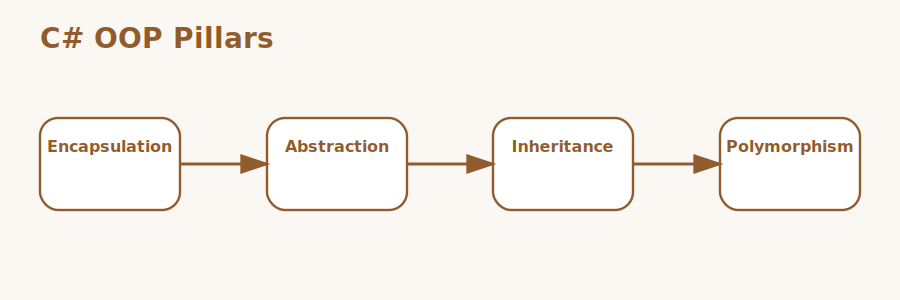

# OOP Concepts in C# Interview Questions



This guide covers practical object-oriented design in C# from the basic class-and-object model to tricky senior-level design trade-offs. It follows the corrected format of **100 interview questions for each subtopic**, and every answer includes a C# code example with rotated real-world scenarios so the examples do not repeat verbatim.

## How To Use This Page

- Questions 1-100 cover Classes and objects.
- Questions 101-200 cover Encapsulation.
- Questions 201-300 cover Abstraction.
- Questions 301-400 cover Inheritance.
- Questions 401-500 cover Polymorphism.
- Questions 501-600 cover Interfaces.
- Questions 601-700 cover Abstract classes.
- Questions 701-800 cover Constructors.
- Questions 801-900 cover Association and composition.
- Questions 901-1000 cover SOLID-oriented design.
- Questions 1001-1100 cover Tricky interview questions.

## 1. Classes and objects

> This section contains **100 interview questions** focused on **Classes and objects**. Every answer includes a C# code example, and the scenarios rotate so they do not repeat verbatim.

### Q1.1 What is class as a domain blueprint in C# object-oriented design?

**Answer:** Class as a domain blueprint means a class defines the structure and behavior that object instances follow. Teams should focus on it when explaining classes and objects in real systems, they compare it with free functions and loose data bags, and they should avoid the trap of creating catch-all classes with unrelated responsibilities. Example: while modernizing a legacy ERP module, so the design choice is easier to defend. Another example: during a product catalog feature expansion, so the object boundaries become clearer.

**Code Example:**

```csharp
using System;
using System.Collections.Generic;

public static class Demo1_1
{
    public static void Run()
    {
        class Order
        {
            public int Id { get; } = 1001;
            public void Submit() => Console.WriteLine("Submitted");
        }
        var order = new Order();
        order.Submit();
    }
}
```

### Q1.2 How does object instance identity in C# object-oriented design?

**Answer:** Object instance identity means objects are runtime instances with their own state even when they share one class definition. Teams should focus on it when explaining classes and objects in real systems, they compare it with static-only logic and copied values, and they should avoid the trap of confusing a type with one specific live object. Example: during a senior engineer code review, so the API contract becomes clearer. Another example: while implementing a document approval engine, so the design choice is easier to defend.

**Code Example:**

```csharp
using System;
using System.Collections.Generic;

public static class Demo1_2
{
    public static void Run()
    {
        class Customer
        {
            public string Name { get; set; } = "Customer-2";
        }
        var a = new Customer();
        var b = new Customer();
        Console.WriteLine($"{a.Name} | {b.Name}");
    }
}
```

### Q1.3 Why does state and behavior together in C# object-oriented design?

**Answer:** State and behavior together means object-oriented design keeps data and the operations on that data close to each other. Teams should focus on it when explaining classes and objects in real systems, they compare it with procedural helpers acting on exposed state, and they should avoid the trap of splitting invariants across unrelated helper classes. Example: while designing a payroll processing module, so responsibilities stay easier to explain. Another example: during a post-incident architecture review, so the API contract becomes clearer.

**Code Example:**

```csharp
using System;
using System.Collections.Generic;

public static class Demo1_3
{
    public static void Run()
    {
        class Cart
        {
            private readonly List<string> _items = new();
            public void Add(string item) => _items.Add(item);
            public int Count => _items.Count;
        }
        var cart = new Cart();
        cart.Add("Book");
        Console.WriteLine(cart.Count);
    }
}
```

### Q1.4 When should you use class cohesion in C# object-oriented design?

**Answer:** Class cohesion means a healthy class owns one focused responsibility that can be explained clearly. Teams should focus on it when explaining classes and objects in real systems, they compare it with god objects and dumping-ground services, and they should avoid the trap of judging a class only by size instead of responsibility. Example: during an audit trail investigation, so hidden coupling is reduced. Another example: while building a reusable SDK layer, so responsibilities stay easier to explain.

**Code Example:**

```csharp
using System;
using System.Collections.Generic;

public static class Demo1_4
{
    public static void Run()
    {
        class ReportBuilder
        {
            public string Build() => "Report ready";
        }
        Console.WriteLine(new ReportBuilder().Build());
    }
}
```

### Q1.5 What problem does object lifecycle basics in C# object-oriented design?

**Answer:** Object lifecycle basics means objects are created used and eventually become eligible for cleanup when references disappear. Teams should focus on it when explaining classes and objects in real systems, they compare it with treating every object as application-wide state, and they should avoid the trap of ignoring lifetime when mutable objects are shared too broadly. Example: while reviewing a customer notification service, so maintenance cost stays lower. Another example: during a warehouse inventory incident, so hidden coupling is reduced.

**Code Example:**

```csharp
using System;
using System.Collections.Generic;

public static class Demo1_5
{
    public static void Run()
    {
        var profile = new UserProfile();
        profile.Activate();
        Console.WriteLine(profile.IsActive);
        class UserProfile
        {
            public bool IsActive { get; private set; }
            public void Activate() => IsActive = true;
        }
    }
}
```

### Q1.6 How would you explain class versus object interview framing in C# object-oriented design?

**Answer:** Class versus object interview framing means strong answers separate the type definition from the runtime instance and connect both to design intent. Teams should focus on it when explaining classes and objects in real systems, they compare it with syntax-only definitions, and they should avoid the trap of describing classes and objects without business meaning. Example: during a feature flag rollout, so production behavior becomes easier to predict. Another example: while stabilizing a CRM background job, so maintenance cost stays lower.

**Code Example:**

```csharp
using System;
using System.Collections.Generic;

public static class Demo1_6
{
    public static void Run()
    {
        class Invoice
        {
            public decimal Total { get; set; }
        }
        var invoice = new Invoice { Total = 120m + 6m };
        Console.WriteLine(invoice.Total);
    }
}
```

### Q1.7 Why is class as a domain blueprint in C# object-oriented design?

**Answer:** Class as a domain blueprint means a class defines the structure and behavior that object instances follow. Teams should focus on it when explaining classes and objects in real systems, they compare it with free functions and loose data bags, and they should avoid the trap of creating catch-all classes with unrelated responsibilities. Example: while reviewing a hospital claims workflow, so testing becomes easier to organize. Another example: during a support bug on shared state, so production behavior becomes easier to predict.

**Code Example:**

```csharp
using System;
using System.Collections.Generic;

public static class Demo1_7
{
    public static void Run()
    {
        class Order
        {
            public int Id { get; } = 1007;
            public void Submit() => Console.WriteLine("Submitted");
        }
        var order = new Order();
        order.Submit();
    }
}
```

### Q1.8 How can object instance identity in C# object-oriented design?

**Answer:** Object instance identity means objects are runtime instances with their own state even when they share one class definition. Teams should focus on it when explaining classes and objects in real systems, they compare it with static-only logic and copied values, and they should avoid the trap of confusing a type with one specific live object. Example: during a payment gateway integration, so the bug becomes easier to isolate. Another example: while cleaning up an onboarding workflow, so testing becomes easier to organize.

**Code Example:**

```csharp
using System;
using System.Collections.Generic;

public static class Demo1_8
{
    public static void Run()
    {
        class Customer
        {
            public string Name { get; set; } = "Customer-8";
        }
        var a = new Customer();
        var b = new Customer();
        Console.WriteLine($"{a.Name} | {b.Name}");
    }
}
```

### Q1.9 What is state and behavior together in C# object-oriented design?

**Answer:** State and behavior together means object-oriented design keeps data and the operations on that data close to each other. Teams should focus on it when explaining classes and objects in real systems, they compare it with procedural helpers acting on exposed state, and they should avoid the trap of splitting invariants across unrelated helper classes. Example: while refactoring a shipping rules service, so the candidate answer sounds more senior. Another example: during a high-traffic order processing issue, so the bug becomes easier to isolate.

**Code Example:**

```csharp
using System;
using System.Collections.Generic;

public static class Demo1_9
{
    public static void Run()
    {
        class Cart
        {
            private readonly List<string> _items = new();
            public void Add(string item) => _items.Add(item);
            public int Count => _items.Count;
        }
        var cart = new Cart();
        cart.Add("Book");
        Console.WriteLine(cart.Count);
    }
}
```

### Q1.10 How does class cohesion in C# object-oriented design?

**Answer:** Class cohesion means a healthy class owns one focused responsibility that can be explained clearly. Teams should focus on it when explaining classes and objects in real systems, they compare it with god objects and dumping-ground services, and they should avoid the trap of judging a class only by size instead of responsibility. Example: during a product catalog feature expansion, so the change set becomes safer. Another example: while untangling a monolithic service layer, so the candidate answer sounds more senior.

**Code Example:**

```csharp
using System;
using System.Collections.Generic;

public static class Demo1_10
{
    public static void Run()
    {
        class ReportBuilder
        {
            public string Build() => "Report ready";
        }
        Console.WriteLine(new ReportBuilder().Build());
    }
}
```

### Q1.11 Why does object lifecycle basics in C# object-oriented design?

**Answer:** Object lifecycle basics means objects are created used and eventually become eligible for cleanup when references disappear. Teams should focus on it when explaining classes and objects in real systems, they compare it with treating every object as application-wide state, and they should avoid the trap of ignoring lifetime when mutable objects are shared too broadly. Example: while implementing a document approval engine, so the implementation scales more cleanly. Another example: during a subscription billing redesign, so the change set becomes safer.

**Code Example:**

```csharp
using System;
using System.Collections.Generic;

public static class Demo1_11
{
    public static void Run()
    {
        var profile = new UserProfile();
        profile.Activate();
        Console.WriteLine(profile.IsActive);
        class UserProfile
        {
            public bool IsActive { get; private set; }
            public void Activate() => IsActive = true;
        }
    }
}
```

### Q1.12 When should you use class versus object interview framing in C# object-oriented design?

**Answer:** Class versus object interview framing means strong answers separate the type definition from the runtime instance and connect both to design intent. Teams should focus on it when explaining classes and objects in real systems, they compare it with syntax-only definitions, and they should avoid the trap of describing classes and objects without business meaning. Example: during a post-incident architecture review, so future refactoring gets less risky. Another example: while modernizing a legacy ERP module, so the implementation scales more cleanly.

**Code Example:**

```csharp
using System;
using System.Collections.Generic;

public static class Demo1_12
{
    public static void Run()
    {
        class Invoice
        {
            public decimal Total { get; set; }
        }
        var invoice = new Invoice { Total = 120m + 3m };
        Console.WriteLine(invoice.Total);
    }
}
```

### Q1.13 What problem does class as a domain blueprint in C# object-oriented design?

**Answer:** Class as a domain blueprint means a class defines the structure and behavior that object instances follow. Teams should focus on it when explaining classes and objects in real systems, they compare it with free functions and loose data bags, and they should avoid the trap of creating catch-all classes with unrelated responsibilities. Example: while building a reusable SDK layer, so behavior stays easier to reason about. Another example: during a senior engineer code review, so future refactoring gets less risky.

**Code Example:**

```csharp
using System;
using System.Collections.Generic;

public static class Demo1_13
{
    public static void Run()
    {
        class Order
        {
            public int Id { get; } = 1013;
            public void Submit() => Console.WriteLine("Submitted");
        }
        var order = new Order();
        order.Submit();
    }
}
```

### Q1.14 How would you explain object instance identity in C# object-oriented design?

**Answer:** Object instance identity means objects are runtime instances with their own state even when they share one class definition. Teams should focus on it when explaining classes and objects in real systems, they compare it with static-only logic and copied values, and they should avoid the trap of confusing a type with one specific live object. Example: during a warehouse inventory incident, so runtime side effects are easier to spot. Another example: while designing a payroll processing module, so behavior stays easier to reason about.

**Code Example:**

```csharp
using System;
using System.Collections.Generic;

public static class Demo1_14
{
    public static void Run()
    {
        class Customer
        {
            public string Name { get; set; } = "Customer-14";
        }
        var a = new Customer();
        var b = new Customer();
        Console.WriteLine($"{a.Name} | {b.Name}");
    }
}
```

### Q1.15 Why is state and behavior together in C# object-oriented design?

**Answer:** State and behavior together means object-oriented design keeps data and the operations on that data close to each other. Teams should focus on it when explaining classes and objects in real systems, they compare it with procedural helpers acting on exposed state, and they should avoid the trap of splitting invariants across unrelated helper classes. Example: while stabilizing a CRM background job, so team conventions stay more consistent. Another example: during an audit trail investigation, so runtime side effects are easier to spot.

**Code Example:**

```csharp
using System;
using System.Collections.Generic;

public static class Demo1_15
{
    public static void Run()
    {
        class Cart
        {
            private readonly List<string> _items = new();
            public void Add(string item) => _items.Add(item);
            public int Count => _items.Count;
        }
        var cart = new Cart();
        cart.Add("Book");
        Console.WriteLine(cart.Count);
    }
}
```

### Q1.16 How can class cohesion in C# object-oriented design?

**Answer:** Class cohesion means a healthy class owns one focused responsibility that can be explained clearly. Teams should focus on it when explaining classes and objects in real systems, they compare it with god objects and dumping-ground services, and they should avoid the trap of judging a class only by size instead of responsibility. Example: during a support bug on shared state, so the object boundaries become clearer. Another example: while reviewing a customer notification service, so team conventions stay more consistent.

**Code Example:**

```csharp
using System;
using System.Collections.Generic;

public static class Demo1_16
{
    public static void Run()
    {
        class ReportBuilder
        {
            public string Build() => "Report ready";
        }
        Console.WriteLine(new ReportBuilder().Build());
    }
}
```

### Q1.17 What is object lifecycle basics in C# object-oriented design?

**Answer:** Object lifecycle basics means objects are created used and eventually become eligible for cleanup when references disappear. Teams should focus on it when explaining classes and objects in real systems, they compare it with treating every object as application-wide state, and they should avoid the trap of ignoring lifetime when mutable objects are shared too broadly. Example: while cleaning up an onboarding workflow, so the design choice is easier to defend. Another example: during a feature flag rollout, so the object boundaries become clearer.

**Code Example:**

```csharp
using System;
using System.Collections.Generic;

public static class Demo1_17
{
    public static void Run()
    {
        var profile = new UserProfile();
        profile.Activate();
        Console.WriteLine(profile.IsActive);
        class UserProfile
        {
            public bool IsActive { get; private set; }
            public void Activate() => IsActive = true;
        }
    }
}
```

### Q1.18 How does class versus object interview framing in C# object-oriented design?

**Answer:** Class versus object interview framing means strong answers separate the type definition from the runtime instance and connect both to design intent. Teams should focus on it when explaining classes and objects in real systems, they compare it with syntax-only definitions, and they should avoid the trap of describing classes and objects without business meaning. Example: during a high-traffic order processing issue, so the API contract becomes clearer. Another example: while reviewing a hospital claims workflow, so the design choice is easier to defend.

**Code Example:**

```csharp
using System;
using System.Collections.Generic;

public static class Demo1_18
{
    public static void Run()
    {
        class Invoice
        {
            public decimal Total { get; set; }
        }
        var invoice = new Invoice { Total = 120m + 0m };
        Console.WriteLine(invoice.Total);
    }
}
```

### Q1.19 Why does class as a domain blueprint in C# object-oriented design?

**Answer:** Class as a domain blueprint means a class defines the structure and behavior that object instances follow. Teams should focus on it when explaining classes and objects in real systems, they compare it with free functions and loose data bags, and they should avoid the trap of creating catch-all classes with unrelated responsibilities. Example: while untangling a monolithic service layer, so responsibilities stay easier to explain. Another example: during a payment gateway integration, so the API contract becomes clearer.

**Code Example:**

```csharp
using System;
using System.Collections.Generic;

public static class Demo1_19
{
    public static void Run()
    {
        class Order
        {
            public int Id { get; } = 1019;
            public void Submit() => Console.WriteLine("Submitted");
        }
        var order = new Order();
        order.Submit();
    }
}
```

### Q1.20 When should you use object instance identity in C# object-oriented design?

**Answer:** Object instance identity means objects are runtime instances with their own state even when they share one class definition. Teams should focus on it when explaining classes and objects in real systems, they compare it with static-only logic and copied values, and they should avoid the trap of confusing a type with one specific live object. Example: during a subscription billing redesign, so hidden coupling is reduced. Another example: while refactoring a shipping rules service, so responsibilities stay easier to explain.

**Code Example:**

```csharp
using System;
using System.Collections.Generic;

public static class Demo1_20
{
    public static void Run()
    {
        class Customer
        {
            public string Name { get; set; } = "Customer-20";
        }
        var a = new Customer();
        var b = new Customer();
        Console.WriteLine($"{a.Name} | {b.Name}");
    }
}
```

### Q1.21 What problem does state and behavior together in C# object-oriented design?

**Answer:** State and behavior together means object-oriented design keeps data and the operations on that data close to each other. Teams should focus on it when explaining classes and objects in real systems, they compare it with procedural helpers acting on exposed state, and they should avoid the trap of splitting invariants across unrelated helper classes. Example: while modernizing a legacy ERP module, so maintenance cost stays lower. Another example: during a product catalog feature expansion, so hidden coupling is reduced.

**Code Example:**

```csharp
using System;
using System.Collections.Generic;

public static class Demo1_21
{
    public static void Run()
    {
        class Cart
        {
            private readonly List<string> _items = new();
            public void Add(string item) => _items.Add(item);
            public int Count => _items.Count;
        }
        var cart = new Cart();
        cart.Add("Book");
        Console.WriteLine(cart.Count);
    }
}
```

### Q1.22 How would you explain class cohesion in C# object-oriented design?

**Answer:** Class cohesion means a healthy class owns one focused responsibility that can be explained clearly. Teams should focus on it when explaining classes and objects in real systems, they compare it with god objects and dumping-ground services, and they should avoid the trap of judging a class only by size instead of responsibility. Example: during a senior engineer code review, so production behavior becomes easier to predict. Another example: while implementing a document approval engine, so maintenance cost stays lower.

**Code Example:**

```csharp
using System;
using System.Collections.Generic;

public static class Demo1_22
{
    public static void Run()
    {
        class ReportBuilder
        {
            public string Build() => "Report ready";
        }
        Console.WriteLine(new ReportBuilder().Build());
    }
}
```

### Q1.23 Why is object lifecycle basics in C# object-oriented design?

**Answer:** Object lifecycle basics means objects are created used and eventually become eligible for cleanup when references disappear. Teams should focus on it when explaining classes and objects in real systems, they compare it with treating every object as application-wide state, and they should avoid the trap of ignoring lifetime when mutable objects are shared too broadly. Example: while designing a payroll processing module, so testing becomes easier to organize. Another example: during a post-incident architecture review, so production behavior becomes easier to predict.

**Code Example:**

```csharp
using System;
using System.Collections.Generic;

public static class Demo1_23
{
    public static void Run()
    {
        var profile = new UserProfile();
        profile.Activate();
        Console.WriteLine(profile.IsActive);
        class UserProfile
        {
            public bool IsActive { get; private set; }
            public void Activate() => IsActive = true;
        }
    }
}
```

### Q1.24 How can class versus object interview framing in C# object-oriented design?

**Answer:** Class versus object interview framing means strong answers separate the type definition from the runtime instance and connect both to design intent. Teams should focus on it when explaining classes and objects in real systems, they compare it with syntax-only definitions, and they should avoid the trap of describing classes and objects without business meaning. Example: during an audit trail investigation, so the bug becomes easier to isolate. Another example: while building a reusable SDK layer, so testing becomes easier to organize.

**Code Example:**

```csharp
using System;
using System.Collections.Generic;

public static class Demo1_24
{
    public static void Run()
    {
        class Invoice
        {
            public decimal Total { get; set; }
        }
        var invoice = new Invoice { Total = 120m + 6m };
        Console.WriteLine(invoice.Total);
    }
}
```

### Q1.25 What is class as a domain blueprint in C# object-oriented design?

**Answer:** Class as a domain blueprint means a class defines the structure and behavior that object instances follow. Teams should focus on it when explaining classes and objects in real systems, they compare it with free functions and loose data bags, and they should avoid the trap of creating catch-all classes with unrelated responsibilities. Example: while reviewing a customer notification service, so the candidate answer sounds more senior. Another example: during a warehouse inventory incident, so the bug becomes easier to isolate.

**Code Example:**

```csharp
using System;
using System.Collections.Generic;

public static class Demo1_25
{
    public static void Run()
    {
        class Order
        {
            public int Id { get; } = 1025;
            public void Submit() => Console.WriteLine("Submitted");
        }
        var order = new Order();
        order.Submit();
    }
}
```

### Q1.26 How does object instance identity in C# object-oriented design?

**Answer:** Object instance identity means objects are runtime instances with their own state even when they share one class definition. Teams should focus on it when explaining classes and objects in real systems, they compare it with static-only logic and copied values, and they should avoid the trap of confusing a type with one specific live object. Example: during a feature flag rollout, so the change set becomes safer. Another example: while stabilizing a CRM background job, so the candidate answer sounds more senior.

**Code Example:**

```csharp
using System;
using System.Collections.Generic;

public static class Demo1_26
{
    public static void Run()
    {
        class Customer
        {
            public string Name { get; set; } = "Customer-26";
        }
        var a = new Customer();
        var b = new Customer();
        Console.WriteLine($"{a.Name} | {b.Name}");
    }
}
```

### Q1.27 Why does state and behavior together in C# object-oriented design?

**Answer:** State and behavior together means object-oriented design keeps data and the operations on that data close to each other. Teams should focus on it when explaining classes and objects in real systems, they compare it with procedural helpers acting on exposed state, and they should avoid the trap of splitting invariants across unrelated helper classes. Example: while reviewing a hospital claims workflow, so the implementation scales more cleanly. Another example: during a support bug on shared state, so the change set becomes safer.

**Code Example:**

```csharp
using System;
using System.Collections.Generic;

public static class Demo1_27
{
    public static void Run()
    {
        class Cart
        {
            private readonly List<string> _items = new();
            public void Add(string item) => _items.Add(item);
            public int Count => _items.Count;
        }
        var cart = new Cart();
        cart.Add("Book");
        Console.WriteLine(cart.Count);
    }
}
```

### Q1.28 When should you use class cohesion in C# object-oriented design?

**Answer:** Class cohesion means a healthy class owns one focused responsibility that can be explained clearly. Teams should focus on it when explaining classes and objects in real systems, they compare it with god objects and dumping-ground services, and they should avoid the trap of judging a class only by size instead of responsibility. Example: during a payment gateway integration, so future refactoring gets less risky. Another example: while cleaning up an onboarding workflow, so the implementation scales more cleanly.

**Code Example:**

```csharp
using System;
using System.Collections.Generic;

public static class Demo1_28
{
    public static void Run()
    {
        class ReportBuilder
        {
            public string Build() => "Report ready";
        }
        Console.WriteLine(new ReportBuilder().Build());
    }
}
```

### Q1.29 What problem does object lifecycle basics in C# object-oriented design?

**Answer:** Object lifecycle basics means objects are created used and eventually become eligible for cleanup when references disappear. Teams should focus on it when explaining classes and objects in real systems, they compare it with treating every object as application-wide state, and they should avoid the trap of ignoring lifetime when mutable objects are shared too broadly. Example: while refactoring a shipping rules service, so behavior stays easier to reason about. Another example: during a high-traffic order processing issue, so future refactoring gets less risky.

**Code Example:**

```csharp
using System;
using System.Collections.Generic;

public static class Demo1_29
{
    public static void Run()
    {
        var profile = new UserProfile();
        profile.Activate();
        Console.WriteLine(profile.IsActive);
        class UserProfile
        {
            public bool IsActive { get; private set; }
            public void Activate() => IsActive = true;
        }
    }
}
```

### Q1.30 How would you explain class versus object interview framing in C# object-oriented design?

**Answer:** Class versus object interview framing means strong answers separate the type definition from the runtime instance and connect both to design intent. Teams should focus on it when explaining classes and objects in real systems, they compare it with syntax-only definitions, and they should avoid the trap of describing classes and objects without business meaning. Example: during a product catalog feature expansion, so runtime side effects are easier to spot. Another example: while untangling a monolithic service layer, so behavior stays easier to reason about.

**Code Example:**

```csharp
using System;
using System.Collections.Generic;

public static class Demo1_30
{
    public static void Run()
    {
        class Invoice
        {
            public decimal Total { get; set; }
        }
        var invoice = new Invoice { Total = 120m + 3m };
        Console.WriteLine(invoice.Total);
    }
}
```

### Q1.31 Why is class as a domain blueprint in C# object-oriented design?

**Answer:** Class as a domain blueprint means a class defines the structure and behavior that object instances follow. Teams should focus on it when explaining classes and objects in real systems, they compare it with free functions and loose data bags, and they should avoid the trap of creating catch-all classes with unrelated responsibilities. Example: while implementing a document approval engine, so team conventions stay more consistent. Another example: during a subscription billing redesign, so runtime side effects are easier to spot.

**Code Example:**

```csharp
using System;
using System.Collections.Generic;

public static class Demo1_31
{
    public static void Run()
    {
        class Order
        {
            public int Id { get; } = 1031;
            public void Submit() => Console.WriteLine("Submitted");
        }
        var order = new Order();
        order.Submit();
    }
}
```

### Q1.32 How can object instance identity in C# object-oriented design?

**Answer:** Object instance identity means objects are runtime instances with their own state even when they share one class definition. Teams should focus on it when explaining classes and objects in real systems, they compare it with static-only logic and copied values, and they should avoid the trap of confusing a type with one specific live object. Example: during a post-incident architecture review, so the object boundaries become clearer. Another example: while modernizing a legacy ERP module, so team conventions stay more consistent.

**Code Example:**

```csharp
using System;
using System.Collections.Generic;

public static class Demo1_32
{
    public static void Run()
    {
        class Customer
        {
            public string Name { get; set; } = "Customer-32";
        }
        var a = new Customer();
        var b = new Customer();
        Console.WriteLine($"{a.Name} | {b.Name}");
    }
}
```

### Q1.33 What is state and behavior together in C# object-oriented design?

**Answer:** State and behavior together means object-oriented design keeps data and the operations on that data close to each other. Teams should focus on it when explaining classes and objects in real systems, they compare it with procedural helpers acting on exposed state, and they should avoid the trap of splitting invariants across unrelated helper classes. Example: while building a reusable SDK layer, so the design choice is easier to defend. Another example: during a senior engineer code review, so the object boundaries become clearer.

**Code Example:**

```csharp
using System;
using System.Collections.Generic;

public static class Demo1_33
{
    public static void Run()
    {
        class Cart
        {
            private readonly List<string> _items = new();
            public void Add(string item) => _items.Add(item);
            public int Count => _items.Count;
        }
        var cart = new Cart();
        cart.Add("Book");
        Console.WriteLine(cart.Count);
    }
}
```

### Q1.34 How does class cohesion in C# object-oriented design?

**Answer:** Class cohesion means a healthy class owns one focused responsibility that can be explained clearly. Teams should focus on it when explaining classes and objects in real systems, they compare it with god objects and dumping-ground services, and they should avoid the trap of judging a class only by size instead of responsibility. Example: during a warehouse inventory incident, so the API contract becomes clearer. Another example: while designing a payroll processing module, so the design choice is easier to defend.

**Code Example:**

```csharp
using System;
using System.Collections.Generic;

public static class Demo1_34
{
    public static void Run()
    {
        class ReportBuilder
        {
            public string Build() => "Report ready";
        }
        Console.WriteLine(new ReportBuilder().Build());
    }
}
```

### Q1.35 Why does object lifecycle basics in C# object-oriented design?

**Answer:** Object lifecycle basics means objects are created used and eventually become eligible for cleanup when references disappear. Teams should focus on it when explaining classes and objects in real systems, they compare it with treating every object as application-wide state, and they should avoid the trap of ignoring lifetime when mutable objects are shared too broadly. Example: while stabilizing a CRM background job, so responsibilities stay easier to explain. Another example: during an audit trail investigation, so the API contract becomes clearer.

**Code Example:**

```csharp
using System;
using System.Collections.Generic;

public static class Demo1_35
{
    public static void Run()
    {
        var profile = new UserProfile();
        profile.Activate();
        Console.WriteLine(profile.IsActive);
        class UserProfile
        {
            public bool IsActive { get; private set; }
            public void Activate() => IsActive = true;
        }
    }
}
```

### Q1.36 When should you use class versus object interview framing in C# object-oriented design?

**Answer:** Class versus object interview framing means strong answers separate the type definition from the runtime instance and connect both to design intent. Teams should focus on it when explaining classes and objects in real systems, they compare it with syntax-only definitions, and they should avoid the trap of describing classes and objects without business meaning. Example: during a support bug on shared state, so hidden coupling is reduced. Another example: while reviewing a customer notification service, so responsibilities stay easier to explain.

**Code Example:**

```csharp
using System;
using System.Collections.Generic;

public static class Demo1_36
{
    public static void Run()
    {
        class Invoice
        {
            public decimal Total { get; set; }
        }
        var invoice = new Invoice { Total = 120m + 0m };
        Console.WriteLine(invoice.Total);
    }
}
```

### Q1.37 What problem does class as a domain blueprint in C# object-oriented design?

**Answer:** Class as a domain blueprint means a class defines the structure and behavior that object instances follow. Teams should focus on it when explaining classes and objects in real systems, they compare it with free functions and loose data bags, and they should avoid the trap of creating catch-all classes with unrelated responsibilities. Example: while cleaning up an onboarding workflow, so maintenance cost stays lower. Another example: during a feature flag rollout, so hidden coupling is reduced.

**Code Example:**

```csharp
using System;
using System.Collections.Generic;

public static class Demo1_37
{
    public static void Run()
    {
        class Order
        {
            public int Id { get; } = 1037;
            public void Submit() => Console.WriteLine("Submitted");
        }
        var order = new Order();
        order.Submit();
    }
}
```

### Q1.38 How would you explain object instance identity in C# object-oriented design?

**Answer:** Object instance identity means objects are runtime instances with their own state even when they share one class definition. Teams should focus on it when explaining classes and objects in real systems, they compare it with static-only logic and copied values, and they should avoid the trap of confusing a type with one specific live object. Example: during a high-traffic order processing issue, so production behavior becomes easier to predict. Another example: while reviewing a hospital claims workflow, so maintenance cost stays lower.

**Code Example:**

```csharp
using System;
using System.Collections.Generic;

public static class Demo1_38
{
    public static void Run()
    {
        class Customer
        {
            public string Name { get; set; } = "Customer-38";
        }
        var a = new Customer();
        var b = new Customer();
        Console.WriteLine($"{a.Name} | {b.Name}");
    }
}
```

### Q1.39 Why is state and behavior together in C# object-oriented design?

**Answer:** State and behavior together means object-oriented design keeps data and the operations on that data close to each other. Teams should focus on it when explaining classes and objects in real systems, they compare it with procedural helpers acting on exposed state, and they should avoid the trap of splitting invariants across unrelated helper classes. Example: while untangling a monolithic service layer, so testing becomes easier to organize. Another example: during a payment gateway integration, so production behavior becomes easier to predict.

**Code Example:**

```csharp
using System;
using System.Collections.Generic;

public static class Demo1_39
{
    public static void Run()
    {
        class Cart
        {
            private readonly List<string> _items = new();
            public void Add(string item) => _items.Add(item);
            public int Count => _items.Count;
        }
        var cart = new Cart();
        cart.Add("Book");
        Console.WriteLine(cart.Count);
    }
}
```

### Q1.40 How can class cohesion in C# object-oriented design?

**Answer:** Class cohesion means a healthy class owns one focused responsibility that can be explained clearly. Teams should focus on it when explaining classes and objects in real systems, they compare it with god objects and dumping-ground services, and they should avoid the trap of judging a class only by size instead of responsibility. Example: during a subscription billing redesign, so the bug becomes easier to isolate. Another example: while refactoring a shipping rules service, so testing becomes easier to organize.

**Code Example:**

```csharp
using System;
using System.Collections.Generic;

public static class Demo1_40
{
    public static void Run()
    {
        class ReportBuilder
        {
            public string Build() => "Report ready";
        }
        Console.WriteLine(new ReportBuilder().Build());
    }
}
```

### Q1.41 What is object lifecycle basics in C# object-oriented design?

**Answer:** Object lifecycle basics means objects are created used and eventually become eligible for cleanup when references disappear. Teams should focus on it when explaining classes and objects in real systems, they compare it with treating every object as application-wide state, and they should avoid the trap of ignoring lifetime when mutable objects are shared too broadly. Example: while modernizing a legacy ERP module, so the candidate answer sounds more senior. Another example: during a product catalog feature expansion, so the bug becomes easier to isolate.

**Code Example:**

```csharp
using System;
using System.Collections.Generic;

public static class Demo1_41
{
    public static void Run()
    {
        var profile = new UserProfile();
        profile.Activate();
        Console.WriteLine(profile.IsActive);
        class UserProfile
        {
            public bool IsActive { get; private set; }
            public void Activate() => IsActive = true;
        }
    }
}
```

### Q1.42 How does class versus object interview framing in C# object-oriented design?

**Answer:** Class versus object interview framing means strong answers separate the type definition from the runtime instance and connect both to design intent. Teams should focus on it when explaining classes and objects in real systems, they compare it with syntax-only definitions, and they should avoid the trap of describing classes and objects without business meaning. Example: during a senior engineer code review, so the change set becomes safer. Another example: while implementing a document approval engine, so the candidate answer sounds more senior.

**Code Example:**

```csharp
using System;
using System.Collections.Generic;

public static class Demo1_42
{
    public static void Run()
    {
        class Invoice
        {
            public decimal Total { get; set; }
        }
        var invoice = new Invoice { Total = 120m + 6m };
        Console.WriteLine(invoice.Total);
    }
}
```

### Q1.43 Why does class as a domain blueprint in C# object-oriented design?

**Answer:** Class as a domain blueprint means a class defines the structure and behavior that object instances follow. Teams should focus on it when explaining classes and objects in real systems, they compare it with free functions and loose data bags, and they should avoid the trap of creating catch-all classes with unrelated responsibilities. Example: while designing a payroll processing module, so the implementation scales more cleanly. Another example: during a post-incident architecture review, so the change set becomes safer.

**Code Example:**

```csharp
using System;
using System.Collections.Generic;

public static class Demo1_43
{
    public static void Run()
    {
        class Order
        {
            public int Id { get; } = 1043;
            public void Submit() => Console.WriteLine("Submitted");
        }
        var order = new Order();
        order.Submit();
    }
}
```

### Q1.44 When should you use object instance identity in C# object-oriented design?

**Answer:** Object instance identity means objects are runtime instances with their own state even when they share one class definition. Teams should focus on it when explaining classes and objects in real systems, they compare it with static-only logic and copied values, and they should avoid the trap of confusing a type with one specific live object. Example: during an audit trail investigation, so future refactoring gets less risky. Another example: while building a reusable SDK layer, so the implementation scales more cleanly.

**Code Example:**

```csharp
using System;
using System.Collections.Generic;

public static class Demo1_44
{
    public static void Run()
    {
        class Customer
        {
            public string Name { get; set; } = "Customer-44";
        }
        var a = new Customer();
        var b = new Customer();
        Console.WriteLine($"{a.Name} | {b.Name}");
    }
}
```

### Q1.45 What problem does state and behavior together in C# object-oriented design?

**Answer:** State and behavior together means object-oriented design keeps data and the operations on that data close to each other. Teams should focus on it when explaining classes and objects in real systems, they compare it with procedural helpers acting on exposed state, and they should avoid the trap of splitting invariants across unrelated helper classes. Example: while reviewing a customer notification service, so behavior stays easier to reason about. Another example: during a warehouse inventory incident, so future refactoring gets less risky.

**Code Example:**

```csharp
using System;
using System.Collections.Generic;

public static class Demo1_45
{
    public static void Run()
    {
        class Cart
        {
            private readonly List<string> _items = new();
            public void Add(string item) => _items.Add(item);
            public int Count => _items.Count;
        }
        var cart = new Cart();
        cart.Add("Book");
        Console.WriteLine(cart.Count);
    }
}
```

### Q1.46 How would you explain class cohesion in C# object-oriented design?

**Answer:** Class cohesion means a healthy class owns one focused responsibility that can be explained clearly. Teams should focus on it when explaining classes and objects in real systems, they compare it with god objects and dumping-ground services, and they should avoid the trap of judging a class only by size instead of responsibility. Example: during a feature flag rollout, so runtime side effects are easier to spot. Another example: while stabilizing a CRM background job, so behavior stays easier to reason about.

**Code Example:**

```csharp
using System;
using System.Collections.Generic;

public static class Demo1_46
{
    public static void Run()
    {
        class ReportBuilder
        {
            public string Build() => "Report ready";
        }
        Console.WriteLine(new ReportBuilder().Build());
    }
}
```

### Q1.47 Why is object lifecycle basics in C# object-oriented design?

**Answer:** Object lifecycle basics means objects are created used and eventually become eligible for cleanup when references disappear. Teams should focus on it when explaining classes and objects in real systems, they compare it with treating every object as application-wide state, and they should avoid the trap of ignoring lifetime when mutable objects are shared too broadly. Example: while reviewing a hospital claims workflow, so team conventions stay more consistent. Another example: during a support bug on shared state, so runtime side effects are easier to spot.

**Code Example:**

```csharp
using System;
using System.Collections.Generic;

public static class Demo1_47
{
    public static void Run()
    {
        var profile = new UserProfile();
        profile.Activate();
        Console.WriteLine(profile.IsActive);
        class UserProfile
        {
            public bool IsActive { get; private set; }
            public void Activate() => IsActive = true;
        }
    }
}
```

### Q1.48 How can class versus object interview framing in C# object-oriented design?

**Answer:** Class versus object interview framing means strong answers separate the type definition from the runtime instance and connect both to design intent. Teams should focus on it when explaining classes and objects in real systems, they compare it with syntax-only definitions, and they should avoid the trap of describing classes and objects without business meaning. Example: during a payment gateway integration, so the object boundaries become clearer. Another example: while cleaning up an onboarding workflow, so team conventions stay more consistent.

**Code Example:**

```csharp
using System;
using System.Collections.Generic;

public static class Demo1_48
{
    public static void Run()
    {
        class Invoice
        {
            public decimal Total { get; set; }
        }
        var invoice = new Invoice { Total = 120m + 3m };
        Console.WriteLine(invoice.Total);
    }
}
```

### Q1.49 What is class as a domain blueprint in C# object-oriented design?

**Answer:** Class as a domain blueprint means a class defines the structure and behavior that object instances follow. Teams should focus on it when explaining classes and objects in real systems, they compare it with free functions and loose data bags, and they should avoid the trap of creating catch-all classes with unrelated responsibilities. Example: while refactoring a shipping rules service, so the design choice is easier to defend. Another example: during a high-traffic order processing issue, so the object boundaries become clearer.

**Code Example:**

```csharp
using System;
using System.Collections.Generic;

public static class Demo1_49
{
    public static void Run()
    {
        class Order
        {
            public int Id { get; } = 1049;
            public void Submit() => Console.WriteLine("Submitted");
        }
        var order = new Order();
        order.Submit();
    }
}
```

### Q1.50 How does object instance identity in C# object-oriented design?

**Answer:** Object instance identity means objects are runtime instances with their own state even when they share one class definition. Teams should focus on it when explaining classes and objects in real systems, they compare it with static-only logic and copied values, and they should avoid the trap of confusing a type with one specific live object. Example: during a product catalog feature expansion, so the API contract becomes clearer. Another example: while untangling a monolithic service layer, so the design choice is easier to defend.

**Code Example:**

```csharp
using System;
using System.Collections.Generic;

public static class Demo1_50
{
    public static void Run()
    {
        class Customer
        {
            public string Name { get; set; } = "Customer-50";
        }
        var a = new Customer();
        var b = new Customer();
        Console.WriteLine($"{a.Name} | {b.Name}");
    }
}
```

### Q1.51 Why does state and behavior together in C# object-oriented design?

**Answer:** State and behavior together means object-oriented design keeps data and the operations on that data close to each other. Teams should focus on it when explaining classes and objects in real systems, they compare it with procedural helpers acting on exposed state, and they should avoid the trap of splitting invariants across unrelated helper classes. Example: while implementing a document approval engine, so responsibilities stay easier to explain. Another example: during a subscription billing redesign, so the API contract becomes clearer.

**Code Example:**

```csharp
using System;
using System.Collections.Generic;

public static class Demo1_51
{
    public static void Run()
    {
        class Cart
        {
            private readonly List<string> _items = new();
            public void Add(string item) => _items.Add(item);
            public int Count => _items.Count;
        }
        var cart = new Cart();
        cart.Add("Book");
        Console.WriteLine(cart.Count);
    }
}
```

### Q1.52 When should you use class cohesion in C# object-oriented design?

**Answer:** Class cohesion means a healthy class owns one focused responsibility that can be explained clearly. Teams should focus on it when explaining classes and objects in real systems, they compare it with god objects and dumping-ground services, and they should avoid the trap of judging a class only by size instead of responsibility. Example: during a post-incident architecture review, so hidden coupling is reduced. Another example: while modernizing a legacy ERP module, so responsibilities stay easier to explain.

**Code Example:**

```csharp
using System;
using System.Collections.Generic;

public static class Demo1_52
{
    public static void Run()
    {
        class ReportBuilder
        {
            public string Build() => "Report ready";
        }
        Console.WriteLine(new ReportBuilder().Build());
    }
}
```

### Q1.53 What problem does object lifecycle basics in C# object-oriented design?

**Answer:** Object lifecycle basics means objects are created used and eventually become eligible for cleanup when references disappear. Teams should focus on it when explaining classes and objects in real systems, they compare it with treating every object as application-wide state, and they should avoid the trap of ignoring lifetime when mutable objects are shared too broadly. Example: while building a reusable SDK layer, so maintenance cost stays lower. Another example: during a senior engineer code review, so hidden coupling is reduced.

**Code Example:**

```csharp
using System;
using System.Collections.Generic;

public static class Demo1_53
{
    public static void Run()
    {
        var profile = new UserProfile();
        profile.Activate();
        Console.WriteLine(profile.IsActive);
        class UserProfile
        {
            public bool IsActive { get; private set; }
            public void Activate() => IsActive = true;
        }
    }
}
```

### Q1.54 How would you explain class versus object interview framing in C# object-oriented design?

**Answer:** Class versus object interview framing means strong answers separate the type definition from the runtime instance and connect both to design intent. Teams should focus on it when explaining classes and objects in real systems, they compare it with syntax-only definitions, and they should avoid the trap of describing classes and objects without business meaning. Example: during a warehouse inventory incident, so production behavior becomes easier to predict. Another example: while designing a payroll processing module, so maintenance cost stays lower.

**Code Example:**

```csharp
using System;
using System.Collections.Generic;

public static class Demo1_54
{
    public static void Run()
    {
        class Invoice
        {
            public decimal Total { get; set; }
        }
        var invoice = new Invoice { Total = 120m + 0m };
        Console.WriteLine(invoice.Total);
    }
}
```

### Q1.55 Why is class as a domain blueprint in C# object-oriented design?

**Answer:** Class as a domain blueprint means a class defines the structure and behavior that object instances follow. Teams should focus on it when explaining classes and objects in real systems, they compare it with free functions and loose data bags, and they should avoid the trap of creating catch-all classes with unrelated responsibilities. Example: while stabilizing a CRM background job, so testing becomes easier to organize. Another example: during an audit trail investigation, so production behavior becomes easier to predict.

**Code Example:**

```csharp
using System;
using System.Collections.Generic;

public static class Demo1_55
{
    public static void Run()
    {
        class Order
        {
            public int Id { get; } = 1055;
            public void Submit() => Console.WriteLine("Submitted");
        }
        var order = new Order();
        order.Submit();
    }
}
```

### Q1.56 How can object instance identity in C# object-oriented design?

**Answer:** Object instance identity means objects are runtime instances with their own state even when they share one class definition. Teams should focus on it when explaining classes and objects in real systems, they compare it with static-only logic and copied values, and they should avoid the trap of confusing a type with one specific live object. Example: during a support bug on shared state, so the bug becomes easier to isolate. Another example: while reviewing a customer notification service, so testing becomes easier to organize.

**Code Example:**

```csharp
using System;
using System.Collections.Generic;

public static class Demo1_56
{
    public static void Run()
    {
        class Customer
        {
            public string Name { get; set; } = "Customer-56";
        }
        var a = new Customer();
        var b = new Customer();
        Console.WriteLine($"{a.Name} | {b.Name}");
    }
}
```

### Q1.57 What is state and behavior together in C# object-oriented design?

**Answer:** State and behavior together means object-oriented design keeps data and the operations on that data close to each other. Teams should focus on it when explaining classes and objects in real systems, they compare it with procedural helpers acting on exposed state, and they should avoid the trap of splitting invariants across unrelated helper classes. Example: while cleaning up an onboarding workflow, so the candidate answer sounds more senior. Another example: during a feature flag rollout, so the bug becomes easier to isolate.

**Code Example:**

```csharp
using System;
using System.Collections.Generic;

public static class Demo1_57
{
    public static void Run()
    {
        class Cart
        {
            private readonly List<string> _items = new();
            public void Add(string item) => _items.Add(item);
            public int Count => _items.Count;
        }
        var cart = new Cart();
        cart.Add("Book");
        Console.WriteLine(cart.Count);
    }
}
```

### Q1.58 How does class cohesion in C# object-oriented design?

**Answer:** Class cohesion means a healthy class owns one focused responsibility that can be explained clearly. Teams should focus on it when explaining classes and objects in real systems, they compare it with god objects and dumping-ground services, and they should avoid the trap of judging a class only by size instead of responsibility. Example: during a high-traffic order processing issue, so the change set becomes safer. Another example: while reviewing a hospital claims workflow, so the candidate answer sounds more senior.

**Code Example:**

```csharp
using System;
using System.Collections.Generic;

public static class Demo1_58
{
    public static void Run()
    {
        class ReportBuilder
        {
            public string Build() => "Report ready";
        }
        Console.WriteLine(new ReportBuilder().Build());
    }
}
```

### Q1.59 Why does object lifecycle basics in C# object-oriented design?

**Answer:** Object lifecycle basics means objects are created used and eventually become eligible for cleanup when references disappear. Teams should focus on it when explaining classes and objects in real systems, they compare it with treating every object as application-wide state, and they should avoid the trap of ignoring lifetime when mutable objects are shared too broadly. Example: while untangling a monolithic service layer, so the implementation scales more cleanly. Another example: during a payment gateway integration, so the change set becomes safer.

**Code Example:**

```csharp
using System;
using System.Collections.Generic;

public static class Demo1_59
{
    public static void Run()
    {
        var profile = new UserProfile();
        profile.Activate();
        Console.WriteLine(profile.IsActive);
        class UserProfile
        {
            public bool IsActive { get; private set; }
            public void Activate() => IsActive = true;
        }
    }
}
```

### Q1.60 When should you use class versus object interview framing in C# object-oriented design?

**Answer:** Class versus object interview framing means strong answers separate the type definition from the runtime instance and connect both to design intent. Teams should focus on it when explaining classes and objects in real systems, they compare it with syntax-only definitions, and they should avoid the trap of describing classes and objects without business meaning. Example: during a subscription billing redesign, so future refactoring gets less risky. Another example: while refactoring a shipping rules service, so the implementation scales more cleanly.

**Code Example:**

```csharp
using System;
using System.Collections.Generic;

public static class Demo1_60
{
    public static void Run()
    {
        class Invoice
        {
            public decimal Total { get; set; }
        }
        var invoice = new Invoice { Total = 120m + 6m };
        Console.WriteLine(invoice.Total);
    }
}
```

### Q1.61 What problem does class as a domain blueprint in C# object-oriented design?

**Answer:** Class as a domain blueprint means a class defines the structure and behavior that object instances follow. Teams should focus on it when explaining classes and objects in real systems, they compare it with free functions and loose data bags, and they should avoid the trap of creating catch-all classes with unrelated responsibilities. Example: while modernizing a legacy ERP module, so behavior stays easier to reason about. Another example: during a product catalog feature expansion, so future refactoring gets less risky.

**Code Example:**

```csharp
using System;
using System.Collections.Generic;

public static class Demo1_61
{
    public static void Run()
    {
        class Order
        {
            public int Id { get; } = 1061;
            public void Submit() => Console.WriteLine("Submitted");
        }
        var order = new Order();
        order.Submit();
    }
}
```

### Q1.62 How would you explain object instance identity in C# object-oriented design?

**Answer:** Object instance identity means objects are runtime instances with their own state even when they share one class definition. Teams should focus on it when explaining classes and objects in real systems, they compare it with static-only logic and copied values, and they should avoid the trap of confusing a type with one specific live object. Example: during a senior engineer code review, so runtime side effects are easier to spot. Another example: while implementing a document approval engine, so behavior stays easier to reason about.

**Code Example:**

```csharp
using System;
using System.Collections.Generic;

public static class Demo1_62
{
    public static void Run()
    {
        class Customer
        {
            public string Name { get; set; } = "Customer-62";
        }
        var a = new Customer();
        var b = new Customer();
        Console.WriteLine($"{a.Name} | {b.Name}");
    }
}
```

### Q1.63 Why is state and behavior together in C# object-oriented design?

**Answer:** State and behavior together means object-oriented design keeps data and the operations on that data close to each other. Teams should focus on it when explaining classes and objects in real systems, they compare it with procedural helpers acting on exposed state, and they should avoid the trap of splitting invariants across unrelated helper classes. Example: while designing a payroll processing module, so team conventions stay more consistent. Another example: during a post-incident architecture review, so runtime side effects are easier to spot.

**Code Example:**

```csharp
using System;
using System.Collections.Generic;

public static class Demo1_63
{
    public static void Run()
    {
        class Cart
        {
            private readonly List<string> _items = new();
            public void Add(string item) => _items.Add(item);
            public int Count => _items.Count;
        }
        var cart = new Cart();
        cart.Add("Book");
        Console.WriteLine(cart.Count);
    }
}
```

### Q1.64 How can class cohesion in C# object-oriented design?

**Answer:** Class cohesion means a healthy class owns one focused responsibility that can be explained clearly. Teams should focus on it when explaining classes and objects in real systems, they compare it with god objects and dumping-ground services, and they should avoid the trap of judging a class only by size instead of responsibility. Example: during an audit trail investigation, so the object boundaries become clearer. Another example: while building a reusable SDK layer, so team conventions stay more consistent.

**Code Example:**

```csharp
using System;
using System.Collections.Generic;

public static class Demo1_64
{
    public static void Run()
    {
        class ReportBuilder
        {
            public string Build() => "Report ready";
        }
        Console.WriteLine(new ReportBuilder().Build());
    }
}
```

### Q1.65 What is object lifecycle basics in C# object-oriented design?

**Answer:** Object lifecycle basics means objects are created used and eventually become eligible for cleanup when references disappear. Teams should focus on it when explaining classes and objects in real systems, they compare it with treating every object as application-wide state, and they should avoid the trap of ignoring lifetime when mutable objects are shared too broadly. Example: while reviewing a customer notification service, so the design choice is easier to defend. Another example: during a warehouse inventory incident, so the object boundaries become clearer.

**Code Example:**

```csharp
using System;
using System.Collections.Generic;

public static class Demo1_65
{
    public static void Run()
    {
        var profile = new UserProfile();
        profile.Activate();
        Console.WriteLine(profile.IsActive);
        class UserProfile
        {
            public bool IsActive { get; private set; }
            public void Activate() => IsActive = true;
        }
    }
}
```

### Q1.66 How does class versus object interview framing in C# object-oriented design?

**Answer:** Class versus object interview framing means strong answers separate the type definition from the runtime instance and connect both to design intent. Teams should focus on it when explaining classes and objects in real systems, they compare it with syntax-only definitions, and they should avoid the trap of describing classes and objects without business meaning. Example: during a feature flag rollout, so the API contract becomes clearer. Another example: while stabilizing a CRM background job, so the design choice is easier to defend.

**Code Example:**

```csharp
using System;
using System.Collections.Generic;

public static class Demo1_66
{
    public static void Run()
    {
        class Invoice
        {
            public decimal Total { get; set; }
        }
        var invoice = new Invoice { Total = 120m + 3m };
        Console.WriteLine(invoice.Total);
    }
}
```

### Q1.67 Why does class as a domain blueprint in C# object-oriented design?

**Answer:** Class as a domain blueprint means a class defines the structure and behavior that object instances follow. Teams should focus on it when explaining classes and objects in real systems, they compare it with free functions and loose data bags, and they should avoid the trap of creating catch-all classes with unrelated responsibilities. Example: while reviewing a hospital claims workflow, so responsibilities stay easier to explain. Another example: during a support bug on shared state, so the API contract becomes clearer.

**Code Example:**

```csharp
using System;
using System.Collections.Generic;

public static class Demo1_67
{
    public static void Run()
    {
        class Order
        {
            public int Id { get; } = 1067;
            public void Submit() => Console.WriteLine("Submitted");
        }
        var order = new Order();
        order.Submit();
    }
}
```

### Q1.68 When should you use object instance identity in C# object-oriented design?

**Answer:** Object instance identity means objects are runtime instances with their own state even when they share one class definition. Teams should focus on it when explaining classes and objects in real systems, they compare it with static-only logic and copied values, and they should avoid the trap of confusing a type with one specific live object. Example: during a payment gateway integration, so hidden coupling is reduced. Another example: while cleaning up an onboarding workflow, so responsibilities stay easier to explain.

**Code Example:**

```csharp
using System;
using System.Collections.Generic;

public static class Demo1_68
{
    public static void Run()
    {
        class Customer
        {
            public string Name { get; set; } = "Customer-68";
        }
        var a = new Customer();
        var b = new Customer();
        Console.WriteLine($"{a.Name} | {b.Name}");
    }
}
```

### Q1.69 What problem does state and behavior together in C# object-oriented design?

**Answer:** State and behavior together means object-oriented design keeps data and the operations on that data close to each other. Teams should focus on it when explaining classes and objects in real systems, they compare it with procedural helpers acting on exposed state, and they should avoid the trap of splitting invariants across unrelated helper classes. Example: while refactoring a shipping rules service, so maintenance cost stays lower. Another example: during a high-traffic order processing issue, so hidden coupling is reduced.

**Code Example:**

```csharp
using System;
using System.Collections.Generic;

public static class Demo1_69
{
    public static void Run()
    {
        class Cart
        {
            private readonly List<string> _items = new();
            public void Add(string item) => _items.Add(item);
            public int Count => _items.Count;
        }
        var cart = new Cart();
        cart.Add("Book");
        Console.WriteLine(cart.Count);
    }
}
```

### Q1.70 How would you explain class cohesion in C# object-oriented design?

**Answer:** Class cohesion means a healthy class owns one focused responsibility that can be explained clearly. Teams should focus on it when explaining classes and objects in real systems, they compare it with god objects and dumping-ground services, and they should avoid the trap of judging a class only by size instead of responsibility. Example: during a product catalog feature expansion, so production behavior becomes easier to predict. Another example: while untangling a monolithic service layer, so maintenance cost stays lower.

**Code Example:**

```csharp
using System;
using System.Collections.Generic;

public static class Demo1_70
{
    public static void Run()
    {
        class ReportBuilder
        {
            public string Build() => "Report ready";
        }
        Console.WriteLine(new ReportBuilder().Build());
    }
}
```

### Q1.71 Why is object lifecycle basics in C# object-oriented design?

**Answer:** Object lifecycle basics means objects are created used and eventually become eligible for cleanup when references disappear. Teams should focus on it when explaining classes and objects in real systems, they compare it with treating every object as application-wide state, and they should avoid the trap of ignoring lifetime when mutable objects are shared too broadly. Example: while implementing a document approval engine, so testing becomes easier to organize. Another example: during a subscription billing redesign, so production behavior becomes easier to predict.

**Code Example:**

```csharp
using System;
using System.Collections.Generic;

public static class Demo1_71
{
    public static void Run()
    {
        var profile = new UserProfile();
        profile.Activate();
        Console.WriteLine(profile.IsActive);
        class UserProfile
        {
            public bool IsActive { get; private set; }
            public void Activate() => IsActive = true;
        }
    }
}
```

### Q1.72 How can class versus object interview framing in C# object-oriented design?

**Answer:** Class versus object interview framing means strong answers separate the type definition from the runtime instance and connect both to design intent. Teams should focus on it when explaining classes and objects in real systems, they compare it with syntax-only definitions, and they should avoid the trap of describing classes and objects without business meaning. Example: during a post-incident architecture review, so the bug becomes easier to isolate. Another example: while modernizing a legacy ERP module, so testing becomes easier to organize.

**Code Example:**

```csharp
using System;
using System.Collections.Generic;

public static class Demo1_72
{
    public static void Run()
    {
        class Invoice
        {
            public decimal Total { get; set; }
        }
        var invoice = new Invoice { Total = 120m + 0m };
        Console.WriteLine(invoice.Total);
    }
}
```

### Q1.73 What is class as a domain blueprint in C# object-oriented design?

**Answer:** Class as a domain blueprint means a class defines the structure and behavior that object instances follow. Teams should focus on it when explaining classes and objects in real systems, they compare it with free functions and loose data bags, and they should avoid the trap of creating catch-all classes with unrelated responsibilities. Example: while building a reusable SDK layer, so the candidate answer sounds more senior. Another example: during a senior engineer code review, so the bug becomes easier to isolate.

**Code Example:**

```csharp
using System;
using System.Collections.Generic;

public static class Demo1_73
{
    public static void Run()
    {
        class Order
        {
            public int Id { get; } = 1073;
            public void Submit() => Console.WriteLine("Submitted");
        }
        var order = new Order();
        order.Submit();
    }
}
```

### Q1.74 How does object instance identity in C# object-oriented design?

**Answer:** Object instance identity means objects are runtime instances with their own state even when they share one class definition. Teams should focus on it when explaining classes and objects in real systems, they compare it with static-only logic and copied values, and they should avoid the trap of confusing a type with one specific live object. Example: during a warehouse inventory incident, so the change set becomes safer. Another example: while designing a payroll processing module, so the candidate answer sounds more senior.

**Code Example:**

```csharp
using System;
using System.Collections.Generic;

public static class Demo1_74
{
    public static void Run()
    {
        class Customer
        {
            public string Name { get; set; } = "Customer-74";
        }
        var a = new Customer();
        var b = new Customer();
        Console.WriteLine($"{a.Name} | {b.Name}");
    }
}
```

### Q1.75 Why does state and behavior together in C# object-oriented design?

**Answer:** State and behavior together means object-oriented design keeps data and the operations on that data close to each other. Teams should focus on it when explaining classes and objects in real systems, they compare it with procedural helpers acting on exposed state, and they should avoid the trap of splitting invariants across unrelated helper classes. Example: while stabilizing a CRM background job, so the implementation scales more cleanly. Another example: during an audit trail investigation, so the change set becomes safer.

**Code Example:**

```csharp
using System;
using System.Collections.Generic;

public static class Demo1_75
{
    public static void Run()
    {
        class Cart
        {
            private readonly List<string> _items = new();
            public void Add(string item) => _items.Add(item);
            public int Count => _items.Count;
        }
        var cart = new Cart();
        cart.Add("Book");
        Console.WriteLine(cart.Count);
    }
}
```

### Q1.76 When should you use class cohesion in C# object-oriented design?

**Answer:** Class cohesion means a healthy class owns one focused responsibility that can be explained clearly. Teams should focus on it when explaining classes and objects in real systems, they compare it with god objects and dumping-ground services, and they should avoid the trap of judging a class only by size instead of responsibility. Example: during a support bug on shared state, so future refactoring gets less risky. Another example: while reviewing a customer notification service, so the implementation scales more cleanly.

**Code Example:**

```csharp
using System;
using System.Collections.Generic;

public static class Demo1_76
{
    public static void Run()
    {
        class ReportBuilder
        {
            public string Build() => "Report ready";
        }
        Console.WriteLine(new ReportBuilder().Build());
    }
}
```

### Q1.77 What problem does object lifecycle basics in C# object-oriented design?

**Answer:** Object lifecycle basics means objects are created used and eventually become eligible for cleanup when references disappear. Teams should focus on it when explaining classes and objects in real systems, they compare it with treating every object as application-wide state, and they should avoid the trap of ignoring lifetime when mutable objects are shared too broadly. Example: while cleaning up an onboarding workflow, so behavior stays easier to reason about. Another example: during a feature flag rollout, so future refactoring gets less risky.

**Code Example:**

```csharp
using System;
using System.Collections.Generic;

public static class Demo1_77
{
    public static void Run()
    {
        var profile = new UserProfile();
        profile.Activate();
        Console.WriteLine(profile.IsActive);
        class UserProfile
        {
            public bool IsActive { get; private set; }
            public void Activate() => IsActive = true;
        }
    }
}
```

### Q1.78 How would you explain class versus object interview framing in C# object-oriented design?

**Answer:** Class versus object interview framing means strong answers separate the type definition from the runtime instance and connect both to design intent. Teams should focus on it when explaining classes and objects in real systems, they compare it with syntax-only definitions, and they should avoid the trap of describing classes and objects without business meaning. Example: during a high-traffic order processing issue, so runtime side effects are easier to spot. Another example: while reviewing a hospital claims workflow, so behavior stays easier to reason about.

**Code Example:**

```csharp
using System;
using System.Collections.Generic;

public static class Demo1_78
{
    public static void Run()
    {
        class Invoice
        {
            public decimal Total { get; set; }
        }
        var invoice = new Invoice { Total = 120m + 6m };
        Console.WriteLine(invoice.Total);
    }
}
```

### Q1.79 Why is class as a domain blueprint in C# object-oriented design?

**Answer:** Class as a domain blueprint means a class defines the structure and behavior that object instances follow. Teams should focus on it when explaining classes and objects in real systems, they compare it with free functions and loose data bags, and they should avoid the trap of creating catch-all classes with unrelated responsibilities. Example: while untangling a monolithic service layer, so team conventions stay more consistent. Another example: during a payment gateway integration, so runtime side effects are easier to spot.

**Code Example:**

```csharp
using System;
using System.Collections.Generic;

public static class Demo1_79
{
    public static void Run()
    {
        class Order
        {
            public int Id { get; } = 1079;
            public void Submit() => Console.WriteLine("Submitted");
        }
        var order = new Order();
        order.Submit();
    }
}
```

### Q1.80 How can object instance identity in C# object-oriented design?

**Answer:** Object instance identity means objects are runtime instances with their own state even when they share one class definition. Teams should focus on it when explaining classes and objects in real systems, they compare it with static-only logic and copied values, and they should avoid the trap of confusing a type with one specific live object. Example: during a subscription billing redesign, so the object boundaries become clearer. Another example: while refactoring a shipping rules service, so team conventions stay more consistent.

**Code Example:**

```csharp
using System;
using System.Collections.Generic;

public static class Demo1_80
{
    public static void Run()
    {
        class Customer
        {
            public string Name { get; set; } = "Customer-80";
        }
        var a = new Customer();
        var b = new Customer();
        Console.WriteLine($"{a.Name} | {b.Name}");
    }
}
```

### Q1.81 What is state and behavior together in C# object-oriented design?

**Answer:** State and behavior together means object-oriented design keeps data and the operations on that data close to each other. Teams should focus on it when explaining classes and objects in real systems, they compare it with procedural helpers acting on exposed state, and they should avoid the trap of splitting invariants across unrelated helper classes. Example: while modernizing a legacy ERP module, so the design choice is easier to defend. Another example: during a product catalog feature expansion, so the object boundaries become clearer.

**Code Example:**

```csharp
using System;
using System.Collections.Generic;

public static class Demo1_81
{
    public static void Run()
    {
        class Cart
        {
            private readonly List<string> _items = new();
            public void Add(string item) => _items.Add(item);
            public int Count => _items.Count;
        }
        var cart = new Cart();
        cart.Add("Book");
        Console.WriteLine(cart.Count);
    }
}
```

### Q1.82 How does class cohesion in C# object-oriented design?

**Answer:** Class cohesion means a healthy class owns one focused responsibility that can be explained clearly. Teams should focus on it when explaining classes and objects in real systems, they compare it with god objects and dumping-ground services, and they should avoid the trap of judging a class only by size instead of responsibility. Example: during a senior engineer code review, so the API contract becomes clearer. Another example: while implementing a document approval engine, so the design choice is easier to defend.

**Code Example:**

```csharp
using System;
using System.Collections.Generic;

public static class Demo1_82
{
    public static void Run()
    {
        class ReportBuilder
        {
            public string Build() => "Report ready";
        }
        Console.WriteLine(new ReportBuilder().Build());
    }
}
```

### Q1.83 Why does object lifecycle basics in C# object-oriented design?

**Answer:** Object lifecycle basics means objects are created used and eventually become eligible for cleanup when references disappear. Teams should focus on it when explaining classes and objects in real systems, they compare it with treating every object as application-wide state, and they should avoid the trap of ignoring lifetime when mutable objects are shared too broadly. Example: while designing a payroll processing module, so responsibilities stay easier to explain. Another example: during a post-incident architecture review, so the API contract becomes clearer.

**Code Example:**

```csharp
using System;
using System.Collections.Generic;

public static class Demo1_83
{
    public static void Run()
    {
        var profile = new UserProfile();
        profile.Activate();
        Console.WriteLine(profile.IsActive);
        class UserProfile
        {
            public bool IsActive { get; private set; }
            public void Activate() => IsActive = true;
        }
    }
}
```

### Q1.84 When should you use class versus object interview framing in C# object-oriented design?

**Answer:** Class versus object interview framing means strong answers separate the type definition from the runtime instance and connect both to design intent. Teams should focus on it when explaining classes and objects in real systems, they compare it with syntax-only definitions, and they should avoid the trap of describing classes and objects without business meaning. Example: during an audit trail investigation, so hidden coupling is reduced. Another example: while building a reusable SDK layer, so responsibilities stay easier to explain.

**Code Example:**

```csharp
using System;
using System.Collections.Generic;

public static class Demo1_84
{
    public static void Run()
    {
        class Invoice
        {
            public decimal Total { get; set; }
        }
        var invoice = new Invoice { Total = 120m + 3m };
        Console.WriteLine(invoice.Total);
    }
}
```

### Q1.85 What problem does class as a domain blueprint in C# object-oriented design?

**Answer:** Class as a domain blueprint means a class defines the structure and behavior that object instances follow. Teams should focus on it when explaining classes and objects in real systems, they compare it with free functions and loose data bags, and they should avoid the trap of creating catch-all classes with unrelated responsibilities. Example: while reviewing a customer notification service, so maintenance cost stays lower. Another example: during a warehouse inventory incident, so hidden coupling is reduced.

**Code Example:**

```csharp
using System;
using System.Collections.Generic;

public static class Demo1_85
{
    public static void Run()
    {
        class Order
        {
            public int Id { get; } = 1085;
            public void Submit() => Console.WriteLine("Submitted");
        }
        var order = new Order();
        order.Submit();
    }
}
```

### Q1.86 How would you explain object instance identity in C# object-oriented design?

**Answer:** Object instance identity means objects are runtime instances with their own state even when they share one class definition. Teams should focus on it when explaining classes and objects in real systems, they compare it with static-only logic and copied values, and they should avoid the trap of confusing a type with one specific live object. Example: during a feature flag rollout, so production behavior becomes easier to predict. Another example: while stabilizing a CRM background job, so maintenance cost stays lower.

**Code Example:**

```csharp
using System;
using System.Collections.Generic;

public static class Demo1_86
{
    public static void Run()
    {
        class Customer
        {
            public string Name { get; set; } = "Customer-86";
        }
        var a = new Customer();
        var b = new Customer();
        Console.WriteLine($"{a.Name} | {b.Name}");
    }
}
```

### Q1.87 Why is state and behavior together in C# object-oriented design?

**Answer:** State and behavior together means object-oriented design keeps data and the operations on that data close to each other. Teams should focus on it when explaining classes and objects in real systems, they compare it with procedural helpers acting on exposed state, and they should avoid the trap of splitting invariants across unrelated helper classes. Example: while reviewing a hospital claims workflow, so testing becomes easier to organize. Another example: during a support bug on shared state, so production behavior becomes easier to predict.

**Code Example:**

```csharp
using System;
using System.Collections.Generic;

public static class Demo1_87
{
    public static void Run()
    {
        class Cart
        {
            private readonly List<string> _items = new();
            public void Add(string item) => _items.Add(item);
            public int Count => _items.Count;
        }
        var cart = new Cart();
        cart.Add("Book");
        Console.WriteLine(cart.Count);
    }
}
```

### Q1.88 How can class cohesion in C# object-oriented design?

**Answer:** Class cohesion means a healthy class owns one focused responsibility that can be explained clearly. Teams should focus on it when explaining classes and objects in real systems, they compare it with god objects and dumping-ground services, and they should avoid the trap of judging a class only by size instead of responsibility. Example: during a payment gateway integration, so the bug becomes easier to isolate. Another example: while cleaning up an onboarding workflow, so testing becomes easier to organize.

**Code Example:**

```csharp
using System;
using System.Collections.Generic;

public static class Demo1_88
{
    public static void Run()
    {
        class ReportBuilder
        {
            public string Build() => "Report ready";
        }
        Console.WriteLine(new ReportBuilder().Build());
    }
}
```

### Q1.89 What is object lifecycle basics in C# object-oriented design?

**Answer:** Object lifecycle basics means objects are created used and eventually become eligible for cleanup when references disappear. Teams should focus on it when explaining classes and objects in real systems, they compare it with treating every object as application-wide state, and they should avoid the trap of ignoring lifetime when mutable objects are shared too broadly. Example: while refactoring a shipping rules service, so the candidate answer sounds more senior. Another example: during a high-traffic order processing issue, so the bug becomes easier to isolate.

**Code Example:**

```csharp
using System;
using System.Collections.Generic;

public static class Demo1_89
{
    public static void Run()
    {
        var profile = new UserProfile();
        profile.Activate();
        Console.WriteLine(profile.IsActive);
        class UserProfile
        {
            public bool IsActive { get; private set; }
            public void Activate() => IsActive = true;
        }
    }
}
```

### Q1.90 How does class versus object interview framing in C# object-oriented design?

**Answer:** Class versus object interview framing means strong answers separate the type definition from the runtime instance and connect both to design intent. Teams should focus on it when explaining classes and objects in real systems, they compare it with syntax-only definitions, and they should avoid the trap of describing classes and objects without business meaning. Example: during a product catalog feature expansion, so the change set becomes safer. Another example: while untangling a monolithic service layer, so the candidate answer sounds more senior.

**Code Example:**

```csharp
using System;
using System.Collections.Generic;

public static class Demo1_90
{
    public static void Run()
    {
        class Invoice
        {
            public decimal Total { get; set; }
        }
        var invoice = new Invoice { Total = 120m + 0m };
        Console.WriteLine(invoice.Total);
    }
}
```

### Q1.91 Why does class as a domain blueprint in C# object-oriented design?

**Answer:** Class as a domain blueprint means a class defines the structure and behavior that object instances follow. Teams should focus on it when explaining classes and objects in real systems, they compare it with free functions and loose data bags, and they should avoid the trap of creating catch-all classes with unrelated responsibilities. Example: while implementing a document approval engine, so the implementation scales more cleanly. Another example: during a subscription billing redesign, so the change set becomes safer.

**Code Example:**

```csharp
using System;
using System.Collections.Generic;

public static class Demo1_91
{
    public static void Run()
    {
        class Order
        {
            public int Id { get; } = 1091;
            public void Submit() => Console.WriteLine("Submitted");
        }
        var order = new Order();
        order.Submit();
    }
}
```

### Q1.92 When should you use object instance identity in C# object-oriented design?

**Answer:** Object instance identity means objects are runtime instances with their own state even when they share one class definition. Teams should focus on it when explaining classes and objects in real systems, they compare it with static-only logic and copied values, and they should avoid the trap of confusing a type with one specific live object. Example: during a post-incident architecture review, so future refactoring gets less risky. Another example: while modernizing a legacy ERP module, so the implementation scales more cleanly.

**Code Example:**

```csharp
using System;
using System.Collections.Generic;

public static class Demo1_92
{
    public static void Run()
    {
        class Customer
        {
            public string Name { get; set; } = "Customer-92";
        }
        var a = new Customer();
        var b = new Customer();
        Console.WriteLine($"{a.Name} | {b.Name}");
    }
}
```

### Q1.93 What problem does state and behavior together in C# object-oriented design?

**Answer:** State and behavior together means object-oriented design keeps data and the operations on that data close to each other. Teams should focus on it when explaining classes and objects in real systems, they compare it with procedural helpers acting on exposed state, and they should avoid the trap of splitting invariants across unrelated helper classes. Example: while building a reusable SDK layer, so behavior stays easier to reason about. Another example: during a senior engineer code review, so future refactoring gets less risky.

**Code Example:**

```csharp
using System;
using System.Collections.Generic;

public static class Demo1_93
{
    public static void Run()
    {
        class Cart
        {
            private readonly List<string> _items = new();
            public void Add(string item) => _items.Add(item);
            public int Count => _items.Count;
        }
        var cart = new Cart();
        cart.Add("Book");
        Console.WriteLine(cart.Count);
    }
}
```

### Q1.94 How would you explain class cohesion in C# object-oriented design?

**Answer:** Class cohesion means a healthy class owns one focused responsibility that can be explained clearly. Teams should focus on it when explaining classes and objects in real systems, they compare it with god objects and dumping-ground services, and they should avoid the trap of judging a class only by size instead of responsibility. Example: during a warehouse inventory incident, so runtime side effects are easier to spot. Another example: while designing a payroll processing module, so behavior stays easier to reason about.

**Code Example:**

```csharp
using System;
using System.Collections.Generic;

public static class Demo1_94
{
    public static void Run()
    {
        class ReportBuilder
        {
            public string Build() => "Report ready";
        }
        Console.WriteLine(new ReportBuilder().Build());
    }
}
```

### Q1.95 Why is object lifecycle basics in C# object-oriented design?

**Answer:** Object lifecycle basics means objects are created used and eventually become eligible for cleanup when references disappear. Teams should focus on it when explaining classes and objects in real systems, they compare it with treating every object as application-wide state, and they should avoid the trap of ignoring lifetime when mutable objects are shared too broadly. Example: while stabilizing a CRM background job, so team conventions stay more consistent. Another example: during an audit trail investigation, so runtime side effects are easier to spot.

**Code Example:**

```csharp
using System;
using System.Collections.Generic;

public static class Demo1_95
{
    public static void Run()
    {
        var profile = new UserProfile();
        profile.Activate();
        Console.WriteLine(profile.IsActive);
        class UserProfile
        {
            public bool IsActive { get; private set; }
            public void Activate() => IsActive = true;
        }
    }
}
```

### Q1.96 How can class versus object interview framing in C# object-oriented design?

**Answer:** Class versus object interview framing means strong answers separate the type definition from the runtime instance and connect both to design intent. Teams should focus on it when explaining classes and objects in real systems, they compare it with syntax-only definitions, and they should avoid the trap of describing classes and objects without business meaning. Example: during a support bug on shared state, so the object boundaries become clearer. Another example: while reviewing a customer notification service, so team conventions stay more consistent.

**Code Example:**

```csharp
using System;
using System.Collections.Generic;

public static class Demo1_96
{
    public static void Run()
    {
        class Invoice
        {
            public decimal Total { get; set; }
        }
        var invoice = new Invoice { Total = 120m + 6m };
        Console.WriteLine(invoice.Total);
    }
}
```

### Q1.97 What is class as a domain blueprint in C# object-oriented design?

**Answer:** Class as a domain blueprint means a class defines the structure and behavior that object instances follow. Teams should focus on it when explaining classes and objects in real systems, they compare it with free functions and loose data bags, and they should avoid the trap of creating catch-all classes with unrelated responsibilities. Example: while cleaning up an onboarding workflow, so the design choice is easier to defend. Another example: during a feature flag rollout, so the object boundaries become clearer.

**Code Example:**

```csharp
using System;
using System.Collections.Generic;

public static class Demo1_97
{
    public static void Run()
    {
        class Order
        {
            public int Id { get; } = 1097;
            public void Submit() => Console.WriteLine("Submitted");
        }
        var order = new Order();
        order.Submit();
    }
}
```

### Q1.98 How does object instance identity in C# object-oriented design?

**Answer:** Object instance identity means objects are runtime instances with their own state even when they share one class definition. Teams should focus on it when explaining classes and objects in real systems, they compare it with static-only logic and copied values, and they should avoid the trap of confusing a type with one specific live object. Example: during a high-traffic order processing issue, so the API contract becomes clearer. Another example: while reviewing a hospital claims workflow, so the design choice is easier to defend.

**Code Example:**

```csharp
using System;
using System.Collections.Generic;

public static class Demo1_98
{
    public static void Run()
    {
        class Customer
        {
            public string Name { get; set; } = "Customer-98";
        }
        var a = new Customer();
        var b = new Customer();
        Console.WriteLine($"{a.Name} | {b.Name}");
    }
}
```

### Q1.99 Why does state and behavior together in C# object-oriented design?

**Answer:** State and behavior together means object-oriented design keeps data and the operations on that data close to each other. Teams should focus on it when explaining classes and objects in real systems, they compare it with procedural helpers acting on exposed state, and they should avoid the trap of splitting invariants across unrelated helper classes. Example: while untangling a monolithic service layer, so responsibilities stay easier to explain. Another example: during a payment gateway integration, so the API contract becomes clearer.

**Code Example:**

```csharp
using System;
using System.Collections.Generic;

public static class Demo1_99
{
    public static void Run()
    {
        class Cart
        {
            private readonly List<string> _items = new();
            public void Add(string item) => _items.Add(item);
            public int Count => _items.Count;
        }
        var cart = new Cart();
        cart.Add("Book");
        Console.WriteLine(cart.Count);
    }
}
```

### Q1.100 When should you use class cohesion in C# object-oriented design?

**Answer:** Class cohesion means a healthy class owns one focused responsibility that can be explained clearly. Teams should focus on it when explaining classes and objects in real systems, they compare it with god objects and dumping-ground services, and they should avoid the trap of judging a class only by size instead of responsibility. Example: during a subscription billing redesign, so hidden coupling is reduced. Another example: while refactoring a shipping rules service, so responsibilities stay easier to explain.

**Code Example:**

```csharp
using System;
using System.Collections.Generic;

public static class Demo1_100
{
    public static void Run()
    {
        class ReportBuilder
        {
            public string Build() => "Report ready";
        }
        Console.WriteLine(new ReportBuilder().Build());
    }
}
```

## 2. Encapsulation

> This section contains **100 interview questions** focused on **Encapsulation**. Every answer includes a C# code example, and the scenarios rotate so they do not repeat verbatim.

### Q2.1 What problem does data hiding in C# object-oriented design?

**Answer:** Data hiding means encapsulation protects internal state and exposes only safe operations. Teams should focus on it when explaining encapsulation in real systems, they compare it with public fields everywhere, and they should avoid the trap of letting callers mutate invariants directly. Example: while modernizing a legacy ERP module, so maintenance cost stays lower. Another example: during a product catalog feature expansion, so hidden coupling is reduced.

**Code Example:**

```csharp
using System;
using System.Collections.Generic;

public static class Demo2_1
{
    public static void Run()
    {
        class Wallet
        {
            private decimal _balance = 100m;
            public decimal Balance => _balance;
            public void Deposit(decimal amount) => _balance += amount;
        }
        var wallet = new Wallet();
        wallet.Deposit(25m);
        Console.WriteLine(wallet.Balance);
    }
}
```

### Q2.2 How would you explain properties versus fields in C# object-oriented design?

**Answer:** Properties versus fields means properties let a type control access validation and side effects around state. Teams should focus on it when explaining encapsulation in real systems, they compare it with raw field exposure, and they should avoid the trap of using public fields for important business data. Example: during a senior engineer code review, so production behavior becomes easier to predict. Another example: while implementing a document approval engine, so maintenance cost stays lower.

**Code Example:**

```csharp
using System;
using System.Collections.Generic;

public static class Demo2_2
{
    public static void Run()
    {
        class Employee
        {
            private string _email = "a@example.com";
            public string Email
            {
                get => _email;
                set => _email = value.Trim();
            }
        }
        var e = new Employee();
        e.Email = "  team@example.com  ";
        Console.WriteLine(e.Email);
    }
}
```

### Q2.3 Why is behavioral boundaries in C# object-oriented design?

**Answer:** Behavioral boundaries means encapsulation means consumers ask an object to do work rather than editing its internals manually. Teams should focus on it when explaining encapsulation in real systems, they compare it with external orchestration of every tiny state change, and they should avoid the trap of forcing callers to know internal rules. Example: while designing a payroll processing module, so testing becomes easier to organize. Another example: during a post-incident architecture review, so production behavior becomes easier to predict.

**Code Example:**

```csharp
using System;
using System.Collections.Generic;

public static class Demo2_3
{
    public static void Run()
    {
        class Ticket
        {
            public string Status { get; private set; } = "Open";
            public void Close() => Status = "Closed";
        }
        var ticket = new Ticket();
        ticket.Close();
        Console.WriteLine(ticket.Status);
    }
}
```

### Q2.4 How can private helpers and invariants in C# object-oriented design?

**Answer:** Private helpers and invariants means private members let a class keep rule enforcement inside its own boundary. Teams should focus on it when explaining encapsulation in real systems, they compare it with duplicating validation outside the class, and they should avoid the trap of scattering the same rule across callers. Example: during an audit trail investigation, so the bug becomes easier to isolate. Another example: while building a reusable SDK layer, so testing becomes easier to organize.

**Code Example:**

```csharp
using System;
using System.Collections.Generic;

public static class Demo2_4
{
    public static void Run()
    {
        class Account
        {
            private bool CanWithdraw(decimal amount) => amount <= 200m;
            public void Withdraw(decimal amount)
            {
                if (!CanWithdraw(amount)) throw new InvalidOperationException();
                Console.WriteLine($"Withdrawn {amount}");
            }
        }
        new Account().Withdraw(50m);
    }
}
```

### Q2.5 What is controlled mutation in C# object-oriented design?

**Answer:** Controlled mutation means encapsulation often allows state changes but only through intention-revealing methods. Teams should focus on it when explaining encapsulation in real systems, they compare it with fully mutable public state, and they should avoid the trap of assuming immutability and encapsulation are the same thing. Example: while reviewing a customer notification service, so the candidate answer sounds more senior. Another example: during a warehouse inventory incident, so the bug becomes easier to isolate.

**Code Example:**

```csharp
using System;
using System.Collections.Generic;

public static class Demo2_5
{
    public static void Run()
    {
        class Subscription
        {
            public bool Active { get; private set; }
            public void Start() => Active = true;
            public void Stop() => Active = false;
        }
        var s = new Subscription();
        s.Start();
        Console.WriteLine(s.Active);
    }
}
```

### Q2.6 How does encapsulation interview framing in C# object-oriented design?

**Answer:** Encapsulation interview framing means good answers link access modifiers to protecting domain rules rather than just to visibility syntax. Teams should focus on it when explaining encapsulation in real systems, they compare it with modifier memorization only, and they should avoid the trap of ignoring why protection matters. Example: during a feature flag rollout, so the change set becomes safer. Another example: while stabilizing a CRM background job, so the candidate answer sounds more senior.

**Code Example:**

```csharp
using System;
using System.Collections.Generic;

public static class Demo2_6
{
    public static void Run()
    {
        class Profile
        {
            private string _name = "Guest";
            public string Name => _name;
            public void Rename(string value) => _name = value;
        }
        var profile = new Profile();
        profile.Rename("Admin");
        Console.WriteLine(profile.Name);
    }
}
```

### Q2.7 Why does data hiding in C# object-oriented design?

**Answer:** Data hiding means encapsulation protects internal state and exposes only safe operations. Teams should focus on it when explaining encapsulation in real systems, they compare it with public fields everywhere, and they should avoid the trap of letting callers mutate invariants directly. Example: while reviewing a hospital claims workflow, so the implementation scales more cleanly. Another example: during a support bug on shared state, so the change set becomes safer.

**Code Example:**

```csharp
using System;
using System.Collections.Generic;

public static class Demo2_7
{
    public static void Run()
    {
        class Wallet
        {
            private decimal _balance = 100m;
            public decimal Balance => _balance;
            public void Deposit(decimal amount) => _balance += amount;
        }
        var wallet = new Wallet();
        wallet.Deposit(25m);
        Console.WriteLine(wallet.Balance);
    }
}
```

### Q2.8 When should you use properties versus fields in C# object-oriented design?

**Answer:** Properties versus fields means properties let a type control access validation and side effects around state. Teams should focus on it when explaining encapsulation in real systems, they compare it with raw field exposure, and they should avoid the trap of using public fields for important business data. Example: during a payment gateway integration, so future refactoring gets less risky. Another example: while cleaning up an onboarding workflow, so the implementation scales more cleanly.

**Code Example:**

```csharp
using System;
using System.Collections.Generic;

public static class Demo2_8
{
    public static void Run()
    {
        class Employee
        {
            private string _email = "a@example.com";
            public string Email
            {
                get => _email;
                set => _email = value.Trim();
            }
        }
        var e = new Employee();
        e.Email = "  team@example.com  ";
        Console.WriteLine(e.Email);
    }
}
```

### Q2.9 What problem does behavioral boundaries in C# object-oriented design?

**Answer:** Behavioral boundaries means encapsulation means consumers ask an object to do work rather than editing its internals manually. Teams should focus on it when explaining encapsulation in real systems, they compare it with external orchestration of every tiny state change, and they should avoid the trap of forcing callers to know internal rules. Example: while refactoring a shipping rules service, so behavior stays easier to reason about. Another example: during a high-traffic order processing issue, so future refactoring gets less risky.

**Code Example:**

```csharp
using System;
using System.Collections.Generic;

public static class Demo2_9
{
    public static void Run()
    {
        class Ticket
        {
            public string Status { get; private set; } = "Open";
            public void Close() => Status = "Closed";
        }
        var ticket = new Ticket();
        ticket.Close();
        Console.WriteLine(ticket.Status);
    }
}
```

### Q2.10 How would you explain private helpers and invariants in C# object-oriented design?

**Answer:** Private helpers and invariants means private members let a class keep rule enforcement inside its own boundary. Teams should focus on it when explaining encapsulation in real systems, they compare it with duplicating validation outside the class, and they should avoid the trap of scattering the same rule across callers. Example: during a product catalog feature expansion, so runtime side effects are easier to spot. Another example: while untangling a monolithic service layer, so behavior stays easier to reason about.

**Code Example:**

```csharp
using System;
using System.Collections.Generic;

public static class Demo2_10
{
    public static void Run()
    {
        class Account
        {
            private bool CanWithdraw(decimal amount) => amount <= 200m;
            public void Withdraw(decimal amount)
            {
                if (!CanWithdraw(amount)) throw new InvalidOperationException();
                Console.WriteLine($"Withdrawn {amount}");
            }
        }
        new Account().Withdraw(50m);
    }
}
```

### Q2.11 Why is controlled mutation in C# object-oriented design?

**Answer:** Controlled mutation means encapsulation often allows state changes but only through intention-revealing methods. Teams should focus on it when explaining encapsulation in real systems, they compare it with fully mutable public state, and they should avoid the trap of assuming immutability and encapsulation are the same thing. Example: while implementing a document approval engine, so team conventions stay more consistent. Another example: during a subscription billing redesign, so runtime side effects are easier to spot.

**Code Example:**

```csharp
using System;
using System.Collections.Generic;

public static class Demo2_11
{
    public static void Run()
    {
        class Subscription
        {
            public bool Active { get; private set; }
            public void Start() => Active = true;
            public void Stop() => Active = false;
        }
        var s = new Subscription();
        s.Start();
        Console.WriteLine(s.Active);
    }
}
```

### Q2.12 How can encapsulation interview framing in C# object-oriented design?

**Answer:** Encapsulation interview framing means good answers link access modifiers to protecting domain rules rather than just to visibility syntax. Teams should focus on it when explaining encapsulation in real systems, they compare it with modifier memorization only, and they should avoid the trap of ignoring why protection matters. Example: during a post-incident architecture review, so the object boundaries become clearer. Another example: while modernizing a legacy ERP module, so team conventions stay more consistent.

**Code Example:**

```csharp
using System;
using System.Collections.Generic;

public static class Demo2_12
{
    public static void Run()
    {
        class Profile
        {
            private string _name = "Guest";
            public string Name => _name;
            public void Rename(string value) => _name = value;
        }
        var profile = new Profile();
        profile.Rename("Admin");
        Console.WriteLine(profile.Name);
    }
}
```

### Q2.13 What is data hiding in C# object-oriented design?

**Answer:** Data hiding means encapsulation protects internal state and exposes only safe operations. Teams should focus on it when explaining encapsulation in real systems, they compare it with public fields everywhere, and they should avoid the trap of letting callers mutate invariants directly. Example: while building a reusable SDK layer, so the design choice is easier to defend. Another example: during a senior engineer code review, so the object boundaries become clearer.

**Code Example:**

```csharp
using System;
using System.Collections.Generic;

public static class Demo2_13
{
    public static void Run()
    {
        class Wallet
        {
            private decimal _balance = 100m;
            public decimal Balance => _balance;
            public void Deposit(decimal amount) => _balance += amount;
        }
        var wallet = new Wallet();
        wallet.Deposit(25m);
        Console.WriteLine(wallet.Balance);
    }
}
```

### Q2.14 How does properties versus fields in C# object-oriented design?

**Answer:** Properties versus fields means properties let a type control access validation and side effects around state. Teams should focus on it when explaining encapsulation in real systems, they compare it with raw field exposure, and they should avoid the trap of using public fields for important business data. Example: during a warehouse inventory incident, so the API contract becomes clearer. Another example: while designing a payroll processing module, so the design choice is easier to defend.

**Code Example:**

```csharp
using System;
using System.Collections.Generic;

public static class Demo2_14
{
    public static void Run()
    {
        class Employee
        {
            private string _email = "a@example.com";
            public string Email
            {
                get => _email;
                set => _email = value.Trim();
            }
        }
        var e = new Employee();
        e.Email = "  team@example.com  ";
        Console.WriteLine(e.Email);
    }
}
```

### Q2.15 Why does behavioral boundaries in C# object-oriented design?

**Answer:** Behavioral boundaries means encapsulation means consumers ask an object to do work rather than editing its internals manually. Teams should focus on it when explaining encapsulation in real systems, they compare it with external orchestration of every tiny state change, and they should avoid the trap of forcing callers to know internal rules. Example: while stabilizing a CRM background job, so responsibilities stay easier to explain. Another example: during an audit trail investigation, so the API contract becomes clearer.

**Code Example:**

```csharp
using System;
using System.Collections.Generic;

public static class Demo2_15
{
    public static void Run()
    {
        class Ticket
        {
            public string Status { get; private set; } = "Open";
            public void Close() => Status = "Closed";
        }
        var ticket = new Ticket();
        ticket.Close();
        Console.WriteLine(ticket.Status);
    }
}
```

### Q2.16 When should you use private helpers and invariants in C# object-oriented design?

**Answer:** Private helpers and invariants means private members let a class keep rule enforcement inside its own boundary. Teams should focus on it when explaining encapsulation in real systems, they compare it with duplicating validation outside the class, and they should avoid the trap of scattering the same rule across callers. Example: during a support bug on shared state, so hidden coupling is reduced. Another example: while reviewing a customer notification service, so responsibilities stay easier to explain.

**Code Example:**

```csharp
using System;
using System.Collections.Generic;

public static class Demo2_16
{
    public static void Run()
    {
        class Account
        {
            private bool CanWithdraw(decimal amount) => amount <= 200m;
            public void Withdraw(decimal amount)
            {
                if (!CanWithdraw(amount)) throw new InvalidOperationException();
                Console.WriteLine($"Withdrawn {amount}");
            }
        }
        new Account().Withdraw(50m);
    }
}
```

### Q2.17 What problem does controlled mutation in C# object-oriented design?

**Answer:** Controlled mutation means encapsulation often allows state changes but only through intention-revealing methods. Teams should focus on it when explaining encapsulation in real systems, they compare it with fully mutable public state, and they should avoid the trap of assuming immutability and encapsulation are the same thing. Example: while cleaning up an onboarding workflow, so maintenance cost stays lower. Another example: during a feature flag rollout, so hidden coupling is reduced.

**Code Example:**

```csharp
using System;
using System.Collections.Generic;

public static class Demo2_17
{
    public static void Run()
    {
        class Subscription
        {
            public bool Active { get; private set; }
            public void Start() => Active = true;
            public void Stop() => Active = false;
        }
        var s = new Subscription();
        s.Start();
        Console.WriteLine(s.Active);
    }
}
```

### Q2.18 How would you explain encapsulation interview framing in C# object-oriented design?

**Answer:** Encapsulation interview framing means good answers link access modifiers to protecting domain rules rather than just to visibility syntax. Teams should focus on it when explaining encapsulation in real systems, they compare it with modifier memorization only, and they should avoid the trap of ignoring why protection matters. Example: during a high-traffic order processing issue, so production behavior becomes easier to predict. Another example: while reviewing a hospital claims workflow, so maintenance cost stays lower.

**Code Example:**

```csharp
using System;
using System.Collections.Generic;

public static class Demo2_18
{
    public static void Run()
    {
        class Profile
        {
            private string _name = "Guest";
            public string Name => _name;
            public void Rename(string value) => _name = value;
        }
        var profile = new Profile();
        profile.Rename("Admin");
        Console.WriteLine(profile.Name);
    }
}
```

### Q2.19 Why is data hiding in C# object-oriented design?

**Answer:** Data hiding means encapsulation protects internal state and exposes only safe operations. Teams should focus on it when explaining encapsulation in real systems, they compare it with public fields everywhere, and they should avoid the trap of letting callers mutate invariants directly. Example: while untangling a monolithic service layer, so testing becomes easier to organize. Another example: during a payment gateway integration, so production behavior becomes easier to predict.

**Code Example:**

```csharp
using System;
using System.Collections.Generic;

public static class Demo2_19
{
    public static void Run()
    {
        class Wallet
        {
            private decimal _balance = 100m;
            public decimal Balance => _balance;
            public void Deposit(decimal amount) => _balance += amount;
        }
        var wallet = new Wallet();
        wallet.Deposit(25m);
        Console.WriteLine(wallet.Balance);
    }
}
```

### Q2.20 How can properties versus fields in C# object-oriented design?

**Answer:** Properties versus fields means properties let a type control access validation and side effects around state. Teams should focus on it when explaining encapsulation in real systems, they compare it with raw field exposure, and they should avoid the trap of using public fields for important business data. Example: during a subscription billing redesign, so the bug becomes easier to isolate. Another example: while refactoring a shipping rules service, so testing becomes easier to organize.

**Code Example:**

```csharp
using System;
using System.Collections.Generic;

public static class Demo2_20
{
    public static void Run()
    {
        class Employee
        {
            private string _email = "a@example.com";
            public string Email
            {
                get => _email;
                set => _email = value.Trim();
            }
        }
        var e = new Employee();
        e.Email = "  team@example.com  ";
        Console.WriteLine(e.Email);
    }
}
```

### Q2.21 What is behavioral boundaries in C# object-oriented design?

**Answer:** Behavioral boundaries means encapsulation means consumers ask an object to do work rather than editing its internals manually. Teams should focus on it when explaining encapsulation in real systems, they compare it with external orchestration of every tiny state change, and they should avoid the trap of forcing callers to know internal rules. Example: while modernizing a legacy ERP module, so the candidate answer sounds more senior. Another example: during a product catalog feature expansion, so the bug becomes easier to isolate.

**Code Example:**

```csharp
using System;
using System.Collections.Generic;

public static class Demo2_21
{
    public static void Run()
    {
        class Ticket
        {
            public string Status { get; private set; } = "Open";
            public void Close() => Status = "Closed";
        }
        var ticket = new Ticket();
        ticket.Close();
        Console.WriteLine(ticket.Status);
    }
}
```

### Q2.22 How does private helpers and invariants in C# object-oriented design?

**Answer:** Private helpers and invariants means private members let a class keep rule enforcement inside its own boundary. Teams should focus on it when explaining encapsulation in real systems, they compare it with duplicating validation outside the class, and they should avoid the trap of scattering the same rule across callers. Example: during a senior engineer code review, so the change set becomes safer. Another example: while implementing a document approval engine, so the candidate answer sounds more senior.

**Code Example:**

```csharp
using System;
using System.Collections.Generic;

public static class Demo2_22
{
    public static void Run()
    {
        class Account
        {
            private bool CanWithdraw(decimal amount) => amount <= 200m;
            public void Withdraw(decimal amount)
            {
                if (!CanWithdraw(amount)) throw new InvalidOperationException();
                Console.WriteLine($"Withdrawn {amount}");
            }
        }
        new Account().Withdraw(50m);
    }
}
```

### Q2.23 Why does controlled mutation in C# object-oriented design?

**Answer:** Controlled mutation means encapsulation often allows state changes but only through intention-revealing methods. Teams should focus on it when explaining encapsulation in real systems, they compare it with fully mutable public state, and they should avoid the trap of assuming immutability and encapsulation are the same thing. Example: while designing a payroll processing module, so the implementation scales more cleanly. Another example: during a post-incident architecture review, so the change set becomes safer.

**Code Example:**

```csharp
using System;
using System.Collections.Generic;

public static class Demo2_23
{
    public static void Run()
    {
        class Subscription
        {
            public bool Active { get; private set; }
            public void Start() => Active = true;
            public void Stop() => Active = false;
        }
        var s = new Subscription();
        s.Start();
        Console.WriteLine(s.Active);
    }
}
```

### Q2.24 When should you use encapsulation interview framing in C# object-oriented design?

**Answer:** Encapsulation interview framing means good answers link access modifiers to protecting domain rules rather than just to visibility syntax. Teams should focus on it when explaining encapsulation in real systems, they compare it with modifier memorization only, and they should avoid the trap of ignoring why protection matters. Example: during an audit trail investigation, so future refactoring gets less risky. Another example: while building a reusable SDK layer, so the implementation scales more cleanly.

**Code Example:**

```csharp
using System;
using System.Collections.Generic;

public static class Demo2_24
{
    public static void Run()
    {
        class Profile
        {
            private string _name = "Guest";
            public string Name => _name;
            public void Rename(string value) => _name = value;
        }
        var profile = new Profile();
        profile.Rename("Admin");
        Console.WriteLine(profile.Name);
    }
}
```

### Q2.25 What problem does data hiding in C# object-oriented design?

**Answer:** Data hiding means encapsulation protects internal state and exposes only safe operations. Teams should focus on it when explaining encapsulation in real systems, they compare it with public fields everywhere, and they should avoid the trap of letting callers mutate invariants directly. Example: while reviewing a customer notification service, so behavior stays easier to reason about. Another example: during a warehouse inventory incident, so future refactoring gets less risky.

**Code Example:**

```csharp
using System;
using System.Collections.Generic;

public static class Demo2_25
{
    public static void Run()
    {
        class Wallet
        {
            private decimal _balance = 100m;
            public decimal Balance => _balance;
            public void Deposit(decimal amount) => _balance += amount;
        }
        var wallet = new Wallet();
        wallet.Deposit(25m);
        Console.WriteLine(wallet.Balance);
    }
}
```

### Q2.26 How would you explain properties versus fields in C# object-oriented design?

**Answer:** Properties versus fields means properties let a type control access validation and side effects around state. Teams should focus on it when explaining encapsulation in real systems, they compare it with raw field exposure, and they should avoid the trap of using public fields for important business data. Example: during a feature flag rollout, so runtime side effects are easier to spot. Another example: while stabilizing a CRM background job, so behavior stays easier to reason about.

**Code Example:**

```csharp
using System;
using System.Collections.Generic;

public static class Demo2_26
{
    public static void Run()
    {
        class Employee
        {
            private string _email = "a@example.com";
            public string Email
            {
                get => _email;
                set => _email = value.Trim();
            }
        }
        var e = new Employee();
        e.Email = "  team@example.com  ";
        Console.WriteLine(e.Email);
    }
}
```

### Q2.27 Why is behavioral boundaries in C# object-oriented design?

**Answer:** Behavioral boundaries means encapsulation means consumers ask an object to do work rather than editing its internals manually. Teams should focus on it when explaining encapsulation in real systems, they compare it with external orchestration of every tiny state change, and they should avoid the trap of forcing callers to know internal rules. Example: while reviewing a hospital claims workflow, so team conventions stay more consistent. Another example: during a support bug on shared state, so runtime side effects are easier to spot.

**Code Example:**

```csharp
using System;
using System.Collections.Generic;

public static class Demo2_27
{
    public static void Run()
    {
        class Ticket
        {
            public string Status { get; private set; } = "Open";
            public void Close() => Status = "Closed";
        }
        var ticket = new Ticket();
        ticket.Close();
        Console.WriteLine(ticket.Status);
    }
}
```

### Q2.28 How can private helpers and invariants in C# object-oriented design?

**Answer:** Private helpers and invariants means private members let a class keep rule enforcement inside its own boundary. Teams should focus on it when explaining encapsulation in real systems, they compare it with duplicating validation outside the class, and they should avoid the trap of scattering the same rule across callers. Example: during a payment gateway integration, so the object boundaries become clearer. Another example: while cleaning up an onboarding workflow, so team conventions stay more consistent.

**Code Example:**

```csharp
using System;
using System.Collections.Generic;

public static class Demo2_28
{
    public static void Run()
    {
        class Account
        {
            private bool CanWithdraw(decimal amount) => amount <= 200m;
            public void Withdraw(decimal amount)
            {
                if (!CanWithdraw(amount)) throw new InvalidOperationException();
                Console.WriteLine($"Withdrawn {amount}");
            }
        }
        new Account().Withdraw(50m);
    }
}
```

### Q2.29 What is controlled mutation in C# object-oriented design?

**Answer:** Controlled mutation means encapsulation often allows state changes but only through intention-revealing methods. Teams should focus on it when explaining encapsulation in real systems, they compare it with fully mutable public state, and they should avoid the trap of assuming immutability and encapsulation are the same thing. Example: while refactoring a shipping rules service, so the design choice is easier to defend. Another example: during a high-traffic order processing issue, so the object boundaries become clearer.

**Code Example:**

```csharp
using System;
using System.Collections.Generic;

public static class Demo2_29
{
    public static void Run()
    {
        class Subscription
        {
            public bool Active { get; private set; }
            public void Start() => Active = true;
            public void Stop() => Active = false;
        }
        var s = new Subscription();
        s.Start();
        Console.WriteLine(s.Active);
    }
}
```

### Q2.30 How does encapsulation interview framing in C# object-oriented design?

**Answer:** Encapsulation interview framing means good answers link access modifiers to protecting domain rules rather than just to visibility syntax. Teams should focus on it when explaining encapsulation in real systems, they compare it with modifier memorization only, and they should avoid the trap of ignoring why protection matters. Example: during a product catalog feature expansion, so the API contract becomes clearer. Another example: while untangling a monolithic service layer, so the design choice is easier to defend.

**Code Example:**

```csharp
using System;
using System.Collections.Generic;

public static class Demo2_30
{
    public static void Run()
    {
        class Profile
        {
            private string _name = "Guest";
            public string Name => _name;
            public void Rename(string value) => _name = value;
        }
        var profile = new Profile();
        profile.Rename("Admin");
        Console.WriteLine(profile.Name);
    }
}
```

### Q2.31 Why does data hiding in C# object-oriented design?

**Answer:** Data hiding means encapsulation protects internal state and exposes only safe operations. Teams should focus on it when explaining encapsulation in real systems, they compare it with public fields everywhere, and they should avoid the trap of letting callers mutate invariants directly. Example: while implementing a document approval engine, so responsibilities stay easier to explain. Another example: during a subscription billing redesign, so the API contract becomes clearer.

**Code Example:**

```csharp
using System;
using System.Collections.Generic;

public static class Demo2_31
{
    public static void Run()
    {
        class Wallet
        {
            private decimal _balance = 100m;
            public decimal Balance => _balance;
            public void Deposit(decimal amount) => _balance += amount;
        }
        var wallet = new Wallet();
        wallet.Deposit(25m);
        Console.WriteLine(wallet.Balance);
    }
}
```

### Q2.32 When should you use properties versus fields in C# object-oriented design?

**Answer:** Properties versus fields means properties let a type control access validation and side effects around state. Teams should focus on it when explaining encapsulation in real systems, they compare it with raw field exposure, and they should avoid the trap of using public fields for important business data. Example: during a post-incident architecture review, so hidden coupling is reduced. Another example: while modernizing a legacy ERP module, so responsibilities stay easier to explain.

**Code Example:**

```csharp
using System;
using System.Collections.Generic;

public static class Demo2_32
{
    public static void Run()
    {
        class Employee
        {
            private string _email = "a@example.com";
            public string Email
            {
                get => _email;
                set => _email = value.Trim();
            }
        }
        var e = new Employee();
        e.Email = "  team@example.com  ";
        Console.WriteLine(e.Email);
    }
}
```

### Q2.33 What problem does behavioral boundaries in C# object-oriented design?

**Answer:** Behavioral boundaries means encapsulation means consumers ask an object to do work rather than editing its internals manually. Teams should focus on it when explaining encapsulation in real systems, they compare it with external orchestration of every tiny state change, and they should avoid the trap of forcing callers to know internal rules. Example: while building a reusable SDK layer, so maintenance cost stays lower. Another example: during a senior engineer code review, so hidden coupling is reduced.

**Code Example:**

```csharp
using System;
using System.Collections.Generic;

public static class Demo2_33
{
    public static void Run()
    {
        class Ticket
        {
            public string Status { get; private set; } = "Open";
            public void Close() => Status = "Closed";
        }
        var ticket = new Ticket();
        ticket.Close();
        Console.WriteLine(ticket.Status);
    }
}
```

### Q2.34 How would you explain private helpers and invariants in C# object-oriented design?

**Answer:** Private helpers and invariants means private members let a class keep rule enforcement inside its own boundary. Teams should focus on it when explaining encapsulation in real systems, they compare it with duplicating validation outside the class, and they should avoid the trap of scattering the same rule across callers. Example: during a warehouse inventory incident, so production behavior becomes easier to predict. Another example: while designing a payroll processing module, so maintenance cost stays lower.

**Code Example:**

```csharp
using System;
using System.Collections.Generic;

public static class Demo2_34
{
    public static void Run()
    {
        class Account
        {
            private bool CanWithdraw(decimal amount) => amount <= 200m;
            public void Withdraw(decimal amount)
            {
                if (!CanWithdraw(amount)) throw new InvalidOperationException();
                Console.WriteLine($"Withdrawn {amount}");
            }
        }
        new Account().Withdraw(50m);
    }
}
```

### Q2.35 Why is controlled mutation in C# object-oriented design?

**Answer:** Controlled mutation means encapsulation often allows state changes but only through intention-revealing methods. Teams should focus on it when explaining encapsulation in real systems, they compare it with fully mutable public state, and they should avoid the trap of assuming immutability and encapsulation are the same thing. Example: while stabilizing a CRM background job, so testing becomes easier to organize. Another example: during an audit trail investigation, so production behavior becomes easier to predict.

**Code Example:**

```csharp
using System;
using System.Collections.Generic;

public static class Demo2_35
{
    public static void Run()
    {
        class Subscription
        {
            public bool Active { get; private set; }
            public void Start() => Active = true;
            public void Stop() => Active = false;
        }
        var s = new Subscription();
        s.Start();
        Console.WriteLine(s.Active);
    }
}
```

### Q2.36 How can encapsulation interview framing in C# object-oriented design?

**Answer:** Encapsulation interview framing means good answers link access modifiers to protecting domain rules rather than just to visibility syntax. Teams should focus on it when explaining encapsulation in real systems, they compare it with modifier memorization only, and they should avoid the trap of ignoring why protection matters. Example: during a support bug on shared state, so the bug becomes easier to isolate. Another example: while reviewing a customer notification service, so testing becomes easier to organize.

**Code Example:**

```csharp
using System;
using System.Collections.Generic;

public static class Demo2_36
{
    public static void Run()
    {
        class Profile
        {
            private string _name = "Guest";
            public string Name => _name;
            public void Rename(string value) => _name = value;
        }
        var profile = new Profile();
        profile.Rename("Admin");
        Console.WriteLine(profile.Name);
    }
}
```

### Q2.37 What is data hiding in C# object-oriented design?

**Answer:** Data hiding means encapsulation protects internal state and exposes only safe operations. Teams should focus on it when explaining encapsulation in real systems, they compare it with public fields everywhere, and they should avoid the trap of letting callers mutate invariants directly. Example: while cleaning up an onboarding workflow, so the candidate answer sounds more senior. Another example: during a feature flag rollout, so the bug becomes easier to isolate.

**Code Example:**

```csharp
using System;
using System.Collections.Generic;

public static class Demo2_37
{
    public static void Run()
    {
        class Wallet
        {
            private decimal _balance = 100m;
            public decimal Balance => _balance;
            public void Deposit(decimal amount) => _balance += amount;
        }
        var wallet = new Wallet();
        wallet.Deposit(25m);
        Console.WriteLine(wallet.Balance);
    }
}
```

### Q2.38 How does properties versus fields in C# object-oriented design?

**Answer:** Properties versus fields means properties let a type control access validation and side effects around state. Teams should focus on it when explaining encapsulation in real systems, they compare it with raw field exposure, and they should avoid the trap of using public fields for important business data. Example: during a high-traffic order processing issue, so the change set becomes safer. Another example: while reviewing a hospital claims workflow, so the candidate answer sounds more senior.

**Code Example:**

```csharp
using System;
using System.Collections.Generic;

public static class Demo2_38
{
    public static void Run()
    {
        class Employee
        {
            private string _email = "a@example.com";
            public string Email
            {
                get => _email;
                set => _email = value.Trim();
            }
        }
        var e = new Employee();
        e.Email = "  team@example.com  ";
        Console.WriteLine(e.Email);
    }
}
```

### Q2.39 Why does behavioral boundaries in C# object-oriented design?

**Answer:** Behavioral boundaries means encapsulation means consumers ask an object to do work rather than editing its internals manually. Teams should focus on it when explaining encapsulation in real systems, they compare it with external orchestration of every tiny state change, and they should avoid the trap of forcing callers to know internal rules. Example: while untangling a monolithic service layer, so the implementation scales more cleanly. Another example: during a payment gateway integration, so the change set becomes safer.

**Code Example:**

```csharp
using System;
using System.Collections.Generic;

public static class Demo2_39
{
    public static void Run()
    {
        class Ticket
        {
            public string Status { get; private set; } = "Open";
            public void Close() => Status = "Closed";
        }
        var ticket = new Ticket();
        ticket.Close();
        Console.WriteLine(ticket.Status);
    }
}
```

### Q2.40 When should you use private helpers and invariants in C# object-oriented design?

**Answer:** Private helpers and invariants means private members let a class keep rule enforcement inside its own boundary. Teams should focus on it when explaining encapsulation in real systems, they compare it with duplicating validation outside the class, and they should avoid the trap of scattering the same rule across callers. Example: during a subscription billing redesign, so future refactoring gets less risky. Another example: while refactoring a shipping rules service, so the implementation scales more cleanly.

**Code Example:**

```csharp
using System;
using System.Collections.Generic;

public static class Demo2_40
{
    public static void Run()
    {
        class Account
        {
            private bool CanWithdraw(decimal amount) => amount <= 200m;
            public void Withdraw(decimal amount)
            {
                if (!CanWithdraw(amount)) throw new InvalidOperationException();
                Console.WriteLine($"Withdrawn {amount}");
            }
        }
        new Account().Withdraw(50m);
    }
}
```

### Q2.41 What problem does controlled mutation in C# object-oriented design?

**Answer:** Controlled mutation means encapsulation often allows state changes but only through intention-revealing methods. Teams should focus on it when explaining encapsulation in real systems, they compare it with fully mutable public state, and they should avoid the trap of assuming immutability and encapsulation are the same thing. Example: while modernizing a legacy ERP module, so behavior stays easier to reason about. Another example: during a product catalog feature expansion, so future refactoring gets less risky.

**Code Example:**

```csharp
using System;
using System.Collections.Generic;

public static class Demo2_41
{
    public static void Run()
    {
        class Subscription
        {
            public bool Active { get; private set; }
            public void Start() => Active = true;
            public void Stop() => Active = false;
        }
        var s = new Subscription();
        s.Start();
        Console.WriteLine(s.Active);
    }
}
```

### Q2.42 How would you explain encapsulation interview framing in C# object-oriented design?

**Answer:** Encapsulation interview framing means good answers link access modifiers to protecting domain rules rather than just to visibility syntax. Teams should focus on it when explaining encapsulation in real systems, they compare it with modifier memorization only, and they should avoid the trap of ignoring why protection matters. Example: during a senior engineer code review, so runtime side effects are easier to spot. Another example: while implementing a document approval engine, so behavior stays easier to reason about.

**Code Example:**

```csharp
using System;
using System.Collections.Generic;

public static class Demo2_42
{
    public static void Run()
    {
        class Profile
        {
            private string _name = "Guest";
            public string Name => _name;
            public void Rename(string value) => _name = value;
        }
        var profile = new Profile();
        profile.Rename("Admin");
        Console.WriteLine(profile.Name);
    }
}
```

### Q2.43 Why is data hiding in C# object-oriented design?

**Answer:** Data hiding means encapsulation protects internal state and exposes only safe operations. Teams should focus on it when explaining encapsulation in real systems, they compare it with public fields everywhere, and they should avoid the trap of letting callers mutate invariants directly. Example: while designing a payroll processing module, so team conventions stay more consistent. Another example: during a post-incident architecture review, so runtime side effects are easier to spot.

**Code Example:**

```csharp
using System;
using System.Collections.Generic;

public static class Demo2_43
{
    public static void Run()
    {
        class Wallet
        {
            private decimal _balance = 100m;
            public decimal Balance => _balance;
            public void Deposit(decimal amount) => _balance += amount;
        }
        var wallet = new Wallet();
        wallet.Deposit(25m);
        Console.WriteLine(wallet.Balance);
    }
}
```

### Q2.44 How can properties versus fields in C# object-oriented design?

**Answer:** Properties versus fields means properties let a type control access validation and side effects around state. Teams should focus on it when explaining encapsulation in real systems, they compare it with raw field exposure, and they should avoid the trap of using public fields for important business data. Example: during an audit trail investigation, so the object boundaries become clearer. Another example: while building a reusable SDK layer, so team conventions stay more consistent.

**Code Example:**

```csharp
using System;
using System.Collections.Generic;

public static class Demo2_44
{
    public static void Run()
    {
        class Employee
        {
            private string _email = "a@example.com";
            public string Email
            {
                get => _email;
                set => _email = value.Trim();
            }
        }
        var e = new Employee();
        e.Email = "  team@example.com  ";
        Console.WriteLine(e.Email);
    }
}
```

### Q2.45 What is behavioral boundaries in C# object-oriented design?

**Answer:** Behavioral boundaries means encapsulation means consumers ask an object to do work rather than editing its internals manually. Teams should focus on it when explaining encapsulation in real systems, they compare it with external orchestration of every tiny state change, and they should avoid the trap of forcing callers to know internal rules. Example: while reviewing a customer notification service, so the design choice is easier to defend. Another example: during a warehouse inventory incident, so the object boundaries become clearer.

**Code Example:**

```csharp
using System;
using System.Collections.Generic;

public static class Demo2_45
{
    public static void Run()
    {
        class Ticket
        {
            public string Status { get; private set; } = "Open";
            public void Close() => Status = "Closed";
        }
        var ticket = new Ticket();
        ticket.Close();
        Console.WriteLine(ticket.Status);
    }
}
```

### Q2.46 How does private helpers and invariants in C# object-oriented design?

**Answer:** Private helpers and invariants means private members let a class keep rule enforcement inside its own boundary. Teams should focus on it when explaining encapsulation in real systems, they compare it with duplicating validation outside the class, and they should avoid the trap of scattering the same rule across callers. Example: during a feature flag rollout, so the API contract becomes clearer. Another example: while stabilizing a CRM background job, so the design choice is easier to defend.

**Code Example:**

```csharp
using System;
using System.Collections.Generic;

public static class Demo2_46
{
    public static void Run()
    {
        class Account
        {
            private bool CanWithdraw(decimal amount) => amount <= 200m;
            public void Withdraw(decimal amount)
            {
                if (!CanWithdraw(amount)) throw new InvalidOperationException();
                Console.WriteLine($"Withdrawn {amount}");
            }
        }
        new Account().Withdraw(50m);
    }
}
```

### Q2.47 Why does controlled mutation in C# object-oriented design?

**Answer:** Controlled mutation means encapsulation often allows state changes but only through intention-revealing methods. Teams should focus on it when explaining encapsulation in real systems, they compare it with fully mutable public state, and they should avoid the trap of assuming immutability and encapsulation are the same thing. Example: while reviewing a hospital claims workflow, so responsibilities stay easier to explain. Another example: during a support bug on shared state, so the API contract becomes clearer.

**Code Example:**

```csharp
using System;
using System.Collections.Generic;

public static class Demo2_47
{
    public static void Run()
    {
        class Subscription
        {
            public bool Active { get; private set; }
            public void Start() => Active = true;
            public void Stop() => Active = false;
        }
        var s = new Subscription();
        s.Start();
        Console.WriteLine(s.Active);
    }
}
```

### Q2.48 When should you use encapsulation interview framing in C# object-oriented design?

**Answer:** Encapsulation interview framing means good answers link access modifiers to protecting domain rules rather than just to visibility syntax. Teams should focus on it when explaining encapsulation in real systems, they compare it with modifier memorization only, and they should avoid the trap of ignoring why protection matters. Example: during a payment gateway integration, so hidden coupling is reduced. Another example: while cleaning up an onboarding workflow, so responsibilities stay easier to explain.

**Code Example:**

```csharp
using System;
using System.Collections.Generic;

public static class Demo2_48
{
    public static void Run()
    {
        class Profile
        {
            private string _name = "Guest";
            public string Name => _name;
            public void Rename(string value) => _name = value;
        }
        var profile = new Profile();
        profile.Rename("Admin");
        Console.WriteLine(profile.Name);
    }
}
```

### Q2.49 What problem does data hiding in C# object-oriented design?

**Answer:** Data hiding means encapsulation protects internal state and exposes only safe operations. Teams should focus on it when explaining encapsulation in real systems, they compare it with public fields everywhere, and they should avoid the trap of letting callers mutate invariants directly. Example: while refactoring a shipping rules service, so maintenance cost stays lower. Another example: during a high-traffic order processing issue, so hidden coupling is reduced.

**Code Example:**

```csharp
using System;
using System.Collections.Generic;

public static class Demo2_49
{
    public static void Run()
    {
        class Wallet
        {
            private decimal _balance = 100m;
            public decimal Balance => _balance;
            public void Deposit(decimal amount) => _balance += amount;
        }
        var wallet = new Wallet();
        wallet.Deposit(25m);
        Console.WriteLine(wallet.Balance);
    }
}
```

### Q2.50 How would you explain properties versus fields in C# object-oriented design?

**Answer:** Properties versus fields means properties let a type control access validation and side effects around state. Teams should focus on it when explaining encapsulation in real systems, they compare it with raw field exposure, and they should avoid the trap of using public fields for important business data. Example: during a product catalog feature expansion, so production behavior becomes easier to predict. Another example: while untangling a monolithic service layer, so maintenance cost stays lower.

**Code Example:**

```csharp
using System;
using System.Collections.Generic;

public static class Demo2_50
{
    public static void Run()
    {
        class Employee
        {
            private string _email = "a@example.com";
            public string Email
            {
                get => _email;
                set => _email = value.Trim();
            }
        }
        var e = new Employee();
        e.Email = "  team@example.com  ";
        Console.WriteLine(e.Email);
    }
}
```

### Q2.51 Why is behavioral boundaries in C# object-oriented design?

**Answer:** Behavioral boundaries means encapsulation means consumers ask an object to do work rather than editing its internals manually. Teams should focus on it when explaining encapsulation in real systems, they compare it with external orchestration of every tiny state change, and they should avoid the trap of forcing callers to know internal rules. Example: while implementing a document approval engine, so testing becomes easier to organize. Another example: during a subscription billing redesign, so production behavior becomes easier to predict.

**Code Example:**

```csharp
using System;
using System.Collections.Generic;

public static class Demo2_51
{
    public static void Run()
    {
        class Ticket
        {
            public string Status { get; private set; } = "Open";
            public void Close() => Status = "Closed";
        }
        var ticket = new Ticket();
        ticket.Close();
        Console.WriteLine(ticket.Status);
    }
}
```

### Q2.52 How can private helpers and invariants in C# object-oriented design?

**Answer:** Private helpers and invariants means private members let a class keep rule enforcement inside its own boundary. Teams should focus on it when explaining encapsulation in real systems, they compare it with duplicating validation outside the class, and they should avoid the trap of scattering the same rule across callers. Example: during a post-incident architecture review, so the bug becomes easier to isolate. Another example: while modernizing a legacy ERP module, so testing becomes easier to organize.

**Code Example:**

```csharp
using System;
using System.Collections.Generic;

public static class Demo2_52
{
    public static void Run()
    {
        class Account
        {
            private bool CanWithdraw(decimal amount) => amount <= 200m;
            public void Withdraw(decimal amount)
            {
                if (!CanWithdraw(amount)) throw new InvalidOperationException();
                Console.WriteLine($"Withdrawn {amount}");
            }
        }
        new Account().Withdraw(50m);
    }
}
```

### Q2.53 What is controlled mutation in C# object-oriented design?

**Answer:** Controlled mutation means encapsulation often allows state changes but only through intention-revealing methods. Teams should focus on it when explaining encapsulation in real systems, they compare it with fully mutable public state, and they should avoid the trap of assuming immutability and encapsulation are the same thing. Example: while building a reusable SDK layer, so the candidate answer sounds more senior. Another example: during a senior engineer code review, so the bug becomes easier to isolate.

**Code Example:**

```csharp
using System;
using System.Collections.Generic;

public static class Demo2_53
{
    public static void Run()
    {
        class Subscription
        {
            public bool Active { get; private set; }
            public void Start() => Active = true;
            public void Stop() => Active = false;
        }
        var s = new Subscription();
        s.Start();
        Console.WriteLine(s.Active);
    }
}
```

### Q2.54 How does encapsulation interview framing in C# object-oriented design?

**Answer:** Encapsulation interview framing means good answers link access modifiers to protecting domain rules rather than just to visibility syntax. Teams should focus on it when explaining encapsulation in real systems, they compare it with modifier memorization only, and they should avoid the trap of ignoring why protection matters. Example: during a warehouse inventory incident, so the change set becomes safer. Another example: while designing a payroll processing module, so the candidate answer sounds more senior.

**Code Example:**

```csharp
using System;
using System.Collections.Generic;

public static class Demo2_54
{
    public static void Run()
    {
        class Profile
        {
            private string _name = "Guest";
            public string Name => _name;
            public void Rename(string value) => _name = value;
        }
        var profile = new Profile();
        profile.Rename("Admin");
        Console.WriteLine(profile.Name);
    }
}
```

### Q2.55 Why does data hiding in C# object-oriented design?

**Answer:** Data hiding means encapsulation protects internal state and exposes only safe operations. Teams should focus on it when explaining encapsulation in real systems, they compare it with public fields everywhere, and they should avoid the trap of letting callers mutate invariants directly. Example: while stabilizing a CRM background job, so the implementation scales more cleanly. Another example: during an audit trail investigation, so the change set becomes safer.

**Code Example:**

```csharp
using System;
using System.Collections.Generic;

public static class Demo2_55
{
    public static void Run()
    {
        class Wallet
        {
            private decimal _balance = 100m;
            public decimal Balance => _balance;
            public void Deposit(decimal amount) => _balance += amount;
        }
        var wallet = new Wallet();
        wallet.Deposit(25m);
        Console.WriteLine(wallet.Balance);
    }
}
```

### Q2.56 When should you use properties versus fields in C# object-oriented design?

**Answer:** Properties versus fields means properties let a type control access validation and side effects around state. Teams should focus on it when explaining encapsulation in real systems, they compare it with raw field exposure, and they should avoid the trap of using public fields for important business data. Example: during a support bug on shared state, so future refactoring gets less risky. Another example: while reviewing a customer notification service, so the implementation scales more cleanly.

**Code Example:**

```csharp
using System;
using System.Collections.Generic;

public static class Demo2_56
{
    public static void Run()
    {
        class Employee
        {
            private string _email = "a@example.com";
            public string Email
            {
                get => _email;
                set => _email = value.Trim();
            }
        }
        var e = new Employee();
        e.Email = "  team@example.com  ";
        Console.WriteLine(e.Email);
    }
}
```

### Q2.57 What problem does behavioral boundaries in C# object-oriented design?

**Answer:** Behavioral boundaries means encapsulation means consumers ask an object to do work rather than editing its internals manually. Teams should focus on it when explaining encapsulation in real systems, they compare it with external orchestration of every tiny state change, and they should avoid the trap of forcing callers to know internal rules. Example: while cleaning up an onboarding workflow, so behavior stays easier to reason about. Another example: during a feature flag rollout, so future refactoring gets less risky.

**Code Example:**

```csharp
using System;
using System.Collections.Generic;

public static class Demo2_57
{
    public static void Run()
    {
        class Ticket
        {
            public string Status { get; private set; } = "Open";
            public void Close() => Status = "Closed";
        }
        var ticket = new Ticket();
        ticket.Close();
        Console.WriteLine(ticket.Status);
    }
}
```

### Q2.58 How would you explain private helpers and invariants in C# object-oriented design?

**Answer:** Private helpers and invariants means private members let a class keep rule enforcement inside its own boundary. Teams should focus on it when explaining encapsulation in real systems, they compare it with duplicating validation outside the class, and they should avoid the trap of scattering the same rule across callers. Example: during a high-traffic order processing issue, so runtime side effects are easier to spot. Another example: while reviewing a hospital claims workflow, so behavior stays easier to reason about.

**Code Example:**

```csharp
using System;
using System.Collections.Generic;

public static class Demo2_58
{
    public static void Run()
    {
        class Account
        {
            private bool CanWithdraw(decimal amount) => amount <= 200m;
            public void Withdraw(decimal amount)
            {
                if (!CanWithdraw(amount)) throw new InvalidOperationException();
                Console.WriteLine($"Withdrawn {amount}");
            }
        }
        new Account().Withdraw(50m);
    }
}
```

### Q2.59 Why is controlled mutation in C# object-oriented design?

**Answer:** Controlled mutation means encapsulation often allows state changes but only through intention-revealing methods. Teams should focus on it when explaining encapsulation in real systems, they compare it with fully mutable public state, and they should avoid the trap of assuming immutability and encapsulation are the same thing. Example: while untangling a monolithic service layer, so team conventions stay more consistent. Another example: during a payment gateway integration, so runtime side effects are easier to spot.

**Code Example:**

```csharp
using System;
using System.Collections.Generic;

public static class Demo2_59
{
    public static void Run()
    {
        class Subscription
        {
            public bool Active { get; private set; }
            public void Start() => Active = true;
            public void Stop() => Active = false;
        }
        var s = new Subscription();
        s.Start();
        Console.WriteLine(s.Active);
    }
}
```

### Q2.60 How can encapsulation interview framing in C# object-oriented design?

**Answer:** Encapsulation interview framing means good answers link access modifiers to protecting domain rules rather than just to visibility syntax. Teams should focus on it when explaining encapsulation in real systems, they compare it with modifier memorization only, and they should avoid the trap of ignoring why protection matters. Example: during a subscription billing redesign, so the object boundaries become clearer. Another example: while refactoring a shipping rules service, so team conventions stay more consistent.

**Code Example:**

```csharp
using System;
using System.Collections.Generic;

public static class Demo2_60
{
    public static void Run()
    {
        class Profile
        {
            private string _name = "Guest";
            public string Name => _name;
            public void Rename(string value) => _name = value;
        }
        var profile = new Profile();
        profile.Rename("Admin");
        Console.WriteLine(profile.Name);
    }
}
```

### Q2.61 What is data hiding in C# object-oriented design?

**Answer:** Data hiding means encapsulation protects internal state and exposes only safe operations. Teams should focus on it when explaining encapsulation in real systems, they compare it with public fields everywhere, and they should avoid the trap of letting callers mutate invariants directly. Example: while modernizing a legacy ERP module, so the design choice is easier to defend. Another example: during a product catalog feature expansion, so the object boundaries become clearer.

**Code Example:**

```csharp
using System;
using System.Collections.Generic;

public static class Demo2_61
{
    public static void Run()
    {
        class Wallet
        {
            private decimal _balance = 100m;
            public decimal Balance => _balance;
            public void Deposit(decimal amount) => _balance += amount;
        }
        var wallet = new Wallet();
        wallet.Deposit(25m);
        Console.WriteLine(wallet.Balance);
    }
}
```

### Q2.62 How does properties versus fields in C# object-oriented design?

**Answer:** Properties versus fields means properties let a type control access validation and side effects around state. Teams should focus on it when explaining encapsulation in real systems, they compare it with raw field exposure, and they should avoid the trap of using public fields for important business data. Example: during a senior engineer code review, so the API contract becomes clearer. Another example: while implementing a document approval engine, so the design choice is easier to defend.

**Code Example:**

```csharp
using System;
using System.Collections.Generic;

public static class Demo2_62
{
    public static void Run()
    {
        class Employee
        {
            private string _email = "a@example.com";
            public string Email
            {
                get => _email;
                set => _email = value.Trim();
            }
        }
        var e = new Employee();
        e.Email = "  team@example.com  ";
        Console.WriteLine(e.Email);
    }
}
```

### Q2.63 Why does behavioral boundaries in C# object-oriented design?

**Answer:** Behavioral boundaries means encapsulation means consumers ask an object to do work rather than editing its internals manually. Teams should focus on it when explaining encapsulation in real systems, they compare it with external orchestration of every tiny state change, and they should avoid the trap of forcing callers to know internal rules. Example: while designing a payroll processing module, so responsibilities stay easier to explain. Another example: during a post-incident architecture review, so the API contract becomes clearer.

**Code Example:**

```csharp
using System;
using System.Collections.Generic;

public static class Demo2_63
{
    public static void Run()
    {
        class Ticket
        {
            public string Status { get; private set; } = "Open";
            public void Close() => Status = "Closed";
        }
        var ticket = new Ticket();
        ticket.Close();
        Console.WriteLine(ticket.Status);
    }
}
```

### Q2.64 When should you use private helpers and invariants in C# object-oriented design?

**Answer:** Private helpers and invariants means private members let a class keep rule enforcement inside its own boundary. Teams should focus on it when explaining encapsulation in real systems, they compare it with duplicating validation outside the class, and they should avoid the trap of scattering the same rule across callers. Example: during an audit trail investigation, so hidden coupling is reduced. Another example: while building a reusable SDK layer, so responsibilities stay easier to explain.

**Code Example:**

```csharp
using System;
using System.Collections.Generic;

public static class Demo2_64
{
    public static void Run()
    {
        class Account
        {
            private bool CanWithdraw(decimal amount) => amount <= 200m;
            public void Withdraw(decimal amount)
            {
                if (!CanWithdraw(amount)) throw new InvalidOperationException();
                Console.WriteLine($"Withdrawn {amount}");
            }
        }
        new Account().Withdraw(50m);
    }
}
```

### Q2.65 What problem does controlled mutation in C# object-oriented design?

**Answer:** Controlled mutation means encapsulation often allows state changes but only through intention-revealing methods. Teams should focus on it when explaining encapsulation in real systems, they compare it with fully mutable public state, and they should avoid the trap of assuming immutability and encapsulation are the same thing. Example: while reviewing a customer notification service, so maintenance cost stays lower. Another example: during a warehouse inventory incident, so hidden coupling is reduced.

**Code Example:**

```csharp
using System;
using System.Collections.Generic;

public static class Demo2_65
{
    public static void Run()
    {
        class Subscription
        {
            public bool Active { get; private set; }
            public void Start() => Active = true;
            public void Stop() => Active = false;
        }
        var s = new Subscription();
        s.Start();
        Console.WriteLine(s.Active);
    }
}
```

### Q2.66 How would you explain encapsulation interview framing in C# object-oriented design?

**Answer:** Encapsulation interview framing means good answers link access modifiers to protecting domain rules rather than just to visibility syntax. Teams should focus on it when explaining encapsulation in real systems, they compare it with modifier memorization only, and they should avoid the trap of ignoring why protection matters. Example: during a feature flag rollout, so production behavior becomes easier to predict. Another example: while stabilizing a CRM background job, so maintenance cost stays lower.

**Code Example:**

```csharp
using System;
using System.Collections.Generic;

public static class Demo2_66
{
    public static void Run()
    {
        class Profile
        {
            private string _name = "Guest";
            public string Name => _name;
            public void Rename(string value) => _name = value;
        }
        var profile = new Profile();
        profile.Rename("Admin");
        Console.WriteLine(profile.Name);
    }
}
```

### Q2.67 Why is data hiding in C# object-oriented design?

**Answer:** Data hiding means encapsulation protects internal state and exposes only safe operations. Teams should focus on it when explaining encapsulation in real systems, they compare it with public fields everywhere, and they should avoid the trap of letting callers mutate invariants directly. Example: while reviewing a hospital claims workflow, so testing becomes easier to organize. Another example: during a support bug on shared state, so production behavior becomes easier to predict.

**Code Example:**

```csharp
using System;
using System.Collections.Generic;

public static class Demo2_67
{
    public static void Run()
    {
        class Wallet
        {
            private decimal _balance = 100m;
            public decimal Balance => _balance;
            public void Deposit(decimal amount) => _balance += amount;
        }
        var wallet = new Wallet();
        wallet.Deposit(25m);
        Console.WriteLine(wallet.Balance);
    }
}
```

### Q2.68 How can properties versus fields in C# object-oriented design?

**Answer:** Properties versus fields means properties let a type control access validation and side effects around state. Teams should focus on it when explaining encapsulation in real systems, they compare it with raw field exposure, and they should avoid the trap of using public fields for important business data. Example: during a payment gateway integration, so the bug becomes easier to isolate. Another example: while cleaning up an onboarding workflow, so testing becomes easier to organize.

**Code Example:**

```csharp
using System;
using System.Collections.Generic;

public static class Demo2_68
{
    public static void Run()
    {
        class Employee
        {
            private string _email = "a@example.com";
            public string Email
            {
                get => _email;
                set => _email = value.Trim();
            }
        }
        var e = new Employee();
        e.Email = "  team@example.com  ";
        Console.WriteLine(e.Email);
    }
}
```

### Q2.69 What is behavioral boundaries in C# object-oriented design?

**Answer:** Behavioral boundaries means encapsulation means consumers ask an object to do work rather than editing its internals manually. Teams should focus on it when explaining encapsulation in real systems, they compare it with external orchestration of every tiny state change, and they should avoid the trap of forcing callers to know internal rules. Example: while refactoring a shipping rules service, so the candidate answer sounds more senior. Another example: during a high-traffic order processing issue, so the bug becomes easier to isolate.

**Code Example:**

```csharp
using System;
using System.Collections.Generic;

public static class Demo2_69
{
    public static void Run()
    {
        class Ticket
        {
            public string Status { get; private set; } = "Open";
            public void Close() => Status = "Closed";
        }
        var ticket = new Ticket();
        ticket.Close();
        Console.WriteLine(ticket.Status);
    }
}
```

### Q2.70 How does private helpers and invariants in C# object-oriented design?

**Answer:** Private helpers and invariants means private members let a class keep rule enforcement inside its own boundary. Teams should focus on it when explaining encapsulation in real systems, they compare it with duplicating validation outside the class, and they should avoid the trap of scattering the same rule across callers. Example: during a product catalog feature expansion, so the change set becomes safer. Another example: while untangling a monolithic service layer, so the candidate answer sounds more senior.

**Code Example:**

```csharp
using System;
using System.Collections.Generic;

public static class Demo2_70
{
    public static void Run()
    {
        class Account
        {
            private bool CanWithdraw(decimal amount) => amount <= 200m;
            public void Withdraw(decimal amount)
            {
                if (!CanWithdraw(amount)) throw new InvalidOperationException();
                Console.WriteLine($"Withdrawn {amount}");
            }
        }
        new Account().Withdraw(50m);
    }
}
```

### Q2.71 Why does controlled mutation in C# object-oriented design?

**Answer:** Controlled mutation means encapsulation often allows state changes but only through intention-revealing methods. Teams should focus on it when explaining encapsulation in real systems, they compare it with fully mutable public state, and they should avoid the trap of assuming immutability and encapsulation are the same thing. Example: while implementing a document approval engine, so the implementation scales more cleanly. Another example: during a subscription billing redesign, so the change set becomes safer.

**Code Example:**

```csharp
using System;
using System.Collections.Generic;

public static class Demo2_71
{
    public static void Run()
    {
        class Subscription
        {
            public bool Active { get; private set; }
            public void Start() => Active = true;
            public void Stop() => Active = false;
        }
        var s = new Subscription();
        s.Start();
        Console.WriteLine(s.Active);
    }
}
```

### Q2.72 When should you use encapsulation interview framing in C# object-oriented design?

**Answer:** Encapsulation interview framing means good answers link access modifiers to protecting domain rules rather than just to visibility syntax. Teams should focus on it when explaining encapsulation in real systems, they compare it with modifier memorization only, and they should avoid the trap of ignoring why protection matters. Example: during a post-incident architecture review, so future refactoring gets less risky. Another example: while modernizing a legacy ERP module, so the implementation scales more cleanly.

**Code Example:**

```csharp
using System;
using System.Collections.Generic;

public static class Demo2_72
{
    public static void Run()
    {
        class Profile
        {
            private string _name = "Guest";
            public string Name => _name;
            public void Rename(string value) => _name = value;
        }
        var profile = new Profile();
        profile.Rename("Admin");
        Console.WriteLine(profile.Name);
    }
}
```

### Q2.73 What problem does data hiding in C# object-oriented design?

**Answer:** Data hiding means encapsulation protects internal state and exposes only safe operations. Teams should focus on it when explaining encapsulation in real systems, they compare it with public fields everywhere, and they should avoid the trap of letting callers mutate invariants directly. Example: while building a reusable SDK layer, so behavior stays easier to reason about. Another example: during a senior engineer code review, so future refactoring gets less risky.

**Code Example:**

```csharp
using System;
using System.Collections.Generic;

public static class Demo2_73
{
    public static void Run()
    {
        class Wallet
        {
            private decimal _balance = 100m;
            public decimal Balance => _balance;
            public void Deposit(decimal amount) => _balance += amount;
        }
        var wallet = new Wallet();
        wallet.Deposit(25m);
        Console.WriteLine(wallet.Balance);
    }
}
```

### Q2.74 How would you explain properties versus fields in C# object-oriented design?

**Answer:** Properties versus fields means properties let a type control access validation and side effects around state. Teams should focus on it when explaining encapsulation in real systems, they compare it with raw field exposure, and they should avoid the trap of using public fields for important business data. Example: during a warehouse inventory incident, so runtime side effects are easier to spot. Another example: while designing a payroll processing module, so behavior stays easier to reason about.

**Code Example:**

```csharp
using System;
using System.Collections.Generic;

public static class Demo2_74
{
    public static void Run()
    {
        class Employee
        {
            private string _email = "a@example.com";
            public string Email
            {
                get => _email;
                set => _email = value.Trim();
            }
        }
        var e = new Employee();
        e.Email = "  team@example.com  ";
        Console.WriteLine(e.Email);
    }
}
```

### Q2.75 Why is behavioral boundaries in C# object-oriented design?

**Answer:** Behavioral boundaries means encapsulation means consumers ask an object to do work rather than editing its internals manually. Teams should focus on it when explaining encapsulation in real systems, they compare it with external orchestration of every tiny state change, and they should avoid the trap of forcing callers to know internal rules. Example: while stabilizing a CRM background job, so team conventions stay more consistent. Another example: during an audit trail investigation, so runtime side effects are easier to spot.

**Code Example:**

```csharp
using System;
using System.Collections.Generic;

public static class Demo2_75
{
    public static void Run()
    {
        class Ticket
        {
            public string Status { get; private set; } = "Open";
            public void Close() => Status = "Closed";
        }
        var ticket = new Ticket();
        ticket.Close();
        Console.WriteLine(ticket.Status);
    }
}
```

### Q2.76 How can private helpers and invariants in C# object-oriented design?

**Answer:** Private helpers and invariants means private members let a class keep rule enforcement inside its own boundary. Teams should focus on it when explaining encapsulation in real systems, they compare it with duplicating validation outside the class, and they should avoid the trap of scattering the same rule across callers. Example: during a support bug on shared state, so the object boundaries become clearer. Another example: while reviewing a customer notification service, so team conventions stay more consistent.

**Code Example:**

```csharp
using System;
using System.Collections.Generic;

public static class Demo2_76
{
    public static void Run()
    {
        class Account
        {
            private bool CanWithdraw(decimal amount) => amount <= 200m;
            public void Withdraw(decimal amount)
            {
                if (!CanWithdraw(amount)) throw new InvalidOperationException();
                Console.WriteLine($"Withdrawn {amount}");
            }
        }
        new Account().Withdraw(50m);
    }
}
```

### Q2.77 What is controlled mutation in C# object-oriented design?

**Answer:** Controlled mutation means encapsulation often allows state changes but only through intention-revealing methods. Teams should focus on it when explaining encapsulation in real systems, they compare it with fully mutable public state, and they should avoid the trap of assuming immutability and encapsulation are the same thing. Example: while cleaning up an onboarding workflow, so the design choice is easier to defend. Another example: during a feature flag rollout, so the object boundaries become clearer.

**Code Example:**

```csharp
using System;
using System.Collections.Generic;

public static class Demo2_77
{
    public static void Run()
    {
        class Subscription
        {
            public bool Active { get; private set; }
            public void Start() => Active = true;
            public void Stop() => Active = false;
        }
        var s = new Subscription();
        s.Start();
        Console.WriteLine(s.Active);
    }
}
```

### Q2.78 How does encapsulation interview framing in C# object-oriented design?

**Answer:** Encapsulation interview framing means good answers link access modifiers to protecting domain rules rather than just to visibility syntax. Teams should focus on it when explaining encapsulation in real systems, they compare it with modifier memorization only, and they should avoid the trap of ignoring why protection matters. Example: during a high-traffic order processing issue, so the API contract becomes clearer. Another example: while reviewing a hospital claims workflow, so the design choice is easier to defend.

**Code Example:**

```csharp
using System;
using System.Collections.Generic;

public static class Demo2_78
{
    public static void Run()
    {
        class Profile
        {
            private string _name = "Guest";
            public string Name => _name;
            public void Rename(string value) => _name = value;
        }
        var profile = new Profile();
        profile.Rename("Admin");
        Console.WriteLine(profile.Name);
    }
}
```

### Q2.79 Why does data hiding in C# object-oriented design?

**Answer:** Data hiding means encapsulation protects internal state and exposes only safe operations. Teams should focus on it when explaining encapsulation in real systems, they compare it with public fields everywhere, and they should avoid the trap of letting callers mutate invariants directly. Example: while untangling a monolithic service layer, so responsibilities stay easier to explain. Another example: during a payment gateway integration, so the API contract becomes clearer.

**Code Example:**

```csharp
using System;
using System.Collections.Generic;

public static class Demo2_79
{
    public static void Run()
    {
        class Wallet
        {
            private decimal _balance = 100m;
            public decimal Balance => _balance;
            public void Deposit(decimal amount) => _balance += amount;
        }
        var wallet = new Wallet();
        wallet.Deposit(25m);
        Console.WriteLine(wallet.Balance);
    }
}
```

### Q2.80 When should you use properties versus fields in C# object-oriented design?

**Answer:** Properties versus fields means properties let a type control access validation and side effects around state. Teams should focus on it when explaining encapsulation in real systems, they compare it with raw field exposure, and they should avoid the trap of using public fields for important business data. Example: during a subscription billing redesign, so hidden coupling is reduced. Another example: while refactoring a shipping rules service, so responsibilities stay easier to explain.

**Code Example:**

```csharp
using System;
using System.Collections.Generic;

public static class Demo2_80
{
    public static void Run()
    {
        class Employee
        {
            private string _email = "a@example.com";
            public string Email
            {
                get => _email;
                set => _email = value.Trim();
            }
        }
        var e = new Employee();
        e.Email = "  team@example.com  ";
        Console.WriteLine(e.Email);
    }
}
```

### Q2.81 What problem does behavioral boundaries in C# object-oriented design?

**Answer:** Behavioral boundaries means encapsulation means consumers ask an object to do work rather than editing its internals manually. Teams should focus on it when explaining encapsulation in real systems, they compare it with external orchestration of every tiny state change, and they should avoid the trap of forcing callers to know internal rules. Example: while modernizing a legacy ERP module, so maintenance cost stays lower. Another example: during a product catalog feature expansion, so hidden coupling is reduced.

**Code Example:**

```csharp
using System;
using System.Collections.Generic;

public static class Demo2_81
{
    public static void Run()
    {
        class Ticket
        {
            public string Status { get; private set; } = "Open";
            public void Close() => Status = "Closed";
        }
        var ticket = new Ticket();
        ticket.Close();
        Console.WriteLine(ticket.Status);
    }
}
```

### Q2.82 How would you explain private helpers and invariants in C# object-oriented design?

**Answer:** Private helpers and invariants means private members let a class keep rule enforcement inside its own boundary. Teams should focus on it when explaining encapsulation in real systems, they compare it with duplicating validation outside the class, and they should avoid the trap of scattering the same rule across callers. Example: during a senior engineer code review, so production behavior becomes easier to predict. Another example: while implementing a document approval engine, so maintenance cost stays lower.

**Code Example:**

```csharp
using System;
using System.Collections.Generic;

public static class Demo2_82
{
    public static void Run()
    {
        class Account
        {
            private bool CanWithdraw(decimal amount) => amount <= 200m;
            public void Withdraw(decimal amount)
            {
                if (!CanWithdraw(amount)) throw new InvalidOperationException();
                Console.WriteLine($"Withdrawn {amount}");
            }
        }
        new Account().Withdraw(50m);
    }
}
```

### Q2.83 Why is controlled mutation in C# object-oriented design?

**Answer:** Controlled mutation means encapsulation often allows state changes but only through intention-revealing methods. Teams should focus on it when explaining encapsulation in real systems, they compare it with fully mutable public state, and they should avoid the trap of assuming immutability and encapsulation are the same thing. Example: while designing a payroll processing module, so testing becomes easier to organize. Another example: during a post-incident architecture review, so production behavior becomes easier to predict.

**Code Example:**

```csharp
using System;
using System.Collections.Generic;

public static class Demo2_83
{
    public static void Run()
    {
        class Subscription
        {
            public bool Active { get; private set; }
            public void Start() => Active = true;
            public void Stop() => Active = false;
        }
        var s = new Subscription();
        s.Start();
        Console.WriteLine(s.Active);
    }
}
```

### Q2.84 How can encapsulation interview framing in C# object-oriented design?

**Answer:** Encapsulation interview framing means good answers link access modifiers to protecting domain rules rather than just to visibility syntax. Teams should focus on it when explaining encapsulation in real systems, they compare it with modifier memorization only, and they should avoid the trap of ignoring why protection matters. Example: during an audit trail investigation, so the bug becomes easier to isolate. Another example: while building a reusable SDK layer, so testing becomes easier to organize.

**Code Example:**

```csharp
using System;
using System.Collections.Generic;

public static class Demo2_84
{
    public static void Run()
    {
        class Profile
        {
            private string _name = "Guest";
            public string Name => _name;
            public void Rename(string value) => _name = value;
        }
        var profile = new Profile();
        profile.Rename("Admin");
        Console.WriteLine(profile.Name);
    }
}
```

### Q2.85 What is data hiding in C# object-oriented design?

**Answer:** Data hiding means encapsulation protects internal state and exposes only safe operations. Teams should focus on it when explaining encapsulation in real systems, they compare it with public fields everywhere, and they should avoid the trap of letting callers mutate invariants directly. Example: while reviewing a customer notification service, so the candidate answer sounds more senior. Another example: during a warehouse inventory incident, so the bug becomes easier to isolate.

**Code Example:**

```csharp
using System;
using System.Collections.Generic;

public static class Demo2_85
{
    public static void Run()
    {
        class Wallet
        {
            private decimal _balance = 100m;
            public decimal Balance => _balance;
            public void Deposit(decimal amount) => _balance += amount;
        }
        var wallet = new Wallet();
        wallet.Deposit(25m);
        Console.WriteLine(wallet.Balance);
    }
}
```

### Q2.86 How does properties versus fields in C# object-oriented design?

**Answer:** Properties versus fields means properties let a type control access validation and side effects around state. Teams should focus on it when explaining encapsulation in real systems, they compare it with raw field exposure, and they should avoid the trap of using public fields for important business data. Example: during a feature flag rollout, so the change set becomes safer. Another example: while stabilizing a CRM background job, so the candidate answer sounds more senior.

**Code Example:**

```csharp
using System;
using System.Collections.Generic;

public static class Demo2_86
{
    public static void Run()
    {
        class Employee
        {
            private string _email = "a@example.com";
            public string Email
            {
                get => _email;
                set => _email = value.Trim();
            }
        }
        var e = new Employee();
        e.Email = "  team@example.com  ";
        Console.WriteLine(e.Email);
    }
}
```

### Q2.87 Why does behavioral boundaries in C# object-oriented design?

**Answer:** Behavioral boundaries means encapsulation means consumers ask an object to do work rather than editing its internals manually. Teams should focus on it when explaining encapsulation in real systems, they compare it with external orchestration of every tiny state change, and they should avoid the trap of forcing callers to know internal rules. Example: while reviewing a hospital claims workflow, so the implementation scales more cleanly. Another example: during a support bug on shared state, so the change set becomes safer.

**Code Example:**

```csharp
using System;
using System.Collections.Generic;

public static class Demo2_87
{
    public static void Run()
    {
        class Ticket
        {
            public string Status { get; private set; } = "Open";
            public void Close() => Status = "Closed";
        }
        var ticket = new Ticket();
        ticket.Close();
        Console.WriteLine(ticket.Status);
    }
}
```

### Q2.88 When should you use private helpers and invariants in C# object-oriented design?

**Answer:** Private helpers and invariants means private members let a class keep rule enforcement inside its own boundary. Teams should focus on it when explaining encapsulation in real systems, they compare it with duplicating validation outside the class, and they should avoid the trap of scattering the same rule across callers. Example: during a payment gateway integration, so future refactoring gets less risky. Another example: while cleaning up an onboarding workflow, so the implementation scales more cleanly.

**Code Example:**

```csharp
using System;
using System.Collections.Generic;

public static class Demo2_88
{
    public static void Run()
    {
        class Account
        {
            private bool CanWithdraw(decimal amount) => amount <= 200m;
            public void Withdraw(decimal amount)
            {
                if (!CanWithdraw(amount)) throw new InvalidOperationException();
                Console.WriteLine($"Withdrawn {amount}");
            }
        }
        new Account().Withdraw(50m);
    }
}
```

### Q2.89 What problem does controlled mutation in C# object-oriented design?

**Answer:** Controlled mutation means encapsulation often allows state changes but only through intention-revealing methods. Teams should focus on it when explaining encapsulation in real systems, they compare it with fully mutable public state, and they should avoid the trap of assuming immutability and encapsulation are the same thing. Example: while refactoring a shipping rules service, so behavior stays easier to reason about. Another example: during a high-traffic order processing issue, so future refactoring gets less risky.

**Code Example:**

```csharp
using System;
using System.Collections.Generic;

public static class Demo2_89
{
    public static void Run()
    {
        class Subscription
        {
            public bool Active { get; private set; }
            public void Start() => Active = true;
            public void Stop() => Active = false;
        }
        var s = new Subscription();
        s.Start();
        Console.WriteLine(s.Active);
    }
}
```

### Q2.90 How would you explain encapsulation interview framing in C# object-oriented design?

**Answer:** Encapsulation interview framing means good answers link access modifiers to protecting domain rules rather than just to visibility syntax. Teams should focus on it when explaining encapsulation in real systems, they compare it with modifier memorization only, and they should avoid the trap of ignoring why protection matters. Example: during a product catalog feature expansion, so runtime side effects are easier to spot. Another example: while untangling a monolithic service layer, so behavior stays easier to reason about.

**Code Example:**

```csharp
using System;
using System.Collections.Generic;

public static class Demo2_90
{
    public static void Run()
    {
        class Profile
        {
            private string _name = "Guest";
            public string Name => _name;
            public void Rename(string value) => _name = value;
        }
        var profile = new Profile();
        profile.Rename("Admin");
        Console.WriteLine(profile.Name);
    }
}
```

### Q2.91 Why is data hiding in C# object-oriented design?

**Answer:** Data hiding means encapsulation protects internal state and exposes only safe operations. Teams should focus on it when explaining encapsulation in real systems, they compare it with public fields everywhere, and they should avoid the trap of letting callers mutate invariants directly. Example: while implementing a document approval engine, so team conventions stay more consistent. Another example: during a subscription billing redesign, so runtime side effects are easier to spot.

**Code Example:**

```csharp
using System;
using System.Collections.Generic;

public static class Demo2_91
{
    public static void Run()
    {
        class Wallet
        {
            private decimal _balance = 100m;
            public decimal Balance => _balance;
            public void Deposit(decimal amount) => _balance += amount;
        }
        var wallet = new Wallet();
        wallet.Deposit(25m);
        Console.WriteLine(wallet.Balance);
    }
}
```

### Q2.92 How can properties versus fields in C# object-oriented design?

**Answer:** Properties versus fields means properties let a type control access validation and side effects around state. Teams should focus on it when explaining encapsulation in real systems, they compare it with raw field exposure, and they should avoid the trap of using public fields for important business data. Example: during a post-incident architecture review, so the object boundaries become clearer. Another example: while modernizing a legacy ERP module, so team conventions stay more consistent.

**Code Example:**

```csharp
using System;
using System.Collections.Generic;

public static class Demo2_92
{
    public static void Run()
    {
        class Employee
        {
            private string _email = "a@example.com";
            public string Email
            {
                get => _email;
                set => _email = value.Trim();
            }
        }
        var e = new Employee();
        e.Email = "  team@example.com  ";
        Console.WriteLine(e.Email);
    }
}
```

### Q2.93 What is behavioral boundaries in C# object-oriented design?

**Answer:** Behavioral boundaries means encapsulation means consumers ask an object to do work rather than editing its internals manually. Teams should focus on it when explaining encapsulation in real systems, they compare it with external orchestration of every tiny state change, and they should avoid the trap of forcing callers to know internal rules. Example: while building a reusable SDK layer, so the design choice is easier to defend. Another example: during a senior engineer code review, so the object boundaries become clearer.

**Code Example:**

```csharp
using System;
using System.Collections.Generic;

public static class Demo2_93
{
    public static void Run()
    {
        class Ticket
        {
            public string Status { get; private set; } = "Open";
            public void Close() => Status = "Closed";
        }
        var ticket = new Ticket();
        ticket.Close();
        Console.WriteLine(ticket.Status);
    }
}
```

### Q2.94 How does private helpers and invariants in C# object-oriented design?

**Answer:** Private helpers and invariants means private members let a class keep rule enforcement inside its own boundary. Teams should focus on it when explaining encapsulation in real systems, they compare it with duplicating validation outside the class, and they should avoid the trap of scattering the same rule across callers. Example: during a warehouse inventory incident, so the API contract becomes clearer. Another example: while designing a payroll processing module, so the design choice is easier to defend.

**Code Example:**

```csharp
using System;
using System.Collections.Generic;

public static class Demo2_94
{
    public static void Run()
    {
        class Account
        {
            private bool CanWithdraw(decimal amount) => amount <= 200m;
            public void Withdraw(decimal amount)
            {
                if (!CanWithdraw(amount)) throw new InvalidOperationException();
                Console.WriteLine($"Withdrawn {amount}");
            }
        }
        new Account().Withdraw(50m);
    }
}
```

### Q2.95 Why does controlled mutation in C# object-oriented design?

**Answer:** Controlled mutation means encapsulation often allows state changes but only through intention-revealing methods. Teams should focus on it when explaining encapsulation in real systems, they compare it with fully mutable public state, and they should avoid the trap of assuming immutability and encapsulation are the same thing. Example: while stabilizing a CRM background job, so responsibilities stay easier to explain. Another example: during an audit trail investigation, so the API contract becomes clearer.

**Code Example:**

```csharp
using System;
using System.Collections.Generic;

public static class Demo2_95
{
    public static void Run()
    {
        class Subscription
        {
            public bool Active { get; private set; }
            public void Start() => Active = true;
            public void Stop() => Active = false;
        }
        var s = new Subscription();
        s.Start();
        Console.WriteLine(s.Active);
    }
}
```

### Q2.96 When should you use encapsulation interview framing in C# object-oriented design?

**Answer:** Encapsulation interview framing means good answers link access modifiers to protecting domain rules rather than just to visibility syntax. Teams should focus on it when explaining encapsulation in real systems, they compare it with modifier memorization only, and they should avoid the trap of ignoring why protection matters. Example: during a support bug on shared state, so hidden coupling is reduced. Another example: while reviewing a customer notification service, so responsibilities stay easier to explain.

**Code Example:**

```csharp
using System;
using System.Collections.Generic;

public static class Demo2_96
{
    public static void Run()
    {
        class Profile
        {
            private string _name = "Guest";
            public string Name => _name;
            public void Rename(string value) => _name = value;
        }
        var profile = new Profile();
        profile.Rename("Admin");
        Console.WriteLine(profile.Name);
    }
}
```

### Q2.97 What problem does data hiding in C# object-oriented design?

**Answer:** Data hiding means encapsulation protects internal state and exposes only safe operations. Teams should focus on it when explaining encapsulation in real systems, they compare it with public fields everywhere, and they should avoid the trap of letting callers mutate invariants directly. Example: while cleaning up an onboarding workflow, so maintenance cost stays lower. Another example: during a feature flag rollout, so hidden coupling is reduced.

**Code Example:**

```csharp
using System;
using System.Collections.Generic;

public static class Demo2_97
{
    public static void Run()
    {
        class Wallet
        {
            private decimal _balance = 100m;
            public decimal Balance => _balance;
            public void Deposit(decimal amount) => _balance += amount;
        }
        var wallet = new Wallet();
        wallet.Deposit(25m);
        Console.WriteLine(wallet.Balance);
    }
}
```

### Q2.98 How would you explain properties versus fields in C# object-oriented design?

**Answer:** Properties versus fields means properties let a type control access validation and side effects around state. Teams should focus on it when explaining encapsulation in real systems, they compare it with raw field exposure, and they should avoid the trap of using public fields for important business data. Example: during a high-traffic order processing issue, so production behavior becomes easier to predict. Another example: while reviewing a hospital claims workflow, so maintenance cost stays lower.

**Code Example:**

```csharp
using System;
using System.Collections.Generic;

public static class Demo2_98
{
    public static void Run()
    {
        class Employee
        {
            private string _email = "a@example.com";
            public string Email
            {
                get => _email;
                set => _email = value.Trim();
            }
        }
        var e = new Employee();
        e.Email = "  team@example.com  ";
        Console.WriteLine(e.Email);
    }
}
```

### Q2.99 Why is behavioral boundaries in C# object-oriented design?

**Answer:** Behavioral boundaries means encapsulation means consumers ask an object to do work rather than editing its internals manually. Teams should focus on it when explaining encapsulation in real systems, they compare it with external orchestration of every tiny state change, and they should avoid the trap of forcing callers to know internal rules. Example: while untangling a monolithic service layer, so testing becomes easier to organize. Another example: during a payment gateway integration, so production behavior becomes easier to predict.

**Code Example:**

```csharp
using System;
using System.Collections.Generic;

public static class Demo2_99
{
    public static void Run()
    {
        class Ticket
        {
            public string Status { get; private set; } = "Open";
            public void Close() => Status = "Closed";
        }
        var ticket = new Ticket();
        ticket.Close();
        Console.WriteLine(ticket.Status);
    }
}
```

### Q2.100 How can private helpers and invariants in C# object-oriented design?

**Answer:** Private helpers and invariants means private members let a class keep rule enforcement inside its own boundary. Teams should focus on it when explaining encapsulation in real systems, they compare it with duplicating validation outside the class, and they should avoid the trap of scattering the same rule across callers. Example: during a subscription billing redesign, so the bug becomes easier to isolate. Another example: while refactoring a shipping rules service, so testing becomes easier to organize.

**Code Example:**

```csharp
using System;
using System.Collections.Generic;

public static class Demo2_100
{
    public static void Run()
    {
        class Account
        {
            private bool CanWithdraw(decimal amount) => amount <= 200m;
            public void Withdraw(decimal amount)
            {
                if (!CanWithdraw(amount)) throw new InvalidOperationException();
                Console.WriteLine($"Withdrawn {amount}");
            }
        }
        new Account().Withdraw(50m);
    }
}
```

## 3. Abstraction

> This section contains **100 interview questions** focused on **Abstraction**. Every answer includes a C# code example, and the scenarios rotate so they do not repeat verbatim.

### Q3.1 What is essential behavior over details in C# object-oriented design?

**Answer:** Essential behavior over details means abstraction focuses consumers on what an object does instead of every implementation detail. Teams should focus on it when explaining abstraction in real systems, they compare it with forcing callers to understand internals, and they should avoid the trap of explaining abstraction as simple hiding only. Example: while modernizing a legacy ERP module, so the candidate answer sounds more senior. Another example: during a product catalog feature expansion, so the bug becomes easier to isolate.

**Code Example:**

```csharp
using System;
using System.Collections.Generic;

public static class Demo3_1
{
    public static void Run()
    {
        class PaymentService
        {
            public void Pay() => Console.WriteLine("Payment started");
        }
        new PaymentService().Pay();
    }
}
```

### Q3.2 How does domain-friendly APIs in C# object-oriented design?

**Answer:** Domain-friendly apis means abstraction creates a usable surface that matches business language. Teams should focus on it when explaining abstraction in real systems, they compare it with low-level method naming, and they should avoid the trap of leaking storage or transport details into the API. Example: during a senior engineer code review, so the change set becomes safer. Another example: while implementing a document approval engine, so the candidate answer sounds more senior.

**Code Example:**

```csharp
using System;
using System.Collections.Generic;

public static class Demo3_2
{
    public static void Run()
    {
        interface INotifier { void Send(string message); }
        class EmailNotifier : INotifier
        {
            public void Send(string message) => Console.WriteLine($"Email: {message}");
        }
        INotifier notifier = new EmailNotifier();
        notifier.Send("Welcome");
    }
}
```

### Q3.3 Why does contracts over implementations in C# object-oriented design?

**Answer:** Contracts over implementations means abstraction lets callers depend on capabilities rather than specific internal algorithms. Teams should focus on it when explaining abstraction in real systems, they compare it with tight binding to one concrete class, and they should avoid the trap of making replacement impossible. Example: while designing a payroll processing module, so the implementation scales more cleanly. Another example: during a post-incident architecture review, so the change set becomes safer.

**Code Example:**

```csharp
using System;
using System.Collections.Generic;

public static class Demo3_3
{
    public static void Run()
    {
        class ReportExporter
        {
            public void Export() => Console.WriteLine("Export finished");
        }
        new ReportExporter().Export();
    }
}
```

### Q3.4 When should you use simplifying collaboration in C# object-oriented design?

**Answer:** Simplifying collaboration means abstraction reduces cognitive load between parts of a system by exposing only the right level of detail. Teams should focus on it when explaining abstraction in real systems, they compare it with over-detailed interfaces between modules, and they should avoid the trap of publishing internal workflow steps as public API. Example: during an audit trail investigation, so future refactoring gets less risky. Another example: while building a reusable SDK layer, so the implementation scales more cleanly.

**Code Example:**

```csharp
using System;
using System.Collections.Generic;

public static class Demo3_4
{
    public static void Run()
    {
        class TaxCalculator
        {
            public decimal Calculate(decimal amount) => amount * 0.18m;
        }
        Console.WriteLine(new TaxCalculator().Calculate(100m));
    }
}
```

### Q3.5 What problem does abstraction versus encapsulation in C# object-oriented design?

**Answer:** Abstraction versus encapsulation means abstraction focuses on what is exposed while encapsulation focuses on protecting how state and rules are managed. Teams should focus on it when explaining abstraction in real systems, they compare it with treating them as identical concepts, and they should avoid the trap of answering one when asked about the other. Example: while reviewing a customer notification service, so behavior stays easier to reason about. Another example: during a warehouse inventory incident, so future refactoring gets less risky.

**Code Example:**

```csharp
using System;
using System.Collections.Generic;

public static class Demo3_5
{
    public static void Run()
    {
        class Device
        {
            public void Start() => Console.WriteLine("Started");
        }
        new Device().Start();
    }
}
```

### Q3.6 How would you explain abstraction interview framing in C# object-oriented design?

**Answer:** Abstraction interview framing means strong answers connect abstraction to maintainability testability and swapability. Teams should focus on it when explaining abstraction in real systems, they compare it with textbook one-liners only, and they should avoid the trap of skipping real design consequences. Example: during a feature flag rollout, so runtime side effects are easier to spot. Another example: while stabilizing a CRM background job, so behavior stays easier to reason about.

**Code Example:**

```csharp
using System;
using System.Collections.Generic;

public static class Demo3_6
{
    public static void Run()
    {
        class PricingEngine
        {
            public decimal Quote(decimal amount) => amount + 15m;
        }
        Console.WriteLine(new PricingEngine().Quote(80m));
    }
}
```

### Q3.7 Why is essential behavior over details in C# object-oriented design?

**Answer:** Essential behavior over details means abstraction focuses consumers on what an object does instead of every implementation detail. Teams should focus on it when explaining abstraction in real systems, they compare it with forcing callers to understand internals, and they should avoid the trap of explaining abstraction as simple hiding only. Example: while reviewing a hospital claims workflow, so team conventions stay more consistent. Another example: during a support bug on shared state, so runtime side effects are easier to spot.

**Code Example:**

```csharp
using System;
using System.Collections.Generic;

public static class Demo3_7
{
    public static void Run()
    {
        class PaymentService
        {
            public void Pay() => Console.WriteLine("Payment started");
        }
        new PaymentService().Pay();
    }
}
```

### Q3.8 How can domain-friendly APIs in C# object-oriented design?

**Answer:** Domain-friendly apis means abstraction creates a usable surface that matches business language. Teams should focus on it when explaining abstraction in real systems, they compare it with low-level method naming, and they should avoid the trap of leaking storage or transport details into the API. Example: during a payment gateway integration, so the object boundaries become clearer. Another example: while cleaning up an onboarding workflow, so team conventions stay more consistent.

**Code Example:**

```csharp
using System;
using System.Collections.Generic;

public static class Demo3_8
{
    public static void Run()
    {
        interface INotifier { void Send(string message); }
        class EmailNotifier : INotifier
        {
            public void Send(string message) => Console.WriteLine($"Email: {message}");
        }
        INotifier notifier = new EmailNotifier();
        notifier.Send("Welcome");
    }
}
```

### Q3.9 What is contracts over implementations in C# object-oriented design?

**Answer:** Contracts over implementations means abstraction lets callers depend on capabilities rather than specific internal algorithms. Teams should focus on it when explaining abstraction in real systems, they compare it with tight binding to one concrete class, and they should avoid the trap of making replacement impossible. Example: while refactoring a shipping rules service, so the design choice is easier to defend. Another example: during a high-traffic order processing issue, so the object boundaries become clearer.

**Code Example:**

```csharp
using System;
using System.Collections.Generic;

public static class Demo3_9
{
    public static void Run()
    {
        class ReportExporter
        {
            public void Export() => Console.WriteLine("Export finished");
        }
        new ReportExporter().Export();
    }
}
```

### Q3.10 How does simplifying collaboration in C# object-oriented design?

**Answer:** Simplifying collaboration means abstraction reduces cognitive load between parts of a system by exposing only the right level of detail. Teams should focus on it when explaining abstraction in real systems, they compare it with over-detailed interfaces between modules, and they should avoid the trap of publishing internal workflow steps as public API. Example: during a product catalog feature expansion, so the API contract becomes clearer. Another example: while untangling a monolithic service layer, so the design choice is easier to defend.

**Code Example:**

```csharp
using System;
using System.Collections.Generic;

public static class Demo3_10
{
    public static void Run()
    {
        class TaxCalculator
        {
            public decimal Calculate(decimal amount) => amount * 0.18m;
        }
        Console.WriteLine(new TaxCalculator().Calculate(100m));
    }
}
```

### Q3.11 Why does abstraction versus encapsulation in C# object-oriented design?

**Answer:** Abstraction versus encapsulation means abstraction focuses on what is exposed while encapsulation focuses on protecting how state and rules are managed. Teams should focus on it when explaining abstraction in real systems, they compare it with treating them as identical concepts, and they should avoid the trap of answering one when asked about the other. Example: while implementing a document approval engine, so responsibilities stay easier to explain. Another example: during a subscription billing redesign, so the API contract becomes clearer.

**Code Example:**

```csharp
using System;
using System.Collections.Generic;

public static class Demo3_11
{
    public static void Run()
    {
        class Device
        {
            public void Start() => Console.WriteLine("Started");
        }
        new Device().Start();
    }
}
```

### Q3.12 When should you use abstraction interview framing in C# object-oriented design?

**Answer:** Abstraction interview framing means strong answers connect abstraction to maintainability testability and swapability. Teams should focus on it when explaining abstraction in real systems, they compare it with textbook one-liners only, and they should avoid the trap of skipping real design consequences. Example: during a post-incident architecture review, so hidden coupling is reduced. Another example: while modernizing a legacy ERP module, so responsibilities stay easier to explain.

**Code Example:**

```csharp
using System;
using System.Collections.Generic;

public static class Demo3_12
{
    public static void Run()
    {
        class PricingEngine
        {
            public decimal Quote(decimal amount) => amount + 15m;
        }
        Console.WriteLine(new PricingEngine().Quote(80m));
    }
}
```

### Q3.13 What problem does essential behavior over details in C# object-oriented design?

**Answer:** Essential behavior over details means abstraction focuses consumers on what an object does instead of every implementation detail. Teams should focus on it when explaining abstraction in real systems, they compare it with forcing callers to understand internals, and they should avoid the trap of explaining abstraction as simple hiding only. Example: while building a reusable SDK layer, so maintenance cost stays lower. Another example: during a senior engineer code review, so hidden coupling is reduced.

**Code Example:**

```csharp
using System;
using System.Collections.Generic;

public static class Demo3_13
{
    public static void Run()
    {
        class PaymentService
        {
            public void Pay() => Console.WriteLine("Payment started");
        }
        new PaymentService().Pay();
    }
}
```

### Q3.14 How would you explain domain-friendly APIs in C# object-oriented design?

**Answer:** Domain-friendly apis means abstraction creates a usable surface that matches business language. Teams should focus on it when explaining abstraction in real systems, they compare it with low-level method naming, and they should avoid the trap of leaking storage or transport details into the API. Example: during a warehouse inventory incident, so production behavior becomes easier to predict. Another example: while designing a payroll processing module, so maintenance cost stays lower.

**Code Example:**

```csharp
using System;
using System.Collections.Generic;

public static class Demo3_14
{
    public static void Run()
    {
        interface INotifier { void Send(string message); }
        class EmailNotifier : INotifier
        {
            public void Send(string message) => Console.WriteLine($"Email: {message}");
        }
        INotifier notifier = new EmailNotifier();
        notifier.Send("Welcome");
    }
}
```

### Q3.15 Why is contracts over implementations in C# object-oriented design?

**Answer:** Contracts over implementations means abstraction lets callers depend on capabilities rather than specific internal algorithms. Teams should focus on it when explaining abstraction in real systems, they compare it with tight binding to one concrete class, and they should avoid the trap of making replacement impossible. Example: while stabilizing a CRM background job, so testing becomes easier to organize. Another example: during an audit trail investigation, so production behavior becomes easier to predict.

**Code Example:**

```csharp
using System;
using System.Collections.Generic;

public static class Demo3_15
{
    public static void Run()
    {
        class ReportExporter
        {
            public void Export() => Console.WriteLine("Export finished");
        }
        new ReportExporter().Export();
    }
}
```

### Q3.16 How can simplifying collaboration in C# object-oriented design?

**Answer:** Simplifying collaboration means abstraction reduces cognitive load between parts of a system by exposing only the right level of detail. Teams should focus on it when explaining abstraction in real systems, they compare it with over-detailed interfaces between modules, and they should avoid the trap of publishing internal workflow steps as public API. Example: during a support bug on shared state, so the bug becomes easier to isolate. Another example: while reviewing a customer notification service, so testing becomes easier to organize.

**Code Example:**

```csharp
using System;
using System.Collections.Generic;

public static class Demo3_16
{
    public static void Run()
    {
        class TaxCalculator
        {
            public decimal Calculate(decimal amount) => amount * 0.18m;
        }
        Console.WriteLine(new TaxCalculator().Calculate(100m));
    }
}
```

### Q3.17 What is abstraction versus encapsulation in C# object-oriented design?

**Answer:** Abstraction versus encapsulation means abstraction focuses on what is exposed while encapsulation focuses on protecting how state and rules are managed. Teams should focus on it when explaining abstraction in real systems, they compare it with treating them as identical concepts, and they should avoid the trap of answering one when asked about the other. Example: while cleaning up an onboarding workflow, so the candidate answer sounds more senior. Another example: during a feature flag rollout, so the bug becomes easier to isolate.

**Code Example:**

```csharp
using System;
using System.Collections.Generic;

public static class Demo3_17
{
    public static void Run()
    {
        class Device
        {
            public void Start() => Console.WriteLine("Started");
        }
        new Device().Start();
    }
}
```

### Q3.18 How does abstraction interview framing in C# object-oriented design?

**Answer:** Abstraction interview framing means strong answers connect abstraction to maintainability testability and swapability. Teams should focus on it when explaining abstraction in real systems, they compare it with textbook one-liners only, and they should avoid the trap of skipping real design consequences. Example: during a high-traffic order processing issue, so the change set becomes safer. Another example: while reviewing a hospital claims workflow, so the candidate answer sounds more senior.

**Code Example:**

```csharp
using System;
using System.Collections.Generic;

public static class Demo3_18
{
    public static void Run()
    {
        class PricingEngine
        {
            public decimal Quote(decimal amount) => amount + 15m;
        }
        Console.WriteLine(new PricingEngine().Quote(80m));
    }
}
```

### Q3.19 Why does essential behavior over details in C# object-oriented design?

**Answer:** Essential behavior over details means abstraction focuses consumers on what an object does instead of every implementation detail. Teams should focus on it when explaining abstraction in real systems, they compare it with forcing callers to understand internals, and they should avoid the trap of explaining abstraction as simple hiding only. Example: while untangling a monolithic service layer, so the implementation scales more cleanly. Another example: during a payment gateway integration, so the change set becomes safer.

**Code Example:**

```csharp
using System;
using System.Collections.Generic;

public static class Demo3_19
{
    public static void Run()
    {
        class PaymentService
        {
            public void Pay() => Console.WriteLine("Payment started");
        }
        new PaymentService().Pay();
    }
}
```

### Q3.20 When should you use domain-friendly APIs in C# object-oriented design?

**Answer:** Domain-friendly apis means abstraction creates a usable surface that matches business language. Teams should focus on it when explaining abstraction in real systems, they compare it with low-level method naming, and they should avoid the trap of leaking storage or transport details into the API. Example: during a subscription billing redesign, so future refactoring gets less risky. Another example: while refactoring a shipping rules service, so the implementation scales more cleanly.

**Code Example:**

```csharp
using System;
using System.Collections.Generic;

public static class Demo3_20
{
    public static void Run()
    {
        interface INotifier { void Send(string message); }
        class EmailNotifier : INotifier
        {
            public void Send(string message) => Console.WriteLine($"Email: {message}");
        }
        INotifier notifier = new EmailNotifier();
        notifier.Send("Welcome");
    }
}
```

### Q3.21 What problem does contracts over implementations in C# object-oriented design?

**Answer:** Contracts over implementations means abstraction lets callers depend on capabilities rather than specific internal algorithms. Teams should focus on it when explaining abstraction in real systems, they compare it with tight binding to one concrete class, and they should avoid the trap of making replacement impossible. Example: while modernizing a legacy ERP module, so behavior stays easier to reason about. Another example: during a product catalog feature expansion, so future refactoring gets less risky.

**Code Example:**

```csharp
using System;
using System.Collections.Generic;

public static class Demo3_21
{
    public static void Run()
    {
        class ReportExporter
        {
            public void Export() => Console.WriteLine("Export finished");
        }
        new ReportExporter().Export();
    }
}
```

### Q3.22 How would you explain simplifying collaboration in C# object-oriented design?

**Answer:** Simplifying collaboration means abstraction reduces cognitive load between parts of a system by exposing only the right level of detail. Teams should focus on it when explaining abstraction in real systems, they compare it with over-detailed interfaces between modules, and they should avoid the trap of publishing internal workflow steps as public API. Example: during a senior engineer code review, so runtime side effects are easier to spot. Another example: while implementing a document approval engine, so behavior stays easier to reason about.

**Code Example:**

```csharp
using System;
using System.Collections.Generic;

public static class Demo3_22
{
    public static void Run()
    {
        class TaxCalculator
        {
            public decimal Calculate(decimal amount) => amount * 0.18m;
        }
        Console.WriteLine(new TaxCalculator().Calculate(100m));
    }
}
```

### Q3.23 Why is abstraction versus encapsulation in C# object-oriented design?

**Answer:** Abstraction versus encapsulation means abstraction focuses on what is exposed while encapsulation focuses on protecting how state and rules are managed. Teams should focus on it when explaining abstraction in real systems, they compare it with treating them as identical concepts, and they should avoid the trap of answering one when asked about the other. Example: while designing a payroll processing module, so team conventions stay more consistent. Another example: during a post-incident architecture review, so runtime side effects are easier to spot.

**Code Example:**

```csharp
using System;
using System.Collections.Generic;

public static class Demo3_23
{
    public static void Run()
    {
        class Device
        {
            public void Start() => Console.WriteLine("Started");
        }
        new Device().Start();
    }
}
```

### Q3.24 How can abstraction interview framing in C# object-oriented design?

**Answer:** Abstraction interview framing means strong answers connect abstraction to maintainability testability and swapability. Teams should focus on it when explaining abstraction in real systems, they compare it with textbook one-liners only, and they should avoid the trap of skipping real design consequences. Example: during an audit trail investigation, so the object boundaries become clearer. Another example: while building a reusable SDK layer, so team conventions stay more consistent.

**Code Example:**

```csharp
using System;
using System.Collections.Generic;

public static class Demo3_24
{
    public static void Run()
    {
        class PricingEngine
        {
            public decimal Quote(decimal amount) => amount + 15m;
        }
        Console.WriteLine(new PricingEngine().Quote(80m));
    }
}
```

### Q3.25 What is essential behavior over details in C# object-oriented design?

**Answer:** Essential behavior over details means abstraction focuses consumers on what an object does instead of every implementation detail. Teams should focus on it when explaining abstraction in real systems, they compare it with forcing callers to understand internals, and they should avoid the trap of explaining abstraction as simple hiding only. Example: while reviewing a customer notification service, so the design choice is easier to defend. Another example: during a warehouse inventory incident, so the object boundaries become clearer.

**Code Example:**

```csharp
using System;
using System.Collections.Generic;

public static class Demo3_25
{
    public static void Run()
    {
        class PaymentService
        {
            public void Pay() => Console.WriteLine("Payment started");
        }
        new PaymentService().Pay();
    }
}
```

### Q3.26 How does domain-friendly APIs in C# object-oriented design?

**Answer:** Domain-friendly apis means abstraction creates a usable surface that matches business language. Teams should focus on it when explaining abstraction in real systems, they compare it with low-level method naming, and they should avoid the trap of leaking storage or transport details into the API. Example: during a feature flag rollout, so the API contract becomes clearer. Another example: while stabilizing a CRM background job, so the design choice is easier to defend.

**Code Example:**

```csharp
using System;
using System.Collections.Generic;

public static class Demo3_26
{
    public static void Run()
    {
        interface INotifier { void Send(string message); }
        class EmailNotifier : INotifier
        {
            public void Send(string message) => Console.WriteLine($"Email: {message}");
        }
        INotifier notifier = new EmailNotifier();
        notifier.Send("Welcome");
    }
}
```

### Q3.27 Why does contracts over implementations in C# object-oriented design?

**Answer:** Contracts over implementations means abstraction lets callers depend on capabilities rather than specific internal algorithms. Teams should focus on it when explaining abstraction in real systems, they compare it with tight binding to one concrete class, and they should avoid the trap of making replacement impossible. Example: while reviewing a hospital claims workflow, so responsibilities stay easier to explain. Another example: during a support bug on shared state, so the API contract becomes clearer.

**Code Example:**

```csharp
using System;
using System.Collections.Generic;

public static class Demo3_27
{
    public static void Run()
    {
        class ReportExporter
        {
            public void Export() => Console.WriteLine("Export finished");
        }
        new ReportExporter().Export();
    }
}
```

### Q3.28 When should you use simplifying collaboration in C# object-oriented design?

**Answer:** Simplifying collaboration means abstraction reduces cognitive load between parts of a system by exposing only the right level of detail. Teams should focus on it when explaining abstraction in real systems, they compare it with over-detailed interfaces between modules, and they should avoid the trap of publishing internal workflow steps as public API. Example: during a payment gateway integration, so hidden coupling is reduced. Another example: while cleaning up an onboarding workflow, so responsibilities stay easier to explain.

**Code Example:**

```csharp
using System;
using System.Collections.Generic;

public static class Demo3_28
{
    public static void Run()
    {
        class TaxCalculator
        {
            public decimal Calculate(decimal amount) => amount * 0.18m;
        }
        Console.WriteLine(new TaxCalculator().Calculate(100m));
    }
}
```

### Q3.29 What problem does abstraction versus encapsulation in C# object-oriented design?

**Answer:** Abstraction versus encapsulation means abstraction focuses on what is exposed while encapsulation focuses on protecting how state and rules are managed. Teams should focus on it when explaining abstraction in real systems, they compare it with treating them as identical concepts, and they should avoid the trap of answering one when asked about the other. Example: while refactoring a shipping rules service, so maintenance cost stays lower. Another example: during a high-traffic order processing issue, so hidden coupling is reduced.

**Code Example:**

```csharp
using System;
using System.Collections.Generic;

public static class Demo3_29
{
    public static void Run()
    {
        class Device
        {
            public void Start() => Console.WriteLine("Started");
        }
        new Device().Start();
    }
}
```

### Q3.30 How would you explain abstraction interview framing in C# object-oriented design?

**Answer:** Abstraction interview framing means strong answers connect abstraction to maintainability testability and swapability. Teams should focus on it when explaining abstraction in real systems, they compare it with textbook one-liners only, and they should avoid the trap of skipping real design consequences. Example: during a product catalog feature expansion, so production behavior becomes easier to predict. Another example: while untangling a monolithic service layer, so maintenance cost stays lower.

**Code Example:**

```csharp
using System;
using System.Collections.Generic;

public static class Demo3_30
{
    public static void Run()
    {
        class PricingEngine
        {
            public decimal Quote(decimal amount) => amount + 15m;
        }
        Console.WriteLine(new PricingEngine().Quote(80m));
    }
}
```

### Q3.31 Why is essential behavior over details in C# object-oriented design?

**Answer:** Essential behavior over details means abstraction focuses consumers on what an object does instead of every implementation detail. Teams should focus on it when explaining abstraction in real systems, they compare it with forcing callers to understand internals, and they should avoid the trap of explaining abstraction as simple hiding only. Example: while implementing a document approval engine, so testing becomes easier to organize. Another example: during a subscription billing redesign, so production behavior becomes easier to predict.

**Code Example:**

```csharp
using System;
using System.Collections.Generic;

public static class Demo3_31
{
    public static void Run()
    {
        class PaymentService
        {
            public void Pay() => Console.WriteLine("Payment started");
        }
        new PaymentService().Pay();
    }
}
```

### Q3.32 How can domain-friendly APIs in C# object-oriented design?

**Answer:** Domain-friendly apis means abstraction creates a usable surface that matches business language. Teams should focus on it when explaining abstraction in real systems, they compare it with low-level method naming, and they should avoid the trap of leaking storage or transport details into the API. Example: during a post-incident architecture review, so the bug becomes easier to isolate. Another example: while modernizing a legacy ERP module, so testing becomes easier to organize.

**Code Example:**

```csharp
using System;
using System.Collections.Generic;

public static class Demo3_32
{
    public static void Run()
    {
        interface INotifier { void Send(string message); }
        class EmailNotifier : INotifier
        {
            public void Send(string message) => Console.WriteLine($"Email: {message}");
        }
        INotifier notifier = new EmailNotifier();
        notifier.Send("Welcome");
    }
}
```

### Q3.33 What is contracts over implementations in C# object-oriented design?

**Answer:** Contracts over implementations means abstraction lets callers depend on capabilities rather than specific internal algorithms. Teams should focus on it when explaining abstraction in real systems, they compare it with tight binding to one concrete class, and they should avoid the trap of making replacement impossible. Example: while building a reusable SDK layer, so the candidate answer sounds more senior. Another example: during a senior engineer code review, so the bug becomes easier to isolate.

**Code Example:**

```csharp
using System;
using System.Collections.Generic;

public static class Demo3_33
{
    public static void Run()
    {
        class ReportExporter
        {
            public void Export() => Console.WriteLine("Export finished");
        }
        new ReportExporter().Export();
    }
}
```

### Q3.34 How does simplifying collaboration in C# object-oriented design?

**Answer:** Simplifying collaboration means abstraction reduces cognitive load between parts of a system by exposing only the right level of detail. Teams should focus on it when explaining abstraction in real systems, they compare it with over-detailed interfaces between modules, and they should avoid the trap of publishing internal workflow steps as public API. Example: during a warehouse inventory incident, so the change set becomes safer. Another example: while designing a payroll processing module, so the candidate answer sounds more senior.

**Code Example:**

```csharp
using System;
using System.Collections.Generic;

public static class Demo3_34
{
    public static void Run()
    {
        class TaxCalculator
        {
            public decimal Calculate(decimal amount) => amount * 0.18m;
        }
        Console.WriteLine(new TaxCalculator().Calculate(100m));
    }
}
```

### Q3.35 Why does abstraction versus encapsulation in C# object-oriented design?

**Answer:** Abstraction versus encapsulation means abstraction focuses on what is exposed while encapsulation focuses on protecting how state and rules are managed. Teams should focus on it when explaining abstraction in real systems, they compare it with treating them as identical concepts, and they should avoid the trap of answering one when asked about the other. Example: while stabilizing a CRM background job, so the implementation scales more cleanly. Another example: during an audit trail investigation, so the change set becomes safer.

**Code Example:**

```csharp
using System;
using System.Collections.Generic;

public static class Demo3_35
{
    public static void Run()
    {
        class Device
        {
            public void Start() => Console.WriteLine("Started");
        }
        new Device().Start();
    }
}
```

### Q3.36 When should you use abstraction interview framing in C# object-oriented design?

**Answer:** Abstraction interview framing means strong answers connect abstraction to maintainability testability and swapability. Teams should focus on it when explaining abstraction in real systems, they compare it with textbook one-liners only, and they should avoid the trap of skipping real design consequences. Example: during a support bug on shared state, so future refactoring gets less risky. Another example: while reviewing a customer notification service, so the implementation scales more cleanly.

**Code Example:**

```csharp
using System;
using System.Collections.Generic;

public static class Demo3_36
{
    public static void Run()
    {
        class PricingEngine
        {
            public decimal Quote(decimal amount) => amount + 15m;
        }
        Console.WriteLine(new PricingEngine().Quote(80m));
    }
}
```

### Q3.37 What problem does essential behavior over details in C# object-oriented design?

**Answer:** Essential behavior over details means abstraction focuses consumers on what an object does instead of every implementation detail. Teams should focus on it when explaining abstraction in real systems, they compare it with forcing callers to understand internals, and they should avoid the trap of explaining abstraction as simple hiding only. Example: while cleaning up an onboarding workflow, so behavior stays easier to reason about. Another example: during a feature flag rollout, so future refactoring gets less risky.

**Code Example:**

```csharp
using System;
using System.Collections.Generic;

public static class Demo3_37
{
    public static void Run()
    {
        class PaymentService
        {
            public void Pay() => Console.WriteLine("Payment started");
        }
        new PaymentService().Pay();
    }
}
```

### Q3.38 How would you explain domain-friendly APIs in C# object-oriented design?

**Answer:** Domain-friendly apis means abstraction creates a usable surface that matches business language. Teams should focus on it when explaining abstraction in real systems, they compare it with low-level method naming, and they should avoid the trap of leaking storage or transport details into the API. Example: during a high-traffic order processing issue, so runtime side effects are easier to spot. Another example: while reviewing a hospital claims workflow, so behavior stays easier to reason about.

**Code Example:**

```csharp
using System;
using System.Collections.Generic;

public static class Demo3_38
{
    public static void Run()
    {
        interface INotifier { void Send(string message); }
        class EmailNotifier : INotifier
        {
            public void Send(string message) => Console.WriteLine($"Email: {message}");
        }
        INotifier notifier = new EmailNotifier();
        notifier.Send("Welcome");
    }
}
```

### Q3.39 Why is contracts over implementations in C# object-oriented design?

**Answer:** Contracts over implementations means abstraction lets callers depend on capabilities rather than specific internal algorithms. Teams should focus on it when explaining abstraction in real systems, they compare it with tight binding to one concrete class, and they should avoid the trap of making replacement impossible. Example: while untangling a monolithic service layer, so team conventions stay more consistent. Another example: during a payment gateway integration, so runtime side effects are easier to spot.

**Code Example:**

```csharp
using System;
using System.Collections.Generic;

public static class Demo3_39
{
    public static void Run()
    {
        class ReportExporter
        {
            public void Export() => Console.WriteLine("Export finished");
        }
        new ReportExporter().Export();
    }
}
```

### Q3.40 How can simplifying collaboration in C# object-oriented design?

**Answer:** Simplifying collaboration means abstraction reduces cognitive load between parts of a system by exposing only the right level of detail. Teams should focus on it when explaining abstraction in real systems, they compare it with over-detailed interfaces between modules, and they should avoid the trap of publishing internal workflow steps as public API. Example: during a subscription billing redesign, so the object boundaries become clearer. Another example: while refactoring a shipping rules service, so team conventions stay more consistent.

**Code Example:**

```csharp
using System;
using System.Collections.Generic;

public static class Demo3_40
{
    public static void Run()
    {
        class TaxCalculator
        {
            public decimal Calculate(decimal amount) => amount * 0.18m;
        }
        Console.WriteLine(new TaxCalculator().Calculate(100m));
    }
}
```

### Q3.41 What is abstraction versus encapsulation in C# object-oriented design?

**Answer:** Abstraction versus encapsulation means abstraction focuses on what is exposed while encapsulation focuses on protecting how state and rules are managed. Teams should focus on it when explaining abstraction in real systems, they compare it with treating them as identical concepts, and they should avoid the trap of answering one when asked about the other. Example: while modernizing a legacy ERP module, so the design choice is easier to defend. Another example: during a product catalog feature expansion, so the object boundaries become clearer.

**Code Example:**

```csharp
using System;
using System.Collections.Generic;

public static class Demo3_41
{
    public static void Run()
    {
        class Device
        {
            public void Start() => Console.WriteLine("Started");
        }
        new Device().Start();
    }
}
```

### Q3.42 How does abstraction interview framing in C# object-oriented design?

**Answer:** Abstraction interview framing means strong answers connect abstraction to maintainability testability and swapability. Teams should focus on it when explaining abstraction in real systems, they compare it with textbook one-liners only, and they should avoid the trap of skipping real design consequences. Example: during a senior engineer code review, so the API contract becomes clearer. Another example: while implementing a document approval engine, so the design choice is easier to defend.

**Code Example:**

```csharp
using System;
using System.Collections.Generic;

public static class Demo3_42
{
    public static void Run()
    {
        class PricingEngine
        {
            public decimal Quote(decimal amount) => amount + 15m;
        }
        Console.WriteLine(new PricingEngine().Quote(80m));
    }
}
```

### Q3.43 Why does essential behavior over details in C# object-oriented design?

**Answer:** Essential behavior over details means abstraction focuses consumers on what an object does instead of every implementation detail. Teams should focus on it when explaining abstraction in real systems, they compare it with forcing callers to understand internals, and they should avoid the trap of explaining abstraction as simple hiding only. Example: while designing a payroll processing module, so responsibilities stay easier to explain. Another example: during a post-incident architecture review, so the API contract becomes clearer.

**Code Example:**

```csharp
using System;
using System.Collections.Generic;

public static class Demo3_43
{
    public static void Run()
    {
        class PaymentService
        {
            public void Pay() => Console.WriteLine("Payment started");
        }
        new PaymentService().Pay();
    }
}
```

### Q3.44 When should you use domain-friendly APIs in C# object-oriented design?

**Answer:** Domain-friendly apis means abstraction creates a usable surface that matches business language. Teams should focus on it when explaining abstraction in real systems, they compare it with low-level method naming, and they should avoid the trap of leaking storage or transport details into the API. Example: during an audit trail investigation, so hidden coupling is reduced. Another example: while building a reusable SDK layer, so responsibilities stay easier to explain.

**Code Example:**

```csharp
using System;
using System.Collections.Generic;

public static class Demo3_44
{
    public static void Run()
    {
        interface INotifier { void Send(string message); }
        class EmailNotifier : INotifier
        {
            public void Send(string message) => Console.WriteLine($"Email: {message}");
        }
        INotifier notifier = new EmailNotifier();
        notifier.Send("Welcome");
    }
}
```

### Q3.45 What problem does contracts over implementations in C# object-oriented design?

**Answer:** Contracts over implementations means abstraction lets callers depend on capabilities rather than specific internal algorithms. Teams should focus on it when explaining abstraction in real systems, they compare it with tight binding to one concrete class, and they should avoid the trap of making replacement impossible. Example: while reviewing a customer notification service, so maintenance cost stays lower. Another example: during a warehouse inventory incident, so hidden coupling is reduced.

**Code Example:**

```csharp
using System;
using System.Collections.Generic;

public static class Demo3_45
{
    public static void Run()
    {
        class ReportExporter
        {
            public void Export() => Console.WriteLine("Export finished");
        }
        new ReportExporter().Export();
    }
}
```

### Q3.46 How would you explain simplifying collaboration in C# object-oriented design?

**Answer:** Simplifying collaboration means abstraction reduces cognitive load between parts of a system by exposing only the right level of detail. Teams should focus on it when explaining abstraction in real systems, they compare it with over-detailed interfaces between modules, and they should avoid the trap of publishing internal workflow steps as public API. Example: during a feature flag rollout, so production behavior becomes easier to predict. Another example: while stabilizing a CRM background job, so maintenance cost stays lower.

**Code Example:**

```csharp
using System;
using System.Collections.Generic;

public static class Demo3_46
{
    public static void Run()
    {
        class TaxCalculator
        {
            public decimal Calculate(decimal amount) => amount * 0.18m;
        }
        Console.WriteLine(new TaxCalculator().Calculate(100m));
    }
}
```

### Q3.47 Why is abstraction versus encapsulation in C# object-oriented design?

**Answer:** Abstraction versus encapsulation means abstraction focuses on what is exposed while encapsulation focuses on protecting how state and rules are managed. Teams should focus on it when explaining abstraction in real systems, they compare it with treating them as identical concepts, and they should avoid the trap of answering one when asked about the other. Example: while reviewing a hospital claims workflow, so testing becomes easier to organize. Another example: during a support bug on shared state, so production behavior becomes easier to predict.

**Code Example:**

```csharp
using System;
using System.Collections.Generic;

public static class Demo3_47
{
    public static void Run()
    {
        class Device
        {
            public void Start() => Console.WriteLine("Started");
        }
        new Device().Start();
    }
}
```

### Q3.48 How can abstraction interview framing in C# object-oriented design?

**Answer:** Abstraction interview framing means strong answers connect abstraction to maintainability testability and swapability. Teams should focus on it when explaining abstraction in real systems, they compare it with textbook one-liners only, and they should avoid the trap of skipping real design consequences. Example: during a payment gateway integration, so the bug becomes easier to isolate. Another example: while cleaning up an onboarding workflow, so testing becomes easier to organize.

**Code Example:**

```csharp
using System;
using System.Collections.Generic;

public static class Demo3_48
{
    public static void Run()
    {
        class PricingEngine
        {
            public decimal Quote(decimal amount) => amount + 15m;
        }
        Console.WriteLine(new PricingEngine().Quote(80m));
    }
}
```

### Q3.49 What is essential behavior over details in C# object-oriented design?

**Answer:** Essential behavior over details means abstraction focuses consumers on what an object does instead of every implementation detail. Teams should focus on it when explaining abstraction in real systems, they compare it with forcing callers to understand internals, and they should avoid the trap of explaining abstraction as simple hiding only. Example: while refactoring a shipping rules service, so the candidate answer sounds more senior. Another example: during a high-traffic order processing issue, so the bug becomes easier to isolate.

**Code Example:**

```csharp
using System;
using System.Collections.Generic;

public static class Demo3_49
{
    public static void Run()
    {
        class PaymentService
        {
            public void Pay() => Console.WriteLine("Payment started");
        }
        new PaymentService().Pay();
    }
}
```

### Q3.50 How does domain-friendly APIs in C# object-oriented design?

**Answer:** Domain-friendly apis means abstraction creates a usable surface that matches business language. Teams should focus on it when explaining abstraction in real systems, they compare it with low-level method naming, and they should avoid the trap of leaking storage or transport details into the API. Example: during a product catalog feature expansion, so the change set becomes safer. Another example: while untangling a monolithic service layer, so the candidate answer sounds more senior.

**Code Example:**

```csharp
using System;
using System.Collections.Generic;

public static class Demo3_50
{
    public static void Run()
    {
        interface INotifier { void Send(string message); }
        class EmailNotifier : INotifier
        {
            public void Send(string message) => Console.WriteLine($"Email: {message}");
        }
        INotifier notifier = new EmailNotifier();
        notifier.Send("Welcome");
    }
}
```

### Q3.51 Why does contracts over implementations in C# object-oriented design?

**Answer:** Contracts over implementations means abstraction lets callers depend on capabilities rather than specific internal algorithms. Teams should focus on it when explaining abstraction in real systems, they compare it with tight binding to one concrete class, and they should avoid the trap of making replacement impossible. Example: while implementing a document approval engine, so the implementation scales more cleanly. Another example: during a subscription billing redesign, so the change set becomes safer.

**Code Example:**

```csharp
using System;
using System.Collections.Generic;

public static class Demo3_51
{
    public static void Run()
    {
        class ReportExporter
        {
            public void Export() => Console.WriteLine("Export finished");
        }
        new ReportExporter().Export();
    }
}
```

### Q3.52 When should you use simplifying collaboration in C# object-oriented design?

**Answer:** Simplifying collaboration means abstraction reduces cognitive load between parts of a system by exposing only the right level of detail. Teams should focus on it when explaining abstraction in real systems, they compare it with over-detailed interfaces between modules, and they should avoid the trap of publishing internal workflow steps as public API. Example: during a post-incident architecture review, so future refactoring gets less risky. Another example: while modernizing a legacy ERP module, so the implementation scales more cleanly.

**Code Example:**

```csharp
using System;
using System.Collections.Generic;

public static class Demo3_52
{
    public static void Run()
    {
        class TaxCalculator
        {
            public decimal Calculate(decimal amount) => amount * 0.18m;
        }
        Console.WriteLine(new TaxCalculator().Calculate(100m));
    }
}
```

### Q3.53 What problem does abstraction versus encapsulation in C# object-oriented design?

**Answer:** Abstraction versus encapsulation means abstraction focuses on what is exposed while encapsulation focuses on protecting how state and rules are managed. Teams should focus on it when explaining abstraction in real systems, they compare it with treating them as identical concepts, and they should avoid the trap of answering one when asked about the other. Example: while building a reusable SDK layer, so behavior stays easier to reason about. Another example: during a senior engineer code review, so future refactoring gets less risky.

**Code Example:**

```csharp
using System;
using System.Collections.Generic;

public static class Demo3_53
{
    public static void Run()
    {
        class Device
        {
            public void Start() => Console.WriteLine("Started");
        }
        new Device().Start();
    }
}
```

### Q3.54 How would you explain abstraction interview framing in C# object-oriented design?

**Answer:** Abstraction interview framing means strong answers connect abstraction to maintainability testability and swapability. Teams should focus on it when explaining abstraction in real systems, they compare it with textbook one-liners only, and they should avoid the trap of skipping real design consequences. Example: during a warehouse inventory incident, so runtime side effects are easier to spot. Another example: while designing a payroll processing module, so behavior stays easier to reason about.

**Code Example:**

```csharp
using System;
using System.Collections.Generic;

public static class Demo3_54
{
    public static void Run()
    {
        class PricingEngine
        {
            public decimal Quote(decimal amount) => amount + 15m;
        }
        Console.WriteLine(new PricingEngine().Quote(80m));
    }
}
```

### Q3.55 Why is essential behavior over details in C# object-oriented design?

**Answer:** Essential behavior over details means abstraction focuses consumers on what an object does instead of every implementation detail. Teams should focus on it when explaining abstraction in real systems, they compare it with forcing callers to understand internals, and they should avoid the trap of explaining abstraction as simple hiding only. Example: while stabilizing a CRM background job, so team conventions stay more consistent. Another example: during an audit trail investigation, so runtime side effects are easier to spot.

**Code Example:**

```csharp
using System;
using System.Collections.Generic;

public static class Demo3_55
{
    public static void Run()
    {
        class PaymentService
        {
            public void Pay() => Console.WriteLine("Payment started");
        }
        new PaymentService().Pay();
    }
}
```

### Q3.56 How can domain-friendly APIs in C# object-oriented design?

**Answer:** Domain-friendly apis means abstraction creates a usable surface that matches business language. Teams should focus on it when explaining abstraction in real systems, they compare it with low-level method naming, and they should avoid the trap of leaking storage or transport details into the API. Example: during a support bug on shared state, so the object boundaries become clearer. Another example: while reviewing a customer notification service, so team conventions stay more consistent.

**Code Example:**

```csharp
using System;
using System.Collections.Generic;

public static class Demo3_56
{
    public static void Run()
    {
        interface INotifier { void Send(string message); }
        class EmailNotifier : INotifier
        {
            public void Send(string message) => Console.WriteLine($"Email: {message}");
        }
        INotifier notifier = new EmailNotifier();
        notifier.Send("Welcome");
    }
}
```

### Q3.57 What is contracts over implementations in C# object-oriented design?

**Answer:** Contracts over implementations means abstraction lets callers depend on capabilities rather than specific internal algorithms. Teams should focus on it when explaining abstraction in real systems, they compare it with tight binding to one concrete class, and they should avoid the trap of making replacement impossible. Example: while cleaning up an onboarding workflow, so the design choice is easier to defend. Another example: during a feature flag rollout, so the object boundaries become clearer.

**Code Example:**

```csharp
using System;
using System.Collections.Generic;

public static class Demo3_57
{
    public static void Run()
    {
        class ReportExporter
        {
            public void Export() => Console.WriteLine("Export finished");
        }
        new ReportExporter().Export();
    }
}
```

### Q3.58 How does simplifying collaboration in C# object-oriented design?

**Answer:** Simplifying collaboration means abstraction reduces cognitive load between parts of a system by exposing only the right level of detail. Teams should focus on it when explaining abstraction in real systems, they compare it with over-detailed interfaces between modules, and they should avoid the trap of publishing internal workflow steps as public API. Example: during a high-traffic order processing issue, so the API contract becomes clearer. Another example: while reviewing a hospital claims workflow, so the design choice is easier to defend.

**Code Example:**

```csharp
using System;
using System.Collections.Generic;

public static class Demo3_58
{
    public static void Run()
    {
        class TaxCalculator
        {
            public decimal Calculate(decimal amount) => amount * 0.18m;
        }
        Console.WriteLine(new TaxCalculator().Calculate(100m));
    }
}
```

### Q3.59 Why does abstraction versus encapsulation in C# object-oriented design?

**Answer:** Abstraction versus encapsulation means abstraction focuses on what is exposed while encapsulation focuses on protecting how state and rules are managed. Teams should focus on it when explaining abstraction in real systems, they compare it with treating them as identical concepts, and they should avoid the trap of answering one when asked about the other. Example: while untangling a monolithic service layer, so responsibilities stay easier to explain. Another example: during a payment gateway integration, so the API contract becomes clearer.

**Code Example:**

```csharp
using System;
using System.Collections.Generic;

public static class Demo3_59
{
    public static void Run()
    {
        class Device
        {
            public void Start() => Console.WriteLine("Started");
        }
        new Device().Start();
    }
}
```

### Q3.60 When should you use abstraction interview framing in C# object-oriented design?

**Answer:** Abstraction interview framing means strong answers connect abstraction to maintainability testability and swapability. Teams should focus on it when explaining abstraction in real systems, they compare it with textbook one-liners only, and they should avoid the trap of skipping real design consequences. Example: during a subscription billing redesign, so hidden coupling is reduced. Another example: while refactoring a shipping rules service, so responsibilities stay easier to explain.

**Code Example:**

```csharp
using System;
using System.Collections.Generic;

public static class Demo3_60
{
    public static void Run()
    {
        class PricingEngine
        {
            public decimal Quote(decimal amount) => amount + 15m;
        }
        Console.WriteLine(new PricingEngine().Quote(80m));
    }
}
```

### Q3.61 What problem does essential behavior over details in C# object-oriented design?

**Answer:** Essential behavior over details means abstraction focuses consumers on what an object does instead of every implementation detail. Teams should focus on it when explaining abstraction in real systems, they compare it with forcing callers to understand internals, and they should avoid the trap of explaining abstraction as simple hiding only. Example: while modernizing a legacy ERP module, so maintenance cost stays lower. Another example: during a product catalog feature expansion, so hidden coupling is reduced.

**Code Example:**

```csharp
using System;
using System.Collections.Generic;

public static class Demo3_61
{
    public static void Run()
    {
        class PaymentService
        {
            public void Pay() => Console.WriteLine("Payment started");
        }
        new PaymentService().Pay();
    }
}
```

### Q3.62 How would you explain domain-friendly APIs in C# object-oriented design?

**Answer:** Domain-friendly apis means abstraction creates a usable surface that matches business language. Teams should focus on it when explaining abstraction in real systems, they compare it with low-level method naming, and they should avoid the trap of leaking storage or transport details into the API. Example: during a senior engineer code review, so production behavior becomes easier to predict. Another example: while implementing a document approval engine, so maintenance cost stays lower.

**Code Example:**

```csharp
using System;
using System.Collections.Generic;

public static class Demo3_62
{
    public static void Run()
    {
        interface INotifier { void Send(string message); }
        class EmailNotifier : INotifier
        {
            public void Send(string message) => Console.WriteLine($"Email: {message}");
        }
        INotifier notifier = new EmailNotifier();
        notifier.Send("Welcome");
    }
}
```

### Q3.63 Why is contracts over implementations in C# object-oriented design?

**Answer:** Contracts over implementations means abstraction lets callers depend on capabilities rather than specific internal algorithms. Teams should focus on it when explaining abstraction in real systems, they compare it with tight binding to one concrete class, and they should avoid the trap of making replacement impossible. Example: while designing a payroll processing module, so testing becomes easier to organize. Another example: during a post-incident architecture review, so production behavior becomes easier to predict.

**Code Example:**

```csharp
using System;
using System.Collections.Generic;

public static class Demo3_63
{
    public static void Run()
    {
        class ReportExporter
        {
            public void Export() => Console.WriteLine("Export finished");
        }
        new ReportExporter().Export();
    }
}
```

### Q3.64 How can simplifying collaboration in C# object-oriented design?

**Answer:** Simplifying collaboration means abstraction reduces cognitive load between parts of a system by exposing only the right level of detail. Teams should focus on it when explaining abstraction in real systems, they compare it with over-detailed interfaces between modules, and they should avoid the trap of publishing internal workflow steps as public API. Example: during an audit trail investigation, so the bug becomes easier to isolate. Another example: while building a reusable SDK layer, so testing becomes easier to organize.

**Code Example:**

```csharp
using System;
using System.Collections.Generic;

public static class Demo3_64
{
    public static void Run()
    {
        class TaxCalculator
        {
            public decimal Calculate(decimal amount) => amount * 0.18m;
        }
        Console.WriteLine(new TaxCalculator().Calculate(100m));
    }
}
```

### Q3.65 What is abstraction versus encapsulation in C# object-oriented design?

**Answer:** Abstraction versus encapsulation means abstraction focuses on what is exposed while encapsulation focuses on protecting how state and rules are managed. Teams should focus on it when explaining abstraction in real systems, they compare it with treating them as identical concepts, and they should avoid the trap of answering one when asked about the other. Example: while reviewing a customer notification service, so the candidate answer sounds more senior. Another example: during a warehouse inventory incident, so the bug becomes easier to isolate.

**Code Example:**

```csharp
using System;
using System.Collections.Generic;

public static class Demo3_65
{
    public static void Run()
    {
        class Device
        {
            public void Start() => Console.WriteLine("Started");
        }
        new Device().Start();
    }
}
```

### Q3.66 How does abstraction interview framing in C# object-oriented design?

**Answer:** Abstraction interview framing means strong answers connect abstraction to maintainability testability and swapability. Teams should focus on it when explaining abstraction in real systems, they compare it with textbook one-liners only, and they should avoid the trap of skipping real design consequences. Example: during a feature flag rollout, so the change set becomes safer. Another example: while stabilizing a CRM background job, so the candidate answer sounds more senior.

**Code Example:**

```csharp
using System;
using System.Collections.Generic;

public static class Demo3_66
{
    public static void Run()
    {
        class PricingEngine
        {
            public decimal Quote(decimal amount) => amount + 15m;
        }
        Console.WriteLine(new PricingEngine().Quote(80m));
    }
}
```

### Q3.67 Why does essential behavior over details in C# object-oriented design?

**Answer:** Essential behavior over details means abstraction focuses consumers on what an object does instead of every implementation detail. Teams should focus on it when explaining abstraction in real systems, they compare it with forcing callers to understand internals, and they should avoid the trap of explaining abstraction as simple hiding only. Example: while reviewing a hospital claims workflow, so the implementation scales more cleanly. Another example: during a support bug on shared state, so the change set becomes safer.

**Code Example:**

```csharp
using System;
using System.Collections.Generic;

public static class Demo3_67
{
    public static void Run()
    {
        class PaymentService
        {
            public void Pay() => Console.WriteLine("Payment started");
        }
        new PaymentService().Pay();
    }
}
```

### Q3.68 When should you use domain-friendly APIs in C# object-oriented design?

**Answer:** Domain-friendly apis means abstraction creates a usable surface that matches business language. Teams should focus on it when explaining abstraction in real systems, they compare it with low-level method naming, and they should avoid the trap of leaking storage or transport details into the API. Example: during a payment gateway integration, so future refactoring gets less risky. Another example: while cleaning up an onboarding workflow, so the implementation scales more cleanly.

**Code Example:**

```csharp
using System;
using System.Collections.Generic;

public static class Demo3_68
{
    public static void Run()
    {
        interface INotifier { void Send(string message); }
        class EmailNotifier : INotifier
        {
            public void Send(string message) => Console.WriteLine($"Email: {message}");
        }
        INotifier notifier = new EmailNotifier();
        notifier.Send("Welcome");
    }
}
```

### Q3.69 What problem does contracts over implementations in C# object-oriented design?

**Answer:** Contracts over implementations means abstraction lets callers depend on capabilities rather than specific internal algorithms. Teams should focus on it when explaining abstraction in real systems, they compare it with tight binding to one concrete class, and they should avoid the trap of making replacement impossible. Example: while refactoring a shipping rules service, so behavior stays easier to reason about. Another example: during a high-traffic order processing issue, so future refactoring gets less risky.

**Code Example:**

```csharp
using System;
using System.Collections.Generic;

public static class Demo3_69
{
    public static void Run()
    {
        class ReportExporter
        {
            public void Export() => Console.WriteLine("Export finished");
        }
        new ReportExporter().Export();
    }
}
```

### Q3.70 How would you explain simplifying collaboration in C# object-oriented design?

**Answer:** Simplifying collaboration means abstraction reduces cognitive load between parts of a system by exposing only the right level of detail. Teams should focus on it when explaining abstraction in real systems, they compare it with over-detailed interfaces between modules, and they should avoid the trap of publishing internal workflow steps as public API. Example: during a product catalog feature expansion, so runtime side effects are easier to spot. Another example: while untangling a monolithic service layer, so behavior stays easier to reason about.

**Code Example:**

```csharp
using System;
using System.Collections.Generic;

public static class Demo3_70
{
    public static void Run()
    {
        class TaxCalculator
        {
            public decimal Calculate(decimal amount) => amount * 0.18m;
        }
        Console.WriteLine(new TaxCalculator().Calculate(100m));
    }
}
```

### Q3.71 Why is abstraction versus encapsulation in C# object-oriented design?

**Answer:** Abstraction versus encapsulation means abstraction focuses on what is exposed while encapsulation focuses on protecting how state and rules are managed. Teams should focus on it when explaining abstraction in real systems, they compare it with treating them as identical concepts, and they should avoid the trap of answering one when asked about the other. Example: while implementing a document approval engine, so team conventions stay more consistent. Another example: during a subscription billing redesign, so runtime side effects are easier to spot.

**Code Example:**

```csharp
using System;
using System.Collections.Generic;

public static class Demo3_71
{
    public static void Run()
    {
        class Device
        {
            public void Start() => Console.WriteLine("Started");
        }
        new Device().Start();
    }
}
```

### Q3.72 How can abstraction interview framing in C# object-oriented design?

**Answer:** Abstraction interview framing means strong answers connect abstraction to maintainability testability and swapability. Teams should focus on it when explaining abstraction in real systems, they compare it with textbook one-liners only, and they should avoid the trap of skipping real design consequences. Example: during a post-incident architecture review, so the object boundaries become clearer. Another example: while modernizing a legacy ERP module, so team conventions stay more consistent.

**Code Example:**

```csharp
using System;
using System.Collections.Generic;

public static class Demo3_72
{
    public static void Run()
    {
        class PricingEngine
        {
            public decimal Quote(decimal amount) => amount + 15m;
        }
        Console.WriteLine(new PricingEngine().Quote(80m));
    }
}
```

### Q3.73 What is essential behavior over details in C# object-oriented design?

**Answer:** Essential behavior over details means abstraction focuses consumers on what an object does instead of every implementation detail. Teams should focus on it when explaining abstraction in real systems, they compare it with forcing callers to understand internals, and they should avoid the trap of explaining abstraction as simple hiding only. Example: while building a reusable SDK layer, so the design choice is easier to defend. Another example: during a senior engineer code review, so the object boundaries become clearer.

**Code Example:**

```csharp
using System;
using System.Collections.Generic;

public static class Demo3_73
{
    public static void Run()
    {
        class PaymentService
        {
            public void Pay() => Console.WriteLine("Payment started");
        }
        new PaymentService().Pay();
    }
}
```

### Q3.74 How does domain-friendly APIs in C# object-oriented design?

**Answer:** Domain-friendly apis means abstraction creates a usable surface that matches business language. Teams should focus on it when explaining abstraction in real systems, they compare it with low-level method naming, and they should avoid the trap of leaking storage or transport details into the API. Example: during a warehouse inventory incident, so the API contract becomes clearer. Another example: while designing a payroll processing module, so the design choice is easier to defend.

**Code Example:**

```csharp
using System;
using System.Collections.Generic;

public static class Demo3_74
{
    public static void Run()
    {
        interface INotifier { void Send(string message); }
        class EmailNotifier : INotifier
        {
            public void Send(string message) => Console.WriteLine($"Email: {message}");
        }
        INotifier notifier = new EmailNotifier();
        notifier.Send("Welcome");
    }
}
```

### Q3.75 Why does contracts over implementations in C# object-oriented design?

**Answer:** Contracts over implementations means abstraction lets callers depend on capabilities rather than specific internal algorithms. Teams should focus on it when explaining abstraction in real systems, they compare it with tight binding to one concrete class, and they should avoid the trap of making replacement impossible. Example: while stabilizing a CRM background job, so responsibilities stay easier to explain. Another example: during an audit trail investigation, so the API contract becomes clearer.

**Code Example:**

```csharp
using System;
using System.Collections.Generic;

public static class Demo3_75
{
    public static void Run()
    {
        class ReportExporter
        {
            public void Export() => Console.WriteLine("Export finished");
        }
        new ReportExporter().Export();
    }
}
```

### Q3.76 When should you use simplifying collaboration in C# object-oriented design?

**Answer:** Simplifying collaboration means abstraction reduces cognitive load between parts of a system by exposing only the right level of detail. Teams should focus on it when explaining abstraction in real systems, they compare it with over-detailed interfaces between modules, and they should avoid the trap of publishing internal workflow steps as public API. Example: during a support bug on shared state, so hidden coupling is reduced. Another example: while reviewing a customer notification service, so responsibilities stay easier to explain.

**Code Example:**

```csharp
using System;
using System.Collections.Generic;

public static class Demo3_76
{
    public static void Run()
    {
        class TaxCalculator
        {
            public decimal Calculate(decimal amount) => amount * 0.18m;
        }
        Console.WriteLine(new TaxCalculator().Calculate(100m));
    }
}
```

### Q3.77 What problem does abstraction versus encapsulation in C# object-oriented design?

**Answer:** Abstraction versus encapsulation means abstraction focuses on what is exposed while encapsulation focuses on protecting how state and rules are managed. Teams should focus on it when explaining abstraction in real systems, they compare it with treating them as identical concepts, and they should avoid the trap of answering one when asked about the other. Example: while cleaning up an onboarding workflow, so maintenance cost stays lower. Another example: during a feature flag rollout, so hidden coupling is reduced.

**Code Example:**

```csharp
using System;
using System.Collections.Generic;

public static class Demo3_77
{
    public static void Run()
    {
        class Device
        {
            public void Start() => Console.WriteLine("Started");
        }
        new Device().Start();
    }
}
```

### Q3.78 How would you explain abstraction interview framing in C# object-oriented design?

**Answer:** Abstraction interview framing means strong answers connect abstraction to maintainability testability and swapability. Teams should focus on it when explaining abstraction in real systems, they compare it with textbook one-liners only, and they should avoid the trap of skipping real design consequences. Example: during a high-traffic order processing issue, so production behavior becomes easier to predict. Another example: while reviewing a hospital claims workflow, so maintenance cost stays lower.

**Code Example:**

```csharp
using System;
using System.Collections.Generic;

public static class Demo3_78
{
    public static void Run()
    {
        class PricingEngine
        {
            public decimal Quote(decimal amount) => amount + 15m;
        }
        Console.WriteLine(new PricingEngine().Quote(80m));
    }
}
```

### Q3.79 Why is essential behavior over details in C# object-oriented design?

**Answer:** Essential behavior over details means abstraction focuses consumers on what an object does instead of every implementation detail. Teams should focus on it when explaining abstraction in real systems, they compare it with forcing callers to understand internals, and they should avoid the trap of explaining abstraction as simple hiding only. Example: while untangling a monolithic service layer, so testing becomes easier to organize. Another example: during a payment gateway integration, so production behavior becomes easier to predict.

**Code Example:**

```csharp
using System;
using System.Collections.Generic;

public static class Demo3_79
{
    public static void Run()
    {
        class PaymentService
        {
            public void Pay() => Console.WriteLine("Payment started");
        }
        new PaymentService().Pay();
    }
}
```

### Q3.80 How can domain-friendly APIs in C# object-oriented design?

**Answer:** Domain-friendly apis means abstraction creates a usable surface that matches business language. Teams should focus on it when explaining abstraction in real systems, they compare it with low-level method naming, and they should avoid the trap of leaking storage or transport details into the API. Example: during a subscription billing redesign, so the bug becomes easier to isolate. Another example: while refactoring a shipping rules service, so testing becomes easier to organize.

**Code Example:**

```csharp
using System;
using System.Collections.Generic;

public static class Demo3_80
{
    public static void Run()
    {
        interface INotifier { void Send(string message); }
        class EmailNotifier : INotifier
        {
            public void Send(string message) => Console.WriteLine($"Email: {message}");
        }
        INotifier notifier = new EmailNotifier();
        notifier.Send("Welcome");
    }
}
```

### Q3.81 What is contracts over implementations in C# object-oriented design?

**Answer:** Contracts over implementations means abstraction lets callers depend on capabilities rather than specific internal algorithms. Teams should focus on it when explaining abstraction in real systems, they compare it with tight binding to one concrete class, and they should avoid the trap of making replacement impossible. Example: while modernizing a legacy ERP module, so the candidate answer sounds more senior. Another example: during a product catalog feature expansion, so the bug becomes easier to isolate.

**Code Example:**

```csharp
using System;
using System.Collections.Generic;

public static class Demo3_81
{
    public static void Run()
    {
        class ReportExporter
        {
            public void Export() => Console.WriteLine("Export finished");
        }
        new ReportExporter().Export();
    }
}
```

### Q3.82 How does simplifying collaboration in C# object-oriented design?

**Answer:** Simplifying collaboration means abstraction reduces cognitive load between parts of a system by exposing only the right level of detail. Teams should focus on it when explaining abstraction in real systems, they compare it with over-detailed interfaces between modules, and they should avoid the trap of publishing internal workflow steps as public API. Example: during a senior engineer code review, so the change set becomes safer. Another example: while implementing a document approval engine, so the candidate answer sounds more senior.

**Code Example:**

```csharp
using System;
using System.Collections.Generic;

public static class Demo3_82
{
    public static void Run()
    {
        class TaxCalculator
        {
            public decimal Calculate(decimal amount) => amount * 0.18m;
        }
        Console.WriteLine(new TaxCalculator().Calculate(100m));
    }
}
```

### Q3.83 Why does abstraction versus encapsulation in C# object-oriented design?

**Answer:** Abstraction versus encapsulation means abstraction focuses on what is exposed while encapsulation focuses on protecting how state and rules are managed. Teams should focus on it when explaining abstraction in real systems, they compare it with treating them as identical concepts, and they should avoid the trap of answering one when asked about the other. Example: while designing a payroll processing module, so the implementation scales more cleanly. Another example: during a post-incident architecture review, so the change set becomes safer.

**Code Example:**

```csharp
using System;
using System.Collections.Generic;

public static class Demo3_83
{
    public static void Run()
    {
        class Device
        {
            public void Start() => Console.WriteLine("Started");
        }
        new Device().Start();
    }
}
```

### Q3.84 When should you use abstraction interview framing in C# object-oriented design?

**Answer:** Abstraction interview framing means strong answers connect abstraction to maintainability testability and swapability. Teams should focus on it when explaining abstraction in real systems, they compare it with textbook one-liners only, and they should avoid the trap of skipping real design consequences. Example: during an audit trail investigation, so future refactoring gets less risky. Another example: while building a reusable SDK layer, so the implementation scales more cleanly.

**Code Example:**

```csharp
using System;
using System.Collections.Generic;

public static class Demo3_84
{
    public static void Run()
    {
        class PricingEngine
        {
            public decimal Quote(decimal amount) => amount + 15m;
        }
        Console.WriteLine(new PricingEngine().Quote(80m));
    }
}
```

### Q3.85 What problem does essential behavior over details in C# object-oriented design?

**Answer:** Essential behavior over details means abstraction focuses consumers on what an object does instead of every implementation detail. Teams should focus on it when explaining abstraction in real systems, they compare it with forcing callers to understand internals, and they should avoid the trap of explaining abstraction as simple hiding only. Example: while reviewing a customer notification service, so behavior stays easier to reason about. Another example: during a warehouse inventory incident, so future refactoring gets less risky.

**Code Example:**

```csharp
using System;
using System.Collections.Generic;

public static class Demo3_85
{
    public static void Run()
    {
        class PaymentService
        {
            public void Pay() => Console.WriteLine("Payment started");
        }
        new PaymentService().Pay();
    }
}
```

### Q3.86 How would you explain domain-friendly APIs in C# object-oriented design?

**Answer:** Domain-friendly apis means abstraction creates a usable surface that matches business language. Teams should focus on it when explaining abstraction in real systems, they compare it with low-level method naming, and they should avoid the trap of leaking storage or transport details into the API. Example: during a feature flag rollout, so runtime side effects are easier to spot. Another example: while stabilizing a CRM background job, so behavior stays easier to reason about.

**Code Example:**

```csharp
using System;
using System.Collections.Generic;

public static class Demo3_86
{
    public static void Run()
    {
        interface INotifier { void Send(string message); }
        class EmailNotifier : INotifier
        {
            public void Send(string message) => Console.WriteLine($"Email: {message}");
        }
        INotifier notifier = new EmailNotifier();
        notifier.Send("Welcome");
    }
}
```

### Q3.87 Why is contracts over implementations in C# object-oriented design?

**Answer:** Contracts over implementations means abstraction lets callers depend on capabilities rather than specific internal algorithms. Teams should focus on it when explaining abstraction in real systems, they compare it with tight binding to one concrete class, and they should avoid the trap of making replacement impossible. Example: while reviewing a hospital claims workflow, so team conventions stay more consistent. Another example: during a support bug on shared state, so runtime side effects are easier to spot.

**Code Example:**

```csharp
using System;
using System.Collections.Generic;

public static class Demo3_87
{
    public static void Run()
    {
        class ReportExporter
        {
            public void Export() => Console.WriteLine("Export finished");
        }
        new ReportExporter().Export();
    }
}
```

### Q3.88 How can simplifying collaboration in C# object-oriented design?

**Answer:** Simplifying collaboration means abstraction reduces cognitive load between parts of a system by exposing only the right level of detail. Teams should focus on it when explaining abstraction in real systems, they compare it with over-detailed interfaces between modules, and they should avoid the trap of publishing internal workflow steps as public API. Example: during a payment gateway integration, so the object boundaries become clearer. Another example: while cleaning up an onboarding workflow, so team conventions stay more consistent.

**Code Example:**

```csharp
using System;
using System.Collections.Generic;

public static class Demo3_88
{
    public static void Run()
    {
        class TaxCalculator
        {
            public decimal Calculate(decimal amount) => amount * 0.18m;
        }
        Console.WriteLine(new TaxCalculator().Calculate(100m));
    }
}
```

### Q3.89 What is abstraction versus encapsulation in C# object-oriented design?

**Answer:** Abstraction versus encapsulation means abstraction focuses on what is exposed while encapsulation focuses on protecting how state and rules are managed. Teams should focus on it when explaining abstraction in real systems, they compare it with treating them as identical concepts, and they should avoid the trap of answering one when asked about the other. Example: while refactoring a shipping rules service, so the design choice is easier to defend. Another example: during a high-traffic order processing issue, so the object boundaries become clearer.

**Code Example:**

```csharp
using System;
using System.Collections.Generic;

public static class Demo3_89
{
    public static void Run()
    {
        class Device
        {
            public void Start() => Console.WriteLine("Started");
        }
        new Device().Start();
    }
}
```

### Q3.90 How does abstraction interview framing in C# object-oriented design?

**Answer:** Abstraction interview framing means strong answers connect abstraction to maintainability testability and swapability. Teams should focus on it when explaining abstraction in real systems, they compare it with textbook one-liners only, and they should avoid the trap of skipping real design consequences. Example: during a product catalog feature expansion, so the API contract becomes clearer. Another example: while untangling a monolithic service layer, so the design choice is easier to defend.

**Code Example:**

```csharp
using System;
using System.Collections.Generic;

public static class Demo3_90
{
    public static void Run()
    {
        class PricingEngine
        {
            public decimal Quote(decimal amount) => amount + 15m;
        }
        Console.WriteLine(new PricingEngine().Quote(80m));
    }
}
```

### Q3.91 Why does essential behavior over details in C# object-oriented design?

**Answer:** Essential behavior over details means abstraction focuses consumers on what an object does instead of every implementation detail. Teams should focus on it when explaining abstraction in real systems, they compare it with forcing callers to understand internals, and they should avoid the trap of explaining abstraction as simple hiding only. Example: while implementing a document approval engine, so responsibilities stay easier to explain. Another example: during a subscription billing redesign, so the API contract becomes clearer.

**Code Example:**

```csharp
using System;
using System.Collections.Generic;

public static class Demo3_91
{
    public static void Run()
    {
        class PaymentService
        {
            public void Pay() => Console.WriteLine("Payment started");
        }
        new PaymentService().Pay();
    }
}
```

### Q3.92 When should you use domain-friendly APIs in C# object-oriented design?

**Answer:** Domain-friendly apis means abstraction creates a usable surface that matches business language. Teams should focus on it when explaining abstraction in real systems, they compare it with low-level method naming, and they should avoid the trap of leaking storage or transport details into the API. Example: during a post-incident architecture review, so hidden coupling is reduced. Another example: while modernizing a legacy ERP module, so responsibilities stay easier to explain.

**Code Example:**

```csharp
using System;
using System.Collections.Generic;

public static class Demo3_92
{
    public static void Run()
    {
        interface INotifier { void Send(string message); }
        class EmailNotifier : INotifier
        {
            public void Send(string message) => Console.WriteLine($"Email: {message}");
        }
        INotifier notifier = new EmailNotifier();
        notifier.Send("Welcome");
    }
}
```

### Q3.93 What problem does contracts over implementations in C# object-oriented design?

**Answer:** Contracts over implementations means abstraction lets callers depend on capabilities rather than specific internal algorithms. Teams should focus on it when explaining abstraction in real systems, they compare it with tight binding to one concrete class, and they should avoid the trap of making replacement impossible. Example: while building a reusable SDK layer, so maintenance cost stays lower. Another example: during a senior engineer code review, so hidden coupling is reduced.

**Code Example:**

```csharp
using System;
using System.Collections.Generic;

public static class Demo3_93
{
    public static void Run()
    {
        class ReportExporter
        {
            public void Export() => Console.WriteLine("Export finished");
        }
        new ReportExporter().Export();
    }
}
```

### Q3.94 How would you explain simplifying collaboration in C# object-oriented design?

**Answer:** Simplifying collaboration means abstraction reduces cognitive load between parts of a system by exposing only the right level of detail. Teams should focus on it when explaining abstraction in real systems, they compare it with over-detailed interfaces between modules, and they should avoid the trap of publishing internal workflow steps as public API. Example: during a warehouse inventory incident, so production behavior becomes easier to predict. Another example: while designing a payroll processing module, so maintenance cost stays lower.

**Code Example:**

```csharp
using System;
using System.Collections.Generic;

public static class Demo3_94
{
    public static void Run()
    {
        class TaxCalculator
        {
            public decimal Calculate(decimal amount) => amount * 0.18m;
        }
        Console.WriteLine(new TaxCalculator().Calculate(100m));
    }
}
```

### Q3.95 Why is abstraction versus encapsulation in C# object-oriented design?

**Answer:** Abstraction versus encapsulation means abstraction focuses on what is exposed while encapsulation focuses on protecting how state and rules are managed. Teams should focus on it when explaining abstraction in real systems, they compare it with treating them as identical concepts, and they should avoid the trap of answering one when asked about the other. Example: while stabilizing a CRM background job, so testing becomes easier to organize. Another example: during an audit trail investigation, so production behavior becomes easier to predict.

**Code Example:**

```csharp
using System;
using System.Collections.Generic;

public static class Demo3_95
{
    public static void Run()
    {
        class Device
        {
            public void Start() => Console.WriteLine("Started");
        }
        new Device().Start();
    }
}
```

### Q3.96 How can abstraction interview framing in C# object-oriented design?

**Answer:** Abstraction interview framing means strong answers connect abstraction to maintainability testability and swapability. Teams should focus on it when explaining abstraction in real systems, they compare it with textbook one-liners only, and they should avoid the trap of skipping real design consequences. Example: during a support bug on shared state, so the bug becomes easier to isolate. Another example: while reviewing a customer notification service, so testing becomes easier to organize.

**Code Example:**

```csharp
using System;
using System.Collections.Generic;

public static class Demo3_96
{
    public static void Run()
    {
        class PricingEngine
        {
            public decimal Quote(decimal amount) => amount + 15m;
        }
        Console.WriteLine(new PricingEngine().Quote(80m));
    }
}
```

### Q3.97 What is essential behavior over details in C# object-oriented design?

**Answer:** Essential behavior over details means abstraction focuses consumers on what an object does instead of every implementation detail. Teams should focus on it when explaining abstraction in real systems, they compare it with forcing callers to understand internals, and they should avoid the trap of explaining abstraction as simple hiding only. Example: while cleaning up an onboarding workflow, so the candidate answer sounds more senior. Another example: during a feature flag rollout, so the bug becomes easier to isolate.

**Code Example:**

```csharp
using System;
using System.Collections.Generic;

public static class Demo3_97
{
    public static void Run()
    {
        class PaymentService
        {
            public void Pay() => Console.WriteLine("Payment started");
        }
        new PaymentService().Pay();
    }
}
```

### Q3.98 How does domain-friendly APIs in C# object-oriented design?

**Answer:** Domain-friendly apis means abstraction creates a usable surface that matches business language. Teams should focus on it when explaining abstraction in real systems, they compare it with low-level method naming, and they should avoid the trap of leaking storage or transport details into the API. Example: during a high-traffic order processing issue, so the change set becomes safer. Another example: while reviewing a hospital claims workflow, so the candidate answer sounds more senior.

**Code Example:**

```csharp
using System;
using System.Collections.Generic;

public static class Demo3_98
{
    public static void Run()
    {
        interface INotifier { void Send(string message); }
        class EmailNotifier : INotifier
        {
            public void Send(string message) => Console.WriteLine($"Email: {message}");
        }
        INotifier notifier = new EmailNotifier();
        notifier.Send("Welcome");
    }
}
```

### Q3.99 Why does contracts over implementations in C# object-oriented design?

**Answer:** Contracts over implementations means abstraction lets callers depend on capabilities rather than specific internal algorithms. Teams should focus on it when explaining abstraction in real systems, they compare it with tight binding to one concrete class, and they should avoid the trap of making replacement impossible. Example: while untangling a monolithic service layer, so the implementation scales more cleanly. Another example: during a payment gateway integration, so the change set becomes safer.

**Code Example:**

```csharp
using System;
using System.Collections.Generic;

public static class Demo3_99
{
    public static void Run()
    {
        class ReportExporter
        {
            public void Export() => Console.WriteLine("Export finished");
        }
        new ReportExporter().Export();
    }
}
```

### Q3.100 When should you use simplifying collaboration in C# object-oriented design?

**Answer:** Simplifying collaboration means abstraction reduces cognitive load between parts of a system by exposing only the right level of detail. Teams should focus on it when explaining abstraction in real systems, they compare it with over-detailed interfaces between modules, and they should avoid the trap of publishing internal workflow steps as public API. Example: during a subscription billing redesign, so future refactoring gets less risky. Another example: while refactoring a shipping rules service, so the implementation scales more cleanly.

**Code Example:**

```csharp
using System;
using System.Collections.Generic;

public static class Demo3_100
{
    public static void Run()
    {
        class TaxCalculator
        {
            public decimal Calculate(decimal amount) => amount * 0.18m;
        }
        Console.WriteLine(new TaxCalculator().Calculate(100m));
    }
}
```

## 4. Inheritance

> This section contains **100 interview questions** focused on **Inheritance**. Every answer includes a C# code example, and the scenarios rotate so they do not repeat verbatim.

### Q4.1 What problem does base and derived types in C# object-oriented design?

**Answer:** Base and derived types means inheritance lets a derived type reuse and extend behavior from a base type. Teams should focus on it when explaining inheritance in real systems, they compare it with copy-paste reuse, and they should avoid the trap of using inheritance for every kind of similarity. Example: while modernizing a legacy ERP module, so behavior stays easier to reason about. Another example: during a product catalog feature expansion, so future refactoring gets less risky.

**Code Example:**

```csharp
using System;
using System.Collections.Generic;

public static class Demo4_1
{
    public static void Run()
    {
        class Animal
        {
            public virtual void Speak() => Console.WriteLine("Sound");
        }
        class Dog : Animal
        {
            public override void Speak() => Console.WriteLine("Bark");
        }
        new Dog().Speak();
    }
}
```

### Q4.2 How would you explain is-a relationship in C# object-oriented design?

**Answer:** Is-a relationship means inheritance fits when the child truly is a specialized form of the parent. Teams should focus on it when explaining inheritance in real systems, they compare it with has-a relationships, and they should avoid the trap of forcing inheritance where composition fits better. Example: during a senior engineer code review, so runtime side effects are easier to spot. Another example: while implementing a document approval engine, so behavior stays easier to reason about.

**Code Example:**

```csharp
using System;
using System.Collections.Generic;

public static class Demo4_2
{
    public static void Run()
    {
        class Vehicle { }
        class Truck : Vehicle { }
        Vehicle v = new Truck();
        Console.WriteLine(v.GetType().Name);
    }
}
```

### Q4.3 Why is override and extension points in C# object-oriented design?

**Answer:** Override and extension points means inheritance is most useful when a base type intentionally offers extensible behavior. Teams should focus on it when explaining inheritance in real systems, they compare it with sealed rigid hierarchies, and they should avoid the trap of adding virtual members without a clear contract. Example: while designing a payroll processing module, so team conventions stay more consistent. Another example: during a post-incident architecture review, so runtime side effects are easier to spot.

**Code Example:**

```csharp
using System;
using System.Collections.Generic;

public static class Demo4_3
{
    public static void Run()
    {
        class Document
        {
            public virtual string Describe() => "Document";
        }
        class InvoiceDocument : Document
        {
            public override string Describe() => "Invoice document";
        }
        Console.WriteLine(new InvoiceDocument().Describe());
    }
}
```

### Q4.4 How can reuse versus rigidity in C# object-oriented design?

**Answer:** Reuse versus rigidity means inheritance can reduce duplication but can also increase coupling across a hierarchy. Teams should focus on it when explaining inheritance in real systems, they compare it with assuming reuse is always a win, and they should avoid the trap of creating deep inheritance chains. Example: during an audit trail investigation, so the object boundaries become clearer. Another example: while building a reusable SDK layer, so team conventions stay more consistent.

**Code Example:**

```csharp
using System;
using System.Collections.Generic;

public static class Demo4_4
{
    public static void Run()
    {
        class BaseRule
        {
            public virtual bool Allow() => true;
        }
        class SpecialRule : BaseRule
        {
            public override bool Allow() => false;
        }
        Console.WriteLine(new SpecialRule().Allow());
    }
}
```

### Q4.5 What is fragile base class risk in C# object-oriented design?

**Answer:** Fragile base class risk means changes in a base class can ripple unexpectedly into many derived classes. Teams should focus on it when explaining inheritance in real systems, they compare it with isolated classes with no inheritance cost, and they should avoid the trap of editing base behavior without reviewing descendants. Example: while reviewing a customer notification service, so the design choice is easier to defend. Another example: during a warehouse inventory incident, so the object boundaries become clearer.

**Code Example:**

```csharp
using System;
using System.Collections.Generic;

public static class Demo4_5
{
    public static void Run()
    {
        class Parent
        {
            public string Name => "Parent";
        }
        class Child : Parent { }
        Console.WriteLine(new Child().Name);
    }
}
```

### Q4.6 How does inheritance interview framing in C# object-oriented design?

**Answer:** Inheritance interview framing means good answers mention when to prefer composition over inheritance in real systems. Teams should focus on it when explaining inheritance in real systems, they compare it with treating inheritance as the default OO answer, and they should avoid the trap of ignoring coupling and change risk. Example: during a feature flag rollout, so the API contract becomes clearer. Another example: while stabilizing a CRM background job, so the design choice is easier to defend.

**Code Example:**

```csharp
using System;
using System.Collections.Generic;

public static class Demo4_6
{
    public static void Run()
    {
        class Handler
        {
            public virtual void Run() => Console.WriteLine("Base");
        }
        class FastHandler : Handler
        {
            public override void Run() => Console.WriteLine("Fast");
        }
        Handler h = new FastHandler();
        h.Run();
    }
}
```

### Q4.7 Why does base and derived types in C# object-oriented design?

**Answer:** Base and derived types means inheritance lets a derived type reuse and extend behavior from a base type. Teams should focus on it when explaining inheritance in real systems, they compare it with copy-paste reuse, and they should avoid the trap of using inheritance for every kind of similarity. Example: while reviewing a hospital claims workflow, so responsibilities stay easier to explain. Another example: during a support bug on shared state, so the API contract becomes clearer.

**Code Example:**

```csharp
using System;
using System.Collections.Generic;

public static class Demo4_7
{
    public static void Run()
    {
        class Animal
        {
            public virtual void Speak() => Console.WriteLine("Sound");
        }
        class Dog : Animal
        {
            public override void Speak() => Console.WriteLine("Bark");
        }
        new Dog().Speak();
    }
}
```

### Q4.8 When should you use is-a relationship in C# object-oriented design?

**Answer:** Is-a relationship means inheritance fits when the child truly is a specialized form of the parent. Teams should focus on it when explaining inheritance in real systems, they compare it with has-a relationships, and they should avoid the trap of forcing inheritance where composition fits better. Example: during a payment gateway integration, so hidden coupling is reduced. Another example: while cleaning up an onboarding workflow, so responsibilities stay easier to explain.

**Code Example:**

```csharp
using System;
using System.Collections.Generic;

public static class Demo4_8
{
    public static void Run()
    {
        class Vehicle { }
        class Truck : Vehicle { }
        Vehicle v = new Truck();
        Console.WriteLine(v.GetType().Name);
    }
}
```

### Q4.9 What problem does override and extension points in C# object-oriented design?

**Answer:** Override and extension points means inheritance is most useful when a base type intentionally offers extensible behavior. Teams should focus on it when explaining inheritance in real systems, they compare it with sealed rigid hierarchies, and they should avoid the trap of adding virtual members without a clear contract. Example: while refactoring a shipping rules service, so maintenance cost stays lower. Another example: during a high-traffic order processing issue, so hidden coupling is reduced.

**Code Example:**

```csharp
using System;
using System.Collections.Generic;

public static class Demo4_9
{
    public static void Run()
    {
        class Document
        {
            public virtual string Describe() => "Document";
        }
        class InvoiceDocument : Document
        {
            public override string Describe() => "Invoice document";
        }
        Console.WriteLine(new InvoiceDocument().Describe());
    }
}
```

### Q4.10 How would you explain reuse versus rigidity in C# object-oriented design?

**Answer:** Reuse versus rigidity means inheritance can reduce duplication but can also increase coupling across a hierarchy. Teams should focus on it when explaining inheritance in real systems, they compare it with assuming reuse is always a win, and they should avoid the trap of creating deep inheritance chains. Example: during a product catalog feature expansion, so production behavior becomes easier to predict. Another example: while untangling a monolithic service layer, so maintenance cost stays lower.

**Code Example:**

```csharp
using System;
using System.Collections.Generic;

public static class Demo4_10
{
    public static void Run()
    {
        class BaseRule
        {
            public virtual bool Allow() => true;
        }
        class SpecialRule : BaseRule
        {
            public override bool Allow() => false;
        }
        Console.WriteLine(new SpecialRule().Allow());
    }
}
```

### Q4.11 Why is fragile base class risk in C# object-oriented design?

**Answer:** Fragile base class risk means changes in a base class can ripple unexpectedly into many derived classes. Teams should focus on it when explaining inheritance in real systems, they compare it with isolated classes with no inheritance cost, and they should avoid the trap of editing base behavior without reviewing descendants. Example: while implementing a document approval engine, so testing becomes easier to organize. Another example: during a subscription billing redesign, so production behavior becomes easier to predict.

**Code Example:**

```csharp
using System;
using System.Collections.Generic;

public static class Demo4_11
{
    public static void Run()
    {
        class Parent
        {
            public string Name => "Parent";
        }
        class Child : Parent { }
        Console.WriteLine(new Child().Name);
    }
}
```

### Q4.12 How can inheritance interview framing in C# object-oriented design?

**Answer:** Inheritance interview framing means good answers mention when to prefer composition over inheritance in real systems. Teams should focus on it when explaining inheritance in real systems, they compare it with treating inheritance as the default OO answer, and they should avoid the trap of ignoring coupling and change risk. Example: during a post-incident architecture review, so the bug becomes easier to isolate. Another example: while modernizing a legacy ERP module, so testing becomes easier to organize.

**Code Example:**

```csharp
using System;
using System.Collections.Generic;

public static class Demo4_12
{
    public static void Run()
    {
        class Handler
        {
            public virtual void Run() => Console.WriteLine("Base");
        }
        class FastHandler : Handler
        {
            public override void Run() => Console.WriteLine("Fast");
        }
        Handler h = new FastHandler();
        h.Run();
    }
}
```

### Q4.13 What is base and derived types in C# object-oriented design?

**Answer:** Base and derived types means inheritance lets a derived type reuse and extend behavior from a base type. Teams should focus on it when explaining inheritance in real systems, they compare it with copy-paste reuse, and they should avoid the trap of using inheritance for every kind of similarity. Example: while building a reusable SDK layer, so the candidate answer sounds more senior. Another example: during a senior engineer code review, so the bug becomes easier to isolate.

**Code Example:**

```csharp
using System;
using System.Collections.Generic;

public static class Demo4_13
{
    public static void Run()
    {
        class Animal
        {
            public virtual void Speak() => Console.WriteLine("Sound");
        }
        class Dog : Animal
        {
            public override void Speak() => Console.WriteLine("Bark");
        }
        new Dog().Speak();
    }
}
```

### Q4.14 How does is-a relationship in C# object-oriented design?

**Answer:** Is-a relationship means inheritance fits when the child truly is a specialized form of the parent. Teams should focus on it when explaining inheritance in real systems, they compare it with has-a relationships, and they should avoid the trap of forcing inheritance where composition fits better. Example: during a warehouse inventory incident, so the change set becomes safer. Another example: while designing a payroll processing module, so the candidate answer sounds more senior.

**Code Example:**

```csharp
using System;
using System.Collections.Generic;

public static class Demo4_14
{
    public static void Run()
    {
        class Vehicle { }
        class Truck : Vehicle { }
        Vehicle v = new Truck();
        Console.WriteLine(v.GetType().Name);
    }
}
```

### Q4.15 Why does override and extension points in C# object-oriented design?

**Answer:** Override and extension points means inheritance is most useful when a base type intentionally offers extensible behavior. Teams should focus on it when explaining inheritance in real systems, they compare it with sealed rigid hierarchies, and they should avoid the trap of adding virtual members without a clear contract. Example: while stabilizing a CRM background job, so the implementation scales more cleanly. Another example: during an audit trail investigation, so the change set becomes safer.

**Code Example:**

```csharp
using System;
using System.Collections.Generic;

public static class Demo4_15
{
    public static void Run()
    {
        class Document
        {
            public virtual string Describe() => "Document";
        }
        class InvoiceDocument : Document
        {
            public override string Describe() => "Invoice document";
        }
        Console.WriteLine(new InvoiceDocument().Describe());
    }
}
```

### Q4.16 When should you use reuse versus rigidity in C# object-oriented design?

**Answer:** Reuse versus rigidity means inheritance can reduce duplication but can also increase coupling across a hierarchy. Teams should focus on it when explaining inheritance in real systems, they compare it with assuming reuse is always a win, and they should avoid the trap of creating deep inheritance chains. Example: during a support bug on shared state, so future refactoring gets less risky. Another example: while reviewing a customer notification service, so the implementation scales more cleanly.

**Code Example:**

```csharp
using System;
using System.Collections.Generic;

public static class Demo4_16
{
    public static void Run()
    {
        class BaseRule
        {
            public virtual bool Allow() => true;
        }
        class SpecialRule : BaseRule
        {
            public override bool Allow() => false;
        }
        Console.WriteLine(new SpecialRule().Allow());
    }
}
```

### Q4.17 What problem does fragile base class risk in C# object-oriented design?

**Answer:** Fragile base class risk means changes in a base class can ripple unexpectedly into many derived classes. Teams should focus on it when explaining inheritance in real systems, they compare it with isolated classes with no inheritance cost, and they should avoid the trap of editing base behavior without reviewing descendants. Example: while cleaning up an onboarding workflow, so behavior stays easier to reason about. Another example: during a feature flag rollout, so future refactoring gets less risky.

**Code Example:**

```csharp
using System;
using System.Collections.Generic;

public static class Demo4_17
{
    public static void Run()
    {
        class Parent
        {
            public string Name => "Parent";
        }
        class Child : Parent { }
        Console.WriteLine(new Child().Name);
    }
}
```

### Q4.18 How would you explain inheritance interview framing in C# object-oriented design?

**Answer:** Inheritance interview framing means good answers mention when to prefer composition over inheritance in real systems. Teams should focus on it when explaining inheritance in real systems, they compare it with treating inheritance as the default OO answer, and they should avoid the trap of ignoring coupling and change risk. Example: during a high-traffic order processing issue, so runtime side effects are easier to spot. Another example: while reviewing a hospital claims workflow, so behavior stays easier to reason about.

**Code Example:**

```csharp
using System;
using System.Collections.Generic;

public static class Demo4_18
{
    public static void Run()
    {
        class Handler
        {
            public virtual void Run() => Console.WriteLine("Base");
        }
        class FastHandler : Handler
        {
            public override void Run() => Console.WriteLine("Fast");
        }
        Handler h = new FastHandler();
        h.Run();
    }
}
```

### Q4.19 Why is base and derived types in C# object-oriented design?

**Answer:** Base and derived types means inheritance lets a derived type reuse and extend behavior from a base type. Teams should focus on it when explaining inheritance in real systems, they compare it with copy-paste reuse, and they should avoid the trap of using inheritance for every kind of similarity. Example: while untangling a monolithic service layer, so team conventions stay more consistent. Another example: during a payment gateway integration, so runtime side effects are easier to spot.

**Code Example:**

```csharp
using System;
using System.Collections.Generic;

public static class Demo4_19
{
    public static void Run()
    {
        class Animal
        {
            public virtual void Speak() => Console.WriteLine("Sound");
        }
        class Dog : Animal
        {
            public override void Speak() => Console.WriteLine("Bark");
        }
        new Dog().Speak();
    }
}
```

### Q4.20 How can is-a relationship in C# object-oriented design?

**Answer:** Is-a relationship means inheritance fits when the child truly is a specialized form of the parent. Teams should focus on it when explaining inheritance in real systems, they compare it with has-a relationships, and they should avoid the trap of forcing inheritance where composition fits better. Example: during a subscription billing redesign, so the object boundaries become clearer. Another example: while refactoring a shipping rules service, so team conventions stay more consistent.

**Code Example:**

```csharp
using System;
using System.Collections.Generic;

public static class Demo4_20
{
    public static void Run()
    {
        class Vehicle { }
        class Truck : Vehicle { }
        Vehicle v = new Truck();
        Console.WriteLine(v.GetType().Name);
    }
}
```

### Q4.21 What is override and extension points in C# object-oriented design?

**Answer:** Override and extension points means inheritance is most useful when a base type intentionally offers extensible behavior. Teams should focus on it when explaining inheritance in real systems, they compare it with sealed rigid hierarchies, and they should avoid the trap of adding virtual members without a clear contract. Example: while modernizing a legacy ERP module, so the design choice is easier to defend. Another example: during a product catalog feature expansion, so the object boundaries become clearer.

**Code Example:**

```csharp
using System;
using System.Collections.Generic;

public static class Demo4_21
{
    public static void Run()
    {
        class Document
        {
            public virtual string Describe() => "Document";
        }
        class InvoiceDocument : Document
        {
            public override string Describe() => "Invoice document";
        }
        Console.WriteLine(new InvoiceDocument().Describe());
    }
}
```

### Q4.22 How does reuse versus rigidity in C# object-oriented design?

**Answer:** Reuse versus rigidity means inheritance can reduce duplication but can also increase coupling across a hierarchy. Teams should focus on it when explaining inheritance in real systems, they compare it with assuming reuse is always a win, and they should avoid the trap of creating deep inheritance chains. Example: during a senior engineer code review, so the API contract becomes clearer. Another example: while implementing a document approval engine, so the design choice is easier to defend.

**Code Example:**

```csharp
using System;
using System.Collections.Generic;

public static class Demo4_22
{
    public static void Run()
    {
        class BaseRule
        {
            public virtual bool Allow() => true;
        }
        class SpecialRule : BaseRule
        {
            public override bool Allow() => false;
        }
        Console.WriteLine(new SpecialRule().Allow());
    }
}
```

### Q4.23 Why does fragile base class risk in C# object-oriented design?

**Answer:** Fragile base class risk means changes in a base class can ripple unexpectedly into many derived classes. Teams should focus on it when explaining inheritance in real systems, they compare it with isolated classes with no inheritance cost, and they should avoid the trap of editing base behavior without reviewing descendants. Example: while designing a payroll processing module, so responsibilities stay easier to explain. Another example: during a post-incident architecture review, so the API contract becomes clearer.

**Code Example:**

```csharp
using System;
using System.Collections.Generic;

public static class Demo4_23
{
    public static void Run()
    {
        class Parent
        {
            public string Name => "Parent";
        }
        class Child : Parent { }
        Console.WriteLine(new Child().Name);
    }
}
```

### Q4.24 When should you use inheritance interview framing in C# object-oriented design?

**Answer:** Inheritance interview framing means good answers mention when to prefer composition over inheritance in real systems. Teams should focus on it when explaining inheritance in real systems, they compare it with treating inheritance as the default OO answer, and they should avoid the trap of ignoring coupling and change risk. Example: during an audit trail investigation, so hidden coupling is reduced. Another example: while building a reusable SDK layer, so responsibilities stay easier to explain.

**Code Example:**

```csharp
using System;
using System.Collections.Generic;

public static class Demo4_24
{
    public static void Run()
    {
        class Handler
        {
            public virtual void Run() => Console.WriteLine("Base");
        }
        class FastHandler : Handler
        {
            public override void Run() => Console.WriteLine("Fast");
        }
        Handler h = new FastHandler();
        h.Run();
    }
}
```

### Q4.25 What problem does base and derived types in C# object-oriented design?

**Answer:** Base and derived types means inheritance lets a derived type reuse and extend behavior from a base type. Teams should focus on it when explaining inheritance in real systems, they compare it with copy-paste reuse, and they should avoid the trap of using inheritance for every kind of similarity. Example: while reviewing a customer notification service, so maintenance cost stays lower. Another example: during a warehouse inventory incident, so hidden coupling is reduced.

**Code Example:**

```csharp
using System;
using System.Collections.Generic;

public static class Demo4_25
{
    public static void Run()
    {
        class Animal
        {
            public virtual void Speak() => Console.WriteLine("Sound");
        }
        class Dog : Animal
        {
            public override void Speak() => Console.WriteLine("Bark");
        }
        new Dog().Speak();
    }
}
```

### Q4.26 How would you explain is-a relationship in C# object-oriented design?

**Answer:** Is-a relationship means inheritance fits when the child truly is a specialized form of the parent. Teams should focus on it when explaining inheritance in real systems, they compare it with has-a relationships, and they should avoid the trap of forcing inheritance where composition fits better. Example: during a feature flag rollout, so production behavior becomes easier to predict. Another example: while stabilizing a CRM background job, so maintenance cost stays lower.

**Code Example:**

```csharp
using System;
using System.Collections.Generic;

public static class Demo4_26
{
    public static void Run()
    {
        class Vehicle { }
        class Truck : Vehicle { }
        Vehicle v = new Truck();
        Console.WriteLine(v.GetType().Name);
    }
}
```

### Q4.27 Why is override and extension points in C# object-oriented design?

**Answer:** Override and extension points means inheritance is most useful when a base type intentionally offers extensible behavior. Teams should focus on it when explaining inheritance in real systems, they compare it with sealed rigid hierarchies, and they should avoid the trap of adding virtual members without a clear contract. Example: while reviewing a hospital claims workflow, so testing becomes easier to organize. Another example: during a support bug on shared state, so production behavior becomes easier to predict.

**Code Example:**

```csharp
using System;
using System.Collections.Generic;

public static class Demo4_27
{
    public static void Run()
    {
        class Document
        {
            public virtual string Describe() => "Document";
        }
        class InvoiceDocument : Document
        {
            public override string Describe() => "Invoice document";
        }
        Console.WriteLine(new InvoiceDocument().Describe());
    }
}
```

### Q4.28 How can reuse versus rigidity in C# object-oriented design?

**Answer:** Reuse versus rigidity means inheritance can reduce duplication but can also increase coupling across a hierarchy. Teams should focus on it when explaining inheritance in real systems, they compare it with assuming reuse is always a win, and they should avoid the trap of creating deep inheritance chains. Example: during a payment gateway integration, so the bug becomes easier to isolate. Another example: while cleaning up an onboarding workflow, so testing becomes easier to organize.

**Code Example:**

```csharp
using System;
using System.Collections.Generic;

public static class Demo4_28
{
    public static void Run()
    {
        class BaseRule
        {
            public virtual bool Allow() => true;
        }
        class SpecialRule : BaseRule
        {
            public override bool Allow() => false;
        }
        Console.WriteLine(new SpecialRule().Allow());
    }
}
```

### Q4.29 What is fragile base class risk in C# object-oriented design?

**Answer:** Fragile base class risk means changes in a base class can ripple unexpectedly into many derived classes. Teams should focus on it when explaining inheritance in real systems, they compare it with isolated classes with no inheritance cost, and they should avoid the trap of editing base behavior without reviewing descendants. Example: while refactoring a shipping rules service, so the candidate answer sounds more senior. Another example: during a high-traffic order processing issue, so the bug becomes easier to isolate.

**Code Example:**

```csharp
using System;
using System.Collections.Generic;

public static class Demo4_29
{
    public static void Run()
    {
        class Parent
        {
            public string Name => "Parent";
        }
        class Child : Parent { }
        Console.WriteLine(new Child().Name);
    }
}
```

### Q4.30 How does inheritance interview framing in C# object-oriented design?

**Answer:** Inheritance interview framing means good answers mention when to prefer composition over inheritance in real systems. Teams should focus on it when explaining inheritance in real systems, they compare it with treating inheritance as the default OO answer, and they should avoid the trap of ignoring coupling and change risk. Example: during a product catalog feature expansion, so the change set becomes safer. Another example: while untangling a monolithic service layer, so the candidate answer sounds more senior.

**Code Example:**

```csharp
using System;
using System.Collections.Generic;

public static class Demo4_30
{
    public static void Run()
    {
        class Handler
        {
            public virtual void Run() => Console.WriteLine("Base");
        }
        class FastHandler : Handler
        {
            public override void Run() => Console.WriteLine("Fast");
        }
        Handler h = new FastHandler();
        h.Run();
    }
}
```

### Q4.31 Why does base and derived types in C# object-oriented design?

**Answer:** Base and derived types means inheritance lets a derived type reuse and extend behavior from a base type. Teams should focus on it when explaining inheritance in real systems, they compare it with copy-paste reuse, and they should avoid the trap of using inheritance for every kind of similarity. Example: while implementing a document approval engine, so the implementation scales more cleanly. Another example: during a subscription billing redesign, so the change set becomes safer.

**Code Example:**

```csharp
using System;
using System.Collections.Generic;

public static class Demo4_31
{
    public static void Run()
    {
        class Animal
        {
            public virtual void Speak() => Console.WriteLine("Sound");
        }
        class Dog : Animal
        {
            public override void Speak() => Console.WriteLine("Bark");
        }
        new Dog().Speak();
    }
}
```

### Q4.32 When should you use is-a relationship in C# object-oriented design?

**Answer:** Is-a relationship means inheritance fits when the child truly is a specialized form of the parent. Teams should focus on it when explaining inheritance in real systems, they compare it with has-a relationships, and they should avoid the trap of forcing inheritance where composition fits better. Example: during a post-incident architecture review, so future refactoring gets less risky. Another example: while modernizing a legacy ERP module, so the implementation scales more cleanly.

**Code Example:**

```csharp
using System;
using System.Collections.Generic;

public static class Demo4_32
{
    public static void Run()
    {
        class Vehicle { }
        class Truck : Vehicle { }
        Vehicle v = new Truck();
        Console.WriteLine(v.GetType().Name);
    }
}
```

### Q4.33 What problem does override and extension points in C# object-oriented design?

**Answer:** Override and extension points means inheritance is most useful when a base type intentionally offers extensible behavior. Teams should focus on it when explaining inheritance in real systems, they compare it with sealed rigid hierarchies, and they should avoid the trap of adding virtual members without a clear contract. Example: while building a reusable SDK layer, so behavior stays easier to reason about. Another example: during a senior engineer code review, so future refactoring gets less risky.

**Code Example:**

```csharp
using System;
using System.Collections.Generic;

public static class Demo4_33
{
    public static void Run()
    {
        class Document
        {
            public virtual string Describe() => "Document";
        }
        class InvoiceDocument : Document
        {
            public override string Describe() => "Invoice document";
        }
        Console.WriteLine(new InvoiceDocument().Describe());
    }
}
```

### Q4.34 How would you explain reuse versus rigidity in C# object-oriented design?

**Answer:** Reuse versus rigidity means inheritance can reduce duplication but can also increase coupling across a hierarchy. Teams should focus on it when explaining inheritance in real systems, they compare it with assuming reuse is always a win, and they should avoid the trap of creating deep inheritance chains. Example: during a warehouse inventory incident, so runtime side effects are easier to spot. Another example: while designing a payroll processing module, so behavior stays easier to reason about.

**Code Example:**

```csharp
using System;
using System.Collections.Generic;

public static class Demo4_34
{
    public static void Run()
    {
        class BaseRule
        {
            public virtual bool Allow() => true;
        }
        class SpecialRule : BaseRule
        {
            public override bool Allow() => false;
        }
        Console.WriteLine(new SpecialRule().Allow());
    }
}
```

### Q4.35 Why is fragile base class risk in C# object-oriented design?

**Answer:** Fragile base class risk means changes in a base class can ripple unexpectedly into many derived classes. Teams should focus on it when explaining inheritance in real systems, they compare it with isolated classes with no inheritance cost, and they should avoid the trap of editing base behavior without reviewing descendants. Example: while stabilizing a CRM background job, so team conventions stay more consistent. Another example: during an audit trail investigation, so runtime side effects are easier to spot.

**Code Example:**

```csharp
using System;
using System.Collections.Generic;

public static class Demo4_35
{
    public static void Run()
    {
        class Parent
        {
            public string Name => "Parent";
        }
        class Child : Parent { }
        Console.WriteLine(new Child().Name);
    }
}
```

### Q4.36 How can inheritance interview framing in C# object-oriented design?

**Answer:** Inheritance interview framing means good answers mention when to prefer composition over inheritance in real systems. Teams should focus on it when explaining inheritance in real systems, they compare it with treating inheritance as the default OO answer, and they should avoid the trap of ignoring coupling and change risk. Example: during a support bug on shared state, so the object boundaries become clearer. Another example: while reviewing a customer notification service, so team conventions stay more consistent.

**Code Example:**

```csharp
using System;
using System.Collections.Generic;

public static class Demo4_36
{
    public static void Run()
    {
        class Handler
        {
            public virtual void Run() => Console.WriteLine("Base");
        }
        class FastHandler : Handler
        {
            public override void Run() => Console.WriteLine("Fast");
        }
        Handler h = new FastHandler();
        h.Run();
    }
}
```

### Q4.37 What is base and derived types in C# object-oriented design?

**Answer:** Base and derived types means inheritance lets a derived type reuse and extend behavior from a base type. Teams should focus on it when explaining inheritance in real systems, they compare it with copy-paste reuse, and they should avoid the trap of using inheritance for every kind of similarity. Example: while cleaning up an onboarding workflow, so the design choice is easier to defend. Another example: during a feature flag rollout, so the object boundaries become clearer.

**Code Example:**

```csharp
using System;
using System.Collections.Generic;

public static class Demo4_37
{
    public static void Run()
    {
        class Animal
        {
            public virtual void Speak() => Console.WriteLine("Sound");
        }
        class Dog : Animal
        {
            public override void Speak() => Console.WriteLine("Bark");
        }
        new Dog().Speak();
    }
}
```

### Q4.38 How does is-a relationship in C# object-oriented design?

**Answer:** Is-a relationship means inheritance fits when the child truly is a specialized form of the parent. Teams should focus on it when explaining inheritance in real systems, they compare it with has-a relationships, and they should avoid the trap of forcing inheritance where composition fits better. Example: during a high-traffic order processing issue, so the API contract becomes clearer. Another example: while reviewing a hospital claims workflow, so the design choice is easier to defend.

**Code Example:**

```csharp
using System;
using System.Collections.Generic;

public static class Demo4_38
{
    public static void Run()
    {
        class Vehicle { }
        class Truck : Vehicle { }
        Vehicle v = new Truck();
        Console.WriteLine(v.GetType().Name);
    }
}
```

### Q4.39 Why does override and extension points in C# object-oriented design?

**Answer:** Override and extension points means inheritance is most useful when a base type intentionally offers extensible behavior. Teams should focus on it when explaining inheritance in real systems, they compare it with sealed rigid hierarchies, and they should avoid the trap of adding virtual members without a clear contract. Example: while untangling a monolithic service layer, so responsibilities stay easier to explain. Another example: during a payment gateway integration, so the API contract becomes clearer.

**Code Example:**

```csharp
using System;
using System.Collections.Generic;

public static class Demo4_39
{
    public static void Run()
    {
        class Document
        {
            public virtual string Describe() => "Document";
        }
        class InvoiceDocument : Document
        {
            public override string Describe() => "Invoice document";
        }
        Console.WriteLine(new InvoiceDocument().Describe());
    }
}
```

### Q4.40 When should you use reuse versus rigidity in C# object-oriented design?

**Answer:** Reuse versus rigidity means inheritance can reduce duplication but can also increase coupling across a hierarchy. Teams should focus on it when explaining inheritance in real systems, they compare it with assuming reuse is always a win, and they should avoid the trap of creating deep inheritance chains. Example: during a subscription billing redesign, so hidden coupling is reduced. Another example: while refactoring a shipping rules service, so responsibilities stay easier to explain.

**Code Example:**

```csharp
using System;
using System.Collections.Generic;

public static class Demo4_40
{
    public static void Run()
    {
        class BaseRule
        {
            public virtual bool Allow() => true;
        }
        class SpecialRule : BaseRule
        {
            public override bool Allow() => false;
        }
        Console.WriteLine(new SpecialRule().Allow());
    }
}
```

### Q4.41 What problem does fragile base class risk in C# object-oriented design?

**Answer:** Fragile base class risk means changes in a base class can ripple unexpectedly into many derived classes. Teams should focus on it when explaining inheritance in real systems, they compare it with isolated classes with no inheritance cost, and they should avoid the trap of editing base behavior without reviewing descendants. Example: while modernizing a legacy ERP module, so maintenance cost stays lower. Another example: during a product catalog feature expansion, so hidden coupling is reduced.

**Code Example:**

```csharp
using System;
using System.Collections.Generic;

public static class Demo4_41
{
    public static void Run()
    {
        class Parent
        {
            public string Name => "Parent";
        }
        class Child : Parent { }
        Console.WriteLine(new Child().Name);
    }
}
```

### Q4.42 How would you explain inheritance interview framing in C# object-oriented design?

**Answer:** Inheritance interview framing means good answers mention when to prefer composition over inheritance in real systems. Teams should focus on it when explaining inheritance in real systems, they compare it with treating inheritance as the default OO answer, and they should avoid the trap of ignoring coupling and change risk. Example: during a senior engineer code review, so production behavior becomes easier to predict. Another example: while implementing a document approval engine, so maintenance cost stays lower.

**Code Example:**

```csharp
using System;
using System.Collections.Generic;

public static class Demo4_42
{
    public static void Run()
    {
        class Handler
        {
            public virtual void Run() => Console.WriteLine("Base");
        }
        class FastHandler : Handler
        {
            public override void Run() => Console.WriteLine("Fast");
        }
        Handler h = new FastHandler();
        h.Run();
    }
}
```

### Q4.43 Why is base and derived types in C# object-oriented design?

**Answer:** Base and derived types means inheritance lets a derived type reuse and extend behavior from a base type. Teams should focus on it when explaining inheritance in real systems, they compare it with copy-paste reuse, and they should avoid the trap of using inheritance for every kind of similarity. Example: while designing a payroll processing module, so testing becomes easier to organize. Another example: during a post-incident architecture review, so production behavior becomes easier to predict.

**Code Example:**

```csharp
using System;
using System.Collections.Generic;

public static class Demo4_43
{
    public static void Run()
    {
        class Animal
        {
            public virtual void Speak() => Console.WriteLine("Sound");
        }
        class Dog : Animal
        {
            public override void Speak() => Console.WriteLine("Bark");
        }
        new Dog().Speak();
    }
}
```

### Q4.44 How can is-a relationship in C# object-oriented design?

**Answer:** Is-a relationship means inheritance fits when the child truly is a specialized form of the parent. Teams should focus on it when explaining inheritance in real systems, they compare it with has-a relationships, and they should avoid the trap of forcing inheritance where composition fits better. Example: during an audit trail investigation, so the bug becomes easier to isolate. Another example: while building a reusable SDK layer, so testing becomes easier to organize.

**Code Example:**

```csharp
using System;
using System.Collections.Generic;

public static class Demo4_44
{
    public static void Run()
    {
        class Vehicle { }
        class Truck : Vehicle { }
        Vehicle v = new Truck();
        Console.WriteLine(v.GetType().Name);
    }
}
```

### Q4.45 What is override and extension points in C# object-oriented design?

**Answer:** Override and extension points means inheritance is most useful when a base type intentionally offers extensible behavior. Teams should focus on it when explaining inheritance in real systems, they compare it with sealed rigid hierarchies, and they should avoid the trap of adding virtual members without a clear contract. Example: while reviewing a customer notification service, so the candidate answer sounds more senior. Another example: during a warehouse inventory incident, so the bug becomes easier to isolate.

**Code Example:**

```csharp
using System;
using System.Collections.Generic;

public static class Demo4_45
{
    public static void Run()
    {
        class Document
        {
            public virtual string Describe() => "Document";
        }
        class InvoiceDocument : Document
        {
            public override string Describe() => "Invoice document";
        }
        Console.WriteLine(new InvoiceDocument().Describe());
    }
}
```

### Q4.46 How does reuse versus rigidity in C# object-oriented design?

**Answer:** Reuse versus rigidity means inheritance can reduce duplication but can also increase coupling across a hierarchy. Teams should focus on it when explaining inheritance in real systems, they compare it with assuming reuse is always a win, and they should avoid the trap of creating deep inheritance chains. Example: during a feature flag rollout, so the change set becomes safer. Another example: while stabilizing a CRM background job, so the candidate answer sounds more senior.

**Code Example:**

```csharp
using System;
using System.Collections.Generic;

public static class Demo4_46
{
    public static void Run()
    {
        class BaseRule
        {
            public virtual bool Allow() => true;
        }
        class SpecialRule : BaseRule
        {
            public override bool Allow() => false;
        }
        Console.WriteLine(new SpecialRule().Allow());
    }
}
```

### Q4.47 Why does fragile base class risk in C# object-oriented design?

**Answer:** Fragile base class risk means changes in a base class can ripple unexpectedly into many derived classes. Teams should focus on it when explaining inheritance in real systems, they compare it with isolated classes with no inheritance cost, and they should avoid the trap of editing base behavior without reviewing descendants. Example: while reviewing a hospital claims workflow, so the implementation scales more cleanly. Another example: during a support bug on shared state, so the change set becomes safer.

**Code Example:**

```csharp
using System;
using System.Collections.Generic;

public static class Demo4_47
{
    public static void Run()
    {
        class Parent
        {
            public string Name => "Parent";
        }
        class Child : Parent { }
        Console.WriteLine(new Child().Name);
    }
}
```

### Q4.48 When should you use inheritance interview framing in C# object-oriented design?

**Answer:** Inheritance interview framing means good answers mention when to prefer composition over inheritance in real systems. Teams should focus on it when explaining inheritance in real systems, they compare it with treating inheritance as the default OO answer, and they should avoid the trap of ignoring coupling and change risk. Example: during a payment gateway integration, so future refactoring gets less risky. Another example: while cleaning up an onboarding workflow, so the implementation scales more cleanly.

**Code Example:**

```csharp
using System;
using System.Collections.Generic;

public static class Demo4_48
{
    public static void Run()
    {
        class Handler
        {
            public virtual void Run() => Console.WriteLine("Base");
        }
        class FastHandler : Handler
        {
            public override void Run() => Console.WriteLine("Fast");
        }
        Handler h = new FastHandler();
        h.Run();
    }
}
```

### Q4.49 What problem does base and derived types in C# object-oriented design?

**Answer:** Base and derived types means inheritance lets a derived type reuse and extend behavior from a base type. Teams should focus on it when explaining inheritance in real systems, they compare it with copy-paste reuse, and they should avoid the trap of using inheritance for every kind of similarity. Example: while refactoring a shipping rules service, so behavior stays easier to reason about. Another example: during a high-traffic order processing issue, so future refactoring gets less risky.

**Code Example:**

```csharp
using System;
using System.Collections.Generic;

public static class Demo4_49
{
    public static void Run()
    {
        class Animal
        {
            public virtual void Speak() => Console.WriteLine("Sound");
        }
        class Dog : Animal
        {
            public override void Speak() => Console.WriteLine("Bark");
        }
        new Dog().Speak();
    }
}
```

### Q4.50 How would you explain is-a relationship in C# object-oriented design?

**Answer:** Is-a relationship means inheritance fits when the child truly is a specialized form of the parent. Teams should focus on it when explaining inheritance in real systems, they compare it with has-a relationships, and they should avoid the trap of forcing inheritance where composition fits better. Example: during a product catalog feature expansion, so runtime side effects are easier to spot. Another example: while untangling a monolithic service layer, so behavior stays easier to reason about.

**Code Example:**

```csharp
using System;
using System.Collections.Generic;

public static class Demo4_50
{
    public static void Run()
    {
        class Vehicle { }
        class Truck : Vehicle { }
        Vehicle v = new Truck();
        Console.WriteLine(v.GetType().Name);
    }
}
```

### Q4.51 Why is override and extension points in C# object-oriented design?

**Answer:** Override and extension points means inheritance is most useful when a base type intentionally offers extensible behavior. Teams should focus on it when explaining inheritance in real systems, they compare it with sealed rigid hierarchies, and they should avoid the trap of adding virtual members without a clear contract. Example: while implementing a document approval engine, so team conventions stay more consistent. Another example: during a subscription billing redesign, so runtime side effects are easier to spot.

**Code Example:**

```csharp
using System;
using System.Collections.Generic;

public static class Demo4_51
{
    public static void Run()
    {
        class Document
        {
            public virtual string Describe() => "Document";
        }
        class InvoiceDocument : Document
        {
            public override string Describe() => "Invoice document";
        }
        Console.WriteLine(new InvoiceDocument().Describe());
    }
}
```

### Q4.52 How can reuse versus rigidity in C# object-oriented design?

**Answer:** Reuse versus rigidity means inheritance can reduce duplication but can also increase coupling across a hierarchy. Teams should focus on it when explaining inheritance in real systems, they compare it with assuming reuse is always a win, and they should avoid the trap of creating deep inheritance chains. Example: during a post-incident architecture review, so the object boundaries become clearer. Another example: while modernizing a legacy ERP module, so team conventions stay more consistent.

**Code Example:**

```csharp
using System;
using System.Collections.Generic;

public static class Demo4_52
{
    public static void Run()
    {
        class BaseRule
        {
            public virtual bool Allow() => true;
        }
        class SpecialRule : BaseRule
        {
            public override bool Allow() => false;
        }
        Console.WriteLine(new SpecialRule().Allow());
    }
}
```

### Q4.53 What is fragile base class risk in C# object-oriented design?

**Answer:** Fragile base class risk means changes in a base class can ripple unexpectedly into many derived classes. Teams should focus on it when explaining inheritance in real systems, they compare it with isolated classes with no inheritance cost, and they should avoid the trap of editing base behavior without reviewing descendants. Example: while building a reusable SDK layer, so the design choice is easier to defend. Another example: during a senior engineer code review, so the object boundaries become clearer.

**Code Example:**

```csharp
using System;
using System.Collections.Generic;

public static class Demo4_53
{
    public static void Run()
    {
        class Parent
        {
            public string Name => "Parent";
        }
        class Child : Parent { }
        Console.WriteLine(new Child().Name);
    }
}
```

### Q4.54 How does inheritance interview framing in C# object-oriented design?

**Answer:** Inheritance interview framing means good answers mention when to prefer composition over inheritance in real systems. Teams should focus on it when explaining inheritance in real systems, they compare it with treating inheritance as the default OO answer, and they should avoid the trap of ignoring coupling and change risk. Example: during a warehouse inventory incident, so the API contract becomes clearer. Another example: while designing a payroll processing module, so the design choice is easier to defend.

**Code Example:**

```csharp
using System;
using System.Collections.Generic;

public static class Demo4_54
{
    public static void Run()
    {
        class Handler
        {
            public virtual void Run() => Console.WriteLine("Base");
        }
        class FastHandler : Handler
        {
            public override void Run() => Console.WriteLine("Fast");
        }
        Handler h = new FastHandler();
        h.Run();
    }
}
```

### Q4.55 Why does base and derived types in C# object-oriented design?

**Answer:** Base and derived types means inheritance lets a derived type reuse and extend behavior from a base type. Teams should focus on it when explaining inheritance in real systems, they compare it with copy-paste reuse, and they should avoid the trap of using inheritance for every kind of similarity. Example: while stabilizing a CRM background job, so responsibilities stay easier to explain. Another example: during an audit trail investigation, so the API contract becomes clearer.

**Code Example:**

```csharp
using System;
using System.Collections.Generic;

public static class Demo4_55
{
    public static void Run()
    {
        class Animal
        {
            public virtual void Speak() => Console.WriteLine("Sound");
        }
        class Dog : Animal
        {
            public override void Speak() => Console.WriteLine("Bark");
        }
        new Dog().Speak();
    }
}
```

### Q4.56 When should you use is-a relationship in C# object-oriented design?

**Answer:** Is-a relationship means inheritance fits when the child truly is a specialized form of the parent. Teams should focus on it when explaining inheritance in real systems, they compare it with has-a relationships, and they should avoid the trap of forcing inheritance where composition fits better. Example: during a support bug on shared state, so hidden coupling is reduced. Another example: while reviewing a customer notification service, so responsibilities stay easier to explain.

**Code Example:**

```csharp
using System;
using System.Collections.Generic;

public static class Demo4_56
{
    public static void Run()
    {
        class Vehicle { }
        class Truck : Vehicle { }
        Vehicle v = new Truck();
        Console.WriteLine(v.GetType().Name);
    }
}
```

### Q4.57 What problem does override and extension points in C# object-oriented design?

**Answer:** Override and extension points means inheritance is most useful when a base type intentionally offers extensible behavior. Teams should focus on it when explaining inheritance in real systems, they compare it with sealed rigid hierarchies, and they should avoid the trap of adding virtual members without a clear contract. Example: while cleaning up an onboarding workflow, so maintenance cost stays lower. Another example: during a feature flag rollout, so hidden coupling is reduced.

**Code Example:**

```csharp
using System;
using System.Collections.Generic;

public static class Demo4_57
{
    public static void Run()
    {
        class Document
        {
            public virtual string Describe() => "Document";
        }
        class InvoiceDocument : Document
        {
            public override string Describe() => "Invoice document";
        }
        Console.WriteLine(new InvoiceDocument().Describe());
    }
}
```

### Q4.58 How would you explain reuse versus rigidity in C# object-oriented design?

**Answer:** Reuse versus rigidity means inheritance can reduce duplication but can also increase coupling across a hierarchy. Teams should focus on it when explaining inheritance in real systems, they compare it with assuming reuse is always a win, and they should avoid the trap of creating deep inheritance chains. Example: during a high-traffic order processing issue, so production behavior becomes easier to predict. Another example: while reviewing a hospital claims workflow, so maintenance cost stays lower.

**Code Example:**

```csharp
using System;
using System.Collections.Generic;

public static class Demo4_58
{
    public static void Run()
    {
        class BaseRule
        {
            public virtual bool Allow() => true;
        }
        class SpecialRule : BaseRule
        {
            public override bool Allow() => false;
        }
        Console.WriteLine(new SpecialRule().Allow());
    }
}
```

### Q4.59 Why is fragile base class risk in C# object-oriented design?

**Answer:** Fragile base class risk means changes in a base class can ripple unexpectedly into many derived classes. Teams should focus on it when explaining inheritance in real systems, they compare it with isolated classes with no inheritance cost, and they should avoid the trap of editing base behavior without reviewing descendants. Example: while untangling a monolithic service layer, so testing becomes easier to organize. Another example: during a payment gateway integration, so production behavior becomes easier to predict.

**Code Example:**

```csharp
using System;
using System.Collections.Generic;

public static class Demo4_59
{
    public static void Run()
    {
        class Parent
        {
            public string Name => "Parent";
        }
        class Child : Parent { }
        Console.WriteLine(new Child().Name);
    }
}
```

### Q4.60 How can inheritance interview framing in C# object-oriented design?

**Answer:** Inheritance interview framing means good answers mention when to prefer composition over inheritance in real systems. Teams should focus on it when explaining inheritance in real systems, they compare it with treating inheritance as the default OO answer, and they should avoid the trap of ignoring coupling and change risk. Example: during a subscription billing redesign, so the bug becomes easier to isolate. Another example: while refactoring a shipping rules service, so testing becomes easier to organize.

**Code Example:**

```csharp
using System;
using System.Collections.Generic;

public static class Demo4_60
{
    public static void Run()
    {
        class Handler
        {
            public virtual void Run() => Console.WriteLine("Base");
        }
        class FastHandler : Handler
        {
            public override void Run() => Console.WriteLine("Fast");
        }
        Handler h = new FastHandler();
        h.Run();
    }
}
```

### Q4.61 What is base and derived types in C# object-oriented design?

**Answer:** Base and derived types means inheritance lets a derived type reuse and extend behavior from a base type. Teams should focus on it when explaining inheritance in real systems, they compare it with copy-paste reuse, and they should avoid the trap of using inheritance for every kind of similarity. Example: while modernizing a legacy ERP module, so the candidate answer sounds more senior. Another example: during a product catalog feature expansion, so the bug becomes easier to isolate.

**Code Example:**

```csharp
using System;
using System.Collections.Generic;

public static class Demo4_61
{
    public static void Run()
    {
        class Animal
        {
            public virtual void Speak() => Console.WriteLine("Sound");
        }
        class Dog : Animal
        {
            public override void Speak() => Console.WriteLine("Bark");
        }
        new Dog().Speak();
    }
}
```

### Q4.62 How does is-a relationship in C# object-oriented design?

**Answer:** Is-a relationship means inheritance fits when the child truly is a specialized form of the parent. Teams should focus on it when explaining inheritance in real systems, they compare it with has-a relationships, and they should avoid the trap of forcing inheritance where composition fits better. Example: during a senior engineer code review, so the change set becomes safer. Another example: while implementing a document approval engine, so the candidate answer sounds more senior.

**Code Example:**

```csharp
using System;
using System.Collections.Generic;

public static class Demo4_62
{
    public static void Run()
    {
        class Vehicle { }
        class Truck : Vehicle { }
        Vehicle v = new Truck();
        Console.WriteLine(v.GetType().Name);
    }
}
```

### Q4.63 Why does override and extension points in C# object-oriented design?

**Answer:** Override and extension points means inheritance is most useful when a base type intentionally offers extensible behavior. Teams should focus on it when explaining inheritance in real systems, they compare it with sealed rigid hierarchies, and they should avoid the trap of adding virtual members without a clear contract. Example: while designing a payroll processing module, so the implementation scales more cleanly. Another example: during a post-incident architecture review, so the change set becomes safer.

**Code Example:**

```csharp
using System;
using System.Collections.Generic;

public static class Demo4_63
{
    public static void Run()
    {
        class Document
        {
            public virtual string Describe() => "Document";
        }
        class InvoiceDocument : Document
        {
            public override string Describe() => "Invoice document";
        }
        Console.WriteLine(new InvoiceDocument().Describe());
    }
}
```

### Q4.64 When should you use reuse versus rigidity in C# object-oriented design?

**Answer:** Reuse versus rigidity means inheritance can reduce duplication but can also increase coupling across a hierarchy. Teams should focus on it when explaining inheritance in real systems, they compare it with assuming reuse is always a win, and they should avoid the trap of creating deep inheritance chains. Example: during an audit trail investigation, so future refactoring gets less risky. Another example: while building a reusable SDK layer, so the implementation scales more cleanly.

**Code Example:**

```csharp
using System;
using System.Collections.Generic;

public static class Demo4_64
{
    public static void Run()
    {
        class BaseRule
        {
            public virtual bool Allow() => true;
        }
        class SpecialRule : BaseRule
        {
            public override bool Allow() => false;
        }
        Console.WriteLine(new SpecialRule().Allow());
    }
}
```

### Q4.65 What problem does fragile base class risk in C# object-oriented design?

**Answer:** Fragile base class risk means changes in a base class can ripple unexpectedly into many derived classes. Teams should focus on it when explaining inheritance in real systems, they compare it with isolated classes with no inheritance cost, and they should avoid the trap of editing base behavior without reviewing descendants. Example: while reviewing a customer notification service, so behavior stays easier to reason about. Another example: during a warehouse inventory incident, so future refactoring gets less risky.

**Code Example:**

```csharp
using System;
using System.Collections.Generic;

public static class Demo4_65
{
    public static void Run()
    {
        class Parent
        {
            public string Name => "Parent";
        }
        class Child : Parent { }
        Console.WriteLine(new Child().Name);
    }
}
```

### Q4.66 How would you explain inheritance interview framing in C# object-oriented design?

**Answer:** Inheritance interview framing means good answers mention when to prefer composition over inheritance in real systems. Teams should focus on it when explaining inheritance in real systems, they compare it with treating inheritance as the default OO answer, and they should avoid the trap of ignoring coupling and change risk. Example: during a feature flag rollout, so runtime side effects are easier to spot. Another example: while stabilizing a CRM background job, so behavior stays easier to reason about.

**Code Example:**

```csharp
using System;
using System.Collections.Generic;

public static class Demo4_66
{
    public static void Run()
    {
        class Handler
        {
            public virtual void Run() => Console.WriteLine("Base");
        }
        class FastHandler : Handler
        {
            public override void Run() => Console.WriteLine("Fast");
        }
        Handler h = new FastHandler();
        h.Run();
    }
}
```

### Q4.67 Why is base and derived types in C# object-oriented design?

**Answer:** Base and derived types means inheritance lets a derived type reuse and extend behavior from a base type. Teams should focus on it when explaining inheritance in real systems, they compare it with copy-paste reuse, and they should avoid the trap of using inheritance for every kind of similarity. Example: while reviewing a hospital claims workflow, so team conventions stay more consistent. Another example: during a support bug on shared state, so runtime side effects are easier to spot.

**Code Example:**

```csharp
using System;
using System.Collections.Generic;

public static class Demo4_67
{
    public static void Run()
    {
        class Animal
        {
            public virtual void Speak() => Console.WriteLine("Sound");
        }
        class Dog : Animal
        {
            public override void Speak() => Console.WriteLine("Bark");
        }
        new Dog().Speak();
    }
}
```

### Q4.68 How can is-a relationship in C# object-oriented design?

**Answer:** Is-a relationship means inheritance fits when the child truly is a specialized form of the parent. Teams should focus on it when explaining inheritance in real systems, they compare it with has-a relationships, and they should avoid the trap of forcing inheritance where composition fits better. Example: during a payment gateway integration, so the object boundaries become clearer. Another example: while cleaning up an onboarding workflow, so team conventions stay more consistent.

**Code Example:**

```csharp
using System;
using System.Collections.Generic;

public static class Demo4_68
{
    public static void Run()
    {
        class Vehicle { }
        class Truck : Vehicle { }
        Vehicle v = new Truck();
        Console.WriteLine(v.GetType().Name);
    }
}
```

### Q4.69 What is override and extension points in C# object-oriented design?

**Answer:** Override and extension points means inheritance is most useful when a base type intentionally offers extensible behavior. Teams should focus on it when explaining inheritance in real systems, they compare it with sealed rigid hierarchies, and they should avoid the trap of adding virtual members without a clear contract. Example: while refactoring a shipping rules service, so the design choice is easier to defend. Another example: during a high-traffic order processing issue, so the object boundaries become clearer.

**Code Example:**

```csharp
using System;
using System.Collections.Generic;

public static class Demo4_69
{
    public static void Run()
    {
        class Document
        {
            public virtual string Describe() => "Document";
        }
        class InvoiceDocument : Document
        {
            public override string Describe() => "Invoice document";
        }
        Console.WriteLine(new InvoiceDocument().Describe());
    }
}
```

### Q4.70 How does reuse versus rigidity in C# object-oriented design?

**Answer:** Reuse versus rigidity means inheritance can reduce duplication but can also increase coupling across a hierarchy. Teams should focus on it when explaining inheritance in real systems, they compare it with assuming reuse is always a win, and they should avoid the trap of creating deep inheritance chains. Example: during a product catalog feature expansion, so the API contract becomes clearer. Another example: while untangling a monolithic service layer, so the design choice is easier to defend.

**Code Example:**

```csharp
using System;
using System.Collections.Generic;

public static class Demo4_70
{
    public static void Run()
    {
        class BaseRule
        {
            public virtual bool Allow() => true;
        }
        class SpecialRule : BaseRule
        {
            public override bool Allow() => false;
        }
        Console.WriteLine(new SpecialRule().Allow());
    }
}
```

### Q4.71 Why does fragile base class risk in C# object-oriented design?

**Answer:** Fragile base class risk means changes in a base class can ripple unexpectedly into many derived classes. Teams should focus on it when explaining inheritance in real systems, they compare it with isolated classes with no inheritance cost, and they should avoid the trap of editing base behavior without reviewing descendants. Example: while implementing a document approval engine, so responsibilities stay easier to explain. Another example: during a subscription billing redesign, so the API contract becomes clearer.

**Code Example:**

```csharp
using System;
using System.Collections.Generic;

public static class Demo4_71
{
    public static void Run()
    {
        class Parent
        {
            public string Name => "Parent";
        }
        class Child : Parent { }
        Console.WriteLine(new Child().Name);
    }
}
```

### Q4.72 When should you use inheritance interview framing in C# object-oriented design?

**Answer:** Inheritance interview framing means good answers mention when to prefer composition over inheritance in real systems. Teams should focus on it when explaining inheritance in real systems, they compare it with treating inheritance as the default OO answer, and they should avoid the trap of ignoring coupling and change risk. Example: during a post-incident architecture review, so hidden coupling is reduced. Another example: while modernizing a legacy ERP module, so responsibilities stay easier to explain.

**Code Example:**

```csharp
using System;
using System.Collections.Generic;

public static class Demo4_72
{
    public static void Run()
    {
        class Handler
        {
            public virtual void Run() => Console.WriteLine("Base");
        }
        class FastHandler : Handler
        {
            public override void Run() => Console.WriteLine("Fast");
        }
        Handler h = new FastHandler();
        h.Run();
    }
}
```

### Q4.73 What problem does base and derived types in C# object-oriented design?

**Answer:** Base and derived types means inheritance lets a derived type reuse and extend behavior from a base type. Teams should focus on it when explaining inheritance in real systems, they compare it with copy-paste reuse, and they should avoid the trap of using inheritance for every kind of similarity. Example: while building a reusable SDK layer, so maintenance cost stays lower. Another example: during a senior engineer code review, so hidden coupling is reduced.

**Code Example:**

```csharp
using System;
using System.Collections.Generic;

public static class Demo4_73
{
    public static void Run()
    {
        class Animal
        {
            public virtual void Speak() => Console.WriteLine("Sound");
        }
        class Dog : Animal
        {
            public override void Speak() => Console.WriteLine("Bark");
        }
        new Dog().Speak();
    }
}
```

### Q4.74 How would you explain is-a relationship in C# object-oriented design?

**Answer:** Is-a relationship means inheritance fits when the child truly is a specialized form of the parent. Teams should focus on it when explaining inheritance in real systems, they compare it with has-a relationships, and they should avoid the trap of forcing inheritance where composition fits better. Example: during a warehouse inventory incident, so production behavior becomes easier to predict. Another example: while designing a payroll processing module, so maintenance cost stays lower.

**Code Example:**

```csharp
using System;
using System.Collections.Generic;

public static class Demo4_74
{
    public static void Run()
    {
        class Vehicle { }
        class Truck : Vehicle { }
        Vehicle v = new Truck();
        Console.WriteLine(v.GetType().Name);
    }
}
```

### Q4.75 Why is override and extension points in C# object-oriented design?

**Answer:** Override and extension points means inheritance is most useful when a base type intentionally offers extensible behavior. Teams should focus on it when explaining inheritance in real systems, they compare it with sealed rigid hierarchies, and they should avoid the trap of adding virtual members without a clear contract. Example: while stabilizing a CRM background job, so testing becomes easier to organize. Another example: during an audit trail investigation, so production behavior becomes easier to predict.

**Code Example:**

```csharp
using System;
using System.Collections.Generic;

public static class Demo4_75
{
    public static void Run()
    {
        class Document
        {
            public virtual string Describe() => "Document";
        }
        class InvoiceDocument : Document
        {
            public override string Describe() => "Invoice document";
        }
        Console.WriteLine(new InvoiceDocument().Describe());
    }
}
```

### Q4.76 How can reuse versus rigidity in C# object-oriented design?

**Answer:** Reuse versus rigidity means inheritance can reduce duplication but can also increase coupling across a hierarchy. Teams should focus on it when explaining inheritance in real systems, they compare it with assuming reuse is always a win, and they should avoid the trap of creating deep inheritance chains. Example: during a support bug on shared state, so the bug becomes easier to isolate. Another example: while reviewing a customer notification service, so testing becomes easier to organize.

**Code Example:**

```csharp
using System;
using System.Collections.Generic;

public static class Demo4_76
{
    public static void Run()
    {
        class BaseRule
        {
            public virtual bool Allow() => true;
        }
        class SpecialRule : BaseRule
        {
            public override bool Allow() => false;
        }
        Console.WriteLine(new SpecialRule().Allow());
    }
}
```

### Q4.77 What is fragile base class risk in C# object-oriented design?

**Answer:** Fragile base class risk means changes in a base class can ripple unexpectedly into many derived classes. Teams should focus on it when explaining inheritance in real systems, they compare it with isolated classes with no inheritance cost, and they should avoid the trap of editing base behavior without reviewing descendants. Example: while cleaning up an onboarding workflow, so the candidate answer sounds more senior. Another example: during a feature flag rollout, so the bug becomes easier to isolate.

**Code Example:**

```csharp
using System;
using System.Collections.Generic;

public static class Demo4_77
{
    public static void Run()
    {
        class Parent
        {
            public string Name => "Parent";
        }
        class Child : Parent { }
        Console.WriteLine(new Child().Name);
    }
}
```

### Q4.78 How does inheritance interview framing in C# object-oriented design?

**Answer:** Inheritance interview framing means good answers mention when to prefer composition over inheritance in real systems. Teams should focus on it when explaining inheritance in real systems, they compare it with treating inheritance as the default OO answer, and they should avoid the trap of ignoring coupling and change risk. Example: during a high-traffic order processing issue, so the change set becomes safer. Another example: while reviewing a hospital claims workflow, so the candidate answer sounds more senior.

**Code Example:**

```csharp
using System;
using System.Collections.Generic;

public static class Demo4_78
{
    public static void Run()
    {
        class Handler
        {
            public virtual void Run() => Console.WriteLine("Base");
        }
        class FastHandler : Handler
        {
            public override void Run() => Console.WriteLine("Fast");
        }
        Handler h = new FastHandler();
        h.Run();
    }
}
```

### Q4.79 Why does base and derived types in C# object-oriented design?

**Answer:** Base and derived types means inheritance lets a derived type reuse and extend behavior from a base type. Teams should focus on it when explaining inheritance in real systems, they compare it with copy-paste reuse, and they should avoid the trap of using inheritance for every kind of similarity. Example: while untangling a monolithic service layer, so the implementation scales more cleanly. Another example: during a payment gateway integration, so the change set becomes safer.

**Code Example:**

```csharp
using System;
using System.Collections.Generic;

public static class Demo4_79
{
    public static void Run()
    {
        class Animal
        {
            public virtual void Speak() => Console.WriteLine("Sound");
        }
        class Dog : Animal
        {
            public override void Speak() => Console.WriteLine("Bark");
        }
        new Dog().Speak();
    }
}
```

### Q4.80 When should you use is-a relationship in C# object-oriented design?

**Answer:** Is-a relationship means inheritance fits when the child truly is a specialized form of the parent. Teams should focus on it when explaining inheritance in real systems, they compare it with has-a relationships, and they should avoid the trap of forcing inheritance where composition fits better. Example: during a subscription billing redesign, so future refactoring gets less risky. Another example: while refactoring a shipping rules service, so the implementation scales more cleanly.

**Code Example:**

```csharp
using System;
using System.Collections.Generic;

public static class Demo4_80
{
    public static void Run()
    {
        class Vehicle { }
        class Truck : Vehicle { }
        Vehicle v = new Truck();
        Console.WriteLine(v.GetType().Name);
    }
}
```

### Q4.81 What problem does override and extension points in C# object-oriented design?

**Answer:** Override and extension points means inheritance is most useful when a base type intentionally offers extensible behavior. Teams should focus on it when explaining inheritance in real systems, they compare it with sealed rigid hierarchies, and they should avoid the trap of adding virtual members without a clear contract. Example: while modernizing a legacy ERP module, so behavior stays easier to reason about. Another example: during a product catalog feature expansion, so future refactoring gets less risky.

**Code Example:**

```csharp
using System;
using System.Collections.Generic;

public static class Demo4_81
{
    public static void Run()
    {
        class Document
        {
            public virtual string Describe() => "Document";
        }
        class InvoiceDocument : Document
        {
            public override string Describe() => "Invoice document";
        }
        Console.WriteLine(new InvoiceDocument().Describe());
    }
}
```

### Q4.82 How would you explain reuse versus rigidity in C# object-oriented design?

**Answer:** Reuse versus rigidity means inheritance can reduce duplication but can also increase coupling across a hierarchy. Teams should focus on it when explaining inheritance in real systems, they compare it with assuming reuse is always a win, and they should avoid the trap of creating deep inheritance chains. Example: during a senior engineer code review, so runtime side effects are easier to spot. Another example: while implementing a document approval engine, so behavior stays easier to reason about.

**Code Example:**

```csharp
using System;
using System.Collections.Generic;

public static class Demo4_82
{
    public static void Run()
    {
        class BaseRule
        {
            public virtual bool Allow() => true;
        }
        class SpecialRule : BaseRule
        {
            public override bool Allow() => false;
        }
        Console.WriteLine(new SpecialRule().Allow());
    }
}
```

### Q4.83 Why is fragile base class risk in C# object-oriented design?

**Answer:** Fragile base class risk means changes in a base class can ripple unexpectedly into many derived classes. Teams should focus on it when explaining inheritance in real systems, they compare it with isolated classes with no inheritance cost, and they should avoid the trap of editing base behavior without reviewing descendants. Example: while designing a payroll processing module, so team conventions stay more consistent. Another example: during a post-incident architecture review, so runtime side effects are easier to spot.

**Code Example:**

```csharp
using System;
using System.Collections.Generic;

public static class Demo4_83
{
    public static void Run()
    {
        class Parent
        {
            public string Name => "Parent";
        }
        class Child : Parent { }
        Console.WriteLine(new Child().Name);
    }
}
```

### Q4.84 How can inheritance interview framing in C# object-oriented design?

**Answer:** Inheritance interview framing means good answers mention when to prefer composition over inheritance in real systems. Teams should focus on it when explaining inheritance in real systems, they compare it with treating inheritance as the default OO answer, and they should avoid the trap of ignoring coupling and change risk. Example: during an audit trail investigation, so the object boundaries become clearer. Another example: while building a reusable SDK layer, so team conventions stay more consistent.

**Code Example:**

```csharp
using System;
using System.Collections.Generic;

public static class Demo4_84
{
    public static void Run()
    {
        class Handler
        {
            public virtual void Run() => Console.WriteLine("Base");
        }
        class FastHandler : Handler
        {
            public override void Run() => Console.WriteLine("Fast");
        }
        Handler h = new FastHandler();
        h.Run();
    }
}
```

### Q4.85 What is base and derived types in C# object-oriented design?

**Answer:** Base and derived types means inheritance lets a derived type reuse and extend behavior from a base type. Teams should focus on it when explaining inheritance in real systems, they compare it with copy-paste reuse, and they should avoid the trap of using inheritance for every kind of similarity. Example: while reviewing a customer notification service, so the design choice is easier to defend. Another example: during a warehouse inventory incident, so the object boundaries become clearer.

**Code Example:**

```csharp
using System;
using System.Collections.Generic;

public static class Demo4_85
{
    public static void Run()
    {
        class Animal
        {
            public virtual void Speak() => Console.WriteLine("Sound");
        }
        class Dog : Animal
        {
            public override void Speak() => Console.WriteLine("Bark");
        }
        new Dog().Speak();
    }
}
```

### Q4.86 How does is-a relationship in C# object-oriented design?

**Answer:** Is-a relationship means inheritance fits when the child truly is a specialized form of the parent. Teams should focus on it when explaining inheritance in real systems, they compare it with has-a relationships, and they should avoid the trap of forcing inheritance where composition fits better. Example: during a feature flag rollout, so the API contract becomes clearer. Another example: while stabilizing a CRM background job, so the design choice is easier to defend.

**Code Example:**

```csharp
using System;
using System.Collections.Generic;

public static class Demo4_86
{
    public static void Run()
    {
        class Vehicle { }
        class Truck : Vehicle { }
        Vehicle v = new Truck();
        Console.WriteLine(v.GetType().Name);
    }
}
```

### Q4.87 Why does override and extension points in C# object-oriented design?

**Answer:** Override and extension points means inheritance is most useful when a base type intentionally offers extensible behavior. Teams should focus on it when explaining inheritance in real systems, they compare it with sealed rigid hierarchies, and they should avoid the trap of adding virtual members without a clear contract. Example: while reviewing a hospital claims workflow, so responsibilities stay easier to explain. Another example: during a support bug on shared state, so the API contract becomes clearer.

**Code Example:**

```csharp
using System;
using System.Collections.Generic;

public static class Demo4_87
{
    public static void Run()
    {
        class Document
        {
            public virtual string Describe() => "Document";
        }
        class InvoiceDocument : Document
        {
            public override string Describe() => "Invoice document";
        }
        Console.WriteLine(new InvoiceDocument().Describe());
    }
}
```

### Q4.88 When should you use reuse versus rigidity in C# object-oriented design?

**Answer:** Reuse versus rigidity means inheritance can reduce duplication but can also increase coupling across a hierarchy. Teams should focus on it when explaining inheritance in real systems, they compare it with assuming reuse is always a win, and they should avoid the trap of creating deep inheritance chains. Example: during a payment gateway integration, so hidden coupling is reduced. Another example: while cleaning up an onboarding workflow, so responsibilities stay easier to explain.

**Code Example:**

```csharp
using System;
using System.Collections.Generic;

public static class Demo4_88
{
    public static void Run()
    {
        class BaseRule
        {
            public virtual bool Allow() => true;
        }
        class SpecialRule : BaseRule
        {
            public override bool Allow() => false;
        }
        Console.WriteLine(new SpecialRule().Allow());
    }
}
```

### Q4.89 What problem does fragile base class risk in C# object-oriented design?

**Answer:** Fragile base class risk means changes in a base class can ripple unexpectedly into many derived classes. Teams should focus on it when explaining inheritance in real systems, they compare it with isolated classes with no inheritance cost, and they should avoid the trap of editing base behavior without reviewing descendants. Example: while refactoring a shipping rules service, so maintenance cost stays lower. Another example: during a high-traffic order processing issue, so hidden coupling is reduced.

**Code Example:**

```csharp
using System;
using System.Collections.Generic;

public static class Demo4_89
{
    public static void Run()
    {
        class Parent
        {
            public string Name => "Parent";
        }
        class Child : Parent { }
        Console.WriteLine(new Child().Name);
    }
}
```

### Q4.90 How would you explain inheritance interview framing in C# object-oriented design?

**Answer:** Inheritance interview framing means good answers mention when to prefer composition over inheritance in real systems. Teams should focus on it when explaining inheritance in real systems, they compare it with treating inheritance as the default OO answer, and they should avoid the trap of ignoring coupling and change risk. Example: during a product catalog feature expansion, so production behavior becomes easier to predict. Another example: while untangling a monolithic service layer, so maintenance cost stays lower.

**Code Example:**

```csharp
using System;
using System.Collections.Generic;

public static class Demo4_90
{
    public static void Run()
    {
        class Handler
        {
            public virtual void Run() => Console.WriteLine("Base");
        }
        class FastHandler : Handler
        {
            public override void Run() => Console.WriteLine("Fast");
        }
        Handler h = new FastHandler();
        h.Run();
    }
}
```

### Q4.91 Why is base and derived types in C# object-oriented design?

**Answer:** Base and derived types means inheritance lets a derived type reuse and extend behavior from a base type. Teams should focus on it when explaining inheritance in real systems, they compare it with copy-paste reuse, and they should avoid the trap of using inheritance for every kind of similarity. Example: while implementing a document approval engine, so testing becomes easier to organize. Another example: during a subscription billing redesign, so production behavior becomes easier to predict.

**Code Example:**

```csharp
using System;
using System.Collections.Generic;

public static class Demo4_91
{
    public static void Run()
    {
        class Animal
        {
            public virtual void Speak() => Console.WriteLine("Sound");
        }
        class Dog : Animal
        {
            public override void Speak() => Console.WriteLine("Bark");
        }
        new Dog().Speak();
    }
}
```

### Q4.92 How can is-a relationship in C# object-oriented design?

**Answer:** Is-a relationship means inheritance fits when the child truly is a specialized form of the parent. Teams should focus on it when explaining inheritance in real systems, they compare it with has-a relationships, and they should avoid the trap of forcing inheritance where composition fits better. Example: during a post-incident architecture review, so the bug becomes easier to isolate. Another example: while modernizing a legacy ERP module, so testing becomes easier to organize.

**Code Example:**

```csharp
using System;
using System.Collections.Generic;

public static class Demo4_92
{
    public static void Run()
    {
        class Vehicle { }
        class Truck : Vehicle { }
        Vehicle v = new Truck();
        Console.WriteLine(v.GetType().Name);
    }
}
```

### Q4.93 What is override and extension points in C# object-oriented design?

**Answer:** Override and extension points means inheritance is most useful when a base type intentionally offers extensible behavior. Teams should focus on it when explaining inheritance in real systems, they compare it with sealed rigid hierarchies, and they should avoid the trap of adding virtual members without a clear contract. Example: while building a reusable SDK layer, so the candidate answer sounds more senior. Another example: during a senior engineer code review, so the bug becomes easier to isolate.

**Code Example:**

```csharp
using System;
using System.Collections.Generic;

public static class Demo4_93
{
    public static void Run()
    {
        class Document
        {
            public virtual string Describe() => "Document";
        }
        class InvoiceDocument : Document
        {
            public override string Describe() => "Invoice document";
        }
        Console.WriteLine(new InvoiceDocument().Describe());
    }
}
```

### Q4.94 How does reuse versus rigidity in C# object-oriented design?

**Answer:** Reuse versus rigidity means inheritance can reduce duplication but can also increase coupling across a hierarchy. Teams should focus on it when explaining inheritance in real systems, they compare it with assuming reuse is always a win, and they should avoid the trap of creating deep inheritance chains. Example: during a warehouse inventory incident, so the change set becomes safer. Another example: while designing a payroll processing module, so the candidate answer sounds more senior.

**Code Example:**

```csharp
using System;
using System.Collections.Generic;

public static class Demo4_94
{
    public static void Run()
    {
        class BaseRule
        {
            public virtual bool Allow() => true;
        }
        class SpecialRule : BaseRule
        {
            public override bool Allow() => false;
        }
        Console.WriteLine(new SpecialRule().Allow());
    }
}
```

### Q4.95 Why does fragile base class risk in C# object-oriented design?

**Answer:** Fragile base class risk means changes in a base class can ripple unexpectedly into many derived classes. Teams should focus on it when explaining inheritance in real systems, they compare it with isolated classes with no inheritance cost, and they should avoid the trap of editing base behavior without reviewing descendants. Example: while stabilizing a CRM background job, so the implementation scales more cleanly. Another example: during an audit trail investigation, so the change set becomes safer.

**Code Example:**

```csharp
using System;
using System.Collections.Generic;

public static class Demo4_95
{
    public static void Run()
    {
        class Parent
        {
            public string Name => "Parent";
        }
        class Child : Parent { }
        Console.WriteLine(new Child().Name);
    }
}
```

### Q4.96 When should you use inheritance interview framing in C# object-oriented design?

**Answer:** Inheritance interview framing means good answers mention when to prefer composition over inheritance in real systems. Teams should focus on it when explaining inheritance in real systems, they compare it with treating inheritance as the default OO answer, and they should avoid the trap of ignoring coupling and change risk. Example: during a support bug on shared state, so future refactoring gets less risky. Another example: while reviewing a customer notification service, so the implementation scales more cleanly.

**Code Example:**

```csharp
using System;
using System.Collections.Generic;

public static class Demo4_96
{
    public static void Run()
    {
        class Handler
        {
            public virtual void Run() => Console.WriteLine("Base");
        }
        class FastHandler : Handler
        {
            public override void Run() => Console.WriteLine("Fast");
        }
        Handler h = new FastHandler();
        h.Run();
    }
}
```

### Q4.97 What problem does base and derived types in C# object-oriented design?

**Answer:** Base and derived types means inheritance lets a derived type reuse and extend behavior from a base type. Teams should focus on it when explaining inheritance in real systems, they compare it with copy-paste reuse, and they should avoid the trap of using inheritance for every kind of similarity. Example: while cleaning up an onboarding workflow, so behavior stays easier to reason about. Another example: during a feature flag rollout, so future refactoring gets less risky.

**Code Example:**

```csharp
using System;
using System.Collections.Generic;

public static class Demo4_97
{
    public static void Run()
    {
        class Animal
        {
            public virtual void Speak() => Console.WriteLine("Sound");
        }
        class Dog : Animal
        {
            public override void Speak() => Console.WriteLine("Bark");
        }
        new Dog().Speak();
    }
}
```

### Q4.98 How would you explain is-a relationship in C# object-oriented design?

**Answer:** Is-a relationship means inheritance fits when the child truly is a specialized form of the parent. Teams should focus on it when explaining inheritance in real systems, they compare it with has-a relationships, and they should avoid the trap of forcing inheritance where composition fits better. Example: during a high-traffic order processing issue, so runtime side effects are easier to spot. Another example: while reviewing a hospital claims workflow, so behavior stays easier to reason about.

**Code Example:**

```csharp
using System;
using System.Collections.Generic;

public static class Demo4_98
{
    public static void Run()
    {
        class Vehicle { }
        class Truck : Vehicle { }
        Vehicle v = new Truck();
        Console.WriteLine(v.GetType().Name);
    }
}
```

### Q4.99 Why is override and extension points in C# object-oriented design?

**Answer:** Override and extension points means inheritance is most useful when a base type intentionally offers extensible behavior. Teams should focus on it when explaining inheritance in real systems, they compare it with sealed rigid hierarchies, and they should avoid the trap of adding virtual members without a clear contract. Example: while untangling a monolithic service layer, so team conventions stay more consistent. Another example: during a payment gateway integration, so runtime side effects are easier to spot.

**Code Example:**

```csharp
using System;
using System.Collections.Generic;

public static class Demo4_99
{
    public static void Run()
    {
        class Document
        {
            public virtual string Describe() => "Document";
        }
        class InvoiceDocument : Document
        {
            public override string Describe() => "Invoice document";
        }
        Console.WriteLine(new InvoiceDocument().Describe());
    }
}
```

### Q4.100 How can reuse versus rigidity in C# object-oriented design?

**Answer:** Reuse versus rigidity means inheritance can reduce duplication but can also increase coupling across a hierarchy. Teams should focus on it when explaining inheritance in real systems, they compare it with assuming reuse is always a win, and they should avoid the trap of creating deep inheritance chains. Example: during a subscription billing redesign, so the object boundaries become clearer. Another example: while refactoring a shipping rules service, so team conventions stay more consistent.

**Code Example:**

```csharp
using System;
using System.Collections.Generic;

public static class Demo4_100
{
    public static void Run()
    {
        class BaseRule
        {
            public virtual bool Allow() => true;
        }
        class SpecialRule : BaseRule
        {
            public override bool Allow() => false;
        }
        Console.WriteLine(new SpecialRule().Allow());
    }
}
```

## 5. Polymorphism

> This section contains **100 interview questions** focused on **Polymorphism**. Every answer includes a C# code example, and the scenarios rotate so they do not repeat verbatim.

### Q5.1 What is same contract different behavior in C# object-oriented design?

**Answer:** Same contract different behavior means polymorphism lets different objects respond to the same call in different valid ways. Teams should focus on it when explaining polymorphism in real systems, they compare it with type-checking every object manually, and they should avoid the trap of hardcoding behavior branches for each concrete type. Example: while modernizing a legacy ERP module, so the design choice is easier to defend. Another example: during a product catalog feature expansion, so the object boundaries become clearer.

**Code Example:**

```csharp
using System;
using System.Collections.Generic;

public static class Demo5_1
{
    public static void Run()
    {
        abstract class MessageSender
        {
            public abstract void Send();
        }
        class SmsSender : MessageSender
        {
            public override void Send() => Console.WriteLine("SMS");
        }
        MessageSender sender = new SmsSender();
        sender.Send();
    }
}
```

### Q5.2 How does runtime dispatch in C# object-oriented design?

**Answer:** Runtime dispatch means overridden members are resolved at runtime based on the actual object instance. Teams should focus on it when explaining polymorphism in real systems, they compare it with compile-time-only selection, and they should avoid the trap of forgetting that the runtime type controls the call. Example: during a senior engineer code review, so the API contract becomes clearer. Another example: while implementing a document approval engine, so the design choice is easier to defend.

**Code Example:**

```csharp
using System;
using System.Collections.Generic;

public static class Demo5_2
{
    public static void Run()
    {
        class Discount
        {
            public virtual decimal Apply(decimal amount) => amount;
        }
        class VipDiscount : Discount
        {
            public override decimal Apply(decimal amount) => amount * 0.9m;
        }
        Discount d = new VipDiscount();
        Console.WriteLine(d.Apply(100m));
    }
}
```

### Q5.3 Why does substitutability in C# object-oriented design?

**Answer:** Substitutability means polymorphism works best when callers can use a base contract without caring about the concrete implementation. Teams should focus on it when explaining polymorphism in real systems, they compare it with special-case logic per subtype, and they should avoid the trap of breaking expectations in derived types. Example: while designing a payroll processing module, so responsibilities stay easier to explain. Another example: during a post-incident architecture review, so the API contract becomes clearer.

**Code Example:**

```csharp
using System;
using System.Collections.Generic;

public static class Demo5_3
{
    public static void Run()
    {
        interface IParser { string Parse(); }
        class JsonParser : IParser
        {
            public string Parse() => "json";
        }
        IParser parser = new JsonParser();
        Console.WriteLine(parser.Parse());
    }
}
```

### Q5.4 When should you use extensibility without branching in C# object-oriented design?

**Answer:** Extensibility without branching means new implementations can be added without rewriting existing caller logic when contracts are stable. Teams should focus on it when explaining polymorphism in real systems, they compare it with expanding switch statements forever, and they should avoid the trap of changing callers for every new subtype. Example: during an audit trail investigation, so hidden coupling is reduced. Another example: while building a reusable SDK layer, so responsibilities stay easier to explain.

**Code Example:**

```csharp
using System;
using System.Collections.Generic;

public static class Demo5_4
{
    public static void Run()
    {
        var processors = new List<IWorker> { new EmailWorker(), new SmsWorker() };
        foreach (var processor in processors)
        {
            processor.Run();
        }
        interface IWorker { void Run(); }
        class EmailWorker : IWorker { public void Run() => Console.WriteLine("Email"); }
        class SmsWorker : IWorker { public void Run() => Console.WriteLine("SMS"); }
    }
}
```

### Q5.5 What problem does method overloading versus overriding in C# object-oriented design?

**Answer:** Method overloading versus overriding means overloading chooses by signature while overriding chooses by runtime type. Teams should focus on it when explaining polymorphism in real systems, they compare it with treating them as the same, and they should avoid the trap of answering one when asked about the other. Example: while reviewing a customer notification service, so maintenance cost stays lower. Another example: during a warehouse inventory incident, so hidden coupling is reduced.

**Code Example:**

```csharp
using System;
using System.Collections.Generic;

public static class Demo5_5
{
    public static void Run()
    {
        class BaseNotifier
        {
            public virtual void Notify() => Console.WriteLine("Base notify");
        }
        class TeamsNotifier : BaseNotifier
        {
            public override void Notify() => Console.WriteLine("Teams");
        }
        BaseNotifier notifier = new TeamsNotifier();
        notifier.Notify();
    }
}
```

### Q5.6 How would you explain polymorphism interview framing in C# object-oriented design?

**Answer:** Polymorphism interview framing means strong answers connect polymorphism to open extension and cleaner collaboration. Teams should focus on it when explaining polymorphism in real systems, they compare it with syntactic definitions only, and they should avoid the trap of forgetting production benefits. Example: during a feature flag rollout, so production behavior becomes easier to predict. Another example: while stabilizing a CRM background job, so maintenance cost stays lower.

**Code Example:**

```csharp
using System;
using System.Collections.Generic;

public static class Demo5_6
{
    public static void Run()
    {
        class MathPrinter
        {
            public void Print(int value) => Console.WriteLine($"Int: {value}");
            public void Print(string value) => Console.WriteLine($"Text: {value}");
        }
        var printer = new MathPrinter();
        printer.Print(5);
        printer.Print("five");
    }
}
```

### Q5.7 Why is same contract different behavior in C# object-oriented design?

**Answer:** Same contract different behavior means polymorphism lets different objects respond to the same call in different valid ways. Teams should focus on it when explaining polymorphism in real systems, they compare it with type-checking every object manually, and they should avoid the trap of hardcoding behavior branches for each concrete type. Example: while reviewing a hospital claims workflow, so testing becomes easier to organize. Another example: during a support bug on shared state, so production behavior becomes easier to predict.

**Code Example:**

```csharp
using System;
using System.Collections.Generic;

public static class Demo5_7
{
    public static void Run()
    {
        abstract class MessageSender
        {
            public abstract void Send();
        }
        class SmsSender : MessageSender
        {
            public override void Send() => Console.WriteLine("SMS");
        }
        MessageSender sender = new SmsSender();
        sender.Send();
    }
}
```

### Q5.8 How can runtime dispatch in C# object-oriented design?

**Answer:** Runtime dispatch means overridden members are resolved at runtime based on the actual object instance. Teams should focus on it when explaining polymorphism in real systems, they compare it with compile-time-only selection, and they should avoid the trap of forgetting that the runtime type controls the call. Example: during a payment gateway integration, so the bug becomes easier to isolate. Another example: while cleaning up an onboarding workflow, so testing becomes easier to organize.

**Code Example:**

```csharp
using System;
using System.Collections.Generic;

public static class Demo5_8
{
    public static void Run()
    {
        class Discount
        {
            public virtual decimal Apply(decimal amount) => amount;
        }
        class VipDiscount : Discount
        {
            public override decimal Apply(decimal amount) => amount * 0.9m;
        }
        Discount d = new VipDiscount();
        Console.WriteLine(d.Apply(100m));
    }
}
```

### Q5.9 What is substitutability in C# object-oriented design?

**Answer:** Substitutability means polymorphism works best when callers can use a base contract without caring about the concrete implementation. Teams should focus on it when explaining polymorphism in real systems, they compare it with special-case logic per subtype, and they should avoid the trap of breaking expectations in derived types. Example: while refactoring a shipping rules service, so the candidate answer sounds more senior. Another example: during a high-traffic order processing issue, so the bug becomes easier to isolate.

**Code Example:**

```csharp
using System;
using System.Collections.Generic;

public static class Demo5_9
{
    public static void Run()
    {
        interface IParser { string Parse(); }
        class JsonParser : IParser
        {
            public string Parse() => "json";
        }
        IParser parser = new JsonParser();
        Console.WriteLine(parser.Parse());
    }
}
```

### Q5.10 How does extensibility without branching in C# object-oriented design?

**Answer:** Extensibility without branching means new implementations can be added without rewriting existing caller logic when contracts are stable. Teams should focus on it when explaining polymorphism in real systems, they compare it with expanding switch statements forever, and they should avoid the trap of changing callers for every new subtype. Example: during a product catalog feature expansion, so the change set becomes safer. Another example: while untangling a monolithic service layer, so the candidate answer sounds more senior.

**Code Example:**

```csharp
using System;
using System.Collections.Generic;

public static class Demo5_10
{
    public static void Run()
    {
        var processors = new List<IWorker> { new EmailWorker(), new SmsWorker() };
        foreach (var processor in processors)
        {
            processor.Run();
        }
        interface IWorker { void Run(); }
        class EmailWorker : IWorker { public void Run() => Console.WriteLine("Email"); }
        class SmsWorker : IWorker { public void Run() => Console.WriteLine("SMS"); }
    }
}
```

### Q5.11 Why does method overloading versus overriding in C# object-oriented design?

**Answer:** Method overloading versus overriding means overloading chooses by signature while overriding chooses by runtime type. Teams should focus on it when explaining polymorphism in real systems, they compare it with treating them as the same, and they should avoid the trap of answering one when asked about the other. Example: while implementing a document approval engine, so the implementation scales more cleanly. Another example: during a subscription billing redesign, so the change set becomes safer.

**Code Example:**

```csharp
using System;
using System.Collections.Generic;

public static class Demo5_11
{
    public static void Run()
    {
        class BaseNotifier
        {
            public virtual void Notify() => Console.WriteLine("Base notify");
        }
        class TeamsNotifier : BaseNotifier
        {
            public override void Notify() => Console.WriteLine("Teams");
        }
        BaseNotifier notifier = new TeamsNotifier();
        notifier.Notify();
    }
}
```

### Q5.12 When should you use polymorphism interview framing in C# object-oriented design?

**Answer:** Polymorphism interview framing means strong answers connect polymorphism to open extension and cleaner collaboration. Teams should focus on it when explaining polymorphism in real systems, they compare it with syntactic definitions only, and they should avoid the trap of forgetting production benefits. Example: during a post-incident architecture review, so future refactoring gets less risky. Another example: while modernizing a legacy ERP module, so the implementation scales more cleanly.

**Code Example:**

```csharp
using System;
using System.Collections.Generic;

public static class Demo5_12
{
    public static void Run()
    {
        class MathPrinter
        {
            public void Print(int value) => Console.WriteLine($"Int: {value}");
            public void Print(string value) => Console.WriteLine($"Text: {value}");
        }
        var printer = new MathPrinter();
        printer.Print(5);
        printer.Print("five");
    }
}
```

### Q5.13 What problem does same contract different behavior in C# object-oriented design?

**Answer:** Same contract different behavior means polymorphism lets different objects respond to the same call in different valid ways. Teams should focus on it when explaining polymorphism in real systems, they compare it with type-checking every object manually, and they should avoid the trap of hardcoding behavior branches for each concrete type. Example: while building a reusable SDK layer, so behavior stays easier to reason about. Another example: during a senior engineer code review, so future refactoring gets less risky.

**Code Example:**

```csharp
using System;
using System.Collections.Generic;

public static class Demo5_13
{
    public static void Run()
    {
        abstract class MessageSender
        {
            public abstract void Send();
        }
        class SmsSender : MessageSender
        {
            public override void Send() => Console.WriteLine("SMS");
        }
        MessageSender sender = new SmsSender();
        sender.Send();
    }
}
```

### Q5.14 How would you explain runtime dispatch in C# object-oriented design?

**Answer:** Runtime dispatch means overridden members are resolved at runtime based on the actual object instance. Teams should focus on it when explaining polymorphism in real systems, they compare it with compile-time-only selection, and they should avoid the trap of forgetting that the runtime type controls the call. Example: during a warehouse inventory incident, so runtime side effects are easier to spot. Another example: while designing a payroll processing module, so behavior stays easier to reason about.

**Code Example:**

```csharp
using System;
using System.Collections.Generic;

public static class Demo5_14
{
    public static void Run()
    {
        class Discount
        {
            public virtual decimal Apply(decimal amount) => amount;
        }
        class VipDiscount : Discount
        {
            public override decimal Apply(decimal amount) => amount * 0.9m;
        }
        Discount d = new VipDiscount();
        Console.WriteLine(d.Apply(100m));
    }
}
```

### Q5.15 Why is substitutability in C# object-oriented design?

**Answer:** Substitutability means polymorphism works best when callers can use a base contract without caring about the concrete implementation. Teams should focus on it when explaining polymorphism in real systems, they compare it with special-case logic per subtype, and they should avoid the trap of breaking expectations in derived types. Example: while stabilizing a CRM background job, so team conventions stay more consistent. Another example: during an audit trail investigation, so runtime side effects are easier to spot.

**Code Example:**

```csharp
using System;
using System.Collections.Generic;

public static class Demo5_15
{
    public static void Run()
    {
        interface IParser { string Parse(); }
        class JsonParser : IParser
        {
            public string Parse() => "json";
        }
        IParser parser = new JsonParser();
        Console.WriteLine(parser.Parse());
    }
}
```

### Q5.16 How can extensibility without branching in C# object-oriented design?

**Answer:** Extensibility without branching means new implementations can be added without rewriting existing caller logic when contracts are stable. Teams should focus on it when explaining polymorphism in real systems, they compare it with expanding switch statements forever, and they should avoid the trap of changing callers for every new subtype. Example: during a support bug on shared state, so the object boundaries become clearer. Another example: while reviewing a customer notification service, so team conventions stay more consistent.

**Code Example:**

```csharp
using System;
using System.Collections.Generic;

public static class Demo5_16
{
    public static void Run()
    {
        var processors = new List<IWorker> { new EmailWorker(), new SmsWorker() };
        foreach (var processor in processors)
        {
            processor.Run();
        }
        interface IWorker { void Run(); }
        class EmailWorker : IWorker { public void Run() => Console.WriteLine("Email"); }
        class SmsWorker : IWorker { public void Run() => Console.WriteLine("SMS"); }
    }
}
```

### Q5.17 What is method overloading versus overriding in C# object-oriented design?

**Answer:** Method overloading versus overriding means overloading chooses by signature while overriding chooses by runtime type. Teams should focus on it when explaining polymorphism in real systems, they compare it with treating them as the same, and they should avoid the trap of answering one when asked about the other. Example: while cleaning up an onboarding workflow, so the design choice is easier to defend. Another example: during a feature flag rollout, so the object boundaries become clearer.

**Code Example:**

```csharp
using System;
using System.Collections.Generic;

public static class Demo5_17
{
    public static void Run()
    {
        class BaseNotifier
        {
            public virtual void Notify() => Console.WriteLine("Base notify");
        }
        class TeamsNotifier : BaseNotifier
        {
            public override void Notify() => Console.WriteLine("Teams");
        }
        BaseNotifier notifier = new TeamsNotifier();
        notifier.Notify();
    }
}
```

### Q5.18 How does polymorphism interview framing in C# object-oriented design?

**Answer:** Polymorphism interview framing means strong answers connect polymorphism to open extension and cleaner collaboration. Teams should focus on it when explaining polymorphism in real systems, they compare it with syntactic definitions only, and they should avoid the trap of forgetting production benefits. Example: during a high-traffic order processing issue, so the API contract becomes clearer. Another example: while reviewing a hospital claims workflow, so the design choice is easier to defend.

**Code Example:**

```csharp
using System;
using System.Collections.Generic;

public static class Demo5_18
{
    public static void Run()
    {
        class MathPrinter
        {
            public void Print(int value) => Console.WriteLine($"Int: {value}");
            public void Print(string value) => Console.WriteLine($"Text: {value}");
        }
        var printer = new MathPrinter();
        printer.Print(5);
        printer.Print("five");
    }
}
```

### Q5.19 Why does same contract different behavior in C# object-oriented design?

**Answer:** Same contract different behavior means polymorphism lets different objects respond to the same call in different valid ways. Teams should focus on it when explaining polymorphism in real systems, they compare it with type-checking every object manually, and they should avoid the trap of hardcoding behavior branches for each concrete type. Example: while untangling a monolithic service layer, so responsibilities stay easier to explain. Another example: during a payment gateway integration, so the API contract becomes clearer.

**Code Example:**

```csharp
using System;
using System.Collections.Generic;

public static class Demo5_19
{
    public static void Run()
    {
        abstract class MessageSender
        {
            public abstract void Send();
        }
        class SmsSender : MessageSender
        {
            public override void Send() => Console.WriteLine("SMS");
        }
        MessageSender sender = new SmsSender();
        sender.Send();
    }
}
```

### Q5.20 When should you use runtime dispatch in C# object-oriented design?

**Answer:** Runtime dispatch means overridden members are resolved at runtime based on the actual object instance. Teams should focus on it when explaining polymorphism in real systems, they compare it with compile-time-only selection, and they should avoid the trap of forgetting that the runtime type controls the call. Example: during a subscription billing redesign, so hidden coupling is reduced. Another example: while refactoring a shipping rules service, so responsibilities stay easier to explain.

**Code Example:**

```csharp
using System;
using System.Collections.Generic;

public static class Demo5_20
{
    public static void Run()
    {
        class Discount
        {
            public virtual decimal Apply(decimal amount) => amount;
        }
        class VipDiscount : Discount
        {
            public override decimal Apply(decimal amount) => amount * 0.9m;
        }
        Discount d = new VipDiscount();
        Console.WriteLine(d.Apply(100m));
    }
}
```

### Q5.21 What problem does substitutability in C# object-oriented design?

**Answer:** Substitutability means polymorphism works best when callers can use a base contract without caring about the concrete implementation. Teams should focus on it when explaining polymorphism in real systems, they compare it with special-case logic per subtype, and they should avoid the trap of breaking expectations in derived types. Example: while modernizing a legacy ERP module, so maintenance cost stays lower. Another example: during a product catalog feature expansion, so hidden coupling is reduced.

**Code Example:**

```csharp
using System;
using System.Collections.Generic;

public static class Demo5_21
{
    public static void Run()
    {
        interface IParser { string Parse(); }
        class JsonParser : IParser
        {
            public string Parse() => "json";
        }
        IParser parser = new JsonParser();
        Console.WriteLine(parser.Parse());
    }
}
```

### Q5.22 How would you explain extensibility without branching in C# object-oriented design?

**Answer:** Extensibility without branching means new implementations can be added without rewriting existing caller logic when contracts are stable. Teams should focus on it when explaining polymorphism in real systems, they compare it with expanding switch statements forever, and they should avoid the trap of changing callers for every new subtype. Example: during a senior engineer code review, so production behavior becomes easier to predict. Another example: while implementing a document approval engine, so maintenance cost stays lower.

**Code Example:**

```csharp
using System;
using System.Collections.Generic;

public static class Demo5_22
{
    public static void Run()
    {
        var processors = new List<IWorker> { new EmailWorker(), new SmsWorker() };
        foreach (var processor in processors)
        {
            processor.Run();
        }
        interface IWorker { void Run(); }
        class EmailWorker : IWorker { public void Run() => Console.WriteLine("Email"); }
        class SmsWorker : IWorker { public void Run() => Console.WriteLine("SMS"); }
    }
}
```

### Q5.23 Why is method overloading versus overriding in C# object-oriented design?

**Answer:** Method overloading versus overriding means overloading chooses by signature while overriding chooses by runtime type. Teams should focus on it when explaining polymorphism in real systems, they compare it with treating them as the same, and they should avoid the trap of answering one when asked about the other. Example: while designing a payroll processing module, so testing becomes easier to organize. Another example: during a post-incident architecture review, so production behavior becomes easier to predict.

**Code Example:**

```csharp
using System;
using System.Collections.Generic;

public static class Demo5_23
{
    public static void Run()
    {
        class BaseNotifier
        {
            public virtual void Notify() => Console.WriteLine("Base notify");
        }
        class TeamsNotifier : BaseNotifier
        {
            public override void Notify() => Console.WriteLine("Teams");
        }
        BaseNotifier notifier = new TeamsNotifier();
        notifier.Notify();
    }
}
```

### Q5.24 How can polymorphism interview framing in C# object-oriented design?

**Answer:** Polymorphism interview framing means strong answers connect polymorphism to open extension and cleaner collaboration. Teams should focus on it when explaining polymorphism in real systems, they compare it with syntactic definitions only, and they should avoid the trap of forgetting production benefits. Example: during an audit trail investigation, so the bug becomes easier to isolate. Another example: while building a reusable SDK layer, so testing becomes easier to organize.

**Code Example:**

```csharp
using System;
using System.Collections.Generic;

public static class Demo5_24
{
    public static void Run()
    {
        class MathPrinter
        {
            public void Print(int value) => Console.WriteLine($"Int: {value}");
            public void Print(string value) => Console.WriteLine($"Text: {value}");
        }
        var printer = new MathPrinter();
        printer.Print(5);
        printer.Print("five");
    }
}
```

### Q5.25 What is same contract different behavior in C# object-oriented design?

**Answer:** Same contract different behavior means polymorphism lets different objects respond to the same call in different valid ways. Teams should focus on it when explaining polymorphism in real systems, they compare it with type-checking every object manually, and they should avoid the trap of hardcoding behavior branches for each concrete type. Example: while reviewing a customer notification service, so the candidate answer sounds more senior. Another example: during a warehouse inventory incident, so the bug becomes easier to isolate.

**Code Example:**

```csharp
using System;
using System.Collections.Generic;

public static class Demo5_25
{
    public static void Run()
    {
        abstract class MessageSender
        {
            public abstract void Send();
        }
        class SmsSender : MessageSender
        {
            public override void Send() => Console.WriteLine("SMS");
        }
        MessageSender sender = new SmsSender();
        sender.Send();
    }
}
```

### Q5.26 How does runtime dispatch in C# object-oriented design?

**Answer:** Runtime dispatch means overridden members are resolved at runtime based on the actual object instance. Teams should focus on it when explaining polymorphism in real systems, they compare it with compile-time-only selection, and they should avoid the trap of forgetting that the runtime type controls the call. Example: during a feature flag rollout, so the change set becomes safer. Another example: while stabilizing a CRM background job, so the candidate answer sounds more senior.

**Code Example:**

```csharp
using System;
using System.Collections.Generic;

public static class Demo5_26
{
    public static void Run()
    {
        class Discount
        {
            public virtual decimal Apply(decimal amount) => amount;
        }
        class VipDiscount : Discount
        {
            public override decimal Apply(decimal amount) => amount * 0.9m;
        }
        Discount d = new VipDiscount();
        Console.WriteLine(d.Apply(100m));
    }
}
```

### Q5.27 Why does substitutability in C# object-oriented design?

**Answer:** Substitutability means polymorphism works best when callers can use a base contract without caring about the concrete implementation. Teams should focus on it when explaining polymorphism in real systems, they compare it with special-case logic per subtype, and they should avoid the trap of breaking expectations in derived types. Example: while reviewing a hospital claims workflow, so the implementation scales more cleanly. Another example: during a support bug on shared state, so the change set becomes safer.

**Code Example:**

```csharp
using System;
using System.Collections.Generic;

public static class Demo5_27
{
    public static void Run()
    {
        interface IParser { string Parse(); }
        class JsonParser : IParser
        {
            public string Parse() => "json";
        }
        IParser parser = new JsonParser();
        Console.WriteLine(parser.Parse());
    }
}
```

### Q5.28 When should you use extensibility without branching in C# object-oriented design?

**Answer:** Extensibility without branching means new implementations can be added without rewriting existing caller logic when contracts are stable. Teams should focus on it when explaining polymorphism in real systems, they compare it with expanding switch statements forever, and they should avoid the trap of changing callers for every new subtype. Example: during a payment gateway integration, so future refactoring gets less risky. Another example: while cleaning up an onboarding workflow, so the implementation scales more cleanly.

**Code Example:**

```csharp
using System;
using System.Collections.Generic;

public static class Demo5_28
{
    public static void Run()
    {
        var processors = new List<IWorker> { new EmailWorker(), new SmsWorker() };
        foreach (var processor in processors)
        {
            processor.Run();
        }
        interface IWorker { void Run(); }
        class EmailWorker : IWorker { public void Run() => Console.WriteLine("Email"); }
        class SmsWorker : IWorker { public void Run() => Console.WriteLine("SMS"); }
    }
}
```

### Q5.29 What problem does method overloading versus overriding in C# object-oriented design?

**Answer:** Method overloading versus overriding means overloading chooses by signature while overriding chooses by runtime type. Teams should focus on it when explaining polymorphism in real systems, they compare it with treating them as the same, and they should avoid the trap of answering one when asked about the other. Example: while refactoring a shipping rules service, so behavior stays easier to reason about. Another example: during a high-traffic order processing issue, so future refactoring gets less risky.

**Code Example:**

```csharp
using System;
using System.Collections.Generic;

public static class Demo5_29
{
    public static void Run()
    {
        class BaseNotifier
        {
            public virtual void Notify() => Console.WriteLine("Base notify");
        }
        class TeamsNotifier : BaseNotifier
        {
            public override void Notify() => Console.WriteLine("Teams");
        }
        BaseNotifier notifier = new TeamsNotifier();
        notifier.Notify();
    }
}
```

### Q5.30 How would you explain polymorphism interview framing in C# object-oriented design?

**Answer:** Polymorphism interview framing means strong answers connect polymorphism to open extension and cleaner collaboration. Teams should focus on it when explaining polymorphism in real systems, they compare it with syntactic definitions only, and they should avoid the trap of forgetting production benefits. Example: during a product catalog feature expansion, so runtime side effects are easier to spot. Another example: while untangling a monolithic service layer, so behavior stays easier to reason about.

**Code Example:**

```csharp
using System;
using System.Collections.Generic;

public static class Demo5_30
{
    public static void Run()
    {
        class MathPrinter
        {
            public void Print(int value) => Console.WriteLine($"Int: {value}");
            public void Print(string value) => Console.WriteLine($"Text: {value}");
        }
        var printer = new MathPrinter();
        printer.Print(5);
        printer.Print("five");
    }
}
```

### Q5.31 Why is same contract different behavior in C# object-oriented design?

**Answer:** Same contract different behavior means polymorphism lets different objects respond to the same call in different valid ways. Teams should focus on it when explaining polymorphism in real systems, they compare it with type-checking every object manually, and they should avoid the trap of hardcoding behavior branches for each concrete type. Example: while implementing a document approval engine, so team conventions stay more consistent. Another example: during a subscription billing redesign, so runtime side effects are easier to spot.

**Code Example:**

```csharp
using System;
using System.Collections.Generic;

public static class Demo5_31
{
    public static void Run()
    {
        abstract class MessageSender
        {
            public abstract void Send();
        }
        class SmsSender : MessageSender
        {
            public override void Send() => Console.WriteLine("SMS");
        }
        MessageSender sender = new SmsSender();
        sender.Send();
    }
}
```

### Q5.32 How can runtime dispatch in C# object-oriented design?

**Answer:** Runtime dispatch means overridden members are resolved at runtime based on the actual object instance. Teams should focus on it when explaining polymorphism in real systems, they compare it with compile-time-only selection, and they should avoid the trap of forgetting that the runtime type controls the call. Example: during a post-incident architecture review, so the object boundaries become clearer. Another example: while modernizing a legacy ERP module, so team conventions stay more consistent.

**Code Example:**

```csharp
using System;
using System.Collections.Generic;

public static class Demo5_32
{
    public static void Run()
    {
        class Discount
        {
            public virtual decimal Apply(decimal amount) => amount;
        }
        class VipDiscount : Discount
        {
            public override decimal Apply(decimal amount) => amount * 0.9m;
        }
        Discount d = new VipDiscount();
        Console.WriteLine(d.Apply(100m));
    }
}
```

### Q5.33 What is substitutability in C# object-oriented design?

**Answer:** Substitutability means polymorphism works best when callers can use a base contract without caring about the concrete implementation. Teams should focus on it when explaining polymorphism in real systems, they compare it with special-case logic per subtype, and they should avoid the trap of breaking expectations in derived types. Example: while building a reusable SDK layer, so the design choice is easier to defend. Another example: during a senior engineer code review, so the object boundaries become clearer.

**Code Example:**

```csharp
using System;
using System.Collections.Generic;

public static class Demo5_33
{
    public static void Run()
    {
        interface IParser { string Parse(); }
        class JsonParser : IParser
        {
            public string Parse() => "json";
        }
        IParser parser = new JsonParser();
        Console.WriteLine(parser.Parse());
    }
}
```

### Q5.34 How does extensibility without branching in C# object-oriented design?

**Answer:** Extensibility without branching means new implementations can be added without rewriting existing caller logic when contracts are stable. Teams should focus on it when explaining polymorphism in real systems, they compare it with expanding switch statements forever, and they should avoid the trap of changing callers for every new subtype. Example: during a warehouse inventory incident, so the API contract becomes clearer. Another example: while designing a payroll processing module, so the design choice is easier to defend.

**Code Example:**

```csharp
using System;
using System.Collections.Generic;

public static class Demo5_34
{
    public static void Run()
    {
        var processors = new List<IWorker> { new EmailWorker(), new SmsWorker() };
        foreach (var processor in processors)
        {
            processor.Run();
        }
        interface IWorker { void Run(); }
        class EmailWorker : IWorker { public void Run() => Console.WriteLine("Email"); }
        class SmsWorker : IWorker { public void Run() => Console.WriteLine("SMS"); }
    }
}
```

### Q5.35 Why does method overloading versus overriding in C# object-oriented design?

**Answer:** Method overloading versus overriding means overloading chooses by signature while overriding chooses by runtime type. Teams should focus on it when explaining polymorphism in real systems, they compare it with treating them as the same, and they should avoid the trap of answering one when asked about the other. Example: while stabilizing a CRM background job, so responsibilities stay easier to explain. Another example: during an audit trail investigation, so the API contract becomes clearer.

**Code Example:**

```csharp
using System;
using System.Collections.Generic;

public static class Demo5_35
{
    public static void Run()
    {
        class BaseNotifier
        {
            public virtual void Notify() => Console.WriteLine("Base notify");
        }
        class TeamsNotifier : BaseNotifier
        {
            public override void Notify() => Console.WriteLine("Teams");
        }
        BaseNotifier notifier = new TeamsNotifier();
        notifier.Notify();
    }
}
```

### Q5.36 When should you use polymorphism interview framing in C# object-oriented design?

**Answer:** Polymorphism interview framing means strong answers connect polymorphism to open extension and cleaner collaboration. Teams should focus on it when explaining polymorphism in real systems, they compare it with syntactic definitions only, and they should avoid the trap of forgetting production benefits. Example: during a support bug on shared state, so hidden coupling is reduced. Another example: while reviewing a customer notification service, so responsibilities stay easier to explain.

**Code Example:**

```csharp
using System;
using System.Collections.Generic;

public static class Demo5_36
{
    public static void Run()
    {
        class MathPrinter
        {
            public void Print(int value) => Console.WriteLine($"Int: {value}");
            public void Print(string value) => Console.WriteLine($"Text: {value}");
        }
        var printer = new MathPrinter();
        printer.Print(5);
        printer.Print("five");
    }
}
```

### Q5.37 What problem does same contract different behavior in C# object-oriented design?

**Answer:** Same contract different behavior means polymorphism lets different objects respond to the same call in different valid ways. Teams should focus on it when explaining polymorphism in real systems, they compare it with type-checking every object manually, and they should avoid the trap of hardcoding behavior branches for each concrete type. Example: while cleaning up an onboarding workflow, so maintenance cost stays lower. Another example: during a feature flag rollout, so hidden coupling is reduced.

**Code Example:**

```csharp
using System;
using System.Collections.Generic;

public static class Demo5_37
{
    public static void Run()
    {
        abstract class MessageSender
        {
            public abstract void Send();
        }
        class SmsSender : MessageSender
        {
            public override void Send() => Console.WriteLine("SMS");
        }
        MessageSender sender = new SmsSender();
        sender.Send();
    }
}
```

### Q5.38 How would you explain runtime dispatch in C# object-oriented design?

**Answer:** Runtime dispatch means overridden members are resolved at runtime based on the actual object instance. Teams should focus on it when explaining polymorphism in real systems, they compare it with compile-time-only selection, and they should avoid the trap of forgetting that the runtime type controls the call. Example: during a high-traffic order processing issue, so production behavior becomes easier to predict. Another example: while reviewing a hospital claims workflow, so maintenance cost stays lower.

**Code Example:**

```csharp
using System;
using System.Collections.Generic;

public static class Demo5_38
{
    public static void Run()
    {
        class Discount
        {
            public virtual decimal Apply(decimal amount) => amount;
        }
        class VipDiscount : Discount
        {
            public override decimal Apply(decimal amount) => amount * 0.9m;
        }
        Discount d = new VipDiscount();
        Console.WriteLine(d.Apply(100m));
    }
}
```

### Q5.39 Why is substitutability in C# object-oriented design?

**Answer:** Substitutability means polymorphism works best when callers can use a base contract without caring about the concrete implementation. Teams should focus on it when explaining polymorphism in real systems, they compare it with special-case logic per subtype, and they should avoid the trap of breaking expectations in derived types. Example: while untangling a monolithic service layer, so testing becomes easier to organize. Another example: during a payment gateway integration, so production behavior becomes easier to predict.

**Code Example:**

```csharp
using System;
using System.Collections.Generic;

public static class Demo5_39
{
    public static void Run()
    {
        interface IParser { string Parse(); }
        class JsonParser : IParser
        {
            public string Parse() => "json";
        }
        IParser parser = new JsonParser();
        Console.WriteLine(parser.Parse());
    }
}
```

### Q5.40 How can extensibility without branching in C# object-oriented design?

**Answer:** Extensibility without branching means new implementations can be added without rewriting existing caller logic when contracts are stable. Teams should focus on it when explaining polymorphism in real systems, they compare it with expanding switch statements forever, and they should avoid the trap of changing callers for every new subtype. Example: during a subscription billing redesign, so the bug becomes easier to isolate. Another example: while refactoring a shipping rules service, so testing becomes easier to organize.

**Code Example:**

```csharp
using System;
using System.Collections.Generic;

public static class Demo5_40
{
    public static void Run()
    {
        var processors = new List<IWorker> { new EmailWorker(), new SmsWorker() };
        foreach (var processor in processors)
        {
            processor.Run();
        }
        interface IWorker { void Run(); }
        class EmailWorker : IWorker { public void Run() => Console.WriteLine("Email"); }
        class SmsWorker : IWorker { public void Run() => Console.WriteLine("SMS"); }
    }
}
```

### Q5.41 What is method overloading versus overriding in C# object-oriented design?

**Answer:** Method overloading versus overriding means overloading chooses by signature while overriding chooses by runtime type. Teams should focus on it when explaining polymorphism in real systems, they compare it with treating them as the same, and they should avoid the trap of answering one when asked about the other. Example: while modernizing a legacy ERP module, so the candidate answer sounds more senior. Another example: during a product catalog feature expansion, so the bug becomes easier to isolate.

**Code Example:**

```csharp
using System;
using System.Collections.Generic;

public static class Demo5_41
{
    public static void Run()
    {
        class BaseNotifier
        {
            public virtual void Notify() => Console.WriteLine("Base notify");
        }
        class TeamsNotifier : BaseNotifier
        {
            public override void Notify() => Console.WriteLine("Teams");
        }
        BaseNotifier notifier = new TeamsNotifier();
        notifier.Notify();
    }
}
```

### Q5.42 How does polymorphism interview framing in C# object-oriented design?

**Answer:** Polymorphism interview framing means strong answers connect polymorphism to open extension and cleaner collaboration. Teams should focus on it when explaining polymorphism in real systems, they compare it with syntactic definitions only, and they should avoid the trap of forgetting production benefits. Example: during a senior engineer code review, so the change set becomes safer. Another example: while implementing a document approval engine, so the candidate answer sounds more senior.

**Code Example:**

```csharp
using System;
using System.Collections.Generic;

public static class Demo5_42
{
    public static void Run()
    {
        class MathPrinter
        {
            public void Print(int value) => Console.WriteLine($"Int: {value}");
            public void Print(string value) => Console.WriteLine($"Text: {value}");
        }
        var printer = new MathPrinter();
        printer.Print(5);
        printer.Print("five");
    }
}
```

### Q5.43 Why does same contract different behavior in C# object-oriented design?

**Answer:** Same contract different behavior means polymorphism lets different objects respond to the same call in different valid ways. Teams should focus on it when explaining polymorphism in real systems, they compare it with type-checking every object manually, and they should avoid the trap of hardcoding behavior branches for each concrete type. Example: while designing a payroll processing module, so the implementation scales more cleanly. Another example: during a post-incident architecture review, so the change set becomes safer.

**Code Example:**

```csharp
using System;
using System.Collections.Generic;

public static class Demo5_43
{
    public static void Run()
    {
        abstract class MessageSender
        {
            public abstract void Send();
        }
        class SmsSender : MessageSender
        {
            public override void Send() => Console.WriteLine("SMS");
        }
        MessageSender sender = new SmsSender();
        sender.Send();
    }
}
```

### Q5.44 When should you use runtime dispatch in C# object-oriented design?

**Answer:** Runtime dispatch means overridden members are resolved at runtime based on the actual object instance. Teams should focus on it when explaining polymorphism in real systems, they compare it with compile-time-only selection, and they should avoid the trap of forgetting that the runtime type controls the call. Example: during an audit trail investigation, so future refactoring gets less risky. Another example: while building a reusable SDK layer, so the implementation scales more cleanly.

**Code Example:**

```csharp
using System;
using System.Collections.Generic;

public static class Demo5_44
{
    public static void Run()
    {
        class Discount
        {
            public virtual decimal Apply(decimal amount) => amount;
        }
        class VipDiscount : Discount
        {
            public override decimal Apply(decimal amount) => amount * 0.9m;
        }
        Discount d = new VipDiscount();
        Console.WriteLine(d.Apply(100m));
    }
}
```

### Q5.45 What problem does substitutability in C# object-oriented design?

**Answer:** Substitutability means polymorphism works best when callers can use a base contract without caring about the concrete implementation. Teams should focus on it when explaining polymorphism in real systems, they compare it with special-case logic per subtype, and they should avoid the trap of breaking expectations in derived types. Example: while reviewing a customer notification service, so behavior stays easier to reason about. Another example: during a warehouse inventory incident, so future refactoring gets less risky.

**Code Example:**

```csharp
using System;
using System.Collections.Generic;

public static class Demo5_45
{
    public static void Run()
    {
        interface IParser { string Parse(); }
        class JsonParser : IParser
        {
            public string Parse() => "json";
        }
        IParser parser = new JsonParser();
        Console.WriteLine(parser.Parse());
    }
}
```

### Q5.46 How would you explain extensibility without branching in C# object-oriented design?

**Answer:** Extensibility without branching means new implementations can be added without rewriting existing caller logic when contracts are stable. Teams should focus on it when explaining polymorphism in real systems, they compare it with expanding switch statements forever, and they should avoid the trap of changing callers for every new subtype. Example: during a feature flag rollout, so runtime side effects are easier to spot. Another example: while stabilizing a CRM background job, so behavior stays easier to reason about.

**Code Example:**

```csharp
using System;
using System.Collections.Generic;

public static class Demo5_46
{
    public static void Run()
    {
        var processors = new List<IWorker> { new EmailWorker(), new SmsWorker() };
        foreach (var processor in processors)
        {
            processor.Run();
        }
        interface IWorker { void Run(); }
        class EmailWorker : IWorker { public void Run() => Console.WriteLine("Email"); }
        class SmsWorker : IWorker { public void Run() => Console.WriteLine("SMS"); }
    }
}
```

### Q5.47 Why is method overloading versus overriding in C# object-oriented design?

**Answer:** Method overloading versus overriding means overloading chooses by signature while overriding chooses by runtime type. Teams should focus on it when explaining polymorphism in real systems, they compare it with treating them as the same, and they should avoid the trap of answering one when asked about the other. Example: while reviewing a hospital claims workflow, so team conventions stay more consistent. Another example: during a support bug on shared state, so runtime side effects are easier to spot.

**Code Example:**

```csharp
using System;
using System.Collections.Generic;

public static class Demo5_47
{
    public static void Run()
    {
        class BaseNotifier
        {
            public virtual void Notify() => Console.WriteLine("Base notify");
        }
        class TeamsNotifier : BaseNotifier
        {
            public override void Notify() => Console.WriteLine("Teams");
        }
        BaseNotifier notifier = new TeamsNotifier();
        notifier.Notify();
    }
}
```

### Q5.48 How can polymorphism interview framing in C# object-oriented design?

**Answer:** Polymorphism interview framing means strong answers connect polymorphism to open extension and cleaner collaboration. Teams should focus on it when explaining polymorphism in real systems, they compare it with syntactic definitions only, and they should avoid the trap of forgetting production benefits. Example: during a payment gateway integration, so the object boundaries become clearer. Another example: while cleaning up an onboarding workflow, so team conventions stay more consistent.

**Code Example:**

```csharp
using System;
using System.Collections.Generic;

public static class Demo5_48
{
    public static void Run()
    {
        class MathPrinter
        {
            public void Print(int value) => Console.WriteLine($"Int: {value}");
            public void Print(string value) => Console.WriteLine($"Text: {value}");
        }
        var printer = new MathPrinter();
        printer.Print(5);
        printer.Print("five");
    }
}
```

### Q5.49 What is same contract different behavior in C# object-oriented design?

**Answer:** Same contract different behavior means polymorphism lets different objects respond to the same call in different valid ways. Teams should focus on it when explaining polymorphism in real systems, they compare it with type-checking every object manually, and they should avoid the trap of hardcoding behavior branches for each concrete type. Example: while refactoring a shipping rules service, so the design choice is easier to defend. Another example: during a high-traffic order processing issue, so the object boundaries become clearer.

**Code Example:**

```csharp
using System;
using System.Collections.Generic;

public static class Demo5_49
{
    public static void Run()
    {
        abstract class MessageSender
        {
            public abstract void Send();
        }
        class SmsSender : MessageSender
        {
            public override void Send() => Console.WriteLine("SMS");
        }
        MessageSender sender = new SmsSender();
        sender.Send();
    }
}
```

### Q5.50 How does runtime dispatch in C# object-oriented design?

**Answer:** Runtime dispatch means overridden members are resolved at runtime based on the actual object instance. Teams should focus on it when explaining polymorphism in real systems, they compare it with compile-time-only selection, and they should avoid the trap of forgetting that the runtime type controls the call. Example: during a product catalog feature expansion, so the API contract becomes clearer. Another example: while untangling a monolithic service layer, so the design choice is easier to defend.

**Code Example:**

```csharp
using System;
using System.Collections.Generic;

public static class Demo5_50
{
    public static void Run()
    {
        class Discount
        {
            public virtual decimal Apply(decimal amount) => amount;
        }
        class VipDiscount : Discount
        {
            public override decimal Apply(decimal amount) => amount * 0.9m;
        }
        Discount d = new VipDiscount();
        Console.WriteLine(d.Apply(100m));
    }
}
```

### Q5.51 Why does substitutability in C# object-oriented design?

**Answer:** Substitutability means polymorphism works best when callers can use a base contract without caring about the concrete implementation. Teams should focus on it when explaining polymorphism in real systems, they compare it with special-case logic per subtype, and they should avoid the trap of breaking expectations in derived types. Example: while implementing a document approval engine, so responsibilities stay easier to explain. Another example: during a subscription billing redesign, so the API contract becomes clearer.

**Code Example:**

```csharp
using System;
using System.Collections.Generic;

public static class Demo5_51
{
    public static void Run()
    {
        interface IParser { string Parse(); }
        class JsonParser : IParser
        {
            public string Parse() => "json";
        }
        IParser parser = new JsonParser();
        Console.WriteLine(parser.Parse());
    }
}
```

### Q5.52 When should you use extensibility without branching in C# object-oriented design?

**Answer:** Extensibility without branching means new implementations can be added without rewriting existing caller logic when contracts are stable. Teams should focus on it when explaining polymorphism in real systems, they compare it with expanding switch statements forever, and they should avoid the trap of changing callers for every new subtype. Example: during a post-incident architecture review, so hidden coupling is reduced. Another example: while modernizing a legacy ERP module, so responsibilities stay easier to explain.

**Code Example:**

```csharp
using System;
using System.Collections.Generic;

public static class Demo5_52
{
    public static void Run()
    {
        var processors = new List<IWorker> { new EmailWorker(), new SmsWorker() };
        foreach (var processor in processors)
        {
            processor.Run();
        }
        interface IWorker { void Run(); }
        class EmailWorker : IWorker { public void Run() => Console.WriteLine("Email"); }
        class SmsWorker : IWorker { public void Run() => Console.WriteLine("SMS"); }
    }
}
```

### Q5.53 What problem does method overloading versus overriding in C# object-oriented design?

**Answer:** Method overloading versus overriding means overloading chooses by signature while overriding chooses by runtime type. Teams should focus on it when explaining polymorphism in real systems, they compare it with treating them as the same, and they should avoid the trap of answering one when asked about the other. Example: while building a reusable SDK layer, so maintenance cost stays lower. Another example: during a senior engineer code review, so hidden coupling is reduced.

**Code Example:**

```csharp
using System;
using System.Collections.Generic;

public static class Demo5_53
{
    public static void Run()
    {
        class BaseNotifier
        {
            public virtual void Notify() => Console.WriteLine("Base notify");
        }
        class TeamsNotifier : BaseNotifier
        {
            public override void Notify() => Console.WriteLine("Teams");
        }
        BaseNotifier notifier = new TeamsNotifier();
        notifier.Notify();
    }
}
```

### Q5.54 How would you explain polymorphism interview framing in C# object-oriented design?

**Answer:** Polymorphism interview framing means strong answers connect polymorphism to open extension and cleaner collaboration. Teams should focus on it when explaining polymorphism in real systems, they compare it with syntactic definitions only, and they should avoid the trap of forgetting production benefits. Example: during a warehouse inventory incident, so production behavior becomes easier to predict. Another example: while designing a payroll processing module, so maintenance cost stays lower.

**Code Example:**

```csharp
using System;
using System.Collections.Generic;

public static class Demo5_54
{
    public static void Run()
    {
        class MathPrinter
        {
            public void Print(int value) => Console.WriteLine($"Int: {value}");
            public void Print(string value) => Console.WriteLine($"Text: {value}");
        }
        var printer = new MathPrinter();
        printer.Print(5);
        printer.Print("five");
    }
}
```

### Q5.55 Why is same contract different behavior in C# object-oriented design?

**Answer:** Same contract different behavior means polymorphism lets different objects respond to the same call in different valid ways. Teams should focus on it when explaining polymorphism in real systems, they compare it with type-checking every object manually, and they should avoid the trap of hardcoding behavior branches for each concrete type. Example: while stabilizing a CRM background job, so testing becomes easier to organize. Another example: during an audit trail investigation, so production behavior becomes easier to predict.

**Code Example:**

```csharp
using System;
using System.Collections.Generic;

public static class Demo5_55
{
    public static void Run()
    {
        abstract class MessageSender
        {
            public abstract void Send();
        }
        class SmsSender : MessageSender
        {
            public override void Send() => Console.WriteLine("SMS");
        }
        MessageSender sender = new SmsSender();
        sender.Send();
    }
}
```

### Q5.56 How can runtime dispatch in C# object-oriented design?

**Answer:** Runtime dispatch means overridden members are resolved at runtime based on the actual object instance. Teams should focus on it when explaining polymorphism in real systems, they compare it with compile-time-only selection, and they should avoid the trap of forgetting that the runtime type controls the call. Example: during a support bug on shared state, so the bug becomes easier to isolate. Another example: while reviewing a customer notification service, so testing becomes easier to organize.

**Code Example:**

```csharp
using System;
using System.Collections.Generic;

public static class Demo5_56
{
    public static void Run()
    {
        class Discount
        {
            public virtual decimal Apply(decimal amount) => amount;
        }
        class VipDiscount : Discount
        {
            public override decimal Apply(decimal amount) => amount * 0.9m;
        }
        Discount d = new VipDiscount();
        Console.WriteLine(d.Apply(100m));
    }
}
```

### Q5.57 What is substitutability in C# object-oriented design?

**Answer:** Substitutability means polymorphism works best when callers can use a base contract without caring about the concrete implementation. Teams should focus on it when explaining polymorphism in real systems, they compare it with special-case logic per subtype, and they should avoid the trap of breaking expectations in derived types. Example: while cleaning up an onboarding workflow, so the candidate answer sounds more senior. Another example: during a feature flag rollout, so the bug becomes easier to isolate.

**Code Example:**

```csharp
using System;
using System.Collections.Generic;

public static class Demo5_57
{
    public static void Run()
    {
        interface IParser { string Parse(); }
        class JsonParser : IParser
        {
            public string Parse() => "json";
        }
        IParser parser = new JsonParser();
        Console.WriteLine(parser.Parse());
    }
}
```

### Q5.58 How does extensibility without branching in C# object-oriented design?

**Answer:** Extensibility without branching means new implementations can be added without rewriting existing caller logic when contracts are stable. Teams should focus on it when explaining polymorphism in real systems, they compare it with expanding switch statements forever, and they should avoid the trap of changing callers for every new subtype. Example: during a high-traffic order processing issue, so the change set becomes safer. Another example: while reviewing a hospital claims workflow, so the candidate answer sounds more senior.

**Code Example:**

```csharp
using System;
using System.Collections.Generic;

public static class Demo5_58
{
    public static void Run()
    {
        var processors = new List<IWorker> { new EmailWorker(), new SmsWorker() };
        foreach (var processor in processors)
        {
            processor.Run();
        }
        interface IWorker { void Run(); }
        class EmailWorker : IWorker { public void Run() => Console.WriteLine("Email"); }
        class SmsWorker : IWorker { public void Run() => Console.WriteLine("SMS"); }
    }
}
```

### Q5.59 Why does method overloading versus overriding in C# object-oriented design?

**Answer:** Method overloading versus overriding means overloading chooses by signature while overriding chooses by runtime type. Teams should focus on it when explaining polymorphism in real systems, they compare it with treating them as the same, and they should avoid the trap of answering one when asked about the other. Example: while untangling a monolithic service layer, so the implementation scales more cleanly. Another example: during a payment gateway integration, so the change set becomes safer.

**Code Example:**

```csharp
using System;
using System.Collections.Generic;

public static class Demo5_59
{
    public static void Run()
    {
        class BaseNotifier
        {
            public virtual void Notify() => Console.WriteLine("Base notify");
        }
        class TeamsNotifier : BaseNotifier
        {
            public override void Notify() => Console.WriteLine("Teams");
        }
        BaseNotifier notifier = new TeamsNotifier();
        notifier.Notify();
    }
}
```

### Q5.60 When should you use polymorphism interview framing in C# object-oriented design?

**Answer:** Polymorphism interview framing means strong answers connect polymorphism to open extension and cleaner collaboration. Teams should focus on it when explaining polymorphism in real systems, they compare it with syntactic definitions only, and they should avoid the trap of forgetting production benefits. Example: during a subscription billing redesign, so future refactoring gets less risky. Another example: while refactoring a shipping rules service, so the implementation scales more cleanly.

**Code Example:**

```csharp
using System;
using System.Collections.Generic;

public static class Demo5_60
{
    public static void Run()
    {
        class MathPrinter
        {
            public void Print(int value) => Console.WriteLine($"Int: {value}");
            public void Print(string value) => Console.WriteLine($"Text: {value}");
        }
        var printer = new MathPrinter();
        printer.Print(5);
        printer.Print("five");
    }
}
```

### Q5.61 What problem does same contract different behavior in C# object-oriented design?

**Answer:** Same contract different behavior means polymorphism lets different objects respond to the same call in different valid ways. Teams should focus on it when explaining polymorphism in real systems, they compare it with type-checking every object manually, and they should avoid the trap of hardcoding behavior branches for each concrete type. Example: while modernizing a legacy ERP module, so behavior stays easier to reason about. Another example: during a product catalog feature expansion, so future refactoring gets less risky.

**Code Example:**

```csharp
using System;
using System.Collections.Generic;

public static class Demo5_61
{
    public static void Run()
    {
        abstract class MessageSender
        {
            public abstract void Send();
        }
        class SmsSender : MessageSender
        {
            public override void Send() => Console.WriteLine("SMS");
        }
        MessageSender sender = new SmsSender();
        sender.Send();
    }
}
```

### Q5.62 How would you explain runtime dispatch in C# object-oriented design?

**Answer:** Runtime dispatch means overridden members are resolved at runtime based on the actual object instance. Teams should focus on it when explaining polymorphism in real systems, they compare it with compile-time-only selection, and they should avoid the trap of forgetting that the runtime type controls the call. Example: during a senior engineer code review, so runtime side effects are easier to spot. Another example: while implementing a document approval engine, so behavior stays easier to reason about.

**Code Example:**

```csharp
using System;
using System.Collections.Generic;

public static class Demo5_62
{
    public static void Run()
    {
        class Discount
        {
            public virtual decimal Apply(decimal amount) => amount;
        }
        class VipDiscount : Discount
        {
            public override decimal Apply(decimal amount) => amount * 0.9m;
        }
        Discount d = new VipDiscount();
        Console.WriteLine(d.Apply(100m));
    }
}
```

### Q5.63 Why is substitutability in C# object-oriented design?

**Answer:** Substitutability means polymorphism works best when callers can use a base contract without caring about the concrete implementation. Teams should focus on it when explaining polymorphism in real systems, they compare it with special-case logic per subtype, and they should avoid the trap of breaking expectations in derived types. Example: while designing a payroll processing module, so team conventions stay more consistent. Another example: during a post-incident architecture review, so runtime side effects are easier to spot.

**Code Example:**

```csharp
using System;
using System.Collections.Generic;

public static class Demo5_63
{
    public static void Run()
    {
        interface IParser { string Parse(); }
        class JsonParser : IParser
        {
            public string Parse() => "json";
        }
        IParser parser = new JsonParser();
        Console.WriteLine(parser.Parse());
    }
}
```

### Q5.64 How can extensibility without branching in C# object-oriented design?

**Answer:** Extensibility without branching means new implementations can be added without rewriting existing caller logic when contracts are stable. Teams should focus on it when explaining polymorphism in real systems, they compare it with expanding switch statements forever, and they should avoid the trap of changing callers for every new subtype. Example: during an audit trail investigation, so the object boundaries become clearer. Another example: while building a reusable SDK layer, so team conventions stay more consistent.

**Code Example:**

```csharp
using System;
using System.Collections.Generic;

public static class Demo5_64
{
    public static void Run()
    {
        var processors = new List<IWorker> { new EmailWorker(), new SmsWorker() };
        foreach (var processor in processors)
        {
            processor.Run();
        }
        interface IWorker { void Run(); }
        class EmailWorker : IWorker { public void Run() => Console.WriteLine("Email"); }
        class SmsWorker : IWorker { public void Run() => Console.WriteLine("SMS"); }
    }
}
```

### Q5.65 What is method overloading versus overriding in C# object-oriented design?

**Answer:** Method overloading versus overriding means overloading chooses by signature while overriding chooses by runtime type. Teams should focus on it when explaining polymorphism in real systems, they compare it with treating them as the same, and they should avoid the trap of answering one when asked about the other. Example: while reviewing a customer notification service, so the design choice is easier to defend. Another example: during a warehouse inventory incident, so the object boundaries become clearer.

**Code Example:**

```csharp
using System;
using System.Collections.Generic;

public static class Demo5_65
{
    public static void Run()
    {
        class BaseNotifier
        {
            public virtual void Notify() => Console.WriteLine("Base notify");
        }
        class TeamsNotifier : BaseNotifier
        {
            public override void Notify() => Console.WriteLine("Teams");
        }
        BaseNotifier notifier = new TeamsNotifier();
        notifier.Notify();
    }
}
```

### Q5.66 How does polymorphism interview framing in C# object-oriented design?

**Answer:** Polymorphism interview framing means strong answers connect polymorphism to open extension and cleaner collaboration. Teams should focus on it when explaining polymorphism in real systems, they compare it with syntactic definitions only, and they should avoid the trap of forgetting production benefits. Example: during a feature flag rollout, so the API contract becomes clearer. Another example: while stabilizing a CRM background job, so the design choice is easier to defend.

**Code Example:**

```csharp
using System;
using System.Collections.Generic;

public static class Demo5_66
{
    public static void Run()
    {
        class MathPrinter
        {
            public void Print(int value) => Console.WriteLine($"Int: {value}");
            public void Print(string value) => Console.WriteLine($"Text: {value}");
        }
        var printer = new MathPrinter();
        printer.Print(5);
        printer.Print("five");
    }
}
```

### Q5.67 Why does same contract different behavior in C# object-oriented design?

**Answer:** Same contract different behavior means polymorphism lets different objects respond to the same call in different valid ways. Teams should focus on it when explaining polymorphism in real systems, they compare it with type-checking every object manually, and they should avoid the trap of hardcoding behavior branches for each concrete type. Example: while reviewing a hospital claims workflow, so responsibilities stay easier to explain. Another example: during a support bug on shared state, so the API contract becomes clearer.

**Code Example:**

```csharp
using System;
using System.Collections.Generic;

public static class Demo5_67
{
    public static void Run()
    {
        abstract class MessageSender
        {
            public abstract void Send();
        }
        class SmsSender : MessageSender
        {
            public override void Send() => Console.WriteLine("SMS");
        }
        MessageSender sender = new SmsSender();
        sender.Send();
    }
}
```

### Q5.68 When should you use runtime dispatch in C# object-oriented design?

**Answer:** Runtime dispatch means overridden members are resolved at runtime based on the actual object instance. Teams should focus on it when explaining polymorphism in real systems, they compare it with compile-time-only selection, and they should avoid the trap of forgetting that the runtime type controls the call. Example: during a payment gateway integration, so hidden coupling is reduced. Another example: while cleaning up an onboarding workflow, so responsibilities stay easier to explain.

**Code Example:**

```csharp
using System;
using System.Collections.Generic;

public static class Demo5_68
{
    public static void Run()
    {
        class Discount
        {
            public virtual decimal Apply(decimal amount) => amount;
        }
        class VipDiscount : Discount
        {
            public override decimal Apply(decimal amount) => amount * 0.9m;
        }
        Discount d = new VipDiscount();
        Console.WriteLine(d.Apply(100m));
    }
}
```

### Q5.69 What problem does substitutability in C# object-oriented design?

**Answer:** Substitutability means polymorphism works best when callers can use a base contract without caring about the concrete implementation. Teams should focus on it when explaining polymorphism in real systems, they compare it with special-case logic per subtype, and they should avoid the trap of breaking expectations in derived types. Example: while refactoring a shipping rules service, so maintenance cost stays lower. Another example: during a high-traffic order processing issue, so hidden coupling is reduced.

**Code Example:**

```csharp
using System;
using System.Collections.Generic;

public static class Demo5_69
{
    public static void Run()
    {
        interface IParser { string Parse(); }
        class JsonParser : IParser
        {
            public string Parse() => "json";
        }
        IParser parser = new JsonParser();
        Console.WriteLine(parser.Parse());
    }
}
```

### Q5.70 How would you explain extensibility without branching in C# object-oriented design?

**Answer:** Extensibility without branching means new implementations can be added without rewriting existing caller logic when contracts are stable. Teams should focus on it when explaining polymorphism in real systems, they compare it with expanding switch statements forever, and they should avoid the trap of changing callers for every new subtype. Example: during a product catalog feature expansion, so production behavior becomes easier to predict. Another example: while untangling a monolithic service layer, so maintenance cost stays lower.

**Code Example:**

```csharp
using System;
using System.Collections.Generic;

public static class Demo5_70
{
    public static void Run()
    {
        var processors = new List<IWorker> { new EmailWorker(), new SmsWorker() };
        foreach (var processor in processors)
        {
            processor.Run();
        }
        interface IWorker { void Run(); }
        class EmailWorker : IWorker { public void Run() => Console.WriteLine("Email"); }
        class SmsWorker : IWorker { public void Run() => Console.WriteLine("SMS"); }
    }
}
```

### Q5.71 Why is method overloading versus overriding in C# object-oriented design?

**Answer:** Method overloading versus overriding means overloading chooses by signature while overriding chooses by runtime type. Teams should focus on it when explaining polymorphism in real systems, they compare it with treating them as the same, and they should avoid the trap of answering one when asked about the other. Example: while implementing a document approval engine, so testing becomes easier to organize. Another example: during a subscription billing redesign, so production behavior becomes easier to predict.

**Code Example:**

```csharp
using System;
using System.Collections.Generic;

public static class Demo5_71
{
    public static void Run()
    {
        class BaseNotifier
        {
            public virtual void Notify() => Console.WriteLine("Base notify");
        }
        class TeamsNotifier : BaseNotifier
        {
            public override void Notify() => Console.WriteLine("Teams");
        }
        BaseNotifier notifier = new TeamsNotifier();
        notifier.Notify();
    }
}
```

### Q5.72 How can polymorphism interview framing in C# object-oriented design?

**Answer:** Polymorphism interview framing means strong answers connect polymorphism to open extension and cleaner collaboration. Teams should focus on it when explaining polymorphism in real systems, they compare it with syntactic definitions only, and they should avoid the trap of forgetting production benefits. Example: during a post-incident architecture review, so the bug becomes easier to isolate. Another example: while modernizing a legacy ERP module, so testing becomes easier to organize.

**Code Example:**

```csharp
using System;
using System.Collections.Generic;

public static class Demo5_72
{
    public static void Run()
    {
        class MathPrinter
        {
            public void Print(int value) => Console.WriteLine($"Int: {value}");
            public void Print(string value) => Console.WriteLine($"Text: {value}");
        }
        var printer = new MathPrinter();
        printer.Print(5);
        printer.Print("five");
    }
}
```

### Q5.73 What is same contract different behavior in C# object-oriented design?

**Answer:** Same contract different behavior means polymorphism lets different objects respond to the same call in different valid ways. Teams should focus on it when explaining polymorphism in real systems, they compare it with type-checking every object manually, and they should avoid the trap of hardcoding behavior branches for each concrete type. Example: while building a reusable SDK layer, so the candidate answer sounds more senior. Another example: during a senior engineer code review, so the bug becomes easier to isolate.

**Code Example:**

```csharp
using System;
using System.Collections.Generic;

public static class Demo5_73
{
    public static void Run()
    {
        abstract class MessageSender
        {
            public abstract void Send();
        }
        class SmsSender : MessageSender
        {
            public override void Send() => Console.WriteLine("SMS");
        }
        MessageSender sender = new SmsSender();
        sender.Send();
    }
}
```

### Q5.74 How does runtime dispatch in C# object-oriented design?

**Answer:** Runtime dispatch means overridden members are resolved at runtime based on the actual object instance. Teams should focus on it when explaining polymorphism in real systems, they compare it with compile-time-only selection, and they should avoid the trap of forgetting that the runtime type controls the call. Example: during a warehouse inventory incident, so the change set becomes safer. Another example: while designing a payroll processing module, so the candidate answer sounds more senior.

**Code Example:**

```csharp
using System;
using System.Collections.Generic;

public static class Demo5_74
{
    public static void Run()
    {
        class Discount
        {
            public virtual decimal Apply(decimal amount) => amount;
        }
        class VipDiscount : Discount
        {
            public override decimal Apply(decimal amount) => amount * 0.9m;
        }
        Discount d = new VipDiscount();
        Console.WriteLine(d.Apply(100m));
    }
}
```

### Q5.75 Why does substitutability in C# object-oriented design?

**Answer:** Substitutability means polymorphism works best when callers can use a base contract without caring about the concrete implementation. Teams should focus on it when explaining polymorphism in real systems, they compare it with special-case logic per subtype, and they should avoid the trap of breaking expectations in derived types. Example: while stabilizing a CRM background job, so the implementation scales more cleanly. Another example: during an audit trail investigation, so the change set becomes safer.

**Code Example:**

```csharp
using System;
using System.Collections.Generic;

public static class Demo5_75
{
    public static void Run()
    {
        interface IParser { string Parse(); }
        class JsonParser : IParser
        {
            public string Parse() => "json";
        }
        IParser parser = new JsonParser();
        Console.WriteLine(parser.Parse());
    }
}
```

### Q5.76 When should you use extensibility without branching in C# object-oriented design?

**Answer:** Extensibility without branching means new implementations can be added without rewriting existing caller logic when contracts are stable. Teams should focus on it when explaining polymorphism in real systems, they compare it with expanding switch statements forever, and they should avoid the trap of changing callers for every new subtype. Example: during a support bug on shared state, so future refactoring gets less risky. Another example: while reviewing a customer notification service, so the implementation scales more cleanly.

**Code Example:**

```csharp
using System;
using System.Collections.Generic;

public static class Demo5_76
{
    public static void Run()
    {
        var processors = new List<IWorker> { new EmailWorker(), new SmsWorker() };
        foreach (var processor in processors)
        {
            processor.Run();
        }
        interface IWorker { void Run(); }
        class EmailWorker : IWorker { public void Run() => Console.WriteLine("Email"); }
        class SmsWorker : IWorker { public void Run() => Console.WriteLine("SMS"); }
    }
}
```

### Q5.77 What problem does method overloading versus overriding in C# object-oriented design?

**Answer:** Method overloading versus overriding means overloading chooses by signature while overriding chooses by runtime type. Teams should focus on it when explaining polymorphism in real systems, they compare it with treating them as the same, and they should avoid the trap of answering one when asked about the other. Example: while cleaning up an onboarding workflow, so behavior stays easier to reason about. Another example: during a feature flag rollout, so future refactoring gets less risky.

**Code Example:**

```csharp
using System;
using System.Collections.Generic;

public static class Demo5_77
{
    public static void Run()
    {
        class BaseNotifier
        {
            public virtual void Notify() => Console.WriteLine("Base notify");
        }
        class TeamsNotifier : BaseNotifier
        {
            public override void Notify() => Console.WriteLine("Teams");
        }
        BaseNotifier notifier = new TeamsNotifier();
        notifier.Notify();
    }
}
```

### Q5.78 How would you explain polymorphism interview framing in C# object-oriented design?

**Answer:** Polymorphism interview framing means strong answers connect polymorphism to open extension and cleaner collaboration. Teams should focus on it when explaining polymorphism in real systems, they compare it with syntactic definitions only, and they should avoid the trap of forgetting production benefits. Example: during a high-traffic order processing issue, so runtime side effects are easier to spot. Another example: while reviewing a hospital claims workflow, so behavior stays easier to reason about.

**Code Example:**

```csharp
using System;
using System.Collections.Generic;

public static class Demo5_78
{
    public static void Run()
    {
        class MathPrinter
        {
            public void Print(int value) => Console.WriteLine($"Int: {value}");
            public void Print(string value) => Console.WriteLine($"Text: {value}");
        }
        var printer = new MathPrinter();
        printer.Print(5);
        printer.Print("five");
    }
}
```

### Q5.79 Why is same contract different behavior in C# object-oriented design?

**Answer:** Same contract different behavior means polymorphism lets different objects respond to the same call in different valid ways. Teams should focus on it when explaining polymorphism in real systems, they compare it with type-checking every object manually, and they should avoid the trap of hardcoding behavior branches for each concrete type. Example: while untangling a monolithic service layer, so team conventions stay more consistent. Another example: during a payment gateway integration, so runtime side effects are easier to spot.

**Code Example:**

```csharp
using System;
using System.Collections.Generic;

public static class Demo5_79
{
    public static void Run()
    {
        abstract class MessageSender
        {
            public abstract void Send();
        }
        class SmsSender : MessageSender
        {
            public override void Send() => Console.WriteLine("SMS");
        }
        MessageSender sender = new SmsSender();
        sender.Send();
    }
}
```

### Q5.80 How can runtime dispatch in C# object-oriented design?

**Answer:** Runtime dispatch means overridden members are resolved at runtime based on the actual object instance. Teams should focus on it when explaining polymorphism in real systems, they compare it with compile-time-only selection, and they should avoid the trap of forgetting that the runtime type controls the call. Example: during a subscription billing redesign, so the object boundaries become clearer. Another example: while refactoring a shipping rules service, so team conventions stay more consistent.

**Code Example:**

```csharp
using System;
using System.Collections.Generic;

public static class Demo5_80
{
    public static void Run()
    {
        class Discount
        {
            public virtual decimal Apply(decimal amount) => amount;
        }
        class VipDiscount : Discount
        {
            public override decimal Apply(decimal amount) => amount * 0.9m;
        }
        Discount d = new VipDiscount();
        Console.WriteLine(d.Apply(100m));
    }
}
```

### Q5.81 What is substitutability in C# object-oriented design?

**Answer:** Substitutability means polymorphism works best when callers can use a base contract without caring about the concrete implementation. Teams should focus on it when explaining polymorphism in real systems, they compare it with special-case logic per subtype, and they should avoid the trap of breaking expectations in derived types. Example: while modernizing a legacy ERP module, so the design choice is easier to defend. Another example: during a product catalog feature expansion, so the object boundaries become clearer.

**Code Example:**

```csharp
using System;
using System.Collections.Generic;

public static class Demo5_81
{
    public static void Run()
    {
        interface IParser { string Parse(); }
        class JsonParser : IParser
        {
            public string Parse() => "json";
        }
        IParser parser = new JsonParser();
        Console.WriteLine(parser.Parse());
    }
}
```

### Q5.82 How does extensibility without branching in C# object-oriented design?

**Answer:** Extensibility without branching means new implementations can be added without rewriting existing caller logic when contracts are stable. Teams should focus on it when explaining polymorphism in real systems, they compare it with expanding switch statements forever, and they should avoid the trap of changing callers for every new subtype. Example: during a senior engineer code review, so the API contract becomes clearer. Another example: while implementing a document approval engine, so the design choice is easier to defend.

**Code Example:**

```csharp
using System;
using System.Collections.Generic;

public static class Demo5_82
{
    public static void Run()
    {
        var processors = new List<IWorker> { new EmailWorker(), new SmsWorker() };
        foreach (var processor in processors)
        {
            processor.Run();
        }
        interface IWorker { void Run(); }
        class EmailWorker : IWorker { public void Run() => Console.WriteLine("Email"); }
        class SmsWorker : IWorker { public void Run() => Console.WriteLine("SMS"); }
    }
}
```

### Q5.83 Why does method overloading versus overriding in C# object-oriented design?

**Answer:** Method overloading versus overriding means overloading chooses by signature while overriding chooses by runtime type. Teams should focus on it when explaining polymorphism in real systems, they compare it with treating them as the same, and they should avoid the trap of answering one when asked about the other. Example: while designing a payroll processing module, so responsibilities stay easier to explain. Another example: during a post-incident architecture review, so the API contract becomes clearer.

**Code Example:**

```csharp
using System;
using System.Collections.Generic;

public static class Demo5_83
{
    public static void Run()
    {
        class BaseNotifier
        {
            public virtual void Notify() => Console.WriteLine("Base notify");
        }
        class TeamsNotifier : BaseNotifier
        {
            public override void Notify() => Console.WriteLine("Teams");
        }
        BaseNotifier notifier = new TeamsNotifier();
        notifier.Notify();
    }
}
```

### Q5.84 When should you use polymorphism interview framing in C# object-oriented design?

**Answer:** Polymorphism interview framing means strong answers connect polymorphism to open extension and cleaner collaboration. Teams should focus on it when explaining polymorphism in real systems, they compare it with syntactic definitions only, and they should avoid the trap of forgetting production benefits. Example: during an audit trail investigation, so hidden coupling is reduced. Another example: while building a reusable SDK layer, so responsibilities stay easier to explain.

**Code Example:**

```csharp
using System;
using System.Collections.Generic;

public static class Demo5_84
{
    public static void Run()
    {
        class MathPrinter
        {
            public void Print(int value) => Console.WriteLine($"Int: {value}");
            public void Print(string value) => Console.WriteLine($"Text: {value}");
        }
        var printer = new MathPrinter();
        printer.Print(5);
        printer.Print("five");
    }
}
```

### Q5.85 What problem does same contract different behavior in C# object-oriented design?

**Answer:** Same contract different behavior means polymorphism lets different objects respond to the same call in different valid ways. Teams should focus on it when explaining polymorphism in real systems, they compare it with type-checking every object manually, and they should avoid the trap of hardcoding behavior branches for each concrete type. Example: while reviewing a customer notification service, so maintenance cost stays lower. Another example: during a warehouse inventory incident, so hidden coupling is reduced.

**Code Example:**

```csharp
using System;
using System.Collections.Generic;

public static class Demo5_85
{
    public static void Run()
    {
        abstract class MessageSender
        {
            public abstract void Send();
        }
        class SmsSender : MessageSender
        {
            public override void Send() => Console.WriteLine("SMS");
        }
        MessageSender sender = new SmsSender();
        sender.Send();
    }
}
```

### Q5.86 How would you explain runtime dispatch in C# object-oriented design?

**Answer:** Runtime dispatch means overridden members are resolved at runtime based on the actual object instance. Teams should focus on it when explaining polymorphism in real systems, they compare it with compile-time-only selection, and they should avoid the trap of forgetting that the runtime type controls the call. Example: during a feature flag rollout, so production behavior becomes easier to predict. Another example: while stabilizing a CRM background job, so maintenance cost stays lower.

**Code Example:**

```csharp
using System;
using System.Collections.Generic;

public static class Demo5_86
{
    public static void Run()
    {
        class Discount
        {
            public virtual decimal Apply(decimal amount) => amount;
        }
        class VipDiscount : Discount
        {
            public override decimal Apply(decimal amount) => amount * 0.9m;
        }
        Discount d = new VipDiscount();
        Console.WriteLine(d.Apply(100m));
    }
}
```

### Q5.87 Why is substitutability in C# object-oriented design?

**Answer:** Substitutability means polymorphism works best when callers can use a base contract without caring about the concrete implementation. Teams should focus on it when explaining polymorphism in real systems, they compare it with special-case logic per subtype, and they should avoid the trap of breaking expectations in derived types. Example: while reviewing a hospital claims workflow, so testing becomes easier to organize. Another example: during a support bug on shared state, so production behavior becomes easier to predict.

**Code Example:**

```csharp
using System;
using System.Collections.Generic;

public static class Demo5_87
{
    public static void Run()
    {
        interface IParser { string Parse(); }
        class JsonParser : IParser
        {
            public string Parse() => "json";
        }
        IParser parser = new JsonParser();
        Console.WriteLine(parser.Parse());
    }
}
```

### Q5.88 How can extensibility without branching in C# object-oriented design?

**Answer:** Extensibility without branching means new implementations can be added without rewriting existing caller logic when contracts are stable. Teams should focus on it when explaining polymorphism in real systems, they compare it with expanding switch statements forever, and they should avoid the trap of changing callers for every new subtype. Example: during a payment gateway integration, so the bug becomes easier to isolate. Another example: while cleaning up an onboarding workflow, so testing becomes easier to organize.

**Code Example:**

```csharp
using System;
using System.Collections.Generic;

public static class Demo5_88
{
    public static void Run()
    {
        var processors = new List<IWorker> { new EmailWorker(), new SmsWorker() };
        foreach (var processor in processors)
        {
            processor.Run();
        }
        interface IWorker { void Run(); }
        class EmailWorker : IWorker { public void Run() => Console.WriteLine("Email"); }
        class SmsWorker : IWorker { public void Run() => Console.WriteLine("SMS"); }
    }
}
```

### Q5.89 What is method overloading versus overriding in C# object-oriented design?

**Answer:** Method overloading versus overriding means overloading chooses by signature while overriding chooses by runtime type. Teams should focus on it when explaining polymorphism in real systems, they compare it with treating them as the same, and they should avoid the trap of answering one when asked about the other. Example: while refactoring a shipping rules service, so the candidate answer sounds more senior. Another example: during a high-traffic order processing issue, so the bug becomes easier to isolate.

**Code Example:**

```csharp
using System;
using System.Collections.Generic;

public static class Demo5_89
{
    public static void Run()
    {
        class BaseNotifier
        {
            public virtual void Notify() => Console.WriteLine("Base notify");
        }
        class TeamsNotifier : BaseNotifier
        {
            public override void Notify() => Console.WriteLine("Teams");
        }
        BaseNotifier notifier = new TeamsNotifier();
        notifier.Notify();
    }
}
```

### Q5.90 How does polymorphism interview framing in C# object-oriented design?

**Answer:** Polymorphism interview framing means strong answers connect polymorphism to open extension and cleaner collaboration. Teams should focus on it when explaining polymorphism in real systems, they compare it with syntactic definitions only, and they should avoid the trap of forgetting production benefits. Example: during a product catalog feature expansion, so the change set becomes safer. Another example: while untangling a monolithic service layer, so the candidate answer sounds more senior.

**Code Example:**

```csharp
using System;
using System.Collections.Generic;

public static class Demo5_90
{
    public static void Run()
    {
        class MathPrinter
        {
            public void Print(int value) => Console.WriteLine($"Int: {value}");
            public void Print(string value) => Console.WriteLine($"Text: {value}");
        }
        var printer = new MathPrinter();
        printer.Print(5);
        printer.Print("five");
    }
}
```

### Q5.91 Why does same contract different behavior in C# object-oriented design?

**Answer:** Same contract different behavior means polymorphism lets different objects respond to the same call in different valid ways. Teams should focus on it when explaining polymorphism in real systems, they compare it with type-checking every object manually, and they should avoid the trap of hardcoding behavior branches for each concrete type. Example: while implementing a document approval engine, so the implementation scales more cleanly. Another example: during a subscription billing redesign, so the change set becomes safer.

**Code Example:**

```csharp
using System;
using System.Collections.Generic;

public static class Demo5_91
{
    public static void Run()
    {
        abstract class MessageSender
        {
            public abstract void Send();
        }
        class SmsSender : MessageSender
        {
            public override void Send() => Console.WriteLine("SMS");
        }
        MessageSender sender = new SmsSender();
        sender.Send();
    }
}
```

### Q5.92 When should you use runtime dispatch in C# object-oriented design?

**Answer:** Runtime dispatch means overridden members are resolved at runtime based on the actual object instance. Teams should focus on it when explaining polymorphism in real systems, they compare it with compile-time-only selection, and they should avoid the trap of forgetting that the runtime type controls the call. Example: during a post-incident architecture review, so future refactoring gets less risky. Another example: while modernizing a legacy ERP module, so the implementation scales more cleanly.

**Code Example:**

```csharp
using System;
using System.Collections.Generic;

public static class Demo5_92
{
    public static void Run()
    {
        class Discount
        {
            public virtual decimal Apply(decimal amount) => amount;
        }
        class VipDiscount : Discount
        {
            public override decimal Apply(decimal amount) => amount * 0.9m;
        }
        Discount d = new VipDiscount();
        Console.WriteLine(d.Apply(100m));
    }
}
```

### Q5.93 What problem does substitutability in C# object-oriented design?

**Answer:** Substitutability means polymorphism works best when callers can use a base contract without caring about the concrete implementation. Teams should focus on it when explaining polymorphism in real systems, they compare it with special-case logic per subtype, and they should avoid the trap of breaking expectations in derived types. Example: while building a reusable SDK layer, so behavior stays easier to reason about. Another example: during a senior engineer code review, so future refactoring gets less risky.

**Code Example:**

```csharp
using System;
using System.Collections.Generic;

public static class Demo5_93
{
    public static void Run()
    {
        interface IParser { string Parse(); }
        class JsonParser : IParser
        {
            public string Parse() => "json";
        }
        IParser parser = new JsonParser();
        Console.WriteLine(parser.Parse());
    }
}
```

### Q5.94 How would you explain extensibility without branching in C# object-oriented design?

**Answer:** Extensibility without branching means new implementations can be added without rewriting existing caller logic when contracts are stable. Teams should focus on it when explaining polymorphism in real systems, they compare it with expanding switch statements forever, and they should avoid the trap of changing callers for every new subtype. Example: during a warehouse inventory incident, so runtime side effects are easier to spot. Another example: while designing a payroll processing module, so behavior stays easier to reason about.

**Code Example:**

```csharp
using System;
using System.Collections.Generic;

public static class Demo5_94
{
    public static void Run()
    {
        var processors = new List<IWorker> { new EmailWorker(), new SmsWorker() };
        foreach (var processor in processors)
        {
            processor.Run();
        }
        interface IWorker { void Run(); }
        class EmailWorker : IWorker { public void Run() => Console.WriteLine("Email"); }
        class SmsWorker : IWorker { public void Run() => Console.WriteLine("SMS"); }
    }
}
```

### Q5.95 Why is method overloading versus overriding in C# object-oriented design?

**Answer:** Method overloading versus overriding means overloading chooses by signature while overriding chooses by runtime type. Teams should focus on it when explaining polymorphism in real systems, they compare it with treating them as the same, and they should avoid the trap of answering one when asked about the other. Example: while stabilizing a CRM background job, so team conventions stay more consistent. Another example: during an audit trail investigation, so runtime side effects are easier to spot.

**Code Example:**

```csharp
using System;
using System.Collections.Generic;

public static class Demo5_95
{
    public static void Run()
    {
        class BaseNotifier
        {
            public virtual void Notify() => Console.WriteLine("Base notify");
        }
        class TeamsNotifier : BaseNotifier
        {
            public override void Notify() => Console.WriteLine("Teams");
        }
        BaseNotifier notifier = new TeamsNotifier();
        notifier.Notify();
    }
}
```

### Q5.96 How can polymorphism interview framing in C# object-oriented design?

**Answer:** Polymorphism interview framing means strong answers connect polymorphism to open extension and cleaner collaboration. Teams should focus on it when explaining polymorphism in real systems, they compare it with syntactic definitions only, and they should avoid the trap of forgetting production benefits. Example: during a support bug on shared state, so the object boundaries become clearer. Another example: while reviewing a customer notification service, so team conventions stay more consistent.

**Code Example:**

```csharp
using System;
using System.Collections.Generic;

public static class Demo5_96
{
    public static void Run()
    {
        class MathPrinter
        {
            public void Print(int value) => Console.WriteLine($"Int: {value}");
            public void Print(string value) => Console.WriteLine($"Text: {value}");
        }
        var printer = new MathPrinter();
        printer.Print(5);
        printer.Print("five");
    }
}
```

### Q5.97 What is same contract different behavior in C# object-oriented design?

**Answer:** Same contract different behavior means polymorphism lets different objects respond to the same call in different valid ways. Teams should focus on it when explaining polymorphism in real systems, they compare it with type-checking every object manually, and they should avoid the trap of hardcoding behavior branches for each concrete type. Example: while cleaning up an onboarding workflow, so the design choice is easier to defend. Another example: during a feature flag rollout, so the object boundaries become clearer.

**Code Example:**

```csharp
using System;
using System.Collections.Generic;

public static class Demo5_97
{
    public static void Run()
    {
        abstract class MessageSender
        {
            public abstract void Send();
        }
        class SmsSender : MessageSender
        {
            public override void Send() => Console.WriteLine("SMS");
        }
        MessageSender sender = new SmsSender();
        sender.Send();
    }
}
```

### Q5.98 How does runtime dispatch in C# object-oriented design?

**Answer:** Runtime dispatch means overridden members are resolved at runtime based on the actual object instance. Teams should focus on it when explaining polymorphism in real systems, they compare it with compile-time-only selection, and they should avoid the trap of forgetting that the runtime type controls the call. Example: during a high-traffic order processing issue, so the API contract becomes clearer. Another example: while reviewing a hospital claims workflow, so the design choice is easier to defend.

**Code Example:**

```csharp
using System;
using System.Collections.Generic;

public static class Demo5_98
{
    public static void Run()
    {
        class Discount
        {
            public virtual decimal Apply(decimal amount) => amount;
        }
        class VipDiscount : Discount
        {
            public override decimal Apply(decimal amount) => amount * 0.9m;
        }
        Discount d = new VipDiscount();
        Console.WriteLine(d.Apply(100m));
    }
}
```

### Q5.99 Why does substitutability in C# object-oriented design?

**Answer:** Substitutability means polymorphism works best when callers can use a base contract without caring about the concrete implementation. Teams should focus on it when explaining polymorphism in real systems, they compare it with special-case logic per subtype, and they should avoid the trap of breaking expectations in derived types. Example: while untangling a monolithic service layer, so responsibilities stay easier to explain. Another example: during a payment gateway integration, so the API contract becomes clearer.

**Code Example:**

```csharp
using System;
using System.Collections.Generic;

public static class Demo5_99
{
    public static void Run()
    {
        interface IParser { string Parse(); }
        class JsonParser : IParser
        {
            public string Parse() => "json";
        }
        IParser parser = new JsonParser();
        Console.WriteLine(parser.Parse());
    }
}
```

### Q5.100 When should you use extensibility without branching in C# object-oriented design?

**Answer:** Extensibility without branching means new implementations can be added without rewriting existing caller logic when contracts are stable. Teams should focus on it when explaining polymorphism in real systems, they compare it with expanding switch statements forever, and they should avoid the trap of changing callers for every new subtype. Example: during a subscription billing redesign, so hidden coupling is reduced. Another example: while refactoring a shipping rules service, so responsibilities stay easier to explain.

**Code Example:**

```csharp
using System;
using System.Collections.Generic;

public static class Demo5_100
{
    public static void Run()
    {
        var processors = new List<IWorker> { new EmailWorker(), new SmsWorker() };
        foreach (var processor in processors)
        {
            processor.Run();
        }
        interface IWorker { void Run(); }
        class EmailWorker : IWorker { public void Run() => Console.WriteLine("Email"); }
        class SmsWorker : IWorker { public void Run() => Console.WriteLine("SMS"); }
    }
}
```

## 6. Interfaces

> This section contains **100 interview questions** focused on **Interfaces**. Every answer includes a C# code example, and the scenarios rotate so they do not repeat verbatim.

### Q6.1 What problem does capability contracts in C# object-oriented design?

**Answer:** Capability contracts means interfaces define what an implementation can do without dictating how it does it. Teams should focus on it when explaining interfaces in real systems, they compare it with concrete-type dependencies, and they should avoid the trap of putting storage details into the contract. Example: while modernizing a legacy ERP module, so maintenance cost stays lower. Another example: during a product catalog feature expansion, so hidden coupling is reduced.

**Code Example:**

```csharp
using System;
using System.Collections.Generic;

public static class Demo6_1
{
    public static void Run()
    {
        interface IPaymentGateway { void Charge(decimal amount); }
        class StripeGateway : IPaymentGateway
        {
            public void Charge(decimal amount) => Console.WriteLine($"Stripe {amount}");
        }
        IPaymentGateway gateway = new StripeGateway();
        gateway.Charge(120m);
    }
}
```

### Q6.2 How would you explain multiple implementations in C# object-oriented design?

**Answer:** Multiple implementations means interfaces make it natural to swap implementations for testing or environment-specific behavior. Teams should focus on it when explaining interfaces in real systems, they compare it with single concrete service assumptions, and they should avoid the trap of coding directly against one class everywhere. Example: during a senior engineer code review, so production behavior becomes easier to predict. Another example: while implementing a document approval engine, so maintenance cost stays lower.

**Code Example:**

```csharp
using System;
using System.Collections.Generic;

public static class Demo6_2
{
    public static void Run()
    {
        interface IClock { DateTime UtcNow { get; } }
        class SystemClock : IClock
        {
            public DateTime UtcNow => DateTime.UtcNow;
        }
        Console.WriteLine(new SystemClock().UtcNow.Year);
    }
}
```

### Q6.3 Why is dependency inversion support in C# object-oriented design?

**Answer:** Dependency inversion support means interfaces are a common tool for high-level modules to depend on abstractions. Teams should focus on it when explaining interfaces in real systems, they compare it with hard references to low-level components, and they should avoid the trap of creating fake abstractions with only one accidental implementation and no intent. Example: while designing a payroll processing module, so testing becomes easier to organize. Another example: during a post-incident architecture review, so production behavior becomes easier to predict.

**Code Example:**

```csharp
using System;
using System.Collections.Generic;

public static class Demo6_3
{
    public static void Run()
    {
        interface IRepository { void Save(string item); }
        class MemoryRepository : IRepository
        {
            public void Save(string item) => Console.WriteLine($"Saved {item}");
        }
        IRepository repo = new MemoryRepository();
        repo.Save("Order");
    }
}
```

### Q6.4 How can small focused interfaces in C# object-oriented design?

**Answer:** Small focused interfaces means narrow interfaces are easier to implement test and understand than broad all-purpose ones. Teams should focus on it when explaining interfaces in real systems, they compare it with fat interfaces, and they should avoid the trap of forcing implementers to carry irrelevant members. Example: during an audit trail investigation, so the bug becomes easier to isolate. Another example: while building a reusable SDK layer, so testing becomes easier to organize.

**Code Example:**

```csharp
using System;
using System.Collections.Generic;

public static class Demo6_4
{
    public static void Run()
    {
        interface IValidator { bool IsValid(string value); }
        class EmailValidator : IValidator
        {
            public bool IsValid(string value) => value.Contains("@");
        }
        Console.WriteLine(new EmailValidator().IsValid("a@b.com"));
    }
}
```

### Q6.5 What is interface versus abstract class in C# object-oriented design?

**Answer:** Interface versus abstract class means interfaces define capabilities while abstract classes can share state and partial behavior. Teams should focus on it when explaining interfaces in real systems, they compare it with treating both as interchangeable, and they should avoid the trap of ignoring inheritance limits. Example: while reviewing a customer notification service, so the candidate answer sounds more senior. Another example: during a warehouse inventory incident, so the bug becomes easier to isolate.

**Code Example:**

```csharp
using System;
using System.Collections.Generic;

public static class Demo6_5
{
    public static void Run()
    {
        interface ILogger { void Log(string message); }
        class ConsoleLogger : ILogger
        {
            public void Log(string message) => Console.WriteLine(message);
        }
        ILogger logger = new ConsoleLogger();
        logger.Log("Started");
    }
}
```

### Q6.6 How does interfaces interview framing in C# object-oriented design?

**Answer:** Interfaces interview framing means good answers explain both decoupling and the risk of over-abstracting tiny systems. Teams should focus on it when explaining interfaces in real systems, they compare it with saying interfaces are always required, and they should avoid the trap of adding abstractions with no consumer benefit. Example: during a feature flag rollout, so the change set becomes safer. Another example: while stabilizing a CRM background job, so the candidate answer sounds more senior.

**Code Example:**

```csharp
using System;
using System.Collections.Generic;

public static class Demo6_6
{
    public static void Run()
    {
        interface ICache { void Set(string key, string value); }
        class MemoryCacheAdapter : ICache
        {
            public void Set(string key, string value) => Console.WriteLine($"{key}:{value}");
        }
        ICache cache = new MemoryCacheAdapter();
        cache.Set("user", "42");
    }
}
```

### Q6.7 Why does capability contracts in C# object-oriented design?

**Answer:** Capability contracts means interfaces define what an implementation can do without dictating how it does it. Teams should focus on it when explaining interfaces in real systems, they compare it with concrete-type dependencies, and they should avoid the trap of putting storage details into the contract. Example: while reviewing a hospital claims workflow, so the implementation scales more cleanly. Another example: during a support bug on shared state, so the change set becomes safer.

**Code Example:**

```csharp
using System;
using System.Collections.Generic;

public static class Demo6_7
{
    public static void Run()
    {
        interface IPaymentGateway { void Charge(decimal amount); }
        class StripeGateway : IPaymentGateway
        {
            public void Charge(decimal amount) => Console.WriteLine($"Stripe {amount}");
        }
        IPaymentGateway gateway = new StripeGateway();
        gateway.Charge(120m);
    }
}
```

### Q6.8 When should you use multiple implementations in C# object-oriented design?

**Answer:** Multiple implementations means interfaces make it natural to swap implementations for testing or environment-specific behavior. Teams should focus on it when explaining interfaces in real systems, they compare it with single concrete service assumptions, and they should avoid the trap of coding directly against one class everywhere. Example: during a payment gateway integration, so future refactoring gets less risky. Another example: while cleaning up an onboarding workflow, so the implementation scales more cleanly.

**Code Example:**

```csharp
using System;
using System.Collections.Generic;

public static class Demo6_8
{
    public static void Run()
    {
        interface IClock { DateTime UtcNow { get; } }
        class SystemClock : IClock
        {
            public DateTime UtcNow => DateTime.UtcNow;
        }
        Console.WriteLine(new SystemClock().UtcNow.Year);
    }
}
```

### Q6.9 What problem does dependency inversion support in C# object-oriented design?

**Answer:** Dependency inversion support means interfaces are a common tool for high-level modules to depend on abstractions. Teams should focus on it when explaining interfaces in real systems, they compare it with hard references to low-level components, and they should avoid the trap of creating fake abstractions with only one accidental implementation and no intent. Example: while refactoring a shipping rules service, so behavior stays easier to reason about. Another example: during a high-traffic order processing issue, so future refactoring gets less risky.

**Code Example:**

```csharp
using System;
using System.Collections.Generic;

public static class Demo6_9
{
    public static void Run()
    {
        interface IRepository { void Save(string item); }
        class MemoryRepository : IRepository
        {
            public void Save(string item) => Console.WriteLine($"Saved {item}");
        }
        IRepository repo = new MemoryRepository();
        repo.Save("Order");
    }
}
```

### Q6.10 How would you explain small focused interfaces in C# object-oriented design?

**Answer:** Small focused interfaces means narrow interfaces are easier to implement test and understand than broad all-purpose ones. Teams should focus on it when explaining interfaces in real systems, they compare it with fat interfaces, and they should avoid the trap of forcing implementers to carry irrelevant members. Example: during a product catalog feature expansion, so runtime side effects are easier to spot. Another example: while untangling a monolithic service layer, so behavior stays easier to reason about.

**Code Example:**

```csharp
using System;
using System.Collections.Generic;

public static class Demo6_10
{
    public static void Run()
    {
        interface IValidator { bool IsValid(string value); }
        class EmailValidator : IValidator
        {
            public bool IsValid(string value) => value.Contains("@");
        }
        Console.WriteLine(new EmailValidator().IsValid("a@b.com"));
    }
}
```

### Q6.11 Why is interface versus abstract class in C# object-oriented design?

**Answer:** Interface versus abstract class means interfaces define capabilities while abstract classes can share state and partial behavior. Teams should focus on it when explaining interfaces in real systems, they compare it with treating both as interchangeable, and they should avoid the trap of ignoring inheritance limits. Example: while implementing a document approval engine, so team conventions stay more consistent. Another example: during a subscription billing redesign, so runtime side effects are easier to spot.

**Code Example:**

```csharp
using System;
using System.Collections.Generic;

public static class Demo6_11
{
    public static void Run()
    {
        interface ILogger { void Log(string message); }
        class ConsoleLogger : ILogger
        {
            public void Log(string message) => Console.WriteLine(message);
        }
        ILogger logger = new ConsoleLogger();
        logger.Log("Started");
    }
}
```

### Q6.12 How can interfaces interview framing in C# object-oriented design?

**Answer:** Interfaces interview framing means good answers explain both decoupling and the risk of over-abstracting tiny systems. Teams should focus on it when explaining interfaces in real systems, they compare it with saying interfaces are always required, and they should avoid the trap of adding abstractions with no consumer benefit. Example: during a post-incident architecture review, so the object boundaries become clearer. Another example: while modernizing a legacy ERP module, so team conventions stay more consistent.

**Code Example:**

```csharp
using System;
using System.Collections.Generic;

public static class Demo6_12
{
    public static void Run()
    {
        interface ICache { void Set(string key, string value); }
        class MemoryCacheAdapter : ICache
        {
            public void Set(string key, string value) => Console.WriteLine($"{key}:{value}");
        }
        ICache cache = new MemoryCacheAdapter();
        cache.Set("user", "42");
    }
}
```

### Q6.13 What is capability contracts in C# object-oriented design?

**Answer:** Capability contracts means interfaces define what an implementation can do without dictating how it does it. Teams should focus on it when explaining interfaces in real systems, they compare it with concrete-type dependencies, and they should avoid the trap of putting storage details into the contract. Example: while building a reusable SDK layer, so the design choice is easier to defend. Another example: during a senior engineer code review, so the object boundaries become clearer.

**Code Example:**

```csharp
using System;
using System.Collections.Generic;

public static class Demo6_13
{
    public static void Run()
    {
        interface IPaymentGateway { void Charge(decimal amount); }
        class StripeGateway : IPaymentGateway
        {
            public void Charge(decimal amount) => Console.WriteLine($"Stripe {amount}");
        }
        IPaymentGateway gateway = new StripeGateway();
        gateway.Charge(120m);
    }
}
```

### Q6.14 How does multiple implementations in C# object-oriented design?

**Answer:** Multiple implementations means interfaces make it natural to swap implementations for testing or environment-specific behavior. Teams should focus on it when explaining interfaces in real systems, they compare it with single concrete service assumptions, and they should avoid the trap of coding directly against one class everywhere. Example: during a warehouse inventory incident, so the API contract becomes clearer. Another example: while designing a payroll processing module, so the design choice is easier to defend.

**Code Example:**

```csharp
using System;
using System.Collections.Generic;

public static class Demo6_14
{
    public static void Run()
    {
        interface IClock { DateTime UtcNow { get; } }
        class SystemClock : IClock
        {
            public DateTime UtcNow => DateTime.UtcNow;
        }
        Console.WriteLine(new SystemClock().UtcNow.Year);
    }
}
```

### Q6.15 Why does dependency inversion support in C# object-oriented design?

**Answer:** Dependency inversion support means interfaces are a common tool for high-level modules to depend on abstractions. Teams should focus on it when explaining interfaces in real systems, they compare it with hard references to low-level components, and they should avoid the trap of creating fake abstractions with only one accidental implementation and no intent. Example: while stabilizing a CRM background job, so responsibilities stay easier to explain. Another example: during an audit trail investigation, so the API contract becomes clearer.

**Code Example:**

```csharp
using System;
using System.Collections.Generic;

public static class Demo6_15
{
    public static void Run()
    {
        interface IRepository { void Save(string item); }
        class MemoryRepository : IRepository
        {
            public void Save(string item) => Console.WriteLine($"Saved {item}");
        }
        IRepository repo = new MemoryRepository();
        repo.Save("Order");
    }
}
```

### Q6.16 When should you use small focused interfaces in C# object-oriented design?

**Answer:** Small focused interfaces means narrow interfaces are easier to implement test and understand than broad all-purpose ones. Teams should focus on it when explaining interfaces in real systems, they compare it with fat interfaces, and they should avoid the trap of forcing implementers to carry irrelevant members. Example: during a support bug on shared state, so hidden coupling is reduced. Another example: while reviewing a customer notification service, so responsibilities stay easier to explain.

**Code Example:**

```csharp
using System;
using System.Collections.Generic;

public static class Demo6_16
{
    public static void Run()
    {
        interface IValidator { bool IsValid(string value); }
        class EmailValidator : IValidator
        {
            public bool IsValid(string value) => value.Contains("@");
        }
        Console.WriteLine(new EmailValidator().IsValid("a@b.com"));
    }
}
```

### Q6.17 What problem does interface versus abstract class in C# object-oriented design?

**Answer:** Interface versus abstract class means interfaces define capabilities while abstract classes can share state and partial behavior. Teams should focus on it when explaining interfaces in real systems, they compare it with treating both as interchangeable, and they should avoid the trap of ignoring inheritance limits. Example: while cleaning up an onboarding workflow, so maintenance cost stays lower. Another example: during a feature flag rollout, so hidden coupling is reduced.

**Code Example:**

```csharp
using System;
using System.Collections.Generic;

public static class Demo6_17
{
    public static void Run()
    {
        interface ILogger { void Log(string message); }
        class ConsoleLogger : ILogger
        {
            public void Log(string message) => Console.WriteLine(message);
        }
        ILogger logger = new ConsoleLogger();
        logger.Log("Started");
    }
}
```

### Q6.18 How would you explain interfaces interview framing in C# object-oriented design?

**Answer:** Interfaces interview framing means good answers explain both decoupling and the risk of over-abstracting tiny systems. Teams should focus on it when explaining interfaces in real systems, they compare it with saying interfaces are always required, and they should avoid the trap of adding abstractions with no consumer benefit. Example: during a high-traffic order processing issue, so production behavior becomes easier to predict. Another example: while reviewing a hospital claims workflow, so maintenance cost stays lower.

**Code Example:**

```csharp
using System;
using System.Collections.Generic;

public static class Demo6_18
{
    public static void Run()
    {
        interface ICache { void Set(string key, string value); }
        class MemoryCacheAdapter : ICache
        {
            public void Set(string key, string value) => Console.WriteLine($"{key}:{value}");
        }
        ICache cache = new MemoryCacheAdapter();
        cache.Set("user", "42");
    }
}
```

### Q6.19 Why is capability contracts in C# object-oriented design?

**Answer:** Capability contracts means interfaces define what an implementation can do without dictating how it does it. Teams should focus on it when explaining interfaces in real systems, they compare it with concrete-type dependencies, and they should avoid the trap of putting storage details into the contract. Example: while untangling a monolithic service layer, so testing becomes easier to organize. Another example: during a payment gateway integration, so production behavior becomes easier to predict.

**Code Example:**

```csharp
using System;
using System.Collections.Generic;

public static class Demo6_19
{
    public static void Run()
    {
        interface IPaymentGateway { void Charge(decimal amount); }
        class StripeGateway : IPaymentGateway
        {
            public void Charge(decimal amount) => Console.WriteLine($"Stripe {amount}");
        }
        IPaymentGateway gateway = new StripeGateway();
        gateway.Charge(120m);
    }
}
```

### Q6.20 How can multiple implementations in C# object-oriented design?

**Answer:** Multiple implementations means interfaces make it natural to swap implementations for testing or environment-specific behavior. Teams should focus on it when explaining interfaces in real systems, they compare it with single concrete service assumptions, and they should avoid the trap of coding directly against one class everywhere. Example: during a subscription billing redesign, so the bug becomes easier to isolate. Another example: while refactoring a shipping rules service, so testing becomes easier to organize.

**Code Example:**

```csharp
using System;
using System.Collections.Generic;

public static class Demo6_20
{
    public static void Run()
    {
        interface IClock { DateTime UtcNow { get; } }
        class SystemClock : IClock
        {
            public DateTime UtcNow => DateTime.UtcNow;
        }
        Console.WriteLine(new SystemClock().UtcNow.Year);
    }
}
```

### Q6.21 What is dependency inversion support in C# object-oriented design?

**Answer:** Dependency inversion support means interfaces are a common tool for high-level modules to depend on abstractions. Teams should focus on it when explaining interfaces in real systems, they compare it with hard references to low-level components, and they should avoid the trap of creating fake abstractions with only one accidental implementation and no intent. Example: while modernizing a legacy ERP module, so the candidate answer sounds more senior. Another example: during a product catalog feature expansion, so the bug becomes easier to isolate.

**Code Example:**

```csharp
using System;
using System.Collections.Generic;

public static class Demo6_21
{
    public static void Run()
    {
        interface IRepository { void Save(string item); }
        class MemoryRepository : IRepository
        {
            public void Save(string item) => Console.WriteLine($"Saved {item}");
        }
        IRepository repo = new MemoryRepository();
        repo.Save("Order");
    }
}
```

### Q6.22 How does small focused interfaces in C# object-oriented design?

**Answer:** Small focused interfaces means narrow interfaces are easier to implement test and understand than broad all-purpose ones. Teams should focus on it when explaining interfaces in real systems, they compare it with fat interfaces, and they should avoid the trap of forcing implementers to carry irrelevant members. Example: during a senior engineer code review, so the change set becomes safer. Another example: while implementing a document approval engine, so the candidate answer sounds more senior.

**Code Example:**

```csharp
using System;
using System.Collections.Generic;

public static class Demo6_22
{
    public static void Run()
    {
        interface IValidator { bool IsValid(string value); }
        class EmailValidator : IValidator
        {
            public bool IsValid(string value) => value.Contains("@");
        }
        Console.WriteLine(new EmailValidator().IsValid("a@b.com"));
    }
}
```

### Q6.23 Why does interface versus abstract class in C# object-oriented design?

**Answer:** Interface versus abstract class means interfaces define capabilities while abstract classes can share state and partial behavior. Teams should focus on it when explaining interfaces in real systems, they compare it with treating both as interchangeable, and they should avoid the trap of ignoring inheritance limits. Example: while designing a payroll processing module, so the implementation scales more cleanly. Another example: during a post-incident architecture review, so the change set becomes safer.

**Code Example:**

```csharp
using System;
using System.Collections.Generic;

public static class Demo6_23
{
    public static void Run()
    {
        interface ILogger { void Log(string message); }
        class ConsoleLogger : ILogger
        {
            public void Log(string message) => Console.WriteLine(message);
        }
        ILogger logger = new ConsoleLogger();
        logger.Log("Started");
    }
}
```

### Q6.24 When should you use interfaces interview framing in C# object-oriented design?

**Answer:** Interfaces interview framing means good answers explain both decoupling and the risk of over-abstracting tiny systems. Teams should focus on it when explaining interfaces in real systems, they compare it with saying interfaces are always required, and they should avoid the trap of adding abstractions with no consumer benefit. Example: during an audit trail investigation, so future refactoring gets less risky. Another example: while building a reusable SDK layer, so the implementation scales more cleanly.

**Code Example:**

```csharp
using System;
using System.Collections.Generic;

public static class Demo6_24
{
    public static void Run()
    {
        interface ICache { void Set(string key, string value); }
        class MemoryCacheAdapter : ICache
        {
            public void Set(string key, string value) => Console.WriteLine($"{key}:{value}");
        }
        ICache cache = new MemoryCacheAdapter();
        cache.Set("user", "42");
    }
}
```

### Q6.25 What problem does capability contracts in C# object-oriented design?

**Answer:** Capability contracts means interfaces define what an implementation can do without dictating how it does it. Teams should focus on it when explaining interfaces in real systems, they compare it with concrete-type dependencies, and they should avoid the trap of putting storage details into the contract. Example: while reviewing a customer notification service, so behavior stays easier to reason about. Another example: during a warehouse inventory incident, so future refactoring gets less risky.

**Code Example:**

```csharp
using System;
using System.Collections.Generic;

public static class Demo6_25
{
    public static void Run()
    {
        interface IPaymentGateway { void Charge(decimal amount); }
        class StripeGateway : IPaymentGateway
        {
            public void Charge(decimal amount) => Console.WriteLine($"Stripe {amount}");
        }
        IPaymentGateway gateway = new StripeGateway();
        gateway.Charge(120m);
    }
}
```

### Q6.26 How would you explain multiple implementations in C# object-oriented design?

**Answer:** Multiple implementations means interfaces make it natural to swap implementations for testing or environment-specific behavior. Teams should focus on it when explaining interfaces in real systems, they compare it with single concrete service assumptions, and they should avoid the trap of coding directly against one class everywhere. Example: during a feature flag rollout, so runtime side effects are easier to spot. Another example: while stabilizing a CRM background job, so behavior stays easier to reason about.

**Code Example:**

```csharp
using System;
using System.Collections.Generic;

public static class Demo6_26
{
    public static void Run()
    {
        interface IClock { DateTime UtcNow { get; } }
        class SystemClock : IClock
        {
            public DateTime UtcNow => DateTime.UtcNow;
        }
        Console.WriteLine(new SystemClock().UtcNow.Year);
    }
}
```

### Q6.27 Why is dependency inversion support in C# object-oriented design?

**Answer:** Dependency inversion support means interfaces are a common tool for high-level modules to depend on abstractions. Teams should focus on it when explaining interfaces in real systems, they compare it with hard references to low-level components, and they should avoid the trap of creating fake abstractions with only one accidental implementation and no intent. Example: while reviewing a hospital claims workflow, so team conventions stay more consistent. Another example: during a support bug on shared state, so runtime side effects are easier to spot.

**Code Example:**

```csharp
using System;
using System.Collections.Generic;

public static class Demo6_27
{
    public static void Run()
    {
        interface IRepository { void Save(string item); }
        class MemoryRepository : IRepository
        {
            public void Save(string item) => Console.WriteLine($"Saved {item}");
        }
        IRepository repo = new MemoryRepository();
        repo.Save("Order");
    }
}
```

### Q6.28 How can small focused interfaces in C# object-oriented design?

**Answer:** Small focused interfaces means narrow interfaces are easier to implement test and understand than broad all-purpose ones. Teams should focus on it when explaining interfaces in real systems, they compare it with fat interfaces, and they should avoid the trap of forcing implementers to carry irrelevant members. Example: during a payment gateway integration, so the object boundaries become clearer. Another example: while cleaning up an onboarding workflow, so team conventions stay more consistent.

**Code Example:**

```csharp
using System;
using System.Collections.Generic;

public static class Demo6_28
{
    public static void Run()
    {
        interface IValidator { bool IsValid(string value); }
        class EmailValidator : IValidator
        {
            public bool IsValid(string value) => value.Contains("@");
        }
        Console.WriteLine(new EmailValidator().IsValid("a@b.com"));
    }
}
```

### Q6.29 What is interface versus abstract class in C# object-oriented design?

**Answer:** Interface versus abstract class means interfaces define capabilities while abstract classes can share state and partial behavior. Teams should focus on it when explaining interfaces in real systems, they compare it with treating both as interchangeable, and they should avoid the trap of ignoring inheritance limits. Example: while refactoring a shipping rules service, so the design choice is easier to defend. Another example: during a high-traffic order processing issue, so the object boundaries become clearer.

**Code Example:**

```csharp
using System;
using System.Collections.Generic;

public static class Demo6_29
{
    public static void Run()
    {
        interface ILogger { void Log(string message); }
        class ConsoleLogger : ILogger
        {
            public void Log(string message) => Console.WriteLine(message);
        }
        ILogger logger = new ConsoleLogger();
        logger.Log("Started");
    }
}
```

### Q6.30 How does interfaces interview framing in C# object-oriented design?

**Answer:** Interfaces interview framing means good answers explain both decoupling and the risk of over-abstracting tiny systems. Teams should focus on it when explaining interfaces in real systems, they compare it with saying interfaces are always required, and they should avoid the trap of adding abstractions with no consumer benefit. Example: during a product catalog feature expansion, so the API contract becomes clearer. Another example: while untangling a monolithic service layer, so the design choice is easier to defend.

**Code Example:**

```csharp
using System;
using System.Collections.Generic;

public static class Demo6_30
{
    public static void Run()
    {
        interface ICache { void Set(string key, string value); }
        class MemoryCacheAdapter : ICache
        {
            public void Set(string key, string value) => Console.WriteLine($"{key}:{value}");
        }
        ICache cache = new MemoryCacheAdapter();
        cache.Set("user", "42");
    }
}
```

### Q6.31 Why does capability contracts in C# object-oriented design?

**Answer:** Capability contracts means interfaces define what an implementation can do without dictating how it does it. Teams should focus on it when explaining interfaces in real systems, they compare it with concrete-type dependencies, and they should avoid the trap of putting storage details into the contract. Example: while implementing a document approval engine, so responsibilities stay easier to explain. Another example: during a subscription billing redesign, so the API contract becomes clearer.

**Code Example:**

```csharp
using System;
using System.Collections.Generic;

public static class Demo6_31
{
    public static void Run()
    {
        interface IPaymentGateway { void Charge(decimal amount); }
        class StripeGateway : IPaymentGateway
        {
            public void Charge(decimal amount) => Console.WriteLine($"Stripe {amount}");
        }
        IPaymentGateway gateway = new StripeGateway();
        gateway.Charge(120m);
    }
}
```

### Q6.32 When should you use multiple implementations in C# object-oriented design?

**Answer:** Multiple implementations means interfaces make it natural to swap implementations for testing or environment-specific behavior. Teams should focus on it when explaining interfaces in real systems, they compare it with single concrete service assumptions, and they should avoid the trap of coding directly against one class everywhere. Example: during a post-incident architecture review, so hidden coupling is reduced. Another example: while modernizing a legacy ERP module, so responsibilities stay easier to explain.

**Code Example:**

```csharp
using System;
using System.Collections.Generic;

public static class Demo6_32
{
    public static void Run()
    {
        interface IClock { DateTime UtcNow { get; } }
        class SystemClock : IClock
        {
            public DateTime UtcNow => DateTime.UtcNow;
        }
        Console.WriteLine(new SystemClock().UtcNow.Year);
    }
}
```

### Q6.33 What problem does dependency inversion support in C# object-oriented design?

**Answer:** Dependency inversion support means interfaces are a common tool for high-level modules to depend on abstractions. Teams should focus on it when explaining interfaces in real systems, they compare it with hard references to low-level components, and they should avoid the trap of creating fake abstractions with only one accidental implementation and no intent. Example: while building a reusable SDK layer, so maintenance cost stays lower. Another example: during a senior engineer code review, so hidden coupling is reduced.

**Code Example:**

```csharp
using System;
using System.Collections.Generic;

public static class Demo6_33
{
    public static void Run()
    {
        interface IRepository { void Save(string item); }
        class MemoryRepository : IRepository
        {
            public void Save(string item) => Console.WriteLine($"Saved {item}");
        }
        IRepository repo = new MemoryRepository();
        repo.Save("Order");
    }
}
```

### Q6.34 How would you explain small focused interfaces in C# object-oriented design?

**Answer:** Small focused interfaces means narrow interfaces are easier to implement test and understand than broad all-purpose ones. Teams should focus on it when explaining interfaces in real systems, they compare it with fat interfaces, and they should avoid the trap of forcing implementers to carry irrelevant members. Example: during a warehouse inventory incident, so production behavior becomes easier to predict. Another example: while designing a payroll processing module, so maintenance cost stays lower.

**Code Example:**

```csharp
using System;
using System.Collections.Generic;

public static class Demo6_34
{
    public static void Run()
    {
        interface IValidator { bool IsValid(string value); }
        class EmailValidator : IValidator
        {
            public bool IsValid(string value) => value.Contains("@");
        }
        Console.WriteLine(new EmailValidator().IsValid("a@b.com"));
    }
}
```

### Q6.35 Why is interface versus abstract class in C# object-oriented design?

**Answer:** Interface versus abstract class means interfaces define capabilities while abstract classes can share state and partial behavior. Teams should focus on it when explaining interfaces in real systems, they compare it with treating both as interchangeable, and they should avoid the trap of ignoring inheritance limits. Example: while stabilizing a CRM background job, so testing becomes easier to organize. Another example: during an audit trail investigation, so production behavior becomes easier to predict.

**Code Example:**

```csharp
using System;
using System.Collections.Generic;

public static class Demo6_35
{
    public static void Run()
    {
        interface ILogger { void Log(string message); }
        class ConsoleLogger : ILogger
        {
            public void Log(string message) => Console.WriteLine(message);
        }
        ILogger logger = new ConsoleLogger();
        logger.Log("Started");
    }
}
```

### Q6.36 How can interfaces interview framing in C# object-oriented design?

**Answer:** Interfaces interview framing means good answers explain both decoupling and the risk of over-abstracting tiny systems. Teams should focus on it when explaining interfaces in real systems, they compare it with saying interfaces are always required, and they should avoid the trap of adding abstractions with no consumer benefit. Example: during a support bug on shared state, so the bug becomes easier to isolate. Another example: while reviewing a customer notification service, so testing becomes easier to organize.

**Code Example:**

```csharp
using System;
using System.Collections.Generic;

public static class Demo6_36
{
    public static void Run()
    {
        interface ICache { void Set(string key, string value); }
        class MemoryCacheAdapter : ICache
        {
            public void Set(string key, string value) => Console.WriteLine($"{key}:{value}");
        }
        ICache cache = new MemoryCacheAdapter();
        cache.Set("user", "42");
    }
}
```

### Q6.37 What is capability contracts in C# object-oriented design?

**Answer:** Capability contracts means interfaces define what an implementation can do without dictating how it does it. Teams should focus on it when explaining interfaces in real systems, they compare it with concrete-type dependencies, and they should avoid the trap of putting storage details into the contract. Example: while cleaning up an onboarding workflow, so the candidate answer sounds more senior. Another example: during a feature flag rollout, so the bug becomes easier to isolate.

**Code Example:**

```csharp
using System;
using System.Collections.Generic;

public static class Demo6_37
{
    public static void Run()
    {
        interface IPaymentGateway { void Charge(decimal amount); }
        class StripeGateway : IPaymentGateway
        {
            public void Charge(decimal amount) => Console.WriteLine($"Stripe {amount}");
        }
        IPaymentGateway gateway = new StripeGateway();
        gateway.Charge(120m);
    }
}
```

### Q6.38 How does multiple implementations in C# object-oriented design?

**Answer:** Multiple implementations means interfaces make it natural to swap implementations for testing or environment-specific behavior. Teams should focus on it when explaining interfaces in real systems, they compare it with single concrete service assumptions, and they should avoid the trap of coding directly against one class everywhere. Example: during a high-traffic order processing issue, so the change set becomes safer. Another example: while reviewing a hospital claims workflow, so the candidate answer sounds more senior.

**Code Example:**

```csharp
using System;
using System.Collections.Generic;

public static class Demo6_38
{
    public static void Run()
    {
        interface IClock { DateTime UtcNow { get; } }
        class SystemClock : IClock
        {
            public DateTime UtcNow => DateTime.UtcNow;
        }
        Console.WriteLine(new SystemClock().UtcNow.Year);
    }
}
```

### Q6.39 Why does dependency inversion support in C# object-oriented design?

**Answer:** Dependency inversion support means interfaces are a common tool for high-level modules to depend on abstractions. Teams should focus on it when explaining interfaces in real systems, they compare it with hard references to low-level components, and they should avoid the trap of creating fake abstractions with only one accidental implementation and no intent. Example: while untangling a monolithic service layer, so the implementation scales more cleanly. Another example: during a payment gateway integration, so the change set becomes safer.

**Code Example:**

```csharp
using System;
using System.Collections.Generic;

public static class Demo6_39
{
    public static void Run()
    {
        interface IRepository { void Save(string item); }
        class MemoryRepository : IRepository
        {
            public void Save(string item) => Console.WriteLine($"Saved {item}");
        }
        IRepository repo = new MemoryRepository();
        repo.Save("Order");
    }
}
```

### Q6.40 When should you use small focused interfaces in C# object-oriented design?

**Answer:** Small focused interfaces means narrow interfaces are easier to implement test and understand than broad all-purpose ones. Teams should focus on it when explaining interfaces in real systems, they compare it with fat interfaces, and they should avoid the trap of forcing implementers to carry irrelevant members. Example: during a subscription billing redesign, so future refactoring gets less risky. Another example: while refactoring a shipping rules service, so the implementation scales more cleanly.

**Code Example:**

```csharp
using System;
using System.Collections.Generic;

public static class Demo6_40
{
    public static void Run()
    {
        interface IValidator { bool IsValid(string value); }
        class EmailValidator : IValidator
        {
            public bool IsValid(string value) => value.Contains("@");
        }
        Console.WriteLine(new EmailValidator().IsValid("a@b.com"));
    }
}
```

### Q6.41 What problem does interface versus abstract class in C# object-oriented design?

**Answer:** Interface versus abstract class means interfaces define capabilities while abstract classes can share state and partial behavior. Teams should focus on it when explaining interfaces in real systems, they compare it with treating both as interchangeable, and they should avoid the trap of ignoring inheritance limits. Example: while modernizing a legacy ERP module, so behavior stays easier to reason about. Another example: during a product catalog feature expansion, so future refactoring gets less risky.

**Code Example:**

```csharp
using System;
using System.Collections.Generic;

public static class Demo6_41
{
    public static void Run()
    {
        interface ILogger { void Log(string message); }
        class ConsoleLogger : ILogger
        {
            public void Log(string message) => Console.WriteLine(message);
        }
        ILogger logger = new ConsoleLogger();
        logger.Log("Started");
    }
}
```

### Q6.42 How would you explain interfaces interview framing in C# object-oriented design?

**Answer:** Interfaces interview framing means good answers explain both decoupling and the risk of over-abstracting tiny systems. Teams should focus on it when explaining interfaces in real systems, they compare it with saying interfaces are always required, and they should avoid the trap of adding abstractions with no consumer benefit. Example: during a senior engineer code review, so runtime side effects are easier to spot. Another example: while implementing a document approval engine, so behavior stays easier to reason about.

**Code Example:**

```csharp
using System;
using System.Collections.Generic;

public static class Demo6_42
{
    public static void Run()
    {
        interface ICache { void Set(string key, string value); }
        class MemoryCacheAdapter : ICache
        {
            public void Set(string key, string value) => Console.WriteLine($"{key}:{value}");
        }
        ICache cache = new MemoryCacheAdapter();
        cache.Set("user", "42");
    }
}
```

### Q6.43 Why is capability contracts in C# object-oriented design?

**Answer:** Capability contracts means interfaces define what an implementation can do without dictating how it does it. Teams should focus on it when explaining interfaces in real systems, they compare it with concrete-type dependencies, and they should avoid the trap of putting storage details into the contract. Example: while designing a payroll processing module, so team conventions stay more consistent. Another example: during a post-incident architecture review, so runtime side effects are easier to spot.

**Code Example:**

```csharp
using System;
using System.Collections.Generic;

public static class Demo6_43
{
    public static void Run()
    {
        interface IPaymentGateway { void Charge(decimal amount); }
        class StripeGateway : IPaymentGateway
        {
            public void Charge(decimal amount) => Console.WriteLine($"Stripe {amount}");
        }
        IPaymentGateway gateway = new StripeGateway();
        gateway.Charge(120m);
    }
}
```

### Q6.44 How can multiple implementations in C# object-oriented design?

**Answer:** Multiple implementations means interfaces make it natural to swap implementations for testing or environment-specific behavior. Teams should focus on it when explaining interfaces in real systems, they compare it with single concrete service assumptions, and they should avoid the trap of coding directly against one class everywhere. Example: during an audit trail investigation, so the object boundaries become clearer. Another example: while building a reusable SDK layer, so team conventions stay more consistent.

**Code Example:**

```csharp
using System;
using System.Collections.Generic;

public static class Demo6_44
{
    public static void Run()
    {
        interface IClock { DateTime UtcNow { get; } }
        class SystemClock : IClock
        {
            public DateTime UtcNow => DateTime.UtcNow;
        }
        Console.WriteLine(new SystemClock().UtcNow.Year);
    }
}
```

### Q6.45 What is dependency inversion support in C# object-oriented design?

**Answer:** Dependency inversion support means interfaces are a common tool for high-level modules to depend on abstractions. Teams should focus on it when explaining interfaces in real systems, they compare it with hard references to low-level components, and they should avoid the trap of creating fake abstractions with only one accidental implementation and no intent. Example: while reviewing a customer notification service, so the design choice is easier to defend. Another example: during a warehouse inventory incident, so the object boundaries become clearer.

**Code Example:**

```csharp
using System;
using System.Collections.Generic;

public static class Demo6_45
{
    public static void Run()
    {
        interface IRepository { void Save(string item); }
        class MemoryRepository : IRepository
        {
            public void Save(string item) => Console.WriteLine($"Saved {item}");
        }
        IRepository repo = new MemoryRepository();
        repo.Save("Order");
    }
}
```

### Q6.46 How does small focused interfaces in C# object-oriented design?

**Answer:** Small focused interfaces means narrow interfaces are easier to implement test and understand than broad all-purpose ones. Teams should focus on it when explaining interfaces in real systems, they compare it with fat interfaces, and they should avoid the trap of forcing implementers to carry irrelevant members. Example: during a feature flag rollout, so the API contract becomes clearer. Another example: while stabilizing a CRM background job, so the design choice is easier to defend.

**Code Example:**

```csharp
using System;
using System.Collections.Generic;

public static class Demo6_46
{
    public static void Run()
    {
        interface IValidator { bool IsValid(string value); }
        class EmailValidator : IValidator
        {
            public bool IsValid(string value) => value.Contains("@");
        }
        Console.WriteLine(new EmailValidator().IsValid("a@b.com"));
    }
}
```

### Q6.47 Why does interface versus abstract class in C# object-oriented design?

**Answer:** Interface versus abstract class means interfaces define capabilities while abstract classes can share state and partial behavior. Teams should focus on it when explaining interfaces in real systems, they compare it with treating both as interchangeable, and they should avoid the trap of ignoring inheritance limits. Example: while reviewing a hospital claims workflow, so responsibilities stay easier to explain. Another example: during a support bug on shared state, so the API contract becomes clearer.

**Code Example:**

```csharp
using System;
using System.Collections.Generic;

public static class Demo6_47
{
    public static void Run()
    {
        interface ILogger { void Log(string message); }
        class ConsoleLogger : ILogger
        {
            public void Log(string message) => Console.WriteLine(message);
        }
        ILogger logger = new ConsoleLogger();
        logger.Log("Started");
    }
}
```

### Q6.48 When should you use interfaces interview framing in C# object-oriented design?

**Answer:** Interfaces interview framing means good answers explain both decoupling and the risk of over-abstracting tiny systems. Teams should focus on it when explaining interfaces in real systems, they compare it with saying interfaces are always required, and they should avoid the trap of adding abstractions with no consumer benefit. Example: during a payment gateway integration, so hidden coupling is reduced. Another example: while cleaning up an onboarding workflow, so responsibilities stay easier to explain.

**Code Example:**

```csharp
using System;
using System.Collections.Generic;

public static class Demo6_48
{
    public static void Run()
    {
        interface ICache { void Set(string key, string value); }
        class MemoryCacheAdapter : ICache
        {
            public void Set(string key, string value) => Console.WriteLine($"{key}:{value}");
        }
        ICache cache = new MemoryCacheAdapter();
        cache.Set("user", "42");
    }
}
```

### Q6.49 What problem does capability contracts in C# object-oriented design?

**Answer:** Capability contracts means interfaces define what an implementation can do without dictating how it does it. Teams should focus on it when explaining interfaces in real systems, they compare it with concrete-type dependencies, and they should avoid the trap of putting storage details into the contract. Example: while refactoring a shipping rules service, so maintenance cost stays lower. Another example: during a high-traffic order processing issue, so hidden coupling is reduced.

**Code Example:**

```csharp
using System;
using System.Collections.Generic;

public static class Demo6_49
{
    public static void Run()
    {
        interface IPaymentGateway { void Charge(decimal amount); }
        class StripeGateway : IPaymentGateway
        {
            public void Charge(decimal amount) => Console.WriteLine($"Stripe {amount}");
        }
        IPaymentGateway gateway = new StripeGateway();
        gateway.Charge(120m);
    }
}
```

### Q6.50 How would you explain multiple implementations in C# object-oriented design?

**Answer:** Multiple implementations means interfaces make it natural to swap implementations for testing or environment-specific behavior. Teams should focus on it when explaining interfaces in real systems, they compare it with single concrete service assumptions, and they should avoid the trap of coding directly against one class everywhere. Example: during a product catalog feature expansion, so production behavior becomes easier to predict. Another example: while untangling a monolithic service layer, so maintenance cost stays lower.

**Code Example:**

```csharp
using System;
using System.Collections.Generic;

public static class Demo6_50
{
    public static void Run()
    {
        interface IClock { DateTime UtcNow { get; } }
        class SystemClock : IClock
        {
            public DateTime UtcNow => DateTime.UtcNow;
        }
        Console.WriteLine(new SystemClock().UtcNow.Year);
    }
}
```

### Q6.51 Why is dependency inversion support in C# object-oriented design?

**Answer:** Dependency inversion support means interfaces are a common tool for high-level modules to depend on abstractions. Teams should focus on it when explaining interfaces in real systems, they compare it with hard references to low-level components, and they should avoid the trap of creating fake abstractions with only one accidental implementation and no intent. Example: while implementing a document approval engine, so testing becomes easier to organize. Another example: during a subscription billing redesign, so production behavior becomes easier to predict.

**Code Example:**

```csharp
using System;
using System.Collections.Generic;

public static class Demo6_51
{
    public static void Run()
    {
        interface IRepository { void Save(string item); }
        class MemoryRepository : IRepository
        {
            public void Save(string item) => Console.WriteLine($"Saved {item}");
        }
        IRepository repo = new MemoryRepository();
        repo.Save("Order");
    }
}
```

### Q6.52 How can small focused interfaces in C# object-oriented design?

**Answer:** Small focused interfaces means narrow interfaces are easier to implement test and understand than broad all-purpose ones. Teams should focus on it when explaining interfaces in real systems, they compare it with fat interfaces, and they should avoid the trap of forcing implementers to carry irrelevant members. Example: during a post-incident architecture review, so the bug becomes easier to isolate. Another example: while modernizing a legacy ERP module, so testing becomes easier to organize.

**Code Example:**

```csharp
using System;
using System.Collections.Generic;

public static class Demo6_52
{
    public static void Run()
    {
        interface IValidator { bool IsValid(string value); }
        class EmailValidator : IValidator
        {
            public bool IsValid(string value) => value.Contains("@");
        }
        Console.WriteLine(new EmailValidator().IsValid("a@b.com"));
    }
}
```

### Q6.53 What is interface versus abstract class in C# object-oriented design?

**Answer:** Interface versus abstract class means interfaces define capabilities while abstract classes can share state and partial behavior. Teams should focus on it when explaining interfaces in real systems, they compare it with treating both as interchangeable, and they should avoid the trap of ignoring inheritance limits. Example: while building a reusable SDK layer, so the candidate answer sounds more senior. Another example: during a senior engineer code review, so the bug becomes easier to isolate.

**Code Example:**

```csharp
using System;
using System.Collections.Generic;

public static class Demo6_53
{
    public static void Run()
    {
        interface ILogger { void Log(string message); }
        class ConsoleLogger : ILogger
        {
            public void Log(string message) => Console.WriteLine(message);
        }
        ILogger logger = new ConsoleLogger();
        logger.Log("Started");
    }
}
```

### Q6.54 How does interfaces interview framing in C# object-oriented design?

**Answer:** Interfaces interview framing means good answers explain both decoupling and the risk of over-abstracting tiny systems. Teams should focus on it when explaining interfaces in real systems, they compare it with saying interfaces are always required, and they should avoid the trap of adding abstractions with no consumer benefit. Example: during a warehouse inventory incident, so the change set becomes safer. Another example: while designing a payroll processing module, so the candidate answer sounds more senior.

**Code Example:**

```csharp
using System;
using System.Collections.Generic;

public static class Demo6_54
{
    public static void Run()
    {
        interface ICache { void Set(string key, string value); }
        class MemoryCacheAdapter : ICache
        {
            public void Set(string key, string value) => Console.WriteLine($"{key}:{value}");
        }
        ICache cache = new MemoryCacheAdapter();
        cache.Set("user", "42");
    }
}
```

### Q6.55 Why does capability contracts in C# object-oriented design?

**Answer:** Capability contracts means interfaces define what an implementation can do without dictating how it does it. Teams should focus on it when explaining interfaces in real systems, they compare it with concrete-type dependencies, and they should avoid the trap of putting storage details into the contract. Example: while stabilizing a CRM background job, so the implementation scales more cleanly. Another example: during an audit trail investigation, so the change set becomes safer.

**Code Example:**

```csharp
using System;
using System.Collections.Generic;

public static class Demo6_55
{
    public static void Run()
    {
        interface IPaymentGateway { void Charge(decimal amount); }
        class StripeGateway : IPaymentGateway
        {
            public void Charge(decimal amount) => Console.WriteLine($"Stripe {amount}");
        }
        IPaymentGateway gateway = new StripeGateway();
        gateway.Charge(120m);
    }
}
```

### Q6.56 When should you use multiple implementations in C# object-oriented design?

**Answer:** Multiple implementations means interfaces make it natural to swap implementations for testing or environment-specific behavior. Teams should focus on it when explaining interfaces in real systems, they compare it with single concrete service assumptions, and they should avoid the trap of coding directly against one class everywhere. Example: during a support bug on shared state, so future refactoring gets less risky. Another example: while reviewing a customer notification service, so the implementation scales more cleanly.

**Code Example:**

```csharp
using System;
using System.Collections.Generic;

public static class Demo6_56
{
    public static void Run()
    {
        interface IClock { DateTime UtcNow { get; } }
        class SystemClock : IClock
        {
            public DateTime UtcNow => DateTime.UtcNow;
        }
        Console.WriteLine(new SystemClock().UtcNow.Year);
    }
}
```

### Q6.57 What problem does dependency inversion support in C# object-oriented design?

**Answer:** Dependency inversion support means interfaces are a common tool for high-level modules to depend on abstractions. Teams should focus on it when explaining interfaces in real systems, they compare it with hard references to low-level components, and they should avoid the trap of creating fake abstractions with only one accidental implementation and no intent. Example: while cleaning up an onboarding workflow, so behavior stays easier to reason about. Another example: during a feature flag rollout, so future refactoring gets less risky.

**Code Example:**

```csharp
using System;
using System.Collections.Generic;

public static class Demo6_57
{
    public static void Run()
    {
        interface IRepository { void Save(string item); }
        class MemoryRepository : IRepository
        {
            public void Save(string item) => Console.WriteLine($"Saved {item}");
        }
        IRepository repo = new MemoryRepository();
        repo.Save("Order");
    }
}
```

### Q6.58 How would you explain small focused interfaces in C# object-oriented design?

**Answer:** Small focused interfaces means narrow interfaces are easier to implement test and understand than broad all-purpose ones. Teams should focus on it when explaining interfaces in real systems, they compare it with fat interfaces, and they should avoid the trap of forcing implementers to carry irrelevant members. Example: during a high-traffic order processing issue, so runtime side effects are easier to spot. Another example: while reviewing a hospital claims workflow, so behavior stays easier to reason about.

**Code Example:**

```csharp
using System;
using System.Collections.Generic;

public static class Demo6_58
{
    public static void Run()
    {
        interface IValidator { bool IsValid(string value); }
        class EmailValidator : IValidator
        {
            public bool IsValid(string value) => value.Contains("@");
        }
        Console.WriteLine(new EmailValidator().IsValid("a@b.com"));
    }
}
```

### Q6.59 Why is interface versus abstract class in C# object-oriented design?

**Answer:** Interface versus abstract class means interfaces define capabilities while abstract classes can share state and partial behavior. Teams should focus on it when explaining interfaces in real systems, they compare it with treating both as interchangeable, and they should avoid the trap of ignoring inheritance limits. Example: while untangling a monolithic service layer, so team conventions stay more consistent. Another example: during a payment gateway integration, so runtime side effects are easier to spot.

**Code Example:**

```csharp
using System;
using System.Collections.Generic;

public static class Demo6_59
{
    public static void Run()
    {
        interface ILogger { void Log(string message); }
        class ConsoleLogger : ILogger
        {
            public void Log(string message) => Console.WriteLine(message);
        }
        ILogger logger = new ConsoleLogger();
        logger.Log("Started");
    }
}
```

### Q6.60 How can interfaces interview framing in C# object-oriented design?

**Answer:** Interfaces interview framing means good answers explain both decoupling and the risk of over-abstracting tiny systems. Teams should focus on it when explaining interfaces in real systems, they compare it with saying interfaces are always required, and they should avoid the trap of adding abstractions with no consumer benefit. Example: during a subscription billing redesign, so the object boundaries become clearer. Another example: while refactoring a shipping rules service, so team conventions stay more consistent.

**Code Example:**

```csharp
using System;
using System.Collections.Generic;

public static class Demo6_60
{
    public static void Run()
    {
        interface ICache { void Set(string key, string value); }
        class MemoryCacheAdapter : ICache
        {
            public void Set(string key, string value) => Console.WriteLine($"{key}:{value}");
        }
        ICache cache = new MemoryCacheAdapter();
        cache.Set("user", "42");
    }
}
```

### Q6.61 What is capability contracts in C# object-oriented design?

**Answer:** Capability contracts means interfaces define what an implementation can do without dictating how it does it. Teams should focus on it when explaining interfaces in real systems, they compare it with concrete-type dependencies, and they should avoid the trap of putting storage details into the contract. Example: while modernizing a legacy ERP module, so the design choice is easier to defend. Another example: during a product catalog feature expansion, so the object boundaries become clearer.

**Code Example:**

```csharp
using System;
using System.Collections.Generic;

public static class Demo6_61
{
    public static void Run()
    {
        interface IPaymentGateway { void Charge(decimal amount); }
        class StripeGateway : IPaymentGateway
        {
            public void Charge(decimal amount) => Console.WriteLine($"Stripe {amount}");
        }
        IPaymentGateway gateway = new StripeGateway();
        gateway.Charge(120m);
    }
}
```

### Q6.62 How does multiple implementations in C# object-oriented design?

**Answer:** Multiple implementations means interfaces make it natural to swap implementations for testing or environment-specific behavior. Teams should focus on it when explaining interfaces in real systems, they compare it with single concrete service assumptions, and they should avoid the trap of coding directly against one class everywhere. Example: during a senior engineer code review, so the API contract becomes clearer. Another example: while implementing a document approval engine, so the design choice is easier to defend.

**Code Example:**

```csharp
using System;
using System.Collections.Generic;

public static class Demo6_62
{
    public static void Run()
    {
        interface IClock { DateTime UtcNow { get; } }
        class SystemClock : IClock
        {
            public DateTime UtcNow => DateTime.UtcNow;
        }
        Console.WriteLine(new SystemClock().UtcNow.Year);
    }
}
```

### Q6.63 Why does dependency inversion support in C# object-oriented design?

**Answer:** Dependency inversion support means interfaces are a common tool for high-level modules to depend on abstractions. Teams should focus on it when explaining interfaces in real systems, they compare it with hard references to low-level components, and they should avoid the trap of creating fake abstractions with only one accidental implementation and no intent. Example: while designing a payroll processing module, so responsibilities stay easier to explain. Another example: during a post-incident architecture review, so the API contract becomes clearer.

**Code Example:**

```csharp
using System;
using System.Collections.Generic;

public static class Demo6_63
{
    public static void Run()
    {
        interface IRepository { void Save(string item); }
        class MemoryRepository : IRepository
        {
            public void Save(string item) => Console.WriteLine($"Saved {item}");
        }
        IRepository repo = new MemoryRepository();
        repo.Save("Order");
    }
}
```

### Q6.64 When should you use small focused interfaces in C# object-oriented design?

**Answer:** Small focused interfaces means narrow interfaces are easier to implement test and understand than broad all-purpose ones. Teams should focus on it when explaining interfaces in real systems, they compare it with fat interfaces, and they should avoid the trap of forcing implementers to carry irrelevant members. Example: during an audit trail investigation, so hidden coupling is reduced. Another example: while building a reusable SDK layer, so responsibilities stay easier to explain.

**Code Example:**

```csharp
using System;
using System.Collections.Generic;

public static class Demo6_64
{
    public static void Run()
    {
        interface IValidator { bool IsValid(string value); }
        class EmailValidator : IValidator
        {
            public bool IsValid(string value) => value.Contains("@");
        }
        Console.WriteLine(new EmailValidator().IsValid("a@b.com"));
    }
}
```

### Q6.65 What problem does interface versus abstract class in C# object-oriented design?

**Answer:** Interface versus abstract class means interfaces define capabilities while abstract classes can share state and partial behavior. Teams should focus on it when explaining interfaces in real systems, they compare it with treating both as interchangeable, and they should avoid the trap of ignoring inheritance limits. Example: while reviewing a customer notification service, so maintenance cost stays lower. Another example: during a warehouse inventory incident, so hidden coupling is reduced.

**Code Example:**

```csharp
using System;
using System.Collections.Generic;

public static class Demo6_65
{
    public static void Run()
    {
        interface ILogger { void Log(string message); }
        class ConsoleLogger : ILogger
        {
            public void Log(string message) => Console.WriteLine(message);
        }
        ILogger logger = new ConsoleLogger();
        logger.Log("Started");
    }
}
```

### Q6.66 How would you explain interfaces interview framing in C# object-oriented design?

**Answer:** Interfaces interview framing means good answers explain both decoupling and the risk of over-abstracting tiny systems. Teams should focus on it when explaining interfaces in real systems, they compare it with saying interfaces are always required, and they should avoid the trap of adding abstractions with no consumer benefit. Example: during a feature flag rollout, so production behavior becomes easier to predict. Another example: while stabilizing a CRM background job, so maintenance cost stays lower.

**Code Example:**

```csharp
using System;
using System.Collections.Generic;

public static class Demo6_66
{
    public static void Run()
    {
        interface ICache { void Set(string key, string value); }
        class MemoryCacheAdapter : ICache
        {
            public void Set(string key, string value) => Console.WriteLine($"{key}:{value}");
        }
        ICache cache = new MemoryCacheAdapter();
        cache.Set("user", "42");
    }
}
```

### Q6.67 Why is capability contracts in C# object-oriented design?

**Answer:** Capability contracts means interfaces define what an implementation can do without dictating how it does it. Teams should focus on it when explaining interfaces in real systems, they compare it with concrete-type dependencies, and they should avoid the trap of putting storage details into the contract. Example: while reviewing a hospital claims workflow, so testing becomes easier to organize. Another example: during a support bug on shared state, so production behavior becomes easier to predict.

**Code Example:**

```csharp
using System;
using System.Collections.Generic;

public static class Demo6_67
{
    public static void Run()
    {
        interface IPaymentGateway { void Charge(decimal amount); }
        class StripeGateway : IPaymentGateway
        {
            public void Charge(decimal amount) => Console.WriteLine($"Stripe {amount}");
        }
        IPaymentGateway gateway = new StripeGateway();
        gateway.Charge(120m);
    }
}
```

### Q6.68 How can multiple implementations in C# object-oriented design?

**Answer:** Multiple implementations means interfaces make it natural to swap implementations for testing or environment-specific behavior. Teams should focus on it when explaining interfaces in real systems, they compare it with single concrete service assumptions, and they should avoid the trap of coding directly against one class everywhere. Example: during a payment gateway integration, so the bug becomes easier to isolate. Another example: while cleaning up an onboarding workflow, so testing becomes easier to organize.

**Code Example:**

```csharp
using System;
using System.Collections.Generic;

public static class Demo6_68
{
    public static void Run()
    {
        interface IClock { DateTime UtcNow { get; } }
        class SystemClock : IClock
        {
            public DateTime UtcNow => DateTime.UtcNow;
        }
        Console.WriteLine(new SystemClock().UtcNow.Year);
    }
}
```

### Q6.69 What is dependency inversion support in C# object-oriented design?

**Answer:** Dependency inversion support means interfaces are a common tool for high-level modules to depend on abstractions. Teams should focus on it when explaining interfaces in real systems, they compare it with hard references to low-level components, and they should avoid the trap of creating fake abstractions with only one accidental implementation and no intent. Example: while refactoring a shipping rules service, so the candidate answer sounds more senior. Another example: during a high-traffic order processing issue, so the bug becomes easier to isolate.

**Code Example:**

```csharp
using System;
using System.Collections.Generic;

public static class Demo6_69
{
    public static void Run()
    {
        interface IRepository { void Save(string item); }
        class MemoryRepository : IRepository
        {
            public void Save(string item) => Console.WriteLine($"Saved {item}");
        }
        IRepository repo = new MemoryRepository();
        repo.Save("Order");
    }
}
```

### Q6.70 How does small focused interfaces in C# object-oriented design?

**Answer:** Small focused interfaces means narrow interfaces are easier to implement test and understand than broad all-purpose ones. Teams should focus on it when explaining interfaces in real systems, they compare it with fat interfaces, and they should avoid the trap of forcing implementers to carry irrelevant members. Example: during a product catalog feature expansion, so the change set becomes safer. Another example: while untangling a monolithic service layer, so the candidate answer sounds more senior.

**Code Example:**

```csharp
using System;
using System.Collections.Generic;

public static class Demo6_70
{
    public static void Run()
    {
        interface IValidator { bool IsValid(string value); }
        class EmailValidator : IValidator
        {
            public bool IsValid(string value) => value.Contains("@");
        }
        Console.WriteLine(new EmailValidator().IsValid("a@b.com"));
    }
}
```

### Q6.71 Why does interface versus abstract class in C# object-oriented design?

**Answer:** Interface versus abstract class means interfaces define capabilities while abstract classes can share state and partial behavior. Teams should focus on it when explaining interfaces in real systems, they compare it with treating both as interchangeable, and they should avoid the trap of ignoring inheritance limits. Example: while implementing a document approval engine, so the implementation scales more cleanly. Another example: during a subscription billing redesign, so the change set becomes safer.

**Code Example:**

```csharp
using System;
using System.Collections.Generic;

public static class Demo6_71
{
    public static void Run()
    {
        interface ILogger { void Log(string message); }
        class ConsoleLogger : ILogger
        {
            public void Log(string message) => Console.WriteLine(message);
        }
        ILogger logger = new ConsoleLogger();
        logger.Log("Started");
    }
}
```

### Q6.72 When should you use interfaces interview framing in C# object-oriented design?

**Answer:** Interfaces interview framing means good answers explain both decoupling and the risk of over-abstracting tiny systems. Teams should focus on it when explaining interfaces in real systems, they compare it with saying interfaces are always required, and they should avoid the trap of adding abstractions with no consumer benefit. Example: during a post-incident architecture review, so future refactoring gets less risky. Another example: while modernizing a legacy ERP module, so the implementation scales more cleanly.

**Code Example:**

```csharp
using System;
using System.Collections.Generic;

public static class Demo6_72
{
    public static void Run()
    {
        interface ICache { void Set(string key, string value); }
        class MemoryCacheAdapter : ICache
        {
            public void Set(string key, string value) => Console.WriteLine($"{key}:{value}");
        }
        ICache cache = new MemoryCacheAdapter();
        cache.Set("user", "42");
    }
}
```

### Q6.73 What problem does capability contracts in C# object-oriented design?

**Answer:** Capability contracts means interfaces define what an implementation can do without dictating how it does it. Teams should focus on it when explaining interfaces in real systems, they compare it with concrete-type dependencies, and they should avoid the trap of putting storage details into the contract. Example: while building a reusable SDK layer, so behavior stays easier to reason about. Another example: during a senior engineer code review, so future refactoring gets less risky.

**Code Example:**

```csharp
using System;
using System.Collections.Generic;

public static class Demo6_73
{
    public static void Run()
    {
        interface IPaymentGateway { void Charge(decimal amount); }
        class StripeGateway : IPaymentGateway
        {
            public void Charge(decimal amount) => Console.WriteLine($"Stripe {amount}");
        }
        IPaymentGateway gateway = new StripeGateway();
        gateway.Charge(120m);
    }
}
```

### Q6.74 How would you explain multiple implementations in C# object-oriented design?

**Answer:** Multiple implementations means interfaces make it natural to swap implementations for testing or environment-specific behavior. Teams should focus on it when explaining interfaces in real systems, they compare it with single concrete service assumptions, and they should avoid the trap of coding directly against one class everywhere. Example: during a warehouse inventory incident, so runtime side effects are easier to spot. Another example: while designing a payroll processing module, so behavior stays easier to reason about.

**Code Example:**

```csharp
using System;
using System.Collections.Generic;

public static class Demo6_74
{
    public static void Run()
    {
        interface IClock { DateTime UtcNow { get; } }
        class SystemClock : IClock
        {
            public DateTime UtcNow => DateTime.UtcNow;
        }
        Console.WriteLine(new SystemClock().UtcNow.Year);
    }
}
```

### Q6.75 Why is dependency inversion support in C# object-oriented design?

**Answer:** Dependency inversion support means interfaces are a common tool for high-level modules to depend on abstractions. Teams should focus on it when explaining interfaces in real systems, they compare it with hard references to low-level components, and they should avoid the trap of creating fake abstractions with only one accidental implementation and no intent. Example: while stabilizing a CRM background job, so team conventions stay more consistent. Another example: during an audit trail investigation, so runtime side effects are easier to spot.

**Code Example:**

```csharp
using System;
using System.Collections.Generic;

public static class Demo6_75
{
    public static void Run()
    {
        interface IRepository { void Save(string item); }
        class MemoryRepository : IRepository
        {
            public void Save(string item) => Console.WriteLine($"Saved {item}");
        }
        IRepository repo = new MemoryRepository();
        repo.Save("Order");
    }
}
```

### Q6.76 How can small focused interfaces in C# object-oriented design?

**Answer:** Small focused interfaces means narrow interfaces are easier to implement test and understand than broad all-purpose ones. Teams should focus on it when explaining interfaces in real systems, they compare it with fat interfaces, and they should avoid the trap of forcing implementers to carry irrelevant members. Example: during a support bug on shared state, so the object boundaries become clearer. Another example: while reviewing a customer notification service, so team conventions stay more consistent.

**Code Example:**

```csharp
using System;
using System.Collections.Generic;

public static class Demo6_76
{
    public static void Run()
    {
        interface IValidator { bool IsValid(string value); }
        class EmailValidator : IValidator
        {
            public bool IsValid(string value) => value.Contains("@");
        }
        Console.WriteLine(new EmailValidator().IsValid("a@b.com"));
    }
}
```

### Q6.77 What is interface versus abstract class in C# object-oriented design?

**Answer:** Interface versus abstract class means interfaces define capabilities while abstract classes can share state and partial behavior. Teams should focus on it when explaining interfaces in real systems, they compare it with treating both as interchangeable, and they should avoid the trap of ignoring inheritance limits. Example: while cleaning up an onboarding workflow, so the design choice is easier to defend. Another example: during a feature flag rollout, so the object boundaries become clearer.

**Code Example:**

```csharp
using System;
using System.Collections.Generic;

public static class Demo6_77
{
    public static void Run()
    {
        interface ILogger { void Log(string message); }
        class ConsoleLogger : ILogger
        {
            public void Log(string message) => Console.WriteLine(message);
        }
        ILogger logger = new ConsoleLogger();
        logger.Log("Started");
    }
}
```

### Q6.78 How does interfaces interview framing in C# object-oriented design?

**Answer:** Interfaces interview framing means good answers explain both decoupling and the risk of over-abstracting tiny systems. Teams should focus on it when explaining interfaces in real systems, they compare it with saying interfaces are always required, and they should avoid the trap of adding abstractions with no consumer benefit. Example: during a high-traffic order processing issue, so the API contract becomes clearer. Another example: while reviewing a hospital claims workflow, so the design choice is easier to defend.

**Code Example:**

```csharp
using System;
using System.Collections.Generic;

public static class Demo6_78
{
    public static void Run()
    {
        interface ICache { void Set(string key, string value); }
        class MemoryCacheAdapter : ICache
        {
            public void Set(string key, string value) => Console.WriteLine($"{key}:{value}");
        }
        ICache cache = new MemoryCacheAdapter();
        cache.Set("user", "42");
    }
}
```

### Q6.79 Why does capability contracts in C# object-oriented design?

**Answer:** Capability contracts means interfaces define what an implementation can do without dictating how it does it. Teams should focus on it when explaining interfaces in real systems, they compare it with concrete-type dependencies, and they should avoid the trap of putting storage details into the contract. Example: while untangling a monolithic service layer, so responsibilities stay easier to explain. Another example: during a payment gateway integration, so the API contract becomes clearer.

**Code Example:**

```csharp
using System;
using System.Collections.Generic;

public static class Demo6_79
{
    public static void Run()
    {
        interface IPaymentGateway { void Charge(decimal amount); }
        class StripeGateway : IPaymentGateway
        {
            public void Charge(decimal amount) => Console.WriteLine($"Stripe {amount}");
        }
        IPaymentGateway gateway = new StripeGateway();
        gateway.Charge(120m);
    }
}
```

### Q6.80 When should you use multiple implementations in C# object-oriented design?

**Answer:** Multiple implementations means interfaces make it natural to swap implementations for testing or environment-specific behavior. Teams should focus on it when explaining interfaces in real systems, they compare it with single concrete service assumptions, and they should avoid the trap of coding directly against one class everywhere. Example: during a subscription billing redesign, so hidden coupling is reduced. Another example: while refactoring a shipping rules service, so responsibilities stay easier to explain.

**Code Example:**

```csharp
using System;
using System.Collections.Generic;

public static class Demo6_80
{
    public static void Run()
    {
        interface IClock { DateTime UtcNow { get; } }
        class SystemClock : IClock
        {
            public DateTime UtcNow => DateTime.UtcNow;
        }
        Console.WriteLine(new SystemClock().UtcNow.Year);
    }
}
```

### Q6.81 What problem does dependency inversion support in C# object-oriented design?

**Answer:** Dependency inversion support means interfaces are a common tool for high-level modules to depend on abstractions. Teams should focus on it when explaining interfaces in real systems, they compare it with hard references to low-level components, and they should avoid the trap of creating fake abstractions with only one accidental implementation and no intent. Example: while modernizing a legacy ERP module, so maintenance cost stays lower. Another example: during a product catalog feature expansion, so hidden coupling is reduced.

**Code Example:**

```csharp
using System;
using System.Collections.Generic;

public static class Demo6_81
{
    public static void Run()
    {
        interface IRepository { void Save(string item); }
        class MemoryRepository : IRepository
        {
            public void Save(string item) => Console.WriteLine($"Saved {item}");
        }
        IRepository repo = new MemoryRepository();
        repo.Save("Order");
    }
}
```

### Q6.82 How would you explain small focused interfaces in C# object-oriented design?

**Answer:** Small focused interfaces means narrow interfaces are easier to implement test and understand than broad all-purpose ones. Teams should focus on it when explaining interfaces in real systems, they compare it with fat interfaces, and they should avoid the trap of forcing implementers to carry irrelevant members. Example: during a senior engineer code review, so production behavior becomes easier to predict. Another example: while implementing a document approval engine, so maintenance cost stays lower.

**Code Example:**

```csharp
using System;
using System.Collections.Generic;

public static class Demo6_82
{
    public static void Run()
    {
        interface IValidator { bool IsValid(string value); }
        class EmailValidator : IValidator
        {
            public bool IsValid(string value) => value.Contains("@");
        }
        Console.WriteLine(new EmailValidator().IsValid("a@b.com"));
    }
}
```

### Q6.83 Why is interface versus abstract class in C# object-oriented design?

**Answer:** Interface versus abstract class means interfaces define capabilities while abstract classes can share state and partial behavior. Teams should focus on it when explaining interfaces in real systems, they compare it with treating both as interchangeable, and they should avoid the trap of ignoring inheritance limits. Example: while designing a payroll processing module, so testing becomes easier to organize. Another example: during a post-incident architecture review, so production behavior becomes easier to predict.

**Code Example:**

```csharp
using System;
using System.Collections.Generic;

public static class Demo6_83
{
    public static void Run()
    {
        interface ILogger { void Log(string message); }
        class ConsoleLogger : ILogger
        {
            public void Log(string message) => Console.WriteLine(message);
        }
        ILogger logger = new ConsoleLogger();
        logger.Log("Started");
    }
}
```

### Q6.84 How can interfaces interview framing in C# object-oriented design?

**Answer:** Interfaces interview framing means good answers explain both decoupling and the risk of over-abstracting tiny systems. Teams should focus on it when explaining interfaces in real systems, they compare it with saying interfaces are always required, and they should avoid the trap of adding abstractions with no consumer benefit. Example: during an audit trail investigation, so the bug becomes easier to isolate. Another example: while building a reusable SDK layer, so testing becomes easier to organize.

**Code Example:**

```csharp
using System;
using System.Collections.Generic;

public static class Demo6_84
{
    public static void Run()
    {
        interface ICache { void Set(string key, string value); }
        class MemoryCacheAdapter : ICache
        {
            public void Set(string key, string value) => Console.WriteLine($"{key}:{value}");
        }
        ICache cache = new MemoryCacheAdapter();
        cache.Set("user", "42");
    }
}
```

### Q6.85 What is capability contracts in C# object-oriented design?

**Answer:** Capability contracts means interfaces define what an implementation can do without dictating how it does it. Teams should focus on it when explaining interfaces in real systems, they compare it with concrete-type dependencies, and they should avoid the trap of putting storage details into the contract. Example: while reviewing a customer notification service, so the candidate answer sounds more senior. Another example: during a warehouse inventory incident, so the bug becomes easier to isolate.

**Code Example:**

```csharp
using System;
using System.Collections.Generic;

public static class Demo6_85
{
    public static void Run()
    {
        interface IPaymentGateway { void Charge(decimal amount); }
        class StripeGateway : IPaymentGateway
        {
            public void Charge(decimal amount) => Console.WriteLine($"Stripe {amount}");
        }
        IPaymentGateway gateway = new StripeGateway();
        gateway.Charge(120m);
    }
}
```

### Q6.86 How does multiple implementations in C# object-oriented design?

**Answer:** Multiple implementations means interfaces make it natural to swap implementations for testing or environment-specific behavior. Teams should focus on it when explaining interfaces in real systems, they compare it with single concrete service assumptions, and they should avoid the trap of coding directly against one class everywhere. Example: during a feature flag rollout, so the change set becomes safer. Another example: while stabilizing a CRM background job, so the candidate answer sounds more senior.

**Code Example:**

```csharp
using System;
using System.Collections.Generic;

public static class Demo6_86
{
    public static void Run()
    {
        interface IClock { DateTime UtcNow { get; } }
        class SystemClock : IClock
        {
            public DateTime UtcNow => DateTime.UtcNow;
        }
        Console.WriteLine(new SystemClock().UtcNow.Year);
    }
}
```

### Q6.87 Why does dependency inversion support in C# object-oriented design?

**Answer:** Dependency inversion support means interfaces are a common tool for high-level modules to depend on abstractions. Teams should focus on it when explaining interfaces in real systems, they compare it with hard references to low-level components, and they should avoid the trap of creating fake abstractions with only one accidental implementation and no intent. Example: while reviewing a hospital claims workflow, so the implementation scales more cleanly. Another example: during a support bug on shared state, so the change set becomes safer.

**Code Example:**

```csharp
using System;
using System.Collections.Generic;

public static class Demo6_87
{
    public static void Run()
    {
        interface IRepository { void Save(string item); }
        class MemoryRepository : IRepository
        {
            public void Save(string item) => Console.WriteLine($"Saved {item}");
        }
        IRepository repo = new MemoryRepository();
        repo.Save("Order");
    }
}
```

### Q6.88 When should you use small focused interfaces in C# object-oriented design?

**Answer:** Small focused interfaces means narrow interfaces are easier to implement test and understand than broad all-purpose ones. Teams should focus on it when explaining interfaces in real systems, they compare it with fat interfaces, and they should avoid the trap of forcing implementers to carry irrelevant members. Example: during a payment gateway integration, so future refactoring gets less risky. Another example: while cleaning up an onboarding workflow, so the implementation scales more cleanly.

**Code Example:**

```csharp
using System;
using System.Collections.Generic;

public static class Demo6_88
{
    public static void Run()
    {
        interface IValidator { bool IsValid(string value); }
        class EmailValidator : IValidator
        {
            public bool IsValid(string value) => value.Contains("@");
        }
        Console.WriteLine(new EmailValidator().IsValid("a@b.com"));
    }
}
```

### Q6.89 What problem does interface versus abstract class in C# object-oriented design?

**Answer:** Interface versus abstract class means interfaces define capabilities while abstract classes can share state and partial behavior. Teams should focus on it when explaining interfaces in real systems, they compare it with treating both as interchangeable, and they should avoid the trap of ignoring inheritance limits. Example: while refactoring a shipping rules service, so behavior stays easier to reason about. Another example: during a high-traffic order processing issue, so future refactoring gets less risky.

**Code Example:**

```csharp
using System;
using System.Collections.Generic;

public static class Demo6_89
{
    public static void Run()
    {
        interface ILogger { void Log(string message); }
        class ConsoleLogger : ILogger
        {
            public void Log(string message) => Console.WriteLine(message);
        }
        ILogger logger = new ConsoleLogger();
        logger.Log("Started");
    }
}
```

### Q6.90 How would you explain interfaces interview framing in C# object-oriented design?

**Answer:** Interfaces interview framing means good answers explain both decoupling and the risk of over-abstracting tiny systems. Teams should focus on it when explaining interfaces in real systems, they compare it with saying interfaces are always required, and they should avoid the trap of adding abstractions with no consumer benefit. Example: during a product catalog feature expansion, so runtime side effects are easier to spot. Another example: while untangling a monolithic service layer, so behavior stays easier to reason about.

**Code Example:**

```csharp
using System;
using System.Collections.Generic;

public static class Demo6_90
{
    public static void Run()
    {
        interface ICache { void Set(string key, string value); }
        class MemoryCacheAdapter : ICache
        {
            public void Set(string key, string value) => Console.WriteLine($"{key}:{value}");
        }
        ICache cache = new MemoryCacheAdapter();
        cache.Set("user", "42");
    }
}
```

### Q6.91 Why is capability contracts in C# object-oriented design?

**Answer:** Capability contracts means interfaces define what an implementation can do without dictating how it does it. Teams should focus on it when explaining interfaces in real systems, they compare it with concrete-type dependencies, and they should avoid the trap of putting storage details into the contract. Example: while implementing a document approval engine, so team conventions stay more consistent. Another example: during a subscription billing redesign, so runtime side effects are easier to spot.

**Code Example:**

```csharp
using System;
using System.Collections.Generic;

public static class Demo6_91
{
    public static void Run()
    {
        interface IPaymentGateway { void Charge(decimal amount); }
        class StripeGateway : IPaymentGateway
        {
            public void Charge(decimal amount) => Console.WriteLine($"Stripe {amount}");
        }
        IPaymentGateway gateway = new StripeGateway();
        gateway.Charge(120m);
    }
}
```

### Q6.92 How can multiple implementations in C# object-oriented design?

**Answer:** Multiple implementations means interfaces make it natural to swap implementations for testing or environment-specific behavior. Teams should focus on it when explaining interfaces in real systems, they compare it with single concrete service assumptions, and they should avoid the trap of coding directly against one class everywhere. Example: during a post-incident architecture review, so the object boundaries become clearer. Another example: while modernizing a legacy ERP module, so team conventions stay more consistent.

**Code Example:**

```csharp
using System;
using System.Collections.Generic;

public static class Demo6_92
{
    public static void Run()
    {
        interface IClock { DateTime UtcNow { get; } }
        class SystemClock : IClock
        {
            public DateTime UtcNow => DateTime.UtcNow;
        }
        Console.WriteLine(new SystemClock().UtcNow.Year);
    }
}
```

### Q6.93 What is dependency inversion support in C# object-oriented design?

**Answer:** Dependency inversion support means interfaces are a common tool for high-level modules to depend on abstractions. Teams should focus on it when explaining interfaces in real systems, they compare it with hard references to low-level components, and they should avoid the trap of creating fake abstractions with only one accidental implementation and no intent. Example: while building a reusable SDK layer, so the design choice is easier to defend. Another example: during a senior engineer code review, so the object boundaries become clearer.

**Code Example:**

```csharp
using System;
using System.Collections.Generic;

public static class Demo6_93
{
    public static void Run()
    {
        interface IRepository { void Save(string item); }
        class MemoryRepository : IRepository
        {
            public void Save(string item) => Console.WriteLine($"Saved {item}");
        }
        IRepository repo = new MemoryRepository();
        repo.Save("Order");
    }
}
```

### Q6.94 How does small focused interfaces in C# object-oriented design?

**Answer:** Small focused interfaces means narrow interfaces are easier to implement test and understand than broad all-purpose ones. Teams should focus on it when explaining interfaces in real systems, they compare it with fat interfaces, and they should avoid the trap of forcing implementers to carry irrelevant members. Example: during a warehouse inventory incident, so the API contract becomes clearer. Another example: while designing a payroll processing module, so the design choice is easier to defend.

**Code Example:**

```csharp
using System;
using System.Collections.Generic;

public static class Demo6_94
{
    public static void Run()
    {
        interface IValidator { bool IsValid(string value); }
        class EmailValidator : IValidator
        {
            public bool IsValid(string value) => value.Contains("@");
        }
        Console.WriteLine(new EmailValidator().IsValid("a@b.com"));
    }
}
```

### Q6.95 Why does interface versus abstract class in C# object-oriented design?

**Answer:** Interface versus abstract class means interfaces define capabilities while abstract classes can share state and partial behavior. Teams should focus on it when explaining interfaces in real systems, they compare it with treating both as interchangeable, and they should avoid the trap of ignoring inheritance limits. Example: while stabilizing a CRM background job, so responsibilities stay easier to explain. Another example: during an audit trail investigation, so the API contract becomes clearer.

**Code Example:**

```csharp
using System;
using System.Collections.Generic;

public static class Demo6_95
{
    public static void Run()
    {
        interface ILogger { void Log(string message); }
        class ConsoleLogger : ILogger
        {
            public void Log(string message) => Console.WriteLine(message);
        }
        ILogger logger = new ConsoleLogger();
        logger.Log("Started");
    }
}
```

### Q6.96 When should you use interfaces interview framing in C# object-oriented design?

**Answer:** Interfaces interview framing means good answers explain both decoupling and the risk of over-abstracting tiny systems. Teams should focus on it when explaining interfaces in real systems, they compare it with saying interfaces are always required, and they should avoid the trap of adding abstractions with no consumer benefit. Example: during a support bug on shared state, so hidden coupling is reduced. Another example: while reviewing a customer notification service, so responsibilities stay easier to explain.

**Code Example:**

```csharp
using System;
using System.Collections.Generic;

public static class Demo6_96
{
    public static void Run()
    {
        interface ICache { void Set(string key, string value); }
        class MemoryCacheAdapter : ICache
        {
            public void Set(string key, string value) => Console.WriteLine($"{key}:{value}");
        }
        ICache cache = new MemoryCacheAdapter();
        cache.Set("user", "42");
    }
}
```

### Q6.97 What problem does capability contracts in C# object-oriented design?

**Answer:** Capability contracts means interfaces define what an implementation can do without dictating how it does it. Teams should focus on it when explaining interfaces in real systems, they compare it with concrete-type dependencies, and they should avoid the trap of putting storage details into the contract. Example: while cleaning up an onboarding workflow, so maintenance cost stays lower. Another example: during a feature flag rollout, so hidden coupling is reduced.

**Code Example:**

```csharp
using System;
using System.Collections.Generic;

public static class Demo6_97
{
    public static void Run()
    {
        interface IPaymentGateway { void Charge(decimal amount); }
        class StripeGateway : IPaymentGateway
        {
            public void Charge(decimal amount) => Console.WriteLine($"Stripe {amount}");
        }
        IPaymentGateway gateway = new StripeGateway();
        gateway.Charge(120m);
    }
}
```

### Q6.98 How would you explain multiple implementations in C# object-oriented design?

**Answer:** Multiple implementations means interfaces make it natural to swap implementations for testing or environment-specific behavior. Teams should focus on it when explaining interfaces in real systems, they compare it with single concrete service assumptions, and they should avoid the trap of coding directly against one class everywhere. Example: during a high-traffic order processing issue, so production behavior becomes easier to predict. Another example: while reviewing a hospital claims workflow, so maintenance cost stays lower.

**Code Example:**

```csharp
using System;
using System.Collections.Generic;

public static class Demo6_98
{
    public static void Run()
    {
        interface IClock { DateTime UtcNow { get; } }
        class SystemClock : IClock
        {
            public DateTime UtcNow => DateTime.UtcNow;
        }
        Console.WriteLine(new SystemClock().UtcNow.Year);
    }
}
```

### Q6.99 Why is dependency inversion support in C# object-oriented design?

**Answer:** Dependency inversion support means interfaces are a common tool for high-level modules to depend on abstractions. Teams should focus on it when explaining interfaces in real systems, they compare it with hard references to low-level components, and they should avoid the trap of creating fake abstractions with only one accidental implementation and no intent. Example: while untangling a monolithic service layer, so testing becomes easier to organize. Another example: during a payment gateway integration, so production behavior becomes easier to predict.

**Code Example:**

```csharp
using System;
using System.Collections.Generic;

public static class Demo6_99
{
    public static void Run()
    {
        interface IRepository { void Save(string item); }
        class MemoryRepository : IRepository
        {
            public void Save(string item) => Console.WriteLine($"Saved {item}");
        }
        IRepository repo = new MemoryRepository();
        repo.Save("Order");
    }
}
```

### Q6.100 How can small focused interfaces in C# object-oriented design?

**Answer:** Small focused interfaces means narrow interfaces are easier to implement test and understand than broad all-purpose ones. Teams should focus on it when explaining interfaces in real systems, they compare it with fat interfaces, and they should avoid the trap of forcing implementers to carry irrelevant members. Example: during a subscription billing redesign, so the bug becomes easier to isolate. Another example: while refactoring a shipping rules service, so testing becomes easier to organize.

**Code Example:**

```csharp
using System;
using System.Collections.Generic;

public static class Demo6_100
{
    public static void Run()
    {
        interface IValidator { bool IsValid(string value); }
        class EmailValidator : IValidator
        {
            public bool IsValid(string value) => value.Contains("@");
        }
        Console.WriteLine(new EmailValidator().IsValid("a@b.com"));
    }
}
```

## 7. Abstract classes

> This section contains **100 interview questions** focused on **Abstract classes**. Every answer includes a C# code example, and the scenarios rotate so they do not repeat verbatim.

### Q7.1 What is shared base behavior in C# object-oriented design?

**Answer:** Shared base behavior means abstract classes provide common behavior plus abstract extension points for related types. Teams should focus on it when explaining abstract classes in real systems, they compare it with fully unrelated implementations, and they should avoid the trap of using an abstract base where no shared logic exists. Example: while modernizing a legacy ERP module, so the candidate answer sounds more senior. Another example: during a product catalog feature expansion, so the bug becomes easier to isolate.

**Code Example:**

```csharp
using System;
using System.Collections.Generic;

public static class Demo7_1
{
    public static void Run()
    {
        abstract class ReportJob
        {
            public void Run() { Load(); Export(); }
            protected abstract void Load();
            protected virtual void Export() => Console.WriteLine("Exported");
        }
        class SalesReportJob : ReportJob
        {
            protected override void Load() => Console.WriteLine("Loaded sales data");
        }
        new SalesReportJob().Run();
    }
}
```

### Q7.2 How does partial implementation in C# object-oriented design?

**Answer:** Partial implementation means an abstract class can centralize shared state validation or workflow steps. Teams should focus on it when explaining abstract classes in real systems, they compare it with duplicating the same base behavior across concrete classes, and they should avoid the trap of making the base class too opinionated. Example: during a senior engineer code review, so the change set becomes safer. Another example: while implementing a document approval engine, so the candidate answer sounds more senior.

**Code Example:**

```csharp
using System;
using System.Collections.Generic;

public static class Demo7_2
{
    public static void Run()
    {
        abstract class Processor
        {
            protected string Name { get; } = "Processor";
            public abstract void Execute();
        }
        class EmailProcessor : Processor
        {
            public override void Execute() => Console.WriteLine(Name);
        }
        new EmailProcessor().Execute();
    }
}
```

### Q7.3 Why does template-style workflows in C# object-oriented design?

**Answer:** Template-style workflows means abstract bases often define a high-level algorithm while subclasses fill in specific steps. Teams should focus on it when explaining abstract classes in real systems, they compare it with copying whole workflows into each subtype, and they should avoid the trap of letting subclasses bypass critical base rules. Example: while designing a payroll processing module, so the implementation scales more cleanly. Another example: during a post-incident architecture review, so the change set becomes safer.

**Code Example:**

```csharp
using System;
using System.Collections.Generic;

public static class Demo7_3
{
    public static void Run()
    {
        abstract class SyncTask
        {
            public void Start() => Console.WriteLine("Starting");
            public abstract void Perform();
        }
        class UserSyncTask : SyncTask
        {
            public override void Perform() => Console.WriteLine("Sync users");
        }
        new UserSyncTask().Perform();
    }
}
```

### Q7.4 When should you use stateful inheritance trade-offs in C# object-oriented design?

**Answer:** Stateful inheritance trade-offs means abstract classes are useful when related types genuinely need shared state or protected helpers. Teams should focus on it when explaining abstract classes in real systems, they compare it with stateless capability contracts only, and they should avoid the trap of using them just because inheritance feels object-oriented. Example: during an audit trail investigation, so future refactoring gets less risky. Another example: while building a reusable SDK layer, so the implementation scales more cleanly.

**Code Example:**

```csharp
using System;
using System.Collections.Generic;

public static class Demo7_4
{
    public static void Run()
    {
        abstract class DiscountPolicy
        {
            protected decimal BaseRate = 0.10m;
            public abstract decimal Apply(decimal amount);
        }
        class FestivalDiscount : DiscountPolicy
        {
            public override decimal Apply(decimal amount) => amount * (1 - BaseRate);
        }
        Console.WriteLine(new FestivalDiscount().Apply(100m));
    }
}
```

### Q7.5 What problem does abstract member enforcement in C# object-oriented design?

**Answer:** Abstract member enforcement means abstract members force derived types to provide required behavior. Teams should focus on it when explaining abstract classes in real systems, they compare it with optional behavior with no contract, and they should avoid the trap of forgetting to decide what must be overridden. Example: while reviewing a customer notification service, so behavior stays easier to reason about. Another example: during a warehouse inventory incident, so future refactoring gets less risky.

**Code Example:**

```csharp
using System;
using System.Collections.Generic;

public static class Demo7_5
{
    public static void Run()
    {
        abstract class PipelineStep
        {
            public abstract string Name { get; }
        }
        class ValidateStep : PipelineStep
        {
            public override string Name => "Validate";
        }
        Console.WriteLine(new ValidateStep().Name);
    }
}
```

### Q7.6 How would you explain abstract class interview framing in C# object-oriented design?

**Answer:** Abstract class interview framing means strong answers compare abstract classes to interfaces in terms of shared logic and inheritance constraints. Teams should focus on it when explaining abstract classes in real systems, they compare it with choosing one by habit, and they should avoid the trap of skipping the trade-off discussion. Example: during a feature flag rollout, so runtime side effects are easier to spot. Another example: while stabilizing a CRM background job, so behavior stays easier to reason about.

**Code Example:**

```csharp
using System;
using System.Collections.Generic;

public static class Demo7_6
{
    public static void Run()
    {
        abstract class AppService
        {
            protected void Trace(string message) => Console.WriteLine(message);
            public abstract void Handle();
        }
        class UserService : AppService
        {
            public override void Handle() => Trace("Handled");
        }
        new UserService().Handle();
    }
}
```

### Q7.7 Why is shared base behavior in C# object-oriented design?

**Answer:** Shared base behavior means abstract classes provide common behavior plus abstract extension points for related types. Teams should focus on it when explaining abstract classes in real systems, they compare it with fully unrelated implementations, and they should avoid the trap of using an abstract base where no shared logic exists. Example: while reviewing a hospital claims workflow, so team conventions stay more consistent. Another example: during a support bug on shared state, so runtime side effects are easier to spot.

**Code Example:**

```csharp
using System;
using System.Collections.Generic;

public static class Demo7_7
{
    public static void Run()
    {
        abstract class ReportJob
        {
            public void Run() { Load(); Export(); }
            protected abstract void Load();
            protected virtual void Export() => Console.WriteLine("Exported");
        }
        class SalesReportJob : ReportJob
        {
            protected override void Load() => Console.WriteLine("Loaded sales data");
        }
        new SalesReportJob().Run();
    }
}
```

### Q7.8 How can partial implementation in C# object-oriented design?

**Answer:** Partial implementation means an abstract class can centralize shared state validation or workflow steps. Teams should focus on it when explaining abstract classes in real systems, they compare it with duplicating the same base behavior across concrete classes, and they should avoid the trap of making the base class too opinionated. Example: during a payment gateway integration, so the object boundaries become clearer. Another example: while cleaning up an onboarding workflow, so team conventions stay more consistent.

**Code Example:**

```csharp
using System;
using System.Collections.Generic;

public static class Demo7_8
{
    public static void Run()
    {
        abstract class Processor
        {
            protected string Name { get; } = "Processor";
            public abstract void Execute();
        }
        class EmailProcessor : Processor
        {
            public override void Execute() => Console.WriteLine(Name);
        }
        new EmailProcessor().Execute();
    }
}
```

### Q7.9 What is template-style workflows in C# object-oriented design?

**Answer:** Template-style workflows means abstract bases often define a high-level algorithm while subclasses fill in specific steps. Teams should focus on it when explaining abstract classes in real systems, they compare it with copying whole workflows into each subtype, and they should avoid the trap of letting subclasses bypass critical base rules. Example: while refactoring a shipping rules service, so the design choice is easier to defend. Another example: during a high-traffic order processing issue, so the object boundaries become clearer.

**Code Example:**

```csharp
using System;
using System.Collections.Generic;

public static class Demo7_9
{
    public static void Run()
    {
        abstract class SyncTask
        {
            public void Start() => Console.WriteLine("Starting");
            public abstract void Perform();
        }
        class UserSyncTask : SyncTask
        {
            public override void Perform() => Console.WriteLine("Sync users");
        }
        new UserSyncTask().Perform();
    }
}
```

### Q7.10 How does stateful inheritance trade-offs in C# object-oriented design?

**Answer:** Stateful inheritance trade-offs means abstract classes are useful when related types genuinely need shared state or protected helpers. Teams should focus on it when explaining abstract classes in real systems, they compare it with stateless capability contracts only, and they should avoid the trap of using them just because inheritance feels object-oriented. Example: during a product catalog feature expansion, so the API contract becomes clearer. Another example: while untangling a monolithic service layer, so the design choice is easier to defend.

**Code Example:**

```csharp
using System;
using System.Collections.Generic;

public static class Demo7_10
{
    public static void Run()
    {
        abstract class DiscountPolicy
        {
            protected decimal BaseRate = 0.10m;
            public abstract decimal Apply(decimal amount);
        }
        class FestivalDiscount : DiscountPolicy
        {
            public override decimal Apply(decimal amount) => amount * (1 - BaseRate);
        }
        Console.WriteLine(new FestivalDiscount().Apply(100m));
    }
}
```

### Q7.11 Why does abstract member enforcement in C# object-oriented design?

**Answer:** Abstract member enforcement means abstract members force derived types to provide required behavior. Teams should focus on it when explaining abstract classes in real systems, they compare it with optional behavior with no contract, and they should avoid the trap of forgetting to decide what must be overridden. Example: while implementing a document approval engine, so responsibilities stay easier to explain. Another example: during a subscription billing redesign, so the API contract becomes clearer.

**Code Example:**

```csharp
using System;
using System.Collections.Generic;

public static class Demo7_11
{
    public static void Run()
    {
        abstract class PipelineStep
        {
            public abstract string Name { get; }
        }
        class ValidateStep : PipelineStep
        {
            public override string Name => "Validate";
        }
        Console.WriteLine(new ValidateStep().Name);
    }
}
```

### Q7.12 When should you use abstract class interview framing in C# object-oriented design?

**Answer:** Abstract class interview framing means strong answers compare abstract classes to interfaces in terms of shared logic and inheritance constraints. Teams should focus on it when explaining abstract classes in real systems, they compare it with choosing one by habit, and they should avoid the trap of skipping the trade-off discussion. Example: during a post-incident architecture review, so hidden coupling is reduced. Another example: while modernizing a legacy ERP module, so responsibilities stay easier to explain.

**Code Example:**

```csharp
using System;
using System.Collections.Generic;

public static class Demo7_12
{
    public static void Run()
    {
        abstract class AppService
        {
            protected void Trace(string message) => Console.WriteLine(message);
            public abstract void Handle();
        }
        class UserService : AppService
        {
            public override void Handle() => Trace("Handled");
        }
        new UserService().Handle();
    }
}
```

### Q7.13 What problem does shared base behavior in C# object-oriented design?

**Answer:** Shared base behavior means abstract classes provide common behavior plus abstract extension points for related types. Teams should focus on it when explaining abstract classes in real systems, they compare it with fully unrelated implementations, and they should avoid the trap of using an abstract base where no shared logic exists. Example: while building a reusable SDK layer, so maintenance cost stays lower. Another example: during a senior engineer code review, so hidden coupling is reduced.

**Code Example:**

```csharp
using System;
using System.Collections.Generic;

public static class Demo7_13
{
    public static void Run()
    {
        abstract class ReportJob
        {
            public void Run() { Load(); Export(); }
            protected abstract void Load();
            protected virtual void Export() => Console.WriteLine("Exported");
        }
        class SalesReportJob : ReportJob
        {
            protected override void Load() => Console.WriteLine("Loaded sales data");
        }
        new SalesReportJob().Run();
    }
}
```

### Q7.14 How would you explain partial implementation in C# object-oriented design?

**Answer:** Partial implementation means an abstract class can centralize shared state validation or workflow steps. Teams should focus on it when explaining abstract classes in real systems, they compare it with duplicating the same base behavior across concrete classes, and they should avoid the trap of making the base class too opinionated. Example: during a warehouse inventory incident, so production behavior becomes easier to predict. Another example: while designing a payroll processing module, so maintenance cost stays lower.

**Code Example:**

```csharp
using System;
using System.Collections.Generic;

public static class Demo7_14
{
    public static void Run()
    {
        abstract class Processor
        {
            protected string Name { get; } = "Processor";
            public abstract void Execute();
        }
        class EmailProcessor : Processor
        {
            public override void Execute() => Console.WriteLine(Name);
        }
        new EmailProcessor().Execute();
    }
}
```

### Q7.15 Why is template-style workflows in C# object-oriented design?

**Answer:** Template-style workflows means abstract bases often define a high-level algorithm while subclasses fill in specific steps. Teams should focus on it when explaining abstract classes in real systems, they compare it with copying whole workflows into each subtype, and they should avoid the trap of letting subclasses bypass critical base rules. Example: while stabilizing a CRM background job, so testing becomes easier to organize. Another example: during an audit trail investigation, so production behavior becomes easier to predict.

**Code Example:**

```csharp
using System;
using System.Collections.Generic;

public static class Demo7_15
{
    public static void Run()
    {
        abstract class SyncTask
        {
            public void Start() => Console.WriteLine("Starting");
            public abstract void Perform();
        }
        class UserSyncTask : SyncTask
        {
            public override void Perform() => Console.WriteLine("Sync users");
        }
        new UserSyncTask().Perform();
    }
}
```

### Q7.16 How can stateful inheritance trade-offs in C# object-oriented design?

**Answer:** Stateful inheritance trade-offs means abstract classes are useful when related types genuinely need shared state or protected helpers. Teams should focus on it when explaining abstract classes in real systems, they compare it with stateless capability contracts only, and they should avoid the trap of using them just because inheritance feels object-oriented. Example: during a support bug on shared state, so the bug becomes easier to isolate. Another example: while reviewing a customer notification service, so testing becomes easier to organize.

**Code Example:**

```csharp
using System;
using System.Collections.Generic;

public static class Demo7_16
{
    public static void Run()
    {
        abstract class DiscountPolicy
        {
            protected decimal BaseRate = 0.10m;
            public abstract decimal Apply(decimal amount);
        }
        class FestivalDiscount : DiscountPolicy
        {
            public override decimal Apply(decimal amount) => amount * (1 - BaseRate);
        }
        Console.WriteLine(new FestivalDiscount().Apply(100m));
    }
}
```

### Q7.17 What is abstract member enforcement in C# object-oriented design?

**Answer:** Abstract member enforcement means abstract members force derived types to provide required behavior. Teams should focus on it when explaining abstract classes in real systems, they compare it with optional behavior with no contract, and they should avoid the trap of forgetting to decide what must be overridden. Example: while cleaning up an onboarding workflow, so the candidate answer sounds more senior. Another example: during a feature flag rollout, so the bug becomes easier to isolate.

**Code Example:**

```csharp
using System;
using System.Collections.Generic;

public static class Demo7_17
{
    public static void Run()
    {
        abstract class PipelineStep
        {
            public abstract string Name { get; }
        }
        class ValidateStep : PipelineStep
        {
            public override string Name => "Validate";
        }
        Console.WriteLine(new ValidateStep().Name);
    }
}
```

### Q7.18 How does abstract class interview framing in C# object-oriented design?

**Answer:** Abstract class interview framing means strong answers compare abstract classes to interfaces in terms of shared logic and inheritance constraints. Teams should focus on it when explaining abstract classes in real systems, they compare it with choosing one by habit, and they should avoid the trap of skipping the trade-off discussion. Example: during a high-traffic order processing issue, so the change set becomes safer. Another example: while reviewing a hospital claims workflow, so the candidate answer sounds more senior.

**Code Example:**

```csharp
using System;
using System.Collections.Generic;

public static class Demo7_18
{
    public static void Run()
    {
        abstract class AppService
        {
            protected void Trace(string message) => Console.WriteLine(message);
            public abstract void Handle();
        }
        class UserService : AppService
        {
            public override void Handle() => Trace("Handled");
        }
        new UserService().Handle();
    }
}
```

### Q7.19 Why does shared base behavior in C# object-oriented design?

**Answer:** Shared base behavior means abstract classes provide common behavior plus abstract extension points for related types. Teams should focus on it when explaining abstract classes in real systems, they compare it with fully unrelated implementations, and they should avoid the trap of using an abstract base where no shared logic exists. Example: while untangling a monolithic service layer, so the implementation scales more cleanly. Another example: during a payment gateway integration, so the change set becomes safer.

**Code Example:**

```csharp
using System;
using System.Collections.Generic;

public static class Demo7_19
{
    public static void Run()
    {
        abstract class ReportJob
        {
            public void Run() { Load(); Export(); }
            protected abstract void Load();
            protected virtual void Export() => Console.WriteLine("Exported");
        }
        class SalesReportJob : ReportJob
        {
            protected override void Load() => Console.WriteLine("Loaded sales data");
        }
        new SalesReportJob().Run();
    }
}
```

### Q7.20 When should you use partial implementation in C# object-oriented design?

**Answer:** Partial implementation means an abstract class can centralize shared state validation or workflow steps. Teams should focus on it when explaining abstract classes in real systems, they compare it with duplicating the same base behavior across concrete classes, and they should avoid the trap of making the base class too opinionated. Example: during a subscription billing redesign, so future refactoring gets less risky. Another example: while refactoring a shipping rules service, so the implementation scales more cleanly.

**Code Example:**

```csharp
using System;
using System.Collections.Generic;

public static class Demo7_20
{
    public static void Run()
    {
        abstract class Processor
        {
            protected string Name { get; } = "Processor";
            public abstract void Execute();
        }
        class EmailProcessor : Processor
        {
            public override void Execute() => Console.WriteLine(Name);
        }
        new EmailProcessor().Execute();
    }
}
```

### Q7.21 What problem does template-style workflows in C# object-oriented design?

**Answer:** Template-style workflows means abstract bases often define a high-level algorithm while subclasses fill in specific steps. Teams should focus on it when explaining abstract classes in real systems, they compare it with copying whole workflows into each subtype, and they should avoid the trap of letting subclasses bypass critical base rules. Example: while modernizing a legacy ERP module, so behavior stays easier to reason about. Another example: during a product catalog feature expansion, so future refactoring gets less risky.

**Code Example:**

```csharp
using System;
using System.Collections.Generic;

public static class Demo7_21
{
    public static void Run()
    {
        abstract class SyncTask
        {
            public void Start() => Console.WriteLine("Starting");
            public abstract void Perform();
        }
        class UserSyncTask : SyncTask
        {
            public override void Perform() => Console.WriteLine("Sync users");
        }
        new UserSyncTask().Perform();
    }
}
```

### Q7.22 How would you explain stateful inheritance trade-offs in C# object-oriented design?

**Answer:** Stateful inheritance trade-offs means abstract classes are useful when related types genuinely need shared state or protected helpers. Teams should focus on it when explaining abstract classes in real systems, they compare it with stateless capability contracts only, and they should avoid the trap of using them just because inheritance feels object-oriented. Example: during a senior engineer code review, so runtime side effects are easier to spot. Another example: while implementing a document approval engine, so behavior stays easier to reason about.

**Code Example:**

```csharp
using System;
using System.Collections.Generic;

public static class Demo7_22
{
    public static void Run()
    {
        abstract class DiscountPolicy
        {
            protected decimal BaseRate = 0.10m;
            public abstract decimal Apply(decimal amount);
        }
        class FestivalDiscount : DiscountPolicy
        {
            public override decimal Apply(decimal amount) => amount * (1 - BaseRate);
        }
        Console.WriteLine(new FestivalDiscount().Apply(100m));
    }
}
```

### Q7.23 Why is abstract member enforcement in C# object-oriented design?

**Answer:** Abstract member enforcement means abstract members force derived types to provide required behavior. Teams should focus on it when explaining abstract classes in real systems, they compare it with optional behavior with no contract, and they should avoid the trap of forgetting to decide what must be overridden. Example: while designing a payroll processing module, so team conventions stay more consistent. Another example: during a post-incident architecture review, so runtime side effects are easier to spot.

**Code Example:**

```csharp
using System;
using System.Collections.Generic;

public static class Demo7_23
{
    public static void Run()
    {
        abstract class PipelineStep
        {
            public abstract string Name { get; }
        }
        class ValidateStep : PipelineStep
        {
            public override string Name => "Validate";
        }
        Console.WriteLine(new ValidateStep().Name);
    }
}
```

### Q7.24 How can abstract class interview framing in C# object-oriented design?

**Answer:** Abstract class interview framing means strong answers compare abstract classes to interfaces in terms of shared logic and inheritance constraints. Teams should focus on it when explaining abstract classes in real systems, they compare it with choosing one by habit, and they should avoid the trap of skipping the trade-off discussion. Example: during an audit trail investigation, so the object boundaries become clearer. Another example: while building a reusable SDK layer, so team conventions stay more consistent.

**Code Example:**

```csharp
using System;
using System.Collections.Generic;

public static class Demo7_24
{
    public static void Run()
    {
        abstract class AppService
        {
            protected void Trace(string message) => Console.WriteLine(message);
            public abstract void Handle();
        }
        class UserService : AppService
        {
            public override void Handle() => Trace("Handled");
        }
        new UserService().Handle();
    }
}
```

### Q7.25 What is shared base behavior in C# object-oriented design?

**Answer:** Shared base behavior means abstract classes provide common behavior plus abstract extension points for related types. Teams should focus on it when explaining abstract classes in real systems, they compare it with fully unrelated implementations, and they should avoid the trap of using an abstract base where no shared logic exists. Example: while reviewing a customer notification service, so the design choice is easier to defend. Another example: during a warehouse inventory incident, so the object boundaries become clearer.

**Code Example:**

```csharp
using System;
using System.Collections.Generic;

public static class Demo7_25
{
    public static void Run()
    {
        abstract class ReportJob
        {
            public void Run() { Load(); Export(); }
            protected abstract void Load();
            protected virtual void Export() => Console.WriteLine("Exported");
        }
        class SalesReportJob : ReportJob
        {
            protected override void Load() => Console.WriteLine("Loaded sales data");
        }
        new SalesReportJob().Run();
    }
}
```

### Q7.26 How does partial implementation in C# object-oriented design?

**Answer:** Partial implementation means an abstract class can centralize shared state validation or workflow steps. Teams should focus on it when explaining abstract classes in real systems, they compare it with duplicating the same base behavior across concrete classes, and they should avoid the trap of making the base class too opinionated. Example: during a feature flag rollout, so the API contract becomes clearer. Another example: while stabilizing a CRM background job, so the design choice is easier to defend.

**Code Example:**

```csharp
using System;
using System.Collections.Generic;

public static class Demo7_26
{
    public static void Run()
    {
        abstract class Processor
        {
            protected string Name { get; } = "Processor";
            public abstract void Execute();
        }
        class EmailProcessor : Processor
        {
            public override void Execute() => Console.WriteLine(Name);
        }
        new EmailProcessor().Execute();
    }
}
```

### Q7.27 Why does template-style workflows in C# object-oriented design?

**Answer:** Template-style workflows means abstract bases often define a high-level algorithm while subclasses fill in specific steps. Teams should focus on it when explaining abstract classes in real systems, they compare it with copying whole workflows into each subtype, and they should avoid the trap of letting subclasses bypass critical base rules. Example: while reviewing a hospital claims workflow, so responsibilities stay easier to explain. Another example: during a support bug on shared state, so the API contract becomes clearer.

**Code Example:**

```csharp
using System;
using System.Collections.Generic;

public static class Demo7_27
{
    public static void Run()
    {
        abstract class SyncTask
        {
            public void Start() => Console.WriteLine("Starting");
            public abstract void Perform();
        }
        class UserSyncTask : SyncTask
        {
            public override void Perform() => Console.WriteLine("Sync users");
        }
        new UserSyncTask().Perform();
    }
}
```

### Q7.28 When should you use stateful inheritance trade-offs in C# object-oriented design?

**Answer:** Stateful inheritance trade-offs means abstract classes are useful when related types genuinely need shared state or protected helpers. Teams should focus on it when explaining abstract classes in real systems, they compare it with stateless capability contracts only, and they should avoid the trap of using them just because inheritance feels object-oriented. Example: during a payment gateway integration, so hidden coupling is reduced. Another example: while cleaning up an onboarding workflow, so responsibilities stay easier to explain.

**Code Example:**

```csharp
using System;
using System.Collections.Generic;

public static class Demo7_28
{
    public static void Run()
    {
        abstract class DiscountPolicy
        {
            protected decimal BaseRate = 0.10m;
            public abstract decimal Apply(decimal amount);
        }
        class FestivalDiscount : DiscountPolicy
        {
            public override decimal Apply(decimal amount) => amount * (1 - BaseRate);
        }
        Console.WriteLine(new FestivalDiscount().Apply(100m));
    }
}
```

### Q7.29 What problem does abstract member enforcement in C# object-oriented design?

**Answer:** Abstract member enforcement means abstract members force derived types to provide required behavior. Teams should focus on it when explaining abstract classes in real systems, they compare it with optional behavior with no contract, and they should avoid the trap of forgetting to decide what must be overridden. Example: while refactoring a shipping rules service, so maintenance cost stays lower. Another example: during a high-traffic order processing issue, so hidden coupling is reduced.

**Code Example:**

```csharp
using System;
using System.Collections.Generic;

public static class Demo7_29
{
    public static void Run()
    {
        abstract class PipelineStep
        {
            public abstract string Name { get; }
        }
        class ValidateStep : PipelineStep
        {
            public override string Name => "Validate";
        }
        Console.WriteLine(new ValidateStep().Name);
    }
}
```

### Q7.30 How would you explain abstract class interview framing in C# object-oriented design?

**Answer:** Abstract class interview framing means strong answers compare abstract classes to interfaces in terms of shared logic and inheritance constraints. Teams should focus on it when explaining abstract classes in real systems, they compare it with choosing one by habit, and they should avoid the trap of skipping the trade-off discussion. Example: during a product catalog feature expansion, so production behavior becomes easier to predict. Another example: while untangling a monolithic service layer, so maintenance cost stays lower.

**Code Example:**

```csharp
using System;
using System.Collections.Generic;

public static class Demo7_30
{
    public static void Run()
    {
        abstract class AppService
        {
            protected void Trace(string message) => Console.WriteLine(message);
            public abstract void Handle();
        }
        class UserService : AppService
        {
            public override void Handle() => Trace("Handled");
        }
        new UserService().Handle();
    }
}
```

### Q7.31 Why is shared base behavior in C# object-oriented design?

**Answer:** Shared base behavior means abstract classes provide common behavior plus abstract extension points for related types. Teams should focus on it when explaining abstract classes in real systems, they compare it with fully unrelated implementations, and they should avoid the trap of using an abstract base where no shared logic exists. Example: while implementing a document approval engine, so testing becomes easier to organize. Another example: during a subscription billing redesign, so production behavior becomes easier to predict.

**Code Example:**

```csharp
using System;
using System.Collections.Generic;

public static class Demo7_31
{
    public static void Run()
    {
        abstract class ReportJob
        {
            public void Run() { Load(); Export(); }
            protected abstract void Load();
            protected virtual void Export() => Console.WriteLine("Exported");
        }
        class SalesReportJob : ReportJob
        {
            protected override void Load() => Console.WriteLine("Loaded sales data");
        }
        new SalesReportJob().Run();
    }
}
```

### Q7.32 How can partial implementation in C# object-oriented design?

**Answer:** Partial implementation means an abstract class can centralize shared state validation or workflow steps. Teams should focus on it when explaining abstract classes in real systems, they compare it with duplicating the same base behavior across concrete classes, and they should avoid the trap of making the base class too opinionated. Example: during a post-incident architecture review, so the bug becomes easier to isolate. Another example: while modernizing a legacy ERP module, so testing becomes easier to organize.

**Code Example:**

```csharp
using System;
using System.Collections.Generic;

public static class Demo7_32
{
    public static void Run()
    {
        abstract class Processor
        {
            protected string Name { get; } = "Processor";
            public abstract void Execute();
        }
        class EmailProcessor : Processor
        {
            public override void Execute() => Console.WriteLine(Name);
        }
        new EmailProcessor().Execute();
    }
}
```

### Q7.33 What is template-style workflows in C# object-oriented design?

**Answer:** Template-style workflows means abstract bases often define a high-level algorithm while subclasses fill in specific steps. Teams should focus on it when explaining abstract classes in real systems, they compare it with copying whole workflows into each subtype, and they should avoid the trap of letting subclasses bypass critical base rules. Example: while building a reusable SDK layer, so the candidate answer sounds more senior. Another example: during a senior engineer code review, so the bug becomes easier to isolate.

**Code Example:**

```csharp
using System;
using System.Collections.Generic;

public static class Demo7_33
{
    public static void Run()
    {
        abstract class SyncTask
        {
            public void Start() => Console.WriteLine("Starting");
            public abstract void Perform();
        }
        class UserSyncTask : SyncTask
        {
            public override void Perform() => Console.WriteLine("Sync users");
        }
        new UserSyncTask().Perform();
    }
}
```

### Q7.34 How does stateful inheritance trade-offs in C# object-oriented design?

**Answer:** Stateful inheritance trade-offs means abstract classes are useful when related types genuinely need shared state or protected helpers. Teams should focus on it when explaining abstract classes in real systems, they compare it with stateless capability contracts only, and they should avoid the trap of using them just because inheritance feels object-oriented. Example: during a warehouse inventory incident, so the change set becomes safer. Another example: while designing a payroll processing module, so the candidate answer sounds more senior.

**Code Example:**

```csharp
using System;
using System.Collections.Generic;

public static class Demo7_34
{
    public static void Run()
    {
        abstract class DiscountPolicy
        {
            protected decimal BaseRate = 0.10m;
            public abstract decimal Apply(decimal amount);
        }
        class FestivalDiscount : DiscountPolicy
        {
            public override decimal Apply(decimal amount) => amount * (1 - BaseRate);
        }
        Console.WriteLine(new FestivalDiscount().Apply(100m));
    }
}
```

### Q7.35 Why does abstract member enforcement in C# object-oriented design?

**Answer:** Abstract member enforcement means abstract members force derived types to provide required behavior. Teams should focus on it when explaining abstract classes in real systems, they compare it with optional behavior with no contract, and they should avoid the trap of forgetting to decide what must be overridden. Example: while stabilizing a CRM background job, so the implementation scales more cleanly. Another example: during an audit trail investigation, so the change set becomes safer.

**Code Example:**

```csharp
using System;
using System.Collections.Generic;

public static class Demo7_35
{
    public static void Run()
    {
        abstract class PipelineStep
        {
            public abstract string Name { get; }
        }
        class ValidateStep : PipelineStep
        {
            public override string Name => "Validate";
        }
        Console.WriteLine(new ValidateStep().Name);
    }
}
```

### Q7.36 When should you use abstract class interview framing in C# object-oriented design?

**Answer:** Abstract class interview framing means strong answers compare abstract classes to interfaces in terms of shared logic and inheritance constraints. Teams should focus on it when explaining abstract classes in real systems, they compare it with choosing one by habit, and they should avoid the trap of skipping the trade-off discussion. Example: during a support bug on shared state, so future refactoring gets less risky. Another example: while reviewing a customer notification service, so the implementation scales more cleanly.

**Code Example:**

```csharp
using System;
using System.Collections.Generic;

public static class Demo7_36
{
    public static void Run()
    {
        abstract class AppService
        {
            protected void Trace(string message) => Console.WriteLine(message);
            public abstract void Handle();
        }
        class UserService : AppService
        {
            public override void Handle() => Trace("Handled");
        }
        new UserService().Handle();
    }
}
```

### Q7.37 What problem does shared base behavior in C# object-oriented design?

**Answer:** Shared base behavior means abstract classes provide common behavior plus abstract extension points for related types. Teams should focus on it when explaining abstract classes in real systems, they compare it with fully unrelated implementations, and they should avoid the trap of using an abstract base where no shared logic exists. Example: while cleaning up an onboarding workflow, so behavior stays easier to reason about. Another example: during a feature flag rollout, so future refactoring gets less risky.

**Code Example:**

```csharp
using System;
using System.Collections.Generic;

public static class Demo7_37
{
    public static void Run()
    {
        abstract class ReportJob
        {
            public void Run() { Load(); Export(); }
            protected abstract void Load();
            protected virtual void Export() => Console.WriteLine("Exported");
        }
        class SalesReportJob : ReportJob
        {
            protected override void Load() => Console.WriteLine("Loaded sales data");
        }
        new SalesReportJob().Run();
    }
}
```

### Q7.38 How would you explain partial implementation in C# object-oriented design?

**Answer:** Partial implementation means an abstract class can centralize shared state validation or workflow steps. Teams should focus on it when explaining abstract classes in real systems, they compare it with duplicating the same base behavior across concrete classes, and they should avoid the trap of making the base class too opinionated. Example: during a high-traffic order processing issue, so runtime side effects are easier to spot. Another example: while reviewing a hospital claims workflow, so behavior stays easier to reason about.

**Code Example:**

```csharp
using System;
using System.Collections.Generic;

public static class Demo7_38
{
    public static void Run()
    {
        abstract class Processor
        {
            protected string Name { get; } = "Processor";
            public abstract void Execute();
        }
        class EmailProcessor : Processor
        {
            public override void Execute() => Console.WriteLine(Name);
        }
        new EmailProcessor().Execute();
    }
}
```

### Q7.39 Why is template-style workflows in C# object-oriented design?

**Answer:** Template-style workflows means abstract bases often define a high-level algorithm while subclasses fill in specific steps. Teams should focus on it when explaining abstract classes in real systems, they compare it with copying whole workflows into each subtype, and they should avoid the trap of letting subclasses bypass critical base rules. Example: while untangling a monolithic service layer, so team conventions stay more consistent. Another example: during a payment gateway integration, so runtime side effects are easier to spot.

**Code Example:**

```csharp
using System;
using System.Collections.Generic;

public static class Demo7_39
{
    public static void Run()
    {
        abstract class SyncTask
        {
            public void Start() => Console.WriteLine("Starting");
            public abstract void Perform();
        }
        class UserSyncTask : SyncTask
        {
            public override void Perform() => Console.WriteLine("Sync users");
        }
        new UserSyncTask().Perform();
    }
}
```

### Q7.40 How can stateful inheritance trade-offs in C# object-oriented design?

**Answer:** Stateful inheritance trade-offs means abstract classes are useful when related types genuinely need shared state or protected helpers. Teams should focus on it when explaining abstract classes in real systems, they compare it with stateless capability contracts only, and they should avoid the trap of using them just because inheritance feels object-oriented. Example: during a subscription billing redesign, so the object boundaries become clearer. Another example: while refactoring a shipping rules service, so team conventions stay more consistent.

**Code Example:**

```csharp
using System;
using System.Collections.Generic;

public static class Demo7_40
{
    public static void Run()
    {
        abstract class DiscountPolicy
        {
            protected decimal BaseRate = 0.10m;
            public abstract decimal Apply(decimal amount);
        }
        class FestivalDiscount : DiscountPolicy
        {
            public override decimal Apply(decimal amount) => amount * (1 - BaseRate);
        }
        Console.WriteLine(new FestivalDiscount().Apply(100m));
    }
}
```

### Q7.41 What is abstract member enforcement in C# object-oriented design?

**Answer:** Abstract member enforcement means abstract members force derived types to provide required behavior. Teams should focus on it when explaining abstract classes in real systems, they compare it with optional behavior with no contract, and they should avoid the trap of forgetting to decide what must be overridden. Example: while modernizing a legacy ERP module, so the design choice is easier to defend. Another example: during a product catalog feature expansion, so the object boundaries become clearer.

**Code Example:**

```csharp
using System;
using System.Collections.Generic;

public static class Demo7_41
{
    public static void Run()
    {
        abstract class PipelineStep
        {
            public abstract string Name { get; }
        }
        class ValidateStep : PipelineStep
        {
            public override string Name => "Validate";
        }
        Console.WriteLine(new ValidateStep().Name);
    }
}
```

### Q7.42 How does abstract class interview framing in C# object-oriented design?

**Answer:** Abstract class interview framing means strong answers compare abstract classes to interfaces in terms of shared logic and inheritance constraints. Teams should focus on it when explaining abstract classes in real systems, they compare it with choosing one by habit, and they should avoid the trap of skipping the trade-off discussion. Example: during a senior engineer code review, so the API contract becomes clearer. Another example: while implementing a document approval engine, so the design choice is easier to defend.

**Code Example:**

```csharp
using System;
using System.Collections.Generic;

public static class Demo7_42
{
    public static void Run()
    {
        abstract class AppService
        {
            protected void Trace(string message) => Console.WriteLine(message);
            public abstract void Handle();
        }
        class UserService : AppService
        {
            public override void Handle() => Trace("Handled");
        }
        new UserService().Handle();
    }
}
```

### Q7.43 Why does shared base behavior in C# object-oriented design?

**Answer:** Shared base behavior means abstract classes provide common behavior plus abstract extension points for related types. Teams should focus on it when explaining abstract classes in real systems, they compare it with fully unrelated implementations, and they should avoid the trap of using an abstract base where no shared logic exists. Example: while designing a payroll processing module, so responsibilities stay easier to explain. Another example: during a post-incident architecture review, so the API contract becomes clearer.

**Code Example:**

```csharp
using System;
using System.Collections.Generic;

public static class Demo7_43
{
    public static void Run()
    {
        abstract class ReportJob
        {
            public void Run() { Load(); Export(); }
            protected abstract void Load();
            protected virtual void Export() => Console.WriteLine("Exported");
        }
        class SalesReportJob : ReportJob
        {
            protected override void Load() => Console.WriteLine("Loaded sales data");
        }
        new SalesReportJob().Run();
    }
}
```

### Q7.44 When should you use partial implementation in C# object-oriented design?

**Answer:** Partial implementation means an abstract class can centralize shared state validation or workflow steps. Teams should focus on it when explaining abstract classes in real systems, they compare it with duplicating the same base behavior across concrete classes, and they should avoid the trap of making the base class too opinionated. Example: during an audit trail investigation, so hidden coupling is reduced. Another example: while building a reusable SDK layer, so responsibilities stay easier to explain.

**Code Example:**

```csharp
using System;
using System.Collections.Generic;

public static class Demo7_44
{
    public static void Run()
    {
        abstract class Processor
        {
            protected string Name { get; } = "Processor";
            public abstract void Execute();
        }
        class EmailProcessor : Processor
        {
            public override void Execute() => Console.WriteLine(Name);
        }
        new EmailProcessor().Execute();
    }
}
```

### Q7.45 What problem does template-style workflows in C# object-oriented design?

**Answer:** Template-style workflows means abstract bases often define a high-level algorithm while subclasses fill in specific steps. Teams should focus on it when explaining abstract classes in real systems, they compare it with copying whole workflows into each subtype, and they should avoid the trap of letting subclasses bypass critical base rules. Example: while reviewing a customer notification service, so maintenance cost stays lower. Another example: during a warehouse inventory incident, so hidden coupling is reduced.

**Code Example:**

```csharp
using System;
using System.Collections.Generic;

public static class Demo7_45
{
    public static void Run()
    {
        abstract class SyncTask
        {
            public void Start() => Console.WriteLine("Starting");
            public abstract void Perform();
        }
        class UserSyncTask : SyncTask
        {
            public override void Perform() => Console.WriteLine("Sync users");
        }
        new UserSyncTask().Perform();
    }
}
```

### Q7.46 How would you explain stateful inheritance trade-offs in C# object-oriented design?

**Answer:** Stateful inheritance trade-offs means abstract classes are useful when related types genuinely need shared state or protected helpers. Teams should focus on it when explaining abstract classes in real systems, they compare it with stateless capability contracts only, and they should avoid the trap of using them just because inheritance feels object-oriented. Example: during a feature flag rollout, so production behavior becomes easier to predict. Another example: while stabilizing a CRM background job, so maintenance cost stays lower.

**Code Example:**

```csharp
using System;
using System.Collections.Generic;

public static class Demo7_46
{
    public static void Run()
    {
        abstract class DiscountPolicy
        {
            protected decimal BaseRate = 0.10m;
            public abstract decimal Apply(decimal amount);
        }
        class FestivalDiscount : DiscountPolicy
        {
            public override decimal Apply(decimal amount) => amount * (1 - BaseRate);
        }
        Console.WriteLine(new FestivalDiscount().Apply(100m));
    }
}
```

### Q7.47 Why is abstract member enforcement in C# object-oriented design?

**Answer:** Abstract member enforcement means abstract members force derived types to provide required behavior. Teams should focus on it when explaining abstract classes in real systems, they compare it with optional behavior with no contract, and they should avoid the trap of forgetting to decide what must be overridden. Example: while reviewing a hospital claims workflow, so testing becomes easier to organize. Another example: during a support bug on shared state, so production behavior becomes easier to predict.

**Code Example:**

```csharp
using System;
using System.Collections.Generic;

public static class Demo7_47
{
    public static void Run()
    {
        abstract class PipelineStep
        {
            public abstract string Name { get; }
        }
        class ValidateStep : PipelineStep
        {
            public override string Name => "Validate";
        }
        Console.WriteLine(new ValidateStep().Name);
    }
}
```

### Q7.48 How can abstract class interview framing in C# object-oriented design?

**Answer:** Abstract class interview framing means strong answers compare abstract classes to interfaces in terms of shared logic and inheritance constraints. Teams should focus on it when explaining abstract classes in real systems, they compare it with choosing one by habit, and they should avoid the trap of skipping the trade-off discussion. Example: during a payment gateway integration, so the bug becomes easier to isolate. Another example: while cleaning up an onboarding workflow, so testing becomes easier to organize.

**Code Example:**

```csharp
using System;
using System.Collections.Generic;

public static class Demo7_48
{
    public static void Run()
    {
        abstract class AppService
        {
            protected void Trace(string message) => Console.WriteLine(message);
            public abstract void Handle();
        }
        class UserService : AppService
        {
            public override void Handle() => Trace("Handled");
        }
        new UserService().Handle();
    }
}
```

### Q7.49 What is shared base behavior in C# object-oriented design?

**Answer:** Shared base behavior means abstract classes provide common behavior plus abstract extension points for related types. Teams should focus on it when explaining abstract classes in real systems, they compare it with fully unrelated implementations, and they should avoid the trap of using an abstract base where no shared logic exists. Example: while refactoring a shipping rules service, so the candidate answer sounds more senior. Another example: during a high-traffic order processing issue, so the bug becomes easier to isolate.

**Code Example:**

```csharp
using System;
using System.Collections.Generic;

public static class Demo7_49
{
    public static void Run()
    {
        abstract class ReportJob
        {
            public void Run() { Load(); Export(); }
            protected abstract void Load();
            protected virtual void Export() => Console.WriteLine("Exported");
        }
        class SalesReportJob : ReportJob
        {
            protected override void Load() => Console.WriteLine("Loaded sales data");
        }
        new SalesReportJob().Run();
    }
}
```

### Q7.50 How does partial implementation in C# object-oriented design?

**Answer:** Partial implementation means an abstract class can centralize shared state validation or workflow steps. Teams should focus on it when explaining abstract classes in real systems, they compare it with duplicating the same base behavior across concrete classes, and they should avoid the trap of making the base class too opinionated. Example: during a product catalog feature expansion, so the change set becomes safer. Another example: while untangling a monolithic service layer, so the candidate answer sounds more senior.

**Code Example:**

```csharp
using System;
using System.Collections.Generic;

public static class Demo7_50
{
    public static void Run()
    {
        abstract class Processor
        {
            protected string Name { get; } = "Processor";
            public abstract void Execute();
        }
        class EmailProcessor : Processor
        {
            public override void Execute() => Console.WriteLine(Name);
        }
        new EmailProcessor().Execute();
    }
}
```

### Q7.51 Why does template-style workflows in C# object-oriented design?

**Answer:** Template-style workflows means abstract bases often define a high-level algorithm while subclasses fill in specific steps. Teams should focus on it when explaining abstract classes in real systems, they compare it with copying whole workflows into each subtype, and they should avoid the trap of letting subclasses bypass critical base rules. Example: while implementing a document approval engine, so the implementation scales more cleanly. Another example: during a subscription billing redesign, so the change set becomes safer.

**Code Example:**

```csharp
using System;
using System.Collections.Generic;

public static class Demo7_51
{
    public static void Run()
    {
        abstract class SyncTask
        {
            public void Start() => Console.WriteLine("Starting");
            public abstract void Perform();
        }
        class UserSyncTask : SyncTask
        {
            public override void Perform() => Console.WriteLine("Sync users");
        }
        new UserSyncTask().Perform();
    }
}
```

### Q7.52 When should you use stateful inheritance trade-offs in C# object-oriented design?

**Answer:** Stateful inheritance trade-offs means abstract classes are useful when related types genuinely need shared state or protected helpers. Teams should focus on it when explaining abstract classes in real systems, they compare it with stateless capability contracts only, and they should avoid the trap of using them just because inheritance feels object-oriented. Example: during a post-incident architecture review, so future refactoring gets less risky. Another example: while modernizing a legacy ERP module, so the implementation scales more cleanly.

**Code Example:**

```csharp
using System;
using System.Collections.Generic;

public static class Demo7_52
{
    public static void Run()
    {
        abstract class DiscountPolicy
        {
            protected decimal BaseRate = 0.10m;
            public abstract decimal Apply(decimal amount);
        }
        class FestivalDiscount : DiscountPolicy
        {
            public override decimal Apply(decimal amount) => amount * (1 - BaseRate);
        }
        Console.WriteLine(new FestivalDiscount().Apply(100m));
    }
}
```

### Q7.53 What problem does abstract member enforcement in C# object-oriented design?

**Answer:** Abstract member enforcement means abstract members force derived types to provide required behavior. Teams should focus on it when explaining abstract classes in real systems, they compare it with optional behavior with no contract, and they should avoid the trap of forgetting to decide what must be overridden. Example: while building a reusable SDK layer, so behavior stays easier to reason about. Another example: during a senior engineer code review, so future refactoring gets less risky.

**Code Example:**

```csharp
using System;
using System.Collections.Generic;

public static class Demo7_53
{
    public static void Run()
    {
        abstract class PipelineStep
        {
            public abstract string Name { get; }
        }
        class ValidateStep : PipelineStep
        {
            public override string Name => "Validate";
        }
        Console.WriteLine(new ValidateStep().Name);
    }
}
```

### Q7.54 How would you explain abstract class interview framing in C# object-oriented design?

**Answer:** Abstract class interview framing means strong answers compare abstract classes to interfaces in terms of shared logic and inheritance constraints. Teams should focus on it when explaining abstract classes in real systems, they compare it with choosing one by habit, and they should avoid the trap of skipping the trade-off discussion. Example: during a warehouse inventory incident, so runtime side effects are easier to spot. Another example: while designing a payroll processing module, so behavior stays easier to reason about.

**Code Example:**

```csharp
using System;
using System.Collections.Generic;

public static class Demo7_54
{
    public static void Run()
    {
        abstract class AppService
        {
            protected void Trace(string message) => Console.WriteLine(message);
            public abstract void Handle();
        }
        class UserService : AppService
        {
            public override void Handle() => Trace("Handled");
        }
        new UserService().Handle();
    }
}
```

### Q7.55 Why is shared base behavior in C# object-oriented design?

**Answer:** Shared base behavior means abstract classes provide common behavior plus abstract extension points for related types. Teams should focus on it when explaining abstract classes in real systems, they compare it with fully unrelated implementations, and they should avoid the trap of using an abstract base where no shared logic exists. Example: while stabilizing a CRM background job, so team conventions stay more consistent. Another example: during an audit trail investigation, so runtime side effects are easier to spot.

**Code Example:**

```csharp
using System;
using System.Collections.Generic;

public static class Demo7_55
{
    public static void Run()
    {
        abstract class ReportJob
        {
            public void Run() { Load(); Export(); }
            protected abstract void Load();
            protected virtual void Export() => Console.WriteLine("Exported");
        }
        class SalesReportJob : ReportJob
        {
            protected override void Load() => Console.WriteLine("Loaded sales data");
        }
        new SalesReportJob().Run();
    }
}
```

### Q7.56 How can partial implementation in C# object-oriented design?

**Answer:** Partial implementation means an abstract class can centralize shared state validation or workflow steps. Teams should focus on it when explaining abstract classes in real systems, they compare it with duplicating the same base behavior across concrete classes, and they should avoid the trap of making the base class too opinionated. Example: during a support bug on shared state, so the object boundaries become clearer. Another example: while reviewing a customer notification service, so team conventions stay more consistent.

**Code Example:**

```csharp
using System;
using System.Collections.Generic;

public static class Demo7_56
{
    public static void Run()
    {
        abstract class Processor
        {
            protected string Name { get; } = "Processor";
            public abstract void Execute();
        }
        class EmailProcessor : Processor
        {
            public override void Execute() => Console.WriteLine(Name);
        }
        new EmailProcessor().Execute();
    }
}
```

### Q7.57 What is template-style workflows in C# object-oriented design?

**Answer:** Template-style workflows means abstract bases often define a high-level algorithm while subclasses fill in specific steps. Teams should focus on it when explaining abstract classes in real systems, they compare it with copying whole workflows into each subtype, and they should avoid the trap of letting subclasses bypass critical base rules. Example: while cleaning up an onboarding workflow, so the design choice is easier to defend. Another example: during a feature flag rollout, so the object boundaries become clearer.

**Code Example:**

```csharp
using System;
using System.Collections.Generic;

public static class Demo7_57
{
    public static void Run()
    {
        abstract class SyncTask
        {
            public void Start() => Console.WriteLine("Starting");
            public abstract void Perform();
        }
        class UserSyncTask : SyncTask
        {
            public override void Perform() => Console.WriteLine("Sync users");
        }
        new UserSyncTask().Perform();
    }
}
```

### Q7.58 How does stateful inheritance trade-offs in C# object-oriented design?

**Answer:** Stateful inheritance trade-offs means abstract classes are useful when related types genuinely need shared state or protected helpers. Teams should focus on it when explaining abstract classes in real systems, they compare it with stateless capability contracts only, and they should avoid the trap of using them just because inheritance feels object-oriented. Example: during a high-traffic order processing issue, so the API contract becomes clearer. Another example: while reviewing a hospital claims workflow, so the design choice is easier to defend.

**Code Example:**

```csharp
using System;
using System.Collections.Generic;

public static class Demo7_58
{
    public static void Run()
    {
        abstract class DiscountPolicy
        {
            protected decimal BaseRate = 0.10m;
            public abstract decimal Apply(decimal amount);
        }
        class FestivalDiscount : DiscountPolicy
        {
            public override decimal Apply(decimal amount) => amount * (1 - BaseRate);
        }
        Console.WriteLine(new FestivalDiscount().Apply(100m));
    }
}
```

### Q7.59 Why does abstract member enforcement in C# object-oriented design?

**Answer:** Abstract member enforcement means abstract members force derived types to provide required behavior. Teams should focus on it when explaining abstract classes in real systems, they compare it with optional behavior with no contract, and they should avoid the trap of forgetting to decide what must be overridden. Example: while untangling a monolithic service layer, so responsibilities stay easier to explain. Another example: during a payment gateway integration, so the API contract becomes clearer.

**Code Example:**

```csharp
using System;
using System.Collections.Generic;

public static class Demo7_59
{
    public static void Run()
    {
        abstract class PipelineStep
        {
            public abstract string Name { get; }
        }
        class ValidateStep : PipelineStep
        {
            public override string Name => "Validate";
        }
        Console.WriteLine(new ValidateStep().Name);
    }
}
```

### Q7.60 When should you use abstract class interview framing in C# object-oriented design?

**Answer:** Abstract class interview framing means strong answers compare abstract classes to interfaces in terms of shared logic and inheritance constraints. Teams should focus on it when explaining abstract classes in real systems, they compare it with choosing one by habit, and they should avoid the trap of skipping the trade-off discussion. Example: during a subscription billing redesign, so hidden coupling is reduced. Another example: while refactoring a shipping rules service, so responsibilities stay easier to explain.

**Code Example:**

```csharp
using System;
using System.Collections.Generic;

public static class Demo7_60
{
    public static void Run()
    {
        abstract class AppService
        {
            protected void Trace(string message) => Console.WriteLine(message);
            public abstract void Handle();
        }
        class UserService : AppService
        {
            public override void Handle() => Trace("Handled");
        }
        new UserService().Handle();
    }
}
```

### Q7.61 What problem does shared base behavior in C# object-oriented design?

**Answer:** Shared base behavior means abstract classes provide common behavior plus abstract extension points for related types. Teams should focus on it when explaining abstract classes in real systems, they compare it with fully unrelated implementations, and they should avoid the trap of using an abstract base where no shared logic exists. Example: while modernizing a legacy ERP module, so maintenance cost stays lower. Another example: during a product catalog feature expansion, so hidden coupling is reduced.

**Code Example:**

```csharp
using System;
using System.Collections.Generic;

public static class Demo7_61
{
    public static void Run()
    {
        abstract class ReportJob
        {
            public void Run() { Load(); Export(); }
            protected abstract void Load();
            protected virtual void Export() => Console.WriteLine("Exported");
        }
        class SalesReportJob : ReportJob
        {
            protected override void Load() => Console.WriteLine("Loaded sales data");
        }
        new SalesReportJob().Run();
    }
}
```

### Q7.62 How would you explain partial implementation in C# object-oriented design?

**Answer:** Partial implementation means an abstract class can centralize shared state validation or workflow steps. Teams should focus on it when explaining abstract classes in real systems, they compare it with duplicating the same base behavior across concrete classes, and they should avoid the trap of making the base class too opinionated. Example: during a senior engineer code review, so production behavior becomes easier to predict. Another example: while implementing a document approval engine, so maintenance cost stays lower.

**Code Example:**

```csharp
using System;
using System.Collections.Generic;

public static class Demo7_62
{
    public static void Run()
    {
        abstract class Processor
        {
            protected string Name { get; } = "Processor";
            public abstract void Execute();
        }
        class EmailProcessor : Processor
        {
            public override void Execute() => Console.WriteLine(Name);
        }
        new EmailProcessor().Execute();
    }
}
```

### Q7.63 Why is template-style workflows in C# object-oriented design?

**Answer:** Template-style workflows means abstract bases often define a high-level algorithm while subclasses fill in specific steps. Teams should focus on it when explaining abstract classes in real systems, they compare it with copying whole workflows into each subtype, and they should avoid the trap of letting subclasses bypass critical base rules. Example: while designing a payroll processing module, so testing becomes easier to organize. Another example: during a post-incident architecture review, so production behavior becomes easier to predict.

**Code Example:**

```csharp
using System;
using System.Collections.Generic;

public static class Demo7_63
{
    public static void Run()
    {
        abstract class SyncTask
        {
            public void Start() => Console.WriteLine("Starting");
            public abstract void Perform();
        }
        class UserSyncTask : SyncTask
        {
            public override void Perform() => Console.WriteLine("Sync users");
        }
        new UserSyncTask().Perform();
    }
}
```

### Q7.64 How can stateful inheritance trade-offs in C# object-oriented design?

**Answer:** Stateful inheritance trade-offs means abstract classes are useful when related types genuinely need shared state or protected helpers. Teams should focus on it when explaining abstract classes in real systems, they compare it with stateless capability contracts only, and they should avoid the trap of using them just because inheritance feels object-oriented. Example: during an audit trail investigation, so the bug becomes easier to isolate. Another example: while building a reusable SDK layer, so testing becomes easier to organize.

**Code Example:**

```csharp
using System;
using System.Collections.Generic;

public static class Demo7_64
{
    public static void Run()
    {
        abstract class DiscountPolicy
        {
            protected decimal BaseRate = 0.10m;
            public abstract decimal Apply(decimal amount);
        }
        class FestivalDiscount : DiscountPolicy
        {
            public override decimal Apply(decimal amount) => amount * (1 - BaseRate);
        }
        Console.WriteLine(new FestivalDiscount().Apply(100m));
    }
}
```

### Q7.65 What is abstract member enforcement in C# object-oriented design?

**Answer:** Abstract member enforcement means abstract members force derived types to provide required behavior. Teams should focus on it when explaining abstract classes in real systems, they compare it with optional behavior with no contract, and they should avoid the trap of forgetting to decide what must be overridden. Example: while reviewing a customer notification service, so the candidate answer sounds more senior. Another example: during a warehouse inventory incident, so the bug becomes easier to isolate.

**Code Example:**

```csharp
using System;
using System.Collections.Generic;

public static class Demo7_65
{
    public static void Run()
    {
        abstract class PipelineStep
        {
            public abstract string Name { get; }
        }
        class ValidateStep : PipelineStep
        {
            public override string Name => "Validate";
        }
        Console.WriteLine(new ValidateStep().Name);
    }
}
```

### Q7.66 How does abstract class interview framing in C# object-oriented design?

**Answer:** Abstract class interview framing means strong answers compare abstract classes to interfaces in terms of shared logic and inheritance constraints. Teams should focus on it when explaining abstract classes in real systems, they compare it with choosing one by habit, and they should avoid the trap of skipping the trade-off discussion. Example: during a feature flag rollout, so the change set becomes safer. Another example: while stabilizing a CRM background job, so the candidate answer sounds more senior.

**Code Example:**

```csharp
using System;
using System.Collections.Generic;

public static class Demo7_66
{
    public static void Run()
    {
        abstract class AppService
        {
            protected void Trace(string message) => Console.WriteLine(message);
            public abstract void Handle();
        }
        class UserService : AppService
        {
            public override void Handle() => Trace("Handled");
        }
        new UserService().Handle();
    }
}
```

### Q7.67 Why does shared base behavior in C# object-oriented design?

**Answer:** Shared base behavior means abstract classes provide common behavior plus abstract extension points for related types. Teams should focus on it when explaining abstract classes in real systems, they compare it with fully unrelated implementations, and they should avoid the trap of using an abstract base where no shared logic exists. Example: while reviewing a hospital claims workflow, so the implementation scales more cleanly. Another example: during a support bug on shared state, so the change set becomes safer.

**Code Example:**

```csharp
using System;
using System.Collections.Generic;

public static class Demo7_67
{
    public static void Run()
    {
        abstract class ReportJob
        {
            public void Run() { Load(); Export(); }
            protected abstract void Load();
            protected virtual void Export() => Console.WriteLine("Exported");
        }
        class SalesReportJob : ReportJob
        {
            protected override void Load() => Console.WriteLine("Loaded sales data");
        }
        new SalesReportJob().Run();
    }
}
```

### Q7.68 When should you use partial implementation in C# object-oriented design?

**Answer:** Partial implementation means an abstract class can centralize shared state validation or workflow steps. Teams should focus on it when explaining abstract classes in real systems, they compare it with duplicating the same base behavior across concrete classes, and they should avoid the trap of making the base class too opinionated. Example: during a payment gateway integration, so future refactoring gets less risky. Another example: while cleaning up an onboarding workflow, so the implementation scales more cleanly.

**Code Example:**

```csharp
using System;
using System.Collections.Generic;

public static class Demo7_68
{
    public static void Run()
    {
        abstract class Processor
        {
            protected string Name { get; } = "Processor";
            public abstract void Execute();
        }
        class EmailProcessor : Processor
        {
            public override void Execute() => Console.WriteLine(Name);
        }
        new EmailProcessor().Execute();
    }
}
```

### Q7.69 What problem does template-style workflows in C# object-oriented design?

**Answer:** Template-style workflows means abstract bases often define a high-level algorithm while subclasses fill in specific steps. Teams should focus on it when explaining abstract classes in real systems, they compare it with copying whole workflows into each subtype, and they should avoid the trap of letting subclasses bypass critical base rules. Example: while refactoring a shipping rules service, so behavior stays easier to reason about. Another example: during a high-traffic order processing issue, so future refactoring gets less risky.

**Code Example:**

```csharp
using System;
using System.Collections.Generic;

public static class Demo7_69
{
    public static void Run()
    {
        abstract class SyncTask
        {
            public void Start() => Console.WriteLine("Starting");
            public abstract void Perform();
        }
        class UserSyncTask : SyncTask
        {
            public override void Perform() => Console.WriteLine("Sync users");
        }
        new UserSyncTask().Perform();
    }
}
```

### Q7.70 How would you explain stateful inheritance trade-offs in C# object-oriented design?

**Answer:** Stateful inheritance trade-offs means abstract classes are useful when related types genuinely need shared state or protected helpers. Teams should focus on it when explaining abstract classes in real systems, they compare it with stateless capability contracts only, and they should avoid the trap of using them just because inheritance feels object-oriented. Example: during a product catalog feature expansion, so runtime side effects are easier to spot. Another example: while untangling a monolithic service layer, so behavior stays easier to reason about.

**Code Example:**

```csharp
using System;
using System.Collections.Generic;

public static class Demo7_70
{
    public static void Run()
    {
        abstract class DiscountPolicy
        {
            protected decimal BaseRate = 0.10m;
            public abstract decimal Apply(decimal amount);
        }
        class FestivalDiscount : DiscountPolicy
        {
            public override decimal Apply(decimal amount) => amount * (1 - BaseRate);
        }
        Console.WriteLine(new FestivalDiscount().Apply(100m));
    }
}
```

### Q7.71 Why is abstract member enforcement in C# object-oriented design?

**Answer:** Abstract member enforcement means abstract members force derived types to provide required behavior. Teams should focus on it when explaining abstract classes in real systems, they compare it with optional behavior with no contract, and they should avoid the trap of forgetting to decide what must be overridden. Example: while implementing a document approval engine, so team conventions stay more consistent. Another example: during a subscription billing redesign, so runtime side effects are easier to spot.

**Code Example:**

```csharp
using System;
using System.Collections.Generic;

public static class Demo7_71
{
    public static void Run()
    {
        abstract class PipelineStep
        {
            public abstract string Name { get; }
        }
        class ValidateStep : PipelineStep
        {
            public override string Name => "Validate";
        }
        Console.WriteLine(new ValidateStep().Name);
    }
}
```

### Q7.72 How can abstract class interview framing in C# object-oriented design?

**Answer:** Abstract class interview framing means strong answers compare abstract classes to interfaces in terms of shared logic and inheritance constraints. Teams should focus on it when explaining abstract classes in real systems, they compare it with choosing one by habit, and they should avoid the trap of skipping the trade-off discussion. Example: during a post-incident architecture review, so the object boundaries become clearer. Another example: while modernizing a legacy ERP module, so team conventions stay more consistent.

**Code Example:**

```csharp
using System;
using System.Collections.Generic;

public static class Demo7_72
{
    public static void Run()
    {
        abstract class AppService
        {
            protected void Trace(string message) => Console.WriteLine(message);
            public abstract void Handle();
        }
        class UserService : AppService
        {
            public override void Handle() => Trace("Handled");
        }
        new UserService().Handle();
    }
}
```

### Q7.73 What is shared base behavior in C# object-oriented design?

**Answer:** Shared base behavior means abstract classes provide common behavior plus abstract extension points for related types. Teams should focus on it when explaining abstract classes in real systems, they compare it with fully unrelated implementations, and they should avoid the trap of using an abstract base where no shared logic exists. Example: while building a reusable SDK layer, so the design choice is easier to defend. Another example: during a senior engineer code review, so the object boundaries become clearer.

**Code Example:**

```csharp
using System;
using System.Collections.Generic;

public static class Demo7_73
{
    public static void Run()
    {
        abstract class ReportJob
        {
            public void Run() { Load(); Export(); }
            protected abstract void Load();
            protected virtual void Export() => Console.WriteLine("Exported");
        }
        class SalesReportJob : ReportJob
        {
            protected override void Load() => Console.WriteLine("Loaded sales data");
        }
        new SalesReportJob().Run();
    }
}
```

### Q7.74 How does partial implementation in C# object-oriented design?

**Answer:** Partial implementation means an abstract class can centralize shared state validation or workflow steps. Teams should focus on it when explaining abstract classes in real systems, they compare it with duplicating the same base behavior across concrete classes, and they should avoid the trap of making the base class too opinionated. Example: during a warehouse inventory incident, so the API contract becomes clearer. Another example: while designing a payroll processing module, so the design choice is easier to defend.

**Code Example:**

```csharp
using System;
using System.Collections.Generic;

public static class Demo7_74
{
    public static void Run()
    {
        abstract class Processor
        {
            protected string Name { get; } = "Processor";
            public abstract void Execute();
        }
        class EmailProcessor : Processor
        {
            public override void Execute() => Console.WriteLine(Name);
        }
        new EmailProcessor().Execute();
    }
}
```

### Q7.75 Why does template-style workflows in C# object-oriented design?

**Answer:** Template-style workflows means abstract bases often define a high-level algorithm while subclasses fill in specific steps. Teams should focus on it when explaining abstract classes in real systems, they compare it with copying whole workflows into each subtype, and they should avoid the trap of letting subclasses bypass critical base rules. Example: while stabilizing a CRM background job, so responsibilities stay easier to explain. Another example: during an audit trail investigation, so the API contract becomes clearer.

**Code Example:**

```csharp
using System;
using System.Collections.Generic;

public static class Demo7_75
{
    public static void Run()
    {
        abstract class SyncTask
        {
            public void Start() => Console.WriteLine("Starting");
            public abstract void Perform();
        }
        class UserSyncTask : SyncTask
        {
            public override void Perform() => Console.WriteLine("Sync users");
        }
        new UserSyncTask().Perform();
    }
}
```

### Q7.76 When should you use stateful inheritance trade-offs in C# object-oriented design?

**Answer:** Stateful inheritance trade-offs means abstract classes are useful when related types genuinely need shared state or protected helpers. Teams should focus on it when explaining abstract classes in real systems, they compare it with stateless capability contracts only, and they should avoid the trap of using them just because inheritance feels object-oriented. Example: during a support bug on shared state, so hidden coupling is reduced. Another example: while reviewing a customer notification service, so responsibilities stay easier to explain.

**Code Example:**

```csharp
using System;
using System.Collections.Generic;

public static class Demo7_76
{
    public static void Run()
    {
        abstract class DiscountPolicy
        {
            protected decimal BaseRate = 0.10m;
            public abstract decimal Apply(decimal amount);
        }
        class FestivalDiscount : DiscountPolicy
        {
            public override decimal Apply(decimal amount) => amount * (1 - BaseRate);
        }
        Console.WriteLine(new FestivalDiscount().Apply(100m));
    }
}
```

### Q7.77 What problem does abstract member enforcement in C# object-oriented design?

**Answer:** Abstract member enforcement means abstract members force derived types to provide required behavior. Teams should focus on it when explaining abstract classes in real systems, they compare it with optional behavior with no contract, and they should avoid the trap of forgetting to decide what must be overridden. Example: while cleaning up an onboarding workflow, so maintenance cost stays lower. Another example: during a feature flag rollout, so hidden coupling is reduced.

**Code Example:**

```csharp
using System;
using System.Collections.Generic;

public static class Demo7_77
{
    public static void Run()
    {
        abstract class PipelineStep
        {
            public abstract string Name { get; }
        }
        class ValidateStep : PipelineStep
        {
            public override string Name => "Validate";
        }
        Console.WriteLine(new ValidateStep().Name);
    }
}
```

### Q7.78 How would you explain abstract class interview framing in C# object-oriented design?

**Answer:** Abstract class interview framing means strong answers compare abstract classes to interfaces in terms of shared logic and inheritance constraints. Teams should focus on it when explaining abstract classes in real systems, they compare it with choosing one by habit, and they should avoid the trap of skipping the trade-off discussion. Example: during a high-traffic order processing issue, so production behavior becomes easier to predict. Another example: while reviewing a hospital claims workflow, so maintenance cost stays lower.

**Code Example:**

```csharp
using System;
using System.Collections.Generic;

public static class Demo7_78
{
    public static void Run()
    {
        abstract class AppService
        {
            protected void Trace(string message) => Console.WriteLine(message);
            public abstract void Handle();
        }
        class UserService : AppService
        {
            public override void Handle() => Trace("Handled");
        }
        new UserService().Handle();
    }
}
```

### Q7.79 Why is shared base behavior in C# object-oriented design?

**Answer:** Shared base behavior means abstract classes provide common behavior plus abstract extension points for related types. Teams should focus on it when explaining abstract classes in real systems, they compare it with fully unrelated implementations, and they should avoid the trap of using an abstract base where no shared logic exists. Example: while untangling a monolithic service layer, so testing becomes easier to organize. Another example: during a payment gateway integration, so production behavior becomes easier to predict.

**Code Example:**

```csharp
using System;
using System.Collections.Generic;

public static class Demo7_79
{
    public static void Run()
    {
        abstract class ReportJob
        {
            public void Run() { Load(); Export(); }
            protected abstract void Load();
            protected virtual void Export() => Console.WriteLine("Exported");
        }
        class SalesReportJob : ReportJob
        {
            protected override void Load() => Console.WriteLine("Loaded sales data");
        }
        new SalesReportJob().Run();
    }
}
```

### Q7.80 How can partial implementation in C# object-oriented design?

**Answer:** Partial implementation means an abstract class can centralize shared state validation or workflow steps. Teams should focus on it when explaining abstract classes in real systems, they compare it with duplicating the same base behavior across concrete classes, and they should avoid the trap of making the base class too opinionated. Example: during a subscription billing redesign, so the bug becomes easier to isolate. Another example: while refactoring a shipping rules service, so testing becomes easier to organize.

**Code Example:**

```csharp
using System;
using System.Collections.Generic;

public static class Demo7_80
{
    public static void Run()
    {
        abstract class Processor
        {
            protected string Name { get; } = "Processor";
            public abstract void Execute();
        }
        class EmailProcessor : Processor
        {
            public override void Execute() => Console.WriteLine(Name);
        }
        new EmailProcessor().Execute();
    }
}
```

### Q7.81 What is template-style workflows in C# object-oriented design?

**Answer:** Template-style workflows means abstract bases often define a high-level algorithm while subclasses fill in specific steps. Teams should focus on it when explaining abstract classes in real systems, they compare it with copying whole workflows into each subtype, and they should avoid the trap of letting subclasses bypass critical base rules. Example: while modernizing a legacy ERP module, so the candidate answer sounds more senior. Another example: during a product catalog feature expansion, so the bug becomes easier to isolate.

**Code Example:**

```csharp
using System;
using System.Collections.Generic;

public static class Demo7_81
{
    public static void Run()
    {
        abstract class SyncTask
        {
            public void Start() => Console.WriteLine("Starting");
            public abstract void Perform();
        }
        class UserSyncTask : SyncTask
        {
            public override void Perform() => Console.WriteLine("Sync users");
        }
        new UserSyncTask().Perform();
    }
}
```

### Q7.82 How does stateful inheritance trade-offs in C# object-oriented design?

**Answer:** Stateful inheritance trade-offs means abstract classes are useful when related types genuinely need shared state or protected helpers. Teams should focus on it when explaining abstract classes in real systems, they compare it with stateless capability contracts only, and they should avoid the trap of using them just because inheritance feels object-oriented. Example: during a senior engineer code review, so the change set becomes safer. Another example: while implementing a document approval engine, so the candidate answer sounds more senior.

**Code Example:**

```csharp
using System;
using System.Collections.Generic;

public static class Demo7_82
{
    public static void Run()
    {
        abstract class DiscountPolicy
        {
            protected decimal BaseRate = 0.10m;
            public abstract decimal Apply(decimal amount);
        }
        class FestivalDiscount : DiscountPolicy
        {
            public override decimal Apply(decimal amount) => amount * (1 - BaseRate);
        }
        Console.WriteLine(new FestivalDiscount().Apply(100m));
    }
}
```

### Q7.83 Why does abstract member enforcement in C# object-oriented design?

**Answer:** Abstract member enforcement means abstract members force derived types to provide required behavior. Teams should focus on it when explaining abstract classes in real systems, they compare it with optional behavior with no contract, and they should avoid the trap of forgetting to decide what must be overridden. Example: while designing a payroll processing module, so the implementation scales more cleanly. Another example: during a post-incident architecture review, so the change set becomes safer.

**Code Example:**

```csharp
using System;
using System.Collections.Generic;

public static class Demo7_83
{
    public static void Run()
    {
        abstract class PipelineStep
        {
            public abstract string Name { get; }
        }
        class ValidateStep : PipelineStep
        {
            public override string Name => "Validate";
        }
        Console.WriteLine(new ValidateStep().Name);
    }
}
```

### Q7.84 When should you use abstract class interview framing in C# object-oriented design?

**Answer:** Abstract class interview framing means strong answers compare abstract classes to interfaces in terms of shared logic and inheritance constraints. Teams should focus on it when explaining abstract classes in real systems, they compare it with choosing one by habit, and they should avoid the trap of skipping the trade-off discussion. Example: during an audit trail investigation, so future refactoring gets less risky. Another example: while building a reusable SDK layer, so the implementation scales more cleanly.

**Code Example:**

```csharp
using System;
using System.Collections.Generic;

public static class Demo7_84
{
    public static void Run()
    {
        abstract class AppService
        {
            protected void Trace(string message) => Console.WriteLine(message);
            public abstract void Handle();
        }
        class UserService : AppService
        {
            public override void Handle() => Trace("Handled");
        }
        new UserService().Handle();
    }
}
```

### Q7.85 What problem does shared base behavior in C# object-oriented design?

**Answer:** Shared base behavior means abstract classes provide common behavior plus abstract extension points for related types. Teams should focus on it when explaining abstract classes in real systems, they compare it with fully unrelated implementations, and they should avoid the trap of using an abstract base where no shared logic exists. Example: while reviewing a customer notification service, so behavior stays easier to reason about. Another example: during a warehouse inventory incident, so future refactoring gets less risky.

**Code Example:**

```csharp
using System;
using System.Collections.Generic;

public static class Demo7_85
{
    public static void Run()
    {
        abstract class ReportJob
        {
            public void Run() { Load(); Export(); }
            protected abstract void Load();
            protected virtual void Export() => Console.WriteLine("Exported");
        }
        class SalesReportJob : ReportJob
        {
            protected override void Load() => Console.WriteLine("Loaded sales data");
        }
        new SalesReportJob().Run();
    }
}
```

### Q7.86 How would you explain partial implementation in C# object-oriented design?

**Answer:** Partial implementation means an abstract class can centralize shared state validation or workflow steps. Teams should focus on it when explaining abstract classes in real systems, they compare it with duplicating the same base behavior across concrete classes, and they should avoid the trap of making the base class too opinionated. Example: during a feature flag rollout, so runtime side effects are easier to spot. Another example: while stabilizing a CRM background job, so behavior stays easier to reason about.

**Code Example:**

```csharp
using System;
using System.Collections.Generic;

public static class Demo7_86
{
    public static void Run()
    {
        abstract class Processor
        {
            protected string Name { get; } = "Processor";
            public abstract void Execute();
        }
        class EmailProcessor : Processor
        {
            public override void Execute() => Console.WriteLine(Name);
        }
        new EmailProcessor().Execute();
    }
}
```

### Q7.87 Why is template-style workflows in C# object-oriented design?

**Answer:** Template-style workflows means abstract bases often define a high-level algorithm while subclasses fill in specific steps. Teams should focus on it when explaining abstract classes in real systems, they compare it with copying whole workflows into each subtype, and they should avoid the trap of letting subclasses bypass critical base rules. Example: while reviewing a hospital claims workflow, so team conventions stay more consistent. Another example: during a support bug on shared state, so runtime side effects are easier to spot.

**Code Example:**

```csharp
using System;
using System.Collections.Generic;

public static class Demo7_87
{
    public static void Run()
    {
        abstract class SyncTask
        {
            public void Start() => Console.WriteLine("Starting");
            public abstract void Perform();
        }
        class UserSyncTask : SyncTask
        {
            public override void Perform() => Console.WriteLine("Sync users");
        }
        new UserSyncTask().Perform();
    }
}
```

### Q7.88 How can stateful inheritance trade-offs in C# object-oriented design?

**Answer:** Stateful inheritance trade-offs means abstract classes are useful when related types genuinely need shared state or protected helpers. Teams should focus on it when explaining abstract classes in real systems, they compare it with stateless capability contracts only, and they should avoid the trap of using them just because inheritance feels object-oriented. Example: during a payment gateway integration, so the object boundaries become clearer. Another example: while cleaning up an onboarding workflow, so team conventions stay more consistent.

**Code Example:**

```csharp
using System;
using System.Collections.Generic;

public static class Demo7_88
{
    public static void Run()
    {
        abstract class DiscountPolicy
        {
            protected decimal BaseRate = 0.10m;
            public abstract decimal Apply(decimal amount);
        }
        class FestivalDiscount : DiscountPolicy
        {
            public override decimal Apply(decimal amount) => amount * (1 - BaseRate);
        }
        Console.WriteLine(new FestivalDiscount().Apply(100m));
    }
}
```

### Q7.89 What is abstract member enforcement in C# object-oriented design?

**Answer:** Abstract member enforcement means abstract members force derived types to provide required behavior. Teams should focus on it when explaining abstract classes in real systems, they compare it with optional behavior with no contract, and they should avoid the trap of forgetting to decide what must be overridden. Example: while refactoring a shipping rules service, so the design choice is easier to defend. Another example: during a high-traffic order processing issue, so the object boundaries become clearer.

**Code Example:**

```csharp
using System;
using System.Collections.Generic;

public static class Demo7_89
{
    public static void Run()
    {
        abstract class PipelineStep
        {
            public abstract string Name { get; }
        }
        class ValidateStep : PipelineStep
        {
            public override string Name => "Validate";
        }
        Console.WriteLine(new ValidateStep().Name);
    }
}
```

### Q7.90 How does abstract class interview framing in C# object-oriented design?

**Answer:** Abstract class interview framing means strong answers compare abstract classes to interfaces in terms of shared logic and inheritance constraints. Teams should focus on it when explaining abstract classes in real systems, they compare it with choosing one by habit, and they should avoid the trap of skipping the trade-off discussion. Example: during a product catalog feature expansion, so the API contract becomes clearer. Another example: while untangling a monolithic service layer, so the design choice is easier to defend.

**Code Example:**

```csharp
using System;
using System.Collections.Generic;

public static class Demo7_90
{
    public static void Run()
    {
        abstract class AppService
        {
            protected void Trace(string message) => Console.WriteLine(message);
            public abstract void Handle();
        }
        class UserService : AppService
        {
            public override void Handle() => Trace("Handled");
        }
        new UserService().Handle();
    }
}
```

### Q7.91 Why does shared base behavior in C# object-oriented design?

**Answer:** Shared base behavior means abstract classes provide common behavior plus abstract extension points for related types. Teams should focus on it when explaining abstract classes in real systems, they compare it with fully unrelated implementations, and they should avoid the trap of using an abstract base where no shared logic exists. Example: while implementing a document approval engine, so responsibilities stay easier to explain. Another example: during a subscription billing redesign, so the API contract becomes clearer.

**Code Example:**

```csharp
using System;
using System.Collections.Generic;

public static class Demo7_91
{
    public static void Run()
    {
        abstract class ReportJob
        {
            public void Run() { Load(); Export(); }
            protected abstract void Load();
            protected virtual void Export() => Console.WriteLine("Exported");
        }
        class SalesReportJob : ReportJob
        {
            protected override void Load() => Console.WriteLine("Loaded sales data");
        }
        new SalesReportJob().Run();
    }
}
```

### Q7.92 When should you use partial implementation in C# object-oriented design?

**Answer:** Partial implementation means an abstract class can centralize shared state validation or workflow steps. Teams should focus on it when explaining abstract classes in real systems, they compare it with duplicating the same base behavior across concrete classes, and they should avoid the trap of making the base class too opinionated. Example: during a post-incident architecture review, so hidden coupling is reduced. Another example: while modernizing a legacy ERP module, so responsibilities stay easier to explain.

**Code Example:**

```csharp
using System;
using System.Collections.Generic;

public static class Demo7_92
{
    public static void Run()
    {
        abstract class Processor
        {
            protected string Name { get; } = "Processor";
            public abstract void Execute();
        }
        class EmailProcessor : Processor
        {
            public override void Execute() => Console.WriteLine(Name);
        }
        new EmailProcessor().Execute();
    }
}
```

### Q7.93 What problem does template-style workflows in C# object-oriented design?

**Answer:** Template-style workflows means abstract bases often define a high-level algorithm while subclasses fill in specific steps. Teams should focus on it when explaining abstract classes in real systems, they compare it with copying whole workflows into each subtype, and they should avoid the trap of letting subclasses bypass critical base rules. Example: while building a reusable SDK layer, so maintenance cost stays lower. Another example: during a senior engineer code review, so hidden coupling is reduced.

**Code Example:**

```csharp
using System;
using System.Collections.Generic;

public static class Demo7_93
{
    public static void Run()
    {
        abstract class SyncTask
        {
            public void Start() => Console.WriteLine("Starting");
            public abstract void Perform();
        }
        class UserSyncTask : SyncTask
        {
            public override void Perform() => Console.WriteLine("Sync users");
        }
        new UserSyncTask().Perform();
    }
}
```

### Q7.94 How would you explain stateful inheritance trade-offs in C# object-oriented design?

**Answer:** Stateful inheritance trade-offs means abstract classes are useful when related types genuinely need shared state or protected helpers. Teams should focus on it when explaining abstract classes in real systems, they compare it with stateless capability contracts only, and they should avoid the trap of using them just because inheritance feels object-oriented. Example: during a warehouse inventory incident, so production behavior becomes easier to predict. Another example: while designing a payroll processing module, so maintenance cost stays lower.

**Code Example:**

```csharp
using System;
using System.Collections.Generic;

public static class Demo7_94
{
    public static void Run()
    {
        abstract class DiscountPolicy
        {
            protected decimal BaseRate = 0.10m;
            public abstract decimal Apply(decimal amount);
        }
        class FestivalDiscount : DiscountPolicy
        {
            public override decimal Apply(decimal amount) => amount * (1 - BaseRate);
        }
        Console.WriteLine(new FestivalDiscount().Apply(100m));
    }
}
```

### Q7.95 Why is abstract member enforcement in C# object-oriented design?

**Answer:** Abstract member enforcement means abstract members force derived types to provide required behavior. Teams should focus on it when explaining abstract classes in real systems, they compare it with optional behavior with no contract, and they should avoid the trap of forgetting to decide what must be overridden. Example: while stabilizing a CRM background job, so testing becomes easier to organize. Another example: during an audit trail investigation, so production behavior becomes easier to predict.

**Code Example:**

```csharp
using System;
using System.Collections.Generic;

public static class Demo7_95
{
    public static void Run()
    {
        abstract class PipelineStep
        {
            public abstract string Name { get; }
        }
        class ValidateStep : PipelineStep
        {
            public override string Name => "Validate";
        }
        Console.WriteLine(new ValidateStep().Name);
    }
}
```

### Q7.96 How can abstract class interview framing in C# object-oriented design?

**Answer:** Abstract class interview framing means strong answers compare abstract classes to interfaces in terms of shared logic and inheritance constraints. Teams should focus on it when explaining abstract classes in real systems, they compare it with choosing one by habit, and they should avoid the trap of skipping the trade-off discussion. Example: during a support bug on shared state, so the bug becomes easier to isolate. Another example: while reviewing a customer notification service, so testing becomes easier to organize.

**Code Example:**

```csharp
using System;
using System.Collections.Generic;

public static class Demo7_96
{
    public static void Run()
    {
        abstract class AppService
        {
            protected void Trace(string message) => Console.WriteLine(message);
            public abstract void Handle();
        }
        class UserService : AppService
        {
            public override void Handle() => Trace("Handled");
        }
        new UserService().Handle();
    }
}
```

### Q7.97 What is shared base behavior in C# object-oriented design?

**Answer:** Shared base behavior means abstract classes provide common behavior plus abstract extension points for related types. Teams should focus on it when explaining abstract classes in real systems, they compare it with fully unrelated implementations, and they should avoid the trap of using an abstract base where no shared logic exists. Example: while cleaning up an onboarding workflow, so the candidate answer sounds more senior. Another example: during a feature flag rollout, so the bug becomes easier to isolate.

**Code Example:**

```csharp
using System;
using System.Collections.Generic;

public static class Demo7_97
{
    public static void Run()
    {
        abstract class ReportJob
        {
            public void Run() { Load(); Export(); }
            protected abstract void Load();
            protected virtual void Export() => Console.WriteLine("Exported");
        }
        class SalesReportJob : ReportJob
        {
            protected override void Load() => Console.WriteLine("Loaded sales data");
        }
        new SalesReportJob().Run();
    }
}
```

### Q7.98 How does partial implementation in C# object-oriented design?

**Answer:** Partial implementation means an abstract class can centralize shared state validation or workflow steps. Teams should focus on it when explaining abstract classes in real systems, they compare it with duplicating the same base behavior across concrete classes, and they should avoid the trap of making the base class too opinionated. Example: during a high-traffic order processing issue, so the change set becomes safer. Another example: while reviewing a hospital claims workflow, so the candidate answer sounds more senior.

**Code Example:**

```csharp
using System;
using System.Collections.Generic;

public static class Demo7_98
{
    public static void Run()
    {
        abstract class Processor
        {
            protected string Name { get; } = "Processor";
            public abstract void Execute();
        }
        class EmailProcessor : Processor
        {
            public override void Execute() => Console.WriteLine(Name);
        }
        new EmailProcessor().Execute();
    }
}
```

### Q7.99 Why does template-style workflows in C# object-oriented design?

**Answer:** Template-style workflows means abstract bases often define a high-level algorithm while subclasses fill in specific steps. Teams should focus on it when explaining abstract classes in real systems, they compare it with copying whole workflows into each subtype, and they should avoid the trap of letting subclasses bypass critical base rules. Example: while untangling a monolithic service layer, so the implementation scales more cleanly. Another example: during a payment gateway integration, so the change set becomes safer.

**Code Example:**

```csharp
using System;
using System.Collections.Generic;

public static class Demo7_99
{
    public static void Run()
    {
        abstract class SyncTask
        {
            public void Start() => Console.WriteLine("Starting");
            public abstract void Perform();
        }
        class UserSyncTask : SyncTask
        {
            public override void Perform() => Console.WriteLine("Sync users");
        }
        new UserSyncTask().Perform();
    }
}
```

### Q7.100 When should you use stateful inheritance trade-offs in C# object-oriented design?

**Answer:** Stateful inheritance trade-offs means abstract classes are useful when related types genuinely need shared state or protected helpers. Teams should focus on it when explaining abstract classes in real systems, they compare it with stateless capability contracts only, and they should avoid the trap of using them just because inheritance feels object-oriented. Example: during a subscription billing redesign, so future refactoring gets less risky. Another example: while refactoring a shipping rules service, so the implementation scales more cleanly.

**Code Example:**

```csharp
using System;
using System.Collections.Generic;

public static class Demo7_100
{
    public static void Run()
    {
        abstract class DiscountPolicy
        {
            protected decimal BaseRate = 0.10m;
            public abstract decimal Apply(decimal amount);
        }
        class FestivalDiscount : DiscountPolicy
        {
            public override decimal Apply(decimal amount) => amount * (1 - BaseRate);
        }
        Console.WriteLine(new FestivalDiscount().Apply(100m));
    }
}
```

## 8. Constructors

> This section contains **100 interview questions** focused on **Constructors**. Every answer includes a C# code example, and the scenarios rotate so they do not repeat verbatim.

### Q8.1 What problem does valid object initialization in C# object-oriented design?

**Answer:** Valid object initialization means constructors establish a safe initial state when an object is created. Teams should focus on it when explaining constructors in real systems, they compare it with creating half-initialized objects, and they should avoid the trap of allowing invalid construction paths. Example: while modernizing a legacy ERP module, so behavior stays easier to reason about. Another example: during a product catalog feature expansion, so future refactoring gets less risky.

**Code Example:**

```csharp
using System;
using System.Collections.Generic;

public static class Demo8_1
{
    public static void Run()
    {
        class UserAccount
        {
            public UserAccount(string id) => Id = id;
            public string Id { get; }
        }
        var account = new UserAccount("USR-100");
        Console.WriteLine(account.Id);
    }
}
```

### Q8.2 How would you explain constructor overloading in C# object-oriented design?

**Answer:** Constructor overloading means multiple constructors support different valid ways to create the same type. Teams should focus on it when explaining constructors in real systems, they compare it with one giant constructor for every scenario, and they should avoid the trap of adding ambiguous overloads. Example: during a senior engineer code review, so runtime side effects are easier to spot. Another example: while implementing a document approval engine, so behavior stays easier to reason about.

**Code Example:**

```csharp
using System;
using System.Collections.Generic;

public static class Demo8_2
{
    public static void Run()
    {
        class CustomerOrder
        {
            public CustomerOrder() : this("Pending") { }
            public CustomerOrder(string status) => Status = status;
            public string Status { get; }
        }
        Console.WriteLine(new CustomerOrder().Status);
    }
}
```

### Q8.3 Why is constructor chaining in C# object-oriented design?

**Answer:** Constructor chaining means constructors can delegate to one another so initialization rules stay centralized. Teams should focus on it when explaining constructors in real systems, they compare it with duplicating setup logic across overloads, and they should avoid the trap of letting overload behavior drift apart. Example: while designing a payroll processing module, so team conventions stay more consistent. Another example: during a post-incident architecture review, so runtime side effects are easier to spot.

**Code Example:**

```csharp
using System;
using System.Collections.Generic;

public static class Demo8_3
{
    public static void Run()
    {
        class InvoiceBuilder
        {
            public InvoiceBuilder() : this(0m) { }
            public InvoiceBuilder(decimal total) => Total = total;
            public decimal Total { get; }
        }
        Console.WriteLine(new InvoiceBuilder(25m).Total);
    }
}
```

### Q8.4 How can dependency injection via constructors in C# object-oriented design?

**Answer:** Dependency injection via constructors means constructors often receive required collaborators so a type cannot exist without them. Teams should focus on it when explaining constructors in real systems, they compare it with setter-only required dependencies, and they should avoid the trap of hiding mandatory dependencies. Example: during an audit trail investigation, so the object boundaries become clearer. Another example: while building a reusable SDK layer, so team conventions stay more consistent.

**Code Example:**

```csharp
using System;
using System.Collections.Generic;

public static class Demo8_4
{
    public static void Run()
    {
        class MailService
        {
            private readonly ILogger _logger;
            public MailService(ILogger logger) => _logger = logger;
            public void Send() => _logger.Log("mail sent");
        }
        var svc = new MailService(new ConsoleLogger2());
        svc.Send();
        interface ILogger { void Log(string message); }
        class ConsoleLogger2 : ILogger { public void Log(string message) => Console.WriteLine(message); }
    }
}
```

### Q8.5 What is lightweight constructors in C# object-oriented design?

**Answer:** Lightweight constructors means constructors should usually set up state not perform heavy business workflows or I/O. Teams should focus on it when explaining constructors in real systems, they compare it with doing expensive operations during creation, and they should avoid the trap of putting network or database work in constructors. Example: while reviewing a customer notification service, so the design choice is easier to defend. Another example: during a warehouse inventory incident, so the object boundaries become clearer.

**Code Example:**

```csharp
using System;
using System.Collections.Generic;

public static class Demo8_5
{
    public static void Run()
    {
        class Warmup
        {
            public Warmup() { Status = "Ready"; }
            public string Status { get; }
        }
        Console.WriteLine(new Warmup().Status);
    }
}
```

### Q8.6 How does constructor interview framing in C# object-oriented design?

**Answer:** Constructor interview framing means good answers link constructors to invariants dependency requirements and testability. Teams should focus on it when explaining constructors in real systems, they compare it with syntax-only explanations, and they should avoid the trap of ignoring object validity. Example: during a feature flag rollout, so the API contract becomes clearer. Another example: while stabilizing a CRM background job, so the design choice is easier to defend.

**Code Example:**

```csharp
using System;
using System.Collections.Generic;

public static class Demo8_6
{
    public static void Run()
    {
        class CacheClient
        {
            public CacheClient(string connection) => Connection = connection ?? throw new ArgumentNullException(nameof(connection));
            public string Connection { get; }
        }
        Console.WriteLine(new CacheClient("redis").Connection);
    }
}
```

### Q8.7 Why does valid object initialization in C# object-oriented design?

**Answer:** Valid object initialization means constructors establish a safe initial state when an object is created. Teams should focus on it when explaining constructors in real systems, they compare it with creating half-initialized objects, and they should avoid the trap of allowing invalid construction paths. Example: while reviewing a hospital claims workflow, so responsibilities stay easier to explain. Another example: during a support bug on shared state, so the API contract becomes clearer.

**Code Example:**

```csharp
using System;
using System.Collections.Generic;

public static class Demo8_7
{
    public static void Run()
    {
        class UserAccount
        {
            public UserAccount(string id) => Id = id;
            public string Id { get; }
        }
        var account = new UserAccount("USR-100");
        Console.WriteLine(account.Id);
    }
}
```

### Q8.8 When should you use constructor overloading in C# object-oriented design?

**Answer:** Constructor overloading means multiple constructors support different valid ways to create the same type. Teams should focus on it when explaining constructors in real systems, they compare it with one giant constructor for every scenario, and they should avoid the trap of adding ambiguous overloads. Example: during a payment gateway integration, so hidden coupling is reduced. Another example: while cleaning up an onboarding workflow, so responsibilities stay easier to explain.

**Code Example:**

```csharp
using System;
using System.Collections.Generic;

public static class Demo8_8
{
    public static void Run()
    {
        class CustomerOrder
        {
            public CustomerOrder() : this("Pending") { }
            public CustomerOrder(string status) => Status = status;
            public string Status { get; }
        }
        Console.WriteLine(new CustomerOrder().Status);
    }
}
```

### Q8.9 What problem does constructor chaining in C# object-oriented design?

**Answer:** Constructor chaining means constructors can delegate to one another so initialization rules stay centralized. Teams should focus on it when explaining constructors in real systems, they compare it with duplicating setup logic across overloads, and they should avoid the trap of letting overload behavior drift apart. Example: while refactoring a shipping rules service, so maintenance cost stays lower. Another example: during a high-traffic order processing issue, so hidden coupling is reduced.

**Code Example:**

```csharp
using System;
using System.Collections.Generic;

public static class Demo8_9
{
    public static void Run()
    {
        class InvoiceBuilder
        {
            public InvoiceBuilder() : this(0m) { }
            public InvoiceBuilder(decimal total) => Total = total;
            public decimal Total { get; }
        }
        Console.WriteLine(new InvoiceBuilder(25m).Total);
    }
}
```

### Q8.10 How would you explain dependency injection via constructors in C# object-oriented design?

**Answer:** Dependency injection via constructors means constructors often receive required collaborators so a type cannot exist without them. Teams should focus on it when explaining constructors in real systems, they compare it with setter-only required dependencies, and they should avoid the trap of hiding mandatory dependencies. Example: during a product catalog feature expansion, so production behavior becomes easier to predict. Another example: while untangling a monolithic service layer, so maintenance cost stays lower.

**Code Example:**

```csharp
using System;
using System.Collections.Generic;

public static class Demo8_10
{
    public static void Run()
    {
        class MailService
        {
            private readonly ILogger _logger;
            public MailService(ILogger logger) => _logger = logger;
            public void Send() => _logger.Log("mail sent");
        }
        var svc = new MailService(new ConsoleLogger2());
        svc.Send();
        interface ILogger { void Log(string message); }
        class ConsoleLogger2 : ILogger { public void Log(string message) => Console.WriteLine(message); }
    }
}
```

### Q8.11 Why is lightweight constructors in C# object-oriented design?

**Answer:** Lightweight constructors means constructors should usually set up state not perform heavy business workflows or I/O. Teams should focus on it when explaining constructors in real systems, they compare it with doing expensive operations during creation, and they should avoid the trap of putting network or database work in constructors. Example: while implementing a document approval engine, so testing becomes easier to organize. Another example: during a subscription billing redesign, so production behavior becomes easier to predict.

**Code Example:**

```csharp
using System;
using System.Collections.Generic;

public static class Demo8_11
{
    public static void Run()
    {
        class Warmup
        {
            public Warmup() { Status = "Ready"; }
            public string Status { get; }
        }
        Console.WriteLine(new Warmup().Status);
    }
}
```

### Q8.12 How can constructor interview framing in C# object-oriented design?

**Answer:** Constructor interview framing means good answers link constructors to invariants dependency requirements and testability. Teams should focus on it when explaining constructors in real systems, they compare it with syntax-only explanations, and they should avoid the trap of ignoring object validity. Example: during a post-incident architecture review, so the bug becomes easier to isolate. Another example: while modernizing a legacy ERP module, so testing becomes easier to organize.

**Code Example:**

```csharp
using System;
using System.Collections.Generic;

public static class Demo8_12
{
    public static void Run()
    {
        class CacheClient
        {
            public CacheClient(string connection) => Connection = connection ?? throw new ArgumentNullException(nameof(connection));
            public string Connection { get; }
        }
        Console.WriteLine(new CacheClient("redis").Connection);
    }
}
```

### Q8.13 What is valid object initialization in C# object-oriented design?

**Answer:** Valid object initialization means constructors establish a safe initial state when an object is created. Teams should focus on it when explaining constructors in real systems, they compare it with creating half-initialized objects, and they should avoid the trap of allowing invalid construction paths. Example: while building a reusable SDK layer, so the candidate answer sounds more senior. Another example: during a senior engineer code review, so the bug becomes easier to isolate.

**Code Example:**

```csharp
using System;
using System.Collections.Generic;

public static class Demo8_13
{
    public static void Run()
    {
        class UserAccount
        {
            public UserAccount(string id) => Id = id;
            public string Id { get; }
        }
        var account = new UserAccount("USR-100");
        Console.WriteLine(account.Id);
    }
}
```

### Q8.14 How does constructor overloading in C# object-oriented design?

**Answer:** Constructor overloading means multiple constructors support different valid ways to create the same type. Teams should focus on it when explaining constructors in real systems, they compare it with one giant constructor for every scenario, and they should avoid the trap of adding ambiguous overloads. Example: during a warehouse inventory incident, so the change set becomes safer. Another example: while designing a payroll processing module, so the candidate answer sounds more senior.

**Code Example:**

```csharp
using System;
using System.Collections.Generic;

public static class Demo8_14
{
    public static void Run()
    {
        class CustomerOrder
        {
            public CustomerOrder() : this("Pending") { }
            public CustomerOrder(string status) => Status = status;
            public string Status { get; }
        }
        Console.WriteLine(new CustomerOrder().Status);
    }
}
```

### Q8.15 Why does constructor chaining in C# object-oriented design?

**Answer:** Constructor chaining means constructors can delegate to one another so initialization rules stay centralized. Teams should focus on it when explaining constructors in real systems, they compare it with duplicating setup logic across overloads, and they should avoid the trap of letting overload behavior drift apart. Example: while stabilizing a CRM background job, so the implementation scales more cleanly. Another example: during an audit trail investigation, so the change set becomes safer.

**Code Example:**

```csharp
using System;
using System.Collections.Generic;

public static class Demo8_15
{
    public static void Run()
    {
        class InvoiceBuilder
        {
            public InvoiceBuilder() : this(0m) { }
            public InvoiceBuilder(decimal total) => Total = total;
            public decimal Total { get; }
        }
        Console.WriteLine(new InvoiceBuilder(25m).Total);
    }
}
```

### Q8.16 When should you use dependency injection via constructors in C# object-oriented design?

**Answer:** Dependency injection via constructors means constructors often receive required collaborators so a type cannot exist without them. Teams should focus on it when explaining constructors in real systems, they compare it with setter-only required dependencies, and they should avoid the trap of hiding mandatory dependencies. Example: during a support bug on shared state, so future refactoring gets less risky. Another example: while reviewing a customer notification service, so the implementation scales more cleanly.

**Code Example:**

```csharp
using System;
using System.Collections.Generic;

public static class Demo8_16
{
    public static void Run()
    {
        class MailService
        {
            private readonly ILogger _logger;
            public MailService(ILogger logger) => _logger = logger;
            public void Send() => _logger.Log("mail sent");
        }
        var svc = new MailService(new ConsoleLogger2());
        svc.Send();
        interface ILogger { void Log(string message); }
        class ConsoleLogger2 : ILogger { public void Log(string message) => Console.WriteLine(message); }
    }
}
```

### Q8.17 What problem does lightweight constructors in C# object-oriented design?

**Answer:** Lightweight constructors means constructors should usually set up state not perform heavy business workflows or I/O. Teams should focus on it when explaining constructors in real systems, they compare it with doing expensive operations during creation, and they should avoid the trap of putting network or database work in constructors. Example: while cleaning up an onboarding workflow, so behavior stays easier to reason about. Another example: during a feature flag rollout, so future refactoring gets less risky.

**Code Example:**

```csharp
using System;
using System.Collections.Generic;

public static class Demo8_17
{
    public static void Run()
    {
        class Warmup
        {
            public Warmup() { Status = "Ready"; }
            public string Status { get; }
        }
        Console.WriteLine(new Warmup().Status);
    }
}
```

### Q8.18 How would you explain constructor interview framing in C# object-oriented design?

**Answer:** Constructor interview framing means good answers link constructors to invariants dependency requirements and testability. Teams should focus on it when explaining constructors in real systems, they compare it with syntax-only explanations, and they should avoid the trap of ignoring object validity. Example: during a high-traffic order processing issue, so runtime side effects are easier to spot. Another example: while reviewing a hospital claims workflow, so behavior stays easier to reason about.

**Code Example:**

```csharp
using System;
using System.Collections.Generic;

public static class Demo8_18
{
    public static void Run()
    {
        class CacheClient
        {
            public CacheClient(string connection) => Connection = connection ?? throw new ArgumentNullException(nameof(connection));
            public string Connection { get; }
        }
        Console.WriteLine(new CacheClient("redis").Connection);
    }
}
```

### Q8.19 Why is valid object initialization in C# object-oriented design?

**Answer:** Valid object initialization means constructors establish a safe initial state when an object is created. Teams should focus on it when explaining constructors in real systems, they compare it with creating half-initialized objects, and they should avoid the trap of allowing invalid construction paths. Example: while untangling a monolithic service layer, so team conventions stay more consistent. Another example: during a payment gateway integration, so runtime side effects are easier to spot.

**Code Example:**

```csharp
using System;
using System.Collections.Generic;

public static class Demo8_19
{
    public static void Run()
    {
        class UserAccount
        {
            public UserAccount(string id) => Id = id;
            public string Id { get; }
        }
        var account = new UserAccount("USR-100");
        Console.WriteLine(account.Id);
    }
}
```

### Q8.20 How can constructor overloading in C# object-oriented design?

**Answer:** Constructor overloading means multiple constructors support different valid ways to create the same type. Teams should focus on it when explaining constructors in real systems, they compare it with one giant constructor for every scenario, and they should avoid the trap of adding ambiguous overloads. Example: during a subscription billing redesign, so the object boundaries become clearer. Another example: while refactoring a shipping rules service, so team conventions stay more consistent.

**Code Example:**

```csharp
using System;
using System.Collections.Generic;

public static class Demo8_20
{
    public static void Run()
    {
        class CustomerOrder
        {
            public CustomerOrder() : this("Pending") { }
            public CustomerOrder(string status) => Status = status;
            public string Status { get; }
        }
        Console.WriteLine(new CustomerOrder().Status);
    }
}
```

### Q8.21 What is constructor chaining in C# object-oriented design?

**Answer:** Constructor chaining means constructors can delegate to one another so initialization rules stay centralized. Teams should focus on it when explaining constructors in real systems, they compare it with duplicating setup logic across overloads, and they should avoid the trap of letting overload behavior drift apart. Example: while modernizing a legacy ERP module, so the design choice is easier to defend. Another example: during a product catalog feature expansion, so the object boundaries become clearer.

**Code Example:**

```csharp
using System;
using System.Collections.Generic;

public static class Demo8_21
{
    public static void Run()
    {
        class InvoiceBuilder
        {
            public InvoiceBuilder() : this(0m) { }
            public InvoiceBuilder(decimal total) => Total = total;
            public decimal Total { get; }
        }
        Console.WriteLine(new InvoiceBuilder(25m).Total);
    }
}
```

### Q8.22 How does dependency injection via constructors in C# object-oriented design?

**Answer:** Dependency injection via constructors means constructors often receive required collaborators so a type cannot exist without them. Teams should focus on it when explaining constructors in real systems, they compare it with setter-only required dependencies, and they should avoid the trap of hiding mandatory dependencies. Example: during a senior engineer code review, so the API contract becomes clearer. Another example: while implementing a document approval engine, so the design choice is easier to defend.

**Code Example:**

```csharp
using System;
using System.Collections.Generic;

public static class Demo8_22
{
    public static void Run()
    {
        class MailService
        {
            private readonly ILogger _logger;
            public MailService(ILogger logger) => _logger = logger;
            public void Send() => _logger.Log("mail sent");
        }
        var svc = new MailService(new ConsoleLogger2());
        svc.Send();
        interface ILogger { void Log(string message); }
        class ConsoleLogger2 : ILogger { public void Log(string message) => Console.WriteLine(message); }
    }
}
```

### Q8.23 Why does lightweight constructors in C# object-oriented design?

**Answer:** Lightweight constructors means constructors should usually set up state not perform heavy business workflows or I/O. Teams should focus on it when explaining constructors in real systems, they compare it with doing expensive operations during creation, and they should avoid the trap of putting network or database work in constructors. Example: while designing a payroll processing module, so responsibilities stay easier to explain. Another example: during a post-incident architecture review, so the API contract becomes clearer.

**Code Example:**

```csharp
using System;
using System.Collections.Generic;

public static class Demo8_23
{
    public static void Run()
    {
        class Warmup
        {
            public Warmup() { Status = "Ready"; }
            public string Status { get; }
        }
        Console.WriteLine(new Warmup().Status);
    }
}
```

### Q8.24 When should you use constructor interview framing in C# object-oriented design?

**Answer:** Constructor interview framing means good answers link constructors to invariants dependency requirements and testability. Teams should focus on it when explaining constructors in real systems, they compare it with syntax-only explanations, and they should avoid the trap of ignoring object validity. Example: during an audit trail investigation, so hidden coupling is reduced. Another example: while building a reusable SDK layer, so responsibilities stay easier to explain.

**Code Example:**

```csharp
using System;
using System.Collections.Generic;

public static class Demo8_24
{
    public static void Run()
    {
        class CacheClient
        {
            public CacheClient(string connection) => Connection = connection ?? throw new ArgumentNullException(nameof(connection));
            public string Connection { get; }
        }
        Console.WriteLine(new CacheClient("redis").Connection);
    }
}
```

### Q8.25 What problem does valid object initialization in C# object-oriented design?

**Answer:** Valid object initialization means constructors establish a safe initial state when an object is created. Teams should focus on it when explaining constructors in real systems, they compare it with creating half-initialized objects, and they should avoid the trap of allowing invalid construction paths. Example: while reviewing a customer notification service, so maintenance cost stays lower. Another example: during a warehouse inventory incident, so hidden coupling is reduced.

**Code Example:**

```csharp
using System;
using System.Collections.Generic;

public static class Demo8_25
{
    public static void Run()
    {
        class UserAccount
        {
            public UserAccount(string id) => Id = id;
            public string Id { get; }
        }
        var account = new UserAccount("USR-100");
        Console.WriteLine(account.Id);
    }
}
```

### Q8.26 How would you explain constructor overloading in C# object-oriented design?

**Answer:** Constructor overloading means multiple constructors support different valid ways to create the same type. Teams should focus on it when explaining constructors in real systems, they compare it with one giant constructor for every scenario, and they should avoid the trap of adding ambiguous overloads. Example: during a feature flag rollout, so production behavior becomes easier to predict. Another example: while stabilizing a CRM background job, so maintenance cost stays lower.

**Code Example:**

```csharp
using System;
using System.Collections.Generic;

public static class Demo8_26
{
    public static void Run()
    {
        class CustomerOrder
        {
            public CustomerOrder() : this("Pending") { }
            public CustomerOrder(string status) => Status = status;
            public string Status { get; }
        }
        Console.WriteLine(new CustomerOrder().Status);
    }
}
```

### Q8.27 Why is constructor chaining in C# object-oriented design?

**Answer:** Constructor chaining means constructors can delegate to one another so initialization rules stay centralized. Teams should focus on it when explaining constructors in real systems, they compare it with duplicating setup logic across overloads, and they should avoid the trap of letting overload behavior drift apart. Example: while reviewing a hospital claims workflow, so testing becomes easier to organize. Another example: during a support bug on shared state, so production behavior becomes easier to predict.

**Code Example:**

```csharp
using System;
using System.Collections.Generic;

public static class Demo8_27
{
    public static void Run()
    {
        class InvoiceBuilder
        {
            public InvoiceBuilder() : this(0m) { }
            public InvoiceBuilder(decimal total) => Total = total;
            public decimal Total { get; }
        }
        Console.WriteLine(new InvoiceBuilder(25m).Total);
    }
}
```

### Q8.28 How can dependency injection via constructors in C# object-oriented design?

**Answer:** Dependency injection via constructors means constructors often receive required collaborators so a type cannot exist without them. Teams should focus on it when explaining constructors in real systems, they compare it with setter-only required dependencies, and they should avoid the trap of hiding mandatory dependencies. Example: during a payment gateway integration, so the bug becomes easier to isolate. Another example: while cleaning up an onboarding workflow, so testing becomes easier to organize.

**Code Example:**

```csharp
using System;
using System.Collections.Generic;

public static class Demo8_28
{
    public static void Run()
    {
        class MailService
        {
            private readonly ILogger _logger;
            public MailService(ILogger logger) => _logger = logger;
            public void Send() => _logger.Log("mail sent");
        }
        var svc = new MailService(new ConsoleLogger2());
        svc.Send();
        interface ILogger { void Log(string message); }
        class ConsoleLogger2 : ILogger { public void Log(string message) => Console.WriteLine(message); }
    }
}
```

### Q8.29 What is lightweight constructors in C# object-oriented design?

**Answer:** Lightweight constructors means constructors should usually set up state not perform heavy business workflows or I/O. Teams should focus on it when explaining constructors in real systems, they compare it with doing expensive operations during creation, and they should avoid the trap of putting network or database work in constructors. Example: while refactoring a shipping rules service, so the candidate answer sounds more senior. Another example: during a high-traffic order processing issue, so the bug becomes easier to isolate.

**Code Example:**

```csharp
using System;
using System.Collections.Generic;

public static class Demo8_29
{
    public static void Run()
    {
        class Warmup
        {
            public Warmup() { Status = "Ready"; }
            public string Status { get; }
        }
        Console.WriteLine(new Warmup().Status);
    }
}
```

### Q8.30 How does constructor interview framing in C# object-oriented design?

**Answer:** Constructor interview framing means good answers link constructors to invariants dependency requirements and testability. Teams should focus on it when explaining constructors in real systems, they compare it with syntax-only explanations, and they should avoid the trap of ignoring object validity. Example: during a product catalog feature expansion, so the change set becomes safer. Another example: while untangling a monolithic service layer, so the candidate answer sounds more senior.

**Code Example:**

```csharp
using System;
using System.Collections.Generic;

public static class Demo8_30
{
    public static void Run()
    {
        class CacheClient
        {
            public CacheClient(string connection) => Connection = connection ?? throw new ArgumentNullException(nameof(connection));
            public string Connection { get; }
        }
        Console.WriteLine(new CacheClient("redis").Connection);
    }
}
```

### Q8.31 Why does valid object initialization in C# object-oriented design?

**Answer:** Valid object initialization means constructors establish a safe initial state when an object is created. Teams should focus on it when explaining constructors in real systems, they compare it with creating half-initialized objects, and they should avoid the trap of allowing invalid construction paths. Example: while implementing a document approval engine, so the implementation scales more cleanly. Another example: during a subscription billing redesign, so the change set becomes safer.

**Code Example:**

```csharp
using System;
using System.Collections.Generic;

public static class Demo8_31
{
    public static void Run()
    {
        class UserAccount
        {
            public UserAccount(string id) => Id = id;
            public string Id { get; }
        }
        var account = new UserAccount("USR-100");
        Console.WriteLine(account.Id);
    }
}
```

### Q8.32 When should you use constructor overloading in C# object-oriented design?

**Answer:** Constructor overloading means multiple constructors support different valid ways to create the same type. Teams should focus on it when explaining constructors in real systems, they compare it with one giant constructor for every scenario, and they should avoid the trap of adding ambiguous overloads. Example: during a post-incident architecture review, so future refactoring gets less risky. Another example: while modernizing a legacy ERP module, so the implementation scales more cleanly.

**Code Example:**

```csharp
using System;
using System.Collections.Generic;

public static class Demo8_32
{
    public static void Run()
    {
        class CustomerOrder
        {
            public CustomerOrder() : this("Pending") { }
            public CustomerOrder(string status) => Status = status;
            public string Status { get; }
        }
        Console.WriteLine(new CustomerOrder().Status);
    }
}
```

### Q8.33 What problem does constructor chaining in C# object-oriented design?

**Answer:** Constructor chaining means constructors can delegate to one another so initialization rules stay centralized. Teams should focus on it when explaining constructors in real systems, they compare it with duplicating setup logic across overloads, and they should avoid the trap of letting overload behavior drift apart. Example: while building a reusable SDK layer, so behavior stays easier to reason about. Another example: during a senior engineer code review, so future refactoring gets less risky.

**Code Example:**

```csharp
using System;
using System.Collections.Generic;

public static class Demo8_33
{
    public static void Run()
    {
        class InvoiceBuilder
        {
            public InvoiceBuilder() : this(0m) { }
            public InvoiceBuilder(decimal total) => Total = total;
            public decimal Total { get; }
        }
        Console.WriteLine(new InvoiceBuilder(25m).Total);
    }
}
```

### Q8.34 How would you explain dependency injection via constructors in C# object-oriented design?

**Answer:** Dependency injection via constructors means constructors often receive required collaborators so a type cannot exist without them. Teams should focus on it when explaining constructors in real systems, they compare it with setter-only required dependencies, and they should avoid the trap of hiding mandatory dependencies. Example: during a warehouse inventory incident, so runtime side effects are easier to spot. Another example: while designing a payroll processing module, so behavior stays easier to reason about.

**Code Example:**

```csharp
using System;
using System.Collections.Generic;

public static class Demo8_34
{
    public static void Run()
    {
        class MailService
        {
            private readonly ILogger _logger;
            public MailService(ILogger logger) => _logger = logger;
            public void Send() => _logger.Log("mail sent");
        }
        var svc = new MailService(new ConsoleLogger2());
        svc.Send();
        interface ILogger { void Log(string message); }
        class ConsoleLogger2 : ILogger { public void Log(string message) => Console.WriteLine(message); }
    }
}
```

### Q8.35 Why is lightweight constructors in C# object-oriented design?

**Answer:** Lightweight constructors means constructors should usually set up state not perform heavy business workflows or I/O. Teams should focus on it when explaining constructors in real systems, they compare it with doing expensive operations during creation, and they should avoid the trap of putting network or database work in constructors. Example: while stabilizing a CRM background job, so team conventions stay more consistent. Another example: during an audit trail investigation, so runtime side effects are easier to spot.

**Code Example:**

```csharp
using System;
using System.Collections.Generic;

public static class Demo8_35
{
    public static void Run()
    {
        class Warmup
        {
            public Warmup() { Status = "Ready"; }
            public string Status { get; }
        }
        Console.WriteLine(new Warmup().Status);
    }
}
```

### Q8.36 How can constructor interview framing in C# object-oriented design?

**Answer:** Constructor interview framing means good answers link constructors to invariants dependency requirements and testability. Teams should focus on it when explaining constructors in real systems, they compare it with syntax-only explanations, and they should avoid the trap of ignoring object validity. Example: during a support bug on shared state, so the object boundaries become clearer. Another example: while reviewing a customer notification service, so team conventions stay more consistent.

**Code Example:**

```csharp
using System;
using System.Collections.Generic;

public static class Demo8_36
{
    public static void Run()
    {
        class CacheClient
        {
            public CacheClient(string connection) => Connection = connection ?? throw new ArgumentNullException(nameof(connection));
            public string Connection { get; }
        }
        Console.WriteLine(new CacheClient("redis").Connection);
    }
}
```

### Q8.37 What is valid object initialization in C# object-oriented design?

**Answer:** Valid object initialization means constructors establish a safe initial state when an object is created. Teams should focus on it when explaining constructors in real systems, they compare it with creating half-initialized objects, and they should avoid the trap of allowing invalid construction paths. Example: while cleaning up an onboarding workflow, so the design choice is easier to defend. Another example: during a feature flag rollout, so the object boundaries become clearer.

**Code Example:**

```csharp
using System;
using System.Collections.Generic;

public static class Demo8_37
{
    public static void Run()
    {
        class UserAccount
        {
            public UserAccount(string id) => Id = id;
            public string Id { get; }
        }
        var account = new UserAccount("USR-100");
        Console.WriteLine(account.Id);
    }
}
```

### Q8.38 How does constructor overloading in C# object-oriented design?

**Answer:** Constructor overloading means multiple constructors support different valid ways to create the same type. Teams should focus on it when explaining constructors in real systems, they compare it with one giant constructor for every scenario, and they should avoid the trap of adding ambiguous overloads. Example: during a high-traffic order processing issue, so the API contract becomes clearer. Another example: while reviewing a hospital claims workflow, so the design choice is easier to defend.

**Code Example:**

```csharp
using System;
using System.Collections.Generic;

public static class Demo8_38
{
    public static void Run()
    {
        class CustomerOrder
        {
            public CustomerOrder() : this("Pending") { }
            public CustomerOrder(string status) => Status = status;
            public string Status { get; }
        }
        Console.WriteLine(new CustomerOrder().Status);
    }
}
```

### Q8.39 Why does constructor chaining in C# object-oriented design?

**Answer:** Constructor chaining means constructors can delegate to one another so initialization rules stay centralized. Teams should focus on it when explaining constructors in real systems, they compare it with duplicating setup logic across overloads, and they should avoid the trap of letting overload behavior drift apart. Example: while untangling a monolithic service layer, so responsibilities stay easier to explain. Another example: during a payment gateway integration, so the API contract becomes clearer.

**Code Example:**

```csharp
using System;
using System.Collections.Generic;

public static class Demo8_39
{
    public static void Run()
    {
        class InvoiceBuilder
        {
            public InvoiceBuilder() : this(0m) { }
            public InvoiceBuilder(decimal total) => Total = total;
            public decimal Total { get; }
        }
        Console.WriteLine(new InvoiceBuilder(25m).Total);
    }
}
```

### Q8.40 When should you use dependency injection via constructors in C# object-oriented design?

**Answer:** Dependency injection via constructors means constructors often receive required collaborators so a type cannot exist without them. Teams should focus on it when explaining constructors in real systems, they compare it with setter-only required dependencies, and they should avoid the trap of hiding mandatory dependencies. Example: during a subscription billing redesign, so hidden coupling is reduced. Another example: while refactoring a shipping rules service, so responsibilities stay easier to explain.

**Code Example:**

```csharp
using System;
using System.Collections.Generic;

public static class Demo8_40
{
    public static void Run()
    {
        class MailService
        {
            private readonly ILogger _logger;
            public MailService(ILogger logger) => _logger = logger;
            public void Send() => _logger.Log("mail sent");
        }
        var svc = new MailService(new ConsoleLogger2());
        svc.Send();
        interface ILogger { void Log(string message); }
        class ConsoleLogger2 : ILogger { public void Log(string message) => Console.WriteLine(message); }
    }
}
```

### Q8.41 What problem does lightweight constructors in C# object-oriented design?

**Answer:** Lightweight constructors means constructors should usually set up state not perform heavy business workflows or I/O. Teams should focus on it when explaining constructors in real systems, they compare it with doing expensive operations during creation, and they should avoid the trap of putting network or database work in constructors. Example: while modernizing a legacy ERP module, so maintenance cost stays lower. Another example: during a product catalog feature expansion, so hidden coupling is reduced.

**Code Example:**

```csharp
using System;
using System.Collections.Generic;

public static class Demo8_41
{
    public static void Run()
    {
        class Warmup
        {
            public Warmup() { Status = "Ready"; }
            public string Status { get; }
        }
        Console.WriteLine(new Warmup().Status);
    }
}
```

### Q8.42 How would you explain constructor interview framing in C# object-oriented design?

**Answer:** Constructor interview framing means good answers link constructors to invariants dependency requirements and testability. Teams should focus on it when explaining constructors in real systems, they compare it with syntax-only explanations, and they should avoid the trap of ignoring object validity. Example: during a senior engineer code review, so production behavior becomes easier to predict. Another example: while implementing a document approval engine, so maintenance cost stays lower.

**Code Example:**

```csharp
using System;
using System.Collections.Generic;

public static class Demo8_42
{
    public static void Run()
    {
        class CacheClient
        {
            public CacheClient(string connection) => Connection = connection ?? throw new ArgumentNullException(nameof(connection));
            public string Connection { get; }
        }
        Console.WriteLine(new CacheClient("redis").Connection);
    }
}
```

### Q8.43 Why is valid object initialization in C# object-oriented design?

**Answer:** Valid object initialization means constructors establish a safe initial state when an object is created. Teams should focus on it when explaining constructors in real systems, they compare it with creating half-initialized objects, and they should avoid the trap of allowing invalid construction paths. Example: while designing a payroll processing module, so testing becomes easier to organize. Another example: during a post-incident architecture review, so production behavior becomes easier to predict.

**Code Example:**

```csharp
using System;
using System.Collections.Generic;

public static class Demo8_43
{
    public static void Run()
    {
        class UserAccount
        {
            public UserAccount(string id) => Id = id;
            public string Id { get; }
        }
        var account = new UserAccount("USR-100");
        Console.WriteLine(account.Id);
    }
}
```

### Q8.44 How can constructor overloading in C# object-oriented design?

**Answer:** Constructor overloading means multiple constructors support different valid ways to create the same type. Teams should focus on it when explaining constructors in real systems, they compare it with one giant constructor for every scenario, and they should avoid the trap of adding ambiguous overloads. Example: during an audit trail investigation, so the bug becomes easier to isolate. Another example: while building a reusable SDK layer, so testing becomes easier to organize.

**Code Example:**

```csharp
using System;
using System.Collections.Generic;

public static class Demo8_44
{
    public static void Run()
    {
        class CustomerOrder
        {
            public CustomerOrder() : this("Pending") { }
            public CustomerOrder(string status) => Status = status;
            public string Status { get; }
        }
        Console.WriteLine(new CustomerOrder().Status);
    }
}
```

### Q8.45 What is constructor chaining in C# object-oriented design?

**Answer:** Constructor chaining means constructors can delegate to one another so initialization rules stay centralized. Teams should focus on it when explaining constructors in real systems, they compare it with duplicating setup logic across overloads, and they should avoid the trap of letting overload behavior drift apart. Example: while reviewing a customer notification service, so the candidate answer sounds more senior. Another example: during a warehouse inventory incident, so the bug becomes easier to isolate.

**Code Example:**

```csharp
using System;
using System.Collections.Generic;

public static class Demo8_45
{
    public static void Run()
    {
        class InvoiceBuilder
        {
            public InvoiceBuilder() : this(0m) { }
            public InvoiceBuilder(decimal total) => Total = total;
            public decimal Total { get; }
        }
        Console.WriteLine(new InvoiceBuilder(25m).Total);
    }
}
```

### Q8.46 How does dependency injection via constructors in C# object-oriented design?

**Answer:** Dependency injection via constructors means constructors often receive required collaborators so a type cannot exist without them. Teams should focus on it when explaining constructors in real systems, they compare it with setter-only required dependencies, and they should avoid the trap of hiding mandatory dependencies. Example: during a feature flag rollout, so the change set becomes safer. Another example: while stabilizing a CRM background job, so the candidate answer sounds more senior.

**Code Example:**

```csharp
using System;
using System.Collections.Generic;

public static class Demo8_46
{
    public static void Run()
    {
        class MailService
        {
            private readonly ILogger _logger;
            public MailService(ILogger logger) => _logger = logger;
            public void Send() => _logger.Log("mail sent");
        }
        var svc = new MailService(new ConsoleLogger2());
        svc.Send();
        interface ILogger { void Log(string message); }
        class ConsoleLogger2 : ILogger { public void Log(string message) => Console.WriteLine(message); }
    }
}
```

### Q8.47 Why does lightweight constructors in C# object-oriented design?

**Answer:** Lightweight constructors means constructors should usually set up state not perform heavy business workflows or I/O. Teams should focus on it when explaining constructors in real systems, they compare it with doing expensive operations during creation, and they should avoid the trap of putting network or database work in constructors. Example: while reviewing a hospital claims workflow, so the implementation scales more cleanly. Another example: during a support bug on shared state, so the change set becomes safer.

**Code Example:**

```csharp
using System;
using System.Collections.Generic;

public static class Demo8_47
{
    public static void Run()
    {
        class Warmup
        {
            public Warmup() { Status = "Ready"; }
            public string Status { get; }
        }
        Console.WriteLine(new Warmup().Status);
    }
}
```

### Q8.48 When should you use constructor interview framing in C# object-oriented design?

**Answer:** Constructor interview framing means good answers link constructors to invariants dependency requirements and testability. Teams should focus on it when explaining constructors in real systems, they compare it with syntax-only explanations, and they should avoid the trap of ignoring object validity. Example: during a payment gateway integration, so future refactoring gets less risky. Another example: while cleaning up an onboarding workflow, so the implementation scales more cleanly.

**Code Example:**

```csharp
using System;
using System.Collections.Generic;

public static class Demo8_48
{
    public static void Run()
    {
        class CacheClient
        {
            public CacheClient(string connection) => Connection = connection ?? throw new ArgumentNullException(nameof(connection));
            public string Connection { get; }
        }
        Console.WriteLine(new CacheClient("redis").Connection);
    }
}
```

### Q8.49 What problem does valid object initialization in C# object-oriented design?

**Answer:** Valid object initialization means constructors establish a safe initial state when an object is created. Teams should focus on it when explaining constructors in real systems, they compare it with creating half-initialized objects, and they should avoid the trap of allowing invalid construction paths. Example: while refactoring a shipping rules service, so behavior stays easier to reason about. Another example: during a high-traffic order processing issue, so future refactoring gets less risky.

**Code Example:**

```csharp
using System;
using System.Collections.Generic;

public static class Demo8_49
{
    public static void Run()
    {
        class UserAccount
        {
            public UserAccount(string id) => Id = id;
            public string Id { get; }
        }
        var account = new UserAccount("USR-100");
        Console.WriteLine(account.Id);
    }
}
```

### Q8.50 How would you explain constructor overloading in C# object-oriented design?

**Answer:** Constructor overloading means multiple constructors support different valid ways to create the same type. Teams should focus on it when explaining constructors in real systems, they compare it with one giant constructor for every scenario, and they should avoid the trap of adding ambiguous overloads. Example: during a product catalog feature expansion, so runtime side effects are easier to spot. Another example: while untangling a monolithic service layer, so behavior stays easier to reason about.

**Code Example:**

```csharp
using System;
using System.Collections.Generic;

public static class Demo8_50
{
    public static void Run()
    {
        class CustomerOrder
        {
            public CustomerOrder() : this("Pending") { }
            public CustomerOrder(string status) => Status = status;
            public string Status { get; }
        }
        Console.WriteLine(new CustomerOrder().Status);
    }
}
```

### Q8.51 Why is constructor chaining in C# object-oriented design?

**Answer:** Constructor chaining means constructors can delegate to one another so initialization rules stay centralized. Teams should focus on it when explaining constructors in real systems, they compare it with duplicating setup logic across overloads, and they should avoid the trap of letting overload behavior drift apart. Example: while implementing a document approval engine, so team conventions stay more consistent. Another example: during a subscription billing redesign, so runtime side effects are easier to spot.

**Code Example:**

```csharp
using System;
using System.Collections.Generic;

public static class Demo8_51
{
    public static void Run()
    {
        class InvoiceBuilder
        {
            public InvoiceBuilder() : this(0m) { }
            public InvoiceBuilder(decimal total) => Total = total;
            public decimal Total { get; }
        }
        Console.WriteLine(new InvoiceBuilder(25m).Total);
    }
}
```

### Q8.52 How can dependency injection via constructors in C# object-oriented design?

**Answer:** Dependency injection via constructors means constructors often receive required collaborators so a type cannot exist without them. Teams should focus on it when explaining constructors in real systems, they compare it with setter-only required dependencies, and they should avoid the trap of hiding mandatory dependencies. Example: during a post-incident architecture review, so the object boundaries become clearer. Another example: while modernizing a legacy ERP module, so team conventions stay more consistent.

**Code Example:**

```csharp
using System;
using System.Collections.Generic;

public static class Demo8_52
{
    public static void Run()
    {
        class MailService
        {
            private readonly ILogger _logger;
            public MailService(ILogger logger) => _logger = logger;
            public void Send() => _logger.Log("mail sent");
        }
        var svc = new MailService(new ConsoleLogger2());
        svc.Send();
        interface ILogger { void Log(string message); }
        class ConsoleLogger2 : ILogger { public void Log(string message) => Console.WriteLine(message); }
    }
}
```

### Q8.53 What is lightweight constructors in C# object-oriented design?

**Answer:** Lightweight constructors means constructors should usually set up state not perform heavy business workflows or I/O. Teams should focus on it when explaining constructors in real systems, they compare it with doing expensive operations during creation, and they should avoid the trap of putting network or database work in constructors. Example: while building a reusable SDK layer, so the design choice is easier to defend. Another example: during a senior engineer code review, so the object boundaries become clearer.

**Code Example:**

```csharp
using System;
using System.Collections.Generic;

public static class Demo8_53
{
    public static void Run()
    {
        class Warmup
        {
            public Warmup() { Status = "Ready"; }
            public string Status { get; }
        }
        Console.WriteLine(new Warmup().Status);
    }
}
```

### Q8.54 How does constructor interview framing in C# object-oriented design?

**Answer:** Constructor interview framing means good answers link constructors to invariants dependency requirements and testability. Teams should focus on it when explaining constructors in real systems, they compare it with syntax-only explanations, and they should avoid the trap of ignoring object validity. Example: during a warehouse inventory incident, so the API contract becomes clearer. Another example: while designing a payroll processing module, so the design choice is easier to defend.

**Code Example:**

```csharp
using System;
using System.Collections.Generic;

public static class Demo8_54
{
    public static void Run()
    {
        class CacheClient
        {
            public CacheClient(string connection) => Connection = connection ?? throw new ArgumentNullException(nameof(connection));
            public string Connection { get; }
        }
        Console.WriteLine(new CacheClient("redis").Connection);
    }
}
```

### Q8.55 Why does valid object initialization in C# object-oriented design?

**Answer:** Valid object initialization means constructors establish a safe initial state when an object is created. Teams should focus on it when explaining constructors in real systems, they compare it with creating half-initialized objects, and they should avoid the trap of allowing invalid construction paths. Example: while stabilizing a CRM background job, so responsibilities stay easier to explain. Another example: during an audit trail investigation, so the API contract becomes clearer.

**Code Example:**

```csharp
using System;
using System.Collections.Generic;

public static class Demo8_55
{
    public static void Run()
    {
        class UserAccount
        {
            public UserAccount(string id) => Id = id;
            public string Id { get; }
        }
        var account = new UserAccount("USR-100");
        Console.WriteLine(account.Id);
    }
}
```

### Q8.56 When should you use constructor overloading in C# object-oriented design?

**Answer:** Constructor overloading means multiple constructors support different valid ways to create the same type. Teams should focus on it when explaining constructors in real systems, they compare it with one giant constructor for every scenario, and they should avoid the trap of adding ambiguous overloads. Example: during a support bug on shared state, so hidden coupling is reduced. Another example: while reviewing a customer notification service, so responsibilities stay easier to explain.

**Code Example:**

```csharp
using System;
using System.Collections.Generic;

public static class Demo8_56
{
    public static void Run()
    {
        class CustomerOrder
        {
            public CustomerOrder() : this("Pending") { }
            public CustomerOrder(string status) => Status = status;
            public string Status { get; }
        }
        Console.WriteLine(new CustomerOrder().Status);
    }
}
```

### Q8.57 What problem does constructor chaining in C# object-oriented design?

**Answer:** Constructor chaining means constructors can delegate to one another so initialization rules stay centralized. Teams should focus on it when explaining constructors in real systems, they compare it with duplicating setup logic across overloads, and they should avoid the trap of letting overload behavior drift apart. Example: while cleaning up an onboarding workflow, so maintenance cost stays lower. Another example: during a feature flag rollout, so hidden coupling is reduced.

**Code Example:**

```csharp
using System;
using System.Collections.Generic;

public static class Demo8_57
{
    public static void Run()
    {
        class InvoiceBuilder
        {
            public InvoiceBuilder() : this(0m) { }
            public InvoiceBuilder(decimal total) => Total = total;
            public decimal Total { get; }
        }
        Console.WriteLine(new InvoiceBuilder(25m).Total);
    }
}
```

### Q8.58 How would you explain dependency injection via constructors in C# object-oriented design?

**Answer:** Dependency injection via constructors means constructors often receive required collaborators so a type cannot exist without them. Teams should focus on it when explaining constructors in real systems, they compare it with setter-only required dependencies, and they should avoid the trap of hiding mandatory dependencies. Example: during a high-traffic order processing issue, so production behavior becomes easier to predict. Another example: while reviewing a hospital claims workflow, so maintenance cost stays lower.

**Code Example:**

```csharp
using System;
using System.Collections.Generic;

public static class Demo8_58
{
    public static void Run()
    {
        class MailService
        {
            private readonly ILogger _logger;
            public MailService(ILogger logger) => _logger = logger;
            public void Send() => _logger.Log("mail sent");
        }
        var svc = new MailService(new ConsoleLogger2());
        svc.Send();
        interface ILogger { void Log(string message); }
        class ConsoleLogger2 : ILogger { public void Log(string message) => Console.WriteLine(message); }
    }
}
```

### Q8.59 Why is lightweight constructors in C# object-oriented design?

**Answer:** Lightweight constructors means constructors should usually set up state not perform heavy business workflows or I/O. Teams should focus on it when explaining constructors in real systems, they compare it with doing expensive operations during creation, and they should avoid the trap of putting network or database work in constructors. Example: while untangling a monolithic service layer, so testing becomes easier to organize. Another example: during a payment gateway integration, so production behavior becomes easier to predict.

**Code Example:**

```csharp
using System;
using System.Collections.Generic;

public static class Demo8_59
{
    public static void Run()
    {
        class Warmup
        {
            public Warmup() { Status = "Ready"; }
            public string Status { get; }
        }
        Console.WriteLine(new Warmup().Status);
    }
}
```

### Q8.60 How can constructor interview framing in C# object-oriented design?

**Answer:** Constructor interview framing means good answers link constructors to invariants dependency requirements and testability. Teams should focus on it when explaining constructors in real systems, they compare it with syntax-only explanations, and they should avoid the trap of ignoring object validity. Example: during a subscription billing redesign, so the bug becomes easier to isolate. Another example: while refactoring a shipping rules service, so testing becomes easier to organize.

**Code Example:**

```csharp
using System;
using System.Collections.Generic;

public static class Demo8_60
{
    public static void Run()
    {
        class CacheClient
        {
            public CacheClient(string connection) => Connection = connection ?? throw new ArgumentNullException(nameof(connection));
            public string Connection { get; }
        }
        Console.WriteLine(new CacheClient("redis").Connection);
    }
}
```

### Q8.61 What is valid object initialization in C# object-oriented design?

**Answer:** Valid object initialization means constructors establish a safe initial state when an object is created. Teams should focus on it when explaining constructors in real systems, they compare it with creating half-initialized objects, and they should avoid the trap of allowing invalid construction paths. Example: while modernizing a legacy ERP module, so the candidate answer sounds more senior. Another example: during a product catalog feature expansion, so the bug becomes easier to isolate.

**Code Example:**

```csharp
using System;
using System.Collections.Generic;

public static class Demo8_61
{
    public static void Run()
    {
        class UserAccount
        {
            public UserAccount(string id) => Id = id;
            public string Id { get; }
        }
        var account = new UserAccount("USR-100");
        Console.WriteLine(account.Id);
    }
}
```

### Q8.62 How does constructor overloading in C# object-oriented design?

**Answer:** Constructor overloading means multiple constructors support different valid ways to create the same type. Teams should focus on it when explaining constructors in real systems, they compare it with one giant constructor for every scenario, and they should avoid the trap of adding ambiguous overloads. Example: during a senior engineer code review, so the change set becomes safer. Another example: while implementing a document approval engine, so the candidate answer sounds more senior.

**Code Example:**

```csharp
using System;
using System.Collections.Generic;

public static class Demo8_62
{
    public static void Run()
    {
        class CustomerOrder
        {
            public CustomerOrder() : this("Pending") { }
            public CustomerOrder(string status) => Status = status;
            public string Status { get; }
        }
        Console.WriteLine(new CustomerOrder().Status);
    }
}
```

### Q8.63 Why does constructor chaining in C# object-oriented design?

**Answer:** Constructor chaining means constructors can delegate to one another so initialization rules stay centralized. Teams should focus on it when explaining constructors in real systems, they compare it with duplicating setup logic across overloads, and they should avoid the trap of letting overload behavior drift apart. Example: while designing a payroll processing module, so the implementation scales more cleanly. Another example: during a post-incident architecture review, so the change set becomes safer.

**Code Example:**

```csharp
using System;
using System.Collections.Generic;

public static class Demo8_63
{
    public static void Run()
    {
        class InvoiceBuilder
        {
            public InvoiceBuilder() : this(0m) { }
            public InvoiceBuilder(decimal total) => Total = total;
            public decimal Total { get; }
        }
        Console.WriteLine(new InvoiceBuilder(25m).Total);
    }
}
```

### Q8.64 When should you use dependency injection via constructors in C# object-oriented design?

**Answer:** Dependency injection via constructors means constructors often receive required collaborators so a type cannot exist without them. Teams should focus on it when explaining constructors in real systems, they compare it with setter-only required dependencies, and they should avoid the trap of hiding mandatory dependencies. Example: during an audit trail investigation, so future refactoring gets less risky. Another example: while building a reusable SDK layer, so the implementation scales more cleanly.

**Code Example:**

```csharp
using System;
using System.Collections.Generic;

public static class Demo8_64
{
    public static void Run()
    {
        class MailService
        {
            private readonly ILogger _logger;
            public MailService(ILogger logger) => _logger = logger;
            public void Send() => _logger.Log("mail sent");
        }
        var svc = new MailService(new ConsoleLogger2());
        svc.Send();
        interface ILogger { void Log(string message); }
        class ConsoleLogger2 : ILogger { public void Log(string message) => Console.WriteLine(message); }
    }
}
```

### Q8.65 What problem does lightweight constructors in C# object-oriented design?

**Answer:** Lightweight constructors means constructors should usually set up state not perform heavy business workflows or I/O. Teams should focus on it when explaining constructors in real systems, they compare it with doing expensive operations during creation, and they should avoid the trap of putting network or database work in constructors. Example: while reviewing a customer notification service, so behavior stays easier to reason about. Another example: during a warehouse inventory incident, so future refactoring gets less risky.

**Code Example:**

```csharp
using System;
using System.Collections.Generic;

public static class Demo8_65
{
    public static void Run()
    {
        class Warmup
        {
            public Warmup() { Status = "Ready"; }
            public string Status { get; }
        }
        Console.WriteLine(new Warmup().Status);
    }
}
```

### Q8.66 How would you explain constructor interview framing in C# object-oriented design?

**Answer:** Constructor interview framing means good answers link constructors to invariants dependency requirements and testability. Teams should focus on it when explaining constructors in real systems, they compare it with syntax-only explanations, and they should avoid the trap of ignoring object validity. Example: during a feature flag rollout, so runtime side effects are easier to spot. Another example: while stabilizing a CRM background job, so behavior stays easier to reason about.

**Code Example:**

```csharp
using System;
using System.Collections.Generic;

public static class Demo8_66
{
    public static void Run()
    {
        class CacheClient
        {
            public CacheClient(string connection) => Connection = connection ?? throw new ArgumentNullException(nameof(connection));
            public string Connection { get; }
        }
        Console.WriteLine(new CacheClient("redis").Connection);
    }
}
```

### Q8.67 Why is valid object initialization in C# object-oriented design?

**Answer:** Valid object initialization means constructors establish a safe initial state when an object is created. Teams should focus on it when explaining constructors in real systems, they compare it with creating half-initialized objects, and they should avoid the trap of allowing invalid construction paths. Example: while reviewing a hospital claims workflow, so team conventions stay more consistent. Another example: during a support bug on shared state, so runtime side effects are easier to spot.

**Code Example:**

```csharp
using System;
using System.Collections.Generic;

public static class Demo8_67
{
    public static void Run()
    {
        class UserAccount
        {
            public UserAccount(string id) => Id = id;
            public string Id { get; }
        }
        var account = new UserAccount("USR-100");
        Console.WriteLine(account.Id);
    }
}
```

### Q8.68 How can constructor overloading in C# object-oriented design?

**Answer:** Constructor overloading means multiple constructors support different valid ways to create the same type. Teams should focus on it when explaining constructors in real systems, they compare it with one giant constructor for every scenario, and they should avoid the trap of adding ambiguous overloads. Example: during a payment gateway integration, so the object boundaries become clearer. Another example: while cleaning up an onboarding workflow, so team conventions stay more consistent.

**Code Example:**

```csharp
using System;
using System.Collections.Generic;

public static class Demo8_68
{
    public static void Run()
    {
        class CustomerOrder
        {
            public CustomerOrder() : this("Pending") { }
            public CustomerOrder(string status) => Status = status;
            public string Status { get; }
        }
        Console.WriteLine(new CustomerOrder().Status);
    }
}
```

### Q8.69 What is constructor chaining in C# object-oriented design?

**Answer:** Constructor chaining means constructors can delegate to one another so initialization rules stay centralized. Teams should focus on it when explaining constructors in real systems, they compare it with duplicating setup logic across overloads, and they should avoid the trap of letting overload behavior drift apart. Example: while refactoring a shipping rules service, so the design choice is easier to defend. Another example: during a high-traffic order processing issue, so the object boundaries become clearer.

**Code Example:**

```csharp
using System;
using System.Collections.Generic;

public static class Demo8_69
{
    public static void Run()
    {
        class InvoiceBuilder
        {
            public InvoiceBuilder() : this(0m) { }
            public InvoiceBuilder(decimal total) => Total = total;
            public decimal Total { get; }
        }
        Console.WriteLine(new InvoiceBuilder(25m).Total);
    }
}
```

### Q8.70 How does dependency injection via constructors in C# object-oriented design?

**Answer:** Dependency injection via constructors means constructors often receive required collaborators so a type cannot exist without them. Teams should focus on it when explaining constructors in real systems, they compare it with setter-only required dependencies, and they should avoid the trap of hiding mandatory dependencies. Example: during a product catalog feature expansion, so the API contract becomes clearer. Another example: while untangling a monolithic service layer, so the design choice is easier to defend.

**Code Example:**

```csharp
using System;
using System.Collections.Generic;

public static class Demo8_70
{
    public static void Run()
    {
        class MailService
        {
            private readonly ILogger _logger;
            public MailService(ILogger logger) => _logger = logger;
            public void Send() => _logger.Log("mail sent");
        }
        var svc = new MailService(new ConsoleLogger2());
        svc.Send();
        interface ILogger { void Log(string message); }
        class ConsoleLogger2 : ILogger { public void Log(string message) => Console.WriteLine(message); }
    }
}
```

### Q8.71 Why does lightweight constructors in C# object-oriented design?

**Answer:** Lightweight constructors means constructors should usually set up state not perform heavy business workflows or I/O. Teams should focus on it when explaining constructors in real systems, they compare it with doing expensive operations during creation, and they should avoid the trap of putting network or database work in constructors. Example: while implementing a document approval engine, so responsibilities stay easier to explain. Another example: during a subscription billing redesign, so the API contract becomes clearer.

**Code Example:**

```csharp
using System;
using System.Collections.Generic;

public static class Demo8_71
{
    public static void Run()
    {
        class Warmup
        {
            public Warmup() { Status = "Ready"; }
            public string Status { get; }
        }
        Console.WriteLine(new Warmup().Status);
    }
}
```

### Q8.72 When should you use constructor interview framing in C# object-oriented design?

**Answer:** Constructor interview framing means good answers link constructors to invariants dependency requirements and testability. Teams should focus on it when explaining constructors in real systems, they compare it with syntax-only explanations, and they should avoid the trap of ignoring object validity. Example: during a post-incident architecture review, so hidden coupling is reduced. Another example: while modernizing a legacy ERP module, so responsibilities stay easier to explain.

**Code Example:**

```csharp
using System;
using System.Collections.Generic;

public static class Demo8_72
{
    public static void Run()
    {
        class CacheClient
        {
            public CacheClient(string connection) => Connection = connection ?? throw new ArgumentNullException(nameof(connection));
            public string Connection { get; }
        }
        Console.WriteLine(new CacheClient("redis").Connection);
    }
}
```

### Q8.73 What problem does valid object initialization in C# object-oriented design?

**Answer:** Valid object initialization means constructors establish a safe initial state when an object is created. Teams should focus on it when explaining constructors in real systems, they compare it with creating half-initialized objects, and they should avoid the trap of allowing invalid construction paths. Example: while building a reusable SDK layer, so maintenance cost stays lower. Another example: during a senior engineer code review, so hidden coupling is reduced.

**Code Example:**

```csharp
using System;
using System.Collections.Generic;

public static class Demo8_73
{
    public static void Run()
    {
        class UserAccount
        {
            public UserAccount(string id) => Id = id;
            public string Id { get; }
        }
        var account = new UserAccount("USR-100");
        Console.WriteLine(account.Id);
    }
}
```

### Q8.74 How would you explain constructor overloading in C# object-oriented design?

**Answer:** Constructor overloading means multiple constructors support different valid ways to create the same type. Teams should focus on it when explaining constructors in real systems, they compare it with one giant constructor for every scenario, and they should avoid the trap of adding ambiguous overloads. Example: during a warehouse inventory incident, so production behavior becomes easier to predict. Another example: while designing a payroll processing module, so maintenance cost stays lower.

**Code Example:**

```csharp
using System;
using System.Collections.Generic;

public static class Demo8_74
{
    public static void Run()
    {
        class CustomerOrder
        {
            public CustomerOrder() : this("Pending") { }
            public CustomerOrder(string status) => Status = status;
            public string Status { get; }
        }
        Console.WriteLine(new CustomerOrder().Status);
    }
}
```

### Q8.75 Why is constructor chaining in C# object-oriented design?

**Answer:** Constructor chaining means constructors can delegate to one another so initialization rules stay centralized. Teams should focus on it when explaining constructors in real systems, they compare it with duplicating setup logic across overloads, and they should avoid the trap of letting overload behavior drift apart. Example: while stabilizing a CRM background job, so testing becomes easier to organize. Another example: during an audit trail investigation, so production behavior becomes easier to predict.

**Code Example:**

```csharp
using System;
using System.Collections.Generic;

public static class Demo8_75
{
    public static void Run()
    {
        class InvoiceBuilder
        {
            public InvoiceBuilder() : this(0m) { }
            public InvoiceBuilder(decimal total) => Total = total;
            public decimal Total { get; }
        }
        Console.WriteLine(new InvoiceBuilder(25m).Total);
    }
}
```

### Q8.76 How can dependency injection via constructors in C# object-oriented design?

**Answer:** Dependency injection via constructors means constructors often receive required collaborators so a type cannot exist without them. Teams should focus on it when explaining constructors in real systems, they compare it with setter-only required dependencies, and they should avoid the trap of hiding mandatory dependencies. Example: during a support bug on shared state, so the bug becomes easier to isolate. Another example: while reviewing a customer notification service, so testing becomes easier to organize.

**Code Example:**

```csharp
using System;
using System.Collections.Generic;

public static class Demo8_76
{
    public static void Run()
    {
        class MailService
        {
            private readonly ILogger _logger;
            public MailService(ILogger logger) => _logger = logger;
            public void Send() => _logger.Log("mail sent");
        }
        var svc = new MailService(new ConsoleLogger2());
        svc.Send();
        interface ILogger { void Log(string message); }
        class ConsoleLogger2 : ILogger { public void Log(string message) => Console.WriteLine(message); }
    }
}
```

### Q8.77 What is lightweight constructors in C# object-oriented design?

**Answer:** Lightweight constructors means constructors should usually set up state not perform heavy business workflows or I/O. Teams should focus on it when explaining constructors in real systems, they compare it with doing expensive operations during creation, and they should avoid the trap of putting network or database work in constructors. Example: while cleaning up an onboarding workflow, so the candidate answer sounds more senior. Another example: during a feature flag rollout, so the bug becomes easier to isolate.

**Code Example:**

```csharp
using System;
using System.Collections.Generic;

public static class Demo8_77
{
    public static void Run()
    {
        class Warmup
        {
            public Warmup() { Status = "Ready"; }
            public string Status { get; }
        }
        Console.WriteLine(new Warmup().Status);
    }
}
```

### Q8.78 How does constructor interview framing in C# object-oriented design?

**Answer:** Constructor interview framing means good answers link constructors to invariants dependency requirements and testability. Teams should focus on it when explaining constructors in real systems, they compare it with syntax-only explanations, and they should avoid the trap of ignoring object validity. Example: during a high-traffic order processing issue, so the change set becomes safer. Another example: while reviewing a hospital claims workflow, so the candidate answer sounds more senior.

**Code Example:**

```csharp
using System;
using System.Collections.Generic;

public static class Demo8_78
{
    public static void Run()
    {
        class CacheClient
        {
            public CacheClient(string connection) => Connection = connection ?? throw new ArgumentNullException(nameof(connection));
            public string Connection { get; }
        }
        Console.WriteLine(new CacheClient("redis").Connection);
    }
}
```

### Q8.79 Why does valid object initialization in C# object-oriented design?

**Answer:** Valid object initialization means constructors establish a safe initial state when an object is created. Teams should focus on it when explaining constructors in real systems, they compare it with creating half-initialized objects, and they should avoid the trap of allowing invalid construction paths. Example: while untangling a monolithic service layer, so the implementation scales more cleanly. Another example: during a payment gateway integration, so the change set becomes safer.

**Code Example:**

```csharp
using System;
using System.Collections.Generic;

public static class Demo8_79
{
    public static void Run()
    {
        class UserAccount
        {
            public UserAccount(string id) => Id = id;
            public string Id { get; }
        }
        var account = new UserAccount("USR-100");
        Console.WriteLine(account.Id);
    }
}
```

### Q8.80 When should you use constructor overloading in C# object-oriented design?

**Answer:** Constructor overloading means multiple constructors support different valid ways to create the same type. Teams should focus on it when explaining constructors in real systems, they compare it with one giant constructor for every scenario, and they should avoid the trap of adding ambiguous overloads. Example: during a subscription billing redesign, so future refactoring gets less risky. Another example: while refactoring a shipping rules service, so the implementation scales more cleanly.

**Code Example:**

```csharp
using System;
using System.Collections.Generic;

public static class Demo8_80
{
    public static void Run()
    {
        class CustomerOrder
        {
            public CustomerOrder() : this("Pending") { }
            public CustomerOrder(string status) => Status = status;
            public string Status { get; }
        }
        Console.WriteLine(new CustomerOrder().Status);
    }
}
```

### Q8.81 What problem does constructor chaining in C# object-oriented design?

**Answer:** Constructor chaining means constructors can delegate to one another so initialization rules stay centralized. Teams should focus on it when explaining constructors in real systems, they compare it with duplicating setup logic across overloads, and they should avoid the trap of letting overload behavior drift apart. Example: while modernizing a legacy ERP module, so behavior stays easier to reason about. Another example: during a product catalog feature expansion, so future refactoring gets less risky.

**Code Example:**

```csharp
using System;
using System.Collections.Generic;

public static class Demo8_81
{
    public static void Run()
    {
        class InvoiceBuilder
        {
            public InvoiceBuilder() : this(0m) { }
            public InvoiceBuilder(decimal total) => Total = total;
            public decimal Total { get; }
        }
        Console.WriteLine(new InvoiceBuilder(25m).Total);
    }
}
```

### Q8.82 How would you explain dependency injection via constructors in C# object-oriented design?

**Answer:** Dependency injection via constructors means constructors often receive required collaborators so a type cannot exist without them. Teams should focus on it when explaining constructors in real systems, they compare it with setter-only required dependencies, and they should avoid the trap of hiding mandatory dependencies. Example: during a senior engineer code review, so runtime side effects are easier to spot. Another example: while implementing a document approval engine, so behavior stays easier to reason about.

**Code Example:**

```csharp
using System;
using System.Collections.Generic;

public static class Demo8_82
{
    public static void Run()
    {
        class MailService
        {
            private readonly ILogger _logger;
            public MailService(ILogger logger) => _logger = logger;
            public void Send() => _logger.Log("mail sent");
        }
        var svc = new MailService(new ConsoleLogger2());
        svc.Send();
        interface ILogger { void Log(string message); }
        class ConsoleLogger2 : ILogger { public void Log(string message) => Console.WriteLine(message); }
    }
}
```

### Q8.83 Why is lightweight constructors in C# object-oriented design?

**Answer:** Lightweight constructors means constructors should usually set up state not perform heavy business workflows or I/O. Teams should focus on it when explaining constructors in real systems, they compare it with doing expensive operations during creation, and they should avoid the trap of putting network or database work in constructors. Example: while designing a payroll processing module, so team conventions stay more consistent. Another example: during a post-incident architecture review, so runtime side effects are easier to spot.

**Code Example:**

```csharp
using System;
using System.Collections.Generic;

public static class Demo8_83
{
    public static void Run()
    {
        class Warmup
        {
            public Warmup() { Status = "Ready"; }
            public string Status { get; }
        }
        Console.WriteLine(new Warmup().Status);
    }
}
```

### Q8.84 How can constructor interview framing in C# object-oriented design?

**Answer:** Constructor interview framing means good answers link constructors to invariants dependency requirements and testability. Teams should focus on it when explaining constructors in real systems, they compare it with syntax-only explanations, and they should avoid the trap of ignoring object validity. Example: during an audit trail investigation, so the object boundaries become clearer. Another example: while building a reusable SDK layer, so team conventions stay more consistent.

**Code Example:**

```csharp
using System;
using System.Collections.Generic;

public static class Demo8_84
{
    public static void Run()
    {
        class CacheClient
        {
            public CacheClient(string connection) => Connection = connection ?? throw new ArgumentNullException(nameof(connection));
            public string Connection { get; }
        }
        Console.WriteLine(new CacheClient("redis").Connection);
    }
}
```

### Q8.85 What is valid object initialization in C# object-oriented design?

**Answer:** Valid object initialization means constructors establish a safe initial state when an object is created. Teams should focus on it when explaining constructors in real systems, they compare it with creating half-initialized objects, and they should avoid the trap of allowing invalid construction paths. Example: while reviewing a customer notification service, so the design choice is easier to defend. Another example: during a warehouse inventory incident, so the object boundaries become clearer.

**Code Example:**

```csharp
using System;
using System.Collections.Generic;

public static class Demo8_85
{
    public static void Run()
    {
        class UserAccount
        {
            public UserAccount(string id) => Id = id;
            public string Id { get; }
        }
        var account = new UserAccount("USR-100");
        Console.WriteLine(account.Id);
    }
}
```

### Q8.86 How does constructor overloading in C# object-oriented design?

**Answer:** Constructor overloading means multiple constructors support different valid ways to create the same type. Teams should focus on it when explaining constructors in real systems, they compare it with one giant constructor for every scenario, and they should avoid the trap of adding ambiguous overloads. Example: during a feature flag rollout, so the API contract becomes clearer. Another example: while stabilizing a CRM background job, so the design choice is easier to defend.

**Code Example:**

```csharp
using System;
using System.Collections.Generic;

public static class Demo8_86
{
    public static void Run()
    {
        class CustomerOrder
        {
            public CustomerOrder() : this("Pending") { }
            public CustomerOrder(string status) => Status = status;
            public string Status { get; }
        }
        Console.WriteLine(new CustomerOrder().Status);
    }
}
```

### Q8.87 Why does constructor chaining in C# object-oriented design?

**Answer:** Constructor chaining means constructors can delegate to one another so initialization rules stay centralized. Teams should focus on it when explaining constructors in real systems, they compare it with duplicating setup logic across overloads, and they should avoid the trap of letting overload behavior drift apart. Example: while reviewing a hospital claims workflow, so responsibilities stay easier to explain. Another example: during a support bug on shared state, so the API contract becomes clearer.

**Code Example:**

```csharp
using System;
using System.Collections.Generic;

public static class Demo8_87
{
    public static void Run()
    {
        class InvoiceBuilder
        {
            public InvoiceBuilder() : this(0m) { }
            public InvoiceBuilder(decimal total) => Total = total;
            public decimal Total { get; }
        }
        Console.WriteLine(new InvoiceBuilder(25m).Total);
    }
}
```

### Q8.88 When should you use dependency injection via constructors in C# object-oriented design?

**Answer:** Dependency injection via constructors means constructors often receive required collaborators so a type cannot exist without them. Teams should focus on it when explaining constructors in real systems, they compare it with setter-only required dependencies, and they should avoid the trap of hiding mandatory dependencies. Example: during a payment gateway integration, so hidden coupling is reduced. Another example: while cleaning up an onboarding workflow, so responsibilities stay easier to explain.

**Code Example:**

```csharp
using System;
using System.Collections.Generic;

public static class Demo8_88
{
    public static void Run()
    {
        class MailService
        {
            private readonly ILogger _logger;
            public MailService(ILogger logger) => _logger = logger;
            public void Send() => _logger.Log("mail sent");
        }
        var svc = new MailService(new ConsoleLogger2());
        svc.Send();
        interface ILogger { void Log(string message); }
        class ConsoleLogger2 : ILogger { public void Log(string message) => Console.WriteLine(message); }
    }
}
```

### Q8.89 What problem does lightweight constructors in C# object-oriented design?

**Answer:** Lightweight constructors means constructors should usually set up state not perform heavy business workflows or I/O. Teams should focus on it when explaining constructors in real systems, they compare it with doing expensive operations during creation, and they should avoid the trap of putting network or database work in constructors. Example: while refactoring a shipping rules service, so maintenance cost stays lower. Another example: during a high-traffic order processing issue, so hidden coupling is reduced.

**Code Example:**

```csharp
using System;
using System.Collections.Generic;

public static class Demo8_89
{
    public static void Run()
    {
        class Warmup
        {
            public Warmup() { Status = "Ready"; }
            public string Status { get; }
        }
        Console.WriteLine(new Warmup().Status);
    }
}
```

### Q8.90 How would you explain constructor interview framing in C# object-oriented design?

**Answer:** Constructor interview framing means good answers link constructors to invariants dependency requirements and testability. Teams should focus on it when explaining constructors in real systems, they compare it with syntax-only explanations, and they should avoid the trap of ignoring object validity. Example: during a product catalog feature expansion, so production behavior becomes easier to predict. Another example: while untangling a monolithic service layer, so maintenance cost stays lower.

**Code Example:**

```csharp
using System;
using System.Collections.Generic;

public static class Demo8_90
{
    public static void Run()
    {
        class CacheClient
        {
            public CacheClient(string connection) => Connection = connection ?? throw new ArgumentNullException(nameof(connection));
            public string Connection { get; }
        }
        Console.WriteLine(new CacheClient("redis").Connection);
    }
}
```

### Q8.91 Why is valid object initialization in C# object-oriented design?

**Answer:** Valid object initialization means constructors establish a safe initial state when an object is created. Teams should focus on it when explaining constructors in real systems, they compare it with creating half-initialized objects, and they should avoid the trap of allowing invalid construction paths. Example: while implementing a document approval engine, so testing becomes easier to organize. Another example: during a subscription billing redesign, so production behavior becomes easier to predict.

**Code Example:**

```csharp
using System;
using System.Collections.Generic;

public static class Demo8_91
{
    public static void Run()
    {
        class UserAccount
        {
            public UserAccount(string id) => Id = id;
            public string Id { get; }
        }
        var account = new UserAccount("USR-100");
        Console.WriteLine(account.Id);
    }
}
```

### Q8.92 How can constructor overloading in C# object-oriented design?

**Answer:** Constructor overloading means multiple constructors support different valid ways to create the same type. Teams should focus on it when explaining constructors in real systems, they compare it with one giant constructor for every scenario, and they should avoid the trap of adding ambiguous overloads. Example: during a post-incident architecture review, so the bug becomes easier to isolate. Another example: while modernizing a legacy ERP module, so testing becomes easier to organize.

**Code Example:**

```csharp
using System;
using System.Collections.Generic;

public static class Demo8_92
{
    public static void Run()
    {
        class CustomerOrder
        {
            public CustomerOrder() : this("Pending") { }
            public CustomerOrder(string status) => Status = status;
            public string Status { get; }
        }
        Console.WriteLine(new CustomerOrder().Status);
    }
}
```

### Q8.93 What is constructor chaining in C# object-oriented design?

**Answer:** Constructor chaining means constructors can delegate to one another so initialization rules stay centralized. Teams should focus on it when explaining constructors in real systems, they compare it with duplicating setup logic across overloads, and they should avoid the trap of letting overload behavior drift apart. Example: while building a reusable SDK layer, so the candidate answer sounds more senior. Another example: during a senior engineer code review, so the bug becomes easier to isolate.

**Code Example:**

```csharp
using System;
using System.Collections.Generic;

public static class Demo8_93
{
    public static void Run()
    {
        class InvoiceBuilder
        {
            public InvoiceBuilder() : this(0m) { }
            public InvoiceBuilder(decimal total) => Total = total;
            public decimal Total { get; }
        }
        Console.WriteLine(new InvoiceBuilder(25m).Total);
    }
}
```

### Q8.94 How does dependency injection via constructors in C# object-oriented design?

**Answer:** Dependency injection via constructors means constructors often receive required collaborators so a type cannot exist without them. Teams should focus on it when explaining constructors in real systems, they compare it with setter-only required dependencies, and they should avoid the trap of hiding mandatory dependencies. Example: during a warehouse inventory incident, so the change set becomes safer. Another example: while designing a payroll processing module, so the candidate answer sounds more senior.

**Code Example:**

```csharp
using System;
using System.Collections.Generic;

public static class Demo8_94
{
    public static void Run()
    {
        class MailService
        {
            private readonly ILogger _logger;
            public MailService(ILogger logger) => _logger = logger;
            public void Send() => _logger.Log("mail sent");
        }
        var svc = new MailService(new ConsoleLogger2());
        svc.Send();
        interface ILogger { void Log(string message); }
        class ConsoleLogger2 : ILogger { public void Log(string message) => Console.WriteLine(message); }
    }
}
```

### Q8.95 Why does lightweight constructors in C# object-oriented design?

**Answer:** Lightweight constructors means constructors should usually set up state not perform heavy business workflows or I/O. Teams should focus on it when explaining constructors in real systems, they compare it with doing expensive operations during creation, and they should avoid the trap of putting network or database work in constructors. Example: while stabilizing a CRM background job, so the implementation scales more cleanly. Another example: during an audit trail investigation, so the change set becomes safer.

**Code Example:**

```csharp
using System;
using System.Collections.Generic;

public static class Demo8_95
{
    public static void Run()
    {
        class Warmup
        {
            public Warmup() { Status = "Ready"; }
            public string Status { get; }
        }
        Console.WriteLine(new Warmup().Status);
    }
}
```

### Q8.96 When should you use constructor interview framing in C# object-oriented design?

**Answer:** Constructor interview framing means good answers link constructors to invariants dependency requirements and testability. Teams should focus on it when explaining constructors in real systems, they compare it with syntax-only explanations, and they should avoid the trap of ignoring object validity. Example: during a support bug on shared state, so future refactoring gets less risky. Another example: while reviewing a customer notification service, so the implementation scales more cleanly.

**Code Example:**

```csharp
using System;
using System.Collections.Generic;

public static class Demo8_96
{
    public static void Run()
    {
        class CacheClient
        {
            public CacheClient(string connection) => Connection = connection ?? throw new ArgumentNullException(nameof(connection));
            public string Connection { get; }
        }
        Console.WriteLine(new CacheClient("redis").Connection);
    }
}
```

### Q8.97 What problem does valid object initialization in C# object-oriented design?

**Answer:** Valid object initialization means constructors establish a safe initial state when an object is created. Teams should focus on it when explaining constructors in real systems, they compare it with creating half-initialized objects, and they should avoid the trap of allowing invalid construction paths. Example: while cleaning up an onboarding workflow, so behavior stays easier to reason about. Another example: during a feature flag rollout, so future refactoring gets less risky.

**Code Example:**

```csharp
using System;
using System.Collections.Generic;

public static class Demo8_97
{
    public static void Run()
    {
        class UserAccount
        {
            public UserAccount(string id) => Id = id;
            public string Id { get; }
        }
        var account = new UserAccount("USR-100");
        Console.WriteLine(account.Id);
    }
}
```

### Q8.98 How would you explain constructor overloading in C# object-oriented design?

**Answer:** Constructor overloading means multiple constructors support different valid ways to create the same type. Teams should focus on it when explaining constructors in real systems, they compare it with one giant constructor for every scenario, and they should avoid the trap of adding ambiguous overloads. Example: during a high-traffic order processing issue, so runtime side effects are easier to spot. Another example: while reviewing a hospital claims workflow, so behavior stays easier to reason about.

**Code Example:**

```csharp
using System;
using System.Collections.Generic;

public static class Demo8_98
{
    public static void Run()
    {
        class CustomerOrder
        {
            public CustomerOrder() : this("Pending") { }
            public CustomerOrder(string status) => Status = status;
            public string Status { get; }
        }
        Console.WriteLine(new CustomerOrder().Status);
    }
}
```

### Q8.99 Why is constructor chaining in C# object-oriented design?

**Answer:** Constructor chaining means constructors can delegate to one another so initialization rules stay centralized. Teams should focus on it when explaining constructors in real systems, they compare it with duplicating setup logic across overloads, and they should avoid the trap of letting overload behavior drift apart. Example: while untangling a monolithic service layer, so team conventions stay more consistent. Another example: during a payment gateway integration, so runtime side effects are easier to spot.

**Code Example:**

```csharp
using System;
using System.Collections.Generic;

public static class Demo8_99
{
    public static void Run()
    {
        class InvoiceBuilder
        {
            public InvoiceBuilder() : this(0m) { }
            public InvoiceBuilder(decimal total) => Total = total;
            public decimal Total { get; }
        }
        Console.WriteLine(new InvoiceBuilder(25m).Total);
    }
}
```

### Q8.100 How can dependency injection via constructors in C# object-oriented design?

**Answer:** Dependency injection via constructors means constructors often receive required collaborators so a type cannot exist without them. Teams should focus on it when explaining constructors in real systems, they compare it with setter-only required dependencies, and they should avoid the trap of hiding mandatory dependencies. Example: during a subscription billing redesign, so the object boundaries become clearer. Another example: while refactoring a shipping rules service, so team conventions stay more consistent.

**Code Example:**

```csharp
using System;
using System.Collections.Generic;

public static class Demo8_100
{
    public static void Run()
    {
        class MailService
        {
            private readonly ILogger _logger;
            public MailService(ILogger logger) => _logger = logger;
            public void Send() => _logger.Log("mail sent");
        }
        var svc = new MailService(new ConsoleLogger2());
        svc.Send();
        interface ILogger { void Log(string message); }
        class ConsoleLogger2 : ILogger { public void Log(string message) => Console.WriteLine(message); }
    }
}
```

## 9. Association and composition

> This section contains **100 interview questions** focused on **Association and composition**. Every answer includes a C# code example, and the scenarios rotate so they do not repeat verbatim.

### Q9.1 What is has-a relationships in C# object-oriented design?

**Answer:** Has-a relationships means association models collaboration between types while preserving separate identities. Teams should focus on it when explaining association and composition in real systems, they compare it with is-a inheritance, and they should avoid the trap of using inheritance for every relationship. Example: while modernizing a legacy ERP module, so the design choice is easier to defend. Another example: during a product catalog feature expansion, so the object boundaries become clearer.

**Code Example:**

```csharp
using System;
using System.Collections.Generic;

public static class Demo9_1
{
    public static void Run()
    {
        class Customer
        {
            public string Name { get; set; } = "Ava";
        }
        class Order
        {
            public Customer Customer { get; } = new Customer();
        }
        Console.WriteLine(new Order().Customer.Name);
    }
}
```

### Q9.2 How does composition for stronger ownership in C# object-oriented design?

**Answer:** Composition for stronger ownership means composition means one object owns and coordinates other objects as part of its behavior. Teams should focus on it when explaining association and composition in real systems, they compare it with deep inheritance reuse, and they should avoid the trap of hiding too much inside a single composite root. Example: during a senior engineer code review, so the API contract becomes clearer. Another example: while implementing a document approval engine, so the design choice is easier to defend.

**Code Example:**

```csharp
using System;
using System.Collections.Generic;

public static class Demo9_2
{
    public static void Run()
    {
        class Invoice
        {
            private readonly List<LineItem> _items = new();
            public void Add(string name) => _items.Add(new LineItem(name));
            private sealed class LineItem { public LineItem(string name) => Name = name; public string Name { get; } }
        }
        var invoice = new Invoice();
        invoice.Add("Laptop");
    }
}
```

### Q9.3 Why does loose association in C# object-oriented design?

**Answer:** Loose association means associated objects can collaborate without owning each other’s lifecycle. Teams should focus on it when explaining association and composition in real systems, they compare it with tight ownership of every dependency, and they should avoid the trap of blurring collaboration with ownership. Example: while designing a payroll processing module, so responsibilities stay easier to explain. Another example: during a post-incident architecture review, so the API contract becomes clearer.

**Code Example:**

```csharp
using System;
using System.Collections.Generic;

public static class Demo9_3
{
    public static void Run()
    {
        class PaymentGateway
        {
            public void Charge() => Console.WriteLine("charged");
        }
        class Checkout
        {
            private readonly PaymentGateway _gateway = new();
            public void Pay() => _gateway.Charge();
        }
        new Checkout().Pay();
    }
}
```

### Q9.4 When should you use composition over inheritance in C# object-oriented design?

**Answer:** Composition over inheritance means composition often gives more flexible reuse because behavior can be assembled instead of inherited. Teams should focus on it when explaining association and composition in real systems, they compare it with automatic preference for hierarchies, and they should avoid the trap of ignoring replaceable collaborators. Example: during an audit trail investigation, so hidden coupling is reduced. Another example: while building a reusable SDK layer, so responsibilities stay easier to explain.

**Code Example:**

```csharp
using System;
using System.Collections.Generic;

public static class Demo9_4
{
    public static void Run()
    {
        class CustomerProfile
        {
            public Address Address { get; set; } = new Address();
        }
        class Address
        {
            public string City { get; set; } = "Austin";
        }
        Console.WriteLine(new CustomerProfile().Address.City);
    }
}
```

### Q9.5 What problem does aggregate design boundaries in C# object-oriented design?

**Answer:** Aggregate design boundaries means association and composition help define which objects belong inside a boundary and which stay external. Teams should focus on it when explaining association and composition in real systems, they compare it with one flat object graph with no boundaries, and they should avoid the trap of letting every object reach every other object. Example: while reviewing a customer notification service, so maintenance cost stays lower. Another example: during a warehouse inventory incident, so hidden coupling is reduced.

**Code Example:**

```csharp
using System;
using System.Collections.Generic;

public static class Demo9_5
{
    public static void Run()
    {
        class Team
        {
            public Manager Manager { get; } = new Manager();
        }
        class Manager
        {
            public string Name { get; } = "Nina";
        }
        Console.WriteLine(new Team().Manager.Name);
    }
}
```

### Q9.6 How would you explain relationship interview framing in C# object-oriented design?

**Answer:** Relationship interview framing means strong answers explain ownership lifetime and substitution when comparing relationships. Teams should focus on it when explaining association and composition in real systems, they compare it with diagram labels only, and they should avoid the trap of skipping lifecycle implications. Example: during a feature flag rollout, so production behavior becomes easier to predict. Another example: while stabilizing a CRM background job, so maintenance cost stays lower.

**Code Example:**

```csharp
using System;
using System.Collections.Generic;

public static class Demo9_6
{
    public static void Run()
    {
        class Cart
        {
            private readonly PricingEngine _pricing = new();
            public decimal Quote() => _pricing.Calculate(10m);
        }
        class PricingEngine
        {
            public decimal Calculate(decimal amount) => amount * 1.2m;
        }
        Console.WriteLine(new Cart().Quote());
    }
}
```

### Q9.7 Why is has-a relationships in C# object-oriented design?

**Answer:** Has-a relationships means association models collaboration between types while preserving separate identities. Teams should focus on it when explaining association and composition in real systems, they compare it with is-a inheritance, and they should avoid the trap of using inheritance for every relationship. Example: while reviewing a hospital claims workflow, so testing becomes easier to organize. Another example: during a support bug on shared state, so production behavior becomes easier to predict.

**Code Example:**

```csharp
using System;
using System.Collections.Generic;

public static class Demo9_7
{
    public static void Run()
    {
        class Customer
        {
            public string Name { get; set; } = "Ava";
        }
        class Order
        {
            public Customer Customer { get; } = new Customer();
        }
        Console.WriteLine(new Order().Customer.Name);
    }
}
```

### Q9.8 How can composition for stronger ownership in C# object-oriented design?

**Answer:** Composition for stronger ownership means composition means one object owns and coordinates other objects as part of its behavior. Teams should focus on it when explaining association and composition in real systems, they compare it with deep inheritance reuse, and they should avoid the trap of hiding too much inside a single composite root. Example: during a payment gateway integration, so the bug becomes easier to isolate. Another example: while cleaning up an onboarding workflow, so testing becomes easier to organize.

**Code Example:**

```csharp
using System;
using System.Collections.Generic;

public static class Demo9_8
{
    public static void Run()
    {
        class Invoice
        {
            private readonly List<LineItem> _items = new();
            public void Add(string name) => _items.Add(new LineItem(name));
            private sealed class LineItem { public LineItem(string name) => Name = name; public string Name { get; } }
        }
        var invoice = new Invoice();
        invoice.Add("Laptop");
    }
}
```

### Q9.9 What is loose association in C# object-oriented design?

**Answer:** Loose association means associated objects can collaborate without owning each other’s lifecycle. Teams should focus on it when explaining association and composition in real systems, they compare it with tight ownership of every dependency, and they should avoid the trap of blurring collaboration with ownership. Example: while refactoring a shipping rules service, so the candidate answer sounds more senior. Another example: during a high-traffic order processing issue, so the bug becomes easier to isolate.

**Code Example:**

```csharp
using System;
using System.Collections.Generic;

public static class Demo9_9
{
    public static void Run()
    {
        class PaymentGateway
        {
            public void Charge() => Console.WriteLine("charged");
        }
        class Checkout
        {
            private readonly PaymentGateway _gateway = new();
            public void Pay() => _gateway.Charge();
        }
        new Checkout().Pay();
    }
}
```

### Q9.10 How does composition over inheritance in C# object-oriented design?

**Answer:** Composition over inheritance means composition often gives more flexible reuse because behavior can be assembled instead of inherited. Teams should focus on it when explaining association and composition in real systems, they compare it with automatic preference for hierarchies, and they should avoid the trap of ignoring replaceable collaborators. Example: during a product catalog feature expansion, so the change set becomes safer. Another example: while untangling a monolithic service layer, so the candidate answer sounds more senior.

**Code Example:**

```csharp
using System;
using System.Collections.Generic;

public static class Demo9_10
{
    public static void Run()
    {
        class CustomerProfile
        {
            public Address Address { get; set; } = new Address();
        }
        class Address
        {
            public string City { get; set; } = "Austin";
        }
        Console.WriteLine(new CustomerProfile().Address.City);
    }
}
```

### Q9.11 Why does aggregate design boundaries in C# object-oriented design?

**Answer:** Aggregate design boundaries means association and composition help define which objects belong inside a boundary and which stay external. Teams should focus on it when explaining association and composition in real systems, they compare it with one flat object graph with no boundaries, and they should avoid the trap of letting every object reach every other object. Example: while implementing a document approval engine, so the implementation scales more cleanly. Another example: during a subscription billing redesign, so the change set becomes safer.

**Code Example:**

```csharp
using System;
using System.Collections.Generic;

public static class Demo9_11
{
    public static void Run()
    {
        class Team
        {
            public Manager Manager { get; } = new Manager();
        }
        class Manager
        {
            public string Name { get; } = "Nina";
        }
        Console.WriteLine(new Team().Manager.Name);
    }
}
```

### Q9.12 When should you use relationship interview framing in C# object-oriented design?

**Answer:** Relationship interview framing means strong answers explain ownership lifetime and substitution when comparing relationships. Teams should focus on it when explaining association and composition in real systems, they compare it with diagram labels only, and they should avoid the trap of skipping lifecycle implications. Example: during a post-incident architecture review, so future refactoring gets less risky. Another example: while modernizing a legacy ERP module, so the implementation scales more cleanly.

**Code Example:**

```csharp
using System;
using System.Collections.Generic;

public static class Demo9_12
{
    public static void Run()
    {
        class Cart
        {
            private readonly PricingEngine _pricing = new();
            public decimal Quote() => _pricing.Calculate(10m);
        }
        class PricingEngine
        {
            public decimal Calculate(decimal amount) => amount * 1.2m;
        }
        Console.WriteLine(new Cart().Quote());
    }
}
```

### Q9.13 What problem does has-a relationships in C# object-oriented design?

**Answer:** Has-a relationships means association models collaboration between types while preserving separate identities. Teams should focus on it when explaining association and composition in real systems, they compare it with is-a inheritance, and they should avoid the trap of using inheritance for every relationship. Example: while building a reusable SDK layer, so behavior stays easier to reason about. Another example: during a senior engineer code review, so future refactoring gets less risky.

**Code Example:**

```csharp
using System;
using System.Collections.Generic;

public static class Demo9_13
{
    public static void Run()
    {
        class Customer
        {
            public string Name { get; set; } = "Ava";
        }
        class Order
        {
            public Customer Customer { get; } = new Customer();
        }
        Console.WriteLine(new Order().Customer.Name);
    }
}
```

### Q9.14 How would you explain composition for stronger ownership in C# object-oriented design?

**Answer:** Composition for stronger ownership means composition means one object owns and coordinates other objects as part of its behavior. Teams should focus on it when explaining association and composition in real systems, they compare it with deep inheritance reuse, and they should avoid the trap of hiding too much inside a single composite root. Example: during a warehouse inventory incident, so runtime side effects are easier to spot. Another example: while designing a payroll processing module, so behavior stays easier to reason about.

**Code Example:**

```csharp
using System;
using System.Collections.Generic;

public static class Demo9_14
{
    public static void Run()
    {
        class Invoice
        {
            private readonly List<LineItem> _items = new();
            public void Add(string name) => _items.Add(new LineItem(name));
            private sealed class LineItem { public LineItem(string name) => Name = name; public string Name { get; } }
        }
        var invoice = new Invoice();
        invoice.Add("Laptop");
    }
}
```

### Q9.15 Why is loose association in C# object-oriented design?

**Answer:** Loose association means associated objects can collaborate without owning each other’s lifecycle. Teams should focus on it when explaining association and composition in real systems, they compare it with tight ownership of every dependency, and they should avoid the trap of blurring collaboration with ownership. Example: while stabilizing a CRM background job, so team conventions stay more consistent. Another example: during an audit trail investigation, so runtime side effects are easier to spot.

**Code Example:**

```csharp
using System;
using System.Collections.Generic;

public static class Demo9_15
{
    public static void Run()
    {
        class PaymentGateway
        {
            public void Charge() => Console.WriteLine("charged");
        }
        class Checkout
        {
            private readonly PaymentGateway _gateway = new();
            public void Pay() => _gateway.Charge();
        }
        new Checkout().Pay();
    }
}
```

### Q9.16 How can composition over inheritance in C# object-oriented design?

**Answer:** Composition over inheritance means composition often gives more flexible reuse because behavior can be assembled instead of inherited. Teams should focus on it when explaining association and composition in real systems, they compare it with automatic preference for hierarchies, and they should avoid the trap of ignoring replaceable collaborators. Example: during a support bug on shared state, so the object boundaries become clearer. Another example: while reviewing a customer notification service, so team conventions stay more consistent.

**Code Example:**

```csharp
using System;
using System.Collections.Generic;

public static class Demo9_16
{
    public static void Run()
    {
        class CustomerProfile
        {
            public Address Address { get; set; } = new Address();
        }
        class Address
        {
            public string City { get; set; } = "Austin";
        }
        Console.WriteLine(new CustomerProfile().Address.City);
    }
}
```

### Q9.17 What is aggregate design boundaries in C# object-oriented design?

**Answer:** Aggregate design boundaries means association and composition help define which objects belong inside a boundary and which stay external. Teams should focus on it when explaining association and composition in real systems, they compare it with one flat object graph with no boundaries, and they should avoid the trap of letting every object reach every other object. Example: while cleaning up an onboarding workflow, so the design choice is easier to defend. Another example: during a feature flag rollout, so the object boundaries become clearer.

**Code Example:**

```csharp
using System;
using System.Collections.Generic;

public static class Demo9_17
{
    public static void Run()
    {
        class Team
        {
            public Manager Manager { get; } = new Manager();
        }
        class Manager
        {
            public string Name { get; } = "Nina";
        }
        Console.WriteLine(new Team().Manager.Name);
    }
}
```

### Q9.18 How does relationship interview framing in C# object-oriented design?

**Answer:** Relationship interview framing means strong answers explain ownership lifetime and substitution when comparing relationships. Teams should focus on it when explaining association and composition in real systems, they compare it with diagram labels only, and they should avoid the trap of skipping lifecycle implications. Example: during a high-traffic order processing issue, so the API contract becomes clearer. Another example: while reviewing a hospital claims workflow, so the design choice is easier to defend.

**Code Example:**

```csharp
using System;
using System.Collections.Generic;

public static class Demo9_18
{
    public static void Run()
    {
        class Cart
        {
            private readonly PricingEngine _pricing = new();
            public decimal Quote() => _pricing.Calculate(10m);
        }
        class PricingEngine
        {
            public decimal Calculate(decimal amount) => amount * 1.2m;
        }
        Console.WriteLine(new Cart().Quote());
    }
}
```

### Q9.19 Why does has-a relationships in C# object-oriented design?

**Answer:** Has-a relationships means association models collaboration between types while preserving separate identities. Teams should focus on it when explaining association and composition in real systems, they compare it with is-a inheritance, and they should avoid the trap of using inheritance for every relationship. Example: while untangling a monolithic service layer, so responsibilities stay easier to explain. Another example: during a payment gateway integration, so the API contract becomes clearer.

**Code Example:**

```csharp
using System;
using System.Collections.Generic;

public static class Demo9_19
{
    public static void Run()
    {
        class Customer
        {
            public string Name { get; set; } = "Ava";
        }
        class Order
        {
            public Customer Customer { get; } = new Customer();
        }
        Console.WriteLine(new Order().Customer.Name);
    }
}
```

### Q9.20 When should you use composition for stronger ownership in C# object-oriented design?

**Answer:** Composition for stronger ownership means composition means one object owns and coordinates other objects as part of its behavior. Teams should focus on it when explaining association and composition in real systems, they compare it with deep inheritance reuse, and they should avoid the trap of hiding too much inside a single composite root. Example: during a subscription billing redesign, so hidden coupling is reduced. Another example: while refactoring a shipping rules service, so responsibilities stay easier to explain.

**Code Example:**

```csharp
using System;
using System.Collections.Generic;

public static class Demo9_20
{
    public static void Run()
    {
        class Invoice
        {
            private readonly List<LineItem> _items = new();
            public void Add(string name) => _items.Add(new LineItem(name));
            private sealed class LineItem { public LineItem(string name) => Name = name; public string Name { get; } }
        }
        var invoice = new Invoice();
        invoice.Add("Laptop");
    }
}
```

### Q9.21 What problem does loose association in C# object-oriented design?

**Answer:** Loose association means associated objects can collaborate without owning each other’s lifecycle. Teams should focus on it when explaining association and composition in real systems, they compare it with tight ownership of every dependency, and they should avoid the trap of blurring collaboration with ownership. Example: while modernizing a legacy ERP module, so maintenance cost stays lower. Another example: during a product catalog feature expansion, so hidden coupling is reduced.

**Code Example:**

```csharp
using System;
using System.Collections.Generic;

public static class Demo9_21
{
    public static void Run()
    {
        class PaymentGateway
        {
            public void Charge() => Console.WriteLine("charged");
        }
        class Checkout
        {
            private readonly PaymentGateway _gateway = new();
            public void Pay() => _gateway.Charge();
        }
        new Checkout().Pay();
    }
}
```

### Q9.22 How would you explain composition over inheritance in C# object-oriented design?

**Answer:** Composition over inheritance means composition often gives more flexible reuse because behavior can be assembled instead of inherited. Teams should focus on it when explaining association and composition in real systems, they compare it with automatic preference for hierarchies, and they should avoid the trap of ignoring replaceable collaborators. Example: during a senior engineer code review, so production behavior becomes easier to predict. Another example: while implementing a document approval engine, so maintenance cost stays lower.

**Code Example:**

```csharp
using System;
using System.Collections.Generic;

public static class Demo9_22
{
    public static void Run()
    {
        class CustomerProfile
        {
            public Address Address { get; set; } = new Address();
        }
        class Address
        {
            public string City { get; set; } = "Austin";
        }
        Console.WriteLine(new CustomerProfile().Address.City);
    }
}
```

### Q9.23 Why is aggregate design boundaries in C# object-oriented design?

**Answer:** Aggregate design boundaries means association and composition help define which objects belong inside a boundary and which stay external. Teams should focus on it when explaining association and composition in real systems, they compare it with one flat object graph with no boundaries, and they should avoid the trap of letting every object reach every other object. Example: while designing a payroll processing module, so testing becomes easier to organize. Another example: during a post-incident architecture review, so production behavior becomes easier to predict.

**Code Example:**

```csharp
using System;
using System.Collections.Generic;

public static class Demo9_23
{
    public static void Run()
    {
        class Team
        {
            public Manager Manager { get; } = new Manager();
        }
        class Manager
        {
            public string Name { get; } = "Nina";
        }
        Console.WriteLine(new Team().Manager.Name);
    }
}
```

### Q9.24 How can relationship interview framing in C# object-oriented design?

**Answer:** Relationship interview framing means strong answers explain ownership lifetime and substitution when comparing relationships. Teams should focus on it when explaining association and composition in real systems, they compare it with diagram labels only, and they should avoid the trap of skipping lifecycle implications. Example: during an audit trail investigation, so the bug becomes easier to isolate. Another example: while building a reusable SDK layer, so testing becomes easier to organize.

**Code Example:**

```csharp
using System;
using System.Collections.Generic;

public static class Demo9_24
{
    public static void Run()
    {
        class Cart
        {
            private readonly PricingEngine _pricing = new();
            public decimal Quote() => _pricing.Calculate(10m);
        }
        class PricingEngine
        {
            public decimal Calculate(decimal amount) => amount * 1.2m;
        }
        Console.WriteLine(new Cart().Quote());
    }
}
```

### Q9.25 What is has-a relationships in C# object-oriented design?

**Answer:** Has-a relationships means association models collaboration between types while preserving separate identities. Teams should focus on it when explaining association and composition in real systems, they compare it with is-a inheritance, and they should avoid the trap of using inheritance for every relationship. Example: while reviewing a customer notification service, so the candidate answer sounds more senior. Another example: during a warehouse inventory incident, so the bug becomes easier to isolate.

**Code Example:**

```csharp
using System;
using System.Collections.Generic;

public static class Demo9_25
{
    public static void Run()
    {
        class Customer
        {
            public string Name { get; set; } = "Ava";
        }
        class Order
        {
            public Customer Customer { get; } = new Customer();
        }
        Console.WriteLine(new Order().Customer.Name);
    }
}
```

### Q9.26 How does composition for stronger ownership in C# object-oriented design?

**Answer:** Composition for stronger ownership means composition means one object owns and coordinates other objects as part of its behavior. Teams should focus on it when explaining association and composition in real systems, they compare it with deep inheritance reuse, and they should avoid the trap of hiding too much inside a single composite root. Example: during a feature flag rollout, so the change set becomes safer. Another example: while stabilizing a CRM background job, so the candidate answer sounds more senior.

**Code Example:**

```csharp
using System;
using System.Collections.Generic;

public static class Demo9_26
{
    public static void Run()
    {
        class Invoice
        {
            private readonly List<LineItem> _items = new();
            public void Add(string name) => _items.Add(new LineItem(name));
            private sealed class LineItem { public LineItem(string name) => Name = name; public string Name { get; } }
        }
        var invoice = new Invoice();
        invoice.Add("Laptop");
    }
}
```

### Q9.27 Why does loose association in C# object-oriented design?

**Answer:** Loose association means associated objects can collaborate without owning each other’s lifecycle. Teams should focus on it when explaining association and composition in real systems, they compare it with tight ownership of every dependency, and they should avoid the trap of blurring collaboration with ownership. Example: while reviewing a hospital claims workflow, so the implementation scales more cleanly. Another example: during a support bug on shared state, so the change set becomes safer.

**Code Example:**

```csharp
using System;
using System.Collections.Generic;

public static class Demo9_27
{
    public static void Run()
    {
        class PaymentGateway
        {
            public void Charge() => Console.WriteLine("charged");
        }
        class Checkout
        {
            private readonly PaymentGateway _gateway = new();
            public void Pay() => _gateway.Charge();
        }
        new Checkout().Pay();
    }
}
```

### Q9.28 When should you use composition over inheritance in C# object-oriented design?

**Answer:** Composition over inheritance means composition often gives more flexible reuse because behavior can be assembled instead of inherited. Teams should focus on it when explaining association and composition in real systems, they compare it with automatic preference for hierarchies, and they should avoid the trap of ignoring replaceable collaborators. Example: during a payment gateway integration, so future refactoring gets less risky. Another example: while cleaning up an onboarding workflow, so the implementation scales more cleanly.

**Code Example:**

```csharp
using System;
using System.Collections.Generic;

public static class Demo9_28
{
    public static void Run()
    {
        class CustomerProfile
        {
            public Address Address { get; set; } = new Address();
        }
        class Address
        {
            public string City { get; set; } = "Austin";
        }
        Console.WriteLine(new CustomerProfile().Address.City);
    }
}
```

### Q9.29 What problem does aggregate design boundaries in C# object-oriented design?

**Answer:** Aggregate design boundaries means association and composition help define which objects belong inside a boundary and which stay external. Teams should focus on it when explaining association and composition in real systems, they compare it with one flat object graph with no boundaries, and they should avoid the trap of letting every object reach every other object. Example: while refactoring a shipping rules service, so behavior stays easier to reason about. Another example: during a high-traffic order processing issue, so future refactoring gets less risky.

**Code Example:**

```csharp
using System;
using System.Collections.Generic;

public static class Demo9_29
{
    public static void Run()
    {
        class Team
        {
            public Manager Manager { get; } = new Manager();
        }
        class Manager
        {
            public string Name { get; } = "Nina";
        }
        Console.WriteLine(new Team().Manager.Name);
    }
}
```

### Q9.30 How would you explain relationship interview framing in C# object-oriented design?

**Answer:** Relationship interview framing means strong answers explain ownership lifetime and substitution when comparing relationships. Teams should focus on it when explaining association and composition in real systems, they compare it with diagram labels only, and they should avoid the trap of skipping lifecycle implications. Example: during a product catalog feature expansion, so runtime side effects are easier to spot. Another example: while untangling a monolithic service layer, so behavior stays easier to reason about.

**Code Example:**

```csharp
using System;
using System.Collections.Generic;

public static class Demo9_30
{
    public static void Run()
    {
        class Cart
        {
            private readonly PricingEngine _pricing = new();
            public decimal Quote() => _pricing.Calculate(10m);
        }
        class PricingEngine
        {
            public decimal Calculate(decimal amount) => amount * 1.2m;
        }
        Console.WriteLine(new Cart().Quote());
    }
}
```

### Q9.31 Why is has-a relationships in C# object-oriented design?

**Answer:** Has-a relationships means association models collaboration between types while preserving separate identities. Teams should focus on it when explaining association and composition in real systems, they compare it with is-a inheritance, and they should avoid the trap of using inheritance for every relationship. Example: while implementing a document approval engine, so team conventions stay more consistent. Another example: during a subscription billing redesign, so runtime side effects are easier to spot.

**Code Example:**

```csharp
using System;
using System.Collections.Generic;

public static class Demo9_31
{
    public static void Run()
    {
        class Customer
        {
            public string Name { get; set; } = "Ava";
        }
        class Order
        {
            public Customer Customer { get; } = new Customer();
        }
        Console.WriteLine(new Order().Customer.Name);
    }
}
```

### Q9.32 How can composition for stronger ownership in C# object-oriented design?

**Answer:** Composition for stronger ownership means composition means one object owns and coordinates other objects as part of its behavior. Teams should focus on it when explaining association and composition in real systems, they compare it with deep inheritance reuse, and they should avoid the trap of hiding too much inside a single composite root. Example: during a post-incident architecture review, so the object boundaries become clearer. Another example: while modernizing a legacy ERP module, so team conventions stay more consistent.

**Code Example:**

```csharp
using System;
using System.Collections.Generic;

public static class Demo9_32
{
    public static void Run()
    {
        class Invoice
        {
            private readonly List<LineItem> _items = new();
            public void Add(string name) => _items.Add(new LineItem(name));
            private sealed class LineItem { public LineItem(string name) => Name = name; public string Name { get; } }
        }
        var invoice = new Invoice();
        invoice.Add("Laptop");
    }
}
```

### Q9.33 What is loose association in C# object-oriented design?

**Answer:** Loose association means associated objects can collaborate without owning each other’s lifecycle. Teams should focus on it when explaining association and composition in real systems, they compare it with tight ownership of every dependency, and they should avoid the trap of blurring collaboration with ownership. Example: while building a reusable SDK layer, so the design choice is easier to defend. Another example: during a senior engineer code review, so the object boundaries become clearer.

**Code Example:**

```csharp
using System;
using System.Collections.Generic;

public static class Demo9_33
{
    public static void Run()
    {
        class PaymentGateway
        {
            public void Charge() => Console.WriteLine("charged");
        }
        class Checkout
        {
            private readonly PaymentGateway _gateway = new();
            public void Pay() => _gateway.Charge();
        }
        new Checkout().Pay();
    }
}
```

### Q9.34 How does composition over inheritance in C# object-oriented design?

**Answer:** Composition over inheritance means composition often gives more flexible reuse because behavior can be assembled instead of inherited. Teams should focus on it when explaining association and composition in real systems, they compare it with automatic preference for hierarchies, and they should avoid the trap of ignoring replaceable collaborators. Example: during a warehouse inventory incident, so the API contract becomes clearer. Another example: while designing a payroll processing module, so the design choice is easier to defend.

**Code Example:**

```csharp
using System;
using System.Collections.Generic;

public static class Demo9_34
{
    public static void Run()
    {
        class CustomerProfile
        {
            public Address Address { get; set; } = new Address();
        }
        class Address
        {
            public string City { get; set; } = "Austin";
        }
        Console.WriteLine(new CustomerProfile().Address.City);
    }
}
```

### Q9.35 Why does aggregate design boundaries in C# object-oriented design?

**Answer:** Aggregate design boundaries means association and composition help define which objects belong inside a boundary and which stay external. Teams should focus on it when explaining association and composition in real systems, they compare it with one flat object graph with no boundaries, and they should avoid the trap of letting every object reach every other object. Example: while stabilizing a CRM background job, so responsibilities stay easier to explain. Another example: during an audit trail investigation, so the API contract becomes clearer.

**Code Example:**

```csharp
using System;
using System.Collections.Generic;

public static class Demo9_35
{
    public static void Run()
    {
        class Team
        {
            public Manager Manager { get; } = new Manager();
        }
        class Manager
        {
            public string Name { get; } = "Nina";
        }
        Console.WriteLine(new Team().Manager.Name);
    }
}
```

### Q9.36 When should you use relationship interview framing in C# object-oriented design?

**Answer:** Relationship interview framing means strong answers explain ownership lifetime and substitution when comparing relationships. Teams should focus on it when explaining association and composition in real systems, they compare it with diagram labels only, and they should avoid the trap of skipping lifecycle implications. Example: during a support bug on shared state, so hidden coupling is reduced. Another example: while reviewing a customer notification service, so responsibilities stay easier to explain.

**Code Example:**

```csharp
using System;
using System.Collections.Generic;

public static class Demo9_36
{
    public static void Run()
    {
        class Cart
        {
            private readonly PricingEngine _pricing = new();
            public decimal Quote() => _pricing.Calculate(10m);
        }
        class PricingEngine
        {
            public decimal Calculate(decimal amount) => amount * 1.2m;
        }
        Console.WriteLine(new Cart().Quote());
    }
}
```

### Q9.37 What problem does has-a relationships in C# object-oriented design?

**Answer:** Has-a relationships means association models collaboration between types while preserving separate identities. Teams should focus on it when explaining association and composition in real systems, they compare it with is-a inheritance, and they should avoid the trap of using inheritance for every relationship. Example: while cleaning up an onboarding workflow, so maintenance cost stays lower. Another example: during a feature flag rollout, so hidden coupling is reduced.

**Code Example:**

```csharp
using System;
using System.Collections.Generic;

public static class Demo9_37
{
    public static void Run()
    {
        class Customer
        {
            public string Name { get; set; } = "Ava";
        }
        class Order
        {
            public Customer Customer { get; } = new Customer();
        }
        Console.WriteLine(new Order().Customer.Name);
    }
}
```

### Q9.38 How would you explain composition for stronger ownership in C# object-oriented design?

**Answer:** Composition for stronger ownership means composition means one object owns and coordinates other objects as part of its behavior. Teams should focus on it when explaining association and composition in real systems, they compare it with deep inheritance reuse, and they should avoid the trap of hiding too much inside a single composite root. Example: during a high-traffic order processing issue, so production behavior becomes easier to predict. Another example: while reviewing a hospital claims workflow, so maintenance cost stays lower.

**Code Example:**

```csharp
using System;
using System.Collections.Generic;

public static class Demo9_38
{
    public static void Run()
    {
        class Invoice
        {
            private readonly List<LineItem> _items = new();
            public void Add(string name) => _items.Add(new LineItem(name));
            private sealed class LineItem { public LineItem(string name) => Name = name; public string Name { get; } }
        }
        var invoice = new Invoice();
        invoice.Add("Laptop");
    }
}
```

### Q9.39 Why is loose association in C# object-oriented design?

**Answer:** Loose association means associated objects can collaborate without owning each other’s lifecycle. Teams should focus on it when explaining association and composition in real systems, they compare it with tight ownership of every dependency, and they should avoid the trap of blurring collaboration with ownership. Example: while untangling a monolithic service layer, so testing becomes easier to organize. Another example: during a payment gateway integration, so production behavior becomes easier to predict.

**Code Example:**

```csharp
using System;
using System.Collections.Generic;

public static class Demo9_39
{
    public static void Run()
    {
        class PaymentGateway
        {
            public void Charge() => Console.WriteLine("charged");
        }
        class Checkout
        {
            private readonly PaymentGateway _gateway = new();
            public void Pay() => _gateway.Charge();
        }
        new Checkout().Pay();
    }
}
```

### Q9.40 How can composition over inheritance in C# object-oriented design?

**Answer:** Composition over inheritance means composition often gives more flexible reuse because behavior can be assembled instead of inherited. Teams should focus on it when explaining association and composition in real systems, they compare it with automatic preference for hierarchies, and they should avoid the trap of ignoring replaceable collaborators. Example: during a subscription billing redesign, so the bug becomes easier to isolate. Another example: while refactoring a shipping rules service, so testing becomes easier to organize.

**Code Example:**

```csharp
using System;
using System.Collections.Generic;

public static class Demo9_40
{
    public static void Run()
    {
        class CustomerProfile
        {
            public Address Address { get; set; } = new Address();
        }
        class Address
        {
            public string City { get; set; } = "Austin";
        }
        Console.WriteLine(new CustomerProfile().Address.City);
    }
}
```

### Q9.41 What is aggregate design boundaries in C# object-oriented design?

**Answer:** Aggregate design boundaries means association and composition help define which objects belong inside a boundary and which stay external. Teams should focus on it when explaining association and composition in real systems, they compare it with one flat object graph with no boundaries, and they should avoid the trap of letting every object reach every other object. Example: while modernizing a legacy ERP module, so the candidate answer sounds more senior. Another example: during a product catalog feature expansion, so the bug becomes easier to isolate.

**Code Example:**

```csharp
using System;
using System.Collections.Generic;

public static class Demo9_41
{
    public static void Run()
    {
        class Team
        {
            public Manager Manager { get; } = new Manager();
        }
        class Manager
        {
            public string Name { get; } = "Nina";
        }
        Console.WriteLine(new Team().Manager.Name);
    }
}
```

### Q9.42 How does relationship interview framing in C# object-oriented design?

**Answer:** Relationship interview framing means strong answers explain ownership lifetime and substitution when comparing relationships. Teams should focus on it when explaining association and composition in real systems, they compare it with diagram labels only, and they should avoid the trap of skipping lifecycle implications. Example: during a senior engineer code review, so the change set becomes safer. Another example: while implementing a document approval engine, so the candidate answer sounds more senior.

**Code Example:**

```csharp
using System;
using System.Collections.Generic;

public static class Demo9_42
{
    public static void Run()
    {
        class Cart
        {
            private readonly PricingEngine _pricing = new();
            public decimal Quote() => _pricing.Calculate(10m);
        }
        class PricingEngine
        {
            public decimal Calculate(decimal amount) => amount * 1.2m;
        }
        Console.WriteLine(new Cart().Quote());
    }
}
```

### Q9.43 Why does has-a relationships in C# object-oriented design?

**Answer:** Has-a relationships means association models collaboration between types while preserving separate identities. Teams should focus on it when explaining association and composition in real systems, they compare it with is-a inheritance, and they should avoid the trap of using inheritance for every relationship. Example: while designing a payroll processing module, so the implementation scales more cleanly. Another example: during a post-incident architecture review, so the change set becomes safer.

**Code Example:**

```csharp
using System;
using System.Collections.Generic;

public static class Demo9_43
{
    public static void Run()
    {
        class Customer
        {
            public string Name { get; set; } = "Ava";
        }
        class Order
        {
            public Customer Customer { get; } = new Customer();
        }
        Console.WriteLine(new Order().Customer.Name);
    }
}
```

### Q9.44 When should you use composition for stronger ownership in C# object-oriented design?

**Answer:** Composition for stronger ownership means composition means one object owns and coordinates other objects as part of its behavior. Teams should focus on it when explaining association and composition in real systems, they compare it with deep inheritance reuse, and they should avoid the trap of hiding too much inside a single composite root. Example: during an audit trail investigation, so future refactoring gets less risky. Another example: while building a reusable SDK layer, so the implementation scales more cleanly.

**Code Example:**

```csharp
using System;
using System.Collections.Generic;

public static class Demo9_44
{
    public static void Run()
    {
        class Invoice
        {
            private readonly List<LineItem> _items = new();
            public void Add(string name) => _items.Add(new LineItem(name));
            private sealed class LineItem { public LineItem(string name) => Name = name; public string Name { get; } }
        }
        var invoice = new Invoice();
        invoice.Add("Laptop");
    }
}
```

### Q9.45 What problem does loose association in C# object-oriented design?

**Answer:** Loose association means associated objects can collaborate without owning each other’s lifecycle. Teams should focus on it when explaining association and composition in real systems, they compare it with tight ownership of every dependency, and they should avoid the trap of blurring collaboration with ownership. Example: while reviewing a customer notification service, so behavior stays easier to reason about. Another example: during a warehouse inventory incident, so future refactoring gets less risky.

**Code Example:**

```csharp
using System;
using System.Collections.Generic;

public static class Demo9_45
{
    public static void Run()
    {
        class PaymentGateway
        {
            public void Charge() => Console.WriteLine("charged");
        }
        class Checkout
        {
            private readonly PaymentGateway _gateway = new();
            public void Pay() => _gateway.Charge();
        }
        new Checkout().Pay();
    }
}
```

### Q9.46 How would you explain composition over inheritance in C# object-oriented design?

**Answer:** Composition over inheritance means composition often gives more flexible reuse because behavior can be assembled instead of inherited. Teams should focus on it when explaining association and composition in real systems, they compare it with automatic preference for hierarchies, and they should avoid the trap of ignoring replaceable collaborators. Example: during a feature flag rollout, so runtime side effects are easier to spot. Another example: while stabilizing a CRM background job, so behavior stays easier to reason about.

**Code Example:**

```csharp
using System;
using System.Collections.Generic;

public static class Demo9_46
{
    public static void Run()
    {
        class CustomerProfile
        {
            public Address Address { get; set; } = new Address();
        }
        class Address
        {
            public string City { get; set; } = "Austin";
        }
        Console.WriteLine(new CustomerProfile().Address.City);
    }
}
```

### Q9.47 Why is aggregate design boundaries in C# object-oriented design?

**Answer:** Aggregate design boundaries means association and composition help define which objects belong inside a boundary and which stay external. Teams should focus on it when explaining association and composition in real systems, they compare it with one flat object graph with no boundaries, and they should avoid the trap of letting every object reach every other object. Example: while reviewing a hospital claims workflow, so team conventions stay more consistent. Another example: during a support bug on shared state, so runtime side effects are easier to spot.

**Code Example:**

```csharp
using System;
using System.Collections.Generic;

public static class Demo9_47
{
    public static void Run()
    {
        class Team
        {
            public Manager Manager { get; } = new Manager();
        }
        class Manager
        {
            public string Name { get; } = "Nina";
        }
        Console.WriteLine(new Team().Manager.Name);
    }
}
```

### Q9.48 How can relationship interview framing in C# object-oriented design?

**Answer:** Relationship interview framing means strong answers explain ownership lifetime and substitution when comparing relationships. Teams should focus on it when explaining association and composition in real systems, they compare it with diagram labels only, and they should avoid the trap of skipping lifecycle implications. Example: during a payment gateway integration, so the object boundaries become clearer. Another example: while cleaning up an onboarding workflow, so team conventions stay more consistent.

**Code Example:**

```csharp
using System;
using System.Collections.Generic;

public static class Demo9_48
{
    public static void Run()
    {
        class Cart
        {
            private readonly PricingEngine _pricing = new();
            public decimal Quote() => _pricing.Calculate(10m);
        }
        class PricingEngine
        {
            public decimal Calculate(decimal amount) => amount * 1.2m;
        }
        Console.WriteLine(new Cart().Quote());
    }
}
```

### Q9.49 What is has-a relationships in C# object-oriented design?

**Answer:** Has-a relationships means association models collaboration between types while preserving separate identities. Teams should focus on it when explaining association and composition in real systems, they compare it with is-a inheritance, and they should avoid the trap of using inheritance for every relationship. Example: while refactoring a shipping rules service, so the design choice is easier to defend. Another example: during a high-traffic order processing issue, so the object boundaries become clearer.

**Code Example:**

```csharp
using System;
using System.Collections.Generic;

public static class Demo9_49
{
    public static void Run()
    {
        class Customer
        {
            public string Name { get; set; } = "Ava";
        }
        class Order
        {
            public Customer Customer { get; } = new Customer();
        }
        Console.WriteLine(new Order().Customer.Name);
    }
}
```

### Q9.50 How does composition for stronger ownership in C# object-oriented design?

**Answer:** Composition for stronger ownership means composition means one object owns and coordinates other objects as part of its behavior. Teams should focus on it when explaining association and composition in real systems, they compare it with deep inheritance reuse, and they should avoid the trap of hiding too much inside a single composite root. Example: during a product catalog feature expansion, so the API contract becomes clearer. Another example: while untangling a monolithic service layer, so the design choice is easier to defend.

**Code Example:**

```csharp
using System;
using System.Collections.Generic;

public static class Demo9_50
{
    public static void Run()
    {
        class Invoice
        {
            private readonly List<LineItem> _items = new();
            public void Add(string name) => _items.Add(new LineItem(name));
            private sealed class LineItem { public LineItem(string name) => Name = name; public string Name { get; } }
        }
        var invoice = new Invoice();
        invoice.Add("Laptop");
    }
}
```

### Q9.51 Why does loose association in C# object-oriented design?

**Answer:** Loose association means associated objects can collaborate without owning each other’s lifecycle. Teams should focus on it when explaining association and composition in real systems, they compare it with tight ownership of every dependency, and they should avoid the trap of blurring collaboration with ownership. Example: while implementing a document approval engine, so responsibilities stay easier to explain. Another example: during a subscription billing redesign, so the API contract becomes clearer.

**Code Example:**

```csharp
using System;
using System.Collections.Generic;

public static class Demo9_51
{
    public static void Run()
    {
        class PaymentGateway
        {
            public void Charge() => Console.WriteLine("charged");
        }
        class Checkout
        {
            private readonly PaymentGateway _gateway = new();
            public void Pay() => _gateway.Charge();
        }
        new Checkout().Pay();
    }
}
```

### Q9.52 When should you use composition over inheritance in C# object-oriented design?

**Answer:** Composition over inheritance means composition often gives more flexible reuse because behavior can be assembled instead of inherited. Teams should focus on it when explaining association and composition in real systems, they compare it with automatic preference for hierarchies, and they should avoid the trap of ignoring replaceable collaborators. Example: during a post-incident architecture review, so hidden coupling is reduced. Another example: while modernizing a legacy ERP module, so responsibilities stay easier to explain.

**Code Example:**

```csharp
using System;
using System.Collections.Generic;

public static class Demo9_52
{
    public static void Run()
    {
        class CustomerProfile
        {
            public Address Address { get; set; } = new Address();
        }
        class Address
        {
            public string City { get; set; } = "Austin";
        }
        Console.WriteLine(new CustomerProfile().Address.City);
    }
}
```

### Q9.53 What problem does aggregate design boundaries in C# object-oriented design?

**Answer:** Aggregate design boundaries means association and composition help define which objects belong inside a boundary and which stay external. Teams should focus on it when explaining association and composition in real systems, they compare it with one flat object graph with no boundaries, and they should avoid the trap of letting every object reach every other object. Example: while building a reusable SDK layer, so maintenance cost stays lower. Another example: during a senior engineer code review, so hidden coupling is reduced.

**Code Example:**

```csharp
using System;
using System.Collections.Generic;

public static class Demo9_53
{
    public static void Run()
    {
        class Team
        {
            public Manager Manager { get; } = new Manager();
        }
        class Manager
        {
            public string Name { get; } = "Nina";
        }
        Console.WriteLine(new Team().Manager.Name);
    }
}
```

### Q9.54 How would you explain relationship interview framing in C# object-oriented design?

**Answer:** Relationship interview framing means strong answers explain ownership lifetime and substitution when comparing relationships. Teams should focus on it when explaining association and composition in real systems, they compare it with diagram labels only, and they should avoid the trap of skipping lifecycle implications. Example: during a warehouse inventory incident, so production behavior becomes easier to predict. Another example: while designing a payroll processing module, so maintenance cost stays lower.

**Code Example:**

```csharp
using System;
using System.Collections.Generic;

public static class Demo9_54
{
    public static void Run()
    {
        class Cart
        {
            private readonly PricingEngine _pricing = new();
            public decimal Quote() => _pricing.Calculate(10m);
        }
        class PricingEngine
        {
            public decimal Calculate(decimal amount) => amount * 1.2m;
        }
        Console.WriteLine(new Cart().Quote());
    }
}
```

### Q9.55 Why is has-a relationships in C# object-oriented design?

**Answer:** Has-a relationships means association models collaboration between types while preserving separate identities. Teams should focus on it when explaining association and composition in real systems, they compare it with is-a inheritance, and they should avoid the trap of using inheritance for every relationship. Example: while stabilizing a CRM background job, so testing becomes easier to organize. Another example: during an audit trail investigation, so production behavior becomes easier to predict.

**Code Example:**

```csharp
using System;
using System.Collections.Generic;

public static class Demo9_55
{
    public static void Run()
    {
        class Customer
        {
            public string Name { get; set; } = "Ava";
        }
        class Order
        {
            public Customer Customer { get; } = new Customer();
        }
        Console.WriteLine(new Order().Customer.Name);
    }
}
```

### Q9.56 How can composition for stronger ownership in C# object-oriented design?

**Answer:** Composition for stronger ownership means composition means one object owns and coordinates other objects as part of its behavior. Teams should focus on it when explaining association and composition in real systems, they compare it with deep inheritance reuse, and they should avoid the trap of hiding too much inside a single composite root. Example: during a support bug on shared state, so the bug becomes easier to isolate. Another example: while reviewing a customer notification service, so testing becomes easier to organize.

**Code Example:**

```csharp
using System;
using System.Collections.Generic;

public static class Demo9_56
{
    public static void Run()
    {
        class Invoice
        {
            private readonly List<LineItem> _items = new();
            public void Add(string name) => _items.Add(new LineItem(name));
            private sealed class LineItem { public LineItem(string name) => Name = name; public string Name { get; } }
        }
        var invoice = new Invoice();
        invoice.Add("Laptop");
    }
}
```

### Q9.57 What is loose association in C# object-oriented design?

**Answer:** Loose association means associated objects can collaborate without owning each other’s lifecycle. Teams should focus on it when explaining association and composition in real systems, they compare it with tight ownership of every dependency, and they should avoid the trap of blurring collaboration with ownership. Example: while cleaning up an onboarding workflow, so the candidate answer sounds more senior. Another example: during a feature flag rollout, so the bug becomes easier to isolate.

**Code Example:**

```csharp
using System;
using System.Collections.Generic;

public static class Demo9_57
{
    public static void Run()
    {
        class PaymentGateway
        {
            public void Charge() => Console.WriteLine("charged");
        }
        class Checkout
        {
            private readonly PaymentGateway _gateway = new();
            public void Pay() => _gateway.Charge();
        }
        new Checkout().Pay();
    }
}
```

### Q9.58 How does composition over inheritance in C# object-oriented design?

**Answer:** Composition over inheritance means composition often gives more flexible reuse because behavior can be assembled instead of inherited. Teams should focus on it when explaining association and composition in real systems, they compare it with automatic preference for hierarchies, and they should avoid the trap of ignoring replaceable collaborators. Example: during a high-traffic order processing issue, so the change set becomes safer. Another example: while reviewing a hospital claims workflow, so the candidate answer sounds more senior.

**Code Example:**

```csharp
using System;
using System.Collections.Generic;

public static class Demo9_58
{
    public static void Run()
    {
        class CustomerProfile
        {
            public Address Address { get; set; } = new Address();
        }
        class Address
        {
            public string City { get; set; } = "Austin";
        }
        Console.WriteLine(new CustomerProfile().Address.City);
    }
}
```

### Q9.59 Why does aggregate design boundaries in C# object-oriented design?

**Answer:** Aggregate design boundaries means association and composition help define which objects belong inside a boundary and which stay external. Teams should focus on it when explaining association and composition in real systems, they compare it with one flat object graph with no boundaries, and they should avoid the trap of letting every object reach every other object. Example: while untangling a monolithic service layer, so the implementation scales more cleanly. Another example: during a payment gateway integration, so the change set becomes safer.

**Code Example:**

```csharp
using System;
using System.Collections.Generic;

public static class Demo9_59
{
    public static void Run()
    {
        class Team
        {
            public Manager Manager { get; } = new Manager();
        }
        class Manager
        {
            public string Name { get; } = "Nina";
        }
        Console.WriteLine(new Team().Manager.Name);
    }
}
```

### Q9.60 When should you use relationship interview framing in C# object-oriented design?

**Answer:** Relationship interview framing means strong answers explain ownership lifetime and substitution when comparing relationships. Teams should focus on it when explaining association and composition in real systems, they compare it with diagram labels only, and they should avoid the trap of skipping lifecycle implications. Example: during a subscription billing redesign, so future refactoring gets less risky. Another example: while refactoring a shipping rules service, so the implementation scales more cleanly.

**Code Example:**

```csharp
using System;
using System.Collections.Generic;

public static class Demo9_60
{
    public static void Run()
    {
        class Cart
        {
            private readonly PricingEngine _pricing = new();
            public decimal Quote() => _pricing.Calculate(10m);
        }
        class PricingEngine
        {
            public decimal Calculate(decimal amount) => amount * 1.2m;
        }
        Console.WriteLine(new Cart().Quote());
    }
}
```

### Q9.61 What problem does has-a relationships in C# object-oriented design?

**Answer:** Has-a relationships means association models collaboration between types while preserving separate identities. Teams should focus on it when explaining association and composition in real systems, they compare it with is-a inheritance, and they should avoid the trap of using inheritance for every relationship. Example: while modernizing a legacy ERP module, so behavior stays easier to reason about. Another example: during a product catalog feature expansion, so future refactoring gets less risky.

**Code Example:**

```csharp
using System;
using System.Collections.Generic;

public static class Demo9_61
{
    public static void Run()
    {
        class Customer
        {
            public string Name { get; set; } = "Ava";
        }
        class Order
        {
            public Customer Customer { get; } = new Customer();
        }
        Console.WriteLine(new Order().Customer.Name);
    }
}
```

### Q9.62 How would you explain composition for stronger ownership in C# object-oriented design?

**Answer:** Composition for stronger ownership means composition means one object owns and coordinates other objects as part of its behavior. Teams should focus on it when explaining association and composition in real systems, they compare it with deep inheritance reuse, and they should avoid the trap of hiding too much inside a single composite root. Example: during a senior engineer code review, so runtime side effects are easier to spot. Another example: while implementing a document approval engine, so behavior stays easier to reason about.

**Code Example:**

```csharp
using System;
using System.Collections.Generic;

public static class Demo9_62
{
    public static void Run()
    {
        class Invoice
        {
            private readonly List<LineItem> _items = new();
            public void Add(string name) => _items.Add(new LineItem(name));
            private sealed class LineItem { public LineItem(string name) => Name = name; public string Name { get; } }
        }
        var invoice = new Invoice();
        invoice.Add("Laptop");
    }
}
```

### Q9.63 Why is loose association in C# object-oriented design?

**Answer:** Loose association means associated objects can collaborate without owning each other’s lifecycle. Teams should focus on it when explaining association and composition in real systems, they compare it with tight ownership of every dependency, and they should avoid the trap of blurring collaboration with ownership. Example: while designing a payroll processing module, so team conventions stay more consistent. Another example: during a post-incident architecture review, so runtime side effects are easier to spot.

**Code Example:**

```csharp
using System;
using System.Collections.Generic;

public static class Demo9_63
{
    public static void Run()
    {
        class PaymentGateway
        {
            public void Charge() => Console.WriteLine("charged");
        }
        class Checkout
        {
            private readonly PaymentGateway _gateway = new();
            public void Pay() => _gateway.Charge();
        }
        new Checkout().Pay();
    }
}
```

### Q9.64 How can composition over inheritance in C# object-oriented design?

**Answer:** Composition over inheritance means composition often gives more flexible reuse because behavior can be assembled instead of inherited. Teams should focus on it when explaining association and composition in real systems, they compare it with automatic preference for hierarchies, and they should avoid the trap of ignoring replaceable collaborators. Example: during an audit trail investigation, so the object boundaries become clearer. Another example: while building a reusable SDK layer, so team conventions stay more consistent.

**Code Example:**

```csharp
using System;
using System.Collections.Generic;

public static class Demo9_64
{
    public static void Run()
    {
        class CustomerProfile
        {
            public Address Address { get; set; } = new Address();
        }
        class Address
        {
            public string City { get; set; } = "Austin";
        }
        Console.WriteLine(new CustomerProfile().Address.City);
    }
}
```

### Q9.65 What is aggregate design boundaries in C# object-oriented design?

**Answer:** Aggregate design boundaries means association and composition help define which objects belong inside a boundary and which stay external. Teams should focus on it when explaining association and composition in real systems, they compare it with one flat object graph with no boundaries, and they should avoid the trap of letting every object reach every other object. Example: while reviewing a customer notification service, so the design choice is easier to defend. Another example: during a warehouse inventory incident, so the object boundaries become clearer.

**Code Example:**

```csharp
using System;
using System.Collections.Generic;

public static class Demo9_65
{
    public static void Run()
    {
        class Team
        {
            public Manager Manager { get; } = new Manager();
        }
        class Manager
        {
            public string Name { get; } = "Nina";
        }
        Console.WriteLine(new Team().Manager.Name);
    }
}
```

### Q9.66 How does relationship interview framing in C# object-oriented design?

**Answer:** Relationship interview framing means strong answers explain ownership lifetime and substitution when comparing relationships. Teams should focus on it when explaining association and composition in real systems, they compare it with diagram labels only, and they should avoid the trap of skipping lifecycle implications. Example: during a feature flag rollout, so the API contract becomes clearer. Another example: while stabilizing a CRM background job, so the design choice is easier to defend.

**Code Example:**

```csharp
using System;
using System.Collections.Generic;

public static class Demo9_66
{
    public static void Run()
    {
        class Cart
        {
            private readonly PricingEngine _pricing = new();
            public decimal Quote() => _pricing.Calculate(10m);
        }
        class PricingEngine
        {
            public decimal Calculate(decimal amount) => amount * 1.2m;
        }
        Console.WriteLine(new Cart().Quote());
    }
}
```

### Q9.67 Why does has-a relationships in C# object-oriented design?

**Answer:** Has-a relationships means association models collaboration between types while preserving separate identities. Teams should focus on it when explaining association and composition in real systems, they compare it with is-a inheritance, and they should avoid the trap of using inheritance for every relationship. Example: while reviewing a hospital claims workflow, so responsibilities stay easier to explain. Another example: during a support bug on shared state, so the API contract becomes clearer.

**Code Example:**

```csharp
using System;
using System.Collections.Generic;

public static class Demo9_67
{
    public static void Run()
    {
        class Customer
        {
            public string Name { get; set; } = "Ava";
        }
        class Order
        {
            public Customer Customer { get; } = new Customer();
        }
        Console.WriteLine(new Order().Customer.Name);
    }
}
```

### Q9.68 When should you use composition for stronger ownership in C# object-oriented design?

**Answer:** Composition for stronger ownership means composition means one object owns and coordinates other objects as part of its behavior. Teams should focus on it when explaining association and composition in real systems, they compare it with deep inheritance reuse, and they should avoid the trap of hiding too much inside a single composite root. Example: during a payment gateway integration, so hidden coupling is reduced. Another example: while cleaning up an onboarding workflow, so responsibilities stay easier to explain.

**Code Example:**

```csharp
using System;
using System.Collections.Generic;

public static class Demo9_68
{
    public static void Run()
    {
        class Invoice
        {
            private readonly List<LineItem> _items = new();
            public void Add(string name) => _items.Add(new LineItem(name));
            private sealed class LineItem { public LineItem(string name) => Name = name; public string Name { get; } }
        }
        var invoice = new Invoice();
        invoice.Add("Laptop");
    }
}
```

### Q9.69 What problem does loose association in C# object-oriented design?

**Answer:** Loose association means associated objects can collaborate without owning each other’s lifecycle. Teams should focus on it when explaining association and composition in real systems, they compare it with tight ownership of every dependency, and they should avoid the trap of blurring collaboration with ownership. Example: while refactoring a shipping rules service, so maintenance cost stays lower. Another example: during a high-traffic order processing issue, so hidden coupling is reduced.

**Code Example:**

```csharp
using System;
using System.Collections.Generic;

public static class Demo9_69
{
    public static void Run()
    {
        class PaymentGateway
        {
            public void Charge() => Console.WriteLine("charged");
        }
        class Checkout
        {
            private readonly PaymentGateway _gateway = new();
            public void Pay() => _gateway.Charge();
        }
        new Checkout().Pay();
    }
}
```

### Q9.70 How would you explain composition over inheritance in C# object-oriented design?

**Answer:** Composition over inheritance means composition often gives more flexible reuse because behavior can be assembled instead of inherited. Teams should focus on it when explaining association and composition in real systems, they compare it with automatic preference for hierarchies, and they should avoid the trap of ignoring replaceable collaborators. Example: during a product catalog feature expansion, so production behavior becomes easier to predict. Another example: while untangling a monolithic service layer, so maintenance cost stays lower.

**Code Example:**

```csharp
using System;
using System.Collections.Generic;

public static class Demo9_70
{
    public static void Run()
    {
        class CustomerProfile
        {
            public Address Address { get; set; } = new Address();
        }
        class Address
        {
            public string City { get; set; } = "Austin";
        }
        Console.WriteLine(new CustomerProfile().Address.City);
    }
}
```

### Q9.71 Why is aggregate design boundaries in C# object-oriented design?

**Answer:** Aggregate design boundaries means association and composition help define which objects belong inside a boundary and which stay external. Teams should focus on it when explaining association and composition in real systems, they compare it with one flat object graph with no boundaries, and they should avoid the trap of letting every object reach every other object. Example: while implementing a document approval engine, so testing becomes easier to organize. Another example: during a subscription billing redesign, so production behavior becomes easier to predict.

**Code Example:**

```csharp
using System;
using System.Collections.Generic;

public static class Demo9_71
{
    public static void Run()
    {
        class Team
        {
            public Manager Manager { get; } = new Manager();
        }
        class Manager
        {
            public string Name { get; } = "Nina";
        }
        Console.WriteLine(new Team().Manager.Name);
    }
}
```

### Q9.72 How can relationship interview framing in C# object-oriented design?

**Answer:** Relationship interview framing means strong answers explain ownership lifetime and substitution when comparing relationships. Teams should focus on it when explaining association and composition in real systems, they compare it with diagram labels only, and they should avoid the trap of skipping lifecycle implications. Example: during a post-incident architecture review, so the bug becomes easier to isolate. Another example: while modernizing a legacy ERP module, so testing becomes easier to organize.

**Code Example:**

```csharp
using System;
using System.Collections.Generic;

public static class Demo9_72
{
    public static void Run()
    {
        class Cart
        {
            private readonly PricingEngine _pricing = new();
            public decimal Quote() => _pricing.Calculate(10m);
        }
        class PricingEngine
        {
            public decimal Calculate(decimal amount) => amount * 1.2m;
        }
        Console.WriteLine(new Cart().Quote());
    }
}
```

### Q9.73 What is has-a relationships in C# object-oriented design?

**Answer:** Has-a relationships means association models collaboration between types while preserving separate identities. Teams should focus on it when explaining association and composition in real systems, they compare it with is-a inheritance, and they should avoid the trap of using inheritance for every relationship. Example: while building a reusable SDK layer, so the candidate answer sounds more senior. Another example: during a senior engineer code review, so the bug becomes easier to isolate.

**Code Example:**

```csharp
using System;
using System.Collections.Generic;

public static class Demo9_73
{
    public static void Run()
    {
        class Customer
        {
            public string Name { get; set; } = "Ava";
        }
        class Order
        {
            public Customer Customer { get; } = new Customer();
        }
        Console.WriteLine(new Order().Customer.Name);
    }
}
```

### Q9.74 How does composition for stronger ownership in C# object-oriented design?

**Answer:** Composition for stronger ownership means composition means one object owns and coordinates other objects as part of its behavior. Teams should focus on it when explaining association and composition in real systems, they compare it with deep inheritance reuse, and they should avoid the trap of hiding too much inside a single composite root. Example: during a warehouse inventory incident, so the change set becomes safer. Another example: while designing a payroll processing module, so the candidate answer sounds more senior.

**Code Example:**

```csharp
using System;
using System.Collections.Generic;

public static class Demo9_74
{
    public static void Run()
    {
        class Invoice
        {
            private readonly List<LineItem> _items = new();
            public void Add(string name) => _items.Add(new LineItem(name));
            private sealed class LineItem { public LineItem(string name) => Name = name; public string Name { get; } }
        }
        var invoice = new Invoice();
        invoice.Add("Laptop");
    }
}
```

### Q9.75 Why does loose association in C# object-oriented design?

**Answer:** Loose association means associated objects can collaborate without owning each other’s lifecycle. Teams should focus on it when explaining association and composition in real systems, they compare it with tight ownership of every dependency, and they should avoid the trap of blurring collaboration with ownership. Example: while stabilizing a CRM background job, so the implementation scales more cleanly. Another example: during an audit trail investigation, so the change set becomes safer.

**Code Example:**

```csharp
using System;
using System.Collections.Generic;

public static class Demo9_75
{
    public static void Run()
    {
        class PaymentGateway
        {
            public void Charge() => Console.WriteLine("charged");
        }
        class Checkout
        {
            private readonly PaymentGateway _gateway = new();
            public void Pay() => _gateway.Charge();
        }
        new Checkout().Pay();
    }
}
```

### Q9.76 When should you use composition over inheritance in C# object-oriented design?

**Answer:** Composition over inheritance means composition often gives more flexible reuse because behavior can be assembled instead of inherited. Teams should focus on it when explaining association and composition in real systems, they compare it with automatic preference for hierarchies, and they should avoid the trap of ignoring replaceable collaborators. Example: during a support bug on shared state, so future refactoring gets less risky. Another example: while reviewing a customer notification service, so the implementation scales more cleanly.

**Code Example:**

```csharp
using System;
using System.Collections.Generic;

public static class Demo9_76
{
    public static void Run()
    {
        class CustomerProfile
        {
            public Address Address { get; set; } = new Address();
        }
        class Address
        {
            public string City { get; set; } = "Austin";
        }
        Console.WriteLine(new CustomerProfile().Address.City);
    }
}
```

### Q9.77 What problem does aggregate design boundaries in C# object-oriented design?

**Answer:** Aggregate design boundaries means association and composition help define which objects belong inside a boundary and which stay external. Teams should focus on it when explaining association and composition in real systems, they compare it with one flat object graph with no boundaries, and they should avoid the trap of letting every object reach every other object. Example: while cleaning up an onboarding workflow, so behavior stays easier to reason about. Another example: during a feature flag rollout, so future refactoring gets less risky.

**Code Example:**

```csharp
using System;
using System.Collections.Generic;

public static class Demo9_77
{
    public static void Run()
    {
        class Team
        {
            public Manager Manager { get; } = new Manager();
        }
        class Manager
        {
            public string Name { get; } = "Nina";
        }
        Console.WriteLine(new Team().Manager.Name);
    }
}
```

### Q9.78 How would you explain relationship interview framing in C# object-oriented design?

**Answer:** Relationship interview framing means strong answers explain ownership lifetime and substitution when comparing relationships. Teams should focus on it when explaining association and composition in real systems, they compare it with diagram labels only, and they should avoid the trap of skipping lifecycle implications. Example: during a high-traffic order processing issue, so runtime side effects are easier to spot. Another example: while reviewing a hospital claims workflow, so behavior stays easier to reason about.

**Code Example:**

```csharp
using System;
using System.Collections.Generic;

public static class Demo9_78
{
    public static void Run()
    {
        class Cart
        {
            private readonly PricingEngine _pricing = new();
            public decimal Quote() => _pricing.Calculate(10m);
        }
        class PricingEngine
        {
            public decimal Calculate(decimal amount) => amount * 1.2m;
        }
        Console.WriteLine(new Cart().Quote());
    }
}
```

### Q9.79 Why is has-a relationships in C# object-oriented design?

**Answer:** Has-a relationships means association models collaboration between types while preserving separate identities. Teams should focus on it when explaining association and composition in real systems, they compare it with is-a inheritance, and they should avoid the trap of using inheritance for every relationship. Example: while untangling a monolithic service layer, so team conventions stay more consistent. Another example: during a payment gateway integration, so runtime side effects are easier to spot.

**Code Example:**

```csharp
using System;
using System.Collections.Generic;

public static class Demo9_79
{
    public static void Run()
    {
        class Customer
        {
            public string Name { get; set; } = "Ava";
        }
        class Order
        {
            public Customer Customer { get; } = new Customer();
        }
        Console.WriteLine(new Order().Customer.Name);
    }
}
```

### Q9.80 How can composition for stronger ownership in C# object-oriented design?

**Answer:** Composition for stronger ownership means composition means one object owns and coordinates other objects as part of its behavior. Teams should focus on it when explaining association and composition in real systems, they compare it with deep inheritance reuse, and they should avoid the trap of hiding too much inside a single composite root. Example: during a subscription billing redesign, so the object boundaries become clearer. Another example: while refactoring a shipping rules service, so team conventions stay more consistent.

**Code Example:**

```csharp
using System;
using System.Collections.Generic;

public static class Demo9_80
{
    public static void Run()
    {
        class Invoice
        {
            private readonly List<LineItem> _items = new();
            public void Add(string name) => _items.Add(new LineItem(name));
            private sealed class LineItem { public LineItem(string name) => Name = name; public string Name { get; } }
        }
        var invoice = new Invoice();
        invoice.Add("Laptop");
    }
}
```

### Q9.81 What is loose association in C# object-oriented design?

**Answer:** Loose association means associated objects can collaborate without owning each other’s lifecycle. Teams should focus on it when explaining association and composition in real systems, they compare it with tight ownership of every dependency, and they should avoid the trap of blurring collaboration with ownership. Example: while modernizing a legacy ERP module, so the design choice is easier to defend. Another example: during a product catalog feature expansion, so the object boundaries become clearer.

**Code Example:**

```csharp
using System;
using System.Collections.Generic;

public static class Demo9_81
{
    public static void Run()
    {
        class PaymentGateway
        {
            public void Charge() => Console.WriteLine("charged");
        }
        class Checkout
        {
            private readonly PaymentGateway _gateway = new();
            public void Pay() => _gateway.Charge();
        }
        new Checkout().Pay();
    }
}
```

### Q9.82 How does composition over inheritance in C# object-oriented design?

**Answer:** Composition over inheritance means composition often gives more flexible reuse because behavior can be assembled instead of inherited. Teams should focus on it when explaining association and composition in real systems, they compare it with automatic preference for hierarchies, and they should avoid the trap of ignoring replaceable collaborators. Example: during a senior engineer code review, so the API contract becomes clearer. Another example: while implementing a document approval engine, so the design choice is easier to defend.

**Code Example:**

```csharp
using System;
using System.Collections.Generic;

public static class Demo9_82
{
    public static void Run()
    {
        class CustomerProfile
        {
            public Address Address { get; set; } = new Address();
        }
        class Address
        {
            public string City { get; set; } = "Austin";
        }
        Console.WriteLine(new CustomerProfile().Address.City);
    }
}
```

### Q9.83 Why does aggregate design boundaries in C# object-oriented design?

**Answer:** Aggregate design boundaries means association and composition help define which objects belong inside a boundary and which stay external. Teams should focus on it when explaining association and composition in real systems, they compare it with one flat object graph with no boundaries, and they should avoid the trap of letting every object reach every other object. Example: while designing a payroll processing module, so responsibilities stay easier to explain. Another example: during a post-incident architecture review, so the API contract becomes clearer.

**Code Example:**

```csharp
using System;
using System.Collections.Generic;

public static class Demo9_83
{
    public static void Run()
    {
        class Team
        {
            public Manager Manager { get; } = new Manager();
        }
        class Manager
        {
            public string Name { get; } = "Nina";
        }
        Console.WriteLine(new Team().Manager.Name);
    }
}
```

### Q9.84 When should you use relationship interview framing in C# object-oriented design?

**Answer:** Relationship interview framing means strong answers explain ownership lifetime and substitution when comparing relationships. Teams should focus on it when explaining association and composition in real systems, they compare it with diagram labels only, and they should avoid the trap of skipping lifecycle implications. Example: during an audit trail investigation, so hidden coupling is reduced. Another example: while building a reusable SDK layer, so responsibilities stay easier to explain.

**Code Example:**

```csharp
using System;
using System.Collections.Generic;

public static class Demo9_84
{
    public static void Run()
    {
        class Cart
        {
            private readonly PricingEngine _pricing = new();
            public decimal Quote() => _pricing.Calculate(10m);
        }
        class PricingEngine
        {
            public decimal Calculate(decimal amount) => amount * 1.2m;
        }
        Console.WriteLine(new Cart().Quote());
    }
}
```

### Q9.85 What problem does has-a relationships in C# object-oriented design?

**Answer:** Has-a relationships means association models collaboration between types while preserving separate identities. Teams should focus on it when explaining association and composition in real systems, they compare it with is-a inheritance, and they should avoid the trap of using inheritance for every relationship. Example: while reviewing a customer notification service, so maintenance cost stays lower. Another example: during a warehouse inventory incident, so hidden coupling is reduced.

**Code Example:**

```csharp
using System;
using System.Collections.Generic;

public static class Demo9_85
{
    public static void Run()
    {
        class Customer
        {
            public string Name { get; set; } = "Ava";
        }
        class Order
        {
            public Customer Customer { get; } = new Customer();
        }
        Console.WriteLine(new Order().Customer.Name);
    }
}
```

### Q9.86 How would you explain composition for stronger ownership in C# object-oriented design?

**Answer:** Composition for stronger ownership means composition means one object owns and coordinates other objects as part of its behavior. Teams should focus on it when explaining association and composition in real systems, they compare it with deep inheritance reuse, and they should avoid the trap of hiding too much inside a single composite root. Example: during a feature flag rollout, so production behavior becomes easier to predict. Another example: while stabilizing a CRM background job, so maintenance cost stays lower.

**Code Example:**

```csharp
using System;
using System.Collections.Generic;

public static class Demo9_86
{
    public static void Run()
    {
        class Invoice
        {
            private readonly List<LineItem> _items = new();
            public void Add(string name) => _items.Add(new LineItem(name));
            private sealed class LineItem { public LineItem(string name) => Name = name; public string Name { get; } }
        }
        var invoice = new Invoice();
        invoice.Add("Laptop");
    }
}
```

### Q9.87 Why is loose association in C# object-oriented design?

**Answer:** Loose association means associated objects can collaborate without owning each other’s lifecycle. Teams should focus on it when explaining association and composition in real systems, they compare it with tight ownership of every dependency, and they should avoid the trap of blurring collaboration with ownership. Example: while reviewing a hospital claims workflow, so testing becomes easier to organize. Another example: during a support bug on shared state, so production behavior becomes easier to predict.

**Code Example:**

```csharp
using System;
using System.Collections.Generic;

public static class Demo9_87
{
    public static void Run()
    {
        class PaymentGateway
        {
            public void Charge() => Console.WriteLine("charged");
        }
        class Checkout
        {
            private readonly PaymentGateway _gateway = new();
            public void Pay() => _gateway.Charge();
        }
        new Checkout().Pay();
    }
}
```

### Q9.88 How can composition over inheritance in C# object-oriented design?

**Answer:** Composition over inheritance means composition often gives more flexible reuse because behavior can be assembled instead of inherited. Teams should focus on it when explaining association and composition in real systems, they compare it with automatic preference for hierarchies, and they should avoid the trap of ignoring replaceable collaborators. Example: during a payment gateway integration, so the bug becomes easier to isolate. Another example: while cleaning up an onboarding workflow, so testing becomes easier to organize.

**Code Example:**

```csharp
using System;
using System.Collections.Generic;

public static class Demo9_88
{
    public static void Run()
    {
        class CustomerProfile
        {
            public Address Address { get; set; } = new Address();
        }
        class Address
        {
            public string City { get; set; } = "Austin";
        }
        Console.WriteLine(new CustomerProfile().Address.City);
    }
}
```

### Q9.89 What is aggregate design boundaries in C# object-oriented design?

**Answer:** Aggregate design boundaries means association and composition help define which objects belong inside a boundary and which stay external. Teams should focus on it when explaining association and composition in real systems, they compare it with one flat object graph with no boundaries, and they should avoid the trap of letting every object reach every other object. Example: while refactoring a shipping rules service, so the candidate answer sounds more senior. Another example: during a high-traffic order processing issue, so the bug becomes easier to isolate.

**Code Example:**

```csharp
using System;
using System.Collections.Generic;

public static class Demo9_89
{
    public static void Run()
    {
        class Team
        {
            public Manager Manager { get; } = new Manager();
        }
        class Manager
        {
            public string Name { get; } = "Nina";
        }
        Console.WriteLine(new Team().Manager.Name);
    }
}
```

### Q9.90 How does relationship interview framing in C# object-oriented design?

**Answer:** Relationship interview framing means strong answers explain ownership lifetime and substitution when comparing relationships. Teams should focus on it when explaining association and composition in real systems, they compare it with diagram labels only, and they should avoid the trap of skipping lifecycle implications. Example: during a product catalog feature expansion, so the change set becomes safer. Another example: while untangling a monolithic service layer, so the candidate answer sounds more senior.

**Code Example:**

```csharp
using System;
using System.Collections.Generic;

public static class Demo9_90
{
    public static void Run()
    {
        class Cart
        {
            private readonly PricingEngine _pricing = new();
            public decimal Quote() => _pricing.Calculate(10m);
        }
        class PricingEngine
        {
            public decimal Calculate(decimal amount) => amount * 1.2m;
        }
        Console.WriteLine(new Cart().Quote());
    }
}
```

### Q9.91 Why does has-a relationships in C# object-oriented design?

**Answer:** Has-a relationships means association models collaboration between types while preserving separate identities. Teams should focus on it when explaining association and composition in real systems, they compare it with is-a inheritance, and they should avoid the trap of using inheritance for every relationship. Example: while implementing a document approval engine, so the implementation scales more cleanly. Another example: during a subscription billing redesign, so the change set becomes safer.

**Code Example:**

```csharp
using System;
using System.Collections.Generic;

public static class Demo9_91
{
    public static void Run()
    {
        class Customer
        {
            public string Name { get; set; } = "Ava";
        }
        class Order
        {
            public Customer Customer { get; } = new Customer();
        }
        Console.WriteLine(new Order().Customer.Name);
    }
}
```

### Q9.92 When should you use composition for stronger ownership in C# object-oriented design?

**Answer:** Composition for stronger ownership means composition means one object owns and coordinates other objects as part of its behavior. Teams should focus on it when explaining association and composition in real systems, they compare it with deep inheritance reuse, and they should avoid the trap of hiding too much inside a single composite root. Example: during a post-incident architecture review, so future refactoring gets less risky. Another example: while modernizing a legacy ERP module, so the implementation scales more cleanly.

**Code Example:**

```csharp
using System;
using System.Collections.Generic;

public static class Demo9_92
{
    public static void Run()
    {
        class Invoice
        {
            private readonly List<LineItem> _items = new();
            public void Add(string name) => _items.Add(new LineItem(name));
            private sealed class LineItem { public LineItem(string name) => Name = name; public string Name { get; } }
        }
        var invoice = new Invoice();
        invoice.Add("Laptop");
    }
}
```

### Q9.93 What problem does loose association in C# object-oriented design?

**Answer:** Loose association means associated objects can collaborate without owning each other’s lifecycle. Teams should focus on it when explaining association and composition in real systems, they compare it with tight ownership of every dependency, and they should avoid the trap of blurring collaboration with ownership. Example: while building a reusable SDK layer, so behavior stays easier to reason about. Another example: during a senior engineer code review, so future refactoring gets less risky.

**Code Example:**

```csharp
using System;
using System.Collections.Generic;

public static class Demo9_93
{
    public static void Run()
    {
        class PaymentGateway
        {
            public void Charge() => Console.WriteLine("charged");
        }
        class Checkout
        {
            private readonly PaymentGateway _gateway = new();
            public void Pay() => _gateway.Charge();
        }
        new Checkout().Pay();
    }
}
```

### Q9.94 How would you explain composition over inheritance in C# object-oriented design?

**Answer:** Composition over inheritance means composition often gives more flexible reuse because behavior can be assembled instead of inherited. Teams should focus on it when explaining association and composition in real systems, they compare it with automatic preference for hierarchies, and they should avoid the trap of ignoring replaceable collaborators. Example: during a warehouse inventory incident, so runtime side effects are easier to spot. Another example: while designing a payroll processing module, so behavior stays easier to reason about.

**Code Example:**

```csharp
using System;
using System.Collections.Generic;

public static class Demo9_94
{
    public static void Run()
    {
        class CustomerProfile
        {
            public Address Address { get; set; } = new Address();
        }
        class Address
        {
            public string City { get; set; } = "Austin";
        }
        Console.WriteLine(new CustomerProfile().Address.City);
    }
}
```

### Q9.95 Why is aggregate design boundaries in C# object-oriented design?

**Answer:** Aggregate design boundaries means association and composition help define which objects belong inside a boundary and which stay external. Teams should focus on it when explaining association and composition in real systems, they compare it with one flat object graph with no boundaries, and they should avoid the trap of letting every object reach every other object. Example: while stabilizing a CRM background job, so team conventions stay more consistent. Another example: during an audit trail investigation, so runtime side effects are easier to spot.

**Code Example:**

```csharp
using System;
using System.Collections.Generic;

public static class Demo9_95
{
    public static void Run()
    {
        class Team
        {
            public Manager Manager { get; } = new Manager();
        }
        class Manager
        {
            public string Name { get; } = "Nina";
        }
        Console.WriteLine(new Team().Manager.Name);
    }
}
```

### Q9.96 How can relationship interview framing in C# object-oriented design?

**Answer:** Relationship interview framing means strong answers explain ownership lifetime and substitution when comparing relationships. Teams should focus on it when explaining association and composition in real systems, they compare it with diagram labels only, and they should avoid the trap of skipping lifecycle implications. Example: during a support bug on shared state, so the object boundaries become clearer. Another example: while reviewing a customer notification service, so team conventions stay more consistent.

**Code Example:**

```csharp
using System;
using System.Collections.Generic;

public static class Demo9_96
{
    public static void Run()
    {
        class Cart
        {
            private readonly PricingEngine _pricing = new();
            public decimal Quote() => _pricing.Calculate(10m);
        }
        class PricingEngine
        {
            public decimal Calculate(decimal amount) => amount * 1.2m;
        }
        Console.WriteLine(new Cart().Quote());
    }
}
```

### Q9.97 What is has-a relationships in C# object-oriented design?

**Answer:** Has-a relationships means association models collaboration between types while preserving separate identities. Teams should focus on it when explaining association and composition in real systems, they compare it with is-a inheritance, and they should avoid the trap of using inheritance for every relationship. Example: while cleaning up an onboarding workflow, so the design choice is easier to defend. Another example: during a feature flag rollout, so the object boundaries become clearer.

**Code Example:**

```csharp
using System;
using System.Collections.Generic;

public static class Demo9_97
{
    public static void Run()
    {
        class Customer
        {
            public string Name { get; set; } = "Ava";
        }
        class Order
        {
            public Customer Customer { get; } = new Customer();
        }
        Console.WriteLine(new Order().Customer.Name);
    }
}
```

### Q9.98 How does composition for stronger ownership in C# object-oriented design?

**Answer:** Composition for stronger ownership means composition means one object owns and coordinates other objects as part of its behavior. Teams should focus on it when explaining association and composition in real systems, they compare it with deep inheritance reuse, and they should avoid the trap of hiding too much inside a single composite root. Example: during a high-traffic order processing issue, so the API contract becomes clearer. Another example: while reviewing a hospital claims workflow, so the design choice is easier to defend.

**Code Example:**

```csharp
using System;
using System.Collections.Generic;

public static class Demo9_98
{
    public static void Run()
    {
        class Invoice
        {
            private readonly List<LineItem> _items = new();
            public void Add(string name) => _items.Add(new LineItem(name));
            private sealed class LineItem { public LineItem(string name) => Name = name; public string Name { get; } }
        }
        var invoice = new Invoice();
        invoice.Add("Laptop");
    }
}
```

### Q9.99 Why does loose association in C# object-oriented design?

**Answer:** Loose association means associated objects can collaborate without owning each other’s lifecycle. Teams should focus on it when explaining association and composition in real systems, they compare it with tight ownership of every dependency, and they should avoid the trap of blurring collaboration with ownership. Example: while untangling a monolithic service layer, so responsibilities stay easier to explain. Another example: during a payment gateway integration, so the API contract becomes clearer.

**Code Example:**

```csharp
using System;
using System.Collections.Generic;

public static class Demo9_99
{
    public static void Run()
    {
        class PaymentGateway
        {
            public void Charge() => Console.WriteLine("charged");
        }
        class Checkout
        {
            private readonly PaymentGateway _gateway = new();
            public void Pay() => _gateway.Charge();
        }
        new Checkout().Pay();
    }
}
```

### Q9.100 When should you use composition over inheritance in C# object-oriented design?

**Answer:** Composition over inheritance means composition often gives more flexible reuse because behavior can be assembled instead of inherited. Teams should focus on it when explaining association and composition in real systems, they compare it with automatic preference for hierarchies, and they should avoid the trap of ignoring replaceable collaborators. Example: during a subscription billing redesign, so hidden coupling is reduced. Another example: while refactoring a shipping rules service, so responsibilities stay easier to explain.

**Code Example:**

```csharp
using System;
using System.Collections.Generic;

public static class Demo9_100
{
    public static void Run()
    {
        class CustomerProfile
        {
            public Address Address { get; set; } = new Address();
        }
        class Address
        {
            public string City { get; set; } = "Austin";
        }
        Console.WriteLine(new CustomerProfile().Address.City);
    }
}
```

## 10. SOLID-oriented design

> This section contains **100 interview questions** focused on **SOLID-oriented design**. Every answer includes a C# code example, and the scenarios rotate so they do not repeat verbatim.

### Q10.1 What problem does single responsibility in C# object-oriented design?

**Answer:** Single responsibility means a type should have one primary reason to change so responsibilities remain focused. Teams should focus on it when explaining solid-oriented design in real systems, they compare it with multi-purpose services, and they should avoid the trap of packing unrelated workflows into one class. Example: while modernizing a legacy ERP module, so maintenance cost stays lower. Another example: during a product catalog feature expansion, so hidden coupling is reduced.

**Code Example:**

```csharp
using System;
using System.Collections.Generic;

public static class Demo10_1
{
    public static void Run()
    {
        class InvoiceFormatter
        {
            public string Format() => "Invoice";
        }
        Console.WriteLine(new InvoiceFormatter().Format());
    }
}
```

### Q10.2 How would you explain open closed thinking in C# object-oriented design?

**Answer:** Open closed thinking means code should be open to extension but closed to risky modification of stable behavior. Teams should focus on it when explaining solid-oriented design in real systems, they compare it with editing core logic for every new case, and they should avoid the trap of growing switch statements forever. Example: during a senior engineer code review, so production behavior becomes easier to predict. Another example: while implementing a document approval engine, so maintenance cost stays lower.

**Code Example:**

```csharp
using System;
using System.Collections.Generic;

public static class Demo10_2
{
    public static void Run()
    {
        interface IRule { bool Match(int value); }
        class HighValueRule : IRule
        {
            public bool Match(int value) => value > 100;
        }
        Console.WriteLine(new HighValueRule().Match(120));
    }
}
```

### Q10.3 Why is liskov substitutability in C# object-oriented design?

**Answer:** Liskov substitutability means derived types should honor the expectations established by their base contracts. Teams should focus on it when explaining solid-oriented design in real systems, they compare it with special-case type checks after substitution, and they should avoid the trap of breaking caller assumptions. Example: while designing a payroll processing module, so testing becomes easier to organize. Another example: during a post-incident architecture review, so production behavior becomes easier to predict.

**Code Example:**

```csharp
using System;
using System.Collections.Generic;

public static class Demo10_3
{
    public static void Run()
    {
        class BaseNotification
        {
            public virtual string Send() => "sent";
        }
        class SmsNotification : BaseNotification
        {
            public override string Send() => "sms sent";
        }
        Console.WriteLine(new SmsNotification().Send());
    }
}
```

### Q10.4 How can interface segregation in C# object-oriented design?

**Answer:** Interface segregation means consumers should depend on small relevant interfaces rather than broad ones. Teams should focus on it when explaining solid-oriented design in real systems, they compare it with one mega-interface, and they should avoid the trap of forcing clients to know unrelated members. Example: during an audit trail investigation, so the bug becomes easier to isolate. Another example: while building a reusable SDK layer, so testing becomes easier to organize.

**Code Example:**

```csharp
using System;
using System.Collections.Generic;

public static class Demo10_4
{
    public static void Run()
    {
        interface IReader { string Read(); }
        class FileReader : IReader { public string Read() => "file"; }
        Console.WriteLine(new FileReader().Read());
    }
}
```

### Q10.5 What is dependency inversion in C# object-oriented design?

**Answer:** Dependency inversion means high-level policies should depend on abstractions instead of low-level details. Teams should focus on it when explaining solid-oriented design in real systems, they compare it with top-down concrete wiring, and they should avoid the trap of letting application rules depend directly on infrastructure classes. Example: while reviewing a customer notification service, so the candidate answer sounds more senior. Another example: during a warehouse inventory incident, so the bug becomes easier to isolate.

**Code Example:**

```csharp
using System;
using System.Collections.Generic;

public static class Demo10_5
{
    public static void Run()
    {
        interface ILogger { void Log(string message); }
        class AuditService
        {
            private readonly ILogger _logger;
            public AuditService(ILogger logger) => _logger = logger;
            public void Save() => _logger.Log("saved");
        }
        new AuditService(new ConsoleLogger3()).Save();
        class ConsoleLogger3 : ILogger { public void Log(string message) => Console.WriteLine(message); }
    }
}
```

### Q10.6 How does solid interview framing in C# object-oriented design?

**Answer:** Solid interview framing means good answers connect SOLID to real change scenarios rather than reciting acronyms only. Teams should focus on it when explaining solid-oriented design in real systems, they compare it with mnemonic memorization, and they should avoid the trap of leaving out trade-offs and overuse risks. Example: during a feature flag rollout, so the change set becomes safer. Another example: while stabilizing a CRM background job, so the candidate answer sounds more senior.

**Code Example:**

```csharp
using System;
using System.Collections.Generic;

public static class Demo10_6
{
    public static void Run()
    {
        class DiscountService
        {
            public decimal Apply(decimal amount) => amount * 0.9m;
        }
        Console.WriteLine(new DiscountService().Apply(100m));
    }
}
```

### Q10.7 Why does single responsibility in C# object-oriented design?

**Answer:** Single responsibility means a type should have one primary reason to change so responsibilities remain focused. Teams should focus on it when explaining solid-oriented design in real systems, they compare it with multi-purpose services, and they should avoid the trap of packing unrelated workflows into one class. Example: while reviewing a hospital claims workflow, so the implementation scales more cleanly. Another example: during a support bug on shared state, so the change set becomes safer.

**Code Example:**

```csharp
using System;
using System.Collections.Generic;

public static class Demo10_7
{
    public static void Run()
    {
        class InvoiceFormatter
        {
            public string Format() => "Invoice";
        }
        Console.WriteLine(new InvoiceFormatter().Format());
    }
}
```

### Q10.8 When should you use open closed thinking in C# object-oriented design?

**Answer:** Open closed thinking means code should be open to extension but closed to risky modification of stable behavior. Teams should focus on it when explaining solid-oriented design in real systems, they compare it with editing core logic for every new case, and they should avoid the trap of growing switch statements forever. Example: during a payment gateway integration, so future refactoring gets less risky. Another example: while cleaning up an onboarding workflow, so the implementation scales more cleanly.

**Code Example:**

```csharp
using System;
using System.Collections.Generic;

public static class Demo10_8
{
    public static void Run()
    {
        interface IRule { bool Match(int value); }
        class HighValueRule : IRule
        {
            public bool Match(int value) => value > 100;
        }
        Console.WriteLine(new HighValueRule().Match(120));
    }
}
```

### Q10.9 What problem does liskov substitutability in C# object-oriented design?

**Answer:** Liskov substitutability means derived types should honor the expectations established by their base contracts. Teams should focus on it when explaining solid-oriented design in real systems, they compare it with special-case type checks after substitution, and they should avoid the trap of breaking caller assumptions. Example: while refactoring a shipping rules service, so behavior stays easier to reason about. Another example: during a high-traffic order processing issue, so future refactoring gets less risky.

**Code Example:**

```csharp
using System;
using System.Collections.Generic;

public static class Demo10_9
{
    public static void Run()
    {
        class BaseNotification
        {
            public virtual string Send() => "sent";
        }
        class SmsNotification : BaseNotification
        {
            public override string Send() => "sms sent";
        }
        Console.WriteLine(new SmsNotification().Send());
    }
}
```

### Q10.10 How would you explain interface segregation in C# object-oriented design?

**Answer:** Interface segregation means consumers should depend on small relevant interfaces rather than broad ones. Teams should focus on it when explaining solid-oriented design in real systems, they compare it with one mega-interface, and they should avoid the trap of forcing clients to know unrelated members. Example: during a product catalog feature expansion, so runtime side effects are easier to spot. Another example: while untangling a monolithic service layer, so behavior stays easier to reason about.

**Code Example:**

```csharp
using System;
using System.Collections.Generic;

public static class Demo10_10
{
    public static void Run()
    {
        interface IReader { string Read(); }
        class FileReader : IReader { public string Read() => "file"; }
        Console.WriteLine(new FileReader().Read());
    }
}
```

### Q10.11 Why is dependency inversion in C# object-oriented design?

**Answer:** Dependency inversion means high-level policies should depend on abstractions instead of low-level details. Teams should focus on it when explaining solid-oriented design in real systems, they compare it with top-down concrete wiring, and they should avoid the trap of letting application rules depend directly on infrastructure classes. Example: while implementing a document approval engine, so team conventions stay more consistent. Another example: during a subscription billing redesign, so runtime side effects are easier to spot.

**Code Example:**

```csharp
using System;
using System.Collections.Generic;

public static class Demo10_11
{
    public static void Run()
    {
        interface ILogger { void Log(string message); }
        class AuditService
        {
            private readonly ILogger _logger;
            public AuditService(ILogger logger) => _logger = logger;
            public void Save() => _logger.Log("saved");
        }
        new AuditService(new ConsoleLogger3()).Save();
        class ConsoleLogger3 : ILogger { public void Log(string message) => Console.WriteLine(message); }
    }
}
```

### Q10.12 How can solid interview framing in C# object-oriented design?

**Answer:** Solid interview framing means good answers connect SOLID to real change scenarios rather than reciting acronyms only. Teams should focus on it when explaining solid-oriented design in real systems, they compare it with mnemonic memorization, and they should avoid the trap of leaving out trade-offs and overuse risks. Example: during a post-incident architecture review, so the object boundaries become clearer. Another example: while modernizing a legacy ERP module, so team conventions stay more consistent.

**Code Example:**

```csharp
using System;
using System.Collections.Generic;

public static class Demo10_12
{
    public static void Run()
    {
        class DiscountService
        {
            public decimal Apply(decimal amount) => amount * 0.9m;
        }
        Console.WriteLine(new DiscountService().Apply(100m));
    }
}
```

### Q10.13 What is single responsibility in C# object-oriented design?

**Answer:** Single responsibility means a type should have one primary reason to change so responsibilities remain focused. Teams should focus on it when explaining solid-oriented design in real systems, they compare it with multi-purpose services, and they should avoid the trap of packing unrelated workflows into one class. Example: while building a reusable SDK layer, so the design choice is easier to defend. Another example: during a senior engineer code review, so the object boundaries become clearer.

**Code Example:**

```csharp
using System;
using System.Collections.Generic;

public static class Demo10_13
{
    public static void Run()
    {
        class InvoiceFormatter
        {
            public string Format() => "Invoice";
        }
        Console.WriteLine(new InvoiceFormatter().Format());
    }
}
```

### Q10.14 How does open closed thinking in C# object-oriented design?

**Answer:** Open closed thinking means code should be open to extension but closed to risky modification of stable behavior. Teams should focus on it when explaining solid-oriented design in real systems, they compare it with editing core logic for every new case, and they should avoid the trap of growing switch statements forever. Example: during a warehouse inventory incident, so the API contract becomes clearer. Another example: while designing a payroll processing module, so the design choice is easier to defend.

**Code Example:**

```csharp
using System;
using System.Collections.Generic;

public static class Demo10_14
{
    public static void Run()
    {
        interface IRule { bool Match(int value); }
        class HighValueRule : IRule
        {
            public bool Match(int value) => value > 100;
        }
        Console.WriteLine(new HighValueRule().Match(120));
    }
}
```

### Q10.15 Why does liskov substitutability in C# object-oriented design?

**Answer:** Liskov substitutability means derived types should honor the expectations established by their base contracts. Teams should focus on it when explaining solid-oriented design in real systems, they compare it with special-case type checks after substitution, and they should avoid the trap of breaking caller assumptions. Example: while stabilizing a CRM background job, so responsibilities stay easier to explain. Another example: during an audit trail investigation, so the API contract becomes clearer.

**Code Example:**

```csharp
using System;
using System.Collections.Generic;

public static class Demo10_15
{
    public static void Run()
    {
        class BaseNotification
        {
            public virtual string Send() => "sent";
        }
        class SmsNotification : BaseNotification
        {
            public override string Send() => "sms sent";
        }
        Console.WriteLine(new SmsNotification().Send());
    }
}
```

### Q10.16 When should you use interface segregation in C# object-oriented design?

**Answer:** Interface segregation means consumers should depend on small relevant interfaces rather than broad ones. Teams should focus on it when explaining solid-oriented design in real systems, they compare it with one mega-interface, and they should avoid the trap of forcing clients to know unrelated members. Example: during a support bug on shared state, so hidden coupling is reduced. Another example: while reviewing a customer notification service, so responsibilities stay easier to explain.

**Code Example:**

```csharp
using System;
using System.Collections.Generic;

public static class Demo10_16
{
    public static void Run()
    {
        interface IReader { string Read(); }
        class FileReader : IReader { public string Read() => "file"; }
        Console.WriteLine(new FileReader().Read());
    }
}
```

### Q10.17 What problem does dependency inversion in C# object-oriented design?

**Answer:** Dependency inversion means high-level policies should depend on abstractions instead of low-level details. Teams should focus on it when explaining solid-oriented design in real systems, they compare it with top-down concrete wiring, and they should avoid the trap of letting application rules depend directly on infrastructure classes. Example: while cleaning up an onboarding workflow, so maintenance cost stays lower. Another example: during a feature flag rollout, so hidden coupling is reduced.

**Code Example:**

```csharp
using System;
using System.Collections.Generic;

public static class Demo10_17
{
    public static void Run()
    {
        interface ILogger { void Log(string message); }
        class AuditService
        {
            private readonly ILogger _logger;
            public AuditService(ILogger logger) => _logger = logger;
            public void Save() => _logger.Log("saved");
        }
        new AuditService(new ConsoleLogger3()).Save();
        class ConsoleLogger3 : ILogger { public void Log(string message) => Console.WriteLine(message); }
    }
}
```

### Q10.18 How would you explain solid interview framing in C# object-oriented design?

**Answer:** Solid interview framing means good answers connect SOLID to real change scenarios rather than reciting acronyms only. Teams should focus on it when explaining solid-oriented design in real systems, they compare it with mnemonic memorization, and they should avoid the trap of leaving out trade-offs and overuse risks. Example: during a high-traffic order processing issue, so production behavior becomes easier to predict. Another example: while reviewing a hospital claims workflow, so maintenance cost stays lower.

**Code Example:**

```csharp
using System;
using System.Collections.Generic;

public static class Demo10_18
{
    public static void Run()
    {
        class DiscountService
        {
            public decimal Apply(decimal amount) => amount * 0.9m;
        }
        Console.WriteLine(new DiscountService().Apply(100m));
    }
}
```

### Q10.19 Why is single responsibility in C# object-oriented design?

**Answer:** Single responsibility means a type should have one primary reason to change so responsibilities remain focused. Teams should focus on it when explaining solid-oriented design in real systems, they compare it with multi-purpose services, and they should avoid the trap of packing unrelated workflows into one class. Example: while untangling a monolithic service layer, so testing becomes easier to organize. Another example: during a payment gateway integration, so production behavior becomes easier to predict.

**Code Example:**

```csharp
using System;
using System.Collections.Generic;

public static class Demo10_19
{
    public static void Run()
    {
        class InvoiceFormatter
        {
            public string Format() => "Invoice";
        }
        Console.WriteLine(new InvoiceFormatter().Format());
    }
}
```

### Q10.20 How can open closed thinking in C# object-oriented design?

**Answer:** Open closed thinking means code should be open to extension but closed to risky modification of stable behavior. Teams should focus on it when explaining solid-oriented design in real systems, they compare it with editing core logic for every new case, and they should avoid the trap of growing switch statements forever. Example: during a subscription billing redesign, so the bug becomes easier to isolate. Another example: while refactoring a shipping rules service, so testing becomes easier to organize.

**Code Example:**

```csharp
using System;
using System.Collections.Generic;

public static class Demo10_20
{
    public static void Run()
    {
        interface IRule { bool Match(int value); }
        class HighValueRule : IRule
        {
            public bool Match(int value) => value > 100;
        }
        Console.WriteLine(new HighValueRule().Match(120));
    }
}
```

### Q10.21 What is liskov substitutability in C# object-oriented design?

**Answer:** Liskov substitutability means derived types should honor the expectations established by their base contracts. Teams should focus on it when explaining solid-oriented design in real systems, they compare it with special-case type checks after substitution, and they should avoid the trap of breaking caller assumptions. Example: while modernizing a legacy ERP module, so the candidate answer sounds more senior. Another example: during a product catalog feature expansion, so the bug becomes easier to isolate.

**Code Example:**

```csharp
using System;
using System.Collections.Generic;

public static class Demo10_21
{
    public static void Run()
    {
        class BaseNotification
        {
            public virtual string Send() => "sent";
        }
        class SmsNotification : BaseNotification
        {
            public override string Send() => "sms sent";
        }
        Console.WriteLine(new SmsNotification().Send());
    }
}
```

### Q10.22 How does interface segregation in C# object-oriented design?

**Answer:** Interface segregation means consumers should depend on small relevant interfaces rather than broad ones. Teams should focus on it when explaining solid-oriented design in real systems, they compare it with one mega-interface, and they should avoid the trap of forcing clients to know unrelated members. Example: during a senior engineer code review, so the change set becomes safer. Another example: while implementing a document approval engine, so the candidate answer sounds more senior.

**Code Example:**

```csharp
using System;
using System.Collections.Generic;

public static class Demo10_22
{
    public static void Run()
    {
        interface IReader { string Read(); }
        class FileReader : IReader { public string Read() => "file"; }
        Console.WriteLine(new FileReader().Read());
    }
}
```

### Q10.23 Why does dependency inversion in C# object-oriented design?

**Answer:** Dependency inversion means high-level policies should depend on abstractions instead of low-level details. Teams should focus on it when explaining solid-oriented design in real systems, they compare it with top-down concrete wiring, and they should avoid the trap of letting application rules depend directly on infrastructure classes. Example: while designing a payroll processing module, so the implementation scales more cleanly. Another example: during a post-incident architecture review, so the change set becomes safer.

**Code Example:**

```csharp
using System;
using System.Collections.Generic;

public static class Demo10_23
{
    public static void Run()
    {
        interface ILogger { void Log(string message); }
        class AuditService
        {
            private readonly ILogger _logger;
            public AuditService(ILogger logger) => _logger = logger;
            public void Save() => _logger.Log("saved");
        }
        new AuditService(new ConsoleLogger3()).Save();
        class ConsoleLogger3 : ILogger { public void Log(string message) => Console.WriteLine(message); }
    }
}
```

### Q10.24 When should you use solid interview framing in C# object-oriented design?

**Answer:** Solid interview framing means good answers connect SOLID to real change scenarios rather than reciting acronyms only. Teams should focus on it when explaining solid-oriented design in real systems, they compare it with mnemonic memorization, and they should avoid the trap of leaving out trade-offs and overuse risks. Example: during an audit trail investigation, so future refactoring gets less risky. Another example: while building a reusable SDK layer, so the implementation scales more cleanly.

**Code Example:**

```csharp
using System;
using System.Collections.Generic;

public static class Demo10_24
{
    public static void Run()
    {
        class DiscountService
        {
            public decimal Apply(decimal amount) => amount * 0.9m;
        }
        Console.WriteLine(new DiscountService().Apply(100m));
    }
}
```

### Q10.25 What problem does single responsibility in C# object-oriented design?

**Answer:** Single responsibility means a type should have one primary reason to change so responsibilities remain focused. Teams should focus on it when explaining solid-oriented design in real systems, they compare it with multi-purpose services, and they should avoid the trap of packing unrelated workflows into one class. Example: while reviewing a customer notification service, so behavior stays easier to reason about. Another example: during a warehouse inventory incident, so future refactoring gets less risky.

**Code Example:**

```csharp
using System;
using System.Collections.Generic;

public static class Demo10_25
{
    public static void Run()
    {
        class InvoiceFormatter
        {
            public string Format() => "Invoice";
        }
        Console.WriteLine(new InvoiceFormatter().Format());
    }
}
```

### Q10.26 How would you explain open closed thinking in C# object-oriented design?

**Answer:** Open closed thinking means code should be open to extension but closed to risky modification of stable behavior. Teams should focus on it when explaining solid-oriented design in real systems, they compare it with editing core logic for every new case, and they should avoid the trap of growing switch statements forever. Example: during a feature flag rollout, so runtime side effects are easier to spot. Another example: while stabilizing a CRM background job, so behavior stays easier to reason about.

**Code Example:**

```csharp
using System;
using System.Collections.Generic;

public static class Demo10_26
{
    public static void Run()
    {
        interface IRule { bool Match(int value); }
        class HighValueRule : IRule
        {
            public bool Match(int value) => value > 100;
        }
        Console.WriteLine(new HighValueRule().Match(120));
    }
}
```

### Q10.27 Why is liskov substitutability in C# object-oriented design?

**Answer:** Liskov substitutability means derived types should honor the expectations established by their base contracts. Teams should focus on it when explaining solid-oriented design in real systems, they compare it with special-case type checks after substitution, and they should avoid the trap of breaking caller assumptions. Example: while reviewing a hospital claims workflow, so team conventions stay more consistent. Another example: during a support bug on shared state, so runtime side effects are easier to spot.

**Code Example:**

```csharp
using System;
using System.Collections.Generic;

public static class Demo10_27
{
    public static void Run()
    {
        class BaseNotification
        {
            public virtual string Send() => "sent";
        }
        class SmsNotification : BaseNotification
        {
            public override string Send() => "sms sent";
        }
        Console.WriteLine(new SmsNotification().Send());
    }
}
```

### Q10.28 How can interface segregation in C# object-oriented design?

**Answer:** Interface segregation means consumers should depend on small relevant interfaces rather than broad ones. Teams should focus on it when explaining solid-oriented design in real systems, they compare it with one mega-interface, and they should avoid the trap of forcing clients to know unrelated members. Example: during a payment gateway integration, so the object boundaries become clearer. Another example: while cleaning up an onboarding workflow, so team conventions stay more consistent.

**Code Example:**

```csharp
using System;
using System.Collections.Generic;

public static class Demo10_28
{
    public static void Run()
    {
        interface IReader { string Read(); }
        class FileReader : IReader { public string Read() => "file"; }
        Console.WriteLine(new FileReader().Read());
    }
}
```

### Q10.29 What is dependency inversion in C# object-oriented design?

**Answer:** Dependency inversion means high-level policies should depend on abstractions instead of low-level details. Teams should focus on it when explaining solid-oriented design in real systems, they compare it with top-down concrete wiring, and they should avoid the trap of letting application rules depend directly on infrastructure classes. Example: while refactoring a shipping rules service, so the design choice is easier to defend. Another example: during a high-traffic order processing issue, so the object boundaries become clearer.

**Code Example:**

```csharp
using System;
using System.Collections.Generic;

public static class Demo10_29
{
    public static void Run()
    {
        interface ILogger { void Log(string message); }
        class AuditService
        {
            private readonly ILogger _logger;
            public AuditService(ILogger logger) => _logger = logger;
            public void Save() => _logger.Log("saved");
        }
        new AuditService(new ConsoleLogger3()).Save();
        class ConsoleLogger3 : ILogger { public void Log(string message) => Console.WriteLine(message); }
    }
}
```

### Q10.30 How does solid interview framing in C# object-oriented design?

**Answer:** Solid interview framing means good answers connect SOLID to real change scenarios rather than reciting acronyms only. Teams should focus on it when explaining solid-oriented design in real systems, they compare it with mnemonic memorization, and they should avoid the trap of leaving out trade-offs and overuse risks. Example: during a product catalog feature expansion, so the API contract becomes clearer. Another example: while untangling a monolithic service layer, so the design choice is easier to defend.

**Code Example:**

```csharp
using System;
using System.Collections.Generic;

public static class Demo10_30
{
    public static void Run()
    {
        class DiscountService
        {
            public decimal Apply(decimal amount) => amount * 0.9m;
        }
        Console.WriteLine(new DiscountService().Apply(100m));
    }
}
```

### Q10.31 Why does single responsibility in C# object-oriented design?

**Answer:** Single responsibility means a type should have one primary reason to change so responsibilities remain focused. Teams should focus on it when explaining solid-oriented design in real systems, they compare it with multi-purpose services, and they should avoid the trap of packing unrelated workflows into one class. Example: while implementing a document approval engine, so responsibilities stay easier to explain. Another example: during a subscription billing redesign, so the API contract becomes clearer.

**Code Example:**

```csharp
using System;
using System.Collections.Generic;

public static class Demo10_31
{
    public static void Run()
    {
        class InvoiceFormatter
        {
            public string Format() => "Invoice";
        }
        Console.WriteLine(new InvoiceFormatter().Format());
    }
}
```

### Q10.32 When should you use open closed thinking in C# object-oriented design?

**Answer:** Open closed thinking means code should be open to extension but closed to risky modification of stable behavior. Teams should focus on it when explaining solid-oriented design in real systems, they compare it with editing core logic for every new case, and they should avoid the trap of growing switch statements forever. Example: during a post-incident architecture review, so hidden coupling is reduced. Another example: while modernizing a legacy ERP module, so responsibilities stay easier to explain.

**Code Example:**

```csharp
using System;
using System.Collections.Generic;

public static class Demo10_32
{
    public static void Run()
    {
        interface IRule { bool Match(int value); }
        class HighValueRule : IRule
        {
            public bool Match(int value) => value > 100;
        }
        Console.WriteLine(new HighValueRule().Match(120));
    }
}
```

### Q10.33 What problem does liskov substitutability in C# object-oriented design?

**Answer:** Liskov substitutability means derived types should honor the expectations established by their base contracts. Teams should focus on it when explaining solid-oriented design in real systems, they compare it with special-case type checks after substitution, and they should avoid the trap of breaking caller assumptions. Example: while building a reusable SDK layer, so maintenance cost stays lower. Another example: during a senior engineer code review, so hidden coupling is reduced.

**Code Example:**

```csharp
using System;
using System.Collections.Generic;

public static class Demo10_33
{
    public static void Run()
    {
        class BaseNotification
        {
            public virtual string Send() => "sent";
        }
        class SmsNotification : BaseNotification
        {
            public override string Send() => "sms sent";
        }
        Console.WriteLine(new SmsNotification().Send());
    }
}
```

### Q10.34 How would you explain interface segregation in C# object-oriented design?

**Answer:** Interface segregation means consumers should depend on small relevant interfaces rather than broad ones. Teams should focus on it when explaining solid-oriented design in real systems, they compare it with one mega-interface, and they should avoid the trap of forcing clients to know unrelated members. Example: during a warehouse inventory incident, so production behavior becomes easier to predict. Another example: while designing a payroll processing module, so maintenance cost stays lower.

**Code Example:**

```csharp
using System;
using System.Collections.Generic;

public static class Demo10_34
{
    public static void Run()
    {
        interface IReader { string Read(); }
        class FileReader : IReader { public string Read() => "file"; }
        Console.WriteLine(new FileReader().Read());
    }
}
```

### Q10.35 Why is dependency inversion in C# object-oriented design?

**Answer:** Dependency inversion means high-level policies should depend on abstractions instead of low-level details. Teams should focus on it when explaining solid-oriented design in real systems, they compare it with top-down concrete wiring, and they should avoid the trap of letting application rules depend directly on infrastructure classes. Example: while stabilizing a CRM background job, so testing becomes easier to organize. Another example: during an audit trail investigation, so production behavior becomes easier to predict.

**Code Example:**

```csharp
using System;
using System.Collections.Generic;

public static class Demo10_35
{
    public static void Run()
    {
        interface ILogger { void Log(string message); }
        class AuditService
        {
            private readonly ILogger _logger;
            public AuditService(ILogger logger) => _logger = logger;
            public void Save() => _logger.Log("saved");
        }
        new AuditService(new ConsoleLogger3()).Save();
        class ConsoleLogger3 : ILogger { public void Log(string message) => Console.WriteLine(message); }
    }
}
```

### Q10.36 How can solid interview framing in C# object-oriented design?

**Answer:** Solid interview framing means good answers connect SOLID to real change scenarios rather than reciting acronyms only. Teams should focus on it when explaining solid-oriented design in real systems, they compare it with mnemonic memorization, and they should avoid the trap of leaving out trade-offs and overuse risks. Example: during a support bug on shared state, so the bug becomes easier to isolate. Another example: while reviewing a customer notification service, so testing becomes easier to organize.

**Code Example:**

```csharp
using System;
using System.Collections.Generic;

public static class Demo10_36
{
    public static void Run()
    {
        class DiscountService
        {
            public decimal Apply(decimal amount) => amount * 0.9m;
        }
        Console.WriteLine(new DiscountService().Apply(100m));
    }
}
```

### Q10.37 What is single responsibility in C# object-oriented design?

**Answer:** Single responsibility means a type should have one primary reason to change so responsibilities remain focused. Teams should focus on it when explaining solid-oriented design in real systems, they compare it with multi-purpose services, and they should avoid the trap of packing unrelated workflows into one class. Example: while cleaning up an onboarding workflow, so the candidate answer sounds more senior. Another example: during a feature flag rollout, so the bug becomes easier to isolate.

**Code Example:**

```csharp
using System;
using System.Collections.Generic;

public static class Demo10_37
{
    public static void Run()
    {
        class InvoiceFormatter
        {
            public string Format() => "Invoice";
        }
        Console.WriteLine(new InvoiceFormatter().Format());
    }
}
```

### Q10.38 How does open closed thinking in C# object-oriented design?

**Answer:** Open closed thinking means code should be open to extension but closed to risky modification of stable behavior. Teams should focus on it when explaining solid-oriented design in real systems, they compare it with editing core logic for every new case, and they should avoid the trap of growing switch statements forever. Example: during a high-traffic order processing issue, so the change set becomes safer. Another example: while reviewing a hospital claims workflow, so the candidate answer sounds more senior.

**Code Example:**

```csharp
using System;
using System.Collections.Generic;

public static class Demo10_38
{
    public static void Run()
    {
        interface IRule { bool Match(int value); }
        class HighValueRule : IRule
        {
            public bool Match(int value) => value > 100;
        }
        Console.WriteLine(new HighValueRule().Match(120));
    }
}
```

### Q10.39 Why does liskov substitutability in C# object-oriented design?

**Answer:** Liskov substitutability means derived types should honor the expectations established by their base contracts. Teams should focus on it when explaining solid-oriented design in real systems, they compare it with special-case type checks after substitution, and they should avoid the trap of breaking caller assumptions. Example: while untangling a monolithic service layer, so the implementation scales more cleanly. Another example: during a payment gateway integration, so the change set becomes safer.

**Code Example:**

```csharp
using System;
using System.Collections.Generic;

public static class Demo10_39
{
    public static void Run()
    {
        class BaseNotification
        {
            public virtual string Send() => "sent";
        }
        class SmsNotification : BaseNotification
        {
            public override string Send() => "sms sent";
        }
        Console.WriteLine(new SmsNotification().Send());
    }
}
```

### Q10.40 When should you use interface segregation in C# object-oriented design?

**Answer:** Interface segregation means consumers should depend on small relevant interfaces rather than broad ones. Teams should focus on it when explaining solid-oriented design in real systems, they compare it with one mega-interface, and they should avoid the trap of forcing clients to know unrelated members. Example: during a subscription billing redesign, so future refactoring gets less risky. Another example: while refactoring a shipping rules service, so the implementation scales more cleanly.

**Code Example:**

```csharp
using System;
using System.Collections.Generic;

public static class Demo10_40
{
    public static void Run()
    {
        interface IReader { string Read(); }
        class FileReader : IReader { public string Read() => "file"; }
        Console.WriteLine(new FileReader().Read());
    }
}
```

### Q10.41 What problem does dependency inversion in C# object-oriented design?

**Answer:** Dependency inversion means high-level policies should depend on abstractions instead of low-level details. Teams should focus on it when explaining solid-oriented design in real systems, they compare it with top-down concrete wiring, and they should avoid the trap of letting application rules depend directly on infrastructure classes. Example: while modernizing a legacy ERP module, so behavior stays easier to reason about. Another example: during a product catalog feature expansion, so future refactoring gets less risky.

**Code Example:**

```csharp
using System;
using System.Collections.Generic;

public static class Demo10_41
{
    public static void Run()
    {
        interface ILogger { void Log(string message); }
        class AuditService
        {
            private readonly ILogger _logger;
            public AuditService(ILogger logger) => _logger = logger;
            public void Save() => _logger.Log("saved");
        }
        new AuditService(new ConsoleLogger3()).Save();
        class ConsoleLogger3 : ILogger { public void Log(string message) => Console.WriteLine(message); }
    }
}
```

### Q10.42 How would you explain solid interview framing in C# object-oriented design?

**Answer:** Solid interview framing means good answers connect SOLID to real change scenarios rather than reciting acronyms only. Teams should focus on it when explaining solid-oriented design in real systems, they compare it with mnemonic memorization, and they should avoid the trap of leaving out trade-offs and overuse risks. Example: during a senior engineer code review, so runtime side effects are easier to spot. Another example: while implementing a document approval engine, so behavior stays easier to reason about.

**Code Example:**

```csharp
using System;
using System.Collections.Generic;

public static class Demo10_42
{
    public static void Run()
    {
        class DiscountService
        {
            public decimal Apply(decimal amount) => amount * 0.9m;
        }
        Console.WriteLine(new DiscountService().Apply(100m));
    }
}
```

### Q10.43 Why is single responsibility in C# object-oriented design?

**Answer:** Single responsibility means a type should have one primary reason to change so responsibilities remain focused. Teams should focus on it when explaining solid-oriented design in real systems, they compare it with multi-purpose services, and they should avoid the trap of packing unrelated workflows into one class. Example: while designing a payroll processing module, so team conventions stay more consistent. Another example: during a post-incident architecture review, so runtime side effects are easier to spot.

**Code Example:**

```csharp
using System;
using System.Collections.Generic;

public static class Demo10_43
{
    public static void Run()
    {
        class InvoiceFormatter
        {
            public string Format() => "Invoice";
        }
        Console.WriteLine(new InvoiceFormatter().Format());
    }
}
```

### Q10.44 How can open closed thinking in C# object-oriented design?

**Answer:** Open closed thinking means code should be open to extension but closed to risky modification of stable behavior. Teams should focus on it when explaining solid-oriented design in real systems, they compare it with editing core logic for every new case, and they should avoid the trap of growing switch statements forever. Example: during an audit trail investigation, so the object boundaries become clearer. Another example: while building a reusable SDK layer, so team conventions stay more consistent.

**Code Example:**

```csharp
using System;
using System.Collections.Generic;

public static class Demo10_44
{
    public static void Run()
    {
        interface IRule { bool Match(int value); }
        class HighValueRule : IRule
        {
            public bool Match(int value) => value > 100;
        }
        Console.WriteLine(new HighValueRule().Match(120));
    }
}
```

### Q10.45 What is liskov substitutability in C# object-oriented design?

**Answer:** Liskov substitutability means derived types should honor the expectations established by their base contracts. Teams should focus on it when explaining solid-oriented design in real systems, they compare it with special-case type checks after substitution, and they should avoid the trap of breaking caller assumptions. Example: while reviewing a customer notification service, so the design choice is easier to defend. Another example: during a warehouse inventory incident, so the object boundaries become clearer.

**Code Example:**

```csharp
using System;
using System.Collections.Generic;

public static class Demo10_45
{
    public static void Run()
    {
        class BaseNotification
        {
            public virtual string Send() => "sent";
        }
        class SmsNotification : BaseNotification
        {
            public override string Send() => "sms sent";
        }
        Console.WriteLine(new SmsNotification().Send());
    }
}
```

### Q10.46 How does interface segregation in C# object-oriented design?

**Answer:** Interface segregation means consumers should depend on small relevant interfaces rather than broad ones. Teams should focus on it when explaining solid-oriented design in real systems, they compare it with one mega-interface, and they should avoid the trap of forcing clients to know unrelated members. Example: during a feature flag rollout, so the API contract becomes clearer. Another example: while stabilizing a CRM background job, so the design choice is easier to defend.

**Code Example:**

```csharp
using System;
using System.Collections.Generic;

public static class Demo10_46
{
    public static void Run()
    {
        interface IReader { string Read(); }
        class FileReader : IReader { public string Read() => "file"; }
        Console.WriteLine(new FileReader().Read());
    }
}
```

### Q10.47 Why does dependency inversion in C# object-oriented design?

**Answer:** Dependency inversion means high-level policies should depend on abstractions instead of low-level details. Teams should focus on it when explaining solid-oriented design in real systems, they compare it with top-down concrete wiring, and they should avoid the trap of letting application rules depend directly on infrastructure classes. Example: while reviewing a hospital claims workflow, so responsibilities stay easier to explain. Another example: during a support bug on shared state, so the API contract becomes clearer.

**Code Example:**

```csharp
using System;
using System.Collections.Generic;

public static class Demo10_47
{
    public static void Run()
    {
        interface ILogger { void Log(string message); }
        class AuditService
        {
            private readonly ILogger _logger;
            public AuditService(ILogger logger) => _logger = logger;
            public void Save() => _logger.Log("saved");
        }
        new AuditService(new ConsoleLogger3()).Save();
        class ConsoleLogger3 : ILogger { public void Log(string message) => Console.WriteLine(message); }
    }
}
```

### Q10.48 When should you use solid interview framing in C# object-oriented design?

**Answer:** Solid interview framing means good answers connect SOLID to real change scenarios rather than reciting acronyms only. Teams should focus on it when explaining solid-oriented design in real systems, they compare it with mnemonic memorization, and they should avoid the trap of leaving out trade-offs and overuse risks. Example: during a payment gateway integration, so hidden coupling is reduced. Another example: while cleaning up an onboarding workflow, so responsibilities stay easier to explain.

**Code Example:**

```csharp
using System;
using System.Collections.Generic;

public static class Demo10_48
{
    public static void Run()
    {
        class DiscountService
        {
            public decimal Apply(decimal amount) => amount * 0.9m;
        }
        Console.WriteLine(new DiscountService().Apply(100m));
    }
}
```

### Q10.49 What problem does single responsibility in C# object-oriented design?

**Answer:** Single responsibility means a type should have one primary reason to change so responsibilities remain focused. Teams should focus on it when explaining solid-oriented design in real systems, they compare it with multi-purpose services, and they should avoid the trap of packing unrelated workflows into one class. Example: while refactoring a shipping rules service, so maintenance cost stays lower. Another example: during a high-traffic order processing issue, so hidden coupling is reduced.

**Code Example:**

```csharp
using System;
using System.Collections.Generic;

public static class Demo10_49
{
    public static void Run()
    {
        class InvoiceFormatter
        {
            public string Format() => "Invoice";
        }
        Console.WriteLine(new InvoiceFormatter().Format());
    }
}
```

### Q10.50 How would you explain open closed thinking in C# object-oriented design?

**Answer:** Open closed thinking means code should be open to extension but closed to risky modification of stable behavior. Teams should focus on it when explaining solid-oriented design in real systems, they compare it with editing core logic for every new case, and they should avoid the trap of growing switch statements forever. Example: during a product catalog feature expansion, so production behavior becomes easier to predict. Another example: while untangling a monolithic service layer, so maintenance cost stays lower.

**Code Example:**

```csharp
using System;
using System.Collections.Generic;

public static class Demo10_50
{
    public static void Run()
    {
        interface IRule { bool Match(int value); }
        class HighValueRule : IRule
        {
            public bool Match(int value) => value > 100;
        }
        Console.WriteLine(new HighValueRule().Match(120));
    }
}
```

### Q10.51 Why is liskov substitutability in C# object-oriented design?

**Answer:** Liskov substitutability means derived types should honor the expectations established by their base contracts. Teams should focus on it when explaining solid-oriented design in real systems, they compare it with special-case type checks after substitution, and they should avoid the trap of breaking caller assumptions. Example: while implementing a document approval engine, so testing becomes easier to organize. Another example: during a subscription billing redesign, so production behavior becomes easier to predict.

**Code Example:**

```csharp
using System;
using System.Collections.Generic;

public static class Demo10_51
{
    public static void Run()
    {
        class BaseNotification
        {
            public virtual string Send() => "sent";
        }
        class SmsNotification : BaseNotification
        {
            public override string Send() => "sms sent";
        }
        Console.WriteLine(new SmsNotification().Send());
    }
}
```

### Q10.52 How can interface segregation in C# object-oriented design?

**Answer:** Interface segregation means consumers should depend on small relevant interfaces rather than broad ones. Teams should focus on it when explaining solid-oriented design in real systems, they compare it with one mega-interface, and they should avoid the trap of forcing clients to know unrelated members. Example: during a post-incident architecture review, so the bug becomes easier to isolate. Another example: while modernizing a legacy ERP module, so testing becomes easier to organize.

**Code Example:**

```csharp
using System;
using System.Collections.Generic;

public static class Demo10_52
{
    public static void Run()
    {
        interface IReader { string Read(); }
        class FileReader : IReader { public string Read() => "file"; }
        Console.WriteLine(new FileReader().Read());
    }
}
```

### Q10.53 What is dependency inversion in C# object-oriented design?

**Answer:** Dependency inversion means high-level policies should depend on abstractions instead of low-level details. Teams should focus on it when explaining solid-oriented design in real systems, they compare it with top-down concrete wiring, and they should avoid the trap of letting application rules depend directly on infrastructure classes. Example: while building a reusable SDK layer, so the candidate answer sounds more senior. Another example: during a senior engineer code review, so the bug becomes easier to isolate.

**Code Example:**

```csharp
using System;
using System.Collections.Generic;

public static class Demo10_53
{
    public static void Run()
    {
        interface ILogger { void Log(string message); }
        class AuditService
        {
            private readonly ILogger _logger;
            public AuditService(ILogger logger) => _logger = logger;
            public void Save() => _logger.Log("saved");
        }
        new AuditService(new ConsoleLogger3()).Save();
        class ConsoleLogger3 : ILogger { public void Log(string message) => Console.WriteLine(message); }
    }
}
```

### Q10.54 How does solid interview framing in C# object-oriented design?

**Answer:** Solid interview framing means good answers connect SOLID to real change scenarios rather than reciting acronyms only. Teams should focus on it when explaining solid-oriented design in real systems, they compare it with mnemonic memorization, and they should avoid the trap of leaving out trade-offs and overuse risks. Example: during a warehouse inventory incident, so the change set becomes safer. Another example: while designing a payroll processing module, so the candidate answer sounds more senior.

**Code Example:**

```csharp
using System;
using System.Collections.Generic;

public static class Demo10_54
{
    public static void Run()
    {
        class DiscountService
        {
            public decimal Apply(decimal amount) => amount * 0.9m;
        }
        Console.WriteLine(new DiscountService().Apply(100m));
    }
}
```

### Q10.55 Why does single responsibility in C# object-oriented design?

**Answer:** Single responsibility means a type should have one primary reason to change so responsibilities remain focused. Teams should focus on it when explaining solid-oriented design in real systems, they compare it with multi-purpose services, and they should avoid the trap of packing unrelated workflows into one class. Example: while stabilizing a CRM background job, so the implementation scales more cleanly. Another example: during an audit trail investigation, so the change set becomes safer.

**Code Example:**

```csharp
using System;
using System.Collections.Generic;

public static class Demo10_55
{
    public static void Run()
    {
        class InvoiceFormatter
        {
            public string Format() => "Invoice";
        }
        Console.WriteLine(new InvoiceFormatter().Format());
    }
}
```

### Q10.56 When should you use open closed thinking in C# object-oriented design?

**Answer:** Open closed thinking means code should be open to extension but closed to risky modification of stable behavior. Teams should focus on it when explaining solid-oriented design in real systems, they compare it with editing core logic for every new case, and they should avoid the trap of growing switch statements forever. Example: during a support bug on shared state, so future refactoring gets less risky. Another example: while reviewing a customer notification service, so the implementation scales more cleanly.

**Code Example:**

```csharp
using System;
using System.Collections.Generic;

public static class Demo10_56
{
    public static void Run()
    {
        interface IRule { bool Match(int value); }
        class HighValueRule : IRule
        {
            public bool Match(int value) => value > 100;
        }
        Console.WriteLine(new HighValueRule().Match(120));
    }
}
```

### Q10.57 What problem does liskov substitutability in C# object-oriented design?

**Answer:** Liskov substitutability means derived types should honor the expectations established by their base contracts. Teams should focus on it when explaining solid-oriented design in real systems, they compare it with special-case type checks after substitution, and they should avoid the trap of breaking caller assumptions. Example: while cleaning up an onboarding workflow, so behavior stays easier to reason about. Another example: during a feature flag rollout, so future refactoring gets less risky.

**Code Example:**

```csharp
using System;
using System.Collections.Generic;

public static class Demo10_57
{
    public static void Run()
    {
        class BaseNotification
        {
            public virtual string Send() => "sent";
        }
        class SmsNotification : BaseNotification
        {
            public override string Send() => "sms sent";
        }
        Console.WriteLine(new SmsNotification().Send());
    }
}
```

### Q10.58 How would you explain interface segregation in C# object-oriented design?

**Answer:** Interface segregation means consumers should depend on small relevant interfaces rather than broad ones. Teams should focus on it when explaining solid-oriented design in real systems, they compare it with one mega-interface, and they should avoid the trap of forcing clients to know unrelated members. Example: during a high-traffic order processing issue, so runtime side effects are easier to spot. Another example: while reviewing a hospital claims workflow, so behavior stays easier to reason about.

**Code Example:**

```csharp
using System;
using System.Collections.Generic;

public static class Demo10_58
{
    public static void Run()
    {
        interface IReader { string Read(); }
        class FileReader : IReader { public string Read() => "file"; }
        Console.WriteLine(new FileReader().Read());
    }
}
```

### Q10.59 Why is dependency inversion in C# object-oriented design?

**Answer:** Dependency inversion means high-level policies should depend on abstractions instead of low-level details. Teams should focus on it when explaining solid-oriented design in real systems, they compare it with top-down concrete wiring, and they should avoid the trap of letting application rules depend directly on infrastructure classes. Example: while untangling a monolithic service layer, so team conventions stay more consistent. Another example: during a payment gateway integration, so runtime side effects are easier to spot.

**Code Example:**

```csharp
using System;
using System.Collections.Generic;

public static class Demo10_59
{
    public static void Run()
    {
        interface ILogger { void Log(string message); }
        class AuditService
        {
            private readonly ILogger _logger;
            public AuditService(ILogger logger) => _logger = logger;
            public void Save() => _logger.Log("saved");
        }
        new AuditService(new ConsoleLogger3()).Save();
        class ConsoleLogger3 : ILogger { public void Log(string message) => Console.WriteLine(message); }
    }
}
```

### Q10.60 How can solid interview framing in C# object-oriented design?

**Answer:** Solid interview framing means good answers connect SOLID to real change scenarios rather than reciting acronyms only. Teams should focus on it when explaining solid-oriented design in real systems, they compare it with mnemonic memorization, and they should avoid the trap of leaving out trade-offs and overuse risks. Example: during a subscription billing redesign, so the object boundaries become clearer. Another example: while refactoring a shipping rules service, so team conventions stay more consistent.

**Code Example:**

```csharp
using System;
using System.Collections.Generic;

public static class Demo10_60
{
    public static void Run()
    {
        class DiscountService
        {
            public decimal Apply(decimal amount) => amount * 0.9m;
        }
        Console.WriteLine(new DiscountService().Apply(100m));
    }
}
```

### Q10.61 What is single responsibility in C# object-oriented design?

**Answer:** Single responsibility means a type should have one primary reason to change so responsibilities remain focused. Teams should focus on it when explaining solid-oriented design in real systems, they compare it with multi-purpose services, and they should avoid the trap of packing unrelated workflows into one class. Example: while modernizing a legacy ERP module, so the design choice is easier to defend. Another example: during a product catalog feature expansion, so the object boundaries become clearer.

**Code Example:**

```csharp
using System;
using System.Collections.Generic;

public static class Demo10_61
{
    public static void Run()
    {
        class InvoiceFormatter
        {
            public string Format() => "Invoice";
        }
        Console.WriteLine(new InvoiceFormatter().Format());
    }
}
```

### Q10.62 How does open closed thinking in C# object-oriented design?

**Answer:** Open closed thinking means code should be open to extension but closed to risky modification of stable behavior. Teams should focus on it when explaining solid-oriented design in real systems, they compare it with editing core logic for every new case, and they should avoid the trap of growing switch statements forever. Example: during a senior engineer code review, so the API contract becomes clearer. Another example: while implementing a document approval engine, so the design choice is easier to defend.

**Code Example:**

```csharp
using System;
using System.Collections.Generic;

public static class Demo10_62
{
    public static void Run()
    {
        interface IRule { bool Match(int value); }
        class HighValueRule : IRule
        {
            public bool Match(int value) => value > 100;
        }
        Console.WriteLine(new HighValueRule().Match(120));
    }
}
```

### Q10.63 Why does liskov substitutability in C# object-oriented design?

**Answer:** Liskov substitutability means derived types should honor the expectations established by their base contracts. Teams should focus on it when explaining solid-oriented design in real systems, they compare it with special-case type checks after substitution, and they should avoid the trap of breaking caller assumptions. Example: while designing a payroll processing module, so responsibilities stay easier to explain. Another example: during a post-incident architecture review, so the API contract becomes clearer.

**Code Example:**

```csharp
using System;
using System.Collections.Generic;

public static class Demo10_63
{
    public static void Run()
    {
        class BaseNotification
        {
            public virtual string Send() => "sent";
        }
        class SmsNotification : BaseNotification
        {
            public override string Send() => "sms sent";
        }
        Console.WriteLine(new SmsNotification().Send());
    }
}
```

### Q10.64 When should you use interface segregation in C# object-oriented design?

**Answer:** Interface segregation means consumers should depend on small relevant interfaces rather than broad ones. Teams should focus on it when explaining solid-oriented design in real systems, they compare it with one mega-interface, and they should avoid the trap of forcing clients to know unrelated members. Example: during an audit trail investigation, so hidden coupling is reduced. Another example: while building a reusable SDK layer, so responsibilities stay easier to explain.

**Code Example:**

```csharp
using System;
using System.Collections.Generic;

public static class Demo10_64
{
    public static void Run()
    {
        interface IReader { string Read(); }
        class FileReader : IReader { public string Read() => "file"; }
        Console.WriteLine(new FileReader().Read());
    }
}
```

### Q10.65 What problem does dependency inversion in C# object-oriented design?

**Answer:** Dependency inversion means high-level policies should depend on abstractions instead of low-level details. Teams should focus on it when explaining solid-oriented design in real systems, they compare it with top-down concrete wiring, and they should avoid the trap of letting application rules depend directly on infrastructure classes. Example: while reviewing a customer notification service, so maintenance cost stays lower. Another example: during a warehouse inventory incident, so hidden coupling is reduced.

**Code Example:**

```csharp
using System;
using System.Collections.Generic;

public static class Demo10_65
{
    public static void Run()
    {
        interface ILogger { void Log(string message); }
        class AuditService
        {
            private readonly ILogger _logger;
            public AuditService(ILogger logger) => _logger = logger;
            public void Save() => _logger.Log("saved");
        }
        new AuditService(new ConsoleLogger3()).Save();
        class ConsoleLogger3 : ILogger { public void Log(string message) => Console.WriteLine(message); }
    }
}
```

### Q10.66 How would you explain solid interview framing in C# object-oriented design?

**Answer:** Solid interview framing means good answers connect SOLID to real change scenarios rather than reciting acronyms only. Teams should focus on it when explaining solid-oriented design in real systems, they compare it with mnemonic memorization, and they should avoid the trap of leaving out trade-offs and overuse risks. Example: during a feature flag rollout, so production behavior becomes easier to predict. Another example: while stabilizing a CRM background job, so maintenance cost stays lower.

**Code Example:**

```csharp
using System;
using System.Collections.Generic;

public static class Demo10_66
{
    public static void Run()
    {
        class DiscountService
        {
            public decimal Apply(decimal amount) => amount * 0.9m;
        }
        Console.WriteLine(new DiscountService().Apply(100m));
    }
}
```

### Q10.67 Why is single responsibility in C# object-oriented design?

**Answer:** Single responsibility means a type should have one primary reason to change so responsibilities remain focused. Teams should focus on it when explaining solid-oriented design in real systems, they compare it with multi-purpose services, and they should avoid the trap of packing unrelated workflows into one class. Example: while reviewing a hospital claims workflow, so testing becomes easier to organize. Another example: during a support bug on shared state, so production behavior becomes easier to predict.

**Code Example:**

```csharp
using System;
using System.Collections.Generic;

public static class Demo10_67
{
    public static void Run()
    {
        class InvoiceFormatter
        {
            public string Format() => "Invoice";
        }
        Console.WriteLine(new InvoiceFormatter().Format());
    }
}
```

### Q10.68 How can open closed thinking in C# object-oriented design?

**Answer:** Open closed thinking means code should be open to extension but closed to risky modification of stable behavior. Teams should focus on it when explaining solid-oriented design in real systems, they compare it with editing core logic for every new case, and they should avoid the trap of growing switch statements forever. Example: during a payment gateway integration, so the bug becomes easier to isolate. Another example: while cleaning up an onboarding workflow, so testing becomes easier to organize.

**Code Example:**

```csharp
using System;
using System.Collections.Generic;

public static class Demo10_68
{
    public static void Run()
    {
        interface IRule { bool Match(int value); }
        class HighValueRule : IRule
        {
            public bool Match(int value) => value > 100;
        }
        Console.WriteLine(new HighValueRule().Match(120));
    }
}
```

### Q10.69 What is liskov substitutability in C# object-oriented design?

**Answer:** Liskov substitutability means derived types should honor the expectations established by their base contracts. Teams should focus on it when explaining solid-oriented design in real systems, they compare it with special-case type checks after substitution, and they should avoid the trap of breaking caller assumptions. Example: while refactoring a shipping rules service, so the candidate answer sounds more senior. Another example: during a high-traffic order processing issue, so the bug becomes easier to isolate.

**Code Example:**

```csharp
using System;
using System.Collections.Generic;

public static class Demo10_69
{
    public static void Run()
    {
        class BaseNotification
        {
            public virtual string Send() => "sent";
        }
        class SmsNotification : BaseNotification
        {
            public override string Send() => "sms sent";
        }
        Console.WriteLine(new SmsNotification().Send());
    }
}
```

### Q10.70 How does interface segregation in C# object-oriented design?

**Answer:** Interface segregation means consumers should depend on small relevant interfaces rather than broad ones. Teams should focus on it when explaining solid-oriented design in real systems, they compare it with one mega-interface, and they should avoid the trap of forcing clients to know unrelated members. Example: during a product catalog feature expansion, so the change set becomes safer. Another example: while untangling a monolithic service layer, so the candidate answer sounds more senior.

**Code Example:**

```csharp
using System;
using System.Collections.Generic;

public static class Demo10_70
{
    public static void Run()
    {
        interface IReader { string Read(); }
        class FileReader : IReader { public string Read() => "file"; }
        Console.WriteLine(new FileReader().Read());
    }
}
```

### Q10.71 Why does dependency inversion in C# object-oriented design?

**Answer:** Dependency inversion means high-level policies should depend on abstractions instead of low-level details. Teams should focus on it when explaining solid-oriented design in real systems, they compare it with top-down concrete wiring, and they should avoid the trap of letting application rules depend directly on infrastructure classes. Example: while implementing a document approval engine, so the implementation scales more cleanly. Another example: during a subscription billing redesign, so the change set becomes safer.

**Code Example:**

```csharp
using System;
using System.Collections.Generic;

public static class Demo10_71
{
    public static void Run()
    {
        interface ILogger { void Log(string message); }
        class AuditService
        {
            private readonly ILogger _logger;
            public AuditService(ILogger logger) => _logger = logger;
            public void Save() => _logger.Log("saved");
        }
        new AuditService(new ConsoleLogger3()).Save();
        class ConsoleLogger3 : ILogger { public void Log(string message) => Console.WriteLine(message); }
    }
}
```

### Q10.72 When should you use solid interview framing in C# object-oriented design?

**Answer:** Solid interview framing means good answers connect SOLID to real change scenarios rather than reciting acronyms only. Teams should focus on it when explaining solid-oriented design in real systems, they compare it with mnemonic memorization, and they should avoid the trap of leaving out trade-offs and overuse risks. Example: during a post-incident architecture review, so future refactoring gets less risky. Another example: while modernizing a legacy ERP module, so the implementation scales more cleanly.

**Code Example:**

```csharp
using System;
using System.Collections.Generic;

public static class Demo10_72
{
    public static void Run()
    {
        class DiscountService
        {
            public decimal Apply(decimal amount) => amount * 0.9m;
        }
        Console.WriteLine(new DiscountService().Apply(100m));
    }
}
```

### Q10.73 What problem does single responsibility in C# object-oriented design?

**Answer:** Single responsibility means a type should have one primary reason to change so responsibilities remain focused. Teams should focus on it when explaining solid-oriented design in real systems, they compare it with multi-purpose services, and they should avoid the trap of packing unrelated workflows into one class. Example: while building a reusable SDK layer, so behavior stays easier to reason about. Another example: during a senior engineer code review, so future refactoring gets less risky.

**Code Example:**

```csharp
using System;
using System.Collections.Generic;

public static class Demo10_73
{
    public static void Run()
    {
        class InvoiceFormatter
        {
            public string Format() => "Invoice";
        }
        Console.WriteLine(new InvoiceFormatter().Format());
    }
}
```

### Q10.74 How would you explain open closed thinking in C# object-oriented design?

**Answer:** Open closed thinking means code should be open to extension but closed to risky modification of stable behavior. Teams should focus on it when explaining solid-oriented design in real systems, they compare it with editing core logic for every new case, and they should avoid the trap of growing switch statements forever. Example: during a warehouse inventory incident, so runtime side effects are easier to spot. Another example: while designing a payroll processing module, so behavior stays easier to reason about.

**Code Example:**

```csharp
using System;
using System.Collections.Generic;

public static class Demo10_74
{
    public static void Run()
    {
        interface IRule { bool Match(int value); }
        class HighValueRule : IRule
        {
            public bool Match(int value) => value > 100;
        }
        Console.WriteLine(new HighValueRule().Match(120));
    }
}
```

### Q10.75 Why is liskov substitutability in C# object-oriented design?

**Answer:** Liskov substitutability means derived types should honor the expectations established by their base contracts. Teams should focus on it when explaining solid-oriented design in real systems, they compare it with special-case type checks after substitution, and they should avoid the trap of breaking caller assumptions. Example: while stabilizing a CRM background job, so team conventions stay more consistent. Another example: during an audit trail investigation, so runtime side effects are easier to spot.

**Code Example:**

```csharp
using System;
using System.Collections.Generic;

public static class Demo10_75
{
    public static void Run()
    {
        class BaseNotification
        {
            public virtual string Send() => "sent";
        }
        class SmsNotification : BaseNotification
        {
            public override string Send() => "sms sent";
        }
        Console.WriteLine(new SmsNotification().Send());
    }
}
```

### Q10.76 How can interface segregation in C# object-oriented design?

**Answer:** Interface segregation means consumers should depend on small relevant interfaces rather than broad ones. Teams should focus on it when explaining solid-oriented design in real systems, they compare it with one mega-interface, and they should avoid the trap of forcing clients to know unrelated members. Example: during a support bug on shared state, so the object boundaries become clearer. Another example: while reviewing a customer notification service, so team conventions stay more consistent.

**Code Example:**

```csharp
using System;
using System.Collections.Generic;

public static class Demo10_76
{
    public static void Run()
    {
        interface IReader { string Read(); }
        class FileReader : IReader { public string Read() => "file"; }
        Console.WriteLine(new FileReader().Read());
    }
}
```

### Q10.77 What is dependency inversion in C# object-oriented design?

**Answer:** Dependency inversion means high-level policies should depend on abstractions instead of low-level details. Teams should focus on it when explaining solid-oriented design in real systems, they compare it with top-down concrete wiring, and they should avoid the trap of letting application rules depend directly on infrastructure classes. Example: while cleaning up an onboarding workflow, so the design choice is easier to defend. Another example: during a feature flag rollout, so the object boundaries become clearer.

**Code Example:**

```csharp
using System;
using System.Collections.Generic;

public static class Demo10_77
{
    public static void Run()
    {
        interface ILogger { void Log(string message); }
        class AuditService
        {
            private readonly ILogger _logger;
            public AuditService(ILogger logger) => _logger = logger;
            public void Save() => _logger.Log("saved");
        }
        new AuditService(new ConsoleLogger3()).Save();
        class ConsoleLogger3 : ILogger { public void Log(string message) => Console.WriteLine(message); }
    }
}
```

### Q10.78 How does solid interview framing in C# object-oriented design?

**Answer:** Solid interview framing means good answers connect SOLID to real change scenarios rather than reciting acronyms only. Teams should focus on it when explaining solid-oriented design in real systems, they compare it with mnemonic memorization, and they should avoid the trap of leaving out trade-offs and overuse risks. Example: during a high-traffic order processing issue, so the API contract becomes clearer. Another example: while reviewing a hospital claims workflow, so the design choice is easier to defend.

**Code Example:**

```csharp
using System;
using System.Collections.Generic;

public static class Demo10_78
{
    public static void Run()
    {
        class DiscountService
        {
            public decimal Apply(decimal amount) => amount * 0.9m;
        }
        Console.WriteLine(new DiscountService().Apply(100m));
    }
}
```

### Q10.79 Why does single responsibility in C# object-oriented design?

**Answer:** Single responsibility means a type should have one primary reason to change so responsibilities remain focused. Teams should focus on it when explaining solid-oriented design in real systems, they compare it with multi-purpose services, and they should avoid the trap of packing unrelated workflows into one class. Example: while untangling a monolithic service layer, so responsibilities stay easier to explain. Another example: during a payment gateway integration, so the API contract becomes clearer.

**Code Example:**

```csharp
using System;
using System.Collections.Generic;

public static class Demo10_79
{
    public static void Run()
    {
        class InvoiceFormatter
        {
            public string Format() => "Invoice";
        }
        Console.WriteLine(new InvoiceFormatter().Format());
    }
}
```

### Q10.80 When should you use open closed thinking in C# object-oriented design?

**Answer:** Open closed thinking means code should be open to extension but closed to risky modification of stable behavior. Teams should focus on it when explaining solid-oriented design in real systems, they compare it with editing core logic for every new case, and they should avoid the trap of growing switch statements forever. Example: during a subscription billing redesign, so hidden coupling is reduced. Another example: while refactoring a shipping rules service, so responsibilities stay easier to explain.

**Code Example:**

```csharp
using System;
using System.Collections.Generic;

public static class Demo10_80
{
    public static void Run()
    {
        interface IRule { bool Match(int value); }
        class HighValueRule : IRule
        {
            public bool Match(int value) => value > 100;
        }
        Console.WriteLine(new HighValueRule().Match(120));
    }
}
```

### Q10.81 What problem does liskov substitutability in C# object-oriented design?

**Answer:** Liskov substitutability means derived types should honor the expectations established by their base contracts. Teams should focus on it when explaining solid-oriented design in real systems, they compare it with special-case type checks after substitution, and they should avoid the trap of breaking caller assumptions. Example: while modernizing a legacy ERP module, so maintenance cost stays lower. Another example: during a product catalog feature expansion, so hidden coupling is reduced.

**Code Example:**

```csharp
using System;
using System.Collections.Generic;

public static class Demo10_81
{
    public static void Run()
    {
        class BaseNotification
        {
            public virtual string Send() => "sent";
        }
        class SmsNotification : BaseNotification
        {
            public override string Send() => "sms sent";
        }
        Console.WriteLine(new SmsNotification().Send());
    }
}
```

### Q10.82 How would you explain interface segregation in C# object-oriented design?

**Answer:** Interface segregation means consumers should depend on small relevant interfaces rather than broad ones. Teams should focus on it when explaining solid-oriented design in real systems, they compare it with one mega-interface, and they should avoid the trap of forcing clients to know unrelated members. Example: during a senior engineer code review, so production behavior becomes easier to predict. Another example: while implementing a document approval engine, so maintenance cost stays lower.

**Code Example:**

```csharp
using System;
using System.Collections.Generic;

public static class Demo10_82
{
    public static void Run()
    {
        interface IReader { string Read(); }
        class FileReader : IReader { public string Read() => "file"; }
        Console.WriteLine(new FileReader().Read());
    }
}
```

### Q10.83 Why is dependency inversion in C# object-oriented design?

**Answer:** Dependency inversion means high-level policies should depend on abstractions instead of low-level details. Teams should focus on it when explaining solid-oriented design in real systems, they compare it with top-down concrete wiring, and they should avoid the trap of letting application rules depend directly on infrastructure classes. Example: while designing a payroll processing module, so testing becomes easier to organize. Another example: during a post-incident architecture review, so production behavior becomes easier to predict.

**Code Example:**

```csharp
using System;
using System.Collections.Generic;

public static class Demo10_83
{
    public static void Run()
    {
        interface ILogger { void Log(string message); }
        class AuditService
        {
            private readonly ILogger _logger;
            public AuditService(ILogger logger) => _logger = logger;
            public void Save() => _logger.Log("saved");
        }
        new AuditService(new ConsoleLogger3()).Save();
        class ConsoleLogger3 : ILogger { public void Log(string message) => Console.WriteLine(message); }
    }
}
```

### Q10.84 How can solid interview framing in C# object-oriented design?

**Answer:** Solid interview framing means good answers connect SOLID to real change scenarios rather than reciting acronyms only. Teams should focus on it when explaining solid-oriented design in real systems, they compare it with mnemonic memorization, and they should avoid the trap of leaving out trade-offs and overuse risks. Example: during an audit trail investigation, so the bug becomes easier to isolate. Another example: while building a reusable SDK layer, so testing becomes easier to organize.

**Code Example:**

```csharp
using System;
using System.Collections.Generic;

public static class Demo10_84
{
    public static void Run()
    {
        class DiscountService
        {
            public decimal Apply(decimal amount) => amount * 0.9m;
        }
        Console.WriteLine(new DiscountService().Apply(100m));
    }
}
```

### Q10.85 What is single responsibility in C# object-oriented design?

**Answer:** Single responsibility means a type should have one primary reason to change so responsibilities remain focused. Teams should focus on it when explaining solid-oriented design in real systems, they compare it with multi-purpose services, and they should avoid the trap of packing unrelated workflows into one class. Example: while reviewing a customer notification service, so the candidate answer sounds more senior. Another example: during a warehouse inventory incident, so the bug becomes easier to isolate.

**Code Example:**

```csharp
using System;
using System.Collections.Generic;

public static class Demo10_85
{
    public static void Run()
    {
        class InvoiceFormatter
        {
            public string Format() => "Invoice";
        }
        Console.WriteLine(new InvoiceFormatter().Format());
    }
}
```

### Q10.86 How does open closed thinking in C# object-oriented design?

**Answer:** Open closed thinking means code should be open to extension but closed to risky modification of stable behavior. Teams should focus on it when explaining solid-oriented design in real systems, they compare it with editing core logic for every new case, and they should avoid the trap of growing switch statements forever. Example: during a feature flag rollout, so the change set becomes safer. Another example: while stabilizing a CRM background job, so the candidate answer sounds more senior.

**Code Example:**

```csharp
using System;
using System.Collections.Generic;

public static class Demo10_86
{
    public static void Run()
    {
        interface IRule { bool Match(int value); }
        class HighValueRule : IRule
        {
            public bool Match(int value) => value > 100;
        }
        Console.WriteLine(new HighValueRule().Match(120));
    }
}
```

### Q10.87 Why does liskov substitutability in C# object-oriented design?

**Answer:** Liskov substitutability means derived types should honor the expectations established by their base contracts. Teams should focus on it when explaining solid-oriented design in real systems, they compare it with special-case type checks after substitution, and they should avoid the trap of breaking caller assumptions. Example: while reviewing a hospital claims workflow, so the implementation scales more cleanly. Another example: during a support bug on shared state, so the change set becomes safer.

**Code Example:**

```csharp
using System;
using System.Collections.Generic;

public static class Demo10_87
{
    public static void Run()
    {
        class BaseNotification
        {
            public virtual string Send() => "sent";
        }
        class SmsNotification : BaseNotification
        {
            public override string Send() => "sms sent";
        }
        Console.WriteLine(new SmsNotification().Send());
    }
}
```

### Q10.88 When should you use interface segregation in C# object-oriented design?

**Answer:** Interface segregation means consumers should depend on small relevant interfaces rather than broad ones. Teams should focus on it when explaining solid-oriented design in real systems, they compare it with one mega-interface, and they should avoid the trap of forcing clients to know unrelated members. Example: during a payment gateway integration, so future refactoring gets less risky. Another example: while cleaning up an onboarding workflow, so the implementation scales more cleanly.

**Code Example:**

```csharp
using System;
using System.Collections.Generic;

public static class Demo10_88
{
    public static void Run()
    {
        interface IReader { string Read(); }
        class FileReader : IReader { public string Read() => "file"; }
        Console.WriteLine(new FileReader().Read());
    }
}
```

### Q10.89 What problem does dependency inversion in C# object-oriented design?

**Answer:** Dependency inversion means high-level policies should depend on abstractions instead of low-level details. Teams should focus on it when explaining solid-oriented design in real systems, they compare it with top-down concrete wiring, and they should avoid the trap of letting application rules depend directly on infrastructure classes. Example: while refactoring a shipping rules service, so behavior stays easier to reason about. Another example: during a high-traffic order processing issue, so future refactoring gets less risky.

**Code Example:**

```csharp
using System;
using System.Collections.Generic;

public static class Demo10_89
{
    public static void Run()
    {
        interface ILogger { void Log(string message); }
        class AuditService
        {
            private readonly ILogger _logger;
            public AuditService(ILogger logger) => _logger = logger;
            public void Save() => _logger.Log("saved");
        }
        new AuditService(new ConsoleLogger3()).Save();
        class ConsoleLogger3 : ILogger { public void Log(string message) => Console.WriteLine(message); }
    }
}
```

### Q10.90 How would you explain solid interview framing in C# object-oriented design?

**Answer:** Solid interview framing means good answers connect SOLID to real change scenarios rather than reciting acronyms only. Teams should focus on it when explaining solid-oriented design in real systems, they compare it with mnemonic memorization, and they should avoid the trap of leaving out trade-offs and overuse risks. Example: during a product catalog feature expansion, so runtime side effects are easier to spot. Another example: while untangling a monolithic service layer, so behavior stays easier to reason about.

**Code Example:**

```csharp
using System;
using System.Collections.Generic;

public static class Demo10_90
{
    public static void Run()
    {
        class DiscountService
        {
            public decimal Apply(decimal amount) => amount * 0.9m;
        }
        Console.WriteLine(new DiscountService().Apply(100m));
    }
}
```

### Q10.91 Why is single responsibility in C# object-oriented design?

**Answer:** Single responsibility means a type should have one primary reason to change so responsibilities remain focused. Teams should focus on it when explaining solid-oriented design in real systems, they compare it with multi-purpose services, and they should avoid the trap of packing unrelated workflows into one class. Example: while implementing a document approval engine, so team conventions stay more consistent. Another example: during a subscription billing redesign, so runtime side effects are easier to spot.

**Code Example:**

```csharp
using System;
using System.Collections.Generic;

public static class Demo10_91
{
    public static void Run()
    {
        class InvoiceFormatter
        {
            public string Format() => "Invoice";
        }
        Console.WriteLine(new InvoiceFormatter().Format());
    }
}
```

### Q10.92 How can open closed thinking in C# object-oriented design?

**Answer:** Open closed thinking means code should be open to extension but closed to risky modification of stable behavior. Teams should focus on it when explaining solid-oriented design in real systems, they compare it with editing core logic for every new case, and they should avoid the trap of growing switch statements forever. Example: during a post-incident architecture review, so the object boundaries become clearer. Another example: while modernizing a legacy ERP module, so team conventions stay more consistent.

**Code Example:**

```csharp
using System;
using System.Collections.Generic;

public static class Demo10_92
{
    public static void Run()
    {
        interface IRule { bool Match(int value); }
        class HighValueRule : IRule
        {
            public bool Match(int value) => value > 100;
        }
        Console.WriteLine(new HighValueRule().Match(120));
    }
}
```

### Q10.93 What is liskov substitutability in C# object-oriented design?

**Answer:** Liskov substitutability means derived types should honor the expectations established by their base contracts. Teams should focus on it when explaining solid-oriented design in real systems, they compare it with special-case type checks after substitution, and they should avoid the trap of breaking caller assumptions. Example: while building a reusable SDK layer, so the design choice is easier to defend. Another example: during a senior engineer code review, so the object boundaries become clearer.

**Code Example:**

```csharp
using System;
using System.Collections.Generic;

public static class Demo10_93
{
    public static void Run()
    {
        class BaseNotification
        {
            public virtual string Send() => "sent";
        }
        class SmsNotification : BaseNotification
        {
            public override string Send() => "sms sent";
        }
        Console.WriteLine(new SmsNotification().Send());
    }
}
```

### Q10.94 How does interface segregation in C# object-oriented design?

**Answer:** Interface segregation means consumers should depend on small relevant interfaces rather than broad ones. Teams should focus on it when explaining solid-oriented design in real systems, they compare it with one mega-interface, and they should avoid the trap of forcing clients to know unrelated members. Example: during a warehouse inventory incident, so the API contract becomes clearer. Another example: while designing a payroll processing module, so the design choice is easier to defend.

**Code Example:**

```csharp
using System;
using System.Collections.Generic;

public static class Demo10_94
{
    public static void Run()
    {
        interface IReader { string Read(); }
        class FileReader : IReader { public string Read() => "file"; }
        Console.WriteLine(new FileReader().Read());
    }
}
```

### Q10.95 Why does dependency inversion in C# object-oriented design?

**Answer:** Dependency inversion means high-level policies should depend on abstractions instead of low-level details. Teams should focus on it when explaining solid-oriented design in real systems, they compare it with top-down concrete wiring, and they should avoid the trap of letting application rules depend directly on infrastructure classes. Example: while stabilizing a CRM background job, so responsibilities stay easier to explain. Another example: during an audit trail investigation, so the API contract becomes clearer.

**Code Example:**

```csharp
using System;
using System.Collections.Generic;

public static class Demo10_95
{
    public static void Run()
    {
        interface ILogger { void Log(string message); }
        class AuditService
        {
            private readonly ILogger _logger;
            public AuditService(ILogger logger) => _logger = logger;
            public void Save() => _logger.Log("saved");
        }
        new AuditService(new ConsoleLogger3()).Save();
        class ConsoleLogger3 : ILogger { public void Log(string message) => Console.WriteLine(message); }
    }
}
```

### Q10.96 When should you use solid interview framing in C# object-oriented design?

**Answer:** Solid interview framing means good answers connect SOLID to real change scenarios rather than reciting acronyms only. Teams should focus on it when explaining solid-oriented design in real systems, they compare it with mnemonic memorization, and they should avoid the trap of leaving out trade-offs and overuse risks. Example: during a support bug on shared state, so hidden coupling is reduced. Another example: while reviewing a customer notification service, so responsibilities stay easier to explain.

**Code Example:**

```csharp
using System;
using System.Collections.Generic;

public static class Demo10_96
{
    public static void Run()
    {
        class DiscountService
        {
            public decimal Apply(decimal amount) => amount * 0.9m;
        }
        Console.WriteLine(new DiscountService().Apply(100m));
    }
}
```

### Q10.97 What problem does single responsibility in C# object-oriented design?

**Answer:** Single responsibility means a type should have one primary reason to change so responsibilities remain focused. Teams should focus on it when explaining solid-oriented design in real systems, they compare it with multi-purpose services, and they should avoid the trap of packing unrelated workflows into one class. Example: while cleaning up an onboarding workflow, so maintenance cost stays lower. Another example: during a feature flag rollout, so hidden coupling is reduced.

**Code Example:**

```csharp
using System;
using System.Collections.Generic;

public static class Demo10_97
{
    public static void Run()
    {
        class InvoiceFormatter
        {
            public string Format() => "Invoice";
        }
        Console.WriteLine(new InvoiceFormatter().Format());
    }
}
```

### Q10.98 How would you explain open closed thinking in C# object-oriented design?

**Answer:** Open closed thinking means code should be open to extension but closed to risky modification of stable behavior. Teams should focus on it when explaining solid-oriented design in real systems, they compare it with editing core logic for every new case, and they should avoid the trap of growing switch statements forever. Example: during a high-traffic order processing issue, so production behavior becomes easier to predict. Another example: while reviewing a hospital claims workflow, so maintenance cost stays lower.

**Code Example:**

```csharp
using System;
using System.Collections.Generic;

public static class Demo10_98
{
    public static void Run()
    {
        interface IRule { bool Match(int value); }
        class HighValueRule : IRule
        {
            public bool Match(int value) => value > 100;
        }
        Console.WriteLine(new HighValueRule().Match(120));
    }
}
```

### Q10.99 Why is liskov substitutability in C# object-oriented design?

**Answer:** Liskov substitutability means derived types should honor the expectations established by their base contracts. Teams should focus on it when explaining solid-oriented design in real systems, they compare it with special-case type checks after substitution, and they should avoid the trap of breaking caller assumptions. Example: while untangling a monolithic service layer, so testing becomes easier to organize. Another example: during a payment gateway integration, so production behavior becomes easier to predict.

**Code Example:**

```csharp
using System;
using System.Collections.Generic;

public static class Demo10_99
{
    public static void Run()
    {
        class BaseNotification
        {
            public virtual string Send() => "sent";
        }
        class SmsNotification : BaseNotification
        {
            public override string Send() => "sms sent";
        }
        Console.WriteLine(new SmsNotification().Send());
    }
}
```

### Q10.100 How can interface segregation in C# object-oriented design?

**Answer:** Interface segregation means consumers should depend on small relevant interfaces rather than broad ones. Teams should focus on it when explaining solid-oriented design in real systems, they compare it with one mega-interface, and they should avoid the trap of forcing clients to know unrelated members. Example: during a subscription billing redesign, so the bug becomes easier to isolate. Another example: while refactoring a shipping rules service, so testing becomes easier to organize.

**Code Example:**

```csharp
using System;
using System.Collections.Generic;

public static class Demo10_100
{
    public static void Run()
    {
        interface IReader { string Read(); }
        class FileReader : IReader { public string Read() => "file"; }
        Console.WriteLine(new FileReader().Read());
    }
}
```

## 11. Tricky interview questions

> This section contains **100 interview questions** focused on **Tricky interview questions**. Every answer includes a C# code example, and the scenarios rotate so they do not repeat verbatim.

### Q11.1 What is virtual call behavior in C# object-oriented design?

**Answer:** Virtual call behavior means virtual dispatch follows the runtime type and can surprise teams if they reason only from reference types. Teams should focus on it when explaining tricky interview questions in real systems, they compare it with compile-time-only reasoning, and they should avoid the trap of forgetting how overridden behavior is selected. Example: while modernizing a legacy ERP module, so the candidate answer sounds more senior. Another example: during a product catalog feature expansion, so the bug becomes easier to isolate.

**Code Example:**

```csharp
using System;
using System.Collections.Generic;

public static class Demo11_1
{
    public static void Run()
    {
        class BaseNotifier
        {
            public virtual void Notify() => Console.WriteLine("Base");
        }
        class EmailNotifier : BaseNotifier
        {
            public override void Notify() => Console.WriteLine("Email");
        }
        BaseNotifier n = new EmailNotifier();
        n.Notify();
    }
}
```

### Q11.2 How does base constructor and override caveats in C# object-oriented design?

**Answer:** Base constructor and override caveats means calling extensible behavior during construction is risky because derived state may not be ready yet. Teams should focus on it when explaining tricky interview questions in real systems, they compare it with assuming fully initialized derived objects during base construction, and they should avoid the trap of invoking overridable members inside constructors. Example: during a senior engineer code review, so the change set becomes safer. Another example: while implementing a document approval engine, so the candidate answer sounds more senior.

**Code Example:**

```csharp
using System;
using System.Collections.Generic;

public static class Demo11_2
{
    public static void Run()
    {
        class Parent
        {
            public Parent() { Console.WriteLine("Parent ctor"); }
        }
        class Child : Parent
        {
            public Child() { Console.WriteLine("Child ctor"); }
        }
        new Child();
    }
}
```

### Q11.3 Why does reference aliasing in object graphs in C# object-oriented design?

**Answer:** Reference aliasing in object graphs means multiple references can point to the same mutable object which changes debugging and side effects. Teams should focus on it when explaining tricky interview questions in real systems, they compare it with independent copies by default, and they should avoid the trap of missing shared-reference mutations. Example: while designing a payroll processing module, so the implementation scales more cleanly. Another example: during a post-incident architecture review, so the change set becomes safer.

**Code Example:**

```csharp
using System;
using System.Collections.Generic;

public static class Demo11_3
{
    public static void Run()
    {
        var shared = new AuditNode("Open");
        var a = shared;
        var b = shared;
        b.Status = "Closed";
        Console.WriteLine(a.Status);
        class AuditNode { public AuditNode(string status) => Status = status; public string Status { get; set; } }
    }
}
```

### Q11.4 When should you use shallow versus deep copying in C# object-oriented design?

**Answer:** Shallow versus deep copying means copy strategy matters because duplicating references is different from duplicating the full object graph. Teams should focus on it when explaining tricky interview questions in real systems, they compare it with assignment as a true clone, and they should avoid the trap of copying objects without defining ownership expectations. Example: during an audit trail investigation, so future refactoring gets less risky. Another example: while building a reusable SDK layer, so the implementation scales more cleanly.

**Code Example:**

```csharp
using System;
using System.Collections.Generic;

public static class Demo11_4
{
    public static void Run()
    {
        class Address
        {
            public string City { get; set; } = "Dallas";
            public Address Clone() => new Address { City = City };
        }
        var original = new Address();
        var copy = original.Clone();
        Console.WriteLine(copy.City);
    }
}
```

### Q11.5 What problem does overriding versus hiding members in C# object-oriented design?

**Answer:** Overriding versus hiding members means new hides a member while override replaces virtual behavior in polymorphic calls. Teams should focus on it when explaining tricky interview questions in real systems, they compare it with treating hide and override as equivalent, and they should avoid the trap of breaking caller expectations with accidental hiding. Example: while reviewing a customer notification service, so behavior stays easier to reason about. Another example: during a warehouse inventory incident, so future refactoring gets less risky.

**Code Example:**

```csharp
using System;
using System.Collections.Generic;

public static class Demo11_5
{
    public static void Run()
    {
        class BaseJob
        {
            public virtual void Run() => Console.WriteLine("Base");
        }
        class ChildJob : BaseJob
        {
            public new void Run() => Console.WriteLine("Child new");
        }
        BaseJob job = new ChildJob();
        job.Run();
    }
}
```

### Q11.6 How would you explain composition trade-off questions in C# object-oriented design?

**Answer:** Composition trade-off questions means senior interview questions often probe why composition may be safer than inheritance in changing systems. Teams should focus on it when explaining tricky interview questions in real systems, they compare it with inheritance as the default answer, and they should avoid the trap of discussing patterns without change-risk analysis. Example: during a feature flag rollout, so runtime side effects are easier to spot. Another example: while stabilizing a CRM background job, so behavior stays easier to reason about.

**Code Example:**

```csharp
using System;
using System.Collections.Generic;

public static class Demo11_6
{
    public static void Run()
    {
        class PaymentProcessor
        {
            private readonly IFeePolicy _feePolicy;
            public PaymentProcessor(IFeePolicy feePolicy) => _feePolicy = feePolicy;
            public decimal Quote(decimal amount) => amount + _feePolicy.Fee(amount);
        }
        interface IFeePolicy { decimal Fee(decimal amount); }
        class FlatFeePolicy : IFeePolicy { public decimal Fee(decimal amount) => 5m; }
        Console.WriteLine(new PaymentProcessor(new FlatFeePolicy()).Quote(100m));
    }
}
```

### Q11.7 Why is virtual call behavior in C# object-oriented design?

**Answer:** Virtual call behavior means virtual dispatch follows the runtime type and can surprise teams if they reason only from reference types. Teams should focus on it when explaining tricky interview questions in real systems, they compare it with compile-time-only reasoning, and they should avoid the trap of forgetting how overridden behavior is selected. Example: while reviewing a hospital claims workflow, so team conventions stay more consistent. Another example: during a support bug on shared state, so runtime side effects are easier to spot.

**Code Example:**

```csharp
using System;
using System.Collections.Generic;

public static class Demo11_7
{
    public static void Run()
    {
        class BaseNotifier
        {
            public virtual void Notify() => Console.WriteLine("Base");
        }
        class EmailNotifier : BaseNotifier
        {
            public override void Notify() => Console.WriteLine("Email");
        }
        BaseNotifier n = new EmailNotifier();
        n.Notify();
    }
}
```

### Q11.8 How can base constructor and override caveats in C# object-oriented design?

**Answer:** Base constructor and override caveats means calling extensible behavior during construction is risky because derived state may not be ready yet. Teams should focus on it when explaining tricky interview questions in real systems, they compare it with assuming fully initialized derived objects during base construction, and they should avoid the trap of invoking overridable members inside constructors. Example: during a payment gateway integration, so the object boundaries become clearer. Another example: while cleaning up an onboarding workflow, so team conventions stay more consistent.

**Code Example:**

```csharp
using System;
using System.Collections.Generic;

public static class Demo11_8
{
    public static void Run()
    {
        class Parent
        {
            public Parent() { Console.WriteLine("Parent ctor"); }
        }
        class Child : Parent
        {
            public Child() { Console.WriteLine("Child ctor"); }
        }
        new Child();
    }
}
```

### Q11.9 What is reference aliasing in object graphs in C# object-oriented design?

**Answer:** Reference aliasing in object graphs means multiple references can point to the same mutable object which changes debugging and side effects. Teams should focus on it when explaining tricky interview questions in real systems, they compare it with independent copies by default, and they should avoid the trap of missing shared-reference mutations. Example: while refactoring a shipping rules service, so the design choice is easier to defend. Another example: during a high-traffic order processing issue, so the object boundaries become clearer.

**Code Example:**

```csharp
using System;
using System.Collections.Generic;

public static class Demo11_9
{
    public static void Run()
    {
        var shared = new AuditNode("Open");
        var a = shared;
        var b = shared;
        b.Status = "Closed";
        Console.WriteLine(a.Status);
        class AuditNode { public AuditNode(string status) => Status = status; public string Status { get; set; } }
    }
}
```

### Q11.10 How does shallow versus deep copying in C# object-oriented design?

**Answer:** Shallow versus deep copying means copy strategy matters because duplicating references is different from duplicating the full object graph. Teams should focus on it when explaining tricky interview questions in real systems, they compare it with assignment as a true clone, and they should avoid the trap of copying objects without defining ownership expectations. Example: during a product catalog feature expansion, so the API contract becomes clearer. Another example: while untangling a monolithic service layer, so the design choice is easier to defend.

**Code Example:**

```csharp
using System;
using System.Collections.Generic;

public static class Demo11_10
{
    public static void Run()
    {
        class Address
        {
            public string City { get; set; } = "Dallas";
            public Address Clone() => new Address { City = City };
        }
        var original = new Address();
        var copy = original.Clone();
        Console.WriteLine(copy.City);
    }
}
```

### Q11.11 Why does overriding versus hiding members in C# object-oriented design?

**Answer:** Overriding versus hiding members means new hides a member while override replaces virtual behavior in polymorphic calls. Teams should focus on it when explaining tricky interview questions in real systems, they compare it with treating hide and override as equivalent, and they should avoid the trap of breaking caller expectations with accidental hiding. Example: while implementing a document approval engine, so responsibilities stay easier to explain. Another example: during a subscription billing redesign, so the API contract becomes clearer.

**Code Example:**

```csharp
using System;
using System.Collections.Generic;

public static class Demo11_11
{
    public static void Run()
    {
        class BaseJob
        {
            public virtual void Run() => Console.WriteLine("Base");
        }
        class ChildJob : BaseJob
        {
            public new void Run() => Console.WriteLine("Child new");
        }
        BaseJob job = new ChildJob();
        job.Run();
    }
}
```

### Q11.12 When should you use composition trade-off questions in C# object-oriented design?

**Answer:** Composition trade-off questions means senior interview questions often probe why composition may be safer than inheritance in changing systems. Teams should focus on it when explaining tricky interview questions in real systems, they compare it with inheritance as the default answer, and they should avoid the trap of discussing patterns without change-risk analysis. Example: during a post-incident architecture review, so hidden coupling is reduced. Another example: while modernizing a legacy ERP module, so responsibilities stay easier to explain.

**Code Example:**

```csharp
using System;
using System.Collections.Generic;

public static class Demo11_12
{
    public static void Run()
    {
        class PaymentProcessor
        {
            private readonly IFeePolicy _feePolicy;
            public PaymentProcessor(IFeePolicy feePolicy) => _feePolicy = feePolicy;
            public decimal Quote(decimal amount) => amount + _feePolicy.Fee(amount);
        }
        interface IFeePolicy { decimal Fee(decimal amount); }
        class FlatFeePolicy : IFeePolicy { public decimal Fee(decimal amount) => 5m; }
        Console.WriteLine(new PaymentProcessor(new FlatFeePolicy()).Quote(100m));
    }
}
```

### Q11.13 What problem does virtual call behavior in C# object-oriented design?

**Answer:** Virtual call behavior means virtual dispatch follows the runtime type and can surprise teams if they reason only from reference types. Teams should focus on it when explaining tricky interview questions in real systems, they compare it with compile-time-only reasoning, and they should avoid the trap of forgetting how overridden behavior is selected. Example: while building a reusable SDK layer, so maintenance cost stays lower. Another example: during a senior engineer code review, so hidden coupling is reduced.

**Code Example:**

```csharp
using System;
using System.Collections.Generic;

public static class Demo11_13
{
    public static void Run()
    {
        class BaseNotifier
        {
            public virtual void Notify() => Console.WriteLine("Base");
        }
        class EmailNotifier : BaseNotifier
        {
            public override void Notify() => Console.WriteLine("Email");
        }
        BaseNotifier n = new EmailNotifier();
        n.Notify();
    }
}
```

### Q11.14 How would you explain base constructor and override caveats in C# object-oriented design?

**Answer:** Base constructor and override caveats means calling extensible behavior during construction is risky because derived state may not be ready yet. Teams should focus on it when explaining tricky interview questions in real systems, they compare it with assuming fully initialized derived objects during base construction, and they should avoid the trap of invoking overridable members inside constructors. Example: during a warehouse inventory incident, so production behavior becomes easier to predict. Another example: while designing a payroll processing module, so maintenance cost stays lower.

**Code Example:**

```csharp
using System;
using System.Collections.Generic;

public static class Demo11_14
{
    public static void Run()
    {
        class Parent
        {
            public Parent() { Console.WriteLine("Parent ctor"); }
        }
        class Child : Parent
        {
            public Child() { Console.WriteLine("Child ctor"); }
        }
        new Child();
    }
}
```

### Q11.15 Why is reference aliasing in object graphs in C# object-oriented design?

**Answer:** Reference aliasing in object graphs means multiple references can point to the same mutable object which changes debugging and side effects. Teams should focus on it when explaining tricky interview questions in real systems, they compare it with independent copies by default, and they should avoid the trap of missing shared-reference mutations. Example: while stabilizing a CRM background job, so testing becomes easier to organize. Another example: during an audit trail investigation, so production behavior becomes easier to predict.

**Code Example:**

```csharp
using System;
using System.Collections.Generic;

public static class Demo11_15
{
    public static void Run()
    {
        var shared = new AuditNode("Open");
        var a = shared;
        var b = shared;
        b.Status = "Closed";
        Console.WriteLine(a.Status);
        class AuditNode { public AuditNode(string status) => Status = status; public string Status { get; set; } }
    }
}
```

### Q11.16 How can shallow versus deep copying in C# object-oriented design?

**Answer:** Shallow versus deep copying means copy strategy matters because duplicating references is different from duplicating the full object graph. Teams should focus on it when explaining tricky interview questions in real systems, they compare it with assignment as a true clone, and they should avoid the trap of copying objects without defining ownership expectations. Example: during a support bug on shared state, so the bug becomes easier to isolate. Another example: while reviewing a customer notification service, so testing becomes easier to organize.

**Code Example:**

```csharp
using System;
using System.Collections.Generic;

public static class Demo11_16
{
    public static void Run()
    {
        class Address
        {
            public string City { get; set; } = "Dallas";
            public Address Clone() => new Address { City = City };
        }
        var original = new Address();
        var copy = original.Clone();
        Console.WriteLine(copy.City);
    }
}
```

### Q11.17 What is overriding versus hiding members in C# object-oriented design?

**Answer:** Overriding versus hiding members means new hides a member while override replaces virtual behavior in polymorphic calls. Teams should focus on it when explaining tricky interview questions in real systems, they compare it with treating hide and override as equivalent, and they should avoid the trap of breaking caller expectations with accidental hiding. Example: while cleaning up an onboarding workflow, so the candidate answer sounds more senior. Another example: during a feature flag rollout, so the bug becomes easier to isolate.

**Code Example:**

```csharp
using System;
using System.Collections.Generic;

public static class Demo11_17
{
    public static void Run()
    {
        class BaseJob
        {
            public virtual void Run() => Console.WriteLine("Base");
        }
        class ChildJob : BaseJob
        {
            public new void Run() => Console.WriteLine("Child new");
        }
        BaseJob job = new ChildJob();
        job.Run();
    }
}
```

### Q11.18 How does composition trade-off questions in C# object-oriented design?

**Answer:** Composition trade-off questions means senior interview questions often probe why composition may be safer than inheritance in changing systems. Teams should focus on it when explaining tricky interview questions in real systems, they compare it with inheritance as the default answer, and they should avoid the trap of discussing patterns without change-risk analysis. Example: during a high-traffic order processing issue, so the change set becomes safer. Another example: while reviewing a hospital claims workflow, so the candidate answer sounds more senior.

**Code Example:**

```csharp
using System;
using System.Collections.Generic;

public static class Demo11_18
{
    public static void Run()
    {
        class PaymentProcessor
        {
            private readonly IFeePolicy _feePolicy;
            public PaymentProcessor(IFeePolicy feePolicy) => _feePolicy = feePolicy;
            public decimal Quote(decimal amount) => amount + _feePolicy.Fee(amount);
        }
        interface IFeePolicy { decimal Fee(decimal amount); }
        class FlatFeePolicy : IFeePolicy { public decimal Fee(decimal amount) => 5m; }
        Console.WriteLine(new PaymentProcessor(new FlatFeePolicy()).Quote(100m));
    }
}
```

### Q11.19 Why does virtual call behavior in C# object-oriented design?

**Answer:** Virtual call behavior means virtual dispatch follows the runtime type and can surprise teams if they reason only from reference types. Teams should focus on it when explaining tricky interview questions in real systems, they compare it with compile-time-only reasoning, and they should avoid the trap of forgetting how overridden behavior is selected. Example: while untangling a monolithic service layer, so the implementation scales more cleanly. Another example: during a payment gateway integration, so the change set becomes safer.

**Code Example:**

```csharp
using System;
using System.Collections.Generic;

public static class Demo11_19
{
    public static void Run()
    {
        class BaseNotifier
        {
            public virtual void Notify() => Console.WriteLine("Base");
        }
        class EmailNotifier : BaseNotifier
        {
            public override void Notify() => Console.WriteLine("Email");
        }
        BaseNotifier n = new EmailNotifier();
        n.Notify();
    }
}
```

### Q11.20 When should you use base constructor and override caveats in C# object-oriented design?

**Answer:** Base constructor and override caveats means calling extensible behavior during construction is risky because derived state may not be ready yet. Teams should focus on it when explaining tricky interview questions in real systems, they compare it with assuming fully initialized derived objects during base construction, and they should avoid the trap of invoking overridable members inside constructors. Example: during a subscription billing redesign, so future refactoring gets less risky. Another example: while refactoring a shipping rules service, so the implementation scales more cleanly.

**Code Example:**

```csharp
using System;
using System.Collections.Generic;

public static class Demo11_20
{
    public static void Run()
    {
        class Parent
        {
            public Parent() { Console.WriteLine("Parent ctor"); }
        }
        class Child : Parent
        {
            public Child() { Console.WriteLine("Child ctor"); }
        }
        new Child();
    }
}
```

### Q11.21 What problem does reference aliasing in object graphs in C# object-oriented design?

**Answer:** Reference aliasing in object graphs means multiple references can point to the same mutable object which changes debugging and side effects. Teams should focus on it when explaining tricky interview questions in real systems, they compare it with independent copies by default, and they should avoid the trap of missing shared-reference mutations. Example: while modernizing a legacy ERP module, so behavior stays easier to reason about. Another example: during a product catalog feature expansion, so future refactoring gets less risky.

**Code Example:**

```csharp
using System;
using System.Collections.Generic;

public static class Demo11_21
{
    public static void Run()
    {
        var shared = new AuditNode("Open");
        var a = shared;
        var b = shared;
        b.Status = "Closed";
        Console.WriteLine(a.Status);
        class AuditNode { public AuditNode(string status) => Status = status; public string Status { get; set; } }
    }
}
```

### Q11.22 How would you explain shallow versus deep copying in C# object-oriented design?

**Answer:** Shallow versus deep copying means copy strategy matters because duplicating references is different from duplicating the full object graph. Teams should focus on it when explaining tricky interview questions in real systems, they compare it with assignment as a true clone, and they should avoid the trap of copying objects without defining ownership expectations. Example: during a senior engineer code review, so runtime side effects are easier to spot. Another example: while implementing a document approval engine, so behavior stays easier to reason about.

**Code Example:**

```csharp
using System;
using System.Collections.Generic;

public static class Demo11_22
{
    public static void Run()
    {
        class Address
        {
            public string City { get; set; } = "Dallas";
            public Address Clone() => new Address { City = City };
        }
        var original = new Address();
        var copy = original.Clone();
        Console.WriteLine(copy.City);
    }
}
```

### Q11.23 Why is overriding versus hiding members in C# object-oriented design?

**Answer:** Overriding versus hiding members means new hides a member while override replaces virtual behavior in polymorphic calls. Teams should focus on it when explaining tricky interview questions in real systems, they compare it with treating hide and override as equivalent, and they should avoid the trap of breaking caller expectations with accidental hiding. Example: while designing a payroll processing module, so team conventions stay more consistent. Another example: during a post-incident architecture review, so runtime side effects are easier to spot.

**Code Example:**

```csharp
using System;
using System.Collections.Generic;

public static class Demo11_23
{
    public static void Run()
    {
        class BaseJob
        {
            public virtual void Run() => Console.WriteLine("Base");
        }
        class ChildJob : BaseJob
        {
            public new void Run() => Console.WriteLine("Child new");
        }
        BaseJob job = new ChildJob();
        job.Run();
    }
}
```

### Q11.24 How can composition trade-off questions in C# object-oriented design?

**Answer:** Composition trade-off questions means senior interview questions often probe why composition may be safer than inheritance in changing systems. Teams should focus on it when explaining tricky interview questions in real systems, they compare it with inheritance as the default answer, and they should avoid the trap of discussing patterns without change-risk analysis. Example: during an audit trail investigation, so the object boundaries become clearer. Another example: while building a reusable SDK layer, so team conventions stay more consistent.

**Code Example:**

```csharp
using System;
using System.Collections.Generic;

public static class Demo11_24
{
    public static void Run()
    {
        class PaymentProcessor
        {
            private readonly IFeePolicy _feePolicy;
            public PaymentProcessor(IFeePolicy feePolicy) => _feePolicy = feePolicy;
            public decimal Quote(decimal amount) => amount + _feePolicy.Fee(amount);
        }
        interface IFeePolicy { decimal Fee(decimal amount); }
        class FlatFeePolicy : IFeePolicy { public decimal Fee(decimal amount) => 5m; }
        Console.WriteLine(new PaymentProcessor(new FlatFeePolicy()).Quote(100m));
    }
}
```

### Q11.25 What is virtual call behavior in C# object-oriented design?

**Answer:** Virtual call behavior means virtual dispatch follows the runtime type and can surprise teams if they reason only from reference types. Teams should focus on it when explaining tricky interview questions in real systems, they compare it with compile-time-only reasoning, and they should avoid the trap of forgetting how overridden behavior is selected. Example: while reviewing a customer notification service, so the design choice is easier to defend. Another example: during a warehouse inventory incident, so the object boundaries become clearer.

**Code Example:**

```csharp
using System;
using System.Collections.Generic;

public static class Demo11_25
{
    public static void Run()
    {
        class BaseNotifier
        {
            public virtual void Notify() => Console.WriteLine("Base");
        }
        class EmailNotifier : BaseNotifier
        {
            public override void Notify() => Console.WriteLine("Email");
        }
        BaseNotifier n = new EmailNotifier();
        n.Notify();
    }
}
```

### Q11.26 How does base constructor and override caveats in C# object-oriented design?

**Answer:** Base constructor and override caveats means calling extensible behavior during construction is risky because derived state may not be ready yet. Teams should focus on it when explaining tricky interview questions in real systems, they compare it with assuming fully initialized derived objects during base construction, and they should avoid the trap of invoking overridable members inside constructors. Example: during a feature flag rollout, so the API contract becomes clearer. Another example: while stabilizing a CRM background job, so the design choice is easier to defend.

**Code Example:**

```csharp
using System;
using System.Collections.Generic;

public static class Demo11_26
{
    public static void Run()
    {
        class Parent
        {
            public Parent() { Console.WriteLine("Parent ctor"); }
        }
        class Child : Parent
        {
            public Child() { Console.WriteLine("Child ctor"); }
        }
        new Child();
    }
}
```

### Q11.27 Why does reference aliasing in object graphs in C# object-oriented design?

**Answer:** Reference aliasing in object graphs means multiple references can point to the same mutable object which changes debugging and side effects. Teams should focus on it when explaining tricky interview questions in real systems, they compare it with independent copies by default, and they should avoid the trap of missing shared-reference mutations. Example: while reviewing a hospital claims workflow, so responsibilities stay easier to explain. Another example: during a support bug on shared state, so the API contract becomes clearer.

**Code Example:**

```csharp
using System;
using System.Collections.Generic;

public static class Demo11_27
{
    public static void Run()
    {
        var shared = new AuditNode("Open");
        var a = shared;
        var b = shared;
        b.Status = "Closed";
        Console.WriteLine(a.Status);
        class AuditNode { public AuditNode(string status) => Status = status; public string Status { get; set; } }
    }
}
```

### Q11.28 When should you use shallow versus deep copying in C# object-oriented design?

**Answer:** Shallow versus deep copying means copy strategy matters because duplicating references is different from duplicating the full object graph. Teams should focus on it when explaining tricky interview questions in real systems, they compare it with assignment as a true clone, and they should avoid the trap of copying objects without defining ownership expectations. Example: during a payment gateway integration, so hidden coupling is reduced. Another example: while cleaning up an onboarding workflow, so responsibilities stay easier to explain.

**Code Example:**

```csharp
using System;
using System.Collections.Generic;

public static class Demo11_28
{
    public static void Run()
    {
        class Address
        {
            public string City { get; set; } = "Dallas";
            public Address Clone() => new Address { City = City };
        }
        var original = new Address();
        var copy = original.Clone();
        Console.WriteLine(copy.City);
    }
}
```

### Q11.29 What problem does overriding versus hiding members in C# object-oriented design?

**Answer:** Overriding versus hiding members means new hides a member while override replaces virtual behavior in polymorphic calls. Teams should focus on it when explaining tricky interview questions in real systems, they compare it with treating hide and override as equivalent, and they should avoid the trap of breaking caller expectations with accidental hiding. Example: while refactoring a shipping rules service, so maintenance cost stays lower. Another example: during a high-traffic order processing issue, so hidden coupling is reduced.

**Code Example:**

```csharp
using System;
using System.Collections.Generic;

public static class Demo11_29
{
    public static void Run()
    {
        class BaseJob
        {
            public virtual void Run() => Console.WriteLine("Base");
        }
        class ChildJob : BaseJob
        {
            public new void Run() => Console.WriteLine("Child new");
        }
        BaseJob job = new ChildJob();
        job.Run();
    }
}
```

### Q11.30 How would you explain composition trade-off questions in C# object-oriented design?

**Answer:** Composition trade-off questions means senior interview questions often probe why composition may be safer than inheritance in changing systems. Teams should focus on it when explaining tricky interview questions in real systems, they compare it with inheritance as the default answer, and they should avoid the trap of discussing patterns without change-risk analysis. Example: during a product catalog feature expansion, so production behavior becomes easier to predict. Another example: while untangling a monolithic service layer, so maintenance cost stays lower.

**Code Example:**

```csharp
using System;
using System.Collections.Generic;

public static class Demo11_30
{
    public static void Run()
    {
        class PaymentProcessor
        {
            private readonly IFeePolicy _feePolicy;
            public PaymentProcessor(IFeePolicy feePolicy) => _feePolicy = feePolicy;
            public decimal Quote(decimal amount) => amount + _feePolicy.Fee(amount);
        }
        interface IFeePolicy { decimal Fee(decimal amount); }
        class FlatFeePolicy : IFeePolicy { public decimal Fee(decimal amount) => 5m; }
        Console.WriteLine(new PaymentProcessor(new FlatFeePolicy()).Quote(100m));
    }
}
```

### Q11.31 Why is virtual call behavior in C# object-oriented design?

**Answer:** Virtual call behavior means virtual dispatch follows the runtime type and can surprise teams if they reason only from reference types. Teams should focus on it when explaining tricky interview questions in real systems, they compare it with compile-time-only reasoning, and they should avoid the trap of forgetting how overridden behavior is selected. Example: while implementing a document approval engine, so testing becomes easier to organize. Another example: during a subscription billing redesign, so production behavior becomes easier to predict.

**Code Example:**

```csharp
using System;
using System.Collections.Generic;

public static class Demo11_31
{
    public static void Run()
    {
        class BaseNotifier
        {
            public virtual void Notify() => Console.WriteLine("Base");
        }
        class EmailNotifier : BaseNotifier
        {
            public override void Notify() => Console.WriteLine("Email");
        }
        BaseNotifier n = new EmailNotifier();
        n.Notify();
    }
}
```

### Q11.32 How can base constructor and override caveats in C# object-oriented design?

**Answer:** Base constructor and override caveats means calling extensible behavior during construction is risky because derived state may not be ready yet. Teams should focus on it when explaining tricky interview questions in real systems, they compare it with assuming fully initialized derived objects during base construction, and they should avoid the trap of invoking overridable members inside constructors. Example: during a post-incident architecture review, so the bug becomes easier to isolate. Another example: while modernizing a legacy ERP module, so testing becomes easier to organize.

**Code Example:**

```csharp
using System;
using System.Collections.Generic;

public static class Demo11_32
{
    public static void Run()
    {
        class Parent
        {
            public Parent() { Console.WriteLine("Parent ctor"); }
        }
        class Child : Parent
        {
            public Child() { Console.WriteLine("Child ctor"); }
        }
        new Child();
    }
}
```

### Q11.33 What is reference aliasing in object graphs in C# object-oriented design?

**Answer:** Reference aliasing in object graphs means multiple references can point to the same mutable object which changes debugging and side effects. Teams should focus on it when explaining tricky interview questions in real systems, they compare it with independent copies by default, and they should avoid the trap of missing shared-reference mutations. Example: while building a reusable SDK layer, so the candidate answer sounds more senior. Another example: during a senior engineer code review, so the bug becomes easier to isolate.

**Code Example:**

```csharp
using System;
using System.Collections.Generic;

public static class Demo11_33
{
    public static void Run()
    {
        var shared = new AuditNode("Open");
        var a = shared;
        var b = shared;
        b.Status = "Closed";
        Console.WriteLine(a.Status);
        class AuditNode { public AuditNode(string status) => Status = status; public string Status { get; set; } }
    }
}
```

### Q11.34 How does shallow versus deep copying in C# object-oriented design?

**Answer:** Shallow versus deep copying means copy strategy matters because duplicating references is different from duplicating the full object graph. Teams should focus on it when explaining tricky interview questions in real systems, they compare it with assignment as a true clone, and they should avoid the trap of copying objects without defining ownership expectations. Example: during a warehouse inventory incident, so the change set becomes safer. Another example: while designing a payroll processing module, so the candidate answer sounds more senior.

**Code Example:**

```csharp
using System;
using System.Collections.Generic;

public static class Demo11_34
{
    public static void Run()
    {
        class Address
        {
            public string City { get; set; } = "Dallas";
            public Address Clone() => new Address { City = City };
        }
        var original = new Address();
        var copy = original.Clone();
        Console.WriteLine(copy.City);
    }
}
```

### Q11.35 Why does overriding versus hiding members in C# object-oriented design?

**Answer:** Overriding versus hiding members means new hides a member while override replaces virtual behavior in polymorphic calls. Teams should focus on it when explaining tricky interview questions in real systems, they compare it with treating hide and override as equivalent, and they should avoid the trap of breaking caller expectations with accidental hiding. Example: while stabilizing a CRM background job, so the implementation scales more cleanly. Another example: during an audit trail investigation, so the change set becomes safer.

**Code Example:**

```csharp
using System;
using System.Collections.Generic;

public static class Demo11_35
{
    public static void Run()
    {
        class BaseJob
        {
            public virtual void Run() => Console.WriteLine("Base");
        }
        class ChildJob : BaseJob
        {
            public new void Run() => Console.WriteLine("Child new");
        }
        BaseJob job = new ChildJob();
        job.Run();
    }
}
```

### Q11.36 When should you use composition trade-off questions in C# object-oriented design?

**Answer:** Composition trade-off questions means senior interview questions often probe why composition may be safer than inheritance in changing systems. Teams should focus on it when explaining tricky interview questions in real systems, they compare it with inheritance as the default answer, and they should avoid the trap of discussing patterns without change-risk analysis. Example: during a support bug on shared state, so future refactoring gets less risky. Another example: while reviewing a customer notification service, so the implementation scales more cleanly.

**Code Example:**

```csharp
using System;
using System.Collections.Generic;

public static class Demo11_36
{
    public static void Run()
    {
        class PaymentProcessor
        {
            private readonly IFeePolicy _feePolicy;
            public PaymentProcessor(IFeePolicy feePolicy) => _feePolicy = feePolicy;
            public decimal Quote(decimal amount) => amount + _feePolicy.Fee(amount);
        }
        interface IFeePolicy { decimal Fee(decimal amount); }
        class FlatFeePolicy : IFeePolicy { public decimal Fee(decimal amount) => 5m; }
        Console.WriteLine(new PaymentProcessor(new FlatFeePolicy()).Quote(100m));
    }
}
```

### Q11.37 What problem does virtual call behavior in C# object-oriented design?

**Answer:** Virtual call behavior means virtual dispatch follows the runtime type and can surprise teams if they reason only from reference types. Teams should focus on it when explaining tricky interview questions in real systems, they compare it with compile-time-only reasoning, and they should avoid the trap of forgetting how overridden behavior is selected. Example: while cleaning up an onboarding workflow, so behavior stays easier to reason about. Another example: during a feature flag rollout, so future refactoring gets less risky.

**Code Example:**

```csharp
using System;
using System.Collections.Generic;

public static class Demo11_37
{
    public static void Run()
    {
        class BaseNotifier
        {
            public virtual void Notify() => Console.WriteLine("Base");
        }
        class EmailNotifier : BaseNotifier
        {
            public override void Notify() => Console.WriteLine("Email");
        }
        BaseNotifier n = new EmailNotifier();
        n.Notify();
    }
}
```

### Q11.38 How would you explain base constructor and override caveats in C# object-oriented design?

**Answer:** Base constructor and override caveats means calling extensible behavior during construction is risky because derived state may not be ready yet. Teams should focus on it when explaining tricky interview questions in real systems, they compare it with assuming fully initialized derived objects during base construction, and they should avoid the trap of invoking overridable members inside constructors. Example: during a high-traffic order processing issue, so runtime side effects are easier to spot. Another example: while reviewing a hospital claims workflow, so behavior stays easier to reason about.

**Code Example:**

```csharp
using System;
using System.Collections.Generic;

public static class Demo11_38
{
    public static void Run()
    {
        class Parent
        {
            public Parent() { Console.WriteLine("Parent ctor"); }
        }
        class Child : Parent
        {
            public Child() { Console.WriteLine("Child ctor"); }
        }
        new Child();
    }
}
```

### Q11.39 Why is reference aliasing in object graphs in C# object-oriented design?

**Answer:** Reference aliasing in object graphs means multiple references can point to the same mutable object which changes debugging and side effects. Teams should focus on it when explaining tricky interview questions in real systems, they compare it with independent copies by default, and they should avoid the trap of missing shared-reference mutations. Example: while untangling a monolithic service layer, so team conventions stay more consistent. Another example: during a payment gateway integration, so runtime side effects are easier to spot.

**Code Example:**

```csharp
using System;
using System.Collections.Generic;

public static class Demo11_39
{
    public static void Run()
    {
        var shared = new AuditNode("Open");
        var a = shared;
        var b = shared;
        b.Status = "Closed";
        Console.WriteLine(a.Status);
        class AuditNode { public AuditNode(string status) => Status = status; public string Status { get; set; } }
    }
}
```

### Q11.40 How can shallow versus deep copying in C# object-oriented design?

**Answer:** Shallow versus deep copying means copy strategy matters because duplicating references is different from duplicating the full object graph. Teams should focus on it when explaining tricky interview questions in real systems, they compare it with assignment as a true clone, and they should avoid the trap of copying objects without defining ownership expectations. Example: during a subscription billing redesign, so the object boundaries become clearer. Another example: while refactoring a shipping rules service, so team conventions stay more consistent.

**Code Example:**

```csharp
using System;
using System.Collections.Generic;

public static class Demo11_40
{
    public static void Run()
    {
        class Address
        {
            public string City { get; set; } = "Dallas";
            public Address Clone() => new Address { City = City };
        }
        var original = new Address();
        var copy = original.Clone();
        Console.WriteLine(copy.City);
    }
}
```

### Q11.41 What is overriding versus hiding members in C# object-oriented design?

**Answer:** Overriding versus hiding members means new hides a member while override replaces virtual behavior in polymorphic calls. Teams should focus on it when explaining tricky interview questions in real systems, they compare it with treating hide and override as equivalent, and they should avoid the trap of breaking caller expectations with accidental hiding. Example: while modernizing a legacy ERP module, so the design choice is easier to defend. Another example: during a product catalog feature expansion, so the object boundaries become clearer.

**Code Example:**

```csharp
using System;
using System.Collections.Generic;

public static class Demo11_41
{
    public static void Run()
    {
        class BaseJob
        {
            public virtual void Run() => Console.WriteLine("Base");
        }
        class ChildJob : BaseJob
        {
            public new void Run() => Console.WriteLine("Child new");
        }
        BaseJob job = new ChildJob();
        job.Run();
    }
}
```

### Q11.42 How does composition trade-off questions in C# object-oriented design?

**Answer:** Composition trade-off questions means senior interview questions often probe why composition may be safer than inheritance in changing systems. Teams should focus on it when explaining tricky interview questions in real systems, they compare it with inheritance as the default answer, and they should avoid the trap of discussing patterns without change-risk analysis. Example: during a senior engineer code review, so the API contract becomes clearer. Another example: while implementing a document approval engine, so the design choice is easier to defend.

**Code Example:**

```csharp
using System;
using System.Collections.Generic;

public static class Demo11_42
{
    public static void Run()
    {
        class PaymentProcessor
        {
            private readonly IFeePolicy _feePolicy;
            public PaymentProcessor(IFeePolicy feePolicy) => _feePolicy = feePolicy;
            public decimal Quote(decimal amount) => amount + _feePolicy.Fee(amount);
        }
        interface IFeePolicy { decimal Fee(decimal amount); }
        class FlatFeePolicy : IFeePolicy { public decimal Fee(decimal amount) => 5m; }
        Console.WriteLine(new PaymentProcessor(new FlatFeePolicy()).Quote(100m));
    }
}
```

### Q11.43 Why does virtual call behavior in C# object-oriented design?

**Answer:** Virtual call behavior means virtual dispatch follows the runtime type and can surprise teams if they reason only from reference types. Teams should focus on it when explaining tricky interview questions in real systems, they compare it with compile-time-only reasoning, and they should avoid the trap of forgetting how overridden behavior is selected. Example: while designing a payroll processing module, so responsibilities stay easier to explain. Another example: during a post-incident architecture review, so the API contract becomes clearer.

**Code Example:**

```csharp
using System;
using System.Collections.Generic;

public static class Demo11_43
{
    public static void Run()
    {
        class BaseNotifier
        {
            public virtual void Notify() => Console.WriteLine("Base");
        }
        class EmailNotifier : BaseNotifier
        {
            public override void Notify() => Console.WriteLine("Email");
        }
        BaseNotifier n = new EmailNotifier();
        n.Notify();
    }
}
```

### Q11.44 When should you use base constructor and override caveats in C# object-oriented design?

**Answer:** Base constructor and override caveats means calling extensible behavior during construction is risky because derived state may not be ready yet. Teams should focus on it when explaining tricky interview questions in real systems, they compare it with assuming fully initialized derived objects during base construction, and they should avoid the trap of invoking overridable members inside constructors. Example: during an audit trail investigation, so hidden coupling is reduced. Another example: while building a reusable SDK layer, so responsibilities stay easier to explain.

**Code Example:**

```csharp
using System;
using System.Collections.Generic;

public static class Demo11_44
{
    public static void Run()
    {
        class Parent
        {
            public Parent() { Console.WriteLine("Parent ctor"); }
        }
        class Child : Parent
        {
            public Child() { Console.WriteLine("Child ctor"); }
        }
        new Child();
    }
}
```

### Q11.45 What problem does reference aliasing in object graphs in C# object-oriented design?

**Answer:** Reference aliasing in object graphs means multiple references can point to the same mutable object which changes debugging and side effects. Teams should focus on it when explaining tricky interview questions in real systems, they compare it with independent copies by default, and they should avoid the trap of missing shared-reference mutations. Example: while reviewing a customer notification service, so maintenance cost stays lower. Another example: during a warehouse inventory incident, so hidden coupling is reduced.

**Code Example:**

```csharp
using System;
using System.Collections.Generic;

public static class Demo11_45
{
    public static void Run()
    {
        var shared = new AuditNode("Open");
        var a = shared;
        var b = shared;
        b.Status = "Closed";
        Console.WriteLine(a.Status);
        class AuditNode { public AuditNode(string status) => Status = status; public string Status { get; set; } }
    }
}
```

### Q11.46 How would you explain shallow versus deep copying in C# object-oriented design?

**Answer:** Shallow versus deep copying means copy strategy matters because duplicating references is different from duplicating the full object graph. Teams should focus on it when explaining tricky interview questions in real systems, they compare it with assignment as a true clone, and they should avoid the trap of copying objects without defining ownership expectations. Example: during a feature flag rollout, so production behavior becomes easier to predict. Another example: while stabilizing a CRM background job, so maintenance cost stays lower.

**Code Example:**

```csharp
using System;
using System.Collections.Generic;

public static class Demo11_46
{
    public static void Run()
    {
        class Address
        {
            public string City { get; set; } = "Dallas";
            public Address Clone() => new Address { City = City };
        }
        var original = new Address();
        var copy = original.Clone();
        Console.WriteLine(copy.City);
    }
}
```

### Q11.47 Why is overriding versus hiding members in C# object-oriented design?

**Answer:** Overriding versus hiding members means new hides a member while override replaces virtual behavior in polymorphic calls. Teams should focus on it when explaining tricky interview questions in real systems, they compare it with treating hide and override as equivalent, and they should avoid the trap of breaking caller expectations with accidental hiding. Example: while reviewing a hospital claims workflow, so testing becomes easier to organize. Another example: during a support bug on shared state, so production behavior becomes easier to predict.

**Code Example:**

```csharp
using System;
using System.Collections.Generic;

public static class Demo11_47
{
    public static void Run()
    {
        class BaseJob
        {
            public virtual void Run() => Console.WriteLine("Base");
        }
        class ChildJob : BaseJob
        {
            public new void Run() => Console.WriteLine("Child new");
        }
        BaseJob job = new ChildJob();
        job.Run();
    }
}
```

### Q11.48 How can composition trade-off questions in C# object-oriented design?

**Answer:** Composition trade-off questions means senior interview questions often probe why composition may be safer than inheritance in changing systems. Teams should focus on it when explaining tricky interview questions in real systems, they compare it with inheritance as the default answer, and they should avoid the trap of discussing patterns without change-risk analysis. Example: during a payment gateway integration, so the bug becomes easier to isolate. Another example: while cleaning up an onboarding workflow, so testing becomes easier to organize.

**Code Example:**

```csharp
using System;
using System.Collections.Generic;

public static class Demo11_48
{
    public static void Run()
    {
        class PaymentProcessor
        {
            private readonly IFeePolicy _feePolicy;
            public PaymentProcessor(IFeePolicy feePolicy) => _feePolicy = feePolicy;
            public decimal Quote(decimal amount) => amount + _feePolicy.Fee(amount);
        }
        interface IFeePolicy { decimal Fee(decimal amount); }
        class FlatFeePolicy : IFeePolicy { public decimal Fee(decimal amount) => 5m; }
        Console.WriteLine(new PaymentProcessor(new FlatFeePolicy()).Quote(100m));
    }
}
```

### Q11.49 What is virtual call behavior in C# object-oriented design?

**Answer:** Virtual call behavior means virtual dispatch follows the runtime type and can surprise teams if they reason only from reference types. Teams should focus on it when explaining tricky interview questions in real systems, they compare it with compile-time-only reasoning, and they should avoid the trap of forgetting how overridden behavior is selected. Example: while refactoring a shipping rules service, so the candidate answer sounds more senior. Another example: during a high-traffic order processing issue, so the bug becomes easier to isolate.

**Code Example:**

```csharp
using System;
using System.Collections.Generic;

public static class Demo11_49
{
    public static void Run()
    {
        class BaseNotifier
        {
            public virtual void Notify() => Console.WriteLine("Base");
        }
        class EmailNotifier : BaseNotifier
        {
            public override void Notify() => Console.WriteLine("Email");
        }
        BaseNotifier n = new EmailNotifier();
        n.Notify();
    }
}
```

### Q11.50 How does base constructor and override caveats in C# object-oriented design?

**Answer:** Base constructor and override caveats means calling extensible behavior during construction is risky because derived state may not be ready yet. Teams should focus on it when explaining tricky interview questions in real systems, they compare it with assuming fully initialized derived objects during base construction, and they should avoid the trap of invoking overridable members inside constructors. Example: during a product catalog feature expansion, so the change set becomes safer. Another example: while untangling a monolithic service layer, so the candidate answer sounds more senior.

**Code Example:**

```csharp
using System;
using System.Collections.Generic;

public static class Demo11_50
{
    public static void Run()
    {
        class Parent
        {
            public Parent() { Console.WriteLine("Parent ctor"); }
        }
        class Child : Parent
        {
            public Child() { Console.WriteLine("Child ctor"); }
        }
        new Child();
    }
}
```

### Q11.51 Why does reference aliasing in object graphs in C# object-oriented design?

**Answer:** Reference aliasing in object graphs means multiple references can point to the same mutable object which changes debugging and side effects. Teams should focus on it when explaining tricky interview questions in real systems, they compare it with independent copies by default, and they should avoid the trap of missing shared-reference mutations. Example: while implementing a document approval engine, so the implementation scales more cleanly. Another example: during a subscription billing redesign, so the change set becomes safer.

**Code Example:**

```csharp
using System;
using System.Collections.Generic;

public static class Demo11_51
{
    public static void Run()
    {
        var shared = new AuditNode("Open");
        var a = shared;
        var b = shared;
        b.Status = "Closed";
        Console.WriteLine(a.Status);
        class AuditNode { public AuditNode(string status) => Status = status; public string Status { get; set; } }
    }
}
```

### Q11.52 When should you use shallow versus deep copying in C# object-oriented design?

**Answer:** Shallow versus deep copying means copy strategy matters because duplicating references is different from duplicating the full object graph. Teams should focus on it when explaining tricky interview questions in real systems, they compare it with assignment as a true clone, and they should avoid the trap of copying objects without defining ownership expectations. Example: during a post-incident architecture review, so future refactoring gets less risky. Another example: while modernizing a legacy ERP module, so the implementation scales more cleanly.

**Code Example:**

```csharp
using System;
using System.Collections.Generic;

public static class Demo11_52
{
    public static void Run()
    {
        class Address
        {
            public string City { get; set; } = "Dallas";
            public Address Clone() => new Address { City = City };
        }
        var original = new Address();
        var copy = original.Clone();
        Console.WriteLine(copy.City);
    }
}
```

### Q11.53 What problem does overriding versus hiding members in C# object-oriented design?

**Answer:** Overriding versus hiding members means new hides a member while override replaces virtual behavior in polymorphic calls. Teams should focus on it when explaining tricky interview questions in real systems, they compare it with treating hide and override as equivalent, and they should avoid the trap of breaking caller expectations with accidental hiding. Example: while building a reusable SDK layer, so behavior stays easier to reason about. Another example: during a senior engineer code review, so future refactoring gets less risky.

**Code Example:**

```csharp
using System;
using System.Collections.Generic;

public static class Demo11_53
{
    public static void Run()
    {
        class BaseJob
        {
            public virtual void Run() => Console.WriteLine("Base");
        }
        class ChildJob : BaseJob
        {
            public new void Run() => Console.WriteLine("Child new");
        }
        BaseJob job = new ChildJob();
        job.Run();
    }
}
```

### Q11.54 How would you explain composition trade-off questions in C# object-oriented design?

**Answer:** Composition trade-off questions means senior interview questions often probe why composition may be safer than inheritance in changing systems. Teams should focus on it when explaining tricky interview questions in real systems, they compare it with inheritance as the default answer, and they should avoid the trap of discussing patterns without change-risk analysis. Example: during a warehouse inventory incident, so runtime side effects are easier to spot. Another example: while designing a payroll processing module, so behavior stays easier to reason about.

**Code Example:**

```csharp
using System;
using System.Collections.Generic;

public static class Demo11_54
{
    public static void Run()
    {
        class PaymentProcessor
        {
            private readonly IFeePolicy _feePolicy;
            public PaymentProcessor(IFeePolicy feePolicy) => _feePolicy = feePolicy;
            public decimal Quote(decimal amount) => amount + _feePolicy.Fee(amount);
        }
        interface IFeePolicy { decimal Fee(decimal amount); }
        class FlatFeePolicy : IFeePolicy { public decimal Fee(decimal amount) => 5m; }
        Console.WriteLine(new PaymentProcessor(new FlatFeePolicy()).Quote(100m));
    }
}
```

### Q11.55 Why is virtual call behavior in C# object-oriented design?

**Answer:** Virtual call behavior means virtual dispatch follows the runtime type and can surprise teams if they reason only from reference types. Teams should focus on it when explaining tricky interview questions in real systems, they compare it with compile-time-only reasoning, and they should avoid the trap of forgetting how overridden behavior is selected. Example: while stabilizing a CRM background job, so team conventions stay more consistent. Another example: during an audit trail investigation, so runtime side effects are easier to spot.

**Code Example:**

```csharp
using System;
using System.Collections.Generic;

public static class Demo11_55
{
    public static void Run()
    {
        class BaseNotifier
        {
            public virtual void Notify() => Console.WriteLine("Base");
        }
        class EmailNotifier : BaseNotifier
        {
            public override void Notify() => Console.WriteLine("Email");
        }
        BaseNotifier n = new EmailNotifier();
        n.Notify();
    }
}
```

### Q11.56 How can base constructor and override caveats in C# object-oriented design?

**Answer:** Base constructor and override caveats means calling extensible behavior during construction is risky because derived state may not be ready yet. Teams should focus on it when explaining tricky interview questions in real systems, they compare it with assuming fully initialized derived objects during base construction, and they should avoid the trap of invoking overridable members inside constructors. Example: during a support bug on shared state, so the object boundaries become clearer. Another example: while reviewing a customer notification service, so team conventions stay more consistent.

**Code Example:**

```csharp
using System;
using System.Collections.Generic;

public static class Demo11_56
{
    public static void Run()
    {
        class Parent
        {
            public Parent() { Console.WriteLine("Parent ctor"); }
        }
        class Child : Parent
        {
            public Child() { Console.WriteLine("Child ctor"); }
        }
        new Child();
    }
}
```

### Q11.57 What is reference aliasing in object graphs in C# object-oriented design?

**Answer:** Reference aliasing in object graphs means multiple references can point to the same mutable object which changes debugging and side effects. Teams should focus on it when explaining tricky interview questions in real systems, they compare it with independent copies by default, and they should avoid the trap of missing shared-reference mutations. Example: while cleaning up an onboarding workflow, so the design choice is easier to defend. Another example: during a feature flag rollout, so the object boundaries become clearer.

**Code Example:**

```csharp
using System;
using System.Collections.Generic;

public static class Demo11_57
{
    public static void Run()
    {
        var shared = new AuditNode("Open");
        var a = shared;
        var b = shared;
        b.Status = "Closed";
        Console.WriteLine(a.Status);
        class AuditNode { public AuditNode(string status) => Status = status; public string Status { get; set; } }
    }
}
```

### Q11.58 How does shallow versus deep copying in C# object-oriented design?

**Answer:** Shallow versus deep copying means copy strategy matters because duplicating references is different from duplicating the full object graph. Teams should focus on it when explaining tricky interview questions in real systems, they compare it with assignment as a true clone, and they should avoid the trap of copying objects without defining ownership expectations. Example: during a high-traffic order processing issue, so the API contract becomes clearer. Another example: while reviewing a hospital claims workflow, so the design choice is easier to defend.

**Code Example:**

```csharp
using System;
using System.Collections.Generic;

public static class Demo11_58
{
    public static void Run()
    {
        class Address
        {
            public string City { get; set; } = "Dallas";
            public Address Clone() => new Address { City = City };
        }
        var original = new Address();
        var copy = original.Clone();
        Console.WriteLine(copy.City);
    }
}
```

### Q11.59 Why does overriding versus hiding members in C# object-oriented design?

**Answer:** Overriding versus hiding members means new hides a member while override replaces virtual behavior in polymorphic calls. Teams should focus on it when explaining tricky interview questions in real systems, they compare it with treating hide and override as equivalent, and they should avoid the trap of breaking caller expectations with accidental hiding. Example: while untangling a monolithic service layer, so responsibilities stay easier to explain. Another example: during a payment gateway integration, so the API contract becomes clearer.

**Code Example:**

```csharp
using System;
using System.Collections.Generic;

public static class Demo11_59
{
    public static void Run()
    {
        class BaseJob
        {
            public virtual void Run() => Console.WriteLine("Base");
        }
        class ChildJob : BaseJob
        {
            public new void Run() => Console.WriteLine("Child new");
        }
        BaseJob job = new ChildJob();
        job.Run();
    }
}
```

### Q11.60 When should you use composition trade-off questions in C# object-oriented design?

**Answer:** Composition trade-off questions means senior interview questions often probe why composition may be safer than inheritance in changing systems. Teams should focus on it when explaining tricky interview questions in real systems, they compare it with inheritance as the default answer, and they should avoid the trap of discussing patterns without change-risk analysis. Example: during a subscription billing redesign, so hidden coupling is reduced. Another example: while refactoring a shipping rules service, so responsibilities stay easier to explain.

**Code Example:**

```csharp
using System;
using System.Collections.Generic;

public static class Demo11_60
{
    public static void Run()
    {
        class PaymentProcessor
        {
            private readonly IFeePolicy _feePolicy;
            public PaymentProcessor(IFeePolicy feePolicy) => _feePolicy = feePolicy;
            public decimal Quote(decimal amount) => amount + _feePolicy.Fee(amount);
        }
        interface IFeePolicy { decimal Fee(decimal amount); }
        class FlatFeePolicy : IFeePolicy { public decimal Fee(decimal amount) => 5m; }
        Console.WriteLine(new PaymentProcessor(new FlatFeePolicy()).Quote(100m));
    }
}
```

### Q11.61 What problem does virtual call behavior in C# object-oriented design?

**Answer:** Virtual call behavior means virtual dispatch follows the runtime type and can surprise teams if they reason only from reference types. Teams should focus on it when explaining tricky interview questions in real systems, they compare it with compile-time-only reasoning, and they should avoid the trap of forgetting how overridden behavior is selected. Example: while modernizing a legacy ERP module, so maintenance cost stays lower. Another example: during a product catalog feature expansion, so hidden coupling is reduced.

**Code Example:**

```csharp
using System;
using System.Collections.Generic;

public static class Demo11_61
{
    public static void Run()
    {
        class BaseNotifier
        {
            public virtual void Notify() => Console.WriteLine("Base");
        }
        class EmailNotifier : BaseNotifier
        {
            public override void Notify() => Console.WriteLine("Email");
        }
        BaseNotifier n = new EmailNotifier();
        n.Notify();
    }
}
```

### Q11.62 How would you explain base constructor and override caveats in C# object-oriented design?

**Answer:** Base constructor and override caveats means calling extensible behavior during construction is risky because derived state may not be ready yet. Teams should focus on it when explaining tricky interview questions in real systems, they compare it with assuming fully initialized derived objects during base construction, and they should avoid the trap of invoking overridable members inside constructors. Example: during a senior engineer code review, so production behavior becomes easier to predict. Another example: while implementing a document approval engine, so maintenance cost stays lower.

**Code Example:**

```csharp
using System;
using System.Collections.Generic;

public static class Demo11_62
{
    public static void Run()
    {
        class Parent
        {
            public Parent() { Console.WriteLine("Parent ctor"); }
        }
        class Child : Parent
        {
            public Child() { Console.WriteLine("Child ctor"); }
        }
        new Child();
    }
}
```

### Q11.63 Why is reference aliasing in object graphs in C# object-oriented design?

**Answer:** Reference aliasing in object graphs means multiple references can point to the same mutable object which changes debugging and side effects. Teams should focus on it when explaining tricky interview questions in real systems, they compare it with independent copies by default, and they should avoid the trap of missing shared-reference mutations. Example: while designing a payroll processing module, so testing becomes easier to organize. Another example: during a post-incident architecture review, so production behavior becomes easier to predict.

**Code Example:**

```csharp
using System;
using System.Collections.Generic;

public static class Demo11_63
{
    public static void Run()
    {
        var shared = new AuditNode("Open");
        var a = shared;
        var b = shared;
        b.Status = "Closed";
        Console.WriteLine(a.Status);
        class AuditNode { public AuditNode(string status) => Status = status; public string Status { get; set; } }
    }
}
```

### Q11.64 How can shallow versus deep copying in C# object-oriented design?

**Answer:** Shallow versus deep copying means copy strategy matters because duplicating references is different from duplicating the full object graph. Teams should focus on it when explaining tricky interview questions in real systems, they compare it with assignment as a true clone, and they should avoid the trap of copying objects without defining ownership expectations. Example: during an audit trail investigation, so the bug becomes easier to isolate. Another example: while building a reusable SDK layer, so testing becomes easier to organize.

**Code Example:**

```csharp
using System;
using System.Collections.Generic;

public static class Demo11_64
{
    public static void Run()
    {
        class Address
        {
            public string City { get; set; } = "Dallas";
            public Address Clone() => new Address { City = City };
        }
        var original = new Address();
        var copy = original.Clone();
        Console.WriteLine(copy.City);
    }
}
```

### Q11.65 What is overriding versus hiding members in C# object-oriented design?

**Answer:** Overriding versus hiding members means new hides a member while override replaces virtual behavior in polymorphic calls. Teams should focus on it when explaining tricky interview questions in real systems, they compare it with treating hide and override as equivalent, and they should avoid the trap of breaking caller expectations with accidental hiding. Example: while reviewing a customer notification service, so the candidate answer sounds more senior. Another example: during a warehouse inventory incident, so the bug becomes easier to isolate.

**Code Example:**

```csharp
using System;
using System.Collections.Generic;

public static class Demo11_65
{
    public static void Run()
    {
        class BaseJob
        {
            public virtual void Run() => Console.WriteLine("Base");
        }
        class ChildJob : BaseJob
        {
            public new void Run() => Console.WriteLine("Child new");
        }
        BaseJob job = new ChildJob();
        job.Run();
    }
}
```

### Q11.66 How does composition trade-off questions in C# object-oriented design?

**Answer:** Composition trade-off questions means senior interview questions often probe why composition may be safer than inheritance in changing systems. Teams should focus on it when explaining tricky interview questions in real systems, they compare it with inheritance as the default answer, and they should avoid the trap of discussing patterns without change-risk analysis. Example: during a feature flag rollout, so the change set becomes safer. Another example: while stabilizing a CRM background job, so the candidate answer sounds more senior.

**Code Example:**

```csharp
using System;
using System.Collections.Generic;

public static class Demo11_66
{
    public static void Run()
    {
        class PaymentProcessor
        {
            private readonly IFeePolicy _feePolicy;
            public PaymentProcessor(IFeePolicy feePolicy) => _feePolicy = feePolicy;
            public decimal Quote(decimal amount) => amount + _feePolicy.Fee(amount);
        }
        interface IFeePolicy { decimal Fee(decimal amount); }
        class FlatFeePolicy : IFeePolicy { public decimal Fee(decimal amount) => 5m; }
        Console.WriteLine(new PaymentProcessor(new FlatFeePolicy()).Quote(100m));
    }
}
```

### Q11.67 Why does virtual call behavior in C# object-oriented design?

**Answer:** Virtual call behavior means virtual dispatch follows the runtime type and can surprise teams if they reason only from reference types. Teams should focus on it when explaining tricky interview questions in real systems, they compare it with compile-time-only reasoning, and they should avoid the trap of forgetting how overridden behavior is selected. Example: while reviewing a hospital claims workflow, so the implementation scales more cleanly. Another example: during a support bug on shared state, so the change set becomes safer.

**Code Example:**

```csharp
using System;
using System.Collections.Generic;

public static class Demo11_67
{
    public static void Run()
    {
        class BaseNotifier
        {
            public virtual void Notify() => Console.WriteLine("Base");
        }
        class EmailNotifier : BaseNotifier
        {
            public override void Notify() => Console.WriteLine("Email");
        }
        BaseNotifier n = new EmailNotifier();
        n.Notify();
    }
}
```

### Q11.68 When should you use base constructor and override caveats in C# object-oriented design?

**Answer:** Base constructor and override caveats means calling extensible behavior during construction is risky because derived state may not be ready yet. Teams should focus on it when explaining tricky interview questions in real systems, they compare it with assuming fully initialized derived objects during base construction, and they should avoid the trap of invoking overridable members inside constructors. Example: during a payment gateway integration, so future refactoring gets less risky. Another example: while cleaning up an onboarding workflow, so the implementation scales more cleanly.

**Code Example:**

```csharp
using System;
using System.Collections.Generic;

public static class Demo11_68
{
    public static void Run()
    {
        class Parent
        {
            public Parent() { Console.WriteLine("Parent ctor"); }
        }
        class Child : Parent
        {
            public Child() { Console.WriteLine("Child ctor"); }
        }
        new Child();
    }
}
```

### Q11.69 What problem does reference aliasing in object graphs in C# object-oriented design?

**Answer:** Reference aliasing in object graphs means multiple references can point to the same mutable object which changes debugging and side effects. Teams should focus on it when explaining tricky interview questions in real systems, they compare it with independent copies by default, and they should avoid the trap of missing shared-reference mutations. Example: while refactoring a shipping rules service, so behavior stays easier to reason about. Another example: during a high-traffic order processing issue, so future refactoring gets less risky.

**Code Example:**

```csharp
using System;
using System.Collections.Generic;

public static class Demo11_69
{
    public static void Run()
    {
        var shared = new AuditNode("Open");
        var a = shared;
        var b = shared;
        b.Status = "Closed";
        Console.WriteLine(a.Status);
        class AuditNode { public AuditNode(string status) => Status = status; public string Status { get; set; } }
    }
}
```

### Q11.70 How would you explain shallow versus deep copying in C# object-oriented design?

**Answer:** Shallow versus deep copying means copy strategy matters because duplicating references is different from duplicating the full object graph. Teams should focus on it when explaining tricky interview questions in real systems, they compare it with assignment as a true clone, and they should avoid the trap of copying objects without defining ownership expectations. Example: during a product catalog feature expansion, so runtime side effects are easier to spot. Another example: while untangling a monolithic service layer, so behavior stays easier to reason about.

**Code Example:**

```csharp
using System;
using System.Collections.Generic;

public static class Demo11_70
{
    public static void Run()
    {
        class Address
        {
            public string City { get; set; } = "Dallas";
            public Address Clone() => new Address { City = City };
        }
        var original = new Address();
        var copy = original.Clone();
        Console.WriteLine(copy.City);
    }
}
```

### Q11.71 Why is overriding versus hiding members in C# object-oriented design?

**Answer:** Overriding versus hiding members means new hides a member while override replaces virtual behavior in polymorphic calls. Teams should focus on it when explaining tricky interview questions in real systems, they compare it with treating hide and override as equivalent, and they should avoid the trap of breaking caller expectations with accidental hiding. Example: while implementing a document approval engine, so team conventions stay more consistent. Another example: during a subscription billing redesign, so runtime side effects are easier to spot.

**Code Example:**

```csharp
using System;
using System.Collections.Generic;

public static class Demo11_71
{
    public static void Run()
    {
        class BaseJob
        {
            public virtual void Run() => Console.WriteLine("Base");
        }
        class ChildJob : BaseJob
        {
            public new void Run() => Console.WriteLine("Child new");
        }
        BaseJob job = new ChildJob();
        job.Run();
    }
}
```

### Q11.72 How can composition trade-off questions in C# object-oriented design?

**Answer:** Composition trade-off questions means senior interview questions often probe why composition may be safer than inheritance in changing systems. Teams should focus on it when explaining tricky interview questions in real systems, they compare it with inheritance as the default answer, and they should avoid the trap of discussing patterns without change-risk analysis. Example: during a post-incident architecture review, so the object boundaries become clearer. Another example: while modernizing a legacy ERP module, so team conventions stay more consistent.

**Code Example:**

```csharp
using System;
using System.Collections.Generic;

public static class Demo11_72
{
    public static void Run()
    {
        class PaymentProcessor
        {
            private readonly IFeePolicy _feePolicy;
            public PaymentProcessor(IFeePolicy feePolicy) => _feePolicy = feePolicy;
            public decimal Quote(decimal amount) => amount + _feePolicy.Fee(amount);
        }
        interface IFeePolicy { decimal Fee(decimal amount); }
        class FlatFeePolicy : IFeePolicy { public decimal Fee(decimal amount) => 5m; }
        Console.WriteLine(new PaymentProcessor(new FlatFeePolicy()).Quote(100m));
    }
}
```

### Q11.73 What is virtual call behavior in C# object-oriented design?

**Answer:** Virtual call behavior means virtual dispatch follows the runtime type and can surprise teams if they reason only from reference types. Teams should focus on it when explaining tricky interview questions in real systems, they compare it with compile-time-only reasoning, and they should avoid the trap of forgetting how overridden behavior is selected. Example: while building a reusable SDK layer, so the design choice is easier to defend. Another example: during a senior engineer code review, so the object boundaries become clearer.

**Code Example:**

```csharp
using System;
using System.Collections.Generic;

public static class Demo11_73
{
    public static void Run()
    {
        class BaseNotifier
        {
            public virtual void Notify() => Console.WriteLine("Base");
        }
        class EmailNotifier : BaseNotifier
        {
            public override void Notify() => Console.WriteLine("Email");
        }
        BaseNotifier n = new EmailNotifier();
        n.Notify();
    }
}
```

### Q11.74 How does base constructor and override caveats in C# object-oriented design?

**Answer:** Base constructor and override caveats means calling extensible behavior during construction is risky because derived state may not be ready yet. Teams should focus on it when explaining tricky interview questions in real systems, they compare it with assuming fully initialized derived objects during base construction, and they should avoid the trap of invoking overridable members inside constructors. Example: during a warehouse inventory incident, so the API contract becomes clearer. Another example: while designing a payroll processing module, so the design choice is easier to defend.

**Code Example:**

```csharp
using System;
using System.Collections.Generic;

public static class Demo11_74
{
    public static void Run()
    {
        class Parent
        {
            public Parent() { Console.WriteLine("Parent ctor"); }
        }
        class Child : Parent
        {
            public Child() { Console.WriteLine("Child ctor"); }
        }
        new Child();
    }
}
```

### Q11.75 Why does reference aliasing in object graphs in C# object-oriented design?

**Answer:** Reference aliasing in object graphs means multiple references can point to the same mutable object which changes debugging and side effects. Teams should focus on it when explaining tricky interview questions in real systems, they compare it with independent copies by default, and they should avoid the trap of missing shared-reference mutations. Example: while stabilizing a CRM background job, so responsibilities stay easier to explain. Another example: during an audit trail investigation, so the API contract becomes clearer.

**Code Example:**

```csharp
using System;
using System.Collections.Generic;

public static class Demo11_75
{
    public static void Run()
    {
        var shared = new AuditNode("Open");
        var a = shared;
        var b = shared;
        b.Status = "Closed";
        Console.WriteLine(a.Status);
        class AuditNode { public AuditNode(string status) => Status = status; public string Status { get; set; } }
    }
}
```

### Q11.76 When should you use shallow versus deep copying in C# object-oriented design?

**Answer:** Shallow versus deep copying means copy strategy matters because duplicating references is different from duplicating the full object graph. Teams should focus on it when explaining tricky interview questions in real systems, they compare it with assignment as a true clone, and they should avoid the trap of copying objects without defining ownership expectations. Example: during a support bug on shared state, so hidden coupling is reduced. Another example: while reviewing a customer notification service, so responsibilities stay easier to explain.

**Code Example:**

```csharp
using System;
using System.Collections.Generic;

public static class Demo11_76
{
    public static void Run()
    {
        class Address
        {
            public string City { get; set; } = "Dallas";
            public Address Clone() => new Address { City = City };
        }
        var original = new Address();
        var copy = original.Clone();
        Console.WriteLine(copy.City);
    }
}
```

### Q11.77 What problem does overriding versus hiding members in C# object-oriented design?

**Answer:** Overriding versus hiding members means new hides a member while override replaces virtual behavior in polymorphic calls. Teams should focus on it when explaining tricky interview questions in real systems, they compare it with treating hide and override as equivalent, and they should avoid the trap of breaking caller expectations with accidental hiding. Example: while cleaning up an onboarding workflow, so maintenance cost stays lower. Another example: during a feature flag rollout, so hidden coupling is reduced.

**Code Example:**

```csharp
using System;
using System.Collections.Generic;

public static class Demo11_77
{
    public static void Run()
    {
        class BaseJob
        {
            public virtual void Run() => Console.WriteLine("Base");
        }
        class ChildJob : BaseJob
        {
            public new void Run() => Console.WriteLine("Child new");
        }
        BaseJob job = new ChildJob();
        job.Run();
    }
}
```

### Q11.78 How would you explain composition trade-off questions in C# object-oriented design?

**Answer:** Composition trade-off questions means senior interview questions often probe why composition may be safer than inheritance in changing systems. Teams should focus on it when explaining tricky interview questions in real systems, they compare it with inheritance as the default answer, and they should avoid the trap of discussing patterns without change-risk analysis. Example: during a high-traffic order processing issue, so production behavior becomes easier to predict. Another example: while reviewing a hospital claims workflow, so maintenance cost stays lower.

**Code Example:**

```csharp
using System;
using System.Collections.Generic;

public static class Demo11_78
{
    public static void Run()
    {
        class PaymentProcessor
        {
            private readonly IFeePolicy _feePolicy;
            public PaymentProcessor(IFeePolicy feePolicy) => _feePolicy = feePolicy;
            public decimal Quote(decimal amount) => amount + _feePolicy.Fee(amount);
        }
        interface IFeePolicy { decimal Fee(decimal amount); }
        class FlatFeePolicy : IFeePolicy { public decimal Fee(decimal amount) => 5m; }
        Console.WriteLine(new PaymentProcessor(new FlatFeePolicy()).Quote(100m));
    }
}
```

### Q11.79 Why is virtual call behavior in C# object-oriented design?

**Answer:** Virtual call behavior means virtual dispatch follows the runtime type and can surprise teams if they reason only from reference types. Teams should focus on it when explaining tricky interview questions in real systems, they compare it with compile-time-only reasoning, and they should avoid the trap of forgetting how overridden behavior is selected. Example: while untangling a monolithic service layer, so testing becomes easier to organize. Another example: during a payment gateway integration, so production behavior becomes easier to predict.

**Code Example:**

```csharp
using System;
using System.Collections.Generic;

public static class Demo11_79
{
    public static void Run()
    {
        class BaseNotifier
        {
            public virtual void Notify() => Console.WriteLine("Base");
        }
        class EmailNotifier : BaseNotifier
        {
            public override void Notify() => Console.WriteLine("Email");
        }
        BaseNotifier n = new EmailNotifier();
        n.Notify();
    }
}
```

### Q11.80 How can base constructor and override caveats in C# object-oriented design?

**Answer:** Base constructor and override caveats means calling extensible behavior during construction is risky because derived state may not be ready yet. Teams should focus on it when explaining tricky interview questions in real systems, they compare it with assuming fully initialized derived objects during base construction, and they should avoid the trap of invoking overridable members inside constructors. Example: during a subscription billing redesign, so the bug becomes easier to isolate. Another example: while refactoring a shipping rules service, so testing becomes easier to organize.

**Code Example:**

```csharp
using System;
using System.Collections.Generic;

public static class Demo11_80
{
    public static void Run()
    {
        class Parent
        {
            public Parent() { Console.WriteLine("Parent ctor"); }
        }
        class Child : Parent
        {
            public Child() { Console.WriteLine("Child ctor"); }
        }
        new Child();
    }
}
```

### Q11.81 What is reference aliasing in object graphs in C# object-oriented design?

**Answer:** Reference aliasing in object graphs means multiple references can point to the same mutable object which changes debugging and side effects. Teams should focus on it when explaining tricky interview questions in real systems, they compare it with independent copies by default, and they should avoid the trap of missing shared-reference mutations. Example: while modernizing a legacy ERP module, so the candidate answer sounds more senior. Another example: during a product catalog feature expansion, so the bug becomes easier to isolate.

**Code Example:**

```csharp
using System;
using System.Collections.Generic;

public static class Demo11_81
{
    public static void Run()
    {
        var shared = new AuditNode("Open");
        var a = shared;
        var b = shared;
        b.Status = "Closed";
        Console.WriteLine(a.Status);
        class AuditNode { public AuditNode(string status) => Status = status; public string Status { get; set; } }
    }
}
```

### Q11.82 How does shallow versus deep copying in C# object-oriented design?

**Answer:** Shallow versus deep copying means copy strategy matters because duplicating references is different from duplicating the full object graph. Teams should focus on it when explaining tricky interview questions in real systems, they compare it with assignment as a true clone, and they should avoid the trap of copying objects without defining ownership expectations. Example: during a senior engineer code review, so the change set becomes safer. Another example: while implementing a document approval engine, so the candidate answer sounds more senior.

**Code Example:**

```csharp
using System;
using System.Collections.Generic;

public static class Demo11_82
{
    public static void Run()
    {
        class Address
        {
            public string City { get; set; } = "Dallas";
            public Address Clone() => new Address { City = City };
        }
        var original = new Address();
        var copy = original.Clone();
        Console.WriteLine(copy.City);
    }
}
```

### Q11.83 Why does overriding versus hiding members in C# object-oriented design?

**Answer:** Overriding versus hiding members means new hides a member while override replaces virtual behavior in polymorphic calls. Teams should focus on it when explaining tricky interview questions in real systems, they compare it with treating hide and override as equivalent, and they should avoid the trap of breaking caller expectations with accidental hiding. Example: while designing a payroll processing module, so the implementation scales more cleanly. Another example: during a post-incident architecture review, so the change set becomes safer.

**Code Example:**

```csharp
using System;
using System.Collections.Generic;

public static class Demo11_83
{
    public static void Run()
    {
        class BaseJob
        {
            public virtual void Run() => Console.WriteLine("Base");
        }
        class ChildJob : BaseJob
        {
            public new void Run() => Console.WriteLine("Child new");
        }
        BaseJob job = new ChildJob();
        job.Run();
    }
}
```

### Q11.84 When should you use composition trade-off questions in C# object-oriented design?

**Answer:** Composition trade-off questions means senior interview questions often probe why composition may be safer than inheritance in changing systems. Teams should focus on it when explaining tricky interview questions in real systems, they compare it with inheritance as the default answer, and they should avoid the trap of discussing patterns without change-risk analysis. Example: during an audit trail investigation, so future refactoring gets less risky. Another example: while building a reusable SDK layer, so the implementation scales more cleanly.

**Code Example:**

```csharp
using System;
using System.Collections.Generic;

public static class Demo11_84
{
    public static void Run()
    {
        class PaymentProcessor
        {
            private readonly IFeePolicy _feePolicy;
            public PaymentProcessor(IFeePolicy feePolicy) => _feePolicy = feePolicy;
            public decimal Quote(decimal amount) => amount + _feePolicy.Fee(amount);
        }
        interface IFeePolicy { decimal Fee(decimal amount); }
        class FlatFeePolicy : IFeePolicy { public decimal Fee(decimal amount) => 5m; }
        Console.WriteLine(new PaymentProcessor(new FlatFeePolicy()).Quote(100m));
    }
}
```

### Q11.85 What problem does virtual call behavior in C# object-oriented design?

**Answer:** Virtual call behavior means virtual dispatch follows the runtime type and can surprise teams if they reason only from reference types. Teams should focus on it when explaining tricky interview questions in real systems, they compare it with compile-time-only reasoning, and they should avoid the trap of forgetting how overridden behavior is selected. Example: while reviewing a customer notification service, so behavior stays easier to reason about. Another example: during a warehouse inventory incident, so future refactoring gets less risky.

**Code Example:**

```csharp
using System;
using System.Collections.Generic;

public static class Demo11_85
{
    public static void Run()
    {
        class BaseNotifier
        {
            public virtual void Notify() => Console.WriteLine("Base");
        }
        class EmailNotifier : BaseNotifier
        {
            public override void Notify() => Console.WriteLine("Email");
        }
        BaseNotifier n = new EmailNotifier();
        n.Notify();
    }
}
```

### Q11.86 How would you explain base constructor and override caveats in C# object-oriented design?

**Answer:** Base constructor and override caveats means calling extensible behavior during construction is risky because derived state may not be ready yet. Teams should focus on it when explaining tricky interview questions in real systems, they compare it with assuming fully initialized derived objects during base construction, and they should avoid the trap of invoking overridable members inside constructors. Example: during a feature flag rollout, so runtime side effects are easier to spot. Another example: while stabilizing a CRM background job, so behavior stays easier to reason about.

**Code Example:**

```csharp
using System;
using System.Collections.Generic;

public static class Demo11_86
{
    public static void Run()
    {
        class Parent
        {
            public Parent() { Console.WriteLine("Parent ctor"); }
        }
        class Child : Parent
        {
            public Child() { Console.WriteLine("Child ctor"); }
        }
        new Child();
    }
}
```

### Q11.87 Why is reference aliasing in object graphs in C# object-oriented design?

**Answer:** Reference aliasing in object graphs means multiple references can point to the same mutable object which changes debugging and side effects. Teams should focus on it when explaining tricky interview questions in real systems, they compare it with independent copies by default, and they should avoid the trap of missing shared-reference mutations. Example: while reviewing a hospital claims workflow, so team conventions stay more consistent. Another example: during a support bug on shared state, so runtime side effects are easier to spot.

**Code Example:**

```csharp
using System;
using System.Collections.Generic;

public static class Demo11_87
{
    public static void Run()
    {
        var shared = new AuditNode("Open");
        var a = shared;
        var b = shared;
        b.Status = "Closed";
        Console.WriteLine(a.Status);
        class AuditNode { public AuditNode(string status) => Status = status; public string Status { get; set; } }
    }
}
```

### Q11.88 How can shallow versus deep copying in C# object-oriented design?

**Answer:** Shallow versus deep copying means copy strategy matters because duplicating references is different from duplicating the full object graph. Teams should focus on it when explaining tricky interview questions in real systems, they compare it with assignment as a true clone, and they should avoid the trap of copying objects without defining ownership expectations. Example: during a payment gateway integration, so the object boundaries become clearer. Another example: while cleaning up an onboarding workflow, so team conventions stay more consistent.

**Code Example:**

```csharp
using System;
using System.Collections.Generic;

public static class Demo11_88
{
    public static void Run()
    {
        class Address
        {
            public string City { get; set; } = "Dallas";
            public Address Clone() => new Address { City = City };
        }
        var original = new Address();
        var copy = original.Clone();
        Console.WriteLine(copy.City);
    }
}
```

### Q11.89 What is overriding versus hiding members in C# object-oriented design?

**Answer:** Overriding versus hiding members means new hides a member while override replaces virtual behavior in polymorphic calls. Teams should focus on it when explaining tricky interview questions in real systems, they compare it with treating hide and override as equivalent, and they should avoid the trap of breaking caller expectations with accidental hiding. Example: while refactoring a shipping rules service, so the design choice is easier to defend. Another example: during a high-traffic order processing issue, so the object boundaries become clearer.

**Code Example:**

```csharp
using System;
using System.Collections.Generic;

public static class Demo11_89
{
    public static void Run()
    {
        class BaseJob
        {
            public virtual void Run() => Console.WriteLine("Base");
        }
        class ChildJob : BaseJob
        {
            public new void Run() => Console.WriteLine("Child new");
        }
        BaseJob job = new ChildJob();
        job.Run();
    }
}
```

### Q11.90 How does composition trade-off questions in C# object-oriented design?

**Answer:** Composition trade-off questions means senior interview questions often probe why composition may be safer than inheritance in changing systems. Teams should focus on it when explaining tricky interview questions in real systems, they compare it with inheritance as the default answer, and they should avoid the trap of discussing patterns without change-risk analysis. Example: during a product catalog feature expansion, so the API contract becomes clearer. Another example: while untangling a monolithic service layer, so the design choice is easier to defend.

**Code Example:**

```csharp
using System;
using System.Collections.Generic;

public static class Demo11_90
{
    public static void Run()
    {
        class PaymentProcessor
        {
            private readonly IFeePolicy _feePolicy;
            public PaymentProcessor(IFeePolicy feePolicy) => _feePolicy = feePolicy;
            public decimal Quote(decimal amount) => amount + _feePolicy.Fee(amount);
        }
        interface IFeePolicy { decimal Fee(decimal amount); }
        class FlatFeePolicy : IFeePolicy { public decimal Fee(decimal amount) => 5m; }
        Console.WriteLine(new PaymentProcessor(new FlatFeePolicy()).Quote(100m));
    }
}
```

### Q11.91 Why does virtual call behavior in C# object-oriented design?

**Answer:** Virtual call behavior means virtual dispatch follows the runtime type and can surprise teams if they reason only from reference types. Teams should focus on it when explaining tricky interview questions in real systems, they compare it with compile-time-only reasoning, and they should avoid the trap of forgetting how overridden behavior is selected. Example: while implementing a document approval engine, so responsibilities stay easier to explain. Another example: during a subscription billing redesign, so the API contract becomes clearer.

**Code Example:**

```csharp
using System;
using System.Collections.Generic;

public static class Demo11_91
{
    public static void Run()
    {
        class BaseNotifier
        {
            public virtual void Notify() => Console.WriteLine("Base");
        }
        class EmailNotifier : BaseNotifier
        {
            public override void Notify() => Console.WriteLine("Email");
        }
        BaseNotifier n = new EmailNotifier();
        n.Notify();
    }
}
```

### Q11.92 When should you use base constructor and override caveats in C# object-oriented design?

**Answer:** Base constructor and override caveats means calling extensible behavior during construction is risky because derived state may not be ready yet. Teams should focus on it when explaining tricky interview questions in real systems, they compare it with assuming fully initialized derived objects during base construction, and they should avoid the trap of invoking overridable members inside constructors. Example: during a post-incident architecture review, so hidden coupling is reduced. Another example: while modernizing a legacy ERP module, so responsibilities stay easier to explain.

**Code Example:**

```csharp
using System;
using System.Collections.Generic;

public static class Demo11_92
{
    public static void Run()
    {
        class Parent
        {
            public Parent() { Console.WriteLine("Parent ctor"); }
        }
        class Child : Parent
        {
            public Child() { Console.WriteLine("Child ctor"); }
        }
        new Child();
    }
}
```

### Q11.93 What problem does reference aliasing in object graphs in C# object-oriented design?

**Answer:** Reference aliasing in object graphs means multiple references can point to the same mutable object which changes debugging and side effects. Teams should focus on it when explaining tricky interview questions in real systems, they compare it with independent copies by default, and they should avoid the trap of missing shared-reference mutations. Example: while building a reusable SDK layer, so maintenance cost stays lower. Another example: during a senior engineer code review, so hidden coupling is reduced.

**Code Example:**

```csharp
using System;
using System.Collections.Generic;

public static class Demo11_93
{
    public static void Run()
    {
        var shared = new AuditNode("Open");
        var a = shared;
        var b = shared;
        b.Status = "Closed";
        Console.WriteLine(a.Status);
        class AuditNode { public AuditNode(string status) => Status = status; public string Status { get; set; } }
    }
}
```

### Q11.94 How would you explain shallow versus deep copying in C# object-oriented design?

**Answer:** Shallow versus deep copying means copy strategy matters because duplicating references is different from duplicating the full object graph. Teams should focus on it when explaining tricky interview questions in real systems, they compare it with assignment as a true clone, and they should avoid the trap of copying objects without defining ownership expectations. Example: during a warehouse inventory incident, so production behavior becomes easier to predict. Another example: while designing a payroll processing module, so maintenance cost stays lower.

**Code Example:**

```csharp
using System;
using System.Collections.Generic;

public static class Demo11_94
{
    public static void Run()
    {
        class Address
        {
            public string City { get; set; } = "Dallas";
            public Address Clone() => new Address { City = City };
        }
        var original = new Address();
        var copy = original.Clone();
        Console.WriteLine(copy.City);
    }
}
```

### Q11.95 Why is overriding versus hiding members in C# object-oriented design?

**Answer:** Overriding versus hiding members means new hides a member while override replaces virtual behavior in polymorphic calls. Teams should focus on it when explaining tricky interview questions in real systems, they compare it with treating hide and override as equivalent, and they should avoid the trap of breaking caller expectations with accidental hiding. Example: while stabilizing a CRM background job, so testing becomes easier to organize. Another example: during an audit trail investigation, so production behavior becomes easier to predict.

**Code Example:**

```csharp
using System;
using System.Collections.Generic;

public static class Demo11_95
{
    public static void Run()
    {
        class BaseJob
        {
            public virtual void Run() => Console.WriteLine("Base");
        }
        class ChildJob : BaseJob
        {
            public new void Run() => Console.WriteLine("Child new");
        }
        BaseJob job = new ChildJob();
        job.Run();
    }
}
```

### Q11.96 How can composition trade-off questions in C# object-oriented design?

**Answer:** Composition trade-off questions means senior interview questions often probe why composition may be safer than inheritance in changing systems. Teams should focus on it when explaining tricky interview questions in real systems, they compare it with inheritance as the default answer, and they should avoid the trap of discussing patterns without change-risk analysis. Example: during a support bug on shared state, so the bug becomes easier to isolate. Another example: while reviewing a customer notification service, so testing becomes easier to organize.

**Code Example:**

```csharp
using System;
using System.Collections.Generic;

public static class Demo11_96
{
    public static void Run()
    {
        class PaymentProcessor
        {
            private readonly IFeePolicy _feePolicy;
            public PaymentProcessor(IFeePolicy feePolicy) => _feePolicy = feePolicy;
            public decimal Quote(decimal amount) => amount + _feePolicy.Fee(amount);
        }
        interface IFeePolicy { decimal Fee(decimal amount); }
        class FlatFeePolicy : IFeePolicy { public decimal Fee(decimal amount) => 5m; }
        Console.WriteLine(new PaymentProcessor(new FlatFeePolicy()).Quote(100m));
    }
}
```

### Q11.97 What is virtual call behavior in C# object-oriented design?

**Answer:** Virtual call behavior means virtual dispatch follows the runtime type and can surprise teams if they reason only from reference types. Teams should focus on it when explaining tricky interview questions in real systems, they compare it with compile-time-only reasoning, and they should avoid the trap of forgetting how overridden behavior is selected. Example: while cleaning up an onboarding workflow, so the candidate answer sounds more senior. Another example: during a feature flag rollout, so the bug becomes easier to isolate.

**Code Example:**

```csharp
using System;
using System.Collections.Generic;

public static class Demo11_97
{
    public static void Run()
    {
        class BaseNotifier
        {
            public virtual void Notify() => Console.WriteLine("Base");
        }
        class EmailNotifier : BaseNotifier
        {
            public override void Notify() => Console.WriteLine("Email");
        }
        BaseNotifier n = new EmailNotifier();
        n.Notify();
    }
}
```

### Q11.98 How does base constructor and override caveats in C# object-oriented design?

**Answer:** Base constructor and override caveats means calling extensible behavior during construction is risky because derived state may not be ready yet. Teams should focus on it when explaining tricky interview questions in real systems, they compare it with assuming fully initialized derived objects during base construction, and they should avoid the trap of invoking overridable members inside constructors. Example: during a high-traffic order processing issue, so the change set becomes safer. Another example: while reviewing a hospital claims workflow, so the candidate answer sounds more senior.

**Code Example:**

```csharp
using System;
using System.Collections.Generic;

public static class Demo11_98
{
    public static void Run()
    {
        class Parent
        {
            public Parent() { Console.WriteLine("Parent ctor"); }
        }
        class Child : Parent
        {
            public Child() { Console.WriteLine("Child ctor"); }
        }
        new Child();
    }
}
```

### Q11.99 Why does reference aliasing in object graphs in C# object-oriented design?

**Answer:** Reference aliasing in object graphs means multiple references can point to the same mutable object which changes debugging and side effects. Teams should focus on it when explaining tricky interview questions in real systems, they compare it with independent copies by default, and they should avoid the trap of missing shared-reference mutations. Example: while untangling a monolithic service layer, so the implementation scales more cleanly. Another example: during a payment gateway integration, so the change set becomes safer.

**Code Example:**

```csharp
using System;
using System.Collections.Generic;

public static class Demo11_99
{
    public static void Run()
    {
        var shared = new AuditNode("Open");
        var a = shared;
        var b = shared;
        b.Status = "Closed";
        Console.WriteLine(a.Status);
        class AuditNode { public AuditNode(string status) => Status = status; public string Status { get; set; } }
    }
}
```

### Q11.100 When should you use shallow versus deep copying in C# object-oriented design?

**Answer:** Shallow versus deep copying means copy strategy matters because duplicating references is different from duplicating the full object graph. Teams should focus on it when explaining tricky interview questions in real systems, they compare it with assignment as a true clone, and they should avoid the trap of copying objects without defining ownership expectations. Example: during a subscription billing redesign, so future refactoring gets less risky. Another example: while refactoring a shipping rules service, so the implementation scales more cleanly.

**Code Example:**

```csharp
using System;
using System.Collections.Generic;

public static class Demo11_100
{
    public static void Run()
    {
        class Address
        {
            public string City { get; set; } = "Dallas";
            public Address Clone() => new Address { City = City };
        }
        var original = new Address();
        var copy = original.Clone();
        Console.WriteLine(copy.City);
    }
}
```
