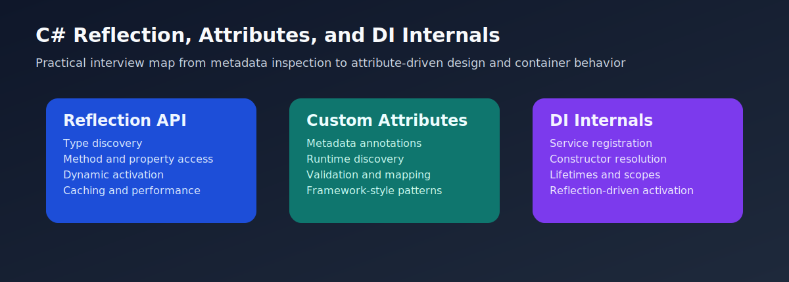

# C# Reflection, Attributes, and DI Internals Interview Questions



This guide is written from a practical, long-industry perspective: the kind of reflection, attribute, and dependency-injection knowledge that still matters after years of framework work, plugin loading, validation pipelines, API tooling, and production diagnostics. It starts with the basics and moves steadily into the trickier runtime and design issues that real teams actually debug.

## 1. Reflection API

This section covers how runtime metadata inspection actually works in real C# systems: assembly scanning, member discovery, dynamic activation, and the performance realities that separate useful reflection from accidental slow code.

### 1. What is the role of Type discovery and assembly inspection in C# reflection and attributes interviews?

**Answer:**

In C# reflection and attributes interviews, Type discovery and assembly inspection refers to the reflection capability used to inspect assemblies, types, namespaces, and metadata at runtime. Interviewers use this topic to see whether a candidate can connect metadata-driven features to real framework and production code.

**Sample:**

```csharp
Assembly assembly = typeof(string).Assembly;
Type[] types = assembly.GetTypes();

Console.WriteLine(assembly.GetName().Name);
Console.WriteLine(types.First(type => type.Name == "String").FullName);
```

---

### 2. Why is Type discovery and assembly inspection important in real projects?

**Answer:**

It matters because plugin discovery, framework bootstrapping, testing tools, and diagnostics often start by scanning assemblies and types dynamically. In production, this shows up in plugin discovery, API frameworks, validation, DI, mapping, and infrastructure code.

**Sample:**

```csharp
Assembly assembly = typeof(string).Assembly;
Type[] types = assembly.GetTypes();

Console.WriteLine(assembly.GetName().Name);
Console.WriteLine(types.First(type => type.Name == "String").FullName);
```

---

### 3. When should you use or think carefully about Type discovery and assembly inspection?

**Answer:**

Use or reason carefully about Type discovery and assembly inspection when you need to find implementations, inspect loaded assemblies, or build metadata-driven behavior instead of hard-coding every type reference. Strong interview answers connect it to flexibility, maintainability, performance, or framework behavior.

**Sample:**

```csharp
Assembly assembly = typeof(string).Assembly;
Type[] types = assembly.GetTypes();

Console.WriteLine(assembly.GetName().Name);
Console.WriteLine(types.First(type => type.Name == "String").FullName);
```

---

### 4. What is a real-time example of Type discovery and assembly inspection?

**Answer:**

A reporting platform may scan assemblies at startup to discover custom export providers and register them without hand-maintaining every implementation in configuration. Practical examples usually land better than toy demos because they show how metadata and containers behave in working systems.

**Sample:**

```csharp
Assembly assembly = typeof(string).Assembly;
Type[] types = assembly.GetTypes();

Console.WriteLine(assembly.GetName().Name);
Console.WriteLine(types.First(type => type.Name == "String").FullName);
```

---

### 5. What is a best practice for Type discovery and assembly inspection?

**Answer:**

Constrain scanning scope, filter aggressively, and do not run wide-open reflection scans repeatedly on hot paths. The strongest answers usually explain which maintenance or runtime problem the practice helps avoid.

**Sample:**

```csharp
Assembly assembly = typeof(string).Assembly;
Type[] types = assembly.GetTypes();

Console.WriteLine(assembly.GetName().Name);
Console.WriteLine(types.First(type => type.Name == "String").FullName);
```

---

### 6. What is a tricky interview point or common mistake around Type discovery and assembly inspection?

**Answer:**

A common mistake is treating reflection discovery like free compile-time access and forgetting the runtime cost and fragility of broad scans. This is often where experienced answers sound very different from surface-level API recall.

**Sample:**

```csharp
var serviceTypes = Assembly.GetExecutingAssembly()
    .GetTypes()
    .Where(type => type.IsClass && !type.IsAbstract)
    .ToList();

Console.WriteLine(serviceTypes.Count);
```

---

### 7. How does Type discovery and assembly inspection differ from compile-time type references?

**Answer:**

Type discovery and assembly inspection is about the reflection capability used to inspect assemblies, types, namespaces, and metadata at runtime, whereas compile-time type references is about directly referenced types known to the compiler rather than runtime-discovered metadata and dynamic type loading. Interviewers like this comparison because it shows judgment instead of memorizing keywords.

**Sample:**

```csharp
Assembly assembly = typeof(string).Assembly;
Type[] types = assembly.GetTypes();

Console.WriteLine(assembly.GetName().Name);
Console.WriteLine(types.First(type => type.Name == "String").FullName);
```

---

### 8. How do you troubleshoot problems related to Type discovery and assembly inspection?

**Answer:**

Check the loaded assembly set, verify namespace and interface filters, and confirm whether the target type is actually public and loadable. Troubleshooting-oriented answers usually sound stronger because reflection and DI bugs often show up as runtime surprises rather than compile-time errors.

**Sample:**

```csharp
var serviceTypes = Assembly.GetExecutingAssembly()
    .GetTypes()
    .Where(type => type.IsClass && !type.IsAbstract)
    .ToList();

Console.WriteLine(serviceTypes.Count);
```

---

### 9. What follow-up question does an interviewer usually ask after Type discovery and assembly inspection?

**Answer:**

A common follow-up is how to discover implementations safely and why startup-time scanning is usually better than repeated request-time scanning. That usually shifts the discussion from syntax to tradeoffs, runtime behavior, and design boundaries.

**Sample:**

```csharp
Assembly assembly = typeof(string).Assembly;
Type[] types = assembly.GetTypes();

Console.WriteLine(assembly.GetName().Name);
Console.WriteLine(types.First(type => type.Name == "String").FullName);
```

---

### 10. How does Type discovery and assembly inspection connect to the rest of C# framework design?

**Answer:**

Type discovery underpins custom attributes, plugin systems, container registration, and framework automation. That is why this topic keeps appearing in senior interviews even when the first question sounds small.

**Sample:**

```csharp
Assembly assembly = typeof(string).Assembly;
Type[] types = assembly.GetTypes();

Console.WriteLine(assembly.GetName().Name);
Console.WriteLine(types.First(type => type.Name == "String").FullName);
```

---

### 11. What is the role of Inspecting properties, methods, and constructors in C# reflection and attributes interviews?

**Answer:**

In C# reflection and attributes interviews, Inspecting properties, methods, and constructors refers to the reflection APIs that let code inspect member signatures, visibility, parameters, and metadata for a type at runtime. Interviewers use this topic to see whether a candidate can connect metadata-driven features to real framework and production code.

**Sample:**

```csharp
Type type = typeof(InvoiceService);
var methods = type.GetMethods(BindingFlags.Public | BindingFlags.Instance | BindingFlags.DeclaredOnly);
var constructors = type.GetConstructors();

Console.WriteLine(methods.First().Name);
Console.WriteLine(constructors.Length);

public class InvoiceService
{
    public InvoiceService() { }
    public void Export() { }
}
```

---

### 12. Why is Inspecting properties, methods, and constructors important in real projects?

**Answer:**

It matters because validation, mapping, API tooling, and debugging helpers often need to understand a type metadata dynamically. In production, this shows up in plugin discovery, API frameworks, validation, DI, mapping, and infrastructure code.

**Sample:**

```csharp
Type type = typeof(InvoiceService);
var methods = type.GetMethods(BindingFlags.Public | BindingFlags.Instance | BindingFlags.DeclaredOnly);
var constructors = type.GetConstructors();

Console.WriteLine(methods.First().Name);
Console.WriteLine(constructors.Length);

public class InvoiceService
{
    public InvoiceService() { }
    public void Export() { }
}
```

---

### 13. When should you use or think carefully about Inspecting properties, methods, and constructors?

**Answer:**

Use or reason carefully about Inspecting properties, methods, and constructors when you need metadata about methods, properties, or constructors for frameworks, diagnostics, admin tooling, or convention-based behavior. Strong interview answers connect it to flexibility, maintainability, performance, or framework behavior.

**Sample:**

```csharp
Type type = typeof(InvoiceService);
var methods = type.GetMethods(BindingFlags.Public | BindingFlags.Instance | BindingFlags.DeclaredOnly);
var constructors = type.GetConstructors();

Console.WriteLine(methods.First().Name);
Console.WriteLine(constructors.Length);

public class InvoiceService
{
    public InvoiceService() { }
    public void Export() { }
}
```

---

### 14. What is a real-time example of Inspecting properties, methods, and constructors?

**Answer:**

An audit tool may inspect DTO properties to build a field-level export, while a lightweight mapper may inspect constructors and writable properties before creating an object. Practical examples usually land better than toy demos because they show how metadata and containers behave in working systems.

**Sample:**

```csharp
Type type = typeof(InvoiceService);
var methods = type.GetMethods(BindingFlags.Public | BindingFlags.Instance | BindingFlags.DeclaredOnly);
var constructors = type.GetConstructors();

Console.WriteLine(methods.First().Name);
Console.WriteLine(constructors.Length);

public class InvoiceService
{
    public InvoiceService() { }
    public void Export() { }
}
```

---

### 15. What is a best practice for Inspecting properties, methods, and constructors?

**Answer:**

Use explicit binding flags and cache member metadata when repeated access is expected, especially in infrastructure code. The strongest answers usually explain which maintenance or runtime problem the practice helps avoid.

**Sample:**

```csharp
Type type = typeof(InvoiceService);
var methods = type.GetMethods(BindingFlags.Public | BindingFlags.Instance | BindingFlags.DeclaredOnly);
var constructors = type.GetConstructors();

Console.WriteLine(methods.First().Name);
Console.WriteLine(constructors.Length);

public class InvoiceService
{
    public InvoiceService() { }
    public void Export() { }
}
```

---

### 16. What is a tricky interview point or common mistake around Inspecting properties, methods, and constructors?

**Answer:**

Candidates often know GetProperties but skip binding flags, constructor selection, or non-public member behavior that matter in real tooling. This is often where experienced answers sound very different from surface-level API recall.

**Sample:**

```csharp
var property = typeof(InvoiceRecord).GetProperty(nameof(InvoiceRecord.InvoiceNo));
Console.WriteLine(property?.PropertyType.Name);

public record InvoiceRecord(string InvoiceNo, decimal Amount);
```

---

### 17. How does Inspecting properties, methods, and constructors differ from direct member access in ordinary application code?

**Answer:**

Inspecting properties, methods, and constructors is about the reflection APIs that let code inspect member signatures, visibility, parameters, and metadata for a type at runtime, whereas direct member access in ordinary application code is about compile-time property and method usage rather than metadata inspection about members themselves. Interviewers like this comparison because it shows judgment instead of memorizing keywords.

**Sample:**

```csharp
Type type = typeof(InvoiceService);
var methods = type.GetMethods(BindingFlags.Public | BindingFlags.Instance | BindingFlags.DeclaredOnly);
var constructors = type.GetConstructors();

Console.WriteLine(methods.First().Name);
Console.WriteLine(constructors.Length);

public class InvoiceService
{
    public InvoiceService() { }
    public void Export() { }
}
```

---

### 18. How do you troubleshoot problems related to Inspecting properties, methods, and constructors?

**Answer:**

Check binding flags, parameter types, and whether the code is inspecting inherited, non-public, or instance versus static members correctly. Troubleshooting-oriented answers usually sound stronger because reflection and DI bugs often show up as runtime surprises rather than compile-time errors.

**Sample:**

```csharp
var property = typeof(InvoiceRecord).GetProperty(nameof(InvoiceRecord.InvoiceNo));
Console.WriteLine(property?.PropertyType.Name);

public record InvoiceRecord(string InvoiceNo, decimal Amount);
```

---

### 19. What follow-up question does an interviewer usually ask after Inspecting properties, methods, and constructors?

**Answer:**

A common follow-up is which binding flags matter most and why constructor and property inspection often appear together in framework code. That usually shifts the discussion from syntax to tradeoffs, runtime behavior, and design boundaries.

**Sample:**

```csharp
Type type = typeof(InvoiceService);
var methods = type.GetMethods(BindingFlags.Public | BindingFlags.Instance | BindingFlags.DeclaredOnly);
var constructors = type.GetConstructors();

Console.WriteLine(methods.First().Name);
Console.WriteLine(constructors.Length);

public class InvoiceService
{
    public InvoiceService() { }
    public void Export() { }
}
```

---

### 20. How does Inspecting properties, methods, and constructors connect to the rest of C# framework design?

**Answer:**

Member inspection leads naturally into attribute reading, activator logic, and DI constructor resolution. That is why this topic keeps appearing in senior interviews even when the first question sounds small.

**Sample:**

```csharp
Type type = typeof(InvoiceService);
var methods = type.GetMethods(BindingFlags.Public | BindingFlags.Instance | BindingFlags.DeclaredOnly);
var constructors = type.GetConstructors();

Console.WriteLine(methods.First().Name);
Console.WriteLine(constructors.Length);

public class InvoiceService
{
    public InvoiceService() { }
    public void Export() { }
}
```

---

### 21. What is the role of Dynamic activation with Activator and constructor invocation in C# reflection and attributes interviews?

**Answer:**

In C# reflection and attributes interviews, Dynamic activation with Activator and constructor invocation refers to the runtime creation of object instances when the exact type is discovered dynamically instead of referenced directly at compile time. Interviewers use this topic to see whether a candidate can connect metadata-driven features to real framework and production code.

**Sample:**

```csharp
Type parserType = typeof(CsvInvoiceParser);
object? parser = Activator.CreateInstance(parserType);
Console.WriteLine(parser?.GetType().Name);

public class CsvInvoiceParser { }
```

---

### 22. Why is Dynamic activation with Activator and constructor invocation important in real projects?

**Answer:**

It matters because plugins, factories, DI containers, serializers, and admin tooling often need to create objects dynamically. In production, this shows up in plugin discovery, API frameworks, validation, DI, mapping, and infrastructure code.

**Sample:**

```csharp
Type parserType = typeof(CsvInvoiceParser);
object? parser = Activator.CreateInstance(parserType);
Console.WriteLine(parser?.GetType().Name);

public class CsvInvoiceParser { }
```

---

### 23. When should you use or think carefully about Dynamic activation with Activator and constructor invocation?

**Answer:**

Use or reason carefully about Dynamic activation with Activator and constructor invocation when the type is known only through metadata, configuration, or assembly scanning and the code needs to instantiate it safely. Strong interview answers connect it to flexibility, maintainability, performance, or framework behavior.

**Sample:**

```csharp
Type parserType = typeof(CsvInvoiceParser);
object? parser = Activator.CreateInstance(parserType);
Console.WriteLine(parser?.GetType().Name);

public class CsvInvoiceParser { }
```

---

### 24. What is a real-time example of Dynamic activation with Activator and constructor invocation?

**Answer:**

A file import engine may discover a CSV parser type from configuration and create it dynamically so different tenants can plug in different parsers. Practical examples usually land better than toy demos because they show how metadata and containers behave in working systems.

**Sample:**

```csharp
Type parserType = typeof(CsvInvoiceParser);
object? parser = Activator.CreateInstance(parserType);
Console.WriteLine(parser?.GetType().Name);

public class CsvInvoiceParser { }
```

---

### 25. What is a best practice for Dynamic activation with Activator and constructor invocation?

**Answer:**

Prefer explicit factories or DI where practical, and use reflection-based activation carefully with constructor expectations kept simple and well-defined. The strongest answers usually explain which maintenance or runtime problem the practice helps avoid.

**Sample:**

```csharp
Type parserType = typeof(CsvInvoiceParser);
object? parser = Activator.CreateInstance(parserType);
Console.WriteLine(parser?.GetType().Name);

public class CsvInvoiceParser { }
```

---

### 26. What is a tricky interview point or common mistake around Dynamic activation with Activator and constructor invocation?

**Answer:**

A common mistake is using Activator everywhere when constructor dependencies or error handling really call for a stronger factory or container model. This is often where experienced answers sound very different from surface-level API recall.

**Sample:**

```csharp
Type handlerType = typeof(EmailNotifier);
object? handler = Activator.CreateInstance(handlerType, "ops@demo.com");
Console.WriteLine(handler?.GetType().Name);

public class EmailNotifier
{
    public EmailNotifier(string address) { }
}
```

---

### 27. How does Dynamic activation with Activator and constructor invocation differ from dependency-injected or compile-time construction?

**Answer:**

Dynamic activation with Activator and constructor invocation is about the runtime creation of object instances when the exact type is discovered dynamically instead of referenced directly at compile time, whereas dependency-injected or compile-time construction is about object creation through normal new expressions or container-controlled activation rather than raw runtime type activation. Interviewers like this comparison because it shows judgment instead of memorizing keywords.

**Sample:**

```csharp
Type parserType = typeof(CsvInvoiceParser);
object? parser = Activator.CreateInstance(parserType);
Console.WriteLine(parser?.GetType().Name);

public class CsvInvoiceParser { }
```

---

### 28. How do you troubleshoot problems related to Dynamic activation with Activator and constructor invocation?

**Answer:**

Check whether the target type has the expected constructor, whether parameters match, and whether the created object actually implements the intended contract. Troubleshooting-oriented answers usually sound stronger because reflection and DI bugs often show up as runtime surprises rather than compile-time errors.

**Sample:**

```csharp
Type handlerType = typeof(EmailNotifier);
object? handler = Activator.CreateInstance(handlerType, "ops@demo.com");
Console.WriteLine(handler?.GetType().Name);

public class EmailNotifier
{
    public EmailNotifier(string address) { }
}
```

---

### 29. What follow-up question does an interviewer usually ask after Dynamic activation with Activator and constructor invocation?

**Answer:**

A common follow-up is when Activator.CreateInstance is acceptable and when a factory or DI container is the better runtime creation strategy. That usually shifts the discussion from syntax to tradeoffs, runtime behavior, and design boundaries.

**Sample:**

```csharp
Type parserType = typeof(CsvInvoiceParser);
object? parser = Activator.CreateInstance(parserType);
Console.WriteLine(parser?.GetType().Name);

public class CsvInvoiceParser { }
```

---

### 30. How does Dynamic activation with Activator and constructor invocation connect to the rest of C# framework design?

**Answer:**

Dynamic activation connects reflection to plugin loading, serialization, factories, and DI internals. That is why this topic keeps appearing in senior interviews even when the first question sounds small.

**Sample:**

```csharp
Type parserType = typeof(CsvInvoiceParser);
object? parser = Activator.CreateInstance(parserType);
Console.WriteLine(parser?.GetType().Name);

public class CsvInvoiceParser { }
```

---

### 31. What is the role of Reflection performance, caching, and compiled delegates in C# reflection and attributes interviews?

**Answer:**

In C# reflection and attributes interviews, Reflection performance, caching, and compiled delegates refers to the practical performance considerations around reflection and the common optimization of caching metadata or compiled accessors instead of repeating raw reflection calls. Interviewers use this topic to see whether a candidate can connect metadata-driven features to real framework and production code.

**Sample:**

```csharp
var property = typeof(InvoiceRecord).GetProperty(nameof(InvoiceRecord.Amount))!;
var getter = (Func<InvoiceRecord, decimal>)Delegate.CreateDelegate(
    typeof(Func<InvoiceRecord, decimal>),
    property.GetMethod!);

Console.WriteLine(getter(new InvoiceRecord("INV-100", 250m)));
```

---

### 32. Why is Reflection performance, caching, and compiled delegates important in real projects?

**Answer:**

It matters because reflection is powerful, but naive repeated use in hot paths can become an avoidable runtime cost. In production, this shows up in plugin discovery, API frameworks, validation, DI, mapping, and infrastructure code.

**Sample:**

```csharp
var property = typeof(InvoiceRecord).GetProperty(nameof(InvoiceRecord.Amount))!;
var getter = (Func<InvoiceRecord, decimal>)Delegate.CreateDelegate(
    typeof(Func<InvoiceRecord, decimal>),
    property.GetMethod!);

Console.WriteLine(getter(new InvoiceRecord("INV-100", 250m)));
```

---

### 33. When should you use or think carefully about Reflection performance, caching, and compiled delegates?

**Answer:**

Use or reason carefully about Reflection performance, caching, and compiled delegates when reflection-based access happens frequently in mappers, serializers, validation frameworks, or high-volume infrastructure paths. Strong interview answers connect it to flexibility, maintainability, performance, or framework behavior.

**Sample:**

```csharp
var property = typeof(InvoiceRecord).GetProperty(nameof(InvoiceRecord.Amount))!;
var getter = (Func<InvoiceRecord, decimal>)Delegate.CreateDelegate(
    typeof(Func<InvoiceRecord, decimal>),
    property.GetMethod!);

Console.WriteLine(getter(new InvoiceRecord("INV-100", 250m)));
```

---

### 34. What is a real-time example of Reflection performance, caching, and compiled delegates?

**Answer:**

A custom object mapper may cache PropertyInfo metadata once at startup and compile getter delegates instead of rediscovering properties for every row in a large import. Practical examples usually land better than toy demos because they show how metadata and containers behave in working systems.

**Sample:**

```csharp
var property = typeof(InvoiceRecord).GetProperty(nameof(InvoiceRecord.Amount))!;
var getter = (Func<InvoiceRecord, decimal>)Delegate.CreateDelegate(
    typeof(Func<InvoiceRecord, decimal>),
    property.GetMethod!);

Console.WriteLine(getter(new InvoiceRecord("INV-100", 250m)));
```

---

### 35. What is a best practice for Reflection performance, caching, and compiled delegates?

**Answer:**

Reflect once, cache metadata, and move expensive discovery out of hot request or loop paths whenever possible. The strongest answers usually explain which maintenance or runtime problem the practice helps avoid.

**Sample:**

```csharp
var property = typeof(InvoiceRecord).GetProperty(nameof(InvoiceRecord.Amount))!;
var getter = (Func<InvoiceRecord, decimal>)Delegate.CreateDelegate(
    typeof(Func<InvoiceRecord, decimal>),
    property.GetMethod!);

Console.WriteLine(getter(new InvoiceRecord("INV-100", 250m)));
```

---

### 36. What is a tricky interview point or common mistake around Reflection performance, caching, and compiled delegates?

**Answer:**

A common weak answer either fears reflection everywhere or ignores that one-time reflection plus caching is often perfectly reasonable. This is often where experienced answers sound very different from surface-level API recall.

**Sample:**

```csharp
var cache = new Dictionary<Type, PropertyInfo[]>();
cache[typeof(InvoiceRecord)] = typeof(InvoiceRecord).GetProperties();
Console.WriteLine(cache[typeof(InvoiceRecord)].Length);
```

---

### 37. How does Reflection performance, caching, and compiled delegates differ from one-time startup reflection?

**Answer:**

Reflection performance, caching, and compiled delegates is about the practical performance considerations around reflection and the common optimization of caching metadata or compiled accessors instead of repeating raw reflection calls, whereas one-time startup reflection is about metadata discovery performed sparingly during initialization rather than repeatedly during high-volume runtime paths. Interviewers like this comparison because it shows judgment instead of memorizing keywords.

**Sample:**

```csharp
var property = typeof(InvoiceRecord).GetProperty(nameof(InvoiceRecord.Amount))!;
var getter = (Func<InvoiceRecord, decimal>)Delegate.CreateDelegate(
    typeof(Func<InvoiceRecord, decimal>),
    property.GetMethod!);

Console.WriteLine(getter(new InvoiceRecord("INV-100", 250m)));
```

---

### 38. How do you troubleshoot problems related to Reflection performance, caching, and compiled delegates?

**Answer:**

Profile the hot path, check whether member lookup repeats per item, and verify whether cached accessors would remove most of the overhead. Troubleshooting-oriented answers usually sound stronger because reflection and DI bugs often show up as runtime surprises rather than compile-time errors.

**Sample:**

```csharp
var cache = new Dictionary<Type, PropertyInfo[]>();
cache[typeof(InvoiceRecord)] = typeof(InvoiceRecord).GetProperties();
Console.WriteLine(cache[typeof(InvoiceRecord)].Length);
```

---

### 39. What follow-up question does an interviewer usually ask after Reflection performance, caching, and compiled delegates?

**Answer:**

A common follow-up is when reflection cost matters, when it does not, and why caching usually matters more than eliminating reflection entirely. That usually shifts the discussion from syntax to tradeoffs, runtime behavior, and design boundaries.

**Sample:**

```csharp
var property = typeof(InvoiceRecord).GetProperty(nameof(InvoiceRecord.Amount))!;
var getter = (Func<InvoiceRecord, decimal>)Delegate.CreateDelegate(
    typeof(Func<InvoiceRecord, decimal>),
    property.GetMethod!);

Console.WriteLine(getter(new InvoiceRecord("INV-100", 250m)));
```

---

### 40. How does Reflection performance, caching, and compiled delegates connect to the rest of C# framework design?

**Answer:**

Reflection performance tradeoffs connect metadata power to framework design and operational efficiency. That is why this topic keeps appearing in senior interviews even when the first question sounds small.

**Sample:**

```csharp
var property = typeof(InvoiceRecord).GetProperty(nameof(InvoiceRecord.Amount))!;
var getter = (Func<InvoiceRecord, decimal>)Delegate.CreateDelegate(
    typeof(Func<InvoiceRecord, decimal>),
    property.GetMethod!);

Console.WriteLine(getter(new InvoiceRecord("INV-100", 250m)));
```

---

## 2. Custom attributes

This section covers how custom attributes are defined, discovered, and used in real systems, along with the design discipline needed to keep attribute-driven code helpful instead of noisy.

### 41. What is the role of Defining custom attributes for metadata-driven behavior in C# reflection and attributes interviews?

**Answer:**

In C# reflection and attributes interviews, Defining custom attributes for metadata-driven behavior refers to the practice of creating attribute classes that attach metadata to types, methods, properties, or parameters for framework or application behavior. Interviewers use this topic to see whether a candidate can connect metadata-driven features to real framework and production code.

**Sample:**

```csharp
[AttributeUsage(AttributeTargets.Property)]
public sealed class ExportColumnAttribute : Attribute
{
    public ExportColumnAttribute(string header, int order)
    {
        Header = header;
        Order = order;
    }

    public string Header { get; }
    public int Order { get; }
}

public class InvoiceExportRow
{
    [ExportColumn("Invoice No", 1)]
    public string InvoiceNo { get; set; } = string.Empty;
}
```

---

### 42. Why is Defining custom attributes for metadata-driven behavior important in real projects?

**Answer:**

It matters because attributes are one of the most common ways C# frameworks expose declarative behavior without large amounts of imperative configuration. In production, this shows up in plugin discovery, API frameworks, validation, DI, mapping, and infrastructure code.

**Sample:**

```csharp
[AttributeUsage(AttributeTargets.Property)]
public sealed class ExportColumnAttribute : Attribute
{
    public ExportColumnAttribute(string header, int order)
    {
        Header = header;
        Order = order;
    }

    public string Header { get; }
    public int Order { get; }
}

public class InvoiceExportRow
{
    [ExportColumn("Invoice No", 1)]
    public string InvoiceNo { get; set; } = string.Empty;
}
```

---

### 43. When should you use or think carefully about Defining custom attributes for metadata-driven behavior?

**Answer:**

Use or reason carefully about Defining custom attributes for metadata-driven behavior when the application needs annotations for validation, routing, audit rules, export metadata, or other declarative conventions. Strong interview answers connect it to flexibility, maintainability, performance, or framework behavior.

**Sample:**

```csharp
[AttributeUsage(AttributeTargets.Property)]
public sealed class ExportColumnAttribute : Attribute
{
    public ExportColumnAttribute(string header, int order)
    {
        Header = header;
        Order = order;
    }

    public string Header { get; }
    public int Order { get; }
}

public class InvoiceExportRow
{
    [ExportColumn("Invoice No", 1)]
    public string InvoiceNo { get; set; } = string.Empty;
}
```

---

### 44. What is a real-time example of Defining custom attributes for metadata-driven behavior?

**Answer:**

An export system may use an attribute to mark which DTO properties should appear in a generated CSV and in which order. Practical examples usually land better than toy demos because they show how metadata and containers behave in working systems.

**Sample:**

```csharp
[AttributeUsage(AttributeTargets.Property)]
public sealed class ExportColumnAttribute : Attribute
{
    public ExportColumnAttribute(string header, int order)
    {
        Header = header;
        Order = order;
    }

    public string Header { get; }
    public int Order { get; }
}

public class InvoiceExportRow
{
    [ExportColumn("Invoice No", 1)]
    public string InvoiceNo { get; set; } = string.Empty;
}
```

---

### 45. What is a best practice for Defining custom attributes for metadata-driven behavior?

**Answer:**

Keep attributes small and declarative, and let separate runtime code interpret them instead of burying business logic inside the attribute itself. The strongest answers usually explain which maintenance or runtime problem the practice helps avoid.

**Sample:**

```csharp
[AttributeUsage(AttributeTargets.Property)]
public sealed class ExportColumnAttribute : Attribute
{
    public ExportColumnAttribute(string header, int order)
    {
        Header = header;
        Order = order;
    }

    public string Header { get; }
    public int Order { get; }
}

public class InvoiceExportRow
{
    [ExportColumn("Invoice No", 1)]
    public string InvoiceNo { get; set; } = string.Empty;
}
```

---

### 46. What is a tricky interview point or common mistake around Defining custom attributes for metadata-driven behavior?

**Answer:**

A common mistake is turning attributes into miniature behavior engines instead of simple metadata carriers. This is often where experienced answers sound very different from surface-level API recall.

**Sample:**

```csharp
[AttributeUsage(AttributeTargets.Class, AllowMultiple = false, Inherited = true)]
public sealed class AuditedAttribute : Attribute { }

Console.WriteLine(typeof(AuditedAttribute).Name);
```

---

### 47. How does Defining custom attributes for metadata-driven behavior differ from hard-coded imperative configuration?

**Answer:**

Defining custom attributes for metadata-driven behavior is about the practice of creating attribute classes that attach metadata to types, methods, properties, or parameters for framework or application behavior, whereas hard-coded imperative configuration is about setting behavior entirely in code without declarative metadata on the model or endpoint itself. Interviewers like this comparison because it shows judgment instead of memorizing keywords.

**Sample:**

```csharp
[AttributeUsage(AttributeTargets.Property)]
public sealed class ExportColumnAttribute : Attribute
{
    public ExportColumnAttribute(string header, int order)
    {
        Header = header;
        Order = order;
    }

    public string Header { get; }
    public int Order { get; }
}

public class InvoiceExportRow
{
    [ExportColumn("Invoice No", 1)]
    public string InvoiceNo { get; set; } = string.Empty;
}
```

---

### 48. How do you troubleshoot problems related to Defining custom attributes for metadata-driven behavior?

**Answer:**

Check attribute usage targets, constructor arguments, and whether the consuming reflection code is actually reading the metadata you expect. Troubleshooting-oriented answers usually sound stronger because reflection and DI bugs often show up as runtime surprises rather than compile-time errors.

**Sample:**

```csharp
[AttributeUsage(AttributeTargets.Class, AllowMultiple = false, Inherited = true)]
public sealed class AuditedAttribute : Attribute { }

Console.WriteLine(typeof(AuditedAttribute).Name);
```

---

### 49. What follow-up question does an interviewer usually ask after Defining custom attributes for metadata-driven behavior?

**Answer:**

A common follow-up is when a custom attribute is cleaner than a fluent registration and when it makes the code harder to follow. That usually shifts the discussion from syntax to tradeoffs, runtime behavior, and design boundaries.

**Sample:**

```csharp
[AttributeUsage(AttributeTargets.Property)]
public sealed class ExportColumnAttribute : Attribute
{
    public ExportColumnAttribute(string header, int order)
    {
        Header = header;
        Order = order;
    }

    public string Header { get; }
    public int Order { get; }
}

public class InvoiceExportRow
{
    [ExportColumn("Invoice No", 1)]
    public string InvoiceNo { get; set; } = string.Empty;
}
```

---

### 50. How does Defining custom attributes for metadata-driven behavior connect to the rest of C# framework design?

**Answer:**

Attributes connect reflection to validation, routing, mapping, and convention-based frameworks. That is why this topic keeps appearing in senior interviews even when the first question sounds small.

**Sample:**

```csharp
[AttributeUsage(AttributeTargets.Property)]
public sealed class ExportColumnAttribute : Attribute
{
    public ExportColumnAttribute(string header, int order)
    {
        Header = header;
        Order = order;
    }

    public string Header { get; }
    public int Order { get; }
}

public class InvoiceExportRow
{
    [ExportColumn("Invoice No", 1)]
    public string InvoiceNo { get; set; } = string.Empty;
}
```

---

### 51. What is the role of Reading custom attributes at runtime in C# reflection and attributes interviews?

**Answer:**

In C# reflection and attributes interviews, Reading custom attributes at runtime refers to the reflection pattern of discovering attributes and using their metadata to drive runtime behavior. Interviewers use this topic to see whether a candidate can connect metadata-driven features to real framework and production code.

**Sample:**

```csharp
var properties = typeof(InvoiceExportRow).GetProperties();
foreach (var property in properties)
{
    var attribute = property.GetCustomAttribute<ExportColumnAttribute>();
    if (attribute is not null)
    {
        Console.WriteLine($"{property.Name} -> {attribute.Header} ({attribute.Order})");
    }
}
```

---

### 52. Why is Reading custom attributes at runtime important in real projects?

**Answer:**

It matters because attributes are only useful when code can read them consistently and translate them into framework or application behavior. In production, this shows up in plugin discovery, API frameworks, validation, DI, mapping, and infrastructure code.

**Sample:**

```csharp
var properties = typeof(InvoiceExportRow).GetProperties();
foreach (var property in properties)
{
    var attribute = property.GetCustomAttribute<ExportColumnAttribute>();
    if (attribute is not null)
    {
        Console.WriteLine($"{property.Name} -> {attribute.Header} ({attribute.Order})");
    }
}
```

---

### 53. When should you use or think carefully about Reading custom attributes at runtime?

**Answer:**

Use or reason carefully about Reading custom attributes at runtime when metadata-driven logic must inspect classes, methods, or properties to apply conventions, validation rules, or mapping behavior. Strong interview answers connect it to flexibility, maintainability, performance, or framework behavior.

**Sample:**

```csharp
var properties = typeof(InvoiceExportRow).GetProperties();
foreach (var property in properties)
{
    var attribute = property.GetCustomAttribute<ExportColumnAttribute>();
    if (attribute is not null)
    {
        Console.WriteLine($"{property.Name} -> {attribute.Header} ({attribute.Order})");
    }
}
```

---

### 54. What is a real-time example of Reading custom attributes at runtime?

**Answer:**

A lightweight export engine may read ExportColumn attributes from a DTO to build headers and column ordering without separate mapping files. Practical examples usually land better than toy demos because they show how metadata and containers behave in working systems.

**Sample:**

```csharp
var properties = typeof(InvoiceExportRow).GetProperties();
foreach (var property in properties)
{
    var attribute = property.GetCustomAttribute<ExportColumnAttribute>();
    if (attribute is not null)
    {
        Console.WriteLine($"{property.Name} -> {attribute.Header} ({attribute.Order})");
    }
}
```

---

### 55. What is a best practice for Reading custom attributes at runtime?

**Answer:**

Read attributes once where practical, cache the results if repeated, and keep the attribute-consumption logic easy to test separately from the models. The strongest answers usually explain which maintenance or runtime problem the practice helps avoid.

**Sample:**

```csharp
var properties = typeof(InvoiceExportRow).GetProperties();
foreach (var property in properties)
{
    var attribute = property.GetCustomAttribute<ExportColumnAttribute>();
    if (attribute is not null)
    {
        Console.WriteLine($"{property.Name} -> {attribute.Header} ({attribute.Order})");
    }
}
```

---

### 56. What is a tricky interview point or common mistake around Reading custom attributes at runtime?

**Answer:**

Candidates often know how to define attributes but not how to read them efficiently or safely in a real runtime pipeline. This is often where experienced answers sound very different from surface-level API recall.

**Sample:**

```csharp
bool isAudited = typeof(InvoiceHandler).IsDefined(typeof(AuditedAttribute), inherit: true);
Console.WriteLine(isAudited);

[Audited]
public class InvoiceHandler { }
```

---

### 57. How does Reading custom attributes at runtime differ from compile-time code generation or manual mapping tables?

**Answer:**

Reading custom attributes at runtime is about the reflection pattern of discovering attributes and using their metadata to drive runtime behavior, whereas compile-time code generation or manual mapping tables is about predefined mappings rather than runtime metadata inspection using reflection. Interviewers like this comparison because it shows judgment instead of memorizing keywords.

**Sample:**

```csharp
var properties = typeof(InvoiceExportRow).GetProperties();
foreach (var property in properties)
{
    var attribute = property.GetCustomAttribute<ExportColumnAttribute>();
    if (attribute is not null)
    {
        Console.WriteLine($"{property.Name} -> {attribute.Header} ({attribute.Order})");
    }
}
```

---

### 58. How do you troubleshoot problems related to Reading custom attributes at runtime?

**Answer:**

Check inheritance rules, attribute targets, and whether the consuming code is reading from the right member level such as property versus type. Troubleshooting-oriented answers usually sound stronger because reflection and DI bugs often show up as runtime surprises rather than compile-time errors.

**Sample:**

```csharp
bool isAudited = typeof(InvoiceHandler).IsDefined(typeof(AuditedAttribute), inherit: true);
Console.WriteLine(isAudited);

[Audited]
public class InvoiceHandler { }
```

---

### 59. What follow-up question does an interviewer usually ask after Reading custom attributes at runtime?

**Answer:**

A common follow-up is how GetCustomAttribute differs from GetCustomAttributes and when caching attribute lookups is worth it. That usually shifts the discussion from syntax to tradeoffs, runtime behavior, and design boundaries.

**Sample:**

```csharp
var properties = typeof(InvoiceExportRow).GetProperties();
foreach (var property in properties)
{
    var attribute = property.GetCustomAttribute<ExportColumnAttribute>();
    if (attribute is not null)
    {
        Console.WriteLine($"{property.Name} -> {attribute.Header} ({attribute.Order})");
    }
}
```

---

### 60. How does Reading custom attributes at runtime connect to the rest of C# framework design?

**Answer:**

Runtime attribute reading is the bridge from annotations to real application behavior. That is why this topic keeps appearing in senior interviews even when the first question sounds small.

**Sample:**

```csharp
var properties = typeof(InvoiceExportRow).GetProperties();
foreach (var property in properties)
{
    var attribute = property.GetCustomAttribute<ExportColumnAttribute>();
    if (attribute is not null)
    {
        Console.WriteLine($"{property.Name} -> {attribute.Header} ({attribute.Order})");
    }
}
```

---

### 61. What is the role of Attribute-driven validation, mapping, and framework patterns in C# reflection and attributes interviews?

**Answer:**

In C# reflection and attributes interviews, Attribute-driven validation, mapping, and framework patterns refers to the broader use of attributes to declare validation rules, mapping hints, routing semantics, or behavioral conventions that frameworks consume. Interviewers use this topic to see whether a candidate can connect metadata-driven features to real framework and production code.

**Sample:**

```csharp
public class CreateInvoiceRequest
{
    [Required]
    [StringLength(20)]
    public string InvoiceNo { get; set; } = string.Empty;

    [Range(0.01, 1000000)]
    public decimal Amount { get; set; }
}
```

---

### 62. Why is Attribute-driven validation, mapping, and framework patterns important in real projects?

**Answer:**

It matters because many real-world .NET frameworks are attribute-driven, and interviewers want to see whether you understand the pattern beyond syntax. In production, this shows up in plugin discovery, API frameworks, validation, DI, mapping, and infrastructure code.

**Sample:**

```csharp
public class CreateInvoiceRequest
{
    [Required]
    [StringLength(20)]
    public string InvoiceNo { get; set; } = string.Empty;

    [Range(0.01, 1000000)]
    public decimal Amount { get; set; }
}
```

---

### 63. When should you use or think carefully about Attribute-driven validation, mapping, and framework patterns?

**Answer:**

Use or reason carefully about Attribute-driven validation, mapping, and framework patterns when declarative annotations make a contract clearer than imperative registration, especially for validation, serialization, routing, or documentation. Strong interview answers connect it to flexibility, maintainability, performance, or framework behavior.

**Sample:**

```csharp
public class CreateInvoiceRequest
{
    [Required]
    [StringLength(20)]
    public string InvoiceNo { get; set; } = string.Empty;

    [Range(0.01, 1000000)]
    public decimal Amount { get; set; }
}
```

---

### 64. What is a real-time example of Attribute-driven validation, mapping, and framework patterns?

**Answer:**

An API model may use attributes to require fields, a mapper may use an ignore attribute, and a controller action may use route and authorize attributes together. Practical examples usually land better than toy demos because they show how metadata and containers behave in working systems.

**Sample:**

```csharp
public class CreateInvoiceRequest
{
    [Required]
    [StringLength(20)]
    public string InvoiceNo { get; set; } = string.Empty;

    [Range(0.01, 1000000)]
    public decimal Amount { get; set; }
}
```

---

### 65. What is a best practice for Attribute-driven validation, mapping, and framework patterns?

**Answer:**

Use attributes where the metadata belongs naturally on the type or member, and avoid piling on attributes when a separate configuration model would stay clearer. The strongest answers usually explain which maintenance or runtime problem the practice helps avoid.

**Sample:**

```csharp
public class CreateInvoiceRequest
{
    [Required]
    [StringLength(20)]
    public string InvoiceNo { get; set; } = string.Empty;

    [Range(0.01, 1000000)]
    public decimal Amount { get; set; }
}
```

---

### 66. What is a tricky interview point or common mistake around Attribute-driven validation, mapping, and framework patterns?

**Answer:**

A common mistake is over-annotating models until the declarative metadata becomes harder to reason about than plain code. This is often where experienced answers sound very different from surface-level API recall.

**Sample:**

```csharp
var context = new ValidationContext(new CreateInvoiceRequest { InvoiceNo = "", Amount = 0 });
var results = new List<ValidationResult>();
bool isValid = Validator.TryValidateObject(context.ObjectInstance, context, results, validateAllProperties: true);
Console.WriteLine(isValid);
```

---

### 67. How does Attribute-driven validation, mapping, and framework patterns differ from code-first imperative rule registration?

**Answer:**

Attribute-driven validation, mapping, and framework patterns is about the broader use of attributes to declare validation rules, mapping hints, routing semantics, or behavioral conventions that frameworks consume, whereas code-first imperative rule registration is about building rules through explicit setup code rather than annotations attached directly to members and types. Interviewers like this comparison because it shows judgment instead of memorizing keywords.

**Sample:**

```csharp
public class CreateInvoiceRequest
{
    [Required]
    [StringLength(20)]
    public string InvoiceNo { get; set; } = string.Empty;

    [Range(0.01, 1000000)]
    public decimal Amount { get; set; }
}
```

---

### 68. How do you troubleshoot problems related to Attribute-driven validation, mapping, and framework patterns?

**Answer:**

Inspect the actual framework conventions, confirm the attribute is supported on that target, and verify whether multiple attributes interact in the order you expect. Troubleshooting-oriented answers usually sound stronger because reflection and DI bugs often show up as runtime surprises rather than compile-time errors.

**Sample:**

```csharp
var context = new ValidationContext(new CreateInvoiceRequest { InvoiceNo = "", Amount = 0 });
var results = new List<ValidationResult>();
bool isValid = Validator.TryValidateObject(context.ObjectInstance, context, results, validateAllProperties: true);
Console.WriteLine(isValid);
```

---

### 69. What follow-up question does an interviewer usually ask after Attribute-driven validation, mapping, and framework patterns?

**Answer:**

A common follow-up is when attributes improve readability and when separate configuration is the better long-term design. That usually shifts the discussion from syntax to tradeoffs, runtime behavior, and design boundaries.

**Sample:**

```csharp
public class CreateInvoiceRequest
{
    [Required]
    [StringLength(20)]
    public string InvoiceNo { get; set; } = string.Empty;

    [Range(0.01, 1000000)]
    public decimal Amount { get; set; }
}
```

---

### 70. How does Attribute-driven validation, mapping, and framework patterns connect to the rest of C# framework design?

**Answer:**

Attribute-driven design links metadata to validation, serialization, APIs, and tooling ecosystems. That is why this topic keeps appearing in senior interviews even when the first question sounds small.

**Sample:**

```csharp
public class CreateInvoiceRequest
{
    [Required]
    [StringLength(20)]
    public string InvoiceNo { get; set; } = string.Empty;

    [Range(0.01, 1000000)]
    public decimal Amount { get; set; }
}
```

---

### 71. What is the role of Attribute design boundaries, inheritance, and overuse in C# reflection and attributes interviews?

**Answer:**

In C# reflection and attributes interviews, Attribute design boundaries, inheritance, and overuse refers to the design judgment around where attributes belong, how inheritance affects them, and when metadata annotations become an anti-pattern. Interviewers use this topic to see whether a candidate can connect metadata-driven features to real framework and production code.

**Sample:**

```csharp
[AttributeUsage(AttributeTargets.Class, Inherited = true)]
public sealed class ApiContractAttribute : Attribute
{
    public ApiContractAttribute(string version) => Version = version;
    public string Version { get; }
}

[ApiContract("v1")]
public class InvoiceResponse { }
```

---

### 72. Why is Attribute design boundaries, inheritance, and overuse important in real projects?

**Answer:**

It matters because attributes are easy to add but can quietly make models noisy, tightly coupled, or framework-specific in the wrong places. In production, this shows up in plugin discovery, API frameworks, validation, DI, mapping, and infrastructure code.

**Sample:**

```csharp
[AttributeUsage(AttributeTargets.Class, Inherited = true)]
public sealed class ApiContractAttribute : Attribute
{
    public ApiContractAttribute(string version) => Version = version;
    public string Version { get; }
}

[ApiContract("v1")]
public class InvoiceResponse { }
```

---

### 73. When should you use or think carefully about Attribute design boundaries, inheritance, and overuse?

**Answer:**

Use or reason carefully about Attribute design boundaries, inheritance, and overuse when you decide whether metadata should live on the model itself, in configuration, or in a higher-level framework layer. Strong interview answers connect it to flexibility, maintainability, performance, or framework behavior.

**Sample:**

```csharp
[AttributeUsage(AttributeTargets.Class, Inherited = true)]
public sealed class ApiContractAttribute : Attribute
{
    public ApiContractAttribute(string version) => Version = version;
    public string Version { get; }
}

[ApiContract("v1")]
public class InvoiceResponse { }
```

---

### 74. What is a real-time example of Attribute design boundaries, inheritance, and overuse?

**Answer:**

A shared domain model used by multiple applications may become hard to reuse if every team keeps attaching framework-specific attributes for one particular UI or API stack. Practical examples usually land better than toy demos because they show how metadata and containers behave in working systems.

**Sample:**

```csharp
[AttributeUsage(AttributeTargets.Class, Inherited = true)]
public sealed class ApiContractAttribute : Attribute
{
    public ApiContractAttribute(string version) => Version = version;
    public string Version { get; }
}

[ApiContract("v1")]
public class InvoiceResponse { }
```

---

### 75. What is a best practice for Attribute design boundaries, inheritance, and overuse?

**Answer:**

Keep attributes close to where the metadata is truly part of the contract, and avoid making core domain types carry every framework concern from every layer. The strongest answers usually explain which maintenance or runtime problem the practice helps avoid.

**Sample:**

```csharp
[AttributeUsage(AttributeTargets.Class, Inherited = true)]
public sealed class ApiContractAttribute : Attribute
{
    public ApiContractAttribute(string version) => Version = version;
    public string Version { get; }
}

[ApiContract("v1")]
public class InvoiceResponse { }
```

---

### 76. What is a tricky interview point or common mistake around Attribute design boundaries, inheritance, and overuse?

**Answer:**

A common weak answer assumes attributes are always cleaner, even when they leak framework decisions into shared models or make testing and reuse harder. This is often where experienced answers sound very different from surface-level API recall.

**Sample:**

```csharp
var attribute = typeof(InvoiceResponse).GetCustomAttribute<ApiContractAttribute>();
Console.WriteLine(attribute?.Version);
Console.WriteLine("Ask whether this metadata truly belongs on the shared type.");
```

---

### 77. How does Attribute design boundaries, inheritance, and overuse differ from external configuration or fluent registration?

**Answer:**

Attribute design boundaries, inheritance, and overuse is about the design judgment around where attributes belong, how inheritance affects them, and when metadata annotations become an anti-pattern, whereas external configuration or fluent registration is about keeping metadata outside the core model when the concern does not belong on the type itself. Interviewers like this comparison because it shows judgment instead of memorizing keywords.

**Sample:**

```csharp
[AttributeUsage(AttributeTargets.Class, Inherited = true)]
public sealed class ApiContractAttribute : Attribute
{
    public ApiContractAttribute(string version) => Version = version;
    public string Version { get; }
}

[ApiContract("v1")]
public class InvoiceResponse { }
```

---

### 78. How do you troubleshoot problems related to Attribute design boundaries, inheritance, and overuse?

**Answer:**

Review who consumes the attribute, whether inheritance is helping or causing surprise, and whether the same model is being forced to serve too many frameworks. Troubleshooting-oriented answers usually sound stronger because reflection and DI bugs often show up as runtime surprises rather than compile-time errors.

**Sample:**

```csharp
var attribute = typeof(InvoiceResponse).GetCustomAttribute<ApiContractAttribute>();
Console.WriteLine(attribute?.Version);
Console.WriteLine("Ask whether this metadata truly belongs on the shared type.");
```

---

### 79. What follow-up question does an interviewer usually ask after Attribute design boundaries, inheritance, and overuse?

**Answer:**

A common follow-up is when to place metadata on the class itself and when to move it into separate mapping or configuration code. That usually shifts the discussion from syntax to tradeoffs, runtime behavior, and design boundaries.

**Sample:**

```csharp
[AttributeUsage(AttributeTargets.Class, Inherited = true)]
public sealed class ApiContractAttribute : Attribute
{
    public ApiContractAttribute(string version) => Version = version;
    public string Version { get; }
}

[ApiContract("v1")]
public class InvoiceResponse { }
```

---

### 80. How does Attribute design boundaries, inheritance, and overuse connect to the rest of C# framework design?

**Answer:**

Design boundaries around attributes affect long-term maintainability, portability, and model cleanliness. That is why this topic keeps appearing in senior interviews even when the first question sounds small.

**Sample:**

```csharp
[AttributeUsage(AttributeTargets.Class, Inherited = true)]
public sealed class ApiContractAttribute : Attribute
{
    public ApiContractAttribute(string version) => Version = version;
    public string Version { get; }
}

[ApiContract("v1")]
public class InvoiceResponse { }
```

---

## 3. Dependency Injection internals

This section covers what the DI container is really doing under the hood: storing service descriptors, reflecting over constructors, enforcing lifetimes, and activating more advanced generic or factory-based registrations.

### 81. What is the role of Service registration and descriptor model in C# reflection and attributes interviews?

**Answer:**

In C# reflection and attributes interviews, Service registration and descriptor model refers to the internal model where the DI container stores service descriptors describing service types, implementation types, factories, and lifetimes. Interviewers use this topic to see whether a candidate can connect metadata-driven features to real framework and production code.

**Sample:**

```csharp
var services = new ServiceCollection();
services.AddScoped<IInvoiceRepository, SqlInvoiceRepository>();
services.AddSingleton<Clock>();

foreach (var descriptor in services)
{
    Console.WriteLine($"{descriptor.ServiceType.Name} -> {descriptor.Lifetime}");
}

public interface IInvoiceRepository { }
public class SqlInvoiceRepository : IInvoiceRepository { }
public class Clock { }
```

---

### 82. Why is Service registration and descriptor model important in real projects?

**Answer:**

It matters because understanding registration internals helps explain how the container resolves dependencies and why duplicate or conflicting registrations behave the way they do. In production, this shows up in plugin discovery, API frameworks, validation, DI, mapping, and infrastructure code.

**Sample:**

```csharp
var services = new ServiceCollection();
services.AddScoped<IInvoiceRepository, SqlInvoiceRepository>();
services.AddSingleton<Clock>();

foreach (var descriptor in services)
{
    Console.WriteLine($"{descriptor.ServiceType.Name} -> {descriptor.Lifetime}");
}

public interface IInvoiceRepository { }
public class SqlInvoiceRepository : IInvoiceRepository { }
public class Clock { }
```

---

### 83. When should you use or think carefully about Service registration and descriptor model?

**Answer:**

Use or reason carefully about Service registration and descriptor model when you need to reason about container behavior, registration order, replacements, or how frameworks add services behind the scenes. Strong interview answers connect it to flexibility, maintainability, performance, or framework behavior.

**Sample:**

```csharp
var services = new ServiceCollection();
services.AddScoped<IInvoiceRepository, SqlInvoiceRepository>();
services.AddSingleton<Clock>();

foreach (var descriptor in services)
{
    Console.WriteLine($"{descriptor.ServiceType.Name} -> {descriptor.Lifetime}");
}

public interface IInvoiceRepository { }
public class SqlInvoiceRepository : IInvoiceRepository { }
public class Clock { }
```

---

### 84. What is a real-time example of Service registration and descriptor model?

**Answer:**

A modular application may register multiple invoice processors, override one in testing, and later inspect why a particular implementation is the one actually resolved. Practical examples usually land better than toy demos because they show how metadata and containers behave in working systems.

**Sample:**

```csharp
var services = new ServiceCollection();
services.AddScoped<IInvoiceRepository, SqlInvoiceRepository>();
services.AddSingleton<Clock>();

foreach (var descriptor in services)
{
    Console.WriteLine($"{descriptor.ServiceType.Name} -> {descriptor.Lifetime}");
}

public interface IInvoiceRepository { }
public class SqlInvoiceRepository : IInvoiceRepository { }
public class Clock { }
```

---

### 85. What is a best practice for Service registration and descriptor model?

**Answer:**

Keep registrations explicit and readable, and understand that the container is working from descriptors and lifetimes rather than magic global state. The strongest answers usually explain which maintenance or runtime problem the practice helps avoid.

**Sample:**

```csharp
var services = new ServiceCollection();
services.AddScoped<IInvoiceRepository, SqlInvoiceRepository>();
services.AddSingleton<Clock>();

foreach (var descriptor in services)
{
    Console.WriteLine($"{descriptor.ServiceType.Name} -> {descriptor.Lifetime}");
}

public interface IInvoiceRepository { }
public class SqlInvoiceRepository : IInvoiceRepository { }
public class Clock { }
```

---

### 86. What is a tricky interview point or common mistake around Service registration and descriptor model?

**Answer:**

Candidates often use AddScoped or AddSingleton daily but cannot explain that the container is effectively building and consuming service descriptors internally. This is often where experienced answers sound very different from surface-level API recall.

**Sample:**

```csharp
services.AddTransient<IInvoiceRepository, SqlInvoiceRepository>();
services.AddTransient<IInvoiceRepository, CachedInvoiceRepository>();
Console.WriteLine("Last registration wins for single service resolution; IEnumerable<T> returns all.");

public class CachedInvoiceRepository : IInvoiceRepository { }
```

---

### 87. How does Service registration and descriptor model differ from manual object creation with new?

**Answer:**

Service registration and descriptor model is about the internal model where the DI container stores service descriptors describing service types, implementation types, factories, and lifetimes, whereas manual object creation with new is about direct object instantiation without a centralized registry of service metadata and lifetimes. Interviewers like this comparison because it shows judgment instead of memorizing keywords.

**Sample:**

```csharp
var services = new ServiceCollection();
services.AddScoped<IInvoiceRepository, SqlInvoiceRepository>();
services.AddSingleton<Clock>();

foreach (var descriptor in services)
{
    Console.WriteLine($"{descriptor.ServiceType.Name} -> {descriptor.Lifetime}");
}

public interface IInvoiceRepository { }
public class SqlInvoiceRepository : IInvoiceRepository { }
public class Clock { }
```

---

### 88. How do you troubleshoot problems related to Service registration and descriptor model?

**Answer:**

Inspect registration order, whether multiple implementations exist, and whether the service was added as implementation type, instance, or factory. Troubleshooting-oriented answers usually sound stronger because reflection and DI bugs often show up as runtime surprises rather than compile-time errors.

**Sample:**

```csharp
services.AddTransient<IInvoiceRepository, SqlInvoiceRepository>();
services.AddTransient<IInvoiceRepository, CachedInvoiceRepository>();
Console.WriteLine("Last registration wins for single service resolution; IEnumerable<T> returns all.");

public class CachedInvoiceRepository : IInvoiceRepository { }
```

---

### 89. What follow-up question does an interviewer usually ask after Service registration and descriptor model?

**Answer:**

A common follow-up is what ServiceDescriptor contains and how the built-in container decides what to return when multiple registrations exist. That usually shifts the discussion from syntax to tradeoffs, runtime behavior, and design boundaries.

**Sample:**

```csharp
var services = new ServiceCollection();
services.AddScoped<IInvoiceRepository, SqlInvoiceRepository>();
services.AddSingleton<Clock>();

foreach (var descriptor in services)
{
    Console.WriteLine($"{descriptor.ServiceType.Name} -> {descriptor.Lifetime}");
}

public interface IInvoiceRepository { }
public class SqlInvoiceRepository : IInvoiceRepository { }
public class Clock { }
```

---

### 90. How does Service registration and descriptor model connect to the rest of C# framework design?

**Answer:**

Service descriptors are the foundation for constructor resolution, scopes, and lifetime behavior. That is why this topic keeps appearing in senior interviews even when the first question sounds small.

**Sample:**

```csharp
var services = new ServiceCollection();
services.AddScoped<IInvoiceRepository, SqlInvoiceRepository>();
services.AddSingleton<Clock>();

foreach (var descriptor in services)
{
    Console.WriteLine($"{descriptor.ServiceType.Name} -> {descriptor.Lifetime}");
}

public interface IInvoiceRepository { }
public class SqlInvoiceRepository : IInvoiceRepository { }
public class Clock { }
```

---

### 91. What is the role of Constructor selection and dependency resolution internals in C# reflection and attributes interviews?

**Answer:**

In C# reflection and attributes interviews, Constructor selection and dependency resolution internals refers to the container behavior of inspecting constructors, choosing resolvable parameters, and creating object graphs recursively. Interviewers use this topic to see whether a candidate can connect metadata-driven features to real framework and production code.

**Sample:**

```csharp
var services = new ServiceCollection();
services.AddSingleton<Clock>();
services.AddScoped<InvoiceService>();

using var provider = services.BuildServiceProvider();
using var scope = provider.CreateScope();
var service = scope.ServiceProvider.GetRequiredService<InvoiceService>();
Console.WriteLine(service.GetType().Name);

public class InvoiceService
{
    public InvoiceService(Clock clock) { }
}
```

---

### 92. Why is Constructor selection and dependency resolution internals important in real projects?

**Answer:**

It matters because many DI runtime errors come from misunderstanding how constructors are selected or why one parameter cannot be resolved. In production, this shows up in plugin discovery, API frameworks, validation, DI, mapping, and infrastructure code.

**Sample:**

```csharp
var services = new ServiceCollection();
services.AddSingleton<Clock>();
services.AddScoped<InvoiceService>();

using var provider = services.BuildServiceProvider();
using var scope = provider.CreateScope();
var service = scope.ServiceProvider.GetRequiredService<InvoiceService>();
Console.WriteLine(service.GetType().Name);

public class InvoiceService
{
    public InvoiceService(Clock clock) { }
}
```

---

### 93. When should you use or think carefully about Constructor selection and dependency resolution internals?

**Answer:**

Use or reason carefully about Constructor selection and dependency resolution internals when a service has dependencies, multiple constructors, optional parameters, or factory-created collaborators that must be built by the container. Strong interview answers connect it to flexibility, maintainability, performance, or framework behavior.

**Sample:**

```csharp
var services = new ServiceCollection();
services.AddSingleton<Clock>();
services.AddScoped<InvoiceService>();

using var provider = services.BuildServiceProvider();
using var scope = provider.CreateScope();
var service = scope.ServiceProvider.GetRequiredService<InvoiceService>();
Console.WriteLine(service.GetType().Name);

public class InvoiceService
{
    public InvoiceService(Clock clock) { }
}
```

---

### 94. What is a real-time example of Constructor selection and dependency resolution internals?

**Answer:**

A report generator may depend on a repository, logger, and clock, and the container builds that graph automatically by reflecting over the selected constructor. Practical examples usually land better than toy demos because they show how metadata and containers behave in working systems.

**Sample:**

```csharp
var services = new ServiceCollection();
services.AddSingleton<Clock>();
services.AddScoped<InvoiceService>();

using var provider = services.BuildServiceProvider();
using var scope = provider.CreateScope();
var service = scope.ServiceProvider.GetRequiredService<InvoiceService>();
Console.WriteLine(service.GetType().Name);

public class InvoiceService
{
    public InvoiceService(Clock clock) { }
}
```

---

### 95. What is a best practice for Constructor selection and dependency resolution internals?

**Answer:**

Prefer one clear public constructor per service and keep dependencies explicit so the container behavior stays predictable. The strongest answers usually explain which maintenance or runtime problem the practice helps avoid.

**Sample:**

```csharp
var services = new ServiceCollection();
services.AddSingleton<Clock>();
services.AddScoped<InvoiceService>();

using var provider = services.BuildServiceProvider();
using var scope = provider.CreateScope();
var service = scope.ServiceProvider.GetRequiredService<InvoiceService>();
Console.WriteLine(service.GetType().Name);

public class InvoiceService
{
    public InvoiceService(Clock clock) { }
}
```

---

### 96. What is a tricky interview point or common mistake around Constructor selection and dependency resolution internals?

**Answer:**

A common mistake is multiple ambiguous constructors or hidden runtime dependencies that the container cannot resolve cleanly. This is often where experienced answers sound very different from surface-level API recall.

**Sample:**

```csharp
public class AmbiguousService
{
    public AmbiguousService() { }
    public AmbiguousService(Clock clock) { }
}

Console.WriteLine("Multiple constructors can make container behavior less obvious.");
```

---

### 97. How does Constructor selection and dependency resolution internals differ from manual factory composition?

**Answer:**

Constructor selection and dependency resolution internals is about the container behavior of inspecting constructors, choosing resolvable parameters, and creating object graphs recursively, whereas manual factory composition is about explicit object graph creation in handwritten code rather than container-driven constructor inspection and resolution. Interviewers like this comparison because it shows judgment instead of memorizing keywords.

**Sample:**

```csharp
var services = new ServiceCollection();
services.AddSingleton<Clock>();
services.AddScoped<InvoiceService>();

using var provider = services.BuildServiceProvider();
using var scope = provider.CreateScope();
var service = scope.ServiceProvider.GetRequiredService<InvoiceService>();
Console.WriteLine(service.GetType().Name);

public class InvoiceService
{
    public InvoiceService(Clock clock) { }
}
```

---

### 98. How do you troubleshoot problems related to Constructor selection and dependency resolution internals?

**Answer:**

Read the exception carefully, inspect constructor signatures, and verify every dependency in the chosen constructor is registered with the right lifetime. Troubleshooting-oriented answers usually sound stronger because reflection and DI bugs often show up as runtime surprises rather than compile-time errors.

**Sample:**

```csharp
public class AmbiguousService
{
    public AmbiguousService() { }
    public AmbiguousService(Clock clock) { }
}

Console.WriteLine("Multiple constructors can make container behavior less obvious.");
```

---

### 99. What follow-up question does an interviewer usually ask after Constructor selection and dependency resolution internals?

**Answer:**

A common follow-up is how the built-in container picks constructors and why a single obvious constructor usually makes service design cleaner. That usually shifts the discussion from syntax to tradeoffs, runtime behavior, and design boundaries.

**Sample:**

```csharp
var services = new ServiceCollection();
services.AddSingleton<Clock>();
services.AddScoped<InvoiceService>();

using var provider = services.BuildServiceProvider();
using var scope = provider.CreateScope();
var service = scope.ServiceProvider.GetRequiredService<InvoiceService>();
Console.WriteLine(service.GetType().Name);

public class InvoiceService
{
    public InvoiceService(Clock clock) { }
}
```

---

### 100. How does Constructor selection and dependency resolution internals connect to the rest of C# framework design?

**Answer:**

Constructor resolution is where reflection meets everyday DI usage and runtime failure modes. That is why this topic keeps appearing in senior interviews even when the first question sounds small.

**Sample:**

```csharp
var services = new ServiceCollection();
services.AddSingleton<Clock>();
services.AddScoped<InvoiceService>();

using var provider = services.BuildServiceProvider();
using var scope = provider.CreateScope();
var service = scope.ServiceProvider.GetRequiredService<InvoiceService>();
Console.WriteLine(service.GetType().Name);

public class InvoiceService
{
    public InvoiceService(Clock clock) { }
}
```

---

### 101. What is the role of Singleton, scoped, and transient lifetime behavior in C# reflection and attributes interviews?

**Answer:**

In C# reflection and attributes interviews, Singleton, scoped, and transient lifetime behavior refers to the runtime rules that control how often services are created and how long instances live within the container and request scopes. Interviewers use this topic to see whether a candidate can connect metadata-driven features to real framework and production code.

**Sample:**

```csharp
var services = new ServiceCollection();
services.AddSingleton<Clock>();
services.AddScoped<RequestContext>();
services.AddTransient<InvoiceFormatter>();

foreach (var descriptor in services)
{
    Console.WriteLine($"{descriptor.ServiceType.Name}: {descriptor.Lifetime}");
}

public class RequestContext { }
public class InvoiceFormatter { }
```

---

### 102. Why is Singleton, scoped, and transient lifetime behavior important in real projects?

**Answer:**

It matters because incorrect lifetime choices can cause stale state, thread-safety bugs, memory retention, or scope violations in production. In production, this shows up in plugin discovery, API frameworks, validation, DI, mapping, and infrastructure code.

**Sample:**

```csharp
var services = new ServiceCollection();
services.AddSingleton<Clock>();
services.AddScoped<RequestContext>();
services.AddTransient<InvoiceFormatter>();

foreach (var descriptor in services)
{
    Console.WriteLine($"{descriptor.ServiceType.Name}: {descriptor.Lifetime}");
}

public class RequestContext { }
public class InvoiceFormatter { }
```

---

### 103. When should you use or think carefully about Singleton, scoped, and transient lifetime behavior?

**Answer:**

Use or reason carefully about Singleton, scoped, and transient lifetime behavior when you choose how repositories, clients, caches, and request-aware services should live across requests or within one operation. Strong interview answers connect it to flexibility, maintainability, performance, or framework behavior.

**Sample:**

```csharp
var services = new ServiceCollection();
services.AddSingleton<Clock>();
services.AddScoped<RequestContext>();
services.AddTransient<InvoiceFormatter>();

foreach (var descriptor in services)
{
    Console.WriteLine($"{descriptor.ServiceType.Name}: {descriptor.Lifetime}");
}

public class RequestContext { }
public class InvoiceFormatter { }
```

---

### 104. What is a real-time example of Singleton, scoped, and transient lifetime behavior?

**Answer:**

A DbContext-like service should usually be scoped per request, while a stateless clock or options reader can often be singleton if it has no scoped dependencies. Practical examples usually land better than toy demos because they show how metadata and containers behave in working systems.

**Sample:**

```csharp
var services = new ServiceCollection();
services.AddSingleton<Clock>();
services.AddScoped<RequestContext>();
services.AddTransient<InvoiceFormatter>();

foreach (var descriptor in services)
{
    Console.WriteLine($"{descriptor.ServiceType.Name}: {descriptor.Lifetime}");
}

public class RequestContext { }
public class InvoiceFormatter { }
```

---

### 105. What is a best practice for Singleton, scoped, and transient lifetime behavior?

**Answer:**

Choose the narrowest lifetime that matches the real ownership and thread-safety needs of the service, and avoid capturing scoped services inside singletons. The strongest answers usually explain which maintenance or runtime problem the practice helps avoid.

**Sample:**

```csharp
var services = new ServiceCollection();
services.AddSingleton<Clock>();
services.AddScoped<RequestContext>();
services.AddTransient<InvoiceFormatter>();

foreach (var descriptor in services)
{
    Console.WriteLine($"{descriptor.ServiceType.Name}: {descriptor.Lifetime}");
}

public class RequestContext { }
public class InvoiceFormatter { }
```

---

### 106. What is a tricky interview point or common mistake around Singleton, scoped, and transient lifetime behavior?

**Answer:**

A classic interview trap is injecting a scoped service into a singleton, which breaks the scope model and usually fails or behaves incorrectly. This is often where experienced answers sound very different from surface-level API recall.

**Sample:**

```csharp
public class BadSingleton
{
    public BadSingleton(RequestContext context) { }
}

Console.WriteLine("A singleton depending on a scoped service is a lifetime smell.");
```

---

### 107. How does Singleton, scoped, and transient lifetime behavior differ from lifetime-agnostic manual creation?

**Answer:**

Singleton, scoped, and transient lifetime behavior is about the runtime rules that control how often services are created and how long instances live within the container and request scopes, whereas lifetime-agnostic manual creation is about constructing objects without container-managed reuse or scope boundaries. Interviewers like this comparison because it shows judgment instead of memorizing keywords.

**Sample:**

```csharp
var services = new ServiceCollection();
services.AddSingleton<Clock>();
services.AddScoped<RequestContext>();
services.AddTransient<InvoiceFormatter>();

foreach (var descriptor in services)
{
    Console.WriteLine($"{descriptor.ServiceType.Name}: {descriptor.Lifetime}");
}

public class RequestContext { }
public class InvoiceFormatter { }
```

---

### 108. How do you troubleshoot problems related to Singleton, scoped, and transient lifetime behavior?

**Answer:**

Inspect service lifetimes in registration, look for scoped-into-singleton dependencies, and verify whether state unexpectedly persists across requests. Troubleshooting-oriented answers usually sound stronger because reflection and DI bugs often show up as runtime surprises rather than compile-time errors.

**Sample:**

```csharp
public class BadSingleton
{
    public BadSingleton(RequestContext context) { }
}

Console.WriteLine("A singleton depending on a scoped service is a lifetime smell.");
```

---

### 109. What follow-up question does an interviewer usually ask after Singleton, scoped, and transient lifetime behavior?

**Answer:**

A common follow-up is when to use each lifetime and what kinds of bugs appear when the wrong lifetime is chosen. That usually shifts the discussion from syntax to tradeoffs, runtime behavior, and design boundaries.

**Sample:**

```csharp
var services = new ServiceCollection();
services.AddSingleton<Clock>();
services.AddScoped<RequestContext>();
services.AddTransient<InvoiceFormatter>();

foreach (var descriptor in services)
{
    Console.WriteLine($"{descriptor.ServiceType.Name}: {descriptor.Lifetime}");
}

public class RequestContext { }
public class InvoiceFormatter { }
```

---

### 110. How does Singleton, scoped, and transient lifetime behavior connect to the rest of C# framework design?

**Answer:**

Lifetime behavior ties DI internals to concurrency, caching, memory retention, and request correctness. That is why this topic keeps appearing in senior interviews even when the first question sounds small.

**Sample:**

```csharp
var services = new ServiceCollection();
services.AddSingleton<Clock>();
services.AddScoped<RequestContext>();
services.AddTransient<InvoiceFormatter>();

foreach (var descriptor in services)
{
    Console.WriteLine($"{descriptor.ServiceType.Name}: {descriptor.Lifetime}");
}

public class RequestContext { }
public class InvoiceFormatter { }
```

---

### 111. What is the role of Open generics, factories, and ActivatorUtilities in C# reflection and attributes interviews?

**Answer:**

In C# reflection and attributes interviews, Open generics, factories, and ActivatorUtilities refers to the more advanced DI features where the container resolves generic service shapes or uses helper activation for types not directly registered as services. Interviewers use this topic to see whether a candidate can connect metadata-driven features to real framework and production code.

**Sample:**

```csharp
var services = new ServiceCollection();
services.AddScoped(typeof(IRepository<>), typeof(SqlRepository<>));

using var provider = services.BuildServiceProvider();
using var scope = provider.CreateScope();
var repo = scope.ServiceProvider.GetRequiredService<IRepository<InvoiceRecord>>();
Console.WriteLine(repo.GetType().Name);

public interface IRepository<T> { }
public class SqlRepository<T> : IRepository<T> { }
public record InvoiceRecord(string InvoiceNo, decimal Amount);
```

---

### 112. Why is Open generics, factories, and ActivatorUtilities important in real projects?

**Answer:**

It matters because real frameworks often rely on open generic registrations and factory-based activation for flexible infrastructure wiring. In production, this shows up in plugin discovery, API frameworks, validation, DI, mapping, and infrastructure code.

**Sample:**

```csharp
var services = new ServiceCollection();
services.AddScoped(typeof(IRepository<>), typeof(SqlRepository<>));

using var provider = services.BuildServiceProvider();
using var scope = provider.CreateScope();
var repo = scope.ServiceProvider.GetRequiredService<IRepository<InvoiceRecord>>();
Console.WriteLine(repo.GetType().Name);

public interface IRepository<T> { }
public class SqlRepository<T> : IRepository<T> { }
public record InvoiceRecord(string InvoiceNo, decimal Amount);
```

---

### 113. When should you use or think carefully about Open generics, factories, and ActivatorUtilities?

**Answer:**

Use or reason carefully about Open generics, factories, and ActivatorUtilities when you need one registration to support many generic types or you want to create objects with both DI-provided and runtime-supplied constructor arguments. Strong interview answers connect it to flexibility, maintainability, performance, or framework behavior.

**Sample:**

```csharp
var services = new ServiceCollection();
services.AddScoped(typeof(IRepository<>), typeof(SqlRepository<>));

using var provider = services.BuildServiceProvider();
using var scope = provider.CreateScope();
var repo = scope.ServiceProvider.GetRequiredService<IRepository<InvoiceRecord>>();
Console.WriteLine(repo.GetType().Name);

public interface IRepository<T> { }
public class SqlRepository<T> : IRepository<T> { }
public record InvoiceRecord(string InvoiceNo, decimal Amount);
```

---

### 114. What is a real-time example of Open generics, factories, and ActivatorUtilities?

**Answer:**

A pipeline may register IRepository<T> once and then resolve IRepository<Order> and IRepository<Customer> automatically, while ActivatorUtilities creates handlers with one runtime argument and the rest from DI. Practical examples usually land better than toy demos because they show how metadata and containers behave in working systems.

**Sample:**

```csharp
var services = new ServiceCollection();
services.AddScoped(typeof(IRepository<>), typeof(SqlRepository<>));

using var provider = services.BuildServiceProvider();
using var scope = provider.CreateScope();
var repo = scope.ServiceProvider.GetRequiredService<IRepository<InvoiceRecord>>();
Console.WriteLine(repo.GetType().Name);

public interface IRepository<T> { }
public class SqlRepository<T> : IRepository<T> { }
public record InvoiceRecord(string InvoiceNo, decimal Amount);
```

---

### 115. What is a best practice for Open generics, factories, and ActivatorUtilities?

**Answer:**

Use open generics and factories deliberately, keep constructors predictable, and avoid making object creation too magical for the next maintainer. The strongest answers usually explain which maintenance or runtime problem the practice helps avoid.

**Sample:**

```csharp
var services = new ServiceCollection();
services.AddScoped(typeof(IRepository<>), typeof(SqlRepository<>));

using var provider = services.BuildServiceProvider();
using var scope = provider.CreateScope();
var repo = scope.ServiceProvider.GetRequiredService<IRepository<InvoiceRecord>>();
Console.WriteLine(repo.GetType().Name);

public interface IRepository<T> { }
public class SqlRepository<T> : IRepository<T> { }
public record InvoiceRecord(string InvoiceNo, decimal Amount);
```

---

### 116. What is a tricky interview point or common mistake around Open generics, factories, and ActivatorUtilities?

**Answer:**

A common mistake is forgetting that some objects are not registered directly and still need ActivatorUtilities or a factory when runtime data is involved. This is often where experienced answers sound very different from surface-level API recall.

**Sample:**

```csharp
var utilitiesProvider = services.BuildServiceProvider();
var handler = ActivatorUtilities.CreateInstance<EmailHandler>(utilitiesProvider, "ops@demo.com");
Console.WriteLine(handler.GetType().Name);

public class EmailHandler
{
    public EmailHandler(string address) { }
}
```

---

### 117. How does Open generics, factories, and ActivatorUtilities differ from simple closed-type service registration?

**Answer:**

Open generics, factories, and ActivatorUtilities is about the more advanced DI features where the container resolves generic service shapes or uses helper activation for types not directly registered as services, whereas simple closed-type service registration is about direct registrations for one concrete service type at a time rather than reusable generic or factory-based activation patterns. Interviewers like this comparison because it shows judgment instead of memorizing keywords.

**Sample:**

```csharp
var services = new ServiceCollection();
services.AddScoped(typeof(IRepository<>), typeof(SqlRepository<>));

using var provider = services.BuildServiceProvider();
using var scope = provider.CreateScope();
var repo = scope.ServiceProvider.GetRequiredService<IRepository<InvoiceRecord>>();
Console.WriteLine(repo.GetType().Name);

public interface IRepository<T> { }
public class SqlRepository<T> : IRepository<T> { }
public record InvoiceRecord(string InvoiceNo, decimal Amount);
```

---

### 118. How do you troubleshoot problems related to Open generics, factories, and ActivatorUtilities?

**Answer:**

Check generic registration shape, ensure the closed generic can be built, and verify which constructor arguments come from DI versus explicit caller input. Troubleshooting-oriented answers usually sound stronger because reflection and DI bugs often show up as runtime surprises rather than compile-time errors.

**Sample:**

```csharp
var utilitiesProvider = services.BuildServiceProvider();
var handler = ActivatorUtilities.CreateInstance<EmailHandler>(utilitiesProvider, "ops@demo.com");
Console.WriteLine(handler.GetType().Name);

public class EmailHandler
{
    public EmailHandler(string address) { }
}
```

---

### 119. What follow-up question does an interviewer usually ask after Open generics, factories, and ActivatorUtilities?

**Answer:**

A common follow-up is when open generics are useful and why ActivatorUtilities exists even when a service provider already exists. That usually shifts the discussion from syntax to tradeoffs, runtime behavior, and design boundaries.

**Sample:**

```csharp
var services = new ServiceCollection();
services.AddScoped(typeof(IRepository<>), typeof(SqlRepository<>));

using var provider = services.BuildServiceProvider();
using var scope = provider.CreateScope();
var repo = scope.ServiceProvider.GetRequiredService<IRepository<InvoiceRecord>>();
Console.WriteLine(repo.GetType().Name);

public interface IRepository<T> { }
public class SqlRepository<T> : IRepository<T> { }
public record InvoiceRecord(string InvoiceNo, decimal Amount);
```

---

### 120. How does Open generics, factories, and ActivatorUtilities connect to the rest of C# framework design?

**Answer:**

These advanced activation patterns show how containers blend reflection, generics, and explicit factories. That is why this topic keeps appearing in senior interviews even when the first question sounds small.

**Sample:**

```csharp
var services = new ServiceCollection();
services.AddScoped(typeof(IRepository<>), typeof(SqlRepository<>));

using var provider = services.BuildServiceProvider();
using var scope = provider.CreateScope();
var repo = scope.ServiceProvider.GetRequiredService<IRepository<InvoiceRecord>>();
Console.WriteLine(repo.GetType().Name);

public interface IRepository<T> { }
public class SqlRepository<T> : IRepository<T> { }
public record InvoiceRecord(string InvoiceNo, decimal Amount);
```

---

