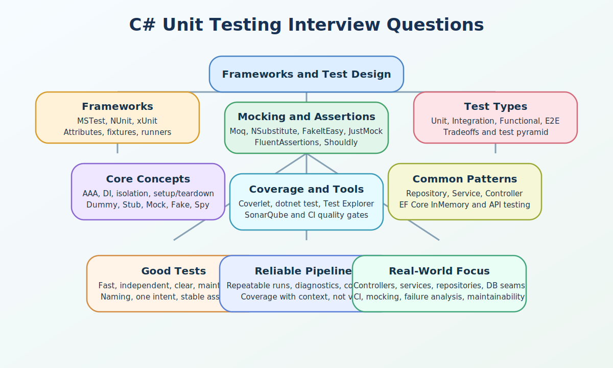

# C# Unit Testing Interview Questions



This guide is written from a practical, long-industry perspective: the kind of unit testing knowledge that still matters after years of shipping APIs, refactoring service layers, stabilizing flaky pipelines, and using tests to protect revenue-critical code. It starts with the basics and moves into framework tradeoffs, mocking strategy, assertions, tooling, and realistic application testing patterns.

Covered testing families in this page include framework selection, MSTest, NUnit, xUnit, mocking frameworks such as Moq, NSubstitute, FakeItEasy, and JustMock, assertion libraries such as FluentAssertions and Shouldly, test types including unit, integration, functional, and end-to-end testing, core concepts such as AAA, isolation, DI, setup and teardown, test doubles, framework attributes, mocking concepts such as Setup, Verify, Returns, and Callback, best practices, coverage and tooling such as Coverlet, dotnet test, Visual Studio Test Explorer, SonarQube, plus common patterns such as repository, service, controller, and EF Core InMemory testing.

## 1. Unit testing frameworks, selection, and migration strategy

This section covers the framework layer itself: why test frameworks matter, what MSTest, NUnit, and xUnit each bring to real teams, and how experienced engineers choose or migrate frameworks without creating unnecessary churn.

### 1. What is the role of Unit testing frameworks and why teams need them in C# unit testing interviews?

**Answer:**

In C# unit testing interviews, Unit testing frameworks and why teams need them refers to the core test-runner and assertion infrastructure that executes automated tests, reports failures, and integrates with tooling such as IDEs and CI pipelines. Interviewers use this topic to see whether a candidate can connect testing tools to reliability, maintainability, and delivery confidence.

**Sample:**

```csharp
public sealed class PriceCalculator
{
    public decimal Calculate(decimal amount, decimal taxRate) => amount + (amount * taxRate);
}
```

---

### 2. Why is Unit testing frameworks and why teams need them important in real projects?

**Answer:**

It matters because a good framework turns tests into a repeatable engineering feedback loop instead of a manual debugging habit. In production teams, this shows up in CI pipelines, regression prevention, refactoring safety, and faster debugging.

**Sample:**

```csharp
public sealed class PriceCalculator
{
    public decimal Calculate(decimal amount, decimal taxRate) => amount + (amount * taxRate);
}
```

---

### 3. When should you use or think carefully about Unit testing frameworks and why teams need them?

**Answer:**

Use or reason carefully about Unit testing frameworks and why teams need them when you set up a new codebase, standardize team conventions, or explain why automated tests should run locally and in CI from day one. Strong interview answers connect it to feedback speed, confidence level, and the cost of maintaining tests over time.

**Sample:**

```csharp
public sealed class PriceCalculator
{
    public decimal Calculate(decimal amount, decimal taxRate) => amount + (amount * taxRate);
}
```

---

### 4. What is a real-time example of Unit testing frameworks and why teams need them?

**Answer:**

A payment API team uses a framework-backed test suite to validate tax calculations, retry logic, and validation rules on every pull request before deployment. Practical examples land better than toy demos because testing decisions are really about delivery risk and system seams.

**Sample:**

```csharp
public sealed class PriceCalculator
{
    public decimal Calculate(decimal amount, decimal taxRate) => amount + (amount * taxRate);
}
```

---

### 5. What is a best practice for Unit testing frameworks and why teams need them?

**Answer:**

Choose one primary framework per solution unless there is a real migration constraint, and make sure the framework integrates cleanly with your runner, coverage tool, and CI setup. The strongest answers explain which flaky behavior, debugging pain, or maintenance problem the practice helps avoid.

**Sample:**

```csharp
public sealed class PriceCalculator
{
    public decimal Calculate(decimal amount, decimal taxRate) => amount + (amount * taxRate);
}
```

---

### 6. What is a tricky interview point or common mistake around Unit testing frameworks and why teams need them?

**Answer:**

Candidates sometimes talk about frameworks as if they are only syntax choices, but the real issue is ecosystem fit, team conventions, and maintainability over years. This is usually where experienced testing answers sound different from surface-level framework familiarity.

**Sample:**

```csharp
var projects = new[] { "Api.Tests", "Domain.Tests", "Integration.Tests" };
Console.WriteLine(string.Join(", ", projects));
```

---

### 7. How does Unit testing frameworks and why teams need them differ from manual ad hoc verification with console checks or temporary scripts?

**Answer:**

Unit testing frameworks and why teams need them is about the core test-runner and assertion infrastructure that executes automated tests, reports failures, and integrates with tooling such as IDEs and CI pipelines, whereas manual ad hoc verification with console checks or temporary scripts is about one-off developer validation that is not standardized, repeatable, or visible in automated pipelines. Interviewers like this comparison because it shows judgment instead of memorized definitions.

**Sample:**

```csharp
public sealed class PriceCalculator
{
    public decimal Calculate(decimal amount, decimal taxRate) => amount + (amount * taxRate);
}
```

---

### 8. How do you troubleshoot problems related to Unit testing frameworks and why teams need them?

**Answer:**

Check whether tests are actually being discovered, whether runners and adapters are installed correctly, and whether the team is mixing incompatible conventions across projects. Troubleshooting-based answers usually sound stronger because test problems often show up as flaky runs, false positives, slow suites, or hidden coupling.

**Sample:**

```csharp
var projects = new[] { "Api.Tests", "Domain.Tests", "Integration.Tests" };
Console.WriteLine(string.Join(", ", projects));
```

---

### 9. What follow-up question does an interviewer usually ask after Unit testing frameworks and why teams need them?

**Answer:**

A common follow-up is how to choose a default test framework for a new .NET solution That usually moves the discussion from API names to tradeoffs and real testing strategy.

**Sample:**

```csharp
public sealed class PriceCalculator
{
    public decimal Calculate(decimal amount, decimal taxRate) => amount + (amount * taxRate);
}
```

---

### 10. How does Unit testing frameworks and why teams need them connect to the rest of C# testing design?

**Answer:**

Framework choice sets the foundation for mocking, assertions, data-driven tests, fixtures, and coverage across the whole testing strategy. That is why this topic keeps appearing in senior interviews even when the original question sounds small.

**Sample:**

```csharp
public sealed class PriceCalculator
{
    public decimal Calculate(decimal amount, decimal taxRate) => amount + (amount * taxRate);
}
```

---

### 11. What is the role of MSTest for Microsoft-first and enterprise .NET test suites in C# unit testing interviews?

**Answer:**

In C# unit testing interviews, MSTest for Microsoft-first and enterprise .NET test suites refers to the Microsoft testing framework commonly used in enterprise environments, Visual Studio-centric workflows, and teams that prefer familiar attribute-driven structure. Interviewers use this topic to see whether a candidate can connect testing tools to reliability, maintainability, and delivery confidence.

**Sample:**

```csharp
using Microsoft.VisualStudio.TestTools.UnitTesting;

[TestClass]
public class PriceCalculatorTests
{
    [TestMethod]
    public void Calculate_AddsTaxToAmount()
    {
        var sut = new PriceCalculator();
        var total = sut.Calculate(100m, 0.18m);

        Assert.AreEqual(118m, total);
    }
}
```

---

### 12. Why is MSTest for Microsoft-first and enterprise .NET test suites important in real projects?

**Answer:**

It matters because MSTest still appears widely in established .NET solutions and integrates naturally with Microsoft tooling and test explorer workflows. In production teams, this shows up in CI pipelines, regression prevention, refactoring safety, and faster debugging.

**Sample:**

```csharp
using Microsoft.VisualStudio.TestTools.UnitTesting;

[TestClass]
public class PriceCalculatorTests
{
    [TestMethod]
    public void Calculate_AddsTaxToAmount()
    {
        var sut = new PriceCalculator();
        var total = sut.Calculate(100m, 0.18m);

        Assert.AreEqual(118m, total);
    }
}
```

---

### 13. When should you use or think carefully about MSTest for Microsoft-first and enterprise .NET test suites?

**Answer:**

Use or reason carefully about MSTest for Microsoft-first and enterprise .NET test suites when you are working in existing enterprise codebases, Visual Studio-heavy teams, or solutions already standardized on MSTest attributes and test lifecycle hooks. Strong interview answers connect it to feedback speed, confidence level, and the cost of maintaining tests over time.

**Sample:**

```csharp
using Microsoft.VisualStudio.TestTools.UnitTesting;

[TestClass]
public class PriceCalculatorTests
{
    [TestMethod]
    public void Calculate_AddsTaxToAmount()
    {
        var sut = new PriceCalculator();
        var total = sut.Calculate(100m, 0.18m);

        Assert.AreEqual(118m, total);
    }
}
```

---

### 14. What is a real-time example of MSTest for Microsoft-first and enterprise .NET test suites?

**Answer:**

A back-office invoicing platform uses MSTest to validate discount rules and approval thresholds while analysts and developers both review failures in Visual Studio Test Explorer. Practical examples land better than toy demos because testing decisions are really about delivery risk and system seams.

**Sample:**

```csharp
using Microsoft.VisualStudio.TestTools.UnitTesting;

[TestClass]
public class PriceCalculatorTests
{
    [TestMethod]
    public void Calculate_AddsTaxToAmount()
    {
        var sut = new PriceCalculator();
        var total = sut.Calculate(100m, 0.18m);

        Assert.AreEqual(118m, total);
    }
}
```

---

### 15. What is a best practice for MSTest for Microsoft-first and enterprise .NET test suites?

**Answer:**

Use MSTest consistently when the solution already depends on it, and keep lifecycle hooks small so setup logic does not hide the real behavior under test. The strongest answers explain which flaky behavior, debugging pain, or maintenance problem the practice helps avoid.

**Sample:**

```csharp
using Microsoft.VisualStudio.TestTools.UnitTesting;

[TestClass]
public class PriceCalculatorTests
{
    [TestMethod]
    public void Calculate_AddsTaxToAmount()
    {
        var sut = new PriceCalculator();
        var total = sut.Calculate(100m, 0.18m);

        Assert.AreEqual(118m, total);
    }
}
```

---

### 16. What is a tricky interview point or common mistake around MSTest for Microsoft-first and enterprise .NET test suites?

**Answer:**

A common mistake is putting too much behavior into TestInitialize methods, which makes tests harder to read and obscures what each test actually needs. This is usually where experienced testing answers sound different from surface-level framework familiarity.

**Sample:**

```csharp
using Microsoft.VisualStudio.TestTools.UnitTesting;

[TestClass]
public class SharedSetupExample
{
    private List<string> _items = null!;

    [TestInitialize]
    public void SetUp() => _items = new List<string> { "A", "B" };

    [TestMethod]
    public void Count_IsResetForEachTest() => Assert.AreEqual(2, _items.Count);
}
```

---

### 17. How does MSTest for Microsoft-first and enterprise .NET test suites differ from xUnit?

**Answer:**

MSTest for Microsoft-first and enterprise .NET test suites is about the Microsoft testing framework commonly used in enterprise environments, Visual Studio-centric workflows, and teams that prefer familiar attribute-driven structure, whereas xUnit is about a more modern .NET testing framework that favors constructor-based setup and different fixture patterns instead of MSTest lifecycle attributes. Interviewers like this comparison because it shows judgment instead of memorized definitions.

**Sample:**

```csharp
using Microsoft.VisualStudio.TestTools.UnitTesting;

[TestClass]
public class PriceCalculatorTests
{
    [TestMethod]
    public void Calculate_AddsTaxToAmount()
    {
        var sut = new PriceCalculator();
        var total = sut.Calculate(100m, 0.18m);

        Assert.AreEqual(118m, total);
    }
}
```

---

### 18. How do you troubleshoot problems related to MSTest for Microsoft-first and enterprise .NET test suites?

**Answer:**

Verify that test adapters are loaded, ensure TestClass and TestMethod attributes are present, and check whether shared setup is overcoupling tests that should be simpler. Troubleshooting-based answers usually sound stronger because test problems often show up as flaky runs, false positives, slow suites, or hidden coupling.

**Sample:**

```csharp
using Microsoft.VisualStudio.TestTools.UnitTesting;

[TestClass]
public class SharedSetupExample
{
    private List<string> _items = null!;

    [TestInitialize]
    public void SetUp() => _items = new List<string> { "A", "B" };

    [TestMethod]
    public void Count_IsResetForEachTest() => Assert.AreEqual(2, _items.Count);
}
```

---

### 19. What follow-up question does an interviewer usually ask after MSTest for Microsoft-first and enterprise .NET test suites?

**Answer:**

A common follow-up is when it is better to keep MSTest versus migrating to xUnit or NUnit That usually moves the discussion from API names to tradeoffs and real testing strategy.

**Sample:**

```csharp
using Microsoft.VisualStudio.TestTools.UnitTesting;

[TestClass]
public class PriceCalculatorTests
{
    [TestMethod]
    public void Calculate_AddsTaxToAmount()
    {
        var sut = new PriceCalculator();
        var total = sut.Calculate(100m, 0.18m);

        Assert.AreEqual(118m, total);
    }
}
```

---

### 20. How does MSTest for Microsoft-first and enterprise .NET test suites connect to the rest of C# testing design?

**Answer:**

MSTest links framework choice to attribute-based lifecycle management, IDE integration, and team migration strategy. That is why this topic keeps appearing in senior interviews even when the original question sounds small.

**Sample:**

```csharp
using Microsoft.VisualStudio.TestTools.UnitTesting;

[TestClass]
public class PriceCalculatorTests
{
    [TestMethod]
    public void Calculate_AddsTaxToAmount()
    {
        var sut = new PriceCalculator();
        var total = sut.Calculate(100m, 0.18m);

        Assert.AreEqual(118m, total);
    }
}
```

---

### 21. What is the role of NUnit for flexible fixtures, parameterized tests, and mature ecosystems in C# unit testing interviews?

**Answer:**

In C# unit testing interviews, NUnit for flexible fixtures, parameterized tests, and mature ecosystems refers to a long-standing .NET testing framework known for rich attributes, parameterized testing support, and flexible fixture-based setup patterns. Interviewers use this topic to see whether a candidate can connect testing tools to reliability, maintainability, and delivery confidence.

**Sample:**

```csharp
using NUnit.Framework;

[TestFixture]
public class ShippingCalculatorTests
{
    [Test]
    public void CalculateFee_ReturnsExpectedValue()
    {
        Assert.That(12 + 3, Is.EqualTo(15));
    }
}
```

---

### 22. Why is NUnit for flexible fixtures, parameterized tests, and mature ecosystems important in real projects?

**Answer:**

It matters because NUnit remains popular in many teams that want expressive attributes and mature support for different testing styles. In production teams, this shows up in CI pipelines, regression prevention, refactoring safety, and faster debugging.

**Sample:**

```csharp
using NUnit.Framework;

[TestFixture]
public class ShippingCalculatorTests
{
    [Test]
    public void CalculateFee_ReturnsExpectedValue()
    {
        Assert.That(12 + 3, Is.EqualTo(15));
    }
}
```

---

### 23. When should you use or think carefully about NUnit for flexible fixtures, parameterized tests, and mature ecosystems?

**Answer:**

Use or reason carefully about NUnit for flexible fixtures, parameterized tests, and mature ecosystems when you need strong parameterized testing support, existing NUnit adoption, or teams comfortable with fixture-oriented organization and attribute-rich configuration. Strong interview answers connect it to feedback speed, confidence level, and the cost of maintaining tests over time.

**Sample:**

```csharp
using NUnit.Framework;

[TestFixture]
public class ShippingCalculatorTests
{
    [Test]
    public void CalculateFee_ReturnsExpectedValue()
    {
        Assert.That(12 + 3, Is.EqualTo(15));
    }
}
```

---

### 24. What is a real-time example of NUnit for flexible fixtures, parameterized tests, and mature ecosystems?

**Answer:**

A logistics system uses NUnit to run the same freight-pricing test across many route and weight combinations through parameterized cases. Practical examples land better than toy demos because testing decisions are really about delivery risk and system seams.

**Sample:**

```csharp
using NUnit.Framework;

[TestFixture]
public class ShippingCalculatorTests
{
    [Test]
    public void CalculateFee_ReturnsExpectedValue()
    {
        Assert.That(12 + 3, Is.EqualTo(15));
    }
}
```

---

### 25. What is a best practice for NUnit for flexible fixtures, parameterized tests, and mature ecosystems?

**Answer:**

Use TestFixture and parameterized attributes deliberately, and keep fixture state focused so different cases remain readable instead of becoming giant test matrices. The strongest answers explain which flaky behavior, debugging pain, or maintenance problem the practice helps avoid.

**Sample:**

```csharp
using NUnit.Framework;

[TestFixture]
public class ShippingCalculatorTests
{
    [Test]
    public void CalculateFee_ReturnsExpectedValue()
    {
        Assert.That(12 + 3, Is.EqualTo(15));
    }
}
```

---

### 26. What is a tricky interview point or common mistake around NUnit for flexible fixtures, parameterized tests, and mature ecosystems?

**Answer:**

People sometimes overuse parameterized tests and end up compressing too many behaviors into one method that becomes difficult to debug when a case fails. This is usually where experienced testing answers sound different from surface-level framework familiarity.

**Sample:**

```csharp
using NUnit.Framework;

[TestFixture]
public class TieredDiscountTests
{
    [TestCase(100, 0)]
    [TestCase(600, 30)]
    public void Discount_DependsOnOrderTotal(decimal total, decimal expectedDiscount)
    {
        var discount = total >= 500 ? 30 : 0;
        Assert.That(discount, Is.EqualTo(expectedDiscount));
    }
}
```

---

### 27. How does NUnit for flexible fixtures, parameterized tests, and mature ecosystems differ from MSTest?

**Answer:**

NUnit for flexible fixtures, parameterized tests, and mature ecosystems is about a long-standing .NET testing framework known for rich attributes, parameterized testing support, and flexible fixture-based setup patterns, whereas MSTest is about a Microsoft-first test framework that is also attribute-driven but often used with slightly different lifecycle and ecosystem expectations. Interviewers like this comparison because it shows judgment instead of memorized definitions.

**Sample:**

```csharp
using NUnit.Framework;

[TestFixture]
public class ShippingCalculatorTests
{
    [Test]
    public void CalculateFee_ReturnsExpectedValue()
    {
        Assert.That(12 + 3, Is.EqualTo(15));
    }
}
```

---

### 28. How do you troubleshoot problems related to NUnit for flexible fixtures, parameterized tests, and mature ecosystems?

**Answer:**

Check whether parameter data is valid, whether fixture state is leaking between cases, and whether a data-driven test should be split into simpler targeted tests. Troubleshooting-based answers usually sound stronger because test problems often show up as flaky runs, false positives, slow suites, or hidden coupling.

**Sample:**

```csharp
using NUnit.Framework;

[TestFixture]
public class TieredDiscountTests
{
    [TestCase(100, 0)]
    [TestCase(600, 30)]
    public void Discount_DependsOnOrderTotal(decimal total, decimal expectedDiscount)
    {
        var discount = total >= 500 ? 30 : 0;
        Assert.That(discount, Is.EqualTo(expectedDiscount));
    }
}
```

---

### 29. What follow-up question does an interviewer usually ask after NUnit for flexible fixtures, parameterized tests, and mature ecosystems?

**Answer:**

A common follow-up is when NUnit parameterization is cleaner than writing many near-duplicate tests That usually moves the discussion from API names to tradeoffs and real testing strategy.

**Sample:**

```csharp
using NUnit.Framework;

[TestFixture]
public class ShippingCalculatorTests
{
    [Test]
    public void CalculateFee_ReturnsExpectedValue()
    {
        Assert.That(12 + 3, Is.EqualTo(15));
    }
}
```

---

### 30. How does NUnit for flexible fixtures, parameterized tests, and mature ecosystems connect to the rest of C# testing design?

**Answer:**

NUnit highlights how framework features can shape readability, data-driven strategy, and fixture design. That is why this topic keeps appearing in senior interviews even when the original question sounds small.

**Sample:**

```csharp
using NUnit.Framework;

[TestFixture]
public class ShippingCalculatorTests
{
    [Test]
    public void CalculateFee_ReturnsExpectedValue()
    {
        Assert.That(12 + 3, Is.EqualTo(15));
    }
}
```

---

### 31. What is the role of xUnit for modern .NET test projects and constructor-based setup in C# unit testing interviews?

**Answer:**

In C# unit testing interviews, xUnit for modern .NET test projects and constructor-based setup refers to the popular modern .NET testing framework that emphasizes fresh test class instances, constructor-based setup, and simpler lifecycle conventions. Interviewers use this topic to see whether a candidate can connect testing tools to reliability, maintainability, and delivery confidence.

**Sample:**

```csharp
using Xunit;

public class TaxCalculatorTests
{
    [Fact]
    public void ApplyTax_ReturnsGrossAmount()
    {
        var gross = 100m + (100m * 0.18m);
        Assert.Equal(118m, gross);
    }
}
```

---

### 32. Why is xUnit for modern .NET test projects and constructor-based setup important in real projects?

**Answer:**

It matters because xUnit is very common in current ASP.NET Core and library projects, especially where teams want clean isolation and modern tooling defaults. In production teams, this shows up in CI pipelines, regression prevention, refactoring safety, and faster debugging.

**Sample:**

```csharp
using Xunit;

public class TaxCalculatorTests
{
    [Fact]
    public void ApplyTax_ReturnsGrossAmount()
    {
        var gross = 100m + (100m * 0.18m);
        Assert.Equal(118m, gross);
    }
}
```

---

### 33. When should you use or think carefully about xUnit for modern .NET test projects and constructor-based setup?

**Answer:**

Use or reason carefully about xUnit for modern .NET test projects and constructor-based setup when you are building new .NET projects, especially ASP.NET Core services and libraries, or when the team prefers constructor injection and xUnit fixture patterns. Strong interview answers connect it to feedback speed, confidence level, and the cost of maintaining tests over time.

**Sample:**

```csharp
using Xunit;

public class TaxCalculatorTests
{
    [Fact]
    public void ApplyTax_ReturnsGrossAmount()
    {
        var gross = 100m + (100m * 0.18m);
        Assert.Equal(118m, gross);
    }
}
```

---

### 34. What is a real-time example of xUnit for modern .NET test projects and constructor-based setup?

**Answer:**

A SaaS billing API uses xUnit to validate subscription renewals, invoice generation, and error handling in a GitHub Actions pipeline on every commit. Practical examples land better than toy demos because testing decisions are really about delivery risk and system seams.

**Sample:**

```csharp
using Xunit;

public class TaxCalculatorTests
{
    [Fact]
    public void ApplyTax_ReturnsGrossAmount()
    {
        var gross = 100m + (100m * 0.18m);
        Assert.Equal(118m, gross);
    }
}
```

---

### 35. What is a best practice for xUnit for modern .NET test projects and constructor-based setup?

**Answer:**

Keep xUnit tests small and explicit, use Theory only when data variation adds clarity, and choose fixtures carefully instead of recreating global shared-state problems. The strongest answers explain which flaky behavior, debugging pain, or maintenance problem the practice helps avoid.

**Sample:**

```csharp
using Xunit;

public class TaxCalculatorTests
{
    [Fact]
    public void ApplyTax_ReturnsGrossAmount()
    {
        var gross = 100m + (100m * 0.18m);
        Assert.Equal(118m, gross);
    }
}
```

---

### 36. What is a tricky interview point or common mistake around xUnit for modern .NET test projects and constructor-based setup?

**Answer:**

Developers new to xUnit often try to recreate MSTest or NUnit lifecycle habits instead of embracing per-test-class instantiation and focused setup. This is usually where experienced testing answers sound different from surface-level framework familiarity.

**Sample:**

```csharp
using Xunit;

public class TierTests
{
    [Theory]
    [InlineData(1, "Basic")]
    [InlineData(12, "Premium")]
    public void MembershipTier_DependsOnMonths(int months, string expected)
    {
        var tier = months >= 12 ? "Premium" : "Basic";
        Assert.Equal(expected, tier);
    }
}
```

---

### 37. How does xUnit for modern .NET test projects and constructor-based setup differ from NUnit?

**Answer:**

xUnit for modern .NET test projects and constructor-based setup is about the popular modern .NET testing framework that emphasizes fresh test class instances, constructor-based setup, and simpler lifecycle conventions, whereas NUnit is about a mature framework with richer attribute-oriented fixture conventions and different defaults for organizing parameterized tests. Interviewers like this comparison because it shows judgment instead of memorized definitions.

**Sample:**

```csharp
using Xunit;

public class TaxCalculatorTests
{
    [Fact]
    public void ApplyTax_ReturnsGrossAmount()
    {
        var gross = 100m + (100m * 0.18m);
        Assert.Equal(118m, gross);
    }
}
```

---

### 38. How do you troubleshoot problems related to xUnit for modern .NET test projects and constructor-based setup?

**Answer:**

Check whether fixture lifetimes are understood, whether Theory data is readable, and whether constructor setup is hiding dependencies that should be local to the test. Troubleshooting-based answers usually sound stronger because test problems often show up as flaky runs, false positives, slow suites, or hidden coupling.

**Sample:**

```csharp
using Xunit;

public class TierTests
{
    [Theory]
    [InlineData(1, "Basic")]
    [InlineData(12, "Premium")]
    public void MembershipTier_DependsOnMonths(int months, string expected)
    {
        var tier = months >= 12 ? "Premium" : "Basic";
        Assert.Equal(expected, tier);
    }
}
```

---

### 39. What follow-up question does an interviewer usually ask after xUnit for modern .NET test projects and constructor-based setup?

**Answer:**

A common follow-up is why xUnit constructor setup often feels cleaner than heavy setup methods That usually moves the discussion from API names to tradeoffs and real testing strategy.

**Sample:**

```csharp
using Xunit;

public class TaxCalculatorTests
{
    [Fact]
    public void ApplyTax_ReturnsGrossAmount()
    {
        var gross = 100m + (100m * 0.18m);
        Assert.Equal(118m, gross);
    }
}
```

---

### 40. How does xUnit for modern .NET test projects and constructor-based setup connect to the rest of C# testing design?

**Answer:**

xUnit connects framework selection to modern .NET conventions, DI-friendly tests, and test isolation. That is why this topic keeps appearing in senior interviews even when the original question sounds small.

**Sample:**

```csharp
using Xunit;

public class TaxCalculatorTests
{
    [Fact]
    public void ApplyTax_ReturnsGrossAmount()
    {
        var gross = 100m + (100m * 0.18m);
        Assert.Equal(118m, gross);
    }
}
```

---

### 41. What is the role of Choosing between MSTest, NUnit, and xUnit in real teams in C# unit testing interviews?

**Answer:**

In C# unit testing interviews, Choosing between MSTest, NUnit, and xUnit in real teams refers to the framework selection decision based on existing codebase constraints, team familiarity, tooling fit, fixture style, and long-term maintainability. Interviewers use this topic to see whether a candidate can connect testing tools to reliability, maintainability, and delivery confidence.

**Sample:**

```csharp
var frameworks = new Dictionary<string, string>
{
    ["Legacy ERP"] = "MSTest",
    ["New APIs"] = "xUnit",
    ["Data-heavy suite"] = "NUnit"
};

Console.WriteLine(frameworks["New APIs"]);
```

---

### 42. Why is Choosing between MSTest, NUnit, and xUnit in real teams important in real projects?

**Answer:**

It matters because many teams inherit one framework, consider another, and need a decision based on delivery reality rather than internet preference wars. In production teams, this shows up in CI pipelines, regression prevention, refactoring safety, and faster debugging.

**Sample:**

```csharp
var frameworks = new Dictionary<string, string>
{
    ["Legacy ERP"] = "MSTest",
    ["New APIs"] = "xUnit",
    ["Data-heavy suite"] = "NUnit"
};

Console.WriteLine(frameworks["New APIs"]);
```

---

### 43. When should you use or think carefully about Choosing between MSTest, NUnit, and xUnit in real teams?

**Answer:**

Use or reason carefully about Choosing between MSTest, NUnit, and xUnit in real teams when you standardize a test stack, modernize a legacy suite, or justify why one framework fits the team and solution better than another. Strong interview answers connect it to feedback speed, confidence level, and the cost of maintaining tests over time.

**Sample:**

```csharp
var frameworks = new Dictionary<string, string>
{
    ["Legacy ERP"] = "MSTest",
    ["New APIs"] = "xUnit",
    ["Data-heavy suite"] = "NUnit"
};

Console.WriteLine(frameworks["New APIs"]);
```

---

### 44. What is a real-time example of Choosing between MSTest, NUnit, and xUnit in real teams?

**Answer:**

A company keeps MSTest in a long-lived ERP module but chooses xUnit for new microservices because the teams, templates, and fixture style differ. Practical examples land better than toy demos because testing decisions are really about delivery risk and system seams.

**Sample:**

```csharp
var frameworks = new Dictionary<string, string>
{
    ["Legacy ERP"] = "MSTest",
    ["New APIs"] = "xUnit",
    ["Data-heavy suite"] = "NUnit"
};

Console.WriteLine(frameworks["New APIs"]);
```

---

### 45. What is a best practice for Choosing between MSTest, NUnit, and xUnit in real teams?

**Answer:**

Optimize for consistency, tooling fit, onboarding cost, and readability across the whole solution rather than chasing minor feature differences in isolation. The strongest answers explain which flaky behavior, debugging pain, or maintenance problem the practice helps avoid.

**Sample:**

```csharp
var frameworks = new Dictionary<string, string>
{
    ["Legacy ERP"] = "MSTest",
    ["New APIs"] = "xUnit",
    ["Data-heavy suite"] = "NUnit"
};

Console.WriteLine(frameworks["New APIs"]);
```

---

### 46. What is a tricky interview point or common mistake around Choosing between MSTest, NUnit, and xUnit in real teams?

**Answer:**

The weak answer declares one framework best; the stronger answer explains tradeoffs and recognizes migration cost, team habits, and existing test assets. This is usually where experienced testing answers sound different from surface-level framework familiarity.

**Sample:**

```csharp
var constraints = new[] { "existing tests", "team familiarity", "CI adapters", "migration cost" };
Console.WriteLine(string.Join(" | ", constraints));
```

---

### 47. How does Choosing between MSTest, NUnit, and xUnit in real teams differ from treating all test frameworks as interchangeable cosmetic wrappers?

**Answer:**

Choosing between MSTest, NUnit, and xUnit in real teams is about the framework selection decision based on existing codebase constraints, team familiarity, tooling fit, fixture style, and long-term maintainability, whereas treating all test frameworks as interchangeable cosmetic wrappers is about ignoring how discovery, fixtures, attributes, and ecosystem choices affect daily team workflow and maintenance. Interviewers like this comparison because it shows judgment instead of memorized definitions.

**Sample:**

```csharp
var frameworks = new Dictionary<string, string>
{
    ["Legacy ERP"] = "MSTest",
    ["New APIs"] = "xUnit",
    ["Data-heavy suite"] = "NUnit"
};

Console.WriteLine(frameworks["New APIs"]);
```

---

### 48. How do you troubleshoot problems related to Choosing between MSTest, NUnit, and xUnit in real teams?

**Answer:**

Map the current constraints first: runner support, coverage tooling, test volume, onboarding friction, and whether mixed frameworks are creating unnecessary confusion. Troubleshooting-based answers usually sound stronger because test problems often show up as flaky runs, false positives, slow suites, or hidden coupling.

**Sample:**

```csharp
var constraints = new[] { "existing tests", "team familiarity", "CI adapters", "migration cost" };
Console.WriteLine(string.Join(" | ", constraints));
```

---

### 49. What follow-up question does an interviewer usually ask after Choosing between MSTest, NUnit, and xUnit in real teams?

**Answer:**

A common follow-up is what would make you migrate an established suite to another framework That usually moves the discussion from API names to tradeoffs and real testing strategy.

**Sample:**

```csharp
var frameworks = new Dictionary<string, string>
{
    ["Legacy ERP"] = "MSTest",
    ["New APIs"] = "xUnit",
    ["Data-heavy suite"] = "NUnit"
};

Console.WriteLine(frameworks["New APIs"]);
```

---

### 50. How does Choosing between MSTest, NUnit, and xUnit in real teams connect to the rest of C# testing design?

**Answer:**

This topic pulls framework knowledge back into architecture and engineering-process decision making. That is why this topic keeps appearing in senior interviews even when the original question sounds small.

**Sample:**

```csharp
var frameworks = new Dictionary<string, string>
{
    ["Legacy ERP"] = "MSTest",
    ["New APIs"] = "xUnit",
    ["Data-heavy suite"] = "NUnit"
};

Console.WriteLine(frameworks["New APIs"]);
```

---

### 51. What is the role of Framework migration, mixed solutions, and long-term test maintainability in C# unit testing interviews?

**Answer:**

In C# unit testing interviews, Framework migration, mixed solutions, and long-term test maintainability refers to the practical challenge of living with more than one test framework during migration and gradually standardizing without losing confidence or breaking discovery. Interviewers use this topic to see whether a candidate can connect testing tools to reliability, maintainability, and delivery confidence.

**Sample:**

```csharp
var migrationPlan = new[]
{
    "keep existing NUnit tests stable",
    "use xUnit for new services",
    "migrate only high-value shared utilities later"
};

Console.WriteLine(migrationPlan[1]);
```

---

### 52. Why is Framework migration, mixed solutions, and long-term test maintainability important in real projects?

**Answer:**

It matters because real enterprise solutions often contain several generations of tests, and migrations must preserve trust while reducing complexity over time. In production teams, this shows up in CI pipelines, regression prevention, refactoring safety, and faster debugging.

**Sample:**

```csharp
var migrationPlan = new[]
{
    "keep existing NUnit tests stable",
    "use xUnit for new services",
    "migrate only high-value shared utilities later"
};

Console.WriteLine(migrationPlan[1]);
```

---

### 53. When should you use or think carefully about Framework migration, mixed solutions, and long-term test maintainability?

**Answer:**

Use or reason carefully about Framework migration, mixed solutions, and long-term test maintainability when you inherit mixed MSTest, NUnit, and xUnit projects or need to migrate in phases while keeping CI stable and developers productive. Strong interview answers connect it to feedback speed, confidence level, and the cost of maintaining tests over time.

**Sample:**

```csharp
var migrationPlan = new[]
{
    "keep existing NUnit tests stable",
    "use xUnit for new services",
    "migrate only high-value shared utilities later"
};

Console.WriteLine(migrationPlan[1]);
```

---

### 54. What is a real-time example of Framework migration, mixed solutions, and long-term test maintainability?

**Answer:**

A monolith split into services keeps NUnit in the old domain layer for now, adds xUnit in new API modules, and migrates only when behavior is locked down by characterization tests. Practical examples land better than toy demos because testing decisions are really about delivery risk and system seams.

**Sample:**

```csharp
var migrationPlan = new[]
{
    "keep existing NUnit tests stable",
    "use xUnit for new services",
    "migrate only high-value shared utilities later"
};

Console.WriteLine(migrationPlan[1]);
```

---

### 55. What is a best practice for Framework migration, mixed solutions, and long-term test maintainability?

**Answer:**

Migrate intentionally, keep runners stable, document framework boundaries, and avoid rewriting tests only for syntax when business confidence would be better spent elsewhere. The strongest answers explain which flaky behavior, debugging pain, or maintenance problem the practice helps avoid.

**Sample:**

```csharp
var migrationPlan = new[]
{
    "keep existing NUnit tests stable",
    "use xUnit for new services",
    "migrate only high-value shared utilities later"
};

Console.WriteLine(migrationPlan[1]);
```

---

### 56. What is a tricky interview point or common mistake around Framework migration, mixed solutions, and long-term test maintainability?

**Answer:**

A common mistake is launching a framework migration without a clear benefit, then spending weeks rewriting syntax while real coverage gaps remain unsolved. This is usually where experienced testing answers sound different from surface-level framework familiarity.

**Sample:**

```csharp
var ciCommands = new[]
{
    "dotnet test tests/Legacy.Tests",
    "dotnet test tests/Api.Tests"
};

Console.WriteLine(ciCommands.Length);
```

---

### 57. How does Framework migration, mixed solutions, and long-term test maintainability differ from big-bang rewrites of every test project at once?

**Answer:**

Framework migration, mixed solutions, and long-term test maintainability is about the practical challenge of living with more than one test framework during migration and gradually standardizing without losing confidence or breaking discovery, whereas big-bang rewrites of every test project at once is about high-risk migration efforts that can break discovery, consume time, and create unnecessary delivery churn. Interviewers like this comparison because it shows judgment instead of memorized definitions.

**Sample:**

```csharp
var migrationPlan = new[]
{
    "keep existing NUnit tests stable",
    "use xUnit for new services",
    "migrate only high-value shared utilities later"
};

Console.WriteLine(migrationPlan[1]);
```

---

### 58. How do you troubleshoot problems related to Framework migration, mixed solutions, and long-term test maintainability?

**Answer:**

Check discovery adapters, package compatibility, CI commands, and whether the migration is solving a real pain point such as flakiness, confusion, or unsupported tooling. Troubleshooting-based answers usually sound stronger because test problems often show up as flaky runs, false positives, slow suites, or hidden coupling.

**Sample:**

```csharp
var ciCommands = new[]
{
    "dotnet test tests/Legacy.Tests",
    "dotnet test tests/Api.Tests"
};

Console.WriteLine(ciCommands.Length);
```

---

### 59. What follow-up question does an interviewer usually ask after Framework migration, mixed solutions, and long-term test maintainability?

**Answer:**

A common follow-up is how to justify a staged migration plan to engineering leadership That usually moves the discussion from API names to tradeoffs and real testing strategy.

**Sample:**

```csharp
var migrationPlan = new[]
{
    "keep existing NUnit tests stable",
    "use xUnit for new services",
    "migrate only high-value shared utilities later"
};

Console.WriteLine(migrationPlan[1]);
```

---

### 60. How does Framework migration, mixed solutions, and long-term test maintainability connect to the rest of C# testing design?

**Answer:**

This topic shows senior judgment: the best testing decision is sometimes controlled coexistence rather than needless churn. That is why this topic keeps appearing in senior interviews even when the original question sounds small.

**Sample:**

```csharp
var migrationPlan = new[]
{
    "keep existing NUnit tests stable",
    "use xUnit for new services",
    "migrate only high-value shared utilities later"
};

Console.WriteLine(migrationPlan[1]);
```

---

## 2. Mocking frameworks, fakes, and collaborator isolation

This section covers the main mocking libraries you listed, but it also keeps the bigger engineering question in focus: when a mock clarifies a test, when a fake is better, and how to isolate external systems without producing unrealistic green tests.

### 61. What is the role of Moq for interface-driven mocking in mainstream .NET teams in C# unit testing interviews?

**Answer:**

In C# unit testing interviews, Moq for interface-driven mocking in mainstream .NET teams refers to the widely used mocking library for creating test doubles, configuring behavior, and verifying collaborator interactions in C# tests. Interviewers use this topic to see whether a candidate can connect testing tools to reliability, maintainability, and delivery confidence.

**Sample:**

```csharp
using Moq;
using Xunit;

public interface IPaymentGateway
{
    Task<bool> ChargeAsync(decimal amount);
}

[Fact]
public async Task ChargeAsync_ReturnsTrue_WhenGatewayApproves()
{
    var gateway = new Mock<IPaymentGateway>();
    gateway.Setup(x => x.ChargeAsync(500m)).ReturnsAsync(true);

    var approved = await gateway.Object.ChargeAsync(500m);
    Assert.True(approved);
}
```

---

### 62. Why is Moq for interface-driven mocking in mainstream .NET teams important in real projects?

**Answer:**

It matters because Moq appears in countless .NET codebases and interviews often use it to discuss mocking style, behavior verification, and readable unit tests. In production teams, this shows up in CI pipelines, regression prevention, refactoring safety, and faster debugging.

**Sample:**

```csharp
using Moq;
using Xunit;

public interface IPaymentGateway
{
    Task<bool> ChargeAsync(decimal amount);
}

[Fact]
public async Task ChargeAsync_ReturnsTrue_WhenGatewayApproves()
{
    var gateway = new Mock<IPaymentGateway>();
    gateway.Setup(x => x.ChargeAsync(500m)).ReturnsAsync(true);

    var approved = await gateway.Object.ChargeAsync(500m);
    Assert.True(approved);
}
```

---

### 63. When should you use or think carefully about Moq for interface-driven mocking in mainstream .NET teams?

**Answer:**

Use or reason carefully about Moq for interface-driven mocking in mainstream .NET teams when you test services that depend on interfaces, repositories, message senders, gateways, or any seam where controlled collaborator behavior improves isolation. Strong interview answers connect it to feedback speed, confidence level, and the cost of maintaining tests over time.

**Sample:**

```csharp
using Moq;
using Xunit;

public interface IPaymentGateway
{
    Task<bool> ChargeAsync(decimal amount);
}

[Fact]
public async Task ChargeAsync_ReturnsTrue_WhenGatewayApproves()
{
    var gateway = new Mock<IPaymentGateway>();
    gateway.Setup(x => x.ChargeAsync(500m)).ReturnsAsync(true);

    var approved = await gateway.Object.ChargeAsync(500m);
    Assert.True(approved);
}
```

---

### 64. What is a real-time example of Moq for interface-driven mocking in mainstream .NET teams?

**Answer:**

An order service test uses Moq to simulate inventory and payment gateway responses so refund rules can be validated without calling external systems. Practical examples land better than toy demos because testing decisions are really about delivery risk and system seams.

**Sample:**

```csharp
using Moq;
using Xunit;

public interface IPaymentGateway
{
    Task<bool> ChargeAsync(decimal amount);
}

[Fact]
public async Task ChargeAsync_ReturnsTrue_WhenGatewayApproves()
{
    var gateway = new Mock<IPaymentGateway>();
    gateway.Setup(x => x.ChargeAsync(500m)).ReturnsAsync(true);

    var approved = await gateway.Object.ChargeAsync(500m);
    Assert.True(approved);
}
```

---

### 65. What is a best practice for Moq for interface-driven mocking in mainstream .NET teams?

**Answer:**

Mock only the seams you truly need, keep setups close to the test intent, and verify behavior only when the interaction itself matters to correctness. The strongest answers explain which flaky behavior, debugging pain, or maintenance problem the practice helps avoid.

**Sample:**

```csharp
using Moq;
using Xunit;

public interface IPaymentGateway
{
    Task<bool> ChargeAsync(decimal amount);
}

[Fact]
public async Task ChargeAsync_ReturnsTrue_WhenGatewayApproves()
{
    var gateway = new Mock<IPaymentGateway>();
    gateway.Setup(x => x.ChargeAsync(500m)).ReturnsAsync(true);

    var approved = await gateway.Object.ChargeAsync(500m);
    Assert.True(approved);
}
```

---

### 66. What is a tricky interview point or common mistake around Moq for interface-driven mocking in mainstream .NET teams?

**Answer:**

A common mistake is turning every dependency into a heavily configured mock, which makes tests brittle and harder to understand than the production code. This is usually where experienced testing answers sound different from surface-level framework familiarity.

**Sample:**

```csharp
using Moq;

var gateway = new Mock<IPaymentGateway>();
gateway.Setup(x => x.ChargeAsync(It.IsAny<decimal>())).ReturnsAsync(false);

Console.WriteLine(gateway.Object != null);
```

---

### 67. How does Moq for interface-driven mocking in mainstream .NET teams differ from hand-written fake implementations?

**Answer:**

Moq for interface-driven mocking in mainstream .NET teams is about the widely used mocking library for creating test doubles, configuring behavior, and verifying collaborator interactions in C# tests, whereas hand-written fake implementations is about custom test doubles coded by the team when behavior is simple, reusable, or easier to understand without a mocking framework. Interviewers like this comparison because it shows judgment instead of memorized definitions.

**Sample:**

```csharp
using Moq;
using Xunit;

public interface IPaymentGateway
{
    Task<bool> ChargeAsync(decimal amount);
}

[Fact]
public async Task ChargeAsync_ReturnsTrue_WhenGatewayApproves()
{
    var gateway = new Mock<IPaymentGateway>();
    gateway.Setup(x => x.ChargeAsync(500m)).ReturnsAsync(true);

    var approved = await gateway.Object.ChargeAsync(500m);
    Assert.True(approved);
}
```

---

### 68. How do you troubleshoot problems related to Moq for interface-driven mocking in mainstream .NET teams?

**Answer:**

Check whether Verify expectations are too strict, whether default null returns are hiding missing setup, and whether a fake would be clearer than a mock. Troubleshooting-based answers usually sound stronger because test problems often show up as flaky runs, false positives, slow suites, or hidden coupling.

**Sample:**

```csharp
using Moq;

var gateway = new Mock<IPaymentGateway>();
gateway.Setup(x => x.ChargeAsync(It.IsAny<decimal>())).ReturnsAsync(false);

Console.WriteLine(gateway.Object != null);
```

---

### 69. What follow-up question does an interviewer usually ask after Moq for interface-driven mocking in mainstream .NET teams?

**Answer:**

A common follow-up is when Moq is a better fit than a hand-written fake or stub That usually moves the discussion from API names to tradeoffs and real testing strategy.

**Sample:**

```csharp
using Moq;
using Xunit;

public interface IPaymentGateway
{
    Task<bool> ChargeAsync(decimal amount);
}

[Fact]
public async Task ChargeAsync_ReturnsTrue_WhenGatewayApproves()
{
    var gateway = new Mock<IPaymentGateway>();
    gateway.Setup(x => x.ChargeAsync(500m)).ReturnsAsync(true);

    var approved = await gateway.Object.ChargeAsync(500m);
    Assert.True(approved);
}
```

---

### 70. How does Moq for interface-driven mocking in mainstream .NET teams connect to the rest of C# testing design?

**Answer:**

Moq connects core mocking concepts such as Setup, Returns, Verify, and Callback to real unit test design. That is why this topic keeps appearing in senior interviews even when the original question sounds small.

**Sample:**

```csharp
using Moq;
using Xunit;

public interface IPaymentGateway
{
    Task<bool> ChargeAsync(decimal amount);
}

[Fact]
public async Task ChargeAsync_ReturnsTrue_WhenGatewayApproves()
{
    var gateway = new Mock<IPaymentGateway>();
    gateway.Setup(x => x.ChargeAsync(500m)).ReturnsAsync(true);

    var approved = await gateway.Object.ChargeAsync(500m);
    Assert.True(approved);
}
```

---

### 71. What is the role of NSubstitute for behavior-first and readable substitute creation in C# unit testing interviews?

**Answer:**

In C# unit testing interviews, NSubstitute for behavior-first and readable substitute creation refers to a mocking library that emphasizes friendly syntax and substitute-based setup for interfaces and virtual members in tests. Interviewers use this topic to see whether a candidate can connect testing tools to reliability, maintainability, and delivery confidence.

**Sample:**

```csharp
using NSubstitute;
using Xunit;

public interface IEmailSender
{
    Task SendAsync(string to, string subject);
}

[Fact]
public async Task SendAsync_IsCalledForWelcomeEmail()
{
    var sender = Substitute.For<IEmailSender>();
    await sender.SendAsync("user@site.com", "Welcome");

    await sender.Received(1).SendAsync("user@site.com", "Welcome");
}
```

---

### 72. Why is NSubstitute for behavior-first and readable substitute creation important in real projects?

**Answer:**

It matters because many teams prefer its readability and use it to keep test setup closer to natural language than some other mocking APIs. In production teams, this shows up in CI pipelines, regression prevention, refactoring safety, and faster debugging.

**Sample:**

```csharp
using NSubstitute;
using Xunit;

public interface IEmailSender
{
    Task SendAsync(string to, string subject);
}

[Fact]
public async Task SendAsync_IsCalledForWelcomeEmail()
{
    var sender = Substitute.For<IEmailSender>();
    await sender.SendAsync("user@site.com", "Welcome");

    await sender.Received(1).SendAsync("user@site.com", "Welcome");
}
```

---

### 73. When should you use or think carefully about NSubstitute for behavior-first and readable substitute creation?

**Answer:**

Use or reason carefully about NSubstitute for behavior-first and readable substitute creation when the team values concise mocking syntax, interface-based tests, and a slightly less ceremony-heavy style for arranging collaborator behavior. Strong interview answers connect it to feedback speed, confidence level, and the cost of maintaining tests over time.

**Sample:**

```csharp
using NSubstitute;
using Xunit;

public interface IEmailSender
{
    Task SendAsync(string to, string subject);
}

[Fact]
public async Task SendAsync_IsCalledForWelcomeEmail()
{
    var sender = Substitute.For<IEmailSender>();
    await sender.SendAsync("user@site.com", "Welcome");

    await sender.Received(1).SendAsync("user@site.com", "Welcome");
}
```

---

### 74. What is a real-time example of NSubstitute for behavior-first and readable substitute creation?

**Answer:**

A subscription service uses NSubstitute to model email notifications and billing repositories while testing cancellation and renewal logic. Practical examples land better than toy demos because testing decisions are really about delivery risk and system seams.

**Sample:**

```csharp
using NSubstitute;
using Xunit;

public interface IEmailSender
{
    Task SendAsync(string to, string subject);
}

[Fact]
public async Task SendAsync_IsCalledForWelcomeEmail()
{
    var sender = Substitute.For<IEmailSender>();
    await sender.SendAsync("user@site.com", "Welcome");

    await sender.Received(1).SendAsync("user@site.com", "Welcome");
}
```

---

### 75. What is a best practice for NSubstitute for behavior-first and readable substitute creation?

**Answer:**

Keep substitutes focused on what the test needs, and use Received checks sparingly so interaction assertions do not become the only thing the test communicates. The strongest answers explain which flaky behavior, debugging pain, or maintenance problem the practice helps avoid.

**Sample:**

```csharp
using NSubstitute;
using Xunit;

public interface IEmailSender
{
    Task SendAsync(string to, string subject);
}

[Fact]
public async Task SendAsync_IsCalledForWelcomeEmail()
{
    var sender = Substitute.For<IEmailSender>();
    await sender.SendAsync("user@site.com", "Welcome");

    await sender.Received(1).SendAsync("user@site.com", "Welcome");
}
```

---

### 76. What is a tricky interview point or common mistake around NSubstitute for behavior-first and readable substitute creation?

**Answer:**

Developers can still over-specify interactions in NSubstitute just as easily as in any other framework, even if the syntax feels friendlier. This is usually where experienced testing answers sound different from surface-level framework familiarity.

**Sample:**

```csharp
using NSubstitute;

var repo = Substitute.For<IReadRepository>();
repo.Exists(Arg.Any<int>()).Returns(false);
Console.WriteLine(repo.Exists(15));
```

---

### 77. How does NSubstitute for behavior-first and readable substitute creation differ from Moq?

**Answer:**

NSubstitute for behavior-first and readable substitute creation is about a mocking library that emphasizes friendly syntax and substitute-based setup for interfaces and virtual members in tests, whereas Moq is about another mainstream mocking library with different setup and verification idioms, often favored in different teams for style reasons. Interviewers like this comparison because it shows judgment instead of memorized definitions.

**Sample:**

```csharp
using NSubstitute;
using Xunit;

public interface IEmailSender
{
    Task SendAsync(string to, string subject);
}

[Fact]
public async Task SendAsync_IsCalledForWelcomeEmail()
{
    var sender = Substitute.For<IEmailSender>();
    await sender.SendAsync("user@site.com", "Welcome");

    await sender.Received(1).SendAsync("user@site.com", "Welcome");
}
```

---

### 78. How do you troubleshoot problems related to NSubstitute for behavior-first and readable substitute creation?

**Answer:**

Inspect whether received expectations are too broad or too strict, and check whether missing arrangements are causing default returns that make failures confusing. Troubleshooting-based answers usually sound stronger because test problems often show up as flaky runs, false positives, slow suites, or hidden coupling.

**Sample:**

```csharp
using NSubstitute;

var repo = Substitute.For<IReadRepository>();
repo.Exists(Arg.Any<int>()).Returns(false);
Console.WriteLine(repo.Exists(15));
```

---

### 79. What follow-up question does an interviewer usually ask after NSubstitute for behavior-first and readable substitute creation?

**Answer:**

A common follow-up is why some teams find NSubstitute easier to read than Moq That usually moves the discussion from API names to tradeoffs and real testing strategy.

**Sample:**

```csharp
using NSubstitute;
using Xunit;

public interface IEmailSender
{
    Task SendAsync(string to, string subject);
}

[Fact]
public async Task SendAsync_IsCalledForWelcomeEmail()
{
    var sender = Substitute.For<IEmailSender>();
    await sender.SendAsync("user@site.com", "Welcome");

    await sender.Received(1).SendAsync("user@site.com", "Welcome");
}
```

---

### 80. How does NSubstitute for behavior-first and readable substitute creation connect to the rest of C# testing design?

**Answer:**

NSubstitute reinforces that mocking framework choice is often about readability and team ergonomics, not capability alone. That is why this topic keeps appearing in senior interviews even when the original question sounds small.

**Sample:**

```csharp
using NSubstitute;
using Xunit;

public interface IEmailSender
{
    Task SendAsync(string to, string subject);
}

[Fact]
public async Task SendAsync_IsCalledForWelcomeEmail()
{
    var sender = Substitute.For<IEmailSender>();
    await sender.SendAsync("user@site.com", "Welcome");

    await sender.Received(1).SendAsync("user@site.com", "Welcome");
}
```

---

### 81. What is the role of FakeItEasy for expressive arrange syntax and lightweight collaboration tests in C# unit testing interviews?

**Answer:**

In C# unit testing interviews, FakeItEasy for expressive arrange syntax and lightweight collaboration tests refers to a mocking framework that focuses on readable fake creation and clear arrangement of collaborator behavior in unit tests. Interviewers use this topic to see whether a candidate can connect testing tools to reliability, maintainability, and delivery confidence.

**Sample:**

```csharp
using FakeItEasy;
using Xunit;

public interface IInventoryService
{
    bool Reserve(string sku, int quantity);
}

[Fact]
public void Reserve_ReturnsTrue_WhenStockIsAvailable()
{
    var inventory = A.Fake<IInventoryService>();
    A.CallTo(() => inventory.Reserve("SKU-100", 2)).Returns(true);

    Assert.True(inventory.Reserve("SKU-100", 2));
}
```

---

### 82. Why is FakeItEasy for expressive arrange syntax and lightweight collaboration tests important in real projects?

**Answer:**

It matters because some teams value its straightforward syntax and use it to keep collaborator setup explicit without too much ceremony. In production teams, this shows up in CI pipelines, regression prevention, refactoring safety, and faster debugging.

**Sample:**

```csharp
using FakeItEasy;
using Xunit;

public interface IInventoryService
{
    bool Reserve(string sku, int quantity);
}

[Fact]
public void Reserve_ReturnsTrue_WhenStockIsAvailable()
{
    var inventory = A.Fake<IInventoryService>();
    A.CallTo(() => inventory.Reserve("SKU-100", 2)).Returns(true);

    Assert.True(inventory.Reserve("SKU-100", 2));
}
```

---

### 83. When should you use or think carefully about FakeItEasy for expressive arrange syntax and lightweight collaboration tests?

**Answer:**

Use or reason carefully about FakeItEasy for expressive arrange syntax and lightweight collaboration tests when you want readable fake arrangements, a team already uses FakeItEasy, or you are discussing alternative mocking styles in interviews. Strong interview answers connect it to feedback speed, confidence level, and the cost of maintaining tests over time.

**Sample:**

```csharp
using FakeItEasy;
using Xunit;

public interface IInventoryService
{
    bool Reserve(string sku, int quantity);
}

[Fact]
public void Reserve_ReturnsTrue_WhenStockIsAvailable()
{
    var inventory = A.Fake<IInventoryService>();
    A.CallTo(() => inventory.Reserve("SKU-100", 2)).Returns(true);

    Assert.True(inventory.Reserve("SKU-100", 2));
}
```

---

### 84. What is a real-time example of FakeItEasy for expressive arrange syntax and lightweight collaboration tests?

**Answer:**

A returns workflow test uses FakeItEasy to fake a stock service and validate that restocking happens only for approved returns. Practical examples land better than toy demos because testing decisions are really about delivery risk and system seams.

**Sample:**

```csharp
using FakeItEasy;
using Xunit;

public interface IInventoryService
{
    bool Reserve(string sku, int quantity);
}

[Fact]
public void Reserve_ReturnsTrue_WhenStockIsAvailable()
{
    var inventory = A.Fake<IInventoryService>();
    A.CallTo(() => inventory.Reserve("SKU-100", 2)).Returns(true);

    Assert.True(inventory.Reserve("SKU-100", 2));
}
```

---

### 85. What is a best practice for FakeItEasy for expressive arrange syntax and lightweight collaboration tests?

**Answer:**

Use fake arrangements to clarify business intent rather than to mirror every line of the implementation, and prefer the smallest needed fake behavior. The strongest answers explain which flaky behavior, debugging pain, or maintenance problem the practice helps avoid.

**Sample:**

```csharp
using FakeItEasy;
using Xunit;

public interface IInventoryService
{
    bool Reserve(string sku, int quantity);
}

[Fact]
public void Reserve_ReturnsTrue_WhenStockIsAvailable()
{
    var inventory = A.Fake<IInventoryService>();
    A.CallTo(() => inventory.Reserve("SKU-100", 2)).Returns(true);

    Assert.True(inventory.Reserve("SKU-100", 2));
}
```

---

### 86. What is a tricky interview point or common mistake around FakeItEasy for expressive arrange syntax and lightweight collaboration tests?

**Answer:**

A common mistake is assuming easier syntax automatically means better tests; over-specified fake interactions are still brittle regardless of framework. This is usually where experienced testing answers sound different from surface-level framework familiarity.

**Sample:**

```csharp
using FakeItEasy;

var clock = A.Fake<ISystemClock>();
A.CallTo(() => clock.UtcNow).Returns(new DateTime(2026, 4, 5, 10, 0, 0, DateTimeKind.Utc));
Console.WriteLine(clock.UtcNow.Year);
```

---

### 87. How does FakeItEasy for expressive arrange syntax and lightweight collaboration tests differ from NSubstitute?

**Answer:**

FakeItEasy for expressive arrange syntax and lightweight collaboration tests is about a mocking framework that focuses on readable fake creation and clear arrangement of collaborator behavior in unit tests, whereas NSubstitute is about another readable mocking framework with slightly different conventions for configuring and asserting collaborator behavior. Interviewers like this comparison because it shows judgment instead of memorized definitions.

**Sample:**

```csharp
using FakeItEasy;
using Xunit;

public interface IInventoryService
{
    bool Reserve(string sku, int quantity);
}

[Fact]
public void Reserve_ReturnsTrue_WhenStockIsAvailable()
{
    var inventory = A.Fake<IInventoryService>();
    A.CallTo(() => inventory.Reserve("SKU-100", 2)).Returns(true);

    Assert.True(inventory.Reserve("SKU-100", 2));
}
```

---

### 88. How do you troubleshoot problems related to FakeItEasy for expressive arrange syntax and lightweight collaboration tests?

**Answer:**

Check whether arranged calls match the real invocation, whether argument matching is too loose, and whether a fake should be replaced by a more stable in-memory implementation. Troubleshooting-based answers usually sound stronger because test problems often show up as flaky runs, false positives, slow suites, or hidden coupling.

**Sample:**

```csharp
using FakeItEasy;

var clock = A.Fake<ISystemClock>();
A.CallTo(() => clock.UtcNow).Returns(new DateTime(2026, 4, 5, 10, 0, 0, DateTimeKind.Utc));
Console.WriteLine(clock.UtcNow.Year);
```

---

### 89. What follow-up question does an interviewer usually ask after FakeItEasy for expressive arrange syntax and lightweight collaboration tests?

**Answer:**

A common follow-up is how FakeItEasy compares to Moq or NSubstitute in day-to-day test readability That usually moves the discussion from API names to tradeoffs and real testing strategy.

**Sample:**

```csharp
using FakeItEasy;
using Xunit;

public interface IInventoryService
{
    bool Reserve(string sku, int quantity);
}

[Fact]
public void Reserve_ReturnsTrue_WhenStockIsAvailable()
{
    var inventory = A.Fake<IInventoryService>();
    A.CallTo(() => inventory.Reserve("SKU-100", 2)).Returns(true);

    Assert.True(inventory.Reserve("SKU-100", 2));
}
```

---

### 90. How does FakeItEasy for expressive arrange syntax and lightweight collaboration tests connect to the rest of C# testing design?

**Answer:**

FakeItEasy broadens the mocking discussion beyond one dominant library and helps candidates talk about style tradeoffs. That is why this topic keeps appearing in senior interviews even when the original question sounds small.

**Sample:**

```csharp
using FakeItEasy;
using Xunit;

public interface IInventoryService
{
    bool Reserve(string sku, int quantity);
}

[Fact]
public void Reserve_ReturnsTrue_WhenStockIsAvailable()
{
    var inventory = A.Fake<IInventoryService>();
    A.CallTo(() => inventory.Reserve("SKU-100", 2)).Returns(true);

    Assert.True(inventory.Reserve("SKU-100", 2));
}
```

---

### 91. What is the role of JustMock for advanced mocking and difficult legacy seams in C# unit testing interviews?

**Answer:**

In C# unit testing interviews, JustMock for advanced mocking and difficult legacy seams refers to a mocking framework often discussed for its ability to handle more advanced scenarios, including difficult legacy code and seams that are awkward to isolate cleanly. Interviewers use this topic to see whether a candidate can connect testing tools to reliability, maintainability, and delivery confidence.

**Sample:**

```csharp
public static class LegacyTaxHelper
{
    public static decimal Compute(decimal amount) => amount * 0.18m;
}

Console.WriteLine(LegacyTaxHelper.Compute(100m));
```

---

### 92. Why is JustMock for advanced mocking and difficult legacy seams important in real projects?

**Answer:**

It matters because real codebases sometimes contain static helpers, legacy APIs, or sealed classes that push teams beyond simple interface mocking. In production teams, this shows up in CI pipelines, regression prevention, refactoring safety, and faster debugging.

**Sample:**

```csharp
public static class LegacyTaxHelper
{
    public static decimal Compute(decimal amount) => amount * 0.18m;
}

Console.WriteLine(LegacyTaxHelper.Compute(100m));
```

---

### 93. When should you use or think carefully about JustMock for advanced mocking and difficult legacy seams?

**Answer:**

Use or reason carefully about JustMock for advanced mocking and difficult legacy seams when you work in legacy-heavy systems or need to discuss tools that can handle more advanced mocking scenarios than straightforward interface substitution. Strong interview answers connect it to feedback speed, confidence level, and the cost of maintaining tests over time.

**Sample:**

```csharp
public static class LegacyTaxHelper
{
    public static decimal Compute(decimal amount) => amount * 0.18m;
}

Console.WriteLine(LegacyTaxHelper.Compute(100m));
```

---

### 94. What is a real-time example of JustMock for advanced mocking and difficult legacy seams?

**Answer:**

A billing legacy module with static helper calls uses JustMock in a transitional test strategy while the team gradually refactors toward DI-friendly seams. Practical examples land better than toy demos because testing decisions are really about delivery risk and system seams.

**Sample:**

```csharp
public static class LegacyTaxHelper
{
    public static decimal Compute(decimal amount) => amount * 0.18m;
}

Console.WriteLine(LegacyTaxHelper.Compute(100m));
```

---

### 95. What is a best practice for JustMock for advanced mocking and difficult legacy seams?

**Answer:**

Treat advanced mocking as a tactical aid for legacy stabilization, not as a substitute for designing code with testable boundaries and dependency injection. The strongest answers explain which flaky behavior, debugging pain, or maintenance problem the practice helps avoid.

**Sample:**

```csharp
public static class LegacyTaxHelper
{
    public static decimal Compute(decimal amount) => amount * 0.18m;
}

Console.WriteLine(LegacyTaxHelper.Compute(100m));
```

---

### 96. What is a tricky interview point or common mistake around JustMock for advanced mocking and difficult legacy seams?

**Answer:**

A strong answer acknowledges that powerful mocking tools can enable testing, but also mask structural problems if the team never improves the design. This is usually where experienced testing answers sound different from surface-level framework familiarity.

**Sample:**

```csharp
var legacyDependencies = new[] { "static helper", "sealed sdk class", "hard-coded time" };
Console.WriteLine(string.Join(", ", legacyDependencies));
```

---

### 97. How does JustMock for advanced mocking and difficult legacy seams differ from refactoring toward interface-based seams?

**Answer:**

JustMock for advanced mocking and difficult legacy seams is about a mocking framework often discussed for its ability to handle more advanced scenarios, including difficult legacy code and seams that are awkward to isolate cleanly, whereas refactoring toward interface-based seams is about improving the production design so ordinary mocks, fakes, or direct unit tests become possible without special tooling. Interviewers like this comparison because it shows judgment instead of memorized definitions.

**Sample:**

```csharp
public static class LegacyTaxHelper
{
    public static decimal Compute(decimal amount) => amount * 0.18m;
}

Console.WriteLine(LegacyTaxHelper.Compute(100m));
```

---

### 98. How do you troubleshoot problems related to JustMock for advanced mocking and difficult legacy seams?

**Answer:**

Check whether the test is compensating for an avoidable design smell and whether the team should stabilize behavior first, then refactor away from hard-to-mock dependencies. Troubleshooting-based answers usually sound stronger because test problems often show up as flaky runs, false positives, slow suites, or hidden coupling.

**Sample:**

```csharp
var legacyDependencies = new[] { "static helper", "sealed sdk class", "hard-coded time" };
Console.WriteLine(string.Join(", ", legacyDependencies));
```

---

### 99. What follow-up question does an interviewer usually ask after JustMock for advanced mocking and difficult legacy seams?

**Answer:**

A common follow-up is when using an advanced mocking tool is justified in a legacy modernization effort That usually moves the discussion from API names to tradeoffs and real testing strategy.

**Sample:**

```csharp
public static class LegacyTaxHelper
{
    public static decimal Compute(decimal amount) => amount * 0.18m;
}

Console.WriteLine(LegacyTaxHelper.Compute(100m));
```

---

### 100. How does JustMock for advanced mocking and difficult legacy seams connect to the rest of C# testing design?

**Answer:**

JustMock helps senior candidates explain the balance between shipping tests now and improving architecture over time. That is why this topic keeps appearing in senior interviews even when the original question sounds small.

**Sample:**

```csharp
public static class LegacyTaxHelper
{
    public static decimal Compute(decimal amount) => amount * 0.18m;
}

Console.WriteLine(LegacyTaxHelper.Compute(100m));
```

---

### 101. What is the role of Choosing a mocking framework versus using hand-written fakes in C# unit testing interviews?

**Answer:**

In C# unit testing interviews, Choosing a mocking framework versus using hand-written fakes refers to the decision between adopting a mocking library and implementing small custom fakes or stubs based on test readability, reuse, and maintenance cost. Interviewers use this topic to see whether a candidate can connect testing tools to reliability, maintainability, and delivery confidence.

**Sample:**

```csharp
public sealed class InMemoryOrderRepository : IOrderRepository
{
    private readonly Dictionary<int, string> _orders = new();
    public void Save(int id, string status) => _orders[id] = status;
    public string? Find(int id) => _orders.TryGetValue(id, out var status) ? status : null;
}
```

---

### 102. Why is Choosing a mocking framework versus using hand-written fakes important in real projects?

**Answer:**

It matters because not every test needs a mocking framework, and strong testing design comes from choosing the simplest stable double for the job. In production teams, this shows up in CI pipelines, regression prevention, refactoring safety, and faster debugging.

**Sample:**

```csharp
public sealed class InMemoryOrderRepository : IOrderRepository
{
    private readonly Dictionary<int, string> _orders = new();
    public void Save(int id, string status) => _orders[id] = status;
    public string? Find(int id) => _orders.TryGetValue(id, out var status) ? status : null;
}
```

---

### 103. When should you use or think carefully about Choosing a mocking framework versus using hand-written fakes?

**Answer:**

Use or reason carefully about Choosing a mocking framework versus using hand-written fakes when you design a test strategy for repositories, gateways, clocks, buses, or other dependencies and need to balance flexibility against readability and brittleness. Strong interview answers connect it to feedback speed, confidence level, and the cost of maintaining tests over time.

**Sample:**

```csharp
public sealed class InMemoryOrderRepository : IOrderRepository
{
    private readonly Dictionary<int, string> _orders = new();
    public void Save(int id, string status) => _orders[id] = status;
    public string? Find(int id) => _orders.TryGetValue(id, out var status) ? status : null;
}
```

---

### 104. What is a real-time example of Choosing a mocking framework versus using hand-written fakes?

**Answer:**

A team uses Moq for external gateways but keeps a small in-memory fake repository for domain service tests because the fake is clearer and reused widely. Practical examples land better than toy demos because testing decisions are really about delivery risk and system seams.

**Sample:**

```csharp
public sealed class InMemoryOrderRepository : IOrderRepository
{
    private readonly Dictionary<int, string> _orders = new();
    public void Save(int id, string status) => _orders[id] = status;
    public string? Find(int id) => _orders.TryGetValue(id, out var status) ? status : null;
}
```

---

### 105. What is a best practice for Choosing a mocking framework versus using hand-written fakes?

**Answer:**

Prefer the simplest double that keeps the test readable, stable, and honest about the collaborator behavior the production code relies on. The strongest answers explain which flaky behavior, debugging pain, or maintenance problem the practice helps avoid.

**Sample:**

```csharp
public sealed class InMemoryOrderRepository : IOrderRepository
{
    private readonly Dictionary<int, string> _orders = new();
    public void Save(int id, string status) => _orders[id] = status;
    public string? Find(int id) => _orders.TryGetValue(id, out var status) ? status : null;
}
```

---

### 106. What is a tricky interview point or common mistake around Choosing a mocking framework versus using hand-written fakes?

**Answer:**

The weak answer says mocks are always better; the strong answer compares mocks, stubs, fakes, and real in-memory alternatives by maintenance cost. This is usually where experienced testing answers sound different from surface-level framework familiarity.

**Sample:**

```csharp
var choices = new[] { "mock", "stub", "fake", "real dependency in integration test" };
Console.WriteLine(choices[2]);
```

---

### 107. How does Choosing a mocking framework versus using hand-written fakes differ from always mocking every dependency by default?

**Answer:**

Choosing a mocking framework versus using hand-written fakes is about the decision between adopting a mocking library and implementing small custom fakes or stubs based on test readability, reuse, and maintenance cost, whereas always mocking every dependency by default is about a habit that often creates noisy tests and obscures the real behavior under test. Interviewers like this comparison because it shows judgment instead of memorized definitions.

**Sample:**

```csharp
public sealed class InMemoryOrderRepository : IOrderRepository
{
    private readonly Dictionary<int, string> _orders = new();
    public void Save(int id, string status) => _orders[id] = status;
    public string? Find(int id) => _orders.TryGetValue(id, out var status) ? status : null;
}
```

---

### 108. How do you troubleshoot problems related to Choosing a mocking framework versus using hand-written fakes?

**Answer:**

Look for repeated mock setup that signals a reusable fake would help, or for fake implementations that have become so complex they should be replaced by clearer mocks or integration tests. Troubleshooting-based answers usually sound stronger because test problems often show up as flaky runs, false positives, slow suites, or hidden coupling.

**Sample:**

```csharp
var choices = new[] { "mock", "stub", "fake", "real dependency in integration test" };
Console.WriteLine(choices[2]);
```

---

### 109. What follow-up question does an interviewer usually ask after Choosing a mocking framework versus using hand-written fakes?

**Answer:**

A common follow-up is how to decide when a fake repository is better than a Moq setup That usually moves the discussion from API names to tradeoffs and real testing strategy.

**Sample:**

```csharp
public sealed class InMemoryOrderRepository : IOrderRepository
{
    private readonly Dictionary<int, string> _orders = new();
    public void Save(int id, string status) => _orders[id] = status;
    public string? Find(int id) => _orders.TryGetValue(id, out var status) ? status : null;
}
```

---

### 110. How does Choosing a mocking framework versus using hand-written fakes connect to the rest of C# testing design?

**Answer:**

This topic ties mocking tools back to test doubles, design seams, and maintainable test architecture. That is why this topic keeps appearing in senior interviews even when the original question sounds small.

**Sample:**

```csharp
public sealed class InMemoryOrderRepository : IOrderRepository
{
    private readonly Dictionary<int, string> _orders = new();
    public void Save(int id, string status) => _orders[id] = status;
    public string? Find(int id) => _orders.TryGetValue(id, out var status) ? status : null;
}
```

---

### 111. What is the role of Mocking external systems responsibly in application tests in C# unit testing interviews?

**Answer:**

In C# unit testing interviews, Mocking external systems responsibly in application tests refers to the practice of isolating APIs, databases, time, messaging, and file systems without creating unrealistic tests that no longer reflect production behavior. Interviewers use this topic to see whether a candidate can connect testing tools to reliability, maintainability, and delivery confidence.

**Sample:**

```csharp
public interface IShippingClient
{
    Task<string> CreateLabelAsync(string orderId);
}

public sealed class ShippingService
{
    private readonly IShippingClient _client;
    public ShippingService(IShippingClient client) => _client = client;
    public Task<string> CreateAsync(string orderId) => _client.CreateLabelAsync(orderId);
}
```

---

### 112. Why is Mocking external systems responsibly in application tests important in real projects?

**Answer:**

It matters because many test failures come from either over-mocking reality away or under-isolating code until tests become slow and flaky. In production teams, this shows up in CI pipelines, regression prevention, refactoring safety, and faster debugging.

**Sample:**

```csharp
public interface IShippingClient
{
    Task<string> CreateLabelAsync(string orderId);
}

public sealed class ShippingService
{
    private readonly IShippingClient _client;
    public ShippingService(IShippingClient client) => _client = client;
    public Task<string> CreateAsync(string orderId) => _client.CreateLabelAsync(orderId);
}
```

---

### 113. When should you use or think carefully about Mocking external systems responsibly in application tests?

**Answer:**

Use or reason carefully about Mocking external systems responsibly in application tests when you test code that touches HTTP, databases, file storage, caches, queues, clocks, or third-party SDKs and need a deliberate isolation boundary. Strong interview answers connect it to feedback speed, confidence level, and the cost of maintaining tests over time.

**Sample:**

```csharp
public interface IShippingClient
{
    Task<string> CreateLabelAsync(string orderId);
}

public sealed class ShippingService
{
    private readonly IShippingClient _client;
    public ShippingService(IShippingClient client) => _client = client;
    public Task<string> CreateAsync(string orderId) => _client.CreateLabelAsync(orderId);
}
```

---

### 114. What is a real-time example of Mocking external systems responsibly in application tests?

**Answer:**

A shipping service mocks the carrier client for unit tests, then uses a narrower integration suite to validate real request and response mapping against sandbox endpoints. Practical examples land better than toy demos because testing decisions are really about delivery risk and system seams.

**Sample:**

```csharp
public interface IShippingClient
{
    Task<string> CreateLabelAsync(string orderId);
}

public sealed class ShippingService
{
    private readonly IShippingClient _client;
    public ShippingService(IShippingClient client) => _client = client;
    public Task<string> CreateAsync(string orderId) => _client.CreateLabelAsync(orderId);
}
```

---

### 115. What is a best practice for Mocking external systems responsibly in application tests?

**Answer:**

Mock unstable or expensive external dependencies in unit tests, but preserve realistic contract behavior and complement mocks with integration tests where the real boundary matters. The strongest answers explain which flaky behavior, debugging pain, or maintenance problem the practice helps avoid.

**Sample:**

```csharp
public interface IShippingClient
{
    Task<string> CreateLabelAsync(string orderId);
}

public sealed class ShippingService
{
    private readonly IShippingClient _client;
    public ShippingService(IShippingClient client) => _client = client;
    public Task<string> CreateAsync(string orderId) => _client.CreateLabelAsync(orderId);
}
```

---

### 116. What is a tricky interview point or common mistake around Mocking external systems responsibly in application tests?

**Answer:**

A common mistake is writing mocked tests that all pass while the real serialization, query, or HTTP contract is still broken because the fake behavior was too idealized. This is usually where experienced testing answers sound different from surface-level framework familiarity.

**Sample:**

```csharp
var seams = new[] { "clock", "http client", "repository", "message bus" };
Console.WriteLine(seams.Length);
```

---

### 117. How does Mocking external systems responsibly in application tests differ from calling live external services directly in ordinary unit tests?

**Answer:**

Mocking external systems responsibly in application tests is about the practice of isolating APIs, databases, time, messaging, and file systems without creating unrealistic tests that no longer reflect production behavior, whereas calling live external services directly in ordinary unit tests is about mixing slow, flaky, environment-dependent behavior into tests that should provide fast and deterministic feedback. Interviewers like this comparison because it shows judgment instead of memorized definitions.

**Sample:**

```csharp
public interface IShippingClient
{
    Task<string> CreateLabelAsync(string orderId);
}

public sealed class ShippingService
{
    private readonly IShippingClient _client;
    public ShippingService(IShippingClient client) => _client = client;
    public Task<string> CreateAsync(string orderId) => _client.CreateLabelAsync(orderId);
}
```

---

### 118. How do you troubleshoot problems related to Mocking external systems responsibly in application tests?

**Answer:**

Check whether mocks are too optimistic, whether contract failures are slipping through, and whether the team needs a better split between unit and integration coverage. Troubleshooting-based answers usually sound stronger because test problems often show up as flaky runs, false positives, slow suites, or hidden coupling.

**Sample:**

```csharp
var seams = new[] { "clock", "http client", "repository", "message bus" };
Console.WriteLine(seams.Length);
```

---

### 119. What follow-up question does an interviewer usually ask after Mocking external systems responsibly in application tests?

**Answer:**

A common follow-up is where to draw the line between mocking and integration testing for external dependencies That usually moves the discussion from API names to tradeoffs and real testing strategy.

**Sample:**

```csharp
public interface IShippingClient
{
    Task<string> CreateLabelAsync(string orderId);
}

public sealed class ShippingService
{
    private readonly IShippingClient _client;
    public ShippingService(IShippingClient client) => _client = client;
    public Task<string> CreateAsync(string orderId) => _client.CreateLabelAsync(orderId);
}
```

---

### 120. How does Mocking external systems responsibly in application tests connect to the rest of C# testing design?

**Answer:**

This topic connects mocking framework choice to larger testing strategy, trustworthiness, and delivery confidence. That is why this topic keeps appearing in senior interviews even when the original question sounds small.

**Sample:**

```csharp
public interface IShippingClient
{
    Task<string> CreateLabelAsync(string orderId);
}

public sealed class ShippingService
{
    private readonly IShippingClient _client;
    public ShippingService(IShippingClient client) => _client = client;
    public Task<string> CreateAsync(string orderId) => _client.CreateLabelAsync(orderId);
}
```

---

## 3. Assertion libraries, readable failures, and diagnostics

This section covers assertion strategy, FluentAssertions, Shouldly, and the deeper reason assertion libraries matter: they should make failures faster to understand, not just more stylish to write.

### 121. What is the role of Assertion libraries and why readable failures matter in C# unit testing interviews?

**Answer:**

In C# unit testing interviews, Assertion libraries and why readable failures matter refers to the libraries and styles used to express expected outcomes clearly so tests are easier to read, debug, and trust when they fail. Interviewers use this topic to see whether a candidate can connect testing tools to reliability, maintainability, and delivery confidence.

**Sample:**

```csharp
var expected = new { Total = 118m, Currency = "USD" };
var actual = new { Total = 118m, Currency = "USD" };
Console.WriteLine(expected.Total == actual.Total && expected.Currency == actual.Currency);
```

---

### 122. Why is Assertion libraries and why readable failures matter important in real projects?

**Answer:**

It matters because test failures are only valuable when they help engineers understand what broke quickly and with minimal confusion. In production teams, this shows up in CI pipelines, regression prevention, refactoring safety, and faster debugging.

**Sample:**

```csharp
var expected = new { Total = 118m, Currency = "USD" };
var actual = new { Total = 118m, Currency = "USD" };
Console.WriteLine(expected.Total == actual.Total && expected.Currency == actual.Currency);
```

---

### 123. When should you use or think carefully about Assertion libraries and why readable failures matter?

**Answer:**

Use or reason carefully about Assertion libraries and why readable failures matter when you want more expressive test intent, clearer failure messages, or a testing style that is easier to read than raw equality assertions alone. Strong interview answers connect it to feedback speed, confidence level, and the cost of maintaining tests over time.

**Sample:**

```csharp
var expected = new { Total = 118m, Currency = "USD" };
var actual = new { Total = 118m, Currency = "USD" };
Console.WriteLine(expected.Total == actual.Total && expected.Currency == actual.Currency);
```

---

### 124. What is a real-time example of Assertion libraries and why readable failures matter?

**Answer:**

A finance team uses expressive assertions to compare invoice totals, tax breakdowns, and validation errors so failures show business meaning instead of raw object dumps. Practical examples land better than toy demos because testing decisions are really about delivery risk and system seams.

**Sample:**

```csharp
var expected = new { Total = 118m, Currency = "USD" };
var actual = new { Total = 118m, Currency = "USD" };
Console.WriteLine(expected.Total == actual.Total && expected.Currency == actual.Currency);
```

---

### 125. What is a best practice for Assertion libraries and why readable failures matter?

**Answer:**

Choose an assertion style that improves readability and diagnostics, and apply it consistently so the suite feels predictable instead of stylistically fragmented. The strongest answers explain which flaky behavior, debugging pain, or maintenance problem the practice helps avoid.

**Sample:**

```csharp
var expected = new { Total = 118m, Currency = "USD" };
var actual = new { Total = 118m, Currency = "USD" };
Console.WriteLine(expected.Total == actual.Total && expected.Currency == actual.Currency);
```

---

### 126. What is a tricky interview point or common mistake around Assertion libraries and why readable failures matter?

**Answer:**

Teams sometimes chase fluent syntax but forget the real goal is fast diagnosis, not simply making tests look more fashionable. This is usually where experienced testing answers sound different from surface-level framework familiarity.

**Sample:**

```csharp
var failureClues = new[] { "expected value", "actual value", "context", "domain meaning" };
Console.WriteLine(string.Join(" -> ", failureClues));
```

---

### 127. How does Assertion libraries and why readable failures matter differ from minimal low-context assertions with poor failure messages?

**Answer:**

Assertion libraries and why readable failures matter is about the libraries and styles used to express expected outcomes clearly so tests are easier to read, debug, and trust when they fail, whereas minimal low-context assertions with poor failure messages is about tests that technically check outcomes but make debugging slower because they reveal too little about why the comparison failed. Interviewers like this comparison because it shows judgment instead of memorized definitions.

**Sample:**

```csharp
var expected = new { Total = 118m, Currency = "USD" };
var actual = new { Total = 118m, Currency = "USD" };
Console.WriteLine(expected.Total == actual.Total && expected.Currency == actual.Currency);
```

---

### 128. How do you troubleshoot problems related to Assertion libraries and why readable failures matter?

**Answer:**

Inspect the failure output itself, not just the passing syntax, and prefer assertion styles that help the next engineer diagnose differences quickly. Troubleshooting-based answers usually sound stronger because test problems often show up as flaky runs, false positives, slow suites, or hidden coupling.

**Sample:**

```csharp
var failureClues = new[] { "expected value", "actual value", "context", "domain meaning" };
Console.WriteLine(string.Join(" -> ", failureClues));
```

---

### 129. What follow-up question does an interviewer usually ask after Assertion libraries and why readable failures matter?

**Answer:**

A common follow-up is how to judge whether an assertion style is improving or harming readability That usually moves the discussion from API names to tradeoffs and real testing strategy.

**Sample:**

```csharp
var expected = new { Total = 118m, Currency = "USD" };
var actual = new { Total = 118m, Currency = "USD" };
Console.WriteLine(expected.Total == actual.Total && expected.Currency == actual.Currency);
```

---

### 130. How does Assertion libraries and why readable failures matter connect to the rest of C# testing design?

**Answer:**

Assertion style shapes the usability of every framework, mock, and test pattern in the rest of the suite. That is why this topic keeps appearing in senior interviews even when the original question sounds small.

**Sample:**

```csharp
var expected = new { Total = 118m, Currency = "USD" };
var actual = new { Total = 118m, Currency = "USD" };
Console.WriteLine(expected.Total == actual.Total && expected.Currency == actual.Currency);
```

---

### 131. What is the role of FluentAssertions for expressive and domain-friendly assertions in C# unit testing interviews?

**Answer:**

In C# unit testing interviews, FluentAssertions for expressive and domain-friendly assertions refers to a popular assertion library that uses fluent syntax to express expectations about values, exceptions, collections, and object graphs with readable failure messages. Interviewers use this topic to see whether a candidate can connect testing tools to reliability, maintainability, and delivery confidence.

**Sample:**

```csharp
using FluentAssertions;
using Xunit;

public class InvoiceAssertionsTests
{
    [Fact]
    public void Total_ShouldMatchExpectedAmount()
    {
        var total = 118m;
        total.Should().Be(118m);
    }
}
```

---

### 132. Why is FluentAssertions for expressive and domain-friendly assertions important in real projects?

**Answer:**

It matters because FluentAssertions is widely used in modern .NET projects and often makes complex assertions easier to read and diagnose. In production teams, this shows up in CI pipelines, regression prevention, refactoring safety, and faster debugging.

**Sample:**

```csharp
using FluentAssertions;
using Xunit;

public class InvoiceAssertionsTests
{
    [Fact]
    public void Total_ShouldMatchExpectedAmount()
    {
        var total = 118m;
        total.Should().Be(118m);
    }
}
```

---

### 133. When should you use or think carefully about FluentAssertions for expressive and domain-friendly assertions?

**Answer:**

Use or reason carefully about FluentAssertions for expressive and domain-friendly assertions when you want assertions that read closer to intent, especially for object equivalence, collections, exceptions, and API response validation. Strong interview answers connect it to feedback speed, confidence level, and the cost of maintaining tests over time.

**Sample:**

```csharp
using FluentAssertions;
using Xunit;

public class InvoiceAssertionsTests
{
    [Fact]
    public void Total_ShouldMatchExpectedAmount()
    {
        var total = 118m;
        total.Should().Be(118m);
    }
}
```

---

### 134. What is a real-time example of FluentAssertions for expressive and domain-friendly assertions?

**Answer:**

An order API test uses FluentAssertions to verify response status, line item count, totals, and validation errors in a single readable flow. Practical examples land better than toy demos because testing decisions are really about delivery risk and system seams.

**Sample:**

```csharp
using FluentAssertions;
using Xunit;

public class InvoiceAssertionsTests
{
    [Fact]
    public void Total_ShouldMatchExpectedAmount()
    {
        var total = 118m;
        total.Should().Be(118m);
    }
}
```

---

### 135. What is a best practice for FluentAssertions for expressive and domain-friendly assertions?

**Answer:**

Use fluent assertions to improve clarity, but keep each test focused on one behavioral intent so expressive syntax does not turn into a long unreadable wall of checks. The strongest answers explain which flaky behavior, debugging pain, or maintenance problem the practice helps avoid.

**Sample:**

```csharp
using FluentAssertions;
using Xunit;

public class InvoiceAssertionsTests
{
    [Fact]
    public void Total_ShouldMatchExpectedAmount()
    {
        var total = 118m;
        total.Should().Be(118m);
    }
}
```

---

### 136. What is a tricky interview point or common mistake around FluentAssertions for expressive and domain-friendly assertions?

**Answer:**

A common mistake is piling too many assertions into one chain and creating failures that are technically detailed but harder to interpret as a single business rule. This is usually where experienced testing answers sound different from surface-level framework familiarity.

**Sample:**

```csharp
using FluentAssertions;

var errors = new[] { "Email is required", "Country is required" };
errors.Should().Contain("Email is required");
```

---

### 137. How does FluentAssertions for expressive and domain-friendly assertions differ from built-in Assert methods only?

**Answer:**

FluentAssertions for expressive and domain-friendly assertions is about a popular assertion library that uses fluent syntax to express expectations about values, exceptions, collections, and object graphs with readable failure messages, whereas built-in Assert methods only is about simpler native assertion APIs that work fine for many cases but can become noisier for rich object comparisons and expressive failure output. Interviewers like this comparison because it shows judgment instead of memorized definitions.

**Sample:**

```csharp
using FluentAssertions;
using Xunit;

public class InvoiceAssertionsTests
{
    [Fact]
    public void Total_ShouldMatchExpectedAmount()
    {
        var total = 118m;
        total.Should().Be(118m);
    }
}
```

---

### 138. How do you troubleshoot problems related to FluentAssertions for expressive and domain-friendly assertions?

**Answer:**

Review failure messages, ensure equivalency checks are not over-broad, and confirm the assertion actually communicates business intent instead of implementation noise. Troubleshooting-based answers usually sound stronger because test problems often show up as flaky runs, false positives, slow suites, or hidden coupling.

**Sample:**

```csharp
using FluentAssertions;

var errors = new[] { "Email is required", "Country is required" };
errors.Should().Contain("Email is required");
```

---

### 139. What follow-up question does an interviewer usually ask after FluentAssertions for expressive and domain-friendly assertions?

**Answer:**

A common follow-up is when FluentAssertions adds real value over the framework native Assert API That usually moves the discussion from API names to tradeoffs and real testing strategy.

**Sample:**

```csharp
using FluentAssertions;
using Xunit;

public class InvoiceAssertionsTests
{
    [Fact]
    public void Total_ShouldMatchExpectedAmount()
    {
        var total = 118m;
        total.Should().Be(118m);
    }
}
```

---

### 140. How does FluentAssertions for expressive and domain-friendly assertions connect to the rest of C# testing design?

**Answer:**

FluentAssertions ties assertion style to maintainability, especially in service, controller, and API response tests. That is why this topic keeps appearing in senior interviews even when the original question sounds small.

**Sample:**

```csharp
using FluentAssertions;
using Xunit;

public class InvoiceAssertionsTests
{
    [Fact]
    public void Total_ShouldMatchExpectedAmount()
    {
        var total = 118m;
        total.Should().Be(118m);
    }
}
```

---

### 141. What is the role of Shouldly for natural-language assertion style in C# unit testing interviews?

**Answer:**

In C# unit testing interviews, Shouldly for natural-language assertion style refers to an assertion library that emphasizes highly readable test statements and failure messages that often read like plain English. Interviewers use this topic to see whether a candidate can connect testing tools to reliability, maintainability, and delivery confidence.

**Sample:**

```csharp
using Shouldly;
using Xunit;

public class EligibilityTests
{
    [Fact]
    public void Customer_ShouldBeEligible()
    {
        var isEligible = true;
        isEligible.ShouldBeTrue();
    }
}
```

---

### 142. Why is Shouldly for natural-language assertion style important in real projects?

**Answer:**

It matters because some teams prefer its straightforward style and use it to keep tests approachable for developers who want low-ceremony assertions. In production teams, this shows up in CI pipelines, regression prevention, refactoring safety, and faster debugging.

**Sample:**

```csharp
using Shouldly;
using Xunit;

public class EligibilityTests
{
    [Fact]
    public void Customer_ShouldBeEligible()
    {
        var isEligible = true;
        isEligible.ShouldBeTrue();
    }
}
```

---

### 143. When should you use or think carefully about Shouldly for natural-language assertion style?

**Answer:**

Use or reason carefully about Shouldly for natural-language assertion style when you want readable assertion syntax with natural-language failure output and the team already values that style in existing tests. Strong interview answers connect it to feedback speed, confidence level, and the cost of maintaining tests over time.

**Sample:**

```csharp
using Shouldly;
using Xunit;

public class EligibilityTests
{
    [Fact]
    public void Customer_ShouldBeEligible()
    {
        var isEligible = true;
        isEligible.ShouldBeTrue();
    }
}
```

---

### 144. What is a real-time example of Shouldly for natural-language assertion style?

**Answer:**

A customer-profile test suite uses Shouldly so failures around profile completion, eligibility, and error messages read clearly to both developers and QA engineers. Practical examples land better than toy demos because testing decisions are really about delivery risk and system seams.

**Sample:**

```csharp
using Shouldly;
using Xunit;

public class EligibilityTests
{
    [Fact]
    public void Customer_ShouldBeEligible()
    {
        var isEligible = true;
        isEligible.ShouldBeTrue();
    }
}
```

---

### 145. What is a best practice for Shouldly for natural-language assertion style?

**Answer:**

Use Shouldly when it improves comprehension for the team, and keep naming and structure disciplined so readability comes from the whole test, not only the assertion call. The strongest answers explain which flaky behavior, debugging pain, or maintenance problem the practice helps avoid.

**Sample:**

```csharp
using Shouldly;
using Xunit;

public class EligibilityTests
{
    [Fact]
    public void Customer_ShouldBeEligible()
    {
        var isEligible = true;
        isEligible.ShouldBeTrue();
    }
}
```

---

### 146. What is a tricky interview point or common mistake around Shouldly for natural-language assertion style?

**Answer:**

Developers sometimes assume assertion-library readability can compensate for weak test arrangement or vague test names, which it cannot. This is usually where experienced testing answers sound different from surface-level framework familiarity.

**Sample:**

```csharp
using Shouldly;

var message = "Email is required";
message.ShouldContain("required");
```

---

### 147. How does Shouldly for natural-language assertion style differ from FluentAssertions?

**Answer:**

Shouldly for natural-language assertion style is about an assertion library that emphasizes highly readable test statements and failure messages that often read like plain English, whereas FluentAssertions is about another expressive assertion library with a fluent chain style and strong support for complex equivalency and rich object assertions. Interviewers like this comparison because it shows judgment instead of memorized definitions.

**Sample:**

```csharp
using Shouldly;
using Xunit;

public class EligibilityTests
{
    [Fact]
    public void Customer_ShouldBeEligible()
    {
        var isEligible = true;
        isEligible.ShouldBeTrue();
    }
}
```

---

### 148. How do you troubleshoot problems related to Shouldly for natural-language assertion style?

**Answer:**

Check whether the failure message is truly clearer for the team and whether the suite is becoming inconsistent by mixing too many assertion styles without a reason. Troubleshooting-based answers usually sound stronger because test problems often show up as flaky runs, false positives, slow suites, or hidden coupling.

**Sample:**

```csharp
using Shouldly;

var message = "Email is required";
message.ShouldContain("required");
```

---

### 149. What follow-up question does an interviewer usually ask after Shouldly for natural-language assertion style?

**Answer:**

A common follow-up is how Shouldly differs from FluentAssertions in daily test writing That usually moves the discussion from API names to tradeoffs and real testing strategy.

**Sample:**

```csharp
using Shouldly;
using Xunit;

public class EligibilityTests
{
    [Fact]
    public void Customer_ShouldBeEligible()
    {
        var isEligible = true;
        isEligible.ShouldBeTrue();
    }
}
```

---

### 150. How does Shouldly for natural-language assertion style connect to the rest of C# testing design?

**Answer:**

Shouldly helps interview answers show that assertion libraries are team-communication tools, not only syntax choices. That is why this topic keeps appearing in senior interviews even when the original question sounds small.

**Sample:**

```csharp
using Shouldly;
using Xunit;

public class EligibilityTests
{
    [Fact]
    public void Customer_ShouldBeEligible()
    {
        var isEligible = true;
        isEligible.ShouldBeTrue();
    }
}
```

---

### 151. What is the role of Exception assertions and error-message verification in C# unit testing interviews?

**Answer:**

In C# unit testing interviews, Exception assertions and error-message verification refers to the practice of asserting that code throws the right exception and, when appropriate, communicates the right error details for callers and operators. Interviewers use this topic to see whether a candidate can connect testing tools to reliability, maintainability, and delivery confidence.

**Sample:**

```csharp
using Xunit;

public class GuardExample
{
    [Fact]
    public void Throws_WhenEmailIsMissing()
    {
        var ex = Assert.Throws<ArgumentException>(() => throw new ArgumentException("Email is required"));
        Assert.Contains("Email", ex.Message);
    }
}
```

---

### 152. Why is Exception assertions and error-message verification important in real projects?

**Answer:**

It matters because failure paths are business behavior too, especially in validation, guards, security checks, and service orchestration. In production teams, this shows up in CI pipelines, regression prevention, refactoring safety, and faster debugging.

**Sample:**

```csharp
using Xunit;

public class GuardExample
{
    [Fact]
    public void Throws_WhenEmailIsMissing()
    {
        var ex = Assert.Throws<ArgumentException>(() => throw new ArgumentException("Email is required"));
        Assert.Contains("Email", ex.Message);
    }
}
```

---

### 153. When should you use or think carefully about Exception assertions and error-message verification?

**Answer:**

Use or reason carefully about Exception assertions and error-message verification when you test validation rules, null checks, domain invariants, authorization failures, or any branch where the expected outcome is controlled failure rather than success. Strong interview answers connect it to feedback speed, confidence level, and the cost of maintaining tests over time.

**Sample:**

```csharp
using Xunit;

public class GuardExample
{
    [Fact]
    public void Throws_WhenEmailIsMissing()
    {
        var ex = Assert.Throws<ArgumentException>(() => throw new ArgumentException("Email is required"));
        Assert.Contains("Email", ex.Message);
    }
}
```

---

### 154. What is a real-time example of Exception assertions and error-message verification?

**Answer:**

A registration service test checks that a duplicate email triggers a domain exception with enough detail for API translation and support diagnostics. Practical examples land better than toy demos because testing decisions are really about delivery risk and system seams.

**Sample:**

```csharp
using Xunit;

public class GuardExample
{
    [Fact]
    public void Throws_WhenEmailIsMissing()
    {
        var ex = Assert.Throws<ArgumentException>(() => throw new ArgumentException("Email is required"));
        Assert.Contains("Email", ex.Message);
    }
}
```

---

### 155. What is a best practice for Exception assertions and error-message verification?

**Answer:**

Assert the exception type first, then only check the message or metadata when that detail is part of the contract and not just incidental wording. The strongest answers explain which flaky behavior, debugging pain, or maintenance problem the practice helps avoid.

**Sample:**

```csharp
using Xunit;

public class GuardExample
{
    [Fact]
    public void Throws_WhenEmailIsMissing()
    {
        var ex = Assert.Throws<ArgumentException>(() => throw new ArgumentException("Email is required"));
        Assert.Contains("Email", ex.Message);
    }
}
```

---

### 156. What is a tricky interview point or common mistake around Exception assertions and error-message verification?

**Answer:**

A common mistake is asserting on the entire exact exception message for every test, which makes suites brittle when wording changes without changing behavior. This is usually where experienced testing answers sound different from surface-level framework familiarity.

**Sample:**

```csharp
using FluentAssertions;

Action act = () => throw new InvalidOperationException("Order already closed");
act.Should().Throw<InvalidOperationException>();
```

---

### 157. How does Exception assertions and error-message verification differ from success-path-only assertions?

**Answer:**

Exception assertions and error-message verification is about the practice of asserting that code throws the right exception and, when appropriate, communicates the right error details for callers and operators, whereas success-path-only assertions is about tests that validate only the happy path and miss critical contract behavior in failure scenarios. Interviewers like this comparison because it shows judgment instead of memorized definitions.

**Sample:**

```csharp
using Xunit;

public class GuardExample
{
    [Fact]
    public void Throws_WhenEmailIsMissing()
    {
        var ex = Assert.Throws<ArgumentException>(() => throw new ArgumentException("Email is required"));
        Assert.Contains("Email", ex.Message);
    }
}
```

---

### 158. How do you troubleshoot problems related to Exception assertions and error-message verification?

**Answer:**

Inspect whether the wrong exception type is being thrown, whether async exceptions are asserted correctly, and whether the test is overspecifying message text. Troubleshooting-based answers usually sound stronger because test problems often show up as flaky runs, false positives, slow suites, or hidden coupling.

**Sample:**

```csharp
using FluentAssertions;

Action act = () => throw new InvalidOperationException("Order already closed");
act.Should().Throw<InvalidOperationException>();
```

---

### 159. What follow-up question does an interviewer usually ask after Exception assertions and error-message verification?

**Answer:**

A common follow-up is when asserting the exact exception message is worth it versus too brittle That usually moves the discussion from API names to tradeoffs and real testing strategy.

**Sample:**

```csharp
using Xunit;

public class GuardExample
{
    [Fact]
    public void Throws_WhenEmailIsMissing()
    {
        var ex = Assert.Throws<ArgumentException>(() => throw new ArgumentException("Email is required"));
        Assert.Contains("Email", ex.Message);
    }
}
```

---

### 160. How does Exception assertions and error-message verification connect to the rest of C# testing design?

**Answer:**

Exception assertions connect assertions to API contracts, validation design, and robust edge-case testing. That is why this topic keeps appearing in senior interviews even when the original question sounds small.

**Sample:**

```csharp
using Xunit;

public class GuardExample
{
    [Fact]
    public void Throws_WhenEmailIsMissing()
    {
        var ex = Assert.Throws<ArgumentException>(() => throw new ArgumentException("Email is required"));
        Assert.Contains("Email", ex.Message);
    }
}
```

---

### 161. What is the role of Collection, object graph, and equivalency assertions in C# unit testing interviews?

**Answer:**

In C# unit testing interviews, Collection, object graph, and equivalency assertions refers to assertion patterns used to verify lists, nested models, API responses, and complex objects without writing overly repetitive property-by-property checks. Interviewers use this topic to see whether a candidate can connect testing tools to reliability, maintainability, and delivery confidence.

**Sample:**

```csharp
using FluentAssertions;

var actual = new { Id = 101, Status = "Paid", Total = 118m };
actual.Should().BeEquivalentTo(new { Id = 101, Status = "Paid", Total = 118m });
```

---

### 162. Why is Collection, object graph, and equivalency assertions important in real projects?

**Answer:**

It matters because real application tests often validate DTOs, response payloads, domain aggregates, and collections rather than single scalar values. In production teams, this shows up in CI pipelines, regression prevention, refactoring safety, and faster debugging.

**Sample:**

```csharp
using FluentAssertions;

var actual = new { Id = 101, Status = "Paid", Total = 118m };
actual.Should().BeEquivalentTo(new { Id = 101, Status = "Paid", Total = 118m });
```

---

### 163. When should you use or think carefully about Collection, object graph, and equivalency assertions?

**Answer:**

Use or reason carefully about Collection, object graph, and equivalency assertions when you test Web API responses, mapping logic, repository results, or complex domain objects with nested structures and multiple fields. Strong interview answers connect it to feedback speed, confidence level, and the cost of maintaining tests over time.

**Sample:**

```csharp
using FluentAssertions;

var actual = new { Id = 101, Status = "Paid", Total = 118m };
actual.Should().BeEquivalentTo(new { Id = 101, Status = "Paid", Total = 118m });
```

---

### 164. What is a real-time example of Collection, object graph, and equivalency assertions?

**Answer:**

A controller test asserts that the response DTO contains two line items, the correct customer name, and totals that match the service result. Practical examples land better than toy demos because testing decisions are really about delivery risk and system seams.

**Sample:**

```csharp
using FluentAssertions;

var actual = new { Id = 101, Status = "Paid", Total = 118m };
actual.Should().BeEquivalentTo(new { Id = 101, Status = "Paid", Total = 118m });
```

---

### 165. What is a best practice for Collection, object graph, and equivalency assertions?

**Answer:**

Use equivalency-style assertions carefully when they reflect the contract, and avoid asserting every irrelevant field just because the library makes it easy. The strongest answers explain which flaky behavior, debugging pain, or maintenance problem the practice helps avoid.

**Sample:**

```csharp
using FluentAssertions;

var actual = new { Id = 101, Status = "Paid", Total = 118m };
actual.Should().BeEquivalentTo(new { Id = 101, Status = "Paid", Total = 118m });
```

---

### 166. What is a tricky interview point or common mistake around Collection, object graph, and equivalency assertions?

**Answer:**

A weak test checks too much implementation detail in a complex graph and breaks constantly during harmless refactors. This is usually where experienced testing answers sound different from surface-level framework familiarity.

**Sample:**

```csharp
using FluentAssertions;

var totals = new[] { 120m, 85m, 60m };
totals.Should().ContainInOrder(120m, 85m);
```

---

### 167. How does Collection, object graph, and equivalency assertions differ from manual property-by-property assertions everywhere?

**Answer:**

Collection, object graph, and equivalency assertions is about assertion patterns used to verify lists, nested models, API responses, and complex objects without writing overly repetitive property-by-property checks, whereas manual property-by-property assertions everywhere is about explicit checks that can be clearer for small objects but become noisy and repetitive for larger payloads. Interviewers like this comparison because it shows judgment instead of memorized definitions.

**Sample:**

```csharp
using FluentAssertions;

var actual = new { Id = 101, Status = "Paid", Total = 118m };
actual.Should().BeEquivalentTo(new { Id = 101, Status = "Paid", Total = 118m });
```

---

### 168. How do you troubleshoot problems related to Collection, object graph, and equivalency assertions?

**Answer:**

Review whether the assertion scope is too broad, whether ignored fields should be configured, and whether the failing difference is contractual or incidental. Troubleshooting-based answers usually sound stronger because test problems often show up as flaky runs, false positives, slow suites, or hidden coupling.

**Sample:**

```csharp
using FluentAssertions;

var totals = new[] { 120m, 85m, 60m };
totals.Should().ContainInOrder(120m, 85m);
```

---

### 169. What follow-up question does an interviewer usually ask after Collection, object graph, and equivalency assertions?

**Answer:**

A common follow-up is when equivalency assertions improve tests and when they overreach That usually moves the discussion from API names to tradeoffs and real testing strategy.

**Sample:**

```csharp
using FluentAssertions;

var actual = new { Id = 101, Status = "Paid", Total = 118m };
actual.Should().BeEquivalentTo(new { Id = 101, Status = "Paid", Total = 118m });
```

---

### 170. How does Collection, object graph, and equivalency assertions connect to the rest of C# testing design?

**Answer:**

This topic becomes especially important in controller, service, and integration-style tests where richer data shapes are common. That is why this topic keeps appearing in senior interviews even when the original question sounds small.

**Sample:**

```csharp
using FluentAssertions;

var actual = new { Id = 101, Status = "Paid", Total = 118m };
actual.Should().BeEquivalentTo(new { Id = 101, Status = "Paid", Total = 118m });
```

---

### 171. What is the role of Choosing assertion style for team readability and maintenance in C# unit testing interviews?

**Answer:**

In C# unit testing interviews, Choosing assertion style for team readability and maintenance refers to the decision about whether to use native asserts, FluentAssertions, Shouldly, or a small mix based on debugging clarity, consistency, and team adoption. Interviewers use this topic to see whether a candidate can connect testing tools to reliability, maintainability, and delivery confidence.

**Sample:**

```csharp
var conventions = new[]
{
    "prefer readable failure messages",
    "keep one main assertion style",
    "use richer libraries for object graphs"
};

Console.WriteLine(conventions[0]);
```

---

### 172. Why is Choosing assertion style for team readability and maintenance important in real projects?

**Answer:**

It matters because assertion style is part of test architecture, and inconsistency across large suites can make onboarding and debugging harder. In production teams, this shows up in CI pipelines, regression prevention, refactoring safety, and faster debugging.

**Sample:**

```csharp
var conventions = new[]
{
    "prefer readable failure messages",
    "keep one main assertion style",
    "use richer libraries for object graphs"
};

Console.WriteLine(conventions[0]);
```

---

### 173. When should you use or think carefully about Choosing assertion style for team readability and maintenance?

**Answer:**

Use or reason carefully about Choosing assertion style for team readability and maintenance when you are standardizing a test stack, reviewing an existing suite, or deciding whether to introduce another assertion library into a mature codebase. Strong interview answers connect it to feedback speed, confidence level, and the cost of maintaining tests over time.

**Sample:**

```csharp
var conventions = new[]
{
    "prefer readable failure messages",
    "keep one main assertion style",
    "use richer libraries for object graphs"
};

Console.WriteLine(conventions[0]);
```

---

### 174. What is a real-time example of Choosing assertion style for team readability and maintenance?

**Answer:**

A platform team standardizes on FluentAssertions for API and DTO-heavy tests but keeps native xUnit assertions for simple scalar checks to avoid unnecessary noise. Practical examples land better than toy demos because testing decisions are really about delivery risk and system seams.

**Sample:**

```csharp
var conventions = new[]
{
    "prefer readable failure messages",
    "keep one main assertion style",
    "use richer libraries for object graphs"
};

Console.WriteLine(conventions[0]);
```

---

### 175. What is a best practice for Choosing assertion style for team readability and maintenance?

**Answer:**

Prefer one primary assertion style per solution, allow exceptions only when they add obvious value, and document conventions so tests stay consistent over time. The strongest answers explain which flaky behavior, debugging pain, or maintenance problem the practice helps avoid.

**Sample:**

```csharp
var conventions = new[]
{
    "prefer readable failure messages",
    "keep one main assertion style",
    "use richer libraries for object graphs"
};

Console.WriteLine(conventions[0]);
```

---

### 176. What is a tricky interview point or common mistake around Choosing assertion style for team readability and maintenance?

**Answer:**

The weak answer debates syntax preference; the stronger answer evaluates failure diagnostics, object-comparison needs, and cognitive load for the team. This is usually where experienced testing answers sound different from surface-level framework familiarity.

**Sample:**

```csharp
var assertionStyles = new[] { "Assert.Equal", "Should().Be", "ShouldBe" };
Console.WriteLine(assertionStyles.Length);
```

---

### 177. How does Choosing assertion style for team readability and maintenance differ from mixing many assertion styles with no convention?

**Answer:**

Choosing assertion style for team readability and maintenance is about the decision about whether to use native asserts, FluentAssertions, Shouldly, or a small mix based on debugging clarity, consistency, and team adoption, whereas mixing many assertion styles with no convention is about a fragmented suite where each project and developer expresses expectations differently, making tests harder to read as a whole. Interviewers like this comparison because it shows judgment instead of memorized definitions.

**Sample:**

```csharp
var conventions = new[]
{
    "prefer readable failure messages",
    "keep one main assertion style",
    "use richer libraries for object graphs"
};

Console.WriteLine(conventions[0]);
```

---

### 178. How do you troubleshoot problems related to Choosing assertion style for team readability and maintenance?

**Answer:**

Audit existing tests for inconsistency, compare failure-message quality, and choose conventions that optimize long-term comprehension instead of personal preference. Troubleshooting-based answers usually sound stronger because test problems often show up as flaky runs, false positives, slow suites, or hidden coupling.

**Sample:**

```csharp
var assertionStyles = new[] { "Assert.Equal", "Should().Be", "ShouldBe" };
Console.WriteLine(assertionStyles.Length);
```

---

### 179. What follow-up question does an interviewer usually ask after Choosing assertion style for team readability and maintenance?

**Answer:**

A common follow-up is what assertion conventions you would set for a new team or solution That usually moves the discussion from API names to tradeoffs and real testing strategy.

**Sample:**

```csharp
var conventions = new[]
{
    "prefer readable failure messages",
    "keep one main assertion style",
    "use richer libraries for object graphs"
};

Console.WriteLine(conventions[0]);
```

---

### 180. How does Choosing assertion style for team readability and maintenance connect to the rest of C# testing design?

**Answer:**

This topic closes the assertion section by turning syntax preferences into maintainable engineering standards. That is why this topic keeps appearing in senior interviews even when the original question sounds small.

**Sample:**

```csharp
var conventions = new[]
{
    "prefer readable failure messages",
    "keep one main assertion style",
    "use richer libraries for object graphs"
};

Console.WriteLine(conventions[0]);
```

---

## 4. Test types, confidence layers, and the test pyramid

This section covers unit, integration, functional, and end-to-end tests, but more importantly it explains how experienced teams choose the right layer for the right risk instead of duplicating every check everywhere.

### 181. What is the role of Unit tests and fast isolated behavior checks in C# unit testing interviews?

**Answer:**

In C# unit testing interviews, Unit tests and fast isolated behavior checks refers to small focused automated tests that validate one unit of behavior in isolation, usually without real infrastructure or external system calls. Interviewers use this topic to see whether a candidate can connect testing tools to reliability, maintainability, and delivery confidence.

**Sample:**

```csharp
public sealed class DiscountService
{
    public decimal Apply(decimal total, bool premiumCustomer) => premiumCustomer ? total - 25m : total;
}
```

---

### 182. Why is Unit tests and fast isolated behavior checks important in real projects?

**Answer:**

It matters because unit tests provide the fastest feedback loop and are often the first safety net during refactoring and bug fixing. In production teams, this shows up in CI pipelines, regression prevention, refactoring safety, and faster debugging.

**Sample:**

```csharp
public sealed class DiscountService
{
    public decimal Apply(decimal total, bool premiumCustomer) => premiumCustomer ? total - 25m : total;
}
```

---

### 183. When should you use or think carefully about Unit tests and fast isolated behavior checks?

**Answer:**

Use or reason carefully about Unit tests and fast isolated behavior checks when you can isolate the behavior behind stable seams such as interfaces, pure functions, domain services, validators, or simple orchestration logic. Strong interview answers connect it to feedback speed, confidence level, and the cost of maintaining tests over time.

**Sample:**

```csharp
public sealed class DiscountService
{
    public decimal Apply(decimal total, bool premiumCustomer) => premiumCustomer ? total - 25m : total;
}
```

---

### 184. What is a real-time example of Unit tests and fast isolated behavior checks?

**Answer:**

A pricing service unit test verifies discount rules for premium customers without hitting a database, HTTP endpoint, or message queue. Practical examples land better than toy demos because testing decisions are really about delivery risk and system seams.

**Sample:**

```csharp
public sealed class DiscountService
{
    public decimal Apply(decimal total, bool premiumCustomer) => premiumCustomer ? total - 25m : total;
}
```

---

### 185. What is a best practice for Unit tests and fast isolated behavior checks?

**Answer:**

Keep unit tests fast, deterministic, focused on one behavioral intent, and free from unnecessary infrastructure so they remain cheap to run continuously. The strongest answers explain which flaky behavior, debugging pain, or maintenance problem the practice helps avoid.

**Sample:**

```csharp
public sealed class DiscountService
{
    public decimal Apply(decimal total, bool premiumCustomer) => premiumCustomer ? total - 25m : total;
}
```

---

### 186. What is a tricky interview point or common mistake around Unit tests and fast isolated behavior checks?

**Answer:**

A common mistake is calling a database-backed repository or real clock and still calling the result a unit test even though the test is no longer truly isolated. This is usually where experienced testing answers sound different from surface-level framework familiarity.

**Sample:**

```csharp
var characteristics = new[] { "fast", "isolated", "repeatable", "focused" };
Console.WriteLine(string.Join(", ", characteristics));
```

---

### 187. How does Unit tests and fast isolated behavior checks differ from integration tests?

**Answer:**

Unit tests and fast isolated behavior checks is about small focused automated tests that validate one unit of behavior in isolation, usually without real infrastructure or external system calls, whereas integration tests is about tests that intentionally include more real dependencies and verify collaboration across boundaries rather than a single isolated unit. Interviewers like this comparison because it shows judgment instead of memorized definitions.

**Sample:**

```csharp
public sealed class DiscountService
{
    public decimal Apply(decimal total, bool premiumCustomer) => premiumCustomer ? total - 25m : total;
}
```

---

### 188. How do you troubleshoot problems related to Unit tests and fast isolated behavior checks?

**Answer:**

Check whether the test is slow, flaky, or environment-dependent and see if external dependencies can be replaced by seams, fakes, or stubs. Troubleshooting-based answers usually sound stronger because test problems often show up as flaky runs, false positives, slow suites, or hidden coupling.

**Sample:**

```csharp
var characteristics = new[] { "fast", "isolated", "repeatable", "focused" };
Console.WriteLine(string.Join(", ", characteristics));
```

---

### 189. What follow-up question does an interviewer usually ask after Unit tests and fast isolated behavior checks?

**Answer:**

A common follow-up is what makes a test truly a unit test instead of just a small test That usually moves the discussion from API names to tradeoffs and real testing strategy.

**Sample:**

```csharp
public sealed class DiscountService
{
    public decimal Apply(decimal total, bool premiumCustomer) => premiumCustomer ? total - 25m : total;
}
```

---

### 190. How does Unit tests and fast isolated behavior checks connect to the rest of C# testing design?

**Answer:**

Unit tests sit at the foundation of broader testing strategy and influence how the rest of the suite is layered. That is why this topic keeps appearing in senior interviews even when the original question sounds small.

**Sample:**

```csharp
public sealed class DiscountService
{
    public decimal Apply(decimal total, bool premiumCustomer) => premiumCustomer ? total - 25m : total;
}
```

---

### 191. What is the role of Integration tests and realistic boundary collaboration in C# unit testing interviews?

**Answer:**

In C# unit testing interviews, Integration tests and realistic boundary collaboration refers to tests that validate how multiple parts of the system work together, often using real databases, HTTP pipelines, messaging infrastructure, or framework components. Interviewers use this topic to see whether a candidate can connect testing tools to reliability, maintainability, and delivery confidence.

**Sample:**

```csharp
var integrationConcerns = new[]
{
    "real serialization",
    "database mapping",
    "dependency injection",
    "http pipeline"
};

Console.WriteLine(integrationConcerns[0]);
```

---

### 192. Why is Integration tests and realistic boundary collaboration important in real projects?

**Answer:**

It matters because many important bugs appear at boundaries such as serialization, database queries, configuration, and dependency wiring rather than inside isolated business logic. In production teams, this shows up in CI pipelines, regression prevention, refactoring safety, and faster debugging.

**Sample:**

```csharp
var integrationConcerns = new[]
{
    "real serialization",
    "database mapping",
    "dependency injection",
    "http pipeline"
};

Console.WriteLine(integrationConcerns[0]);
```

---

### 193. When should you use or think carefully about Integration tests and realistic boundary collaboration?

**Answer:**

Use or reason carefully about Integration tests and realistic boundary collaboration when you need confidence that repositories, controllers, EF Core mappings, DI registration, HTTP pipelines, or infrastructure integration actually behave correctly together. Strong interview answers connect it to feedback speed, confidence level, and the cost of maintaining tests over time.

**Sample:**

```csharp
var integrationConcerns = new[]
{
    "real serialization",
    "database mapping",
    "dependency injection",
    "http pipeline"
};

Console.WriteLine(integrationConcerns[0]);
```

---

### 194. What is a real-time example of Integration tests and realistic boundary collaboration?

**Answer:**

An integration test verifies that an ASP.NET Core endpoint saves an order to a test database and returns the expected DTO shape. Practical examples land better than toy demos because testing decisions are really about delivery risk and system seams.

**Sample:**

```csharp
var integrationConcerns = new[]
{
    "real serialization",
    "database mapping",
    "dependency injection",
    "http pipeline"
};

Console.WriteLine(integrationConcerns[0]);
```

---

### 195. What is a best practice for Integration tests and realistic boundary collaboration?

**Answer:**

Keep integration tests narrower than full end-to-end scenarios, use realistic infrastructure where it adds value, and isolate data or environment state carefully. The strongest answers explain which flaky behavior, debugging pain, or maintenance problem the practice helps avoid.

**Sample:**

```csharp
var integrationConcerns = new[]
{
    "real serialization",
    "database mapping",
    "dependency injection",
    "http pipeline"
};

Console.WriteLine(integrationConcerns[0]);
```

---

### 196. What is a tricky interview point or common mistake around Integration tests and realistic boundary collaboration?

**Answer:**

Teams sometimes write slow integration tests for behavior that could have been covered cheaper with unit tests, which bloats the suite without increasing useful confidence. This is usually where experienced testing answers sound different from surface-level framework familiarity.

**Sample:**

```csharp
var testScope = new[] { "domain logic", "db query", "http contract" };
Console.WriteLine(testScope.Length);
```

---

### 197. How does Integration tests and realistic boundary collaboration differ from unit tests?

**Answer:**

Integration tests and realistic boundary collaboration is about tests that validate how multiple parts of the system work together, often using real databases, HTTP pipelines, messaging infrastructure, or framework components, whereas unit tests is about isolated behavior checks that replace real infrastructure and focus on one unit rather than cross-component collaboration. Interviewers like this comparison because it shows judgment instead of memorized definitions.

**Sample:**

```csharp
var integrationConcerns = new[]
{
    "real serialization",
    "database mapping",
    "dependency injection",
    "http pipeline"
};

Console.WriteLine(integrationConcerns[0]);
```

---

### 198. How do you troubleshoot problems related to Integration tests and realistic boundary collaboration?

**Answer:**

Check environment setup, data cleanup, configuration overrides, and whether the test scope is too broad to diagnose failures efficiently. Troubleshooting-based answers usually sound stronger because test problems often show up as flaky runs, false positives, slow suites, or hidden coupling.

**Sample:**

```csharp
var testScope = new[] { "domain logic", "db query", "http contract" };
Console.WriteLine(testScope.Length);
```

---

### 199. What follow-up question does an interviewer usually ask after Integration tests and realistic boundary collaboration?

**Answer:**

A common follow-up is how to decide whether a behavior belongs in unit or integration coverage That usually moves the discussion from API names to tradeoffs and real testing strategy.

**Sample:**

```csharp
var integrationConcerns = new[]
{
    "real serialization",
    "database mapping",
    "dependency injection",
    "http pipeline"
};

Console.WriteLine(integrationConcerns[0]);
```

---

### 200. How does Integration tests and realistic boundary collaboration connect to the rest of C# testing design?

**Answer:**

Integration tests complement unit tests by covering the seams that mocks and fakes can never validate completely. That is why this topic keeps appearing in senior interviews even when the original question sounds small.

**Sample:**

```csharp
var integrationConcerns = new[]
{
    "real serialization",
    "database mapping",
    "dependency injection",
    "http pipeline"
};

Console.WriteLine(integrationConcerns[0]);
```

---

### 201. What is the role of Functional tests and business-flow validation in C# unit testing interviews?

**Answer:**

In C# unit testing interviews, Functional tests and business-flow validation refers to tests that validate user-visible business behavior across several components while focusing on functional outcomes rather than internal implementation structure. Interviewers use this topic to see whether a candidate can connect testing tools to reliability, maintainability, and delivery confidence.

**Sample:**

```csharp
var orderFlow = new[]
{
    "cart created",
    "payment authorized",
    "order marked confirmed",
    "confirmation email queued"
};

Console.WriteLine(orderFlow[2]);
```

---

### 202. Why is Functional tests and business-flow validation important in real projects?

**Answer:**

It matters because stakeholders care about end-user behavior, and functional tests help verify meaningful flows such as checkout, approval, or registration. In production teams, this shows up in CI pipelines, regression prevention, refactoring safety, and faster debugging.

**Sample:**

```csharp
var orderFlow = new[]
{
    "cart created",
    "payment authorized",
    "order marked confirmed",
    "confirmation email queued"
};

Console.WriteLine(orderFlow[2]);
```

---

### 203. When should you use or think carefully about Functional tests and business-flow validation?

**Answer:**

Use or reason carefully about Functional tests and business-flow validation when you want to validate business use cases through public system behavior without necessarily driving a real browser or full production environment. Strong interview answers connect it to feedback speed, confidence level, and the cost of maintaining tests over time.

**Sample:**

```csharp
var orderFlow = new[]
{
    "cart created",
    "payment authorized",
    "order marked confirmed",
    "confirmation email queued"
};

Console.WriteLine(orderFlow[2]);
```

---

### 204. What is a real-time example of Functional tests and business-flow validation?

**Answer:**

A functional test submits an order through the API surface and verifies that totals, status transitions, and notifications line up with the business flow. Practical examples land better than toy demos because testing decisions are really about delivery risk and system seams.

**Sample:**

```csharp
var orderFlow = new[]
{
    "cart created",
    "payment authorized",
    "order marked confirmed",
    "confirmation email queued"
};

Console.WriteLine(orderFlow[2]);
```

---

### 205. What is a best practice for Functional tests and business-flow validation?

**Answer:**

Write functional tests around recognizable business outcomes, keep them readable by non-authors, and avoid overfitting them to internal implementation details. The strongest answers explain which flaky behavior, debugging pain, or maintenance problem the practice helps avoid.

**Sample:**

```csharp
var orderFlow = new[]
{
    "cart created",
    "payment authorized",
    "order marked confirmed",
    "confirmation email queued"
};

Console.WriteLine(orderFlow[2]);
```

---

### 206. What is a tricky interview point or common mistake around Functional tests and business-flow validation?

**Answer:**

A weak answer confuses functional and integration tests completely; the stronger answer explains that functional scope is organized around behavior and outcomes. This is usually where experienced testing answers sound different from surface-level framework familiarity.

**Sample:**

```csharp
var businessAssertions = new[] { "status", "total", "notification" };
Console.WriteLine(string.Join(" / ", businessAssertions));
```

---

### 207. How does Functional tests and business-flow validation differ from unit tests?

**Answer:**

Functional tests and business-flow validation is about tests that validate user-visible business behavior across several components while focusing on functional outcomes rather than internal implementation structure, whereas unit tests is about fine-grained isolated checks that focus on a specific class, function, or narrow orchestration branch. Interviewers like this comparison because it shows judgment instead of memorized definitions.

**Sample:**

```csharp
var orderFlow = new[]
{
    "cart created",
    "payment authorized",
    "order marked confirmed",
    "confirmation email queued"
};

Console.WriteLine(orderFlow[2]);
```

---

### 208. How do you troubleshoot problems related to Functional tests and business-flow validation?

**Answer:**

Check whether the test is really asserting business outcomes, whether it drifts into implementation detail, and whether the setup has become too heavy for the value it adds. Troubleshooting-based answers usually sound stronger because test problems often show up as flaky runs, false positives, slow suites, or hidden coupling.

**Sample:**

```csharp
var businessAssertions = new[] { "status", "total", "notification" };
Console.WriteLine(string.Join(" / ", businessAssertions));
```

---

### 209. What follow-up question does an interviewer usually ask after Functional tests and business-flow validation?

**Answer:**

A common follow-up is how functional tests differ from integration tests in practical team usage That usually moves the discussion from API names to tradeoffs and real testing strategy.

**Sample:**

```csharp
var orderFlow = new[]
{
    "cart created",
    "payment authorized",
    "order marked confirmed",
    "confirmation email queued"
};

Console.WriteLine(orderFlow[2]);
```

---

### 210. How does Functional tests and business-flow validation connect to the rest of C# testing design?

**Answer:**

Functional tests sit closer to business confidence and help bridge engineering language and product behavior. That is why this topic keeps appearing in senior interviews even when the original question sounds small.

**Sample:**

```csharp
var orderFlow = new[]
{
    "cart created",
    "payment authorized",
    "order marked confirmed",
    "confirmation email queued"
};

Console.WriteLine(orderFlow[2]);
```

---

### 211. What is the role of End-to-end tests and full-system confidence in C# unit testing interviews?

**Answer:**

In C# unit testing interviews, End-to-end tests and full-system confidence refers to tests that exercise the system through real external entry points and validate a near-production flow from start to finish. Interviewers use this topic to see whether a candidate can connect testing tools to reliability, maintainability, and delivery confidence.

**Sample:**

```csharp
var e2eFlow = new[]
{
    "open checkout page",
    "submit order",
    "redirect to success page",
    "verify order exists in back office"
};

Console.WriteLine(e2eFlow.Last());
```

---

### 212. Why is End-to-end tests and full-system confidence important in real projects?

**Answer:**

It matters because only end-to-end coverage can validate some real-world concerns such as deployment wiring, browser behavior, auth flow integration, and full request lifecycles. In production teams, this shows up in CI pipelines, regression prevention, refactoring safety, and faster debugging.

**Sample:**

```csharp
var e2eFlow = new[]
{
    "open checkout page",
    "submit order",
    "redirect to success page",
    "verify order exists in back office"
};

Console.WriteLine(e2eFlow.Last());
```

---

### 213. When should you use or think carefully about End-to-end tests and full-system confidence?

**Answer:**

Use or reason carefully about End-to-end tests and full-system confidence when you need confidence in high-value workflows such as login, checkout, order submission, or critical back-office processes from real entry point to final outcome. Strong interview answers connect it to feedback speed, confidence level, and the cost of maintaining tests over time.

**Sample:**

```csharp
var e2eFlow = new[]
{
    "open checkout page",
    "submit order",
    "redirect to success page",
    "verify order exists in back office"
};

Console.WriteLine(e2eFlow.Last());
```

---

### 214. What is a real-time example of End-to-end tests and full-system confidence?

**Answer:**

An e-commerce platform runs nightly end-to-end tests that drive checkout through the UI, payment sandbox, API, and order confirmation page. Practical examples land better than toy demos because testing decisions are really about delivery risk and system seams.

**Sample:**

```csharp
var e2eFlow = new[]
{
    "open checkout page",
    "submit order",
    "redirect to success page",
    "verify order exists in back office"
};

Console.WriteLine(e2eFlow.Last());
```

---

### 215. What is a best practice for End-to-end tests and full-system confidence?

**Answer:**

Keep E2E suites small, focused on critical business paths, and treated as expensive confidence checks rather than the main place for every behavior assertion. The strongest answers explain which flaky behavior, debugging pain, or maintenance problem the practice helps avoid.

**Sample:**

```csharp
var e2eFlow = new[]
{
    "open checkout page",
    "submit order",
    "redirect to success page",
    "verify order exists in back office"
};

Console.WriteLine(e2eFlow.Last());
```

---

### 216. What is a tricky interview point or common mistake around End-to-end tests and full-system confidence?

**Answer:**

A common mistake is using E2E tests as a substitute for unit and integration coverage, which makes pipelines slow, brittle, and hard to debug. This is usually where experienced testing answers sound different from surface-level framework familiarity.

**Sample:**

```csharp
var failureSources = new[] { "environment", "timing", "test data", "third-party sandbox" };
Console.WriteLine(failureSources[1]);
```

---

### 217. How does End-to-end tests and full-system confidence differ from functional tests?

**Answer:**

End-to-end tests and full-system confidence is about tests that exercise the system through real external entry points and validate a near-production flow from start to finish, whereas functional tests is about behavior-oriented tests that may still stop short of a full browser, deployment, or external-system journey. Interviewers like this comparison because it shows judgment instead of memorized definitions.

**Sample:**

```csharp
var e2eFlow = new[]
{
    "open checkout page",
    "submit order",
    "redirect to success page",
    "verify order exists in back office"
};

Console.WriteLine(e2eFlow.Last());
```

---

### 218. How do you troubleshoot problems related to End-to-end tests and full-system confidence?

**Answer:**

Check environment drift, test data lifecycle, asynchronous timing, and whether the scenario is too broad to diagnose when it fails. Troubleshooting-based answers usually sound stronger because test problems often show up as flaky runs, false positives, slow suites, or hidden coupling.

**Sample:**

```csharp
var failureSources = new[] { "environment", "timing", "test data", "third-party sandbox" };
Console.WriteLine(failureSources[1]);
```

---

### 219. What follow-up question does an interviewer usually ask after End-to-end tests and full-system confidence?

**Answer:**

A common follow-up is what behaviors are worth covering with E2E tests even when they are expensive That usually moves the discussion from API names to tradeoffs and real testing strategy.

**Sample:**

```csharp
var e2eFlow = new[]
{
    "open checkout page",
    "submit order",
    "redirect to success page",
    "verify order exists in back office"
};

Console.WriteLine(e2eFlow.Last());
```

---

### 220. How does End-to-end tests and full-system confidence connect to the rest of C# testing design?

**Answer:**

E2E tests complete the confidence pyramid but should stay selective because of their cost and flakiness risk. That is why this topic keeps appearing in senior interviews even when the original question sounds small.

**Sample:**

```csharp
var e2eFlow = new[]
{
    "open checkout page",
    "submit order",
    "redirect to success page",
    "verify order exists in back office"
};

Console.WriteLine(e2eFlow.Last());
```

---

### 221. What is the role of Choosing the right test type for the right risk in C# unit testing interviews?

**Answer:**

In C# unit testing interviews, Choosing the right test type for the right risk refers to the strategy of placing assertions at the lowest useful layer so the suite stays fast, trustworthy, and cost-effective while still covering real integration risks. Interviewers use this topic to see whether a candidate can connect testing tools to reliability, maintainability, and delivery confidence.

**Sample:**

```csharp
var strategy = new Dictionary<string, string>
{
    ["discount rules"] = "unit",
    ["db mapping"] = "integration",
    ["checkout happy path"] = "e2e"
};

Console.WriteLine(strategy["db mapping"]);
```

---

### 222. Why is Choosing the right test type for the right risk important in real projects?

**Answer:**

It matters because test architecture is really risk management: the same behavior can often be tested at several layers, but not all of them are equally efficient. In production teams, this shows up in CI pipelines, regression prevention, refactoring safety, and faster debugging.

**Sample:**

```csharp
var strategy = new Dictionary<string, string>
{
    ["discount rules"] = "unit",
    ["db mapping"] = "integration",
    ["checkout happy path"] = "e2e"
};

Console.WriteLine(strategy["db mapping"]);
```

---

### 223. When should you use or think carefully about Choosing the right test type for the right risk?

**Answer:**

Use or reason carefully about Choosing the right test type for the right risk when you decide whether a behavior belongs in unit, integration, functional, or E2E coverage and need to justify that choice during design or review. Strong interview answers connect it to feedback speed, confidence level, and the cost of maintaining tests over time.

**Sample:**

```csharp
var strategy = new Dictionary<string, string>
{
    ["discount rules"] = "unit",
    ["db mapping"] = "integration",
    ["checkout happy path"] = "e2e"
};

Console.WriteLine(strategy["db mapping"]);
```

---

### 224. What is a real-time example of Choosing the right test type for the right risk?

**Answer:**

A team keeps discount math in unit tests, persistence mapping in integration tests, and one full checkout happy path in E2E so coverage is layered without duplication. Practical examples land better than toy demos because testing decisions are really about delivery risk and system seams.

**Sample:**

```csharp
var strategy = new Dictionary<string, string>
{
    ["discount rules"] = "unit",
    ["db mapping"] = "integration",
    ["checkout happy path"] = "e2e"
};

Console.WriteLine(strategy["db mapping"]);
```

---

### 225. What is a best practice for Choosing the right test type for the right risk?

**Answer:**

Push most logic downward into unit tests, reserve integration tests for seams, and use functional or E2E tests for the highest-value end-user flows only. The strongest answers explain which flaky behavior, debugging pain, or maintenance problem the practice helps avoid.

**Sample:**

```csharp
var strategy = new Dictionary<string, string>
{
    ["discount rules"] = "unit",
    ["db mapping"] = "integration",
    ["checkout happy path"] = "e2e"
};

Console.WriteLine(strategy["db mapping"]);
```

---

### 226. What is a tricky interview point or common mistake around Choosing the right test type for the right risk?

**Answer:**

The weak answer is to test everything at every layer; the strong answer minimizes duplication while still protecting the right business and technical risks. This is usually where experienced testing answers sound different from surface-level framework familiarity.

**Sample:**

```csharp
var duplicateCoverageWarning = new[] { "slow pipeline", "same bug caught late", "harder debugging" };
Console.WriteLine(duplicateCoverageWarning.Length);
```

---

### 227. How does Choosing the right test type for the right risk differ from duplicating the same assertions at all layers?

**Answer:**

Choosing the right test type for the right risk is about the strategy of placing assertions at the lowest useful layer so the suite stays fast, trustworthy, and cost-effective while still covering real integration risks, whereas duplicating the same assertions at all layers is about a costly approach that slows pipelines and still may not improve failure diagnosis proportionally. Interviewers like this comparison because it shows judgment instead of memorized definitions.

**Sample:**

```csharp
var strategy = new Dictionary<string, string>
{
    ["discount rules"] = "unit",
    ["db mapping"] = "integration",
    ["checkout happy path"] = "e2e"
};

Console.WriteLine(strategy["db mapping"]);
```

---

### 228. How do you troubleshoot problems related to Choosing the right test type for the right risk?

**Answer:**

Inventory what risk the test is covering, then ask whether a cheaper layer could cover it just as well or whether a higher layer is needed to validate a real boundary. Troubleshooting-based answers usually sound stronger because test problems often show up as flaky runs, false positives, slow suites, or hidden coupling.

**Sample:**

```csharp
var duplicateCoverageWarning = new[] { "slow pipeline", "same bug caught late", "harder debugging" };
Console.WriteLine(duplicateCoverageWarning.Length);
```

---

### 229. What follow-up question does an interviewer usually ask after Choosing the right test type for the right risk?

**Answer:**

A common follow-up is how to explain the test pyramid in practical team terms rather than theory alone That usually moves the discussion from API names to tradeoffs and real testing strategy.

**Sample:**

```csharp
var strategy = new Dictionary<string, string>
{
    ["discount rules"] = "unit",
    ["db mapping"] = "integration",
    ["checkout happy path"] = "e2e"
};

Console.WriteLine(strategy["db mapping"]);
```

---

### 230. How does Choosing the right test type for the right risk connect to the rest of C# testing design?

**Answer:**

This topic ties test types back to delivery cost, feedback loops, and sustainable engineering process. That is why this topic keeps appearing in senior interviews even when the original question sounds small.

**Sample:**

```csharp
var strategy = new Dictionary<string, string>
{
    ["discount rules"] = "unit",
    ["db mapping"] = "integration",
    ["checkout happy path"] = "e2e"
};

Console.WriteLine(strategy["db mapping"]);
```

---

### 231. What is the role of The test pyramid, confidence layering, and avoiding the wrong mix in C# unit testing interviews?

**Answer:**

In C# unit testing interviews, The test pyramid, confidence layering, and avoiding the wrong mix refers to the idea that different test layers should be balanced so most feedback is fast and cheap while a smaller number of broader tests provide integration and end-to-end confidence. Interviewers use this topic to see whether a candidate can connect testing tools to reliability, maintainability, and delivery confidence.

**Sample:**

```csharp
var pyramid = new[] { "many unit tests", "some integration tests", "few e2e tests" };
Console.WriteLine(string.Join(" > ", pyramid));
```

---

### 232. Why is The test pyramid, confidence layering, and avoiding the wrong mix important in real projects?

**Answer:**

It matters because an unhealthy test mix often creates either false confidence or a painfully slow suite that teams stop trusting. In production teams, this shows up in CI pipelines, regression prevention, refactoring safety, and faster debugging.

**Sample:**

```csharp
var pyramid = new[] { "many unit tests", "some integration tests", "few e2e tests" };
Console.WriteLine(string.Join(" > ", pyramid));
```

---

### 233. When should you use or think carefully about The test pyramid, confidence layering, and avoiding the wrong mix?

**Answer:**

Use or reason carefully about The test pyramid, confidence layering, and avoiding the wrong mix when you evaluate a mature test suite, plan new coverage, or explain why the team should invest more in unit tests or reduce flaky high-level tests. Strong interview answers connect it to feedback speed, confidence level, and the cost of maintaining tests over time.

**Sample:**

```csharp
var pyramid = new[] { "many unit tests", "some integration tests", "few e2e tests" };
Console.WriteLine(string.Join(" > ", pyramid));
```

---

### 234. What is a real-time example of The test pyramid, confidence layering, and avoiding the wrong mix?

**Answer:**

A team with hundreds of brittle UI tests shifts many rules downward into service and unit tests, cutting pipeline time while keeping a few critical browser flows. Practical examples land better than toy demos because testing decisions are really about delivery risk and system seams.

**Sample:**

```csharp
var pyramid = new[] { "many unit tests", "some integration tests", "few e2e tests" };
Console.WriteLine(string.Join(" > ", pyramid));
```

---

### 235. What is a best practice for The test pyramid, confidence layering, and avoiding the wrong mix?

**Answer:**

Aim for many fast tests, fewer boundary-focused integration tests, and only a small carefully chosen E2E layer for critical user journeys. The strongest answers explain which flaky behavior, debugging pain, or maintenance problem the practice helps avoid.

**Sample:**

```csharp
var pyramid = new[] { "many unit tests", "some integration tests", "few e2e tests" };
Console.WriteLine(string.Join(" > ", pyramid));
```

---

### 236. What is a tricky interview point or common mistake around The test pyramid, confidence layering, and avoiding the wrong mix?

**Answer:**

Candidates sometimes quote the pyramid abstractly but cannot explain what a bad test mix actually looks like in a delivery pipeline. This is usually where experienced testing answers sound different from surface-level framework familiarity.

**Sample:**

```csharp
var warningSigns = new[] { "slow builds", "flaky UI suite", "few unit tests" };
Console.WriteLine(warningSigns[0]);
```

---

### 237. How does The test pyramid, confidence layering, and avoiding the wrong mix differ from an inverted pyramid dominated by broad slow tests?

**Answer:**

The test pyramid, confidence layering, and avoiding the wrong mix is about the idea that different test layers should be balanced so most feedback is fast and cheap while a smaller number of broader tests provide integration and end-to-end confidence, whereas an inverted pyramid dominated by broad slow tests is about a fragile strategy where failures are slower to diagnose and routine development feedback becomes expensive. Interviewers like this comparison because it shows judgment instead of memorized definitions.

**Sample:**

```csharp
var pyramid = new[] { "many unit tests", "some integration tests", "few e2e tests" };
Console.WriteLine(string.Join(" > ", pyramid));
```

---

### 238. How do you troubleshoot problems related to The test pyramid, confidence layering, and avoiding the wrong mix?

**Answer:**

Look at pipeline duration, flaky test rate, and where most failures are caught, then shift coverage toward lower-cost layers where possible. Troubleshooting-based answers usually sound stronger because test problems often show up as flaky runs, false positives, slow suites, or hidden coupling.

**Sample:**

```csharp
var warningSigns = new[] { "slow builds", "flaky UI suite", "few unit tests" };
Console.WriteLine(warningSigns[0]);
```

---

### 239. What follow-up question does an interviewer usually ask after The test pyramid, confidence layering, and avoiding the wrong mix?

**Answer:**

A common follow-up is what symptoms tell you a team has the wrong balance of test types That usually moves the discussion from API names to tradeoffs and real testing strategy.

**Sample:**

```csharp
var pyramid = new[] { "many unit tests", "some integration tests", "few e2e tests" };
Console.WriteLine(string.Join(" > ", pyramid));
```

---

### 240. How does The test pyramid, confidence layering, and avoiding the wrong mix connect to the rest of C# testing design?

**Answer:**

The pyramid is the planning lens that makes all the individual test types work together as a strategy rather than a pile of tests. That is why this topic keeps appearing in senior interviews even when the original question sounds small.

**Sample:**

```csharp
var pyramid = new[] { "many unit tests", "some integration tests", "few e2e tests" };
Console.WriteLine(string.Join(" > ", pyramid));
```

---

## 5. Core testing concepts, isolation, DI, and test doubles

This section covers the concepts that make a test suite healthy regardless of framework: Arrange-Act-Assert, isolation, fixtures, setup and teardown, dependency injection, and the practical use of test doubles such as dummy, stub, mock, fake, and spy.

### 241. What is the role of Arrange-Act-Assert and test storytelling in C# unit testing interviews?

**Answer:**

In C# unit testing interviews, Arrange-Act-Assert and test storytelling refers to the classic test structure that separates setup, behavior execution, and verification so tests read like clear behavioral stories. Interviewers use this topic to see whether a candidate can connect testing tools to reliability, maintainability, and delivery confidence.

**Sample:**

```csharp
// Arrange
var total = 100m;
var taxRate = 0.18m;

// Act
var gross = total + (total * taxRate);

// Assert
Console.WriteLine(gross == 118m);
```

---

### 242. Why is Arrange-Act-Assert and test storytelling important in real projects?

**Answer:**

It matters because AAA improves readability, reduces accidental complexity, and helps teams diagnose whether a test is doing too much in one method. In production teams, this shows up in CI pipelines, regression prevention, refactoring safety, and faster debugging.

**Sample:**

```csharp
// Arrange
var total = 100m;
var taxRate = 0.18m;

// Act
var gross = total + (total * taxRate);

// Assert
Console.WriteLine(gross == 118m);
```

---

### 243. When should you use or think carefully about Arrange-Act-Assert and test storytelling?

**Answer:**

Use or reason carefully about Arrange-Act-Assert and test storytelling when you write or review tests and want the intent, execution, and expectation to be obvious even to someone new to the codebase. Strong interview answers connect it to feedback speed, confidence level, and the cost of maintaining tests over time.

**Sample:**

```csharp
// Arrange
var total = 100m;
var taxRate = 0.18m;

// Act
var gross = total + (total * taxRate);

// Assert
Console.WriteLine(gross == 118m);
```

---

### 244. What is a real-time example of Arrange-Act-Assert and test storytelling?

**Answer:**

A refund test first arranges an approved order, then acts by issuing a refund, then asserts that the order status and payment gateway call match the rule. Practical examples land better than toy demos because testing decisions are really about delivery risk and system seams.

**Sample:**

```csharp
// Arrange
var total = 100m;
var taxRate = 0.18m;

// Act
var gross = total + (total * taxRate);

// Assert
Console.WriteLine(gross == 118m);
```

---

### 245. What is a best practice for Arrange-Act-Assert and test storytelling?

**Answer:**

Keep Arrange focused on what matters, keep Act to one meaningful behavior, and keep Assert centered on the intended outcome rather than unrelated side details. The strongest answers explain which flaky behavior, debugging pain, or maintenance problem the practice helps avoid.

**Sample:**

```csharp
// Arrange
var total = 100m;
var taxRate = 0.18m;

// Act
var gross = total + (total * taxRate);

// Assert
Console.WriteLine(gross == 118m);
```

---

### 246. What is a tricky interview point or common mistake around Arrange-Act-Assert and test storytelling?

**Answer:**

A common mistake is blending Arrange and Act together with hidden setup helpers until the reader can no longer tell what behavior the test actually exercised. This is usually where experienced testing answers sound different from surface-level framework familiarity.

**Sample:**

```csharp
var sections = new[] { "Arrange", "Act", "Assert" };
Console.WriteLine(string.Join(" | ", sections));
```

---

### 247. How does Arrange-Act-Assert and test storytelling differ from tests with mixed setup and verification scattered throughout the method?

**Answer:**

Arrange-Act-Assert and test storytelling is about the classic test structure that separates setup, behavior execution, and verification so tests read like clear behavioral stories, whereas tests with mixed setup and verification scattered throughout the method is about harder-to-read tests that obscure behavior, intent, and failure cause. Interviewers like this comparison because it shows judgment instead of memorized definitions.

**Sample:**

```csharp
// Arrange
var total = 100m;
var taxRate = 0.18m;

// Act
var gross = total + (total * taxRate);

// Assert
Console.WriteLine(gross == 118m);
```

---

### 248. How do you troubleshoot problems related to Arrange-Act-Assert and test storytelling?

**Answer:**

Refactor any test where you cannot quickly identify the single Act step or where the Arrange section hides too much incidental machinery. Troubleshooting-based answers usually sound stronger because test problems often show up as flaky runs, false positives, slow suites, or hidden coupling.

**Sample:**

```csharp
var sections = new[] { "Arrange", "Act", "Assert" };
Console.WriteLine(string.Join(" | ", sections));
```

---

### 249. What follow-up question does an interviewer usually ask after Arrange-Act-Assert and test storytelling?

**Answer:**

A common follow-up is how AAA helps reveal when a test is trying to cover too many behaviors That usually moves the discussion from API names to tradeoffs and real testing strategy.

**Sample:**

```csharp
// Arrange
var total = 100m;
var taxRate = 0.18m;

// Act
var gross = total + (total * taxRate);

// Assert
Console.WriteLine(gross == 118m);
```

---

### 250. How does Arrange-Act-Assert and test storytelling connect to the rest of C# testing design?

**Answer:**

AAA underpins readability across all frameworks, mocking styles, and assertion libraries. That is why this topic keeps appearing in senior interviews even when the original question sounds small.

**Sample:**

```csharp
// Arrange
var total = 100m;
var taxRate = 0.18m;

// Act
var gross = total + (total * taxRate);

// Assert
Console.WriteLine(gross == 118m);
```

---

### 251. What is the role of Test isolation and keeping tests independent in C# unit testing interviews?

**Answer:**

In C# unit testing interviews, Test isolation and keeping tests independent refers to the principle that each test should run without depending on shared mutable state, execution order, or leftovers from other tests. Interviewers use this topic to see whether a candidate can connect testing tools to reliability, maintainability, and delivery confidence.

**Sample:**

```csharp
var orderStatuses = new List<string> { "Pending" };
orderStatuses[0] = "Cancelled";
Console.WriteLine(orderStatuses[0]);
```

---

### 252. Why is Test isolation and keeping tests independent important in real projects?

**Answer:**

It matters because independent tests are easier to trust, parallelize, debug, and run repeatedly in CI without mysterious failures. In production teams, this shows up in CI pipelines, regression prevention, refactoring safety, and faster debugging.

**Sample:**

```csharp
var orderStatuses = new List<string> { "Pending" };
orderStatuses[0] = "Cancelled";
Console.WriteLine(orderStatuses[0]);
```

---

### 253. When should you use or think carefully about Test isolation and keeping tests independent?

**Answer:**

Use or reason carefully about Test isolation and keeping tests independent when your tests share data stores, static state, time, environment variables, or mutable fixtures that could leak behavior across test cases. Strong interview answers connect it to feedback speed, confidence level, and the cost of maintaining tests over time.

**Sample:**

```csharp
var orderStatuses = new List<string> { "Pending" };
orderStatuses[0] = "Cancelled";
Console.WriteLine(orderStatuses[0]);
```

---

### 254. What is a real-time example of Test isolation and keeping tests independent?

**Answer:**

An order-processing suite creates fresh in-memory data per test so one test changing order status does not affect another test expecting a clean initial state. Practical examples land better than toy demos because testing decisions are really about delivery risk and system seams.

**Sample:**

```csharp
var orderStatuses = new List<string> { "Pending" };
orderStatuses[0] = "Cancelled";
Console.WriteLine(orderStatuses[0]);
```

---

### 255. What is a best practice for Test isolation and keeping tests independent?

**Answer:**

Reset or recreate state per test, avoid execution-order dependencies, and control clocks, random values, and global settings through explicit seams. The strongest answers explain which flaky behavior, debugging pain, or maintenance problem the practice helps avoid.

**Sample:**

```csharp
var orderStatuses = new List<string> { "Pending" };
orderStatuses[0] = "Cancelled";
Console.WriteLine(orderStatuses[0]);
```

---

### 256. What is a tricky interview point or common mistake around Test isolation and keeping tests independent?

**Answer:**

Flaky tests often come from hidden shared state rather than from the framework itself, which is why isolation is such a strong interview topic. This is usually where experienced testing answers sound different from surface-level framework familiarity.

**Sample:**

```csharp
static class SharedState
{
    public static int Counter;
}

SharedState.Counter++;
Console.WriteLine(SharedState.Counter);
```

---

### 257. How does Test isolation and keeping tests independent differ from tests that share mutable fixtures or data between runs?

**Answer:**

Test isolation and keeping tests independent is about the principle that each test should run without depending on shared mutable state, execution order, or leftovers from other tests, whereas tests that share mutable fixtures or data between runs is about coupled tests that pass alone but fail unpredictably when the suite order or environment changes. Interviewers like this comparison because it shows judgment instead of memorized definitions.

**Sample:**

```csharp
var orderStatuses = new List<string> { "Pending" };
orderStatuses[0] = "Cancelled";
Console.WriteLine(orderStatuses[0]);
```

---

### 258. How do you troubleshoot problems related to Test isolation and keeping tests independent?

**Answer:**

Look for static state, test-order dependencies, leftover database rows, unreset mocks, and global environment changes that are not cleaned up. Troubleshooting-based answers usually sound stronger because test problems often show up as flaky runs, false positives, slow suites, or hidden coupling.

**Sample:**

```csharp
static class SharedState
{
    public static int Counter;
}

SharedState.Counter++;
Console.WriteLine(SharedState.Counter);
```

---

### 259. What follow-up question does an interviewer usually ask after Test isolation and keeping tests independent?

**Answer:**

A common follow-up is what the most common causes of non-isolated tests are in real .NET suites That usually moves the discussion from API names to tradeoffs and real testing strategy.

**Sample:**

```csharp
var orderStatuses = new List<string> { "Pending" };
orderStatuses[0] = "Cancelled";
Console.WriteLine(orderStatuses[0]);
```

---

### 260. How does Test isolation and keeping tests independent connect to the rest of C# testing design?

**Answer:**

Isolation is one of the core properties that turns a test suite into a reliable feedback system rather than a source of noise. That is why this topic keeps appearing in senior interviews even when the original question sounds small.

**Sample:**

```csharp
var orderStatuses = new List<string> { "Pending" };
orderStatuses[0] = "Cancelled";
Console.WriteLine(orderStatuses[0]);
```

---

### 261. What is the role of Test fixtures, setup, and teardown strategy in C# unit testing interviews?

**Answer:**

In C# unit testing interviews, Test fixtures, setup, and teardown strategy refers to the controlled use of shared initialization and cleanup mechanisms to reduce duplication without hiding the important context of each test. Interviewers use this topic to see whether a candidate can connect testing tools to reliability, maintainability, and delivery confidence.

**Sample:**

```csharp
public sealed class CustomerFixture
{
    public string DefaultEmail => "customer@site.com";
}
```

---

### 262. Why is Test fixtures, setup, and teardown strategy important in real projects?

**Answer:**

It matters because teams need balance: too little setup reuse creates noise, too much shared setup creates unreadable and coupled tests. In production teams, this shows up in CI pipelines, regression prevention, refactoring safety, and faster debugging.

**Sample:**

```csharp
public sealed class CustomerFixture
{
    public string DefaultEmail => "customer@site.com";
}
```

---

### 263. When should you use or think carefully about Test fixtures, setup, and teardown strategy?

**Answer:**

Use or reason carefully about Test fixtures, setup, and teardown strategy when tests repeatedly need common object construction, seeded data, disposable resources, or environment initialization that should still remain understandable. Strong interview answers connect it to feedback speed, confidence level, and the cost of maintaining tests over time.

**Sample:**

```csharp
public sealed class CustomerFixture
{
    public string DefaultEmail => "customer@site.com";
}
```

---

### 264. What is a real-time example of Test fixtures, setup, and teardown strategy?

**Answer:**

A controller test suite shares a fixture that builds a test server and seeded service provider, while each test still creates only the request data it specifically needs. Practical examples land better than toy demos because testing decisions are really about delivery risk and system seams.

**Sample:**

```csharp
public sealed class CustomerFixture
{
    public string DefaultEmail => "customer@site.com";
}
```

---

### 265. What is a best practice for Test fixtures, setup, and teardown strategy?

**Answer:**

Use fixtures for expensive or repeated setup only when they improve clarity, and keep teardown reliable so state is fully cleaned between tests or fixture scopes. The strongest answers explain which flaky behavior, debugging pain, or maintenance problem the practice helps avoid.

**Sample:**

```csharp
public sealed class CustomerFixture
{
    public string DefaultEmail => "customer@site.com";
}
```

---

### 266. What is a tricky interview point or common mistake around Test fixtures, setup, and teardown strategy?

**Answer:**

A common mistake is hiding half the business context in a giant base fixture class, making failures harder to reason about for anyone not deeply familiar with the test harness. This is usually where experienced testing answers sound different from surface-level framework familiarity.

**Sample:**

```csharp
var fixtureRisks = new[] { "hidden state", "test coupling", "harder debugging" };
Console.WriteLine(fixtureRisks[1]);
```

---

### 267. How does Test fixtures, setup, and teardown strategy differ from fully duplicated setup in every test or overly magical base fixtures?

**Answer:**

Test fixtures, setup, and teardown strategy is about the controlled use of shared initialization and cleanup mechanisms to reduce duplication without hiding the important context of each test, whereas fully duplicated setup in every test or overly magical base fixtures is about the two extremes that either waste effort or sacrifice readability through indirection. Interviewers like this comparison because it shows judgment instead of memorized definitions.

**Sample:**

```csharp
public sealed class CustomerFixture
{
    public string DefaultEmail => "customer@site.com";
}
```

---

### 268. How do you troubleshoot problems related to Test fixtures, setup, and teardown strategy?

**Answer:**

Review whether fixture state is leaking between tests, whether disposal is happening correctly, and whether the abstraction is hiding too much setup detail. Troubleshooting-based answers usually sound stronger because test problems often show up as flaky runs, false positives, slow suites, or hidden coupling.

**Sample:**

```csharp
var fixtureRisks = new[] { "hidden state", "test coupling", "harder debugging" };
Console.WriteLine(fixtureRisks[1]);
```

---

### 269. What follow-up question does an interviewer usually ask after Test fixtures, setup, and teardown strategy?

**Answer:**

A common follow-up is how to tell when fixture reuse improves tests versus when it becomes harmful That usually moves the discussion from API names to tradeoffs and real testing strategy.

**Sample:**

```csharp
public sealed class CustomerFixture
{
    public string DefaultEmail => "customer@site.com";
}
```

---

### 270. How does Test fixtures, setup, and teardown strategy connect to the rest of C# testing design?

**Answer:**

Fixtures connect framework lifecycle features to test readability, performance, and isolation. That is why this topic keeps appearing in senior interviews even when the original question sounds small.

**Sample:**

```csharp
public sealed class CustomerFixture
{
    public string DefaultEmail => "customer@site.com";
}
```

---

### 271. What is the role of Dependency injection as a testing seam in C# unit testing interviews?

**Answer:**

In C# unit testing interviews, Dependency injection as a testing seam refers to the practice of designing classes to receive dependencies externally so tests can substitute collaborators cleanly and focus on business behavior. Interviewers use this topic to see whether a candidate can connect testing tools to reliability, maintainability, and delivery confidence.

**Sample:**

```csharp
public interface IClock
{
    DateTime UtcNow { get; }
}

public sealed class SubscriptionService
{
    private readonly IClock _clock;
    public SubscriptionService(IClock clock) => _clock = clock;
    public int CurrentYear() => _clock.UtcNow.Year;
}
```

---

### 272. Why is Dependency injection as a testing seam important in real projects?

**Answer:**

It matters because DI is one of the biggest enablers of testable design in modern C# applications, especially for services, repositories, and infrastructure seams. In production teams, this shows up in CI pipelines, regression prevention, refactoring safety, and faster debugging.

**Sample:**

```csharp
public interface IClock
{
    DateTime UtcNow { get; }
}

public sealed class SubscriptionService
{
    private readonly IClock _clock;
    public SubscriptionService(IClock clock) => _clock = clock;
    public int CurrentYear() => _clock.UtcNow.Year;
}
```

---

### 273. When should you use or think carefully about Dependency injection as a testing seam?

**Answer:**

Use or reason carefully about Dependency injection as a testing seam when you design services, controllers, background workers, or domain components that depend on clocks, repositories, gateways, loggers, or external clients. Strong interview answers connect it to feedback speed, confidence level, and the cost of maintaining tests over time.

**Sample:**

```csharp
public interface IClock
{
    DateTime UtcNow { get; }
}

public sealed class SubscriptionService
{
    private readonly IClock _clock;
    public SubscriptionService(IClock clock) => _clock = clock;
    public int CurrentYear() => _clock.UtcNow.Year;
}
```

---

### 274. What is a real-time example of Dependency injection as a testing seam?

**Answer:**

A subscription service receives its repository, email sender, and clock through DI so tests can isolate renewal rules without touching SMTP or a real database. Practical examples land better than toy demos because testing decisions are really about delivery risk and system seams.

**Sample:**

```csharp
public interface IClock
{
    DateTime UtcNow { get; }
}

public sealed class SubscriptionService
{
    private readonly IClock _clock;
    public SubscriptionService(IClock clock) => _clock = clock;
    public int CurrentYear() => _clock.UtcNow.Year;
}
```

---

### 275. What is a best practice for Dependency injection as a testing seam?

**Answer:**

Inject abstractions at meaningful seams, keep constructors honest about required collaborators, and avoid service locators or hidden static dependencies. The strongest answers explain which flaky behavior, debugging pain, or maintenance problem the practice helps avoid.

**Sample:**

```csharp
public interface IClock
{
    DateTime UtcNow { get; }
}

public sealed class SubscriptionService
{
    private readonly IClock _clock;
    public SubscriptionService(IClock clock) => _clock = clock;
    public int CurrentYear() => _clock.UtcNow.Year;
}
```

---

### 276. What is a tricky interview point or common mistake around Dependency injection as a testing seam?

**Answer:**

A common mistake is using DI containers in unit tests unnecessarily instead of simply constructing the SUT directly with explicit doubles. This is usually where experienced testing answers sound different from surface-level framework familiarity.

**Sample:**

```csharp
public sealed class HardToTestService
{
    public int CurrentYear() => DateTime.UtcNow.Year;
}
```

---

### 277. How does Dependency injection as a testing seam differ from hard-coded dependencies and static calls?

**Answer:**

Dependency injection as a testing seam is about the practice of designing classes to receive dependencies externally so tests can substitute collaborators cleanly and focus on business behavior, whereas hard-coded dependencies and static calls is about tightly coupled code that is harder to isolate, slower to test, and more fragile during refactoring. Interviewers like this comparison because it shows judgment instead of memorized definitions.

**Sample:**

```csharp
public interface IClock
{
    DateTime UtcNow { get; }
}

public sealed class SubscriptionService
{
    private readonly IClock _clock;
    public SubscriptionService(IClock clock) => _clock = clock;
    public int CurrentYear() => _clock.UtcNow.Year;
}
```

---

### 278. How do you troubleshoot problems related to Dependency injection as a testing seam?

**Answer:**

Check constructor dependencies, look for static calls or newing up infrastructure internally, and ask whether the code exposes a clean seam for the behavior under test. Troubleshooting-based answers usually sound stronger because test problems often show up as flaky runs, false positives, slow suites, or hidden coupling.

**Sample:**

```csharp
public sealed class HardToTestService
{
    public int CurrentYear() => DateTime.UtcNow.Year;
}
```

---

### 279. What follow-up question does an interviewer usually ask after Dependency injection as a testing seam?

**Answer:**

A common follow-up is how DI improves both production design and test design at the same time That usually moves the discussion from API names to tradeoffs and real testing strategy.

**Sample:**

```csharp
public interface IClock
{
    DateTime UtcNow { get; }
}

public sealed class SubscriptionService
{
    private readonly IClock _clock;
    public SubscriptionService(IClock clock) => _clock = clock;
    public int CurrentYear() => _clock.UtcNow.Year;
}
```

---

### 280. How does Dependency injection as a testing seam connect to the rest of C# testing design?

**Answer:**

DI ties design quality directly to testability and is one of the clearest indicators of senior-level engineering judgment. That is why this topic keeps appearing in senior interviews even when the original question sounds small.

**Sample:**

```csharp
public interface IClock
{
    DateTime UtcNow { get; }
}

public sealed class SubscriptionService
{
    private readonly IClock _clock;
    public SubscriptionService(IClock clock) => _clock = clock;
    public int CurrentYear() => _clock.UtcNow.Year;
}
```

---

### 281. What is the role of Mocking, stubbing, and choosing the right test double in C# unit testing interviews?

**Answer:**

In C# unit testing interviews, Mocking, stubbing, and choosing the right test double refers to the core practice of replacing collaborators with controlled doubles so the test can isolate behavior without depending on unstable, slow, or unrelated components. Interviewers use this topic to see whether a candidate can connect testing tools to reliability, maintainability, and delivery confidence.

**Sample:**

```csharp
var doubleTypes = new[] { "Dummy", "Stub", "Mock", "Fake", "Spy" };
Console.WriteLine(string.Join(", ", doubleTypes));
```

---

### 282. Why is Mocking, stubbing, and choosing the right test double important in real projects?

**Answer:**

It matters because the wrong test double strategy often causes either brittle tests or insufficient realism in the behavior being exercised. In production teams, this shows up in CI pipelines, regression prevention, refactoring safety, and faster debugging.

**Sample:**

```csharp
var doubleTypes = new[] { "Dummy", "Stub", "Mock", "Fake", "Spy" };
Console.WriteLine(string.Join(", ", doubleTypes));
```

---

### 283. When should you use or think carefully about Mocking, stubbing, and choosing the right test double?

**Answer:**

Use or reason carefully about Mocking, stubbing, and choosing the right test double when you test collaborators such as repositories, message senders, clocks, or clients and need to decide whether a stub, mock, fake, or spy best matches the risk. Strong interview answers connect it to feedback speed, confidence level, and the cost of maintaining tests over time.

**Sample:**

```csharp
var doubleTypes = new[] { "Dummy", "Stub", "Mock", "Fake", "Spy" };
Console.WriteLine(string.Join(", ", doubleTypes));
```

---

### 284. What is a real-time example of Mocking, stubbing, and choosing the right test double?

**Answer:**

A service test uses a stub repository to return known data, a mock email sender to verify notification behavior, and a fake clock to simulate renewal dates. Practical examples land better than toy demos because testing decisions are really about delivery risk and system seams.

**Sample:**

```csharp
var doubleTypes = new[] { "Dummy", "Stub", "Mock", "Fake", "Spy" };
Console.WriteLine(string.Join(", ", doubleTypes));
```

---

### 285. What is a best practice for Mocking, stubbing, and choosing the right test double?

**Answer:**

Pick the simplest double that keeps the behavior under test clear, and avoid introducing mocks where a dumb stub or in-memory fake would read better. The strongest answers explain which flaky behavior, debugging pain, or maintenance problem the practice helps avoid.

**Sample:**

```csharp
var doubleTypes = new[] { "Dummy", "Stub", "Mock", "Fake", "Spy" };
Console.WriteLine(string.Join(", ", doubleTypes));
```

---

### 286. What is a tricky interview point or common mistake around Mocking, stubbing, and choosing the right test double?

**Answer:**

Developers often say mock when they really mean any test double, which weakens interview answers because the distinctions matter for design decisions. This is usually where experienced testing answers sound different from surface-level framework familiarity.

**Sample:**

```csharp
var seams = new Dictionary<string, string>
{
    ["clock"] = "fake",
    ["email sender"] = "mock",
    ["repository return data"] = "stub"
};

Console.WriteLine(seams["clock"]);
```

---

### 287. How does Mocking, stubbing, and choosing the right test double differ from using real infrastructure in every test?

**Answer:**

Mocking, stubbing, and choosing the right test double is about the core practice of replacing collaborators with controlled doubles so the test can isolate behavior without depending on unstable, slow, or unrelated components, whereas using real infrastructure in every test is about relying on actual external components even when they add no useful signal for the behavior being verified. Interviewers like this comparison because it shows judgment instead of memorized definitions.

**Sample:**

```csharp
var doubleTypes = new[] { "Dummy", "Stub", "Mock", "Fake", "Spy" };
Console.WriteLine(string.Join(", ", doubleTypes));
```

---

### 288. How do you troubleshoot problems related to Mocking, stubbing, and choosing the right test double?

**Answer:**

Name the role each double is playing and see whether the current test would be simpler with a different type of double or a higher-level integration test. Troubleshooting-based answers usually sound stronger because test problems often show up as flaky runs, false positives, slow suites, or hidden coupling.

**Sample:**

```csharp
var seams = new Dictionary<string, string>
{
    ["clock"] = "fake",
    ["email sender"] = "mock",
    ["repository return data"] = "stub"
};

Console.WriteLine(seams["clock"]);
```

---

### 289. What follow-up question does an interviewer usually ask after Mocking, stubbing, and choosing the right test double?

**Answer:**

A common follow-up is how to explain the difference between a stub, fake, mock, dummy, and spy clearly That usually moves the discussion from API names to tradeoffs and real testing strategy.

**Sample:**

```csharp
var doubleTypes = new[] { "Dummy", "Stub", "Mock", "Fake", "Spy" };
Console.WriteLine(string.Join(", ", doubleTypes));
```

---

### 290. How does Mocking, stubbing, and choosing the right test double connect to the rest of C# testing design?

**Answer:**

This topic bridges framework tools with the conceptual model behind maintainable isolation. That is why this topic keeps appearing in senior interviews even when the original question sounds small.

**Sample:**

```csharp
var doubleTypes = new[] { "Dummy", "Stub", "Mock", "Fake", "Spy" };
Console.WriteLine(string.Join(", ", doubleTypes));
```

---

### 291. What is the role of Dummy, Stub, Mock, Fake, and Spy in practical C# examples in C# unit testing interviews?

**Answer:**

In C# unit testing interviews, Dummy, Stub, Mock, Fake, and Spy in practical C# examples refers to the concrete categories of test doubles used to satisfy parameters, return canned data, verify calls, simulate lightweight working implementations, or record interactions for later inspection. Interviewers use this topic to see whether a candidate can connect testing tools to reliability, maintainability, and delivery confidence.

**Sample:**

```csharp
public sealed class SpyEmailSender
{
    public List<string> SentSubjects { get; } = new();
    public Task SendAsync(string subject)
    {
        SentSubjects.Add(subject);
        return Task.CompletedTask;
    }
}
```

---

### 292. Why is Dummy, Stub, Mock, Fake, and Spy in practical C# examples important in real projects?

**Answer:**

It matters because these distinctions help teams choose better tests and avoid arguments where different people are using the same word to mean different things. In production teams, this shows up in CI pipelines, regression prevention, refactoring safety, and faster debugging.

**Sample:**

```csharp
public sealed class SpyEmailSender
{
    public List<string> SentSubjects { get; } = new();
    public Task SendAsync(string subject)
    {
        SentSubjects.Add(subject);
        return Task.CompletedTask;
    }
}
```

---

### 293. When should you use or think carefully about Dummy, Stub, Mock, Fake, and Spy in practical C# examples?

**Answer:**

Use or reason carefully about Dummy, Stub, Mock, Fake, and Spy in practical C# examples when you review unit test design, teach testing fundamentals, or justify why a particular collaborator replacement is appropriate for the scenario. Strong interview answers connect it to feedback speed, confidence level, and the cost of maintaining tests over time.

**Sample:**

```csharp
public sealed class SpyEmailSender
{
    public List<string> SentSubjects { get; } = new();
    public Task SendAsync(string subject)
    {
        SentSubjects.Add(subject);
        return Task.CompletedTask;
    }
}
```

---

### 294. What is a real-time example of Dummy, Stub, Mock, Fake, and Spy in practical C# examples?

**Answer:**

A dummy logger is passed because the SUT requires it, a stub repository returns seeded customers, a mock gateway verifies payment calls, a fake repository stores objects in memory, and a spy records sent emails. Practical examples land better than toy demos because testing decisions are really about delivery risk and system seams.

**Sample:**

```csharp
public sealed class SpyEmailSender
{
    public List<string> SentSubjects { get; } = new();
    public Task SendAsync(string subject)
    {
        SentSubjects.Add(subject);
        return Task.CompletedTask;
    }
}
```

---

### 295. What is a best practice for Dummy, Stub, Mock, Fake, and Spy in practical C# examples?

**Answer:**

Be precise about the role of each double so the test intent stays clear and the team can discuss design tradeoffs using shared language. The strongest answers explain which flaky behavior, debugging pain, or maintenance problem the practice helps avoid.

**Sample:**

```csharp
public sealed class SpyEmailSender
{
    public List<string> SentSubjects { get; } = new();
    public Task SendAsync(string subject)
    {
        SentSubjects.Add(subject);
        return Task.CompletedTask;
    }
}
```

---

### 296. What is a tricky interview point or common mistake around Dummy, Stub, Mock, Fake, and Spy in practical C# examples?

**Answer:**

Many weak answers memorize definitions but cannot map them to everyday examples like repositories, clocks, gateways, or notification senders. This is usually where experienced testing answers sound different from surface-level framework familiarity.

**Sample:**

```csharp
var examples = new Dictionary<string, string>
{
    ["dummy"] = "unused logger",
    ["stub"] = "returns known customer",
    ["fake"] = "in-memory repository",
    ["spy"] = "records sent emails"
};

Console.WriteLine(examples["spy"]);
```

---

### 297. How does Dummy, Stub, Mock, Fake, and Spy in practical C# examples differ from using the word mock for every non-real dependency?

**Answer:**

Dummy, Stub, Mock, Fake, and Spy in practical C# examples is about the concrete categories of test doubles used to satisfy parameters, return canned data, verify calls, simulate lightweight working implementations, or record interactions for later inspection, whereas using the word mock for every non-real dependency is about blurry terminology that makes design discussions less precise and hides the real tradeoffs involved in the test. Interviewers like this comparison because it shows judgment instead of memorized definitions.

**Sample:**

```csharp
public sealed class SpyEmailSender
{
    public List<string> SentSubjects { get; } = new();
    public Task SendAsync(string subject)
    {
        SentSubjects.Add(subject);
        return Task.CompletedTask;
    }
}
```

---

### 298. How do you troubleshoot problems related to Dummy, Stub, Mock, Fake, and Spy in practical C# examples?

**Answer:**

Ask what the double actually does in the test: is it only there to fill a parameter, return canned data, simulate behavior, verify calls, or record interactions? Troubleshooting-based answers usually sound stronger because test problems often show up as flaky runs, false positives, slow suites, or hidden coupling.

**Sample:**

```csharp
var examples = new Dictionary<string, string>
{
    ["dummy"] = "unused logger",
    ["stub"] = "returns known customer",
    ["fake"] = "in-memory repository",
    ["spy"] = "records sent emails"
};

Console.WriteLine(examples["spy"]);
```

---

### 299. What follow-up question does an interviewer usually ask after Dummy, Stub, Mock, Fake, and Spy in practical C# examples?

**Answer:**

A common follow-up is how you would teach the five common test doubles to a new developer with examples That usually moves the discussion from API names to tradeoffs and real testing strategy.

**Sample:**

```csharp
public sealed class SpyEmailSender
{
    public List<string> SentSubjects { get; } = new();
    public Task SendAsync(string subject)
    {
        SentSubjects.Add(subject);
        return Task.CompletedTask;
    }
}
```

---

### 300. How does Dummy, Stub, Mock, Fake, and Spy in practical C# examples connect to the rest of C# testing design?

**Answer:**

These categories give structure to the whole conversation about isolation, mocking frameworks, and realistic test design. That is why this topic keeps appearing in senior interviews even when the original question sounds small.

**Sample:**

```csharp
public sealed class SpyEmailSender
{
    public List<string> SentSubjects { get; } = new();
    public Task SendAsync(string subject)
    {
        SentSubjects.Add(subject);
        return Task.CompletedTask;
    }
}
```

---

## 6. Test framework attributes, annotations, and lifecycle patterns

This section explicitly covers the MSTest, NUnit, and xUnit attributes you listed, but it also explains what those annotations mean for discovery, setup visibility, parameterized tests, and maintainable test organization.

### 301. What is the role of MSTest [TestClass] and [TestMethod] basics in C# unit testing interviews?

**Answer:**

In C# unit testing interviews, MSTest [TestClass] and [TestMethod] basics refers to the core MSTest attributes used to mark a class as containing tests and individual methods as executable test cases. Interviewers use this topic to see whether a candidate can connect testing tools to reliability, maintainability, and delivery confidence.

**Sample:**

```csharp
using Microsoft.VisualStudio.TestTools.UnitTesting;

[TestClass]
public class CustomerValidatorTests
{
    [TestMethod]
    public void Validate_ReturnsError_WhenEmailIsMissing()
    {
        Assert.IsTrue(true);
    }
}
```

---

### 302. Why is MSTest [TestClass] and [TestMethod] basics important in real projects?

**Answer:**

It matters because MSTest discovery depends on these attributes and many enterprise suites still organize test projects around them. In production teams, this shows up in CI pipelines, regression prevention, refactoring safety, and faster debugging.

**Sample:**

```csharp
using Microsoft.VisualStudio.TestTools.UnitTesting;

[TestClass]
public class CustomerValidatorTests
{
    [TestMethod]
    public void Validate_ReturnsError_WhenEmailIsMissing()
    {
        Assert.IsTrue(true);
    }
}
```

---

### 303. When should you use or think carefully about MSTest [TestClass] and [TestMethod] basics?

**Answer:**

Use or reason carefully about MSTest [TestClass] and [TestMethod] basics when you are writing or maintaining MSTest suites and need test discovery, IDE execution, and framework lifecycle conventions to work correctly. Strong interview answers connect it to feedback speed, confidence level, and the cost of maintaining tests over time.

**Sample:**

```csharp
using Microsoft.VisualStudio.TestTools.UnitTesting;

[TestClass]
public class CustomerValidatorTests
{
    [TestMethod]
    public void Validate_ReturnsError_WhenEmailIsMissing()
    {
        Assert.IsTrue(true);
    }
}
```

---

### 304. What is a real-time example of MSTest [TestClass] and [TestMethod] basics?

**Answer:**

A compliance rules project marks each test class with TestClass and each validation check with TestMethod so Visual Studio and CI runners can discover the suite automatically. Practical examples land better than toy demos because testing decisions are really about delivery risk and system seams.

**Sample:**

```csharp
using Microsoft.VisualStudio.TestTools.UnitTesting;

[TestClass]
public class CustomerValidatorTests
{
    [TestMethod]
    public void Validate_ReturnsError_WhenEmailIsMissing()
    {
        Assert.IsTrue(true);
    }
}
```

---

### 305. What is a best practice for MSTest [TestClass] and [TestMethod] basics?

**Answer:**

Use descriptive class and method names so the attributes enable discoverability without forcing engineers to guess the business meaning of the test. The strongest answers explain which flaky behavior, debugging pain, or maintenance problem the practice helps avoid.

**Sample:**

```csharp
using Microsoft.VisualStudio.TestTools.UnitTesting;

[TestClass]
public class CustomerValidatorTests
{
    [TestMethod]
    public void Validate_ReturnsError_WhenEmailIsMissing()
    {
        Assert.IsTrue(true);
    }
}
```

---

### 306. What is a tricky interview point or common mistake around MSTest [TestClass] and [TestMethod] basics?

**Answer:**

A weak MSTest answer only names the attributes; a stronger one explains their role in test discovery, structure, and readable reporting. This is usually where experienced testing answers sound different from surface-level framework familiarity.

**Sample:**

```csharp
using Microsoft.VisualStudio.TestTools.UnitTesting;

[TestClass]
public class DiscoveryExample
{
    [TestMethod]
    public void IsDiscovered() => Assert.IsTrue(true);
}
```

---

### 307. How does MSTest [TestClass] and [TestMethod] basics differ from xUnit [Fact]?

**Answer:**

MSTest [TestClass] and [TestMethod] basics is about the core MSTest attributes used to mark a class as containing tests and individual methods as executable test cases, whereas xUnit [Fact] is about the xUnit attribute for single test cases in a framework with different class and setup conventions. Interviewers like this comparison because it shows judgment instead of memorized definitions.

**Sample:**

```csharp
using Microsoft.VisualStudio.TestTools.UnitTesting;

[TestClass]
public class CustomerValidatorTests
{
    [TestMethod]
    public void Validate_ReturnsError_WhenEmailIsMissing()
    {
        Assert.IsTrue(true);
    }
}
```

---

### 308. How do you troubleshoot problems related to MSTest [TestClass] and [TestMethod] basics?

**Answer:**

Check whether the test adapter is installed, whether the class and methods are public as needed by the framework version, and whether attributes were applied correctly. Troubleshooting-based answers usually sound stronger because test problems often show up as flaky runs, false positives, slow suites, or hidden coupling.

**Sample:**

```csharp
using Microsoft.VisualStudio.TestTools.UnitTesting;

[TestClass]
public class DiscoveryExample
{
    [TestMethod]
    public void IsDiscovered() => Assert.IsTrue(true);
}
```

---

### 309. What follow-up question does an interviewer usually ask after MSTest [TestClass] and [TestMethod] basics?

**Answer:**

A common follow-up is how MSTest discovery works and what usually causes tests not to appear That usually moves the discussion from API names to tradeoffs and real testing strategy.

**Sample:**

```csharp
using Microsoft.VisualStudio.TestTools.UnitTesting;

[TestClass]
public class CustomerValidatorTests
{
    [TestMethod]
    public void Validate_ReturnsError_WhenEmailIsMissing()
    {
        Assert.IsTrue(true);
    }
}
```

---

### 310. How does MSTest [TestClass] and [TestMethod] basics connect to the rest of C# testing design?

**Answer:**

These attributes are the entry point for understanding MSTest structure and lifecycle. That is why this topic keeps appearing in senior interviews even when the original question sounds small.

**Sample:**

```csharp
using Microsoft.VisualStudio.TestTools.UnitTesting;

[TestClass]
public class CustomerValidatorTests
{
    [TestMethod]
    public void Validate_ReturnsError_WhenEmailIsMissing()
    {
        Assert.IsTrue(true);
    }
}
```

---

### 311. What is the role of MSTest [TestInitialize] and [TestCleanup] lifecycle hooks in C# unit testing interviews?

**Answer:**

In C# unit testing interviews, MSTest [TestInitialize] and [TestCleanup] lifecycle hooks refers to the MSTest attributes used to run setup before each test and cleanup after each test within a test class. Interviewers use this topic to see whether a candidate can connect testing tools to reliability, maintainability, and delivery confidence.

**Sample:**

```csharp
using Microsoft.VisualStudio.TestTools.UnitTesting;

[TestClass]
public class LifecycleTests
{
    private List<string> _values = null!;

    [TestInitialize]
    public void Initialize() => _values = new List<string> { "A", "B" };

    [TestCleanup]
    public void Cleanup() => _values.Clear();
}
```

---

### 312. Why is MSTest [TestInitialize] and [TestCleanup] lifecycle hooks important in real projects?

**Answer:**

It matters because lifecycle hooks help manage repeated setup, but they can also hide state and create coupling if overused. In production teams, this shows up in CI pipelines, regression prevention, refactoring safety, and faster debugging.

**Sample:**

```csharp
using Microsoft.VisualStudio.TestTools.UnitTesting;

[TestClass]
public class LifecycleTests
{
    private List<string> _values = null!;

    [TestInitialize]
    public void Initialize() => _values = new List<string> { "A", "B" };

    [TestCleanup]
    public void Cleanup() => _values.Clear();
}
```

---

### 313. When should you use or think carefully about MSTest [TestInitialize] and [TestCleanup] lifecycle hooks?

**Answer:**

Use or reason carefully about MSTest [TestInitialize] and [TestCleanup] lifecycle hooks when each test needs predictable per-test initialization or disposal such as fresh collections, seeded objects, or temporary resources. Strong interview answers connect it to feedback speed, confidence level, and the cost of maintaining tests over time.

**Sample:**

```csharp
using Microsoft.VisualStudio.TestTools.UnitTesting;

[TestClass]
public class LifecycleTests
{
    private List<string> _values = null!;

    [TestInitialize]
    public void Initialize() => _values = new List<string> { "A", "B" };

    [TestCleanup]
    public void Cleanup() => _values.Clear();
}
```

---

### 314. What is a real-time example of MSTest [TestInitialize] and [TestCleanup] lifecycle hooks?

**Answer:**

A billing test suite recreates a fake repository in TestInitialize and clears temporary files in TestCleanup so each test starts clean. Practical examples land better than toy demos because testing decisions are really about delivery risk and system seams.

**Sample:**

```csharp
using Microsoft.VisualStudio.TestTools.UnitTesting;

[TestClass]
public class LifecycleTests
{
    private List<string> _values = null!;

    [TestInitialize]
    public void Initialize() => _values = new List<string> { "A", "B" };

    [TestCleanup]
    public void Cleanup() => _values.Clear();
}
```

---

### 315. What is a best practice for MSTest [TestInitialize] and [TestCleanup] lifecycle hooks?

**Answer:**

Keep setup and cleanup small, explicit, and limited to what every test truly needs so the important behavior is still visible in the test body. The strongest answers explain which flaky behavior, debugging pain, or maintenance problem the practice helps avoid.

**Sample:**

```csharp
using Microsoft.VisualStudio.TestTools.UnitTesting;

[TestClass]
public class LifecycleTests
{
    private List<string> _values = null!;

    [TestInitialize]
    public void Initialize() => _values = new List<string> { "A", "B" };

    [TestCleanup]
    public void Cleanup() => _values.Clear();
}
```

---

### 316. What is a tricky interview point or common mistake around MSTest [TestInitialize] and [TestCleanup] lifecycle hooks?

**Answer:**

A common mistake is using lifecycle hooks to build a giant hidden test world, making each test passively depend on state it never declares. This is usually where experienced testing answers sound different from surface-level framework familiarity.

**Sample:**

```csharp
using Microsoft.VisualStudio.TestTools.UnitTesting;

[TestClass]
public class HiddenStateExample
{
    private Dictionary<string, string> _config = null!;

    [TestInitialize]
    public void SetUp() => _config = new Dictionary<string, string> { ["Mode"] = "Safe" };

    [TestMethod]
    public void ReadsSetupState() => Assert.AreEqual("Safe", _config["Mode"]);
}
```

---

### 317. How does MSTest [TestInitialize] and [TestCleanup] lifecycle hooks differ from xUnit constructor and IDisposable patterns?

**Answer:**

MSTest [TestInitialize] and [TestCleanup] lifecycle hooks is about the MSTest attributes used to run setup before each test and cleanup after each test within a test class, whereas xUnit constructor and IDisposable patterns is about different mechanisms for setup and cleanup in xUnit that avoid some attribute-based lifecycle patterns. Interviewers like this comparison because it shows judgment instead of memorized definitions.

**Sample:**

```csharp
using Microsoft.VisualStudio.TestTools.UnitTesting;

[TestClass]
public class LifecycleTests
{
    private List<string> _values = null!;

    [TestInitialize]
    public void Initialize() => _values = new List<string> { "A", "B" };

    [TestCleanup]
    public void Cleanup() => _values.Clear();
}
```

---

### 318. How do you troubleshoot problems related to MSTest [TestInitialize] and [TestCleanup] lifecycle hooks?

**Answer:**

Inspect whether tests depend on hidden fixture state, whether cleanup always runs reliably, and whether local setup would be clearer for some cases. Troubleshooting-based answers usually sound stronger because test problems often show up as flaky runs, false positives, slow suites, or hidden coupling.

**Sample:**

```csharp
using Microsoft.VisualStudio.TestTools.UnitTesting;

[TestClass]
public class HiddenStateExample
{
    private Dictionary<string, string> _config = null!;

    [TestInitialize]
    public void SetUp() => _config = new Dictionary<string, string> { ["Mode"] = "Safe" };

    [TestMethod]
    public void ReadsSetupState() => Assert.AreEqual("Safe", _config["Mode"]);
}
```

---

### 319. What follow-up question does an interviewer usually ask after MSTest [TestInitialize] and [TestCleanup] lifecycle hooks?

**Answer:**

A common follow-up is when to prefer explicit local setup over TestInitialize That usually moves the discussion from API names to tradeoffs and real testing strategy.

**Sample:**

```csharp
using Microsoft.VisualStudio.TestTools.UnitTesting;

[TestClass]
public class LifecycleTests
{
    private List<string> _values = null!;

    [TestInitialize]
    public void Initialize() => _values = new List<string> { "A", "B" };

    [TestCleanup]
    public void Cleanup() => _values.Clear();
}
```

---

### 320. How does MSTest [TestInitialize] and [TestCleanup] lifecycle hooks connect to the rest of C# testing design?

**Answer:**

These hooks connect framework features to the broader themes of readability, isolation, and fixture discipline. That is why this topic keeps appearing in senior interviews even when the original question sounds small.

**Sample:**

```csharp
using Microsoft.VisualStudio.TestTools.UnitTesting;

[TestClass]
public class LifecycleTests
{
    private List<string> _values = null!;

    [TestInitialize]
    public void Initialize() => _values = new List<string> { "A", "B" };

    [TestCleanup]
    public void Cleanup() => _values.Clear();
}
```

---

### 321. What is the role of NUnit [TestFixture] and [Test] for structured test classes in C# unit testing interviews?

**Answer:**

In C# unit testing interviews, NUnit [TestFixture] and [Test] for structured test classes refers to the primary NUnit attributes used to define a test fixture and mark executable test methods inside it. Interviewers use this topic to see whether a candidate can connect testing tools to reliability, maintainability, and delivery confidence.

**Sample:**

```csharp
using NUnit.Framework;

[TestFixture]
public class OrderNumberGeneratorTests
{
    [Test]
    public void Generate_ReturnsPrefixedValue()
    {
        Assert.That("ORD-1001", Does.StartWith("ORD-"));
    }
}
```

---

### 322. Why is NUnit [TestFixture] and [Test] for structured test classes important in real projects?

**Answer:**

It matters because NUnit suites rely on these attributes for discovery, organization, and a fixture-driven model that many teams still use heavily. In production teams, this shows up in CI pipelines, regression prevention, refactoring safety, and faster debugging.

**Sample:**

```csharp
using NUnit.Framework;

[TestFixture]
public class OrderNumberGeneratorTests
{
    [Test]
    public void Generate_ReturnsPrefixedValue()
    {
        Assert.That("ORD-1001", Does.StartWith("ORD-"));
    }
}
```

---

### 323. When should you use or think carefully about NUnit [TestFixture] and [Test] for structured test classes?

**Answer:**

Use or reason carefully about NUnit [TestFixture] and [Test] for structured test classes when you maintain NUnit projects or want to explain how NUnit groups tests and discovers executable cases. Strong interview answers connect it to feedback speed, confidence level, and the cost of maintaining tests over time.

**Sample:**

```csharp
using NUnit.Framework;

[TestFixture]
public class OrderNumberGeneratorTests
{
    [Test]
    public void Generate_ReturnsPrefixedValue()
    {
        Assert.That("ORD-1001", Does.StartWith("ORD-"));
    }
}
```

---

### 324. What is a real-time example of NUnit [TestFixture] and [Test] for structured test classes?

**Answer:**

A warehouse pricing suite uses TestFixture classes to group related volume-pricing tests and Test methods for each concrete rule. Practical examples land better than toy demos because testing decisions are really about delivery risk and system seams.

**Sample:**

```csharp
using NUnit.Framework;

[TestFixture]
public class OrderNumberGeneratorTests
{
    [Test]
    public void Generate_ReturnsPrefixedValue()
    {
        Assert.That("ORD-1001", Does.StartWith("ORD-"));
    }
}
```

---

### 325. What is a best practice for NUnit [TestFixture] and [Test] for structured test classes?

**Answer:**

Group tests by meaningful behavior or SUT responsibility, not by random utility categories, so fixtures stay cohesive and understandable. The strongest answers explain which flaky behavior, debugging pain, or maintenance problem the practice helps avoid.

**Sample:**

```csharp
using NUnit.Framework;

[TestFixture]
public class OrderNumberGeneratorTests
{
    [Test]
    public void Generate_ReturnsPrefixedValue()
    {
        Assert.That("ORD-1001", Does.StartWith("ORD-"));
    }
}
```

---

### 326. What is a tricky interview point or common mistake around NUnit [TestFixture] and [Test] for structured test classes?

**Answer:**

A common mistake is creating huge NUnit fixtures that gather many unrelated behaviors simply because the framework makes grouping easy. This is usually where experienced testing answers sound different from surface-level framework familiarity.

**Sample:**

```csharp
using NUnit.Framework;

[TestFixture]
public class LargeFixtureExample
{
    [Test]
    public void TestOne() => Assert.Pass();
}
```

---

### 327. How does NUnit [TestFixture] and [Test] for structured test classes differ from MSTest TestClass and TestMethod?

**Answer:**

NUnit [TestFixture] and [Test] for structured test classes is about the primary NUnit attributes used to define a test fixture and mark executable test methods inside it, whereas MSTest TestClass and TestMethod is about similar discovery attributes in another framework with a different surrounding ecosystem and lifecycle style. Interviewers like this comparison because it shows judgment instead of memorized definitions.

**Sample:**

```csharp
using NUnit.Framework;

[TestFixture]
public class OrderNumberGeneratorTests
{
    [Test]
    public void Generate_ReturnsPrefixedValue()
    {
        Assert.That("ORD-1001", Does.StartWith("ORD-"));
    }
}
```

---

### 328. How do you troubleshoot problems related to NUnit [TestFixture] and [Test] for structured test classes?

**Answer:**

Check whether the fixture is discoverable, whether tests are being grouped coherently, and whether a huge fixture should be split for readability. Troubleshooting-based answers usually sound stronger because test problems often show up as flaky runs, false positives, slow suites, or hidden coupling.

**Sample:**

```csharp
using NUnit.Framework;

[TestFixture]
public class LargeFixtureExample
{
    [Test]
    public void TestOne() => Assert.Pass();
}
```

---

### 329. What follow-up question does an interviewer usually ask after NUnit [TestFixture] and [Test] for structured test classes?

**Answer:**

A common follow-up is how NUnit fixture design influences readability in larger suites That usually moves the discussion from API names to tradeoffs and real testing strategy.

**Sample:**

```csharp
using NUnit.Framework;

[TestFixture]
public class OrderNumberGeneratorTests
{
    [Test]
    public void Generate_ReturnsPrefixedValue()
    {
        Assert.That("ORD-1001", Does.StartWith("ORD-"));
    }
}
```

---

### 330. How does NUnit [TestFixture] and [Test] for structured test classes connect to the rest of C# testing design?

**Answer:**

NUnit discovery attributes are the basis for richer lifecycle and data-driven patterns in the framework. That is why this topic keeps appearing in senior interviews even when the original question sounds small.

**Sample:**

```csharp
using NUnit.Framework;

[TestFixture]
public class OrderNumberGeneratorTests
{
    [Test]
    public void Generate_ReturnsPrefixedValue()
    {
        Assert.That("ORD-1001", Does.StartWith("ORD-"));
    }
}
```

---

### 331. What is the role of NUnit [SetUp] and [TearDown] for per-test lifecycle control in C# unit testing interviews?

**Answer:**

In C# unit testing interviews, NUnit [SetUp] and [TearDown] for per-test lifecycle control refers to the NUnit attributes that run before and after each test, helping manage repeated setup and cleanup inside a fixture. Interviewers use this topic to see whether a candidate can connect testing tools to reliability, maintainability, and delivery confidence.

**Sample:**

```csharp
using NUnit.Framework;

[TestFixture]
public class FraudRuleTests
{
    private List<string> _flags = null!;

    [SetUp]
    public void SetUp() => _flags = new List<string>();

    [TearDown]
    public void TearDown() => _flags.Clear();
}
```

---

### 332. Why is NUnit [SetUp] and [TearDown] for per-test lifecycle control important in real projects?

**Answer:**

It matters because fixture lifecycle control affects readability, isolation, and how much hidden shared state ends up in NUnit suites. In production teams, this shows up in CI pipelines, regression prevention, refactoring safety, and faster debugging.

**Sample:**

```csharp
using NUnit.Framework;

[TestFixture]
public class FraudRuleTests
{
    private List<string> _flags = null!;

    [SetUp]
    public void SetUp() => _flags = new List<string>();

    [TearDown]
    public void TearDown() => _flags.Clear();
}
```

---

### 333. When should you use or think carefully about NUnit [SetUp] and [TearDown] for per-test lifecycle control?

**Answer:**

Use or reason carefully about NUnit [SetUp] and [TearDown] for per-test lifecycle control when tests in a fixture need the same fresh object graph, seeded values, or cleanup operations after each execution. Strong interview answers connect it to feedback speed, confidence level, and the cost of maintaining tests over time.

**Sample:**

```csharp
using NUnit.Framework;

[TestFixture]
public class FraudRuleTests
{
    private List<string> _flags = null!;

    [SetUp]
    public void SetUp() => _flags = new List<string>();

    [TearDown]
    public void TearDown() => _flags.Clear();
}
```

---

### 334. What is a real-time example of NUnit [SetUp] and [TearDown] for per-test lifecycle control?

**Answer:**

A fraud-check suite rebuilds a fake customer profile in SetUp and clears a temporary cache in TearDown to keep test cases independent. Practical examples land better than toy demos because testing decisions are really about delivery risk and system seams.

**Sample:**

```csharp
using NUnit.Framework;

[TestFixture]
public class FraudRuleTests
{
    private List<string> _flags = null!;

    [SetUp]
    public void SetUp() => _flags = new List<string>();

    [TearDown]
    public void TearDown() => _flags.Clear();
}
```

---

### 335. What is a best practice for NUnit [SetUp] and [TearDown] for per-test lifecycle control?

**Answer:**

Use SetUp and TearDown when they reduce noise without obscuring intent, and avoid putting business-specific variation into hidden shared lifecycle code. The strongest answers explain which flaky behavior, debugging pain, or maintenance problem the practice helps avoid.

**Sample:**

```csharp
using NUnit.Framework;

[TestFixture]
public class FraudRuleTests
{
    private List<string> _flags = null!;

    [SetUp]
    public void SetUp() => _flags = new List<string>();

    [TearDown]
    public void TearDown() => _flags.Clear();
}
```

---

### 336. What is a tricky interview point or common mistake around NUnit [SetUp] and [TearDown] for per-test lifecycle control?

**Answer:**

Developers often use lifecycle methods because they can, not because every test truly shares the same prerequisite state. This is usually where experienced testing answers sound different from surface-level framework familiarity.

**Sample:**

```csharp
using NUnit.Framework;

[TestFixture]
public class SetupLeakExample
{
    private Dictionary<int, string> _state = null!;

    [SetUp]
    public void Initialize() => _state = new Dictionary<int, string> { [1] = "Ready" };

    [Test]
    public void UsesState() => Assert.That(_state[1], Is.EqualTo("Ready"));
}
```

---

### 337. How does NUnit [SetUp] and [TearDown] for per-test lifecycle control differ from local setup inside each test method?

**Answer:**

NUnit [SetUp] and [TearDown] for per-test lifecycle control is about the NUnit attributes that run before and after each test, helping manage repeated setup and cleanup inside a fixture, whereas local setup inside each test method is about more repetitive but sometimes clearer test code when only a few tests share the same preparation. Interviewers like this comparison because it shows judgment instead of memorized definitions.

**Sample:**

```csharp
using NUnit.Framework;

[TestFixture]
public class FraudRuleTests
{
    private List<string> _flags = null!;

    [SetUp]
    public void SetUp() => _flags = new List<string>();

    [TearDown]
    public void TearDown() => _flags.Clear();
}
```

---

### 338. How do you troubleshoot problems related to NUnit [SetUp] and [TearDown] for per-test lifecycle control?

**Answer:**

Review whether lifecycle code is hiding meaningful differences between cases and whether cleanup failures are leaving state behind for later tests. Troubleshooting-based answers usually sound stronger because test problems often show up as flaky runs, false positives, slow suites, or hidden coupling.

**Sample:**

```csharp
using NUnit.Framework;

[TestFixture]
public class SetupLeakExample
{
    private Dictionary<int, string> _state = null!;

    [SetUp]
    public void Initialize() => _state = new Dictionary<int, string> { [1] = "Ready" };

    [Test]
    public void UsesState() => Assert.That(_state[1], Is.EqualTo("Ready"));
}
```

---

### 339. What follow-up question does an interviewer usually ask after NUnit [SetUp] and [TearDown] for per-test lifecycle control?

**Answer:**

A common follow-up is when SetUp and TearDown improve a fixture versus when they are overengineering That usually moves the discussion from API names to tradeoffs and real testing strategy.

**Sample:**

```csharp
using NUnit.Framework;

[TestFixture]
public class FraudRuleTests
{
    private List<string> _flags = null!;

    [SetUp]
    public void SetUp() => _flags = new List<string>();

    [TearDown]
    public void TearDown() => _flags.Clear();
}
```

---

### 340. How does NUnit [SetUp] and [TearDown] for per-test lifecycle control connect to the rest of C# testing design?

**Answer:**

These attributes show how lifecycle convenience must still be balanced against test clarity and isolation. That is why this topic keeps appearing in senior interviews even when the original question sounds small.

**Sample:**

```csharp
using NUnit.Framework;

[TestFixture]
public class FraudRuleTests
{
    private List<string> _flags = null!;

    [SetUp]
    public void SetUp() => _flags = new List<string>();

    [TearDown]
    public void TearDown() => _flags.Clear();
}
```

---

### 341. What is the role of xUnit [Fact], [Theory], and [InlineData] in modern test design in C# unit testing interviews?

**Answer:**

In C# unit testing interviews, xUnit [Fact], [Theory], and [InlineData] in modern test design refers to the core xUnit attributes for single-case tests and parameterized tests with inline data for multiple input combinations. Interviewers use this topic to see whether a candidate can connect testing tools to reliability, maintainability, and delivery confidence.

**Sample:**

```csharp
using Xunit;

public class RateTests
{
    [Fact]
    public void Fact_RepresentsSingleCase() => Assert.True(true);

    [Theory]
    [InlineData(100, 118)]
    [InlineData(200, 236)]
    public void Theory_HandlesMultipleInputs(decimal net, decimal expectedGross)
    {
        Assert.Equal(expectedGross, net * 1.18m);
    }
}
```

---

### 342. Why is xUnit [Fact], [Theory], and [InlineData] in modern test design important in real projects?

**Answer:**

It matters because xUnit is widely used in modern .NET solutions and its attribute model shapes how teams express focused versus data-driven tests. In production teams, this shows up in CI pipelines, regression prevention, refactoring safety, and faster debugging.

**Sample:**

```csharp
using Xunit;

public class RateTests
{
    [Fact]
    public void Fact_RepresentsSingleCase() => Assert.True(true);

    [Theory]
    [InlineData(100, 118)]
    [InlineData(200, 236)]
    public void Theory_HandlesMultipleInputs(decimal net, decimal expectedGross)
    {
        Assert.Equal(expectedGross, net * 1.18m);
    }
}
```

---

### 343. When should you use or think carefully about xUnit [Fact], [Theory], and [InlineData] in modern test design?

**Answer:**

Use or reason carefully about xUnit [Fact], [Theory], and [InlineData] in modern test design when you need a single behavior check with Fact or several input variations of one behavior with Theory and InlineData. Strong interview answers connect it to feedback speed, confidence level, and the cost of maintaining tests over time.

**Sample:**

```csharp
using Xunit;

public class RateTests
{
    [Fact]
    public void Fact_RepresentsSingleCase() => Assert.True(true);

    [Theory]
    [InlineData(100, 118)]
    [InlineData(200, 236)]
    public void Theory_HandlesMultipleInputs(decimal net, decimal expectedGross)
    {
        Assert.Equal(expectedGross, net * 1.18m);
    }
}
```

---

### 344. What is a real-time example of xUnit [Fact], [Theory], and [InlineData] in modern test design?

**Answer:**

A tax validator uses Fact for a single invalid null-path test and Theory with InlineData for multiple country and rate combinations. Practical examples land better than toy demos because testing decisions are really about delivery risk and system seams.

**Sample:**

```csharp
using Xunit;

public class RateTests
{
    [Fact]
    public void Fact_RepresentsSingleCase() => Assert.True(true);

    [Theory]
    [InlineData(100, 118)]
    [InlineData(200, 236)]
    public void Theory_HandlesMultipleInputs(decimal net, decimal expectedGross)
    {
        Assert.Equal(expectedGross, net * 1.18m);
    }
}
```

---

### 345. What is a best practice for xUnit [Fact], [Theory], and [InlineData] in modern test design?

**Answer:**

Use Fact for one clear behavior and Theory only when the cases truly represent one rule rather than several unrelated scenarios forced into one method. The strongest answers explain which flaky behavior, debugging pain, or maintenance problem the practice helps avoid.

**Sample:**

```csharp
using Xunit;

public class RateTests
{
    [Fact]
    public void Fact_RepresentsSingleCase() => Assert.True(true);

    [Theory]
    [InlineData(100, 118)]
    [InlineData(200, 236)]
    public void Theory_HandlesMultipleInputs(decimal net, decimal expectedGross)
    {
        Assert.Equal(expectedGross, net * 1.18m);
    }
}
```

---

### 346. What is a tricky interview point or common mistake around xUnit [Fact], [Theory], and [InlineData] in modern test design?

**Answer:**

A common mistake is stuffing too many unrelated cases into a Theory, which makes a failing parameterized test harder to understand and maintain. This is usually where experienced testing answers sound different from surface-level framework familiarity.

**Sample:**

```csharp
using Xunit;

public class InlineDataExample
{
    [Theory]
    [InlineData("USD", true)]
    [InlineData("", false)]
    public void CurrencyCode_MustBePresent(string code, bool expected)
    {
        Assert.Equal(expected, !string.IsNullOrWhiteSpace(code));
    }
}
```

---

### 347. How does xUnit [Fact], [Theory], and [InlineData] in modern test design differ from NUnit TestCase patterns?

**Answer:**

xUnit [Fact], [Theory], and [InlineData] in modern test design is about the core xUnit attributes for single-case tests and parameterized tests with inline data for multiple input combinations, whereas NUnit TestCase patterns is about a comparable parameterized testing style in NUnit with its own attribute set and fixture conventions. Interviewers like this comparison because it shows judgment instead of memorized definitions.

**Sample:**

```csharp
using Xunit;

public class RateTests
{
    [Fact]
    public void Fact_RepresentsSingleCase() => Assert.True(true);

    [Theory]
    [InlineData(100, 118)]
    [InlineData(200, 236)]
    public void Theory_HandlesMultipleInputs(decimal net, decimal expectedGross)
    {
        Assert.Equal(expectedGross, net * 1.18m);
    }
}
```

---

### 348. How do you troubleshoot problems related to xUnit [Fact], [Theory], and [InlineData] in modern test design?

**Answer:**

Check whether InlineData is readable, whether the theory cases still represent one business rule, and whether a failing case should be promoted to its own named test. Troubleshooting-based answers usually sound stronger because test problems often show up as flaky runs, false positives, slow suites, or hidden coupling.

**Sample:**

```csharp
using Xunit;

public class InlineDataExample
{
    [Theory]
    [InlineData("USD", true)]
    [InlineData("", false)]
    public void CurrencyCode_MustBePresent(string code, bool expected)
    {
        Assert.Equal(expected, !string.IsNullOrWhiteSpace(code));
    }
}
```

---

### 349. What follow-up question does an interviewer usually ask after xUnit [Fact], [Theory], and [InlineData] in modern test design?

**Answer:**

A common follow-up is when a Theory becomes too broad and should be split into separate Facts That usually moves the discussion from API names to tradeoffs and real testing strategy.

**Sample:**

```csharp
using Xunit;

public class RateTests
{
    [Fact]
    public void Fact_RepresentsSingleCase() => Assert.True(true);

    [Theory]
    [InlineData(100, 118)]
    [InlineData(200, 236)]
    public void Theory_HandlesMultipleInputs(decimal net, decimal expectedGross)
    {
        Assert.Equal(expectedGross, net * 1.18m);
    }
}
```

---

### 350. How does xUnit [Fact], [Theory], and [InlineData] in modern test design connect to the rest of C# testing design?

**Answer:**

These xUnit attributes connect framework conventions to test readability and data-driven strategy. That is why this topic keeps appearing in senior interviews even when the original question sounds small.

**Sample:**

```csharp
using Xunit;

public class RateTests
{
    [Fact]
    public void Fact_RepresentsSingleCase() => Assert.True(true);

    [Theory]
    [InlineData(100, 118)]
    [InlineData(200, 236)]
    public void Theory_HandlesMultipleInputs(decimal net, decimal expectedGross)
    {
        Assert.Equal(expectedGross, net * 1.18m);
    }
}
```

---

### 351. What is the role of Choosing attribute-driven versus constructor-driven test organization in C# unit testing interviews?

**Answer:**

In C# unit testing interviews, Choosing attribute-driven versus constructor-driven test organization refers to the design tradeoff between framework lifecycle attributes and patterns such as xUnit constructor setup or explicit local setup based on clarity and team preference. Interviewers use this topic to see whether a candidate can connect testing tools to reliability, maintainability, and delivery confidence.

**Sample:**

```csharp
var styles = new[] { "attribute-driven setup", "constructor setup", "local explicit setup" };
Console.WriteLine(styles[1]);
```

---

### 352. Why is Choosing attribute-driven versus constructor-driven test organization important in real projects?

**Answer:**

It matters because attribute choices influence how visible the setup is, how fixtures evolve, and how easy the tests are to reason about during failure analysis. In production teams, this shows up in CI pipelines, regression prevention, refactoring safety, and faster debugging.

**Sample:**

```csharp
var styles = new[] { "attribute-driven setup", "constructor setup", "local explicit setup" };
Console.WriteLine(styles[1]);
```

---

### 353. When should you use or think carefully about Choosing attribute-driven versus constructor-driven test organization?

**Answer:**

Use or reason carefully about Choosing attribute-driven versus constructor-driven test organization when you compare framework styles, review setup patterns, or decide how much lifecycle magic versus explicit setup the team should tolerate. Strong interview answers connect it to feedback speed, confidence level, and the cost of maintaining tests over time.

**Sample:**

```csharp
var styles = new[] { "attribute-driven setup", "constructor setup", "local explicit setup" };
Console.WriteLine(styles[1]);
```

---

### 354. What is a real-time example of Choosing attribute-driven versus constructor-driven test organization?

**Answer:**

A team migrating from NUnit to xUnit simplifies several heavy SetUp paths into constructor setup and local helper methods so tests read more directly. Practical examples land better than toy demos because testing decisions are really about delivery risk and system seams.

**Sample:**

```csharp
var styles = new[] { "attribute-driven setup", "constructor setup", "local explicit setup" };
Console.WriteLine(styles[1]);
```

---

### 355. What is a best practice for Choosing attribute-driven versus constructor-driven test organization?

**Answer:**

Prefer the smallest mechanism that keeps setup understandable, and do not let lifecycle features hide important context that the reader needs to trust the test. The strongest answers explain which flaky behavior, debugging pain, or maintenance problem the practice helps avoid.

**Sample:**

```csharp
var styles = new[] { "attribute-driven setup", "constructor setup", "local explicit setup" };
Console.WriteLine(styles[1]);
```

---

### 356. What is a tricky interview point or common mistake around Choosing attribute-driven versus constructor-driven test organization?

**Answer:**

A weak answer treats attributes as just decoration; the strong answer explains how they shape maintainability and hidden complexity in real suites. This is usually where experienced testing answers sound different from surface-level framework familiarity.

**Sample:**

```csharp
var tradeoffs = new Dictionary<string, string>
{
    ["hidden setup"] = "harder debugging",
    ["explicit setup"] = "more readable"
};

Console.WriteLine(tradeoffs["explicit setup"]);
```

---

### 357. How does Choosing attribute-driven versus constructor-driven test organization differ from fully explicit local setup inside every test?

**Answer:**

Choosing attribute-driven versus constructor-driven test organization is about the design tradeoff between framework lifecycle attributes and patterns such as xUnit constructor setup or explicit local setup based on clarity and team preference, whereas fully explicit local setup inside every test is about a more verbose but often clearer approach when sharing setup would otherwise hide too much context. Interviewers like this comparison because it shows judgment instead of memorized definitions.

**Sample:**

```csharp
var styles = new[] { "attribute-driven setup", "constructor setup", "local explicit setup" };
Console.WriteLine(styles[1]);
```

---

### 358. How do you troubleshoot problems related to Choosing attribute-driven versus constructor-driven test organization?

**Answer:**

Look at whether the reader can see the key preconditions quickly and whether fixture or lifecycle abstractions are earning their complexity. Troubleshooting-based answers usually sound stronger because test problems often show up as flaky runs, false positives, slow suites, or hidden coupling.

**Sample:**

```csharp
var tradeoffs = new Dictionary<string, string>
{
    ["hidden setup"] = "harder debugging",
    ["explicit setup"] = "more readable"
};

Console.WriteLine(tradeoffs["explicit setup"]);
```

---

### 359. What follow-up question does an interviewer usually ask after Choosing attribute-driven versus constructor-driven test organization?

**Answer:**

A common follow-up is how attribute style affects onboarding and debugging in large test suites That usually moves the discussion from API names to tradeoffs and real testing strategy.

**Sample:**

```csharp
var styles = new[] { "attribute-driven setup", "constructor setup", "local explicit setup" };
Console.WriteLine(styles[1]);
```

---

### 360. How does Choosing attribute-driven versus constructor-driven test organization connect to the rest of C# testing design?

**Answer:**

This closes the attribute section by turning annotations into test design decisions rather than memorized syntax. That is why this topic keeps appearing in senior interviews even when the original question sounds small.

**Sample:**

```csharp
var styles = new[] { "attribute-driven setup", "constructor setup", "local explicit setup" };
Console.WriteLine(styles[1]);
```

---

## 7. Mocking concepts: Setup, Verify, Returns, Callback, and verification strategy

This section moves beyond naming mocking tools and focuses on the concepts interviewers usually probe next: how to arrange behavior, when to verify interactions, how to use returns and callbacks safely, and how to avoid brittle tests.

### 361. What is the role of Setup and arranging collaborator behavior intentionally in C# unit testing interviews?

**Answer:**

In C# unit testing interviews, Setup and arranging collaborator behavior intentionally refers to the mocking concept of configuring how a substitute responds to calls so the unit test can control external behavior and exercise specific branches. Interviewers use this topic to see whether a candidate can connect testing tools to reliability, maintainability, and delivery confidence.

**Sample:**

```csharp
using Moq;

var inventory = new Mock<IInventoryService>();
inventory.Setup(x => x.Reserve("SKU-1", 2)).Returns(true);

Console.WriteLine(inventory.Object.Reserve("SKU-1", 2));
```

---

### 362. Why is Setup and arranging collaborator behavior intentionally important in real projects?

**Answer:**

It matters because Setup is the entry point for isolating collaborators and making unit tests deterministic and targeted. In production teams, this shows up in CI pipelines, regression prevention, refactoring safety, and faster debugging.

**Sample:**

```csharp
using Moq;

var inventory = new Mock<IInventoryService>();
inventory.Setup(x => x.Reserve("SKU-1", 2)).Returns(true);

Console.WriteLine(inventory.Object.Reserve("SKU-1", 2));
```

---

### 363. When should you use or think carefully about Setup and arranging collaborator behavior intentionally?

**Answer:**

Use or reason carefully about Setup and arranging collaborator behavior intentionally when you need a dependency to return a specific value, throw an exception, or simulate a branch such as approval, rejection, or missing data. Strong interview answers connect it to feedback speed, confidence level, and the cost of maintaining tests over time.

**Sample:**

```csharp
using Moq;

var inventory = new Mock<IInventoryService>();
inventory.Setup(x => x.Reserve("SKU-1", 2)).Returns(true);

Console.WriteLine(inventory.Object.Reserve("SKU-1", 2));
```

---

### 364. What is a real-time example of Setup and arranging collaborator behavior intentionally?

**Answer:**

A checkout service test sets up the payment gateway to approve one amount and reject another so the refund path can be exercised without a real provider. Practical examples land better than toy demos because testing decisions are really about delivery risk and system seams.

**Sample:**

```csharp
using Moq;

var inventory = new Mock<IInventoryService>();
inventory.Setup(x => x.Reserve("SKU-1", 2)).Returns(true);

Console.WriteLine(inventory.Object.Reserve("SKU-1", 2));
```

---

### 365. What is a best practice for Setup and arranging collaborator behavior intentionally?

**Answer:**

Configure only the behavior the current test needs and keep setups near the assertion intent so the reader can connect arrangement to outcome quickly. The strongest answers explain which flaky behavior, debugging pain, or maintenance problem the practice helps avoid.

**Sample:**

```csharp
using Moq;

var inventory = new Mock<IInventoryService>();
inventory.Setup(x => x.Reserve("SKU-1", 2)).Returns(true);

Console.WriteLine(inventory.Object.Reserve("SKU-1", 2));
```

---

### 366. What is a tricky interview point or common mistake around Setup and arranging collaborator behavior intentionally?

**Answer:**

A common mistake is writing giant all-purpose setup blocks that configure every dependency path whether the current test needs them or not. This is usually where experienced testing answers sound different from surface-level framework familiarity.

**Sample:**

```csharp
using Moq;

var repo = new Mock<IReadRepository>();
repo.Setup(x => x.Exists(It.IsAny<int>())).Returns(false);
Console.WriteLine(repo.Object.Exists(99));
```

---

### 367. How does Setup and arranging collaborator behavior intentionally differ from using default mock behavior with no explicit setup?

**Answer:**

Setup and arranging collaborator behavior intentionally is about the mocking concept of configuring how a substitute responds to calls so the unit test can control external behavior and exercise specific branches, whereas using default mock behavior with no explicit setup is about relying on framework defaults that may hide missing arrangements and produce nulls or false values that confuse the test. Interviewers like this comparison because it shows judgment instead of memorized definitions.

**Sample:**

```csharp
using Moq;

var inventory = new Mock<IInventoryService>();
inventory.Setup(x => x.Reserve("SKU-1", 2)).Returns(true);

Console.WriteLine(inventory.Object.Reserve("SKU-1", 2));
```

---

### 368. How do you troubleshoot problems related to Setup and arranging collaborator behavior intentionally?

**Answer:**

Check whether the arranged call signature matches the real invocation and whether loose setup is masking an unexpected argument mismatch. Troubleshooting-based answers usually sound stronger because test problems often show up as flaky runs, false positives, slow suites, or hidden coupling.

**Sample:**

```csharp
using Moq;

var repo = new Mock<IReadRepository>();
repo.Setup(x => x.Exists(It.IsAny<int>())).Returns(false);
Console.WriteLine(repo.Object.Exists(99));
```

---

### 369. What follow-up question does an interviewer usually ask after Setup and arranging collaborator behavior intentionally?

**Answer:**

A common follow-up is how much setup is too much in a unit test That usually moves the discussion from API names to tradeoffs and real testing strategy.

**Sample:**

```csharp
using Moq;

var inventory = new Mock<IInventoryService>();
inventory.Setup(x => x.Reserve("SKU-1", 2)).Returns(true);

Console.WriteLine(inventory.Object.Reserve("SKU-1", 2));
```

---

### 370. How does Setup and arranging collaborator behavior intentionally connect to the rest of C# testing design?

**Answer:**

Setup is the base operation that enables Returns, exceptions, callbacks, and branch-specific verification in mocks. That is why this topic keeps appearing in senior interviews even when the original question sounds small.

**Sample:**

```csharp
using Moq;

var inventory = new Mock<IInventoryService>();
inventory.Setup(x => x.Reserve("SKU-1", 2)).Returns(true);

Console.WriteLine(inventory.Object.Reserve("SKU-1", 2));
```

---

### 371. What is the role of Verify and checking important interactions in C# unit testing interviews?

**Answer:**

In C# unit testing interviews, Verify and checking important interactions refers to the mocking concept of asserting that a collaborator was or was not called in a specific way when that interaction is part of the business contract. Interviewers use this topic to see whether a candidate can connect testing tools to reliability, maintainability, and delivery confidence.

**Sample:**

```csharp
using Moq;

var emailSender = new Mock<IEmailSender>();
await emailSender.Object.SendAsync("user@site.com", "Welcome");
emailSender.Verify(x => x.SendAsync("user@site.com", "Welcome"), Times.Once);
```

---

### 372. Why is Verify and checking important interactions important in real projects?

**Answer:**

It matters because some behaviors are defined not only by returned state but by whether certain side effects or external calls happen. In production teams, this shows up in CI pipelines, regression prevention, refactoring safety, and faster debugging.

**Sample:**

```csharp
using Moq;

var emailSender = new Mock<IEmailSender>();
await emailSender.Object.SendAsync("user@site.com", "Welcome");
emailSender.Verify(x => x.SendAsync("user@site.com", "Welcome"), Times.Once);
```

---

### 373. When should you use or think carefully about Verify and checking important interactions?

**Answer:**

Use or reason carefully about Verify and checking important interactions when the important outcome includes sending a notification, saving data, publishing an event, or not calling an expensive or forbidden external dependency. Strong interview answers connect it to feedback speed, confidence level, and the cost of maintaining tests over time.

**Sample:**

```csharp
using Moq;

var emailSender = new Mock<IEmailSender>();
await emailSender.Object.SendAsync("user@site.com", "Welcome");
emailSender.Verify(x => x.SendAsync("user@site.com", "Welcome"), Times.Once);
```

---

### 374. What is a real-time example of Verify and checking important interactions?

**Answer:**

A password-reset service verifies that an email sender is called exactly once only when the user exists and the reset token was created successfully. Practical examples land better than toy demos because testing decisions are really about delivery risk and system seams.

**Sample:**

```csharp
using Moq;

var emailSender = new Mock<IEmailSender>();
await emailSender.Object.SendAsync("user@site.com", "Welcome");
emailSender.Verify(x => x.SendAsync("user@site.com", "Welcome"), Times.Once);
```

---

### 375. What is a best practice for Verify and checking important interactions?

**Answer:**

Verify interactions only when the interaction itself matters, and avoid turning every test into a transcript of every collaborator call. The strongest answers explain which flaky behavior, debugging pain, or maintenance problem the practice helps avoid.

**Sample:**

```csharp
using Moq;

var emailSender = new Mock<IEmailSender>();
await emailSender.Object.SendAsync("user@site.com", "Welcome");
emailSender.Verify(x => x.SendAsync("user@site.com", "Welcome"), Times.Once);
```

---

### 376. What is a tricky interview point or common mistake around Verify and checking important interactions?

**Answer:**

A common mistake is over-verifying implementation details so harmless refactors break tests even though observable behavior is unchanged. This is usually where experienced testing answers sound different from surface-level framework familiarity.

**Sample:**

```csharp
using Moq;

var audit = new Mock<IAuditWriter>();
audit.Verify(x => x.WriteAsync(It.IsAny<string>()), Times.Never);
```

---

### 377. How does Verify and checking important interactions differ from state-based assertions only?

**Answer:**

Verify and checking important interactions is about the mocking concept of asserting that a collaborator was or was not called in a specific way when that interaction is part of the business contract, whereas state-based assertions only is about verifying final values or object state without caring whether any particular collaborator interaction happened internally. Interviewers like this comparison because it shows judgment instead of memorized definitions.

**Sample:**

```csharp
using Moq;

var emailSender = new Mock<IEmailSender>();
await emailSender.Object.SendAsync("user@site.com", "Welcome");
emailSender.Verify(x => x.SendAsync("user@site.com", "Welcome"), Times.Once);
```

---

### 378. How do you troubleshoot problems related to Verify and checking important interactions?

**Answer:**

Review whether the verification reflects a real contract or just the current implementation, and check call counts and argument matchers carefully. Troubleshooting-based answers usually sound stronger because test problems often show up as flaky runs, false positives, slow suites, or hidden coupling.

**Sample:**

```csharp
using Moq;

var audit = new Mock<IAuditWriter>();
audit.Verify(x => x.WriteAsync(It.IsAny<string>()), Times.Never);
```

---

### 379. What follow-up question does an interviewer usually ask after Verify and checking important interactions?

**Answer:**

A common follow-up is when Verify is essential and when it makes tests brittle That usually moves the discussion from API names to tradeoffs and real testing strategy.

**Sample:**

```csharp
using Moq;

var emailSender = new Mock<IEmailSender>();
await emailSender.Object.SendAsync("user@site.com", "Welcome");
emailSender.Verify(x => x.SendAsync("user@site.com", "Welcome"), Times.Once);
```

---

### 380. How does Verify and checking important interactions connect to the rest of C# testing design?

**Answer:**

Verify ties mocking frameworks back to the broader distinction between state verification and behavior verification. That is why this topic keeps appearing in senior interviews even when the original question sounds small.

**Sample:**

```csharp
using Moq;

var emailSender = new Mock<IEmailSender>();
await emailSender.Object.SendAsync("user@site.com", "Welcome");
emailSender.Verify(x => x.SendAsync("user@site.com", "Welcome"), Times.Once);
```

---

### 381. What is the role of Returns and controlling deterministic outputs from dependencies in C# unit testing interviews?

**Answer:**

In C# unit testing interviews, Returns and controlling deterministic outputs from dependencies refers to the mocking feature used to supply controlled return values so tests can exercise success paths, failure paths, and edge cases without real infrastructure. Interviewers use this topic to see whether a candidate can connect testing tools to reliability, maintainability, and delivery confidence.

**Sample:**

```csharp
using Moq;

var gateway = new Mock<IPaymentGateway>();
gateway.Setup(x => x.ChargeAsync(It.IsAny<decimal>())).ReturnsAsync(true);
Console.WriteLine(await gateway.Object.ChargeAsync(120m));
```

---

### 382. Why is Returns and controlling deterministic outputs from dependencies important in real projects?

**Answer:**

It matters because deterministic collaborator outputs are what let unit tests model cases like missing records, rejected payments, and empty search results cheaply. In production teams, this shows up in CI pipelines, regression prevention, refactoring safety, and faster debugging.

**Sample:**

```csharp
using Moq;

var gateway = new Mock<IPaymentGateway>();
gateway.Setup(x => x.ChargeAsync(It.IsAny<decimal>())).ReturnsAsync(true);
Console.WriteLine(await gateway.Object.ChargeAsync(120m));
```

---

### 383. When should you use or think carefully about Returns and controlling deterministic outputs from dependencies?

**Answer:**

Use or reason carefully about Returns and controlling deterministic outputs from dependencies when a dependency normally returns data, flags, DTOs, or asynchronous results and the test needs to steer the SUT into a specific branch. Strong interview answers connect it to feedback speed, confidence level, and the cost of maintaining tests over time.

**Sample:**

```csharp
using Moq;

var gateway = new Mock<IPaymentGateway>();
gateway.Setup(x => x.ChargeAsync(It.IsAny<decimal>())).ReturnsAsync(true);
Console.WriteLine(await gateway.Object.ChargeAsync(120m));
```

---

### 384. What is a real-time example of Returns and controlling deterministic outputs from dependencies?

**Answer:**

A customer service test returns a premium account from a repository stub so discount logic can be validated without querying a real database. Practical examples land better than toy demos because testing decisions are really about delivery risk and system seams.

**Sample:**

```csharp
using Moq;

var gateway = new Mock<IPaymentGateway>();
gateway.Setup(x => x.ChargeAsync(It.IsAny<decimal>())).ReturnsAsync(true);
Console.WriteLine(await gateway.Object.ChargeAsync(120m));
```

---

### 385. What is a best practice for Returns and controlling deterministic outputs from dependencies?

**Answer:**

Return only the data needed for the case and name the test around the business condition the return value is enabling. The strongest answers explain which flaky behavior, debugging pain, or maintenance problem the practice helps avoid.

**Sample:**

```csharp
using Moq;

var gateway = new Mock<IPaymentGateway>();
gateway.Setup(x => x.ChargeAsync(It.IsAny<decimal>())).ReturnsAsync(true);
Console.WriteLine(await gateway.Object.ChargeAsync(120m));
```

---

### 386. What is a tricky interview point or common mistake around Returns and controlling deterministic outputs from dependencies?

**Answer:**

Some tests bury meaning in large object returns; stronger tests keep return values small and obviously connected to the branch being exercised. This is usually where experienced testing answers sound different from surface-level framework familiarity.

**Sample:**

```csharp
using NSubstitute;

var repo = Substitute.For<IOrderLookup>();
repo.Find(1001).Returns(new OrderDto(1001, "Pending"));
Console.WriteLine(repo.Find(1001)?.Status);
```

---

### 387. How does Returns and controlling deterministic outputs from dependencies differ from using real repositories or external APIs to obtain data?

**Answer:**

Returns and controlling deterministic outputs from dependencies is about the mocking feature used to supply controlled return values so tests can exercise success paths, failure paths, and edge cases without real infrastructure, whereas using real repositories or external APIs to obtain data is about slower and less deterministic ways of getting collaborator output when the goal is to validate isolated business logic. Interviewers like this comparison because it shows judgment instead of memorized definitions.

**Sample:**

```csharp
using Moq;

var gateway = new Mock<IPaymentGateway>();
gateway.Setup(x => x.ChargeAsync(It.IsAny<decimal>())).ReturnsAsync(true);
Console.WriteLine(await gateway.Object.ChargeAsync(120m));
```

---

### 388. How do you troubleshoot problems related to Returns and controlling deterministic outputs from dependencies?

**Answer:**

Check whether the return type matches async versus sync expectations and whether the provided object is realistic enough for the downstream logic being tested. Troubleshooting-based answers usually sound stronger because test problems often show up as flaky runs, false positives, slow suites, or hidden coupling.

**Sample:**

```csharp
using NSubstitute;

var repo = Substitute.For<IOrderLookup>();
repo.Find(1001).Returns(new OrderDto(1001, "Pending"));
Console.WriteLine(repo.Find(1001)?.Status);
```

---

### 389. What follow-up question does an interviewer usually ask after Returns and controlling deterministic outputs from dependencies?

**Answer:**

A common follow-up is how realistic a returned fake object needs to be in a unit test That usually moves the discussion from API names to tradeoffs and real testing strategy.

**Sample:**

```csharp
using Moq;

var gateway = new Mock<IPaymentGateway>();
gateway.Setup(x => x.ChargeAsync(It.IsAny<decimal>())).ReturnsAsync(true);
Console.WriteLine(await gateway.Object.ChargeAsync(120m));
```

---

### 390. How does Returns and controlling deterministic outputs from dependencies connect to the rest of C# testing design?

**Answer:**

Returns is one of the most common ways tests express branch control through mocks and stubs. That is why this topic keeps appearing in senior interviews even when the original question sounds small.

**Sample:**

```csharp
using Moq;

var gateway = new Mock<IPaymentGateway>();
gateway.Setup(x => x.ChargeAsync(It.IsAny<decimal>())).ReturnsAsync(true);
Console.WriteLine(await gateway.Object.ChargeAsync(120m));
```

---

### 391. What is the role of Callback and observing side effects during a call in C# unit testing interviews?

**Answer:**

In C# unit testing interviews, Callback and observing side effects during a call refers to the mocking feature used to execute custom logic when a mocked member is invoked, often to capture arguments, mutate helper state, or simulate side effects. Interviewers use this topic to see whether a candidate can connect testing tools to reliability, maintainability, and delivery confidence.

**Sample:**

```csharp
using Moq;

string? capturedSubject = null;
var sender = new Mock<IEmailSender>();
sender.Setup(x => x.SendAsync(It.IsAny<string>(), It.IsAny<string>()))
    .Callback<string, string>((_, subject) => capturedSubject = subject)
    .Returns(Task.CompletedTask);

await sender.Object.SendAsync("user@site.com", "Welcome");
Console.WriteLine(capturedSubject);
```

---

### 392. Why is Callback and observing side effects during a call important in real projects?

**Answer:**

It matters because some tests need to observe what arguments were passed or simulate a collaborator effect that is awkward to express with return values alone. In production teams, this shows up in CI pipelines, regression prevention, refactoring safety, and faster debugging.

**Sample:**

```csharp
using Moq;

string? capturedSubject = null;
var sender = new Mock<IEmailSender>();
sender.Setup(x => x.SendAsync(It.IsAny<string>(), It.IsAny<string>()))
    .Callback<string, string>((_, subject) => capturedSubject = subject)
    .Returns(Task.CompletedTask);

await sender.Object.SendAsync("user@site.com", "Welcome");
Console.WriteLine(capturedSubject);
```

---

### 393. When should you use or think carefully about Callback and observing side effects during a call?

**Answer:**

Use or reason carefully about Callback and observing side effects during a call when you need to capture command objects, count side effects, inspect transformed data, or simulate state changes that occur when a dependency is called. Strong interview answers connect it to feedback speed, confidence level, and the cost of maintaining tests over time.

**Sample:**

```csharp
using Moq;

string? capturedSubject = null;
var sender = new Mock<IEmailSender>();
sender.Setup(x => x.SendAsync(It.IsAny<string>(), It.IsAny<string>()))
    .Callback<string, string>((_, subject) => capturedSubject = subject)
    .Returns(Task.CompletedTask);

await sender.Object.SendAsync("user@site.com", "Welcome");
Console.WriteLine(capturedSubject);
```

---

### 394. What is a real-time example of Callback and observing side effects during a call?

**Answer:**

A messaging test uses Callback to capture the event payload published by a service so the test can assert the event fields after the SUT executes. Practical examples land better than toy demos because testing decisions are really about delivery risk and system seams.

**Sample:**

```csharp
using Moq;

string? capturedSubject = null;
var sender = new Mock<IEmailSender>();
sender.Setup(x => x.SendAsync(It.IsAny<string>(), It.IsAny<string>()))
    .Callback<string, string>((_, subject) => capturedSubject = subject)
    .Returns(Task.CompletedTask);

await sender.Object.SendAsync("user@site.com", "Welcome");
Console.WriteLine(capturedSubject);
```

---

### 395. What is a best practice for Callback and observing side effects during a call?

**Answer:**

Use Callback sparingly and keep the side effect obvious, because overusing callbacks can turn tests into tiny custom frameworks that are hard to follow. The strongest answers explain which flaky behavior, debugging pain, or maintenance problem the practice helps avoid.

**Sample:**

```csharp
using Moq;

string? capturedSubject = null;
var sender = new Mock<IEmailSender>();
sender.Setup(x => x.SendAsync(It.IsAny<string>(), It.IsAny<string>()))
    .Callback<string, string>((_, subject) => capturedSubject = subject)
    .Returns(Task.CompletedTask);

await sender.Object.SendAsync("user@site.com", "Welcome");
Console.WriteLine(capturedSubject);
```

---

### 396. What is a tricky interview point or common mistake around Callback and observing side effects during a call?

**Answer:**

A common mistake is stuffing too much logic into callbacks so the test becomes harder to trust and easier to accidentally break with a small implementation change. This is usually where experienced testing answers sound different from surface-level framework familiarity.

**Sample:**

```csharp
using Moq;

var published = new List<string>();
var bus = new Mock<IEventBus>();
bus.Setup(x => x.PublishAsync(It.IsAny<string>()))
   .Callback<string>(name => published.Add(name))
   .Returns(Task.CompletedTask);

await bus.Object.PublishAsync("OrderCreated");
Console.WriteLine(published.Count);
```

---

### 397. How does Callback and observing side effects during a call differ from plain Returns setup?

**Answer:**

Callback and observing side effects during a call is about the mocking feature used to execute custom logic when a mocked member is invoked, often to capture arguments, mutate helper state, or simulate side effects, whereas plain Returns setup is about a simpler mocking arrangement where only the output matters and no custom side effect or argument capture is required. Interviewers like this comparison because it shows judgment instead of memorized definitions.

**Sample:**

```csharp
using Moq;

string? capturedSubject = null;
var sender = new Mock<IEmailSender>();
sender.Setup(x => x.SendAsync(It.IsAny<string>(), It.IsAny<string>()))
    .Callback<string, string>((_, subject) => capturedSubject = subject)
    .Returns(Task.CompletedTask);

await sender.Object.SendAsync("user@site.com", "Welcome");
Console.WriteLine(capturedSubject);
```

---

### 398. How do you troubleshoot problems related to Callback and observing side effects during a call?

**Answer:**

Inspect whether the callback is hiding important assertions, whether it should instead be a spy or fake, and whether captured data is being asserted clearly afterward. Troubleshooting-based answers usually sound stronger because test problems often show up as flaky runs, false positives, slow suites, or hidden coupling.

**Sample:**

```csharp
using Moq;

var published = new List<string>();
var bus = new Mock<IEventBus>();
bus.Setup(x => x.PublishAsync(It.IsAny<string>()))
   .Callback<string>(name => published.Add(name))
   .Returns(Task.CompletedTask);

await bus.Object.PublishAsync("OrderCreated");
Console.WriteLine(published.Count);
```

---

### 399. What follow-up question does an interviewer usually ask after Callback and observing side effects during a call?

**Answer:**

A common follow-up is when Callback is appropriate versus when a spy or fake is simpler That usually moves the discussion from API names to tradeoffs and real testing strategy.

**Sample:**

```csharp
using Moq;

string? capturedSubject = null;
var sender = new Mock<IEmailSender>();
sender.Setup(x => x.SendAsync(It.IsAny<string>(), It.IsAny<string>()))
    .Callback<string, string>((_, subject) => capturedSubject = subject)
    .Returns(Task.CompletedTask);

await sender.Object.SendAsync("user@site.com", "Welcome");
Console.WriteLine(capturedSubject);
```

---

### 400. How does Callback and observing side effects during a call connect to the rest of C# testing design?

**Answer:**

Callback broadens mocking from return control into interaction observation and side-effect modeling. That is why this topic keeps appearing in senior interviews even when the original question sounds small.

**Sample:**

```csharp
using Moq;

string? capturedSubject = null;
var sender = new Mock<IEmailSender>();
sender.Setup(x => x.SendAsync(It.IsAny<string>(), It.IsAny<string>()))
    .Callback<string, string>((_, subject) => capturedSubject = subject)
    .Returns(Task.CompletedTask);

await sender.Object.SendAsync("user@site.com", "Welcome");
Console.WriteLine(capturedSubject);
```

---

### 401. What is the role of State verification versus behavior verification in C# unit testing interviews?

**Answer:**

In C# unit testing interviews, State verification versus behavior verification refers to the testing distinction between checking the resulting state or output of the system under test and checking that certain collaborator interactions happened. Interviewers use this topic to see whether a candidate can connect testing tools to reliability, maintainability, and delivery confidence.

**Sample:**

```csharp
var renewed = "Renewed";
Console.WriteLine(renewed == "Renewed");
```

---

### 402. Why is State verification versus behavior verification important in real projects?

**Answer:**

It matters because good test design often depends on choosing the right verification mode instead of reflexively asserting both and over-coupling the test. In production teams, this shows up in CI pipelines, regression prevention, refactoring safety, and faster debugging.

**Sample:**

```csharp
var renewed = "Renewed";
Console.WriteLine(renewed == "Renewed");
```

---

### 403. When should you use or think carefully about State verification versus behavior verification?

**Answer:**

Use or reason carefully about State verification versus behavior verification when you test business logic that either changes returned values and state or coordinates important side effects such as notifications, persistence, or event publishing. Strong interview answers connect it to feedback speed, confidence level, and the cost of maintaining tests over time.

**Sample:**

```csharp
var renewed = "Renewed";
Console.WriteLine(renewed == "Renewed");
```

---

### 404. What is a real-time example of State verification versus behavior verification?

**Answer:**

A renewal service test verifies the subscription status changed to Renewed and only separately verifies that a confirmation email was sent because that interaction is a business requirement. Practical examples land better than toy demos because testing decisions are really about delivery risk and system seams.

**Sample:**

```csharp
var renewed = "Renewed";
Console.WriteLine(renewed == "Renewed");
```

---

### 405. What is a best practice for State verification versus behavior verification?

**Answer:**

Prefer state verification when it communicates the behavior clearly, and use behavior verification only when the interaction is part of the observable contract. The strongest answers explain which flaky behavior, debugging pain, or maintenance problem the practice helps avoid.

**Sample:**

```csharp
var renewed = "Renewed";
Console.WriteLine(renewed == "Renewed");
```

---

### 406. What is a tricky interview point or common mistake around State verification versus behavior verification?

**Answer:**

A weak answer treats all internal calls as worth verifying; the stronger answer distinguishes business-critical interactions from incidental implementation steps. This is usually where experienced testing answers sound different from surface-level framework familiarity.

**Sample:**

```csharp
var verificationModes = new[] { "state", "behavior" };
Console.WriteLine(string.Join(" + ", verificationModes));
```

---

### 407. How does State verification versus behavior verification differ from verifying every internal collaborator call?

**Answer:**

State verification versus behavior verification is about the testing distinction between checking the resulting state or output of the system under test and checking that certain collaborator interactions happened, whereas verifying every internal collaborator call is about an over-specified style that often makes tests brittle during refactoring with little added business confidence. Interviewers like this comparison because it shows judgment instead of memorized definitions.

**Sample:**

```csharp
var renewed = "Renewed";
Console.WriteLine(renewed == "Renewed");
```

---

### 408. How do you troubleshoot problems related to State verification versus behavior verification?

**Answer:**

Ask whether the failure of a collaborator call would matter to the business contract or only to the current implementation structure. Troubleshooting-based answers usually sound stronger because test problems often show up as flaky runs, false positives, slow suites, or hidden coupling.

**Sample:**

```csharp
var verificationModes = new[] { "state", "behavior" };
Console.WriteLine(string.Join(" + ", verificationModes));
```

---

### 409. What follow-up question does an interviewer usually ask after State verification versus behavior verification?

**Answer:**

A common follow-up is how to explain when interaction verification is necessary in a code review That usually moves the discussion from API names to tradeoffs and real testing strategy.

**Sample:**

```csharp
var renewed = "Renewed";
Console.WriteLine(renewed == "Renewed");
```

---

### 410. How does State verification versus behavior verification connect to the rest of C# testing design?

**Answer:**

This topic turns individual mocking APIs into broader test-design judgment. That is why this topic keeps appearing in senior interviews even when the original question sounds small.

**Sample:**

```csharp
var renewed = "Renewed";
Console.WriteLine(renewed == "Renewed");
```

---

### 411. What is the role of Async mocking, argument matching, and avoiding brittle setups in C# unit testing interviews?

**Answer:**

In C# unit testing interviews, Async mocking, argument matching, and avoiding brittle setups refers to the practical mocking skills needed for asynchronous methods, flexible parameter matching, and resilient tests that do not fail on irrelevant call-shape details. Interviewers use this topic to see whether a candidate can connect testing tools to reliability, maintainability, and delivery confidence.

**Sample:**

```csharp
using Moq;

var bus = new Mock<IEventBus>();
bus.Setup(x => x.PublishAsync(It.Is<string>(name => name.StartsWith("Order"))))
   .Returns(Task.CompletedTask);

await bus.Object.PublishAsync("OrderCreated");
```

---

### 412. Why is Async mocking, argument matching, and avoiding brittle setups important in real projects?

**Answer:**

It matters because modern C# services are async-heavy and many mocking bugs come from over-specific argument matching or incorrect async setup. In production teams, this shows up in CI pipelines, regression prevention, refactoring safety, and faster debugging.

**Sample:**

```csharp
using Moq;

var bus = new Mock<IEventBus>();
bus.Setup(x => x.PublishAsync(It.Is<string>(name => name.StartsWith("Order"))))
   .Returns(Task.CompletedTask);

await bus.Object.PublishAsync("OrderCreated");
```

---

### 413. When should you use or think carefully about Async mocking, argument matching, and avoiding brittle setups?

**Answer:**

Use or reason carefully about Async mocking, argument matching, and avoiding brittle setups when you mock Task-returning methods, callbacks, cancellation-aware APIs, or methods whose arguments contain timestamps, ids, or generated data. Strong interview answers connect it to feedback speed, confidence level, and the cost of maintaining tests over time.

**Sample:**

```csharp
using Moq;

var bus = new Mock<IEventBus>();
bus.Setup(x => x.PublishAsync(It.Is<string>(name => name.StartsWith("Order"))))
   .Returns(Task.CompletedTask);

await bus.Object.PublishAsync("OrderCreated");
```

---

### 414. What is a real-time example of Async mocking, argument matching, and avoiding brittle setups?

**Answer:**

A notification service test matches any generated correlation id while still verifying that the right email recipient and template were used in the async send call. Practical examples land better than toy demos because testing decisions are really about delivery risk and system seams.

**Sample:**

```csharp
using Moq;

var bus = new Mock<IEventBus>();
bus.Setup(x => x.PublishAsync(It.Is<string>(name => name.StartsWith("Order"))))
   .Returns(Task.CompletedTask);

await bus.Object.PublishAsync("OrderCreated");
```

---

### 415. What is a best practice for Async mocking, argument matching, and avoiding brittle setups?

**Answer:**

Be specific about business-relevant arguments and loose about incidental ones, especially in async code where exact transient values may not be the behavior you care about. The strongest answers explain which flaky behavior, debugging pain, or maintenance problem the practice helps avoid.

**Sample:**

```csharp
using Moq;

var bus = new Mock<IEventBus>();
bus.Setup(x => x.PublishAsync(It.Is<string>(name => name.StartsWith("Order"))))
   .Returns(Task.CompletedTask);

await bus.Object.PublishAsync("OrderCreated");
```

---

### 416. What is a tricky interview point or common mistake around Async mocking, argument matching, and avoiding brittle setups?

**Answer:**

A common mistake is writing exact argument matches for generated ids, timestamps, or full DTO instances, making tests fail for irrelevant reasons. This is usually where experienced testing answers sound different from surface-level framework familiarity.

**Sample:**

```csharp
using Moq;

var sender = new Mock<IEmailSender>();
sender.Setup(x => x.SendAsync(It.IsAny<string>(), It.IsAny<string>()))
      .Returns(Task.CompletedTask);

sender.Verify(x => x.SendAsync("user@site.com", It.IsAny<string>()), Times.Never);
```

---

### 417. How does Async mocking, argument matching, and avoiding brittle setups differ from overly exact call matching on every argument and every object instance?

**Answer:**

Async mocking, argument matching, and avoiding brittle setups is about the practical mocking skills needed for asynchronous methods, flexible parameter matching, and resilient tests that do not fail on irrelevant call-shape details, whereas overly exact call matching on every argument and every object instance is about a brittle style that couples tests to implementation details instead of business-relevant behavior. Interviewers like this comparison because it shows judgment instead of memorized definitions.

**Sample:**

```csharp
using Moq;

var bus = new Mock<IEventBus>();
bus.Setup(x => x.PublishAsync(It.Is<string>(name => name.StartsWith("Order"))))
   .Returns(Task.CompletedTask);

await bus.Object.PublishAsync("OrderCreated");
```

---

### 418. How do you troubleshoot problems related to Async mocking, argument matching, and avoiding brittle setups?

**Answer:**

Check async Returns and Verify usage, inspect argument matchers, and relax incidental values with It.IsAny or predicate-based matching where appropriate. Troubleshooting-based answers usually sound stronger because test problems often show up as flaky runs, false positives, slow suites, or hidden coupling.

**Sample:**

```csharp
using Moq;

var sender = new Mock<IEmailSender>();
sender.Setup(x => x.SendAsync(It.IsAny<string>(), It.IsAny<string>()))
      .Returns(Task.CompletedTask);

sender.Verify(x => x.SendAsync("user@site.com", It.IsAny<string>()), Times.Never);
```

---

### 419. What follow-up question does an interviewer usually ask after Async mocking, argument matching, and avoiding brittle setups?

**Answer:**

A common follow-up is how to keep async mock setups strict enough to be useful but loose enough to remain stable That usually moves the discussion from API names to tradeoffs and real testing strategy.

**Sample:**

```csharp
using Moq;

var bus = new Mock<IEventBus>();
bus.Setup(x => x.PublishAsync(It.Is<string>(name => name.StartsWith("Order"))))
   .Returns(Task.CompletedTask);

await bus.Object.PublishAsync("OrderCreated");
```

---

### 420. How does Async mocking, argument matching, and avoiding brittle setups connect to the rest of C# testing design?

**Answer:**

This topic closes the mocking-concept section by turning framework features into robust, maintainable test habits. That is why this topic keeps appearing in senior interviews even when the original question sounds small.

**Sample:**

```csharp
using Moq;

var bus = new Mock<IEventBus>();
bus.Setup(x => x.PublishAsync(It.Is<string>(name => name.StartsWith("Order"))))
   .Returns(Task.CompletedTask);

await bus.Object.PublishAsync("OrderCreated");
```

---

## 8. Best practices for readable, stable, and maintainable tests

This section covers the testing habits that make suites useful over years instead of only during their first week: focused assertions, strong naming, avoiding private-method obsession, using DI well, keeping tests fast and independent, and preferring clarity over cleverness.

### 421. What is the role of Keeping one clear assertion intent per test in C# unit testing interviews?

**Answer:**

In C# unit testing interviews, Keeping one clear assertion intent per test refers to the practice of making each test validate one main behavior so failures point to a single broken rule even when the test contains a small number of supporting checks. Interviewers use this topic to see whether a candidate can connect testing tools to reliability, maintainability, and delivery confidence.

**Sample:**

```csharp
var actualStatus = "Approved";
Console.WriteLine(actualStatus == "Approved");
```

---

### 422. Why is Keeping one clear assertion intent per test important in real projects?

**Answer:**

It matters because focused tests fail more clearly, age better during refactoring, and are easier to review and debug under delivery pressure. In production teams, this shows up in CI pipelines, regression prevention, refactoring safety, and faster debugging.

**Sample:**

```csharp
var actualStatus = "Approved";
Console.WriteLine(actualStatus == "Approved");
```

---

### 423. When should you use or think carefully about Keeping one clear assertion intent per test?

**Answer:**

Use or reason carefully about Keeping one clear assertion intent per test when you write business-rule tests, validation tests, and service orchestration tests where several details could be asserted but one behavior is the real purpose of the case. Strong interview answers connect it to feedback speed, confidence level, and the cost of maintaining tests over time.

**Sample:**

```csharp
var actualStatus = "Approved";
Console.WriteLine(actualStatus == "Approved");
```

---

### 424. What is a real-time example of Keeping one clear assertion intent per test?

**Answer:**

A discount test centers on whether premium users receive the discount rather than also checking unrelated logging, cache, and formatting details in the same method. Practical examples land better than toy demos because testing decisions are really about delivery risk and system seams.

**Sample:**

```csharp
var actualStatus = "Approved";
Console.WriteLine(actualStatus == "Approved");
```

---

### 425. What is a best practice for Keeping one clear assertion intent per test?

**Answer:**

Aim for one behavioral intent per test, and allow a few supporting assertions only when they describe the same outcome instead of several unrelated behaviors. The strongest answers explain which flaky behavior, debugging pain, or maintenance problem the practice helps avoid.

**Sample:**

```csharp
var actualStatus = "Approved";
Console.WriteLine(actualStatus == "Approved");
```

---

### 426. What is a tricky interview point or common mistake around Keeping one clear assertion intent per test?

**Answer:**

The phrase one assertion per test is a useful recommendation, but strong answers explain that the deeper goal is one clear reason for failure, not blind counting. This is usually where experienced testing answers sound different from surface-level framework familiarity.

**Sample:**

```csharp
var tooManyIntents = new[] { "status", "email", "audit", "cache", "mapping" };
Console.WriteLine(tooManyIntents.Length);
```

---

### 427. How does Keeping one clear assertion intent per test differ from tests that validate many unrelated outcomes at once?

**Answer:**

Keeping one clear assertion intent per test is about the practice of making each test validate one main behavior so failures point to a single broken rule even when the test contains a small number of supporting checks, whereas tests that validate many unrelated outcomes at once is about large catch-all tests that become harder to name, debug, and maintain because one failure may hide several intentions. Interviewers like this comparison because it shows judgment instead of memorized definitions.

**Sample:**

```csharp
var actualStatus = "Approved";
Console.WriteLine(actualStatus == "Approved");
```

---

### 428. How do you troubleshoot problems related to Keeping one clear assertion intent per test?

**Answer:**

If a test name needs several and words or the Assert section reads like a checklist, split it into smaller tests around clearer behaviors. Troubleshooting-based answers usually sound stronger because test problems often show up as flaky runs, false positives, slow suites, or hidden coupling.

**Sample:**

```csharp
var tooManyIntents = new[] { "status", "email", "audit", "cache", "mapping" };
Console.WriteLine(tooManyIntents.Length);
```

---

### 429. What follow-up question does an interviewer usually ask after Keeping one clear assertion intent per test?

**Answer:**

A common follow-up is how to explain one assertion per test without becoming dogmatic That usually moves the discussion from API names to tradeoffs and real testing strategy.

**Sample:**

```csharp
var actualStatus = "Approved";
Console.WriteLine(actualStatus == "Approved");
```

---

### 430. How does Keeping one clear assertion intent per test connect to the rest of C# testing design?

**Answer:**

Focused assertions reinforce AAA, naming quality, and maintainable failure diagnostics across the suite. That is why this topic keeps appearing in senior interviews even when the original question sounds small.

**Sample:**

```csharp
var actualStatus = "Approved";
Console.WriteLine(actualStatus == "Approved");
```

---

### 431. What is the role of MethodName_Scenario_ExpectedResult naming convention in C# unit testing interviews?

**Answer:**

In C# unit testing interviews, MethodName_Scenario_ExpectedResult naming convention refers to a descriptive test naming style that tells the reader what unit is exercised, under what condition, and what outcome should happen. Interviewers use this topic to see whether a candidate can connect testing tools to reliability, maintainability, and delivery confidence.

**Sample:**

```csharp
var testName = "CreateOrder_WhenInventoryIsInsufficient_ReturnsBackorder";
Console.WriteLine(testName);
```

---

### 432. Why is MethodName_Scenario_ExpectedResult naming convention important in real projects?

**Answer:**

It matters because test names are the first diagnostic output developers see in runners, CI, pull requests, and failure reports. In production teams, this shows up in CI pipelines, regression prevention, refactoring safety, and faster debugging.

**Sample:**

```csharp
var testName = "CreateOrder_WhenInventoryIsInsufficient_ReturnsBackorder";
Console.WriteLine(testName);
```

---

### 433. When should you use or think carefully about MethodName_Scenario_ExpectedResult naming convention?

**Answer:**

Use or reason carefully about MethodName_Scenario_ExpectedResult naming convention when you want test output to communicate intent clearly without opening the file to decode what the case is meant to prove. Strong interview answers connect it to feedback speed, confidence level, and the cost of maintaining tests over time.

**Sample:**

```csharp
var testName = "CreateOrder_WhenInventoryIsInsufficient_ReturnsBackorder";
Console.WriteLine(testName);
```

---

### 434. What is a real-time example of MethodName_Scenario_ExpectedResult naming convention?

**Answer:**

A CI failure reading CreateOrder_WhenInventoryIsInsufficient_ReturnsBackorder is far more useful than a vague name such as TestOrder1. Practical examples land better than toy demos because testing decisions are really about delivery risk and system seams.

**Sample:**

```csharp
var testName = "CreateOrder_WhenInventoryIsInsufficient_ReturnsBackorder";
Console.WriteLine(testName);
```

---

### 435. What is a best practice for MethodName_Scenario_ExpectedResult naming convention?

**Answer:**

Use names that communicate behavior and expectation, and optimize for future readers scanning runner output under time pressure rather than for shortness alone. The strongest answers explain which flaky behavior, debugging pain, or maintenance problem the practice helps avoid.

**Sample:**

```csharp
var testName = "CreateOrder_WhenInventoryIsInsufficient_ReturnsBackorder";
Console.WriteLine(testName);
```

---

### 436. What is a tricky interview point or common mistake around MethodName_Scenario_ExpectedResult naming convention?

**Answer:**

A common mistake is adopting the convention mechanically while still using vague scenario words like ValidCase or FailsProperly that reveal little business meaning. This is usually where experienced testing answers sound different from surface-level framework familiarity.

**Sample:**

```csharp
var weakNames = new[] { "Test1", "ShouldWork", "ValidCase" };
Console.WriteLine(string.Join(", ", weakNames));
```

---

### 437. How does MethodName_Scenario_ExpectedResult naming convention differ from generic names such as Test1, ShouldWork, or HappyPath?

**Answer:**

MethodName_Scenario_ExpectedResult naming convention is about a descriptive test naming style that tells the reader what unit is exercised, under what condition, and what outcome should happen, whereas generic names such as Test1, ShouldWork, or HappyPath is about short but low-signal names that force engineers to inspect the body just to know what broke. Interviewers like this comparison because it shows judgment instead of memorized definitions.

**Sample:**

```csharp
var testName = "CreateOrder_WhenInventoryIsInsufficient_ReturnsBackorder";
Console.WriteLine(testName);
```

---

### 438. How do you troubleshoot problems related to MethodName_Scenario_ExpectedResult naming convention?

**Answer:**

Review failing test output in CI and ask whether someone unfamiliar with the code could understand the behavior and scenario from the name alone. Troubleshooting-based answers usually sound stronger because test problems often show up as flaky runs, false positives, slow suites, or hidden coupling.

**Sample:**

```csharp
var weakNames = new[] { "Test1", "ShouldWork", "ValidCase" };
Console.WriteLine(string.Join(", ", weakNames));
```

---

### 439. What follow-up question does an interviewer usually ask after MethodName_Scenario_ExpectedResult naming convention?

**Answer:**

A common follow-up is what good naming looks like when the behavior has several important conditions That usually moves the discussion from API names to tradeoffs and real testing strategy.

**Sample:**

```csharp
var testName = "CreateOrder_WhenInventoryIsInsufficient_ReturnsBackorder";
Console.WriteLine(testName);
```

---

### 440. How does MethodName_Scenario_ExpectedResult naming convention connect to the rest of C# testing design?

**Answer:**

Naming convention is one of the cheapest ways to make large suites easier to debug and maintain. That is why this topic keeps appearing in senior interviews even when the original question sounds small.

**Sample:**

```csharp
var testName = "CreateOrder_WhenInventoryIsInsufficient_ReturnsBackorder";
Console.WriteLine(testName);
```

---

### 441. What is the role of Avoiding direct tests of private methods in C# unit testing interviews?

**Answer:**

In C# unit testing interviews, Avoiding direct tests of private methods refers to the practice of testing observable behavior through public or meaningful seams rather than reaching into implementation details that may change during refactoring. Interviewers use this topic to see whether a candidate can connect testing tools to reliability, maintainability, and delivery confidence.

**Sample:**

```csharp
public sealed class EmailValidator
{
    public bool IsValid(string email) => !string.IsNullOrWhiteSpace(email) && email.Contains('@');
}
```

---

### 442. Why is Avoiding direct tests of private methods important in real projects?

**Answer:**

It matters because tests tied to private methods often become brittle and discourage healthy refactoring even when user-visible behavior remains correct. In production teams, this shows up in CI pipelines, regression prevention, refactoring safety, and faster debugging.

**Sample:**

```csharp
public sealed class EmailValidator
{
    public bool IsValid(string email) => !string.IsNullOrWhiteSpace(email) && email.Contains('@');
}
```

---

### 443. When should you use or think carefully about Avoiding direct tests of private methods?

**Answer:**

Use or reason carefully about Avoiding direct tests of private methods when you feel tempted to expose internals only for testing or use reflection to call private helpers instead of validating the real contract of the class. Strong interview answers connect it to feedback speed, confidence level, and the cost of maintaining tests over time.

**Sample:**

```csharp
public sealed class EmailValidator
{
    public bool IsValid(string email) => !string.IsNullOrWhiteSpace(email) && email.Contains('@');
}
```

---

### 444. What is a real-time example of Avoiding direct tests of private methods?

**Answer:**

A validator keeps a private parsing helper untested directly; instead, tests target the public Validate method with inputs that exercise the parsing branch and resulting errors. Practical examples land better than toy demos because testing decisions are really about delivery risk and system seams.

**Sample:**

```csharp
public sealed class EmailValidator
{
    public bool IsValid(string email) => !string.IsNullOrWhiteSpace(email) && email.Contains('@');
}
```

---

### 445. What is a best practice for Avoiding direct tests of private methods?

**Answer:**

Test through public behavior, internal seams with strong justification, or extracted collaborators when the private logic is complex enough to deserve its own tested type. The strongest answers explain which flaky behavior, debugging pain, or maintenance problem the practice helps avoid.

**Sample:**

```csharp
public sealed class EmailValidator
{
    public bool IsValid(string email) => !string.IsNullOrWhiteSpace(email) && email.Contains('@');
}
```

---

### 446. What is a tricky interview point or common mistake around Avoiding direct tests of private methods?

**Answer:**

The strong answer is not never test internals under any circumstance; it is to prefer behavior-driven tests and refactor when hidden logic wants its own abstraction. This is usually where experienced testing answers sound different from surface-level framework familiarity.

**Sample:**

```csharp
var smells = new[] { "reflection", "InternalsVisibleTo misuse", "testing implementation not behavior" };
Console.WriteLine(smells[0]);
```

---

### 447. How does Avoiding direct tests of private methods differ from reflection-based or visibility-hacking tests of private implementation details?

**Answer:**

Avoiding direct tests of private methods is about the practice of testing observable behavior through public or meaningful seams rather than reaching into implementation details that may change during refactoring, whereas reflection-based or visibility-hacking tests of private implementation details is about tests that couple tightly to internals and often break during harmless refactoring. Interviewers like this comparison because it shows judgment instead of memorized definitions.

**Sample:**

```csharp
public sealed class EmailValidator
{
    public bool IsValid(string email) => !string.IsNullOrWhiteSpace(email) && email.Contains('@');
}
```

---

### 448. How do you troubleshoot problems related to Avoiding direct tests of private methods?

**Answer:**

If you feel forced to test a private method directly, inspect whether the class has too many responsibilities and should be split into clearer collaborators. Troubleshooting-based answers usually sound stronger because test problems often show up as flaky runs, false positives, slow suites, or hidden coupling.

**Sample:**

```csharp
var smells = new[] { "reflection", "InternalsVisibleTo misuse", "testing implementation not behavior" };
Console.WriteLine(smells[0]);
```

---

### 449. What follow-up question does an interviewer usually ask after Avoiding direct tests of private methods?

**Answer:**

A common follow-up is when extracting a private helper into its own class improves both design and testability That usually moves the discussion from API names to tradeoffs and real testing strategy.

**Sample:**

```csharp
public sealed class EmailValidator
{
    public bool IsValid(string email) => !string.IsNullOrWhiteSpace(email) && email.Contains('@');
}
```

---

### 450. How does Avoiding direct tests of private methods connect to the rest of C# testing design?

**Answer:**

This topic links test strategy back to object design and healthy refactoring practices. That is why this topic keeps appearing in senior interviews even when the original question sounds small.

**Sample:**

```csharp
public sealed class EmailValidator
{
    public bool IsValid(string email) => !string.IsNullOrWhiteSpace(email) && email.Contains('@');
}
```

---

### 451. What is the role of Using dependency injection to keep tests simple and explicit in C# unit testing interviews?

**Answer:**

In C# unit testing interviews, Using dependency injection to keep tests simple and explicit refers to the best practice of injecting collaborators so tests can create the SUT directly with controlled dependencies instead of relying on hidden global state or containers. Interviewers use this topic to see whether a candidate can connect testing tools to reliability, maintainability, and delivery confidence.

**Sample:**

```csharp
public sealed class InvoiceService
{
    private readonly IClock _clock;
    public InvoiceService(IClock clock) => _clock = clock;
    public int BuildYear() => _clock.UtcNow.Year;
}
```

---

### 452. Why is Using dependency injection to keep tests simple and explicit important in real projects?

**Answer:**

It matters because DI keeps tests straightforward and improves production design by making dependencies visible and replaceable. In production teams, this shows up in CI pipelines, regression prevention, refactoring safety, and faster debugging.

**Sample:**

```csharp
public sealed class InvoiceService
{
    private readonly IClock _clock;
    public InvoiceService(IClock clock) => _clock = clock;
    public int BuildYear() => _clock.UtcNow.Year;
}
```

---

### 453. When should you use or think carefully about Using dependency injection to keep tests simple and explicit?

**Answer:**

Use or reason carefully about Using dependency injection to keep tests simple and explicit when services, controllers, background workers, and domain orchestrators depend on repositories, gateways, clocks, or other infrastructure. Strong interview answers connect it to feedback speed, confidence level, and the cost of maintaining tests over time.

**Sample:**

```csharp
public sealed class InvoiceService
{
    private readonly IClock _clock;
    public InvoiceService(IClock clock) => _clock = clock;
    public int BuildYear() => _clock.UtcNow.Year;
}
```

---

### 454. What is a real-time example of Using dependency injection to keep tests simple and explicit?

**Answer:**

A reporting service receives its repository and date provider through DI, allowing tests to verify monthly report boundaries without touching a real database or system clock. Practical examples land better than toy demos because testing decisions are really about delivery risk and system seams.

**Sample:**

```csharp
public sealed class InvoiceService
{
    private readonly IClock _clock;
    public InvoiceService(IClock clock) => _clock = clock;
    public int BuildYear() => _clock.UtcNow.Year;
}
```

---

### 455. What is a best practice for Using dependency injection to keep tests simple and explicit?

**Answer:**

Construct the SUT directly in unit tests with the specific doubles it needs, and reserve the DI container itself for integration-style tests of wiring. The strongest answers explain which flaky behavior, debugging pain, or maintenance problem the practice helps avoid.

**Sample:**

```csharp
public sealed class InvoiceService
{
    private readonly IClock _clock;
    public InvoiceService(IClock clock) => _clock = clock;
    public int BuildYear() => _clock.UtcNow.Year;
}
```

---

### 456. What is a tricky interview point or common mistake around Using dependency injection to keep tests simple and explicit?

**Answer:**

A common mistake is bootstrapping the full DI container in ordinary unit tests, which adds noise and hides the dependencies that matter to the reader. This is usually where experienced testing answers sound different from surface-level framework familiarity.

**Sample:**

```csharp
var unitTestRule = "Prefer direct SUT construction over full container setup";
Console.WriteLine(unitTestRule);
```

---

### 457. How does Using dependency injection to keep tests simple and explicit differ from building the full application container in every unit test?

**Answer:**

Using dependency injection to keep tests simple and explicit is about the best practice of injecting collaborators so tests can create the SUT directly with controlled dependencies instead of relying on hidden global state or containers, whereas building the full application container in every unit test is about a heavier approach that slows tests and makes simple behavior harder to understand. Interviewers like this comparison because it shows judgment instead of memorized definitions.

**Sample:**

```csharp
public sealed class InvoiceService
{
    private readonly IClock _clock;
    public InvoiceService(IClock clock) => _clock = clock;
    public int BuildYear() => _clock.UtcNow.Year;
}
```

---

### 458. How do you troubleshoot problems related to Using dependency injection to keep tests simple and explicit?

**Answer:**

Check whether the test can instantiate the SUT directly, whether hidden dependencies remain, and whether the container is being used out of habit rather than necessity. Troubleshooting-based answers usually sound stronger because test problems often show up as flaky runs, false positives, slow suites, or hidden coupling.

**Sample:**

```csharp
var unitTestRule = "Prefer direct SUT construction over full container setup";
Console.WriteLine(unitTestRule);
```

---

### 459. What follow-up question does an interviewer usually ask after Using dependency injection to keep tests simple and explicit?

**Answer:**

A common follow-up is when DI container tests are valuable and when they are overkill That usually moves the discussion from API names to tradeoffs and real testing strategy.

**Sample:**

```csharp
public sealed class InvoiceService
{
    private readonly IClock _clock;
    public InvoiceService(IClock clock) => _clock = clock;
    public int BuildYear() => _clock.UtcNow.Year;
}
```

---

### 460. How does Using dependency injection to keep tests simple and explicit connect to the rest of C# testing design?

**Answer:**

DI is both a design technique and a testing best practice because it keeps seams honest and explicit. That is why this topic keeps appearing in senior interviews even when the original question sounds small.

**Sample:**

```csharp
public sealed class InvoiceService
{
    private readonly IClock _clock;
    public InvoiceService(IClock clock) => _clock = clock;
    public int BuildYear() => _clock.UtcNow.Year;
}
```

---

### 461. What is the role of Keeping tests fast, independent, and stable in CI in C# unit testing interviews?

**Answer:**

In C# unit testing interviews, Keeping tests fast, independent, and stable in CI refers to the best practice of designing test suites so they run quickly, do not depend on order or environment drift, and produce reliable signals in local and pipeline runs. Interviewers use this topic to see whether a candidate can connect testing tools to reliability, maintainability, and delivery confidence.

**Sample:**

```csharp
var pipelineGoals = new[] { "fast", "independent", "stable", "diagnostic" };
Console.WriteLine(string.Join(", ", pipelineGoals));
```

---

### 462. Why is Keeping tests fast, independent, and stable in CI important in real projects?

**Answer:**

It matters because slow or flaky suites are often ignored, retried blindly, or bypassed under deadline pressure, which destroys the value of automated testing. In production teams, this shows up in CI pipelines, regression prevention, refactoring safety, and faster debugging.

**Sample:**

```csharp
var pipelineGoals = new[] { "fast", "independent", "stable", "diagnostic" };
Console.WriteLine(string.Join(", ", pipelineGoals));
```

---

### 463. When should you use or think carefully about Keeping tests fast, independent, and stable in CI?

**Answer:**

Use or reason carefully about Keeping tests fast, independent, and stable in CI when you maintain growing suites, optimize CI times, or investigate why developers stop trusting test failures and start treating them as background noise. Strong interview answers connect it to feedback speed, confidence level, and the cost of maintaining tests over time.

**Sample:**

```csharp
var pipelineGoals = new[] { "fast", "independent", "stable", "diagnostic" };
Console.WriteLine(string.Join(", ", pipelineGoals));
```

---

### 464. What is a real-time example of Keeping tests fast, independent, and stable in CI?

**Answer:**

A team speeds up its pipeline by moving many pure business checks into unit tests, fixing shared-state leaks, and leaving only the necessary database and API integration cases. Practical examples land better than toy demos because testing decisions are really about delivery risk and system seams.

**Sample:**

```csharp
var pipelineGoals = new[] { "fast", "independent", "stable", "diagnostic" };
Console.WriteLine(string.Join(", ", pipelineGoals));
```

---

### 465. What is a best practice for Keeping tests fast, independent, and stable in CI?

**Answer:**

Keep most tests fast, isolate environment-dependent tests, seed only the data you need, and treat flaky tests as production issues in the feedback system, not as harmless annoyance. The strongest answers explain which flaky behavior, debugging pain, or maintenance problem the practice helps avoid.

**Sample:**

```csharp
var pipelineGoals = new[] { "fast", "independent", "stable", "diagnostic" };
Console.WriteLine(string.Join(", ", pipelineGoals));
```

---

### 466. What is a tricky interview point or common mistake around Keeping tests fast, independent, and stable in CI?

**Answer:**

A common mistake is accepting occasional flaky failures as normal, which slowly trains the team to distrust the suite and ignore real regressions. This is usually where experienced testing answers sound different from surface-level framework familiarity.

**Sample:**

```csharp
var flakyCauses = new[] { "shared state", "timing", "real network", "clock dependence" };
Console.WriteLine(flakyCauses[2]);
```

---

### 467. How does Keeping tests fast, independent, and stable in CI differ from slow, shared-state, retry-until-green test suites?

**Answer:**

Keeping tests fast, independent, and stable in CI is about the best practice of designing test suites so they run quickly, do not depend on order or environment drift, and produce reliable signals in local and pipeline runs, whereas slow, shared-state, retry-until-green test suites is about unreliable pipelines that consume time and reduce confidence in every failure report. Interviewers like this comparison because it shows judgment instead of memorized definitions.

**Sample:**

```csharp
var pipelineGoals = new[] { "fast", "independent", "stable", "diagnostic" };
Console.WriteLine(string.Join(", ", pipelineGoals));
```

---

### 468. How do you troubleshoot problems related to Keeping tests fast, independent, and stable in CI?

**Answer:**

Measure slowest tests, identify external dependencies, inspect shared mutable state, and quarantine or fix flakiness before adding more broad tests. Troubleshooting-based answers usually sound stronger because test problems often show up as flaky runs, false positives, slow suites, or hidden coupling.

**Sample:**

```csharp
var flakyCauses = new[] { "shared state", "timing", "real network", "clock dependence" };
Console.WriteLine(flakyCauses[2]);
```

---

### 469. What follow-up question does an interviewer usually ask after Keeping tests fast, independent, and stable in CI?

**Answer:**

A common follow-up is what causes flaky tests most often in real .NET pipelines That usually moves the discussion from API names to tradeoffs and real testing strategy.

**Sample:**

```csharp
var pipelineGoals = new[] { "fast", "independent", "stable", "diagnostic" };
Console.WriteLine(string.Join(", ", pipelineGoals));
```

---

### 470. How does Keeping tests fast, independent, and stable in CI connect to the rest of C# testing design?

**Answer:**

Fast and stable tests are the operational foundation that make all other testing practices worth the investment. That is why this topic keeps appearing in senior interviews even when the original question sounds small.

**Sample:**

```csharp
var pipelineGoals = new[] { "fast", "independent", "stable", "diagnostic" };
Console.WriteLine(string.Join(", ", pipelineGoals));
```

---

### 471. What is the role of Refactoring tests for clarity instead of cleverness in C# unit testing interviews?

**Answer:**

In C# unit testing interviews, Refactoring tests for clarity instead of cleverness refers to the discipline of keeping tests explicit, maintainable, and intention-revealing rather than overly abstracted, magical, or optimized for writer convenience only. Interviewers use this topic to see whether a candidate can connect testing tools to reliability, maintainability, and delivery confidence.

**Sample:**

```csharp
var readabilityRule = "A slightly repetitive test is often better than a clever unreadable one";
Console.WriteLine(readabilityRule);
```

---

### 472. Why is Refactoring tests for clarity instead of cleverness important in real projects?

**Answer:**

It matters because test code is production support code: when it becomes clever, hidden, or over-DRY, failures get harder to diagnose and onboarding gets slower. In production teams, this shows up in CI pipelines, regression prevention, refactoring safety, and faster debugging.

**Sample:**

```csharp
var readabilityRule = "A slightly repetitive test is often better than a clever unreadable one";
Console.WriteLine(readabilityRule);
```

---

### 473. When should you use or think carefully about Refactoring tests for clarity instead of cleverness?

**Answer:**

Use or reason carefully about Refactoring tests for clarity instead of cleverness when you notice many custom helpers, inheritance-heavy test hierarchies, or builder layers that save a few lines but hide what the test actually depends on. Strong interview answers connect it to feedback speed, confidence level, and the cost of maintaining tests over time.

**Sample:**

```csharp
var readabilityRule = "A slightly repetitive test is often better than a clever unreadable one";
Console.WriteLine(readabilityRule);
```

---

### 474. What is a real-time example of Refactoring tests for clarity instead of cleverness?

**Answer:**

A team replaces several opaque base classes and helper chains with small builders and local setup, cutting debugging time because test preconditions are visible again. Practical examples land better than toy demos because testing decisions are really about delivery risk and system seams.

**Sample:**

```csharp
var readabilityRule = "A slightly repetitive test is often better than a clever unreadable one";
Console.WriteLine(readabilityRule);
```

---

### 475. What is a best practice for Refactoring tests for clarity instead of cleverness?

**Answer:**

Refactor duplication only when it improves readability, and favor simple builders or helper methods over elaborate test frameworks inside your test project. The strongest answers explain which flaky behavior, debugging pain, or maintenance problem the practice helps avoid.

**Sample:**

```csharp
var readabilityRule = "A slightly repetitive test is often better than a clever unreadable one";
Console.WriteLine(readabilityRule);
```

---

### 476. What is a tricky interview point or common mistake around Refactoring tests for clarity instead of cleverness?

**Answer:**

The weak answer says do not repeat yourself at all costs; the stronger answer accepts a little duplication if it keeps the behavior and preconditions obvious. This is usually where experienced testing answers sound different from surface-level framework familiarity.

**Sample:**

```csharp
var abstractions = new[] { "base test class", "helper chain", "hidden fixture defaults" };
Console.WriteLine(abstractions.Length);
```

---

### 477. How does Refactoring tests for clarity instead of cleverness differ from over-abstracted test infrastructure with magic defaults everywhere?

**Answer:**

Refactoring tests for clarity instead of cleverness is about the discipline of keeping tests explicit, maintainable, and intention-revealing rather than overly abstracted, magical, or optimized for writer convenience only, whereas over-abstracted test infrastructure with magic defaults everywhere is about hard-to-debug test code that optimizes author convenience while hiding why a case should pass or fail. Interviewers like this comparison because it shows judgment instead of memorized definitions.

**Sample:**

```csharp
var readabilityRule = "A slightly repetitive test is often better than a clever unreadable one";
Console.WriteLine(readabilityRule);
```

---

### 478. How do you troubleshoot problems related to Refactoring tests for clarity instead of cleverness?

**Answer:**

If a failing test requires opening several helpers and base classes before you understand the setup, simplify the abstraction layers and make intent more local. Troubleshooting-based answers usually sound stronger because test problems often show up as flaky runs, false positives, slow suites, or hidden coupling.

**Sample:**

```csharp
var abstractions = new[] { "base test class", "helper chain", "hidden fixture defaults" };
Console.WriteLine(abstractions.Length);
```

---

### 479. What follow-up question does an interviewer usually ask after Refactoring tests for clarity instead of cleverness?

**Answer:**

A common follow-up is how much duplication is acceptable in tests before you should refactor That usually moves the discussion from API names to tradeoffs and real testing strategy.

**Sample:**

```csharp
var readabilityRule = "A slightly repetitive test is often better than a clever unreadable one";
Console.WriteLine(readabilityRule);
```

---

### 480. How does Refactoring tests for clarity instead of cleverness connect to the rest of C# testing design?

**Answer:**

This topic closes the best-practice section by grounding maintainability in the daily experience of reading and debugging tests. That is why this topic keeps appearing in senior interviews even when the original question sounds small.

**Sample:**

```csharp
var readabilityRule = "A slightly repetitive test is often better than a clever unreadable one";
Console.WriteLine(readabilityRule);
```

---

## 9. Coverage, runners, and quality tooling

This section covers Coverlet, dotnet test, Visual Studio Test Explorer, SonarQube, and the larger idea behind them: tools should make quality more visible and repeatable, not reduce testing to a vanity-metric game.

### 481. What is the role of Coverlet for code coverage in .NET test pipelines in C# unit testing interviews?

**Answer:**

In C# unit testing interviews, Coverlet for code coverage in .NET test pipelines refers to the popular .NET coverage tool used to collect line, branch, and method coverage data during test execution. Interviewers use this topic to see whether a candidate can connect testing tools to reliability, maintainability, and delivery confidence.

**Sample:**

```csharp
dotnet test /p:CollectCoverage=true /p:CoverletOutputFormat=cobertura
```

---

### 482. Why is Coverlet for code coverage in .NET test pipelines important in real projects?

**Answer:**

It matters because many teams rely on Coverlet to quantify test reach, feed CI reports, and highlight risky untested areas in the codebase. In production teams, this shows up in CI pipelines, regression prevention, refactoring safety, and faster debugging.

**Sample:**

```csharp
dotnet test /p:CollectCoverage=true /p:CoverletOutputFormat=cobertura
```

---

### 483. When should you use or think carefully about Coverlet for code coverage in .NET test pipelines?

**Answer:**

Use or reason carefully about Coverlet for code coverage in .NET test pipelines when you want coverage reports in local runs, CI pipelines, pull request checks, or integration with tools that consume OpenCover or Cobertura style output. Strong interview answers connect it to feedback speed, confidence level, and the cost of maintaining tests over time.

**Sample:**

```csharp
dotnet test /p:CollectCoverage=true /p:CoverletOutputFormat=cobertura
```

---

### 484. What is a real-time example of Coverlet for code coverage in .NET test pipelines?

**Answer:**

A team runs Coverlet in CI to track whether new validation and pricing paths are covered before merging changes into the main branch. Practical examples land better than toy demos because testing decisions are really about delivery risk and system seams.

**Sample:**

```csharp
dotnet test /p:CollectCoverage=true /p:CoverletOutputFormat=cobertura
```

---

### 485. What is a best practice for Coverlet for code coverage in .NET test pipelines?

**Answer:**

Use coverage as a guide to missing risk areas, not as the sole definition of test quality, and configure output formats that your CI and reporting tools actually use. The strongest answers explain which flaky behavior, debugging pain, or maintenance problem the practice helps avoid.

**Sample:**

```csharp
dotnet test /p:CollectCoverage=true /p:CoverletOutputFormat=cobertura
```

---

### 486. What is a tricky interview point or common mistake around Coverlet for code coverage in .NET test pipelines?

**Answer:**

A common mistake is celebrating high line coverage while still missing critical edge cases, business rules, or integration failures. This is usually where experienced testing answers sound different from surface-level framework familiarity.

**Sample:**

```csharp
var coverageQuestions = new[] { "line coverage", "branch coverage", "meaningful scenarios" };
Console.WriteLine(coverageQuestions[2]);
```

---

### 487. How does Coverlet for code coverage in .NET test pipelines differ from no coverage reporting at all?

**Answer:**

Coverlet for code coverage in .NET test pipelines is about the popular .NET coverage tool used to collect line, branch, and method coverage data during test execution, whereas no coverage reporting at all is about a test process with less visibility into what parts of the code are being exercised and where obvious blind spots remain. Interviewers like this comparison because it shows judgment instead of memorized definitions.

**Sample:**

```csharp
dotnet test /p:CollectCoverage=true /p:CoverletOutputFormat=cobertura
```

---

### 488. How do you troubleshoot problems related to Coverlet for code coverage in .NET test pipelines?

**Answer:**

Check package configuration, output format, exclusion filters, and whether generated code or trivial wrappers are skewing the report. Troubleshooting-based answers usually sound stronger because test problems often show up as flaky runs, false positives, slow suites, or hidden coupling.

**Sample:**

```csharp
var coverageQuestions = new[] { "line coverage", "branch coverage", "meaningful scenarios" };
Console.WriteLine(coverageQuestions[2]);
```

---

### 489. What follow-up question does an interviewer usually ask after Coverlet for code coverage in .NET test pipelines?

**Answer:**

A common follow-up is how to explain the value and limitations of coverage percentages in interviews That usually moves the discussion from API names to tradeoffs and real testing strategy.

**Sample:**

```csharp
dotnet test /p:CollectCoverage=true /p:CoverletOutputFormat=cobertura
```

---

### 490. How does Coverlet for code coverage in .NET test pipelines connect to the rest of C# testing design?

**Answer:**

Coverlet ties test execution to measurable reporting, which is useful only when interpreted with engineering judgment. That is why this topic keeps appearing in senior interviews even when the original question sounds small.

**Sample:**

```csharp
dotnet test /p:CollectCoverage=true /p:CoverletOutputFormat=cobertura
```

---

### 491. What is the role of dotnet test for repeatable CLI execution and CI automation in C# unit testing interviews?

**Answer:**

In C# unit testing interviews, dotnet test for repeatable CLI execution and CI automation refers to the core .NET CLI command used to execute tests from the command line in local development, build agents, and containerized pipelines. Interviewers use this topic to see whether a candidate can connect testing tools to reliability, maintainability, and delivery confidence.

**Sample:**

```csharp
dotnet test tests/Api.Tests --configuration Release
```

---

### 492. Why is dotnet test for repeatable CLI execution and CI automation important in real projects?

**Answer:**

It matters because reliable automation depends on a standard command that developers and CI systems can both run consistently. In production teams, this shows up in CI pipelines, regression prevention, refactoring safety, and faster debugging.

**Sample:**

```csharp
dotnet test tests/Api.Tests --configuration Release
```

---

### 493. When should you use or think carefully about dotnet test for repeatable CLI execution and CI automation?

**Answer:**

Use or reason carefully about dotnet test for repeatable CLI execution and CI automation when you need test execution in local terminals, GitHub Actions, Azure DevOps, build scripts, or container-based environments where IDE-specific runners are not enough. Strong interview answers connect it to feedback speed, confidence level, and the cost of maintaining tests over time.

**Sample:**

```csharp
dotnet test tests/Api.Tests --configuration Release
```

---

### 494. What is a real-time example of dotnet test for repeatable CLI execution and CI automation?

**Answer:**

A service team uses dotnet test in pull request pipelines so every commit runs unit and integration suites with the same command developers use locally. Practical examples land better than toy demos because testing decisions are really about delivery risk and system seams.

**Sample:**

```csharp
dotnet test tests/Api.Tests --configuration Release
```

---

### 495. What is a best practice for dotnet test for repeatable CLI execution and CI automation?

**Answer:**

Standardize the command in documentation and CI, and add filters or separate jobs deliberately when different suites have different cost and environment needs. The strongest answers explain which flaky behavior, debugging pain, or maintenance problem the practice helps avoid.

**Sample:**

```csharp
dotnet test tests/Api.Tests --configuration Release
```

---

### 496. What is a tricky interview point or common mistake around dotnet test for repeatable CLI execution and CI automation?

**Answer:**

A common mistake is depending only on IDE runs, which can hide differences in adapters, configuration, and execution behavior compared with the actual pipeline. This is usually where experienced testing answers sound different from surface-level framework familiarity.

**Sample:**

```csharp
dotnet test --filter "Category!=E2E"
```

---

### 497. How does dotnet test for repeatable CLI execution and CI automation differ from manual IDE-only test execution?

**Answer:**

dotnet test for repeatable CLI execution and CI automation is about the core .NET CLI command used to execute tests from the command line in local development, build agents, and containerized pipelines, whereas manual IDE-only test execution is about interactive local runs that are useful during development but not sufficient as the main automation mechanism for team delivery. Interviewers like this comparison because it shows judgment instead of memorized definitions.

**Sample:**

```csharp
dotnet test tests/Api.Tests --configuration Release
```

---

### 498. How do you troubleshoot problems related to dotnet test for repeatable CLI execution and CI automation?

**Answer:**

Check test filters, project targeting, framework versions, and whether the pipeline environment is restoring the same packages and SDK expected locally. Troubleshooting-based answers usually sound stronger because test problems often show up as flaky runs, false positives, slow suites, or hidden coupling.

**Sample:**

```csharp
dotnet test --filter "Category!=E2E"
```

---

### 499. What follow-up question does an interviewer usually ask after dotnet test for repeatable CLI execution and CI automation?

**Answer:**

A common follow-up is what dotnet test options matter most in CI That usually moves the discussion from API names to tradeoffs and real testing strategy.

**Sample:**

```csharp
dotnet test tests/Api.Tests --configuration Release
```

---

### 500. How does dotnet test for repeatable CLI execution and CI automation connect to the rest of C# testing design?

**Answer:**

dotnet test is the operational command that turns test code into shared automated feedback for the team. That is why this topic keeps appearing in senior interviews even when the original question sounds small.

**Sample:**

```csharp
dotnet test tests/Api.Tests --configuration Release
```

---

### 501. What is the role of Visual Studio Test Explorer for local discovery and debugging in C# unit testing interviews?

**Answer:**

In C# unit testing interviews, Visual Studio Test Explorer for local discovery and debugging refers to the Visual Studio test runner interface used to discover, run, group, filter, and debug tests during development. Interviewers use this topic to see whether a candidate can connect testing tools to reliability, maintainability, and delivery confidence.

**Sample:**

```csharp
var localWorkflow = new[]
{
    "discover tests",
    "run selected case",
    "debug failure",
    "rerun after fix"
};

Console.WriteLine(localWorkflow[2]);
```

---

### 502. Why is Visual Studio Test Explorer for local discovery and debugging important in real projects?

**Answer:**

It matters because many teams still rely heavily on Test Explorer for quick local feedback, reruns, and debugging failing tests interactively. In production teams, this shows up in CI pipelines, regression prevention, refactoring safety, and faster debugging.

**Sample:**

```csharp
var localWorkflow = new[]
{
    "discover tests",
    "run selected case",
    "debug failure",
    "rerun after fix"
};

Console.WriteLine(localWorkflow[2]);
```

---

### 503. When should you use or think carefully about Visual Studio Test Explorer for local discovery and debugging?

**Answer:**

Use or reason carefully about Visual Studio Test Explorer for local discovery and debugging when developers use Visual Studio as the main IDE and want to run selected tests, inspect failures, or debug a specific scenario without leaving the editor workflow. Strong interview answers connect it to feedback speed, confidence level, and the cost of maintaining tests over time.

**Sample:**

```csharp
var localWorkflow = new[]
{
    "discover tests",
    "run selected case",
    "debug failure",
    "rerun after fix"
};

Console.WriteLine(localWorkflow[2]);
```

---

### 504. What is a real-time example of Visual Studio Test Explorer for local discovery and debugging?

**Answer:**

A developer reproduces a failing controller test in Test Explorer, debugs into the action method, and confirms a null dependency mapping issue before pushing the fix. Practical examples land better than toy demos because testing decisions are really about delivery risk and system seams.

**Sample:**

```csharp
var localWorkflow = new[]
{
    "discover tests",
    "run selected case",
    "debug failure",
    "rerun after fix"
};

Console.WriteLine(localWorkflow[2]);
```

---

### 505. What is a best practice for Visual Studio Test Explorer for local discovery and debugging?

**Answer:**

Use Test Explorer for fast local iteration, but ensure the same suites also run from the CLI so local convenience does not drift from pipeline reality. The strongest answers explain which flaky behavior, debugging pain, or maintenance problem the practice helps avoid.

**Sample:**

```csharp
var localWorkflow = new[]
{
    "discover tests",
    "run selected case",
    "debug failure",
    "rerun after fix"
};

Console.WriteLine(localWorkflow[2]);
```

---

### 506. What is a tricky interview point or common mistake around Visual Studio Test Explorer for local discovery and debugging?

**Answer:**

A weak answer treats Test Explorer as just a button; the stronger answer connects it to discovery, filtering, debugging, and runner visibility for large suites. This is usually where experienced testing answers sound different from surface-level framework familiarity.

**Sample:**

```csharp
var discoveryIssues = new[] { "missing adapter", "build failed", "wrong target framework" };
Console.WriteLine(discoveryIssues[0]);
```

---

### 507. How does Visual Studio Test Explorer for local discovery and debugging differ from dotnet test in the terminal?

**Answer:**

Visual Studio Test Explorer for local discovery and debugging is about the Visual Studio test runner interface used to discover, run, group, filter, and debug tests during development, whereas dotnet test in the terminal is about a CLI-centered execution path that is ideal for automation and shared scripts but less interactive for ad hoc local debugging. Interviewers like this comparison because it shows judgment instead of memorized definitions.

**Sample:**

```csharp
var localWorkflow = new[]
{
    "discover tests",
    "run selected case",
    "debug failure",
    "rerun after fix"
};

Console.WriteLine(localWorkflow[2]);
```

---

### 508. How do you troubleshoot problems related to Visual Studio Test Explorer for local discovery and debugging?

**Answer:**

If tests do not appear, verify adapters, target frameworks, build health, and whether the project is actually restoring and compiling cleanly. Troubleshooting-based answers usually sound stronger because test problems often show up as flaky runs, false positives, slow suites, or hidden coupling.

**Sample:**

```csharp
var discoveryIssues = new[] { "missing adapter", "build failed", "wrong target framework" };
Console.WriteLine(discoveryIssues[0]);
```

---

### 509. What follow-up question does an interviewer usually ask after Visual Studio Test Explorer for local discovery and debugging?

**Answer:**

A common follow-up is what to check first when Test Explorer is not discovering tests That usually moves the discussion from API names to tradeoffs and real testing strategy.

**Sample:**

```csharp
var localWorkflow = new[]
{
    "discover tests",
    "run selected case",
    "debug failure",
    "rerun after fix"
};

Console.WriteLine(localWorkflow[2]);
```

---

### 510. How does Visual Studio Test Explorer for local discovery and debugging connect to the rest of C# testing design?

**Answer:**

Test Explorer shows how testing tools support developer workflow, not only CI automation. That is why this topic keeps appearing in senior interviews even when the original question sounds small.

**Sample:**

```csharp
var localWorkflow = new[]
{
    "discover tests",
    "run selected case",
    "debug failure",
    "rerun after fix"
};

Console.WriteLine(localWorkflow[2]);
```

---

### 511. What is the role of SonarQube for coverage visibility and code-quality feedback in C# unit testing interviews?

**Answer:**

In C# unit testing interviews, SonarQube for coverage visibility and code-quality feedback refers to a code-quality platform that can ingest test coverage and static analysis results to help teams monitor risk, hotspots, and overall code-health trends. Interviewers use this topic to see whether a candidate can connect testing tools to reliability, maintainability, and delivery confidence.

**Sample:**

```csharp
var sonarInputs = new[] { "coverage report", "static analysis", "quality gate" };
Console.WriteLine(string.Join(", ", sonarInputs));
```

---

### 512. Why is SonarQube for coverage visibility and code-quality feedback important in real projects?

**Answer:**

It matters because many organizations use SonarQube to combine testing metrics and code quality signals into one governance and review surface. In production teams, this shows up in CI pipelines, regression prevention, refactoring safety, and faster debugging.

**Sample:**

```csharp
var sonarInputs = new[] { "coverage report", "static analysis", "quality gate" };
Console.WriteLine(string.Join(", ", sonarInputs));
```

---

### 513. When should you use or think carefully about SonarQube for coverage visibility and code-quality feedback?

**Answer:**

Use or reason carefully about SonarQube for coverage visibility and code-quality feedback when you need organization-level reporting on quality trends, code smells, coverage thresholds, or pull request feedback across multiple repositories and teams. Strong interview answers connect it to feedback speed, confidence level, and the cost of maintaining tests over time.

**Sample:**

```csharp
var sonarInputs = new[] { "coverage report", "static analysis", "quality gate" };
Console.WriteLine(string.Join(", ", sonarInputs));
```

---

### 514. What is a real-time example of SonarQube for coverage visibility and code-quality feedback?

**Answer:**

A platform team publishes SonarQube analysis for each service so pull requests show new code coverage, duplicated code warnings, and quality-gate results together. Practical examples land better than toy demos because testing decisions are really about delivery risk and system seams.

**Sample:**

```csharp
var sonarInputs = new[] { "coverage report", "static analysis", "quality gate" };
Console.WriteLine(string.Join(", ", sonarInputs));
```

---

### 515. What is a best practice for SonarQube for coverage visibility and code-quality feedback?

**Answer:**

Use SonarQube to highlight trends and new-code expectations, but do not let one numeric quality gate replace human review of whether tests actually cover the risky behavior. The strongest answers explain which flaky behavior, debugging pain, or maintenance problem the practice helps avoid.

**Sample:**

```csharp
var sonarInputs = new[] { "coverage report", "static analysis", "quality gate" };
Console.WriteLine(string.Join(", ", sonarInputs));
```

---

### 516. What is a tricky interview point or common mistake around SonarQube for coverage visibility and code-quality feedback?

**Answer:**

A common mistake is chasing green gates while leaving important business scenarios or flaky failures unresolved because the dashboard looks acceptable. This is usually where experienced testing answers sound different from surface-level framework familiarity.

**Sample:**

```csharp
var dashboardRisks = new[] { "vanity metrics", "misconfigured exclusions", "green gate false confidence" };
Console.WriteLine(dashboardRisks[2]);
```

---

### 517. How does SonarQube for coverage visibility and code-quality feedback differ from raw coverage files with no centralized reporting?

**Answer:**

SonarQube for coverage visibility and code-quality feedback is about a code-quality platform that can ingest test coverage and static analysis results to help teams monitor risk, hotspots, and overall code-health trends, whereas raw coverage files with no centralized reporting is about coverage data that exists technically but is harder for teams and leadership to inspect consistently over time. Interviewers like this comparison because it shows judgment instead of memorized definitions.

**Sample:**

```csharp
var sonarInputs = new[] { "coverage report", "static analysis", "quality gate" };
Console.WriteLine(string.Join(", ", sonarInputs));
```

---

### 518. How do you troubleshoot problems related to SonarQube for coverage visibility and code-quality feedback?

**Answer:**

Verify coverage import format, path mapping, branch analysis settings, and whether generated files or test projects are being included incorrectly. Troubleshooting-based answers usually sound stronger because test problems often show up as flaky runs, false positives, slow suites, or hidden coupling.

**Sample:**

```csharp
var dashboardRisks = new[] { "vanity metrics", "misconfigured exclusions", "green gate false confidence" };
Console.WriteLine(dashboardRisks[2]);
```

---

### 519. What follow-up question does an interviewer usually ask after SonarQube for coverage visibility and code-quality feedback?

**Answer:**

A common follow-up is how SonarQube should influence but not dominate testing decisions That usually moves the discussion from API names to tradeoffs and real testing strategy.

**Sample:**

```csharp
var sonarInputs = new[] { "coverage report", "static analysis", "quality gate" };
Console.WriteLine(string.Join(", ", sonarInputs));
```

---

### 520. How does SonarQube for coverage visibility and code-quality feedback connect to the rest of C# testing design?

**Answer:**

SonarQube ties local testing practices into organization-scale quality reporting and governance. That is why this topic keeps appearing in senior interviews even when the original question sounds small.

**Sample:**

```csharp
var sonarInputs = new[] { "coverage report", "static analysis", "quality gate" };
Console.WriteLine(string.Join(", ", sonarInputs));
```

---

### 521. What is the role of Coverage quality versus coverage percentages in C# unit testing interviews?

**Answer:**

In C# unit testing interviews, Coverage quality versus coverage percentages refers to the distinction between measuring how much code executed and understanding whether important logic, edge cases, and production risks are genuinely protected by tests. Interviewers use this topic to see whether a candidate can connect testing tools to reliability, maintainability, and delivery confidence.

**Sample:**

```csharp
var metrics = new Dictionary<string, string>
{
    ["line coverage"] = "how much executed",
    ["test quality"] = "how much real risk is covered"
};

Console.WriteLine(metrics["test quality"]);
```

---

### 522. Why is Coverage quality versus coverage percentages important in real projects?

**Answer:**

It matters because teams often reach high percentages while still missing the defects that actually hurt users, money, or operations. In production teams, this shows up in CI pipelines, regression prevention, refactoring safety, and faster debugging.

**Sample:**

```csharp
var metrics = new Dictionary<string, string>
{
    ["line coverage"] = "how much executed",
    ["test quality"] = "how much real risk is covered"
};

Console.WriteLine(metrics["test quality"]);
```

---

### 523. When should you use or think carefully about Coverage quality versus coverage percentages?

**Answer:**

Use or reason carefully about Coverage quality versus coverage percentages when leaders ask for target numbers, pull requests report coverage changes, or the team needs to explain why 100 percent line coverage is not the same as high confidence. Strong interview answers connect it to feedback speed, confidence level, and the cost of maintaining tests over time.

**Sample:**

```csharp
var metrics = new Dictionary<string, string>
{
    ["line coverage"] = "how much executed",
    ["test quality"] = "how much real risk is covered"
};

Console.WriteLine(metrics["test quality"]);
```

---

### 524. What is a real-time example of Coverage quality versus coverage percentages?

**Answer:**

A rules engine had strong line coverage but still missed a month-end cutoff bug because the tests never exercised the risky date boundary conditions. Practical examples land better than toy demos because testing decisions are really about delivery risk and system seams.

**Sample:**

```csharp
var metrics = new Dictionary<string, string>
{
    ["line coverage"] = "how much executed",
    ["test quality"] = "how much real risk is covered"
};

Console.WriteLine(metrics["test quality"]);
```

---

### 525. What is a best practice for Coverage quality versus coverage percentages?

**Answer:**

Use coverage to find suspicious blind spots, but pair it with thoughtful scenario design, branch and edge-case coverage, and periodic review of escaped defects. The strongest answers explain which flaky behavior, debugging pain, or maintenance problem the practice helps avoid.

**Sample:**

```csharp
var metrics = new Dictionary<string, string>
{
    ["line coverage"] = "how much executed",
    ["test quality"] = "how much real risk is covered"
};

Console.WriteLine(metrics["test quality"]);
```

---

### 526. What is a tricky interview point or common mistake around Coverage quality versus coverage percentages?

**Answer:**

The weak answer worships the number; the stronger answer uses the number as one input while keeping behavior and risk at the center. This is usually where experienced testing answers sound different from surface-level framework familiarity.

**Sample:**

```csharp
var blindSpots = new[] { "edge cases", "error paths", "integration seams" };
Console.WriteLine(blindSpots.Length);
```

---

### 527. How does Coverage quality versus coverage percentages differ from treating a single coverage percentage as proof of quality?

**Answer:**

Coverage quality versus coverage percentages is about the distinction between measuring how much code executed and understanding whether important logic, edge cases, and production risks are genuinely protected by tests, whereas treating a single coverage percentage as proof of quality is about a simplistic metric-driven view that can hide shallow assertions, missed branches, and untested integration risk. Interviewers like this comparison because it shows judgment instead of memorized definitions.

**Sample:**

```csharp
var metrics = new Dictionary<string, string>
{
    ["line coverage"] = "how much executed",
    ["test quality"] = "how much real risk is covered"
};

Console.WriteLine(metrics["test quality"]);
```

---

### 528. How do you troubleshoot problems related to Coverage quality versus coverage percentages?

**Answer:**

Look beyond line counts: inspect branch coverage, mutation-like thinking, escaped defects, and whether tests cover failure paths and real business boundaries. Troubleshooting-based answers usually sound stronger because test problems often show up as flaky runs, false positives, slow suites, or hidden coupling.

**Sample:**

```csharp
var blindSpots = new[] { "edge cases", "error paths", "integration seams" };
Console.WriteLine(blindSpots.Length);
```

---

### 529. What follow-up question does an interviewer usually ask after Coverage quality versus coverage percentages?

**Answer:**

A common follow-up is how to explain to management that higher coverage is useful but not sufficient That usually moves the discussion from API names to tradeoffs and real testing strategy.

**Sample:**

```csharp
var metrics = new Dictionary<string, string>
{
    ["line coverage"] = "how much executed",
    ["test quality"] = "how much real risk is covered"
};

Console.WriteLine(metrics["test quality"]);
```

---

### 530. How does Coverage quality versus coverage percentages connect to the rest of C# testing design?

**Answer:**

This topic gives mature context to every tool in the coverage stack and prevents metric theater. That is why this topic keeps appearing in senior interviews even when the original question sounds small.

**Sample:**

```csharp
var metrics = new Dictionary<string, string>
{
    ["line coverage"] = "how much executed",
    ["test quality"] = "how much real risk is covered"
};

Console.WriteLine(metrics["test quality"]);
```

---

### 531. What is the role of Using tools together in local and CI workflows in C# unit testing interviews?

**Answer:**

In C# unit testing interviews, Using tools together in local and CI workflows refers to the practical workflow of combining dotnet test, coverage collection, IDE runners, and quality platforms so developers and pipelines share a consistent testing story. Interviewers use this topic to see whether a candidate can connect testing tools to reliability, maintainability, and delivery confidence.

**Sample:**

```csharp
var workflow = new[]
{
    "run locally in Test Explorer",
    "run dotnet test in CI",
    "collect coverlet output",
    "publish to SonarQube"
};

Console.WriteLine(workflow[3]);
```

---

### 532. Why is Using tools together in local and CI workflows important in real projects?

**Answer:**

It matters because tools create value when they reinforce each other, not when each environment runs tests differently and produces conflicting signals. In production teams, this shows up in CI pipelines, regression prevention, refactoring safety, and faster debugging.

**Sample:**

```csharp
var workflow = new[]
{
    "run locally in Test Explorer",
    "run dotnet test in CI",
    "collect coverlet output",
    "publish to SonarQube"
};

Console.WriteLine(workflow[3]);
```

---

### 533. When should you use or think carefully about Using tools together in local and CI workflows?

**Answer:**

Use or reason carefully about Using tools together in local and CI workflows when you design a team workflow for local development, pull requests, nightly suites, coverage reporting, and quality gates across several projects or services. Strong interview answers connect it to feedback speed, confidence level, and the cost of maintaining tests over time.

**Sample:**

```csharp
var workflow = new[]
{
    "run locally in Test Explorer",
    "run dotnet test in CI",
    "collect coverlet output",
    "publish to SonarQube"
};

Console.WriteLine(workflow[3]);
```

---

### 534. What is a real-time example of Using tools together in local and CI workflows?

**Answer:**

A team uses Test Explorer for local debugging, dotnet test in CI, Coverlet for coverage, and SonarQube for trend reporting so developers and pipelines stay aligned. Practical examples land better than toy demos because testing decisions are really about delivery risk and system seams.

**Sample:**

```csharp
var workflow = new[]
{
    "run locally in Test Explorer",
    "run dotnet test in CI",
    "collect coverlet output",
    "publish to SonarQube"
};

Console.WriteLine(workflow[3]);
```

---

### 535. What is a best practice for Using tools together in local and CI workflows?

**Answer:**

Document the local-to-CI path clearly, keep commands reproducible, and make sure the same core suites and coverage outputs are trusted across environments. The strongest answers explain which flaky behavior, debugging pain, or maintenance problem the practice helps avoid.

**Sample:**

```csharp
var workflow = new[]
{
    "run locally in Test Explorer",
    "run dotnet test in CI",
    "collect coverlet output",
    "publish to SonarQube"
};

Console.WriteLine(workflow[3]);
```

---

### 536. What is a tricky interview point or common mistake around Using tools together in local and CI workflows?

**Answer:**

A common mistake is letting the IDE path and CI path drift apart so tests pass locally but are filtered, configured, or collected differently in the pipeline. This is usually where experienced testing answers sound different from surface-level framework familiarity.

**Sample:**

```csharp
var mismatchCauses = new[] { "different filters", "different SDK", "missing coverage args" };
Console.WriteLine(mismatchCauses[1]);
```

---

### 537. How does Using tools together in local and CI workflows differ from tooling fragmentation with no shared execution story?

**Answer:**

Using tools together in local and CI workflows is about the practical workflow of combining dotnet test, coverage collection, IDE runners, and quality platforms so developers and pipelines share a consistent testing story, whereas tooling fragmentation with no shared execution story is about a situation where developers, CI agents, and dashboards all see different views of test health and coverage. Interviewers like this comparison because it shows judgment instead of memorized definitions.

**Sample:**

```csharp
var workflow = new[]
{
    "run locally in Test Explorer",
    "run dotnet test in CI",
    "collect coverlet output",
    "publish to SonarQube"
};

Console.WriteLine(workflow[3]);
```

---

### 538. How do you troubleshoot problems related to Using tools together in local and CI workflows?

**Answer:**

Compare local commands, CI scripts, package versions, and coverage settings to ensure the same test reality is being observed everywhere. Troubleshooting-based answers usually sound stronger because test problems often show up as flaky runs, false positives, slow suites, or hidden coupling.

**Sample:**

```csharp
var mismatchCauses = new[] { "different filters", "different SDK", "missing coverage args" };
Console.WriteLine(mismatchCauses[1]);
```

---

### 539. What follow-up question does an interviewer usually ask after Using tools together in local and CI workflows?

**Answer:**

A common follow-up is what a clean local-to-CI testing toolchain looks like in a .NET team That usually moves the discussion from API names to tradeoffs and real testing strategy.

**Sample:**

```csharp
var workflow = new[]
{
    "run locally in Test Explorer",
    "run dotnet test in CI",
    "collect coverlet output",
    "publish to SonarQube"
};

Console.WriteLine(workflow[3]);
```

---

### 540. How does Using tools together in local and CI workflows connect to the rest of C# testing design?

**Answer:**

This closes the tooling section by turning separate products into a coherent engineering workflow. That is why this topic keeps appearing in senior interviews even when the original question sounds small.

**Sample:**

```csharp
var workflow = new[]
{
    "run locally in Test Explorer",
    "run dotnet test in CI",
    "collect coverlet output",
    "publish to SonarQube"
};

Console.WriteLine(workflow[3]);
```

---

## 10. Common testing patterns in repositories, services, controllers, and EF Core

This final section grounds the guide in the application patterns most backend .NET teams actually test: repositories, service layers, Web API controllers, EF Core data access, and the broader question of which seam should own which assertion.

### 541. What is the role of Repository pattern testing and persistence seam boundaries in C# unit testing interviews?

**Answer:**

In C# unit testing interviews, Repository pattern testing and persistence seam boundaries refers to the practice of testing repository abstractions thoughtfully, usually separating pure query or mapping behavior from the database seam they represent. Interviewers use this topic to see whether a candidate can connect testing tools to reliability, maintainability, and delivery confidence.

**Sample:**

```csharp
public interface IOrderRepository
{
    Task<OrderDto?> FindAsync(int orderId);
}

public sealed record OrderDto(int Id, string Status);
```

---

### 542. Why is Repository pattern testing and persistence seam boundaries important in real projects?

**Answer:**

It matters because repositories often sit at the boundary between domain code and persistence, and teams need to decide what to mock, fake, or validate with real data access tests. In production teams, this shows up in CI pipelines, regression prevention, refactoring safety, and faster debugging.

**Sample:**

```csharp
public interface IOrderRepository
{
    Task<OrderDto?> FindAsync(int orderId);
}

public sealed record OrderDto(int Id, string Status);
```

---

### 543. When should you use or think carefully about Repository pattern testing and persistence seam boundaries?

**Answer:**

Use or reason carefully about Repository pattern testing and persistence seam boundaries when you test data retrieval, query translation, persistence behavior, or service logic that depends on repositories as abstractions over EF Core or another store. Strong interview answers connect it to feedback speed, confidence level, and the cost of maintaining tests over time.

**Sample:**

```csharp
public interface IOrderRepository
{
    Task<OrderDto?> FindAsync(int orderId);
}

public sealed record OrderDto(int Id, string Status);
```

---

### 544. What is a real-time example of Repository pattern testing and persistence seam boundaries?

**Answer:**

A customer service unit test fakes the repository to drive business behavior, while a narrower integration test verifies the actual EF Core query returns the expected customer rows. Practical examples land better than toy demos because testing decisions are really about delivery risk and system seams.

**Sample:**

```csharp
public interface IOrderRepository
{
    Task<OrderDto?> FindAsync(int orderId);
}

public sealed record OrderDto(int Id, string Status);
```

---

### 545. What is a best practice for Repository pattern testing and persistence seam boundaries?

**Answer:**

Unit test the service logic around repositories with doubles, and integration test the real repository implementation where query translation and mapping matter. The strongest answers explain which flaky behavior, debugging pain, or maintenance problem the practice helps avoid.

**Sample:**

```csharp
public interface IOrderRepository
{
    Task<OrderDto?> FindAsync(int orderId);
}

public sealed record OrderDto(int Id, string Status);
```

---

### 546. What is a tricky interview point or common mistake around Repository pattern testing and persistence seam boundaries?

**Answer:**

A common mistake is over-mocking repositories so heavily that the real query, includes, and database behavior are never exercised anywhere. This is usually where experienced testing answers sound different from surface-level framework familiarity.

**Sample:**

```csharp
var repositoryRisks = new[] { "wrong query", "missing include", "business logic duplicated in test" };
Console.WriteLine(repositoryRisks[0]);
```

---

### 547. How does Repository pattern testing and persistence seam boundaries differ from testing every repository concern only through unit tests with mocks?

**Answer:**

Repository pattern testing and persistence seam boundaries is about the practice of testing repository abstractions thoughtfully, usually separating pure query or mapping behavior from the database seam they represent, whereas testing every repository concern only through unit tests with mocks is about isolated tests that may validate service logic but miss real persistence behavior such as query translation or configuration errors. Interviewers like this comparison because it shows judgment instead of memorized definitions.

**Sample:**

```csharp
public interface IOrderRepository
{
    Task<OrderDto?> FindAsync(int orderId);
}

public sealed record OrderDto(int Id, string Status);
```

---

### 548. How do you troubleshoot problems related to Repository pattern testing and persistence seam boundaries?

**Answer:**

Ask whether the failure risk is in business logic or in database interaction, then place the assertion at the right layer instead of forcing everything into one type of test. Troubleshooting-based answers usually sound stronger because test problems often show up as flaky runs, false positives, slow suites, or hidden coupling.

**Sample:**

```csharp
var repositoryRisks = new[] { "wrong query", "missing include", "business logic duplicated in test" };
Console.WriteLine(repositoryRisks[0]);
```

---

### 549. What follow-up question does an interviewer usually ask after Repository pattern testing and persistence seam boundaries?

**Answer:**

A common follow-up is what belongs in a repository unit test versus a repository integration test That usually moves the discussion from API names to tradeoffs and real testing strategy.

**Sample:**

```csharp
public interface IOrderRepository
{
    Task<OrderDto?> FindAsync(int orderId);
}

public sealed record OrderDto(int Id, string Status);
```

---

### 550. How does Repository pattern testing and persistence seam boundaries connect to the rest of C# testing design?

**Answer:**

Repository testing is one of the clearest examples of layering unit and integration coverage intentionally. That is why this topic keeps appearing in senior interviews even when the original question sounds small.

**Sample:**

```csharp
public interface IOrderRepository
{
    Task<OrderDto?> FindAsync(int orderId);
}

public sealed record OrderDto(int Id, string Status);
```

---

### 551. What is the role of Service layer testing and orchestrated business logic in C# unit testing interviews?

**Answer:**

In C# unit testing interviews, Service layer testing and orchestrated business logic refers to the practice of testing application services that coordinate domain rules and dependencies such as repositories, gateways, message buses, and loggers. Interviewers use this topic to see whether a candidate can connect testing tools to reliability, maintainability, and delivery confidence.

**Sample:**

```csharp
public sealed class RenewalService
{
    private readonly IOrderRepository _repository;
    private readonly IEmailSender _sender;

    public RenewalService(IOrderRepository repository, IEmailSender sender)
    {
        _repository = repository;
        _sender = sender;
    }
}
```

---

### 552. Why is Service layer testing and orchestrated business logic important in real projects?

**Answer:**

It matters because service layers usually contain the orchestration logic most likely to break during refactoring and most valuable to protect with fast unit tests. In production teams, this shows up in CI pipelines, regression prevention, refactoring safety, and faster debugging.

**Sample:**

```csharp
public sealed class RenewalService
{
    private readonly IOrderRepository _repository;
    private readonly IEmailSender _sender;

    public RenewalService(IOrderRepository repository, IEmailSender sender)
    {
        _repository = repository;
        _sender = sender;
    }
}
```

---

### 553. When should you use or think carefully about Service layer testing and orchestrated business logic?

**Answer:**

Use or reason carefully about Service layer testing and orchestrated business logic when you test application services that coordinate several dependencies and implement business workflows such as order placement, renewal, cancellation, or approval. Strong interview answers connect it to feedback speed, confidence level, and the cost of maintaining tests over time.

**Sample:**

```csharp
public sealed class RenewalService
{
    private readonly IOrderRepository _repository;
    private readonly IEmailSender _sender;

    public RenewalService(IOrderRepository repository, IEmailSender sender)
    {
        _repository = repository;
        _sender = sender;
    }
}
```

---

### 554. What is a real-time example of Service layer testing and orchestrated business logic?

**Answer:**

A billing service test verifies that an invoice is saved, payment is attempted, and a confirmation event is published only when the charge succeeds. Practical examples land better than toy demos because testing decisions are really about delivery risk and system seams.

**Sample:**

```csharp
public sealed class RenewalService
{
    private readonly IOrderRepository _repository;
    private readonly IEmailSender _sender;

    public RenewalService(IOrderRepository repository, IEmailSender sender)
    {
        _repository = repository;
        _sender = sender;
    }
}
```

---

### 555. What is a best practice for Service layer testing and orchestrated business logic?

**Answer:**

Keep service tests focused on business decisions and interaction contracts, and avoid repeating repository or controller concerns that belong in other layers. The strongest answers explain which flaky behavior, debugging pain, or maintenance problem the practice helps avoid.

**Sample:**

```csharp
public sealed class RenewalService
{
    private readonly IOrderRepository _repository;
    private readonly IEmailSender _sender;

    public RenewalService(IOrderRepository repository, IEmailSender sender)
    {
        _repository = repository;
        _sender = sender;
    }
}
```

---

### 556. What is a tricky interview point or common mistake around Service layer testing and orchestrated business logic?

**Answer:**

A common mistake is turning service tests into mini integration suites by using real databases and HTTP clients for logic that could be isolated more cheaply. This is usually where experienced testing answers sound different from surface-level framework familiarity.

**Sample:**

```csharp
var serviceResponsibilities = new[] { "orchestrate", "apply rules", "coordinate dependencies" };
Console.WriteLine(serviceResponsibilities[1]);
```

---

### 557. How does Service layer testing and orchestrated business logic differ from controller tests?

**Answer:**

Service layer testing and orchestrated business logic is about the practice of testing application services that coordinate domain rules and dependencies such as repositories, gateways, message buses, and loggers, whereas controller tests is about tests centered on HTTP boundaries, action results, and request or response behavior rather than pure application orchestration. Interviewers like this comparison because it shows judgment instead of memorized definitions.

**Sample:**

```csharp
public sealed class RenewalService
{
    private readonly IOrderRepository _repository;
    private readonly IEmailSender _sender;

    public RenewalService(IOrderRepository repository, IEmailSender sender)
    {
        _repository = repository;
        _sender = sender;
    }
}
```

---

### 558. How do you troubleshoot problems related to Service layer testing and orchestrated business logic?

**Answer:**

Check whether dependencies are properly isolated, whether the assertions map to business rules, and whether the test is drifting into unrelated infrastructure concerns. Troubleshooting-based answers usually sound stronger because test problems often show up as flaky runs, false positives, slow suites, or hidden coupling.

**Sample:**

```csharp
var serviceResponsibilities = new[] { "orchestrate", "apply rules", "coordinate dependencies" };
Console.WriteLine(serviceResponsibilities[1]);
```

---

### 559. What follow-up question does an interviewer usually ask after Service layer testing and orchestrated business logic?

**Answer:**

A common follow-up is what the best service-layer test examples look like in a real API project That usually moves the discussion from API names to tradeoffs and real testing strategy.

**Sample:**

```csharp
public sealed class RenewalService
{
    private readonly IOrderRepository _repository;
    private readonly IEmailSender _sender;

    public RenewalService(IOrderRepository repository, IEmailSender sender)
    {
        _repository = repository;
        _sender = sender;
    }
}
```

---

### 560. How does Service layer testing and orchestrated business logic connect to the rest of C# testing design?

**Answer:**

Service tests are where unit testing often provides the highest business value in backend systems. That is why this topic keeps appearing in senior interviews even when the original question sounds small.

**Sample:**

```csharp
public sealed class RenewalService
{
    private readonly IOrderRepository _repository;
    private readonly IEmailSender _sender;

    public RenewalService(IOrderRepository repository, IEmailSender sender)
    {
        _repository = repository;
        _sender = sender;
    }
}
```

---

### 561. What is the role of Controller testing in ASP.NET Core Web API projects in C# unit testing interviews?

**Answer:**

In C# unit testing interviews, Controller testing in ASP.NET Core Web API projects refers to the practice of testing API controllers for action results, model-state handling, status codes, and how they translate service outcomes into HTTP responses. Interviewers use this topic to see whether a candidate can connect testing tools to reliability, maintainability, and delivery confidence.

**Sample:**

```csharp
using Microsoft.AspNetCore.Mvc;

public sealed class OrdersController : ControllerBase
{
    [HttpGet("orders/{id:int}")]
    public IActionResult Get(int id) => Ok(new { Id = id, Status = "Pending" });
}
```

---

### 562. Why is Controller testing in ASP.NET Core Web API projects important in real projects?

**Answer:**

It matters because controllers are the public contract of many systems and bugs often appear in status code mapping, validation handling, and DTO shaping. In production teams, this shows up in CI pipelines, regression prevention, refactoring safety, and faster debugging.

**Sample:**

```csharp
using Microsoft.AspNetCore.Mvc;

public sealed class OrdersController : ControllerBase
{
    [HttpGet("orders/{id:int}")]
    public IActionResult Get(int id) => Ok(new { Id = id, Status = "Pending" });
}
```

---

### 563. When should you use or think carefully about Controller testing in ASP.NET Core Web API projects?

**Answer:**

Use or reason carefully about Controller testing in ASP.NET Core Web API projects when you need confidence that controller actions return the right result type, response body, and error behavior for different service outcomes or invalid requests. Strong interview answers connect it to feedback speed, confidence level, and the cost of maintaining tests over time.

**Sample:**

```csharp
using Microsoft.AspNetCore.Mvc;

public sealed class OrdersController : ControllerBase
{
    [HttpGet("orders/{id:int}")]
    public IActionResult Get(int id) => Ok(new { Id = id, Status = "Pending" });
}
```

---

### 564. What is a real-time example of Controller testing in ASP.NET Core Web API projects?

**Answer:**

A controller test verifies that GetOrder returns NotFound for a missing order and Ok with the correct DTO for an existing order. Practical examples land better than toy demos because testing decisions are really about delivery risk and system seams.

**Sample:**

```csharp
using Microsoft.AspNetCore.Mvc;

public sealed class OrdersController : ControllerBase
{
    [HttpGet("orders/{id:int}")]
    public IActionResult Get(int id) => Ok(new { Id = id, Status = "Pending" });
}
```

---

### 565. What is a best practice for Controller testing in ASP.NET Core Web API projects?

**Answer:**

Keep controller unit tests focused on HTTP mapping and validation behavior, and leave deeper business rules to service tests and framework wiring to integration tests. The strongest answers explain which flaky behavior, debugging pain, or maintenance problem the practice helps avoid.

**Sample:**

```csharp
using Microsoft.AspNetCore.Mvc;

public sealed class OrdersController : ControllerBase
{
    [HttpGet("orders/{id:int}")]
    public IActionResult Get(int id) => Ok(new { Id = id, Status = "Pending" });
}
```

---

### 566. What is a tricky interview point or common mistake around Controller testing in ASP.NET Core Web API projects?

**Answer:**

A common mistake is stuffing controller tests with business assertions that really belong to the service layer, making the suite noisy and repetitive. This is usually where experienced testing answers sound different from surface-level framework familiarity.

**Sample:**

```csharp
var httpMappings = new Dictionary<string, int>
{
    ["Ok"] = 200,
    ["NotFound"] = 404,
    ["BadRequest"] = 400
};

Console.WriteLine(httpMappings["NotFound"]);
```

---

### 567. How does Controller testing in ASP.NET Core Web API projects differ from full API integration tests?

**Answer:**

Controller testing in ASP.NET Core Web API projects is about the practice of testing API controllers for action results, model-state handling, status codes, and how they translate service outcomes into HTTP responses, whereas full API integration tests is about broader tests that exercise real routing, middleware, serialization, and host wiring rather than direct controller invocation. Interviewers like this comparison because it shows judgment instead of memorized definitions.

**Sample:**

```csharp
using Microsoft.AspNetCore.Mvc;

public sealed class OrdersController : ControllerBase
{
    [HttpGet("orders/{id:int}")]
    public IActionResult Get(int id) => Ok(new { Id = id, Status = "Pending" });
}
```

---

### 568. How do you troubleshoot problems related to Controller testing in ASP.NET Core Web API projects?

**Answer:**

Check action result types, model-state behavior, route assumptions, and whether the controller is too thin to justify many unit tests beyond mapping scenarios. Troubleshooting-based answers usually sound stronger because test problems often show up as flaky runs, false positives, slow suites, or hidden coupling.

**Sample:**

```csharp
var httpMappings = new Dictionary<string, int>
{
    ["Ok"] = 200,
    ["NotFound"] = 404,
    ["BadRequest"] = 400
};

Console.WriteLine(httpMappings["NotFound"]);
```

---

### 569. What follow-up question does an interviewer usually ask after Controller testing in ASP.NET Core Web API projects?

**Answer:**

A common follow-up is when direct controller tests are enough and when full API integration tests are better That usually moves the discussion from API names to tradeoffs and real testing strategy.

**Sample:**

```csharp
using Microsoft.AspNetCore.Mvc;

public sealed class OrdersController : ControllerBase
{
    [HttpGet("orders/{id:int}")]
    public IActionResult Get(int id) => Ok(new { Id = id, Status = "Pending" });
}
```

---

### 570. How does Controller testing in ASP.NET Core Web API projects connect to the rest of C# testing design?

**Answer:**

Controller tests show how unit testing interacts with HTTP contracts and service orchestration in modern web APIs. That is why this topic keeps appearing in senior interviews even when the original question sounds small.

**Sample:**

```csharp
using Microsoft.AspNetCore.Mvc;

public sealed class OrdersController : ControllerBase
{
    [HttpGet("orders/{id:int}")]
    public IActionResult Get(int id) => Ok(new { Id = id, Status = "Pending" });
}
```

---

### 571. What is the role of EF Core InMemory testing and its tradeoffs in C# unit testing interviews?

**Answer:**

In C# unit testing interviews, EF Core InMemory testing and its tradeoffs refers to the use of the EF Core InMemory provider or similar lightweight test stores to exercise data-access behavior with more realism than pure mocks but less cost than full database environments. Interviewers use this topic to see whether a candidate can connect testing tools to reliability, maintainability, and delivery confidence.

**Sample:**

```csharp
using Microsoft.EntityFrameworkCore;

public sealed class OrdersDbContext : DbContext
{
    public OrdersDbContext(DbContextOptions<OrdersDbContext> options) : base(options) { }
    public DbSet<OrderRow> Orders => Set<OrderRow>();
}

public sealed class OrderRow
{
    public int Id { get; set; }
    public string Status { get; set; } = string.Empty;
}
```

---

### 572. Why is EF Core InMemory testing and its tradeoffs important in real projects?

**Answer:**

It matters because many teams reach for EF Core InMemory quickly, but strong answers understand both its convenience and its differences from real relational behavior. In production teams, this shows up in CI pipelines, regression prevention, refactoring safety, and faster debugging.

**Sample:**

```csharp
using Microsoft.EntityFrameworkCore;

public sealed class OrdersDbContext : DbContext
{
    public OrdersDbContext(DbContextOptions<OrdersDbContext> options) : base(options) { }
    public DbSet<OrderRow> Orders => Set<OrderRow>();
}

public sealed class OrderRow
{
    public int Id { get; set; }
    public string Status { get; set; } = string.Empty;
}
```

---

### 573. When should you use or think carefully about EF Core InMemory testing and its tradeoffs?

**Answer:**

Use or reason carefully about EF Core InMemory testing and its tradeoffs when you want lightweight persistence-oriented tests, seeded data, and repository or service coverage that uses a DbContext without spinning up a full database for every case. Strong interview answers connect it to feedback speed, confidence level, and the cost of maintaining tests over time.

**Sample:**

```csharp
using Microsoft.EntityFrameworkCore;

public sealed class OrdersDbContext : DbContext
{
    public OrdersDbContext(DbContextOptions<OrdersDbContext> options) : base(options) { }
    public DbSet<OrderRow> Orders => Set<OrderRow>();
}

public sealed class OrderRow
{
    public int Id { get; set; }
    public string Status { get; set; } = string.Empty;
}
```

---

### 574. What is a real-time example of EF Core InMemory testing and its tradeoffs?

**Answer:**

A reporting module uses an EF Core InMemory-backed DbContext in tests to validate basic data access flows and seeded aggregates while reserving SQL-specific query behavior for broader integration tests. Practical examples land better than toy demos because testing decisions are really about delivery risk and system seams.

**Sample:**

```csharp
using Microsoft.EntityFrameworkCore;

public sealed class OrdersDbContext : DbContext
{
    public OrdersDbContext(DbContextOptions<OrdersDbContext> options) : base(options) { }
    public DbSet<OrderRow> Orders => Set<OrderRow>();
}

public sealed class OrderRow
{
    public int Id { get; set; }
    public string Status { get; set; } = string.Empty;
}
```

---

### 575. What is a best practice for EF Core InMemory testing and its tradeoffs?

**Answer:**

Use InMemory for lightweight behavior checks carefully, but remember that it does not perfectly mimic relational databases, constraints, or SQL translation behavior. The strongest answers explain which flaky behavior, debugging pain, or maintenance problem the practice helps avoid.

**Sample:**

```csharp
using Microsoft.EntityFrameworkCore;

public sealed class OrdersDbContext : DbContext
{
    public OrdersDbContext(DbContextOptions<OrdersDbContext> options) : base(options) { }
    public DbSet<OrderRow> Orders => Set<OrderRow>();
}

public sealed class OrderRow
{
    public int Id { get; set; }
    public string Status { get; set; } = string.Empty;
}
```

---

### 576. What is a tricky interview point or common mistake around EF Core InMemory testing and its tradeoffs?

**Answer:**

A common mistake is assuming passing InMemory tests prove the same query will behave identically against SQL Server or PostgreSQL in production. This is usually where experienced testing answers sound different from surface-level framework familiarity.

**Sample:**

```csharp
var efTradeoffs = new[] { "fast setup", "not relational", "can hide provider-specific issues" };
Console.WriteLine(efTradeoffs[2]);
```

---

### 577. How does EF Core InMemory testing and its tradeoffs differ from real relational database integration tests?

**Answer:**

EF Core InMemory testing and its tradeoffs is about the use of the EF Core InMemory provider or similar lightweight test stores to exercise data-access behavior with more realism than pure mocks but less cost than full database environments, whereas real relational database integration tests is about slower but more realistic tests for query translation, relational constraints, and provider-specific behavior. Interviewers like this comparison because it shows judgment instead of memorized definitions.

**Sample:**

```csharp
using Microsoft.EntityFrameworkCore;

public sealed class OrdersDbContext : DbContext
{
    public OrdersDbContext(DbContextOptions<OrdersDbContext> options) : base(options) { }
    public DbSet<OrderRow> Orders => Set<OrderRow>();
}

public sealed class OrderRow
{
    public int Id { get; set; }
    public string Status { get; set; } = string.Empty;
}
```

---

### 578. How do you troubleshoot problems related to EF Core InMemory testing and its tradeoffs?

**Answer:**

If a query passes InMemory but fails in production, inspect provider differences and consider SQLite or a real test database for provider-sensitive behavior. Troubleshooting-based answers usually sound stronger because test problems often show up as flaky runs, false positives, slow suites, or hidden coupling.

**Sample:**

```csharp
var efTradeoffs = new[] { "fast setup", "not relational", "can hide provider-specific issues" };
Console.WriteLine(efTradeoffs[2]);
```

---

### 579. What follow-up question does an interviewer usually ask after EF Core InMemory testing and its tradeoffs?

**Answer:**

A common follow-up is when EF Core InMemory is useful and when it gives false confidence That usually moves the discussion from API names to tradeoffs and real testing strategy.

**Sample:**

```csharp
using Microsoft.EntityFrameworkCore;

public sealed class OrdersDbContext : DbContext
{
    public OrdersDbContext(DbContextOptions<OrdersDbContext> options) : base(options) { }
    public DbSet<OrderRow> Orders => Set<OrderRow>();
}

public sealed class OrderRow
{
    public int Id { get; set; }
    public string Status { get; set; } = string.Empty;
}
```

---

### 580. How does EF Core InMemory testing and its tradeoffs connect to the rest of C# testing design?

**Answer:**

This topic is a classic interview checkpoint because it separates superficial tool familiarity from realistic persistence testing judgment. That is why this topic keeps appearing in senior interviews even when the original question sounds small.

**Sample:**

```csharp
using Microsoft.EntityFrameworkCore;

public sealed class OrdersDbContext : DbContext
{
    public OrdersDbContext(DbContextOptions<OrdersDbContext> options) : base(options) { }
    public DbSet<OrderRow> Orders => Set<OrderRow>();
}

public sealed class OrderRow
{
    public int Id { get; set; }
    public string Status { get; set; } = string.Empty;
}
```

---

### 581. What is the role of Testing API layers with in-memory or lightweight hosting approaches in C# unit testing interviews?

**Answer:**

In C# unit testing interviews, Testing API layers with in-memory or lightweight hosting approaches refers to the pattern of exercising web APIs through lightweight hosts, test servers, or in-memory app pipelines to validate routes, middleware, serialization, and dependency wiring. Interviewers use this topic to see whether a candidate can connect testing tools to reliability, maintainability, and delivery confidence.

**Sample:**

```csharp
var apiChecks = new[]
{
    "routing",
    "serialization",
    "dependency injection",
    "status code mapping"
};

Console.WriteLine(apiChecks[1]);
```

---

### 582. Why is Testing API layers with in-memory or lightweight hosting approaches important in real projects?

**Answer:**

It matters because some of the most important bugs in APIs are not in a single controller method but in routing, auth configuration, serialization, and service registration. In production teams, this shows up in CI pipelines, regression prevention, refactoring safety, and faster debugging.

**Sample:**

```csharp
var apiChecks = new[]
{
    "routing",
    "serialization",
    "dependency injection",
    "status code mapping"
};

Console.WriteLine(apiChecks[1]);
```

---

### 583. When should you use or think carefully about Testing API layers with in-memory or lightweight hosting approaches?

**Answer:**

Use or reason carefully about Testing API layers with in-memory or lightweight hosting approaches when you want more confidence than direct controller unit tests provide but do not need the full cost of a browser-driven E2E test for the same scenario. Strong interview answers connect it to feedback speed, confidence level, and the cost of maintaining tests over time.

**Sample:**

```csharp
var apiChecks = new[]
{
    "routing",
    "serialization",
    "dependency injection",
    "status code mapping"
};

Console.WriteLine(apiChecks[1]);
```

---

### 584. What is a real-time example of Testing API layers with in-memory or lightweight hosting approaches?

**Answer:**

A products API test boots a lightweight host and verifies that POST requests serialize correctly, resolve services, save the entity, and return the right status code. Practical examples land better than toy demos because testing decisions are really about delivery risk and system seams.

**Sample:**

```csharp
var apiChecks = new[]
{
    "routing",
    "serialization",
    "dependency injection",
    "status code mapping"
};

Console.WriteLine(apiChecks[1]);
```

---

### 585. What is a best practice for Testing API layers with in-memory or lightweight hosting approaches?

**Answer:**

Use lightweight host-based integration tests for API contracts and wiring, then keep UI-driven E2E tests small and focused on the most critical end-user flows. The strongest answers explain which flaky behavior, debugging pain, or maintenance problem the practice helps avoid.

**Sample:**

```csharp
var apiChecks = new[]
{
    "routing",
    "serialization",
    "dependency injection",
    "status code mapping"
};

Console.WriteLine(apiChecks[1]);
```

---

### 586. What is a tricky interview point or common mistake around Testing API layers with in-memory or lightweight hosting approaches?

**Answer:**

A common mistake is skipping this middle layer and relying only on direct controller unit tests plus a few brittle E2E tests, leaving important HTTP and DI seams under-tested. This is usually where experienced testing answers sound different from surface-level framework familiarity.

**Sample:**

```csharp
var missingLayers = new[] { "middleware", "auth", "json settings" };
Console.WriteLine(string.Join(", ", missingLayers));
```

---

### 587. How does Testing API layers with in-memory or lightweight hosting approaches differ from direct controller unit tests only?

**Answer:**

Testing API layers with in-memory or lightweight hosting approaches is about the pattern of exercising web APIs through lightweight hosts, test servers, or in-memory app pipelines to validate routes, middleware, serialization, and dependency wiring, whereas direct controller unit tests only is about fast but narrower checks that do not validate full middleware, routing, serialization, or startup wiring. Interviewers like this comparison because it shows judgment instead of memorized definitions.

**Sample:**

```csharp
var apiChecks = new[]
{
    "routing",
    "serialization",
    "dependency injection",
    "status code mapping"
};

Console.WriteLine(apiChecks[1]);
```

---

### 588. How do you troubleshoot problems related to Testing API layers with in-memory or lightweight hosting approaches?

**Answer:**

Inspect host configuration, test environment overrides, seeded services, and whether middleware or serialization behavior is part of the contract under test. Troubleshooting-based answers usually sound stronger because test problems often show up as flaky runs, false positives, slow suites, or hidden coupling.

**Sample:**

```csharp
var missingLayers = new[] { "middleware", "auth", "json settings" };
Console.WriteLine(string.Join(", ", missingLayers));
```

---

### 589. What follow-up question does an interviewer usually ask after Testing API layers with in-memory or lightweight hosting approaches?

**Answer:**

A common follow-up is why API integration tests often catch issues controller unit tests cannot That usually moves the discussion from API names to tradeoffs and real testing strategy.

**Sample:**

```csharp
var apiChecks = new[]
{
    "routing",
    "serialization",
    "dependency injection",
    "status code mapping"
};

Console.WriteLine(apiChecks[1]);
```

---

### 590. How does Testing API layers with in-memory or lightweight hosting approaches connect to the rest of C# testing design?

**Answer:**

This topic rounds out backend testing strategy by covering the layer between unit tests and full browser-driven scenarios. That is why this topic keeps appearing in senior interviews even when the original question sounds small.

**Sample:**

```csharp
var apiChecks = new[]
{
    "routing",
    "serialization",
    "dependency injection",
    "status code mapping"
};

Console.WriteLine(apiChecks[1]);
```

---

### 591. What is the role of Choosing the right application test pattern for the seam in C# unit testing interviews?

**Answer:**

In C# unit testing interviews, Choosing the right application test pattern for the seam refers to the judgment involved in deciding whether a repository, service, controller, host-level integration, or database-backed test is the best place to validate a behavior. Interviewers use this topic to see whether a candidate can connect testing tools to reliability, maintainability, and delivery confidence.

**Sample:**

```csharp
var placement = new Dictionary<string, string>
{
    ["business rule"] = "service unit test",
    ["sql translation"] = "repository integration test",
    ["http status code"] = "controller or api integration test",
    ["critical user journey"] = "e2e test"
};

Console.WriteLine(placement["critical user journey"]);
```

---

### 592. Why is Choosing the right application test pattern for the seam important in real projects?

**Answer:**

It matters because large business systems are made of seams, and good testing architecture puts each assertion where it is cheapest and most trustworthy. In production teams, this shows up in CI pipelines, regression prevention, refactoring safety, and faster debugging.

**Sample:**

```csharp
var placement = new Dictionary<string, string>
{
    ["business rule"] = "service unit test",
    ["sql translation"] = "repository integration test",
    ["http status code"] = "controller or api integration test",
    ["critical user journey"] = "e2e test"
};

Console.WriteLine(placement["critical user journey"]);
```

---

### 593. When should you use or think carefully about Choosing the right application test pattern for the seam?

**Answer:**

Use or reason carefully about Choosing the right application test pattern for the seam when you review test plans, refactor large suites, or decide how to cover service logic, HTTP mapping, persistence behavior, and infrastructure wiring without duplication. Strong interview answers connect it to feedback speed, confidence level, and the cost of maintaining tests over time.

**Sample:**

```csharp
var placement = new Dictionary<string, string>
{
    ["business rule"] = "service unit test",
    ["sql translation"] = "repository integration test",
    ["http status code"] = "controller or api integration test",
    ["critical user journey"] = "e2e test"
};

Console.WriteLine(placement["critical user journey"]);
```

---

### 594. What is a real-time example of Choosing the right application test pattern for the seam?

**Answer:**

A team tests pricing rules in service unit tests, query translation in repository integration tests, HTTP contracts in API host tests, and only a few top user journeys in E2E. Practical examples land better than toy demos because testing decisions are really about delivery risk and system seams.

**Sample:**

```csharp
var placement = new Dictionary<string, string>
{
    ["business rule"] = "service unit test",
    ["sql translation"] = "repository integration test",
    ["http status code"] = "controller or api integration test",
    ["critical user journey"] = "e2e test"
};

Console.WriteLine(placement["critical user journey"]);
```

---

### 595. What is a best practice for Choosing the right application test pattern for the seam?

**Answer:**

Place each assertion at the lowest layer that still covers the real risk, and avoid duplicating identical checks across repository, service, controller, and E2E tests. The strongest answers explain which flaky behavior, debugging pain, or maintenance problem the practice helps avoid.

**Sample:**

```csharp
var placement = new Dictionary<string, string>
{
    ["business rule"] = "service unit test",
    ["sql translation"] = "repository integration test",
    ["http status code"] = "controller or api integration test",
    ["critical user journey"] = "e2e test"
};

Console.WriteLine(placement["critical user journey"]);
```

---

### 596. What is a tricky interview point or common mistake around Choosing the right application test pattern for the seam?

**Answer:**

A weak answer picks one layer out of habit; a stronger answer reasons from the seam, the cost, and the type of bug most likely to escape. This is usually where experienced testing answers sound different from surface-level framework familiarity.

**Sample:**

```csharp
var seams = new[] { "business", "persistence", "http", "deployment" };
Console.WriteLine(seams[2]);
```

---

### 597. How does Choosing the right application test pattern for the seam differ from testing everything at the broadest layer?

**Answer:**

Choosing the right application test pattern for the seam is about the judgment involved in deciding whether a repository, service, controller, host-level integration, or database-backed test is the best place to validate a behavior, whereas testing everything at the broadest layer is about a costly strategy that slows feedback, makes failures harder to diagnose, and often duplicates lower-level checks unnecessarily. Interviewers like this comparison because it shows judgment instead of memorized definitions.

**Sample:**

```csharp
var placement = new Dictionary<string, string>
{
    ["business rule"] = "service unit test",
    ["sql translation"] = "repository integration test",
    ["http status code"] = "controller or api integration test",
    ["critical user journey"] = "e2e test"
};

Console.WriteLine(placement["critical user journey"]);
```

---

### 598. How do you troubleshoot problems related to Choosing the right application test pattern for the seam?

**Answer:**

Map the failure risk to the seam: business rule, persistence translation, HTTP contract, host wiring, or end-user path, then move the test to the layer that best matches it. Troubleshooting-based answers usually sound stronger because test problems often show up as flaky runs, false positives, slow suites, or hidden coupling.

**Sample:**

```csharp
var seams = new[] { "business", "persistence", "http", "deployment" };
Console.WriteLine(seams[2]);
```

---

### 599. What follow-up question does an interviewer usually ask after Choosing the right application test pattern for the seam?

**Answer:**

A common follow-up is how to explain seam-based test placement in a senior interview That usually moves the discussion from API names to tradeoffs and real testing strategy.

**Sample:**

```csharp
var placement = new Dictionary<string, string>
{
    ["business rule"] = "service unit test",
    ["sql translation"] = "repository integration test",
    ["http status code"] = "controller or api integration test",
    ["critical user journey"] = "e2e test"
};

Console.WriteLine(placement["critical user journey"]);
```

---

### 600. How does Choosing the right application test pattern for the seam connect to the rest of C# testing design?

**Answer:**

This topic closes the guide by tying all the frameworks, mocking, assertions, test types, and tools back into one coherent application-testing strategy. That is why this topic keeps appearing in senior interviews even when the original question sounds small.

**Sample:**

```csharp
var placement = new Dictionary<string, string>
{
    ["business rule"] = "service unit test",
    ["sql translation"] = "repository integration test",
    ["http status code"] = "controller or api integration test",
    ["critical user journey"] = "e2e test"
};

Console.WriteLine(placement["critical user journey"]);
```

---

