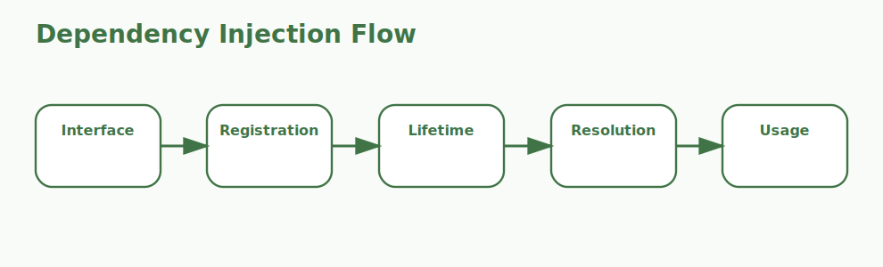

# Dependencies in ASP.NET Core Interview Questions



This page focuses on dependency injection and service composition in ASP.NET Core applications.

## 1. Dependency injection container

### 1. What is the role of Dependency injection container in ASP.NET Core dependency management?

**Answer:**

In ASP.NET Core dependency management, the term Dependency injection container refers to the built-in
framework capability that creates and wires required services. It is part of the foundation a
candidate should be able to explain clearly.

**Sample:**

```csharp
// Concept: 1. Dependency injection container
builder.Services.AddScoped<IOrderService, OrderService>();
public class OrdersController(IOrderService service) : ControllerBase
{
    private readonly IOrderService _service = service;
}
```

---

### 2. Why is the concept of Dependency injection container important in ASP.NET Core dependency management?

**Answer:**

This concept matters because it influences the built-in framework capability that
creates and wires required services. Good interview answers connect it to clarity, maintainability,
performance, security, or delivery depending on the situation.

**Sample:**

```csharp
// Concept: 1. Dependency injection container
builder.Services.AddScoped<IOrderService, OrderService>();
public class OrdersController(IOrderService service) : ControllerBase
{
    private readonly IOrderService _service = service;
}
```

---

### 3. When should a team focus on Dependency injection container?

**Answer:**

A team should focus on Dependency injection container when the requirement depends on the built-in
framework capability that creates and wires required services. It becomes especially important when
design decisions, scalability, or debugging depend on that area.

**Sample:**

```csharp
// Concept: 1. Dependency injection container
builder.Services.AddScoped<IOrderService, OrderService>();
public class OrdersController(IOrderService service) : ControllerBase
{
    private readonly IOrderService _service = service;
}
```

---

### 4. How is Dependency injection container applied in practice?

**Answer:**

In practice, Dependency injection container is applied by making the built-in framework capability
that creates and wires required services explicit in the code, runtime setup, or delivery workflow.
The exact shape depends on the application, but the responsibility should stay predictable.

**Sample:**

```csharp
// Concept: 1. Dependency injection container
builder.Services.AddScoped<IOrderService, OrderService>();
public class OrdersController(IOrderService service) : ControllerBase
{
    private readonly IOrderService _service = service;
}
```

---

### 5. What strengths does Dependency injection container bring?

**Answer:**

The strengths of Dependency injection container are better structure, better communication, and
better control over the built-in framework capability that creates and wires required services. It
also makes tradeoffs easier to explain to reviewers, interviewers, and teammates.

**Sample:**

```csharp
// Concept: 1. Dependency injection container
builder.Services.AddScoped<IOrderService, OrderService>();
public class OrdersController(IOrderService service) : ControllerBase
{
    private readonly IOrderService _service = service;
}
```

---

### 6. What tradeoffs come with Dependency injection container?

**Answer:**

The main tradeoff is extra complexity if Dependency injection container is introduced without a real
need or a clear understanding of the built-in framework capability that creates and wires required
services. That usually leads to overengineering, hidden bugs, or confusing architecture.

**Sample:**

```csharp
// Concept: 1. Dependency injection container
builder.Services.AddScoped<IOrderService, OrderService>();
public class OrdersController(IOrderService service) : ControllerBase
{
    private readonly IOrderService _service = service;
}
```

---

### 7. How does Dependency injection container differ from Service registration?

**Answer:**

Dependency injection container is centered on the built-in framework capability that creates and
wires required services, while Service registration is centered on the startup phase where
interfaces and implementations are added to the container. They often work together, but they solve
different parts of the topic.

**Sample:**

```csharp
// Concept: 1. Dependency injection container
builder.Services.AddScoped<IOrderService, OrderService>();
public class OrdersController(IOrderService service) : ControllerBase
{
    private readonly IOrderService _service = service;
}
```

---

### 8. What is a good real-world example of Dependency injection container?

**Answer:**

A strong example is explaining how Dependency injection container affects a real feature, production
issue, migration, or architecture decision involving the built-in framework capability that creates
and wires required services. Interviewers usually care more about the reasoning than the definition
alone.

**Sample:**

```csharp
// Concept: 1. Dependency injection container
builder.Services.AddScoped<IOrderService, OrderService>();
public class OrdersController(IOrderService service) : ControllerBase
{
    private readonly IOrderService _service = service;
}
```

---

### 9. What is a best practice for Dependency injection container?

**Answer:**

A good practice is to keep Dependency injection container aligned with the actual requirement around
the built-in framework capability that creates and wires required services. Teams should document
intent, keep implementation readable, and validate important paths early.

**Sample:**

```csharp
// Concept: 1. Dependency injection container
builder.Services.AddScoped<IOrderService, OrderService>();
public class OrdersController(IOrderService service) : ControllerBase
{
    private readonly IOrderService _service = service;
}
```

---

### 10. What is a common mistake around Dependency injection container?

**Answer:**

A common mistake is naming Dependency injection container without understanding how it affects the
built-in framework capability that creates and wires required services. In real work, that usually
appears as weak design choices, poor debugging, or incomplete explanations.

**Sample:**

```csharp
// Concept: 1. Dependency injection container
builder.Services.AddScoped<IOrderService, OrderService>();
public class OrdersController(IOrderService service) : ControllerBase
{
    private readonly IOrderService _service = service;
}
```

---

### 11. How do you troubleshoot Dependency injection container-related issues?

**Answer:**

When troubleshooting Dependency injection container, first verify whether the built-in framework
capability that creates and wires required services is behaving as expected. Then check surrounding
dependencies, configuration, logs, runtime behavior, and edge cases before changing the design.

**Sample:**

```csharp
// Concept: 1. Dependency injection container
builder.Services.AddScoped<IOrderService, OrderService>();
public class OrdersController(IOrderService service) : ControllerBase
{
    private readonly IOrderService _service = service;
}
```

---

### 12. How does Dependency injection container connect to the rest of ASP.NET Core dependency management?

**Answer:**

Dependency injection container connects to the rest of ASP.NET Core dependency management by giving
structure to the built-in framework capability that creates and wires required services. It is one
of the pieces that turns isolated facts into a coherent end-to-end explanation.

**Sample:**

```csharp
// Concept: 1. Dependency injection container
builder.Services.AddScoped<IOrderService, OrderService>();
public class OrdersController(IOrderService service) : ControllerBase
{
    private readonly IOrderService _service = service;
}
```

---

## 2. Service registration

### 13. What is the role of Service registration in ASP.NET Core dependency management?

**Answer:**

In ASP.NET Core dependency management, the term Service registration refers to the startup phase where
interfaces and implementations are added to the container. It is part of the foundation a candidate
should be able to explain clearly.

**Sample:**

```csharp
// Concept: 2. Service registration
builder.Services.AddScoped<IOrderService, OrderService>();
public class OrdersController(IOrderService service) : ControllerBase
{
    private readonly IOrderService _service = service;
}
```

---

### 14. Why is the concept of Service registration important in ASP.NET Core dependency management?

**Answer:**

This concept matters because it influences the startup phase where interfaces and
implementations are added to the container. Good interview answers connect it to clarity,
maintainability, performance, security, or delivery depending on the situation.

**Sample:**

```csharp
// Concept: 2. Service registration
builder.Services.AddScoped<IOrderService, OrderService>();
public class OrdersController(IOrderService service) : ControllerBase
{
    private readonly IOrderService _service = service;
}
```

---

### 15. When should a team focus on Service registration?

**Answer:**

A team should focus on Service registration when the requirement depends on the startup phase where
interfaces and implementations are added to the container. It becomes especially important when
design decisions, scalability, or debugging depend on that area.

**Sample:**

```csharp
// Concept: 2. Service registration
builder.Services.AddScoped<IOrderService, OrderService>();
public class OrdersController(IOrderService service) : ControllerBase
{
    private readonly IOrderService _service = service;
}
```

---

### 16. How is Service registration applied in practice?

**Answer:**

In practice, Service registration is applied by making the startup phase where interfaces and
implementations are added to the container explicit in the code, runtime setup, or delivery
workflow. The exact shape depends on the application, but the responsibility should stay
predictable.

**Sample:**

```csharp
// Concept: 2. Service registration
builder.Services.AddScoped<IOrderService, OrderService>();
public class OrdersController(IOrderService service) : ControllerBase
{
    private readonly IOrderService _service = service;
}
```

---

### 17. What strengths does Service registration bring?

**Answer:**

The strengths of Service registration are better structure, better communication, and better control
over the startup phase where interfaces and implementations are added to the container. It also
makes tradeoffs easier to explain to reviewers, interviewers, and teammates.

**Sample:**

```csharp
// Concept: 2. Service registration
builder.Services.AddScoped<IOrderService, OrderService>();
public class OrdersController(IOrderService service) : ControllerBase
{
    private readonly IOrderService _service = service;
}
```

---

### 18. What tradeoffs come with Service registration?

**Answer:**

The main tradeoff is extra complexity if Service registration is introduced without a real need or a
clear understanding of the startup phase where interfaces and implementations are added to the
container. That usually leads to overengineering, hidden bugs, or confusing architecture.

**Sample:**

```csharp
// Concept: 2. Service registration
builder.Services.AddScoped<IOrderService, OrderService>();
public class OrdersController(IOrderService service) : ControllerBase
{
    private readonly IOrderService _service = service;
}
```

---

### 19. How does Service registration differ from Service lifetimes?

**Answer:**

Service registration is centered on the startup phase where interfaces and implementations are added
to the container, while Service lifetimes is centered on the singleton, scoped, and transient reuse
models available in the DI system. They often work together, but they solve different parts of the
topic.

**Sample:**

```csharp
// Concept: 2. Service registration
builder.Services.AddScoped<IOrderService, OrderService>();
public class OrdersController(IOrderService service) : ControllerBase
{
    private readonly IOrderService _service = service;
}
```

---

### 20. What is a good real-world example of Service registration?

**Answer:**

A strong example is explaining how Service registration affects a real feature, production issue,
migration, or architecture decision involving the startup phase where interfaces and implementations
are added to the container. Interviewers usually care more about the reasoning than the definition
alone.

**Sample:**

```csharp
// Concept: 2. Service registration
builder.Services.AddScoped<IOrderService, OrderService>();
public class OrdersController(IOrderService service) : ControllerBase
{
    private readonly IOrderService _service = service;
}
```

---

### 21. What is a best practice for Service registration?

**Answer:**

A good practice is to keep Service registration aligned with the actual requirement around the
startup phase where interfaces and implementations are added to the container. Teams should document
intent, keep implementation readable, and validate important paths early.

**Sample:**

```csharp
// Concept: 2. Service registration
builder.Services.AddScoped<IOrderService, OrderService>();
public class OrdersController(IOrderService service) : ControllerBase
{
    private readonly IOrderService _service = service;
}
```

---

### 22. What is a common mistake around Service registration?

**Answer:**

A common mistake is naming Service registration without understanding how it affects the startup
phase where interfaces and implementations are added to the container. In real work, that usually
appears as weak design choices, poor debugging, or incomplete explanations.

**Sample:**

```csharp
// Concept: 2. Service registration
builder.Services.AddScoped<IOrderService, OrderService>();
public class OrdersController(IOrderService service) : ControllerBase
{
    private readonly IOrderService _service = service;
}
```

---

### 23. How do you troubleshoot Service registration-related issues?

**Answer:**

When troubleshooting Service registration, first verify whether the startup phase where interfaces
and implementations are added to the container is behaving as expected. Then check surrounding
dependencies, configuration, logs, runtime behavior, and edge cases before changing the design.

**Sample:**

```csharp
// Concept: 2. Service registration
builder.Services.AddScoped<IOrderService, OrderService>();
public class OrdersController(IOrderService service) : ControllerBase
{
    private readonly IOrderService _service = service;
}
```

---

### 24. How does Service registration connect to the rest of ASP.NET Core dependency management?

**Answer:**

Service registration connects to the rest of ASP.NET Core dependency management by giving structure
to the startup phase where interfaces and implementations are added to the container. It is one of
the pieces that turns isolated facts into a coherent end-to-end explanation.

**Sample:**

```csharp
// Concept: 2. Service registration
builder.Services.AddScoped<IOrderService, OrderService>();
public class OrdersController(IOrderService service) : ControllerBase
{
    private readonly IOrderService _service = service;
}
```

---

## 3. Service lifetimes

### 25. What is the role of Service lifetimes in ASP.NET Core dependency management?

**Answer:**

In ASP.NET Core dependency management, the term Service lifetimes refers to the singleton, scoped, and
transient reuse models available in the DI system. It is part of the foundation a candidate should
be able to explain clearly.

**Sample:**

```csharp
// Concept: 3. Service lifetimes
builder.Services.AddScoped<IOrderService, OrderService>();
public class OrdersController(IOrderService service) : ControllerBase
{
    private readonly IOrderService _service = service;
}
```

---

### 26. Why is the concept of Service lifetimes important in ASP.NET Core dependency management?

**Answer:**

This concept matters because it influences the singleton, scoped, and transient reuse models
available in the DI system. Good interview answers connect it to clarity, maintainability,
performance, security, or delivery depending on the situation.

**Sample:**

```csharp
// Concept: 3. Service lifetimes
builder.Services.AddScoped<IOrderService, OrderService>();
public class OrdersController(IOrderService service) : ControllerBase
{
    private readonly IOrderService _service = service;
}
```

---

### 27. When should a team focus on Service lifetimes?

**Answer:**

A team should focus on Service lifetimes when the requirement depends on the singleton, scoped, and
transient reuse models available in the DI system. It becomes especially important when design
decisions, scalability, or debugging depend on that area.

**Sample:**

```csharp
// Concept: 3. Service lifetimes
builder.Services.AddScoped<IOrderService, OrderService>();
public class OrdersController(IOrderService service) : ControllerBase
{
    private readonly IOrderService _service = service;
}
```

---

### 28. How is Service lifetimes applied in practice?

**Answer:**

In practice, Service lifetimes is applied by making the singleton, scoped, and transient reuse
models available in the DI system explicit in the code, runtime setup, or delivery workflow. The
exact shape depends on the application, but the responsibility should stay predictable.

**Sample:**

```csharp
// Concept: 3. Service lifetimes
builder.Services.AddScoped<IOrderService, OrderService>();
public class OrdersController(IOrderService service) : ControllerBase
{
    private readonly IOrderService _service = service;
}
```

---

### 29. What strengths does Service lifetimes bring?

**Answer:**

The strengths of Service lifetimes are better structure, better communication, and better control
over the singleton, scoped, and transient reuse models available in the DI system. It also makes
tradeoffs easier to explain to reviewers, interviewers, and teammates.

**Sample:**

```csharp
// Concept: 3. Service lifetimes
builder.Services.AddScoped<IOrderService, OrderService>();
public class OrdersController(IOrderService service) : ControllerBase
{
    private readonly IOrderService _service = service;
}
```

---

### 30. What tradeoffs come with Service lifetimes?

**Answer:**

The main tradeoff is extra complexity if Service lifetimes is introduced without a real need or a
clear understanding of the singleton, scoped, and transient reuse models available in the DI system.
That usually leads to overengineering, hidden bugs, or confusing architecture.

**Sample:**

```csharp
// Concept: 3. Service lifetimes
builder.Services.AddScoped<IOrderService, OrderService>();
public class OrdersController(IOrderService service) : ControllerBase
{
    private readonly IOrderService _service = service;
}
```

---

### 31. How does Service lifetimes differ from Constructor injection?

**Answer:**

Service lifetimes is centered on the singleton, scoped, and transient reuse models available in the
DI system, while Constructor injection is centered on the main pattern used to receive dependencies
in controllers, services, and other classes. They often work together, but they solve different
parts of the topic.

**Sample:**

```csharp
// Concept: 3. Service lifetimes
builder.Services.AddScoped<IOrderService, OrderService>();
public class OrdersController(IOrderService service) : ControllerBase
{
    private readonly IOrderService _service = service;
}
```

---

### 32. What is a good real-world example of Service lifetimes?

**Answer:**

A strong example is explaining how Service lifetimes affects a real feature, production issue,
migration, or architecture decision involving the singleton, scoped, and transient reuse models
available in the DI system. Interviewers usually care more about the reasoning than the definition
alone.

**Sample:**

```csharp
// Concept: 3. Service lifetimes
builder.Services.AddScoped<IOrderService, OrderService>();
public class OrdersController(IOrderService service) : ControllerBase
{
    private readonly IOrderService _service = service;
}
```

---

### 33. What is a best practice for Service lifetimes?

**Answer:**

A good practice is to keep Service lifetimes aligned with the actual requirement around the
singleton, scoped, and transient reuse models available in the DI system. Teams should document
intent, keep implementation readable, and validate important paths early.

**Sample:**

```csharp
// Concept: 3. Service lifetimes
builder.Services.AddScoped<IOrderService, OrderService>();
public class OrdersController(IOrderService service) : ControllerBase
{
    private readonly IOrderService _service = service;
}
```

---

### 34. What is a common mistake around Service lifetimes?

**Answer:**

A common mistake is naming Service lifetimes without understanding how it affects the singleton,
scoped, and transient reuse models available in the DI system. In real work, that usually appears as
weak design choices, poor debugging, or incomplete explanations.

**Sample:**

```csharp
// Concept: 3. Service lifetimes
builder.Services.AddScoped<IOrderService, OrderService>();
public class OrdersController(IOrderService service) : ControllerBase
{
    private readonly IOrderService _service = service;
}
```

---

### 35. How do you troubleshoot Service lifetimes-related issues?

**Answer:**

When troubleshooting Service lifetimes, first verify whether the singleton, scoped, and transient
reuse models available in the DI system is behaving as expected. Then check surrounding
dependencies, configuration, logs, runtime behavior, and edge cases before changing the design.

**Sample:**

```csharp
// Concept: 3. Service lifetimes
builder.Services.AddScoped<IOrderService, OrderService>();
public class OrdersController(IOrderService service) : ControllerBase
{
    private readonly IOrderService _service = service;
}
```

---

### 36. How does Service lifetimes connect to the rest of ASP.NET Core dependency management?

**Answer:**

Service lifetimes connects to the rest of ASP.NET Core dependency management by giving structure to
the singleton, scoped, and transient reuse models available in the DI system. It is one of the
pieces that turns isolated facts into a coherent end-to-end explanation.

**Sample:**

```csharp
// Concept: 3. Service lifetimes
builder.Services.AddScoped<IOrderService, OrderService>();
public class OrdersController(IOrderService service) : ControllerBase
{
    private readonly IOrderService _service = service;
}
```

---

## 4. Constructor injection

### 37. What is the role of Constructor injection in ASP.NET Core dependency management?

**Answer:**

In ASP.NET Core dependency management, the term Constructor injection refers to the main pattern used to
receive dependencies in controllers, services, and other classes. It is part of the foundation a
candidate should be able to explain clearly.

**Sample:**

```csharp
// Concept: 4. Constructor injection
builder.Services.AddScoped<IOrderService, OrderService>();
public class OrdersController(IOrderService service) : ControllerBase
{
    private readonly IOrderService _service = service;
}
```

---

### 38. Why is the concept of Constructor injection important in ASP.NET Core dependency management?

**Answer:**

This concept matters because it influences the main pattern used to receive dependencies in
controllers, services, and other classes. Good interview answers connect it to clarity,
maintainability, performance, security, or delivery depending on the situation.

**Sample:**

```csharp
// Concept: 4. Constructor injection
builder.Services.AddScoped<IOrderService, OrderService>();
public class OrdersController(IOrderService service) : ControllerBase
{
    private readonly IOrderService _service = service;
}
```

---

### 39. When should a team focus on Constructor injection?

**Answer:**

A team should focus on Constructor injection when the requirement depends on the main pattern used
to receive dependencies in controllers, services, and other classes. It becomes especially important
when design decisions, scalability, or debugging depend on that area.

**Sample:**

```csharp
// Concept: 4. Constructor injection
builder.Services.AddScoped<IOrderService, OrderService>();
public class OrdersController(IOrderService service) : ControllerBase
{
    private readonly IOrderService _service = service;
}
```

---

### 40. How is Constructor injection applied in practice?

**Answer:**

In practice, Constructor injection is applied by making the main pattern used to receive
dependencies in controllers, services, and other classes explicit in the code, runtime setup, or
delivery workflow. The exact shape depends on the application, but the responsibility should stay
predictable.

**Sample:**

```csharp
// Concept: 4. Constructor injection
builder.Services.AddScoped<IOrderService, OrderService>();
public class OrdersController(IOrderService service) : ControllerBase
{
    private readonly IOrderService _service = service;
}
```

---

### 41. What strengths does Constructor injection bring?

**Answer:**

The strengths of Constructor injection are better structure, better communication, and better
control over the main pattern used to receive dependencies in controllers, services, and other
classes. It also makes tradeoffs easier to explain to reviewers, interviewers, and teammates.

**Sample:**

```csharp
// Concept: 4. Constructor injection
builder.Services.AddScoped<IOrderService, OrderService>();
public class OrdersController(IOrderService service) : ControllerBase
{
    private readonly IOrderService _service = service;
}
```

---

### 42. What tradeoffs come with Constructor injection?

**Answer:**

The main tradeoff is extra complexity if Constructor injection is introduced without a real need or
a clear understanding of the main pattern used to receive dependencies in controllers, services, and
other classes. That usually leads to overengineering, hidden bugs, or confusing architecture.

**Sample:**

```csharp
// Concept: 4. Constructor injection
builder.Services.AddScoped<IOrderService, OrderService>();
public class OrdersController(IOrderService service) : ControllerBase
{
    private readonly IOrderService _service = service;
}
```

---

### 43. How does Constructor injection differ from Interface-based design?

**Answer:**

Constructor injection is centered on the main pattern used to receive dependencies in controllers,
services, and other classes, while Interface-based design is centered on the abstraction style used
to keep code loosely coupled and testable. They often work together, but they solve different parts
of the topic.

**Sample:**

```csharp
// Concept: 4. Constructor injection
builder.Services.AddScoped<IOrderService, OrderService>();
public class OrdersController(IOrderService service) : ControllerBase
{
    private readonly IOrderService _service = service;
}
```

---

### 44. What is a good real-world example of Constructor injection?

**Answer:**

A strong example is explaining how Constructor injection affects a real feature, production issue,
migration, or architecture decision involving the main pattern used to receive dependencies in
controllers, services, and other classes. Interviewers usually care more about the reasoning than
the definition alone.

**Sample:**

```csharp
// Concept: 4. Constructor injection
builder.Services.AddScoped<IOrderService, OrderService>();
public class OrdersController(IOrderService service) : ControllerBase
{
    private readonly IOrderService _service = service;
}
```

---

### 45. What is a best practice for Constructor injection?

**Answer:**

A good practice is to keep Constructor injection aligned with the actual requirement around the main
pattern used to receive dependencies in controllers, services, and other classes. Teams should
document intent, keep implementation readable, and validate important paths early.

**Sample:**

```csharp
// Concept: 4. Constructor injection
builder.Services.AddScoped<IOrderService, OrderService>();
public class OrdersController(IOrderService service) : ControllerBase
{
    private readonly IOrderService _service = service;
}
```

---

### 46. What is a common mistake around Constructor injection?

**Answer:**

A common mistake is naming Constructor injection without understanding how it affects the main
pattern used to receive dependencies in controllers, services, and other classes. In real work, that
usually appears as weak design choices, poor debugging, or incomplete explanations.

**Sample:**

```csharp
// Concept: 4. Constructor injection
builder.Services.AddScoped<IOrderService, OrderService>();
public class OrdersController(IOrderService service) : ControllerBase
{
    private readonly IOrderService _service = service;
}
```

---

### 47. How do you troubleshoot Constructor injection-related issues?

**Answer:**

When troubleshooting Constructor injection, first verify whether the main pattern used to receive
dependencies in controllers, services, and other classes is behaving as expected. Then check
surrounding dependencies, configuration, logs, runtime behavior, and edge cases before changing the
design.

**Sample:**

```csharp
// Concept: 4. Constructor injection
builder.Services.AddScoped<IOrderService, OrderService>();
public class OrdersController(IOrderService service) : ControllerBase
{
    private readonly IOrderService _service = service;
}
```

---

### 48. How does Constructor injection connect to the rest of ASP.NET Core dependency management?

**Answer:**

Constructor injection connects to the rest of ASP.NET Core dependency management by giving structure
to the main pattern used to receive dependencies in controllers, services, and other classes. It is
one of the pieces that turns isolated facts into a coherent end-to-end explanation.

**Sample:**

```csharp
// Concept: 4. Constructor injection
builder.Services.AddScoped<IOrderService, OrderService>();
public class OrdersController(IOrderService service) : ControllerBase
{
    private readonly IOrderService _service = service;
}
```

---

## 5. Interface-based design

### 49. What is the role of Interface-based design in ASP.NET Core dependency management?

**Answer:**

In ASP.NET Core dependency management, the term Interface-based design refers to the abstraction style used
to keep code loosely coupled and testable. It is part of the foundation a candidate should be able
to explain clearly.

**Sample:**

```csharp
// Concept: 5. Interface-based design
builder.Services.AddScoped<IOrderService, OrderService>();
public class OrdersController(IOrderService service) : ControllerBase
{
    private readonly IOrderService _service = service;
}
```

---

### 50. Why is the concept of Interface-based design important in ASP.NET Core dependency management?

**Answer:**

This concept matters because it influences the abstraction style used to keep code loosely
coupled and testable. Good interview answers connect it to clarity, maintainability, performance,
security, or delivery depending on the situation.

**Sample:**

```csharp
// Concept: 5. Interface-based design
builder.Services.AddScoped<IOrderService, OrderService>();
public class OrdersController(IOrderService service) : ControllerBase
{
    private readonly IOrderService _service = service;
}
```

---

### 51. When should a team focus on Interface-based design?

**Answer:**

A team should focus on Interface-based design when the requirement depends on the abstraction style
used to keep code loosely coupled and testable. It becomes especially important when design
decisions, scalability, or debugging depend on that area.

**Sample:**

```csharp
// Concept: 5. Interface-based design
builder.Services.AddScoped<IOrderService, OrderService>();
public class OrdersController(IOrderService service) : ControllerBase
{
    private readonly IOrderService _service = service;
}
```

---

### 52. How is Interface-based design applied in practice?

**Answer:**

In practice, Interface-based design is applied by making the abstraction style used to keep code
loosely coupled and testable explicit in the code, runtime setup, or delivery workflow. The exact
shape depends on the application, but the responsibility should stay predictable.

**Sample:**

```csharp
// Concept: 5. Interface-based design
builder.Services.AddScoped<IOrderService, OrderService>();
public class OrdersController(IOrderService service) : ControllerBase
{
    private readonly IOrderService _service = service;
}
```

---

### 53. What strengths does Interface-based design bring?

**Answer:**

The strengths of Interface-based design are better structure, better communication, and better
control over the abstraction style used to keep code loosely coupled and testable. It also makes
tradeoffs easier to explain to reviewers, interviewers, and teammates.

**Sample:**

```csharp
// Concept: 5. Interface-based design
builder.Services.AddScoped<IOrderService, OrderService>();
public class OrdersController(IOrderService service) : ControllerBase
{
    private readonly IOrderService _service = service;
}
```

---

### 54. What tradeoffs come with Interface-based design?

**Answer:**

The main tradeoff is extra complexity if Interface-based design is introduced without a real need or
a clear understanding of the abstraction style used to keep code loosely coupled and testable. That
usually leads to overengineering, hidden bugs, or confusing architecture.

**Sample:**

```csharp
// Concept: 5. Interface-based design
builder.Services.AddScoped<IOrderService, OrderService>();
public class OrdersController(IOrderService service) : ControllerBase
{
    private readonly IOrderService _service = service;
}
```

---

### 55. How does Interface-based design differ from Options pattern?

**Answer:**

Interface-based design is centered on the abstraction style used to keep code loosely coupled and
testable, while Options pattern is centered on the configuration binding pattern that exposes
settings as typed classes. They often work together, but they solve different parts of the topic.

**Sample:**

```csharp
// Concept: 5. Interface-based design
builder.Services.AddScoped<IOrderService, OrderService>();
public class OrdersController(IOrderService service) : ControllerBase
{
    private readonly IOrderService _service = service;
}
```

---

### 56. What is a good real-world example of Interface-based design?

**Answer:**

A strong example is explaining how Interface-based design affects a real feature, production issue,
migration, or architecture decision involving the abstraction style used to keep code loosely
coupled and testable. Interviewers usually care more about the reasoning than the definition alone.

**Sample:**

```csharp
// Concept: 5. Interface-based design
builder.Services.AddScoped<IOrderService, OrderService>();
public class OrdersController(IOrderService service) : ControllerBase
{
    private readonly IOrderService _service = service;
}
```

---

### 57. What is a best practice for Interface-based design?

**Answer:**

A good practice is to keep Interface-based design aligned with the actual requirement around the
abstraction style used to keep code loosely coupled and testable. Teams should document intent, keep
implementation readable, and validate important paths early.

**Sample:**

```csharp
// Concept: 5. Interface-based design
builder.Services.AddScoped<IOrderService, OrderService>();
public class OrdersController(IOrderService service) : ControllerBase
{
    private readonly IOrderService _service = service;
}
```

---

### 58. What is a common mistake around Interface-based design?

**Answer:**

A common mistake is naming Interface-based design without understanding how it affects the
abstraction style used to keep code loosely coupled and testable. In real work, that usually appears
as weak design choices, poor debugging, or incomplete explanations.

**Sample:**

```csharp
// Concept: 5. Interface-based design
builder.Services.AddScoped<IOrderService, OrderService>();
public class OrdersController(IOrderService service) : ControllerBase
{
    private readonly IOrderService _service = service;
}
```

---

### 59. How do you troubleshoot Interface-based design-related issues?

**Answer:**

When troubleshooting Interface-based design, first verify whether the abstraction style used to keep
code loosely coupled and testable is behaving as expected. Then check surrounding dependencies,
configuration, logs, runtime behavior, and edge cases before changing the design.

**Sample:**

```csharp
// Concept: 5. Interface-based design
builder.Services.AddScoped<IOrderService, OrderService>();
public class OrdersController(IOrderService service) : ControllerBase
{
    private readonly IOrderService _service = service;
}
```

---

### 60. How does Interface-based design connect to the rest of ASP.NET Core dependency management?

**Answer:**

Interface-based design connects to the rest of ASP.NET Core dependency management by giving
structure to the abstraction style used to keep code loosely coupled and testable. It is one of the
pieces that turns isolated facts into a coherent end-to-end explanation.

**Sample:**

```csharp
// Concept: 5. Interface-based design
builder.Services.AddScoped<IOrderService, OrderService>();
public class OrdersController(IOrderService service) : ControllerBase
{
    private readonly IOrderService _service = service;
}
```

---

## 6. Options pattern

### 61. What is the role of Options pattern in ASP.NET Core dependency management?

**Answer:**

In ASP.NET Core dependency management, the term Options pattern refers to the configuration binding pattern
that exposes settings as typed classes. It is part of the foundation a candidate should be able to
explain clearly.

**Sample:**

```csharp
// Concept: 6. Options pattern
builder.Services.AddScoped<IOrderService, OrderService>();
public class OrdersController(IOrderService service) : ControllerBase
{
    private readonly IOrderService _service = service;
}
```

---

### 62. Why is the concept of Options pattern important in ASP.NET Core dependency management?

**Answer:**

This concept matters because it influences the configuration binding pattern that exposes
settings as typed classes. Good interview answers connect it to clarity, maintainability,
performance, security, or delivery depending on the situation.

**Sample:**

```csharp
// Concept: 6. Options pattern
builder.Services.AddScoped<IOrderService, OrderService>();
public class OrdersController(IOrderService service) : ControllerBase
{
    private readonly IOrderService _service = service;
}
```

---

### 63. When should a team focus on Options pattern?

**Answer:**

A team should focus on Options pattern when the requirement depends on the configuration binding
pattern that exposes settings as typed classes. It becomes especially important when design
decisions, scalability, or debugging depend on that area.

**Sample:**

```csharp
// Concept: 6. Options pattern
builder.Services.AddScoped<IOrderService, OrderService>();
public class OrdersController(IOrderService service) : ControllerBase
{
    private readonly IOrderService _service = service;
}
```

---

### 64. How is Options pattern applied in practice?

**Answer:**

In practice, Options pattern is applied by making the configuration binding pattern that exposes
settings as typed classes explicit in the code, runtime setup, or delivery workflow. The exact shape
depends on the application, but the responsibility should stay predictable.

**Sample:**

```csharp
// Concept: 6. Options pattern
builder.Services.AddScoped<IOrderService, OrderService>();
public class OrdersController(IOrderService service) : ControllerBase
{
    private readonly IOrderService _service = service;
}
```

---

### 65. What strengths does Options pattern bring?

**Answer:**

The strengths of Options pattern are better structure, better communication, and better control over
the configuration binding pattern that exposes settings as typed classes. It also makes tradeoffs
easier to explain to reviewers, interviewers, and teammates.

**Sample:**

```csharp
// Concept: 6. Options pattern
builder.Services.AddScoped<IOrderService, OrderService>();
public class OrdersController(IOrderService service) : ControllerBase
{
    private readonly IOrderService _service = service;
}
```

---

### 66. What tradeoffs come with Options pattern?

**Answer:**

The main tradeoff is extra complexity if Options pattern is introduced without a real need or a
clear understanding of the configuration binding pattern that exposes settings as typed classes.
That usually leads to overengineering, hidden bugs, or confusing architecture.

**Sample:**

```csharp
// Concept: 6. Options pattern
builder.Services.AddScoped<IOrderService, OrderService>();
public class OrdersController(IOrderService service) : ControllerBase
{
    private readonly IOrderService _service = service;
}
```

---

### 67. How does Options pattern differ from Scoped services in web requests?

**Answer:**

Options pattern is centered on the configuration binding pattern that exposes settings as typed
classes, while Scoped services in web requests is centered on the lifetime behavior tied to an
individual HTTP request boundary. They often work together, but they solve different parts of the
topic.

**Sample:**

```csharp
// Concept: 6. Options pattern
builder.Services.AddScoped<IOrderService, OrderService>();
public class OrdersController(IOrderService service) : ControllerBase
{
    private readonly IOrderService _service = service;
}
```

---

### 68. What is a good real-world example of Options pattern?

**Answer:**

A strong example is explaining how Options pattern affects a real feature, production issue,
migration, or architecture decision involving the configuration binding pattern that exposes
settings as typed classes. Interviewers usually care more about the reasoning than the definition
alone.

**Sample:**

```csharp
// Concept: 6. Options pattern
builder.Services.AddScoped<IOrderService, OrderService>();
public class OrdersController(IOrderService service) : ControllerBase
{
    private readonly IOrderService _service = service;
}
```

---

### 69. What is a best practice for Options pattern?

**Answer:**

A good practice is to keep Options pattern aligned with the actual requirement around the
configuration binding pattern that exposes settings as typed classes. Teams should document intent,
keep implementation readable, and validate important paths early.

**Sample:**

```csharp
// Concept: 6. Options pattern
builder.Services.AddScoped<IOrderService, OrderService>();
public class OrdersController(IOrderService service) : ControllerBase
{
    private readonly IOrderService _service = service;
}
```

---

### 70. What is a common mistake around Options pattern?

**Answer:**

A common mistake is naming Options pattern without understanding how it affects the configuration
binding pattern that exposes settings as typed classes. In real work, that usually appears as weak
design choices, poor debugging, or incomplete explanations.

**Sample:**

```csharp
// Concept: 6. Options pattern
builder.Services.AddScoped<IOrderService, OrderService>();
public class OrdersController(IOrderService service) : ControllerBase
{
    private readonly IOrderService _service = service;
}
```

---

### 71. How do you troubleshoot Options pattern-related issues?

**Answer:**

When troubleshooting Options pattern, first verify whether the configuration binding pattern that
exposes settings as typed classes is behaving as expected. Then check surrounding dependencies,
configuration, logs, runtime behavior, and edge cases before changing the design.

**Sample:**

```csharp
// Concept: 6. Options pattern
builder.Services.AddScoped<IOrderService, OrderService>();
public class OrdersController(IOrderService service) : ControllerBase
{
    private readonly IOrderService _service = service;
}
```

---

### 72. How does Options pattern connect to the rest of ASP.NET Core dependency management?

**Answer:**

Options pattern connects to the rest of ASP.NET Core dependency management by giving structure to
the configuration binding pattern that exposes settings as typed classes. It is one of the pieces
that turns isolated facts into a coherent end-to-end explanation.

**Sample:**

```csharp
// Concept: 6. Options pattern
builder.Services.AddScoped<IOrderService, OrderService>();
public class OrdersController(IOrderService service) : ControllerBase
{
    private readonly IOrderService _service = service;
}
```

---

## 7. Scoped services in web requests

### 73. What is the role of Scoped services in web requests in ASP.NET Core dependency management?

**Answer:**

In ASP.NET Core dependency management, the term Scoped services in web requests refers to the lifetime
behavior tied to an individual HTTP request boundary. It is part of the foundation a candidate
should be able to explain clearly.

**Sample:**

```csharp
// Concept: 7. Scoped services in web requests
builder.Services.AddScoped<IOrderService, OrderService>();
public class OrdersController(IOrderService service) : ControllerBase
{
    private readonly IOrderService _service = service;
}
```

---

### 74. Why is the concept of Scoped services in web requests important in ASP.NET Core dependency management?

**Answer:**

This concept matters because it influences the lifetime behavior tied to an
individual HTTP request boundary. Good interview answers connect it to clarity, maintainability,
performance, security, or delivery depending on the situation.

**Sample:**

```csharp
// Concept: 7. Scoped services in web requests
builder.Services.AddScoped<IOrderService, OrderService>();
public class OrdersController(IOrderService service) : ControllerBase
{
    private readonly IOrderService _service = service;
}
```

---

### 75. When should a team focus on Scoped services in web requests?

**Answer:**

A team should focus on Scoped services in web requests when the requirement depends on the lifetime
behavior tied to an individual HTTP request boundary. It becomes especially important when design
decisions, scalability, or debugging depend on that area.

**Sample:**

```csharp
// Concept: 7. Scoped services in web requests
builder.Services.AddScoped<IOrderService, OrderService>();
public class OrdersController(IOrderService service) : ControllerBase
{
    private readonly IOrderService _service = service;
}
```

---

### 76. How is Scoped services in web requests applied in practice?

**Answer:**

In practice, Scoped services in web requests is applied by making the lifetime behavior tied to an
individual HTTP request boundary explicit in the code, runtime setup, or delivery workflow. The
exact shape depends on the application, but the responsibility should stay predictable.

**Sample:**

```csharp
// Concept: 7. Scoped services in web requests
builder.Services.AddScoped<IOrderService, OrderService>();
public class OrdersController(IOrderService service) : ControllerBase
{
    private readonly IOrderService _service = service;
}
```

---

### 77. What strengths does Scoped services in web requests bring?

**Answer:**

The strengths of Scoped services in web requests are better structure, better communication, and
better control over the lifetime behavior tied to an individual HTTP request boundary. It also makes
tradeoffs easier to explain to reviewers, interviewers, and teammates.

**Sample:**

```csharp
// Concept: 7. Scoped services in web requests
builder.Services.AddScoped<IOrderService, OrderService>();
public class OrdersController(IOrderService service) : ControllerBase
{
    private readonly IOrderService _service = service;
}
```

---

### 78. What tradeoffs come with Scoped services in web requests?

**Answer:**

The main tradeoff is extra complexity if Scoped services in web requests is introduced without a
real need or a clear understanding of the lifetime behavior tied to an individual HTTP request
boundary. That usually leads to overengineering, hidden bugs, or confusing architecture.

**Sample:**

```csharp
// Concept: 7. Scoped services in web requests
builder.Services.AddScoped<IOrderService, OrderService>();
public class OrdersController(IOrderService service) : ControllerBase
{
    private readonly IOrderService _service = service;
}
```

---

### 79. How does Scoped services in web requests differ from Testing and mocking?

**Answer:**

Scoped services in web requests is centered on the lifetime behavior tied to an individual HTTP
request boundary, while Testing and mocking is centered on the replacement of real dependencies with
test doubles during automated testing. They often work together, but they solve different parts of
the topic.

**Sample:**

```csharp
// Concept: 7. Scoped services in web requests
builder.Services.AddScoped<IOrderService, OrderService>();
public class OrdersController(IOrderService service) : ControllerBase
{
    private readonly IOrderService _service = service;
}
```

---

### 80. What is a good real-world example of Scoped services in web requests?

**Answer:**

A strong example is explaining how Scoped services in web requests affects a real feature,
production issue, migration, or architecture decision involving the lifetime behavior tied to an
individual HTTP request boundary. Interviewers usually care more about the reasoning than the
definition alone.

**Sample:**

```csharp
// Concept: 7. Scoped services in web requests
builder.Services.AddScoped<IOrderService, OrderService>();
public class OrdersController(IOrderService service) : ControllerBase
{
    private readonly IOrderService _service = service;
}
```

---

### 81. What is a best practice for Scoped services in web requests?

**Answer:**

A good practice is to keep Scoped services in web requests aligned with the actual requirement
around the lifetime behavior tied to an individual HTTP request boundary. Teams should document
intent, keep implementation readable, and validate important paths early.

**Sample:**

```csharp
// Concept: 7. Scoped services in web requests
builder.Services.AddScoped<IOrderService, OrderService>();
public class OrdersController(IOrderService service) : ControllerBase
{
    private readonly IOrderService _service = service;
}
```

---

### 82. What is a common mistake around Scoped services in web requests?

**Answer:**

A common mistake is naming Scoped services in web requests without understanding how it affects the
lifetime behavior tied to an individual HTTP request boundary. In real work, that usually appears as
weak design choices, poor debugging, or incomplete explanations.

**Sample:**

```csharp
// Concept: 7. Scoped services in web requests
builder.Services.AddScoped<IOrderService, OrderService>();
public class OrdersController(IOrderService service) : ControllerBase
{
    private readonly IOrderService _service = service;
}
```

---

### 83. How do you troubleshoot Scoped services in web requests-related issues?

**Answer:**

When troubleshooting Scoped services in web requests, first verify whether the lifetime behavior
tied to an individual HTTP request boundary is behaving as expected. Then check surrounding
dependencies, configuration, logs, runtime behavior, and edge cases before changing the design.

**Sample:**

```csharp
// Concept: 7. Scoped services in web requests
builder.Services.AddScoped<IOrderService, OrderService>();
public class OrdersController(IOrderService service) : ControllerBase
{
    private readonly IOrderService _service = service;
}
```

---

### 84. How does Scoped services in web requests connect to the rest of ASP.NET Core dependency management?

**Answer:**

Scoped services in web requests connects to the rest of ASP.NET Core dependency management by giving
structure to the lifetime behavior tied to an individual HTTP request boundary. It is one of the
pieces that turns isolated facts into a coherent end-to-end explanation.

**Sample:**

```csharp
// Concept: 7. Scoped services in web requests
builder.Services.AddScoped<IOrderService, OrderService>();
public class OrdersController(IOrderService service) : ControllerBase
{
    private readonly IOrderService _service = service;
}
```

---

## 8. Testing and mocking

### 85. What is the role of Testing and mocking in ASP.NET Core dependency management?

**Answer:**

In ASP.NET Core dependency management, the term Testing and mocking refers to the replacement of real
dependencies with test doubles during automated testing. It is part of the foundation a candidate
should be able to explain clearly.

**Sample:**

```csharp
// Concept: 8. Testing and mocking
builder.Services.AddScoped<IOrderService, OrderService>();
public class OrdersController(IOrderService service) : ControllerBase
{
    private readonly IOrderService _service = service;
}
```

---

### 86. Why is the concept of Testing and mocking important in ASP.NET Core dependency management?

**Answer:**

This concept matters because it influences the replacement of real dependencies with test
doubles during automated testing. Good interview answers connect it to clarity, maintainability,
performance, security, or delivery depending on the situation.

**Sample:**

```csharp
// Concept: 8. Testing and mocking
builder.Services.AddScoped<IOrderService, OrderService>();
public class OrdersController(IOrderService service) : ControllerBase
{
    private readonly IOrderService _service = service;
}
```

---

### 87. When should a team focus on Testing and mocking?

**Answer:**

A team should focus on Testing and mocking when the requirement depends on the replacement of real
dependencies with test doubles during automated testing. It becomes especially important when design
decisions, scalability, or debugging depend on that area.

**Sample:**

```csharp
// Concept: 8. Testing and mocking
builder.Services.AddScoped<IOrderService, OrderService>();
public class OrdersController(IOrderService service) : ControllerBase
{
    private readonly IOrderService _service = service;
}
```

---

### 88. How is Testing and mocking applied in practice?

**Answer:**

In practice, Testing and mocking is applied by making the replacement of real dependencies with test
doubles during automated testing explicit in the code, runtime setup, or delivery workflow. The
exact shape depends on the application, but the responsibility should stay predictable.

**Sample:**

```csharp
// Concept: 8. Testing and mocking
builder.Services.AddScoped<IOrderService, OrderService>();
public class OrdersController(IOrderService service) : ControllerBase
{
    private readonly IOrderService _service = service;
}
```

---

### 89. What strengths does Testing and mocking bring?

**Answer:**

The strengths of Testing and mocking are better structure, better communication, and better control
over the replacement of real dependencies with test doubles during automated testing. It also makes
tradeoffs easier to explain to reviewers, interviewers, and teammates.

**Sample:**

```csharp
// Concept: 8. Testing and mocking
builder.Services.AddScoped<IOrderService, OrderService>();
public class OrdersController(IOrderService service) : ControllerBase
{
    private readonly IOrderService _service = service;
}
```

---

### 90. What tradeoffs come with Testing and mocking?

**Answer:**

The main tradeoff is extra complexity if Testing and mocking is introduced without a real need or a
clear understanding of the replacement of real dependencies with test doubles during automated
testing. That usually leads to overengineering, hidden bugs, or confusing architecture.

**Sample:**

```csharp
// Concept: 8. Testing and mocking
builder.Services.AddScoped<IOrderService, OrderService>();
public class OrdersController(IOrderService service) : ControllerBase
{
    private readonly IOrderService _service = service;
}
```

---

### 91. How does Testing and mocking differ from Anti-patterns?

**Answer:**

Testing and mocking is centered on the replacement of real dependencies with test doubles during
automated testing, while Anti-patterns is centered on the poor dependency management practices that
create hidden coupling or runtime surprises. They often work together, but they solve different
parts of the topic.

**Sample:**

```csharp
// Concept: 8. Testing and mocking
builder.Services.AddScoped<IOrderService, OrderService>();
public class OrdersController(IOrderService service) : ControllerBase
{
    private readonly IOrderService _service = service;
}
```

---

### 92. What is a good real-world example of Testing and mocking?

**Answer:**

A strong example is explaining how Testing and mocking affects a real feature, production issue,
migration, or architecture decision involving the replacement of real dependencies with test doubles
during automated testing. Interviewers usually care more about the reasoning than the definition
alone.

**Sample:**

```csharp
// Concept: 8. Testing and mocking
builder.Services.AddScoped<IOrderService, OrderService>();
public class OrdersController(IOrderService service) : ControllerBase
{
    private readonly IOrderService _service = service;
}
```

---

### 93. What is a best practice for Testing and mocking?

**Answer:**

A good practice is to keep Testing and mocking aligned with the actual requirement around the
replacement of real dependencies with test doubles during automated testing. Teams should document
intent, keep implementation readable, and validate important paths early.

**Sample:**

```csharp
// Concept: 8. Testing and mocking
builder.Services.AddScoped<IOrderService, OrderService>();
public class OrdersController(IOrderService service) : ControllerBase
{
    private readonly IOrderService _service = service;
}
```

---

### 94. What is a common mistake around Testing and mocking?

**Answer:**

A common mistake is naming Testing and mocking without understanding how it affects the replacement
of real dependencies with test doubles during automated testing. In real work, that usually appears
as weak design choices, poor debugging, or incomplete explanations.

**Sample:**

```csharp
// Concept: 8. Testing and mocking
builder.Services.AddScoped<IOrderService, OrderService>();
public class OrdersController(IOrderService service) : ControllerBase
{
    private readonly IOrderService _service = service;
}
```

---

### 95. How do you troubleshoot Testing and mocking-related issues?

**Answer:**

When troubleshooting Testing and mocking, first verify whether the replacement of real dependencies
with test doubles during automated testing is behaving as expected. Then check surrounding
dependencies, configuration, logs, runtime behavior, and edge cases before changing the design.

**Sample:**

```csharp
// Concept: 8. Testing and mocking
builder.Services.AddScoped<IOrderService, OrderService>();
public class OrdersController(IOrderService service) : ControllerBase
{
    private readonly IOrderService _service = service;
}
```

---

### 96. How does Testing and mocking connect to the rest of ASP.NET Core dependency management?

**Answer:**

Testing and mocking connects to the rest of ASP.NET Core dependency management by giving structure
to the replacement of real dependencies with test doubles during automated testing. It is one of the
pieces that turns isolated facts into a coherent end-to-end explanation.

**Sample:**

```csharp
// Concept: 8. Testing and mocking
builder.Services.AddScoped<IOrderService, OrderService>();
public class OrdersController(IOrderService service) : ControllerBase
{
    private readonly IOrderService _service = service;
}
```

---

## 9. Anti-patterns

### 97. What is the role of Anti-patterns in ASP.NET Core dependency management?

**Answer:**

In ASP.NET Core dependency management, the term Anti-patterns refers to the poor dependency management
practices that create hidden coupling or runtime surprises. It is part of the foundation a candidate
should be able to explain clearly.

**Sample:**

```csharp
// Concept: 9. Anti-patterns
builder.Services.AddScoped<IOrderService, OrderService>();
public class OrdersController(IOrderService service) : ControllerBase
{
    private readonly IOrderService _service = service;
}
```

---

### 98. Why is the concept of Anti-patterns important in ASP.NET Core dependency management?

**Answer:**

This concept matters because it influences the poor dependency management practices that create
hidden coupling or runtime surprises. Good interview answers connect it to clarity, maintainability,
performance, security, or delivery depending on the situation.

**Sample:**

```csharp
// Concept: 9. Anti-patterns
builder.Services.AddScoped<IOrderService, OrderService>();
public class OrdersController(IOrderService service) : ControllerBase
{
    private readonly IOrderService _service = service;
}
```

---

### 99. When should a team focus on Anti-patterns?

**Answer:**

A team should focus on Anti-patterns when the requirement depends on the poor dependency management
practices that create hidden coupling or runtime surprises. It becomes especially important when
design decisions, scalability, or debugging depend on that area.

**Sample:**

```csharp
// Concept: 9. Anti-patterns
builder.Services.AddScoped<IOrderService, OrderService>();
public class OrdersController(IOrderService service) : ControllerBase
{
    private readonly IOrderService _service = service;
}
```

---

### 100. How is Anti-patterns applied in practice?

**Answer:**

In practice, Anti-patterns is applied by making the poor dependency management practices that create
hidden coupling or runtime surprises explicit in the code, runtime setup, or delivery workflow. The
exact shape depends on the application, but the responsibility should stay predictable.

**Sample:**

```csharp
// Concept: 9. Anti-patterns
builder.Services.AddScoped<IOrderService, OrderService>();
public class OrdersController(IOrderService service) : ControllerBase
{
    private readonly IOrderService _service = service;
}
```

---

### 101. What strengths does Anti-patterns bring?

**Answer:**

The strengths of Anti-patterns are better structure, better communication, and better control over
the poor dependency management practices that create hidden coupling or runtime surprises. It also
makes tradeoffs easier to explain to reviewers, interviewers, and teammates.

**Sample:**

```csharp
// Concept: 9. Anti-patterns
builder.Services.AddScoped<IOrderService, OrderService>();
public class OrdersController(IOrderService service) : ControllerBase
{
    private readonly IOrderService _service = service;
}
```

---

### 102. What tradeoffs come with Anti-patterns?

**Answer:**

The main tradeoff is extra complexity if Anti-patterns is introduced without a real need or a clear
understanding of the poor dependency management practices that create hidden coupling or runtime
surprises. That usually leads to overengineering, hidden bugs, or confusing architecture.

**Sample:**

```csharp
// Concept: 9. Anti-patterns
builder.Services.AddScoped<IOrderService, OrderService>();
public class OrdersController(IOrderService service) : ControllerBase
{
    private readonly IOrderService _service = service;
}
```

---

### 103. How does Anti-patterns differ from Troubleshooting resolution issues?

**Answer:**

Anti-patterns is centered on the poor dependency management practices that create hidden coupling or
runtime surprises, while Troubleshooting resolution issues is centered on the debugging work
required when services are missing, mis-scoped, or conflicting. They often work together, but they
solve different parts of the topic.

**Sample:**

```csharp
// Concept: 9. Anti-patterns
builder.Services.AddScoped<IOrderService, OrderService>();
public class OrdersController(IOrderService service) : ControllerBase
{
    private readonly IOrderService _service = service;
}
```

---

### 104. What is a good real-world example of Anti-patterns?

**Answer:**

A strong example is explaining how Anti-patterns affects a real feature, production issue,
migration, or architecture decision involving the poor dependency management practices that create
hidden coupling or runtime surprises. Interviewers usually care more about the reasoning than the
definition alone.

**Sample:**

```csharp
// Concept: 9. Anti-patterns
builder.Services.AddScoped<IOrderService, OrderService>();
public class OrdersController(IOrderService service) : ControllerBase
{
    private readonly IOrderService _service = service;
}
```

---

### 105. What is a best practice for Anti-patterns?

**Answer:**

A good practice is to keep Anti-patterns aligned with the actual requirement around the poor
dependency management practices that create hidden coupling or runtime surprises. Teams should
document intent, keep implementation readable, and validate important paths early.

**Sample:**

```csharp
// Concept: 9. Anti-patterns
builder.Services.AddScoped<IOrderService, OrderService>();
public class OrdersController(IOrderService service) : ControllerBase
{
    private readonly IOrderService _service = service;
}
```

---

### 106. What is a common mistake around Anti-patterns?

**Answer:**

A common mistake is naming Anti-patterns without understanding how it affects the poor dependency
management practices that create hidden coupling or runtime surprises. In real work, that usually
appears as weak design choices, poor debugging, or incomplete explanations.

**Sample:**

```csharp
// Concept: 9. Anti-patterns
builder.Services.AddScoped<IOrderService, OrderService>();
public class OrdersController(IOrderService service) : ControllerBase
{
    private readonly IOrderService _service = service;
}
```

---

### 107. How do you troubleshoot Anti-patterns-related issues?

**Answer:**

When troubleshooting Anti-patterns, first verify whether the poor dependency management practices
that create hidden coupling or runtime surprises is behaving as expected. Then check surrounding
dependencies, configuration, logs, runtime behavior, and edge cases before changing the design.

**Sample:**

```csharp
// Concept: 9. Anti-patterns
builder.Services.AddScoped<IOrderService, OrderService>();
public class OrdersController(IOrderService service) : ControllerBase
{
    private readonly IOrderService _service = service;
}
```

---

### 108. How does Anti-patterns connect to the rest of ASP.NET Core dependency management?

**Answer:**

Anti-patterns connects to the rest of ASP.NET Core dependency management by giving structure to the
poor dependency management practices that create hidden coupling or runtime surprises. It is one of
the pieces that turns isolated facts into a coherent end-to-end explanation.

**Sample:**

```csharp
// Concept: 9. Anti-patterns
builder.Services.AddScoped<IOrderService, OrderService>();
public class OrdersController(IOrderService service) : ControllerBase
{
    private readonly IOrderService _service = service;
}
```

---

## 10. Troubleshooting resolution issues

### 109. What is the role of Troubleshooting resolution issues in ASP.NET Core dependency management?

**Answer:**

In ASP.NET Core dependency management, the term Troubleshooting resolution issues refers to the debugging
work required when services are missing, mis-scoped, or conflicting. It is part of the foundation a
candidate should be able to explain clearly.

**Sample:**

```csharp
// Concept: 10. Troubleshooting resolution issues
builder.Services.AddScoped<IOrderService, OrderService>();
public class OrdersController(IOrderService service) : ControllerBase
{
    private readonly IOrderService _service = service;
}
```

---

### 110. Why is the concept of Troubleshooting resolution issues important in ASP.NET Core dependency management?

**Answer:**

This concept matters because it influences the debugging work required when
services are missing, mis-scoped, or conflicting. Good interview answers connect it to clarity,
maintainability, performance, security, or delivery depending on the situation.

**Sample:**

```csharp
// Concept: 10. Troubleshooting resolution issues
builder.Services.AddScoped<IOrderService, OrderService>();
public class OrdersController(IOrderService service) : ControllerBase
{
    private readonly IOrderService _service = service;
}
```

---

### 111. When should a team focus on Troubleshooting resolution issues?

**Answer:**

A team should focus on Troubleshooting resolution issues when the requirement depends on the
debugging work required when services are missing, mis-scoped, or conflicting. It becomes especially
important when design decisions, scalability, or debugging depend on that area.

**Sample:**

```csharp
// Concept: 10. Troubleshooting resolution issues
builder.Services.AddScoped<IOrderService, OrderService>();
public class OrdersController(IOrderService service) : ControllerBase
{
    private readonly IOrderService _service = service;
}
```

---

### 112. How is Troubleshooting resolution issues applied in practice?

**Answer:**

In practice, Troubleshooting resolution issues is applied by making the debugging work required when
services are missing, mis-scoped, or conflicting explicit in the code, runtime setup, or delivery
workflow. The exact shape depends on the application, but the responsibility should stay
predictable.

**Sample:**

```csharp
// Concept: 10. Troubleshooting resolution issues
builder.Services.AddScoped<IOrderService, OrderService>();
public class OrdersController(IOrderService service) : ControllerBase
{
    private readonly IOrderService _service = service;
}
```

---

### 113. What strengths does Troubleshooting resolution issues bring?

**Answer:**

The strengths of Troubleshooting resolution issues are better structure, better communication, and
better control over the debugging work required when services are missing, mis-scoped, or
conflicting. It also makes tradeoffs easier to explain to reviewers, interviewers, and teammates.

**Sample:**

```csharp
// Concept: 10. Troubleshooting resolution issues
builder.Services.AddScoped<IOrderService, OrderService>();
public class OrdersController(IOrderService service) : ControllerBase
{
    private readonly IOrderService _service = service;
}
```

---

### 114. What tradeoffs come with Troubleshooting resolution issues?

**Answer:**

The main tradeoff is extra complexity if Troubleshooting resolution issues is introduced without a
real need or a clear understanding of the debugging work required when services are missing, mis-
scoped, or conflicting. That usually leads to overengineering, hidden bugs, or confusing
architecture.

**Sample:**

```csharp
// Concept: 10. Troubleshooting resolution issues
builder.Services.AddScoped<IOrderService, OrderService>();
public class OrdersController(IOrderService service) : ControllerBase
{
    private readonly IOrderService _service = service;
}
```

---

### 115. How does Troubleshooting resolution issues differ from Dependency injection container?

**Answer:**

Troubleshooting resolution issues is centered on the debugging work required when services are
missing, mis-scoped, or conflicting, while Dependency injection container is centered on the built-
in framework capability that creates and wires required services. They often work together, but they
solve different parts of the topic.

**Sample:**

```csharp
// Concept: 10. Troubleshooting resolution issues
builder.Services.AddScoped<IOrderService, OrderService>();
public class OrdersController(IOrderService service) : ControllerBase
{
    private readonly IOrderService _service = service;
}
```

---

### 116. What is a good real-world example of Troubleshooting resolution issues?

**Answer:**

A strong example is explaining how Troubleshooting resolution issues affects a real feature,
production issue, migration, or architecture decision involving the debugging work required when
services are missing, mis-scoped, or conflicting. Interviewers usually care more about the reasoning
than the definition alone.

**Sample:**

```csharp
// Concept: 10. Troubleshooting resolution issues
builder.Services.AddScoped<IOrderService, OrderService>();
public class OrdersController(IOrderService service) : ControllerBase
{
    private readonly IOrderService _service = service;
}
```

---

### 117. What is a best practice for Troubleshooting resolution issues?

**Answer:**

A good practice is to keep Troubleshooting resolution issues aligned with the actual requirement
around the debugging work required when services are missing, mis-scoped, or conflicting. Teams
should document intent, keep implementation readable, and validate important paths early.

**Sample:**

```csharp
// Concept: 10. Troubleshooting resolution issues
builder.Services.AddScoped<IOrderService, OrderService>();
public class OrdersController(IOrderService service) : ControllerBase
{
    private readonly IOrderService _service = service;
}
```

---

### 118. What is a common mistake around Troubleshooting resolution issues?

**Answer:**

A common mistake is naming Troubleshooting resolution issues without understanding how it affects
the debugging work required when services are missing, mis-scoped, or conflicting. In real work,
that usually appears as weak design choices, poor debugging, or incomplete explanations.

**Sample:**

```csharp
// Concept: 10. Troubleshooting resolution issues
builder.Services.AddScoped<IOrderService, OrderService>();
public class OrdersController(IOrderService service) : ControllerBase
{
    private readonly IOrderService _service = service;
}
```

---

### 119. How do you troubleshoot Troubleshooting resolution issues-related issues?

**Answer:**

When troubleshooting Troubleshooting resolution issues, first verify whether the debugging work
required when services are missing, mis-scoped, or conflicting is behaving as expected. Then check
surrounding dependencies, configuration, logs, runtime behavior, and edge cases before changing the
design.

**Sample:**

```csharp
// Concept: 10. Troubleshooting resolution issues
builder.Services.AddScoped<IOrderService, OrderService>();
public class OrdersController(IOrderService service) : ControllerBase
{
    private readonly IOrderService _service = service;
}
```

---

### 120. How does Troubleshooting resolution issues connect to the rest of ASP.NET Core dependency management?

**Answer:**

Troubleshooting resolution issues connects to the rest of ASP.NET Core dependency management by
giving structure to the debugging work required when services are missing, mis-scoped, or
conflicting. It is one of the pieces that turns isolated facts into a coherent end-to-end
explanation.

**Sample:**

```csharp
// Concept: 10. Troubleshooting resolution issues
builder.Services.AddScoped<IOrderService, OrderService>();
public class OrdersController(IOrderService service) : ControllerBase
{
    private readonly IOrderService _service = service;
}
```
