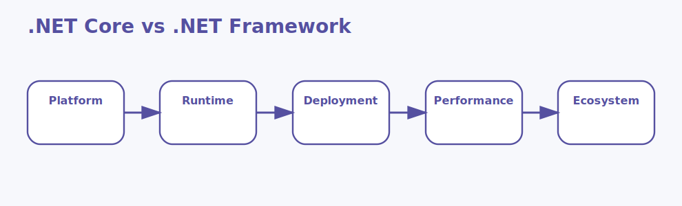

# .NET Core vs .NET Framework Interview Questions



This page focuses on comparison reasoning rather than treating the two platforms as interchangeable labels.

## 1. Platform support

### 1. What is the role of Platform support in .NET Core and .NET Framework comparison?

**Answer:**

In .NET Core and .NET Framework comparison, the term Platform support refers to the operating system reach
and runtime portability of each platform family. It is part of the foundation a candidate should be
able to explain clearly.

**Sample:**

```xml
<Project Sdk="Microsoft.NET.Sdk">
  <PropertyGroup>
    <TargetFramework>net8.0</TargetFramework>
    <Nullable>enable</Nullable>
  </PropertyGroup>
  <!-- Concept: 1. Platform support -->
</Project>
```

---

### 2. Why is the concept of Platform support important in .NET Core and .NET Framework comparison?

**Answer:**

This concept matters because it influences the operating system reach and runtime portability of
each platform family. Good interview answers connect it to clarity, maintainability, performance,
security, or delivery depending on the situation.

**Sample:**

```xml
<Project Sdk="Microsoft.NET.Sdk">
  <PropertyGroup>
    <TargetFramework>net8.0</TargetFramework>
    <Nullable>enable</Nullable>
  </PropertyGroup>
  <!-- Concept: 1. Platform support -->
</Project>
```

---

### 3. When should a team focus on Platform support?

**Answer:**

A team should focus on Platform support when the requirement depends on the operating system reach
and runtime portability of each platform family. It becomes especially important when design
decisions, scalability, or debugging depend on that area.

**Sample:**

```xml
<Project Sdk="Microsoft.NET.Sdk">
  <PropertyGroup>
    <TargetFramework>net8.0</TargetFramework>
    <Nullable>enable</Nullable>
  </PropertyGroup>
  <!-- Concept: 1. Platform support -->
</Project>
```

---

### 4. How is Platform support applied in practice?

**Answer:**

In practice, Platform support is applied by making the operating system reach and runtime
portability of each platform family explicit in the code, runtime setup, or delivery workflow. The
exact shape depends on the application, but the responsibility should stay predictable.

**Sample:**

```xml
<Project Sdk="Microsoft.NET.Sdk">
  <PropertyGroup>
    <TargetFramework>net8.0</TargetFramework>
    <Nullable>enable</Nullable>
  </PropertyGroup>
  <!-- Concept: 1. Platform support -->
</Project>
```

---

### 5. What strengths does Platform support bring?

**Answer:**

The strengths of Platform support are better structure, better communication, and better control
over the operating system reach and runtime portability of each platform family. It also makes
tradeoffs easier to explain to reviewers, interviewers, and teammates.

**Sample:**

```xml
<Project Sdk="Microsoft.NET.Sdk">
  <PropertyGroup>
    <TargetFramework>net8.0</TargetFramework>
    <Nullable>enable</Nullable>
  </PropertyGroup>
  <!-- Concept: 1. Platform support -->
</Project>
```

---

### 6. What tradeoffs come with Platform support?

**Answer:**

The main tradeoff is extra complexity if Platform support is introduced without a real need or a
clear understanding of the operating system reach and runtime portability of each platform family.
That usually leads to overengineering, hidden bugs, or confusing architecture.

**Sample:**

```xml
<Project Sdk="Microsoft.NET.Sdk">
  <PropertyGroup>
    <TargetFramework>net8.0</TargetFramework>
    <Nullable>enable</Nullable>
  </PropertyGroup>
  <!-- Concept: 1. Platform support -->
</Project>
```

---

### 7. How does Platform support differ from Runtime model?

**Answer:**

Platform support is centered on the operating system reach and runtime portability of each platform
family, while Runtime model is centered on the execution and hosting differences between the older
framework and the newer stack. They often work together, but they solve different parts of the
topic.

**Sample:**

```xml
<Project Sdk="Microsoft.NET.Sdk">
  <PropertyGroup>
    <TargetFramework>net8.0</TargetFramework>
    <Nullable>enable</Nullable>
  </PropertyGroup>
  <!-- Concept: 1. Platform support -->
</Project>
```

---

### 8. What is a good real-world example of Platform support?

**Answer:**

A strong example is explaining how Platform support affects a real feature, production issue,
migration, or architecture decision involving the operating system reach and runtime portability of
each platform family. Interviewers usually care more about the reasoning than the definition alone.

**Sample:**

```xml
<Project Sdk="Microsoft.NET.Sdk">
  <PropertyGroup>
    <TargetFramework>net8.0</TargetFramework>
    <Nullable>enable</Nullable>
  </PropertyGroup>
  <!-- Concept: 1. Platform support -->
</Project>
```

---

### 9. What is a best practice for Platform support?

**Answer:**

A good practice is to keep Platform support aligned with the actual requirement around the operating
system reach and runtime portability of each platform family. Teams should document intent, keep
implementation readable, and validate important paths early.

**Sample:**

```xml
<Project Sdk="Microsoft.NET.Sdk">
  <PropertyGroup>
    <TargetFramework>net8.0</TargetFramework>
    <Nullable>enable</Nullable>
  </PropertyGroup>
  <!-- Concept: 1. Platform support -->
</Project>
```

---

### 10. What is a common mistake around Platform support?

**Answer:**

A common mistake is naming Platform support without understanding how it affects the operating
system reach and runtime portability of each platform family. In real work, that usually appears as
weak design choices, poor debugging, or incomplete explanations.

**Sample:**

```xml
<Project Sdk="Microsoft.NET.Sdk">
  <PropertyGroup>
    <TargetFramework>net8.0</TargetFramework>
    <Nullable>enable</Nullable>
  </PropertyGroup>
  <!-- Concept: 1. Platform support -->
</Project>
```

---

### 11. How do you troubleshoot Platform support-related issues?

**Answer:**

When troubleshooting Platform support, first verify whether the operating system reach and runtime
portability of each platform family is behaving as expected. Then check surrounding dependencies,
configuration, logs, runtime behavior, and edge cases before changing the design.

**Sample:**

```xml
<Project Sdk="Microsoft.NET.Sdk">
  <PropertyGroup>
    <TargetFramework>net8.0</TargetFramework>
    <Nullable>enable</Nullable>
  </PropertyGroup>
  <!-- Concept: 1. Platform support -->
</Project>
```

---

### 12. How does Platform support connect to the rest of .NET Core and .NET Framework comparison?

**Answer:**

Platform support connects to the rest of .NET Core and .NET Framework comparison by giving structure
to the operating system reach and runtime portability of each platform family. It is one of the
pieces that turns isolated facts into a coherent end-to-end explanation.

**Sample:**

```xml
<Project Sdk="Microsoft.NET.Sdk">
  <PropertyGroup>
    <TargetFramework>net8.0</TargetFramework>
    <Nullable>enable</Nullable>
  </PropertyGroup>
  <!-- Concept: 1. Platform support -->
</Project>
```

---

## 2. Runtime model

### 13. What is the role of Runtime model in .NET Core and .NET Framework comparison?

**Answer:**

In .NET Core and .NET Framework comparison, the term Runtime model refers to the execution and hosting
differences between the older framework and the newer stack. It is part of the foundation a
candidate should be able to explain clearly.

**Sample:**

```xml
<Project Sdk="Microsoft.NET.Sdk">
  <PropertyGroup>
    <TargetFramework>net8.0</TargetFramework>
    <Nullable>enable</Nullable>
  </PropertyGroup>
  <!-- Concept: 2. Runtime model -->
</Project>
```

---

### 14. Why is the concept of Runtime model important in .NET Core and .NET Framework comparison?

**Answer:**

This concept matters because it influences the execution and hosting differences between the older
framework and the newer stack. Good interview answers connect it to clarity, maintainability,
performance, security, or delivery depending on the situation.

**Sample:**

```xml
<Project Sdk="Microsoft.NET.Sdk">
  <PropertyGroup>
    <TargetFramework>net8.0</TargetFramework>
    <Nullable>enable</Nullable>
  </PropertyGroup>
  <!-- Concept: 2. Runtime model -->
</Project>
```

---

### 15. When should a team focus on Runtime model?

**Answer:**

A team should focus on Runtime model when the requirement depends on the execution and hosting
differences between the older framework and the newer stack. It becomes especially important when
design decisions, scalability, or debugging depend on that area.

**Sample:**

```xml
<Project Sdk="Microsoft.NET.Sdk">
  <PropertyGroup>
    <TargetFramework>net8.0</TargetFramework>
    <Nullable>enable</Nullable>
  </PropertyGroup>
  <!-- Concept: 2. Runtime model -->
</Project>
```

---

### 16. How is Runtime model applied in practice?

**Answer:**

In practice, Runtime model is applied by making the execution and hosting differences between the
older framework and the newer stack explicit in the code, runtime setup, or delivery workflow. The
exact shape depends on the application, but the responsibility should stay predictable.

**Sample:**

```xml
<Project Sdk="Microsoft.NET.Sdk">
  <PropertyGroup>
    <TargetFramework>net8.0</TargetFramework>
    <Nullable>enable</Nullable>
  </PropertyGroup>
  <!-- Concept: 2. Runtime model -->
</Project>
```

---

### 17. What strengths does Runtime model bring?

**Answer:**

The strengths of Runtime model are better structure, better communication, and better control over
the execution and hosting differences between the older framework and the newer stack. It also makes
tradeoffs easier to explain to reviewers, interviewers, and teammates.

**Sample:**

```xml
<Project Sdk="Microsoft.NET.Sdk">
  <PropertyGroup>
    <TargetFramework>net8.0</TargetFramework>
    <Nullable>enable</Nullable>
  </PropertyGroup>
  <!-- Concept: 2. Runtime model -->
</Project>
```

---

### 18. What tradeoffs come with Runtime model?

**Answer:**

The main tradeoff is extra complexity if Runtime model is introduced without a real need or a clear
understanding of the execution and hosting differences between the older framework and the newer
stack. That usually leads to overengineering, hidden bugs, or confusing architecture.

**Sample:**

```xml
<Project Sdk="Microsoft.NET.Sdk">
  <PropertyGroup>
    <TargetFramework>net8.0</TargetFramework>
    <Nullable>enable</Nullable>
  </PropertyGroup>
  <!-- Concept: 2. Runtime model -->
</Project>
```

---

### 19. How does Runtime model differ from Deployment model?

**Answer:**

Runtime model is centered on the execution and hosting differences between the older framework and
the newer stack, while Deployment model is centered on the way applications are packaged and
delivered on each platform. They often work together, but they solve different parts of the topic.

**Sample:**

```xml
<Project Sdk="Microsoft.NET.Sdk">
  <PropertyGroup>
    <TargetFramework>net8.0</TargetFramework>
    <Nullable>enable</Nullable>
  </PropertyGroup>
  <!-- Concept: 2. Runtime model -->
</Project>
```

---

### 20. What is a good real-world example of Runtime model?

**Answer:**

A strong example is explaining how Runtime model affects a real feature, production issue,
migration, or architecture decision involving the execution and hosting differences between the
older framework and the newer stack. Interviewers usually care more about the reasoning than the
definition alone.

**Sample:**

```xml
<Project Sdk="Microsoft.NET.Sdk">
  <PropertyGroup>
    <TargetFramework>net8.0</TargetFramework>
    <Nullable>enable</Nullable>
  </PropertyGroup>
  <!-- Concept: 2. Runtime model -->
</Project>
```

---

### 21. What is a best practice for Runtime model?

**Answer:**

A good practice is to keep Runtime model aligned with the actual requirement around the execution
and hosting differences between the older framework and the newer stack. Teams should document
intent, keep implementation readable, and validate important paths early.

**Sample:**

```xml
<Project Sdk="Microsoft.NET.Sdk">
  <PropertyGroup>
    <TargetFramework>net8.0</TargetFramework>
    <Nullable>enable</Nullable>
  </PropertyGroup>
  <!-- Concept: 2. Runtime model -->
</Project>
```

---

### 22. What is a common mistake around Runtime model?

**Answer:**

A common mistake is naming Runtime model without understanding how it affects the execution and
hosting differences between the older framework and the newer stack. In real work, that usually
appears as weak design choices, poor debugging, or incomplete explanations.

**Sample:**

```xml
<Project Sdk="Microsoft.NET.Sdk">
  <PropertyGroup>
    <TargetFramework>net8.0</TargetFramework>
    <Nullable>enable</Nullable>
  </PropertyGroup>
  <!-- Concept: 2. Runtime model -->
</Project>
```

---

### 23. How do you troubleshoot Runtime model-related issues?

**Answer:**

When troubleshooting Runtime model, first verify whether the execution and hosting differences
between the older framework and the newer stack is behaving as expected. Then check surrounding
dependencies, configuration, logs, runtime behavior, and edge cases before changing the design.

**Sample:**

```xml
<Project Sdk="Microsoft.NET.Sdk">
  <PropertyGroup>
    <TargetFramework>net8.0</TargetFramework>
    <Nullable>enable</Nullable>
  </PropertyGroup>
  <!-- Concept: 2. Runtime model -->
</Project>
```

---

### 24. How does Runtime model connect to the rest of .NET Core and .NET Framework comparison?

**Answer:**

Runtime model connects to the rest of .NET Core and .NET Framework comparison by giving structure to
the execution and hosting differences between the older framework and the newer stack. It is one of
the pieces that turns isolated facts into a coherent end-to-end explanation.

**Sample:**

```xml
<Project Sdk="Microsoft.NET.Sdk">
  <PropertyGroup>
    <TargetFramework>net8.0</TargetFramework>
    <Nullable>enable</Nullable>
  </PropertyGroup>
  <!-- Concept: 2. Runtime model -->
</Project>
```

---

## 3. Deployment model

### 25. What is the role of Deployment model in .NET Core and .NET Framework comparison?

**Answer:**

In .NET Core and .NET Framework comparison, the term Deployment model refers to the way applications are
packaged and delivered on each platform. It is part of the foundation a candidate should be able to
explain clearly.

**Sample:**

```xml
<Project Sdk="Microsoft.NET.Sdk">
  <PropertyGroup>
    <TargetFramework>net8.0</TargetFramework>
    <Nullable>enable</Nullable>
  </PropertyGroup>
  <!-- Concept: 3. Deployment model -->
</Project>
```

---

### 26. Why is the concept of Deployment model important in .NET Core and .NET Framework comparison?

**Answer:**

This concept matters because it influences the way applications are packaged and delivered on
each platform. Good interview answers connect it to clarity, maintainability, performance, security,
or delivery depending on the situation.

**Sample:**

```xml
<Project Sdk="Microsoft.NET.Sdk">
  <PropertyGroup>
    <TargetFramework>net8.0</TargetFramework>
    <Nullable>enable</Nullable>
  </PropertyGroup>
  <!-- Concept: 3. Deployment model -->
</Project>
```

---

### 27. When should a team focus on Deployment model?

**Answer:**

A team should focus on Deployment model when the requirement depends on the way applications are
packaged and delivered on each platform. It becomes especially important when design decisions,
scalability, or debugging depend on that area.

**Sample:**

```xml
<Project Sdk="Microsoft.NET.Sdk">
  <PropertyGroup>
    <TargetFramework>net8.0</TargetFramework>
    <Nullable>enable</Nullable>
  </PropertyGroup>
  <!-- Concept: 3. Deployment model -->
</Project>
```

---

### 28. How is Deployment model applied in practice?

**Answer:**

In practice, Deployment model is applied by making the way applications are packaged and delivered
on each platform explicit in the code, runtime setup, or delivery workflow. The exact shape depends
on the application, but the responsibility should stay predictable.

**Sample:**

```xml
<Project Sdk="Microsoft.NET.Sdk">
  <PropertyGroup>
    <TargetFramework>net8.0</TargetFramework>
    <Nullable>enable</Nullable>
  </PropertyGroup>
  <!-- Concept: 3. Deployment model -->
</Project>
```

---

### 29. What strengths does Deployment model bring?

**Answer:**

The strengths of Deployment model are better structure, better communication, and better control
over the way applications are packaged and delivered on each platform. It also makes tradeoffs
easier to explain to reviewers, interviewers, and teammates.

**Sample:**

```xml
<Project Sdk="Microsoft.NET.Sdk">
  <PropertyGroup>
    <TargetFramework>net8.0</TargetFramework>
    <Nullable>enable</Nullable>
  </PropertyGroup>
  <!-- Concept: 3. Deployment model -->
</Project>
```

---

### 30. What tradeoffs come with Deployment model?

**Answer:**

The main tradeoff is extra complexity if Deployment model is introduced without a real need or a
clear understanding of the way applications are packaged and delivered on each platform. That
usually leads to overengineering, hidden bugs, or confusing architecture.

**Sample:**

```xml
<Project Sdk="Microsoft.NET.Sdk">
  <PropertyGroup>
    <TargetFramework>net8.0</TargetFramework>
    <Nullable>enable</Nullable>
  </PropertyGroup>
  <!-- Concept: 3. Deployment model -->
</Project>
```

---

### 31. How does Deployment model differ from Performance and memory?

**Answer:**

Deployment model is centered on the way applications are packaged and delivered on each platform,
while Performance and memory is centered on the efficiency profile and modern optimization
characteristics of the runtime. They often work together, but they solve different parts of the
topic.

**Sample:**

```xml
<Project Sdk="Microsoft.NET.Sdk">
  <PropertyGroup>
    <TargetFramework>net8.0</TargetFramework>
    <Nullable>enable</Nullable>
  </PropertyGroup>
  <!-- Concept: 3. Deployment model -->
</Project>
```

---

### 32. What is a good real-world example of Deployment model?

**Answer:**

A strong example is explaining how Deployment model affects a real feature, production issue,
migration, or architecture decision involving the way applications are packaged and delivered on
each platform. Interviewers usually care more about the reasoning than the definition alone.

**Sample:**

```xml
<Project Sdk="Microsoft.NET.Sdk">
  <PropertyGroup>
    <TargetFramework>net8.0</TargetFramework>
    <Nullable>enable</Nullable>
  </PropertyGroup>
  <!-- Concept: 3. Deployment model -->
</Project>
```

---

### 33. What is a best practice for Deployment model?

**Answer:**

A good practice is to keep Deployment model aligned with the actual requirement around the way
applications are packaged and delivered on each platform. Teams should document intent, keep
implementation readable, and validate important paths early.

**Sample:**

```xml
<Project Sdk="Microsoft.NET.Sdk">
  <PropertyGroup>
    <TargetFramework>net8.0</TargetFramework>
    <Nullable>enable</Nullable>
  </PropertyGroup>
  <!-- Concept: 3. Deployment model -->
</Project>
```

---

### 34. What is a common mistake around Deployment model?

**Answer:**

A common mistake is naming Deployment model without understanding how it affects the way
applications are packaged and delivered on each platform. In real work, that usually appears as weak
design choices, poor debugging, or incomplete explanations.

**Sample:**

```xml
<Project Sdk="Microsoft.NET.Sdk">
  <PropertyGroup>
    <TargetFramework>net8.0</TargetFramework>
    <Nullable>enable</Nullable>
  </PropertyGroup>
  <!-- Concept: 3. Deployment model -->
</Project>
```

---

### 35. How do you troubleshoot Deployment model-related issues?

**Answer:**

When troubleshooting Deployment model, first verify whether the way applications are packaged and
delivered on each platform is behaving as expected. Then check surrounding dependencies,
configuration, logs, runtime behavior, and edge cases before changing the design.

**Sample:**

```xml
<Project Sdk="Microsoft.NET.Sdk">
  <PropertyGroup>
    <TargetFramework>net8.0</TargetFramework>
    <Nullable>enable</Nullable>
  </PropertyGroup>
  <!-- Concept: 3. Deployment model -->
</Project>
```

---

### 36. How does Deployment model connect to the rest of .NET Core and .NET Framework comparison?

**Answer:**

Deployment model connects to the rest of .NET Core and .NET Framework comparison by giving structure
to the way applications are packaged and delivered on each platform. It is one of the pieces that
turns isolated facts into a coherent end-to-end explanation.

**Sample:**

```xml
<Project Sdk="Microsoft.NET.Sdk">
  <PropertyGroup>
    <TargetFramework>net8.0</TargetFramework>
    <Nullable>enable</Nullable>
  </PropertyGroup>
  <!-- Concept: 3. Deployment model -->
</Project>
```

---

## 4. Performance and memory

### 37. What is the role of Performance and memory in .NET Core and .NET Framework comparison?

**Answer:**

In .NET Core and .NET Framework comparison, the term Performance and memory refers to the efficiency profile
and modern optimization characteristics of the runtime. It is part of the foundation a candidate
should be able to explain clearly.

**Sample:**

```xml
<Project Sdk="Microsoft.NET.Sdk">
  <PropertyGroup>
    <TargetFramework>net8.0</TargetFramework>
    <Nullable>enable</Nullable>
  </PropertyGroup>
  <!-- Concept: 4. Performance and memory -->
</Project>
```

---

### 38. Why is the concept of Performance and memory important in .NET Core and .NET Framework comparison?

**Answer:**

This concept matters because it influences the efficiency profile and modern optimization
characteristics of the runtime. Good interview answers connect it to clarity, maintainability,
performance, security, or delivery depending on the situation.

**Sample:**

```xml
<Project Sdk="Microsoft.NET.Sdk">
  <PropertyGroup>
    <TargetFramework>net8.0</TargetFramework>
    <Nullable>enable</Nullable>
  </PropertyGroup>
  <!-- Concept: 4. Performance and memory -->
</Project>
```

---

### 39. When should a team focus on Performance and memory?

**Answer:**

A team should focus on Performance and memory when the requirement depends on the efficiency profile
and modern optimization characteristics of the runtime. It becomes especially important when design
decisions, scalability, or debugging depend on that area.

**Sample:**

```xml
<Project Sdk="Microsoft.NET.Sdk">
  <PropertyGroup>
    <TargetFramework>net8.0</TargetFramework>
    <Nullable>enable</Nullable>
  </PropertyGroup>
  <!-- Concept: 4. Performance and memory -->
</Project>
```

---

### 40. How is Performance and memory applied in practice?

**Answer:**

In practice, Performance and memory is applied by making the efficiency profile and modern
optimization characteristics of the runtime explicit in the code, runtime setup, or delivery
workflow. The exact shape depends on the application, but the responsibility should stay
predictable.

**Sample:**

```xml
<Project Sdk="Microsoft.NET.Sdk">
  <PropertyGroup>
    <TargetFramework>net8.0</TargetFramework>
    <Nullable>enable</Nullable>
  </PropertyGroup>
  <!-- Concept: 4. Performance and memory -->
</Project>
```

---

### 41. What strengths does Performance and memory bring?

**Answer:**

The strengths of Performance and memory are better structure, better communication, and better
control over the efficiency profile and modern optimization characteristics of the runtime. It also
makes tradeoffs easier to explain to reviewers, interviewers, and teammates.

**Sample:**

```xml
<Project Sdk="Microsoft.NET.Sdk">
  <PropertyGroup>
    <TargetFramework>net8.0</TargetFramework>
    <Nullable>enable</Nullable>
  </PropertyGroup>
  <!-- Concept: 4. Performance and memory -->
</Project>
```

---

### 42. What tradeoffs come with Performance and memory?

**Answer:**

The main tradeoff is extra complexity if Performance and memory is introduced without a real need or
a clear understanding of the efficiency profile and modern optimization characteristics of the
runtime. That usually leads to overengineering, hidden bugs, or confusing architecture.

**Sample:**

```xml
<Project Sdk="Microsoft.NET.Sdk">
  <PropertyGroup>
    <TargetFramework>net8.0</TargetFramework>
    <Nullable>enable</Nullable>
  </PropertyGroup>
  <!-- Concept: 4. Performance and memory -->
</Project>
```

---

### 43. How does Performance and memory differ from Web stack differences?

**Answer:**

Performance and memory is centered on the efficiency profile and modern optimization characteristics
of the runtime, while Web stack differences is centered on the differences between classic ASP.NET
and ASP.NET Core application models. They often work together, but they solve different parts of the
topic.

**Sample:**

```xml
<Project Sdk="Microsoft.NET.Sdk">
  <PropertyGroup>
    <TargetFramework>net8.0</TargetFramework>
    <Nullable>enable</Nullable>
  </PropertyGroup>
  <!-- Concept: 4. Performance and memory -->
</Project>
```

---

### 44. What is a good real-world example of Performance and memory?

**Answer:**

A strong example is explaining how Performance and memory affects a real feature, production issue,
migration, or architecture decision involving the efficiency profile and modern optimization
characteristics of the runtime. Interviewers usually care more about the reasoning than the
definition alone.

**Sample:**

```xml
<Project Sdk="Microsoft.NET.Sdk">
  <PropertyGroup>
    <TargetFramework>net8.0</TargetFramework>
    <Nullable>enable</Nullable>
  </PropertyGroup>
  <!-- Concept: 4. Performance and memory -->
</Project>
```

---

### 45. What is a best practice for Performance and memory?

**Answer:**

A good practice is to keep Performance and memory aligned with the actual requirement around the
efficiency profile and modern optimization characteristics of the runtime. Teams should document
intent, keep implementation readable, and validate important paths early.

**Sample:**

```xml
<Project Sdk="Microsoft.NET.Sdk">
  <PropertyGroup>
    <TargetFramework>net8.0</TargetFramework>
    <Nullable>enable</Nullable>
  </PropertyGroup>
  <!-- Concept: 4. Performance and memory -->
</Project>
```

---

### 46. What is a common mistake around Performance and memory?

**Answer:**

A common mistake is naming Performance and memory without understanding how it affects the
efficiency profile and modern optimization characteristics of the runtime. In real work, that
usually appears as weak design choices, poor debugging, or incomplete explanations.

**Sample:**

```xml
<Project Sdk="Microsoft.NET.Sdk">
  <PropertyGroup>
    <TargetFramework>net8.0</TargetFramework>
    <Nullable>enable</Nullable>
  </PropertyGroup>
  <!-- Concept: 4. Performance and memory -->
</Project>
```

---

### 47. How do you troubleshoot Performance and memory-related issues?

**Answer:**

When troubleshooting Performance and memory, first verify whether the efficiency profile and modern
optimization characteristics of the runtime is behaving as expected. Then check surrounding
dependencies, configuration, logs, runtime behavior, and edge cases before changing the design.

**Sample:**

```xml
<Project Sdk="Microsoft.NET.Sdk">
  <PropertyGroup>
    <TargetFramework>net8.0</TargetFramework>
    <Nullable>enable</Nullable>
  </PropertyGroup>
  <!-- Concept: 4. Performance and memory -->
</Project>
```

---

### 48. How does Performance and memory connect to the rest of .NET Core and .NET Framework comparison?

**Answer:**

Performance and memory connects to the rest of .NET Core and .NET Framework comparison by giving
structure to the efficiency profile and modern optimization characteristics of the runtime. It is
one of the pieces that turns isolated facts into a coherent end-to-end explanation.

**Sample:**

```xml
<Project Sdk="Microsoft.NET.Sdk">
  <PropertyGroup>
    <TargetFramework>net8.0</TargetFramework>
    <Nullable>enable</Nullable>
  </PropertyGroup>
  <!-- Concept: 4. Performance and memory -->
</Project>
```

---

## 5. Web stack differences

### 49. What is the role of Web stack differences in .NET Core and .NET Framework comparison?

**Answer:**

In .NET Core and .NET Framework comparison, the term Web stack differences refers to the differences between
classic ASP.NET and ASP.NET Core application models. It is part of the foundation a candidate should
be able to explain clearly.

**Sample:**

```xml
<Project Sdk="Microsoft.NET.Sdk">
  <PropertyGroup>
    <TargetFramework>net8.0</TargetFramework>
    <Nullable>enable</Nullable>
  </PropertyGroup>
  <!-- Concept: 5. Web stack differences -->
</Project>
```

---

### 50. Why is the concept of Web stack differences important in .NET Core and .NET Framework comparison?

**Answer:**

This concept matters because it influences the differences between classic ASP.NET and
ASP.NET Core application models. Good interview answers connect it to clarity, maintainability,
performance, security, or delivery depending on the situation.

**Sample:**

```xml
<Project Sdk="Microsoft.NET.Sdk">
  <PropertyGroup>
    <TargetFramework>net8.0</TargetFramework>
    <Nullable>enable</Nullable>
  </PropertyGroup>
  <!-- Concept: 5. Web stack differences -->
</Project>
```

---

### 51. When should a team focus on Web stack differences?

**Answer:**

A team should focus on Web stack differences when the requirement depends on the differences between
classic ASP.NET and ASP.NET Core application models. It becomes especially important when design
decisions, scalability, or debugging depend on that area.

**Sample:**

```xml
<Project Sdk="Microsoft.NET.Sdk">
  <PropertyGroup>
    <TargetFramework>net8.0</TargetFramework>
    <Nullable>enable</Nullable>
  </PropertyGroup>
  <!-- Concept: 5. Web stack differences -->
</Project>
```

---

### 52. How is Web stack differences applied in practice?

**Answer:**

In practice, Web stack differences is applied by making the differences between classic ASP.NET and
ASP.NET Core application models explicit in the code, runtime setup, or delivery workflow. The exact
shape depends on the application, but the responsibility should stay predictable.

**Sample:**

```xml
<Project Sdk="Microsoft.NET.Sdk">
  <PropertyGroup>
    <TargetFramework>net8.0</TargetFramework>
    <Nullable>enable</Nullable>
  </PropertyGroup>
  <!-- Concept: 5. Web stack differences -->
</Project>
```

---

### 53. What strengths does Web stack differences bring?

**Answer:**

The strengths of Web stack differences are better structure, better communication, and better
control over the differences between classic ASP.NET and ASP.NET Core application models. It also
makes tradeoffs easier to explain to reviewers, interviewers, and teammates.

**Sample:**

```xml
<Project Sdk="Microsoft.NET.Sdk">
  <PropertyGroup>
    <TargetFramework>net8.0</TargetFramework>
    <Nullable>enable</Nullable>
  </PropertyGroup>
  <!-- Concept: 5. Web stack differences -->
</Project>
```

---

### 54. What tradeoffs come with Web stack differences?

**Answer:**

The main tradeoff is extra complexity if Web stack differences is introduced without a real need or
a clear understanding of the differences between classic ASP.NET and ASP.NET Core application
models. That usually leads to overengineering, hidden bugs, or confusing architecture.

**Sample:**

```xml
<Project Sdk="Microsoft.NET.Sdk">
  <PropertyGroup>
    <TargetFramework>net8.0</TargetFramework>
    <Nullable>enable</Nullable>
  </PropertyGroup>
  <!-- Concept: 5. Web stack differences -->
</Project>
```

---

### 55. How does Web stack differences differ from API surface and libraries?

**Answer:**

Web stack differences is centered on the differences between classic ASP.NET and ASP.NET Core
application models, while API surface and libraries is centered on the framework capabilities and
compatibility story available on each platform. They often work together, but they solve different
parts of the topic.

**Sample:**

```xml
<Project Sdk="Microsoft.NET.Sdk">
  <PropertyGroup>
    <TargetFramework>net8.0</TargetFramework>
    <Nullable>enable</Nullable>
  </PropertyGroup>
  <!-- Concept: 5. Web stack differences -->
</Project>
```

---

### 56. What is a good real-world example of Web stack differences?

**Answer:**

A strong example is explaining how Web stack differences affects a real feature, production issue,
migration, or architecture decision involving the differences between classic ASP.NET and ASP.NET
Core application models. Interviewers usually care more about the reasoning than the definition
alone.

**Sample:**

```xml
<Project Sdk="Microsoft.NET.Sdk">
  <PropertyGroup>
    <TargetFramework>net8.0</TargetFramework>
    <Nullable>enable</Nullable>
  </PropertyGroup>
  <!-- Concept: 5. Web stack differences -->
</Project>
```

---

### 57. What is a best practice for Web stack differences?

**Answer:**

A good practice is to keep Web stack differences aligned with the actual requirement around the
differences between classic ASP.NET and ASP.NET Core application models. Teams should document
intent, keep implementation readable, and validate important paths early.

**Sample:**

```xml
<Project Sdk="Microsoft.NET.Sdk">
  <PropertyGroup>
    <TargetFramework>net8.0</TargetFramework>
    <Nullable>enable</Nullable>
  </PropertyGroup>
  <!-- Concept: 5. Web stack differences -->
</Project>
```

---

### 58. What is a common mistake around Web stack differences?

**Answer:**

A common mistake is naming Web stack differences without understanding how it affects the
differences between classic ASP.NET and ASP.NET Core application models. In real work, that usually
appears as weak design choices, poor debugging, or incomplete explanations.

**Sample:**

```xml
<Project Sdk="Microsoft.NET.Sdk">
  <PropertyGroup>
    <TargetFramework>net8.0</TargetFramework>
    <Nullable>enable</Nullable>
  </PropertyGroup>
  <!-- Concept: 5. Web stack differences -->
</Project>
```

---

### 59. How do you troubleshoot Web stack differences-related issues?

**Answer:**

When troubleshooting Web stack differences, first verify whether the differences between classic
ASP.NET and ASP.NET Core application models is behaving as expected. Then check surrounding
dependencies, configuration, logs, runtime behavior, and edge cases before changing the design.

**Sample:**

```xml
<Project Sdk="Microsoft.NET.Sdk">
  <PropertyGroup>
    <TargetFramework>net8.0</TargetFramework>
    <Nullable>enable</Nullable>
  </PropertyGroup>
  <!-- Concept: 5. Web stack differences -->
</Project>
```

---

### 60. How does Web stack differences connect to the rest of .NET Core and .NET Framework comparison?

**Answer:**

Web stack differences connects to the rest of .NET Core and .NET Framework comparison by giving
structure to the differences between classic ASP.NET and ASP.NET Core application models. It is one
of the pieces that turns isolated facts into a coherent end-to-end explanation.

**Sample:**

```xml
<Project Sdk="Microsoft.NET.Sdk">
  <PropertyGroup>
    <TargetFramework>net8.0</TargetFramework>
    <Nullable>enable</Nullable>
  </PropertyGroup>
  <!-- Concept: 5. Web stack differences -->
</Project>
```

---

## 6. API surface and libraries

### 61. What is the role of API surface and libraries in .NET Core and .NET Framework comparison?

**Answer:**

In .NET Core and .NET Framework comparison, the term API surface and libraries refers to the framework
capabilities and compatibility story available on each platform. It is part of the foundation a
candidate should be able to explain clearly.

**Sample:**

```xml
<Project Sdk="Microsoft.NET.Sdk">
  <PropertyGroup>
    <TargetFramework>net8.0</TargetFramework>
    <Nullable>enable</Nullable>
  </PropertyGroup>
  <!-- Concept: 6. API surface and libraries -->
</Project>
```

---

### 62. Why is the concept of API surface and libraries important in .NET Core and .NET Framework comparison?

**Answer:**

This concept matters because it influences the framework capabilities and compatibility
story available on each platform. Good interview answers connect it to clarity, maintainability,
performance, security, or delivery depending on the situation.

**Sample:**

```xml
<Project Sdk="Microsoft.NET.Sdk">
  <PropertyGroup>
    <TargetFramework>net8.0</TargetFramework>
    <Nullable>enable</Nullable>
  </PropertyGroup>
  <!-- Concept: 6. API surface and libraries -->
</Project>
```

---

### 63. When should a team focus on API surface and libraries?

**Answer:**

A team should focus on API surface and libraries when the requirement depends on the framework
capabilities and compatibility story available on each platform. It becomes especially important
when design decisions, scalability, or debugging depend on that area.

**Sample:**

```xml
<Project Sdk="Microsoft.NET.Sdk">
  <PropertyGroup>
    <TargetFramework>net8.0</TargetFramework>
    <Nullable>enable</Nullable>
  </PropertyGroup>
  <!-- Concept: 6. API surface and libraries -->
</Project>
```

---

### 64. How is API surface and libraries applied in practice?

**Answer:**

In practice, API surface and libraries is applied by making the framework capabilities and
compatibility story available on each platform explicit in the code, runtime setup, or delivery
workflow. The exact shape depends on the application, but the responsibility should stay
predictable.

**Sample:**

```xml
<Project Sdk="Microsoft.NET.Sdk">
  <PropertyGroup>
    <TargetFramework>net8.0</TargetFramework>
    <Nullable>enable</Nullable>
  </PropertyGroup>
  <!-- Concept: 6. API surface and libraries -->
</Project>
```

---

### 65. What strengths does API surface and libraries bring?

**Answer:**

The strengths of API surface and libraries are better structure, better communication, and better
control over the framework capabilities and compatibility story available on each platform. It also
makes tradeoffs easier to explain to reviewers, interviewers, and teammates.

**Sample:**

```xml
<Project Sdk="Microsoft.NET.Sdk">
  <PropertyGroup>
    <TargetFramework>net8.0</TargetFramework>
    <Nullable>enable</Nullable>
  </PropertyGroup>
  <!-- Concept: 6. API surface and libraries -->
</Project>
```

---

### 66. What tradeoffs come with API surface and libraries?

**Answer:**

The main tradeoff is extra complexity if API surface and libraries is introduced without a real need
or a clear understanding of the framework capabilities and compatibility story available on each
platform. That usually leads to overengineering, hidden bugs, or confusing architecture.

**Sample:**

```xml
<Project Sdk="Microsoft.NET.Sdk">
  <PropertyGroup>
    <TargetFramework>net8.0</TargetFramework>
    <Nullable>enable</Nullable>
  </PropertyGroup>
  <!-- Concept: 6. API surface and libraries -->
</Project>
```

---

### 67. How does API surface and libraries differ from Tooling and CLI?

**Answer:**

API surface and libraries is centered on the framework capabilities and compatibility story
available on each platform, while Tooling and CLI is centered on the developer workflow differences
created by modern command-line tooling and project systems. They often work together, but they solve
different parts of the topic.

**Sample:**

```xml
<Project Sdk="Microsoft.NET.Sdk">
  <PropertyGroup>
    <TargetFramework>net8.0</TargetFramework>
    <Nullable>enable</Nullable>
  </PropertyGroup>
  <!-- Concept: 6. API surface and libraries -->
</Project>
```

---

### 68. What is a good real-world example of API surface and libraries?

**Answer:**

A strong example is explaining how API surface and libraries affects a real feature, production
issue, migration, or architecture decision involving the framework capabilities and compatibility
story available on each platform. Interviewers usually care more about the reasoning than the
definition alone.

**Sample:**

```xml
<Project Sdk="Microsoft.NET.Sdk">
  <PropertyGroup>
    <TargetFramework>net8.0</TargetFramework>
    <Nullable>enable</Nullable>
  </PropertyGroup>
  <!-- Concept: 6. API surface and libraries -->
</Project>
```

---

### 69. What is a best practice for API surface and libraries?

**Answer:**

A good practice is to keep API surface and libraries aligned with the actual requirement around the
framework capabilities and compatibility story available on each platform. Teams should document
intent, keep implementation readable, and validate important paths early.

**Sample:**

```xml
<Project Sdk="Microsoft.NET.Sdk">
  <PropertyGroup>
    <TargetFramework>net8.0</TargetFramework>
    <Nullable>enable</Nullable>
  </PropertyGroup>
  <!-- Concept: 6. API surface and libraries -->
</Project>
```

---

### 70. What is a common mistake around API surface and libraries?

**Answer:**

A common mistake is naming API surface and libraries without understanding how it affects the
framework capabilities and compatibility story available on each platform. In real work, that
usually appears as weak design choices, poor debugging, or incomplete explanations.

**Sample:**

```xml
<Project Sdk="Microsoft.NET.Sdk">
  <PropertyGroup>
    <TargetFramework>net8.0</TargetFramework>
    <Nullable>enable</Nullable>
  </PropertyGroup>
  <!-- Concept: 6. API surface and libraries -->
</Project>
```

---

### 71. How do you troubleshoot API surface and libraries-related issues?

**Answer:**

When troubleshooting API surface and libraries, first verify whether the framework capabilities and
compatibility story available on each platform is behaving as expected. Then check surrounding
dependencies, configuration, logs, runtime behavior, and edge cases before changing the design.

**Sample:**

```xml
<Project Sdk="Microsoft.NET.Sdk">
  <PropertyGroup>
    <TargetFramework>net8.0</TargetFramework>
    <Nullable>enable</Nullable>
  </PropertyGroup>
  <!-- Concept: 6. API surface and libraries -->
</Project>
```

---

### 72. How does API surface and libraries connect to the rest of .NET Core and .NET Framework comparison?

**Answer:**

API surface and libraries connects to the rest of .NET Core and .NET Framework comparison by giving
structure to the framework capabilities and compatibility story available on each platform. It is
one of the pieces that turns isolated facts into a coherent end-to-end explanation.

**Sample:**

```xml
<Project Sdk="Microsoft.NET.Sdk">
  <PropertyGroup>
    <TargetFramework>net8.0</TargetFramework>
    <Nullable>enable</Nullable>
  </PropertyGroup>
  <!-- Concept: 6. API surface and libraries -->
</Project>
```

---

## 7. Tooling and CLI

### 73. What is the role of Tooling and CLI in .NET Core and .NET Framework comparison?

**Answer:**

In .NET Core and .NET Framework comparison, the term Tooling and CLI refers to the developer workflow
differences created by modern command-line tooling and project systems. It is part of the foundation
a candidate should be able to explain clearly.

**Sample:**

```xml
<Project Sdk="Microsoft.NET.Sdk">
  <PropertyGroup>
    <TargetFramework>net8.0</TargetFramework>
    <Nullable>enable</Nullable>
  </PropertyGroup>
  <!-- Concept: 7. Tooling and CLI -->
</Project>
```

---

### 74. Why is the concept of Tooling and CLI important in .NET Core and .NET Framework comparison?

**Answer:**

This concept matters because it influences the developer workflow differences created by modern
command-line tooling and project systems. Good interview answers connect it to clarity,
maintainability, performance, security, or delivery depending on the situation.

**Sample:**

```xml
<Project Sdk="Microsoft.NET.Sdk">
  <PropertyGroup>
    <TargetFramework>net8.0</TargetFramework>
    <Nullable>enable</Nullable>
  </PropertyGroup>
  <!-- Concept: 7. Tooling and CLI -->
</Project>
```

---

### 75. When should a team focus on Tooling and CLI?

**Answer:**

A team should focus on Tooling and CLI when the requirement depends on the developer workflow
differences created by modern command-line tooling and project systems. It becomes especially
important when design decisions, scalability, or debugging depend on that area.

**Sample:**

```xml
<Project Sdk="Microsoft.NET.Sdk">
  <PropertyGroup>
    <TargetFramework>net8.0</TargetFramework>
    <Nullable>enable</Nullable>
  </PropertyGroup>
  <!-- Concept: 7. Tooling and CLI -->
</Project>
```

---

### 76. How is Tooling and CLI applied in practice?

**Answer:**

In practice, Tooling and CLI is applied by making the developer workflow differences created by
modern command-line tooling and project systems explicit in the code, runtime setup, or delivery
workflow. The exact shape depends on the application, but the responsibility should stay
predictable.

**Sample:**

```xml
<Project Sdk="Microsoft.NET.Sdk">
  <PropertyGroup>
    <TargetFramework>net8.0</TargetFramework>
    <Nullable>enable</Nullable>
  </PropertyGroup>
  <!-- Concept: 7. Tooling and CLI -->
</Project>
```

---

### 77. What strengths does Tooling and CLI bring?

**Answer:**

The strengths of Tooling and CLI are better structure, better communication, and better control over
the developer workflow differences created by modern command-line tooling and project systems. It
also makes tradeoffs easier to explain to reviewers, interviewers, and teammates.

**Sample:**

```xml
<Project Sdk="Microsoft.NET.Sdk">
  <PropertyGroup>
    <TargetFramework>net8.0</TargetFramework>
    <Nullable>enable</Nullable>
  </PropertyGroup>
  <!-- Concept: 7. Tooling and CLI -->
</Project>
```

---

### 78. What tradeoffs come with Tooling and CLI?

**Answer:**

The main tradeoff is extra complexity if Tooling and CLI is introduced without a real need or a
clear understanding of the developer workflow differences created by modern command-line tooling and
project systems. That usually leads to overengineering, hidden bugs, or confusing architecture.

**Sample:**

```xml
<Project Sdk="Microsoft.NET.Sdk">
  <PropertyGroup>
    <TargetFramework>net8.0</TargetFramework>
    <Nullable>enable</Nullable>
  </PropertyGroup>
  <!-- Concept: 7. Tooling and CLI -->
</Project>
```

---

### 79. How does Tooling and CLI differ from Open source ecosystem?

**Answer:**

Tooling and CLI is centered on the developer workflow differences created by modern command-line
tooling and project systems, while Open source ecosystem is centered on the governance and community
model surrounding the modern .NET platform. They often work together, but they solve different parts
of the topic.

**Sample:**

```xml
<Project Sdk="Microsoft.NET.Sdk">
  <PropertyGroup>
    <TargetFramework>net8.0</TargetFramework>
    <Nullable>enable</Nullable>
  </PropertyGroup>
  <!-- Concept: 7. Tooling and CLI -->
</Project>
```

---

### 80. What is a good real-world example of Tooling and CLI?

**Answer:**

A strong example is explaining how Tooling and CLI affects a real feature, production issue,
migration, or architecture decision involving the developer workflow differences created by modern
command-line tooling and project systems. Interviewers usually care more about the reasoning than
the definition alone.

**Sample:**

```xml
<Project Sdk="Microsoft.NET.Sdk">
  <PropertyGroup>
    <TargetFramework>net8.0</TargetFramework>
    <Nullable>enable</Nullable>
  </PropertyGroup>
  <!-- Concept: 7. Tooling and CLI -->
</Project>
```

---

### 81. What is a best practice for Tooling and CLI?

**Answer:**

A good practice is to keep Tooling and CLI aligned with the actual requirement around the developer
workflow differences created by modern command-line tooling and project systems. Teams should
document intent, keep implementation readable, and validate important paths early.

**Sample:**

```xml
<Project Sdk="Microsoft.NET.Sdk">
  <PropertyGroup>
    <TargetFramework>net8.0</TargetFramework>
    <Nullable>enable</Nullable>
  </PropertyGroup>
  <!-- Concept: 7. Tooling and CLI -->
</Project>
```

---

### 82. What is a common mistake around Tooling and CLI?

**Answer:**

A common mistake is naming Tooling and CLI without understanding how it affects the developer
workflow differences created by modern command-line tooling and project systems. In real work, that
usually appears as weak design choices, poor debugging, or incomplete explanations.

**Sample:**

```xml
<Project Sdk="Microsoft.NET.Sdk">
  <PropertyGroup>
    <TargetFramework>net8.0</TargetFramework>
    <Nullable>enable</Nullable>
  </PropertyGroup>
  <!-- Concept: 7. Tooling and CLI -->
</Project>
```

---

### 83. How do you troubleshoot Tooling and CLI-related issues?

**Answer:**

When troubleshooting Tooling and CLI, first verify whether the developer workflow differences
created by modern command-line tooling and project systems is behaving as expected. Then check
surrounding dependencies, configuration, logs, runtime behavior, and edge cases before changing the
design.

**Sample:**

```xml
<Project Sdk="Microsoft.NET.Sdk">
  <PropertyGroup>
    <TargetFramework>net8.0</TargetFramework>
    <Nullable>enable</Nullable>
  </PropertyGroup>
  <!-- Concept: 7. Tooling and CLI -->
</Project>
```

---

### 84. How does Tooling and CLI connect to the rest of .NET Core and .NET Framework comparison?

**Answer:**

Tooling and CLI connects to the rest of .NET Core and .NET Framework comparison by giving structure
to the developer workflow differences created by modern command-line tooling and project systems. It
is one of the pieces that turns isolated facts into a coherent end-to-end explanation.

**Sample:**

```xml
<Project Sdk="Microsoft.NET.Sdk">
  <PropertyGroup>
    <TargetFramework>net8.0</TargetFramework>
    <Nullable>enable</Nullable>
  </PropertyGroup>
  <!-- Concept: 7. Tooling and CLI -->
</Project>
```

---

## 8. Open source ecosystem

### 85. What is the role of Open source ecosystem in .NET Core and .NET Framework comparison?

**Answer:**

In .NET Core and .NET Framework comparison, the term Open source ecosystem refers to the governance and
community model surrounding the modern .NET platform. It is part of the foundation a candidate
should be able to explain clearly.

**Sample:**

```xml
<Project Sdk="Microsoft.NET.Sdk">
  <PropertyGroup>
    <TargetFramework>net8.0</TargetFramework>
    <Nullable>enable</Nullable>
  </PropertyGroup>
  <!-- Concept: 8. Open source ecosystem -->
</Project>
```

---

### 86. Why is the concept of Open source ecosystem important in .NET Core and .NET Framework comparison?

**Answer:**

This concept matters because it influences the governance and community model surrounding
the modern .NET platform. Good interview answers connect it to clarity, maintainability,
performance, security, or delivery depending on the situation.

**Sample:**

```xml
<Project Sdk="Microsoft.NET.Sdk">
  <PropertyGroup>
    <TargetFramework>net8.0</TargetFramework>
    <Nullable>enable</Nullable>
  </PropertyGroup>
  <!-- Concept: 8. Open source ecosystem -->
</Project>
```

---

### 87. When should a team focus on Open source ecosystem?

**Answer:**

A team should focus on Open source ecosystem when the requirement depends on the governance and
community model surrounding the modern .NET platform. It becomes especially important when design
decisions, scalability, or debugging depend on that area.

**Sample:**

```xml
<Project Sdk="Microsoft.NET.Sdk">
  <PropertyGroup>
    <TargetFramework>net8.0</TargetFramework>
    <Nullable>enable</Nullable>
  </PropertyGroup>
  <!-- Concept: 8. Open source ecosystem -->
</Project>
```

---

### 88. How is Open source ecosystem applied in practice?

**Answer:**

In practice, Open source ecosystem is applied by making the governance and community model
surrounding the modern .NET platform explicit in the code, runtime setup, or delivery workflow. The
exact shape depends on the application, but the responsibility should stay predictable.

**Sample:**

```xml
<Project Sdk="Microsoft.NET.Sdk">
  <PropertyGroup>
    <TargetFramework>net8.0</TargetFramework>
    <Nullable>enable</Nullable>
  </PropertyGroup>
  <!-- Concept: 8. Open source ecosystem -->
</Project>
```

---

### 89. What strengths does Open source ecosystem bring?

**Answer:**

The strengths of Open source ecosystem are better structure, better communication, and better
control over the governance and community model surrounding the modern .NET platform. It also makes
tradeoffs easier to explain to reviewers, interviewers, and teammates.

**Sample:**

```xml
<Project Sdk="Microsoft.NET.Sdk">
  <PropertyGroup>
    <TargetFramework>net8.0</TargetFramework>
    <Nullable>enable</Nullable>
  </PropertyGroup>
  <!-- Concept: 8. Open source ecosystem -->
</Project>
```

---

### 90. What tradeoffs come with Open source ecosystem?

**Answer:**

The main tradeoff is extra complexity if Open source ecosystem is introduced without a real need or
a clear understanding of the governance and community model surrounding the modern .NET platform.
That usually leads to overengineering, hidden bugs, or confusing architecture.

**Sample:**

```xml
<Project Sdk="Microsoft.NET.Sdk">
  <PropertyGroup>
    <TargetFramework>net8.0</TargetFramework>
    <Nullable>enable</Nullable>
  </PropertyGroup>
  <!-- Concept: 8. Open source ecosystem -->
</Project>
```

---

### 91. How does Open source ecosystem differ from Containers and cloud readiness?

**Answer:**

Open source ecosystem is centered on the governance and community model surrounding the modern .NET
platform, while Containers and cloud readiness is centered on the suitability of each platform for
modern deployment patterns. They often work together, but they solve different parts of the topic.

**Sample:**

```xml
<Project Sdk="Microsoft.NET.Sdk">
  <PropertyGroup>
    <TargetFramework>net8.0</TargetFramework>
    <Nullable>enable</Nullable>
  </PropertyGroup>
  <!-- Concept: 8. Open source ecosystem -->
</Project>
```

---

### 92. What is a good real-world example of Open source ecosystem?

**Answer:**

A strong example is explaining how Open source ecosystem affects a real feature, production issue,
migration, or architecture decision involving the governance and community model surrounding the
modern .NET platform. Interviewers usually care more about the reasoning than the definition alone.

**Sample:**

```xml
<Project Sdk="Microsoft.NET.Sdk">
  <PropertyGroup>
    <TargetFramework>net8.0</TargetFramework>
    <Nullable>enable</Nullable>
  </PropertyGroup>
  <!-- Concept: 8. Open source ecosystem -->
</Project>
```

---

### 93. What is a best practice for Open source ecosystem?

**Answer:**

A good practice is to keep Open source ecosystem aligned with the actual requirement around the
governance and community model surrounding the modern .NET platform. Teams should document intent,
keep implementation readable, and validate important paths early.

**Sample:**

```xml
<Project Sdk="Microsoft.NET.Sdk">
  <PropertyGroup>
    <TargetFramework>net8.0</TargetFramework>
    <Nullable>enable</Nullable>
  </PropertyGroup>
  <!-- Concept: 8. Open source ecosystem -->
</Project>
```

---

### 94. What is a common mistake around Open source ecosystem?

**Answer:**

A common mistake is naming Open source ecosystem without understanding how it affects the governance
and community model surrounding the modern .NET platform. In real work, that usually appears as weak
design choices, poor debugging, or incomplete explanations.

**Sample:**

```xml
<Project Sdk="Microsoft.NET.Sdk">
  <PropertyGroup>
    <TargetFramework>net8.0</TargetFramework>
    <Nullable>enable</Nullable>
  </PropertyGroup>
  <!-- Concept: 8. Open source ecosystem -->
</Project>
```

---

### 95. How do you troubleshoot Open source ecosystem-related issues?

**Answer:**

When troubleshooting Open source ecosystem, first verify whether the governance and community model
surrounding the modern .NET platform is behaving as expected. Then check surrounding dependencies,
configuration, logs, runtime behavior, and edge cases before changing the design.

**Sample:**

```xml
<Project Sdk="Microsoft.NET.Sdk">
  <PropertyGroup>
    <TargetFramework>net8.0</TargetFramework>
    <Nullable>enable</Nullable>
  </PropertyGroup>
  <!-- Concept: 8. Open source ecosystem -->
</Project>
```

---

### 96. How does Open source ecosystem connect to the rest of .NET Core and .NET Framework comparison?

**Answer:**

Open source ecosystem connects to the rest of .NET Core and .NET Framework comparison by giving
structure to the governance and community model surrounding the modern .NET platform. It is one of
the pieces that turns isolated facts into a coherent end-to-end explanation.

**Sample:**

```xml
<Project Sdk="Microsoft.NET.Sdk">
  <PropertyGroup>
    <TargetFramework>net8.0</TargetFramework>
    <Nullable>enable</Nullable>
  </PropertyGroup>
  <!-- Concept: 8. Open source ecosystem -->
</Project>
```

---

## 9. Containers and cloud readiness

### 97. What is the role of Containers and cloud readiness in .NET Core and .NET Framework comparison?

**Answer:**

In .NET Core and .NET Framework comparison, the term Containers and cloud readiness refers to the suitability
of each platform for modern deployment patterns. It is part of the foundation a candidate should be
able to explain clearly.

**Sample:**

```xml
<Project Sdk="Microsoft.NET.Sdk">
  <PropertyGroup>
    <TargetFramework>net8.0</TargetFramework>
    <Nullable>enable</Nullable>
  </PropertyGroup>
  <!-- Concept: 9. Containers and cloud readiness -->
</Project>
```

---

### 98. Why is the concept of Containers and cloud readiness important in .NET Core and .NET Framework comparison?

**Answer:**

This concept matters because it influences the suitability of each platform for
modern deployment patterns. Good interview answers connect it to clarity, maintainability,
performance, security, or delivery depending on the situation.

**Sample:**

```xml
<Project Sdk="Microsoft.NET.Sdk">
  <PropertyGroup>
    <TargetFramework>net8.0</TargetFramework>
    <Nullable>enable</Nullable>
  </PropertyGroup>
  <!-- Concept: 9. Containers and cloud readiness -->
</Project>
```

---

### 99. When should a team focus on Containers and cloud readiness?

**Answer:**

A team should focus on Containers and cloud readiness when the requirement depends on the
suitability of each platform for modern deployment patterns. It becomes especially important when
design decisions, scalability, or debugging depend on that area.

**Sample:**

```xml
<Project Sdk="Microsoft.NET.Sdk">
  <PropertyGroup>
    <TargetFramework>net8.0</TargetFramework>
    <Nullable>enable</Nullable>
  </PropertyGroup>
  <!-- Concept: 9. Containers and cloud readiness -->
</Project>
```

---

### 100. How is Containers and cloud readiness applied in practice?

**Answer:**

In practice, Containers and cloud readiness is applied by making the suitability of each platform
for modern deployment patterns explicit in the code, runtime setup, or delivery workflow. The exact
shape depends on the application, but the responsibility should stay predictable.

**Sample:**

```xml
<Project Sdk="Microsoft.NET.Sdk">
  <PropertyGroup>
    <TargetFramework>net8.0</TargetFramework>
    <Nullable>enable</Nullable>
  </PropertyGroup>
  <!-- Concept: 9. Containers and cloud readiness -->
</Project>
```

---

### 101. What strengths does Containers and cloud readiness bring?

**Answer:**

The strengths of Containers and cloud readiness are better structure, better communication, and
better control over the suitability of each platform for modern deployment patterns. It also makes
tradeoffs easier to explain to reviewers, interviewers, and teammates.

**Sample:**

```xml
<Project Sdk="Microsoft.NET.Sdk">
  <PropertyGroup>
    <TargetFramework>net8.0</TargetFramework>
    <Nullable>enable</Nullable>
  </PropertyGroup>
  <!-- Concept: 9. Containers and cloud readiness -->
</Project>
```

---

### 102. What tradeoffs come with Containers and cloud readiness?

**Answer:**

The main tradeoff is extra complexity if Containers and cloud readiness is introduced without a real
need or a clear understanding of the suitability of each platform for modern deployment patterns.
That usually leads to overengineering, hidden bugs, or confusing architecture.

**Sample:**

```xml
<Project Sdk="Microsoft.NET.Sdk">
  <PropertyGroup>
    <TargetFramework>net8.0</TargetFramework>
    <Nullable>enable</Nullable>
  </PropertyGroup>
  <!-- Concept: 9. Containers and cloud readiness -->
</Project>
```

---

### 103. How does Containers and cloud readiness differ from Migration strategy?

**Answer:**

Containers and cloud readiness is centered on the suitability of each platform for modern deployment
patterns, while Migration strategy is centered on the reasoning used when moving an application from
.NET Framework to newer .NET. They often work together, but they solve different parts of the topic.

**Sample:**

```xml
<Project Sdk="Microsoft.NET.Sdk">
  <PropertyGroup>
    <TargetFramework>net8.0</TargetFramework>
    <Nullable>enable</Nullable>
  </PropertyGroup>
  <!-- Concept: 9. Containers and cloud readiness -->
</Project>
```

---

### 104. What is a good real-world example of Containers and cloud readiness?

**Answer:**

A strong example is explaining how Containers and cloud readiness affects a real feature, production
issue, migration, or architecture decision involving the suitability of each platform for modern
deployment patterns. Interviewers usually care more about the reasoning than the definition alone.

**Sample:**

```xml
<Project Sdk="Microsoft.NET.Sdk">
  <PropertyGroup>
    <TargetFramework>net8.0</TargetFramework>
    <Nullable>enable</Nullable>
  </PropertyGroup>
  <!-- Concept: 9. Containers and cloud readiness -->
</Project>
```

---

### 105. What is a best practice for Containers and cloud readiness?

**Answer:**

A good practice is to keep Containers and cloud readiness aligned with the actual requirement around
the suitability of each platform for modern deployment patterns. Teams should document intent, keep
implementation readable, and validate important paths early.

**Sample:**

```xml
<Project Sdk="Microsoft.NET.Sdk">
  <PropertyGroup>
    <TargetFramework>net8.0</TargetFramework>
    <Nullable>enable</Nullable>
  </PropertyGroup>
  <!-- Concept: 9. Containers and cloud readiness -->
</Project>
```

---

### 106. What is a common mistake around Containers and cloud readiness?

**Answer:**

A common mistake is naming Containers and cloud readiness without understanding how it affects the
suitability of each platform for modern deployment patterns. In real work, that usually appears as
weak design choices, poor debugging, or incomplete explanations.

**Sample:**

```xml
<Project Sdk="Microsoft.NET.Sdk">
  <PropertyGroup>
    <TargetFramework>net8.0</TargetFramework>
    <Nullable>enable</Nullable>
  </PropertyGroup>
  <!-- Concept: 9. Containers and cloud readiness -->
</Project>
```

---

### 107. How do you troubleshoot Containers and cloud readiness-related issues?

**Answer:**

When troubleshooting Containers and cloud readiness, first verify whether the suitability of each
platform for modern deployment patterns is behaving as expected. Then check surrounding
dependencies, configuration, logs, runtime behavior, and edge cases before changing the design.

**Sample:**

```xml
<Project Sdk="Microsoft.NET.Sdk">
  <PropertyGroup>
    <TargetFramework>net8.0</TargetFramework>
    <Nullable>enable</Nullable>
  </PropertyGroup>
  <!-- Concept: 9. Containers and cloud readiness -->
</Project>
```

---

### 108. How does Containers and cloud readiness connect to the rest of .NET Core and .NET Framework comparison?

**Answer:**

Containers and cloud readiness connects to the rest of .NET Core and .NET Framework comparison by
giving structure to the suitability of each platform for modern deployment patterns. It is one of
the pieces that turns isolated facts into a coherent end-to-end explanation.

**Sample:**

```xml
<Project Sdk="Microsoft.NET.Sdk">
  <PropertyGroup>
    <TargetFramework>net8.0</TargetFramework>
    <Nullable>enable</Nullable>
  </PropertyGroup>
  <!-- Concept: 9. Containers and cloud readiness -->
</Project>
```

---

## 10. Migration strategy

### 109. What is the role of Migration strategy in .NET Core and .NET Framework comparison?

**Answer:**

In .NET Core and .NET Framework comparison, the term Migration strategy refers to the reasoning used when
moving an application from .NET Framework to newer .NET. It is part of the foundation a candidate
should be able to explain clearly.

**Sample:**

```xml
<Project Sdk="Microsoft.NET.Sdk">
  <PropertyGroup>
    <TargetFramework>net8.0</TargetFramework>
    <Nullable>enable</Nullable>
  </PropertyGroup>
  <!-- Concept: 10. Migration strategy -->
</Project>
```

---

### 110. Why is the concept of Migration strategy important in .NET Core and .NET Framework comparison?

**Answer:**

This concept matters because it influences the reasoning used when moving an application from
.NET Framework to newer .NET. Good interview answers connect it to clarity, maintainability,
performance, security, or delivery depending on the situation.

**Sample:**

```xml
<Project Sdk="Microsoft.NET.Sdk">
  <PropertyGroup>
    <TargetFramework>net8.0</TargetFramework>
    <Nullable>enable</Nullable>
  </PropertyGroup>
  <!-- Concept: 10. Migration strategy -->
</Project>
```

---

### 111. When should a team focus on Migration strategy?

**Answer:**

A team should focus on Migration strategy when the requirement depends on the reasoning used when
moving an application from .NET Framework to newer .NET. It becomes especially important when design
decisions, scalability, or debugging depend on that area.

**Sample:**

```xml
<Project Sdk="Microsoft.NET.Sdk">
  <PropertyGroup>
    <TargetFramework>net8.0</TargetFramework>
    <Nullable>enable</Nullable>
  </PropertyGroup>
  <!-- Concept: 10. Migration strategy -->
</Project>
```

---

### 112. How is Migration strategy applied in practice?

**Answer:**

In practice, Migration strategy is applied by making the reasoning used when moving an application
from .NET Framework to newer .NET explicit in the code, runtime setup, or delivery workflow. The
exact shape depends on the application, but the responsibility should stay predictable.

**Sample:**

```xml
<Project Sdk="Microsoft.NET.Sdk">
  <PropertyGroup>
    <TargetFramework>net8.0</TargetFramework>
    <Nullable>enable</Nullable>
  </PropertyGroup>
  <!-- Concept: 10. Migration strategy -->
</Project>
```

---

### 113. What strengths does Migration strategy bring?

**Answer:**

The strengths of Migration strategy are better structure, better communication, and better control
over the reasoning used when moving an application from .NET Framework to newer .NET. It also makes
tradeoffs easier to explain to reviewers, interviewers, and teammates.

**Sample:**

```xml
<Project Sdk="Microsoft.NET.Sdk">
  <PropertyGroup>
    <TargetFramework>net8.0</TargetFramework>
    <Nullable>enable</Nullable>
  </PropertyGroup>
  <!-- Concept: 10. Migration strategy -->
</Project>
```

---

### 114. What tradeoffs come with Migration strategy?

**Answer:**

The main tradeoff is extra complexity if Migration strategy is introduced without a real need or a
clear understanding of the reasoning used when moving an application from .NET Framework to newer
.NET. That usually leads to overengineering, hidden bugs, or confusing architecture.

**Sample:**

```xml
<Project Sdk="Microsoft.NET.Sdk">
  <PropertyGroup>
    <TargetFramework>net8.0</TargetFramework>
    <Nullable>enable</Nullable>
  </PropertyGroup>
  <!-- Concept: 10. Migration strategy -->
</Project>
```

---

### 115. How does Migration strategy differ from Platform support?

**Answer:**

Migration strategy is centered on the reasoning used when moving an application from .NET Framework
to newer .NET, while Platform support is centered on the operating system reach and runtime
portability of each platform family. They often work together, but they solve different parts of the
topic.

**Sample:**

```xml
<Project Sdk="Microsoft.NET.Sdk">
  <PropertyGroup>
    <TargetFramework>net8.0</TargetFramework>
    <Nullable>enable</Nullable>
  </PropertyGroup>
  <!-- Concept: 10. Migration strategy -->
</Project>
```

---

### 116. What is a good real-world example of Migration strategy?

**Answer:**

A strong example is explaining how Migration strategy affects a real feature, production issue,
migration, or architecture decision involving the reasoning used when moving an application from
.NET Framework to newer .NET. Interviewers usually care more about the reasoning than the definition
alone.

**Sample:**

```xml
<Project Sdk="Microsoft.NET.Sdk">
  <PropertyGroup>
    <TargetFramework>net8.0</TargetFramework>
    <Nullable>enable</Nullable>
  </PropertyGroup>
  <!-- Concept: 10. Migration strategy -->
</Project>
```

---

### 117. What is a best practice for Migration strategy?

**Answer:**

A good practice is to keep Migration strategy aligned with the actual requirement around the
reasoning used when moving an application from .NET Framework to newer .NET. Teams should document
intent, keep implementation readable, and validate important paths early.

**Sample:**

```xml
<Project Sdk="Microsoft.NET.Sdk">
  <PropertyGroup>
    <TargetFramework>net8.0</TargetFramework>
    <Nullable>enable</Nullable>
  </PropertyGroup>
  <!-- Concept: 10. Migration strategy -->
</Project>
```

---

### 118. What is a common mistake around Migration strategy?

**Answer:**

A common mistake is naming Migration strategy without understanding how it affects the reasoning
used when moving an application from .NET Framework to newer .NET. In real work, that usually
appears as weak design choices, poor debugging, or incomplete explanations.

**Sample:**

```xml
<Project Sdk="Microsoft.NET.Sdk">
  <PropertyGroup>
    <TargetFramework>net8.0</TargetFramework>
    <Nullable>enable</Nullable>
  </PropertyGroup>
  <!-- Concept: 10. Migration strategy -->
</Project>
```

---

### 119. How do you troubleshoot Migration strategy-related issues?

**Answer:**

When troubleshooting Migration strategy, first verify whether the reasoning used when moving an
application from .NET Framework to newer .NET is behaving as expected. Then check surrounding
dependencies, configuration, logs, runtime behavior, and edge cases before changing the design.

**Sample:**

```xml
<Project Sdk="Microsoft.NET.Sdk">
  <PropertyGroup>
    <TargetFramework>net8.0</TargetFramework>
    <Nullable>enable</Nullable>
  </PropertyGroup>
  <!-- Concept: 10. Migration strategy -->
</Project>
```

---

### 120. How does Migration strategy connect to the rest of .NET Core and .NET Framework comparison?

**Answer:**

Migration strategy connects to the rest of .NET Core and .NET Framework comparison by giving
structure to the reasoning used when moving an application from .NET Framework to newer .NET. It is
one of the pieces that turns isolated facts into a coherent end-to-end explanation.

**Sample:**

```xml
<Project Sdk="Microsoft.NET.Sdk">
  <PropertyGroup>
    <TargetFramework>net8.0</TargetFramework>
    <Nullable>enable</Nullable>
  </PropertyGroup>
  <!-- Concept: 10. Migration strategy -->
</Project>
```
